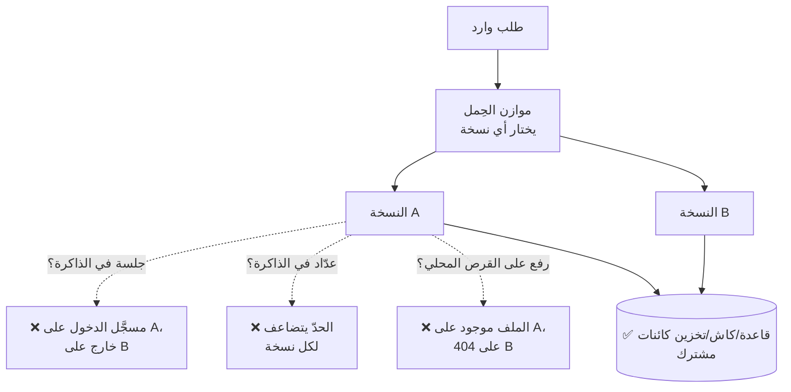
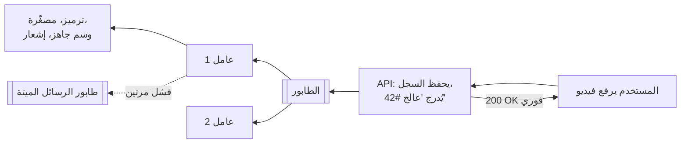
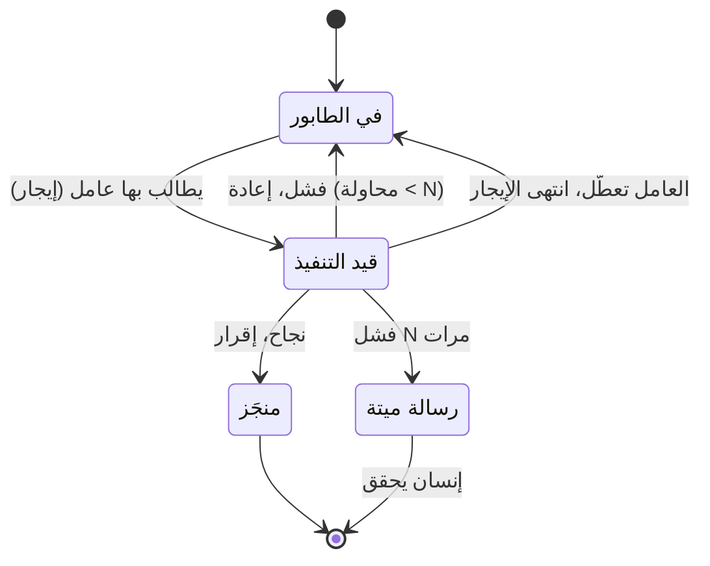
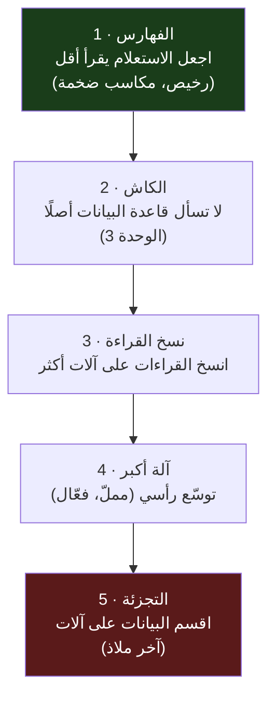
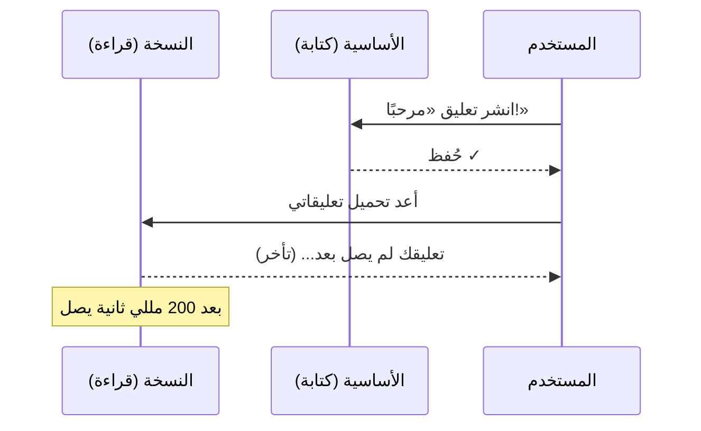
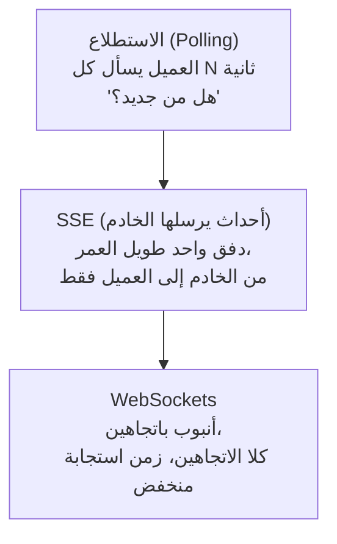

# الوحدة 10 — التوسّع بعد خادم واحد (Scaling Beyond One Server)

*خمسة دروس في قانون التوسّع (scaling) الكلاسيكي، مرويًّا بعدسة منتجٍ كبر — مع حوادث حقيقية
حيثما توفّرت لدينا. الخادم (server) الواحد مكانٌ ممتاز للبدء وسيّئٌ للبقاء. هذه الوحدة هي
الانتقال إلى الكثرة: خدماتٌ (services) لا تحتفظ بحالةٍ (state) خاصة بها، وعملٌ يجري لاحقًا بدل الآن،
وقاعدة بياناتٍ (database) تجاوزت آلةً واحدة (one machine)، واتصالاتٌ (connections) تبقى مفتوحة، والأرقام التي تخبرك أيَّ
هذه تحتاج فعلًا. المصطلحات معرّفة عند أول استخدام، وبقيتها في
[المسرد (Glossary)](../../GLOSSARY.ar.md).*

---

# 10.1 — الخدمات عديمة الحالة وموازنة الحِمل (Stateless Services and Load Balancing)

*الوحدة 10: التوسّع إلى ما بعد خادم واحد (Scaling Beyond One Server)*

---

## 🔥 قصة من الميدان (The War Story)

كان لدى سلف Relay محدِّد معدّل (Rate Limiter): لا أكثر من 100 طلب (requests) في الدقيقة من عنوان IP واحد. نجح في كل اختبار (test). كان يَعُدّ الطلبات في متغيّر (variable) بسيط داخل ذاكرة (memory) الخادم (server) — عدّاد (tally) صغير لكل عنوان، يزيد مع كل طلب، ويُقارَن بالرقم 100. بسيط وصحيح. على آلة واحدة (one machine).

ثم حدث أمران، في يومين مختلفين، وكسر كلٌّ منهما هذا العدّاد (counter) بهدوء.

أولًا، عنى أسبوع الإطلاق (launch) نشرًا (deploys) متكررًا — أحيانًا ست مرات في الساعة. وكل نشر (every deploy) يعيد تشغيل (restarts) الخادم (server)، وإعادة التشغيل (restarting) **تمحو ذلك العدّاد (counter) في الذاكرة (in-memory) إلى الصفر**. فالمسيء (abuser) الذي كان يُخنَق (throttled) عند 100 في الدقيقة كان يكفيه أن ينتظر النشر (deploy) التالي ليحصل على رصيد (budget) جديد. الحدّ الذي بدا «100 في الدقيقة» كان في الحقيقة «100 في الدقيقة، إلا إذا نشرنا، فحينها بلا حدود».

ثانيًا، نمت الحركة (traffic)، فشغّل الفريق نسخة (instance) *ثانية* من الـAPI لتقاسم الحِمل (load). الآن تحتفظ كل نسخة بعدّادها (its counter) **الخاص**. طلبات (requests) المهاجم (attacker) نفسه، موزّعةً على نسختين (instances)، تُحسب مرتين مستقلتين — فصار الحدّ الفعلي 200 في الدقيقة بصمت، ثم 300 حين ظهرت نسخة ثالثة. لم يغيّر أحد الرقم 100. الرقم فقط كفّ عن أن يعني شيئًا.

كان الإصلاح (بنيته في الدرس 5.2) نقلَ العدّاد (counter) *خارج* العملية (process) إلى تخزين مشترك (Redis). لكن الدرس الأعمق هو ما تدور عليه هذه الوحدة كلها: **أي حالة (state) تحفظها داخل العملية جدارٌ بينك وبين خادم ثانٍ (second server).** الجلسات (sessions)، والعدّادات (counters)، والملفات المرفوعة (uploaded files)، والكاش (caches)، و«من المتصل الآن» — لحظةَ أن تعتمد صحّة (correctness) منتجك على شيء يعيش في ذاكرة (memory) عملية *واحدة*، لا تستطيع ببساطة تشغيل اثنتين. انعدام الحالة (statelessness) هو ثمن التوسّع (scaling).

## 📐 المبدأ (The Principle)

### 1. «التوسّع رأسيًا (scaling up)» مقابل «التوسّع أفقيًا (scaling out)» — ولماذا يحتاج الأفقي (horizontal) إلى انعدام الحالة (statelessness)

هناك طريقتان لاستيعاب حِمل (load) أكبر:

| | التوسّع (scaling) **رأسيًا** (Vertical) | التوسّع (scaling) **أفقيًا** (Horizontal) |
|---|---|---|
| ما تفعله | آلة أكبر (معالج (CPU)/ذاكرة (memory) أكثر) | آلات (machines) أكثر بالحجم نفسه |
| السقف (ceiling) | أكبر صندوق يشتريه المال | لا سقف (ceiling) عمليًا |
| الفشل | صندوق واحد يتعطل = الكل يتعطل | صندوق يتعطل = البقية تكمل |
| يتطلب | لا شيء خاص | **نسخ تطبيق عديمة الحالة (stateless app instances)** |

التوسّع رأسيًا (scaling up) سهل ومملّ وينبغي فعله أولًا (يعود الدرس 10.3 إليه). لكن له سقفًا ونقطة فشل وحيدة (single point of failure). أما التوسّع (scaling) *أفقيًا (horizontal)* — نسخ متطابقة كثيرة — فلا سقف (ceiling) له ويصمد أمام تعطّل آلة واحدة (one machine). شرطه الصعب الوحيد: **كل نسخة (instance) يجب أن تكون قابلة للتبديل (interchangeable) بأخرى.** يجب أن يصل الطلب (request) إلى *أي* نسخة ويحصل على الجواب الصحيح. وهذا لا يمكن إلا إذا لم تتشارك النسخ (instances) شيئًا مهمًا.

خدم Stack Overflow جمهورًا ضمن أكبر 100 موقع لسنوات على نحو 9 خوادم ويب (web servers) (الدرس F.2) — قليلة، لكنها *قابلة للتبديل (interchangeable)*، خلف موازن حِمل (load balancer)، وكل الحالة (state) الحقيقية في قواعد بيانات (databases) وكاشات (caches) مشتركة. صغير ومملّ وأفقي.

### 2. الأنواع الثلاثة لحالة العملية التي تعضّك (The three kinds of process state that bite)

```mermaid
flowchart TD
    R["طلب وارد"] --> LB["موازن الحِمل<br/>يختار أي نسخة"]
    LB --> I1["النسخة A"]
    LB --> I2["النسخة B"]
    I1 -.->|"جلسة في الذاكرة؟"| X1["❌ مسجَّل الدخول على A،<br/>خارج على B"]
    I1 -.->|"عدّاد في الذاكرة؟"| X2["❌ الحدّ يتضاعف<br/>لكل نسخة"]
    I1 -.->|"رفع على القرص المحلي؟"| X3["❌ الملف موجود على A،<br/>404 على B"]
    I1 --> DB[("✅ قاعدة/كاش/تخزين كائنات<br/>مشترك")]
    I2 --> DB
```

- **الجلسات (sessions).** إن عاش «أنت مسجَّل الدخول (logged in)» في ذاكرة (memory) نسخة (instance) واحدة، فالطلب (request) التالي — الموجَّه إلى نسخة أخرى — يرى غريبًا. الحل: الجلسات في كوكي موقَّع (signed cookie) أو مخزن مشترك (shared store) (بنيته في الدرس 5.3).
- **العدّادات (counters) والكاشات (caches).** حدود المعدّل (rate limits)، وعدد المشاهدات (view counts)، والنتائج المخزّنة (cached results) — قصة الميدان. الحل: تخزين مشترك (Redis)، كما في 5.2 والوحدة 3.
- **رفع الملفات محليًا (local file uploads).** ملف حُفظ في `./uploads` على النسخة (instance) A لا يوجد على النسخة B. الحل: تخزين الكائنات (object storage) (الدرس 2.2) — كل نسخة تقرأ وتكتب في الحاوية (bucket) نفسها.

اختبار أي ميزة (feature): *«إن ذهب الطلب (request) التالي إلى نسخة (instance) مختلفة بدأت للتو، هل ما زالت الميزة تعمل؟»* إن كان الجواب لا، فقد وجدت حالة عملية (process state) عليك إزاحتها (evict).

### 3. موازن الحِمل (Load Balancer): L4 مقابل L7، والفحوص الصحية (health checks)

**موازن الحِمل (Load Balancer)** يجلس أمام نسخك (your instances) ويوزّع الطلبات (requests) عليها. نكهتان:

| | **L4** (طبقة النقل (transport)) | **L7** (طبقة التطبيق (application)) |
|---|---|---|
| يرى | عناوين IP والمنافذ (ports) فقط | HTTP كاملًا: المسار (path) والترويسات (headers) والكوكيز (cookies) |
| يوجّه بحسب | لا شيء خاص بالتطبيق | الرابط (URL)، المضيف (host)، الترويسة (header) — توجيه ذكي (smart routing) |
| السرعة | سريع جدًا، أعمى | أبطأ قليلًا، مفيد |
| مثال | AWS NLB، وسيط (proxy) TCP | nginx، AWS ALB، Cloudflare |

معظم منتجات الفايب كودينج (vibe-coded products) تريد **L7** — فهو يتحدث HTTP، فيستطيع توجيه (routing) `/api` إلى مجموعة (pool) وكل شيء آخر إلى أخرى، ويستطيع إجراء **فحوص صحية (Health Checks)**: يستفسر كل نسخة (مثلًا `GET /healthz`) كل بضع ثوانٍ، و*يتوقف عن إرسال الحركة (traffic) إلى أي نسخة تكفّ عن الرد.* هذا الفحص الصحي (health check) هو ما يحوّل «صندوق واحد تعطّل» من عطل (outage) إلى لا حدث. صمّم نقطة فحص (health endpoint) حقيقية — تتحقق من أن النسخة (instance) تصل إلى قاعدة بياناتها (its database)، لا أن العملية (process) حيّة فقط — لأن موازن الحِمل (Load Balancer) لا يعرف إلا ما يخبره به الفحص.

### 4. الجلسات اللاصقة (sticky sessions): المنعطف الخاطئ المغري (the tempting wrong turn)

حين تعيش الجلسات (sessions) في ذاكرة العملية (process memory)، يظهر اختصار مغرٍ: أخبر موازن الحِمل (Load Balancer) بأن **يرسل المستخدم (user) نفسه دائمًا إلى النسخة (instance) نفسها** («الجلسات اللاصقة (sticky sessions)» / Sticky Sessions). إنه يستر المشكلة — ويصنع أسوأ منها:

- **حِمل غير متوازن (uneven load).** نسخة (instance) واحدة تأخذ كل المستخدمين (users) الثقال؛ ولا يستطيع الموازن (balancer) إعادة التوزيع (rebalance).
- **النشر (deploy) يُخرج الجميع.** تعاد تلك النسخة (instance)، فتختفي كل جلساتها (its sessions).
- **لا تجاوز للفشل (failover).** تتعطل النسخة (instance)، فيَعلَق *مستخدموها* بلا إعادة توزيع.

اللصقُ (stickiness) يعالج العَرَض (symptom) (حالة (state) في العملية (process)) بدل الداء. والعلاج أن تجعل النسخ (instances) عديمة الحالة (stateless) كي تستطيع *أيّها* خدمة *أي* طلب (request) — فلا تحتاج إلى اللصق أبدًا. لا تلجأ إليه إلا حين يتطلبه بروتوكول (protocol) فعلًا (بعض إعدادات (settings) websocket، الدرس 10.4)، وحينها اعرف ما الذي تفرّط فيه.

## 🎛️ وجّه وكيلك (Direct Your Agent)

ستشغّل نسختين (two instances) من الـAPI لـRelay خلف موازن حِمل (load balancer)، وتصطاد كل قطعة حالة (state) عملية (process) وتزيحها — حتى تستطيع أي نسخة (instance) خدمة أي طلب (serve any request).

1. **أقِم نسختين خلف موازن (Stand up two instances behind a balancer).**
   > *«شغّل نسختين (two instances) من API لـRelay على منفذين (ports) مختلفين وضع موازن حِمل (nginx أو Caddy) أمامهما يوزّع الطلبات (requests) على الاثنتين. أرني إعداد (config) الموازن (balancer) وأثبت أن الطلبات تصل إلى النسختين (both instances).»*
2. **جِد الحالة (Find the state).**
   > *«افحص الـAPI بحثًا عن أي شيء مخزَّن في ذاكرة العملية (process memory) قد يعتمد عليه طلب: الجلسات (sessions)، عدّادات حدود المعدّل (rate-limit counters)، الكاشات (caches) في الذاكرة (in memory)، الملفات المرفوعة محليًا (locally saved uploads)، أي شيء على القرص المحلي (local disk). اسرد كلًّا مع الملف والسطر، وقل ما الذي ينكسر حين يصل الطلب (request) إلى النسخة (instance) الأخرى.»*
3. **اكسرها عمدًا لتصدّق (Break it on purpose, so you believe it).**
   > *«سجّل دخولي، ثم أرسل طلبي التالي إلى النسخة (instance) الأخرى وأرني هل ما زلت مسجَّل الدخول. ثم ارفع ملفًا إلى نسخة وحاول جلبه من الأخرى.»*
   شاهد شيئًا واحدًا على الأقل يفشل. ذلك الفشل هو الدرس كله مجسَّدًا.
4. **أزِح الحالة (Evict the state).**
   > *«انقل كل عنصر وجدته إلى تخزين مشترك (shared storage): الجلسات (sessions) إلى كوكي موقَّع (signed cookie) أو Redis، العدّادات (counters) إلى Redis، الرفع (uploads) إلى تخزين الكائنات (object storage). أعد الاختبارات (tests) نفسها وأرني أن النسختين (both instances) تتصرفان الآن بطريقة متطابقة.»*
5. **أضف فحصًا صحيًا حقيقيًا (Add a real health check).**
   > *«أضف نقطة (endpoint) `/healthz` تعيد 200 فقط إن كانت النسخة (instance) تصل إلى قاعدة البيانات (database)، واضبط الموازن (balancer) على تصريف (drain) أي نسخة تفشل فيه. ثم اقتل نسخة أثناء الحركة (traffic) وأرني صفر طلبات (requests) فاشلة.»*
6. **اكتب الذاكرة (Write the memory).** أضف إلى CLAUDE.md:
   > *«نسخ (instances) API لـRelay يجب أن تكون عديمة الحالة (stateless) وقابلة للتبديل (interchangeable). لا يجوز أن يعيش أي شيء يعتمد عليه طلب في ذاكرة العملية (process memory) أو القرص المحلي (local disk) — الجلسات (sessions) والعدّادات (counters) والكاشات (caches) والرفع (uploads) كلها تذهب إلى تخزين مشترك (shared storage). قبل إضافة أي حالة (state) لكل طلب، أجب: هل تصمد إن وصل الطلب (request) إلى نسخة ثانية (second instance) بدأت للتو؟»*

الختام (Finish): *«أودع برسالة (Commit with the message) `10-1-stateless-services`.»*

> 🔧 **تحت الغطاء (Under the hood)** (اختياري (optional)): الموازن (balancer) كتلة `upstream` في nginx بسطرَي `server` و`health_check` (أو `reverse_proxy` في Caddy مع `lb_policy` + `health_uri`). وعرض «اقتل نسخة (instance)» هو `kill` على عملية (process) واحدة بينما تعمل حلقة (loop) صغيرة (`while true; do curl -s .../healthz; done`) — ينبغي أن ترى الحركة (traffic) تنزاح لا أن تسقط.

## ✅ تحقق منه (Verify It)

- [ ] تعمل نسختان خلف موازن (balancer) واحد وشاهدت الطلبات (requests) تصل إلى الاثنتين.
- [ ] رأيت حالة العملية (process state) تنكسر عبر النسخ (instances) *قبل* الإصلاح — مسجَّل دخول على واحدة، غريب على الأخرى، أو رفع (upload) يعيد 404 على الشقيقة.
- [ ] بعد الإزاحة (eviction)، تتصرف النسختان بطريقة متطابقة للطلب (request) نفسه.
- [ ] قتلت نسخة (instance) تحت حركة (traffic) حيّة، والفحص الصحي (health check) صرّفها (drained it) بصفر طلبات (requests) فاشلة.
- [ ] تعيد رواية قصة عدّاد حدّ المعدّل (rate-limit counter) وتسمّي طريقتَي كسره لها (يُعاد تعيينه عند النشر (deploy)؛ يتضاعف عبر النسخ (instances)).

## 🧾 بطاقة الخلاصة (Recap card)

- التوسّع أفقيًا (scaling out) يعني نسخًا (instances) كثيرة قابلة للتبديل (interchangeable)؛ وثمن الدخول انعدام الحالة (statelessness).
- الجلسات (sessions) والعدّادات (counters) والرفع المحلي (local uploads) هي فخاخ حالة العملية (process state) الثلاثة — انقلها كلها إلى تخزين مشترك (shared storage).
- اختبار أي ميزة (the test for any feature): هل تصمد إن وصل الطلب (request) التالي إلى نسخة ثانية (second instance) جديدة؟
- فضّل موازن (balancer) L7 بفحص صحي (with a health check) حقيقي (يتحقق من قاعدة البيانات (database)، لا من «العملية (process) حيّة» فقط).
- الجلسات اللاصقة (sticky sessions) تعالج العَرَض؛ اجعل النسخ (instances) عديمة الحالة (stateless) فلا تحتاج إليها أبدًا.

## 📚 المراجع ومزيد من القراءة (References & further wandering)

- The System Design Primer (مفتوح المصدر (open source)) — قسما **«موازن الحِمل (Load Balancer)»** و**«طبقة التطبيق (application layer)»**؛ الخريطة التي يكبّرها هذا الدرس.
- نيك كرافر: **«معمارية (Architecture) Stack Overflow»** (nickcraver.com) — موقع ضمن أكبر 100 على حفنة خوادم (servers) قابلة للتبديل (interchangeable)، بشكل صحيح.
- كتاب Google SRE (Google SRE book): **«موازنة الحِمل عند الواجهة (Load Balancing at the Frontend)»** (sre.google/books) — الفحوص الصحية وتوجيه الحركة (traffic steering) بصورة صناعية.
- وثائق (docs) nginx: **«استخدام nginx موازنَ حِمل (load balancer) لـHTTP»** — آليات `upstream` + `health_check` بالضبط.
- The Twelve-Factor App، العامل السادس (factor VI) **«العمليات (Processes)»** (12factor.net) — «نفّذ التطبيق كعملية (process) أو أكثر عديمة الحالة (stateless)»، مذكورًا كقانون.

*الحوادث المصدرية (source incidents): [بنك الحوادث (incident bank) — الأمان والإساءة والمصادقة (auth)](../../war-stories/incident-bank.md) · [الحالات الشهيرة (famous cases)](../../war-stories/famous-cases.md)*

---

# 10.2 — الطوابير والعمل غير المتزامن (Queues and Asynchronous Work)

*الوحدة 10: التوسّع (scaling) إلى ما بعد خادم (server) واحد*

---

## 🔥 قصة من الميدان (The War Story)

كان سلف Relay يرسل إشعارات دفع (push notifications) على جدول (schedule) — دفعة (blast) «محتوى جديد من مبدعين تتابعهم» كل مساء. بدت المهمة (job) منجَزة: تعمل، وترسل، ويصل الإشعار (notification) للمستخدمين (users). ثم حان أجل ديون الإهمال، دفعةً واحدة، في تدقيق (audit).

لم يكن للمهمة (job) **قفل (lock)**. فإن أُطلقت مرتين — إعادة محاولة (retry)، تداخل (overlap)، خادم ثانٍ (second server) يشغّل cron أيضًا — أرسلت الدفعة كلها *مرتين*. وصلت للمستخدمين (users) إشعارات (notifications) مكررة؛ ولم يستطع أحد أن يعرف، لأن المهمة لم تترك **سجل تدقيق (audit record)** بما أرسلت. ولم تتحقق قط من **إيصالات (receipts)** التسليم (delivery)، فحين فشلت الإرسالات بصمت كان ذلك غير مرئي أيضًا. وظهر الشكل نفسه في مُرسل النشرة (newsletter sender) (إزالة تكرار (dedup) غير ذرّية (non-atomic) — قد تراسل الشخص نفسه مرتين) وفي طابور معالجة الوسائط (media render queue) (لا إيجار (lease)، فمهمة تعطّلت في منتصف المعالجة بقيت «قيد التنفيذ» للأبد وسدّت البقية).

ثلاث ميزات (features) مختلفة، وسبب جذري (root cause) واحد: **عملٌ كان ينبغي أن يكون طابورًا (queue) صُنع يدويًا بأسلوب أطلِق وانسَ (fire-and-forget).** و«أطلِق وانسَ» نموذج ذهني (mental model) خاطئ تمامًا — لأن *النسيان* هو ما يفعله. ينسى هل جرى العمل، وهل جرى مرتين، وهل نجح.

كان الإصلاح طابورًا حقيقيًا بثلاث خصائص افتقرت إليها النسخة اليدوية (hand-rolled version): مطالبة (Claim) كي تجري المهمة (job) مرة واحدة، وأثر تدقيق (audit trail) كي تعرف ما حدث، ومطابقة إيصالات (receipt reconciliation) كي تظهر الإخفاقات الصامتة (بنيت نسخة المهمة الواحدة من هذا في الدرس 7.4). وهذا الدرس هو ذلك الإصلاح معمَّمًا — **الطابور (queue) هو الشكل الصحيح لأي عمل لا ينبغي أن يفعله الطلب (request) بنفسه.**

## 📐 المبدأ (The Principle)

### 1. متى لا ينبغي للطلب أن يفعل العمل (When a request shouldn't do the work)

ينبغي لطلب (request) الويب أن يفعل *الحد الأدنى* ليجيب المستخدم (user)، ثم يتنحّى. وبعض العمل لا يخصّ تلك النافذة:

| افعله في الطلب (request) | ادفعه إلى طابور (queue) |
|---|---|
| قراءة موجز (feed) المستخدم (user) | ترميز (transcode) الفيديو المرفوع |
| حفظ تعليق (comment) | إرسال 10,000 بريد إشعار (notification emails) |
| التحقق من تسجيل | توليد تقرير (report) شهري |
| خصم بطاقة (charge a card) (المستخدم (user) منتظر) | تغيير حجم الصور (resize images)، تسخين الكاش (warm caches)، مزامنة البحث (sync search) |

القاعدة التقريبية: إن كان العمل **بطيئًا، أو دفقيًا (bursty)، أو لا يحتاج المستخدم (user) نتيجته ليكمل**، فلا يجب أن يحجب الاستجابة (response). اجعل الطلب (request) *يسجّل النية (record the intent)* — «هذا الفيديو يحتاج معالجة» — ويسلّمها إلى طابور (queue). أجب المستخدم في أجزاء من الثانية؛ ودَع العمل البطيء يجري خلف الكواليس.

```mermaid
flowchart RL
    U["المستخدم يرفع فيديو"] --> API["API: يحفظ السجل،<br/>يُدرج 'عالج #42'"]
    API -->|"200 OK فوري"| U
    API --> Q[["الطابور"]]
    Q --> W1["عامل 1"]
    Q --> W2["عامل 2"]
    W1 --> DONE["ترميز، مصغّرة،<br/>وسم جاهز، إشعار"]
    W1 -.->|"فشل مرتين"| DLQ[["طابور الرسائل الميتة"]]
```

**الطابور (Queue)** قائمة مهام دائمة. و**العمّال (Workers)** عمليات (processes) منفصلة تسحب المهام (jobs) منه وتنفّذها. يتوسّع (scale) الـAPI والعمّال *باستقلال* — فيضان (flood) الرفع (uploads) يطيل الطابور بدل أن يُذيب الـAPI، وتضيف عمّالًا لتصريفه (drain) أسرع.

> 🔧 **إضافة المهمة (job) إلى الطابور (enqueue) هي نفسها مفصل كتابة مزدوجة (dual-write seam).** انظر مجددًا إلى خطوة «احفظ السجل، ثم أضف إلى الطابور» البريئة: إنها تكتب إلى *نظامين*، هما قاعدة البيانات (database) والطابور. فإذا نجح إيداع (commit) قاعدة البيانات ثم فشلت الإضافة إلى الطابور (ومضة في الطابور، أو تعطّل العملية (process) بينهما)، تكون قد فقدت المهمة دون أي خطأ يراه المستخدم (user) — وهذا بالضبط فخّ التباعد الصامت (silent divergence) من الدرس 2.6. حلّان متينان: **صندوق الصادر المعامَلاتي (Transactional Outbox)** — اكتب المهمة في صف (row) `outbox` *ضمن معاملة (transaction) قاعدة البيانات نفسها* التي تحفظ السجل، ثم يقرأ ناقلٌ (relay) منفصل ذلك الجدول (table) ويدفعه إلى الطابور (والكتابة ذرّية (atomic) لأنها معاملة واحدة)؛ أو **مسح المصالحة (Reconciliation)** — امسح دوريًا السجلات التي في حالة (state) «معلّقة (pending)» بلا مهمة مكتملة مقابلة وأعد إضافتها إلى الطابور. وفي الحالتين (in both cases) المبدأ نفسه (the same principle) المتكرر في هذه الدورة: *اجعل الكتابتين واحدة، أو ابنِ شيئًا يلاحظ حين تتباعدان.*

### 2. التسليم مرة واحدة على الأقل (at-least-once delivery): فيجب أن يكون المستهلك (consumer) خاملًا للتكرار (idempotent)

هذه هي الحقيقة التي تفاجئ الجميع. يَعِد الطابور (queue) الدائم بتسليم (delivery) مهمتك (your job) **مرة واحدة على الأقل (at least once)** — لكن تحت الفشل (يتعطل عامل بعد أداء العمل وقبل الإقرار (acknowledging) به) قد تُسلَّم **أكثر من مرة (more than once)**. يعيد الطابور التسليم (re-delivers) لأنه لا يميّز «تعطّل قبل الفعل» عن «تعطّل بعد الفعل وقبل قول ذلك».

فينتقل العبء إليك: **كل مهمة (job) يجب أن تكون آمنة للتشغيل مرتين.** تسمّى هذه الخاصية *الخمول للتكرار (idempotency) / Idempotency* (قابلتها في الدرسين 2.6 و6.7). ترسل بريدًا؟ سجّل «أُرسل الإشعار (notification) #42 للمستخدم (user) #7» ذرّيًا (atomically) وتحقق منه أولًا (check it first)، فتصبح إعادة التسليم (re-delivery) بلا أثر. تخصم بطاقة؟ استعمل مفتاح خمول (idempotency key) كي تعيد المحاولة (attempt) الثانية نتيجة الأولى بدل الخصم من جديد.

> **التسليم مرة واحدة بالضبط (exactly-once) كذبة.** لا يمكنك شراؤه من الشبكة. لكن ما *يمكنك* بناؤه هو تسليم (delivery) مرة واحدة على الأقل (at least once) + مستهلكون خاملون للتكرار (idempotent consumers)، وهذا ينتج *أثرًا (effect)* يحدث مرة واحدة بالضبط (exactly once) — وهو كل ما أردته فعلًا. أي نظام يدّعي «مرة واحدة بالضبط» يفعل هذا في الخفاء، وإلا فهو خاطئ.

### 3. الضغط العكسي (backpressure) وطوابير الرسائل الميتة (dead-letter queues)

خاصيتان أخريان تفصلان الطابور (queue) الحقيقي عن اللعبة:

- **الضغط العكسي (Backpressure).** حين يصل العمل أسرع مما يصرّفه العمّال (workers)، ينمو الطابور (queue). وهذا *جيد* — فهو مخزن مؤقت (buffer) يمتص الدفعات (bursts) التي كانت ستُعطّل (would take down) الـAPI. لكن الطابور غير المحدود (unbounded) عطلٌ (outage) بطيء الحركة (تمتلئ الذاكرة (memory) أو القرص (disk)). ضع حدودًا وراقب *عمق (depth)* الطابور مقياسًا (metric) من الدرجة الأولى (first-class): تراكم (backlog) متنامٍ هو أبكر إنذار (alert) ممكن بأنك تحت التجهيز (under-provisioned). هذه النسخة المضاءة من عصر «الحوت الفاشل (fail whale)» في تويتر (2007–2012) — بنية أحادية (monolith) تنهار تحت النجاح، لم تُتقاعَد إلا حين نقل الفريق العمل البطيء إلى طوابير (queues) وفصل الخدمات (services).

- **طابور الرسائل الميتة (Dead-letter Queue / DLQ).** مهمة (job) تفشل باستمرار يجب ألا تعيد المحاولة (attempt) للأبد فتسدّ الصف (علة (bug) العَلَق الأبدي في طابور (queue) المعالجة). بعد N محاولات (attempts)، انقلها إلى **طابور رسائل ميتة (dead-letter queue)** — مسار جانبي للمهام السامة (poison jobs) — وأطلق إنذارًا (alert). الـDLQ حيث تنظر حين يعطب شيء، ويمنع مهمة سيئة واحدة من تجويع (starving) كل الجيدة.

```mermaid
stateDiagram-v2
    state "في الطابور" as Q
    state "قيد التنفيذ" as P
    state "منجَز" as D
    state "رسالة ميتة" as DL
    [*] --> Q
    Q --> P: يطالب بها عامل (إيجار)
    P --> D: نجاح، إقرار
    P --> Q: فشل، إعادة (محاولة < N)
    P --> DL: فشل N مرات
    P --> Q: العامل تعطّل، انتهى الإيجار
    D --> [*]
    DL --> [*]: إنسان يحقق
```

### 4. الأشياء الثلاثة التي تظل كل مهمة تحتاجها (The three things every job still needs)

كل ما في الدرس 7.4 يصمد بعد الانتقال إلى طابور حقيقي — الطابور (queue) الجيد يمنحك الآلة (machinery)، لكنك تظل تصمّم من أجل:

1. **مطالبة (إيجار).** عامل واحد (one worker) يملك المهمة (job) في كل لحظة؛ إن تعطّل انتهى الإيجار (lease) والتقطها آخر. لا مطالبة = علة (bug) الإرسال المكرر.
2. **أثر تدقيق (audit trail).** سجل بما جرى ومتى وبأي نتيجة. لا تدقيق (audit) = لا تستطيع الإجابة «هل خرجت دفعة المساء (evening blast)؟».
3. **مطابقة (reconciliation).** قارن ما *سُلّم فعلًا* بما حاولت تسليمه. لا إيصالات (receipts) = تبقى الإخفاقات الصامتة (silent failures) صامتة.

## 🎛️ وجّه وكيلك (Direct Your Agent)

ستنقل أبطأ مهمتين (two jobs) في Relay — معالجة الوسائط (media processing) والبريد — عن مسار الطلب (request path) إلى طابور (queue) حقيقي بمسار رسائل ميتة وكنس (sweep) للمهام العالقة (stale jobs).

1. **أدخل الطابور (Introduce the queue).**
   > *«أضف طابور مهام (job queue) دائمًا إلى Relay (مدعومًا بـRedis مثل BullMQ، أو طابور جدول قاعدة بيانات (database-table queue) — اختر واحدًا وبرّره بجملة). أرني الطابور وعملية عامل (worker process) وكيف يعملان منفصلين عن الـAPI.»*
2. **انقل معالجة الوسائط عن الطلب (Move media processing off the request).**
   > *«حين يرفع المستخدم (user) وسائط، على الـAPI أن يحفظ السجل ويُدرج مهمة (job) 'معالجة' ويعود فورًا. عامل يقوم بالترميز (transcode) ويضع الوسم 'جاهز'. أرني الرفع (uploads) يعود فورًا بينما يجري العمل خلف الكواليس.»*
3. **اجعل المستهلك خاملًا للتكرار (Make the consumer idempotent).**
   > *«اجعل مهمة الوسائط (media job) ومهمة البريد (email job) آمنتين للتشغيل مرتين: سجّل ما جرى ذرّيًا (atomically) وتخطَّ إن كان قد جرى. ثم سلّم المهمة (job) نفسها مرتين عمدًا وأثبت أن الأثر (effect) يحدث مرة واحدة — ترميز (transcode) واحد، بريد واحد.»*
4. **أضف مسار الرسائل الميتة والكنس (Add the dead-letter lane and the sweep).**
   > *«بعد 3 محاولات (attempts) فاشلة تذهب المهمة (job) إلى طابور رسائل ميتة (dead-letter queue) وتطلق إنذارًا (alert) بدل الإعادة للأبد. أضف كنسًا (sweep) يستعيد المهام (jobs) التي تعطّل عاملها (its worker) في المنتصف. أرني مهمة سامة (poison job) تحطّ في الـDLQ ومهمة عالقة (stuck job) تُستعاد.»*
5. **راقب التراكم (Watch the backlog).**
   > *«اعرض عمق الطابور (queue depth) مقياسًا (metric) وأرِنيه. ثم أطلق 500 مهمة (job) دفعة واحدة وأرني الطابور (queue) يمتص الدفعة بينما يظل الـAPI سريعًا.»*
6. **اكتب الذاكرة (Write the memory).** أضف إلى CLAUDE.md:
   > *«العمل البطيء أو الدفقي (bursty) أو من نوع أطلِق-وانسَ (fire-and-forget) يذهب إلى الطابور (queue)، لا إلى الطلب (request). تسليم (delivery) الطابور مرة واحدة على الأقل (at least once)، فيجب أن يكون كل مستهلك (consumer) خاملًا للتكرار (idempotent). كل مهمة (job) تحتاج مطالبة (claim) وسجل تدقيق (audit record) ومطابقة إيصالات (receipt reconciliation). المهام (jobs) الفاشلة تذهب إلى طابور الرسائل الميتة (dead-letter queue)، لا إعادة لا نهائية. و'مرة واحدة بالضبط (exactly once)' ليست شيئًا نَعِد به أحدًا.»*

الختام (Finish): *«أودع برسالة (Commit with the message) `10-2-queues-async-work`.»*

> 🔧 **تحت الغطاء (Under the hood)** (اختياري (optional)): فحص الخمول (idempotency check) «إدراج-إن-غاب» ذرّي (atomic) على مفتاح (key) `(نوع_المهمة, معرّف_الكيان)` — فهرس فريد (unique index) أو `SET NX` أو upsert — يُفحص قبل الأثر الجانبي (side effect). وكنس المهام العالقة (stale jobs) يعيد إدراج أي مهمة (job) تجاوز ختم إيجارها (lease timestamp) مهلة الرؤية (visibility timeout). وعمق الطابور (queue depth) `LLEN`/`COUNT` واحد تكشطه (scrape) إلى مقاييسك (your metrics).

## ✅ تحقق منه (Verify It)

- [ ] رفع (upload) وسائط يعود فورًا والمعالجة الفعلية تجري في عامل (in a worker) تراه يعمل منفصلًا.
- [ ] سلّمت المهمة (job) نفسها مرتين وشاهدت الأثر (effect) يحدث مرة واحدة بالضبط (exactly once) — بريد واحد، ترميز (transcode) واحد.
- [ ] مهمة (job) تفشل تكرارًا تحطّ في طابور الرسائل الميتة (dead-letter queue) وتطلق إنذارًا (alert)، بدل الإعادة للأبد.
- [ ] مهمة (job) «تعطّل» عاملها (its worker) استعادها الكنس (sweep) وأنهتها.
- [ ] تعيد رواية قصة الدفع المكرر (duplicate-push) وتسمّي الأشياء الثلاثة التي افتقرتها المهمة اليدوية (مطالبة (claim)، تدقيق (audit)، إيصالات (receipts)) — ولماذا إعادة التسليم (re-delivery) أمر طبيعي لا علة (bug).

## 🧾 بطاقة الخلاصة (Recap card)

- إن كان العمل بطيئًا أو دفقيًا (bursty) أو لا يحتاج المستخدم (user) نتيجته، أخرجه من الطلب (request) وضعه على طابور (queue).
- تسليم (delivery) الطابور (queue) مرة واحدة على الأقل (at least once)؛ و«مرة واحدة بالضبط (exactly once)» كذبة — ابنِ مستهلكين خاملين للتكرار (idempotent consumers) لتحصل على *أثر* يحدث مرة واحدة بالضبط.
- الضغط العكسي (backpressure) ميزة (مخزن يمتص الدفعات (bursts))؛ راقب عمق الطابور (queue depth) إنذارًا (alert) مبكرًا.
- المهام (jobs) الفاشلة تذهب إلى طابور رسائل ميتة (dead-letter queue) وتنبّه — لا إعادة لا نهائية تجوّع الصف (starve the line).
- كل مهمة (job) تظل تحتاج مطالبة (claim) وأثر تدقيق (audit trail) ومطابقة إيصالات (الدرس 7.4 معمَّمًا).

## 📚 المراجع ومزيد من القراءة (References & further wandering)

- The System Design Primer (مفتوح المصدر (open source)) — **«اللاتزامن (Asynchronism)»** (طوابير الرسائل (message queues)، طوابير المهام (task queues)، الضغط العكسي (backpressure))؛ خريطة هذا الدرس.
- Twitter Engineering: **«البنية التحتية (Infrastructure) وراء تويتر: التوسّع (scaling)»** — عصر الحوت الفاشل (fail whale) الذي تقاعد بالطوابير وحدود الخدمات (service boundaries).
- وثائق (docs) Stripe: **«الطلبات الخاملة للتكرار (Idempotent requests)»** — نمط مفتاح الخمول (idempotency key) المرجعي الذي يجعل «مرة واحدة على الأقل (at least once)» آمنًا.
- وثائق (docs) AWS SQS: **«التسليم مرة واحدة على الأقل (at-least-once delivery)»** و**«طوابير الرسائل الميتة (dead-letter queues)»** — طابور (queue) سائد يذكر الحقيقتين بوضوح.
- كتاب Google SRE (Google SRE book): **«التعامل مع فرط الحِمل (Handling Overload)»** و**«معالجة الأعطال المتتالية (Addressing Cascading Failures)»** — الضغط العكسي (backpressure) وإسقاط الحِمل (load-shedding) بصورة صناعية.

*الحوادث المصدرية (source incidents): [بنك الحوادث (incident bank) — المراقبة والمهام (jobs) الخلفية](../../war-stories/incident-bank.md) · [الحالات الشهيرة (famous cases)](../../war-stories/famous-cases.md)*

---

# 10.3 — توسيع قاعدة البيانات (Scaling the Database)

*الوحدة 10: التوسّع إلى ما بعد خادم واحد (Scaling Beyond One Server)*

---

## 🔥 قصة من الميدان (The War Story)

رسائل Discord هي أكثر قصة «كيف تتوسّع (scales) قاعدة بيانات (database) فعلًا» استشهادًا، لأنهم لم يتوسّعوا (scale) للموضة قط — بل للألم المقاس فقط.

بدأوا على **MongoDB** (2015). كان جيدًا حتى لم يعد كذلك: مع نمو الرسائل إلى المليارات، كفّت *مجموعة العمل (working set)* — البيانات المقروءة بنشاط — عن أن تتّسع في الذاكرة (memory)، فسقط الأداء (performance) من حافة. انتقلوا إلى **Cassandra**، التي وزّعت البيانات على آلات (machines) كثيرة واستوعبت الحجم (volume) — لسنوات. لكن Cassandra جلبت آلامها الخاصة: «الأقسام الساخنة (hot partitions)» (قنوات مزدحمة قليلة تُرهق عُقدًا (nodes) مفردة)، وتوقفات جمع مهملات (garbage-collection pauses) طويلة وغير متوقعة جعلت زمن الاستجابة (latency) متقلبًا. فانتقلوا في 2023 مجددًا، بعد قياس (measurement) تلك المشكلات بالضبط — إلى **ScyllaDB**، مخزن (store) متوافق مع Cassandra مهندَس لقتل توقفات جمع المهملات — ووثّقوا تخزين *تريليونات* الرسائل.

لاحظ الشكل. كل هجرة (migration) **قادها قياس (measurement)**، لا حديث مؤتمر. وكل مخزن جديد حلّ *فشلَ سابقه المحدد* — وأدخل مقايضات (trade-offs) جديدة قبلوها بأعين مفتوحة. والأهم: هذه شركة تعمل عند نطاق (at a scale) لن يبلغه أحد منا تقريبًا. **معظم المنتجات لا تحتاج شيئًا من هذا.** الدرس ليس «استعمل ScyllaDB»، بل: **اصعد السلّم (ladder) درجةً (rung) درجة، وفقط حين يخبرك رقم بذلك.**

## 📐 المبدأ (The Principle)

### 1. سلّم التصعيد (escalation ladder) — بالترتيب، ومعظمهم يتوقف مبكرًا

حين تبطؤ قاعدة البيانات (database)، هناك ترتيب ثابت للخطوات، الأرخص والأأمن أولًا. افعلها بالترتيب. تخطّي الدرجات (rungs) هو ما يجعل مبرمج الفايب كودينج (vibe coder) ينتهي مشغّلًا قاعدة بيانات موزّعة (distributed database) لم يحتجها ولا يستطيع تنقيحها (debug).

```mermaid
flowchart TD
    R1["1 · الفهارس<br/>اجعل الاستعلام يقرأ أقل<br/>(رخيص، مكاسب ضخمة)"] --> R2["2 · الكاش<br/>لا تسأل قاعدة البيانات أصلًا<br/>(الوحدة 3)"]
    R2 --> R3["3 · نسخ القراءة<br/>انسخ القراءات على آلات أكثر"]
    R3 --> R4["4 · آلة أكبر<br/>توسّع رأسي (مملّ، فعّال)"]
    R4 --> R5["5 · التجزئة<br/>اقسم البيانات على آلات<br/>(آخر ملاذ)"]
    style R1 fill:#1a3d1a,color:#fff
    style R5 fill:#5a1a1a,color:#fff
```

| الدرجة (rung) | ما تفعله | التكلفة (cost) | معظم المنتجات… |
|---|---|---|---|
| 1. الفهارس (indexes) | قراءة صفوف (rows) أقل (الدرس 2.5) | ساعات | تعيش هنا |
| 2. الكاش (caching) | تخطّي قاعدة البيانات (database) كليًا (الوحدة 3) | أيام | وهنا |
| 3. نسخ القراءة (read replicas) | آلات (machines) أكثر للقراءة | عطلة نهاية أسبوع | تبلغها عند حركة (traffic) حقيقية |
| 4. رأسي (vertical) | صندوق قاعدة بيانات (database) أكبر | دقائق + مال | يشتري سنوات |
| 5. التجزئة (sharding) | تقسيم الكتابة على آلات (machines) | أشهر، للأبد | نادرًا ما تحتاج |

الدرجتان (rungs) 1 و2 بنيتهما سلفًا. ومعظم المنتجات الناجحة تعيش على الدرجات 1–4 طوال عمرها. **الدرجة (rung) 5 حيث تعيش قصة الميدان — وهي آخر ملاذ، لا معلَم (milestone) تطمح إليه.**

### 2. نسخ القراءة (read replicas) — وأكاذيب تأخر النسخ (replication lag) الصغيرة

معظم التطبيقات تقرأ أكثر بكثير مما تكتب. **نسخة القراءة (Read Replica)** نسخة (replica) كاملة من قاعدة البيانات (database) تبقى متزامنة مع الأساسية (primary) وتخدم استعلامات (queries) *القراءة* — فتتولى الأساسية الكتابة بينما تمتص النسخ (replicas) القراءات. وجّه عملك الثقيل للقراءة فقط (read-only) (التحليلات (analytics)، اللوحات (dashboards)، فهرسة البحث (search indexing)) إلى نسخة، فتزيح حِملًا (load) هائلًا عن الأساسية برخص.

والمصيدة، وهي التي تعضّ: **النسخ (replication) ليس فوريًا.** تحطّ الكتابة على الأساسية (primary)، ثم تنتشر إلى النسخ بعد أجزاء من الثانية إلى ثوانٍ. تلك الفجوة هي **تأخر النسخ (Replication Lag)**، وتجعل النسخ تقول أكاذيب صغيرة محسوبة التوقيت:

```mermaid
sequenceDiagram
    participant Rep as النسخة (قراءة)
    participant P as الأساسية (كتابة)
    participant U as المستخدم
    U->>P: انشر تعليق «مرحبًا!»
    P-->>U: حُفظ ✓
    U->>Rep: أعد تحميل تعليقاتي
    Rep-->>U: (تأخر) ...تعليقك لم يصل بعد
    Note over Rep: بعد 200 مللي ثانية يصل
```

ينشر المستخدم (user) تعليقًا، ويحصل على «حُفظ»، ويعيد التحميل — فلا يجده، لأن الإعادة أصابت نسخة (replica) لم تلحق بعد. هذه علة (bug) **اقرأ-كتابتك-الخاصة (read-your-own-writes)** الكلاسيكية. عالجها بصدق: وجّه القراءات التي يجب أن تعكس كتابة المستخدم *للتوّ* إلى الأساسية (أو انتظر انتشار الكتابة)؛ وأرسل القراءات المتسامحة مع التأخر (lag-tolerant) (التحليلات (analytics)، محتوى الآخرين) إلى النسخ (replicas) فقط. لا تتظاهر أن التأخر (lag) صفر.

### 3. الرأسي قبل الأفقي (Vertical before horizontal) — الدرجة المملّة التي يتخطّاها الناس (the boring rung people skip)

قبل أن تقسم بياناتك على آلات (صعب، دائم)، فقط **اشترِ آلة أكبر (bigger machine)** (سهل، قابل للعكس). مضاعفة ذاكرة (memory) أو معالج (CPU) قاعدة بيانات (database) واحدة تغييرُ إعدادٍ (config) وفاتورة (bill) — ويشتري لمعظم المنتجات *سنوات*. التجزئة (sharding) عكس ذلك: إعادة معمار (re-architecture) تعيش معها للأبد، وتجعل بعض الاستعلامات (أي شيء يمتد عبر الأجزاء (shards)) مؤلمة، وتجعل المعاملات (transactions) والنسخ الاحتياطي (backups) أصعب بكثير. عمالقة القطاع أنفسهم (Stack Overflow، الدرس F.2) بلغوا مدى مذهلًا على بضعة صناديق كبيرة مضبوطة جيدًا. مُدّ يدك إلى صندوق أكبر قبل أن تمدها إلى صناديق أكثر بكثير.

### 4. النسخ الاحتياطي (backups) والاستعادة (restore) يتغيران عند كل درجة (rung)

كل درجة (rung) تغيّر بهدوء قصة كارثتك — وهذا الجزء الذي ينساه الناس:

| الدرجة (rung) | ما يتغير للنسخ/الاستعادة (restore) |
|---|---|
| نسخ القراءة (read replicas) | النسخة (replica) **ليست نسخة احتياطية (backup)** — تنسخ أخطاءك بأمانة (أمر `DELETE` سيئ يُنسخ (is replicated) فورًا). تظل تحتاج نسخًا احتياطية (backups) حقيقية (الدرس 2.3). |
| رأسي (vertical) | بيانات أكبر = استعادة (restore) أطول. وقِّت استعادتك؛ استعادة 6 ساعات = عطل (outage) 6 ساعات. |
| التجزئة (sharding) | الآن عليك استعادة (restore) *آلات (machines) كثيرة* إلى **لحظة متسقة (consistent moment)** معًا — أصعب بكثير. |

تذكّر GitLab (الدرسان 2.3 وF.3): كان لديها خمس آليات نسخ/احتياط (replication/backup)، وفشلت الخمس بصمت؛ ونجت على لقطة يدوية (manual snapshot). النسخة (replica) تخدّرك بشعور الأمان. **نسخة احتياطية (backup) لم تستعدها قط أملٌ لا نسخة احتياطية** — وإضافة النسخ (replicas) لا تغيّر ذلك، بل ترفع المخاطرة.

## 🎛️ وجّه وكيلك (Direct Your Agent)

ستضيف نسخة قراءة (read replica) إلى Relay، وتوجّه القراءات الصحيحة إليها، و*ترى* تأخر النسخ (replication lag) كي تعالجه بصدق بدل التظاهر أنه صفر.

1. **تأكد أنك لا تتخطى درجات (Confirm you're not skipping rungs).**
   > *«قبل إضافة آلات (machines): أرني أبطأ استعلاماتنا وخططها (query plans)، وهل يصلحها فهرس (index) أو كاش (الدرجتان (rungs) 1–2) أولًا. اسرد فقط ما يحتاج نسخة (replica) فعلًا.»*
2. **أضف النسخة (Add the replica).**
   > *«أنشئ نسخة قراءة (read replica) لقاعدة بيانات (database) Relay تبقى متزامنة مع الأساسية (primary). أرني أنها موجودة وتتلقى التحديثات من الأساسية.»*
3. **وجّه القراءات عمدًا (Route reads deliberately).**
   > *«وجّه قراءات التحليلات (analytics) واللوحات (dashboards) إلى النسخة (replica)؛ وأبقِ الكتابة وأي قراءة يجب أن تعكس تغيير المستخدم (user) للتوّ على الأساسية (primary). أرني قاعدة التوجيه (routing rule) وأي استعلام (query) يذهب أين.»*
4. **اِرَ التأخر (See the lag) — والعلة (bug).**
   > *«اعرض تأخر النسخ (replication lag): اكتب تعليقًا، اقرأه فورًا من النسخة (replica)، وأرِنيه مفقودًا للحظة. ثم أصلِح تلك القراءة تحديدًا لتذهب إلى الأساسية (primary) وأرني العلة (bug) زالت.»*
5. **أثبت أن النسخة ليست نسخة احتياطية (Prove the replica isn't a backup).**
   > *«احذف صفًا (row) على الأساسية (primary) وأرِنيه يختفي من النسخة (replica) أيضًا، فورًا. ثم أرني نسختنا الاحتياطية (our backup) الحقيقية (الدرس 2.3) تستعيده. ثبّت النقطة في README (the point in README): النسخة ليست نسخة احتياطية (backup).»*
6. **اكتب الذاكرة (Write the memory).** أضف إلى CLAUDE.md:
   > *«وسّع قاعدة البيانات (database) بالترتيب: فهارس (indexes) ← كاش (cache) ← نسخ قراءة ← آلة أكبر (bigger machine) ← تجزئة (آخر ملاذ، غالبًا أبدًا). النسخ (replicas) تخدم القراءات المتسامحة مع التأخر (lag-tolerant) فقط؛ والقراءات التي يجب أن تعكس كتابة المستخدم (user) الخاصة تذهب إلى الأساسية (primary). النسخة (replica) ليست نسخة احتياطية (backup). وقِّت استعادتنا وعامل ذلك الرقم أسوأ حالة (worst case) عطل (outage) بيانات لدينا.»*

الختام (Finish): *«أودع برسالة (Commit with the message) `10-3-scaling-the-database`.»*

> 🔧 **تحت الغطاء (Under the hood)** (اختياري (optional)): النسخة (replica) تابع دفقي/لاتزامني (streaming/async follower) (في Postgres `primary_conninfo` + استعداد ساخن (hot standby)؛ وفي MongoDB عضو ثانوي (secondary member) في مجموعة النسخ (replica set)). والتوجيه سلسلة اتصال (connection string) ثانية للقراءة فقط (read-only) تُستعمل للاستعلامات (queries) المعلّمة. و«اقرأ كتابتك» يُحلّ بتوجيه (routing) الكتابة-ثم-القراءة إلى الأساسية (primary)، أو بمستوى قراءة (read concern) يحجب حتى تصبح الكتابة مرئية.

## ✅ تحقق منه (Verify It)

- [ ] أكّدت أن الاستعلامات البطيئة (slow queries) تحتاج نسخة (replica) فعلًا (لم تكن الفهارس (indexes)/الكاش (cache) لتصلحها) قبل إضافة واحدة.
- [ ] قراءات التحليلات (analytics) تصيب النسخة (replica)؛ والكتابة و«اقرأ كتابتك» تصيبان الأساسية (primary) — وتستطيع إظهار ما يذهب أين.
- [ ] *شاهدت* تأخر النسخ (replication lag): صف (row) كُتب للتوّ مفقود من النسخة (replica) للحظة، ثم يظهر.
- [ ] رأيت حذفًا يُنسخ (is replicated) فورًا، فأثبت أن النسخة ليست نسخة احتياطية (Prove the replica isn't a backup) — واستعدت الصف (row) من نسخة احتياطية (backup) حقيقية.
- [ ] تعيد رواية مسار Discord من Mongo إلى Cassandra إلى ScyllaDB وتقول ما قاد كل نقلة (قياس (measurement) لا موضة) وأي درجة (rung) يتوقف عندها معظم المنتجات.

## 🧾 بطاقة الخلاصة (Recap card)

- السلّم (ladder) بالترتيب: فهارس (indexes) ← كاش (cache) ← نسخ (replicas) قراءة ← آلة أكبر (bigger machine) ← تجزئة. اصعد درجة (rung) درجة.
- معظم المنتجات تعيش على الدرجات (rungs) 1–4 للأبد؛ والتجزئة (الدرجة (rung) 5) آخر ملاذ لا معلَم (milestone).
- نسخ القراءة (read replicas) تزيح القراءات برخص — لكن تأخر النسخ (replication lag) يسبب علل (bugs) «اقرأ كتابتك»؛ وجّه القراءات الطازجة إلى الأساسية (primary).
- التوسّع الرأسي (صندوق أكبر) مملّ وقابل للعكس ويشتري سنوات — جرّبه قبل تعقيد التجزئة (sharding) الدائم.
- النسخة (replica) ليست نسخة احتياطية (backup): تنسخ أخطاءك فورًا. وقِّت استعادتك؛ فهي أسوأ حالة (worst case) عطل (outage) لديك.

## 📚 المراجع ومزيد من القراءة (References & further wandering)

- Discord Engineering: **«كيف يخزّن Discord مليارات الرسائل»** (2017) و**«…تريليونات الرسائل»** (2023) — سلسلة الهجرة (migration) بكلماتهم.
- The System Design Primer (مفتوح المصدر (open source)) — قسم **«قاعدة البيانات (database)»**: النسخ (replicas)، والاتحاد (federation)، والتجزئة (sharding)، وإلغاء التطبيع (denormalization).
- Instagram Engineering: **«التجزئة (sharding) والمعرّفات (IDs) في Instagram»** — متى تُحتاج التجزئة فعلًا، بشكل صغير ومملّ.
- كتاب Google SRE (Google SRE book): **«سلامة البيانات (Data Integrity): ما تقرؤه هو ما كتبته»** — النسخ (replicas) والتأخر (lag) ولماذا تظل النسخ الاحتياطية مهمة (backups matter).
- Use The Index, Luke (use-the-index-luke.com) — الفهارس (indexes) أولًا، فالدرجة (rung) 1 تحلّ معظم حالات هلع «نحتاج توسيع قاعدة البيانات (Scaling the Database)».

*الحوادث المصدرية (source incidents): [بنك الحوادث (incident bank) — البيانات والتخزين](../../war-stories/incident-bank.md) · [الحالات الشهيرة (famous cases)](../../war-stories/famous-cases.md)*

---

# 10.4 — اللحظية (realtime): الحضور (presence) وWebSockets ونبضات القلب (heartbeats)

*الوحدة 10: التوسّع (scaling) إلى ما بعد خادم (server) واحد · **مسار التطبيقات (app track)***

---

## 🔥 قصة من الميدان (The War Story)

كان لدى سلف Relay ميزة (feature) «من يستمع الآن» — عدّاد حيّ (live count) للمستخدمين النشطين (active users)، ونقاط حضور (presence dots) صغيرة. عملت على Redis: يرسل كل عميل (client) **نبضة قلب (Heartbeat)** كل بضع ثوانٍ، فتحدّث مجموعة مرتّبة (ZSET) من «مستخدم (user) ← آخر ظهور (last-seen)»؛ وكنسٌ خلفي (background sweep) يسقط من صمت. نظيف ورخيص ولحظي (real-time).

ثم مسح أحدهم الكاش (cache). كان كاش الاستجابة (response cache) وحالة الحضور (presence state) يتشاركان قاعدة (database) Redis واحدة، وكان مسح الكاش (cache flush) أمر **`FLUSHDB`** فظًّا — يمحو *كل شيء* في تلك القاعدة. سقط عدّاد (counter) الحضور (presence) الحيّ إلى **الصفر فورًا**، في منتصف النهار، للجميع. ذعر. هل هناك عطل (outage)؟ هل غادر الجميع؟

لا. كان أمر صيانة (maintenance command) يدمّر بيانات صادف أنها تعيش بجوار الكاش (cache). وهنا الجزء المطمئن بهدوء: شفى الحضور (presence) نفسه في نحو **60 ثانية.** كان كل عميل (client) ما زال يرسل نبضات (heartbeats)؛ وخلال دورة نبضة (heartbeat cycle) واحدة امتلأ الـZSET وتسلّق العدّاد (counter) إلى الواقع من تلقاء نفسه. كان الإصلاح إيقافَ توطين (colocating) الحالة القابلة للتخلص (disposable) وغير القابلة معًا، وألا نستعمل `FLUSHDB` أبدًا — بل نُزيح (evict) ببادئة مفتاح (key prefix) ضيقة (الدرس 3.4).

وأصابت حادثة *ثانية* الميزةَ (feature) نفسها من الجانب الآخر: لم يكن لنقطة نبضة القلب (heartbeat endpoint) مصادقة (auth)، ولا تحديد معدّل (rate limit)، ولا حدود طول (length caps)، وكانت تُفهرَس بمعرّف جلسة (session ID) *يختاره العميل (client)*. فاستطاع أي أحد تضخيم عدّاد (counter) «من المتصل» بإطلاق نبضات (firing heartbeats) مزيفة بمعرّفات ملفّقة — فيسمّم الرقم ذاته الذي وُجدت الميزة لعرضه. تُعلّم الحادثتان فكرة واحدة: **حضور (presence) اللحظية حالة رخوة (soft state) — يجب أن يشفي نفسه (self-heals)، ولا يجوز الوثوق به مصدرَ حقيقة (source of truth).**

## 📐 المبدأ (The Principle)

### 1. ثلاث طرق لتكون «حيًّا» — الاستطلاع (polling) وSSE وWebSockets

«اللحظية (realtime)» طيفٌ من الآليات (mechanisms)، الأرخص والأبسط أولًا:

```mermaid
flowchart TD
    P["الاستطلاع (Polling)<br/>العميل يسأل كل N ثانية<br/>'هل من جديد؟'"] --> S["SSE (أحداث يرسلها الخادم)<br/>دفق واحد طويل العمر،<br/>من الخادم إلى العميل فقط"]
    S --> W["WebSockets<br/>أنبوب باتجاهين،<br/>كلا الاتجاهين، زمن استجابة منخفض"]
```

| | **الاستطلاع (polling)** | **SSE** | **WebSockets** |
|---|---|---|---|
| الاتجاه | العميل (client) يسأل | الخادم (server) يدفع | كلا الاتجاهين |
| التعقيد (complexity) | تافه | منخفض | حقيقي (ذو حالة (stateful)) |
| جيد لـ | «هل من تحديثات؟» كل 10 ثوانٍ | موجزات حيّة (live feeds)، إشعارات (notifications) | دردشة (chat)، ألعاب، تحرير تشاركي (collaborative editing) |
| التكلفة (cost) عند التوسّع (scaling) | طلبات (requests) صغيرة كثيرة | اتصال (connection) واحد لكلٍّ | اتصال (connection) *ذو حالة (stateful)* لكلٍّ |

ينبغي أن يكون حدس مبرمج الفايب كودينج (vibe coder) **أقل آلية تكفي (the least powerful mechanism that works).** معظم الميزات (features) «اللحظية (realtime)» تكفيها استطلاعٌ (polling) كل بضع ثوانٍ — بسيط للغاية، عديم الحالة (stateless)، يعمل خلف أي موازن (load balancer). مُدّ يدك إلى SSE حين يحتاج الخادم (server) أن *يدفع* دفقًا (stream)، وإلى WebSockets فقط حين تحتاج فعلًا حركةً (traffic) *باتجاهين* بزمن استجابة منخفض (low latency) (دردشة (chat) حيّة، لعب جماعي (multiplayer)). كل درجة صعود (step up) تكلفك تعقيدًا (complexity) حقيقيًا، خصوصًا عند التوسّع (scaling).

### 2. WebSockets تصارع انعدام الحالة (statelessness) — خطّط لذلك (plan for it)

كل ما في الدرس 10.1 قال «أبقِ النسخ (instances) عديمة الحالة (stateless)». وWebSocket عكس ذلك تمامًا: **اتصال (connection) طويل العمر ذو حالة (stateful) مثبّت على نسخة (instance) واحدة بعينها.** وهذا يصطدم بالتوسّع الأفقي (horizontal scaling) بطرق محددة:

- **أي نسخة تحمل الاتصال (connection)؟** إن كان المستخدم (user) A متصلًا بالنسخة (instance) 1 وB بالنسخة 2، وراسل A الـB، فعلى النسخة 1 أن تبلغ B على النسخة 2. الجواب المعتاد **مسند نشر/اشتراك (Pub/Sub Backplane)**: تنشر النسخ (instances) الرسائل على قناة مشتركة (shared channel) تشترك فيها كل النسخ (Redis pub/sub، أو خدمة لحظية مُدارة (hosted realtime service)).
- **النشر (deploys) يُسقط كل اتصال.** إعادة نسخة (instance) تقتل websockets الخاصة بها؛ فيجب على العملاء (clients) **إعادة الاتصال آليًا (auto-reconnect)** (بتراجع وتشويش (backoff and jitter)، الدرس 6.7). صمّم لموت الاتصال (connection) — سيموت، عند كل نشر (every deploy).
- **الاتصالات (connections) مورد (resource).** كل مقبس (socket) مفتوح يكلّف ذاكرة (memory). عشرة آلاف مقبس خامل حِمل (load) حقيقي لا يفعل شيئًا. حُدّها وراقبها.

هذا بالضبط نوع البنية (infrastructure) صعبة التشغيل التي يخبرك درس البناء/الشراء (build/buy) (0.3) أن *تشتريها* — فخدمة لحظية مُدارة (Pusher، Ably، Supabase Realtime، بوابات (gateways) WebSocket مُدارة) تتولى المسند (backplane) وإعادة الاتصال (reconnect) والتوسّع (scaling) كي لا تشغّلها أنت. اشترِ اللحظية (realtime) إلا إن كانت جوهر تميّز (core differentiator) منتجك.

### 3. الحضور (presence) حالة رخوة (soft state) تشفي نفسها (self-heals)

**الحضور (presence)** — من متصل، من يكتب، من في الغرفة — أرخى بيانات تملكها. عامِلها بذلك (treat it that way):

- **مشتقّ (derived) لا مرجعي (authoritative).** الحضور (presence) *تخمين* من نبضات (heartbeats) حديثة. «متصل» تعني «أرسل نبضة (heartbeat) في آخر 30 ثانية»، لا أكثر. وليس مصدر الحقيقة (source of truth) عن أي شيء مهم أبدًا.
- **يشفي نفسه (self-heals) — صمّم كي يفعل.** تعافى مسح `FLUSHDB` في نحو 60 ثانية لأن الحضور (presence) يُعاد بناؤه من دفق (stream) النبضات (heartbeats) المستمر. ابنِ الحضور *حالةً عابرة (ephemeral state) تعيد بناء نفسها*، لا بياناتٍ دائمة (durable data) عليك حمايتها. فقدُه يجب أن يكون خللًا تجميليًا (cosmetic blip) مدته 60 ثانية، لا حادثة فقدان بيانات (data loss).
- **لا توطّنه (colocate it) قط مع ما يجب أن يبقى.** كان المسح مخيفًا لفقدان البيانات (data loss) فقط لأن الحضور (presence) تشارك مخزنًا (store) مع كاش الاستجابة (response cache) وطاله `FLUSHDB` معه. أبقِ الحالة القابلة للتخلص (disposable state) حيث يكون تدميرها محتمَلًا؛ ولا تدع أمر صيانة (maintenance command) كاش (cache) يبلغ شيئًا تحزن عليه (الدرس 3.4).

### 4. حُدّ العدديّة (Cap cardinality) ولا تثق بالعميل قط (never trust the client)

الحادثة الثانية هي النصف الأمني، وتتعمم إلى ما بعد الحضور (presence)، إلى أي كتابة لحظية (realtime) مجهولة (الدرس 5.4):

- **حُدّ العدديّة (Cardinality).** مجموعة حضور (presence) غير محدودة قنبلة ذاكرة (memory bomb): عميل (client) خبيث (malicious) (أو معطوب (buggy)) يطلق معرّفات جلسة (session IDs) فريدة يُنمّي المجموعة للأبد. حُدّ كم مدخلة ستتتبع وكم يكبر كل حقل.
- **لا تثق بهوية يختارها العميل (client).** فهرسةُ الحضور (presence) بمعرّف جلسة (session ID) يقدّمه العميل أتاحت لأي أحد تضخيم العدّاد (counter). اشتقّ الهوية (identity) في الخادم (مستخدم مصادَق (authenticated user)، أو رمز (token) يصدره الخادم)، وحُدّ معدّل (rate-limit) النبضة (heartbeat)، و**عامِل أي رقم يقود قرارًا منتجيًا (product decision) مدخلًا عدائيًا (adversarial input).**
- **بيانات اللحظية (realtime data) ليست مصدر حقيقتك (your source of truth) أبدًا.** العدّاد (counter) الحيّ عرض تفاخري (vanity display)؛ أما *الحقيقي* «كم شخصًا استعمل Relay» فيأتي من أحداثك الطرفية الأولى (first-party) الدائمة (الدرس 7.5)، محسوبًا من بيانات تتحكم فيها — لا من عدّاد يستطيع أي غريب أن يعبث به.

## 🎛️ وجّه وكيلك (Direct Your Agent)

ستضيف ميزة (feature) حضور (presence) «من المتصل» إلى Relay تصمد أمام مسح كاش (cache flush) *و*عميل (client) خبيث (malicious) — الحادثتان، مدفوعتان مسبقًا.

1. **ابدأ بأقل آلية (Start with the least powerful mechanism).**
   > *«أضف عدّاد 'من المتصل' إلى Relay بالنبضات (heartbeats): عملاء (clients) مصادَقون ينبضون كل 20 ثانية؛ ويُحسب المستخدم (user) متصلًا إن ظهر في آخر 30. ابدأ باستطلاع (polling) بسيط للعرض — بلا websockets بعد. أرني العدّاد (counter) يتحدّث.»*
2. **اعزل حالة الحضور (Isolate the presence state).**
   > *«خزّن الحضور (presence) في قاعدة Redis أو نطاق مفاتيح (key namespace) خاص به، منفصل تمامًا عن كاش الاستجابة (response cache). أرني أن مسح الكاش (cache flush) ببادئة (by prefix) لا يستطيع لمس الحضور.»*
3. **أعِد إنتاج مسح FLUSHDB (Reproduce the FLUSHDB wipe) — والشفاء الذاتي (self-heal).**
   > *«امسح مخزن الحضور (presence store) عمدًا وأرني العدّاد (counter) يسقط إلى الصفر. ثم أرِنيه يتسلّق إلى الواقع خلال نحو 60 ثانية من النبضات (heartbeats) الجارية، دون إعادة تشغيل (restart). ثم أرني أن مسح الكاش (cache flush) الحقيقي (إزاحة ببادئة (by prefix)) يترك الحضور (presence) سليمًا.»*
4. **دافِع ضد العميل الخبيث (Defend against the malicious client).**
   > *«اجعل الحضور (presence) يُفهرَس (keyed) بالمستخدم المصادَق (authenticated user)، لا بمعرّف يختاره العميل (client). حُدّ معدّل (rate-limit) النبضة (heartbeat) وحُدّ حجم مجموعة الحضور (presence set). ثم حاكِ مهاجمًا (attacker) يطلق نبضات (heartbeats) مزيفة بمعرّفات ملفّقة وأرني العدّاد (counter) لا يتضخّم.»*
5. **ارسم الخط (Draw the line) إلى المقياس (metric) الحقيقي.**
   > *«أرني أن رقم 'المستخدمين النشطين (active users)' الحقيقي يأتي من أحداث طرفية أولى (first-party events) دائمة (الدرس 7.5)، وأن العدّاد الحيّ (live counter) مجرد عرض تجميلي (cosmetic display) لا نبلّغه حقيقةً.»*
6. **اكتب الذاكرة (Write the memory).** أضف إلى CLAUDE.md:
   > *«الحضور (presence) حالة رخوة (soft state) تشفي نفسها (self-heals): أبقِها معزولة (isolated) عن البيانات الدائمة (durable data)، ولا `FLUSHDB` أبدًا، وأزِح (evict) ببادئة (by prefix) فقط. افهرس الحضور بهوية (identity) يشتقّها الخادم (server)، وحُدّ معدّل (rate-limit) النبضات (heartbeats)، وحُدّ العدديّة (Cap cardinality). عدّادات اللحظية (realtime counters) تجميلية (cosmetic) — ومصدر الحقيقة (source of truth) للاستخدام أحداثنا الدائمة. فضّل الاستطلاع (polling)؛ واستعمل websockets فقط لحاجات باتجاهين منخفضة الزمن حقًا، واشترِ مسند (backplane) اللحظية (realtime) بدل تشغيله.»*

الختام (Finish): *«أودع برسالة (Commit with the message) `10-4-realtime-presence`.»*

> 🔧 **تحت الغطاء (Under the hood)** (اختياري (optional)): الحضور (presence) ZSET في Redis مفهرس بمعرّف المستخدم (user) بدرجة (score) = زمن آخر ظهور (last-seen)؛ و«متصل» هو `ZRANGEBYSCORE now-30 now`؛ والكنس (sweep) `ZREMRANGEBYSCORE 0 now-30`. والعزل (isolation) فهرس قاعدة (DB index) مخصص أو بادئة (prefix) `presence:` لا تُمسح إلا بـ`SCAN` + `UNLINK`. وحدّ العدديّة (Cap cardinality) رفض أعضاء جدد بعد حدّ؛ والنبضة (heartbeat) تأخذ محدّد معدّل (rate limiter) Redis نفسه من الدرس 5.2.

## ✅ تحقق منه (Verify It)

- [ ] عدّاد (counter) «من المتصل» يعمل ويتحدّث مع دخول المستخدمين (users) وخروجهم.
- [ ] مسحت مخزن الحضور (presence store) وشاهدت العدّاد (counter) يشفي نفسه (self-heals) إلى الواقع خلال نحو 60 ثانية — بلا إعادة تشغيل (restart) ولا إصلاح يدوي.
- [ ] مسح الكاش (cache flush) الحقيقي (إزاحة ببادئة (by prefix)) يترك الحضور (presence) سليمًا — الحالتان (both states) معزولتان (isolated).
- [ ] مهاجم (attacker) مُحاكى يطلق نبضات (heartbeats) مزيفة لم **يستطع** تضخيم العدّاد (counter).
- [ ] تعيد رواية مسح FLUSHDB (FLUSHDB wipe) وتقول لماذا شفى نفسه (self-healed)، وتسمّي ما أخطأ فيه العدّاد (counter) الموثوق بالعميل (client).

## 🧾 بطاقة الخلاصة (Recap card)

- استعمل أقل آلية لحظية (realtime) تكفي: استطلاع (polling) < SSE < websockets. كل درجة صعود (step up) تكلّف تعقيدًا (complexity) حقيقيًا.
- WebSockets اتصالات (connections) ذات حالة (stateful) مثبّتة على نسخة (instance) واحدة — خطّط لمسند نشر/اشتراك (pub/sub backplane)، وإعادة اتصال آلية (auto-reconnect)، وحدود اتصالات؛ وفضّل شراء الخدمة (service).
- الحضور (presence) حالة رخوة (soft state): تخمين من النبضات (heartbeats)، يجب أن يشفي نفسه (self-heals)، ولا يجوز أن يتشارك مخزنًا (store) مع بيانات دائمة (durable data).
- حُدّ العدديّة (Cap cardinality) وافهرس بهوية (identity) يشتقّها الخادم (server) — أي رقم يقود قرارًا مدخلٌ عدائي (adversarial input).
- بيانات اللحظية (realtime data) ليست مصدر حقيقتك (your source of truth)؛ الاستخدام يأتي من أحداث طرفية أولى (first-party events) دائمة (الدرس 7.5).

## 📚 المراجع ومزيد من القراءة (References & further wandering)

- MDN: **«واجهة WebSockets»** و**«الأحداث التي يرسلها الخادم (Server-sent events)»** — المرجع المبسّط للآليات الثلاث.
- The System Design Primer (مفتوح المصدر (open source)) — **«اللاتزامن (Asynchronism)»** وملاحظات مقايضات (trade-offs) الاستطلاع الطويل (long-polling) / WebSockets / SSE.
- وثائق (docs) هندسة Ably أو Pusher: **«WebSockets عند التوسّع (scaling)» / «الحضور (presence)»** — كيف تتولى اللحظية المُدارة (managed realtime) المسند (backplane) الذي كنت ستشغّله.
- كتاب Google SRE (Google SRE book): **«إدارة الحالة الحرجة (Managing Critical State)»** — لماذا تحتاج الحالة الرخوة (soft state) والصلبة معاملةً مختلفة (different treatment).
- Martin Kleppmann، *Designing Data-Intensive Applications*، فصل البيانات المشتقّة (derived data) — الحضور (presence) بوصفه عرضًا مشتقًّا (derived view) قابلًا للبناء.

*الحوادث المصدرية (source incidents): [بنك الحوادث (incident bank) — الكاش (cache) وCDN؛ الأمان والإساءة والمصادقة (auth)](../../war-stories/incident-bank.md) · [الحالات الشهيرة (famous cases)](../../war-stories/famous-cases.md)*

---

# 10.5 — الأداء والسعة (Performance and Capacity)

*الوحدة 10: التوسّع (scaling) إلى ما بعد خادم (server) واحد*

---

## 🔥 قصة من الميدان (The War Story)

كانت لوحة إدارة (admin dashboard) واحدة في سلف Relay تُحمَّل بخير (loaded fine) — لأشهر. ثم، دون أي تغيير في الكود (code)، بدأ الموقع كله يشعر بالبطء في الساعات المزدحمة، ولم يستطع أحد رؤية السبب. اللوحة (dashboard) ما زالت تعمل. التطبيق ما زال يعمل. كان فقط… بطيئًا، للجميع، أحيانًا.

كان السبب اللوحة (dashboard) نفسها. فتحُها يشغّل **ثمانية مسوح كاملة غير محدودة (unbounded whole-collection scans)** على أكبر جدول (table) — يقرأ كل صف (row)، كل مرة، ليحسب مخططاته (charts) (الدرس 2.5). عند الحركة (traffic) المنخفضة كان ذلك غير مرئي: مدير (admin) واحد، بين الحين والحين، صفحة بطيئة لا يبالي بها أحد. لكن تلك المسوح جرّت أكبر جدول كله عبر الذاكرة (memory) — **مزيحةً بيانات الفهرس الساخنة (hot catalog data)** التي يخدم منها كل طلب مستخدم (user request) عادي. فمديرٌ واحد يفتح صفحة واحدة كان يمسح الكاش (cache) الذي يبقي *الموقع كله* سريعًا، ودفع الجميع الثمن زمنَ استجابة (latency) حتى تعود مجموعة العمل (working set) للتسخين.

وهنا ما يجعلها قصة *سعة (capacity)* لا مجرد قصة استعلام بطيء (slow query): زمن تحميل (load time) اللوحة (dashboard) نفسها لم يتحرك تقريبًا. ظهر الضرر **في مكان آخر**، عند p99 لطلبات (requests) غير ذات صلة، غير مرئي على أي لوحة تقيس المتوسطات (averages). كان الاستعلام (query) الثقيل الواحد **قنبلة سعة (capacity bomb) بفتيل مؤجّل** — بريئة في الاختبار (testing)، بريئة عند 50 صفًا (row)، مدمّرة حين يكبر الجدول (table) ويزدحم الموقع. **مشكلات الأداء (performance) تختبئ حتى يضيئها التوسّع (scaling) — والمتوسط (average) يخفيها أطول مدة.**

## 📐 المبدأ (The Principle)

### 1. ميزانيات الزمن (latency budgets): للرحلة كلها موعد نهائي

تبدو الصفحة فورية تحت نحو 100 مللي ثانية، وبطيئة بعد ثانية. ذلك المجموع **ميزانية (budget)**، تُنفَق عبر كل قفزة (hop) في رحلة الطلب (request's journey) (الدرس 1.2). إن لم تقسم الميزانية، أكلتها قفزة واحدة مهملة كلها:

```mermaid
flowchart RL
    A["CDN/الحافة<br/>~20 مللي"] --> B["موازن الحِمل<br/>~5 مللي"]
    B --> C["منطق التطبيق<br/>~50 مللي"]
    C --> D["قاعدة البيانات<br/>~30 مللي"]
    D --> E["العرض/الشبكة<br/>~100 مللي"]
    E --> T["إجمالي الميزانية:<br/>~200 مللي"]
```

المَوزَنة (budgeting) تفرض السؤال المفيد وقت التصميم (design time): *«هذه النقطة (endpoint) لها 200 مللي — أين تذهب؟»* وحين يبطؤ شيء، لا تخمّن؛ بل تقيس كل قفزة (hop) وتجد أيها تجاوز حصته (allowance). غالبًا واحدة — فهرس مفقود (missing index)، استعلام (query) N+1 (الدرس 2.5)، نداء غير مخزَّن (un-cached call)، أو API طرف ثالث (third-party) ثرثار (chatty) (الدرس 6.7).

### 2. p50 يكذب؛ p99 يدفع الفواتير (pays the bills)

أهم فكرة في هذا الدرس: **توقّف عن النظر إلى المتوسطات (averages).** المتوسط (أو الوسيط (median)، p50) يصف طلبًا (request) *نمطيًا (typical)* ويخفي أسوأ طلباتك — وهي التي يتذكرها المستخدمون (users) ويخبرون بها أصدقاءهم.

**المئينات (Percentiles)** تروي القصة الصادقة. p99 = «99% من الطلبات (requests) كانت أسرع من هذا؛ و1% أبطأ». يبدو ذلك الـ1% البطيء متجاهَلًا حتى تعدّه:

| المقياس (metric) | يقول | الواقع الذي يخفيه |
|---|---|---|
| p50 (الوسيط (median)) | «نمطيًا (typical) 80 مللي» | نصف طلباتك *أبطأ* من هذا |
| p95 | «300 مللي» | 1 من كل 20 طلبًا (request) أسوأ |
| **p99** | «1.2 ثانية» | 1 من كل 100 — عند مليون طلب (request)/يوم، **10,000 تجربة بطيئة يوميًا** |

قصة الميدان قصة p99: المتوسطات (averages) لم تتحرك تقريبًا بينما بطؤت شريحة من الطلبات (requests) بشدة. وهو يتراكم — صفحة تجري 20 نداءً خلفيًا (backend calls) *يُرجَّح* أن تصيب p99 أحدهم في واحد على الأقل، فيصير p99 لصفحتك أسوأ من أي نداء منفرد. **راقب p95 وp99. وp50 هو الرقم الذي يشعرك بالرضا بينما يعاني المستخدمون (users).**

### 3. اختبر الحِمل (load-test) قبل اليوم الذي تحتاجه فيه (before the day you need it)

لا تريد أن تكتشف سقفك (your ceiling) أثناء إطلاقك (launch)، أو ميزتك (your feature) في الأخبار، أو التخفيض الذي أعلنته. **اختبار الحِمل (Load Test)** يجده في ثلاثاء هادئ بدلًا من ذلك: أداة تطلق حركة محاكاة (simulated traffic) متزايدة حتى ينحني شيء، وتشاهد *ما* ينحني أولًا — المعالج (CPU)، اتصالات قاعدة البيانات (database connections)، قفل (lock)، الذاكرة (memory)، عمق الطابور (queue depth) من الدرس 10.2.

عطل (outage) Cloudflare في يوليو 2019 شكلُ سقفٍ (ceiling) غير مختبَر: قاعدة WAF واحدة بتعبير نمطي (regex) سيئ رفعت المعالج (CPU) إلى 100% عبر حافتها (edge) كلها وأعادت 502 لجزء كبير من الويب نحو 27 دقيقة. عملية واحدة مكلفة (one expensive operation)، منشورة في كل مكان، بلغت حدًا لم يقسه أحد. **جِد رقم كسرك (breaking number) عمدًا، دوّنه، وأعد القياس (Re-measure) بعد كل إصلاح** — فذلك الرقم سعتك (your capacity)، وقرد الفوضى (Chaos Monkey) عند Netflix (الدرس 7) هو الحدس نفسه مصنَّعًا: لا ترجُ أن يصمد تحت الحِمل (load)، بل *شاهده*.

### 4. Core Web Vitals: النصف الأمامي من الميزانية (the frontend half of the budget)

سرعة الخلفية (backend speed) نصف التجربة المحسوسة فقط. **Core Web Vitals** ثلاثة مقاييس أمامية (frontend measures) متمحورة حول المستخدم (user) من Google — ولأنها مدخل ترتيب في البحث (search-ranking input)، فهي مقياس أعمال (business metric) أيضًا:

| المقياس (metric) | يقيس | جيد |
|---|---|---|
| **LCP** (أكبر رسم للمحتوى (Largest Contentful Paint)) | متى يظهر المحتوى الرئيسي | < 2.5 ثانية |
| **INP** (التفاعل حتى الرسم التالي (Interaction to Next Paint)) | كم يستجيب سريعًا للنقر | < 200 مللي |
| **CLS** (الإزاحة التراكمية للتخطيط (Cumulative Layout Shift)) | كم يقفز التخطيط (layout) | < 0.1 |

قِس هذه من *مستخدمين (users) حقيقيين* (بيانات ميدانية (field data))، لا من تجربة مختبر (lab run) على حاسوبك السريع — فمستخدموك (your users) على هواتف متوسطة وشبكات أسوأ. ميزانية (budget) الزمن كلها لا تهمّ إلا إن انتهت إلى رسم سريع (fast paint) على جهاز حقيقي.

### 5. حساب السعة على ظهر مغلف (Back-of-envelope capacity math)

لا تحتاج نظرية طوابير (queuing theory) — تحتاج حسابًا تجريه ذهنيًا، لتصطاد المستحيل الواضح قبل أن تبنيه:

> مليون طلب (request) في اليوم ≈ **12 في الثانية** وسطيًا — لكن الحركة (traffic) تتكتّل، فخطّط لذروة (peak) نحو 5–10 أضعاف: ~60–120/ثانية. إن احتاج طلب 50 مللي من نواة معالج (CPU core)، فالنواة (core) تخدم ~20/ثانية، فتحتاج ~3–6 أنوية (cores) عند الذروة. وإن خزّن كل مستخدم (user) 5 ميغابايت وسائط، فـ100 ألف مستخدم ≈ **500 غيغابايت** — بندُ تخزينٍ وخروجٍ (storage-and-egress line item) (الدرس 11.4)، لا فكرة لاحقة.

دقيقتان من هذا الحساب تُظهران البند الأسوأ توسّعًا *قبل* أن يفاجئك في فاتورة (bill) أو مخطط (graph). هذا كل الانضباط: حساب رخيص يتفوّق على مفاجآت باهظة.

## 🎛️ وجّه وكيلك (Direct Your Agent)

ستختبر حِمل (load) Relay إلى نقطة كسره (its breaking point)، وتسجّل الرقم، وتصلح أول عنق زجاجة (bottleneck)، وتثبت الإصلاح بإعادة قياس (measurement) — عادة قرد الفوضى (Chaos Monkey)، مصغَّرة.

1. **قِس المئينات أولًا (Instrument percentiles first).**
   > *«أضف توقيتًا (timing) لنقاط (endpoints) Relay الأساسية (core) وأبلِغ p50 وp95 وp99 — لا المتوسطات (averages). أرني الأرقام الحالية وأشِر إلى أي نقطة (endpoint) p99 فيها أسوأ بكثير من p50.»*
2. **ضع الميزانيات (Set budgets).**
   > *«لأهم ثلاث نقاط (endpoints)، دوّن ميزانية زمن (latency budget) مقسّمة بالقفزة (الحافة (edge)، التطبيق، قاعدة البيانات (database)، العرض). قل لي أي قفزة (hop) تتجاوزها حاليًا.»*
3. **اختبر الحِمل إلى نقطة الكسر (Load-test to the breaking point).**
   > *«اختبر حِمل (load) Relay بحركة محاكاة (simulated traffic) متصاعدة حتى ينحني شيء. قل لي عدد الطلبات (requests)/الثانية حيث يتجاوز p99 ثانية واحدة، و*ما* انحنى أولًا — المعالج (CPU)، اتصالات قاعدة البيانات (database connections)، قفل (lock)، الذاكرة (memory)، أو عمق الطابور (queue depth). اكتب ذلك الرقم في README سعتنا (our capacity) الحالية.»*
4. **جِد أول عنق زجاجة وأصلحه (Find and fix the first bottleneck).**
   > *«أصلِح عنق الزجاجة (bottleneck) الأسوأ وحده — غالبًا فهرس مفقود (missing index)، أو N+1، أو مسح غير محدود (unbounded scan) كلوحتنا (الدرس 2.5). لا تصلح شيئًا آخر بعد.»*
5. **أعِد القياس (Re-measure) — أثبت أنه تحرّك (prove it moved).**
   > *«أعد اختبار الحِمل (Load Test) نفسه بالضبط وأرني قبل/بعد: رقم الكسر (breaking number) الجديد وp99 الجديد. أكّد أننا رفعنا السقف (ceiling) فعلًا.»*
6. **افحص النصف الأمامي (Check the frontend half).**
   > *«قِس Core Web Vitals لـRelay (LCP، INP، CLS) من ملف هاتف متوسط مخنوق (throttled)، لا من حاسوبي. أرني الأرقام الثلاثة أمام عتبات (thresholds) 'جيد'.»*
7. **اكتب الذاكرة (Write the memory).** أضف إلى CLAUDE.md:
   > *«نراقب p95/p99، لا المتوسطات (averages) أبدًا. لكل نقطة مهمة (important endpoint) ميزانية زمن (latency budget) بالقفزة (per hop). نختبر الحِمل (load) إلى رقم كسر (breaking number) معروف، نسجّله سعةً (capacity)، ونعيد القياس (measurement) بعد الإصلاحات. تُقاس Core Web Vitals من أجهزة حقيقية/مخنوقة. قبل شحن استعلام (query) ثقيل، اعمل حساب ظهر المغلف (back-of-envelope math) عند 10× و100× من البيانات الحالية.»*

الختام (Finish): *«أودع برسالة (Commit with the message) `10-5-performance-capacity`.»*

> 🔧 **تحت الغطاء (Under the hood)** (اختياري (optional)): توليد الحِمل (load) بـ`k6` أو `wrk` أو `autocannon` يصعّد مستخدمين افتراضيين (virtual users)؛ تريد الـRPS الذي يتجاوز عنده p99 هدفك (SLO)، والموردَ (resource) الذي يتشبّع (saturates) أولًا (راقب المعالج (CPU)، واتصالات قاعدة البيانات (database connections) `pg_stat_activity`، وعمق الطابور (queue depth) معًا). وتأتي Core Web Vitals من مكتبة `web-vitals` (ميدان/RUM) مع Lighthouse (مختبر)؛ ثِق ببيانات الميدان (field data) فوق المختبر (lab).

## ✅ تحقق منه (Verify It)

- [ ] لوحاتك (your dashboards) تُظهر p95/p99، ووجدت نقطة (endpoint) واحدة على الأقل p99 فيها أسوأ بكثير من p50.
- [ ] اختبرت الحِمل (load) إلى رقم كسر (breaking number) فعلي ودوّنته سعةً (capacity) لـRelay.
- [ ] أصلحت عنق زجاجة (bottleneck) واحدًا وأثبتت الإعادةُ أن السقف (ceiling) تحرّك (RPS كسر أعلى، p99 أقل).
- [ ] قست Core Web Vitals من ملف جهاز مخنوق (throttled)، لا من حاسوبك السريع.
- [ ] تعيد رواية قصة مسح اللوحة الكامل (dashboard full-scan) وتشرح لماذا ظهر الضرر في p99 لطلبات (requests) *أخرى*، غير مرئي على المتوسطات (averages).

## 🧾 بطاقة الخلاصة (Recap card)

- زمن الطلب (request) ميزانية (budget) تُنفَق عبر كل قفزة؛ اقسمها، ثم جِد القفزة (hop) التي تفرط في الإنفاق.
- p50 يكذب؛ p99 يدفع الفواتير (pays the bills) — عند مليون طلب (request)، الـ1% «المتجاهَل» هو 10,000 تجربة سيئة يوميًا.
- اختبر الحِمل (load-test) إلى رقم كسر (breaking number) معروف *قبل* اليوم الذي تحتاجه فيه؛ سجّله، أصلح أول عنق زجاجة (bottleneck)، أعد القياس (Re-measure).
- Core Web Vitals (LCP، INP، CLS) النصف الأمامي من الميزانية (the frontend half of the budget) — قِسها من أجهزة حقيقية لا من حاسوبك.
- حساب ظهر المغلف (back-of-envelope math) عند 10× و100× يصطاد البند الأسوأ توسّعًا قبل أن تفعل فاتورة (bill) أو مخطط (graph).

## 📚 المراجع ومزيد من القراءة (References & further wandering)

- كتاب Google SRE (Google SRE book): **«مراقبة الأنظمة الموزّعة (Monitoring Distributed Systems)»** — الإشارات الذهبية الأربع (four golden signals)؛ الزمن، والحركة (traffic)، والأخطاء، والتشبّع (saturation).
- **web.dev، «Core Web Vitals»** و**«تعلّم الأداء (Learn Performance)»** (web.dev) — تعريف LCP/INP/CLS وكيفية القياس (measurement) من الميدان.
- تقرير (postmortem) Cloudflare: **«تفاصيل عطل (outage) Cloudflare في 2 يوليو 2019»** — سقف (ceiling) سعة (capacity) غير مختبَر منشور عالميًا.
- **وثائق (docs) k6، «اختبار الحِمل (Load Test)»** (k6.io/docs) — طريقة حديثة قابلة للبرمجة (scriptable) لإيجاد رقم كسرك (your breaking number).
- Gil Tene: **«كيف لا تقيس زمن الاستجابة (How NOT to Measure Latency)»** (محاضرة) — لماذا يكذب المتوسط (average) وp50، والمئينات (percentiles) تدفع الفواتير (pay the bills).
- Netflix Tech Blog: **هندسة الفوضى (Chaos Engineering)** — كسر الأشياء عمدًا لتعرف حدودك الحقيقية.

*الحوادث المصدرية (source incidents): [بنك الحوادث (incident bank) — البيانات والتخزين](../../war-stories/incident-bank.md) · [الحالات الشهيرة (famous cases)](../../war-stories/famous-cases.md)*

---

*التالي: **الوحدة 11 — الوصول إلى العالم (Reaching the World)** — النطاقات (domains) وTLS، والتدويل (internationalization) وRTL، وتحسين محركات البحث (SEO) والإجابة، وهندسة التكلفة (cost engineering)، ومنصة الحافة (edge platform) من طرف إلى طرف. تستطيع الآن تشغيل خوادم (servers) كثيرة؛ والتالي أن تجعلها قابلة للوصول والاكتشاف والتحمّل في كل مكان.*
