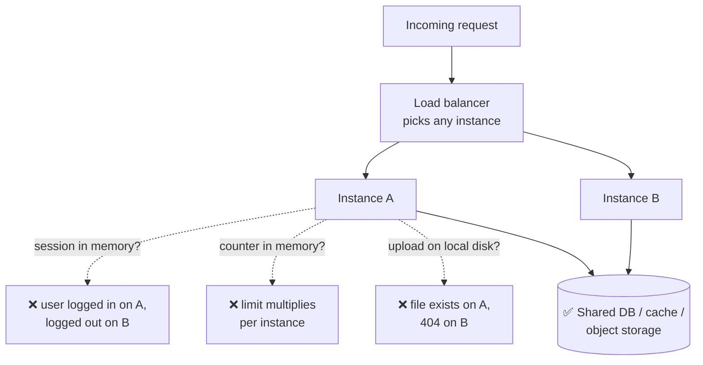
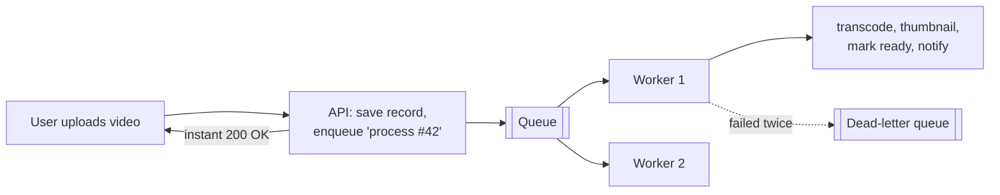
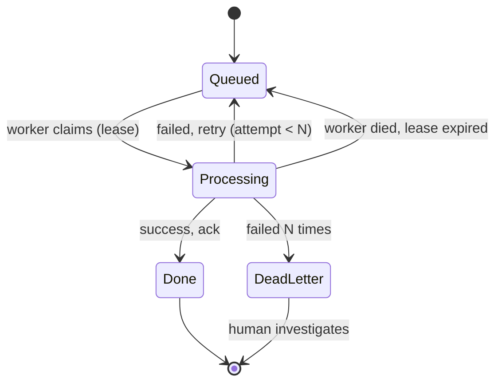
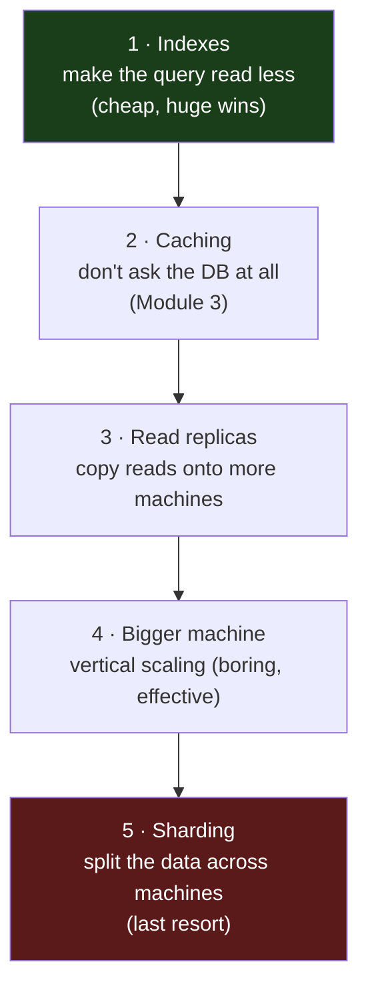
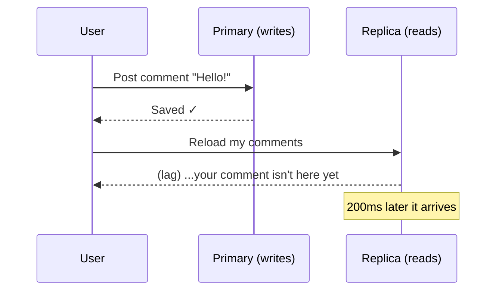
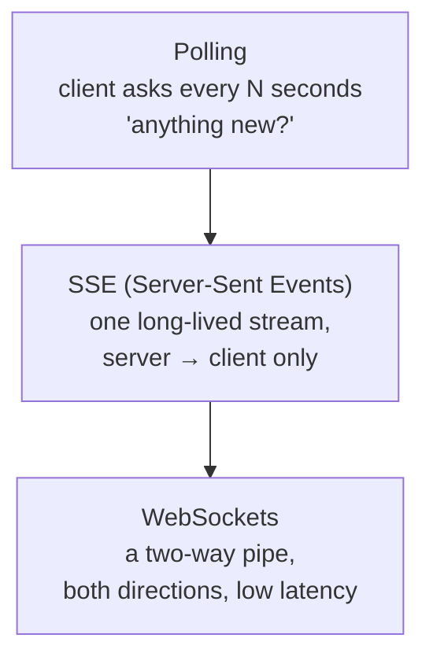
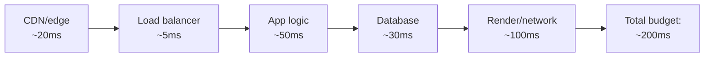

# Module 10 — Scaling Beyond One Server

*Five lessons on the classic scaling canon, taught through the lens of a product
that grew — with real incidents cited where we have them. One server is a fine
place to start and a bad place to stay. This module is the move to many: services
that keep no state of their own, work that happens later instead of now, a
database that has outgrown a single machine, connections that stay open, and the
numbers that tell you which of those you actually need. Terms are defined on
first use; the [Glossary](../../GLOSSARY.md) has the rest.*

---

# 10.1 — Stateless Services and Load Balancing

*Module 10: Scaling Beyond One Server*

---

## 🔥 The War Story

Relay's ancestor had a rate limiter: no more than 100 requests a minute from one
IP. It worked in every test. It counted requests in a plain variable in the
server's memory — a little tally per IP, incremented on each request, checked
against 100. Simple. Correct. On one machine.

Then two things happened, on different days, and each one quietly broke it.

First, launch week meant frequent deploys — sometimes six in an hour. Every
deploy restarts the server, and restarting the server **wipes that in-memory
tally to zero**. An abuser being throttled at 100/min just had to wait for the
next deploy to get a fresh budget. The limit that looked like "100 per minute"
was really "100 per minute, unless we ship, in which case unlimited."

Second, traffic grew, so the team ran a *second* copy of the API to share the
load. Now each copy kept its **own** tally. The same attacker's requests, spread
across two instances, were counted twice-independently — the effective limit
silently became 200/min, then 300 when a third instance came up. Nobody changed
the number `100`. The number just stopped meaning anything.

The fix (you built it in lesson 5.2) was to move the counter *out* of the process
into shared storage (Redis). But the deeper lesson is the one this whole module
turns on: **any state you keep inside the process is a wall between you and a
second server.** Sessions, counters, uploaded files, caches, "who's online" — the
moment your product's correctness depends on something living in *one* process's
memory, you cannot simply run two. Statelessness is the price of scaling.

## 📐 The Principle

### 1. "Scale up" vs "scale out" — and why out needs stateless

There are two ways to handle more load:

| | Scale **up** (vertical) | Scale **out** (horizontal) |
|---|---|---|
| What you do | Bigger machine (more CPU/RAM) | More machines, same size |
| Ceiling | The biggest box money buys | Effectively none |
| Failure | One box down = all down | One box down = others carry on |
| Requires | Nothing special | **Stateless app instances** |

Scaling up is easy and boring and you should do it first (lesson 10.3 revisits
this). But it has a ceiling and a single point of failure. Scaling *out* — many
identical instances — has no ceiling and survives one machine dying. Its one
hard requirement: **every instance must be interchangeable.** A request must land
on *any* instance and get the right answer. That is only possible if instances
share nothing that matters.

Stack Overflow served a top-100 audience for years on about nine web servers
(lesson F.2) — few, but *interchangeable*, fronted by a load balancer, with all
the real state in shared databases and caches. Small and boring and horizontal.

### 2. The three kinds of process state that bite

- **Sessions.** If "you're logged in" lives in one instance's memory, the next
  request — routed to a different instance — sees a stranger. Fix: sessions in a
  signed cookie or a shared store (you built this in lesson 5.3).
- **Counters and caches.** Rate limits, view counts, cached results — the war
  story. Fix: shared storage (Redis), as in 5.2 and Module 3.
- **Local file uploads.** A file saved to `./uploads` on instance A does not
  exist on instance B. Fix: object storage (lesson 2.2) — every instance reads
  and writes the same bucket.

The test for any feature: *"if the next request goes to a different, freshly
started instance, does it still work?"* If no, you've found process state to
evict.

### 3. The load balancer: L4 vs L7, and health checks

A **load balancer** sits in front of your instances and spreads requests across
them. Two flavors:

| | **L4** (transport) | **L7** (application) |
|---|---|---|
| Sees | IPs and ports only | Full HTTP: path, headers, cookies |
| Can route by | Nothing app-specific | URL, host, header — smart routing |
| Speed | Very fast, dumb | Slightly slower, useful |
| Example | AWS NLB, a TCP proxy | nginx, AWS ALB, Cloudflare |

Most vibe-coded products want **L7** — it speaks HTTP, so it can route `/api` to
one pool and everything else to another, and it can run **health checks**: it
pings each instance (say, `GET /healthz`) every few seconds and *stops sending
traffic to any instance that stops answering.* That health check is what turns
"one box died" from an outage into a non-event. Design a real health endpoint —
one that checks the instance can reach its DB, not just that the process is
alive — because a load balancer only knows what the health check tells it.

### 4. Sticky sessions: the tempting wrong turn

When sessions live in process memory, there's a tempting shortcut: tell the load
balancer to **always send the same user to the same instance** ("sticky
sessions" / session affinity). It papers over the problem — and creates worse
ones:

- **Uneven load.** One instance gets all the heavy users; the balancer can't
  rebalance.
- **Deploys log everyone out.** That instance restarts, all its sessions vanish.
- **No failover.** The instance dies, and *its* users are stranded, not
  redistributed.

Stickiness treats the symptom (state in the process) instead of the disease. The
cure is to make instances stateless so *any* of them can serve *any* request —
then you never need stickiness. Reach for it only when a protocol genuinely
requires it (some websocket setups, lesson 10.4), and even then, know what you're
trading away.

## 🎛️ Direct Your Agent

You'll run two Relay API instances behind a load balancer, hunt down every piece
of process state, and evict it — until either instance can serve any request.

1. **Stand up two instances behind a balancer.**
   > *"Run two instances of Relay's API on different ports and put a load balancer
   > (nginx or Caddy) in front that spreads requests across both. Show me the
   > balancer config and prove requests hit both instances."*
2. **Find the state.**
   > *"Audit our API for anything stored in process memory that a request might
   > depend on: sessions, rate-limit counters, in-memory caches, locally saved
   > uploads, anything on local disk. List each with the file and line, and say
   > what breaks when a request lands on the other instance."*
3. **Break it on purpose, so you believe it.**
   > *"Log me in, then send my next request to the OTHER instance and show me
   > whether I'm still logged in. Then upload a file to one instance and try to
   > fetch it from the other."*
   Watch at least one thing fail. That failure is the whole lesson made visible.
4. **Evict the state.**
   > *"Move each item you found to shared storage: sessions to signed cookies or
   > Redis, counters to Redis, uploads to object storage. Re-run the same tests
   > and show both instances now behave identically."*
5. **Add a real health check.**
   > *"Add a `/healthz` endpoint that returns 200 only if the instance can reach
   > the database, and configure the balancer to drain any instance that fails
   > it. Then kill one instance mid-traffic and show me zero failed requests."*
6. **Write the memory.** Add to CLAUDE.md:
   > *"Relay's API instances must be stateless and interchangeable. Nothing a
   > request depends on may live in process memory or local disk — sessions,
   > counters, caches, and uploads all go to shared storage. Before adding any
   > per-request state, answer: does this survive the request landing on a
   > freshly started second instance?"*

Finish: *"Commit with the message `10-1-stateless-services`."*

> 🔧 **Under the hood** (optional): the balancer is an nginx `upstream` block
> with two `server` lines and `health_check` (or Caddy's `reverse_proxy` with
> `lb_policy` + `health_uri`). The "kill one instance" demo is `kill` on one
> process while a small loop (`while true; do curl -s .../healthz; done`) runs —
> you should see traffic shift, not drop.

## ✅ Verify It

- [ ] Two instances run behind one balancer and you watched requests hit both.
- [ ] You saw process state break across instances *before* the fix — logged in
      on one, stranger on the other, or an upload that 404'd on the sibling.
- [ ] After eviction, both instances behave identically for the same request.
- [ ] You killed one instance under live traffic and the health check drained it
      with zero failed requests.
- [ ] You can retell the rate-limit-counter story and name the two ways process
      state broke it (reset on deploy; multiplied across instances).

## 🧾 Recap card

- Scaling out means many interchangeable instances; the price of admission is statelessness.
- Sessions, counters, and local uploads are the three process-state traps — move all three to shared storage.
- The test for any feature: does it survive the next request landing on a fresh second instance?
- Prefer an L7 load balancer with a real health check (checks the DB, not just "process alive").
- Sticky sessions treat the symptom; make instances stateless and you never need them.

## 📚 References & further wandering

- The System Design Primer (open source) — **"Load balancer"** and **"Application layer"** sections; the map this lesson zooms into.
- Nick Craver, **"Stack Overflow: The Architecture"** (nickcraver.com) — a top-100 site on a handful of interchangeable servers, done right.
- Google SRE Book, **"Load Balancing at the Frontend"** (sre.google/books) — health checks and traffic steering in industrial form.
- MDN / nginx docs, **"Using nginx as an HTTP load balancer"** — the exact `upstream` + `health_check` mechanics.
- The Twelve-Factor App, **factor VI "Processes"** (12factor.net) — "execute the app as one or more stateless processes," stated as a law.

*Source incidents: [incident bank — Security, Abuse & Auth](../../war-stories/incident-bank.md) · [famous cases](../../war-stories/famous-cases.md)*

---

# 10.2 — Queues and Asynchronous Work

*Module 10: Scaling Beyond One Server*

---

## 🔥 The War Story

Relay's ancestor sent push notifications on a schedule — a "new content from
creators you follow" blast every evening. The job looked done: it ran, it sent,
users got notified. Then the bills of neglect came due, all at once, in an audit.

The job had **no lock**. If the scheduler fired twice — a retry, an overlap, a
second server also running cron — it sent the whole blast *twice*. Users got
duplicate notifications; nobody could tell, because the job left **no audit
record** of what it had sent. And it never checked delivery **receipts**, so when
sends silently failed, that was invisible too. The same shape turned up in the
newsletter sender (non-atomic dedup — it could email the same person twice) and
the media render queue (no lease, so a job that crashed mid-render stayed "in
progress" forever and blocked the rest).

Three different features, one root cause: **work that should have been a queue
was hand-rolled as fire-and-forget.** "Fire-and-forget" is exactly the wrong
mental model — because *forget* is what it does. It forgets whether the work ran,
whether it ran twice, and whether it succeeded.

The fix was a real queue with three properties the hand-rolled version lacked: a
claim so a job runs once, an audit trail so you know what happened, and receipt
reconciliation so silent failures surface (you built the single-job version of
this in lesson 7.4). This lesson is that fix generalized — **the queue is the
right shape for any work a request shouldn't do itself.**

## 📐 The Principle

### 1. When a request shouldn't do the work

A web request should do the *minimum* to answer the user, then get out of the
way. Some work doesn't belong in that window:

| Do it in the request | Push it to a queue |
|---|---|
| Read the user's feed | Transcode their uploaded video |
| Save a comment | Send 10,000 notification emails |
| Validate a signup | Generate a monthly report |
| Charge a card (user is waiting) | Resize images, warm caches, sync search |

The rule of thumb: if the work is **slow, bursty, or the user doesn't need its
result to continue**, it shouldn't block the response. Make the request *record
the intent* — "this video needs processing" — and hand that to a queue. Answer
the user in milliseconds; let the slow work happen behind the scenes.

A **queue** is a durable to-do list. **Workers** are separate processes that pull
jobs off it and do them. The API and the workers scale *independently* — a flood
of uploads lengthens the queue instead of melting the API, and you add workers to
drain it faster.

> 🔧 **The enqueue itself is a dual-write seam.** Look again at that innocent
> "save record, then enqueue" step: it writes to *two* systems — the database and
> the queue. If the DB commit succeeds and the enqueue then fails (queue blip,
> process crash in between), you've lost the job with no error the user ever sees
> — the exact silent-divergence trap from lesson 2.6. Two robust fixes: the
> **transactional outbox** — write the job into an `outbox` row *in the same DB
> transaction* as the record, and a separate relay reads that table and pushes to
> the queue (the write is atomic because it's one transaction); or a
> **reconciliation sweep** — periodically scan for records in a "pending" state
> with no corresponding completed job and re-enqueue them. Either way the
> principle is the same as everywhere else in this course: *make the two writes
> one, or build something that notices when they diverge.*

### 2. At-least-once delivery: so consumers must be idempotent

Here is the fact that surprises everyone. A durable queue promises your job will
be delivered **at least once** — but under failures (a worker crashes after doing
the work but before acknowledging it), it may be delivered **more than once.**
The queue re-delivers because it can't tell "crashed before doing it" from
"crashed after doing it but before saying so."

So the burden moves to you: **every job must be safe to run twice.** That
property is called *idempotency* (you met it in lessons 2.6 and 6.7). Sending an
email? Record "sent notification #42 to user #7" atomically and check it first,
so a re-delivery is a no-op. Charging a card? Use an idempotency key so the
second attempt returns the first result instead of charging again.

> **Exactly-once delivery is a lie.** You cannot buy it from the network. What
> you *can* build is at-least-once delivery + idempotent consumers, which
> produces exactly-once *effects* — the only thing you actually wanted. Any
> system claiming "exactly-once" is doing this underneath, or it's wrong.

### 3. Backpressure and dead-letter queues

Two more properties separate a real queue from a toy:

- **Backpressure.** When work arrives faster than workers can drain it, the queue
  grows. That's *good* — it's a buffer, absorbing bursts that would otherwise
  crash the API. But an unbounded queue is a slow-motion outage (memory or disk
  fills). Set limits and watch queue *depth* as a first-class metric: a growing
  backlog is the earliest possible warning that you're under-provisioned. This is
  the well-lit version of Twitter's "fail whale" era (2007–2012) — a monolith
  buckling under success, retired only when the team moved slow work onto queues
  and pulled services apart.

- **Dead-letter queue (DLQ).** A job that keeps failing must not retry forever,
  blocking the line (the render queue's stuck-forever bug). After N attempts,
  move it to a **dead-letter queue** — a side lane for poison jobs — and alert.
  The DLQ is where you look when something's wrong, and it keeps one bad job from
  starving all the good ones.

### 4. The three things every job still needs

Everything from lesson 7.4 survives the move to a real queue — a good queue gives
you the machinery, but you still design for:

1. **A claim (lease).** One worker owns a job at a time; if it dies, the lease
   expires and another picks it up. No claim = the duplicate-send bug.
2. **An audit trail.** A record of what ran, when, and with what result. No audit
   = you can't answer "did the evening blast go out?"
3. **Reconciliation.** Check what was *actually* delivered against what you tried
   to deliver. No receipts = silent failures stay silent.

## 🎛️ Direct Your Agent

You'll move Relay's two slowest jobs — media processing and email — off the
request path and onto a real queue with a dead-letter lane and a stale-job sweep.

1. **Introduce the queue.**
   > *"Add a durable job queue to Relay (Redis-backed, e.g. BullMQ, or a DB-table
   > queue — pick one and justify it in one sentence). Show me the queue, a
   > worker process, and how they run separately from the API."*
2. **Move media processing off the request.**
   > *"When a user uploads media, the API should save the record, enqueue a
   > 'process' job, and return immediately. A worker does the transcode and marks
   > it ready. Show me the upload returning instantly while the work happens
   > behind the scenes."*
3. **Make the consumer idempotent.**
   > *"Make the media job and the email job safe to run twice: record what was
   > done atomically and skip if already done. Then deliberately deliver the same
   > job twice and prove the effect happens once — one transcode, one email."*
4. **Add the dead-letter lane and the sweep.**
   > *"After 3 failed attempts a job goes to a dead-letter queue and alerts,
   > instead of retrying forever. Add a sweep that reclaims jobs whose worker
   > died mid-run. Show me a poison job landing in the DLQ and a stuck job being
   > reclaimed."*
5. **Watch the backlog.**
   > *"Expose queue depth as a metric and show it to me. Then fire 500 jobs at
   > once and show the queue absorbing the burst while the API stays fast."*
6. **Write the memory.** Add to CLAUDE.md:
   > *"Slow, bursty, or fire-and-forget work goes on the queue, never in the
   > request. Queue delivery is at-least-once, so every consumer must be
   > idempotent. Every job needs a claim, an audit record, and receipt
   > reconciliation. Failing jobs go to the dead-letter queue, never an infinite
   > retry. 'Exactly-once' is not something we promise anyone."*

Finish: *"Commit with the message `10-2-queues-async-work`."*

> 🔧 **Under the hood** (optional): the idempotency check is an atomic
> "insert-if-absent" on a `(job_type, entity_id)` key — a unique index, a
> `SET NX`, or an upsert — checked before doing the side effect. The stale-job
> sweep re-queues any job whose lease timestamp is older than the visibility
> timeout. Queue depth is a single `LLEN`/`COUNT` you scrape into your metrics.

## ✅ Verify It

- [ ] A media upload returns instantly and the actual processing happens in a
      worker you can see running separately.
- [ ] You delivered the same job twice and watched the effect happen exactly
      once — one email, one transcode.
- [ ] A job that fails repeatedly lands in the dead-letter queue and alerts,
      instead of retrying forever.
- [ ] A job whose worker "died" got reclaimed by the sweep and finished.
- [ ] You can retell the duplicate-push story and name the three things the
      hand-rolled job lacked (claim, audit, receipts) — and why re-delivery is
      normal, not a bug.

## 🧾 Recap card

- If work is slow, bursty, or the user doesn't need its result, take it off the request and put it on a queue.
- Queue delivery is at-least-once; exactly-once is a lie — build idempotent consumers to get exactly-once *effects*.
- Backpressure is a feature (a buffer that absorbs bursts); watch queue depth as an early warning.
- Failing jobs go to a dead-letter queue and alert — never an infinite retry that starves the line.
- Every job still needs a claim, an audit trail, and receipt reconciliation (lesson 7.4, generalized).

## 📚 References & further wandering

- The System Design Primer (open source) — **"Asynchronism"** (message queues, task queues, back pressure); the map for this lesson.
- Twitter Engineering, **"The Infrastructure Behind Twitter: Scale"** — the fail-whale era retired by queues and service boundaries.
- Stripe docs, **"Idempotent requests"** — the canonical idempotency-key pattern that makes at-least-once safe.
- AWS SQS docs, **"At-least-once delivery"** and **"Dead-letter queues"** — a mainstream queue stating both facts plainly.
- Google SRE Book, **"Handling Overload"** and **"Addressing Cascading Failures"** — backpressure and load-shedding, industrial form.

*Source incidents: [incident bank — Observability & Background Jobs](../../war-stories/incident-bank.md) · [famous cases](../../war-stories/famous-cases.md)*

---

# 10.3 — Scaling the Database

*Module 10: Scaling Beyond One Server*

---

## 🔥 The War Story

Discord's messages are the most-cited "how a database actually scales" story
because they never scaled for fashion — only for measured pain.

They started on **MongoDB** (2015). It was fine until it wasn't: as messages grew
into the billions, the *working set* — the data actively read — stopped fitting
in memory, and performance fell off a cliff. They moved to **Cassandra**, which
spread data across many machines and handled the volume — for years. But
Cassandra brought its own specific pains: "hot partitions" (a few busy channels
overwhelming single nodes) and long, unpredictable garbage-collection pauses that
made latency spiky. So in 2023, after measuring exactly those problems, they
moved again — to **ScyllaDB**, a Cassandra-compatible store engineered to kill
the GC pauses — and documented storing *trillions* of messages.

Notice the shape. Each migration was **driven by a measurement**, not a
conference talk. Each new store solved the *previous one's specific failure* — and
introduced new trade-offs they accepted with open eyes. And crucially: this is a
company operating at a scale almost none of us will reach. **Most products never
need any of this.** The lesson isn't "use ScyllaDB." It's: **climb the ladder one
rung at a time, and only when a number tells you to.**

## 📐 The Principle

### 1. The escalation ladder — in order, and most stop early

When the database is slow, there is a fixed order of moves, cheapest and safest
first. Do them in order. Skipping rungs is how vibe coders end up operating a
distributed database they didn't need and can't debug.

| Rung | What it does | Cost | Most products… |
|---|---|---|---|
| 1. Indexes | Read fewer rows (lesson 2.5) | Hours | live here |
| 2. Caching | Skip the DB entirely (Module 3) | Days | and here |
| 3. Read replicas | More machines for reads | A weekend | reach here at real traffic |
| 4. Vertical | A bigger DB box | Minutes + money | buys years |
| 5. Sharding | Split writes across machines | Months, forever | almost never need |

Rungs 1 and 2 you've already built. Most successful products live on rungs 1–4
their entire lives. **Rung 5 is where the war story lives — and it's a last
resort, not a milestone to aspire to.**

### 2. Read replicas — and replication lag's small lies

Most apps read far more than they write. A **read replica** is a full copy of
the database that stays in sync with the primary and serves *read* queries — so
the primary handles writes while replicas soak up the reads. Point your heavy,
read-only work (analytics, dashboards, search indexing) at a replica and you take
enormous load off the primary cheaply.

The catch, and it's the one that bites: **replication is not instant.** A write
lands on the primary, then propagates to replicas milliseconds-to-seconds later.
That gap is **replication lag**, and it makes replicas tell small, well-timed
lies:

The user posts a comment, gets "saved," reloads — and it's gone, because the
reload hit a replica that hadn't caught up. This is the classic
**read-your-own-writes** bug. Handle it honestly: route reads that must reflect a
user's *just-made* write to the primary (or wait for the write to replicate);
send only lag-tolerant reads (analytics, other people's content) to replicas.
Never pretend the lag is zero.

### 3. Vertical before horizontal — the boring rung people skip

Before you split your data across machines (hard, permanent), just **buy a bigger
machine** (easy, reversible). Doubling the RAM or CPU of one database is a config
change and a bill — and it buys most products *years*. Sharding is the opposite:
it's a re-architecture you live with forever, it makes some queries (anything
spanning shards) painful, and it makes transactions and backups far harder. The
industry's own giants (Stack Overflow, lesson F.2) went astonishingly far on a
few big, well-tuned boxes. Reach for a bigger box long before you reach for more
boxes.

### 4. Backup and restore change at every rung

Each rung quietly changes your disaster story — and it's the part people forget:

| Rung | What changes for backup/restore |
|---|---|
| Read replicas | A replica is **not a backup** — it faithfully replicates your mistakes (a bad `DELETE` copies instantly). You still need real backups (lesson 2.3). |
| Vertical | Bigger data = longer restore. Time your restore; a 6-hour restore is a 6-hour outage. |
| Sharding | Now you must restore *many* machines to a **consistent moment** together — dramatically harder. |

Remember GitLab (lesson 2.3, F.3): they had five replication/backup mechanisms
and all five silently failed; they survived on a manual snapshot. A replica lulls
you into feeling safe. **A backup you have never restored is a hope, not a
backup** — and adding replicas doesn't change that, it raises the stakes.

## 🎛️ Direct Your Agent

You'll add a read replica to Relay, route the right reads to it, and *see*
replication lag so you handle it honestly instead of pretending it's zero.

1. **Confirm you're not skipping rungs.**
   > *"Before we add machines: show me our slowest queries, their query plans,
   > and whether an index or a cache (rungs 1–2) would fix them first. Only list
   > what genuinely needs a replica."*
2. **Add the replica.**
   > *"Set up a read replica of Relay's database that stays in sync with the
   > primary. Show me it exists and is receiving updates from the primary."*
3. **Route reads deliberately.**
   > *"Route analytics and dashboard reads to the replica; keep writes and any
   > read that must reflect a user's own just-made change on the primary. Show me
   > the routing rule and which queries go where."*
4. **See the lag — and the bug.**
   > *"Demonstrate replication lag: write a comment, immediately read it from the
   > replica, and show me it missing for a moment. Then fix that specific read to
   > go to the primary and show the bug gone."*
5. **Prove the replica isn't a backup.**
   > *"Delete a row on the primary and show me it vanish from the replica too,
   > instantly. Then show me our real backup (lesson 2.3) restoring it. Make the
   > point in the README: a replica is not a backup."*
6. **Write the memory.** Add to CLAUDE.md:
   > *"Scale the DB in order: indexes → caching → read replicas → bigger machine →
   > sharding (last resort, likely never). Replicas serve lag-tolerant reads
   > only; reads that must reflect a user's own write go to the primary. A
   > replica is not a backup. Time our restore and treat that number as our
   > worst-case data outage."*

Finish: *"Commit with the message `10-3-scaling-the-database`."*

> 🔧 **Under the hood** (optional): the replica is a streaming/async follower
> (Postgres `primary_conninfo` + a hot standby; MongoDB a secondary replica-set
> member). Routing is a second read-only connection string used for flagged
> queries. "Read your own writes" is solved by routing writes-then-reads to the
> primary, or by a `wait_for_replication`/read-concern that blocks until the
> write is visible.

## ✅ Verify It

- [ ] You confirmed the slow queries genuinely need a replica (indexes/caching
      wouldn't have fixed them) before adding one.
- [ ] Analytics reads hit the replica; writes and read-your-own-writes hit the
      primary — and you can show which goes where.
- [ ] You *watched* replication lag: a just-written row missing from the replica
      for a moment, then appearing.
- [ ] You saw a delete replicate instantly, proving a replica is not a backup —
      and restored the row from a real backup.
- [ ] You can retell Discord's Mongo→Cassandra→ScyllaDB path and say what drove
      each move (a measurement, not fashion) and which rung most products stop at.

## 🧾 Recap card

- The ladder, in order: indexes → caching → read replicas → bigger machine → sharding. Climb one rung at a time.
- Most products live on rungs 1–4 forever; sharding (rung 5) is a last resort, not a milestone.
- Read replicas offload reads cheaply — but replication lag causes read-your-own-writes bugs; route fresh reads to the primary.
- Vertical scaling (a bigger box) is boring, reversible, and buys years — try it before sharding's permanent complexity.
- A replica is not a backup: it replicates your mistakes instantly. Time your restore; that's your worst-case outage.

## 📚 References & further wandering

- Discord Engineering, **"How Discord Stores Billions of Messages"** (2017) and **"…Trillions of Messages"** (2023) — the migration series, in their own words.
- The System Design Primer (open source) — **"Database"** section: replication, federation, sharding, denormalization.
- Instagram Engineering, **"Sharding & IDs at Instagram"** — when sharding is genuinely needed, done small and boring.
- Google SRE Book, **"Data Integrity: What You Read Is What You Wrote"** — replicas, lag, and why backups still matter.
- Use The Index, Luke (use-the-index-luke.com) — indexes first, because rung 1 solves most "we need to scale the DB" panics.

*Source incidents: [incident bank — Data & Storage](../../war-stories/incident-bank.md) · [famous cases](../../war-stories/famous-cases.md)*

---

# 10.4 — Realtime: Presence, Websockets, and Heartbeats

*Module 10: Scaling Beyond One Server · **app track***

---

## 🔥 The War Story

Relay's ancestor had a "who's listening now" feature — a live count of active
users, and little presence dots. It ran on Redis: each client sent a **heartbeat**
every few seconds, which updated a sorted set (a ZSET) of "user → last-seen time";
a background sweep dropped anyone who'd gone quiet. Clean, cheap, real-time.

Then someone cleared the cache. Response cache and presence state shared one Redis
database, and the cache-clear was a blunt **`FLUSHDB`** — which wipes *everything*
in that database. The live-presence counter dropped to **zero instantly**, in the
middle of the day, for everyone. Panic. Was there an outage? Had everyone left?

No. It was a maintenance command destroying data that happened to live next to
the cache. And here's the quietly reassuring part: presence **self-healed in about
60 seconds.** Every client was still sending heartbeats; within one heartbeat
cycle the ZSET refilled and the count climbed back to reality on its own. The fix
was to stop colocating disposable and non-disposable state, and to never
`FLUSHDB` — evict by narrow key prefix instead (lesson 3.4).

A *second* incident hit the same feature from the other side: the heartbeat
endpoint had no auth, no rate limit, no length caps, and keyed on a
client-**chosen** session ID. So anyone could inflate the "who's online" count by
firing fake heartbeats with made-up IDs — poisoning the very number the feature
existed to show. Both incidents teach one idea: **realtime presence is soft state
— it must self-heal, and it must never be trusted as truth.**

## 📐 The Principle

### 1. Three ways to be "live" — polling, SSE, websockets

"Realtime" is a spectrum of mechanisms, cheapest-and-simplest first:

| | **Polling** | **SSE** | **WebSockets** |
|---|---|---|---|
| Direction | Client asks | Server pushes | Both ways |
| Complexity | Trivial | Low | Real (stateful) |
| Good for | "Any updates?" every 10s | Live feeds, notifications | Chat, games, collaborative editing |
| Cost at scale | Many small requests | One connection each | One *stateful* connection each |

The vibe-coder instinct should be **the least powerful mechanism that works.**
Most "realtime" features are fine with polling every few seconds — dead simple,
stateless, works behind any load balancer. Reach for SSE when the server needs to
*push* a stream, and for websockets only when you genuinely need low-latency
*two-way* traffic (live chat, multiplayer). Each step up costs you real
complexity, especially at scale.

### 2. Websockets fight statelessness — plan for it

Everything in lesson 10.1 said "keep instances stateless." A websocket is the
exact opposite: it's a **long-lived, stateful connection pinned to one specific
instance.** That collides with horizontal scaling in specific ways:

- **Which instance holds the connection?** If user A is connected to instance 1
  and user B to instance 2, and A messages B, instance 1 must reach B on instance
  2. The standard answer is a **pub/sub backplane** (Redis pub/sub, or a hosted
  realtime service): instances publish messages to a shared channel that all
  instances subscribe to.
- **Deploys drop every connection.** Restarting an instance kills its websockets;
  clients must **auto-reconnect** (with backoff and jitter, lesson 6.7). Design
  for the connection dying — it will, on every deploy.
- **Connections are a resource.** Each open socket costs memory. Ten thousand
  idle sockets is real load doing nothing. Cap and monitor them.

This is exactly the kind of hard-to-run infrastructure the build/buy lesson (0.3)
tells you to *buy* — a hosted realtime service (Pusher, Ably, Supabase Realtime,
managed WebSocket gateways) handles the backplane, reconnection, and scaling so
you don't operate it. Buy realtime unless it's your product's core differentiator.

### 3. Presence is soft state that self-heals

**Presence** — who's online, who's typing, who's in the room — is the softest data
you own. Treat it accordingly:

- **It's derived, not authoritative.** Presence is a *guess* from recent
  heartbeats. "Online" means "sent a heartbeat in the last 30 seconds," nothing
  more. It is never the source of truth about anything that matters.
- **It self-heals — design so it does.** The FLUSHDB wipe recovered in ~60s
  because presence rebuilds from the continuous heartbeat stream. Build presence
  as *ephemeral state that reconstructs itself*, not durable data you must
  protect. Losing it should be a 60-second cosmetic blip, never a data-loss
  incident.
- **Never colocate it with things that must persist.** The wipe was a data-loss
  scare only because presence shared a store with the response cache and got
  `FLUSHDB`'d together. Keep disposable state where destroying it is survivable;
  never let a cache-maintenance command reach anything you'd mourn (lesson 3.4).

### 4. Cap cardinality and never trust the client

The second incident is the security half, and it generalizes past presence to any
anonymous realtime write (lesson 5.4):

- **Cap cardinality.** An unbounded presence set is a memory bomb: a malicious (or
  buggy) client firing unique session IDs grows the set forever. Cap how many
  entries you'll track and how big each field can be.
- **Don't trust client-chosen identity.** Keying presence on a client-supplied
  session ID let anyone inflate the count. Derive identity server-side (an
  authenticated user, or a server-issued token), rate-limit the heartbeat, and
  **treat any number that drives a product decision as adversarial input.**
- **Realtime data is never your source of truth.** The live count is a vanity
  display; the *real* "how many people used Relay" comes from your durable
  first-party events (lesson 7.5), computed from data you control — not from a
  counter any stranger can poke.

## 🎛️ Direct Your Agent

You'll add a "who's online" presence feature to Relay that survives a cache flush
*and* a malicious client — the two incidents, defended in advance.

1. **Start with the least powerful mechanism.**
   > *"Add a 'who's online' count to Relay using heartbeats: authenticated
   > clients ping every 20 seconds; a user counts as online if seen in the last
   > 30. Start with simple polling for the display — no websockets yet. Show me
   > the count updating."*
2. **Isolate the presence state.**
   > *"Store presence in its OWN Redis database or key namespace, completely
   > separate from the response cache. Show me that clearing the cache by prefix
   > cannot touch presence."*
3. **Reproduce the FLUSHDB wipe — and the self-heal.**
   > *"Wipe the presence store on purpose and show me the count drop to zero.
   > Then show it climbing back to reality within ~60 seconds from the ongoing
   > heartbeats, with no restart. Then show that our real cache-clear (evict by
   > prefix) leaves presence untouched."*
4. **Defend against the malicious client.**
   > *"Make presence key on the authenticated user, not a client-chosen ID.
   > Rate-limit the heartbeat and cap the presence set's size. Then simulate an
   > attacker firing fake heartbeats with made-up IDs and show the count does NOT
   > inflate."*
5. **Draw the line to the real metric.**
   > *"Show me that our real 'active users' number comes from durable first-party
   > events (lesson 7.5), and the live count is only a cosmetic display we never
   > report as truth."*
6. **Write the memory.** Add to CLAUDE.md:
   > *"Presence is soft, self-healing state: keep it isolated from durable data,
   > never `FLUSHDB`, evict only by prefix. Key presence on server-derived
   > identity, rate-limit heartbeats, cap cardinality. Realtime counts are
   > cosmetic — the source of truth for usage is our durable events. Prefer
   > polling; use websockets only for genuine two-way low-latency needs, and buy
   > the realtime backplane rather than operate it."*

Finish: *"Commit with the message `10-4-realtime-presence`."*

> 🔧 **Under the hood** (optional): presence is a Redis ZSET keyed by user ID with
> the score = last-seen epoch; "online" is `ZRANGEBYSCORE now-30 now`; the sweep
> is `ZREMRANGEBYSCORE 0 now-30`. Isolation = a dedicated DB index or a
> `presence:` prefix you only ever clear with `SCAN` + `UNLINK`. Cardinality cap =
> reject new members past a limit; heartbeat gets the same Redis rate limiter as
> lesson 5.2.

## ✅ Verify It

- [ ] The "who's online" count works and updates as users come and go.
- [ ] You wiped the presence store and watched the count self-heal to reality in
      ~60 seconds — no restart, no manual repair.
- [ ] Your real cache-clear (evict by prefix) leaves presence untouched — the two
      states are isolated.
- [ ] A simulated attacker firing fake heartbeats could **not** inflate the count.
- [ ] You can retell the FLUSHDB wipe and say why it self-healed, and name what
      the client-trusted counter got wrong.

## 🧾 Recap card

- Use the least powerful realtime mechanism that works: polling < SSE < websockets. Each step up costs real complexity.
- Websockets are stateful connections pinned to one instance — plan a pub/sub backplane, auto-reconnect, and connection caps; prefer buying the service.
- Presence is soft state: it's a guess from heartbeats, it must self-heal, and it must never share a store with durable data.
- Cap cardinality and key on server-derived identity — any number that drives a decision is adversarial input.
- Realtime data is never your source of truth; usage comes from durable first-party events (lesson 7.5).

## 📚 References & further wandering

- MDN, **"WebSockets API"** and **"Server-sent events"** — the plain-language reference for the three mechanisms.
- The System Design Primer (open source) — **"Asynchronism"** and the notes on long-polling / WebSockets / SSE trade-offs.
- Ably or Pusher engineering docs, **"WebSockets at scale" / "presence"** — how hosted realtime handles the backplane you'd otherwise operate.
- Google SRE Book, **"Managing Critical State"** — why soft state and hard state need different treatment.
- Martin Kleppmann, *Designing Data-Intensive Applications*, ch. on derived data — presence as a derived, reconstructable view.

*Source incidents: [incident bank — Caching & CDN; Security, Abuse & Auth](../../war-stories/incident-bank.md) · [famous cases](../../war-stories/famous-cases.md)*

---

# 10.5 — Performance and Capacity

*Module 10: Scaling Beyond One Server*

---

## 🔥 The War Story

One admin dashboard in Relay's ancestor loaded fine — for months. Then, without
any code change, the whole site started feeling sluggish at busy hours, and
nobody could see why. The dashboard still worked. The app still worked. It was
just… slow, for everyone, sometimes.

The cause was the dashboard itself. Opening it ran **eight unbounded
whole-collection scans** over the largest table — reading every row, every time,
to compute its charts (lesson 2.5). At low traffic that was invisible: one admin,
once in a while, a slow page nobody minded. But those scans dragged the entire
largest table through memory — **evicting the hot catalog data** that every normal
user request actually served from. So one admin opening one page cold-flushed the
cache that kept the *whole site* fast, and everyone else paid for it in latency
until the working set warmed back up.

Here's the part that makes it a *capacity* story, not just a slow-query story: the
dashboard's own load time barely moved. The damage showed up **somewhere else**,
at the p99 of unrelated requests, invisible on any dashboard measuring averages.
The single expensive query was a **capacity bomb with a delayed fuse** — harmless
in testing, harmless at 50 rows, ruinous once the table was large and the site was
busy. **Performance problems hide until scale lights them up — and the average
hides them longest.**

## 📐 The Principle

### 1. Latency budgets: the whole trip has a deadline

A page feels instant under about 100ms and sluggish past a second. That total is a
**budget**, spent across every hop of the request's journey (lesson 1.2). If you
don't divide the budget, one careless hop eats it all:

Budgeting forces the useful question at design time: *"this endpoint has 200ms —
where does it go?"* When something's slow, you don't guess; you measure each hop
and find which one blew its allowance. Usually it's one — a missing index, an N+1
query (lesson 2.5), an un-cached call, a chatty third-party API (lesson 6.7).

### 2. p50 lies; p99 pays the bills

The single most important idea in this lesson: **stop looking at averages.** An
average (or the median, p50) describes a *typical* request and hides your worst
ones — which are the ones users remember and tell their friends about.

**Percentiles** tell the honest story. p99 = "99% of requests were faster than
this; 1% were slower." That slow 1% sounds ignorable until you count it:

| Metric | Says | Reality it hides |
|---|---|---|
| p50 (median) | "typically 80ms" | half your requests are *slower* than this |
| p95 | "300ms" | 1 in 20 requests is worse |
| **p99** | "1.2s" | 1 in 100 — at 1M requests/day, **10,000 slow experiences daily** |

The war story is a p99 story: averages barely moved while a slice of requests got
badly slow. And it compounds — a page making 20 backend calls is *likely* to hit
someone's p99 on at least one of them, so your page's p99 is worse than any single
call's. **Watch p95 and p99. p50 is the number that makes you feel good while
users suffer.**

### 3. Load test before the day you need it

You do not want to discover your ceiling during your launch, your feature on the
news, or the sale you advertised. A **load test** finds it on a quiet Tuesday
instead: a tool fires increasing simulated traffic until something bends, and you
watch *what* bends first — CPU, database connections, a lock, memory, the queue
depth from lesson 10.2.

Cloudflare's July 2019 outage is the shape of an untested ceiling: one WAF rule
with a bad regex sent CPU to 100% across their entire edge and returned 502s to
much of the web for ~27 minutes. A single expensive operation, deployed
everywhere, hit a limit nobody had measured. **Find your breaking number
deliberately, write it down, and re-measure after every fix** — that number is
your capacity, and Netflix's Chaos Monkey (lesson 7.x) is the same instinct
industrialized: don't hope it survives load, *watch* it.

### 4. Core Web Vitals: the frontend half of the budget

Backend speed is only half the felt experience. **Core Web Vitals** are Google's
three user-centric frontend measures — and, because they're a search-ranking
input, a business metric too:

| Vital | Measures | Good |
|---|---|---|
| **LCP** (Largest Contentful Paint) | When the main content appears | < 2.5s |
| **INP** (Interaction to Next Paint) | How fast the page responds to a tap | < 200ms |
| **CLS** (Cumulative Layout Shift) | How much the layout jumps around | < 0.1 |

Measure these from *real users* (field data), not just a lab run on your fast
laptop — your users are on mid-range phones and worse networks. The whole latency
budget only matters if it ends in a fast paint on a real device.

### 5. Back-of-envelope capacity math

You don't need queuing theory — you need arithmetic you can do in your head, to
catch the obviously-impossible before you build it:

> 1 million requests a day ≈ **12 per second** average — but traffic clumps, so
> plan for a peak of perhaps 5–10× that: ~60–120/sec. If one request needs 50ms
> of a CPU core, one core serves ~20/sec, so you need ~3–6 cores at peak. If each
> user stores 5MB of media, 100,000 users ≈ **500GB** — a storage-and-egress line
> item (lesson 11.4), not an afterthought.

Two minutes of this math surfaces the item that scales worst *before* it surprises
you on a bill or a graph. That's the whole discipline: cheap arithmetic beats
expensive surprises.

## 🎛️ Direct Your Agent

You'll load-test Relay to its breaking point, record the number, fix the first
bottleneck, and prove the fix with a re-measure — the Chaos-Monkey habit, small.

1. **Instrument percentiles first.**
   > *"Add timing to Relay's key endpoints and report p50, p95, and p99 — not
   > averages. Show me the current numbers and flag any endpoint whose p99 is far
   > worse than its p50."*
2. **Set budgets.**
   > *"For our three most important endpoints, write down a latency budget broken
   > by hop (edge, app, DB, render). Tell me which hop currently blows it."*
3. **Load-test to the breaking point.**
   > *"Load-test Relay with rising simulated traffic until something bends. Tell
   > me the requests/second where p99 crosses 1 second, and WHAT bent first —
   > CPU, DB connections, a lock, memory, or queue depth. Write that number in
   > the README as our current capacity."*
4. **Find and fix the first bottleneck.**
   > *"Fix only the single worst bottleneck — likely a missing index, an N+1, or
   > an unbounded scan like our dashboard (lesson 2.5). Don't fix anything else
   > yet."*
5. **Re-measure — prove it moved.**
   > *"Re-run the exact same load test and show me the before/after: the new
   > breaking number and the new p99. Confirm we actually raised the ceiling."*
6. **Check the frontend half.**
   > *"Measure Relay's Core Web Vitals (LCP, INP, CLS) from a throttled
   > mid-range-phone profile, not my laptop. Show me the three numbers against
   > the 'good' thresholds."*
7. **Write the memory.** Add to CLAUDE.md:
   > *"We watch p95/p99, never averages. Every important endpoint has a latency
   > budget by hop. We load-test to a known breaking number, record it as our
   > capacity, and re-measure after fixes. Core Web Vitals are measured from
   > real/throttled devices. Before shipping a heavy query, do the back-of-
   > envelope math at 10× and 100× current data."*

Finish: *"Commit with the message `10-5-performance-capacity`."*

> 🔧 **Under the hood** (optional): load generation is `k6`, `wrk`, or `autocannon`
> ramping virtual users; you want the RPS at which p99 crosses your SLO, and the
> resource that saturates first (watch CPU, DB `pg_stat_activity`/connections,
> and queue depth together). Core Web Vitals come from the `web-vitals` library
> (field/RUM) plus Lighthouse (lab); trust field data over lab.

## ✅ Verify It

- [ ] Your dashboards show p95/p99, and you found at least one endpoint whose p99
      is far worse than its p50.
- [ ] You load-tested to an actual breaking number and wrote it down as Relay's
      capacity.
- [ ] You fixed one bottleneck and the re-run proved the ceiling moved (higher
      breaking RPS, lower p99).
- [ ] You measured Core Web Vitals from a throttled device profile, not your
      fast laptop.
- [ ] You can retell the dashboard COLLSCAN story and explain why the damage
      showed up in *other* requests' p99, invisible on averages.

## 🧾 Recap card

- A request's latency is a budget spent across every hop; divide it, then find the hop that overspends.
- p50 lies; p99 pays the bills — at a million requests, the "ignorable" 1% is 10,000 bad experiences a day.
- Load-test to a known breaking number *before* the day you need it; record it, fix the first bottleneck, re-measure.
- Core Web Vitals (LCP, INP, CLS) are the frontend half of the budget — measure from real devices, not your laptop.
- Back-of-envelope math at 10× and 100× catches the worst-scaling line item before a bill or a graph does.

## 📚 References & further wandering

- Google SRE Book, **"Monitoring Distributed Systems"** — the four golden signals; latency, traffic, errors, saturation.
- **web.dev, "Core Web Vitals"** and **"Learn Performance"** (web.dev) — LCP/INP/CLS defined, with how to measure from the field.
- Cloudflare postmortem, **"Details of the Cloudflare outage on July 2, 2019"** — an untested capacity ceiling deployed globally.
- **k6 documentation, "Load testing"** (k6.io/docs) — a modern, scriptable way to find your breaking number.
- Gil Tene, **"How NOT to Measure Latency"** (talk) — why averages and p50 lie, and percentiles pay the bills.
- Netflix Tech Blog, **Chaos Engineering** — deliberately breaking things to learn your real limits.

*Source incidents: [incident bank — Data & Storage](../../war-stories/incident-bank.md) · [famous cases](../../war-stories/famous-cases.md)*

---

*Next: **Module 11 — Reaching the World** — domains and TLS, internationalization
and RTL, SEO and answer engines, cost engineering, and your edge platform end to
end. You can now run many servers; next you make them reachable, findable, and
affordable everywhere.*
