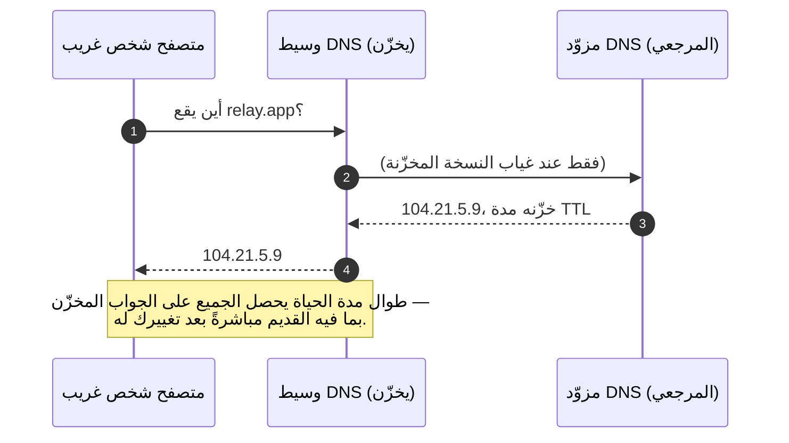
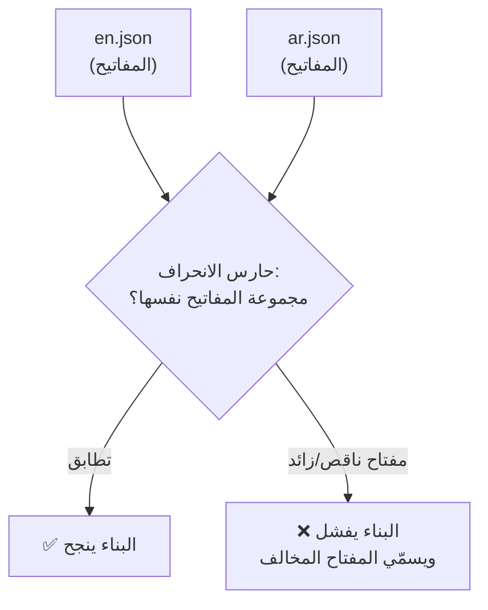
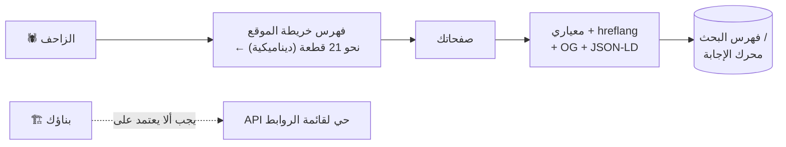
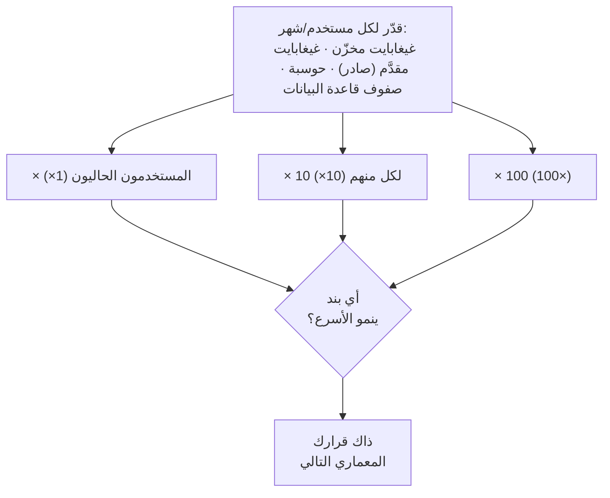
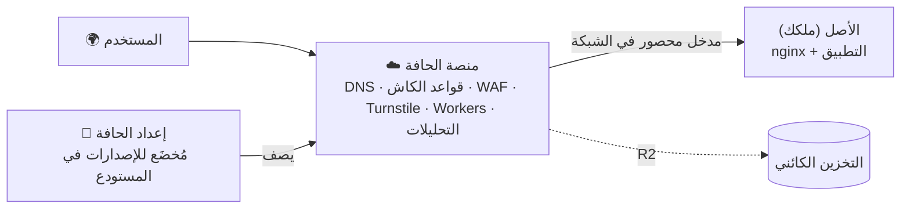

# الوحدة 11 — الوصول إلى العالم

*خمسة دروس عن كل ما يقع بين تطبيقك الجاهز (working app) وبين شخص غريب على الطرف الآخر من الكوكب: الاسمُ والشهادةُ (certificate) اللذان يمكّنانه من إيجادك أصلًا، واللغاتُ والتخطيطاتُ (layouts) التي تمكّنه من قراءتك، والزواحفُ (crawlers) ومحركاتُ الإجابة (answer engines) التي تمكّنه من اكتشافك، والفاتورةُ (bill) التي تأتي مقابل كل ذلك، ومنصةُ الحافة (edge platform) التي تربط القصة كلها.*

---

# 11.1 — النطاقات ونظام أسماء النطاقات وطبقة النقل الآمنة

## 🔥 قصة من الميدان

في 4 أكتوبر 2021، اختفى فيسبوك وإنستغرام وواتساب نحو 6 ساعات — لا «بطيئًا»، بل *غائبًا* عن مليارات المستخدمين (billions of people). لم يخترق (hacked) أحد شيئًا، ولم يحترق خادم (server). أثناء صيانة روتينية (routine maintenance)، سحب أمرٌ **مسارات BGP** — أي اتجاهات الإنترنت (the internet's directions) — التي تخبر بقية العالم بمكان شبكة فيسبوك (network). وحين ذهبت الاتجاهات، صارت **خوادم نظام أسماء النطاقات (DNS)** الخاصة بفيسبوك غير قابلة للوصول أيضًا. ونظام أسماء النطاقات هو دليل العناوين (phone book): الخدمة التي تحوّل `facebook.com` إلى عنوان فعلي (address). ومع تعذّر الوصول إلى الدليل، لم يعد الاسم يشير إلى شيء. الخوادم كانت سليمة، تعمل وممتلئة بالصور، لكن العالم ببساطة لم يستطع إيجادها.

وازداد الأمر سوءًا داخل الشركة. فأدوات فيسبوك الداخلية (internal tools) — حتى بعض قارئات بطاقات الأبواب — كانت تعتمد على ترجمة الأسماء (name resolution) نفسها التي اختفت للتو، فتعذّر على من يستطيعون الإصلاح الوصولُ ماديًا إلى الأجهزة.

رسّخ هذا الآن، فهو يحكم الدرس كله: **قبل أن يسمع خادمك كلمة واحدة، يجب أن يعمل نظامان آخران — الذي يجد اسمك (DNS) والذي يثبت أنه أنت فعلًا (TLS). أنت لا تتحكم فيهما كما تتحكم في كودك (code)، وحين يفشلان يصبح تطبيقك السليم تمامًا غير مرئي.** ولا تبنِ مسار تعافيك (recovery path) فوق الشيء المعطّل نفسه.

## 📐 المبدأ

### 1. نظام أسماء النطاقات دليلٌ يخزّن مؤقتًا — أي أنه يكذب لبعض الوقت

يحوّل نظام أسماء النطاقات الاسمَ إلى عنوان. وتضبطه عبر **سجلات (Records)**، كلٌّ منها سطر صغير له نوع:

| السجل | يحوّل… | …إلى | المعنى البسيط |
|---|---|---|---|
| `A` | اسمًا | عنوان IPv4 | «relay.app يقع على 104.21.5.9» |
| `AAAA` | اسمًا | عنوان IPv6 | المثل، بصيغة عنوان أحدث |
| `CNAME` | اسمًا | اسمًا آخر | «`www.relay.app` اسم بديل (alias) لـ `relay.app`» |
| `MX` | اسمًا | خادم بريد (mail server) | «أرسل بريد relay.app هنا» |
| `TXT` | اسمًا | نصًّا حرًّا | إثباتات الملكية (proofs of ownership) وسياسة البريد (email policy) |

هنا فخّان. الأول **النطاق الجذر (Apex) مقابل النطاق الفرعي (Subdomain).** الجذر هو `relay.app` المجرّد، والفرعي هو `www.relay.app` أو `api.relay.app`. ويمنع معيار (standard) DNS وضع `CNAME` على الجذر — لكن سجلات الجذر تحتاج أن تشير إلى شبكة CDN يتغير عنوانها. يعالج المزوّدون ذلك بتقنيات مثل «تسطيح (flattening) CNAME» أو سجلات `ALIAS`؛ لا تحتاج التفاصيل الداخلية، بل تحتاج أن تعرف أن *الجذر والفرعي يُضبطان بطريقتين مختلفتين*، وأن «يعمل على www لا على النطاق المجرّد» تذكرة دعم (support ticket) يومية.

الثاني: **الانتشار (propagation) كذبة تخزين مؤقت (caching lie).** يحمل كل سجل **مدة حياة (TTL)** — كم يجوز للوسطاء (resolvers) تخزينه. غيّر سجلًا مدةُ حياته 24 ساعة، فسيرى نصفُ العالم القيمة الجديدة ونصفُه القديمة لمدة يوم كامل، دون أي خطأ في أي مكان. وهذا شكل كل علة كاش (cache bug) في الوحدة 3: *بيانات قديمة (stale data) تُقدَّم بثقة.* قبل أي تغيير مخطط (planned change)، اخفض مدة الحياة إلى 60 ثانية قبل يوم، ثم أعِدها بعده.

### 2. طبقة النقل الآمنة تثبت أنه أنت فعلًا — وتنتهي صلاحيتها

**طبقة النقل الآمنة (TLS)** — قفل `https://`؛ خليفة SSL — تؤدي وظيفتين: تشفّر الاتصال (encrypts the connection) كي لا يقرأه أحد بينك وبين المستخدم، وتثبت أن الخادم المجيب يملك ذلك الاسم فعلًا، عبر **شهادة (Certificate)** موقّعة من سلطة (authority) يثق بها المتصفح (browser). والشهادة ليست أبدية — بل *تنتهي صلاحيتها (expires)*، غالبًا كل 90 يومًا. والعطل الكلاسيكي (classic outage) غبيّ وعام: **شهادةٌ لم يجدّدها أحد انتهت، فأظهر كلُّ متصفح على الأرض تحذير أمانٍ (security warning) ملء الشاشة.** والإصلاح ليس أبدًا «تذكّر التجديد»، بل تجديد آلي (automated renewal) (ACME / Let's Encrypt، أو تولّي شبكة CDN له) مع إنذار انتهاء صلاحية (expiry alarm) كخط أخير (backstop) — لأن الإصلاح بلا إنذار فشلٍ (failure alarm) عدٌّ تنازلي لا إصلاح، كما في الدرس 3.2.

### 3. شبكة CDN تنهي طبقة النقل الآمنة — وينبغي أن تكون بابك الوحيد

ضع شبكة CDN في المقدمة (فعلت ذلك في الوحدة 3)، فتكون هي ما **ينهي طبقة النقل الآمنة (TLS)** فعلًا — تحمل الشهادة وتفكّ تشفير الطلب عند الحافة (edge) قرب المستخدم، ثم تحادث خادمك الأصلي (origin server) خلف الكواليس. لهذا تدير شبكة CDN — لا تطبيقك — الشهادات في معظم عمليات النشر (deployments) الحقيقية.

ويخلق ذلك مهمة لا يجوز تخطّيها. فإن استطاع الغرباء بلوغ خادمك الأصلي *مباشرةً* — بعنوانه الخام (raw IP)، متجاوزين شبكة CDN — صارت كل حماية توفّرها الحافة (الكاش (caching)، جدار الحماية (WAF)، تحديد المعدل (rate limits)) اختيارية للمهاجم، والأسوأ: صارت ترويسة (header) «عنوان العميل» التي تضيفها الشبكة **قابلة للتزوير (forgeable)**، لأن من يبلغ الأصل مباشرةً يستطيع ضبطها بنفسه. وهذا هو النتيجة المطابقة تمامًا لاكتشاف الترويسة القابلة للتزوير في الدرس 5.4 وإصلاح تحديد المعدل في 5.2. **حصر المدخل في شبكة CDN (CDN-only Ingress)** — بضبط جدار الخادم الأصلي (firewalling the origin) كي يقبل الاتصالات من الشبكة فقط، وحذف أي نسخ واردة من ترويسات الشبكة الموثوقة (trusted) — هو ما يجعل الحافة حدًّا حقيقيًا (boundary) لا مجرد اقتراح.

*اقرن هذا بحالة شهيرة ثانية: **هجوم Dyn على DNS** (أكتوبر 2016)، حين أغرقت شبكةُ (botnet) Mirai مزوّدَ (provider) DNS واحدًا، فـ«سقط» تويتر ونتفليكس وريديت. خوادمها كانت سليمة. فأنت بقدر ما يمكن الوصول إلى نظام أسماء نطاقاتك فقط.*

## 🎛️ وجّه وكيلك

Relay يعمل محليًا. أعطه الآن اسمًا يستطيع العالم طلبه، وشهادةً يثق بها العالم، وبابًا واحدًا.

1. **وجّه الاسم.**
   > *«اشرح لي توجيه relay.app إلى شبكة CDN لدينا: أي سجل للجذر، وأيّ لـ`www`، ولماذا يحتاج الجذر معالجة خاصة (special handling). اضبط مدة حياة 60 ثانية الآن كي تُصلَح الأخطاء بسرعة. أرني السجلات قبل وبعد.»*
2. **حوّل www إلى مضيف معياري (canonical host) واحد.**
   > *«اجعل `www.relay.app` يحوّل دائمًا (permanently redirect) إلى `relay.app` (أو العكس — اختر واحدًا وأخبرني لماذا). أريد عنوانًا معياريًا واحدًا بالضبط، لا موقعين ينحرفان.»*
3. **احصل على TLS وأثبت تجديده الآلي.**
   > *«فعّل TLS عبر شبكة CDN. ثم أرني تاريخ انتهاء الشهادة وأكّد أن التجديد آلي — وأضف إنذارًا (alert) ينطلق إن بقي على انتهائها 14 يومًا أو أقل.»*
4. **احصر مدخل الأصل في شبكة CDN.**
   > *«اضبط جدار خادمنا الأصلي كي يقبل حركة الشبكة (traffic) فقط، واحذف أي نسخة واردة من ترويسة عنوان العميل. ثم حاول بلوغ الأصل بعنوانه الخام وأرني إياه يرفض — وأرني التطبيق ما زال يعمل عبر النطاق الحقيقي.»*
5. **اكتب الذاكرة.** أضف إلى CLAUDE.md:
   > *«شبكة CDN تدير TLS وهي مدخلنا الوحيد؛ جدار الأصل يقبل عناوين الشبكة فقط ويحذف ترويسات عنوان العميل الواردة. اخفض مدد حياة DNS قبل أي تغيير سجل. شهادة على بُعد 14 يومًا من الانتهاء تنبّهنا.»*

الختام: *«أودع برسالة (commit) `11-1-domain-dns-tls`.»*

> 🔧 **تحت الغطاء** (اختياري): `dig relay.app +short` و`dig www.relay.app` يُظهران ما يعيده الوسطاء فعلًا؛ و`curl -vI https://relay.app` يُظهر مصافحة (handshake) TLS وتواريخ الشهادة؛ وبلوغ العنوان الخام يثبت أهو مكشوف. التجديد عبر ACME (Let's Encrypt) أو شهادة الشبكة المُدارة (managed cert).

## ✅ تحقق منه

- [ ] `relay.app` و`www.relay.app` كلاهما يفتح، وأحدهما يحوّل إلى الآخر — وتستطيع قول أيهما المعياري ولماذا.
- [ ] القفل حقيقي؛ وجدت تاريخ انتهاء الشهادة وأكّدت أنها تجدّد نفسها، مع إنذار كخط أخير.
- [ ] بلغت العنوان الخام للأصل ورأيته يرفض — الشبكة هي الباب الوحيد.
- [ ] غيّرت سجل DNS وفهمت لماذا بقيت القيمة القديمة لبعض الوقت (مدة الحياة)، بدل افتراض أن التغيير فوري.
- [ ] تعيد رواية قصة فيسبوك 2021 وتسمّي أيَّ النظامين قبل الخادم فشل (DNS)، ولماذا كان تعافيهم بطيئًا.

## 🧾 بطاقة الخلاصة

- قبل أن يسمع خادمك شيئًا، يجب أن يجد DNS اسمك وأن تثبت TLS أنه أنت.
- يخزّن DNS بحسب مدة حياته — فكل تغيير «ينتشر» ببطء ويقدّم أجوبة قديمة دون خطأ.
- الجذر والفرعي يُضبطان بطريقتين مختلفتين؛ ولا يقبل الجذر `CNAME` عاديًا.
- شهادات TLS تنتهي — فأتمِت التجديد وأنذِر على الانتهاء؛ ولا تعتمد على التذكّر أبدًا.
- شبكة CDN تنهي TLS ويجب أن تكون مدخلك الوحيد، وإلا صارت ترويساتها الموثوقة قابلة للتزوير (5.2، 5.4).

## 📚 المراجع ومزيد من القراءة

- مدونة كلاودفلير: **«كيف اختفى فيسبوك من الإنترنت»** (أكتوبر 2021) — قصة BGP وDNS بلغة مفهومة.
- MDN: **«ما هو اسم النطاق؟»** و**«كيف يعمل الويب»** — الأساس المبسّط.
- Let's Encrypt: **«كيف تعمل»** (letsencrypt.org) — الشهادات الآلية ونموذج تجديد ACME.
- ‏RFC 8555: **ACME** — البروتوكول وراء التجديد الآلي، لمن يريد التعمق.
- تعلّم كلاودفلير: **«ما هو DNS؟» / «سجلات DNS»** — أنواع السجلات ومدة الحياة، بمخططات.
- تغطية Dyn وKrebs on Security لـ**هجوم Mirai/Dyn على DNS** (أكتوبر 2016) — قابلية الوصول قوةً في تصميم الأنظمة.

---

# 11.2 — التدويل ومن اليمين لليسار

## 🔥 قصة من الميدان

منتج ثنائي اللغة (bilingual) — إنجليزي وعربي، أحدهما من اليمين لليسار — أطلق روابط عميقة (deep links) تجعل النقر على رابط مقال مشارَك على الهاتف يفتح ذلك المقال *داخل التطبيق*. عمل في العرض التجريبي (demo). ومجموعة اختبارات الروابط العميقة (deep-link end-to-end suite) كانت خضراء. ثم جاءت البلاغات (reports): النقر على رابط موقع حقيقي يفتح التطبيق، لكن على شاشة (screen) **الرئيسية** دائمًا، لا على المحتوى المرتبط.

كان السبب الجذري (root cause) عدم تطابق (mismatch) لم يرسمه أحد. فروابط **الموقع** كانت مسبوقة باللغة (locale-prefixed) وبصيغة الجمع: `/en/articles/42`، `/ar/articles/42`. أما مسارات (routes) **التطبيق** الداخلية فكانت بلا لغة (locale-less) وبصيغة المفرد: `article/42`. الروابط `https://` الحقيقية تحمل شكل الموقع، والتطبيق بلا قاعدة تترجم فضاءً إلى آخر، فسقط كل رابط وارد إلى قيمة افتراضية (default) — الرئيسية. ونجحت الاختبارات لأنها جرّبت مخطط (scheme) `app://` *المخصص* للتطبيق مباشرةً — مُدخَلٌ بديل (proxy input) تخطّى خطوة الترجمة المكسورة نفسها. **أخضر، وخطأ.**

وكان للمنتج نفسه علة توأم (twin bug) أهدأ في البحث. فمستخدمون يكتبون استعلامات عربية (queries) سليمة تمامًا حصلوا على *صفر نتائج (zero results)* — لأن الكلمة نفسها تُكتب بالتشكيل (diacritics) أو بدونه، وبأشكال مختلفة للحرف نفسه (أ / إ / ا)، وفهرس البحث (search index) يخزّن شكلًا والمستخدم يكتب آخر. فلم يُطبَّع (normalized) النص أبدًا إلى شكل معياري (canonical form) واحد عند الدخول *وعند الخروج*، فأخطأت استعلامات سليمة محتوى سليمًا.

الدرس تحت الاثنين: **لحظةَ يتكلم منتجك أكثر من لغة أو خط (script)، يكفّ «الشيء نفسه» عن كونه بديهيًا — فالروابط والحروف والتخطيطات كلها لها أشكال صحيحة متعددة، وكل حدٍّ بين اثنين منها يحتاج ترجمة صريحة تستطيع اختبارها.**

## 📐 المبدأ

### 1. توجيه اللغة: اختر استراتيجية واحدة واجعلها المصدر الوحيد

هناك ثلاث طرق شائعة لترميز لغة الصفحة:

| الاستراتيجية (strategy) | مثال | المقايضة |
|---|---|---|
| بادئة المسار (path prefix) | `relay.app/ar/feed` | واضحة، قابلة للتخزين (cacheable)، صديقة للبحث (SEO-friendly) — الأشيع |
| النطاق الفرعي (subdomain) | `ar.relay.app/feed` | فصل نظيف، لكن إعداد DNS/TLS أكثر |
| ترويسة/كوكي فقط | `relay.app/feed` + `Accept-Language` | لا لغة مرئية — غير مرئية للكاشات (caches) والزواحف (crawlers)؛ تجنّبها إشارةً (signal) *وحيدة* |

بادئة المسار هي الجواب الصحيح عادةً. لكن أيًّا اخترت، **يجب أن يتفق عليها كلُّ عميلٍ يشارك فضاء الروابط (URL space).** والقصة هي ما يحدث حين يستعمل الموقع البادئات ولا يستعملها التطبيق: يصير الرابط عقدًا (contract) بين عميلين (clients)، والعقد غير المكتوب ينحرف. أعطِ الحدَّ دالةَ ترجمة (translation function) واحدة تعيد كتابة كل رابط وارد عبر محلٍّ مشترك (shared resolver) — عند البداية الباردة (cold start) والدافئة (warm start)، للموقع والتطبيق — كما حلّ الدرس 6.4 قائمةَ مسارات الروابط العميقة: استنبط أحدهما من الآخر، أو ثبّت سلكًا كاشفًا (tripwire).

### 2. ملفات الترجمة سطحُ انحراف — احرسها كالكود

نصوصك تعيش في ملفات رسائل (message files)، واحد لكل لغة: `en.json`، `ar.json`. ولحظةَ يوجد اثنان، ينحرفان — مفتاحٌ (key) يُضاف للإنجليزية ويُنسى في العربية يعرض نصًّا خامًا مثل `feed.emptyState` لمستخدم حقيقي، أو الأسوأ: يسقط بصمت إلى الإنجليزية داخل صفحة عربية. وهذا صنف كل علة قائمة متوازية (parallel-list bug) في الدورة. والحل نفسه: **اختبار حارس انحراف (drift-guard)** يُفشل البناء (build) حين تختلف مجموعتا مفاتيح (key sets) اللغتين.

### 3. «من اليمين لليسار» وضعُ تخطيط لا رقعة

اللغات من اليمين لليسار تعكس الواجهة (interface) كلها: النص يُحاذى يمينًا، وسهم الرجوع يشير يمينًا، وأشرطة التقدم (progress bars) تمتلئ يسارًا، والشريط الجانبي (sidebar) يبدّل جهته. فإن بنيت من اليسار لليمين ثم «أضفت العربية لاحقًا» برقعٍ متفرقة، حصلت على ذيل دائم من علل الانعكاس (mirroring bugs). ابنِ «من اليمين لليسار» صنفًا أولًا (first-class): استعمل **الخصائص المنطقية (logical properties)** (`start`/`end` بدل `left`/`right`) كي يعكس الإطار (framework) التخطيط عنك، واضبط اتجاه المستند (document direction) من اللغة لا يدويًا. وهذه الدورة نفسها تصدر كل درس بالإنجليزية وبالعربية من اليمين لليسار — فالانضباط ليس نظريًا.

### 4. التواريخ والأرقام والترتيب لا تُترجَم — بل تُوطَّن

«الشيء نفسه بشكل مختلف» يلدغ أبعد من الكلمات:

- **التواريخ والأرقام:** `07/08` هو 7 أغسطس أو 8 يوليو بحسب اللغة؛ والأرقام وعلامات العشرية (decimal marks) والتجميع (grouping) تختلف. نسّق عبر مكتبة التدويل (internationalization library) في المنصة، لا يدويًا أبدًا.
- **الترتيب (collation) والتطبيع (normalization):** الفرز والبحث خاصّان باللغة. والحالة التحذيرية الشهيرة هي **مشكلة حرف «I» التركي** — ففي التركية حرف `ı` بلا نقطة و`i` بنقطة، فتحويلُ حالة (upper/lower-casing) معرّف (identifier) ساذجًا (اسم مستخدم، بريد) قد يحوّل `admin` إلى نص مختلف فيكسر تسجيل الدخول (logins)، أو الأسوأ: يتجاوز فحصًا (bypass a check). طبّع إلى شكل معياري واحد، عند الدخول والخروج، واستعمل مقارنة واعية باللغة (locale-aware comparison) — ونصفُ البحث في القصة هو هذه القاعدة غير المتعلَّمة.

**النسخة العربية من هذه القاعدة** — لأنها على الأرجح سوقك. للعربية ألغامُ تطبيع خاصة بها، وهي بالضبط ما سبّب حادثة البحث الفارغ عندنا: أشكال الألف (أ / إ / آ تُوحَّد إلى ا)، والتاء المربوطة مقابل الهاء (ة / ه)، وحرف التطويل (ـ)، والحركات (diacritics) الاختيارية — كلها تعني أن *الكلمة نفسها* تُكتب بعدة صيغ مختلفة في البايتات (bytes). فإن لم تُطبّعها إلى شكل واحد عند الكتابة والبحث معًا، حصل المستخدم الذي يبحث عن مصطلح عربي صحيح على صفر نتائج، وظنّ أن منتجك فارغ. وتفصيلان إضافيان يهمّان السوق العربي: الأرقام العربية-الهندية (Arabic-Indic numerals) (٠١٢٣ مقابل 0123 — اقبل الشكلين عند الإدخال، واختر شكل العرض بحسب اللغة)، والتقويم الهجري (Hijri calendar) الذي يتوقّعه كثيرون إلى جانب الميلادي. مكتبة `Intl` تتولى جانب العرض، أما التطبيع فمسؤوليتك أنت.

## 🎛️ وجّه وكيلك

Relay على وشك أن يتكلم لغتين، إحداهما من اليمين لليسار.

1. **اختر استراتيجية توجيه واحدة وطبّقها.**
   > *«أضف بادئات لغة إلى Relay: `/en/...` و`/ar/...`، بلغة افتراضية (default) واحدة. تأكد أن الـAPI وتطبيق الويب وأي معالجة روابط (link handling) للموبايل تحلّ اللغة بالطريقة نفسها — أرني الدالة الواحدة التي يتشاركونها.»*
2. **أضف اللغة الثانية وحارس انحراف.**
   > *«استخرج كل نصوص الواجهة (UI text) إلى `en.json` و`ar.json`. أضف اختبارًا يُفشل البناء إن لم يملك الملفان مجموعة المفاتيح نفسها بالضبط. ثم احذف مفتاحًا عربيًا في فرع (branch) وأرني البناء يفشل ويسمّيه.»*
3. **اجعل «من اليمين لليسار» صنفًا أولًا.**
   > *«اضبط اتجاه الصفحة من اللغة، وحوّل تخطيطنا إلى خصائص منطقية start/end كي تنعكس العربية صحيحًا. أرني التغذية (feed) بالاتجاهين متجاورتين — سهم الرجوع والمحاذاة وكل شيء.»*
4. **أصلح التطبيع عند حدّ البحث (search boundary).**
   > *«طبّع نص البحث إلى شكل معياري واحد عند الفهرسة (indexing) والاستعلام (querying) معًا — عالج التشكيل وأشكال الحروف. أضف اختبارًا باستعلام يختلف عن النص المخزَّن بالشكل فقط، وأثبت أنه صار يجد السجل (record).»*
5. **اكتب الذاكرة.** أضف إلى CLAUDE.md:
   > *«اللغة بادئة مسار تحلّها دالة مشتركة واحدة؛ وكل عميل يستعملها. ملفات اللغة محروسة من الانحراف. التخطيط يستعمل start/end المنطقية. البحث والمعرّفات مُطبَّعة إلى شكل معياري واحد دخولًا وخروجًا. لا تختبر مسار رابط عبر مخطط بديل — اختبر الرابط الوارد الحقيقي.»*

الختام: *«أودع برسالة `11-2-i18n-rtl`.»*

> 🔧 **تحت الغطاء** (اختياري): حارس الانحراف فرقُ مجموعتين (set-difference) على قائمتي مفاتيح JSON؛ والتطبيع Unicode NFC/NFKC مع خريطة حروف (letter map) خاصة باللغة؛ و«من اليمين لليسار» يتكئ على الخصائص المنطقية في CSS و`dir="rtl"`؛ وتنسيق التاريخ/الرقم عبر `Intl.DateTimeFormat` / `Intl.NumberFormat`.

## ✅ تحقق منه

- [ ] فتحت Relay على `/en/...` و`/ar/...` والصفحة العربية معكوسة تمامًا — لا مجرد نص مترجم في إطار من اليسار لليمين.
- [ ] اختبار حارس الانحراف موجود **ورأيته يفشل** حين حُذف مفتاح عربي، ثم ينجح حين أُعيد.
- [ ] استعلام بحث يختلف عن النص المخزَّن بالتشكيل أو شكل الحرف فقط صار يعيد النتيجة الصحيحة — رأيت قبله وبعده.
- [ ] رابط مشارَك يفتح المحتوى الصحيح في كل لغة، لا صفحة افتراضية.
- [ ] تعيد رواية قصة «يفتح دائمًا على الرئيسية» وتسمّي لماذا كانت الاختبارات خضراء والميزة مكسورة (مُدخَل بديل تخطّى الخطوة المكسورة).

## 🧾 بطاقة الخلاصة

- أكثر من لغة يعني أن «الشيء نفسه» له أشكال صحيحة متعددة — الروابط والحروف والتخطيطات كلٌّ يحتاج ترجمة صريحة قابلة للاختبار.
- اختر استراتيجية توجيه لغة واحدة (البادئات عادةً) واجعل كل عميل يحلّها عبر دالة مشتركة واحدة.
- ملفات الترجمة (translation files) تنحرف — احرس مجموعات المفاتيح باختبار يُفشل البناء (حارس انحراف 6.4، مجددًا).
- «من اليمين لليسار» وضعُ تخطيط (layout mode): خصائص start/end منطقية، واتجاه من اللغة — لا رقعٌ متفرقة.
- طبّع نص البحث والمعرّفات إلى شكل معياري واحد دخولًا وخروجًا؛ ووطّن التواريخ والأرقام عبر مكتبة المنصة.

## 📚 المراجع ومزيد من القراءة

- MDN: **«التوطين»** و**الخصائص المنطقية في CSS** — مرجع `start`/`end` و`dir`.
- Unicode: **UAX #15 صيغ التطبيع** (unicode.org) — لماذا للنص «نفسه» ترميزات متعددة.
- W3C: **«أفضل ممارسات التدويل»** (w3.org/International) — النص ثنائي الاتجاه و«من اليمين لليسار» بشكل صحيح.
- **مشكلة حرف «I» التركي** — ابحث «Turkish dotless i bug»؛ حالة تحذيرية معيارية في طيّ الحالة (case-folding).
- MDN: **كائن `Intl`** — التواريخ والأرقام والترتيب الواعية باللغة دون كتابة يدوية.

---

# 11.3 — تحسين محركات البحث ومحركات الإجابة: أن تُوجَد وأن تُقتبَس

> **درس مرتبط بالأدوات (tool-dated lesson).** *المبادئ* — المعنى المقروء آليًا (machine-readable meaning)، وعدم ربط البناء (builds) ببيانات وقت التشغيل (runtime data)، والكتابة كي تُقتبَس — تبقى بعد الأدوات. أما المنتجات والأعراف المسمّاة (سلوك Googlebot، و`llms.txt`، وزواحف ذكاء اصطناعي بعينها) فهي أفضل الافتراضات الحالية (best defaults) وتُحدَّث سنويًا. تعلّم المبدأ، وأعد فحص الأداة.

## 🔥 قصة من الميدان

منتج محتوى (content product) كبير أراد أن تفهرس (index) محركات البحث (search engines) كل صفحاته، فولّد **خريطة موقع (Sitemap)** — القائمة المقروءة آليًا بكل رابط تريد زحفه. ومع نمو الكتالوج (catalog) نما الملف: مستند XML (XML document) وحيد ضخم بلغ **350 ميغابايت**. تحدّد محركات البحث خريطة الموقع بـ50 ألف رابط و50 ميغابايت؛ فكان الملف العملاق عديم الفائدة بصمت، وتوليده يرهق قاعدة البيانات (Database) في كل بناء.

فقسّمه الفريق — حدسٌ صائب — إلى خرائط أصغر خلف فهرس (index). لكنهم ولّدوا القطع (chunks) **وقت البناء (Build)**، بمناداة الـAPI لقائمة الروابط الكاملة أثناء تجميع الموقع (compiling the site). ثم يومًا كان الـAPI بطيئًا وقت البناء. لم يفشل البناء بسرعة (fail fast) برسالة واضحة؛ بل **تجمّد (froze)**، منتظرًا اعتمادَ وقت تشغيلٍ (runtime dependency) ما كان ينبغي أن يملكه أصلًا. فصار API معطّل — مشكلةُ *وقت تشغيل* — يحجب *النشر (Deploy)*، العملية التي يجب أن تبقى تعمل كي تشحن الإصلاح.

كان الإصلاح الدائم فكرتين معًا: **فهرس** خريطة موقع يشير إلى نحو 21 قطعة تُولَّد **ديناميكيًا وقت الطلب (dynamically at request time)**، فلا ملف واحد أكبر من اللازم، ولا يعتمد البناء على أي بيانات حية (live data). **لا تربط نجاح البناء بتوافر بيانات وقت التشغيل، وقسّم (chunk) كل ما ينمو بلا حد.**

## 📐 المبدأ

### 1. تحسين البحث إخبارُ الآلات بما يراه البشر أصلًا

الزاحف (Crawler) برنامج يجلب صفحاتك كمتصفح، ويتبع الروابط (follows links)، ويبني فهرسًا. ومهمتك أن تجعل معناك مقروءًا (legible) له:

| الإشارة (signal) | ما تخبر به الزاحف | الفشل عند غيابها |
|---|---|---|
| **خريطة موقع** (مقسّمة، ≤50 ألف رابط) | «هذه كل الروابط الجديرة بالفهرسة» | صفحات عميقة (deep pages) لا تُكتشف أبدًا |
| **الرابط المعياري (Canonical)** | «هذا العنوان الحقيقي الوحيد لهذا المحتوى» | روابط مكررة (duplicate URLs) تشتّت ترتيبك (ranking) |
| **hreflang** | «هذه نسخ الصفحة بلغات أخرى» | عرض صفحة بلغة خاطئة للباحثين |
| **وسوم (tags) Open Graph** | «هذا العنوان/الصورة عند المشاركة» | معاينات روابط (link previews) قبيحة لا تُنقر |
| **مؤشرات الويب الأساسية (Core Web Vitals)** | كم تبدو الصفحة سريعة/مستقرة | الصفحات البطيئة ترتيبها أدنى — السرعة مدخل ترتيب (ranking input) |

اثنتان منها ترتبطان مباشرةً بدرسي الوحدة 11 الآخرين. **المعياري + hreflang** هما وجه البحث للدرس 11.2: إن عاش المحتوى نفسه على `/en/x` و`/ar/x`، فـ*يجب* أن تخبر الزواحف أنهما ترجمتان لا نسختان مكررتان. و**مؤشرات الويب الأساسية** — عتبات جوجل المقيسة (measured thresholds) للتحميل (loading) والتفاعل (interactivity) والاستقرار البصري (visual stability) — تجعل أداء الواجهة (frontend performance) في الدرس 10.5 عاملَ ترتيب (ranking factor) حرفيًا، لا مجرد تحسين.

### 2. تحسين محركات الإجابة: الباب الأمامي يصير محرك إجابة

يتزايد ألا يزور الناس عشرة روابط زرقاء — بل يسألون مساعدًا ذكيًا (AI assistant) يقرأ المصادر ويجيب باقتباس (citation) أو اثنين. **تحسين محركات الإجابة (AEO)** هو جعل محتواك قابلًا للتحليل (parseable) و*للاقتباس* آليًا:

1. **البيانات المنظمة (schema.org / JSON-LD).** كتلة JSON صغيرة في الصفحة تصرّح، بمفردات معيارية (standard vocabulary)، «هذا مقال بقلم فلان، نُشر في كذا» أو «هذا منتج بسعر كذا». تزيل عن الآلة تخمينَ *معنى* صفحتك.
2. **اكتب كي تُقتبَس.** تقتبس محركات الإجابة محتوى يجيب سؤالًا مباشرةً، في فقرة مكتفية بذاتها، تحت عنوان ثابت (stable heading) له مرساة ثابتة (stable anchor). أما دفن الجواب في الفقرة التاسعة خلف قصة فغير مرئي لآلة تبحث عن وحدة قابلة للاقتباس (citable unit).
3. **`llms.txt`** — عرف ناشئ (emerging convention) (ملف نصّي بسيط في جذر موقعك (site root)، ابن عم `robots.txt`) يوجّه أنظمة الذكاء الاصطناعي (AI systems) إلى أنظف محتواك وأنفعه. عامله أفضلَ تخمين حالي لا معيارًا مستقرًا (settled standard) — وهذا الجزء المرتبط بالأدوات.
4. **راقب زواحف الذكاء الاصطناعي (AI crawlers) في سجلاتك (logs).** لا تتصرف كـGooglebot — وكلاء مختلفون (user agents)، وأنماط جلب (fetch patterns) مختلفة، وأحيانًا تتجاهل قواعدك. لا تدير ما لا تقيس؛ والسجلات نفسها التي تلتقط الإساءة (abuse) (الوحدة 5) تخبرك بمن يقرؤك ليجيب أسئلة عنك.

### 3. يجب ألا يعتمد البناء على بيانات وقت التشغيل

يستحق أعمق مبادئ القصة سطره الخاص، لأنه يتكرر حيثما التقى محتوًى مولَّد (generated content) بنشر (deploy): **البناء كودٌ يتحول إلى مُنتَج (artifact)؛ ويجب أن ينجح من المصدر وحده (source).** فلحظةَ ينادي بناؤك API حيًّا، يصير عطلُ وقت التشغيل (runtime outage) عطلَ نشر — وربطت العملية التي تشحن الإصلاحات بالأنظمة نفسها التي تتعطل. ولّد المستندات الكبيرة المعتمدة على البيانات *ديناميكيًا وقت الطلب*، أو من لقطة (snapshot) مودعة في المستودع (repo).

## 🎛️ وجّه وكيلك

أعطِ نوعَي صفحات Relay الرئيسيين (ملف مبدع (creator profile) وقطعة محتوى) معاملة الاكتشاف (discoverability) الكاملة — وأثبت بقاء البناء نظيفًا.

1. **خرائط موقع مقسّمة وديناميكية.**
   > *«ولّد فهرس خريطة موقع يشير إلى خرائط مقسّمة، كلٌّ دون 50 ألف رابط، تُقدَّم ديناميكيًا وقت الطلب. أكّد أن البناء لا ينادي الـAPI لقائمة الروابط — ثم حاكِ (simulate) تعطّل الـAPI وقت البناء وأرني البناء ما زال ينجح.»*
2. **معياري + hreflang.**
   > *«أضف رابطًا معياريًا (canonical URL) لكل صفحة، وروابط hreflang تقرن كل صفحة `/en/` بتوأمها `/ar/`. أرني الوسوم على صفحة واحدة باللغتين.»*
3. **بطاقات Open Graph.**
   > *«أضف وسوم Open Graph (عنوان/وصف/صورة) لنوعَي الصفحات. أرني معاينة الرابط التي ستعرضها منصة تواصل (social platform).»*
4. **بيانات JSON-LD المنظمة.**
   > *«أضف schema.org JSON-LD إلى صفحة المحتوى (Article) وصفحة الملف (Person/Organization). تحقق منها بأداة اختبار بيانات منظمة (structured-data testing tool) وأرني إياها تنجح.»*
5. **اسأل محركات الإجابة.**
   > *«اسرد وكلاء زواحف الذكاء الاصطناعي الذين زارونا هذا الأسبوع من السجلات.»* ثم يدويًا: اسأل ثلاثة مساعدين ذكيين سؤالًا Relay أفضلُ جواب له، ولاحظ هل — وكيف — تُقتبَس. تلك الفجوة قائمة أعمال (backlog) AEO عندك.

الختام: *«أودع برسالة `11-3-seo-aeo`.»*

> 🔧 **تحت الغطاء** (اختياري): خرائط الموقع XML بأصل `<sitemapindex>`؛ والمعياري `<link rel="canonical">`؛ وhreflang هو `<link rel="alternate" hreflang="ar">`؛ وJSON-LD كتلة `<script type="application/ld+json">`؛ تحقق بأداة Rich Results من جوجل ومدقّق schema.org.

## ✅ تحقق منه

- [ ] حاكيت تعطّل الـAPI وقت البناء وما زال البناء ينجح — النشر لا يعتمد على بيانات وقت التشغيل.
- [ ] خريطة الموقع فهرسٌ من قطع، كلٌّ دون حدّي 50 ألف/50 ميغابايت، تُقدَّم ديناميكيًا.
- [ ] نسختا `/en/` و`/ar/` لصفحة واحدة تصرّح كلٌّ برابط معياري وتشيران إلى بعضهما بـhreflang.
- [ ] لصقُ رابط Relay في محادثة أو تطبيق تواصل يُظهر بطاقة معاينة Open Graph سليمة، ومدقّق البيانات المنظمة (structured-data validator) ينجح على نوعَي الصفحات.
- [ ] سألت ثلاثة مساعدين ذكيين سؤالًا يجيبه منتجك وتستطيع قول هل اُقتبست — وتعيد رواية قصة خريطة 350 ميغابايت وتسمّي الربط (coupling) الذي جمّد البناء.

## 🧾 بطاقة الخلاصة

- تحسين البحث يجعل معناك مقروءًا للزواحف: خرائط مقسّمة، وروابط معيارية، وhreflang، وبطاقات OG، ومؤشرات ويب سريعة (مدخل ترتيب حقيقي).
- المعياري + hreflang وجه البحث لتوجيه لغتك (11.2)؛ والترجمات المكررة/غير الموسومة تشتّت ترتيبك.
- تحسين محركات الإجابة يجعلك قابلًا للاقتباس: بيانات JSON-LD منظمة، وأجوبة مباشرة قابلة للاقتباس تحت مراسٍ ثابتة، و`llms.txt`، ومراقبة زواحف الذكاء الاصطناعي في سجلاتك.
- لا تربط نجاح البناء ببيانات وقت التشغيل أبدًا — API معطّل يجب ألا يجمّد نشرًا؛ وقسّم كل ما لا حدّ له.
- مرتبط بالأدوات: المبادئ تبقى؛ أعد فحص الزواحف والأعراف المسمّاة كل سنة.

## 📚 المراجع ومزيد من القراءة

- Google Search Central: **«خرائط المواقع»** و**«دليل مالكي المواقع الكبيرة»** — حدود 50 ألف/50 ميغابايت ونموذج فهرس خريطة الموقع.
- جوجل: **مؤشرات الويب الأساسية** (web.dev/vitals) — العتبات المقيسة التي تغذّي الترتيب.
- schema.org — مفردات البيانات المنظمة؛ اقرنها بأداة **Rich Results** من جوجل.
- Google Search Central: **الروابط المعيارية** و**hreflang** — قواعد التكرار/الترجمة.
- مقترح **llms.txt** (llmstxt.org) — العرف الناشئ؛ اقرأه أفضلَ تخمين حالي لا معيارًا.
- بروتوكول Open Graph (ogp.me) — الوسوم وراء معاينات الروابط.

---

# 11.4 — هندسة التكلفة

## 🔥 قصة من الميدان

قصتا تكلفة من منصة واحدة، وهما متجانستان.

الأولى: عاش تخزين الوسائط (media storage) على مزوّد سحابي (cloud provider) واحد (GCS). كانت البايتات رخيصة *التخزين* — لكن كلما بثّ مستخدم ملفًا، فرض المزوّد رسوم **الصادر (Egress)**: رسمًا على البيانات المغادِرة لشبكته. ومع جمهور عالمي (global audience) يبثّ صوتًا طوال اليوم، صار الصادر بهدوء أحدَ أكبر بنود الفاتورة (lines on the bill) — يقزّم التخزين نفسه. وكان الإصلاح هجرةً (migration) إلى مزوّد (Cloudflare R2) محورُ عرضه **صفر رسوم صادر**. لم تتغير البايتات، بل تغيّر *نموذج التسعير (pricing model)*، فهبطت الفاتورة بحدة. (تلك الهجرة نفسها هي حيث عاشت علة الملفات التي تعود (resurrecting-files bug) في الدرس 2.2 — عمل التكلفة (cost work) وعمل الصواب (correctness work) على السلك نفسه.)

الثانية: قفزت النسخة الاحتياطية (backup) الليلية من **244 ميغابايت إلى 871 ميغابايت بين ليلة وضحاها**، بلا بيانات جديدة. وكان السبب إعادةَ هيكلة (refactor) أزرق-أخضر (الوحدة 4) أنشأت مجلدَي بناء (build directories) `.next-blue` و`.next-green`، كلٌّ يحمل نحو 620 ميغابايت من كاش webpack القابل للتوليد (regenerable) — والنسخة الاحتياطية تؤرشف *كليهما* بأمانة كل ليلة، بينما ما يحتاج النسخ فعلًا (قواعد البيانات (databases)) جزءٌ يسير من الحجم. كانت النسخة تدفع لتخزين نفايات قابلة لإعادة البناء (rebuildable junk).

لاحظ ما يوحّدهما: **علة التكلفة (cost bug) وعلة الصواب (correctness bug) غالبًا العلة نفسها.** فنسخ كاشات البناء (build caches) *خطأ* (تؤرشف مُنتَجات (artifacts) لا حالة (state) — الدرس 2.3) *ومكلف*. وتخزين التحليلات (analytics) إلى الأبد (الدرس 2.4) لغمُ موثوقية (reliability landmine) *وفاتورة متنامية*. **اقرأ فاتورتك السحابية (cloud bill) كسِجل (log): كل بند مفاجئ عيبٌ (defect) بعلامة دولار.**

## 📐 المبدأ

### 1. الفواتير الأربع التي تفاجئك

التسعير السحابي (cloud pricing) ليس رقمًا واحدًا. والبنود التي تباغت الناس:

| البند | يفرض رسمًا على | الفخ |
|---|---|---|
| **الصادر (Egress)** | البيانات المغادِرة لشبكة المزوّد | التخزين يبدو رخيصًا؛ أما *تقديمه* فلا. غالبًا أكبر بند عند التوسع. |
| **طبقات التخزين (storage tiers)** | حفظ البايتات، بحسب سرعة الوصول (access speed) | تخزين ساخن (hot storage) لبيانات باردة (cold data) — ملفات قديمة لا تُقرأ على قرص متميز (premium disk). |
| **الحوسبة (Compute)** | خوادم/دوال (servers/functions) تعمل | «بلا خادم (serverless)» يوسّع التكلفة مع الحركة (traffic) — ومع الحلقات الجامحة (runaway loops). |
| **نمو قاعدة البيانات (database growth)** | قرص وإدخال/إخراج (IO) لبياناتك | جداول بلا حد (unbounded tables) (تحليلات، سجلات (logs)) تُنمي الفاتورة *والخطر (risk)* معًا (2.4). |

**الصادر هو الأكثر مفاجأةً لبنّائي الذكاء الاصطناعي (AI-assisted builders)**، لأن الوكلاء (agents) يحسّنون لـ«هل يعمل»، وتقديم الوسائط يعمل جيدًا — حتى تأتي الفاتورة (invoice). والإصلاح البنيوي (structural fix) **شبكة CDN كدرعِ تكلفة (cost shield)**: متى خزّنت الحافة (edge) ملفاتك، لا يبلغ الأصلَ (origin) معظمُ الطلبات، فتدفع صادر الأصل مرة وتقدّم النسخة مرات. فالشبكة أداة أداء (performance tool) *وأداة تكلفة*؛ وهجرة R2 قرنت الاثنين باختيار أصلٍ بلا رسم صادر خلف حافة تمتص معظم القراءات أصلًا.

### 2. المهام الخلفية «المجانية» ليست مجانية

المهمة المجدولة (scheduled job) تبدو مجانية — تملك الخادم أصلًا. لكن كل مهمة تحرق حوسبة، وتقرأ وتكتب قاعدة البيانات (إدخال/إخراج تدفع ثمنه)، وقد تتوسع بهدوء: مهمة ليلية (nightly job) تمسح جدولًا ناميًا تكلّف أكثر كل ليلة، وحلقة إعادة محاولة (retry loop) معطوبة (عاصفة إعادة المحاولة (retry storm) في الدرس 6.7) قد تفوترك آلاف النداءات لـAPI مدفوع قبل أن يلاحظ أحد. التكلفة خاصية (property) *النظام كله عبر الزمن*، لا الميزة التي شحنتها اليوم.

### 3. نمذج التكلفة عند 1× و10× و100× — قبل أن تعلّمك الفاتورة

أنفع عادة تكلفة نموذجٌ تقريبي (back-of-envelope model) يتوسع مع المستخدمين. لا تحتاج تدريبًا ماليًا (finance training)، بل ثلاثة أعمدة:

المقصود ليس تنبؤًا دقيقًا (precise forecast) — بل إيجاد **أي بند يتوسع أسوأ توسع (scales worst)** قبل أن يتوسع أصلًا. فإن هيمن الصادر عند 10×، اتخذت قرار الشبكة/الأصل الآن رخيصًا، بدل حالة فوترة طارئة (billing emergency). وهذا تخطيط سعة (capacity planning) (الدرس 10.5) بمحور دولار.

## 🎛️ وجّه وكيلك

ابنِ نموذج تكلفة Relay وجِد أسوأ بنوده توسعًا قبل أن يفعل مستخدم.

1. **جرد سطح التكلفة (cost surface).**
   > *«اسرد كل ما يدفع Relay مقابله لمزوّد سحابي: تخزين، صادر، حوسبة، قاعدة بيانات، مهام خلفية، APIs طرف ثالث (third-party). لكلٍّ سطرٌ واحد عمّا يرفع التكلفة.»*
2. **قدّر لكل مستخدم، لكل شهر.**
   > *«لمستخدم Relay نموذجي، قدّر شهريًا: غيغابايت مخزّن، وغيغابايت مقدَّم (صادر)، وحوسبة، وصفوف قاعدة بيانات جديدة. اذكر افتراضاتك — سأتحقق منها.»*
3. **أسقِط 1× / 10× / 100×.**
   > *«ابنِ جدول التكلفة الشهرية الإجمالية عند مستخدمينا الحاليين، و10×، و100×. أرني أي بند ينمو الأسرع، وعند أي مقياس يصير أكبر تكلفة.»*
4. **جِد العلة ذات الشكل نفسه.**
   > *«افحص شيئين من تاريخ حوادثنا (incident history): هل يُخزَّن أو يُنسَخ احتياطيًا أي شيء قابل للتوليد (كاشات بناء، صور مصغّرة (thumbnails))؟ وهل ينمو أي جدول بلا حد احتفاظ (retention limit)؟ كلاهما علة تكلفة وعلة صواب — أشِر إليهما.»*
5. **قرّر الدرع.**
   > *«بالنظر إلى أسوأ بند توسعًا، ما أرخص إصلاح بنيوي الآن — كاش شبكة CDN، أو طبقة تخزين، أو أصل بلا صادر، أو مدة احتفاظ (retention TTL)؟ اقترح واحدًا، مع المقايضة (trade-off).»*

الختام: *«أودع نموذج التكلفة كـ`11-4-cost-model.md` برسالة `11-4-cost-engineering`.»*

> 🔧 **تحت الغطاء** (اختياري): يوفّر معظم المزوّدين تصدير تكلفة/فوترة (cost/billing export) (CSV أو API) ومقاييس استخدام (usage metrics) لكل خدمة؛ ارسم غيغابايت الصادر مقابل غيغابايت التخزين على مدى شهر، فيرسم البند المفاجئ نفسه عادةً.

## ✅ تحقق منه

- [ ] نموذج تكلفة Relay موجود كملف بأعمدة 1× / 10× / 100×، وقرأته — تستطيع تسمية أسوأ بند توسعًا بصوت عالٍ.
- [ ] وجدت شيئًا واحدًا على الأقل يُخزَّن أو يُنسَخ احتياطيًا وهو قابل للتوليد (علة تكلفة وصواب) أو أكّدت خلوّه.
- [ ] تستطيع أن تشرح، بجملة لكلٍّ، الصادرَ ولماذا شبكة CDN درعُ تكلفة لا مجرد أداة سرعة.
- [ ] اقترحت إصلاحًا بنيويًا واحدًا لأسوأ بند *قبل* أن يصير مكلفًا — قرار لا رد فعل (reaction).
- [ ] تعيد رواية هجرة GCS→R2 وتقول ما الذي تغيّر (نموذج التسعير لا البايتات)، ولماذا كانت النسخة المتضاعفة علة صواب أيضًا.

## 🧾 بطاقة الخلاصة

- اقرأ الفاتورة السحابية كسِجل: كل بند مفاجئ عيبٌ بعلامة دولار.
- الصادر — البيانات المغادِرة للمزوّد — البند الأكثر مفاجأةً للبنّائين؛ وشبكة CDN درعُ تكلفة لا مجرد أداة سرعة.
- علل التكلفة وعلل الصواب غالبًا العلة نفسها: نسخُ المُنتَجات احتياطيًا (2.3)، وتخزين التحليلات أبدًا (2.4).
- المهام الخلفية (background jobs) «المجانية» تكلّف حوسبة وإدخال/إخراج وقد تتوسع بصمت (عاصفة إعادة المحاولة 6.7).
- نمذج التكلفة عند 1× / 10× / 100× لتجد أسوأ بند توسعًا قبل الفاتورة — تخطيط سعة بمحور دولار (10.5).

## 📚 المراجع ومزيد من القراءة

- صفحات تسعير Cloudflare R2: **«بلا رسوم صادر»** — العرض الذي قاد الهجرة؛ اقرأ كم يكلّف الصادر فعلًا في غيرها.
- AWS: **تسعير «نقل البيانات»** وركن **«تحسين التكلفة» في Well-Architected** — الخريطة المعيارية للبنود المفاجئة.
- Google SRE Workbook: **«إدارة الحمل»** — تفكير سعةٍ ينتقل مباشرةً إلى التكلفة.
- مؤسسة FinOps (finops.org) — انضباط تكلفة السحابة المملوك للهندسة، إن أردت لغة المجال.
- دروس هذه الدورة **2.3** (النسخ الاحتياطي)، **2.4** (الاحتفاظ)، **6.7** (عواصف إعادة المحاولة)، **10.5** (السعة) — توائم الصواب لكل بند تكلفة هنا.

---

# 11.5 — منصة حافتك عمليًا: Cloudflare من الطرف إلى الطرف

> **درس مرتبط بالأدوات (tool-dated lesson).** Cloudflare حافةُ هذه الدورة المرجعية (reference edge)، والميزات المسمّاة (Turnstile، R2، Workers، مفاتيح اللوحة (dashboard toggles) بعينها) أفضلُ الافتراضات الحالية (current best defaults) على تحديث سنوي. أما *المبدأ* — **الحافة إعدادٌ (configuration) تملكه على منصة لا تملكها؛ فأخضِعه للإصدارات (version it)، واختبر عبره، ولا تفترض الافتراضات أبدًا** — فيبقى بعد أي مزوّد (vendor). بدّل أسماء المنتجات، واحفظ الانضباط.

## 🔥 قصة من الميدان

كل وحدة سابقة تركت أثرًا على منصة الحافة (edge platform) نفسها. مجموعةً في مكان واحد، تروي قصة واحدة:

- **`Vary` التي تجاهلتها (3.2).** لم تحترم الشبكة (CDN) ترويسة (header) `Vary`، فخزّنت استجابة بيانات (data response) بوصفها الصفحة — تسميم كاش عالمي (global cache poisoning). وعاش الإصلاح الدائم في طبقة الوسيط (proxy layer)، *تحت* افتراضات الحافة.
- **ترويسة عنوان العميل (client-IP header) التي توفّرها (5.2).** خلف الحافة، يصل كل طلب من عنوان شبكة؛ فكان على تحديد المعدل (rate limiting) أن يفتاح على ترويسة `CF-Connecting-IP` من الشبكة — الموثوقة (trustworthy) فقط إن تعذّر بلوغ الأصل مباشرةً (origin) لتزويرها (5.4، 11.1).
- **كاش HTML لخمس دقائق الذي زيّف نشرًا (deploy) (4.3).** خزّنت الحافة HTML نحو 300 ثانية، فتحقّق «فحصت الموقع، إنه حي» من *الكاش* لا من النشر الجديد. وكان على التحقق (verification) أن يخترق الحافة ويبلغ الأصل مباشرةً.
- **جدار الحماية (WAF) الذي حجب روبوتاتنا (robots).** بصمت حماية البوتات (bot protection) في الحافة متصفحاتٍ بلا واجهة (headless browsers) كمهاجمين (attackers) — بمن فيهم أتمتةُ لقطات الفريق (screenshot automation) *نفسه*، فعرضت صورًا فارغة. دفاعاتك عن الإساءة (abuse defenses) لا تميّز روبوتاتك من روبوتاتهم.
- **Turnstile وR2 (5.1، 11.4).** وفّرت المنصة نفسها الكابتشا (CAPTCHA) التي حاربت فيضان (flood) «bob» والتخزينَ الكائني (object storage) الذي أعاد صفرُ صادره (egress) تشكيل الفاتورة (bill).

خمس حوادث (incidents)، جملة جذر واحدة: **ضبطت منصة لا تشغّلها، وكل افتراضٍ لم تضبطه عمدًا كان قرارًا اتُّخذ نيابةً عنك — وأحيانًا ضدك.**

## 📐 المبدأ

### 1. الحافة سطحُ تصميم أنظمة، لا خانة اختيار

منصة الحافة منتجات كثيرة ترتدي لوحةً واحدة (dashboard). وكل مفتاح خيار معماري (architectural choice):

| ميزة الحافة (edge feature) | ما تقرره | الدرس الذي تحمله |
|---|---|---|
| **DNS + وضع الوسيط (proxy mode)** («السحابة البرتقالية (orange cloud)») | أتمرّ الحركة (traffic) *عبر* الحافة أصلًا | إن كان مطفأً، لا ينطبق ما تحته (11.1) |
| **قواعد الكاش (cache rules)** | ما يُخزَّن، وكم، وأتُحترم ترويسات الأصل (origin headers) | مفاجآت `Vary` ومدة الحياة (TTL) (3.2، 4.3) |
| **جدار الحماية + إدارة البوتات (bot management)** | من يُحجب قبل بلوغ الأصل | يحجب أتمتتك *أنت* أيضًا (خطّط لمسار جانبي (out-of-band path)) |
| **Turnstile** | فحص بشري (human-check) على النقاط المُساءة (abused endpoints) | اقتصاد الإساءة (abuse economics) (5.1) |
| **R2 / التخزين الكائني** | أين تعيش الملفات الكبيرة وكم يكلّف الصادر | هندسة التكلفة (cost engineering) (11.4) |
| **Workers** | كودك يعمل *على الحافة*، قبل الأصل | قوة، ومكان جديد تعيش فيه العلل (bugs) |
| **تحليلات الحافة (edge analytics)** | حقيقة الطلب: الحركة، نسبة الكاش (cache ratio)، البوتات | طبقة حقيقة الحافة في رصدك (observability) (7.5) |

### 2. «احترام ترويسات الأصل» إعدادٌ حقيقي ذو أثر

أكثر ضوابط الحافة (edge control) سوءَ فهم هو *كيف يعامل الكاش ترويسات `Cache-Control` و`Vary` القادمة من أصلك.* والافتراض ليس دائمًا «افعل ما يقوله تطبيقي». وُجد الدرس 3.2 لأن افتراض شبكةٍ تجاهل `Vary`. فالقاعدة محددة: **اعرف، لكل منصة، أيَّ ترويساتك تحترمها الحافة وأيَّها تتجاوزها (overrides) — ودافِع (defend) عند الطبقة التي تتحكم فيها** (الوسيط) لا الطبقة التي تخمّن افتراضاتها.

### 3. أخضِع الحافة للإصدارات، واختبر عبر الحافة

انضباطان (disciplines) يجعلان منصةً لا تملكها آمنة:

1. **أخضِعها للإصدارات.** إعداد الحافة — قواعد الكاش، وقواعد جدار الحماية (WAF rules)، والتحويلات (redirects)، وكود Workers — حامل للثقل (load-bearing) كحمل كودك، لكنه يعيش في لوحة شخص آخر حيث لا فرق (diff) ولا مراجعة (review) ولا تراجع (rollback) افتراضيًا. صدّره إلى مستودعك (repo) (ملفات إعداد (config)/Terraform/Wrangler) كي تُراجَع التغييرات وتُقارَن وتُعكَس (revertible) — وكي *يصمم وكيلك (agent) مع الحافة لا أعمى عنها*، فهو لا يرى لوحتك.
2. **اختبر عبرها.** اختباراتك المحلية (local tests) تتجاوز الحافة كليًا، فلا تلتقط تسميمًا، ولا نشرًا بكاش قديم (stale-cache)، ولا علة تحديد معدل خلف الشبكة. فيجب أن تعمل أعلى الفحوص خطرًا على الأقل (محاولة تسميم 3.2، واختبار تحديد معدل 5.2) على الحافة *الحقيقية*، وإلا فهي تختبر نظامًا لا يلمسه مستخدموك — فخُّ الأخضر الكاذب (false-green trap) نفسه لاختبارات المُدخَل البديل (proxy-input) في الدرس 11.2.

*اقرن بحالتين شهيرتين. **عطل كلاودفلير (outage) في يوليو 2019** — نمطُ regex واحد في قاعدة جدار حماية واحدة، نُشر عالميًا، رفع المعالج (CPU) إلى 100% في كل مكان نحو 27 دقيقة: سطرٌ واحد من إعداد الحافة نقطةُ فشلٍ واحدة (single point of failure) في كل مكان، فتحتاج الإطلاقات العالمية (global rollouts) تجهيزًا (staging) ومفاتيح إيقاف (kill switches). و**عطل Fastly في يونيو 2021** — تغييرُ إعدادٍ سليم من عميل واحد فجّر علة كامنة (latent bug) أسقطت ريديت وgov.uk وأمازون ساعة: الحافة جزء من نظامك، ومنصات الحافة تتعطل أيضًا. لا يحق لك افتراض عصمة المنصة لمجرد أنك لا تشغّلها.*

## 🎛️ وجّه وكيلك

ضع Relay خلف الحافة كليًا، ثم أعد تشغيل هجومين (attacks) سابقين عبر الحقيقية — لأن الاختبارات التي تتخطى الحافة تختبر نظامًا لا يستعمله أحد.

1. **وضع الوسيط وقاعدة كاش واحدة.**
   > *«وجّه DNS لـRelay عبر الحافة في وضع الوسيط. أضف قاعدة كاش صريحة واحدة لنوع صفحة ساخن (hot page type)، وأخبرني بالضبط أيَّ ترويسات Cache-Control وVary من أصلنا تحترمها هذه الحافة وأيَّها تتجاوزها.»*
2. **جدار الحماية مفعّل — مع منفذ هروب (escape hatch) لروبوتاتنا.**
   > *«فعّل جدار الحماية وإدارة البوتات. ثم شغّل أتمتة لقطاتنا وأرني أمحجوبة هي — فإن كانت كذلك، أضف المسار الجانبي كي لا تُعامَل أدواتنا كمهاجم.»*
3. **Turnstile وحصر المدخل في الشبكة.**
   > *«أضف Turnstile إلى التسجيل (signup)، وأكّد أن الأصل يقبل حركة الحافة فقط (من 11.1). أرني طلبًا مباشرًا إلى الأصل يُرفَض.»*
4. **أعد تشغيل الكلاسيكيات عبر الحافة.**
   > *«أعد تشغيل محاولة تسميم الدرس 3.2 واختبار تحديد معدل الدرس 5.2 على الحافة الحقيقية، لا محليًا. أرني الحاجز (guard) وتحديد المعدل كليهما يصمدان حيث يهم.»*
5. **أخضِع إعداد الحافة للإصدارات.**
   > *«صدّر إعداد الحافة كله — قواعد الكاش، وقواعد جدار الحماية، والتحويلات، وWorkers — إلى مستودعنا كي يُقارَن ويُراجَع ويُعكَس. أضف ملاحظة (note) CLAUDE.md بأن إعداد الحافة كودٌ وأن على الوكيل قراءته قبل اقتراح تغييرات حافة.»*

الختام: *«أودع برسالة `11-5-edge-cloudflare`.»*

> 🔧 **تحت الغطاء** (اختياري): تصدير إعداد Cloudflare عبر Terraform (`cloudflare_ruleset`، `cloudflare_record`) وWorkers عبر Wrangler؛ وحالة الوسيط/السحابة الرمادية لكل سجل DNS؛ وسلوك الكاش وVary تحكمه قواعد الكاش وإعداد «احترام الترويسات القائمة».

## ✅ تحقق منه

- [ ] DNS لـRelay موجَّه عبر الحافة في وضع الوسيط، وتستطيع تسمية أيَّ ترويسات أصلك تحترمها الحافة مقابل تتجاوزها — لا تخمينًا.
- [ ] فعّلت جدار الحماية، ورأيته يحجب أتمتتك، وثبّتّ المسار الجانبي كي لا تُخطأ روبوتاتك بمهاجمين.
- [ ] طلبٌ مباشر إلى الأصل يُرفَض؛ وTurnstile يحرس التسجيل.
- [ ] أعدت تشغيل محاولة تسميم 3.2 واختبار تحديد معدل 5.2 **عبر الحافة الحقيقية** ورأيت كليهما يصمد — لا محليًا فقط.
- [ ] إعداد الحافة يعيش في المستودع، مُقارَنًا وقابلًا للعكس، وتستطيع رواية كيف سبّبت المنصة نفسها (Vary، جدار الحماية، كاش HTML) وعالجت (Turnstile، R2) حوادث هذه الدورة.

## 🧾 بطاقة الخلاصة

- الحافة منتجات كثيرة في لوحة واحدة؛ وكل افتراضٍ لم تضبطه عمدًا قرارٌ اتُّخذ نيابةً عنك.
- اعرف لكل منصة أيَّ ترويسات الأصل تحترمها الحافة مقابل تتجاوزها — ودافِع عند الطبقة التي تتحكم فيها (3.2).
- دفاعاتك عن الإساءة (جدار الحماية، إدارة البوتات) ستحجب روبوتاتك أنت أيضًا — خطّط لمسار جانبي.
- أخضِع إعداد الحافة للإصدارات في مستودعك (لا فروق ولا تراجع افتراضيًا) كي يُراجَع ويصمم وكيلك *معه*.
- اختبر أعلى السلوك خطرًا *عبر* الحافة الحقيقية؛ فالاختبارات المحلية تتخطاها فتصير أخضر كاذبًا — وتذكّر كلاودفلير 2019 / Fastly 2021: منصات الحافة تتعطل أيضًا.

## 📚 المراجع ومزيد من القراءة

- وثائق Cloudflare: **قواعد الكاش**، و**WAF**، و**Turnstile**، و**R2**، و**Workers** — المرجع الحالي لكل مفتاح في هذا الدرس (أعد الفحص سنويًا).
- تقرير كلاودفلير: **«تفاصيل عطل كلاودفلير في 2 يوليو 2019»** — نمطُ regex واحد، استنزاف معالج (CPU exhaustion) عالمي؛ من أفضل التقارير المكتوبة.
- Fastly: **«ملخص عطل 8 يونيو»** (2021) — تغييرُ إعدادٍ سليم واحد، علة كامنة، أثر عالمي.
- وثائق Cloudflare عن **`CF-Connecting-IP` / الترويسات المُدارة** — عقد الترويسة الموثوقة (trusted-header contract) وراء الدرسين 5.2 و11.1.
- وثائق **مزوّد Cloudflare في Terraform** و**Wrangler** — كيف تُخضِع إعداد الحافة للإصدارات كودًا في مستودعك.
- دروس هذه الدورة **3.2، 4.3، 5.1، 5.2، 5.4، 7.5، 11.1، 11.4** — الحوادث التي يجمعها هذا الدرس في صورة حافة واحدة.

---

*التالي: **الوحدة 12 — التتويج: يصلك بلاغ طوارئ (page).** ثماني محاكاة حوادث (incident simulations)، أعراضٌ (symptoms) فقط. تشخّص (diagnose)، وتقترح الإصلاح، ثم تقارن بما حدث فعلًا — ومنها عدة تعرفها الآن من هذه الوحدة بالذات.*
