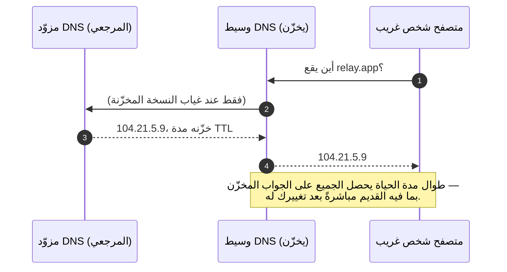
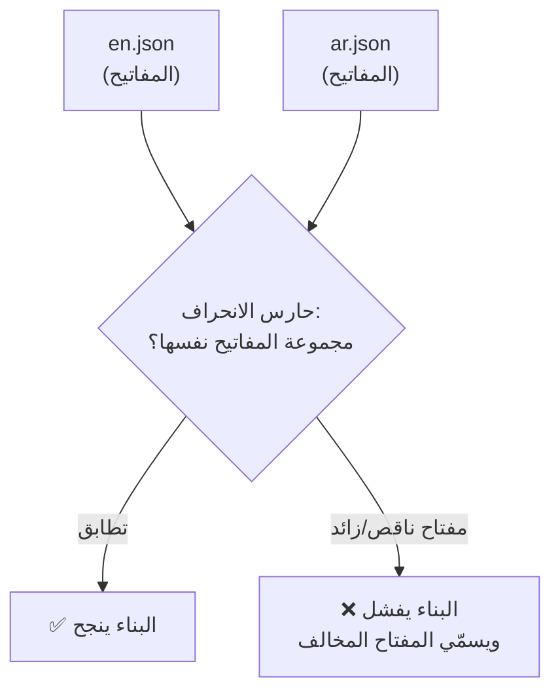
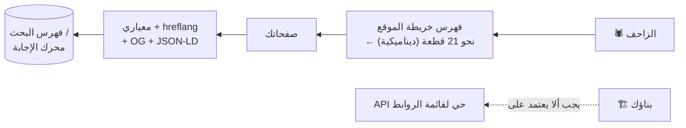
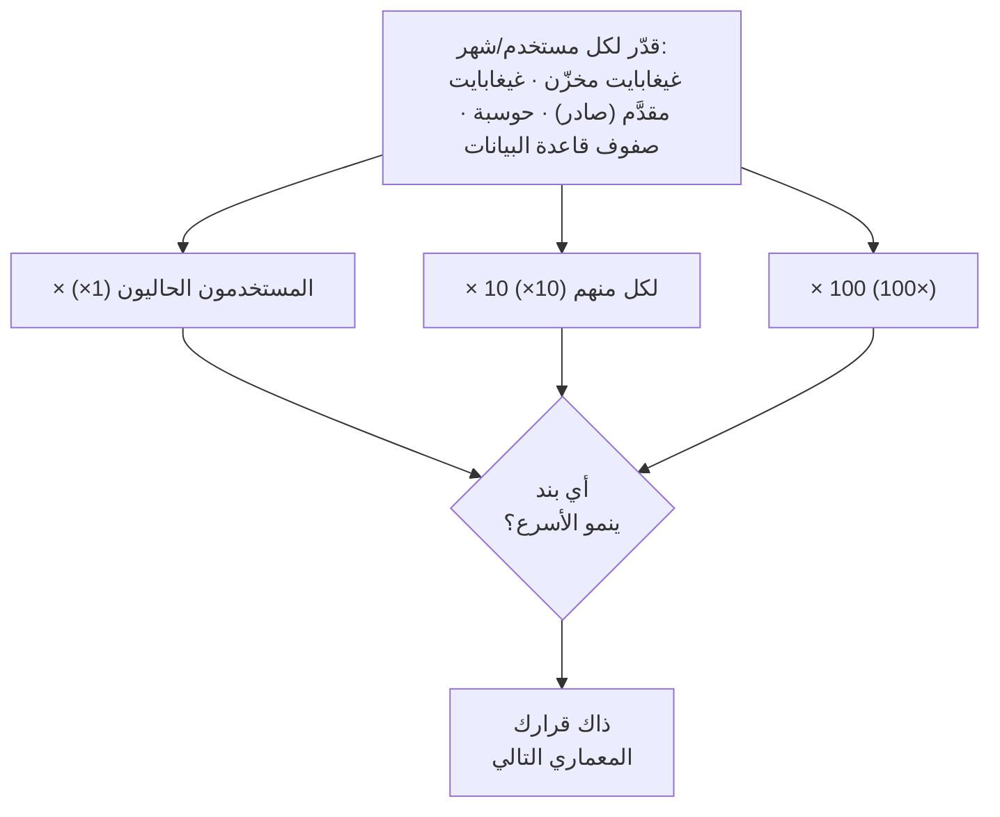
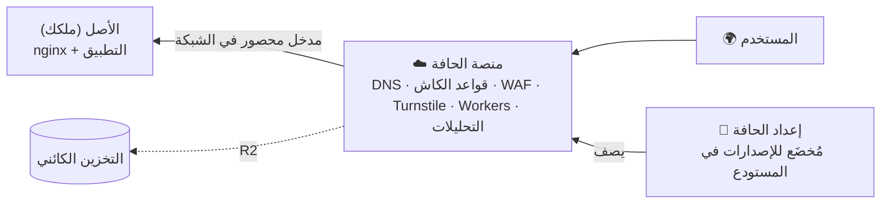

# الوحدة 11 — الوصول إلى العالم (Reaching the World)

*خمسة دروس عن كل ما يقع بين تطبيقك الجاهز (working app) وبين شخص غريب على الطرف الآخر من الكوكب: الاسمُ والشهادةُ (certificate) اللذان يمكّنانه من إيجادك أصلًا، واللغاتُ والتخطيطاتُ (layouts) التي تمكّنه من قراءتك، والزواحفُ (crawlers) ومحركاتُ الإجابة (answer engines) التي تمكّنه من اكتشافك، والفاتورةُ (bill) التي تأتي مقابل كل ذلك، ومنصةُ الحافة (edge platform) التي تربط القصة كلها.*

---

# 11.1 — النطاقات ونظام أسماء النطاقات وطبقة النقل الآمنة (Domains, DNS, and TLS)

## 🔥 قصة من الميدان (The War Story)

في 4 أكتوبر 2021، اختفى فيسبوك وإنستغرام وواتساب نحو 6 ساعات — لا «بطيئًا»، بل *غائبًا* عن مليارات المستخدمين (billions of people). لم يخترق (hacked) أحد شيئًا، ولم يحترق خادم (server). أثناء صيانة روتينية (routine maintenance)، سحب أمرٌ **مسارات BGP (BGP routes)** — أي اتجاهات الإنترنت (the internet's directions) — التي تخبر بقية العالم بمكان شبكة فيسبوك (network). وحين ذهبت الاتجاهات، صارت **خوادم نظام أسماء النطاقات (DNS)** الخاصة بفيسبوك غير قابلة للوصول أيضًا. ونظام أسماء النطاقات هو دليل العناوين (phone book): الخدمة التي تحوّل `facebook.com` إلى عنوان فعلي (address). ومع تعذّر الوصول إلى الدليل (directory)، لم يعد الاسم يشير إلى شيء. الخوادم (servers) كانت سليمة، تعمل وممتلئة بالصور، لكن العالم ببساطة لم يستطع إيجادها.

وازداد الأمر سوءًا داخل الشركة. فأدوات فيسبوك الداخلية (internal tools) — حتى بعض قارئات بطاقات الأبواب — كانت تعتمد على ترجمة الأسماء (name resolution) نفسها التي اختفت للتو، فتعذّر على من يستطيعون الإصلاح (fix) الوصولُ ماديًا إلى الأجهزة.

رسّخ هذا الآن، فهو يحكم الدرس كله: **قبل أن يسمع خادمك كلمة واحدة، يجب أن يعمل نظامان آخران — الذي يجد اسمك (DNS) والذي يثبت أنه أنت فعلًا (TLS). أنت لا تتحكم فيهما كما تتحكم في كودك (code)، وحين يفشلان يصبح تطبيقك السليم تمامًا غير مرئي.** ولا تبنِ مسار تعافيك (recovery path) فوق الشيء المعطّل نفسه.

## 📐 المبدأ (The Principle)

### 1. نظام أسماء النطاقات (DNS) دليلٌ (directory) يخزّن مؤقتًا (caches) — أي أنه يكذب لبعض الوقت (it lies for a while)

يحوّل نظام أسماء النطاقات (DNS) الاسمَ إلى عنوان (address). وتضبطه عبر **سجلات (Records)**، كلٌّ منها سطر صغير له نوع:

| السجل (record) | يحوّل… | …إلى | المعنى البسيط |
|---|---|---|---|
| `A` | اسمًا | عنوان (address) IPv4 | «relay.app يقع على 104.21.5.9» |
| `AAAA` | اسمًا | عنوان (address) IPv6 | المثل، بصيغة عنوان (address) أحدث |
| `CNAME` | اسمًا | اسمًا آخر | «`www.relay.app` اسم بديل (alias) لـ `relay.app`» |
| `MX` | اسمًا | خادم بريد (mail server) | «أرسل بريد relay.app هنا» |
| `TXT` | اسمًا | نصًّا حرًّا | إثباتات الملكية (proofs of ownership) وسياسة البريد (email policy) |

هنا فخّان. الأول **النطاق الجذر (Apex) مقابل النطاق الفرعي (Subdomain).** الجذر هو `relay.app` المجرّد، والفرعي هو `www.relay.app` أو `api.relay.app`. ويمنع معيار (standard) DNS وضع `CNAME` على الجذر — لكن سجلات الجذر (apex records) تحتاج أن تشير إلى شبكة CDN يتغير عنوانها. يعالج المزوّدون (providers) ذلك بتقنيات مثل «تسطيح (flattening) CNAME» أو سجلات (records) `ALIAS`؛ لا تحتاج التفاصيل الداخلية، بل تحتاج أن تعرف أن *الجذر والفرعي (apex and subdomain) يُضبطان بطريقتين مختلفتين*، وأن «يعمل على www لا على النطاق المجرّد (bare domain)» تذكرة دعم (support ticket) يومية.

الثاني: **الانتشار (propagation) كذبة تخزين مؤقت (caching lie).** يحمل كل سجل **مدة حياة (TTL)** — كم يجوز للوسطاء (resolvers) تخزينه. غيّر سجلًا (record) مدةُ حياته (its TTL) 24 ساعة، فسيرى نصفُ العالم القيمة الجديدة ونصفُه القديمة لمدة يوم كامل، دون أي خطأ في أي مكان. وهذا شكل كل علة كاش (cache bug) في الوحدة 3: *بيانات قديمة (stale data) تُقدَّم بثقة.* قبل أي تغيير مخطط (planned change)، اخفض مدة الحياة إلى 60 ثانية قبل يوم، ثم أعِدها بعده.

```mermaid
sequenceDiagram
    autonumber
    participant A as مزوّد DNS (المرجعي)
    participant R as وسيط DNS (يخزّن)
    participant U as متصفح شخص غريب
    U->>R: أين يقع relay.app؟
    R->>A: (فقط عند غياب النسخة المخزّنة)
    A-->>R: 104.21.5.9، خزّنه مدة TTL
    R-->>U: 104.21.5.9
    Note over R,U: طوال مدة الحياة يحصل الجميع على الجواب المخزّن —<br/>بما فيه القديم مباشرةً بعد تغييرك له.
```

### 2. طبقة النقل الآمنة (TLS) تثبت أنه أنت فعلًا — وتنتهي صلاحيتها (it expires)

**طبقة النقل الآمنة (TLS)** — قفل (padlock) `https://`؛ خليفة SSL — تؤدي وظيفتين: تشفّر الاتصال (encrypts the connection) كي لا يقرأه أحد بينك وبين المستخدم (user)، وتثبت أن الخادم (server) المجيب يملك ذلك الاسم فعلًا، عبر **شهادة (Certificate)** موقّعة من سلطة (authority) يثق بها المتصفح (browser). والشهادة ليست أبدية — بل *تنتهي صلاحيتها (expires)*، غالبًا كل 90 يومًا. والعطل الكلاسيكي (classic outage) غبيّ وعام: **شهادةٌ لم يجدّدها أحد انتهت، فأظهر كلُّ متصفح على الأرض تحذير أمانٍ (security warning) ملء الشاشة.** والإصلاح (fix) ليس أبدًا «تذكّر التجديد (renewal)»، بل تجديد آلي (automated renewal) (ACME / Let's Encrypt، أو تولّي شبكة CDN له) مع إنذار انتهاء صلاحية (expiry alarm) كخط أخير (backstop) — لأن الإصلاح بلا إنذار فشلٍ (failure alarm) عدٌّ تنازلي لا إصلاح، كما في الدرس 3.2.

### 3. شبكة CDN تنهي طبقة النقل الآمنة (terminates TLS) — وينبغي أن تكون بابك الوحيد (your only front door)

ضع شبكة CDN في المقدمة (فعلت ذلك في الوحدة 3)، فتكون هي ما **ينهي طبقة النقل الآمنة (TLS)** فعلًا — تحمل الشهادة (certificate) وتفكّ تشفير الطلب (request) عند الحافة (edge) قرب المستخدم (user)، ثم تحادث خادمك الأصلي (origin server) خلف الكواليس. لهذا تدير شبكة CDN — لا تطبيقك — الشهادات (certificates) في معظم عمليات النشر (deployments) الحقيقية.

ويخلق ذلك مهمة (job) لا يجوز تخطّيها. فإن استطاع الغرباء بلوغ خادمك الأصلي (your origin server) *مباشرةً* — بعنوانه الخام (raw IP)، متجاوزين شبكة CDN — صارت كل حماية توفّرها الحافة (الكاش (caching)، جدار الحماية (WAF)، تحديد المعدل (rate limits)) اختيارية للمهاجم (attacker)، والأسوأ: صارت ترويسة (header) «عنوان (address) العميل» التي تضيفها الشبكة (CDN) **قابلة للتزوير (forgeable)**، لأن من يبلغ الأصل (origin) مباشرةً يستطيع ضبطها بنفسه. وهذا هو النتيجة المطابقة تمامًا لاكتشاف الترويسة القابلة للتزوير (forgeable header) في الدرس 5.4 وإصلاح تحديد المعدل في 5.2. **حصر المدخل في شبكة CDN (CDN-only Ingress)** — بضبط جدار الخادم الأصلي (firewalling the origin) كي يقبل الاتصالات من الشبكة فقط، وحذف أي نسخ واردة من ترويسات الشبكة الموثوقة (trusted) — هو ما يجعل الحافة حدًّا حقيقيًا (boundary) لا مجرد اقتراح.

*اقرن هذا بحالة شهيرة ثانية: **هجوم Dyn على DNS (Dyn DNS attack)** (أكتوبر 2016)، حين أغرقت شبكةُ (botnet) Mirai مزوّدَ (provider) DNS واحدًا، فـ«سقط» تويتر ونتفليكس وريديت. خوادمها كانت سليمة. فأنت بقدر ما يمكن الوصول إلى نظام أسماء نطاقاتك (your DNS) فقط.*

## 🎛️ وجّه وكيلك (Direct Your Agent)

Relay يعمل محليًا. أعطه الآن اسمًا يستطيع العالم طلبه، وشهادةً (certificate) يثق بها العالم، وبابًا واحدًا.

1. **وجّه الاسم (Point the name).**
   > *«اشرح لي توجيه relay.app إلى شبكة CDN لدينا: أي سجل (record) للجذر (apex)، وأيّ لـ`www`، ولماذا يحتاج الجذر معالجة خاصة (special handling). اضبط مدة حياة (TTL) 60 ثانية الآن كي تُصلَح الأخطاء بسرعة. أرني السجلات (records) قبل وبعد.»*
2. **حوّل www إلى مضيف معياري (canonical host) واحد.**
   > *«اجعل `www.relay.app` يحوّل دائمًا (permanently redirect) إلى `relay.app` (أو العكس — اختر واحدًا وأخبرني لماذا). أريد عنوانًا معياريًا (canonical address) واحدًا بالضبط، لا موقعين ينحرفان (drift).»*
3. **احصل على TLS وأثبت تجديده الآلي (Get TLS and prove it auto-renews).**
   > *«فعّل TLS عبر شبكة CDN. ثم أرني تاريخ انتهاء الشهادة (certificate expiry date) وأكّد أن التجديد (renewal) آلي — وأضف إنذارًا (alert) ينطلق إن بقي على انتهائها 14 يومًا أو أقل.»*
4. **احصر مدخل الأصل في شبكة CDN (Lock the origin to CDN-only ingress).**
   > *«اضبط جدار (firewall) خادمنا الأصلي (our origin server) كي يقبل حركة الشبكة (traffic) فقط، واحذف أي نسخة واردة من ترويسة عنوان العميل (client-IP header). ثم حاول بلوغ الأصل (origin) بعنوانه الخام (by its raw IP) وأرني إياه يرفض — وأرني التطبيق ما زال يعمل عبر النطاق (domain) الحقيقي.»*
5. **اكتب الذاكرة (Write the memory).** أضف إلى CLAUDE.md:
   > *«شبكة CDN تدير TLS وهي مدخلنا الوحيد (our only ingress)؛ جدار الأصل (origin firewall) يقبل عناوين (addresses) الشبكة (CDN) فقط ويحذف ترويسات عنوان العميل (client-IP headers) الواردة. اخفض مدد حياة (TTLs) DNS قبل أي تغيير سجل (record change). شهادة (certificate) على بُعد 14 يومًا من الانتهاء تنبّهنا.»*

الختام (Finish): *«أودع برسالة (commit) `11-1-domain-dns-tls`.»*

> 🔧 **تحت الغطاء (Under the hood)** (اختياري (optional)): `dig relay.app +short` و`dig www.relay.app` يُظهران ما يعيده الوسطاء (resolvers) فعلًا؛ و`curl -vI https://relay.app` يُظهر مصافحة (handshake) TLS وتواريخ الشهادة (certificate dates)؛ وبلوغ العنوان الخام (raw IP) يثبت أهو مكشوف. التجديد (renewal) عبر ACME (Let's Encrypt) أو شهادة الشبكة المُدارة (managed cert).

## ✅ تحقق منه (Verify It)

- [ ] `relay.app` و`www.relay.app` كلاهما يفتح، وأحدهما يحوّل إلى الآخر — وتستطيع قول أيهما المعياري (canonical) ولماذا.
- [ ] القفل (padlock) حقيقي؛ وجدت تاريخ انتهاء الشهادة (certificate expiry date) وأكّدت أنها تجدّد نفسها، مع إنذار (alert) كخط أخير (as a backstop).
- [ ] بلغت العنوان الخام (raw IP) للأصل (origin) ورأيته يرفض — الشبكة (CDN) هي الباب الوحيد.
- [ ] غيّرت سجل DNS (DNS record) وفهمت لماذا بقيت القيمة القديمة لبعض الوقت (مدة الحياة (TTL))، بدل افتراض أن التغيير فوري.
- [ ] تعيد رواية قصة فيسبوك 2021 وتسمّي أيَّ النظامين قبل الخادم (server) فشل (DNS)، ولماذا كان تعافيهم (their recovery) بطيئًا.

## 🧾 بطاقة الخلاصة (Recap card)

- قبل أن يسمع خادمك شيئًا، يجب أن يجد DNS اسمك وأن تثبت TLS أنه أنت.
- يخزّن DNS بحسب مدة حياته (its TTL) — فكل تغيير «ينتشر (propagates)» ببطء ويقدّم أجوبة قديمة دون خطأ.
- الجذر والفرعي (apex and subdomain) يُضبطان بطريقتين مختلفتين؛ ولا يقبل الجذر (apex) `CNAME` عاديًا.
- شهادات (certificates) TLS تنتهي — فأتمِت التجديد (renewal) وأنذِر على الانتهاء؛ ولا تعتمد على التذكّر أبدًا.
- شبكة CDN تنهي TLS (terminates TLS) ويجب أن تكون مدخلك الوحيد (your only ingress)، وإلا صارت ترويساتها الموثوقة (its trusted headers) قابلة للتزوير (5.2، 5.4).

## 📚 المراجع ومزيد من القراءة (References & further wandering)

- مدونة كلاودفلير: **«كيف اختفى فيسبوك من الإنترنت»** (أكتوبر 2021) — قصة BGP وDNS بلغة مفهومة (in plain language).
- MDN: **«ما هو اسم النطاق (domain)؟»** و**«كيف يعمل الويب»** — الأساس المبسّط.
- Let's Encrypt: **«كيف تعمل»** (letsencrypt.org) — الشهادات الآلية (automated certificates) ونموذج تجديد ACME.
- ‏RFC 8555: **ACME** — البروتوكول (protocol) وراء التجديد الآلي (automated renewal)، لمن يريد التعمق (going deeper).
- تعلّم كلاودفلير: **«ما هو DNS؟» / «سجلات DNS»** — أنواع السجلات (records) ومدة الحياة (TTL)، بمخططات (with diagrams).
- تغطية Dyn وKrebs on Security لـ**هجوم Mirai/Dyn على DNS (Mirai/Dyn DNS attack)** (أكتوبر 2016) — قابلية الوصول (reachability) قوةً في تصميم الأنظمة (system design).

---

# 11.2 — التدويل ومن اليمين لليسار (Internationalization and RTL)

## 🔥 قصة من الميدان (The War Story)

منتج ثنائي اللغة (bilingual) — إنجليزي وعربي، أحدهما من اليمين لليسار (RTL) — أطلق روابط عميقة (deep links) تجعل النقر على رابط مقال مشارَك على الهاتف يفتح ذلك المقال *داخل التطبيق*. عمل في العرض التجريبي (demo). ومجموعة اختبارات الروابط العميقة (deep-link end-to-end suite) كانت خضراء. ثم جاءت البلاغات (reports): النقر على رابط موقع حقيقي يفتح التطبيق، لكن على شاشة (screen) **الرئيسية (Home screen)** دائمًا، لا على المحتوى المرتبط.

كان السبب الجذري (root cause) عدم تطابق (mismatch) لم يرسمه أحد. فروابط **الموقع** كانت مسبوقة باللغة (locale-prefixed) وبصيغة الجمع: `/en/articles/42`، `/ar/articles/42`. أما مسارات (routes) **التطبيق** الداخلية فكانت بلا لغة (locale-less) وبصيغة المفرد: `article/42`. الروابط `https://` الحقيقية تحمل شكل الموقع، والتطبيق بلا قاعدة تترجم فضاءً إلى آخر، فسقط كل رابط وارد إلى قيمة افتراضية (default) — الرئيسية (Home screen). ونجحت الاختبارات (tests) لأنها جرّبت مخطط (scheme) `app://` *المخصص* للتطبيق مباشرةً — مُدخَلٌ بديل (proxy input) تخطّى خطوة الترجمة المكسورة نفسها. **أخضر، وخطأ (Green, and wrong).**

وكان للمنتج نفسه علة توأم (twin bug) أهدأ في البحث. فمستخدمون يكتبون استعلامات عربية (queries) سليمة تمامًا حصلوا على *صفر نتائج (zero results)* — لأن الكلمة نفسها تُكتب بالتشكيل (diacritics) أو بدونه، وبأشكال مختلفة للحرف نفسه (أ / إ / ا)، وفهرس البحث (search index) يخزّن شكلًا والمستخدم (user) يكتب آخر. فلم يُطبَّع (normalized) النص أبدًا إلى شكل معياري (canonical form) واحد عند الدخول *وعند الخروج*، فأخطأت استعلامات سليمة محتوى سليمًا.

الدرس تحت الاثنين: **لحظةَ يتكلم منتجك أكثر من لغة (language) أو خط (script)، يكفّ «الشيء نفسه» عن كونه بديهيًا — فالروابط والحروف والتخطيطات كلها لها أشكال صحيحة متعددة، وكل حدٍّ بين اثنين منها يحتاج ترجمة صريحة (explicit translation) تستطيع اختبارها.**

## 📐 المبدأ (The Principle)

### 1. توجيه اللغة (locale routing): اختر استراتيجية واحدة (pick one strategy) واجعلها المصدر الوحيد (the single source)

هناك ثلاث طرق شائعة لترميز لغة (language) الصفحة:

| الاستراتيجية (strategy) | مثال | المقايضة (trade-off) |
|---|---|---|
| بادئة المسار (path prefix) | `relay.app/ar/feed` | واضحة، قابلة للتخزين (cacheable)، صديقة للبحث (SEO-friendly) — الأشيع |
| النطاق الفرعي (subdomain) | `ar.relay.app/feed` | فصل نظيف، لكن إعداد (config) DNS/TLS أكثر |
| ترويسة (header)/كوكي فقط | `relay.app/feed` + `Accept-Language` | لا لغة (language) مرئية — غير مرئية للكاشات (caches) والزواحف (crawlers)؛ تجنّبها إشارةً (signal) *وحيدة* |

بادئة المسار (path prefix) هي الجواب الصحيح عادةً. لكن أيًّا اخترت، **يجب أن يتفق عليها كلُّ عميلٍ يشارك فضاء الروابط (URL space).** والقصة هي ما يحدث حين يستعمل الموقع البادئات (prefixes) ولا يستعملها التطبيق: يصير الرابط عقدًا (contract) بين عميلين (clients)، والعقد غير المكتوب (unwritten contract) ينحرف. أعطِ الحدَّ دالةَ ترجمة (translation function) واحدة تعيد كتابة كل رابط وارد عبر محلٍّ مشترك (shared resolver) — عند البداية الباردة (cold start) والدافئة (warm start)، للموقع والتطبيق — كما حلّ الدرس 6.4 قائمةَ مسارات (routes) الروابط العميقة (deep links): استنبط أحدهما من الآخر، أو ثبّت سلكًا كاشفًا (tripwire).

### 2. ملفات الترجمة (translation files) سطحُ انحراف (drift surface) — احرسها كالكود (guard them like code)

نصوصك تعيش في ملفات رسائل (message files)، واحد لكل لغة (language): `en.json`، `ar.json`. ولحظةَ يوجد اثنان، ينحرفان (drift) — مفتاحٌ (key) يُضاف للإنجليزية ويُنسى في العربية يعرض نصًّا خامًا مثل `feed.emptyState` لمستخدم (user) حقيقي، أو الأسوأ: يسقط بصمت إلى الإنجليزية داخل صفحة عربية. وهذا صنف كل علة قائمة متوازية (parallel-list bug) في الدورة. والحل نفسه: **اختبار حارس انحراف (drift-guard)** يُفشل البناء (build) حين تختلف مجموعتا مفاتيح (key sets) اللغتين (both locales).

```mermaid
flowchart TD
    EN["en.json<br/>(المفاتيح)"] --> G{"حارس الانحراف:<br/>مجموعة المفاتيح نفسها؟"}
    AR["ar.json<br/>(المفاتيح)"] --> G
    G -->|"تطابق"| P["✅ البناء ينجح"]
    G -->|"مفتاح ناقص/زائد"| F["❌ البناء يفشل<br/>ويسمّي المفتاح المخالف"]
```

### 3. «من اليمين لليسار (RTL)» وضعُ تخطيط لا رقعة (a layout mode, not a patch)

اللغات من اليمين لليسار (RTL) تعكس الواجهة (interface) كلها: النص يُحاذى يمينًا، وسهم الرجوع يشير يمينًا، وأشرطة التقدم (progress bars) تمتلئ يسارًا، والشريط الجانبي (sidebar) يبدّل جهته. فإن بنيت من اليسار لليمين (LTR) ثم «أضفت العربية لاحقًا» برقعٍ متفرقة، حصلت على ذيل دائم من علل الانعكاس (mirroring bugs). ابنِ «من اليمين لليسار» صنفًا أولًا (first-class): استعمل **الخصائص المنطقية (logical properties)** (`start`/`end` بدل `left`/`right`) كي يعكس الإطار (framework) التخطيط عنك، واضبط اتجاه المستند (document direction) من اللغة (locale) لا يدويًا. وهذه الدورة نفسها تصدر كل درس بالإنجليزية وبالعربية من اليمين لليسار — فالانضباط (discipline) ليس نظريًا.

### 4. التواريخ والأرقام (dates and numbers) والترتيب (collation) لا تُترجَم — بل تُوطَّن (don't translate — they localize)

«الشيء نفسه بشكل مختلف» يلدغ أبعد من الكلمات:

- **التواريخ والأرقام (dates and numbers):** `07/08` هو 7 أغسطس أو 8 يوليو بحسب اللغة (locale)؛ والأرقام وعلامات العشرية (decimal marks) والتجميع (grouping) تختلف. نسّق عبر مكتبة التدويل (internationalization library) في المنصة (platform)، لا يدويًا أبدًا.
- **الترتيب (collation) والتطبيع (normalization):** الفرز والبحث خاصّان باللغة (locale). والحالة التحذيرية الشهيرة هي **مشكلة حرف «I» التركي (Turkish "I" problem)** — ففي التركية حرف `ı` بلا نقطة و`i` بنقطة، فتحويلُ حالة (upper/lower-casing) معرّف (identifier) ساذجًا (اسم مستخدم (user)، بريد) قد يحوّل `admin` إلى نص مختلف فيكسر تسجيل الدخول (logins)، أو الأسوأ: يتجاوز فحصًا (bypass a check). طبّع إلى شكل معياري واحد (one canonical form)، عند الدخول والخروج، واستعمل مقارنة واعية باللغة (locale-aware comparison) — ونصفُ البحث في القصة هو هذه القاعدة غير المتعلَّمة.

**النسخة العربية من هذه القاعدة (The Arabic edition of that rule)** — لأنها على الأرجح سوقك. للعربية ألغامُ تطبيع (normalization landmines) خاصة بها، وهي بالضبط ما سبّب حادثة البحث الفارغ عندنا: أشكال الألف (أ / إ / آ تُوحَّد إلى ا)، والتاء المربوطة (taa marbuta) مقابل الهاء (ة / ه)، وحرف التطويل (ـ)، والحركات (diacritics) الاختيارية — كلها تعني أن *الكلمة نفسها* تُكتب بعدة صيغ مختلفة في البايتات (bytes). فإن لم تُطبّعها إلى شكل واحد عند الكتابة والبحث معًا، حصل المستخدم (user) الذي يبحث عن مصطلح عربي صحيح على صفر نتائج (zero results)، وظنّ أن منتجك فارغ. وتفصيلان إضافيان يهمّان السوق العربي: الأرقام العربية-الهندية (Arabic-Indic numerals) (٠١٢٣ مقابل 0123 — اقبل الشكلين عند الإدخال، واختر شكل العرض بحسب اللغة (locale))، والتقويم الهجري (Hijri calendar) الذي يتوقّعه كثيرون إلى جانب الميلادي (Gregorian). مكتبة `Intl` تتولى جانب العرض، أما التطبيع (normalization) فمسؤوليتك أنت.

## 🎛️ وجّه وكيلك (Direct Your Agent)

Relay على وشك أن يتكلم لغتين، إحداهما من اليمين لليسار (RTL).

1. **اختر استراتيجية توجيه واحدة وطبّقها (Choose and apply one routing strategy).**
   > *«أضف بادئات لغة (locale prefixes) إلى Relay: `/en/...` و`/ar/...`، بلغة افتراضية (default) واحدة. تأكد أن الـAPI وتطبيق الويب وأي معالجة روابط (link handling) للموبايل تحلّ اللغة (locale) بالطريقة نفسها — أرني الدالة الواحدة (the one function) التي يتشاركونها.»*
2. **أضف اللغة الثانية وحارس انحراف (Add the second locale and a drift guard).**
   > *«استخرج كل نصوص الواجهة (UI text) إلى `en.json` و`ar.json`. أضف اختبارًا يُفشل البناء (build) إن لم يملك الملفان مجموعة المفاتيح نفسها (the same key set) بالضبط. ثم احذف مفتاحًا عربيًا في فرع (branch) وأرني البناء يفشل ويسمّيه.»*
3. **اجعل «من اليمين لليسار» صنفًا أولًا (Make RTL first-class).**
   > *«اضبط اتجاه الصفحة (page direction) من اللغة (locale)، وحوّل تخطيطنا إلى خصائص منطقية (logical properties) start/end كي تنعكس العربية صحيحًا. أرني التغذية (feed) بالاتجاهين متجاورتين — سهم الرجوع والمحاذاة وكل شيء.»*
4. **أصلح التطبيع عند حدّ البحث (search boundary).**
   > *«طبّع نص البحث إلى شكل معياري واحد (one canonical form) عند الفهرسة (indexing) والاستعلام (querying) معًا — عالج التشكيل (diacritics) وأشكال الحروف. أضف اختبارًا باستعلام يختلف عن النص المخزَّن بالشكل فقط، وأثبت أنه صار يجد السجل (record).»*
5. **اكتب الذاكرة (Write the memory).** أضف إلى CLAUDE.md:
   > *«اللغة (locale) بادئة مسار (path prefix) تحلّها دالة مشتركة واحدة (one shared function)؛ وكل عميل يستعملها. ملفات اللغة (locale files) محروسة من الانحراف (drift). التخطيط يستعمل start/end المنطقية. البحث والمعرّفات (identifiers) مُطبَّعة (normalized) إلى شكل معياري واحد (one canonical form) دخولًا وخروجًا. لا تختبر مسار رابط عبر مخطط بديل (proxy scheme) — اختبر الرابط الوارد الحقيقي.»*

الختام (Finish): *«أودع برسالة (Commit with the message) `11-2-i18n-rtl`.»*

> 🔧 **تحت الغطاء (Under the hood)** (اختياري (optional)): حارس الانحراف (drift guard) فرقُ مجموعتين (set-difference) على قائمتي مفاتيح (keys) JSON؛ والتطبيع (normalization) Unicode NFC/NFKC مع خريطة حروف (letter map) خاصة باللغة (locale)؛ و«من اليمين لليسار (RTL)» يتكئ على الخصائص المنطقية (logical properties) في CSS و`dir="rtl"`؛ وتنسيق التاريخ/الرقم عبر `Intl.DateTimeFormat` / `Intl.NumberFormat`.

## ✅ تحقق منه (Verify It)

- [ ] فتحت Relay على `/en/...` و`/ar/...` والصفحة العربية معكوسة تمامًا — لا مجرد نص مترجم في إطار من اليسار لليمين (LTR).
- [ ] اختبار حارس الانحراف (drift-guard test) موجود **ورأيته يفشل** حين حُذف مفتاح (key) عربي، ثم ينجح حين أُعيد.
- [ ] استعلام بحث يختلف عن النص المخزَّن بالتشكيل (diacritics) أو شكل الحرف فقط صار يعيد النتيجة الصحيحة — رأيت قبله وبعده.
- [ ] رابط مشارَك يفتح المحتوى الصحيح في كل لغة (language)، لا صفحة افتراضية (default page).
- [ ] تعيد رواية قصة «يفتح دائمًا على الرئيسية (Home screen)» وتسمّي لماذا كانت الاختبارات (tests) خضراء والميزة (feature) مكسورة (مُدخَل بديل (proxy input) تخطّى الخطوة المكسورة).

## 🧾 بطاقة الخلاصة (Recap card)

- أكثر من لغة (language) يعني أن «الشيء نفسه» له أشكال صحيحة متعددة — الروابط والحروف والتخطيطات كلٌّ يحتاج ترجمة صريحة (explicit translation) قابلة للاختبار (testing).
- اختر استراتيجية توجيه (routing strategy) لغة (language) واحدة (البادئات (prefixes) عادةً) واجعل كل عميل يحلّها عبر دالة مشتركة واحدة (one shared function).
- ملفات الترجمة (translation files) تنحرف (drift) — احرس مجموعات المفاتيح (key sets) باختبار (test) يُفشل البناء (حارس انحراف (drift guard) 6.4، مجددًا).
- «من اليمين لليسار (RTL)» وضعُ تخطيط (layout mode): خصائص start/end منطقية، واتجاه من اللغة (locale) — لا رقعٌ متفرقة.
- طبّع نص البحث والمعرّفات (identifiers) إلى شكل معياري واحد (one canonical form) دخولًا وخروجًا؛ ووطّن التواريخ والأرقام (dates and numbers) عبر مكتبة المنصة (platform).

## 📚 المراجع ومزيد من القراءة (References & further wandering)

- MDN: **«التوطين (Localization)»** و**الخصائص المنطقية (logical properties) في CSS** — مرجع `start`/`end` و`dir`.
- Unicode: **UAX #15 صيغ التطبيع (Normalization Forms)** (unicode.org) — لماذا للنص «نفسه» ترميزات متعددة.
- W3C: **«أفضل ممارسات التدويل (Internationalization Best Practices)»** (w3.org/International) — النص ثنائي الاتجاه (bidirectional text) و«من اليمين لليسار (RTL)» بشكل صحيح.
- **مشكلة حرف «I» التركي (Turkish "I" problem)** — ابحث «Turkish dotless i bug»؛ حالة تحذيرية معيارية في طيّ الحالة (case-folding).
- MDN: **كائن `Intl`** — التواريخ والأرقام (dates and numbers) والترتيب (collation) الواعية باللغة (locale) دون كتابة يدوية.

---

# 11.3 — تحسين محركات البحث ومحركات الإجابة (SEO and AEO): أن تُوجَد وأن تُقتبَس (Being Found and Cited)

> **درس مرتبط بالأدوات (tool-dated lesson).** *المبادئ* — المعنى المقروء آليًا (machine-readable meaning)، وعدم ربط البناء (builds) ببيانات وقت التشغيل (runtime data)، والكتابة كي تُقتبَس — تبقى بعد الأدوات. أما المنتجات والأعراف المسمّاة (سلوك Googlebot، و`llms.txt`، وزواحف (crawlers) ذكاء اصطناعي بعينها) فهي أفضل الافتراضات الحالية (best defaults) وتُحدَّث سنويًا. تعلّم المبدأ (The Principle)، وأعد فحص الأداة.

## 🔥 قصة من الميدان (The War Story)

منتج محتوى (content product) كبير أراد أن تفهرس (index) محركات البحث (search engines) كل صفحاته، فولّد **خريطة موقع (Sitemap)** — القائمة المقروءة آليًا بكل رابط تريد زحفه. ومع نمو الكتالوج (catalog) نما الملف: مستند XML (XML document) وحيد ضخم بلغ **350 ميغابايت**. تحدّد محركات البحث خريطة الموقع بـ50 ألف رابط و50 ميغابايت؛ فكان الملف العملاق عديم الفائدة بصمت، وتوليده يرهق قاعدة البيانات (Database) في كل بناء (build).

فقسّمه الفريق — حدسٌ صائب — إلى خرائط أصغر (smaller sitemaps) خلف فهرس (index). لكنهم ولّدوا القطع (chunks) **وقت البناء (Build)**، بمناداة الـAPI لقائمة الروابط الكاملة أثناء تجميع الموقع (compiling the site). ثم يومًا كان الـAPI بطيئًا وقت البناء. لم يفشل البناء بسرعة (fail fast) برسالة واضحة؛ بل **تجمّد (froze)**، منتظرًا اعتمادَ وقت تشغيلٍ (runtime dependency) ما كان ينبغي أن يملكه أصلًا. فصار API معطّل — مشكلةُ *وقت تشغيل* — يحجب *النشر (Deploy)*، العملية التي يجب أن تبقى تعمل كي تشحن الإصلاح (fix).

كان الإصلاح (fix) الدائم فكرتين معًا: **فهرس (index)** خريطة موقع (sitemap) يشير إلى نحو 21 قطعة تُولَّد **ديناميكيًا وقت الطلب (dynamically at request time)**، فلا ملف واحد أكبر من اللازم، ولا يعتمد البناء (build) على أي بيانات حية (live data). **لا تربط نجاح البناء بتوافر بيانات وقت التشغيل (runtime data)، وقسّم (chunk) كل ما ينمو بلا حد.**

## 📐 المبدأ (The Principle)

### 1. تحسين البحث (SEO) إخبارُ الآلات بما يراه البشر أصلًا (telling machines what humans can already see)

الزاحف (Crawler) برنامج يجلب صفحاتك كمتصفح (browser)، ويتبع الروابط (follows links)، ويبني فهرسًا (index). ومهمتك أن تجعل معناك مقروءًا (legible) له:

| الإشارة (signal) | ما تخبر به الزاحف (crawler) | الفشل عند غيابها |
|---|---|---|
| **خريطة موقع (sitemap)** (مقسّمة، ≤50 ألف رابط) | «هذه كل الروابط الجديرة بالفهرسة (indexing)» | صفحات عميقة (deep pages) لا تُكتشف أبدًا |
| **الرابط المعياري (Canonical)** | «هذا العنوان (address) الحقيقي الوحيد لهذا المحتوى» | روابط مكررة (duplicate URLs) تشتّت ترتيبك (ranking) |
| **hreflang** | «هذه نسخ الصفحة بلغات أخرى» | عرض صفحة بلغة (language) خاطئة للباحثين |
| **وسوم (tags) Open Graph** | «هذا العنوان/الصورة (title/image) عند المشاركة» | معاينات روابط (link previews) قبيحة لا تُنقر |
| **مؤشرات الويب الأساسية (Core Web Vitals)** | كم تبدو الصفحة سريعة/مستقرة | الصفحات البطيئة ترتيبها أدنى — السرعة مدخل ترتيب (ranking input) |

اثنتان منها ترتبطان مباشرةً بدرسي الوحدة 11 الآخرين. **المعياري (canonical) + hreflang** هما وجه البحث للدرس 11.2: إن عاش المحتوى نفسه على `/en/x` و`/ar/x`، فـ*يجب* أن تخبر الزواحف (crawlers) أنهما ترجمتان (translations) لا نسختان مكررتان. و**مؤشرات الويب الأساسية (Core Web Vitals)** — عتبات جوجل المقيسة (measured thresholds) للتحميل (loading) والتفاعل (interactivity) والاستقرار البصري (visual stability) — تجعل أداء الواجهة (frontend performance) في الدرس 10.5 عاملَ ترتيب (ranking factor) حرفيًا، لا مجرد تحسين.

```mermaid
flowchart RL
    C["🕷️ الزاحف"] --> S["فهرس خريطة الموقع<br/>← نحو 21 قطعة (ديناميكية)"]
    S --> P["صفحاتك"]
    P --> M["معياري + hreflang<br/>+ OG + JSON-LD"]
    M --> I[("فهرس البحث /<br/>محرك الإجابة")]
    B["🏗️ بناؤك"] -.->|"يجب ألا يعتمد على"| API["API حي لقائمة الروابط"]
```

### 2. تحسين محركات الإجابة (Answer-Engine Optimization): الباب الأمامي يصير محرك إجابة (the front door is becoming an answer engine)

يتزايد ألا يزور الناس عشرة روابط زرقاء — بل يسألون مساعدًا ذكيًا (AI assistant) يقرأ المصادر ويجيب باقتباس (citation) أو اثنين. **تحسين محركات الإجابة (AEO)** هو جعل محتواك قابلًا للتحليل (parseable) و*للاقتباس* آليًا:

1. **البيانات المنظمة (schema.org / JSON-LD).** كتلة JSON صغيرة في الصفحة تصرّح، بمفردات معيارية (standard vocabulary)، «هذا مقال بقلم فلان، نُشر في كذا (published on such-and-such)» أو «هذا منتج بسعر كذا». تزيل عن الآلة تخمينَ *معنى* صفحتك.
2. **اكتب كي تُقتبَس (Write to be cited).** تقتبس محركات الإجابة (answer engines) محتوى يجيب سؤالًا مباشرةً، في فقرة مكتفية بذاتها، تحت عنوان ثابت (stable heading) له مرساة ثابتة (stable anchor). أما دفن الجواب في الفقرة التاسعة خلف قصة فغير مرئي لآلة تبحث عن وحدة قابلة للاقتباس (citable unit).
3. **`llms.txt`** — عرف ناشئ (emerging convention) (ملف نصّي بسيط في جذر موقعك (site root)، ابن عم `robots.txt`) يوجّه أنظمة الذكاء الاصطناعي (AI systems) إلى أنظف محتواك وأنفعه. عامله أفضلَ تخمين حالي لا معيارًا مستقرًا (settled standard) — وهذا الجزء المرتبط بالأدوات.
4. **راقب زواحف الذكاء الاصطناعي (AI crawlers) في سجلاتك (logs).** لا تتصرف كـGooglebot — وكلاء مختلفون (user agents)، وأنماط جلب (fetch patterns) مختلفة، وأحيانًا تتجاهل قواعدك. لا تدير ما لا تقيس؛ والسجلات نفسها التي تلتقط الإساءة (abuse) (الوحدة 5) تخبرك بمن يقرؤك ليجيب أسئلة عنك.

### 3. يجب ألا يعتمد البناء على بيانات وقت التشغيل (The build must not depend on runtime data)

يستحق أعمق مبادئ القصة سطره الخاص، لأنه يتكرر حيثما التقى محتوًى مولَّد (generated content) بنشر (deploy): **البناء (build) كودٌ (code) يتحول إلى مُنتَج (artifact)؛ ويجب أن ينجح من المصدر وحده (source).** فلحظةَ ينادي بناؤك (your build) API حيًّا، يصير عطلُ وقت التشغيل (runtime outage) عطلَ (outage) نشر — وربطت العملية التي تشحن الإصلاحات بالأنظمة نفسها التي تتعطل. ولّد المستندات الكبيرة المعتمدة على البيانات *ديناميكيًا وقت الطلب (dynamically at request time)*، أو من لقطة (snapshot) مودعة في المستودع (repo).

## 🎛️ وجّه وكيلك (Direct Your Agent)

أعطِ نوعَي صفحات Relay الرئيسيين (ملف مبدع (creator profile) وقطعة محتوى (piece of content)) معاملة الاكتشاف (discoverability) الكاملة — وأثبت بقاء البناء (build) نظيفًا.

1. **خرائط موقع مقسّمة وديناميكية (Chunked, dynamic sitemaps).**
   > *«ولّد فهرس خريطة موقع (sitemap index) يشير إلى خرائط مقسّمة (chunked sitemaps)، كلٌّ دون 50 ألف رابط، تُقدَّم ديناميكيًا وقت الطلب (dynamically at request time). أكّد أن البناء (build) لا ينادي الـAPI لقائمة الروابط — ثم حاكِ (simulate) تعطّل الـAPI وقت البناء (build time) وأرني البناء ما زال ينجح.»*
2. **معياري (canonical) + hreflang.**
   > *«أضف رابطًا معياريًا (canonical URL) لكل صفحة، وروابط hreflang تقرن كل صفحة `/en/` بتوأمها `/ar/`. أرني الوسوم (tags) على صفحة واحدة باللغتين (both locales).»*
3. **بطاقات Open Graph (Open Graph cards).**
   > *«أضف وسوم (tags) Open Graph (عنوان/وصف/صورة (title/description/image)) لنوعَي الصفحات. أرني معاينة الرابط (link preview) التي ستعرضها منصة تواصل (social platform).»*
4. **بيانات JSON-LD المنظمة (JSON-LD structured data).**
   > *«أضف schema.org JSON-LD إلى صفحة المحتوى (Article) وصفحة الملف (Person/Organization). تحقق منها بأداة اختبار بيانات منظمة (structured-data testing tool) وأرني إياها تنجح.»*
5. **اسأل محركات الإجابة (Ask the answer engines).**
   > *«اسرد وكلاء زواحف الذكاء الاصطناعي (AI crawler agents) الذين زارونا هذا الأسبوع من السجلات (logs).»* ثم يدويًا: اسأل ثلاثة مساعدين ذكيين (AI assistants) سؤالًا Relay أفضلُ جواب له، ولاحظ هل — وكيف — تُقتبَس. تلك الفجوة قائمة أعمال (backlog) AEO عندك.

الختام (Finish): *«أودع برسالة (Commit with the message) `11-3-seo-aeo`.»*

> 🔧 **تحت الغطاء (Under the hood)** (اختياري (optional)): خرائط الموقع (sitemaps) XML بأصل (with a root element) `<sitemapindex>`؛ والمعياري (canonical) `<link rel="canonical">`؛ وhreflang هو `<link rel="alternate" hreflang="ar">`؛ وJSON-LD كتلة `<script type="application/ld+json">`؛ تحقق بأداة Rich Results من جوجل ومدقّق schema.org.

## ✅ تحقق منه (Verify It)

- [ ] حاكيت تعطّل الـAPI وقت البناء (build time) وما زال البناء (build) ينجح — النشر لا يعتمد على بيانات وقت التشغيل (runtime data).
- [ ] خريطة الموقع (sitemap) فهرسٌ (index) من قطع (chunks)، كلٌّ دون حدّي 50 ألف/50 ميغابايت، تُقدَّم ديناميكيًا.
- [ ] نسختا `/en/` و`/ar/` لصفحة واحدة تصرّح كلٌّ برابط معياري (canonical) وتشيران إلى بعضهما بـhreflang.
- [ ] لصقُ رابط Relay في محادثة أو تطبيق تواصل يُظهر بطاقة معاينة (preview card) Open Graph سليمة، ومدقّق البيانات المنظمة (structured-data validator) ينجح على نوعَي الصفحات.
- [ ] سألت ثلاثة مساعدين ذكيين (AI assistants) سؤالًا يجيبه منتجك وتستطيع قول هل اُقتبست — وتعيد رواية قصة خريطة 350 ميغابايت وتسمّي الربط (coupling) الذي جمّد البناء (build).

## 🧾 بطاقة الخلاصة (Recap card)

- تحسين البحث (SEO) يجعل معناك مقروءًا (legible) للزواحف (crawlers): خرائط مقسّمة (chunked sitemaps)، وروابط معيارية (canonical URLs)، وhreflang، وبطاقات OG، ومؤشرات ويب (web vitals) سريعة (مدخل ترتيب (ranking input) حقيقي).
- المعياري (canonical) + hreflang وجه البحث لتوجيه لغتك (11.2)؛ والترجمات (translations) المكررة/غير الموسومة تشتّت ترتيبك (your ranking).
- تحسين محركات الإجابة (Answer-Engine Optimization) يجعلك قابلًا للاقتباس (citable): بيانات JSON-LD منظمة، وأجوبة مباشرة قابلة للاقتباس (citation) تحت مراسٍ ثابتة (stable anchors)، و`llms.txt`، ومراقبة زواحف الذكاء الاصطناعي (AI crawlers) في سجلاتك (your logs).
- لا تربط نجاح البناء (build) ببيانات وقت التشغيل (runtime data) أبدًا — API معطّل يجب ألا يجمّد نشرًا؛ وقسّم كل ما (chunk everything that) لا حدّ له.
- مرتبط بالأدوات (tool-dated): المبادئ تبقى؛ أعد فحص الزواحف (crawlers) والأعراف المسمّاة كل سنة.

## 📚 المراجع ومزيد من القراءة (References & further wandering)

- Google Search Central: **«خرائط المواقع»** و**«دليل مالكي المواقع الكبيرة (Large site owner's guide)»** — حدود 50 ألف/50 ميغابايت ونموذج فهرس خريطة الموقع (sitemap index).
- جوجل: **مؤشرات الويب الأساسية (Core Web Vitals)** (web.dev/vitals) — العتبات المقيسة (measured thresholds) التي تغذّي الترتيب (ranking).
- schema.org — مفردات البيانات المنظمة (structured-data vocabulary)؛ اقرنها بأداة **Rich Results** من جوجل.
- Google Search Central: **الروابط المعيارية** و**hreflang** — قواعد التكرار/الترجمة (duplication/translation).
- مقترح **llms.txt** (llmstxt.org) — العرف الناشئ (emerging convention)؛ اقرأه أفضلَ تخمين حالي لا معيارًا.
- بروتوكول Open Graph (ogp.me) — الوسوم (tags) وراء معاينات الروابط.

---

# 11.4 — هندسة التكلفة (cost engineering)

## 🔥 قصة من الميدان (The War Story)

قصتا تكلفة (cost) من منصة (platform) واحدة، وهما متجانستان.

الأولى: عاش تخزين الوسائط (media storage) على مزوّد سحابي (cloud provider) واحد (GCS). كانت البايتات (bytes) رخيصة *التخزين (storage)* — لكن كلما بثّ مستخدم (user) ملفًا، فرض المزوّد (provider) رسوم **الصادر (Egress)**: رسمًا على البيانات المغادِرة لشبكته. ومع جمهور عالمي (global audience) يبثّ صوتًا طوال اليوم، صار الصادر بهدوء أحدَ أكبر بنود الفاتورة (lines on the bill) — يقزّم التخزين نفسه. وكان الإصلاح (fix) هجرةً (migration) إلى مزوّد (Cloudflare R2) محورُ عرضه **صفر رسوم صادر (zero egress fees)**. لم تتغير البايتات، بل تغيّر *نموذج التسعير (pricing model)*، فهبطت الفاتورة (bill) بحدة. (تلك الهجرة نفسها هي حيث عاشت علة الملفات التي تعود (resurrecting-files bug) في الدرس 2.2 — عمل التكلفة (cost work) وعمل الصواب (correctness work) على السلك نفسه.)

الثانية: قفزت النسخة الاحتياطية (backup) الليلية من **244 ميغابايت إلى 871 ميغابايت بين ليلة وضحاها**، بلا بيانات جديدة. وكان السبب إعادةَ هيكلة (refactor) أزرق-أخضر (الوحدة 4) أنشأت مجلدَي بناء (build directories) `.next-blue` و`.next-green`، كلٌّ يحمل نحو 620 ميغابايت من كاش (cache) webpack القابل للتوليد (regenerable) — والنسخة الاحتياطية تؤرشف *كليهما* بأمانة كل ليلة، بينما ما يحتاج النسخ فعلًا (قواعد البيانات (databases)) جزءٌ يسير من الحجم. كانت النسخة تدفع لتخزين (storage) نفايات قابلة لإعادة البناء (rebuildable junk).

لاحظ ما يوحّدهما: **علة التكلفة (cost bug) وعلة الصواب (correctness bug) غالبًا العلة (bug) نفسها.** فنسخ كاشات البناء (build caches) *خطأ* (تؤرشف مُنتَجات (artifacts) لا حالة (state) — الدرس 2.3) *ومكلف*. وتخزين (storage) التحليلات (analytics) إلى الأبد (الدرس 2.4) لغمُ موثوقية (reliability landmine) *وفاتورة (bill) متنامية*. **اقرأ فاتورتك السحابية (cloud bill) كسِجل (log): كل بند (line item) مفاجئ عيبٌ (defect) بعلامة دولار.**

## 📐 المبدأ (The Principle)

### 1. الفواتير الأربع التي تفاجئك (The four bills that surprise you)

التسعير السحابي (cloud pricing) ليس رقمًا واحدًا. والبنود (line items) التي تباغت الناس:

| البند (line item) | يفرض رسمًا على | الفخ |
|---|---|---|
| **الصادر (Egress)** | البيانات المغادِرة لشبكة المزوّد (provider's network) | التخزين (storage) يبدو رخيصًا؛ أما *تقديمه* فلا. غالبًا أكبر بند (line item) عند التوسع. |
| **طبقات التخزين (storage tiers)** | حفظ البايتات (bytes)، بحسب سرعة الوصول (access speed) | تخزين ساخن (hot storage) لبيانات باردة (cold data) — ملفات قديمة لا تُقرأ على قرص متميز (premium disk). |
| **الحوسبة (Compute)** | خوادم (servers)/دوال (servers/functions) تعمل | «بلا خادم (serverless)» يوسّع التكلفة (cost) مع الحركة (traffic) — ومع الحلقات الجامحة (runaway loops). |
| **نمو قاعدة البيانات (database growth)** | قرص وإدخال/إخراج (IO) لبياناتك | جداول بلا حد (unbounded tables) (تحليلات (analytics)، سجلات (logs)) تُنمي الفاتورة (bill) *والخطر (risk)* معًا (2.4). |

**الصادر (egress) هو الأكثر مفاجأةً لبنّائي الذكاء الاصطناعي (AI-assisted builders)**، لأن الوكلاء (agents) يحسّنون لـ«هل يعمل»، وتقديم الوسائط يعمل جيدًا — حتى تأتي الفاتورة (invoice). والإصلاح البنيوي (structural fix) **شبكة CDN كدرعِ تكلفة (cost shield)**: متى خزّنت الحافة (edge) ملفاتك، لا يبلغ الأصلَ (origin) معظمُ الطلبات (requests)، فتدفع صادر الأصل (origin egress) مرة وتقدّم النسخة مرات. فالشبكة أداة أداء (performance tool) *وأداة تكلفة (cost tool)*؛ وهجرة (migration) R2 قرنت الاثنين باختيار أصلٍ بلا رسم صادر خلف حافة تمتص معظم القراءات أصلًا.

### 2. المهام الخلفية «المجانية» ليست مجانية (Free background jobs aren't free)

المهمة المجدولة (scheduled job) تبدو مجانية — تملك الخادم (server) أصلًا. لكن كل مهمة (job) تحرق حوسبة (compute)، وتقرأ وتكتب قاعدة البيانات (إدخال/إخراج (IO) تدفع ثمنه)، وقد تتوسع بهدوء: مهمة ليلية (nightly job) تمسح جدولًا ناميًا تكلّف أكثر كل ليلة، وحلقة إعادة محاولة (retry loop) معطوبة (عاصفة إعادة المحاولة (retry storm) في الدرس 6.7) قد تفوترك آلاف النداءات لـAPI مدفوع قبل أن يلاحظ أحد. التكلفة (cost) خاصية (property) *النظام كله عبر الزمن*، لا الميزة (feature) التي شحنتها اليوم.

### 3. نمذج التكلفة (Model cost) عند 1× و10× و100× — قبل أن تعلّمك الفاتورة (before the invoice teaches you)

أنفع عادة تكلفة نموذجٌ تقريبي (back-of-envelope model) يتوسع مع المستخدمين (users). لا تحتاج تدريبًا ماليًا (finance training)، بل ثلاثة أعمدة (columns):

```mermaid
flowchart TD
    A["قدّر لكل مستخدم/شهر:<br/>غيغابايت مخزّن · غيغابايت مقدَّم (صادر) · حوسبة · صفوف قاعدة البيانات"] --> B["× المستخدمون الحاليون (1×)"]
    A --> C["× 10 لكل منهم (10×)"]
    A --> D["× 100 (100×)"]
    B & C & D --> E{"أي بند<br/>ينمو الأسرع؟"}
    E --> F["ذاك قرارك<br/>المعماري التالي"]
```

المقصود ليس تنبؤًا دقيقًا (precise forecast) — بل إيجاد **أي بند (line item) يتوسع أسوأ توسع (scales worst)** قبل أن يتوسع أصلًا. فإن هيمن الصادر (egress) عند 10×، اتخذت قرار الشبكة (CDN)/الأصل (origin) الآن رخيصًا، بدل حالة فوترة طارئة (billing emergency). وهذا تخطيط سعة (capacity planning) (الدرس 10.5) بمحور دولار (with a dollar axis).

## 🎛️ وجّه وكيلك (Direct Your Agent)

ابنِ نموذج تكلفة (cost model) Relay وجِد أسوأ بنوده توسعًا (its worst-scaling line items) قبل أن يفعل مستخدم (user).

1. **جرد سطح التكلفة (cost surface).**
   > *«اسرد كل ما يدفع Relay مقابله لمزوّد سحابي (cloud provider): تخزين (storage)، صادر (egress)، حوسبة (compute)، قاعدة بيانات (database)، مهام خلفية (background jobs)، APIs طرف ثالث (third-party). لكلٍّ سطرٌ واحد عمّا يرفع التكلفة (cost).»*
2. **قدّر لكل مستخدم، لكل شهر (Estimate per user, per month).**
   > *«لمستخدم (user) Relay نموذجي، قدّر شهريًا: غيغابايت مخزّن (GB stored)، وغيغابايت مقدَّم (صادر (egress))، وحوسبة (compute)، وصفوف قاعدة بيانات (database rows) جديدة. اذكر افتراضاتك — سأتحقق منها.»*
3. **أسقِط 1× (Project 1×) / 10× / 100×.**
   > *«ابنِ جدول التكلفة الشهرية الإجمالية (total monthly cost) عند مستخدمينا الحاليين، و10×، و100×. أرني أي بند (line item) ينمو الأسرع، وعند أي مقياس (metric) يصير أكبر تكلفة (cost).»*
4. **جِد العلة ذات الشكل نفسه (Find the same-shape bug).**
   > *«افحص شيئين من تاريخ حوادثنا (incident history): هل يُخزَّن أو يُنسَخ احتياطيًا أي شيء قابل للتوليد (كاشات بناء (build caches)، صور مصغّرة (thumbnails))؟ وهل ينمو أي جدول بلا حد احتفاظ (retention limit)؟ كلاهما علة تكلفة (cost bug) وعلة صواب (correctness bug) — أشِر إليهما.»*
5. **قرّر الدرع (Decide the shield).**
   > *«بالنظر إلى أسوأ بند توسعًا (worst-scaling line item)، ما أرخص إصلاح بنيوي (structural fix) الآن — كاش (cache) شبكة CDN، أو طبقة تخزين (storage tier)، أو أصل (origin) بلا صادر (egress)، أو مدة احتفاظ (retention TTL)؟ اقترح واحدًا، مع المقايضة (trade-off).»*

الختام (Finish): *«أودع نموذج التكلفة (cost model) كـ`11-4-cost-model.md` برسالة `11-4-cost-engineering`.»*

> 🔧 **تحت الغطاء (Under the hood)** (اختياري (optional)): يوفّر معظم المزوّدين تصدير تكلفة/فوترة (cost/billing export) (CSV أو API) ومقاييس استخدام (usage metrics) لكل خدمة؛ ارسم غيغابايت الصادر (egress GB) مقابل غيغابايت التخزين (storage GB) على مدى شهر، فيرسم البند (line item) المفاجئ نفسه عادةً.

## ✅ تحقق منه (Verify It)

- [ ] نموذج تكلفة (cost model) Relay موجود كملف بأعمدة (columns) 1× / 10× / 100×، وقرأته — تستطيع تسمية أسوأ بند توسعًا (worst-scaling line item) بصوت عالٍ.
- [ ] وجدت شيئًا واحدًا على الأقل يُخزَّن أو يُنسَخ احتياطيًا وهو قابل للتوليد (علة تكلفة (cost bug) وصواب) أو أكّدت خلوّه.
- [ ] تستطيع أن تشرح، بجملة لكلٍّ، الصادرَ (egress) ولماذا شبكة CDN درعُ تكلفة (cost shield) لا مجرد أداة سرعة (speed tool).
- [ ] اقترحت إصلاحًا بنيويًا (structural fix) واحدًا لأسوأ بند (worst line item) *قبل* أن يصير مكلفًا — قرار لا رد فعل (reaction).
- [ ] تعيد رواية هجرة (migration) GCS→R2 وتقول ما الذي تغيّر (نموذج التسعير (pricing model) لا البايتات (bytes))، ولماذا كانت النسخة المتضاعفة (bloated backup) علة صواب (correctness bug) أيضًا.

## 🧾 بطاقة الخلاصة (Recap card)

- اقرأ الفاتورة السحابية (cloud bill) كسِجل (as a log): كل بند (line item) مفاجئ عيبٌ (defect) بعلامة دولار.
- الصادر (egress) — البيانات المغادِرة للمزوّد (provider) — البند (line item) الأكثر مفاجأةً للبنّائين (for builders)؛ وشبكة CDN درعُ تكلفة (cost shield) لا مجرد أداة سرعة (speed tool).
- علل التكلفة (cost bugs) وعلل الصواب (correctness bugs) غالبًا العلة (bug) نفسها: نسخُ المُنتَجات احتياطيًا (2.3)، وتخزين (storage) التحليلات (analytics) أبدًا (2.4).
- المهام الخلفية (background jobs) «المجانية» تكلّف حوسبة (compute) وإدخال/إخراج (IO) وقد تتوسع بصمت (عاصفة إعادة المحاولة (retry storm) 6.7).
- نمذج التكلفة (Model cost) عند 1× / 10× / 100× لتجد أسوأ بند توسعًا (worst-scaling line item) قبل الفاتورة (bill) — تخطيط سعة (capacity planning) بمحور دولار (10.5).

## 📚 المراجع ومزيد من القراءة (References & further wandering)

- صفحات تسعير Cloudflare R2: **«بلا رسوم صادر (No egress fees)»** — العرض الذي قاد الهجرة (migration)؛ اقرأ كم يكلّف الصادر (egress) فعلًا في غيرها.
- AWS: **تسعير «نقل البيانات (Data transfer)»** وركن **«تحسين التكلفة (Cost Optimization)» في Well-Architected** — الخريطة المعيارية للبنود (line items) المفاجئة.
- Google SRE Workbook: **«إدارة الحمل (Managing Load)»** — تفكير سعةٍ ينتقل مباشرةً إلى التكلفة (cost).
- مؤسسة FinOps (finops.org) — انضباط تكلفة السحابة (cloud cost) المملوك للهندسة، إن أردت لغة المجال (the field's language).
- دروس هذه الدورة **2.3** (النسخ الاحتياطي (backups))، **2.4** (الاحتفاظ (retention))، **6.7** (عواصف إعادة المحاولة (retry storms))، **10.5** (السعة) — توائم الصواب (correctness twins) لكل بند (line item) تكلفة (cost) هنا.

---

# 11.5 — منصة حافتك عمليًا (Your Edge Platform in Practice): Cloudflare من الطرف إلى الطرف (End to End)

> **درس مرتبط بالأدوات (tool-dated lesson).** Cloudflare حافةُ هذه الدورة المرجعية (reference edge)، والميزات المسمّاة (Turnstile، R2، Workers، مفاتيح اللوحة (dashboard toggles) بعينها) أفضلُ الافتراضات الحالية (current best defaults) على تحديث سنوي. أما *المبدأ (The Principle)* — **الحافة (edge) إعدادٌ (configuration) تملكه على منصة (platform) لا تملكها؛ فأخضِعه للإصدارات (version it)، واختبر عبره، ولا تفترض الافتراضات (defaults) أبدًا** — فيبقى بعد أي مزوّد (vendor). بدّل أسماء المنتجات، واحفظ الانضباط (discipline).

## 🔥 قصة من الميدان (The War Story)

كل وحدة سابقة تركت أثرًا على منصة الحافة (edge platform) نفسها. مجموعةً في مكان واحد، تروي قصة واحدة:

- **`Vary` التي تجاهلتها (3.2).** لم تحترم الشبكة (CDN) ترويسة (header) `Vary`، فخزّنت استجابة بيانات (data response) بوصفها الصفحة — تسميم كاش عالمي (global cache poisoning). وعاش الإصلاح (fix) الدائم في طبقة الوسيط (proxy layer)، *تحت* افتراضات الحافة (edge defaults).
- **ترويسة عنوان العميل (client-IP header) التي توفّرها (5.2).** خلف الحافة (edge)، يصل كل طلب (request) من عنوان (address) شبكة؛ فكان على تحديد المعدل (rate limiting) أن يفتاح على ترويسة (header) `CF-Connecting-IP` من الشبكة (CDN) — الموثوقة (trustworthy) فقط إن تعذّر بلوغ الأصل مباشرةً (origin) لتزويرها (5.4، 11.1).
- **كاش HTML (HTML cache) لخمس دقائق الذي زيّف نشرًا (deploy) (4.3).** خزّنت الحافة (edge) HTML نحو 300 ثانية، فتحقّق «فحصت الموقع، إنه حي» من *الكاش (cache)* لا من النشر الجديد. وكان على التحقق (verification) أن يخترق الحافة ويبلغ الأصل (origin) مباشرةً.
- **جدار الحماية (WAF) الذي حجب روبوتاتنا (robots).** بصمت حماية البوتات (bot protection) في الحافة (edge) متصفحاتٍ بلا واجهة (headless browsers) كمهاجمين (attackers) — بمن فيهم أتمتةُ لقطات الفريق (screenshot automation) *نفسه*، فعرضت صورًا فارغة. دفاعاتك عن الإساءة (abuse defenses) لا تميّز روبوتاتك (your robots) من روبوتاتهم (their robots).
- **Turnstile وR2 (5.1، 11.4).** وفّرت المنصة (platform) نفسها الكابتشا (CAPTCHA) التي حاربت فيضان (flood) «bob» والتخزينَ الكائني (object storage) الذي أعاد صفرُ صادره (egress) تشكيل الفاتورة (bill).

خمس حوادث (incidents)، جملة جذر (root sentence) واحدة: **ضبطت منصة (platform) لا تشغّلها، وكل افتراضٍ لم تضبطه عمدًا كان قرارًا اتُّخذ نيابةً عنك — وأحيانًا ضدك.**

## 📐 المبدأ (The Principle)

### 1. الحافة (edge) سطحُ تصميم أنظمة، لا خانة اختيار (a system-design surface, not a checkbox)

منصة الحافة (edge platform) منتجات كثيرة ترتدي لوحةً واحدة (dashboard). وكل مفتاح خيار معماري (architectural choice):

| ميزة الحافة (edge feature) | ما تقرره | الدرس الذي تحمله |
|---|---|---|
| **DNS + وضع الوسيط (proxy mode)** («السحابة البرتقالية (orange cloud)») | أتمرّ الحركة (traffic) *عبر* الحافة (edge) أصلًا | إن كان مطفأً، لا ينطبق ما تحته (11.1) |
| **قواعد الكاش (cache rules)** | ما يُخزَّن، وكم، وأتُحترم ترويسات الأصل (origin headers) | مفاجآت `Vary` ومدة الحياة (TTL) (3.2، 4.3) |
| **جدار الحماية (WAF) + إدارة البوتات (bot management)** | من يُحجب قبل بلوغ الأصل (origin) | يحجب أتمتتك (your automation) *أنت* أيضًا (خطّط لمسار جانبي (out-of-band path)) |
| **Turnstile** | فحص بشري (human-check) على النقاط المُساءة (abused endpoints) | اقتصاد الإساءة (abuse economics) (5.1) |
| **R2 / التخزين الكائني (object storage)** | أين تعيش الملفات الكبيرة وكم يكلّف الصادر (egress) | هندسة التكلفة (cost engineering) (11.4) |
| **Workers** | كودك يعمل *على الحافة (edge)*، قبل الأصل (origin) | قوة، ومكان جديد تعيش فيه العلل (bugs) |
| **تحليلات الحافة (edge analytics)** | حقيقة الطلب (request): الحركة (traffic)، نسبة الكاش (cache ratio)، البوتات | طبقة حقيقة الحافة (edge-truth layer) في رصدك (observability) (7.5) |

```mermaid
flowchart RL
    U["🌍 المستخدم"] --> E["☁️ منصة الحافة<br/>DNS · قواعد الكاش · WAF · Turnstile · Workers · التحليلات"]
    E -->|"مدخل محصور في الشبكة"| O["الأصل (ملكك)<br/>nginx + التطبيق"]
    E -.->|"R2"| S[("التخزين الكائني")]
    C["📄 إعداد الحافة<br/>مُخضَع للإصدارات في المستودع"] -->|"يصف"| E
```

### 2. «احترام ترويسات الأصل (origin headers)» إعدادٌ حقيقي ذو أثر (a real, consequential setting)

أكثر ضوابط الحافة (edge control) سوءَ فهم هو *كيف يعامل الكاش (cache) ترويسات (headers) `Cache-Control` و`Vary` القادمة من أصلك (your origin).* والافتراض ليس دائمًا «افعل ما يقوله تطبيقي». وُجد الدرس 3.2 لأن افتراض شبكةٍ تجاهل `Vary`. فالقاعدة محددة: **اعرف، لكل منصة (platform)، أيَّ ترويساتك تحترمها الحافة (edge) وأيَّها تتجاوزها (overrides) — ودافِع (defend) عند الطبقة التي تتحكم فيها** (الوسيط (proxy)) لا الطبقة التي تخمّن افتراضاتها.

### 3. أخضِع الحافة للإصدارات (Version the edge)، واختبر عبر الحافة (test through the edge)

انضباطان (disciplines) يجعلان منصةً (platform) لا تملكها آمنة:

1. **أخضِعها للإصدارات (Version it).** إعداد الحافة (edge config) — قواعد الكاش (cache rules)، وقواعد جدار الحماية (WAF rules)، والتحويلات (redirects)، وكود (code) Workers — حامل للثقل (load-bearing) كحمل كودك، لكنه يعيش في لوحة (dashboard) شخص آخر حيث لا فرق (diff) ولا مراجعة (review) ولا تراجع (rollback) افتراضيًا (by default). صدّره إلى مستودعك (repo) (ملفات إعداد (config)/Terraform/Wrangler) كي تُراجَع التغييرات وتُقارَن وتُعكَس (revertible) — وكي *يصمم وكيلك (agent) مع الحافة (edge) لا أعمى عنها*، فهو لا يرى لوحتك.
2. **اختبر عبرها (Test through it).** اختباراتك المحلية (local tests) تتجاوز الحافة (bypass the edge) كليًا، فلا تلتقط تسميمًا، ولا نشرًا بكاش قديم (stale-cache)، ولا علة (bug) تحديد معدل خلف الشبكة (CDN). فيجب أن تعمل أعلى الفحوص خطرًا (highest-stakes checks) على الأقل (محاولة تسميم (poisoning attempt) 3.2، واختبار (test) تحديد معدل 5.2) على الحافة (edge) *الحقيقية*، وإلا فهي تختبر نظامًا لا يلمسه مستخدموك (your users) — فخُّ الأخضر الكاذب (false-green trap) نفسه لاختبارات (tests) المُدخَل البديل (proxy-input) في الدرس 11.2.

*اقرن بحالتين شهيرتين. **عطل كلاودفلير (outage) في يوليو 2019** — نمطُ regex (regex pattern) واحد في قاعدة جدار حماية (WAF rule) واحدة، نُشر عالميًا، رفع المعالج (CPU) إلى 100% في كل مكان نحو 27 دقيقة: سطرٌ واحد من إعداد (config) الحافة نقطةُ فشلٍ واحدة (single point of failure) في كل مكان، فتحتاج الإطلاقات العالمية (global rollouts) تجهيزًا (staging) ومفاتيح إيقاف (kill switches). و**عطل Fastly في يونيو 2021** — تغييرُ إعدادٍ سليم من عميل واحد فجّر علة كامنة (latent bug) أسقطت ريديت وgov.uk وأمازون ساعة: الحافة (edge) جزء من نظامك، ومنصات الحافة تتعطل أيضًا. لا يحق لك افتراض عصمة المنصة (platform infallibility) لمجرد أنك لا تشغّلها.*

## 🎛️ وجّه وكيلك (Direct Your Agent)

ضع Relay خلف الحافة (edge) كليًا، ثم أعد تشغيل هجومين (attacks) سابقين عبر الحقيقية — لأن الاختبارات (tests) التي تتخطى الحافة تختبر نظامًا لا يستعمله أحد.

1. **وضع الوسيط وقاعدة كاش واحدة (Proxy mode and one cache rule).**
   > *«وجّه DNS لـRelay عبر الحافة (edge) في وضع الوسيط (proxy mode). أضف قاعدة كاش (cache rule) صريحة واحدة لنوع صفحة ساخن (hot page type)، وأخبرني بالضبط أيَّ ترويسات (headers) Cache-Control وVary من أصلنا (our origin) تحترمها هذه الحافة وأيَّها تتجاوزها (overrides).»*
2. **جدار الحماية مفعّل (WAF on) — مع منفذ هروب (escape hatch) لروبوتاتنا (our own robots).**
   > *«فعّل جدار الحماية (WAF) وإدارة البوتات (bot management). ثم شغّل أتمتة لقطاتنا (our screenshot automation) وأرني أمحجوبة هي — فإن كانت كذلك، أضف المسار الجانبي (out-of-band path) كي لا تُعامَل أدواتنا كمهاجم (as an attacker).»*
3. **Turnstile وحصر المدخل في الشبكة (Turnstile and CDN-only ingress).**
   > *«أضف Turnstile إلى التسجيل (signup)، وأكّد أن الأصل (origin) يقبل حركة (traffic) الحافة (edge) فقط (من 11.1). أرني طلبًا (request) مباشرًا إلى الأصل يُرفَض.»*
4. **أعد تشغيل الكلاسيكيات عبر الحافة (Re-run the classics through the edge).**
   > *«أعد تشغيل محاولة تسميم (poisoning attempt) الدرس 3.2 واختبار (test) تحديد معدل الدرس 5.2 على الحافة (edge) الحقيقية، لا محليًا. أرني الحاجز (guard) وتحديد المعدل (rate limiting) كليهما يصمدان حيث يهم.»*
5. **أخضِع إعداد الحافة للإصدارات (Version the edge config).**
   > *«صدّر إعداد الحافة (edge config) كله — قواعد الكاش (cache rules)، وقواعد جدار الحماية (WAF rules)، والتحويلات (redirects)، وWorkers — إلى مستودعنا كي يُقارَن ويُراجَع ويُعكَس. أضف ملاحظة (note) CLAUDE.md بأن إعداد (config) الحافة (edge) كودٌ (code) وأن على الوكيل (agent) قراءته قبل اقتراح تغييرات حافة.»*

الختام (Finish): *«أودع برسالة (Commit with the message) `11-5-edge-cloudflare`.»*

> 🔧 **تحت الغطاء (Under the hood)** (اختياري (optional)): تصدير إعداد (config) Cloudflare عبر Terraform (`cloudflare_ruleset`، `cloudflare_record`) وWorkers عبر Wrangler؛ وحالة الوسيط (proxy)/السحابة الرمادية (grey cloud) لكل سجل DNS (DNS record)؛ وسلوك الكاش (cache) وVary تحكمه قواعد الكاش (cache rules) وإعداد «احترام الترويسات القائمة (respect existing headers)».

## ✅ تحقق منه (Verify It)

- [ ] DNS لـRelay موجَّه عبر الحافة (edge) في وضع الوسيط (proxy mode)، وتستطيع تسمية أيَّ ترويسات (headers) أصلك (your origin) تحترمها الحافة مقابل تتجاوزها (overrides) — لا تخمينًا.
- [ ] فعّلت جدار الحماية (WAF)، ورأيته يحجب أتمتتك (your automation)، وثبّتّ المسار الجانبي (out-of-band path) كي لا تُخطأ روبوتاتك (your robots) بمهاجمين (attackers).
- [ ] طلبٌ (request) مباشر إلى الأصل (origin) يُرفَض؛ وTurnstile يحرس التسجيل (signup).
- [ ] أعدت تشغيل محاولة تسميم (poisoning attempt) 3.2 واختبار (test) تحديد معدل 5.2 **عبر الحافة (edge) الحقيقية** ورأيت كليهما يصمد — لا محليًا فقط.
- [ ] إعداد الحافة (edge config) يعيش في المستودع (repo)، مُقارَنًا وقابلًا للعكس (revertible)، وتستطيع رواية كيف سبّبت المنصة (platform) نفسها (Vary، جدار الحماية (WAF)، كاش HTML (HTML cache)) وعالجت (Turnstile، R2) حوادث (incidents) هذه الدورة.

## 🧾 بطاقة الخلاصة (Recap card)

- الحافة (edge) منتجات كثيرة في لوحة (dashboard) واحدة؛ وكل افتراضٍ لم تضبطه عمدًا قرارٌ اتُّخذ نيابةً عنك.
- اعرف لكل منصة (platform) أيَّ ترويسات الأصل (origin headers) تحترمها الحافة (edge) مقابل تتجاوزها (overrides) — ودافِع (defend) عند الطبقة التي تتحكم فيها (3.2).
- دفاعاتك عن الإساءة (جدار الحماية (WAF)، إدارة البوتات (bot management)) ستحجب روبوتاتك (your robots) أنت أيضًا — خطّط لمسار جانبي (out-of-band path).
- أخضِع إعداد الحافة للإصدارات (Version the edge config) في مستودعك (لا فروق (diffs) ولا تراجع (rollback) افتراضيًا (by default)) كي يُراجَع ويصمم وكيلك (your agent) *معه*.
- اختبر أعلى السلوك خطرًا (highest-stakes behavior) *عبر* الحافة (edge) الحقيقية؛ فالاختبارات المحلية (local tests) تتخطاها فتصير أخضر كاذبًا (false green) — وتذكّر كلاودفلير 2019 / Fastly 2021: منصات الحافة تتعطل أيضًا.

## 📚 المراجع ومزيد من القراءة (References & further wandering)

- وثائق (docs) Cloudflare: **قواعد الكاش (cache rules)**، و**WAF**، و**Turnstile**، و**R2**، و**Workers** — المرجع الحالي لكل مفتاح (every toggle) في هذا الدرس (أعد الفحص سنويًا).
- تقرير (report) كلاودفلير: **«تفاصيل عطل (outage) كلاودفلير في 2 يوليو 2019»** — نمطُ regex (regex pattern) واحد، استنزاف معالج (CPU exhaustion) عالمي؛ من أفضل التقارير المكتوبة.
- Fastly: **«ملخص عطل (outage) 8 يونيو»** (2021) — تغييرُ إعدادٍ (config) سليم واحد، علة كامنة (latent bug)، أثر عالمي.
- وثائق (docs) Cloudflare عن **`CF-Connecting-IP` / الترويسات المُدارة (managed headers)** — عقد الترويسة الموثوقة (trusted-header contract) وراء الدرسين 5.2 و11.1.
- وثائق (docs) **مزوّد Cloudflare في Terraform (Terraform Cloudflare provider)** و**Wrangler** — كيف تُخضِع إعداد الحافة (edge config) للإصدارات كودًا في مستودعك.
- دروس هذه الدورة **3.2، 4.3، 5.1، 5.2، 5.4، 7.5، 11.1، 11.4** — الحوادث التي يجمعها هذا الدرس في صورة حافة (edge) واحدة.

---

*التالي: **الوحدة 12 — التتويج (Capstone): يصلك بلاغ طوارئ (page).** ثماني محاكاة حوادث (incident simulations)، أعراضٌ (symptoms) فقط. تشخّص (diagnose)، وتقترح الإصلاح (fix)، ثم تقارن بما حدث فعلًا — ومنها عدة تعرفها الآن من هذه الوحدة بالذات.*
