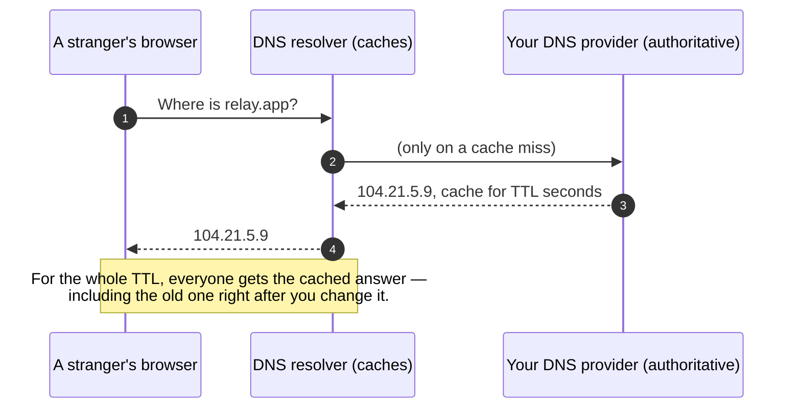
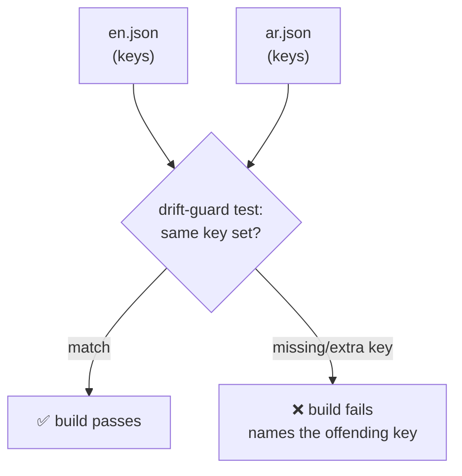
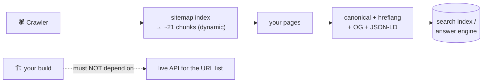
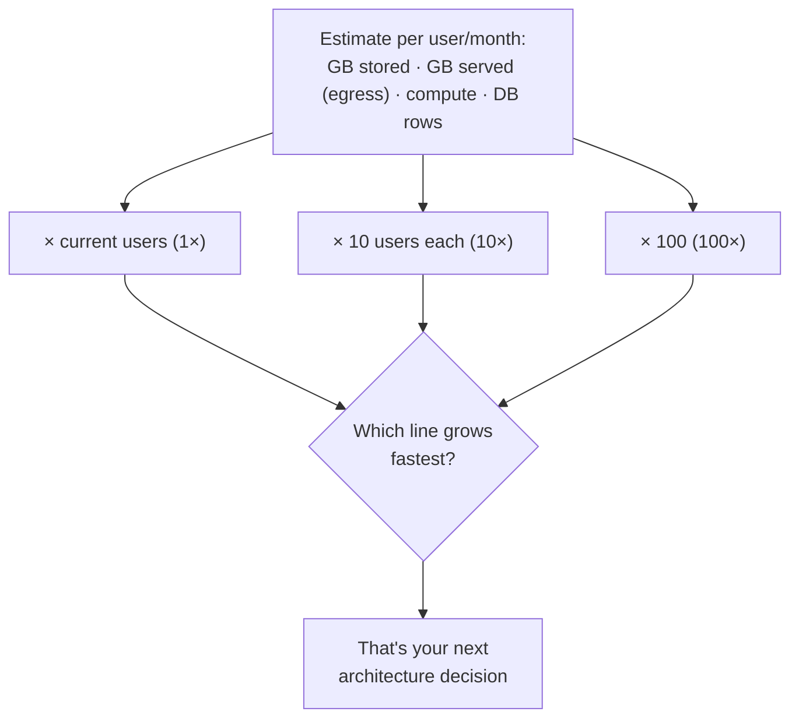
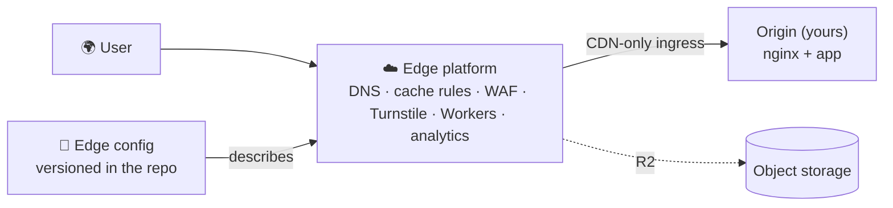

# Module 11 — Reaching the World

*Five lessons about everything between your working app and a stranger on the
other side of the planet: the name and the certificate that let them find you at
all, the languages and layouts that let them read you, the crawlers and answer
engines that let them discover you, the bill that arrives for all of it, and the
edge platform that ties the whole story together.*

---

# 11.1 — Domains, DNS, and TLS

## 🔥 The War Story

On October 4, 2021, Facebook, Instagram, and WhatsApp vanished for roughly six
hours — not "slow," *gone*, for billions of people. Nobody hacked anything. No
server caught fire. During routine maintenance, a command withdrew the **BGP
routes** — the internet's directions — that tell the rest of the world where
Facebook's network lives. Once the directions were gone, Facebook's own **DNS
servers** became unreachable too. And DNS is the phone book: the service that
turns `facebook.com` into an actual address. With the phone book unreachable, the
name resolved to nothing. The computers were fine. Powered, humming, full of
photos. The world simply could not find them.

It got worse inside the building. Facebook's internal tools — even some door
badge readers — depended on the same name resolution that had just disappeared,
so the people who could fix it struggled to physically reach the machines.

Land this now, because it governs the whole lesson: **before your server hears a
single word, two other systems have to work — the one that finds your name (DNS)
and the one that proves it's really you (TLS). You don't control them the way you
control your code, and when they fail, your perfectly healthy app is invisible.**
And never build your recovery path on top of the thing that's down.

## 📐 The Principle

### 1. DNS is a directory, and it caches — which means it lies for a while

DNS turns a name into an address. You configure it with **records**, each a small
line with a type:

| Record | Turns… | …into | Plain meaning |
|---|---|---|---|
| `A` | a name | an IPv4 address | "relay.app lives at 104.21.5.9" |
| `AAAA` | a name | an IPv6 address | same, newer address format |
| `CNAME` | a name | another name | "www.relay.app is an alias for relay.app" |
| `MX` | a name | a mail server | "send relay.app's email here" |
| `TXT` | a name | free text | proofs of ownership, email policy |

Two traps live here. First, **the apex vs. the subdomain.** The apex (or root) is
the bare `relay.app`; a subdomain is `www.relay.app` or `api.relay.app`. The DNS
standard forbids a `CNAME` on the apex — but apex records need to point at a CDN,
whose address changes. Providers paper over this with "CNAME flattening" or `ALIAS`
records; you don't need the internals, you need to know that *apex and subdomain
are configured differently* and "it works on www but not the bare domain" is a
daily support ticket.

Second, **propagation is a caching lie.** Every record carries a **TTL** (time to
live) — how long resolvers may cache it. Change a record with a 24-hour TTL and
for up to a day, half the world sees the new value and half sees the old one, with
no error anywhere. This is the same shape as every cache bug in Module 3: *stale
data served confidently.* Before a planned change, lower the TTL to 60 seconds a
day ahead; raise it back after.

### 2. TLS proves it's really you — and it expires

**TLS** (the `https://` padlock; the successor to SSL) does two jobs: it encrypts
the connection so nobody between you and the user can read it, and it proves the
server answering really owns that name, via a **certificate** signed by an
authority the browser trusts. A certificate is not forever — it *expires*, often
every 90 days. The classic outage is dumb and universal: **a certificate nobody
renewed lapsed, and every browser on earth threw a full-page security warning.**
The fix is never "remember to renew." It's automated renewal (ACME / Let's
Encrypt, or your CDN handling it) plus an expiry alarm as the backstop — because,
per lesson 3.2, a fix with no failure alarm is a countdown, not a fix.

### 3. The CDN terminates TLS — and should be your only front door

Put a CDN in front (you did, in Module 3), and the CDN is what actually
**terminates TLS** — it holds the certificate and decrypts the request at the
edge, close to the user, then talks to your origin server behind the scenes. This
is why the CDN, not your app, manages certificates for most real deployments.

It also creates one job you must not skip. If strangers can reach your origin
server *directly* — by its raw IP, bypassing the CDN — then every protection the
edge provides (caching, WAF, rate limits) is optional for an attacker, and worse:
the "client IP" header the CDN adds becomes **forgeable**, because anyone hitting
the origin directly can set it themselves. That's the exact corollary from lesson
5.4's forgeable-header finding and 5.2's rate-limiting fix. **CDN-only ingress** —
firewalling the origin so it accepts connections only from the CDN, and stripping
any inbound copies of the CDN's trusted headers — is what makes the edge a real
boundary instead of a suggestion.

*Pair this with a second famous case: the **Dyn DNS attack** (Oct 2016), when the
Mirai botnet flooded a single DNS provider and Twitter, Netflix, and Reddit "went
down." Their servers were fine. You are only as reachable as your DNS.*

## 🎛️ Direct Your Agent

Relay works locally. Now give it a name the world can dial, a certificate the
world trusts, and one front door.

1. **Point the name.**
   > *"Walk me through pointing relay.app at our CDN: which record for the apex,
   > which for `www`, and why the apex needs special handling. Set a 60-second TTL
   > for now so mistakes heal fast. Show me the records before and after."*
2. **Redirect www to one canonical host.**
   > *"Make `www.relay.app` permanently redirect to `relay.app` (or the reverse —
   > pick one and tell me why). I want exactly one canonical address, not two
   > sites that drift."*
3. **Get TLS and prove it auto-renews.**
   > *"Set up TLS via the CDN. Then show me the certificate's expiry date and
   > confirm renewal is automatic — and add an alert that fires if the cert is
   > ever within 14 days of expiring."*
4. **Lock the origin to CDN-only ingress.**
   > *"Firewall our origin so it only accepts traffic from the CDN, and strip any
   > inbound copy of the CDN's client-IP header. Then try to reach the origin by
   > its raw IP and show me it refused — and show me the app still works through
   > the real domain."*
5. **Write the memory.** Add to CLAUDE.md:
   > *"The CDN manages TLS and is our only ingress; the origin firewall accepts
   > CDN IPs only and strips inbound client-IP headers. Lower DNS TTLs before any
   > record change. A cert within 14 days of expiry pages us."*

Finish: *"Commit with the message `11-1-domain-dns-tls`."*

> 🔧 **Under the hood** (optional): `dig relay.app +short` and `dig www.relay.app`
> show what resolvers actually return; `curl -vI https://relay.app` shows the TLS
> handshake and cert dates; `curl --resolve relay.app:443:<origin-ip>` (or hitting
> the raw IP) proves whether the origin is exposed. Renewal is ACME (Let's Encrypt)
> or the CDN's managed cert.

## ✅ Verify It

- [ ] `relay.app` and `www.relay.app` both open, and one redirects to the other —
      you can say which is canonical and why.
- [ ] The padlock is real; you found the certificate's expiry date and confirmed
      it renews itself, with an alarm as backstop.
- [ ] You hit the origin's raw IP and watched it refuse — the CDN is the only door.
- [ ] You changed a DNS record and understood why the old value lingered for a
      while (the TTL), rather than assuming the change was instant.
- [ ] You can retell the Facebook 2021 story and name which of the two pre-server
      systems failed (DNS), and why their own recovery was so slow.

## 🧾 Recap card

- Before your server hears anything, DNS must find your name and TLS must prove it's you.
- DNS caches per its TTL — every change "propagates" slowly and serves stale answers with no error.
- Apex and subdomain are configured differently; the apex can't take a plain CNAME.
- TLS certificates expire — automate renewal and alarm on expiry; never rely on remembering.
- The CDN terminates TLS and must be your only ingress, or its trusted headers become forgeable (5.2, 5.4).

## 📚 References & further wandering

- Cloudflare blog, **"Understanding How Facebook Disappeared from the Internet"** (Oct 2021) — the BGP+DNS story, readable by anyone.
- MDN, **"What is a domain name?"** and **"How the Web works"** — the plain-language base.
- Let's Encrypt, **"How It Works"** (letsencrypt.org) — automated certificates and the ACME renewal model.
- RFC 8555, **ACME** — the protocol behind auto-renewal, for the curious.
- Cloudflare Learning, **"What is DNS?" / "DNS records"** — record types and TTL, with diagrams.
- Dyn's and Krebs on Security's coverage of the **Mirai/Dyn DNS attack** (Oct 2016) — reachability as a system-design force.

---

# 11.2 — Internationalization and RTL

## 🔥 The War Story

A bilingual product — English and Arabic, one right-to-left — shipped deep links
so that tapping a shared article link on a phone would open that article *inside
the app*. It worked in the demo. The deep-link end-to-end suite was green. Then
the reports came: tapping a real website link opened the app, but always on the
**Home screen**, never the linked content.

The root cause was a mismatch nobody had drawn. The **website's** URLs were
locale-prefixed and plural: `/en/articles/42`, `/ar/articles/42`. The **app's**
internal routes were locale-less and singular: `article/42`. Real `https://` links
carried the web shape; the app had no rule to translate one space into the other,
so every inbound link fell through to a default — Home. And the tests passed
because they exercised the app's *custom* `app://` scheme directly — a proxy input
that skipped the exact translation step that was broken. **Green, and wrong.**

The same product had a quieter twin bug in search. Users typing perfectly valid
Arabic queries got *zero results* — because the same word can be written with or
without diacritics, with different forms of the same letter (أ / إ / ا), and the
search index stored one form while users typed another. The text was never
**normalized** to a single canonical form on the way in *and* the way out, so
valid queries missed valid content.

The lesson under both: **the moment your product speaks more than one language or
script, "the same thing" stops being obvious — URLs, letters, and layouts all
have multiple valid forms, and every boundary between two of them needs an
explicit translation you can test.**

## 📐 The Principle

### 1. Locale routing: pick one strategy and make it the single source

There are three common ways to encode which language a page is in:

| Strategy | Example | Trade-off |
|---|---|---|
| Path prefix | `relay.app/ar/feed` | Clear, cacheable, SEO-friendly — most common |
| Subdomain | `ar.relay.app/feed` | Clean separation, but more DNS/TLS setup |
| Header/cookie only | `relay.app/feed` + `Accept-Language` | No visible locale — invisible to caches and crawlers; avoid as the *only* signal |

Path prefix is the usual right answer. But whichever you choose, **every client
that shares the URL space must agree on it.** The war story is what happens when
the web uses prefixes and the app doesn't: the URL becomes a contract between two
clients, and an unwritten contract drifts. Give the boundary one translation
function that rewrites every inbound link through a shared resolver — cold start
and warm start, web and app — exactly as lesson 6.4 solved the deep-link route
list: derive one from the other, or install a tripwire.

### 2. Translation files are a drift surface — guard them like code

Your text lives in message files, one per locale: `en.json`, `ar.json`. The
instant there are two, they drift — a key added to English and forgotten in
Arabic renders a raw `feed.emptyState` string to a real user, or worse, silently
falls back to English inside an otherwise-Arabic page. This is the same class as
every parallel-list bug in this course. The fix is the same: a **drift-guard
test** that fails the build when the locales' key sets disagree.

### 3. RTL is a layout mode, not a patch

Right-to-left languages mirror the whole interface: text aligns right, the back
arrow points right, progress bars fill leftward, the sidebar swaps sides. If you
build left-to-right and "add Arabic later" with one-off fixes, you get a permanent
tail of mirroring bugs. Build RTL as first-class: use **logical properties**
(`start`/`end` instead of `left`/`right`) so the framework mirrors layout for you,
and set the document direction from the locale, not by hand. This course itself
ships every lesson in English and RTL Arabic — the discipline is not theoretical.

### 4. Dates, numbers, and collation don't translate — they *localize*

"Same thing, different form" bites beyond words:

- **Dates & numbers:** `07/08` is August 7th or July 8th depending on locale;
  digits, decimal marks, and grouping differ. Format through the platform's
  internationalization library, never by hand.
- **Collation & normalization:** sorting and searching are language-specific. The
  famous cautionary case is the **Turkish "I" problem** — Turkish has a dotless
  `ı` and a dotted `i`, so naïvely upper/lower-casing an identifier (a username,
  an email) can turn `admin` into a different string and break logins or, worse,
  bypass a check. Normalize to one canonical form, on the way in and the way out,
  and use locale-aware comparison — the search-miss half of the war story is this
  rule unlearned.

**The Arabic edition of that rule** — because it's likely your market. Arabic has
its own normalization landmines, and they're exactly what caused our real
search-miss: the alef forms (أ / إ / آ collapse to ا), taa marbuta vs haa
(ة / ه), the tatweel stretch character (ـ), and optional diacritics (harakat) all
mean the *same word* is typed several byte-different ways. If you don't normalize
them to one form on both write and search, a user searching a valid Arabic term
gets zero results and assumes your product is empty. Two more Arab-market
specifics worth a line: Arabic-Indic numerals (٠١٢٣ vs 0123 — accept both on
input, and pick a display form per locale), and the Hijri calendar, which many
users expect alongside Gregorian. `Intl` handles the display side; the
normalization side is yours to own.

## 🎛️ Direct Your Agent

Relay is about to speak two languages, one of them RTL.

1. **Choose and apply one routing strategy.**
   > *"Add locale path prefixes to Relay: `/en/...` and `/ar/...`, with one
   > default. Make sure the API, the web app, and any mobile link handling all
   > resolve locale the same way — show me the one function they share."*
2. **Add the second locale and a drift guard.**
   > *"Extract all UI text into `en.json` and `ar.json`. Add a test that fails the
   > build if the two files don't have the exact same set of keys. Then delete one
   > Arabic key on a branch and show me the build failing and naming it."*
3. **Make RTL first-class.**
   > *"Set page direction from the locale, and convert our layout to logical
   > start/end properties so Arabic mirrors correctly. Show me the feed in both
   > directions side by side — back arrow, alignment, and all."*
4. **Fix normalization at the search boundary.**
   > *"Normalize search text to one canonical form on both indexing and querying —
   > handle diacritics and letter variants. Add a test with a query that differs
   > from the stored text only by form, and prove it now finds the record."*
5. **Write the memory.** Add to CLAUDE.md:
   > *"Locale is a path prefix resolved by one shared function; every client uses
   > it. Locale files are drift-guarded. Layout uses logical start/end. Search and
   > identifiers are normalized to one canonical form in and out. Never test a
   > link path through a proxy scheme — test the real inbound URL."*

Finish: *"Commit with the message `11-2-i18n-rtl`."*

> 🔧 **Under the hood** (optional): the drift-guard is a set-difference over the
> two JSON key lists; normalization is Unicode NFC/NFKC plus a locale-specific
> letter map; RTL leans on CSS logical properties and `dir="rtl"`; date/number
> formatting is `Intl.DateTimeFormat` / `Intl.NumberFormat`.

## ✅ Verify It

- [ ] You opened Relay at `/en/...` and `/ar/...` and the Arabic page is fully
      mirrored — not just translated text in a left-to-right frame.
- [ ] The drift-guard test exists and you **watched it fail** when an Arabic key
      was removed, then pass when restored.
- [ ] A search query that differs from the stored text only by diacritics or
      letter form now returns the right result — you saw the before and after.
- [ ] A shared link opens the correct content in each locale, not a default page.
- [ ] You can retell the "always opened on Home" story and name why the tests were
      green while the feature was broken (a proxy input skipped the broken step).

## 🧾 Recap card

- More than one language means "the same thing" has multiple valid forms — URLs, letters, and layouts each need an explicit, testable translation.
- Pick one locale-routing strategy (usually path prefixes) and make every client resolve it through one shared function.
- Translation files drift — guard the key sets with a build-failing test (6.4's drift-guard, again).
- RTL is a layout mode: logical start/end properties, direction from locale — not one-off patches.
- Normalize search text and identifiers to one canonical form in and out; localize dates and numbers through the platform library.

## 📚 References & further wandering

- MDN, **"Localization"** and **CSS logical properties** — the reference for `start`/`end` and `dir`.
- Unicode, **UAX #15 Normalization Forms** (unicode.org) — why "the same" string has multiple encodings.
- W3C, **"Internationalization Best Practices"** (w3.org/International) — bidi text and RTL done right.
- The **Turkish "I" problem** — search "Turkish dotless i bug"; a canonical case-folding cautionary tale.
- MDN, **`Intl` object** — locale-aware dates, numbers, and collation without hand-rolling.

---

# 11.3 — SEO and AEO: Being Found by Crawlers and Cited by Answer Engines

> **Tool-dated lesson.** The *principles* — machine-readable meaning, don't couple
> builds to runtime data, write to be quoted — outlive the tools. The named
> products and conventions (Googlebot behavior, `llms.txt`, specific AI crawlers)
> are the current best defaults and get an annual refresh. Learn the principle;
> re-check the tool.

## 🔥 The War Story

A large content product wanted search engines to index all of it, so it generated
a **sitemap** — the machine-readable list of every URL you want crawled. As the
catalog grew, so did the file: one monolithic XML document that reached **350
megabytes**. Search engines cap sitemaps at 50,000 URLs and 50MB; the giant file
was silently useless, and generating it hammered the database on every build.

So the team split it — good instinct — into many smaller sitemaps behind an index.
But they generated the chunks **at build time**, by calling the API for the full
URL list while compiling the site. Then one day the API was slow at build time.
The build didn't fail fast with a clear error; it **froze**, waiting on a runtime
dependency it should never have had. A dead API — a *runtime* problem — was now
blocking *deploys*, the one process that had to keep working so you could ship the
fix.

The durable fix was two ideas at once: a sitemap **index** pointing at ~21 chunks
generated **dynamically at request time**, so no single file was too big and the
build depended on no live data at all. **Don't couple build success to runtime
data availability, and chunk anything that grows without bound.**

## 📐 The Principle

### 1. SEO is telling machines what humans can already see

A crawler is a program that fetches your pages like a browser, follows links, and
builds an index. Your job is to make your meaning legible to it:

| Signal | What it tells the crawler | Failure if missing |
|---|---|---|
| **Sitemap** (chunked, ≤50k URLs each) | "here is every URL worth indexing" | Deep pages never discovered |
| **Canonical URL** | "this is the one true address for this content" | Duplicate URLs split your ranking |
| **hreflang** | "here are this page's other-language versions" | Wrong-language page shown to searchers |
| **Open Graph tags** | "here's the title/image when shared" | Ugly, unclickable link previews |
| **Core Web Vitals** | how fast/stable the page feels | Slow pages ranked lower — speed is a ranking input |

Two of these tie directly to Module 11's other lessons. **Canonical + hreflang**
are the SEO face of lesson 11.2: if the same content lives at `/en/x` and `/ar/x`,
you *must* tell crawlers they're translations, not duplicates. And **Core Web
Vitals** — Google's measured thresholds for loading, interactivity, and visual
stability — make the frontend performance of lesson 10.5 a literal ranking factor,
not just a nicety.

### 2. AEO: the front door is becoming an answer engine

Increasingly people don't visit ten blue links — they ask an AI assistant, which
reads sources and answers with a citation or two. **Answer-Engine Optimization**
is making your content parseable and *quotable* by machines:

1. **Structured data (schema.org / JSON-LD).** A small block of JSON in the page
   that states, in a standard vocabulary, "this is an Article by X, published on
   Y" or "this is a Product priced at Z." It removes the machine's guesswork about
   what your page *means*.
2. **Write to be cited.** Answer engines quote content that answers a question
   directly, in a self-contained paragraph, under a stable heading with a stable
   anchor. Burying the answer in paragraph nine, behind a story, is invisible to a
   machine looking for a citable unit.
3. **`llms.txt`** — an emerging convention (a plain file at your site root, cousin
   of `robots.txt`) that points AI systems at your most useful, clean content.
   Treat it as current-best-guess, not settled standard — this is the tool-dated
   part.
4. **Watch AI crawlers in your logs.** They don't behave like Googlebot — different
   user agents, different fetch patterns, sometimes ignoring your rules. You can't
   manage what you don't measure; the same logs that catch abuse (Module 5) tell
   you who's reading you to answer questions about you.

### 3. The build must not depend on runtime data

The war story's deepest principle deserves its own line, because it recurs
everywhere generated content meets a deploy: **a build is code turning into an
artifact; it must succeed from source alone.** The moment your build calls a live
API, a runtime outage becomes a deploy outage — and you've coupled the process
that ships fixes to the very systems that break. Generate large, data-dependent
documents *dynamically at request time*, or from a snapshot committed to the repo.

## 🎛️ Direct Your Agent

Give Relay's two main page types (a creator profile and a piece of content) the
full discoverability treatment — and prove the build stays clean.

1. **Chunked, dynamic sitemaps.**
   > *"Generate a sitemap index pointing at chunked sitemaps, each under 50,000
   > URLs, served dynamically at request time. Confirm the build does NOT call the
   > API for the URL list — then simulate the API being down at build time and
   > show me the build still succeeds."*
2. **Canonical + hreflang.**
   > *"Add a canonical URL to every page, and hreflang links pairing each `/en/`
   > page with its `/ar/` twin. Show me the tags on one page in both locales."*
3. **Open Graph cards.**
   > *"Add Open Graph title/description/image tags to both page types. Show me the
   > link preview a social platform would render."*
4. **JSON-LD structured data.**
   > *"Add schema.org JSON-LD to the content page (Article) and the profile page
   > (Person/Organization). Validate it against a structured-data testing tool and
   > show me it passing."*
5. **Ask the answer engines.**
   > *"List the AI-crawler user agents that hit us this week from the logs."* Then,
   > by hand: ask three different AI assistants a question Relay is the best answer
   > to, and note whether — and how — you're cited. That gap is your AEO backlog.

Finish: *"Commit with the message `11-3-seo-aeo`."*

> 🔧 **Under the hood** (optional): sitemaps are XML with a `<sitemapindex>`
> parent; canonical is `<link rel="canonical">`; hreflang is
> `<link rel="alternate" hreflang="ar">`; JSON-LD is a `<script type="application/ld+json">`
> block; validate with Google's Rich Results Test and schema.org's validator.

## ✅ Verify It

- [ ] You simulated the API being down at build time and the build still
      succeeded — deploys don't depend on runtime data.
- [ ] The sitemap is an index of chunks, each under the 50k/50MB caps, served
      dynamically.
- [ ] One page's `/en/` and `/ar/` versions each declare a canonical and point at
      each other with hreflang.
- [ ] Pasting a Relay link into a chat or social app shows a proper Open Graph
      preview card, and a structured-data validator passes on both page types.
- [ ] You asked three AI assistants a question your product answers and can say
      whether you were cited — and you can retell the 350MB-sitemap story and name
      the coupling that froze the build.

## 🧾 Recap card

- SEO makes your meaning legible to crawlers: chunked sitemaps, canonical URLs, hreflang, OG cards, and fast Core Web Vitals (a real ranking input).
- Canonical + hreflang are the SEO face of your locale routing (11.2); duplicate/untagged translations split your ranking.
- AEO makes you citable by answer engines: JSON-LD structured data, direct quotable answers under stable anchors, `llms.txt`, and watching AI crawlers in your logs.
- Never couple build success to runtime data — a dead API must not freeze a deploy; chunk anything unbounded.
- Tool-dated: the principles last; re-check the named crawlers and conventions each year.

## 📚 References & further wandering

- Google Search Central, **"Sitemaps"** and **"Large site owner's guide"** — the 50k/50MB limits and sitemap index model.
- Google, **Core Web Vitals** (web.dev/vitals) — the measured thresholds that feed ranking.
- schema.org — the structured-data vocabulary; pair with Google's **Rich Results Test**.
- Google Search Central, **canonical URLs** and **hreflang** — the duplicate/translation rules.
- **llms.txt** proposal (llmstxt.org) — the emerging convention; read it as a current best guess, not a standard.
- The Open Graph protocol (ogp.me) — the tags behind link previews.

---

# 11.4 — Cost Engineering

## 🔥 The War Story

Two cost stories from one platform, and they rhyme.

The first: media storage lived on one cloud provider (GCS). The bytes were cheap
to *store* — but every time a user streamed a file, the provider charged
**egress**: a fee for data leaving their network. At a global audience streaming
audio all day, egress quietly became one of the largest lines on the bill —
dwarfing storage itself. The fix was a migration to a provider (Cloudflare R2)
whose whole pitch is **zero egress fees**. The bytes didn't change; the *pricing
model* did, and the bill fell sharply. (That same migration is where lesson 2.2's
resurrecting-files bug lived — cost work and correctness work on the same wire.)

The second: the nightly backup jumped from **244MB to 871MB overnight**, with no
new data. The cause was a blue-green refactor (Module 4) that created
`.next-blue` and `.next-green` build directories, each holding ~620MB of
regenerable webpack cache — and the backup was faithfully archiving *both*, every
night, while the thing that actually needed backing up (the databases) was a
fraction of the size. The backup was paying to store rebuildable junk.

Notice what unites them: **a cost bug and a correctness bug are often the same
bug.** Backing up build caches is *wrong* (you're archiving artifacts, not state —
lesson 2.3) *and* expensive. Storing analytics forever (lesson 2.4) is a
reliability landmine *and* a growing bill. **Read your cloud bill like a log: each
surprising line is a defect with a dollar sign.**

## 📐 The Principle

### 1. The four bills that surprise you

Cloud pricing is not one number. The lines that ambush people:

| Line item | What it charges for | The trap |
|---|---|---|
| **Egress** | data leaving the provider's network | Storage looks cheap; *serving* it isn't. Often the biggest line at scale. |
| **Storage tiers** | keeping bytes, by access speed | Hot storage for cold data — old files nobody reads on premium disk. |
| **Compute** | servers/functions running | "Serverless" scales cost with traffic — and with runaway loops. |
| **Database growth** | disk + IO for your data | Unbounded tables (analytics, logs) grow the bill *and* the risk together (2.4). |

**Egress is the one that surprises AI-assisted builders most**, because agents
optimize for "does it work," and serving media works fine — until the invoice.
The structural fix is a **CDN as a cost shield**: once the edge caches your files,
most requests never reach the origin, so you pay origin egress once and serve the
copy many times. The CDN is a performance tool *and* a cost tool; the R2 migration
paired both by choosing an origin with no egress fee behind an edge that absorbs
most reads anyway.

### 2. "Free" background jobs aren't free

A scheduled job feels free — you already own the server. But every job burns
compute, reads and writes the database (IO you pay for), and can quietly scale:
a nightly job that scans a growing table costs more every night, and a buggy retry
loop (lesson 6.7's retry storm) can bill you for thousands of calls to a paid API
before anyone notices. Cost is a property of the *whole system over time*, not of
the feature you shipped today.

### 3. Model cost at 1×, 10×, 100× — before the invoice teaches you

The single most useful cost habit is a back-of-envelope model that scales with
users. You don't need finance training; you need three columns:

The point isn't a precise forecast — it's finding **which line item scales worst**
before it scales at all. If egress dominates at 10×, you make the CDN/origin
decision now, cheaply, instead of during a billing emergency. This is capacity
planning (lesson 10.5) with a dollar axis.

## 🎛️ Direct Your Agent

Build Relay's cost model and find its worst-scaling line before a user ever does.

1. **Inventory the cost surface.**
   > *"List every thing Relay pays a cloud provider for: storage, egress, compute,
   > database, background jobs, third-party APIs. For each, one line on what drives
   > the cost up."*
2. **Estimate per user, per month.**
   > *"For a typical Relay user, estimate monthly GB stored, GB served (egress),
   > compute, and new DB rows. State your assumptions — I'll sanity-check them."*
3. **Project 1× / 10× / 100×.**
   > *"Build a table of total monthly cost at our current users, 10×, and 100×.
   > Show me which single line item grows fastest and at what scale it becomes the
   > biggest cost."*
4. **Find the same-shape bug.**
   > *"Check two things from our incident history: is anything regenerable (build
   > caches, thumbnails) being stored or backed up? And is any table growing
   > without a retention limit? Both are cost bugs and correctness bugs — flag
   > them."*
5. **Decide the shield.**
   > *"Given the worst-scaling line, what's the cheapest structural fix now — CDN
   > caching, a storage tier, an egress-free origin, a retention TTL? Propose one,
   > with the trade-off."*

Finish: *"Commit the cost model as `11-4-cost-model.md` with the message
`11-4-cost-engineering`."*

> 🔧 **Under the hood** (optional): most providers expose a cost/billing export
> (CSV or API) and per-service usage metrics; graph egress GB vs storage GB over a
> month and the surprise line usually draws itself.

## ✅ Verify It

- [ ] Relay's cost model exists as a file with 1× / 10× / 100× columns, and you
      read it — you can name the worst-scaling line item out loud.
- [ ] You found at least one thing being stored or backed up that is regenerable
      (a cost-and-correctness bug) or confirmed there's none.
- [ ] You can explain, in one sentence each, egress and why a CDN is a cost shield,
      not just a speed tool.
- [ ] You proposed one structural fix for the worst line *before* it became
      expensive — a decision, not a reaction.
- [ ] You can retell the GCS→R2 migration and say what changed (the pricing model,
      not the bytes), and why the tripled backup was a correctness bug too.

## 🧾 Recap card

- Read the cloud bill like a log: each surprising line is a defect with a dollar sign.
- Egress — data leaving the provider — is the line that most surprises builders; a CDN is a cost shield, not just a speed tool.
- Cost bugs and correctness bugs are often the same bug: backing up artifacts (2.3), storing analytics forever (2.4).
- "Free" background jobs cost compute and IO and can scale silently (6.7's retry storm).
- Model cost at 1× / 10× / 100× to find the worst-scaling line before the invoice does — capacity planning with a dollar axis (10.5).

## 📚 References & further wandering

- Cloudflare R2, **"No egress fees"** pricing pages — the pitch that drove the migration; read what egress actually costs elsewhere.
- AWS, **"Data transfer" pricing** and the **Well-Architected "Cost Optimization" pillar** — the canonical map of surprising line items.
- Google SRE Workbook, **"Managing Load"** — capacity thinking that transfers directly to cost.
- FinOps Foundation (finops.org) — the discipline of engineering-owned cloud cost, if you want the field's language.
- This course's lessons **2.3** (backups), **2.4** (retention), **6.7** (retry storms), and **10.5** (capacity) — the correctness twins of every cost line here.

---

# 11.5 — Your Edge Platform in Practice: Cloudflare End to End

> **Tool-dated lesson.** Cloudflare is this course's reference edge, and the named
> features (Turnstile, R2, Workers, the specific dashboard toggles) are current
> best defaults on an annual refresh. The *principle* — **the edge is
> configuration you own on a platform you don't; version it, test through it,
> never assume defaults** — survives any vendor. Swap the product names, keep the
> discipline.

## 🔥 The War Story

Every earlier module left a mark on the same edge platform. Gathered in one place,
they tell a single story:

- **The `Vary` it ignored (3.2).** The CDN did not honor the `Vary` header, so it
  cached a data response as the page — global cache poisoning. The durable fix
  lived at the proxy layer, *below* the edge's defaults.
- **The client-IP header it provides (5.2).** Behind the edge, every request
  arrives from a CDN IP; rate limiting had to key on the CDN's `CF-Connecting-IP`
  header — which is only trustworthy if the origin can't be reached directly to
  forge it (5.4, 11.1).
- **The 5-minute HTML cache that faked a deploy (4.3).** The edge cached HTML for
  ~300 seconds, so "I checked the site, it's live" verified the *cache*, not the
  new deploy. Verification had to pierce the edge and hit origin directly.
- **The WAF that blocked our own robots.** The edge's bot protection fingerprinted
  headless browsers as attackers — including the team's *own* screenshot
  automation, which then rendered blank images. Your abuse defenses can't tell
  your robots from theirs.
- **Turnstile and R2 (5.1, 11.4).** The same platform supplied the CAPTCHA that
  fought the "bob" flood and the object storage whose zero egress reshaped the
  bill.

Five incidents, one root sentence: **you configured a platform you don't operate,
and every default you didn't set deliberately was a decision made for you —
sometimes against you.**

## 📐 The Principle

### 1. The edge is a system-design surface, not a checkbox

An edge platform is many products wearing one dashboard. Each toggle is an
architectural choice:

| Edge feature | What it decides | The lesson it carries |
|---|---|---|
| **DNS + proxy mode** ("orange cloud") | whether traffic flows *through* the edge at all | If it's grey/off, none of the below applies (11.1) |
| **Cache rules** | what's cached, for how long, and whether origin headers are respected | `Vary` and TTL surprises (3.2, 4.3) |
| **WAF + bot management** | who is blocked before reaching origin | Also blocks *your* automation (plan an out-of-band path) |
| **Turnstile** | human-check on abused endpoints | Abuse economics (5.1) |
| **R2 / object storage** | where large files live and what egress costs | Cost engineering (11.4) |
| **Workers** | your code running *at the edge*, before origin | Power and a new place for bugs to live |
| **Edge analytics** | request truth: traffic, cache ratio, bots | The edge-truth tier of your observability (7.5) |

### 2. "Respect origin headers" is a real, consequential setting

The single most misunderstood edge control is *how the cache treats your origin's
`Cache-Control` and `Vary` headers.* The default is not always "do what my app
says." Lesson 3.2 exists because a CDN's default ignored `Vary`. So the rule is
concrete: **know, per platform, exactly which of your headers the edge honors and
which it overrides — and defend at the layer you control** (the proxy) rather than
the layer whose defaults you're guessing at.

### 3. Version the edge, test through the edge

Two disciplines make an un-owned platform safe:

1. **Version it.** The edge config — cache rules, WAF rules, redirects, Worker
   code — is as load-bearing as your app code, but it lives in someone else's
   dashboard where no diff, no review, and no rollback exist by default. Export it
   into your repo (as config/Terraform/Wrangler files) so changes are reviewed,
   diffed, and revertible — and so your *agent can design with the edge instead of
   blind to it*, since it can't see your dashboard.
2. **Test through it.** Your local tests bypass the edge entirely, so they can't
   catch a poisoning, a stale-cache deploy, or a rate-limit-behind-CDN bug. At
   least the highest-risk checks (3.2's poisoning attempt, 5.2's rate-limit test)
   must run against the *real* edge, or they're testing a system your users never
   touch — the same false-green trap as lesson 11.2's proxy-input tests.

*Pair with two famous cases. **Cloudflare's July 2019 outage** — one regex in one
WAF rule, deployed globally, took CPU to 100% everywhere for ~27 minutes: a single
line of edge config is a single point of failure everywhere, so global rollouts
need staging and kill switches. And **Fastly's June 2021 outage** — one customer's
valid config change triggered a latent bug that downed Reddit, gov.uk, and Amazon
for an hour: the edge is part of your system, and edge platforms fail too. You
don't get to assume the platform is infallible just because you don't run it.*

## 🎛️ Direct Your Agent

Put Relay fully behind the edge, then re-run two earlier attacks through the real
thing — because tests that skip the edge test a system nobody uses.

1. **Proxy mode and one cache rule.**
   > *"Route Relay's DNS through the edge in proxy mode. Add one explicit cache
   > rule for a hot page type, and tell me exactly which of our origin's
   > Cache-Control and Vary headers this edge honors and which it overrides."*
2. **WAF on — with an escape hatch for our own robots.**
   > *"Turn on the WAF and bot management. Then run our screenshot automation and
   > show me whether it's blocked — if so, add the out-of-band path so our own
   > tooling isn't treated as an attacker."*
3. **Turnstile and CDN-only ingress.**
   > *"Add Turnstile to signup, and confirm the origin only accepts edge traffic
   > (from 11.1). Show me a direct-to-origin request being refused."*
4. **Re-run the classics through the edge.**
   > *"Re-run the lesson 3.2 poisoning attempt and the lesson 5.2 rate-limit test
   > against the real edge, not locally. Show me the guard and the rate limit both
   > holding where it counts."*
5. **Version the edge config.**
   > *"Export the entire edge configuration — cache rules, WAF rules, redirects,
   > Workers — into our repo so it's diffed, reviewed, and revertible. Add a
   > CLAUDE.md note that the edge config is code and the agent must read it before
   > proposing edge changes."*

Finish: *"Commit with the message `11-5-edge-cloudflare`."*

> 🔧 **Under the hood** (optional): Cloudflare's config exports via Terraform
> (`cloudflare_ruleset`, `cloudflare_record`) and Workers via Wrangler; the
> proxy/grey-cloud state is per-DNS-record; cache and Vary behavior is governed by
> Cache Rules and the "respect existing headers" setting.

## ✅ Verify It

- [ ] Relay's DNS is proxied through the edge, and you can name which of your
      origin headers the edge honors vs. overrides — not a guess.
- [ ] You turned the WAF on, saw it block your own automation, and installed the
      out-of-band path so your robots aren't mistaken for attackers.
- [ ] A direct-to-origin request is refused; Turnstile guards signup.
- [ ] You re-ran the 3.2 poisoning attempt and the 5.2 rate-limit test **through
      the real edge** and watched both hold — not just locally.
- [ ] The edge configuration lives in the repo, diffed and revertible, and you can
      retell how the same platform both caused (Vary, WAF, HTML cache) and cured
      (Turnstile, R2) incidents in this course.

## 🧾 Recap card

- The edge is many products in one dashboard; every default you didn't set deliberately is a decision made for you.
- Know per platform which origin headers the edge honors vs. overrides — and defend at the layer you control (3.2).
- Your abuse defenses (WAF, bot management) will block your own robots too — plan an out-of-band path.
- Version the edge config in your repo (no diffs/rollback exist by default) so it's reviewed and your agent can design *with* it.
- Test the highest-risk behavior *through* the real edge; local tests bypass it and go false-green — and remember Cloudflare 2019 / Fastly 2021: edge platforms fail too.

## 📚 References & further wandering

- Cloudflare Docs, **Cache Rules**, **WAF**, **Turnstile**, **R2**, **Workers** — the current reference for each toggle in this lesson (re-check yearly).
- Cloudflare postmortem, **"Details of the Cloudflare outage on July 2, 2019"** — one regex, global CPU exhaustion; among the best postmortems written.
- Fastly, **"Summary of June 8 outage"** (2021) — one valid config change, a latent bug, global impact.
- Cloudflare, **`CF-Connecting-IP` / managed headers** docs — the trusted-header contract behind lessons 5.2 and 11.1.
- Terraform **Cloudflare provider** and **Wrangler** docs — how to version edge config as code in your repo.
- This course's lessons **3.2, 4.3, 5.1, 5.2, 5.4, 7.5, 11.1, 11.4** — the incidents this lesson gathers into one edge picture.

---

*Next: **Module 12 — Capstone: You Get Paged.** Eight incident simulations, symptoms
only. You diagnose, propose the fix, then compare against what actually happened —
including several you now recognize from this very module.*
