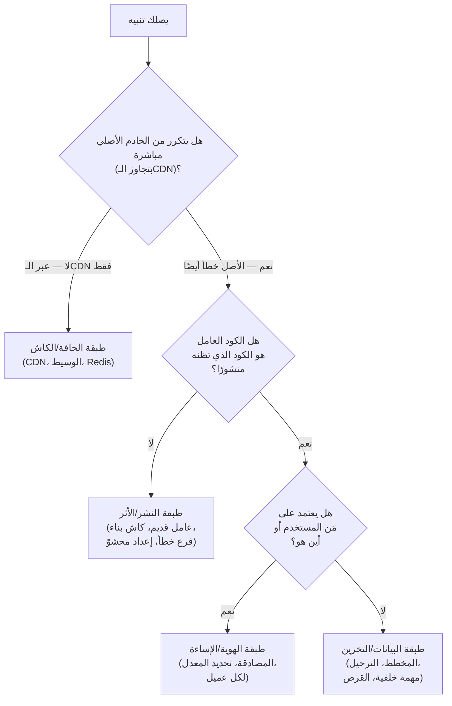
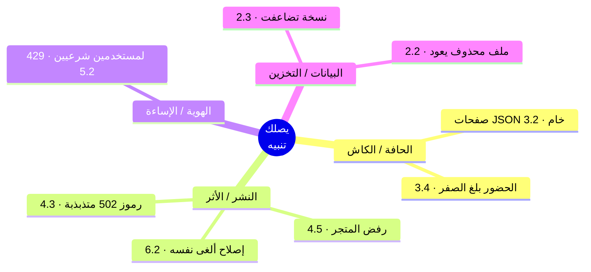

# 12 — المشروع الختامي: يصلك تنبيه

*الدورة كلها، محوَّلة إلى ثمانية تنبيهات.*

---

بنيتَ Relay من نموذج محلي إلى نظام إنتاجي متعدد العملاء، والآن أنت تُشغّله. هذه
الوحدة تدريبٌ على التشخيص: ثمانية حوادث، كلٌّ منها يصلك كما يصل الحادث الحقيقي —
**أعراضٌ فقط.** بلاغُ مستخدم، أو رمزُ حالة (Status Code)، أو رسمٌ بياني تحرّك.
لا سبب مرفق، لأن السبب في الإنتاج لا يأتي مرفقًا أبدًا.

في كل محاكاة، أنجِز العمل بالترتيب:

1. **اقرأ التنبيه.** الأعراض وحدها.
2. **أدِّ مهمتك.** أجب عن أسئلة التشخيص *قبل أن تُمرّر الشاشة* — اكتبها، أو قُلها
   بصوتٍ عالٍ، أو دوّنها. الانضباط هو رفضُ تخمين السبب قبل أن تسمّي الطبقة.
3. **ثم قارن** بما جرى فعلًا في الإنتاج، وبالإصلاح الذي وصل.
4. **أجب عن سؤال المتابعة.** كل حادثة تنتهي كما تنتهي في الواقع: *«وكيف تعلم أنه
   نجح؟»* فالإصلاح الذي لا تستطيع إثباته ليس إصلاحًا حقيقيًا.

أنفع ردِّ فعلٍ في التشغيل ليس معرفة كل سبب — بل **التنصيف حسب الطبقة**: تقطع مسار
الطلب إلى نصفين وتسأل في أي نصفٍ يقع الخلل، حتى لا تبقى إلا طبقة واحدة. وكلٌّ من
هذه الثمانية يُحلّ بإيجاد الطبقة الصحيحة أولًا.

أبقِ هذه الشجرة إلى جوارك. كل محاكاة تسمّي الفرع الذي تعيش فيه.

---

## المحاكاة 1 — نصُّ JSON خام مكان الصفحة الرئيسية

**التنبيه** 🔥
الدعم يحوّل لقطات شاشة: عددٌ قليل من المستخدمين، منتشرون في بلدان مختلفة، يرون
صفحاتٍ تُعرض كنصٍّ خام — `0:{"a":"$@1"...}` — بدل الموقع. الأمر متقطّع. المستخدم
نفسه يحدّث الصفحة فيختفي العطل، ثم يعود بعد ساعة. ومستخدمون آخرون على الرابط نفسه
يرون كل شيء سليمًا. متتبع الأخطاء (Error Tracker) صامت. وسجلات الخادم لا تُظهر إلا
رموز 200. وحين تفتح الصفحة بنفسك، تعمل.

**مهمتك** — قبل أن تُمرّر الشاشة، اكتب إجاباتك:
- أيُّ طبقةٍ تنتج عَرَضًا *لكل مستخدم، متقطّعًا، يشفي نفسه، وغير مرئي في السجلات*؟
  (هناك عائلةٌ واحدة فعلًا.)
- كيف تنصّفه — ماذا تجلب من الخادم الأصلي مباشرةً بتجاوز الـCDN، وماذا يخبرك ذلك
  إن كان الأصل سليمًا؟
- جسم الاستجابة JSON صحيح، وليس انهيارًا. أيُّ طلبٍ ينتج هذا الـJSON بشكل مشروع
  *على الرابط نفسه* الذي يعطي صفحة HTML؟

**ما جرى فعلًا**
كان كاشٌ مشترك يقدّم التمثيل الخطأ للرابط. التطبيق مبني على إطار React يجيب على
المسار نفسه بطريقتين: HTML كامل للمتصفح، وحمولة JSON مضغوطة من نوع «flight»
للتنقّل داخل التطبيق، ويميّزهما بترويسة طلب. وضع الإطار ترويسة `Vary` لإبقائهما
منفصلين — وتجاهلها الـCDN. فأيُّ طلبٍ يُسخّن عقدة حافةٍ باردة يربح الرابط للجميع
حتى ينتهي الأجل؛ وحين كان ذلك الطلب الأول تنقّلًا داخل التطبيق، خزّنت الحافةُ
الـJSON *بوصفه الصفحة*. الإصلاح الدائم كان حاجزًا عند الوسيط العكسي (Reverse
Proxy) مفتاحُه نوعُ محتوى الاستجابة، لا دواخلُ ترويسات طلب الإطار — الطبقة التي
يتحكم فيها الفريق كليًا. هذا الدرس **3.2**، حادثة تسميم الكاش الرائدة. فرع الشجرة:
**الحافة/الكاش** — فهو لا يتكرر أبدًا من الخادم الأصلي.

**المتابعة: وكيف تعلم أنه نجح؟**
تعيد إنتاج التسميم عمدًا في بيئة التجهيز (تطلب الرابط بترويسة البيانات أولًا، ثم
كمتصفح، وتشاهد JSON يعود بوصفه الصفحة)، ثم تثبّت الحاجز وتشاهد المحاولة نفسها
تفشل. والإثبات الدائم اختبارُ سلكٍ كاشف يجلب الصفحة بالطريقتين ويؤكد أن نسخة
البيانات تحمل `no-store` — اختبارٌ *رأيته يفشل* حين حُذف الحاجز.

---

## المحاكاة 2 — رموز 502 تختفي بإعادة تشغيلٍ لا ينبغي أن تحتاجها

**التنبيه** 🔥
بعد نشرٍ روتيني مباشرةً، تبدأ الحافة بإرجاع رموز 502 — لكن بعض الوقت فقط. تحدّث
الصفحة فتُحمَّل؛ تحدّثها ثانيةً فتُعطي 502. النمط يتذبذب دقائق. تجلب الخادم الأصلي
مباشرةً بـ`curl` فيجيب `200` في كل مرة، فورًا. وسجلات التطبيق نظيفة — لا أخطاء، لا
آثار، لا شيء يتوافق مع الطلبات الفاشلة. وبحدسٍ تعيد تشغيل الوسيط (Proxy)، وهو شيء
تشعر أنك *لا ينبغي أن تلمسه*، فتتوقف رموز 502 فورًا.

**مهمتك** — قبل أن تُمرّر الشاشة:
- الأصل سليم (`curl` يقول 200) لكن الحافة تعطي 502. أيُّ طبقةٍ تقع *بين* الحافة
  والأصل، وتملك هذا الخطأ؟
- لماذا يُطلق النشرُ هذا، ولماذا يعالجه إعادةُ تشغيل الوسيط — لا إعادة تشغيل
  التطبيق؟
- «أُعيد التحميل» و«أُعيد التشغيل» ضمانان مختلفان. ما الذي قد لا تفعله إعادةُ
  التحميل اللطيفة (Graceful Reload) بالاتصالات المفتوحة أصلًا؟

**ما جرى فعلًا**
هذا نشرٌ أزرق-أخضر (Blue-Green) بلا توقف: تنتقل الحركة من اللون القديم إلى الجديد،
ويُصرَّف القديم. لكن عامل nginx، أبقته على قيد الحياة اتصالاتُ keepalive طويلةُ
العمر، عاش أطول من إعادة التحميل اللطيفة وظلّ يوجّه جزءًا من الطلبات إلى اللون
الميت — ولهذا *تذبذب* بدل أن يفشل بنظافة، ولهذا كانت سجلات التطبيق (على اللون الحي)
بريئة. إعادةُ تشغيل الوسيط الكاملة تقتل العامل القديم؛ والإصلاح الدائم يحدّ عمر
العامل (`worker_shutdown_timeout`) كي تُصرّف إعادةُ التحميل فعلًا. هذا الدرس
**4.3**: كل طبقةٍ بينك وبين المستخدم لها دورةُ حياةٍ وكاشٌ خاصان، وإعادةُ التحميل
اللطيفة لا تُصرّف اتصالات keepalive. فرع الشجرة: **النشر/الأثر** — فالشيء العامل
ليس الشيء الذي تظنّ أنك نشرته إليه.

**المتابعة: وكيف تعلم أنه نجح؟**
ليس «أعدتُ التشغيل فتوقفت رموز 502» — فذلك رحيلُ العَرَض لا موتُ السبب. تُثبته
بإعادة النشر تحت حِمل (مولّد طلبات يضرب الموقع عبر الحافة) ومشاهدةِ اكتمال التبديل
بـ**صفر** من رموز 502، دون إعادة تشغيلٍ يدوية. وسكربتُ التحقق بعد النشر هو ما يجعل
ذلك قابلًا للتكرار.

---

## المحاكاة 3 — النسخة الاحتياطية التي تضاعفت ثلاثًا بين ليلةٍ وضحاها

**التنبيه** 🔥
يُطلق مراقبُ النسخ الاحتياطية (Backup) الليلية تنبيهًا: أرشيفُ الليلة الماضية بلغ
871 ميغابايت، بينما كان الليلة السابقة 244 ميغابايت. لم يُنشر شيء يضيف بيانات — لا
استيراد، لا ميزة جديدة، ونموّ المستخدمين ثابت، وقاعدة البيانات (Database) نفسها
بحجمها منذ أسبوع. مهمة النسخ تُبلّغ بالنجاح، رمز الخروج 0 كالعادة. لكن فاتورةَ
تخزينك وزمنَ نقل النسخة قفزا قفزةً، ولم يُضِف أحدٌ صفًّا واحدًا.

**مهمتك** — قبل أن تُمرّر الشاشة:
- *قاعدة البيانات* لم تنمُ لكن *النسخة* تضاعفت ثلاثًا. إذن البايتات الزائدة ليست
  بيانات — فما الذي تجرفه مهمةُ النسخ غيرها؟
- ما الذي تغيّر مؤخرًا في *تخطيط المجلدات* على الخادم؟ (فكّر فيما أضافته دروس
  البنية التحتية الأخيرة.)
- رمزُ الخروج 0 يعني أن الأرشفة جرت. لا يعني أن الأرشيف يحتوي الأشياء الصحيحة. كيف
  تدقّق *المحتوى* لا مجرد النجاح؟

**ما جرى فعلًا**
كانت قائمةُ الاستثناء في سكربت النسخ قديمة. أعادت هندسةٌ أزرق-أخضر سابقة تقسيمَ
مخرجات البناء إلى `.next-blue` و`.next-green`، كلٌّ يحمل كاش بناء webpack بنحو 620
ميغابايت — والأرشفةُ استثنت `.next` لكن لا شقيقيه الجديدين، فأرشفت بأمانة مئات
الميغابايتات من *أثر بناءٍ قابل لإعادة التوليد* كل ليلة. الإصلاح: استثناء `.next-*`
و`*/cache/webpack`، وإعادةُ تحديد نطاق النسخة الفعلي — قاعدتا Mongo والإعدادات.
الكود متكرر مع git، وكاشات البناء قابلة لإعادة التوليد، والبيانات وحدها لا تُعوَّض.
هذا الدرس **2.3**: انسخ الحالة لا الأثر — وسكربتات النسخ تتعفّن بصمتٍ حين يتطوّر
تخطيطُ المجلدات تحتها. فرع الشجرة: **البيانات/التخزين**. (قارنه بتقرير GitLab لعام
2017، حيث كانت خمسُ آليات نسخٍ تفشل بصمت — نسخةٌ لا تستعيدها ليست نسخة حقيقية.)

**المتابعة: وكيف تعلم أنه نجح؟**
إثباتان لا واحد. الحجم عاد إلى نحو 244 ميغابايت *و* — الاختبار الحقيقي — أجريتَ
**تجربة استعادة**: أخذتَ نسخة الليلة الماضية، واستعدتها في قاعدة بياناتٍ مؤقتة،
وتأكدت أن التطبيق يقوم بالبيانات سليمة. فالنسخةُ التي لم تشاهد استعادتها ليست نسخة موثوقة.

---

## المحاكاة 4 — مستخدمون شرعيون يُمنعون بـ429 صباح اليوم التالي

**التنبيه** 🔥
بالأمس انطلق منشورٌ وقفزت الحركة — يومٌ جيد. هذا الصباح، مستخدمون عاديون يراسلونك
أنهم يتلقّون «طلبات كثيرة جدًا» (429) في أول نقرة، دون أن يفعلوا شيئًا غريبًا. ليس
الجميع، وليس مرتبطًا بحساب واحد. سجلات محدِّد المعدل (Rate Limiter) تُظهر حفنةً
صغيرة من عناوين IP يولّد كلٌّ منها أعدادًا هائلة من الطلبات — أكثر مما يفعل بشر —
بينما المستخدمون المتأثرون على اتصالاتٍ منزلية عادية في مدنٍ مختلفة.

**مهمتك** — قبل أن تُمرّر الشاشة:
- المحدِّد يظن أن بضعة عناوين IP يفعل كلٌّ منها آلاف الطلبات، لكن المستخدمين
  الحقيقيين في مدنٍ مختلفة. ما الذي يقف أمام أصلك فيجعل آلافًا من الناس *يبدون*
  كبضعة عناوين؟
- خلف CDN، ماذا يعني «عنوان العميل» لخادمك — عنوانُ مَن على المقبس (Socket) الوارد؟
- أين تُخزَّن عدّادات تحديد المعدل، وماذا يحدث للعدّادات داخل العملية عبر نشرٍ أو
  عبر عدة نسخ؟

**ما جرى فعلًا**
خلف الـCDN، يصل كل طلبٍ من إحدى حفنةٍ من عناوين حافة الـCDN، فوضع المحدِّد —
المُفتَّح على عنوان المقبس — العالمَ كله في بضعة دِلاءٍ مشتركة. امتلأ دلوٌ بمنطقةٍ
مزدحمة فمُنِع كلُّ من مرّ بتلك الحافة بـ429. الإصلاح يُفتّح على ترويسة عنوان العميل
التي يوفّرها الـCDN (`CF-Connecting-IP`) ويخزّن العدّادات في Redis، لأن العدّادات
في الذاكرة تُصفَّر مع كل نشرٍ ولا تُشارَك بين النسخ. والنتيجة من التدقيق: تلك
الترويسة موثوقةٌ فقط إن عجز العملاء عن بلوغ الأصل مباشرةً لتزويرها — لذا افرض دخولًا
حصريًا عبر الـCDN. هذا الدرس **5.2**. فرع الشجرة: **الهوية/الإساءة** — فالعلة كلها
عن *من يبدو الطلب أنه*.

**المتابعة: وكيف تعلم أنه نجح؟**
تعيد تشغيله: تولّد حركةً من عنوانَي عميلٍ مختلفين *عبر* الـCDN وتُظهر أن بلوغَ
أحدهما حدَّه لم يعد يمنع الآخر بـ429 — فالدلاء الآن لكل عميلٍ حقيقي لا لكل حافة.
وإثباتٌ إضافي: تنشر أثناء الاختبار وتُظهر بقاء العدّادات (فهي في Redis) بدل تصفّرها.

---

## المحاكاة 5 — الملف الذي يرفض أن يبقى محذوفًا

**التنبيه** 🔥
يطلب صانعُ محتوى حذفَ ملفٍ وسائط — رفعٌ خاطئ، يجب أن يزول. تحذفه من التخزين الكائني
(Object Storage)، وتتأكد أنه زال (الرابط يعطي 404)، وتمضي. بعد ساعات يعود: الملف
نفسه، الرابط نفسه، يُقدَّم بسعادة. تحذفه ثانيةً فيعود ثانيةً. لا مهمةٌ مجدولة
تعرفها تعيد رفعه، ولا مستخدمٌ يعيد رفعه، ونداءُ الحذف نفسه يعيد النجاح في كل مرة.

**مهمتك** — قبل أن تُمرّر الشاشة:
- الحذف *ينجح* والملف *يعود*. أي أن شيئًا يعيده. أيُّ نظامٍ، غير مستخدمٍ أو مهمة،
  يستعيد كائنًا عند القراءة؟
- ما الذي تغيّر مؤخرًا في *مكان سكن الملفات* — هل هناك أكثر من خلفية تخزينٍ في
  الصورة الآن؟
- حين ترحّل تخزينًا، ما الذي يجب أن يصحّ قبل أن يُسمح للنظام القديم بالتوقف عن
  الإجابة؟

**ما جرى فعلًا**
كان التخزين قد رُحّل من متجرٍ كائني (GCS) إلى آخر (R2) مع جسر تكرارٍ (Replication)
سحبيٍّ ما زال مُشغَّلًا: عند أي إخفاقٍ في R2، يعيد بصمتٍ جلبَ الكائن من دلو GCS
القديم ويعيد ملء R2. فكلُّ حذفٍ من R2 كانت تُلغيه القراءةُ التالية فورًا، إذ تسحب
الأصلَ الباقي عبر الجسر. الإصلاح: احذف من *كلا* الخلفيتين، والأهم أنهِ طور المصدرين
صراحةً — فالترحيل لا يكتمل حتى يعجز النظام القديم عن الفعل. هذا الدرس **2.2**، فخُّ
المالكَين. فرع الشجرة: **البيانات/التخزين**. (يتكرر من الأصل، ولا يعتمد على مَن
يسأل، والكود العامل سليم — إنه المالكُ الثاني في مستوى البيانات.)

**المتابعة: وكيف تعلم أنه نجح؟**
احذف الملف، ثم *افرض قراءةً باردة من الكاش* وتأكد أنه يعطي 404 ويبقى 404 عبر فترة
التكرار — فتكون قد أثبتّ أن الجسر لم يعد يستعيده. والإثبات الدائم جدولُ أطوار
الترحيل بتاريخ انتهاءٍ صريح لطور المصدرين، وفحصٌ أن الخلفية القديمة أُوقفت.

---

## المحاكاة 6 — إصلاح الموبايل الذي ألغى نفسه

**التنبيه** 🔥
قبل أسبوع شحنت تحديثًا عبر الهواء (OTA) لتطبيق الموبايل — إصلاحٌ صغير، مُتحقَّق منه
على جهازٍ حقيقي، وأكّد المستخدمون أنه يعمل. اليوم العلةُ نفسها عادت في الميدان، على
نسخة التطبيق الحالية، دون إصدار متجرٍ جديد بينهما. لم يلمس أحدٌ ذلك الكود. الإصلاح
ببساطة… اختفى، كأنه لم يُشحن قط. أما تحديثات OTA الأخرى لهذا الأسبوع فكلها موجودة
وسليمة.

**مهمتك** — قبل أن تُمرّر الشاشة:
- كان الإصلاح حيًّا ثم تراجع، دون إصدار متجر. أيُّ طبقةٍ تنشر تغييراتٍ لتطبيق موبايل
  *دون* المرور بالمتجر؟
- قناةُ OTA آلةُ حالةٍ (State Machine) لها حزمةٌ «حالية». ما الذي يحدّد أيَّ حزمةٍ
  يسحبها الجهاز، وما الذي قد يكتب فوق حزمتك؟
- من أين نُشر الإصلاح — من مصدر الحقيقة نفسه الذي نُشرت منه تحديثاتك الأخرى، أم من
  فرعٍ جانبي؟

**ما جرى فعلًا**
نُشر تحديثُ OTA من فرع ميزة (Feature Branch). ولم يحتوِ التحديثُ التالي المنشور من
`main` ذلك الإصلاح، فأعاد القناةَ بصمتٍ إلى الوراء — صارت حزمةُ main هي «الحالية»
وكتبت فوق حزمتك. قنوات التحديث آلاتُ حالة، وكلُّ مسار نشرٍ يحتاج مصدرَ حقيقةٍ واحدًا
بالضبط. (فخٌّ شقيق في الدرس نفسه: `eas update` دون تسمية البيئة يجرّد إعدادَ وقت
التشغيل، منتجًا حزمةً خاطئةً بشكلٍ خفيّ آخر.) هذا الدرس **6.2**، فخُّ التراجع. فرع
الشجرة: **النشر/الأثر** — فالحزمةُ العاملة ليست التي قصدتَ شحنها.

**المتابعة: وكيف تعلم أنه نجح؟**
أعِد شحن الإصلاح *من main*، ثم تحقّق على الجهاز الذي يحمله المستخدمون فعلًا — أعِد
خطوات العلة الأصلية وتأكد أنها زالت — لا على محاكٍ، ولا من اللقطة التي يعطيك إياها
الوكيل. ثم انشر تحديثَ OTA آخر من main وتأكد أن إصلاحك ينجو منه. «مدموج» و«مشحون
عبر OTA» و«موجودٌ بعد النشر التالي» ثلاثةُ ادّعاءاتٍ مختلفة.

---

## المحاكاة 7 — يعمل على جهازك، يرفضه المتجر

**التنبيه** 🔥
تقدّم بناءَ تطبيق التلفاز (TV) إلى المتجر. يعود مرفوضًا: «تعذّر تشغيل المحتوى».
لكن التطبيق يشغّل المحتوى تمامًا على جهازك، وعلى المحاكي، وعلى كل جهازٍ على مكتبك.
البناءُ المرفوض اجتاز فحص الجودة المحلي عندك. تقارن المصدر بإصدار الأسبوع الماضي
العامل فيكون الفرق ضئيلًا وغير ذي صلة. لا شيء في الكود الذي تراه يفسّر لماذا لا
يستطيع *هذا الأثر* بلوغَ واجهتك البرمجية (API).

**مهمتك** — قبل أن تُمرّر الشاشة:
- يعمل من بنائك، ويفشل من بناء المتجر. ما الفرق بين «الكود على جهازك» و«الأثر
  المُصرَّف الذي رفعته»؟
- يُحشى الإعدادُ داخل الحزمة وقت البناء. ما الذي يحشوه بناؤك المحلي ولا يستطيع
  جهازُ المُراجِع بلوغه أبدًا؟
- أين تبحث عن الحقيقة — في شجرة المصدر (التي قارنتها بالفعل)، أم في المخرَج
  المُصرَّف؟

**ما جرى فعلًا**
ملفٌّ شارد متجاهَل من git اسمه `.env.local` يحوي `localhost:3105` كأساسٍ للواجهة
حُشِي في الحزمة وقت البناء. على جهازك، يحلّ `localhost` إلى خادم التطوير العامل
عندك، فيشتغل كل شيء. على جهاز المُراجِع، `localhost` هو *جهازه* — فالواجهة غير قابلة
للبلوغ، ومن هنا «تعذّر تشغيل المحتوى». ولأن الملف متجاهَل من git، لا يظهر في أي فرق؛
والوكيلُ لا يراه أيضًا. الإصلاح مدقّقُ ما بعد البناء (Postbuild Verifier) يفحص
*الأثر المُصرَّف* ويفشل بصخبٍ إن احتوى `localhost` أو خلا من الأصل الإنتاجي. هذا
الدرس **4.5**: تحقّق من الأثر لا المصدر. فرع الشجرة: **النشر/الأثر**. (صدى واقعي:
هذا الصنف بالضبط شُحن إلى متجرَي تلفازٍ — رفضه أحدهما، وكاد الآخر يشحن الحزمة
المعطوبة نفسها بايتًا ببايت.)

**المتابعة: وكيف تعلم أنه نجح؟**
تفحص الحزمة المُعاد بناؤها عن `localhost` فتحصل على صفر نتائج، *و* تتأكد أن نصّ
الأصل الإنتاجي موجود — ثم تدع مدقّق ما بعد البناء يعمل في CI وتشاهده **يفشل** على
بناءٍ مسموم عمدًا قبل أن ينجح على النظيف. الإثباتُ في المخرَج المُصرَّف، لا في فرق
المصدر أبدًا.

---

## المحاكاة 8 — عدّاد الحضور الذي بلغ الصفر

**التنبيه** 🔥
عدّادُ «عددُ المستمعين الآن» ميزةٌ حيّةٌ في منتجك. بعد ظهر اليوم هبط من بضع مئاتٍ
صحّية إلى **صفر**، فورًا، في خطوةٍ واحدة — بينما الموقعُ نفسه واضحٌ أنه ما زال يعمل
ويخدم الحركة طبيعيًا. وفي اللحظة نفسها تقريبًا، ذكر مهندسٌ أنه «مسح الكاش» ليعالج
شكوى بياناتٍ قديمة. ثم يبدأ العدّادُ بالتسلّق صعودًا من تلقاء نفسه خلال الدقيقة
التالية، دون أي فعلٍ منك.

**مهمتك** — قبل أن تُمرّر الشاشة:
- كان الهبوط *فوريًّا وكاملًا*، لا تناقصًا تدريجيًا، والموقعُ بقي عاملًا. أيُّ نوعِ
  عمليةٍ يصفّر قيمةً في خطوةٍ ذرّية واحدة؟
- «مسح» أحدٌ «الكاش» في اللحظة نفسها. أين تسكن بيانات الحضور فيزيائيًا — وما الذي
  قد يسكن المتجر نفسه غيرها؟
- يشفي نفسه في نحو 60 ثانية. أيُّ آليةٍ تعيد ملء الحضور دون نشرٍ ودون فعلِ مستخدم؟

**ما جرى فعلًا**
كانت حالةُ الحضور الحيّ (بيانات نبضات القلب/Heartbeats) وكاشُ الاستجابة يتشاركان
قاعدةَ Redis واحدة. و«مسحُ الكاش» كان `FLUSHDB` فجًّا مسح *كل شيء* في تلك القاعدة —
بما فيه الحضور — فسقط العدّاد إلى الصفر في خطوة. وشفي نفسه لأن العملاء يرسلون نبضاتٍ
كل نحو 60 ثانية، فأعاد الحضورُ بناءَ نفسه بعد انتهاء المسح. الإصلاح: لا `FLUSHDB`
أبدًا؛ أزِل بحسب بادئة مفتاحٍ ضيقة فقط (`SCAN` + `UNLINK`)، ولا تُسكِن الكاشَ
القابل للتخلّص مع حالةٍ شبه دائمة. هذا الدرس **3.4**: «الكاش معطّل» يجب أن يتدهور
إلى *بطيء*، لا إلى *فقدان بيانات*. فرع الشجرة: **الحافة/الكاش** — لكن الدرسَ عمّا
*سواه* كان يتشارك بيتَ الكاش.

**المتابعة: وكيف تعلم أنه نجح؟**
تشغّل عمليةَ الصيانة التي سبّبته — مسحَ كاش — وتشاهد عدّاد الحضور *لا يتحرك*، لأن
المسح يستهدف الآن مفاتيح كاش الاستجابة بالبادئة فقط. والإثبات الدائم: الحضور يسكن
مساحةَ مفاتيحه الخاصة (أو قاعدة Redis خاصة)، مُبرهَنًا بمسح الكاش وإظهار أنهما الآن
مستقلان.

---

## أنت الآن تملك الخريطة كاملة

ثمانية تنبيهات، ثماني طبقات، ردُّ فعلٍ واحد: **سمِّ الطبقة قبل أن تسمّي السبب.**
انظر إلى ما فعلته للتو — وجّهتَ كل حادثةٍ عبر الشجرة نفسها، وكل فرعٍ وحدةٌ عشتها
بالفعل:

**حدُّ النجاح** ليس «حفظتَ ثمانية أسباب». فالإنتاج الحقيقي يسلّمك حادثةً تاسعة لم
ترها قط. تنجح حين تستطيع، لأي تنبيه، أن:

1. **تحدّد الطبقة الصحيحة** — تنصّف حتى تبقى واحدة، بدل التخمين.
2. **تقترح سببًا جذريًا معقولًا** عند تلك الطبقة — سببًا يفسّر *كل* الأعراض، بما
   فيها الغريبة (لماذا هو متقطّع، لماذا يشفي نفسه، لماذا الأصل سليم).
3. **تشحن إصلاحًا ينجو من المتابعة** — *«وكيف تعلم أنه نجح؟»* — بدليلٍ من الطبقة
   التي يلمسها المستخدم، لا لقطةَ شاشةٍ لـlocalhost ولا «أعدتُ التشغيل فتوقف».

ذلك السؤال الأخير هو الدورةُ كلها مضغوطةً في خمس كلمات. أعِد الإنتاج، وأصلِح،
وأثبِت — من الخارج، على السطح الذي يراه المستخدم. كلُّ ما في هذه الوحدات الاثنتي
عشرة كان في خدمة قدرتك على الإجابة عنه بهدوءٍ في الثالثة فجرًا.

بدأتَ لا تعرف ما الخادم. وأنت الآن تستطيع أن يصلك تنبيه، فتقطع مسار الطلب نصفين،
وتحطّ على الطبقة الصحيحة، وتُثبت إصلاحك. هذه ليست معلوماتٍ عن ثمانية حوادث — بل
خريطةُ كل ما قد يؤذيك، وعادةُ طلبِ الدليل. اذهب وابنِ. وحين ينكسر — فسينكسر —
ستعرف بالضبط أين تنظر.

---

*الحوادث المصدرية: [بنك الحوادث](../../war-stories/incident-bank.md) ·
[الحالات الشهيرة](../../war-stories/famous-cases.md). كل محاكاة تُقابل درسها الكامل:
‏3.2، 4.3، 2.3، 5.2، 2.2، 6.2، 4.5، 3.4.*
