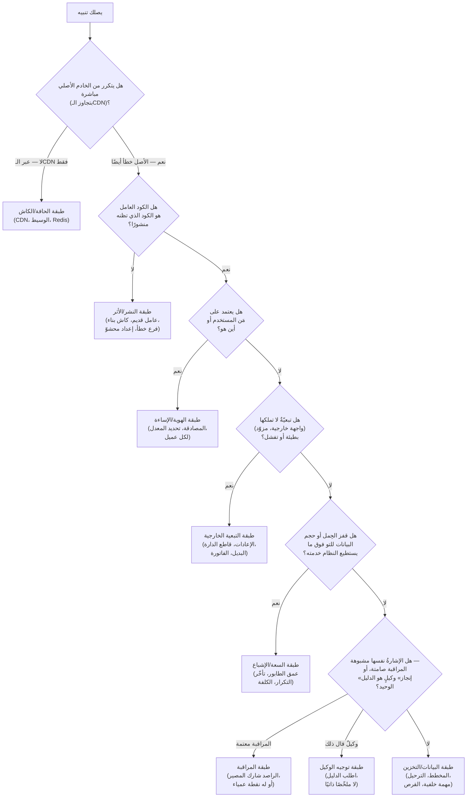
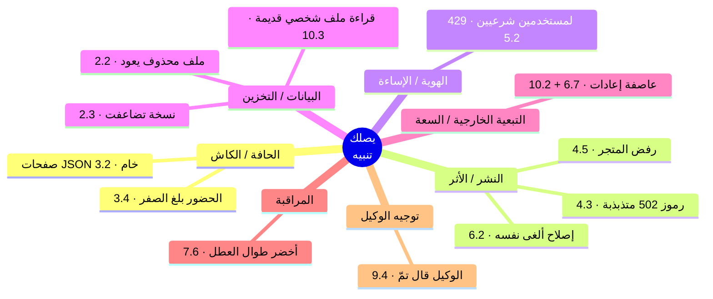

# 12 — المشروع الختامي: يصلك تنبيه

*الدورة كلها، محوَّلة إلى اثني عشر تنبيهًا (pagers).*

---

بنيتَ Relay من نموذج محلي (local prototype) إلى نظام إنتاجي (production system) متعدد العملاء (multi-client)، والآن أنت تُشغّله. هذه
الوحدة تدريبٌ على التشخيص (diagnosis): اثنا عشر حادثًا (incidents)، كلٌّ منها يصلك كما يصل الحادث الحقيقي —
**أعراضٌ (symptoms) فقط.** بلاغُ مستخدم (user report)، أو رمزُ حالة (Status Code)، أو رسمٌ بياني (graph) تحرّك، أو
ملخّصٌ واثق من وكيل (agent). لا سبب مرفق، لأن السبب في الإنتاج (production) لا يأتي مرفقًا أبدًا.

في كل محاكاة (simulation)، أنجِز العمل بالترتيب:

1. **اقرأ التنبيه.** الأعراض وحدها.
2. **أدِّ مهمتك.** أجب عن أسئلة التشخيص *قبل أن تُمرّر الشاشة* — اكتبها، أو قُلها
   بصوتٍ عالٍ، أو دوّنها. الانضباط هو رفضُ تخمين السبب قبل أن تسمّي الطبقة (layer).
3. **ثم قارن** بما جرى فعلًا في الإنتاج، وبالإصلاح (fix) الذي وصل.
4. **أجب عن سؤال المتابعة (follow-up).** كل حادثة تنتهي كما تنتهي في الواقع: *«وكيف تعلم أنه
   نجح؟»* فالإصلاح الذي لا تستطيع إثباته ليس إصلاحًا حقيقيًا.

أنفع ردِّ فعلٍ في التشغيل (operations) ليس معرفة كل سبب — بل **التنصيف حسب الطبقة (bisecting by layer)**: تقطع مسار
الطلب (request path) إلى نصفين وتسأل في أي نصفٍ يقع الخلل، حتى لا تبقى إلا طبقة واحدة. وكلٌّ من
هذه الاثنتي عشرة يُحلّ بإيجاد الطبقة الصحيحة أولًا.

أبقِ هذه الشجرة (tree) إلى جوارك. كل محاكاة تسمّي الفرع (branch) الذي تعيش فيه.

---

## المحاكاة 1 — نصُّ JSON خام مكان الصفحة الرئيسية

**التنبيه** 🔥
الدعم يحوّل لقطات شاشة (screenshots): عددٌ قليل من المستخدمين، منتشرون في بلدان مختلفة، يرون
صفحاتٍ تُعرض كنصٍّ خام — `0:{"a":"$@1"...}` — بدل الموقع. الأمر متقطّع (intermittent). المستخدم
نفسه يحدّث الصفحة (refreshes) فيختفي العطل، ثم يعود بعد ساعة. ومستخدمون آخرون على الرابط (URL) نفسه
يرون كل شيء سليمًا. متتبع الأخطاء (Error Tracker) صامت. وسجلات الخادم (server logs) لا تُظهر إلا
رموز 200. وحين تفتح الصفحة بنفسك، تعمل.

**مهمتك** — قبل أن تُمرّر الشاشة، اكتب إجاباتك:
- أيُّ طبقةٍ تنتج عَرَضًا *لكل مستخدم، متقطّعًا، يشفي نفسه (self-healing)، وغير مرئي في السجلات*؟
  (هناك عائلةٌ واحدة فعلًا.)
- كيف تنصّفه — ماذا تجلب من الخادم الأصلي (origin) مباشرةً بتجاوز الـCDN، وماذا يخبرك ذلك
  إن كان الأصل سليمًا؟
- جسم الاستجابة (response body) JSON صحيح، وليس انهيارًا (crash). أيُّ طلبٍ ينتج هذا الـJSON بشكل مشروع
  *على الرابط نفسه* الذي يعطي صفحة HTML؟

**ما جرى فعلًا**
كان كاشٌ مشترك (shared cache) يقدّم التمثيل (representation) الخطأ للرابط. التطبيق مبني على إطار React (React framework) يجيب على
المسار نفسه بطريقتين: HTML كامل للمتصفح (browser)، وحمولة JSON (payload) مضغوطة من نوع «flight»
للتنقّل داخل التطبيق (in-app navigation)، ويميّزهما بترويسة طلب (request header). وضع الإطار ترويسة `Vary` لإبقائهما
منفصلين — وتجاهلها الـCDN. فأيُّ طلبٍ يُسخّن عقدة حافةٍ باردة (cold edge node) يربح الرابط للجميع
حتى ينتهي الأجل (TTL)؛ وحين كان ذلك الطلب الأول تنقّلًا داخل التطبيق، خزّنت الحافةُ (edge)
الـJSON *بوصفه الصفحة*. الإصلاح الدائم كان حاجزًا (guard) عند الوسيط العكسي (Reverse
Proxy) مفتاحُه نوعُ محتوى الاستجابة (response Content-Type)، لا دواخلُ ترويسات طلب الإطار — الطبقة التي
يتحكم فيها الفريق كليًا. هذا الدرس **3.2**، حادثة تسميم الكاش (cache-poisoning) الرائدة. فرع الشجرة:
**الحافة/الكاش** — فهو لا يتكرر أبدًا من الخادم الأصلي.

**المتابعة: وكيف تعلم أنه نجح؟**
تعيد إنتاج التسميم عمدًا في بيئة التجهيز (staging) (تطلب الرابط بترويسة البيانات أولًا، ثم
كمتصفح، وتشاهد JSON يعود بوصفه الصفحة)، ثم تثبّت الحاجز وتشاهد المحاولة نفسها
تفشل. والإثبات الدائم اختبارُ سلكٍ كاشف (tripwire test) يجلب الصفحة بالطريقتين ويؤكد أن نسخة
البيانات تحمل `no-store` — اختبارٌ *رأيته يفشل* حين حُذف الحاجز.

---

## المحاكاة 2 — رموز 502 تختفي بإعادة تشغيلٍ لا ينبغي أن تحتاجها

**التنبيه** 🔥
بعد نشرٍ روتيني (routine deploy) مباشرةً، تبدأ الحافة بإرجاع رموز 502 — لكن بعض الوقت فقط. تحدّث
الصفحة فتُحمَّل؛ تحدّثها ثانيةً فتُعطي 502. النمط يتذبذب دقائق. تجلب الخادم الأصلي
مباشرةً بـ`curl` فيجيب `200` في كل مرة، فورًا. وسجلات التطبيق نظيفة — لا أخطاء، لا
آثار (stack traces)، لا شيء يتوافق مع الطلبات الفاشلة. وبحدسٍ تعيد تشغيل الوسيط (Proxy)، وهو شيء
تشعر أنك *لا ينبغي أن تلمسه*، فتتوقف رموز 502 فورًا.

**مهمتك** — قبل أن تُمرّر الشاشة:
- الأصل سليم (`curl` يقول 200) لكن الحافة تعطي 502. أيُّ طبقةٍ تقع *بين* الحافة
  والأصل، وتملك هذا الخطأ؟
- لماذا يُطلق النشرُ هذا، ولماذا يعالجه إعادةُ تشغيل الوسيط — لا إعادة تشغيل
  التطبيق؟
- «أُعيد التحميل» (reloaded) و«أُعيد التشغيل» (restarted) ضمانان مختلفان. ما الذي قد لا تفعله إعادةُ
  التحميل اللطيفة (Graceful Reload) بالاتصالات المفتوحة أصلًا؟

**ما جرى فعلًا**
هذا نشرٌ أزرق-أخضر (Blue-Green) بلا توقف (zero-downtime): تنتقل الحركة (traffic) من اللون القديم إلى الجديد،
ويُصرَّف (drains) القديم. لكن عامل nginx (nginx worker)، أبقته على قيد الحياة اتصالاتُ keepalive طويلةُ
العمر، عاش أطول من إعادة التحميل اللطيفة وظلّ يوجّه جزءًا من الطلبات إلى اللون
الميت — ولهذا *تذبذب* بدل أن يفشل بنظافة، ولهذا كانت سجلات التطبيق (على اللون الحي)
بريئة. إعادةُ تشغيل الوسيط الكاملة تقتل العامل القديم؛ والإصلاح الدائم يحدّ عمر
العامل (`worker_shutdown_timeout`) كي تُصرّف إعادةُ التحميل فعلًا. هذا الدرس
**4.3**: كل طبقةٍ بينك وبين المستخدم لها دورةُ حياةٍ (lifecycle) وكاشٌ خاصان، وإعادةُ التحميل
اللطيفة لا تُصرّف اتصالات keepalive. فرع الشجرة: **النشر/الأثر (artifact)** — فالشيء العامل
ليس الشيء الذي تظنّ أنك نشرته إليه.

**المتابعة: وكيف تعلم أنه نجح؟**
ليس «أعدتُ التشغيل فتوقفت رموز 502» — فذلك رحيلُ العَرَض لا موتُ السبب. تُثبته
بإعادة النشر تحت حِمل (under load) (مولّد طلبات (request generator) يضرب الموقع عبر الحافة) ومشاهدةِ اكتمال التبديل
بـ**صفر** من رموز 502، دون إعادة تشغيلٍ يدوية. وسكربتُ التحقق بعد النشر (post-deploy verification script) هو ما يجعل
ذلك قابلًا للتكرار.

---

## المحاكاة 3 — النسخة الاحتياطية التي تضاعفت ثلاثًا بين ليلةٍ وضحاها

**التنبيه** 🔥
يُطلق مراقبُ النسخ الاحتياطية (Backup) الليلية تنبيهًا: أرشيفُ (archive) الليلة الماضية بلغ
871 ميغابايت، بينما كان الليلة السابقة 244 ميغابايت. لم يُنشر شيء يضيف بيانات — لا
استيراد (import)، لا ميزة جديدة، ونموّ المستخدمين ثابت، وقاعدة البيانات (Database) نفسها
بحجمها منذ أسبوع. مهمة النسخ (backup job) تُبلّغ بالنجاح، رمز الخروج (exit code) 0 كالعادة. لكن فاتورةَ
تخزينك (storage bill) وزمنَ نقل النسخة قفزا قفزةً، ولم يُضِف أحدٌ صفًّا (row) واحدًا.

**مهمتك** — قبل أن تُمرّر الشاشة:
- *قاعدة البيانات* لم تنمُ لكن *النسخة* تضاعفت ثلاثًا. إذن البايتات الزائدة ليست
  بيانات — فما الذي تجرفه مهمةُ النسخ غيرها؟
- ما الذي تغيّر مؤخرًا في *تخطيط المجلدات (directory layout)* على الخادم (server)؟ (فكّر فيما أضافته دروس
  البنية التحتية (infrastructure) الأخيرة.)
- رمزُ الخروج 0 يعني أن الأرشفة (tar) جرت. لا يعني أن الأرشيف يحتوي الأشياء الصحيحة. كيف
  تدقّق (audit) *المحتوى* لا مجرد النجاح؟

**ما جرى فعلًا**
كانت قائمةُ الاستثناء (exclude list) في سكربت النسخ (backup script) قديمة. أعادت هندسةٌ (refactor) أزرق-أخضر سابقة تقسيمَ
مخرجات البناء (build output) إلى `.next-blue` و`.next-green`، كلٌّ يحمل كاش بناء (build cache) webpack بنحو 620
ميغابايت — والأرشفةُ استثنت `.next` لكن لا شقيقيه الجديدين، فأرشفت بأمانة مئات
الميغابايتات من *أثر بناءٍ قابل لإعادة التوليد (reproducible build artifacts)* كل ليلة. الإصلاح: استثناء `.next-*`
و`*/cache/webpack`، وإعادةُ تحديد نطاق النسخة الفعلي — قاعدتا Mongo والإعدادات (configs).
الكود متكرر مع git، وكاشات البناء قابلة لإعادة التوليد، والبيانات وحدها لا تُعوَّض.
هذا الدرس **2.3**: انسخ الحالة (state) لا الأثر — وسكربتات النسخ تتعفّن بصمتٍ حين يتطوّر
تخطيطُ المجلدات تحتها. فرع الشجرة: **البيانات/التخزين**. (قارنه بتقرير (postmortem) GitLab لعام
2017، حيث كانت خمسُ آليات نسخٍ تفشل بصمت — نسخةٌ لا تستعيدها ليست نسخة حقيقية.)

**المتابعة: وكيف تعلم أنه نجح؟**
إثباتان لا واحد. الحجم عاد إلى نحو 244 ميغابايت *و* — الاختبار الحقيقي — أجريتَ
**تجربة استعادة (restore drill)**: أخذتَ نسخة الليلة الماضية، واستعدتها في قاعدة بياناتٍ مؤقتة (throwaway database)،
وتأكدت أن التطبيق يقوم بالبيانات سليمة. فالنسخةُ التي لم تشاهد استعادتها ليست نسخة موثوقة.

---

## المحاكاة 4 — مستخدمون شرعيون يُمنعون بـ429 صباح اليوم التالي

**التنبيه** 🔥
بالأمس انطلق منشورٌ وقفزت الحركة — يومٌ جيد. هذا الصباح، مستخدمون عاديون يراسلونك
أنهم يتلقّون «طلبات كثيرة جدًا» (429) في أول نقرة، دون أن يفعلوا شيئًا غريبًا. ليس
الجميع، وليس مرتبطًا بحساب واحد. سجلات محدِّد المعدل (Rate Limiter) تُظهر حفنةً
صغيرة من عناوين IP يولّد كلٌّ منها أعدادًا هائلة من الطلبات — أكثر مما يفعل بشر —
بينما المستخدمون المتأثرون على اتصالاتٍ منزلية (home connections) عادية في مدنٍ مختلفة.

**مهمتك** — قبل أن تُمرّر الشاشة:
- المحدِّد يظن أن بضعة عناوين IP يفعل كلٌّ منها آلاف الطلبات، لكن المستخدمين
  الحقيقيين في مدنٍ مختلفة. ما الذي يقف أمام أصلك فيجعل آلافًا من الناس *يبدون*
  كبضعة عناوين؟
- خلف CDN، ماذا يعني «عنوان العميل» (client's IP) لخادمك — عنوانُ مَن على المقبس (Socket) الوارد؟
- أين تُخزَّن عدّادات تحديد المعدل (rate-limit counters)، وماذا يحدث للعدّادات داخل العملية (in-process) عبر نشرٍ (deploy) أو
  عبر عدة نسخ (multiple instances)؟

**ما جرى فعلًا**
خلف الـCDN، يصل كل طلبٍ من إحدى حفنةٍ من عناوين حافة الـCDN، فوضع المحدِّد —
المُفتَّح (keyed) على عنوان المقبس — العالمَ كله في بضعة دِلاءٍ (buckets) مشتركة. امتلأ دلوٌ بمنطقةٍ (region)
مزدحمة فمُنِع كلُّ من مرّ بتلك الحافة بـ429. الإصلاح يُفتّح على ترويسة عنوان العميل
التي يوفّرها الـCDN (`CF-Connecting-IP`) ويخزّن العدّادات في Redis، لأن العدّادات
في الذاكرة (in-memory) تُصفَّر مع كل نشرٍ ولا تُشارَك بين النسخ. والنتيجة من التدقيق: تلك
الترويسة موثوقةٌ فقط إن عجز العملاء عن بلوغ الأصل مباشرةً لتزويرها — لذا افرض دخولًا
حصريًا (ingress) عبر الـCDN. هذا الدرس **5.2**. فرع الشجرة: **الهوية/الإساءة** — فالعلة كلها
عن *من يبدو الطلب أنه*.

**المتابعة: وكيف تعلم أنه نجح؟**
تعيد تشغيله: تولّد حركةً من عنوانَي عميلٍ مختلفين *عبر* الـCDN وتُظهر أن بلوغَ
أحدهما حدَّه لم يعد يمنع الآخر بـ429 — فالدلاء الآن لكل عميلٍ حقيقي لا لكل حافة.
وإثباتٌ إضافي: تنشر أثناء الاختبار وتُظهر بقاء العدّادات (فهي في Redis) بدل تصفّرها.

---

## المحاكاة 5 — الملف الذي يرفض أن يبقى محذوفًا

**التنبيه** 🔥
يطلب صانعُ محتوى (creator) حذفَ ملفٍ وسائط (media file) — رفعٌ خاطئ، يجب أن يزول. تحذفه من التخزين الكائني
(Object Storage)، وتتأكد أنه زال (الرابط يعطي 404)، وتمضي. بعد ساعات يعود: الملف
نفسه، الرابط نفسه، يُقدَّم بسعادة. تحذفه ثانيةً فيعود ثانيةً. لا مهمةٌ مجدولة (cron job)
تعرفها تعيد رفعه، ولا مستخدمٌ يعيد رفعه، ونداءُ الحذف (delete call) نفسه يعيد النجاح في كل مرة.

**مهمتك** — قبل أن تُمرّر الشاشة:
- الحذف *ينجح* والملف *يعود*. أي أن شيئًا يعيده. أيُّ نظامٍ، غير مستخدمٍ أو مهمة،
  يستعيد كائنًا عند القراءة؟
- ما الذي تغيّر مؤخرًا في *مكان سكن الملفات* — هل هناك أكثر من خلفية تخزينٍ (storage backend) في
  الصورة الآن؟
- حين ترحّل (migrate) تخزينًا، ما الذي يجب أن يصحّ قبل أن يُسمح للنظام القديم بالتوقف عن
  الإجابة؟

**ما جرى فعلًا**
كان التخزين قد رُحّل من متجرٍ كائني (GCS) إلى آخر (R2) مع جسر تكرارٍ (Replication)
سحبيٍّ (pull-through) ما زال مُشغَّلًا: عند أي إخفاقٍ (miss) في R2، يعيد بصمتٍ جلبَ الكائن من دلو GCS
القديم ويعيد ملء R2. فكلُّ حذفٍ من R2 كانت تُلغيه القراءةُ التالية فورًا، إذ تسحب
الأصلَ الباقي عبر الجسر. الإصلاح: احذف من *كلا* الخلفيتين، والأهم أنهِ طور المصدرين (dual-source phase)
صراحةً — فالترحيل (migration) لا يكتمل حتى يعجز النظام القديم عن الفعل. هذا الدرس **2.2**، فخُّ
المالكَين. فرع الشجرة: **البيانات/التخزين**. (يتكرر من الأصل، ولا يعتمد على مَن
يسأل، والكود العامل سليم — إنه المالكُ الثاني في مستوى البيانات (data plane).)

**المتابعة: وكيف تعلم أنه نجح؟**
احذف الملف، ثم *افرض قراءةً باردة من الكاش (cache-cold read)* وتأكد أنه يعطي 404 ويبقى 404 عبر فترة
التكرار — فتكون قد أثبتّ أن الجسر لم يعد يستعيده. والإثبات الدائم جدولُ أطوار
الترحيل (migration-phases table) بتاريخ انتهاءٍ صريح لطور المصدرين، وفحصٌ أن الخلفية القديمة أُوقفت (decommissioned).

---

## المحاكاة 6 — إصلاح الموبايل الذي ألغى نفسه

**التنبيه** 🔥
قبل أسبوع شحنت تحديثًا عبر الهواء (OTA) لتطبيق الموبايل — إصلاحٌ صغير، مُتحقَّق منه
على جهازٍ حقيقي (real device)، وأكّد المستخدمون أنه يعمل. اليوم العلةُ نفسها عادت في الميدان (field)، على
نسخة التطبيق (app version) الحالية، دون إصدار متجرٍ (store release) جديد بينهما. لم يلمس أحدٌ ذلك الكود. الإصلاح
ببساطة… اختفى، كأنه لم يُشحن قط. أما تحديثات OTA الأخرى لهذا الأسبوع فكلها موجودة
وسليمة.

**مهمتك** — قبل أن تُمرّر الشاشة:
- كان الإصلاح حيًّا ثم تراجع (reverted)، دون إصدار متجر. أيُّ طبقةٍ تنشر تغييراتٍ لتطبيق موبايل
  *دون* المرور بالمتجر؟
- قناةُ OTA (OTA channel) آلةُ حالةٍ (State Machine) لها حزمةٌ (bundle) «حالية». ما الذي يحدّد أيَّ حزمةٍ
  يسحبها الجهاز، وما الذي قد يكتب فوق حزمتك؟
- من أين نُشر الإصلاح — من مصدر الحقيقة (source of truth) نفسه الذي نُشرت منه تحديثاتك الأخرى، أم من
  فرعٍ جانبي (side branch)؟

**ما جرى فعلًا**
نُشر تحديثُ OTA من فرع ميزة (Feature Branch). ولم يحتوِ التحديثُ التالي المنشور من
`main` ذلك الإصلاح، فأعاد القناةَ بصمتٍ إلى الوراء — صارت حزمةُ main هي «الحالية»
وكتبت فوق حزمتك. قنوات التحديث (update channels) آلاتُ حالة، وكلُّ مسار نشرٍ (publish path) يحتاج مصدرَ حقيقةٍ واحدًا
بالضبط. (فخٌّ شقيق في الدرس نفسه: `eas update` دون تسمية البيئة يجرّد إعدادَ وقت
التشغيل (runtime config)، منتجًا حزمةً خاطئةً بشكلٍ خفيّ آخر.) هذا الدرس **6.2**، فخُّ التراجع (revert trap). فرع
الشجرة: **النشر/الأثر** — فالحزمةُ العاملة ليست التي قصدتَ شحنها.

**المتابعة: وكيف تعلم أنه نجح؟**
أعِد شحن الإصلاح *من main*، ثم تحقّق على الجهاز الذي يحمله المستخدمون فعلًا — أعِد
خطوات العلة الأصلية وتأكد أنها زالت — لا على محاكٍ (simulator)، ولا من اللقطة التي يعطيك إياها
الوكيل. ثم انشر تحديثَ OTA آخر من main وتأكد أن إصلاحك ينجو منه. «مدموج» (merged) و«مشحون
عبر OTA» و«موجودٌ بعد النشر التالي» ثلاثةُ ادّعاءاتٍ مختلفة.

---

## المحاكاة 7 — يعمل على جهازك، يرفضه المتجر

**التنبيه** 🔥
تقدّم بناءَ (build) تطبيق التلفاز (TV) إلى المتجر. يعود مرفوضًا: «تعذّر تشغيل المحتوى».
لكن التطبيق يشغّل المحتوى تمامًا على جهازك، وعلى المحاكي (emulator)، وعلى كل جهازٍ على مكتبك.
البناءُ المرفوض اجتاز فحص الجودة (QA) المحلي عندك. تقارن المصدر بإصدار الأسبوع الماضي
العامل فيكون الفرق ضئيلًا وغير ذي صلة. لا شيء في الكود الذي تراه يفسّر لماذا لا
يستطيع *هذا الأثر* بلوغَ واجهتك البرمجية (API).

**مهمتك** — قبل أن تُمرّر الشاشة:
- يعمل من بنائك، ويفشل من بناء المتجر. ما الفرق بين «الكود على جهازك» و«الأثر
  المُصرَّف (compiled artifact) الذي رفعته»؟
- يُحشى (inlined) الإعدادُ داخل الحزمة وقت البناء. ما الذي يحشوه بناؤك المحلي ولا يستطيع
  جهازُ المُراجِع (reviewer's device) بلوغه أبدًا؟
- أين تبحث عن الحقيقة — في شجرة المصدر (source tree) (التي قارنتها بالفعل)، أم في المخرَج
  المُصرَّف؟

**ما جرى فعلًا**
ملفٌّ شارد متجاهَل من git (git-ignored) اسمه `.env.local` يحوي `localhost:3105` كأساسٍ للواجهة
حُشِي في الحزمة وقت البناء. على جهازك، يحلّ `localhost` إلى خادم التطوير (dev server) العامل
عندك، فيشتغل كل شيء. على جهاز المُراجِع، `localhost` هو *جهازه* — فالواجهة غير قابلة
للبلوغ، ومن هنا «تعذّر تشغيل المحتوى». ولأن الملف متجاهَل من git، لا يظهر في أي فرق (diff)؛
والوكيلُ لا يراه أيضًا. الإصلاح مدقّقُ ما بعد البناء (Postbuild Verifier) يفحص
*الأثر المُصرَّف* ويفشل بصخبٍ إن احتوى `localhost` أو خلا من الأصل الإنتاجي (production origin). هذا
الدرس **4.5**: تحقّق من الأثر لا المصدر. فرع الشجرة: **النشر/الأثر**. (صدى واقعي:
هذا الصنف بالضبط شُحن إلى متجرَي تلفازٍ — رفضه أحدهما، وكاد الآخر يشحن الحزمة
المعطوبة نفسها بايتًا ببايت.)

**المتابعة: وكيف تعلم أنه نجح؟**
تفحص الحزمة المُعاد بناؤها عن `localhost` فتحصل على صفر نتائج، *و* تتأكد أن نصّ
الأصل الإنتاجي موجود — ثم تدع مدقّق ما بعد البناء يعمل في CI وتشاهده **يفشل** على
بناءٍ مسموم (poisoned) عمدًا قبل أن ينجح على النظيف. الإثباتُ في المخرَج المُصرَّف (compiled output)، لا في فرق
المصدر أبدًا.

---

## المحاكاة 8 — عدّاد الحضور الذي بلغ الصفر

**التنبيه** 🔥
عدّادُ «عددُ المستمعين الآن» ميزةٌ حيّةٌ (live product feature) في منتجك. بعد ظهر اليوم هبط من بضع مئاتٍ
صحّية إلى **صفر**، فورًا، في خطوةٍ واحدة — بينما الموقعُ نفسه واضحٌ أنه ما زال يعمل
ويخدم الحركة طبيعيًا. وفي اللحظة نفسها تقريبًا، ذكر مهندسٌ أنه «مسح الكاش» ليعالج
شكوى بياناتٍ قديمة (stale-data). ثم يبدأ العدّادُ بالتسلّق صعودًا من تلقاء نفسه خلال الدقيقة
التالية، دون أي فعلٍ منك.

**مهمتك** — قبل أن تُمرّر الشاشة:
- كان الهبوط *فوريًّا وكاملًا*، لا تناقصًا تدريجيًا، والموقعُ بقي عاملًا. أيُّ نوعِ
  عمليةٍ يصفّر قيمةً في خطوةٍ ذرّية (atomic) واحدة؟
- «مسح» أحدٌ «الكاش» في اللحظة نفسها. أين تسكن بيانات الحضور فيزيائيًا — وما الذي
  قد يسكن المتجر نفسه غيرها؟
- يشفي نفسه في نحو 60 ثانية. أيُّ آليةٍ تعيد ملء الحضور دون نشرٍ ودون فعلِ مستخدم؟

**ما جرى فعلًا**
كانت حالةُ الحضور الحيّ (بيانات نبضات القلب/Heartbeats) وكاشُ الاستجابة (response cache) يتشاركان
قاعدةَ Redis واحدة. و«مسحُ الكاش» كان `FLUSHDB` فجًّا مسح *كل شيء* في تلك القاعدة —
بما فيه الحضور — فسقط العدّاد إلى الصفر في خطوة. وشفي نفسه لأن العملاء يرسلون نبضاتٍ
كل نحو 60 ثانية، فأعاد الحضورُ بناءَ نفسه بعد انتهاء المسح. الإصلاح: لا `FLUSHDB`
أبدًا؛ أزِل بحسب بادئة مفتاحٍ (key prefix) ضيقة فقط (`SCAN` + `UNLINK`)، ولا تُسكِن الكاشَ
القابل للتخلّص مع حالةٍ شبه دائمة (semi-durable state). هذا الدرس **3.4**: «الكاش معطّل» يجب أن يتدهور
إلى *بطيء*، لا إلى *فقدان بيانات (data loss)*. فرع الشجرة: **الحافة/الكاش** — لكن الدرسَ عمّا
*سواه* كان يتشارك بيتَ الكاش.

**المتابعة: وكيف تعلم أنه نجح؟**
تشغّل عمليةَ الصيانة (maintenance operation) التي سبّبته — مسحَ كاش — وتشاهد عدّاد الحضور *لا يتحرك*، لأن
المسح يستهدف الآن مفاتيح كاش الاستجابة بالبادئة فقط. والإثبات الدائم: الحضور يسكن
مساحةَ مفاتيحه (keyspace) الخاصة (أو قاعدة Redis خاصة)، مُبرهَنًا بمسح الكاش وإظهار أنهما الآن
مستقلان.

---

## المحاكاة 9 — اللوحات التي بقيت خضراء طوال العطل

**التنبيه** 🔥
تتراكم تذاكر الدعم (support tickets): مستخدمون في منطقةٍ كاملة يقولون إن التطبيق معطّل منذ عشرين
دقيقة. لكن كل شاشةٍ تملكها خضراء — لوحةُ المقاييس (metrics dashboard)، ولوحةُ التنبيهات (alerting panel)، ورسمُ التشغيل (uptime graph) —
كلها صحّية، و*لم يُطلق أي تنبيه*. تُخرج هاتفك، وتترك شبكة المكتب، وتفتح الموقع عبر
بيانات الجوّال (cellular): إنه معطّل عندك أيضًا. المراقبة (monitoring) لم تنبس بكلمة.

**مهمتك** — قبل أن تُمرّر الشاشة:
- النظام معطّل و*لم يصلك أي تنبيه*. أيُّهما أخطر هنا: العطل، أم الصمت من حوله؟
- كي يكون «كله أخضر» جديرًا بالثقة، ما الذي يجب أن يصحّ عن *مكان تشغيل مراقبتك*
  بالنسبة إلى ما تراقبه؟
- إن شارك الراصدُ (monitor) والمرصودُ البنيةَ التحتية نفسها، فماذا يعني «أخضر» لحظة تعطُّل
  تلك البنية؟

**ما جرى فعلًا**
كانت منظومةُ المراقبة والتنبيه (monitoring and alerting stack) تعمل على *البنية التحتية نفسها* التي يعمل عليها
التطبيق — المنطقة نفسها، المزوّد (provider) نفسه. فلمّا تدهورت تلك البنية، عتم الراصدُ *معها*،
فعجز عن الإبلاغ عن العطل. «لا تنبيه» لم يعنِ «لا مشكلة»، بل «لا راصد». كانت اللوحاتُ
الخضراء تقيس جثّتها. الإصلاح هو القاعدة الحديدية التي لقيتَها أول مرة في F.5 و1.3،
والتي تبلغ درجتها الصناعية هنا: **الشيء الذي يخبرك أن «كل شيء بخير» يجب ألّا يشارك
مصير (share fate) ما يراقبه** — فحصُ تشغيلٍ خارجي (external uptime check) على بنية غيرك، مع تنبيهٍ يصلك خارج الشبكة. هذا
الدرس **7.6**. فرع الشجرة: **المراقبة** — الإشارة نفسها فشلت. (صدى: عطل S3 لدى AWS
عام 2017 أسقط لوحةَ الحالة التي كانت مستضافة على S3؛ وطارت Roblox عمياء 73 ساعة
للسبب نفسه.)

**المتابعة: وكيف تعلم أنه نجح؟**
تجري «يوم تمرين» (game-day): تقتل عمدًا البنيةَ التحتية للتطبيق وتشاهد الفاحصَ (checker) *الخارجي* ينبّهك
ضمن نافذتك المستهدفة — راصدٌ رأيتَه بعينك يُطلق أثناء عطلٍ حقيقي (مُصطنع)، من خارج
دائرة الانفجار (blast radius). الراصدُ الذي لم ترَه ينبّه قط افتراضٌ لا إنذار.

---

## المحاكاة 10 — ومضةُ 90 ثانية التي صارت عطلًا 20 دقيقة

**التنبيه** 🔥
مزوّدُ البريد أو الدفع لديك واجه حادثةً قصيرة — صفحةُ حالته (status page) تقول 90 ثانية من
الأخطاء المرتفعة (elevated errors)، ثم تعافى تمامًا. لكن تطبيقك كان معطّلًا عمليًا عشرين دقيقة، وبعد
ساعة ما زال عمقُ طابور مهامك (job queue depth) *يتسلّق*، ومعالجُ العامل (worker CPU) مثبَّتٌ على 100%، وفاتورةُ
المزوّد (provider invoice) تُظهر قفزة **40 ضعفًا** في نداءات الواجهة (API calls) تتركّز في تلك النافذة. المزوّد صحّي
منذ ساعة. أما أنت فلا.

**مهمتك** — قبل أن تُمرّر الشاشة:
- ومضةُ تبعيّةٍ (dependency blip) من 90 ثانية صارت عطلًا ذاتيًا (self-inflicted outage) من 20 دقيقة. ماذا فعل كودُك في كل مرة
  انتهت فيها مهلةُ المزوّد (timed out) فضاعف فشلًا *واحدًا* إلى آلاف؟
- تلك الطلبات لم تتبخّر — بل اصطفّت (queued). ماذا يحدث لعمق الطابور حين يصل عملٌ جديد أسرع
  مما يستطيع العمّال (workers) تصريفه؟
- ما الفرق بين «إعادة» (retry) و«إعادة بحدٍّ وتراجعٍ (backoff) وقاطع» (breaker)؟ ولماذا ظهرت كلُّ إعادةٍ *على
  الفاتورة*؟

**ما جرى فعلًا**
عند كل انتهاء مهلةٍ من المزوّد، أعاد العاملُ فورًا وبلا حدّ. ولمّا تعافى المزوّد،
ضربه **قطيعٌ هادر (thundering herd)** من الإعادات المتراكمة *زائدَ* كل العمل الجديد الذي تكدّس — عاصفةُ
إعاداتٍ (retry storm) أبقت العطلَ الفعلي مستمرًّا بعد شفاء السبب الجذري (root cause) بوقتٍ طويل، وحسبت كل إعادةٍ
نداءَ واجهةٍ مدفوعًا (قفزةُ 40 ضعفًا). لم يكن هناك قاطعُ دارة (circuit breaker)، ولا تراجعٌ أسّي (exponential backoff) بتشويش
(Jitter)، ولا طابورُ رسائلَ ميتة (dead-letter queue)، ولا ضغطٌ عكسي (backpressure). الإصلاح هو عُدّةُ المرونة (resilience kit) من الدرس
**6.7** وانضباطُ الطابور من **10.2**: قاطعُ دارةٍ يقطع ويطرح الحِمل (sheds load)، وتراجعٌ بتشويش
على الإعادات، ومسارٌ للرسائل الميتة للمهام السامّة (poison jobs)، ومراقبةُ *عمق* الطابور كمقياسٍ (metric)
من الدرجة الأولى. فرع الشجرة: **التبعية الخارجية** (المُطلِق (trigger)) تغذّي **السعة/الإشباع**
(المضخّم (amplifier)) — ولأن الإعادات مدفوعة، فهو حادثة **كلفة** أيضًا.

**المتابعة: وكيف تعلم أنه نجح؟**
تعيد تشغيله: تحقن عطلًا (fault-inject) في المزوّد مدّته 90 ثانية *تحت حِمل*، وتُظهر ثلاثة رسومٍ
تعود إلى الأساس (baseline) من تلقاء نفسها — عمقُ الطابور يقفز ثم يُصرَّف إلى الصفر دون فعلٍ
بشري، والقاطعُ يقطع ثم يعود، وعددُ نداءات الواجهة يبقى محدودًا بدل أن ينفجر 40 ضعفًا.
الإثباتُ هو النظامُ يمتصّ الومضة التالية دون أن تلمسه.

---

## المحاكاة 11 — تغييرُ الملف الشخصي الذي يتراجع لثانية

**التنبيه** 🔥
يُبلّغ المستخدمون أنهم حين يحدّثون ملفهم الشخصي (profile) — اسمُ عرضٍ (display name) جديد، صورةٌ جديدة (avatar) —
وتُعاد الصفحة، يرون *القيمة القديمة* لبرهة، ثم تصحّح نفسها بعد ثانيةٍ أو اثنتين. الأمر
متقطّع، ويسوء بعد ساعات ذروتك (busiest hours) مباشرةً، والكتابةُ تُودَع (committing) بالتأكيد (القيمة الجديدة
صحيحة عند تحديثٍ لاحق). ولا تستطيع إعادة إنتاجه في بيئة التجهيز إطلاقًا.

**مهمتك** — قبل أن تُمرّر الشاشة:
- الكتابةُ تنجح والقراءةُ قديمةٌ (stale) *لبرهة* ثم تُشفى. إلى أين قد تذهب قراءةٌ ليست حيث
  ذهبت الكتابة؟
- لماذا يسوء هذا تحت الحِمل، ولماذا لا يظهر *أبدًا* في بيئة التجهيز التي تشغّل قاعدةً
  واحدة؟
- حين أضفتَ نسخ قراءةٍ متماثلة (Read Replicas) لتوسيع القراءات، أيَّ ضمانٍ تخلّيتَ
  عنه بهدوء؟

**ما جرى فعلًا**
لتوسيع القراءات، كان الفريقُ قد أضاف **نسخ قراءةٍ متماثلة**: تذهب الكتابةُ إلى النسخة
الأساسية (primary) وتتكرر *لا تزامنيًا (asynchronously)* إلى النسخ المتماثلة. وتحت الحِمل، يكبر تأخّرُ التكرار
(Replication Lag) — فقراءةٌ توجَّه إلى نسخةٍ متأخرة تُرجع القيمة من *قبل* كتابة
المستخدم نفسه. هذا انتهاكُ **قراءة كتاباتك (Read-Your-Own-Writes)**، ولم تُظهره بيئةُ
التجهيز أبدًا لأنها قاعدةٌ واحدة بلا نسخةٍ تتأخر. الإصلاح: وجّه القراءات التي يجب أن
تعكس كتابة المستخدم للتوّ إلى النسخة الأساسية (توجيهٌ لاصق (sticky routing) لقراءة الكتابات)، أو اشترط
حداثة (freshness) النسخة المتماثلة، واحتفظ بالاتساق التدريجي (eventual consistency) للقراءات التي لا يضرّ فيها التقادم
حقًّا. هذا الدرس **10.3**. فرع الشجرة: **البيانات/التخزين**، يظهر فقط تحت
**السعة/الإشباع** — فالعلة خفيّة حتى يكبر التأخّر، وهو كميةٌ يقودها الحِمل.

**المتابعة: وكيف تعلم أنه نجح؟**
أعِد إنتاجه بحتميةٍ (deterministically) عبر *حقن* تأخّر تكرار، وشاهد القراءةَ القديمة تظهر، ثم طبّق توجيه
قراءة الكتابات وشاهد تسلسلَ الكتابة-ثم-القراءة نفسه يُرجع القيمة الجديدة في كل مرة —
تحت التأخّر المحقون نفسه. والإثبات الدائم اختبارٌ يكتب، ثم يقرأ فورًا عبر طبقة التوجيه
الحقيقية والتأخّر حاضر، ويؤكد الحداثة.

---

## المحاكاة 12 — الوكيل الذي قال «تمّ»

**التنبيه** 🔥
هذا ليس بلاغَ مستخدم — بل وكيلُك الذكي (AI agent). طلبتَ منه إصلاح تدفّق الدفع (Checkout) الذي
يفشل لبعض المستخدمين. فعاد بملخّصٍ (summary) واثق: *«تمّ. أصلحتُ فحصَ null (null-check) في معالج الدفع (payment handler)،
وأضفتُ اختبارًا (test)، وكل الاختبارات تنجح. الدفع يعمل الآن.»* والفرقُ يبدو معقولًا وصغيرًا.
إنها الحادية عشرة ليلًا، وأنت متعب، والدمجُ (merging) على بُعد نقرةٍ واحدة. لا شيء ينبّهك — *بعد*.

**مهمتك** — قبل أن تُمرّر الشاشة:
- الدليلُ (evidence) الوحيد أن العلة أُصلحت هو ملخّصُ الوكيل عن عمله هو. لماذا ليس ذلك دليلًا؟
- «كل الاختبارات تنجح» — ماذا قد تعني هذه الجملة إن كان الاختبارُ الذي أضافه لا يمسّ
  الفشل الحقيقي أصلًا؟
- قبل أن تصدّق «الدفع يعمل»، ماذا تطلب أن ترى، و*من أي طبقة* — سردُ الوكيل (narration)، أم السطحُ (surface)
  الذي يلمسه المستخدم؟

**ما جرى فعلًا**
هذا نمطٌ لا حادثةٌ فردية، وهو الدورةُ كلها موجَّهةً إلى أحدث عضوٍ في فريقك. ملخّصُ
الوكيل الذاتي **ادّعاءٌ (claim) لا برهان (proof)** — الشكلُ نفسه تمامًا لـ«النشر نجح» (4.5)، و«النشر
خرج» (4.3)، و«رمز الخروج 0» (2.3). فالوكلاء، كالبشر، يسردون *النيّة* (intent)، والملخّصُ قد يكون
واثقًا وخاطئًا: اختبارٌ يؤكد على محاكاةٍ (mock) بدل السلوك، أو «إصلاحٌ» على مسارٍ لا تسلكه
العلة، أو CI أخضر على مجموعةٍ (suite) لم تُعِد إنتاج الفشل أصلًا. الانضباط هو الدرس **9.4**،
التحقق قبل الإنجاز (verification before completion): تطلب الأثر لا السرد. فرع الشجرة: **توجيه الوكيل** — الدليلُ الوحيد
تقريرٌ ذاتي (self-report)، والإصلاح هو رفضه والذهاب لجلب دليلٍ حقيقي. (وهو أيضًا نظرةُ الحوكمة (governance) من
**9.8** مصغّرةً: أنت مسؤول عمّا يشحنه وكيلك، و«النعم» الأخيرة لك أنت لا للوكيل.)

**المتابعة: وكيف تعلم أنه نجح؟**
«وكيف تعلم أنه نجح؟» جوابُها *نفسه* سواء أدّى العملَ بشرٌ أو وكيل: أعِد إنتاج تدفّق
الدفع الفاشل كمستخدمٍ حقيقي وشاهده ينجح، وشاهد الاختبارَ الجديد **يفشل على الكود قبل
الإصلاح** ثم ينجح على الإصلاح. «تمّ» من الوكيل تترقّى إلى إنجازٍ فعلي فقط حين ترى الدليل
الذي لا يستطيع تلفيقه — من الطبقة التي يلمسها المستخدم.

---

## أنت الآن تملك الخريطة كاملة

اثنا عشر تنبيهًا، ردُّ فعلٍ واحد: **سمِّ الطبقة قبل أن تسمّي السبب.**
انظر إلى ما فعلته للتو — وجّهتَ كل حادثةٍ عبر الشجرة نفسها، وكل فرعٍ وحدةٌ عشتها
بالفعل:

**حدُّ النجاح** ليس «حفظتَ اثني عشر سببًا». فالإنتاج الحقيقي يسلّمك حادثةً ثالثةَ
عشرة لم ترها قط. تنجح حين تستطيع، لأي تنبيه، أن:

1. **تحدّد الطبقة الصحيحة** — تنصّف حتى تبقى واحدة، بدل التخمين.
2. **تقترح سببًا جذريًا معقولًا** عند تلك الطبقة — سببًا يفسّر *كل* الأعراض، بما
   فيها الغريبة (لماذا هو متقطّع، لماذا يشفي نفسه، لماذا الأصل سليم).
3. **تشحن إصلاحًا ينجو من المتابعة** — *«وكيف تعلم أنه نجح؟»* — بدليلٍ من الطبقة
   التي يلمسها المستخدم، لا لقطةَ شاشةٍ لـlocalhost ولا «أعدتُ التشغيل فتوقف».

ذلك السؤال الأخير هو الدورةُ كلها مضغوطةً في خمس كلمات. أعِد الإنتاج، وأصلِح،
وأثبِت — من الخارج، على السطح الذي يراه المستخدم. كلُّ ما في هذه الوحدات الاثنتي
عشرة كان في خدمة قدرتك على الإجابة عنه بهدوءٍ في الثالثة فجرًا.

بدأتَ لا تعرف ما الخادم. وأنت الآن تستطيع أن يصلك تنبيه، فتقطع مسار الطلب نصفين،
وتحطّ على الطبقة الصحيحة، وتُثبت إصلاحك. هذه ليست معلوماتٍ عن اثني عشر حادثًا — بل
خريطةُ كل ما قد يؤذيك، وعادةُ طلبِ الدليل. اذهب وابنِ. وحين ينكسر — فسينكسر —
ستعرف بالضبط أين تنظر.

---

*الحوادث المصدرية: [بنك الحوادث](../../war-stories/incident-bank.md) ·
[الحالات الشهيرة](../../war-stories/famous-cases.md). كل محاكاة تُقابل درسها الكامل:
‏3.2، 4.3، 2.3، 5.2، 2.2، 6.2، 4.5، 3.4، 7.6، 6.7 + 10.2، 10.3، 9.4.*
