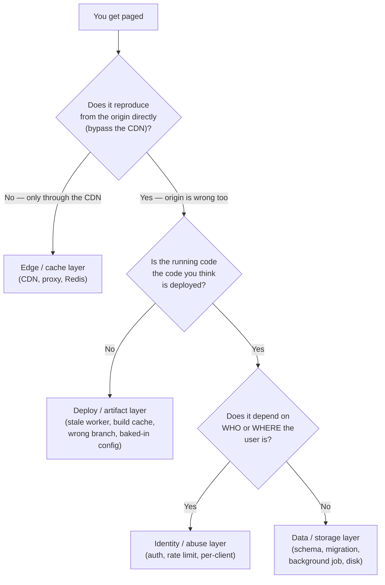
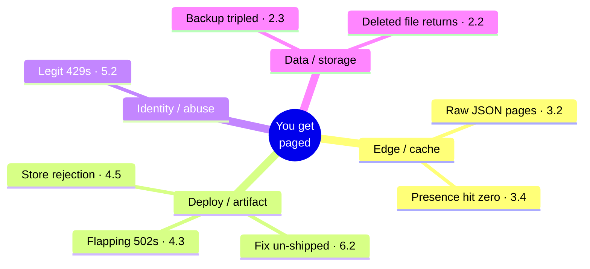

# 12 — Capstone: You Get Paged

*The whole course, turned into eight pagers.*

---

You've built Relay from a local prototype to a multi-client production system.
Now you operate it. This module is diagnosis practice: eight incidents, each
given the way a real one arrives — **symptoms only.** A user report. A status
code. A graph that moved. No cause attached, because in production the cause
never comes attached.

For each simulation, do the work in order:

1. **Read the page.** Just the symptoms.
2. **Do your job.** Answer the diagnostic questions *before you scroll* — write
   them down, out loud, on paper, in a note. The discipline is refusing to guess
   the answer before you've named the layer.
3. **Then compare** against what actually happened in production, and the fix
   that shipped.
4. **Answer the follow-up.** Every incident ends the same way it ends in real
   life: *"and how do you know it worked?"* A fix you can't prove is a hope.

The single most useful reflex in operations is not knowing every cause — it's
**bisecting by layer**: cutting the request path in half and asking which side
the fault is on, until only one layer is left. Every one of these eight is
solved by finding the right layer first.

Keep that tree next to you. Each simulation names which branch it lives on.

---

## Simulation 1 — Raw JSON where the homepage should be

**The page** 🔥
Support is forwarding screenshots: a handful of users, scattered across
countries, are seeing pages that render as raw text — `0:{"a":"$@1"...}` —
instead of the site. It's intermittent. The same user refreshes and it's gone;
an hour later it's back. Other users on the exact same URL see everything
perfectly. The error tracker is silent. The server logs show nothing but 200s.
When you open the page yourself, it works.

**Your job** — before you scroll, write down your answers:
- Which layer produces a symptom that is *per-user, intermittent, self-healing,
  and invisible in logs*? (There's really only one family.)
- How would you bisect it — what do you fetch from the origin directly, bypassing
  the CDN, and what does it tell you if the origin is clean?
- The response body is valid JSON, not a crash. What kind of request would
  legitimately produce that JSON *at the same URL* as the HTML page?

**What actually happened**
A shared cache was serving the wrong representation of the URL. The app is a
React framework that answers the same path two ways: full HTML for a browser,
and a compact JSON "flight" payload for in-app navigation, distinguished by a
request header. The framework set a `Vary` header to keep them separate — and
the CDN ignored it. Whichever request warmed a cold edge node won the URL for
everyone until the TTL expired; when that first request was an in-app
navigation, the edge cached JSON *as the page*. The durable fix was a guard at
the reverse proxy keyed on the response `Content-Type`, not on framework request
internals — the layer the team fully controls. This is lesson **3.2**, the
flagship cache-poisoning incident. Branch of the tree: **edge / cache** — it
never reproduces from the origin.

**The follow-up: and how do you know it worked?**
You reproduce the poisoning on purpose in staging (request the URL with the
data-header first, then as a browser, and watch JSON come back as the page),
then install the guard and watch the same attempt fail. The permanent proof is a
tripwire test that fetches the page both ways and asserts the data variant
carries `no-store` — a test you *watched fail* when the guard was removed.

---

## Simulation 2 — 502s that a restart makes disappear

**The page** 🔥
Right after a routine deploy, the edge starts returning 502s — but only some of
the time. Refresh and it loads; refresh again and it's a 502. The pattern
flaps for minutes. You `curl` the origin server directly and it answers `200`
every single time, instantly. The application logs are clean — no errors, no
stack traces, nothing that lines up with the failing requests. On a hunch you
restart the web proxy, something you feel you *shouldn't have to touch*, and the
502s stop immediately.

**Your job** — before you scroll:
- The origin is healthy (`curl` says 200) but the edge returns 502. Which layer
  sits *between* the edge and the origin, and owns that error?
- Why would a deploy trigger this, and why would a proxy restart — not an app
  restart — cure it?
- "Reloaded" and "restarted" are different guarantees. What might a graceful
  reload *not* do to connections that are already open?

**What actually happened**
This is a zero-downtime blue-green deploy: traffic flips from the old color to
the new one, and the old color drains. But an nginx worker, held alive by
long-lived upstream keepalive connections, outlived the graceful reload and kept
routing a fraction of requests to the already-dead color — which is why it
*flapped* rather than failing cleanly, and why the app logs (on the live color)
were innocent. A full proxy restart kills the stale worker; the durable fix
bounds worker lifetime (`worker_shutdown_timeout`) so a reload actually drains.
This is lesson **4.3**: every layer between you and the user has its own
lifecycle and its own cache, and "graceful reload" doesn't drain keepalive
connections. Branch of the tree: **deploy / artifact** — the running thing isn't
the thing you think you deployed to.

**The follow-up: and how do you know it worked?**
Not "I restarted it and the 502s stopped" — that's the symptom leaving, not the
cause dying. You prove it by deploying again under load (a request generator
hitting the site through the edge) and watching the flip complete with **zero**
502s, no manual restart. The post-deploy verification script is what makes that
repeatable.

---

## Simulation 3 — The backup that tripled overnight

**The page** 🔥
Your nightly-backup monitor fires: last night's archive was 871 MB. The night
before it was 244 MB. Nothing shipped that would add data — no import, no new
feature, user growth is flat, the database itself is the same size it was a week
ago. The backup job reports success, exit code 0, as it always has. But your
storage bill and your backup-transfer time both just took a step change, and
nobody added a single row.

**Your job** — before you scroll:
- The *database* didn't grow but the *backup* tripled. So the extra bytes aren't
  data — what else is the backup job sweeping up?
- What recently changed about the *directory layout* on the server? (Think about
  what the last few infrastructure lessons added.)
- Exit code 0 means the tar ran. It does **not** mean the tar contains the right
  things. How would you audit *contents*, not just success?

**What actually happened**
The backup script's exclude list was stale. An earlier blue-green refactor split
the build output into `.next-blue` and `.next-green`, each holding a ~620 MB
webpack build cache — and the tar excluded `.next` but not its new siblings, so
it faithfully archived hundreds of megabytes of *reproducible build artifacts*
every night. The fix: exclude `.next-*` and `*/cache/webpack`, and re-state the
backup's actual scope — the two Mongo databases and configs. Code is redundant
with git; build caches are regenerable; only data is irreplaceable. This is
lesson **2.3**: back up state, not artifacts — and backup scripts rot silently
when the directory layout evolves under them. Branch of the tree: **data /
storage**. (Pair it with GitLab's 2017 postmortem, where five backup mechanisms
had all been silently failing — a backup you never restore is a hope, not a
backup.)

**The follow-up: and how do you know it worked?**
Two proofs, not one. The size is back down to ~244 MB *and* — the real test —
you ran a **restore drill**: took last night's backup, restored it into a throwaway
database, and confirmed the app comes up with the data intact. A backup whose
restore you've never watched is an untested claim.

---

## Simulation 4 — Good users getting 429'd the morning after

**The page** 🔥
Yesterday a post took off and traffic spiked — a good day. This morning,
ordinary users are emailing that they're getting "Too Many Requests" (429) on
their very first click, having done nothing unusual. It isn't everyone, and it
isn't tied to one account. The rate limiter's own logs show a small handful of
IP addresses each generating enormous request counts — far more than any human
could — yet the affected users are on normal home connections in different
cities.

**Your job** — before you scroll:
- The limiter thinks a few IPs are each doing thousands of requests, but the real
  users are in different cities. What sits in front of your origin that would
  make thousands of different people *look like* a few IPs?
- Behind a CDN, what does "the client's IP" even mean to your server — whose
  address is on the incoming socket?
- Where are the rate-limit counters stored, and what happens to in-process
  counters across a deploy or across multiple instances?

**What actually happened**
Behind the CDN, every request arrives from one of a handful of CDN edge IPs, so
the limiter — keyed on the socket IP — put the entire world into a few shared
buckets. One busy region filled a bucket and everyone routed through that edge
got 429'd. The fix keys on the CDN-provided client-IP header
(`CF-Connecting-IP`) and stores counters in Redis, because in-memory counters
reset on every deploy and don't share across instances. The corollary from the
audit: that header is only trustworthy if clients can't reach the origin
directly to forge it — so enforce CDN-only ingress. This is lesson **5.2**.
Branch of the tree: **identity / abuse** — the bug is entirely about *who the
request appears to be*.

**The follow-up: and how do you know it worked?**
You replay it: generate traffic from two distinct client IPs *through* the CDN
and show that one hitting its limit no longer 429s the other — the buckets are
now per real-client, not per edge. Bonus proof: deploy mid-test and show the
counters survive (they're in Redis), instead of resetting to zero.

---

## Simulation 5 — The file that won't stay deleted

**The page** 🔥
A creator asks you to remove a media file — wrong upload, needs to be gone. You
delete it from object storage, confirm it's gone (the URL 404s), and move on.
A few hours later it's back: same file, same URL, serving happily. You delete it
again. It comes back again. There is no cron job you know of that re-uploads it,
no user re-uploading it, and the delete call itself returns success every time.

**Your job** — before you scroll:
- The delete *succeeds* and the file *returns*. That means something is putting
  it back. What system, other than a user or a job, restores an object on read?
- What changed recently about *where files live* — is there more than one storage
  backend in the picture right now?
- When you migrate storage, what has to be true before the old system is allowed
  to stop answering?

**What actually happened**
Storage had been migrated from one object store (GCS) to another (R2) with a
pull-through replication bridge left switched on: on any R2 miss, it silently
re-fetched the object from the old GCS bucket and repopulated R2. So every delete
from R2 was immediately undone by the next read, which pulled the still-present
original across the bridge. The fix: delete from *both* backends and, more
importantly, end the dual-source phase explicitly — a migration isn't done until
the old system can no longer act. This is lesson **2.2**, the two-owner trap.
Branch of the tree: **data / storage**. (It reproduces from the origin, doesn't
depend on who's asking, and the "running code" is fine — it's the data plane's
second owner.)

**The follow-up: and how do you know it worked?**
Delete the file, then *force a cache-cold read* and confirm it 404s and stays
404 across the replication interval — you've proven the bridge no longer
restores it. The durable proof is the migration-phases table with an explicit
end date on the dual-read phase, and a check that the old backend is decommissioned.

---

## Simulation 6 — The mobile fix that un-fixed itself

**The page** 🔥
A week ago you shipped an over-the-air (OTA) update to the mobile app — a small
fix, verified on a real device, users confirmed it worked. Today the exact same
bug is back in the field, on the current app version, with no new store release
in between. Nobody touched that code. The fix is simply… gone, as if it was
never shipped. Your other OTA updates from this week are all present and correct.

**Your job** — before you scroll:
- The fix was live, then reverted, with no store release. Which layer publishes
  changes to a mobile app *without* going through the store?
- An OTA channel is a state machine with a "current" bundle. What determines
  which bundle a device pulls, and what could overwrite yours?
- Where was the fix published *from* — the same source of truth as your other
  updates, or a side branch?

**What actually happened**
The OTA update was published from a feature branch. The next OTA published from
`main` didn't contain that fix, so it silently rolled the channel back — main's
bundle became "current" and overwrote yours. Update channels are state machines,
and every publish path needs exactly one source of truth. (A sibling trap in the
same lesson: `eas update` without naming the environment strips runtime config,
producing a bundle that's subtly wrong in a different way.) This is lesson
**6.2**, the revert trap. Branch of the tree: **deploy / artifact** — the running
bundle isn't the one you meant to ship.

**The follow-up: and how do you know it worked?**
Re-ship the fix *from main*, then verify on the device the users actually
hold — reproduce the original bug's steps and confirm it's gone — not on a
simulator, not from the screenshot the agent hands you. Then publish one more
OTA from main and confirm your fix survives it. "Merged" and "OTA'd" and
"present after the next publish" are three different claims.

---

## Simulation 7 — Plays on your machine, rejected by the store

**The page** 🔥
You submit the TV app build to the app store. It comes back rejected: "unable to
play content." But the app plays content perfectly on your machine, on the
emulator, on every device on your desk. The rejected build passed your local
QA. You diff the source against last week's working release and the change is
tiny and unrelated. Nothing in the code you can see explains why *this* artifact
can't reach your API.

**Your job** — before you scroll:
- It works from your build, fails from the store's. What's different between "the
  code on your machine" and "the compiled artifact you uploaded"?
- Config gets *inlined* into the bundle at build time. What would your local
  build bake in that a reviewer's device could never reach?
- Where would you look for the truth — the source tree (which you already
  diffed), or the compiled output?

**What actually happened**
A stray, git-ignored `.env.local` containing `localhost:3105` as the API base
was inlined into the bundle at build time. On your machine, `localhost` resolves
to your running dev server, so everything plays. On the reviewer's device,
`localhost` is *their* device — the API is unreachable, hence "unable to play
content." Because the file is git-ignored, it never appears in any diff; the
agent can't see it either. The fix is a postbuild verifier that greps the
*compiled artifact* and fails loudly if it contains `localhost` or lacks the
production origin. This is lesson **4.5**: verify the artifact, not the source.
Branch of the tree: **deploy / artifact**. (Real-world echo: this exact class
shipped to two TV stores — one rejected it, the other nearly shipped the
byte-identical broken bundle.)

**The follow-up: and how do you know it worked?**
Grep the rebuilt bundle for `localhost` and get zero hits, *and* confirm the
production origin string is present — then let the postbuild verifier run in CI
and watch it **fail** on a deliberately-poisoned build before it passes on the
clean one. Proof lives in the compiled output, never in the source diff.

---

## Simulation 8 — The presence counter that hit zero

**The page** 🔥
Your "N people listening now" counter is a live product feature. This afternoon
it dropped from a healthy few-hundred to **zero**, instantly, in one step —
while the site itself is clearly still up and serving traffic normally. Around
the same moment, an engineer mentioned they'd "cleared the cache" to fix a
stale-data complaint. The counter starts creeping back up on its own over the
next minute or so, with no action from you.

**Your job** — before you scroll:
- The drop was *instant and total*, not a gradual decline, and the site stayed
  up. What kind of operation zeroes a value in one atomic step?
- Someone "cleared the cache" at the same instant. Where does the presence data
  physically live — and what else might live in the same store?
- It self-heals in ~60 seconds. What mechanism would refill presence with no
  deploy and no user action?

**What actually happened**
The live-presence state (heartbeat data) and the response cache shared a single
Redis database. The "clear the cache" was a blunt `FLUSHDB`, which wiped
*everything* in that database — including presence — so the counter fell to zero
in one step. It self-healed because clients send heartbeats every ~60s, so
presence rebuilt itself once the flush was over. The fix: never `FLUSHDB`; evict
only by narrow key prefix (`SCAN` + `UNLINK`), and don't colocate disposable
cache with semi-durable state. This is lesson **3.4**: "cache down" must degrade
to *slow*, never to *data loss*. Branch of the tree: **edge / cache** — but the
lesson is about what *else* was sharing the cache's home.

**The follow-up: and how do you know it worked?**
You run the maintenance operation that caused it — a cache clear — and watch the
presence counter *not move*, because clears now target only response-cache keys
by prefix. The durable proof: presence lives in its own keyspace (or its own
Redis DB), demonstrated by flushing the cache and showing the two are now
independent.

---

## You now hold the whole map

Eight pages, eight layers, one reflex: **name the layer before you name the
cause.** Look back at what you just did — you routed every incident through the
same tree, and each branch is a module you've already lived through:

**The passing bar** is not "you memorized eight causes." Real production hands
you a ninth incident you've never seen. You pass when, for any page, you can:

1. **Identify the correct layer** — bisect until one is left, instead of guessing.
2. **Propose a plausible root cause** at that layer — one that explains *all* the
   symptoms, including the weird ones (why it's intermittent, why it self-heals,
   why the origin is clean).
3. **Ship a fix that survives the follow-up** — *"and how do you know it worked?"*
   — with evidence from the layer the user touches, not a screenshot of localhost
   and not "I restarted it and it stopped."

That last question is the whole course compressed into six words. Reproduce,
fix, and prove — from the outside, on the surface the user sees. Everything in
these twelve modules was in service of being able to answer it calmly at 3am.

You started not knowing what a server was. You can now get paged, cut the
request path in half, land on the right layer, and prove your fix. That's not
trivia about eight incidents — that's the map of everything that can hurt you,
and the habit of demanding evidence. Go build. And when it breaks — because it
will — you'll know exactly where to look.

---

*Source incidents: [incident bank](../../war-stories/incident-bank.md) ·
[famous cases](../../war-stories/famous-cases.md). Each simulation maps to its
full lesson: 3.2, 4.3, 2.3, 5.2, 2.2, 6.2, 4.5, 3.4.*
