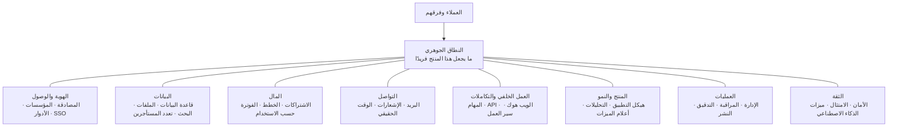
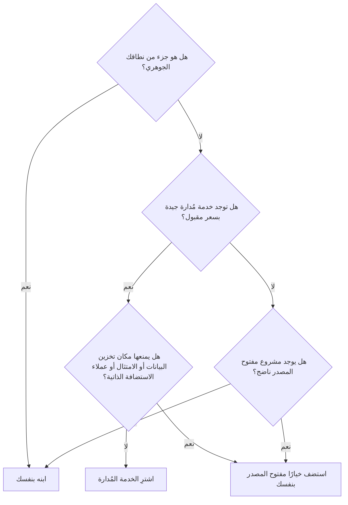
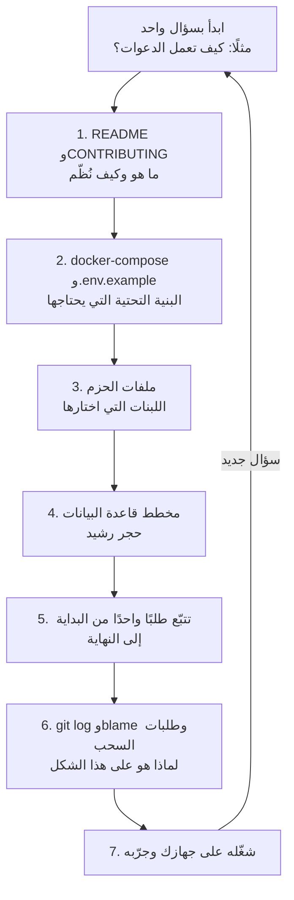
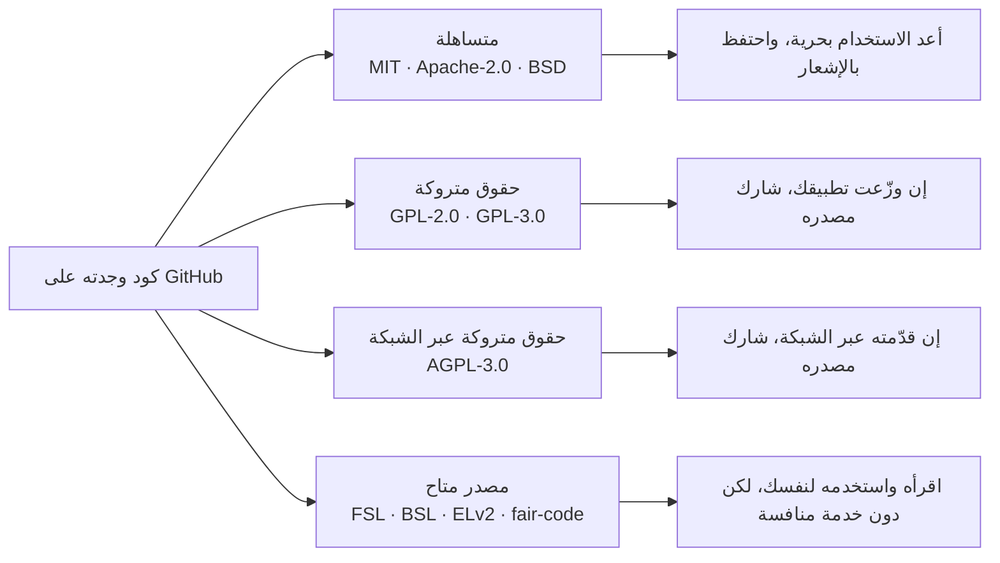

# الوحدة 0 — التوجيه: كل SaaS هو التطبيق نفسه

*قبل أن نبني أي شيء، ننظر إلى الخريطة كاملة. تعرض هذه الوحدة نحو 25 مكوّنًا (components) يشترك فيها كل SaaS تقريبًا، وكيف تقرأ قواعد الكود (codebases) مفتوحة المصدر (open-source) الضخمة التي تعيش فيها هذه المكوّنات، وأيّ هذه القواعد سندرسها معًا في بقية الدورة. في نهايتها يجب أن تستطيع النظر إلى أي SaaS، سواء كان منتجًا حقيقيًا أو مشروعك الجانبي، وأن تسمّي أجزاءه.*

---

# 0.1 — الـ 80% التي لا يبيعها أحد: تشريح كل SaaS

*المستوى: 🟢 مبتدئ*

## ⚡ الدرس في دقيقة

- الـ SaaS **نطاق جوهري** (Core Domain) صغير، وهو الجزء الذي يدفع العملاء مقابله، تحيط به **نطاقات فرعية عامة** (Generic Subdomains) يشترك فيها كل منتج تقريبًا: المصادقة (auth)، والمؤسسات (orgs)، والفوترة (billing)، والبريد، والمهام الخلفية (jobs)، والويب هوك (webhooks)، وسجلات التدقيق (audit logs).
- تصل هذه الأجزاء العامة إلى نحو 25 مكوّنًا (components) موزّعة على ثماني طبقات (layers). تعلّمها مرة واحدة، فيصبح بناء كل منتج جديد أسرع وقراءته أسهل.
- القاعدة الأهم: اصرف إبداعك على الجوهر، وانسخ التصاميم والأدوات المجرّبة لكل ما عداه.
- الخيار الافتراضي للنسخة الأولى (v1): اقرأ مجموعة بداية (Starter Kit) صغيرة مثل `nextjs/saas-starter` لترى الهيكل (skeleton)، واشترِ خدمات مُدارة (managed services) للأجزاء العامة عندما تكون السرعة أهم من التكلفة.
- الفخ الأكبر: أن تقدّر وقت الجوهر وحده. الأجزاء العامة في نسخة أولى قابلة للبيع تستغرق غالبًا وقتًا أطول من الجوهر نفسه.

## 🧭 لماذا يحتاجه كل SaaS

تخيّل أنك تعرض Beacon، مثالنا المستمر، على صديق في جملة واحدة: *«يرسل طلبًا إلى مواقعك كل دقيقة، ويعرض صفحة حالة عامة (public status page) عندما يتعطل شيء.»* هذه الجملة هي المنتج. تتسع لها منديل ورقي، ويستطيع مطوّر جيد أن يبني جزء الفحص في عطلة نهاية أسبوع.

الآن تخيّل أول عميل يدفع. يريد أن يدعو أربعة من زملائه، ويجب أن يُسمح لاثنين منهم فقط بحذف المراقِبات (monitors). يريد أن يدفع بالبطاقة، وأن يرقّي خطته (plan) في منتصف الشهر، وأن يحصل على فاتورة (invoice) صحيحة. يريد التنبيهات (alerts) بالبريد وفي Slack. يريد مفتاح API ليوقف سكربت النشر (deploy script) لديه المراقِبات مؤقتًا. ويطلب فريق الأمن لديه الدخول الموحد (SSO) وسجل تدقيق (Audit Log) قبل التوقيع. لا شيء من هذا هو «فحص المواقع»، وكله مطلوب قبل أن يدفع أحد.

هذا هو نمط كل SaaS (البرمجيات كخدمة: برمجيات تستأجرها عبر المتصفح بدل أن تثبّتها). الشيء الذي يتحدث عنه العملاء صغير. والشيء الذي يجعله عملًا تجاريًا كبير ومتكرر، والأهم أنه **هو نفسه من SaaS إلى آخر**. تطبيق جدولة (scheduling app)، ومختصِر روابط (link shortener)، ومتتبع أخطاء (error tracker)، كلها تحتاج إلى تسجيل الدخول (login)، والفرق (teams)، والأدوار (roles)، والفوترة، والبريد، والمهام الخلفية، والويب هوك، ولوحة إدارة (admin panel). وهي تختلف غالبًا في صندوق واحد في المنتصف.

**معظم أي SaaS مجموعة معروفة من المكوّنات العامة، لذلك فإن تعلّم هذه المكوّنات مرة واحدة يجعل كل منتج قادم أسرع في البناء وأسهل في الفهم.**

## 📐 كيف يعمل

### 🟢 الأساسيات

تأتي مفردات مفيدة من التصميم الموجّه بالنطاق (Domain-Driven Design أو DDD)، وهو أسلوب في تصميم البرمجيات نشره Eric Evans. يقسّم هذا الأسلوب النظام إلى نطاقات فرعية (Subdomains)، أي مجالات من العمل التجاري:

- **النطاق الجوهري** (Core Domain) هو ما يميّز منتجك، وهو سبب دفع العملاء. في Beacon هو محرك الفحص (تشغيل فحوص HTTP بموثوقية من عدة مناطق (regions)، وتقرير متى يكون «التعطّل» تعطّلًا حقيقيًا) إضافة إلى تجربة صفحة الحالة.
- **النطاقات الفرعية العامة** (Generic Subdomains) مجالات يحتاجها كل عمل تجاري، لكن لا يختارك أي عميل بسببها. المصادقة، والفوترة، وتوصيل البريد (email delivery)، وسجلات التدقيق كلها عامة. لا أحد يختار أداة صفحات حالة لأن بريد إعادة تعيين كلمة المرور (password reset) فيها مميز.
- **النطاقات الفرعية الداعمة** (Supporting Subdomains) تقع بينهما: خاصة بعملك لكنها ليست عامل تميّز. في Beacon، محرر الجدول الزمني للحوادث (incident timeline editor) مثال جيد.

القاعدة العملية بسيطة. اصرف إبداعك على الجوهر. أما النطاقات الفرعية العامة، فانسخ فيها التصاميم المجرّبة واستخدم الأدوات المجرّبة. هذه الدورة عن الأجزاء العامة، وهي تنقسم إلى ثماني طبقات:



إليك كل مكوّن، والدرس الذي يشرحه، وما يعنيه في Beacon. استخدم هذا الجدول خريطةً لك في الدورة كلها.

| # | المكوّن | الدرس | في Beacon |
|---|---|---|---|
| 1 | المصادقة | 1.1 | بريد وكلمة مرور، وروابط سحرية، وتسجيل الدخول عبر Google |
| 2 | المستخدمون والمؤسسات والدعوات (invitations) | 1.2 | مساحة عمل (workspace) لكل شركة، ودعوة الزملاء |
| 3 | التفويض (الأدوار والصلاحيات) | 1.3 | مالك (owner)، ومسؤول (admin)، وعضو (member)، ومشاهد للقراءة فقط (read-only viewer) |
| 4 | هوية المؤسسات (SSO وSCIM) | 1.4 | خطة Business: الدخول عبر Okta، وإلغاء الوصول تلقائيًا (auto-deprovisioning) |
| 5 | قاعدة البيانات (database) وORM والترحيلات (migrations) | 2.1 | جداول (tables) Postgres للمراقِبات والفحوص (checks) والحوادث |
| 6 | رفع الملفات (file uploads) وتخزين الكائنات (object storage) | 2.2 | شعارات صفحات الحالة، ولقطات شاشة الحوادث |
| 7 | البحث (search) | 2.3 | إيجاد مراقِب أو حادثة بين الآلاف |
| 8 | تعدد المستأجرين (multi-tenancy) والعزل (isolation) | 2.4 | لا يرى عميل أبدًا مراقِبات عميل آخر |
| 9 | الاشتراكات (subscriptions) والمدفوعات (payments) | 3.1 | صفحة الدفع (checkout) في Stripe، وبوابة العميل (customer portal)، والفواتير |
| 10 | الخطط والحدود (limits) والاستحقاقات (entitlements) | 3.2 | Free = 5 مراقِبات، وPro = 50، وBusiness = SSO |
| 11 | الفوترة حسب الاستخدام (usage-based billing) | 3.3 | تنبيهات SMS بعد نفاد الرصيد المشمول (included credits) |
| 12 | البريد التفاعلي (transactional email) | 4.1 | «موقعك متعطل»، والدعوات، والإيصالات (receipts) |
| 13 | الإشعارات (notifications) والتفضيلات (preferences) | 4.2 | Slack، وSMS، وجرس داخل التطبيق (in-app bell)، وإعدادات لكل مستخدم |
| 14 | الوقت الحقيقي (realtime) | 4.3 | لوحة حية (live dashboard) تتحول إلى الأحمر دون تحديث الصفحة |
| 15 | المهام الخلفية والجدولة (scheduling) | 5.1 | تشغيل فحص كل 30 ثانية، بلا توقف |
| 16 | الواجهة البرمجية العامة (public API) ومفاتيح API | 5.2 | `POST /v1/monitors` من سكربت نشر |
| 17 | الويب هوك الصادر والتكاملات (integrations) | 5.3 | أحداث `incident.created`، وتطبيق Slack |
| 18 | محركات سير العمل (workflow engines) | 5.4 | التصعيد (escalate) إن لم يستجب أحد خلال 10 دقائق |
| 19 | هيكل التطبيق (app shell) والإعداد الأولي (onboarding) | 6.1 | الموقع التسويقي (marketing site)، والتسجيل (signup)، ومعالج أول مراقِب (first-monitor wizard) |
| 20 | التحليلات (analytics) | 6.2 | أيّ المسجّلين ينشئ مراقِبًا ثانيًا |
| 21 | أعلام الميزات (feature flags) والتجارب (experiments) | 6.3 | طرح (roll out) سمة صفحة الحالة الجديدة على 10% |
| 22 | لوحة الإدارة وانتحال الهوية (impersonation) | 7.1 | يرى الدعم إعدادات العميل لتصحيح مشكلته |
| 23 | المراقبة (observability) | 7.2 | أن تعرف متى يتعطل Beacon نفسه |
| 24 | سجلات التدقيق | 7.3 | «من حذف مراقِب الإنتاج؟» |
| 25 | النشر والبيئات (environments) | 7.4 | بيئة اختبار (staging)، وبيئة إنتاج (production)، ونسخة للاستضافة الذاتية (self-hosted edition) |
| 26 | الأمان (security) والامتثال (compliance) | 8.1 | الأسرار (secrets)، والتشفير (encryption)، وSOC 2، وطلبات GDPR |
| 27 | ميزات الذكاء الاصطناعي (AI features) | 8.2 | ملخصات حوادث يكتبها الذكاء الاصطناعي |

إن عددناها بدقة فهي 27، ويمكنك تقسيم بعضها أو دمجه، ولهذا نقول «نحو 25». سطر واحد فقط في الجدول كله، وهو محرك الفحص (check engine) المختبئ داخل الصف 15، هو جوهر Beacon الحقيقي.

### 🟡 التعمق أكثر

يصبح هذا الادعاء مقنعًا عندما تنظر إلى منتجات حقيقية تبدو كأن لا شيء يجمعها. إليك أربعة منتجات SaaS مفتوحة المصدر سندرسها طوال الدورة، مفكّكة إلى أجزائها:

| المنتج | النطاق الجوهري (الـ 10–20%) | المكوّنات العامة التي اضطر إلى بنائها رغم ذلك |
|---|---|---|
| Cal.com | قواعد التوفر (availability rules)، والمناطق الزمنية (time zones)، ومنطق الحجز (booking logic) | المصادقة، والفرق والمؤسسات، وSAML SSO، وStripe، والويب هوك، ومفاتيح API، وتذكيرات (reminders) البريد وSMS، و«متجر تطبيقات (app store)» للتكاملات |
| Dub | إعادة توجيه سريعة للروابط (fast link redirects) وتحليلات النقرات (click analytics) | مساحات العمل، والأدوار، وStripe، وحدود الاستخدام (usage limits)، ومفاتيح API، والويب هوك، وSAML SSO |
| Plane | المهام، والدورات (cycles)، وعروض المشاريع (project views) | مساحات العمل، والأدوار، والدعوات، والإشعارات، ورموز API، والمهام الخلفية |
| Sentry | استقبال أحداث الأخطاء (ingesting error events) وتجميعها في مشكلات (issues) | المؤسسات، وRBAC، وSSO، وسجل التدقيق، والتكاملات، والتنبيهات، والمهام الخلفية |

العمود الأخير يكاد يكون متطابقًا في كل صف. هذه هي فكرة الدورة كلها في جدول واحد.

وهذا مهم لثلاثة أسباب عملية:

1. **التقدير.** يقدّر المبتدئون وقت الجوهر وينسون الباقي. إن استغرق الجوهر أربعة أسابيع، فالأجزاء العامة لنسخة أولى قابلة للبيع تستغرق غالبًا وقتًا أطول، لأن لكل منها حالات حدّية (دفع فاشل بالبطاقة، أو دعوة أُرسلت إلى بريد له حساب أصلًا، أو مهمة تعمل مرتين).
2. **قراءة الكود.** عندما تفتح مستودعًا (repo) كبيرًا، فأنت لا تواجه 400,000 سطر مجهول. أنت تواجه المصادقة، والمؤسسات، والفوترة، والمهام وغيرها، إضافة إلى جوهر واحد. أنت تعرف مسبقًا وظيفة معظم المجلدات قبل أن تفتحها.
3. **تحديد ما تبنيه.** كل مكوّن عام يطرح السؤال نفسه: هل تبنيه، أم تشتري خدمة مُدارة، أم تستضيف بنفسك (self-host) خيارًا مفتوح المصدر؟

### 🔴 على نطاق واسع وللمؤسسات

قرار البناء أو الشراء أو الاستضافة الذاتية لا يُتخذ مرة واحدة. إنه يتغير مع نمو الشركة، ويعيد المهندسون الكبار النظر فيه. هذا هو الإطار الذي سنستخدمه في كل درس:



الأسئلة التي تقف خلف الأسهم:

| السؤال | لماذا يهم |
|---|---|
| هل هو جوهري؟ | إسناد ما يميّزك إلى جهة خارجية يعني أن منافسيك يستطيعون شراء الشيء نفسه. |
| كم يكلّف عندما يصبح حجمك 10 أضعاف؟ | تسعير المصادقة لكل مستخدم أو تسعير التحليلات لكل حدث قد ينمو أسرع من الإيرادات (revenue). |
| ما صعوبة الخروج منه؟ | الفوترة والمصادقة تحملان بيانات العملاء ومعرّفاتهم (IDs). ترحيلها مؤلم، لذلك اختر بعناية منذ البداية. |
| هل يحتاج العملاء إلى الاستضافة الذاتية؟ | إن كنت تقدّم نسخة تُثبَّت في خوادم العميل (On-Premises)، يصبح كل اعتماد (dependency) على خدمة مُدارة مشكلة. |
| من يشغّله في الثالثة فجرًا؟ | الاستضافة الذاتية تعني أنك مسؤول عن الترقيات (upgrades) والنسخ الاحتياطية (backups) والأعطال (outages). |

المفارقة في عالم المؤسسات أن المكوّنات «العامة» تصبح ميزات بيع. الدخول الموحد، وSCIM، وسجلات التدقيق، ومكان تخزين البيانات (data residency)، وضمانات التوفر (uptime guarantees) هي بالضبط ما يدفعه العملاء الكبار مقابل خطة Business. على نطاق واسع، تكون الـ 80% المملة غالبًا المكان الذي تأتي منه الإيرادات عالية الهامش، ولهذا توجد شركات مثل WorkOS تبيع هذه الأجزاء العامة فقط.

## 🏆 أفضل المستودعات

مجموعات البداية (Boilerplates) هي أسرع طريقة *لرؤية* هيكل SaaS: إنها المكوّنات العامة مع ترك الجوهر فارغًا. اقرأها حتى لو لم تستخدم واحدة منها أبدًا.

| المستودع | ما هو | التقنيات (stack) | الترخيص (license) | اختره عندما |
|---|---|---|---|---|
| [nextjs/saas-starter](https://github.com/nextjs/saas-starter) | مجموعة بداية رسمية مصغّرة: مصادقة، وStripe، وفرق، وأدوار، وسجل نشاط (activity log) | Next.js, Postgres, Drizzle, Stripe | MIT | تريد أصغر هيكل مقروء لتتعلم منه |
| [vercel/next-forge](https://github.com/vercel/next-forge) | قالب (template) Turborepo بمستوى الإنتاج (production-grade)، مع حزم (packages) كثيرة موصولة معًا (كان في الأصل `haydenbleasel/next-forge`) | Next.js monorepo, TypeScript | MIT | تريد أن ترى كيف يقسّم مستودع أحادي (Monorepo) جاد المسؤوليات (concerns) إلى حزم |
| [wasp-lang/open-saas](https://github.com/wasp-lang/open-saas) | قالب SaaS كامل فيه مصادقة، ومدفوعات، ولوحة إدارة، ومهام، ومثال ذكاء اصطناعي | Wasp (React + Node.js + Prisma) | MIT | تريد كل شيء جاهزًا ولا تمانع استخدام إطار عمل (framework) |
| [boxyhq/saas-starter-kit](https://github.com/boxyhq/saas-starter-kit) | مجموعة بداية موجّهة للمؤسسات: SSO، وSCIM، وسجلات تدقيق، وويب هوك، وفرق | Next.js, Prisma, Postgres | Apache-2.0 | تبيع لشركات ستطلب SSO من اليوم الأول |
| [ixartz/SaaS-Boilerplate](https://github.com/ixartz/SaaS-Boilerplate) | قالب Next.js فيه مصادقة، وتعدد مستأجرين، وأدوار، وتعدد لغات (i18n)، وإعداد للاختبارات (testing setup) | Next.js, Drizzle, Tailwind, shadcn/ui | MIT | تريد قاعدة كود (codebase) مجهّزة جيدًا، فيها الاختبارات والتدقيق الآلي (linting) مُعدّة مسبقًا |
| [t3-oss/create-t3-app](https://github.com/t3-oss/create-t3-app) | أداة سطر أوامر (CLI) تنشئ تطبيقًا متكاملًا (full-stack app) آمن الأنواع (وليس SaaS كاملًا) | Next.js, tRPC, Prisma or Drizzle, Tailwind | MIT | تريد قاعدة نظيفة وستضيف مكوّنات SaaS بنفسك |
| [apptension/saas-boilerplate](https://github.com/apptension/saas-boilerplate) | قالب SaaS كامل فيه مستأجرون (tenants)، وStripe، وبريد، وكود للبنية التحتية (infrastructure code) | Django, React, GraphQL, AWS | MIT | خادمك الخلفي (backend) مكتوب بـ Python وتريد مثالًا كاملًا |
| [laravel/laravel](https://github.com/laravel/laravel) + [laravel/cashier-stripe](https://github.com/laravel/cashier-stripe) | هيكل تطبيق Laravel مع مكتبة (library) اشتراكات Stripe الرسمية | PHP, Laravel | MIT | تعمل بـ PHP؛ منظومة (ecosystem) Laravel تغطي معظم المكوّنات العامة رسميًا |

**إن درست مستودعًا واحدًا فقط:** اقرأ `nextjs/saas-starter`. إنه صغير بما يكفي لتقرأه كاملًا في فترة بعد الظهر، ومع ذلك يحوي الشكل الأساسي: مستخدمون، وفرق بأدوار، وصفحة دفع في Stripe مع ويب هوك، وسجل نشاط. عندما ترى هذا الشكل مرة، تصبح مجموعات البداية الأكبر ومستودعات الإنتاج تنويعات عليه.

**اشترِ أم ابنِ أم استضف بنفسك؟**

- **اشترِ** خدمات مُدارة للأجزاء العامة عندما تكون السرعة أهم من التكلفة: Clerk أو WorkOS للمصادقة والدخول الموحد، وStripe للفوترة، وResend أو Postmark للبريد، وPostHog Cloud للتحليلات، وSentry للأخطاء.
- **استضف بنفسك** بدائل مفتوحة المصدر (Keycloak، وLago، وListmonk، وPostHog، وGlitchTip) عندما يشترط العملاء بقاء البيانات في بنيتك التحتية، أو عندما تقدّم نسخة تُثبَّت لدى العميل، أو عندما يتجاوز التسعير لكل مستخدم (per-seat pricing) هوامش ربحك.
- **ابنِ** نطاقك الجوهري دائمًا، وابنِ الأجزاء العامة فقط عندما تكون صغيرة ومحددة (سجل نشاط بسيط، أو أدوار أساسية). مجموعة البداية تمنحك انطلاقة سريعة فيها.

## 🔍 ادرسه في مشاريع حقيقية

خذ المنتجات الأربعة من الجدول أعلاه، واقضِ عشر دقائق في كل منها، وابحث عن الأجزاء العامة فقط.

**Cal.com** (`calcom/cal.diy`، نسخته المجتمعية المرخّصة بـ MIT منذ 2026). مستودع أحادي كبير بلغة TypeScript. في وقت كتابة هذا الدرس، يقع التطبيق الرئيسي تحت `apps/web` ومخطط قاعدة البيانات (database schema) تحت `packages/prisma`. افتح مخطط Prisma وابحث عن `model Team` و`model Membership` و`model Webhook`. ستجد الهيكل العام جالسًا بجانب النماذج الجوهرية (core models) مثل `Booking` و`EventType`.

**Dub** (`dubinc/dub`). مستودع أحادي بـ Next.js أيضًا. استخدم بحث الكود (code search) في GitHub داخل المستودع عن `stripe` وعن `apiKey` أو `token`. لاحظ كم من الكود يتعلق بالخطط وحدود الاستخدام، لأن تسعير مختصِر الروابط يعتمد على عدد الروابط والنقرات لديك.

**Plane** (`makeplane/plane`). واجهة API بـ Django مع واجهات أمامية (frontends) بـ Next.js. ابحث عن `class Workspace` و`WorkspaceMember` في كود Python. حقل الدور (role field) في نموذج العضوية (membership model) هو نظام الصلاحيات (permission system) كله في صورة مصغّرة.

**Sentry** (`getsentry/sentry`). قاعدة كود ضخمة بـ Django. لا تحاول قراءتها. ابحث عن `class Organization` و`AuditLogEntry` و`OrganizationMember`. الجوهر (استقبال الأحداث (event ingestion) وتجميعها) جزء كبير من المستودع، لكن الأجزاء العامة ناضجة بالقدر نفسه.

**ما الذي تلاحظه:**

- لكل منها جدول «شبيه بالمؤسسة» (فريق، أو مساحة عمل، أو مؤسسة) وجدول عضوية (membership table) فيه دور. هذا الزوج هو العمود الفقري لـ SaaS الموجّه للشركات (B2B).
- النماذج الجوهرية (الحجز، والرابط، والمهمة، والحدث) كلها تحمل مفتاحًا أجنبيًا (Foreign Key) إلى هذا الجدول الشبيه بالمؤسسة.
- كود الفوترة صغير لكنه يلمس كل شيء، لأن الخطط تحدد ما يُسمح للجوهر بفعله.
- ميزات المؤسسات (SSO وسجلات التدقيق) تعيش غالبًا في مجلد منفصل بترخيص مختلف، مثل `ee/`. نشرح السبب في الدرس 0.3.

## 🛠️ ابنِه في Beacon

### 🟢 تمرين المبتدئ

اجرد مكوّنات Beacon. باستخدام جدول المكوّنات أعلاه، اكتب مستندًا من صفحة واحدة فيه سطر لكل مكوّن: ما يحتاجه Beacon منه في النسخة الأولى، وما يمكن أن ينتظر. ثم اكتب قائمة قصيرة منفصلة بعنوان «الجوهر»، تذكر فيها فقط الأجزاء التي تميّز Beacon عن منافسيه.

**يكتمل عندما:**
- يكون لكل واحد من المكوّنات الـ 25 تقريبًا سطر معلَّم بـ «v1» أو «لاحقًا»، مع السبب.
- لا تحوي قائمة «الجوهر» أكثر من أربعة عناصر، وليس بينها المصادقة أو الفوترة أو البريد.
- تستطيع أن تشرح في جملة واحدة لماذا محرك الفحص جوهري وصفحة تسجيل الدخول ليست كذلك.

### 🟡 تمرين المستوى المتوسط

اتخذ قرار البناء أو الشراء أو الاستضافة الذاتية لخمسة مكوّنات في Beacon: المصادقة، والفوترة، والبريد التفاعلي، والمهام الخلفية، وتتبع الأخطاء (error tracking). لكل منها، امشِ عبر مخطط القرار (decision flowchart)، وسمِّ الخدمة أو المستودع المحدد الذي ستختاره.

**يكتمل عندما:**
- يذكر كل قرار خيارًا ملموسًا (منتجًا أو `owner/repo`) والسؤال الذي حسمه.
- يذكر قرار واحد على الأقل ما الذي سيجعلك تغيّر رأيك لاحقًا (مثلًا: «إن أطلقنا نسخة للاستضافة الذاتية»).
- تكون قد قدّرت التكلفة الشهرية لخيارات «الشراء» عند 100 عميل وعند 10,000 عميل.

### 🔴 تمرين المستوى المتقدم

اختر أي SaaS حقيقي تستخدمه يوميًا وليس مذكورًا في هذا الدرس. من صفحة التسعير (pricing page) العامة، وشاشات الإعدادات، ووثائق الـ API، استنتج قائمة مكوّناته واربط كلًا منها بأرقام دروسنا. ثم حدّد المكوّنات التي لا تظهر إلا في خطته الأغلى.

**يكتمل عندما:**
- تكون قد ربطت 15 مكوّنًا على الأقل، مع دليل لكل منها (لقطة شاشة أو صفحة من الوثائق).
- تكون قد حدّدت نطاقه الجوهري في جملة واحدة.
- تكون قد ذكرت المكوّنات العامة التي يستخدمها كترقيات للمؤسسات (enterprise upsells)، وقارنتها بخطة Business في Beacon.

## ⚠️ أخطاء يقع فيها المبتدئون

- **تقدير وقت الجوهر وحده.** عبارة «محرك الفحص يستغرق أسبوعين، إذن نطلق بعد ثلاثة» تتجاهل الدعوات، والحالات الحدّية (edge cases) في الفوترة، وإعادة تعيين كلمة المرور. اكتب قائمة المكوّنات العامة أولًا، وقدّر وقت كل منها.
- **بناء الأجزاء العامة من الصفر بدافع الفخر.** كتابة تجزئة كلمات المرور (Password Hashing) أو إدارة الجلسات (session handling) أو الويب هوك الخاص بـ Stripe يدويًا هي الطريقة التي تحدث بها الثغرات الأمنية (security bugs) والخصم المزدوج (double charges). استخدم مكتبات مجرّبة، وادرس كيف فعلها الآخرون.
- **شراء كل شيء دون التحقق من تكلفة الخروج (exit costs).** مزوّد المصادقة المُدار (managed auth provider) يحمل معرّفات مستخدميك، وأداة الفوترة تحمل اشتراكاتك. قبل اعتماد أي منها، تحقّق من أنك تستطيع تصدير بياناتك، ومن مدى صعوبة الترحيل.
- **نسيان المؤسسة منذ اليوم الأول.** ربط المراقِبات بالمستخدمين مباشرة بدل ربطها بمؤسسة يجعل إضافة الفرق لاحقًا شبه مستحيلة. يغطي الدرس 1.2 هذا الموضوع؛ أما الآن فافترض أن كل سجل في B2B ينتمي إلى مؤسسة.
- **معاملة الجوهر كأنه عام.** الخطأ المعاكس: استخدام أداة فحص توفر جاهزة (off-the-shelf uptime checker) كمحرك لـ Beacon يعني أنه لا ميزة لك على أي أحد آخر يستخدمها.
- **نسخ مجموعة بداية دون قراءتها.** القالب الذي لا تفهمه هو كود شخص آخر صرت الآن مسؤولًا عن صيانته. اقرأ كل مجلد قبل أن تبني عليه.

## 🧾 الخلاصة

- الـ SaaS **نطاق جوهري** صغير تحيط به **نطاقات فرعية عامة** يشترك فيها كل منتج تقريبًا.
- تنقسم الأجزاء العامة إلى ثماني طبقات: الهوية، والبيانات، والمال، والتواصل، والعمل الخلفي، والمنتج والنمو، والعمليات، والثقة.
- لا يشبه Cal.com وDub وPlane وSentry بعضها بعضًا، ومع ذلك فمكوّناتها العامة شبه متطابقة.
- لكل مكوّن عام، قرّر عن وعي: **اشترِ** من أجل السرعة، و**استضف بنفسك** من أجل التحكم والامتثال، و**ابنِ** الجوهر والقطع الصغيرة المحددة.
- ميزات المؤسسات مثل SSO وسجلات التدقيق عامة في بنائها لكنها ثمينة في بيعها.
- مجموعات البداية تريك الهيكل؛ اقرأ واحدة كاملة قبل أن تثق بها.

## ✍️ اختبر نفسك

**1. ما الفرق بين النطاق الجوهري والنطاق الفرعي العام؟**

<details><summary>الإجابة</summary>

النطاق الجوهري هو ما يميّز منتجك، وهو سبب دفع العملاء؛ في Beacon هو محرك الفحص وتجربة صفحة الحالة. أما النطاق الفرعي العام فهو شيء يحتاجه كل عمل تجاري، لكن لا يختارك أي عميل بسببه، مثل المصادقة أو الفوترة أو البريد. راجع «الأساسيات» في قسم «كيف يعمل».

</details>

**2. إلى أي ثماني طبقات تنقسم المكوّنات العامة؟**

<details><summary>الإجابة</summary>

الهوية والوصول، والبيانات، والمال، والتواصل، والعمل الخلفي والتكاملات، والمنتج والنمو، والعمليات، والثقة. يعرضها المخطط الأول في «الأساسيات» حول النطاق الجوهري، ويربط جدول المكوّنات كل طبقة بدروسها.

</details>

**3. يريد فريق Beacon أن يكتب تجزئة كلمات المرور وإدارة الجلسات بنفسه «ليحتفظ بالتحكم». ماذا يقول مخطط القرار؟**

<details><summary>الإجابة</summary>

المصادقة ليست جوهر Beacon، وتوجد خدمات مُدارة جيدة (Clerk وWorkOS) ومشاريع مفتوحة المصدر ناضجة، لذلك ينتهي المخطط عند «اشترِ» أو «استضف بنفسك»، لا عند «ابنِ». كتابة تجزئة كلمات المرور والجلسات يدويًا هي الطريقة التي تحدث بها الثغرات الأمنية. راجع «على نطاق واسع وللمؤسسات» و«أخطاء يقع فيها المبتدئون».

</details>

**4. قرر Beacon أن يقدّم نسخة للاستضافة الذاتية لعملاء لا يستطيعون إرسال بياناتهم إلى جهات خارجية. كيف يغيّر ذلك خياراته للبريد والتحليلات؟**

<details><summary>الإجابة</summary>

السؤال الثالث في المخطط («هل يمنعها مكان تخزين البيانات أو الامتثال أو عملاء الاستضافة الذاتية؟») صار جوابه نعم، لذلك تفسح الخدمات المُدارة المجال لخيارات مفتوحة المصدر يستضيفها Beacon بنفسه، مثل Listmonk أو PostHog. إن كنت تقدّم نسخة تُثبَّت لدى العميل، يصبح كل اعتماد على خدمة مُدارة مشكلة. راجع جدول الأسئلة في «على نطاق واسع وللمؤسسات» و«اشترِ أم ابنِ أم استضف بنفسك؟».

</details>

**5. صمّم مبتدئ مخطط Beacon بحيث يحمل كل مراقِب `user_id` دون أي جدول للمؤسسات. بعد ستة أشهر طلب عميل يدفع أن يدعو أربعة من زملائه. ما الذي يتعطل؟**

<details><summary>الإجابة</summary>

المراقِبات تنتمي إلى شخص واحد، فلا يوجد شيء يتشاركه الزملاء ولا مكان لربط الأدوار. إضافة الفرق الآن تعني ترحيل كل سجل إلى مالك جديد، وهذا شبه مستحيل أن يتم بنظافة. افترض منذ اليوم الأول أن كل سجل في B2B ينتمي إلى مؤسسة؛ راجع «أخطاء يقع فيها المبتدئون» والدرس 1.2.

</details>

## 📚 المراجع

- Martin Fowler, "BoundedContext": https://martinfowler.com/bliki/BoundedContext.html — شرح لمفهوم السياق المحدود (bounded context)
- Eric Evans, *Domain-Driven Design: Tackling Complexity in the Heart of Software* (Addison-Wesley, 2003) — المصدر الأصلي لمصطلحَي «النطاق الجوهري» و«النطاق الفرعي العام».
- The Twelve-Factor App: https://12factor.net — قائمة تحقق كلاسيكية لطريقة هيكلة SaaS كي يعمل جيدًا
- Dan McKinley, "Choose Boring Technology": https://boringtechnology.club — لماذا تختار تقنيات مملة ومجرّبة
- Next.js SaaS Starter README: https://github.com/nextjs/saas-starter
- Stripe documentation: https://docs.stripe.com — الفوترة هي أكثر مكوّن عام يُعاد استخدامه

---

# 0.2 — كيف تقرأ قاعدة كود مفتوحة المصدر ضخمة دون أن تغرق

*المستوى: 🟢 مبتدئ*

## ⚡ الدرس في دقيقة

- قواعد الكود (codebases) الكبيرة لا تُقرأ من أولها إلى آخرها، بل يُبحث فيها ويُتنقّل بينها. ابدأ من سؤال واحد مكتوب.
- الطريقة: README وCONTRIBUTING، ثم ملف compose و`.env.example`، ثم ملفات الحزم (package manifests)، ثم مخطط قاعدة البيانات (database schema)، ثم طلب (request) واحد من البداية إلى النهاية، ثم تاريخ git، وبعد ذلك فقط شغّل التطبيق.
- القاعدة الأهم: مخطط قاعدة البيانات هو حجر رشيد (Rosetta stone). أسماء نماذجه (model names) تقابل قائمة مكوّناتنا (component list) واحدًا بواحد تقريبًا.
- الأدوات الافتراضية: بحث الكود (code search) في GitHub (اضغط `/`) أو `rg` على جهازك، مع البحث عن النصوص (strings) التي يراها المستخدمون وأسماء أحداث المزوّدين (vendor event names) مثل `checkout.session.completed`.
- الفخ الأكبر: أن تتبع كل استيراد (import) بدءًا من `index.ts`، أو أن تصارع `docker compose up` قبل أن تعرف وظيفة الخدمات (services).

## 🧭 لماذا يحتاجه كل SaaS

تنسخ (clone) مستودع (repo) Cal.com لأنك تريد أن ترى كيف يتعاملون مع دعوات الفرق (team invitations). في المستودع آلاف الملفات، وعشرات الحزم، ومجلد `node_modules` تخاف أن تنظر إليه. تفتح ملفًا عشوائيًا، فتجده يستورد ستة أشياء لم تسمع بها من قبل. تتبع استيرادًا، ثم آخر، وبعد أربعين دقيقة تجد نفسك تقرأ دالة مساعدة (helper) لتنسيق التواريخ ولم تتعلم شيئًا. تغلق التبويب وتقرر أن الكود مفتوح المصدر (open-source) «متقدم أكثر من اللازم».

هو ليس متقدمًا أكثر من اللازم. المشكلة أنك قرأته كما تقرأ رواية، من أي مكان فتحته. قواعد الكود الكبيرة لا تُقرأ، بل *يُبحث فيها ويُتنقّل بينها*. المهندسون الكبار أيضًا لا يفهمون مستودعًا من 500,000 سطر. لكن لديهم طريقة لإيجاد الـ 300 سطر التي تجيب عن سؤالهم وتجاهل كل ما عداها.

كل فريق SaaS يحتاج إلى هذه المهارة، لأن كل SaaS يعتمد على كود لم يكتبه أحد في الفريق: أطر العمل (frameworks)، والمكتبات (libraries)، وحزم SDK من المزوّدين، والمنتجات مفتوحة المصدر التي تشير إليها هذه الدورة. القدرة على الإجابة عن سؤال «كيف يعمل هذا فعلًا؟» بقراءة المصدر بدل التخمين من أوضح الفروق بين المهندس المبتدئ (junior) والمهندس المتوسط (mid-level engineer).

**اقرأ قاعدة الكود الكبيرة بسؤال وطريقة، لا من أعلاها: جد نقاط الدخول (entry points)، واستخدم مخطط قاعدة البيانات خريطةً لك، وتتبّع طلبًا واحدًا من البداية إلى النهاية.**

## 📐 كيف يعمل

### 🟢 الأساسيات

هذه هي الطريقة التي سنستخدمها مع كل مستودع في هذه الدورة. كل خطوة رخيصة، وكل خطوة تضيّق المكان الذي تنظر إليه بعدها.



**1. README وCONTRIBUTING.** يقول ملف README ما يفعله المنتج. ويقول `CONTRIBUTING.md` (وأحيانًا مجلد `docs/` أو مستند للبنية (architecture document)) كيف نُظّم المستودع وكيف تشغّله. دقيقتان هنا توفّران ساعة لاحقًا.

**2. `docker-compose.yml` و`.env.example`.** هذان أكثر ملفين يُستهان بهما في أي مستودع. يسرد ملف compose الخدمات التي يحتاجها التطبيق ليعمل: Postgres، وRedis، وطابور (Queue)، ومخزن كائنات (object store)، وملتقط بريد (mail catcher). ويسرد ملف `.env.example` كل متغير إعدادات (configuration variable)، وأسماء المتغيرات مثل `STRIPE_SECRET_KEY` أو `RESEND_API_KEY` أو `SAML_JACKSON_URL` أو `TINYBIRD_TOKEN` تخبرك بالخدمات الخارجية (third-party services) والمكوّنات الموجودة دون أن تقرأ سطرًا من الكود.

**3. ملفات الحزم.** `package.json`، أو `pyproject.toml` أو `requirements.txt`، أو `Gemfile`، أو `go.mod`، أو `composer.json`. هذه هي قائمة المشتريات. عندما ترى `bullmq` أو `@prisma/client` أو `stripe` أو `better-auth` أو `celery`، تعرف أي لبنة (building block) تتولى أي مكوّن، وبالتالي أي وثائق (docs) تقرأ.

**4. مخطط قاعدة البيانات.** هذا هو حجر رشيد: المكان الوحيد الذي يوصف فيه المنتج كله بلغة واحدة منظّمة. جده (`schema.prisma`، أو ملفات مخطط Drizzle، أو `models.py` في Django، أو `db/schema.rb` في Rails، أو ترحيلات (migrations) SQL) واقرأ أسماء الجداول (tables). `Organization` و`Membership` و`Invitation` و`Subscription` و`ApiKey` و`Webhook` و`AuditLog` تقابل قائمة مكوّناتنا مباشرة. والعلاقات (relationships) بينها تخبرك كيف يعمل تعدد المستأجرين (Multi-Tenancy).

**5. تتبّع طلبًا واحدًا من البداية إلى النهاية.** اختر إجراءً واحدًا يقوم به المستخدم، مثل «قبول دعوة»، وتتبّعه: الصفحة أو الزر، ثم مسار (route) الـ API أو إجراء الخادم (Server Action)، ثم فحص الصلاحية (permission check)، ثم الكتابة في قاعدة البيانات (database write)، ثم أي بريد أو مهمة (job) يطلقها. أنت الآن تفهم شريحة عمودية (vertical slice) واحدة، وكل الشرائح الأخرى تشبهها.

**6. `git log` و`git blame` وطلبات السحب (Pull Requests).** الكود يُظهر *ماذا*، والتاريخ يُظهر *لماذا*. يقودك `git blame` على سطر غريب إلى الإيداع (Commit)، ويقودك الإيداع إلى طلب السحب، حيث تناقش الناس في المقايضة (trade-off) نفسها التي تتساءل عنها.

**7. شغّله على جهازك.** الآن فقط تشغّله. ضع نقطة توقف (Breakpoint) أو أضف سطر تسجيل (log line) حيث يمرّ الطلب الذي تتبعته، واضغط الزر، وراقب فهمك وهو يتأكد أو يُصحَّح.

### 🟡 التعمق أكثر

المهارة التي تجعل الطريقة سريعة هي معرفة *عمّا تبحث*. إليك ورقة مرجعية (cheat sheet). ابحث عن هذه الكلمات ببحث الكود في GitHub (اضغط `/` في صفحة المستودع) أو على جهازك بـ `rg` (ripgrep).

| إن أردت أن تجد… | ابحث عن… | ثم انظر إلى |
|---|---|---|
| المصادقة | `signIn`, `session`, `better-auth`, `next-auth`, `passport`, `devise`, `login` | ملف إعدادات المصادقة (auth config file) والوسيط (Middleware) الذي يحمي المسارات |
| المؤسسات وتعدد المستأجرين | `organizationId`, `workspaceId`, `teamId`, `accountId` | نموذج العضوية (membership model) وطريقة تصفية الاستعلامات (queries) |
| الصلاحيات (permissions) | `role`, `OWNER`, `ADMIN`, `permission`, `can(`, `authorize` | أين يحدث الفحص: في الوسيط، أو في دالة مساعدة، أو داخل الكود مباشرة (inline) |
| الويب هوك الخاص بالفوترة (billing webhooks) | `constructEvent`, `checkout.session.completed`, `customer.subscription`, `invoice.paid` | المعالج (handler) الذي يحدّث الخطة (plan) في قاعدة بياناتك |
| حدود الخطط (plan limits) | `limit`, `plan`, `quota`, `entitlement`, `upgrade` | المكان الذي يسأل فيه الجوهر: «هل هذا مسموح في هذه الخطة؟» |
| المهام الخلفية (background jobs) | `bullmq`, `Queue(`, `Worker(`, `cron`, `shared_task`, `perform_later`, `Sidekiq` | تعريفات المهام (job definitions) وما الذي يضعها في الطابور |
| البريد | `react-email`, `sendEmail`, `resend`, `nodemailer`, `mailer`, `templates` | مجلد القوالب (template folder) ودالة الإرسال المساعدة (send helper) |
| مفاتيح API | `apiKey`, `api_key`, `hashedKey`, `Bearer`, `x-api-key` | كيف تُنشأ المفاتيح وتُجزّأ (hashed) وتُفحص |
| الويب هوك الصادر (outbound webhooks) | `webhook`, `createHmac`, `signature`, `svix` | كيف تُوقَّع (signed) الأحداث وتُرسل ويُعاد إرسالها (retried) |
| سجلات التدقيق (audit logs) | `audit`, `activity`, `AuditLog`, `logEvent` | أي الإجراءات تُسجَّل وبأي حقول (fields) |
| أعلام الميزات (feature flags) | `flag`, `isFeatureEnabled`, `posthog`, `unleash`, `growthbook` | أين تتحكم الأعلام في سلوك الواجهة (UI) أو الـ API |
| الإعدادات (configuration) | `process.env`, `env.ts`, `settings.py`, `config/` | أي الإعدادات إلزامية وأيها اختيارية |

بعض العادات تجعل هذا أسرع:

- **ابحث عن النصوص التي يراها المستخدمون.** عناوين الأزرار (button labels) ورسائل الخطأ («Invitation expired»، «You have reached your monitor limit») فريدة، وتنقلك مباشرة إلى الملف الصحيح.
- **ابحث عن أسماء أحداث المزوّد.** Stripe وSlack وGitHub كلها تستخدم نصوص أحداث ثابتة. يظهر `checkout.session.completed` في مكان واحد تقريبًا في أي قاعدة كود تستخدم Stripe.
- **اقرأ الاختبارات (tests) كأنها وثائق.** اختبار اسمه `it("rejects invites to existing members")` يخبرك أن هناك قاعدة، ويريك كيف تستدعي الكود.
- **تجاوز ما ليس سؤالك.** الملفات المولّدة آليًا (generated files)، ومكتبات مكوّنات الواجهة (UI component libraries)، والترجمات (translations)، و`node_modules` نادرًا ما تكون الجواب.

على جهازك، تغطي بضعة أوامر معظم احتياجاتك:

```bash
# Where are Stripe webhooks handled?
rg -l "constructEvent|checkout.session.completed"

# Every file that defines a background job queue
rg -n "new (Queue|Worker)\(" --type ts

# Find the schema file(s), whatever the ORM
fd -e prisma; fd schema.ts; fd models.py

# Why does this line exist? Then open the PR for that commit.
git blame -L 40,60 path/to/file.ts
git log --oneline -S "maxMonitors" -- .
```

الصيغة `git log -S` (وتُسمّى «المعول» أو Pickaxe) تجد الإيداعات التي أضافت نصًا معينًا أو حذفته. إنها أسرع طريقة لمعرفة متى أُضيفت ميزة أو حدّ.

### 🔴 على نطاق واسع وللمؤسسات

عند حجم معيّن، يتوقف المستودع الواحد عن كونه «قاعدة كود» ويصبح مدينة صغيرة. GitLab وSentry وPostHog من هذا النوع. الطريقة ما زالت تعمل، لكن المهندسين الكبار يضيفون إليها بعض الطبقات (layers):

| الأسلوب (technique) | ما يمنحك إياه |
|---|---|
| اقرأ وثائق البنية والملكية (architecture and ownership docs) | كثير من المستودعات الكبيرة توثّق بنيتها، وفيها ملف `CODEOWNERS` يخبرك أي فريق يملك أي مجلد |
| اتبع الحدود (follow the boundaries) لا الملفات | في المستودعات الأحادية (monorepos)، التقسيم إلى `apps/` و`packages/` (أو تطبيقات Django، أو محركات (engines) Rails، أو وحدات (modules) Go) هو الوحدات الحقيقية (units). تعلّم ما يصدّره (exports) كل منها |
| استخدم التنقل بالرموز (symbol navigation) | الانتقال إلى التعريف (Go-to-definition) في محررك (editor)، أو التنقل في الكود على GitHub، أو فهارس `ctags` تتيح لك القفز عبر آلاف الملفات |
| استخدم البحث البنيوي (structural search) | أدوات مثل `ast-grep` تطابق الكود حسب شكله (كل استدعاء لدالة بوسيط (argument) معيّن) لا حسب نصه |
| انتبه لحدود التراخيص (licence boundaries) | مجلدات مثل `ee/` لها غالبًا ترخيص مختلف. اعرف أي كود يُسمح لك بإعادة استخدامه (الدرس 0.3) |
| اقرأ مستندات التصميم (design docs) وRFCs | بعض المشاريع تحفظ قرارات البنية في المستودع أو في مسائل (Issues) عامة. وهي تشرح «لماذا» أفضل من الكود |

عقلية المهندس الكبير هي: *لا أحتاج إلى فهم هذا المستودع؛ أحتاج إلى الإجابة عن هذا السؤال بدليل.* اكتب سؤالك، واكتب الجواب مع روابط إلى الأسطر التي وجدتها، ثم توقف.

## 🏆 أفضل المستودعات

نوعان من المستودعات يساعدان هنا: أدوات تجعل التنقل سريعًا، وقواعد كود ممتعة للتعلم منها على غير العادة.

| المستودع | ما هو | التقنيات (stack) | الترخيص (license) | اختره عندما |
|---|---|---|---|---|
| [BurntSushi/ripgrep](https://github.com/BurntSushi/ripgrep) | `rg`، بحث تكراري (recursive search) سريع جدًا يحترم `.gitignore` | Rust CLI | MIT / Unlicense | دائمًا. إنها أكثر أداة مفيدة لقراءة الكود |
| [sharkdp/fd](https://github.com/sharkdp/fd) | بديل بسيط وسريع لـ `find` لإيجاد الملفات بأسمائها | Rust CLI | MIT / Apache-2.0 | تعرف تقريبًا اسم الملف لكن لا تعرف مكانه |
| [junegunn/fzf](https://github.com/junegunn/fzf) | باحث تفاعلي تقريبي (interactive fuzzy finder) للملفات والسجل وأي شيء آخر | Go CLI | MIT | تريد التنقل في المستودع بكتابة أجزاء من الأسماء |
| [universal-ctags/ctags](https://github.com/universal-ctags/ctags) | يبني فهرسًا للرموز (index of symbols) كي تنتقل المحررات إلى التعريفات | C | GPL-2.0 | محررك يفتقر إلى انتقال جيد إلى التعريف في لغة ما، أو المستودع ضخم |
| [ast-grep/ast-grep](https://github.com/ast-grep/ast-grep) | البحث في الكود وإعادة كتابته بأنماط شجرة الصياغة (syntax-tree patterns) | Rust CLI | MIT | البحث النصي (text search) يعيد ضجيجًا كثيرًا وتحتاج إلى «استدعاءات بهذا الشكل» |
| [AlDanial/cloc](https://github.com/AlDanial/cloc) | يعدّ أسطر الكود لكل لغة ولكل مجلد | Perl | GPL-2.0 | تريد خريطة سريعة لحجم المستودع قبل أن تغوص فيه |
| [cli/cli](https://github.com/cli/cli) | `gh`، أداة GitHub الرسمية لسطر الأوامر (CLI): نسخ المستودعات، وسرد طلبات السحب والمسائل وقراءتها من الطرفية (terminal) | Go CLI | MIT | تريد قراءة تاريخ طلبات السحب في المستودع دون مغادرة الطرفية |
| [nextjs/saas-starter](https://github.com/nextjs/saas-starter) | هيكل SaaS صغير وكامل | Next.js, Drizzle, Stripe | MIT | أول تمرين لك في «قراءة SaaS كامل» |
| [openstatusHQ/openstatus](https://github.com/openstatusHQ/openstatus) | صفحات حالة (status page) ومراقبة توفر (uptime monitoring) مفتوحة المصدر: Beacon حقيقي | TypeScript monorepo, Go checker | AGPL-3.0 | تريد أن تتدرّب على الطريقة مع المنتج الذي بُنيت عليه هذه الدورة |
| [we-promise/sure](https://github.com/we-promise/sure) | تطبيق للتمويل الشخصي مبني بـ Rails الحديث: النسخة المجتمعية المتفرعة (community fork) من Maybe المؤرشف (archived) | Ruby on Rails 8, Postgres | AGPL-3.0 | تريد أن ترى كم يمكن أن يكون التطبيق الأحادي (Monolith) التقليدي نظيفًا |

**إن درست مستودعًا واحدًا فقط:** تدرّب على `openstatusHQ/openstatus`. إنه SaaS حقيقي في الإنتاج (production)، ومتوسط الحجم لا ضخم، ولأنه يحل مشكلة Beacon بالضبط، فكل مكوّن تجده فيه سيظهر مجددًا في هذه الدورة.

**اشترِ أم ابنِ أم استضف بنفسك؟**

- **اشترِ** أدوات ذكاء الكود المستضافة (hosted code intelligence) عندما يمتد كود شركتك على مستودعات كثيرة: بحث الكود والتنقل المدمجان في GitHub يغطيان معظم الاحتياجات، وتوجد أدوات تجارية مثل Sourcegraph للبحث عبر المستودعات على نطاق واسع.
- **لا تستضف بنفسك** شيئًا في البداية. أدوات سطر الأوامر أعلاه تعمل على جهازك مع نسخة واحدة من المستودع، وهذا كل ما تحتاجه في هذه الدورة.
- **ابنِ** عاداتك بدل الأدوات: ملف ملاحظات لكل مستودع فيه أسئلتك وأجوبتك وروابطك الدائمة (اضغط `y` في صفحة ملف على GitHub لتحصل على رابط مثبّت على الإيداع الحالي).

## 🔍 ادرسه في مشاريع حقيقية

لنطبّق الطريقة على مستودعين.

**Documenso** (`documenso/documenso`)، بديل مفتوح المصدر لـ DocuSign. الخطوة 2: يكشف إعداد compose و`.env.example` فيه عن Postgres، وملتقط بريد للبريد المحلي، وإعدادات شهادات التوقيع (signing-certificate)، فتعرف مسبقًا أن شهادات التوقيع الإلكتروني (e-signature) جزء من الجوهر. الخطوة 3: يُظهر ملف `package.json` في الجذر (root) مستودعًا أحاديًا بـ Turborepo؛ في وقت كتابة هذا الدرس تقع التطبيقات تحت `apps/` والكود المشترك (shared code) تحت `packages/`. الخطوة 4: ابحث في المستودع عن `schema.prisma` واقرأ أسماء النماذج. ستجد `User`، ونماذج للفرق، و`Document`، و`Recipient`، و`Field`، ونماذج للويب هوك ورموز الـ API، ونموذجًا لسجل تدقيق المستندات. الخطوة 5: اختر «إرسال مستند للتوقيع» وتتبّعه من الواجهة إلى الكتابة في قاعدة البيانات إلى البريد الذي يطلقه.

**Sure** (`we-promise/sure`)، تطبيق Rails 8: النسخة المتفرعة التي يصونها المجتمع من Maybe، الذي أُرشف مستودعه الأصلي. يجعل Rails الطريقة شبه آلية: يسرد `config/routes.rb` كل عنوان URL، و`db/schema.rb` هو المخطط كاملًا في ملف واحد، و`app/models` يحوي النطاق (domain)، و`app/jobs` يحوي العمل الخلفي (Sidekiq). اختر مسارًا، وافتح المتحكم (Controller) الخاص به، وتتبّعه إلى النموذج. بالنسبة إلى المبتدئين القادمين من عالم JavaScript، قراءة تطبيق Rails معتنى به درس في مقدار ما يمكن أن تحلّه الأعراف (Conventions) محل الإعدادات.

**ما الذي تلاحظه:**

- كم بسرعة أخبرك ملف `.env.example` بالخدمات الخارجية التي يستخدمها كل منتج.
- أن أسماء النماذج في المخطط قابلت قائمة مكوّناتنا واحدًا بواحد تقريبًا.
- أن «تتبّع طلب واحد» عبر أربع أو خمس طبقات (الواجهة، والمسار، وفحص الصلاحية، وقاعدة البيانات، والمهمة أو البريد)، وأن كل طبقة كانت في مكان متوقع.
- كيف جعلت أعراف تطبيق Rails التنقل متوقعًا، بينما اعتمد المستودع الأحادي بـ TypeScript على حدود الحزم بدلًا من ذلك.

## 🛠️ ابنِه في Beacon

### 🟢 تمرين المبتدئ

ارسم خريطة مكوّنات `openstatusHQ/openstatus`. انسخ المستودع وطبّق الخطوات 1–4 من الطريقة فقط: README، وملفات compose والبيئة، وملفات الحزم، والمخطط. املأ جدولًا فيه صف لكل مكوّن من الدرس 0.1 وثلاثة أعمدة: «موجود؟»، و«كيف نُفّذ (مكتبة أو خدمة)»، و«أين وجدت الدليل».

**يكتمل عندما:**
- يغطي جدولك 15 مكوّنًا على الأقل من مكوّنات الدرس 0.1، ولكل منها ملف أو كلمة بحث كدليل.
- تكون قد سمّيت قاعدة البيانات والـ ORM اللذين يستخدمهما، ومكان المخطط.
- تكون قد حدّدت الأجزاء الجوهرية فيه (محرك الفحص وصفحات الحالة) والأجزاء العامة.

### 🟡 تمرين المستوى المتوسط

في المستودع نفسه، تتبّع طلبًا واحدًا من البداية إلى النهاية: «مستخدم ينشئ مراقِبًا جديدًا». اكتب كل ملف يمر به، من النموذج في الواجهة (form) حتى الإدراج في قاعدة البيانات (database insert)، وسجّل أين يُفحص حدّ الخطة (إن كان يُفحص)، وكيف يعرف محرك الفحص بالمراقِب الجديد.

**يكتمل عندما:**
- تكون لديك قائمة مرتبة بالملفات مع وصف من سطر واحد لكل منها، وروابط GitHub دائمة.
- تكون قد عرفت هل يُفرض حدّ للخطة أو حصة (Quota)، وأين.
- تستطيع شرح كيف تعمل الجدولة (scheduling) للمراقِب الجديد، أو تكون قد كتبت بالضبط ما لم تستطع إيجاده.

### 🔴 تمرين المستوى المتقدم

اختر قرارًا غير واضح في openstatus (مثلًا: لماذا كُتب محرك الفحص بلغة مختلفة عن تطبيق الويب (web app)، أو كيف تُخزَّن نتائج الفحوص (check results)). استخدم `git log -S` و`git blame` وطلبات السحب المرتبطة لتعيد بناء *سبب* بنائه بهذه الطريقة. ثم شغّل المشروع على جهازك وأكّد شيئًا واحدًا تعلمته بوضع نقطة توقف أو إضافة سطر تسجيل.

**يكتمل عندما:**
- تكون قد ربطت إيداعًا واحدًا على الأقل وطلب سحب أو مسألة واحدة تشرح القرار.
- تكون لديك نسخة تعمل على جهازك، ولقطة شاشة أو سجل يُظهر أن نقطة التوقف أو سطر التسجيل قد عمل.
- تكون قد كتبت ثلاث جمل عمّا يجب أن ينسخه Beacon وعمّا يجب أن يفعله بشكل مختلف.

## ⚠️ أخطاء يقع فيها المبتدئون

- **القراءة من الأعلى إلى الأسفل.** فتح `index.ts` وتتبّع كل استيراد هو أسرع طريقة للغرق. ابدأ من سؤال وابحث عنه.
- **التشغيل أولًا.** يقضي المبتدئون ساعة في مصارعة `docker compose up` قبل أن يعرفوا وظيفة الخدمات. اقرأ ملفي compose والبيئة أولًا كي تصبح الأخطاء مفهومة.
- **تجاهل المخطط.** المخطط هو أكثف وصف للمنتج في المستودع كله. تجاوزه يعني أن تعيد اكتشافه استعلامًا بعد استعلام.
- **الثقة بأسماء الملفات أكثر من الكود.** قد يكون ملف اسمه `permissions.ts` كودًا ميتًا (dead code) بينما يعيش الفحص الحقيقي داخل مسار. تأكّد بتتبّع طلب حقيقي.
- **عدم قراءة التاريخ أبدًا.** الحل الالتفافي (workaround) الغريب الذي توشك أن «تنظّفه» له على الأرجح طلب سحب يشرح خطأ العميل (customer bug) الذي أصلحه. شغّل `git blame` قبل أن تحكم.
- **عدم كتابة أي شيء.** قراءة الكود دون ملاحظات تتبخر خلال يوم. احتفظ بالروابط الدائمة (permalinks) وبجواب من سطرين لكل سؤال.

## 🧾 الخلاصة

- اقرأ قواعد الكود الكبيرة لتجيب عن سؤال محدد، ولا تقرأها أبدًا من أعلاها إلى أسفلها.
- الطريقة: README، ثم ملفات compose والبيئة، ثم ملفات الحزم، ثم المخطط، ثم طلب واحد من البداية إلى النهاية، ثم التاريخ، ثم التشغيل.
- يكشف `.env.example` وملف الحزم اللبنات الأساسية قبل أن تقرأ أي كود.
- مخطط قاعدة البيانات هو حجر رشيد؛ أسماء نماذجه تقابل قائمة مكوّناتنا.
- ابحث عن النصوص التي يراها المستخدمون، وأسماء أحداث المزوّدين، وكلمات الورقة المرجعية، ببحث الكود في GitHub أو بـ `rg`.
- يشرح `git blame` و`git log -S` وطلبات السحب *لماذا*، وهذا ما لا يفعله الكود وحده أبدًا.

## ✍️ اختبر نفسك

**1. لماذا يستحق `docker-compose.yml` و`.env.example` القراءة قبل أي كود؟**

<details><summary>الإجابة</summary>

يسرد ملف compose الخدمات التي يحتاجها التطبيق (Postgres، وRedis، وطابور، وملتقط بريد)، وتكشف أسماء المتغيرات في `.env.example` الخدمات الخارجية والمكوّنات الموجودة. بذلك تتعلم اللبنات الأساسية دون قراءة سطر من الكود، وتصبح أخطاء `docker compose up` لاحقًا مفهومة. راجع الخطوة 2 في «الأساسيات».

</details>

**2. ماذا يفعل `git log -S "maxMonitors"`، ومتى تلجأ إليه؟**

<details><summary>الإجابة</summary>

إنه «المعول» (Pickaxe): يجد الإيداعات التي أضافت هذا النص أو حذفته. استخدمه عندما تريد أن تعرف متى أُضيفت ميزة أو حدّ، ثم افتح طلب السحب الخاص بذلك الإيداع لتعرف السبب. راجع الأوامر في نهاية «التعمق أكثر».

</details>

**3. تحتاج إلى إيجاد المكان الذي تتفاعل فيه قاعدة كود Beacon مع تغيّر اشتراك في Stripe. عمّ تبحث؟**

<details><summary>الإجابة</summary>

ابحث عن أسماء أحداث Stripe الثابتة ودواله المساعدة: `constructEvent`، و`checkout.session.completed`، و`customer.subscription`، و`invoice.paid`. تظهر هذه النصوص في مكان واحد تقريبًا، هو معالج الويب هوك الذي يحدّث الخطة في قاعدة البيانات. راجع الورقة المرجعية في «التعمق أكثر».

</details>

**4. يسألك زميل جديد كيف يعمل قبول دعوة إلى مؤسسة في Beacon. كيف تجيب باستخدام خطوة «تتبّع طلبًا واحدًا»؟**

<details><summary>الإجابة</summary>

تتبّع هذا الإجراء الواحد عبر كل الطبقات: الصفحة أو الزر، ثم مسار الـ API أو إجراء الخادم، ثم فحص الصلاحية، ثم الكتابة في قاعدة البيانات، ثم أي بريد أو مهمة يطلقها. اكتب كل ملف مع رابط دائم. عندما تتضح شريحة عمودية واحدة، تبدو الشرائح الأخرى مشابهة. راجع الخطوة 5 في «الأساسيات».

</details>

**5. قرأ مبتدئ ملفًا اسمه `permissions.ts` واستنتج أن المسؤولين وحدهم يستطيعون حذف المراقِبات. في الأسبوع التالي حذف عضو عادي مراقِبًا. ما الخطأ الذي حدث؟**

<details><summary>الإجابة</summary>

وثق باسم الملف أكثر من مسار الكود. قد يكون الملف كودًا ميتًا بينما يعيش الفحص الحقيقي داخل مسار، أو يكون غائبًا هناك. تأكّد من القواعد بتتبّع طلب حقيقي من البداية إلى النهاية، واقرأ الاختبارات. راجع «أخطاء يقع فيها المبتدئون».

</details>

## 📚 المراجع

- ripgrep user guide: https://github.com/BurntSushi/ripgrep/blob/master/GUIDE.md — دليل استخدام ripgrep
- GitHub Docs, searching code and navigating code on GitHub: https://docs.github.com — البحث في الكود والتنقل فيه على GitHub
- Git documentation for `git log` (including `-S`) and `git blame`: https://git-scm.com/docs/git-log and https://git-scm.com/docs/git-blame
- Docker Compose documentation: https://docs.docker.com/compose/
- Prisma schema documentation: https://www.prisma.io/docs
- Rails Guides: https://guides.rubyonrails.org — للأعراف التي تجعل تطبيقات Rails سهلة التنقل

---

# 0.3 — الرف المرجعي: قواعد كود SaaS ومجموعات البداية التي ندرسها

*المستوى: 🟢 مبتدئ*

## ⚡ الدرس في دقيقة

- الرف المرجعي (reference shelf) قائمة قصيرة من منتجات SaaS حقيقية مفتوحة المصدر (open-source) تعمل في الإنتاج (openstatus، وCal.com، وDocumenso، وDub، وSentry، وChatwoot وغيرها)، تستخدمها الدورة لتريك كل مكوّن (component) تحت حمل حقيقي (real load).
- ابدأ بمستودع (repo) متوسط الحجم بلغتك. واستخدم العمالقة مثل GitLab وSentry لأسئلة محددة فقط.
- القاعدة الأهم: قراءة الكود لتعلّم فكرة مسموحة دائمًا، أما نسخ الكود فيعتمد على ترخيص (licence) ذلك المجلد بالضبط في ذلك الإيداع (commit) بالضبط.
- التراخيص أربع عائلات: متساهلة (MIT، وApache-2.0، وBSD)، وحقوق متروكة (GPL)، وحقوق متروكة عبر الشبكة (AGPL)، ومصدر متاح (FSL، وBSL، وELv2، وfair-code).
- الخيار الافتراضي لـ Beacon: تعلّم من openstatus، وهو أقرب منتج حقيقي إليه، ثم اكتب كود Beacon بنفسك، لأن openstatus مرخّص بـ AGPL-3.0.
- الفخ الأكبر: أن تفترض أن «عام على GitHub» يعني «مجاني للاستخدام»، أو أن تتحقق من ترخيص الجذر (root licence) وحده فيفوتك مجلد `ee/` بترخيص أشد.

## 🧭 لماذا يحتاجه كل SaaS

عندما تحتاج إلى إضافة الويب هوك (webhooks) الخاص بـ Stripe إلى Beacon، يكون لديك ثلاثة مصادر للحقيقة (sources of truth). وثائق المزوّد (vendor's docs) تُظهر المسار السعيد (happy path). ومقالة مدوّنة (blog post) تُظهر رأي شخص واحد، وغالبًا بصورة مبسّطة. أما منتج SaaS مفتوح المصدر يعمل في الإنتاج (production) فيُظهر كودًا تعامل مع عملاء حقيقيين، ومدفوعات فاشلة (failed payments) حقيقية، وحالات حدّية (edge cases) حقيقية لسنوات، بما في ذلك الإصلاحات (fixes) القبيحة.

المصدر الثالث هو الأثمن والأقل استخدامًا من المبتدئين (juniors)، ويعود ذلك جزئيًا إلى أنهم لا يعرفون أي المستودعات تستحق القراءة. على GitHub آلاف المشاريع التي تشبه SaaS، ومعظمها عروض توضيحية (demos) أو مشاريع مهجورة. وعدد قليل منها أعمال تجارية حقيقية تنشر كودها. هذا العدد القليل هو رفّنا المرجعي، وبقية الدورة تعود إليه باستمرار.

لكن هناك شرطًا. القدرة على *قراءة* الكود ليست هي الإذن *بنسخه*. كثير من هذه المشاريع تستخدم تراخيص مثل AGPL وFSL و«fair-code»، اختيرت تحديدًا لمنع الشركات من نسخها في منتجات منافسة (competing products). والمبتدئ الذي يلصق ملفًا من مستودع AGPL في SaaS مغلق المصدر (closed-source) قد خلق مشكلة قانونية لصاحب العمل دون أن يدري.

**احتفظ برف قصير من منتجات SaaS مفتوحة المصدر تعمل في الإنتاج لتتعلم منها كل مكوّن، واعرف ترخيص كل منها قبل أن تنسخ سطرًا واحدًا.**

## 📐 كيف يعمل

### 🟢 الأساسيات

إليك الرف، مجمّعًا حسب اللغة كي تبدأ بكود تقرؤه براحة. يذكر عمود «ادرسه من أجل» المكوّنات التي يكون فيها كل مستودع معلّمًا جيدًا بشكل خاص.

**TypeScript / Next.js**

| المستودع | المنتج | التقنيات (stack) | الترخيص | ادرسه من أجل |
|---|---|---|---|---|
| calcom/cal.diy | الجدولة (النسخة مفتوحة المصدر (open-source edition) من Cal.com) | Next.js monorepo, Prisma, Postgres | MIT | الفرق (teams)، والويب هوك، ومفاتيح API، والأرصدة (credits)، ومتجر تطبيقات التكاملات (أُزيلت SSO وسير العمل (workflows) وغيرها من ميزات المؤسسات (enterprise features) في 2026) |
| documenso/documenso | التوقيع الإلكتروني (e-signatures) | Next.js monorepo, Prisma, Postgres | AGPL-3.0 | الفرق، وStripe، والويب هوك، والـ API، وسجل تدقيق (audit trail) لأحداث المستندات، والمهام الخلفية (background jobs) |
| dubinc/dub | إدارة الروابط (link management) | Next.js monorepo, Prisma, Tinybird | AGPL-3.0 (commercial `ee`) | مساحات العمل (workspaces)، وStripe وحدود الاستخدام (usage limits)، ومفاتيح API، والويب هوك، وSAML SSO، والتحليلات (analytics) |
| formbricks/formbricks | الاستبيانات (surveys) | Next.js monorepo, Prisma, Postgres | AGPL-3.0 (commercial `ee`) | المؤسسات (orgs) والبيئات (environments)، وRBAC، والتكاملات (integrations) |
| twentyhq/twenty | إدارة علاقات العملاء (CRM) | NestJS, React, Postgres, BullMQ | AGPL-3.0 (some commercial files) | مساحات العمل، وواجهتا GraphQL وREST، والويب هوك، وسير العمل، والمهام |
| openstatusHQ/openstatus | صفحات الحالة (status pages) + مراقبة التوفر (uptime) | TypeScript monorepo, Go checker | AGPL-3.0 | كل ما يحتاجه Beacon: المراقِبات (monitors)، والجدولة (scheduling)، والإشعارات (notifications)، وصفحات الحالة |
| Infisical/infisical | إدارة الأسرار (secrets management) | Node.js, React, Postgres, Redis | MIT (commercial `ee`) | RBAC، وSSO وSCIM، وسجلات التدقيق (audit logs)، والمؤسسات، ومفاتيح API |
| unkeyed/unkey | إدارة مفاتيح API | TypeScript, Go | Mixed; read its LICENSE | مفاتيح API وتحديد المعدل (rate limiting)، من شركة منتجها *هو* هذا المكوّن |
| triggerdotdev/trigger.dev | منصة مهام خلفية (background jobs platform) | TypeScript, Postgres | Apache-2.0 | المهام المتينة (durable jobs) وتنفيذ سير العمل (workflow execution)، من الداخل |

**Python**

| المستودع | المنتج | التقنيات | الترخيص | ادرسه من أجل |
|---|---|---|---|---|
| PostHog/posthog | تحليلات المنتج (product analytics) | Django, React, ClickHouse, Celery | MIT (commercial `ee`) | المؤسسات والمشاريع، وأعلام الميزات، وخط معالجة التحليلات (analytics pipeline)، والمهام الخلفية |
| getsentry/sentry | تتبع الأخطاء (error tracking) | Django, React, Postgres | FSL | المؤسسات، وRBAC، وSSO، وسجل التدقيق، والتكاملات، والإشعارات |
| makeplane/plane | إدارة المشاريع (project management) | Django API, Next.js, Postgres | AGPL-3.0 | مساحات العمل، والأدوار (roles)، والدعوات (invitations)، والإشعارات |
| saleor/saleor | تجارة إلكترونية بلا واجهة (Headless) | Django, GraphQL | BSD-3-Clause | تصميم واجهة GraphQL، والتطبيقات (apps) والويب هوك |

**Ruby**

| المستودع | المنتج | التقنيات | الترخيص | ادرسه من أجل |
|---|---|---|---|---|
| chatwoot/chatwoot | دعم العملاء (customer support) | Rails, Vue, Sidekiq | MIT (commercial `enterprise`) | الحسابات (accounts) والأدوار، والويب هوك، والتكاملات، والإشعارات |
| gitlabhq/gitlabhq | منصة DevOps | Rails, Vue, Sidekiq | MIT core, proprietary `ee` | الموسوعة: كل مكوّن، على نطاق هائل |
| discourse/discourse | المنتديات (forums) | Rails, Ember, Sidekiq | GPL-2.0 | المهام، والإضافات (plugins)، والإشعارات، والبريد |
| we-promise/sure | التمويل الشخصي | Rails 8, Sidekiq | AGPL-3.0 | تطبيق Rails أحادي حديث ونظيف (النسخة المتفرعة المصونة من Maybe المؤرشف) |

**Go ولغات أخرى**

| المستودع | المنتج | التقنيات | الترخيص | ادرسه من أجل |
|---|---|---|---|---|
| louislam/uptime-kuma | مراقب توفر للاستضافة الذاتية (self-hosted uptime monitor) | Node.js, Vue, SQLite | MIT | Beacon ثانٍ: أنواع المراقِبات (monitor types)، والجدولة، وعشرات مزوّدي الإشعارات (notification providers) |
| go-gitea/gitea | استضافة Git | Go | MIT | المؤسسات، والفرق، والويب هوك، ومزوّد OAuth، في ملف Go تنفيذي (binary) واحد |
| mattermost/mattermost | دردشة الفرق (team chat) | Go, React | Mixed (AGPL-3.0, Apache-2.0, commercial) | الوقت الحقيقي (realtime)، والإضافات، والإشعارات، وميزات المؤسسات |
| grafana/grafana | لوحات المعلومات (dashboards) | Go, React | AGPL-3.0 | المؤسسات والفرق، وRBAC، والإضافات، والتنبيهات (alerting) |
| supabase/supabase | منصة خلفية (backend platform) | TypeScript, Elixir, Go, Postgres | Apache-2.0 | المصادقة (auth)، والتخزين (storage)، والوقت الحقيقي، ولوحة تحكم المنصة (platform dashboard) |

### 🟡 التعمق أكثر

إليك أين تبحث عن كل مكوّن. علامة ✓ تعني أننا واثقون أن المستودع ينفّذ المكوّن بطريقة تستحق الدراسة. والخانة الفارغة (blank) تعني «لسنا واثقين، أو ليس نقطة قوة»، و**لا** تعني «غائب بالتأكيد»: افتح المستودع وتحقق، وهذا تمرين جيد على أي حال.

| المستودع | المصادقة | المؤسسات | RBAC | SSO | الفوترة (billing) | المهام | الويب هوك | مفاتيح API | سجل التدقيق | الإشعارات |
|---|---|---|---|---|---|---|---|---|---|---|
| calcom/cal.diy | ✓ | ✓ | ✓ | | ✓ | | ✓ | ✓ | | ✓ |
| documenso/documenso | ✓ | ✓ | ✓ | | ✓ | ✓ | ✓ | ✓ | ✓ | ✓ |
| dubinc/dub | ✓ | ✓ | ✓ | ✓ | ✓ | | ✓ | ✓ | | |
| formbricks/formbricks | ✓ | ✓ | ✓ | | | | ✓ | ✓ | | |
| twentyhq/twenty | ✓ | ✓ | ✓ | | ✓ | ✓ | ✓ | ✓ | | |
| makeplane/plane | ✓ | ✓ | ✓ | | | ✓ | ✓ | ✓ | | ✓ |
| Infisical/infisical | ✓ | ✓ | ✓ | ✓ | | | | ✓ | ✓ | |
| openstatusHQ/openstatus | ✓ | ✓ | | | ✓ | ✓ | | ✓ | | ✓ |
| PostHog/posthog | ✓ | ✓ | ✓ | ✓ | | ✓ | | ✓ | ✓ | |
| getsentry/sentry | ✓ | ✓ | ✓ | ✓ | | ✓ | ✓ | ✓ | ✓ | ✓ |
| chatwoot/chatwoot | ✓ | ✓ | ✓ | | | ✓ | ✓ | ✓ | | ✓ |
| gitlabhq/gitlabhq | ✓ | ✓ | ✓ | ✓ | | ✓ | ✓ | ✓ | ✓ | ✓ |
| louislam/uptime-kuma | ✓ | | | | | ✓ | | ✓ | | ✓ |

لاحظ ما تقوله المصفوفة (matrix) عن الفوترة: كثير من أنضج المنتجات (Sentry، وPostHog، وGitLab) تحفظ الفوترة في خدمة خاصة منفصلة (separate private service) أو في مجلدات تجارية (commercial folders). هذا شائع. الفوترة هي المكان الذي يعيش فيه العمل التجاري، لذلك هي الجزء الذي تميل الشركات إلى عدم نشره. أفضل كود فوترة عام على الرف يوجد غالبًا في منتجات Next.js الأصغر وفي مجموعات البداية.

ولاحظ أيضًا نمط `ee`. كثير من مستودعات الرف **مفتوحة النواة** (Open Core): قاعدة الكود (codebase) الرئيسية تستخدم ترخيصًا مفتوحًا (open licence)، ومجلد ما (عادةً `ee/` اختصارًا لـ «enterprise edition» أي نسخة المؤسسات) يحوي ميزات مثل SSO أو سجلات التدقيق أو RBAC المتقدم بترخيص تجاري (commercial licence). يمكنك قراءة هذا المجلد لتتعلم. أما هل يُسمح لك بإعادة استخدامه أو تشغيله أو تعديله، فذلك يعتمد على ملف الترخيص (licence file) داخله، لا على الملف الموجود في الجذر.

### 🔴 على نطاق واسع وللمؤسسات

والآن الجزء الذي ينقذ المسارات المهنية. **الترخيص** (License) هو الإذن القانوني الذي يمنحك إياه المؤلفون. من دون ترخيص، يكون الكود «جميع الحقوق محفوظة (all rights reserved)» حتى لو كان عامًا. التراخيص على رفّنا تنقسم إلى أربع عائلات:



| العائلة | أمثلة | ما يُسمح لك بفعله | ما يطلبه منك |
|---|---|---|---|
| متساهلة (Permissive) | MIT, Apache-2.0, BSD-3-Clause | الاستخدام والتعديل والشحن داخل منتجات مغلقة المصدر | الاحتفاظ بإشعار حقوق النشر (copyright) والترخيص. يضيف Apache-2.0 منحة صريحة لبراءات الاختراع (explicit patent grant) ويشترط الإشارة إلى التغييرات |
| حقوق متروكة (Copyleft) | GPL-2.0, GPL-3.0 | الاستخدام والتعديل بحرية | إن *وزّعت* برمجيات تحتويه، فعليك نشر مصدر تلك البرمجيات بترخيص GPL. تشغيله على خوادمك فقط لا يُعد توزيعًا (distribution) |
| حقوق متروكة عبر الشبكة (Network Copyleft) | AGPL-3.0 | الاستخدام والتعديل بحرية | مثل GPL، ويضاف إليه أن المستخدمين الذين يتفاعلون مع نسختك المعدّلة *عبر الشبكة* يجب أن يستطيعوا الحصول على مصدرها. هذا يسد ثغرة «إنه على خوادمنا فقط»، ولهذا بالضبط تختاره شركات SaaS |
| مصدر متاح (Source-Available) | FSL (Sentry), BSL/BUSL (HashiCorp), ELv2 (Elastic), Sustainable Use License (n8n, "fair-code") | القراءة، والتشغيل لنفسك، والتعديل في الغالب | يمنع عادةً تقديمه كمنتج منافس أو كخدمة مُدارة (managed service). يتحول FSL وBSL إلى ترخيص مفتوح بعد مدة محددة. هذه التراخيص **ليست** مفتوحة المصدر وفق تعريف OSI |

ما يعنيه هذا لك عمليًا:

- **قراءة أي منها مسموحة.** تعلّم نمط (pattern) ما («خزّن تجزئة (hash) مفتاح الـ API، واعرض المفتاح مرة واحدة») ثم كتابة تنفيذك الخاص (implementation) هو الطريقة التي تنتشر بها المعرفة الهندسية. حقوق النشر تحمي *التعبير* (الكود نفسه)، لا *الفكرة*.
- **النسخ من MIT/Apache/BSD** إلى Beacon مسموح إن احتفظت بالإشعار. كثير من الفرق تحتفظ بملف `THIRD_PARTY_NOTICES` لهذا الغرض.
- **النسخ من AGPL** إلى SaaS مغلق المصدر يُلزمك بأن تتيح لمستخدميك مصدر العمل المدمج (combined work). بالنسبة إلى معظم الشركات هذا يعني: لا تلصق كود AGPL. أما تشغيل منتج AGPL دون تعديل كخدمة منفصلة (مثل استضافة أداة داخليًا) فحالة مختلفة وأبسط عادةً، لكن اسأل المسؤول عن الأسئلة القانونية في شركتك.
- **النسخ من FSL/BSL/ELv2/fair-code** إلى منتج ينافس المنتج الأصلي هو بالضبط ما تمنعه هذه التراخيص.
- **تحقّق من المجلد، لا من المستودع فقط.** مجلدات `ee/` تحمل غالبًا ترخيصًا منفصلًا وأشد.

هذه ليست استشارة قانونية (legal advice)، والتراخيص تتغير مع الوقت (عدة مشاريع على هذا الرف غيّرت تراخيصها في السنوات الأخيرة). اقرأ دائمًا ملف `LICENSE` في الإيداع الذي تنظر إليه.

## 🏆 أفضل المستودعات

إن لم يكن لديك وقت إلا لعشرة مستودعات من الرف، فلتكن هذه:

| المستودع | ما هو | التقنيات | الترخيص | اختره عندما |
|---|---|---|---|---|
| [openstatusHQ/openstatus](https://github.com/openstatusHQ/openstatus) | صفحات حالة ومراقبة توفر، Beacon حقيقي | TypeScript monorepo, Go | AGPL-3.0 | تريد أن ترى مشكلات Beacon نفسها محلولة في الإنتاج |
| [louislam/uptime-kuma](https://github.com/louislam/uptime-kuma) | مراقب توفر للاستضافة الذاتية | Node.js, Vue | MIT | تريد جوهر Beacon دون طبقة SaaS متعددة المستأجرين (multi-tenant)، للمقارنة |
| [calcom/cal.diy](https://github.com/calcom/cal.diy) | الجدولة (النسخة مفتوحة المصدر من Cal.com) | Next.js, Prisma | MIT | تريد مستودعًا أحاديًا كبيرًا بـ TypeScript فيه الفرق والويب هوك ومفاتيح API ومتجر تطبيقات للتكاملات (integrations app store) |
| [documenso/documenso](https://github.com/documenso/documenso) | منصة توقيع إلكتروني | Next.js, Prisma | AGPL-3.0 | تريد SaaS متوسط الحجم ومقروءًا بـ TypeScript فيه سجلات تدقيق وويب هوك |
| [dubinc/dub](https://github.com/dubinc/dub) | إدارة الروابط | Next.js, Prisma | AGPL-3.0 | تريد حدود الخطط والتسعير حسب الاستخدام في كود حقيقي |
| [Infisical/infisical](https://github.com/Infisical/infisical) | إدارة الأسرار | Node.js, React | MIT | تريد ميزات المؤسسات: RBAC وSSO وSCIM وسجلات التدقيق |
| [getsentry/sentry](https://github.com/getsentry/sentry) | تتبع الأخطاء | Django | FSL | تقنياتك Python وتريد مؤسسات وRBAC وسجلات تدقيق ناضجة |
| [chatwoot/chatwoot](https://github.com/chatwoot/chatwoot) | دعم العملاء | Rails, Sidekiq | MIT | تقنياتك Ruby وتريد الحسابات والمهام والويب هوك |
| [gitlabhq/gitlabhq](https://github.com/gitlabhq/gitlabhq) | منصة DevOps | Rails | MIT core | تحتاج إلى جواب «كيف تفعل شركة ضخمة X» لأي مكوّن |
| [boxyhq/saas-starter-kit](https://github.com/boxyhq/saas-starter-kit) | مجموعة بداية SaaS للمؤسسات | Next.js, Prisma | Apache-2.0 | تريد ميزات المؤسسات بترخيص يسمح لك بالنسخ بحرية |

**إن درست مستودعًا واحدًا فقط:** `openstatusHQ/openstatus`. إنه أقرب منتج حقيقي إلى Beacon، لذلك تتوافق مخططاته ومهامه وإشعاراته وصفحات الحالة فيه مع كل درس تقريبًا. اقرأه، لكن تذكّر أنه مرخّص بـ AGPL-3.0: تعلّم منه، ثم اكتب كود Beacon بنفسك.

**اشترِ أم ابنِ أم استضف بنفسك؟** هذا الدرس عن *مصادر التعلم*، لذلك يصبح السؤال: «من أين أحصل على المعرفة؟»:

- **اشترِ** (أو بالأحرى اقرأ) وثائق المزوّدين المُدارين للمسار السعيد: Stripe وWorkOS وClerk وResend كلها تنشر أدلة ممتازة تشرح المفاهيم، لا واجهاتها البرمجية فقط.
- **استضف بنفسك** منتجًا من الرف على جهازك عندما تريد أن *ترى* مكوّنًا يعمل: تنقّل في إعدادات الفرق في Cal.com أو في إعداد الإشعارات في Uptime Kuma، ثم اقرأ الكود الذي يقف خلف الشاشة.
- **ابنِ** انطلاقًا من كود بترخيص متساهل (مجموعات البداية، ومستودعات MIT/Apache) عندما تريد إعادة استخدام أسطر فعلية، وانطلاقًا من فهمك الخاص في كل مكان آخر.

## 🔍 ادرسه في مشاريع حقيقية

لنقارن ثلاثة مستودعات من الرف قريبة من Beacon.

**openstatus** (`openstatusHQ/openstatus`). SaaS متعدد المستأجرين: مساحات عمل، وخطط، وواجهة API عامة، وصفحات حالة، وإشعارات. استخدم بحث الكود (code search) في GitHub داخل المستودع عن `workspace` و`plan` لترى كيف ترتبط الحدود (limits) بالمراقِبات. انظر كيف فُصل محرك الفحص (checker) عن تطبيق الويب (web app)، لأن الشيء الذي يجب أن يعمل كل 30 ثانية له احتياجات مختلفة عن لوحة التحكم.

**Uptime Kuma** (`louislam/uptime-kuma`). مراقب للاستضافة الذاتية بمستأجر واحد (single-tenant): تثبيت (install) واحد، ومالك واحد. ابحث عن `notification-providers` أو تصفح مجلد الخادم لتجد ملفات مزوّدي الإشعارات؛ كل مزوّد (Slack، وTelegram، والبريد، وغيرها كثير) وحدة (module) صغيرة مستقلة بالواجهة (interface) نفسها. لا توجد مؤسسات ولا فوترة، وهذا يجعل الجوهر سهل الرؤية على غير العادة.

**Cal.com** (`calcom/cal.diy`). ليس منتج مراقبة، لكنه نموذج لـ «طبقة SaaS». افتح `packages/prisma` واقرأ المخطط (schema) بحثًا عن `Team` و`Membership` والحقول (fields) المتعلقة بالمؤسسات. Cal.com أيضًا درس في التراخيص: كان مرخّصًا بـ AGPL مع مجلد `ee` تجاري لسنوات؛ وفي 2026 صار المستودع مفتوح المصدر **Cal.diy**، مرخّصًا بـ MIT ومُزالة منه ميزات المؤسسات (المنظمات، وSSO، وسير العمل، والإحصاءات (insights))، بينما يستمر Cal.com منتجًا تجاريًا. اقرأ دائمًا ملفَي LICENSE وREADME الحاليين، لا مقالة مدوّنة عنهما.

**ما الذي تلاحظه:**

- يحل openstatus وUptime Kuma المشكلة الجوهرية نفسها. والفرق بينهما يكاد يكون كله في طبقة SaaS العامة: المؤسسات، والفوترة، ومفاتيح API، وتعدد المستأجرين.
- مزوّدو الإشعارات نمط إضافات (Plug-in): واجهة واحدة، وتنفيذات صغيرة كثيرة. سينسخ Beacon الفكرة (لا الكود) في الدرس 4.2.
- المكان الذي يرسم فيه كل مشروع حدود ترخيصه (مجلدات `ee/`) يخبرك بما تعتقد الشركة أنه يستحق الدفع.
- فصل عبء العمل المجدول (الفحوص) عن تطبيق الويب خيار تصميم (design choice) متكرر في منتجات المراقبة.

## 🛠️ ابنِه في Beacon

### 🟢 تمرين المبتدئ

اختر مستودعًا من الرف يناسب تقنياتك (TypeScript، أو Python، أو Ruby، أو Go) وشغّله على جهازك باتباع وثائق المساهمة (contributing docs) أو الاستضافة الذاتية الخاصة به. أنشئ حسابًا، وأنشئ مؤسسة أو مساحة عمل إن كان يدعمها، وادعُ مستخدمًا ثانيًا (استخدم عنوان بريد ثانيًا أو ملتقط البريد (mail catcher) المحلي).

**يكتمل عندما:**
- يعمل التطبيق على جهازك وتستطيع تسجيل الدخول.
- تكون قد كتبت كل خدمة شغّلها ملف compose ووظيفة كل منها.
- تكون قد وجدت الكود الذي يرسل بريد الدعوة (أو ما يعادله) وحفظت رابطًا دائمًا (permalink) إليه.

### 🟡 تمرين المستوى المتوسط

املأ الخانات الفارغة في مصفوفة المكوّنات للمستودع الذي اخترته. لكل خانة فارغة في صفه، ابحث في الكود وقرّر هل المكوّن موجود، أو غائب، أو تتولاه خدمة خارجية (external service).

**يكتمل عندما:**
- تكون كل خانة في صف مستودعك مملوءة بـ ✓ أو ✗ أو باسم خدمة خارجية.
- يكون لكل ✓ رابط دائم أو كلمة بحث كدليل.
- تكون قد وجدت شيئًا واحدًا على الأقل أخطأت فيه المصفوفة أعلاه أو أغفلته، أو تستطيع أن تحتج بأنها كاملة.

### 🔴 تمرين المستوى المتقدم

أجرِ مراجعة تراخيص (licence review) لـ Beacon. افترض أن الفريق يريد إعادة استخدام ثلاث قطع من الكود: معالج ويب هوك (webhook handler) Stripe من مجموعة بداية، وواجهة مزوّدي الإشعارات من Uptime Kuma، وتجزئة مفاتيح الـ API من Unkey. لكل منها، جد الترخيص في الإيداع المحدد، وقرّر هل يُسمح لـ Beacon (مغلق المصدر وتجاري) بنسخها، وصِف الالتزامات (obligations) التي تأتي معها.

**يكتمل عندما:**
- يكون لكل واحدة من القطع الثلاث اسم ترخيص، ورابط إلى ملف `LICENSE`، وحكم بـ «نعم» أو «لا» أو «بشروط فقط».
- يذكر كل حكم الالتزام (الاحتفاظ بالإشعار، أو نشر المصدر، أو غير مسموح) في جملة واحدة.
- تكون قد وصفت، لكل «لا»، كيف يستطيع Beacon أن يتعلم الفكرة وينفّذها بشكل مستقل.

## ⚠️ أخطاء يقع فيها المبتدئون

- **افتراض أن «عام على GitHub» يعني «مجاني للاستخدام».** الكود دون ترخيص جميع حقوقه محفوظة، وكود AGPL أو FSL أو ELv2 له شروط. تحقّق من `LICENSE` قبل نسخ أي شيء.
- **قراءة ترخيص الجذر وحده.** المستودعات مفتوحة النواة تضع كود المؤسسات في `ee/` أو مجلدات مشابهة بترخيص مختلف. تحقّق من المجلد الذي تنسخ منه.
- **دراسة العروض التوضيحية بدل المنتجات.** مستودع الدروس التعليمية (tutorial) لم يتعامل قط مع دفع فاشل أو مستخدم محذوف. فضّل الرف: كود خدم عملاء حقيقيين.
- **البدء بأكبر مستودع.** GitLab وSentry موسوعات لا كتب دراسية. ابدأ بمستودع متوسط الحجم بلغتك، واستخدم العمالقة لأسئلة محددة.
- **معاملة ✓ كأنها تزكية للتصميم (design endorsement).** كود الإنتاج يحوي اختصارات (shortcuts) صُنعت تحت ضغط المواعيد (deadline pressure). اسأل لماذا صُنع بهذه الطريقة قبل أن تنسخ التصميم.
- **عدم تشغيل المنتج أبدًا.** التنقل في الميزة قبل قراءة كودها يمنحك أسماء وتدفقات (flows) ورسائل خطأ (error messages) تبحث عنها.

## 🧾 الخلاصة

- الرف المرجعي مجموعة صغيرة من منتجات SaaS حقيقية مفتوحة المصدر تعمل في الإنتاج؛ نستخدمها طوال الدورة لنرى كل مكوّن تحت حمل حقيقي.
- اختر مستودعات الرف بلغتك أولًا، والمتوسطة الحجم قبل العملاقة.
- الفوترة هي المكوّن الذي يُحفظ خاصًا في أغلب الأحيان؛ ومنتجات Next.js الأصغر ومجموعات البداية هي أفضل الأمثلة العامة.
- التراخيص أربع عائلات: متساهلة، وحقوق متروكة، وحقوق متروكة عبر الشبكة (AGPL)، ومصدر متاح (FSL، وBSL، وELv2، وfair-code).
- قراءة الكود وتعلّم الأفكار مسموحة دائمًا؛ أما نسخ الكود فيعتمد على ترخيص ذلك المجلد بالضبط في ذلك الإيداع بالضبط.
- openstatus هو أقرب منتج حقيقي إلى Beacon، والمستودع الوحيد الذي يستحق أن تعرفه من الداخل والخارج.

## ✍️ اختبر نفسك

**1. ماذا يضيف AGPL-3.0 إلى GPL، ولماذا تختاره شركات SaaS؟**

<details><summary>الإجابة</summary>

لا يطلب GPL المصدر إلا عندما توزّع البرمجيات، وتشغيلها على خوادمك ليس توزيعًا. أما AGPL-3.0 فيشترط أيضًا إتاحة المصدر للمستخدمين الذين يتفاعلون مع نسخة معدّلة عبر الشبكة. هذا يسد ثغرة «إنه على خوادمنا فقط»، وهي بالضبط ما تريد شركة SaaS منعه. راجع جدول التراخيص في «على نطاق واسع وللمؤسسات».

</details>

**2. ما نمط النواة المفتوحة (`ee/`)، وأي ترخيص يحكم الكود داخل مجلد `ee/`؟**

<details><summary>الإجابة</summary>

تستخدم قاعدة الكود الرئيسية ترخيصًا مفتوحًا، بينما يحوي مجلد ما، عادةً `ee/` اختصارًا لـ «enterprise edition»، ميزات مثل SSO أو سجلات التدقيق أو RBAC المتقدم بترخيص تجاري. ملف الترخيص داخل ذلك المجلد هو الذي يحكمه، لا الملف الموجود في جذر المستودع. راجع «التعمق أكثر».

</details>

**3. يريد Beacon إعادة استخدام واجهة مزوّدي الإشعارات من Uptime Kuma، وهو مرخّص بـ MIT. هل يُسمح لـ Beacon بنسخها، وما الذي يلتزم به؟**

<details><summary>الإجابة</summary>

نعم. MIT ترخيص متساهل، لذلك يستطيع Beacon نسخها في منتج مغلق المصدر ما دام يحتفظ بإشعار حقوق النشر والترخيص، مثلًا في ملف `THIRD_PARTY_NOTICES`. ومع ذلك تحقّق من الترخيص في الإيداع الذي تنسخ منه بالضبط. راجع «ما يعنيه هذا لك عمليًا».

</details>

**4. يريد فريق Beacon أن يتعلم الفوترة من كود حقيقي، واقترح أحدهم قراءة Sentry أو GitLab. لماذا هذا خيار أول ضعيف، وأين يجب أن يبحثوا؟**

<details><summary>الإجابة</summary>

المنتجات الناضجة مثل Sentry وPostHog وGitLab تميل إلى حفظ الفوترة في خدمة خاصة منفصلة أو في مجلدات تجارية، لأن الفوترة هي المكان الذي يعيش فيه العمل التجاري. أفضل كود فوترة عام على الرف يوجد في منتجات Next.js الأصغر (Dub وDocumenso) وفي مجموعات البداية. راجع الملاحظة تحت مصفوفة المكوّنات في «التعمق أكثر».

</details>

**5. لصق مبتدئ فحص حدود الخطة من openstatus في الخادم الخلفي لـ Beacon المغلق المصدر، بحجة أن «المستودع عام ونحن نشغّله على خوادمنا فقط». ما الخطأ؟**

<details><summary>الإجابة</summary>

openstatus مرخّص بـ AGPL-3.0، لذلك تسقط حجة «على خوادمنا فقط»: المستخدمون يتفاعلون مع Beacon عبر الشبكة، وسيكون على Beacon أن يتيح لهم مصدر العمل المدمج. الكود العام ليس كودًا مجانيًا. الحل أن تتعلم الفكرة وتكتب تنفيذ Beacon الخاص. راجع «على نطاق واسع وللمؤسسات» و«أخطاء يقع فيها المبتدئون».

</details>

## 📚 المراجع

- Choose a License: https://choosealicense.com — دليل بلغة بسيطة من GitHub
- Open Source Initiative: https://opensource.org/licenses — التراخيص المعتمدة وتعريف المصدر المفتوح (Open Source Definition)
- GNU Affero General Public License v3.0: https://www.gnu.org/licenses/agpl-3.0.html
- Functional Source License: https://fsl.software — الترخيص الذي يستخدمه Sentry
- Elastic License 2.0: https://www.elastic.co/licensing/elastic-license
- Fair-code principles: https://faircode.io — النموذج الذي يقوم عليه ترخيص Sustainable Use License في n8n

التالي: الوحدة 1 — الهوية والوصول، بدءًا بالدرس 1.1، المصادقة: إثبات هوية الشخص.
