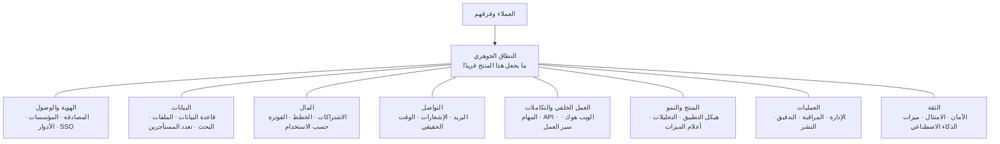
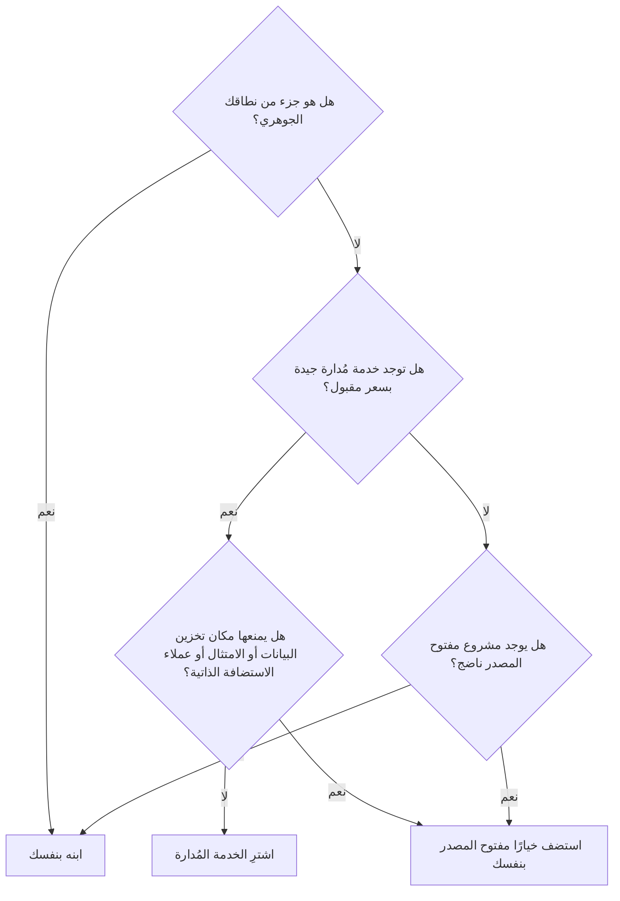
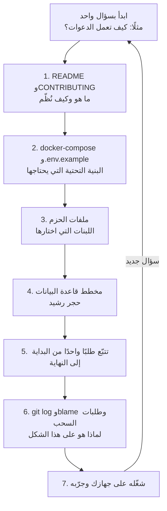
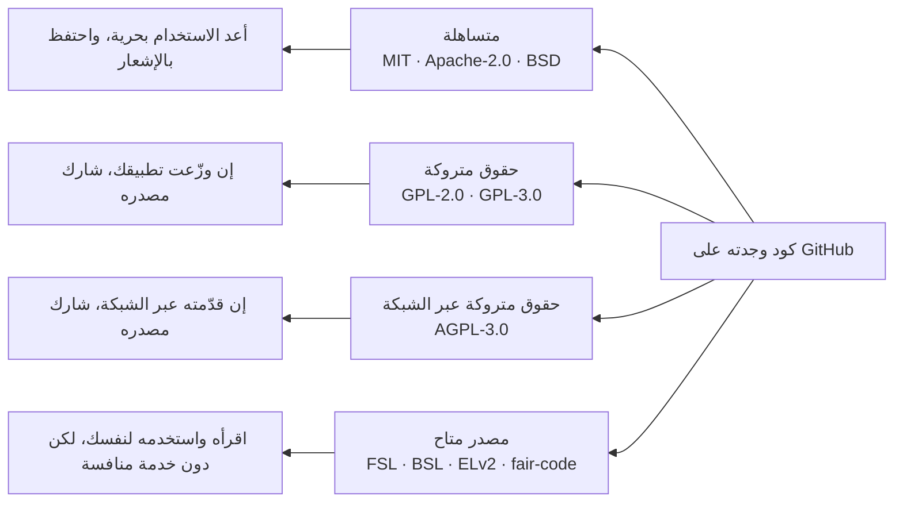

# الوحدة 0 (Module 0) — التوجيه (Orientation): كل SaaS هو التطبيق نفسه

*قبل أن نبني أي شيء، ننظر إلى الخريطة كاملة. تعرض هذه الوحدة نحو 25 مكوّنًا (components) يشترك فيها كل SaaS تقريبًا، وكيف تقرأ قواعد الكود (codebases) مفتوحة المصدر (open-source) الضخمة التي تعيش فيها هذه المكوّنات، وأيّ هذه القواعد سندرسها معًا في بقية الدورة. في نهايتها يجب أن تستطيع النظر إلى أي SaaS، سواء كان منتجًا حقيقيًا أو مشروعك الجانبي، وأن تسمّي أجزاءه.*

---

# 0.1 — الـ 80% التي لا يبيعها أحد: تشريح كل SaaS (the anatomy of every SaaS)

*المستوى (Level): 🟢 مبتدئ (Beginner)*

## ⚡ الدرس في دقيقة (In 60 seconds)

- الـ SaaS **نطاق جوهري** (Core Domain) صغير، وهو الجزء الذي يدفع العملاء (customers) مقابله، تحيط به **نطاقات فرعية عامة** (Generic Subdomains) يشترك فيها كل منتج تقريبًا: المصادقة (auth)، والمؤسسات (orgs)، والفوترة (billing)، والبريد (email)، والمهام الخلفية (jobs)، والويب هوك (webhooks)، وسجلات التدقيق (audit logs).
- تصل هذه الأجزاء العامة (generic parts) إلى نحو 25 مكوّنًا (components) موزّعة على ثماني طبقات (layers). تعلّمها مرة واحدة، فيصبح بناء كل منتج جديد أسرع وقراءته أسهل.
- القاعدة الأهم (The rule that matters most): اصرف إبداعك على الجوهر (core)، وانسخ التصاميم والأدوات المجرّبة لكل ما عداه.
- الخيار الافتراضي (The default) للنسخة الأولى (v1): اقرأ مجموعة بداية (Starter Kit) صغيرة مثل `nextjs/saas-starter` لترى الهيكل (skeleton)، واشترِ خدمات مُدارة (managed services) للأجزاء العامة (generic parts) عندما تكون السرعة أهم من التكلفة (cost).
- الفخ الأكبر (The biggest trap): أن تقدّر وقت الجوهر (core) وحده. الأجزاء العامة (generic parts) في نسخة أولى قابلة للبيع (sellable v1) تستغرق غالبًا وقتًا أطول من الجوهر نفسه.

## 🧭 لماذا يحتاجه كل SaaS (Why every SaaS has this)

تخيّل أنك تعرض Beacon، مثالنا المستمر (our running example)، على صديق في جملة واحدة: *«يرسل طلبًا (request) إلى مواقعك كل دقيقة، ويعرض صفحة حالة عامة (public status page) عندما يتعطل شيء.»* هذه الجملة هي المنتج. تتسع لها منديل ورقي، ويستطيع مطوّر جيد أن يبني جزء الفحص (the pinging part) في عطلة نهاية أسبوع.

الآن تخيّل أول عميل (customer) يدفع. يريد أن يدعو أربعة من زملائه، ويجب أن يُسمح لاثنين منهم فقط بحذف المراقِبات (monitors). يريد أن يدفع بالبطاقة، وأن يرقّي خطته (plan) في منتصف الشهر، وأن يحصل على فاتورة (invoice) صحيحة. يريد التنبيهات (alerts) بالبريد (email) وفي Slack. يريد مفتاح API (API key) ليوقف سكربت النشر (deploy script) لديه المراقِبات مؤقتًا. ويطلب فريق الأمن (security team) لديه الدخول الموحد (SSO) وسجل تدقيق (Audit Log) قبل التوقيع. لا شيء من هذا هو «فحص (check) المواقع»، وكله مطلوب قبل أن يدفع أحد.

هذا هو نمط (pattern) كل SaaS (البرمجيات كخدمة (software as a service): برمجيات تستأجرها عبر المتصفح بدل أن تثبّتها). الشيء الذي يتحدث عنه العملاء (customers) صغير. والشيء الذي يجعله عملًا تجاريًا (a business) كبير ومتكرر، والأهم أنه **هو نفسه من SaaS إلى آخر**. تطبيق جدولة (scheduling app)، ومختصِر روابط (link shortener)، ومتتبع أخطاء (error tracker)، كلها تحتاج إلى تسجيل الدخول (login)، والفرق (teams)، والأدوار (roles)، والفوترة (billing)، والبريد (email)، والمهام الخلفية (background jobs)، والويب هوك (webhooks)، ولوحة إدارة (admin panel). وهي تختلف غالبًا في صندوق واحد في المنتصف.

**معظم أي SaaS مجموعة معروفة من المكوّنات العامة (generic components)، لذلك فإن تعلّم هذه المكوّنات (components) مرة واحدة يجعل كل منتج قادم أسرع في البناء وأسهل في الفهم.**

## 📐 كيف يعمل (How it works)

### 🟢 الأساسيات (The essentials)

تأتي مفردات مفيدة من التصميم الموجّه بالنطاق (Domain-Driven Design أو DDD)، وهو أسلوب في تصميم البرمجيات نشره Eric Evans. يقسّم هذا الأسلوب (technique) النظام إلى نطاقات فرعية (Subdomains)، أي مجالات من العمل التجاري (business):

- **النطاق الجوهري** (Core Domain) هو ما يميّز منتجك، وهو سبب دفع العملاء (customers). في Beacon هو محرك الفحص (تشغيل فحوص (checks) HTTP بموثوقية من عدة مناطق (regions)، وتقرير متى يكون «التعطّل (down)» تعطّلًا حقيقيًا) إضافة إلى تجربة صفحة الحالة (status page experience).
- **النطاقات الفرعية العامة** (Generic Subdomains) مجالات يحتاجها كل عمل تجاري (business)، لكن لا يختارك أي عميل (customer) بسببها. المصادقة (authentication)، والفوترة (billing)، وتوصيل البريد (email delivery)، وسجلات التدقيق (audit logs) كلها عامة. لا أحد يختار أداة صفحات حالة (status pages) لأن بريد (email) إعادة تعيين كلمة المرور (password reset) فيها مميز.
- **النطاقات الفرعية الداعمة** (Supporting Subdomains) تقع بينهما: خاصة بعملك لكنها ليست عامل تميّز (differentiator). في Beacon، محرر الجدول الزمني للحوادث (incident timeline editor) مثال جيد.

القاعدة العملية بسيطة. اصرف إبداعك على الجوهر (core). أما النطاقات الفرعية العامة (generic subdomains)، فانسخ فيها التصاميم المجرّبة واستخدم الأدوات المجرّبة. هذه الدورة عن الأجزاء العامة (generic parts)، وهي تنقسم إلى ثماني طبقات (eight layers):


```mermaid
flowchart TD
    U["العملاء وفرقهم"] --> CORE["النطاق الجوهري<br/>ما يجعل هذا المنتج فريدًا"]
    CORE --- ID["الهوية والوصول<br/>المصادقة · المؤسسات · الأدوار · SSO"]
    CORE --- DATA["البيانات<br/>قاعدة البيانات · الملفات · البحث · تعدد المستأجرين"]
    CORE --- MONEY["المال<br/>الاشتراكات · الخطط · الفوترة حسب الاستخدام"]
    CORE --- COMMS["التواصل<br/>البريد · الإشعارات · الوقت الحقيقي"]
    CORE --- BG["العمل الخلفي والتكاملات<br/>المهام · API · الويب هوك · سير العمل"]
    CORE --- GROW["المنتج والنمو<br/>هيكل التطبيق · التحليلات · أعلام الميزات"]
    CORE --- OPS["العمليات<br/>الإدارة · المراقبة · التدقيق · النشر"]
    CORE --- TRUST["الثقة<br/>الأمان · الامتثال · ميزات الذكاء الاصطناعي"]
```

إليك كل مكوّن (component)، والدرس الذي يشرحه، وما يعنيه في Beacon. استخدم هذا الجدول (table) خريطةً لك في الدورة كلها.

| # | المكوّن (component) | الدرس | في Beacon |
|---|---|---|---|
| 1 | المصادقة (authentication) | 1.1 | بريد (email) وكلمة مرور (password)، وروابط سحرية (magic links)، وتسجيل الدخول (login) عبر Google |
| 2 | المستخدمون والمؤسسات والدعوات (invitations) | 1.2 | مساحة عمل (workspace) لكل شركة، ودعوة (invitation) الزملاء |
| 3 | التفويض (الأدوار (roles) والصلاحيات (permissions)) | 1.3 | مالك (owner)، ومسؤول (admin)، وعضو (member)، ومشاهد للقراءة فقط (read-only viewer) |
| 4 | هوية المؤسسات (SSO وSCIM) | 1.4 | خطة Business (Business plan): الدخول عبر Okta، وإلغاء الوصول تلقائيًا (auto-deprovisioning) |
| 5 | قاعدة البيانات (database) وORM والترحيلات (migrations) | 2.1 | جداول (tables) Postgres للمراقِبات والفحوص (checks) والحوادث (incidents) |
| 6 | رفع الملفات (file uploads) وتخزين الكائنات (object storage) | 2.2 | شعارات صفحات الحالة (status pages)، ولقطات شاشة الحوادث (incidents) |
| 7 | البحث (search) | 2.3 | إيجاد مراقِب (monitor) أو حادثة (incident) بين الآلاف |
| 8 | تعدد المستأجرين (multi-tenancy) والعزل (isolation) | 2.4 | لا يرى عميل (customer) أبدًا مراقِبات (monitors) عميل آخر |
| 9 | الاشتراكات (subscriptions) والمدفوعات (payments) | 3.1 | صفحة الدفع (checkout) في Stripe، وبوابة العميل (customer portal)، والفواتير (invoices) |
| 10 | الخطط والحدود (limits) والاستحقاقات (entitlements) | 3.2 | Free = 5 مراقِبات (monitors)، وPro = 50، وBusiness = SSO |
| 11 | الفوترة حسب الاستخدام (usage-based billing) | 3.3 | تنبيهات (alerts) SMS بعد نفاد الرصيد المشمول (included credits) |
| 12 | البريد التفاعلي (transactional email) | 4.1 | «موقعك متعطل»، والدعوات (invitations)، والإيصالات (receipts) |
| 13 | الإشعارات (notifications) والتفضيلات (preferences) | 4.2 | Slack، وSMS، وجرس داخل التطبيق (in-app bell)، وإعدادات (settings) لكل مستخدم (user) |
| 14 | الوقت الحقيقي (realtime) | 4.3 | لوحة حية (live dashboard) تتحول إلى الأحمر دون تحديث الصفحة |
| 15 | المهام الخلفية والجدولة (scheduling) | 5.1 | تشغيل فحص (check) كل 30 ثانية، بلا توقف |
| 16 | الواجهة البرمجية العامة (public API) ومفاتيح API (API keys) | 5.2 | `POST /v1/monitors` من سكربت نشر (deploy script) |
| 17 | الويب هوك الصادر (outbound webhooks) والتكاملات (integrations) | 5.3 | أحداث (events) `incident.created`، وتطبيق Slack |
| 18 | محركات سير العمل (workflow engines) | 5.4 | التصعيد (escalate) إن لم يستجب أحد خلال 10 دقائق |
| 19 | هيكل التطبيق (app shell) والإعداد الأولي (onboarding) | 6.1 | الموقع التسويقي (marketing site)، والتسجيل (signup)، ومعالج أول مراقِب (first-monitor wizard) |
| 20 | التحليلات (analytics) | 6.2 | أيّ المسجّلين (signups) ينشئ مراقِبًا (monitor) ثانيًا |
| 21 | أعلام الميزات (feature flags) والتجارب (experiments) | 6.3 | طرح (roll out) سمة صفحة الحالة (status page) الجديدة على 10% |
| 22 | لوحة الإدارة (admin panel) وانتحال الهوية (impersonation) | 7.1 | يرى الدعم (support) إعدادات (settings) العميل (customer) لتصحيح مشكلته |
| 23 | المراقبة (observability) | 7.2 | أن تعرف متى يتعطل Beacon نفسه |
| 24 | سجلات التدقيق (audit logs) | 7.3 | «من حذف مراقِب الإنتاج (production monitor)؟» |
| 25 | النشر والبيئات (environments) | 7.4 | بيئة اختبار (staging)، وبيئة إنتاج (production)، ونسخة للاستضافة الذاتية (self-hosted edition) |
| 26 | الأمان (security) والامتثال (compliance) | 8.1 | الأسرار (secrets)، والتشفير (encryption)، وSOC 2، وطلبات GDPR |
| 27 | ميزات الذكاء الاصطناعي (AI features) | 8.2 | ملخصات حوادث (incident summaries) يكتبها الذكاء الاصطناعي (AI) |

إن عددناها بدقة فهي 27، ويمكنك تقسيم بعضها أو دمجه، ولهذا نقول «نحو 25». سطر واحد فقط في الجدول (table) كله، وهو محرك الفحص (check engine) المختبئ داخل الصف 15، هو جوهر Beacon الحقيقي.

### 🟡 التعمق أكثر (Going deeper)

يصبح هذا الادعاء مقنعًا عندما تنظر إلى منتجات حقيقية تبدو كأن لا شيء يجمعها. إليك أربعة منتجات SaaS مفتوحة المصدر (open-source) سندرسها طوال الدورة، مفكّكة إلى أجزائها:

| المنتج | النطاق الجوهري (الـ 10–20%) | المكوّنات العامة (generic components) التي اضطر إلى بنائها رغم ذلك |
|---|---|---|
| Cal.com | قواعد التوفر (availability rules)، والمناطق الزمنية (time zones)، ومنطق الحجز (booking logic) | المصادقة (authentication)، والفرق (teams) والمؤسسات (orgs)، وSAML SSO، وStripe، والويب هوك (webhooks)، ومفاتيح API (API keys)، وتذكيرات (reminders) البريد (email) وSMS، و«متجر تطبيقات (app store)» للتكاملات (integrations) |
| Dub | إعادة توجيه سريعة للروابط (fast link redirects) وتحليلات النقرات (click analytics) | مساحات العمل (workspaces)، والأدوار (roles)، وStripe، وحدود الاستخدام (usage limits)، ومفاتيح API (API keys)، والويب هوك (webhooks)، وSAML SSO |
| Plane | المهام (jobs)، والدورات (cycles)، وعروض المشاريع (project views) | مساحات العمل (workspaces)، والأدوار (roles)، والدعوات (invitations)، والإشعارات (notifications)، ورموز API (API tokens)، والمهام الخلفية (background jobs) |
| Sentry | استقبال أحداث الأخطاء (ingesting error events) وتجميعها في مشكلات (issues) | المؤسسات (organizations)، وRBAC، وSSO، وسجل التدقيق (audit log)، والتكاملات (integrations)، والتنبيهات (alerting)، والمهام الخلفية (background jobs) |

العمود الأخير يكاد يكون متطابقًا في كل صف. هذه هي فكرة الدورة كلها في جدول (table) واحد.

وهذا مهم لثلاثة أسباب عملية:

1. **التقدير (Estimating).** يقدّر المبتدئون (juniors) وقت الجوهر (core) وينسون الباقي. إن استغرق الجوهر أربعة أسابيع، فالأجزاء العامة (generic parts) لنسخة أولى قابلة للبيع (sellable v1) تستغرق غالبًا وقتًا أطول، لأن لكل منها حالات حدّية (دفع فاشل (failed payment) بالبطاقة، أو دعوة (invitation) أُرسلت إلى بريد (email) له حساب أصلًا، أو مهمة (job) تعمل مرتين).
2. **قراءة الكود (Reading code).** عندما تفتح مستودعًا (repo) كبيرًا، فأنت لا تواجه 400,000 سطر مجهول. أنت تواجه المصادقة (authentication)، والمؤسسات (orgs)، والفوترة (billing)، والمهام (jobs) وغيرها، إضافة إلى جوهر واحد. أنت تعرف مسبقًا وظيفة معظم المجلدات (folders) قبل أن تفتحها.
3. **تحديد ما تبنيه.** كل مكوّن عام (generic component) يطرح السؤال نفسه: هل تبنيه، أم تشتري خدمة مُدارة (managed service)، أم تستضيف بنفسك (self-host) خيارًا مفتوح المصدر (open-source)؟

### 🔴 على نطاق واسع وللمؤسسات (At scale / enterprise)

قرار البناء أو الشراء أو الاستضافة الذاتية (build, buy or self-host decision) لا يُتخذ مرة واحدة. إنه يتغير مع نمو الشركة، ويعيد المهندسون الكبار (senior engineers) النظر فيه. هذا هو الإطار الذي سنستخدمه في كل درس:


```mermaid
flowchart TD
    Q1{"هل هو جزء من نطاقك الجوهري؟"} -->|"نعم"| BUILD["ابنه بنفسك"]
    Q1 -->|"لا"| Q2{"هل توجد خدمة مُدارة جيدة بسعر مقبول؟"}
    Q2 -->|"نعم"| Q3{"هل يمنعها مكان تخزين البيانات أو الامتثال أو عملاء الاستضافة الذاتية؟"}
    Q3 -->|"لا"| BUY["اشترِ الخدمة المُدارة"]
    Q3 -->|"نعم"| SELF["استضف خيارًا مفتوح المصدر بنفسك"]
    Q2 -->|"لا"| Q4{"هل يوجد مشروع مفتوح المصدر ناضج؟"}
    Q4 -->|"نعم"| SELF
    Q4 -->|"لا"| BUILD
```

الأسئلة التي تقف خلف الأسهم:

| السؤال | لماذا يهم |
|---|---|
| هل هو جوهري (core)؟ | إسناد (outsourcing) ما يميّزك (your differentiator) إلى جهة خارجية (third party) يعني أن منافسيك (your competitors) يستطيعون شراء الشيء نفسه. |
| كم يكلّف عندما يصبح حجمك 10 أضعاف؟ | تسعير (pricing) المصادقة (authentication) لكل مستخدم (user) أو تسعير التحليلات (analytics) لكل حدث قد ينمو أسرع من الإيرادات (revenue). |
| ما صعوبة الخروج منه؟ | الفوترة (billing) والمصادقة (authentication) تحملان بيانات العملاء ومعرّفاتهم (IDs). ترحيلها (migrating them) مؤلم، لذلك اختر بعناية منذ البداية. |
| هل يحتاج العملاء (customers) إلى الاستضافة الذاتية (self-hosting)؟ | إن كنت تقدّم نسخة تُثبَّت في خوادم العميل (On-Premises)، يصبح كل اعتماد (dependency) على خدمة مُدارة (managed service) مشكلة. |
| من يشغّله في الثالثة فجرًا؟ | الاستضافة الذاتية (self-hosting) تعني أنك مسؤول عن الترقيات (upgrades) والنسخ الاحتياطية (backups) والأعطال (outages). |

المفارقة في عالم المؤسسات (enterprise) أن المكوّنات (components) «العامة» تصبح ميزات بيع (sales features). الدخول الموحد (SSO)، وSCIM، وسجلات التدقيق (audit logs)، ومكان تخزين البيانات (data residency)، وضمانات التوفر (uptime guarantees) هي بالضبط ما يدفعه العملاء (customers) الكبار مقابل خطة Business (Business plan). على نطاق واسع، تكون الـ 80% المملة غالبًا المكان الذي تأتي منه الإيرادات عالية الهامش (high-margin revenue)، ولهذا توجد شركات مثل WorkOS تبيع هذه الأجزاء العامة (generic parts) فقط.

## 🏆 أفضل المستودعات (The best repos)

مجموعات البداية (Boilerplates) هي أسرع طريقة *لرؤية* هيكل SaaS (SaaS skeleton): إنها المكوّنات العامة (generic components) مع ترك الجوهر (core) فارغًا. اقرأها حتى لو لم تستخدم واحدة منها أبدًا.

| المستودع (repo) | ما هو | التقنيات (stack) | الترخيص (license) | اختره عندما (Pick it when) |
|---|---|---|---|---|
| [nextjs/saas-starter](https://github.com/nextjs/saas-starter) | مجموعة بداية (starter kit) رسمية مصغّرة: مصادقة (authentication)، وStripe، وفرق (teams)، وأدوار (roles)، وسجل نشاط (activity log) | Next.js, Postgres, Drizzle, Stripe | MIT | تريد أصغر هيكل مقروء لتتعلم منه |
| [vercel/next-forge](https://github.com/vercel/next-forge) | قالب (template) Turborepo بمستوى الإنتاج (production-grade)، مع حزم (packages) كثيرة موصولة معًا (كان في الأصل `haydenbleasel/next-forge`) | Next.js monorepo, TypeScript | MIT | تريد أن ترى كيف يقسّم مستودع أحادي (Monorepo) جاد المسؤوليات (concerns) إلى حزم (packages) |
| [wasp-lang/open-saas](https://github.com/wasp-lang/open-saas) | قالب (template) SaaS كامل فيه مصادقة (authentication)، ومدفوعات (payments)، ولوحة إدارة (admin panel)، ومهام (jobs)، ومثال ذكاء اصطناعي | Wasp (React + Node.js + Prisma) | MIT | تريد كل شيء جاهزًا ولا تمانع استخدام إطار عمل (framework) |
| [boxyhq/saas-starter-kit](https://github.com/boxyhq/saas-starter-kit) | مجموعة بداية (starter kit) موجّهة للمؤسسات (enterprise-focused): SSO، وSCIM، وسجلات تدقيق (audit logs)، وويب هوك (webhook)، وفرق (teams) | Next.js, Prisma, Postgres | Apache-2.0 | تبيع لشركات ستطلب SSO من اليوم الأول |
| [ixartz/SaaS-Boilerplate](https://github.com/ixartz/SaaS-Boilerplate) | قالب (template) Next.js فيه مصادقة (authentication)، وتعدد مستأجرين (multi-tenancy)، وأدوار (roles)، وتعدد لغات (i18n)، وإعداد للاختبارات (testing setup) | Next.js, Drizzle, Tailwind, shadcn/ui | MIT | تريد قاعدة كود (codebase) مجهّزة جيدًا، فيها الاختبارات والتدقيق الآلي (linting) مُعدّة مسبقًا |
| [t3-oss/create-t3-app](https://github.com/t3-oss/create-t3-app) | أداة سطر أوامر (CLI) تنشئ تطبيقًا متكاملًا (full-stack app) آمن الأنواع (وليس SaaS كاملًا) | Next.js, tRPC, Prisma or Drizzle, Tailwind | MIT | تريد قاعدة نظيفة وستضيف مكوّنات (components) SaaS بنفسك |
| [apptension/saas-boilerplate](https://github.com/apptension/saas-boilerplate) | قالب (template) SaaS كامل فيه مستأجرون (tenants)، وStripe، وبريد (email)، وكود للبنية التحتية (infrastructure code) | Django, React, GraphQL, AWS | MIT | خادمك الخلفي (backend) مكتوب بـ Python وتريد مثالًا كاملًا |
| [laravel/laravel](https://github.com/laravel/laravel) + [laravel/cashier-stripe](https://github.com/laravel/cashier-stripe) | هيكل تطبيق (app skeleton) Laravel مع مكتبة (library) اشتراكات (subscriptions) Stripe الرسمية | PHP, Laravel | MIT | تعمل بـ PHP؛ منظومة (ecosystem) Laravel تغطي معظم المكوّنات العامة (generic components) رسميًا |

**إن درست مستودعًا واحدًا فقط (If you only study one):** اقرأ `nextjs/saas-starter`. إنه صغير بما يكفي لتقرأه كاملًا في فترة بعد الظهر، ومع ذلك يحوي الشكل الأساسي: مستخدمون (users)، وفرق (teams) بأدوار (with roles)، وصفحة دفع في Stripe مع ويب هوك (webhook)، وسجل نشاط (activity log). عندما ترى هذا الشكل مرة، تصبح مجموعات البداية (starter kits) الأكبر ومستودعات الإنتاج (production repos) تنويعات عليه.

**اشترِ أم ابنِ أم استضف بنفسك (Buy, build, or self-host)؟**

- **اشترِ (buy)** خدمات مُدارة (managed services) للأجزاء العامة (generic parts) عندما تكون السرعة أهم من التكلفة (cost): Clerk أو WorkOS للمصادقة (authentication) والدخول الموحد (SSO)، وStripe للفوترة (billing)، وResend أو Postmark للبريد (email)، وPostHog Cloud للتحليلات (analytics)، وSentry للأخطاء.
- **استضف بنفسك (self-host)** بدائل مفتوحة المصدر (Keycloak، وLago، وListmonk، وPostHog، وGlitchTip) عندما يشترط العملاء (customers) بقاء البيانات (data) في بنيتك التحتية (your infrastructure)، أو عندما تقدّم نسخة تُثبَّت لدى العميل (customer)، أو عندما يتجاوز التسعير لكل مستخدم (per-seat pricing) هوامش ربحك (your margins).
- **ابنِ (build)** نطاقك الجوهري (your core domain) دائمًا، وابنِ الأجزاء العامة (generic parts) فقط عندما تكون صغيرة ومحددة (سجل نشاط (activity log) بسيط، أو أدوار (roles) أساسية). مجموعة البداية (starter kit) تمنحك انطلاقة سريعة فيها.

## 🔍 ادرسه في مشاريع حقيقية (Study it in the wild)

خذ المنتجات الأربعة من الجدول (table) أعلاه، واقضِ عشر دقائق في كل منها، وابحث عن الأجزاء العامة (generic parts) فقط.

**Cal.com** (`calcom/cal.diy`، نسخته المجتمعية المرخّصة بـ MIT منذ 2026). مستودع أحادي (monorepo) كبير بلغة TypeScript. في وقت كتابة هذا الدرس، يقع التطبيق الرئيسي تحت `apps/web` ومخطط قاعدة البيانات (database schema) تحت `packages/prisma`. افتح مخطط Prisma (Prisma schema) وابحث عن `model Team` و`model Membership` و`model Webhook`. ستجد الهيكل العام (generic skeleton) جالسًا بجانب النماذج الجوهرية (core models) مثل `Booking` و`EventType`.

**Dub** (`dubinc/dub`). مستودع أحادي (monorepo) بـ Next.js أيضًا. استخدم بحث الكود (code search) في GitHub داخل المستودع (repo) عن `stripe` وعن `apiKey` أو `token`. لاحظ كم من الكود يتعلق بالخطط (plans) وحدود الاستخدام (usage limits)، لأن تسعير (pricing) مختصِر الروابط (link shortener) يعتمد على عدد الروابط والنقرات لديك.

**Plane** (`makeplane/plane`). واجهة API بـ Django مع واجهات أمامية (frontends) بـ Next.js. ابحث عن `class Workspace` و`WorkspaceMember` في كود Python. حقل الدور (role field) في نموذج العضوية (membership model) هو نظام الصلاحيات (permission system) كله في صورة مصغّرة.

**Sentry** (`getsentry/sentry`). قاعدة كود (codebase) ضخمة بـ Django. لا تحاول قراءتها. ابحث عن `class Organization` و`AuditLogEntry` و`OrganizationMember`. الجوهر (استقبال الأحداث (event ingestion) وتجميعها) جزء كبير من المستودع (repo)، لكن الأجزاء العامة (generic parts) ناضجة بالقدر نفسه.

**ما الذي تلاحظه (What to notice):**

- لكل منها جدول (table) «شبيه بالمؤسسة (organization-like)» (فريق (team)، أو مساحة عمل (workspace)، أو مؤسسة (organization)) وجدول عضوية (membership table) فيه دور (role). هذا الزوج هو العمود الفقري لـ SaaS الموجّه للشركات (B2B).
- النماذج الجوهرية (الحجز (booking)، والرابط (link)، والمهمة، والحدث (issue, event)) كلها تحمل مفتاحًا أجنبيًا (Foreign Key) إلى هذا الجدول (table) الشبيه بالمؤسسة (organization-like).
- كود الفوترة (billing code) صغير لكنه يلمس كل شيء، لأن الخطط (plans) تحدد ما يُسمح للجوهر (core) بفعله.
- ميزات المؤسسات (SSO وسجلات التدقيق (audit logs)) تعيش غالبًا في مجلد (folder) منفصل بترخيص (licence) مختلف، مثل `ee/`. نشرح السبب في الدرس 0.3.

## 🛠️ ابنِه في Beacon (Build it into Beacon)

### 🟢 تمرين المبتدئ (Beginner exercise)

اجرد مكوّنات (components) Beacon. باستخدام جدول المكوّنات (component table) أعلاه، اكتب مستندًا من صفحة واحدة فيه سطر لكل مكوّن (component): ما يحتاجه Beacon منه في النسخة الأولى (v1)، وما يمكن أن ينتظر. ثم اكتب قائمة قصيرة منفصلة بعنوان «الجوهر (core)»، تذكر فيها فقط الأجزاء التي تميّز Beacon عن منافسيه (its competitors).

**يكتمل عندما (Done when):**
- يكون لكل واحد من المكوّنات (components) الـ 25 تقريبًا سطر معلَّم بـ «v1» أو «لاحقًا»، مع السبب.
- لا تحوي قائمة «الجوهر (core)» أكثر من أربعة عناصر، وليس بينها المصادقة (authentication) أو الفوترة (billing) أو البريد (email).
- تستطيع أن تشرح في جملة واحدة لماذا محرك الفحص (check engine) جوهري (core) وصفحة تسجيل الدخول (login page) ليست كذلك.

### 🟡 تمرين المستوى المتوسط (Intermediate exercise)

اتخذ قرار البناء أو الشراء أو الاستضافة الذاتية (build, buy or self-host decision) لخمسة مكوّنات (components) في Beacon: المصادقة (authentication)، والفوترة (billing)، والبريد التفاعلي (transactional email)، والمهام الخلفية (background jobs)، وتتبع الأخطاء (error tracking). لكل منها، امشِ عبر مخطط القرار (decision flowchart)، وسمِّ الخدمة أو المستودع (repo) المحدد الذي ستختاره.

**يكتمل عندما (Done when):**
- يذكر كل قرار خيارًا ملموسًا (منتجًا أو `owner/repo`) والسؤال الذي حسمه.
- يذكر قرار واحد على الأقل ما الذي سيجعلك تغيّر رأيك لاحقًا (مثلًا: «إن أطلقنا نسخة للاستضافة الذاتية (self-hosted edition)»).
- تكون قد قدّرت التكلفة الشهرية (monthly cost) لخيارات «الشراء (buy)» عند 100 عميل (customer) وعند 10,000 عميل.

### 🔴 تمرين المستوى المتقدم (Advanced exercise)

اختر أي SaaS حقيقي تستخدمه يوميًا وليس مذكورًا في هذا الدرس. من صفحة التسعير (pricing page) العامة، وشاشات الإعدادات (settings screens)، ووثائق (docs) الـ API، استنتج قائمة مكوّناته (its components) واربط كلًا منها بأرقام دروسنا. ثم حدّد المكوّنات (components) التي لا تظهر إلا في خطته الأغلى (its most expensive plan).

**يكتمل عندما (Done when):**
- تكون قد ربطت 15 مكوّنًا (components) على الأقل، مع دليل لكل منها (لقطة شاشة أو صفحة من الوثائق (docs)).
- تكون قد حدّدت نطاقه الجوهري (its core domain) في جملة واحدة.
- تكون قد ذكرت المكوّنات العامة (generic components) التي يستخدمها كترقيات للمؤسسات (enterprise upsells)، وقارنتها بخطة Business (Business plan) في Beacon.

## ⚠️ أخطاء يقع فيها المبتدئون (Mistakes juniors make)

- **تقدير وقت الجوهر وحده (Estimating only the core).** عبارة «محرك الفحص (check engine) يستغرق أسبوعين، إذن نطلق بعد ثلاثة» تتجاهل الدعوات (invitations)، والحالات الحدّية (edge cases) في الفوترة (billing)، وإعادة تعيين كلمة المرور (password reset). اكتب قائمة المكوّنات العامة (generic components) أولًا، وقدّر وقت كل منها.
- **بناء الأجزاء العامة (generic parts) من الصفر بدافع الفخر.** كتابة تجزئة كلمات المرور (Password Hashing) أو إدارة الجلسات (session handling) أو الويب هوك (webhooks) الخاص بـ Stripe يدويًا هي الطريقة التي تحدث بها الثغرات الأمنية (security bugs) والخصم المزدوج (double charges). استخدم مكتبات (libraries) مجرّبة، وادرس كيف فعلها الآخرون.
- **شراء كل شيء دون التحقق من تكلفة الخروج (exit costs).** مزوّد المصادقة المُدار (managed auth provider) يحمل معرّفات مستخدميك (your users)، وأداة الفوترة (billing tool) تحمل اشتراكاتك (your subscriptions). قبل اعتماد (dependency) أي منها، تحقّق من أنك تستطيع تصدير بياناتك (your data)، ومن مدى صعوبة الترحيل (migration).
- **نسيان المؤسسة (organization) منذ اليوم الأول.** ربط المراقِبات (monitors) بالمستخدمين (users) مباشرة بدل ربطها بمؤسسة يجعل إضافة الفرق (teams) لاحقًا شبه مستحيلة. يغطي الدرس 1.2 هذا الموضوع؛ أما الآن فافترض أن كل سجل في B2B ينتمي إلى مؤسسة.
- **معاملة الجوهر (core) كأنه عام.** الخطأ المعاكس: استخدام أداة فحص توفر جاهزة (off-the-shelf uptime checker) كمحرك لـ Beacon يعني أنه لا ميزة لك على أي أحد آخر يستخدمها.
- **نسخ مجموعة بداية (starter kit) دون قراءتها.** القالب (template) الذي لا تفهمه هو كود شخص آخر صرت الآن مسؤولًا عن صيانته. اقرأ كل مجلد (folder) قبل أن تبني عليه.

## 🧾 الخلاصة (Recap)

- الـ SaaS **نطاق جوهري (core domain)** صغير تحيط به **نطاقات فرعية عامة (generic subdomains)** يشترك فيها كل منتج تقريبًا.
- تنقسم الأجزاء العامة (generic parts) إلى ثماني طبقات (eight layers): الهوية (identity)، والبيانات (data)، والمال (money)، والتواصل (communication)، والعمل الخلفي (background work)، والمنتج والنمو (Product and growth)، والعمليات (operations)، والثقة (trust).
- لا يشبه Cal.com وDub وPlane وSentry بعضها بعضًا، ومع ذلك فمكوّناتها (its components) العامة شبه متطابقة.
- لكل مكوّن عام (generic component)، قرّر عن وعي: **اشترِ (buy)** من أجل السرعة، و**استضف بنفسك (self-host)** من أجل التحكم والامتثال (compliance)، و**ابنِ (build)** الجوهر (core) والقطع الصغيرة المحددة.
- ميزات المؤسسات (enterprise features) مثل SSO وسجلات التدقيق (audit logs) عامة في بنائها لكنها ثمينة في بيعها.
- مجموعات البداية (starter kits) تريك الهيكل (skeleton)؛ اقرأ واحدة كاملة قبل أن تثق بها.

## ✍️ اختبر نفسك (Check yourself)

**1. ما الفرق بين (the difference between) النطاق الجوهري (core domain) والنطاق الفرعي العام (generic subdomain)؟**

<details><summary>الإجابة (Answer)</summary>

النطاق الجوهري (core domain) هو ما يميّز منتجك، وهو سبب دفع العملاء (customers)؛ في Beacon هو محرك الفحص (check engine) وتجربة صفحة الحالة (status page experience). أما النطاق الفرعي العام (generic subdomain) فهو شيء يحتاجه كل عمل تجاري (business)، لكن لا يختارك أي عميل (customer) بسببه، مثل المصادقة (authentication) أو الفوترة (billing) أو البريد (email). راجع «الأساسيات (The essentials)» في قسم «كيف يعمل» (How it works).

</details>

**2. إلى أي ثماني طبقات (eight layers) تنقسم المكوّنات العامة (generic components)؟**

<details><summary>الإجابة (Answer)</summary>

الهوية والوصول (Identity and access)، والبيانات (data)، والمال (money)، والتواصل (communication)، والعمل الخلفي والتكاملات (Background work and integrations)، والمنتج والنمو (Product and growth)، والعمليات (operations)، والثقة (trust). يعرضها المخطط (schema) الأول في «الأساسيات (The essentials)» حول النطاق الجوهري (core domain)، ويربط جدول المكوّنات (component table) كل طبقة (layer) بدروسها.

</details>

**3. يريد فريق (team) Beacon أن يكتب تجزئة كلمات المرور (password hashing) وإدارة الجلسات (session handling) بنفسه «ليحتفظ بالتحكم». ماذا يقول مخطط القرار (decision flowchart)؟**

<details><summary>الإجابة (Answer)</summary>

المصادقة (authentication) ليست جوهر Beacon، وتوجد خدمات مُدارة (managed services) جيدة (Clerk وWorkOS) ومشاريع مفتوحة المصدر (open-source) ناضجة، لذلك ينتهي المخطط (schema) عند «اشترِ (buy)» أو «استضف بنفسك (self-host)»، لا عند «ابنِ (build)». كتابة تجزئة كلمات المرور (password hashing) والجلسات (sessions) يدويًا هي الطريقة التي تحدث بها الثغرات الأمنية (security bugs). راجع «على نطاق واسع وللمؤسسات (At scale / enterprise)» و«أخطاء يقع فيها المبتدئون (Mistakes juniors make)».

</details>

**4. قرر Beacon أن يقدّم نسخة للاستضافة الذاتية (self-hosted edition) لعملاء (customers) لا يستطيعون إرسال بياناتهم (their data) إلى جهات خارجية (third parties). كيف يغيّر ذلك خياراته للبريد (email) والتحليلات (analytics)؟**

<details><summary>الإجابة (Answer)</summary>

السؤال الثالث في المخطط («هل يمنعها مكان تخزين البيانات (data residency) أو الامتثال (compliance) أو عملاء (customers) الاستضافة الذاتية (self-hosting)؟») صار جوابه نعم، لذلك تفسح الخدمات المُدارة (managed services) المجال لخيارات مفتوحة المصدر (open-source) يستضيفها Beacon بنفسه، مثل Listmonk أو PostHog. إن كنت تقدّم نسخة تُثبَّت لدى العميل (customer)، يصبح كل اعتماد (dependency) على خدمة مُدارة (managed service) مشكلة. راجع جدول (table) الأسئلة في «على نطاق واسع وللمؤسسات (At scale / enterprise)» و«اشترِ أم ابنِ أم استضف بنفسك (Buy, build, or self-host)؟».

</details>

**5. صمّم مبتدئ (junior) مخطط (schema) Beacon بحيث يحمل كل مراقِب (monitor) `user_id` دون أي جدول (table) للمؤسسات (organizations). بعد ستة أشهر طلب عميل (customer) يدفع أن يدعو أربعة من زملائه. ما الذي يتعطل؟**

<details><summary>الإجابة (Answer)</summary>

المراقِبات (monitors) تنتمي إلى شخص واحد، فلا يوجد شيء يتشاركه الزملاء ولا مكان لربط الأدوار (roles). إضافة الفرق (teams) الآن تعني ترحيل (migrating) كل سجل إلى مالك (owner) جديد، وهذا شبه مستحيل أن يتم بنظافة. افترض منذ اليوم الأول أن كل سجل في B2B ينتمي إلى مؤسسة (organization)؛ راجع «أخطاء يقع فيها المبتدئون (Mistakes juniors make)» والدرس 1.2.

</details>

## 📚 المراجع (References)

- Martin Fowler, "BoundedContext": https://martinfowler.com/bliki/BoundedContext.html — شرح لمفهوم السياق المحدود (bounded context)
- Eric Evans, *Domain-Driven Design: Tackling Complexity in the Heart of Software* (Addison-Wesley, 2003) — المصدر الأصلي لمصطلحَي «النطاق الجوهري (core domain)» و«النطاق الفرعي العام (generic subdomain)».
- The Twelve-Factor App: https://12factor.net — قائمة تحقق (checklist) كلاسيكية لطريقة هيكلة SaaS كي يعمل جيدًا
- Dan McKinley, "Choose Boring Technology": https://boringtechnology.club — لماذا تختار تقنيات مملة ومجرّبة
- Next.js SaaS Starter README: https://github.com/nextjs/saas-starter
- Stripe documentation: https://docs.stripe.com — الفوترة (billing) هي أكثر مكوّن عام (generic component) يُعاد استخدامه

---

# 0.2 — كيف تقرأ قاعدة كود (codebase) مفتوحة المصدر (open-source) ضخمة دون أن تغرق

*المستوى (Level): 🟢 مبتدئ (Beginner)*

## ⚡ الدرس في دقيقة (In 60 seconds)

- قواعد الكود (codebases) الكبيرة لا تُقرأ من أولها إلى آخرها، بل يُبحث فيها ويُتنقّل بينها. ابدأ من سؤال واحد مكتوب.
- الطريقة: README وCONTRIBUTING، ثم ملف compose و`.env.example`، ثم ملفات الحزم (package manifests)، ثم مخطط قاعدة البيانات (database schema)، ثم طلب (request) واحد من البداية إلى النهاية (end to end)، ثم تاريخ git (git history)، وبعد ذلك فقط شغّل التطبيق.
- القاعدة الأهم (The rule that matters most): مخطط قاعدة البيانات (database schema) هو حجر رشيد (Rosetta stone). أسماء نماذجه (model names) تقابل قائمة مكوّناتنا (component list) واحدًا بواحد تقريبًا.
- الأدوات الافتراضية (The default tools): بحث الكود (code search) في GitHub (اضغط `/`) أو `rg` على جهازك، مع البحث عن النصوص (strings) التي يراها المستخدمون (users) وأسماء أحداث المزوّدين (vendor event names) مثل `checkout.session.completed`.
- الفخ الأكبر (The biggest trap): أن تتبع كل استيراد (import) بدءًا من `index.ts`، أو أن تصارع `docker compose up` قبل أن تعرف وظيفة الخدمات (services).

## 🧭 لماذا يحتاجه كل SaaS (Why every SaaS has this)

تنسخ (clone) مستودع (repo) Cal.com لأنك تريد أن ترى كيف يتعاملون مع دعوات الفرق (team invitations). في المستودع آلاف الملفات، وعشرات الحزم (packages)، ومجلد (folder) `node_modules` تخاف أن تنظر إليه. تفتح ملفًا عشوائيًا، فتجده يستورد ستة أشياء لم تسمع بها من قبل. تتبع استيرادًا (import)، ثم آخر، وبعد أربعين دقيقة تجد نفسك تقرأ دالة مساعدة (helper) لتنسيق التواريخ ولم تتعلم شيئًا. تغلق التبويب وتقرر أن الكود مفتوح المصدر (open-source) «متقدم أكثر من اللازم».

هو ليس متقدمًا أكثر من اللازم. المشكلة أنك قرأته كما تقرأ رواية، من أي مكان فتحته. قواعد الكود (codebases) الكبيرة لا تُقرأ، بل *يُبحث فيها ويُتنقّل بينها*. المهندسون الكبار (senior engineers) أيضًا لا يفهمون مستودعًا (repo) من 500,000 سطر. لكن لديهم طريقة لإيجاد الـ 300 سطر التي تجيب عن سؤالهم وتجاهل كل ما عداها.

كل فريق SaaS يحتاج إلى هذه المهارة، لأن كل SaaS يعتمد على كود لم يكتبه أحد في الفريق (team): أطر العمل (frameworks)، والمكتبات (libraries)، وحزم SDK (SDKs) من المزوّدين، والمنتجات مفتوحة المصدر (open-source) التي تشير إليها هذه الدورة. القدرة على الإجابة (the ability to answer) عن سؤال «كيف يعمل هذا فعلًا؟» بقراءة المصدر بدل التخمين من أوضح الفروق بين المهندس المبتدئ (junior) والمهندس المتوسط (mid-level engineer).

**اقرأ قاعدة الكود (codebase) الكبيرة بسؤال وطريقة، لا من أعلاها: جد نقاط الدخول (entry points)، واستخدم مخطط قاعدة البيانات (database schema) خريطةً لك، وتتبّع طلبًا واحدًا من البداية إلى النهاية (follow one request end to end).**

## 📐 كيف يعمل (How it works)

### 🟢 الأساسيات (The essentials)

هذه هي الطريقة التي سنستخدمها مع كل مستودع (repo) في هذه الدورة. كل خطوة رخيصة، وكل خطوة تضيّق المكان الذي تنظر إليه بعدها.


```mermaid
flowchart TD
    Q["ابدأ بسؤال واحد<br/>مثلًا: كيف تعمل الدعوات؟"] --> R["1. README وCONTRIBUTING<br/>ما هو وكيف نُظّم"]
    R --> I["2. docker-compose و.env.example<br/>البنية التحتية التي يحتاجها"]
    I --> P["3. ملفات الحزم<br/>اللبنات التي اختارها"]
    P --> S["4. مخطط قاعدة البيانات<br/>حجر رشيد"]
    S --> F["5. تتبّع طلبًا واحدًا من البداية إلى النهاية"]
    F --> G["6. git log وblame وطلبات السحب<br/>لماذا هو على هذا الشكل"]
    G --> RUN["7. شغّله على جهازك وجرّبه"]
    RUN -->|"سؤال جديد"| Q
```

**1. README وCONTRIBUTING.** يقول ملف README ما يفعله المنتج. ويقول `CONTRIBUTING.md` (وأحيانًا مجلد (folder) `docs/` أو مستند للبنية (architecture document)) كيف نُظّم المستودع (repo) وكيف تشغّله. دقيقتان هنا توفّران ساعة لاحقًا.

**2. `docker-compose.yml` و`.env.example`.** هذان أكثر ملفين يُستهان بهما في أي مستودع (repo). يسرد ملف compose الخدمات (services) التي يحتاجها التطبيق ليعمل: Postgres، وRedis، وطابور (Queue)، ومخزن كائنات (object store)، وملتقط بريد (mail catcher). ويسرد ملف `.env.example` كل متغير إعدادات (configuration variable)، وأسماء المتغيرات مثل `STRIPE_SECRET_KEY` أو `RESEND_API_KEY` أو `SAML_JACKSON_URL` أو `TINYBIRD_TOKEN` تخبرك بالخدمات الخارجية (third-party services) والمكوّنات (components) الموجودة دون أن تقرأ سطرًا من الكود.

**3. ملفات الحزم (package manifests).** `package.json`، أو `pyproject.toml` أو `requirements.txt`، أو `Gemfile`، أو `go.mod`، أو `composer.json`. هذه هي قائمة المشتريات (shopping list). عندما ترى `bullmq` أو `@prisma/client` أو `stripe` أو `better-auth` أو `celery`، تعرف أي لبنة (building block) تتولى أي مكوّن (component)، وبالتالي أي وثائق (docs) تقرأ.

**4. مخطط قاعدة البيانات (database schema).** هذا هو حجر رشيد (Rosetta stone): المكان الوحيد الذي يوصف فيه المنتج كله بلغة واحدة منظّمة. جده (`schema.prisma`، أو ملفات مخطط Drizzle (Drizzle schema)، أو `models.py` في Django، أو `db/schema.rb` في Rails، أو ترحيلات (migrations) SQL) واقرأ أسماء الجداول (tables). `Organization` و`Membership` و`Invitation` و`Subscription` و`ApiKey` و`Webhook` و`AuditLog` تقابل قائمة مكوّناتنا (component list) مباشرة. والعلاقات (relationships) بينها تخبرك كيف يعمل تعدد المستأجرين (Multi-Tenancy).

**5. تتبّع طلبًا واحدًا من البداية إلى النهاية (follow one request end to end).** اختر إجراءً واحدًا يقوم به المستخدم (user)، مثل «قبول دعوة (invitation)»، وتتبّعه: الصفحة أو الزر، ثم مسار (route) الـ API أو إجراء الخادم (Server Action)، ثم فحص الصلاحية (permission check)، ثم الكتابة في قاعدة البيانات (database write)، ثم أي بريد أو مهمة (job) يطلقها. أنت الآن تفهم شريحة عمودية (vertical slice) واحدة، وكل الشرائح (slices) الأخرى تشبهها.

**6. `git log` و`git blame` وطلبات السحب (Pull Requests).** الكود يُظهر *ماذا*، والتاريخ (history) يُظهر *لماذا*. يقودك `git blame` على سطر غريب إلى الإيداع (Commit)، ويقودك الإيداع إلى طلب السحب (pull request)، حيث تناقش الناس في المقايضة (trade-off) نفسها التي تتساءل عنها.

**7. شغّله على جهازك.** الآن فقط تشغّله. ضع نقطة توقف (Breakpoint) أو أضف سطر تسجيل (log line) حيث يمرّ الطلب (request) الذي تتبعته، واضغط الزر، وراقب فهمك وهو يتأكد أو يُصحَّح.

### 🟡 التعمق أكثر (Going deeper)

المهارة التي تجعل الطريقة سريعة هي معرفة *عمّا تبحث*. إليك ورقة مرجعية (cheat sheet). ابحث عن هذه الكلمات ببحث الكود (code search) في GitHub (اضغط `/` في صفحة المستودع (repo)) أو على جهازك بـ `rg` (ripgrep).

| إن أردت أن تجد… | ابحث عن… | ثم انظر إلى |
|---|---|---|
| المصادقة (authentication) | `signIn`, `session`, `better-auth`, `next-auth`, `passport`, `devise`, `login` | ملف إعدادات المصادقة (auth config file) والوسيط (Middleware) الذي يحمي المسارات (routes) |
| المؤسسات (organizations) وتعدد المستأجرين (multi-tenancy) | `organizationId`, `workspaceId`, `teamId`, `accountId` | نموذج العضوية (membership model) وطريقة تصفية الاستعلامات (queries) |
| الصلاحيات (permissions) | `role`, `OWNER`, `ADMIN`, `permission`, `can(`, `authorize` | أين يحدث الفحص: في الوسيط (middleware)، أو في دالة مساعدة (helper)، أو داخل الكود مباشرة (inline) |
| الويب هوك الخاص بالفوترة (billing webhooks) | `constructEvent`, `checkout.session.completed`, `customer.subscription`, `invoice.paid` | المعالج (handler) الذي يحدّث الخطة (plan) في قاعدة بياناتك (your database) |
| حدود الخطط (plan limits) | `limit`, `plan`, `quota`, `entitlement`, `upgrade` | المكان الذي يسأل فيه الجوهر (core): «هل هذا مسموح في هذه الخطة (plan)؟» |
| المهام الخلفية (background jobs) | `bullmq`, `Queue(`, `Worker(`, `cron`, `shared_task`, `perform_later`, `Sidekiq` | تعريفات المهام (job definitions) وما الذي يضعها في الطابور (queue) |
| البريد (email) | `react-email`, `sendEmail`, `resend`, `nodemailer`, `mailer`, `templates` | مجلد القوالب (template folder) ودالة الإرسال المساعدة (send helper) |
| مفاتيح API (API keys) | `apiKey`, `api_key`, `hashedKey`, `Bearer`, `x-api-key` | كيف تُنشأ المفاتيح وتُجزّأ (hashed) وتُفحص |
| الويب هوك الصادر (outbound webhooks) | `webhook`, `createHmac`, `signature`, `svix` | كيف تُوقَّع (signed) الأحداث (events) وتُرسل ويُعاد إرسالها (retried) |
| سجلات التدقيق (audit logs) | `audit`, `activity`, `AuditLog`, `logEvent` | أي الإجراءات تُسجَّل وبأي حقول (fields) |
| أعلام الميزات (feature flags) | `flag`, `isFeatureEnabled`, `posthog`, `unleash`, `growthbook` | أين تتحكم الأعلام (flags) في سلوك الواجهة (UI) أو الـ API |
| الإعدادات (configuration) | `process.env`, `env.ts`, `settings.py`, `config/` | أي الإعدادات (configuration) إلزامية وأيها اختيارية |

بعض العادات تجعل هذا أسرع:

- **ابحث عن النصوص (strings) التي يراها المستخدمون (users).** عناوين الأزرار (button labels) ورسائل الخطأ («Invitation expired»، «You have reached your monitor limit») فريدة، وتنقلك مباشرة إلى الملف الصحيح.
- **ابحث عن أسماء أحداث المزوّد (vendor event names).** Stripe وSlack وGitHub كلها تستخدم نصوص أحداث ثابتة (fixed event strings). يظهر `checkout.session.completed` في مكان واحد تقريبًا في أي قاعدة كود (codebase) تستخدم Stripe.
- **اقرأ الاختبارات (tests) كأنها وثائق (docs).** اختبار اسمه `it("rejects invites to existing members")` يخبرك أن هناك قاعدة، ويريك كيف تستدعي الكود.
- **تجاوز ما ليس سؤالك.** الملفات المولّدة آليًا (generated files)، ومكتبات مكوّنات الواجهة (UI component libraries)، والترجمات (translations)، و`node_modules` نادرًا ما تكون الجواب.

على جهازك، تغطي بضعة أوامر معظم احتياجاتك:

```bash
# Where are Stripe webhooks handled?
rg -l "constructEvent|checkout.session.completed"

# Every file that defines a background job queue
rg -n "new (Queue|Worker)\(" --type ts

# Find the schema file(s), whatever the ORM
fd -e prisma; fd schema.ts; fd models.py

# Why does this line exist? Then open the PR for that commit.
git blame -L 40,60 path/to/file.ts
git log --oneline -S "maxMonitors" -- .
```

الصيغة `git log -S` (وتُسمّى «المعول (pickaxe)» أو Pickaxe) تجد الإيداعات (commits) التي أضافت نصًا معينًا أو حذفته. إنها أسرع طريقة لمعرفة متى أُضيفت ميزة أو حدّ.

### 🔴 على نطاق واسع وللمؤسسات (At scale / enterprise)

عند حجم معيّن، يتوقف المستودع (repo) الواحد عن كونه «قاعدة كود (codebase)» ويصبح مدينة صغيرة. GitLab وSentry وPostHog من هذا النوع. الطريقة ما زالت تعمل، لكن المهندسين الكبار يضيفون إليها بعض الطبقات (layers):

| الأسلوب (technique) | ما يمنحك إياه |
|---|---|
| اقرأ وثائق البنية والملكية (architecture and ownership docs) | كثير من المستودعات (repos) الكبيرة توثّق بنيتها (their architecture)، وفيها ملف `CODEOWNERS` يخبرك أي فريق (team) يملك أي مجلد (folder) |
| اتبع الحدود (follow the boundaries) لا الملفات | في المستودعات الأحادية (monorepos)، التقسيم إلى `apps/` و`packages/` (أو تطبيقات Django، أو محركات (engines) Rails، أو وحدات (modules) Go) هو الوحدات الحقيقية (units). تعلّم ما يصدّره (exports) كل منها |
| استخدم التنقل بالرموز (symbol navigation) | الانتقال إلى التعريف (Go-to-definition) في محررك (editor)، أو التنقل في الكود على GitHub، أو فهارس `ctags` تتيح لك القفز عبر آلاف الملفات |
| استخدم البحث البنيوي (structural search) | أدوات مثل `ast-grep` تطابق الكود حسب شكله (كل استدعاء لدالة بوسيط (argument) معيّن) لا حسب نصه |
| انتبه لحدود التراخيص (licence boundaries) | مجلدات مثل `ee/` لها غالبًا ترخيص (licence) مختلف. اعرف أي كود يُسمح لك بإعادة استخدامه (الدرس 0.3) |
| اقرأ مستندات التصميم (design docs) وRFCs | بعض المشاريع تحفظ قرارات البنية (architecture) في المستودع (repo) أو في مسائل (Issues) عامة. وهي تشرح «لماذا» أفضل من الكود |

عقلية المهندس الكبير (senior mindset) هي: *لا أحتاج إلى فهم هذا المستودع (repo)؛ أحتاج إلى الإجابة (I need to answer) عن هذا السؤال بدليل.* اكتب سؤالك، واكتب الجواب مع روابط إلى الأسطر التي وجدتها، ثم توقف.

## 🏆 أفضل المستودعات (The best repos)

نوعان من المستودعات (repos) يساعدان هنا: أدوات تجعل التنقل سريعًا، وقواعد كود ممتعة للتعلم منها على غير العادة.

| المستودع (repo) | ما هو | التقنيات (stack) | الترخيص (license) | اختره عندما (Pick it when) |
|---|---|---|---|---|
| [BurntSushi/ripgrep](https://github.com/BurntSushi/ripgrep) | `rg`، بحث تكراري (recursive search) سريع جدًا يحترم `.gitignore` | Rust CLI | MIT / Unlicense | دائمًا. إنها أكثر أداة مفيدة لقراءة الكود (Reading code) |
| [sharkdp/fd](https://github.com/sharkdp/fd) | بديل بسيط وسريع لـ `find` لإيجاد الملفات بأسمائها | Rust CLI | MIT / Apache-2.0 | تعرف تقريبًا اسم الملف لكن لا تعرف مكانه |
| [junegunn/fzf](https://github.com/junegunn/fzf) | باحث تفاعلي تقريبي (interactive fuzzy finder) للملفات والسجل وأي شيء آخر | Go CLI | MIT | تريد التنقل في المستودع (repo) بكتابة أجزاء من الأسماء |
| [universal-ctags/ctags](https://github.com/universal-ctags/ctags) | يبني فهرسًا للرموز (index of symbols) كي تنتقل المحررات (editors) إلى التعريفات | C | GPL-2.0 | محررك (your editor) يفتقر إلى انتقال جيد إلى التعريف (good go-to-definition) في لغة ما، أو المستودع (repo) ضخم |
| [ast-grep/ast-grep](https://github.com/ast-grep/ast-grep) | البحث (search) في الكود وإعادة كتابته بأنماط شجرة الصياغة (syntax-tree patterns) | Rust CLI | MIT | البحث النصي (text search) يعيد ضجيجًا كثيرًا وتحتاج إلى «استدعاءات بهذا الشكل» |
| [AlDanial/cloc](https://github.com/AlDanial/cloc) | يعدّ أسطر الكود لكل لغة ولكل مجلد (folder) | Perl | GPL-2.0 | تريد خريطة سريعة لحجم المستودع (repo) قبل أن تغوص فيه |
| [cli/cli](https://github.com/cli/cli) | `gh`، أداة GitHub الرسمية لسطر الأوامر (CLI): نسخ المستودعات (repos)، وسرد طلبات السحب (pull requests) والمسائل (issues) وقراءتها من الطرفية (terminal) | Go CLI | MIT | تريد قراءة تاريخ طلبات السحب (pull requests) في المستودع (repo) دون مغادرة الطرفية (terminal) |
| [nextjs/saas-starter](https://github.com/nextjs/saas-starter) | هيكل SaaS (SaaS skeleton) صغير وكامل | Next.js, Drizzle, Stripe | MIT | أول تمرين لك في «قراءة SaaS كامل» |
| [openstatusHQ/openstatus](https://github.com/openstatusHQ/openstatus) | صفحات حالة (status page) ومراقبة توفر (uptime monitoring) مفتوحة المصدر (open-source): Beacon حقيقي | TypeScript monorepo, Go checker | AGPL-3.0 | تريد أن تتدرّب على الطريقة مع المنتج الذي بُنيت عليه هذه الدورة |
| [we-promise/sure](https://github.com/we-promise/sure) | تطبيق للتمويل الشخصي (personal finance) مبني بـ Rails الحديث: النسخة المجتمعية المتفرعة (community fork) من Maybe المؤرشف (archived) | Ruby on Rails 8, Postgres | AGPL-3.0 | تريد أن ترى كم يمكن أن يكون التطبيق الأحادي (Monolith) التقليدي نظيفًا |

**إن درست مستودعًا واحدًا فقط (If you only study one):** تدرّب على `openstatusHQ/openstatus`. إنه SaaS حقيقي في الإنتاج (production)، ومتوسط الحجم لا ضخم، ولأنه يحل مشكلة Beacon بالضبط، فكل مكوّن (component) تجده فيه سيظهر مجددًا في هذه الدورة.

**اشترِ أم ابنِ أم استضف بنفسك (Buy, build, or self-host)؟**

- **اشترِ (buy)** أدوات ذكاء الكود المستضافة (hosted code intelligence) عندما يمتد كود شركتك على مستودعات (repos) كثيرة: بحث الكود (code search) والتنقل المدمجان في GitHub يغطيان معظم الاحتياجات، وتوجد أدوات تجارية مثل Sourcegraph للبحث عبر المستودعات (cross-repo search) على نطاق واسع.
- **لا تستضف بنفسك** شيئًا في البداية. أدوات سطر الأوامر (command-line tools) أعلاه تعمل على جهازك مع نسخة واحدة من المستودع (repo)، وهذا كل ما تحتاجه في هذه الدورة.
- **ابنِ (build)** عاداتك بدل الأدوات: ملف ملاحظات لكل مستودع (repo) فيه أسئلتك وأجوبتك وروابطك الدائمة (اضغط `y` في صفحة ملف على GitHub لتحصل على رابط مثبّت على الإيداع (commit) الحالي).

## 🔍 ادرسه في مشاريع حقيقية (Study it in the wild)

لنطبّق الطريقة على مستودعين.

**Documenso** (`documenso/documenso`)، بديل مفتوح المصدر (open-source) لـ DocuSign. الخطوة 2: يكشف إعداد compose و`.env.example` فيه عن Postgres، وملتقط بريد (mail catcher) للبريد (email) المحلي، وإعدادات شهادات التوقيع (signing-certificate)، فتعرف مسبقًا أن شهادات التوقيع الإلكتروني (e-signature) جزء من الجوهر (core). الخطوة 3: يُظهر ملف `package.json` في الجذر (root) مستودعًا أحاديًا (monorepo) بـ Turborepo؛ في وقت كتابة هذا الدرس تقع التطبيقات تحت `apps/` والكود المشترك (shared code) تحت `packages/`. الخطوة 4: ابحث في المستودع (repo) عن `schema.prisma` واقرأ أسماء النماذج (model names). ستجد `User`، ونماذج (models) للفرق (teams)، و`Document`، و`Recipient`، و`Field`، ونماذج للويب هوك (webhooks) ورموز الـ API (API tokens)، ونموذجًا (model) لسجل تدقيق المستندات (document audit log). الخطوة 5: اختر «إرسال مستند للتوقيع» وتتبّعه من الواجهة (UI) إلى الكتابة في قاعدة البيانات (database write) إلى البريد الذي يطلقه.

**Sure** (`we-promise/sure`)، تطبيق Rails 8: النسخة المتفرعة (fork) التي يصونها المجتمع من Maybe، الذي أُرشف مستودعه (its repo) الأصلي. يجعل Rails الطريقة شبه آلية: يسرد `config/routes.rb` كل عنوان URL، و`db/schema.rb` هو المخطط (schema) كاملًا في ملف واحد، و`app/models` يحوي النطاق (domain)، و`app/jobs` يحوي العمل الخلفي (Sidekiq). اختر مسارًا (route)، وافتح المتحكم (Controller) الخاص به، وتتبّعه إلى النموذج (model). بالنسبة إلى المبتدئين (juniors) القادمين من عالم JavaScript، قراءة تطبيق Rails معتنى به درس في مقدار ما يمكن أن تحلّه الأعراف (Conventions) محل الإعدادات (configuration).

**ما الذي تلاحظه (What to notice):**

- كم بسرعة أخبرك ملف `.env.example` بالخدمات الخارجية (third-party services) التي يستخدمها كل منتج.
- أن أسماء النماذج (model names) في المخطط (schema) قابلت قائمة مكوّناتنا (our component list) واحدًا بواحد تقريبًا.
- أن «تتبّع طلب واحد (follow one request)» عبر أربع أو خمس طبقات (الواجهة (UI)، والمسار (route)، وفحص الصلاحية (permission check)، وقاعدة البيانات (database)، والمهمة (job) أو البريد (email))، وأن كل طبقة (layer) كانت في مكان متوقع.
- كيف جعلت أعراف تطبيق Rails التنقل متوقعًا، بينما اعتمد المستودع الأحادي (monorepo) بـ TypeScript على حدود الحزم (package boundaries) بدلًا من ذلك.

## 🛠️ ابنِه في Beacon (Build it into Beacon)

### 🟢 تمرين المبتدئ (Beginner exercise)

ارسم خريطة مكوّنات (components) `openstatusHQ/openstatus`. انسخ المستودع (repo) وطبّق الخطوات 1–4 من الطريقة فقط: README، وملفات compose والبيئة (compose and env files)، وملفات الحزم (package manifests)، والمخطط (schema). املأ جدولًا (table) فيه صف لكل مكوّن (component) من الدرس 0.1 وثلاثة أعمدة: «موجود؟»، و«كيف نُفّذ (مكتبة (library) أو خدمة (service))»، و«أين وجدت الدليل».

**يكتمل عندما (Done when):**
- يغطي جدولك 15 مكوّنًا (components) على الأقل من مكوّنات الدرس 0.1، ولكل منها ملف أو كلمة بحث كدليل.
- تكون قد سمّيت قاعدة البيانات (database) والـ ORM اللذين يستخدمهما، ومكان المخطط (schema).
- تكون قد حدّدت الأجزاء الجوهرية (core parts) فيه (محرك الفحص (check engine) وصفحات الحالة (status pages)) والأجزاء العامة (generic parts).

### 🟡 تمرين المستوى المتوسط (Intermediate exercise)

في المستودع (repo) نفسه، تتبّع طلبًا واحدًا من البداية إلى النهاية (follow one request end to end): «مستخدم (user) ينشئ مراقِبًا (monitor) جديدًا». اكتب كل ملف يمر به، من النموذج في الواجهة (form) حتى الإدراج في قاعدة البيانات (database insert)، وسجّل أين يُفحص حدّ الخطة (إن كان يُفحص)، وكيف يعرف محرك الفحص (check engine) بالمراقِب الجديد.

**يكتمل عندما (Done when):**
- تكون لديك قائمة مرتبة بالملفات مع وصف من سطر واحد لكل منها، وروابط GitHub دائمة.
- تكون قد عرفت هل يُفرض حدّ للخطة (plan limit) أو حصة (Quota)، وأين.
- تستطيع شرح كيف تعمل الجدولة (scheduling) للمراقِب (monitor) الجديد، أو تكون قد كتبت بالضبط ما لم تستطع إيجاده.

### 🔴 تمرين المستوى المتقدم (Advanced exercise)

اختر قرارًا غير واضح في openstatus (مثلًا: لماذا كُتب محرك الفحص (check engine) بلغة مختلفة عن تطبيق الويب (web app)، أو كيف تُخزَّن نتائج الفحوص (check results)). استخدم `git log -S` و`git blame` وطلبات السحب (Pull Requests) المرتبطة لتعيد بناء *سبب* بنائه بهذه الطريقة. ثم شغّل المشروع على جهازك وأكّد شيئًا واحدًا تعلمته بوضع نقطة توقف (Breakpoint) أو إضافة سطر تسجيل (log line).

**يكتمل عندما (Done when):**
- تكون قد ربطت إيداعًا (commit) واحدًا على الأقل وطلب سحب (pull request) أو مسألة (issue) واحدة تشرح القرار.
- تكون لديك نسخة تعمل على جهازك، ولقطة شاشة أو سجل يُظهر أن نقطة التوقف (breakpoint) أو سطر التسجيل (log line) قد عمل.
- تكون قد كتبت ثلاث جمل عمّا يجب أن ينسخه Beacon وعمّا يجب أن يفعله بشكل مختلف.

## ⚠️ أخطاء يقع فيها المبتدئون (Mistakes juniors make)

- **القراءة من الأعلى إلى الأسفل.** فتح `index.ts` وتتبّع كل استيراد (import) هو أسرع طريقة للغرق. ابدأ من سؤال وابحث عنه.
- **التشغيل أولًا.** يقضي المبتدئون (juniors) ساعة في مصارعة `docker compose up` قبل أن يعرفوا وظيفة الخدمات (services). اقرأ ملفي compose والبيئة (compose and env files) أولًا كي تصبح الأخطاء مفهومة.
- **تجاهل المخطط (schema).** المخطط هو أكثف وصف للمنتج في المستودع (repo) كله. تجاوزه يعني أن تعيد اكتشافه استعلامًا بعد استعلام (query by query).
- **الثقة (trust) بأسماء الملفات أكثر من الكود.** قد يكون ملف اسمه `permissions.ts` كودًا ميتًا (dead code) بينما يعيش الفحص الحقيقي داخل مسار (route). تأكّد بتتبّع طلب حقيقي (tracing a real request).
- **عدم قراءة التاريخ (history) أبدًا.** الحل الالتفافي (workaround) الغريب الذي توشك أن «تنظّفه» له على الأرجح طلب سحب (pull request) يشرح خطأ العميل (customer bug) الذي أصلحه. شغّل `git blame` قبل أن تحكم.
- **عدم كتابة أي شيء.** قراءة الكود (Reading code) دون ملاحظات تتبخر خلال يوم. احتفظ بالروابط الدائمة (permalinks) وبجواب من سطرين لكل سؤال.

## 🧾 الخلاصة (Recap)

- اقرأ قواعد الكود (codebases) الكبيرة لتجيب عن سؤال محدد، ولا تقرأها أبدًا من أعلاها إلى أسفلها.
- الطريقة: README، ثم ملفات compose والبيئة (compose and env files)، ثم ملفات الحزم (package manifests)، ثم المخطط (schema)، ثم طلب واحد من البداية إلى النهاية (one request end to end)، ثم التاريخ (history)، ثم التشغيل.
- يكشف `.env.example` وملف الحزم (package manifest) اللبنات الأساسية (building blocks) قبل أن تقرأ أي كود.
- مخطط قاعدة البيانات (database schema) هو حجر رشيد (Rosetta stone)؛ أسماء نماذجه (its model names) تقابل قائمة مكوّناتنا (component list).
- ابحث عن النصوص (strings) التي يراها المستخدمون (users)، وأسماء أحداث المزوّدين (vendor event names)، وكلمات الورقة المرجعية (cheat sheet)، ببحث الكود (code search) في GitHub أو بـ `rg`.
- يشرح `git blame` و`git log -S` وطلبات السحب (Pull Requests) *لماذا*، وهذا ما لا يفعله الكود وحده أبدًا.

## ✍️ اختبر نفسك (Check yourself)

**1. لماذا يستحق `docker-compose.yml` و`.env.example` القراءة قبل أي كود؟**

<details><summary>الإجابة (Answer)</summary>

يسرد ملف compose الخدمات (services) التي يحتاجها التطبيق (Postgres، وRedis، وطابور (Queue)، وملتقط بريد (mail catcher))، وتكشف أسماء المتغيرات في `.env.example` الخدمات الخارجية (third-party services) والمكوّنات (components) الموجودة. بذلك تتعلم اللبنات الأساسية (building blocks) دون قراءة سطر من الكود، وتصبح أخطاء `docker compose up` لاحقًا مفهومة. راجع الخطوة 2 في «الأساسيات (The essentials)».

</details>

**2. ماذا يفعل `git log -S "maxMonitors"`، ومتى تلجأ إليه؟**

<details><summary>الإجابة (Answer)</summary>

إنه «المعول» (Pickaxe): يجد الإيداعات (commits) التي أضافت هذا النص أو حذفته. استخدمه عندما تريد أن تعرف متى أُضيفت ميزة أو حدّ، ثم افتح طلب السحب (pull request) الخاص بذلك الإيداع (commit) لتعرف السبب. راجع الأوامر في نهاية «التعمق أكثر (Going deeper)».

</details>

**3. تحتاج إلى إيجاد المكان الذي تتفاعل فيه قاعدة كود (codebase) Beacon مع تغيّر اشتراك (subscription) في Stripe. عمّ تبحث؟**

<details><summary>الإجابة (Answer)</summary>

ابحث عن أسماء أحداث Stripe (Stripe event names) الثابتة ودواله المساعدة (its helpers): `constructEvent`، و`checkout.session.completed`، و`customer.subscription`، و`invoice.paid`. تظهر هذه النصوص (strings) في مكان واحد تقريبًا، هو معالج الويب هوك (webhook handler) الذي يحدّث الخطة (plan) في قاعدة البيانات (database). راجع الورقة المرجعية (cheat sheet) في «التعمق أكثر (Going deeper)».

</details>

**4. يسألك زميل جديد كيف يعمل قبول دعوة (invitation) إلى مؤسسة (organization) في Beacon. كيف تجيب باستخدام خطوة «تتبّع طلبًا واحدًا (follow one request)»؟**

<details><summary>الإجابة (Answer)</summary>

تتبّع هذا الإجراء الواحد عبر كل الطبقات (layers): الصفحة أو الزر، ثم مسار الـ API (API route) أو إجراء الخادم (Server Action)، ثم فحص الصلاحية (permission check)، ثم الكتابة في قاعدة البيانات (database write)، ثم أي بريد أو مهمة (job) يطلقها. اكتب كل ملف مع رابط دائم (permalink). عندما تتضح شريحة عمودية (vertical slice) واحدة، تبدو الشرائح (slices) الأخرى مشابهة. راجع الخطوة 5 في «الأساسيات (The essentials)».

</details>

**5. قرأ مبتدئ (junior) ملفًا اسمه `permissions.ts` واستنتج أن المسؤولين (admins) وحدهم يستطيعون حذف المراقِبات (monitors). في الأسبوع التالي حذف عضو عادي (regular member) مراقِبًا (monitor). ما الخطأ الذي حدث؟**

<details><summary>الإجابة (Answer)</summary>

وثق باسم الملف أكثر من مسار (route) الكود. قد يكون الملف كودًا ميتًا (dead code) بينما يعيش الفحص الحقيقي داخل مسار، أو يكون غائبًا هناك. تأكّد من القواعد بتتبّع طلب حقيقي (tracing a real request) من البداية إلى النهاية (end to end)، واقرأ الاختبارات (tests). راجع «أخطاء يقع فيها المبتدئون (Mistakes juniors make)».

</details>

## 📚 المراجع (References)

- ripgrep user guide: https://github.com/BurntSushi/ripgrep/blob/master/GUIDE.md — دليل استخدام ripgrep
- GitHub Docs, searching code and navigating code on GitHub: https://docs.github.com — البحث (search) في الكود والتنقل فيه على GitHub
- Git documentation for `git log` (including `-S`) and `git blame`: https://git-scm.com/docs/git-log and https://git-scm.com/docs/git-blame
- Docker Compose documentation: https://docs.docker.com/compose/
- Prisma schema documentation: https://www.prisma.io/docs
- Rails Guides: https://guides.rubyonrails.org — للأعراف (conventions) التي تجعل تطبيقات Rails سهلة التنقل

---

# 0.3 — الرف المرجعي (reference shelf): قواعد كود SaaS ومجموعات البداية (starter kits) التي ندرسها

*المستوى (Level): 🟢 مبتدئ (Beginner)*

## ⚡ الدرس في دقيقة (In 60 seconds)

- الرف المرجعي (reference shelf) قائمة قصيرة من منتجات SaaS حقيقية مفتوحة المصدر (open-source) تعمل في الإنتاج (openstatus، وCal.com، وDocumenso، وDub، وSentry، وChatwoot وغيرها)، تستخدمها الدورة لتريك كل مكوّن (component) تحت حمل حقيقي (real load).
- ابدأ بمستودع (repo) متوسط الحجم بلغتك. واستخدم العمالقة مثل GitLab وSentry لأسئلة محددة فقط.
- القاعدة الأهم (The rule that matters most): قراءة الكود (Reading code) لتعلّم فكرة مسموحة دائمًا، أما نسخ الكود فيعتمد على ترخيص (licence) ذلك المجلد (folder) بالضبط في ذلك الإيداع (commit) بالضبط.
- التراخيص (licences) أربع عائلات: متساهلة (MIT، وApache-2.0، وBSD)، وحقوق متروكة (GPL)، وحقوق متروكة عبر الشبكة (AGPL)، ومصدر متاح (FSL، وBSL، وELv2، وfair-code).
- الخيار الافتراضي (The default) لـ Beacon: تعلّم من openstatus، وهو أقرب منتج حقيقي إليه، ثم اكتب كود Beacon بنفسك، لأن openstatus مرخّص بـ AGPL-3.0.
- الفخ الأكبر (The biggest trap): أن تفترض أن «عام على GitHub» يعني «مجاني للاستخدام»، أو أن تتحقق من ترخيص الجذر (root licence) وحده فيفوتك مجلد (folder) `ee/` بترخيص (licence) أشد.

## 🧭 لماذا يحتاجه كل SaaS (Why every SaaS has this)

عندما تحتاج إلى إضافة الويب هوك (webhooks) الخاص بـ Stripe إلى Beacon، يكون لديك ثلاثة مصادر للحقيقة (sources of truth). وثائق المزوّد (vendor's docs) تُظهر المسار السعيد (happy path). ومقالة مدوّنة (blog post) تُظهر رأي شخص واحد، وغالبًا بصورة مبسّطة. أما منتج SaaS مفتوح المصدر (open-source) يعمل في الإنتاج (production) فيُظهر كودًا تعامل مع عملاء (customers) حقيقيين، ومدفوعات فاشلة (failed payments) حقيقية، وحالات حدّية (edge cases) حقيقية لسنوات، بما في ذلك الإصلاحات (fixes) القبيحة.

المصدر الثالث هو الأثمن والأقل استخدامًا من المبتدئين (juniors)، ويعود ذلك جزئيًا إلى أنهم لا يعرفون أي المستودعات (repos) تستحق القراءة. على GitHub آلاف المشاريع التي تشبه SaaS، ومعظمها عروض توضيحية (demos) أو مشاريع مهجورة. وعدد قليل منها أعمال تجارية حقيقية تنشر كودها. هذا العدد القليل هو رفّنا المرجعي (our reference shelf)، وبقية الدورة تعود إليه باستمرار.

لكن هناك شرطًا. القدرة على *قراءة* الكود ليست هي الإذن *بنسخه*. كثير من هذه المشاريع تستخدم تراخيص (licences) مثل AGPL وFSL و«fair-code»، اختيرت تحديدًا لمنع الشركات من نسخها في منتجات منافسة (competing products). والمبتدئ الذي يلصق ملفًا من مستودع (repo) AGPL في SaaS مغلق المصدر (closed-source) قد خلق مشكلة قانونية (legal problem) لصاحب العمل دون أن يدري.

**احتفظ برف قصير من منتجات SaaS مفتوحة المصدر (open-source) تعمل في الإنتاج (production) لتتعلم منها كل مكوّن (component)، واعرف ترخيص (licence) كل منها قبل أن تنسخ (copy) سطرًا واحدًا.**

## 📐 كيف يعمل (How it works)

### 🟢 الأساسيات (The essentials)

إليك الرف (the shelf)، مجمّعًا حسب اللغة كي تبدأ بكود تقرؤه براحة. يذكر عمود «ادرسه من أجل (Study it for)» المكوّنات (components) التي يكون فيها كل مستودع (repo) معلّمًا جيدًا بشكل خاص.

**TypeScript / Next.js**

| المستودع (repo) | المنتج | التقنيات (stack) | الترخيص (licence) | ادرسه من أجل (Study it for) |
|---|---|---|---|---|
| calcom/cal.diy | الجدولة (النسخة مفتوحة المصدر (open-source edition) من Cal.com) | Next.js monorepo, Prisma, Postgres | MIT | الفرق (teams)، والويب هوك (webhooks)، ومفاتيح API (API keys)، والأرصدة (credits)، ومتجر تطبيقات التكاملات (أُزيلت SSO وسير العمل (workflows) وغيرها من ميزات المؤسسات (enterprise features) في 2026) |
| documenso/documenso | التوقيع الإلكتروني (e-signatures) | Next.js monorepo, Prisma, Postgres | AGPL-3.0 | الفرق (teams)، وStripe، والويب هوك (webhooks)، والـ API، وسجل تدقيق (audit trail) لأحداث (events) المستندات، والمهام الخلفية (background jobs) |
| dubinc/dub | إدارة الروابط (link management) | Next.js monorepo, Prisma, Tinybird | AGPL-3.0 (commercial `ee`) | مساحات العمل (workspaces)، وStripe وحدود الاستخدام (usage limits)، ومفاتيح API (API keys)، والويب هوك (webhooks)، وSAML SSO، والتحليلات (analytics) |
| formbricks/formbricks | الاستبيانات (surveys) | Next.js monorepo, Prisma, Postgres | AGPL-3.0 (commercial `ee`) | المؤسسات (orgs) والبيئات (environments)، وRBAC، والتكاملات (integrations) |
| twentyhq/twenty | إدارة علاقات العملاء (CRM) | NestJS, React, Postgres, BullMQ | AGPL-3.0 (some commercial files) | مساحات العمل (workspaces)، وواجهتا GraphQL وREST، والويب هوك (webhooks)، وسير العمل (workflows)، والمهام (jobs) |
| openstatusHQ/openstatus | صفحات الحالة (status pages) + مراقبة التوفر (uptime) | TypeScript monorepo, Go checker | AGPL-3.0 | كل ما يحتاجه Beacon: المراقِبات (monitors)، والجدولة (scheduling)، والإشعارات (notifications)، وصفحات الحالة (status pages) |
| Infisical/infisical | إدارة الأسرار (secrets management) | Node.js, React, Postgres, Redis | MIT (commercial `ee`) | RBAC، وSSO وSCIM، وسجلات التدقيق (audit logs)، والمؤسسات (orgs)، ومفاتيح API (API keys) |
| unkeyed/unkey | إدارة مفاتيح API (API keys) | TypeScript, Go | Mixed; read its LICENSE | مفاتيح API (API keys) وتحديد المعدل (rate limiting)، من شركة منتجها *هو* هذا المكوّن (component) |
| triggerdotdev/trigger.dev | منصة مهام خلفية (background jobs platform) | TypeScript, Postgres | Apache-2.0 | المهام المتينة (durable jobs) وتنفيذ سير العمل (workflow execution)، من الداخل |

**Python**

| المستودع (repo) | المنتج | التقنيات (stack) | الترخيص (licence) | ادرسه من أجل (Study it for) |
|---|---|---|---|---|
| PostHog/posthog | تحليلات المنتج (product analytics) | Django, React, ClickHouse, Celery | MIT (commercial `ee`) | المؤسسات (organizations) والمشاريع، وأعلام الميزات (feature flags)، وخط معالجة التحليلات (analytics pipeline)، والمهام الخلفية (background jobs) |
| getsentry/sentry | تتبع الأخطاء (error tracking) | Django, React, Postgres | FSL | المؤسسات (organizations)، وRBAC، وSSO، وسجل التدقيق (audit log)، والتكاملات (integrations)، والإشعارات (notifications) |
| makeplane/plane | إدارة المشاريع (project management) | Django API, Next.js, Postgres | AGPL-3.0 | مساحات العمل (workspaces)، والأدوار (roles)، والدعوات (invitations)، والإشعارات (notifications) |
| saleor/saleor | تجارة إلكترونية بلا واجهة (Headless) | Django, GraphQL | BSD-3-Clause | تصميم واجهة GraphQL، والتطبيقات (apps) والويب هوك (webhooks) |

**Ruby**

| المستودع (repo) | المنتج | التقنيات (stack) | الترخيص (licence) | ادرسه من أجل (Study it for) |
|---|---|---|---|---|
| chatwoot/chatwoot | دعم العملاء (customer support) | Rails, Vue, Sidekiq | MIT (commercial `enterprise`) | الحسابات (accounts) والأدوار (roles)، والويب هوك (webhooks)، والتكاملات (integrations)، والإشعارات (notifications) |
| gitlabhq/gitlabhq | منصة DevOps | Rails, Vue, Sidekiq | MIT core, proprietary `ee` | الموسوعة: كل مكوّن (component)، على نطاق هائل |
| discourse/discourse | المنتديات (forums) | Rails, Ember, Sidekiq | GPL-2.0 | المهام (jobs)، والإضافات (plugins)، والإشعارات (notifications)، والبريد (email) |
| we-promise/sure | التمويل الشخصي (personal finance) | Rails 8, Sidekiq | AGPL-3.0 | تطبيق Rails أحادي (Rails monolith) حديث ونظيف (النسخة المتفرعة (fork) المصونة من Maybe المؤرشف (archived)) |

**Go ولغات أخرى**

| المستودع (repo) | المنتج | التقنيات (stack) | الترخيص (licence) | ادرسه من أجل (Study it for) |
|---|---|---|---|---|
| louislam/uptime-kuma | مراقب توفر للاستضافة الذاتية (self-hosted uptime monitor) | Node.js, Vue, SQLite | MIT | Beacon ثانٍ: أنواع المراقِبات (monitor types)، والجدولة (scheduling)، وعشرات مزوّدي الإشعارات (notification providers) |
| go-gitea/gitea | استضافة Git (Git hosting) | Go | MIT | المؤسسات (organizations)، والفرق (teams)، والويب هوك (webhooks)، ومزوّد OAuth (OAuth provider)، في ملف Go تنفيذي (binary) واحد |
| mattermost/mattermost | دردشة الفرق (team chat) | Go, React | Mixed (AGPL-3.0, Apache-2.0, commercial) | الوقت الحقيقي (realtime)، والإضافات (plugins)، والإشعارات (notifications)، وميزات المؤسسات (enterprise features) |
| grafana/grafana | لوحات المعلومات (dashboards) | Go, React | AGPL-3.0 | المؤسسات (organizations) والفرق (teams)، وRBAC، والإضافات (plugins)، والتنبيهات (alerting) |
| supabase/supabase | منصة خلفية (backend platform) | TypeScript, Elixir, Go, Postgres | Apache-2.0 | المصادقة (auth)، والتخزين (storage)، والوقت الحقيقي (realtime)، ولوحة تحكم المنصة (platform dashboard) |

### 🟡 التعمق أكثر (Going deeper)

إليك أين تبحث عن كل مكوّن. علامة ✓ تعني أننا واثقون أن المستودع (repo) ينفّذ المكوّن (component) بطريقة تستحق الدراسة. والخانة الفارغة (blank) تعني «لسنا واثقين، أو ليس نقطة قوة»، و**لا** تعني «غائب بالتأكيد»: افتح المستودع وتحقق، وهذا تمرين جيد على أي حال.

| المستودع (repo) | المصادقة (authentication) | المؤسسات (organizations) | RBAC | SSO | الفوترة (billing) | المهام (jobs) | الويب هوك (webhooks) | مفاتيح API (API keys) | سجل التدقيق (audit log) | الإشعارات (notifications) |
|---|---|---|---|---|---|---|---|---|---|---|
| calcom/cal.diy | ✓ | ✓ | ✓ | | ✓ | | ✓ | ✓ | | ✓ |
| documenso/documenso | ✓ | ✓ | ✓ | | ✓ | ✓ | ✓ | ✓ | ✓ | ✓ |
| dubinc/dub | ✓ | ✓ | ✓ | ✓ | ✓ | | ✓ | ✓ | | |
| formbricks/formbricks | ✓ | ✓ | ✓ | | | | ✓ | ✓ | | |
| twentyhq/twenty | ✓ | ✓ | ✓ | | ✓ | ✓ | ✓ | ✓ | | |
| makeplane/plane | ✓ | ✓ | ✓ | | | ✓ | ✓ | ✓ | | ✓ |
| Infisical/infisical | ✓ | ✓ | ✓ | ✓ | | | | ✓ | ✓ | |
| openstatusHQ/openstatus | ✓ | ✓ | | | ✓ | ✓ | | ✓ | | ✓ |
| PostHog/posthog | ✓ | ✓ | ✓ | ✓ | | ✓ | | ✓ | ✓ | |
| getsentry/sentry | ✓ | ✓ | ✓ | ✓ | | ✓ | ✓ | ✓ | ✓ | ✓ |
| chatwoot/chatwoot | ✓ | ✓ | ✓ | | | ✓ | ✓ | ✓ | | ✓ |
| gitlabhq/gitlabhq | ✓ | ✓ | ✓ | ✓ | | ✓ | ✓ | ✓ | ✓ | ✓ |
| louislam/uptime-kuma | ✓ | | | | | ✓ | | ✓ | | ✓ |

لاحظ ما تقوله المصفوفة (matrix) عن الفوترة (billing): كثير من أنضج المنتجات (Sentry، وPostHog، وGitLab) تحفظ الفوترة في خدمة خاصة منفصلة (separate private service) أو في مجلدات تجارية (commercial folders). هذا شائع. الفوترة هي المكان الذي يعيش فيه العمل التجاري (business)، لذلك هي الجزء الذي تميل الشركات إلى عدم نشره. أفضل كود فوترة (billing code) عام على الرف (the shelf) يوجد غالبًا في منتجات Next.js الأصغر وفي مجموعات البداية (starter kits).

ولاحظ أيضًا نمط (pattern) `ee`. كثير من مستودعات (repos) الرف (the shelf) **مفتوحة النواة** (Open Core): قاعدة الكود (codebase) الرئيسية تستخدم ترخيصًا مفتوحًا (open licence)، ومجلد ما (عادةً `ee/` اختصارًا لـ «enterprise edition» أي نسخة المؤسسات (enterprise edition)) يحوي ميزات مثل SSO أو سجلات التدقيق (audit logs) أو RBAC المتقدم بترخيص تجاري (commercial licence). يمكنك قراءة هذا المجلد (folder) لتتعلم. أما هل يُسمح لك بإعادة استخدامه أو تشغيله أو تعديله، فذلك يعتمد على ملف الترخيص (licence file) داخله، لا على الملف الموجود في الجذر (root).

### 🔴 على نطاق واسع وللمؤسسات (At scale / enterprise)

والآن الجزء الذي ينقذ المسارات المهنية (careers). **الترخيص** (License) هو الإذن القانوني الذي يمنحك إياه المؤلفون. من دون ترخيص (licence)، يكون الكود «جميع الحقوق محفوظة (all rights reserved)» حتى لو كان عامًا. التراخيص (licences) على رفّنا تنقسم إلى أربع عائلات:


```mermaid
flowchart RL
    CODE["كود وجدته على GitHub"] --> PERM["متساهلة<br/>MIT · Apache-2.0 · BSD"]
    CODE --> COPY["حقوق متروكة<br/>GPL-2.0 · GPL-3.0"]
    CODE --> NET["حقوق متروكة عبر الشبكة<br/>AGPL-3.0"]
    CODE --> SA["مصدر متاح<br/>FSL · BSL · ELv2 · fair-code"]
    PERM --> P1["أعد الاستخدام بحرية، واحتفظ بالإشعار"]
    COPY --> C1["إن وزّعت تطبيقك، شارك مصدره"]
    NET --> N1["إن قدّمته عبر الشبكة، شارك مصدره"]
    SA --> S1["اقرأه واستخدمه لنفسك، لكن دون خدمة منافسة"]
```

| العائلة | أمثلة | ما يُسمح لك بفعله | ما يطلبه منك |
|---|---|---|---|
| متساهلة (Permissive) | MIT, Apache-2.0, BSD-3-Clause | الاستخدام والتعديل والشحن داخل منتجات مغلقة المصدر (closed-source) | الاحتفاظ بإشعار حقوق النشر (copyright) والترخيص (licence). يضيف Apache-2.0 منحة صريحة لبراءات الاختراع (explicit patent grant) ويشترط الإشارة إلى التغييرات |
| حقوق متروكة (Copyleft) | GPL-2.0, GPL-3.0 | الاستخدام والتعديل بحرية | إن *وزّعت (distribute)* برمجيات تحتويه، فعليك نشر مصدر تلك البرمجيات بترخيص (licence) GPL. تشغيله على خوادمك فقط لا يُعد توزيعًا (distribution) |
| حقوق متروكة عبر الشبكة (Network Copyleft) | AGPL-3.0 | الاستخدام والتعديل بحرية | مثل GPL، ويضاف إليه أن المستخدمين (users) الذين يتفاعلون مع نسختك المعدّلة *عبر الشبكة (over the network)* يجب أن يستطيعوا الحصول على مصدرها. هذا يسد ثغرة «إنه على خوادمنا فقط»، ولهذا بالضبط تختاره شركات SaaS |
| مصدر متاح (Source-Available) | FSL (Sentry), BSL/BUSL (HashiCorp), ELv2 (Elastic), Sustainable Use License (n8n, "fair-code") | القراءة، والتشغيل لنفسك، والتعديل في الغالب | يمنع عادةً تقديمه كمنتج منافس (competing product) أو كخدمة مُدارة (managed service). يتحول FSL وBSL إلى ترخيص (licence) مفتوح بعد مدة محددة. هذه التراخيص (licences) **ليست** مفتوحة المصدر (open-source) وفق تعريف OSI |

ما يعنيه هذا لك عمليًا:

- **قراءة أي منها مسموحة.** تعلّم نمط (pattern) ما («خزّن تجزئة (hash) مفتاح الـ API (API key)، واعرض المفتاح مرة واحدة») ثم كتابة تنفيذك الخاص (implementation) هو الطريقة التي تنتشر بها المعرفة الهندسية (engineering knowledge). حقوق النشر (copyright) تحمي *التعبير (expression)* (الكود نفسه)، لا *الفكرة (idea)*.
- **النسخ من MIT/Apache/BSD** إلى Beacon مسموح إن احتفظت بالإشعار (notice). كثير من الفرق (teams) تحتفظ بملف `THIRD_PARTY_NOTICES` لهذا الغرض.
- **النسخ من AGPL** إلى SaaS مغلق المصدر (closed-source) يُلزمك بأن تتيح لمستخدميك (your users) مصدر العمل المدمج (combined work). بالنسبة إلى معظم الشركات هذا يعني: لا تلصق كود AGPL. أما تشغيل منتج AGPL دون تعديل كخدمة (service) منفصلة (مثل استضافة أداة داخليًا) فحالة مختلفة وأبسط عادةً، لكن اسأل المسؤول عن الأسئلة القانونية في شركتك.
- **النسخ من FSL/BSL/ELv2/fair-code** إلى منتج ينافس المنتج الأصلي هو بالضبط ما تمنعه هذه التراخيص (licences).
- **تحقّق من المجلد (folder)، لا من المستودع (repo) فقط.** مجلدات `ee/` تحمل غالبًا ترخيصًا (licence) منفصلًا وأشد.

هذه ليست استشارة قانونية (legal advice)، والتراخيص (licences) تتغير مع الوقت (عدة مشاريع على هذا الرف (the shelf) غيّرت تراخيصها (their licences) في السنوات الأخيرة). اقرأ دائمًا ملف `LICENSE` في الإيداع (commit) الذي تنظر إليه.

## 🏆 أفضل المستودعات (The best repos)

إن لم يكن لديك وقت إلا لعشرة مستودعات (repos) من الرف (the shelf)، فلتكن هذه:

| المستودع (repo) | ما هو | التقنيات (stack) | الترخيص (licence) | اختره عندما (Pick it when) |
|---|---|---|---|---|
| [openstatusHQ/openstatus](https://github.com/openstatusHQ/openstatus) | صفحات حالة (status pages) ومراقبة توفر (uptime monitoring)، Beacon حقيقي | TypeScript monorepo, Go | AGPL-3.0 | تريد أن ترى مشكلات (issues) Beacon نفسها محلولة في الإنتاج (production) |
| [louislam/uptime-kuma](https://github.com/louislam/uptime-kuma) | مراقب توفر للاستضافة الذاتية (self-hosted uptime monitor) | Node.js, Vue | MIT | تريد جوهر Beacon دون طبقة SaaS متعددة المستأجرين (multi-tenant)، للمقارنة |
| [calcom/cal.diy](https://github.com/calcom/cal.diy) | الجدولة (النسخة مفتوحة المصدر (open-source edition) من Cal.com) | Next.js, Prisma | MIT | تريد مستودعًا أحاديًا (monorepo) كبيرًا بـ TypeScript فيه الفرق (teams) والويب هوك (webhooks) ومفاتيح API (API keys) ومتجر تطبيقات للتكاملات (integrations app store) |
| [documenso/documenso](https://github.com/documenso/documenso) | منصة توقيع إلكتروني (e-signature) | Next.js, Prisma | AGPL-3.0 | تريد SaaS متوسط الحجم ومقروءًا بـ TypeScript فيه سجلات تدقيق (audit logs) وويب هوك (webhook) |
| [dubinc/dub](https://github.com/dubinc/dub) | إدارة الروابط (link management) | Next.js, Prisma | AGPL-3.0 | تريد حدود الخطط (plan limits) والتسعير حسب الاستخدام (usage-based pricing) في كود حقيقي |
| [Infisical/infisical](https://github.com/Infisical/infisical) | إدارة الأسرار (secrets management) | Node.js, React | MIT | تريد ميزات المؤسسات (enterprise features): RBAC وSSO وSCIM وسجلات التدقيق (audit logs) |
| [getsentry/sentry](https://github.com/getsentry/sentry) | تتبع الأخطاء (error tracking) | Django | FSL | تقنياتك (your stack) Python وتريد مؤسسات (organizations) وRBAC وسجلات تدقيق (audit logs) ناضجة |
| [chatwoot/chatwoot](https://github.com/chatwoot/chatwoot) | دعم العملاء (customer support) | Rails, Sidekiq | MIT | تقنياتك (your stack) Ruby وتريد الحسابات (accounts) والمهام (jobs) والويب هوك (webhooks) |
| [gitlabhq/gitlabhq](https://github.com/gitlabhq/gitlabhq) | منصة DevOps | Rails | MIT core | تحتاج إلى جواب «كيف تفعل شركة ضخمة X» لأي مكوّن (component) |
| [boxyhq/saas-starter-kit](https://github.com/boxyhq/saas-starter-kit) | مجموعة بداية SaaS للمؤسسات (enterprise SaaS starter kit) | Next.js, Prisma | Apache-2.0 | تريد ميزات المؤسسات (enterprise features) بترخيص (licence) يسمح لك بالنسخ بحرية |

**إن درست مستودعًا واحدًا فقط (If you only study one):** `openstatusHQ/openstatus`. إنه أقرب منتج حقيقي إلى Beacon، لذلك تتوافق مخططاته (its schemas) ومهامه وإشعاراته وصفحات الحالة (status pages) فيه مع كل درس تقريبًا. اقرأه، لكن تذكّر أنه مرخّص بـ AGPL-3.0: تعلّم منه، ثم اكتب كود Beacon بنفسك.

**اشترِ أم ابنِ أم استضف بنفسك (Buy, build, or self-host)؟** هذا الدرس عن *مصادر التعلم (learning sources)*، لذلك يصبح السؤال: «من أين أحصل على المعرفة؟»:

- **اشترِ (buy)** (أو بالأحرى اقرأ) وثائق (docs) المزوّدين المُدارين (managed vendors) للمسار السعيد (happy path): Stripe وWorkOS وClerk وResend كلها تنشر أدلة ممتازة تشرح المفاهيم، لا واجهاتها البرمجية فقط.
- **استضف بنفسك (self-host)** منتجًا من الرف (the shelf) على جهازك عندما تريد أن *ترى* مكوّنًا (components) يعمل: تنقّل في إعدادات (settings) الفرق (teams) في Cal.com أو في إعداد الإشعارات (notification setup) في Uptime Kuma، ثم اقرأ الكود الذي يقف خلف الشاشة.
- **ابنِ (build)** انطلاقًا من كود بترخيص متساهل (مجموعات البداية (starter kits)، ومستودعات (repos) MIT/Apache) عندما تريد إعادة استخدام أسطر فعلية، وانطلاقًا من فهمك الخاص في كل مكان آخر.

## 🔍 ادرسه في مشاريع حقيقية (Study it in the wild)

لنقارن ثلاثة مستودعات (repos) من الرف (the shelf) قريبة من Beacon.

**openstatus** (`openstatusHQ/openstatus`). SaaS متعدد المستأجرين (multi-tenant): مساحات عمل (workspaces)، وخطط (plans)، وواجهة API عامة (public API)، وصفحات حالة (status pages)، وإشعارات (notifications). استخدم بحث الكود (code search) في GitHub داخل المستودع (repo) عن `workspace` و`plan` لترى كيف ترتبط الحدود (limits) بالمراقِبات (monitors). انظر كيف فُصل محرك الفحص (checker) عن تطبيق الويب (web app)، لأن الشيء الذي يجب أن يعمل كل 30 ثانية له احتياجات مختلفة عن لوحة التحكم (dashboard).

**Uptime Kuma** (`louislam/uptime-kuma`). مراقب (monitor) للاستضافة الذاتية (self-hosting) بمستأجر واحد (single-tenant): تثبيت (install) واحد، ومالك (owner) واحد. ابحث عن `notification-providers` أو تصفح مجلد (folder) الخادم لتجد ملفات مزوّدي الإشعارات (notification providers)؛ كل مزوّد (Slack، وTelegram، والبريد (email)، وغيرها كثير) وحدة (module) صغيرة مستقلة بالواجهة (interface) نفسها. لا توجد مؤسسات (organizations) ولا فوترة (billing)، وهذا يجعل الجوهر (core) سهل الرؤية على غير العادة.

**Cal.com** (`calcom/cal.diy`). ليس منتج مراقبة (monitoring product)، لكنه نموذج (model) لـ «طبقة SaaS (SaaS layer)». افتح `packages/prisma` واقرأ المخطط (schema) بحثًا عن `Team` و`Membership` والحقول (fields) المتعلقة بالمؤسسات (organizations). Cal.com أيضًا درس في التراخيص (licences): كان مرخّصًا بـ AGPL مع مجلد (folder) `ee` تجاري لسنوات؛ وفي 2026 صار المستودع (repo) مفتوح المصدر (open-source) **Cal.diy**، مرخّصًا بـ MIT ومُزالة منه ميزات المؤسسات (المنظمات، وSSO، وسير العمل (workflows)، والإحصاءات (insights))، بينما يستمر Cal.com منتجًا تجاريًا. اقرأ دائمًا ملفَي LICENSE وREADME الحاليين، لا مقالة مدوّنة (blog post) عنهما.

**ما الذي تلاحظه (What to notice):**

- يحل openstatus وUptime Kuma المشكلة الجوهرية (core problem) نفسها. والفرق بينهما (the difference between them) يكاد يكون كله في طبقة SaaS العامة (generic SaaS layer): المؤسسات (organizations)، والفوترة (billing)، ومفاتيح API (API keys)، وتعدد المستأجرين (multi-tenancy).
- مزوّدو الإشعارات (notification providers) نمط إضافات (Plug-in): واجهة واحدة، وتنفيذات (implementations) صغيرة كثيرة. سينسخ Beacon الفكرة (لا الكود) في الدرس 4.2.
- المكان الذي يرسم فيه كل مشروع حدود ترخيصه (مجلدات `ee/`) يخبرك بما تعتقد الشركة أنه يستحق الدفع.
- فصل عبء العمل المجدول (الفحوص (checks)) عن تطبيق الويب (web app) خيار تصميم (design choice) متكرر في منتجات المراقبة (monitoring products).

## 🛠️ ابنِه في Beacon (Build it into Beacon)

### 🟢 تمرين المبتدئ (Beginner exercise)

اختر مستودعًا (repo) من الرف (the shelf) يناسب تقنياتك (TypeScript، أو Python، أو Ruby، أو Go) وشغّله على جهازك باتباع وثائق المساهمة (contributing docs) أو الاستضافة الذاتية (self-hosting) الخاصة به. أنشئ حسابًا، وأنشئ مؤسسة (organization) أو مساحة عمل (workspace) إن كان يدعمها، وادعُ مستخدمًا (user) ثانيًا (استخدم عنوان بريد (email) ثانيًا أو ملتقط البريد (mail catcher) المحلي).

**يكتمل عندما (Done when):**
- يعمل التطبيق على جهازك وتستطيع تسجيل الدخول (login).
- تكون قد كتبت كل خدمة (service) شغّلها ملف compose ووظيفة كل منها.
- تكون قد وجدت الكود الذي يرسل بريد الدعوة (أو ما يعادله) وحفظت رابطًا دائمًا (permalink) إليه.

### 🟡 تمرين المستوى المتوسط (Intermediate exercise)

املأ الخانات الفارغة (blank cells) في مصفوفة المكوّنات (component matrix) للمستودع (repo) الذي اخترته. لكل خانة فارغة (blank cell) في صفه، ابحث في الكود وقرّر هل المكوّن (component) موجود، أو غائب، أو تتولاه خدمة خارجية (external service).

**يكتمل عندما (Done when):**
- تكون كل خانة في صف مستودعك مملوءة بـ ✓ أو ✗ أو باسم خدمة خارجية (external service).
- يكون لكل ✓ رابط دائم (permalink) أو كلمة بحث كدليل.
- تكون قد وجدت شيئًا واحدًا على الأقل أخطأت فيه المصفوفة (matrix) أعلاه أو أغفلته، أو تستطيع أن تحتج بأنها كاملة.

### 🔴 تمرين المستوى المتقدم (Advanced exercise)

أجرِ مراجعة تراخيص (licence review) لـ Beacon. افترض أن الفريق (team) يريد إعادة استخدام ثلاث قطع من الكود: معالج ويب هوك (webhook handler) Stripe من مجموعة بداية (starter kit)، وواجهة مزوّدي الإشعارات (notification provider interface) من Uptime Kuma، وتجزئة مفاتيح الـ API (API key hashing) من Unkey. لكل منها، جد الترخيص (licence) في الإيداع (commit) المحدد، وقرّر هل يُسمح لـ Beacon (مغلق المصدر (closed-source) وتجاري) بنسخها، وصِف الالتزامات (obligations) التي تأتي معها.

**يكتمل عندما (Done when):**
- يكون لكل واحدة من القطع الثلاث اسم ترخيص (licence)، ورابط إلى ملف `LICENSE`، وحكم بـ «نعم» أو «لا» أو «بشروط فقط».
- يذكر كل حكم الالتزام (الاحتفاظ بالإشعار (notice)، أو نشر المصدر، أو غير مسموح) في جملة واحدة.
- تكون قد وصفت، لكل «لا»، كيف يستطيع Beacon أن يتعلم الفكرة (idea) وينفّذها بشكل مستقل.

## ⚠️ أخطاء يقع فيها المبتدئون (Mistakes juniors make)

- **افتراض أن «عام على GitHub» يعني «مجاني للاستخدام».** الكود دون ترخيص (licence) جميع حقوقه محفوظة، وكود AGPL أو FSL أو ELv2 له شروط. تحقّق من `LICENSE` قبل نسخ أي شيء.
- **قراءة ترخيص الجذر (root licence) وحده.** المستودعات (repos) مفتوحة النواة (open core) تضع كود المؤسسات (enterprise code) في `ee/` أو مجلدات مشابهة بترخيص (licence) مختلف. تحقّق من المجلد (folder) الذي تنسخ (copy) منه.
- **دراسة العروض التوضيحية (demos) بدل المنتجات.** مستودع الدروس التعليمية (tutorial) لم يتعامل قط مع دفع فاشل (failed payment) أو مستخدم (user) محذوف. فضّل الرف (the shelf): كود خدم عملاء (customers) حقيقيين.
- **البدء بأكبر مستودع.** GitLab وSentry موسوعات لا كتب دراسية. ابدأ بمستودع (repo) متوسط الحجم بلغتك، واستخدم العمالقة لأسئلة محددة.
- **معاملة ✓ كأنها تزكية للتصميم (design endorsement).** كود الإنتاج (production code) يحوي اختصارات (shortcuts) صُنعت تحت ضغط المواعيد (deadline pressure). اسأل لماذا صُنع بهذه الطريقة قبل أن تنسخ (copy) التصميم.
- **عدم تشغيل المنتج أبدًا.** التنقل في الميزة قبل قراءة كودها يمنحك أسماء وتدفقات (flows) ورسائل خطأ (error messages) تبحث عنها.

## 🧾 الخلاصة (Recap)

- الرف المرجعي (reference shelf) مجموعة صغيرة من منتجات SaaS حقيقية مفتوحة المصدر (open-source) تعمل في الإنتاج (production)؛ نستخدمها طوال الدورة لنرى كل مكوّن (component) تحت حمل حقيقي (real load).
- اختر مستودعات (repos) الرف (the shelf) بلغتك أولًا، والمتوسطة الحجم قبل العملاقة.
- الفوترة (billing) هي المكوّن (component) الذي يُحفظ خاصًا في أغلب الأحيان؛ ومنتجات Next.js الأصغر ومجموعات البداية (starter kits) هي أفضل الأمثلة العامة.
- التراخيص (licences) أربع عائلات: متساهلة (permissive)، وحقوق متروكة (GPL)، وحقوق متروكة عبر الشبكة (AGPL)، ومصدر متاح (FSL، وBSL، وELv2، وfair-code).
- قراءة الكود (Reading code) وتعلّم الأفكار مسموحة دائمًا؛ أما نسخ الكود فيعتمد على ترخيص (licence) ذلك المجلد (folder) بالضبط في ذلك الإيداع (commit) بالضبط.
- openstatus هو أقرب منتج حقيقي إلى Beacon، والمستودع (repo) الوحيد الذي يستحق أن تعرفه من الداخل والخارج.

## ✍️ اختبر نفسك (Check yourself)

**1. ماذا يضيف AGPL-3.0 إلى GPL، ولماذا تختاره شركات SaaS؟**

<details><summary>الإجابة (Answer)</summary>

لا يطلب GPL المصدر إلا عندما توزّع البرمجيات، وتشغيلها على خوادمك ليس توزيعًا (distribution). أما AGPL-3.0 فيشترط أيضًا إتاحة المصدر للمستخدمين (users) الذين يتفاعلون مع نسخة معدّلة عبر الشبكة (over the network). هذا يسد ثغرة «إنه على خوادمنا فقط»، وهي بالضبط ما تريد شركة SaaS منعه. راجع جدول التراخيص (licence table) في «على نطاق واسع وللمؤسسات (At scale / enterprise)».

</details>

**2. ما نمط (pattern) النواة المفتوحة (`ee/`)، وأي ترخيص (licence) يحكم الكود داخل مجلد (folder) `ee/`؟**

<details><summary>الإجابة (Answer)</summary>

تستخدم قاعدة الكود الرئيسية (main codebase) ترخيصًا مفتوحًا (open licence)، بينما يحوي مجلد ما، عادةً `ee/` اختصارًا لـ «enterprise edition»، ميزات مثل SSO أو سجلات التدقيق (audit logs) أو RBAC المتقدم بترخيص تجاري (commercial licence). ملف الترخيص (licence file) داخل ذلك المجلد (folder) هو الذي يحكمه، لا الملف الموجود في جذر المستودع (repo). راجع «التعمق أكثر (Going deeper)».

</details>

**3. يريد Beacon إعادة استخدام واجهة مزوّدي الإشعارات (notification provider interface) من Uptime Kuma، وهو مرخّص بـ MIT. هل يُسمح لـ Beacon بنسخها، وما الذي يلتزم به؟**

<details><summary>الإجابة (Answer)</summary>

نعم. MIT ترخيص متساهل (permissive)، لذلك يستطيع Beacon نسخها في منتج مغلق المصدر (closed-source) ما دام يحتفظ بإشعار حقوق النشر والترخيص (copyright and licence notice)، مثلًا في ملف `THIRD_PARTY_NOTICES`. ومع ذلك تحقّق من الترخيص (licence) في الإيداع (commit) الذي تنسخ (copy) منه بالضبط. راجع «ما يعنيه هذا لك عمليًا».

</details>

**4. يريد فريق (team) Beacon أن يتعلم الفوترة (billing) من كود حقيقي، واقترح أحدهم قراءة Sentry أو GitLab. لماذا هذا خيار أول ضعيف، وأين يجب أن يبحثوا؟**

<details><summary>الإجابة (Answer)</summary>

المنتجات الناضجة مثل Sentry وPostHog وGitLab تميل إلى حفظ الفوترة (billing) في خدمة خاصة منفصلة (separate private service) أو في مجلدات تجارية (commercial folders)، لأن الفوترة هي المكان الذي يعيش فيه العمل التجاري (business). أفضل كود فوترة (billing code) عام على الرف (the shelf) يوجد في منتجات Next.js الأصغر (Dub وDocumenso) وفي مجموعات البداية (starter kits). راجع الملاحظة تحت مصفوفة المكوّنات (component matrix) في «التعمق أكثر (Going deeper)».

</details>

**5. لصق مبتدئ (junior) فحص (check) حدود الخطة (plan limits) من openstatus في الخادم الخلفي (backend) لـ Beacon المغلق المصدر، بحجة أن «المستودع (repo) عام ونحن نشغّله على خوادمنا فقط». ما الخطأ؟**

<details><summary>الإجابة (Answer)</summary>

openstatus مرخّص بـ AGPL-3.0، لذلك تسقط حجة «على خوادمنا فقط»: المستخدمون (users) يتفاعلون مع Beacon عبر الشبكة (over the network)، وسيكون على Beacon أن يتيح لهم مصدر العمل المدمج (combined work). الكود العام ليس كودًا مجانيًا. الحل أن تتعلم الفكرة (idea) وتكتب تنفيذ Beacon الخاص. راجع «على نطاق واسع وللمؤسسات (At scale / enterprise)» و«أخطاء يقع فيها المبتدئون (Mistakes juniors make)».

</details>

## 📚 المراجع (References)

- Choose a License: https://choosealicense.com — دليل بلغة بسيطة من GitHub
- Open Source Initiative: https://opensource.org/licenses — التراخيص (licences) المعتمدة وتعريف المصدر المفتوح (Open Source Definition)
- GNU Affero General Public License v3.0: https://www.gnu.org/licenses/agpl-3.0.html
- Functional Source License: https://fsl.software — الترخيص (licence) الذي يستخدمه Sentry
- Elastic License 2.0: https://www.elastic.co/licensing/elastic-license
- Fair-code principles: https://faircode.io — النموذج (model) الذي يقوم عليه ترخيص (licence) Sustainable Use License في n8n

التالي: الوحدة 1 (Module 1) — الهوية والوصول (Identity and access)، بدءًا بالدرس 1.1، المصادقة (authentication): إثبات هوية الشخص.
