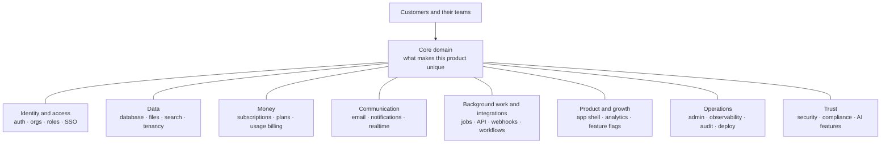
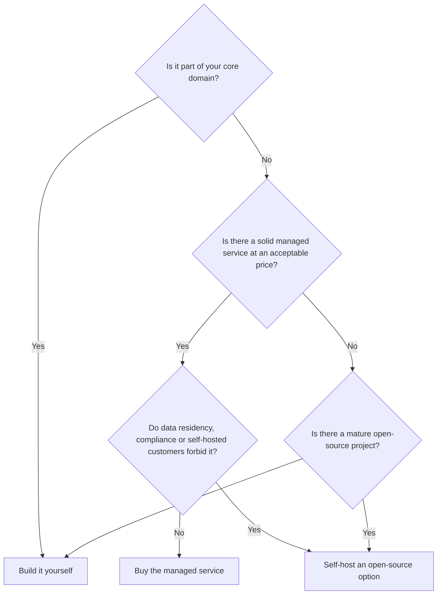
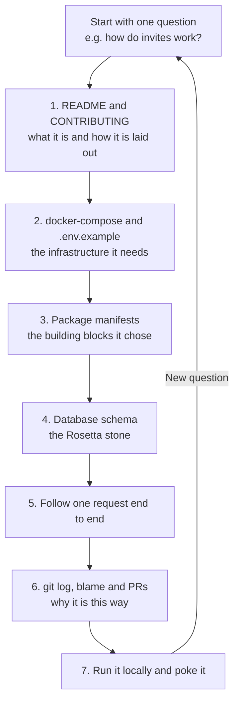
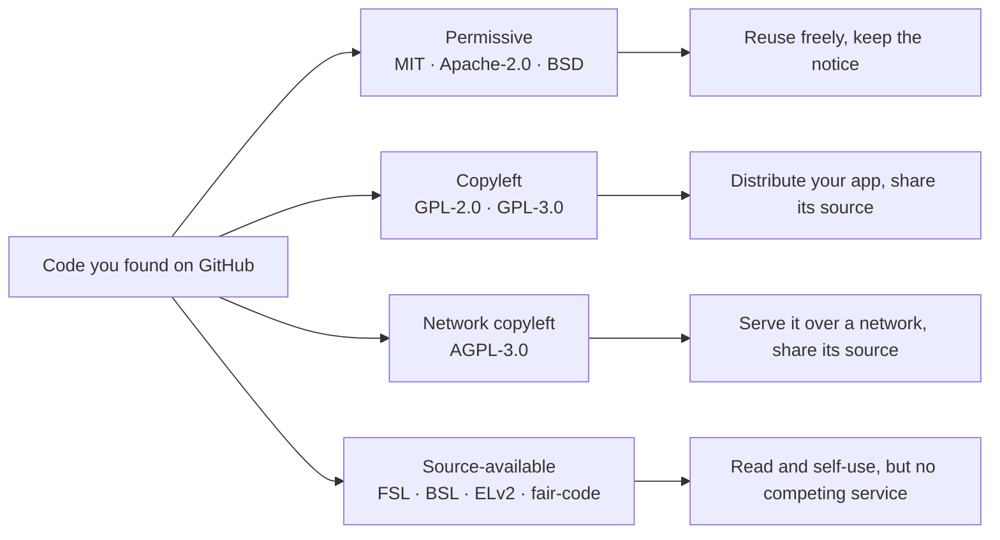

# Module 0 — Orientation: Every SaaS Is the Same App

*Before we build anything, we look at the whole map. This module shows you the ~25 components that nearly every SaaS shares, how to read the huge open-source codebases where those components live, and which of those codebases we will study together for the rest of the course. By the end you should be able to look at any SaaS, a real one or your own side project, and name its parts.*

---

# 0.1 — The 80% nobody sells: the anatomy of every SaaS

*Level: 🟢 Beginner*

## 🧭 Why every SaaS has this

Imagine you pitch Beacon, our running example, to a friend in one sentence: *"It pings your websites every minute and shows a public status page when something is down."* That sentence is the product. It fits on a napkin, and a decent developer could build the pinging part in a weekend.

Now imagine the first paying customer. They want to invite four teammates, and only two of them should be allowed to delete monitors. They want to pay by card, upgrade mid-month and get a proper invoice. They want alerts by email and in Slack. They want an API key so their deploy script can pause monitors. Their security team asks for SSO and an audit log before signing. None of that is "pinging websites", and all of it is required before money changes hands.

This is the pattern of every SaaS (software as a service: software you rent through a browser instead of installing). The thing customers talk about is small. The thing that makes it a business is large, repetitive and, crucially, **the same from one SaaS to the next**. A scheduling app, a link shortener and an error tracker all need login, teams, roles, billing, email, background jobs, webhooks and an admin panel. They differ mostly in one box in the middle.

**Most of any SaaS is a known set of generic components, so learning those components once makes every future product faster to build and easier to understand.**

## 📐 How it works

### 🟢 The essentials

A useful vocabulary comes from Domain-Driven Design (DDD), an approach to software design popularised by Eric Evans. It splits a system into subdomains, meaning areas of the business:

- The **core domain** is what makes your product different and is the reason customers pay. For Beacon it is the check engine (running HTTP checks reliably from several regions and deciding when "down" is really down) plus the status page experience.
- **Generic subdomains** are areas every business needs but no customer chooses you for. Authentication, billing, email delivery and audit logs are generic. Nobody picks a status page tool because its password reset email is special.
- **Supporting subdomains** sit in between: specific to your business but not a differentiator. For Beacon, the incident timeline editor is a good example.

The practical rule is simple. Spend your creativity on the core. For generic subdomains, copy proven designs and use proven tools. This course is about the generic parts, and they group into eight layers:



Here is every component, the lesson that teaches it, and what it means for Beacon. Use this table as your map for the whole course.

| # | Component | Lesson | At Beacon |
|---|---|---|---|
| 1 | Authentication | 1.1 | Email + password, magic links, Google login |
| 2 | Users, organizations, invitations | 1.2 | A workspace per company, invite teammates |
| 3 | Authorization (roles, permissions) | 1.3 | Owner, admin, member, read-only viewer |
| 4 | Enterprise identity (SSO, SCIM) | 1.4 | Business plan: Okta login, auto-deprovisioning |
| 5 | Database, ORM, migrations | 2.1 | Postgres tables for monitors, checks, incidents |
| 6 | File uploads and object storage | 2.2 | Status page logos, incident screenshots |
| 7 | Search | 2.3 | Find a monitor or incident among thousands |
| 8 | Multi-tenancy and isolation | 2.4 | One customer never sees another's monitors |
| 9 | Subscriptions and payments | 3.1 | Stripe checkout, customer portal, invoices |
| 10 | Plans, limits, entitlements | 3.2 | Free = 5 monitors, Pro = 50, Business = SSO |
| 11 | Usage-based billing | 3.3 | SMS alerts beyond included credits |
| 12 | Transactional email | 4.1 | "Your site is down", invites, receipts |
| 13 | Notifications and preferences | 4.2 | Slack, SMS, in-app bell, per-user settings |
| 14 | Realtime | 4.3 | Live dashboard that turns red without refresh |
| 15 | Background jobs and scheduling | 5.1 | Run a check every 30 seconds, forever |
| 16 | Public API and API keys | 5.2 | `POST /v1/monitors` from a deploy script |
| 17 | Outbound webhooks and integrations | 5.3 | `incident.created` events, Slack app |
| 18 | Workflow engines | 5.4 | Escalate if nobody acknowledges in 10 minutes |
| 19 | App shell and onboarding | 6.1 | Marketing site, signup, first-monitor wizard |
| 20 | Analytics | 6.2 | Which signups create a second monitor |
| 21 | Feature flags and experiments | 6.3 | Roll out the new status page theme to 10% |
| 22 | Admin panel and impersonation | 7.1 | Support sees a customer's setup to debug it |
| 23 | Observability | 7.2 | Know when Beacon itself is broken |
| 24 | Audit logs | 7.3 | "Who deleted the production monitor?" |
| 25 | Deployment and environments | 7.4 | Staging, production, a self-hosted edition |
| 26 | Security and compliance | 8.1 | Secrets, encryption, SOC 2, GDPR requests |
| 27 | AI features | 8.2 | AI-written incident summaries |

Counted strictly that is 27, and you could split or merge a few, which is why we say "about 25". Only one line in the whole table, the check engine hiding inside row 15, is Beacon's real core.

### 🟡 Going deeper

The claim becomes convincing when you look at real products that seem to have nothing in common. Here are four open-source SaaS we will study all course long, taken apart:

| Product | Core domain (the 10–20%) | Generic components it still had to build |
|---|---|---|
| Cal.com | Availability rules, time zones, booking logic | Auth, teams and orgs, SAML SSO, Stripe, webhooks, API keys, email and SMS reminders, integrations "app store" |
| Dub | Fast link redirects and click analytics | Workspaces, roles, Stripe, usage limits, API keys, webhooks, SAML SSO |
| Plane | Issues, cycles, project views | Workspaces, roles, invitations, notifications, API tokens, background jobs |
| Sentry | Ingesting error events and grouping them into issues | Orgs, RBAC, SSO, audit log, integrations, alerting, background jobs |

The right-hand column reads almost the same in every row. That is the whole thesis of this course in one table.

This matters in three practical ways:

1. **Estimating.** Juniors estimate the core and forget the rest. If the core takes four weeks, the generic parts for a sellable v1 often take longer, because each one has edge cases (a failed card payment, an invite sent to an email that already has an account, a job that runs twice).
2. **Reading code.** When you open a big repo, you are not facing 400,000 unknown lines. You are facing auth, orgs, billing, jobs and so on, plus one core. You already know what most folders are for before you open them.
3. **Deciding what to build.** Every generic component raises the same question: build it, buy a managed service, or self-host an open-source one?

### 🔴 At scale / enterprise

The build, buy or self-host decision is not made once. It changes as the company grows, and senior engineers revisit it. Here is the framework we will use in every lesson:



The questions behind the arrows:

| Question | Why it matters |
|---|---|
| Is it core? | Outsourcing your differentiator means competitors can buy the same thing. |
| What does it cost at 10× your size? | Per-user auth pricing or per-event analytics pricing can grow faster than revenue. |
| How hard is it to leave? | Billing and auth hold customer data and IDs. Migrating them is painful, so choose carefully early. |
| Do customers need to self-host? | If you ship an on-premises edition, every managed dependency becomes a problem. |
| Who operates it at 3 a.m.? | Self-hosting means you own upgrades, backups and outages. |

The enterprise twist is that "generic" components become sales features. SSO, SCIM, audit logs, data residency and uptime guarantees are exactly what large customers pay the Business tier for. At scale, the boring 80% is often where the high-margin revenue lives, which is why companies like WorkOS exist purely to sell those generic parts.

## 🏆 The best repos

Starter kits (boilerplates) are the fastest way to *see* a SaaS skeleton: they are the generic components with the core left blank. Read them even if you never use one.

| Repo | What it is | Stack | License | Pick it when |
|---|---|---|---|---|
| [nextjs/saas-starter](https://github.com/nextjs/saas-starter) | Official minimal starter: auth, Stripe, teams, roles, activity log | Next.js, Postgres, Drizzle, Stripe | MIT | You want the smallest readable skeleton to learn from |
| [vercel/next-forge](https://github.com/vercel/next-forge) | Production-grade Turborepo template with many packages wired together (originally `haydenbleasel/next-forge`) | Next.js monorepo, TypeScript | MIT | You want to see how a serious monorepo splits concerns into packages |
| [wasp-lang/open-saas](https://github.com/wasp-lang/open-saas) | Full SaaS template with auth, payments, admin dashboard, jobs, AI example | Wasp (React + Node.js + Prisma) | MIT | You want batteries included and do not mind a framework |
| [boxyhq/saas-starter-kit](https://github.com/boxyhq/saas-starter-kit) | Enterprise-focused starter: SSO, SCIM, audit logs, webhooks, teams | Next.js, Prisma, Postgres | Apache-2.0 | You are selling to companies that will ask for SSO on day one |
| [ixartz/SaaS-Boilerplate](https://github.com/ixartz/SaaS-Boilerplate) | Next.js boilerplate with auth, multi-tenancy, roles, i18n, testing setup | Next.js, Drizzle, Tailwind, shadcn/ui | MIT | You want a well-tooled codebase with tests and linting already configured |
| [t3-oss/create-t3-app](https://github.com/t3-oss/create-t3-app) | CLI that scaffolds a typesafe full-stack app (not a full SaaS) | Next.js, tRPC, Prisma or Drizzle, Tailwind | MIT | You want a clean base and will add SaaS components yourself |
| [apptension/saas-boilerplate](https://github.com/apptension/saas-boilerplate) | Full SaaS boilerplate with tenants, Stripe, emails, infrastructure code | Django, React, GraphQL, AWS | MIT | Your backend is Python and you want a complete example |
| [laravel/laravel](https://github.com/laravel/laravel) + [laravel/cashier-stripe](https://github.com/laravel/cashier-stripe) | The Laravel app skeleton plus the official Stripe subscription library | PHP, Laravel | MIT | You work in PHP; Laravel's ecosystem covers most generic components officially |

**If you only study one:** read `nextjs/saas-starter`. It is small enough to read end to end in an afternoon, and it still contains the essential shape: users, teams with roles, a Stripe checkout plus webhook, and an activity log. Once you have seen that shape, the bigger kits and the production repos become variations on it.

**Buy, build, or self-host?**

- **Buy** managed services for generic parts when speed matters more than cost: Clerk or WorkOS for auth and SSO, Stripe for billing, Resend or Postmark for email, PostHog Cloud for analytics, Sentry for errors.
- **Self-host** open-source equivalents (Keycloak, Lago, Listmonk, PostHog, GlitchTip) when customers require data to stay in your infrastructure, when you ship an on-premises edition, or when per-seat pricing outgrows your margins.
- **Build** your core domain always, and build generic parts only when they are small and specific (a simple activity log, basic roles). A starter kit gives you a head start on those.

## 🔍 Study it in the wild

Take the four products from the table above and spend ten minutes in each, looking only for the generic parts.

**Cal.com** (`calcom/cal.com`). A large TypeScript monorepo. At the time of writing, the main app lives under `apps/web` and the database schema under `packages/prisma`. Open the Prisma schema and search for `model Team`, `model Membership` and `model Webhook`. You will find the generic skeleton sitting next to the core models like `Booking` and `EventType`.

**Dub** (`dubinc/dub`). Also a Next.js monorepo. Use GitHub code search inside the repo for `stripe` and for `apiKey` or `token`. Notice how much code is about plans and usage limits, because a link shortener's pricing is driven by how many links and clicks you have.

**Plane** (`makeplane/plane`). A Django API with Next.js frontends. Search for `class Workspace` and `WorkspaceMember` in the Python code. The role field on the membership model is the whole permission system in miniature.

**Sentry** (`getsentry/sentry`). A huge Django codebase. Do not try to read it. Search for `class Organization`, `AuditLogEntry` and `OrganizationMember`. The core (event ingestion and grouping) is a large part of the repo, but the generic parts are just as mature.

**What to notice:**

- Every one of them has an "organization-like" table (team, workspace, organization) and a membership table with a role. That pair is the backbone of B2B SaaS.
- The core models (booking, link, issue, event) all carry a foreign key to that organization-like table.
- Billing code is small but touches everything, because plans limit what the core is allowed to do.
- Enterprise features (SSO, audit logs) often live in a separate folder with a different license, such as `ee/`. We explain why in lesson 0.3.

## 🛠️ Build it into Beacon

### 🟢 Beginner exercise

Inventory Beacon. Using the component table above, write a one-page document with one line per component: what Beacon needs from it in v1, and what can wait. Then write a separate short list titled "Core", naming only the parts that make Beacon different from its competitors.

**Done when:**
- Every one of the ~25 components has a line marked "v1" or "later", with a reason.
- Your "Core" list has no more than four items, and none of them is auth, billing or email.
- You can explain in one sentence why the check engine is core and the login page is not.

### 🟡 Intermediate exercise

Make a build, buy or self-host decision for five Beacon components: authentication, billing, transactional email, background jobs and error tracking. For each, walk through the decision flowchart and name the specific service or repo you would pick.

**Done when:**
- Each decision names a concrete choice (a product or an `owner/repo`) and the question that decided it.
- At least one decision says what would make you change your mind later (for example, "if we launch a self-hosted edition").
- You have estimated the monthly cost of your "buy" choices at 100 customers and at 10,000.

### 🔴 Advanced exercise

Pick any real SaaS you use daily that is not in this lesson. From its public pricing page, settings screens and API docs, reverse-engineer its component list and map each to our lesson numbers. Then mark which components appear only on its most expensive plan.

**Done when:**
- You have mapped at least 15 components with evidence (a screenshot or a docs page) for each.
- You have identified its core domain in one sentence.
- You have listed which generic components it uses as enterprise upsells, and compared that with Beacon's Business plan.

## ⚠️ Mistakes juniors make

- **Estimating only the core.** "The checker takes two weeks, so we launch in three" ignores invites, billing edge cases and password resets. List the generic components first and estimate each one.
- **Building generic parts from scratch out of pride.** Hand-rolling password hashing, session handling or Stripe webhooks is how security bugs and double charges happen. Use proven libraries and study how others did it.
- **Buying everything without checking exit costs.** A managed auth provider holds your user IDs; a billing tool holds your subscriptions. Before adopting one, check whether you can export your data and how painful a migration would be.
- **Forgetting the organization from day one.** Tying monitors directly to users instead of to an organization makes teams nearly impossible to add later. Lesson 1.2 covers this; for now, assume every B2B record belongs to an org.
- **Treating the core as generic.** The opposite error: using an off-the-shelf uptime checker as Beacon's engine means you have no advantage over anyone else using it.
- **Copying a starter kit without reading it.** A boilerplate you do not understand is someone else's code you now maintain. Read every folder before you build on it.

## 🧾 Recap

- A SaaS is a small **core domain** surrounded by **generic subdomains** that nearly every product shares.
- The generic parts group into eight layers: identity, data, money, communication, background work, product and growth, operations, and trust.
- Cal.com, Dub, Plane and Sentry look nothing alike, yet their generic components are nearly identical.
- For every generic component, decide deliberately: **buy** for speed, **self-host** for control and compliance, **build** for the core and for small, specific pieces.
- Enterprise features like SSO and audit logs are generic to build but valuable to sell.
- Starter kits show you the skeleton; read one fully before you trust it.

## 📚 References

- Martin Fowler, "BoundedContext": https://martinfowler.com/bliki/BoundedContext.html
- Eric Evans, *Domain-Driven Design: Tackling Complexity in the Heart of Software* (Addison-Wesley, 2003), the source of "core domain" and "generic subdomain".
- The Twelve-Factor App, a classic checklist for how a SaaS should be structured to run: https://12factor.net
- Dan McKinley, "Choose Boring Technology": https://boringtechnology.club
- Next.js SaaS Starter README: https://github.com/nextjs/saas-starter
- Stripe documentation (billing is the most-reused generic component): https://docs.stripe.com

---

# 0.2 — How to read a giant open-source codebase without drowning

*Level: 🟢 Beginner*

## 🧭 Why every SaaS has this

You clone Cal.com because you want to see how they handle team invitations. The repo has thousands of files, dozens of packages and a `node_modules` folder you are scared to look at. You open a random file, it imports six things you have never heard of, you follow one import, then another, and forty minutes later you are reading a date-formatting helper and have learned nothing. You close the tab and decide open-source code is "too advanced".

It is not too advanced. You just read it the way you read a novel, from wherever you opened it. Large codebases are not read, they are *searched and navigated*. Senior engineers do not understand a 500,000-line repo either. They have a method for finding the 300 lines that answer their question and ignoring everything else.

Every SaaS team needs this skill, because every SaaS depends on code nobody on the team wrote: frameworks, libraries, vendor SDKs, and the open-source products this course points you at. The ability to answer "how does this actually work?" by reading the source, instead of guessing, is one of the clearest differences between a junior and a mid-level engineer.

**Read a big codebase with a question and a method, not from the top: find the entry points, use the database schema as your map, and follow one request end to end.**

## 📐 How it works

### 🟢 The essentials

Here is the method we will use on every repo in this course. Each step is cheap and each one narrows where you look next.



**1. README and CONTRIBUTING.** The README says what the product does. `CONTRIBUTING.md` (and sometimes a `docs/` folder or an architecture document) says how the repo is organised and how to run it. Two minutes here saves an hour later.

**2. `docker-compose.yml` and `.env.example`.** These are the most underrated files in any repo. The compose file lists the services the app needs to run: Postgres, Redis, a queue, an object store, a mail catcher. The `.env.example` file lists every configuration variable, and variable names like `STRIPE_SECRET_KEY`, `RESEND_API_KEY`, `SAML_JACKSON_URL` or `TINYBIRD_TOKEN` tell you which third-party services and which components exist, without reading a line of code.

**3. Package manifests.** `package.json`, `pyproject.toml` or `requirements.txt`, `Gemfile`, `go.mod`, `composer.json`. These are the shopping list. Seeing `bullmq`, `@prisma/client`, `stripe`, `better-auth` or `celery` tells you which building block handles which component, and therefore which docs to read.

**4. The database schema.** This is the Rosetta stone: the one place where the whole product is described in a single, structured language. Find it (`schema.prisma`, Drizzle schema files, Django `models.py`, Rails `db/schema.rb`, SQL migrations) and read the table names. `Organization`, `Membership`, `Invitation`, `Subscription`, `ApiKey`, `Webhook`, `AuditLog` map directly onto our component list. The relationships tell you how tenancy works.

**5. Follow one request end to end.** Pick one user action, say "accept an invitation", and trace it: the page or button, the API route or server action, the permission check, the database write, any email or job it triggers. You now understand one vertical slice, and every other slice looks similar.

**6. `git log`, `git blame`, and pull requests.** Code shows *what*; history shows *why*. `git blame` on a strange line leads you to the commit, and the commit leads you to the pull request, where people argued about exactly the trade-off you are wondering about.

**7. Run it locally.** Only now do you run it. Set a breakpoint or add a log line where your traced request passes, click the button, and watch your understanding get confirmed or corrected.

### 🟡 Going deeper

The skill that makes the method fast is knowing *what to search for*. Here is a cheat sheet. Search for these terms with GitHub's code search (press `/` on a repo page) or locally with `rg` (ripgrep).

| If you want to find… | Search for… | Then look at |
|---|---|---|
| Authentication | `signIn`, `session`, `better-auth`, `next-auth`, `passport`, `devise`, `login` | The auth config file and the middleware that protects routes |
| Organizations and tenancy | `organizationId`, `workspaceId`, `teamId`, `accountId` | The membership model and how queries are filtered |
| Permissions | `role`, `OWNER`, `ADMIN`, `permission`, `can(`, `authorize` | Where the check happens: middleware, a helper, or inline |
| Billing webhooks | `constructEvent`, `checkout.session.completed`, `customer.subscription`, `invoice.paid` | The handler that updates the plan in your database |
| Plan limits | `limit`, `plan`, `quota`, `entitlement`, `upgrade` | Where the core asks "is this allowed on this plan?" |
| Background jobs | `bullmq`, `Queue(`, `Worker(`, `cron`, `shared_task`, `perform_later`, `Sidekiq` | Job definitions and what enqueues them |
| Emails | `react-email`, `sendEmail`, `resend`, `nodemailer`, `mailer`, `templates` | The template folder and the send helper |
| API keys | `apiKey`, `api_key`, `hashedKey`, `Bearer`, `x-api-key` | How keys are created, hashed and checked |
| Outbound webhooks | `webhook`, `createHmac`, `signature`, `svix` | How events are signed, sent and retried |
| Audit logs | `audit`, `activity`, `AuditLog`, `logEvent` | Which actions are recorded and with what fields |
| Feature flags | `flag`, `isFeatureEnabled`, `posthog`, `unleash`, `growthbook` | Where flags gate UI or API behaviour |
| Configuration | `process.env`, `env.ts`, `settings.py`, `config/` | Which settings are required versus optional |

A few habits make this even faster:

- **Search for strings users see.** Button labels and error messages ("Invitation expired", "You have reached your monitor limit") are unique and jump you straight to the right file.
- **Search for the vendor's event names.** Stripe, Slack and GitHub all use fixed event strings. `checkout.session.completed` appears in almost exactly one place in any codebase that uses Stripe.
- **Read tests as documentation.** A test named `it("rejects invites to existing members")` tells you a rule exists and shows how to call the code.
- **Skip what is not your question.** Generated files, UI component libraries, translations and `node_modules` are almost never the answer.

Locally, a handful of commands cover most needs:

```bash
# Where are Stripe webhooks handled?
rg -l "constructEvent|checkout.session.completed"

# Every file that defines a background job queue
rg -n "new (Queue|Worker)\(" --type ts

# Find the schema file(s), whatever the ORM
fd -e prisma; fd schema.ts; fd models.py

# Why does this line exist? Then open the PR for that commit.
git blame -L 40,60 path/to/file.ts
git log --oneline -S "maxMonitors" -- .
```

The `git log -S` form (the "pickaxe") finds commits that added or removed a string. It is the fastest way to find when a feature or a limit was introduced.

### 🔴 At scale / enterprise

At a certain size, a single repo stops being "a codebase" and becomes a small city. GitLab, Sentry and PostHog are like this. The method still works, but senior engineers add a few layers:

| Technique | What it gives you |
|---|---|
| Read the architecture and ownership docs | Many large repos document their structure and have a `CODEOWNERS` file telling you which team owns which folder |
| Follow the boundaries, not the files | In monorepos, the `apps/` and `packages/` split (or Django apps, Rails engines, Go modules) are the real units. Learn what each one exports |
| Use symbol navigation | Go-to-definition in your editor, GitHub's code navigation, or `ctags` indexes let you jump across thousands of files |
| Use structural search | Tools like `ast-grep` match code by shape (every call to a function with a certain argument) instead of text |
| Watch the licence boundaries | Folders like `ee/` often have a different licence. Know which code you are allowed to reuse (lesson 0.3) |
| Read design docs and RFCs | Some projects keep architecture decisions in the repo or in public issues. They explain the "why" better than code |

The senior mindset is: *I don't need to understand this repo; I need to answer this question with evidence.* Write your question down, write the answer down with links to the lines you found, and stop.

## 🏆 The best repos

Two kinds of repos help here: tools that make navigation fast, and codebases that are unusually pleasant to learn from.

| Repo | What it is | Stack | License | Pick it when |
|---|---|---|---|---|
| [BurntSushi/ripgrep](https://github.com/BurntSushi/ripgrep) | `rg`, a very fast recursive search that respects `.gitignore` | Rust CLI | MIT / Unlicense | Always. It is the single most useful code-reading tool |
| [sharkdp/fd](https://github.com/sharkdp/fd) | A simple, fast alternative to `find` for locating files by name | Rust CLI | MIT / Apache-2.0 | You know roughly what a file is called but not where it lives |
| [junegunn/fzf](https://github.com/junegunn/fzf) | Interactive fuzzy finder for files, history and anything else | Go CLI | MIT | You want to jump around a repo by typing fragments of names |
| [universal-ctags/ctags](https://github.com/universal-ctags/ctags) | Builds an index of symbols so editors can jump to definitions | C | GPL-2.0 | Your editor lacks good go-to-definition for a language, or the repo is huge |
| [ast-grep/ast-grep](https://github.com/ast-grep/ast-grep) | Search and rewrite code by syntax-tree patterns | Rust CLI | MIT | Text search returns too much noise and you need "calls shaped like this" |
| [AlDanial/cloc](https://github.com/AlDanial/cloc) | Counts lines of code per language and folder | Perl | GPL-2.0 | You want a quick size map of a repo before diving in |
| [cli/cli](https://github.com/cli/cli) | `gh`, GitHub's official CLI: clone, list and read PRs and issues from the terminal | Go CLI | MIT | You want to read a repo's pull request history without leaving your terminal |
| [nextjs/saas-starter](https://github.com/nextjs/saas-starter) | Small, complete SaaS skeleton | Next.js, Drizzle, Stripe | MIT | Your first "read a whole SaaS" practice run |
| [openstatusHQ/openstatus](https://github.com/openstatusHQ/openstatus) | Open-source status page and uptime monitoring: a real Beacon | TypeScript monorepo, Go checker | AGPL-3.0 | You want to practise the method on the product this course is modelled on |
| [maybe-finance/maybe](https://github.com/maybe-finance/maybe) | Personal finance app built with modern Rails (archived) | Ruby on Rails 8, Postgres | AGPL-3.0 | You want to see how clean a conventional monolith can be |

**If you only study one:** practise on `openstatusHQ/openstatus`. It is a real production SaaS, it is medium-sized rather than enormous, and because it solves exactly Beacon's problem, every component you find in it will reappear in this course.

**Buy, build, or self-host?**

- **Buy** hosted code intelligence when your company's code spans many repos: GitHub's built-in code search and navigation cover most needs, and commercial tools such as Sourcegraph exist for cross-repo search at scale.
- **Self-host** nothing at first. The CLI tools above run locally on a single clone, which is all you need for this course.
- **Build** your own habits instead of tools: a notes file per repo with your questions, answers and permalinks (press `y` on a GitHub file page to get a link pinned to the current commit).

## 🔍 Study it in the wild

Let us run the method on two repos.

**Documenso** (`documenso/documenso`), an open-source DocuSign alternative. Step 2: its compose setup and `.env.example` reveal Postgres, a mail catcher for local email, and signing-certificate settings, so you already know e-signature certificates are part of the core. Step 3: the root `package.json` shows a Turborepo monorepo; at the time of writing the apps live under `apps/` and shared code under `packages/`. Step 4: search the repo for `schema.prisma` and read the model names. You will find `User`, team models, `Document`, `Recipient`, `Field`, webhook and API token models, and a document audit log model. Step 5: pick "send a document for signing" and follow it from the UI to the database write to the email it triggers.

**Maybe** (`maybe-finance/maybe`), an archived Rails 8 app. Rails makes the method almost mechanical: `config/routes.rb` lists every URL, `db/schema.rb` is the full schema in one file, `app/models` holds the domain, and `app/jobs` holds background work (Solid Queue). Pick a route, open its controller, follow it to the model. For juniors from JavaScript land, reading a well-kept Rails app is a lesson in how much convention can replace configuration.

**What to notice:**

- How fast the `.env.example` file told you which external services each product uses.
- That the schema's model names mapped almost one-to-one onto our component list.
- That "follow one request" crossed four or five layers (UI, route, permission check, database, job or email), and that each layer lived in a predictable place.
- How the Rails app's conventions made navigation predictable, while the TypeScript monorepo relied on package boundaries instead.

## 🛠️ Build it into Beacon

### 🟢 Beginner exercise

Map the components of `openstatusHQ/openstatus`. Clone it and apply steps 1–4 of the method only: README, compose and env files, package manifests, schema. Fill in a table with one row per component from lesson 0.1 and three columns: "present?", "how it is implemented (library or service)", and "where I found the evidence".

**Done when:**
- Your table covers at least 15 of the components from 0.1, each with a file or search term as evidence.
- You have named the database and ORM it uses and where its schema lives.
- You have identified which parts are its core (the checker and status pages) and which are generic.

### 🟡 Intermediate exercise

In the same repo, follow one request end to end: "a user creates a new monitor". Write down every file it passes through, from the form in the UI to the database insert, and note where the plan limit is checked (if it is) and how the checker learns about the new monitor.

**Done when:**
- You have an ordered list of files with a one-line description each, and GitHub permalinks.
- You have found whether a plan or quota limit is enforced, and where.
- You can explain how scheduling works for the new monitor, or you have written down exactly what you could not find.

### 🔴 Advanced exercise

Pick one non-obvious decision in openstatus (for example, why the checker is written in a different language from the web app, or how check results are stored). Use `git log -S`, `git blame` and the linked pull requests to reconstruct *why* it was built that way. Then get the project running locally and confirm one thing you learned by setting a breakpoint or adding a log line.

**Done when:**
- You have linked at least one commit and one PR or issue that explains the decision.
- You have a running local instance and a screenshot or log showing your breakpoint or log line firing.
- You have written three sentences on what Beacon should copy and what it should do differently.

## ⚠️ Mistakes juniors make

- **Reading top to bottom.** Opening `index.ts` and following every import is the fastest way to drown. Start from a question and search for it.
- **Running it first.** Juniors spend an hour fighting `docker compose up` before they know what the services are for. Read the compose and env files first so errors make sense.
- **Ignoring the schema.** The schema is the densest description of the product anywhere in the repo. Skipping it means rediscovering it one query at a time.
- **Trusting file names over code.** A file called `permissions.ts` may be dead code while the real check lives inline in a route. Confirm by following a real request.
- **Never reading history.** The strange workaround you are about to "clean up" probably has a PR explaining the customer bug it fixed. Run `git blame` before judging.
- **Not writing anything down.** Code reading without notes evaporates in a day. Keep permalinks and a two-line answer per question.

## 🧾 Recap

- Read big codebases to answer a specific question, never from top to bottom.
- The method: README, compose and env files, package manifests, schema, one request end to end, history, then run it.
- `.env.example` and the package manifest reveal the building blocks before you read any code.
- The database schema is the Rosetta stone; its model names map onto our component list.
- Search for user-visible strings, vendor event names and the cheat-sheet terms with GitHub code search or `rg`.
- `git blame`, `git log -S` and pull requests explain *why*, which the code alone never does.

## 📚 References

- ripgrep user guide: https://github.com/BurntSushi/ripgrep/blob/master/GUIDE.md
- GitHub Docs, searching code and navigating code on GitHub: https://docs.github.com
- Git documentation for `git log` (including `-S`) and `git blame`: https://git-scm.com/docs/git-log and https://git-scm.com/docs/git-blame
- Docker Compose documentation: https://docs.docker.com/compose/
- Prisma schema documentation: https://www.prisma.io/docs
- Rails Guides, for the conventions that make Rails apps easy to navigate: https://guides.rubyonrails.org

---

# 0.3 — The reference shelf: the SaaS codebases and starter kits we study

*Level: 🟢 Beginner*

## 🧭 Why every SaaS has this

When you need to add Stripe webhooks to Beacon, you have three sources of truth. The vendor's docs show the happy path. A blog post shows one person's take, often simplified. A production open-source SaaS shows code that has handled real customers, real failed payments and real edge cases for years, including the ugly fixes.

The third source is the most valuable and the least used by juniors, partly because they don't know which repos are worth reading. There are thousands of SaaS-shaped projects on GitHub; most are demos or abandoned. A small number are real businesses that happen to publish their code. That small number is our reference shelf, and the rest of the course keeps coming back to it.

There is a catch. Being able to *read* code is not the same as being allowed to *copy* it. Many of these projects use licences, such as AGPL, FSL and "fair-code", that were chosen specifically to stop companies from copying them into competing products. A junior who pastes a file from an AGPL repo into a closed-source SaaS has created a legal problem for their employer without knowing it.

**Keep a short shelf of production open-source SaaS to learn each component from, and know each one's licence before you copy a single line.**

## 📐 How it works

### 🟢 The essentials

Here is the shelf, grouped by language so you can start with code you can read comfortably. "Study it for" names the components where each repo is an especially good teacher.

**TypeScript / Next.js**

| Repo | Product | Stack | License | Study it for |
|---|---|---|---|---|
| calcom/cal.com | Scheduling | Next.js monorepo, Prisma, Postgres | AGPL-3.0 (commercial `ee`) | Teams and orgs, SAML SSO via SAML Jackson, webhooks, API keys, integrations app store |
| documenso/documenso | E-signatures | Next.js monorepo, Prisma, Postgres | AGPL-3.0 | Teams, Stripe, webhooks, API, audit trail of document events, background jobs |
| dubinc/dub | Link management | Next.js monorepo, Prisma, Tinybird | AGPL-3.0 (commercial `ee`) | Workspaces, Stripe and usage limits, API keys, webhooks, SAML SSO, analytics |
| formbricks/formbricks | Surveys | Next.js monorepo, Prisma, Postgres | AGPL-3.0 (commercial `ee`) | Orgs and environments, RBAC, integrations |
| twentyhq/twenty | CRM | NestJS, React, Postgres, BullMQ | AGPL-3.0 (some commercial files) | Workspaces, GraphQL and REST API, webhooks, workflows, jobs |
| openstatusHQ/openstatus | Status pages + uptime | TypeScript monorepo, Go checker | AGPL-3.0 | Everything Beacon needs: monitors, scheduling, notifications, status pages |
| Infisical/infisical | Secrets management | Node.js, React, Postgres, Redis | MIT (commercial `ee`) | RBAC, SSO and SCIM, audit logs, orgs, API keys |
| unkeyed/unkey | API key management | TypeScript, Go | Mixed; read its LICENSE | API keys and rate limiting, done by a company whose product *is* that component |
| triggerdotdev/trigger.dev | Background jobs platform | TypeScript, Postgres | Apache-2.0 | Durable jobs and workflow execution, from the inside |

**Python**

| Repo | Product | Stack | License | Study it for |
|---|---|---|---|---|
| PostHog/posthog | Product analytics | Django, React, ClickHouse, Celery | MIT (commercial `ee`) | Orgs and projects, feature flags, analytics pipeline, background jobs |
| getsentry/sentry | Error tracking | Django, React, Postgres | FSL | Orgs, RBAC, SSO, audit log, integrations, notifications |
| makeplane/plane | Project management | Django API, Next.js, Postgres | AGPL-3.0 | Workspaces, roles, invitations, notifications |
| saleor/saleor | Headless commerce | Django, GraphQL | BSD-3-Clause | GraphQL API design, apps and webhooks |

**Ruby**

| Repo | Product | Stack | License | Study it for |
|---|---|---|---|---|
| chatwoot/chatwoot | Customer support | Rails, Vue, Sidekiq | MIT (commercial `enterprise`) | Accounts and roles, webhooks, integrations, notifications |
| gitlabhq/gitlabhq | DevOps platform | Rails, Vue, Sidekiq | MIT core, proprietary `ee` | The encyclopedia: every component, at enormous scale |
| discourse/discourse | Forums | Rails, Ember, Sidekiq | GPL-2.0 | Jobs, plugins, notifications, email |
| maybe-finance/maybe | Personal finance | Rails 8, Solid Queue | AGPL-3.0 | Clean modern Rails monolith (archived, still excellent reading) |

**Go and other**

| Repo | Product | Stack | License | Study it for |
|---|---|---|---|---|
| louislam/uptime-kuma | Self-hosted uptime monitor | Node.js, Vue, SQLite | MIT | A second Beacon: monitor types, scheduling, dozens of notification providers |
| go-gitea/gitea | Git hosting | Go | MIT | Orgs, teams, webhooks, OAuth provider, in one Go binary |
| mattermost/mattermost | Team chat | Go, React | Mixed (AGPL-3.0, Apache-2.0, commercial) | Realtime, plugins, notifications, enterprise features |
| grafana/grafana | Dashboards | Go, React | AGPL-3.0 | Orgs and teams, RBAC, plugins, alerting |
| supabase/supabase | Backend platform | TypeScript, Elixir, Go, Postgres | Apache-2.0 | Auth, storage, realtime, the platform dashboard |

### 🟡 Going deeper

Here is where to look for each component. A ✓ means we are confident the repo implements the component in a way worth studying. A blank means "not confident, or not a strength", **not** "definitely absent": open the repo and check, which is good practice anyway.

| Repo | Auth | Orgs | RBAC | SSO | Billing | Jobs | Webhooks | API keys | Audit log | Notifications |
|---|---|---|---|---|---|---|---|---|---|---|
| calcom/cal.com | ✓ | ✓ | ✓ | ✓ | ✓ | | ✓ | ✓ | | ✓ |
| documenso/documenso | ✓ | ✓ | ✓ | | ✓ | ✓ | ✓ | ✓ | ✓ | ✓ |
| dubinc/dub | ✓ | ✓ | ✓ | ✓ | ✓ | | ✓ | ✓ | | |
| formbricks/formbricks | ✓ | ✓ | ✓ | | | | ✓ | ✓ | | |
| twentyhq/twenty | ✓ | ✓ | ✓ | | ✓ | ✓ | ✓ | ✓ | | |
| makeplane/plane | ✓ | ✓ | ✓ | | | ✓ | ✓ | ✓ | | ✓ |
| Infisical/infisical | ✓ | ✓ | ✓ | ✓ | | | | ✓ | ✓ | |
| openstatusHQ/openstatus | ✓ | ✓ | | | ✓ | ✓ | | ✓ | | ✓ |
| PostHog/posthog | ✓ | ✓ | ✓ | ✓ | | ✓ | | ✓ | ✓ | |
| getsentry/sentry | ✓ | ✓ | ✓ | ✓ | | ✓ | ✓ | ✓ | ✓ | ✓ |
| chatwoot/chatwoot | ✓ | ✓ | ✓ | | | ✓ | ✓ | ✓ | | ✓ |
| gitlabhq/gitlabhq | ✓ | ✓ | ✓ | ✓ | | ✓ | ✓ | ✓ | ✓ | ✓ |
| louislam/uptime-kuma | ✓ | | | | | ✓ | | ✓ | | ✓ |

Notice what the matrix says about billing: many of the most mature products (Sentry, PostHog, GitLab) keep billing in a separate private service or in commercial folders. That is common. Billing is where the business lives, so it is the part companies are least likely to publish. The best public billing code on the shelf tends to be in the smaller Next.js products and the starter kits.

Also notice the `ee` pattern. Many shelf repos are **open core**: the main codebase uses an open licence, and a folder (usually `ee/` for "enterprise edition") holds features like SSO, audit logs or advanced RBAC under a commercial licence. You may read that folder to learn. Whether you may reuse, run or modify it depends on the licence file inside it, not the one at the root.

### 🔴 At scale / enterprise

Now the part that saves careers. A **licence** is the legal permission the authors grant you. Without one, code is "all rights reserved" even if it is public. The licences on our shelf fall into four families:



| Family | Examples | What you may do | What it asks of you |
|---|---|---|---|
| Permissive | MIT, Apache-2.0, BSD-3-Clause | Use, modify and ship inside closed-source products | Keep the copyright and licence notice. Apache-2.0 adds an explicit patent grant and requires noting changes |
| Copyleft | GPL-2.0, GPL-3.0 | Use and modify freely | If you *distribute* software containing it, you must release that software's source under the GPL. Running it only on your servers is not distribution |
| Network copyleft | AGPL-3.0 | Use and modify freely | Same as GPL, and users who interact with your modified version *over a network* must be able to get its source. This closes the "it's only on our servers" gap, which is exactly why SaaS companies choose it |
| Source-available | FSL (Sentry), BSL/BUSL (HashiCorp), ELv2 (Elastic), Sustainable Use License (n8n, "fair-code") | Read, run for yourself, often modify | Typically forbids offering it as a competing product or managed service. FSL and BSL convert to an open licence after a set period. These are **not** open source by the OSI definition |

What this means for you in practice:

- **Reading any of it is fine.** Learning a pattern ("store a hash of the API key, show the key once") and writing your own implementation is how engineering knowledge spreads. Copyright protects the *expression* (the actual code), not the *idea*.
- **Copying from MIT/Apache/BSD** into Beacon is fine if you keep the notice. Many teams keep a `THIRD_PARTY_NOTICES` file for this.
- **Copying from AGPL** into a closed-source SaaS obliges you to offer your users the source of the combined work. For most companies that means: don't paste AGPL code. Running an unmodified AGPL product as a separate service (say, self-hosting a tool internally) is a different and usually simpler situation, but ask whoever owns legal questions at your company.
- **Copying from FSL/BSL/ELv2/fair-code** into a product that competes with the original is exactly what those licences forbid.
- **Check the folder, not just the repo.** `ee/` directories often carry a separate, stricter licence.

This is not legal advice, and licences change over time (several projects on this shelf have switched in recent years). Always read the `LICENSE` file at the commit you are looking at.

## 🏆 The best repos

If you only have time for ten repos from the shelf, make it these:

| Repo | What it is | Stack | License | Pick it when |
|---|---|---|---|---|
| [openstatusHQ/openstatus](https://github.com/openstatusHQ/openstatus) | Status pages and uptime monitoring, a real Beacon | TypeScript monorepo, Go | AGPL-3.0 | You want to see Beacon's exact problems solved in production |
| [louislam/uptime-kuma](https://github.com/louislam/uptime-kuma) | Self-hosted uptime monitor | Node.js, Vue | MIT | You want Beacon's core without the multi-tenant SaaS layer, for contrast |
| [calcom/cal.com](https://github.com/calcom/cal.com) | Scheduling infrastructure | Next.js, Prisma | MIT | You want the fullest TypeScript example of teams, orgs, SSO and integrations |
| [documenso/documenso](https://github.com/documenso/documenso) | E-signature platform | Next.js, Prisma | AGPL-3.0 | You want a mid-sized, readable TypeScript SaaS with audit trails and webhooks |
| [dubinc/dub](https://github.com/dubinc/dub) | Link management | Next.js, Prisma | AGPL-3.0 | You want plan limits and usage-driven pricing in real code |
| [Infisical/infisical](https://github.com/Infisical/infisical) | Secrets management | Node.js, React | MIT | You want enterprise features: RBAC, SSO, SCIM and audit logs |
| [getsentry/sentry](https://github.com/getsentry/sentry) | Error tracking | Django | FSL | Your stack is Python and you want mature orgs, RBAC and audit logs |
| [chatwoot/chatwoot](https://github.com/chatwoot/chatwoot) | Customer support | Rails, Sidekiq | MIT | Your stack is Ruby and you want accounts, jobs and webhooks |
| [gitlabhq/gitlabhq](https://github.com/gitlabhq/gitlabhq) | DevOps platform | Rails | MIT core | You need the "how does a huge company do X" answer for any component |
| [boxyhq/saas-starter-kit](https://github.com/boxyhq/saas-starter-kit) | Enterprise SaaS starter | Next.js, Prisma | Apache-2.0 | You want enterprise features under a licence that lets you copy freely |

**If you only study one:** `openstatusHQ/openstatus`. It is the closest real product to Beacon, so its schema, jobs, notifications and status pages line up with almost every lesson. Read it, but remember it is AGPL-3.0: learn from it, then write Beacon's code yourself.

**Buy, build, or self-host?** This lesson is about *learning sources*, so the question becomes "where do I get the knowledge?":

- **Buy** (well, read) the managed vendors' docs for the happy path: Stripe, WorkOS, Clerk and Resend all publish excellent guides that explain the concepts, not just their APIs.
- **Self-host** a shelf product locally when you want to *see* a component working: click through Cal.com's team settings or Uptime Kuma's notification setup, then read the code behind the screen.
- **Build** from permissively licensed code (starter kits, MIT/Apache repos) when you want to reuse actual lines, and from your own understanding everywhere else.

## 🔍 Study it in the wild

Let us compare three shelf repos that sit near Beacon.

**openstatus** (`openstatusHQ/openstatus`). A multi-tenant SaaS: workspaces, plans, a public API, status pages and notifications. Use GitHub code search in the repo for `workspace` and `plan` to see how limits connect to monitors. Look at how the checker is separated from the web app, since the thing that must run every 30 seconds has different needs from the dashboard.

**Uptime Kuma** (`louislam/uptime-kuma`). A single-tenant, self-hosted monitor: one install, one owner. Search for `notification-providers` or browse the server folder for the notification provider files; each provider (Slack, Telegram, email and many more) is its own small module with the same interface. There are no organizations or billing, which makes the core unusually easy to see.

**Cal.com** (`calcom/cal.com`). Not a monitoring product, but a model for "the SaaS layer". Open `packages/prisma` and read the schema for `Team`, `Membership` and the organization-related fields. Cal.com is also a lesson in licences: it was AGPL with a commercial `ee` folder for years and is now MIT-licensed with no `ee` folder (at the time of writing) — always read the current LICENSE, not a blog post about it.

**What to notice:**

- openstatus and Uptime Kuma solve the same core problem. The difference between them is almost entirely the generic SaaS layer: orgs, billing, API keys, multi-tenancy.
- Notification providers are a plug-in pattern: one interface, many small implementations. Beacon will copy the idea (not the code) in lesson 4.2.
- Where each project draws its licence lines (`ee/` folders) tells you what the company thinks is worth paying for.
- Separating the scheduled workload (checks) from the web app is a recurring design choice in monitoring products.

## 🛠️ Build it into Beacon

### 🟢 Beginner exercise

Pick one repo from the shelf that matches your stack (TypeScript, Python, Ruby or Go) and get it running locally by following its own contributing or self-hosting docs. Create an account, create an organization or workspace if it has one, and invite a second user (use a second email address or the local mail catcher).

**Done when:**
- The app runs on your machine and you can log in.
- You have written down every service its compose file started and what each one is for.
- You have found the code that sends the invitation email (or the equivalent) and saved a permalink.

### 🟡 Intermediate exercise

Fill in the blanks in the component matrix for your chosen repo. For every empty cell in its row, search the code and decide whether the component is present, absent, or handled by an external service.

**Done when:**
- Every cell in your repo's row is filled with ✓, ✗ or the name of an external service.
- Each ✓ has a permalink or a search term as evidence.
- You found at least one thing the matrix above got wrong or left out, or you can argue that it is complete.

### 🔴 Advanced exercise

Do a licence review for Beacon. Suppose the team wants to reuse three pieces of code: a Stripe webhook handler from a starter kit, the notification provider interface from Uptime Kuma, and the API key hashing from Unkey. For each, find the licence at the exact commit, decide whether Beacon (closed-source, commercial) may copy it, and describe what obligations come with it.

**Done when:**
- Each of the three has a licence name, a link to the `LICENSE` file, and a yes, no or "only with conditions" verdict.
- Each verdict states the obligation (keep notice, release source, not allowed) in one sentence.
- For any "no", you have described how Beacon can learn the idea and implement it independently.

## ⚠️ Mistakes juniors make

- **Assuming "public on GitHub" means "free to use".** Code without a licence is all rights reserved, and AGPL, FSL or ELv2 code has strings attached. Check `LICENSE` before copying anything.
- **Reading only the root licence.** Open-core repos put enterprise code in `ee/` or similar folders under a different licence. Check the folder you are copying from.
- **Studying demos instead of products.** A tutorial repo has never handled a failed payment or a deleted user. Prefer the shelf: code that has served real customers.
- **Starting with the biggest repo.** GitLab and Sentry are encyclopedias, not textbooks. Start with a mid-sized repo in your language and use the giants for specific questions.
- **Treating a ✓ as a design endorsement.** Production code includes shortcuts made under deadline pressure. Ask why it was done that way before copying the design.
- **Never running the product.** Clicking through the feature before reading its code gives you names, flows and error messages to search for.

## 🧾 Recap

- The reference shelf is a small set of real, production open-source SaaS; we use it throughout the course to see each component under real load.
- Pick shelf repos in your own language first, and mid-sized before giant.
- Billing is the component most often kept private; the smaller Next.js products and starter kits are the best public examples.
- Licences come in four families: permissive, copyleft, network copyleft (AGPL) and source-available (FSL, BSL, ELv2, fair-code).
- Reading and learning ideas is always fine; copying code depends on the licence of that exact folder at that exact commit.
- openstatus is the closest real product to Beacon and the one repo worth knowing inside out.

## 📚 References

- Choose a License, a plain-language guide from GitHub: https://choosealicense.com
- Open Source Initiative, approved licences and the Open Source Definition: https://opensource.org/licenses
- GNU Affero General Public License v3.0: https://www.gnu.org/licenses/agpl-3.0.html
- Functional Source License (used by Sentry): https://fsl.software
- Elastic License 2.0: https://www.elastic.co/licensing/elastic-license
- Fair-code principles (the model behind n8n's Sustainable Use License): https://faircode.io

Next: Module 1 — Identity & Access, starting with 1.1, authentication: proving who someone is.
