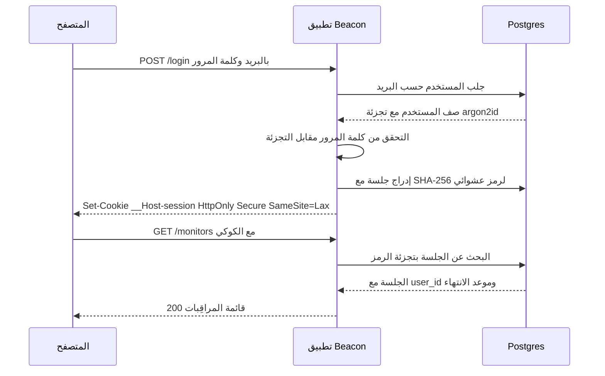
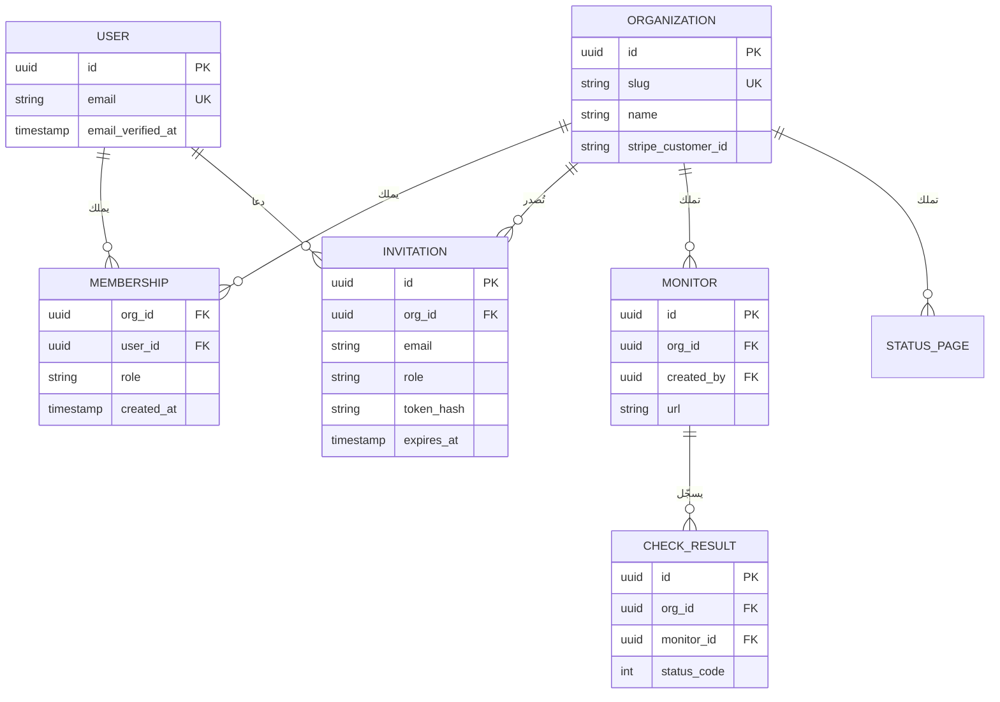
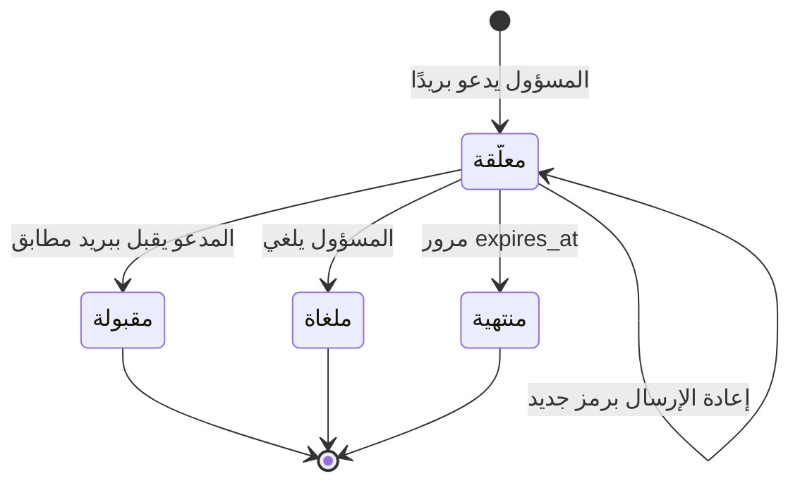
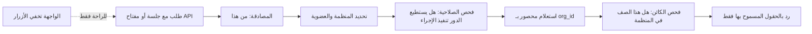
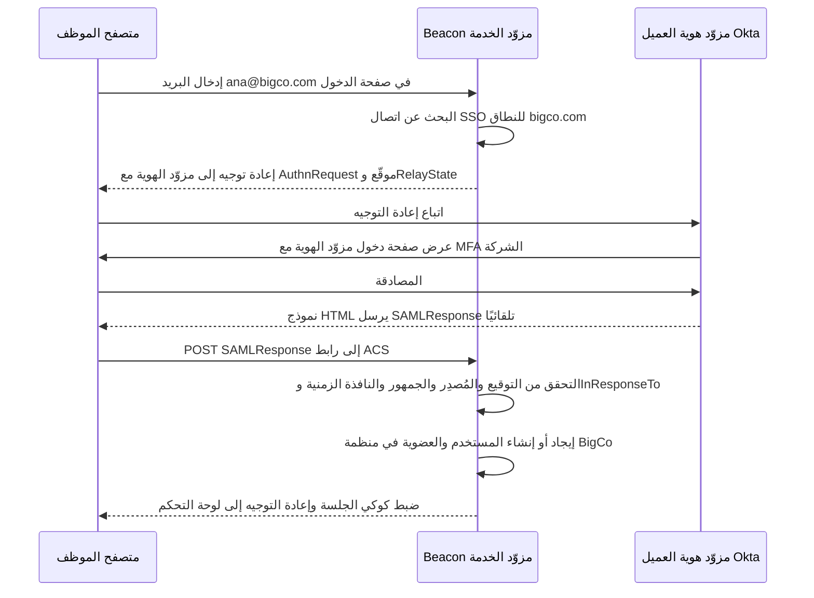

# الوحدة 1 — الهوية والوصول

*كل SaaS يجب أن يجيب عن ثلاثة أسئلة في كل طلب: من أنت، وإلى أي عميل تنتمي، وهل يُسمح لك بفعل هذا؟ تبني هذه الوحدة هذه الإجابات بالترتيب: المصادقة، ثم الهيكل القائم على المنظمات والعضويات الذي يجعل المنتج متعدد المستأجرين، ثم التفويض، وأخيرًا طبقة المؤسسات (SSO وSAML وOIDC وSCIM) التي يتوقعها العملاء الكبار قبل أن يوقّعوا. أتقن هذه الأربعة مبكرًا، لأن إضافتها لاحقًا تكلّف أكثر بكثير من بقية الدورة كلها مجتمعة.*

> **التطبيق العملي:** ابدأ من [نسخة البداية من Beacon](https://github.com/Tamoura/system-design-for-vibe-coders/tree/beacon/starter)، وحلّ التمارين قبل النظر إلى [الحل المرجعي لهذه الوحدة](https://github.com/Tamoura/system-design-for-vibe-coders/tree/beacon/module-1-solution) (الفرع `beacon/module-1-solution`).

---

# 1.1 — المصادقة: إثبات هوية الشخص

*المستوى: 🟢 مبتدئ*

## ⚡ الدرس في دقيقة

- المصادقة تثبت من الذي يرسل الطلب. وهي مجموعة من المسارات (التسجيل، وتسجيل الدخول، والتحقق، واستعادة كلمة المرور، والمصادقة متعددة العوامل، وتسجيل الخروج)، والمهاجم يختار أضعفها.
- القاعدة الأهم: اصنع تجزئة كلمات المرور بـ argon2id أو bcrypt، ولا تخزّن من رموز الجلسات واستعادة كلمة المرور والروابط السحرية إلا تجزئاتها.
- الخيار الافتراضي للنسخة الأولى: مكتبة مثل Better Auth أو Devise أو django-allauth، مع جلسات على الخادم داخل كوكي `HttpOnly` و`Secure` و`SameSite=Lax`.
- تسجيل الدخول الاجتماعي يعني مسار رمز التفويض مع PKCE، مع ربط الهوية بمعرّف `sub` لدى المزوّد، وليس بالبريد الإلكتروني وحده أبدًا.
- الفخ الأكبر: الحواف، مثل روابط استعادة تعمل مرتين، ورسائل "البريد غير موجود"، وتسجيل خروج يكتفي بمسح الكوكي.

## 🧭 لماذا يحتاجه كل SaaS

لم يكن في النموذج الأولي من Beacon تسجيل دخول. قائمة واحدة للمراقِبات، وصفحة حالة واحدة، وكل شيء على `localhost`. ثم طلب صديق أن يجرّبه، وخلال ساعة ظهرت أسئلة حقيقية. كيف يعرف Beacon أن الشخص الذي يعدّل مراقِب `api.acme.com` من شركة Acme فعلًا؟ كيف يعود غدًا؟ ماذا يحدث عندما ينسى كلمة المرور، أو يسجّل بحساب Google يوم الاثنين ثم يحاول بالبريد الإلكتروني يوم الثلاثاء؟

المصادقة (Authentication، وتُختصر غالبًا إلى **authn**) هي عملية إثبات أن الشخص أو البرنامج الذي يرسل الطلب هو من يدّعي أنه هو. وهي تختلف عن **التفويض** (Authorization أو authz، الدرس 1.3) الذي يقرّر ما يحق لهذه الهوية المثبتة فعله. تقع معظم الثغرات الأمنية في منتجات SaaS الناشئة على الحدود بين الاثنين، لكن المصادقة تأتي أولًا: إذا كانت الهوية خاطئة، فكل فحص لاحق يفحص الشخص الخطأ.

نموذج تسجيل الدخول هو الجزء السهل. الأجزاء الصعبة هي الحواف: روابط استعادة كلمة المرور التي يمكن إعادة استخدامها، وكوكيز الجلسة التي تستطيع السكربتات المحقونة قراءتها، ورسالة "البريد غير موجود" التي تخبر المهاجمين من هم عملاؤك، وزر تسجيل خروج لا يُخرج أحدًا.

**المصادقة ليست نموذج تسجيل دخول، بل مجموعة من المسارات (التسجيل، وتسجيل الدخول، والاستعادة، والتحقق، وتسجيل الخروج) يجب أن تكون كلها بالقوة نفسها، لأن المهاجم يختار أضعفها.**

## 📐 كيف يعمل

### 🟢 الأساسيات

ثلاث أفكار تحمل معظم الثقل: بيانات الاعتماد، والجلسات، والكوكيز.

**بيانات الاعتماد** (Credentials) هي ما يقدّمه المستخدم لإثبات هويته. أشهر أنواعها:

| العامل | مثال | القوة | نقطة الضعف الرئيسية |
|---|---|---|---|
| شيء تعرفه | كلمة المرور | ضعيف وحده | إعادة الاستخدام، والتصيّد، والتخمين |
| شيء تملكه (صندوق البريد) | رابط سحري، رابط استعادة | متوسط | آمن بقدر أمان صندوق البريد فقط |
| هوية مفوَّضة | "تسجيل الدخول عبر Google" (OAuth/OIDC) | جيد | أخطاء ربط الحسابات |
| شيء تملكه (جهاز) | تطبيق TOTP، مفتاح المرور | قوي | الاستعادة عند فقدان الجهاز |
| شيء أنت هو | الوجه أو البصمة لفتح مفتاح المرور | قوي | لا يغادر الجهاز أبدًا، لذلك ليس عاملًا على جهة الخادم |

**يجب أن تُحفظ كلمات المرور كتجزئة (Hash)، لا أن تُشفَّر، ولا أن تُخزَّن كنص صريح أبدًا.** التجزئة دالة أحادية الاتجاه: يمكنك مقارنة تخمين بها، لكن لا يمكنك عكسها. التجزئات العادية مثل SHA-256 مصممة لتكون سريعة، وهذا بالضبط الخطأ هنا، لأن التجزئة السريعة تسمح لمن يسرق قاعدة بياناتك بتجربة مليارات التخمينات في الثانية. أما تجزئات كلمات المرور فهي *بطيئة عمدًا* و*مملّحة* (Salted)، أي أن كل تجزئة تخلط قيمة عشوائية حتى تنتج كلمات المرور المتطابقة تجزئات مختلفة. استخدم **argon2id** (توصية OWASP الحالية) أو **bcrypt** (أقدم، وموجود في كل مكان، ومقبول). لاحظ أن bcrypt لا ينظر إلا إلى أول 72 بايت من المدخلات. كل بيئة شائعة توفر هذا جاهزًا: `contrib.auth` في Django، و`has_secure_password` في Rails، وواجهة `Hash` في Laravel، و`golang.org/x/crypto` في Go.

**الجلسات** (Sessions) هي طريقة الخادم في تذكّرك بين الطلبات. بروتوكول HTTP عديم الحالة، لذلك بعد تسجيل دخول ناجح ينشئ الخادم سجل جلسة ويعطي المتصفح رمزًا عشوائيًا لا يمكن تخمينه. كل طلب لاحق يحمل هذا الرمز، والخادم يبحث عنه.

**الكوكيز** (Cookies) تحمل هذا الرمز. أربع خصائص مهمة:

- `HttpOnly`: لا تستطيع JavaScript قراءة الكوكي، لذلك لا تستطيع ثغرة XSS سرقته بسهولة.
- `Secure`: لا يُرسل إلا عبر HTTPS.
- `SameSite=Lax`: لا يرفق المتصفح الكوكي بمعظم الطلبات القادمة من مواقع أخرى، وهذا يمنع هجوم CSRF (تزوير الطلبات عبر المواقع) التقليدي الذي يرسل فيه موقع آخر نموذجًا إلى موقعك. الخيار `Strict` أشد، لكنه يكسر تجربة "انقر رابطًا في Slack فتصل وأنت مسجّل الدخول".
- `Path=/` مع البادئة `__Host-` في الاسم: عندها يرفض المتصفح الكوكي إلا إذا كان `Secure`، وبلا خاصية `Domain`، ومع `Path=/`، وهذا يمنع النطاقات الفرعية من الكتابة فوقه.

هذا هو المسار الكامل لتسجيل الدخول بكلمة مرور:



قاعدة البيانات تخزّن *تجزئة* رمز الجلسة، لذلك لا يمكن استخدام نسخة مسرّبة من جدول `sessions` لتسجيل الدخول. هذا رخيص، ومعظم الدروس التعليمية تتجاهله.

```ts
import { randomBytes, createHash } from "node:crypto";

const sha256 = (s: string) => createHash("sha256").update(s).digest("hex");

export async function createSession(userId: string) {
  const token = randomBytes(32).toString("base64url"); // 256 bits of randomness
  await db.session.create({
    data: {
      id: sha256(token),                                  // store only the hash
      userId,
      expiresAt: new Date(Date.now() + 30 * 24 * 3600 * 1000),
    },
  });
  return token; // goes into the cookie, never logged
}

export async function validateSession(token: string) {
  const session = await db.session.findUnique({ where: { id: sha256(token) } });
  if (!session || session.expiresAt < new Date()) return null;
  return session; // optionally slide expiresAt forward here
}
```

**الجلسات مقابل JWT.** رمز JWT (JSON Web Token) كتلة موقّعة تحتوي على ادعاءات (Claims) مثل معرّف المستخدم وموعد الانتهاء. يستطيع الخادم التحقق منه دون الرجوع إلى قاعدة البيانات، وهذه ميزته ومشكلته في الوقت نفسه: لا يمكنك بسهولة *إلغاء إصداره*. إذا سُرق حاسوب محمول أو فُصل موظف، يبقى JWT صالحًا حتى ينتهي. عندها تضيف الفرق قائمة حظر، وهي بحث في قاعدة البيانات مع كل طلب، أي أنها جلسة بخطوات إضافية. لتطبيق ويب يتحدث مع الخادم الخلفي الخاص به، **الجلسات على الخادم في Postgres أو Redis هي الخيار الافتراضي المعقول**. يستحق JWT مكانه عندما يجب أن تتحقق من الرمز خدمةٌ *مختلفة* لا تصل إلى مخزن جلساتك، مثل رمز هوية OIDC من Google أو رمز قصير العمر لواجهة برمجية منفصلة. يغطي الدرس 5.2 مفاتيح API، وهي شيء آخر مختلف.

**التحقق من البريد الإلكتروني** يثبت أن المستخدم يتحكم في العنوان الذي كتبه. أرسل رابطًا أو رمزًا من 6 أرقام، وإلى أن يُؤكَّد لا تثق بالعنوان في أي شيء مهم: ربط الحسابات، أو الدعوات (1.2)، أو مطابقة النطاق في SSO (1.4).

### 🟡 التعمق أكثر

**استعادة كلمة المرور** مسار تسجيل دخول متنكّر، لذلك عاملها كذلك. أنشئ رمزًا عشوائيًا، وخزّن تجزئته مع مدة صلاحية قصيرة (من 15 إلى 60 دقيقة)، واجعله صالحًا لمرة واحدة، وأرسل رابطًا بالبريد. عند استخدامه، أبطل جلسات المستخدم الأخرى، لأن الاستعادة كثيرًا ما تعني "أظن أن شخصًا آخر داخل حسابي". ويجب أن يكون الرد على "أرسل لي رابط استعادة" متطابقًا سواء كان البريد موجودًا أم لا.

هذه النقطة الأخيرة اسمها **تعداد الحسابات** (Account Enumeration): أي اختلاف في نص الرد أو رمز الحالة أو حتى التوقيت يكشف هل البريد مسجّل. يستخدمه المهاجمون لبناء قوائم أهداف. أصلح الرسائل ("إذا كان هناك حساب، فقد أرسلنا رابطًا")، ونفّذ التجزئة البطيئة حتى عندما يكون المستخدم غير موجود حتى لا يكشف التوقيت شيئًا. إخفاء ذلك في التسجيل أصعب، لأن رسالة "هذا البريد مستخدم" مفيدة للمستخدم. الحل الوسط الشائع أن تقول دائمًا "تفقّد بريدك"، وأن ترسل لصاحب الحساب الموجود رسالة "لديك حساب بالفعل".

**الحماية من التخمين المتكرر وحشو بيانات الاعتماد.** حشو بيانات الاعتماد (Credential Stuffing) هو إعادة تجربة أزواج اسم المستخدم وكلمة المرور المسرّبة من مواقع *أخرى*. الدفاعات، مرتبة تقريبًا حسب قيمتها:

1. حدّد معدل محاولات الدخول لكل عنوان IP ولكل حساب (الدرس 5.2 يغطي محددات المعدل). فضّل الإبطاء وإضافة CAPTCHA على القفل الصارم للحساب، لأنه يسمح لأي شخص بقفل حسابات عملائك.
2. ارفض كلمات المرور المعروف أنها مسرّبة عند التسجيل والاستعادة. واجهة النطاقات "Pwned Passwords" من Have I Been Pwned تتيح لك ذلك دون إرسال كلمة المرور إلى أي مكان: ترسل أول 5 أحرف من تجزئة SHA-1 الخاصة بها وتقارن محليًا.
3. اتبع NIST SP 800-63B: فضّل الطول، وتخلَّ عن قواعد التركيب ("رمز واحد، وحرف كبير واحد") وعن التغيير الدوري الإجباري.
4. وفّر المصادقة متعددة العوامل، وشجّع المسؤولين على استخدامها.

**الروابط السحرية** (Magic Links) ترسل بالبريد رابط دخول لمرة واحدة. تلغي مشكلة إعادة استخدام كلمات المرور، لكنها آمنة بقدر أمان صندوق بريد المستخدم فقط. هناك فخ حقيقي: ماسحات أمان البريد في الشركات تفتح الروابط لفحصها، فتستهلك الرمز ذا الاستخدام الواحد قبل أن ينقر الإنسان. الحل أن يفتح الرابط صفحة فيها زر "تسجيل الدخول" يرسل طلب POST، أو أن ترسل رمزًا قصيرًا يكتبه المستخدم بدلًا من الرابط.

**تسجيل الدخول الاجتماعي (OAuth 2.0 + OpenID Connect).** OAuth 2.0 (RFC 6749) بروتوكول لتفويض الوصول، وOpenID Connect (OIDC) طبقة هوية رقيقة فوقه تضيف **رمز الهوية** (ID Token)، وهو JWT يقول "هذا هو المستخدم X، وقد تحققت منه Google". المسار الذي تريده هو **مسار رمز التفويض مع PKCE** (RFC 7636، ويُنطق "pixie"): يعيد Beacon التوجيه إلى Google مع `code_challenge` عشوائي مُجزَّأ، فتعيد Google التوجيه مع `code` قصير العمر، ثم يستبدل Beacon هذا الرمز مع `code_verifier` الأصلي بالرموز عبر قناة خلفية. يمنع PKCE الاستفادة من رمز تم اعتراضه. ويربط المعامل `state` طلب العودة بالمتصفح الذي بدأ المسار، وهذا يمنع CSRF في تسجيل الدخول. المسار الضمني (Implicit Flow) مُلغى في أفضل الممارسات الحالية لأمان OAuth 2.0 (RFC 9700). لا تستخدمه.

الجزء الخطير في تسجيل الدخول الاجتماعي هو **ربط الحسابات**. إذا سجّل شخص الدخول عبر GitHub بالبريد `ana@acme.com` وكان هناك حساب بكلمة مرور بالعنوان نفسه، فهل تدمجهما؟ فقط إذا قال المزوّد إن البريد *موثَّق*، وحتى عندها فضّل "سجّل الدخول بطريقتك الحالية لتربط الحساب". أظهر بحث "nOAuth" عام 2023 تطبيقات سُرقت حساباتها لأنها وثقت بادعاء `email` قابل للتغيير وغير موثَّق قادم من مستأجر في Microsoft Entra ID. اربط الهويات بالمعرّف الثابت للمستخدم لدى المزوّد (`sub`)، ولا تربطها بالبريد أبدًا.

**المصادقة متعددة العوامل (MFA).** العامل الثاني الشائع هو **TOTP** (RFC 6238): سرّ مشترك مخزّن في تطبيق مصادقة يولّد رمزًا من 6 أرقام كل 30 ثانية. خزّن السر مشفّرًا، واقبل انحرافًا في الساعة بمقدار خطوة واحدة، وامنع إعادة استخدام الرمز نفسه، وأصدر دائمًا **رموز استرداد** (Recovery Codes) عند التفعيل (مُجزَّأة، ولمرة واحدة). رموز SMS أفضل من لا شيء وأضعف من TOTP بسبب هجمات تبديل شريحة SIM.

**مفاتيح المرور (WebAuthn).** مفتاح المرور (Passkey) زوج مفاتيح عام وخاص ينشئه جهاز المستخدم أو مدير كلمات المرور لموقع محدد واحد. لا يخزّن الخادم إلا المفتاح العام. عند تسجيل الدخول يرسل الخادم تحديًا عشوائيًا، فيوقّعه الجهاز بعد البصمة أو رمز PIN، ثم يتحقق الخادم من التوقيع. مفاتيح المرور **مقاومة للتصيّد**: يربط المتصفح كل بيانات اعتماد بنطاقك (ما يسمى "معرّف الطرف المعتمد")، لذلك لا يستطيع موقع مشابه طلب توقيع لبيانات اعتماد Beacon. قدّمها بجانب البريد الإلكتروني، لا كباب وحيد، إلى أن تلحق أجهزة مستخدميك بها.

### 🔴 على نطاق واسع وللمؤسسات

**إدارة الجلسات تصبح ميزة.** يتوقع المستخدمون صفحة "أين سجّلت الدخول" تسرد الأجهزة، مع زر "تسجيل الخروج من كل مكان". هذا بسيط جدًا مع الجلسات على الخادم (`DELETE FROM sessions WHERE user_id = $1`) ومؤلم مع JWT طويل العمر. غيّر رمز الجلسة عند تسجيل الدخول وكلما تغيّرت الصلاحيات، لتتجنب تثبيت الجلسة (Session Fixation)، وهو أن يزرع المهاجم رمزًا معروفًا في متصفح الضحية قبل أن تسجّل الدخول.

**المصادقة المعزّزة** (Step-up Authentication). بعض الإجراءات تستحق إثباتًا جديدًا: تغيير بريد الحساب، وتعطيل MFA، وإنشاء مفتاح API، وحذف منظمة. سجّل `authenticated_at` في الجلسة، واطلب إعادة المصادقة إذا مضى عليه أكثر من بضع دقائق.

**سرقة الرموز هي الهجوم الحديث.** مع انتشار MFA، صار المهاجمون يسرقون *كوكيز الجلسات* من الأجهزة المصابة، أو يمرّرون عمليات الدخول عبر وسطاء تصيّد. ضع الدفاعات في طبقات: مهل خمول قصيرة لمناطق الإدارة، وتنبيهات عند تغيّر الجهاز، ومفاتيح المرور (التي لا يستطيع الوسطاء تمريرها)، وإلغاء سريع.

**أين يعيش كود المصادقة** هو القرار المعماري الكبير:

| النهج | أمثلة | ما تملكه | المقايضة |
|---|---|---|---|
| مكتبة داخل تطبيقك | Better Auth، Auth.js، Devise، django-allauth | كل شيء، في قاعدة بياناتك | أكبر قدر من التحكم، وأنت من يرقّعها ويشغّلها |
| خادم مصادقة تستضيفه بنفسك | Keycloak، Ory Kratos، Zitadel، Logto، SuperTokens | خدمة منفصلة | حدود واضحة، وشيء إضافي عليك تشغيله |
| خدمة مُدارة | Clerk، Auth0، WorkOS AuthKit، Supabase Auth، Firebase Auth، Stytch | الإعدادات | الأسرع، مع تسعير لكل مستخدم نشط شهريًا وارتباط بالمزوّد |

الارتباط بالمزوّد (Lock-in) يتعلق في الغالب **بتجزئات كلمات المرور ومعرّفات المستخدمين**. تأكد أن المزوّد يصدّر التجزئات بصيغة قياسية، واحتفظ بجدول `users` خاص بك مفتاحه معرّفك أنت، مع معرّف المزوّد كعمود.

## 🏆 أفضل المستودعات

| المستودع | ما هو | التقنيات | الترخيص | اختره عندما |
|---|---|---|---|---|
| [better-auth/better-auth](https://github.com/better-auth/better-auth) | مكتبة مصادقة مستقلة عن الإطار مع إضافات للمنظمات، و2FA، ومفاتيح المرور، والروابط السحرية | TypeScript | MIT | تبدأ تطبيق TypeScript جديدًا وتريد المصادقة داخل قاعدة بياناتك |
| [nextauthjs/next-auth](https://github.com/nextauthjs/next-auth) | Auth.js، مكتبة المصادقة العريقة القائمة على OAuth لـ Next.js وغيره | TypeScript | ISC | تصون تطبيقًا قائمًا على Auth.js، أما المشاريع الجديدة فلتنظر إلى Better Auth |
| [lucia-auth/lucia](https://github.com/lucia-auth/lucia) | مُلغاة كمكتبة، وصارت الآن دليلًا لتنفيذ الجلسات بنفسك | TypeScript | MIT | تريد فهم الجلسات جيدًا أو كتابة تنفيذ صغير ونظيف |
| [supabase/auth](https://github.com/supabase/auth) | خادم المصادقة وراء Supabase (نسخة متفرعة من GoTrue الخاص بـ Netlify) | Go | MIT | تستخدم Supabase، أو تريد واجهة مصادقة صغيرة قائمة على JWT لتدرسها |
| [ory/kratos](https://github.com/ory/kratos) | خادم هوية بلا واجهة: التسجيل، والدخول، والاستعادة، وMFA، ومفاتيح المرور | Go | Apache-2.0 | تريد خدمة هوية منفصلة تعتمد على API أولًا وتستضيفها بنفسك |
| [keycloak/keycloak](https://github.com/keycloak/keycloak) | خادم كامل لإدارة الهوية والوصول مع واجهة إدارة | Java | Apache-2.0 | تحتاج كل شيء (OIDC، SAML، الاتحاد) وتستطيع تشغيل خدمة JVM |
| [logto-io/logto](https://github.com/logto-io/logto) | منصة مصادقة مع واجهة دخول مستضافة، ومنظمات، وSSO للمؤسسات | TypeScript | MPL-2.0 | تريد بديلًا لـ Auth0 تستضيفه بنفسك بواجهة حديثة |
| [supertokens/supertokens-core](https://github.com/supertokens/supertokens-core) | نواة مصادقة قابلة للاستضافة الذاتية مع SDK لأطر عمل كثيرة | Java | Apache-2.0 | تريد SDK بأسلوب الخدمات المُدارة لكن على بنيتك التحتية |
| [pennersr/django-allauth](https://github.com/pennersr/django-allauth) | حزمة Django القياسية للحسابات وتسجيل الدخول الاجتماعي وMFA | Python | MIT | تعمل على Django |
| [heartcombo/devise](https://github.com/heartcombo/devise) | محرك المصادقة الكلاسيكي في Rails | Ruby | MIT | تعمل على Rails (يأتي Rails 8 أيضًا بمولّد مدمج أبسط) |

**إن درست مستودعًا واحدًا فقط:** اقرأ **lucia-auth/lucia**. إنه قصير، ويشرح *لماذا* يوجد كل جزء من نظام الجلسات (توليد الرمز، والتجزئة، وانتهاء الصلاحية، والتجديد المنزلق، وCSRF)، ومكتوب لمن يريد أن يفهم لا لمن يريد أن يضبط الإعدادات فقط. بعد ذلك اعتمد Better Auth أو المكتبة القياسية في إطار عملك وأنت تعرف ما تفعله من الداخل.

**اشترِ أم ابنِ أم استضف بنفسك؟**

- **اشترِ** (Clerk، Auth0، WorkOS AuthKit، Stytch، Supabase Auth، Firebase Auth) عندما يكون الوصول السريع إلى السوق هو الأهم وتريد واجهة جاهزة وMFA ومفاتيح المرور من اليوم الأول. راقب منحنى التسعير لكل مستخدم وشروط التصدير.
- **استضف بنفسك** (Keycloak، Ory، Zitadel، Logto، authentik) عندما يجب أن تبقى بيانات الهوية في بنيتك التحتية، أو عندما تقدّم منتجًا قابلًا للاستضافة الذاتية (الدرس 7.4) ولا يمكنك الاعتماد على مزوّد SaaS.
- **ابنِ** فوق مكتبة (Better Auth، Auth.js، Devise، django-allauth) في معظم منتجات B2B SaaS. تحتفظ بالمستخدمين في Postgres الخاص بك، وتتجنب مع ذلك كتابة التشفير. لا تكتب بنفسك أبدًا كود تجزئة كلمات المرور أو بروتوكول OAuth.

## 🔍 ادرسه في مشاريع حقيقية

**openstatusHQ/openstatus** مراقِب توفر وصفحة حالة مفتوح المصدر، أي أنه Beacon حقيقي حرفيًا. وهو مستودع أحادي (Monorepo) بلغة TypeScript. افتح `apps/web`، وافحص ملف `package.json` لترى مكتبة المصادقة التي اختارها، ثم ابحث في الكود عن `auth` و`session`. ما يتقنه هو التناسب: المصادقة ركن صغير وممل من الكود، وهذا بالضبط مكانها الصحيح في منتج قيمته في المراقبة.

**calcom/cal.com** يُظهر المصادقة على نطاق واسع في مستودع Next.js أحادي: بيانات الاعتماد، وتسجيل الدخول عبر Google، وSAML SSO، والمصادقة الثنائية. ابحث عن `NextAuth` أو `authOptions` لتجد إعداد المزوّدين، وعن `twoFactor` لترى كيف تُضاف TOTP فوق الدخول ببيانات الاعتماد. ويُظهر مخطط Prisma في `packages/prisma` كيف تقع حقول الهوية على نموذج `User`.

**nextjs/saas-starter** أصغر مثال كامل: بريد وكلمة مرور مع bcrypt، وكوكي جلسة موقّع عبر `jose`، وطبقة وسيطة (Middleware) تحمي المسارات. اقرأه كله في أمسية. يُظهر مقايضة الكوكيز الموقّعة عديمة الحالة: بسيطة، لكن بلا قائمة إلغاء على الخادم.

**documenso/documenso** يتعامل مع المصادقة في منتج للهوية فيه معنى قانوني (التوقيعات الإلكترونية). ابحث عن `passkey` و`two-factor` لترى WebAuthn وTOTP، وعن `signin` في تطبيق الويب لتجد المسارات.

**ما الذي تلاحظه:**

- أين تُخزَّن الجلسة (صف في قاعدة البيانات، أو Redis، أو كوكي موقّع) وماذا يعني ذلك لـ "تسجيل الخروج من كل مكان".
- كيف تُربط حسابات OAuth بالمستخدمين: بمعرّف المستخدم لدى المزوّد، أو بالبريد، أو بكليهما، وهل يُفحص "البريد الموثَّق".
- هل رموز الاستعادة والتحقق والروابط السحرية مُجزَّأة عند التخزين وصالحة لمرة واحدة.
- كيف تستجيب نقاط الدخول والاستعادة لبريد غير معروف.
- أين تُفرض MFA: في مسار الدخول فقط، أم يُعاد فحصها عند الإجراءات الحساسة.

## 🛠️ ابنِه في Beacon

### 🟢 تمرين المبتدئ

أضف التسجيل وتسجيل الدخول بالبريد وكلمة المرور إلى Beacon باستخدام Better Auth (أو Devise، أو django-allauth، أو حزم البداية في Laravel حسب بيئتك). احمِ صفحات `/monitors` بحيث يُعاد توجيه غير المسجّلين إلى `/login`. أضف زر تسجيل خروج يحذف الجلسة من الخادم.

**يكتمل عندما:**
- تُخزَّن كلمات المرور كتجزئات argon2id أو bcrypt. ابحث في نسخة من قاعدة البيانات عن كلمة مرور تجريبية فلا تجد شيئًا.
- كوكي الجلسة `HttpOnly`، و`Secure` في بيئة الإنتاج، و`SameSite=Lax`.
- بعد تسجيل الخروج، إعادة إرسال الكوكي القديم عبر `curl` تُرجع إعادة توجيه أو 401.

### 🟡 تمرين المستوى المتوسط

أضف "تسجيل الدخول عبر GitHub" ومسار استعادة كلمة المرور. اربط هوية GitHub بمستخدم موجود فقط عندما يقول GitHub إن البريد موثَّق *و*يؤكد المستخدم ذلك بتسجيل الدخول بطريقته الحالية. اجعل نقطة طلب الاستعادة تُرجع الرد نفسه للبريد المعروف وغير المعروف.

**يكتمل عندما:**
- يستخدم مسار OAuth منحة رمز التفويض مع PKCE ويتحقق من `state`.
- رموز الاستعادة مُجزَّأة في قاعدة البيانات، وتنتهي خلال ساعة، وتفشل عند الاستخدام الثاني.
- الاستعادة المكتملة تُخرج كل الجلسات الأخرى لذلك المستخدم.
- نصوص الردود على "استعد كلمة المرور" متطابقة بايتًا ببايت للبريد الموجود وغير الموجود.

### 🔴 تمرين المستوى المتقدم

أضف مفاتيح المرور وTOTP كعوامل ثانية، وصفحة "الأجهزة المسجّل منها"، وإعادة مصادقة معزّزة لإجراءي "إنشاء مفتاح API" و"حذف المنظمة". حدّد معدل تسجيل الدخول لكل IP ولكل حساب باستخدام Redis.

**يكتمل عندما:**
- يستطيع المستخدم تسجيل مفتاح مرور والدخول به دون كلمة مرور.
- تفعيل TOTP يُصدر عشرة رموز استرداد مُجزَّأة وصالحة لمرة واحدة.
- إلغاء جهاز من صفحة الأجهزة يجعل الطلب التالي من ذلك المتصفح غير مُصادَق.
- عشرون محاولة دخول فاشلة في دقيقة لحساب واحد تؤدي إلى إبطاء أو CAPTCHA، لا إلى قفل دائم.

## ⚠️ أخطاء يقع فيها المبتدئون

- **تخزين JWT في `localStorage`.** أي ثغرة XSS، حتى في سكربت من طرف ثالث، تستطيع قراءته وإرساله. استخدم كوكي `HttpOnly`، ولتطبيق الويب الخاص بك استخدم جلسة على الخادم.
- **تجزئة كلمات المرور بـ SHA-256 أو MD5، حتى مع الملح.** إنها سريعة، لذلك تُكسر التجزئات المسرّبة بالجملة على بطاقات الرسوميات. استخدم argon2id أو bcrypt عبر مكتبة مُصانة.
- **مطابقة حسابات OAuth بالبريد وحده.** ادعاءات البريد غير الموثَّقة أو القابلة للتغيير تسمح للمهاجم بالدخول باسم شخص آخر. خزّن `(provider, provider_user_id)` وعامل البريد كتلميح فقط.
- **رموز استعادة وروابط سحرية تعيش إلى الأبد أو تعمل مرتين.** الرسائل القديمة تُعاد توجيهها وتُؤرشف وتتسرّب. جزّئها، واجعلها تنتهي خلال دقائق، واحذفها عند الاستخدام.
- **كشف وجود الحسابات.** رسالة "لا يوجد مستخدم بهذا البريد" عند الدخول أو الاستعادة تعطي المهاجمين قائمة أهداف مجانية. استخدم رسالة عامة واحدة وتوقيتًا شبه ثابت.
- **تسجيل خروج يكتفي بمسح الكوكي.** إذا بقي الرمز صالحًا على الخادم، فكل من نسخه يبقى داخلًا. احذف صف الجلسة.

## 🧾 الخلاصة

- المصادقة مجموعة من المسارات: التسجيل، والدخول، والتحقق، والاستعادة، وMFA، وتسجيل الخروج. أمّنها كلها بالقدر نفسه.
- جزّئ كلمات المرور بـ argon2id أو bcrypt. ولا تخزّن من رموز الجلسات والاستعادة والروابط السحرية إلا تجزئاتها.
- الجلسات على الخادم في كوكي `HttpOnly` و`Secure` و`SameSite=Lax` هي الخيار الافتراضي. أما JWT فللتحقق بين الخدمات.
- تسجيل الدخول الاجتماعي يعني رمز التفويض مع PKCE، مع ربط الهوية بمعرّف المستخدم لدى المزوّد، وليس بالبريد وحده أبدًا.
- مفاتيح المرور مقاومة للتصيّد وهي المستقبل. وTOTP مع رموز الاسترداد هو MFA المتين اليوم.
- استخدم مكتبة أو خدمة للتشفير والبروتوكولات. مهمتك أن تضبط المسارات والحالات الحدّية.

## ✍️ اختبر نفسك

**1. لماذا يُعد SHA-256 اختيارًا خاطئًا لتجزئة كلمات المرور، وماذا تستخدم بدلًا منه؟**

<details><summary>الإجابة</summary>

SHA-256 مصمم ليكون سريعًا، لذلك يستطيع المهاجم الذي يسرق قاعدة البيانات تجربة مليارات التخمينات في الثانية. يجب أن تكون تجزئات كلمات المرور بطيئة عمدًا ومملّحة: استخدم argon2id (توصية OWASP الحالية) أو bcrypt. راجع "🟢 الأساسيات".

</details>

**2. مِمَّ يحمي PKCE في مسار رمز التفويض في OAuth، ومِمَّ يحمي المعامل `state`؟**

<details><summary>الإجابة</summary>

يجعل PKCE رمز التفويض المُعترَض عديم الفائدة، لأن استبداله يتطلب `code_verifier` الأصلي الذي لا يملكه إلا Beacon. ويربط المعامل `state` طلب العودة بالمتصفح الذي بدأ المسار، وهذا يمنع CSRF في تسجيل الدخول. راجع "🟡 التعمق أكثر".

</details>

**3. أبلغ عميل لدى Beacon أن حاسوبه المحمول سُرق، وطلب منك تسجيل خروجه من كل مكان. لماذا يكون هذا سهلًا مع الجلسات على الخادم وصعبًا مع JWT طويل العمر؟**

<details><summary>الإجابة</summary>

مع الجلسات على الخادم، تسجيل الخروج من كل مكان هو عملية حذف واحدة لصفوف جلسات ذلك المستخدم، ويفشل الطلب التالي بأي كوكي قديم. أما JWT فيبقى صالحًا حتى ينتهي لأن الخادم لا يبحث عنه، لذلك تحتاج إلى قائمة حظر، وهي جلسة بخطوات إضافية. راجع "الجلسات مقابل JWT" و"🔴 على نطاق واسع وللمؤسسات".

</details>

**4. يقول عملاء Beacon من فرق أمن المعلومات إن روابطهم السحرية "لا تعمل أبدًا": الرابط يقول إنه استُخدم من قبل. ما الذي يحدث، وكيف تصلحه؟**

<details><summary>الإجابة</summary>

ماسحات أمان البريد في الشركات تفتح الروابط لفحصها، فتستهلك الرمز ذا الاستخدام الواحد قبل أن ينقر الإنسان. اجعل الرابط يفتح صفحة فيها زر "تسجيل الدخول" يرسل طلب POST، أو أرسل رمزًا قصيرًا يكتبه المستخدم بدلًا منه. راجع "الروابط السحرية" في "🟡 التعمق أكثر".

</details>

**5. كتب زميل نقطة الاستعادة بحيث تُرجع "لا يوجد حساب بهذا البريد" للعناوين غير المعروفة و"تم إرسال رابط الاستعادة" لغيرها. ما الذي يتعطّل؟**

<details><summary>الإجابة</summary>

هذا تعداد للحسابات: يستطيع المهاجمون معرفة أي عناوين بريد تخص عملاء Beacon وبناء قوائم أهداف. أرجع رسالة واحدة متطابقة ("إذا كان هناك حساب، فقد أرسلنا رابطًا")، ونفّذ العمل البطيء حتى عندما يكون المستخدم غير موجود حتى لا يكشف التوقيت شيئًا. راجع "🟡 التعمق أكثر" و"⚠️ أخطاء يقع فيها المبتدئون".

</details>

## 📚 المراجع

- OWASP Cheat Sheet Series: Authentication, Password Storage, and Session Management cheat sheets — https://cheatsheetseries.owasp.org (أوراق OWASP المرجعية للمصادقة وتخزين كلمات المرور وإدارة الجلسات)
- NIST SP 800-63B, Digital Identity Guidelines: Authentication and Lifecycle Management — https://pages.nist.gov/800-63-4/ (إرشادات NIST للهوية الرقمية)
- RFC 6749, The OAuth 2.0 Authorization Framework — https://www.rfc-editor.org/rfc/rfc6749
- RFC 7636, Proof Key for Code Exchange (PKCE) — https://www.rfc-editor.org/rfc/rfc7636
- RFC 9700, Best Current Practice for OAuth 2.0 Security — https://www.rfc-editor.org/rfc/rfc9700 (أفضل الممارسات الحالية لأمان OAuth 2.0)
- OpenID Connect Core 1.0 — https://openid.net/specs/openid-connect-core-1_0.html
- W3C Web Authentication (WebAuthn) and the passkeys developer site — https://www.w3.org/TR/webauthn/ and https://passkeys.dev (مواصفة WebAuthn وموقع مطوري مفاتيح المرور)
- Lucia's guide to sessions — https://lucia-auth.com (دليل Lucia للجلسات)

---

# 1.2 — المستخدمون والمنظمات والدعوات: هيكل تعدد المستأجرين

*المستوى: 🟢 مبتدئ* · *المتطلبات: 1.1*

## ⚡ الدرس في دقيقة

- في B2B SaaS العميل منظمة، وليس شخصًا. ينضم المستخدمون إليها عبر عضويات تحمل دورًا.
- القاعدة الأهم: كل صف يملكه المستأجر يحمل `org_id` مباشرة، والموارد ملك للمنظمة، لا للمستخدم أبدًا.
- الخيار الافتراضي للنسخة الأولى: أربعة جداول (المستخدمون، والمنظمات، والعضويات، والدعوات)، ومنظمة شخصية تُنشأ عند التسجيل، ومعرّف المنظمة النصي (Slug) في الرابط.
- عامل معرّف المنظمة القادم من الرابط أو الكوكي كادعاء: اجلب العضوية مع كل طلب.
- الفخ الأكبر: موارد يملكها المستخدمون، وهذا يحوّل كل ميزة فريق لاحقة إلى عملية ترحيل أو حل ترقيعي.

## 🧭 لماذا يحتاجه كل SaaS

وضعت النسخة الأولى من Beacon الحقل `user_id` على كل مراقِب. عمل ذلك بشكل رائع لمدة أسبوع. ثم سجّلت Priya من Acme، وأنشأت اثني عشر مراقِبًا، وسألت كيف يستطيع زميلها المناوب رؤيتها. ثم سألت كيف تزيل متعاقدًا دون حذف المراقِبات التي أنشأها. ثم طلب فريق المالية لديها أن تصدر فاتورة واحدة للشركة، لا فاتورة لكل مهندس. ثم ذهبت Priya في إجازة ولم يستطع أحد تغيير أي شيء.

لكل هذه الطلبات السبب الجذري نفسه: **العميل ليس شخصًا، بل مجموعة من الأشخاص.** البرمجيات الموجهة للشركات (B2B) تشتريها الشركات، وتستخدمها الفرق، وتبقى بعد رحيل أي موظف. إذا كانت الموارد ملكًا للمستخدمين، فكل ميزة فريق تصبح ترقيعًا: كلمات مرور مشتركة، وسكربتات "انقل كل أشيائي"، وفواتير تُطابق يدويًا.

الحل نموذج بيانات صغير يصل إليه تقريبًا كل B2B SaaS: **المستخدمون** ينتمون إلى **المنظمات** عبر **العضويات**، وكل ما ينشئه المنتج ملك للمنظمة. المنظمة هي **المستأجر** (Tenant)، أي وحدة العزل والفوترة والملكية. يسميها Slack مساحة عمل (Workspace)، وGitHub منظمة، وDub مساحة عمل، وCal.com فريقًا أو منظمة. الاسم يختلف، والشكل لا يختلف.

**الموارد ملك للمنظمة، والأشخاص ينتمون إلى المنظمة عبر العضويات، ولا شيء ملك للمستخدم إلا بيانات دخوله.**

## 📐 كيف يعمل

### 🟢 الأساسيات

أربعة مصطلحات نعرّفها بعناية لأن المنتجات تستخدمها بشكل غير متسق:

| المصطلح | ما هو | مثال من Beacon |
|---|---|---|
| المستخدم (User) | هوية بشرية تستطيع تسجيل الدخول. عامة، وليست خاصة بعميل. | `priya@acme.com` |
| المنظمة (Organization، وتُسمى org أو workspace أو team أو tenant) | العميل. تملك البيانات وتدفع الفاتورة. | "Acme Inc" |
| العضوية (Membership) | الرابط بين مستخدم ومنظمة، ويحمل دورًا. | Priya هي `owner` في Acme |
| الدعوة (Invitation) | عضوية معلّقة لشخص لم يقبل بعد. | دعوة `sam@acme.com` بدور `member` |

تحذير بشأن كلمة **"account"**. في Auth.js وBetter Auth يمثل صف `account` طريقة دخول مرتبطة، مثل "هوية GitHub لهذا المستخدم". في Chatwoot وكثير من تطبيقات Rails، `Account` هو *المستأجر*. وفي أنظمة الفوترة تعني العميل الذي يدفع. عندما تقرأ قاعدة كود، اعرف أي معنى تستخدمه قبل أن تثق بحدسك.

هذا هو النموذج الأساسي في Beacon:



ثلاث تفاصيل في هذا المخطط مقصودة.

أولًا، على `MEMBERSHIP` قيد تفرّد على `(org_id, user_id)`: دور واحد لكل شخص في كل منظمة. ويمكن أن يكون المستخدم في منظمات كثيرة، وهذا طبيعي للمستشارين والوكالات وأي شخص لديه مشروع جانبي.

ثانيًا، يُحتفظ بـ `MONITOR.created_by` للتاريخ والعرض، لكن الملكية هي `org_id`. عندما يغادر المتعاقد، تبقى مراقِباته.

ثالثًا، يحمل `CHECK_RESULT` الحقل `org_id` مع أنك تستطيع الوصول إلى المنظمة عبر المراقِب. هذه هي **قاعدة tenant_id: كل صف يملكه المستأجر يحمل معرّف المستأجر مباشرة.** وهذا يعني أن كل استعلام يستطيع التصفية حسب المنظمة دون ربط (Join)، وأن كل فهرس يمكن أن يبدأ بـ `org_id`، وأن غياب `WHERE org_id = ...` يظهر بوضوح في مراجعة الكود. كما يفتح الباب لاحقًا لأمان مستوى الصف (Row-Level Security) في Postgres وللتجزئة الأفقية (Sharding) (الدرس 2.4). تكرار عمود uuid واحد رخيص. أما أن تكتشف أن أكبر جداولك لا يمكن تصفيته حسب المستأجر فليس رخيصًا.

**مساحات العمل الشخصية.** ماذا يحدث مباشرة بعد التسجيل؟ لديك خياران معقولان. إما أن تنشئ منظمة تلقائيًا ("مساحة عمل Priya") فيصل المستخدم إلى منتج يعمل، أو أن تمرّره بخطوة إعداد قصيرة "سمِّ فريقك". كلاهما يحافظ على الثابت الأساسي: *لا يوجد شيء اسمه مورد بلا منظمة.* تجنّب الخيار الثالث، حيث يملك المستخدمون الأفراد الموارد مباشرة وتُضاف الفرق لاحقًا. هذا يعطيك مسارين في الكود لكل ميزة إلى الأبد.

### 🟡 التعمق أكثر

**الدعوات** تبدو بسيطة وتخفي قرارات كثيرة. دورة حياتها:



قواعد الرمز هي نفسها قواعد رموز الاستعادة من الدرس 1.1: عشوائي، ومخزّن كتجزئة، وله مدة صلاحية (7 أيام شائعة)، وصالح لمرة واحدة. أما القرارات الخاصة بالدعوات فهي:

- **هل يجب أن يطابق بريدُ المستخدم الذي يقبل البريدَ المدعو؟** المطابقة أكثر أمانًا: لا يستطيع الشخص الخطأ استخدام دعوة أُعيد توجيهها. وعدم المطابقة ألطف: للناس عناوين عمل وعناوين شخصية. اختيار Beacon هو اشتراط المطابقة، وإذا كان البريد المسجّل به مختلفًا، يقول ذلك بوضوح ويعرض تبديل الحساب. وإذا سمحت بعدم المطابقة، فعلى الأقل أظهر للمسؤول من الذي قبل فعلًا.
- **المستخدمون الجدد مقابل الموجودين.** يجب أن يعمل الرابط نفسه للاثنين. إذا لم يكن للبريد حساب، يأتي التسجيل أولًا ثم القبول، مع ملء البريد مسبقًا واعتباره موثَّقًا بحكم النقر على الرابط.
- **رسائل الدعوة المزعجة.** الدعوات ترسل بريدًا من نطاقك إلى عناوين عشوائية. حدّد معدلها لكل منظمة، ولا تسمح للمستخدمين غير الموثَّقين بإرسالها، وإلا صارت سمعة الإرسال لديك (الدرس 4.1) أداة تصيّد لشخص آخر.
- **تصعيد الأدوار.** يجب ألا يستطيع المسؤول دعوة شخص بدور `owner` إذا كان المسؤولون أنفسهم لا يستطيعون أن يصبحوا مالكين. تحقّق أن الداعي يملك على الأقل الدور الذي يمنحه (الدرس 1.3).

قبول الدعوة معاملة (Transaction) صغيرة:

```ts
export async function acceptInvite(rawToken: string, user: { id: string; email: string }) {
  return db.$transaction(async (tx) => {
    const invite = await tx.invitation.findUnique({ where: { tokenHash: sha256(rawToken) } });
    if (!invite || invite.expiresAt < new Date() || invite.acceptedAt) {
      throw new Error("Invitation is invalid or expired");
    }
    if (invite.email.toLowerCase() !== user.email.toLowerCase()) {
      throw new Error("This invitation was sent to a different email");
    }
    await tx.membership.upsert({
      where: { orgId_userId: { orgId: invite.orgId, userId: user.id } },
      create: { orgId: invite.orgId, userId: user.id, role: invite.role },
      update: {}, // already a member: keep the existing role
    });
    await tx.invitation.update({ where: { id: invite.id }, data: { acceptedAt: new Date() } });
    return invite.orgId;
  });
}
```

**التبديل بين المنظمات.** أين تعيش "المنظمة الحالية"؟ هناك تصميمان شائعان:

| التصميم | مثال على الرابط | الإيجابيات | السلبيات |
|---|---|---|---|
| المنظمة في الرابط | `/acme/monitors/123` | روابط قابلة للمشاركة، ومنظمتان في تبويبين، ووضوح في السجلات | كل مسار يأخذ المعرّف النصي |
| المنظمة في الجلسة | `/monitors/123` مع كوكي "المنظمة الحالية" | روابط أقصر | التبويبات تتعارض، والروابط الملصوقة تتعطل لمن ينتمي لعدة منظمات |

فضّل الرابط. وفي الحالتين، **معرّف المنظمة القادم من الرابط أو الكوكي ادعاء، وليس حقيقة.** في كل طلب، اجلب العضوية للزوج `(المنظمة، المستخدم الحالي)` وارفض الطلب إذا لم تكن موجودة. هذا البحث الواحد هو الأساس الذي يبني عليه الدرس 1.3.

**المغادرة والإزالة والملكية.** اكتب هذه الثوابت في الكود، لا في الأمنيات:

- للمنظمة دائمًا مالك واحد على الأقل. لا يستطيع آخر مالك المغادرة أو خفض دوره حتى ينقل الملكية.
- **نقل الملكية** إجراء مقصود ومؤكَّد، ويفضّل أن يتطلب مصادقة معزّزة وبريدًا للطرفين. وغالبًا ما ينقل معه أيضًا مسؤولية الفوترة.
- إزالة عضو تحذف عضويته وتلغي كل ما كان يعمل باسمه في تلك المنظمة: رموز API الشخصية الخاصة به، والدعوات المعلّقة التي أرسلها، والجلسات المخزّنة المرتبطة بالمنظمة.
- **حذف مستخدم** يملك منظمات يجب أن يُمنع، أو يجب أولًا نقل تلك المنظمات أو حذفها. وإلا فإنك تنشئ مستأجرين يتامى لا يستطيع أحد إدارتهم.

**حذف منظمة** هو أكثر الإجراءات تدميرًا في المنتج. اجعله حذفًا ناعمًا (Soft Delete) مع فترة سماح (مثلًا 30 يومًا) تكون فيها المنظمة غير متاحة لكن قابلة للاستعادة. ألغِ الاشتراك فورًا، وأوقف فحوص المراقِبات المجدولة، ثم احذف البيانات نهائيًا عبر مهمة خلفية (Background Job، الدرس 5.1). هذا يغطي أيضًا تذكرة الدعم "متدرّب حذف بيئة الإنتاج".

**المقاعد.** إذا كان التسعير لكل مقعد، فالمقعد عادةً عضوية، وأحيانًا دعوة معلّقة أيضًا. قرّر أيهما، واكتب ذلك، واجعل عدد المقاعد استعلامًا على العضويات، لا عدّادًا تزيده وتنسى إنقاصه. يحوّل الدرس 3.2 هذا إلى استحقاقات (Entitlements) وكميات في Stripe. يسعّر Beacon حسب عدد المراقِبات لا المقاعد، وهذا أحد أسباب اختياره: التسعير بالمقاعد يعاقب سلوك "ادعُ كل فريق المناوبة" الذي تريده.

### 🔴 على نطاق واسع وللمؤسسات

**التسلسل الهرمي.** يريد العملاء الكبار بنية داخل المستأجر: منظمة مؤسسية تحتوي فرقًا، لكل فريق مراقِباته وصفحات حالته، وأشخاص في عدة فرق بأدوار مختلفة. يمثّل Cal.com هذا كمنظمات تحتوي فرقًا. أبقِ *حدود الفوترة والعزل* عند المنظمة في المستوى الأعلى، وعامل الفرق كتجميع للصلاحيات (الدرس 1.3)، لا كمستأجرين منفصلين.

**الاستحواذ على النطاق والانضمام التلقائي.** بعد أن تثبت Acme ملكيتها لـ `acme.com` (الدرس 1.4)، يمكن أن يُعرض على المسجّلين الجدد ببريد `@acme.com` خيار "انضم إلى مساحة عمل Acme" بدلًا من إنشاء منظمة شخصية شاردة، وهي منظمة سيجدها فريق تقنية المعلومات في Acme ويشتكي منها. اعرض هذا للنطاقات الموثَّقة فقط، ولا تعرضه أبدًا لمزوّدي البريد العامين.

**نقل الموارد بين المنظمات.** العملاء يندمجون وينقسمون ويعيدون تنظيم أنفسهم. ولأن كل صف يحمل `org_id`، فالنقل تحديث لهذا العمود عبر مجموعة معروفة من الجداول داخل معاملة واحدة، مع إدخال في سجل التدقيق (Audit Log، الدرس 7.3). هنا تردّ قاعدة tenant_id ثمنها مرة ثانية.

**العزل على نطاق واسع.** مع آلاف المستأجرين، تصبح الأسئلة: أين تعيش بيانات المستأجر (جداول مشتركة، أو مخطط لكل مستأجر، أو قاعدة بيانات لكل مستأجر)، وكيف تمنع مستأجرًا ضخمًا واحدًا من إبطاء الجميع، وكيف تلتزم بطلب "بياناتنا تبقى في الاتحاد الأوروبي". هذه موضوعات الدرس 2.4. والخبر الجيد أن وجود `org_id` على كل صف يبقي كل الخيارات مفتوحة: فمثلًا، يوزّع Citus جداول Postgres حسب عمود توزيع، ومعرّف المستأجر هو الاختيار النموذجي.

## 🏆 أفضل المستودعات

| المستودع | ما هو | التقنيات | الترخيص | اختره عندما |
|---|---|---|---|---|
| [nextjs/saas-starter](https://github.com/nextjs/saas-starter) | قالب SaaS رسمي ومبسّط لـ Next.js فيه فرق ودعوات وأدوار وسجل نشاط | TypeScript, Drizzle, Postgres | MIT | تريد أصغر نسخة مقروءة من الهيكل كاملًا |
| [better-auth/better-auth](https://github.com/better-auth/better-auth) | مكتبة مصادقة توفر إضافة المنظمات فيها المنظمات والأعضاء والأدوار والدعوات | TypeScript | MIT | تريد أن يُولَّد نموذج المنظمات لك، داخل قاعدة بياناتك |
| [boxyhq/saas-starter-kit](https://github.com/boxyhq/saas-starter-kit) | قالب بداية بطابع مؤسسي: فرق، ودعوات، وSSO، ومزامنة الأدلة، وسجلات تدقيق، وويب هوك | TypeScript, Next.js, Prisma | Apache-2.0 | تعرف أنك ستبيع للمؤسسات وتريد نماذج فرق جاهزة لـ SSO |
| [calcom/cal.com](https://github.com/calcom/cal.com) | SaaS للجدولة فيه مستخدمون وفرق ومنظمات تحتوي فرقًا | TypeScript, Prisma | MIT | تريد رؤية تسلسل هرمي (منظمة ثم فريق ثم عضو) في بيئة إنتاج |
| [dubinc/dub](https://github.com/dubinc/dub) | SaaS لإدارة الروابط فيه مساحات عمل بمعرّف نصي ودعوات وحدود للخطط | TypeScript, Prisma | AGPL-3.0 | تريد تصميمًا نظيفًا يضع مساحة العمل في الرابط |
| [documenso/documenso](https://github.com/documenso/documenso) | SaaS للتوقيع الإلكتروني فيه منظمات وفرق ودعوات أعضاء | TypeScript, Prisma | AGPL-3.0 | تريد رؤية نموذج فرق أُضيف إلى منتج بدأ لمستخدم واحد |
| [logto-io/logto](https://github.com/logto-io/logto) | منصة مصادقة فيها منظمات وأدوار منظمات ودعوات مدمجة | TypeScript | MPL-2.0 | تريد أن تتولى خدمة هوية مستضافة ذاتيًا المنظمات بدلًا من تطبيقك |
| [citusdata/citus](https://github.com/citusdata/citus) | إضافة لـ Postgres توزّع الجداول على العقد حسب عمود | C | AGPL-3.0 | تخطط لنطاق ضخم جدًا من المستأجرين وتريد أن ترى لماذا يهم وجود `org_id` في كل مكان |

**إن درست مستودعًا واحدًا فقط:** **nextjs/saas-starter**. مخططه كله يتسع في شاشة واحدة: المستخدمون، والفرق، وأعضاء الفرق مع دور، والدعوات، وسجل النشاط. إنه غير مكتمل (لا يوجد نقل ملكية، وفريق واحد لكل مستخدم في الواجهة)، واكتشاف ما ينقصه تمرين جيد بحد ذاته.

**اشترِ أم ابنِ أم استضف بنفسك؟**

- **اشترِ** عندما تستخدم أصلًا مزوّد مصادقة مُدارًا يتضمن المنظمات. Clerk وWorkOS وAuth0 (Organizations) وStytch وKinde كلها تمثّل المنظمات والعضويات والدعوات. هذا سريع، لكن أهم علاقة تجارية لديك تعيش الآن في قاعدة بيانات المزوّد، لذلك انسخ المنظمات والعضويات إلى جداولك عبر الويب هوك (Webhook).
- **استضف بنفسك** خادم هوية فيه نموذج منظمات (Logto، Zitadel، منظمات Keycloak) إذا كنت تشغّل واحدًا أصلًا للمصادقة.
- **ابنِ** في معظم الحالات. إنها أربعة جداول وعدد قليل من الثوابت، وهي قلب نموذج النطاق لديك، وكل مكوّن آخر (الفوترة، والصلاحيات، والتدقيق، والحدود) يرتبط بها. إضافة المنظمات في Better Auth طريق وسط جيد: جداول مولَّدة، داخل قاعدة بياناتك.

## 🔍 ادرسه في مشاريع حقيقية

**calcom/cal.com** يُظهر تسلسلًا هرميًا ناضجًا. افتح `packages/prisma` واقرأ نموذجي `Team` و`Membership` في مخطط Prisma. في وقت كتابة هذا الدرس، المنظمات فرق مع إعدادات منظمة إضافية، والفرق الفرعية تشير إلى فريق أب. لاحظ كيف تحمل العضويات دورًا وعلامة قبول معًا، فتتشارك الدعوة المعلّقة والعضو النشط جدولًا واحدًا. ابحث عن `inviteMember` لتتبع مسار الدعوة من بدايته إلى نهايته.

**dubinc/dub** يضع المعرّف النصي لمساحة العمل في بداية كل رابط في لوحة التحكم، وهذا يجعل روابط الدعم والعمل بعدة تبويبات بلا ألم. في وقت كتابة هذا الدرس، احتفظ نموذج Prisma لمساحات العمل بالاسم القديم `Project`، وهذا درس واقعي في أن مفردات المنتج تتغير أسرع من المخططات. ابحث عن `ProjectUsers` و`invite` لتجد العضويات والدعوات، ثم انظر كيف تحدد مسارات API مساحة العمل وتتحقق من العضوية قبل أن تفعل أي شيء.

**nextjs/saas-starter** يضع كل شيء في ملف مخطط Drizzle واحد. ابحث عن `teamMembers` و`invitations`. اقرأ إجراء التسجيل لترى كيف ينشئ المستخدم الجديد فريقًا أو ينضم إلى فريق من دعوة في خطوة واحدة.

**documenso/documenso** أضاف الفرق ثم المنظمات إلى منتج بدأ بمستخدمين أفراد يملكون المستندات، لذلك يُظهر مسار الترحيل الذي تريد ألا تحتاج إليه. ابحث في مخطط Prisma عن `Organisation` و`Team` (بالتهجئة البريطانية) وانظر كيف تُحدَّد نطاقات المستندات.

**ما الذي تلاحظه:**

- هل ينشئ كل منتج مساحة عمل شخصية تلقائيًا عند التسجيل، وكيف يشكّل ذلك تجربة البدء.
- هل تعيش الدعوات المعلّقة في جدولها الخاص أم كعضويات لم تُقبل بعد.
- كيف تُحدَّد "المنظمة الحالية" في كل طلب، وأين يتم التحقق من العضوية.
- أي الجداول تحمل معرّف المستأجر مباشرة، وأيها يعتمد على الربط.
- ماذا يحدث لبيانات المنظمة عند حذفها: حذف متتالٍ (Cascade)، أو حذف ناعم، أو مهام خلفية.

## 🛠️ ابنِه في Beacon

### 🟢 تمرين المبتدئ

أضف جدولي `organizations` و`memberships`، وانقل `monitors` من الملكية عبر `user_id` إلى الملكية عبر `org_id`، مع الإبقاء على `created_by`. عند التسجيل، أنشئ منظمة شخصية يكون المستخدم فيها `owner`. ضع المعرّف النصي للمنظمة في الرابط: `/[orgSlug]/monitors`.

**يكتمل عندما:**
- لكل صف مراقِب قيمة `org_id` غير فارغة، وكل استعلام على المراقِبات يصفّي بها.
- زيارة `/some-other-org/monitors` من غير عضو تُرجع 404.
- عملية ترحيل تنقل المراقِبات التي يملكها المستخدمون إلى المنظمة الشخصية لكل مستخدم.

### 🟡 تمرين المستوى المتوسط

ابنِ الدعوات: يُدخل المسؤول بريدًا ودورًا، ويتلقى المدعو رابطًا بالبريد، والقبول ينشئ عضوية. ادعم الإلغاء وإعادة الإرسال. أضف أداة تبديل تعرض كل المنظمات التي ينتمي إليها المستخدم.

**يكتمل عندما:**
- رموز الدعوات مُجزَّأة، وتنتهي خلال 7 أيام، ولا يمكن إعادة استخدامها.
- دعوة لـ `sam@acme.com` لا يمكن أن يقبلها مستخدم مسجّل الدخول بـ `sam@gmail.com`.
- يستطيع مستخدم بلا حساب التسجيل من رابط الدعوة ويصل إلى داخل المنظمة.
- معدل الدعوات محدود لكل منظمة.

### 🔴 تمرين المستوى المتقدم

نفّذ المغادرة، وإزالة العضو، ونقل الملكية، وحذف المنظمة مع فترة سماح 30 يومًا. أضف سياسة أمان مستوى الصف في Postgres على `monitors` كخط دفاع أخير، بحيث لا يُرجع أي استعلام بلا تصفية حسب المنظمة شيئًا.

**يكتمل عندما:**
- لا يستطيع آخر مالك المغادرة أو خفض دوره، والواجهة تشرح السبب.
- نقل الملكية يتطلب إعادة مصادقة ويرسل بريدًا للطرفين.
- المنظمة المحذوفة غير متاحة فورًا، وقابلة للاستعادة لمدة 30 يومًا، وتُحذف نهائيًا بعدها عبر مهمة مجدولة.
- مع تفعيل RLS، يُرجع `SELECT * FROM monitors` من دور قاعدة البيانات الخاص بالتطبيق صفوف المنظمة الحالية فقط.

## ⚠️ أخطاء يقع فيها المبتدئون

- **موارد يملكها المستخدمون.** يبدو هذا أبسط حتى يأتي أول عميل فريق. ضع `org_id` على الموارد من اليوم الأول، حتى لو كان لكل منظمة عضو واحد.
- **الثقة بمعرّف المنظمة القادم من العميل.** يجب أن يفشل طلب `/acme/monitors` من شخص ليس في Acme. ابحث عن العضوية على الخادم في كل طلب، وأرجع 404 بدلًا من 403 حتى لا تكشف أن المنظمة موجودة.
- **معرّف المستأجر على الجدول الأعلى فقط.** إذا كان `check_results` لا يصل إلى منظمته إلا عبر `monitors`، فسيكتب أحدهم يومًا استعلامًا ينسى الربط. ضع `org_id` على كل جدول يملكه المستأجر واجعله أول عمود في فهارسك.
- **دعوات يستطيع أي شخص يملك الرابط قبولها، وإلى الأبد.** عندها تصبح الروابط المعاد توجيهها والمسرّبة أبوابًا خلفية. اجعلها تنتهي، واربطها بالبريد المدعو، وأظهر للمسؤولين من قبلها.
- **حذف المنظمات نهائيًا بشكل متزامن.** ينتهي وقت الطلب مع المستأجرين الكبار، ولا يمكن التراجع عنه. احذف حذفًا ناعمًا، وألغِ الفوترة، ثم احذف نهائيًا في مهمة خلفية.
- **نسيان قاعدة آخر مالك.** المنظمة بلا مالك تصبح تذكرة دعم لا يحلها إلا الدخول إلى قاعدة البيانات مباشرة.

## 🧾 الخلاصة

- المستأجر هو المنظمة. ينضم إليها المستخدمون عبر عضويات تحمل دورًا.
- كل صف يملكه المستأجر يحمل `org_id` مباشرة. إنه أرخص تأمين في الدورة كلها.
- الدعوات رموز: مُجزَّأة، ولها مدة صلاحية، وصالحة لمرة واحدة، ويُفضَّل ربطها ببريد.
- ضع المنظمة في الرابط وتحقّق من العضوية في كل طلب.
- اكتب الثوابت في الكود: مالك واحد على الأقل، ونقل ملكية مقصود، وحذف ناعم مع فترة سماح.

## ✍️ اختبر نفسك

**1. ما الكيانات الأربعة الأساسية في هيكل تعدد المستأجرين، وأيها هو المستأجر؟**

<details><summary>الإجابة</summary>

المستخدمون، والمنظمات، والعضويات، والدعوات. المنظمة هي المستأجر: تملك البيانات وتدفع الفاتورة، وينضم إليها المستخدمون عبر عضويات تحمل دورًا. راجع الجدول في "🟢 الأساسيات".

</details>

**2. ما قاعدة tenant_id، ولماذا يحمل `CHECK_RESULT` الحقل `org_id` مع أنه يستطيع الوصول إلى المنظمة عبر المراقِب؟**

<details><summary>الإجابة</summary>

كل صف يملكه المستأجر يحمل معرّف المستأجر مباشرة. هذا يتيح لكل استعلام التصفية حسب المنظمة دون ربط، ويتيح لكل فهرس أن يبدأ بـ `org_id`، ويجعل غياب تصفية المنظمة واضحًا في المراجعة، ويبقي أمان مستوى الصف والتجزئة الأفقية ممكنين لاحقًا. راجع "🟢 الأساسيات".

</details>

**3. أُزيل متعاقد أنشأ 40 من مراقِبات Acme من منظمة Acme في Beacon. ماذا يجب أن يحدث لتلك المراقِبات، ولماذا؟**

<details><summary>الإجابة</summary>

تبقى. الملكية هي `org_id`، أما `created_by` فيُحتفظ به للتاريخ والعرض فقط. إزالة العضو تحذف عضويته وتلغي كل ما كان يعمل باسمه في تلك المنظمة، مثل رموز API الشخصية الخاصة به والدعوات المعلّقة التي أرسلها. راجع "🟢 الأساسيات" و"المغادرة والإزالة والملكية" في "🟡 التعمق أكثر".

</details>

**4. Priya هي المالكة الوحيدة لمنظمة Acme في Beacon، ونقرت "مغادرة المنظمة". ماذا يجب أن يفعل Beacon؟**

<details><summary>الإجابة</summary>

يمنع ذلك ويشرح السبب. يجب أن يكون للمنظمة دائمًا مالك واحد على الأقل، لذلك لا يستطيع آخر مالك المغادرة أو خفض دوره حتى تُنقل الملكية، وهو إجراء مقصود ومؤكَّد يتطلب مصادقة معزّزة وبريدًا للطرفين. راجع "🟡 التعمق أكثر".

</details>

**5. صفحة مراقِب تُحمَّل عبر `db.monitor.findUnique({ where: { id } })` بعد قراءة المعرّف النصي للمنظمة من الرابط. ما الذي يتعطّل؟**

<details><summary>الإجابة</summary>

المعرّف النصي للمنظمة ادعاء وليس حقيقة، والاستعلام يتجاهله، لذلك يستطيع أي شخص قراءة مراقِب أي منظمة بتخمين المعرّف أو تغييره. اجلب العضوية للمنظمة والمستخدم الحالي في كل طلب، وأرجع 404 عندما تكون غير موجودة، وصفِّ الاستعلام حسب `org_id`. راجع "التبديل بين المنظمات" في "🟡 التعمق أكثر" و"⚠️ أخطاء يقع فيها المبتدئون".

</details>

## 📚 المراجع

- Better Auth documentation, Organization plugin — https://www.better-auth.com/docs (توثيق إضافة المنظمات في Better Auth)
- Clerk documentation, Organizations — https://clerk.com/docs
- WorkOS documentation, which covers organizations, invitations and domain verification — https://workos.com/docs (يغطي المنظمات والدعوات والتحقق من النطاق)
- PostgreSQL documentation, Row Security Policies — https://www.postgresql.org/docs/current/ddl-rowsecurity.html (سياسات أمان مستوى الصف)
- Citus documentation on multi-tenant applications — https://docs.citusdata.com (التطبيقات متعددة المستأجرين)
- nextjs/saas-starter README — https://github.com/nextjs/saas-starter

---

# 1.3 — التفويض: الأدوار والصلاحيات وسؤال "هل يستطيع هذا المستخدم فعل هذا؟"

*المستوى: 🟡 متوسط* · *المتطلبات: 1.1، 1.2*

## ⚡ الدرس في دقيقة

- التفويض يقرّر هل يحق لفاعل تنفيذ إجراء على مورد محدد. يطرح الخادم هذا السؤال في كل طلب، ولا يأخذ الإجابة من العميل أبدًا.
- القاعدة الأهم: افحص الصلاحيات لا أسماء الأدوار، وضع معرّف المنظمة داخل كل استعلام حتى تصبح كائنات المستأجرين الآخرين غير موجودة ببساطة.
- الخيار الافتراضي للنسخة الأولى: RBAC لكل منظمة مع خريطة من الأدوار إلى الصلاحيات، ووحدة واحدة فيها `can()` و`requirePermission()`.
- استخدم قائمة سماح لأجسام الطلبات وللردود. الإسناد الجماعي ثغرة تفويض.
- الفخ الأكبر: الفرض في الواجهة فقط، أو جلب الكائنات بالمعرّف وحده (IDOR).

## 🧭 لماذا يحتاجه كل SaaS

في مارس 2012 أبلغ مطوّر اسمه Egor Homakov أن تطبيقات Ruby on Rails معرّضة على نطاق واسع لثغرة **الإسناد الجماعي** (Mass Assignment): كود مثل `User.update(params[:user])` كان يضبط بكل سرور *أي* عمود يذكره الطلب، بما في ذلك أعمدة لم يعرضها النموذج أبدًا. وعندما لم يُؤخذ بلاغه بجدية، أثبته على GitHub نفسه. بإضافة حقل زائد إلى إرسال نموذج، ربط مفتاح SSH الخاص به بمنظمة Rails ودفع إيداعًا (Commit) إلى مستودع `rails/rails`. أصلحت GitHub الثغرة خلال ساعات وعلّقت حسابه ثم أعادته. واستجاب Rails بـ **المعاملات القوية** (Strong Parameters)، التي صارت الخيار الافتراضي في Rails 4: يجب أن يسرد المتحكم (Controller) صراحةً الحقول التي يحق للطلب ضبطها.

لم ينسَ أحد في GitHub كتابة فحص صلاحية لإجراء "أضف مفتاحًا إلى هذا المستودع". كان الفشل أهدأ من ذلك: وثق الخادم بأن العميل لن يرسل إلا ما يعرضه النموذج. هذا هو درس التفويض في حادثة واحدة. القواعد نادرًا ما تكون معقدة. **ما يفشل هو مكان فرضها وطريقته.**

لدى Beacon نقطة الضعف نفسها. يجب ألا يُرجع `GET /api/monitors/123` المراقِب 123 إذا كان يخص منظمة أخرى. ويجب ألا يعمل `PATCH /api/members/45 {"role": "owner"}` لعضو عادي. ويجب ألا يستطيع المشاهد حذف صفحة حالة لمجرد أن الزر مخفي في الواجهة بدلًا من أن يكون ممنوعًا على الخادم. تُدرج قائمة OWASP API Security Top 10 (2023) هذه الثغرات تحت: رقم 1 تفويض مستوى الكائن المكسور (Broken Object Level Authorization)، ورقم 3 تفويض مستوى خصائص الكائن المكسور (Broken Object Property Level Authorization، ويشمل الإسناد الجماعي)، ورقم 5 تفويض مستوى الوظيفة المكسور (Broken Function Level Authorization). إنها أكثر ثغرات API شيوعًا في الواقع لأنها غير مرئية في العروض التجريبية.

**التفويض سؤال يطرحه الخادم في كل طلب، عن مستخدم وإجراء وكائن محددين، والإجابة لا تُؤخذ من العميل أبدًا.**

## 📐 كيف يعمل

### 🟢 الأساسيات

لكل فحص تفويض المدخلات نفسها: **فاعل** (Subject، أي من: مستخدم أو مفتاح API)، و**إجراء** (Action، أي ماذا: `monitor.delete`)، و**مورد** (Resource، أي أي كائن: المراقِب 123 في منظمة Acme). والناتج: سماح أو رفض.

أبسط نموذج صالح للعمل هو **RBAC (التحكم في الوصول القائم على الأدوار)**: لكل عضوية من الدرس 1.2 دور، وكل دور يمنح مجموعة ثابتة من الصلاحيات. هذه مصفوفة Beacon:

| الصلاحية | Owner | Admin | Member | Viewer |
|---|---|---|---|---|
| عرض المراقِبات والحوادث وصفحات الحالة | ✓ | ✓ | ✓ | ✓ |
| إنشاء المراقِبات وتعديلها | ✓ | ✓ | ✓ | |
| تحديث الحوادث | ✓ | ✓ | ✓ | |
| نشر صفحة الحالة وضبط نطاق مخصص | ✓ | ✓ | | |
| دعوة الأعضاء وإزالتهم | ✓ | ✓ | | |
| إدارة الفوترة | ✓ | | | |
| حذف المنظمة ونقل الملكية | ✓ | | | |

أهم قرار تصميمي هنا صغير: **افحص الصلاحيات، لا الأدوار.** الكود الذي يقول `if (role === "admin")` يجب البحث عنه وتعديله في كل مرة تضيف فيها دورًا. أما الكود الذي يقول `can(member, "monitor.write")` فلا يحتاج إلا إلى تحديث خريطة الأدوار والصلاحيات.

```ts
const PERMISSIONS = {
  owner:  ["monitor.read", "monitor.write", "incident.write", "page.publish",
           "member.manage", "billing.manage", "org.delete"],
  admin:  ["monitor.read", "monitor.write", "incident.write", "page.publish", "member.manage"],
  member: ["monitor.read", "monitor.write", "incident.write"],
  viewer: ["monitor.read"],
} as const;

type Role = keyof typeof PERMISSIONS;
type Permission = (typeof PERMISSIONS)[Role][number];

export function can(role: Role, permission: Permission): boolean {
  return (PERMISSIONS[role] as readonly string[]).includes(permission);
}

export async function requirePermission(orgSlug: string, userId: string, p: Permission) {
  const m = await db.membership.findFirst({ where: { userId, org: { slug: orgSlug } } });
  if (!m) throw new NotFound();          // not a member: do not reveal the org exists
  if (!can(m.role as Role, p)) throw new Forbidden();
  return m;                              // callers use m.orgId for every query
}
```

**أين تفرض الفحص.** الواجهة تخفي الأزرار لتجربة أفضل، لكنها لا تفرض شيئًا: أي شخص يستطيع استدعاء الواجهة البرمجية عبر `curl`. الخادم هو المكان الوحيد الذي يُحتسب فيه الفحص.



يظهر في هذا المسار فحصان منفصلان، والمبتدئون عادةً يكتبون واحدًا فقط:

1. **مستوى الوظيفة**: هل يحق لهذا الدور تنفيذ هذا الإجراء أصلًا؟ (هل يستطيع المشاهد حذف المراقِبات؟)
2. **مستوى الكائن**: هل *هذا الكائن تحديدًا* داخل المستأجر ومرئي لهذا المستخدم؟ (هل المراقِب 123 في Acme؟)

فحص مستوى الكائن هو المكان الذي تعيش فيه ثغرة IDOR. **IDOR (المرجع المباشر غير الآمن للكائن)** هو الاسم الأقدم لتفويض مستوى الكائن المكسور: تأخذ الواجهة البرمجية معرّفًا من العميل وتجلب الكائن دون أن تفحص لمن هو. الحل المتين ليس استدعاءً منفصلًا "افحص الملكية" يمكن أن ينساه أحد، بل أن تجعل الاستعلام بلا مستأجر مستحيلًا من حيث البنية:

```ts
// Vulnerable: finds monitor 123 in any org
await db.monitor.findUnique({ where: { id } });
// Safe: a monitor from another org simply does not exist for this query
await db.monitor.findFirst({ where: { id, orgId: membership.orgId } });
```

**الإسناد الجماعي** هو النسخة الخاصة بمستوى الخصائص. لا تمرّر جسم الطلب مباشرة إلى عملية تحديث أبدًا. حلّله بمخطط قائمة سماح (Zod في TypeScript، والمعاملات القوية في Rails، والمسلسِلات (Serializers) ذات الحقول الصريحة في Django REST Framework، و`$fillable` في Laravel) حتى لا يتسلل `orgId` أو `role` أو `createdBy`. والأمر نفسه ينطبق في الاتجاه المعاكس: أرجع كائن نقل بيانات للرد (Response DTO)، لا الصف الخام، وإلا فسترسل يومًا ما `password_hash` أو `stripe_customer_id` لأحدهم في رد JSON.

### 🟡 التعمق أكثر

**التسلسل الهرمي للأدوار وقواعد التصعيد.** يستطيع المسؤولون إدارة الأعضاء، لكن هل يستطيع مسؤول ترقية شخص إلى مالك، أو إزالة مسؤول آخر؟ اكتب القاعدة: *لا يستطيع المستخدم منح الأدوار أو تغييرها أو إزالتها إلا عند مستواه أو دونه، ولا يستطيع أبدًا تغيير دوره هو.* هذه الجملة الواحدة تمنع أشهر ثغرة تصعيد صلاحيات في إعدادات الفرق.

**الأدوار المخصصة.** سيطلب عملاء الشركات "دور مناوبة يستطيع تحديث الحوادث لكن لا يستطيع تعديل المراقِبات". إذا كان كودك يفحص الصلاحيات أصلًا لا أسماء الأدوار، فالأدوار المخصصة تغيير في البيانات: خزّن الأدوار كصفوف مع قائمة صلاحيات لكل منظمة، وأبقِ الأدوار المدمجة كقيم افتراضية، ولن تتغير دالة `can()` إلا قليلًا.

**ABAC (التحكم في الوصول القائم على السمات)** يقرّر باستخدام سمات الفاعل والمورد والسياق، لا الدور وحده. أمثلة من Beacon:

- يستطيع العضو تعديل المراقِبات التي أنشأها، لكن المسؤولين وحدهم يعدّلون مراقِبات الآخرين (`resource.createdBy == subject.id`).
- الوصول إلى API يتطلب أن تكون المنظمة على خطة Business (`org.plan == "business"`). هذا في الحقيقة استحقاق (الدرس 3.2)، لكنه يعيش في القرار نفسه.
- حذف صفحة حالة ممنوع ما دامت فيها حادثة مفتوحة.

في ABAC تبدأ جمل `if` المكتوبة يدويًا بالانتشار عبر المعالِجات. هذه إشارة لنقل القواعد إلى وحدة واحدة، أو إلى **السياسات ككود** (Policy as Code): قواعد تفويض مكتوبة بلغة أو صيغة مخصصة، ومحفوظة بإصدارات في git، ومختبرة مثل الكود، وتقيّمها مكتبة أو خدمة. بعض أشكالها:

| الأداة | كيف تُكتب السياسات | تعمل كـ |
|---|---|---|
| CASL | قواعد JavaScript (`can("update", "Monitor", { createdBy: user.id })`) | مكتبة داخل تطبيقك، وحتى في المتصفح |
| Casbin | ملف نموذج (RBAC وABAC وغيرها) مع جدول سياسات | مكتبة بلغات كثيرة |
| Cerbos | سياسات موارد بصيغة YAML مع شروط | خدمة مستقلة عديمة الحالة أو مدمجة |
| Open Policy Agent (OPA) | Rego، لغة استعلام تصريحية | خدمة أو مكتبة، شائعة في البنية التحتية |

**تصفية القوائم.** فحوص الكائن الواحد سهلة: اجلبه واسأل `can()`. القوائم أصعب. سؤال "أرني كل مراقِب أستطيع رؤيته" لا يُجاب بجلب كل المراقِبات وتصفيتها في الذاكرة، لأن ذلك يكسر الترقيم (Pagination) ويكشف معلومات عبر التوقيت. تحتاج إلى تحويل السياسة إلى **شرط تصفية في الاستعلام**. في RBAC المحصور بالمنظمة، الشرط ببساطة `WHERE org_id = $1`. وفي ABAC، يستطيع CASL تحويل القواعد إلى شروط قاعدة بيانات، ولدى Cerbos واجهة "خطة الاستعلام" (Query Plan) التي تُرجع شجرة شروط تترجمها إلى SQL. صمّم سياساتك بحيث يمكن تحويل كل قاعدة إلى جملة `WHERE`.

### 🔴 على نطاق واسع وللمؤسسات

**ReBAC (التحكم في الوصول القائم على العلاقات)** يقرّر بتتبع العلاقات: تستطيع Ana رؤية صفحة الحالة X لأنها عضو في الفريق Y، وهو محرّر للمجلد Z، الذي يحتوي X. هذا ما تحتاجه مشاركة Google Docs وفرق GitHub وصفحات Notion. التصميم المرجعي هو ورقة Google عن **Zanzibar** (USENIX ATC 2019). تُخزَّن الصلاحيات كـ **صفوف علاقات** (Relationship Tuples) مثل `status_page:acme-public#editor@team:sre#member`، ويحدد مخطط كيف تتركب العلاقات. من الأنظمة مفتوحة المصدر المستوحاة من Zanzibar: OpenFGA وSpiceDB وPermify وOry Keto. هذا نموذج OpenFGA صغير لـ Beacon:

```text
model
  schema 1.1

type user

type organization
  relations
    define owner: [user]
    define admin: [user] or owner
    define member: [user] or admin

type status_page
  relations
    define org: [organization]
    define editor: [user] or admin from org
    define viewer: [user] or editor or member from org
```

لـ ReBAC تكاليف حقيقية. الصلاحيات تعيش الآن في مخزن بيانات منفصل يجب أن يبقى متزامنًا مع قاعدة بياناتك الرئيسية: عندما يُحذف صف عضوية، يجب حذف الصف المقابل أيضًا، ويفضّل أن يتم ذلك عبر صندوق صادر معاملاتي (Transactional Outbox، الدرس 5.3). كما تسمّي Zanzibar **مشكلة "العدو الجديد"** (New Enemy Problem): إذا أزلت Bob من صفحة ثم أضفت إليها سرًا، فيجب ألا يسمح فحص صلاحية قديم لـ Bob برؤية السر. تحل Zanzibar هذا برموز اتساق ("zookies")، ويسميها SpiceDB باسم ZedTokens. وتصبح تصفية القوائم واجهة مخصصة: `ListObjects` في OpenFGA، و`LookupResources` في SpiceDB. هذه أدوات قوية، ويجب أن تحسب حساب أدائها.

**إلى أي درجة من السلم يجب أن يصعد Beacon؟** على الأرجح RBAC مع خريطة صلاحيات، وبعض قواعد ABAC في وحدة واحدة، ولمدة طويلة. انتقل إلى ReBAC عندما يحتاج العملاء إلى *مشاركة كائنات فردية* بين الفرق، لا مجرد أدوار أكثر. منتجات SaaS ناجحة كثيرة لا تتجاوز أبدًا RBAC لكل منظمة مع أدوار مخصصة.

**تشغيل التفويض.** على نطاق واسع تحتاج أيضًا إلى واجهة إدارة تجيب عن "لماذا تستطيع Ana رؤية هذا؟"، وسجلات تدقيق لكل تغيير في الأدوار (الدرس 7.3)، واختبارات آلية تستدعي كل نقطة نهاية بكل دور (اختبار مصفوفة الصلاحيات)، وقاعدة تجعل نقاط النهاية الجديدة مغلقة عند الفشل (Fail Closed): مرفوضة حتى تسمح بها سياسة صراحةً.

## 🏆 أفضل المستودعات

| المستودع | ما هو | التقنيات | الترخيص | اختره عندما |
|---|---|---|---|---|
| [stalniy/casl](https://github.com/stalniy/casl) | مكتبة تفويض JavaScript تعمل على الخادم والمتصفح مع محوّلات لاستعلامات ORM | TypeScript | MIT | تريد RBAC وABAC داخل تطبيق TypeScript، مع مشاركة القواعد مع الواجهة الأمامية |
| [casbin/casbin](https://github.com/casbin/casbin) | مكتبة تفويض قائمة على النماذج (ACL، RBAC، ABAC) مع نسخ بلغات كثيرة | Go (plus ports) | Apache-2.0 | تريد نموذج سياسات واحدًا عبر خدمات Go وNode وPython وJava |
| [cerbos/cerbos](https://github.com/cerbos/cerbos) | نقطة قرار سياسات عديمة الحالة مع سياسات YAML وتخطيط الاستعلامات | Go | Apache-2.0 | تريد السياسات ككود منفصلة عن كود التطبيق، مع دعم تصفية القوائم |
| [openfga/openfga](https://github.com/openfga/openfga) | خادم ReBAC مستوحى من Zanzibar، ومشروع في CNCF أصله من Auth0/Okta | Go | Apache-2.0 | تحتاج مشاركة على مستوى الكائن مع لغة نمذجة سهلة |
| [authzed/spicedb](https://github.com/authzed/spicedb) | قاعدة بيانات صلاحيات مستوحاة من Zanzibar مع ميزات اتساق قوية | Go | Apache-2.0 | تحتاج ReBAC على نطاق واسع وتهتم بمشكلة العدو الجديد |
| [Permify/permify](https://github.com/Permify/permify) | خدمة تفويض مستوحاة من Zanzibar، صارت الآن جزءًا من FusionAuth | Go | AGPL-3.0 | تريد ReBAC مع قواعد السمات في خدمة واحدة |
| [open-policy-agent/opa](https://github.com/open-policy-agent/opa) | محرك سياسات عام الغرض يستخدم لغة Rego | Go | Apache-2.0 | تريد محرك سياسات واحدًا لتفويض التطبيق وللبنية التحتية (Kubernetes، CI) |
| [ory/keto](https://github.com/ory/keto) | خادم صلاحيات مستوحى من Zanzibar ضمن منظومة Ory | Go | Apache-2.0 | تشغّل أصلًا Ory Kratos أو Hydra |
| [osohq/oso](https://github.com/osohq/oso) | مكتبة Oso ولغة Polar، وقد أُلغيتا الآن لصالح Oso Cloud | Rust (plus bindings) | Apache-2.0 | كقراءة: توثيقها من أفضل الشروح لأنماط التفويض |

**إن درست مستودعًا واحدًا فقط:** **stalniy/casl**. يغطي التدرج من الأدوار إلى شروط السمات في كود يستطيع مطوّر TypeScript قراءته في فترة ما بعد الظهر، ومحوّلات قواعد البيانات فيه تُظهر عمليًا كيف تتحول قاعدة صلاحية إلى شرط تصفية في الاستعلام، وهي أصعب فكرة في هذا الدرس.

**اشترِ أم ابنِ أم استضف بنفسك؟**

- **اشترِ** خدمة تفويض مستضافة (Oso Cloud، أو Authzed لـ SpiceDB، أو Auth0 FGA لـ OpenFGA، أو Permit.io) عندما تحتاج ReBAC عبر عدة خدمات ولا تريد تشغيل مخزن بيانات حساس للاتساق.
- **استضف بنفسك** OpenFGA أو SpiceDB أو Cerbos أو Permify عندما تكون لديك خدمات كثيرة، أو مشاركة لكل كائن، أو سياسات يجب أن يراجعها غير المطورين، وتستطيع تشغيل مكوّن إضافي ذي حالة أو عديم الحالة.
- **ابنِ** خريطة صلاحيات مع وحدة `can()` (اختياريًا مع CASL أو Casbin) لمعظم منتجات SaaS. RBAC لكل منظمة مع بعض قواعد السمات يغطي غالبية المنتجات لسنوات.

## 🔍 ادرسه في مشاريع حقيقية

**Infisical/infisical** منتج SaaS لإدارة الأسرار، وعملاؤه يهتمون بشدة بمن يستطيع قراءة ماذا. في وقت كتابة هذا الدرس، يبني الخادم الخلفي فيه الصلاحيات باستخدام CASL، مع مجموعات صلاحيات منفصلة على مستوى المنظمة ومستوى المشروع، وأدوار مخصصة. ابحث عن `casl` أو `ProjectPermission` في الخادم الخلفي لتجد تعريفات الفاعلين والإجراءات، ثم اعثر على المكان الذي يغلّف فيه فحص الصلاحية كل استدعاء لخدمة.

**getsentry/sentry** (Django) يستخدم أدوار أعضاء المنظمة التي تُربط بـ **نطاقات** (Scopes) مثل `project:read` و`project:write` و`org:admin`، وهي النطاقات نفسها التي تحصل عليها رموز API. ابحث عن `scopes` وعن أصناف بأسماء مثل `OrganizationPermission` لترى كيف تفرضها أصناف الصلاحيات في Django REST Framework لكل نقطة نهاية. التصميم اللافت هنا مفردات واحدة يتشاركها البشر ورموز API.

**nextjs/saas-starter** يُظهر أصغر نسخة: دور owner/member على عضوية الفريق، وإجراءات خادم تفحصه. ابحث عن `role` في الإجراءات. إنه خط أساس مفيد لتوسيعه إلى خريطة الصلاحيات أعلاه.

**ما الذي تلاحظه:**

- هل يفحص الكود أسماء الأدوار أم الصلاحيات، وما مدى صعوبة إضافة دور.
- أين يحدث فحص مستوى الكائن: في كل معالِج، أم في طبقة وصول بيانات مشتركة، أم داخل الاستعلام نفسه.
- كيف تُربط رموز API بمفردات الصلاحيات نفسها التي يستخدمها البشر.
- كيف تُصفّى نقاط نهاية القوائم، وهل تأتي التصفية وفحص الكائن الواحد من القواعد نفسها.
- كيف تُخزَّن الأدوار المخصصة (تعداد في الكود أم صفوف في قاعدة البيانات).

## 🛠️ ابنِه في Beacon

### 🟢 تمرين المبتدئ

أضف أدوار owner/admin/member/viewer من المصفوفة أعلاه. نفّذ `requirePermission()` واستدعِها من كل نقطة نهاية للمراقِبات والحوادث وصفحات الحالة. أخفِ الأزرار في الواجهة بناءً على خريطة الصلاحيات نفسها.

**يكتمل عندما:**
- كل نقطة نهاية تغيّر البيانات تستدعي `requirePermission()` قبل أن تبدأ العمل.
- المشاهد الذي يستدعي `DELETE /api/monitors/:id` عبر `curl` يحصل على 403.
- كل استعلام على المراقِبات يتضمن `orgId`، وجلب معرّف مراقِب من منظمة أخرى يُرجع 404.

### 🟡 تمرين المستوى المتوسط

أضف التحقق من جسم الطلب باستخدام Zod (أو ما يعادله في بيئتك) على كل نقطة نهاية للكتابة، وكائنات DTO للردود على كل نقطة نهاية للقراءة. نفّذ قواعد تغيير الأدوار: لا يستطيع المستخدم إسناد أدوار إلا عند مستواه أو دونه، ولا يستطيع أبدًا تغيير دوره هو. أضف قاعدة ABAC واحدة: يستطيع الأعضاء تعديل المراقِبات التي أنشؤوها فقط.

**يكتمل عندما:**
- إرسال `{"orgId": "<other org>"}` أو `{"role": "owner"}` في جسم الطلب لا يُحدث أي أثر.
- لا يحتوي أي رد من الواجهة البرمجية على أعمدة غير مذكورة في DTO الخاص به.
- لا يستطيع المسؤول ترقية أحد إلى مالك، ولا يستطيع أحد تغيير دوره هو.
- اختبار آلي يستدعي كل نقطة نهاية بكل دور ويتحقق من رموز الحالة المتوقعة.

### 🔴 تمرين المستوى المتقدم

أضف مشاركة لكل صفحة حالة باستخدام OpenFGA (أو SpiceDB): يمكن جعل فريق أو فرد محرّرًا لصفحة حالة واحدة دون صلاحيات المسؤول. أبقِ الصفوف متزامنة مع العضويات باستخدام جدول صندوق صادر تعالجه مهمة خلفية. ابنِ قائمة "صفحات الحالة الخاصة بي" باستخدام `ListObjects`.

**يكتمل عندما:**
- إزالة عضوية تزيل وصول المستخدم إلى كل صفحات الحالة في تلك المنظمة خلال ثوانٍ.
- نقطة نهاية القائمة تُرجع بالضبط الصفحات التي يسمح بها فحص الكائن الواحد.
- صفحة إدارة تجيب عن "لماذا يستطيع هذا المستخدم تعديل هذه الصفحة؟" بعرض مسار العلاقات.

## ⚠️ أخطاء يقع فيها المبتدئون

- **فرض الصلاحيات في الواجهة فقط.** الأزرار المخفية ليست أمانًا. يجب أن يحدث كل فحص على الخادم، والواجهة تعيد استخدام خريطة الصلاحيات نفسها للعرض فقط.
- **جلب الكائنات بالمعرّف وحده.** `findUnique({ id })` متبوعًا بـ "سنفحص لاحقًا" هو الطريق الذي تُشحن به ثغرات IDOR. ضع معرّف المنظمة داخل الاستعلام نفسه حتى يصبح الكائن الغريب غير موجود ببساطة.
- **نشر جسم الطلب مباشرة في قاعدة البيانات.** هذه ثغرة GitHub عام 2012. حلّل المدخلات بمخطط قائمة سماح، ولا تقبل أبدًا معرّفات المستأجرين أو الأدوار أو حقول المالك من جسم الطلب.
- **فحص `role === "admin"` في كل أنحاء الكود.** تصبح إضافة دور واحد تمرين "ابحث وادعُ". افحص الصلاحيات وأبقِ خريطة الأدوار في مكان واحد.
- **تصفية القوائم في الذاكرة.** تحميل 10,000 صف لعرض 20 بطيء ويكشف الأعداد. ادفع شرط التفويض إلى جملة `WHERE`.
- **إرجاع 403 لكائنات في مستأجرين آخرين.** هذا يؤكد أن المعرّف موجود. أرجع 404 للكائنات خارج مستأجر المستخدم، و403 للكائنات داخله التي لا يستطيع الدور لمسها.

## 🧾 الخلاصة

- التفويض يجيب عن "هل يستطيع هذا الفاعل تنفيذ هذا الإجراء على هذا المورد؟" على الخادم، في كل مرة.
- فحصان: مستوى الوظيفة (هل يحق لهذا الدور فعل هذا؟) ومستوى الكائن (هل هذا الكائن داخل المستأجر؟). IDOR هو غياب الفحص الثاني.
- افحص الصلاحيات، لا الأدوار. عندها تصبح الأدوار المخصصة تغييرًا في البيانات.
- استخدم قائمة سماح للمدخلات والمخرجات. الإسناد الجماعي والردود التي تكشف أكثر من اللازم ثغرات تفويض أيضًا.
- السلم: RBAC، ثم ABAC في وحدة سياسات واحدة، ثم ReBAC (بأسلوب Zanzibar) فقط عندما تحتاج مشاركة على مستوى الكائن.
- القوائم تحتاج التفويض كشرط تصفية في الاستعلام، لا كحلقة تكرار.

## ✍️ اختبر نفسك

**1. ما الفرق بين فحص التفويض على مستوى الوظيفة وفحصه على مستوى الكائن؟**

<details><summary>الإجابة</summary>

فحص مستوى الوظيفة يسأل هل يحق لهذا الدور تنفيذ هذا الإجراء أصلًا (هل يستطيع المشاهد حذف المراقِبات؟). وفحص مستوى الكائن يسأل هل هذا الكائن تحديدًا داخل المستأجر ومرئي لهذا المستخدم (هل المراقِب 123 في Acme؟). ثغرة IDOR هي غياب فحص مستوى الكائن. راجع "🟢 الأساسيات".

</details>

**2. لماذا يجب أن يفحص الكود صلاحيات مثل `monitor.write` بدلًا من أسماء أدوار مثل `admin`؟**

<details><summary>الإجابة</summary>

فحوص أسماء الأدوار تنتشر في أنحاء الكود، ويجب تعديلها كلها كلما أُضيف دور. أما فحوص الصلاحيات فلا تحتاج إلا إلى تحديث خريطة الأدوار والصلاحيات، وهذا يجعل الأدوار المخصصة أيضًا تغييرًا في البيانات. راجع "🟢 الأساسيات" و"الأدوار المخصصة" في "🟡 التعمق أكثر".

</details>

**3. طلب عميل لدى Beacon دور "مناوبة" يستطيع تحديث الحوادث لكن لا يستطيع تعديل المراقِبات. ما حجم هذا العمل حسب التصميم في هذا الدرس؟**

<details><summary>الإجابة</summary>

صغير، إذا كان الكود يفحص الصلاحيات أصلًا. خزّن الأدوار كصفوف مع قائمة صلاحيات لكل منظمة، وأبقِ الأدوار المدمجة كقيم افتراضية، وامنح دور المناوبة `monitor.read` و`incident.write`. لن تتغير دالة `can()` إلا قليلًا. راجع "الأدوار المخصصة" في "🟡 التعمق أكثر".

</details>

**4. يحتاج Beacon قائمة "صفحات الحالة الخاصة بي" يرى فيها الأعضاء فقط الصفحات التي يحق لهم عرضها. لماذا لا تحمّل كل الصفحات وتصفّيها بـ `can()` في حلقة؟**

<details><summary>الإجابة</summary>

التصفية في الذاكرة تكسر الترقيم، وبطيئة، وتكشف الأعداد والتوقيت. حوّل السياسة إلى شرط تصفية في الاستعلام: `WHERE org_id = $1` في RBAC لكل منظمة، أو شروط قاعدة البيانات من CASL أو خطة الاستعلام من Cerbos في ABAC، أو `ListObjects` / `LookupResources` في ReBAC. راجع "تصفية القوائم" في "🟡 التعمق أكثر".

</details>

**5. نقطة نهاية تحديث الأعضاء تنفّذ `db.membership.update({ where: { id }, data: req.body })` بعد التحقق من أن المستدعي عضو. ما الذي يتعطّل؟**

<details><summary>الإجابة</summary>

هذا إسناد جماعي، أي ثغرة GitHub عام 2012: يستطيع عضو عادي إرسال `{"role": "owner"}` أو `orgId` مختلف، وستقبله قاعدة البيانات. حلّل جسم الطلب بمخطط قائمة سماح، وافرض قواعد تغيير الأدوار (عند مستواك أو دونه فقط، ولا تغيّر دورك أبدًا)، واشترط الصلاحية `member.manage`. راجع "🧭 لماذا يحتاجه كل SaaS" و"🟡 التعمق أكثر".

</details>

## 📚 المراجع

- OWASP API Security Top 10 (2023), including API1 Broken Object Level Authorization and API3 Broken Object Property Level Authorization — https://owasp.org/API-Security/ (أهم عشر مخاطر لأمان الواجهات البرمجية)
- OWASP Cheat Sheet Series: Authorization and Mass Assignment cheat sheets — https://cheatsheetseries.owasp.org (أوراق مرجعية للتفويض والإسناد الجماعي)
- "Zanzibar: Google's Consistent, Global Authorization System", USENIX ATC 2019 — https://www.usenix.org/conference/atc19
- Rails guides, Action Controller Overview (strong parameters) — https://guides.rubyonrails.org/action_controller_overview.html (المعاملات القوية)
- OpenFGA documentation — https://openfga.dev/docs
- SpiceDB documentation — https://authzed.com/docs
- Cerbos documentation — https://docs.cerbos.dev
- Oso's authorization academy and docs — https://www.osohq.com (أكاديمية التفويض من Oso)

---

# 1.4 — هوية المؤسسات: SSO وSAML وOIDC وSCIM

*المستوى: 🔴 متقدم* · *المتطلبات: 1.1، 1.2، 1.3*

## ⚡ الدرس في دقيقة

- الدخول الموحد (SSO، عبر SAML أو OIDC) يجعل مزوّد هوية العميل يتولى تسجيل الدخول. وSCIM يجعله ينشئ المستخدمين ويزيلهم عندما ينضم الموظفون ويغادرون.
- القاعدة الأهم: لا تكتب التحقق من SAML بنفسك أبدًا، وتحقّق من ملكية النطاق عبر DNS قبل توجيه عمليات الدخول بناءً عليه.
- الخيار الافتراضي للنسخة الأولى: اشترِ (WorkOS وأمثاله) أو استضف Ory Polis (SAML Jackson) بنفسك، وابنِ فقط الربط بين المنظمة والاتصال.
- التزويد الفوري (JIT) ينشئ المستخدمين لكنه لا يزيلهم أبدًا. إلغاء التزويد يحتاج SCIM، والتعطيل يجب أن يلغي الجلسات ومفاتيح API.
- الفخ الأكبر: فرض SSO دون مسار كسر الزجاج، فتؤدي شهادة منتهية لدى مزوّد الهوية إلى إقفال الباب على الجميع.

## 🧭 لماذا يحتاجه كل SaaS

يصل أول عميل مؤسسي محتمل إلى Beacon: شركة من 2,000 موظف تريد 300 مقعد على خطة Business. يعود استبيان الأمان وفيه سطران مظلّلان. "هل يدعم المنتج SAML SSO مع Okta؟" و"هل يدعم التزويد عبر SCIM؟" إذا كانت إجابة أي منهما لا، تتوقف الصفقة عند هذا الحد.

العميل لا يتعمّد التعقيد. فريق تقنية المعلومات لديه يدير آلاف الموظفين عبر مئات التطبيقات. عندما ينضم شخص، يريدون أن يحصل على الوصول إلى كل شيء عبر تسجيل دخول واحد، مع تطبيق سياسة MFA الخاصة بالشركة. وعندما يُفصل شخص الساعة 4 عصرًا، يريدون أن يُقفل كل تطبيق، بما فيه Beacon، الباب في وجهه بحلول 4:01، دون أن يتذكر أحد الدخول إلى صفحة إعدادات Beacon. **الدخول الموحد (SSO، Single Sign-On)** يتولى نصف تسجيل الدخول. و**SCIM (نظام إدارة الهوية عبر النطاقات)** يتولى نصف الانضمام والمغادرة.

بدون هذين، يحتفظ الموظفون السابقون لدى العميل الكبير بحسابات Beacon عاملة لشهور، ويلاحظ المدققون ذلك. ومعهما، لم تعد مجرد تطبيق، بل جزءًا منضبطًا من البنية التحتية للهوية لديهم.

**هوية المؤسسات تعني أن مزوّد هوية العميل، لا قاعدة بياناتك، هو من يقرّر من يستطيع تسجيل الدخول ومن ما زال يعمل هناك.**

## 📐 كيف يعمل

### 🟢 الأساسيات

المفردات أولًا:

- **IdP (مزوّد الهوية، Identity Provider)**: النظام الذي يحتفظ بموظفي العميل ويصادق عليهم. Okta، وMicrosoft Entra ID (سابقًا Azure AD)، وGoogle Workspace، وJumpCloud، وOneLogin.
- **SP (مزوّد الخدمة، Service Provider)**، ويُسمى **RP (الطرف المعتمد، Relying Party)** في OIDC: التطبيق الذي يثق بمزوّد الهوية. وهو هنا Beacon.
- **الاتصال** (Connection): علاقة ثقة مضبوطة واحدة بين منظمة واحدة في Beacon ومزوّد هوية واحد، وتحتفظ ببيانات تعريف مزوّد الهوية (Metadata) أو شهاداته أو بيانات اعتماد العميل.
- **SAML 2.0**: المعيار الأقدم القائم على XML (من OASIS، عام 2005). وهو المهيمن في المؤسسات.
- **OIDC (OpenID Connect)**: معيار JSON وJWT من الدرس 1.1، ويُستخدم هنا مع مزوّد الهوية الخاص بالعميل بدلًا من تسجيل الدخول الاستهلاكي عبر Google.

| | SAML 2.0 | OIDC |
|---|---|---|
| الصيغة | تأكيد (Assertion) XML موقّع | رمز هوية JWT موقّع |
| النقل | إرسال POST من المتصفح إلى رابط ACS الخاص بك | إعادة توجيه مع رمز، ثم تبادل الرموز عبر قناة خلفية |
| الإعداد | تبادل ملف بيانات تعريف XML (معرّف الكيان، رابط ACS، الشهادة) | رابط المُصدِر، ومعرّف العميل، وسرّ العميل |
| أين تراه | Okta، وEntra ID، وADFS، ومعظم المؤسسات الكبيرة | الإعدادات الأحدث، وGoogle Workspace، وEntra ID أيضًا |
| الخطر الرئيسي | ثغرات التحقق من توقيع XML | أخطاء في ضبط فحص المُصدِر أو الجمهور |

مسار SAML الذي يبدأ من مزوّد الخدمة (SP-initiated)، وهو المسار الذي يجب أن تدعمه أولًا:



الخطوة الموسومة "التحقق" هي مكان الخطر. للتحقق من SAML تاريخ طويل من الثغرات، لأن توقيعات XML يمكن أن تغطي جزءًا من المستند بينما يقرأ الكود جزءًا آخر (التفاف توقيع XML، XML Signature Wrapping). مكتبات واسعة الاستخدام مثل ruby-saml أصدرت إصلاحات حرجة لتجاوز التوقيع حتى في 2024 و2025. **لا تحلّل SAML ولا تتحقق منه بنفسك أبدًا.** استخدم مكتبة أو خدمة مُصانة، وأبقِها محدّثة، وافحص كل واحد مما يلي:

- التوقيع صالح وصادر عن الشهادة المضبوطة *لهذا الاتصال*، لا عن أي شهادة يحملها الرد.
- `Issuer` يساوي معرّف كيان مزوّد الهوية لهذا الاتصال.
- `Audience` يساوي معرّف كيان مزوّد الخدمة في Beacon، و`Destination` أو `Recipient` يساوي رابط ACS.
- `NotBefore` و`NotOnOrAfter` متحققان، مع هامش صغير لانحراف الساعة.
- `InResponseTo` يطابق طلبًا أرسله Beacon فعلًا، ومعرّف التأكيد لم يُرَ من قبل (حماية من إعادة الإرسال).

**الدخول الذي يبدأ من مزوّد الهوية** (IdP-initiated)، حيث ينقر المستخدم أيقونة Beacon في لوحة Okta، يصل دون `InResponseTo` للمطابقة. كثير من العملاء يتوقعونه. ادعمه عن قصد، مع حماية صارمة من إعادة الإرسال، أو حوّله إلى مسار يبدأ من مزوّد الخدمة.

**ربط تسجيل الدخول بمنظمة** يُسمى **اكتشاف النطاق الأصلي** (Home Realm Discovery): يكتب المستخدم بريده، فيستخرج Beacon النطاق ويبحث عن الاتصال الذي يتولاه. وهذا لا يعمل بأمان إلا إذا أثبتت المنظمة ملكيتها للنطاق.

### 🟡 التعمق أكثر

**التحقق من النطاق.** قبل أن تستطيع Acme المطالبة بـ `acme.com`، تثبت ملكيتها بإضافة سجل DNS من نوع TXT يولّده Beacon، مثل `beacon-verification=3f9a...`. يفحص Beacon السجل عبر DNS، ثم يعيد فحصه دوريًا. بدون هذه الخطوة، يستطيع أي شخص إنشاء منظمة والمطالبة بـ `bigbank.com`، وتوجيه عمليات دخول موظفي BigBank عبر مزوّد هوية يتحكم فيه. لا تسمح أبدًا بالمطالبة بنطاقات البريد العامة مثل `gmail.com`.

**التزويد الفوري (JIT، Just-in-Time Provisioning).** في أول مرة تسجّل فيها `ana@acme.com` الدخول عبر SSO، ينشئ Beacon مستخدمها وعضويتها في اللحظة نفسها، مستخدمًا الدور الافتراضي المضبوط للاتصال. هذا بسيط، وبه تبدأ معظم منتجات SaaS. لكن فيه ثغرة خطيرة واحدة: **JIT يستطيع إنشاء المستخدمين لكنه لا يزيلهم أبدًا.** عندما تغادر Ana شركة Acme، تتوقف ببساطة عن تسجيل الدخول، وأي جلسة Beacon قائمة، مع أي مفتاح API أنشأته، يستمر في العمل حتى ينتهي شيء ما.

**ربط السمات والمجموعات.** تأكيدات SAML ورموز هوية OIDC يمكن أن تحمل سمات: الاسم، والبريد، وغالبًا عضوية المجموعات (`groups: ["sre", "beacon-admins"]`). اسمح لمسؤول العميل بربط مجموعات مزوّد الهوية بأدوار Beacon ("أعضاء `beacon-admins` مسؤولون"). طبّق هذا الربط عند كل تسجيل دخول، لا في المرة الأولى فقط، حتى تنتقل تغييرات الأدوار في مزوّد الهوية.

**SCIM 2.0** يسدّ ثغرة إلغاء التزويد. إنه واجهة REST *تعرضها أنت* و*يستدعيها مزوّد الهوية*، ويعرّفها RFC 7643 (المخطط الأساسي للمستخدمين والمجموعات) وRFC 7644 (البروتوكول). يدفع مزوّد الهوية التغييرات فور حدوثها في دليله:

| الحدث في مزوّد الهوية | طلب SCIM إلى Beacon | إجراء Beacon |
|---|---|---|
| إسناد المستخدم إلى تطبيق Beacon | `POST /scim/v2/Users` | إنشاء المستخدم والعضوية |
| تغيّر الاسم أو البريد | `PUT` أو `PATCH /scim/v2/Users/{id}` | تحديث المستخدم |
| إلغاء إسناد المستخدم أو تعليقه | `PATCH` يضبط `active` على false | تعطيل العضوية، وإلغاء الجلسات والرموز |
| حذف المستخدم | `DELETE /scim/v2/Users/{id}` | إزالة العضوية |
| إنشاء مجموعة أو تغيّر أعضائها | `POST` أو `PATCH /scim/v2/Groups` | إعادة حساب ربط الأدوار |
| مزوّد الهوية يطابق البيانات | `GET /scim/v2/Users?filter=userName eq "ana@acme.com"` | إرجاع المستخدم المطابق |

تحصل كل منظمة على رابط SCIM أساسي خاص بها ورمز حامل (Bearer Token)، يُخزَّن مُجزَّأً، ويولّده مسؤول في إعدادات Beacon ويلصقه في مزوّد الهوية. ومعالِج إلغاء التزويد هو الجزء الأهم:

```ts
// PATCH /scim/v2/Users/:id  (auth: per-org SCIM bearer token)
export async function patchScimUser(org: Org, scimId: string, body: ScimPatch) {
  const member = await db.membership.findFirst({ where: { orgId: org.id, scimId } });
  if (!member) return scimError(404, "User not found");

  for (const op of body.Operations) {
    // IdPs differ: some send { path: "active", value: false },
    // others send { value: { active: false } } with no path.
    const active = op.path === "active" ? op.value : op.value?.active;
    if (active === false || active === "False") {
      await db.$transaction([
        db.membership.update({ where: { id: member.id }, data: { deactivatedAt: new Date() } }),
        db.session.deleteMany({ where: { userId: member.userId, orgId: org.id } }),
        db.apiKey.updateMany({ where: { createdBy: member.userId, orgId: org.id },
                               data: { revokedAt: new Date() } }),
      ]);
      await audit(org.id, "scim.user.deactivated", { userId: member.userId });
    }
  }
  return scimUser(await reload(member));
}
```

لاحظ أن الجلسات محصورة بالمنظمة. فقد تنتمي Ana أيضًا إلى مساحة عمل شخصية أو إلى منظمة عميل آخر، ومزوّد هوية Acme له سلطة على Acme فقط. ولاحظ أيضًا التسامح مع اللهجات المختلفة: عمليًا، كل مزوّد هوية رئيسي يفسّر SCIM بطريقة مختلفة قليلًا، لذلك اختبر مع كل مزوّد تدّعي دعمه.

**فرض SSO.** بعد أن يعمل SSO، سيريد مسؤول العميل *اشتراطه*: لا يعود بإمكان المستخدمين على النطاق الموثَّق تسجيل الدخول إلى منظمة Acme بكلمة مرور أو عبر Google. افرضه عند حدود المنظمة، أي عند تحديد العضوية، لا في صفحة الدخول فقط. والمستخدم الذي سجّل الدخول بكلمة مرور قبل تفعيل الفرض يجب أن يُجبر على المرور عبر SSO في طلبه التالي لتلك المنظمة.

**وصول كسر الزجاج** (Break-glass Access). إذا تعطّل مزوّد هوية العميل أو أُسيء ضبطه، وكان SSO مفروضًا، فلن يستطيع أحد الدخول لإصلاح الاتصال. احتفظ بمسار **كسر الزجاج**: مالك أو مالكان محددان بالاسم يُسمح لهما بالدخول بكلمة مرور مع MFA قوية حتى مع الفرض، مع تسجيل تدقيق واضح وبريد لكل المالكين كلما استُخدم.

### 🔴 على نطاق واسع وللمؤسسات

**عدة مزوّدي هوية لكل مستأجر.** الشركات تستحوذ على شركات أخرى. قد يكون لدى BigCo موظفون في Okta وشركة تابعة استُحوذ عليها حديثًا ما زالت على Entra ID، وكلاهما يحتاج منظمة Beacon نفسها. مثّل الاتصالات كقائمة لكل منظمة، لكل منها نطاقاتها الموثَّقة، ووجّه حسب النطاق أثناء اكتشاف النطاق الأصلي. ويمكن أن يبقى المتعاقدون على نطاقات خارجية على الدخول بكلمة مرور مع MFA كاستثناء صريح.

**أن تكون مزوّد خدمة لا يرتبط بمزوّد هوية بعينه.** لكل مزوّد هوية خصوصياته: جداول تدوير الشهادات، وصيغ NameID، وأسماء السمات، ولهجات SCIM. لهذا نادرًا ما يكون SSO "مجرد إضافة مكتبة". إنه منتج صغير بشاشات إعداد ذاتية الخدمة، ورفع لبيانات التعريف، وزر اختبار الاتصال، ورسائل خطأ واضحة ("الجمهور في الرد كان X، والمتوقع Y")، وأدلة تشغيل للدعم. بوابات الإدارة من WorkOS وOry Polis (سابقًا BoxyHQ SAML Jackson) موجودة لأن بناء هذه الشاشات هو معظم العمل.

**عمر الجلسة مقابل حالة مزوّد الهوية.** يثبت SSO الهوية عند الدخول. لكنه لا يخبر Beacon عندما يعطّل مزوّد الهوية الحساب لاحقًا. هذا ما يغطيه SCIM. وبدون SCIM، اجعل جلسات SSO أقصر (ساعات لا أسابيع) حتى يعيد المستخدمون المصادقة مع مزوّد الهوية كثيرًا. بعض العملاء سيطلبون الأمرين معًا.

**ضريبة SSO.** كثير من مزوّدي SaaS يضعون SSO في أعلى خطة فقط، وغالبًا بزيادة كبيرة في السعر، ويسرد الموقع المجتمعي sso.tax أمثلة على ذلك. يرى المختصون بالأمن أن SSO ضابط أمني أساسي لا يجب أن يكون رفاهية. ويرد المزوّدون بأن عملاء SSO يجلبون تكاليف حقيقية (إعداد لكل عميل، ودعم لمزوّدي الهوية، ومراجعات أمنية) وأنه أوضح إشارة إلى مشترٍ مؤسسي. يضع Beacon الخدمة SSO في خطة Business بسعر 199 دولارًا شهريًا، وهو حل وسط معقول. وأيًا كان اختيارك، لا تتقاضَ مالًا مقابل MFA، وفكّر في جعل الدخول عبر Google Workspace أو OIDC رخيصًا مع إبقاء SAML وSCIM في الخطة الأعلى.

**طلبات مؤسسية أخرى** ستواجهها بعد ذلك: سجلات تدقيق لكل تسجيل دخول وكل تغيير في الصلاحيات (الدرس 7.3)، وقوائم سماح لعناوين IP، وأعمار جلسات مخصصة لكل منظمة، ووصول الدعم "سجّلني باسم مستخدم هذا العميل" الذي يحترم هو نفسه SSO ويخضع للتدقيق (الدرس 7.1).

## 🏆 أفضل المستودعات

| المستودع | ما هو | التقنيات | الترخيص | اختره عندما |
|---|---|---|---|---|
| [boxyhq/jackson](https://github.com/boxyhq/jackson) | SAML Jackson، وتواصله Ory الآن باسم Ory Polis: جسر من SAML إلى OAuth مع مزامنة أدلة SCIM | TypeScript | Apache-2.0 | تريد إضافة SAML SSO وSCIM إلى تطبيقك دون تعلّم تفاصيل SAML الداخلية |
| [keycloak/keycloak](https://github.com/keycloak/keycloak) | خادم IAM كامل يتوسط بين SAML وOIDC ويتحد مع LDAP | Java | Apache-2.0 | تريد وسيط هوية ناضجًا تستضيفه بنفسك وتستطيع تشغيل خدمة JVM |
| [zitadel/zitadel](https://github.com/zitadel/zitadel) | منصة هوية متعددة المستأجرين فيها منظمات وSAML وOIDC وميزات SCIM | Go | AGPL-3.0 | نموذج المستأجرين لديك يتوافق مع منظماتها وتقبل AGPL |
| [goauthentik/authentik](https://github.com/goauthentik/authentik) | مزوّد هوية تستضيفه بنفسك مع مسارات مرنة وSAML وOIDC وLDAP وSCIM | Python, Go | MIT (enterprise features separate) | تريد تشغيل مزوّد هوية خاص بك، أو اختبار مزوّد الخدمة لديك مقابله محليًا |
| [ory/hydra](https://github.com/ory/hydra) | خادم OAuth 2.0 وOIDC معتمد يفوّض تسجيل الدخول إلى تطبيقك | Go | Apache-2.0 | تحتاج أن تكون أنت مزوّد OIDC، مثلًا لعملاء الواجهة البرمجية الخاصة بك |
| [logto-io/logto](https://github.com/logto-io/logto) | منصة مصادقة فيها منظمات وموصلات SSO للمؤسسات | TypeScript | MPL-2.0 | تريد SSO للمؤسسات بجانب الدخول العادي في منتج واحد تستضيفه بنفسك |
| [boxyhq/saas-starter-kit](https://github.com/boxyhq/saas-starter-kit) | قالب بداية Next.js يربط SAML SSO ومزامنة الأدلة وسجلات التدقيق والويب هوك بالفرق | TypeScript | Apache-2.0 | تريد رؤية جانب مزوّد الخدمة في SSO وSCIM مربوطًا بنموذج فرق حقيقي |
| [panva/openid-client](https://github.com/panva/openid-client) | عميل معتمد لطرف معتمد في OAuth 2 وOIDC لبيئات تشغيل JavaScript | TypeScript | MIT | تنفّذ اتصالات OIDC لكل مستأجر بنفسك |

**إن درست مستودعًا واحدًا فقط:** **boxyhq/jackson** (Ory Polis). إنه يحل بالضبط مشكلة جانب مزوّد الخدمة التي لدى Beacon: يحوّل اتصال SAML لكل مستأجر إلى مسار OAuth 2.0 عادي يفهمه تطبيقك أصلًا، ويضيف مزامنة أدلة SCIM خلف واجهة بسيطة. قراءته تعلّمك كيف تُمثَّل الاتصالات والمستأجرون والمنتجات، وهو ما اعتمده Cal.com لدعم SAML لديه.

**اشترِ أم ابنِ أم استضف بنفسك؟**

- **اشترِ** WorkOS أو Auth0/Okta (Enterprise Connections) أو Clerk (SSO للمؤسسات) أو Stytch عندما تبدأ صفقات المؤسسات بالوصول وتريد بوابة إدارة يضبط فيها فريق تقنية المعلومات لدى العميل SSO وSCIM بنفسه. هذا هو الخيار الأكثر شيوعًا، وتسعيره لكل اتصال، لذلك يتماشى مع الإيرادات.
- **استضف بنفسك** Ory Polis (SAML Jackson) أو Keycloak أو Zitadel أو authentik عندما يجب أن تبقى البيانات في بنيتك التحتية، أو عندما تقدّم نسخة للاستضافة الذاتية، أو عندما لا يناسب التسعير لكل اتصال هوامش أرباحك.
- **ابنِ** الطبقة الرقيقة فقط: ربط المنظمة بالاتصال، والتحقق من النطاق، وقواعد الفرض وكسر الزجاج، ومنطق تحويل SCIM إلى عضويات. لا تكتب أبدًا تحققك الخاص من توقيع XML في SAML.

## 🔍 ادرسه في مشاريع حقيقية

**calcom/cal.com** يستخدم SAML Jackson لـ SAML SSO. ابحث في المستودع عن `jackson` و`saml` لتجد الإعداد، وطريقة تسمية المستأجرين، ومعالجة طلب العودة، وتتبّع كيف يصبح دخول SSO مستخدمًا في الفريق أو المنظمة الصحيحة. وميزات المنظمات القائمة على النطاق فيه تُظهر اكتشاف النطاق الأصلي عمليًا.

**dubinc/dub** يضيف SAML SSO لمساحات العمل فيه. ابحث عن `saml` و`jackson` في `apps/web`، وانظر كيف تتيح صفحة إعدادات مساحة العمل للمسؤول ضبط اتصال، وكيف يتفاعل الفرض مع خيارات الدخول الموجودة.

**Infisical/infisical** يدعم SAML وOIDC وLDAP وSCIM لأن مشتريه فرق أمن. ابحث عن `scim` لتقرأ تنفيذ خادم SCIM حقيقيًا، بما في ذلك طريقة معالجة إلغاء التزويد، وعن `saml` لترى ضبط الاتصال لكل منظمة وفرض SSO.

**getsentry/sentry** (Django) يدعم منذ زمن طويل SSO للمنظمات عبر مزوّدي مصادقة قابلين للتركيب، بما فيهم SAML2. ابحث عن `saml2` و`AuthProvider` لترى كيف تُربط منظمة واحدة بمزوّد واحد وكيف تُربط هويات الأعضاء به.

**ما الذي تلاحظه:**

- كيف يُحدَّد المستأجر أثناء SSO: نطاق البريد، أو المعرّف النصي للمنظمة في الرابط، أو صفحة دخول مخصصة لـ SSO.
- ماذا يحدث عند أول دخول عبر SSO: إنشاء المستخدم عبر JIT، وأي دور يُسند، وهل يُربط مستخدم كلمة مرور موجود أم يُمنع.
- كيف يؤثر تعطيل SCIM على الجلسات ورموز API، لا على صف العضوية فقط.
- كيف يُفرض "اشتراط SSO"، وهل يوجد أي تجاوز للمالكين.
- أين يحدث التحقق من SAML فعلًا، ويجب أن يكون دائمًا داخل مكتبة مُصانة.

## 🛠️ ابنِه في Beacon

### 🟢 تمرين المبتدئ

شغّل authentik أو Keycloak محليًا عبر Docker كمزوّد هوية للاختبار. استضف SAML Jackson (Ory Polis) بنفسك واربط منظمة واحدة في Beacon بمزوّد الهوية المحلي. اسمح لمستخدم بالدخول عبر SSO والوصول إلى المنظمة الصحيحة.

**يكتمل عندما:**
- يستطيع مستخدم أُنشئ في مزوّد الهوية المحلي تسجيل الدخول إلى Beacon دون كلمة مرور لـ Beacon.
- يصل المستخدم إلى المنظمة التي تملك الاتصال، بالدور الافتراضي.
- يُرفض رد SAML المُتلاعب به أو المنتهي، مع خطأ واضح في السجلات.

### 🟡 تمرين المستوى المتوسط

أضف التحقق من النطاق عبر سجل DNS من نوع TXT، واكتشاف النطاق الأصلي في صفحة الدخول، والتزويد عبر JIT مع ربط مجموعات مزوّد الهوية بالأدوار، وإعداد "فرض SSO" للمنظمة مع استثناء كسر الزجاج للمالكين.

**يكتمل عندما:**
- لا تستطيع المنظمة ضبط SSO لنطاق حتى يُتحقق من سجل TXT.
- كتابة بريد على نطاق موثَّق توجّه تلقائيًا إلى مزوّد هوية تلك المنظمة.
- مع تفعيل الفرض، يُرفض الدخول بكلمة مرور إلى تلك المنظمة للجميع باستثناء المالكين المعيّنين لكسر الزجاج، وكل دخول بكسر الزجاج يُدقَّق ويُرسل عنه بريد.
- تغيير مجموعة المستخدم في مزوّد الهوية يغيّر دوره في Beacon عند الدخول التالي.

### 🔴 تمرين المستوى المتقدم

نفّذ خادم SCIM 2.0 للمستخدمين والمجموعات (أو استخدم مزامنة الأدلة في Ory Polis واستهلك أحداثها). اربطه بمزوّد الهوية المحلي وبمستأجر مطوّر حقيقي لدى مزوّد هوية (Okta وMicrosoft Entra ID كلاهما يوفر مستأجرين مجانيين للمطورين). ادعم اتصالين على منظمة واحدة، يُوجَّه بينهما حسب النطاق.

**يكتمل عندما:**
- إسناد مستخدم إلى Beacon في مزوّد الهوية ينشئ عضويته دون أن يسجّل الدخول.
- تعطيل مستخدم في مزوّد الهوية ينهي جلساته في Beacon لتلك المنظمة ويلغي مفاتيح API الخاصة به خلال دقيقة.
- `GET /scim/v2/Users?filter=userName eq "..."` يُرجع النتائج بصيغة رد القائمة في RFC 7644.
- يعمل الاتصالان معًا، والبريد من أي من النطاقين يصل إلى مزوّد الهوية الصحيح.

## ⚠️ أخطاء يقع فيها المبتدئون

- **كتابة التحقق من SAML يدويًا.** تمكّن التفاف توقيع XML من تجاوز التحقق في مكتبات معروفة. استخدم مكتبة أو خدمة مُصانة وحدّثها مثل أي اعتماد أمني آخر.
- **السماح لأي منظمة بالمطالبة بأي نطاق.** بدون التحقق عبر DNS، يستطيع المهاجم توجيه عمليات دخول شركة أخرى إلى مزوّد هوية يتحكم فيه. تحقّق من النطاقات، وأعد الفحص دوريًا، وامنع نطاقات البريد العامة.
- **معاملة JIT كتزويد.** JIT لا يزيل أحدًا أبدًا. إذا طلب العميل إلغاء التزويد، فهو يقصد SCIM، أو على الأقل أعمار جلسات SSO قصيرة.
- **تعطيل العضوية دون الجلسات والرموز.** يستمر تبويب المتصفح المفتوح ومفتاح API للموظف المفصول في العمل. ألغِ كل ما يرتبط بذلك المستخدم في تلك المنظمة داخل المعاملة نفسها.
- **فرض SSO دون كسر الزجاج.** في أول مرة تنتهي فيها شهادة مزوّد هوية العميل، لن يستطيع أحد الدخول لإصلاحها، ولا العميل نفسه. احتفظ بوصول احتياطي مُدقَّق للمالكين.
- **ربط مستخدم SSO بالبريد وحده، عبر المنظمات.** مزوّد الهوية لا يتحدث إلا باسم نطاقاته الموثَّقة ومنظمته. خزّن معرّف الفاعل الخاص بالاتصال (NameID أو `sub`) على الهوية، ولا تسمح أبدًا لمزوّد هوية مستأجر بإدخال شخص إلى مستأجر آخر.

## 🧾 الخلاصة

- SSO يتعلق بتسجيل الدخول، وSCIM يتعلق بدورة حياة الموظف. المؤسسات تريد الاثنين.
- SAML وOIDC كلاهما يعني أن مزوّد هوية العميل يصادق، وأن Beacon يتحقق من تأكيد أو رمز موقّع لاتصال محدد.
- تحقّق من النطاقات قبل توجيه عمليات الدخول حسب النطاق، ولا تكتب التحقق من SAML بنفسك أبدًا.
- JIT ينشئ المستخدمين. وSCIM وحده، أو الجلسات القصيرة، يزيلهم. والتعطيل يجب أن ينهي الجلسات والرموز.
- الفرض يحتاج مسار كسر الزجاج، والعملاء الكبار يحتاجون عدة مزوّدي هوية لكل منظمة.
- معظم الفرق تشتري (WorkOS وأمثاله) أو تستضيف Ory Polis بنفسها، ولا تبني إلا قواعد ربط المستأجرين.

## ✍️ اختبر نفسك

**1. ماذا يتولى SSO، وماذا يتولى SCIM، ولماذا تريد المؤسسات الاثنين؟**

<details><summary>الإجابة</summary>

يتولى SSO تسجيل الدخول: مزوّد هوية العميل يصادق الموظفين بسياسة MFA الخاصة به. ويتولى SCIM دورة حياة الموظف: مزوّد الهوية يدفع الانضمامات والتغييرات والمغادرات إلى Beacon. SSO وحده لا يستطيع أن يخبر Beacon بأن شخصًا ما فُصل. راجع "🧭 لماذا يحتاجه كل SaaS".

</details>

**2. اذكر أربعة أشياء يجب أن يفحصها Beacon عندما يتلقى رد SAML.**

<details><summary>الإجابة</summary>

التوقيع صالح وصادر عن الشهادة المضبوطة لهذا الاتصال، و`Issuer` يساوي معرّف كيان مزوّد الهوية، و`Audience` يساوي معرّف كيان مزوّد الخدمة في Beacon مع `Destination` أو `Recipient` مساويًا لرابط ACS، و`NotBefore` و`NotOnOrAfter` متحققان، و`InResponseTo` يطابق طلبًا أرسله Beacon ومعرّف التأكيد ليس إعادة إرسال. أي أربعة من هذه. راجع "🟢 الأساسيات".

</details>

**3. تستخدم BigCo الدخول الموحد مع التزويد عبر JIT دون SCIM. غادرت Ana الشركة يوم الجمعة. ما الذي ما زال يعمل لها في Beacon يوم الاثنين، وكيف تسدّ الثغرة؟**

<details><summary>الإجابة</summary>

JIT لا يزيل أحدًا أبدًا، لذلك تستمر أي جلسة Beacon قائمة وأي مفتاح API أنشأته في العمل حتى ينتهي شيء ما. أضف SCIM حتى يلغي تعطيل مزوّد الهوية عضويتها وجلساتها ومفاتيح API الخاصة بها في تلك المنظمة، أو على الأقل أبقِ جلسات SSO قصيرة. راجع "التزويد الفوري" و"SCIM 2.0" في "🟡 التعمق أكثر".

</details>

**4. سجّلت منظمة جديدة وطالبت بالنطاق `bigbank.com` لـ SSO حتى يسجّل موظفو BigBank الدخول عبر مزوّد الهوية الخاص بها. ما الذي يجب أن يشترطه Beacon أولًا، ولماذا؟**

<details><summary>الإجابة</summary>

التحقق من النطاق: تضيف المنظمة سجل DNS من نوع TXT يولّده Beacon، ثم يفحصه Beacon ويعيد فحصه دوريًا. بدون ذلك، يستطيع أي شخص توجيه عمليات دخول شركة أخرى عبر مزوّد هوية يتحكم فيه. ويجب ألا يُسمح أبدًا بالمطالبة بنطاقات البريد العامة مثل `gmail.com`. راجع "التحقق من النطاق" في "🟡 التعمق أكثر".

</details>

**5. فعّلت Acme خيار "فرض SSO" لمنظمتها دون أي استثناءات. بعد أشهر انتهت شهادة مزوّد الهوية لديها. ما الذي يتعطّل؟**

<details><summary>الإجابة</summary>

لا يستطيع أحد تسجيل الدخول إلى منظمة Acme، بمن فيهم المسؤولون الذين يحتاجون إلى إصلاح الاتصال. احتفظ بمسار كسر الزجاج: مالك أو مالكان محددان بالاسم يُسمح لهما بالدخول بكلمة مرور مع MFA قوية تحت الفرض، مع تسجيل تدقيق واضح وبريد لكل المالكين عند كل استخدام. راجع "وصول كسر الزجاج" في "🟡 التعمق أكثر".

</details>

## 📚 المراجع

- OASIS SAML 2.0 specifications — https://docs.oasis-open.org/security/saml/v2.0/ (مواصفات SAML 2.0)
- OpenID Connect Core 1.0 — https://openid.net/specs/openid-connect-core-1_0.html
- RFC 7643, SCIM: Core Schema — https://www.rfc-editor.org/rfc/rfc7643 (المخطط الأساسي لـ SCIM)
- RFC 7644, SCIM: Protocol — https://www.rfc-editor.org/rfc/rfc7644 (بروتوكول SCIM)
- OWASP Cheat Sheet Series: SAML Security cheat sheet — https://cheatsheetseries.owasp.org (الورقة المرجعية لأمان SAML)
- Ory documentation, including Ory Polis — https://www.ory.sh/docs
- WorkOS documentation on SSO and Directory Sync — https://workos.com/docs (الدخول الموحد ومزامنة الأدلة)
- The SSO Wall of Shame — https://sso.tax

التالي: **الوحدة 2 — البيانات**، حيث تلتقي الجداول المحصورة بالمنظمة من هذه الوحدة بـ Postgres والترحيلات وتخزين الملفات والبحث.
