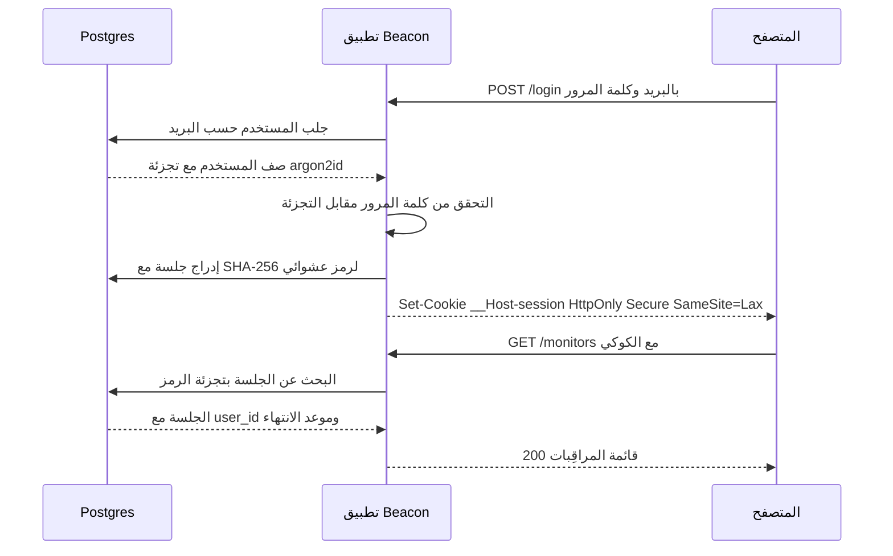
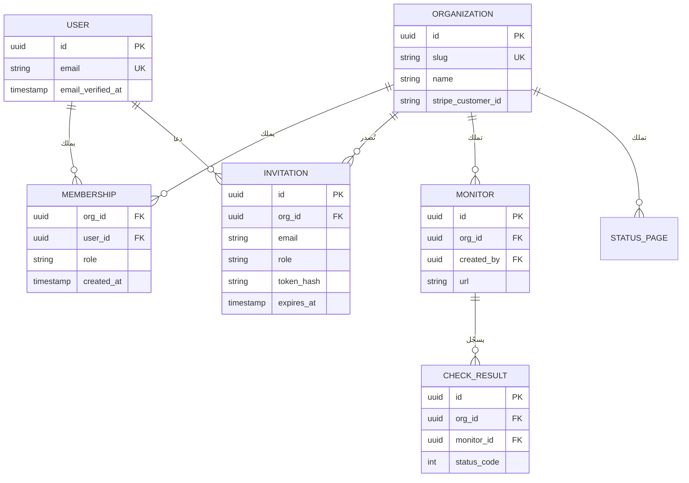
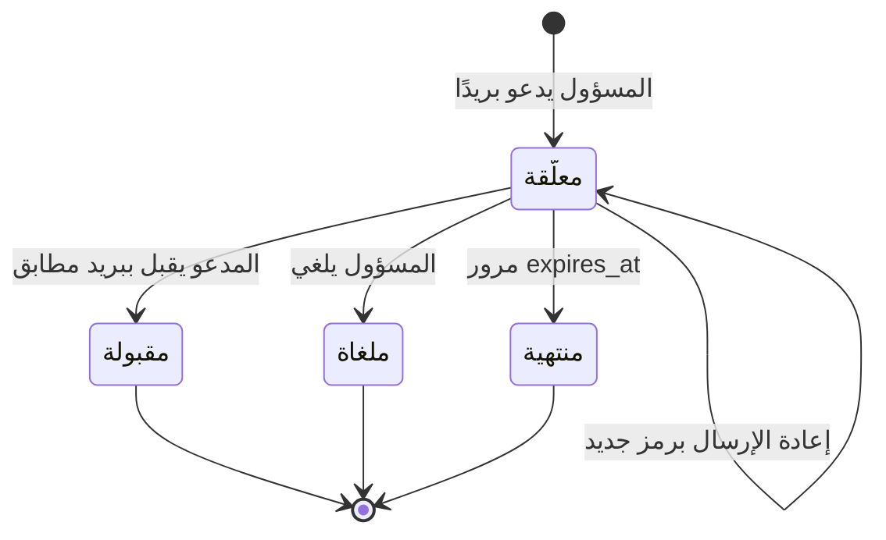
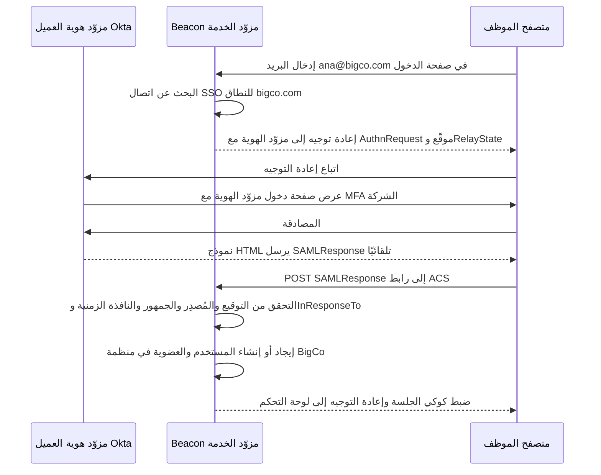

# الوحدة 1 (Module 1) — الهوية والوصول (Identity & Access)

*كل SaaS يجب أن يجيب عن ثلاثة أسئلة في كل طلب (request): من أنت، وإلى أي عميل (customer) تنتمي، وهل يُسمح لك بفعل هذا؟ تبني هذه الوحدة هذه الإجابات بالترتيب: المصادقة (authentication)، ثم الهيكل القائم على المنظمات (organization) والعضويات (membership) الذي يجعل المنتج متعدد المستأجرين (multi-tenant)، ثم التفويض (authorization)، وأخيرًا طبقة المؤسسات (enterprise layer) (SSO وSAML وOIDC وSCIM) التي يتوقعها العملاء الكبار (large customers) قبل أن يوقّعوا. أتقن هذه الأربعة مبكرًا، لأن إضافتها لاحقًا تكلّف أكثر بكثير من بقية الدورة كلها مجتمعة.*

> **التطبيق العملي (Practice):** ابدأ من [نسخة البداية من Beacon (Beacon starter)](https://github.com/Tamoura/system-design-for-vibe-coders/tree/beacon/starter)، وحلّ التمارين قبل النظر إلى [الحل المرجعي لهذه الوحدة (this module's reference solution)](https://github.com/Tamoura/system-design-for-vibe-coders/tree/beacon/module-1-solution) (الفرع (branch) `beacon/module-1-solution`).

---

# 1.1 — المصادقة (authentication): إثبات هوية الشخص (proving who someone is)

*المستوى (Level): 🟢 مبتدئ (Beginner)*

## ⚡ الدرس في دقيقة (In 60 seconds)

- المصادقة (authentication) تثبت من الذي يرسل الطلب (request). وهي مجموعة من المسارات (flows) (التسجيل (sign-up)، وتسجيل الدخول (login)، والتحقق (verification)، واستعادة كلمة المرور (reset)، والمصادقة متعددة العوامل (MFA)، وتسجيل الخروج (logout))، والمهاجم (attacker) يختار أضعفها.
- القاعدة الأهم (The rule that matters most): اصنع تجزئة (hash) كلمات المرور (passwords) بـ argon2id أو bcrypt، ولا تخزّن من رموز الجلسات (session tokens) واستعادة كلمة المرور (reset) والروابط السحرية (magic-link) إلا تجزئاتها (their hashes).
- الخيار الافتراضي (default) للنسخة الأولى (v1): مكتبة (library) مثل Better Auth أو Devise أو django-allauth، مع جلسات على الخادم (server-side sessions) داخل كوكي (cookie) `HttpOnly` و`Secure` و`SameSite=Lax`.
- تسجيل الدخول الاجتماعي (social login) يعني مسار رمز التفويض (authorization code flow) مع PKCE، مع ربط الهوية (linking the identity) بمعرّف `sub` لدى المزوّد (provider)، وليس بالبريد الإلكتروني (email) وحده أبدًا.
- الفخ الأكبر (The biggest trap): الحواف (edges)، مثل روابط استعادة (reset links) تعمل مرتين، ورسائل "البريد (email) غير موجود"، وتسجيل خروج (logout) يكتفي بمسح الكوكي (cookie).

## 🧭 لماذا يحتاجه كل SaaS (Why every SaaS has this)

لم يكن في النموذج الأولي (prototype) من Beacon تسجيل دخول (login). قائمة واحدة للمراقِبات (monitors)، وصفحة حالة (status page) واحدة، وكل شيء على `localhost`. ثم طلب صديق أن يجرّبه، وخلال ساعة ظهرت أسئلة حقيقية. كيف يعرف Beacon أن الشخص الذي يعدّل مراقِب (monitor) `api.acme.com` من شركة Acme فعلًا؟ كيف يعود غدًا؟ ماذا يحدث عندما ينسى كلمة المرور (password)، أو يسجّل بحساب Google يوم الاثنين ثم يحاول بالبريد الإلكتروني (email) يوم الثلاثاء؟

المصادقة (Authentication، وتُختصر غالبًا إلى **authn**) هي عملية إثبات أن الشخص أو البرنامج الذي يرسل الطلب (request) هو من يدّعي أنه هو. وهي تختلف عن **التفويض** (Authorization أو authz، الدرس 1.3) الذي يقرّر ما يحق لهذه الهوية المثبتة (identity) فعله. تقع معظم الثغرات الأمنية (security bugs) في منتجات SaaS الناشئة على الحدود بين الاثنين (on the boundary between the two)، لكن المصادقة تأتي أولًا: إذا كانت الهوية خاطئة، فكل فحص لاحق (check) يفحص الشخص الخطأ.

نموذج تسجيل الدخول (login form) هو الجزء السهل. الأجزاء الصعبة هي الحواف (edges): روابط استعادة كلمة المرور (password reset links) التي يمكن إعادة استخدامها، وكوكيز الجلسة (session cookies) التي تستطيع السكربتات المحقونة (injected scripts) قراءتها، ورسالة "البريد (email) غير موجود" التي تخبر المهاجمين (attackers) من هم عملاؤك (your customers)، وزر تسجيل خروج (logout) لا يُخرج أحدًا.

**المصادقة (authentication) ليست نموذج تسجيل دخول (login form)، بل مجموعة من المسارات (التسجيل (sign-up)، وتسجيل الدخول (login)، والاستعادة (recovery)، والتحقق (verification)، وتسجيل الخروج (logout)) يجب أن تكون كلها بالقوة (strength) نفسها، لأن المهاجم (attacker) يختار أضعفها.**

## 📐 كيف يعمل (How it works)

### 🟢 الأساسيات (The essentials)

ثلاث أفكار تحمل معظم الثقل: بيانات الاعتماد (credentials)، والجلسات (sessions)، والكوكيز (cookies).

**بيانات الاعتماد** (Credentials) هي ما يقدّمه المستخدم (user) لإثبات هويته. أشهر أنواعها:

| العامل (factor) | مثال | القوة (strength) | نقطة الضعف الرئيسية |
|---|---|---|---|
| شيء تعرفه | كلمة المرور (password) | ضعيف وحده | إعادة الاستخدام (reuse)، والتصيّد (phishing)، والتخمين (guessing) |
| شيء تملكه (صندوق البريد (mailbox)) | رابط سحري (magic link)، رابط استعادة (reset link) | متوسط | آمن بقدر أمان صندوق البريد (mailbox) فقط |
| هوية مفوَّضة (delegated identity) | "تسجيل الدخول عبر Google (Sign in with Google)" (OAuth/OIDC) | جيد | أخطاء ربط الحسابات (account-linking) |
| شيء تملكه (جهاز) | تطبيق TOTP (TOTP app)، مفتاح المرور (passkey) | قوي | الاستعادة (recovery) عند فقدان الجهاز |
| شيء أنت هو | الوجه أو البصمة (fingerprint) لفتح مفتاح المرور (passkey) | قوي | لا يغادر الجهاز أبدًا، لذلك ليس عاملًا (factor) على جهة الخادم (server-side factor) |

**يجب أن تُحفظ كلمات المرور كتجزئة (Hash)، لا أن تُشفَّر (encrypted)، ولا أن تُخزَّن كنص صريح (plain) أبدًا.** التجزئة دالة أحادية الاتجاه (one-way function): يمكنك مقارنة تخمين (guess) بها، لكن لا يمكنك عكسها. التجزئات (hashes) العادية مثل SHA-256 مصممة لتكون سريعة، وهذا بالضبط الخطأ هنا، لأن التجزئة السريعة (fast hash) تسمح لمن يسرق قاعدة بياناتك (database) بتجربة مليارات التخمينات (guesses) في الثانية. أما تجزئات كلمات المرور (password hashes) فهي *بطيئة عمدًا* و*مملّحة* (Salted)، أي أن كل تجزئة تخلط قيمة عشوائية (random value) حتى تنتج كلمات المرور (passwords) المتطابقة تجزئات مختلفة. استخدم **argon2id** (توصية OWASP الحالية) أو **bcrypt** (أقدم، وموجود في كل مكان، ومقبول). لاحظ أن bcrypt لا ينظر إلا إلى أول 72 بايت (bytes) من المدخلات. كل بيئة شائعة (stack) توفر هذا جاهزًا: `contrib.auth` في Django، و`has_secure_password` في Rails، وواجهة `Hash` في Laravel، و`golang.org/x/crypto` في Go.

**الجلسات** (Sessions) هي طريقة الخادم (server) في تذكّرك بين الطلبات. بروتوكول (protocol) HTTP عديم الحالة (stateless)، لذلك بعد تسجيل دخول (login) ناجح ينشئ الخادم سجل جلسة (session record) ويعطي المتصفح (browser) رمزًا عشوائيًا (random token) لا يمكن تخمينه. كل طلب لاحق يحمل هذا الرمز (token)، والخادم يبحث عنه.

**الكوكيز** (Cookies) تحمل هذا الرمز (token). أربع خصائص (attributes) مهمة:

- `HttpOnly`: لا تستطيع JavaScript قراءة الكوكي (cookie)، لذلك لا تستطيع ثغرة (bug) XSS سرقته بسهولة.
- `Secure`: لا يُرسل إلا عبر HTTPS.
- `SameSite=Lax`: لا يرفق المتصفح (browser) الكوكي (cookie) بمعظم الطلبات القادمة من مواقع أخرى (cross-site requests)، وهذا يمنع هجوم CSRF (تزوير الطلبات عبر المواقع) التقليدي الذي يرسل فيه موقع آخر نموذجًا إلى موقعك. الخيار `Strict` أشد، لكنه يكسر تجربة "انقر رابطًا في Slack فتصل وأنت مسجّل الدخول (signed in)".
- `Path=/` مع البادئة (prefix) `__Host-` في الاسم: عندها يرفض المتصفح (browser) الكوكي (cookie) إلا إذا كان `Secure`، وبلا خاصية (attribute) `Domain`، ومع `Path=/`، وهذا يمنع النطاقات الفرعية (subdomains) من الكتابة فوقه.

هذا هو المسار (flow) الكامل لتسجيل الدخول (login) بكلمة مرور (password):


```mermaid
sequenceDiagram
    participant D as Postgres
    participant A as تطبيق Beacon
    participant B as المتصفح
    B->>A: POST /login بالبريد وكلمة المرور
    A->>D: جلب المستخدم حسب البريد
    D-->>A: صف المستخدم مع تجزئة argon2id
    A->>A: التحقق من كلمة المرور مقابل التجزئة
    A->>D: إدراج جلسة مع SHA-256 لرمز عشوائي
    A-->>B: Set-Cookie __Host-session HttpOnly Secure SameSite=Lax
    B->>A: GET /monitors مع الكوكي
    A->>D: البحث عن الجلسة بتجزئة الرمز
    D-->>A: الجلسة مع user_id وموعد الانتهاء
    A-->>B: 200 قائمة المراقِبات
```

قاعدة البيانات (database) تخزّن *تجزئة (hash)* رمز الجلسة (session token)، لذلك لا يمكن استخدام نسخة مسرّبة من جدول (table) `sessions` لتسجيل الدخول (login). هذا رخيص، ومعظم الدروس التعليمية (tutorials) تتجاهله.

```ts
import { randomBytes, createHash } from "node:crypto";

const sha256 = (s: string) => createHash("sha256").update(s).digest("hex");

export async function createSession(userId: string) {
  const token = randomBytes(32).toString("base64url"); // 256 bits of randomness
  await db.session.create({
    data: {
      id: sha256(token),                                  // store only the hash
      userId,
      expiresAt: new Date(Date.now() + 30 * 24 * 3600 * 1000),
    },
  });
  return token; // goes into the cookie, never logged
}

export async function validateSession(token: string) {
  const session = await db.session.findUnique({ where: { id: sha256(token) } });
  if (!session || session.expiresAt < new Date()) return null;
  return session; // optionally slide expiresAt forward here
}
```

**الجلسات (sessions) مقابل JWT.** رمز JWT (JSON Web Token) كتلة موقّعة (signed blob) تحتوي على ادعاءات (Claims) مثل معرّف المستخدم (user id) وموعد الانتهاء (expiry). يستطيع الخادم (server) التحقق (verification) منه دون الرجوع إلى قاعدة البيانات (database)، وهذه ميزته ومشكلته في الوقت نفسه: لا يمكنك بسهولة *إلغاء إصداره* (un-issue). إذا سُرق حاسوب محمول أو فُصل موظف (employee)، يبقى JWT صالحًا حتى ينتهي. عندها تضيف الفرق قائمة حظر (denylist)، وهي بحث في قاعدة البيانات (database lookup) مع كل طلب، أي أنها جلسة (session) بخطوات إضافية. لتطبيق ويب (web app) يتحدث مع الخادم الخلفي (backend) الخاص به، **الجلسات على الخادم (server-side sessions) في Postgres أو Redis هي الخيار الافتراضي (The default) المعقول**. يستحق JWT مكانه عندما يجب أن تتحقق من الرمز (token) خدمةٌ (service) *مختلفة* لا تصل إلى مخزن جلساتك (session store)، مثل رمز هوية (ID token) OIDC من Google أو رمز قصير العمر (short-lived token) لواجهة برمجية منفصلة (API). يغطي الدرس 5.2 مفاتيح API (API keys)، وهي شيء آخر مختلف.

**التحقق من البريد الإلكتروني (email verification)** يثبت أن المستخدم (user) يتحكم في العنوان الذي كتبه. أرسل رابطًا أو رمزًا من 6 أرقام (6-digit code)، وإلى أن يُؤكَّد لا تثق بالعنوان في أي شيء مهم: ربط الحسابات (account linking)، أو الدعوات (invitations) (1.2)، أو مطابقة النطاق (domain matching) في SSO (1.4).

### 🟡 التعمق أكثر (Going deeper)

**استعادة كلمة المرور (password reset)** مسار (flow) تسجيل دخول (login) متنكّر، لذلك عاملها كذلك. أنشئ رمزًا عشوائيًا (random token)، وخزّن تجزئته (its hash) مع مدة صلاحية (expiry) قصيرة (من 15 إلى 60 دقيقة)، واجعله صالحًا لمرة واحدة (single-use)، وأرسل رابطًا بالبريد (email). عند استخدامه، أبطل (invalidate) جلسات (sessions) المستخدم (user) الأخرى، لأن الاستعادة (recovery) كثيرًا ما تعني "أظن أن شخصًا آخر داخل حسابي". ويجب أن يكون الرد (response) على "أرسل لي رابط استعادة (reset link)" متطابقًا سواء كان البريد موجودًا أم لا.

هذه النقطة الأخيرة اسمها **تعداد الحسابات** (Account Enumeration): أي اختلاف في نص الرد (response) أو رمز الحالة (status code) أو حتى التوقيت (timing) يكشف هل البريد (email) مسجّل. يستخدمه المهاجمون (attackers) لبناء قوائم أهداف (target lists). أصلح الرسائل ("إذا كان هناك حساب، فقد أرسلنا رابطًا")، ونفّذ التجزئة البطيئة (slow hash) حتى عندما يكون المستخدم (user) غير موجود حتى لا يكشف التوقيت شيئًا. إخفاء ذلك في التسجيل (sign-up) أصعب، لأن رسالة "هذا البريد مستخدم" مفيدة للمستخدم. الحل الوسط الشائع أن تقول دائمًا "تفقّد بريدك (your email)"، وأن ترسل لصاحب الحساب الموجود رسالة "لديك حساب بالفعل".

**الحماية من التخمين المتكرر (brute-force) وحشو بيانات الاعتماد.** حشو بيانات الاعتماد (Credential Stuffing) هو إعادة تجربة أزواج اسم المستخدم (user) وكلمة المرور (password) المسرّبة من مواقع *أخرى*. الدفاعات، مرتبة تقريبًا حسب قيمتها:

1. حدّد معدل (rate-limit) محاولات الدخول (login attempts) لكل عنوان IP ولكل حساب (الدرس 5.2 يغطي محددات المعدل (rate limiters)). فضّل الإبطاء وإضافة CAPTCHA على القفل الصارم للحساب (hard account lockout)، لأنه يسمح لأي شخص بقفل حسابات عملائك (your customers).
2. ارفض كلمات المرور (passwords) المعروف أنها مسرّبة (known-breached) عند التسجيل (sign-up) والاستعادة (recovery). واجهة النطاقات (range API) "Pwned Passwords" من Have I Been Pwned تتيح لك ذلك دون إرسال كلمة المرور (password) إلى أي مكان: ترسل أول 5 أحرف من تجزئة (hash) SHA-1 الخاصة بها وتقارن محليًا.
3. اتبع NIST SP 800-63B: فضّل الطول، وتخلَّ عن قواعد التركيب (composition rules) ("رمز واحد (one symbol)، وحرف كبير واحد") وعن التغيير الدوري الإجباري (forced periodic rotation).
4. وفّر المصادقة متعددة العوامل (MFA)، وشجّع المسؤولين (admins) على استخدامها.

**الروابط السحرية** (Magic Links) ترسل بالبريد (email) رابط دخول لمرة واحدة (single-use). تلغي مشكلة إعادة استخدام كلمات المرور (passwords)، لكنها آمنة بقدر أمان صندوق بريد المستخدم (the user's mailbox) فقط. هناك فخ حقيقي: ماسحات أمان البريد (email security scanners) في الشركات تفتح الروابط لفحصها، فتستهلك الرمز ذا الاستخدام الواحد (single-use token) قبل أن ينقر الإنسان. الحل أن يفتح الرابط صفحة فيها زر "تسجيل الدخول (login)" يرسل طلب POST، أو أن ترسل رمزًا قصيرًا (short code) يكتبه المستخدم (user) بدلًا من الرابط.

**تسجيل الدخول الاجتماعي (OAuth 2.0 + OpenID Connect).** OAuth 2.0 (RFC 6749) بروتوكول لتفويض الوصول (delegating access)، وOpenID Connect (OIDC) طبقة هوية رقيقة (identity layer) فوقه تضيف **رمز الهوية** (ID Token)، وهو JWT يقول "هذا هو المستخدم (user) X، وقد تحققت منه Google". المسار (flow) الذي تريده هو **مسار رمز التفويض مع PKCE (authorization code flow with PKCE)** (RFC 7636، ويُنطق "pixie"): يعيد Beacon التوجيه (redirects) إلى Google مع `code_challenge` عشوائي مُجزَّأ (hashed)، فتعيد Google التوجيه مع `code` قصير العمر، ثم يستبدل Beacon هذا الرمز (token) مع `code_verifier` الأصلي بالرموز (tokens) عبر قناة خلفية (back channel). يمنع PKCE الاستفادة من رمز تم اعتراضه (intercepted code). ويربط المعامل (parameter) `state` طلب العودة (callback) بالمتصفح (browser) الذي بدأ المسار، وهذا يمنع CSRF في تسجيل الدخول (login). المسار الضمني (Implicit Flow) مُلغى في أفضل الممارسات الحالية (BCP) لأمان OAuth 2.0 (RFC 9700). لا تستخدمه.

الجزء الخطير في تسجيل الدخول الاجتماعي (social login) هو **ربط الحسابات (account linking)**. إذا سجّل شخص الدخول (login) عبر GitHub بالبريد (email) `ana@acme.com` وكان هناك حساب بكلمة مرور (password) بالعنوان نفسه، فهل تدمجهما؟ فقط إذا قال المزوّد (provider) إن البريد *موثَّق* (verified)، وحتى عندها فضّل "سجّل الدخول بطريقتك الحالية لتربط الحساب". أظهر بحث "nOAuth" عام 2023 تطبيقات سُرقت حساباتها لأنها وثقت بادعاء (claim) `email` قابل للتغيير وغير موثَّق (mutable) قادم من مستأجر (tenant) في Microsoft Entra ID. اربط الهويات (identities) بالمعرّف الثابت للمستخدم (stable subject id) لدى المزوّد (`sub`)، ولا تربطها بالبريد أبدًا.

**المصادقة متعددة العوامل (MFA).** العامل الثاني الشائع (second factor) هو **TOTP** (RFC 6238): سرّ مشترك (shared secret) مخزّن في تطبيق مصادقة (authenticator app) يولّد رمزًا من 6 أرقام (6-digit code) كل 30 ثانية. خزّن السر (secret) مشفّرًا (encrypted)، واقبل انحرافًا في الساعة (clock drift) بمقدار خطوة واحدة (one step)، وامنع إعادة استخدام الرمز (token) نفسه، وأصدر دائمًا **رموز استرداد** (Recovery Codes) عند التفعيل (enrolment) (مُجزَّأة (hashed)، ولمرة واحدة (single-use)). رموز SMS (SMS codes) أفضل من لا شيء وأضعف من TOTP بسبب هجمات تبديل شريحة SIM (SIM-swap attacks).

**مفاتيح المرور (WebAuthn).** مفتاح المرور (Passkey) زوج مفاتيح عام وخاص (public/private key pair) ينشئه جهاز المستخدم (user) أو مدير كلمات المرور (password manager) لموقع محدد (for one specific site) واحد. لا يخزّن الخادم (server) إلا المفتاح العام (public key). عند تسجيل الدخول (login) يرسل الخادم تحديًا عشوائيًا (challenge)، فيوقّعه الجهاز بعد البصمة (fingerprint) أو رمز PIN (PIN)، ثم يتحقق الخادم من التوقيع (signature). مفاتيح المرور **مقاومة للتصيّد** (phishing-resistant): يربط المتصفح (browser) كل بيانات اعتماد (credentials) بنطاقك (ما يسمى "معرّف الطرف المعتمد" (relying party ID))، لذلك لا يستطيع موقع مشابه (look-alike site) طلب توقيع لبيانات اعتماد Beacon. قدّمها بجانب البريد الإلكتروني (email)، لا كباب وحيد، إلى أن تلحق أجهزة مستخدميك (your users) بها.

### 🔴 على نطاق واسع وللمؤسسات (At scale / enterprise)

**إدارة الجلسات (session management) تصبح ميزة (feature).** يتوقع المستخدمون (users) صفحة "أين سجّلت الدخول" تسرد الأجهزة، مع زر "تسجيل الخروج من كل مكان (log out everywhere)". هذا بسيط جدًا مع الجلسات على الخادم (`DELETE FROM sessions WHERE user_id = $1`) ومؤلم مع JWT طويل العمر (long-lived). غيّر (rotate) رمز الجلسة (session token) عند تسجيل الدخول (login) وكلما تغيّرت الصلاحيات (privilege)، لتتجنب تثبيت الجلسة (Session Fixation)، وهو أن يزرع المهاجم (attacker) رمزًا (token) معروفًا في متصفح (browser) الضحية قبل أن تسجّل الدخول.

**المصادقة المعزّزة** (Step-up Authentication). بعض الإجراءات (actions) تستحق إثباتًا جديدًا: تغيير بريد (email) الحساب، وتعطيل MFA (disabling MFA)، وإنشاء مفتاح API (API key)، وحذف منظمة (org). سجّل `authenticated_at` في الجلسة (session)، واطلب إعادة المصادقة (re-authentication) إذا مضى عليه أكثر من بضع دقائق.

**سرقة الرموز (token theft) هي الهجوم الحديث.** مع انتشار MFA، صار المهاجمون (attackers) يسرقون *كوكيز الجلسات (session cookies)* من الأجهزة المصابة (infected machines)، أو يمرّرون عمليات الدخول (logins) عبر وسطاء تصيّد (phishing proxies). ضع الدفاعات في طبقات: مهل خمول (idle timeouts) قصيرة لمناطق الإدارة (admin areas)، وتنبيهات (alerts) عند تغيّر الجهاز، ومفاتيح المرور (التي لا يستطيع الوسطاء تمريرها)، وإلغاء سريع (revocation).

**أين يعيش كود المصادقة (auth code)** هو القرار المعماري (architectural choice) الكبير:

| النهج (approach) | أمثلة | ما تملكه | المقايضة (trade-off) |
|---|---|---|---|
| مكتبة (library) داخل تطبيقك | Better Auth، Auth.js، Devise، django-allauth | كل شيء، في قاعدة بياناتك (your database) | أكبر قدر من التحكم، وأنت من يرقّعها (patch) ويشغّلها |
| خادم مصادقة (auth server) تستضيفه بنفسك (self-hosted) | Keycloak، Ory Kratos، Zitadel، Logto، SuperTokens | خدمة منفصلة (separate service) | حدود واضحة (boundary)، وشيء إضافي عليك تشغيله |
| خدمة مُدارة (managed service) | Clerk، Auth0، WorkOS AuthKit، Supabase Auth، Firebase Auth، Stytch | الإعدادات (configuration) | الأسرع، مع تسعير (pricing) لكل مستخدم نشط شهريًا (MAU) وارتباط بالمزوّد (vendor lock-in) |

الارتباط بالمزوّد (Lock-in) يتعلق في الغالب **بتجزئات كلمات المرور (password hashes) ومعرّفات المستخدمين (user IDs)**. تأكد أن المزوّد (provider) يصدّر التجزئات (hashes) بصيغة قياسية (in a standard format)، واحتفظ بجدول (table) `users` خاص بك مفتاحه معرّفك أنت (your own id)، مع معرّف المزوّد (provider id) كعمود (column).

## 🏆 أفضل المستودعات (The best repos)

| المستودع (repo) | ما هو | التقنيات (stack) | الترخيص (licence) | اختره عندما (Pick it when) |
|---|---|---|---|---|
| [better-auth/better-auth](https://github.com/better-auth/better-auth) | مكتبة مصادقة (auth library) مستقلة عن الإطار (framework-agnostic) مع إضافات (plugins) للمنظمات (organizations)، و2FA، ومفاتيح المرور (passkeys)، والروابط السحرية (magic-link) | TypeScript | MIT | تبدأ تطبيق TypeScript جديدًا وتريد المصادقة (authentication) داخل قاعدة بياناتك (your database) |
| [nextauthjs/next-auth](https://github.com/nextauthjs/next-auth) | Auth.js، مكتبة المصادقة (auth library) العريقة القائمة على OAuth لـ Next.js وغيره | TypeScript | ISC | تصون تطبيقًا قائمًا على Auth.js، أما المشاريع الجديدة فلتنظر إلى Better Auth |
| [lucia-auth/lucia](https://github.com/lucia-auth/lucia) | مُلغاة كمكتبة (library)، وصارت الآن دليلًا لتنفيذ الجلسات (sessions) بنفسك | TypeScript | MIT | تريد فهم الجلسات (sessions) جيدًا أو كتابة تنفيذ صغير ونظيف |
| [supabase/auth](https://github.com/supabase/auth) | خادم المصادقة (auth server) وراء Supabase (نسخة متفرعة (fork) من GoTrue الخاص بـ Netlify) | Go | MIT | تستخدم Supabase، أو تريد واجهة مصادقة (auth API) صغيرة قائمة على JWT لتدرسها |
| [ory/kratos](https://github.com/ory/kratos) | خادم هوية بلا واجهة (headless identity server): التسجيل (sign-up)، والدخول (login)، والاستعادة (recovery)، وMFA، ومفاتيح المرور (passkeys) | Go | Apache-2.0 | تريد خدمة هوية (identity service) منفصلة تعتمد على API أولًا وتستضيفها بنفسك (you self-host) |
| [keycloak/keycloak](https://github.com/keycloak/keycloak) | خادم (server) كامل لإدارة الهوية والوصول (identity and access management) مع واجهة إدارة (admin UI) | Java | Apache-2.0 | تحتاج كل شيء (OIDC، SAML، الاتحاد (federation)) وتستطيع تشغيل خدمة (service) JVM |
| [logto-io/logto](https://github.com/logto-io/logto) | منصة مصادقة (auth platform) مع واجهة دخول مستضافة (hosted sign-in UI)، ومنظمات (organizations)، وSSO للمؤسسات (enterprises) | TypeScript | MPL-2.0 | تريد بديلًا لـ Auth0 تستضيفه بنفسك (you self-host) بواجهة حديثة (with a modern UI) |
| [supertokens/supertokens-core](https://github.com/supertokens/supertokens-core) | نواة مصادقة (auth core) قابلة للاستضافة الذاتية (self-hosting) مع SDK لأطر عمل (frameworks) كثيرة | Java | Apache-2.0 | تريد SDK بأسلوب الخدمات المُدارة (managed services) لكن على بنيتك التحتية (infrastructure) |
| [pennersr/django-allauth](https://github.com/pennersr/django-allauth) | حزمة (package) Django القياسية للحسابات وتسجيل الدخول الاجتماعي (social login) وMFA | Python | MIT | تعمل على Django |
| [heartcombo/devise](https://github.com/heartcombo/devise) | محرك المصادقة (engine) الكلاسيكي في Rails | Ruby | MIT | تعمل على Rails (يأتي Rails 8 أيضًا بمولّد (generator) مدمج أبسط) |

**إن درست مستودعًا واحدًا فقط (If you only study one):** اقرأ **lucia-auth/lucia**. إنه قصير، ويشرح *لماذا* يوجد كل جزء من نظام الجلسات (توليد الرمز (token generation)، والتجزئة (hash)، وانتهاء الصلاحية (expiry)، والتجديد المنزلق (sliding renewal)، وCSRF)، ومكتوب لمن يريد أن يفهم لا لمن يريد أن يضبط الإعدادات (settings) فقط. بعد ذلك اعتمد Better Auth أو المكتبة القياسية (standard library) في إطار عملك (your framework) وأنت تعرف ما تفعله من الداخل.

**اشترِ أم ابنِ أم استضف بنفسك (Buy, build, or self-host)؟**

- **اشترِ (buy)** (Clerk، Auth0، WorkOS AuthKit، Stytch، Supabase Auth، Firebase Auth) عندما يكون الوصول السريع إلى السوق (time-to-market) هو الأهم وتريد واجهة جاهزة (ready-made UI) وMFA ومفاتيح المرور (passkeys) من اليوم الأول. راقب منحنى التسعير (pricing curve) لكل مستخدم وشروط التصدير (export terms).
- **استضف بنفسك (self-host)** (Keycloak، Ory، Zitadel، Logto، authentik) عندما يجب أن تبقى بيانات الهوية (identity) في بنيتك التحتية (your infrastructure)، أو عندما تقدّم منتجًا قابلًا للاستضافة الذاتية (الدرس 7.4) ولا يمكنك الاعتماد على مزوّد SaaS (SaaS provider).
- **ابنِ** (build) فوق مكتبة (Better Auth، Auth.js، Devise، django-allauth) في معظم منتجات B2B SaaS. تحتفظ بالمستخدمين (users) في Postgres الخاص بك، وتتجنب مع ذلك كتابة التشفير (crypto). لا تكتب بنفسك أبدًا كود تجزئة كلمات المرور (password hashing) أو بروتوكول (protocol) OAuth.

## 🔍 ادرسه في مشاريع حقيقية (Study it in the wild)

**openstatusHQ/openstatus** مراقِب توفر (uptime monitor) وصفحة حالة (status page) مفتوح المصدر (open-source)، أي أنه Beacon حقيقي حرفيًا. وهو مستودع أحادي (Monorepo) بلغة TypeScript. افتح `apps/web`، وافحص ملف `package.json` لترى مكتبة المصادقة (auth library) التي اختارها، ثم ابحث في الكود عن `auth` و`session`. ما يتقنه هو التناسب (proportion): المصادقة (authentication) ركن صغير وممل من الكود، وهذا بالضبط مكانها الصحيح في منتج قيمته في المراقبة (monitoring).

**calcom/cal.diy** يُظهر المصادقة (authentication) على نطاق واسع (at scale) في مستودع Next.js أحادي (Next.js monorepo): بيانات الاعتماد (credentials)، وتسجيل الدخول عبر Google (Sign in with Google)، والمصادقة الثنائية (two-factor authentication) (أُزيل منه SAML SSO مع بقية ميزات المؤسسات (enterprise features) حين صارت النسخة مفتوحة المصدر (open-source edition) Cal.diy في 2026). ابحث عن `NextAuth` أو `authOptions` لتجد إعداد (setup) المزوّدين (providers)، وعن `twoFactor` لترى كيف تُضاف TOTP فوق الدخول (login) ببيانات الاعتماد. ويُظهر مخطط (schema) Prisma في `packages/prisma` كيف تقع حقول الهوية (identity fields) على نموذج (model) `User`.

**nextjs/saas-starter** أصغر مثال كامل: بريد (email) وكلمة مرور (password) مع bcrypt، وكوكي جلسة (session cookie) موقّع عبر `jose`، وطبقة وسيطة (Middleware) تحمي المسارات (protects the routes). اقرأه كله في أمسية. يُظهر مقايضة (trade-off) الكوكيز الموقّعة (signed cookies) عديمة الحالة (stateless): بسيطة، لكن بلا قائمة إلغاء (revocation list) على الخادم (server-side).

**documenso/documenso** يتعامل مع المصادقة (authentication) في منتج للهوية (identity) فيه معنى قانوني (التوقيعات الإلكترونية (e-signatures)). ابحث عن `passkey` و`two-factor` لترى WebAuthn وTOTP، وعن `signin` في تطبيق الويب (web app) لتجد المسارات (flows).

**ما الذي تلاحظه (What to notice):**

- أين تُخزَّن الجلسة (صف (row) في قاعدة البيانات (database row)، أو Redis، أو كوكي موقّع (signed cookie)) وماذا يعني ذلك لـ "تسجيل الخروج من كل مكان (log out everywhere)".
- كيف تُربط حسابات OAuth بالمستخدمين (users): بمعرّف المستخدم (user id) لدى المزوّد (provider)، أو بالبريد (email)، أو بكليهما، وهل يُفحص "البريد الموثَّق (verified email)".
- هل رموز الاستعادة (reset tokens) والتحقق (verification) والروابط السحرية (magic-link) مُجزَّأة عند التخزين (at rest) وصالحة لمرة واحدة (single-use).
- كيف تستجيب نقاط الدخول والاستعادة (login and reset endpoints) لبريد (email) غير معروف.
- أين تُفرض (enforced) MFA: في مسار (flow) الدخول (login) فقط، أم يُعاد فحصها عند الإجراءات الحساسة (sensitive actions).

## 🛠️ ابنِه في Beacon (Build it into Beacon)

### 🟢 تمرين المبتدئ (Beginner exercise)

أضف التسجيل (sign-up) وتسجيل الدخول (login) بالبريد (email) وكلمة المرور (password) إلى Beacon باستخدام Better Auth (أو Devise، أو django-allauth، أو حزم البداية (starter kits) في Laravel حسب بيئتك (your stack)). احمِ صفحات `/monitors` بحيث يُعاد توجيه غير المسجّلين إلى `/login`. أضف زر تسجيل خروج (logout) يحذف الجلسة (session) من الخادم (server).

**يكتمل عندما (Done when):**
- تُخزَّن كلمات المرور (passwords) كتجزئات (as hashes) argon2id أو bcrypt. ابحث في نسخة من قاعدة البيانات (database dump) عن كلمة مرور تجريبية (test password) فلا تجد شيئًا.
- كوكي الجلسة (session cookie) `HttpOnly`، و`Secure` في بيئة الإنتاج (production)، و`SameSite=Lax`.
- بعد تسجيل الخروج (logout)، إعادة إرسال (replaying) الكوكي (cookie) القديم عبر `curl` تُرجع إعادة توجيه (redirect) أو 401.

### 🟡 تمرين المستوى المتوسط (Intermediate exercise)

أضف "تسجيل الدخول عبر GitHub (Sign in with GitHub)" ومسار (flow) استعادة كلمة المرور (password reset). اربط هوية (identity) GitHub بمستخدم موجود فقط عندما يقول GitHub إن البريد (email) موثَّق *و*يؤكد المستخدم (user) ذلك بتسجيل الدخول (login) بطريقته الحالية. اجعل نقطة طلب الاستعادة (reset-request endpoint) تُرجع الرد (response) نفسه للبريد المعروف وغير المعروف.

**يكتمل عندما (Done when):**
- يستخدم مسار (flow) OAuth منحة رمز التفويض (authorization code grant) مع PKCE ويتحقق من `state`.
- رموز الاستعادة (reset tokens) مُجزَّأة (hashed) في قاعدة البيانات (database)، وتنتهي خلال ساعة، وتفشل عند الاستخدام الثاني.
- الاستعادة (recovery) المكتملة تُخرج كل الجلسات (sessions) الأخرى لذلك المستخدم (user).
- نصوص الردود (response bodies) على "استعد كلمة المرور (password)" متطابقة بايتًا ببايت للبريد (email) الموجود وغير الموجود.

### 🔴 تمرين المستوى المتقدم (Advanced exercise)

أضف مفاتيح المرور (passkeys) وTOTP كعوامل ثانية (second factors)، وصفحة "الأجهزة المسجّل منها (signed-in devices)"، وإعادة مصادقة معزّزة (step-up re-authentication) لإجراءي "إنشاء مفتاح API (API key)" و"حذف المنظمة (deleting the org)". حدّد معدل (rate-limit) تسجيل الدخول (login) لكل IP ولكل حساب باستخدام Redis.

**يكتمل عندما (Done when):**
- يستطيع المستخدم (user) تسجيل مفتاح مرور (passkey) والدخول (login) به دون كلمة مرور (password).
- تفعيل (enabling) TOTP يُصدر عشرة رموز استرداد (recovery codes) مُجزَّأة (hashed) وصالحة لمرة واحدة (single-use).
- إلغاء جهاز من صفحة الأجهزة (devices page) يجعل الطلب التالي من ذلك المتصفح (browser) غير مُصادَق (unauthenticated).
- عشرون محاولة دخول (login attempt) فاشلة في دقيقة لحساب واحد تؤدي إلى إبطاء أو CAPTCHA، لا إلى قفل دائم (permanent lockout).

## ⚠️ أخطاء يقع فيها المبتدئون (Mistakes juniors make)

- **تخزين JWT في `localStorage`.** أي ثغرة (bug) XSS، حتى في سكربت من طرف ثالث (third-party script)، تستطيع قراءته وإرساله. استخدم كوكي (cookie) `HttpOnly`، ولتطبيق الويب (web app) الخاص بك استخدم جلسة على الخادم (server-side session).
- **تجزئة كلمات المرور (password hashing) بـ SHA-256 أو MD5، حتى مع الملح (salt).** إنها سريعة، لذلك تُكسر (cracked) التجزئات (hashes) المسرّبة بالجملة على بطاقات الرسوميات (GPUs). استخدم argon2id أو bcrypt عبر مكتبة مُصانة (maintained).
- **مطابقة حسابات OAuth بالبريد (email) وحده.** ادعاءات البريد (email claims) غير الموثَّقة أو القابلة للتغيير تسمح للمهاجم (attacker) بالدخول (login) باسم شخص آخر. خزّن `(provider, provider_user_id)` وعامل البريد كتلميح فقط (hint).
- **رموز (tokens) استعادة وروابط سحرية (magic links) تعيش إلى الأبد أو تعمل مرتين.** الرسائل القديمة تُعاد توجيهها وتُؤرشف وتتسرّب. جزّئها (hash them)، واجعلها تنتهي خلال دقائق، واحذفها عند الاستخدام.
- **كشف وجود الحسابات.** رسالة "لا يوجد مستخدم (user) بهذا البريد (email)" عند الدخول (login) أو الاستعادة (recovery) تعطي المهاجمين (attackers) قائمة أهداف (target list) مجانية. استخدم رسالة عامة واحدة وتوقيتًا (timing) شبه ثابت.
- **تسجيل خروج (logout) يكتفي بمسح الكوكي (cookie).** إذا بقي الرمز (token) صالحًا على الخادم (server-side)، فكل من نسخه يبقى داخلًا. احذف صف الجلسة (session row).

## 🧾 الخلاصة (Recap)

- المصادقة (authentication) مجموعة من المسارات (flows): التسجيل (sign-up)، والدخول (login)، والتحقق (verification)، والاستعادة (recovery)، وMFA، وتسجيل الخروج (logout). أمّنها كلها بالقدر نفسه.
- جزّئ (hash) كلمات المرور (passwords) بـ argon2id أو bcrypt. ولا تخزّن من رموز الجلسات (session tokens) والاستعادة (recovery) والروابط السحرية (magic-link) إلا تجزئاتها (their hashes).
- الجلسات على الخادم (server-side sessions) في كوكي (cookie) `HttpOnly` و`Secure` و`SameSite=Lax` هي الخيار الافتراضي (The default). أما JWT فللتحقق (verification) بين الخدمات (services).
- تسجيل الدخول الاجتماعي (social login) يعني رمز التفويض (authorization code) مع PKCE، مع ربط الهوية (linking the identity) بمعرّف المستخدم (user id) لدى المزوّد (provider)، وليس بالبريد (email) وحده أبدًا.
- مفاتيح المرور (passkeys) مقاومة للتصيّد (phishing-resistant) وهي المستقبل. وTOTP مع رموز الاسترداد (recovery codes) هو MFA المتين اليوم.
- استخدم مكتبة (library) أو خدمة للتشفير والبروتوكولات (protocols). مهمتك أن تضبط المسارات والحالات الحدّية (edge cases).

## ✍️ اختبر نفسك (Check yourself)

**1. لماذا يُعد SHA-256 اختيارًا خاطئًا لتجزئة كلمات المرور (password hashing)، وماذا تستخدم بدلًا منه؟**

<details><summary>الإجابة (Answer)</summary>

SHA-256 مصمم ليكون سريعًا، لذلك يستطيع المهاجم (attacker) الذي يسرق قاعدة البيانات (database) تجربة مليارات التخمينات (guesses) في الثانية. يجب أن تكون تجزئات كلمات المرور (password hashes) بطيئة عمدًا ومملّحة (salted): استخدم argon2id (توصية OWASP الحالية) أو bcrypt. راجع "🟢 الأساسيات (The essentials)".

</details>

**2. مِمَّ يحمي PKCE في مسار رمز التفويض (authorization code flow) في OAuth، ومِمَّ يحمي المعامل (parameter) `state`؟**

<details><summary>الإجابة (Answer)</summary>

يجعل PKCE رمز التفويض المُعترَض (intercepted authorization code) عديم الفائدة، لأن استبداله يتطلب `code_verifier` الأصلي الذي لا يملكه إلا Beacon. ويربط المعامل (parameter) `state` طلب العودة (callback) بالمتصفح (browser) الذي بدأ المسار (flow)، وهذا يمنع CSRF في تسجيل الدخول (login). راجع "🟡 التعمق أكثر (Going deeper)".

</details>

**3. أبلغ عميل (customer) لدى Beacon أن حاسوبه المحمول سُرق، وطلب منك تسجيل خروجه من كل مكان. لماذا يكون هذا سهلًا مع الجلسات على الخادم (server-side sessions) وصعبًا مع JWT طويل العمر (long-lived)؟**

<details><summary>الإجابة (Answer)</summary>

مع الجلسات على الخادم (server-side sessions)، تسجيل الخروج من كل مكان (log out everywhere) هو عملية حذف واحدة لصفوف جلسات (session rows) ذلك المستخدم (user)، ويفشل الطلب التالي بأي كوكي (cookie) قديم. أما JWT فيبقى صالحًا حتى ينتهي لأن الخادم (server) لا يبحث عنه، لذلك تحتاج إلى قائمة حظر (denylist)، وهي جلسة (session) بخطوات إضافية. راجع "الجلسات (sessions) مقابل JWT" و"🔴 على نطاق واسع وللمؤسسات (At scale / enterprise)".

</details>

**4. يقول عملاء (customers) Beacon من فرق أمن المعلومات (IT-security) إن روابطهم السحرية (their magic links) "لا تعمل أبدًا": الرابط يقول إنه استُخدم من قبل. ما الذي يحدث، وكيف تصلحه؟**

<details><summary>الإجابة (Answer)</summary>

ماسحات أمان البريد (email security scanners) في الشركات تفتح الروابط لفحصها، فتستهلك الرمز ذا الاستخدام الواحد (single-use token) قبل أن ينقر الإنسان. اجعل الرابط يفتح صفحة فيها زر "تسجيل الدخول (login)" يرسل طلب POST، أو أرسل رمزًا قصيرًا (short code) يكتبه المستخدم (user) بدلًا منه. راجع "الروابط السحرية (magic links)" في "🟡 التعمق أكثر (Going deeper)".

</details>

**5. كتب زميل نقطة الاستعادة (reset endpoint) بحيث تُرجع "لا يوجد حساب بهذا البريد (email)" للعناوين غير المعروفة و"تم إرسال رابط الاستعادة (reset link)" لغيرها. ما الذي يتعطّل؟**

<details><summary>الإجابة (Answer)</summary>

هذا تعداد للحسابات (account enumeration): يستطيع المهاجمون (attackers) معرفة أي عناوين بريد (email) تخص عملاء (customers) Beacon وبناء قوائم أهداف (target lists). أرجع رسالة واحدة متطابقة ("إذا كان هناك حساب، فقد أرسلنا رابطًا")، ونفّذ العمل البطيء حتى عندما يكون المستخدم (user) غير موجود حتى لا يكشف التوقيت (timing) شيئًا. راجع "🟡 التعمق أكثر (Going deeper)" و"⚠️ أخطاء يقع فيها المبتدئون (Mistakes juniors make)".

</details>

## 📚 المراجع (References)

- OWASP Cheat Sheet Series: Authentication, Password Storage, and Session Management cheat sheets — https://cheatsheetseries.owasp.org (أوراق OWASP المرجعية للمصادقة (authentication) وتخزين كلمات المرور (passwords) وإدارة الجلسات (session management))
- NIST SP 800-63B, Digital Identity Guidelines: Authentication and Lifecycle Management — https://pages.nist.gov/800-63-4/ (إرشادات NIST للهوية (identity) الرقمية)
- RFC 6749, The OAuth 2.0 Authorization Framework — https://www.rfc-editor.org/rfc/rfc6749
- RFC 7636, Proof Key for Code Exchange (PKCE) — https://www.rfc-editor.org/rfc/rfc7636
- RFC 9700, Best Current Practice for OAuth 2.0 Security — https://www.rfc-editor.org/rfc/rfc9700 (أفضل الممارسات الحالية (Best Current Practice) لأمان OAuth 2.0 (RFC 9700))
- OpenID Connect Core 1.0 — https://openid.net/specs/openid-connect-core-1_0.html
- W3C Web Authentication (WebAuthn) and the passkeys developer site — https://www.w3.org/TR/webauthn/ and https://passkeys.dev (مواصفة WebAuthn وموقع مطوري مفاتيح المرور (passkeys))
- Lucia's guide to sessions — https://lucia-auth.com (دليل Lucia للجلسات (sessions))

---

# 1.2 — المستخدمون والمنظمات والدعوات (Users, organizations & invitations): هيكل تعدد المستأجرين (the multi-tenant skeleton)

*المستوى (Level): 🟢 مبتدئ (Beginner)* · *المتطلبات (Prerequisites): 1.1*

## ⚡ الدرس في دقيقة (In 60 seconds)

- في B2B SaaS العميل منظمة (organization)، وليس شخصًا. ينضم المستخدمون (users) إليها عبر عضويات (memberships) تحمل دورًا (role).
- القاعدة الأهم (The rule that matters most): كل صف يملكه المستأجر (tenant-owned row) يحمل `org_id` مباشرة، والموارد (resources) ملك للمنظمة (organization)، لا للمستخدم (user) أبدًا.
- الخيار الافتراضي (The default) للنسخة الأولى (v1): أربعة جداول (tables) (المستخدمون (users)، والمنظمات (organizations)، والعضويات (memberships)، والدعوات (invitations))، ومنظمة شخصية (personal org) تُنشأ عند التسجيل (sign-up)، ومعرّف المنظمة النصي (Slug) في الرابط (URL).
- عامل معرّف المنظمة (org id) القادم من الرابط أو الكوكي كادعاء (claim): اجلب العضوية (membership) مع كل طلب.
- الفخ الأكبر (The biggest trap): موارد (resources) يملكها المستخدمون (users)، وهذا يحوّل كل ميزة فريق (team feature) لاحقة إلى عملية ترحيل (migration) أو حل ترقيعي (hack).

## 🧭 لماذا يحتاجه كل SaaS (Why every SaaS has this)

وضعت النسخة الأولى من Beacon الحقل (field) `user_id` على كل مراقِب. عمل ذلك بشكل رائع لمدة أسبوع. ثم سجّلت Priya من Acme، وأنشأت اثني عشر مراقِبًا (monitor)، وسألت كيف يستطيع زميلها المناوب (on-call) رؤيتها. ثم سألت كيف تزيل متعاقدًا (contractor) دون حذف المراقِبات (monitors) التي أنشأها. ثم طلب فريق (team) المالية لديها أن تصدر فاتورة (billed) واحدة للشركة، لا فاتورة (invoice) لكل مهندس. ثم ذهبت Priya في إجازة ولم يستطع أحد تغيير أي شيء.

لكل هذه الطلبات السبب الجذري (root cause) نفسه: **العميل (customer) ليس شخصًا، بل مجموعة من الأشخاص.** البرمجيات الموجهة للشركات (B2B) تشتريها الشركات، وتستخدمها الفرق (teams)، وتبقى بعد رحيل أي موظف (employee). إذا كانت الموارد (resources) ملكًا للمستخدمين (users)، فكل ميزة فريق (team feature) تصبح ترقيعًا (hack): كلمات مرور مشتركة (shared passwords)، وسكربتات "انقل كل أشيائي"، وفواتير تُطابق يدويًا (reconciled by hand).

الحل نموذج بيانات (data model) صغير يصل إليه تقريبًا كل B2B SaaS: **المستخدمون (users)** ينتمون إلى **المنظمات (organizations)** عبر **العضويات (memberships)**، وكل ما ينشئه المنتج ملك للمنظمة (organization). المنظمة هي **المستأجر** (Tenant)، أي وحدة العزل (isolation) والفوترة (billing) والملكية (ownership). يسميها Slack مساحة عمل (Workspace)، وGitHub منظمة، وDub مساحة عمل، وCal.com فريقًا (team) أو منظمة. الاسم يختلف، والشكل لا يختلف.

**الموارد (resources) ملك للمنظمة (organization)، والأشخاص ينتمون إلى المنظمة عبر العضويات (memberships)، ولا شيء ملك للمستخدم (user) إلا بيانات دخوله (its login credentials).**

## 📐 كيف يعمل (How it works)

### 🟢 الأساسيات (The essentials)

أربعة مصطلحات نعرّفها بعناية لأن المنتجات تستخدمها بشكل غير متسق:

| المصطلح | ما هو | مثال من Beacon |
|---|---|---|
| المستخدم (User) | هوية (identity) بشرية تستطيع تسجيل الدخول (login). عامة، وليست خاصة بعميل (customer). | `priya@acme.com` |
| المنظمة (Organization، وتُسمى org أو workspace أو team أو tenant) | العميل (customer). تملك البيانات وتدفع الفاتورة (the bill). | "Acme Inc" |
| العضوية (Membership) | الرابط بين مستخدم (user) ومنظمة (organization)، ويحمل دورًا (role). | Priya هي `owner` في Acme |
| الدعوة (Invitation) | عضوية (membership) معلّقة لشخص لم يقبل بعد. | دعوة (invitation) `sam@acme.com` بدور (role) `member` |

تحذير بشأن كلمة **"account"**. في Auth.js وBetter Auth يمثل صف (row) `account` طريقة دخول مرتبطة (linked login method)، مثل "هوية (identity) GitHub لهذا المستخدم (user)". في Chatwoot وكثير من تطبيقات Rails، `Account` هو *المستأجر (tenant)*. وفي أنظمة الفوترة (billing) تعني العميل (customer) الذي يدفع. عندما تقرأ قاعدة كود (codebase)، اعرف أي معنى تستخدمه قبل أن تثق بحدسك.

هذا هو النموذج الأساسي (core model) في Beacon:


```mermaid
erDiagram
    USER ||--o{ MEMBERSHIP : "يملك"
    ORGANIZATION ||--o{ MEMBERSHIP : "يملك"
    ORGANIZATION ||--o{ INVITATION : "تُصدر"
    USER ||--o{ INVITATION : "دعا"
    ORGANIZATION ||--o{ MONITOR : "تملك"
    ORGANIZATION ||--o{ STATUS_PAGE : "تملك"
    MONITOR ||--o{ CHECK_RESULT : "يسجّل"
    USER {
        uuid id PK
        string email UK
        timestamp email_verified_at
    }
    ORGANIZATION {
        uuid id PK
        string slug UK
        string name
        string stripe_customer_id
    }
    MEMBERSHIP {
        uuid org_id FK
        uuid user_id FK
        string role
        timestamp created_at
    }
    INVITATION {
        uuid id PK
        uuid org_id FK
        string email
        string role
        string token_hash
        timestamp expires_at
    }
    MONITOR {
        uuid id PK
        uuid org_id FK
        uuid created_by FK
        string url
    }
    CHECK_RESULT {
        uuid id PK
        uuid org_id FK
        uuid monitor_id FK
        int status_code
    }
```

ثلاث تفاصيل في هذا المخطط (diagram) مقصودة.

أولًا، على `MEMBERSHIP` قيد تفرّد (unique constraint) على `(org_id, user_id)`: دور (role) واحد لكل شخص في كل منظمة (organization). ويمكن أن يكون المستخدم (user) في منظمات (organizations) كثيرة، وهذا طبيعي للمستشارين والوكالات وأي شخص لديه مشروع جانبي (side project).

ثانيًا، يُحتفظ بـ `MONITOR.created_by` للتاريخ والعرض (history and display)، لكن الملكية (ownership) هي `org_id`. عندما يغادر المتعاقد (contractor)، تبقى مراقِباته (its monitors).

ثالثًا، يحمل `CHECK_RESULT` الحقل (field) `org_id` مع أنك تستطيع الوصول إلى المنظمة (organization) عبر المراقِب (monitor). هذه هي **قاعدة tenant_id (the tenant_id rule): كل صف يملكه المستأجر (tenant-owned row) يحمل معرّف المستأجر (tenant id) مباشرة.** وهذا يعني أن كل استعلام (query) يستطيع التصفية (filter) حسب المنظمة دون ربط (Join)، وأن كل فهرس (index) يمكن أن يبدأ بـ `org_id`، وأن غياب `WHERE org_id = ...` يظهر بوضوح في مراجعة الكود (code review). كما يفتح الباب لاحقًا لأمان مستوى الصف (Row-Level Security) في Postgres وللتجزئة الأفقية (Sharding) (الدرس 2.4). تكرار (denormalising) عمود (column) uuid واحد رخيص. أما أن تكتشف أن أكبر جداولك (your tables) لا يمكن تصفيته حسب المستأجر (tenant) فليس رخيصًا.

**مساحات العمل الشخصية (personal workspaces).** ماذا يحدث مباشرة بعد التسجيل (sign-up)؟ لديك خياران معقولان. إما أن تنشئ منظمة (organization) تلقائيًا ("مساحة عمل (workspace) Priya") فيصل المستخدم (user) إلى منتج يعمل، أو أن تمرّره بخطوة إعداد (onboarding) قصيرة "سمِّ فريقك". كلاهما يحافظ على الثابت الأساسي (invariant): *لا يوجد شيء اسمه مورد (resource) بلا منظمة.* تجنّب الخيار الثالث، حيث يملك المستخدمون (users) الأفراد الموارد (resources) مباشرة وتُضاف الفرق (teams) لاحقًا. هذا يعطيك مسارين في الكود (code paths) لكل ميزة إلى الأبد.

### 🟡 التعمق أكثر (Going deeper)

**الدعوات (invitations)** تبدو بسيطة وتخفي قرارات كثيرة. دورة حياتها (lifecycle):


```mermaid
stateDiagram-v2
    state "معلّقة" as Pending
    state "مقبولة" as Accepted
    state "ملغاة" as Revoked
    state "منتهية" as Expired
    [*] --> Pending: المسؤول يدعو بريدًا
    Pending --> Accepted: المدعو يقبل ببريد مطابق
    Pending --> Revoked: المسؤول يلغي
    Pending --> Expired: مرور expires_at
    Pending --> Pending: إعادة الإرسال برمز جديد
    Accepted --> [*]
    Revoked --> [*]
    Expired --> [*]
```

قواعد الرمز (token) هي نفسها قواعد رموز الاستعادة (reset tokens) من الدرس 1.1: عشوائي، ومخزّن كتجزئة (hash)، وله مدة صلاحية (expiring) (7 أيام شائعة)، وصالح لمرة واحدة (single-use). أما القرارات الخاصة بالدعوات (invitations) فهي:

- **هل يجب أن يطابق بريدُ المستخدم (user) الذي يقبل البريدَ المدعو (invited email)؟** المطابقة أكثر أمانًا (security): لا يستطيع الشخص الخطأ استخدام دعوة أُعيد توجيهها (forwarded invite). وعدم المطابقة ألطف: للناس عناوين عمل وعناوين شخصية. اختيار Beacon هو اشتراط المطابقة، وإذا كان البريد (email) المسجّل به مختلفًا، يقول ذلك بوضوح ويعرض تبديل الحساب (switch accounts). وإذا سمحت بعدم المطابقة، فعلى الأقل أظهر للمسؤول (admin) من الذي قبل فعلًا.
- **المستخدمون الجدد مقابل الموجودين (New versus existing users).** يجب أن يعمل الرابط نفسه للاثنين. إذا لم يكن للبريد (email) حساب، يأتي التسجيل (sign-up) أولًا ثم القبول، مع ملء البريد مسبقًا (pre-filled) واعتباره موثَّقًا (verified) بحكم النقر على الرابط.
- **رسائل الدعوة المزعجة (invite spam).** الدعوات (invitations) ترسل بريدًا (email) من نطاقك (your domain) إلى عناوين عشوائية. حدّد معدلها (rate-limit) لكل منظمة (organization)، ولا تسمح للمستخدمين (users) غير الموثَّقين بإرسالها، وإلا صارت سمعة الإرسال (sending reputation) لديك (الدرس 4.1) أداة تصيّد (phishing) لشخص آخر.
- **تصعيد الأدوار (role escalation).** يجب ألا يستطيع المسؤول (admin) دعوة (invitation) شخص بدور `owner` إذا كان المسؤولون (admins) أنفسهم لا يستطيعون أن يصبحوا مالكين (owners). تحقّق أن الداعي (inviter) يملك على الأقل الدور (role) الذي يمنحه (الدرس 1.3).

قبول الدعوة معاملة (Transaction) صغيرة:

```ts
export async function acceptInvite(rawToken: string, user: { id: string; email: string }) {
  return db.$transaction(async (tx) => {
    const invite = await tx.invitation.findUnique({ where: { tokenHash: sha256(rawToken) } });
    if (!invite || invite.expiresAt < new Date() || invite.acceptedAt) {
      throw new Error("Invitation is invalid or expired");
    }
    if (invite.email.toLowerCase() !== user.email.toLowerCase()) {
      throw new Error("This invitation was sent to a different email");
    }
    await tx.membership.upsert({
      where: { orgId_userId: { orgId: invite.orgId, userId: user.id } },
      create: { orgId: invite.orgId, userId: user.id, role: invite.role },
      update: {}, // already a member: keep the existing role
    });
    await tx.invitation.update({ where: { id: invite.id }, data: { acceptedAt: new Date() } });
    return invite.orgId;
  });
}
```

**التبديل بين المنظمات (org switching).** أين تعيش "المنظمة الحالية (current organization)"؟ هناك تصميمان (two designs) شائعان:

| التصميم (design) | مثال على الرابط | الإيجابيات (pros) | السلبيات (cons) |
|---|---|---|---|
| المنظمة (organization) في الرابط | `/acme/monitors/123` | روابط قابلة للمشاركة (shareable links)، ومنظمتان في تبويبين (tabs)، ووضوح في السجلات (logs) | كل مسار (route) يأخذ المعرّف النصي (slug) |
| المنظمة في الجلسة (session) | `/monitors/123` مع كوكي (cookie) "المنظمة الحالية (current organization)" | روابط أقصر | التبويبات (tabs) تتعارض، والروابط الملصوقة (pasted links) تتعطل لمن ينتمي لعدة منظمات (organizations) |

فضّل الرابط. وفي الحالتين، **معرّف المنظمة (org id) القادم من الرابط أو الكوكي (cookie) ادعاء (claim)، وليس حقيقة.** في كل طلب، اجلب العضوية (membership) للزوج `(المنظمة، المستخدم الحالي)` وارفض الطلب إذا لم تكن موجودة. هذا البحث الواحد (lookup) هو الأساس الذي يبني عليه الدرس 1.3.

**المغادرة والإزالة والملكية (Leaving, removal and ownership).** اكتب هذه الثوابت (invariants) في الكود، لا في الأمنيات:

- للمنظمة دائمًا مالك (owner) واحد على الأقل. لا يستطيع آخر مالك (last owner) المغادرة (leaving) أو خفض دوره (demoted) حتى ينقل الملكية (ownership).
- **نقل الملكية (ownership transfer)** إجراء (action) مقصود ومؤكَّد، ويفضّل أن يتطلب مصادقة معزّزة (step-up authentication) وبريدًا (email) للطرفين. وغالبًا ما ينقل معه أيضًا مسؤولية الفوترة (billing).
- إزالة عضو (member) تحذف عضويته وتلغي (revokes) كل ما كان يعمل باسمه في تلك المنظمة (organization): رموز API الشخصية (personal API tokens) الخاصة به، والدعوات المعلّقة (pending invitations) التي أرسلها، والجلسات المخزّنة (cached sessions) المرتبطة بالمنظمة.
- **حذف مستخدم (Deleting a user)** يملك منظمات يجب أن يُمنع، أو يجب أولًا نقل تلك المنظمات (organizations) أو حذفها. وإلا فإنك تنشئ مستأجرين يتامى (orphaned tenants) لا يستطيع أحد إدارتهم.

**حذف منظمة (deleting an org)** هو أكثر الإجراءات (actions) تدميرًا في المنتج. اجعله حذفًا ناعمًا (Soft Delete) مع فترة سماح (grace period) (مثلًا 30 يومًا) تكون فيها المنظمة (organization) غير متاحة لكن قابلة للاستعادة (restorable). ألغِ الاشتراك (subscription) فورًا، وأوقف فحوص المراقِبات المجدولة (scheduled monitor checks)، ثم احذف البيانات نهائيًا (hard-delete) عبر مهمة خلفية (Background Job، الدرس 5.1). هذا يغطي أيضًا تذكرة الدعم (support ticket) "متدرّب حذف بيئة الإنتاج (production)".

**المقاعد (seats).** إذا كان التسعير (pricing) لكل مقعد (per seat)، فالمقعد (seat) عادةً عضوية (membership)، وأحيانًا دعوة معلّقة (pending invitation) أيضًا. قرّر أيهما، واكتب ذلك، واجعل عدد المقاعد استعلامًا (query) على العضويات (memberships)، لا عدّادًا (counter) تزيده وتنسى إنقاصه. يحوّل الدرس 3.2 هذا إلى استحقاقات (Entitlements) وكميات (quantities) في Stripe. يسعّر Beacon حسب عدد المراقِبات (monitors) لا المقاعد، وهذا أحد أسباب اختياره: التسعير بالمقاعد (per-seat pricing) يعاقب سلوك "ادعُ كل فريق المناوبة (on-call rotation)" الذي تريده.

### 🔴 على نطاق واسع وللمؤسسات (At scale / enterprise)

**التسلسل الهرمي (hierarchy).** يريد العملاء الكبار (large customers) بنية داخل المستأجر (tenant): منظمة مؤسسية (enterprise org) تحتوي فرقًا (teams)، لكل فريق (team) مراقِباته (its monitors) وصفحات حالته (its status pages)، وأشخاص في عدة فرق بأدوار (roles) مختلفة. يمثّل Cal.com هذا كمنظمات (organizations) تحتوي فرقًا. أبقِ *حدود الفوترة والعزل (billing and isolation boundary)* عند المنظمة (organization) في المستوى الأعلى، وعامل الفرق كتجميع للصلاحيات (permissions) (الدرس 1.3)، لا كمستأجرين (tenants) منفصلين.

**الاستحواذ على النطاق (domain capture) والانضمام التلقائي (auto-join).** بعد أن تثبت Acme ملكيتها لـ `acme.com` (الدرس 1.4)، يمكن أن يُعرض على المسجّلين الجدد ببريد (email) `@acme.com` خيار "انضم إلى مساحة عمل (workspace) Acme" بدلًا من إنشاء منظمة شخصية شاردة (stray personal org)، وهي منظمة (organization) سيجدها فريق تقنية المعلومات (IT team) في Acme ويشتكي منها. اعرض هذا للنطاقات الموثَّقة (verified domains) فقط، ولا تعرضه أبدًا لمزوّدي البريد العامين (public email providers).

**نقل الموارد (resources) بين المنظمات (organizations).** العملاء (customers) يندمجون وينقسمون ويعيدون تنظيم أنفسهم. ولأن كل صف (row) يحمل `org_id`، فالنقل تحديث لهذا العمود (column) عبر مجموعة معروفة من الجداول (tables) داخل معاملة واحدة (a single transaction)، مع إدخال في سجل التدقيق (Audit Log، الدرس 7.3). هنا تردّ قاعدة tenant_id (the tenant_id rule) ثمنها مرة ثانية.

**العزل على نطاق واسع (isolation at scale).** مع آلاف المستأجرين (tenants)، تصبح الأسئلة: أين تعيش بيانات المستأجر (جداول مشتركة (shared tables)، أو مخطط لكل مستأجر (schema per tenant)، أو قاعدة بيانات (database) لكل مستأجر (per tenant))، وكيف تمنع مستأجرًا (tenant) ضخمًا واحدًا من إبطاء الجميع، وكيف تلتزم بطلب "بياناتنا تبقى في الاتحاد الأوروبي (EU)". هذه موضوعات الدرس 2.4. والخبر الجيد أن وجود `org_id` على كل صف (row) يبقي كل الخيارات مفتوحة: فمثلًا، يوزّع (shards) Citus جداول (tables) Postgres حسب عمود توزيع (distribution column)، ومعرّف المستأجر (tenant id) هو الاختيار النموذجي.

## 🏆 أفضل المستودعات (The best repos)

| المستودع (repo) | ما هو | التقنيات (stack) | الترخيص (licence) | اختره عندما (Pick it when) |
|---|---|---|---|---|
| [nextjs/saas-starter](https://github.com/nextjs/saas-starter) | قالب (template) SaaS رسمي ومبسّط لـ Next.js فيه فرق (teams) ودعوات (invitations) وأدوار وسجل نشاط (activity log) | TypeScript, Drizzle, Postgres | MIT | تريد أصغر نسخة مقروءة من الهيكل كاملًا |
| [better-auth/better-auth](https://github.com/better-auth/better-auth) | مكتبة مصادقة (auth library) توفر إضافة المنظمات (organization plugin) فيها المنظمات (organizations) والأعضاء (members) والأدوار (roles) والدعوات (invitations) | TypeScript | MIT | تريد أن يُولَّد نموذج المنظمات (organization model) لك، داخل قاعدة بياناتك (your database) |
| [boxyhq/saas-starter-kit](https://github.com/boxyhq/saas-starter-kit) | قالب (template) بداية بطابع مؤسسي (enterprise-flavoured): فرق (teams)، ودعوات (invitations)، وSSO، ومزامنة الأدلة (directory sync)، وسجلات تدقيق (audit logs)، وويب هوك (webhook) | TypeScript, Next.js, Prisma | Apache-2.0 | تعرف أنك ستبيع للمؤسسات (enterprises) وتريد نماذج (models) فرق (teams) جاهزة لـ SSO |
| [calcom/cal.diy](https://github.com/calcom/cal.diy) | SaaS للجدولة (scheduling) يمثّل مخططه (its schema) مستخدمين (users) وفرقًا (teams) ومنظمات (organizations) تحتوي فرقًا | TypeScript, Prisma | MIT | تريد رؤية تسلسل هرمي (منظمة (organization) ثم فريق (team) ثم عضو (member)) في بيئة إنتاج (production) |
| [dubinc/dub](https://github.com/dubinc/dub) | SaaS لإدارة الروابط (link-management) فيه مساحات عمل (workspaces) بمعرّف نصي (with a slug) ودعوات وحدود للخطط (plan limits) | TypeScript, Prisma | AGPL-3.0 | تريد تصميمًا (design) نظيفًا يضع مساحة العمل (workspace) في الرابط |
| [documenso/documenso](https://github.com/documenso/documenso) | SaaS للتوقيع الإلكتروني (e-signature) فيه منظمات (organizations) وفرق (teams) ودعوات أعضاء (member invitations) | TypeScript, Prisma | AGPL-3.0 | تريد رؤية نموذج فرق (team model) أُضيف إلى منتج بدأ لمستخدم (user) واحد |
| [logto-io/logto](https://github.com/logto-io/logto) | منصة مصادقة (auth platform) فيها منظمات (organizations) وأدوار (roles) منظمات ودعوات (invitations) مدمجة | TypeScript | MPL-2.0 | تريد أن تتولى خدمة هوية (identity service) مستضافة ذاتيًا (self-hosted identity service) المنظمات (organizations) بدلًا من تطبيقك |
| [citusdata/citus](https://github.com/citusdata/citus) | إضافة (extension) لـ Postgres توزّع الجداول على العقد (nodes) حسب عمود (column) | C | AGPL-3.0 | تخطط لنطاق ضخم (huge scale) جدًا من المستأجرين (tenants) وتريد أن ترى لماذا يهم وجود `org_id` في كل مكان |

**إن درست مستودعًا واحدًا فقط (If you only study one):** **nextjs/saas-starter**. مخططه (its schema) كله يتسع في شاشة واحدة: المستخدمون (users)، والفرق (teams)، وأعضاء الفرق (team members) مع دور (role)، والدعوات (invitations)، وسجل النشاط (activity log). إنه غير مكتمل (لا يوجد نقل ملكية (ownership transfer)، وفريق (team) واحد لكل مستخدم (user) في الواجهة (UI))، واكتشاف ما ينقصه تمرين جيد بحد ذاته.

**اشترِ أم ابنِ أم استضف بنفسك (Buy, build, or self-host)؟**

- **اشترِ (buy)** عندما تستخدم أصلًا مزوّد مصادقة مُدارًا (managed auth provider) يتضمن المنظمات. Clerk وWorkOS وAuth0 (Organizations) وStytch وKinde كلها تمثّل المنظمات والعضويات (memberships) والدعوات (invitations). هذا سريع، لكن أهم علاقة تجارية (business relation) لديك تعيش الآن في قاعدة بيانات المزوّد (the provider's database)، لذلك انسخ (mirror) المنظمات والعضويات إلى جداولك (your tables) عبر الويب هوك (Webhook).
- **استضف بنفسك (self-host)** خادم هوية (identity server) فيه نموذج منظمات (Logto، Zitadel، منظمات (organizations) Keycloak) إذا كنت تشغّل واحدًا أصلًا للمصادقة (authentication).
- **ابنِ (build)** في معظم الحالات. إنها أربعة جداول (tables) وعدد قليل من الثوابت (invariants)، وهي قلب نموذج النطاق (domain model) لديك، وكل مكوّن آخر (component) (الفوترة (billing)، والصلاحيات (permissions)، والتدقيق (audit)، والحدود (limits)) يرتبط بها. إضافة المنظمات (organization plugin) في Better Auth طريق وسط جيد: جداول مولَّدة، داخل قاعدة بياناتك (your database).

## 🔍 ادرسه في مشاريع حقيقية (Study it in the wild)

**calcom/cal.diy** يُظهر تسلسلًا هرميًا (hierarchy) ناضجًا. افتح `packages/prisma` واقرأ نموذجي (the models) `Team` و`Membership` في مخطط Prisma (Prisma schema). المنظمات (organizations) فرق (teams) مع إعدادات (settings) منظمة (organization) إضافية، والفرق الفرعية (child teams) تشير إلى فريق أب (parent)؛ أُزيلت ميزات المنظمات من النسخة مفتوحة المصدر (open-source edition) في 2026، لكن المخطط (schema) ما زال يُظهر النموذج (model). لاحظ كيف تحمل العضويات (memberships) دورًا وعلامة قبول (acceptance flag) معًا، فتتشارك الدعوة المعلّقة (pending invitation) والعضو (member) النشط جدولًا (table) واحدًا. ابحث عن `inviteMember` لتتبع مسار الدعوة (invite flow) من بدايته إلى نهايته.

**dubinc/dub** يضع المعرّف النصي لمساحة العمل (workspace slug) في بداية كل رابط في لوحة التحكم (dashboard)، وهذا يجعل روابط الدعم (support links) والعمل بعدة تبويبات بلا ألم. في وقت كتابة هذا الدرس، احتفظ نموذج (model) Prisma لمساحات العمل (workspaces) بالاسم القديم `Project`، وهذا درس واقعي في أن مفردات المنتج (product vocabulary) تتغير أسرع من المخططات (schemas). ابحث عن `ProjectUsers` و`invite` لتجد العضويات (memberships) والدعوات (invitations)، ثم انظر كيف تحدد مسارات API (API routes) مساحة العمل (workspace) وتتحقق من العضوية (membership) قبل أن تفعل أي شيء.

**nextjs/saas-starter** يضع كل شيء في ملف مخطط Drizzle (Drizzle schema file) واحد. ابحث عن `teamMembers` و`invitations`. اقرأ إجراء التسجيل (sign-up action) لترى كيف ينشئ المستخدم (user) الجديد فريقًا (team) أو ينضم إلى فريق من دعوة (invitation) في خطوة واحدة (one step).

**documenso/documenso** أضاف الفرق (teams) ثم المنظمات (organizations) إلى منتج بدأ بمستخدمين (users) أفراد يملكون المستندات، لذلك يُظهر مسار الترحيل (migration path) الذي تريد ألا تحتاج إليه. ابحث في مخطط Prisma (Prisma schema) عن `Organisation` و`Team` (بالتهجئة البريطانية (British spelling)) وانظر كيف تُحدَّد نطاقات (domains) المستندات.

**ما الذي تلاحظه (What to notice):**

- هل ينشئ كل منتج مساحة عمل شخصية (personal workspace) تلقائيًا عند التسجيل (sign-up)، وكيف يشكّل ذلك تجربة البدء (onboarding experience).
- هل تعيش الدعوات المعلّقة (pending invitations) في جدولها الخاص (its own table) أم كعضويات (memberships) لم تُقبل بعد.
- كيف تُحدَّد "المنظمة الحالية (current organization)" في كل طلب، وأين يتم التحقق (verification) من العضوية (membership).
- أي الجداول (tables) تحمل معرّف المستأجر (tenant id) مباشرة، وأيها يعتمد على الربط (relies on a join).
- ماذا يحدث لبيانات المنظمة (organization) عند حذفها: حذف متتالٍ (Cascade)، أو حذف ناعم (soft delete)، أو مهام خلفية (background jobs).

## 🛠️ ابنِه في Beacon (Build it into Beacon)

### 🟢 تمرين المبتدئ (Beginner exercise)

أضف جدولي (two tables) `organizations` و`memberships`، وانقل `monitors` من الملكية (ownership) عبر `user_id` إلى الملكية عبر `org_id`، مع الإبقاء على `created_by`. عند التسجيل (sign-up)، أنشئ منظمة شخصية (personal org) يكون المستخدم (user) فيها `owner`. ضع المعرّف النصي للمنظمة (org slug) في الرابط: `/[orgSlug]/monitors`.

**يكتمل عندما (Done when):**
- لكل صف (row) مراقِب (monitor) قيمة `org_id` غير فارغة، وكل استعلام (query) على المراقِبات (monitors) يصفّي بها.
- زيارة `/some-other-org/monitors` من غير عضو (member) تُرجع 404.
- عملية ترحيل (migration) تنقل المراقِبات (monitors) التي يملكها المستخدمون (users) إلى المنظمة الشخصية (personal org) لكل مستخدم (user).

### 🟡 تمرين المستوى المتوسط (Intermediate exercise)

ابنِ (build) الدعوات (invitations): يُدخل المسؤول (admin) بريدًا ودورًا (role)، ويتلقى المدعو (invitee) رابطًا بالبريد (email)، والقبول ينشئ عضوية (membership). ادعم الإلغاء وإعادة الإرسال (resend). أضف أداة تبديل (org switcher) تعرض كل المنظمات (organizations) التي ينتمي إليها المستخدم (user).

**يكتمل عندما (Done when):**
- رموز الدعوات (invitation tokens) مُجزَّأة (hashed)، وتنتهي خلال 7 أيام، ولا يمكن إعادة استخدامها.
- دعوة (invitation) لـ `sam@acme.com` لا يمكن أن يقبلها مستخدم (user) مسجّل الدخول (signed in) بـ `sam@gmail.com`.
- يستطيع مستخدم (user) بلا حساب التسجيل (sign-up) من رابط الدعوة (invitation link) ويصل إلى داخل المنظمة (organization).
- معدل الدعوات (invitation rate) محدود لكل منظمة (organization).

### 🔴 تمرين المستوى المتقدم (Advanced exercise)

نفّذ المغادرة (leaving)، وإزالة العضو (member removal)، ونقل الملكية (ownership)، وحذف المنظمة (deleting the org) مع فترة سماح (grace period) 30 يومًا. أضف سياسة أمان مستوى الصف (Row-Level Security policy) في Postgres على `monitors` كخط دفاع أخير (backstop)، بحيث لا يُرجع أي استعلام (query) بلا تصفية (filtering) حسب المنظمة (organization) شيئًا.

**يكتمل عندما (Done when):**
- لا يستطيع آخر مالك (last owner) المغادرة (leaving) أو خفض دوره (demoting him)، والواجهة (UI) تشرح السبب.
- نقل الملكية (ownership transfer) يتطلب إعادة مصادقة (re-authentication) ويرسل بريدًا (email) للطرفين.
- المنظمة (organization) المحذوفة غير متاحة فورًا، وقابلة للاستعادة (restorable) لمدة 30 يومًا، وتُحذف نهائيًا (hard-deleted) بعدها عبر مهمة مجدولة (scheduled job).
- مع تفعيل (enabling) RLS، يُرجع `SELECT * FROM monitors` من دور قاعدة البيانات (database role) الخاص بالتطبيق صفوف (rows) المنظمة الحالية (current organization) فقط.

## ⚠️ أخطاء يقع فيها المبتدئون (Mistakes juniors make)

- **موارد يملكها المستخدمون (users).** يبدو هذا أبسط حتى يأتي أول عميل (customer) فريق (team). ضع `org_id` على الموارد (resources) من اليوم الأول، حتى لو كان لكل منظمة (organization) عضو (member) واحد.
- **الثقة بمعرّف المنظمة (org id) القادم من العميل (coming from the client).** يجب أن يفشل طلب `/acme/monitors` من شخص ليس في Acme. ابحث عن العضوية على الخادم (server-side) في كل طلب، وأرجع 404 بدلًا من 403 حتى لا تكشف أن المنظمة (organization) موجودة.
- **معرّف المستأجر (tenant id) على الجدول (table) الأعلى فقط.** إذا كان `check_results` لا يصل إلى منظمته (its organization) إلا عبر `monitors`، فسيكتب أحدهم يومًا استعلامًا (query) ينسى الربط (forgets the join). ضع `org_id` على كل جدول يملكه المستأجر (tenant-owned table) واجعله أول عمود (first column) في فهارسك (your indexes).
- **دعوات (invitations) يستطيع أي شخص يملك الرابط قبولها، وإلى الأبد.** عندها تصبح الروابط المعاد توجيهها (forwarded links) والمسرّبة أبوابًا خلفية (backdoors). اجعلها تنتهي، واربطها بالبريد المدعو (invited email)، وأظهر للمسؤولين (admins) من قبلها.
- **حذف المنظمات نهائيًا (hard-deleting organizations) بشكل متزامن (synchronously).** ينتهي وقت الطلب (times out) مع المستأجرين (tenants) الكبار، ولا يمكن التراجع عنه. احذف حذفًا ناعمًا (soft delete)، وألغِ الفوترة (billing)، ثم احذف نهائيًا (hard-delete) في مهمة خلفية (background job).
- **نسيان قاعدة آخر مالك (last-owner rule).** المنظمة (organization) بلا مالك (owner) تصبح تذكرة دعم (support ticket) لا يحلها إلا الدخول إلى قاعدة البيانات مباشرة (database console).

## 🧾 الخلاصة (Recap)

- المستأجر (tenant) هو المنظمة (organization). ينضم إليها المستخدمون (users) عبر عضويات (memberships) تحمل دورًا (role).
- كل صف يملكه المستأجر (tenant-owned row) يحمل `org_id` مباشرة. إنه أرخص تأمين في الدورة كلها.
- الدعوات (invitations) رموز (tokens): مُجزَّأة (hashed)، ولها مدة صلاحية (expiry)، وصالحة لمرة واحدة (single-use)، ويُفضَّل ربطها ببريد (email).
- ضع المنظمة (organization) في الرابط وتحقّق من العضوية (membership) في كل طلب.
- اكتب الثوابت (invariants) في الكود: مالك (owner) واحد على الأقل، ونقل ملكية (ownership transfer) مقصود، وحذف ناعم (soft delete) مع فترة سماح (grace period).

## ✍️ اختبر نفسك (Check yourself)

**1. ما الكيانات الأربعة (entities) الأساسية في هيكل تعدد المستأجرين (the multi-tenant skeleton)، وأيها هو المستأجر (tenant)؟**

<details><summary>الإجابة (Answer)</summary>

المستخدمون (users)، والمنظمات (organizations)، والعضويات (memberships)، والدعوات (invitations). المنظمة (organization) هي المستأجر (tenant): تملك البيانات وتدفع الفاتورة (the bill)، وينضم إليها المستخدمون عبر عضويات تحمل دورًا (role). راجع الجدول (table) في "🟢 الأساسيات (The essentials)".

</details>

**2. ما قاعدة tenant_id (the tenant_id rule)، ولماذا يحمل `CHECK_RESULT` الحقل (field) `org_id` مع أنه يستطيع الوصول إلى المنظمة (organization) عبر المراقِب (monitor)؟**

<details><summary>الإجابة (Answer)</summary>

كل صف يملكه المستأجر (tenant-owned row) يحمل معرّف المستأجر (tenant id) مباشرة. هذا يتيح لكل استعلام (query) التصفية (filtering) حسب المنظمة دون ربط (Join)، ويتيح لكل فهرس (index) أن يبدأ بـ `org_id`، ويجعل غياب تصفية المنظمة (organization) واضحًا في المراجعة (review)، ويبقي أمان مستوى الصف (Row-Level Security) والتجزئة الأفقية (sharding) ممكنين لاحقًا. راجع "🟢 الأساسيات (The essentials)".

</details>

**3. أُزيل متعاقد (contractor) أنشأ 40 من مراقِبات Acme من منظمة (organization) Acme في Beacon. ماذا يجب أن يحدث لتلك المراقِبات (monitors)، ولماذا؟**

<details><summary>الإجابة (Answer)</summary>

تبقى. الملكية (ownership) هي `org_id`، أما `created_by` فيُحتفظ به للتاريخ والعرض (history and display) فقط. إزالة العضو (member removal) تحذف عضويته وتلغي (revokes) كل ما كان يعمل باسمه في تلك المنظمة (organization)، مثل رموز API الشخصية (personal API tokens) الخاصة به والدعوات المعلّقة (pending invitations) التي أرسلها. راجع "🟢 الأساسيات (The essentials)" و"المغادرة والإزالة والملكية (Leaving, removal and ownership)" في "🟡 التعمق أكثر (Going deeper)".

</details>

**4. Priya هي المالكة (owner) الوحيدة لمنظمة (organization) Acme في Beacon، ونقرت "مغادرة المنظمة". ماذا يجب أن يفعل Beacon؟**

<details><summary>الإجابة (Answer)</summary>

يمنع ذلك ويشرح السبب. يجب أن يكون للمنظمة دائمًا مالك (owner) واحد على الأقل، لذلك لا يستطيع آخر مالك (last owner) المغادرة (leaving) أو خفض دوره (demoting him) حتى تُنقل الملكية (ownership)، وهو إجراء (action) مقصود ومؤكَّد يتطلب مصادقة معزّزة (step-up authentication) وبريدًا (email) للطرفين. راجع "🟡 التعمق أكثر (Going deeper)".

</details>

**5. صفحة مراقِب (monitor) تُحمَّل عبر `db.monitor.findUnique({ where: { id } })` بعد قراءة المعرّف النصي للمنظمة (org slug) من الرابط. ما الذي يتعطّل؟**

<details><summary>الإجابة (Answer)</summary>

المعرّف النصي للمنظمة (org slug) ادعاء (claim) وليس حقيقة، والاستعلام (query) يتجاهله، لذلك يستطيع أي شخص قراءة مراقِب (monitor) أي منظمة بتخمين (guess) المعرّف أو تغييره. اجلب العضوية (membership) للمنظمة (organization) والمستخدم الحالي (current user) في كل طلب، وأرجع 404 عندما تكون غير موجودة، وصفِّ (row) الاستعلام حسب `org_id`. راجع "التبديل بين المنظمات (org switching)" في "🟡 التعمق أكثر (Going deeper)" و"⚠️ أخطاء يقع فيها المبتدئون (Mistakes juniors make)".

</details>

## 📚 المراجع (References)

- Better Auth documentation, Organization plugin — https://www.better-auth.com/docs (توثيق إضافة المنظمات (organization plugin) في Better Auth)
- Clerk documentation, Organizations — https://clerk.com/docs
- WorkOS documentation, which covers organizations, invitations and domain verification — https://workos.com/docs (يغطي المنظمات (organizations) والدعوات (invitations) والتحقق من النطاق (domain verification))
- PostgreSQL documentation, Row Security Policies — https://www.postgresql.org/docs/current/ddl-rowsecurity.html (سياسات (policies) أمان مستوى الصف (Row-Level Security))
- Citus documentation on multi-tenant applications — https://docs.citusdata.com (التطبيقات متعددة المستأجرين (multi-tenant))
- nextjs/saas-starter README — https://github.com/nextjs/saas-starter

---

# 1.3 — التفويض (authorization): الأدوار (roles) والصلاحيات (permissions) وسؤال "هل يستطيع هذا المستخدم (user) فعل هذا؟"

*المستوى (Level): 🟡 متوسط (Intermediate)* · *المتطلبات (Prerequisites): 1.1، 1.2*

## ⚡ الدرس في دقيقة (In 60 seconds)

- التفويض (authorization) يقرّر هل يحق لفاعل (subject) تنفيذ إجراء (action) على مورد (resource) محدد. يطرح الخادم (server) هذا السؤال في كل طلب (request)، ولا يأخذ الإجابة من العميل (client) أبدًا.
- القاعدة الأهم (The rule that matters most): افحص الصلاحيات (permissions) لا أسماء الأدوار (role names)، وضع معرّف المنظمة (org id) داخل كل استعلام (query) حتى تصبح كائنات (objects) المستأجرين (tenants) الآخرين غير موجودة ببساطة.
- الخيار الافتراضي (default) للنسخة الأولى (v1): RBAC لكل منظمة (organization) مع خريطة من الأدوار إلى الصلاحيات (role-to-permission map)، ووحدة واحدة (module) فيها `can()` و`requirePermission()`.
- استخدم قائمة سماح (allow-list) لأجسام الطلبات (request bodies) وللردود (responses). الإسناد الجماعي (mass assignment) ثغرة تفويض (authorization bug).
- الفخ الأكبر (The biggest trap): الفرض (enforcing) في الواجهة (UI) فقط، أو جلب الكائنات بالمعرّف وحده (IDOR).

## 🧭 لماذا يحتاجه كل SaaS (Why every SaaS has this)

في مارس 2012 أبلغ مطوّر (developer) اسمه Egor Homakov أن تطبيقات Ruby on Rails معرّضة (vulnerable) على نطاق واسع (at scale) لثغرة **الإسناد الجماعي** (Mass Assignment): كود مثل `User.update(params[:user])` كان يضبط بكل سرور *أي* عمود (column) يذكره الطلب، بما في ذلك أعمدة (columns) لم يعرضها النموذج (form) أبدًا. وعندما لم يُؤخذ بلاغه بجدية، أثبته على GitHub نفسه. بإضافة حقل (field) زائد إلى إرسال نموذج (form submission)، ربط مفتاح SSH (SSH key) الخاص به بمنظمة (organization) Rails ودفع إيداعًا (Commit) إلى مستودع (repository) `rails/rails`. أصلحت GitHub الثغرة (hole) خلال ساعات وعلّقت حسابه ثم أعادته. واستجاب Rails بـ **المعاملات القوية** (Strong Parameters)، التي صارت الخيار الافتراضي (The default) في Rails 4: يجب أن يسرد المتحكم (Controller) صراحةً الحقول (fields) التي يحق للطلب ضبطها.

لم ينسَ أحد في GitHub كتابة فحص صلاحية (permission check) لإجراء (action) "أضف مفتاحًا (key) إلى هذا المستودع (repo)". كان الفشل أهدأ من ذلك: وثق الخادم (server) بأن العميل (that the client) لن يرسل إلا ما يعرضه النموذج (the form shows). هذا هو درس التفويض (authorization) في حادثة واحدة (one incident). القواعد نادرًا ما تكون معقدة. **ما يفشل هو مكان فرضها وطريقته (enforced).**

لدى Beacon نقطة الضعف نفسها. يجب ألا يُرجع `GET /api/monitors/123` المراقِب (monitor) 123 إذا كان يخص منظمة (organization) أخرى. ويجب ألا يعمل `PATCH /api/members/45 {"role": "owner"}` لعضو عادي (plain member). ويجب ألا يستطيع المشاهد (viewer) حذف صفحة حالة (status page) لمجرد أن الزر مخفي في الواجهة (UI) بدلًا من أن يكون ممنوعًا على الخادم (server-side). تُدرج قائمة OWASP API Security Top 10 (2023) هذه الثغرات تحت: رقم 1 تفويض مستوى الكائن المكسور (Broken Object Level Authorization)، ورقم 3 تفويض (authorization) مستوى خصائص (attributes) الكائن (object) المكسور (Broken Object Property Level Authorization، ويشمل الإسناد الجماعي (mass assignment))، ورقم 5 تفويض مستوى الوظيفة المكسور (Broken Function Level Authorization). إنها أكثر ثغرات API (API bugs) شيوعًا في الواقع لأنها غير مرئية في العروض التجريبية (demo).

**التفويض (authorization) سؤال يطرحه الخادم (server) في كل طلب، عن مستخدم (user) وإجراء (action) وكائن (object) محددين، والإجابة (the answer) لا تُؤخذ من العميل (from the client) أبدًا.**

## 📐 كيف يعمل (How it works)

### 🟢 الأساسيات (The essentials)

لكل فحص تفويض (authorization check) المدخلات نفسها: **فاعل** (Subject، أي من: مستخدم (user) أو مفتاح API (API key))، و**إجراء** (Action، أي ماذا: `monitor.delete`)، و**مورد** (Resource، أي أي كائن (object): المراقِب (monitor) 123 في منظمة (organization) Acme). والناتج: سماح (allow) أو رفض (deny).

أبسط نموذج (model) صالح للعمل هو **RBAC (التحكم في الوصول القائم على الأدوار (role-based access control))**: لكل عضوية (membership) من الدرس 1.2 دور (role)، وكل دور يمنح مجموعة ثابتة من الصلاحيات (permissions). هذه مصفوفة Beacon (matrix):

| الصلاحية (permission) | Owner | Admin | Member | Viewer |
|---|---|---|---|---|
| عرض المراقِبات والحوادث (incidents) وصفحات الحالة (status pages) | ✓ | ✓ | ✓ | ✓ |
| إنشاء المراقِبات (monitors) وتعديلها | ✓ | ✓ | ✓ | |
| تحديث الحوادث (incidents) | ✓ | ✓ | ✓ | |
| نشر صفحة الحالة (status page) وضبط نطاق مخصص (custom domain) | ✓ | ✓ | | |
| دعوة (invitation) الأعضاء (members) وإزالتهم | ✓ | ✓ | | |
| إدارة الفوترة (billing) | ✓ | | | |
| حذف المنظمة (deleting the org) ونقل الملكية (ownership) | ✓ | | | |

أهم قرار تصميمي (design decision) هنا صغير: **افحص الصلاحيات (permissions)، لا الأدوار (roles).** الكود الذي يقول `if (role === "admin")` يجب البحث (search) عنه وتعديله في كل مرة تضيف فيها دورًا (role). أما الكود الذي يقول `can(member, "monitor.write")` فلا يحتاج إلا إلى تحديث خريطة الأدوار والصلاحيات (role-to-permission map).

```ts
const PERMISSIONS = {
  owner:  ["monitor.read", "monitor.write", "incident.write", "page.publish",
           "member.manage", "billing.manage", "org.delete"],
  admin:  ["monitor.read", "monitor.write", "incident.write", "page.publish", "member.manage"],
  member: ["monitor.read", "monitor.write", "incident.write"],
  viewer: ["monitor.read"],
} as const;

type Role = keyof typeof PERMISSIONS;
type Permission = (typeof PERMISSIONS)[Role][number];

export function can(role: Role, permission: Permission): boolean {
  return (PERMISSIONS[role] as readonly string[]).includes(permission);
}

export async function requirePermission(orgSlug: string, userId: string, p: Permission) {
  const m = await db.membership.findFirst({ where: { userId, org: { slug: orgSlug } } });
  if (!m) throw new NotFound();          // not a member: do not reveal the org exists
  if (!can(m.role as Role, p)) throw new Forbidden();
  return m;                              // callers use m.orgId for every query
}
```

**أين تفرض (enforced) الفحص.** الواجهة (UI) تخفي الأزرار لتجربة أفضل، لكنها لا تفرض شيئًا: أي شخص يستطيع استدعاء الواجهة البرمجية (API) عبر `curl`. الخادم (server) هو المكان الوحيد الذي يُحتسب فيه الفحص.


```mermaid
flowchart RL
    R["طلب مع جلسة أو مفتاح API"] --> AN["المصادقة: من هذا"]
    AN --> TN["تحديد المنظمة والعضوية"]
    TN --> PC["فحص الصلاحية: هل يستطيع الدور تنفيذ الإجراء"]
    PC --> Q["استعلام محصور بـ org_id"]
    Q --> OC["فحص الكائن: هل هذا الصف في المنظمة"]
    OC --> RES["رد بالحقول المسموح بها فقط"]
    UI["الواجهة تخفي الأزرار"] -.->|"للراحة فقط"| R
```

يظهر في هذا المسار (pipeline) فحصان منفصلان، والمبتدئون عادةً (juniors) يكتبون واحدًا فقط:

1. **مستوى الوظيفة (function-level)**: هل يحق لهذا الدور (role) تنفيذ هذا الإجراء (action) أصلًا؟ (هل يستطيع المشاهد (viewer) حذف المراقِبات (monitors)؟)
2. **مستوى الكائن (object-level)**: هل *هذا الكائن (object) تحديدًا* داخل المستأجر (tenant) ومرئي لهذا المستخدم (user)؟ (هل المراقِب (monitor) 123 في Acme؟)

فحص مستوى الكائن (object-level check) هو المكان الذي تعيش فيه ثغرة (bug) IDOR. **IDOR (المرجع المباشر غير الآمن للكائن (Insecure Direct Object Reference))** هو الاسم الأقدم لتفويض مستوى الكائن المكسور (Broken Object Level Authorization): تأخذ الواجهة البرمجية (API) معرّفًا من العميل (from the client) وتجلب الكائن (object) دون أن تفحص لمن هو. الحل المتين ليس استدعاءً منفصلًا "افحص الملكية (ownership)" يمكن أن ينساه أحد، بل أن تجعل الاستعلام (query) بلا مستأجر (tenant) مستحيلًا من حيث البنية (structurally):

```ts
// Vulnerable: finds monitor 123 in any org
await db.monitor.findUnique({ where: { id } });
// Safe: a monitor from another org simply does not exist for this query
await db.monitor.findFirst({ where: { id, orgId: membership.orgId } });
```

**الإسناد الجماعي (mass assignment)** هو النسخة الخاصة بمستوى الخصائص (property-level). لا تمرّر جسم الطلب (request body) مباشرة إلى عملية تحديث (update) أبدًا. حلّله بمخطط (schema) قائمة سماح (Zod في TypeScript، والمعاملات القوية (strong parameters) في Rails، والمسلسِلات (Serializers) ذات الحقول (fields) الصريحة في Django REST Framework، و`$fillable` في Laravel) حتى لا يتسلل `orgId` أو `role` أو `createdBy`. والأمر نفسه ينطبق في الاتجاه المعاكس: أرجع كائن نقل بيانات للرد (Response DTO)، لا الصف الخام (raw row)، وإلا فسترسل يومًا ما `password_hash` أو `stripe_customer_id` لأحدهم في رد JSON (JSON response).

### 🟡 التعمق أكثر (Going deeper)

**التسلسل الهرمي للأدوار (role hierarchy) وقواعد التصعيد (escalation rules).** يستطيع المسؤولون (admins) إدارة الأعضاء (members)، لكن هل يستطيع مسؤول (admin) ترقية شخص إلى مالك (owner)، أو إزالة مسؤول آخر؟ اكتب القاعدة: *لا يستطيع المستخدم (user) منح الأدوار (roles) أو تغييرها أو إزالتها إلا عند مستواه أو دونه، ولا يستطيع أبدًا تغيير دوره (his role) هو.* هذه الجملة الواحدة تمنع أشهر ثغرة تصعيد صلاحيات (privilege-escalation bug) في إعدادات الفرق (team settings).

**الأدوار المخصصة (custom roles).** سيطلب عملاء الشركات (business customers) "دور مناوبة (on-call role) يستطيع تحديث الحوادث (incidents) لكن لا يستطيع تعديل المراقِبات (monitors)". إذا كان كودك يفحص الصلاحيات (permissions) أصلًا لا أسماء الأدوار (role names)، فالأدوار المخصصة تغيير في البيانات (data change): خزّن الأدوار كصفوف (rows) مع قائمة صلاحيات (permission list) لكل منظمة (organization)، وأبقِ الأدوار المدمجة (built-in) كقيم افتراضية (defaults)، ولن تتغير دالة (function) `can()` إلا قليلًا.

**ABAC (التحكم في الوصول القائم على السمات (attribute-based access control))** يقرّر باستخدام سمات (attributes) الفاعل والمورد والسياق (context)، لا الدور (role) وحده. أمثلة من Beacon:

- يستطيع العضو (member) تعديل المراقِبات (monitors) التي أنشأها، لكن المسؤولين (admins) وحدهم يعدّلون مراقِبات الآخرين (`resource.createdBy == subject.id`).
- الوصول إلى API يتطلب أن تكون المنظمة على خطة (plan) Business (`org.plan == "business"`). هذا في الحقيقة استحقاق (entitlement) (الدرس 3.2)، لكنه يعيش في القرار نفسه.
- حذف صفحة حالة (status page) ممنوع ما دامت فيها حادثة مفتوحة (open incident).

في ABAC تبدأ جمل `if` المكتوبة يدويًا بالانتشار عبر المعالِجات (handlers). هذه إشارة (signal) لنقل القواعد إلى وحدة واحدة، أو إلى **السياسات ككود** (Policy as Code): قواعد تفويض (authorization rules) مكتوبة بلغة أو صيغة (format) مخصصة، ومحفوظة بإصدارات (versioned) في git، ومختبرة مثل الكود، وتقيّمها مكتبة (library) أو خدمة (service). بعض أشكالها:

| الأداة (tool) | كيف تُكتب السياسات (policies) | تعمل كـ (runs as) |
|---|---|---|
| CASL | قواعد JavaScript (`can("update", "Monitor", { createdBy: user.id })`) | مكتبة (library) داخل تطبيقك، وحتى في المتصفح (browser) |
| Casbin | ملف نموذج (model file) (RBAC وABAC وغيرها) مع جدول سياسات (policy table) | مكتبة (library) بلغات كثيرة |
| Cerbos | سياسات موارد (resource policies) بصيغة (format) YAML مع شروط (conditions) | خدمة (service) مستقلة عديمة الحالة (stateless service) أو مدمجة (embedded) |
| Open Policy Agent (OPA) | Rego، لغة استعلام تصريحية (declarative query language) | خدمة (service) أو مكتبة (library)، شائعة في البنية التحتية (infrastructure) |

**تصفية القوائم (filtering lists).** فحوص الكائن الواحد (single-object checks) سهلة: اجلبه واسأل `can()`. القوائم أصعب. سؤال "أرني كل مراقِب (monitor) أستطيع رؤيته" لا يُجاب بجلب كل المراقِبات (monitors) وتصفيتها في الذاكرة (in memory)، لأن ذلك يكسر الترقيم (Pagination) ويكشف معلومات عبر التوقيت (timing). تحتاج إلى تحويل السياسة (policy) إلى **شرط تصفية في الاستعلام (query filter)**. في RBAC المحصور بالمنظمة (org-scoped)، الشرط (condition) ببساطة `WHERE org_id = $1`. وفي ABAC، يستطيع CASL تحويل القواعد إلى شروط قاعدة بيانات (database conditions)، ولدى Cerbos واجهة (and Cerbos has an API) "خطة الاستعلام" (Query Plan) التي تُرجع شجرة شروط (condition tree) تترجمها إلى SQL. صمّم سياساتك بحيث يمكن تحويل كل قاعدة إلى جملة (clause) `WHERE`.

### 🔴 على نطاق واسع وللمؤسسات (At scale / enterprise)

**ReBAC (التحكم في الوصول القائم على العلاقات (relationship-based access control))** يقرّر بتتبع العلاقات (relationships): تستطيع Ana رؤية صفحة الحالة (status page) X لأنها عضو (member) في الفريق (team) Y، وهو محرّر (editor) للمجلد (folder) Z، الذي يحتوي X. هذا ما تحتاجه مشاركة Google Docs وفرق (teams) GitHub وصفحات Notion. التصميم المرجعي (reference design) هو ورقة Google عن **Zanzibar** (USENIX ATC 2019). تُخزَّن الصلاحيات (permissions) كـ **صفوف علاقات** (Relationship Tuples) مثل `status_page:acme-public#editor@team:sre#member`، ويحدد مخطط (schema) كيف تتركب العلاقات. من الأنظمة مفتوحة المصدر (open-source) المستوحاة من Zanzibar: OpenFGA وSpiceDB وPermify وOry Keto. هذا نموذج (model) OpenFGA صغير لـ Beacon:

```text
model
  schema 1.1

type user

type organization
  relations
    define owner: [user]
    define admin: [user] or owner
    define member: [user] or admin

type status_page
  relations
    define org: [organization]
    define editor: [user] or admin from org
    define viewer: [user] or editor or member from org
```

لـ ReBAC تكاليف حقيقية. الصلاحيات (permissions) تعيش الآن في مخزن بيانات منفصل (datastore) يجب أن يبقى متزامنًا (in sync) مع قاعدة بياناتك الرئيسية (your primary database): عندما يُحذف صف عضوية (membership row)، يجب حذف الصف (row) المقابل أيضًا، ويفضّل أن يتم ذلك عبر صندوق صادر معاملاتي (Transactional Outbox، الدرس 5.3). كما تسمّي Zanzibar **مشكلة "العدو الجديد (new enemy)"** (New Enemy Problem): إذا أزلت Bob من صفحة ثم أضفت إليها سرًا، فيجب ألا يسمح فحص صلاحية قديم (stale permission check) لـ Bob برؤية السر (secret). تحل Zanzibar هذا برموز اتساق (consistency tokens) ("zookies")، ويسميها SpiceDB باسم ZedTokens. وتصبح تصفية القوائم (filtering lists) واجهة مخصصة (dedicated API): `ListObjects` في OpenFGA، و`LookupResources` في SpiceDB. هذه أدوات قوية، ويجب أن تحسب حساب أدائها (performance).

**إلى أي درجة من السلم (ladder) يجب أن يصعد Beacon؟** على الأرجح RBAC مع خريطة صلاحيات (permission map)، وبعض قواعد ABAC (ABAC rules) في وحدة واحدة، ولمدة طويلة. انتقل إلى ReBAC عندما يحتاج العملاء (customers) إلى *مشاركة كائنات فردية (sharing of individual objects)* بين الفرق (teams)، لا مجرد أدوار (roles) أكثر. منتجات SaaS ناجحة كثيرة لا تتجاوز أبدًا RBAC لكل منظمة (organization) مع أدوار مخصصة (custom roles).

**تشغيل التفويض (operating authorization).** على نطاق واسع (at scale) تحتاج أيضًا إلى واجهة إدارة (admin view) تجيب عن "لماذا تستطيع Ana رؤية هذا؟"، وسجلات تدقيق (audit logs) لكل تغيير في الأدوار (الدرس 7.3)، واختبارات آلية (automated tests) تستدعي كل نقطة نهاية (endpoint) بكل دور (اختبار مصفوفة الصلاحيات (permission matrix test))، وقاعدة تجعل نقاط النهاية الجديدة (new endpoints) مغلقة عند الفشل (Fail Closed): مرفوضة حتى تسمح بها سياسة (policy) صراحةً.

## 🏆 أفضل المستودعات (The best repos)

| المستودع (repo) | ما هو | التقنيات (stack) | الترخيص (licence) | اختره عندما (Pick it when) |
|---|---|---|---|---|
| [stalniy/casl](https://github.com/stalniy/casl) | مكتبة تفويض (authorization library) JavaScript تعمل على الخادم (server-side) والمتصفح (browser) مع محوّلات لاستعلامات ORM (ORM query adapters) | TypeScript | MIT | تريد RBAC وABAC داخل تطبيق TypeScript، مع مشاركة القواعد مع الواجهة الأمامية (frontend) |
| [apache/casbin](https://github.com/apache/casbin) | Apache Casbin: مكتبة تفويض (authorization library) قائمة على النماذج (model-driven) (ACL، RBAC، ABAC) مع نسخ بلغات كثيرة | Go (plus ports) | Apache-2.0 | تريد نموذج سياسات (policy model) واحدًا عبر خدمات (services) Go وNode وPython وJava |
| [cerbos/cerbos](https://github.com/cerbos/cerbos) | نقطة قرار سياسات (policy decision point) عديمة الحالة (stateless) مع سياسات (policies) YAML وتخطيط الاستعلامات (query planning) | Go | Apache-2.0 | تريد السياسات ككود (policy as code) منفصلة عن كود التطبيق، مع دعم تصفية القوائم (filtering lists) |
| [openfga/openfga](https://github.com/openfga/openfga) | خادم (server) ReBAC مستوحى من Zanzibar، ومشروع في CNCF أصله من Auth0/Okta | Go | Apache-2.0 | تحتاج مشاركة على مستوى الكائن (object-level sharing) مع لغة نمذجة (modelling language) سهلة |
| [authzed/spicedb](https://github.com/authzed/spicedb) | قاعدة بيانات صلاحيات (permissions database) مستوحاة من Zanzibar مع ميزات اتساق قوية (strong consistency) | Go | Apache-2.0 | تحتاج ReBAC على نطاق واسع (at scale) وتهتم بمشكلة العدو الجديد (New Enemy Problem) |
| [Permify/permify](https://github.com/Permify/permify) | خدمة تفويض (authorization service) مستوحاة من Zanzibar، صارت الآن جزءًا من FusionAuth | Go | AGPL-3.0 | تريد ReBAC مع قواعد السمات (attribute rules) في خدمة (service) واحدة |
| [open-policy-agent/opa](https://github.com/open-policy-agent/opa) | محرك سياسات (policy engine) عام الغرض يستخدم لغة Rego | Go | Apache-2.0 | تريد محرك سياسات (policy engine) واحدًا لتفويض (authorization) التطبيق وللبنية التحتية (Kubernetes، CI) |
| [ory/keto](https://github.com/ory/keto) | خادم صلاحيات (permission server) مستوحى من Zanzibar ضمن منظومة (ecosystem) Ory | Go | Apache-2.0 | تشغّل أصلًا Ory Kratos أو Hydra |
| [osohq/oso](https://github.com/osohq/oso) | مكتبة (library) Oso ولغة Polar، وقد أُلغيتا (deprecated) الآن لصالح Oso Cloud | Rust (plus bindings) | Apache-2.0 | كقراءة: توثيقها من أفضل الشروح لأنماط التفويض (authz patterns) |

**إن درست مستودعًا واحدًا فقط (If you only study one):** **stalniy/casl**. يغطي التدرج من الأدوار (roles) إلى شروط السمات (attribute conditions) في كود يستطيع مطوّر (developer) TypeScript قراءته في فترة ما بعد الظهر، ومحوّلات قواعد البيانات (database adapters) فيه تُظهر عمليًا كيف تتحول قاعدة صلاحية (permission rule) إلى شرط تصفية في الاستعلام (query filter)، وهي أصعب فكرة في هذا الدرس.

**اشترِ أم ابنِ أم استضف بنفسك (Buy, build, or self-host)؟**

- **اشترِ (buy)** خدمة تفويض مستضافة (hosted authorization service) (Oso Cloud، أو Authzed لـ SpiceDB، أو Auth0 FGA لـ OpenFGA، أو Permit.io) عندما تحتاج ReBAC عبر عدة خدمات (services) ولا تريد تشغيل مخزن بيانات (datastore) حساس للاتساق (consistency-sensitive).
- **استضف بنفسك (self-host)** OpenFGA أو SpiceDB أو Cerbos أو Permify عندما تكون لديك خدمات (services) كثيرة، أو مشاركة لكل كائن (per-object sharing)، أو سياسات (policies) يجب أن يراجعها غير المطورين (non-developers)، وتستطيع تشغيل مكوّن إضافي (extra component) ذي حالة (stateful) أو عديم الحالة (stateless).
- **ابنِ (build)** خريطة صلاحيات (permission map) مع وحدة `can()` (اختياريًا مع CASL أو Casbin) لمعظم منتجات SaaS. RBAC لكل منظمة (organization) مع بعض قواعد السمات (attribute rules) يغطي غالبية المنتجات لسنوات.

## 🔍 ادرسه في مشاريع حقيقية (Study it in the wild)

**Infisical/infisical** منتج SaaS لإدارة الأسرار (secrets-management)، وعملاؤه (its customers) يهتمون بشدة بمن يستطيع قراءة ماذا. في وقت كتابة هذا الدرس، يبني الخادم الخلفي (backend) فيه الصلاحيات (permissions) باستخدام CASL، مع مجموعات صلاحيات (permission sets) منفصلة على مستوى المنظمة (organization) ومستوى المشروع، وأدوار مخصصة (custom roles). ابحث عن `casl` أو `ProjectPermission` في الخادم الخلفي لتجد تعريفات الفاعلين (subjects) والإجراءات (actions)، ثم اعثر على المكان الذي يغلّف فيه فحص الصلاحية (permission check) كل استدعاء لخدمة (service call).

**getsentry/sentry** (Django) يستخدم أدوار أعضاء المنظمة (org member roles) التي تُربط بـ **نطاقات** (Scopes) مثل `project:read` و`project:write` و`org:admin`، وهي النطاقات نفسها (the same scopes) التي تحصل عليها رموز API (API tokens). ابحث عن `scopes` وعن أصناف (classes) بأسماء مثل `OrganizationPermission` لترى كيف تفرضها أصناف الصلاحيات (permission classes) في Django REST Framework لكل نقطة نهاية (endpoint). التصميم (design) اللافت هنا مفردات (vocabulary) واحدة يتشاركها البشر ورموز API.

**nextjs/saas-starter** يُظهر أصغر نسخة: دور (role) owner/member على عضوية الفريق (team membership)، وإجراءات خادم (server actions) تفحصه. ابحث عن `role` في الإجراءات (actions). إنه خط أساس (baseline) مفيد لتوسيعه إلى خريطة الصلاحيات (permission map) أعلاه.

**ما الذي تلاحظه (What to notice):**

- هل يفحص الكود أسماء الأدوار (role names) أم الصلاحيات (permissions)، وما مدى صعوبة إضافة دور (role).
- أين يحدث فحص مستوى الكائن (object-level check): في كل معالِج (handler)، أم في طبقة وصول بيانات مشتركة (shared data access layer)، أم داخل الاستعلام (query) نفسه.
- كيف تُربط رموز API (API tokens) بمفردات الصلاحيات (permission vocabulary) نفسها التي يستخدمها البشر.
- كيف تُصفّى نقاط نهاية (endpoints) القوائم، وهل تأتي التصفية (filtering) وفحص الكائن الواحد (single-object check) من القواعد نفسها.
- كيف تُخزَّن الأدوار المخصصة (تعداد (enum) في الكود أم صفوف (rows) في قاعدة البيانات (database)).

## 🛠️ ابنِه في Beacon (Build it into Beacon)

### 🟢 تمرين المبتدئ (Beginner exercise)

أضف أدوار (roles) owner/admin/member/viewer من المصفوفة أعلاه. نفّذ `requirePermission()` واستدعِها من كل نقطة نهاية (endpoint) للمراقِبات والحوادث (incidents) وصفحات الحالة (status pages). أخفِ الأزرار في الواجهة (UI) بناءً على خريطة الصلاحيات (permission map) نفسها.

**يكتمل عندما (Done when):**
- كل نقطة نهاية تغيّر البيانات (mutating endpoint) تستدعي `requirePermission()` قبل أن تبدأ العمل.
- المشاهد (viewer) الذي يستدعي `DELETE /api/monitors/:id` عبر `curl` يحصل على 403.
- كل استعلام (query) على المراقِبات (monitors) يتضمن `orgId`، وجلب معرّف مراقِب (monitor) من منظمة (organization) أخرى يُرجع 404.

### 🟡 تمرين المستوى المتوسط (Intermediate exercise)

أضف التحقق من جسم الطلب (request-body validation) باستخدام Zod (أو ما يعادله في بيئتك (your stack)) على كل نقطة نهاية للكتابة (write endpoint)، وكائنات DTO (DTOs) للردود (responses) على كل نقطة نهاية للقراءة (read endpoint). نفّذ قواعد تغيير الأدوار (role-change rules): لا يستطيع المستخدم (user) إسناد أدوار (roles) إلا عند مستواه أو دونه، ولا يستطيع أبدًا تغيير دوره (his role) هو. أضف قاعدة ABAC (ABAC rule) واحدة: يستطيع الأعضاء (members) تعديل المراقِبات (monitors) التي أنشؤوها فقط.

**يكتمل عندما (Done when):**
- إرسال `{"orgId": "<other org>"}` أو `{"role": "owner"}` في جسم الطلب (request body) لا يُحدث أي أثر.
- لا يحتوي أي رد من الواجهة البرمجية (API) على أعمدة (columns) غير مذكورة في DTO الخاص به.
- لا يستطيع المسؤول (admin) ترقية أحد إلى مالك (owner)، ولا يستطيع أحد تغيير دوره (his role) هو.
- اختبار آلي (automated test) يستدعي كل نقطة نهاية (endpoint) بكل دور (role) ويتحقق من رموز الحالة (status codes) المتوقعة.

### 🔴 تمرين المستوى المتقدم (Advanced exercise)

أضف مشاركة لكل صفحة حالة (status page) باستخدام OpenFGA (أو SpiceDB): يمكن جعل فريق (team) أو فرد محرّرًا (editor) لصفحة حالة واحدة دون صلاحيات المسؤول (admin rights). أبقِ الصفوف (rows) متزامنة (in sync) مع العضويات (memberships) باستخدام جدول صندوق صادر (outbox table) تعالجه مهمة خلفية (background job). ابنِ (build) قائمة "صفحات الحالة (status pages) الخاصة بي" باستخدام `ListObjects`.

**يكتمل عندما (Done when):**
- إزالة عضوية (membership) تزيل وصول المستخدم (user) إلى كل صفحات الحالة (status pages) في تلك المنظمة (organization) خلال ثوانٍ.
- نقطة نهاية (endpoint) القائمة تُرجع بالضبط الصفحات التي يسمح بها فحص الكائن الواحد (single-object check).
- صفحة إدارة تجيب عن "لماذا يستطيع هذا المستخدم (user) تعديل هذه الصفحة؟" بعرض مسار العلاقات (relationship path).

## ⚠️ أخطاء يقع فيها المبتدئون (Mistakes juniors make)

- **فرض الصلاحيات في الواجهة فقط (Enforcing permissions only in the UI).** الأزرار المخفية ليست أمانًا (security). يجب أن يحدث كل فحص على الخادم (server-side)، والواجهة (UI) تعيد استخدام خريطة الصلاحيات (permission map) نفسها للعرض فقط.
- **جلب الكائنات بالمعرّف وحده (IDOR).** `findUnique({ id })` متبوعًا بـ "سنفحص لاحقًا" هو الطريق الذي تُشحن به ثغرات (bugs) IDOR. ضع معرّف المنظمة (org id) داخل الاستعلام (query) نفسه حتى يصبح الكائن الغريب (foreign object) غير موجود ببساطة.
- **نشر جسم الطلب (request body) مباشرة في قاعدة البيانات (database).** هذه ثغرة (bug) GitHub عام 2012. حلّل المدخلات بمخطط قائمة سماح (allow-list schema)، ولا تقبل أبدًا معرّفات المستأجرين (tenant ids) أو الأدوار (roles) أو حقول المالك (owner) من جسم الطلب.
- **فحص `role === "admin"` في كل أنحاء الكود.** تصبح إضافة دور (role) واحد تمرين "ابحث وادعُ" (grep-and-pray). افحص الصلاحيات (permissions) وأبقِ خريطة الأدوار (role map) في مكان واحد.
- **تصفية القوائم (filtering lists) في الذاكرة (in memory).** تحميل 10,000 صف (row) لعرض 20 بطيء ويكشف الأعداد. ادفع شرط التفويض (authorization condition) إلى جملة `WHERE`.
- **إرجاع 403 لكائنات (objects) في مستأجرين (tenants) آخرين.** هذا يؤكد أن المعرّف موجود. أرجع 404 للكائنات خارج مستأجر (tenant) المستخدم (user)، و403 للكائنات داخله التي لا يستطيع الدور (role) لمسها.

## 🧾 الخلاصة (Recap)

- التفويض (authorization) يجيب عن "هل يستطيع هذا الفاعل (subject) تنفيذ هذا الإجراء (action) على هذا المورد (resource)؟" على الخادم (server-side)، في كل مرة.
- فحصان: مستوى الوظيفة (هل يحق لهذا الدور (role) فعل هذا؟) ومستوى الكائن (هل هذا الكائن (object) داخل المستأجر (tenant)؟). IDOR هو غياب الفحص الثاني.
- افحص الصلاحيات (permissions)، لا الأدوار (roles). عندها تصبح الأدوار المخصصة (custom roles) تغييرًا في البيانات (data change).
- استخدم قائمة سماح (allow-list) للمدخلات والمخرجات. الإسناد الجماعي (mass assignment) والردود (responses) التي تكشف أكثر من اللازم ثغرات تفويض (authorization bugs) أيضًا.
- السلم (ladder): RBAC، ثم ABAC في وحدة سياسات (policy module) واحدة، ثم ReBAC (بأسلوب Zanzibar) فقط عندما تحتاج مشاركة على مستوى الكائن (object-level sharing).
- القوائم تحتاج التفويض (authorization) كشرط تصفية في الاستعلام (query filter)، لا كحلقة تكرار (loop).

## ✍️ اختبر نفسك (Check yourself)

**1. ما الفرق (teams) بين فحص التفويض (authorization check) على مستوى الوظيفة (function-level) وفحصه على مستوى الكائن (object-level)؟**

<details><summary>الإجابة (Answer)</summary>

فحص مستوى الوظيفة (function-level) يسأل هل يحق لهذا الدور (role) تنفيذ هذا الإجراء (action) أصلًا (هل يستطيع المشاهد (viewer) حذف المراقِبات (monitors)؟). وفحص مستوى الكائن (object-level check) يسأل هل هذا الكائن (object) تحديدًا داخل المستأجر (tenant) ومرئي لهذا المستخدم (هل المراقِب (monitor) 123 في Acme؟). ثغرة (bug) IDOR هي غياب فحص مستوى الكائن (object-level). راجع "🟢 الأساسيات (The essentials)".

</details>

**2. لماذا يجب أن يفحص الكود صلاحيات (permissions) مثل `monitor.write` بدلًا من أسماء أدوار (role names) مثل `admin`؟**

<details><summary>الإجابة (Answer)</summary>

فحوص أسماء الأدوار (role names) تنتشر في أنحاء الكود، ويجب تعديلها كلها كلما أُضيف دور (role). أما فحوص الصلاحيات (permission checks) فلا تحتاج إلا إلى تحديث خريطة الأدوار والصلاحيات (role-to-permission map)، وهذا يجعل الأدوار المخصصة (custom roles) أيضًا تغييرًا في البيانات (data change). راجع "🟢 الأساسيات (The essentials)" و"الأدوار (roles) المخصصة" في "🟡 التعمق أكثر (Going deeper)".

</details>

**3. طلب عميل (customer) لدى Beacon دور (role) "مناوبة (on-call)" يستطيع تحديث الحوادث (incidents) لكن لا يستطيع تعديل المراقِبات (monitors). ما حجم هذا العمل حسب التصميم (design) في هذا الدرس؟**

<details><summary>الإجابة (Answer)</summary>

صغير، إذا كان الكود يفحص الصلاحيات (permissions) أصلًا. خزّن الأدوار كصفوف (rows) مع قائمة صلاحيات (permission list) لكل منظمة (organization)، وأبقِ الأدوار المدمجة (built-in) كقيم افتراضية (defaults)، وامنح دور المناوبة (on-call role) `monitor.read` و`incident.write`. لن تتغير دالة (function) `can()` إلا قليلًا. راجع "الأدوار المخصصة (custom roles)" في "🟡 التعمق أكثر (Going deeper)".

</details>

**4. يحتاج Beacon قائمة "صفحات الحالة (status pages) الخاصة بي" يرى فيها الأعضاء (members) فقط الصفحات التي يحق لهم عرضها. لماذا لا تحمّل كل الصفحات وتصفّيها بـ `can()` في حلقة (loop)؟**

<details><summary>الإجابة (Answer)</summary>

التصفية (filtering) في الذاكرة (in memory) تكسر الترقيم (pagination)، وبطيئة، وتكشف الأعداد والتوقيت (timing). حوّل السياسة (policy) إلى شرط تصفية في الاستعلام (query filter): `WHERE org_id = $1` في RBAC لكل منظمة (organization)، أو شروط قاعدة البيانات (database conditions) من CASL أو خطة الاستعلام (query plan) من Cerbos في ABAC، أو `ListObjects` / `LookupResources` في ReBAC. راجع "تصفية القوائم (filtering lists)" في "🟡 التعمق أكثر (Going deeper)".

</details>

**5. نقطة نهاية (endpoint) تحديث الأعضاء (members) تنفّذ `db.membership.update({ where: { id }, data: req.body })` بعد التحقق (verification) من أن المستدعي عضو (member). ما الذي يتعطّل؟**

<details><summary>الإجابة (Answer)</summary>

هذا إسناد جماعي (mass assignment)، أي ثغرة (bug) GitHub عام 2012: يستطيع عضو عادي (plain member) إرسال `{"role": "owner"}` أو `orgId` مختلف، وستقبله قاعدة البيانات (database). حلّل جسم الطلب (request body) بمخطط قائمة سماح (allow-list schema)، وافرض قواعد تغيير الأدوار (عند مستواك أو دونه فقط، ولا تغيّر دورك أبدًا)، واشترط الصلاحية (permission) `member.manage`. راجع "🧭 لماذا يحتاجه كل SaaS (Why every SaaS has this)" و"🟡 التعمق أكثر (Going deeper)".

</details>

## 📚 المراجع (References)

- OWASP API Security Top 10 (2023), including API1 Broken Object Level Authorization and API3 Broken Object Property Level Authorization — https://owasp.org/API-Security/ (أهم عشر مخاطر لأمان (security) الواجهات البرمجية)
- OWASP Cheat Sheet Series: Authorization and Mass Assignment cheat sheets — https://cheatsheetseries.owasp.org (أوراق مرجعية للتفويض (authorization) والإسناد الجماعي (mass assignment))
- "Zanzibar: Google's Consistent, Global Authorization System", USENIX ATC 2019 — https://www.usenix.org/conference/atc19
- Rails guides, Action Controller Overview (strong parameters) — https://guides.rubyonrails.org/action_controller_overview.html (المعاملات القوية)
- OpenFGA documentation — https://openfga.dev/docs
- SpiceDB documentation — https://authzed.com/docs
- Cerbos documentation — https://docs.cerbos.dev
- Oso's authorization academy and docs — https://www.osohq.com (أكاديمية التفويض (authorization) من Oso)

---

# 1.4 — هوية المؤسسات (enterprise identity): SSO وSAML وOIDC وSCIM

*المستوى (Level): 🔴 متقدم (Advanced)* · *المتطلبات (Prerequisites): 1.1، 1.2، 1.3*

## ⚡ الدرس في دقيقة (In 60 seconds)

- الدخول الموحد (SSO، عبر SAML أو OIDC) يجعل مزوّد هوية العميل (identity provider) يتولى تسجيل الدخول (login). وSCIM يجعله ينشئ المستخدمين (users) ويزيلهم عندما ينضم الموظفون (employees) ويغادرون.
- القاعدة الأهم (The rule that matters most): لا تكتب التحقق (validation) من SAML بنفسك أبدًا، وتحقّق من ملكية النطاق (domain) عبر DNS قبل توجيه عمليات الدخول (routing logins) بناءً عليه.
- الخيار الافتراضي (default) للنسخة الأولى (v1): اشترِ (buy) (WorkOS وأمثاله) أو استضف (self-host) Ory Polis (SAML Jackson) بنفسك، وابنِ (build) فقط الربط بين المنظمة والاتصال (org-to-connection mapping).
- التزويد الفوري (JIT) ينشئ المستخدمين (users) لكنه لا يزيلهم أبدًا. إلغاء التزويد (deprovisioning) يحتاج SCIM، والتعطيل (deactivation) يجب أن يلغي الجلسات (revoke sessions) ومفاتيح API (API keys).
- الفخ الأكبر (The biggest trap): فرض (enforcing) SSO دون مسار كسر الزجاج (break-glass path)، فتؤدي شهادة منتهية (expired certificate) لدى مزوّد الهوية (IdP) إلى إقفال الباب على الجميع.

## 🧭 لماذا يحتاجه كل SaaS (Why every SaaS has this)

يصل أول عميل مؤسسي محتمل (enterprise lead) إلى Beacon: شركة من 2,000 موظف (employee) تريد 300 مقعد (seats) على خطة (plan) Business. يعود استبيان الأمان (security questionnaire) وفيه سطران مظلّلان. "هل يدعم المنتج SAML SSO مع Okta؟" و"هل يدعم التزويد عبر SCIM (SCIM provisioning)؟" إذا كانت إجابة أي منهما لا، تتوقف الصفقة (deal) عند هذا الحد.

العميل (customer) لا يتعمّد التعقيد. فريق تقنية المعلومات (IT team) لديه يدير آلاف الموظفين (employees) عبر مئات التطبيقات. عندما ينضم شخص، يريدون أن يحصل على الوصول إلى كل شيء عبر تسجيل دخول واحد، مع تطبيق سياسة MFA (MFA policy) الخاصة بالشركة. وعندما يُفصل شخص الساعة 4 عصرًا، يريدون أن يُقفل كل تطبيق، بما فيه Beacon، الباب في وجهه بحلول 4:01، دون أن يتذكر أحد الدخول إلى صفحة إعدادات (settings page) Beacon. **الدخول الموحد (SSO، Single Sign-On)** يتولى نصف تسجيل الدخول (login). و**SCIM (نظام إدارة الهوية (identity) عبر النطاقات (domains))** يتولى نصف الانضمام والمغادرة (leaving).

بدون هذين، يحتفظ الموظفون (employees) السابقون لدى العميل (customer) الكبير بحسابات Beacon عاملة لشهور، ويلاحظ المدققون (auditors) ذلك. ومعهما، لم تعد مجرد تطبيق، بل جزءًا منضبطًا من البنية التحتية للهوية (identity infrastructure) لديهم.

**هوية المؤسسات (enterprise identity) تعني أن مزوّد هوية العميل (the customer's IdP)، لا قاعدة بياناتك (database)، هو من يقرّر من يستطيع تسجيل الدخول (login) ومن ما زال يعمل هناك.**

## 📐 كيف يعمل (How it works)

### 🟢 الأساسيات (The essentials)

المفردات أولًا:

- **IdP (مزوّد الهوية (IdP)، Identity Provider)**: النظام الذي يحتفظ بموظفي العميل (customer) ويصادق (authenticates) عليهم. Okta، وMicrosoft Entra ID (سابقًا Azure AD)، وGoogle Workspace، وJumpCloud، وOneLogin.
- **SP (مزوّد الخدمة (SP)، Service Provider)**، ويُسمى **RP (الطرف المعتمد (relying party)، Relying Party)** في OIDC: التطبيق الذي يثق بمزوّد الهوية (IdP). وهو هنا Beacon.
- **الاتصال** (Connection): علاقة ثقة (trust relationship) مضبوطة واحدة بين منظمة (organization) واحدة في Beacon ومزوّد هوية (IdP) واحد، وتحتفظ ببيانات تعريف مزوّد الهوية (Metadata) أو شهاداته (certificates) أو بيانات اعتماد العميل (client credentials).
- **SAML 2.0**: المعيار الأقدم (standard) القائم على XML (من OASIS، عام 2005). وهو المهيمن في المؤسسات (enterprises).
- **OIDC (OpenID Connect)**: معيار (standard) JSON وJWT من الدرس 1.1، ويُستخدم هنا مع مزوّد الهوية (IdP) الخاص بالعميل (customer) بدلًا من تسجيل الدخول الاستهلاكي (consumer login) عبر Google.

| | SAML 2.0 | OIDC |
|---|---|---|
| الصيغة (format) | تأكيد (Assertion) XML موقّع | رمز هوية (ID token) JWT موقّع (signed) |
| النقل (transport) | إرسال POST من المتصفح (browser) إلى رابط ACS (ACS URL) الخاص بك | إعادة توجيه (redirect) مع رمز (token)، ثم تبادل الرموز (token exchange) عبر قناة خلفية (back-channel) |
| الإعداد (configuration) | تبادل ملف بيانات تعريف (metadata) XML (معرّف الكيان (entity id)، رابط ACS (ACS URL)، الشهادة (certificate)) | رابط المُصدِر (issuer URL)، ومعرّف العميل (client id)، وسرّ العميل (client secret) |
| أين تراه | Okta، وEntra ID، وADFS، ومعظم المؤسسات (enterprises) الكبيرة | الإعدادات (settings) الأحدث، وGoogle Workspace، وEntra ID أيضًا |
| الخطر الرئيسي (main risk) | ثغرات التحقق من توقيع XML (XML signature validation bugs) | أخطاء في ضبط (misconfigured) فحص المُصدِر أو الجمهور (audience) |

مسار SAML الذي يبدأ من مزوّد الخدمة (SP-initiated)، وهو المسار (flow) الذي يجب أن تدعمه أولًا:


```mermaid
sequenceDiagram
    participant I as مزوّد هوية العميل Okta
    participant B as Beacon مزوّد الخدمة
    participant U as متصفح الموظف
    U->>B: إدخال البريد ana@bigco.com في صفحة الدخول
    B->>B: البحث عن اتصال SSO للنطاق bigco.com
    B-->>U: إعادة توجيه إلى مزوّد الهوية مع AuthnRequest موقّع وRelayState
    U->>I: اتباع إعادة التوجيه
    I->>U: عرض صفحة دخول مزوّد الهوية مع MFA الشركة
    U->>I: المصادقة
    I-->>U: نموذج HTML يرسل SAMLResponse تلقائيًا
    U->>B: POST SAMLResponse إلى رابط ACS
    B->>B: التحقق من التوقيع والمُصدِر والجمهور والنافذة الزمنية وInResponseTo
    B->>B: إيجاد أو إنشاء المستخدم والعضوية في منظمة BigCo
    B-->>U: ضبط كوكي الجلسة وإعادة التوجيه إلى لوحة التحكم
```

الخطوة الموسومة "التحقق (verification)" هي مكان الخطر. للتحقق من SAML (SAML validation) تاريخ طويل من الثغرات، لأن توقيعات XML (XML signatures) يمكن أن تغطي جزءًا من المستند (document) بينما يقرأ الكود جزءًا آخر (التفاف توقيع XML (XML Signature Wrapping)، XML Signature Wrapping). مكتبات (libraries) واسعة الاستخدام مثل ruby-saml أصدرت إصلاحات حرجة (critical fixes) لتجاوز التوقيع (signature-bypass) حتى في 2024 و2025. **لا تحلّل SAML ولا تتحقق منه بنفسك أبدًا.** استخدم مكتبة (library) أو خدمة مُصانة (maintained)، وأبقِها محدّثة (patched)، وافحص كل واحد مما يلي:

- التوقيع (signature) صالح وصادر عن الشهادة (certificate) المضبوطة *لهذا الاتصال (connection)*، لا عن أي شهادة يحملها الرد (response).
- `Issuer` يساوي معرّف كيان (entity id) مزوّد الهوية (IdP) لهذا الاتصال (connection).
- `Audience` يساوي معرّف كيان (entity id) مزوّد الخدمة (SP) في Beacon، و`Destination` أو `Recipient` يساوي رابط ACS (ACS URL).
- `NotBefore` و`NotOnOrAfter` متحققان، مع هامش صغير لانحراف الساعة (clock-skew).
- `InResponseTo` يطابق طلبًا أرسله Beacon فعلًا، ومعرّف التأكيد (assertion id) لم يُرَ من قبل (حماية من إعادة الإرسال (replay protection)).

**الدخول الذي يبدأ من مزوّد الهوية (IdP-initiated login)** (IdP-initiated)، حيث ينقر المستخدم أيقونة (tile) Beacon في لوحة (dashboard) Okta، يصل دون `InResponseTo` للمطابقة. كثير من العملاء (customers) يتوقعونه. ادعمه عن قصد، مع حماية صارمة من إعادة الإرسال (strict replay protection)، أو حوّله إلى مسار (flow) يبدأ من مزوّد الخدمة (SP-initiated).

**ربط تسجيل الدخول (login) بمنظمة** يُسمى **اكتشاف النطاق الأصلي** (Home Realm Discovery): يكتب المستخدم (user) بريده (his email)، فيستخرج Beacon النطاق (domain) ويبحث عن الاتصال (connection) الذي يتولاه. وهذا لا يعمل بأمان إلا إذا أثبتت المنظمة (organization) ملكيتها للنطاق.

### 🟡 التعمق أكثر (Going deeper)

**التحقق من النطاق (domain verification).** قبل أن تستطيع Acme المطالبة بـ `acme.com`، تثبت ملكيتها بإضافة سجل DNS (DNS record) من نوع TXT (DNS TXT record) يولّده Beacon، مثل `beacon-verification=3f9a...`. يفحص Beacon السجل عبر DNS، ثم يعيد فحصه دوريًا (periodically). بدون هذه الخطوة، يستطيع أي شخص إنشاء منظمة (organization) والمطالبة بـ `bigbank.com`، وتوجيه عمليات دخول (logins) موظفي BigBank عبر مزوّد هوية (IdP) يتحكم فيه. لا تسمح أبدًا بالمطالبة بنطاقات البريد العامة (public email domains) مثل `gmail.com`.

**التزويد الفوري (JIT، Just-in-Time Provisioning).** في أول مرة تسجّل فيها `ana@acme.com` الدخول عبر SSO، ينشئ Beacon مستخدمها وعضويتها (her membership) في اللحظة نفسها، مستخدمًا الدور الافتراضي (default role) المضبوط للاتصال (connection). هذا بسيط، وبه تبدأ معظم منتجات SaaS. لكن فيه ثغرة خطيرة (gap) واحدة: **JIT يستطيع إنشاء المستخدمين (users) لكنه لا يزيلهم أبدًا.** عندما تغادر Ana شركة Acme، تتوقف ببساطة عن تسجيل الدخول (login)، وأي جلسة (session) Beacon قائمة، مع أي مفتاح API (API key) أنشأته، يستمر في العمل حتى ينتهي شيء ما.

**ربط السمات والمجموعات (attribute and group mapping).** تأكيدات (assertions) SAML ورموز هوية (ID tokens) OIDC يمكن أن تحمل سمات (attributes): الاسم، والبريد (email)، وغالبًا عضوية المجموعات (group membership) (`groups: ["sre", "beacon-admins"]`). اسمح لمسؤول العميل (admin) بربط مجموعات مزوّد الهوية (IdP groups) بأدوار Beacon ("أعضاء (members) `beacon-admins` مسؤولون (admins)"). طبّق هذا الربط عند كل تسجيل دخول (login)، لا في المرة الأولى فقط، حتى تنتقل تغييرات الأدوار (roles) في مزوّد الهوية (IdP).

**SCIM 2.0** يسدّ ثغرة إلغاء التزويد (deprovisioning gap). إنه واجهة REST (API) *تعرضها أنت* و*يستدعيها مزوّد الهوية (IdP)*، ويعرّفها RFC 7643 (المخطط الأساسي (core schema) للمستخدمين (users) والمجموعات (groups)) وRFC 7644 (البروتوكول (protocol)). يدفع مزوّد الهوية (identity) التغييرات فور حدوثها في دليله (directory):

| الحدث في مزوّد الهوية (IdP event) | طلب SCIM (SCIM request) إلى Beacon | إجراء Beacon (action) |
|---|---|---|
| إسناد المستخدم (assigned) إلى تطبيق Beacon | `POST /scim/v2/Users` | إنشاء المستخدم (user) والعضوية (membership) |
| تغيّر الاسم أو البريد (email) | `PUT` أو `PATCH /scim/v2/Users/{id}` | تحديث المستخدم (user) |
| إلغاء إسناد المستخدم (unassigned) أو تعليقه (suspended) | `PATCH` يضبط `active` على false | تعطيل العضوية (deactivating the membership)، وإلغاء الجلسات والرموز (tokens) |
| حذف المستخدم (user) | `DELETE /scim/v2/Users/{id}` | إزالة العضوية (membership) |
| إنشاء مجموعة أو تغيّر أعضائها | `POST` أو `PATCH /scim/v2/Groups` | إعادة حساب ربط الأدوار (role mappings) |
| مزوّد الهوية (IdP) يطابق البيانات (reconciles) | `GET /scim/v2/Users?filter=userName eq "ana@acme.com"` | إرجاع المستخدم (user) المطابق |

تحصل كل منظمة (organization) على رابط SCIM أساسي (base URL) خاص بها ورمز حامل (Bearer Token)، يُخزَّن مُجزَّأً (hashed)، ويولّده مسؤول (admin) في إعدادات (settings) Beacon ويلصقه في مزوّد الهوية (IdP). ومعالِج إلغاء التزويد (handler) هو الجزء الأهم:

```ts
// PATCH /scim/v2/Users/:id  (auth: per-org SCIM bearer token)
export async function patchScimUser(org: Org, scimId: string, body: ScimPatch) {
  const member = await db.membership.findFirst({ where: { orgId: org.id, scimId } });
  if (!member) return scimError(404, "User not found");

  for (const op of body.Operations) {
    // IdPs differ: some send { path: "active", value: false },
    // others send { value: { active: false } } with no path.
    const active = op.path === "active" ? op.value : op.value?.active;
    if (active === false || active === "False") {
      await db.$transaction([
        db.membership.update({ where: { id: member.id }, data: { deactivatedAt: new Date() } }),
        db.session.deleteMany({ where: { userId: member.userId, orgId: org.id } }),
        db.apiKey.updateMany({ where: { createdBy: member.userId, orgId: org.id },
                               data: { revokedAt: new Date() } }),
      ]);
      await audit(org.id, "scim.user.deactivated", { userId: member.userId });
    }
  }
  return scimUser(await reload(member));
}
```

لاحظ أن الجلسات محصورة بالمنظمة (scoped). فقد تنتمي Ana أيضًا إلى مساحة عمل شخصية (personal workspace) أو إلى منظمة (organization) عميل (customer) آخر، ومزوّد هوية Acme (Acme's IdP) له سلطة على Acme فقط. ولاحظ أيضًا التسامح مع اللهجات (dialects) المختلفة: عمليًا، كل مزوّد هوية (IdP) رئيسي يفسّر SCIM بطريقة مختلفة قليلًا، لذلك اختبر مع كل مزوّد تدّعي دعمه.

**فرض SSO (enforcing SSO).** بعد أن يعمل SSO، سيريد مسؤول العميل (customer admin) *اشتراطه (require)*: لا يعود بإمكان المستخدمين (users) على النطاق الموثَّق (verified domain) تسجيل الدخول (login) إلى منظمة Acme بكلمة مرور (password) أو عبر Google. افرضه عند حدود المنظمة (org boundary)، أي عند تحديد العضوية (resolving membership)، لا في صفحة الدخول (login page) فقط. والمستخدم (user) الذي سجّل الدخول بكلمة مرور قبل تفعيل (enabling) الفرض (enforcement) يجب أن يُجبر على المرور عبر SSO في طلبه التالي لتلك المنظمة (organization).

**وصول كسر الزجاج** (Break-glass Access). إذا تعطّل مزوّد هوية العميل (the customer's IdP) أو أُسيء ضبطه، وكان SSO مفروضًا، فلن يستطيع أحد الدخول (login) لإصلاح الاتصال (connection). احتفظ بمسار (flow) **كسر الزجاج (break-glass)**: مالك (owner) أو مالكان محددان بالاسم يُسمح لهما بالدخول بكلمة مرور (password) مع MFA قوية حتى مع الفرض (enforcement)، مع تسجيل تدقيق (audit logging) واضح وبريد (email) لكل المالكين (owners) كلما استُخدم.

### 🔴 على نطاق واسع وللمؤسسات (At scale / enterprise)

**عدة مزوّدي هوية لكل مستأجر (multiple IdPs per tenant).** الشركات تستحوذ على شركات أخرى. قد يكون لدى BigCo موظفون في Okta وشركة تابعة (subsidiary) استُحوذ عليها حديثًا ما زالت على Entra ID، وكلاهما يحتاج منظمة (organization) Beacon نفسها. مثّل الاتصالات (connections) كقائمة لكل منظمة، لكل منها نطاقاتها الموثَّقة (its verified domains)، ووجّه حسب النطاق (domain) أثناء اكتشاف النطاق الأصلي (Home Realm Discovery). ويمكن أن يبقى المتعاقدون (contractors) على نطاقات (domains) خارجية على الدخول (login) بكلمة مرور (password) مع MFA كاستثناء صريح (explicit exception).

**أن تكون مزوّد خدمة (SP) لا يرتبط بمزوّد هوية بعينه (IdP-agnostic SP).** لكل مزوّد هوية خصوصياته (quirks): جداول تدوير الشهادات (certificate rotation schedules)، وصيغ NameID، وأسماء السمات (attribute names)، ولهجات SCIM (SCIM dialects). لهذا نادرًا ما يكون SSO "مجرد إضافة مكتبة (library)". إنه منتج صغير بشاشات إعداد ذاتية الخدمة (self-serve setup screens)، ورفع لبيانات التعريف (metadata upload)، وزر اختبار الاتصال (test-connection button)، ورسائل خطأ (error messages) واضحة ("الجمهور (audience) في الرد (response) كان X، والمتوقع Y")، وأدلة تشغيل للدعم (support runbooks). بوابات الإدارة (admin portals) من WorkOS وOry Polis (سابقًا BoxyHQ SAML Jackson) موجودة لأن بناء هذه الشاشات هو معظم العمل.

**عمر الجلسة (session lifetime) مقابل حالة مزوّد الهوية (IdP).** يثبت SSO الهوية (identity) عند الدخول (login). لكنه لا يخبر Beacon عندما يعطّل مزوّد الهوية الحساب لاحقًا. هذا ما يغطيه SCIM. وبدون SCIM، اجعل جلسات SSO (SSO sessions) أقصر (ساعات لا أسابيع) حتى يعيد المستخدمون المصادقة (re-authenticate) مع مزوّد الهوية كثيرًا. بعض العملاء (customers) سيطلبون الأمرين معًا.

**ضريبة SSO (SSO tax).** كثير من مزوّدي SaaS (SaaS vendors) يضعون SSO في أعلى خطة (top tier) فقط، وغالبًا بزيادة كبيرة في السعر (markup)، ويسرد الموقع المجتمعي sso.tax أمثلة على ذلك. يرى المختصون بالأمن (security people) أن SSO ضابط أمني (security control) أساسي لا يجب أن يكون رفاهية. ويرد المزوّدون (vendors) بأن عملاء (customers) SSO يجلبون تكاليف حقيقية (إعداد (setup) لكل عميل (customer)، ودعم لمزوّدي الهوية (IdPs)، ومراجعات أمنية (security reviews)) وأنه أوضح إشارة (signal) إلى مشترٍ مؤسسي (enterprise buyer). يضع Beacon الخدمة (service) SSO في خطة (plan) Business بسعر 199 دولارًا شهريًا، وهو حل وسط معقول. وأيًا كان اختيارك، لا تتقاضَ مالًا مقابل MFA، وفكّر في جعل الدخول (login) عبر Google Workspace أو OIDC رخيصًا مع إبقاء SAML وSCIM في الخطة الأعلى.

**طلبات مؤسسية (enterprise requests) أخرى** ستواجهها بعد ذلك: سجلات تدقيق (audit logs) لكل تسجيل دخول (login) وكل تغيير في الصلاحيات (الدرس 7.3)، وقوائم سماح لعناوين IP (IP allow-lists)، وأعمار جلسات مخصصة (custom session lifetimes) لكل منظمة (organization)، ووصول الدعم (support access) "سجّلني باسم مستخدم (user) هذا العميل (customer)" الذي يحترم هو نفسه SSO ويخضع للتدقيق (الدرس 7.1).

## 🏆 أفضل المستودعات (The best repos)

| المستودع (repo) | ما هو | التقنيات (stack) | الترخيص (licence) | اختره عندما (Pick it when) |
|---|---|---|---|---|
| [ory/polis](https://github.com/ory/polis) | Ory Polis (سابقًا SAML Jackson من BoxyHQ): جسر من SAML إلى OAuth (SAML-to-OAuth bridge) مع مزامنة أدلة (directory sync) SCIM | TypeScript | Apache-2.0 | تريد إضافة SAML SSO وSCIM إلى تطبيقك دون تعلّم تفاصيل SAML الداخلية (internals) |
| [keycloak/keycloak](https://github.com/keycloak/keycloak) | خادم (server) IAM كامل يتوسط (brokers) بين SAML وOIDC ويتحد (federates) مع LDAP | Java | Apache-2.0 | تريد وسيط هوية (identity broker) ناضجًا تستضيفه بنفسك (you self-host) وتستطيع تشغيل خدمة (service) JVM |
| [zitadel/zitadel](https://github.com/zitadel/zitadel) | منصة هوية (identity platform) متعددة المستأجرين (multi-tenant identity platform) فيها منظمات (organizations) وSAML وOIDC وميزات SCIM | Go | AGPL-3.0 | نموذج المستأجرين (tenancy model) لديك يتوافق مع منظماتها وتقبل AGPL |
| [goauthentik/authentik](https://github.com/goauthentik/authentik) | مزوّد هوية (IdP) تستضيفه بنفسك (you self-host) مع مسارات مرنة (flows) وSAML وOIDC وLDAP وSCIM | Python, Go | MIT (enterprise features separate) | تريد تشغيل مزوّد هوية (IdP) خاص بك، أو اختبار مزوّد الخدمة (SP) لديك مقابله محليًا |
| [ory/hydra](https://github.com/ory/hydra) | خادم (server) OAuth 2.0 وOIDC معتمد (certified) يفوّض (delegates) تسجيل الدخول (login) إلى تطبيقك | Go | Apache-2.0 | تحتاج أن تكون أنت مزوّد OIDC، مثلًا لعملاء الواجهة البرمجية (API clients) الخاصة بك |
| [logto-io/logto](https://github.com/logto-io/logto) | منصة مصادقة (auth platform) فيها منظمات وموصلات (connectors) SSO للمؤسسات (enterprises) | TypeScript | MPL-2.0 | تريد SSO للمؤسسات (enterprises) بجانب الدخول العادي (regular sign-in) في منتج واحد تستضيفه بنفسك (you self-host) |
| [boxyhq/saas-starter-kit](https://github.com/boxyhq/saas-starter-kit) | قالب (template) بداية Next.js يربط SAML SSO ومزامنة الأدلة (directory sync) وسجلات التدقيق (audit logs) والويب هوك (webhooks) بالفرق (teams) | TypeScript | Apache-2.0 | تريد رؤية جانب مزوّد الخدمة (SP side) في SSO وSCIM مربوطًا بنموذج فرق (team model) حقيقي |
| [panva/openid-client](https://github.com/panva/openid-client) | عميل معتمد لطرف معتمد (relying-party client) في OAuth 2 وOIDC لبيئات تشغيل JavaScript (runtimes) | TypeScript | MIT | تنفّذ اتصالات OIDC (OIDC connections) لكل مستأجر (per-tenant) بنفسك |

**إن درست مستودعًا واحدًا فقط (If you only study one):** **ory/polis** (سابقًا SAML Jackson). إنه يحل بالضبط مشكلة جانب مزوّد الخدمة (SP side) التي لدى Beacon: يحوّل اتصال (connection) SAML لكل مستأجر (per tenant) إلى مسار (flow) OAuth 2.0 عادي يفهمه تطبيقك أصلًا، ويضيف مزامنة أدلة (directory sync) SCIM خلف واجهة بسيطة (simple interface). قراءته تعلّمك كيف تُمثَّل الاتصالات (connections) والمستأجرون والمنتجات، وهو ما تستخدمه Dub وFormbricks وPapermark لدعم (support) SAML لديها.

**اشترِ أم ابنِ أم استضف بنفسك (Buy, build, or self-host)؟**

- **اشترِ (buy)** WorkOS أو Auth0/Okta (Enterprise Connections) أو Clerk (SSO للمؤسسات (enterprises)) أو Stytch عندما تبدأ صفقات المؤسسات (enterprise deals) بالوصول وتريد بوابة إدارة (admin portal) يضبط فيها فريق تقنية المعلومات (IT team) لدى العميل (customer) SSO وSCIM بنفسه. هذا هو الخيار الأكثر شيوعًا، وتسعيره لكل اتصال (per connection)، لذلك يتماشى مع الإيرادات (revenue).
- **استضف بنفسك (self-host)** Ory Polis (SAML Jackson) أو Keycloak أو Zitadel أو authentik عندما يجب أن تبقى البيانات في بنيتك التحتية (your infrastructure)، أو عندما تقدّم نسخة للاستضافة الذاتية (self-hosted edition)، أو عندما لا يناسب التسعير (pricing) لكل اتصال (per connection) هوامش أرباحك (margins).
- **ابنِ (build)** الطبقة الرقيقة (thin layer) فقط: ربط المنظمة بالاتصال (org-to-connection mapping)، والتحقق من النطاق (domain verification)، وقواعد الفرض (enforcement) وكسر الزجاج (break-glass)، ومنطق تحويل SCIM إلى عضويات (SCIM-to-membership logic). لا تكتب أبدًا تحققك الخاص من توقيع (signature) XML في SAML.

## 🔍 ادرسه في مشاريع حقيقية (Study it in the wild)

**boxyhq/saas-starter-kit** يربط SAML Jackson (الآن Ory Polis) بنموذج فرق (team model) في Next.js. اقرأ `lib/jackson.ts` ومجلد `lib/jackson/sso` لتجد الإعداد (setup)، وطريقة تسمية المستأجرين (tenant naming scheme)، ومعالجة طلب العودة (callback handling)، وتتبّع كيف يصبح دخول SSO (SSO login) مستخدمًا (user) في الفريق (team) الصحيح. ثم افتح `lib/jackson/dsyncEvents.ts` لترى كيف تتحول أحداث مزامنة أدلة SCIM (SCIM directory sync events) إلى عضويات (memberships) في الفرق (teams).

**dubinc/dub** يضيف SAML SSO لمساحات العمل (workspaces) فيه. ابحث عن `saml` و`jackson` في `apps/web`، وانظر كيف تتيح صفحة إعدادات مساحة العمل (workspace settings) للمسؤول (admin) ضبط اتصال (connection)، وكيف يتفاعل الفرض (enforcement) مع خيارات الدخول (login options) الموجودة.

**Infisical/infisical** يدعم SAML وOIDC وLDAP وSCIM لأن مشتريه فرق أمن (security teams). ابحث عن `scim` لتقرأ تنفيذ خادم SCIM (SCIM server) حقيقيًا، بما في ذلك طريقة معالجة إلغاء التزويد (deprovisioning)، وعن `saml` لترى ضبط الاتصال (connection) لكل منظمة (organization) وفرض SSO (enforcing SSO).

**getsentry/sentry** (Django) يدعم منذ زمن طويل SSO للمنظمات (organizations) عبر مزوّدي مصادقة (auth providers) قابلين للتركيب (pluggable auth providers)، بما فيهم SAML2. ابحث عن `saml2` و`AuthProvider` لترى كيف تُربط منظمة (organization) واحدة بمزوّد واحد وكيف تُربط هويات الأعضاء (members) به.

**ما الذي تلاحظه (What to notice):**

- كيف يُحدَّد المستأجر (tenant) أثناء SSO: نطاق البريد (email domain)، أو المعرّف النصي للمنظمة (org slug) في الرابط، أو صفحة دخول (login page) مخصصة لـ SSO.
- ماذا يحدث عند أول دخول عبر SSO: إنشاء المستخدم (user) عبر JIT، وأي دور (role) يُسند، وهل يُربط مستخدم كلمة مرور (password) موجود أم يُمنع.
- كيف يؤثر تعطيل SCIM (SCIM deactivation) على الجلسات (sessions) ورموز API (API tokens)، لا على صف العضوية (membership row) فقط.
- كيف يُفرض "اشتراط SSO (requiring SSO)"، وهل يوجد أي تجاوز للمالكين (owners).
- أين يحدث التحقق من SAML (SAML validation) فعلًا، ويجب أن يكون دائمًا داخل مكتبة مُصانة (maintained library).

## 🛠️ ابنِه في Beacon (Build it into Beacon)

### 🟢 تمرين المبتدئ (Beginner exercise)

شغّل authentik أو Keycloak محليًا عبر Docker كمزوّد هوية (as an IdP) للاختبار. استضف SAML Jackson (Ory Polis) بنفسك واربط منظمة واحدة في Beacon بمزوّد الهوية (IdP) المحلي. اسمح لمستخدم (user) بالدخول (login) عبر SSO والوصول إلى المنظمة (organization) الصحيحة.

**يكتمل عندما (Done when):**
- يستطيع مستخدم (user) أُنشئ في مزوّد الهوية (IdP) المحلي تسجيل الدخول (login) إلى Beacon دون كلمة مرور (password) لـ Beacon.
- يصل المستخدم (user) إلى المنظمة (organization) التي تملك الاتصال (connection)، بالدور الافتراضي (with the default role).
- يُرفض رد SAML المُتلاعب به (tampered) أو المنتهي، مع خطأ واضح (clear error) في السجلات (logs).

### 🟡 تمرين المستوى المتوسط (Intermediate exercise)

أضف التحقق من النطاق (domain verification) عبر سجل DNS (DNS record) من نوع TXT (DNS TXT record)، واكتشاف النطاق الأصلي (Home Realm Discovery) في صفحة الدخول (login page)، والتزويد عبر JIT (JIT provisioning) مع ربط مجموعات مزوّد الهوية بالأدوار (IdP group-to-role mapping)، وإعداد (setup) "فرض SSO (enforcing SSO)" للمنظمة (organization) مع استثناء كسر الزجاج (break-glass exception) للمالكين (owners).

**يكتمل عندما (Done when):**
- لا تستطيع المنظمة (organization) ضبط SSO لنطاق (domain) حتى يُتحقق من سجل TXT (TXT record).
- كتابة بريد (email) على نطاق موثَّق (verified domain) توجّه تلقائيًا إلى مزوّد هوية (IdP) تلك المنظمة (organization).
- مع تفعيل (enabling) الفرض (enforcement)، يُرفض الدخول (login) بكلمة مرور (password) إلى تلك المنظمة (organization) للجميع باستثناء (exception) المالكين (owners) المعيّنين لكسر الزجاج (break-glass)، وكل دخول بكسر الزجاج يُدقَّق ويُرسل عنه بريد (email).
- تغيير مجموعة المستخدم (user) في مزوّد الهوية (IdP) يغيّر دوره (his role) في Beacon عند الدخول (login) التالي.

### 🔴 تمرين المستوى المتقدم (Advanced exercise)

نفّذ خادم SCIM (SCIM server) 2.0 للمستخدمين (users) والمجموعات (أو استخدم مزامنة الأدلة (directory sync) في Ory Polis واستهلك أحداثها). اربطه بمزوّد الهوية (IdP) المحلي وبمستأجر مطوّر (developer tenant) حقيقي لدى مزوّد هوية (Okta وMicrosoft Entra ID كلاهما يوفر مستأجرين مجانيين للمطورين (free developer tenants)). ادعم اتصالين (two connections) على منظمة (organization) واحدة، يُوجَّه بينهما حسب النطاق (domain).

**يكتمل عندما (Done when):**
- إسناد مستخدم (user) إلى Beacon في مزوّد الهوية (IdP) ينشئ عضويته (his membership) دون أن يسجّل الدخول (login).
- تعطيل (deactivation) مستخدم (user) في مزوّد الهوية (IdP) ينهي جلساته (his sessions) في Beacon لتلك المنظمة (organization) ويلغي مفاتيح API (API keys) الخاصة به خلال دقيقة.
- `GET /scim/v2/Users?filter=userName eq "..."` يُرجع النتائج بصيغة رد القائمة (list-response format) في RFC 7644.
- يعمل الاتصالان معًا، والبريد (email) من أي من النطاقين يصل إلى مزوّد الهوية (IdP) الصحيح.

## ⚠️ أخطاء يقع فيها المبتدئون (Mistakes juniors make)

- **كتابة التحقق من SAML (SAML validation) يدويًا.** تمكّن التفاف توقيع XML (XML Signature Wrapping) من تجاوز التحقق (bypassing validation) في مكتبات (libraries) معروفة. استخدم مكتبة (library) أو خدمة مُصانة (maintained) وحدّثها مثل أي اعتماد أمني (security dependency) آخر.
- **السماح لأي منظمة (organization) بالمطالبة بأي نطاق (domain).** بدون التحقق (verification) عبر DNS، يستطيع المهاجم (attacker) توجيه عمليات دخول (logins) شركة أخرى إلى مزوّد هوية (IdP) يتحكم فيه. تحقّق من النطاقات (domains)، وأعد الفحص دوريًا (periodically)، وامنع نطاقات البريد العامة (public email domains).
- **معاملة JIT كتزويد (as provisioning).** JIT لا يزيل أحدًا أبدًا. إذا طلب العميل (customer) إلغاء التزويد (deprovisioning)، فهو يقصد SCIM، أو على الأقل أعمار جلسات (session lifetimes) SSO قصيرة.
- **تعطيل العضوية (deactivating the membership) دون الجلسات والرموز (tokens).** يستمر تبويب المتصفح (browser tab) المفتوح ومفتاح API (API key) للموظف (employee) المفصول في العمل. ألغِ كل ما يرتبط بذلك المستخدم (user) في تلك المنظمة (organization) داخل المعاملة (transaction) نفسها.
- **فرض SSO (enforcing SSO) دون كسر الزجاج (break-glass).** في أول مرة تنتهي فيها شهادة مزوّد هوية العميل (customer's IdP certificate)، لن يستطيع أحد الدخول (login) لإصلاحها، ولا العميل (customer) نفسه. احتفظ بوصول احتياطي (backup access) مُدقَّق للمالكين (owners).
- **ربط مستخدم SSO (SSO user) بالبريد (email) وحده، عبر المنظمات (organizations).** مزوّد الهوية (IdP) لا يتحدث إلا باسم نطاقاته الموثَّقة (its verified domains) ومنظمته (its organization). خزّن معرّف الفاعل (subject id) الخاص بالاتصال (NameID أو `sub`) على الهوية (identity)، ولا تسمح أبدًا لمزوّد هوية مستأجر (tenant) بإدخال شخص إلى مستأجر آخر (another tenant).

## 🧾 الخلاصة (Recap)

- SSO يتعلق بتسجيل الدخول (login)، وSCIM يتعلق بدورة حياة الموظف (employee lifecycle). المؤسسات (enterprises) تريد الاثنين.
- SAML وOIDC كلاهما يعني أن مزوّد هوية العميل (the customer's IdP) يصادق (authenticates)، وأن Beacon يتحقق من تأكيد (assertion) أو رمز (token) موقّع لاتصال (connection) محدد.
- تحقّق من النطاقات (domains) قبل توجيه عمليات الدخول (routing logins) حسب النطاق (domain)، ولا تكتب التحقق من SAML (SAML validation) بنفسك أبدًا.
- JIT ينشئ المستخدمين (users). وSCIM وحده، أو الجلسات القصيرة (short sessions)، يزيلهم. والتعطيل (deactivation) يجب أن ينهي الجلسات والرموز (tokens).
- الفرض (enforcement) يحتاج مسار كسر الزجاج (break-glass path)، والعملاء الكبار (large customers) يحتاجون عدة مزوّدي هوية (multiple IdPs) لكل منظمة (organization).
- معظم الفرق (teams) تشتري (WorkOS وأمثاله) أو تستضيف Ory Polis بنفسها، ولا تبني إلا قواعد ربط المستأجرين (tenant-mapping rules).

## ✍️ اختبر نفسك (Check yourself)

**1. ماذا يتولى SSO، وماذا يتولى SCIM، ولماذا تريد المؤسسات (enterprises) الاثنين؟**

<details><summary>الإجابة (Answer)</summary>

يتولى SSO تسجيل الدخول (login): مزوّد هوية العميل (the customer's IdP) يصادق (authenticates) الموظفين (employees) بسياسة MFA (MFA policy) الخاصة به. ويتولى SCIM دورة حياة الموظف (employee lifecycle): مزوّد الهوية (IdP) يدفع الانضمامات والتغييرات والمغادرات إلى Beacon. SSO وحده لا يستطيع أن يخبر Beacon بأن شخصًا ما فُصل. راجع "🧭 لماذا يحتاجه كل SaaS (Why every SaaS has this)".

</details>

**2. اذكر أربعة أشياء يجب أن يفحصها Beacon عندما يتلقى رد SAML.**

<details><summary>الإجابة (Answer)</summary>

التوقيع (signature) صالح وصادر عن الشهادة (certificate) المضبوطة لهذا الاتصال (connection)، و`Issuer` يساوي معرّف كيان (entity id) مزوّد الهوية (IdP)، و`Audience` يساوي معرّف كيان مزوّد الخدمة (SP) في Beacon مع `Destination` أو `Recipient` مساويًا لرابط ACS (ACS URL)، و`NotBefore` و`NotOnOrAfter` متحققان، و`InResponseTo` يطابق طلبًا أرسله Beacon ومعرّف التأكيد (assertion id) ليس إعادة إرسال (replaying). أي أربعة من هذه. راجع "🟢 الأساسيات (The essentials)".

</details>

**3. تستخدم BigCo الدخول الموحد (SSO) مع التزويد عبر JIT (JIT provisioning) دون SCIM. غادرت Ana الشركة يوم الجمعة. ما الذي ما زال يعمل لها في Beacon يوم الاثنين، وكيف تسدّ الثغرة (hole)؟**

<details><summary>الإجابة (Answer)</summary>

JIT لا يزيل أحدًا أبدًا، لذلك تستمر أي جلسة (session) Beacon قائمة وأي مفتاح API (API key) أنشأته في العمل حتى ينتهي شيء ما. أضف SCIM حتى يلغي تعطيل (deactivation) مزوّد الهوية (IdP) عضويتها (her membership) وجلساتها (her sessions) ومفاتيح API (API keys) الخاصة بها في تلك المنظمة (organization)، أو على الأقل أبقِ جلسات SSO (SSO sessions) قصيرة. راجع "التزويد الفوري (JIT provisioning)" و"SCIM 2.0" في "🟡 التعمق أكثر (Going deeper)".

</details>

**4. سجّلت منظمة (organization) جديدة وطالبت بالنطاق (domain) `bigbank.com` لـ SSO حتى يسجّل موظفو BigBank الدخول (login) عبر مزوّد الهوية (IdP) الخاص بها. ما الذي يجب أن يشترطه Beacon أولًا، ولماذا؟**

<details><summary>الإجابة (Answer)</summary>

التحقق من النطاق (domain verification): تضيف المنظمة (organization) سجل DNS (DNS record) من نوع TXT (DNS TXT record) يولّده Beacon، ثم يفحصه Beacon ويعيد فحصه دوريًا (periodically). بدون ذلك، يستطيع أي شخص توجيه عمليات دخول (logins) شركة أخرى عبر مزوّد هوية (IdP) يتحكم فيه. ويجب ألا يُسمح أبدًا بالمطالبة بنطاقات البريد العامة (public email domains) مثل `gmail.com`. راجع "التحقق (verification) من النطاق (domain)" في "🟡 التعمق أكثر (Going deeper)".

</details>

**5. فعّلت Acme خيار "فرض SSO (enforcing SSO)" لمنظمتها (its organization) دون أي استثناءات. بعد أشهر انتهت شهادة مزوّد الهوية (IdP certificate) لديها. ما الذي يتعطّل؟**

<details><summary>الإجابة (Answer)</summary>

لا يستطيع أحد تسجيل الدخول (login) إلى منظمة (organization) Acme، بمن فيهم المسؤولون (admins) الذين يحتاجون إلى إصلاح الاتصال (connection). احتفظ بمسار كسر الزجاج (break-glass path): مالك (owner) أو مالكان محددان بالاسم يُسمح لهما بالدخول بكلمة مرور (password) مع MFA قوية تحت الفرض (enforcement)، مع تسجيل تدقيق (audit logging) واضح وبريد (email) لكل المالكين (owners) عند كل استخدام. راجع "وصول كسر الزجاج (break-glass access)" في "🟡 التعمق أكثر (Going deeper)".

</details>

## 📚 المراجع (References)

- OASIS SAML 2.0 specifications — https://docs.oasis-open.org/security/saml/v2.0/ (مواصفات SAML 2.0)
- OpenID Connect Core 1.0 — https://openid.net/specs/openid-connect-core-1_0.html
- RFC 7643, SCIM: Core Schema — https://www.rfc-editor.org/rfc/rfc7643 (المخطط الأساسي (core schema) لـ SCIM)
- RFC 7644, SCIM: Protocol — https://www.rfc-editor.org/rfc/rfc7644 (بروتوكول (protocol) SCIM)
- OWASP Cheat Sheet Series: SAML Security cheat sheet — https://cheatsheetseries.owasp.org (الورقة المرجعية لأمان (security) SAML)
- Ory documentation, including Ory Polis — https://www.ory.sh/docs
- WorkOS documentation on SSO and Directory Sync — https://workos.com/docs (الدخول الموحد (SSO) ومزامنة الأدلة (directory sync))
- The SSO Wall of Shame — https://sso.tax

التالي: **الوحدة 2 (Module 2) — البيانات**، حيث تلتقي الجداول المحصورة بالمنظمة (org-scoped tables) من هذه الوحدة بـ Postgres والترحيلات (migrations) وتخزين الملفات (file storage) والبحث (search).
