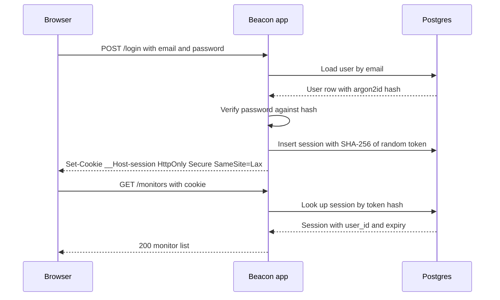
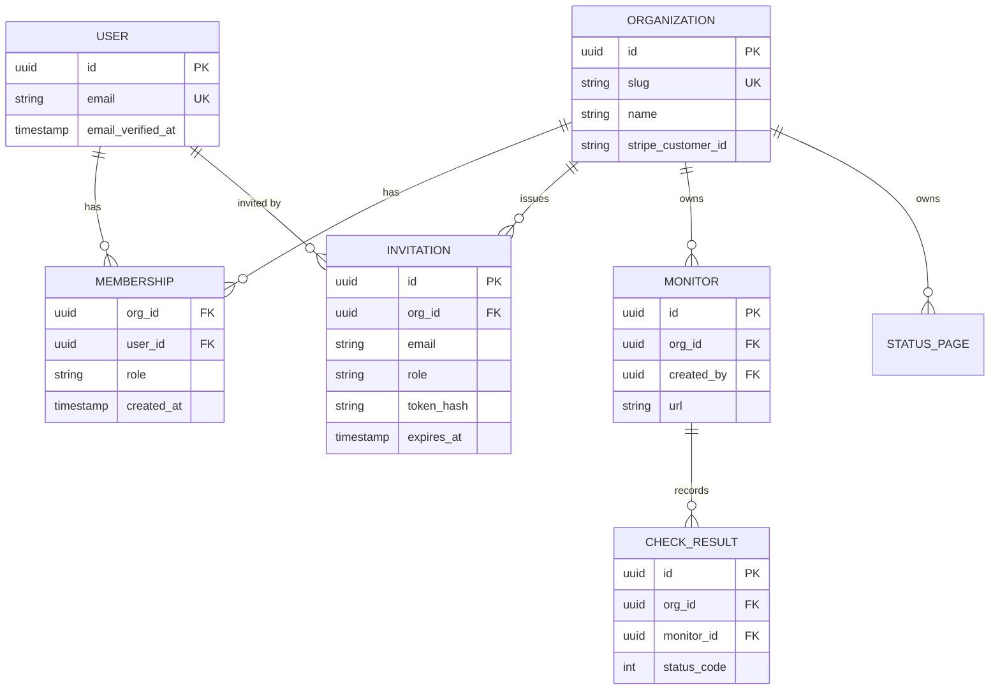
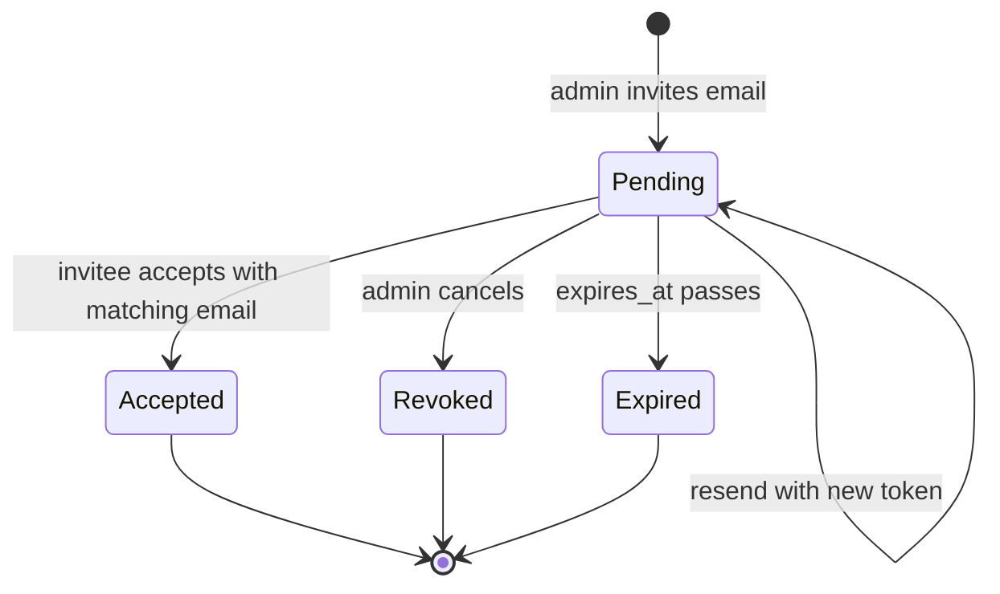
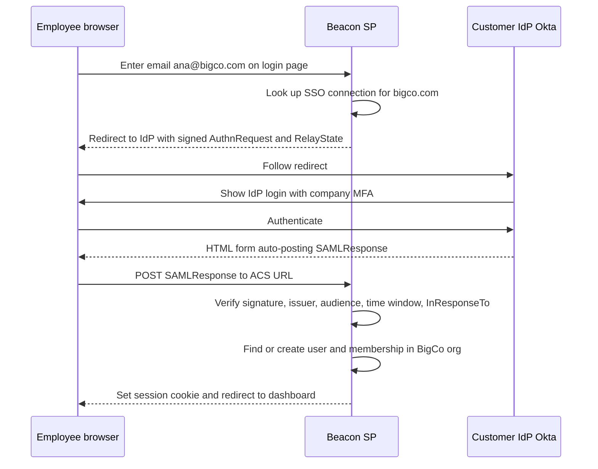

# Module 1 — Identity & Access

*Every SaaS needs to answer three questions on every request: who are you, which customer do you belong to, and are you allowed to do this? This module builds those answers in order: authentication, the organization-and-membership skeleton that makes a product multi-tenant, authorization, and finally the enterprise layer (SSO, SAML, OIDC, SCIM) that big customers expect before they sign. Get these four right early. Retrofitting them later costs far more than the rest of the course put together.*

---

# 1.1 — Authentication: proving who someone is

*Level: 🟢 Beginner*

## 🧭 Why every SaaS has this

Beacon's first prototype had no login. One monitor list, one status page, everything on `localhost`. Then a friend asked to try it, and within an hour you had real questions. How does Beacon know that the person editing the `api.acme.com` monitor is someone from Acme? How do they get back in tomorrow? What happens when they forget their password, or sign up with Google on Monday and try email on Tuesday?

Authentication (often shortened to **authn**) is the process of proving that the person or program making a request is who they claim to be. It is different from **authorization** (authz, lesson 1.3), which decides what that proven identity may do. Most security bugs in young SaaS products live on the border between the two, but authentication comes first: if identity is wrong, every later check is checking the wrong person.

The login form is the easy part. The hard parts are the edges: replayable password resets, session cookies readable by injected scripts, an "email not found" message that tells attackers who your customers are, and a logout button that logs nobody out.

**Authentication is not a login form; it is a set of flows (sign-up, sign-in, recovery, verification, logout) that all have to be as strong as each other, because an attacker picks the weakest one.**

## 📐 How it works

### 🟢 The essentials

Three ideas carry most of the weight: credentials, sessions and cookies.

**Credentials** are what the user presents to prove identity. The common kinds:

| Factor | Example | Strength | Main weakness |
|---|---|---|---|
| Something you know | Password | Weak alone | Reuse, phishing, guessing |
| Something you have (email inbox) | Magic link, reset link | Medium | Only as safe as the inbox |
| Delegated identity | "Sign in with Google" (OAuth/OIDC) | Good | Account-linking mistakes |
| Something you have (device) | TOTP app, passkey | Strong | Recovery when the device is lost |
| Something you are | Face or fingerprint unlocking a passkey | Strong | Never leaves the device, so it is not a server-side factor |

**Passwords must be hashed, never encrypted and never stored plain.** A hash is a one-way function: you can check a guess against it but you cannot reverse it. Ordinary hashes like SHA-256 are designed to be fast, which is exactly wrong here, because a fast hash lets an attacker who steals your database try billions of guesses per second. Password hashes are *deliberately slow* and *salted* (each hash mixes in a random value so identical passwords produce different hashes). Use **argon2id** (the current OWASP recommendation) or **bcrypt** (older, everywhere, fine). Note that bcrypt only looks at the first 72 bytes of input. Every mainstream stack has this built in: Django's `contrib.auth`, Rails' `has_secure_password`, Laravel's `Hash` facade, Go's `golang.org/x/crypto`.

**Sessions** are how the server remembers you between requests. HTTP is stateless, so after a successful login the server creates a session record and hands the browser an unguessable random token. Every later request carries the token, and the server looks it up.

**Cookies** carry that token. Four attributes matter:

- `HttpOnly`: JavaScript cannot read the cookie, so an XSS bug cannot simply steal it.
- `Secure`: only sent over HTTPS.
- `SameSite=Lax`: the browser does not attach the cookie to most cross-site requests, which blocks the classic CSRF (cross-site request forgery) attack where another site submits a form to yours. `Strict` is tighter but breaks "click a link in Slack and arrive logged in".
- `Path=/` plus the `__Host-` name prefix: the browser then refuses the cookie unless it is `Secure`, has no `Domain` attribute and has `Path=/`, which stops subdomains from overwriting it.

Here is the whole flow for a password login:



The database stores a *hash* of the session token, so a leaked copy of the `sessions` table cannot be used to log in. It is cheap, and most tutorials skip it.

```ts
import { randomBytes, createHash } from "node:crypto";

const sha256 = (s: string) => createHash("sha256").update(s).digest("hex");

export async function createSession(userId: string) {
  const token = randomBytes(32).toString("base64url"); // 256 bits of randomness
  await db.session.create({
    data: {
      id: sha256(token),                                  // store only the hash
      userId,
      expiresAt: new Date(Date.now() + 30 * 24 * 3600 * 1000),
    },
  });
  return token; // goes into the cookie, never logged
}

export async function validateSession(token: string) {
  const session = await db.session.findUnique({ where: { id: sha256(token) } });
  if (!session || session.expiresAt < new Date()) return null;
  return session; // optionally slide expiresAt forward here
}
```

**Sessions vs JWTs.** A JWT (JSON Web Token) is a signed blob containing claims such as a user id and an expiry. The server can verify it without a database lookup, which is its selling point and its problem: you cannot easily *un-issue* one. If a laptop is stolen or an employee is fired, a JWT stays valid until it expires. Teams then bolt on a denylist, which is a database lookup on every request, which is a session with extra steps. For a web app talking to its own backend, **server-side sessions in Postgres or Redis are the sane default**. JWTs earn their place when a token must be verified by a *different* service that cannot reach your session store, such as an OIDC ID token from Google or a short-lived token for a separate API. Lesson 5.2 covers API keys, which are a separate thing again.

**Email verification** proves the user controls the address they typed. Send a link or a 6-digit code, and until it is confirmed, do not trust the address for anything important: account linking, invitations (1.2), or SSO domain matching (1.4).

### 🟡 Going deeper

**Password reset** is a login flow in disguise, so treat it like one. Generate a random token, store its hash with a short expiry (15 to 60 minutes), make it single-use, and email a link. When it is used, invalidate the user's other sessions, because a reset often means "I think someone else is in my account". The response to "send me a reset link" must be identical whether or not the email exists.

That last point is **account enumeration**: any difference in response text, status code or even timing that reveals whether an email is registered. Attackers use it to build target lists. Fix the messages ("If an account exists, we've sent a link"), and do the slow hash even when the user is missing so timing does not leak. Sign-up is harder to hide, because "this email is taken" is useful UX. A common compromise is to always say "check your inbox" and email the existing owner a "you already have an account" note.

**Brute-force and credential stuffing protection.** Credential stuffing is replaying username/password pairs leaked from *other* sites. Defences, in rough order of value:

1. Rate-limit login attempts per IP and per account (lesson 5.2 covers rate limiters). Prefer slowing down and adding a CAPTCHA over hard account lockout, which lets anyone lock out your customers.
2. Reject known-breached passwords at sign-up and reset. The Have I Been Pwned "Pwned Passwords" range API lets you do this without sending the password anywhere: you send the first 5 characters of its SHA-1 hash and compare locally.
3. Follow NIST SP 800-63B: favour length, drop composition rules ("one symbol, one capital") and forced periodic rotation.
4. Offer MFA, and nudge admins to use it.

**Magic links** email a one-time sign-in link. They remove password reuse and they are only as safe as the user's inbox. One real-world trap: corporate email security scanners open links to check them, which consumes a single-use token before the human clicks. The fix is to have the link open a page with a "Sign in" button that submits a POST, or to send a short code the user types instead.

**Social login (OAuth 2.0 + OpenID Connect).** OAuth 2.0 (RFC 6749) is a protocol for delegating access; OpenID Connect (OIDC) is a thin identity layer on top that adds an **ID token**, a JWT saying "this is user X, verified by Google". The flow you want is the **authorization code flow with PKCE** (RFC 7636, "pixie"): Beacon redirects to Google with a hashed random `code_challenge`, Google redirects back with a short-lived `code`, and Beacon exchanges the code plus the original `code_verifier` for tokens over a back channel. PKCE stops an intercepted code from being useful. The `state` parameter ties the callback to the browser that started it, which stops login CSRF. The implicit flow is deprecated in the OAuth 2.0 Security BCP (RFC 9700). Do not use it.

The dangerous part of social login is **account linking**. If someone signs in with GitHub using `ana@acme.com` and a password account with that address already exists, do you merge them? Only if the provider says the email is *verified*, and even then prefer "sign in with your existing method to link". The 2023 "nOAuth" research showed apps taking over accounts because they trusted a mutable, unverified `email` claim from a Microsoft Entra ID tenant. Key identities on the provider's stable subject id (`sub`), never on the email.

**MFA (multi-factor authentication).** The common second factor is **TOTP** (RFC 6238): a shared secret stored in an authenticator app generates a 6-digit code every 30 seconds. Store the secret encrypted, accept a one-step clock drift, prevent reuse of the same code, and always issue **recovery codes** at enrolment (hashed, single-use). SMS codes are better than nothing and weaker than TOTP because of SIM-swap attacks.

**Passkeys (WebAuthn).** A passkey is a public/private key pair created by the user's device or password manager for one specific site. The server stores only the public key. At login the server sends a random challenge, the device signs it after a fingerprint or PIN, and the server verifies the signature. Passkeys are **phishing-resistant**: the browser binds each credential to your domain (the "relying party ID"), so a look-alike site cannot request a signature for Beacon's credential. Offer them alongside email, not as the only door, until your users' devices catch up.

### 🔴 At scale / enterprise

**Session management becomes a feature.** Users expect a "Where you're signed in" page listing devices, with a "sign out everywhere" button. That is trivial with server sessions (`DELETE FROM sessions WHERE user_id = $1`) and painful with long-lived JWTs. Rotate the session token at login and whenever privilege changes, to avoid session fixation, where an attacker plants a known token in the victim's browser before they log in.

**Step-up authentication.** Some actions deserve fresh proof: changing the account email, disabling MFA, generating an API key, deleting an org. Record `authenticated_at` on the session and require re-authentication if it is older than a few minutes.

**Token theft is the modern attack.** With MFA widespread, attackers steal *session cookies* from infected machines or relay logins through phishing proxies. Layer the defences: short idle timeouts for admin areas, alerts on device changes, passkeys (which proxies cannot relay), and fast revocation.

**Where the auth code lives** is the big architectural choice:

| Approach | Examples | You own | Trade-off |
|---|---|---|---|
| Library in your app | Better Auth, Auth.js, Devise, django-allauth | Everything, in your DB | Most control; you patch and operate it |
| Self-hosted auth server | Keycloak, Ory Kratos, Zitadel, Logto, SuperTokens | A separate service | Clean boundary, one more thing to run |
| Managed service | Clerk, Auth0, WorkOS AuthKit, Supabase Auth, Firebase Auth, Stytch | Configuration | Fastest; per-MAU pricing and lock-in |

Lock-in is mostly about **password hashes and user ids**. Check that the vendor exports hashes in a standard format, and keep your own `users` table keyed by your own id, with the vendor's id as a column.

## 🏆 The best repos

| Repo | What it is | Stack | License | Pick it when |
|---|---|---|---|---|
| [better-auth/better-auth](https://github.com/better-auth/better-auth) | Framework-agnostic auth library with plugins for orgs, 2FA, passkeys, magic links | TypeScript | MIT | You are starting a new TypeScript app and want auth in your own database |
| [nextauthjs/next-auth](https://github.com/nextauthjs/next-auth) | Auth.js, the long-standing OAuth-first auth library for Next.js and others | TypeScript | ISC | You maintain an existing Auth.js app; new projects should look at Better Auth |
| [lucia-auth/lucia](https://github.com/lucia-auth/lucia) | Deprecated as a library; now a guide to implementing sessions yourself | TypeScript | MIT | You want to understand sessions properly or roll a small, clean implementation |
| [supabase/auth](https://github.com/supabase/auth) | The auth server behind Supabase (a fork of Netlify's GoTrue) | Go | MIT | You use Supabase, or want a small JWT-based auth API to study |
| [ory/kratos](https://github.com/ory/kratos) | Headless identity server: registration, login, recovery, MFA, passkeys | Go | Apache-2.0 | You want a separate, API-first identity service you self-host |
| [keycloak/keycloak](https://github.com/keycloak/keycloak) | Full identity and access management server with admin UI | Java | Apache-2.0 | You need everything (OIDC, SAML, federation) and can run a JVM service |
| [logto-io/logto](https://github.com/logto-io/logto) | Auth platform with hosted sign-in UI, orgs and enterprise SSO | TypeScript | MPL-2.0 | You want a self-hostable alternative to Auth0 with a modern UI |
| [supertokens/supertokens-core](https://github.com/supertokens/supertokens-core) | Self-hostable auth core plus SDKs for many frameworks | Java | Apache-2.0 | You want managed-style SDKs but on your own infrastructure |
| [pennersr/django-allauth](https://github.com/pennersr/django-allauth) | The standard Django package for accounts, social login and MFA | Python | MIT | You are on Django |
| [heartcombo/devise](https://github.com/heartcombo/devise) | The classic Rails authentication engine | Ruby | MIT | You are on Rails (Rails 8 also ships a simpler built-in generator) |

**If you only study one:** read **lucia-auth/lucia**. It is short, it explains *why* each piece of a session system exists (token generation, hashing, expiry, sliding renewal, CSRF), and it is written for people who want to understand rather than configure. Then adopt Better Auth or your framework's standard library knowing what it does underneath.

**Buy, build, or self-host?**

- **Buy** (Clerk, Auth0, WorkOS AuthKit, Stytch, Supabase Auth, Firebase Auth) when time-to-market matters most and you want prebuilt UI, MFA and passkeys on day one. Watch the per-user pricing curve and export terms.
- **Self-host** (Keycloak, Ory, Zitadel, Logto, authentik) when you must keep identity data in your own infrastructure, or you ship a self-hostable product (lesson 7.4) and cannot depend on a SaaS vendor.
- **Build** on a library (Better Auth, Auth.js, Devise, django-allauth) for most B2B SaaS. You keep users in your own Postgres and still avoid writing crypto. Never write the password hashing or OAuth protocol code yourself.

## 🔍 Study it in the wild

**openstatusHQ/openstatus** is an open-source uptime monitor and status page, so it is literally a real Beacon. It is a TypeScript monorepo. Open `apps/web`, check its `package.json` to see which auth library it chose, then use code search for `auth` and `session`. What it does well is proportion: authentication is a small, boring corner of the codebase, which is exactly where it belongs in a product whose value is the monitoring.

**calcom/cal.com** shows authentication at scale in a Next.js monorepo: credentials, Google login, SAML SSO, and two-factor authentication. Search for `NextAuth` or `authOptions` to find the provider setup, and `twoFactor` to see how TOTP is layered onto credential login. The Prisma schema in `packages/prisma` shows how identity fields sit on the `User` model.

**nextjs/saas-starter** is the smallest complete example: email and password with bcrypt, a signed session cookie via `jose`, and middleware that protects routes. Read all of it in an evening. It shows the trade-off of stateless signed cookies: simple, but no server-side revocation list.

**documenso/documenso** handles authentication for a product where identity is legally meaningful (e-signatures). Search for `passkey` and `two-factor` to see WebAuthn and TOTP, and for `signin` in the web app to find the flows.

**What to notice:**

- Where the session is stored (database row, Redis, or a signed cookie) and what that means for "sign out everywhere".
- How OAuth accounts are linked to users: by provider subject id, email, or both, and whether "verified email" is checked.
- Whether reset, verification and magic-link tokens are hashed at rest and single-use.
- How the login and reset endpoints respond to unknown emails.
- Where MFA is enforced: in the login flow only, or re-checked on sensitive actions.

## 🛠️ Build it into Beacon

### 🟢 Beginner exercise

Add email-and-password sign-up and login to Beacon using Better Auth (or Devise, django-allauth, or Laravel's starter kits in your stack). Protect the `/monitors` pages so logged-out users are redirected to `/login`. Add a logout button that deletes the server-side session.

**Done when:**
- Passwords are stored as argon2id or bcrypt hashes. Grep your database dump for a test password and find nothing.
- The session cookie is `HttpOnly`, `Secure` in production, and `SameSite=Lax`.
- After logout, replaying the old cookie with `curl` returns a redirect or 401.

### 🟡 Intermediate exercise

Add "Sign in with GitHub" and a password-reset flow. Link a GitHub identity to an existing user only when GitHub reports the email as verified *and* the user confirms by signing in with their existing method. Make the reset request endpoint return the same response for known and unknown emails.

**Done when:**
- The OAuth flow uses the authorization code grant with PKCE and validates `state`.
- Reset tokens are hashed in the database, expire within an hour, and fail on second use.
- A completed reset signs out every other session for that user.
- Response bodies for "reset my password" are byte-identical for existing and non-existing emails.

### 🔴 Advanced exercise

Add passkeys and TOTP as second factors, a "Signed-in devices" page, and step-up re-authentication for "create API key" and "delete organization". Rate-limit login by IP and by account using Redis.

**Done when:**
- A user can register a passkey and sign in with it without a password.
- TOTP enrolment issues ten hashed, single-use recovery codes.
- Revoking a device on the devices page makes that browser's next request unauthenticated.
- Twenty failed logins in a minute for one account trigger a slowdown or CAPTCHA, not a permanent lockout.

## ⚠️ Mistakes juniors make

- **Storing JWTs in `localStorage`.** Any XSS bug, including one in a third-party script, can read and send it. Use an `HttpOnly` cookie, and for your own web app a server-side session.
- **Hashing passwords with SHA-256 or MD5, even with a salt.** They are fast, so leaked hashes get cracked in bulk on GPUs. Use argon2id or bcrypt through a maintained library.
- **Matching OAuth accounts by email alone.** Unverified or mutable email claims let an attacker sign in as someone else. Store `(provider, provider_user_id)` and treat email as a hint.
- **Reset and magic-link tokens that live forever or work twice.** Old emails get forwarded, archived and leaked. Hash them, expire them in minutes, and delete them on use.
- **Leaking account existence.** "No user with that email" on login or reset gives attackers a free target list. Use one generic message and constant-ish timing.
- **Logout that only clears the cookie.** If the token is still valid server-side, anyone who copied it stays in. Delete the session row.

## 🧾 Recap

- Authentication is a set of flows: sign-up, login, verification, reset, MFA and logout. Secure all of them equally.
- Hash passwords with argon2id or bcrypt. Store only hashes of session, reset and magic-link tokens.
- Server-side sessions in an `HttpOnly`, `Secure`, `SameSite=Lax` cookie are the default. JWTs are for verification across services.
- Social login means authorization code plus PKCE, keyed on the provider's subject id, never on email alone.
- Passkeys are phishing-resistant and the future. TOTP with recovery codes is today's solid MFA.
- Use a library or service for the crypto and protocols. Your job is getting the flows and edge cases right.

## 📚 References

- OWASP Cheat Sheet Series: Authentication, Password Storage, and Session Management cheat sheets — https://cheatsheetseries.owasp.org
- NIST SP 800-63B, Digital Identity Guidelines: Authentication and Lifecycle Management — https://pages.nist.gov/800-63-4/
- RFC 6749, The OAuth 2.0 Authorization Framework — https://www.rfc-editor.org/rfc/rfc6749
- RFC 7636, Proof Key for Code Exchange (PKCE) — https://www.rfc-editor.org/rfc/rfc7636
- RFC 9700, Best Current Practice for OAuth 2.0 Security — https://www.rfc-editor.org/rfc/rfc9700
- OpenID Connect Core 1.0 — https://openid.net/specs/openid-connect-core-1_0.html
- W3C Web Authentication (WebAuthn) and the passkeys developer site — https://www.w3.org/TR/webauthn/ and https://passkeys.dev
- Lucia's guide to sessions — https://lucia-auth.com

---

# 1.2 — Users, organizations & invitations: the multi-tenant skeleton

*Level: 🟢 Beginner* · *Prerequisites: 1.1*

## 🧭 Why every SaaS has this

Version one of Beacon put `user_id` on every monitor. It worked beautifully for a week. Then Priya from Acme signed up, created twelve monitors, and asked how her on-call teammate could see them. Then she asked how to remove a contractor without deleting the monitors he created. Then her finance team asked to be billed once, for the company, not once per engineer. Then Priya went on holiday and nobody could change anything.

Each of those requests has the same root cause: **the customer is not a person, it is a group of people.** B2B software is bought by companies, used by teams, and outlives any individual employee. If resources belong to users, every team feature becomes a hack of shared passwords, "transfer all my stuff" scripts, and billing reconciled by hand.

The fix is a small data model that almost every B2B SaaS converges on: **users** belong to **organizations** through **memberships**, and everything the product creates belongs to the organization. The organization is the **tenant**, the unit of isolation, billing and ownership. Slack calls it a workspace, GitHub an organization, Dub a workspace, Cal.com a team or org. The name varies. The shape does not.

**Resources belong to the organization, people belong to the organization through memberships, and nothing belongs to a user except their own login.**

## 📐 How it works

### 🟢 The essentials

Four terms, defined carefully because products use them inconsistently:

| Term | What it is | Beacon example |
|---|---|---|
| User | A human identity that can log in. Global, not per-customer. | `priya@acme.com` |
| Organization (org, workspace, team, tenant) | The customer. Owns data, pays the bill. | "Acme Inc" |
| Membership | The link between a user and an org, carrying a role. | Priya is `owner` of Acme |
| Invitation | A pending membership for someone who has not accepted yet. | Invite `sam@acme.com` as `member` |

A warning about **"account"**. In Auth.js and Better Auth an `account` row is a linked login method, such as "this user's GitHub identity". In Chatwoot and many Rails apps, `Account` is the *tenant*. In billing systems it means the paying customer. When you read a codebase, find out which meaning it uses before you trust your intuition.

Here is Beacon's core model:



Three details in that diagram are deliberate.

First, `MEMBERSHIP` has a unique constraint on `(org_id, user_id)`: one role per person per org. A user can be in many orgs, which is normal for consultants, agencies and anyone with a side project.

Second, `MONITOR.created_by` is kept for history and display, but ownership is `org_id`. When the contractor leaves, his monitors stay.

Third, `CHECK_RESULT` carries `org_id` even though you could reach the org through the monitor. This is **the tenant_id rule: every tenant-owned row carries the tenant id, directly.** It means every query can filter by org without a join, every index can start with `org_id`, and a missing `WHERE org_id = ...` stands out in code review. It also unlocks Postgres row-level security and sharding later (lesson 2.4). Denormalising one uuid column is cheap. Discovering that your biggest table cannot be filtered by tenant is not.

**Personal workspaces.** What happens right after sign-up? You have two sane options. Either create an org automatically ("Priya's workspace") so the user lands in a working product, or send them through a short "name your team" onboarding step. Both keep the key invariant: *there is no such thing as a resource without an org.* Avoid the third option, where solo users own resources directly and teams are bolted on later. That gives you two code paths for every feature forever.

### 🟡 Going deeper

**Invitations** look simple and hide a lot of decisions. The lifecycle:



The token rules are the same as reset tokens from lesson 1.1: random, stored as a hash, expiring (7 days is common), single-use. The decisions that are specific to invites:

- **Must the accepting user's email match the invited email?** Matching is safer: a forwarded invite cannot be used by the wrong person. Not matching is friendlier: people have work and personal addresses. Beacon's choice is to require a match, and if the logged-in email differs, say so clearly and offer to switch accounts. If you allow a mismatch, at least show the admin who actually accepted.
- **New versus existing users.** The same link must work for both. If the email has no account, sign-up comes first, then acceptance, with the email pre-filled and verified by virtue of the click.
- **Invite spam.** Invitations send email from your domain to arbitrary addresses. Rate-limit them per org, and do not let unverified users send them, or your sending reputation (lesson 4.1) becomes someone else's phishing tool.
- **Role escalation.** An admin must not be able to invite someone as `owner` if admins cannot become owners themselves. Check that the inviter holds at least the role they are granting (lesson 1.3).

Accepting an invite is a small transaction:

```ts
export async function acceptInvite(rawToken: string, user: { id: string; email: string }) {
  return db.$transaction(async (tx) => {
    const invite = await tx.invitation.findUnique({ where: { tokenHash: sha256(rawToken) } });
    if (!invite || invite.expiresAt < new Date() || invite.acceptedAt) {
      throw new Error("Invitation is invalid or expired");
    }
    if (invite.email.toLowerCase() !== user.email.toLowerCase()) {
      throw new Error("This invitation was sent to a different email");
    }
    await tx.membership.upsert({
      where: { orgId_userId: { orgId: invite.orgId, userId: user.id } },
      create: { orgId: invite.orgId, userId: user.id, role: invite.role },
      update: {}, // already a member: keep the existing role
    });
    await tx.invitation.update({ where: { id: invite.id }, data: { acceptedAt: new Date() } });
    return invite.orgId;
  });
}
```

**Org switching.** Where does "the current org" live? Two common designs:

| Design | Example URL | Pros | Cons |
|---|---|---|---|
| Org in the URL | `/acme/monitors/123` | Shareable links, two orgs in two tabs, obvious in logs | Every route takes a slug |
| Org in the session | `/monitors/123` plus a "current org" cookie | Shorter URLs | Tabs fight each other, pasted links break for multi-org users |

Prefer the URL. Either way, **the org id from the URL or cookie is a claim, not a fact.** On every request, load the membership for `(org, current user)` and reject the request if it does not exist. That one lookup is the foundation lesson 1.3 builds on.

**Leaving, removing and ownership.** Encode these invariants in code, not in hope:

- An org always has at least one owner. The last owner cannot leave or be demoted until they transfer ownership.
- **Ownership transfer** is a deliberate, confirmed action, ideally with step-up authentication and an email to both parties. It often also moves billing responsibility.
- Removing a member deletes their membership and revokes anything that acted as them in that org: their personal API tokens, pending invites they sent, and cached sessions scoped to the org.
- **Deleting a user** who owns orgs must be blocked, or must first transfer or delete those orgs. Otherwise you create orphaned tenants nobody can administer.

**Deleting an org** is the most destructive action in the product. Make it a soft delete with a grace period (say 30 days) during which the org is inaccessible but restorable. Cancel the subscription immediately, stop scheduled monitor checks, then hard-delete data with a background job (lesson 5.1). This also covers the "an intern deleted production" support ticket.

**Seats.** If you price per seat, a seat is usually a membership, and sometimes a pending invitation too. Decide which, write it down, and make the seat count a query over memberships, not a counter you increment and forget to decrement. Lesson 3.2 turns this into entitlements and Stripe quantities. Beacon prices by monitors, not seats, which is one reason it was chosen: seat pricing punishes the "invite the whole on-call rotation" behaviour you want.

### 🔴 At scale / enterprise

**Hierarchy.** Big customers want structure inside the tenant: an enterprise org containing teams, each with its own monitors and status pages, and people in several teams with different roles. Cal.com models this as organizations containing teams. Keep the *billing and isolation boundary* at the top-level org, and treat teams as a grouping for permissions (lesson 1.3), not as separate tenants.

**Domain capture and auto-join.** Once Acme verifies it owns `acme.com` (lesson 1.4), new sign-ups with `@acme.com` emails can be offered "join Acme's workspace" instead of creating a stray personal org, which Acme's IT team will otherwise find and complain about. Only offer this for verified domains, and never for public email providers.

**Moving resources between orgs.** Customers merge, split and reorganise. Because every row carries `org_id`, a move is an update of that column across a known set of tables inside one transaction, plus an audit log entry (lesson 7.3). This is where the tenant_id rule pays for itself a second time.

**Isolation at scale.** With thousands of tenants, the questions become where a tenant's data lives (shared tables, schema per tenant, database per tenant), how to stop one huge tenant from slowing everyone down, and how to honour "our data stays in the EU". Those are lesson 2.4. The good news is that `org_id` on every row keeps every option open: Citus, for example, shards Postgres tables by a distribution column, and a tenant id is the textbook choice.

## 🏆 The best repos

| Repo | What it is | Stack | License | Pick it when |
|---|---|---|---|---|
| [nextjs/saas-starter](https://github.com/nextjs/saas-starter) | Minimal official Next.js SaaS template with teams, invitations, roles and an activity log | TypeScript, Drizzle, Postgres | MIT | You want the smallest readable version of the whole skeleton |
| [better-auth/better-auth](https://github.com/better-auth/better-auth) | Auth library whose organization plugin provides orgs, members, roles and invitations | TypeScript | MIT | You want the org model generated for you, in your own database |
| [boxyhq/saas-starter-kit](https://github.com/boxyhq/saas-starter-kit) | Enterprise-flavoured starter: teams, invites, SSO, directory sync, audit logs, webhooks | TypeScript, Next.js, Prisma | Apache-2.0 | You know you will sell to enterprises and want SSO-ready team models |
| [calcom/cal.com](https://github.com/calcom/cal.com) | Scheduling SaaS with users, teams and organizations containing teams | TypeScript, Prisma | AGPL-3.0 | You want to see a hierarchy (org to team to member) in production |
| [dubinc/dub](https://github.com/dubinc/dub) | Link-management SaaS with slug-based workspaces, invites and plan limits | TypeScript, Prisma | AGPL-3.0 | You want a clean workspace-in-the-URL design |
| [documenso/documenso](https://github.com/documenso/documenso) | E-signature SaaS with organisations, teams and member invitations | TypeScript, Prisma | AGPL-3.0 | You want to see a team model added to a product that began single-user |
| [logto-io/logto](https://github.com/logto-io/logto) | Auth platform with built-in organizations, org roles and invitations | TypeScript | MPL-2.0 | You want orgs handled by a self-hosted identity service rather than your app |
| [citusdata/citus](https://github.com/citusdata/citus) | Postgres extension that distributes tables across nodes by a column | C | AGPL-3.0 | You are planning for very large multi-tenant scale and want to see why `org_id` everywhere matters |

**If you only study one:** **nextjs/saas-starter**. Its whole schema fits on one screen: users, teams, team members with a role, invitations and an activity log. It is not complete (no ownership transfer, a single team per user in the UI), and spotting what is missing is itself a good exercise.

**Buy, build, or self-host?**

- **Buy** when you already use a managed auth provider that includes organizations. Clerk, WorkOS, Auth0 (Organizations), Stytch and Kinde all model orgs, memberships and invites. It is fast, but your most important business relation now lives in a vendor's database, so mirror orgs and memberships into your own tables via webhooks.
- **Self-host** an identity server with an org model (Logto, Zitadel, Keycloak's organizations) if you already run one for authentication.
- **Build** it in most cases. It is four tables and a handful of invariants, it is the heart of your domain model, and every other component (billing, permissions, audit, limits) joins against it. Better Auth's organization plugin is a good middle path: generated tables, in your own database.

## 🔍 Study it in the wild

**calcom/cal.com** shows a mature hierarchy. Open `packages/prisma` and read the Prisma schema's `Team` and `Membership` models. At the time of writing, organizations are teams with extra organization settings and child teams point at a parent. Notice how memberships carry both a role and an acceptance flag, so a pending invite and an active member share a table. Search for `inviteMember` to follow the invite flow end to end.

**dubinc/dub** puts the workspace slug at the front of every dashboard URL, which makes support links and multi-tab use painless. At the time of writing its Prisma model for workspaces kept the older name `Project`, which is a realistic lesson in how product vocabulary changes faster than schemas. Search for `ProjectUsers` and `invite` to find memberships and invitations, then look at how API routes resolve the workspace and check membership before doing anything.

**nextjs/saas-starter** keeps everything in one Drizzle schema file. Search for `teamMembers` and `invitations`. Read the sign-up action to see how a new user either creates a team or joins one from an invite in a single step.

**documenso/documenso** added teams and later organisations to a product that started with single users owning documents, so it shows the migration path you want to avoid needing. Search the Prisma schema for `Organisation` and `Team` (British spelling) and see how documents are scoped.

**What to notice:**

- Whether each product auto-creates a personal workspace at sign-up, and how that shapes onboarding.
- Whether pending invitations live in their own table or as not-yet-accepted memberships.
- How the "current org" is resolved on each request, and where membership is verified.
- Which tables carry the tenant id directly, and which rely on joins.
- What happens to an org's data when it is deleted: cascades, soft deletes, or background jobs.

## 🛠️ Build it into Beacon

### 🟢 Beginner exercise

Add `organizations` and `memberships` tables and move `monitors` from `user_id` ownership to `org_id` ownership, keeping `created_by`. On sign-up, create a personal org with the user as `owner`. Put the org slug in the URL: `/[orgSlug]/monitors`.

**Done when:**
- Every monitor row has a non-null `org_id` and every monitor query filters on it.
- Visiting `/some-other-org/monitors` as a non-member returns 404.
- A migration moves existing user-owned monitors into each user's personal org.

### 🟡 Intermediate exercise

Build invitations: an admin enters an email and role, the invitee gets an email link, and accepting creates a membership. Support revoke and resend. Add an org switcher listing every org the user belongs to.

**Done when:**
- Invitation tokens are hashed, expire in 7 days, and cannot be reused.
- An invite for `sam@acme.com` cannot be accepted by a user logged in as `sam@gmail.com`.
- A user with no account can sign up from the invite link and lands inside the org.
- Invites are rate-limited per org.

### 🔴 Advanced exercise

Implement leave, remove member, ownership transfer and org deletion with a 30-day grace period. Add a Postgres row-level security policy on `monitors` as a backstop, so a query without an org filter returns nothing.

**Done when:**
- The last owner cannot leave or be demoted, and the UI explains why.
- Ownership transfer requires re-authentication and emails both parties.
- A deleted org is inaccessible immediately, restorable for 30 days, and purged by a scheduled job after that.
- With RLS on, `SELECT * FROM monitors` from the app's database role returns only the current org's rows.

## ⚠️ Mistakes juniors make

- **Resources owned by users.** It feels simpler until the first team customer. Put `org_id` on resources from day one, even if every org has one member.
- **Trusting the org id from the client.** A request for `/acme/monitors` from someone who is not in Acme must fail. Look up the membership server-side on every request, and return 404 rather than 403 so you do not reveal that the org exists.
- **Tenant id only on the top table.** If `check_results` can only reach its org through `monitors`, someone will eventually write a query that forgets the join. Put `org_id` on every tenant-owned table and lead your indexes with it.
- **Invites that anyone with the link can accept, forever.** Forwarded and leaked links then become backdoors. Expire them, bind them to the invited email, and show admins who accepted.
- **Hard-deleting orgs synchronously.** It times out on big tenants and cannot be undone. Soft delete, cancel billing, then purge in a background job.
- **Forgetting the last-owner rule.** An org with no owner becomes a support ticket that only a database console can fix.

## 🧾 Recap

- The tenant is the organization. Users join it through memberships that carry a role.
- Every tenant-owned row carries `org_id` directly. It is the cheapest insurance in the whole course.
- Invitations are tokens: hashed, expiring, single-use, and preferably bound to an email.
- Put the org in the URL and verify membership on every request.
- Encode the invariants: at least one owner, deliberate ownership transfer, soft delete with a grace period.

## 📚 References

- Better Auth documentation, Organization plugin — https://www.better-auth.com/docs
- Clerk documentation, Organizations — https://clerk.com/docs
- WorkOS documentation, which covers organizations, invitations and domain verification — https://workos.com/docs
- PostgreSQL documentation, Row Security Policies — https://www.postgresql.org/docs/current/ddl-rowsecurity.html
- Citus documentation on multi-tenant applications — https://docs.citusdata.com
- nextjs/saas-starter README — https://github.com/nextjs/saas-starter

---

# 1.3 — Authorization: roles, permissions, and "can this user do this?"

*Level: 🟡 Intermediate* · *Prerequisites: 1.1, 1.2*

## 🧭 Why every SaaS has this

In March 2012 a developer named Egor Homakov reported that Ruby on Rails apps were widely vulnerable to **mass assignment**: code like `User.update(params[:user])` would happily set *any* column the request mentioned, including ones the form never showed. When the report was not taken seriously, he demonstrated it on GitHub itself. By adding an extra field to a form submission, he attached his own SSH key to the Rails organization and pushed a commit to the `rails/rails` repository. GitHub fixed the hole within hours and suspended, then reinstated, his account. Rails responded with **strong parameters**, which became the default in Rails 4: the controller must list explicitly which fields a request may set.

Nobody at GitHub forgot to write a permission check for "add a key to this repository". The failure was quieter: the server trusted the client to only send what the form showed. That is the lesson of authorization in one incident. The rules are rarely complicated. **What goes wrong is where and how they are enforced.**

Beacon has the same exposure. `GET /api/monitors/123` must not return monitor 123 if it belongs to another org. `PATCH /api/members/45 {"role": "owner"}` must not work for a plain member. A viewer must not delete a status page just because the button is hidden in the UI rather than blocked on the server. The OWASP API Security Top 10 (2023) lists these as #1 Broken Object Level Authorization, #3 Broken Object Property Level Authorization (which includes mass assignment) and #5 Broken Function Level Authorization. They are the most common API bugs in the wild because they are invisible in a demo.

**Authorization is a question the server asks on every request, about a specific user, action and object, and the answer is never taken from the client.**

## 📐 How it works

### 🟢 The essentials

Every authorization check has the same inputs: a **subject** (who: user or API key), an **action** (what: `monitor.delete`), and a **resource** (which object: monitor 123, in org Acme). Output: allow or deny.

The simplest workable model is **RBAC (role-based access control)**: each membership from lesson 1.2 has a role, and each role grants a fixed set of permissions. Beacon's matrix:

| Permission | Owner | Admin | Member | Viewer |
|---|---|---|---|---|
| View monitors, incidents, status pages | ✓ | ✓ | ✓ | ✓ |
| Create and edit monitors | ✓ | ✓ | ✓ | |
| Update incidents | ✓ | ✓ | ✓ | |
| Publish status page, set custom domain | ✓ | ✓ | | |
| Invite and remove members | ✓ | ✓ | | |
| Manage billing | ✓ | | | |
| Delete the organization, transfer ownership | ✓ | | | |

The most important design decision is small: **check permissions, not roles.** Code that says `if (role === "admin")` has to be hunted down and edited every time you add a role. Code that says `can(member, "monitor.write")` only needs the role-to-permission map updated.

```ts
const PERMISSIONS = {
  owner:  ["monitor.read", "monitor.write", "incident.write", "page.publish",
           "member.manage", "billing.manage", "org.delete"],
  admin:  ["monitor.read", "monitor.write", "incident.write", "page.publish", "member.manage"],
  member: ["monitor.read", "monitor.write", "incident.write"],
  viewer: ["monitor.read"],
} as const;

type Role = keyof typeof PERMISSIONS;
type Permission = (typeof PERMISSIONS)[Role][number];

export function can(role: Role, permission: Permission): boolean {
  return (PERMISSIONS[role] as readonly string[]).includes(permission);
}

export async function requirePermission(orgSlug: string, userId: string, p: Permission) {
  const m = await db.membership.findFirst({ where: { userId, org: { slug: orgSlug } } });
  if (!m) throw new NotFound();          // not a member: do not reveal the org exists
  if (!can(m.role as Role, p)) throw new Forbidden();
  return m;                              // callers use m.orgId for every query
}
```

**Where to enforce.** The UI hides buttons for a nicer experience. It enforces nothing: anyone can call your API with `curl`. The server is the only place a check counts.

```mermaid
flowchart LR
    R["Request with session or API key"] --> AN["Authenticate: who is this"]
    AN --> TN["Resolve org and membership"]
    TN --> PC["Permission check: can role do action"]
    PC --> Q["Query scoped by org_id"]
    Q --> OC["Object check: is this row in the org"]
    OC --> RES["Response with allowed fields only"]
    UI["UI hides buttons"] -.->|"convenience only"| R
```



Two separate checks appear in that pipeline, and juniors usually write only one:

1. **Function-level**: may this role perform this action at all? (Can a viewer delete monitors?)
2. **Object-level**: is *this specific object* inside the tenant and visible to this user? (Is monitor 123 in Acme?)

The object-level check is where IDOR lives. **IDOR (insecure direct object reference)** is the older name for Broken Object Level Authorization: the API takes an id from the client and fetches the object without checking whose it is. The robust fix is not a separate "check ownership" call that someone can forget, but making it structurally impossible to query without the tenant:

```ts
// Vulnerable: finds monitor 123 in any org
await db.monitor.findUnique({ where: { id } });
// Safe: a monitor from another org simply does not exist for this query
await db.monitor.findFirst({ where: { id, orgId: membership.orgId } });
```

**Mass assignment** is the property-level version. Never pass a request body straight into an update. Parse it with an allow-list schema (Zod in TypeScript, strong parameters in Rails, serializers with explicit fields in Django REST Framework, `$fillable` in Laravel) so `orgId`, `role` or `createdBy` cannot sneak in. The same applies on the way out: return a response DTO, not the raw row, or you will eventually ship someone's `password_hash` or `stripe_customer_id` in a JSON response.

### 🟡 Going deeper

**Role hierarchy and escalation rules.** Admins can manage members, but can an admin promote someone to owner, or remove another admin? Write the rule down: *a user can only grant, change or remove roles at or below their own level, and never their own.* That one sentence prevents the most common privilege-escalation bug in team settings.

**Custom roles.** Business customers will ask for "an on-call role that can update incidents but not edit monitors". If your code already checks permissions rather than role names, custom roles are a data change: store roles as rows with a permission list per org, keep the built-in ones as defaults, and your `can()` function barely changes.

**ABAC (attribute-based access control)** decides using attributes of the subject, resource and context, not just the role. Examples at Beacon:

- A member may edit monitors they created, but only admins may edit others' monitors (`resource.createdBy == subject.id`).
- API access requires the org to be on the Business plan (`org.plan == "business"`). This is really an entitlement (lesson 3.2), but it lives in the same decision.
- Deleting a status page is blocked while an incident is open on it.

ABAC is where hand-written `if` statements start to sprawl across handlers. That is the signal to move rules into one module, or into **policy as code**: authorization rules written in a dedicated language or format, versioned in git, tested like code and evaluated by a library or service. Some flavours:

| Tool | How policies are written | Runs as |
|---|---|---|
| CASL | JavaScript rules (`can("update", "Monitor", { createdBy: user.id })`) | Library in your app and even the browser |
| Casbin | A model file (RBAC, ABAC and more) plus a policy table | Library in many languages |
| Cerbos | YAML resource policies with conditions | Separate stateless service or embedded |
| Open Policy Agent (OPA) | Rego, a declarative query language | Service or library, common in infrastructure |

**Filtering lists.** Single-object checks are easy: fetch it, ask `can()`. Lists are harder. "Show me every monitor I can see" cannot be answered by fetching all monitors and filtering in memory, because that breaks pagination and leaks timing. You need to turn the policy into a **query filter**. For RBAC scoped by org, the filter is just `WHERE org_id = $1`. For ABAC, CASL can convert rules into database conditions, and Cerbos has a "query plan" API that returns a condition tree you translate into SQL. Design your policies so that every rule can become a `WHERE` clause.

### 🔴 At scale / enterprise

**ReBAC (relationship-based access control)** decides by following relationships: Ana can view status page X because she is a member of team Y, which is an editor of folder Z, which contains X. This is what Google Docs sharing, GitHub teams and Notion pages need. The reference design is Google's **Zanzibar** paper (USENIX ATC 2019). Permissions are stored as **relationship tuples** such as `status_page:acme-public#editor@team:sre#member`, and a schema says how relations combine. Open-source systems inspired by Zanzibar include OpenFGA, SpiceDB, Permify and Ory Keto. A small OpenFGA model for Beacon:

```text
model
  schema 1.1

type user

type organization
  relations
    define owner: [user]
    define admin: [user] or owner
    define member: [user] or admin

type status_page
  relations
    define org: [organization]
    define editor: [user] or admin from org
    define viewer: [user] or editor or member from org
```

ReBAC brings real costs. Permissions now live in a separate datastore that must stay in sync with your main database: when a membership row is deleted, the matching tuple must be deleted too, ideally through a transactional outbox (lesson 5.3). Zanzibar also names the **"new enemy" problem**: if you remove Bob from a page and then add a secret to it, a stale permission check must not let Bob see the secret. Zanzibar solves this with consistency tokens ("zookies"). SpiceDB calls them ZedTokens. List filtering becomes a dedicated API: OpenFGA's `ListObjects`, SpiceDB's `LookupResources`. These are powerful and have to be budgeted for performance.

**How far up the ladder should Beacon go?** Probably RBAC with a permissions map, plus a few ABAC rules in one module, for a long time. Move to ReBAC when customers need *sharing of individual objects* across teams, not just more roles. Many successful SaaS products never go past per-org RBAC with custom roles.

**Operating authorization.** At scale you also need an admin view that answers "why can Ana see this?", audit logs for every role change (lesson 7.3), automated tests that call every endpoint as every role (a permission matrix test), and a rule that new endpoints fail closed: denied until a policy explicitly allows them.

## 🏆 The best repos

| Repo | What it is | Stack | License | Pick it when |
|---|---|---|---|---|
| [stalniy/casl](https://github.com/stalniy/casl) | Isomorphic JavaScript authorization library with ORM query adapters | TypeScript | MIT | You want RBAC and ABAC inside a TypeScript app, sharing rules with the frontend |
| [casbin/casbin](https://github.com/casbin/casbin) | Model-driven authorization library (ACL, RBAC, ABAC) with ports to many languages | Go (plus ports) | Apache-2.0 | You want one policy model across Go, Node, Python and Java services |
| [cerbos/cerbos](https://github.com/cerbos/cerbos) | Stateless policy decision point with YAML policies and query planning | Go | Apache-2.0 | You want policy-as-code decoupled from app code, with list filtering support |
| [openfga/openfga](https://github.com/openfga/openfga) | Zanzibar-inspired ReBAC server, a CNCF project originally from Auth0/Okta | Go | Apache-2.0 | You need object-level sharing with a friendly modelling language |
| [authzed/spicedb](https://github.com/authzed/spicedb) | Zanzibar-inspired permissions database with strong consistency features | Go | Apache-2.0 | You need ReBAC at scale and care about the new-enemy problem |
| [Permify/permify](https://github.com/Permify/permify) | Zanzibar-inspired authorization service, now part of FusionAuth | Go | AGPL-3.0 | You want ReBAC plus attribute rules in one service |
| [open-policy-agent/opa](https://github.com/open-policy-agent/opa) | General-purpose policy engine using the Rego language | Go | Apache-2.0 | You want one policy engine for app authz and infrastructure (Kubernetes, CI) |
| [ory/keto](https://github.com/ory/keto) | Zanzibar-inspired permission server in the Ory stack | Go | Apache-2.0 | You already run Ory Kratos or Hydra |
| [osohq/oso](https://github.com/osohq/oso) | The Oso library and Polar language, now deprecated in favour of Oso Cloud | Rust (plus bindings) | Apache-2.0 | As reading: its docs are among the best explanations of authz patterns |

**If you only study one:** **stalniy/casl**. It covers the progression from roles to attribute conditions in code a TypeScript developer can read in an afternoon, and its database adapters show concretely how a permission rule becomes a query filter, which is the hardest idea in this lesson.

**Buy, build, or self-host?**

- **Buy** a hosted authorization service (Oso Cloud, Authzed for SpiceDB, Auth0 FGA for OpenFGA, Permit.io) when you need ReBAC across several services and do not want to operate a consistency-sensitive datastore.
- **Self-host** OpenFGA, SpiceDB, Cerbos or Permify when you have many services, per-object sharing, or policies that non-developers must review, and you can run another stateful or stateless component.
- **Build** a permissions map plus a `can()` module (optionally with CASL or Casbin) for most SaaS. Per-org RBAC with a few attribute rules covers the majority of products for years.

## 🔍 Study it in the wild

**Infisical/infisical** is a secrets-management SaaS whose customers care intensely about who can read what. At the time of writing its backend builds permissions with CASL, with separate org-level and project-level permission sets and custom roles. Search for `casl` or `ProjectPermission` in the backend to find the subject and action definitions, then find where a permission check wraps each service call.

**getsentry/sentry** (Django) uses org member roles that map to **scopes** such as `project:read`, `project:write` and `org:admin`, which are the same scopes API tokens get. Search for `scopes` and for classes named like `OrganizationPermission` to see how Django REST Framework permission classes enforce them per endpoint. The notable design is a single vocabulary shared by humans and API tokens.

**nextjs/saas-starter** shows the smallest version: an owner/member role on the team membership and server actions that check it. Search for `role` in the actions. It is a useful baseline to extend into the permissions map above.

**What to notice:**

- Whether code checks role names or permissions, and how hard adding a role would be.
- Where the object-level check happens: in every handler, in a shared data access layer, or in the query itself.
- How API tokens are mapped onto the same permission vocabulary as humans.
- How list endpoints are filtered, and whether the filter and the single-object check come from the same rules.
- How custom roles are stored (enum in code versus rows in the database).

## 🛠️ Build it into Beacon

### 🟢 Beginner exercise

Add the owner/admin/member/viewer roles from the matrix above. Implement `requirePermission()` and call it from every monitor, incident and status-page endpoint. Hide buttons in the UI based on the same permissions map.

**Done when:**
- Every mutating endpoint calls `requirePermission()` before doing work.
- A viewer calling `DELETE /api/monitors/:id` with `curl` gets 403.
- Every monitor query includes `orgId`, and fetching another org's monitor id returns 404.

### 🟡 Intermediate exercise

Add request-body validation with Zod (or your stack's equivalent) on every write endpoint, and response DTOs on every read endpoint. Implement role-change rules: users can only assign roles at or below their own, and never change their own role. Add one ABAC rule: members may edit only monitors they created.

**Done when:**
- Sending `{"orgId": "<other org>"}` or `{"role": "owner"}` in a body has no effect.
- No API response contains columns not listed in its DTO.
- An admin cannot promote anyone to owner, and nobody can change their own role.
- An automated test calls each endpoint as each role and checks the expected status codes.

### 🔴 Advanced exercise

Introduce per-status-page sharing with OpenFGA (or SpiceDB): a team or individual can be made editor of one status page without admin rights. Keep tuples in sync with memberships using an outbox table processed by a background job. Build a "my status pages" list using `ListObjects`.

**Done when:**
- Removing a membership removes the user's access to every status page in that org within seconds.
- The list endpoint returns exactly the pages a single-object check would allow.
- An admin page answers "why can this user edit this page?" by showing the relationship path.

## ⚠️ Mistakes juniors make

- **Enforcing permissions only in the UI.** Hidden buttons are not security. Every check must happen on the server, and the UI simply reuses the same permission map for display.
- **Fetching objects by id alone.** `findUnique({ id })` followed by "we'll check later" is how IDOR bugs ship. Put the org id into the query itself so a foreign object simply does not exist.
- **Spreading the request body into the database.** That is the 2012 GitHub bug. Parse inputs with an allow-list schema and never accept tenant ids, roles or owner fields from the body.
- **Checking `role === "admin"` all over the codebase.** Adding one role becomes a grep-and-pray exercise. Check permissions and keep the role map in one place.
- **Filtering lists in memory.** Loading 10,000 rows to show 20 is slow and leaks counts. Push the authorization condition into the `WHERE` clause.
- **Returning 403 for objects in other tenants.** It confirms the id exists. Return 404 for objects outside the user's tenant and 403 for objects inside it that the role cannot touch.

## 🧾 Recap

- Authorization answers "can this subject do this action to this resource?" on the server, every time.
- Two checks: function-level (may this role do this?) and object-level (is this object in the tenant?). IDOR is the missing second one.
- Check permissions, not roles. Custom roles then become a data change.
- Allow-list inputs and outputs. Mass assignment and over-sharing responses are authorization bugs too.
- Ladder: RBAC, then ABAC in one policy module, then ReBAC (Zanzibar-style) only when you need object-level sharing.
- Lists need authorization as a query filter, not a loop.

## 📚 References

- OWASP API Security Top 10 (2023), including API1 Broken Object Level Authorization and API3 Broken Object Property Level Authorization — https://owasp.org/API-Security/
- OWASP Cheat Sheet Series: Authorization and Mass Assignment cheat sheets — https://cheatsheetseries.owasp.org
- "Zanzibar: Google's Consistent, Global Authorization System", USENIX ATC 2019 — https://www.usenix.org/conference/atc19
- Rails guides, Action Controller Overview (strong parameters) — https://guides.rubyonrails.org/action_controller_overview.html
- OpenFGA documentation — https://openfga.dev/docs
- SpiceDB documentation — https://authzed.com/docs
- Cerbos documentation — https://docs.cerbos.dev
- Oso's authorization academy and docs — https://www.osohq.com

---

# 1.4 — Enterprise identity: SSO, SAML, OIDC and SCIM

*Level: 🔴 Advanced* · *Prerequisites: 1.1, 1.2, 1.3*

## 🧭 Why every SaaS has this

Beacon's first enterprise lead arrives: a 2,000-person company wants 300 seats on the Business plan. The security questionnaire comes back with two lines highlighted. "Does the product support SAML SSO with Okta?" and "Does it support SCIM provisioning?" If either answer is no, the deal stops there.

The customer is not being awkward. Their IT team manages thousands of employees across hundreds of apps. When someone joins, they want that person to get access to everything through one login, with the company's MFA policy applied. When someone is fired at 4pm, they want every app, including Beacon, to lock that person out by 4:01, without anyone remembering to log into Beacon's settings page. **SSO (single sign-on)** handles the login half. **SCIM (System for Cross-domain Identity Management)** handles the joining and leaving half.

Without these, a big customer's former employees keep working Beacon logins for months, and their auditors notice. With them, you are no longer just an app. You are a well-behaved part of their identity infrastructure.

**Enterprise identity means the customer's identity provider, not your database, decides who can log in and who still works there.**

## 📐 How it works

### 🟢 The essentials

Vocabulary first:

- **IdP (identity provider)**: the system that holds the customer's employees and authenticates them. Okta, Microsoft Entra ID (formerly Azure AD), Google Workspace, JumpCloud, OneLogin.
- **SP (service provider)**, called **RP (relying party)** in OIDC: the app that trusts the IdP. Here, Beacon.
- **Connection**: one configured trust relationship between one Beacon org and one IdP, holding the IdP's metadata, certificates or client credentials.
- **SAML 2.0**: the older XML-based standard (OASIS, 2005). Dominant in enterprise.
- **OIDC (OpenID Connect)**: the JSON and JWT standard from lesson 1.1, used here with the customer's own IdP rather than Google's consumer login.

| | SAML 2.0 | OIDC |
|---|---|---|
| Format | Signed XML assertion | Signed JWT ID token |
| Transport | Browser POST to your ACS URL | Redirect with a code, then back-channel token exchange |
| Configuration | Exchange metadata XML (entity id, ACS URL, certificate) | Issuer URL, client id, client secret |
| Where you see it | Okta, Entra ID, ADFS, most large enterprises | Newer setups, Google Workspace, Entra ID too |
| Main risk | XML signature validation bugs | Misconfigured issuer or audience checks |

The SP-initiated SAML flow, which is the one you should support first:



The step marked "Verify" is where the danger is. SAML validation has a long history of bugs, because XML signatures can cover one part of a document while the code reads a different part (XML signature wrapping). Widely used libraries such as ruby-saml have shipped critical signature-bypass fixes as recently as 2024 and 2025. **Never parse and validate SAML yourself.** Use a maintained library or service, keep it patched, and check every one of these:

- The signature is valid and made by the certificate configured *for this connection*, not whatever certificate the response carries.
- `Issuer` equals the IdP entity id for this connection.
- `Audience` equals Beacon's SP entity id, and `Destination` or `Recipient` equals the ACS URL.
- `NotBefore` and `NotOnOrAfter` hold, with a small clock-skew allowance.
- `InResponseTo` matches a request Beacon actually sent, and the assertion id has not been seen before (replay protection).

**IdP-initiated login**, where the user clicks the Beacon tile in their Okta dashboard, arrives with no `InResponseTo` to match. Many customers expect it. Support it deliberately, with strict replay protection, or bounce it into an SP-initiated flow.

**Mapping the login to an org** is called **home realm discovery**: the user types their email, Beacon extracts the domain, and looks up which connection handles it. That only works safely if the org has proven it owns the domain.

### 🟡 Going deeper

**Domain verification.** Before Acme can claim `acme.com`, it proves ownership by adding a DNS TXT record Beacon generates, such as `beacon-verification=3f9a...`. Beacon checks it via DNS, then periodically re-checks it. Without this step, anyone could create an org, claim `bigbank.com`, and route BigBank employees' logins through an IdP they control. Never allow claiming public email domains like `gmail.com`.

**JIT (just-in-time) provisioning.** The first time `ana@acme.com` logs in through SSO, Beacon creates her user and membership on the fly, using the default role configured for the connection. It is simple and it is how most SaaS starts. It has one serious gap: **JIT can create users but never removes them.** When Ana leaves Acme, she simply stops logging in, and any existing Beacon session, plus any API key she created, keeps working until something expires.

**Attribute and group mapping.** Both SAML assertions and OIDC ID tokens can carry attributes: name, email, and often group membership (`groups: ["sre", "beacon-admins"]`). Let the customer's admin map IdP groups to Beacon roles ("members of `beacon-admins` are admins"). Apply the mapping on every login, not just the first, so role changes in the IdP flow through.

**SCIM 2.0** closes the deprovisioning gap. It is a REST API that *you* expose and *the IdP* calls, defined by RFC 7643 (the core schema for users and groups) and RFC 7644 (the protocol). The IdP pushes changes as they happen in its directory:

| IdP event | SCIM request to Beacon | Beacon's action |
|---|---|---|
| User assigned to Beacon app | `POST /scim/v2/Users` | Create user and membership |
| Name or email changed | `PUT` or `PATCH /scim/v2/Users/{id}` | Update the user |
| User unassigned or suspended | `PATCH` setting `active` to false | Deactivate membership, revoke sessions and tokens |
| User deleted | `DELETE /scim/v2/Users/{id}` | Remove membership |
| Group created or members changed | `POST` or `PATCH /scim/v2/Groups` | Recompute role mappings |
| IdP reconciles | `GET /scim/v2/Users?filter=userName eq "ana@acme.com"` | Return the matching user |

Each org gets its own SCIM base URL and bearer token, stored hashed, generated by an admin in Beacon's settings and pasted into the IdP. The deprovisioning handler is the part that matters most:

```ts
// PATCH /scim/v2/Users/:id  (auth: per-org SCIM bearer token)
export async function patchScimUser(org: Org, scimId: string, body: ScimPatch) {
  const member = await db.membership.findFirst({ where: { orgId: org.id, scimId } });
  if (!member) return scimError(404, "User not found");

  for (const op of body.Operations) {
    // IdPs differ: some send { path: "active", value: false },
    // others send { value: { active: false } } with no path.
    const active = op.path === "active" ? op.value : op.value?.active;
    if (active === false || active === "False") {
      await db.$transaction([
        db.membership.update({ where: { id: member.id }, data: { deactivatedAt: new Date() } }),
        db.session.deleteMany({ where: { userId: member.userId, orgId: org.id } }),
        db.apiKey.updateMany({ where: { createdBy: member.userId, orgId: org.id },
                               data: { revokedAt: new Date() } }),
      ]);
      await audit(org.id, "scim.user.deactivated", { userId: member.userId });
    }
  }
  return scimUser(await reload(member));
}
```

Notice the sessions are scoped to the org. Ana may also belong to a personal workspace or another customer's org, and Acme's IdP has authority over Acme only. Also notice the tolerance for dialects: in practice every major IdP interprets SCIM slightly differently, so test against each one you claim to support.

**Enforcing SSO.** Once SSO works, the customer's admin will want to *require* it: users on the verified domain may no longer log into Acme's org with a password or Google. Enforce it at the org boundary, when resolving membership, not only on the login page. A user who logged in with a password before enforcement was switched on must be forced through SSO on their next request to that org.

**Break-glass access.** If the customer's IdP is down or misconfigured, and SSO is enforced, nobody can get in to fix the connection. Keep a **break-glass** path: one or two named owners allowed to log in with password plus strong MFA even under enforcement, with loud audit logging and an email to all owners whenever it is used.

### 🔴 At scale / enterprise

**Multiple IdPs per tenant.** Companies acquire other companies. BigCo may have employees in Okta and a newly acquired subsidiary still on Entra ID, both needing the same Beacon org. Model connections as a list per org, each with its own verified domains, and route by domain during home realm discovery. Contractors on outside domains may stay on password login with MFA as an explicit exception.

**Being an IdP-agnostic SP.** Every IdP has quirks: certificate rotation schedules, NameID formats, attribute names, SCIM dialects. This is why SSO is rarely "just add a library". It is a small product with self-serve setup screens, metadata upload, a test-connection button, clear error messages ("the audience in the response was X, expected Y") and support runbooks. The admin portals from WorkOS and Ory Polis (formerly BoxyHQ SAML Jackson) exist because building those screens is most of the work.

**Session lifetime versus IdP state.** SSO proves identity at login. It does not tell Beacon when the IdP later disables the account. SCIM covers that. Without SCIM, keep SSO sessions shorter (hours, not weeks) so users re-authenticate against the IdP often. Some customers will ask for both.

**The SSO tax.** Many SaaS vendors put SSO only in their top tier, often at a large markup, and the community-run site sso.tax lists examples. Security people argue SSO is a basic security control that should not be a luxury. Vendors answer that SSO customers bring real costs (per-customer configuration, IdP support, security reviews) and that it is the clearest signal of an enterprise buyer. Beacon puts SSO in Business at $199 a month, which is a reasonable middle ground. Whatever you choose, do not charge for MFA, and consider making Google Workspace or OIDC login cheap while keeping SAML and SCIM in the higher tier.

**Other enterprise asks** you will meet next: audit logs of every sign-in and permission change (lesson 7.3), IP allow-lists, custom session lifetimes per org, and "log me in as this customer's user" support access that itself respects SSO and is audited (lesson 7.1).

## 🏆 The best repos

| Repo | What it is | Stack | License | Pick it when |
|---|---|---|---|---|
| [boxyhq/jackson](https://github.com/boxyhq/jackson) | SAML Jackson, now continued by Ory as Ory Polis: a SAML-to-OAuth bridge plus SCIM directory sync | TypeScript | Apache-2.0 | You want to add SAML SSO and SCIM to your own app without learning SAML internals |
| [keycloak/keycloak](https://github.com/keycloak/keycloak) | Full IAM server that brokers SAML and OIDC and federates LDAP | Java | Apache-2.0 | You want a mature, self-hosted identity broker and can run a JVM service |
| [zitadel/zitadel](https://github.com/zitadel/zitadel) | Multi-tenant identity platform with orgs, SAML, OIDC and SCIM features | Go | AGPL-3.0 | Your tenancy model maps to its organizations and you accept AGPL |
| [goauthentik/authentik](https://github.com/goauthentik/authentik) | Self-hosted identity provider with flexible flows, SAML, OIDC, LDAP and SCIM | Python, Go | MIT (enterprise features separate) | You want to run your own IdP, or test your SP against one locally |
| [ory/hydra](https://github.com/ory/hydra) | Certified OAuth 2.0 and OIDC server that delegates login to your app | Go | Apache-2.0 | You need to be an OIDC provider yourself, for example for your own API clients |
| [logto-io/logto](https://github.com/logto-io/logto) | Auth platform with organizations and enterprise SSO connectors | TypeScript | MPL-2.0 | You want enterprise SSO alongside regular sign-in in one self-hosted product |
| [boxyhq/saas-starter-kit](https://github.com/boxyhq/saas-starter-kit) | Next.js starter wiring SAML SSO, directory sync, audit logs and webhooks into teams | TypeScript | Apache-2.0 | You want to see the SP side of SSO and SCIM wired into a real team model |
| [panva/openid-client](https://github.com/panva/openid-client) | Certified OAuth 2 and OIDC relying-party client for JavaScript runtimes | TypeScript | MIT | You implement per-tenant OIDC connections yourself |

**If you only study one:** **boxyhq/jackson** (Ory Polis). It solves exactly the SP-side problem Beacon has: it turns each tenant's SAML connection into a plain OAuth 2.0 flow your app already understands, and it adds SCIM directory sync behind a simple API. Reading it teaches you how connections, tenants and products are modelled, and it is what Cal.com adopted for its own SAML support.

**Buy, build, or self-host?**

- **Buy** WorkOS, Auth0/Okta (Enterprise Connections), Clerk (enterprise SSO) or Stytch when enterprise deals are arriving and you want an admin portal where the customer's IT team configures SSO and SCIM themselves. This is the most common choice, and it is priced per connection, so it aligns with revenue.
- **Self-host** Ory Polis (SAML Jackson), Keycloak, Zitadel or authentik when data must stay in your infrastructure, you ship a self-hosted edition, or connection-based pricing does not fit your margins.
- **Build** only the thin layer: org-to-connection mapping, domain verification, enforcement and break-glass rules, and the SCIM-to-membership logic. Never write your own SAML XML signature validation.

## 🔍 Study it in the wild

**calcom/cal.com** uses SAML Jackson for SAML SSO. Search the repo for `jackson` and `saml` to find the setup, the tenant naming scheme and the callback handling, and trace how an SSO login becomes a user in the right team or organization. Its domain-based organization features show home realm discovery in practice.

**dubinc/dub** adds SAML SSO for its workspaces. Search for `saml` and `jackson` in `apps/web`, and look at how the workspace settings page lets an admin configure a connection and how enforcement interacts with the existing login options.

**Infisical/infisical** supports SAML, OIDC, LDAP and SCIM because its buyers are security teams. Search for `scim` to read a real SCIM server implementation, including how deprovisioning is handled, and for `saml` to see per-org connection configuration and SSO enforcement.

**getsentry/sentry** (Django) has long supported SSO for organizations through pluggable auth providers, including SAML2. Search for `saml2` and `AuthProvider` to see how one org is linked to one provider and how member identities are tied to it.

**What to notice:**

- How a tenant is identified during SSO: email domain, org slug in the URL, or a dedicated SSO login page.
- What happens on first SSO login: JIT user creation, which role is assigned, and whether an existing password user is linked or blocked.
- How SCIM deactivation affects sessions and API tokens, not just the membership row.
- How "require SSO" is enforced, and whether any bypass exists for owners.
- Where SAML validation actually happens, which should always be inside a maintained library.

## 🛠️ Build it into Beacon

### 🟢 Beginner exercise

Run authentik or Keycloak locally with Docker as a test IdP. Self-host SAML Jackson (Ory Polis) and connect one Beacon org to your local IdP. Let a user log in via SSO and land in the right org.

**Done when:**
- A user created in the local IdP can sign into Beacon without a Beacon password.
- The user lands in the org that owns the connection, with the default role.
- A tampered or expired SAML response is rejected with a clear error in logs.

### 🟡 Intermediate exercise

Add domain verification by DNS TXT record, home realm discovery on the login page, JIT provisioning with IdP group-to-role mapping, and an "enforce SSO" org setting with a break-glass owner exception.

**Done when:**
- An org cannot configure SSO for a domain until the TXT record is verified.
- Typing an email on a verified domain routes to that org's IdP automatically.
- With enforcement on, a password login to that org is refused for everyone except the designated break-glass owners, and each break-glass login is audited and emailed.
- Changing a user's IdP group changes their Beacon role on next login.

### 🔴 Advanced exercise

Implement a SCIM 2.0 server for Users and Groups (or use Ory Polis's directory sync and consume its events). Connect it to your local IdP and to one real IdP developer tenant (Okta and Microsoft Entra ID both offer free developer tenants). Support two connections on one org, routed by domain.

**Done when:**
- Assigning a user to Beacon in the IdP creates their membership without them logging in.
- Deactivating a user in the IdP ends their Beacon sessions for that org and revokes their API keys within a minute.
- `GET /scim/v2/Users?filter=userName eq "..."` returns results in the RFC 7644 list-response format.
- Both connections work at once, and an email from either domain reaches the correct IdP.

## ⚠️ Mistakes juniors make

- **Hand-rolling SAML validation.** XML signature wrapping has bypassed validation in well-known libraries. Use a maintained library or service and keep it updated like any other security dependency.
- **Letting any org claim any domain.** Without DNS verification, an attacker can route another company's logins to an IdP they control. Verify domains, re-check periodically, and block public email domains.
- **Treating JIT as provisioning.** JIT never removes anyone. If a customer asks for deprovisioning, they mean SCIM, or at least short SSO session lifetimes.
- **Deactivating the membership but not the sessions and tokens.** The fired employee's open browser tab and API key keep working. Revoke everything tied to that user in that org in the same transaction.
- **Enforcing SSO without break-glass.** The first time the customer's IdP certificate expires, nobody can log in to fix it, including the customer. Keep audited owner fallback access.
- **Mapping the SSO user by email alone, across orgs.** An IdP only speaks for its own verified domains and its own org. Store the connection-specific subject id (NameID or `sub`) on the identity and never let one tenant's IdP sign someone into another tenant.

## 🧾 Recap

- SSO is about login, SCIM is about the employee lifecycle. Enterprises want both.
- SAML and OIDC both mean the customer's IdP authenticates, and Beacon validates a signed assertion or token for a specific connection.
- Verify domains before routing logins by domain, and never write SAML validation yourself.
- JIT creates users. Only SCIM, or short sessions, removes them. Deactivation must kill sessions and tokens.
- Enforcement needs a break-glass path, and big customers need multiple IdPs per org.
- Most teams buy (WorkOS and similar) or self-host Ory Polis, and build only the tenant-mapping rules.

## 📚 References

- OASIS SAML 2.0 specifications — https://docs.oasis-open.org/security/saml/v2.0/
- OpenID Connect Core 1.0 — https://openid.net/specs/openid-connect-core-1_0.html
- RFC 7643, SCIM: Core Schema — https://www.rfc-editor.org/rfc/rfc7643
- RFC 7644, SCIM: Protocol — https://www.rfc-editor.org/rfc/rfc7644
- OWASP Cheat Sheet Series: SAML Security cheat sheet — https://cheatsheetseries.owasp.org
- Ory documentation, including Ory Polis — https://www.ory.sh/docs
- WorkOS documentation on SSO and Directory Sync — https://workos.com/docs
- The SSO Wall of Shame — https://sso.tax

Next up: **Module 2 — Data**, where the org-scoped tables from this module meet Postgres, migrations, file storage and search.
