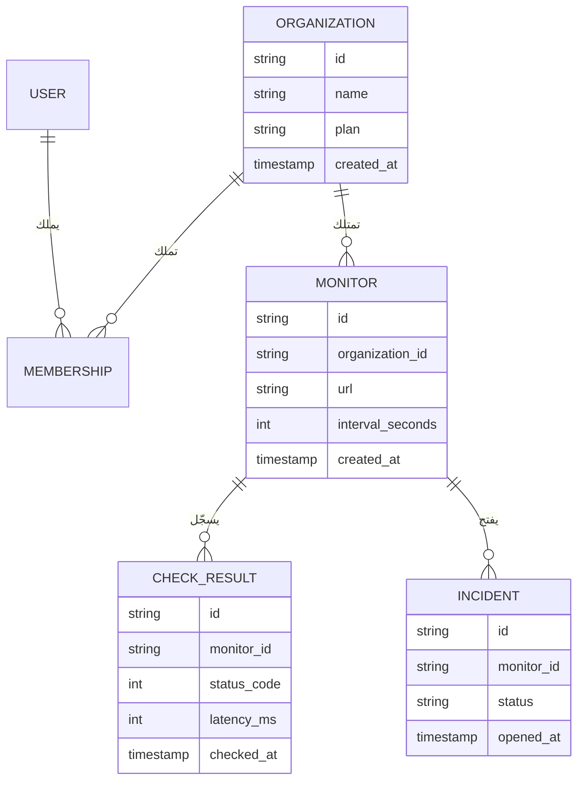
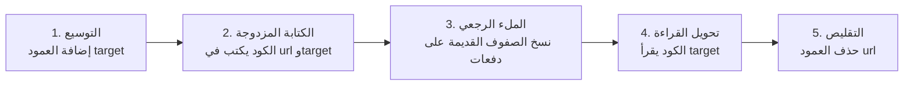
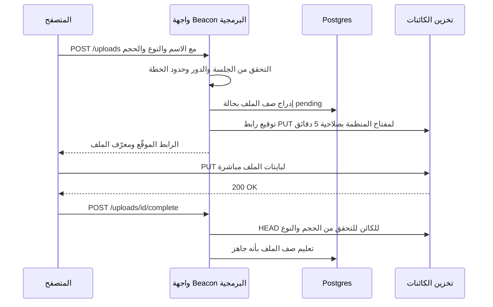
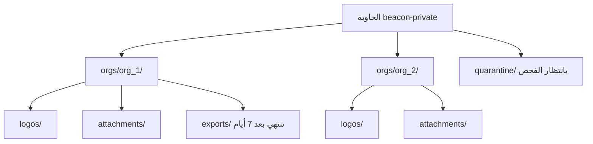
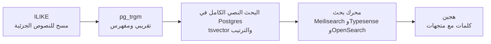
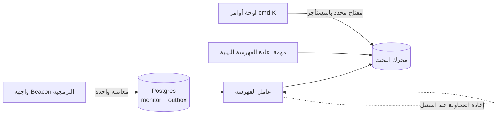
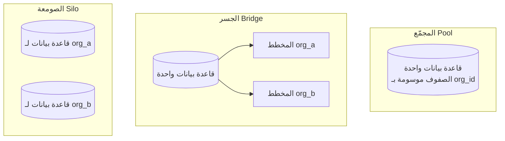
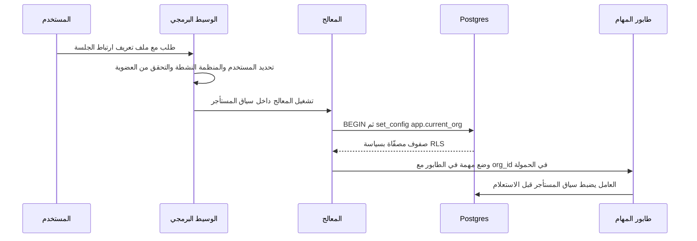
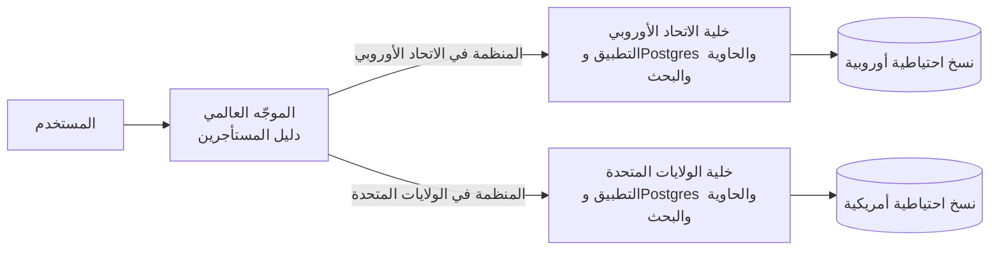

# الوحدة 2 — البيانات

*كل SaaS هو في جوهره، تحت واجهة المستخدم، آلة دقيقة تخزّن بيانات الآخرين ولا تعيدها إلا للأشخاص المخوّلين. تغطي هذه الوحدة أربعة مكوّنات للبيانات ستبنيها في كل مشروع: قاعدة البيانات العلائقية نفسها، والملفات التي لا مكان لها فيها، والبحث في الاثنين، وحدود المستأجر التي تبقي بيانات عميل بعيدة عن عميل آخر. إن أتقنت هذه المكوّنات مبكرًا صارت أغلب الوحدات اللاحقة أسهل، وإن أخطأت فيها ورثت كل وحدة لاحقة تلك الفوضى.*

> **التطبيق العملي:** ابدأ من [نسخة البداية من Beacon](https://github.com/Tamoura/system-design-for-vibe-coders/tree/beacon/starter)، وحلّ التمارين قبل النظر إلى [الحل المرجعي لهذه الوحدة](https://github.com/Tamoura/system-design-for-vibe-coders/tree/beacon/module-2-solution) (الفرع `beacon/module-2-solution`).

---

# 2.1 — طبقة البيانات: Postgres وأدوات ORM والترحيلات وبيانات البذر
*المستوى: 🟢 مبتدئ* · *المتطلبات: 1.2*

## ⚡ الدرس في دقيقة

- طبقة البيانات هي قاعدة البيانات العلائقية مع الأدوات المحيطة بها: أداة ORM أو باني استعلامات، وترحيلات لها إصدارات، وسكربتات بذر.
- الخيار الافتراضي للإصدار الأول: Postgres مُدار، وكل جدول يملكه مستأجر فيه `organization_id` و`created_at` و`updated_at` وقيود حقيقية، ومعرّفات مرتبة زمنيًا ويصعب تخمينها (UUIDv7، مع بادئة مثل `mon_` إن شئت).
- القاعدة الأهم: لا تغيّر مخطط الإنتاج يدويًا أبدًا. كل تغيير يمر عبر ترحيل، والتغييرات الخطرة تستخدم أسلوب التوسيع ثم التقليص كي يعمل الكود القديم والجديد جنبًا إلى جنب.
- اعرف ما يرسله ORM من SQL: استعلامات N+1 والفهارس الناقصة هي أكثر أسباب بطء لوحات التحكم شيوعًا.
- الفخ الأكبر: أن تفترض أن النسخ الاحتياطية تعمل. فعّل الاستعادة إلى نقطة زمنية وتدرّب على الاستعادة، لأن النسخة التي لم تستعدها يومًا مجرد أمل.

## 🧭 لماذا يحتاجه كل SaaS

يخزّن الإصدار الأول من Beacon كل شيء في قاعدة بيانات Postgres واحدة. بعد ثلاثة أشهر يشتكي عميل لديه 400 مراقِب من أن لوحة التحكم تستغرق تسع ثوانٍ لتظهر. تبحث فتجد أن الصفحة تنفّذ 401 استعلام: واحد لقائمة المراقِبات، ثم واحد لكل مراقِب لجلب آخر فحص له. بعد أسبوع تعيد تسمية عمود وتنشر، فتفشل كل الطلبات لمدة أربع دقائق لأن الكود القديم ما زال يعمل على المخطط الجديد. ثم يشغّل أحدهم سكربت تنظيف على الإنتاج بدلًا من بيئة الاختبار (Staging).

هذه هي الطرق الثلاث الكلاسيكية التي يؤذي بها SaaS ناشئ نفسه: استعلامات بطيئة، وتغييرات غير آمنة في المخطط، وأخطاء لا يمكن التراجع عنها. أشهر مثال على الأخيرة: في يناير 2017 فقدت GitLab عدة ساعات من بيانات الإنتاج بعد أن حذف مهندس مجلد قاعدة البيانات الخطأ أثناء حادثة، ثم اكتشفوا أن عدة آليات للنسخ الاحتياطي لديهم لم تكن تعمل. تقرير ما بعد الحادثة الذي نشروه علنًا ما زال يستحق القراءة.

قاعدة البيانات هي المكوّن الوحيد الذي لا تستطيع إعادة كتابته في عطلة نهاية أسبوع. يمكن إعادة نشر الكود، لكن البيانات التي فُقدت أو تلفت أو صُمّمت بشكل سيئ تبقى مفقودة أو تالفة أو سيئة التصميم.

**عامل قاعدة البيانات على أنها ذاكرة المنتج: اختر محركًا مملًا ومجرّبًا، ولا تغيّره إلا عبر ترحيلات لها إصدارات، وتأكد أنك تستطيع استعادته إلى أي دقيقة من الأمس.**

## 📐 كيف يعمل

### 🟢 الأساسيات

**لماذا Postgres هو الخيار الافتراضي.** PostgreSQL قاعدة بيانات علائقية (Relational Database): تعيش البيانات في جداول ذات أعمدة محددة الأنواع، وتستعلم عنها بلغة SQL. هو الخيار الافتراضي لأي SaaS جديد لأسباب مملة وجيدة: مفتوح المصدر، وتقدّمه كل منصة سحابية بشكل مُدار، ويدعم المعاملات الحقيقية، والقيود القوية، وأعمدة JSON (`jsonb`) للأجزاء شبه المنظمة، والبحث النصي الكامل (الدرس 2.3)، وأمان مستوى الصف (الدرس 2.4)، ومنظومة إضافات (`pgvector` للتضمينات، و`pg_trgm` للمطابقة التقريبية). MySQL وSQLite خياران جيدان أيضًا، لكن إن لم يكن لديك سبب قوي فاختر Postgres وتوقّف عن التردد.

**تصميم المخطط (Schema) في SaaS.** بعض الأعراف تؤتي ثمارها من اليوم الأول:

- **كل جدول يملكه مستأجر فيه عمود `organization_id`** (من الدرس 1.2)، حتى لو استطعت استنتاجه عبر ربط (Join). هذا يجعل التصفية والفهرسة والعزل لاحقًا (الدرس 2.4) أبسط بكثير.
- **كل جدول فيه `created_at` و`updated_at`**، مخزّنين بنوع `timestamptz` (طابع زمني مع المنطقة الزمنية) بتوقيت UTC. ستحتاجهما لتذاكر الدعم وتصحيح الأخطاء والتدقيق.
- **استخدم القيود (Constraints).** `NOT NULL`، و`UNIQUE (organization_id, slug)`، والمفاتيح الأجنبية، و`CHECK (interval_seconds >= 30)`. قاعدةٌ تفرضها قاعدة البيانات تساوي عشر مراجعات كود.

هذا هو المخطط الأساسي لـ Beacon:



**اختيار المعرّفات (IDs).** الأعداد الصحيحة ذات الزيادة التلقائية (`1, 2, 3`) صغيرة وسريعة، لكنها تسرّب معلومات (يستطيع منافس أن يعدّ عملاءك بالتسجيل مرتين) وتجعل التخمين سهلًا. أغلب منتجات SaaS اليوم تستخدم أحد هذه الأنماط:

| نمط المعرّف | مثال | المزايا | العيوب |
|---|---|---|---|
| عدد صحيح بزيادة تلقائية | `4211` | صغير جدًا وسريع ومقروء | يمكن تخمينه، ويكشف الحجم، ويصعب دمجه بين قواعد بيانات |
| UUID v4 (عشوائي) | `9f1c…` | لا يمكن تخمينه، ويُولَّد في أي مكان | ترتيبه العشوائي يجزّئ فهارس B-tree |
| UUID v7 / ULID (مرتب زمنيًا) | `0190…` | صعب التخمين بما يكفي، ويُرتَّب حسب وقت الإنشاء، وملائم للفهارس | يكشف وقت الإنشاء |
| معرّف ببادئة | `mon_01J8…` | يصف نفسه في السجلات وتذاكر الدعم والروابط | يُخزَّن نصًا أو يحتاج ترميزًا وفك ترميز |

نشرت Stripe فكرة المعرّفات ذات البادئة: العميل `cus_…` والاشتراك `sub_…`. عندما يلصق عميل معرّفًا في محادثة الدعم تعرف فورًا ما هو. الخيار الافتراضي الجيد لـ Beacon هو UUIDv7 في قاعدة البيانات مع إضافة البادئات (`org_`، `mon_`، `inc_`) عند حدود الواجهة البرمجية، أو تخزينه نصًا مباشرة إن فضّلت البساطة. يحدّد RFC 9562 معيار UUIDv7، والإصدارات الحديثة من Postgres (18 فما فوق) تأتي بدالة مدمجة `uuidv7()`، وإلا فهناك مكتبات لكل لغة.

**كيف يتحدث كودك مع قاعدة البيانات.** هناك ثلاثة أساليب:

| الأسلوب | أمثلة | ما تكتبه | يتقن | انتبه إلى |
|---|---|---|---|---|
| ORM (أداة ربط الكائنات بالجداول) | Prisma، ActiveRecord، Django ORM، TypeORM | نماذج واستدعاءات دوال | عمليات CRUD السريعة والعلاقات والترحيلات المدمجة | الاستعلامات المخفية، وN+1، وصعوبة SQL المعقد |
| باني الاستعلامات (Query Builder) | Drizzle، Kysely، Knex | TypeScript بشكل يشبه SQL | أمان الأنواع مع التحكم في SQL | يجب أن تعرف SQL |
| SQL خام مع توليد الكود | sqlc (Go)، `pg` العادي | ملفات SQL | تحكم كامل وأنواع مولَّدة | كود متكرر أكثر لعمليات CRUD |

لا يوجد خيار خاطئ بين هذه. الخطأ هو ألا تعرف ما ترسله أداتك من SQL. فعّل تسجيل الاستعلامات في بيئة التطوير من اليوم الأول.

**الترحيلات (Migrations).** الترحيل ملف له إصدار ومحفوظ في المستودع، ويغيّر المخطط: `0007_add_monitor_timeout.sql`. تسجّل الأداة الترحيلات التي نُفّذت في جدول داخل قاعدة البيانات نفسها، لذلك تصل كل بيئة (جهازك، وCI، وبيئة الاختبار، والإنتاج) إلى المخطط نفسه. تفعل ذلك كلٌّ من Prisma Migrate وDrizzle Kit وترحيلات Rails وDjango وLaravel وgolang-migrate وgoose وFlyway وAtlas. القاعدة: **لا تغيّر مخطط الإنتاج يدويًا أبدًا.** إن لم يكن التغيير في ترحيل فهو لم يحدث.

**بيانات البذر والتجهيزات (Seeds and Fixtures).** سكربت البذر يملأ قاعدة بيانات جديدة ببيانات واقعية: منظمة تجريبية، وثلاثة مستخدمين بأدوار مختلفة، وعشرون مراقِبًا، وأسبوع من نتائج الفحص، وحادثة واحدة مفتوحة. بفضله يصبح تجهيز مطوّر جديد أمرًا واحدًا. التجهيزات هي النسخة الخاصة بالاختبارات: مجموعات بيانات صغيرة ومعروفة تُحمَّل قبل الاختبارات. اجعل سكربت البذر متساوي القوة (Idempotent)، أي آمنًا عند تشغيله مرتين، ولا تسمح له بالعمل على الإنتاج أبدًا.

### 🟡 التعمق أكثر

**الفهارس ومشكلة N+1.** الفهرس (Index) بنية جانبية مرتبة تسمح لـ Postgres بإيجاد الصفوف دون مسح الجدول كله. أكثر استعلامات Beacon شيوعًا هو "آخر الفحوص لهذا المراقِب"، لذلك يحتاج إلى:

```sql
CREATE INDEX check_result_monitor_time_idx
  ON check_result (monitor_id, checked_at DESC);
```

ترتيب الأعمدة مهم: هذا الفهرس يخدم الاستعلامات التي تصفّي حسب `monitor_id` وترتّب حسب `checked_at`، وليس العكس. تعلّم قراءة مخرجات `EXPLAIN ANALYZE`؛ فوجود `Seq Scan` على جدول كبير في مسار ساخن هو بلاغ خطأ ينتظر أن يُكتب. وتذكّر أن Postgres *لا* يفهرس أعمدة المفاتيح الأجنبية تلقائيًا.

مشكلة N+1 التي رأيناها في البداية هي الفخ الكلاسيكي لأدوات ORM: استعلام واحد للقائمة، ثم N استعلامًا لعلاقة كل عنصر. الحل أن تجلب العلاقات دفعة واحدة: `include` في Prisma، و`with` في الاستعلامات العلائقية في Drizzle، و`includes`/`preload` في Rails، و`select_related`/`prefetch_related` في Django، أو استعلام SQL واحد مع ربط أو `DISTINCT ON`. سجلات الاستعلامات وتتبّعات APM (الدرس 7.2) تجعلها مرئية.

**المعاملات (Transactions).** المعاملة تجمع عدة تعليمات بحيث تنجح كلها أو تفشل كلها. عندما يفتح Beacon حادثة، يجب أن يُدرج الحادثة، ويعلّم المراقِب بأنه متوقف، ويضع الإشعارات في الطابور. إن فشلت الخطوة الثانية بعد نجاح الأولى فستكون لديك حادثة لمراقِب يبدو سليمًا. ضعها في معاملة واحدة. اجعل المعاملات قصيرة، ولا تستدعِ واجهات خارجية (Stripe، البريد) داخلها أبدًا. النمط المناسب لـ "اكتب في قاعدة البيانات وأطلق أثرًا جانبيًا بشكل موثوق" هو **صندوق الصادر المعاملاتي (Transactional Outbox)**: أدرج صفًا في جدول `outbox` ضمن المعاملة نفسها، ودع عاملًا في الخلفية (الدرس 5.1) يوصله.

**ترحيلات بلا توقف: التوسيع ثم التقليص (Expand and Contract).** أثناء النشر يعمل الإصدار القديم والجديد من كودك في الوقت نفسه على قاعدة بيانات واحدة. لذلك يجب أن يكون الترحيل متوافقًا مع الاثنين. إعادة تسمية `monitor.url` إلى `monitor.target` بأمان تحتاج عدة عمليات نشر:



عمليات خطرة أخرى في Postgres: إضافة عمود بقيمة افتراضية متقلبة مثل `clock_timestamp()` (تعيد كتابة الجدول كله)، وإنشاء فهرس دون `CONCURRENTLY` (يمنع الكتابة على الجدول)، وإضافة قيد `NOT NULL` على جدول كبير في خطوة واحدة، وتغيير نوع عمود. هناك أدوات تساعد: جوهرة `strong_migrations` في Rails ترفض الترحيلات غير الآمنة، وAtlas يستطيع فحص الترحيلات بحثًا عن التغييرات المدمّرة. واضبط أيضًا `lock_timeout` في الترحيلات، كي يفشل الترحيل الذي ينتظر قفلًا بسرعة بدلًا من أن يصطف كل استعلام آخر خلفه.

**تجميع الاتصالات (Connection Pooling).** كل اتصال بـ Postgres هو عملية على الخادم تستهلك ذاكرة حقيقية، والنسخة المُدارة المعتادة تسمح ببضع مئات من الاتصالات على الأكثر. الدوال عديمة الخادم (Serverless) تكسر الإعدادات الساذجة: 500 استدعاء متزامن قد يفتح كلٌّ منها اتصالًا فتُستنزف قاعدة البيانات. الحل هو **مجمّع اتصالات (Connection Pooler)** بين التطبيق وقاعدة البيانات: PgBouncer هو الكلاسيكي، وSupabase يشغّل Supavisor، وNeon وأغلب المزوّدين المُدارين يعطونك سلسلة اتصال مجمّعة. في وضع *المعاملة* في PgBouncer يكون اتصال الخادم لك فقط طوال المعاملة، ما يعني أن ميزات الجلسة (أوامر `SET` على مستوى الجلسة، والأقفال الاستشارية الممتدة عبر المعاملات، وبعض إعدادات التعليمات المُعدّة مسبقًا) تتصرف بشكل مختلف.

### 🔴 على نطاق واسع وللمؤسسات

**النسخ الاحتياطي والاستعادة إلى نقطة زمنية (PITR).** أمر `pg_dump` ليلي بداية، وليس استراتيجية. يكتب Postgres كل تغيير في سجل الكتابة المسبقة (WAL)؛ فإن أرشفت نسخة أساسية مع تدفق WAL تستطيع استعادة قاعدة البيانات إلى *أي لحظة*، مثل 14:31:59، قبل ثانية من تشغيل أحدهم أمر `DELETE` الخاطئ. الخدمات المُدارة (RDS وNeon وSupabase وCrunchy Bridge وغيرها) تقدّم PITR كإعداد، ومن يستضيف بنفسه يستخدم أدوات مثل pgBackRest أو WAL-G. درس GitLab ينطبق هنا: **النسخة الاحتياطية التي لم تستعدها يومًا أمل، وليست نسخة احتياطية.** حدّد موعدًا لتمرين استعادة، وقِس المدة التي يستغرقها (هذا هو زمن التعافي الحقيقي لديك)، وضع الرقم في دليل التشغيل. استبيانات المؤسسات ستسأل عن هذه الأرقام تحديدًا (RPO وRTO).

**النسخ المتماثلة للقراءة (Read Replicas).** النسخة المتماثلة نسخة من قاعدة البيانات تتبع الأساسية عبر بثّ WAL الخاص بها. تستطيع إرسال استعلامات القراءة فقط (التقارير، والتحليلات، وصفحة الحالة العامة) إليها. المشكلة هي **تأخر التماثل (Replication Lag)**: يحفظ المستخدم مراقِبًا، ويُعاد توجيهه، ولم ترَ النسخة المتماثلة الكتابة بعد، فـ"يختفي" المراقِب. الحل الشائع: اقرأ ما كتبته من القاعدة الأساسية لبضع ثوانٍ بعد الكتابة، أو وجّه الطلبات حسب نقطة النهاية.

**السلاسل الزمنية والجداول الساخنة.** جدول `check_result` في Beacon يزداد ملايين الصفوف يوميًا. **التقسيم (Partitioning)** التصريحي حسب الوقت (قسم لكل يوم أو شهر) يسمح لك بحذف البيانات القديمة بـ `DROP TABLE` بدلًا من `DELETE` بطيء، ويبقي الفهارس صغيرة. إضافات مثل TimescaleDB تؤتمت ذلك.

**مقايضات الحذف الناعم (Soft Delete).** الحذف الناعم يعني ضبط `deleted_at` بدلًا من إزالة الصف. هذا يتيح "التراجع" والاستعادة، لكن كل استعلام يجب الآن أن يصفّي `WHERE deleted_at IS NULL`، وقيود التفرّد يجب أن تصبح فهارس جزئية، وطلبات المحو وفق GDPR (الدرس 8.1) تتطلب حذفًا حقيقيًا في النهاية. النمط الأنظف لكثير من الجداول هو الحذف الفعلي مع سجل تدقيق أو جدول أرشيف (الدرس 7.3). استخدم الحذف الناعم عن قصد للكائنات القليلة التي يتوقع المستخدمون استعادتها (منظمة، صفحة حالة)، وليس في كل مكان بحكم العادة.

**الخيارات المُدارة.** Neon (Postgres عديم الخادم مع التفريع: قاعدة بيانات بنسخ عند الكتابة لكل طلب دمج)، وSupabase (Postgres مع المصادقة والتخزين والوقت الحقيقي وواجهة برمجية مولَّدة تلقائيًا)، وAmazon RDS/Aurora، وGoogle Cloud SQL/AlloyDB، وPlanetScale (المعروف بـ MySQL المبني على Vitess مع تغييرات مخطط لا تحجب العمل، ويقدّم الآن Postgres أيضًا).

## 🏆 أفضل المستودعات

| المستودع | ما هو | التقنيات | الترخيص | اختره عندما |
|---|---|---|---|---|
| [postgres/postgres](https://github.com/postgres/postgres) | قاعدة البيانات نفسها (نسخة مطابقة على GitHub) | C | PostgreSQL | تريد قراءة كود أو توثيق الشيء الذي تعتمد عليه |
| [prisma/orm](https://github.com/prisma/orm) | أداة ORM تبدأ من المخطط، مع ترحيلات وأداة Studio | TypeScript | Apache-2.0 | تريد أسهل مدخل وملف مخطط مقروء |
| [drizzle-team/drizzle-orm](https://github.com/drizzle-team/drizzle-orm) | أداة ORM لـ TypeScript تشبه SQL، مع ترحيلات Drizzle Kit | TypeScript | Apache-2.0 | تعرف SQL، وتريد الأنواع، وتنشر على بيئة عديمة الخادم أو على الحافة |
| [kysely-org/kysely](https://github.com/kysely-org/kysely) | باني استعلامات SQL آمن الأنواع | TypeScript | MIT | تريد التحكم في SQL مع الأنواع ودون طبقة ORM |
| [sqlc-dev/sqlc](https://github.com/sqlc-dev/sqlc) | يولّد كودًا آمن الأنواع من استعلامات SQL | Go (also other targets) | MIT | تكتب بلغة Go وتفضّل ملفات SQL على ORM |
| [ariga/atlas](https://github.com/ariga/atlas) | إدارة تصريحية للمخطط وفحص الترحيلات | Go | Apache-2.0 | تريد مقارنة الترحيلات وفحوص الأمان في CI |
| [golang-migrate/migrate](https://github.com/golang-migrate/migrate) | أداة بسيطة لتشغيل ترحيلات SQL صعودًا ونزولًا | Go | MIT | تريد أداة ترحيل سطر أوامر لا ترتبط بلغة |
| [supabase/supabase](https://github.com/supabase/supabase) | منصة Postgres: مصادقة وتخزين ووقت حقيقي وواجهات برمجية | TypeScript, Elixir, Go | Apache-2.0 | تريد Postgres مُدارًا أو مستضافًا ذاتيًا مع كل الملحقات |
| [neondatabase/neon](https://github.com/neondatabase/neon) | Postgres عديم الخادم مع فصل التخزين عن الحوسبة | Rust | Apache-2.0 | تريد فهم التفريع والتقليص إلى الصفر |

**إن درست مستودعًا واحدًا فقط:** اقرأ توثيق Drizzle وكوده المصدري إلى جانب مخطط Drizzle حقيقي. هو قريب من SQL بما يكفي لتتعلم SQL أثناء استخدامه، ومولّد الترحيلات فيه يعرض بالضبط أوامر DDL التي سينفّذها. إن كنت تعمل بـ Rails أو Django فأداة ORM والترحيلات المدمجة هي الجواب المكافئ؛ لا تستبدلها.

**اشترِ أم ابنِ أم استضف بنفسك؟**

- **اشترِ (خدمة مُدارة):** في كل الحالات تقريبًا بالنسبة لقاعدة البيانات نفسها. Neon أو Supabase أو RDS أو Cloud SQL أو PlanetScale تعطيك النسخ الاحتياطي وPITR والتحويل عند الفشل ومجمّع الاتصالات بأقل من كلفة ساعة عمل مهندس شهريًا. اختر الأقرب إلى مكان تشغيل تطبيقك.
- **استضف بنفسك:** عندما تشغّل خوادمك أصلًا (Kamal أو Coolify أو Kubernetes) ولديك شخص سيتولى النسخ الاحتياطي والاستعادة والترقيات، أو عندما يتطلب عقد عميل ذلك. خصّص ميزانية لـ pgBackRest أو WAL-G ولتمرين استعادة مراقَب.
- **ابنِ:** لا تبنِ قاعدة البيانات أو أداة الترحيل أبدًا. لكن ابنِ سكربت البذر الخاص بك، ودالة المعرّفات (`newId("mon")`)، وطبقة وصول رفيعة للبيانات كي تعيش تصفية المستأجر في مكان واحد.

## 🔍 ادرسه في مشاريع حقيقية

**Cal.com (`calcom/cal.diy`).** مستودع أحادي كبير بـ Next.js يستخدم Prisma. وقت كتابة هذا الدرس يوجد المخطط تحت `packages/prisma`؛ افتح `schema.prisma` واقرأ نماذج `User` و`Team` و`Membership`، ثم تصفّح مجلد `migrations` المجاور لترى سنوات من تطوّر مخطط حقيقي، بما في ذلك عمليات الملء الرجعي والأعمدة المعاد تسميتها.

**Documenso (`documenso/documenso`).** يستخدم Prisma أيضًا في `packages/prisma`، وهو أصغر من Cal.com، لذلك يسهل استيعابه. ابحث في المخطط عن `@default(` و`@@index`، وابحث عن سكربت البذر.

**OpenStatus (`openstatusHQ/openstatus`).** هو حرفيًا Beacon حقيقي. يستخدم Drizzle؛ استخدم بحث الكود عن `drizzle` و`sqliteTable` أو `pgTable` لتجد تعريفات جداول المراقِبات والحوادث وصفحات الحالة. قارن جدول المراقِبات عندهم بمخطط الكيانات والعلاقات أعلاه.

**Discourse (`discourse/discourse`).** تطبيق Rails فيه أكثر من عقد من الترحيلات. افتح `db/migrate` و`db/post_migrate`: يفصل Discourse الترحيلات التي يجب أن تعمل قبل الكود الجديد عن تلك التي تعمل بعده، وهذه فكرة التوسيع ثم التقليص مكتوبة في أسماء المجلدات.

**ما الذي تلاحظه:**

- ما استراتيجية المعرّفات التي يستخدمها كل مشروع (cuid أو UUID أو عدد صحيح أو ببادئة)، وهل تظهر في الروابط.
- كم من الترحيلات إضافي فقط مقابل المدمّر، وكيف تُقسَّم الترحيلات المدمّرة على مراحل.
- قيود التفرّد المركّبة التي تتضمن معرّف الفريق أو المنظمة.
- أين تُعرَّف الفهارس، وأي استعلامات تخدمها بوضوح.
- كيف ينشئ سكربت البذر مستخدمين بأدوار وخطط مختلفة.

## 🛠️ ابنِه في Beacon

### 🟢 تمرين المبتدئ

أنشئ مخطط Beacon للجداول `organization` و`user` و`membership` و`monitor` و`check_result` بأداة ORM أو باني الاستعلامات الذي تختاره، وولّد الترحيل الأول، واكتب سكربت بذر متساوي القوة ينشئ منظمة واحدة، ومستخدمَين (مالك وعضو)، وخمسة مراقِبات مع يوم من نتائج الفحص المزيفة.

**يكتمل عندما:**

- ينتج عن نسخة جديدة من المستودع مع أمر واحد (`npm run db:reset` أو ما يكافئه) قاعدة بيانات تعمل وفيها بيانات البذر.
- يحتوي كل جدول يملكه مستأجر على `organization_id` و`created_at` و`updated_at`، مع مفاتيح أجنبية.
- لا يُنشئ تشغيل البذر مرتين أي تكرارات.

### 🟡 تمرين المستوى المتوسط

ابنِ استعلام لوحة التحكم "كل المراقِبات في منظمتي مع آخر فحص لكل منها" واجعله سريعًا. ازرع 500 مراقِب مع 1,000 فحص لكل منها، وسجّل الاستعلامات، وأصلح أي N+1، وأضف الفهرس الذي يجعل `EXPLAIN ANALYZE` يُظهر مسحًا عبر الفهرس.

```sql
SELECT DISTINCT ON (m.id) m.id, m.url, c.status_code, c.checked_at
FROM monitor m
LEFT JOIN check_result c ON c.monitor_id = m.id
WHERE m.organization_id = $1
ORDER BY m.id, c.checked_at DESC;
```

**يكتمل عندما:**

- تنفّذ الصفحة عددًا ثابتًا من الاستعلامات مهما كان عدد المراقِبات.
- لا يُظهر `EXPLAIN ANALYZE` أي مسح تسلسلي على `check_result`.
- تُحمَّل الصفحة في أقل من 200 مللي ثانية محليًا مع بيانات البذر الكبيرة.

### 🔴 تمرين المستوى المتقدم

أعد تسمية `monitor.url` إلى `monitor.target` دون توقف، باستخدام التوسيع ثم التقليص عبر ثلاثة ترحيلات وعمليات نشر منفصلة على الأقل. ثم فعّل PITR لدى مزوّدك المُدار (أو pgBackRest محليًا)، واحذف كل المراقِبات عمدًا، واستعد قاعدة البيانات إلى الدقيقة السابقة.

**يكتمل عندما:**

- لا يرى سكربت حمل يضرب الواجهة البرمجية طوال كل خطوة أي أخطاء.
- يعمل الملء الرجعي على دفعات مع ضبط `lock_timeout`.
- يكون لديك دليل استعادة مكتوب يتضمن زمن التعافي المقيس.

## ⚠️ أخطاء يقع فيها المبتدئون

- **تعديل مخطط الإنتاج يدويًا "هذه المرة فقط".** يصبح الإنتاج مختلفًا عن كل ملفات الترحيل، ويفشل النشر التالي بطرق مربكة. كل تغيير يمر عبر ترحيل، بما في ذلك تغييرات الطوارئ.
- **إعادة تسمية عمود أو حذفه في نفس عملية نشر تغيير الكود.** النسخ القديمة التي ما زالت تعمل أثناء النشر تنهار. استخدم التوسيع ثم التقليص، والخطوات المدمّرة تأتي أخيرًا في عملية نشر خاصة بها.
- **فتح عميل قاعدة بيانات جديد لكل طلب في كود عديم الخادم.** تستنزف الاتصالات مع أول ارتفاع في الزيارات. أنشئ العميل مرة واحدة لكل عملية، واتصل عبر مجمّع اتصالات.
- **عدم النظر أبدًا إلى SQL الذي يولّده ORM.** تبقى استعلامات N+1 والفهارس الناقصة غير مرئية حتى يأتي عميل كبير. فعّل تسجيل الاستعلامات في التطوير واقرأ `EXPLAIN` لأكثر خمسة استعلامات استخدامًا.
- **استدعاء Stripe أو إرسال بريد داخل معاملة قاعدة بيانات.** تبقى الأقفال محتجزة أثناء انتظارك للشبكة، والتراجع لا يستطيع إلغاء إرسال بريد. نفّذ الالتزام أولًا، ثم نفّذ الآثار الجانبية عبر صندوق صادر أو مهمة خلفية.
- **افتراض أن النسخ الاحتياطية لدى المزوّد تعمل.** استعد واحدة. قِس الوقت. اكتبه.

## 🧾 الخلاصة

- Postgres هو الخيار الافتراضي لأنه ممل، ومُدار في كل مكان، وينمو معك (JSON، والبحث، وRLS، والمتجهات).
- ضع `organization_id` والطوابع الزمنية والقيود الحقيقية في كل جدول يملكه مستأجر، واختر معرّفات مرتبة زمنيًا ويصعب تخمينها.
- أداة ORM أو باني الاستعلامات أو SQL الخام كلها تعمل؛ ما لا يعمل هو ألا تعرف ما ينفَّذ من SQL.
- كل تغيير في المخطط ترحيل، والتغييرات الخطرة تستخدم التوسيع ثم التقليص كي يتعايش الكود القديم والجديد.
- جمّع الاتصالات، وفهرس لاستعلاماتك الحقيقية، واجعل المعاملات قصيرة والآثار الجانبية خارجها.
- PITR مع استعادة مجرّبة هو المعنى الحقيقي لعبارة "لدينا نسخ احتياطية".

## ✍️ اختبر نفسك

**1. ما الترحيل، وكيف تصل كل بيئة إلى المخطط نفسه؟**

<details><summary>الإجابة</summary>

الترحيل ملف له إصدار ومحفوظ في المستودع، ويغيّر المخطط، مثل `0007_add_monitor_timeout.sql`. تسجّل أداة الترحيل الترحيلات التي نُفّذت في جدول داخل قاعدة البيانات نفسها، لذلك يصل جهازك وCI وبيئة الاختبار والإنتاج إلى المخطط نفسه. راجع فقرة "الترحيلات" في 🟢 الأساسيات.

</details>

**2. ما مشكلة N+1، وكيف تصلحها؟**

<details><summary>الإجابة</summary>

هي استعلام واحد لقائمة، ثم استعلام إضافي لكل عنصر لتحميل علاقته، فيصبح 400 مراقِب 401 استعلام. تصلحها بجلب العلاقات دفعة واحدة: `include` في Prisma، و`with` في Drizzle، و`includes`/`preload` في Rails، و`select_related`/`prefetch_related` في Django، أو ربط SQL واحد أو `DISTINCT ON`. راجع فقرة "الفهارس ومشكلة N+1" في 🟡 التعمق أكثر.

</details>

**3. يريد Beacon إعادة تسمية `monitor.url` إلى `monitor.target` دون أي توقف. ما الخطوات؟**

<details><summary>الإجابة</summary>

استخدم التوسيع ثم التقليص عبر عدة عمليات نشر: أضف العمود `target`، واجعل الكود يكتب في العمودين، واملأ الصفوف القديمة رجعيًا على دفعات، وحوّل القراءة إلى `target`، ثم احذف `url` في عملية نشر خاصة به. كل خطوة تبقي قاعدة البيانات متوافقة مع الكود القديم والجديد اللذين يعملان جنبًا إلى جنب أثناء النشر. راجع فقرة "ترحيلات بلا توقف" في 🟡 التعمق أكثر.

</details>

**4. عندما يفتح Beacon حادثة يجب أن يُدرج الحادثة، ويعلّم المراقِب بأنه متوقف، ويُشعر الفريق بالبريد. كيف تنظّم ذلك؟**

<details><summary>الإجابة</summary>

ضع عمليتي الكتابة في قاعدة البيانات في معاملة قصيرة واحدة كي تنجحا أو تفشلا معًا، وأضف صفًا في `outbox` ضمن المعاملة نفسها. ثم يقرأ عامل في الخلفية صندوق الصادر ويرسل البريد. لا تستدعِ البريد أو Stripe داخل المعاملة أبدًا: فهي تحتجز الأقفال أثناء انتظار الشبكة، والتراجع لا يستطيع إلغاء إرسال بريد. راجع فقرة "المعاملات" في 🟡 التعمق أكثر.

</details>

**5. ينتقل Beacon إلى منصة عديمة الخادم. مع أول ارتفاع في الزيارات تبدأ قاعدة البيانات برفض الاتصالات، مع أن الاستعلامات سريعة. ما الذي تعطّل، وما الحل؟**

<details><summary>الإجابة</summary>

كل استدعاء متزامن للدالة فتح اتصاله الخاص بـ Postgres، والنسخة المُدارة المعتادة تسمح ببضع مئات فقط. أنشئ العميل مرة واحدة لكل عملية، واتصل عبر مجمّع اتصالات مثل PgBouncer أو Supavisor أو سلسلة الاتصال المجمّعة لدى مزوّدك. وتذكّر أن ميزات الجلسة تتصرف بشكل مختلف في وضع المعاملة. راجع فقرة "تجميع الاتصالات" في 🟡 التعمق أكثر.

</details>

## 📚 المراجع

- PostgreSQL documentation, especially "Continuous Archiving and Point-in-Time Recovery": https://www.postgresql.org/docs/current/continuous-archiving.html — الأرشفة المستمرة والاستعادة إلى نقطة زمنية
- RFC 9562, Universally Unique IDentifiers (UUIDv7): https://www.rfc-editor.org/rfc/rfc9562 — معيار المعرّفات الفريدة
- Use The Index, Luke — a free guide to SQL indexing: https://use-the-index-luke.com — دليل مجاني لفهرسة SQL
- Stripe engineering, "Online migrations at scale": https://stripe.com/blog/online-migrations — الترحيلات أثناء التشغيل على نطاق واسع
- PgBouncer documentation (pool modes and their limits): https://www.pgbouncer.org — أوضاع التجميع وحدودها
- Drizzle ORM docs: https://orm.drizzle.team · Prisma docs: https://www.prisma.io/docs
- Rails `strong_migrations` gem, a catalogue of unsafe migrations: https://github.com/ankane/strong_migrations — فهرس بالترحيلات غير الآمنة

---

# 2.2 — رفع الملفات وتخزين الكائنات
*المستوى: 🟢 مبتدئ* · *المتطلبات: 2.1*

## ⚡ الدرس في دقيقة

- الملفات (الشعارات، ولقطات الشاشة، وتقارير PDF، والتصديرات) مكانها تخزين كائنات متوافق مع S3، وليس أقراص خوادم التطبيق ولا قاعدة البيانات.
- القاعدة الأهم: المتصفح يرفع الملفات وينزّلها مباشرة عبر روابط موقّعة مسبقًا قصيرة العمر، لا يوقّعها خادمك إلا بعد التحقق من الصلاحيات.
- الخيار الافتراضي للإصدار الأول: حاوية خاصة، وجدول بيانات وصفية `file` في Postgres، ومفاتيح تولّدها بنفسك تحت `orgs/{orgId}/…`، وتحقق على الخادم قبل التوقيع ومرة أخرى بعد الرفع.
- قدّم ملفات المستخدمين من نطاق منفصل، وافحص كل ما يشاركه المستخدمون مع بعضهم.
- الفخ الأكبر: حاوية عامة أو رابط طويل العمر، فيصبح كل ملف خاص على بعد رابط واحد مُخمَّن أو مُعاد توجيهه من الإنترنت.

## 🧭 لماذا يحتاجه كل SaaS

يحتاج Beacon إلى الملفات أبكر مما تظن. كل منظمة ترفع شعارًا وأيقونة موقع (Favicon) لصفحة الحالة الخاصة بها. تحديثات الحوادث قد تحمل لقطات شاشة. عملاء خطة Business يريدون تقريرًا شهريًا عن مدة التشغيل بصيغة PDF، وزر "صدّر بياناتي" ينتج ملف zip. لا شيء من هذا هو المنتج، ويجب أن يعمل كله.

نسخة المبتدئ هي نموذج يرسل الملف إلى خادم Next.js أو Express، فيكتبه في `./uploads` على القرص. يعمل ذلك على جهازك. أما في الإنتاج فلا يجد الخادم الثاني الملف الذي حفظه الأول، وتُعاد تشغيل الحاوية فيُمسح القرص، ويرفع عميل تسجيل شاشة بحجم 400 ميغابايت فيشغل عاملًا من عمال الويب لدقيقتين، ويرفع أحدهم ملف HTML اسمه `logo.png` يشغّل JavaScript على نطاقك. ولأن المجلد يُقدَّم للعموم، فإن رابطًا مُخمَّنًا يعرض لقطات شاشة حوادث عميل على عميل آخر.

كانت حاويات التخزين العامة سيئة الإعداد إحدى أكثر قصص تسريب البيانات تكرارًا في العقد الماضي، ولهذا السبب بالضبط: الملفات سهلة التخزين وسهلة النسيان.

**الملفات لا مكان لها في قاعدة بياناتك ولا على خوادم تطبيقك: مكانها تخزين الكائنات، يرفعها المتصفح مباشرة بروابط موقّعة قصيرة العمر، ولا تُقرأ إلا عبر فحوص تتحكم أنت فيها.**

## 📐 كيف يعمل

### 🟢 الأساسيات

**تخزين الكائنات (Object Storage)** خدمة تخزّن كتلًا من البيانات (بايتات مع قليل من البيانات الوصفية) تحت مفاتيح في فضاء أسماء مسطّح يسمى الحاوية (Bucket). هو ليس نظام ملفات: لا توجد مجلدات حقيقية، ولا إلحاق، ولا كتابة جزئية؛ أنت تضع كائنًا كاملًا، أو تجلبه، أو تحذفه. في المقابل هو رخيص، وغير محدود عمليًا، ومتين جدًا. عرّفت Amazon S3 الواجهة البرمجية، وأصبح "المتوافق مع S3" هو المعيار اليوم: Cloudflare R2، وGoogle Cloud Storage (عبر وضع التوافق)، وBackblaze B2، وDigitalOcean Spaces، وSupabase Storage، والخوادم المستضافة ذاتيًا مثل SeaweedFS وGarage وMinIO كلها تتحدث بها. اكتب كودك على واجهة S3 وستستطيع تغيير المزوّد بتغيير نقطة النهاية وبيانات الاعتماد.

**لماذا لا نستخدم خادم التطبيق أو قاعدة البيانات؟**

| المكان | المشكلة |
|---|---|
| قرص خادم التطبيق | يضيع عند إعادة النشر، ولا يُشارَك بين النسخ، ويشغل عمال الويب أثناء الرفع البطيء |
| عمود `bytea` في قاعدة البيانات | يضخّم النسخ الاحتياطية والنسخ المتماثلة، ومكلف لكل غيغابايت، وبطيء في البث |
| تخزين الكائنات | مصمَّم لهذا الغرض: رخيص ومتين ويبث مباشرة من العملاء وإليهم |

قاعدة البيانات ما زالت مهمة: فهي تخزّن صف **البيانات الوصفية** (جدول `file`: المعرّف، وorganization_id، والمفتاح، ونوع المحتوى، والحجم، وuploaded_by، والحالة). والحاوية تخزّن البايتات. الصف هو ما تستخدمه فحوص التفويض وواجهة المستخدم؛ والمفتاح مجرد مؤشر.

**الروابط الموقّعة مسبقًا (Presigned URLs).** الرابط الموقّع مسبقًا رابط S3 عادي يحمل توقيعًا في سلسلة الاستعلام، ويمنح عملية واحدة محددة (PUT لهذا المفتاح، أو GET لهذا المفتاح) حتى وقت انتهاء، دون أن تسلّم بيانات اعتمادك. يوقّعه خادمك بعد التحقق من الصلاحيات، ثم يتحدث المتصفح مع التخزين مباشرة، فلا تمر الملفات الكبيرة عبر تطبيقك أبدًا.



التنزيل يعكس هذا المسار: يطلب المتصفح ملفًا من واجهتك البرمجية، فتتحقق الواجهة من أن المستخدم يستطيع رؤيته، وتعيد رابط GET موقّعًا صالحًا لبضع دقائق. مع AWS SDK لـ JavaScript v3 يكفي بضعة أسطر:

```ts
import { S3Client, PutObjectCommand } from "@aws-sdk/client-s3";
import { getSignedUrl } from "@aws-sdk/s3-request-presigner";

const s3 = new S3Client({ region: "auto", endpoint: process.env.S3_ENDPOINT });

export async function signLogoUpload(orgId: string, fileId: string, type: string) {
  const key = `orgs/${orgId}/logos/${fileId}`;
  const cmd = new PutObjectCommand({
    Bucket: process.env.S3_BUCKET,
    Key: key,
    ContentType: type, // must match what the browser sends
  });
  return { key, url: await getSignedUrl(s3, cmd, { expiresIn: 300 }) };
}
```

ميزة "direct uploads" في Rails Active Storage، وDjango مع `django-storages`، و`Storage::temporaryUrl` في Laravel تطبّق النمط نفسه.

**مفاتيح تولّدها أنت، لا أسماء ملفات المستخدمين.** ولّد مفتاح الكائن بنفسك (`orgs/org_123/logos/file_456`) وخزّن اسم الملف الأصلي في قاعدة البيانات. الأسماء التي يرسلها المستخدمون تحتوي مسافات ويونيكود و`../` وتتصادم مع بعضها.

**خاص افتراضيًا.** يجب أن تحجب الحاويات الوصول العام (حاويات S3 الجديدة تفعل ذلك افتراضيًا). قدّم الملفات الخاصة عبر روابط GET موقّعة قصيرة العمر. الأشياء العامة فعلًا، مثل شعار صفحة الحالة، يمكن أن تذهب إلى حاوية عامة منفصلة أو خلف CDN، لكن اختر ذلك لكل حاوية على حدة وعن قصد.

### 🟡 التعمق أكثر

**التحقق يحدث على الخادم، مرتين.** قبل التوقيع، افحص الحجم ونوع المحتوى المعلنين مقابل قائمة مسموحات (الشعارات: PNG وJPEG، وSVG فقط بعد تنقيته، وحد أقصى 2 ميغابايت). لكن المتصفح قد يكذب، لذلك تحقق مرة أخرى بعد الرفع: نفّذ `HEAD` على الكائن لمعرفة حجمه الحقيقي، واقرأ البايتات الأولى لاكتشاف نوعه الفعلي من رقمه السحري (Magic Number) (حزمة `file-type` في npm، و`python-magic` في Python، و`http.DetectContentType` في Go). رابط PUT الموقّع لا يفرض حدًا أقصى للحجم بمفرده؛ أما رابط **POST** الموقّع مع سياسة فيستطيع ذلك (`content-length-range`)، ولهذا تستخدم مكتبات رفع كثيرة POST. قدّم ملفات المستخدمين مع `Content-Disposition: attachment` ما لم تحتج عرضها داخل الصفحة، ولا تقدّمها أبدًا من نطاق تطبيقك الرئيسي: ملف HTML أو SVG مرفوع على `app.beacon.dev` يستطيع تشغيل سكربت يصل إلى ملفات تعريف الارتباط (Cookies) لديك. استخدم نطاقًا منفصلًا مثل `beaconusercontent.com`.

**فحص البرمجيات الخبيثة.** إن كان المستخدمون يشاركون الملفات مع مستخدمين آخرين (مرفقات حوادث يراها الفريق كله، أو مشتركو صفحة الحالة)، فافحصها. الإعداد الشائع: يصل الملف المرفوع إلى بادئة حجر صحي، ويطلق حدث إنشاء الكائن مهمة خلفية (الدرس 5.1) تشغّل ClamAV أو خدمة فحص سحابية، وبعد ذلك فقط يُنقل الملف أو يُعلَّم بأنه `ready`. حتى ذلك الحين تعرض الواجهة "قيد المعالجة".

**الرفع المجزّأ والقابل للاستئناف.** الملفات الكبيرة تفشل على الاتصالات المتقطعة. **الرفع المجزّأ (Multipart Upload)** في S3 يقسم الملف إلى أجزاء (5 ميغابايت على الأقل لكل جزء، باستثناء الأخير) تُرفع بالتوازي ويمكن إعادة محاولة كل منها منفردًا، ثم يجمعها استدعاء "complete". **tus** بروتوكول مفتوح للرفع القابل للاستئناف عبر HTTP: يستطيع العميل الاستئناف من آخر بايت بعد انقطاع الاتصال أو حتى بعد إعادة تشغيل المتصفح. `tusd` هو الخادم المرجعي ويستطيع الكتابة إلى S3، وUppy أداة رفع للمتصفح بواجهة لوحة تحكم وسحب وإفلات وإضافات لـ tus والرفع المجزّأ في S3 والرفع الموقّع مسبقًا. أما UploadThing فتغلّف المسار كله (التوقيع، والاستدعاءات الراجعة، ومكوّنات React) كخدمة مستضافة مع SDK مفتوح المصدر.

| الأسلوب | الأنسب لـ | ما تشغّله |
|---|---|---|
| رابط PUT أو POST موقّع واحد | ملفات أقل من ~100 ميغابايت، والشعارات، ولقطات الشاشة | واجهتك البرمجية مع الحاوية |
| رفع S3 مجزّأ مع أجزاء موقّعة | الملفات الكبيرة والسرعة بالتوازي | واجهتك البرمجية توقّع كل جزء |
| tus القابل للاستئناف | الشبكات غير الموثوقة، والملفات الكبيرة جدًا، والجوال | خادم tus مثل tusd |
| أداة رفع مستضافة (UploadThing) | الإطلاق السريع في Next.js | خدمتهم مع استدعاءاتك الراجعة |

**الصور وشبكات CDN.** لا تقدّم صورة هاتف بحجم 6 ميغابايت كصورة رمزية بعرض 32 بكسل. غيّر الحجم عند الرفع بمهمة خلفية تستخدم `sharp` (Node) أو Pillow (Python)، أو غيّره عند الطلب بوسيط صور مثل imgproxy، أو بخدمة صور لدى مزوّد (Cloudflare Images، وimgix، وتحسين الصور في Vercel). ضع شبكة CDN (شبكة توصيل المحتوى، وهي كاش عالمي) أمام الأصول العامة كي تُحمَّل شعارات صفحات الحالة بسرعة في كل العالم. استخدم مفاتيح ثابتة لا تتغير (مفتاح جديد لكل إصدار جديد) كي تستطيع التخزين المؤقت إلى الأبد دون صراع مع كاش قديم.

### 🔴 على نطاق واسع وللمؤسسات

**بادئات مفاتيح لكل مستأجر.** ضع كل كائن تحت `orgs/{orgId}/…`. هذا يجعل سياسات IAM، وقواعد دورة الحياة، وتقارير الاستخدام لكل مستأجر ("أنت تستخدم 3.2 غيغابايت")، وحذف المستأجر أمورًا مباشرة: لإنهاء خدمة عميل احذف بادئة. ويجعل أيضًا أخطاء تجاوز حدود المستأجر أسهل اكتشافًا: دالة توقيع تتأكد من أن المفتاح يبدأ ببادئة منظمة المستدعي حارس رخيص ضد خطأ تبديل المعرّفات.



**قواعد دورة الحياة (Lifecycle Rules).** يستطيع مزوّدو التخزين إنهاء الكائنات أو نقلها تلقائيًا حسب البادئة والعمر. يجب على Beacon أن يحذف `exports/` بعد سبعة أيام، وأن ينقل المرفقات القديمة إلى طبقة الوصول غير المتكرر، وأن **يلغي عمليات الرفع المجزّأ غير المكتملة** بعد يوم (وإلا بقيت الأجزاء المهجورة هناك تكلّفك دون أن تراها). وافحص بشكل دوري أيضًا: ابحث عن صفوف `pending` أقدم من يوم واحذف الصف وأي كائن مرتبط به.

**الحذف وGDPR.** عندما يحذف مستخدم حادثة، احذف مرفقاتها أيضًا، عبر مهمة خلفية لا داخل الطلب. عندما تغلق منظمة حسابها، يحدد عقدك وسياسة الخصوصية مدى سرعة زوال بياناتها؛ وتخزين الكائنات هو المكان الذي تبقى فيه البيانات بصمت. إن كانت إدارة إصدارات الحاوية مفعّلة (وهي حماية جيدة من الحذف الخاطئ)، فإن "الحذف" يضيف علامة حذف فقط؛ وتبقى الإصدارات القديمة حتى تزيلها قاعدة دورة حياة تحذف الإصدارات غير الحالية. اعرف نافذة الاحتفاظ لديك ووثّقها (الدرس 8.1).

**التكلفة وحركة الخروج (Egress).** التخزين رخيص؛ أما نقل البيانات إلى الخارج فغالبًا ليس كذلك. تفرض S3 رسومًا على حركة الخروج، بينما لا تفرض Cloudflare R2 أي رسوم عليها، ولهذا تحتفظ منتجات SaaS كثيرة بالأصول التي يراها المستخدمون على R2. ضع CDN في الأمام في الحالتين.

**إقامة البيانات وحاوية العميل الخاصة.** قد يحتاج عملاء الاتحاد الأوروبي إلى تخزين ملفاتهم في منطقة أوروبية (الدرس 2.4)، فتصبح المنطقة جزءًا من إعدادات المستأجر، ويختار كود التوقيع الحاوية الصحيحة. يطلب بعض عملاء المؤسسات تخزين الملفات في حاويتهم *الخاصة*؛ واجهة S3 تجعل ذلك ممكنًا (نقطة نهاية وحاوية وبيانات اعتماد لكل مستأجر، أو دور عبر الحسابات)، لكنها تضاعف مساحة الدعم لديك. قدّم ذلك فقط في الخطة التي تدفع مقابله.

**الاستضافة الذاتية.** إن كنت تقدّم نسخة قابلة للاستضافة الذاتية (الدرس 7.4) أو تحتاج تخزينًا داخل مقر العميل، فأنت تحتاج خادمًا متوافقًا مع S3. كان MinIO الخيار الافتراضي لسنوات، لكن في 2025 انتقلت نسخته المجتمعية إلى التوزيع كمصدر فقط ووضع الصيانة، ثم أُرشف مستودع `minio/minio`. البدائل المعتادة هي SeaweedFS، وRustFS (خادم مرخّص بـ Apache-2.0 صُمّم للانتقال من MinIO والعمل بجانبه)، وGarage (خادم S3 خفيف وموزّع جغرافيًا من Deuxfleurs).

## 🏆 أفضل المستودعات

| المستودع | ما هو | التقنيات | الترخيص | اختره عندما |
|---|---|---|---|---|
| [transloadit/uppy](https://github.com/transloadit/uppy) | واجهة رفع معيارية للمتصفح مع إضافات S3 والرفع المجزّأ وtus | JavaScript | MIT | تريد أداة رفع مصقولة دون أن تكتبها |
| [tus/tusd](https://github.com/tus/tusd) | خادم tus المرجعي للرفع القابل للاستئناف، مع دعم S3 | Go | MIT | يرفع المستخدمون ملفات كبيرة عبر شبكات غير موثوقة |
| [pingdotgg/uploadthing](https://github.com/pingdotgg/uploadthing) | SDK لخدمة الرفع المستضافة UploadThing | TypeScript | MIT | تعمل بـ Next.js وتريد الرفع جاهزًا بعد ظهر اليوم |
| [aws/aws-sdk-js-v3](https://github.com/aws/aws-sdk-js-v3) | SDK الرسمي من AWS: عميل S3، والتوقيع المسبق، وأدوات الرفع المجزّأ | TypeScript | Apache-2.0 | توقّع الروابط بنفسك مع أي تخزين متوافق مع S3 |
| [lovell/sharp](https://github.com/lovell/sharp) | تغيير حجم الصور وتحويلها بسرعة في Node | C++, JavaScript | Apache-2.0 | تنشئ صورًا مصغرة وصورًا رمزية في مهمة خلفية |
| [imgproxy/imgproxy](https://github.com/imgproxy/imgproxy) | خادم لتغيير حجم الصور عند الطلب | Go | Apache-2.0 | تريد تحويلات عبر الرابط خلف CDN |
| [supabase/storage](https://github.com/supabase/storage) | واجهة التخزين في Supabase: خلفية S3، وبيانات وصفية في Postgres، وسياسات | TypeScript | Apache-2.0 | تريد قراءة كود خدمة تخزين تعمل في الإنتاج |
| [seaweedfs/seaweedfs](https://github.com/seaweedfs/seaweedfs) | مخزن كتل موزّع مع بوابة S3 | Go | Apache-2.0 | تستضيف التخزين بنفسك على نطاق حقيقي |
| [rustfs/rustfs](https://github.com/rustfs/rustfs) | مخزن كائنات متوافق مع S3 صُمّم للانتقال من MinIO والعمل بجانبه | Rust | Apache-2.0 | تستبدل MinIO (المؤرشف) أو تريد ترخيصًا متساهلًا |

يُطوَّر Garage على منصة Deuxfleurs الخاصة (https://garagehq.deuxfleurs.fr)، وله نسخة مرآة للقراءة فقط على GitHub في [deuxfleurs-org/garage](https://github.com/deuxfleurs-org/garage). وهو مناسب لعمليات النشر الصغيرة المستضافة ذاتيًا أو الموزعة على عدة مواقع.

**إن درست مستودعًا واحدًا فقط:** `supabase/storage`. إنه خدمة تخزين حقيقية متعددة المستأجرين تفعل بالضبط ما يصفه هذا الدرس: البايتات في خلفية S3، وصفوف البيانات الوصفية في Postgres، والوصول تحدده سياسات قاعدة البيانات، والروابط الموقّعة، والرفع القابل للاستئناف. قراءة الطريقة التي يربط بها الطلب بحاوية ومفتاح وفحص صلاحية تعلّمك أكثر من أي درس تعليمي.

**اشترِ أم ابنِ أم استضف بنفسك؟**

- **اشترِ:** S3 أو Cloudflare R2 أو Google Cloud Storage للبايتات، دائمًا، ما لم يكن لديك سبب لغير ذلك. وUploadThing أو Transloadit أو Cloudinary إن كنت تفضّل ألا تمتلك مسار الرفع ومعالجة الصور.
- **استضف بنفسك:** SeaweedFS أو Garage لنسخة من المنتج قابلة للاستضافة الذاتية، أو لعملاء معزولين عن الشبكة، أو لبيئة تطوير محلية تحاكي الإنتاج؛ وtusd إن احتجت الرفع القابل للاستئناف على بنيتك التحتية.
- **ابنِ:** الطبقة الرفيعة المهمة: جدول `file`، ونقطة نهاية التوقيع مع فحوص المصادقة والخطة، وتسمية المفاتيح، والتحقق، ومهام التنظيف. هذا الجزء هو حدّك الأمني، لذلك امتلكه.

## 🔍 ادرسه في مشاريع حقيقية

**Documenso (`documenso/documenso`).** منتج SaaS للتوقيع الإلكتروني، ومنتجه كله ملفات PDF مرفوعة. استخدم بحث الكود عن `presign` و`upload` في المستودع الأحادي. يدعم أكثر من وسيلة نقل للرفع (التخزين في تخزين متوافق مع S3، أو في قاعدة البيانات لإعدادات الاستضافة الذاتية البسيطة)، وهذا يوضح كيف تخفي التخزين خلف واجهة صغيرة.

**Papermark (`mfts/papermark`).** مشاركة مستندات مع تحليلات لكل مشاهد، لذلك يهتم كثيرًا بمن يحق له تنزيل ماذا. ابحث عن `upload` و`presigned` و`getFile` لترى كيف تُقدَّم المستندات الخاصة عبر روابط قصيرة العمر بدلًا من روابط عامة.

**Chatwoot (`chatwoot/chatwoot`).** تطبيق Rails يستخدم Active Storage لمرفقات المحادثات والصور الرمزية. افتح `config/storage.yml` لترى الخلفيات القابلة للتبديل (محلي، وS3، وGCS، وAzure)، ثم ابحث عن `direct_upload` لترى مسار الرفع من المتصفح إلى الحاوية بمصطلحات Rails.

**ما الذي تلاحظه:**

- أين يحدث فحص التفويض قبل توقيع الرابط، وكم يعيش الرابط.
- كيف تُبنى مفاتيح الكائنات، وهل تتضمن معرّف الفريق أو المنظمة.
- ما البيانات الوصفية المخزّنة في قاعدة البيانات مقابل تلك المخزّنة على الكائن.
- كيف تعمل بيئة التطوير المحلية دون حاوية S3 حقيقية.
- ماذا يحدث للملفات عندما يُحذف السجل الأب.

## 🛠️ ابنِه في Beacon

### 🟢 تمرين المبتدئ

اسمح لمسؤولي المنظمة برفع شعار صفحة الحالة. أنشئ جدول `file`، ونقطة نهاية تعيد رابط PUT موقّعًا لـ `orgs/{orgId}/logos/{fileId}`، ونقطة نهاية "complete" تعلّم الصف بأنه جاهز. شغّل SeaweedFS أو Garage أو حاوية R2 في الطبقة المجانية كتخزين.

**يكتمل عندما:**

- لا تمر بايتات الملف عبر خادم تطبيقك أبدًا.
- لا يستطيع طلب رابط موقّع لمنظمة إلا مسؤولو تلك المنظمة.
- يُرفض رفع ملف بحجم 10 ميغابايت أو ملف `.exe` قبل إصدار أي رابط.

### 🟡 تمرين المستوى المتوسط

أضف لقطات شاشة للحوادث تكون خاصة بأعضاء المنظمة. يمر التنزيل عبر نقطة نهاية تتحقق من العضوية وتعيد التوجيه إلى رابط GET موقّع لمدة 5 دقائق. بعد الرفع، اكتشف نوع المحتوى الحقيقي من البايتات وارفض عدم التطابق، وولّد صورة مصغرة بعرض 400 بكسل في مهمة خلفية باستخدام `sharp`.

**يكتمل عندما:**

- يحصل مستخدم مسجّل الدخول من منظمة أخرى على 404 من نقطة نهاية التنزيل، حتى مع معرّف ملف صالح.
- يُرفض ملف نصي أُعيدت تسميته إلى `.png` بعد الرفع ويُحذف كائنه.
- تُولَّد الصور المصغرة بشكل غير متزامن وتعرض الواجهة حالة "قيد المعالجة".

### 🔴 تمرين المستوى المتقدم

طبّق إنهاء خدمة المنظمة بالنسبة للملفات وأضف قواعد نظافة. اكتب مهمة خلفية تحذف كل كائن تحت بادئة المنظمة على دفعات، إضافة إلى قواعد دورة حياة لـ `exports/` (7 أيام) وللرفع المجزّأ غير المكتمل (يوم واحد). أضف مهمة مطابقة ليلية تجد صفوف `pending` اليتيمة والكائنات التي لا صف لها.

**يكتمل عندما:**

- يزيل حذف منظمة اختبارية كل كائناتها، ويُتحقق من ذلك بسرد البادئة.
- تُعرَّف قواعد دورة الحياة في الكود (Terraform أو OpenTofu أو سكربت)، لا بالنقر في لوحة التحكم.
- تبلّغ مهمة المطابقة عن العناصر اليتيمة في الاتجاهين وتنظّفها.

## ⚠️ أخطاء يقع فيها المبتدئون

- **تمرير الملفات المرفوعة عبر خادم التطبيق.** يُحجب العمال لدقائق، وترتفع الذاكرة، وتصطدم المنصات عديمة الخادم بحدود حجم الطلب. وقّع رابطًا ودع المتصفح يرفع مباشرة.
- **الثقة بـ `Content-Type` واسم الملف القادمين من المتصفح.** كلاهما تحت سيطرة المهاجم. استخدم قائمة مسموحات للأنواع، واكتشف النوع من البايتات بعد الرفع، وولّد المفاتيح بنفسك.
- **جعل الحاوية كلها عامة كي "تعمل" الصور.** يصبح كل مرفق خاص على بعد رابط مُخمَّن واحد من الإنترنت. أبقِ الحاويات خاصة واجعل الاستثناءات العامة صريحة.
- **تقديم ملفات SVG أو HTML يرفعها المستخدمون من نطاق تطبيقك.** هذا XSS مخزَّن يصل إلى ملفات تعريف الارتباط الخاصة بالجلسات. استخدم نطاقًا منفصلًا لمحتوى المستخدمين و`Content-Disposition: attachment`.
- **روابط موقّعة تعيش أسبوعًا.** تُلصق في Slack ويُعاد توجيهها. اجعلها دقائق، ووقّع رابطًا جديدًا لكل عرض.
- **نسيان الملفات عند حذف البيانات.** يختفي الصف ويبقى الكائن إلى الأبد، ويصبح جوابك عن GDPR خاطئًا. احذف الكائنات في مهمة خلفية وطابق بشكل منتظم.
- **ربط الكود بـ AWS بشكل ثابت.** استخدم واجهة S3 مع نقطة نهاية قابلة للإعداد كي تعمل بيئة التطوير المحلية وR2 وعملاء الاستضافة الذاتية.

## 🧾 الخلاصة

- البايتات تذهب إلى تخزين الكائنات، والبيانات الوصفية إلى Postgres، ويبقى خادم التطبيق خارج مسار البيانات.
- الروابط الموقّعة مسبقًا تسمح للمتصفح بالرفع والتنزيل مباشرة، بعد أن يتحقق خادمك من الصلاحيات.
- تحقّق على الخادم قبل التوقيع ومرة أخرى بعد الرفع، وافحص كل ما يشاركه المستخدمون مع غيرهم.
- استخدم الرفع المجزّأ أو tus للملفات الكبيرة أو الاتصالات المتقطعة، وغيّر حجم الصور في مهام خلفية أو بوسيط صور خلف CDN.
- ضع بادئة المستأجر في المفاتيح، وأبقِ الحاويات خاصة، وأتمت الانتهاء والحذف بقواعد دورة الحياة.

## ✍️ اختبر نفسك

**1. ما الرابط الموقّع مسبقًا، ولماذا يبقي الملفات الكبيرة بعيدة عن خوادم تطبيقك؟**

<details><summary>الإجابة</summary>

هو رابط S3 عادي يحمل توقيعًا في سلسلة الاستعلام، ويسمح بعملية واحدة محددة (PUT أو GET على مفتاح واحد) حتى وقت انتهاء، دون أن تسلّم بيانات اعتمادك. يوقّعه خادمك بعد التحقق من الصلاحيات، ثم يتحدث المتصفح مع التخزين مباشرة، فلا تمر البايتات عبر تطبيقك أبدًا. راجع فقرة "الروابط الموقّعة مسبقًا" في 🟢 الأساسيات.

</details>

**2. ما الذي يُخزَّن في Postgres وما الذي يُخزَّن في الحاوية؟**

<details><summary>الإجابة</summary>

الحاوية تخزّن البايتات. وPostgres يخزّن صف البيانات الوصفية في جدول `file`: المعرّف، وorganization_id، والمفتاح، ونوع المحتوى، والحجم، وuploaded_by، والحالة. تستخدم فحوص التفويض والواجهة هذا الصف؛ والمفتاح مجرد مؤشر. راجع 🟢 الأساسيات.

</details>

**3. يريد Beacon السماح لمسؤولي المنظمة برفع شعار صفحة الحالة. اذكر الفحوص قبل الرفع وبعده.**

<details><summary>الإجابة</summary>

قبل التوقيع، تحقّق من الجلسة ودور المسؤول وحدود الخطة، وافحص الحجم ونوع المحتوى المعلنين مقابل قائمة مسموحات (PNG أو JPEG، وحد أقصى 2 ميغابايت). بعد الرفع، نفّذ `HEAD` على الكائن لمعرفة حجمه الحقيقي، واقرأ البايتات الأولى لتأكيد نوعه الفعلي، ثم علّم الصف بأنه جاهز. والمفتاح تولّده أنت، مثل `orgs/{orgId}/logos/{fileId}`. راجع مخطط الرفع وفقرة "التحقق يحدث على الخادم، مرتين" في 🟡 التعمق أكثر.

</details>

**4. يغلق عميل لدى Beacon حسابه. كيف تتأكد من أن ملفاته زالت فعلًا؟**

<details><summary>الإجابة</summary>

لأن كل كائن يعيش تحت `orgs/{orgId}/`، تستطيع مهمة خلفية حذف البادئة كلها على دفعات. إن كانت إدارة إصدارات الحاوية مفعّلة، فيجب أن تزيل قاعدة دورة حياة الإصدارات غير الحالية أيضًا، ويجب أن تنظّف مهمة مطابقة الصفوف والكائنات اليتيمة. راجع فقرتي "بادئات مفاتيح لكل مستأجر" و"الحذف وGDPR" في 🔴 على نطاق واسع وللمؤسسات.

</details>

**5. يرفع مستخدم ملفًا اسمه `logo.svg` يحتوي سكربتًا، ويقدّمه Beacon من `app.beacon.dev/uploads/logo.svg`. ما الذي يتعطل؟**

<details><summary>الإجابة</summary>

هذا XSS مخزَّن: يشغّل ملف SVG سكربتًا على نطاق تطبيقك ويصل إلى ملفات تعريف الارتباط الخاصة بجلسات مستخدميك. قدّم ملفات المستخدمين من نطاق منفصل مثل `beaconusercontent.com`، واستخدم `Content-Disposition: attachment` ما لم تحتج عرضها داخل الصفحة، ولا تسمح بـ SVG إلا بعد تنقيته. راجع فقرة "التحقق يحدث على الخادم، مرتين" في 🟡 التعمق أكثر.

</details>

## 📚 المراجع

- Amazon S3 documentation (presigned URLs, multipart upload, lifecycle rules, Block Public Access): https://docs.aws.amazon.com/s3/ — توثيق S3: الروابط الموقّعة والرفع المجزّأ ودورة الحياة وحجب الوصول العام
- OWASP File Upload Cheat Sheet: https://cheatsheetseries.owasp.org/cheatsheets/File_Upload_Cheat_Sheet.html — ورقة مرجعية لأمان رفع الملفات
- The tus resumable upload protocol: https://tus.io — بروتوكول الرفع القابل للاستئناف
- Uppy documentation: https://uppy.io/docs/
- Cloudflare R2 documentation: https://developers.cloudflare.com/r2/
- Garage documentation: https://garagehq.deuxfleurs.fr
- Rails Active Storage guide: https://guides.rubyonrails.org/active_storage_overview.html — دليل Active Storage في Rails

---

# 2.3 — البحث: من `LIKE '%x%'` إلى محرك بحث
*المستوى: 🟡 متوسط* · *المتطلبات: 2.1*

## ⚡ الدرس في دقيقة

- البحث سُلَّم: `ILIKE`، ثم `pg_trgm`، ثم البحث النصي الكامل في Postgres، ثم محرك بحث، ثم البحث الهجين بالكلمات والمتجهات.
- الخيار الافتراضي للإصدار الأول: ابقَ داخل Postgres. `pg_trgm` يتعامل مع الأسماء والأخطاء الإملائية، وعمود `tsvector` مع فهرس GIN يتعامل مع النصوص الطويلة.
- القاعدة الأهم: فهرس البحث نسخة من بيانات المستأجرين، لذلك يجب تصفيته حسب المستأجر بصرامة قاعدة البيانات نفسها، وبمرشّح لا يستطيع المتصفح إزالته.
- عندما تضيف محركًا مثل Meilisearch أو Typesense، غذّه عبر صندوق صادر وعامل خلفي، واحتفظ بإعادة فهرسة كاملة من Postgres، الذي يبقى مصدر الحقيقة.
- الفخ الأكبر: أن تترك العميل يرسل مرشّح المستأجر، أو أن تنسى أن عمليات الحذف يجب أن تصل إلى الفهرس أيضًا.

## 🧭 لماذا يحتاجه كل SaaS

أول مربع بحث في Beacon سطر كود واحد: `WHERE name ILIKE '%' || $1 || '%'`. هذا مناسب لمستخدم لديه اثنا عشر مراقِبًا. ثم تشترك وكالة لديها 1,800 مراقِب بأسماء مثل `api-eu-west-checkout-prod`. يكتبون `checkout eu` فلا يحصلون على شيء، لأن الكلمتين غير متجاورتين. يكتبون `chekout` فلا يحصلون على شيء، لأن أحدًا لم يعلّم قاعدة البيانات عن الأخطاء الإملائية. ويريد قائد فريق الدعم لديهم البحث في تحديثات الحوادث عن "certificate" عبر سنتين من التاريخ، فيستغرق الاستعلام ثماني ثوانٍ لأنه يمسح كل صف.

ثم يطلب فريق المنتج لوحة أوامر cmd-K تبحث في المراقِبات والحوادث وصفحات الحالة وأعضاء الفريق وصفحات الإعدادات معًا، أثناء الكتابة، في أقل من 100 مللي ثانية.

وهناك فشل أهدأ. في اليوم الذي تضيف فيه محرك بحث مخصصًا، تكون قد أنشأت نسخة ثانية من بيانات عملائك خارج Postgres، بقواعد وصول خاصة بها. إن لم يصفِّ فهرس البحث حسب المستأجر بصرامة قاعدة البيانات نفسها، يصبح مربع البحث أسهل طريق لتسريب البيانات بين المستأجرين في تطبيقك.

**البحث سُلَّم: اصعده درجة درجة، وابدأ داخل Postgres، وعامل كل فهرس بحث على أنه نسخة من بيانات المستأجرين يجب تصفيتها ومزامنتها بعناية قاعدة البيانات نفسها.**

## 📐 كيف يعمل

### 🟢 الأساسيات

بعض المصطلحات أولًا. **الاستدعاء (Recall)** يعني هل تظهر النتائج الصحيحة أصلًا؛ و**الملاءمة (Relevance)** أو الترتيب تعني هل تظهر بالترتيب الصحيح. **المُقطِّع (Tokenizer)** يقسم النص إلى مصطلحات ("api-eu-west" تصبح `api` و`eu` و`west`). **التجذيع (Stemming)** يردّ الكلمات إلى جذرها، فتطابق "failing" الكلمة "failed". **الفهرس المقلوب (Inverted Index)** يربط كل مصطلح بقائمة الصفوف التي تحتويه، وهذا ما يجعل البحث سريعًا: بدلًا من قراءة كل صف، تبحث عن المصطلح.

هذا هو السلّم الذي تصعده أغلب منتجات SaaS:



**الدرجة 1: `ILIKE`.** مطابقة لنص جزئي دون تمييز حالة الأحرف. لا يستطيع أي فهرس B-tree عادي مساعدة نمط يبدأ بحرف بدل (Wildcard)، لذلك يحدث مسح. هذا مقبول للجداول الصغيرة إذا صُفّيت حسب `organization_id` أولًا (يضيّق Postgres النطاق إلى 50 مراقِبًا لمنظمة واحدة، ثم يمسحها). احتفظ دائمًا بمرشّح المستأجر هذا.

**الدرجة 2: `pg_trgm`.** إضافة مرفقة مع Postgres تقسم النص إلى ثلاثيات حروف (Trigrams)، أي قطع من ثلاثة أحرف: "check" تحتوي `che` و`hec` و`eck`، إضافة إلى ثلاثيات مبطّنة لأطراف الكلمة. مع فهرس GIN أو GiST على هذه الثلاثيات، يصبح `ILIKE '%checkout%'` مدعومًا بالفهرس، ويجد عامل التشابه `%` الأخطاء القريبة مثل "chekout". هذه أفضل درجة في السلّم من حيث القيمة مقابل الجهد للأسماء والمعرّفات النصية (Slugs) وعناوين البريد والروابط.

```sql
CREATE EXTENSION IF NOT EXISTS pg_trgm;
CREATE INDEX monitor_name_trgm_idx
  ON monitor USING gin (name gin_trgm_ops);

SELECT id, name, similarity(name, $2) AS score
FROM monitor
WHERE organization_id = $1 AND name % $2
ORDER BY score DESC
LIMIT 10;
```

**الدرجة 3: البحث النصي الكامل في Postgres.** للنصوص الطويلة (تحديثات الحوادث، وتقارير ما بعد الحوادث، والملاحظات)، يحوّل Postgres النص إلى `tsvector`: قائمة مرتبة من المصطلحات المجذّعة مع مواضعها. وتصبح الاستعلامات `tsquery`. تقبل `websearch_to_tsquery('english', 'certificate -staging')` صيغة شبيهة بـ Google، وترتّب `ts_rank` النتائج، وتبرز `ts_headline` المطابقات. خزّن المتجه في عمود مولَّد مع فهرس GIN:

```sql
ALTER TABLE incident_update ADD COLUMN search tsvector
  GENERATED ALWAYS AS (to_tsvector('english', coalesce(body, ''))) STORED;
CREATE INDEX incident_update_search_idx ON incident_update USING gin (search);
```

في Rails توجد `pg_search`، وفي Django توجد `django.contrib.postgres.search`، وكل باني استعلامات في TypeScript يستطيع استدعاء هذه الدوال مباشرة.

### 🟡 التعمق أكثر

**ما لا يستطيع بحث Postgres فعله بسهولة.** لا يتسامح مع الأخطاء الإملائية في استعلامات النص الكامل (الثلاثيات تساعد في الحقول القصيرة فقط)، والبحث ببادئة كل كلمة أثناء الكتابة مرهق، وضبط الملاءمة يدوي، والتصنيف بالأوجه (Faceting)، أي العدّ لكل فئة: "12 متوقف، 40 يعمل، 3 موقوف مؤقتًا"، بطيء نسبيًا على مجموعات النتائج الكبيرة. عند نقطة ما ستريد **محرك بحث**: خدمة منفصلة مبنية حول الفهارس المقلوبة، مع التسامح مع الأخطاء الإملائية، ومطابقة البادئات، والأوجه، والمرادفات، والإبراز جاهزة.

| الخيار | نقاط القوة | المقايضات | الاستخدام المعتاد |
|---|---|---|---|
| `pg_trgm` + النص الكامل في Postgres | لا بنية تحتية جديدة، ومعاملاتي، والصلاحيات نفسها | تسامح ضعيف مع الأخطاء الإملائية، وملاءمة يدوية | أغلب منتجات SaaS في أول سنة أو سنتين |
| Meilisearch | فوري، ومتسامح مع الأخطاء، وواجهة بسيطة، ورموز المستأجرين | تركيز على العقدة الواحدة، وليس لبيانات بحجم السجلات | البحث داخل التطبيق وcmd-K |
| Typesense | سريع، ومتسامح مع الأخطاء، ومفاتيح API محددة النطاق، وعنقدة مدمجة | يجب أن تتسع البيانات في الذاكرة | البحث داخل التطبيق مع حاجة للتوافر العالي |
| OpenSearch / Elasticsearch | نطاق ضخم، وتجميعات، وسجلات، ومرونة كبيرة | ثقيل تشغيليًا، وضبط JVM | مجموعات بيانات كبيرة، وبحث بطابع تحليلي |
| ParadeDB (`pg_search`) | ترتيب BM25 داخل Postgres، دون مسار مزامنة | أحدث عهدًا، وإضافة يجب أن يُسمح لك بتثبيتها | تريد جودة محرك بحث دون مغادرة Postgres |
| Algolia / Elastic Cloud | مُدار بالكامل، وأدوات ملاءمة ممتازة | تسعير لكل سجل ولكل عملية بحث | فرق تريد شراء البحث |

**مسارات الفهرسة (Indexing Pipelines).** مع محرك خارجي، يجب أن يصل كل تغيير في Postgres إلى الفهرس. هناك ثلاث طرق، من الأبسط إلى الأمتن:

1. **المزامنة عند الكتابة.** بعد حفظ مراقِب، استدعِ `index.addDocuments(...)` داخل الطلب. هذا بسيط، لكن إن فشل استدعاء البحث ينحرف الفهرس بصمت، ويبطئ كل عملية كتابة.
2. **صندوق الصادر مع عامل خلفي.** في المعاملة نفسها التي تكتب فيها، أدرج صفًا في جدول `outbox` (الدرس 2.1). يقرأه عامل خلفي ويحدّث الفهرس، ويعيد المحاولة عند الفشل. هذا هو الخيار الافتراضي الصحيح.
3. **التقاط تغييرات البيانات (CDC).** أداة مثل Debezium تقرأ تدفق النسخ المنطقي في Postgres وتصدر كل تغيير في الصفوف إلى طابور، يستهلكه مُفهرِس. لا يستطيع أي كود في التطبيق أن ينسى إصدار حدث، لكنك الآن تشغّل بنية تحتية أكثر.



أيًّا كان اختيارك، أضف مهمة **إعادة فهرسة كاملة** تعيد بناء الفهرس من Postgres (ويُفضَّل في فهرس جديد، ثم تبديل اسم مستعار). ستحتاجها بعد كل تغيير في التعيينات وبعد كل خطأ سبّب انحرافًا. يبقى Postgres مصدر الحقيقة؛ والفهرس قابل للرمي.

**تصفية المستأجر ضابط أمني، وليست ميزة.** في Postgres تضيف طبقة الوصول إلى البيانات `organization_id = $1`. وفي محرك البحث يجب أن تفعل الشيء نفسه، ويجب ألا تسمح للمتصفح باختيار المرشّح. لكل محرك آلية لذلك: **رموز المستأجرين (Tenant Tokens)** في Meilisearch، و**مفاتيح API محددة النطاق (Scoped API Keys)** في Typesense، و**مفاتيح API المؤمَّنة (Secured API Keys)** في Algolia، وكلها تضمّن مرشّحًا إلزاميًا مثل `organization_id = org_123` داخل مفتاح موقّع يولّده خادمك لكل مستخدم. يستطيع المتصفح الاستعلام من المحرك مباشرة للسرعة، لكنه لا يستطيع إزالة المرشّح. وإن مرّرت البحث عبر واجهتك البرمجية بدلًا من ذلك، فأضف المرشّح على الخادم، دائمًا. وافهرس فقط ما يُسمح للمستخدم برؤيته: إن كان حقل ما خاصًا بالمسؤولين، فإما أن تتركه خارج الفهرس المشترك أو أن تصفّي على سمة الدور أيضًا.

**تجربة المستخدم في البحث.** أخّر معالجة ضغطات المفاتيح (Debounce) بنحو 150 مللي ثانية، وابحث بالبادئات، وأبرز النص المطابق، واعرض نوع الكائن والمنظمة في كل نتيجة، وضع عناصر "الأخيرة" و"التنقل" (الإعدادات، والفوترة) أولًا عندما يكون المربع فارغًا. حزمة React الشائعة `cmdk` تتولى سلوك لوحة المفاتيح في اللوحة؛ والنتائج تأتي من واجهتك البرمجية أو من المحرك.

### 🔴 على نطاق واسع وللمؤسسات

**ضبط الملاءمة.** يحكم المستخدمون الحقيقيون على البحث من أول ثلاث نتائج. احتفظ بقائمة صغيرة من الاستعلامات الحقيقية مع النتائج الأولى المتوقعة لكل منها ("مجموعة ذهبية") وافحصها بعد كل تغيير في الترتيب. ارفع وزن المطابقات الدقيقة للاسم فوق مطابقات الوصف، والحوادث الحديثة فوق القديمة. سجّل الاستعلامات التي لا تعيد نتائج: فهي تخبرك بالمرادفات التي يجب إضافتها ("outage" ↔ "incident"، و"check" ↔ "monitor").

**البحث الدلالي والهجين.** يفشل البحث بالكلمات المفتاحية عندما يصف المستخدمون المعنى بدل الكلمات: "why was checkout slow last Tuesday" لا تشترك في مصطلحات كثيرة مع حادثة عنوانها "Elevated p95 latency on payments API". **التضمينات (Embeddings)** متجهات ينتجها نموذج بحيث تقع المعاني المتشابهة قرب بعضها؛ و**البحث المتجهي (Vector Search)** يجد أقرب الجيران. يضيف `pgvector` نوع عمود متجهي وفهارس لأقرب الجيران التقريبية (HNSW وIVFFlat) إلى Postgres؛ وتوجد قواعد بيانات متجهية مخصصة مثل Qdrant للمجموعات الكبيرة جدًا، كما يدعم Meilisearch وTypesense وOpenSearch وElasticsearch المتجهات أيضًا. الفائز العملي هو **البحث الهجين (Hybrid Search)**: شغّل البحث بالكلمات والبحث المتجهي، ثم ادمج القائمتين المرتبتين، مثلًا بدمج الرتب المتبادلة (Reciprocal Rank Fusion)، أي جمع `1 / (k + rank)` لكل مستند عبر القوائم. وهذا يشغّل أيضًا ملخصات الحوادث بالذكاء الاصطناعي في Beacon (الدرس 8.2)، حيث جودة الاسترجاع هي كل شيء.

**فهارس لكل مستأجر مقابل فهرس مشترك.** الفهرس المشترك مع مرشّح المستأجر هو الأبسط والأكفأ. الفهرس لكل مستأجر يعطي عزلًا أقوى، وإعدادات ملاءمة لكل مستأجر، وحذفًا سهلًا، لكن آلاف الفهارس الصغيرة ترهق أغلب المحركات. الحل الوسط الشائع: فهرس مشترك للذيل الطويل، وفهارس مخصصة لعملاء المؤسسات القلائل الذين يدفعون مقابلها (وهو الاختيار نفسه بين المجمّع والصومعة الذي يغطيه الدرس 2.4).

**الحذف وإقامة البيانات.** عندما يُحذف سجل، أو يستخدم مستخدم حقه في المحو وفق GDPR، يجب تحديث فهرس البحث أيضًا؛ واختبر ذلك. عناقيد البحث مخازن بيانات في منطقة معينة، لذلك مكان بيانات مستأجري الاتحاد الأوروبي عنقود أوروبي، ويجب أن تتضمن إجاباتك عن استبيانات الأمان مزوّد البحث بوصفه معالجًا فرعيًا (Subprocessor).

**السعة.** المحركات التي تحتفظ بالفهارس في الذاكرة (Typesense، وMeilisearch إلى حد كبير) تحتاج ذاكرة تتناسب مع حجم البيانات. لا تفهرس البيانات عالية الحجم مثل نتائج الفحص الخام في Beacon؛ فهرس المراقِبات والحوادث والتحديثات والأشخاص. السجلات والأحداث مكانها مخزن للمراقبة التشغيلية (الدرس 7.2).

## 🏆 أفضل المستودعات

| المستودع | ما هو | التقنيات | الترخيص | اختره عندما |
|---|---|---|---|---|
| [meilisearch/meilisearch](https://github.com/meilisearch/meilisearch) | محرك بحث فوري متسامح مع الأخطاء الإملائية مع رموز المستأجرين | Rust | MIT (Community Edition); Enterprise Edition parts BUSL-1.1 | تريد أفضل تجربة بحث داخل التطبيق بأقل ضبط |
| [typesense/typesense](https://github.com/typesense/typesense) | بحث في الذاكرة متسامح مع الأخطاء مع مفاتيح API محددة النطاق وعنقدة | C++ | GPL-3.0 | تريد بحثًا شبيهًا بـ Algolia تستضيفه بنفسك مع توافر عالٍ |
| [opensearch-project/OpenSearch](https://github.com/opensearch-project/OpenSearch) | تفرّع مجتمعي من Elasticsearch، مشروع تابع لـ Linux Foundation | Java | Apache-2.0 | مجموعات بيانات كبيرة، أو تجميعات، أو تعمل على AWS |
| [elastic/elasticsearch](https://github.com/elastic/elasticsearch) | محرك البحث والتحليل الموزّع الأصلي | Java | AGPL-3.0 / SSPL / ELv2 (choice) | تحتاج منظومته أو تستخدم Elastic Cloud |
| [paradedb/paradedb](https://github.com/paradedb/paradedb) | بحث نصي كامل بترتيب BM25 كإضافة لـ Postgres | Rust | AGPL-3.0 | تريد ترتيبًا بجودة محرك بحث دون مسار مزامنة |
| [pgvector/pgvector](https://github.com/pgvector/pgvector) | نوع متجهي وفهارس ANN لـ Postgres | C | PostgreSQL | تضيف بحثًا دلاليًا أو هجينًا وتريد البقاء في Postgres |
| [quickwit-oss/tantivy](https://github.com/quickwit-oss/tantivy) | مكتبة بحث نصي كامل، المقابل في Rust لـ Lucene | Rust | MIT | تريد فهم طريقة عمل محرك قائم على الفهرس المقلوب |
| [debezium/debezium](https://github.com/debezium/debezium) | التقاط تغييرات البيانات من Postgres وMySQL وغيرهما | Java | Apache-2.0 | يتجاوز مسار الفهرسة لديك نمط صندوق الصادر |

**إن درست مستودعًا واحدًا فقط:** Meilisearch. اقرأ توثيقه عن رموز المستأجرين والسمات القابلة للتصفية والتسامح مع الأخطاء الإملائية، ثم شغّله محليًا وافهرس مراقِبات Beacon في فترة بعد الظهر. سيريك كيف يبدو البحث "الجيد" داخل التطبيق، وهو المعيار الذي تقيس Postgres عليه.

**اشترِ أم ابنِ أم استضف بنفسك؟**

- **اشترِ:** Algolia أو Elastic Cloud أو Meilisearch Cloud أو Typesense Cloud عندما يكون البحث محوريًا في المنتج ولا أحد يريد امتلاك عنقود. خطّط للميزانية بعناية؛ فالتسعير يتصاعد مع عدد السجلات والاستعلامات.
- **استضف بنفسك:** Meilisearch أو Typesense لأغلب منتجات SaaS، وOpenSearch عندما تكون البيانات كبيرة أو تحتاج التجميعات؛ وParadeDB إن أردته داخل Postgres.
- **ابنِ:** المسار (صندوق الصادر، والعامل، وإعادة الفهرسة)، وإصدار المفاتيح المحددة بالمستأجر، وواجهة cmd-K. لا تبنِ المحرك أبدًا. ولا تضف محركًا على الإطلاق حتى يستنفد `pg_trgm` والبحث النصي الكامل قدرتهما بشكل واضح.

## 🔍 ادرسه في مشاريع حقيقية

**Discourse (`discourse/discourse`).** مثال ناضج على البحث النصي الكامل في Postgres في الإنتاج وعلى نطاق واسع. استخدم بحث الكود عن `ts_rank` و`to_tsvector` و`search_data` لتجد كيف تُفهرس المنشورات في جداول بحث مخصصة، وكيف يعطي الترتيب العناوين وزنًا أعلى من المتن، وكيف تُعالَج اللغات المتعددة.

**Mastodon (`mastodon/mastodon`).** بحث نصي كامل اختياري عبر Elasticsearch أو OpenSearch باستخدام جوهرة Chewy. انظر في `app/chewy` (وقت كتابة هذا الدرس) لتعريفات الفهارس، ثم ابحث عن `update_index` لترى كيف تتدفق تغييرات النماذج إلى الفهرس، واقرأ مهام إعادة الفهرسة في توثيق سطر أوامر الإدارة.

**Twenty (`twentyhq/twenty`).** نظام CRM يمتد بحثه عبر الأشخاص والشركات والكائنات المخصصة. استخدم بحث الكود عن `tsvector` و`searchVector` لترى كيف تبقي قاعدة كود حديثة بـ TypeScript البحث داخل Postgres، حتى مع حقول يعرّفها المستخدم.

**ما الذي تلاحظه:**

- هل يعيش البحث في Postgres أم في محرك خارجي، وما الذي دفعهم إلى ذلك.
- كيف تصل المستندات إلى الفهرس: داخل الطلب، أو عبر مهام خلفية، أو بعملية مزامنة.
- كيف تُصفّى النتائج حسب الصلاحيات، لا حسب المستأجر فقط.
- كيف تُطلق إعادة الفهرسة الكاملة وكم يتوقعون أن تستغرق.
- ما الحقول التي تحصل على وزن أعلى في الترتيب.

## 🛠️ ابنِه في Beacon

### 🟢 تمرين المبتدئ

أضف بحث المراقِبات إلى لوحة تحكم Beacon باستخدام `pg_trgm`. فهرس `name` و`url`، ورتّب حسب التشابه، وصفِّ دائمًا حسب المنظمة الحالية.

**يكتمل عندما:**

- تجد "chekout" مراقِبًا اسمه "checkout-api".
- يُظهر `EXPLAIN ANALYZE` استخدام فهرس الثلاثيات على بيانات بذر من 50,000 مراقِب.
- يثبت اختبار أن المستخدم لا يتلقى أبدًا مراقِبات منظمة أخرى، حتى مع أسماء متطابقة.

### 🟡 تمرين المستوى المتوسط

أضف بحثًا نصيًا كاملًا في تحديثات الحوادث باستخدام عمود `tsvector` مولَّد، و`websearch_to_tsquery`، والترتيب، ومقتطفات مع إبراز، ثم ابنِ لوحة أوامر cmd-K تستعلم عن المراقِبات والحوادث وصفحات الإعدادات في استدعاء واحد.

**يكتمل عندما:**

- يتصرف `"certificate expired" -staging` مثل استعلام بحث على الويب.
- تعرض النتائج مقتطفًا مع إبراز ونوع الكائن.
- يمكن استخدام اللوحة بلوحة المفاتيح وحدها، وتستجيب في أقل من 150 مللي ثانية محليًا.

### 🔴 تمرين المستوى المتقدم

انقل البحث إلى Meilisearch أو Typesense مع مُفهرِس يعمل عبر صندوق الصادر، وإعادة فهرسة ليلية في فهرس جديد يُبدَّل ذريًا. يستعلم المتصفح من المحرك مباشرة باستخدام رمز مستأجر أو مفتاح محدد النطاق تصدره واجهتك البرمجية مع مرشّح `organization_id` إلزامي.

**يكتمل عندما:**

- لا يضيع أي تحديث عند إيقاف محرك البحث لمدة خمس دقائق؛ ويلحق العامل بما فاته.
- يعيد العبث بالمرشّح في المتصفح نتائج منظمة المستخدم فقط.
- يؤدي حذف حادثة إلى إزالتها من البحث خلال دقيقة.

## ⚠️ أخطاء يقع فيها المبتدئون

- **القفز إلى Elasticsearch من اليوم الأول.** أنت الآن تشغّل عنقودًا ومسار مزامنة للبحث في 300 صف. اصعد السلّم: `pg_trgm` والبحث النصي الكامل يغطيان أغلب منتجات SaaS لوقت طويل.
- **ترك العميل يرسل مرشّح المستأجر.** يستطيع أي شخص تعديل الطلب. استخدم رموز المستأجرين أو المفاتيح محددة النطاق، أو أضف المرشّح على الخادم.
- **الفهرسة داخل مسار الطلب دون إعادة محاولة.** استدعاء واحد فاشل وينحرف الفهرس إلى الأبد. استخدم صندوق صادر وعاملًا خلفيًا، إضافة إلى مهمة إعادة فهرسة.
- **معاملة الفهرس على أنه مصدر الحقيقة.** الفهارس تتلف، والتعيينات تتغير، والمحركات تُستبدل. كن قادرًا دائمًا على إعادة البناء من Postgres.
- **نسيان عمليات الحذف.** تستمر السجلات المحذوفة والممحوة وفق GDPR في الظهور في البحث. اختبر أن الحذف يصل إلى الفهرس.
- **فهرسة كل شيء.** نتائج الفحص الخام أو السجلات تضخّم الذاكرة والتكلفة. فهرس ما يبحث عنه الناس فعلًا.

## 🧾 الخلاصة

- البحث سُلَّم: `ILIKE`، ثم `pg_trgm`، ثم النص الكامل في Postgres، ثم محرك بحث، ثم الهجين مع المتجهات.
- يأخذك Postgres بعيدًا، دون مشكلة مزامنة ومع الصلاحيات نفسها التي تحكم بقية بياناتك.
- الفهرس الخارجي نسخة من بيانات المستأجرين: صفِّه بمفاتيح موقّعة محددة بالمستأجر، وأبقه متزامنًا عبر صندوق الصادر أو CDC.
- احتفظ دائمًا بمسار لإعادة الفهرسة الكاملة؛ فـ Postgres هو مصدر الحقيقة.
- البحث الهجين بالكلمات والمتجهات هو الخيار الافتراضي الحديث للاستعلامات باللغة الطبيعية وميزات الذكاء الاصطناعي.

## ✍️ اختبر نفسك

**1. ما الفهرس المقلوب، ولماذا يجعل البحث سريعًا؟**

<details><summary>الإجابة</summary>

يربط كل مصطلح بقائمة الصفوف التي تحتويه. بدلًا من قراءة كل صف، يبحث المحرك عن المصطلح ويحصل على الصفوف المطابقة مباشرة. راجع 🟢 الأساسيات.

</details>

**2. ماذا تضيف إضافة `pg_trgm`، وما أنسب استخداماتها؟**

<details><summary>الإجابة</summary>

تقسم النص إلى ثلاثيات حروف (قطع من ثلاثة أحرف). مع فهرس GIN أو GiST يصبح `ILIKE '%checkout%'` مدعومًا بالفهرس، ويجد عامل التشابه `%` الأخطاء القريبة مثل "chekout". أنسب استخداماتها الحقول القصيرة: الأسماء، والمعرّفات النصية، وعناوين البريد، والروابط. راجع فقرة "الدرجة 2" في 🟢 الأساسيات.

</details>

**3. يريد قائد فريق الدعم في Beacon البحث في سنتين من تحديثات الحوادث عن "certificate". أي درجة في السلّم تناسب ذلك، وكيف تجهّزها؟**

<details><summary>الإجابة</summary>

البحث النصي الكامل في Postgres، لأن هذا نص طويل. أضف عمود `tsvector` مولَّدًا على `incident_update` مع فهرس GIN، واستعلم عنه بـ `websearch_to_tsquery`، ورتّب بـ `ts_rank`، وأبرز المطابقات بـ `ts_headline`. راجع فقرة "الدرجة 3" في 🟢 الأساسيات.

</details>

**4. ينقل Beacon بحث المراقِبات إلى Meilisearch. كيف تبقي الفهرس متزامنًا مع Postgres؟**

<details><summary>الإجابة</summary>

في المعاملة نفسها التي تكتب فيها، أدرج صفًا في جدول `outbox`، ودع عاملًا خلفيًا يحدّث الفهرس ويعيد المحاولة عند الفشل. أضف مهمة إعادة فهرسة كاملة تبني فهرسًا جديدًا وتبدّل اسمًا مستعارًا، لتغييرات التعيينات وحالات الانحراف. يبقى Postgres مصدر الحقيقة. راجع فقرة "مسارات الفهرسة" في 🟡 التعمق أكثر.

</details>

**5. تستعلم لوحة أوامر cmd-K في Beacon من محرك البحث مباشرة من المتصفح، ويتضمن الطلب `filter: "organization_id = org_123"`. ما الذي يتعطل؟**

<details><summary>الإجابة</summary>

يستطيع أي شخص تعديل الطلب، فيغيّر المرشّح أو يزيله، ويقرأ مراقِبات منظمة أخرى وحوادثها: تسريب بين المستأجرين عبر مربع البحث. يجب أن يصدر خادمك لكل مستخدم رمز مستأجر أو مفتاح API محدد النطاق يتضمن مرشّح `organization_id` الإلزامي موقّعًا بداخله، أو أن يضيف المرشّح على الخادم إن كان البحث يمر عبر واجهتك البرمجية. راجع فقرة "تصفية المستأجر ضابط أمني، وليست ميزة" في 🟡 التعمق أكثر.

</details>

## 📚 المراجع

- PostgreSQL full-text search chapter: https://www.postgresql.org/docs/current/textsearch.html — فصل البحث النصي الكامل
- PostgreSQL `pg_trgm` module: https://www.postgresql.org/docs/current/pgtrgm.html — وحدة الثلاثيات
- Meilisearch documentation (multitenancy and tenant tokens): https://www.meilisearch.com/docs — تعدد المستأجرين ورموز المستأجرين
- Typesense documentation (scoped API keys): https://typesense.org/docs/ — مفاتيح API محددة النطاق
- ParadeDB documentation: https://docs.paradedb.com
- pgvector README: https://github.com/pgvector/pgvector
- Debezium documentation: https://debezium.io/documentation/

---

# 2.4 — تعمّق في تعدد المستأجرين: العزل والجيران المزعجون وإقامة البيانات
*المستوى: 🔴 متقدم* · *المتطلبات: 1.2، 1.3، 2.1*

## ⚡ الدرس في دقيقة

- تعدد المستأجرين طيف من العزل: المجمّع (Pool) أي جداول مشتركة، والجسر (Bridge) أي مخطط لكل مستأجر، والصومعة (Silo) أي قاعدة بيانات أو بنية كاملة لكل مستأجر.
- الخيار الافتراضي للإصدار الأول: المجمّع، مع `organization_id` في كل جدول يملكه مستأجر، وطبقة وصول إلى البيانات محددة بالمستأجر كي تكون التصفية جزءًا من البنية لا شيئًا يتذكره المطوّر.
- القاعدة الأهم: النظام هو من يفرض حدود المستأجر (دوال مساعدة محددة النطاق، والتحميل عبر الأب، وإعادة 404، واختبارات لكل مسار، وأمان مستوى الصف في Postgres كدفاع إضافي).
- يجب أن يتدفق سياق المستأجر عبر المهام الخلفية والكاش والسجلات والبحث، لا عبر معالجات HTTP وحدها.
- الفخ الأكبر: جلب كائن بمعرّفه وحده، وهذا هو التسريب بين المستأجرين الذي ينتظر أن يحدث.

## 🧭 لماذا يحتاجه كل SaaS

يتلقى مهندس دعم في Beacon رسالة من عميل: "لماذا أرى حادثة اسمها 'Payments DB failover' في لوحة التحكم عندي؟ ليس لدينا قاعدة بيانات للمدفوعات." الحادثة تخص شركة أخرى. السبب شرط واحد ناقص: نقطة نهاية جديدة، `GET /api/incidents/:id`، حمّلت الحادثة بمعرّفها ونسيت `AND organization_id = $2`. جاء المعرّف من رابط مشترك. لم يخترق أحد شيئًا؛ كل ما في الأمر أن مطوّرًا كتب استعلامًا يبدو عاديًا.

هذا هو **التسريب بين المستأجرين (Cross-Tenant Leak)**، فئة الأخطاء التي تحدد البرمجيات متعددة المستأجرين. إنه مرجع مباشر غير آمن للكائن (IDOR) بأسوأ نطاق ضرر ممكن: ليست بيانات مستخدم واحد، بل بيانات *عميل* آخر. ويحدث أيضًا في طبقة البنية التحتية: في 2021 كشف باحثون في Wiz عن "ChaosDB"، وهي ثغرة في ميزة الدفاتر (Notebooks) في Azure Cosmos DB كان يمكن أن تسمح لعميل بالحصول على مفاتيح قواعد بيانات عملاء آخرين. أخطاء تعدد المستأجرين تعيش في كل طبقة.

بعد أسبوعين، يرسل عميل محتمل لخطة Business استبيانًا أمنيًا: "صِف كيف تُعزل بياناتنا منطقيًا وفيزيائيًا عن العملاء الآخرين. هل يمكن تخزين بياناتنا حصريًا في الاتحاد الأوروبي؟ هل يمكن أن نحصل على نسخة مخصصة؟" وفي الوقت نفسه ينشئ مستخدم في الخطة المجانية 3,000 مراقِب بسكربت، فيتأخر مجدول الفحوص على الجميع.

أعطى الدرس 1.2 منظماتٍ لـ Beacon. وهذا الدرس عن جعل الحدود بينها صامدة أمام الأخطاء البرمجية والحمل والجهات التنظيمية وعقود المؤسسات.

**تعدد المستأجرين طيف من العزل تختاره لكل فئة من المستأجرين، وأيًّا كان اختيارك يجب أن يفرض النظامُ حدود المستأجر، لا أن يتذكرها كل مطوّر.**

## 📐 كيف يعمل

### 🟢 الأساسيات

**المستأجر (Tenant)** هو وحدة العميل التي تملك البيانات: في Beacon هو المنظمة. و**متعدد المستأجرين (Multi-tenant)** يعني أن مستأجرين كثيرين يتشاركون نظامًا واحدًا قيد التشغيل. تسمّي إرشادات AWS لـ SaaS ثلاثة نماذج للمشاركة، وأصبحت هذه المفردات معيارًا:

| النموذج | يسمى أيضًا | كيف تُفصل البيانات | العزل | التكلفة لكل مستأجر | العبء التشغيلي |
|---|---|---|---|---|---|
| **المجمّع (Pool)** | جداول مشتركة | مخطط واحد، وكل صف فيه `tenant_id` | منطقي، يفرضه الكود أو RLS | الأدنى | الأدنى: قاعدة بيانات واحدة للترحيل |
| **الجسر (Bridge)** | مخطط لكل مستأجر | قاعدة بيانات واحدة، ومخطط Postgres لكل مستأجر | فصل منطقي أقوى | متوسطة | الترحيلات تعمل N مرة |
| **الصومعة (Silo)** | قاعدة بيانات أو بنية لكل مستأجر | قاعدة بيانات منفصلة، وأحيانًا كل شيء منفصل | فيزيائي | الأعلى | N قاعدة بيانات للترقيع والنسخ الاحتياطي والمراقبة |



**ابدأ بالمجمّع.** تقريبًا كل SaaS ستدرسه (Cal.com وPostHog وDub وDocumenso) يعمل بنموذج المجمّع: جداول مشتركة مع `team_id` أو `organization_id`. هو الأرخص، والأبسط في الترحيل والاستعلام عبر المستأجرين (ولوحة الإدارة والتحليلات تحتاج ذلك)، ويتوسع إلى ملايين المستأجرين. نقطة ضعفه هي بالضبط الخطأ الذي بدأنا به: العزل يعتمد على أن يتضمن كل استعلام المرشّح. لذلك فإن بقية هذا الدرس تدور في معظمها حول جعل نسيان هذا المرشّح مستحيلًا، وحول متى تنقل بعض المستأجرين إلى الجسر أو الصومعة.

**اجعل المرشّح جزءًا من البنية.** الحد الأدنى من الدفاعات في الإصدار الأول بنموذج المجمّع:

- **طبقة وصول إلى البيانات محددة بالمستأجر**: دوال المستودع تأخذ `orgId` كوسيط أول إلزامي، أو عميل محدد النطاق (`db.forOrg(orgId).monitors.find(id)`) يضيف المرشّح تلقائيًا. جوهرة `acts_as_tenant` في Rails، ومديرو النماذج (Managers) في Django، وامتدادات عميل Prisma كلها تطبّق هذه الفكرة.
- **حمّل الأبناء عبر الأب**: `org.monitors.find(id)`، ولا تكتب `Monitor.find(id)` أبدًا.
- **أعد 404 لا 403** لكائنات المستأجرين الآخرين، كي لا يمكن تحسّس المعرّفات.
- **اختبار لكل نقطة نهاية** يسجّل الدخول كمنظمة B ويطلب كائنًا من المنظمة A.

### 🟡 التعمق أكثر

**أمان مستوى الصف في Postgres (RLS).** يسمح RLS لقاعدة البيانات نفسها بفرض مرشّح المستأجر. تفعّله على جدول وتكتب **سياسة (Policy)**: تعبيرًا منطقيًا يضيفه Postgres بصمت إلى كل استعلام. إن نسي كود التطبيق شرط `WHERE`، تظل قاعدة البيانات تعيد صفوف المستأجر الحالي فقط.

```sql
ALTER TABLE monitor ENABLE ROW LEVEL SECURITY;
ALTER TABLE monitor FORCE ROW LEVEL SECURITY;

CREATE POLICY tenant_isolation ON monitor
  USING (organization_id = current_setting('app.current_org')::uuid)
  WITH CHECK (organization_id = current_setting('app.current_org')::uuid);
```

يضبط التطبيق المستأجر في بداية كل معاملة:

```sql
BEGIN;
SELECT set_config('app.current_org', $1, true); -- true = local to this transaction
SELECT * FROM monitor WHERE id = $2;            -- RLS adds the org filter
COMMIT;
```

التفاصيل مهمة. `USING` يصفّي ما تستطيع قراءته، و`WITH CHECK` يمنعك من كتابة صفوف في مستأجر آخر. مالكو الجداول يتجاوزون RLS ما لم تستخدم `FORCE`، والمستخدمون الخارقون (Superusers) والأدوار التي تملك `BYPASSRLS` يتجاوزونه دائمًا، لذلك يجب أن يتصل التطبيق بدور مخصص ليس مالكًا للجداول. استخدم إعدادات محلية للمعاملة (قيمة `true` أعلاه)، لأنه مع مجمّع اتصالات في وضع المعاملة يتسرّب أمر `SET` على مستوى الجلسة إلى الطلب التالي الذي يعيد استخدام الاتصال. ضع فهرسًا على `organization_id` كي تبقى السياسات سريعة.

نشرت Supabase هذا الأسلوب: يتحدث المتصفح مع Postgres عبر واجهة برمجية مولَّدة تلقائيًا، وسياسات RLS التي تستخدم `auth.uid()` أو المطالبات (Claims) من JWT الخاص بالمستخدم هي الشيء *الوحيد* الذي يحمي البيانات. هذا قوي ولا يغفر الأخطاء: الجدول الذي بلا سياسة يكون عامًا. في تطبيق يُعرض على الخادم، يكون RLS عادة **دفاعًا إضافيًا (Defence in Depth)** خلف طبقة الوصول إلى البيانات، لا بديلًا عنها.

**تمرير سياق المستأجر.** يجب أن يتدفق "المستأجر الحالي" عبر كل ما يلمسه الطلب:



تستخدم Node الأداة `AsyncLocalStorage`، وPython `contextvars`، وRails `ActiveSupport::CurrentAttributes`، وGo قيمة في `context.Context`. الأماكن التي يضيع فيها السياق: المهام الخلفية (يجب أن تحمل الحمولة `org_id` ويجب أن يعيد العامل إنشاء السياق)، والمهام المجدولة التي تمر على كل المستأجرين، والويب هوك (Webhook) القادم من Stripe (اربط عميل Stripe بالمنظمة)، والكاش (يجب أن يتضمن كل مفتاح كاش المستأجر: `org:123:monitors`)، والسجلات (ضع `org_id` على كل سطر سجل، وهذا يسهّل الدعم كثيرًا أيضًا). سواء جاءت المنظمة من نطاق فرعي أو مسار (`/org/acme/...`) أو ترويسة، **تحقق دائمًا من العضوية** على الخادم؛ ولا تثق أبدًا بمعرّف المنظمة في الرابط وحده.

**الجيران المزعجون (Noisy Neighbours).** في نظام مشترك، حمل مستأجر واحد يضعف أداء الجميع. نسخة Beacon: منظمة واحدة لديها 3,000 مراقِب يعمل كل 30 ثانية تُغرق طابور الفحوص. الدفاعات، من الأرخص:

- **حدود الخطة** تُفرض وقت الإنشاء (الدرس 3.2): الخطة المجانية تحصل على 5 مراقِبات، نقطة.
- **تحديد معدل لكل مستأجر** على الواجهة البرمجية ونقاط النهاية المكلفة (الدرس 5.2).
- **الاصطفاف العادل (Fair Queuing)**: ضع حدًا للمهام المتزامنة لكل مستأجر، أو استخدم طوابير أو أولويات لكل مستأجر، كي لا يستطيع مستأجر واحد إشغال كل العمال. عدة أنظمة مهام في الدرس 5.1 تدعم حدود التزامن لكل مفتاح.
- **حراسات قاعدة البيانات**: `statement_timeout` على دور التطبيق، وحدود للتصفح بالصفحات، ولوحات استعلامات لكل مستأجر (`pg_stat_statements` مع استعلامات موسومة) لاكتشاف المستأجر المسؤول عن استعلام بطيء.

### 🔴 على نطاق واسع وللمؤسسات

**التجزئة حسب المستأجر (Sharding).** عندما لا تتسع قاعدة Postgres أساسية واحدة للجميع، توزّع المستأجرين على عدة قواعد بيانات. ولأن كل استعلام تقريبًا في SaaS محصور بمستأجر واحد، يكون معرّف المستأجر هو **مفتاح التجزئة (Shard Key)** الطبيعي: تعيش كل صفوف المستأجر الواحد معًا، فلا تعبر الاستعلامات بين الأجزاء. تفعل Citus، وهي إضافة لـ Postgres، ذلك بشفافية: تعلّم الجداول بأنها موزّعة حسب `organization_id`، وتضع الجداول المرتبطة معًا على المفتاح نفسه، وتبقي الجداول المشتركة الصغيرة (الخطط، وأعلام الميزات) كجداول مرجعية منسوخة إلى كل عقدة، وتستطيع نقل مستأجر كبير إلى عقدة خاصة به. القاعدة التي تجعل التجزئة ممكنة الاحتمال يمكنك اعتمادها اليوم: **ضع `organization_id` في كل جدول يملكه مستأجر وفي مفاتيحه الأساسية أو الفريدة**، كي تكون البيانات مهيأة للتوزيع مسبقًا.

**قاعدة بيانات لكل مستأجر، بتكلفة منخفضة.** كانت الصومعة تعني "مكلف". هناك نهجان أحدث يجعلانها عملية لعدد كبير من المستأجرين. **Turso/libSQL** (تفرّع من SQLite مع النسخ المتماثل ووضع الخادم) مصمَّم لأعداد ضخمة من قواعد البيانات الصغيرة، واحدة لكل مستأجر أو حتى لكل مستخدم. و**Neon** يفصل التخزين عن الحوسبة ويقلّص قواعد البيانات الخاملة إلى الصفر، فيكلّف مشروع أو فرع لكل مستأجر القليل عند عدم الاستخدام. ينتقل الجزء الصعب إلى التشغيل: تعمل الترحيلات الآن عبر آلاف قواعد البيانات، لذلك تحتاج أداة تشغيل موزِّعة تتتبع إصدار كل قاعدة بيانات، وتتحمل الفشل الجزئي، وتبقي الكود متوافقًا مع إصداري المخطط أثناء النشر (التوسيع ثم التقليص مجددًا، من الدرس 2.1). الاستعلامات عبر المستأجرين للوحة الإدارة والتحليلات تحتاج مسارًا منفصلًا. الجسر (مخطط لكل مستأجر) لديه مشكلة توزيع الترحيلات نفسها؛ تطبّقه `django-tenants` في Django وجواهر على نمط Apartment في Rails، ويستخدم Twenty مخططًا لكل مساحة عمل.

**إقامة البيانات (Data Residency).** بعض العملاء، غالبًا في الاتحاد الأوروبي بموجب GDPR أو في الصناعات المنظَّمة، يشترطون تخزين بياناتهم ومعالجتها في منطقة محددة. وهذا يعني *كل* البيانات: قاعدة البيانات، وتخزين الكائنات (الدرس 2.2)، وفهرس البحث (الدرس 2.3)، والنسخ الاحتياطية، والسجلات، والمعالجين الفرعيين مثل مزوّد البريد. البنية الشائعة هي **الخلايا الإقليمية (Regional Cells)**: نسخة كاملة من البنية لكل منطقة، مع مستوى تحكم عالمي صغير لا يخزّن إلا دليل المستأجرين (أي منظمة تعيش في أي منطقة) ويوجّه المستخدمين إليها.



قرّر مكان الإقامة عند التسجيل (نقل مستأجر بين المناطق لاحقًا مشروع ترحيل كامل)، وأبقِ البيانات الشخصية خارج الدليل العالمي، وتأكد من أن أدوات المراقبة التشغيلية والدعم لا تنسخ بيانات الاتحاد الأوروبي بصمت إلى الولايات المتحدة.

**عمليات النشر المخصصة (Dedicated Deployments).** هذا هو الطرف الأقصى للصومعة: يحصل عميل Business على بنيته الخاصة (قاعدة بياناته، وعماله، وأحيانًا حسابه السحابي الخاص). بِعها كفئة مميزة، وابنِها بوصفها **الكود نفسه والصور نفسها بإعدادات مختلفة**، تنشرها مسارات البنية التحتية ككود نفسها (الدرس 7.4). في اللحظة التي يعمل فيها عميل مخصص على فرع منفصل من الكود، تصبح تصون منتجين. النمط المتكرر هو الهجين: المجمّع للخطتين Free وPro، وقواعد بيانات صومعة لمستأجري المؤسسات، مع جدول توجيه من المستأجر إلى قاعدة البيانات.

**التصدير وإنهاء الخدمة.** تنص عقود المؤسسات على أنك عند انتهاء العقد تصدّر بيانات المستأجر ثم تحذفها خلال مدة محددة. ابنِ تصديرًا لكل مستأجر (JSON أو CSV لكل جدول إضافة إلى الملفات، تنتجه مهمة خلفية) وحذفًا لكل مستأجر يغطي كل مخزن: صفوف Postgres، والكائنات تحت بادئة المستأجر، ومستندات البحث، والكاش، والتحليلات، والنسخ الاحتياطية (عادة بترك النسخ الاحتياطية تنتهي بمرور الوقت، والتصريح بذلك في سياستك). في نموذج المجمّع هذا استعلام لكل جدول مُصفّى بـ `organization_id`؛ وفي نموذج الصومعة هو حذف قاعدة بيانات، وهذا أحد أسباب تفضيل مشتري المؤسسات للصوامع.

## 🏆 أفضل المستودعات

| المستودع | ما هو | التقنيات | الترخيص | اختره عندما |
|---|---|---|---|---|
| [postgres/postgres](https://github.com/postgres/postgres) | أمان مستوى الصف، والسياسات، والأدوار، والمخططات | C | PostgreSQL | تريد عزلًا تفرضه قاعدة البيانات في نموذج المجمّع |
| [supabase/supabase](https://github.com/supabase/supabase) | منصة Postgres مبنية حول سياسات RLS ومطالبات JWT | TypeScript, Elixir, Go | Apache-2.0 | تريد تعلّم RLS من منصة تعتمد عليه |
| [citusdata/citus](https://github.com/citusdata/citus) | Postgres موزّع، مع التجزئة حسب معرّف المستأجر | C | AGPL-3.0 | لم تعد قاعدة Postgres أساسية واحدة كافية |
| [citusdata/activerecord-multi-tenant](https://github.com/citusdata/activerecord-multi-tenant) | جوهرة Rails تحصر الاستعلامات بالمستأجر تلقائيًا | Ruby | MIT | تشغّل Rails بنموذج المجمّع، مع Citus أو بدونها |
| [tursodatabase/libsql](https://github.com/tursodatabase/libsql) | تفرّع من SQLite مع وضع الخادم والنسخ المتماثل | C, Rust | MIT | تريد آلاف قواعد البيانات الرخيصة لكل مستأجر |
| [neondatabase/neon](https://github.com/neondatabase/neon) | Postgres عديم الخادم مع التفريع والتقليص إلى الصفر | Rust | Apache-2.0 | تريد Postgres بقاعدة بيانات لكل مستأجر دون تكلفة الخمول |
| [ariga/atlas](https://github.com/ariga/atlas) | ترحيلات المخطط ككود، يمكن توجيهها إلى قواعد بيانات كثيرة | Go | Apache-2.0 | تشغّل الجسر أو الصومعة ويجب أن ترحّل N مخططًا بأمان |
| [boxyhq/saas-starter-kit](https://github.com/boxyhq/saas-starter-kit) | قالب بدء بـ Next.js مع الفرق والدخول الموحد وSCIM وسجلات التدقيق | TypeScript | Apache-2.0 | تريد رؤية نموذج مجمّع جاهز للمؤسسات من البداية إلى النهاية |

**إن درست مستودعًا واحدًا فقط:** توثيق Supabase وأمثلتها عن أمان مستوى الصف، تقرؤها إلى جانب فصل RLS في توثيق Postgres. كتابة سياسات لجداول `monitor` و`incident` و`membership` في Beacon، ثم محاولة كسرها، ستعلّمك عن عزل المستأجرين أكثر من أي مخطط.

**اشترِ أم ابنِ أم استضف بنفسك؟**

- **اشترِ:** Postgres مُدار مع RLS (Supabase وNeon وRDS)، وCitus مُدار (Azure Cosmos DB for PostgreSQL) للتجزئة، وTurso لقواعد SQLite لكل مستأجر. لإقامة البيانات، اختر مزوّدين لديهم المناطق التي تحتاجها ووقّع اتفاقيات معالجة البيانات (DPA) معهم.
- **استضف بنفسك:** Citus أو مجموعة من نسخ Postgres عندما يشترط عقد أن تعمل على بنيتك التحتية أو يتطلب عمليات نشر مخصصة؛ وخصّص ميزانية لتوزيع الترحيلات والمراقبة.
- **ابنِ:** تمرير سياق المستأجر، وطبقة الوصول إلى البيانات محددة النطاق، وسياسات RLS، ودليل المستأجر إلى المنطقة أو إلى قاعدة البيانات، ومهام التصدير والحذف. هذه جوهرية لموثوقية منتجك ولا يستطيع أي مزوّد كتابتها نيابة عنك.

## 🔍 ادرسه في مشاريع حقيقية

**PostHog (`PostHog/posthog`).** نموذج مجمّع في Django: المنظمات تملك المشاريع (كانت تسمى تاريخيًا فرقًا)، وكل نموذج وجدول ClickHouse تقريبًا يحمل `team_id`. استخدم بحث الكود عن `team_id` و`TeamAndOrgViewSetMixin` (أو mixins مشابهة في طبقة الواجهة البرمجية) لترى كيف تحصر الـ viewsets مجموعات الاستعلامات بالفريق الحالي. ويشغّل PostHog أيضًا منطقتين سحابيتين منفصلتين في الولايات المتحدة والاتحاد الأوروبي، وهذا مثال حقيقي على الخلايا الإقليمية.

**Twenty (`twentyhq/twenty`).** نموذج جسر: البيانات الوصفية الأساسية تعيش في جداول مشتركة، بينما تعيش بيانات CRM لكل مساحة عمل في مخطط Postgres خاص بها. استخدم بحث الكود عن `workspaceDataSource` و`schema` في حزمة الخادم لترى كيف يختار الطلب المخطط الصحيح، وكيف تُطبَّق الترحيلات لكل مساحة عمل.

**Supabase (`supabase/supabase`).** ابحث في مجلد `examples` في المستودع عن `create policy` لتجد سياسات RLS حقيقية تستخدم `auth.uid()`، بما في ذلك سياسات عضوية الفرق التي تربط عبر جدول الأعضاء.

**Cal.com (`calcom/cal.diy`).** ابحث في مخطط Prisma عن `teamId` و`organizationId` لترى نموذج مجمّع نمت فوق فرقه طبقة "organizations"، وكيف تُحصر قيود التفرّد.

**ما الذي تلاحظه:**

- أين يدخل معرّف المستأجر إلى الطلب، والمكان الوحيد الذي يُتحقق فيه منه مقابل العضوية.
- هل الحصر تلقائي (mixins، أو عملاء محددو النطاق، أو RLS) أم يدوي في كل استعلام.
- كيف تحمل المهام الخلفية والكاش معرّف المستأجر وتستخدمه.
- أي الجداول *ليست* محصورة بالمستأجر عمدًا (الخطط، والإعدادات العامة) وكيف تُعلَّم.
- كيف تعمل الترحيلات عندما يوجد أكثر من مخطط أو قاعدة بيانات.

## 🛠️ ابنِه في Beacon

### 🟢 تمرين المبتدئ

دقّق كل نقاط النهاية في Beacon من حيث حصرها بالمستأجر. أضف دالة مساعدة محددة النطاق للوصول إلى البيانات كي لا تستطيع المعالجات تحميل بيانات المستأجر إلا عبر `forOrg(orgId)`، واكتب اختبارًا للتسريب بين المستأجرين يعمل على كل مسار.

**يكتمل عندما:**

- لا يستعلم أي معالج من جدول مستأجر دون المرور بالدالة المساعدة محددة النطاق (تفرضه قاعدة فحص كود أو قائمة تحقق لمراجعة الكود).
- يسجّل اختبار آلي الدخول كمنظمة B ويحصل على 404 لكل مورد من موارد المنظمة A.
- تتضمن مفاتيح الكاش وحمولات المهام `org_id`.

### 🟡 تمرين المستوى المتوسط

فعّل RLS في Postgres على `monitor` و`incident` و`incident_update` كدفاع إضافي. يتصل التطبيق بدور ليس مالكًا للجداول ويضبط `app.current_org` لكل معاملة؛ والمهام الخلفية تضبطه أيضًا.

```ts
export async function withOrg<T>(orgId: string, fn: (tx: Tx) => Promise<T>) {
  return db.transaction(async (tx) => {
    await tx.execute(sql`select set_config('app.current_org', ${orgId}, true)`);
    return fn(tx);
  });
}
```

**يكتمل عندما:**

- يظل حذف `WHERE organization_id` من استعلام في اختبار يعيد صفوف المنظمة الحالية فقط.
- يفشل إدراج مراقِب بمعرّف منظمة أخرى بخطأ انتهاك RLS.
- يعمل ذلك عبر PgBouncer أو مجمّع الاتصالات لدى مزوّدك في وضع المعاملة.

### 🔴 تمرين المستوى المتقدم

أضف إقامة البيانات في الاتحاد الأوروبي والجدولة العادلة. أنشئ جدول دليل المستأجرين (المنظمة ← المنطقة)، وشغّل "خليتين" محليتين بقواعد بيانات وحاويات منفصلة، ووجّه الطلبات حسب منطقة المنظمة. ثم ضع حدًا لمهام الفحص المتزامنة لكل منظمة كي لا تستطيع منظمة لديها 3,000 مراقِب تأخير غيرها.

**يكتمل عندما:**

- توجد صفوف منظمة أوروبية وملفاتها ومستندات بحثها في الخلية الأوروبية فقط.
- لا يخزّن الدليل العالمي أي بيانات شخصية سوى المعرّفات والمنطقة.
- يبقي اختبار حمل مع منظمة ضخمة واحدة فحوص المنظمات الأخرى ضمن فتراتها المجدولة.

## ⚠️ أخطاء يقع فيها المبتدئون

- **الجلب بالمعرّف وحده.** `findUnique({ where: { id } })` هو التسريب بين المستأجرين الذي ينتظر أن يحدث. احصر الاستعلام دائمًا بالمنظمة، أو حمّل عبر الأب.
- **الثقة بمعرّف المنظمة القادم من الرابط أو جسم الطلب.** تحقق من عضوية المستخدم في تلك المنظمة في كل طلب، على الخادم.
- **استخدام `SET` على مستوى الجلسة مع مجمّع اتصالات في وضع المعاملة.** يرث الطلب التالي على ذلك الاتصال المستأجر السابق. استخدم `set_config(..., true)` داخل معاملة.
- **الاتصال بصفة مالك الجدول أو مستخدم خارق مع تفعيل RLS.** تُتجاوز السياسات بصمت. استخدم دورًا مخصصًا و`FORCE ROW LEVEL SECURITY`.
- **نسيان المستأجر في المهام الخلفية والكاش والبحث.** قاعدة البيانات محصورة، لكن مفتاح كاش Redis `monitors:list` ليس كذلك. كل مخزن يحتاج المستأجر في مفتاحه أو مرشّحه.
- **اختيار الصومعة من اليوم الأول "من أجل الأمان".** تضاعف عمل الترحيل والنسخ الاحتياطي والمراقبة قبل أن يكون لديك عملاء يدفعون مقابله. ابدأ بالمجمّع، واجعل العزل جزءًا من البنية، وقدّم الصوامع كفئة مدفوعة.
- **الوعد بإقامة البيانات في الاتحاد الأوروبي دون فحص السجلات والنسخ الاحتياطية ومزوّدي البريد.** إقامة البيانات تشمل كل نسخة من البيانات، بما في ذلك المعالجين الفرعيين لديك.

## 🧾 الخلاصة

- المجمّع والجسر والصومعة نقاط على طيف العزل؛ أغلب منتجات SaaS تبدأ بالمجمّع وتضع أكبر عملائها في صوامع.
- التسريب بين المستأجرين هو فئة الأخطاء التي تصمّم ضدها: وصول محدد النطاق إلى البيانات، والتحميل عبر الأب، وإعادة 404، واختبارات لكل مسار.
- يفرض RLS في Postgres مرشّح المستأجر داخل قاعدة البيانات؛ استخدمه كدفاع إضافي مع دور ليس مالكًا للجداول وإعدادات محلية للمعاملة.
- مرّر سياق المستأجر عبر المهام الخلفية والكاش والسجلات والبحث، لا عبر معالجات HTTP وحدها.
- يُتعامل مع الجيران المزعجين بحدود الخطط وتحديد المعدل والاصطفاف العادل؛ والتجزئة حسب معرّف المستأجر (Citus) هي طريق التوسع.
- إقامة البيانات وعمليات النشر المخصصة وإنهاء الخدمة متطلبات للمؤسسات تصبح أسهل بكثير إن كان `organization_id` في كل مكان من اليوم الأول.

## ✍️ اختبر نفسك

**1. ما نماذج المجمّع والجسر والصومعة؟**

<details><summary>الإجابة</summary>

المجمّع جداول مشتركة يحمل فيها كل صف معرّف المستأجر. والجسر قاعدة بيانات واحدة مع مخطط Postgres لكل مستأجر. والصومعة قاعدة بيانات منفصلة لكل مستأجر، وأحيانًا بنية منفصلة بالكامل. وهي تقايض التكلفة والعبء التشغيلي مقابل قوة العزل. راجع الجدول في 🟢 الأساسيات.

</details>

**2. في سياسة RLS، ما الفرق بين `USING` و`WITH CHECK`؟**

<details><summary>الإجابة</summary>

`USING` يصفّي الصفوف التي تستطيع قراءتها. و`WITH CHECK` يمنعك من كتابة صفوف تخص مستأجرًا آخر. تحتاج عادة الاثنين على جدول المستأجر. راجع فقرة "أمان مستوى الصف في Postgres" في 🟡 التعمق أكثر.

</details>

**3. تنشئ منظمة في الخطة المجانية 3,000 مراقِب بسكربت، فيتأخر مجدول الفحوص في Beacon على الجميع. ما الدفاعات المناسبة، من الأرخص؟**

<details><summary>الإجابة</summary>

حدود الخطة وقت الإنشاء (الخطة المجانية تحصل على 5 مراقِبات)، وتحديد المعدل لكل مستأجر على الواجهة البرمجية، والاصطفاف العادل الذي يضع حدًا للمهام المتزامنة لكل مستأجر، وحراسات قاعدة البيانات مثل `statement_timeout` ولوحات الاستعلامات لكل مستأجر. راجع فقرة "الجيران المزعجون" في 🟡 التعمق أكثر.

</details>

**4. يطلب عميل محتمل لخطة Business أن تبقى بياناته في الاتحاد الأوروبي. ما الذي يحتاجه Beacon، وماذا تشمل عبارة "بياناته"؟**

<details><summary>الإجابة</summary>

تشمل كل شيء: قاعدة البيانات، وتخزين الكائنات، وفهرس البحث، والنسخ الاحتياطية، والسجلات، والمعالجين الفرعيين مثل مزوّد البريد. التصميم الشائع هو الخلايا الإقليمية، أي بنية كاملة لكل منطقة، مع دليل عالمي صغير لا يخزّن إلا أي منظمة تعيش في أي منطقة ويوجّه المستخدمين إليها. قرّر المنطقة عند التسجيل. راجع فقرة "إقامة البيانات" في 🔴 على نطاق واسع وللمؤسسات.

</details>

**5. يستخدم Beacon الـ RLS مع `SET app.current_org = ...` في بداية كل طلب، ويتصل عبر PgBouncer في وضع المعاملة. أحيانًا يرى مستخدم مراقِبات منظمة أخرى. ما الذي تعطّل؟**

<details><summary>الإجابة</summary>

أمر `SET` على مستوى الجلسة يبقى على اتصال الخادم، وفي وضع المعاملة يرث الطلب التالي الذي يعيد استخدام ذلك الاتصال المستأجر السابق. استخدم `set_config('app.current_org', $1, true)` داخل معاملة كي يكون الإعداد محليًا لها. واتصل أيضًا بدور ليس مالكًا للجداول، لأن المالكين والمستخدمين الخارقين يتجاوزون RLS ما لم يُفرض. راجع فقرة "أمان مستوى الصف في Postgres" في 🟡 التعمق أكثر.

</details>

## 📚 المراجع

- PostgreSQL documentation, "Row Security Policies": https://www.postgresql.org/docs/current/ddl-rowsecurity.html — سياسات أمان الصفوف
- AWS Well-Architected SaaS Lens and the AWS whitepapers "SaaS Architecture Fundamentals" and "SaaS Tenant Isolation Strategies": https://docs.aws.amazon.com/wellarchitected/ and https://docs.aws.amazon.com/whitepapers/ — أساسيات بنية SaaS واستراتيجيات عزل المستأجرين
- Supabase documentation on Row Level Security: https://supabase.com/docs
- Citus documentation (multi-tenant applications): https://docs.citusdata.com — التطبيقات متعددة المستأجرين
- Turso documentation (database per tenant): https://docs.turso.tech — قاعدة بيانات لكل مستأجر
- Neon documentation: https://neon.com/docs
- OWASP Authorization Cheat Sheet: https://cheatsheetseries.owasp.org/cheatsheets/Authorization_Cheat_Sheet.html — ورقة مرجعية للتفويض

التالي: **الوحدة 3 — المال**، حيث يبدأ Beacon بتحصيل المال مقابل كل هذا.
