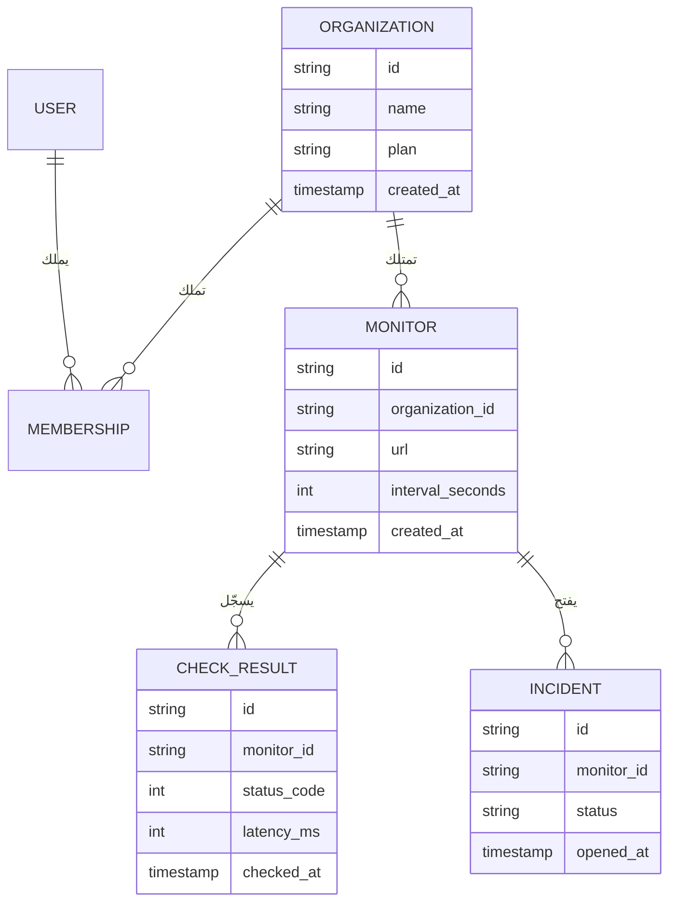

# الوحدة 2 — البيانات

*كل SaaS هو في جوهره، تحت واجهة المستخدم، آلة دقيقة تخزّن بيانات الآخرين ولا تعيدها إلا للأشخاص المخوّلين. تغطي هذه الوحدة أربعة مكوّنات للبيانات ستبنيها في كل مشروع: قاعدة البيانات العلائقية نفسها، والملفات التي لا مكان لها فيها، والبحث في الاثنين، وحدود المستأجر التي تبقي بيانات عميل بعيدة عن عميل آخر. إن أتقنت هذه المكوّنات مبكرًا صارت أغلب الوحدات اللاحقة أسهل، وإن أخطأت فيها ورثت كل وحدة لاحقة تلك الفوضى.*

---

# 2.1 — طبقة البيانات: Postgres وأدوات ORM والترحيلات وبيانات البذر
*المستوى: 🟢 مبتدئ* · *المتطلبات: 1.2*

## ⚡ الدرس في دقيقة

- طبقة البيانات هي قاعدة البيانات العلائقية مع الأدوات المحيطة بها: أداة ORM أو باني استعلامات، وترحيلات لها إصدارات، وسكربتات بذر.
- الخيار الافتراضي للإصدار الأول: Postgres مُدار، وكل جدول يملكه مستأجر فيه `organization_id` و`created_at` و`updated_at` وقيود حقيقية، ومعرّفات مرتبة زمنيًا ويصعب تخمينها (UUIDv7، مع بادئة مثل `mon_` إن شئت).
- القاعدة الأهم: لا تغيّر مخطط الإنتاج يدويًا أبدًا. كل تغيير يمر عبر ترحيل، والتغييرات الخطرة تستخدم أسلوب التوسيع ثم التقليص كي يعمل الكود القديم والجديد جنبًا إلى جنب.
- اعرف ما يرسله ORM من SQL: استعلامات N+1 والفهارس الناقصة هي أكثر أسباب بطء لوحات التحكم شيوعًا.
- الفخ الأكبر: أن تفترض أن النسخ الاحتياطية تعمل. فعّل الاستعادة إلى نقطة زمنية وتدرّب على الاستعادة، لأن النسخة التي لم تستعدها يومًا مجرد أمل.

## 🧭 لماذا يحتاجه كل SaaS

يخزّن الإصدار الأول من Beacon كل شيء في قاعدة بيانات Postgres واحدة. بعد ثلاثة أشهر يشتكي عميل لديه 400 مراقِب من أن لوحة التحكم تستغرق تسع ثوانٍ لتظهر. تبحث فتجد أن الصفحة تنفّذ 401 استعلام: واحد لقائمة المراقِبات، ثم واحد لكل مراقِب لجلب آخر فحص له. بعد أسبوع تعيد تسمية عمود وتنشر، فتفشل كل الطلبات لمدة أربع دقائق لأن الكود القديم ما زال يعمل على المخطط الجديد. ثم يشغّل أحدهم سكربت تنظيف على الإنتاج بدلًا من بيئة الاختبار (Staging).

هذه هي الطرق الثلاث الكلاسيكية التي يؤذي بها SaaS ناشئ نفسه: استعلامات بطيئة، وتغييرات غير آمنة في المخطط، وأخطاء لا يمكن التراجع عنها. أشهر مثال على الأخيرة: في يناير 2017 فقدت GitLab عدة ساعات من بيانات الإنتاج بعد أن حذف مهندس مجلد قاعدة البيانات الخطأ أثناء حادثة، ثم اكتشفوا أن عدة آليات للنسخ الاحتياطي لديهم لم تكن تعمل. تقرير ما بعد الحادثة الذي نشروه علنًا ما زال يستحق القراءة.

قاعدة البيانات هي المكوّن الوحيد الذي لا تستطيع إعادة كتابته في عطلة نهاية أسبوع. يمكن إعادة نشر الكود، لكن البيانات التي فُقدت أو تلفت أو صُمّمت بشكل سيئ تبقى مفقودة أو تالفة أو سيئة التصميم.

**عامل قاعدة البيانات على أنها ذاكرة المنتج: اختر محركًا مملًا ومجرّبًا، ولا تغيّره إلا عبر ترحيلات لها إصدارات، وتأكد أنك تستطيع استعادته إلى أي دقيقة من الأمس.**

## 📐 كيف يعمل

### 🟢 الأساسيات

**لماذا Postgres هو الخيار الافتراضي.** PostgreSQL قاعدة بيانات علائقية (Relational Database): تعيش البيانات في جداول ذات أعمدة محددة الأنواع، وتستعلم عنها بلغة SQL. هو الخيار الافتراضي لأي SaaS جديد لأسباب مملة وجيدة: مفتوح المصدر، وتقدّمه كل منصة سحابية بشكل مُدار، ويدعم المعاملات الحقيقية، والقيود القوية، وأعمدة JSON (`jsonb`) للأجزاء شبه المنظمة، والبحث النصي الكامل (الدرس 2.3)، وأمان مستوى الصف (الدرس 2.4)، ومنظومة إضافات (`pgvector` للتضمينات، و`pg_trgm` للمطابقة التقريبية). MySQL وSQLite خياران جيدان أيضًا، لكن إن لم يكن لديك سبب قوي فاختر Postgres وتوقّف عن التردد.

**تصميم المخطط (Schema) في SaaS.** بعض الأعراف تؤتي ثمارها من اليوم الأول:

- **كل جدول يملكه مستأجر فيه عمود `organization_id`** (من الدرس 1.2)، حتى لو استطعت استنتاجه عبر ربط (Join). هذا يجعل التصفية والفهرسة والعزل لاحقًا (الدرس 2.4) أبسط بكثير.
- **كل جدول فيه `created_at` و`updated_at`**، مخزّنين بنوع `timestamptz` (طابع زمني مع المنطقة الزمنية) بتوقيت UTC. ستحتاجهما لتذاكر الدعم وتصحيح الأخطاء والتدقيق.
- **استخدم القيود (Constraints).** `NOT NULL`، و`UNIQUE (organization_id, slug)`، والمفاتيح الأجنبية، و`CHECK (interval_seconds >= 30)`. قاعدةٌ تفرضها قاعدة البيانات تساوي عشر مراجعات كود.

هذا هو المخطط الأساسي لـ Beacon:



**اختيار المعرّفات (IDs).** الأعداد الصحيحة ذات الزيادة التلقائية (`1, 2, 3`) صغيرة وسريعة، لكنها تسرّب معلومات (يستطيع منافس أن يعدّ عملاءك بالتسجيل مرتين) وتجعل التخمين سهلًا. أغلب منتجات SaaS اليوم تستخدم أحد هذه الأنماط:

| نمط المعرّف | مثال | المزايا | العيوب |
|---|---|---|---|
| عدد صحيح بزيادة تلقائية | `4211` | صغير جدًا وسريع ومقروء | يمكن تخمينه، ويكشف الحجم، ويصعب دمجه بين قواعد بيانات |
| UUID v4 (عشوائي) | `9f1c…` | لا يمكن تخمينه، ويُولَّد في أي مكان | ترتيبه العشوائي يجزّئ فهارس B-tree |
| UUID v7 / ULID (مرتب زمنيًا) | `0190…` | صعب التخمين بما يكفي، ويُرتَّب حسب وقت الإنشاء، وملائم للفهارس | يكشف وقت الإنشاء |
| معرّف ببادئة | `mon_01J8…` | يصف نفسه في السجلات وتذاكر الدعم والروابط | يُخزَّن نصًا أو يحتاج ترميزًا وفك ترميز |

نشرت Stripe فكرة المعرّفات ذات البادئة: العميل `cus_…` والاشتراك `sub_…`. عندما يلصق عميل معرّفًا في محادثة الدعم تعرف فورًا ما هو. الخيار الافتراضي الجيد لـ Beacon هو UUIDv7 في قاعدة البيانات مع إضافة البادئات (`org_`، `mon_`، `inc_`) عند حدود الواجهة البرمجية، أو تخزينه نصًا مباشرة إن فضّلت البساطة. يحدّد RFC 9562 معيار UUIDv7، والإصدارات الحديثة من Postgres (18 فما فوق) تأتي بدالة مدمجة `uuidv7()`، وإلا فهناك مكتبات لكل لغة.

**كيف يتحدث كودك مع قاعدة البيانات.** هناك ثلاثة أساليب:

| الأسلوب | أمثلة | ما تكتبه | يتقن | انتبه إلى |
|---|---|---|---|---|
| ORM (أداة ربط الكائنات بالجداول) | Prisma، ActiveRecord، Django ORM، TypeORM | نماذج واستدعاءات دوال | عمليات CRUD السريعة والعلاقات والترحيلات المدمجة | الاستعلامات المخفية، وN+1، وصعوبة SQL المعقد |
| باني الاستعلامات (Query Builder) | Drizzle، Kysely، Knex | TypeScript بشكل يشبه SQL | أمان الأنواع مع التحكم في SQL | يجب أن تعرف SQL |
| SQL خام مع توليد الكود | sqlc (Go)، `pg` العادي | ملفات SQL | تحكم كامل وأنواع مولَّدة | كود متكرر أكثر لعمليات CRUD |

لا يوجد خيار خاطئ بين هذه. الخطأ هو ألا تعرف ما ترسله أداتك من SQL. فعّل تسجيل الاستعلامات في بيئة التطوير من اليوم الأول.

**الترحيلات (Migrations).** الترحيل ملف له إصدار ومحفوظ في المستودع، ويغيّر المخطط: `0007_add_monitor_timeout.sql`. تسجّل الأداة الترحيلات التي نُفّذت في جدول داخل قاعدة البيانات نفسها، لذلك تصل كل بيئة (جهازك، وCI، وبيئة الاختبار، والإنتاج) إلى المخطط نفسه. تفعل ذلك كلٌّ من Prisma Migrate وDrizzle Kit وترحيلات Rails وDjango وLaravel وgolang-migrate وgoose وFlyway وAtlas. القاعدة: **لا تغيّر مخطط الإنتاج يدويًا أبدًا.** إن لم يكن التغيير في ترحيل فهو لم يحدث.

**بيانات البذر والتجهيزات (Seeds and Fixtures).** سكربت البذر يملأ قاعدة بيانات جديدة ببيانات واقعية: منظمة تجريبية، وثلاثة مستخدمين بأدوار مختلفة، وعشرون مراقِبًا، وأسبوع من نتائج الفحص، وحادثة واحدة مفتوحة. بفضله يصبح تجهيز مطوّر جديد أمرًا واحدًا. التجهيزات هي النسخة الخاصة بالاختبارات: مجموعات بيانات صغيرة ومعروفة تُحمَّل قبل الاختبارات. اجعل سكربت البذر متساوي القوة (Idempotent)، أي آمنًا عند تشغيله مرتين، ولا تسمح له بالعمل على الإنتاج أبدًا.

### 🟡 التعمق أكثر

**الفهارس ومشكلة N+1.** الفهرس (Index) بنية جانبية مرتبة تسمح لـ Postgres بإيجاد الصفوف دون مسح الجدول كله. أكثر استعلامات Beacon شيوعًا هو "آخر الفحوص لهذا المراقِب"، لذلك يحتاج إلى:

```sql
CREATE INDEX check_result_monitor_time_idx
  ON check_result (monitor_id, checked_at DESC);
```

ترتيب الأعمدة مهم: هذا الفهرس يخدم الاستعلامات التي تصفّي حسب `monitor_id` وترتّب حسب `checked_at`، وليس العكس. تعلّم قراءة مخرجات `EXPLAIN ANALYZE`؛ فوجود `Seq Scan` على جدول كبير في مسار ساخن هو بلاغ خطأ ينتظر أن يُكتب. وتذكّر أن Postgres *لا* يفهرس أعمدة المفاتيح الأجنبية تلقائيًا.

مشكلة N+1 التي رأيناها في البداية هي الفخ الكلاسيكي لأدوات ORM: استعلام واحد للقائمة، ثم N استعلامًا لعلاقة كل عنصر. الحل أن تجلب العلاقات دفعة واحدة: `include` في Prisma، و`with` في الاستعلامات العلائقية في Drizzle، و`includes`/`preload` في Rails، و`select_related`/`prefetch_related` في Django، أو استعلام SQL واحد مع ربط أو `DISTINCT ON`. سجلات الاستعلامات وتتبّعات APM (الدرس 7.2) تجعلها مرئية.

**المعاملات (Transactions).** المعاملة تجمع عدة تعليمات بحيث تنجح كلها أو تفشل كلها. عندما يفتح Beacon حادثة، يجب أن يُدرج الحادثة، ويعلّم المراقِب بأنه متوقف، ويضع الإشعارات في الطابور. إن فشلت الخطوة الثانية بعد نجاح الأولى فستكون لديك حادثة لمراقِب يبدو سليمًا. ضعها في معاملة واحدة. اجعل المعاملات قصيرة، ولا تستدعِ واجهات خارجية (Stripe، البريد) داخلها أبدًا. النمط المناسب لـ "اكتب في قاعدة البيانات وأطلق أثرًا جانبيًا بشكل موثوق" هو **صندوق الصادر المعاملاتي (Transactional Outbox)**: أدرج صفًا في جدول `outbox` ضمن المعاملة نفسها، ودع عاملًا في الخلفية (الدرس 5.1) يوصله.

**ترحيلات بلا توقف: التوسيع ثم التقليص (Expand and Contract).** أثناء النشر يعمل الإصدار القديم والجديد من كودك في الوقت نفسه على قاعدة بيانات واحدة. لذلك يجب أن يكون الترحيل متوافقًا مع الاثنين. إعادة تسمية `monitor.url` إلى `monitor.target` بأمان تحتاج عدة عمليات نشر:


عمليات خطرة أخرى في Postgres: إضافة عمود بقيمة افتراضية متقلبة مثل `clock_timestamp()` (تعيد كتابة الجدول كله)، وإنشاء فهرس دون `CONCURRENTLY` (يمنع الكتابة على الجدول)، وإضافة قيد `NOT NULL` على جدول كبير في خطوة واحدة، وتغيير نوع عمود. هناك أدوات تساعد: جوهرة `strong_migrations` في Rails ترفض الترحيلات غير الآمنة، وAtlas يستطيع فحص الترحيلات بحثًا عن التغييرات المدمّرة. واضبط أيضًا `lock_timeout` في الترحيلات، كي يفشل الترحيل الذي ينتظر قفلًا بسرعة بدلًا من أن يصطف كل استعلام آخر خلفه.

**تجميع الاتصالات (Connection Pooling).** كل اتصال بـ Postgres هو عملية على الخادم تستهلك ذاكرة حقيقية، والنسخة المُدارة المعتادة تسمح ببضع مئات من الاتصالات على الأكثر. الدوال عديمة الخادم (Serverless) تكسر الإعدادات الساذجة: 500 استدعاء متزامن قد يفتح كلٌّ منها اتصالًا فتُستنزف قاعدة البيانات. الحل هو **مجمّع اتصالات (Connection Pooler)** بين التطبيق وقاعدة البيانات: PgBouncer هو الكلاسيكي، وSupabase يشغّل Supavisor، وNeon وأغلب المزوّدين المُدارين يعطونك سلسلة اتصال مجمّعة. في وضع *المعاملة* في PgBouncer يكون اتصال الخادم لك فقط طوال المعاملة، ما يعني أن ميزات الجلسة (أوامر `SET` على مستوى الجلسة، والأقفال الاستشارية الممتدة عبر المعاملات، وبعض إعدادات التعليمات المُعدّة مسبقًا) تتصرف بشكل مختلف.

### 🔴 على نطاق واسع وللمؤسسات

**النسخ الاحتياطي والاستعادة إلى نقطة زمنية (PITR).** أمر `pg_dump` ليلي بداية، وليس استراتيجية. يكتب Postgres كل تغيير في سجل الكتابة المسبقة (WAL)؛ فإن أرشفت نسخة أساسية مع تدفق WAL تستطيع استعادة قاعدة البيانات إلى *أي لحظة*، مثل 14:31:59، قبل ثانية من تشغيل أحدهم أمر `DELETE` الخاطئ. الخدمات المُدارة (RDS وNeon وSupabase وCrunchy Bridge وغيرها) تقدّم PITR كإعداد، ومن يستضيف بنفسه يستخدم أدوات مثل pgBackRest أو WAL-G. درس GitLab ينطبق هنا: **النسخة الاحتياطية التي لم تستعدها يومًا أمل، وليست نسخة احتياطية.** حدّد موعدًا لتمرين استعادة، وقِس المدة التي يستغرقها (هذا هو زمن التعافي الحقيقي لديك)، وضع الرقم في دليل التشغيل. استبيانات المؤسسات ستسأل عن هذه الأرقام تحديدًا (RPO وRTO).

**النسخ المتماثلة للقراءة (Read Replicas).** النسخة المتماثلة نسخة من قاعدة البيانات تتبع الأساسية عبر بثّ WAL الخاص بها. تستطيع إرسال استعلامات القراءة فقط (التقارير، والتحليلات، وصفحة الحالة العامة) إليها. المشكلة هي **تأخر التماثل (Replication Lag)**: يحفظ المستخدم مراقِبًا، ويُعاد توجيهه، ولم ترَ النسخة المتماثلة الكتابة بعد، فـ"يختفي" المراقِب. الحل الشائع: اقرأ ما كتبته من القاعدة الأساسية لبضع ثوانٍ بعد الكتابة، أو وجّه الطلبات حسب نقطة النهاية.

**السلاسل الزمنية والجداول الساخنة.** جدول `check_result` في Beacon يزداد ملايين الصفوف يوميًا. **التقسيم (Partitioning)** التصريحي حسب الوقت (قسم لكل يوم أو شهر) يسمح لك بحذف البيانات القديمة بـ `DROP TABLE` بدلًا من `DELETE` بطيء، ويبقي الفهارس صغيرة. إضافات مثل TimescaleDB تؤتمت ذلك.

**مقايضات الحذف الناعم (Soft Delete).** الحذف الناعم يعني ضبط `deleted_at` بدلًا من إزالة الصف. هذا يتيح "التراجع" والاستعادة، لكن كل استعلام يجب الآن أن يصفّي `WHERE deleted_at IS NULL`، وقيود التفرّد يجب أن تصبح فهارس جزئية، وطلبات المحو وفق GDPR (الدرس 8.1) تتطلب حذفًا حقيقيًا في النهاية. النمط الأنظف لكثير من الجداول هو الحذف الفعلي مع سجل تدقيق أو جدول أرشيف (الدرس 7.3). استخدم الحذف الناعم عن قصد للكائنات القليلة التي يتوقع المستخدمون استعادتها (منظمة، صفحة حالة)، وليس في كل مكان بحكم العادة.

**الخيارات المُدارة.** Neon (Postgres عديم الخادم مع التفريع: قاعدة بيانات بنسخ عند الكتابة لكل طلب دمج)، وSupabase (Postgres مع المصادقة والتخزين والوقت الحقيقي وواجهة برمجية مولَّدة تلقائيًا)، وAmazon RDS/Aurora، وGoogle Cloud SQL/AlloyDB، وPlanetScale (المعروف بـ MySQL المبني على Vitess مع تغييرات مخطط لا تحجب العمل، ويقدّم الآن Postgres أيضًا).

## 🏆 أفضل المستودعات

| المستودع | ما هو | التقنيات | الترخيص | اختره عندما |
|---|---|---|---|---|
| [postgres/postgres](https://github.com/postgres/postgres) | قاعدة البيانات نفسها (نسخة مطابقة على GitHub) | C | PostgreSQL | تريد قراءة كود أو توثيق الشيء الذي تعتمد عليه |
| [prisma/prisma](https://github.com/prisma/prisma) | أداة ORM تبدأ من المخطط، مع ترحيلات وأداة Studio | TypeScript | Apache-2.0 | تريد أسهل مدخل وملف مخطط مقروء |
| [drizzle-team/drizzle-orm](https://github.com/drizzle-team/drizzle-orm) | أداة ORM لـ TypeScript تشبه SQL، مع ترحيلات Drizzle Kit | TypeScript | Apache-2.0 | تعرف SQL، وتريد الأنواع، وتنشر على بيئة عديمة الخادم أو على الحافة |
| [kysely-org/kysely](https://github.com/kysely-org/kysely) | باني استعلامات SQL آمن الأنواع | TypeScript | MIT | تريد التحكم في SQL مع الأنواع ودون طبقة ORM |
| [sqlc-dev/sqlc](https://github.com/sqlc-dev/sqlc) | يولّد كودًا آمن الأنواع من استعلامات SQL | Go (also other targets) | MIT | تكتب بلغة Go وتفضّل ملفات SQL على ORM |
| [ariga/atlas](https://github.com/ariga/atlas) | إدارة تصريحية للمخطط وفحص الترحيلات | Go | Apache-2.0 | تريد مقارنة الترحيلات وفحوص الأمان في CI |
| [golang-migrate/migrate](https://github.com/golang-migrate/migrate) | أداة بسيطة لتشغيل ترحيلات SQL صعودًا ونزولًا | Go | MIT | تريد أداة ترحيل سطر أوامر لا ترتبط بلغة |
| [supabase/supabase](https://github.com/supabase/supabase) | منصة Postgres: مصادقة وتخزين ووقت حقيقي وواجهات برمجية | TypeScript, Elixir, Go | Apache-2.0 | تريد Postgres مُدارًا أو مستضافًا ذاتيًا مع كل الملحقات |
| [neondatabase/neon](https://github.com/neondatabase/neon) | Postgres عديم الخادم مع فصل التخزين عن الحوسبة | Rust | Apache-2.0 | تريد فهم التفريع والتقليص إلى الصفر |

**إن درست مستودعًا واحدًا فقط:** اقرأ توثيق Drizzle وكوده المصدري إلى جانب مخطط Drizzle حقيقي. هو قريب من SQL بما يكفي لتتعلم SQL أثناء استخدامه، ومولّد الترحيلات فيه يعرض بالضبط أوامر DDL التي سينفّذها. إن كنت تعمل بـ Rails أو Django فأداة ORM والترحيلات المدمجة هي الجواب المكافئ؛ لا تستبدلها.

**اشترِ أم ابنِ أم استضف بنفسك؟**

- **اشترِ (خدمة مُدارة):** في كل الحالات تقريبًا بالنسبة لقاعدة البيانات نفسها. Neon أو Supabase أو RDS أو Cloud SQL أو PlanetScale تعطيك النسخ الاحتياطي وPITR والتحويل عند الفشل ومجمّع الاتصالات بأقل من كلفة ساعة عمل مهندس شهريًا. اختر الأقرب إلى مكان تشغيل تطبيقك.
- **استضف بنفسك:** عندما تشغّل خوادمك أصلًا (Kamal أو Coolify أو Kubernetes) ولديك شخص سيتولى النسخ الاحتياطي والاستعادة والترقيات، أو عندما يتطلب عقد عميل ذلك. خصّص ميزانية لـ pgBackRest أو WAL-G ولتمرين استعادة مراقَب.
- **ابنِ:** لا تبنِ قاعدة البيانات أو أداة الترحيل أبدًا. لكن ابنِ سكربت البذر الخاص بك، ودالة المعرّفات (`newId("mon")`)، وطبقة وصول رفيعة للبيانات كي تعيش تصفية المستأجر في مكان واحد.

## 🔍 ادرسه في مشاريع حقيقية

**Cal.com (`calcom/cal.com`).** مستودع أحادي كبير بـ Next.js يستخدم Prisma. وقت كتابة هذا الدرس يوجد المخطط تحت `packages/prisma`؛ افتح `schema.prisma` واقرأ نماذج `User` و`Team` و`Membership`، ثم تصفّح مجلد `migrations` المجاور لترى سنوات من تطوّر مخطط حقيقي، بما في ذلك عمليات الملء الرجعي والأعمدة المعاد تسميتها.

**Documenso (`documenso/documenso`).** يستخدم Prisma أيضًا في `packages/prisma`، وهو أصغر من Cal.com، لذلك يسهل استيعابه. ابحث في المخطط عن `@default(` و`@@index`، وابحث عن سكربت البذر.

**OpenStatus (`openstatusHQ/openstatus`).** هو حرفيًا Beacon حقيقي. يستخدم Drizzle؛ استخدم بحث الكود عن `drizzle` و`sqliteTable` أو `pgTable` لتجد تعريفات جداول المراقِبات والحوادث وصفحات الحالة. قارن جدول المراقِبات عندهم بمخطط الكيانات والعلاقات أعلاه.

**Discourse (`discourse/discourse`).** تطبيق Rails فيه أكثر من عقد من الترحيلات. افتح `db/migrate` و`db/post_migrate`: يفصل Discourse الترحيلات التي يجب أن تعمل قبل الكود الجديد عن تلك التي تعمل بعده، وهذه فكرة التوسيع ثم التقليص مكتوبة في أسماء المجلدات.

**ما الذي تلاحظه:**

- ما استراتيجية المعرّفات التي يستخدمها كل مشروع (cuid أو UUID أو عدد صحيح أو ببادئة)، وهل تظهر في الروابط.
- كم من الترحيلات إضافي فقط مقابل المدمّر، وكيف تُقسَّم الترحيلات المدمّرة على مراحل.
- قيود التفرّد المركّبة التي تتضمن معرّف الفريق أو المنظمة.
- أين تُعرَّف الفهارس، وأي استعلامات تخدمها بوضوح.
- كيف ينشئ سكربت البذر مستخدمين بأدوار وخطط مختلفة.

## 🛠️ ابنِه في Beacon

### 🟢 تمرين المبتدئ

أنشئ مخطط Beacon للجداول `organization` و`user` و`membership` و`monitor` و`check_result` بأداة ORM أو باني الاستعلامات الذي تختاره، وولّد الترحيل الأول، واكتب سكربت بذر متساوي القوة ينشئ منظمة واحدة، ومستخدمَين (مالك وعضو)، وخمسة مراقِبات مع يوم من نتائج الفحص المزيفة.

**يكتمل عندما:**

- ينتج عن نسخة جديدة من المستودع مع أمر واحد (`npm run db:reset` أو ما يكافئه) قاعدة بيانات تعمل وفيها بيانات البذر.
- يحتوي كل جدول يملكه مستأجر على `organization_id` و`created_at` و`updated_at`، مع مفاتيح أجنبية.
- لا يُنشئ تشغيل البذر مرتين أي تكرارات.

### 🟡 تمرين المستوى المتوسط

ابنِ استعلام لوحة التحكم "كل المراقِبات في منظمتي مع آخر فحص لكل منها" واجعله سريعًا. ازرع 500 مراقِب مع 1,000 فحص لكل منها، وسجّل الاستعلامات، وأصلح أي N+1، وأضف الفهرس الذي يجعل `EXPLAIN ANALYZE` يُظهر مسحًا عبر الفهرس.

```sql
SELECT DISTINCT ON (m.id) m.id, m.url, c.status_code, c.checked_at
FROM monitor m
LEFT JOIN check_result c ON c.monitor_id = m.id
WHERE m.organization_id = $1
ORDER BY m.id, c.checked_at DESC;
```

**يكتمل عندما:**

- تنفّذ الصفحة عددًا ثابتًا من الاستعلامات مهما كان عدد المراقِبات.
- لا يُظهر `EXPLAIN ANALYZE` أي مسح تسلسلي على `check_result`.
- تُحمَّل الصفحة في أقل من 200 مللي ثانية محليًا مع بيانات البذر الكبيرة.

### 🔴 تمرين المستوى المتقدم

أعد تسمية `monitor.url` إلى `monitor.target` دون توقف، باستخدام التوسيع ثم التقليص عبر ثلاثة ترحيلات وعمليات نشر منفصلة على الأقل. ثم فعّل PITR لدى مزوّدك المُدار (أو pgBackRest محليًا)، واحذف كل المراقِبات عمدًا، واستعد قاعدة البيانات إلى الدقيقة السابقة.

**يكتمل عندما:**

- لا يرى سكربت حمل يضرب الواجهة البرمجية طوال كل خطوة أي أخطاء.
- يعمل الملء الرجعي على دفعات مع ضبط `lock_timeout`.
- يكون لديك دليل استعادة مكتوب يتضمن زمن التعافي المقيس.

## ⚠️ أخطاء يقع فيها المبتدئون

- **تعديل مخطط الإنتاج يدويًا "هذه المرة فقط".** يصبح الإنتاج مختلفًا عن كل ملفات الترحيل، ويفشل النشر التالي بطرق مربكة. كل تغيير يمر عبر ترحيل، بما في ذلك تغييرات الطوارئ.
- **إعادة تسمية عمود أو حذفه في نفس عملية نشر تغيير الكود.** النسخ القديمة التي ما زالت تعمل أثناء النشر تنهار. استخدم التوسيع ثم التقليص، والخطوات المدمّرة تأتي أخيرًا في عملية نشر خاصة بها.
- **فتح عميل قاعدة بيانات جديد لكل طلب في كود عديم الخادم.** تستنزف الاتصالات مع أول ارتفاع في الزيارات. أنشئ العميل مرة واحدة لكل عملية، واتصل عبر مجمّع اتصالات.
- **عدم النظر أبدًا إلى SQL الذي يولّده ORM.** تبقى استعلامات N+1 والفهارس الناقصة غير مرئية حتى يأتي عميل كبير. فعّل تسجيل الاستعلامات في التطوير واقرأ `EXPLAIN` لأكثر خمسة استعلامات استخدامًا.
- **استدعاء Stripe أو إرسال بريد داخل معاملة قاعدة بيانات.** تبقى الأقفال محتجزة أثناء انتظارك للشبكة، والتراجع لا يستطيع إلغاء إرسال بريد. نفّذ الالتزام أولًا، ثم نفّذ الآثار الجانبية عبر صندوق صادر أو مهمة خلفية.
- **افتراض أن النسخ الاحتياطية لدى المزوّد تعمل.** استعد واحدة. قِس الوقت. اكتبه.

## 🧾 الخلاصة

- Postgres هو الخيار الافتراضي لأنه ممل، ومُدار في كل مكان، وينمو معك (JSON، والبحث، وRLS، والمتجهات).
- ضع `organization_id` والطوابع الزمنية والقيود الحقيقية في كل جدول يملكه مستأجر، واختر معرّفات مرتبة زمنيًا ويصعب تخمينها.
- أداة ORM أو باني الاستعلامات أو SQL الخام كلها تعمل؛ ما لا يعمل هو ألا تعرف ما ينفَّذ من SQL.
- كل تغيير في المخطط ترحيل، والتغييرات الخطرة تستخدم التوسيع ثم التقليص كي يتعايش الكود القديم والجديد.
- جمّع الاتصالات، وفهرس لاستعلاماتك الحقيقية، واجعل المعاملات قصيرة والآثار الجانبية خارجها.
- PITR مع استعادة مجرّبة هو المعنى الحقيقي لعبارة "لدينا نسخ احتياطية".

## ✍️ اختبر نفسك

**1. ما الترحيل، وكيف تصل كل بيئة إلى المخطط نفسه؟**

<details><summary>الإجابة</summary>

الترحيل ملف له إصدار ومحفوظ في المستودع، ويغيّر المخطط، مثل `0007_add_monitor_timeout.sql`. تسجّل أداة الترحيل الترحيلات التي نُفّذت في جدول داخل قاعدة البيانات نفسها، لذلك يصل جهازك وCI وبيئة الاختبار والإنتاج إلى المخطط نفسه. راجع فقرة "الترحيلات" في 🟢 الأساسيات.

</details>

**2. ما مشكلة N+1، وكيف تصلحها؟**

<details><summary>الإجابة</summary>

هي استعلام واحد لقائمة، ثم استعلام إضافي لكل عنصر لتحميل علاقته، فيصبح 400 مراقِب 401 استعلام. تصلحها بجلب العلاقات دفعة واحدة: `include` في Prisma، و`with` في Drizzle، و`includes`/`preload` في Rails، و`select_related`/`prefetch_related` في Django، أو ربط SQL واحد أو `DISTINCT ON`. راجع فقرة "الفهارس ومشكلة N+1" في 🟡 التعمق أكثر.

</details>

**3. يريد Beacon إعادة تسمية `monitor.url` إلى `monitor.target` دون أي توقف. ما الخطوات؟**

<details><summary>الإجابة</summary>

استخدم التوسيع ثم التقليص عبر عدة عمليات نشر: أضف العمود `target`، واجعل الكود يكتب في العمودين، واملأ الصفوف القديمة رجعيًا على دفعات، وحوّل القراءة إلى `target`، ثم احذف `url` في عملية نشر خاصة به. كل خطوة تبقي قاعدة البيانات متوافقة مع الكود القديم والجديد اللذين يعملان جنبًا إلى جنب أثناء النشر. راجع فقرة "ترحيلات بلا توقف" في 🟡 التعمق أكثر.

</details>

**4. عندما يفتح Beacon حادثة يجب أن يُدرج الحادثة، ويعلّم المراقِب بأنه متوقف، ويُشعر الفريق بالبريد. كيف تنظّم ذلك؟**

<details><summary>الإجابة</summary>

ضع عمليتي الكتابة في قاعدة البيانات في معاملة قصيرة واحدة كي تنجحا أو تفشلا معًا، وأضف صفًا في `outbox` ضمن المعاملة نفسها. ثم يقرأ عامل في الخلفية صندوق الصادر ويرسل البريد. لا تستدعِ البريد أو Stripe داخل المعاملة أبدًا: فهي تحتجز الأقفال أثناء انتظار الشبكة، والتراجع لا يستطيع إلغاء إرسال بريد. راجع فقرة "المعاملات" في 🟡 التعمق أكثر.

</details>

**5. ينتقل Beacon إلى منصة عديمة الخادم. مع أول ارتفاع في الزيارات تبدأ قاعدة البيانات برفض الاتصالات، مع أن الاستعلامات سريعة. ما الذي تعطّل، وما الحل؟**

<details><summary>الإجابة</summary>

كل استدعاء متزامن للدالة فتح اتصاله الخاص بـ Postgres، والنسخة المُدارة المعتادة تسمح ببضع مئات فقط. أنشئ العميل مرة واحدة لكل عملية، واتصل عبر مجمّع اتصالات مثل PgBouncer أو Supavisor أو سلسلة الاتصال المجمّعة لدى مزوّدك. وتذكّر أن ميزات الجلسة تتصرف بشكل مختلف في وضع المعاملة. راجع فقرة "تجميع الاتصالات" في 🟡 التعمق أكثر.

</details>

## 📚 المراجع

- PostgreSQL documentation, especially "Continuous Archiving and Point-in-Time Recovery": https://www.postgresql.org/docs/current/continuous-archiving.html — الأرشفة المستمرة والاستعادة إلى نقطة زمنية
- RFC 9562, Universally Unique IDentifiers (UUIDv7): https://www.rfc-editor.org/rfc/rfc9562 — معيار المعرّفات الفريدة
- Use The Index, Luke — a free guide to SQL indexing: https://use-the-index-luke.com — دليل مجاني لفهرسة SQL
- Stripe engineering, "Online migrations at scale": https://stripe.com/blog/online-migrations — الترحيلات أثناء التشغيل على نطاق واسع
- PgBouncer documentation (pool modes and their limits): https://www.pgbouncer.org — أوضاع التجميع وحدودها
- Drizzle ORM docs: https://orm.drizzle.team · Prisma docs: https://www.prisma.io/docs
- Rails `strong_migrations` gem, a catalogue of unsafe migrations: https://github.com/ankane/strong_migrations — فهرس بالترحيلات غير الآمنة

---

