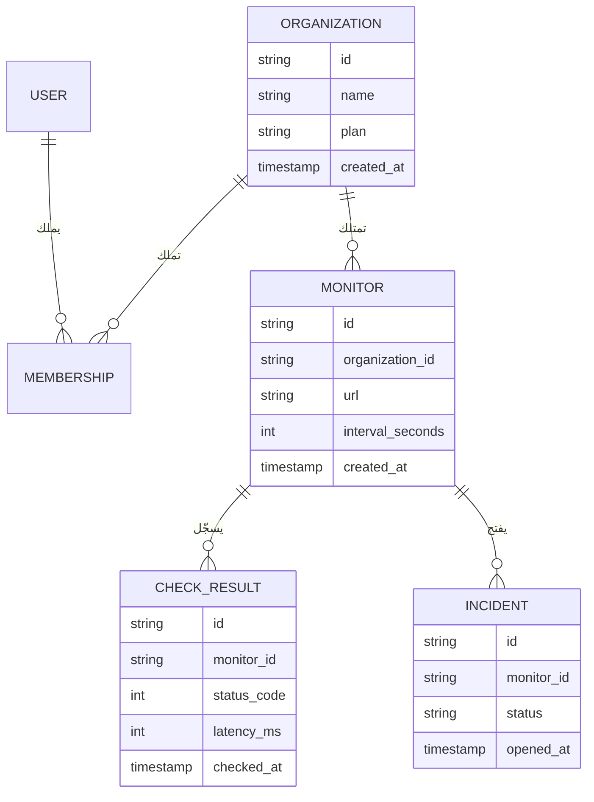
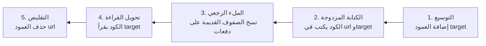
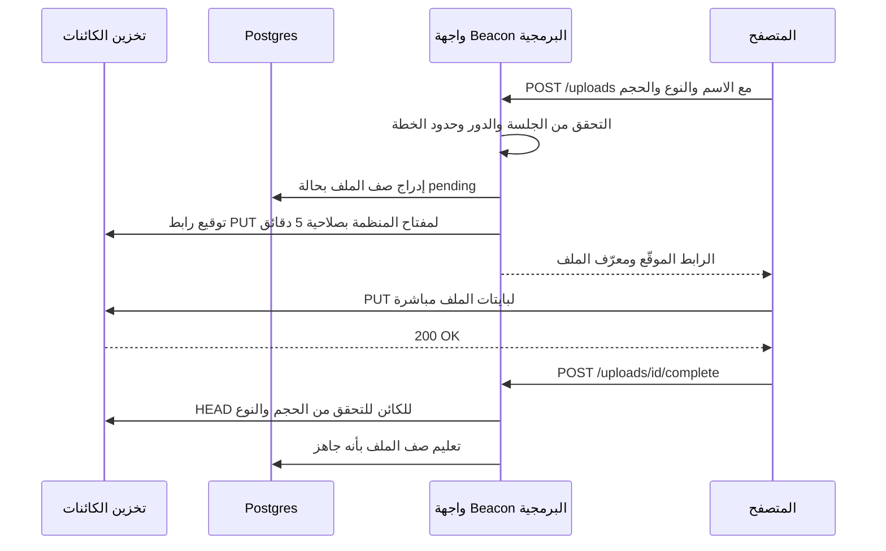
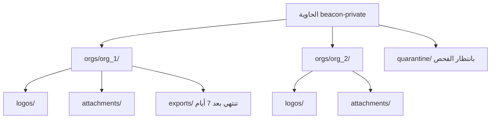
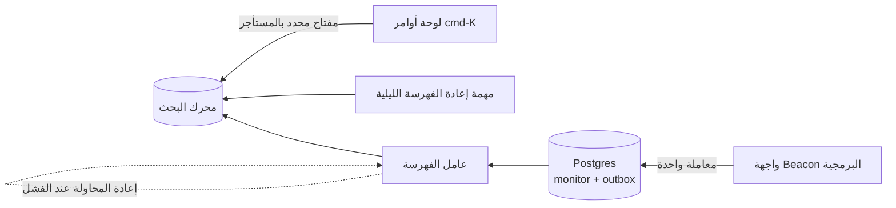
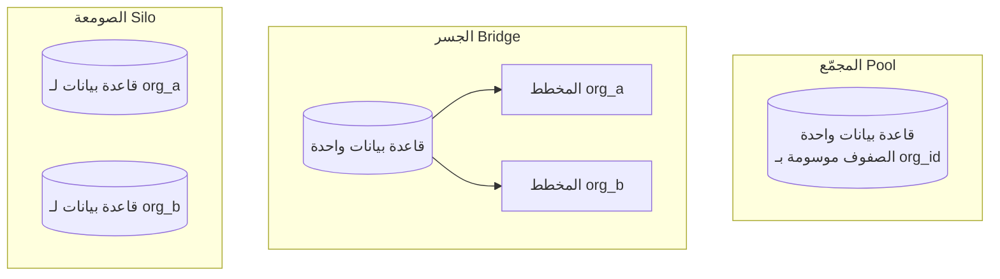
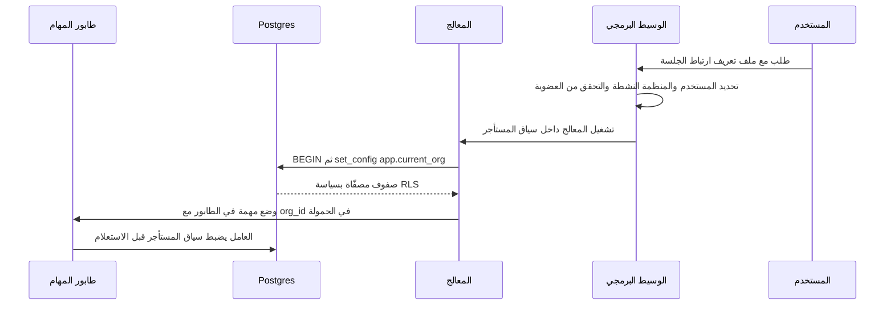
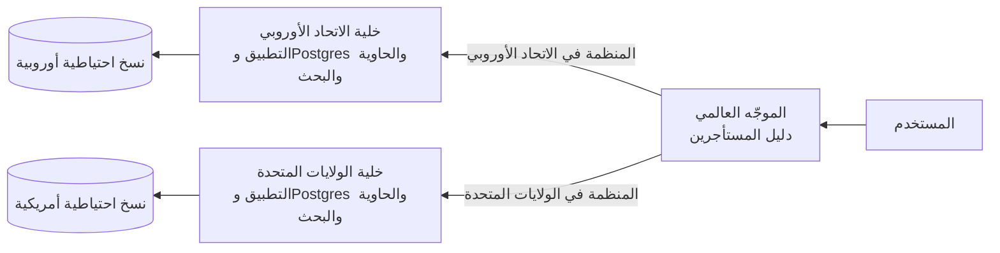

# الوحدة 2 (Module 2) — البيانات

*كل SaaS هو في جوهره، تحت واجهة المستخدم (UI)، آلة دقيقة تخزّن بيانات الآخرين ولا تعيدها إلا للأشخاص المخوّلين. تغطي هذه الوحدة (module) أربعة مكوّنات للبيانات (data components) ستبنيها في كل مشروع: قاعدة البيانات العلائقية (relational database) نفسها، والملفات التي لا مكان لها فيها، والبحث (search) في الاثنين، وحدود المستأجر (tenant boundary) التي تبقي بيانات عميل بعيدة عن عميل آخر. إن أتقنت هذه المكوّنات (components) مبكرًا صارت أغلب الوحدات اللاحقة (later modules) أسهل، وإن أخطأت فيها ورثت كل وحدة لاحقة (later module) تلك الفوضى.*

> **التطبيق العملي (Practice):** ابدأ من [نسخة البداية (starter) من Beacon](https://github.com/Tamoura/system-design-for-vibe-coders/tree/beacon/starter)، وحلّ التمارين قبل النظر إلى [الحل المرجعي (reference solution) لهذه الوحدة (module)](https://github.com/Tamoura/system-design-for-vibe-coders/tree/beacon/module-2-solution) (الفرع (branch) `beacon/module-2-solution`).

---

# 2.1 — طبقة البيانات (data layer): Postgres وأدوات ORM (ORMs) والترحيلات (migrations) وبيانات البذر (seed data)
*المستوى (Level): 🟢 مبتدئ (Beginner)* · *المتطلبات (Prerequisites): 1.2*

## ⚡ الدرس في دقيقة (In 60 seconds)

- طبقة البيانات (data layer) هي قاعدة البيانات العلائقية (relational database) مع الأدوات المحيطة بها: أداة ORM (ORM) أو باني استعلامات (query builder)، وترحيلات لها إصدارات (versioned migrations)، وسكربتات بذر (seed scripts).
- الخيار الافتراضي للإصدار الأول (v1 default): Postgres مُدار (managed)، وكل جدول يملكه مستأجر (tenant-owned table) فيه `organization_id` و`created_at` و`updated_at` وقيود حقيقية (constraints)، ومعرّفات (ids) مرتبة زمنيًا (time-ordered) ويصعب تخمينها (UUIDv7، مع بادئة (prefix) مثل `mon_` إن شئت).
- القاعدة الأهم (The rule that matters): لا تغيّر مخطط الإنتاج (production schema) يدويًا أبدًا. كل تغيير يمر عبر ترحيل (migration)، والتغييرات الخطرة تستخدم أسلوب التوسيع ثم التقليص (expand/contract) كي يعمل الكود القديم والجديد جنبًا إلى جنب.
- اعرف ما يرسله ORM من SQL: استعلامات N+1 (N+1 queries) والفهارس الناقصة (indexes) هي أكثر أسباب بطء لوحات التحكم (dashboard) شيوعًا.
- الفخ الأكبر (The big trap): أن تفترض أن النسخ الاحتياطية (backups) تعمل. فعّل الاستعادة إلى نقطة زمنية (point-in-time recovery) وتدرّب على الاستعادة (restore)، لأن النسخة التي لم تستعدها يومًا مجرد أمل.

## 🧭 لماذا يحتاجه كل SaaS (Why every SaaS has this)

يخزّن الإصدار الأول (v1) من Beacon كل شيء في قاعدة بيانات (database) Postgres واحدة. بعد ثلاثة أشهر يشتكي عميل لديه 400 مراقِب (monitors) من أن لوحة التحكم (dashboard) تستغرق تسع ثوانٍ لتظهر. تبحث فتجد أن الصفحة تنفّذ 401 استعلام (query): واحد لقائمة المراقِبات، ثم واحد لكل مراقِب لجلب آخر فحص (check) له. بعد أسبوع تعيد تسمية عمود (column) وتنشر (deploy)، فتفشل كل الطلبات (request) لمدة أربع دقائق لأن الكود القديم ما زال يعمل على المخطط الجديد (new schema). ثم يشغّل أحدهم سكربت تنظيف (cleanup script) على الإنتاج (production) بدلًا من بيئة الاختبار (Staging).

هذه هي الطرق الثلاث الكلاسيكية التي يؤذي بها SaaS ناشئ نفسه: استعلامات بطيئة (slow queries)، وتغييرات غير آمنة (unsafe changes) في المخطط (schema)، وأخطاء لا يمكن التراجع (rollback) عنها. أشهر مثال على الأخيرة: في يناير 2017 فقدت GitLab عدة ساعات من بيانات الإنتاج (production data) بعد أن حذف (delete) مهندس مجلد قاعدة البيانات (database) الخطأ أثناء حادثة (incident)، ثم اكتشفوا أن عدة آليات للنسخ الاحتياطي (backup mechanisms) لديهم لم تكن تعمل. تقرير ما بعد الحادثة (postmortem) الذي نشروه علنًا ما زال يستحق القراءة.

قاعدة البيانات (database) هي المكوّن (component) الوحيد الذي لا تستطيع إعادة كتابته في عطلة نهاية أسبوع. يمكن إعادة نشر (redeploy) الكود، لكن البيانات التي فُقدت أو تلفت أو صُمّمت بشكل سيئ تبقى مفقودة أو تالفة أو سيئة التصميم.

**عامل قاعدة البيانات (database) على أنها ذاكرة المنتج (the product's memory): اختر محركًا (engine) مملًا ومجرّبًا، ولا تغيّره إلا عبر ترحيلات لها إصدارات (versioned migrations)، وتأكد أنك تستطيع استعادته إلى أي دقيقة من الأمس.**

## 📐 كيف يعمل (How it works)

### 🟢 الأساسيات (The essentials)

**لماذا Postgres هو الخيار الافتراضي (default).** PostgreSQL قاعدة بيانات علائقية (Relational Database): تعيش البيانات في جداول (tables) ذات أعمدة (columns) محددة الأنواع (types)، وتستعلم عنها بلغة SQL (SQL). هو الخيار الافتراضي لأي SaaS جديد لأسباب مملة وجيدة: مفتوح المصدر (open source)، وتقدّمه كل منصة سحابية (cloud platform) بشكل مُدار (managed)، ويدعم المعاملات (transactions) الحقيقية، والقيود (constraints) القوية، وأعمدة JSON (`jsonb`) للأجزاء شبه المنظمة (semi-structured)، والبحث النصي الكامل (full-text search) (الدرس 2.3)، وأمان مستوى الصف (row-level security) (الدرس 2.4)، ومنظومة إضافات (extension ecosystem) (`pgvector` للتضمينات (embeddings)، و`pg_trgm` للمطابقة التقريبية (fuzzy matching)). MySQL وSQLite خياران جيدان أيضًا، لكن إن لم يكن لديك سبب قوي فاختر Postgres وتوقّف عن التردد.

**تصميم المخطط (Schema) في SaaS.** بعض الأعراف (conventions) تؤتي ثمارها من اليوم الأول:

- **كل جدول يملكه مستأجر (tenant-owned table) فيه عمود (column) `organization_id`** (من الدرس 1.2)، حتى لو استطعت استنتاجه عبر ربط (Join). هذا يجعل التصفية (filtering) والفهرسة (indexing) والعزل (isolation) لاحقًا (الدرس 2.4) أبسط بكثير.
- **كل جدول (table) فيه `created_at` و`updated_at`**، مخزّنين بنوع `timestamptz` (طابع زمني (timestamp) مع المنطقة الزمنية (time zone)) بتوقيت UTC. ستحتاجهما لتذاكر الدعم (support tickets) وتصحيح الأخطاء (debugging) والتدقيق (audits).
- **استخدم القيود (Constraints).** `NOT NULL`، و`UNIQUE (organization_id, slug)`، والمفاتيح الأجنبية (foreign keys)، و`CHECK (interval_seconds >= 30)`. قاعدةٌ تفرضها قاعدة البيانات (database) تساوي عشر مراجعات كود (code reviews).

هذا هو المخطط الأساسي (base schema) لـ Beacon:


```mermaid
erDiagram
    ORGANIZATION ||--o{ MEMBERSHIP : "تملك"
    USER ||--o{ MEMBERSHIP : "يملك"
    ORGANIZATION ||--o{ MONITOR : "تمتلك"
    MONITOR ||--o{ CHECK_RESULT : "يسجّل"
    MONITOR ||--o{ INCIDENT : "يفتح"
    ORGANIZATION {
        string id
        string name
        string plan
        timestamp created_at
    }
    MONITOR {
        string id
        string organization_id
        string url
        int interval_seconds
        timestamp created_at
    }
    CHECK_RESULT {
        string id
        string monitor_id
        int status_code
        int latency_ms
        timestamp checked_at
    }
    INCIDENT {
        string id
        string monitor_id
        string status
        timestamp opened_at
    }
```

**اختيار المعرّفات (IDs).** الأعداد الصحيحة ذات الزيادة التلقائية (auto-increment integers) (`1, 2, 3`) صغيرة وسريعة، لكنها تسرّب معلومات (يستطيع منافس أن يعدّ عملاءك بالتسجيل (signup) مرتين) وتجعل التخمين سهلًا. أغلب منتجات SaaS اليوم تستخدم أحد هذه الأنماط:

| نمط المعرّف (Id style) | مثال | المزايا (Pros) | العيوب (Cons) |
|---|---|---|---|
| عدد صحيح بزيادة تلقائية (Auto-increment integer) | `4211` | صغير جدًا وسريع ومقروء | يمكن تخمينه، ويكشف الحجم، ويصعب دمجه بين قواعد بيانات (databases) |
| UUID v4 (عشوائي (random)) | `9f1c…` | لا يمكن تخمينه، ويُولَّد في أي مكان | ترتيبه العشوائي يجزّئ فهارس B-tree (B-tree indexes) |
| UUID v7 / ULID (مرتب زمنيًا (time-ordered)) | `0190…` | صعب التخمين بما يكفي، ويُرتَّب حسب وقت الإنشاء (creation time)، وملائم للفهارس (indexes) | يكشف وقت الإنشاء (creation time) |
| معرّف ببادئة (prefixed id) | `mon_01J8…` | يصف نفسه في السجلات (logs) وتذاكر الدعم (support tickets) والروابط (URLs) | يُخزَّن نصًا أو يحتاج ترميزًا وفك ترميز (encode/decode) |

نشرت Stripe فكرة المعرّفات ذات البادئة (prefixed ids): العميل `cus_…` والاشتراك (subscription) `sub_…`. عندما يلصق عميل معرّفًا (an id) في محادثة الدعم (support chat) تعرف فورًا ما هو. الخيار الافتراضي (default) الجيد لـ Beacon هو UUIDv7 في قاعدة البيانات (database) مع إضافة البادئات (`org_`، `mon_`، `inc_`) عند حدود الواجهة البرمجية (API boundary)، أو تخزينه نصًا مباشرة إن فضّلت البساطة. يحدّد RFC 9562 معيار UUIDv7، والإصدارات (versions) الحديثة من Postgres (18 فما فوق) تأتي بدالة مدمجة (built-in function) `uuidv7()`، وإلا فهناك مكتبات (libraries) لكل لغة.

**كيف يتحدث كودك مع قاعدة البيانات (database).** هناك ثلاثة أساليب:

| الأسلوب (Approach) | أمثلة (Examples) | ما تكتبه (You write) | يتقن (Good at) | انتبه إلى (Watch out for) |
|---|---|---|---|---|
| ORM (أداة ربط الكائنات بالجداول (object-relational mapper)) | Prisma، ActiveRecord، Django ORM، TypeORM | نماذج واستدعاءات دوال (models and method calls) | عمليات CRUD السريعة والعلاقات (relations) والترحيلات المدمجة (built-in migrations) | الاستعلامات المخفية (hidden queries)، وN+1، وصعوبة SQL المعقد |
| باني الاستعلامات (Query Builder) | Drizzle، Kysely، Knex | TypeScript بشكل يشبه SQL | أمان الأنواع (type safety) مع التحكم في SQL (SQL control) | يجب أن تعرف SQL |
| SQL خام (raw SQL) مع توليد الكود (codegen) | sqlc (Go)، `pg` العادي | ملفات SQL | تحكم كامل وأنواع مولَّدة (generated types) | كود متكرر (boilerplate) أكثر لعمليات CRUD |

لا يوجد خيار خاطئ بين هذه. الخطأ هو ألا تعرف ما ترسله أداتك من SQL. فعّل تسجيل الاستعلامات (query logging) في بيئة التطوير (development) من اليوم الأول.

**الترحيلات (Migrations).** الترحيل (migration) ملف له إصدار (version) ومحفوظ في المستودع (Repo)، ويغيّر المخطط (schema): `0007_add_monitor_timeout.sql`. تسجّل الأداة الترحيلات التي نُفّذت في جدول (table) داخل قاعدة البيانات (database) نفسها، لذلك تصل كل بيئة (environment) (جهازك، وCI، وبيئة الاختبار (staging)، والإنتاج (production)) إلى المخطط نفسه. تفعل ذلك كلٌّ من Prisma Migrate وDrizzle Kit وترحيلات Rails وDjango وLaravel وgolang-migrate وgoose وFlyway وAtlas. القاعدة: **لا تغيّر مخطط الإنتاج (production schema) يدويًا أبدًا.** إن لم يكن التغيير في ترحيل فهو لم يحدث.

**بيانات البذر والتجهيزات (Seeds and Fixtures).** سكربت البذر (seed script) يملأ قاعدة بيانات (database) جديدة ببيانات واقعية: منظمة تجريبية (demo org)، وثلاثة مستخدمين بأدوار (roles) مختلفة، وعشرون مراقِبًا (monitor)، وأسبوع من نتائج الفحص (check results)، وحادثة (incident) واحدة مفتوحة. بفضله يصبح تجهيز مطوّر جديد (onboarding) أمرًا واحدًا. التجهيزات (fixtures) هي النسخة الخاصة بالاختبارات (tests): مجموعات بيانات صغيرة ومعروفة تُحمَّل قبل الاختبارات. اجعل سكربت البذر متساوي القوة (Idempotent)، أي آمنًا عند تشغيله مرتين، ولا تسمح له بالعمل على الإنتاج (production) أبدًا.

### 🟡 التعمق أكثر (Going deeper)

**الفهارس (indexes) ومشكلة N+1 (N+1 problem).** الفهرس (Index) بنية جانبية مرتبة تسمح لـ Postgres بإيجاد الصفوف (rows) دون مسح الجدول (scanning) كله. أكثر استعلامات (queries) Beacon شيوعًا هو "آخر الفحوص (checks) لهذا المراقِب (monitor)"، لذلك يحتاج إلى:

```sql
CREATE INDEX check_result_monitor_time_idx
  ON check_result (monitor_id, checked_at DESC);
```

ترتيب الأعمدة (columns) مهم: هذا الفهرس (index) يخدم الاستعلامات (queries) التي تصفّي حسب `monitor_id` وترتّب حسب `checked_at`، وليس العكس. تعلّم قراءة مخرجات `EXPLAIN ANALYZE`؛ فوجود `Seq Scan` على جدول (table) كبير في مسار ساخن (hot path) هو بلاغ خطأ (bug report) ينتظر أن يُكتب. وتذكّر أن Postgres *لا* يفهرس أعمدة المفاتيح الأجنبية (foreign keys) تلقائيًا.

مشكلة N+1 (N+1 problem) التي رأيناها في البداية هي الفخ الكلاسيكي لأدوات ORM (ORMs): استعلام واحد للقائمة، ثم N استعلامًا (query) لعلاقة (relation) كل عنصر. الحل أن تجلب العلاقات (relations) دفعة واحدة: `include` في Prisma، و`with` في الاستعلامات (queries) العلائقية في Drizzle، و`includes`/`preload` في Rails، و`select_related`/`prefetch_related` في Django، أو استعلام SQL واحد مع ربط (join) أو `DISTINCT ON`. سجلات الاستعلامات (query logs) وتتبّعات (traces) APM (الدرس 7.2) تجعلها مرئية.

**المعاملات (Transactions).** المعاملة (transaction) تجمع عدة تعليمات بحيث تنجح كلها أو تفشل كلها. عندما يفتح Beacon حادثة، يجب أن يُدرج الحادثة (incident)، ويعلّم المراقِب (monitor) بأنه متوقف، ويضع الإشعارات (notifications) في الطابور (queue). إن فشلت الخطوة الثانية بعد نجاح الأولى فستكون لديك حادثة لمراقِب يبدو سليمًا. ضعها في معاملة واحدة. اجعل المعاملات قصيرة، ولا تستدعِ واجهات خارجية (external APIs) (Stripe، البريد) داخلها أبدًا. النمط المناسب لـ "اكتب في قاعدة البيانات (database) وأطلق أثرًا جانبيًا (side effect) بشكل موثوق" هو **صندوق الصادر المعاملاتي (Transactional Outbox)**: أدرج صفًا (row) في جدول (table) `outbox` ضمن المعاملة نفسها، ودع عاملًا في الخلفية (background worker) (الدرس 5.1) يوصله.

**ترحيلات بلا توقف (zero-downtime migrations): التوسيع ثم التقليص (Expand and Contract).** أثناء النشر (deploy) يعمل الإصدار (version) القديم والجديد من كودك في الوقت نفسه على قاعدة بيانات (database) واحدة. لذلك يجب أن يكون الترحيل (migration) متوافقًا مع الاثنين. إعادة تسمية `monitor.url` إلى `monitor.target` بأمان تحتاج عدة عمليات نشر (deploys):


```mermaid
flowchart RL
    A["1. التوسيع<br/>إضافة العمود target"] --> B["2. الكتابة المزدوجة<br/>الكود يكتب في url وtarget"]
    B --> C["3. الملء الرجعي<br/>نسخ الصفوف القديمة على دفعات"]
    C --> D["4. تحويل القراءة<br/>الكود يقرأ target"]
    D --> E["5. التقليص<br/>حذف العمود url"]
```

عمليات خطرة أخرى في Postgres: إضافة عمود (column) بقيمة افتراضية متقلبة (volatile default) مثل `clock_timestamp()` (تعيد كتابة الجدول (table) كله)، وإنشاء فهرس (index) دون `CONCURRENTLY` (يمنع الكتابة (blocks writes) على الجدول)، وإضافة قيد (constraint) `NOT NULL` على جدول كبير في خطوة واحدة، وتغيير نوع عمود. هناك أدوات تساعد: جوهرة (gem) `strong_migrations` في Rails ترفض الترحيلات غير الآمنة (unsafe migrations)، وAtlas يستطيع فحص الترحيلات (lint) بحثًا (search) عن التغييرات المدمّرة (destructive changes). واضبط أيضًا `lock_timeout` في الترحيلات (migrations)، كي يفشل الترحيل (migration) الذي ينتظر قفلًا (lock) بسرعة بدلًا من أن يصطف كل استعلام (query) آخر خلفه.

**تجميع الاتصالات (Connection Pooling).** كل اتصال بـ Postgres هو عملية (process) على الخادم (server) تستهلك ذاكرة حقيقية، والنسخة المُدارة (managed instance) المعتادة تسمح ببضع مئات من الاتصالات (connections) على الأكثر. الدوال عديمة الخادم (Serverless) تكسر الإعدادات الساذجة: 500 استدعاء متزامن (concurrent invocations) قد يفتح كلٌّ منها اتصالًا (connection) فتُستنزف قاعدة البيانات (database). الحل هو **مجمّع اتصالات (Connection Pooler)** بين التطبيق وقاعدة البيانات (DB): PgBouncer هو الكلاسيكي، وSupabase يشغّل Supavisor، وNeon وأغلب المزوّدين (providers) المُدارين (managed) يعطونك سلسلة اتصال مجمّعة (pooled connection string). في وضع *المعاملة (transaction)* في PgBouncer يكون اتصال الخادم (server connection) لك فقط طوال المعاملة، ما يعني أن ميزات الجلسة (session features) (أوامر `SET` على مستوى الجلسة (session level)، والأقفال الاستشارية (advisory locks) الممتدة عبر المعاملات (transactions)، وبعض إعدادات التعليمات المُعدّة مسبقًا (prepared statements)) تتصرف بشكل مختلف.

### 🔴 على نطاق واسع وللمؤسسات (At scale / enterprise)

**النسخ الاحتياطي (backups) والاستعادة إلى نقطة زمنية (PITR).** أمر `pg_dump` ليلي بداية، وليس استراتيجية (strategy). يكتب Postgres كل تغيير في سجل الكتابة المسبقة (WAL)؛ فإن أرشفت نسخة أساسية (base backup) مع تدفق WAL تستطيع استعادة (restore) قاعدة البيانات (database) إلى *أي لحظة*، مثل 14:31:59، قبل ثانية من تشغيل أحدهم أمر `DELETE` الخاطئ. الخدمات المُدارة (managed services) (RDS وNeon وSupabase وCrunchy Bridge وغيرها) تقدّم PITR كإعداد، ومن يستضيف بنفسه (self-hosters) يستخدم أدوات مثل pgBackRest أو WAL-G. درس GitLab ينطبق هنا: **النسخة الاحتياطية (backup) التي لم تستعدها يومًا أمل، وليست نسخة احتياطية.** حدّد موعدًا لتمرين استعادة (restore drill)، وقِس المدة التي يستغرقها (هذا هو زمن التعافي (recovery time) الحقيقي لديك)، وضع الرقم في دليل التشغيل (runbook). استبيانات المؤسسات (enterprise questionnaires) ستسأل عن هذه الأرقام تحديدًا (RPO وRTO).

**النسخ المتماثلة للقراءة (Read Replicas).** النسخة المتماثلة (replica) نسخة من قاعدة البيانات (database) تتبع الأساسية (primary) عبر بثّ WAL الخاص بها. تستطيع إرسال استعلامات القراءة فقط (read-only queries) (التقارير (reports)، والتحليلات (analytics)، وصفحة الحالة العامة (public status page)) إليها. المشكلة (Problem) هي **تأخر التماثل (Replication Lag)**: يحفظ المستخدم مراقِبًا، ويُعاد توجيهه (redirected)، ولم ترَ النسخة المتماثلة الكتابة بعد، فـ"يختفي" المراقِب (monitor). الحل الشائع: اقرأ ما كتبته من القاعدة الأساسية لبضع ثوانٍ بعد الكتابة، أو وجّه الطلبات (requests) حسب نقطة النهاية (endpoint).

**السلاسل الزمنية (time-series) والجداول الساخنة (hot tables).** جدول (table) `check_result` في Beacon يزداد ملايين الصفوف (rows) يوميًا. **التقسيم (Partitioning)** التصريحي حسب الوقت (قسم لكل (partition) يوم أو شهر) يسمح لك بحذف (delete) البيانات القديمة بـ `DROP TABLE` بدلًا من `DELETE` بطيء، ويبقي الفهارس (indexes) صغيرة. إضافات (extensions) مثل TimescaleDB تؤتمت ذلك.

**مقايضات الحذف الناعم (Soft Delete).** الحذف الناعم (soft-delete) يعني ضبط `deleted_at` بدلًا من إزالة الصف (row). هذا يتيح "التراجع (rollback)" والاستعادة (restore)، لكن كل استعلام (query) يجب الآن أن يصفّي `WHERE deleted_at IS NULL`، وقيود التفرّد (unique constraints) يجب أن تصبح فهارس جزئية (partial indexes)، وطلبات المحو (erasure requests) وفق GDPR (الدرس 8.1) تتطلب حذفًا حقيقيًا (real delete) في النهاية. النمط الأنظف لكثير من الجداول (tables) هو الحذف الفعلي (hard delete) مع سجل تدقيق (audit log) أو جدول أرشيف (archive table) (الدرس 7.3). استخدم الحذف الناعم (use soft delete) عن قصد للكائنات (objects) القليلة التي يتوقع المستخدمون استعادتها (منظمة (org)، صفحة حالة)، وليس في كل مكان بحكم العادة.

**الخيارات المُدارة (Managed options).** Neon (Postgres عديم الخادم (serverless) مع التفريع (branching): قاعدة بيانات (database) بنسخ عند الكتابة (copy-on-write) لكل طلب دمج (pull request))، وSupabase (Postgres مع المصادقة (auth) والتخزين (storage) والوقت الحقيقي (realtime) وواجهة برمجية مولَّدة تلقائيًا (auto-generated API))، وAmazon RDS/Aurora، وGoogle Cloud SQL/AlloyDB، وPlanetScale (المعروف بـ MySQL المبني على Vitess مع تغييرات مخطط (schema changes) لا تحجب العمل (non-blocking)، ويقدّم الآن Postgres أيضًا).

## 🏆 أفضل المستودعات (The best repos)

| المستودع (Repo) | ما هو | التقنيات (Stack) | الترخيص (License) | اختره عندما (Pick it when) |
|---|---|---|---|---|
| [postgres/postgres](https://github.com/postgres/postgres) | قاعدة البيانات (database) نفسها (نسخة مطابقة (mirror) على GitHub) | C | PostgreSQL | تريد قراءة كود أو توثيق (documentation) الشيء الذي تعتمد عليه |
| [prisma/orm](https://github.com/prisma/orm) | أداة ORM (ORM) تبدأ من المخطط (schema)، مع ترحيلات (migrations) وأداة Studio | TypeScript | Apache-2.0 | تريد أسهل مدخل وملف مخطط (schema) مقروء |
| [drizzle-team/drizzle-orm](https://github.com/drizzle-team/drizzle-orm) | أداة ORM (ORM) لـ TypeScript تشبه SQL، مع ترحيلات (migrations) Drizzle Kit | TypeScript | Apache-2.0 | تعرف SQL، وتريد الأنواع (types)، وتنشر على بيئة عديمة الخادم (serverless) أو على الحافة (edge) |
| [kysely-org/kysely](https://github.com/kysely-org/kysely) | باني استعلامات (query builder) SQL آمن الأنواع (type-safe) | TypeScript | MIT | تريد التحكم في SQL (SQL control) مع الأنواع (types) ودون طبقة ORM |
| [sqlc-dev/sqlc](https://github.com/sqlc-dev/sqlc) | يولّد كودًا آمن الأنواع (type-safe) من استعلامات (queries) SQL | Go (also other targets) | MIT | تكتب بلغة Go وتفضّل ملفات SQL على ORM |
| [ariga/atlas](https://github.com/ariga/atlas) | إدارة تصريحية للمخطط (declarative schema management) وفحص الترحيلات (migration linting) | Go | Apache-2.0 | تريد مقارنة الترحيلات (migration diffing) وفحوص الأمان (safety checks) في CI |
| [golang-migrate/migrate](https://github.com/golang-migrate/migrate) | أداة بسيطة لتشغيل (operations) ترحيلات (migrations) SQL صعودًا ونزولًا | Go | MIT | تريد أداة ترحيل (migration tool) سطر أوامر (CLI) لا ترتبط بلغة |
| [supabase/supabase](https://github.com/supabase/supabase) | منصة (platform) Postgres: مصادقة (auth) وتخزين (storage) ووقت حقيقي (realtime) وواجهات برمجية (APIs) | TypeScript, Elixir, Go | Apache-2.0 | تريد Postgres مُدارًا (managed) أو مستضافًا ذاتيًا (self-hosted) مع كل الملحقات |
| [neondatabase/neon](https://github.com/neondatabase/neon) | Postgres عديم الخادم (serverless) مع فصل التخزين عن الحوسبة (storage/compute separation) | Rust | Apache-2.0 | تريد فهم التفريع (branching) والتقليص إلى الصفر (scale-to-zero) |

**إن درست مستودعًا واحدًا فقط (If you study one repo):** اقرأ توثيق (documentation) Drizzle وكوده المصدري (its source code) إلى جانب مخطط (schema) Drizzle حقيقي. هو قريب من SQL بما يكفي لتتعلم SQL أثناء استخدامه، ومولّد الترحيلات (migration generator) فيه يعرض بالضبط أوامر DDL (DDL statements) التي سينفّذها. إن كنت تعمل بـ Rails أو Django فأداة ORM (ORM) والترحيلات المدمجة (built-in migrations) هي الجواب المكافئ؛ لا تستبدلها.

**اشترِ أم ابنِ أم استضف بنفسك (self-host)؟**

- **اشترِ (خدمة مُدارة (managed service)):** في كل الحالات تقريبًا بالنسبة لقاعدة البيانات (database) نفسها. Neon أو Supabase أو RDS أو Cloud SQL أو PlanetScale تعطيك النسخ الاحتياطي (backups) وPITR والتحويل عند الفشل (failover) ومجمّع الاتصالات (connection pooler) بأقل من كلفة ساعة عمل مهندس شهريًا. اختر الأقرب إلى مكان تشغيل تطبيقك.
- **استضف بنفسك (Self-host):** عندما تشغّل خوادمك (your servers) أصلًا (Kamal أو Coolify أو Kubernetes) ولديك شخص سيتولى النسخ الاحتياطي (backups) والاستعادة (restore) والترقيات (upgrades)، أو عندما يتطلب عقد عميل ذلك. خصّص ميزانية لـ pgBackRest أو WAL-G ولتمرين استعادة مراقَب (monitored restore drill).
- **ابنِ (Build):** لا تبنِ قاعدة البيانات (database) أو أداة الترحيل (migration tool) أبدًا. لكن ابنِ سكربت البذر (seed script) الخاص بك، ودالة (function) المعرّفات (`newId("mon")`)، وطبقة وصول رفيعة للبيانات (data-access layer) كي تعيش تصفية المستأجر (tenant filtering) في مكان واحد.

## 🔍 ادرسه في مشاريع حقيقية (Study it in the wild)

**Cal.com (`calcom/cal.diy`).** مستودع أحادي (monorepo) كبير بـ Next.js يستخدم Prisma. وقت كتابة هذا الدرس يوجد المخطط (schema) تحت `packages/prisma`؛ افتح `schema.prisma` واقرأ نماذج `User` و`Team` و`Membership`، ثم تصفّح مجلد `migrations` المجاور لترى سنوات من تطوّر مخطط حقيقي، بما في ذلك عمليات الملء الرجعي (backfills) والأعمدة (columns) المعاد تسميتها.

**Documenso (`documenso/documenso`).** يستخدم Prisma أيضًا في `packages/prisma`، وهو أصغر من Cal.com، لذلك يسهل استيعابه. ابحث في المخطط (schema) عن `@default(` و`@@index`، وابحث عن سكربت البذر (seed script).

**OpenStatus (`openstatusHQ/openstatus`).** هو حرفيًا Beacon حقيقي. يستخدم Drizzle؛ استخدم بحث الكود (code search) عن `drizzle` و`sqliteTable` أو `pgTable` لتجد تعريفات جداول (tables) المراقِبات (monitors) والحوادث (incidents) وصفحات الحالة (status pages). قارن جدول المراقِبات (monitors table) عندهم بمخطط الكيانات والعلاقات (ER diagram) أعلاه.

**Discourse (`discourse/discourse`).** تطبيق Rails فيه أكثر من عقد من الترحيلات (migrations). افتح `db/migrate` و`db/post_migrate`: يفصل Discourse الترحيلات التي يجب أن تعمل قبل الكود الجديد عن تلك التي تعمل بعده، وهذه فكرة التوسيع ثم التقليص (expand/contract) مكتوبة في أسماء المجلدات.

**ما الذي تلاحظه (What to notice):**

- ما استراتيجية (strategy) المعرّفات (ids) التي يستخدمها كل مشروع (cuid أو UUID أو عدد صحيح (integer) أو ببادئة (prefix))، وهل تظهر في الروابط (URLs).
- كم من الترحيلات (migrations) إضافي فقط (additive) مقابل المدمّر (destructive)، وكيف تُقسَّم الترحيلات المدمّرة (destructive migrations) على مراحل.
- قيود التفرّد المركّبة (composite unique constraints) التي تتضمن معرّف الفريق (team id) أو المنظمة (org).
- أين تُعرَّف الفهارس (indexes)، وأي استعلامات (queries) تخدمها بوضوح.
- كيف ينشئ سكربت البذر (seed script) مستخدمين بأدوار (roles) وخطط (plans) مختلفة.

## 🛠️ ابنِه في Beacon (Build it into Beacon)

### 🟢 تمرين المبتدئ (Beginner exercise)

أنشئ مخطط (schema) Beacon للجداول (tables) `organization` و`user` و`membership` و`monitor` و`check_result` بأداة ORM (ORM) أو باني الاستعلامات (query builder) الذي تختاره، وولّد الترحيل (migration) الأول، واكتب سكربت بذر (seed script) متساوي القوة (idempotent) ينشئ منظمة (org) واحدة، ومستخدمَين (مالك وعضو)، وخمسة مراقِبات (monitors) مع يوم من نتائج الفحص (check results) المزيفة.

**يكتمل عندما (Done when):**

- ينتج عن نسخة جديدة من المستودع (fresh clone) مع أمر واحد (`npm run db:reset` أو ما يكافئه) قاعدة بيانات (database) تعمل وفيها بيانات البذر (seed data).
- يحتوي كل جدول يملكه مستأجر (tenant-owned table) على `organization_id` و`created_at` و`updated_at`، مع مفاتيح أجنبية (foreign keys).
- لا يُنشئ تشغيل البذر (seed) مرتين أي تكرارات (duplicates).

### 🟡 تمرين المستوى المتوسط (Intermediate exercise)

ابنِ استعلام (query) لوحة التحكم (dashboard) "كل المراقِبات (monitors) في منظمتي (my org) مع آخر فحص (check) لكل منها" واجعله سريعًا. ازرع 500 مراقِب (monitor) مع 1,000 فحص لكل منها، وسجّل الاستعلامات (queries)، وأصلح أي N+1، وأضف الفهرس (index) الذي يجعل `EXPLAIN ANALYZE` يُظهر مسحًا عبر الفهرس (index scan).

```sql
SELECT DISTINCT ON (m.id) m.id, m.url, c.status_code, c.checked_at
FROM monitor m
LEFT JOIN check_result c ON c.monitor_id = m.id
WHERE m.organization_id = $1
ORDER BY m.id, c.checked_at DESC;
```

**يكتمل عندما (Done when):**

- تنفّذ الصفحة عددًا ثابتًا من الاستعلامات (queries) مهما كان عدد المراقِبات (monitors).
- لا يُظهر `EXPLAIN ANALYZE` أي مسح تسلسلي (sequential scan) على `check_result`.
- تُحمَّل الصفحة في أقل من 200 مللي ثانية (ms) محليًا مع بيانات البذر (seed data) الكبيرة.

### 🔴 تمرين المستوى المتقدم (Advanced exercise)

أعد تسمية `monitor.url` إلى `monitor.target` دون توقف (zero downtime)، باستخدام التوسيع ثم التقليص (expand/contract) عبر ثلاثة ترحيلات (migrations) وعمليات نشر (deploys) منفصلة على الأقل. ثم فعّل PITR لدى مزوّدك المُدار (أو pgBackRest محليًا)، واحذف كل المراقِبات (monitors) عمدًا، واستعد قاعدة البيانات (database) إلى الدقيقة السابقة.

**يكتمل عندما (Done when):**

- لا يرى سكربت حمل (load script) يضرب الواجهة البرمجية (API) طوال كل خطوة أي أخطاء.
- يعمل الملء الرجعي (backfill) على دفعات مع ضبط `lock_timeout`.
- يكون لديك دليل استعادة (restore runbook) مكتوب يتضمن زمن التعافي المقيس (measured recovery time).

## ⚠️ أخطاء يقع فيها المبتدئون (Mistakes juniors make)

- **تعديل مخطط الإنتاج (production schema) يدويًا "هذه المرة فقط".** يصبح الإنتاج (production) مختلفًا عن كل ملفات الترحيل (migration files)، ويفشل النشر (deploy) التالي بطرق مربكة. كل تغيير يمر عبر ترحيل (migration)، بما في ذلك تغييرات الطوارئ (emergency changes).
- **إعادة تسمية عمود (column) أو حذفه في نفس عملية نشر (deploy) تغيير الكود.** النسخ القديمة التي ما زالت تعمل أثناء النشر تنهار. استخدم التوسيع ثم التقليص (expand/contract)، والخطوات المدمّرة (destructive steps) تأتي أخيرًا في عملية نشر خاصة بها.
- **فتح عميل قاعدة بيانات (database client) جديد لكل طلب (request) في كود عديم الخادم (serverless).** تستنزف الاتصالات (connections) مع أول ارتفاع في الزيارات (traffic spike). أنشئ العميل (create the client) مرة واحدة لكل عملية (per process)، واتصل عبر مجمّع اتصالات (connection pooler).
- **عدم النظر أبدًا إلى SQL الذي يولّده ORM.** تبقى استعلامات N+1 (N+1 queries) والفهارس الناقصة (missing indexes) غير مرئية حتى يأتي عميل كبير. فعّل تسجيل الاستعلامات (query logging) في التطوير (development) واقرأ `EXPLAIN` لأكثر خمسة استعلامات (queries) استخدامًا.
- **استدعاء Stripe أو إرسال بريد داخل معاملة قاعدة بيانات (database transaction).** تبقى الأقفال (locks) محتجزة أثناء انتظارك للشبكة (network)، والتراجع (rollback) لا يستطيع إلغاء إرسال بريد. نفّذ الالتزام (commit) أولًا، ثم نفّذ الآثار الجانبية (side effects) عبر صندوق صادر (outbox) أو مهمة خلفية (job).
- **افتراض أن النسخ الاحتياطية (backups) لدى المزوّد (provider) تعمل.** استعد واحدة. قِس الوقت. اكتبه.

## 🧾 الخلاصة (Recap)

- Postgres هو الخيار الافتراضي (default) لأنه ممل، ومُدار (managed) في كل مكان، وينمو معك (JSON، والبحث (search)، وRLS، والمتجهات (vectors)).
- ضع `organization_id` والطوابع الزمنية (timestamps) والقيود الحقيقية (real constraints) في كل جدول يملكه مستأجر (tenant-owned table)، واختر معرّفات (ids) مرتبة زمنيًا (time-ordered) ويصعب تخمينها.
- أداة ORM (ORM) أو باني الاستعلامات (query builder) أو SQL الخام (raw SQL) كلها تعمل؛ ما لا يعمل هو ألا تعرف ما ينفَّذ من SQL.
- كل تغيير في المخطط (schema) ترحيل (migration)، والتغييرات الخطرة تستخدم التوسيع ثم التقليص (expand/contract) كي يتعايش الكود القديم والجديد.
- جمّع الاتصالات (connections)، وفهرس (index) لاستعلاماتك الحقيقية، واجعل المعاملات (transactions) قصيرة والآثار الجانبية (side effects) خارجها.
- PITR مع استعادة (restore) مجرّبة هو المعنى الحقيقي لعبارة "لدينا نسخ احتياطية (backups)".

## ✍️ اختبر نفسك (Check yourself)

**1. ما الترحيل (migration)، وكيف تصل كل بيئة (environment) إلى المخطط (schema) نفسه؟**

<details><summary>الإجابة (Answer)</summary>

الترحيل (migration) ملف له إصدار (version) ومحفوظ في المستودع (Repo)، ويغيّر المخطط (schema)، مثل `0007_add_monitor_timeout.sql`. تسجّل أداة الترحيل (migration tool) الترحيلات (migrations) التي نُفّذت في جدول (table) داخل قاعدة البيانات (database) نفسها، لذلك يصل جهازك وCI وبيئة الاختبار (staging) والإنتاج (production) إلى المخطط نفسه. راجع فقرة "الترحيلات" في 🟢 الأساسيات (The essentials).

</details>

**2. ما مشكلة N+1 (N+1 problem)، وكيف تصلحها؟**

<details><summary>الإجابة (Answer)</summary>

هي استعلام (query) واحد لقائمة، ثم استعلام إضافي لكل عنصر لتحميل علاقته (its relation)، فيصبح 400 مراقِب (monitor) 401 استعلام. تصلحها بجلب العلاقات (relations) دفعة واحدة: `include` في Prisma، و`with` في Drizzle، و`includes`/`preload` في Rails، و`select_related`/`prefetch_related` في Django، أو ربط (join) SQL واحد أو `DISTINCT ON`. راجع فقرة "الفهارس (indexes) ومشكلة N+1 (N+1 problem)" في 🟡 التعمق أكثر (Going deeper).

</details>

**3. يريد Beacon إعادة تسمية `monitor.url` إلى `monitor.target` دون أي توقف (any downtime). ما الخطوات؟**

<details><summary>الإجابة (Answer)</summary>

استخدم التوسيع ثم التقليص (expand/contract) عبر عدة عمليات نشر (deploys): أضف العمود (column) `target`، واجعل الكود يكتب في العمودين (both columns)، واملأ الصفوف (rows) القديمة رجعيًا على دفعات، وحوّل القراءة إلى `target`، ثم احذف `url` في عملية نشر (deploy) خاصة به. كل خطوة تبقي قاعدة البيانات (database) متوافقة مع الكود القديم والجديد اللذين يعملان جنبًا إلى جنب أثناء النشر. راجع فقرة "ترحيلات بلا توقف (zero-downtime migrations)" في 🟡 التعمق أكثر (Going deeper).

</details>

**4. عندما يفتح Beacon حادثة يجب أن يُدرج الحادثة (incident)، ويعلّم المراقِب (monitor) بأنه متوقف، ويُشعر الفريق بالبريد. كيف تنظّم ذلك؟**

<details><summary>الإجابة (Answer)</summary>

ضع عمليتي الكتابة في قاعدة البيانات (database) في معاملة قصيرة واحدة كي تنجحا أو تفشلا معًا، وأضف صفًا (row) في `outbox` ضمن المعاملة (transaction) نفسها. ثم يقرأ عامل في الخلفية (background worker) صندوق الصادر (outbox) ويرسل البريد. لا تستدعِ البريد أو Stripe داخل المعاملة أبدًا: فهي تحتجز الأقفال (locks) أثناء انتظار الشبكة (network)، والتراجع (rollback) لا يستطيع إلغاء إرسال بريد. راجع فقرة "المعاملات (transactions)" في 🟡 التعمق أكثر (Going deeper).

</details>

**5. ينتقل Beacon إلى منصة عديمة الخادم (serverless platform). مع أول ارتفاع في الزيارات (traffic spike) تبدأ قاعدة البيانات (database) برفض الاتصالات (connections)، مع أن الاستعلامات (queries) سريعة. ما الذي تعطّل، وما الحل؟**

<details><summary>الإجابة (Answer)</summary>

كل استدعاء متزامن (concurrent invocation) للدالة (function) فتح اتصاله (its connection) الخاص بـ Postgres، والنسخة المُدارة (managed instance) المعتادة تسمح ببضع مئات فقط. أنشئ العميل (create the client) مرة واحدة لكل عملية (per process)، واتصل عبر مجمّع اتصالات (connection pooler) مثل PgBouncer أو Supavisor أو سلسلة الاتصال المجمّعة (pooled connection string) لدى مزوّدك (your provider). وتذكّر أن ميزات الجلسة (session features) تتصرف بشكل مختلف في وضع المعاملة (transaction mode). راجع فقرة "تجميع الاتصالات (Connection Pooling)" في 🟡 التعمق أكثر (Going deeper).

</details>

## 📚 المراجع (References)

- PostgreSQL documentation, especially "Continuous Archiving and Point-in-Time Recovery": https://www.postgresql.org/docs/current/continuous-archiving.html — الأرشفة المستمرة (continuous archiving) والاستعادة إلى نقطة زمنية (point-in-time recovery)
- RFC 9562, Universally Unique IDentifiers (UUIDv7): https://www.rfc-editor.org/rfc/rfc9562 — معيار المعرّفات الفريدة (Universally Unique IDentifiers)
- Use The Index, Luke — a free guide to SQL indexing: https://use-the-index-luke.com — دليل مجاني لفهرسة (indexing) SQL
- Stripe engineering, "Online migrations at scale": https://stripe.com/blog/online-migrations — الترحيلات أثناء التشغيل (online migrations) على نطاق واسع (at scale)
- PgBouncer documentation (pool modes and their limits): https://www.pgbouncer.org — أوضاع التجميع (pool modes) وحدودها
- Drizzle ORM docs: https://orm.drizzle.team · Prisma docs: https://www.prisma.io/docs
- Rails `strong_migrations` gem, a catalogue of unsafe migrations: https://github.com/ankane/strong_migrations — فهرس (index) بالترحيلات غير الآمنة (unsafe migrations)

---

# 2.2 — رفع الملفات (file uploads) وتخزين الكائنات (object storage)
*المستوى (Level): 🟢 مبتدئ (Beginner)* · *المتطلبات (Prerequisites): 2.1*

## ⚡ الدرس في دقيقة (In 60 seconds)

- الملفات (الشعارات (logos)، ولقطات الشاشة (screenshots)، وتقارير PDF، والتصديرات (exports)) مكانها تخزين كائنات متوافق مع S3 (S3-compatible object storage)، وليس أقراص خوادم التطبيق (app server disks) ولا قاعدة البيانات (database).
- القاعدة الأهم (The rule that matters): المتصفح يرفع الملفات وينزّلها مباشرة عبر روابط موقّعة مسبقًا قصيرة العمر (short-lived presigned URLs)، لا يوقّعها خادمك (your server) إلا بعد التحقق من الصلاحيات (permissions).
- الخيار الافتراضي للإصدار الأول (v1 default): حاوية خاصة (private bucket)، وجدول (table) بيانات وصفية (metadata) `file` في Postgres، ومفاتيح (keys) تولّدها بنفسك تحت `orgs/{orgId}/…`، وتحقق على الخادم (server-side validation) قبل التوقيع (signing) ومرة أخرى بعد الرفع (upload).
- قدّم ملفات المستخدمين (user files) من نطاق منفصل (domain)، وافحص (scan) كل ما يشاركه المستخدمون مع بعضهم.
- الفخ الأكبر (The big trap): حاوية عامة (public bucket) أو رابط طويل العمر (long-lived URL)، فيصبح كل ملف خاص على بعد رابط (URL) واحد مُخمَّن أو مُعاد توجيهه (forwarded) من الإنترنت.

## 🧭 لماذا يحتاجه كل SaaS (Why every SaaS has this)

يحتاج Beacon إلى الملفات أبكر مما تظن. كل منظمة (org) ترفع شعارًا (logo) وأيقونة موقع (Favicon) لصفحة الحالة (status page) الخاصة بها. تحديثات الحوادث (incident updates) قد تحمل لقطات شاشة (screenshots). عملاء خطة (plan) Business يريدون تقريرًا شهريًا عن مدة التشغيل (uptime) بصيغة PDF، وزر "صدّر بياناتي" ينتج ملف zip. لا شيء من هذا هو المنتج، ويجب أن يعمل كله.

نسخة المبتدئ هي نموذج (form) يرسل الملف إلى خادم Next.js أو Express، فيكتبه في `./uploads` على القرص (disk). يعمل ذلك على جهازك. أما في الإنتاج (production) فلا يجد الخادم (server) الثاني الملف الذي حفظه الأول، وتُعاد تشغيل الحاوية (container restarts) فيُمسح القرص، ويرفع عميل تسجيل شاشة (screen recording) بحجم 400 ميغابايت فيشغل عاملًا من عمال الويب (web worker) لدقيقتين، ويرفع أحدهم ملف HTML اسمه `logo.png` يشغّل JavaScript على نطاقك (your domain). ولأن المجلد يُقدَّم للعموم، فإن رابطًا (URL) مُخمَّنًا يعرض لقطات شاشة (screenshots) حوادث (incidents) عميل على عميل آخر.

كانت حاويات التخزين العامة (public storage buckets) سيئة الإعداد إحدى أكثر قصص تسريب البيانات (data-leak) تكرارًا في العقد الماضي، ولهذا السبب بالضبط: الملفات سهلة التخزين (storage) وسهلة النسيان.

**الملفات لا مكان لها في قاعدة بياناتك ولا على خوادم تطبيقك (your app servers): مكانها تخزين الكائنات (object storage)، يرفعها المتصفح مباشرة بروابط موقّعة (signed URLs) قصيرة العمر (short-lived)، ولا تُقرأ إلا عبر فحوص (checks) تتحكم أنت فيها.**

## 📐 كيف يعمل (How it works)

### 🟢 الأساسيات (The essentials)

**تخزين الكائنات (Object Storage)** خدمة تخزّن كتلًا من البيانات (blobs) (بايتات مع قليل من البيانات الوصفية (metadata)) تحت مفاتيح (keys) في فضاء أسماء مسطّح (flat namespace) يسمى الحاوية (Bucket). هو ليس نظام ملفات (filesystem): لا توجد مجلدات حقيقية، ولا إلحاق (appending)، ولا كتابة جزئية (partial overwrites)؛ أنت تضع كائنًا (object) كاملًا، أو تجلبه، أو تحذفه. في المقابل هو رخيص، وغير محدود عمليًا، ومتين جدًا (durable). عرّفت Amazon S3 الواجهة البرمجية (API)، وأصبح "المتوافق مع S3 (S3-compatible)" هو المعيار اليوم: Cloudflare R2، وGoogle Cloud Storage (عبر وضع التوافق (interoperability mode))، وBackblaze B2، وDigitalOcean Spaces، وSupabase Storage، والخوادم المستضافة ذاتيًا (self-hosted servers) مثل SeaweedFS وGarage وMinIO كلها تتحدث بها. اكتب كودك على واجهة S3 وستستطيع تغيير المزوّد (providers) بتغيير نقطة النهاية (endpoint) وبيانات الاعتماد (credentials).

**لماذا لا نستخدم خادم التطبيق (app server) أو قاعدة البيانات (database)؟**

| المكان | المشكلة (Problem) |
|---|---|
| قرص خادم التطبيق (App server disk) | يضيع عند إعادة النشر (redeploy)، ولا يُشارَك بين النسخ (instances)، ويشغل عمال الويب (web workers) أثناء الرفع البطيء (slow uploads) |
| عمود (column) `bytea` في قاعدة البيانات (database) | يضخّم النسخ الاحتياطية (backups) والنسخ المتماثلة (replicas)، ومكلف لكل غيغابايت، وبطيء في البث (stream) |
| تخزين الكائنات (object storage) | مصمَّم لهذا الغرض: رخيص ومتين (durable) ويبث مباشرة من العملاء وإليهم (to and from clients) |

قاعدة البيانات (database) ما زالت مهمة: فهي تخزّن صف **البيانات الوصفية (metadata)** (جدول (table) `file`: المعرّف (id)، وorganization_id، والمفتاح (key)، ونوع المحتوى (content type)، والحجم، وuploaded_by، والحالة). والحاوية (bucket) تخزّن البايتات. الصف (row) هو ما تستخدمه فحوص التفويض (authorization checks) وواجهة المستخدم (UI)؛ والمفتاح مجرد مؤشر (pointer).

**الروابط الموقّعة مسبقًا (Presigned URLs).** الرابط الموقّع مسبقًا (presigned URL) رابط (URL) S3 عادي يحمل توقيعًا (signature) في سلسلة الاستعلام (query string)، ويمنح عملية واحدة محددة (PUT لهذا المفتاح (key)، أو GET لهذا المفتاح) حتى وقت انتهاء (expiry time)، دون أن تسلّم بيانات اعتمادك (your credentials). يوقّعه خادمك (your server) بعد التحقق من الصلاحيات (checking permissions)، ثم يتحدث المتصفح مع التخزين (storage) مباشرة، فلا تمر الملفات الكبيرة (large files) عبر تطبيقك أبدًا.


```mermaid
sequenceDiagram
    participant S as تخزين الكائنات
    participant D as Postgres
    participant A as واجهة Beacon البرمجية
    participant B as المتصفح
    B->>A: POST /uploads مع الاسم والنوع والحجم
    A->>A: التحقق من الجلسة والدور وحدود الخطة
    A->>D: إدراج صف الملف بحالة pending
    A->>S: توقيع رابط PUT لمفتاح المنظمة بصلاحية 5 دقائق
    A-->>B: الرابط الموقّع ومعرّف الملف
    B->>S: PUT لبايتات الملف مباشرة
    S-->>B: 200 OK
    B->>A: POST /uploads/id/complete
    A->>S: HEAD للكائن للتحقق من الحجم والنوع
    A->>D: تعليم صف الملف بأنه جاهز
```

التنزيل (download) يعكس هذا المسار: يطلب المتصفح ملفًا من واجهتك البرمجية (your API)، فتتحقق الواجهة من أن المستخدم يستطيع رؤيته، وتعيد رابط GET موقّعًا (signed GET URL) صالحًا لبضع دقائق. مع AWS SDK لـ JavaScript v3 يكفي بضعة أسطر:

```ts
import { S3Client, PutObjectCommand } from "@aws-sdk/client-s3";
import { getSignedUrl } from "@aws-sdk/s3-request-presigner";

const s3 = new S3Client({ region: "auto", endpoint: process.env.S3_ENDPOINT });

export async function signLogoUpload(orgId: string, fileId: string, type: string) {
  const key = `orgs/${orgId}/logos/${fileId}`;
  const cmd = new PutObjectCommand({
    Bucket: process.env.S3_BUCKET,
    Key: key,
    ContentType: type, // must match what the browser sends
  });
  return { key, url: await getSignedUrl(s3, cmd, { expiresIn: 300 }) };
}
```

ميزة "direct uploads" في Rails Active Storage، وDjango مع `django-storages`، و`Storage::temporaryUrl` في Laravel تطبّق النمط نفسه.

**مفاتيح تولّدها أنت (Keys you generate)، لا أسماء ملفات المستخدمين (user filenames).** ولّد مفتاح الكائن (object key) بنفسك (`orgs/org_123/logos/file_456`) وخزّن اسم الملف الأصلي (original filename) في قاعدة البيانات (database). الأسماء التي يرسلها المستخدمون تحتوي مسافات ويونيكود (unicode) و`../` وتتصادم (collisions) مع بعضها.

**خاص افتراضيًا (Private by default).** يجب أن تحجب الحاويات (buckets) الوصول العام (public access) (حاويات S3 الجديدة تفعل ذلك افتراضيًا). قدّم الملفات الخاصة (private files) عبر روابط GET موقّعة (signed GET URLs) قصيرة العمر (short-lived). الأشياء العامة فعلًا، مثل شعار صفحة الحالة (status page logo)، يمكن أن تذهب إلى حاوية عامة منفصلة (separate public bucket) أو خلف CDN، لكن اختر ذلك لكل حاوية (bucket) على حدة وعن قصد.

### 🟡 التعمق أكثر (Going deeper)

**التحقق (validation) يحدث على الخادم (server)، مرتين.** قبل التوقيع (signing)، افحص الحجم ونوع المحتوى (content type) المعلنين مقابل قائمة مسموحات (allowlist) (الشعارات (logos): PNG وJPEG، وSVG فقط بعد تنقيته (sanitised)، وحد أقصى 2 ميغابايت). لكن المتصفح قد يكذب، لذلك تحقق مرة أخرى بعد الرفع (upload): نفّذ `HEAD` على الكائن (object) لمعرفة حجمه الحقيقي، واقرأ البايتات الأولى لاكتشاف نوعه الفعلي من رقمه السحري (Magic Number) (حزمة (package) `file-type` في npm، و`python-magic` في Python، و`http.DetectContentType` في Go). رابط PUT الموقّع (presigned PUT URL) لا يفرض حدًا أقصى للحجم بمفرده؛ أما رابط **POST** الموقّع (presigned POST) مع سياسة (policy) فيستطيع ذلك (`content-length-range`)، ولهذا تستخدم مكتبات رفع (upload libraries) كثيرة POST. قدّم ملفات المستخدمين (user files) مع `Content-Disposition: attachment` ما لم تحتج عرضها داخل الصفحة، ولا تقدّمها أبدًا من نطاق تطبيقك الرئيسي (your main app domain): ملف HTML أو SVG مرفوع على `app.beacon.dev` يستطيع تشغيل سكربت (script) يصل إلى ملفات تعريف الارتباط (Cookies) لديك. استخدم نطاقًا منفصلًا (separate domain) مثل `beaconusercontent.com`.

**فحص البرمجيات الخبيثة (malware scanning).** إن كان المستخدمون يشاركون الملفات مع مستخدمين آخرين (مرفقات حوادث (incident attachments) يراها الفريق كله، أو مشتركو صفحة الحالة (status page subscribers))، فافحصها. الإعداد الشائع: يصل الملف المرفوع إلى بادئة حجر صحي (quarantine prefix)، ويطلق حدث إنشاء الكائن (object-created event) مهمة خلفية (job) (الدرس 5.1) تشغّل ClamAV أو خدمة فحص سحابية (cloud scanning service)، وبعد ذلك فقط يُنقل الملف أو يُعلَّم بأنه `ready`. حتى ذلك الحين تعرض الواجهة "قيد المعالجة (processing)".

**الرفع المجزّأ والقابل للاستئناف (multipart and resumable uploads).** الملفات الكبيرة (large files) تفشل على الاتصالات المتقطعة (flaky connections). **الرفع المجزّأ (Multipart Upload)** في S3 يقسم الملف إلى أجزاء (5 ميغابايت على الأقل لكل جزء، باستثناء الأخير) تُرفع بالتوازي (in parallel) ويمكن إعادة محاولة (retried) كل منها منفردًا، ثم يجمعها استدعاء "complete". **tus** بروتوكول مفتوح (open protocol) للرفع القابل للاستئناف (resumable upload) عبر HTTP: يستطيع العميل (the client can) الاستئناف من آخر بايت بعد انقطاع الاتصال (dropped connection) أو حتى بعد إعادة تشغيل المتصفح. `tusd` هو الخادم المرجعي (reference server) ويستطيع الكتابة إلى S3، وUppy أداة رفع (uploader) للمتصفح بواجهة لوحة تحكم (dashboard) وسحب وإفلات (drag-and-drop) وإضافات (plugins) لـ tus والرفع المجزّأ في S3 (S3 multipart uploads) والرفع (upload) الموقّع مسبقًا. أما UploadThing فتغلّف المسار كله (التوقيع (signing)، والاستدعاءات الراجعة (callbacks)، ومكوّنات React (React components)) كخدمة مستضافة (hosted service) مع SDK مفتوح المصدر (open source).

| الأسلوب (Approach) | الأنسب لـ (Best for) | ما تشغّله (Pieces you run) |
|---|---|---|
| رابط PUT أو POST موقّع واحد (Single presigned PUT or POST) | ملفات أقل من ~100 ميغابايت، والشعارات (logos)، ولقطات الشاشة (screenshots) | واجهتك البرمجية (your API) مع الحاوية (bucket) |
| رفع S3 مجزّأ (S3 multipart) مع أجزاء (parts) موقّعة | الملفات الكبيرة (large files) والسرعة بالتوازي (in parallel) | واجهتك البرمجية (your API) توقّع كل جزء |
| tus القابل للاستئناف (resumable) | الشبكات غير الموثوقة (unreliable networks)، والملفات الكبيرة (large files) جدًا، والجوال (mobile) | خادم (server) tus مثل tusd |
| أداة رفع مستضافة (UploadThing) | الإطلاق السريع (shipping fast) في Next.js | خدمتهم مع استدعاءاتك الراجعة (your callbacks) |

**الصور وشبكات CDN (CDNs).** لا تقدّم صورة هاتف بحجم 6 ميغابايت كصورة رمزية (avatar) بعرض 32 بكسل. غيّر الحجم عند الرفع (resize on upload) بمهمة خلفية (background job) تستخدم `sharp` (Node) أو Pillow (Python)، أو غيّره عند الطلب (on the fly) بوسيط صور (image proxy) مثل imgproxy، أو بخدمة صور (image service) لدى مزوّد (Cloudflare Images، وimgix، وتحسين الصور (image optimisation) في Vercel). ضع شبكة CDN (شبكة توصيل المحتوى (content delivery network)، وهي كاش عالمي (global cache)) أمام الأصول العامة (public assets) كي تُحمَّل شعارات صفحات الحالة (status pages) بسرعة في كل العالم. استخدم مفاتيح ثابتة لا تتغير (immutable keys) (مفتاح (key) جديد لكل إصدار (version) جديد) كي تستطيع التخزين المؤقت (cache) إلى الأبد دون صراع مع كاش قديم (stale caches).

### 🔴 على نطاق واسع وللمؤسسات (At scale / enterprise)

**بادئات مفاتيح لكل مستأجر (per-tenant key prefixes).** ضع كل كائن (object) تحت `orgs/{orgId}/…`. هذا يجعل سياسات IAM (IAM policies)، وقواعد دورة الحياة (lifecycle rules)، وتقارير الاستخدام (usage reports) لكل مستأجر ("أنت تستخدم 3.2 غيغابايت")، وحذف المستأجر (tenant deletion) أمورًا مباشرة: لإنهاء خدمة عميل (offboard) احذف بادئة (prefix). ويجعل أيضًا أخطاء تجاوز حدود المستأجر (cross-tenant bugs) أسهل اكتشافًا: دالة توقيع (signing function) تتأكد من أن المفتاح (key) يبدأ ببادئة منظمة (org) المستدعي (caller) حارس رخيص (guard) ضد خطأ تبديل المعرّفات (id-swapping bug).


```mermaid
flowchart TD
    B["الحاوية beacon-private"] --> O1["orgs/org_1/"]
    B --> O2["orgs/org_2/"]
    O1 --> L1["logos/"]
    O1 --> A1["attachments/"]
    O1 --> E1["exports/ تنتهي بعد 7 أيام"]
    O2 --> L2["logos/"]
    O2 --> A2["attachments/"]
    B --> Q["quarantine/ بانتظار الفحص"]
```

**قواعد دورة الحياة (Lifecycle Rules).** يستطيع مزوّدو التخزين (storage providers) إنهاء الكائنات (objects) أو نقلها تلقائيًا حسب البادئة (prefix) والعمر. يجب على Beacon أن يحذف `exports/` بعد سبعة أيام، وأن ينقل المرفقات (attachments) القديمة إلى طبقة الوصول غير المتكرر (infrequent-access tier)، وأن **يلغي عمليات الرفع المجزّأ غير المكتملة (incomplete multipart uploads)** بعد يوم (وإلا بقيت الأجزاء المهجورة (abandoned parts) هناك تكلّفك دون أن تراها). وافحص بشكل دوري (reconcile) أيضًا: ابحث عن صفوف (rows) `pending` أقدم من يوم واحذف الصف (row) وأي كائن (object) مرتبط به.

**الحذف (deletion) وGDPR.** عندما يحذف مستخدم حادثة (incident)، احذف مرفقاتها (its attachments) أيضًا، عبر مهمة خلفية (background job) لا داخل الطلب (request). عندما تغلق منظمة (org) حسابها، يحدد عقدك وسياسة الخصوصية (privacy policy) مدى سرعة زوال بياناتها؛ وتخزين الكائنات (object storage) هو المكان الذي تبقى فيه البيانات بصمت. إن كانت إدارة إصدارات الحاوية (bucket versioning) مفعّلة (وهي حماية جيدة من الحذف الخاطئ (accidental deletes))، فإن "الحذف" يضيف علامة حذف (delete marker) فقط؛ وتبقى الإصدارات (versions) القديمة حتى تزيلها قاعدة دورة حياة (lifecycle rule) تحذف الإصدارات غير الحالية (noncurrent versions). اعرف نافذة الاحتفاظ (retention window) لديك ووثّقها (الدرس 8.1).

**التكلفة وحركة الخروج (Egress).** التخزين (storage) رخيص؛ أما نقل البيانات إلى الخارج (data transfer out) فغالبًا ليس كذلك. تفرض S3 رسومًا على حركة الخروج، بينما لا تفرض Cloudflare R2 أي رسوم عليها، ولهذا تحتفظ منتجات SaaS كثيرة بالأصول (assets) التي يراها المستخدمون على R2. ضع CDN في الأمام في الحالتين.

**إقامة البيانات (residency) وحاوية العميل الخاصة (bring-your-own-bucket).** قد يحتاج عملاء الاتحاد الأوروبي (EU) إلى تخزين (storage) ملفاتهم في منطقة أوروبية (EU region) (الدرس 2.4)، فتصبح المنطقة (region) جزءًا من إعدادات المستأجر (tenant's config)، ويختار كود التوقيع (signing code) الحاوية (bucket) الصحيحة. يطلب بعض عملاء المؤسسات (enterprise customers) تخزين الملفات في حاويتهم (their bucket) *الخاصة*؛ واجهة S3 تجعل ذلك ممكنًا (نقطة نهاية (endpoint) وحاوية وبيانات اعتماد لكل مستأجر (tenant)، أو دور عبر الحسابات (cross-account role))، لكنها تضاعف مساحة الدعم (support surface) لديك. قدّم ذلك فقط في الخطة (plan) التي تدفع مقابله.

**الاستضافة الذاتية (self-hosting).** إن كنت تقدّم نسخة قابلة للاستضافة الذاتية (الدرس 7.4) أو تحتاج تخزينًا داخل مقر العميل (on-prem)، فأنت تحتاج خادمًا (server) متوافقًا مع S3 (S3-compatible). كان MinIO الخيار الافتراضي (default) لسنوات، لكن في 2025 انتقلت نسخته المجتمعية (community edition) إلى التوزيع (distribution) كمصدر فقط (source-only) ووضع الصيانة (maintenance mode)، ثم أُرشف (archived) مستودع `minio/minio`. البدائل المعتادة هي SeaweedFS، وRustFS (خادم مرخّص بـ Apache-2.0 صُمّم للانتقال من MinIO والعمل بجانبه)، وGarage (خادم S3 خفيف وموزّع جغرافيًا (geo-distributed) من Deuxfleurs).

## 🏆 أفضل المستودعات (The best repos)

| المستودع (Repo) | ما هو | التقنيات (Stack) | الترخيص (License) | اختره عندما (Pick it when) |
|---|---|---|---|---|
| [transloadit/uppy](https://github.com/transloadit/uppy) | واجهة رفع معيارية (modular browser upload UI) للمتصفح مع إضافات (extensions) S3 والرفع المجزّأ (multipart upload) وtus | JavaScript | MIT | تريد أداة رفع مصقولة (polished) دون أن تكتبها |
| [tus/tusd](https://github.com/tus/tusd) | خادم tus المرجعي (reference tus server) للرفع القابل للاستئناف (resumable upload)، مع دعم S3 | Go | MIT | يرفع المستخدمون ملفات كبيرة (large files) عبر شبكات غير موثوقة (unreliable networks) |
| [pingdotgg/uploadthing](https://github.com/pingdotgg/uploadthing) | SDK لخدمة الرفع المستضافة (hosted upload service) UploadThing | TypeScript | MIT | تعمل بـ Next.js وتريد الرفع (upload) جاهزًا بعد ظهر اليوم |
| [aws/aws-sdk-js-v3](https://github.com/aws/aws-sdk-js-v3) | SDK الرسمي من AWS: عميل S3 (S3 client)، والتوقيع المسبق (presigner)، وأدوات الرفع المجزّأ (multipart upload) | TypeScript | Apache-2.0 | توقّع الروابط (URLs) بنفسك مع أي تخزين (storage) متوافق مع S3 (S3-compatible) |
| [lovell/sharp](https://github.com/lovell/sharp) | تغيير حجم الصور وتحويلها بسرعة في Node | C++, JavaScript | Apache-2.0 | تنشئ صورًا مصغرة (thumbnails) وصورًا رمزية (avatars) في مهمة خلفية (background job) |
| [imgproxy/imgproxy](https://github.com/imgproxy/imgproxy) | خادم (server) لتغيير حجم الصور عند الطلب (request) | Go | Apache-2.0 | تريد تحويلات عبر الرابط (URL-based transforms) خلف CDN |
| [supabase/storage](https://github.com/supabase/storage) | واجهة التخزين (storage) في Supabase: خلفية S3 (S3 backend)، وبيانات وصفية (metadata) في Postgres، وسياسات (policies) | TypeScript | Apache-2.0 | تريد قراءة كود خدمة تخزين (storage service) تعمل في الإنتاج (production) |
| [seaweedfs/seaweedfs](https://github.com/seaweedfs/seaweedfs) | مخزن كتل موزّع (distributed blob store) مع بوابة S3 (S3 gateway) | Go | Apache-2.0 | تستضيف التخزين (storage) بنفسك على نطاق حقيقي (real scale) |
| [rustfs/rustfs](https://github.com/rustfs/rustfs) | مخزن كائنات متوافق مع S3 (S3-compatible) صُمّم للانتقال من MinIO والعمل بجانبه | Rust | Apache-2.0 | تستبدل MinIO (المؤرشف) أو تريد ترخيصًا متساهلًا (permissive licence) |

يُطوَّر Garage على منصة (platform) Deuxfleurs الخاصة ([garagehq.deuxfleurs.fr](https://garagehq.deuxfleurs.fr))، وله نسخة مرآة للقراءة فقط (read-only mirror) على GitHub في [deuxfleurs-org/garage](https://github.com/deuxfleurs-org/garage). وهو مناسب لعمليات النشر الصغيرة (deployments) المستضافة ذاتيًا (self-hosted) أو الموزعة على عدة مواقع.

**إن درست مستودعًا واحدًا فقط (If you study one repo):** `supabase/storage`. إنه خدمة تخزين (storage service) حقيقية متعددة المستأجرين (multi-tenant) تفعل بالضبط ما يصفه هذا الدرس: البايتات في خلفية S3 (S3 backend)، وصفوف (rows) البيانات الوصفية (metadata) في Postgres، والوصول تحدده سياسات (policies) قاعدة البيانات (database)، والروابط الموقّعة (signed URLs)، والرفع القابل للاستئناف (resumable upload). قراءة الطريقة التي يربط بها الطلب (request) بحاوية (bucket) ومفتاح (key) وفحص صلاحية (permission check) تعلّمك أكثر من أي درس تعليمي.

**اشترِ أم ابنِ أم استضف بنفسك (Buy, build, or self-host?)؟**

- **اشترِ (Buy):** S3 أو Cloudflare R2 أو Google Cloud Storage للبايتات، دائمًا، ما لم يكن لديك سبب لغير ذلك. وUploadThing أو Transloadit أو Cloudinary إن كنت تفضّل ألا تمتلك مسار الرفع (upload path) ومعالجة الصور (image processing).
- **استضف بنفسك (Self-host):** SeaweedFS أو Garage لنسخة من المنتج قابلة للاستضافة الذاتية (self-hostable)، أو لعملاء معزولين عن الشبكة (air-gapped)، أو لبيئة تطوير محلية (local development environment) تحاكي الإنتاج (production)؛ وtusd إن احتجت الرفع القابل للاستئناف (resumable upload) على بنيتك التحتية (infrastructure).
- **ابنِ (Build):** الطبقة الرفيعة (thin layer) المهمة: جدول (table) `file`، ونقطة نهاية التوقيع (signing endpoint) مع فحوص المصادقة (auth checks) والخطة (plan)، وتسمية المفاتيح (key naming)، والتحقق (validation)، ومهام التنظيف (cleanup jobs). هذا الجزء هو حدّك الأمني (security boundary)، لذلك امتلكه.

## 🔍 ادرسه في مشاريع حقيقية (Study it in the wild)

**Documenso (`documenso/documenso`).** منتج SaaS للتوقيع الإلكتروني (e-signature)، ومنتجه كله ملفات PDF مرفوعة. استخدم بحث الكود (code search) عن `presign` و`upload` في المستودع الأحادي (monorepo). يدعم أكثر من وسيلة نقل (transport) للرفع (التخزين (storage) في تخزين متوافق مع S3 (S3-compatible)، أو في قاعدة البيانات (database) لإعدادات الاستضافة الذاتية (self-hosting) البسيطة)، وهذا يوضح كيف تخفي التخزين خلف واجهة صغيرة.

**Papermark (`mfts/papermark`).** مشاركة مستندات مع تحليلات (analytics) لكل مشاهد، لذلك يهتم كثيرًا بمن يحق له تنزيل (download) ماذا. ابحث عن `upload` و`presigned` و`getFile` لترى كيف تُقدَّم المستندات الخاصة عبر روابط (URLs) قصيرة العمر (short-lived) بدلًا من روابط عامة.

**Chatwoot (`chatwoot/chatwoot`).** تطبيق Rails يستخدم Active Storage لمرفقات (attachments) المحادثات والصور الرمزية (avatars). افتح `config/storage.yml` لترى الخلفيات القابلة للتبديل (swappable backends) (محلي، وS3، وGCS، وAzure)، ثم ابحث عن `direct_upload` لترى مسار الرفع (upload path) من المتصفح إلى الحاوية (bucket) بمصطلحات (terms) Rails.

**ما الذي تلاحظه (What to notice):**

- أين يحدث فحص التفويض (authorization check) قبل توقيع (sign) الرابط (URL)، وكم يعيش الرابط.
- كيف تُبنى مفاتيح الكائنات (object keys)، وهل تتضمن معرّف الفريق (team id) أو المنظمة (org).
- ما البيانات الوصفية (metadata) المخزّنة في قاعدة البيانات (database) مقابل تلك المخزّنة على الكائن (object).
- كيف تعمل بيئة التطوير المحلية (local development environment) دون حاوية (bucket) S3 حقيقية.
- ماذا يحدث للملفات عندما يُحذف السجل الأب (parent record).

## 🛠️ ابنِه في Beacon (Build it into Beacon)

### 🟢 تمرين المبتدئ (Beginner exercise)

اسمح لمسؤولي المنظمة (org admins) برفع (upload) شعار صفحة الحالة (status page logo). أنشئ جدول (table) `file`، ونقطة نهاية (endpoint) تعيد رابط PUT موقّعًا (presigned PUT URL) لـ `orgs/{orgId}/logos/{fileId}`، ونقطة نهاية "complete" تعلّم الصف (row) بأنه جاهز. شغّل SeaweedFS أو Garage أو حاوية (bucket) R2 في الطبقة المجانية (free tier) كتخزين (storage).

**يكتمل عندما (Done when):**

- لا تمر بايتات الملف عبر خادم تطبيقك (your app server) أبدًا.
- لا يستطيع طلب (request) رابط موقّع (signed URL) لمنظمة (org) إلا مسؤولو تلك المنظمة (that org's admins).
- يُرفض رفع (upload) ملف بحجم 10 ميغابايت أو ملف `.exe` قبل إصدار (version) أي رابط (URL).

### 🟡 تمرين المستوى المتوسط (Intermediate exercise)

أضف لقطات شاشة (screenshots) للحوادث (incidents) تكون خاصة بأعضاء المنظمة (org). يمر التنزيل (download) عبر نقطة نهاية (endpoint) تتحقق من العضوية (membership) وتعيد التوجيه (redirect) إلى رابط GET موقّع (signed GET URL) لمدة 5 دقائق. بعد الرفع (upload)، اكتشف نوع المحتوى الحقيقي (real content type) من البايتات وارفض عدم التطابق، وولّد صورة مصغرة (thumbnail) بعرض 400 بكسل في مهمة خلفية (background job) باستخدام `sharp`.

**يكتمل عندما (Done when):**

- يحصل مستخدم مسجّل الدخول (signed-in) من منظمة (org) أخرى على 404 من نقطة نهاية التنزيل (download endpoint)، حتى مع معرّف ملف (file id) صالح.
- يُرفض ملف نصي أُعيدت تسميته إلى `.png` بعد الرفع (upload) ويُحذف كائنه.
- تُولَّد الصور المصغرة (thumbnails) بشكل غير متزامن (asynchronously) وتعرض الواجهة حالة "قيد المعالجة (processing)".

### 🔴 تمرين المستوى المتقدم (Advanced exercise)

طبّق إنهاء خدمة المنظمة (org offboarding) بالنسبة للملفات وأضف قواعد نظافة (hygiene rules). اكتب مهمة خلفية (background job) تحذف كل كائن (object) تحت بادئة المنظمة (org prefix) على دفعات، إضافة إلى قواعد دورة حياة (lifecycle rules) لـ `exports/` (7 أيام) وللرفع المجزّأ غير المكتمل (يوم واحد). أضف مهمة مطابقة (reconciliation job) ليلية تجد صفوف (rows) `pending` اليتيمة (orphaned) والكائنات (objects) التي لا صف لها.

**يكتمل عندما (Done when):**

- يزيل حذف (delete) منظمة (org) اختبارية كل كائناتها (its objects)، ويُتحقق من ذلك بسرد البادئة (listing the prefix).
- تُعرَّف قواعد دورة الحياة (lifecycle rules) في الكود (Terraform أو OpenTofu أو سكربت (script))، لا بالنقر في لوحة التحكم (dashboard).
- تبلّغ مهمة المطابقة (reconciliation job) عن العناصر اليتيمة (orphaned) في الاتجاهين وتنظّفها.

## ⚠️ أخطاء يقع فيها المبتدئون (Mistakes juniors make)

- **تمرير الملفات المرفوعة عبر خادم التطبيق (app server).** يُحجب العمال (workers) لدقائق، وترتفع الذاكرة، وتصطدم المنصات عديمة الخادم (serverless platforms) بحدود حجم الطلب (request size limits). وقّع رابطًا (URL) ودع المتصفح يرفع مباشرة.
- **الثقة بـ `Content-Type` واسم الملف القادمين من المتصفح.** كلاهما تحت سيطرة المهاجم (attacker-controlled). استخدم قائمة مسموحات (allowlist) للأنواع (types)، واكتشف النوع من البايتات بعد الرفع (upload)، وولّد المفاتيح (keys) بنفسك.
- **جعل الحاوية (bucket) كلها عامة كي "تعمل" الصور.** يصبح كل مرفق (attachment) خاص على بعد رابط (URL) مُخمَّن واحد من الإنترنت. أبقِ الحاويات (buckets) خاصة واجعل الاستثناءات العامة صريحة.
- **تقديم ملفات SVG أو HTML يرفعها المستخدمون من نطاق تطبيقك (your app domain).** هذا XSS مخزَّن (stored XSS) يصل إلى ملفات تعريف الارتباط الخاصة بالجلسات (session cookies). استخدم نطاقًا منفصلًا (separate domain) لمحتوى المستخدمين (user content) و`Content-Disposition: attachment`.
- **روابط موقّعة (signed URLs) تعيش أسبوعًا.** تُلصق في Slack ويُعاد توجيهها. اجعلها دقائق، ووقّع رابطًا (URL) جديدًا لكل عرض.
- **نسيان الملفات عند حذف (delete) البيانات.** يختفي الصف (row) ويبقى الكائن (object) إلى الأبد، ويصبح جوابك عن GDPR خاطئًا. احذف الكائنات (objects) في مهمة خلفية (background job) وطابق بشكل منتظم.
- **ربط الكود بـ AWS بشكل ثابت (hard-code).** استخدم واجهة S3 مع نقطة نهاية قابلة للإعداد (configurable endpoint) كي تعمل بيئة التطوير المحلية (local development environment) وR2 وعملاء الاستضافة الذاتية (self-hosting).

## 🧾 الخلاصة (Recap)

- البايتات تذهب إلى تخزين الكائنات (object storage)، والبيانات الوصفية (metadata) إلى Postgres، ويبقى خادم التطبيق (app server) خارج مسار البيانات (data path).
- الروابط الموقّعة مسبقًا (presigned URLs) تسمح للمتصفح بالرفع (upload) والتنزيل (download) مباشرة، بعد أن يتحقق خادمك (your server) من الصلاحيات (permissions).
- تحقّق على الخادم (server-side validation) قبل التوقيع (signing) ومرة أخرى بعد الرفع (upload)، وافحص كل ما يشاركه المستخدمون مع غيرهم.
- استخدم الرفع المجزّأ (multipart upload) أو tus للملفات الكبيرة (large files) أو الاتصالات المتقطعة (flaky connections)، وغيّر حجم الصور في مهام خلفية (background jobs) أو بوسيط صور (image proxy) خلف CDN.
- ضع بادئة المستأجر (tenant prefix) في المفاتيح (keys)، وأبقِ الحاويات (buckets) خاصة، وأتمت الانتهاء (expiry) والحذف (deletion) بقواعد دورة الحياة (lifecycle rules).

## ✍️ اختبر نفسك (Check yourself)

**1. ما الرابط الموقّع مسبقًا (presigned URL)، ولماذا يبقي الملفات الكبيرة (large files) بعيدة عن خوادم تطبيقك (your app servers)؟**

<details><summary>الإجابة (Answer)</summary>

هو رابط (URL) S3 عادي يحمل توقيعًا (signature) في سلسلة الاستعلام (query string)، ويسمح بعملية واحدة محددة (PUT أو GET على مفتاح (key) واحد) حتى وقت انتهاء (expiry time)، دون أن تسلّم بيانات اعتمادك (your credentials). يوقّعه خادمك (your server) بعد التحقق من الصلاحيات (checking permissions)، ثم يتحدث المتصفح مع التخزين (storage) مباشرة، فلا تمر البايتات عبر تطبيقك أبدًا. راجع فقرة "الروابط الموقّعة مسبقًا (presigned URLs)" في 🟢 الأساسيات (The essentials).

</details>

**2. ما الذي يُخزَّن في Postgres وما الذي يُخزَّن في الحاوية (bucket)؟**

<details><summary>الإجابة (Answer)</summary>

الحاوية (bucket) تخزّن البايتات. وPostgres يخزّن صف البيانات الوصفية (metadata) في جدول (table) `file`: المعرّف (id)، وorganization_id، والمفتاح (key)، ونوع المحتوى (content type)، والحجم، وuploaded_by، والحالة. تستخدم فحوص التفويض (authorization checks) والواجهة هذا الصف (row)؛ والمفتاح مجرد مؤشر (pointer). راجع 🟢 الأساسيات (The essentials).

</details>

**3. يريد Beacon السماح لمسؤولي المنظمة (org admins) برفع شعار صفحة الحالة (status page logo). اذكر الفحوص (checks) قبل الرفع (upload) وبعده.**

<details><summary>الإجابة (Answer)</summary>

قبل التوقيع (signing)، تحقّق من الجلسة (session) ودور المسؤول (admin role) وحدود الخطة (plan limits)، وافحص الحجم ونوع المحتوى (content type) المعلنين مقابل قائمة مسموحات (PNG أو JPEG، وحد أقصى 2 ميغابايت). بعد الرفع (upload)، نفّذ `HEAD` على الكائن (object) لمعرفة حجمه الحقيقي، واقرأ البايتات الأولى لتأكيد نوعه الفعلي، ثم علّم الصف (row) بأنه جاهز. والمفتاح (key) تولّده أنت، مثل `orgs/{orgId}/logos/{fileId}`. راجع مخطط الرفع (the upload diagram) وفقرة "التحقق (validation) يحدث على الخادم (server)، مرتين" في 🟡 التعمق أكثر (Going deeper).

</details>

**4. يغلق عميل لدى Beacon حسابه. كيف تتأكد من أن ملفاته زالت فعلًا؟**

<details><summary>الإجابة (Answer)</summary>

لأن كل كائن (object) يعيش تحت `orgs/{orgId}/`، تستطيع مهمة خلفية (background job) حذف (delete) البادئة (prefix) كلها على دفعات. إن كانت إدارة إصدارات الحاوية (bucket versioning) مفعّلة، فيجب أن تزيل قاعدة دورة حياة (lifecycle rule) الإصدارات غير الحالية (noncurrent versions) أيضًا، ويجب أن تنظّف مهمة مطابقة (reconciliation job) الصفوف (rows) والكائنات (objects) اليتيمة (orphaned). راجع فقرتي "بادئات مفاتيح لكل مستأجر (per-tenant key prefixes)" و"الحذف (deletion) وGDPR" في 🔴 على نطاق واسع وللمؤسسات (At scale / enterprise).

</details>

**5. يرفع مستخدم ملفًا اسمه `logo.svg` يحتوي سكربتًا (script)، ويقدّمه Beacon من `app.beacon.dev/uploads/logo.svg`. ما الذي يتعطل؟**

<details><summary>الإجابة (Answer)</summary>

هذا XSS مخزَّن (stored XSS): يشغّل ملف SVG سكربتًا (script) على نطاق تطبيقك (your app domain) ويصل إلى ملفات تعريف الارتباط (cookies) الخاصة بجلسات مستخدميك. قدّم ملفات المستخدمين (user files) من نطاق منفصل (separate domain) مثل `beaconusercontent.com`، واستخدم `Content-Disposition: attachment` ما لم تحتج عرضها داخل الصفحة، ولا تسمح بـ SVG إلا بعد تنقيته (sanitising it). راجع فقرة "التحقق (validation) يحدث على الخادم (server)، مرتين" في 🟡 التعمق أكثر (Going deeper).

</details>

## 📚 المراجع (References)

- Amazon S3 documentation (presigned URLs, multipart upload, lifecycle rules, Block Public Access): https://docs.aws.amazon.com/s3/ — توثيق (documentation) S3: الروابط الموقّعة (signed URLs) والرفع المجزّأ (multipart upload) ودورة الحياة (lifecycle) وحجب الوصول العام (Block Public Access)
- OWASP File Upload Cheat Sheet: https://cheatsheetseries.owasp.org/cheatsheets/File_Upload_Cheat_Sheet.html — ورقة مرجعية (cheat sheet) لأمان رفع الملفات (file uploads)
- The tus resumable upload protocol: https://tus.io — بروتوكول الرفع القابل للاستئناف (resumable upload)
- Uppy documentation: https://uppy.io/docs/
- Cloudflare R2 documentation: https://developers.cloudflare.com/r2/
- Garage documentation: https://garagehq.deuxfleurs.fr
- Rails Active Storage guide: https://guides.rubyonrails.org/active_storage_overview.html — دليل Active Storage في Rails

---

# 2.3 — البحث (search): من `LIKE '%x%'` إلى محرك بحث (search engine)
*المستوى (Level): 🟡 متوسط (Intermediate)* · *المتطلبات (Prerequisites): 2.1*

## ⚡ الدرس في دقيقة (In 60 seconds)

- البحث (search) سُلَّم (ladder): `ILIKE`، ثم `pg_trgm`، ثم البحث النصي الكامل (full-text search) في Postgres، ثم محرك بحث (search engine)، ثم البحث الهجين بالكلمات والمتجهات (hybrid keyword-plus-vector search).
- الخيار الافتراضي (default) للإصدار الأول (v1): ابقَ داخل Postgres. `pg_trgm` يتعامل مع الأسماء والأخطاء الإملائية (typos)، وعمود (column) `tsvector` مع فهرس (index) GIN يتعامل مع النصوص الطويلة (prose).
- القاعدة الأهم (The rule that matters): فهرس البحث (search index) نسخة من بيانات المستأجرين (tenant)، لذلك يجب تصفيته (filtered) حسب المستأجر بصرامة قاعدة البيانات (database) نفسها، وبمرشّح (filter) لا يستطيع المتصفح إزالته.
- عندما تضيف محركًا مثل (an engine like) Meilisearch أو Typesense، غذّه عبر صندوق صادر (outbox) وعامل خلفي (worker)، واحتفظ بإعادة فهرسة كاملة (full reindex) من Postgres، الذي يبقى مصدر الحقيقة (source of truth).
- الفخ الأكبر (The big trap): أن تترك العميل (client) يرسل مرشّح المستأجر (tenant filter)، أو أن تنسى أن عمليات الحذف (deletes) يجب أن تصل إلى الفهرس (index) أيضًا.

## 🧭 لماذا يحتاجه كل SaaS (Why every SaaS has this)

أول مربع بحث (search box) في Beacon سطر كود (code) واحد: `WHERE name ILIKE '%' || $1 || '%'`. هذا مناسب لمستخدم لديه اثنا عشر مراقِبًا (monitors). ثم تشترك وكالة (agency) لديها 1,800 مراقِب (monitor) بأسماء مثل `api-eu-west-checkout-prod`. يكتبون `checkout eu` فلا يحصلون على شيء، لأن الكلمتين غير متجاورتين. يكتبون `chekout` فلا يحصلون على شيء، لأن أحدًا لم يعلّم قاعدة البيانات (database) عن الأخطاء الإملائية (typos). ويريد قائد فريق الدعم (support lead) لديهم البحث (search) في تحديثات الحوادث (incident updates) عن "certificate" عبر سنتين من التاريخ، فيستغرق الاستعلام (query) ثماني ثوانٍ لأنه يمسح (scans) كل صف (every row).

ثم يطلب فريق المنتج (product team) لوحة أوامر (palette) cmd-K تبحث في المراقِبات (monitors) والحوادث (incidents) وصفحات الحالة (status pages) وأعضاء الفريق (team members) وصفحات الإعدادات (settings pages) معًا، أثناء الكتابة، في أقل من 100 مللي ثانية (ms).

وهناك فشل أهدأ. في اليوم الذي تضيف فيه محرك بحث (search engine) مخصصًا، تكون قد أنشأت نسخة ثانية من بيانات عملائك (your customers' data) خارج Postgres، بقواعد وصول (access rules) خاصة بها. إن لم يصفِّ فهرس البحث (search index) حسب المستأجر (tenant) بصرامة قاعدة البيانات (database) نفسها، يصبح مربع البحث (search box) أسهل طريق لتسريب البيانات بين المستأجرين (cross-tenant leak) في تطبيقك.

**البحث (search) سُلَّم (ladder): اصعده درجة (rung) درجة، وابدأ داخل Postgres، وعامل كل فهرس بحث (search index) على أنه نسخة من بيانات المستأجرين (tenant data) يجب تصفيتها ومزامنتها (kept in sync) بعناية قاعدة البيانات (database) نفسها.**

## 📐 كيف يعمل (How it works)

### 🟢 الأساسيات (The essentials)

بعض المصطلحات (terms) أولًا. **الاستدعاء (Recall)** يعني هل تظهر النتائج الصحيحة أصلًا؛ و**الملاءمة (Relevance)** أو الترتيب (ranking) تعني هل تظهر بالترتيب الصحيح. **المُقطِّع (Tokenizer)** يقسم النص إلى مصطلحات ("api-eu-west" تصبح `api` و`eu` و`west`). **التجذيع (Stemming)** يردّ الكلمات إلى جذرها، فتطابق "failing" الكلمة "failed". **الفهرس المقلوب (Inverted Index)** يربط كل مصطلح بقائمة الصفوف (rows) التي تحتويه، وهذا ما يجعل البحث (search) سريعًا: بدلًا من قراءة كل صف (every row)، تبحث عن المصطلح (term).

هذا هو السلّم (ladder) الذي تصعده أغلب منتجات SaaS:


```mermaid
flowchart RL
    A["ILIKE<br/>مسح للنصوص الجزئية"] --> B["pg_trgm<br/>تقريبي ومفهرس"]
    B --> C["البحث النصي الكامل في Postgres<br/>tsvector والترتيب"]
    C --> D["محرك بحث<br/>Meilisearch وTypesense وOpenSearch"]
    D --> E["هجين<br/>كلمات مع متجهات"]
```

**الدرجة 1 (Rung 1): `ILIKE`.** مطابقة لنص جزئي دون تمييز حالة الأحرف (case-insensitive substring match). لا يستطيع أي فهرس B-tree (B-tree index) عادي مساعدة نمط يبدأ بحرف بدل (Wildcard)، لذلك يحدث مسح. هذا مقبول للجداول الصغيرة (tables) إذا صُفّيت حسب `organization_id` أولًا (يضيّق Postgres النطاق إلى 50 مراقِبًا (monitor) لمنظمة (org) واحدة، ثم يمسحها). احتفظ دائمًا بمرشّح المستأجر (tenant filter) هذا.

**الدرجة 2 (Rung 2): `pg_trgm`.** إضافة مرفقة (bundled extension) مع Postgres تقسم النص إلى ثلاثيات حروف (Trigrams)، أي قطع من ثلاثة أحرف: "check" تحتوي `che` و`hec` و`eck`، إضافة إلى ثلاثيات مبطّنة (padded) لأطراف الكلمة. مع فهرس GIN (GIN index) أو GiST على هذه الثلاثيات، يصبح `ILIKE '%checkout%'` مدعومًا بالفهرس (index-assisted)، ويجد عامل التشابه (similarity operator) `%` الأخطاء القريبة (near-misses) مثل "chekout". هذه أفضل درجة (rung) في السلّم (ladder) من حيث القيمة مقابل الجهد للأسماء والمعرّفات النصية (Slugs) وعناوين البريد (emails) والروابط (URLs).

```sql
CREATE EXTENSION IF NOT EXISTS pg_trgm;
CREATE INDEX monitor_name_trgm_idx
  ON monitor USING gin (name gin_trgm_ops);

SELECT id, name, similarity(name, $2) AS score
FROM monitor
WHERE organization_id = $1 AND name % $2
ORDER BY score DESC
LIMIT 10;
```

**الدرجة 3 (Rung 3): البحث النصي الكامل (full-text search) في Postgres.** للنصوص الطويلة (تحديثات الحوادث (incident updates)، وتقارير ما بعد الحوادث (postmortems)، والملاحظات)، يحوّل Postgres النص إلى `tsvector`: قائمة مرتبة من المصطلحات المجذّعة (stemmed terms) مع مواضعها (positions). وتصبح الاستعلامات (queries) `tsquery`. تقبل `websearch_to_tsquery('english', 'certificate -staging')` صيغة (syntax) شبيهة بـ Google، وترتّب `ts_rank` النتائج، وتبرز (highlights) `ts_headline` المطابقات (matches). خزّن المتجه في عمود مولَّد (generated column) مع فهرس GIN (GIN index):

```sql
ALTER TABLE incident_update ADD COLUMN search tsvector
  GENERATED ALWAYS AS (to_tsvector('english', coalesce(body, ''))) STORED;
CREATE INDEX incident_update_search_idx ON incident_update USING gin (search);
```

في Rails توجد `pg_search`، وفي Django توجد `django.contrib.postgres.search`، وكل باني استعلامات (query builder) في TypeScript يستطيع استدعاء هذه الدوال (functions) مباشرة.

### 🟡 التعمق أكثر (Going deeper)

**ما لا يستطيع بحث (search) Postgres فعله بسهولة.** لا يتسامح مع الأخطاء الإملائية (typo tolerance) في استعلامات (queries) النص الكامل (الثلاثيات (trigrams) تساعد في الحقول القصيرة (short fields) فقط)، والبحث ببادئة (prefix search) كل كلمة أثناء الكتابة مرهق، وضبط الملاءمة (relevance tuning) يدوي، والتصنيف بالأوجه (Faceting)، أي العدّ لكل فئة (counts per category): "12 متوقف، 40 يعمل، 3 موقوف مؤقتًا"، بطيء نسبيًا على مجموعات النتائج (result sets) الكبيرة. عند نقطة ما ستريد **محرك بحث (search engine)**: خدمة منفصلة (separate service) مبنية حول الفهارس المقلوبة (inverted indexes)، مع التسامح مع الأخطاء الإملائية (with typo tolerance)، ومطابقة البادئات (prefix matching)، والأوجه (facets)، والمرادفات (synonyms)، والإبراز (highlighting) جاهزة.

| الخيار | نقاط القوة (Strengths) | المقايضات (Trade-offs) | الاستخدام المعتاد (Typical fit) |
|---|---|---|---|
| `pg_trgm` + النص الكامل (full-text) في Postgres | لا بنية تحتية جديدة (infra)، ومعاملاتي (transactional)، والصلاحيات (permissions) نفسها | تسامح ضعيف مع الأخطاء الإملائية (weak typo tolerance)، وملاءمة (relevance) يدوية | أغلب منتجات SaaS في أول سنة أو سنتين |
| Meilisearch | فوري، ومتسامح مع الأخطاء (typo-tolerant)، وواجهة بسيطة، ورموز المستأجرين (tenant tokens) | تركيز على العقدة الواحدة (single-node)، وليس لبيانات بحجم السجلات (log-scale) | البحث داخل التطبيق (in-app search) وcmd-K |
| Typesense | سريع، ومتسامح مع الأخطاء (typo-tolerant)، ومفاتيح API محددة النطاق (scoped API keys)، وعنقدة مدمجة (built-in clustering) | يجب أن تتسع البيانات في الذاكرة (RAM) | البحث داخل التطبيق (in-app search) مع حاجة للتوافر العالي (HA) |
| OpenSearch / Elasticsearch | نطاق ضخم (scale)، وتجميعات (aggregations)، وسجلات (logs)، ومرونة كبيرة | ثقيل تشغيليًا (operationally heavy)، وضبط JVM | مجموعات بيانات كبيرة (large datasets)، وبحث (search) بطابع تحليلي (analytics-style) |
| ParadeDB (`pg_search`) | ترتيب BM25 داخل Postgres، دون مسار مزامنة (sync pipeline) | أحدث عهدًا، وإضافة يجب أن يُسمح لك بتثبيتها | تريد جودة محرك بحث (search engine) دون مغادرة Postgres |
| Algolia / Elastic Cloud | مُدار بالكامل (fully managed)، وأدوات ملاءمة (relevance) ممتازة | تسعير (pricing) لكل سجل ولكل عملية بحث (per search) | فرق تريد شراء البحث (search) |

**مسارات الفهرسة (Indexing Pipelines).** مع محرك خارجي (external engine)، يجب أن يصل كل تغيير في Postgres إلى الفهرس (index). هناك ثلاث طرق، من الأبسط إلى الأمتن:

1. **المزامنة عند الكتابة (sync on write).** بعد حفظ مراقِب (monitor)، استدعِ `index.addDocuments(...)` داخل الطلب (request). هذا بسيط، لكن إن فشل استدعاء البحث (search) ينحرف (drifts) الفهرس (index) بصمت، ويبطئ كل عملية كتابة.
2. **صندوق الصادر مع عامل خلفي (outbox plus worker).** في المعاملة نفسها (transaction) التي تكتب فيها، أدرج صفًا (row) في جدول (table) `outbox` (الدرس 2.1). يقرأه عامل خلفي (background worker) ويحدّث الفهرس (index)، ويعيد المحاولة (retrying) عند الفشل. هذا هو الخيار الافتراضي (default) الصحيح.
3. **التقاط تغييرات البيانات (CDC).** أداة مثل Debezium تقرأ تدفق النسخ المنطقي (logical replication stream) في Postgres وتصدر كل تغيير في الصفوف (rows) إلى طابور (queue)، يستهلكه مُفهرِس (indexer). لا يستطيع أي كود في التطبيق أن ينسى إصدار حدث (event)، لكنك الآن تشغّل بنية تحتية أكثر (infrastructure).


```mermaid
flowchart RL
    APP["واجهة Beacon البرمجية"] -->|"معاملة واحدة"| PG[("Postgres<br/>monitor + outbox")]
    PG --> W["عامل الفهرسة"]
    W --> SE[("محرك البحث")]
    W -.->|"إعادة المحاولة عند الفشل"| W
    J["مهمة إعادة الفهرسة الليلية"] --> SE
    UI["لوحة أوامر cmd-K"] -->|"مفتاح محدد بالمستأجر"| SE
```

أيًّا كان اختيارك، أضف مهمة **إعادة فهرسة كاملة (full reindex)** تعيد بناء الفهرس (index) من Postgres (ويُفضَّل في فهرس جديد، ثم تبديل اسم مستعار (alias)). ستحتاجها بعد كل تغيير في التعيينات (mapping) وبعد كل خطأ سبّب انحرافًا. يبقى Postgres مصدر الحقيقة (source of truth)؛ والفهرس قابل للرمي (disposable).

**تصفية المستأجر (tenant filtering) ضابط أمني (security control)، وليست ميزة.** في Postgres تضيف طبقة الوصول إلى البيانات (data-access layer) `organization_id = $1`. وفي محرك البحث (search engine) يجب أن تفعل الشيء نفسه، ويجب ألا تسمح للمتصفح باختيار المرشّح (filter). لكل محرك آلية لذلك: **رموز المستأجرين (Tenant Tokens)** في Meilisearch، و**مفاتيح API محددة النطاق (Scoped API Keys)** في Typesense، و**مفاتيح API المؤمَّنة (Secured API Keys)** في Algolia، وكلها تضمّن مرشّحًا إلزاميًا (mandatory filter) مثل `organization_id = org_123` داخل مفتاح موقّع (signed key) يولّده خادمك (your server) لكل مستخدم. يستطيع المتصفح الاستعلام (query) من المحرك (engine) مباشرة للسرعة، لكنه لا يستطيع إزالة المرشّح. وإن مرّرت (proxy) البحث (search) عبر واجهتك البرمجية (your API) بدلًا من ذلك، فأضف المرشّح على الخادم (server)، دائمًا. وافهرس فقط ما يُسمح للمستخدم برؤيته: إن كان حقل ما خاصًا بالمسؤولين (admins)، فإما أن تتركه خارج الفهرس المشترك (shared index) أو أن تصفّي على سمة الدور (role attribute) أيضًا.

**تجربة المستخدم في البحث (search UX).** أخّر معالجة ضغطات المفاتيح (Debounce) بنحو 150 مللي ثانية (ms)، وابحث بالبادئات (search on prefixes)، وأبرز النص المطابق، واعرض نوع الكائن (object type) والمنظمة (org) في كل نتيجة، وضع عناصر "الأخيرة" و"التنقل" (الإعدادات، والفوترة (billing)) أولًا عندما يكون المربع فارغًا. حزمة (package) React الشائعة `cmdk` تتولى سلوك لوحة المفاتيح (keyboard) في اللوحة (palette)؛ والنتائج تأتي من واجهتك البرمجية (your API) أو من المحرك (engine).

### 🔴 على نطاق واسع وللمؤسسات (At scale / enterprise)

**ضبط الملاءمة (relevance tuning).** يحكم المستخدمون الحقيقيون على البحث (search) من أول ثلاث نتائج. احتفظ بقائمة صغيرة من الاستعلامات (queries) الحقيقية مع النتائج الأولى المتوقعة لكل منها ("مجموعة ذهبية (golden set)") وافحصها بعد كل تغيير في الترتيب (ranking). ارفع وزن المطابقات الدقيقة (exact matches) للاسم فوق مطابقات الوصف، والحوادث (incidents) الحديثة فوق القديمة. سجّل الاستعلامات التي لا تعيد نتائج (zero-result queries): فهي تخبرك بالمرادفات (synonyms) التي يجب إضافتها ("outage" ↔ "incident"، و"check" ↔ "monitor").

**البحث الدلالي والهجين (semantic and hybrid search).** يفشل البحث بالكلمات المفتاحية (keyword search) عندما يصف المستخدمون المعنى بدل الكلمات: "why was checkout slow last Tuesday" لا تشترك في مصطلحات (terms) كثيرة مع حادثة (incident) عنوانها "Elevated p95 latency on payments API". **التضمينات (Embeddings)** متجهات ينتجها نموذج (model) بحيث تقع المعاني المتشابهة قرب بعضها؛ و**البحث المتجهي (Vector Search)** يجد أقرب الجيران (nearest neighbours). يضيف `pgvector` نوع عمود متجهي (vector column type) وفهارس (indexes) لأقرب الجيران التقريبية (approximate nearest neighbour) (HNSW وIVFFlat) إلى Postgres؛ وتوجد قواعد بيانات متجهية (vector databases) مخصصة مثل Qdrant للمجموعات الكبيرة جدًا، كما يدعم Meilisearch وTypesense وOpenSearch وElasticsearch المتجهات (vectors) أيضًا. الفائز العملي هو **البحث الهجين (Hybrid Search)**: شغّل البحث بالكلمات والبحث المتجهي (keyword and vector search)، ثم ادمج القائمتين المرتبتين (ranked lists)، مثلًا بدمج الرتب المتبادلة (Reciprocal Rank Fusion)، أي جمع `1 / (k + rank)` لكل مستند عبر القوائم. وهذا يشغّل أيضًا ملخصات الحوادث بالذكاء الاصطناعي (AI incident summaries) في Beacon (الدرس 8.2)، حيث جودة الاسترجاع (retrieval quality) هي كل شيء.

**فهارس لكل مستأجر (per-tenant indexes) مقابل فهرس مشترك (versus shared index).** الفهرس المشترك (shared index) مع مرشّح المستأجر (tenant filter) هو الأبسط والأكفأ. الفهرس لكل مستأجر (per-tenant index) يعطي عزلًا أقوى (isolation)، وإعدادات ملاءمة (relevance) لكل مستأجر (tenant)، وحذفًا سهلًا، لكن آلاف الفهارس (indexes) الصغيرة ترهق أغلب المحركات (engines). الحل الوسط الشائع: فهرس مشترك للذيل الطويل (long tail)، وفهارس مخصصة لعملاء المؤسسات (enterprise customers) القلائل الذين يدفعون مقابلها (وهو الاختيار نفسه بين المجمّع والصومعة (pool versus silo) الذي يغطيه الدرس 2.4).

**الحذف وإقامة البيانات (deletion and residency).** عندما يُحذف سجل، أو يستخدم مستخدم حقه في المحو (erasure) وفق GDPR، يجب تحديث فهرس البحث (search index) أيضًا؛ واختبر ذلك. عناقيد البحث (search clusters) مخازن بيانات (data stores) في منطقة (region) معينة، لذلك مكان بيانات مستأجري (tenants) الاتحاد الأوروبي (EU) عنقود (cluster) أوروبي، ويجب أن تتضمن إجاباتك عن استبيانات الأمان (security questionnaires) مزوّد البحث (search provider) بوصفه معالجًا فرعيًا (Subprocessor).

**السعة (capacity).** المحركات (engines) التي تحتفظ بالفهارس (indexes) في الذاكرة (Typesense، وMeilisearch إلى حد كبير) تحتاج ذاكرة تتناسب مع حجم البيانات. لا تفهرس البيانات عالية الحجم مثل نتائج الفحص الخام (raw check results) في Beacon؛ فهرس (index) المراقِبات (monitors) والحوادث (incidents) والتحديثات والأشخاص. السجلات (logs) والأحداث مكانها مخزن للمراقبة التشغيلية (observability) (الدرس 7.2).

## 🏆 أفضل المستودعات (The best repos)

| المستودع (Repo) | ما هو | التقنيات (Stack) | الترخيص (License) | اختره عندما (Pick it when) |
|---|---|---|---|---|
| [meilisearch/meilisearch](https://github.com/meilisearch/meilisearch) | محرك بحث فوري (instant search engine) متسامح مع الأخطاء الإملائية (typo-tolerant) مع رموز المستأجرين (tenant tokens) | Rust | MIT (Community Edition); Enterprise Edition parts BUSL-1.1 | تريد أفضل تجربة بحث داخل التطبيق (in-app search) بأقل ضبط |
| [typesense/typesense](https://github.com/typesense/typesense) | بحث (search) في الذاكرة متسامح مع الأخطاء (typo-tolerant) مع مفاتيح API محددة النطاق (scoped API keys) وعنقدة (clustering) | C++ | GPL-3.0 | تريد بحثًا (search) شبيهًا بـ Algolia تستضيفه بنفسك مع توافر عالٍ (high availability) |
| [opensearch-project/OpenSearch](https://github.com/opensearch-project/OpenSearch) | تفرّع مجتمعي (community fork) من Elasticsearch، مشروع تابع لـ Linux Foundation | Java | Apache-2.0 | مجموعات بيانات كبيرة (large datasets)، أو تجميعات (aggregations)، أو تعمل على AWS |
| [elastic/elasticsearch](https://github.com/elastic/elasticsearch) | محرك البحث والتحليل الموزّع (distributed search and analytics) الأصلي | Java | AGPL-3.0 / SSPL / ELv2 (choice) | تحتاج منظومته (ecosystem) أو تستخدم Elastic Cloud |
| [paradedb/paradedb](https://github.com/paradedb/paradedb) | بحث نصي كامل (full-text search) بترتيب BM25 كإضافة لـ Postgres (Postgres extension) | Rust | AGPL-3.0 | تريد ترتيبًا بجودة محرك بحث (search engine) دون مسار مزامنة (sync pipeline) |
| [pgvector/pgvector](https://github.com/pgvector/pgvector) | نوع متجهي (vector type) وفهارس (indexes) ANN لـ Postgres | C | PostgreSQL | تضيف بحثًا دلاليًا (semantic search) أو هجينًا وتريد البقاء في Postgres |
| [quickwit-oss/tantivy](https://github.com/quickwit-oss/tantivy) | مكتبة بحث نصي كامل (full-text search library)، المقابل في Rust لـ Lucene | Rust | MIT | تريد فهم طريقة عمل محرك (engine) قائم على الفهرس المقلوب (inverted index) |
| [debezium/debezium](https://github.com/debezium/debezium) | التقاط تغييرات البيانات (change data capture) من Postgres وMySQL وغيرهما | Java | Apache-2.0 | يتجاوز مسار الفهرسة (indexing pipeline) لديك نمط صندوق الصادر (outbox) |

**إن درست مستودعًا واحدًا فقط (If you study one repo):** Meilisearch. اقرأ توثيقه عن رموز المستأجرين (tenant tokens) والسمات القابلة للتصفية (filterable attributes) والتسامح مع الأخطاء الإملائية (typo tolerance)، ثم شغّله محليًا وافهرس مراقِبات (monitors) Beacon في فترة بعد الظهر. سيريك كيف يبدو البحث (search) "الجيد" داخل التطبيق، وهو المعيار الذي تقيس Postgres عليه.

**اشترِ أم ابنِ أم استضف بنفسك (Buy, build, or self-host?)؟**

- **اشترِ (Buy):** Algolia أو Elastic Cloud أو Meilisearch Cloud أو Typesense Cloud عندما يكون البحث (search) محوريًا في المنتج ولا أحد يريد امتلاك عنقود (cluster). خطّط (plans) للميزانية بعناية؛ فالتسعير (pricing) يتصاعد مع عدد السجلات (logs) والاستعلامات (queries).
- **استضف بنفسك (Self-host):** Meilisearch أو Typesense لأغلب منتجات SaaS، وOpenSearch عندما تكون البيانات كبيرة أو تحتاج التجميعات (aggregations)؛ وParadeDB إن أردته داخل Postgres.
- **ابنِ (Build):** المسار (صندوق الصادر (outbox)، والعامل (worker)، وإعادة الفهرسة (reindex))، وإصدار المفاتيح المحددة بالمستأجر (tenant-scoped key issuance)، وواجهة cmd-K. لا تبنِ المحرك أبدًا. ولا تضف محركًا (engine) على الإطلاق حتى يستنفد `pg_trgm` والبحث النصي الكامل (full-text search) قدرتهما بشكل واضح.

## 🔍 ادرسه في مشاريع حقيقية (Study it in the wild)

**Discourse (`discourse/discourse`).** مثال ناضج على البحث النصي الكامل (full-text search) في Postgres في الإنتاج (production) وعلى نطاق واسع (at scale). استخدم بحث الكود (code search) عن `ts_rank` و`to_tsvector` و`search_data` لتجد كيف تُفهرس المنشورات (posts) في جداول (tables) بحث (search) مخصصة، وكيف يعطي الترتيب (ranking) العناوين وزنًا أعلى من المتن (body)، وكيف تُعالَج اللغات المتعددة.

**Mastodon (`mastodon/mastodon`).** بحث نصي كامل (full-text search) اختياري عبر Elasticsearch أو OpenSearch باستخدام جوهرة (gem) Chewy. انظر في `app/chewy` (وقت كتابة هذا الدرس) لتعريفات الفهارس (indexes)، ثم ابحث عن `update_index` لترى كيف تتدفق تغييرات النماذج (model changes) إلى الفهرس (index)، واقرأ مهام (jobs) إعادة الفهرسة (reindex) في توثيق (documentation) سطر أوامر الإدارة (admin CLI).

**Twenty (`twentyhq/twenty`).** نظام CRM يمتد بحثه عبر الأشخاص والشركات والكائنات المخصصة (custom objects). استخدم بحث الكود (code search) عن `tsvector` و`searchVector` لترى كيف تبقي قاعدة كود (codebase) حديثة بـ TypeScript البحث (search) داخل Postgres، حتى مع حقول يعرّفها المستخدم (user-defined fields).

**ما الذي تلاحظه (What to notice):**

- هل يعيش البحث (search) في Postgres أم في محرك خارجي (external engine)، وما الذي دفعهم إلى ذلك.
- كيف تصل المستندات إلى الفهرس (index): داخل الطلب (request)، أو عبر مهام خلفية (jobs)، أو بعملية مزامنة (sync).
- كيف تُصفّى النتائج حسب الصلاحيات (permissions)، لا حسب المستأجر (tenant) فقط.
- كيف تُطلق إعادة الفهرسة الكاملة (full reindex) وكم يتوقعون أن تستغرق.
- ما الحقول التي تحصل على وزن أعلى في الترتيب (ranking).

## 🛠️ ابنِه في Beacon (Build it into Beacon)

### 🟢 تمرين المبتدئ (Beginner exercise)

أضف بحث (search) المراقِبات (monitors) إلى لوحة تحكم (dashboard) Beacon باستخدام `pg_trgm`. فهرس (index) `name` و`url`، ورتّب حسب التشابه (similarity)، وصفِّ دائمًا حسب المنظمة (org) الحالية.

**يكتمل عندما (Done when):**

- تجد "chekout" مراقِبًا (monitor) اسمه "checkout-api".
- يُظهر `EXPLAIN ANALYZE` استخدام فهرس الثلاثيات (trigram index) على بيانات بذر (seed) من 50,000 مراقِب (monitor).
- يثبت اختبار (test) أن المستخدم لا يتلقى أبدًا مراقِبات (monitors) منظمة (org) أخرى، حتى مع أسماء متطابقة.

### 🟡 تمرين المستوى المتوسط (Intermediate exercise)

أضف بحثًا نصيًا كاملًا (full-text search) في تحديثات الحوادث (incident updates) باستخدام عمود (column) `tsvector` مولَّد، و`websearch_to_tsquery`، والترتيب (ranking)، ومقتطفات (snippets) مع إبراز (highlighting)، ثم ابنِ لوحة أوامر (command palette) cmd-K تستعلم عن المراقِبات (monitors) والحوادث (incidents) وصفحات الإعدادات (settings pages) في استدعاء واحد.

**يكتمل عندما (Done when):**

- يتصرف `"certificate expired" -staging` مثل استعلام (query) بحث (search) على الويب.
- تعرض النتائج مقتطفًا (snippet) مع إبراز (highlighting) ونوع الكائن (object type).
- يمكن استخدام اللوحة (palette) بلوحة المفاتيح (keyboard) وحدها، وتستجيب في أقل من 150 مللي ثانية (ms) محليًا.

### 🔴 تمرين المستوى المتقدم (Advanced exercise)

انقل البحث (search) إلى Meilisearch أو Typesense مع مُفهرِس (indexer) يعمل عبر صندوق الصادر (outbox)، وإعادة فهرسة (reindex) ليلية في فهرس (index) جديد يُبدَّل ذريًا (atomic swap). يستعلم المتصفح من المحرك (engine) مباشرة باستخدام رمز مستأجر (tenant token) أو مفتاح محدد النطاق (scoped key) تصدره واجهتك البرمجية (your API) مع مرشّح (filter) `organization_id` إلزامي.

**يكتمل عندما (Done when):**

- لا يضيع أي تحديث عند إيقاف محرك البحث (search engine) لمدة خمس دقائق؛ ويلحق (catches up) العامل (worker) بما فاته.
- يعيد العبث بالمرشّح (tampering) في المتصفح نتائج منظمة (org) المستخدم فقط.
- يؤدي حذف (delete) حادثة (incident) إلى إزالتها من البحث (search) خلال دقيقة.

## ⚠️ أخطاء يقع فيها المبتدئون (Mistakes juniors make)

- **القفز إلى Elasticsearch من اليوم الأول.** أنت الآن تشغّل عنقودًا (cluster) ومسار مزامنة (sync pipeline) للبحث (search) في 300 صف. اصعد السلّم (ladder): `pg_trgm` والبحث النصي الكامل (full-text search) يغطيان أغلب منتجات SaaS لوقت طويل.
- **ترك العميل (letting the client) يرسل مرشّح المستأجر (tenant filter).** يستطيع أي شخص تعديل الطلب (request). استخدم رموز المستأجرين (tenant tokens) أو المفاتيح محددة النطاق (scoped keys)، أو أضف المرشّح (filter) على الخادم (server).
- **الفهرسة (indexing) داخل مسار الطلب (request path) دون إعادة محاولة.** استدعاء واحد فاشل وينحرف الفهرس (index) إلى الأبد. استخدم صندوق صادر (outbox) وعاملًا خلفيًا (background worker)، إضافة إلى مهمة إعادة فهرسة (reindex).
- **معاملة (transaction) الفهرس (index) على أنه مصدر الحقيقة (source of truth).** الفهارس (indexes) تتلف، والتعيينات (mappings) تتغير، والمحركات (engines) تُستبدل. كن قادرًا دائمًا على إعادة البناء من Postgres.
- **نسيان عمليات الحذف (deletion).** تستمر السجلات (logs) المحذوفة والممحوة وفق GDPR في الظهور في البحث (search). اختبر أن الحذف يصل إلى الفهرس (index).
- **فهرسة (indexing) كل شيء.** نتائج الفحص الخام (raw check results) أو السجلات (logs) تضخّم الذاكرة والتكلفة (cost). فهرس (index) ما يبحث عنه الناس فعلًا.

## 🧾 الخلاصة (Recap)

- البحث (search) سُلَّم (ladder): `ILIKE`، ثم `pg_trgm`، ثم النص الكامل (full-text) في Postgres، ثم محرك بحث (search engine)، ثم الهجين (hybrid) مع المتجهات (vectors).
- يأخذك Postgres بعيدًا، دون مشكلة مزامنة (sync) ومع الصلاحيات (permissions) نفسها التي تحكم بقية بياناتك.
- الفهرس (index) الخارجي نسخة من بيانات المستأجرين (tenant data): صفِّه بمفاتيح موقّعة محددة بالمستأجر (signed tenant-scoped keys)، وأبقه متزامنًا (in sync) عبر صندوق الصادر (outbox) أو CDC.
- احتفظ دائمًا بمسار لإعادة الفهرسة الكاملة (full reindex)؛ فـ Postgres هو مصدر الحقيقة (source of truth).
- البحث الهجين بالكلمات والمتجهات (hybrid keyword-plus-vector search) هو الخيار الافتراضي (default) الحديث للاستعلامات (queries) باللغة الطبيعية (natural-language) وميزات الذكاء الاصطناعي (AI features).

## ✍️ اختبر نفسك (Check yourself)

**1. ما الفهرس المقلوب (inverted index)، ولماذا يجعل البحث (search) سريعًا؟**

<details><summary>الإجابة (Answer)</summary>

يربط كل مصطلح بقائمة الصفوف (rows) التي تحتويه. بدلًا من قراءة كل صف (every row)، يبحث المحرك (engine) عن المصطلح (term) ويحصل على الصفوف المطابقة مباشرة. راجع 🟢 الأساسيات (The essentials).

</details>

**2. ماذا تضيف إضافة `pg_trgm`، وما أنسب استخداماتها؟**

<details><summary>الإجابة (Answer)</summary>

تقسم النص إلى ثلاثيات حروف (قطع من ثلاثة أحرف). مع فهرس GIN (GIN index) أو GiST يصبح `ILIKE '%checkout%'` مدعومًا بالفهرس (index-assisted)، ويجد عامل التشابه (similarity operator) `%` الأخطاء القريبة (near-misses) مثل "chekout". أنسب استخداماتها الحقول القصيرة (short fields): الأسماء، والمعرّفات النصية (slugs)، وعناوين البريد (emails)، والروابط (URLs). راجع فقرة "الدرجة 2 (Rung 2)" في 🟢 الأساسيات (The essentials).

</details>

**3. يريد قائد فريق الدعم (support lead) في Beacon البحث (search) في سنتين من تحديثات الحوادث (incident updates) عن "certificate". أي درجة (rung) في السلّم (ladder) تناسب ذلك، وكيف تجهّزها؟**

<details><summary>الإجابة (Answer)</summary>

البحث النصي الكامل (full-text search) في Postgres، لأن هذا نص طويل (prose). أضف عمود (column) `tsvector` مولَّدًا على `incident_update` مع فهرس GIN (GIN index)، واستعلم عنه بـ `websearch_to_tsquery`، ورتّب بـ `ts_rank`، وأبرز المطابقات (matches) بـ `ts_headline`. راجع فقرة "الدرجة 3 (Rung 3)" في 🟢 الأساسيات (The essentials).

</details>

**4. ينقل Beacon بحث (search) المراقِبات (monitors) إلى Meilisearch. كيف تبقي الفهرس (index) متزامنًا (in sync) مع Postgres؟**

<details><summary>الإجابة (Answer)</summary>

في المعاملة (transaction) نفسها التي تكتب فيها، أدرج صفًا (row) في جدول (table) `outbox`، ودع عاملًا خلفيًا (background worker) يحدّث الفهرس (index) ويعيد المحاولة عند الفشل. أضف مهمة إعادة فهرسة كاملة (full reindex job) تبني فهرسًا جديدًا وتبدّل اسمًا مستعارًا (alias)، لتغييرات التعيينات (mappings) وحالات الانحراف (drift). يبقى Postgres مصدر الحقيقة (source of truth). راجع فقرة "مسارات الفهرسة (Indexing pipelines)" في 🟡 التعمق أكثر (Going deeper).

</details>

**5. تستعلم لوحة أوامر (command palette) cmd-K في Beacon من محرك البحث (search engine) مباشرة من المتصفح، ويتضمن الطلب (request) `filter: "organization_id = org_123"`. ما الذي يتعطل؟**

<details><summary>الإجابة (Answer)</summary>

يستطيع أي شخص تعديل الطلب (request)، فيغيّر المرشّح (filter) أو يزيله، ويقرأ مراقِبات (monitors) منظمة (org) أخرى وحوادثها: تسريب بين المستأجرين (cross-tenant leak) عبر مربع البحث (search box). يجب أن يصدر خادمك (your server) لكل مستخدم رمز مستأجر (tenant token) أو مفتاح API محدد النطاق (scoped API key) يتضمن مرشّح `organization_id` الإلزامي موقّعًا بداخله، أو أن يضيف المرشّح على الخادم (server) إن كان البحث (search) يمر عبر واجهتك البرمجية (your API). راجع فقرة "تصفية المستأجر (tenant filtering) ضابط أمني (security control)، وليست ميزة" في 🟡 التعمق أكثر (Going deeper).

</details>

## 📚 المراجع (References)

- PostgreSQL full-text search chapter: https://www.postgresql.org/docs/current/textsearch.html — فصل البحث النصي الكامل (full-text search)
- PostgreSQL `pg_trgm` module: https://www.postgresql.org/docs/current/pgtrgm.html — وحدة الثلاثيات (trigrams)
- Meilisearch documentation (multitenancy and tenant tokens): https://www.meilisearch.com/docs — تعدد المستأجرين (multi-tenancy) ورموز المستأجرين (tenant tokens)
- Typesense documentation (scoped API keys): https://typesense.org/docs/ — مفاتيح API محددة النطاق (scoped keys)
- ParadeDB documentation: https://docs.paradedb.com
- pgvector README: https://github.com/pgvector/pgvector
- Debezium documentation: https://debezium.io/documentation/

---

# 2.4 — تعمّق في تعدد المستأجرين (multi-tenancy): العزل (isolation) والجيران المزعجون (noisy neighbours) وإقامة البيانات (data residency)
*المستوى (Level): 🔴 متقدم (Advanced)* · *المتطلبات (Prerequisites): 1.2، 1.3، 2.1*

## ⚡ الدرس في دقيقة (In 60 seconds)

- تعدد المستأجرين (multi-tenancy) طيف من العزل (spectrum of isolation): المجمّع (Pool) أي جداول مشتركة (shared tables)، والجسر (Bridge) أي مخطط لكل مستأجر (schema per tenant)، والصومعة (Silo) أي قاعدة بيانات أو بنية كاملة (database or stack) لكل مستأجر (tenant).
- الخيار الافتراضي للإصدار الأول (v1 default): المجمّع (pool)، مع `organization_id` في كل جدول يملكه مستأجر (tenant table)، وطبقة وصول إلى البيانات محددة بالمستأجر (scoped data-access layer) كي تكون التصفية (tenant filter) جزءًا من البنية (structural) لا شيئًا يتذكره المطوّر.
- القاعدة الأهم (The rule that matters): النظام هو من يفرض حدود المستأجر (tenant boundary) (دوال مساعدة محددة النطاق (scoped helpers)، والتحميل عبر الأب (load-through-parent)، وإعادة 404، واختبارات لكل مسار (per-route tests)، وأمان مستوى الصف (RLS) في Postgres كدفاع إضافي (defence in depth)).
- يجب أن يتدفق سياق المستأجر (tenant context) عبر المهام الخلفية (jobs) والكاش (caches) والسجلات (logs) والبحث (search)، لا عبر معالجات HTTP (HTTP handlers) وحدها.
- الفخ الأكبر (The big trap): جلب كائن (object) بمعرّفه (id) وحده، وهذا هو التسريب بين المستأجرين (cross-tenant leak) الذي ينتظر أن يحدث.

## 🧭 لماذا يحتاجه كل SaaS (Why every SaaS has this)

يتلقى مهندس دعم (support engineer) في Beacon رسالة من عميل: "لماذا أرى حادثة اسمها 'Payments DB failover' في لوحة التحكم (dashboard) عندي؟ ليس لدينا قاعدة بيانات (database) للمدفوعات." الحادثة (incident) تخص شركة أخرى. السبب شرط واحد ناقص (missing clause): نقطة نهاية (endpoint) جديدة، `GET /api/incidents/:id`، حمّلت الحادثة بمعرّفها (its id) ونسيت `AND organization_id = $2`. جاء المعرّف (id) من رابط مشترك (shared link). لم يخترق (hacked) أحد شيئًا؛ كل ما في الأمر أن مطوّرًا كتب استعلامًا (query) يبدو عاديًا.

هذا هو **التسريب بين المستأجرين (Cross-Tenant Leak)**، فئة الأخطاء (bug class) التي تحدد البرمجيات متعددة المستأجرين (multi-tenant software). إنه مرجع مباشر غير آمن للكائن (IDOR) بأسوأ نطاق ضرر (blast radius) ممكن: ليست بيانات مستخدم واحد، بل بيانات *عميل* آخر. ويحدث أيضًا في طبقة البنية التحتية (infrastructure layer): في 2021 كشف باحثون في Wiz عن "ChaosDB"، وهي ثغرة (flaw) في ميزة الدفاتر (Notebooks) في Azure Cosmos DB كان يمكن أن تسمح لعميل بالحصول على مفاتيح (keys) قواعد بيانات (databases) عملاء آخرين. أخطاء تعدد المستأجرين (multi-tenancy) تعيش في كل طبقة.

بعد أسبوعين، يرسل عميل محتمل (prospect) لخطة (plan) Business استبيانًا أمنيًا (security questionnaire): "صِف كيف تُعزل بياناتنا منطقيًا وفيزيائيًا (logically and physically) عن العملاء الآخرين (other customers). هل يمكن تخزين (storage) بياناتنا حصريًا في الاتحاد الأوروبي (EU)؟ هل يمكن أن نحصل على نسخة مخصصة (dedicated instance)؟" وفي الوقت نفسه ينشئ مستخدم في الخطة المجانية (Free-plan) 3,000 مراقِب (monitor) بسكربت (script)، فيتأخر مجدول الفحوص (check scheduler) على الجميع.

أعطى الدرس 1.2 منظماتٍ (orgs) لـ Beacon. وهذا الدرس عن جعل الحدود بينها صامدة أمام الأخطاء البرمجية والحمل (load) والجهات التنظيمية (regulators) وعقود المؤسسات (enterprise contracts).

**تعدد المستأجرين (multi-tenancy) طيف من العزل (spectrum of isolation) تختاره لكل فئة (tier) من المستأجرين (tenants)، وأيًّا كان اختيارك يجب أن يفرض النظامُ حدود المستأجر (tenant boundary)، لا أن يتذكرها كل مطوّر.**

## 📐 كيف يعمل (How it works)

### 🟢 الأساسيات (The essentials)

**المستأجر (Tenant)** هو وحدة العميل (customer unit) التي تملك البيانات: في Beacon هو المنظمة (org). و**متعدد المستأجرين (Multi-tenant)** يعني أن مستأجرين (tenants) كثيرين يتشاركون نظامًا واحدًا قيد التشغيل (running system). تسمّي إرشادات AWS لـ SaaS ثلاثة نماذج للمشاركة (models for sharing)، وأصبحت هذه المفردات معيارًا:

| النموذج (Model) | يسمى أيضًا (Also called) | كيف تُفصل البيانات (How data is separated) | العزل (isolation) | التكلفة لكل مستأجر (cost per tenant) | العبء التشغيلي (operational load) |
|---|---|---|---|---|---|
| **المجمّع (Pool)** | جداول مشتركة (shared tables) | مخطط (schema) واحد، وكل صف (every row) فيه `tenant_id` | منطقي (logical)، يفرضه الكود (enforced by code) أو RLS | الأدنى (lowest) | الأدنى (lowest): قاعدة بيانات (database) واحدة للترحيل (migrate) |
| **الجسر (Bridge)** | مخطط لكل مستأجر (schema per tenant) | قاعدة بيانات (database) واحدة، ومخطط Postgres (Postgres schema) لكل مستأجر (tenant) | فصل منطقي أقوى (stronger logical separation) | متوسطة (medium) | الترحيلات (migrations) تعمل N مرة |
| **الصومعة (Silo)** | قاعدة بيانات (database) أو بنية لكل مستأجر (tenant) | قاعدة بيانات (database) منفصلة، وأحيانًا كل شيء منفصل | فيزيائي (physical) | الأعلى (highest) | N قاعدة بيانات (database) للترقيع (patch) والنسخ الاحتياطي (backups) والمراقبة (monitor) |


```mermaid
flowchart TD
    subgraph POOL["المجمّع Pool"]
        P1[("قاعدة بيانات واحدة<br/>الصفوف موسومة بـ org_id")]
    end
    subgraph BRIDGE["الجسر Bridge"]
        B1[("قاعدة بيانات واحدة")] --> BS1["المخطط org_a"]
        B1 --> BS2["المخطط org_b"]
    end
    subgraph SILO["الصومعة Silo"]
        S1[("قاعدة بيانات لـ org_a")]
        S2[("قاعدة بيانات لـ org_b")]
    end
```

**ابدأ بالمجمّع (Start with pool).** تقريبًا كل SaaS ستدرسه (Cal.com وPostHog وDub وDocumenso) يعمل بنموذج (model) المجمّع (pool): جداول مشتركة (shared tables) مع `team_id` أو `organization_id`. هو الأرخص، والأبسط في الترحيل (migration) والاستعلام (query) عبر المستأجرين (ولوحة الإدارة (admin panel) والتحليلات (analytics) تحتاج ذلك)، ويتوسع (scales) إلى ملايين المستأجرين. نقطة ضعفه هي بالضبط الخطأ الذي بدأنا به: العزل (isolation) يعتمد على أن يتضمن كل استعلام المرشّح (filter). لذلك فإن بقية هذا الدرس تدور في معظمها حول جعل نسيان هذا المرشّح مستحيلًا، وحول متى تنقل بعض المستأجرين إلى الجسر (bridge) أو الصومعة (silo).

**اجعل المرشّح جزءًا من البنية (Make the filter structural).** الحد الأدنى (minimum) من الدفاعات (defences) في الإصدار الأول (v1) بنموذج (model) المجمّع (pool):

- **طبقة وصول إلى البيانات محددة بالمستأجر (tenant-scoped data-access layer)**: دوال المستودع (repository functions) تأخذ `orgId` كوسيط أول إلزامي (required first argument)، أو عميل محدد النطاق (scoped client) (`db.forOrg(orgId).monitors.find(id)`) يضيف المرشّح (filter) تلقائيًا. جوهرة (gem) `acts_as_tenant` في Rails، ومديرو النماذج (Managers) في Django، وامتدادات عميل Prisma (Prisma client extensions) كلها تطبّق هذه الفكرة.
- **حمّل الأبناء عبر الأب (load children through the parent)**: `org.monitors.find(id)`، ولا تكتب `Monitor.find(id)` أبدًا.
- **أعد 404 لا 403** لكائنات المستأجرين الآخرين (other tenants' objects)، كي لا يمكن تحسّس المعرّفات (probed).
- **اختبار لكل نقطة نهاية (A test per endpoint)** يسجّل الدخول (logs in) كمنظمة B ويطلب كائنًا (object) من المنظمة (org) A.

### 🟡 التعمق أكثر (Going deeper)

**أمان مستوى الصف (row-level security) في Postgres (RLS).** يسمح RLS لقاعدة البيانات (database) نفسها بفرض مرشّح المستأجر (tenant filter). تفعّله على جدول (table) وتكتب **سياسة (Policy)**: تعبيرًا منطقيًا (boolean expression) يضيفه Postgres بصمت إلى كل استعلام (query). إن نسي كود التطبيق (application code) شرط `WHERE`، تظل قاعدة البيانات (DB) تعيد صفوف المستأجر الحالي (current tenant) فقط.

```sql
ALTER TABLE monitor ENABLE ROW LEVEL SECURITY;
ALTER TABLE monitor FORCE ROW LEVEL SECURITY;

CREATE POLICY tenant_isolation ON monitor
  USING (organization_id = current_setting('app.current_org')::uuid)
  WITH CHECK (organization_id = current_setting('app.current_org')::uuid);
```

يضبط التطبيق المستأجر (tenant) في بداية كل معاملة (transaction):

```sql
BEGIN;
SELECT set_config('app.current_org', $1, true); -- true = local to this transaction
SELECT * FROM monitor WHERE id = $2;            -- RLS adds the org filter
COMMIT;
```

التفاصيل مهمة. `USING` يصفّي ما تستطيع قراءته، و`WITH CHECK` يمنعك من كتابة صفوف (rows) في مستأجر (tenant) آخر. مالكو الجداول (table owners) يتجاوزون RLS ما لم تستخدم `FORCE`، والمستخدمون الخارقون (Superusers) والأدوار (roles) التي تملك `BYPASSRLS` يتجاوزونه دائمًا، لذلك يجب أن يتصل التطبيق بدور مخصص ليس مالكًا للجداول (dedicated non-owner role). استخدم إعدادات محلية للمعاملة (transaction-local settings) (قيمة `true` أعلاه)، لأنه مع مجمّع اتصالات (pooler) في وضع المعاملة (transaction mode) يتسرّب أمر `SET` على مستوى الجلسة (session-level) إلى الطلب (request) التالي الذي يعيد استخدام الاتصال (connection). ضع فهرسًا (index) على `organization_id` كي تبقى السياسات (policies) سريعة.

نشرت Supabase هذا الأسلوب: يتحدث المتصفح مع Postgres عبر واجهة برمجية مولَّدة تلقائيًا (auto-generated API)، وسياسات (policies) RLS التي تستخدم `auth.uid()` أو المطالبات (Claims) من JWT الخاص بالمستخدم هي الشيء *الوحيد* الذي يحمي البيانات. هذا قوي ولا يغفر الأخطاء: الجدول (table) الذي بلا سياسة (policy) يكون عامًا. في تطبيق يُعرض على الخادم (server-rendered)، يكون RLS عادة **دفاعًا إضافيًا (Defence in Depth)** خلف طبقة الوصول إلى البيانات (data-access layer)، لا بديلًا عنها.

**تمرير سياق المستأجر (tenant context propagation).** يجب أن يتدفق "المستأجر الحالي (current tenant)" عبر كل ما يلمسه الطلب (request):


```mermaid
sequenceDiagram
    participant Q as طابور المهام
    participant D as Postgres
    participant H as المعالج
    participant M as الوسيط البرمجي
    participant U as المستخدم
    U->>M: طلب مع ملف تعريف ارتباط الجلسة
    M->>M: تحديد المستخدم والمنظمة النشطة والتحقق من العضوية
    M->>H: تشغيل المعالج داخل سياق المستأجر
    H->>D: BEGIN ثم set_config app.current_org
    D-->>H: صفوف مصفّاة بسياسة RLS
    H->>Q: وضع مهمة في الطابور مع org_id في الحمولة
    Q->>D: العامل يضبط سياق المستأجر قبل الاستعلام
```

تستخدم Node الأداة `AsyncLocalStorage`، وPython `contextvars`، وRails `ActiveSupport::CurrentAttributes`، وGo قيمة في `context.Context`. الأماكن التي يضيع فيها السياق: المهام الخلفية (يجب أن تحمل الحمولة (payload) `org_id` ويجب أن يعيد العامل (worker) إنشاء السياق)، والمهام المجدولة (cron tasks) التي تمر على كل المستأجرين (tenants)، والويب هوك (Webhook) القادم من Stripe (اربط عميل Stripe (Stripe customer) بالمنظمة (org))، والكاش (يجب أن يتضمن كل مفتاح كاش (cache key) المستأجر (tenant): `org:123:monitors`)، والسجلات (ضع `org_id` على كل سطر سجل (log line)، وهذا يسهّل الدعم كثيرًا أيضًا). سواء جاءت المنظمة من نطاق فرعي (subdomain) أو مسار (`/org/acme/...`) أو ترويسة (header)، **تحقق دائمًا من العضوية (membership)** على الخادم (server)؛ ولا تثق أبدًا بمعرّف المنظمة (org id) في الرابط (URL) وحده.

**الجيران المزعجون (Noisy Neighbours).** في نظام مشترك (shared system)، حمل مستأجر (tenant) واحد يضعف أداء الجميع. نسخة Beacon: منظمة (org) واحدة لديها 3,000 مراقِب (monitor) يعمل كل 30 ثانية تُغرق طابور الفحوص (check queue). الدفاعات (defences)، من الأرخص:

- **حدود الخطة (plan limits)** تُفرض وقت الإنشاء (الدرس 3.2): الخطة المجانية (Free plan) تحصل على 5 مراقِبات (monitors)، نقطة.
- **تحديد معدل لكل مستأجر (per-tenant rate limits)** على الواجهة البرمجية (API) ونقاط النهاية المكلفة (expensive endpoints) (الدرس 5.2).
- **الاصطفاف العادل (Fair Queuing)**: ضع حدًا للمهام المتزامنة (concurrent jobs) لكل مستأجر (tenant)، أو استخدم طوابير أو أولويات (queues or job priorities) لكل مستأجر، كي لا يستطيع مستأجر واحد إشغال كل العمال (workers). عدة أنظمة مهام (job systems) في الدرس 5.1 تدعم حدود التزامن لكل مفتاح (per-key concurrency limits).
- **حراسات قاعدة البيانات (database guards)**: `statement_timeout` على دور التطبيق (app role)، وحدود للتصفح بالصفحات (pagination)، ولوحات استعلامات (query dashboards) لكل مستأجر (`pg_stat_statements` مع استعلامات موسومة (tagged queries)) لاكتشاف المستأجر (tenant) المسؤول عن استعلام بطيء (slow query).

### 🔴 على نطاق واسع وللمؤسسات (At scale / enterprise)

**التجزئة حسب المستأجر (Sharding).** عندما لا تتسع قاعدة Postgres أساسية (primary) واحدة للجميع، توزّع المستأجرين (tenants) على عدة قواعد بيانات (databases). ولأن كل استعلام (query) تقريبًا في SaaS محصور بمستأجر واحد، يكون معرّف المستأجر (tenant id) هو **مفتاح التجزئة (Shard Key)** الطبيعي: تعيش كل صفوف (rows) المستأجر (tenant) الواحد معًا، فلا تعبر الاستعلامات (queries) بين الأجزاء (shards). تفعل Citus، وهي إضافة لـ Postgres (Postgres extension)، ذلك بشفافية (transparently): تعلّم الجداول (tables) بأنها موزّعة (distributed) حسب `organization_id`، وتضع الجداول المرتبطة معًا (co-locate) على المفتاح (key) نفسه، وتبقي الجداول المشتركة الصغيرة (الخطط (plans)، وأعلام الميزات (feature flags)) كجداول مرجعية (reference tables) منسوخة إلى كل عقدة (node)، وتستطيع نقل مستأجر كبير إلى عقدة خاصة به. القاعدة التي تجعل التجزئة ممكنة الاحتمال يمكنك اعتمادها اليوم: **ضع `organization_id` في كل جدول يملكه مستأجر (tenant-owned table) وفي مفاتيحه الأساسية أو الفريدة (primary or unique keys)**، كي تكون البيانات مهيأة للتوزيع (distribution) مسبقًا.

**قاعدة بيانات لكل مستأجر (database-per-tenant)، بتكلفة منخفضة.** كانت الصومعة (silo) تعني "مكلف". هناك نهجان أحدث يجعلانها عملية لعدد كبير من المستأجرين (tenants). **Turso/libSQL** (تفرّع من SQLite مع النسخ المتماثل (replication) ووضع الخادم (server mode)) مصمَّم لأعداد ضخمة من قواعد البيانات (databases) الصغيرة، واحدة لكل مستأجر (tenant) أو حتى لكل مستخدم. و**Neon** يفصل التخزين عن الحوسبة (separates storage from compute) ويقلّص قواعد البيانات الخاملة (idle) إلى الصفر، فيكلّف مشروع أو فرع (branch) لكل مستأجر القليل عند عدم الاستخدام. ينتقل الجزء الصعب إلى التشغيل (operations): تعمل الترحيلات (migrations) الآن عبر آلاف قواعد البيانات، لذلك تحتاج أداة تشغيل موزِّعة (fan-out runner) تتتبع إصدار (version) كل قاعدة بيانات (database)، وتتحمل الفشل الجزئي (partial failure)، وتبقي الكود متوافقًا مع إصداري المخطط (schema versions) أثناء النشر (rollout) (التوسيع ثم التقليص (expand/contract) مجددًا، من الدرس 2.1). الاستعلامات عبر المستأجرين (cross-tenant queries) للوحة الإدارة (admin panel) والتحليلات (analytics) تحتاج مسارًا منفصلًا (separate pipeline). الجسر (مخطط لكل مستأجر (schema per tenant)) لديه مشكلة توزيع الترحيلات (migration fan-out) نفسها؛ تطبّقه `django-tenants` في Django وجواهر (gems) على نمط Apartment في Rails، ويستخدم Twenty مخططًا (schema) لكل مساحة عمل (workspace).

**إقامة البيانات (Data Residency).** بعض العملاء، غالبًا في الاتحاد الأوروبي (EU) بموجب GDPR أو في الصناعات المنظَّمة (regulated industries)، يشترطون تخزين (storage) بياناتهم ومعالجتها في منطقة محددة (region). وهذا يعني *كل* البيانات: قاعدة البيانات (database)، وتخزين الكائنات (object storage) (الدرس 2.2)، وفهرس البحث (search index) (الدرس 2.3)، والنسخ الاحتياطية (backups)، والسجلات (logs)، والمعالجين الفرعيين (subprocessors) مثل مزوّد البريد (email provider). البنية الشائعة (architecture) هي **الخلايا الإقليمية (Regional Cells)**: نسخة كاملة من البنية لكل منطقة، مع مستوى تحكم عالمي (global control plane) صغير لا يخزّن إلا دليل المستأجرين (tenant directory) (أي منظمة (org) تعيش في أي منطقة) ويوجّه (routes) المستخدمين إليها.


```mermaid
flowchart RL
    U["المستخدم"] --> G["الموجّه العالمي<br/>دليل المستأجرين"]
    G -->|"المنظمة في الاتحاد الأوروبي"| EU["خلية الاتحاد الأوروبي<br/>التطبيق وPostgres والحاوية والبحث"]
    G -->|"المنظمة في الولايات المتحدة"| US["خلية الولايات المتحدة<br/>التطبيق وPostgres والحاوية والبحث"]
    EU --> EUB[("نسخ احتياطية أوروبية")]
    US --> USB[("نسخ احتياطية أمريكية")]
```

قرّر مكان الإقامة عند التسجيل (signup) (نقل مستأجر (tenant) بين المناطق (regions) لاحقًا مشروع ترحيل (migration project) كامل)، وأبقِ البيانات الشخصية (personal data) خارج الدليل العالمي (global directory)، وتأكد من أن أدوات المراقبة التشغيلية (observability) والدعم لا تنسخ بيانات الاتحاد الأوروبي (EU) بصمت إلى الولايات المتحدة (US).

**عمليات النشر المخصصة (Dedicated Deployments).** هذا هو الطرف الأقصى للصومعة (silo): يحصل عميل Business على بنيته الخاصة (قاعدة بياناته (its database)، وعماله (its workers)، وأحيانًا حسابه السحابي (cloud account) الخاص). بِعها كفئة مميزة (premium tier)، وابنِها بوصفها **الكود نفسه والصور نفسها (images) بإعدادات مختلفة (configuration)**، تنشرها مسارات البنية التحتية ككود (infrastructure-as-code pipeline) نفسها (الدرس 7.4). في اللحظة التي يعمل فيها عميل مخصص على فرع منفصل (forked branch) من الكود، تصبح تصون منتجين. النمط المتكرر هو الهجين (hybrid): المجمّع (pool) للخطتين Free وPro، وقواعد بيانات (databases) صومعة لمستأجري (tenants) المؤسسات، مع جدول توجيه (routing table) من المستأجر (tenant) إلى قاعدة البيانات (database).

**التصدير وإنهاء الخدمة (export and offboarding).** تنص عقود المؤسسات (enterprise contracts) على أنك عند انتهاء العقد (termination) تصدّر بيانات المستأجر (tenant data) ثم تحذفها خلال مدة محددة. ابنِ تصديرًا (export) لكل مستأجر (JSON أو CSV لكل جدول (table) إضافة إلى الملفات، تنتجه مهمة خلفية (background job)) وحذفًا لكل مستأجر يغطي كل مخزن (store): صفوف (rows) Postgres، والكائنات (objects) تحت بادئة المستأجر (tenant prefix)، ومستندات البحث (search documents)، والكاش (cache)، والتحليلات (analytics)، والنسخ الاحتياطية (عادة بترك النسخ الاحتياطية تنتهي بمرور الوقت، والتصريح بذلك في سياستك (policy)). في نموذج (model) المجمّع (pool) هذا استعلام (query) لكل جدول مُصفّى بـ `organization_id`؛ وفي نموذج الصومعة (silo) هو حذف (delete) قاعدة بيانات (database)، وهذا أحد أسباب تفضيل مشتري المؤسسات (enterprise buyers) للصوامع (silos).

## 🏆 أفضل المستودعات (The best repos)

| المستودع (Repo) | ما هو | التقنيات (Stack) | الترخيص (License) | اختره عندما (Pick it when) |
|---|---|---|---|---|
| [postgres/postgres](https://github.com/postgres/postgres) | أمان مستوى الصف (row-level security)، والسياسات (policies)، والأدوار (roles)، والمخططات (schemas) | C | PostgreSQL | تريد عزلًا (isolation) تفرضه قاعدة البيانات (database) في نموذج (model) المجمّع (pool) |
| [supabase/supabase](https://github.com/supabase/supabase) | منصة (platform) Postgres مبنية حول سياسات (policies) RLS ومطالبات JWT (JWT claims) | TypeScript, Elixir, Go | Apache-2.0 | تريد تعلّم RLS من منصة (platform) تعتمد عليه |
| [citusdata/citus](https://github.com/citusdata/citus) | Postgres موزّع (distributed)، مع التجزئة (sharding) حسب معرّف المستأجر (tenant id) | C | AGPL-3.0 | لم تعد قاعدة Postgres أساسية (single Postgres primary) واحدة كافية |
| [citusdata/activerecord-multi-tenant](https://github.com/citusdata/activerecord-multi-tenant) | جوهرة (gem) Rails تحصر الاستعلامات (queries) بالمستأجر (tenant) تلقائيًا | Ruby | MIT | تشغّل Rails بنموذج (model) المجمّع (pool)، مع Citus أو بدونها |
| [tursodatabase/libsql](https://github.com/tursodatabase/libsql) | تفرّع من SQLite مع وضع الخادم (server mode) والنسخ المتماثل (replication) | C, Rust | MIT | تريد آلاف قواعد البيانات (databases) الرخيصة لكل مستأجر (tenant) |
| [neondatabase/neon](https://github.com/neondatabase/neon) | Postgres عديم الخادم (serverless) مع التفريع (branching) والتقليص إلى الصفر (scale-to-zero) | Rust | Apache-2.0 | تريد Postgres بقاعدة بيانات لكل مستأجر (database-per-tenant) دون تكلفة الخمول (idle cost) |
| [ariga/atlas](https://github.com/ariga/atlas) | ترحيلات المخطط (schema migrations) ككود (schema-as-code migrations)، يمكن توجيهها إلى قواعد بيانات (databases) كثيرة | Go | Apache-2.0 | تشغّل الجسر (bridge) أو الصومعة (silo) ويجب أن ترحّل N مخططًا (schema) بأمان |
| [boxyhq/saas-starter-kit](https://github.com/boxyhq/saas-starter-kit) | قالب بدء (starter kit) بـ Next.js مع الفرق والدخول الموحد (SSO) وSCIM وسجلات التدقيق (audit logs) | TypeScript | Apache-2.0 | تريد رؤية نموذج (model) مجمّع (pool) جاهز للمؤسسات من البداية إلى النهاية |

**إن درست مستودعًا واحدًا فقط (If you study one repo):** توثيق (documentation) Supabase وأمثلتها عن أمان مستوى الصف (row-level security)، تقرؤها إلى جانب فصل RLS في توثيق Postgres. كتابة سياسات (policies) لجداول (tables) `monitor` و`incident` و`membership` في Beacon، ثم محاولة كسرها، ستعلّمك عن عزل المستأجرين (tenant isolation) أكثر من أي مخطط (any diagram).

**اشترِ أم ابنِ أم استضف بنفسك (Buy, build, or self-host?)؟**

- **اشترِ (Buy):** Postgres مُدار (managed) مع RLS (Supabase وNeon وRDS)، وCitus مُدار (Azure Cosmos DB for PostgreSQL) للتجزئة (sharding)، وTurso لقواعد SQLite لكل مستأجر (tenant). لإقامة البيانات (data residency)، اختر مزوّدين (providers) لديهم المناطق (regions) التي تحتاجها ووقّع اتفاقيات معالجة البيانات (DPA) معهم.
- **استضف بنفسك (Self-host):** Citus أو مجموعة من نسخ Postgres عندما يشترط عقد أن تعمل على بنيتك التحتية (infrastructure) أو يتطلب عمليات نشر (deploys) مخصصة؛ وخصّص ميزانية لتوزيع الترحيلات (migration fan-out) والمراقبة.
- **ابنِ (Build):** تمرير سياق المستأجر (tenant context propagation)، وطبقة الوصول إلى البيانات (data-access layer) محددة النطاق (scoped)، وسياسات (policies) RLS، ودليل المستأجر (tenant directory) إلى المنطقة (region) أو إلى قاعدة البيانات (database)، ومهام (jobs) التصدير (export) والحذف (deletion). هذه جوهرية لموثوقية منتجك ولا يستطيع أي مزوّد (provider) كتابتها نيابة عنك.

## 🔍 ادرسه في مشاريع حقيقية (Study it in the wild)

**PostHog (`PostHog/posthog`).** نموذج (model) مجمّع (pool) في Django: المنظمات (orgs) تملك المشاريع (projects) (كانت تسمى تاريخيًا فرقًا)، وكل نموذج وجدول (table) ClickHouse تقريبًا يحمل `team_id`. استخدم بحث الكود (code search) عن `team_id` و`TeamAndOrgViewSetMixin` (أو mixins مشابهة في طبقة الواجهة البرمجية (API)) لترى كيف تحصر الـ viewsets مجموعات الاستعلامات (querysets) بالفريق الحالي. ويشغّل PostHog أيضًا منطقتين سحابيتين (cloud regions) منفصلتين في الولايات المتحدة (US) والاتحاد الأوروبي (EU)، وهذا مثال حقيقي على الخلايا الإقليمية (regional cells).

**Twenty (`twentyhq/twenty`).** نموذج (model) جسر (bridge): البيانات الوصفية الأساسية (core metadata) تعيش في جداول مشتركة (shared tables)، بينما تعيش بيانات CRM لكل مساحة عمل (workspace) في مخطط Postgres (Postgres schema) خاص بها. استخدم بحث الكود (code search) عن `workspaceDataSource` و`schema` في حزمة الخادم (server package) لترى كيف يختار الطلب (request) المخطط (schema) الصحيح، وكيف تُطبَّق الترحيلات (migrations) لكل مساحة عمل.

**Supabase (`supabase/supabase`).** ابحث في مجلد `examples` في المستودع (Repo) عن `create policy` لتجد سياسات (policies) RLS حقيقية تستخدم `auth.uid()`، بما في ذلك سياسات عضوية الفرق (team membership) التي تربط عبر جدول (table) الأعضاء.

**Cal.com (`calcom/cal.diy`).** ابحث في مخطط (schema) Prisma عن `teamId` و`organizationId` لترى نموذج (model) مجمّع (pool) نمت فوق فرقه طبقة "organizations"، وكيف تُحصر قيود التفرّد (unique constraints).

**ما الذي تلاحظه (What to notice):**

- أين يدخل معرّف المستأجر (tenant id) إلى الطلب (request)، والمكان الوحيد الذي يُتحقق فيه منه مقابل العضوية (membership).
- هل الحصر تلقائي (scoping) (mixins، أو عملاء محددو النطاق (scoped clients)، أو RLS) أم يدوي في كل استعلام (query).
- كيف تحمل المهام الخلفية (background jobs) والكاش (cache) معرّف المستأجر (tenant id) وتستخدمه.
- أي الجداول (tables) *ليست* محصورة بالمستأجر (tenant) عمدًا (الخطط (plans)، والإعدادات العامة (global settings)) وكيف تُعلَّم.
- كيف تعمل الترحيلات (migrations) عندما يوجد أكثر من مخطط (schema) أو قاعدة بيانات (database).

## 🛠️ ابنِه في Beacon (Build it into Beacon)

### 🟢 تمرين المبتدئ (Beginner exercise)

دقّق (audit) كل نقاط النهاية (endpoints) في Beacon من حيث حصرها بالمستأجر (tenant). أضف دالة مساعدة محددة النطاق (scoped helper) للوصول إلى البيانات (data access) كي لا تستطيع المعالجات (handlers) تحميل بيانات المستأجر (tenant data) إلا عبر `forOrg(orgId)`، واكتب اختبارًا (test) للتسريب بين المستأجرين (cross-tenant leak) يعمل على كل مسار.

**يكتمل عندما (Done when):**

- لا يستعلم أي معالج (handler) من جدول مستأجر (tenant table) دون المرور بالدالة المساعدة محددة النطاق (تفرضه قاعدة فحص كود (lint rule) أو قائمة تحقق (checklist) لمراجعة الكود (code review)).
- يسجّل اختبار آلي (automated test) الدخول كمنظمة B ويحصل على 404 لكل مورد (resource) من موارد المنظمة (org) A.
- تتضمن مفاتيح الكاش (cache keys) وحمولات المهام (job payloads) `org_id`.

### 🟡 تمرين المستوى المتوسط (Intermediate exercise)

فعّل RLS في Postgres على `monitor` و`incident` و`incident_update` كدفاع إضافي (as defence in depth). يتصل التطبيق بدور ليس مالكًا للجداول (non-owner role) ويضبط `app.current_org` لكل معاملة (transaction)؛ والمهام الخلفية (background jobs) تضبطه أيضًا.

```ts
export async function withOrg<T>(orgId: string, fn: (tx: Tx) => Promise<T>) {
  return db.transaction(async (tx) => {
    await tx.execute(sql`select set_config('app.current_org', ${orgId}, true)`);
    return fn(tx);
  });
}
```

**يكتمل عندما (Done when):**

- يظل حذف (delete) `WHERE organization_id` من استعلام (query) في اختبار (test) يعيد صفوف (rows) المنظمة (org) الحالية فقط.
- يفشل إدراج مراقِب (monitor) بمعرّف (id) منظمة (org) أخرى بخطأ انتهاك RLS (RLS violation).
- يعمل ذلك عبر PgBouncer أو مجمّع الاتصالات (connection pooler) لدى مزوّدك (your provider) في وضع المعاملة (transaction mode).

### 🔴 تمرين المستوى المتقدم (Advanced exercise)

أضف إقامة البيانات (data residency) في الاتحاد الأوروبي (EU) والجدولة العادلة (fair scheduling). أنشئ جدول (table) دليل المستأجرين (المنظمة (org) ← المنطقة (region))، وشغّل "خليتين (two cells)" محليتين بقواعد بيانات (databases) وحاويات (buckets) منفصلة، ووجّه الطلبات (requests) حسب منطقة المنظمة. ثم ضع حدًا لمهام الفحص (check jobs) المتزامنة لكل منظمة كي لا تستطيع منظمة لديها 3,000 مراقِب (monitor) تأخير غيرها.

**يكتمل عندما (Done when):**

- توجد صفوف (rows) منظمة (org) أوروبية وملفاتها ومستندات بحثها (its search documents) في الخلية الأوروبية (EU cell) فقط.
- لا يخزّن الدليل العالمي (global directory) أي بيانات شخصية (personal data) سوى المعرّفات (ids) والمنطقة (region).
- يبقي اختبار حمل (load test) مع منظمة (org) ضخمة واحدة فحوص (checks) المنظمات (orgs) الأخرى ضمن فتراتها المجدولة (scheduled intervals).

## ⚠️ أخطاء يقع فيها المبتدئون (Mistakes juniors make)

- **الجلب بالمعرّف (id) وحده.** `findUnique({ where: { id } })` هو التسريب بين المستأجرين (cross-tenant leak) الذي ينتظر أن يحدث. احصر الاستعلام (query) دائمًا بالمنظمة (org)، أو حمّل عبر الأب (load through the parent).
- **الثقة بمعرّف المنظمة (org id) القادم من الرابط (URL) أو جسم الطلب (request body).** تحقق من عضوية (membership) المستخدم في تلك المنظمة (org) في كل طلب (request)، على الخادم (server).
- **استخدام `SET` على مستوى الجلسة (session level) مع مجمّع اتصالات (connection pooler) في وضع المعاملة (transaction mode).** يرث الطلب (request) التالي على ذلك الاتصال (connection) المستأجر السابق (previous tenant). استخدم `set_config(..., true)` داخل معاملة (transaction).
- **الاتصال (connection) بصفة مالك الجدول (table owner) أو مستخدم خارق (superuser) مع تفعيل RLS.** تُتجاوز (bypassed) السياسات (policies) بصمت. استخدم دورًا مخصصًا (dedicated role) و`FORCE ROW LEVEL SECURITY`.
- **نسيان المستأجر (tenant) في المهام الخلفية (background jobs) والكاش (cache) والبحث (search).** قاعدة البيانات (database) محصورة، لكن مفتاح كاش (cache key) Redis `monitors:list` ليس كذلك. كل مخزن يحتاج المستأجر في مفتاحه (its key) أو مرشّحه (its filter).
- **اختيار الصومعة (silo) من اليوم الأول "من أجل الأمان".** تضاعف عمل الترحيل (migration) والنسخ الاحتياطي (backups) والمراقبة قبل أن يكون لديك عملاء يدفعون مقابله. ابدأ بالمجمّع (Start with pool)، واجعل العزل (isolation) جزءًا من البنية (structural)، وقدّم الصوامع (silos) كفئة مدفوعة (paid tier).
- **الوعد بإقامة البيانات (data residency) في الاتحاد الأوروبي (EU) دون فحص (check) السجلات (logs) والنسخ الاحتياطية (backups) ومزوّدي البريد (email providers).** إقامة البيانات تشمل كل نسخة من البيانات، بما في ذلك المعالجين الفرعيين (subprocessors) لديك.

## 🧾 الخلاصة (Recap)

- المجمّع (pool) والجسر (bridge) والصومعة (silo) نقاط على طيف العزل (isolation spectrum)؛ أغلب منتجات SaaS تبدأ بالمجمّع وتضع أكبر عملائها في صوامع (silos).
- التسريب بين المستأجرين (cross-tenant leak) هو فئة الأخطاء (bug class) التي تصمّم ضدها (design against): وصول محدد النطاق إلى البيانات (scoped data access)، والتحميل عبر الأب (load-through-parent)، وإعادة 404، واختبارات لكل مسار (per-route tests).
- يفرض RLS في Postgres مرشّح المستأجر (tenant filter) داخل قاعدة البيانات (database)؛ استخدمه كدفاع إضافي (as defence in depth) مع دور ليس مالكًا للجداول (non-owner role) وإعدادات محلية للمعاملة (transaction-local settings).
- مرّر سياق المستأجر (tenant context) عبر المهام الخلفية (background jobs) والكاش (cache) والسجلات (logs) والبحث (search)، لا عبر معالجات HTTP (HTTP handlers) وحدها.
- يُتعامل مع الجيران المزعجين بحدود الخطط (plan limits) وتحديد المعدل (rate limiting) والاصطفاف العادل (fair queuing)؛ والتجزئة (sharding) حسب معرّف المستأجر (Citus) هي طريق التوسع (scaling path).
- إقامة البيانات (data residency) وعمليات النشر المخصصة (Dedicated deployments) وإنهاء الخدمة (offboarding) متطلبات للمؤسسات تصبح أسهل بكثير إن كان `organization_id` في كل مكان من اليوم الأول.

## ✍️ اختبر نفسك (Check yourself)

**1. ما نماذج المجمّع (pool) والجسر (bridge) والصومعة (silo)؟**

<details><summary>الإجابة (Answer)</summary>

المجمّع (pool) جداول مشتركة (shared tables) يحمل فيها كل صف (every row) معرّف المستأجر (tenant id). والجسر (bridge) قاعدة بيانات (database) واحدة مع مخطط Postgres (Postgres schema) لكل مستأجر (tenant). والصومعة (silo) قاعدة بيانات منفصلة لكل مستأجر، وأحيانًا بنية منفصلة بالكامل. وهي تقايض التكلفة والعبء التشغيلي (operational load) مقابل قوة العزل (isolation). راجع الجدول (table) في 🟢 الأساسيات (The essentials).

</details>

**2. في سياسة (policy) RLS، ما الفرق بين `USING` و`WITH CHECK`؟**

<details><summary>الإجابة (Answer)</summary>

`USING` يصفّي الصفوف (rows) التي تستطيع قراءتها. و`WITH CHECK` يمنعك من كتابة صفوف تخص مستأجرًا (tenant) آخر. تحتاج عادة الاثنين على جدول المستأجر (tenant table). راجع فقرة "أمان مستوى الصف (row-level security) في Postgres" في 🟡 التعمق أكثر (Going deeper).

</details>

**3. تنشئ منظمة (org) في الخطة المجانية (Free plan) 3,000 مراقِب (monitor) بسكربت (script)، فيتأخر مجدول الفحوص (check scheduler) في Beacon على الجميع. ما الدفاعات (defences) المناسبة، من الأرخص؟**

<details><summary>الإجابة (Answer)</summary>

حدود الخطة (plan limits) وقت الإنشاء (الخطة المجانية (Free plan) تحصل على 5 مراقِبات (monitors))، وتحديد المعدل لكل مستأجر (per-tenant rate limiting) على الواجهة البرمجية (API)، والاصطفاف العادل (fair queuing) الذي يضع حدًا للمهام المتزامنة (concurrent jobs) لكل مستأجر (tenant)، وحراسات قاعدة البيانات (database guards) مثل `statement_timeout` ولوحات الاستعلامات (queries) لكل مستأجر. راجع فقرة "الجيران المزعجون (noisy neighbours)" في 🟡 التعمق أكثر (Going deeper).

</details>

**4. يطلب عميل محتمل (prospect) لخطة (plan) Business أن تبقى بياناته في الاتحاد الأوروبي (EU). ما الذي يحتاجه Beacon، وماذا تشمل عبارة "بياناته"؟**

<details><summary>الإجابة (Answer)</summary>

تشمل كل شيء: قاعدة البيانات (database)، وتخزين الكائنات (object storage)، وفهرس البحث (search index)، والنسخ الاحتياطية (backups)، والسجلات (logs)، والمعالجين الفرعيين (subprocessors) مثل مزوّد البريد (email provider). التصميم الشائع هو الخلايا الإقليمية (regional cells)، أي بنية كاملة لكل منطقة، مع دليل عالمي صغير لا يخزّن إلا أي منظمة (org) تعيش في أي منطقة ويوجّه المستخدمين إليها. قرّر المنطقة (region) عند التسجيل (signup). راجع فقرة "إقامة البيانات (data residency)" في 🔴 على نطاق واسع وللمؤسسات (At scale / enterprise).

</details>

**5. يستخدم Beacon الـ RLS مع `SET app.current_org = ...` في بداية كل طلب (request)، ويتصل عبر PgBouncer في وضع المعاملة (transaction mode). أحيانًا يرى مستخدم مراقِبات (monitors) منظمة (org) أخرى. ما الذي تعطّل؟**

<details><summary>الإجابة (Answer)</summary>

أمر `SET` على مستوى الجلسة (session level) يبقى على اتصال الخادم (server connection)، وفي وضع المعاملة (transaction mode) يرث الطلب (request) التالي الذي يعيد استخدام ذلك الاتصال (connection) المستأجر السابق (previous tenant). استخدم `set_config('app.current_org', $1, true)` داخل معاملة (transaction) كي يكون الإعداد محليًا لها. واتصل أيضًا بدور ليس مالكًا للجداول (non-owner role)، لأن المالكين والمستخدمين الخارقين (superusers) يتجاوزون RLS ما لم يُفرض. راجع فقرة "أمان مستوى الصف (row-level security) في Postgres" في 🟡 التعمق أكثر (Going deeper).

</details>

## 📚 المراجع (References)

- PostgreSQL documentation, "Row Security Policies": https://www.postgresql.org/docs/current/ddl-rowsecurity.html — سياسات أمان الصفوف (Row Security Policies)
- AWS Well-Architected SaaS Lens and the AWS whitepapers "SaaS Architecture Fundamentals" and "SaaS Tenant Isolation Strategies": https://docs.aws.amazon.com/wellarchitected/ and https://docs.aws.amazon.com/whitepapers/ — أساسيات بنية SaaS (SaaS Architecture Fundamentals) واستراتيجيات عزل المستأجرين (SaaS Tenant Isolation Strategies)
- Supabase documentation on Row Level Security: https://supabase.com/docs
- Citus documentation (multi-tenant applications): https://docs.citusdata.com — التطبيقات متعددة المستأجرين (multi-tenant)
- Turso documentation (database per tenant): https://docs.turso.tech — قاعدة بيانات لكل مستأجر (database-per-tenant)
- Neon documentation: https://neon.com/docs
- OWASP Authorization Cheat Sheet: https://cheatsheetseries.owasp.org/cheatsheets/Authorization_Cheat_Sheet.html — ورقة مرجعية (cheat sheet) للتفويض (authorization)

التالي: **الوحدة 3 (Module 3) — المال**، حيث يبدأ Beacon بتحصيل المال مقابل كل هذا.
