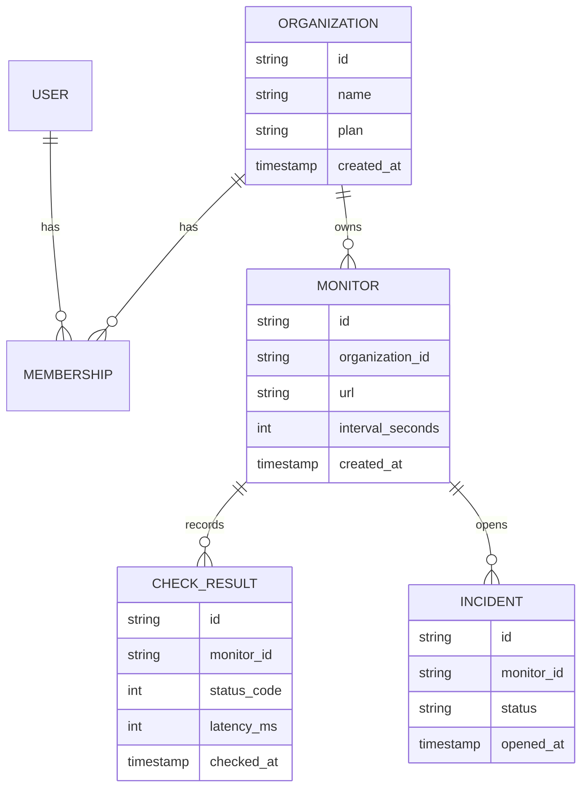
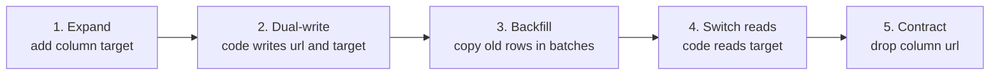
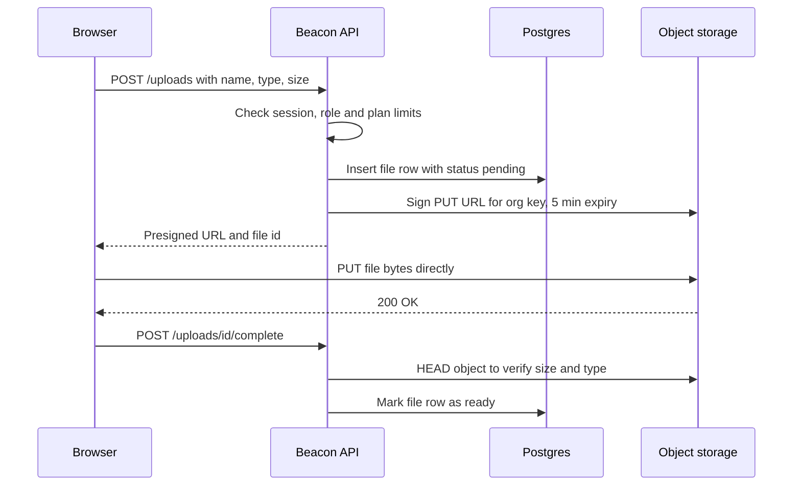
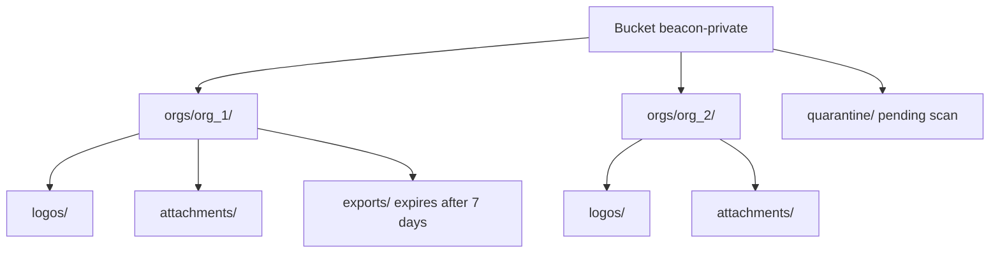
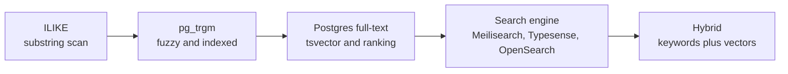
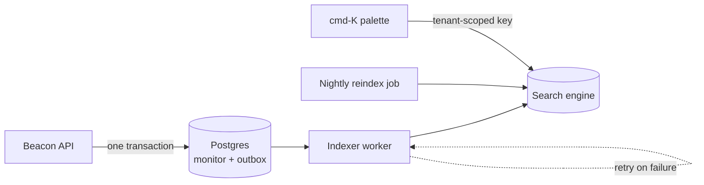
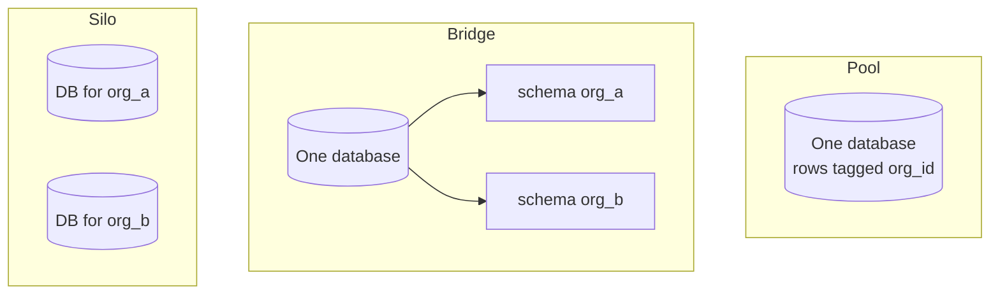
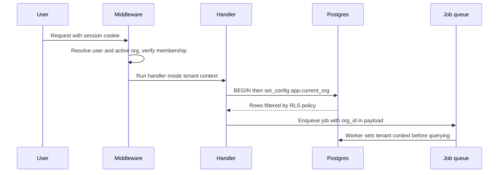
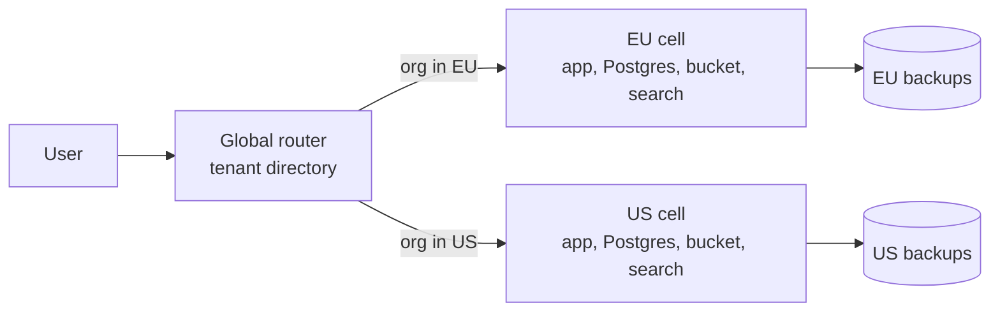

# Module 2 — Data

*Every SaaS is, underneath the UI, a careful machine for storing other people's data and giving it back only to the right people. This module covers the four data components you will build on every project: the relational database itself, the files that don't belong in it, search across both, and the tenant boundary that keeps one customer's data away from another's. Get these right early and most of the later modules get easier; get them wrong and every later module inherits the mess.*

> **Practice:** build the exercises in the [Beacon starter](https://github.com/Tamoura/system-design-for-vibe-coders/tree/beacon/starter); when you have tried them, compare with [this module's reference solution](https://github.com/Tamoura/system-design-for-vibe-coders/tree/beacon/module-2-solution) (branch `beacon/module-2-solution`).

---

# 2.1 — The data layer: Postgres, ORMs, migrations and seeds
*Level: 🟢 Beginner* · *Prerequisites: 1.2*

## ⚡ In 60 seconds

- The data layer is your relational database plus the tools around it: an ORM or query builder, versioned migrations, and seed scripts.
- Default for v1: managed Postgres, every tenant-owned table with `organization_id`, `created_at`, `updated_at` and real constraints, and time-ordered unguessable ids (UUIDv7, optionally prefixed like `mon_`).
- The one rule: never change a production schema by hand. Every change is a migration, and risky ones use expand/contract so old and new code can run side by side.
- Know the SQL your ORM sends: N+1 queries and missing indexes are the most common reasons a dashboard gets slow.
- The biggest trap: assuming backups work. Turn on point-in-time recovery and rehearse a restore, because a backup you have never restored is a hope.

## 🧭 Why every SaaS has this

Beacon's first version stores everything in one Postgres database. Three months in, a customer with 400 monitors complains the dashboard takes nine seconds to load. You look, and the page runs 401 queries: one for the monitor list, then one per monitor for its latest check. A week later you rename a column, deploy, and for four minutes every request fails because the old code is still running against the new schema. Then someone runs a cleanup script against production instead of staging.

These are the three classic ways a young SaaS hurts itself: slow queries, unsafe schema changes, and unrecoverable mistakes. The most famous example of the last one: in January 2017 GitLab lost several hours of production data after an engineer deleted the wrong database directory during an incident, and then discovered that several of their backup mechanisms had not been working. Their public postmortem is still worth reading.

The database is the one component you cannot rewrite on a weekend. Code can be redeployed; data that was lost, corrupted, or modelled badly stays lost, corrupted, or badly modelled.

**Treat the database as the product's memory: pick a boring, proven engine, change it only through versioned migrations, and make sure you can restore it to any minute of yesterday.**

## 📐 How it works

### 🟢 The essentials

**Why Postgres is the default.** PostgreSQL is a relational database: data lives in tables with typed columns, and you query it with SQL. It is the default for new SaaS for dull, good reasons: it is open source, every cloud offers it managed, it has real transactions, strong constraints, JSON columns (`jsonb`) for the semi-structured bits, full-text search (lesson 2.3), row-level security (lesson 2.4), and an extension ecosystem (`pgvector` for embeddings, `pg_trgm` for fuzzy matching). MySQL and SQLite are fine choices too, but without a strong reason, choose Postgres and stop deliberating.

**Schema design for SaaS.** A few conventions pay off on day one:

- **Every tenant-owned table has an `organization_id` column** (from lesson 1.2), even when you could derive it through a join. It makes filtering, indexing and later isolation (lesson 2.4) much simpler.
- **Every table has `created_at` and `updated_at`**, stored as `timestamptz` (timestamp with time zone) in UTC. You will need them for support tickets, debugging and audits.
- **Use constraints.** `NOT NULL`, `UNIQUE (organization_id, slug)`, foreign keys, `CHECK (interval_seconds >= 30)`. The database enforcing a rule is worth ten code reviews.

Here is Beacon's core schema:



**Choosing ids.** Auto-increment integers (`1, 2, 3`) are small and fast but leak information (a competitor can count your customers by signing up twice) and make guessing easy. Most SaaS now use one of these:

| Id style | Example | Pros | Cons |
|---|---|---|---|
| Auto-increment integer | `4211` | Tiny, fast, readable | Guessable, leaks volume, hard to merge across databases |
| UUID v4 (random) | `9f1c…` | Unguessable, generate anywhere | Random order fragments B-tree indexes |
| UUID v7 / ULID (time-ordered) | `0190…` | Unguessable enough, sorts by creation time, index-friendly | Reveals creation time |
| Prefixed id | `mon_01J8…` | Self-describing in logs, support tickets and URLs | Stored as text or needs encode/decode |

Stripe popularised prefixed ids: a customer is `cus_…`, a subscription `sub_…`. When a customer pastes an id into a support chat, you immediately know what it is. For Beacon, a good default is a UUIDv7 in the database with prefixes (`org_`, `mon_`, `inc_`) added at the API boundary, or stored directly as text if you prefer simplicity. UUIDv7 is specified in RFC 9562, and recent Postgres versions (18+) ship a built-in `uuidv7()` function; libraries exist for every language otherwise.

**How your code talks to the database.** There are three styles:

| Style | Examples | You write | Good at | Watch out for |
|---|---|---|---|---|
| ORM (object-relational mapper) | Prisma, ActiveRecord, Django ORM, TypeORM | Models and method calls | Fast CRUD, relations, migrations built in | Hidden queries, N+1, awkward complex SQL |
| Query builder | Drizzle, Kysely, Knex | SQL-shaped TypeScript | Type safety with SQL control | You must know SQL |
| Raw SQL + codegen | sqlc (Go), plain `pg` | SQL files | Full control, generated types | More boilerplate for CRUD |

None of these choices is wrong. What is wrong is not knowing what SQL your tool sends. Turn on query logging in development on day one.

**Migrations.** A migration is a versioned, checked-in file that changes the schema: `0007_add_monitor_timeout.sql`. The tool records which migrations have run in a table in the database itself, so every environment (your laptop, CI, staging, production) converges on the same schema. Prisma Migrate, Drizzle Kit, Rails migrations, Django migrations, Laravel migrations, golang-migrate, goose, Flyway and Atlas all do this. The rule: **never change a production schema by hand.** If it isn't in a migration, it didn't happen.

**Seeds and fixtures.** A seed script fills a fresh database with realistic data: a demo org, three users with different roles, twenty monitors, a week of check results, one open incident. It makes onboarding a new developer a single command. Fixtures are the test-time cousin: small, known datasets loaded before tests. Keep seeds idempotent (safe to run twice) and never let them run against production.

### 🟡 Going deeper

**Indexes and the N+1 problem.** An index is a sorted side-structure that lets Postgres find rows without scanning the whole table. Beacon's most common query is "the latest checks for this monitor", so it needs:

```sql
CREATE INDEX check_result_monitor_time_idx
  ON check_result (monitor_id, checked_at DESC);
```

Column order matters: the index serves queries that filter by `monitor_id` and sort by `checked_at`, not the other way round. Learn to read `EXPLAIN ANALYZE` output; a `Seq Scan` on a big table in a hot path is a bug report waiting to happen. Remember that Postgres does *not* automatically index foreign key columns.

The N+1 problem from the opening is the classic ORM trap: one query for the list, then N queries for each item's relation. The fix is to fetch relations in one go: `include` in Prisma, `with` in Drizzle's relational queries, `includes`/`preload` in Rails, `select_related`/`prefetch_related` in Django, or a single SQL query with a join or `DISTINCT ON`. Query logs and APM traces (lesson 7.2) make it visible.

**Transactions.** A transaction groups statements so they all succeed or all fail. When Beacon opens an incident it must insert the incident, mark the monitor as down, and enqueue notifications. If the second step fails after the first succeeded, you have an incident for a monitor that looks healthy. Wrap them in one transaction. Keep transactions short and never call external APIs (Stripe, email) inside one. The pattern for "write to DB and reliably trigger a side effect" is the **transactional outbox**: insert an `outbox` row in the same transaction, and let a background worker (lesson 5.1) deliver it.

**Zero-downtime migrations: expand and contract.** During a deploy, old and new versions of your code run at the same time, against one database. So a migration must be compatible with both. Renaming `monitor.url` to `monitor.target` safely takes several deploys:



Other dangerous operations in Postgres: adding a column with a volatile default such as `clock_timestamp()` (it rewrites the whole table), creating an index without `CONCURRENTLY` (it blocks writes on the table), adding a `NOT NULL` constraint on a big table in one step, and changing a column type. Tools help: Rails' `strong_migrations` gem refuses unsafe migrations, and Atlas can lint migrations for destructive changes. Also set a `lock_timeout` in migrations so a migration waiting on a lock fails fast instead of queueing every other query behind it.

**Connection pooling.** Each Postgres connection is a process on the server using real memory, and a typical managed instance allows a few hundred at most. Serverless functions break naive setups: 500 concurrent invocations can each open a connection and exhaust the database. The fix is a **connection pooler** between the app and the database: PgBouncer is the classic; Supabase runs Supavisor; Neon and most managed providers give you a pooled connection string. In PgBouncer's *transaction* mode a server connection is only yours for the length of a transaction, which means session features (session-level `SET`, advisory locks held across transactions, some prepared-statement setups) behave differently.

### 🔴 At scale / enterprise

**Backups and point-in-time recovery (PITR).** A nightly `pg_dump` is a start, not a strategy. Postgres writes every change to the write-ahead log (WAL); if you archive a base backup plus the WAL stream, you can restore the database to *any moment*, say 14:31:59, one second before someone ran the bad `DELETE`. Managed services (RDS, Neon, Supabase, Crunchy Bridge and others) offer PITR as a setting; self-hosters use tools like pgBackRest or WAL-G. The GitLab lesson applies: **a backup you have never restored is a hope, not a backup.** Schedule a restore drill, measure how long it takes (that is your real recovery time), and put the number in your runbook. Enterprise questionnaires will ask for exactly these numbers (RPO and RTO).

**Read replicas.** A replica is a copy of the database that follows the primary by streaming its WAL. You can send read-only queries (reports, analytics, the public status page) to it. The catch is **replication lag**: a user saves a monitor, gets redirected, and the replica hasn't seen the write yet, so the monitor "disappears". Common fix: read your own writes from the primary for a few seconds after a write, or route by endpoint.

**Time-series and hot tables.** Beacon's `check_result` table grows by millions of rows a day. Declarative **partitioning** by time (one partition per day or month) lets you drop old data with `DROP TABLE` instead of a slow `DELETE`, and keeps indexes small. Extensions like TimescaleDB automate this.

**Soft delete trade-offs.** Soft delete means setting `deleted_at` instead of removing the row. It enables "undo" and restores, but every query must now filter `WHERE deleted_at IS NULL`, unique constraints need to become partial indexes, and GDPR erasure requests (lesson 8.1) still require a real delete eventually. A cleaner pattern for many tables is hard delete plus an audit log or archive table (lesson 7.3). Use soft delete deliberately for the few objects users expect to restore (an organization, a status page), not everywhere by reflex.

**Managed options.** Neon (serverless Postgres with branching: a copy-on-write database per pull request), Supabase (Postgres plus auth, storage, realtime and an auto-generated API), Amazon RDS/Aurora, Google Cloud SQL/AlloyDB, and PlanetScale (known for Vitess-based MySQL with non-blocking schema changes, and now also offering Postgres).

## 🏆 The best repos

| Repo | What it is | Stack | License | Pick it when |
|---|---|---|---|---|
| [postgres/postgres](https://github.com/postgres/postgres) | The database itself (GitHub mirror) | C | PostgreSQL | You want to read the source or docs of the thing you depend on |
| [prisma/prisma](https://github.com/prisma/prisma) | Schema-first ORM with migrations and a studio | TypeScript | Apache-2.0 | You want the gentlest on-ramp and a readable schema file |
| [drizzle-team/drizzle-orm](https://github.com/drizzle-team/drizzle-orm) | SQL-like TypeScript ORM plus Drizzle Kit migrations | TypeScript | Apache-2.0 | You know SQL, want types, and deploy to serverless or edge |
| [kysely-org/kysely](https://github.com/kysely-org/kysely) | Type-safe SQL query builder | TypeScript | MIT | You want SQL control with types and no ORM layer |
| [sqlc-dev/sqlc](https://github.com/sqlc-dev/sqlc) | Generates type-safe code from SQL queries | Go (also other targets) | MIT | You write Go and prefer SQL files to an ORM |
| [ariga/atlas](https://github.com/ariga/atlas) | Declarative schema management and migration linting | Go | Apache-2.0 | You want migration diffing and safety checks in CI |
| [golang-migrate/migrate](https://github.com/golang-migrate/migrate) | Plain up/down SQL migration runner | Go | MIT | You want a language-agnostic migration CLI |
| [supabase/supabase](https://github.com/supabase/supabase) | Postgres platform: auth, storage, realtime, APIs | TypeScript, Elixir, Go | Apache-2.0 | You want managed or self-hosted Postgres with batteries |
| [neondatabase/neon](https://github.com/neondatabase/neon) | Serverless Postgres with storage/compute separation | Rust | Apache-2.0 | You want to understand branching and scale-to-zero |

**If you only study one:** read the Drizzle docs and source alongside a real Drizzle schema. It is close enough to SQL that you learn SQL while using it, and its migration generator shows exactly the DDL it will run. If you are in Rails or Django, the built-in ORM and migrations are the equivalent answer; don't swap them out.

**Buy, build, or self-host?**

- **Buy (managed):** almost always for the database itself. Neon, Supabase, RDS, Cloud SQL or PlanetScale give you backups, PITR, failover and a pooler for less than an engineer-hour a month. Pick the one closest to where your app runs.
- **Self-host:** when you already run servers (Kamal, Coolify, Kubernetes) and have someone who will own backups, restores and upgrades, or when a customer contract requires it. Budget for pgBackRest or WAL-G and a monitored restore drill.
- **Build:** never the database or the migration tool. Do build your own seed script, your id helper (`newId("mon")`), and a thin data-access layer so tenant filtering lives in one place.

## 🔍 Study it in the wild

**Cal.com (`calcom/cal.com`).** A large Next.js monorepo using Prisma. At the time of writing the schema lives under `packages/prisma`; open `schema.prisma` and read the `User`, `Team` and `Membership` models, then browse the `migrations` folder next to it to see years of real schema evolution, including backfills and renamed columns.

**Documenso (`documenso/documenso`).** Also Prisma, in `packages/prisma`, and smaller than Cal.com, so easier to hold in your head. Search the schema for `@default(` and `@@index`, and find the seed script.

**OpenStatus (`openstatusHQ/openstatus`).** Literally a real Beacon. It uses Drizzle; use code search for `drizzle` and `sqliteTable` or `pgTable` to find the table definitions for monitors, incidents and status pages. Compare their monitor table with the ER diagram above.

**Discourse (`discourse/discourse`).** A Rails app with over a decade of migrations. Open `db/migrate` and `db/post_migrate`: Discourse splits migrations that must run before the new code from those that run after it, which is the expand/contract idea encoded in folder names.

**What to notice:**

- Which id strategy each project uses (cuid, UUID, integer, prefixed) and whether it leaks into URLs.
- How many migrations are purely additive versus destructive, and how destructive ones are staged.
- Composite unique constraints that include the team or organization id.
- Where indexes are declared, and which queries they obviously serve.
- How the seed script creates users with different roles and plans.

## 🛠️ Build it into Beacon

### 🟢 Beginner exercise

Create Beacon's schema for `organization`, `user`, `membership`, `monitor` and `check_result` with the ORM or query builder of your choice, generate the first migration, and write an idempotent seed script that creates one org, two users (owner and member) and five monitors with a day of fake check results.

**Done when:**

- A fresh clone plus one command (`npm run db:reset` or equivalent) produces a working, seeded database.
- Every tenant-owned table has `organization_id`, `created_at` and `updated_at`, with foreign keys.
- Running the seed twice does not create duplicates.

### 🟡 Intermediate exercise

Build the dashboard query "all monitors in my org with their latest check" and make it fast. Seed 500 monitors with 1,000 checks each, log the queries, fix any N+1, and add the index that makes `EXPLAIN ANALYZE` show an index scan.

```sql
SELECT DISTINCT ON (m.id) m.id, m.url, c.status_code, c.checked_at
FROM monitor m
LEFT JOIN check_result c ON c.monitor_id = m.id
WHERE m.organization_id = $1
ORDER BY m.id, c.checked_at DESC;
```

**Done when:**

- The page issues a constant number of queries regardless of monitor count.
- `EXPLAIN ANALYZE` shows no sequential scan on `check_result`.
- The page loads in under 200 ms locally with the large seed.

### 🔴 Advanced exercise

Rename `monitor.url` to `monitor.target` with zero downtime using expand/contract across at least three separate migrations and deploys. Then set up PITR on your managed provider (or pgBackRest locally), delete all monitors on purpose, and restore to the minute before.

**Done when:**

- A load script hitting the API during every step sees zero errors.
- The backfill runs in batches with a `lock_timeout` set.
- You have a written restore runbook with the measured recovery time.

## ⚠️ Mistakes juniors make

- **Editing the production schema by hand "just this once".** Now production differs from every migration file and the next deploy fails in confusing ways. Every change goes through a migration, including emergency ones.
- **Renaming or dropping a column in the same deploy as the code change.** Old instances still running during the rollout crash. Use expand/contract; destructive steps go last, in their own deploy.
- **Opening a new database client per request in serverless code.** You exhaust connections under the first traffic spike. Create the client once per process and connect through a pooler.
- **Never looking at the SQL the ORM generates.** N+1 queries and missing indexes stay invisible until a big customer arrives. Enable query logging in development and read `EXPLAIN` for your five hottest queries.
- **Calling Stripe or sending email inside a database transaction.** Locks are held while you wait on the network, and a rollback can't unsend an email. Commit first, then do side effects via an outbox or a job.
- **Assuming the provider's backups work.** Restore one. Time it. Write it down.

## 🧾 Recap

- Postgres is the default because it is boring, managed everywhere, and grows with you (JSON, search, RLS, vectors).
- Put `organization_id`, timestamps and real constraints on every tenant-owned table; choose time-ordered, unguessable ids.
- ORM, query builder or raw SQL all work; not knowing what SQL runs does not.
- Every schema change is a migration, and risky ones use expand/contract so old and new code coexist.
- Pool connections, index for your real queries, keep transactions short and side effects outside them.
- PITR plus a rehearsed restore is what "we have backups" actually means.

## ✍️ Check yourself

**1. What is a migration, and how does every environment end up with the same schema?**

<details><summary>Answer</summary>

A migration is a versioned, checked-in file that changes the schema, such as `0007_add_monitor_timeout.sql`. The migration tool records which migrations have run in a table inside the database itself, so your laptop, CI, staging and production all converge on the same schema. See "Migrations" under 🟢 The essentials.

</details>

**2. What is the N+1 problem, and how do you fix it?**

<details><summary>Answer</summary>

It is one query for a list, then one more query per item to load its relation, so 400 monitors become 401 queries. Fix it by fetching relations in one go: `include` in Prisma, `with` in Drizzle, `includes`/`preload` in Rails, `select_related`/`prefetch_related` in Django, or a single SQL join or `DISTINCT ON`. See "Indexes and the N+1 problem" under 🟡 Going deeper.

</details>

**3. Beacon wants to rename `monitor.url` to `monitor.target` without any downtime. What are the steps?**

<details><summary>Answer</summary>

Use expand and contract across several deploys: add the `target` column, make the code write to both columns, backfill old rows in batches, switch reads to `target`, and only then drop `url` in its own deploy. Each step keeps the database compatible with both the old and new code that run side by side during a rollout. See "Zero-downtime migrations" under 🟡 Going deeper.

</details>

**4. When Beacon opens an incident it must insert the incident, mark the monitor as down, and notify the team by email. How should you structure this?**

<details><summary>Answer</summary>

Put the two database writes in one short transaction so they succeed or fail together, and add an `outbox` row in that same transaction. A background worker then reads the outbox and sends the email. Never call email or Stripe inside the transaction: it holds locks while waiting on the network, and a rollback can't unsend an email. See "Transactions" under 🟡 Going deeper.

</details>

**5. Beacon moves to a serverless platform. Under the first traffic spike the database starts refusing connections, even though queries are fast. What broke, and what is the fix?**

<details><summary>Answer</summary>

Each concurrent function invocation opened its own Postgres connection, and a typical managed instance allows only a few hundred. Create the client once per process and connect through a pooler such as PgBouncer, Supavisor or your provider's pooled connection string. In transaction mode, remember that session-level features behave differently. See "Connection pooling" under 🟡 Going deeper.

</details>

## 📚 References

- PostgreSQL documentation, especially "Continuous Archiving and Point-in-Time Recovery": https://www.postgresql.org/docs/current/continuous-archiving.html
- RFC 9562, Universally Unique IDentifiers (UUIDv7): https://www.rfc-editor.org/rfc/rfc9562
- Use The Index, Luke — a free guide to SQL indexing: https://use-the-index-luke.com
- Stripe engineering, "Online migrations at scale": https://stripe.com/blog/online-migrations
- PgBouncer documentation (pool modes and their limits): https://www.pgbouncer.org
- Drizzle ORM docs: https://orm.drizzle.team · Prisma docs: https://www.prisma.io/docs
- Rails `strong_migrations` gem, a catalogue of unsafe migrations: https://github.com/ankane/strong_migrations

---

# 2.2 — File uploads and object storage
*Level: 🟢 Beginner* · *Prerequisites: 2.1*

## ⚡ In 60 seconds

- Files (logos, screenshots, PDF reports, exports) belong in S3-compatible object storage, not on app server disks or in the database.
- The one rule: the browser uploads and downloads directly using short-lived presigned URLs that your server signs only after checking permissions.
- Default for v1: a private bucket, a `file` metadata table in Postgres, keys you generate yourself under `orgs/{orgId}/…`, and server-side validation before signing and again after upload.
- Serve user uploads from a separate domain and scan anything users share with each other.
- The biggest trap: a public bucket or a long-lived URL, which puts private files one guessed or forwarded link away from the internet.

## 🧭 Why every SaaS has this

Beacon needs files sooner than you'd think. Each organization uploads a logo and a favicon for its status page. Incident updates can carry screenshots. Business customers want a monthly uptime report as a PDF, and the "export my data" button produces a zip. None of it is the product, and all of it has to work.

The junior version is a form that posts the file to the Next.js or Express server, which writes it to `./uploads` on disk. It works on your laptop. In production, the second server doesn't have the file the first one saved; the container restarts and the disk is wiped; a customer uploads a 400 MB screen recording and ties up a web worker for two minutes; someone uploads an HTML file named `logo.png` that runs JavaScript on your domain. And because the folder is served publicly, a guessed URL shows one customer's incident screenshots to another.

Public, misconfigured storage buckets have been one of the most repeated data-leak stories of the last decade, for exactly this reason: files are easy to store and easy to forget about.

**Files don't belong in your database or on your app servers: they belong in object storage, uploaded directly by the browser with short-lived signed URLs, and read back only through checks you control.**

## 📐 How it works

### 🟢 The essentials

**Object storage** is a service that stores blobs (bytes plus a little metadata) under keys in a flat namespace called a bucket. It is not a filesystem: there are no real folders, no appending, no partial overwrites; you put a whole object, get it, or delete it. In exchange it is cheap, effectively infinite, and very durable. Amazon S3 defined the API, and "S3-compatible" is now the standard: Cloudflare R2, Google Cloud Storage (via its interoperability mode), Backblaze B2, DigitalOcean Spaces, Supabase Storage, and self-hosted servers like SeaweedFS, Garage and MinIO all speak it. Write your code against the S3 API and you can move providers by changing an endpoint and credentials.

**Why not the app server or the database?**

| Where | Problem |
|---|---|
| App server disk | Lost on redeploy, not shared between instances, ties up web workers during slow uploads |
| Database `bytea` column | Bloats backups and replicas, expensive per GB, slow to stream |
| Object storage | Designed for it: cheap, durable, streams directly to and from clients |

The database still matters: it stores the **metadata** row (`file` table: id, organization_id, key, content type, size, uploaded_by, status). The bucket stores the bytes. The row is what your authorization checks and your UI use; the key is just a pointer.

**Presigned URLs.** A presigned URL is a normal S3 URL with a signature in the query string that grants one specific operation (PUT this key, or GET this key) until an expiry time, without handing out your credentials. Your server signs it after checking permissions; the browser then talks straight to storage, so large files never pass through your app.



Downloads mirror this: the browser asks your API for a file, the API checks the user can see it, and returns a presigned GET URL valid for a few minutes. With the AWS SDK for JavaScript v3 it is a few lines:

```ts
import { S3Client, PutObjectCommand } from "@aws-sdk/client-s3";
import { getSignedUrl } from "@aws-sdk/s3-request-presigner";

const s3 = new S3Client({ region: "auto", endpoint: process.env.S3_ENDPOINT });

export async function signLogoUpload(orgId: string, fileId: string, type: string) {
  const key = `orgs/${orgId}/logos/${fileId}`;
  const cmd = new PutObjectCommand({
    Bucket: process.env.S3_BUCKET,
    Key: key,
    ContentType: type, // must match what the browser sends
  });
  return { key, url: await getSignedUrl(s3, cmd, { expiresIn: 300 }) };
}
```

Rails Active Storage "direct uploads", Django with `django-storages`, and Laravel's `Storage::temporaryUrl` implement the same pattern.

**Keys, not user filenames.** Generate the object key yourself (`orgs/org_123/logos/file_456`) and store the original filename in the database. User-supplied names contain spaces, unicode, `../`, and collisions.

**Private by default.** Buckets should block public access (new S3 buckets do by default). Serve private files through short-lived presigned GETs. Things that are genuinely public, like the status page logo, can go in a separate public bucket or behind a CDN, but choose that per bucket, deliberately.

### 🟡 Going deeper

**Validation happens on the server, twice.** Before signing, check the declared size and content type against an allowlist (logos: PNG, JPEG, SVG only if sanitised, max 2 MB). But the browser can lie, so after upload, verify again: `HEAD` the object for its real size, and read the first bytes to sniff the actual type from its magic number (the `file-type` npm package, Python's `python-magic`, Go's `http.DetectContentType`). A presigned PUT does not enforce a maximum size on its own; a presigned **POST** with a policy can (`content-length-range`), which is why many upload libraries use POST. Serve user files with `Content-Disposition: attachment` unless you need them inline, and never serve user uploads from your main app's domain: an uploaded HTML or SVG file on `app.beacon.dev` can run script with access to your cookies. Use a separate domain like `beaconusercontent.com`.

**Malware scanning.** If users share files with other users (incident attachments visible to the whole team, or to status page subscribers), scan them. The common setup: upload lands in a quarantine prefix, an object-created event triggers a job (lesson 5.1) that runs ClamAV or a cloud scanning service, and only then is the file moved or marked `ready`. Until then the UI shows "processing".

**Multipart and resumable uploads.** Big files fail on flaky connections. S3 **multipart upload** splits a file into parts (5 MB minimum each, except the last) that upload in parallel and can be retried individually, then a "complete" call stitches them together. **tus** is an open protocol for resumable uploads over HTTP: the client can resume from the last byte after a dropped connection or even a browser restart. `tusd` is the reference server and can write to S3; Uppy is a browser uploader with a dashboard UI, drag-and-drop, and plugins for tus, S3 multipart and presigned uploads. UploadThing wraps the whole flow (signing, callbacks, React components) as a hosted service with an open-source SDK.

| Approach | Best for | Pieces you run |
|---|---|---|
| Single presigned PUT or POST | Files under ~100 MB, logos, screenshots | Your API plus bucket |
| S3 multipart with presigned parts | Large files, parallel speed | Your API signs each part |
| tus resumable | Unreliable networks, very large files, mobile | A tus server such as tusd |
| Hosted uploader (UploadThing) | Shipping fast in Next.js | Their service plus your callbacks |

**Images and CDNs.** Don't serve a 6 MB phone photo as a 32 px avatar. Resize on upload with a job using `sharp` (Node) or Pillow (Python), or resize on the fly with an image proxy such as imgproxy, or a provider's image service (Cloudflare Images, imgix, Vercel's image optimisation). Put a CDN (content delivery network, a global cache) in front of public assets so status page logos load fast worldwide. Use immutable keys (a new key per new version) so you can cache forever and never fight stale caches.

### 🔴 At scale / enterprise

**Per-tenant key prefixes.** Put every object under `orgs/{orgId}/…`. It makes IAM policies, lifecycle rules, per-tenant usage reports ("you're using 3.2 GB") and tenant deletion straightforward: to offboard a customer, delete a prefix. It also makes cross-tenant bugs easier to catch: a signing function that asserts the key starts with the caller's org prefix is a cheap guard against an id-swapping bug.



**Lifecycle rules.** Storage providers can expire or transition objects automatically by prefix and age. Beacon should: delete `exports/` after seven days, move old attachments to an infrequent-access tier, and **abort incomplete multipart uploads** after a day (otherwise abandoned parts sit there billing you, invisibly). Also periodically reconcile: find `pending` file rows older than a day and delete both the row and any object.

**Deletion and GDPR.** When a user deletes an incident, delete its attachments too, via a job rather than inline. When an organization closes its account, your contract and privacy policy say how quickly its data goes; object storage is where data quietly lingers. If bucket versioning is on (good protection against accidental deletes), a "delete" only adds a delete marker; old versions remain until a lifecycle rule removes noncurrent versions. Know your retention window and document it (lesson 8.1).

**Cost and egress.** Storage is cheap; data transfer out often isn't. S3 charges for egress, while Cloudflare R2 charges no egress fees, which is why many SaaS keep user-facing assets on R2. Put a CDN in front either way.

**Residency and bring-your-own-bucket.** EU customers may need files stored in an EU region (lesson 2.4), so the region becomes part of the tenant's config and your signing code picks the right bucket. Some enterprise customers ask to store files in *their own* bucket; the S3 API makes this feasible (a per-tenant endpoint, bucket and credentials, or a cross-account role), but it multiplies your support surface. Offer it only on the plan that pays for it.

**Self-hosting.** If you ship a self-hostable edition (lesson 7.4) or need on-prem storage, you need an S3-compatible server. MinIO was the default choice for years, but in 2025 its community edition moved toward source-only distribution and maintenance mode, so check its current status before adopting it. SeaweedFS and Garage (a lightweight, geo-distributed S3 server from Deuxfleurs) are the commonly cited alternatives.

## 🏆 The best repos

| Repo | What it is | Stack | License | Pick it when |
|---|---|---|---|---|
| [transloadit/uppy](https://github.com/transloadit/uppy) | Modular browser upload UI with S3, multipart and tus plugins | JavaScript | MIT | You want a polished uploader without writing one |
| [tus/tusd](https://github.com/tus/tusd) | Reference tus resumable-upload server, S3 backend | Go | MIT | Users upload large files over unreliable networks |
| [pingdotgg/uploadthing](https://github.com/pingdotgg/uploadthing) | SDK for the UploadThing hosted upload service | TypeScript | MIT | You're in Next.js and want uploads done this afternoon |
| [aws/aws-sdk-js-v3](https://github.com/aws/aws-sdk-js-v3) | Official AWS SDK: S3 client, presigner, multipart helpers | TypeScript | Apache-2.0 | You sign URLs yourself against any S3-compatible store |
| [lovell/sharp](https://github.com/lovell/sharp) | Fast image resizing and conversion for Node | C++, JavaScript | Apache-2.0 | You create thumbnails and avatars in a job |
| [imgproxy/imgproxy](https://github.com/imgproxy/imgproxy) | On-the-fly image resizing server | Go | Apache-2.0 | You want URL-based transforms behind a CDN |
| [supabase/storage](https://github.com/supabase/storage) | Supabase's storage API: S3 backend, Postgres metadata, policies | TypeScript | Apache-2.0 | You want to read a production storage service's source |
| [seaweedfs/seaweedfs](https://github.com/seaweedfs/seaweedfs) | Distributed blob store with an S3 gateway | Go | Apache-2.0 | You self-host storage at real scale |
| [minio/minio](https://github.com/minio/minio) | S3-compatible server; community edition source-only since 2025 | Go | AGPL-3.0 | You already run it; evaluate alternatives for new setups |

Garage is not on GitHub; find it at https://garagehq.deuxfleurs.fr. It is a good fit for small self-hosted or multi-site deployments.

**If you only study one:** `supabase/storage`. It is a real multi-tenant storage service that does exactly what this lesson describes: bytes in an S3 backend, metadata rows in Postgres, access decided by database policies, signed URLs, and resumable uploads. Reading how it maps a request to a bucket, a key and a permission check teaches more than any tutorial.

**Buy, build, or self-host?**

- **Buy:** S3, Cloudflare R2 or Google Cloud Storage for the bytes, always, unless you have a reason not to. UploadThing, Transloadit or Cloudinary if you'd rather not own the upload flow and image processing.
- **Self-host:** SeaweedFS or Garage for a self-hosted product edition, air-gapped customers, or local development that mirrors production; tusd if you need resumable uploads on your own infrastructure.
- **Build:** the thin layer that matters: the `file` table, the signing endpoint with auth and plan checks, key naming, validation, and cleanup jobs. That part is your security boundary, so own it.

## 🔍 Study it in the wild

**Documenso (`documenso/documenso`).** An e-signature SaaS whose whole product is uploaded PDFs. Use code search for `presign` and `upload` in the monorepo. It supports more than one upload transport (storing in S3-compatible storage, or in the database for simple self-hosted setups), which shows how to hide storage behind a small interface.

**Papermark (`mfts/papermark`).** Document sharing with per-viewer analytics, so it cares a lot about who may download what. Search for `upload`, `presigned` and `getFile` to see how private documents are served through short-lived links rather than public URLs.

**Chatwoot (`chatwoot/chatwoot`).** A Rails app using Active Storage for conversation attachments and avatars. Open `config/storage.yml` to see the pluggable backends (local, S3, GCS, Azure), then search for `direct_upload` to see the browser-to-bucket flow in Rails terms.

**What to notice:**

- Where the authorization check happens before a URL is signed, and how long URLs live.
- How object keys are built, and whether they include a team or organization id.
- Which metadata is stored in the database versus on the object.
- How local development works without a real S3 bucket.
- What happens to files when the parent record is deleted.

## 🛠️ Build it into Beacon

### 🟢 Beginner exercise

Let org admins upload a status page logo. Create a `file` table, an endpoint that returns a presigned PUT URL for `orgs/{orgId}/logos/{fileId}`, and a "complete" endpoint that marks the row ready. Run SeaweedFS, Garage or a free-tier R2 bucket as your storage.

**Done when:**

- The file bytes never pass through your app server.
- Only admins of the org can request a signed URL for that org.
- Uploading a 10 MB file or a `.exe` is rejected before a URL is issued.

### 🟡 Intermediate exercise

Add incident screenshots, private to org members. Downloads go through an endpoint that checks membership and redirects to a 5-minute presigned GET. After upload, sniff the real content type from the bytes and reject mismatches, and generate a 400 px thumbnail in a background job with `sharp`.

**Done when:**

- A logged-in user from another org gets 404 for the download endpoint, even with a valid file id.
- A text file renamed to `.png` is rejected after upload and its object deleted.
- Thumbnails are generated asynchronously and the UI shows a processing state.

### 🔴 Advanced exercise

Implement organization offboarding for files and add hygiene rules. Write a job that deletes every object under an org's prefix in batches, plus lifecycle rules for `exports/` (7 days) and incomplete multipart uploads (1 day). Add a nightly reconciliation job that finds orphaned `pending` rows and objects with no row.

**Done when:**

- Deleting a test org removes all its objects, verified by listing the prefix.
- Lifecycle rules are defined in code (Terraform, OpenTofu or a script), not clicked in a console.
- The reconciliation job reports and cleans orphans in both directions.

## ⚠️ Mistakes juniors make

- **Streaming uploads through the app server.** Workers block for minutes, memory spikes, and serverless platforms hit body-size limits. Sign a URL and let the browser upload directly.
- **Trusting the browser's `Content-Type` and filename.** Both are attacker-controlled. Allowlist types, sniff the bytes after upload, and generate keys yourself.
- **Making the whole bucket public so images "just work".** Every private attachment is now one guessed URL away from the internet. Keep buckets private and make public exceptions explicitly.
- **Serving user-uploaded SVG or HTML from your app's domain.** That is stored XSS with access to your session cookies. Use a separate user-content domain and `Content-Disposition: attachment`.
- **Presigned URLs that live for a week.** They get pasted into Slack and forwarded. Keep them to minutes and sign a fresh one per view.
- **Forgetting files when deleting data.** The row is gone, the object lives forever, and your GDPR answer is wrong. Delete objects in a job and reconcile regularly.
- **Hard-coding AWS.** Use the S3 API with a configurable endpoint so local dev, R2 and self-hosted customers all work.

## 🧾 Recap

- Bytes go in object storage, metadata goes in Postgres, and the app server stays out of the data path.
- Presigned URLs let the browser upload and download directly, after your server has checked permissions.
- Validate on the server before signing and again after upload; scan anything users share with others.
- Use multipart or tus for big or flaky uploads, and resize images in jobs or an image proxy behind a CDN.
- Prefix keys by tenant, keep buckets private, and automate expiry and deletion with lifecycle rules.

## ✍️ Check yourself

**1. What is a presigned URL, and why does it keep large files away from your app servers?**

<details><summary>Answer</summary>

It is a normal S3 URL with a signature in the query string that allows one specific operation (PUT or GET on one key) until an expiry time, without handing out your credentials. Your server signs it after checking permissions, then the browser talks straight to storage, so the bytes never pass through your app. See "Presigned URLs" under 🟢 The essentials.

</details>

**2. What goes in Postgres and what goes in the bucket?**

<details><summary>Answer</summary>

The bucket stores the bytes. Postgres stores the metadata row in a `file` table: id, organization_id, key, content type, size, uploaded_by and status. Your authorization checks and UI use the row; the key is only a pointer. See 🟢 The essentials.

</details>

**3. Beacon wants to let org admins upload a status page logo. List the checks before and after the upload.**

<details><summary>Answer</summary>

Before signing, check the session, the admin role and plan limits, and check the declared size and content type against an allowlist (PNG or JPEG, max 2 MB). After upload, `HEAD` the object for its real size and sniff the first bytes to confirm the real type, then mark the row ready. The key is one you generate, such as `orgs/{orgId}/logos/{fileId}`. See the upload diagram and "Validation happens on the server, twice" under 🟡 Going deeper.

</details>

**4. A Beacon customer closes their account. How do you make sure their files are really gone?**

<details><summary>Answer</summary>

Because every object lives under `orgs/{orgId}/`, a job can delete that whole prefix in batches. If bucket versioning is on, a lifecycle rule must also remove noncurrent versions, and a reconciliation job should clean orphaned rows and objects. See "Per-tenant key prefixes" and "Deletion and GDPR" under 🔴 At scale / enterprise.

</details>

**5. A user uploads a file named `logo.svg` that contains a script, and Beacon serves it from `app.beacon.dev/uploads/logo.svg`. What breaks?**

<details><summary>Answer</summary>

This is stored XSS: the SVG runs script on your app's domain with access to your users' session cookies. Serve user uploads from a separate domain such as `beaconusercontent.com`, use `Content-Disposition: attachment` unless you need them inline, and allow SVG only if it is sanitised. See "Validation happens on the server, twice" under 🟡 Going deeper.

</details>

## 📚 References

- Amazon S3 documentation (presigned URLs, multipart upload, lifecycle rules, Block Public Access): https://docs.aws.amazon.com/s3/
- OWASP File Upload Cheat Sheet: https://cheatsheetseries.owasp.org/cheatsheets/File_Upload_Cheat_Sheet.html
- The tus resumable upload protocol: https://tus.io
- Uppy documentation: https://uppy.io/docs/
- Cloudflare R2 documentation: https://developers.cloudflare.com/r2/
- Garage documentation: https://garagehq.deuxfleurs.fr
- Rails Active Storage guide: https://guides.rubyonrails.org/active_storage_overview.html

---

# 2.3 — Search: from `LIKE '%x%'` to a search engine
*Level: 🟡 Intermediate* · *Prerequisites: 2.1*

## ⚡ In 60 seconds

- Search is a ladder: `ILIKE`, then `pg_trgm`, then Postgres full-text search, then a search engine, then hybrid keyword-plus-vector search.
- Default for v1: stay in Postgres. `pg_trgm` handles names and typos, and a `tsvector` column with a GIN index handles prose.
- The one rule: a search index is a copy of tenant data, so it must be filtered by tenant as strictly as the database, with a filter the browser cannot remove.
- When you add an engine such as Meilisearch or Typesense, feed it through an outbox and a worker, and keep a full reindex from Postgres, which stays the source of truth.
- The biggest trap: letting the client send the tenant filter, or forgetting that deletes must reach the index too.

## 🧭 Why every SaaS has this

Beacon's first search box is one line of code: `WHERE name ILIKE '%' || $1 || '%'`. It is fine for a user with twelve monitors. Then an agency signs up with 1,800 monitors named things like `api-eu-west-checkout-prod`. They type `checkout eu` and get nothing, because the words aren't adjacent. They type `chekout` and get nothing, because nobody taught the database about typos. Their support lead wants to search incident updates for "certificate" across two years of history, and the query takes eight seconds because it scans every row.

Then the product team asks for a cmd-K palette that searches monitors, incidents, status pages, teammates and settings pages at once, as you type, in under 100 ms.

And there is a quieter failure. The day you add a dedicated search engine, you have created a second copy of your customers' data outside Postgres, with its own access rules. If the search index doesn't filter by tenant as strictly as your database does, the search box becomes the easiest cross-tenant leak in your app.

**Search is a ladder: climb it one rung at a time, start inside Postgres, and treat every search index as a copy of tenant data that must be filtered and kept in sync as carefully as the database.**

## 📐 How it works

### 🟢 The essentials

A few terms first. **Recall** is whether the right results appear at all; **relevance** (or ranking) is whether they appear in the right order. A **tokenizer** splits text into terms ("api-eu-west" becomes `api`, `eu`, `west`). **Stemming** reduces words to a root, so "failing" matches "failed". An **inverted index** maps each term to the list of rows containing it, which is what makes search fast: instead of reading every row, you look up the term.

Here is the ladder most SaaS climb:



**Rung 1: `ILIKE`.** Case-insensitive substring match. No index can help a leading wildcard with a normal B-tree, so it scans. Acceptable for small tables filtered by `organization_id` first (Postgres narrows to one org's 50 monitors, then scans those). Always keep that tenant filter.

**Rung 2: `pg_trgm`.** A bundled Postgres extension that breaks text into trigrams (three-character chunks: "check" contains `che`, `hec` and `eck`, plus padded ones for the word edges). With a GIN or GiST index on those trigrams, `ILIKE '%checkout%'` becomes index-assisted, and the `%` similarity operator finds near-misses like "chekout". This is the best effort-to-value step on the ladder for names, slugs, emails and URLs.

```sql
CREATE EXTENSION IF NOT EXISTS pg_trgm;
CREATE INDEX monitor_name_trgm_idx
  ON monitor USING gin (name gin_trgm_ops);

SELECT id, name, similarity(name, $2) AS score
FROM monitor
WHERE organization_id = $1 AND name % $2
ORDER BY score DESC
LIMIT 10;
```

**Rung 3: Postgres full-text search.** For prose (incident updates, postmortems, notes), Postgres converts text into a `tsvector`: a sorted list of stemmed terms with positions. Queries become a `tsquery`. `websearch_to_tsquery('english', 'certificate -staging')` accepts Google-style syntax, `ts_rank` orders results, and `ts_headline` highlights matches. Store the vector in a generated column with a GIN index:

```sql
ALTER TABLE incident_update ADD COLUMN search tsvector
  GENERATED ALWAYS AS (to_tsvector('english', coalesce(body, ''))) STORED;
CREATE INDEX incident_update_search_idx ON incident_update USING gin (search);
```

Rails has `pg_search`, Django has `django.contrib.postgres.search`, and every TypeScript query builder can call these functions directly.

### 🟡 Going deeper

**What Postgres search can't easily do.** It does not do typo tolerance on full-text queries (trigrams help on short fields only), prefix search on every word as you type is clunky, relevance tuning is manual, and faceting (counts per category: "12 down, 40 up, 3 paused") across large result sets is slow-ish. At some point you want a **search engine**: a separate service built around inverted indexes, with typo tolerance, prefix matching, facets, synonyms and highlighting out of the box.

| Option | Strengths | Trade-offs | Typical fit |
|---|---|---|---|
| Postgres `pg_trgm` + full-text | No new infra, transactional, same permissions | Weak typo tolerance, manual relevance | Most SaaS for the first year or two |
| Meilisearch | Instant, typo-tolerant, simple API, tenant tokens | Single-node focus, not for log-scale data | In-app search and cmd-K |
| Typesense | Fast, typo-tolerant, scoped API keys, built-in clustering | Data must fit in RAM | In-app search with HA needs |
| OpenSearch / Elasticsearch | Huge scale, aggregations, logs, very flexible | Operationally heavy, JVM tuning | Large datasets, analytics-style search |
| ParadeDB (`pg_search`) | BM25 ranking inside Postgres, no sync pipeline | Newer, an extension you must be allowed to install | You want engine-quality search without leaving Postgres |
| Algolia / Elastic Cloud | Fully managed, great relevance tooling | Per-record and per-search pricing | Teams that want to buy search |

**Indexing pipelines.** With an external engine, every change in Postgres must reach the index. Three ways, from simplest to sturdiest:

1. **Sync on write.** After saving a monitor, call `index.addDocuments(...)` in the request. Simple, but if the search call fails the index silently drifts, and it slows every write.
2. **Outbox plus worker.** In the same transaction as the write, insert a row into an `outbox` table (lesson 2.1). A background worker reads it and updates the index, retrying on failure. This is the right default.
3. **Change data capture (CDC).** A tool like Debezium reads Postgres' logical replication stream and emits every row change to a queue, which an indexer consumes. No application code can forget to emit an event, but you now run more infrastructure.



Whichever you choose, add a **full reindex** job that rebuilds an index from Postgres (ideally into a new index, then swaps an alias). You will need it after every mapping change and every bug that caused drift. Postgres stays the source of truth; the index is disposable.

**Tenant filtering is a security control, not a feature.** In Postgres, your data-access layer adds `organization_id = $1`. In a search engine, you must do the same, and you must not let the browser choose the filter. Each engine has a mechanism for this: Meilisearch **tenant tokens**, Typesense **scoped API keys**, and Algolia **secured API keys** embed a mandatory filter such as `organization_id = org_123` inside a signed key that your server generates per user. The browser can query the engine directly for speed, but cannot remove the filter. If you proxy search through your API instead, add the filter server-side, always. Also index only what the user may see: if a field is private to admins, either leave it out of the shared index or filter on a role attribute too.

**Search UX.** Debounce keystrokes (about 150 ms), search on prefixes, highlight the matched text, show the object type and org in each result, and put "recent" and "navigation" items (Settings, Billing) first when the box is empty. The popular React `cmdk` package handles the palette's keyboard behaviour; results come from your API or engine.

### 🔴 At scale / enterprise

**Relevance tuning.** Real users judge search by the first three results. Keep a small list of real queries with expected top results (a "golden set") and check them after every ranking change. Boost exact name matches over description matches, and recent incidents over old ones. Log zero-result queries: they tell you which synonyms to add ("outage" ↔ "incident", "check" ↔ "monitor").

**Semantic and hybrid search.** Keyword search fails when users describe meaning rather than words: "why was checkout slow last Tuesday" doesn't share many terms with an incident titled "Elevated p95 latency on payments API". **Embeddings** are vectors produced by a model such that similar meanings land near each other; **vector search** finds nearest neighbours. `pgvector` adds a vector column type and approximate-nearest-neighbour indexes (HNSW, IVFFlat) to Postgres; dedicated vector databases like Qdrant exist for very large collections, and Meilisearch, Typesense, OpenSearch and Elasticsearch all support vectors too. The practical winner is **hybrid search**: run keyword and vector search, then merge the ranked lists, for example with reciprocal rank fusion (sum `1 / (k + rank)` per document across lists). This also powers Beacon's AI incident summaries (lesson 8.2), where retrieval quality is the whole game.

**Per-tenant indexes versus a shared index.** A shared index with a tenant filter is simplest and efficient. An index per tenant gives stronger isolation, per-tenant relevance settings and easy deletion, but thousands of small indexes strain most engines. A common compromise: shared index for the long tail, dedicated indexes for the few enterprise tenants who pay for it (the same pool-versus-silo choice covered in lesson 2.4).

**Deletion and residency.** When a record is deleted, or a user exercises GDPR erasure, the search index must be updated too; test this. Search clusters are data stores in a region, so EU tenants' data belongs in an EU cluster, and your security questionnaire answers must include the search provider as a subprocessor.

**Capacity.** Engines that keep indexes in memory (Typesense, largely Meilisearch) need RAM proportional to data. Don't index high-volume data like Beacon's raw check results; index monitors, incidents, updates and people. Logs and events belong in an observability store (lesson 7.2).

## 🏆 The best repos

| Repo | What it is | Stack | License | Pick it when |
|---|---|---|---|---|
| [meilisearch/meilisearch](https://github.com/meilisearch/meilisearch) | Instant, typo-tolerant search engine with tenant tokens | Rust | MIT (Community Edition); Enterprise Edition parts BUSL-1.1 | You want the best in-app search experience with the least tuning |
| [typesense/typesense](https://github.com/typesense/typesense) | Typo-tolerant in-memory search with scoped API keys and clustering | C++ | GPL-3.0 | You want Algolia-like search you can self-host with HA |
| [opensearch-project/OpenSearch](https://github.com/opensearch-project/OpenSearch) | Community fork of Elasticsearch, Linux Foundation project | Java | Apache-2.0 | Large datasets, aggregations, or you're on AWS |
| [elastic/elasticsearch](https://github.com/elastic/elasticsearch) | The original distributed search and analytics engine | Java | AGPL-3.0 / SSPL / ELv2 (choice) | You need its ecosystem or use Elastic Cloud |
| [paradedb/paradedb](https://github.com/paradedb/paradedb) | BM25 full-text search as a Postgres extension | Rust | AGPL-3.0 | You want engine-grade ranking without a sync pipeline |
| [pgvector/pgvector](https://github.com/pgvector/pgvector) | Vector type and ANN indexes for Postgres | C | PostgreSQL | You add semantic or hybrid search and want to stay in Postgres |
| [quickwit-oss/tantivy](https://github.com/quickwit-oss/tantivy) | Full-text search library, the Rust analogue of Lucene | Rust | MIT | You want to understand how an inverted index engine works |
| [debezium/debezium](https://github.com/debezium/debezium) | Change data capture from Postgres, MySQL and others | Java | Apache-2.0 | Your indexing pipeline outgrows the outbox pattern |

**If you only study one:** Meilisearch. Read its docs on tenant tokens, filterable attributes and typo tolerance, then run it locally and index Beacon's monitors in an afternoon. It shows you what "good" in-app search feels like, which is the bar you're measuring Postgres against.

**Buy, build, or self-host?**

- **Buy:** Algolia, Elastic Cloud, Meilisearch Cloud or Typesense Cloud when search is central to the product and nobody wants to own a cluster. Budget carefully; pricing scales with records and queries.
- **Self-host:** Meilisearch or Typesense for most SaaS, OpenSearch when data is large or you need aggregations; ParadeDB if you want it inside Postgres.
- **Build:** the pipeline (outbox, worker, reindex), the tenant-scoped key issuance, and the cmd-K UI. Never build the engine. And don't add an engine at all until `pg_trgm` and full-text search have visibly run out.

## 🔍 Study it in the wild

**Discourse (`discourse/discourse`).** A mature example of Postgres full-text search in production at scale. Use code search for `ts_rank`, `to_tsvector` and `search_data` to find how posts are indexed into dedicated search tables, how ranking weights titles over bodies, and how multiple languages are handled.

**Mastodon (`mastodon/mastodon`).** Optional full-text search through Elasticsearch or OpenSearch using the Chewy gem. Look in `app/chewy` (at the time of writing) for index definitions, then search for `update_index` to see how model changes flow to the index, and read the reindex tasks in the admin CLI docs.

**Twenty (`twentyhq/twenty`).** A CRM whose search spans people, companies and custom objects. Use code search for `tsvector` and `searchVector` to see how a modern TypeScript codebase keeps search inside Postgres, even with user-defined fields.

**What to notice:**

- Whether search lives in Postgres or an external engine, and what pushed them there.
- How documents reach the index: in the request, via jobs, or by a sync process.
- How results are filtered by permissions, not just by tenant.
- How a full reindex is triggered and how long they expect it to take.
- Which fields are weighted higher in ranking.

## 🛠️ Build it into Beacon

### 🟢 Beginner exercise

Add monitor search to Beacon's dashboard using `pg_trgm`. Index `name` and `url`, rank by similarity, and always filter by the current organization.

**Done when:**

- "chekout" finds a monitor named "checkout-api".
- `EXPLAIN ANALYZE` shows the trigram index in use on a seed of 50,000 monitors.
- A test proves a user never receives another org's monitors, even for identical names.

### 🟡 Intermediate exercise

Add full-text search over incident updates with a generated `tsvector` column, `websearch_to_tsquery`, ranking and highlighted snippets, then build a cmd-K palette that queries monitors, incidents and settings pages in one call.

**Done when:**

- `"certificate expired" -staging` behaves like a web search query.
- Results show a highlighted snippet and the object type.
- The palette is keyboard-only usable and responds in under 150 ms locally.

### 🔴 Advanced exercise

Move search to Meilisearch or Typesense with an outbox-driven indexer and a nightly reindex into a fresh index swapped in atomically. The browser queries the engine directly using a tenant token or scoped key minted by your API with a mandatory `organization_id` filter.

**Done when:**

- Killing the search engine for five minutes loses no updates; the worker catches up.
- Tampering with the filter in the browser still returns only the user's org.
- Deleting an incident removes it from search within a minute.

## ⚠️ Mistakes juniors make

- **Jumping to Elasticsearch on day one.** You now run a cluster and a sync pipeline to search 300 rows. Climb the ladder: `pg_trgm` and full-text search cover most SaaS for a long time.
- **Letting the client send the tenant filter.** Anyone can edit a request. Use tenant tokens or scoped keys, or add the filter server-side.
- **Indexing in the request path without retries.** One failed call and the index drifts forever. Use an outbox and a worker, plus a reindex job.
- **Treating the index as the source of truth.** Indexes get corrupted, mappings change, engines get swapped. Always be able to rebuild from Postgres.
- **Forgetting deletes.** Deleted and GDPR-erased records keep appearing in search. Test that deletion reaches the index.
- **Indexing everything.** Raw check results or logs blow up memory and cost. Index what people actually search for.

## 🧾 Recap

- Search is a ladder: `ILIKE`, then `pg_trgm`, then Postgres full-text, then a search engine, then hybrid with vectors.
- Postgres goes a long way, with no sync problem and the same permissions as the rest of your data.
- An external index is a copy of tenant data: filter it with signed tenant-scoped keys and keep it in sync via an outbox or CDC.
- Always keep a full reindex path; Postgres is the source of truth.
- Hybrid keyword-plus-vector search is the modern default for natural-language queries and AI features.

## ✍️ Check yourself

**1. What is an inverted index, and why does it make search fast?**

<details><summary>Answer</summary>

It maps each term to the list of rows that contain it. Instead of reading every row, the engine looks up the term and gets the matching rows directly. See 🟢 The essentials.

</details>

**2. What does the `pg_trgm` extension add, and what is it best for?**

<details><summary>Answer</summary>

It breaks text into trigrams (three-character chunks). With a GIN or GiST index, `ILIKE '%checkout%'` becomes index-assisted, and the `%` similarity operator finds near-misses like "chekout". It is best for short fields: names, slugs, emails and URLs. See "Rung 2" under 🟢 The essentials.

</details>

**3. Beacon's support lead wants to search two years of incident updates for "certificate". Which rung of the ladder fits, and how do you set it up?**

<details><summary>Answer</summary>

Postgres full-text search, because this is prose. Add a generated `tsvector` column on `incident_update` with a GIN index, query it with `websearch_to_tsquery`, order by `ts_rank`, and highlight matches with `ts_headline`. See "Rung 3" under 🟢 The essentials.

</details>

**4. Beacon moves monitor search to Meilisearch. How do you keep the index in sync with Postgres?**

<details><summary>Answer</summary>

In the same transaction as the write, insert a row into an `outbox` table, and let a background worker update the index and retry on failure. Add a full reindex job that rebuilds into a new index and swaps an alias, for mapping changes and drift. Postgres stays the source of truth. See "Indexing pipelines" under 🟡 Going deeper.

</details>

**5. Beacon's cmd-K palette queries the search engine directly from the browser, and the request includes `filter: "organization_id = org_123"`. What breaks?**

<details><summary>Answer</summary>

Anyone can edit the request, change or remove the filter, and read another org's monitors and incidents: a cross-tenant leak through the search box. Your server must mint a tenant token or scoped API key per user with the mandatory `organization_id` filter embedded and signed, or add the filter server-side if search goes through your API. See "Tenant filtering is a security control, not a feature" under 🟡 Going deeper.

</details>

## 📚 References

- PostgreSQL full-text search chapter: https://www.postgresql.org/docs/current/textsearch.html
- PostgreSQL `pg_trgm` module: https://www.postgresql.org/docs/current/pgtrgm.html
- Meilisearch documentation (multitenancy and tenant tokens): https://www.meilisearch.com/docs
- Typesense documentation (scoped API keys): https://typesense.org/docs/
- ParadeDB documentation: https://docs.paradedb.com
- pgvector README: https://github.com/pgvector/pgvector
- Debezium documentation: https://debezium.io/documentation/

---

# 2.4 — Multi-tenancy deep dive: isolation, noisy neighbours, residency
*Level: 🔴 Advanced* · *Prerequisites: 1.2, 1.3, 2.1*

## ⚡ In 60 seconds

- Multi-tenancy is a spectrum of isolation: pool (shared tables), bridge (a schema per tenant) and silo (a database or stack per tenant).
- Default for v1: pool, with `organization_id` on every tenant table and a scoped data-access layer so the tenant filter is structural, not remembered.
- The one rule: the tenant boundary is enforced by the system (scoped helpers, load-through-parent, 404s, per-route tests, and Postgres RLS as defence in depth).
- Tenant context must flow through jobs, caches, logs and search, not only HTTP handlers.
- The biggest trap: fetching an object by id alone, which is the cross-tenant leak waiting to happen.

## 🧭 Why every SaaS has this

A support engineer at Beacon gets a message from a customer: "Why can I see an incident called 'Payments DB failover' on my dashboard? We don't have a payments DB." It belongs to another company. The cause is one missing clause: a new endpoint, `GET /api/incidents/:id`, loaded the incident by id and forgot `AND organization_id = $2`. The id came from a shared link. Nothing was hacked; a developer just wrote a normal-looking query.

This is the **cross-tenant leak**, the defining bug class of multi-tenant software. It is an insecure direct object reference (IDOR) with the worst possible blast radius: not one user's data, but another *customer's*. It also happens at the infrastructure layer: in 2021, researchers at Wiz disclosed "ChaosDB", a flaw in a notebook feature of Azure Cosmos DB that could have let one customer obtain keys to other customers' databases. Multi-tenancy bugs live at every layer.

Two weeks later, a Business-plan prospect sends a security questionnaire: "Describe how our data is logically and physically isolated from other customers. Can our data be stored exclusively in the EU? Can we have a dedicated instance?" Meanwhile a Free-plan user with a script creates 3,000 monitors and the check scheduler falls behind for everyone.

Lesson 1.2 gave Beacon organizations. This lesson is about making the boundary between them hold under bugs, load, regulators and enterprise contracts.

**Multi-tenancy is a spectrum of isolation you choose per tenant tier, and whatever you choose, the tenant boundary must be enforced by the system, not remembered by each developer.**

## 📐 How it works

### 🟢 The essentials

A **tenant** is the customer unit that owns data: for Beacon, an organization. **Multi-tenant** means many tenants share one running system. AWS's SaaS guidance names three models for sharing, and the vocabulary is now standard:

| Model | Also called | How data is separated | Isolation | Cost per tenant | Operational load |
|---|---|---|---|---|---|
| **Pool** | Shared tables | One schema, every row has `tenant_id` | Logical, enforced by code or RLS | Lowest | Lowest: one DB to migrate |
| **Bridge** | Schema-per-tenant | One database, one Postgres schema per tenant | Stronger logical separation | Medium | Migrations run N times |
| **Silo** | Database- or stack-per-tenant | Separate database, sometimes separate everything | Physical | Highest | N databases to patch, back up, monitor |



**Start with pool.** Almost every SaaS you'll study (Cal.com, PostHog, Dub, Documenso) runs a pool model: shared tables with a `team_id` or `organization_id`. It is cheapest, simplest to migrate and query across (your admin panel and analytics need that), and it scales to millions of tenants. Its weakness is exactly the opening bug: isolation depends on every query including the filter. So the rest of this lesson is largely about making that filter impossible to forget, and about when to move some tenants to bridge or silo.

**Make the filter structural.** Minimum v1 defences in a pool model:

- A **tenant-scoped data-access layer**: repository functions take `orgId` as a required first argument, or a scoped client (`db.forOrg(orgId).monitors.find(id)`) adds the filter automatically. Rails' `acts_as_tenant` gem, Django managers, and Prisma client extensions all implement this idea.
- **Load children through the parent**: `org.monitors.find(id)`, never `Monitor.find(id)`.
- **Return 404, not 403**, for other tenants' objects, so ids can't be probed.
- **A test per endpoint** that logs in as org B and requests org A's object.

### 🟡 Going deeper

**Postgres Row-Level Security (RLS).** RLS lets the database itself enforce the tenant filter. You enable it on a table and write a **policy**: a boolean expression Postgres silently appends to every query. If application code forgets the `WHERE`, the database still returns only the current tenant's rows.

```sql
ALTER TABLE monitor ENABLE ROW LEVEL SECURITY;
ALTER TABLE monitor FORCE ROW LEVEL SECURITY;

CREATE POLICY tenant_isolation ON monitor
  USING (organization_id = current_setting('app.current_org')::uuid)
  WITH CHECK (organization_id = current_setting('app.current_org')::uuid);
```

The app sets the tenant at the start of each transaction:

```sql
BEGIN;
SELECT set_config('app.current_org', $1, true); -- true = local to this transaction
SELECT * FROM monitor WHERE id = $2;            -- RLS adds the org filter
COMMIT;
```

The details matter. `USING` filters what you can read; `WITH CHECK` stops you writing rows into another tenant. Table owners bypass RLS unless you `FORCE` it, and superusers and roles with `BYPASSRLS` always bypass it, so the app must connect as a dedicated non-owner role. Use transaction-local settings (the `true` above), because with a pooler in transaction mode a session-level `SET` leaks into the next request that reuses the connection. Put an index on `organization_id` so policies stay fast.

Supabase made this style popular: the browser talks to Postgres through an auto-generated API, and RLS policies using `auth.uid()` or claims from the user's JWT are the *only* thing protecting data. That is powerful and unforgiving: a table without a policy is public. In a server-rendered app, RLS is usually **defence in depth** behind your data-access layer, not a replacement for it.

**Tenant context propagation.** "Current tenant" must flow through everything a request touches:



Node uses `AsyncLocalStorage`, Python `contextvars`, Rails `ActiveSupport::CurrentAttributes`, Go a `context.Context` value. The places it gets lost: background jobs (the payload must carry `org_id` and the worker must re-establish context), cron tasks that loop over all tenants, webhooks from Stripe (map the Stripe customer back to the org), caches (every cache key must include the tenant: `org:123:monitors`), and logs (tag every log line with `org_id`, which also makes support far easier). Whether the org comes from a subdomain, a path (`/org/acme/...`) or a header, always **verify membership** server-side; never trust the org id in a URL alone.

**Noisy neighbours.** In a shared system, one tenant's load degrades everyone. Beacon's version: one org with 3,000 30-second monitors floods the check queue. Defences, from cheapest:

- **Plan limits** enforced at creation time (lesson 3.2): Free gets 5 monitors, full stop.
- **Per-tenant rate limits** on the API and on expensive endpoints (lesson 5.2).
- **Fair queuing**: cap concurrent jobs per tenant, or use per-tenant queues or job priorities, so one tenant can't occupy every worker. Several job systems in lesson 5.1 support per-key concurrency limits.
- **Database guards**: `statement_timeout` on the app role, pagination limits, and per-tenant query dashboards (`pg_stat_statements` plus tagged queries) to spot the tenant behind a slow query.

### 🔴 At scale / enterprise

**Sharding by tenant.** When one Postgres primary can't hold everyone, you split tenants across several databases. Because nearly every query in a SaaS is scoped to one tenant, the tenant id is the natural **shard key**: all of one tenant's rows live together, so queries never cross shards. Citus, a Postgres extension, does this transparently: you mark tables as distributed by `organization_id`, co-locate related tables on the same key, keep small shared tables (plans, feature flags) as reference tables copied to every node, and can move a large tenant to its own node. The rule that makes sharding survivable is one you can adopt today: **include `organization_id` in every tenant table and in its primary or unique keys**, so the data is already shaped for distribution.

**Database-per-tenant, cheaply.** Silo used to mean "expensive". Two newer approaches make it practical for many tenants. **Turso/libSQL** (a fork of SQLite with replication and a server mode) is designed for huge numbers of small databases, one per tenant or even per user. **Neon** separates storage from compute and scales idle databases to zero, so a project or branch per tenant costs little when unused. The hard part moves to operations: migrations now run across thousands of databases, so you need a fan-out runner that tracks each database's version, tolerates partial failure, and keeps code compatible with both schema versions during the rollout (expand/contract again, from lesson 2.1). Cross-tenant queries for your admin panel and analytics need a separate pipeline. Bridge (schema-per-tenant) has the same migration fan-out problem; Django's `django-tenants` and Rails' Apartment-style gems implement it, and Twenty uses a schema per workspace.

**Data residency.** Some customers, often in the EU under GDPR or in regulated industries, require their data to be stored and processed in a given region. That means *all* of it: database, object storage (lesson 2.2), search index (lesson 2.3), backups, logs and subprocessors like your email provider. The common architecture is **regional cells**: a full copy of the stack per region, plus a small global control plane that stores only the tenant directory (which org lives in which region) and routes users there.



Decide residency at signup (moving a tenant between regions later is a migration project), keep personal data out of the global directory, and make sure your observability and support tools don't quietly copy EU data to the US.

**Dedicated deployments.** The far end of silo: a Business customer gets their own stack (own database, own workers, sometimes their own cloud account). Sell it as a premium tier, and build it as **the same code and images with different configuration**, deployed by the same infrastructure-as-code pipeline (lesson 7.4). The moment a dedicated customer runs a forked branch, you are maintaining two products. A frequent pattern is a hybrid: pool for Free and Pro, silo databases for enterprise tenants, with a tenant-to-database routing table.

**Export and offboarding.** Enterprise contracts specify that on termination you export a tenant's data and then delete it within a stated window. Build a per-tenant export (JSON or CSV per table plus files, produced by a job) and a per-tenant delete that covers every store: Postgres rows, objects under the tenant's prefix, search documents, caches, analytics and backups (usually by letting backups age out, and saying so in your policy). In a pool model this is a query per table filtered by `organization_id`; in a silo model it's dropping a database, which is one reason enterprise buyers like silos.

## 🏆 The best repos

| Repo | What it is | Stack | License | Pick it when |
|---|---|---|---|---|
| [postgres/postgres](https://github.com/postgres/postgres) | Row-level security, policies, roles, schemas | C | PostgreSQL | You want database-enforced isolation in the pool model |
| [supabase/supabase](https://github.com/supabase/supabase) | Postgres platform built around RLS policies and JWT claims | TypeScript, Elixir, Go | Apache-2.0 | You want to learn RLS from a platform that depends on it |
| [citusdata/citus](https://github.com/citusdata/citus) | Distributed Postgres, sharding by tenant id | C | AGPL-3.0 | One Postgres primary is no longer enough |
| [citusdata/activerecord-multi-tenant](https://github.com/citusdata/activerecord-multi-tenant) | Rails gem that scopes queries by tenant automatically | Ruby | MIT | You run Rails in a pool model, with or without Citus |
| [tursodatabase/libsql](https://github.com/tursodatabase/libsql) | SQLite fork with server mode and replication | C, Rust | MIT | You want thousands of cheap per-tenant databases |
| [neondatabase/neon](https://github.com/neondatabase/neon) | Serverless Postgres with branching and scale-to-zero | Rust | Apache-2.0 | You want database-per-tenant Postgres without idle cost |
| [ariga/atlas](https://github.com/ariga/atlas) | Schema-as-code migrations that can target many databases | Go | Apache-2.0 | You run bridge or silo and must migrate N schemas safely |
| [boxyhq/saas-starter-kit](https://github.com/boxyhq/saas-starter-kit) | Next.js starter with teams, SSO, SCIM, audit logs | TypeScript | Apache-2.0 | You want to see an enterprise-ready pool model end to end |

**If you only study one:** Supabase's documentation and examples on Row-Level Security, read alongside the Postgres RLS chapter. Writing policies for Beacon's `monitor`, `incident` and `membership` tables, then trying to break them, will teach you more about tenant isolation than any diagram.

**Buy, build, or self-host?**

- **Buy:** managed Postgres with RLS (Supabase, Neon, RDS), managed Citus (Azure Cosmos DB for PostgreSQL) for sharding, Turso for per-tenant SQLite. For residency, pick providers with regions you need and sign their DPAs.
- **Self-host:** Citus or a fleet of Postgres instances when a contract requires your own infrastructure or dedicated deployments; budget for the migration fan-out and monitoring.
- **Build:** tenant context propagation, the scoped data-access layer, RLS policies, the tenant-to-region or tenant-to-database directory, and export/delete jobs. These are core to your product's trustworthiness and no vendor can write them for you.

## 🔍 Study it in the wild

**PostHog (`PostHog/posthog`).** A Django pool model: organizations own projects (historically called teams), and nearly every model and ClickHouse table carries `team_id`. Use code search for `team_id` and `TeamAndOrgViewSetMixin` (or similar mixins in the API layer) to see how viewsets scope querysets to the current team. PostHog also runs separate US and EU cloud regions, a real example of regional cells.

**Twenty (`twentyhq/twenty`).** A bridge model: core metadata lives in shared tables, while each workspace's CRM data lives in its own Postgres schema. Use code search for `workspaceDataSource` and `schema` in the server package to see how a request picks the right schema, and how migrations are applied per workspace.

**Supabase (`supabase/supabase`).** Search the repo's `examples` for `create policy` to find real RLS policies using `auth.uid()`, including team-membership policies that join through a members table.

**Cal.com (`calcom/cal.com`).** Search the Prisma schema for `teamId` and `organizationId` to see a pool model that grew an "organizations" layer on top of teams, and how uniqueness constraints are scoped.

**What to notice:**

- Where the tenant id enters a request, and the single place it is verified against membership.
- Whether scoping is automatic (mixins, scoped clients, RLS) or manual in each query.
- How background jobs and caches carry and use the tenant id.
- Which tables are deliberately *not* tenant-scoped (plans, global config) and how they are marked.
- How migrations run when there is more than one schema or database.

## 🛠️ Build it into Beacon

### 🟢 Beginner exercise

Audit every Beacon endpoint for tenant scoping. Introduce a scoped data-access helper so handlers can only load tenant data through `forOrg(orgId)`, and write a cross-tenant test that runs against every route.

**Done when:**

- No handler queries a tenant table without going through the scoped helper (enforced by a lint rule or code review checklist).
- An automated test logs in as org B and gets 404 for every org A resource.
- Cache keys and job payloads include `org_id`.

### 🟡 Intermediate exercise

Enable Postgres RLS on `monitor`, `incident` and `incident_update` as defence in depth. The app connects as a non-owner role and sets `app.current_org` per transaction; jobs set it too.

```ts
export async function withOrg<T>(orgId: string, fn: (tx: Tx) => Promise<T>) {
  return db.transaction(async (tx) => {
    await tx.execute(sql`select set_config('app.current_org', ${orgId}, true)`);
    return fn(tx);
  });
}
```

**Done when:**

- Deleting the `WHERE organization_id` from a query in a test still returns only the current org's rows.
- Inserting a monitor with another org's id fails with an RLS violation.
- It works through PgBouncer or your provider's pooler in transaction mode.

### 🔴 Advanced exercise

Add EU data residency and fair scheduling. Create a tenant directory table (org → region), run two local "cells" with separate databases and buckets, and route requests by the org's region. Then cap each org's concurrent check jobs so a 3,000-monitor org cannot delay others.

**Done when:**

- An EU org's rows, files and search documents exist only in the EU cell.
- The global directory stores no personal data beyond ids and region.
- A load test with one huge org keeps other orgs' checks within their scheduled interval.

## ⚠️ Mistakes juniors make

- **Fetching by id alone.** `findUnique({ where: { id } })` is the cross-tenant leak waiting to happen. Always scope by org, or load through the parent.
- **Trusting the org id from the URL or request body.** Verify the user's membership in that org on every request, server-side.
- **Session-level `SET` with a transaction-mode pooler.** The next request on that connection inherits the previous tenant. Use `set_config(..., true)` inside a transaction.
- **Connecting as the table owner or a superuser with RLS enabled.** Policies are silently bypassed. Use a dedicated role and `FORCE ROW LEVEL SECURITY`.
- **Forgetting the tenant in jobs, caches and search.** The database is scoped; the Redis cache key `monitors:list` is not. Every store needs the tenant in its key or filter.
- **Choosing silo on day one "for security".** You multiply migration, backup and monitoring work before you have customers who pay for it. Start pooled, make isolation structural, and offer silos as a paid tier.
- **Promising EU residency without checking logs, backups and email providers.** Residency covers every copy of the data, including your subprocessors.

## 🧾 Recap

- Pool, bridge and silo are points on an isolation spectrum; most SaaS start pooled and silo their biggest customers.
- The cross-tenant leak is the bug class to design against: scoped data access, load-through-parent, 404s, and per-route tests.
- Postgres RLS enforces the tenant filter in the database; use it as defence in depth with a non-owner role and transaction-local settings.
- Carry tenant context through jobs, caches, logs and search, not just HTTP handlers.
- Noisy neighbours are handled with plan limits, rate limits and fair queuing; sharding by tenant id (Citus) is the scale path.
- Residency, dedicated deployments and offboarding are enterprise requirements that are far easier if `organization_id` is everywhere from day one.

## ✍️ Check yourself

**1. What are the pool, bridge and silo models?**

<details><summary>Answer</summary>

Pool is shared tables where every row carries a tenant id. Bridge is one database with a Postgres schema per tenant. Silo is a separate database, sometimes a separate stack, per tenant. They trade cost and operational load against strength of isolation. See the table under 🟢 The essentials.

</details>

**2. In an RLS policy, what is the difference between `USING` and `WITH CHECK`?**

<details><summary>Answer</summary>

`USING` filters which rows you can read. `WITH CHECK` stops you from writing rows that belong to another tenant. You usually need both on a tenant table. See "Postgres Row-Level Security" under 🟡 Going deeper.

</details>

**3. A Free-plan org with a script creates 3,000 monitors and Beacon's check scheduler falls behind for everyone. What defences apply, from cheapest?**

<details><summary>Answer</summary>

Plan limits at creation time (Free gets 5 monitors), per-tenant rate limits on the API, fair queuing that caps concurrent jobs per tenant, and database guards like `statement_timeout` and per-tenant query dashboards. See "Noisy neighbours" under 🟡 Going deeper.

</details>

**4. A Business prospect asks for their data to stay in the EU. What does Beacon need, and what does "their data" cover?**

<details><summary>Answer</summary>

It covers all of it: database, object storage, search index, backups, logs and subprocessors such as the email provider. The common design is regional cells, a full stack per region, plus a small global directory that stores only which org lives in which region and routes users there. Decide the region at signup. See "Data residency" under 🔴 At scale / enterprise.

</details>

**5. Beacon uses RLS with `SET app.current_org = ...` at the start of each request and connects through PgBouncer in transaction mode. Occasionally a user sees another org's monitors. What broke?**

<details><summary>Answer</summary>

A session-level `SET` stays on the server connection, and in transaction mode the next request that reuses that connection inherits the previous tenant. Use `set_config('app.current_org', $1, true)` inside a transaction so the setting is local to it. Also connect as a non-owner role, because owners and superusers bypass RLS unless it is forced. See "Postgres Row-Level Security" under 🟡 Going deeper.

</details>

## 📚 References

- PostgreSQL documentation, "Row Security Policies": https://www.postgresql.org/docs/current/ddl-rowsecurity.html
- AWS Well-Architected SaaS Lens and the AWS whitepapers "SaaS Architecture Fundamentals" and "SaaS Tenant Isolation Strategies": https://docs.aws.amazon.com/wellarchitected/ and https://docs.aws.amazon.com/whitepapers/
- Supabase documentation on Row Level Security: https://supabase.com/docs
- Citus documentation (multi-tenant applications): https://docs.citusdata.com
- Turso documentation (database per tenant): https://docs.turso.tech
- Neon documentation: https://neon.com/docs
- OWASP Authorization Cheat Sheet: https://cheatsheetseries.owasp.org/cheatsheets/Authorization_Cheat_Sheet.html

Next up: **Module 3 — Money**, where Beacon starts charging for all of this.
