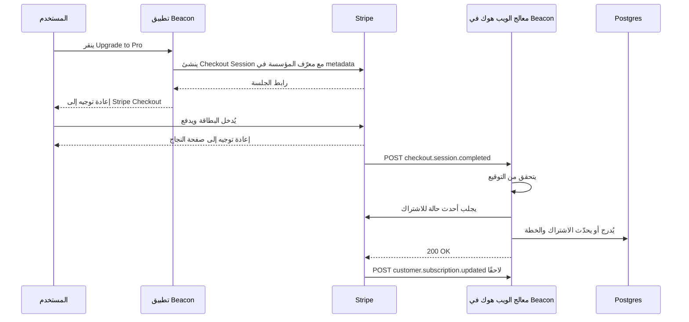
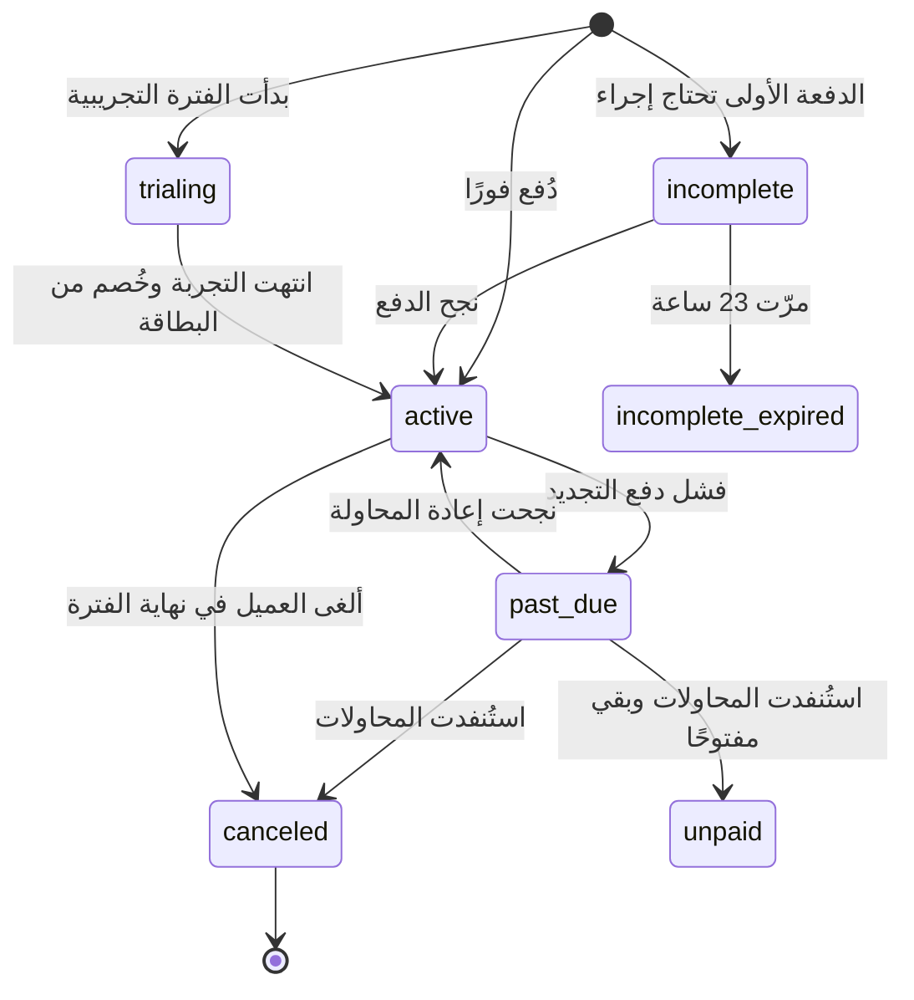

# الوحدة 3 — المال

*في هذه الوحدة تكلّف الأخطاءُ مالًا حقيقيًا: عملاء دفعوا ولم يحصلوا على شيء، أو عملاء توقفوا عن الدفع واحتفظوا بكل شيء. نبدأ بالاشتراكات والمزامنة القائمة على الويب هوك التي تُبقي قاعدة بياناتك صادقة، ثم نحوّل صفحة الأسعار إلى فحوص استحقاق يستطيع الكود فرضها، وننتهي بالفوترة حسب الاستخدام، حيث يصبح كل حدث بندًا في فاتورة أحد العملاء. سيحصل Beacon على خططه الثلاث Free وPro وBusiness، إضافةً إلى رسائل SMS المُقاسة.*

---

# 3.1 — الاشتراكات والمدفوعات: صفحة الدفع، والويب هوك، وبوابة العميل
*المستوى: 🟢 مبتدئ* · *المتطلبات: 1.2، 2.1*

## ⚡ الدرس في دقيقة

- الاشتراك (Subscription) هو عميل يدفع سعرًا محددًا كل فترة. مزوّد الدفع يملك الحقيقة عن المال، وقاعدة بياناتك تحتفظ بنسخة منها.
- القاعدة الأهم: امنح الصلاحيات من الويب هوك (Webhook) بعد التحقق منه، ولا تمنحها أبدًا من إعادة التوجيه إلى صفحة النجاح.
- الخيار الافتراضي للإصدار الأول: صفحة الدفع المستضافة (Checkout) وبوابة العميل المستضافة (Customer Portal) من Stripe، مع ربط عميل Stripe بالمؤسسة لا بالمستخدم.
- معالج الويب هوك يتحقق من التوقيع على جسم الطلب الخام، ويحذف التكرار حسب معرّف الحدث، ويجلب الحالة الحالية من جديد، ثم يردّ بـ 2xx بسرعة.
- الفخ الأكبر: أن تعدّ `active` الحالة المدفوعة الوحيدة، فتمنع عملاء `trialing` من الدخول وتعامل `past_due` كأنها `canceled`.

## 🧭 لماذا يحتاجه كل SaaS

يطلق Beacon خطة Pro بسعر 29 دولارًا شهريًا. الإصدار الأول هو ما يكتبه الجميع في اليوم الأول: زر "Buy" يرسل المستخدم إلى Stripe، ثم يعيد Stripe توجيهه إلى `/billing?success=true`، وتلك الصفحة تنفّذ `UPDATE organizations SET plan = 'pro'`. يعمل هذا في العرض التجريبي.

ثم يبدأ الواقع. يدفع عميلٌ ويغلق التبويب قبل اكتمال إعادة التوجيه، فيُخصم منه المبلغ ويبقى على خطة Free. ويلاحظ شخص آخر رابط النجاح فيزوره يدويًا، فيحصل على Pro دون أن يدفع. وبعد ثلاثة أشهر تنتهي صلاحية بطاقة عميل ويفشل التجديد. لا شيء في Beacon يعلم بذلك، فيبقى على Pro إلى الأبد. وأصبح فريق الدعم الآن يقرأ لوحة تحكم Stripe ويعدّل صفوف قاعدة البيانات يدويًا.

الحل لا يكمن في معالجة أذكى لإعادة التوجيه، لأن إعادة التوجيه مجرد تجربة مستخدم. مزوّد الدفع يخبرك بما حدث عبر **الويب هوك (Webhook)**: طلبات HTTP POST موقّعة يرسلها إلى خادمك عندما يتغير شيء. يعيد Stripe محاولة تسليم الويب هوك الفاشل مدةً تصل إلى ثلاثة أيام في الوضع الحي، لذلك يحصل حتى المعالج المعيب على فرصة ثانية، بشرط أن يفشل بوضوح بدل أن يردّ بـ `200 OK` ويُسقط الحدث.

**مزوّد الدفع يملك الحقيقة عن المال، وقاعدة بياناتك تحتفظ بنسخة مخزّنة منها يُبقيها الويب هوك متزامنة، وليس العكس أبدًا.**

## 📐 كيف يعمل

### 🟢 الأساسيات

يستخدم معظم المزوّدين مفردات Stripe نفسها، لذلك تعلّمها مرة واحدة. تستخدم Paddle وLemon Squeezy وPolar أسماءً مشابهة.

| الكائن | ما هو | مثال من Beacon |
|---|---|---|
| **Customer** (العميل) | الجهة التي تدفع، مع بريدها ووسائل الدفع والمعلومات الضريبية | عميل واحد لكل **مؤسسة** في Beacon، لا لكل مستخدم |
| **Product** (المنتج) | الشيء الذي تبيعه | "Beacon Pro" |
| **Price** (السعر) | كم، وكل كم، وبأي عملة. هو ثابت عمليًا: لتغيير المبلغ تنشئ Price جديدًا | 29 دولارًا شهريًا؛ 290 دولارًا سنويًا |
| **Subscription** (الاشتراك) | عميل على سعر واحد أو أكثر، يتجدد كل فترة، وله `status` | شركة Acme على Pro الشهرية، `active` |
| **Invoice** (الفاتورة) | الفاتورة التي تُنشأ كل فترة (أو عند التغييرات) | فاتورة مايو 2026، 29 دولارًا، مدفوعة |
| **PaymentIntent** (نية الدفع) | محاولة واحدة لتحصيل المال، قد تحتاج 3-D Secure أو إعادة محاولة أو بطاقة جديدة | عملية الخصم خلف تلك الفاتورة |
| **Checkout Session** (جلسة الدفع) | صفحة دفع مستضافة يشغّلها Stripe نيابةً عنك | المكان الذي يذهب إليه الناس عند "Upgrade to Pro" |
| **Billing Portal Session** (جلسة بوابة الفوترة) | صفحة خدمة ذاتية مستضافة للبطاقات والفواتير وتغيير الخطة والإلغاء | Settings → Billing → "Manage billing" |

قراران يجعلان الإصدار الأول آمنًا لفريق مبتدئ.

**استخدم صفحة الدفع المستضافة (Checkout) وبوابة العميل المستضافة (Customer Portal).** نماذج البطاقات، و3-D Secure / SCA (المصادقة القوية للعميل، وهي القاعدة الأوروبية التي تفرض خطوة تحقق إضافية)، وApple Pay، وجمع العناوين، وحقول الرقم الضريبي، وتنزيل الفواتير كلها مشكلات محلولة. لا تريد أن تقترب أرقام البطاقات من خوادمك. ومع الصفحات المستضافة يبقى نطاق PCI DSS الخاص بك (معيار أمان صناعة البطاقات) في أخف مستوياته. يمكنك بناء نماذج مدمجة لاحقًا إن أظهرت بيانات التحويل أن ذلك يستحق.

**عامل الويب هوك على أنه مصدر الحقيقة.** إعادة التوجيه تعرض فقط شاشة "شكرًا، نحن نؤكد دفعتك". أما الصلاحيات فتتغير عندما يصل الويب هوك.



للمعالج ثلاث مهام، بهذا الترتيب:

1. **تحقق من التوقيع.** يستطيع أي شخص على الإنترنت إرسال POST إلى `/api/stripe/webhook`. يوقّع Stripe كل تسليم بسرّ نقطة النهاية الخاصة بك (قيمة HMAC في ترويسة `Stripe-Signature`، مع طابع زمني لمنع إعادة الإرسال). الدالة `constructEvent` في الـSDK تتحقق منه، لكن فقط مقابل **جسم الطلب الخام**. إذا حلّل إطار العمل JSON أولًا، تتغير البايتات ويفشل التحقق. هذا أشهر خطأ في هذا الدرس.
2. **احذف التكرار.** قد يسلّم Stripe الحدث نفسه أكثر من مرة. سجّل `event.id` مع قيد تفرّد (Unique Constraint) وتجاوز الأحداث التي عالجتها سابقًا.
3. **زامن، ثم ردّ بـ 2xx بسرعة.** حدّث نسختك من الاشتراك وأرسل الرد. يتوقع Stripe ردًا سريعًا، وأي عمل بطيء مكانه مهمة خلفية (Background Job) (انظر 5.1).

```ts
// app/api/stripe/webhook/route.ts
export async function POST(req: Request) {
  const body = await req.text(); // raw body, never req.json()
  const sig = req.headers.get("stripe-signature") ?? "";
  let event: Stripe.Event;
  try {
    event = stripe.webhooks.constructEvent(body, sig, process.env.STRIPE_WEBHOOK_SECRET!);
  } catch {
    return new Response("bad signature", { status: 400 });
  }
  const firstTime = await db.insertIgnore("stripe_events", { id: event.id, type: event.type });
  if (!firstTime) return new Response("duplicate", { status: 200 });

  const obj = event.data.object as { customer?: string | { id: string } };
  const customerId = typeof obj.customer === "string" ? obj.customer : obj.customer?.id;
  if (customerId) await syncCustomerFromStripe(customerId); // fetch fresh state, upsert
  return new Response("ok", { status: 200 });
}
```

في Django يأخذ الشكل نفسه صورة view عليها `csrf_exempt` وتقرأ `request.body`. وفي Rails اقرأ `request.raw_post`. وفي Laravel تأتي Cashier مع متحكم ويب هوك يفعل هذا نيابةً عنك.

خزّن معرّف `customer` من Stripe في صف **المؤسسة**. ففي B2B تدفع مساحة العمل، لا الشخص الذي صادف أنه نقر الزر. وقد يغادر ذلك الشخص الشركة الشهر القادم (انظر 1.2).

### 🟡 التعمق أكثر

**الأحداث تصل بترتيب غير مضمون.** لا يضمن Stripe الترتيب. قد يصلك `customer.subscription.updated` قبل `customer.subscription.created`، أو حدث `updated` قديم بعد حدث أحدث منه. إذا كتب كل معالج الحمولة التي استلمها دون تفكير، فقد يطمس حدث قديم حالةً حديثة ويلغي اشتراك عميل يدفع. هناك حلّان جيدان:

- **اجلب من جديد، ولا تثق بالحمولة.** استخدم الحدث إشارةً فقط إلى أن "شيئًا تغيّر للعميل X"، ثم اطلب الحالة الحالية من الـAPI وأدرجها أو حدّثها. معالج الويب هوك في Documenso يقول هذا في تعليق: لا يُوثق بالحمولة إلا لاستخراج معرّف العميل. الكلفة طلب API إضافي لكل حدث، والمكسب إزالة فئة كاملة من الأخطاء.
- **قارن الطوابع الزمنية.** خزّن `event.created` لآخر حدث طُبّق على كل اشتراك وتجاهل ما هو أقدم منه. هذا أرخص، لكن الخطأ فيه أسهل وأخفى.

**عدم التأثر بالتكرار (Idempotency) يعمل في الاتجاهين.** حذف تكرار الأحداث الواردة هو نصف المسألة. أما في الطلبات الصادرة (إنشاء عميل أو اشتراك أو استرداد مبلغ) فمرّر ترويسة `Idempotency-Key`. إذا انتهت مهلة طلبك وأعدت المحاولة، يعيد Stripe النتيجة الأصلية بدل إنشاء نتيجة ثانية. يحتفظ Stripe بالمفاتيح 24 ساعة على الأقل. اشتقّ المفتاح من نيّتك أنت، مثل `refund:{ticketId}`، لا من UUID عشوائي يُولَّد داخل حلقة إعادة المحاولة.

**حالة الاشتراك آلة حالات (State Machine).** صمّمها على هذا الأساس، ثم قرّر ماذا تعني كل حالة بالنسبة للصلاحيات.



| حالة Stripe | صلاحيات Beacon | تجربة المستخدم |
|---|---|---|
| `trialing`، `active` | الخطة كاملة | عادية |
| `past_due` | الخطة كاملة خلال فترة سماح | شريط أحمر: "حدّث بطاقتك" |
| `unpaid`، `canceled`، `incomplete_expired` | النزول إلى حدود Free (انظر 3.2) | بريد "انتهت خطتك" |
| `incomplete` | لا ترقية بعد | تنبيه "أكمل الدفع" |

**الفترات التجريبية.** لديك خياران. الفترة التجريبية **دون بطاقة** تجلب تسجيلات أكثر وتحويلات أقل. والفترة التجريبية **مع بطاقة** تتحول إلى اشتراك مدفوع تلقائيًا. يرسل Stripe الحدث `customer.subscription.trial_will_end` قبل انتهاء التجربة بثلاثة أيام، فاربط به بريد التذكير.

**التناسب (Proration).** عندما تنتقل Acme من Pro إلى Business في منتصف الشهر، يعيد Stripe افتراضيًا قيمة وقت Pro غير المستخدم رصيدًا ويخصم قيمة وقت Business بالتناسب. يتحكم في هذا المعامل `proration_behavior` (`create_prorations`، `always_invoice`، `none`). سياسة شائعة: الترقيات تسري الآن وتُفوتر فورًا، والتخفيضات تسري في نهاية الفترة، باستخدام جداول الاشتراك (Subscription Schedules) أو إعداد "at period end" في البوابة. التخفيض الفوري يعني استرداد مبالغ، ولا أحد يستمتع بذلك.

**التحصيل المتعثر (Dunning)** هو عملية استرداد المدفوعات الفاشلة. البطاقات تنتهي صلاحيتها، والبنوك ترفض، والحدود تُستنفد. فعّل إعادة المحاولة التلقائية لدى المزوّد (يسمّي Stripe نسخته المُوقّتة بالتعلم الآلي Smart Retries) ورسائل البريد الخاصة بالدفع الفاشل، وضع رابط البوابة في رسائلك أنت. حدّد فترة السماح صراحةً. واستمع أيضًا إلى `invoice.payment_failed`، لأنه المكان الذي تبدأ منه الشريط والعدّ التنازلي.

**الاسترداد والنزاعات.** استرداد المبلغ لا يلغي الاشتراك، والإلغاء لا يسترد المبلغ. هما طلبا API منفصلان، لذلك اجعل أدوات الدعم لديك (7.1) تنفّذ الاثنين عن قصد. والنزاع (Chargeback) يصل على شكل `charge.dispute.created`. لديك مهلة محدودة لتقديم الأدلة، والنزاعات تكلّف رسومًا حتى لو ربحتها.

| الحدث | ماذا يفعل Beacon |
|---|---|
| `checkout.session.completed` | يربط العميل بالمؤسسة (عبر `metadata` أو `client_reference_id`)، ثم يزامن |
| `customer.subscription.created` / `updated` / `deleted` | يزامن الحالة والسعر و`current_period_end` و`cancel_at_period_end` |
| `invoice.paid` | يسجّل الدفعة، ويزيل شريط التحصيل المتعثر، ويصفّر العدّادات الشهرية (3.3) |
| `invoice.payment_failed` | يبدأ فترة السماح، ويراسل المالكين ومسؤولي الفوترة |
| `customer.subscription.trial_will_end` | يرسل بريد "التجربة على وشك الانتهاء" |
| `charge.refunded`، `charge.dispute.created` | يُبلغ فريق المالية، ويضع علامة مراجعة على الحساب |

### 🔴 على نطاق واسع وللمؤسسات

**الضرائب.** عندما تبيع لشركات ومستهلكين في دول كثيرة، تصبح مدينًا بضريبة القيمة المضافة (VAT/GST) في بعضها، وبضريبة المبيعات الأمريكية في الولايات التي تتجاوز فيها عتبات الارتباط الاقتصادي (Economic Nexus) (وهي نتيجة لحكم *South Dakota v. Wayfair* عام 2018). هناك طريقتان للتعامل مع ذلك:

| | معالج الدفع (Stripe، Adyen، Braintree) | التاجر المسجّل (Merchant of Record): Paddle، Lemon Squeezy، Polar |
|---|---|---|
| من البائع قانونيًا | أنت | التاجر المسجّل يعيد بيع منتجك |
| من يحسب الضريبة ويحصّلها ويقدّم إقراراتها ويسدّدها | أنت (يساعد Stripe Tax في الحساب والتحصيل، أما تقديم الإقرارات فيبقى عليك أو على شريك) | التاجر المسجّل |
| الرسوم | أقل لكل عملية | أعلى، لأنها تشمل عمل الضرائب والامتثال |
| التحكم | API كامل، وأي نموذج تسعير، وفواتير باسمك | مرونة أقل، والفواتير باسمهم |
| مناسب لـ | فرق لديها دعم مالي، وB2B مع فوترة للمؤسسات | المؤسسين المنفردين والفرق الصغيرة التي تبيع عالميًا |

استحوذت Stripe على Lemon Squeezy عام 2024. وPolar مفتوح المصدر (Apache-2.0)، لكن المسؤولية الضريبية تقع على الشركة التي تشغّله، لذلك فإن استضافة كود Polar بنفسك لا تجعلك تاجرًا مسجّلًا. الكيان القانوني هو المنتج.

**فوترة المؤسسات.** عملاء فئة Business يريدون عقودًا سنوية، وأوامر شراء، وتحويلات بنكية بشروط net-30، لا بطاقة. يدعم Stripe الخيار `collection_method: send_invoice` مع `days_until_due`. ومنطق الصلاحيات لديك يجب أن يتعامل مع حالة "أُرسلت الفاتورة، ولم تُدفع بعد، وما زال مستحقًا".

**بنية الويب هوك.** عند الأحجام الكبيرة، يجب أن يتحقق المعالج من الحدث، ويحفظ الحدث الخام، ويضعه في الطابور (Queue)، ثم يردّ بـ `200`. بعدها يعالج عاملٌ (Worker) الأحداث مع إعادة المحاولة (نمط "صندوق الوارد" (Inbox)، انظر 5.1 و5.3). أضف **مهمة مطابقة ليلية (Reconciliation)** تسرد الاشتراكات من المزوّد وتقارنها بجدولك. ستجد الأحداث التي فاتتك أثناء انقطاع الخدمة، وستكشف حالة "أحدهم عدّل الاشتراك من لوحة التحكم".

**اختبار الزمن.** التجديدات والفترات التجريبية والتحصيل المتعثر تحدث على مدى أسابيع. تتيح لك **ساعات الاختبار (Test Clocks)** في Stripe تقديم الزمن لعميل تجريبي. استخدمها في CI لتثبت أن مسار "انتهت التجربة، فشلت البطاقة، فترة السماح، النزول" يعمل دون أن تنتظر شهرًا. وأداة Stripe CLI (`stripe listen --forward-to`) تمرّر أحداث الويب هوك الحقيقية في وضع الاختبار إلى localhost.

## 🏆 أفضل المستودعات

| المستودع | ما هو | التقنيات | الترخيص | اختره عندما |
|---|---|---|---|---|
| [stripe/stripe-node](https://github.com/stripe/stripe-node) | الـSDK الرسمي لـStripe، مع أحداث مُنمّطة والتحقق من الويب هوك | TypeScript/Node | MIT | تستخدم Stripe من Node، وهذا حال معظم القرّاء |
| [stripe/stripe-cli](https://github.com/stripe/stripe-cli) | يمرّر الويب هوك إلى localhost، ويطلق أحداثًا تجريبية، ويتابع السجلات | Go | Apache-2.0 | دائمًا، أثناء التطوير |
| [nextjs/saas-starter](https://github.com/nextjs/saas-starter) | تطبيق SaaS مصغّر بـNext.js مع Checkout والبوابة ومسار ويب هوك على مستوى الفرق | Next.js, Drizzle, Postgres | MIT | تريد أصغر مثال صحيح تقرؤه في ساعة |
| [wasp-lang/open-saas](https://github.com/wasp-lang/open-saas) | قالب SaaS يضع Stripe وLemon Squeezy وPolar خلف واجهة واحدة لمعالج الدفع | Wasp, React, Node, Prisma | MIT | تريد أن ترى معالج الدفع والتاجر المسجّل جنبًا إلى جنب |
| [laravel/cashier-stripe](https://github.com/laravel/cashier-stripe) | طبقة فوترة الاشتراكات في Laravel، مع متحكم ويب هوك وفترات تجريبية وتبديل الخطط والفواتير | PHP/Laravel | MIT | تعمل بـLaravel، أو تريد التعلم من API اشتراكات مصمَّم جيدًا |
| [pay-rails/pay](https://github.com/pay-rails/pay) | محرك مدفوعات لـRails يدعم Stripe وPaddle وBraintree وLemon Squeezy | Ruby/Rails | MIT | تعمل بـRails |
| [dj-stripe/dj-stripe](https://github.com/dj-stripe/dj-stripe) | يزامن كائنات Stripe إلى نماذج Django عبر الويب هوك | Python/Django | MIT | تعمل بـDjango وتريد نسخة محلية من بيانات Stripe |
| [polarsource/polar](https://github.com/polarsource/polar) | منصة تاجر مسجّل مفتوحة المصدر، مع الدفع والاشتراكات والمزايا والفوترة حسب الاستخدام | Python (FastAPI), Next.js | Apache-2.0 | تريد تاجرًا مسجّلًا، أو تريد أن تقرأ كيف يُبنى |
| [killbill/killbill](https://github.com/killbill/killbill) | محرك فوترة اشتراكات وإصدار فواتير تستضيفه بنفسك | Java | Apache-2.0 | تحتاج منطق فوترة تملكه وتشغّله، مع أي معالج دفع خلفه |

**إن درست مستودعًا واحدًا فقط:** اقرأ `nextjs/saas-starter`. إنه صغير بما يكفي لتفهمه كاملًا. فيه مسار دفع واحد، ومسار ويب هوك واحد، ودالة واحدة تنقل اشتراك Stripe إلى صف الفريق. عندما يتضح لك، سترى الهيكل نفسه داخل كل قاعدة كود أكبر في هذا الدرس.

**اشترِ أم ابنِ أم استضف بنفسك؟**

- **اشترِ (الخيار الافتراضي):** Stripe Billing مع Checkout وبوابة العميل. وإن كنت تفضّل ألا تتعامل مع ضريبة المبيعات العالمية، فاستخدم تاجرًا مسجّلًا: Paddle أو Lemon Squeezy أو Polar. في سنة Beacon الأولى، اختر واحدًا منها وامضِ.
- **استضف بنفسك:** Kill Bill أو Lago (3.3) عندما يكون منطق الفوترة جوهريًا في عملك، أو لديك عقود غير معتادة، أو تريد أن تبقى مستقلًا عن أي معالج دفع بعينه. ستظل بحاجة إلى معالج دفع لنقل المال.
- **ابنِ:** الطبقة الرقيقة فقط: جدول `subscriptions` الخاص بك، ومزامنة الويب هوك، وربط السعر بالخطة. لا تتعامل مع البطاقات بنفسك أبدًا، ولا تبنِ محرك ضرائب خاصًا بك أبدًا.

## 🔍 ادرسه في مشاريع حقيقية

**Dub (`dubinc/dub`).** يوجد ويب هوك Stripe في Dub، وقت كتابة هذا الدرس، تحت `apps/web/app/(ee)/api/stripe/webhook/`. إنه ملف `route.ts` يتحقق من التوقيع، ويحتفظ بقائمة سماح بأنواع الأحداث المهمة، ويوزّعها على **ملف لكل حدث** (`checkout-session-completed.ts`، `customer-subscription-updated.ts`، `invoice-payment-failed.tsx`، `charge-refunded.ts`…). هذا نموذج جيد لإبقاء معالج متنامٍ مقروءًا. انظر إلى الدالة المساعدة التي تشتق حدود مساحة العمل من اشتراك Stripe (ابحث عن `getWorkspaceLimitsFromStripeSubscription`). ستجد فيها أثر الفترات التجريبية والفوترة السنوية على الحدود.

**Documenso (`documenso/documenso`).** ابحث عن `stripeWebhookHandler`. يسرد أنواع الأحداث التي تطلق المزامنة، ويستخرج معرّف العميل فقط، ويستدعي دالة واحدة `syncStripeCustomerSubscription` تجلب الحقيقة الحالية من Stripe. هذا نمط "اجلب من جديد، ولا تثق بالحمولة" في نحو مئة سطر. وبجواره دوال مساعدة للدفع والبوابة وكمية المقاعد (ابحث عن `get-portal-session`، `update-subscription-item-quantity`).

**Open SaaS (`wasp-lang/open-saas`).** تحت `template/app/src/payment/` وقت كتابة هذا الدرس، توجد المجلدات `stripe/` و`lemonSqueezy/` و`polar/` خلف واجهة `paymentProcessor` واحدة. إنها أسرع طريقة لترى ما يختلف في الكود بين معالج الدفع والتاجر المسجّل، وما لا يختلف.

**ما الذي تلاحظه**

- أين يُخزَّن معرّف عميل Stripe (المستخدم، الفريق، المؤسسة) ولماذا.
- هل تثق المعالجات بحمولة الأحداث أم تجلب البيانات من الـAPI من جديد.
- كيف تردّ على أنواع الأحداث التي لا تهمها. تلميح: `200` لا `400`، وإلا سيستمر Stripe في إعادة المحاولة.
- كيف تُعامَل حالة `past_due`: إيقاف فوري، أم فترة سماح، أم شريط تنبيه فقط.
- إلى أي حد يعتمد التطبيق على البوابة المستضافة بدل بناء واجهة فوترة خاصة به.

## 🛠️ ابنِه في Beacon

### 🟢 تمرين المبتدئ

أضف Stripe Checkout وبوابة العميل إلى صفحة إعدادات الفوترة في Beacon. أنشئ منتج Pro مع سعر شهري في وضع الاختبار. زر "Upgrade" ينشئ Checkout Session مع معرّف المؤسسة في `client_reference_id` أو `metadata`. وزر "Manage billing" يفتح جلسة بوابة لعميل المؤسسة.

**يكتمل عندما:**
- يستطيع مالك المؤسسة الترقية ببطاقة الاختبار `4242 4242 4242 4242` والعودة إلى Beacon.
- تعرض صفحة النجاح "جارٍ التأكيد…" ولا تغيّر الخطة بنفسها.
- يفتح "Manage billing" البوابة، حيث يستطيع المالك تحديث البطاقة والإلغاء.
- لا يرى غير المالكين أزرار الفوترة (أعد استخدام فحص الصلاحيات من 1.3).

### 🟡 تمرين المستوى المتوسط

اكتب معالج الويب هوك: تحقق من التوقيع على الجسم الخام، وجدول `stripe_events` بعمود `id` فريد لحذف التكرار، ودالة `syncCustomerFromStripe(customerId)` تجلب اشتراكات العميل وتُدرج أو تحدّث صفًا في `subscriptions` (الحالة، ومعرّف السعر، ونهاية الفترة الحالية، والإلغاء في نهاية الفترة). استخدم `stripe listen --forward-to localhost:3000/api/stripe/webhook` محليًا.

**يكتمل عندما:**
- إرسال الحدث نفسه مرتين (`stripe events resend`) لا يغيّر شيئًا في المرة الثانية.
- الطلب ذو الجسم المُعدَّل يحصل على `400`، والطلب الصحيح يحصل على `200`.
- الإلغاء من البوابة يضبط `cancel_at_period_end = true` في جدولك خلال ثوانٍ.
- حذف صف `subscriptions` ثم إعادة إرسال أي حدث يستعيده بشكل صحيح.

### 🔴 تمرين المستوى المتقدم

نفّذ دورة الحياة كاملة باستخدام **ساعة اختبار** من Stripe: فترة تجريبية مدتها 14 يومًا مع بطاقة، ثم التحويل إلى اشتراك مدفوع، ثم تجديد فاشل (استخدم بطاقة اختبار تُرفض)، ثم فترة سماح مدتها 7 أيام مع شريط تنبيه، ثم نزول تلقائي إلى Free. أضف مهمة مطابقة ليلية تسرد كل اشتراكات Stripe وتبلّغ عن أي اختلاف مع جدولك.

**يكتمل عندما:**
- تقديم ساعة الاختبار يمرّر Beacon عبر `trialing → active → past_due → canceled` دون أي خطوات يدوية.
- يظهر شريط لوحة التحكم أثناء `past_due` ويختفي بعد تحديث البطاقة بنجاح.
- إفساد صف يدويًا (ضبط مؤسسة ملغاة على `active`) تبلّغ عنه مهمة المطابقة في تشغيلها التالي.
- يغطي اختبار تكامل المسار كاملًا.

## ⚠️ أخطاء يقع فيها المبتدئون

- **منح الصلاحيات عند إعادة التوجيه إلى صفحة النجاح.** إعادة التوجيه يمكن تخطيها أو تكرارها أو تزويرها. امنح الصلاحيات من الويب هوك، واستخدم إعادة التوجيه للرسائل فقط.
- **تحليل JSON قبل التحقق من التوقيع.** محللات الجسم في أطر العمل تغيّر المسافات وترتيب المفاتيح، فيفشل التحقق. والأسوأ أن "يصلحه" أحدهم بتخطي التحقق. اقرأ الجسم الخام في مسار الويب هوك وحده.
- **الرد بـ 500 على أنواع أحداث لا تعالجها.** يعيد Stripe محاولتها أيامًا، ثم يعطّل نقطة النهاية في النهاية. ردّ بـ `200` على كل ما تتجاهله، واشترك فقط في الأحداث التي تحتاجها.
- **ربط عميل Stripe بالمستخدم بدل المؤسسة.** عندما يغادر المؤسس الذي دفع، تغادر معه فوترة مساحة العمل. في B2B، المؤسسة هي العميل.
- **كتابة `if (status === "active")` مباشرةً.** هذا يمنع عملاء `trialing` من الدخول ويعامل `past_due` مثل `canceled`. اربط كل حالة بقرار صلاحيات في دالة واحدة.
- **جعل المعالج ينفّذ كل شيء داخل الطلب.** إرسال ثلاث رسائل بريد وإعادة حساب الحدود داخل الطلب يؤدي إلى انتهاء المهلة، وانتهاء المهلة يؤدي إلى إعادة المحاولة ورسائل مكررة. زامن الصف، وضع الباقي في الطابور.
- **اختبار الفوترة على المسار السعيد فقط.** الأخطاء المكلفة تعيش في التجديدات والإخفاقات والإلغاءات. استخدم ساعات الاختبار وبطاقات الاختبار المرفوضة.

## 🧾 الخلاصة

- تعلّم الأسماء (Customer، Product، Price، Subscription، Invoice، PaymentIntent). كل مزوّد يستخدم صيغة منها.
- استخدم Checkout والبوابة المستضافين أولًا. ابنِ واجهة مخصصة فقط عندما تقول البيانات إنها تستحق.
- الويب هوك هو مصدر الحقيقة: تحقق من التوقيع على الجسم الخام، واحذف التكرار حسب معرّف الحدث، واجلب الحالة الحالية من جديد، وردّ بـ 2xx بسرعة.
- حالة الاشتراك آلة حالات، لذلك قرّر ماذا تمنح كل حالة، وخصوصًا `past_due`.
- ضريبة المبيعات مشكلة قانونية لا برمجية. التاجر المسجّل يزيلها عنك مقابل رسوم.
- طابِق كل ليلة. الويب هوك موثوق، لكنه ليس مثاليًا.

## ✍️ اختبر نفسك

**1. لماذا يجب أن يتحقق معالج الويب هوك من التوقيع مقابل جسم الطلب الخام؟**

<details><summary>الإجابة</summary>

التوقيع قيمة HMAC محسوبة على البايتات نفسها التي أرسلها Stripe. إذا حلّل إطار العمل JSON أولًا، فقد تتغير المسافات وترتيب المفاتيح، فيفشل التحقق، وقد "يصلحه" أحدهم حينها بتخطي التحقق. اقرأ الجسم الخام في مسار الويب هوك وحده. انظر 🟢 الأساسيات و⚠️ أخطاء يقع فيها المبتدئون.

</details>

**2. قد تصل أحداث Stripe بترتيب غير مضمون. ما الحلّان، وما كلفة كل منهما؟**

<details><summary>الإجابة</summary>

إما أن تجلب الحالة الحالية من الـAPI وتستخدم الحدث إشارةً فقط إلى أن "شيئًا تغيّر للعميل X"، وإما أن تخزّن `event.created` لآخر حدث طُبّق وتتجاهل ما هو أقدم منه. الجلب من جديد يكلّف طلب API إضافيًا لكل حدث ويزيل فئة كاملة من الأخطاء. ومقارنة الطوابع الزمنية أرخص، لكن الخطأ فيها أسهل وأخفى. انظر 🟡 التعمق أكثر.

</details>

**3. فشل تجديد اشتراك Pro لدى Acme وانتقل اشتراكها إلى `past_due`. ماذا يجب أن يفعل Beacon؟**

<details><summary>الإجابة</summary>

يُبقي الخطة كاملة خلال فترة سماح محددة صراحةً، ويعرض شريطًا أحمر "حدّث بطاقتك"، ويراسل المالكين ومسؤولي الفوترة، بدءًا من الحدث `invoice.payment_failed`. ويترك إعادة المحاولة التلقائية لدى المزوّد تعمل. فإذا استُنفدت المحاولات وأصبحت الحالة `unpaid` أو `canceled`، ينزل بـAcme إلى حدود Free (3.2). انظر جدولي الحالات والأحداث في 🟡 التعمق أكثر.

</details>

**4. أين يجب أن يخزّن Beacon معرّف عميل Stripe، ولماذا هناك؟**

<details><summary>الإجابة</summary>

في صف المؤسسة. ففي B2B تدفع مساحة العمل، لا الشخص الذي صادف أنه نقر الزر، وقد يغادر ذلك الشخص الشركة الشهر القادم. إذا رُبط العميل بالمستخدم، تغادر فوترة مساحة العمل معه. انظر 🟢 الأساسيات و⚠️ أخطاء يقع فيها المبتدئون.

</details>

**5. معالج كتبه زميلك يردّ بـ `500` على أي نوع حدث لا يعرفه، "حتى ننتبه إليه". ما الذي يتعطل؟**

<details><summary>الإجابة</summary>

يعدّ Stripe الرد `500` تسليمًا فاشلًا فيعيد المحاولة أيامًا، ثم يعطّل نقطة النهاية في النهاية، فتتوقف أيضًا الأحداث التي تحتاجها فعلًا. ردّ بـ `200` على كل ما تتجاهله، واشترك فقط في الأحداث التي تحتاجها. انظر ⚠️ أخطاء يقع فيها المبتدئون وقائمة "ما الذي تلاحظه" في 🔍 ادرسه في مشاريع حقيقية.

</details>

## 📚 المراجع

- Stripe docs, Webhooks: https://docs.stripe.com/webhooks — توثيق الويب هوك في Stripe
- Stripe docs, Idempotent requests: https://docs.stripe.com/api/idempotent_requests — الطلبات غير المتأثرة بالتكرار
- Stripe Billing docs (subscriptions, Customer Portal, test clocks, Smart Retries): https://docs.stripe.com/billing — توثيق الفوترة: الاشتراكات وبوابة العميل وساعات الاختبار وSmart Retries
- Standard Webhooks spec (signing and verification conventions): https://github.com/standard-webhooks/standard-webhooks — مواصفة أعراف التوقيع والتحقق
- Brandur Leach, "Implementing Stripe-like Idempotency Keys in Postgres": https://brandur.org/idempotency-keys — تنفيذ مفاتيح عدم التأثر بالتكرار في Postgres
- Paddle developer docs (Merchant of Record model): https://developer.paddle.com — توثيق Paddle ونموذج التاجر المسجّل
- Polar docs: https://docs.polar.sh — توثيق Polar

---

