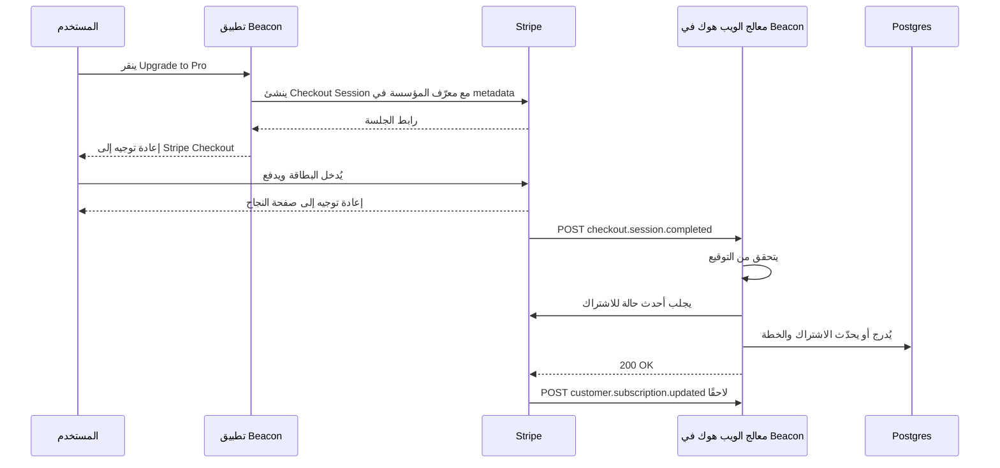
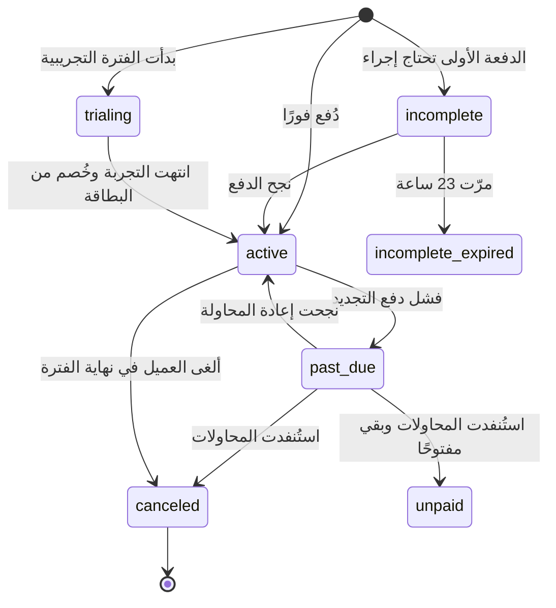
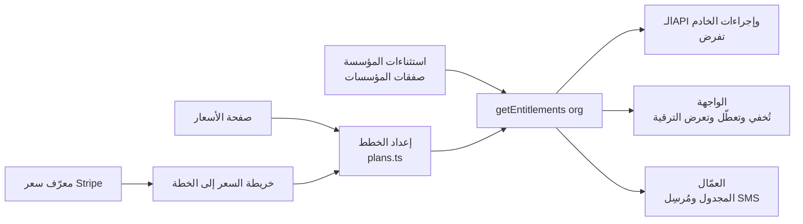
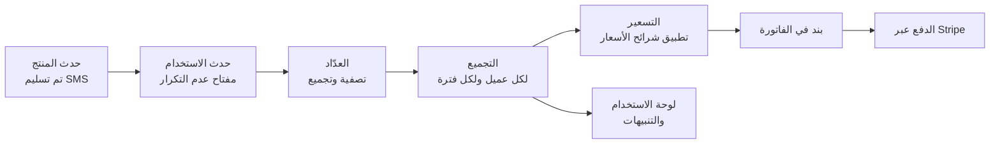

# الوحدة 3 — المال

*في هذه الوحدة تكلّف الأخطاءُ (bugs) مالًا حقيقيًا: عملاء دفعوا ولم يحصلوا على شيء، أو عملاء توقفوا عن الدفع واحتفظوا بكل شيء. نبدأ بالاشتراكات (subscriptions) والمزامنة القائمة على الويب هوك (webhook-driven sync) التي تُبقي قاعدة بياناتك (database) صادقة، ثم نحوّل صفحة الأسعار (pricing page) إلى فحوص استحقاق (entitlement checks) يستطيع الكود فرضها، وننتهي بالفوترة حسب الاستخدام (usage-based billing)، حيث يصبح كل حدث بندًا (line item) في فاتورة (invoice) أحد العملاء. سيحصل Beacon على خططه (plans) الثلاث Free وPro وBusiness، إضافةً إلى رسائل SMS المُقاسة (metered).*

> **التطبيق العملي:** ابدأ من [نسخة البداية من Beacon](https://github.com/Tamoura/system-design-for-vibe-coders/tree/beacon/starter)، وحلّ التمارين قبل النظر إلى [الحل المرجعي لهذه الوحدة](https://github.com/Tamoura/system-design-for-vibe-coders/tree/beacon/module-3-solution) (الفرع (branch) `beacon/module-3-solution`).

---

# 3.1 — الاشتراكات والمدفوعات: صفحة الدفع، والويب هوك، وبوابة العميل
*المستوى: 🟢 مبتدئ* · *المتطلبات: 1.2، 2.1*

## ⚡ الدرس في دقيقة

- الاشتراك (Subscription) هو عميل يدفع سعرًا محددًا كل فترة. مزوّد الدفع (payment provider) يملك الحقيقة عن المال، وقاعدة بياناتك (database) تحتفظ بنسخة منها.
- القاعدة الأهم: امنح الصلاحيات (access) من الويب هوك (Webhook) بعد التحقق منه، ولا تمنحها أبدًا من إعادة التوجيه (redirect) إلى صفحة النجاح.
- الخيار الافتراضي للإصدار الأول: صفحة الدفع المستضافة (Checkout) وبوابة العميل المستضافة (Customer Portal) من Stripe، مع ربط عميل Stripe بالمؤسسة (organization) لا بالمستخدم.
- معالج الويب هوك (webhook handler) يتحقق من التوقيع (signature) على جسم الطلب الخام (raw body)، ويحذف التكرار (dedupes) حسب معرّف الحدث (event ID)، ويجلب الحالة الحالية من جديد، ثم يردّ بـ 2xx بسرعة.
- الفخ الأكبر: أن تعدّ `active` الحالة المدفوعة (paid status) الوحيدة، فتمنع عملاء `trialing` من الدخول وتعامل `past_due` كأنها `canceled`.

## 🧭 لماذا يحتاجه كل SaaS

يطلق Beacon خطة Pro (Pro plan) بسعر 29 دولارًا شهريًا. الإصدار الأول هو ما يكتبه الجميع في اليوم الأول: زر "Buy" يرسل المستخدم إلى Stripe، ثم يعيد Stripe توجيهه إلى `/billing?success=true`، وتلك الصفحة تنفّذ `UPDATE organizations SET plan = 'pro'`. يعمل هذا في العرض التجريبي (demo).

ثم يبدأ الواقع. يدفع عميلٌ ويغلق التبويب (tab) قبل اكتمال إعادة التوجيه، فيُخصم (charged) منه المبلغ ويبقى على خطة Free. ويلاحظ شخص آخر رابط النجاح (success URL) فيزوره يدويًا، فيحصل على Pro دون أن يدفع. وبعد ثلاثة أشهر تنتهي صلاحية بطاقة عميل ويفشل التجديد (renewal). لا شيء في Beacon يعلم بذلك، فيبقى على Pro إلى الأبد. وأصبح فريق الدعم (support) الآن يقرأ لوحة تحكم (dashboard) Stripe ويعدّل صفوف (rows) قاعدة البيانات يدويًا.

الحل لا يكمن في معالجة أذكى لإعادة التوجيه، لأن إعادة التوجيه مجرد تجربة مستخدم (UX). مزوّد الدفع يخبرك بما حدث عبر **الويب هوك (Webhook)**: طلبات HTTP POST موقّعة (signed) يرسلها إلى خادمك (server) عندما يتغير شيء. يعيد Stripe محاولة تسليم الويب هوك (webhook delivery) الفاشل مدةً تصل إلى ثلاثة أيام في الوضع الحي (live mode)، لذلك يحصل حتى المعالج المعيب على فرصة ثانية، بشرط أن يفشل بوضوح بدل أن يردّ بـ `200 OK` ويُسقط الحدث.

**مزوّد الدفع يملك الحقيقة عن المال، وقاعدة بياناتك تحتفظ بنسخة مخزّنة (cached copy) منها يُبقيها الويب هوك متزامنة (in sync)، وليس العكس أبدًا.**

## 📐 كيف يعمل

### 🟢 الأساسيات

يستخدم معظم المزوّدين مفردات Stripe نفسها، لذلك تعلّمها مرة واحدة. تستخدم Paddle وLemon Squeezy وPolar أسماءً مشابهة.

| الكائن (object) | ما هو | مثال من Beacon |
|---|---|---|
| **Customer** (العميل) | الجهة التي تدفع، مع بريدها ووسائل الدفع (payment methods) والمعلومات الضريبية (tax info) | عميل واحد لكل **مؤسسة** في Beacon، لا لكل مستخدم |
| **Product** (المنتج) | الشيء الذي تبيعه | "Beacon Pro" |
| **Price** (السعر) | كم، وكل كم، وبأي عملة (currency). هو ثابت عمليًا: لتغيير المبلغ تنشئ Price جديدًا | 29 دولارًا شهريًا؛ 290 دولارًا سنويًا |
| **Subscription** (الاشتراك) | عميل على سعر واحد أو أكثر، يتجدد كل فترة، وله `status` | شركة Acme على Pro الشهرية، `active` |
| **Invoice** (الفاتورة) | الفاتورة التي تُنشأ كل فترة (أو عند التغييرات) | فاتورة مايو 2026، 29 دولارًا، مدفوعة |
| **PaymentIntent** (نية الدفع) | محاولة واحدة لتحصيل المال، قد تحتاج 3-D Secure أو إعادة محاولة أو بطاقة جديدة | عملية الخصم خلف تلك الفاتورة |
| **Checkout Session** (جلسة الدفع) | صفحة دفع مستضافة يشغّلها Stripe نيابةً عنك | المكان الذي يذهب إليه الناس عند "Upgrade to Pro" |
| **Billing Portal Session** (جلسة بوابة الفوترة) | صفحة خدمة ذاتية (self-service) مستضافة للبطاقات والفواتير وتغيير الخطة والإلغاء | Settings → Billing → "Manage billing" |

قراران يجعلان الإصدار الأول آمنًا لفريق مبتدئ.

**استخدم صفحة الدفع المستضافة (Checkout) وبوابة العميل المستضافة (Customer Portal).** نماذج البطاقات (card forms)، و3-D Secure / SCA (المصادقة القوية للعميل، وهي القاعدة الأوروبية التي تفرض خطوة تحقق إضافية)، وApple Pay، وجمع العناوين (address collection)، وحقول الرقم الضريبي (tax ID fields)، وتنزيل الفواتير (invoice downloads) كلها مشكلات محلولة. لا تريد أن تقترب أرقام البطاقات من خوادمك. ومع الصفحات المستضافة يبقى نطاق PCI DSS الخاص بك (معيار أمان صناعة البطاقات) في أخف مستوياته. يمكنك بناء نماذج مدمجة (embedded forms) لاحقًا إن أظهرت بيانات التحويل (conversion data) أن ذلك يستحق.

**عامل الويب هوك على أنه مصدر الحقيقة (source of truth).** إعادة التوجيه تعرض فقط شاشة "شكرًا، نحن نؤكد دفعتك". أما الصلاحيات فتتغير عندما يصل الويب هوك.



للمعالج ثلاث مهام، بهذا الترتيب:

1. **تحقق من التوقيع.** يستطيع أي شخص على الإنترنت إرسال POST إلى `/api/stripe/webhook`. يوقّع Stripe كل تسليم بسرّ نقطة النهاية (endpoint's secret) الخاصة بك (قيمة HMAC في ترويسة (header) `Stripe-Signature`، مع طابع زمني (timestamp) لمنع إعادة الإرسال (replay)). الدالة `constructEvent` في الـSDK تتحقق منه، لكن فقط مقابل **جسم الطلب الخام**. إذا حلّل إطار العمل (framework) JSON أولًا، تتغير البايتات ويفشل التحقق. هذا أشهر خطأ في هذا الدرس.
2. **احذف التكرار.** قد يسلّم Stripe الحدث نفسه أكثر من مرة. سجّل `event.id` مع قيد تفرّد (Unique Constraint) وتجاوز الأحداث التي عالجتها سابقًا.
3. **زامن، ثم ردّ بـ 2xx بسرعة.** حدّث نسختك من الاشتراك وأرسل الرد. يتوقع Stripe ردًا سريعًا، وأي عمل بطيء مكانه مهمة خلفية (Background Job) (انظر 5.1).

```ts
// app/api/stripe/webhook/route.ts
export async function POST(req: Request) {
  const body = await req.text(); // raw body, never req.json()
  const sig = req.headers.get("stripe-signature") ?? "";
  let event: Stripe.Event;
  try {
    event = stripe.webhooks.constructEvent(body, sig, process.env.STRIPE_WEBHOOK_SECRET!);
  } catch {
    return new Response("bad signature", { status: 400 });
  }
  const firstTime = await db.insertIgnore("stripe_events", { id: event.id, type: event.type });
  if (!firstTime) return new Response("duplicate", { status: 200 });

  const obj = event.data.object as { customer?: string | { id: string } };
  const customerId = typeof obj.customer === "string" ? obj.customer : obj.customer?.id;
  if (customerId) await syncCustomerFromStripe(customerId); // fetch fresh state, upsert
  return new Response("ok", { status: 200 });
}
```

في Django يأخذ الشكل نفسه صورة view عليها `csrf_exempt` وتقرأ `request.body`. وفي Rails اقرأ `request.raw_post`. وفي Laravel تأتي Cashier مع متحكم ويب هوك (webhook controller) يفعل هذا نيابةً عنك.

خزّن معرّف `customer` من Stripe في صف **المؤسسة**. ففي B2B تدفع مساحة العمل (workspace)، لا الشخص الذي صادف أنه نقر الزر. وقد يغادر ذلك الشخص الشركة الشهر القادم (انظر 1.2).

### 🟡 التعمق أكثر

**الأحداث تصل بترتيب غير مضمون.** لا يضمن Stripe الترتيب. قد يصلك `customer.subscription.updated` قبل `customer.subscription.created`، أو حدث `updated` قديم بعد حدث أحدث منه. إذا كتب كل معالج الحمولة (payload) التي استلمها دون تفكير، فقد يطمس حدث قديم حالةً حديثة ويلغي اشتراك عميل يدفع. هناك حلّان جيدان:

- **اجلب من جديد، ولا تثق بالحمولة.** استخدم الحدث إشارةً فقط إلى أن "شيئًا تغيّر للعميل X"، ثم اطلب الحالة الحالية من الـAPI وأدرجها أو حدّثها (upsert). معالج الويب هوك في Documenso يقول هذا في تعليق: لا يُوثق بالحمولة إلا لاستخراج معرّف العميل. الكلفة طلب API إضافي لكل حدث، والمكسب إزالة فئة كاملة من الأخطاء.
- **قارن الطوابع الزمنية.** خزّن `event.created` لآخر حدث طُبّق على كل اشتراك وتجاهل ما هو أقدم منه. هذا أرخص، لكن الخطأ فيه أسهل وأخفى.

**عدم التأثر بالتكرار (Idempotency) يعمل في الاتجاهين.** حذف تكرار الأحداث الواردة هو نصف المسألة. أما في الطلبات الصادرة (outbound calls) (إنشاء عميل أو اشتراك أو استرداد مبلغ (refund)) فمرّر ترويسة `Idempotency-Key`. إذا انتهت مهلة (times out) طلبك وأعدت المحاولة، يعيد Stripe النتيجة الأصلية بدل إنشاء نتيجة ثانية. يحتفظ Stripe بالمفاتيح 24 ساعة على الأقل. اشتقّ المفتاح من نيّتك أنت، مثل `refund:{ticketId}`، لا من UUID عشوائي يُولَّد داخل حلقة إعادة المحاولة.

**حالة الاشتراك آلة حالات (State Machine).** صمّمها على هذا الأساس، ثم قرّر ماذا تعني كل حالة بالنسبة للصلاحيات.



| حالة Stripe | صلاحيات Beacon | تجربة المستخدم |
|---|---|---|
| `trialing`، `active` | الخطة كاملة | عادية |
| `past_due` | الخطة كاملة خلال فترة سماح (grace period) | شريط أحمر: "حدّث بطاقتك" |
| `unpaid`، `canceled`، `incomplete_expired` | النزول إلى حدود Free (انظر 3.2) | بريد "انتهت خطتك" |
| `incomplete` | لا ترقية بعد | تنبيه "أكمل الدفع" |

**الفترات التجريبية (trials).** لديك خياران. الفترة التجريبية **دون بطاقة** تجلب تسجيلات (signups) أكثر وتحويلات (conversions) أقل. والفترة التجريبية **مع بطاقة** تتحول إلى اشتراك مدفوع تلقائيًا. يرسل Stripe الحدث `customer.subscription.trial_will_end` قبل انتهاء التجربة بثلاثة أيام، فاربط به بريد التذكير (reminder email).

**التناسب (Proration).** عندما تنتقل Acme من Pro إلى Business في منتصف الشهر، يعيد Stripe افتراضيًا قيمة وقت Pro غير المستخدم رصيدًا ويخصم قيمة وقت Business بالتناسب. يتحكم في هذا المعامل `proration_behavior` (`create_prorations`، `always_invoice`، `none`). سياسة شائعة: الترقيات (upgrades) تسري الآن وتُفوتر فورًا، والتخفيضات (downgrades) تسري في نهاية الفترة، باستخدام جداول الاشتراك (Subscription Schedules) أو إعداد "at period end" في البوابة. التخفيض الفوري يعني استرداد مبالغ، ولا أحد يستمتع بذلك.

**التحصيل المتعثر (Dunning)** هو عملية استرداد المدفوعات الفاشلة (failed payments). البطاقات تنتهي صلاحيتها، والبنوك ترفض، والحدود تُستنفد. فعّل إعادة المحاولة التلقائية (automatic retries) لدى المزوّد (يسمّي Stripe نسخته المُوقّتة بالتعلم الآلي Smart Retries) ورسائل البريد الخاصة بالدفع الفاشل، وضع رابط البوابة في رسائلك أنت. حدّد فترة السماح صراحةً. واستمع أيضًا إلى `invoice.payment_failed`، لأنه المكان الذي تبدأ منه الشريط (banner) والعدّ التنازلي (countdown).

**الاسترداد والنزاعات (disputes).** استرداد المبلغ لا يلغي الاشتراك، والإلغاء لا يسترد المبلغ. هما طلبا API منفصلان، لذلك اجعل أدوات الدعم (support tooling) لديك (7.1) تنفّذ الاثنين عن قصد. والنزاع (Chargeback) يصل على شكل `charge.dispute.created`. لديك مهلة محدودة لتقديم الأدلة (evidence)، والنزاعات تكلّف رسومًا (fee) حتى لو ربحتها.

| الحدث | ماذا يفعل Beacon |
|---|---|
| `checkout.session.completed` | يربط العميل بالمؤسسة (عبر `metadata` أو `client_reference_id`)، ثم يزامن |
| `customer.subscription.created` / `updated` / `deleted` | يزامن الحالة والسعر و`current_period_end` و`cancel_at_period_end` |
| `invoice.paid` | يسجّل الدفعة، ويزيل شريط التحصيل المتعثر، ويصفّر العدّادات الشهرية (monthly counters) (3.3) |
| `invoice.payment_failed` | يبدأ فترة السماح، ويراسل المالكين ومسؤولي الفوترة (billing admins) |
| `customer.subscription.trial_will_end` | يرسل بريد "التجربة على وشك الانتهاء" |
| `charge.refunded`، `charge.dispute.created` | يُبلغ فريق المالية (finance)، ويضع علامة مراجعة على الحساب |

### 🔴 على نطاق واسع وللمؤسسات

**الضرائب (tax).** عندما تبيع لشركات ومستهلكين في دول كثيرة، تصبح مدينًا بضريبة القيمة المضافة (VAT/GST) في بعضها، وبضريبة المبيعات (sales tax) الأمريكية في الولايات التي تتجاوز فيها عتبات الارتباط الاقتصادي (Economic Nexus) (وهي نتيجة لحكم *South Dakota v. Wayfair* عام 2018). هناك طريقتان للتعامل مع ذلك:

| | معالج الدفع (Stripe، Adyen، Braintree) | التاجر المسجّل (Merchant of Record): Paddle، Lemon Squeezy، Polar |
|---|---|---|
| من البائع قانونيًا | أنت | التاجر المسجّل يعيد بيع منتجك |
| من يحسب الضريبة ويحصّلها ويقدّم إقراراتها (filing) ويسدّدها | أنت (يساعد Stripe Tax في الحساب والتحصيل، أما تقديم الإقرارات فيبقى عليك أو على شريك) | التاجر المسجّل |
| الرسوم | أقل لكل عملية | أعلى، لأنها تشمل عمل الضرائب والامتثال (compliance) |
| التحكم | API كامل، وأي نموذج تسعير (pricing model)، وفواتير باسمك | مرونة أقل، والفواتير باسمهم |
| مناسب لـ | فرق لديها دعم مالي، وB2B مع فوترة للمؤسسات | المؤسسين المنفردين (solo founders) والفرق الصغيرة التي تبيع عالميًا |

استحوذت Stripe على Lemon Squeezy عام 2024. وPolar مفتوح المصدر (Apache-2.0)، لكن المسؤولية الضريبية تقع على الشركة التي تشغّله، لذلك فإن استضافة كود Polar بنفسك لا تجعلك تاجرًا مسجّلًا. الكيان القانوني (legal entity) هو المنتج.

**فوترة المؤسسات (enterprise invoicing).** عملاء فئة Business يريدون عقودًا سنوية (annual contracts)، وأوامر شراء (purchase orders)، وتحويلات بنكية (bank transfers) بشروط net-30، لا بطاقة. يدعم Stripe الخيار `collection_method: send_invoice` مع `days_until_due`. ومنطق الصلاحيات لديك يجب أن يتعامل مع حالة "أُرسلت الفاتورة، ولم تُدفع بعد، وما زال مستحقًا".

**بنية الويب هوك (webhook plumbing).** عند الأحجام الكبيرة، يجب أن يتحقق المعالج من الحدث، ويحفظ الحدث الخام، ويضعه في الطابور (Queue)، ثم يردّ بـ `200`. بعدها يعالج عاملٌ (Worker) الأحداث مع إعادة المحاولة (نمط "صندوق الوارد" (Inbox)، انظر 5.1 و5.3). أضف **مهمة مطابقة ليلية (Reconciliation)** تسرد الاشتراكات من المزوّد وتقارنها بجدولك. ستجد الأحداث التي فاتتك أثناء انقطاع الخدمة (outage)، وستكشف حالة "أحدهم عدّل الاشتراك من لوحة التحكم".

**اختبار الزمن.** التجديدات والفترات التجريبية والتحصيل المتعثر تحدث على مدى أسابيع. تتيح لك **ساعات الاختبار (Test Clocks)** في Stripe تقديم الزمن لعميل تجريبي (test customer). استخدمها في CI لتثبت أن مسار "انتهت التجربة، فشلت البطاقة، فترة السماح، النزول" يعمل دون أن تنتظر شهرًا. وأداة Stripe CLI (`stripe listen --forward-to`) تمرّر أحداث الويب هوك الحقيقية في وضع الاختبار (test mode) إلى localhost.

## 🏆 أفضل المستودعات

| المستودع (repo) | ما هو | التقنيات | الترخيص (license) | اختره عندما |
|---|---|---|---|---|
| [stripe/stripe-node](https://github.com/stripe/stripe-node) | الـSDK الرسمي لـStripe، مع أحداث مُنمّطة (typed events) والتحقق من الويب هوك | TypeScript/Node | MIT | تستخدم Stripe من Node، وهذا حال معظم القرّاء |
| [stripe/stripe-cli](https://github.com/stripe/stripe-cli) | يمرّر الويب هوك إلى localhost، ويطلق أحداثًا تجريبية، ويتابع السجلات | Go | Apache-2.0 | دائمًا، أثناء التطوير |
| [nextjs/saas-starter](https://github.com/nextjs/saas-starter) | تطبيق SaaS مصغّر بـNext.js مع Checkout والبوابة ومسار ويب هوك على مستوى الفرق | Next.js, Drizzle, Postgres | MIT | تريد أصغر مثال صحيح تقرؤه في ساعة |
| [wasp-lang/open-saas](https://github.com/wasp-lang/open-saas) | قالب SaaS (template) يضع Stripe وLemon Squeezy وPolar خلف واجهة واحدة لمعالج الدفع | Wasp, React, Node, Prisma | MIT | تريد أن ترى معالج الدفع والتاجر المسجّل جنبًا إلى جنب |
| [laravel/cashier-stripe](https://github.com/laravel/cashier-stripe) | طبقة فوترة الاشتراكات (subscription billing layer) في Laravel، مع متحكم ويب هوك وفترات تجريبية وتبديل الخطط والفواتير | PHP/Laravel | MIT | تعمل بـLaravel، أو تريد التعلم من API اشتراكات مصمَّم جيدًا |
| [pay-rails/pay](https://github.com/pay-rails/pay) | محرك مدفوعات (payments engine) لـRails يدعم Stripe وPaddle وBraintree وLemon Squeezy | Ruby/Rails | MIT | تعمل بـRails |
| [dj-stripe/dj-stripe](https://github.com/dj-stripe/dj-stripe) | يزامن كائنات Stripe إلى نماذج Django (models) عبر الويب هوك | Python/Django | MIT | تعمل بـDjango وتريد نسخة محلية (local copy) من بيانات Stripe |
| [polarsource/polar](https://github.com/polarsource/polar) | منصة تاجر مسجّل مفتوحة المصدر (open-source)، مع الدفع والاشتراكات والمزايا (benefits) والفوترة حسب الاستخدام | Python (FastAPI), Next.js | Apache-2.0 | تريد تاجرًا مسجّلًا، أو تريد أن تقرأ كيف يُبنى |
| [killbill/killbill](https://github.com/killbill/killbill) | محرك فوترة (billing engine) اشتراكات وإصدار فواتير تستضيفه بنفسك | Java | Apache-2.0 | تحتاج منطق فوترة تملكه وتشغّله، مع أي معالج دفع خلفه |

**إن درست مستودعًا واحدًا فقط:** اقرأ `nextjs/saas-starter`. إنه صغير بما يكفي لتفهمه كاملًا. فيه مسار دفع واحد، ومسار ويب هوك واحد، ودالة واحدة تنقل اشتراك Stripe إلى صف الفريق. عندما يتضح لك، سترى الهيكل نفسه داخل كل قاعدة كود (codebase) أكبر في هذا الدرس.

**اشترِ أم ابنِ أم استضف بنفسك؟**

- **اشترِ (الخيار الافتراضي):** Stripe Billing مع Checkout وبوابة العميل. وإن كنت تفضّل ألا تتعامل مع ضريبة المبيعات العالمية، فاستخدم تاجرًا مسجّلًا: Paddle أو Lemon Squeezy أو Polar. في سنة Beacon الأولى، اختر واحدًا منها وامضِ.
- **استضف بنفسك:** Kill Bill أو Lago (3.3) عندما يكون منطق الفوترة جوهريًا في عملك، أو لديك عقود غير معتادة، أو تريد أن تبقى مستقلًا عن أي معالج دفع بعينه. ستظل بحاجة إلى معالج دفع لنقل المال.
- **ابنِ:** الطبقة الرقيقة (thin layer) فقط: جدول `subscriptions` الخاص بك، ومزامنة الويب هوك، وربط السعر بالخطة. لا تتعامل مع البطاقات بنفسك أبدًا، ولا تبنِ محرك ضرائب (tax engine) خاصًا بك أبدًا.

## 🔍 ادرسه في مشاريع حقيقية

**Dub (`dubinc/dub`).** يوجد ويب هوك Stripe في Dub، وقت كتابة هذا الدرس، تحت `apps/web/app/(ee)/api/stripe/webhook/`. إنه ملف `route.ts` يتحقق من التوقيع، ويحتفظ بقائمة سماح (allowlist) بأنواع الأحداث المهمة، ويوزّعها على **ملف لكل حدث** (`checkout-session-completed.ts`، `customer-subscription-updated.ts`، `invoice-payment-failed.tsx`، `charge-refunded.ts`…). هذا نموذج جيد لإبقاء معالج متنامٍ مقروءًا. انظر إلى الدالة المساعدة (helper) التي تشتق حدود مساحة العمل من اشتراك Stripe (ابحث عن `getWorkspaceLimitsFromStripeSubscription`). ستجد فيها أثر الفترات التجريبية والفوترة السنوية (annual billing) على الحدود.

**Documenso (`documenso/documenso`).** ابحث عن `stripeWebhookHandler`. يسرد أنواع الأحداث التي تطلق المزامنة، ويستخرج معرّف العميل فقط، ويستدعي دالة واحدة `syncStripeCustomerSubscription` تجلب الحقيقة الحالية من Stripe. هذا نمط "اجلب من جديد، ولا تثق بالحمولة" في نحو مئة سطر. وبجواره دوال مساعدة للدفع والبوابة وكمية المقاعد (seat quantity) (ابحث عن `get-portal-session`، `update-subscription-item-quantity`).

**Open SaaS (`wasp-lang/open-saas`).** تحت `template/app/src/payment/` وقت كتابة هذا الدرس، توجد المجلدات `stripe/` و`lemonSqueezy/` و`polar/` خلف واجهة `paymentProcessor` واحدة. إنها أسرع طريقة لترى ما يختلف في الكود بين معالج الدفع والتاجر المسجّل، وما لا يختلف.

**ما الذي تلاحظه**

- أين يُخزَّن معرّف عميل Stripe (المستخدم، الفريق، المؤسسة) ولماذا.
- هل تثق المعالجات بحمولة الأحداث أم تجلب البيانات من الـAPI من جديد.
- كيف تردّ على أنواع الأحداث التي لا تهمها. تلميح: `200` لا `400`، وإلا سيستمر Stripe في إعادة المحاولة.
- كيف تُعامَل حالة `past_due`: إيقاف فوري، أم فترة سماح، أم شريط تنبيه فقط.
- إلى أي حد يعتمد التطبيق على البوابة المستضافة بدل بناء واجهة فوترة (billing UI) خاصة به.

## 🛠️ ابنِه في Beacon

### 🟢 تمرين المبتدئ

أضف Stripe Checkout وبوابة العميل إلى صفحة إعدادات الفوترة (billing settings page) في Beacon. أنشئ منتج Pro مع سعر شهري (monthly price) في وضع الاختبار. زر "Upgrade" ينشئ Checkout Session مع معرّف المؤسسة في `client_reference_id` أو `metadata`. وزر "Manage billing" يفتح جلسة بوابة لعميل المؤسسة.

**يكتمل عندما:**
- يستطيع مالك المؤسسة (owner) الترقية ببطاقة الاختبار `4242 4242 4242 4242` والعودة إلى Beacon.
- تعرض صفحة النجاح "جارٍ التأكيد…" ولا تغيّر الخطة بنفسها.
- يفتح "Manage billing" البوابة، حيث يستطيع المالك تحديث البطاقة والإلغاء.
- لا يرى غير المالكين أزرار الفوترة (أعد استخدام فحص الصلاحيات (permission check) من 1.3).

### 🟡 تمرين المستوى المتوسط

اكتب معالج الويب هوك: تحقق من التوقيع على الجسم الخام، وجدول `stripe_events` بعمود `id` فريد لحذف التكرار، ودالة `syncCustomerFromStripe(customerId)` تجلب اشتراكات العميل وتُدرج أو تحدّث صفًا في `subscriptions` (الحالة، ومعرّف السعر، ونهاية الفترة الحالية (current period end)، والإلغاء في نهاية الفترة). استخدم `stripe listen --forward-to localhost:3000/api/stripe/webhook` محليًا.

**يكتمل عندما:**
- إرسال الحدث نفسه مرتين (`stripe events resend`) لا يغيّر شيئًا في المرة الثانية.
- الطلب ذو الجسم المُعدَّل يحصل على `400`، والطلب الصحيح يحصل على `200`.
- الإلغاء من البوابة يضبط `cancel_at_period_end = true` في جدولك خلال ثوانٍ.
- حذف صف `subscriptions` ثم إعادة إرسال أي حدث يستعيده بشكل صحيح.

### 🔴 تمرين المستوى المتقدم

نفّذ دورة الحياة (lifecycle) كاملة باستخدام **ساعة اختبار** من Stripe: فترة تجريبية مدتها 14 يومًا مع بطاقة، ثم التحويل إلى اشتراك مدفوع، ثم تجديد فاشل (استخدم بطاقة اختبار (test card) تُرفض)، ثم فترة سماح مدتها 7 أيام مع شريط تنبيه، ثم نزول تلقائي إلى Free. أضف مهمة مطابقة ليلية تسرد كل اشتراكات Stripe وتبلّغ عن أي اختلاف مع جدولك.

**يكتمل عندما:**
- تقديم ساعة الاختبار يمرّر Beacon عبر `trialing → active → past_due → canceled` دون أي خطوات يدوية.
- يظهر شريط لوحة التحكم أثناء `past_due` ويختفي بعد تحديث البطاقة بنجاح.
- إفساد صف يدويًا (ضبط مؤسسة ملغاة على `active`) تبلّغ عنه مهمة المطابقة في تشغيلها التالي.
- يغطي اختبار تكامل (integration test) المسار كاملًا.

## ⚠️ أخطاء يقع فيها المبتدئون

- **منح الصلاحيات عند إعادة التوجيه إلى صفحة النجاح.** إعادة التوجيه يمكن تخطيها أو تكرارها أو تزويرها. امنح الصلاحيات من الويب هوك، واستخدم إعادة التوجيه للرسائل فقط.
- **تحليل JSON قبل التحقق من التوقيع.** محللات الجسم (body parsers) في أطر العمل تغيّر المسافات وترتيب المفاتيح، فيفشل التحقق. والأسوأ أن "يصلحه" أحدهم بتخطي التحقق. اقرأ الجسم الخام في مسار الويب هوك وحده.
- **الرد بـ 500 على أنواع أحداث لا تعالجها.** يعيد Stripe محاولتها أيامًا، ثم يعطّل نقطة النهاية في النهاية. ردّ بـ `200` على كل ما تتجاهله، واشترك فقط في الأحداث التي تحتاجها.
- **ربط عميل Stripe بالمستخدم بدل المؤسسة.** عندما يغادر المؤسس الذي دفع، تغادر معه فوترة مساحة العمل. في B2B، المؤسسة هي العميل.
- **كتابة `if (status === "active")` مباشرةً.** هذا يمنع عملاء `trialing` من الدخول ويعامل `past_due` مثل `canceled`. اربط كل حالة بقرار صلاحيات في دالة واحدة.
- **جعل المعالج ينفّذ كل شيء داخل الطلب.** إرسال ثلاث رسائل بريد وإعادة حساب الحدود داخل الطلب يؤدي إلى انتهاء المهلة (timeout)، وانتهاء المهلة يؤدي إلى إعادة المحاولة ورسائل مكررة. زامن الصف، وضع الباقي في الطابور.
- **اختبار الفوترة على المسار السعيد (happy path) فقط.** الأخطاء المكلفة تعيش في التجديدات والإخفاقات والإلغاءات. استخدم ساعات الاختبار وبطاقات الاختبار المرفوضة.

## 🧾 الخلاصة

- تعلّم الأسماء (Customer، Product، Price، Subscription، Invoice، PaymentIntent). كل مزوّد يستخدم صيغة منها.
- استخدم Checkout والبوابة المستضافين أولًا. ابنِ واجهة مخصصة فقط عندما تقول البيانات إنها تستحق.
- الويب هوك هو مصدر الحقيقة: تحقق من التوقيع على الجسم الخام، واحذف التكرار حسب معرّف الحدث، واجلب الحالة الحالية من جديد، وردّ بـ 2xx بسرعة.
- حالة الاشتراك آلة حالات، لذلك قرّر ماذا تمنح كل حالة، وخصوصًا `past_due`.
- ضريبة المبيعات مشكلة قانونية لا برمجية. التاجر المسجّل يزيلها عنك مقابل رسوم.
- طابِق كل ليلة. الويب هوك موثوق، لكنه ليس مثاليًا.

## ✍️ اختبر نفسك

**1. لماذا يجب أن يتحقق معالج الويب هوك من التوقيع مقابل جسم الطلب الخام؟**

<details><summary>الإجابة</summary>

التوقيع قيمة HMAC محسوبة على البايتات نفسها التي أرسلها Stripe. إذا حلّل إطار العمل JSON أولًا، فقد تتغير المسافات وترتيب المفاتيح، فيفشل التحقق، وقد "يصلحه" أحدهم حينها بتخطي التحقق. اقرأ الجسم الخام في مسار الويب هوك وحده. انظر 🟢 الأساسيات و⚠️ أخطاء يقع فيها المبتدئون.

</details>

**2. قد تصل أحداث Stripe بترتيب غير مضمون. ما الحلّان، وما كلفة كل منهما؟**

<details><summary>الإجابة</summary>

إما أن تجلب الحالة الحالية من الـAPI وتستخدم الحدث إشارةً فقط إلى أن "شيئًا تغيّر للعميل X"، وإما أن تخزّن `event.created` لآخر حدث طُبّق وتتجاهل ما هو أقدم منه. الجلب من جديد يكلّف طلب API إضافيًا لكل حدث ويزيل فئة كاملة من الأخطاء. ومقارنة الطوابع الزمنية أرخص، لكن الخطأ فيها أسهل وأخفى. انظر 🟡 التعمق أكثر.

</details>

**3. فشل تجديد اشتراك Pro لدى Acme وانتقل اشتراكها إلى `past_due`. ماذا يجب أن يفعل Beacon؟**

<details><summary>الإجابة</summary>

يُبقي الخطة كاملة خلال فترة سماح محددة صراحةً، ويعرض شريطًا أحمر "حدّث بطاقتك"، ويراسل المالكين ومسؤولي الفوترة، بدءًا من الحدث `invoice.payment_failed`. ويترك إعادة المحاولة التلقائية لدى المزوّد تعمل. فإذا استُنفدت المحاولات وأصبحت الحالة `unpaid` أو `canceled`، ينزل بـAcme إلى حدود Free (3.2). انظر جدولي الحالات والأحداث في 🟡 التعمق أكثر.

</details>

**4. أين يجب أن يخزّن Beacon معرّف عميل Stripe، ولماذا هناك؟**

<details><summary>الإجابة</summary>

في صف المؤسسة. ففي B2B تدفع مساحة العمل، لا الشخص الذي صادف أنه نقر الزر، وقد يغادر ذلك الشخص الشركة الشهر القادم. إذا رُبط العميل بالمستخدم، تغادر فوترة مساحة العمل معه. انظر 🟢 الأساسيات و⚠️ أخطاء يقع فيها المبتدئون.

</details>

**5. معالج كتبه زميلك يردّ بـ `500` على أي نوع حدث لا يعرفه، "حتى ننتبه إليه". ما الذي يتعطل؟**

<details><summary>الإجابة</summary>

يعدّ Stripe الرد `500` تسليمًا فاشلًا فيعيد المحاولة أيامًا، ثم يعطّل نقطة النهاية في النهاية، فتتوقف أيضًا الأحداث التي تحتاجها فعلًا. ردّ بـ `200` على كل ما تتجاهله، واشترك فقط في الأحداث التي تحتاجها. انظر ⚠️ أخطاء يقع فيها المبتدئون وقائمة "ما الذي تلاحظه" في 🔍 ادرسه في مشاريع حقيقية.

</details>

## 📚 المراجع

- Stripe docs, Webhooks: https://docs.stripe.com/webhooks — توثيق الويب هوك في Stripe
- Stripe docs, Idempotent requests: https://docs.stripe.com/api/idempotent_requests — الطلبات غير المتأثرة بالتكرار
- Stripe Billing docs (subscriptions, Customer Portal, test clocks, Smart Retries): https://docs.stripe.com/billing — توثيق الفوترة: الاشتراكات وبوابة العميل وساعات الاختبار وSmart Retries
- Standard Webhooks spec (signing and verification conventions): https://github.com/standard-webhooks/standard-webhooks — مواصفة أعراف التوقيع والتحقق
- Brandur Leach, "Implementing Stripe-like Idempotency Keys in Postgres": https://brandur.org/idempotency-keys — تنفيذ مفاتيح عدم التأثر بالتكرار في Postgres
- Paddle developer docs (Merchant of Record model): https://developer.paddle.com — توثيق Paddle ونموذج التاجر المسجّل
- Polar docs: https://docs.polar.sh — توثيق Polar

---

# 3.2 — الخطط والحدود والاستحقاقات: تحويل التسعير إلى كود
*المستوى: 🟡 متوسط* · *المتطلبات: 3.1، 1.3*

## ⚡ الدرس في دقيقة

- الاستحقاق (Entitlement) شيء واحد يُسمح للحساب (account) بفعله أو امتلاكه: بوابة ميزة (feature gate)، أو حد (limit)، أو قيمة إعداد (configuration value). والخطة (plan) مجرد حزمة مسمّاة منها.
- القاعدة الأهم: لا تفحص أبدًا الخطة التي يشترك فيها العميل. افحص ما يستحقه، ودع وحدة واحدة (module) تترجم الخطط إلى استحقاقات.
- الخيار الافتراضي للإصدار الأول: ملف `plans.ts` مُنمّط (typed)، وخريطة من السعر إلى الخطة (price-to-plan map)، ودالة واحدة `getEntitlements(org)` مع الاستثناءات (overrides)، ويُفرض كل ذلك على الخادم (server) في كل مسار كتابة (write path).
- خذ لقطة (Snapshot) من الاستحقاقات لكل مؤسسة لتحصل على إبقاء الأسعار القديمة (grandfathering) والعقود المخصصة (custom contracts) بكلفة قليلة، وجمّد الفائض (freeze the excess) عند التخفيض (downgrade) بدل حذفه.
- الفخ الأكبر: فرض الحدود (enforcing limits) في الواجهة (UI) فقط، أو استخدام أداة أعلام الميزات (Feature Flags) جدارًا للدفع (paywall).

## 🧭 لماذا يحتاجه كل SaaS

تَعِد صفحة الأسعار (pricing page) في Beacon بثلاثة أشياء: Free تحصل على 5 مراقِبات (monitors) بفحص كل 5 دقائق، وPro تحصل على 50 مراقِبًا بفحص كل دقيقة ورسائل SMS، وBusiness تضيف الدخول الموحد (SSO) وسجل التدقيق (Audit Log) وفحوصًا كل 30 ثانية والـAPI. في الأسبوع الأول يكتب أحدهم `if (org.plan === "pro")` في نموذج المراقِب (monitor form). وفي الأسبوع الثاني يكتب آخر `if (org.plan !== "free")` في مُرسِل SMS (SMS sender). وفي الأسبوع السادس يضيف فريق التسويق (marketing) خطة "Starter" بين Free وPro، ولا يستطيع أحد أن يجد الأربعين موضعًا التي تحتاج تحديثًا. يفوتهم موضعان. فيحصل عملاء Starter على SMS مجانًا، ولا يستطيع عملاء Business استخدام الـAPI، لأن ذلك الفحص كان `=== "pro"`.

ثم يوقّع فريق المبيعات (sales) صفقة مؤسسية (enterprise deal) بـ 500 مراقِب، وهذا غير موجود في أي خطة. ثم ترفع سعر Pro إلى 39 دولارًا وتَعِد العملاء الحاليين بأن يبقوا على 29 دولارًا وبحدودهم الحالية. ثم ينزل عميل من Pro إلى Free ولديه 43 مراقِبًا. ماذا يحدث للـ38 الباقية؟

لا شيء من هذا مشكلة فوترة (billing problem). خصم Stripe المبلغ الصحيح في كل مرة. المشكلة في الطبقة (layer) الواقعة بين "ماذا دفعوا" و"ماذا يستطيعون أن يفعلوا"، واسمها **الاستحقاقات (Entitlements)**.

**لا تفحص أبدًا الخطة التي يشترك فيها العميل؛ افحص ما يستحقه، ودع وحدة واحدة تترجم الخطط إلى استحقاقات.**

## 📐 كيف يعمل

### 🟢 الأساسيات

هذه هي المصطلحات، معرّفة قبل أن نستخدمها:

- **الخطة (Plan)**: حزمة مسمّاة في صفحة الأسعار (Free، Pro، Business). إنها مفهوم تسويقي (marketing concept) ومفهوم فوترة.
- **الاستحقاق (Entitlement)**: شيء واحد يُسمح للحساب بفعله أو امتلاكه. للاستحقاقات ثلاثة أنواع:
  - **بوابة ميزة (قيمة منطقية (boolean)):** `sso: true`، `auditLog: false`.
  - **حد (كمية (quantity)):** `maxMonitors: 50`، `maxTeamMembers: 10`.
  - **قيمة إعداد:** `minCheckIntervalSeconds: 60`، `dataRetentionDays: 90`.
- **الاستخدام (Usage)**: مقدار ما استُهلك حاليًا من حدٍّ ما (43 من 50 مراقِبًا). يغطيه الدرس 3.3 بالتفصيل.

يمتد المسار من صفحة الأسعار إلى الفرض (enforcement):



الإصدار الأول ملف إعداد (config file) مُنمّط ودالة واحدة:

```ts
// lib/plans.ts
export const PLANS = {
  free:     { maxMonitors: 5,   minIntervalSec: 300, smsCreditsPerMonth: 0,   sso: false, auditLog: false, api: false },
  pro:      { maxMonitors: 50,  minIntervalSec: 60,  smsCreditsPerMonth: 100, sso: false, auditLog: false, api: false },
  business: { maxMonitors: 500, minIntervalSec: 30,  smsCreditsPerMonth: 500, sso: true,  auditLog: true,  api: true  },
} as const;
export type Entitlements = (typeof PLANS)[keyof typeof PLANS];

const PRICE_TO_PLAN: Record<string, keyof typeof PLANS> = {
  [process.env.STRIPE_PRICE_PRO_MONTHLY!]: "pro",
  [process.env.STRIPE_PRICE_PRO_YEARLY!]: "pro",
  [process.env.STRIPE_PRICE_BUSINESS_MONTHLY!]: "business",
};

export function getEntitlements(org: Org): Entitlements {
  const active = org.subscription && ["active", "trialing", "past_due"].includes(org.subscription.status);
  const plan = active ? PRICE_TO_PLAN[org.subscription!.priceId] ?? "free" : "free";
  return { ...PLANS[plan], ...(org.entitlementOverrides ?? {}) };
}
```

يحدث الفرض **على الخادم، عند نقطة الإجراء (point of action)**:

```ts
export async function createMonitor(orgId: string, input: MonitorInput) {
  const org = await getOrg(orgId);
  const ent = getEntitlements(org);
  const count = await db.monitor.count({ where: { orgId } });
  if (count >= ent.maxMonitors) throw new LimitError("maxMonitors", ent.maxMonitors);
  if (input.intervalSec < ent.minIntervalSec) throw new LimitError("minIntervalSec", ent.minIntervalSec);
  return db.monitor.create({ data: { ...input, orgId } });
}
```

تقرأ الواجهة الاستحقاقات نفسها لتعطّل خيار الـ30 ثانية وتعرض "Upgrade to Business". لكن الواجهة مجرد مجاملة. الفرض مسؤولية الـAPI، لأن الـAPI العام (public API) لديك (5.2) وأي مستخدم ذكي يملك أدوات المطوّر (dev tools) يتجاوزان الواجهة تمامًا.

أعِد **خطأً منظّمًا (structured error)** (`{ code: "limit_exceeded", limit: "maxMonitors", allowed: 5 }`، مع HTTP 403 أو 402) حتى تستطيع الواجهة الأمامية (frontend) عرض دعوة ترقية (upgrade prompt) محددة بدل "حدث خطأ ما".

### 🟡 التعمق أكثر

**الخطط في الكود أم في قاعدة البيانات (database)؟** كل فريق يتجادل في هذا. هذه هي المقايضة (trade-off):

| | الخطط في الكود (ملف إعداد) | الخطط في قاعدة البيانات |
|---|---|---|
| تغيير حد | طلب دمج (Pull Request) ثم نشر (deploy) | واجهة إدارة (admin UI)، فوريًا |
| قابلة للمراجعة والاختبار | نعم، فهي في git | تحتاج تسجيلًا في سجل التدقيق (7.3) |
| أمان الأنواع (type safety) | كامل | تحتاج مخططًا (schema) (مثلًا Zod على عمود JSON (JSON column)) |
| صفقات خاصة بكل عميل | غير مريحة | طبيعية |
| مناسبة لـ | من الإصدار الأول حتى بداية النمو | البيع عبر فريق المبيعات، وصفقات مخصصة كثيرة |

تنتهي معظم التطبيقات الناضجة إلى **حل هجين (hybrid)**. *قوالب (templates)* الخطط تعيش في الكود أو في جدول، وتحصل كل مؤسسة على **لقطة** من استحقاقاتها تُنسخ إلى صفها أو إلى جدول `org_entitlements` عند الاشتراك. واللقطة هي ما يُفرض. هذا بالضبط ما يفعله Documenso: يُنسخ `SubscriptionClaim` (القالب) إلى `OrganisationClaim` (لقطة المؤسسة). ويَنسخ Dub الحدود إلى صف مساحة العمل (`linksLimit`، `usageLimit`، `domainsLimit`…) كلما غيّر ويب هوك Stripe الخطة.

**إبقاء الأسعار القديمة (Grandfathering)** ينتج عن اللقطات مجانًا تقريبًا. ارفع Pro من 29 إلى 39 دولارًا بإنشاء Price *جديد* في Stripe (فالأسعار ثابتة عمليًا على أي حال). يبقى المشتركون الحاليون على معرّف السعر القديم (old Price ID)، وما زالت خريطتك تقول: السعر القديم → `pro`. وإذا تغيرت الحدود أيضًا، فأعطِ الخطة إصدارًا (version) (`pro_2025`، `pro_2026`) أو اعتمد على اللقطة. يحتفظ Dub لهذا السبب بمصفوفات من معرّفات الأسعار القديمة بجوار الحالية في ثوابت التسعير (pricing constants) لديه.

**الترقية سهلة. أما التخفيض فمسألة سياسة (policy).** عندما تنزل Acme من Pro (50 مراقِبًا) إلى Free (5) ولديها 43 مراقِبًا، فالخيارات الشائعة هي:

| السياسة | ماذا يحدث | المقايضة |
|---|---|---|
| منع التخفيض | "احذف 38 مراقِبًا أولًا" | واضحة لكنها عدائية، ولا تصلح للتخفيضات *غير الطوعية (involuntary)* بعد فشل الدفع |
| تجميد الفائض (freeze excess) | يبقى الـ43 كلها، ويُوقف أحدث 38، ويختار المستخدم أي 5 تعمل | الأكثر شيوعًا والألطف. البيانات محفوظة |
| للقراءة فقط (read-only) | كل شيء ظاهر، ولا يمكن إنشاء شيء جديد حتى تنزل تحت الحد | بسيطة، وتصلح للمقاعد والمشاريع |
| الحذف | إزالة الفائض | غير مقبولة تقريبًا أبدًا، لأن فقدان البيانات (data loss) يتحول إلى تذكرة دعم (support ticket) أو دعوى قضائية |

يجب أن **يجمّد** Beacon: أضف عمود `pausedReason: "plan_limit"`، واحتفظ بالسجل، وراسل المالك. القاعدة نفسها تعالج الحالة غير الطوعية من 3.1، عندما يُلغى اشتراك غير مدفوع. والميزات تتبع الفكرة نفسها: بعد التخفيض، تتوقف صفحة الحالة عن الخدمة على النطاق المخصص (custom domain)، لكن الإعداد لا يُحذف.

**التسعير حسب المقعد (Seat-based).** تكون Business "لكل مقعد" إذا كنت تفوتر لكل عضو في الفريق. عدد المقاعد (seat count) هو `quantity` في بند الاشتراك (Subscription Item). يجب تحديثه عند إضافة الأعضاء أو إزالتهم، مع التناسب (proration). قرّر: هل تُحسب الدعوات (invitations)، أم الأعضاء الذين قبلوا فقط؟ هل المشاهدون للقراءة فقط مجانيون؟ هل تفوتر المقاعد مسبقًا، مع فرض الحد عند الدعوة، أم تسوّي الحساب لاحقًا (true-up)؟ يتتبع Documenso وCal.com تغييرات المقاعد صراحةً. ابحث في مخطط Cal.com عن `SeatChangeLog`.

**الإضافات (Add-ons).** "+10 مراقِبات مقابل 10 دولارات شهريًا" أو "صفحة حالة إضافية" هي أسعار منفصلة على الاشتراك *نفسه* (عدة بنود في الاشتراك). تصبح الاستحقاقات `plan + sum(addons) + overrides`. ويصمّم openstatus، وهو Beacon حقيقي، الإضافات في إعداد خططه بجوار الحدود.

**أعلام الميزات مقابل الاستحقاقات.** يتشابهان في الشكل (`if (x) show feature`) لكنهما يجيبان عن سؤالين مختلفين:

| | علم الميزة (feature flag) (6.3) | الاستحقاق |
|---|---|---|
| السؤال | هل *أُطلقت* هذه الميزة لهذا الحساب؟ | هل *دفع* هذا الحساب مقابلها؟ |
| المالك | الهندسة (engineering) والمنتج | الفوترة والمبيعات والمنتج |
| العمر | مؤقت، يُحذف بعد الإطلاق | دائم |
| مصدر الحقيقة | خدمة الأعلام (Unleash، PostHog…) | الاشتراك، وإعداد الخطط، والعقد |

قد تكون ميزة جديدة خلف الاثنين معًا: العلم `incident-ai-summary` مفعّل لـ10% من الحسابات، *و*الاستحقاق `aiSummaries` متاح فقط في Business. أبقِهما في نظامين منفصلين، وإلا ستقوم يومًا "بتنظيف الأعلام القديمة" وتمنح الجميع الفئة المدفوعة (paid tier).

### 🔴 على نطاق واسع وللمؤسسات

**العقود المخصصة.** عملاء المؤسسات يتفاوضون: 2,000 مراقِب، وفحوص كل 15 ثانية، واتفاقية مستوى خدمة (SLA) بنسبة 99.99%، وفوترة سنوية باليورو. لا تنشئ خطة لكل عميل. صمّمها على أنها `plan: business` مع **استثناءات (Overrides)** لها مالك وسبب وتاريخ انتهاء (expiry date) (`{ maxMonitors: 2000, reason: "Acme MSA 2026", expiresAt }`)، تُعدَّل من لوحة الإدارة (admin panel) (7.1) وتُكتب في سجل التدقيق (7.3). وضع مهمة تذكير (reminder job) على تواريخ الانتهاء.

**الاستحقاقات كخدمة (entitlements as a service).** عندما تصبح الفوترة والمنتج والمبيعات كلها تلمس الاستحقاقات، تنقلها الشركات إلى خدمة مخصصة (dedicated service) تستعلم منها الخدمات الأخرى. تخزّن الخدمة استحقاقات كل مؤسسة في الكاش (Redis، وتُبطَل (invalidated) عند وصول الويب هوك) وتوفر `check(org, feature)` و`reportUsage(org, meter, n)`. المنتجات المُدارة (managed products) هنا هي **Stigg** و**Schematic**. وفي المصادر المفتوحة (open source) يوجد **Autumn** (`useautumn/autumn`)، الذي يعمل فوق Stripe ويمنحك الاستدعاءين `check` و`track`، ونظام المزايا (Benefits) في **Polar**، ونموذج الخطط والاستحقاقات في **Lago**. اعتمد واحدًا منها عندما يكون لديك عدة فرق وصفقات مخصصة. أما لتطبيق Next.js واحد، فيكفي `getEntitlements()` مع عمود للّقطة (snapshot column).

**الاتساق تحت التزامن (consistency under concurrency).** نمط "اعدّ ثم أدرج" فيه حالة سباق (Race Condition). طلبا API عند 4 من 5 مراقِبات قد ينجحان معًا وينشئان 6. في الموارد الرخيصة، اسمح بتجاوز صغير (overshoot) وصحّحه لاحقًا. وفي الموارد المكلفة (SMS، ورموز الذكاء الاصطناعي)، افرض الحد بشكل ذرّي (atomically) عبر تحديث مشروط (conditional update) (`UPDATE ... SET used = used + 1 WHERE used < limit RETURNING`)، أو قفل استشاري (Advisory Lock) في Postgres، أو عدّاد في Redis (Redis counter) مع سكربت Lua. والحدود التي تفرضها العمّال الخلفية (background workers) (تكرار الفحص في المجدول (scheduler)، وSMS في المُرسِل) يجب أن تقرأ اللقطة نفسها، وإلا ستحتفظ مؤسسة نزلت خطتها بفحوص كل 30 ثانية لأن المجدول خزّن الخطة القديمة.

**تجارب التسعير (pricing experiments).** تغيير الأسعار تجربة منتج (product experiment). اجعل صفحة الأسعار وإعداد الخطط وأسعار Stripe تُولَّد من **مصدر واحد (one source)** (سكربت ينشئ منتجات Stripe وأسعارها من `plans.ts`، أو العكس)، حتى لا تنحرف الثلاثة عن بعضها.

## 🏆 أفضل المستودعات

| المستودع (repo) | ما هو | التقنيات | الترخيص (license) | اختره عندما |
|---|---|---|---|---|
| [useautumn/autumn](https://github.com/useautumn/autumn) | طبقة تسعير واستحقاقات مفتوحة المصدر (open-source) فوق Stripe (`check`، `track`، الخطط، الأرصدة (credits)) | TypeScript | Apache-2.0 | تريد الاستحقاقات كخدمة دون أن تبنيها |
| [polarsource/polar](https://github.com/polarsource/polar) | منصة تاجر مسجّل مع منتجات و"مزايا" (استحقاقات تُمنح عند الشراء) وعدّادات قياس (meters) | Python, Next.js | Apache-2.0 | تبيع عبر Polar، أو تريد دراسة المزايا كمفهوم |
| [getlago/lago](https://github.com/getlago/lago) | فوترة مفتوحة المصدر: خطط، ورسوم، وإضافات، وقسائم (coupons)، واستحقاقات، واستخدام | Ruby on Rails, Go, React | AGPL-3.0 | تتجه نحو خطط معقدة وقياس الاستخدام (3.3) |
| [killbill/killbill](https://github.com/killbill/killbill) | محرك فوترة مع كتالوج خطط (plan catalog)، ومراحل (تجربة، خصم، دائمة) وسياسات تغيير | Java | Apache-2.0 | تحتاج إصدارات كتالوج غنية وقواعد لتغيير الخطط |
| [openstatusHQ/openstatus](https://github.com/openstatusHQ/openstatus) | Beacon حقيقي، مع إعداد خطط مُنمّط (المراقِبات، وتكرار الفحص، وSMS، والإضافات) | TypeScript, Next.js | AGPL-3.0 | تريد أن ترى *هذا الدرس بالضبط* مطبّقًا على مراقبة التوافر (uptime monitoring) |
| [Unleash/unleash](https://github.com/Unleash/unleash) | منصة أعلام ميزات، مفيدة لإبقاء الأعلام *منفصلة* عن الاستحقاقات | TypeScript, Node | AGPL-3.0 | تحتاج إطلاقات تدريجية (gradual rollouts)، ويجب ألا تخلطها بالخطط |
| [dubinc/dub](https://github.com/dubinc/dub) | SaaS لإدارة الروابط مع حدود مأخوذة كلقطة في صف مساحة العمل | Next.js, Prisma | AGPL-3.0 (`(ee)` folders commercial) | تريد نمطًا إنتاجيًا (production pattern) للّقطة مع الأسعار القديمة |

**إن درست مستودعًا واحدًا فقط:** اقرأ `openstatusHQ/openstatus`. إنه أقرب شيء موجود إلى Beacon: إعداد خطط فيه `monitors` و`periodicity` و`sms` و`sms-limit`، وإضافات، وفحوص حدود على الخادم ترمي الخطأ "Upgrade for more periodicity options". يمكنك أن تربط كل سطر تقريبًا بهذا الدرس.

**اشترِ أم ابنِ أم استضف بنفسك؟**

- **اشترِ:** Stigg أو Schematic عندما تُشارَك الاستحقاقات بين خدمات كثيرة وتكثر الصفقات المخصصة عبر فريق المبيعات. ومنصات الفوترة المُدارة (Stripe بميزات الاستحقاقات فيها، وChargebee، وPaddle) تغطي الحالات الأبسط.
- **استضف بنفسك:** Autumn أو Lago عندما تريد طبقة الاستحقاقات في بنيتك التحتية (infrastructure) ولا تمانع تشغيل خدمة إضافية.
- **ابنِ (الخيار الافتراضي لـBeacon):** ملف `plans.ts` مُنمّط، وخريطة من السعر إلى الخطة، و`getEntitlements(org)` مع الاستثناءات، وعمود للّقطة، وفرض في كل مسار كتابة. إنها بضع مئات من الأسطر تفهمها بالكامل.

## 🔍 ادرسه في مشاريع حقيقية

**openstatus (`openstatusHQ/openstatus`).** وقت كتابة هذا الدرس، يحتوي `packages/db/src/schema/plan/` على `config.ts` (سجل `allPlans` بحدود مثل `monitors` و`periodicity` و`max-regions` و`status-pages` و`sms` و`sms-limit`، إضافةً إلى `addons`) و`utils.ts` (`getLimits`، و`getLimit` التي ترجع إلى الخطة المجانية عند الغياب). ثم ابحث في `apps/server` عن `limits.ts`: ستجد فحوص حدود لكل مورد، للمراقِبات والإشعارات وصفحات الحالة والمواقع الخاصة. وفحص المراقِبات يفصل حدود *الإعداد* (الفترات المسموحة، وعدد المناطق) عن حدود *العدد*.

**Dub (`dubinc/dub`).** افتح `packages/utils/src/constants/pricing/pricing-plans.tsx` (المسار وقت كتابة هذا الدرس). يحتوي على نوع `PlanDetails` مع كائن `limits` وقوائم بمعرّفات أسعار Stripe القديمة، حتى يبقى المشتركون القدامى مرتبطين بالخطة الصحيحة. ثم افتح مخطط Prisma `workspace.prisma` وانظر إلى أعمدة `*Limit` و`*Usage` في النموذج `Project`. الحدود مأخوذة كلقطة على المستأجر (Tenant). وابحث عن `wouldLoseAdvancedFeatures` لترى معالجة التخفيض.

**Documenso (`documenso/documenso`).** في مخطط Prisma، قارن `SubscriptionClaim` بـ`OrganisationClaim`: الحقول نفسها (عدد الفرق، وعدد الأعضاء، والحصص، والأعلام)، أحدهما قالب والآخر نسخة لكل مؤسسة. وابحث في مجلد المهام عن `backport-subscription-claims` لترى كيف يدفعون تغييرات القالب إلى المؤسسات الحالية عن قصد، أي إبقاء الأسعار القديمة بوصفه عملية صريحة.

**Cal.com (`calcom/cal.diy`).** ابحث في مخطط Prisma عن `SeatChangeLog` و`MonthlyProration`. تصبح الفوترة حسب المقعد جدية عندما يلزمك تسجيل كل إضافة وإزالة لتكون الفاتورة قابلة للتفسير.

**ما الذي تلاحظه**

- أين يعيش المصدر الوحيد لحقيقة الخطط، وهل تُنسخ الحدود إلى المستأجر.
- كيف تبقى الأسعار القديمة والخطط القديمة عاملة (إبقاء الأسعار القديمة).
- هل أخطاء الحدود منظّمة بما يكفي لتعرض الواجهة دعوة ترقية محددة.
- كيف تعامل التخفيضات البيانات الموجودة: منع، أم تجميد، أم قراءة فقط.
- أي الحدود تُفرض في العمّال والمجدولات، لا في مسارات الـAPI فقط.

## 🛠️ ابنِه في Beacon

### 🟢 تمرين المبتدئ

أنشئ `lib/plans.ts` باستحقاقات Free وPro وBusiness ودالة `getEntitlements(org)`. استبدل كل فحص `plan === "..."` في Beacon بفحص استحقاق. افرض `maxMonitors` و`minIntervalSec` عند إنشاء المراقِب *و*تحديثه.

**يكتمل عندما:**
- لا يُرجع الأمر `grep -rn "plan ===" src/` شيئًا خارج `lib/plans.ts`.
- تحصل مؤسسة Free على خطأ `limit_exceeded` منظّم عند إنشاء مراقِبها السادس عبر الـAPI، لا عبر الواجهة فقط.
- يعطّل نموذج المراقِب الفترات الأقل من الحد الأدنى للمؤسسة ويعرض دعوة للترقية.

### 🟡 تمرين المستوى المتوسط

نفّذ معالجة التخفيض بسياسة **التجميد**. عندما تتقلص استحقاقات مؤسسة (عبر مزامنة الويب هوك أو تغيير من الإدارة)، أوقف أحدث المراقِبات التي تتجاوز الحد مع `pausedReason = "plan_limit"`، وارفع الفترات إلى الحد الأدنى الجديد، وراسل المالك. أضف واجهة يختار فيها المالك المراقِبات التي تبقى نشطة.

**يكتمل عندما:**
- التخفيض من Pro إلى Free مع 12 مراقِبًا يترك 5 نشطة و7 موقوفة، دون حذف أي بيانات.
- الترقية مرة أخرى تعيد تشغيل المراقِبات الموقوفة بسبب الخطة (لا الموقوفة يدويًا).
- لا يشغّل المجدول أبدًا مراقِبًا موقوفًا، ولا يشغّل فحوصًا أسرع من الحد الأدنى الحالي للمؤسسة.
- يستلم المالك رسالة بريد واحدة بالضبط عن كل تخفيض.

### 🔴 تمرين المستوى المتقدم

أضف **الاستثناءات** و**الإضافات** لكل مؤسسة. الاستثناءات (`maxMonitors`، `minIntervalSec`، `smsCreditsPerMonth`) قابلة للتعديل من لوحة الإدارة مع سبب وتاريخ انتهاء اختياري، وتُسجَّل في سجل التدقيق. أضف إضافة "+25 مراقِبًا" بوصفها بندًا ثانيًا في اشتراك Stripe مع كمية. واجعل فرض الحد عند إنشاء المراقِبات آمنًا من حالات السباق (race conditions).

**يكتمل عندما:**
- تُحسب الاستحقاقات على أنها الخطة + الإضافات × الكمية + الاستثناءات غير المنتهية، مع اختبارات وحدة (unit tests) لكل تركيبة.
- تتوقف الاستثناءات المنتهية عن التطبيق دون نشر جديد.
- إطلاق 20 طلب إنشاء متزامنًا على مؤسسة لديها خانة واحدة فارغة ينشئ مراقِبًا واحدًا بالضبط.
- يظهر كل تغيير في الاستثناءات في سجل التدقيق مع الفاعل والسبب.

## ⚠️ أخطاء يقع فيها المبتدئون

- **فحص أسماء الخطط في كود الميزات.** `if (plan === "pro")` يتعطل يوم تُضاف خطة أو يتغير اسمها. افحص الاستحقاقات (`ent.sso`) وأبقِ أسماء الخطط داخل وحدة واحدة.
- **فرض الحدود في الواجهة فقط.** الـAPI وأداة سطر الأوامر (CLI) والاستيراد (imports) والمهام الخلفية لا تمر عبر نموذج React الخاص بك. افرض الحدود على الخادم في كل مسار كتابة.
- **تغيير معنى السعر تحت أقدام العملاء الحاليين.** تعديل حدود "pro" يغيّر فورًا ما يحصل عليه العملاء الحاليون، بما في ذلك صفقات المؤسسات. أعطِ الخطط إصدارات أو خذ لقطة من الاستحقاقات لكل مؤسسة.
- **حذف البيانات عند التخفيض.** لا يمكن التراجع عنه، ويولّد تذاكر دعم. جمّد أو اجعلها للقراءة فقط، ودع العميل يختار ما يبقى.
- **استخدام أداة أعلام الميزات جدارًا للدفع.** الأعلام تُنظَّف، وتُستهدف بالنسب المئوية (percentage)، ويعدّلها المهندسون. أما الاستحقاقات فتعاقدية (contractual). أبقِهما منفصلين.
- **نسيان التخفيض غير الطوعي.** فشل الدفع والنزاعات ينهيان الخطط أيضًا، ويجب أن يعمل منطق التجميد نفسه من مسار الويب هوك، لا من زر "Downgrade" فقط.

## 🧾 الخلاصة

- الخطط تسويق. أما الاستحقاقات (البوابات، والحدود، وقيم الإعداد) فهي ما يفحصه الكود.
- وحدة واحدة تربط سعر Stripe → الخطة → الاستحقاقات، مع استثناءات للصفقات المخصصة.
- خذ لقطة من الاستحقاقات لكل مؤسسة لتحصل على إبقاء الأسعار القديمة والعقود المخصصة بكلفة قليلة.
- افرض على الخادم، وفي العمّال أيضًا، مع أخطاء منظّمة تستطيع الواجهة تحويلها إلى دعوات ترقية.
- التخفيضات تحتاج سياسة، و"تجميد الفائض" هو الخيار الافتراضي اللطيف.
- أعلام الميزات تقرّر ما *أُطلق*. والاستحقاقات تقرّر ما *دُفع مقابله*.

## ✍️ اختبر نفسك

**1. ما الأنواع الثلاثة للاستحقاقات؟ أعطِ مثالًا من Beacon لكل منها.**

<details><summary>الإجابة</summary>

بوابة الميزة قيمة منطقية، مثل `sso: true`. والحد كمية، مثل `maxMonitors: 50`. وقيمة الإعداد ضبطٌ معين، مثل `minCheckIntervalSeconds: 60`. أما مقدار ما استُهلك من حدٍّ ما فهو الاستخدام، ويغطيه الدرس 3.3. انظر 🟢 الأساسيات.

</details>

**2. أعلام الميزات والاستحقاقات يبدوان مثل `if (x) show feature`. ما الفرق بينهما، ولماذا تُبقيهما في نظامين منفصلين؟**

<details><summary>الإجابة</summary>

العلم يجيب عن سؤال "هل أُطلقت هذه الميزة لهذا الحساب؟"، ويملكه فريقا الهندسة والمنتج، ويُحذف بعد الإطلاق. والاستحقاق يجيب عن سؤال "هل دفع هذا الحساب مقابلها؟"، ومصدره الاشتراك أو إعداد الخطط أو العقد، وهو دائم. إذا تشاركا نظامًا واحدًا، فسيقوم أحدهم يومًا "بتنظيف الأعلام القديمة" ويمنح الجميع الفئة المدفوعة. انظر 🟡 التعمق أكثر.

</details>

**3. يرفع Beacon سعر Pro من 29 إلى 39 دولارًا ويَعِد العملاء الحاليين بأن يبقوا على 29 دولارًا وبحدودهم الحالية. كيف تنفّذ ذلك؟**

<details><summary>الإجابة</summary>

أنشئ Price جديدًا في Stripe بسعر 39 دولارًا، لأن الأسعار ثابتة عمليًا. يبقى المشتركون الحاليون على معرّف السعر القديم، وما زالت خريطتك تقول: السعر القديم → `pro`. وإذا تغيرت الحدود أيضًا، فأعطِ الخطة إصدارًا (`pro_2025`، `pro_2026`) أو اعتمد على لقطة الاستحقاقات لكل مؤسسة. انظر إبقاء الأسعار القديمة في 🟡 التعمق أكثر.

</details>

**4. تنزل Acme من Pro إلى Free ولديها 43 مراقِبًا. ماذا يجب أن يفعل Beacon بالـ38 التي لم تعد تدفع مقابلها؟**

<details><summary>الإجابة</summary>

يجمّدها. يُبقي الـ43 كلها، ويوقف أحدث 38 مع `pausedReason: "plan_limit"`، ويترك المالك يختار أي 5 تعمل، ويحتفظ بسجلها، ويراسل المالك. ويجب أن يعمل المنطق نفسه من مسار الويب هوك، لأن فشل الدفع يسبب تخفيضات غير طوعية أيضًا. انظر جدول سياسات التخفيض في 🟡 التعمق أكثر.

</details>

**5. تعدّ `createMonitor` مراقِبات المؤسسة، وتقارن العدد بـ`maxMonitors`، ثم تُدرج. مؤسسة Free عند 4 من 5 ترسل طلبي API في اللحظة نفسها. ما الذي يتعطل؟**

<details><summary>الإجابة</summary>

يقرأ الطلبان العدد 4، وينجح كلاهما في الفحص، فتنتهي المؤسسة بـ6 مراقِبات. في الموارد الرخيصة يُقبل تجاوز صغير يُصحَّح لاحقًا. وفي الموارد المكلفة مثل SMS، افرض الحد بشكل ذرّي عبر تحديث مشروط (`UPDATE ... WHERE used < limit RETURNING`)، أو قفل استشاري في Postgres، أو عدّاد في Redis مع سكربت Lua. انظر 🔴 على نطاق واسع وللمؤسسات.

</details>

## 📚 المراجع

- Stripe Billing docs (products, prices, subscription items, quantities, proration): https://docs.stripe.com/billing — توثيق الفوترة: المنتجات والأسعار وبنود الاشتراك والكميات والتناسب
- Autumn repository and docs: https://github.com/useautumn/autumn — مستودع Autumn وتوثيقه
- Lago documentation: https://docs.getlago.com — توثيق Lago
- Kill Bill documentation (catalog, plan change policies): https://docs.killbill.io — توثيق Kill Bill: الكتالوج وسياسات تغيير الخطط
- Polar docs (products and benefits): https://docs.polar.sh — توثيق Polar: المنتجات والمزايا
- OpenFeature specification (the vendor-neutral feature-flag standard, for contrast): https://github.com/open-feature/spec — مواصفة OpenFeature، المعيار المحايد لأعلام الميزات، للمقارنة

---

# 3.3 — الفوترة حسب الاستخدام وقياسه
*المستوى: 🔴 متقدم* · *المتطلبات: 3.1، 3.2*

## ⚡ الدرس في دقيقة

- الفوترة حسب الاستخدام (usage billing) مسار بيانات (pipeline): أحداث الاستخدام (usage events) → العدّاد (meter) → التجميع (aggregate) → التسعير (rate) → بند الفاتورة (invoice line)، مع عرض للاستخدام وتنبيهات (alerts) بجانبها.
- القاعدة الأهم: كل حدث يحصل على مفتاح عدم تأثر بالتكرار (Idempotency Key) حتمي (deterministic) مشتق من الحقيقة التجارية (business fact) (`sms:{twilioSid}`)، ويفرضه قيد تفرّد (unique constraint).
- الخيار الافتراضي للإصدار الأول: سجّل الاستخدام عندما تصبح الكلفة (cost) مؤكدة، وخزّن وقت الحدث (event time)، وأرسله إلى عدّادات Stripe Billing.
- الأرصدة (Credits) دفتر قيود (ledger) لا يُكتب إلا بالإضافة (append-only)، من منح (grants) وخصومات (debits)، والعملاء يحتاجون رؤية الاستخدام (visibility) وتنبيهات وسقوفًا (caps) اختيارية قبل أي فاتورة مفاجئة (surprise invoice).
- الفخ الأكبر: استخدام UUID عشوائي مفتاحًا، أو التجميع حسب وقت المعالجة (processing time)، وهذا يفوتر مرتين (double-bills) ويضع الأحداث المتأخرة (late events) في الفترة الخطأ (wrong period).

## 🧭 لماذا يحتاجه كل SaaS

تتضمن Pro مئة تنبيه SMS شهريًا، وكل رسالة إضافية تكلّف 0.05 دولار. يبدو هذا بسيطًا حتى تسرد ما يجب أن يكون صحيحًا. كل رسالة SMS سلّمتها Twilio فعلًا، وهي فقط، يجب أن تصبح وحدة قابلة للفوترة (billable unit) واحدة بالضبط، منسوبة إلى المؤسسة الصحيحة في فترة الفوترة (billing period) الصحيحة. والمهمة التي تُعاد محاولتها (retried job) يجب ألا تفوتر مرتين. والرسالة المرسلة الساعة 23:59:58 يوم 31 يجب أن تقع في الشهر الصحيح، مع أن الحدث يصل إلى مسار البيانات لديك الساعة 00:00:03. ويحتاج العميل أن يرى المجموع الجاري (running total) قبل الفاتورة، والمؤسسة التي يتذبذب مراقِبها طوال الليل يجب ألا تستيقظ على فاتورة بـ4,000 دولار.

طبّق الآلية نفسها الآن على طلبات الـAPI، وتنفيذ الفحوص، ورموز الذكاء الاصطناعي (AI tokens) لملخصات الحوادث (8.2)، أو التخزين (storage). انتشر التسعير حسب الاستخدام (usage-based pricing) بسرعة لأنه يربط السعر بالقيمة. لكنه حوّل الفوترة أيضًا من "ويب هوك واحد في الشهر" إلى **مسار بيانات (Data Pipeline)**، ومسارات البيانات تفقد الأحداث وتكررها وتؤخرها.

**الفوترة حسب الاستخدام نظام محاسبي (accounting system) متنكّر في هيئة مسار تحليلات (analytics pipeline): كل حدث يجب أن يُعدّ مرة واحدة بالضبط (exactly once)، وأن يُنسب إلى العميل والفترة الصحيحين، وأن يكون قابلًا للتفسير بندًا بندًا.**

## 📐 كيف يعمل

### 🟢 الأساسيات

كل نظام للفوترة حسب الاستخدام، سواء كان عدّادات Stripe Billing أو Lago أو OpenMeter أو نظامك الخاص، يتكون من المراحل (stages) الخمس نفسها:



| المصطلح | المعنى | مثال SMS في Beacon |
|---|---|---|
| **حدث الاستخدام (Usage Event)** | حقيقة غير قابلة للتغيير (immutable): من، وماذا، وكم، ومتى، مع معرّف فريد | `{id: "sms_SM8a…", org: "acme", type: "sms.sent", segments: 2, ts}` |
| **العدّاد (Meter)** | تعريف لما يُعدّ ومن أي أحداث | "مجموع `segments` حيث `type = sms.sent`" |
| **التجميع (Aggregation)** | كيف تُدمج القيم في فترة: `sum`، `count`، `max`، `last`، `unique count` | المجموع لكل مؤسسة لكل فترة فوترة |
| **التسعير (Rating)** | تحويل الكمية إلى مال باستخدام نموذج تسعير (pricing model) | أول 100 مشمولة، ثم 0.05 دولار لكل واحدة |
| **فترة الفوترة (Billing Period)** | النافذة التي تغطيها الفاتورة، مرتبطة بتاريخ الاشتراك | دورة Acme، من 14 إلى 13 |

نماذج التسعير (pricing models) التي ستقابلها:

| النموذج | القاعدة | الاستخدام المعتاد |
|---|---|---|
| لكل وحدة (per-unit) | الكمية × السعر | SMS، طلبات الـAPI |
| متدرّج (Graduated) | الوحدات 1–1,000 بـ0.05 دولار، و1,001 فأكثر بـ0.03 دولار، وكل شريحة (tier) تُسعَّر وحدها | خصومات الكمية (volume discounts) |
| حجمي (Volume) | كل الوحدات بسعر الشريحة التي يقع فيها المجموع | خصم كمية أبسط |
| حزمة (Package) | 5 دولارات لكل مجموعة من 100 | حزم الأرصدة (credit packs) |
| مشمول + تجاوز (included + overage) | الرسم الأساسي (base fee) يغطي N وحدة، والباقي لكل وحدة | SMS في Beacon Pro |

الإصدار الأول في Beacon هو تسجيل الحدث **في اللحظة التي تصبح فيها الكلفة مؤكدة** (عندما تقبل Twilio الرسالة أو تسلّمها، لا عندما *تقرر* أنت إرسالها)، مع مفتاح يجعل التكرار غير ضار:

```ts
// in the SMS worker, after Twilio accepts the message
await db.usageEvent.upsert({
  where: { idempotencyKey: `sms:${twilioMessage.sid}` }, // unique
  create: {
    idempotencyKey: `sms:${twilioMessage.sid}`,
    orgId,
    meter: "sms_segments",
    quantity: Number(twilioMessage.numSegments ?? 1),
    occurredAt: new Date(), // event time, not processing time
  },
  update: {}, // already recorded: no-op
});
```

بعد ذلك، إما أن تمرّر الأحداث إلى عدّاد المزوّد (provider's meter) (عدّادات Stripe Billing، أو Lago، أو OpenMeter)، وإما أن تجمّعها بنفسك في نهاية الفترة وتضيف بندًا إلى الفاتورة. تستقبل عدّادات Stripe أحداث قياس (meter events) تحمل اسم الحدث، ومعرّف عميل Stripe، وقيمة، وطابعًا زمنيًا (timestamp)، و**معرّفًا (Identifier)** يستخدمه Stripe لحذف التكرار. وقد حلّت العدّادات محل واجهة usage-records القديمة في Stripe، لذلك استخدم العدّادات في أي عمل جديد.

### 🟡 التعمق أكثر

**عدم التأثر بالتكرار هو جوهر المسألة كلها.** يأتي التكرار من إعادة محاولة المهام (job retries)، والطوابير التي تسلّم مرة واحدة على الأقل (at-least-once)، وإعادة تسليم الويب هوك (webhook redeliveries)، ونقر المستخدم مرتين. والحل واحد دائمًا: **مفتاح حتمي** مشتق من الحقيقة التجارية (`sms:{twilioSid}`، `check:{monitorId}:{scheduledAt}`)، يفرضه قيد تفرّد في كل مكان تُخزَّن فيه الأحداث، ويُمرَّر معرّفًا إلى مزوّد الفوترة (billing provider). ولا تفيد معرّفات UUID العشوائية المولَّدة وقت الإرسال، لأن كل إعادة محاولة تحصل على معرّف جديد.

**وقت الحدث مقابل وقت المعالجة.** خزّن دائمًا `occurredAt` من المصدر، وجمّع حسبه. الأحداث المتأخرة أمر طبيعي: يتراكم طابور، أو تعود منطقة إلى الاتصال، أو يصل رد حالة (status callback) من Twilio بعد دقائق. تحتاج إلى سياسة للأحداث التي تصل بعد إغلاق الفترة:

| السياسة | الطريقة | المقايضة |
|---|---|---|
| نافذة سماح (grace window) | إبقاء الفترة مفتوحة N ساعة بعد انتهائها قبل إنهاء الفاتورة | بسيطة. تخرج الفواتير متأخرة قليلًا |
| الترحيل للأمام (carry forward) | تُفوتر الأحداث المتأخرة في الفترة التالية | بسيطة، لكنها غير دقيقة قليلًا لكل فترة |
| التسوية (true-up) | إصدار إشعار دائن (credit note) أو مدين (debit) لاحقًا | صحيحة، ومعقدة |

ينهي Stripe فاتورة الاشتراك بعد نحو ساعة من إنشائها، وهذا يمنحك نافذة سماح طبيعية للاستخدام الأخير. ويستخدم مزوّدون آخرون نوافذ قابلة للضبط. اعرف نافذة مزوّدك.

**الأرصدة والدفع المسبق (prepaid).** تبيع منتجات كثيرة **أرصدة**: اشترِ 1,000 رسالة SMS بـ40 دولارًا واستهلكها تدريجيًا. هذا دفتر قيود (Ledger)، لا عدّاد. سجّل *المنح* (الأرصدة الشهرية المشمولة، والحزم المشتراة (purchased packs)، والهدايا الترويجية (promotional gifts)) و*الخصومات* (الاستخدام)، ولكل منها تاريخ انتهاء وأولوية (priority). تُستهلك الأرصدة الشهرية عادةً قبل المشتراة، والمنح المنتهية تتوقف عن الاحتساب. الرصيد (balance) هو `sum(grants) − sum(debits)`، وليس أبدًا رقمًا قابلًا للتغيير (mutable) تكتب فوقه. لدى Cal.com ميزة Beacon نفسها تقريبًا: `CreditBalance` لكل فريق مع `additionalCredits` و`limitReachedAt` و`warningSentAt`، و`CreditPurchaseLog`، و`CreditExpenseLog` يسجّل مقاطع SMS مع `externalRef` فريد. ونوع الرصيد إما `MONTHLY` أو `ADDITIONAL`.

**سقوف الإنفاق (spend caps) والتنبيهات.** التسعير حسب الاستخدام دون ضوابط (guardrails) ينتج فواتير يعترض عليها (dispute) العملاء. امنحهم:

- **الرؤية:** عدّاد استخدام حي (live usage meter) في صفحة الفوترة (Billing) ("استُخدمت 73 من 100 رسالة SMS مشمولة؛ التجاوز المتوقع (projected overage) 3.40 دولار").
- **التنبيهات:** رسائل بريد عند 50% و80% و100% من الاستخدام المشمول، وعند حد بالدولار يحدده العميل. خزّن `warningSentAt` حتى يُرسل كل تنبيه مرة واحدة في كل فترة.
- **السقوف الصارمة (hard caps):** إعداد اختياري "أوقف إرسال SMS عندما يبلغ التجاوز 50 دولارًا". افرضه حيث تحدث الكلفة (مُرسِل SMS يفحص السقف بشكل ذرّي، انظر 3.2)، وارجع إلى البريد وإشعارات التطبيق حتى يصل التنبيه إلى أحد رغم ذلك (4.2).

**المطابقة (reconciliation).** يجب أن تتفق ثلاثة أرقام: ما عدّه نظامك، وما فوترَه مزوّد الفوترة، وما خصمه منك *المورّد (supplier)* (تقرير الاستخدام من Twilio). شغّل مهمة يومية تقارنها لكل مؤسسة وتنبّه عند الانحراف (drift). تكشف هذه المهمة الأحداث المفقودة، والعدّ المزدوج (double counting)، وأخطاء إعداد التسعير (pricing misconfiguration) قبل أن يكشفها العملاء.

### 🔴 على نطاق واسع وللمؤسسات

**البنية عند الأحجام الكبيرة (architecture at volume).** صفٌّ لكل رسالة SMS أمر مقبول. أما صفٌّ لكل فحص HTTP (عميل Beacon Business بـ500 مراقِب كل 30 ثانية ينتج نحو 1.4 مليون فحص يوميًا لكل مؤسسة) فليس ما صُممت له جداول الفوترة في Postgres. عند هذا الحجم يشبه المسار مسار التحليلات في 6.2: تذهب الأحداث إلى سجل (Kafka، أو Redpanda، أو جدول Postgres يُستخدم طابورًا للأحجام المتوسطة)، ثم إلى مُجمِّع بثّي أو دفعي (stream or batch aggregator)، ثم إلى مخزن عمودي (ClickHouse، Tinybird)، مع تجميعات مسبقة (pre-aggregated rollups) لكل مؤسسة لكل ساعة تغذي الفوترة. بُني OpenMeter بهذه الطريقة (استيعاب (ingestion) عبر Kafka إلى ClickHouse)، ويشير كود Flexprice أيضًا إلى Kafka وClickHouse. ويعدّ Dub النقرات في Tinybird ويشغّل مهمة cron للاستخدام (usage cron) تزامن المجاميع إلى صف مساحة العمل.

**الاعتراف بالإيراد (Revenue Recognition).** النقد المستلم ليس إيرادًا مكتسبًا (revenue earned). وفق ASC 606 / IFRS 15، يُعترف بدفعة Pro السنوية المسبقة البالغة 348 دولارًا بنحو 29 دولارًا شهريًا على مدار السنة، والجزء غير المكتسب يُسجَّل *إيرادًا مؤجلًا (deferred revenue)* في الميزانية العمومية (balance sheet). ويُعترف بإيراد الاستخدام عند حدوث الاستخدام. والأرصدة المدفوعة مسبقًا التزامٌ (liability) حتى تُستخدم أو تنتهي. أنت لا تنفّذ هذا بصفتك مهندسًا، لكن بياناتك يجب أن تدعمه: خزّن فترة الخدمة (service period) في كل بند فاتورة، وأبقِ منح الأرصدة وخصوماتها غير قابلة للتغيير، ولا تحذف الاستخدام التاريخي. لدى Stripe منتج Revenue Recognition، والمحركات مفتوحة المصدر (open-source) توفر البيانات التي يحتاجها فريق المالية.

**الفواتير يجب أن تكون قابلة للتفسير.** سيسأل عملاء المؤسسات: "لماذا 14,212 رسالة SMS؟". أبقِ الأحداث الخام قابلة للاستعلام (queryable) طوال نافذة النزاعات (dispute window) (غالبًا 12–18 شهرًا)، ودع العملاء يصدّرونها. بند الفاتورة الذي لا يمكن تتبّعه إلى أحداث هو إشعار دائن ينتظر أن يحدث.

**اختيار محرك الفوترة (billing engine).**

| الخيار | ما الذي يتولاه | متى |
|---|---|---|
| عدّادات Stripe Billing | القياس (metering) والتسعير والفوترة والدفع في مكان واحد | تستخدم Stripe أصلًا، والأحجام متواضعة، والتسعير قياسي |
| Lago | فوترة كاملة: خطط، واستخدام، وفواتير، وأرصدة، وقسائم. يرسل إلى Stripe أو غيره للدفع | تسعير معقد، أو حاجة إلى الاستضافة الذاتية (self-hosting) أو تجنّب الارتهان لمزوّد (lock-in) |
| OpenMeter | قياس وتجميع بأحجام عالية، مع ميزات فوترة تُضاف مع الوقت | حجم أحداث عالٍ جدًا، مثل رموز الذكاء الاصطناعي أو طلبات الـAPI |
| Flexprice | فوترة حسب الاستخدام وأرصدة، موجهة لمنتجات الذكاء الاصطناعي والـAPI | تسعير ذكاء اصطناعي يعتمد كثيرًا على الأرصدة |
| Kill Bill | محرك ناضج لفوترة الاشتراكات والاستخدام | فريق يعمل على JVM، وكتالوجات معقدة، وتحكم كامل |
| Hyperswitch | *تنسيق (orchestration)* المدفوعات: التوجيه (routing) عبر معالجات كثيرة، وإعادة المحاولة، وخزنة البطاقات (card vault) | عدة معالجات دفع، ونسبة نجاح الدفع (payment success rate) مهمة. ليس أداة قياس |

أبقِ الطبقات منفصلة: **القياس** (العدّ)، و**الفوترة** (التسعير وإصدار الفاتورة)، و**المدفوعات** (نقل المال). يعيش Hyperswitch في الطبقة الثالثة. والخلط بينه وبين الطبقتين الأوليين خطأ شائع في مراجعات البنية (architecture review).

## 🏆 أفضل المستودعات

| المستودع (repo) | ما هو | التقنيات | الترخيص (license) | اختره عندما |
|---|---|---|---|---|
| [getlago/lago](https://github.com/getlago/lago) | منصة مفتوحة المصدر للقياس والفوترة حسب الاستخدام (الـAPI في `getlago/lago-api`) | Ruby on Rails, Go, React | AGPL-3.0 | تريد محرك فوترة كاملًا تستضيفه بنفسك، مع الاستخدام والأرصدة والفواتير |
| [openmeterio/openmeter](https://github.com/openmeterio/openmeter) | قياس للاستخدام وفوترة في الوقت الحقيقي (real-time)، مع استيعاب بصيغة CloudEvents | Go, Kafka, ClickHouse | Apache-2.0 | حجم الأحداث ضخم وتحتاج تجميعًا دقيقًا في الوقت الحقيقي |
| [flexprice/flexprice](https://github.com/flexprice/flexprice) | تسعير حسب الاستخدام وأرصدة وفوترة لشركات الذكاء الاصطناعي والـAPI | Go | AGPL-3.0 | الأرصدة والمحافظ (wallets) وتسعير على طريقة الذكاء الاصطناعي |
| [killbill/killbill](https://github.com/killbill/killbill) | محرك فوترة للاشتراكات والاستخدام، مع إضافات للدفع | Java | Apache-2.0 | كتالوجات معقدة على JVM، وتحكم كامل |
| [polarsource/polar](https://github.com/polarsource/polar) | تاجر مسجّل مع عدّادات، وعدّادات لكل عميل، ومنتجات حسب الاستخدام | Python, Next.js | Apache-2.0 | تريد فوترة حسب الاستخدام *و*جهة أخرى تتولى الضرائب |
| [useautumn/autumn](https://github.com/useautumn/autumn) | استحقاقات مع تتبع الاستخدام والأرصدة فوق Stripe | TypeScript | Apache-2.0 | `track`/`check` على مستوى التطبيق دون تشغيل محرك فوترة |
| [juspay/hyperswitch](https://github.com/juspay/hyperswitch) | تنسيق مدفوعات مفتوح المصدر ومحوّل بين معالجات الدفع | Rust | Apache-2.0 | عدة معالجات، وتوجيه ذكي، وإعادة محاولة الدفع |
| [stripe/stripe-node](https://github.com/stripe/stripe-node) | الـSDK الرسمي، بما فيه واجهات أحداث العدّادات في Billing | TypeScript | MIT | تقيس الاستخدام إلى Stripe مباشرة |

**إن درست مستودعًا واحدًا فقط:** اقرأ `getlago/lago`. توثيقه ونموذج بياناته (data model) يشرحان كل مفهوم في هذا الدرس: المقاييس القابلة للفوترة (billable metrics) مع أنواع التجميع، والرسوم مع نماذج التسعير، والمحافظ والأرصدة، وفترات السماح، والفواتير. وكود `api` (في `getlago/lago-api`) يُظهر كيف تتلاءم القطع معًا في نظام إنتاجي (production system).

**اشترِ أم ابنِ أم استضف بنفسك؟**

- **اشترِ (الخيار الافتراضي):** عدّادات Stripe Billing عندما يكون Stripe معالج الدفع لديك أصلًا والتسعير لكل وحدة أو متدرّج. وMetronome وOrb وAmberflo منصات مُدارة (managed platforms) للفوترة حسب الاستخدام للاحتياجات الأثقل. واختر تاجرًا مسجّلًا يدعم الاستخدام (Polar، Paddle) إن أردت أن تُعالَج الضرائب أيضًا.
- **استضف بنفسك:** Lago أو OpenMeter أو Flexprice أو Kill Bill عندما يكون التسعير معقدًا، أو الحجم عاليًا، أو تحتاج إلى إقامة البيانات في بلد محدد (Data Residency)، أو تكون الفوترة استراتيجية بما يكفي لتتجنب الارتهان لمزوّد.
- **ابنِ:** جانب *الإصدار* دائمًا، أي أحداث استخدام حتمية، ودفتر أرصدة إن كنت تبيع أرصدة، والسقوف والتنبيهات. أما التسعير وإصدار الفواتير فهما حيث تتراكم أكثر الحالات الحدّية (edge cases) في الأنظمة المبنية داخليًا.

## 🔍 ادرسه في مشاريع حقيقية

**Cal.com (`calcom/cal.diy`).** هذه أرصدة SMS في Beacon، في بيئة إنتاج. في مخطط Prisma، اقرأ `CreditBalance` و`CreditPurchaseLog` و`CreditExpenseLog`. لاحظ `smsSegments` و`smsSid`، و`@unique` على `externalRef` (عدم التأثر بالتكرار)، ونوعي الرصيد `MONTHLY`/`ADDITIONAL`، و`limitReachedAt`/`warningSentAt` (تنبيهات تُرسل مرة واحدة). ثم افتح `packages/features/credits` (وقت كتابة هذا الدرس) لترى دوال المستودع (repository methods) التي تقرأها وتكتبها.

**Dub (`dubinc/dub`).** تحدّ خطط Dub عدد النقرات المتتبَّعة (tracked clicks) شهريًا. ابحث عن مهمة cron الخاصة بالاستخدام (`api/cron/usage` وقت كتابة هذا الدرس). إنها تستعلم عن الاستخدام من Tinybird، وتحدّث العمود `usage` في مساحة العمل، وترسل تنبيهات الحدود إلى المالكين وإلى Slack، وتصفّر العدّ مع دورة الفوترة (billing cycle). انظر كيف يُستخدم `billingCycleStart` لحساب الفترة الخاصة بكل مساحة عمل بدل افتراض الأشهر التقويمية (calendar months).

**Lago (`getlago/lago`، `getlago/lago-api`).** اقرأ محرك الفوترة نفسه. يحتوي المستودع الجامع (monorepo) على إعداد Docker Compose ومجلد `events-processor`. وفي `lago-api`، ابحث عن `BillableMetric` و`Charge` و`Wallet` لتجد تعريفات القياس والتسعير والأرصدة، ثم تتبّع كيف تُحسب الفاتورة لفترة ما.

**OpenMeter (`openmeterio/openmeter`).** ابحث عن `kafkaingest` و`clickhouse` لترى مسار الاستيعاب بأحجام عالية، واقرأ `cloudevents.spec.json` في جذر المستودع لترى غلاف الحدث (event envelope) الذي يتوقعه.

**ما الذي تلاحظه**

- كيف تُصاغ مفاتيح عدم التأثر بالتكرار وأين يُفرض التفرّد.
- هل يُجمَّع الاستخدام حسب وقت الحدث أم حسب وقت الاستيعاب.
- كيف تُرتَّب طبقات الحصص المشمولة والأرصدة المشتراة والتجاوز.
- أين يُحذف تكرار التنبيهات (عمود "sent at"، أو علامة لكل فترة).
- كيف يحتفظ كل نظام بالأحداث الخام للتدقيق والنزاعات لاحقًا.

## 🛠️ ابنِه في Beacon

### 🟢 تمرين المبتدئ

أنشئ جدول `usage_events` (`idempotency_key` فريد، `org_id`، `meter`، `quantity`، `occurred_at`) وسجّل حدثًا واحدًا لكل رسالة SMS في عامل SMS، بمفتاح هو معرّف الرسالة (SID) من Twilio. اعرض "رسائل SMS المستخدمة في هذه الفترة" في صفحة الفوترة، محسوبة من فترة الفوترة الحالية للمؤسسة في جدول الاشتراكات.

**يكتمل عندما:**
- تشغيل مهمة SMS مرتين للرسالة نفسها ينشئ صف استخدام واحدًا.
- تعرض صفحة الفوترة العدد الصحيح للفترة الحالية، لا للشهر التقويمي.
- تخزّن الأحداث `occurred_at` من وقت الإرسال، لا من وقت الإدراج.

### 🟡 تمرين المستوى المتوسط

فوتر التجاوز عبر عدّادات Stripe Billing. أنشئ عدّادًا `sms_segments` (sum) وسعرًا مُقاسًا بـ0.05 دولار لكل وحدة فوق 100 مشمولة. أبسط طريقة: أرسل فقط الوحدات التي تتجاوز الكمية المشمولة، أو استخدم سعرًا متدرّجًا شريحته الأولى مجانية. أرسل كل حدث استخدام إلى Stripe مع مفتاح عدم التأثر بالتكرار الخاص بك بوصفه المعرّف، من مهمة خلفية مع إعادة المحاولة. أضف رسائل تنبيه عند 80% و100%.

**يكتمل عندما:**
- اشتراك على ساعة اختبار يرسل 130 رسالة SMS يحصل على فاتورة فيها بند تجاوز بـ1.50 دولار.
- إعادة تشغيل مهمة الإرسال لا تغيّر الفاتورة.
- تُرسل كل رسالة تنبيه مرة واحدة على الأكثر لكل مؤسسة لكل فترة.
- يتطابق عدّ Beacon مع ملخص عدّاد Stripe للمؤسسة التجريبية.

### 🔴 تمرين المستوى المتقدم

استبدل العدّاد بـ**دفتر أرصدة**: منح شهرية (تُجدَّد كل فترة وتنتهي صلاحيتها)، وحزم قابلة للشراء (Checkout لمرة واحدة، تنتهي بعد 12 شهرًا)، وخصومات تستهلك الأرصدة الشهرية أولًا. أضف سقف تجاوز يضبطه العميل ويُفرض بشكل ذرّي في مُرسِل SMS، مع الرجوع إلى البريد وإشعارات التطبيق عند بلوغ السقف. أضف مهمة مطابقة يومية تقارن استخدام Beacon ومجاميع عدّاد Stripe واستخدام Twilio لكل مؤسسة.

**يكتمل عندما:**
- يمكن دائمًا اشتقاق الرصيد من صفوف منح وخصومات غير قابلة للتغيير، دون عمود رصيد قابل للتغيير بوصفه مصدر الحقيقة.
- لا تتجاوز رسائل SMS المتزامنة الرصيد أو السقف أبدًا (مُختبَر بمهام متوازية (parallel jobs)).
- عند بلوغ السقف، يتوقف SMS، ويصل التنبيه رغم ذلك بالبريد وداخل التطبيق، ويُبلَّغ المالك مرة واحدة.
- تكشف مهمة المطابقة صف استخدام حُذف عمدًا.

## ⚠️ أخطاء يقع فيها المبتدئون

- **تسجيل الاستخدام عندما *تنوي* تنفيذ العمل.** إذا فشل الإرسال، تكون قد فوترت مقابل لا شيء. سجّل عندما تصبح الكلفة مؤكدة (بعد قبول المزوّد، أو عند رد التسليم منه).
- **استخدام معرّفات عشوائية مفاتيحَ لعدم التأثر بالتكرار.** إعادة المحاولة تحصل على UUID جديد، فتفوتر مرتين. اشتقّ المفاتيح من الحقيقة التجارية (`sms:{sid}`).
- **التجميع حسب وقت المعالجة.** تقع الأحداث المتأخرة في الفترة الخطأ وتتغير الفواتير. خزّن وجمّع حسب `occurred_at`، وضع سياسة للأحداث المتأخرة.
- **الاحتفاظ برقم `balance` قابل للتغيير.** خطأ واحد أو حالة سباق واحدة، ولن يستطيع أحد أن يقول كم يجب أن يكون الرصيد. استخدم دفتر قيود لا يُكتب إلا بالإضافة، وخزّن المجموع في الكاش إن احتجت إلى السرعة.
- **لا سقوف ولا تنبيهات.** مراقِب متذبذب يرسل 40,000 رسالة SMS خلال الليل، فيعترض العميل على المبلغ. نبّه مبكرًا، واسمح بالسقوف، وفكّر في تحديد معدل التنبيهات (Rate Limiting) (4.2).
- **معاملة تنسيق المدفوعات على أنه فوترة.** Hyperswitch يوجّه المدفوعات. لا يعدّ الاستخدام ولا يصدر الفواتير. أبقِ القياس والفوترة والمدفوعات طبقات منفصلة.

## 🧾 الخلاصة

- المسار دائمًا: الأحداث → العدّاد → التجميع → التسعير → الفاتورة، مع عرض للاستخدام وتنبيهات بجانبه.
- مفاتيح عدم التأثر بالتكرار الحتمية مع قيد التفرّد تجعل "مرة واحدة بالضبط" ممكنة.
- جمّع حسب وقت الحدث، وقرّر كيف تُعالَج الأحداث المتأخرة.
- الأرصدة دفتر قيود من منح وخصومات، وليست أبدًا عدّادًا قابلًا للتغيير.
- امنح العملاء الرؤية والتنبيهات والسقوف قبل أن تمنحهم فاتورة مفاجئة.
- طابِق كل يوم بين أعدادك، وأعداد مزوّد الفوترة، وأعداد مورّدك.

## ✍️ اختبر نفسك

**1. ما المراحل التي يمر بها كل نظام للفوترة حسب الاستخدام، من حدث المنتج إلى المال؟**

<details><summary>الإجابة</summary>

يصبح حدث المنتج حدث استخدام غير قابل للتغيير يحمل مفتاح عدم تأثر بالتكرار. ثم يقرر العدّاد ما يُعدّ، ويدمج التجميع القيم لكل عميل لكل فترة، ويطبّق التسعير نموذج الأسعار، وتصبح النتيجة بندًا في الفاتورة يُدفع عبر Stripe. وتقرأ لوحة الاستخدام والتنبيهات من التجميع. انظر المخطط في 🟢 الأساسيات.

</details>

**2. ما الفرق بين وقت الحدث ووقت المعالجة، وما السياسات الثلاث للأحداث المتأخرة؟**

<details><summary>الإجابة</summary>

وقت الحدث هو وقت حدوث الاستخدام في المصدر (`occurredAt`). ووقت المعالجة هو الوقت الذي رآه فيه مسار البيانات لديك. جمّع دائمًا حسب وقت الحدث. وللأحداث التي تصل بعد إغلاق الفترة، يمكنك أن تُبقي نافذة سماح مفتوحة، أو أن ترحّلها إلى الفترة التالية، أو أن تسوّيها لاحقًا بإشعار دائن أو مدين. انظر 🟡 التعمق أكثر.

</details>

**3. تتضمن خطة Pro لدى Acme مئة رسالة SMS، وقد أرسلت 130 في هذه الفترة. ماذا يقول بند التجاوز، وكيف تمنع إعادة تشغيل مهمة الإرسال من تغييره؟**

<details><summary>الإجابة</summary>

30 رسالة إضافية بسعر 0.05 دولار لكل واحدة تعطي بند تجاوز بـ1.50 دولار. لكل صف استخدام مفتاح فريد مثل `sms:{twilioSid}`، ويُمرَّر المفتاح نفسه إلى عدّاد Stripe بوصفه المعرّف، فيُسقط Stripe التكرار عند إعادة تشغيل المهمة. انظر 🟡 التعمق أكثر و🟡 تمرين المستوى المتوسط.

</details>

**4. يتذبذب أحد مراقِبات Acme طوال الليل ويطلق آلاف تنبيهات SMS. ما الذي يجب أن يمنع Acme من الاستيقاظ على فاتورة بـ4,000 دولار؟**

<details><summary>الإجابة</summary>

عدّاد استخدام حي في صفحة الفوترة، ورسائل تنبيه عند 50% و80% و100% من الاستخدام المشمول (تُرسل مرة واحدة في كل فترة وتُتتبَّع عبر `warningSentAt`)، وسقف صارم اختياري. يفحص مُرسِل SMS السقف بشكل ذرّي ويرجع إلى البريد وإشعارات التطبيق حتى يصل التنبيه إلى أحد رغم ذلك. انظر سقوف الإنفاق والتنبيهات في 🟡 التعمق أكثر.

</details>

**5. يضبط عامل SMS القيمة `idempotencyKey: crypto.randomUUID()` ويسجّل صف الاستخدام قبل أن يستدعي Twilio. ما الذي يتعطل؟**

<details><summary>الإجابة</summary>

شيئان. كل إعادة محاولة تولّد UUID جديدًا، فتفوتر المهمة المعادة رسالة SMS نفسها مرتين. وإذا فشل الإرسال، يُفوتَر العميل مقابل رسالة لم تُرسل أصلًا. اشتقّ المفتاح من الحقيقة التجارية (`sms:{sid}`) وسجّل الاستخدام فقط بعد أن تقبل Twilio الرسالة. انظر ⚠️ أخطاء يقع فيها المبتدئون.

</details>

## 📚 المراجع

- Stripe docs, usage-based billing and meters (under Billing): https://docs.stripe.com/billing — الفوترة حسب الاستخدام والعدّادات (ضمن قسم Billing)
- Lago documentation: https://docs.getlago.com — توثيق Lago
- OpenMeter repository and docs: https://github.com/openmeterio/openmeter — مستودع OpenMeter وتوثيقه
- CloudEvents specification (the event envelope several metering tools use): https://cloudevents.io — مواصفة CloudEvents، غلاف الأحداث الذي تستخدمه عدة أدوات قياس
- Hyperswitch documentation: https://docs.hyperswitch.io — توثيق Hyperswitch
- Kill Bill documentation: https://docs.killbill.io — توثيق Kill Bill
- Brandur Leach, "Implementing Stripe-like Idempotency Keys in Postgres": https://brandur.org/idempotency-keys — تنفيذ مفاتيح عدم التأثر بالتكرار في Postgres

التالي: **الوحدة 4 — التواصل**، حيث يتعلم Beacon إبلاغ الناس بالأشياء عبر البريد وSMS وSlack وفي الوقت الحقيقي.
