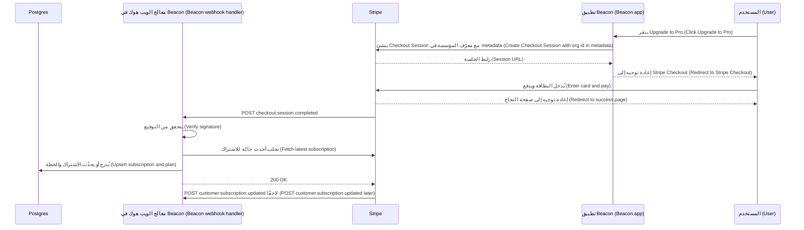
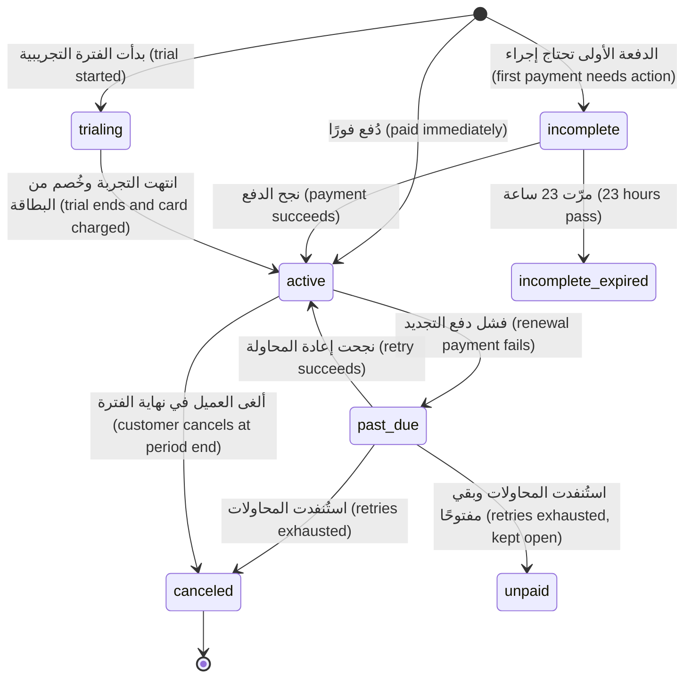
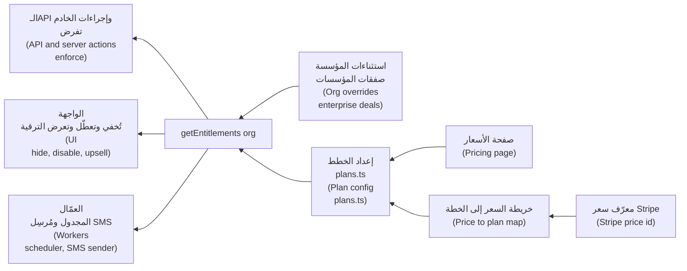
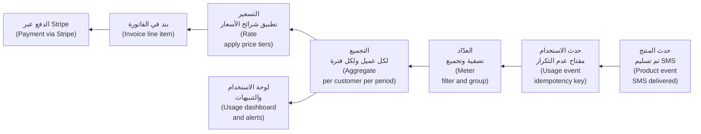

# الوحدة 3 (Module 3) — المال (money)

*في هذه الوحدة (module) تكلّف الأخطاءُ (bugs) مالًا حقيقيًا: عملاء دفعوا ولم يحصلوا على شيء، أو عملاء توقفوا عن الدفع (payment) واحتفظوا بكل شيء. نبدأ بالاشتراكات (subscriptions) والمزامنة القائمة على الويب هوك (webhook-driven sync) التي تُبقي قاعدة بياناتك (database) صادقة، ثم نحوّل صفحة الأسعار (pricing page) إلى فحوص استحقاق (entitlement checks) يستطيع الكود فرضها، وننتهي بالفوترة حسب الاستخدام (usage-based billing)، حيث يصبح كل حدث (event) بندًا (line item) في فاتورة (invoice) أحد العملاء (customers). سيحصل Beacon على خططه (plans) الثلاث Free وPro وBusiness، إضافةً إلى رسائل SMS المُقاسة (metered).*

> **التطبيق العملي (Practice):** ابدأ من [نسخة البداية (starter) من Beacon](https://github.com/Tamoura/system-design-for-vibe-coders/tree/beacon/starter)، وحلّ التمارين قبل النظر إلى [الحل المرجعي (reference solution) لهذه الوحدة (module)](https://github.com/Tamoura/system-design-for-vibe-coders/tree/beacon/module-3-solution) (الفرع (branch) `beacon/module-3-solution`).

---

# 3.1 — الاشتراكات والمدفوعات (Subscriptions and payments): صفحة الدفع (checkout)، والويب هوك (webhook)، وبوابة العميل (customer portal)
*المستوى (Level): 🟢 مبتدئ (Beginner)* · *المتطلبات (Prerequisites): 1.2، 2.1*

## ⚡ الدرس في دقيقة (In 60 seconds)

- الاشتراك (Subscription) هو عميل (customer) يدفع سعرًا (price) محددًا كل فترة (period). مزوّد الدفع (payment provider) يملك الحقيقة (truth) عن المال (money)، وقاعدة بياناتك (database) تحتفظ بنسخة منها.
- القاعدة الأهم (The rule that matters): امنح الصلاحيات (access) من الويب هوك (Webhook) بعد التحقق (verification) منه، ولا تمنحها أبدًا من إعادة التوجيه (redirect) إلى صفحة النجاح (success page).
- الخيار الافتراضي للإصدار الأول (v1 default): صفحة الدفع المستضافة (Checkout) وبوابة العميل المستضافة (Customer Portal) من Stripe، مع ربط عميل Stripe (Stripe Customer) بالمؤسسة (organization) لا بالمستخدم.
- معالج الويب هوك (webhook handler) يتحقق من التوقيع (signature) على جسم الطلب الخام (raw body)، ويحذف التكرار (dedupes) حسب معرّف الحدث (event ID)، ويجلب الحالة الحالية (current state) من جديد، ثم يردّ بـ 2xx بسرعة.
- الفخ الأكبر (The big trap): أن تعدّ `active` الحالة المدفوعة (paid status) الوحيدة، فتمنع عملاء (customers) `trialing` من الدخول وتعامل `past_due` كأنها `canceled`.

## 🧭 لماذا يحتاجه كل SaaS (Why every SaaS has this)

يطلق Beacon خطة (plan) Pro (Pro plan) بسعر (price) 29 دولارًا شهريًا. الإصدار الأول (v1) هو ما يكتبه الجميع في اليوم الأول: زر "Buy" يرسل المستخدم إلى Stripe، ثم يعيد Stripe توجيهه إلى `/billing?success=true`، وتلك الصفحة تنفّذ `UPDATE organizations SET plan = 'pro'`. يعمل هذا في العرض التجريبي (demo).

ثم يبدأ الواقع. يدفع عميلٌ (customer) ويغلق التبويب (tab) قبل اكتمال إعادة التوجيه (redirect)، فيُخصم (charged) منه المبلغ ويبقى على خطة (plan) Free. ويلاحظ شخص آخر رابط النجاح (success URL) فيزوره يدويًا، فيحصل على Pro دون أن يدفع. وبعد ثلاثة أشهر تنتهي صلاحية بطاقة (card) عميل ويفشل التجديد (renewal). لا شيء في Beacon يعلم بذلك، فيبقى على Pro إلى الأبد. وأصبح فريق الدعم (support) الآن يقرأ لوحة تحكم (dashboard) Stripe ويعدّل صفوف (rows) قاعدة البيانات (database) يدويًا.

الحل لا يكمن في معالجة أذكى لإعادة التوجيه (redirect)، لأن إعادة التوجيه مجرد تجربة مستخدم (UX). مزوّد الدفع (payment provider) يخبرك بما حدث (what happened) عبر **الويب هوك (Webhook)**: طلبات (requests) HTTP POST موقّعة (signed) يرسلها إلى خادمك (server) عندما يتغير شيء. يعيد Stripe محاولة تسليم الويب هوك (webhook delivery) الفاشل مدةً تصل إلى ثلاثة أيام في الوضع الحي (live mode)، لذلك يحصل حتى المعالج (handler) المعيب على فرصة ثانية، بشرط أن يفشل بوضوح بدل أن يردّ بـ `200 OK` ويُسقط الحدث (event).

**مزوّد الدفع (payment provider) يملك الحقيقة (truth) عن المال (money)، وقاعدة بياناتك (your database) تحتفظ بنسخة مخزّنة (cached copy) منها يُبقيها الويب هوك (webhook) متزامنة (in sync)، وليس العكس أبدًا.**

## 📐 كيف يعمل (How it works)

### 🟢 الأساسيات (The essentials)

يستخدم معظم المزوّدين (providers) مفردات Stripe (Stripe's vocabulary) نفسها، لذلك تعلّمها مرة واحدة. تستخدم Paddle وLemon Squeezy وPolar أسماءً مشابهة.

| الكائن (object) | ما هو | مثال من Beacon (Beacon example) |
|---|---|---|
| **Customer** (العميل (customer)) | الجهة التي تدفع، مع بريدها ووسائل الدفع (payment methods) والمعلومات الضريبية (tax info) | عميل (customer) واحد لكل **مؤسسة (org)** في Beacon، لا لكل مستخدم |
| **Product** (المنتج (product)) | الشيء الذي تبيعه | "Beacon Pro" |
| **Price** (السعر (price)) | كم، وكل كم، وبأي عملة (currency). هو ثابت عمليًا: لتغيير المبلغ تنشئ Price جديدًا | 29 دولارًا شهريًا؛ 290 دولارًا سنويًا |
| **Subscription** (الاشتراك (subscription)) | عميل (customer) على سعر (price) واحد أو أكثر، يتجدد كل فترة (period)، وله `status` | شركة Acme على Pro الشهرية، `active` |
| **Invoice** (الفاتورة (invoice)) | الفاتورة (invoice) التي تُنشأ كل فترة (أو عند التغييرات) | فاتورة (invoice) مايو 2026، 29 دولارًا، مدفوعة |
| **PaymentIntent** (نية الدفع (PaymentIntent)) | محاولة واحدة لتحصيل (collection) المال (money)، قد تحتاج 3-D Secure أو إعادة محاولة (retry) أو بطاقة (card) جديدة | عملية الخصم (the charge) خلف تلك الفاتورة (invoice) |
| **Checkout Session** (جلسة الدفع (Checkout Session)) | صفحة دفع مستضافة (hosted payment page) يشغّلها Stripe نيابةً عنك | المكان الذي يذهب إليه الناس عند "Upgrade to Pro" |
| **Billing Portal Session** (جلسة بوابة الفوترة (Billing Portal Session)) | صفحة خدمة ذاتية (self-service) مستضافة للبطاقات (cards) والفواتير (invoices) وتغيير الخطة (plan changes) والإلغاء (cancellation) | Settings → Billing → "Manage billing" |

قراران يجعلان الإصدار الأول (v1) آمنًا لفريق مبتدئ (Beginner).

**استخدم صفحة الدفع المستضافة (Checkout) وبوابة العميل المستضافة (Customer Portal).** نماذج البطاقات (card forms)، و3-D Secure / SCA (المصادقة القوية للعميل (Strong Customer Authentication)، وهي القاعدة (rule) الأوروبية التي تفرض خطوة تحقق (verify) إضافية)، وApple Pay، وجمع العناوين (address collection)، وحقول الرقم الضريبي (tax ID fields)، وتنزيل الفواتير (invoice downloads) كلها مشكلات محلولة. لا تريد أن تقترب أرقام البطاقات (cards) من خوادمك (your servers). ومع الصفحات المستضافة يبقى نطاق PCI DSS (PCI DSS scope) الخاص بك (معيار أمان صناعة البطاقات (Payment Card Industry Data Security Standard)) في أخف مستوياته. يمكنك بناء نماذج مدمجة (embedded forms) لاحقًا إن أظهرت بيانات التحويل (conversion data) أن ذلك يستحق.

**عامل الويب هوك (webhook) على أنه مصدر الحقيقة (source of truth).** إعادة التوجيه (redirect) تعرض فقط شاشة "شكرًا، نحن نؤكد دفعتك". أما الصلاحيات (access) فتتغير عندما يصل الويب هوك.


```mermaid
sequenceDiagram
    participant DB as Postgres
    participant W as معالج الويب هوك في Beacon (Beacon webhook handler)
    participant S as Stripe
    participant B as تطبيق Beacon (Beacon app)
    participant U as المستخدم (User)
    U->>B: ينقر Upgrade to Pro (Click Upgrade to Pro)
    B->>S: ينشئ Checkout Session مع معرّف المؤسسة في metadata (Create Checkout Session with org id in metadata)
    S-->>B: رابط الجلسة (Session URL)
    B-->>U: إعادة توجيه إلى Stripe Checkout (Redirect to Stripe Checkout)
    U->>S: يُدخل البطاقة ويدفع (Enter card and pay)
    S-->>U: إعادة توجيه إلى صفحة النجاح (Redirect to success page)
    S->>W: POST checkout.session.completed
    W->>W: يتحقق من التوقيع (Verify signature)
    W->>S: يجلب أحدث حالة للاشتراك (Fetch latest subscription)
    W->>DB: يُدرج أو يحدّث الاشتراك والخطة (Upsert subscription and plan)
    W-->>S: 200 OK
    S->>W: POST customer.subscription.updated لاحقًا (POST customer.subscription.updated later)
```

للمعالج (handler) ثلاث مهام، بهذا الترتيب:

1. **تحقق (verify) من التوقيع (signature).** يستطيع أي شخص على الإنترنت إرسال POST إلى `/api/stripe/webhook`. يوقّع Stripe كل تسليم (delivery) بسرّ نقطة النهاية (endpoint's secret) الخاصة بك (قيمة HMAC في ترويسة (header) `Stripe-Signature`، مع طابع زمني (timestamp) لمنع إعادة الإرسال (replay)). الدالة `constructEvent` في الـSDK تتحقق منه، لكن فقط مقابل **جسم الطلب الخام (raw body)**. إذا حلّل إطار العمل (framework) JSON أولًا، تتغير البايتات ويفشل التحقق (verification). هذا أشهر خطأ في هذا الدرس.
2. **احذف التكرار (dedupe).** قد يسلّم Stripe الحدث (event) نفسه أكثر من مرة. سجّل `event.id` مع قيد تفرّد (Unique Constraint) وتجاوز الأحداث (events) التي عالجتها سابقًا.
3. **زامن (sync)، ثم ردّ بـ 2xx بسرعة.** حدّث نسختك (update your copy) من الاشتراك (subscription) وأرسل الرد (response). يتوقع Stripe ردًا سريعًا، وأي عمل بطيء مكانه مهمة خلفية (Background Job) (انظر 5.1).

```ts
// app/api/stripe/webhook/route.ts
export async function POST(req: Request) {
  const body = await req.text(); // raw body, never req.json()
  const sig = req.headers.get("stripe-signature") ?? "";
  let event: Stripe.Event;
  try {
    event = stripe.webhooks.constructEvent(body, sig, process.env.STRIPE_WEBHOOK_SECRET!);
  } catch {
    return new Response("bad signature", { status: 400 });
  }
  const firstTime = await db.insertIgnore("stripe_events", { id: event.id, type: event.type });
  if (!firstTime) return new Response("duplicate", { status: 200 });

  const obj = event.data.object as { customer?: string | { id: string } };
  const customerId = typeof obj.customer === "string" ? obj.customer : obj.customer?.id;
  if (customerId) await syncCustomerFromStripe(customerId); // fetch fresh state, upsert
  return new Response("ok", { status: 200 });
}
```

في Django يأخذ الشكل نفسه صورة view عليها `csrf_exempt` وتقرأ `request.body`. وفي Rails اقرأ `request.raw_post`. وفي Laravel تأتي Cashier مع متحكم ويب هوك (webhook controller) يفعل هذا نيابةً عنك.

خزّن معرّف `customer` من Stripe في صف (row) **المؤسسة (org)**. ففي B2B تدفع مساحة العمل (workspace)، لا الشخص الذي صادف أنه نقر الزر. وقد يغادر ذلك الشخص الشركة الشهر القادم (انظر 1.2).

### 🟡 التعمق أكثر (Going deeper)

**الأحداث تصل بترتيب غير مضمون (Events arrive out of order).** لا يضمن Stripe الترتيب. قد يصلك `customer.subscription.updated` قبل `customer.subscription.created`، أو حدث (event) `updated` قديم بعد حدث أحدث منه. إذا كتب كل معالج (handler) الحمولة (payload) التي استلمها دون تفكير، فقد يطمس حدث قديم حالةً حديثة ويلغي اشتراك (subscription) عميل (customer) يدفع. هناك حلّان جيدان:

- **اجلب من جديد، ولا تثق بالحمولة (Refetch, don't trust the payload).** استخدم الحدث (event) إشارةً فقط إلى أن "شيئًا تغيّر للعميل (customer) X"، ثم اطلب الحالة الحالية (current state) من الـAPI وأدرجها أو حدّثها (upsert). معالج الويب هوك (webhook handler) في Documenso يقول هذا في تعليق: لا يُوثق بالحمولة (payload) إلا لاستخراج معرّف العميل (customer ID). الكلفة (cost) طلب API إضافي (extra API call) لكل حدث، والمكسب إزالة فئة كاملة من الأخطاء.
- **قارن الطوابع الزمنية (Compare timestamps).** خزّن `event.created` لآخر حدث (event) طُبّق على كل اشتراك (subscription) وتجاهل ما هو أقدم منه. هذا أرخص، لكن الخطأ فيه أسهل وأخفى.

**عدم التأثر بالتكرار (Idempotency) يعمل في الاتجاهين.** حذف تكرار الأحداث الواردة (deduplicating incoming events) هو نصف المسألة. أما في الطلبات الصادرة (outbound calls) (إنشاء عميل (customer) أو اشتراك (subscription) أو استرداد مبلغ (refund)) فمرّر ترويسة (header) `Idempotency-Key`. إذا انتهت مهلة (times out) طلبك وأعدت المحاولة، يعيد Stripe النتيجة الأصلية بدل إنشاء نتيجة ثانية. يحتفظ Stripe بالمفاتيح (keys) 24 ساعة على الأقل. اشتقّ المفتاح (key) من نيّتك أنت، مثل `refund:{ticketId}`، لا من UUID عشوائي يُولَّد داخل حلقة إعادة المحاولة (retry loop).

**حالة الاشتراك (subscription status) آلة حالات (State Machine).** صمّمها على هذا الأساس، ثم قرّر ماذا تعني كل حالة (each status) بالنسبة للصلاحيات (access).


```mermaid
stateDiagram-v2
    [*] --> incomplete : الدفعة الأولى تحتاج إجراء (first payment needs action)
    [*] --> trialing : بدأت الفترة التجريبية (trial started)
    [*] --> active : دُفع فورًا (paid immediately)
    incomplete --> active : نجح الدفع (payment succeeds)
    incomplete --> incomplete_expired : مرّت 23 ساعة (23 hours pass)
    trialing --> active : انتهت التجربة وخُصم من البطاقة (trial ends and card charged)
    active --> past_due : فشل دفع التجديد (renewal payment fails)
    past_due --> active : نجحت إعادة المحاولة (retry succeeds)
    past_due --> canceled : استُنفدت المحاولات (retries exhausted)
    past_due --> unpaid : استُنفدت المحاولات وبقي مفتوحًا (retries exhausted, kept open)
    active --> canceled : ألغى العميل في نهاية الفترة (customer cancels at period end)
    canceled --> [*]
```

| حالة Stripe (Stripe status) | صلاحيات Beacon (Beacon access) | تجربة المستخدم (UX) |
|---|---|---|
| `trialing`، `active` | الخطة (plan) كاملة | عادية |
| `past_due` | الخطة (plan) كاملة خلال فترة سماح (grace period) | شريط أحمر (red banner): "حدّث بطاقتك (Update your card)" |
| `unpaid`، `canceled`، `incomplete_expired` | النزول إلى حدود Free (انظر 3.2) | بريد "انتهت خطتك (your plan)" |
| `incomplete` | لا ترقية (upgrade) بعد | تنبيه (alert) "أكمل الدفع (payment)" |

**الفترات التجريبية (trials).** لديك خياران. الفترة التجريبية (trial) **دون بطاقة (card)** تجلب تسجيلات (signups) أكثر وتحويلات (conversions) أقل. والفترة التجريبية (trial period) **مع بطاقة** تتحول إلى اشتراك مدفوع (paid subscription) تلقائيًا. يرسل Stripe الحدث (event) `customer.subscription.trial_will_end` قبل انتهاء التجربة بثلاثة أيام، فاربط به بريد التذكير (reminder email).

**التناسب (Proration).** عندما تنتقل Acme من Pro إلى Business في منتصف الشهر، يعيد Stripe افتراضيًا قيمة وقت Pro غير المستخدم رصيدًا (credit) ويخصم (charged) قيمة وقت Business بالتناسب (prorated). يتحكم في هذا المعامل `proration_behavior` (`create_prorations`، `always_invoice`، `none`). سياسة (policy) شائعة: الترقيات (upgrades) تسري الآن وتُفوتر فورًا، والتخفيضات (downgrades) تسري في نهاية الفترة (period end)، باستخدام جداول الاشتراك (Subscription Schedules) أو إعداد "at period end" في البوابة (portal). التخفيض الفوري (immediate downgrade) يعني استرداد مبالغ (refunds)، ولا أحد يستمتع بذلك.

**التحصيل المتعثر (Dunning)** هو عملية استرداد المدفوعات الفاشلة (failed payments). البطاقات (cards) تنتهي صلاحيتها، والبنوك ترفض، والحدود (limits) تُستنفد. فعّل إعادة المحاولة التلقائية (automatic retries) لدى المزوّد (يسمّي Stripe نسخته المُوقّتة بالتعلم الآلي Smart Retries) ورسائل البريد الخاصة بالدفع (payment) الفاشل، وضع رابط البوابة (portal link) في رسائلك أنت. حدّد فترة السماح (grace period) صراحةً. واستمع أيضًا إلى `invoice.payment_failed`، لأنه المكان الذي تبدأ منه الشريط (banner) والعدّ التنازلي (countdown).

**الاسترداد والنزاعات (disputes).** استرداد المبلغ (refund) لا يلغي الاشتراك (subscription)، والإلغاء (cancellation) لا يسترد المبلغ. هما طلبا API (two API calls) منفصلان، لذلك اجعل أدوات الدعم (support tooling) لديك (7.1) تنفّذ الاثنين عن قصد. والنزاع (Chargeback) يصل على شكل `charge.dispute.created`. لديك مهلة محدودة لتقديم الأدلة (evidence)، والنزاعات تكلّف رسومًا (fee) حتى لو ربحتها.

| الحدث (event) | ماذا يفعل Beacon (What Beacon does) |
|---|---|
| `checkout.session.completed` | يربط العميل (customer) بالمؤسسة (عبر `metadata` أو `client_reference_id`)، ثم يزامن |
| `customer.subscription.created` / `updated` / `deleted` | يزامن الحالة والسعر (price) و`current_period_end` و`cancel_at_period_end` |
| `invoice.paid` | يسجّل الدفعة (payment)، ويزيل شريط التحصيل المتعثر (dunning banner)، ويصفّر العدّادات الشهرية (monthly counters) (3.3) |
| `invoice.payment_failed` | يبدأ فترة السماح (grace period)، ويراسل المالكين (owners) ومسؤولي الفوترة (billing admins) |
| `customer.subscription.trial_will_end` | يرسل بريد "التجربة (trial) على وشك الانتهاء" |
| `charge.refunded`، `charge.dispute.created` | يُبلغ فريق المالية (finance)، ويضع علامة مراجعة على الحساب (flags the account for review) |

### 🔴 على نطاق واسع وللمؤسسات (At scale / enterprise)

**الضرائب (tax).** عندما تبيع لشركات ومستهلكين في دول كثيرة، تصبح مدينًا بضريبة القيمة المضافة (VAT/GST) في بعضها، وبضريبة المبيعات (sales tax) الأمريكية في الولايات التي تتجاوز فيها عتبات الارتباط الاقتصادي (Economic Nexus) (وهي نتيجة لحكم *South Dakota v. Wayfair* عام 2018). هناك طريقتان للتعامل مع ذلك:

| | معالج الدفع (Stripe، Adyen، Braintree) | التاجر المسجّل (Merchant of Record): Paddle، Lemon Squeezy، Polar |
|---|---|---|
| من البائع قانونيًا (Who is the seller legally) | أنت | التاجر المسجّل (Merchant of Record) يعيد بيع منتجك (your product) |
| من يحسب الضريبة (tax) ويحصّلها ويقدّم إقراراتها (filing) ويسدّدها | أنت (يساعد Stripe Tax في الحساب والتحصيل (calculate and collect)، أما تقديم الإقرارات (filing) فيبقى عليك أو على شريك) | التاجر المسجّل (Merchant of Record) |
| الرسوم (fees) | أقل لكل عملية | أعلى، لأنها تشمل عمل الضرائب (tax) والامتثال (compliance) |
| التحكم (control) | API كامل، وأي نموذج تسعير (pricing model)، وفواتير (invoices) باسمك | مرونة أقل، والفواتير (invoices) باسمهم |
| مناسب لـ (Good for) | فرق لديها دعم مالي، وB2B مع فوترة للمؤسسات (enterprise invoicing) | المؤسسين المنفردين (solo founders) والفرق الصغيرة التي تبيع عالميًا |

استحوذت Stripe على Lemon Squeezy عام 2024. وPolar مفتوح المصدر (Apache-2.0)، لكن المسؤولية الضريبية (tax liability) تقع على الشركة التي تشغّله، لذلك فإن استضافة كود Polar بنفسك لا تجعلك تاجرًا مسجّلًا (Merchant of Record). الكيان القانوني (legal entity) هو المنتج (product).

**فوترة المؤسسات (enterprise invoicing).** عملاء (customers) فئة Business (Business tier) يريدون عقودًا سنوية (annual contracts)، وأوامر شراء (purchase orders)، وتحويلات بنكية (bank transfers) بشروط net-30، لا بطاقة (card). يدعم Stripe الخيار `collection_method: send_invoice` مع `days_until_due`. ومنطق الصلاحيات (access logic) لديك يجب أن يتعامل مع حالة "أُرسلت الفاتورة (invoice)، ولم تُدفع بعد، وما زال مستحقًا".

**بنية الويب هوك (webhook plumbing).** عند الأحجام الكبيرة (high volume)، يجب أن يتحقق المعالج (handler) من الحدث (event)، ويحفظ الحدث الخام (raw event)، ويضعه في الطابور (Queue)، ثم يردّ بـ `200`. بعدها يعالج عاملٌ (Worker) الأحداث (events) مع إعادة المحاولة (نمط "صندوق الوارد" (Inbox)، انظر 5.1 و5.3). أضف **مهمة مطابقة ليلية (Reconciliation)** تسرد الاشتراكات (subscriptions) من المزوّد (provider) وتقارنها بجدولك. ستجد الأحداث التي فاتتك أثناء انقطاع الخدمة (outage)، وستكشف حالة "أحدهم عدّل الاشتراك (subscription) من لوحة التحكم (dashboard)".

**اختبار الزمن (Testing time).** التجديدات (renewals) والفترات التجريبية (trials) والتحصيل المتعثر (dunning) تحدث على مدى أسابيع. تتيح لك **ساعات الاختبار (Test Clocks)** في Stripe تقديم الزمن لعميل تجريبي (test customer). استخدمها في CI لتثبت أن مسار "انتهت التجربة (trial)، فشلت البطاقة (card)، فترة السماح (grace period)، النزول" يعمل دون أن تنتظر شهرًا. وأداة Stripe CLI (`stripe listen --forward-to`) تمرّر أحداث (events) الويب هوك (webhook) الحقيقية في وضع الاختبار (test mode) إلى localhost.

## 🏆 أفضل المستودعات (The best repos)

| المستودع (repo) | ما هو | التقنيات (Stack) | الترخيص (license) | اختره عندما (Pick it when) |
|---|---|---|---|---|
| [stripe/stripe-node](https://github.com/stripe/stripe-node) | الـSDK الرسمي (official SDK) لـStripe، مع أحداث مُنمّطة (typed events) والتحقق (verification) من الويب هوك (webhook) | TypeScript/Node | MIT | تستخدم Stripe من Node، وهذا حال معظم القرّاء |
| [stripe/stripe-cli](https://github.com/stripe/stripe-cli) | يمرّر الويب هوك (webhook) إلى localhost، ويطلق أحداثًا تجريبية (test events)، ويتابع السجلات (logs) | Go | Apache-2.0 | دائمًا، أثناء التطوير (development) |
| [nextjs/saas-starter](https://github.com/nextjs/saas-starter) | تطبيق SaaS مصغّر بـNext.js مع Checkout والبوابة (portal) ومسار ويب هوك (webhook route) على مستوى الفرق | Next.js, Drizzle, Postgres | MIT | تريد أصغر مثال صحيح تقرؤه في ساعة |
| [wasp-lang/open-saas](https://github.com/wasp-lang/open-saas) | قالب SaaS (template) يضع Stripe وLemon Squeezy وPolar خلف واجهة واحدة (one interface) لمعالج الدفع (payment processor) | Wasp, React, Node, Prisma | MIT | تريد أن ترى معالج الدفع (payment processor) والتاجر المسجّل (Merchant of Record) جنبًا إلى جنب |
| [laravel/cashier-stripe](https://github.com/laravel/cashier-stripe) | طبقة فوترة الاشتراكات (subscription billing layer) في Laravel، مع متحكم ويب هوك (webhook controller) وفترات تجريبية وتبديل الخطط (plan switching) والفواتير (invoices) | PHP/Laravel | MIT | تعمل بـLaravel، أو تريد التعلم من API اشتراكات (subscriptions) مصمَّم جيدًا |
| [pay-rails/pay](https://github.com/pay-rails/pay) | محرك مدفوعات (payments engine) لـRails يدعم Stripe وPaddle وBraintree وLemon Squeezy | Ruby/Rails | MIT | تعمل بـRails |
| [dj-stripe/dj-stripe](https://github.com/dj-stripe/dj-stripe) | يزامن كائنات Stripe (Stripe objects) إلى نماذج Django (models) عبر الويب هوك (webhook) | Python/Django | MIT | تعمل بـDjango وتريد نسخة محلية (local copy) من بيانات Stripe |
| [polarsource/polar](https://github.com/polarsource/polar) | منصة (platform) تاجر مسجّل (Merchant of Record) مفتوحة المصدر (open-source)، مع الدفع (payment) والاشتراكات (subscriptions) والمزايا (benefits) والفوترة حسب الاستخدام (usage-based billing) | Python (FastAPI), Next.js | Apache-2.0 | تريد تاجرًا مسجّلًا (Merchant of Record)، أو تريد أن تقرأ كيف يُبنى |
| [killbill/killbill](https://github.com/killbill/killbill) | محرك فوترة (billing engine) اشتراكات (subscriptions) وإصدار فواتير (invoices) تستضيفه بنفسك | Java | Apache-2.0 | تحتاج منطق فوترة (billing logic) تملكه وتشغّله، مع أي معالج دفع (payment processor) خلفه |

**إن درست مستودعًا واحدًا فقط (If you study one repo):** اقرأ `nextjs/saas-starter`. إنه صغير بما يكفي لتفهمه كاملًا. فيه مسار دفع (checkout route) واحد، ومسار ويب هوك (webhook route) واحد، ودالة واحدة تنقل اشتراك (subscription) Stripe إلى صف (row) الفريق. عندما يتضح لك، سترى الهيكل (structure) نفسه داخل كل قاعدة كود (codebase) أكبر في هذا الدرس.

**اشترِ أم ابنِ أم استضف بنفسك ⁦(Buy, build, or self-host?)⁩؟**

- **اشترِ (الخيار الافتراضي (default)):** Stripe Billing مع Checkout وبوابة العميل (customer portal). وإن كنت تفضّل ألا تتعامل مع ضريبة المبيعات العالمية (global sales tax)، فاستخدم تاجرًا مسجّلًا (Merchant of Record): Paddle أو Lemon Squeezy أو Polar. في سنة Beacon الأولى، اختر واحدًا منها وامضِ.
- **استضف بنفسك (Self-host):** Kill Bill أو Lago (3.3) عندما يكون منطق الفوترة (billing logic) جوهريًا في عملك، أو لديك عقود غير معتادة، أو تريد أن تبقى مستقلًا عن أي معالج دفع (payment processor) بعينه. ستظل بحاجة إلى معالج دفع (processor) لنقل المال (money).
- **ابنِ:** الطبقة الرقيقة (thin layer) فقط: جدول `subscriptions` الخاص بك، ومزامنة الويب هوك (webhook sync)، وربط السعر بالخطة (price-to-plan mapping). لا تتعامل مع البطاقات (cards) بنفسك أبدًا، ولا تبنِ محرك ضرائب (tax engine) خاصًا بك أبدًا.

## 🔍 ادرسه في مشاريع حقيقية (Study it in the wild)

**Dub (`dubinc/dub`).** يوجد ويب هوك (webhook) Stripe في Dub، وقت كتابة هذا الدرس، تحت `apps/web/app/(ee)/api/stripe/webhook/`. إنه ملف `route.ts` يتحقق من التوقيع (signature)، ويحتفظ بقائمة سماح (allowlist) بأنواع الأحداث (event types) المهمة، ويوزّعها على **ملف لكل حدث (file per event)** (`checkout-session-completed.ts`، `customer-subscription-updated.ts`، `invoice-payment-failed.tsx`، `charge-refunded.ts`…). هذا نموذج (model) جيد لإبقاء معالج (handler) متنامٍ مقروءًا. انظر إلى الدالة المساعدة (helper) التي تشتق حدود مساحة العمل (workspace limits) من اشتراك (subscription) Stripe (ابحث عن `getWorkspaceLimitsFromStripeSubscription`). ستجد فيها أثر الفترات التجريبية (trials) والفوترة السنوية (annual billing) على الحدود (limits).

**Documenso (`documenso/documenso`).** ابحث عن `stripeWebhookHandler`. يسرد أنواع الأحداث (event types) التي تطلق المزامنة (sync)، ويستخرج معرّف العميل (customer ID) فقط، ويستدعي دالة واحدة `syncStripeCustomerSubscription` تجلب الحقيقة (truth) الحالية من Stripe. هذا نمط "اجلب من جديد، ولا تثق بالحمولة (Refetch, don't trust the payload)" في نحو مئة سطر. وبجواره دوال مساعدة (helpers) للدفع (payment) والبوابة (portal) وكمية المقاعد (seat quantity) (ابحث عن `get-portal-session`، `update-subscription-item-quantity`).

**Open SaaS (`wasp-lang/open-saas`).** تحت `template/app/src/payment/` وقت كتابة هذا الدرس، توجد المجلدات `stripe/` و`lemonSqueezy/` و`polar/` خلف واجهة (UI) `paymentProcessor` واحدة. إنها أسرع طريقة لترى ما يختلف في الكود بين معالج الدفع (payment processor) والتاجر المسجّل (Merchant of Record)، وما لا يختلف.

**ما الذي تلاحظه (What to notice)**

- أين يُخزَّن معرّف عميل Stripe (المستخدم، الفريق، المؤسسة (org)) ولماذا.
- هل تثق المعالجات (handlers) بحمولة الأحداث (event payloads) أم تجلب البيانات من الـAPI من جديد.
- كيف تردّ على أنواع الأحداث (event types) التي لا تهمها. تلميح: `200` لا `400`، وإلا سيستمر Stripe في إعادة المحاولة (retries).
- كيف تُعامَل حالة `past_due`: إيقاف فوري، أم فترة سماح (grace period)، أم شريط تنبيه (warning banner) فقط.
- إلى أي حد (how far) يعتمد التطبيق على البوابة المستضافة (hosted portal) بدل بناء واجهة فوترة (billing UI) خاصة به.

## 🛠️ ابنِه في Beacon (Build it into Beacon)

### 🟢 تمرين المبتدئ (Beginner exercise)

أضف Stripe Checkout وبوابة العميل (customer portal) إلى صفحة إعدادات الفوترة (billing settings page) في Beacon. أنشئ منتج (product) Pro مع سعر شهري (monthly price) في وضع الاختبار (test mode). زر "Upgrade" ينشئ Checkout Session مع معرّف المؤسسة (org ID) في `client_reference_id` أو `metadata`. وزر "Manage billing" يفتح جلسة بوابة (portal session) لعميل (customer) المؤسسة (org).

**يكتمل عندما (Done when):**
- يستطيع مالك المؤسسة (owner) الترقية (upgrade) ببطاقة الاختبار (test card) `4242 4242 4242 4242` والعودة إلى Beacon.
- تعرض صفحة النجاح (success page) "جارٍ التأكيد…" ولا تغيّر الخطة (plan) بنفسها.
- يفتح "Manage billing" البوابة (portal)، حيث يستطيع المالك (owner) تحديث البطاقة (card) والإلغاء (cancellation).
- لا يرى غير المالكين (non-owners) أزرار الفوترة (أعد استخدام فحص الصلاحيات (permission check) من 1.3).

### 🟡 تمرين المستوى المتوسط (Intermediate exercise)

اكتب معالج الويب هوك (webhook handler): تحقق (verify) من التوقيع (signature) على الجسم الخام (raw body)، وجدول `stripe_events` بعمود (column) `id` فريد لحذف التكرار (for deduplication)، ودالة `syncCustomerFromStripe(customerId)` تجلب اشتراكات (subscriptions) العميل (customer) وتُدرج أو تحدّث صفًا (row) في `subscriptions` (الحالة، ومعرّف السعر (Price ID)، ونهاية الفترة الحالية (current period end)، والإلغاء في نهاية الفترة (cancel at period end)). استخدم `stripe listen --forward-to localhost:3000/api/stripe/webhook` محليًا.

**يكتمل عندما (Done when):**
- إرسال الحدث (event) نفسه مرتين (`stripe events resend`) لا يغيّر شيئًا في المرة الثانية.
- الطلب (request) ذو الجسم المُعدَّل (tampered body) يحصل على `400`، والطلب الصحيح يحصل على `200`.
- الإلغاء (cancellation) من البوابة (portal) يضبط `cancel_at_period_end = true` في جدولك خلال ثوانٍ.
- حذف صف (row) `subscriptions` ثم إعادة إرسال أي حدث (event) يستعيده بشكل صحيح.

### 🔴 تمرين المستوى المتقدم (Advanced exercise)

نفّذ دورة الحياة (lifecycle) كاملة باستخدام **ساعة اختبار (test clock)** من Stripe: فترة تجريبية (trial) مدتها 14 يومًا مع بطاقة (card)، ثم التحويل إلى اشتراك مدفوع (conversion to paid)، ثم تجديد فاشل (استخدم بطاقة اختبار (test card) تُرفض)، ثم فترة سماح (grace period) مدتها 7 أيام مع شريط تنبيه (warning banner)، ثم نزول تلقائي إلى Free. أضف مهمة مطابقة ليلية (nightly reconciliation job) تسرد كل اشتراكات (subscriptions) Stripe وتبلّغ عن أي اختلاف مع جدولك.

**يكتمل عندما (Done when):**
- تقديم ساعة الاختبار (test clock) يمرّر Beacon عبر `trialing → active → past_due → canceled` دون أي خطوات يدوية.
- يظهر شريط لوحة التحكم (dashboard banner) أثناء `past_due` ويختفي بعد تحديث البطاقة (card) بنجاح.
- إفساد صف (row) يدويًا (ضبط مؤسسة (org) ملغاة على `active`) تبلّغ عنه مهمة المطابقة (reconciliation job) في تشغيلها التالي.
- يغطي اختبار تكامل (integration test) المسار كاملًا.

## ⚠️ أخطاء يقع فيها المبتدئون (Mistakes juniors make)

- **منح الصلاحيات (granting access) عند إعادة التوجيه (redirect) إلى صفحة النجاح (success page).** إعادة التوجيه يمكن تخطيها أو تكرارها أو تزويرها. امنح الصلاحيات (access) من الويب هوك (webhook)، واستخدم إعادة التوجيه للرسائل فقط.
- **تحليل JSON قبل التحقق (verification) من التوقيع (signature).** محللات الجسم (body parsers) في أطر العمل (frameworks) تغيّر المسافات وترتيب المفاتيح (keys)، فيفشل التحقق. والأسوأ أن "يصلحه" أحدهم بتخطي التحقق. اقرأ الجسم الخام (raw body) في مسار الويب هوك (webhook route) وحده.
- **الرد (response) بـ 500 على أنواع أحداث لا تعالجها.** يعيد Stripe محاولتها أيامًا، ثم يعطّل نقطة النهاية (endpoint) في النهاية. ردّ بـ `200` على كل ما تتجاهله، واشترك فقط في الأحداث (events) التي تحتاجها.
- **ربط عميل Stripe (Stripe Customer) بالمستخدم بدل المؤسسة (org).** عندما يغادر المؤسس الذي دفع، تغادر معه فوترة مساحة العمل (workspace billing). في B2B، المؤسسة هي العميل (customer).
- **كتابة `if (status === "active")` مباشرةً.** هذا يمنع عملاء (customers) `trialing` من الدخول ويعامل `past_due` مثل `canceled`. اربط كل حالة (each status) بقرار صلاحيات (access decision) في دالة واحدة.
- **جعل المعالج (handler) ينفّذ كل شيء داخل الطلب (request).** إرسال ثلاث رسائل بريد وإعادة حساب الحدود (recomputing limits) داخل الطلب يؤدي إلى انتهاء المهلة (timeout)، وانتهاء المهلة يؤدي إلى إعادة المحاولة (retries) ورسائل مكررة. زامن (sync) الصف (row)، وضع الباقي في الطابور (queue).
- **اختبار (test) الفوترة (billing) على المسار السعيد (happy path) فقط.** الأخطاء المكلفة تعيش في التجديدات (renewals) والإخفاقات والإلغاءات. استخدم ساعات الاختبار (test clocks) وبطاقات الاختبار المرفوضة (declined test cards).

## 🧾 الخلاصة (Recap)

- تعلّم الأسماء (Customer، Product، Price، Subscription، Invoice، PaymentIntent). كل مزوّد (provider) يستخدم صيغة منها.
- استخدم Checkout والبوابة المستضافين (hosted Checkout and portal) أولًا. ابنِ واجهة مخصصة (custom UI) فقط عندما تقول البيانات إنها تستحق.
- الويب هوك (webhook) هو مصدر الحقيقة (source of truth): تحقق (verify) من التوقيع (signature) على الجسم الخام (raw body)، واحذف التكرار (dedupe) حسب معرّف الحدث (event ID)، واجلب الحالة الحالية (current state) من جديد، وردّ بـ 2xx بسرعة.
- حالة الاشتراك (subscription status) آلة حالات (state machine)، لذلك قرّر ماذا تمنح كل حالة (each status)، وخصوصًا `past_due`.
- ضريبة المبيعات (sales tax) مشكلة قانونية لا برمجية. التاجر المسجّل (Merchant of Record) يزيلها عنك مقابل رسوم.
- طابِق كل ليلة. الويب هوك (webhook) موثوق، لكنه ليس مثاليًا.

## ✍️ اختبر نفسك (Check yourself)

**1. لماذا يجب أن يتحقق معالج الويب هوك (webhook handler) من التوقيع (signature) مقابل جسم الطلب الخام (raw body)؟**

<details><summary>الإجابة (Answer)</summary>

التوقيع (signature) قيمة HMAC محسوبة على البايتات نفسها التي أرسلها Stripe. إذا حلّل إطار العمل (framework) JSON أولًا، فقد تتغير المسافات وترتيب المفاتيح (keys)، فيفشل التحقق (verification)، وقد "يصلحه" أحدهم حينها بتخطي التحقق. اقرأ الجسم الخام (raw body) في مسار الويب هوك (webhook route) وحده. انظر 🟢 الأساسيات (The essentials) و⚠️ أخطاء يقع فيها المبتدئون (Mistakes juniors make).

</details>

**2. قد تصل أحداث (events) Stripe بترتيب غير مضمون (out of order). ما الحلّان، وما كلفة كل منهما؟**

<details><summary>الإجابة (Answer)</summary>

إما أن تجلب الحالة الحالية (current state) من الـAPI وتستخدم الحدث (event) إشارةً فقط إلى أن "شيئًا تغيّر للعميل (customer) X"، وإما أن تخزّن `event.created` لآخر حدث طُبّق وتتجاهل ما هو أقدم منه. الجلب من جديد (refetching) يكلّف طلب API إضافيًا (extra API call) لكل حدث ويزيل فئة كاملة من الأخطاء. ومقارنة الطوابع الزمنية (comparing timestamps) أرخص، لكن الخطأ فيها أسهل وأخفى. انظر 🟡 التعمق أكثر (Going deeper).

</details>

**3. فشل تجديد (renewal) اشتراك (subscription) Pro لدى Acme وانتقل اشتراكها (its subscription) إلى `past_due`. ماذا يجب أن يفعل Beacon؟**

<details><summary>الإجابة (Answer)</summary>

يُبقي الخطة (plan) كاملة خلال فترة سماح (grace period) محددة صراحةً، ويعرض شريطًا أحمر (red banner) "حدّث بطاقتك (Update your card)"، ويراسل المالكين (owners) ومسؤولي الفوترة (billing admins)، بدءًا من الحدث (event) `invoice.payment_failed`. ويترك إعادة المحاولة التلقائية (automatic retries) لدى المزوّد (provider) تعمل. فإذا استُنفدت المحاولات وأصبحت الحالة `unpaid` أو `canceled`، ينزل بـAcme إلى حدود Free (3.2). انظر جدولي الحالات والأحداث (events) في 🟡 التعمق أكثر (Going deeper).

</details>

**4. أين يجب أن يخزّن Beacon معرّف عميل Stripe (Stripe customer ID)، ولماذا هناك؟**

<details><summary>الإجابة (Answer)</summary>

في صف المؤسسة (org row). ففي B2B تدفع مساحة العمل (workspace)، لا الشخص الذي صادف أنه نقر الزر، وقد يغادر ذلك الشخص الشركة الشهر القادم. إذا رُبط العميل (customer) بالمستخدم، تغادر فوترة مساحة العمل (workspace billing) معه. انظر 🟢 الأساسيات (The essentials) و⚠️ أخطاء يقع فيها المبتدئون (Mistakes juniors make).

</details>

**5. معالج (handler) كتبه زميلك يردّ بـ `500` على أي نوع حدث (event type) لا يعرفه، "حتى ننتبه إليه". ما الذي يتعطل؟**

<details><summary>الإجابة (Answer)</summary>

يعدّ Stripe الرد (response) `500` تسليمًا فاشلًا (failed delivery) فيعيد المحاولة أيامًا، ثم يعطّل نقطة النهاية (endpoint) في النهاية، فتتوقف أيضًا الأحداث (events) التي تحتاجها فعلًا. ردّ بـ `200` على كل ما تتجاهله، واشترك فقط في الأحداث التي تحتاجها. انظر ⚠️ أخطاء يقع فيها المبتدئون (Mistakes juniors make) وقائمة "ما الذي تلاحظه (What to notice)" في 🔍 ادرسه في مشاريع حقيقية (Study it in the wild).

</details>

## 📚 المراجع (References)

- Stripe docs, Webhooks: https://docs.stripe.com/webhooks — توثيق (documentation) الويب هوك (webhook) في Stripe
- Stripe docs, Idempotent requests: https://docs.stripe.com/api/idempotent_requests — الطلبات غير المتأثرة بالتكرار (Idempotent requests)
- Stripe Billing docs (subscriptions, Customer Portal, test clocks, Smart Retries): https://docs.stripe.com/billing — توثيق (documentation) الفوترة (billing): الاشتراكات (subscriptions) وبوابة العميل (customer portal) وساعات الاختبار (test clocks) وSmart Retries
- Standard Webhooks spec (signing and verification conventions): https://github.com/standard-webhooks/standard-webhooks — مواصفة (spec) أعراف التوقيع والتحقق
- Brandur Leach, "Implementing Stripe-like Idempotency Keys in Postgres": https://brandur.org/idempotency-keys — تنفيذ مفاتيح عدم التأثر بالتكرار (idempotency keys) في Postgres
- Paddle developer docs (Merchant of Record model): https://developer.paddle.com — توثيق (documentation) Paddle ونموذج (model) التاجر المسجّل (Merchant of Record)
- Polar docs: https://docs.polar.sh — توثيق (documentation) Polar

---

# 3.2 — الخطط والحدود والاستحقاقات (Plans, limits and entitlements): تحويل التسعير إلى كود (turning pricing into code)
*المستوى (Level): 🟡 متوسط (Intermediate)* · *المتطلبات (Prerequisites): 3.1، 1.3*

## ⚡ الدرس في دقيقة (In 60 seconds)

- الاستحقاق (Entitlement) شيء واحد يُسمح للحساب (account) بفعله أو امتلاكه: بوابة ميزة (feature gate)، أو حد (limit)، أو قيمة إعداد (configuration value). والخطة (plan) مجرد حزمة مسمّاة (named bundle) منها.
- القاعدة الأهم (The rule that matters): لا تفحص أبدًا الخطة (plan) التي يشترك فيها العميل (customer). افحص ما يستحقه، ودع وحدة واحدة (module) تترجم الخطط (plans) إلى استحقاقات (entitlements).
- الخيار الافتراضي للإصدار الأول (v1 default): ملف `plans.ts` مُنمّط (typed)، وخريطة من السعر إلى الخطة (price-to-plan map)، ودالة واحدة `getEntitlements(org)` مع الاستثناءات (overrides)، ويُفرض كل ذلك على الخادم (server) في كل مسار كتابة (write path).
- خذ لقطة (Snapshot) من الاستحقاقات (entitlements) لكل مؤسسة (org) لتحصل على إبقاء الأسعار القديمة (grandfathering) والعقود المخصصة (custom contracts) بكلفة قليلة، وجمّد الفائض (freeze the excess) عند التخفيض (downgrade) بدل حذفه.
- الفخ الأكبر (The big trap): فرض الحدود (enforcing limits) في الواجهة (UI) فقط، أو استخدام أداة أعلام الميزات (Feature Flags) جدارًا للدفع (paywall).

## 🧭 لماذا يحتاجه كل SaaS (Why every SaaS has this)

تَعِد صفحة الأسعار (pricing page) في Beacon بثلاثة أشياء: Free تحصل على 5 مراقِبات (monitors) بفحص كل 5 دقائق، وPro تحصل على 50 مراقِبًا بفحص كل دقيقة ورسائل SMS، وBusiness تضيف الدخول الموحد (SSO) وسجل التدقيق (Audit Log) وفحوصًا كل 30 ثانية والـAPI. في الأسبوع الأول يكتب أحدهم `if (org.plan === "pro")` في نموذج المراقِب (monitor form). وفي الأسبوع الثاني يكتب آخر `if (org.plan !== "free")` في مُرسِل SMS (SMS sender). وفي الأسبوع السادس يضيف فريق التسويق (marketing) خطة (plan) "Starter" بين Free وPro، ولا يستطيع أحد أن يجد الأربعين موضعًا التي تحتاج تحديثًا. يفوتهم موضعان. فيحصل عملاء (customers) Starter على SMS مجانًا، ولا يستطيع عملاء Business استخدام الـAPI، لأن ذلك الفحص كان `=== "pro"`.

ثم يوقّع فريق المبيعات (sales) صفقة مؤسسية (enterprise deal) بـ 500 مراقِب (monitor)، وهذا غير موجود في أي خطة (plan). ثم ترفع سعر (price) Pro إلى 39 دولارًا وتَعِد العملاء الحاليين (existing customers) بأن يبقوا على 29 دولارًا وبحدودهم الحالية (their current limits). ثم ينزل عميل (customer) من Pro إلى Free ولديه 43 مراقِبًا (monitors). ماذا يحدث (What happens) للـ38 الباقية؟

لا شيء من هذا مشكلة فوترة (billing problem). خصم Stripe المبلغ الصحيح في كل مرة. المشكلة (problem) في الطبقة (layer) الواقعة بين "ماذا دفعوا" و"ماذا يستطيعون أن يفعلوا"، واسمها **الاستحقاقات (Entitlements)**.

**لا تفحص أبدًا الخطة (plan) التي يشترك فيها العميل (customer)؛ افحص ما يستحقه، ودع وحدة واحدة (one module) تترجم الخطط (plans) إلى استحقاقات (entitlements).**

## 📐 كيف يعمل (How it works)

### 🟢 الأساسيات (The essentials)

هذه هي المصطلحات (terms)، معرّفة قبل أن نستخدمها:

- **الخطة (Plan)**: حزمة مسمّاة (named bundle) في صفحة الأسعار (Free، Pro، Business). إنها مفهوم تسويقي (marketing concept) ومفهوم فوترة (billing concept).
- **الاستحقاق (Entitlement)**: شيء واحد يُسمح للحساب (account) بفعله أو امتلاكه. للاستحقاقات (entitlements) ثلاثة أنواع:
  - **بوابة ميزة (قيمة منطقية (boolean)):** `sso: true`، `auditLog: false`.
  - **حد (كمية (quantity)):** `maxMonitors: 50`، `maxTeamMembers: 10`.
  - **قيمة إعداد (configuration value):** `minCheckIntervalSeconds: 60`، `dataRetentionDays: 90`.
- **الاستخدام (Usage)**: مقدار ما استُهلك حاليًا من حدٍّ (limit) ما (43 من 50 مراقِبًا (monitors)). يغطيه الدرس 3.3 بالتفصيل.

يمتد المسار من صفحة الأسعار (pricing page) إلى الفرض (enforcement):


```mermaid
flowchart RL
    P["صفحة الأسعار<br/>(Pricing page)"] --> C["إعداد الخطط<br/>plans.ts<br/>(Plan config<br/>plans.ts)"]
    S["معرّف سعر Stripe<br/>(Stripe price id)"] --> M["خريطة السعر إلى الخطة<br/>(Price to plan map)"]
    M --> C
    O["استثناءات المؤسسة<br/>صفقات المؤسسات<br/>(Org overrides<br/>enterprise deals)"] --> E["getEntitlements org"]
    C --> E
    E --> G1["الـAPI وإجراءات الخادم<br/>تفرض<br/>(API and server actions<br/>enforce)"]
    E --> G2["الواجهة<br/>تُخفي وتعطّل وتعرض الترقية<br/>(UI<br/>hide, disable, upsell)"]
    E --> G3["العمّال<br/>المجدول ومُرسِل SMS<br/>(Workers<br/>scheduler, SMS sender)"]
```

الإصدار الأول (v1) ملف إعداد (config file) مُنمّط (typed) ودالة واحدة:

```ts
// lib/plans.ts
export const PLANS = {
  free:     { maxMonitors: 5,   minIntervalSec: 300, smsCreditsPerMonth: 0,   sso: false, auditLog: false, api: false },
  pro:      { maxMonitors: 50,  minIntervalSec: 60,  smsCreditsPerMonth: 100, sso: false, auditLog: false, api: false },
  business: { maxMonitors: 500, minIntervalSec: 30,  smsCreditsPerMonth: 500, sso: true,  auditLog: true,  api: true  },
} as const;
export type Entitlements = (typeof PLANS)[keyof typeof PLANS];

const PRICE_TO_PLAN: Record<string, keyof typeof PLANS> = {
  [process.env.STRIPE_PRICE_PRO_MONTHLY!]: "pro",
  [process.env.STRIPE_PRICE_PRO_YEARLY!]: "pro",
  [process.env.STRIPE_PRICE_BUSINESS_MONTHLY!]: "business",
};

export function getEntitlements(org: Org): Entitlements {
  const active = org.subscription && ["active", "trialing", "past_due"].includes(org.subscription.status);
  const plan = active ? PRICE_TO_PLAN[org.subscription!.priceId] ?? "free" : "free";
  return { ...PLANS[plan], ...(org.entitlementOverrides ?? {}) };
}
```

يحدث الفرض (enforcement) **على الخادم (server)، عند نقطة الإجراء (point of action)**:

```ts
export async function createMonitor(orgId: string, input: MonitorInput) {
  const org = await getOrg(orgId);
  const ent = getEntitlements(org);
  const count = await db.monitor.count({ where: { orgId } });
  if (count >= ent.maxMonitors) throw new LimitError("maxMonitors", ent.maxMonitors);
  if (input.intervalSec < ent.minIntervalSec) throw new LimitError("minIntervalSec", ent.minIntervalSec);
  return db.monitor.create({ data: { ...input, orgId } });
}
```

تقرأ الواجهة (UI) الاستحقاقات (entitlements) نفسها لتعطّل خيار الـ30 ثانية وتعرض "Upgrade to Business". لكن الواجهة مجرد مجاملة. الفرض (enforcement) مسؤولية الـAPI، لأن الـAPI العام (public API) لديك (5.2) وأي مستخدم ذكي يملك أدوات المطوّر (dev tools) يتجاوزان الواجهة تمامًا.

أعِد **خطأً منظّمًا (structured error)** (`{ code: "limit_exceeded", limit: "maxMonitors", allowed: 5 }`، مع HTTP 403 أو 402) حتى تستطيع الواجهة الأمامية (frontend) عرض دعوة ترقية (upgrade prompt) محددة بدل "حدث خطأ ما (Something went wrong)".

### 🟡 التعمق أكثر (Going deeper)

**الخطط (plans) في الكود أم في قاعدة البيانات (database)؟** كل فريق يتجادل في هذا. هذه هي المقايضة (trade-off):

| | الخطط (plans) في الكود (ملف إعداد (config file)) | الخطط (plans) في قاعدة البيانات (database) |
|---|---|---|
| تغيير حد (Change a limit) | طلب دمج (Pull Request) ثم نشر (deploy) | واجهة إدارة (admin UI)، فوريًا |
| قابلة للمراجعة والاختبار (Reviewable, testable) | نعم، فهي في git | تحتاج تسجيلًا في سجل التدقيق (7.3) |
| أمان الأنواع (type safety) | كامل | تحتاج مخططًا (schema) (مثلًا Zod على عمود JSON (JSON column)) |
| صفقات خاصة بكل عميل (Per-customer deals) | غير مريحة | طبيعية |
| مناسبة لـ (Good for) | من الإصدار الأول (v1) حتى بداية النمو | البيع عبر فريق المبيعات (sales-led)، وصفقات مخصصة (custom deals) كثيرة |

تنتهي معظم التطبيقات الناضجة إلى **حل هجين (hybrid)**. *قوالب (templates)* الخطط (plans) تعيش في الكود أو في جدول، وتحصل كل مؤسسة (org) على **لقطة** من استحقاقاتها (its entitlements) تُنسخ إلى صفها أو إلى جدول `org_entitlements` عند الاشتراك (subscription). واللقطة (snapshot) هي ما يُفرض. هذا بالضبط ما يفعله Documenso: يُنسخ `SubscriptionClaim` (القالب (template)) إلى `OrganisationClaim` (لقطة المؤسسة (org snapshot)). ويَنسخ Dub الحدود (limits) إلى صف مساحة العمل (`linksLimit`، `usageLimit`، `domainsLimit`…) كلما غيّر ويب هوك (webhook) Stripe الخطة (plan).

**إبقاء الأسعار القديمة (Grandfathering)** ينتج عن اللقطات (snapshots) مجانًا تقريبًا. ارفع Pro من 29 إلى 39 دولارًا بإنشاء Price *جديد* في Stripe (فالأسعار (prices) ثابتة عمليًا على أي حال). يبقى المشتركون الحاليون (existing subscribers) على معرّف السعر القديم (old Price ID)، وما زالت خريطتك (your map) تقول: السعر (price) القديم → `pro`. وإذا تغيرت الحدود (limits) أيضًا، فأعطِ الخطة (plan) إصدارًا (version) (`pro_2025`، `pro_2026`) أو اعتمد على اللقطة (snapshot). يحتفظ Dub لهذا السبب بمصفوفات (arrays) من معرّفات الأسعار القديمة (old price IDs) بجوار الحالية في ثوابت التسعير (pricing constants) لديه.

**الترقية (upgrade) سهلة. أما التخفيض (downgrade) فمسألة سياسة (policy).** عندما تنزل Acme من Pro (50 مراقِبًا (monitors)) إلى Free (5) ولديها 43 مراقِبًا، فالخيارات الشائعة هي:

| السياسة (policy) | ماذا يحدث (What happens) | المقايضة (trade-off) |
|---|---|---|
| منع التخفيض (Block the downgrade) | "احذف 38 مراقِبًا (monitors) أولًا" | واضحة لكنها عدائية، ولا تصلح للتخفيضات (downgrades) *غير الطوعية (involuntary)* بعد فشل الدفع (payment) |
| تجميد الفائض (freeze excess) | يبقى الـ43 كلها، ويُوقف أحدث 38، ويختار المستخدم أي 5 تعمل | الأكثر شيوعًا والألطف. البيانات محفوظة |
| للقراءة فقط (read-only) | كل شيء ظاهر، ولا يمكن إنشاء شيء جديد حتى تنزل تحت الحد (limit) | بسيطة، وتصلح للمقاعد (seats) والمشاريع |
| الحذف | إزالة الفائض (excess) | غير مقبولة تقريبًا أبدًا، لأن فقدان البيانات (data loss) يتحول إلى تذكرة دعم (support ticket) أو دعوى قضائية (lawsuit) |

يجب أن **يجمّد** Beacon: أضف عمود (column) `pausedReason: "plan_limit"`، واحتفظ بالسجل (record)، وراسل المالك (owner). القاعدة (rule) نفسها تعالج الحالة غير الطوعية (the involuntary case) من 3.1، عندما يُلغى اشتراك (subscription) غير مدفوع. والميزات (features) تتبع الفكرة نفسها: بعد التخفيض (downgrade)، تتوقف صفحة الحالة (status page) عن الخدمة على النطاق المخصص (custom domain)، لكن الإعداد لا يُحذف.

**التسعير حسب المقعد (Seat-based).** تكون Business "لكل مقعد (seat)" إذا كنت تفوتر لكل عضو في الفريق. عدد المقاعد (seat count) هو `quantity` في بند الاشتراك (Subscription Item). يجب تحديثه عند إضافة الأعضاء أو إزالتهم، مع التناسب (proration). قرّر: هل تُحسب الدعوات (invitations)، أم الأعضاء الذين قبلوا فقط؟ هل المشاهدون للقراءة فقط (read-only viewers) مجانيون؟ هل تفوتر المقاعد (seats) مسبقًا، مع فرض الحد (limit enforcement) عند الدعوة (invite)، أم تسوّي الحساب لاحقًا (true-up)؟ يتتبع Documenso وCal.com تغييرات المقاعد (seat changes) صراحةً. ابحث في مخطط (schema) Cal.com عن `SeatChangeLog`.

**الإضافات (Add-ons).** "+10 مراقِبات (monitors) مقابل 10 دولارات شهريًا" أو "صفحة حالة إضافية (extra status page)" هي أسعار (prices) منفصلة على الاشتراك (subscription) *نفسه* (عدة بنود في الاشتراك (several subscription items)). تصبح الاستحقاقات (entitlements) `plan + sum(addons) + overrides`. ويصمّم openstatus، وهو Beacon حقيقي، الإضافات في إعداد خططه (its plan config) بجوار الحدود (limits).

**أعلام الميزات (feature flags) مقابل الاستحقاقات (entitlements).** يتشابهان في الشكل (`if (x) show feature`) لكنهما يجيبان عن سؤالين مختلفين:

| | علم الميزة (feature flag) (6.3) | الاستحقاق (entitlement) |
|---|---|---|
| السؤال (Question) | هل *أُطلقت* هذه الميزة (feature) لهذا الحساب (this account)؟ | هل *دفع* هذا الحساب (this account) مقابلها؟ |
| المالك (owner) | الهندسة (engineering) والمنتج (product) | الفوترة (billing) والمبيعات (sales) والمنتج (product) |
| العمر (Lifetime) | مؤقت، يُحذف بعد الإطلاق (rollout) | دائم |
| مصدر الحقيقة (source of truth) | خدمة الأعلام (Unleash، PostHog…) | الاشتراك (subscription)، وإعداد الخطط (plan config)، والعقد |

قد تكون ميزة (feature) جديدة خلف الاثنين معًا: العلم (flag) `incident-ai-summary` مفعّل لـ10% من الحسابات (accounts)، *و*الاستحقاق (entitlement) `aiSummaries` متاح فقط في Business. أبقِهما في نظامين منفصلين، وإلا ستقوم يومًا "بتنظيف الأعلام القديمة (old flags)" وتمنح الجميع الفئة المدفوعة (paid tier).

### 🔴 على نطاق واسع وللمؤسسات (At scale / enterprise)

**العقود المخصصة (custom contracts).** عملاء المؤسسات (enterprise customers) يتفاوضون: 2,000 مراقِب (monitor)، وفحوص كل 15 ثانية، واتفاقية مستوى خدمة (SLA) بنسبة 99.99%، وفوترة سنوية (annual billing) باليورو. لا تنشئ خطة (plan) لكل عميل (customer). صمّمها على أنها `plan: business` مع **استثناءات (Overrides)** لها مالك وسبب وتاريخ انتهاء (expiry date) (`{ maxMonitors: 2000, reason: "Acme MSA 2026", expiresAt }`)، تُعدَّل من لوحة الإدارة (admin panel) (7.1) وتُكتب في سجل التدقيق (7.3). وضع مهمة تذكير (reminder job) على تواريخ الانتهاء (expiry dates).

**الاستحقاقات كخدمة (entitlements as a service).** عندما تصبح الفوترة (billing) والمنتج (product) والمبيعات (sales) كلها تلمس الاستحقاقات (entitlements)، تنقلها الشركات إلى خدمة مخصصة (dedicated service) تستعلم منها الخدمات الأخرى. تخزّن الخدمة استحقاقات كل مؤسسة (org) في الكاش (Redis، وتُبطَل (invalidated) عند وصول الويب هوك (webhook)) وتوفر `check(org, feature)` و`reportUsage(org, meter, n)`. المنتجات المُدارة (managed products) هنا هي **Stigg** و**Schematic**. وفي المصادر المفتوحة (open source) يوجد **Autumn** (`useautumn/autumn`)، الذي يعمل فوق Stripe ويمنحك الاستدعاءين `check` و`track`، ونظام المزايا (Benefits) في **Polar**، ونموذج (model) الخطط (plans) والاستحقاقات في **Lago**. اعتمد واحدًا منها عندما يكون لديك عدة فرق وصفقات مخصصة (custom deals). أما لتطبيق Next.js واحد، فيكفي `getEntitlements()` مع عمود للّقطة (snapshot column).

**الاتساق تحت التزامن (consistency under concurrency).** نمط "اعدّ ثم أدرج (count then insert)" فيه حالة سباق (Race Condition). طلبا API (two API calls) عند 4 من 5 مراقِبات (monitors) قد ينجحان معًا وينشئان 6. في الموارد الرخيصة (cheap resources)، اسمح بتجاوز صغير (overshoot) وصحّحه لاحقًا. وفي الموارد المكلفة (SMS، ورموز الذكاء الاصطناعي (AI tokens))، افرض الحد (limit) بشكل ذرّي (atomically) عبر تحديث مشروط (conditional update) (`UPDATE ... SET used = used + 1 WHERE used < limit RETURNING`)، أو قفل استشاري (Advisory Lock) في Postgres، أو عدّاد في Redis (Redis counter) مع سكربت Lua (Lua script). والحدود (limits) التي تفرضها العمّال الخلفية (background workers) (تكرار الفحص (check frequency) في المجدول (scheduler)، وSMS في المُرسِل (sender)) يجب أن تقرأ اللقطة (snapshot) نفسها، وإلا ستحتفظ مؤسسة (org) نزلت خطتها بفحوص كل 30 ثانية لأن المجدول خزّن الخطة (plan) القديمة.

**تجارب التسعير (pricing experiments).** تغيير الأسعار (prices) تجربة منتج (product experiment). اجعل صفحة الأسعار (pricing page) وإعداد الخطط (plan config) وأسعار Stripe (Stripe prices) تُولَّد من **مصدر واحد (one source)** (سكربت (script) ينشئ منتجات (products) Stripe وأسعارها من `plans.ts`، أو العكس)، حتى لا تنحرف الثلاثة عن بعضها.

## 🏆 أفضل المستودعات (The best repos)

| المستودع (repo) | ما هو | التقنيات (Stack) | الترخيص (license) | اختره عندما (Pick it when) |
|---|---|---|---|---|
| [useautumn/autumn](https://github.com/useautumn/autumn) | طبقة تسعير واستحقاقات (pricing and entitlements layer) مفتوحة المصدر (open-source) فوق Stripe (`check`، `track`، الخطط (plans)، الأرصدة (credits)) | TypeScript | Apache-2.0 | تريد الاستحقاقات كخدمة (entitlements as a service) دون أن تبنيها |
| [polarsource/polar](https://github.com/polarsource/polar) | منصة (platform) تاجر مسجّل (Merchant of Record) مع منتجات (products) و"مزايا (benefits)" (استحقاقات (entitlements) تُمنح عند الشراء) وعدّادات قياس (meters) | Python, Next.js | Apache-2.0 | تبيع عبر Polar، أو تريد دراسة المزايا (benefits) كمفهوم |
| [getlago/lago](https://github.com/getlago/lago) | فوترة (billing) مفتوحة المصدر (open-source): خطط (plans)، ورسوم، وإضافات (add-ons)، وقسائم (coupons)، واستحقاقات (entitlements)، واستخدام | Ruby on Rails, Go, React | AGPL-3.0 | تتجه نحو خطط (plans) معقدة وقياس الاستخدام (3.3) |
| [killbill/killbill](https://github.com/killbill/killbill) | محرك فوترة (billing engine) مع كتالوج خطط (plan catalog)، ومراحل (تجربة، خصم، دائمة) وسياسات (policies) تغيير | Java | Apache-2.0 | تحتاج إصدارات كتالوج (catalog versions) غنية وقواعد لتغيير الخطط (plan changes) |
| [openstatusHQ/openstatus](https://github.com/openstatusHQ/openstatus) | Beacon حقيقي، مع إعداد خطط (plan config) مُنمّط (المراقِبات (monitors)، وتكرار الفحص (check frequency)، وSMS، والإضافات (add-ons)) | TypeScript, Next.js | AGPL-3.0 | تريد أن ترى *هذا الدرس بالضبط* مطبّقًا على مراقبة التوافر (uptime monitoring) |
| [Unleash/unleash](https://github.com/Unleash/unleash) | منصة (platform) أعلام ميزات (feature flags)، مفيدة لإبقاء الأعلام (flags) *منفصلة* عن الاستحقاقات (entitlements) | TypeScript, Node | AGPL-3.0 | تحتاج إطلاقات تدريجية (gradual rollouts)، ويجب ألا تخلطها بالخطط (plans) |
| [dubinc/dub](https://github.com/dubinc/dub) | SaaS لإدارة (admin) الروابط مع حدود (limits) مأخوذة كلقطة (snapshot) في صف مساحة العمل (workspace row) | Next.js, Prisma | AGPL-3.0 (`(ee)` folders commercial) | تريد نمطًا إنتاجيًا (production pattern) للّقطة (snapshot) مع الأسعار (prices) القديمة |

**إن درست مستودعًا واحدًا فقط (If you study one repo):** اقرأ `openstatusHQ/openstatus`. إنه أقرب شيء موجود إلى Beacon: إعداد خطط (plan config) فيه `monitors` و`periodicity` و`sms` و`sms-limit`، وإضافات (add-ons)، وفحوص حدود (limit checks) على الخادم (server) ترمي الخطأ "Upgrade for more periodicity options". يمكنك أن تربط كل سطر تقريبًا بهذا الدرس.

**اشترِ أم ابنِ أم استضف بنفسك ⁦(Buy, build, or self-host?)⁩؟**

- **اشترِ:** Stigg أو Schematic عندما تُشارَك الاستحقاقات (entitlements) بين خدمات كثيرة وتكثر الصفقات المخصصة (custom deals) عبر فريق المبيعات (sales). ومنصات الفوترة المُدارة (Stripe بميزات الاستحقاقات فيها، وChargebee، وPaddle) تغطي الحالات الأبسط.
- **استضف بنفسك (Self-host):** Autumn أو Lago عندما تريد طبقة الاستحقاقات (entitlements layer) في بنيتك التحتية (infrastructure) ولا تمانع تشغيل خدمة إضافية (extra service).
- **ابنِ (الخيار الافتراضي (default) لـBeacon):** ملف `plans.ts` مُنمّط (typed)، وخريطة من السعر إلى الخطة (price-to-plan map)، و`getEntitlements(org)` مع الاستثناءات (overrides)، وعمود للّقطة (snapshot column)، وفرض (enforcement) في كل مسار كتابة (write path). إنها بضع مئات من الأسطر تفهمها بالكامل.

## 🔍 ادرسه في مشاريع حقيقية (Study it in the wild)

**openstatus (`openstatusHQ/openstatus`).** وقت كتابة هذا الدرس، يحتوي `packages/db/src/schema/plan/` على `config.ts` (سجل `allPlans` بحدود (limits) مثل `monitors` و`periodicity` و`max-regions` و`status-pages` و`sms` و`sms-limit`، إضافةً إلى `addons`) و`utils.ts` (`getLimits`، و`getLimit` التي ترجع إلى الخطة (plan) المجانية عند الغياب). ثم ابحث في `apps/server` عن `limits.ts`: ستجد فحوص حدود (limit checks) لكل مورد (resource)، للمراقِبات (monitors) والإشعارات (notifications) وصفحات الحالة (status pages) والمواقع الخاصة (private locations). وفحص المراقِبات يفصل حدود *الإعداد* (الفترات المسموحة، وعدد المناطق (regions)) عن حدود *العدد*.

**Dub (`dubinc/dub`).** افتح `packages/utils/src/constants/pricing/pricing-plans.tsx` (المسار وقت كتابة هذا الدرس). يحتوي على نوع `PlanDetails` مع كائن `limits` وقوائم بمعرّفات أسعار Stripe القديمة (old Stripe price IDs)، حتى يبقى المشتركون القدامى (legacy subscribers) مرتبطين بالخطة (plan) الصحيحة. ثم افتح مخطط Prisma (Prisma schema) `workspace.prisma` وانظر إلى أعمدة (columns) `*Limit` و`*Usage` في النموذج (Model) `Project`. الحدود (limits) مأخوذة كلقطة (snapshot) على المستأجر (Tenant). وابحث عن `wouldLoseAdvancedFeatures` لترى معالجة التخفيض (downgrade handling).

**Documenso (`documenso/documenso`).** في مخطط Prisma (Prisma schema)، قارن `SubscriptionClaim` بـ`OrganisationClaim`: الحقول نفسها (عدد الفرق، وعدد الأعضاء، والحصص (quotas)، والأعلام (flags))، أحدهما قالب (template) والآخر نسخة لكل مؤسسة (org). وابحث في مجلد المهام (jobs folder) عن `backport-subscription-claims` لترى كيف يدفعون تغييرات القالب (template changes) إلى المؤسسات الحالية (existing orgs) عن قصد، أي إبقاء الأسعار القديمة (grandfathering) بوصفه عملية صريحة.

**Cal.com (`calcom/cal.diy`).** ابحث في مخطط Prisma (Prisma schema) عن `SeatChangeLog` و`MonthlyProration`. تصبح الفوترة حسب المقعد (seat-based billing) جدية عندما يلزمك تسجيل كل إضافة وإزالة لتكون الفاتورة (invoice) قابلة للتفسير.

**ما الذي تلاحظه (What to notice)**

- أين يعيش المصدر الوحيد لحقيقة الخطط (single source of truth for plans)، وهل تُنسخ الحدود (limits) إلى المستأجر (tenant).
- كيف تبقى الأسعار (prices) القديمة والخطط (plans) القديمة عاملة (إبقاء الأسعار القديمة (grandfathering)).
- هل أخطاء الحدود (limit errors) منظّمة (structured) بما يكفي لتعرض الواجهة (UI) دعوة ترقية (upgrade prompt) محددة.
- كيف تعامل التخفيضات (downgrades) البيانات الموجودة: منع، أم تجميد، أم قراءة فقط (read-only).
- أي الحدود (limits) تُفرض في العمّال (workers) والمجدولات (schedulers)، لا في مسارات الـAPI (API routes) فقط.

## 🛠️ ابنِه في Beacon (Build it into Beacon)

### 🟢 تمرين المبتدئ (Beginner exercise)

أنشئ `lib/plans.ts` باستحقاقات (entitlements) Free وPro وBusiness ودالة `getEntitlements(org)`. استبدل كل فحص `plan === "..."` في Beacon بفحص استحقاق (entitlement check). افرض `maxMonitors` و`minIntervalSec` عند إنشاء المراقِب (monitor) *و*تحديثه.

**يكتمل عندما (Done when):**
- لا يُرجع الأمر `grep -rn "plan ===" src/` شيئًا خارج `lib/plans.ts`.
- تحصل مؤسسة (org) Free على خطأ `limit_exceeded` منظّم عند إنشاء مراقِبها السادس (its sixth monitor) عبر الـAPI، لا عبر الواجهة (UI) فقط.
- يعطّل نموذج المراقِب (monitor form) الفترات الأقل من الحد الأدنى (minimum) للمؤسسة (org) ويعرض دعوة للترقية (upgrade prompt).

### 🟡 تمرين المستوى المتوسط (Intermediate exercise)

نفّذ معالجة التخفيض (downgrade handling) بسياسة (policy) **التجميد (freeze)**. عندما تتقلص استحقاقات (entitlements) مؤسسة (عبر مزامنة الويب هوك (webhook sync) أو تغيير من الإدارة (admin))، أوقف أحدث المراقِبات (monitors) التي تتجاوز الحد (limit) مع `pausedReason = "plan_limit"`، وارفع الفترات إلى الحد الأدنى الجديد (new minimum)، وراسل المالك (owner). أضف واجهة (UI) يختار فيها المالك المراقِبات التي تبقى نشطة.

**يكتمل عندما (Done when):**
- التخفيض (downgrade) من Pro إلى Free مع 12 مراقِبًا (monitors) يترك 5 نشطة و7 موقوفة، دون حذف أي بيانات.
- الترقية (upgrade) مرة أخرى تعيد تشغيل المراقِبات (monitors) الموقوفة بسبب الخطة (لا الموقوفة يدويًا).
- لا يشغّل المجدول (scheduler) أبدًا مراقِبًا (monitors) موقوفًا، ولا يشغّل فحوصًا أسرع من الحد الأدنى (minimum) الحالي للمؤسسة (org).
- يستلم المالك (owner) رسالة بريد واحدة بالضبط عن كل تخفيض (downgrade).

### 🔴 تمرين المستوى المتقدم (Advanced exercise)

أضف **الاستثناءات (overrides)** و**الإضافات (add-ons)** لكل مؤسسة (org). الاستثناءات (`maxMonitors`، `minIntervalSec`، `smsCreditsPerMonth`) قابلة للتعديل من لوحة الإدارة (admin panel) مع سبب وتاريخ انتهاء (expiry date) اختياري، وتُسجَّل في سجل التدقيق (audit log). أضف إضافة "+25 مراقِبًا" بوصفها بندًا (line item) ثانيًا في اشتراك (subscription) Stripe مع كمية (quantity). واجعل فرض الحد (limit enforcement) عند إنشاء المراقِبات (monitors) آمنًا من حالات السباق (race conditions).

**يكتمل عندما (Done when):**
- تُحسب الاستحقاقات (entitlements) على أنها الخطة (plan) + الإضافات × الكمية (add-ons × quantity) + الاستثناءات (overrides) غير المنتهية، مع اختبارات وحدة (unit tests) لكل تركيبة.
- تتوقف الاستثناءات المنتهية (expired overrides) عن التطبيق دون نشر جديد (new deploy).
- إطلاق 20 طلب إنشاء (create request) متزامنًا على مؤسسة (org) لديها خانة واحدة فارغة (one free slot) ينشئ مراقِبًا (monitors) واحدًا بالضبط.
- يظهر كل تغيير في الاستثناءات (overrides) في سجل التدقيق (audit log) مع الفاعل (actor) والسبب.

## ⚠️ أخطاء يقع فيها المبتدئون (Mistakes juniors make)

- **فحص أسماء الخطط (plan names) في كود الميزات (features).** `if (plan === "pro")` يتعطل يوم تُضاف خطة (plan) أو يتغير اسمها. افحص الاستحقاقات (`ent.sso`) وأبقِ أسماء الخطط (plans) داخل وحدة واحدة (one module).
- **فرض الحدود (enforcing limits) في الواجهة (UI) فقط.** الـAPI وأداة سطر الأوامر (CLI) والاستيراد (imports) والمهام الخلفية (background jobs) لا تمر عبر نموذج React (React form) الخاص بك. افرض الحدود (limits) على الخادم (server) في كل مسار كتابة (write path).
- **تغيير معنى السعر (price) تحت أقدام العملاء الحاليين (existing customers).** تعديل حدود (limits) "pro" يغيّر فورًا ما يحصل عليه العملاء (customers) الحاليون، بما في ذلك صفقات المؤسسات (enterprise deals). أعطِ الخطط (plans) إصدارات (versions) أو خذ لقطة (snapshot) من الاستحقاقات (entitlements) لكل مؤسسة (org).
- **حذف البيانات عند التخفيض (downgrade).** لا يمكن التراجع عنه، ويولّد تذاكر دعم (support tickets). جمّد أو اجعلها للقراءة فقط (read-only)، ودع العميل (customer) يختار ما يبقى.
- **استخدام أداة أعلام الميزات (feature-flag tool) جدارًا للدفع (paywall).** الأعلام (flags) تُنظَّف، وتُستهدف بالنسب المئوية (percentage)، ويعدّلها المهندسون. أما الاستحقاقات (entitlements) فتعاقدية (contractual). أبقِهما منفصلين.
- **نسيان التخفيض غير الطوعي (involuntary downgrade).** فشل الدفع (payment) والنزاعات (disputes) ينهيان الخطط (plans) أيضًا، ويجب أن يعمل منطق التجميد (freeze logic) نفسه من مسار الويب هوك (webhook route)، لا من زر "Downgrade" فقط.

## 🧾 الخلاصة (Recap)

- الخطط (plans) تسويق. أما الاستحقاقات (البوابات (gates)، والحدود (limits)، وقيم الإعداد (config values)) فهي ما يفحصه الكود.
- وحدة واحدة (one module) تربط سعر Stripe (Stripe price) → الخطة (plan) → الاستحقاقات (entitlements)، مع استثناءات (overrides) للصفقات المخصصة (custom deals).
- خذ لقطة (snapshot) من الاستحقاقات (entitlements) لكل مؤسسة (org) لتحصل على إبقاء الأسعار القديمة (grandfathering) والعقود المخصصة (custom contracts) بكلفة قليلة.
- افرض على الخادم (server)، وفي العمّال (workers) أيضًا، مع أخطاء منظّمة (structured errors) تستطيع الواجهة (UI) تحويلها إلى دعوات ترقية (upgrade prompts).
- التخفيضات (downgrades) تحتاج سياسة (policy)، و"تجميد الفائض (freeze the excess)" هو الخيار الافتراضي (default) اللطيف.
- أعلام الميزات (feature flags) تقرّر ما *أُطلق*. والاستحقاقات (entitlements) تقرّر ما *دُفع مقابله*.

## ✍️ اختبر نفسك (Check yourself)

**1. ما الأنواع الثلاثة للاستحقاقات (entitlements)؟ أعطِ مثالًا من Beacon لكل منها.**

<details><summary>الإجابة (Answer)</summary>

بوابة الميزة (feature gate) قيمة منطقية (boolean)، مثل `sso: true`. والحد (limit) كمية (quantity)، مثل `maxMonitors: 50`. وقيمة الإعداد (configuration value) ضبطٌ معين، مثل `minCheckIntervalSeconds: 60`. أما مقدار ما استُهلك من حدٍّ ما فهو الاستخدام (usage)، ويغطيه الدرس 3.3. انظر 🟢 الأساسيات (The essentials).

</details>

**2. أعلام الميزات (feature flags) والاستحقاقات (entitlements) يبدوان مثل `if (x) show feature`. ما الفرق بينهما، ولماذا تُبقيهما في نظامين منفصلين؟**

<details><summary>الإجابة (Answer)</summary>

العلم (flag) يجيب عن سؤال "هل أُطلقت هذه الميزة (feature) لهذا الحساب (this account)؟"، ويملكه فريقا الهندسة (engineering) والمنتج (product)، ويُحذف بعد الإطلاق (rollout). والاستحقاق (entitlement) يجيب عن سؤال "هل دفع هذا الحساب (account) مقابلها؟"، ومصدره الاشتراك (subscription) أو إعداد الخطط (plan config) أو العقد، وهو دائم. إذا تشاركا نظامًا واحدًا، فسيقوم أحدهم يومًا "بتنظيف الأعلام القديمة (old flags)" ويمنح الجميع الفئة المدفوعة (paid tier). انظر 🟡 التعمق أكثر (Going deeper).

</details>

**3. يرفع Beacon سعر (price) Pro من 29 إلى 39 دولارًا ويَعِد العملاء الحاليين (existing customers) بأن يبقوا على 29 دولارًا وبحدودهم الحالية (their current limits). كيف تنفّذ ذلك؟**

<details><summary>الإجابة (Answer)</summary>

أنشئ Price جديدًا في Stripe بسعر 39 دولارًا، لأن الأسعار (prices) ثابتة عمليًا. يبقى المشتركون الحاليون (existing subscribers) على معرّف السعر القديم (old Price ID)، وما زالت خريطتك (your map) تقول: السعر (price) القديم → `pro`. وإذا تغيرت الحدود (limits) أيضًا، فأعطِ الخطة (plan) إصدارًا (`pro_2025`، `pro_2026`) أو اعتمد على لقطة (snapshot) الاستحقاقات (entitlements) لكل مؤسسة (org). انظر إبقاء الأسعار القديمة (grandfathering) في 🟡 التعمق أكثر (Going deeper).

</details>

**4. تنزل Acme من Pro إلى Free ولديها 43 مراقِبًا (monitors). ماذا يجب أن يفعل Beacon بالـ38 التي لم تعد تدفع مقابلها؟**

<details><summary>الإجابة (Answer)</summary>

يجمّدها. يُبقي الـ43 كلها، ويوقف أحدث 38 مع `pausedReason: "plan_limit"`، ويترك المالك (owner) يختار أي 5 تعمل، ويحتفظ بسجلها، ويراسل المالك. ويجب أن يعمل المنطق نفسه من مسار الويب هوك (webhook route)، لأن فشل الدفع (payment) يسبب تخفيضات غير طوعية (involuntary downgrades) أيضًا. انظر جدول سياسات التخفيض (downgrade policies) في 🟡 التعمق أكثر (Going deeper).

</details>

**5. تعدّ `createMonitor` مراقِبات (monitors) المؤسسة (org)، وتقارن العدد بـ`maxMonitors`، ثم تُدرج. مؤسسة Free عند 4 من 5 ترسل طلبي API (two API requests) في اللحظة نفسها. ما الذي يتعطل؟**

<details><summary>الإجابة (Answer)</summary>

يقرأ الطلبان (both requests) العدد 4، وينجح كلاهما في الفحص، فتنتهي المؤسسة (org) بـ6 مراقِبات (monitors). في الموارد الرخيصة (cheap resources) يُقبل تجاوز صغير (small overshoot) يُصحَّح لاحقًا. وفي الموارد المكلفة (expensive resources) مثل SMS، افرض الحد (limit) بشكل ذرّي (atomically) عبر تحديث مشروط (`UPDATE ... WHERE used < limit RETURNING`)، أو قفل استشاري (advisory lock) في Postgres، أو عدّاد في Redis (Redis counter) مع سكربت Lua (Lua script). انظر 🔴 على نطاق واسع وللمؤسسات (At scale / enterprise).

</details>

## 📚 المراجع (References)

- Stripe Billing docs (products, prices, subscription items, quantities, proration): https://docs.stripe.com/billing — توثيق (documentation) الفوترة (billing): المنتجات (products) والأسعار (prices) وبنود الاشتراك (subscription items) والكميات (quantities) والتناسب (proration)
- Autumn repository and docs: https://github.com/useautumn/autumn — مستودع (repo) Autumn وتوثيقه
- Lago documentation: https://docs.getlago.com — توثيق (documentation) Lago
- Kill Bill documentation (catalog, plan change policies): https://docs.killbill.io — توثيق (documentation) Kill Bill: الكتالوج (catalog) وسياسات (policies) تغيير الخطط (plan changes)
- Polar docs (products and benefits): https://docs.polar.sh — توثيق (documentation) Polar: المنتجات (products) والمزايا (benefits)
- OpenFeature specification (the vendor-neutral feature-flag standard, for contrast): https://github.com/open-feature/spec — مواصفة (spec) OpenFeature، المعيار المحايد لأعلام الميزات (vendor-neutral feature-flag standard)، للمقارنة

---

# 3.3 — الفوترة حسب الاستخدام وقياسه (Usage-based billing and metering)
*المستوى (Level): 🔴 متقدم (Advanced)* · *المتطلبات (Prerequisites): 3.1، 3.2*

## ⚡ الدرس في دقيقة (In 60 seconds)

- الفوترة حسب الاستخدام (usage billing) مسار بيانات (pipeline): أحداث الاستخدام (usage events) → العدّاد (meter) → التجميع (aggregate) → التسعير (rate) → بند الفاتورة (invoice line)، مع عرض للاستخدام (usage) وتنبيهات (alerts) بجانبها.
- القاعدة الأهم (The rule that matters): كل حدث (event) يحصل على مفتاح عدم تأثر بالتكرار (Idempotency Key) حتمي (deterministic) مشتق من الحقيقة التجارية (business fact) (`sms:{twilioSid}`)، ويفرضه قيد تفرّد (unique constraint).
- الخيار الافتراضي للإصدار الأول (v1 default): سجّل الاستخدام (record usage) عندما تصبح الكلفة (cost) مؤكدة، وخزّن وقت الحدث (event time)، وأرسله إلى عدّادات Stripe Billing (Stripe Billing meters).
- الأرصدة (Credits) دفتر قيود (ledger) لا يُكتب إلا بالإضافة (append-only)، من منح (grants) وخصومات (debits)، والعملاء (customers) يحتاجون رؤية الاستخدام (visibility) وتنبيهات (alerts) وسقوفًا (caps) اختيارية قبل أي فاتورة مفاجئة (surprise invoice).
- الفخ الأكبر (The big trap): استخدام UUID عشوائي مفتاحًا (key)، أو التجميع (aggregation) حسب وقت المعالجة (processing time)، وهذا يفوتر مرتين (double-bills) ويضع الأحداث المتأخرة (late events) في الفترة الخطأ (wrong period).

## 🧭 لماذا يحتاجه كل SaaS (Why every SaaS has this)

تتضمن Pro مئة تنبيه (alert) SMS شهريًا، وكل رسالة إضافية تكلّف 0.05 دولار. يبدو هذا بسيطًا حتى تسرد ما يجب أن يكون صحيحًا. كل رسالة SMS سلّمتها Twilio فعلًا، وهي فقط، يجب أن تصبح وحدة قابلة للفوترة (billable unit) واحدة بالضبط، منسوبة إلى المؤسسة (org) الصحيحة في فترة الفوترة (billing period) الصحيحة. والمهمة التي تُعاد محاولتها (retried job) يجب ألا تفوتر مرتين (double-bills). والرسالة المرسلة الساعة 23:59:58 يوم 31 يجب أن تقع في الشهر الصحيح، مع أن الحدث (event) يصل إلى مسار البيانات (pipeline) لديك الساعة 00:00:03. ويحتاج العميل (customer) أن يرى المجموع الجاري (running total) قبل الفاتورة (invoice)، والمؤسسة التي يتذبذب مراقِبها (its monitor) طوال الليل يجب ألا تستيقظ على فاتورة بـ4,000 دولار.

طبّق الآلية نفسها الآن على طلبات الـAPI (API calls)، وتنفيذ الفحوص، ورموز الذكاء الاصطناعي (AI tokens) لملخصات الحوادث (8.2)، أو التخزين (storage). انتشر التسعير حسب الاستخدام (usage-based pricing) بسرعة لأنه يربط السعر (price) بالقيمة. لكنه حوّل الفوترة (billing) أيضًا من "ويب هوك (webhook) واحد في الشهر" إلى **مسار بيانات (Data Pipeline)**، ومسارات البيانات (data pipelines) تفقد الأحداث (events) وتكررها وتؤخرها.

**الفوترة حسب الاستخدام (usage-based billing) نظام محاسبي (accounting system) متنكّر في هيئة مسار تحليلات (analytics pipeline): كل حدث (event) يجب أن يُعدّ مرة واحدة بالضبط (exactly once)، وأن يُنسب إلى العميل (customer) والفترة (period) الصحيحين، وأن يكون قابلًا للتفسير بندًا (line item) بندًا.**

## 📐 كيف يعمل (How it works)

### 🟢 الأساسيات (The essentials)

كل نظام للفوترة حسب الاستخدام (usage-based billing)، سواء كان عدّادات Stripe Billing (Stripe Billing meters) أو Lago أو OpenMeter أو نظامك الخاص، يتكون من المراحل (stages) الخمس نفسها:


```mermaid
flowchart RL
    A["حدث المنتج<br/>تم تسليم SMS<br/>(Product event<br/>SMS delivered)"] --> B["حدث الاستخدام<br/>مفتاح عدم التكرار<br/>(Usage event<br/>idempotency key)"]
    B --> C["العدّاد<br/>تصفية وتجميع<br/>(Meter<br/>filter and group)"]
    C --> D["التجميع<br/>لكل عميل ولكل فترة<br/>(Aggregate<br/>per customer per period)"]
    D --> E["التسعير<br/>تطبيق شرائح الأسعار<br/>(Rate<br/>apply price tiers)"]
    E --> F["بند في الفاتورة<br/>(Invoice line item)"]
    D --> G["لوحة الاستخدام<br/>والتنبيهات<br/>(Usage dashboard<br/>and alerts)"]
    F --> H["الدفع عبر Stripe<br/>(Payment via Stripe)"]
```

| المصطلح (Term) | المعنى (Meaning) | مثال SMS في Beacon (Beacon SMS example) |
|---|---|---|
| **حدث الاستخدام (Usage Event)** | حقيقة غير قابلة للتغيير (immutable): من، وماذا، وكم، ومتى (When)، مع معرّف فريد (unique ID) | `{id: "sms_SM8a…", org: "acme", type: "sms.sent", segments: 2, ts}` |
| **العدّاد (Meter)** | تعريف لما يُعدّ ومن أي أحداث (events) | "مجموع `segments` حيث `type = sms.sent`" |
| **التجميع (Aggregation)** | كيف تُدمج القيم في فترة (period): `sum`، `count`، `max`، `last`، `unique count` | المجموع لكل مؤسسة (org) لكل فترة (period) فوترة (billing) |
| **التسعير (Rating)** | تحويل الكمية (quantity) إلى مال باستخدام نموذج تسعير (pricing model) | أول 100 مشمولة، ثم 0.05 دولار لكل واحدة |
| **فترة الفوترة (Billing Period)** | النافذة التي تغطيها الفاتورة (invoice)، مرتبطة بتاريخ الاشتراك (subscription) | دورة Acme، من 14 إلى 13 |

نماذج التسعير (pricing models) التي ستقابلها:

| النموذج (Model) | القاعدة (rule) | الاستخدام المعتاد (Typical fit) |
|---|---|---|
| لكل وحدة (per-unit) | الكمية (quantity) × السعر (price) | SMS، طلبات الـAPI (API calls) |
| متدرّج (Graduated) | الوحدات (units) 1–1,000 بـ0.05 دولار، و1,001 فأكثر بـ0.03 دولار، وكل شريحة (tier) تُسعَّر وحدها | خصومات الكمية (volume discounts) |
| حجمي (Volume) | كل الوحدات (units) بسعر (price) الشريحة (tier) التي يقع فيها المجموع | خصم كمية أبسط (simpler volume discount) |
| حزمة (Package) | 5 دولارات لكل مجموعة من 100 | حزم الأرصدة (credit packs) |
| مشمول + تجاوز (included + overage) | الرسم الأساسي (base fee) يغطي N وحدة، والباقي لكل وحدة (per unit) | SMS في Beacon Pro |

الإصدار الأول (v1) في Beacon هو تسجيل الحدث (event) **في اللحظة التي تصبح فيها الكلفة (cost) مؤكدة** (عندما تقبل Twilio الرسالة أو تسلّمها، لا عندما *تقرر* أنت إرسالها)، مع مفتاح (key) يجعل التكرار غير ضار:

```ts
// in the SMS worker, after Twilio accepts the message
await db.usageEvent.upsert({
  where: { idempotencyKey: `sms:${twilioMessage.sid}` }, // unique
  create: {
    idempotencyKey: `sms:${twilioMessage.sid}`,
    orgId,
    meter: "sms_segments",
    quantity: Number(twilioMessage.numSegments ?? 1),
    occurredAt: new Date(), // event time, not processing time
  },
  update: {}, // already recorded: no-op
});
```

بعد ذلك، إما أن تمرّر الأحداث (events) إلى عدّاد المزوّد (provider's meter) (عدّادات Stripe Billing (Stripe Billing meters)، أو Lago، أو OpenMeter)، وإما أن تجمّعها بنفسك في نهاية الفترة (period end) وتضيف بندًا (line item) إلى الفاتورة (invoice). تستقبل عدّادات Stripe (Stripe meters) أحداث قياس (meter events) تحمل اسم الحدث (event)، ومعرّف عميل Stripe (Stripe customer ID)، وقيمة، وطابعًا زمنيًا (timestamp)، و**معرّفًا (Identifier)** يستخدمه Stripe لحذف التكرار (for deduplication). وقد حلّت العدّادات (meters) محل واجهة usage-records القديمة (legacy usage-records API) في Stripe، لذلك استخدم العدّادات في أي عمل جديد.

### 🟡 التعمق أكثر (Going deeper)

**عدم التأثر بالتكرار (idempotency) هو جوهر المسألة كلها.** يأتي التكرار من إعادة محاولة المهام (job retries)، والطوابير التي تسلّم مرة واحدة على الأقل (at-least-once)، وإعادة تسليم الويب هوك (webhook redeliveries)، ونقر المستخدم مرتين. والحل واحد دائمًا: **مفتاح حتمي (deterministic key)** مشتق من الحقيقة التجارية (`sms:{twilioSid}`، `check:{monitorId}:{scheduledAt}`)، يفرضه قيد تفرّد (unique constraint) في كل مكان تُخزَّن فيه الأحداث (events)، ويُمرَّر معرّفًا (identifier) إلى مزوّد الفوترة (billing provider). ولا تفيد معرّفات UUID العشوائية (random UUIDs) المولَّدة وقت الإرسال، لأن كل إعادة محاولة (retry) تحصل على معرّف جديد.

**وقت الحدث (event time) مقابل وقت المعالجة (processing time).** خزّن دائمًا `occurredAt` من المصدر، وجمّع حسبه. الأحداث المتأخرة (late events) أمر طبيعي: يتراكم طابور (queue)، أو تعود منطقة (region) إلى الاتصال، أو يصل رد حالة (status callback) من Twilio بعد دقائق. تحتاج إلى سياسة (policy) للأحداث (events) التي تصل بعد إغلاق الفترة (period):

| السياسة (policy) | الطريقة | المقايضة (trade-off) |
|---|---|---|
| نافذة سماح (grace window) | إبقاء الفترة (period) مفتوحة N ساعة بعد انتهائها قبل إنهاء الفاتورة (invoice) | بسيطة. تخرج الفواتير (invoices) متأخرة قليلًا |
| الترحيل للأمام (carry forward) | تُفوتر الأحداث المتأخرة (late events) في الفترة التالية (next period) | بسيطة، لكنها غير دقيقة قليلًا لكل فترة (period) |
| التسوية (true-up) | إصدار إشعار دائن (credit note) أو مدين (debit) لاحقًا | صحيحة، ومعقدة |

ينهي Stripe فاتورة (invoice) الاشتراك (subscription) بعد نحو ساعة من إنشائها، وهذا يمنحك نافذة سماح طبيعية (natural grace window) للاستخدام (usage) الأخير. ويستخدم مزوّدون (providers) آخرون نوافذ قابلة للضبط. اعرف نافذة مزوّدك (your provider).

**الأرصدة والدفع المسبق (prepaid).** تبيع منتجات (products) كثيرة **أرصدة (credits)**: اشترِ 1,000 رسالة SMS بـ40 دولارًا واستهلكها تدريجيًا. هذا دفتر قيود (Ledger)، لا عدّاد (meter). سجّل *المنح* (الأرصدة الشهرية المشمولة (included monthly credits)، والحزم المشتراة (purchased packs)، والهدايا الترويجية (promotional gifts)) و*الخصومات* (الاستخدام (usage))، ولكل منها تاريخ انتهاء (expiry date) وأولوية (priority). تُستهلك الأرصدة الشهرية (monthly credits) عادةً قبل المشتراة، والمنح المنتهية تتوقف عن الاحتساب. الرصيد (balance) هو `sum(grants) − sum(debits)`، وليس أبدًا رقمًا قابلًا للتغيير (mutable) تكتب فوقه. لدى Cal.com ميزة (feature) Beacon نفسها تقريبًا: `CreditBalance` لكل فريق مع `additionalCredits` و`limitReachedAt` و`warningSentAt`، و`CreditPurchaseLog`، و`CreditExpenseLog` يسجّل مقاطع SMS مع `externalRef` فريد. ونوع الرصيد إما `MONTHLY` أو `ADDITIONAL`.

**سقوف الإنفاق (spend caps) والتنبيهات (alerts).** التسعير حسب الاستخدام (usage-based pricing) دون ضوابط (guardrails) ينتج فواتير (invoices) يعترض عليها (dispute) العملاء (customers). امنحهم:

- **الرؤية (visibility):** عدّاد استخدام حي (live usage meter) في صفحة الفوترة (Billing) ("استُخدمت 73 من 100 رسالة SMS مشمولة؛ التجاوز المتوقع (projected overage) 3.40 دولار").
- **التنبيهات (alerts):** رسائل بريد عند 50% و80% و100% من الاستخدام المشمول (included usage)، وعند حد (limit) بالدولار يحدده العميل (customer). خزّن `warningSentAt` حتى يُرسل كل تنبيه (alert) مرة واحدة في كل فترة (period).
- **السقوف الصارمة (hard caps):** إعداد اختياري "أوقف إرسال SMS عندما يبلغ التجاوز (overage) 50 دولارًا". افرضه حيث تحدث الكلفة (مُرسِل SMS (SMS sender) يفحص السقف (cap) بشكل ذرّي (atomically)، انظر 3.2)، وارجع إلى البريد وإشعارات التطبيق (in-app notifications) حتى يصل التنبيه (alert) إلى أحد رغم ذلك (4.2).

**المطابقة (reconciliation).** يجب أن تتفق ثلاثة أرقام: ما عدّه نظامك، وما فوترَه مزوّد الفوترة (billing provider)، وما خصمه منك *المورّد (supplier)* (تقرير الاستخدام (usage report) من Twilio). شغّل مهمة يومية تقارنها لكل مؤسسة (org) وتنبّه عند الانحراف (drift). تكشف هذه المهمة الأحداث (events) المفقودة، والعدّ المزدوج (double counting)، وأخطاء إعداد التسعير (pricing misconfiguration) قبل أن يكشفها العملاء (customers).

### 🔴 على نطاق واسع وللمؤسسات (At scale / enterprise)

**البنية عند الأحجام الكبيرة (architecture at volume).** صفٌّ (row) لكل رسالة SMS أمر مقبول. أما صفٌّ لكل فحص HTTP (عميل Beacon Business (Beacon Business customer) بـ500 مراقِب (monitor) كل 30 ثانية ينتج نحو 1.4 مليون فحص يوميًا لكل مؤسسة (org)) فليس ما صُممت له جداول الفوترة (billing tables) في Postgres. عند هذا الحجم يشبه المسار مسار التحليلات (analytics pipeline) في 6.2: تذهب الأحداث (events) إلى سجل (Kafka، أو Redpanda، أو جدول Postgres يُستخدم طابورًا (queue) للأحجام المتوسطة)، ثم إلى مُجمِّع بثّي أو دفعي (stream or batch aggregator)، ثم إلى مخزن عمودي (ClickHouse، Tinybird)، مع تجميعات مسبقة (pre-aggregated rollups) لكل مؤسسة لكل ساعة تغذي الفوترة (billing). بُني OpenMeter بهذه الطريقة (استيعاب (ingestion) عبر Kafka إلى ClickHouse)، ويشير كود Flexprice أيضًا إلى Kafka وClickHouse. ويعدّ Dub النقرات في Tinybird ويشغّل مهمة cron للاستخدام (usage cron) تزامن المجاميع (totals) إلى صف مساحة العمل (workspace row).

**الاعتراف بالإيراد (Revenue Recognition).** النقد المستلم ليس إيرادًا مكتسبًا (revenue earned). وفق ASC 606 / IFRS 15، يُعترف بدفعة (payment) Pro السنوية المسبقة البالغة 348 دولارًا بنحو 29 دولارًا شهريًا على مدار السنة، والجزء غير المكتسب يُسجَّل *إيرادًا مؤجلًا (deferred revenue)* في الميزانية العمومية (balance sheet). ويُعترف بإيراد الاستخدام (usage revenue) عند حدوث الاستخدام (usage). والأرصدة (credits) المدفوعة مسبقًا التزامٌ (liability) حتى تُستخدم أو تنتهي. أنت لا تنفّذ هذا بصفتك مهندسًا، لكن بياناتك يجب أن تدعمه: خزّن فترة الخدمة (service period) في كل بند فاتورة (invoice line)، وأبقِ منح الأرصدة (credit grants) وخصوماتها غير قابلة للتغيير (immutable)، ولا تحذف الاستخدام التاريخي (historical usage). لدى Stripe منتج (product) Revenue Recognition، والمحركات (engines) مفتوحة المصدر (open-source) توفر البيانات التي يحتاجها فريق المالية (finance).

**الفواتير (invoices) يجب أن تكون قابلة للتفسير.** سيسأل عملاء المؤسسات (enterprise customers): "لماذا 14,212 رسالة SMS؟". أبقِ الأحداث الخام (raw events) قابلة للاستعلام (queryable) طوال نافذة النزاعات (dispute window) (غالبًا 12–18 شهرًا)، ودع العملاء (customers) يصدّرونها. بند الفاتورة (invoice line) الذي لا يمكن تتبّعه إلى أحداث (events) هو إشعار دائن (credit note) ينتظر أن يحدث.

**اختيار محرك الفوترة (billing engine).**

| الخيار | ما الذي يتولاه (What it owns) | متى (When) |
|---|---|---|
| عدّادات Stripe Billing (Stripe Billing meters) | القياس (metering) والتسعير (pricing) والفوترة (billing) والدفع (payment) في مكان واحد | تستخدم Stripe أصلًا، والأحجام متواضعة، والتسعير (pricing) قياسي |
| Lago | فوترة (billing) كاملة: خطط (plans)، واستخدام، وفواتير (invoices)، وأرصدة (credits)، وقسائم (coupons). يرسل إلى Stripe أو غيره للدفع (payment) | تسعير (pricing) معقد، أو حاجة إلى الاستضافة الذاتية (self-hosting) أو تجنّب الارتهان لمزوّد (lock-in) |
| OpenMeter | قياس (metering) وتجميع بأحجام عالية، مع ميزات فوترة (billing) تُضاف مع الوقت | حجم أحداث (events) عالٍ جدًا، مثل رموز الذكاء الاصطناعي (AI tokens) أو طلبات الـAPI (API calls) |
| Flexprice | فوترة حسب الاستخدام (usage-based billing) وأرصدة (credits)، موجهة لمنتجات (products) الذكاء الاصطناعي والـAPI | تسعير (pricing) ذكاء اصطناعي يعتمد كثيرًا على الأرصدة (credits) |
| Kill Bill | محرك (engine) ناضج لفوترة (billing) الاشتراكات (subscriptions) والاستخدام (usage) | فريق يعمل على JVM، وكتالوجات معقدة (complex catalogs)، وتحكم كامل |
| Hyperswitch | *تنسيق (orchestration)* المدفوعات (payments): التوجيه (routing) عبر معالجات كثيرة (many processors)، وإعادة المحاولة (retries)، وخزنة البطاقات (card vault) | عدة معالجات دفع (payment processors)، ونسبة نجاح الدفع (payment success rate) مهمة. ليس أداة قياس (metering tool) |

أبقِ الطبقات (layers) منفصلة: **القياس (metering)** (العدّ)، و**الفوترة (billing)** (التسعير وإصدار الفاتورة (rating and invoicing))، و**المدفوعات (payments)** (نقل المال (money)). يعيش Hyperswitch في الطبقة (layer) الثالثة. والخلط بينه وبين الطبقتين الأوليين خطأ شائع في مراجعات البنية (architecture review).

## 🏆 أفضل المستودعات (The best repos)

| المستودع (repo) | ما هو | التقنيات (Stack) | الترخيص (license) | اختره عندما (Pick it when) |
|---|---|---|---|---|
| [getlago/lago](https://github.com/getlago/lago) | منصة (platform) مفتوحة المصدر (open-source) للقياس (metering) والفوترة حسب الاستخدام (الـAPI في `getlago/lago-api`) | Ruby on Rails, Go, React | AGPL-3.0 | تريد محرك فوترة (billing engine) كاملًا تستضيفه بنفسك، مع الاستخدام (usage) والأرصدة (credits) والفواتير (invoices) |
| [openmeterio/openmeter](https://github.com/openmeterio/openmeter) | قياس (metering) للاستخدام (usage) وفوترة (billing) في الوقت الحقيقي (real-time)، مع استيعاب (ingestion) بصيغة CloudEvents | Go, Kafka, ClickHouse | Apache-2.0 | حجم الأحداث (events) ضخم وتحتاج تجميعًا (aggregation) دقيقًا في الوقت الحقيقي (real time) |
| [flexprice/flexprice](https://github.com/flexprice/flexprice) | تسعير حسب الاستخدام (usage-based pricing) وأرصدة (credits) وفوترة (billing) لشركات الذكاء الاصطناعي والـAPI | Go | AGPL-3.0 | الأرصدة (credits) والمحافظ (wallets) وتسعير (pricing) على طريقة الذكاء الاصطناعي |
| [killbill/killbill](https://github.com/killbill/killbill) | محرك فوترة (billing engine) للاشتراكات (subscriptions) والاستخدام (usage)، مع إضافات للدفع (payment plugins) | Java | Apache-2.0 | كتالوجات معقدة (complex catalogs) على JVM، وتحكم كامل |
| [polarsource/polar](https://github.com/polarsource/polar) | تاجر مسجّل (Merchant of Record) مع عدّادات (meters)، وعدّادات لكل عميل (customer)، ومنتجات حسب الاستخدام (usage-based products) | Python, Next.js | Apache-2.0 | تريد فوترة حسب الاستخدام (usage-based billing) *و*جهة أخرى تتولى الضرائب (tax) |
| [useautumn/autumn](https://github.com/useautumn/autumn) | استحقاقات (entitlements) مع تتبع الاستخدام (usage) والأرصدة (credits) فوق Stripe | TypeScript | Apache-2.0 | `track`/`check` على مستوى التطبيق دون تشغيل محرك فوترة (billing engine) |
| [juspay/hyperswitch](https://github.com/juspay/hyperswitch) | تنسيق مدفوعات (payments orchestration) مفتوح المصدر (open source) ومحوّل بين معالجات الدفع (payment processors) | Rust | Apache-2.0 | عدة معالجات (several processors)، وتوجيه ذكي (smart routing)، وإعادة محاولة الدفع (payment retries) |
| [stripe/stripe-node](https://github.com/stripe/stripe-node) | الـSDK الرسمي (official SDK)، بما فيه واجهات أحداث العدّادات (meter event APIs) في Billing | TypeScript | MIT | تقيس الاستخدام (usage) إلى Stripe مباشرة |

**إن درست مستودعًا واحدًا فقط (If you study one repo):** اقرأ `getlago/lago`. توثيقه ونموذج بياناته (data model) يشرحان كل مفهوم في هذا الدرس: المقاييس القابلة للفوترة (billable metrics) مع أنواع التجميع (aggregation types)، والرسوم (fees) مع نماذج التسعير (pricing models)، والمحافظ (wallets) والأرصدة (credits)، وفترات السماح (grace periods)، والفواتير (invoices). وكود `api` (في `getlago/lago-api`) يُظهر كيف تتلاءم القطع معًا في نظام إنتاجي (production system).

**اشترِ أم ابنِ أم استضف بنفسك ⁦(Buy, build, or self-host?)⁩؟**

- **اشترِ (الخيار الافتراضي (default)):** عدّادات Stripe Billing (Stripe Billing meters) عندما يكون Stripe معالج الدفع (payment processor) لديك أصلًا والتسعير (pricing) لكل وحدة (per unit) أو متدرّج (graduated). وMetronome وOrb وAmberflo منصات مُدارة (managed platforms) للفوترة حسب الاستخدام (usage-based billing) للاحتياجات الأثقل. واختر تاجرًا مسجّلًا (Merchant of Record) يدعم الاستخدام (Polar، Paddle) إن أردت أن تُعالَج الضرائب (tax) أيضًا.
- **استضف بنفسك (Self-host):** Lago أو OpenMeter أو Flexprice أو Kill Bill عندما يكون التسعير (pricing) معقدًا، أو الحجم عاليًا، أو تحتاج إلى إقامة البيانات في بلد محدد (Data Residency)، أو تكون الفوترة (billing) استراتيجية بما يكفي لتتجنب الارتهان لمزوّد (vendor lock-in).
- **ابنِ:** جانب *الإصدار* دائمًا، أي أحداث استخدام (usage events) حتمية (deterministic)، ودفتر أرصدة (credit ledger) إن كنت تبيع أرصدة (credits)، والسقوف (caps) والتنبيهات (alerts). أما التسعير وإصدار الفواتير (rating and invoicing) فهما حيث تتراكم أكثر الحالات الحدّية (edge cases) في الأنظمة المبنية داخليًا (in-house systems).

## 🔍 ادرسه في مشاريع حقيقية (Study it in the wild)

**Cal.com (`calcom/cal.diy`).** هذه أرصدة (credits) SMS في Beacon، في بيئة إنتاج (production). في مخطط Prisma (Prisma schema)، اقرأ `CreditBalance` و`CreditPurchaseLog` و`CreditExpenseLog`. لاحظ `smsSegments` و`smsSid`، و`@unique` على `externalRef` (عدم التأثر بالتكرار (idempotency))، ونوعي الرصيد (balance) `MONTHLY`/`ADDITIONAL`، و`limitReachedAt`/`warningSentAt` (تنبيهات (alerts) تُرسل مرة واحدة). ثم افتح `packages/features/credits` (وقت كتابة هذا الدرس) لترى دوال المستودع (repository methods) التي تقرأها وتكتبها.

**Dub (`dubinc/dub`).** تحدّ خطط (plans) Dub عدد النقرات المتتبَّعة (tracked clicks) شهريًا. ابحث عن مهمة cron (cron job) الخاصة بالاستخدام (`api/cron/usage` وقت كتابة هذا الدرس). إنها تستعلم عن الاستخدام من Tinybird، وتحدّث العمود (column) `usage` في مساحة العمل (workspace)، وترسل تنبيهات الحدود (limit alerts) إلى المالكين (owners) وإلى Slack، وتصفّر العدّ مع دورة الفوترة (billing cycle). انظر كيف يُستخدم `billingCycleStart` لحساب الفترة (to compute the period) الخاصة بكل مساحة عمل بدل افتراض الأشهر التقويمية (calendar months).

**Lago (`getlago/lago`، `getlago/lago-api`).** اقرأ محرك الفوترة (billing engine) نفسه. يحتوي المستودع الجامع (monorepo) على إعداد Docker Compose ومجلد `events-processor`. وفي `lago-api`، ابحث عن `BillableMetric` و`Charge` و`Wallet` لتجد تعريفات القياس (metering) والتسعير (pricing) والأرصدة (credits)، ثم تتبّع كيف تُحسب الفاتورة (invoice) لفترة (period) ما.

**OpenMeter (`openmeterio/openmeter`).** ابحث عن `kafkaingest` و`clickhouse` لترى مسار الاستيعاب (ingestion pipeline) بأحجام عالية، واقرأ `cloudevents.spec.json` في جذر المستودع (Repo) لترى غلاف الحدث (event envelope) الذي يتوقعه.

**ما الذي تلاحظه (What to notice)**

- كيف تُصاغ مفاتيح عدم التأثر بالتكرار (idempotency keys) وأين يُفرض التفرّد (uniqueness).
- هل يُجمَّع الاستخدام (usage) حسب وقت الحدث (event time) أم حسب وقت الاستيعاب (ingestion time).
- كيف تُرتَّب طبقات الحصص المشمولة (included quotas) والأرصدة المشتراة (purchased credits) والتجاوز (overage).
- أين يُحذف تكرار التنبيهات (عمود (column) "sent at"، أو علامة لكل فترة (period)).
- كيف يحتفظ كل نظام بالأحداث الخام (raw events) للتدقيق والنزاعات (disputes) لاحقًا.

## 🛠️ ابنِه في Beacon (Build it into Beacon)

### 🟢 تمرين المبتدئ (Beginner exercise)

أنشئ جدول `usage_events` (`idempotency_key` فريد، `org_id`، `meter`، `quantity`، `occurred_at`) وسجّل حدثًا (event) واحدًا لكل رسالة SMS في عامل SMS (SMS worker)، بمفتاح (key) هو معرّف الرسالة (SID) من Twilio. اعرض "رسائل SMS المستخدمة في هذه الفترة (period)" في صفحة الفوترة (billing page)، محسوبة من فترة الفوترة الحالية (current billing period) للمؤسسة (org) في جدول الاشتراكات (subscriptions).

**يكتمل عندما (Done when):**
- تشغيل مهمة SMS مرتين للرسالة نفسها ينشئ صف استخدام (usage row) واحدًا.
- تعرض صفحة الفوترة (billing page) العدد الصحيح للفترة الحالية (current period)، لا للشهر التقويمي (calendar month).
- تخزّن الأحداث (events) `occurred_at` من وقت الإرسال، لا من وقت الإدراج.

### 🟡 تمرين المستوى المتوسط (Intermediate exercise)

فوتر التجاوز (overage) عبر عدّادات Stripe Billing (Stripe Billing meters). أنشئ عدّادًا (meter) `sms_segments` (sum) وسعرًا مُقاسًا (metered price) بـ0.05 دولار لكل وحدة (per unit) فوق 100 مشمولة. أبسط طريقة: أرسل فقط الوحدات (units) التي تتجاوز الكمية (quantity) المشمولة، أو استخدم سعرًا متدرّجًا (graduated price) شريحته الأولى مجانية. أرسل كل حدث استخدام (usage event) إلى Stripe مع مفتاح عدم التأثر بالتكرار (idempotency key) الخاص بك بوصفه المعرّف (identifier)، من مهمة خلفية (background job) مع إعادة المحاولة (retries). أضف رسائل تنبيه (alert emails) عند 80% و100%.

**يكتمل عندما (Done when):**
- اشتراك (subscription) على ساعة اختبار (test clock) يرسل 130 رسالة SMS يحصل على فاتورة (invoice) فيها بند تجاوز (overage line) بـ1.50 دولار.
- إعادة تشغيل مهمة الإرسال لا تغيّر الفاتورة (invoice).
- تُرسل كل رسالة تنبيه (alert) مرة واحدة على الأكثر لكل مؤسسة (org) لكل فترة (period).
- يتطابق عدّ Beacon (Beacon's count) مع ملخص عدّاد Stripe (Stripe meter summary) للمؤسسة (org) التجريبية.

### 🔴 تمرين المستوى المتقدم (Advanced exercise)

استبدل العدّاد (meter) بـ**دفتر أرصدة (credit ledger)**: منح شهرية (تُجدَّد كل فترة (period) وتنتهي صلاحيتها)، وحزم قابلة للشراء (Checkout لمرة واحدة، تنتهي بعد 12 شهرًا)، وخصومات (debits) تستهلك الأرصدة الشهرية (monthly credits) أولًا. أضف سقف تجاوز (overage cap) يضبطه العميل (customer) ويُفرض بشكل ذرّي (atomically) في مُرسِل SMS (SMS sender)، مع الرجوع إلى البريد وإشعارات التطبيق (in-app notifications) عند بلوغ السقف (cap). أضف مهمة مطابقة يومية (daily reconciliation job) تقارن استخدام Beacon ومجاميع (totals) عدّاد Stripe (Stripe meter) واستخدام Twilio لكل مؤسسة (org).

**يكتمل عندما (Done when):**
- يمكن دائمًا اشتقاق الرصيد (balance) من صفوف (rows) منح (grants) وخصومات (debits) غير قابلة للتغيير (immutable)، دون عمود (column) رصيد قابل للتغيير (mutable) بوصفه مصدر الحقيقة (source of truth).
- لا تتجاوز رسائل SMS المتزامنة الرصيد (balance) أو السقف (cap) أبدًا (مُختبَر بمهام متوازية (parallel jobs)).
- عند بلوغ السقف (cap)، يتوقف SMS، ويصل التنبيه (alert) رغم ذلك بالبريد وداخل التطبيق، ويُبلَّغ المالك (owner) مرة واحدة.
- تكشف مهمة المطابقة (reconciliation job) صف استخدام (usage row) حُذف عمدًا.

## ⚠️ أخطاء يقع فيها المبتدئون (Mistakes juniors make)

- **تسجيل الاستخدام (recording usage) عندما *تنوي* تنفيذ العمل.** إذا فشل الإرسال، تكون قد فوترت مقابل لا شيء. سجّل عندما تصبح الكلفة (cost) مؤكدة (بعد قبول المزوّد (provider)، أو عند رد التسليم (delivery callback) منه).
- **استخدام معرّفات عشوائية (random IDs) مفاتيحَ لعدم التأثر بالتكرار (as idempotency keys).** إعادة المحاولة (retries) تحصل على UUID جديد، فتفوتر مرتين (double-bills). اشتقّ المفاتيح (keys) من الحقيقة التجارية (`sms:{sid}`).
- **التجميع (aggregation) حسب وقت المعالجة (processing time).** تقع الأحداث المتأخرة (late events) في الفترة الخطأ (wrong period) وتتغير الفواتير (invoices). خزّن وجمّع حسب `occurred_at`، وضع سياسة (policy) للأحداث المتأخرة (late-arriving events).
- **الاحتفاظ برقم `balance` قابل للتغيير (mutable).** خطأ واحد أو حالة سباق (race condition) واحدة، ولن يستطيع أحد أن يقول كم يجب أن يكون الرصيد (balance). استخدم دفتر قيود (ledger) لا يُكتب إلا بالإضافة (append-only)، وخزّن المجموع في الكاش (cache) إن احتجت إلى السرعة.
- **لا سقوف ولا تنبيهات (alerts).** مراقِب (monitor) متذبذب يرسل 40,000 رسالة SMS خلال الليل، فيعترض العميل (customer) على المبلغ. نبّه مبكرًا، واسمح بالسقوف (caps)، وفكّر في تحديد معدل التنبيهات (Rate Limiting) (4.2).
- **معاملة تنسيق المدفوعات (payments orchestration) على أنه فوترة.** Hyperswitch يوجّه المدفوعات (payments). لا يعدّ الاستخدام (usage) ولا يصدر الفواتير (invoices). أبقِ القياس (metering) والفوترة (billing) والمدفوعات طبقات منفصلة.

## 🧾 الخلاصة (Recap)

- المسار دائمًا: الأحداث (events) → العدّاد (meter) → التجميع (aggregation) → التسعير (pricing) → الفاتورة (invoice)، مع عرض للاستخدام (usage) وتنبيهات (alerts) بجانبه.
- مفاتيح عدم التأثر بالتكرار (idempotency keys) الحتمية (deterministic) مع قيد التفرّد (unique constraint) تجعل "مرة واحدة بالضبط (exactly once)" ممكنة.
- جمّع حسب وقت الحدث (event time)، وقرّر كيف تُعالَج الأحداث المتأخرة (late events).
- الأرصدة (credits) دفتر قيود (ledger) من منح (grants) وخصومات (debits)، وليست أبدًا عدّادًا (meter) قابلًا للتغيير (mutable).
- امنح العملاء (customers) الرؤية (visibility) والتنبيهات (alerts) والسقوف (caps) قبل أن تمنحهم فاتورة مفاجئة (surprise invoice).
- طابِق كل يوم بين أعدادك، وأعداد مزوّد الفوترة (billing provider)، وأعداد مورّدك (your supplier).

## ✍️ اختبر نفسك (Check yourself)

**1. ما المراحل (stages) التي يمر بها كل نظام للفوترة حسب الاستخدام (usage-based billing)، من حدث المنتج (product event) إلى المال (money)؟**

<details><summary>الإجابة (Answer)</summary>

يصبح حدث المنتج (product event) حدث استخدام (usage event) غير قابل للتغيير (immutable) يحمل مفتاح عدم تأثر بالتكرار (idempotency key). ثم يقرر العدّاد (meter) ما يُعدّ، ويدمج التجميع (aggregation) القيم لكل عميل (customer) لكل فترة (period)، ويطبّق التسعير (pricing) نموذج (model) الأسعار (prices)، وتصبح النتيجة بندًا في الفاتورة (invoice line item) يُدفع عبر Stripe. وتقرأ لوحة الاستخدام (usage) والتنبيهات (alerts) من التجميع. انظر المخطط (schema) في 🟢 الأساسيات (The essentials).

</details>

**2. ما الفرق بين وقت الحدث (event time) ووقت المعالجة (processing time)، وما السياسات الثلاث للأحداث المتأخرة (late events)؟**

<details><summary>الإجابة (Answer)</summary>

وقت الحدث (event time) هو وقت حدوث الاستخدام (usage) في المصدر (`occurredAt`). ووقت المعالجة (processing time) هو الوقت الذي رآه فيه مسار البيانات (pipeline) لديك. جمّع دائمًا حسب وقت الحدث (time of the event). وللأحداث (events) التي تصل بعد إغلاق الفترة (period)، يمكنك أن تُبقي نافذة سماح (grace window) مفتوحة، أو أن ترحّلها إلى الفترة التالية (next period)، أو أن تسوّيها لاحقًا بإشعار دائن (credit note) أو مدين. انظر 🟡 التعمق أكثر (Going deeper).

</details>

**3. تتضمن خطة (plan) Pro لدى Acme مئة رسالة SMS، وقد أرسلت 130 في هذه الفترة (period). ماذا يقول بند التجاوز (overage line)، وكيف تمنع إعادة تشغيل مهمة الإرسال من تغييره؟**

<details><summary>الإجابة (Answer)</summary>

30 رسالة إضافية بسعر (price) 0.05 دولار لكل واحدة تعطي بند تجاوز (overage line) بـ1.50 دولار. لكل صف استخدام (usage row) مفتاح فريد مثل `sms:{twilioSid}`، ويُمرَّر المفتاح (key) نفسه إلى عدّاد Stripe (Stripe meter) بوصفه المعرّف (identifier)، فيُسقط Stripe التكرار عند إعادة تشغيل المهمة. انظر 🟡 التعمق أكثر (Going deeper) و🟡 تمرين المستوى المتوسط (Intermediate exercise).

</details>

**4. يتذبذب أحد مراقِبات (monitors) Acme طوال الليل ويطلق آلاف تنبيهات SMS (SMS alerts). ما الذي يجب أن يمنع Acme من الاستيقاظ على فاتورة (invoice) بـ4,000 دولار؟**

<details><summary>الإجابة (Answer)</summary>

عدّاد استخدام حي (live usage meter) في صفحة الفوترة (billing page)، ورسائل تنبيه (alert emails) عند 50% و80% و100% من الاستخدام المشمول (تُرسل مرة واحدة في كل فترة (period) وتُتتبَّع عبر `warningSentAt`)، وسقف صارم (hard cap) اختياري. يفحص مُرسِل SMS (SMS sender) السقف (cap) بشكل ذرّي (atomically) ويرجع إلى البريد وإشعارات التطبيق (in-app notifications) حتى يصل التنبيه (alert) إلى أحد رغم ذلك. انظر سقوف الإنفاق (spend caps) والتنبيهات (alerts) في 🟡 التعمق أكثر (Going deeper).

</details>

**5. يضبط عامل SMS (SMS worker) القيمة `idempotencyKey: crypto.randomUUID()` ويسجّل صف (row) الاستخدام (usage) قبل أن يستدعي Twilio. ما الذي يتعطل؟**

<details><summary>الإجابة (Answer)</summary>

شيئان. كل إعادة محاولة (retry) تولّد UUID جديدًا، فتفوتر المهمة المعادة (retried job) رسالة SMS نفسها مرتين. وإذا فشل الإرسال، يُفوتَر العميل (customer) مقابل رسالة لم تُرسل أصلًا. اشتقّ المفتاح (key) من الحقيقة التجارية (`sms:{sid}`) وسجّل الاستخدام (record usage) فقط بعد أن تقبل Twilio الرسالة. انظر ⚠️ أخطاء يقع فيها المبتدئون (Mistakes juniors make).

</details>

## 📚 المراجع (References)

- Stripe docs, usage-based billing and meters (under Billing): https://docs.stripe.com/billing — الفوترة حسب الاستخدام (usage-based billing) والعدّادات (ضمن قسم Billing)
- Lago documentation: https://docs.getlago.com — توثيق (documentation) Lago
- OpenMeter repository and docs: https://github.com/openmeterio/openmeter — مستودع (repo) OpenMeter وتوثيقه
- CloudEvents specification (the event envelope several metering tools use): https://cloudevents.io — مواصفة (spec) CloudEvents، غلاف الأحداث (event envelope) الذي تستخدمه عدة أدوات قياس (metering tools)
- Hyperswitch documentation: https://docs.hyperswitch.io — توثيق (documentation) Hyperswitch
- Kill Bill documentation: https://docs.killbill.io — توثيق (documentation) Kill Bill
- Brandur Leach, "Implementing Stripe-like Idempotency Keys in Postgres": https://brandur.org/idempotency-keys — تنفيذ مفاتيح عدم التأثر بالتكرار (idempotency keys) في Postgres

التالي: **الوحدة 4 (Module 4) — التواصل (Communication)**، حيث يتعلم Beacon إبلاغ الناس بالأشياء عبر البريد وSMS وSlack وفي الوقت الحقيقي (real time).
