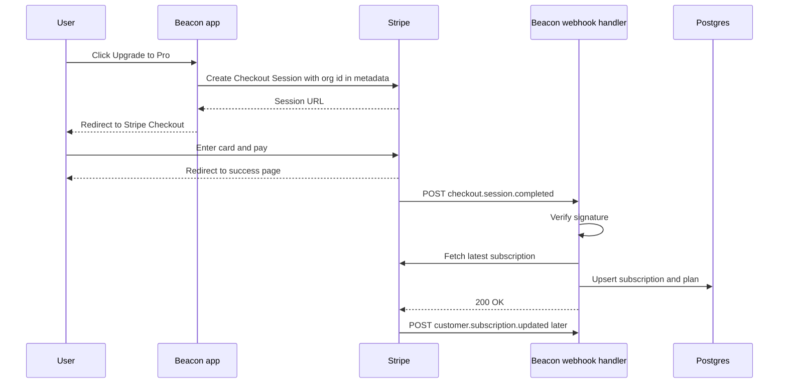
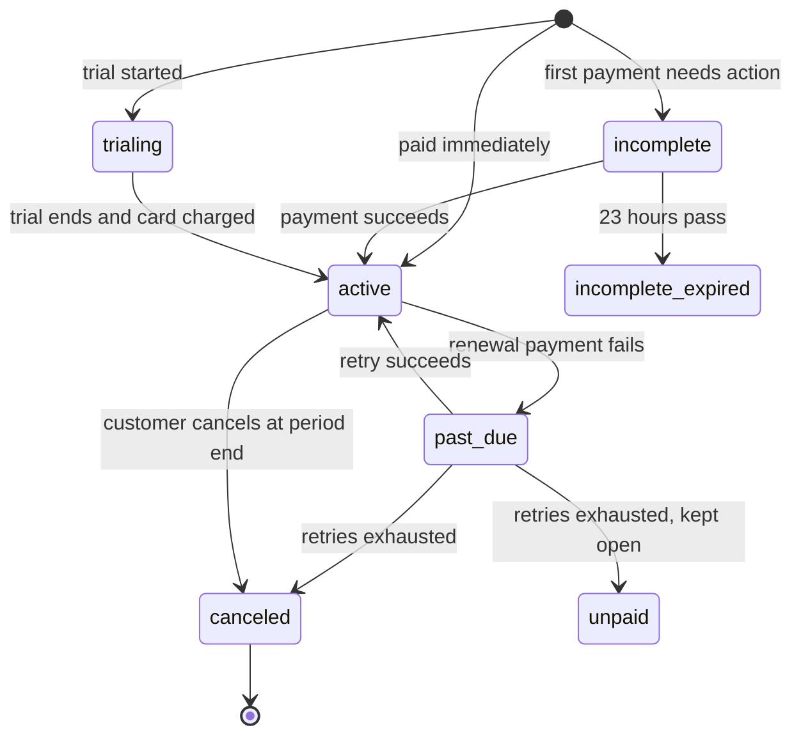
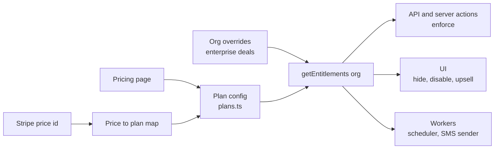
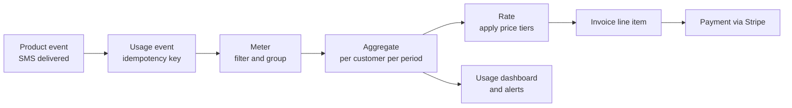

# Module 3 — Money

*This is the module where bugs cost real money: customers who paid and got nothing, or customers who stopped paying and kept everything. We start with subscriptions and the webhook-driven sync that keeps your database honest, turn a pricing page into entitlement checks your code can enforce, and finish with usage-based billing, where every event is a line item on somebody's invoice. Beacon gets its Free, Pro and Business plans, plus metered SMS.*

> **Practice:** build the exercises in the [Beacon starter](https://github.com/Tamoura/system-design-for-vibe-coders/tree/beacon/starter); when you have tried them, compare with [this module's reference solution](https://github.com/Tamoura/system-design-for-vibe-coders/tree/beacon/module-3-solution) (branch `beacon/module-3-solution`).

---

# 3.1 — Subscriptions and payments: checkout, webhooks, the customer portal
*Level: 🟢 Beginner* · *Prerequisites: 1.2, 2.1*

## ⚡ In 60 seconds

- A subscription is a Customer paying a Price every period. The payment provider owns the truth about money, and your database keeps a copy.
- The one rule: grant access from the verified webhook, never from the success redirect.
- Default for a v1: Stripe's hosted Checkout and hosted Customer Portal, with the Stripe customer attached to the organization, not the user.
- The webhook handler verifies the signature on the raw body, dedupes by event ID, re-fetches current state and returns 2xx fast.
- Biggest trap: treating `active` as the only paid status, which locks out `trialing` customers and treats `past_due` like `canceled`.

## 🧭 Why every SaaS has this

Beacon launches its $29/month Pro plan. The first version is what everyone writes on day one: a "Buy" button sends the user to Stripe, Stripe redirects back to `/billing?success=true`, and that page runs `UPDATE organizations SET plan = 'pro'`. It works in the demo.

Then real life happens. A customer pays and closes the tab before the redirect finishes, so they're charged and still on Free. Someone else notices the success URL and visits it by hand, so they get Pro without paying. Three months later a customer's card expires and the renewal fails. Nothing in Beacon ever finds out, so they keep Pro forever. Support is now reading the Stripe dashboard and editing database rows by hand.

The fix doesn't involve cleverer redirect handling. The redirect is just UX. The payment provider tells you what happened through **webhooks**: signed HTTP POSTs it sends to your server when something changes. Stripe retries a failed webhook delivery for up to three days in live mode, so even a buggy handler gets a second chance, as long as it fails loudly instead of returning `200 OK` and dropping the event.

**The payment provider owns the truth about money; your database holds a cached copy that webhooks keep in sync, never the other way around.**

## 📐 How it works

### 🟢 The essentials

Most providers share Stripe's vocabulary, so learn it once. Paddle, Lemon Squeezy and Polar use similar nouns.

| Object | What it is | Beacon example |
|---|---|---|
| **Customer** | The paying entity, with email, payment methods and tax info | One per Beacon **organization**, not per user |
| **Product** | The thing you sell | "Beacon Pro" |
| **Price** | How much, how often, in what currency. Effectively immutable: to change the amount you create a new Price | $29/month USD; $290/year USD |
| **Subscription** | A Customer on one or more Prices, renewing each period, with a `status` | Acme Inc on Pro monthly, `active` |
| **Invoice** | The bill generated each period (or on changes) | May 2026 invoice, $29, paid |
| **PaymentIntent** | One attempt to collect money, which may need 3-D Secure, retries or a new card | The charge behind that invoice |
| **Checkout Session** | A hosted payment page Stripe runs for you | Where "Upgrade to Pro" sends people |
| **Billing Portal Session** | A hosted self-service page for cards, invoices, plan changes and cancellation | Settings → Billing → "Manage billing" |

Two decisions make v1 safe for a junior team.

**Use hosted Checkout and the hosted Customer Portal.** Card forms, 3-D Secure / SCA (Strong Customer Authentication, the EU rule that forces an extra verification step), Apple Pay, address collection, tax ID fields and invoice downloads are all solved problems. You don't want card numbers anywhere near your servers. With hosted pages your PCI DSS scope (the card-industry security standard) stays at the lightest level. You can build embedded forms later if conversion data says you should.

**Treat webhooks as the source of truth.** The redirect only shows a "thanks, we're confirming your payment" screen. Access changes when the webhook arrives.



The handler has three jobs, in this order:

1. **Verify the signature.** Anyone on the internet can POST to `/api/stripe/webhook`. Stripe signs each delivery with your endpoint's secret (an HMAC in the `Stripe-Signature` header, with a timestamp to stop replay). The SDK's `constructEvent` checks it, but only against the **raw request body**. If your framework parses JSON first, the bytes change and verification fails. That's the most common bug in this lesson.
2. **Deduplicate.** Stripe may deliver the same event more than once. Record `event.id` with a unique constraint and skip ones you've already processed.
3. **Sync, then return 2xx fast.** Update your copy of the subscription and respond. Stripe expects a quick response, and anything slow belongs in a background job (see 5.1).

```ts
// app/api/stripe/webhook/route.ts
export async function POST(req: Request) {
  const body = await req.text(); // raw body, never req.json()
  const sig = req.headers.get("stripe-signature") ?? "";
  let event: Stripe.Event;
  try {
    event = stripe.webhooks.constructEvent(body, sig, process.env.STRIPE_WEBHOOK_SECRET!);
  } catch {
    return new Response("bad signature", { status: 400 });
  }
  const firstTime = await db.insertIgnore("stripe_events", { id: event.id, type: event.type });
  if (!firstTime) return new Response("duplicate", { status: 200 });

  const obj = event.data.object as { customer?: string | { id: string } };
  const customerId = typeof obj.customer === "string" ? obj.customer : obj.customer?.id;
  if (customerId) await syncCustomerFromStripe(customerId); // fetch fresh state, upsert
  return new Response("ok", { status: 200 });
}
```

In Django the same shape is a `csrf_exempt` view reading `request.body`. In Rails, read `request.raw_post`. In Laravel, Cashier ships a webhook controller that does this for you.

Store the Stripe `customer` ID on your **organization** row. In B2B the workspace pays, not the person who happened to click the button. That person might leave the company next month (see 1.2).

### 🟡 Going deeper

**Events arrive out of order.** Stripe doesn't guarantee ordering. You can receive `customer.subscription.updated` before `customer.subscription.created`, or an old `updated` after a newer one. If each handler blindly writes the payload it received, a stale event can overwrite fresh state and cancel a paying customer. There are two good fixes:

- **Re-fetch, don't trust the payload.** Use the event only as a "something changed for customer X" signal, then call the API for current state and upsert it. Documenso's webhook handler says this in a comment: the payload is never trusted beyond extracting the customer ID. It costs one extra API call per event and removes a whole class of bugs.
- **Compare timestamps.** Store the `event.created` of the last applied event per subscription and ignore anything older. This is cheaper, but easier to get subtly wrong.

**Idempotency goes both ways.** Deduping inbound events is half of it. For outbound calls (creating a customer, a subscription or a refund), pass an `Idempotency-Key` header. If your request times out and you retry, Stripe returns the original result instead of creating a second one. Stripe keeps keys for at least 24 hours. Derive the key from your own intent, like `refund:{ticketId}`, not from a random UUID generated inside the retry loop.

**Subscription status is a state machine.** Model it that way, then decide what each state means for access.



| Stripe status | Beacon access | UX |
|---|---|---|
| `trialing`, `active` | Full plan | Normal |
| `past_due` | Full plan during a grace period | Red banner: "Update your card" |
| `unpaid`, `canceled`, `incomplete_expired` | Downgrade to Free limits (see 3.2) | "Your plan ended" email |
| `incomplete` | No upgrade yet | "Complete payment" prompt |

**Trials.** You have two choices. A trial **without a card** gets more signups but fewer conversions. A trial **with a card** converts automatically. Stripe sends `customer.subscription.trial_will_end` three days before a trial ends, so hook your reminder email to it.

**Proration.** When Acme upgrades from Pro to Business mid-month, Stripe by default credits the unused Pro time and charges the prorated Business time. The `proration_behavior` parameter controls this (`create_prorations`, `always_invoice`, `none`). A common policy: upgrades take effect now and bill immediately, and downgrades take effect at period end, using subscription schedules or the Portal's "at period end" setting. Downgrading immediately means refunding, and nobody enjoys that.

**Dunning** is the process of recovering failed payments. Cards expire, banks decline, limits get hit. Turn on the provider's automatic retries (Stripe calls its ML-timed version Smart Retries) and its failed-payment emails, and put the Portal link in your own emails. Decide your grace period explicitly. Also listen to `invoice.payment_failed`, because that's where you start the banner and the countdown.

**Refunds and disputes.** A refund doesn't cancel a subscription, and cancelling doesn't refund. They're separate API calls, so make your support tooling (7.1) do both on purpose. A dispute (chargeback) arrives as `charge.dispute.created`. You have a limited window to submit evidence, and disputes cost a fee even if you win.

| Event | What Beacon does |
|---|---|
| `checkout.session.completed` | Link the Customer to the org (via `metadata` or `client_reference_id`), then sync |
| `customer.subscription.created` / `updated` / `deleted` | Sync status, price, `current_period_end`, `cancel_at_period_end` |
| `invoice.paid` | Record payment, clear dunning banner, reset monthly counters (3.3) |
| `invoice.payment_failed` | Start grace period, email owners and billing admins |
| `customer.subscription.trial_will_end` | Send "trial ending" email |
| `charge.refunded`, `charge.dispute.created` | Notify finance, flag the account for review |

### 🔴 At scale / enterprise

**Tax.** Once you sell to businesses and consumers in many countries, you owe VAT/GST in some of them and US sales tax in states where you cross economic-nexus thresholds (a consequence of the 2018 *South Dakota v. Wayfair* ruling). There are two ways to deal with it:

| | Payment processor (Stripe, Adyen, Braintree) | Merchant of Record (Paddle, Lemon Squeezy, Polar) |
|---|---|---|
| Who is the seller legally | You | The MoR resells your product |
| Who calculates, collects, files, remits tax | You (Stripe Tax helps calculate and collect, filing is still yours or a partner's) | The MoR |
| Fees | Lower per transaction | Higher, because it includes tax and compliance work |
| Control | Full API, any pricing model, your own invoices | Less flexible, invoices under their name |
| Good for | Teams with finance help, B2B with enterprise invoicing | Solo founders and small teams selling globally |

Lemon Squeezy was acquired by Stripe in 2024. Polar is open source (Apache-2.0), but the tax liability belongs to the company operating it, so self-hosting Polar's code doesn't make you a Merchant of Record. The legal entity is the product.

**Enterprise invoicing.** Business-tier customers want annual contracts, purchase orders and bank transfers on net-30 terms, not a card. Stripe supports `collection_method: send_invoice` with `days_until_due`. Your access logic has to handle "invoice sent, not yet paid, still entitled".

**Webhook plumbing.** At volume, the handler should verify, persist the raw event and enqueue it, then return `200`. A worker processes the events with retries (the "inbox" pattern, 5.1 and 5.3). Add a **nightly reconciliation job** that lists subscriptions from the provider and diffs them against your table. It will find events you missed during an outage, and it'll catch "someone edited the subscription in the dashboard".

**Testing time.** Renewals, trials and dunning happen over weeks. Stripe **test clocks** let you advance a test customer through time. Use them in CI to prove that "trial ends, card fails, grace period, downgrade" works without waiting a month. The Stripe CLI (`stripe listen --forward-to`) forwards real test-mode webhooks to localhost.

## 🏆 The best repos

| Repo | What it is | Stack | License | Pick it when |
|---|---|---|---|---|
| [stripe/stripe-node](https://github.com/stripe/stripe-node) | Official Stripe SDK, with typed events and webhook verification | TypeScript/Node | MIT | You use Stripe from Node, which is most readers |
| [stripe/stripe-cli](https://github.com/stripe/stripe-cli) | Forward webhooks to localhost, trigger test events, tail logs | Go | Apache-2.0 | Always, in development |
| [nextjs/saas-starter](https://github.com/nextjs/saas-starter) | Minimal Next.js SaaS with Checkout, Portal and a webhook route on teams | Next.js, Drizzle, Postgres | MIT | You want the smallest correct example to read in an hour |
| [wasp-lang/open-saas](https://github.com/wasp-lang/open-saas) | SaaS template with Stripe, Lemon Squeezy and Polar behind one payment-processor interface | Wasp, React, Node, Prisma | MIT | You want to see processor vs MoR side by side |
| [laravel/cashier-stripe](https://github.com/laravel/cashier-stripe) | Laravel's subscription billing layer with webhook controller, trials, swaps and invoices | PHP/Laravel | MIT | You're on Laravel, or want a well-designed subscription API to learn from |
| [pay-rails/pay](https://github.com/pay-rails/pay) | Rails payments engine supporting Stripe, Paddle, Braintree and Lemon Squeezy | Ruby/Rails | MIT | You're on Rails |
| [dj-stripe/dj-stripe](https://github.com/dj-stripe/dj-stripe) | Syncs Stripe objects into Django models via webhooks | Python/Django | MIT | You're on Django and want a local mirror of Stripe data |
| [polarsource/polar](https://github.com/polarsource/polar) | An open-source Merchant of Record platform, with checkout, subscriptions, benefits and usage billing | Python (FastAPI), Next.js | Apache-2.0 | You want an MoR, or want to read how one is built |
| [killbill/killbill](https://github.com/killbill/killbill) | Self-hosted subscription billing and invoicing engine | Java | Apache-2.0 | You need billing logic you own and run, with any processor behind it |

**If you only study one:** read `nextjs/saas-starter`. It's small enough to understand entirely. There's one checkout route, one webhook route and one function that maps a Stripe subscription onto the team row. Once it's clear, you'll see the same skeleton inside every bigger codebase in this lesson.

**Buy, build, or self-host?**

- **Buy (default):** Stripe Billing with Checkout and the Customer Portal. If you'd rather not deal with global sales tax, use a Merchant of Record: Paddle, Lemon Squeezy or Polar. For Beacon's first year, pick one of these and move on.
- **Self-host:** Kill Bill or Lago (3.3) when billing logic is core to your business, you have unusual contracts, or you want to stay independent of any one processor. You still need a processor to move the money.
- **Build:** only the thin layer: your `subscriptions` table, the webhook sync, and the mapping from price to plan. Never card handling, and never your own tax engine.

## 🔍 Study it in the wild

**Dub (`dubinc/dub`).** Dub's Stripe webhook lives, at the time of writing, under `apps/web/app/(ee)/api/stripe/webhook/`. It's a `route.ts` that verifies the signature, keeps an allowlist of relevant event types, and dispatches to **one file per event** (`checkout-session-completed.ts`, `customer-subscription-updated.ts`, `invoice-payment-failed.tsx`, `charge-refunded.ts`…). It's a good model for keeping a growing handler readable. Look at the helper that derives workspace limits from the Stripe subscription (search `getWorkspaceLimitsFromStripeSubscription`). It shows trials and yearly billing changing the limits.

**Documenso (`documenso/documenso`).** Search for `stripeWebhookHandler`. It lists the event types that trigger a sync, pulls out only the customer ID, and calls one `syncStripeCustomerSubscription` function that fetches current truth from Stripe. That's the "re-fetch, don't trust the payload" pattern in about a hundred lines. Checkout, portal and seat-quantity helpers sit next to it (search `get-portal-session`, `update-subscription-item-quantity`).

**Open SaaS (`wasp-lang/open-saas`).** Under `template/app/src/payment/` at the time of writing, there's a `stripe/`, a `lemonSqueezy/` and a `polar/` folder behind one `paymentProcessor` interface. It's the fastest way to see what differs between a processor and an MoR in code, and what doesn't.

**What to notice**

- Where the Stripe customer ID lives (user, team, organization) and why.
- Whether handlers trust event payloads or re-fetch from the API.
- How they respond to event types they don't care about. Hint: `200`, not `400`, or Stripe keeps retrying.
- How `past_due` is treated: immediate lockout, grace period, or banner only.
- How much the app relies on the hosted Portal instead of building its own billing UI.

## 🛠️ Build it into Beacon

### 🟢 Beginner exercise

Add Stripe Checkout and the Customer Portal to Beacon's billing settings page. Create the Pro Product with a monthly Price in test mode. "Upgrade" creates a Checkout Session with the organization ID in `client_reference_id` or `metadata`. "Manage billing" opens a Portal session for the org's Customer.

**Done when:**
- An org owner can upgrade with the test card `4242 4242 4242 4242` and land back on Beacon.
- The success page says "confirming…" and doesn't change the plan itself.
- "Manage billing" opens the Portal, where the owner can update the card and cancel.
- Non-owners don't see the billing buttons (reuse your 1.3 permission check).

### 🟡 Intermediate exercise

Write the webhook handler: raw-body signature verification, a `stripe_events` table with a unique `id` for dedupe, and a `syncCustomerFromStripe(customerId)` function that fetches the customer's subscriptions and upserts a `subscriptions` row (status, price ID, current period end, cancel-at-period-end). Use `stripe listen --forward-to localhost:3000/api/stripe/webhook` locally.

**Done when:**
- Sending the same event twice (`stripe events resend`) changes nothing the second time.
- A request with a tampered body gets `400`, and a valid one gets `200`.
- Cancelling in the Portal sets `cancel_at_period_end = true` in your table within seconds.
- Deleting your `subscriptions` row and replaying any event restores it correctly.

### 🔴 Advanced exercise

Implement the full lifecycle with a Stripe **test clock**: a 14-day trial with a card, conversion, a failed renewal (use a test card that declines), a 7-day grace period with a banner, then automatic downgrade to Free. Add a nightly reconciliation job that lists all Stripe subscriptions and reports any mismatch with your table.

**Done when:**
- Advancing the test clock drives Beacon through `trialing → active → past_due → canceled` with no manual steps.
- The dashboard banner appears during `past_due` and disappears after a successful card update.
- Manually corrupting a row (setting a canceled org to `active`) is reported by the reconciliation job the next time it runs.
- An integration test covers the whole path.

## ⚠️ Mistakes juniors make

- **Granting access on the success redirect.** Redirects can be skipped, replayed or forged. Grant access from the webhook, and use the redirect only for messaging.
- **Parsing JSON before verifying the signature.** Framework body parsers change whitespace and key order, so verification fails. Or worse, someone "fixes" it by skipping verification. Read the raw body in the webhook route only.
- **Returning 500 for event types you don't handle.** Stripe retries those for days and eventually disables the endpoint. Return `200` for anything you ignore, and subscribe only to the events you need.
- **Attaching the Stripe customer to the user instead of the organization.** When the founder who paid leaves, the workspace's billing leaves with them. In B2B, the org is the customer.
- **Hard-coding `if (status === "active")`.** That locks out `trialing` customers and treats `past_due` the same as `canceled`. Map every status to an access decision in one function.
- **Making the handler do everything inline.** Sending three emails and recomputing limits inside the request leads to timeouts, and timeouts lead to retries and duplicate emails. Sync the row, enqueue the rest.
- **Testing billing only on the happy path.** The costly bugs live in renewals, failures and cancellations. Use test clocks and decline test cards.

## 🧾 Recap

- Learn the nouns (Customer, Product, Price, Subscription, Invoice, PaymentIntent). Every provider uses a variation of them.
- Use hosted Checkout and the hosted Portal first. Build custom UI only when data says it's worth it.
- Webhooks are the source of truth: verify the signature on the raw body, dedupe by event ID, re-fetch current state, return 2xx fast.
- Subscription status is a state machine, so decide what each state grants, especially `past_due`.
- Sales tax is a legal problem, not a coding one. A Merchant of Record removes it for a fee.
- Reconcile nightly. Webhooks are reliable, not perfect.

## ✍️ Check yourself

**1. Why must the webhook handler verify the signature against the raw request body?**

<details><summary>Answer</summary>

The signature is an HMAC over the exact bytes Stripe sent. If your framework parses the JSON first, whitespace and key order can change, so verification fails, and someone may then "fix" it by skipping verification. Read the raw body in the webhook route only. See 🟢 The essentials and ⚠️ Mistakes juniors make.

</details>

**2. Stripe events can arrive out of order. What are the two fixes, and what does each cost?**

<details><summary>Answer</summary>

Either re-fetch current state from the API and use the event only as a "something changed for customer X" signal, or store the `event.created` of the last applied event and ignore anything older. Re-fetching costs one extra API call per event and removes a whole class of bugs. Comparing timestamps is cheaper but easier to get subtly wrong. See 🟡 Going deeper.

</details>

**3. Acme's Pro renewal fails and its subscription moves to `past_due`. What should Beacon do?**

<details><summary>Answer</summary>

Keep the full plan during an explicit grace period, show a red "Update your card" banner, and email the owners and billing admins, starting from `invoice.payment_failed`. Let the provider's automatic retries run. If retries are exhausted and the status becomes `unpaid` or `canceled`, downgrade Acme to Free limits (3.2). See the status and event tables in 🟡 Going deeper.

</details>

**4. Where should Beacon store the Stripe customer ID, and why there?**

<details><summary>Answer</summary>

On the organization row. In B2B the workspace pays, not the person who happened to click the button, and that person might leave the company next month. If the customer hangs off the user, the workspace's billing leaves with them. See 🟢 The essentials and ⚠️ Mistakes juniors make.

</details>

**5. A teammate's handler returns `500` for any event type it doesn't recognise, "so we notice them". What breaks?**

<details><summary>Answer</summary>

Stripe treats the `500` as a failed delivery and retries it for days, and it eventually disables the endpoint, so the events you do need stop arriving too. Return `200` for anything you ignore, and subscribe only to the events you need. See ⚠️ Mistakes juniors make and the "What to notice" list in 🔍 Study it in the wild.

</details>

## 📚 References

- Stripe docs, Webhooks: https://docs.stripe.com/webhooks
- Stripe docs, Idempotent requests: https://docs.stripe.com/api/idempotent_requests
- Stripe Billing docs (subscriptions, Customer Portal, test clocks, Smart Retries): https://docs.stripe.com/billing
- Standard Webhooks spec (signing and verification conventions): https://github.com/standard-webhooks/standard-webhooks
- Brandur Leach, "Implementing Stripe-like Idempotency Keys in Postgres": https://brandur.org/idempotency-keys
- Paddle developer docs (Merchant of Record model): https://developer.paddle.com
- Polar docs: https://docs.polar.sh

---

# 3.2 — Plans, limits and entitlements: turning pricing into code
*Level: 🟡 Intermediate* · *Prerequisites: 3.1, 1.3*

## ⚡ In 60 seconds

- An entitlement is one thing an account may do or have: a feature gate, a limit or a configuration value. A plan is just a named package of them.
- The one rule: never check which plan a customer is on. Check what they're entitled to, and let one module translate plans into entitlements.
- Default for a v1: a typed `plans.ts`, a price-to-plan map and one `getEntitlements(org)` function with overrides, enforced on the server at every write path.
- Snapshot entitlements per org to get grandfathering and custom contracts cheaply, and freeze the excess on downgrade instead of deleting it.
- Biggest trap: enforcing limits only in the UI, or using the feature-flag tool as the paywall.

## 🧭 Why every SaaS has this

Beacon's pricing page promises three things: Free gets 5 monitors with 5-minute checks, Pro gets 50 monitors with 1-minute checks and SMS, and Business adds SSO, the audit log, 30-second checks and the API. In week one someone writes `if (org.plan === "pro")` in the monitor form. In week two someone writes `if (org.plan !== "free")` in the SMS sender. In week six marketing adds a "Starter" plan between Free and Pro, and nobody can find the forty places that need updating. Two of them get missed. Starter customers get SMS for free, and Business customers can't use the API, because that check said `=== "pro"`.

Then sales signs an enterprise deal with 500 monitors, which isn't on any plan. Then you raise Pro to $39 and promise existing customers they keep $29 and their current limits. Then a customer downgrades from Pro to Free with 43 monitors. What happens to the other 38?

None of these are billing problems. Stripe charged the right amount every time. The trouble is in the layer between "what did they pay for" and "what can they do", and it's called **entitlements**.

**Never check which plan a customer is on; check what they're entitled to, and let one module translate plans into entitlements.**

## 📐 How it works

### 🟢 The essentials

Here are the terms, defined before we use them:

- **Plan**: a named package on the pricing page (Free, Pro, Business). It's a marketing and billing concept.
- **Entitlement**: one thing an account is allowed to do or have. Entitlements come in three kinds:
  - **Feature gate (boolean):** `sso: true`, `auditLog: false`.
  - **Limit (quantity):** `maxMonitors: 50`, `maxTeamMembers: 10`.
  - **Configuration value:** `minCheckIntervalSeconds: 60`, `dataRetentionDays: 90`.
- **Usage**: how much of a limit is currently consumed (43 of 50 monitors). It's covered in depth in 3.3.

The pipeline runs from pricing page to enforcement:



v1 is a typed config file plus one function:

```ts
// lib/plans.ts
export const PLANS = {
  free:     { maxMonitors: 5,   minIntervalSec: 300, smsCreditsPerMonth: 0,   sso: false, auditLog: false, api: false },
  pro:      { maxMonitors: 50,  minIntervalSec: 60,  smsCreditsPerMonth: 100, sso: false, auditLog: false, api: false },
  business: { maxMonitors: 500, minIntervalSec: 30,  smsCreditsPerMonth: 500, sso: true,  auditLog: true,  api: true  },
} as const;
export type Entitlements = (typeof PLANS)[keyof typeof PLANS];

const PRICE_TO_PLAN: Record<string, keyof typeof PLANS> = {
  [process.env.STRIPE_PRICE_PRO_MONTHLY!]: "pro",
  [process.env.STRIPE_PRICE_PRO_YEARLY!]: "pro",
  [process.env.STRIPE_PRICE_BUSINESS_MONTHLY!]: "business",
};

export function getEntitlements(org: Org): Entitlements {
  const active = org.subscription && ["active", "trialing", "past_due"].includes(org.subscription.status);
  const plan = active ? PRICE_TO_PLAN[org.subscription!.priceId] ?? "free" : "free";
  return { ...PLANS[plan], ...(org.entitlementOverrides ?? {}) };
}
```

Enforcement happens **on the server, at the point of action**:

```ts
export async function createMonitor(orgId: string, input: MonitorInput) {
  const org = await getOrg(orgId);
  const ent = getEntitlements(org);
  const count = await db.monitor.count({ where: { orgId } });
  if (count >= ent.maxMonitors) throw new LimitError("maxMonitors", ent.maxMonitors);
  if (input.intervalSec < ent.minIntervalSec) throw new LimitError("minIntervalSec", ent.minIntervalSec);
  return db.monitor.create({ data: { ...input, orgId } });
}
```

The UI reads the same entitlements to grey out the 30-second option and show "Upgrade to Business". But the UI is a courtesy. Enforcement belongs to the API, because your public API (5.2) and any clever user with dev tools skip the UI entirely.

Return a **structured error** (`{ code: "limit_exceeded", limit: "maxMonitors", allowed: 5 }`, HTTP 403 or 402) so the frontend can show a specific upgrade prompt instead of "Something went wrong".

### 🟡 Going deeper

**Plans in code or in the database?** Every team argues about this. Here's the trade-off:

| | Plans in code (config file) | Plans in database |
|---|---|---|
| Change a limit | Pull request and deploy | Admin UI, instant |
| Reviewable, testable | Yes, it lives in git | Needs audit logging (7.3) |
| Type safety | Full | Needs a schema (e.g. Zod on a JSON column) |
| Per-customer deals | Awkward | Natural |
| Good for | v1 through early growth | Sales-led, many custom deals |

Most mature apps end up with a **hybrid**. Plan *templates* live in code or in a table, and each organization gets a **snapshot** of its entitlements copied onto its own row or an `org_entitlements` table when it subscribes. The snapshot is what gets enforced. Documenso does exactly this: a `SubscriptionClaim` (the template) is copied into an `OrganisationClaim` (the org's snapshot). Dub copies limits onto the workspace row (`linksLimit`, `usageLimit`, `domainsLimit`…) whenever the Stripe webhook changes the plan.

**Grandfathering** falls out of snapshots almost for free. Raise Pro from $29 to $39 by creating a *new* Stripe Price (Prices are effectively immutable anyway). Existing subscribers stay on the old Price ID, and your map still says old Price → `pro`. If the limits also changed, version the plan (`pro_2025`, `pro_2026`) or rely on the snapshot. Dub keeps arrays of legacy Price IDs next to current ones in its pricing constants for this reason.

**Upgrades are easy. Downgrades are policy.** When Acme drops from Pro (50 monitors) to Free (5) with 43 monitors, the common options are:

| Policy | What happens | Trade-off |
|---|---|---|
| Block the downgrade | "Delete 38 monitors first" | Clear but hostile, and it doesn't work for *involuntary* downgrades after failed payment |
| Freeze the excess | Keep all 43, pause the newest 38, let the user choose which 5 run | Most common and friendliest. Data is kept |
| Read-only | Everything is visible, nothing new can be created until under the limit | Simple, works for seats and projects |
| Delete | Remove the excess | Almost never acceptable, because data loss becomes a support ticket or a lawsuit |

Beacon should **freeze**: add a `pausedReason: "plan_limit"` column, keep history, and email the owner. The same rule handles the involuntary case from 3.1, when an unpaid subscription cancels. Features follow the same idea: after a downgrade, a custom status-page domain stops serving the custom domain, but the configuration isn't deleted.

**Seat-based pricing.** Business is "per seat" if you charge per team member. The seat count is the Subscription Item's `quantity`. It has to be updated when members are added or removed, with proration. Decide: do invitations count, or only accepted members? Are read-only viewers free? Do you bill seats up front, with a limit enforced when inviting, or true-up later? Documenso and Cal.com both track seat changes explicitly. Search Cal.com's schema for `SeatChangeLog`.

**Add-ons.** "+10 monitors for $10/month" or "extra status page" are separate Prices on the *same* Subscription (multiple subscription items). Entitlements become `plan + sum(addons) + overrides`. openstatus, a real Beacon, models add-ons in its plan config next to the limits.

**Feature flags vs entitlements.** They look alike (`if (x) show feature`) but answer different questions:

| | Feature flag (6.3) | Entitlement |
|---|---|---|
| Question | Is this feature *released* to this account? | Has this account *paid* for it? |
| Owner | Engineering and product | Billing, sales and product |
| Lifetime | Temporary, deleted after rollout | Permanent |
| Source of truth | Flag service (Unleash, PostHog…) | Subscription, plan config, contract |

A new feature can be behind both: flag `incident-ai-summary` on for 10% of accounts, *and* entitlement `aiSummaries` only on Business. Keep them in separate systems, or you'll one day "clean up old flags" and give everyone the paid tier.

### 🔴 At scale / enterprise

**Custom contracts.** Enterprise customers negotiate: 2,000 monitors, 15-second checks, a 99.99% SLA, invoicing annually in euros. Don't create a plan per customer. Model it as `plan: business` plus **overrides** with an owner, a reason and an expiry date (`{ maxMonitors: 2000, reason: "Acme MSA 2026", expiresAt }`), editable from the admin panel (7.1) and written to the audit log (7.3). Put a reminder job on the expiries.

**Entitlements as a service.** Once billing, product and sales all touch entitlements, companies pull them into a dedicated service that other services query. It caches entitlements per org (Redis, invalidated on webhook) and exposes `check(org, feature)` and `reportUsage(org, meter, n)`. The managed products here are **Stigg** and **Schematic**. In open source there's **Autumn** (`useautumn/autumn`), which sits on top of Stripe and gives you `check` and `track` calls, **Polar**'s benefits system, and **Lago**'s plan and entitlement model. Adopt one when you have several teams and custom deals. For a single Next.js app, `getEntitlements()` plus a snapshot column is enough.

**Consistency under concurrency.** "Count, then insert" has a race. Two API calls at 4/5 monitors can both pass and create 6. For cheap resources, allow a small overshoot and correct it later. For expensive ones (SMS, AI tokens), enforce atomically with a conditional update (`UPDATE ... SET used = used + 1 WHERE used < limit RETURNING`), a Postgres advisory lock, or a Redis counter with a Lua script. Limits enforced by background workers (check frequency in the scheduler, SMS in the sender) must read the same snapshot, or a downgraded org keeps 30-second checks because the scheduler cached the old plan.

**Pricing experiments.** Changing prices is a product experiment. Keep the pricing page, the plan config and the Stripe Prices generated from **one source** (a script that creates Stripe Products and Prices from `plans.ts`, or the reverse), so the three don't drift apart.

## 🏆 The best repos

| Repo | What it is | Stack | License | Pick it when |
|---|---|---|---|---|
| [useautumn/autumn](https://github.com/useautumn/autumn) | Open-source pricing and entitlements layer over Stripe (`check`, `track`, plans, credits) | TypeScript | Apache-2.0 | You want entitlements as a service without building it |
| [polarsource/polar](https://github.com/polarsource/polar) | MoR platform with products, "benefits" (entitlements granted on purchase) and meters | Python, Next.js | Apache-2.0 | You sell via Polar, or want to study benefits as a concept |
| [getlago/lago](https://github.com/getlago/lago) | Open-source billing: plans, charges, add-ons, coupons, entitlements, usage | Ruby on Rails, Go, React | AGPL-3.0 | You're heading towards complex plans and metering (3.3) |
| [killbill/killbill](https://github.com/killbill/killbill) | Billing engine with a catalog of plans, phases (trial, discount, evergreen) and change policies | Java | Apache-2.0 | You need rich catalog versioning and plan-change rules |
| [openstatusHQ/openstatus](https://github.com/openstatusHQ/openstatus) | A real Beacon, with a typed plan config (monitors, periodicity, SMS, add-ons) | TypeScript, Next.js | AGPL-3.0 | You want to see *this exact lesson* applied to uptime monitoring |
| [Unleash/unleash](https://github.com/Unleash/unleash) | Feature flag platform, useful for keeping flags *separate* from entitlements | TypeScript, Node | AGPL-3.0 | You need rollouts, and must not confuse them with plans |
| [dubinc/dub](https://github.com/dubinc/dub) | Link-management SaaS with limits snapshotted on the workspace row | Next.js, Prisma | AGPL-3.0 (`(ee)` folders commercial) | You want a production snapshot-plus-legacy-price pattern |

**If you only study one:** read `openstatusHQ/openstatus`. It's the closest thing to Beacon that exists: a plan config with `monitors`, `periodicity`, `sms` and `sms-limit`, add-ons, and server-side limit checks that throw "Upgrade for more periodicity options". You can map almost every line to this lesson.

**Buy, build, or self-host?**

- **Buy:** Stigg or Schematic when entitlements are shared across many services and sales-led custom deals are common. The managed billing platforms (Stripe with its entitlements features, Chargebee, Paddle) cover simpler cases.
- **Self-host:** Autumn or Lago when you want the entitlement layer in your own infrastructure and are fine running another service.
- **Build (default for Beacon):** a typed `plans.ts`, a price-to-plan map, `getEntitlements(org)` with overrides, a snapshot column, and enforcement at every write path. It's a few hundred lines you fully understand.

## 🔍 Study it in the wild

**openstatus (`openstatusHQ/openstatus`).** At the time of writing, `packages/db/src/schema/plan/` holds `config.ts` (an `allPlans` record with limits such as `monitors`, `periodicity`, `max-regions`, `status-pages`, `sms`, `sms-limit`, plus `addons`) and `utils.ts` (`getLimits`, and `getLimit` falling back to the free plan). Then search `apps/server` for `limits.ts`: there are per-resource limit checks for monitors, notifications, status pages and private locations. The monitor one separates *configuration* limits (allowed intervals, region count) from *count* limits.

**Dub (`dubinc/dub`).** Open `packages/utils/src/constants/pricing/pricing-plans.tsx` (path at the time of writing). It holds a `PlanDetails` type with a `limits` object and lists of legacy Stripe Price IDs, so old subscribers still map to the right plan. Then open the Prisma `workspace.prisma` schema and look at the `Project` model's `*Limit` and `*Usage` columns. The limits are snapshotted onto the tenant. Search `wouldLoseAdvancedFeatures` for downgrade handling.

**Documenso (`documenso/documenso`).** In the Prisma schema, compare `SubscriptionClaim` with `OrganisationClaim`: the same fields (team count, member count, quotas, flags), one a template and one a per-org copy. Search the jobs folder for `backport-subscription-claims` to see how they push template changes to existing orgs on purpose, which is grandfathering as an explicit operation.

**Cal.com (`calcom/cal.diy`).** Search the Prisma schema for `SeatChangeLog` and `MonthlyProration`. Seat-based billing gets real once you have to record every add and remove so the invoice is explainable.

**What to notice**

- Where the single source of plan truth lives, and whether limits get copied onto the tenant.
- How legacy prices and old plans are kept working (grandfathering).
- Whether limit errors are structured enough for the UI to show a specific upsell.
- How downgrades treat existing data: blocked, frozen or read-only.
- Which limits are enforced in workers and schedulers, not just in API routes.

## 🛠️ Build it into Beacon

### 🟢 Beginner exercise

Create `lib/plans.ts` with Free, Pro and Business entitlements and a `getEntitlements(org)` function. Replace every `plan === "..."` check in Beacon with an entitlement check. Enforce `maxMonitors` and `minIntervalSec` on monitor create *and* update.

**Done when:**
- `grep -rn "plan ===" src/` returns nothing outside `lib/plans.ts`.
- A Free org gets a structured `limit_exceeded` error when creating its sixth monitor via the API, not only via the UI.
- The monitor form disables intervals below the org's minimum and shows an upgrade prompt.

### 🟡 Intermediate exercise

Implement downgrade handling with the **freeze** policy. When an org's entitlements shrink (webhook sync or admin change), pause the newest monitors beyond the limit with `pausedReason = "plan_limit"`, clamp intervals up to the new minimum, and email the owner. Add a UI where the owner picks which monitors stay active.

**Done when:**
- Downgrading Pro to Free with 12 monitors leaves 5 active, 7 paused, and no data deleted.
- Upgrading again un-pauses the plan-paused monitors (but not manually paused ones).
- The scheduler never runs a paused monitor and never runs checks faster than the org's current minimum.
- The owner receives exactly one email per downgrade.

### 🔴 Advanced exercise

Add per-org **overrides** and **add-ons**. Overrides (`maxMonitors`, `minIntervalSec`, `smsCreditsPerMonth`) are editable in the admin panel with a reason and an optional expiry, and they're audit-logged. Add a "+25 monitors" add-on as a second Stripe subscription item with quantity. Make enforcement race-safe for monitor creation.

**Done when:**
- Entitlements are computed as plan + add-ons × quantity + unexpired overrides, with unit tests for each combination.
- Expired overrides stop applying without a deploy.
- Firing 20 concurrent create requests at an org with one free slot creates exactly one monitor.
- Every override change appears in the audit log with actor and reason.

## ⚠️ Mistakes juniors make

- **Checking plan names in feature code.** `if (plan === "pro")` breaks the day a plan is added or renamed. Check entitlements (`ent.sso`) and keep plan names inside one module.
- **Enforcing limits only in the UI.** The API, the CLI, imports and background jobs don't go through your React form. Enforce on the server at every write path.
- **Changing a Price's meaning under existing customers.** Editing limits for "pro" instantly changes what current customers get, including enterprise deals. Version plans or snapshot entitlements per org.
- **Deleting data on downgrade.** It's irreversible and it triggers support tickets. Freeze or make read-only, and let the customer choose what stays.
- **Using the feature-flag tool as the paywall.** Flags get cleaned up, targeted by percentage and edited by engineers. Entitlements are contractual. Keep them separate.
- **Forgetting the involuntary downgrade.** Failed payments and chargebacks also end plans, and the same freeze logic must run from the webhook path, not just from the "Downgrade" button.

## 🧾 Recap

- Plans are marketing. Entitlements (gates, limits, config values) are what code checks.
- One module maps Stripe Price → plan → entitlements, with overrides for custom deals.
- Snapshot entitlements per org to get grandfathering and custom contracts cheaply.
- Enforce on the server, in workers too, with structured errors the UI can turn into upsells.
- Downgrades need a policy, and "freeze the excess" is the friendly default.
- Feature flags decide *released*. Entitlements decide *paid for*.

## ✍️ Check yourself

**1. What are the three kinds of entitlement? Give a Beacon example of each.**

<details><summary>Answer</summary>

A feature gate is a boolean, such as `sso: true`. A limit is a quantity, such as `maxMonitors: 50`. A configuration value is a setting, such as `minCheckIntervalSeconds: 60`. How much of a limit is in use is usage, which 3.3 covers. See 🟢 The essentials.

</details>

**2. Feature flags and entitlements both look like `if (x) show feature`. What is the difference, and why keep them in separate systems?**

<details><summary>Answer</summary>

A flag answers "is this feature released to this account?", is owned by engineering and product, and is deleted after rollout. An entitlement answers "has this account paid for it?", comes from the subscription, plan config or contract, and is permanent. If they share a system, one day someone "cleans up old flags" and gives everyone the paid tier. See 🟡 Going deeper.

</details>

**3. Beacon raises Pro from $29 to $39 and promises existing customers they keep $29 and their current limits. How do you implement that?**

<details><summary>Answer</summary>

Create a new Stripe Price for $39, because Prices are effectively immutable. Existing subscribers stay on the old Price ID, and your map still says old Price → `pro`. If the limits also change, version the plan (`pro_2025`, `pro_2026`) or rely on the per-org entitlement snapshot. See grandfathering in 🟡 Going deeper.

</details>

**4. Acme drops from Pro to Free with 43 monitors. What should Beacon do with the 38 it no longer pays for?**

<details><summary>Answer</summary>

Freeze them. Keep all 43, pause the newest 38 with `pausedReason: "plan_limit"`, let the owner choose which 5 run, keep their history, and email the owner. The same logic must run from the webhook path, because failed payments cause involuntary downgrades too. See the downgrade policy table in 🟡 Going deeper.

</details>

**5. `createMonitor` counts the org's monitors, compares the count with `maxMonitors`, then inserts. A Free org at 4 of 5 fires two API calls at the same moment. What breaks?**

<details><summary>Answer</summary>

Both requests read 4, both pass the check, and the org ends up with 6 monitors. For cheap resources a small overshoot corrected later is acceptable. For expensive ones such as SMS, enforce atomically with a conditional update (`UPDATE ... WHERE used < limit RETURNING`), a Postgres advisory lock, or a Redis counter with a Lua script. See 🔴 At scale / enterprise.

</details>

## 📚 References

- Stripe Billing docs (products, prices, subscription items, quantities, proration): https://docs.stripe.com/billing
- Autumn repository and docs: https://github.com/useautumn/autumn
- Lago documentation: https://docs.getlago.com
- Kill Bill documentation (catalog, plan change policies): https://docs.killbill.io
- Polar docs (products and benefits): https://docs.polar.sh
- OpenFeature specification (the vendor-neutral feature-flag standard, for contrast): https://github.com/open-feature/spec

---

# 3.3 — Usage-based billing and metering
*Level: 🔴 Advanced* · *Prerequisites: 3.1, 3.2*

## ⚡ In 60 seconds

- Usage billing is a pipeline: usage events → meter → aggregate → rate → invoice line, with a usage view and alerts alongside.
- The one rule: every event gets a deterministic idempotency key derived from the business fact (`sms:{twilioSid}`), enforced by a unique constraint.
- Default for a v1: record usage when the cost is certain, store the event time, and report it to Stripe Billing meters.
- Credits are an append-only ledger of grants and debits, and customers need visibility, alerts and optional caps before any surprise invoice.
- Biggest trap: random UUIDs as keys, or aggregating by processing time, which double-bills and puts late events in the wrong period.

## 🧭 Why every SaaS has this

Pro includes 100 SMS alerts a month, and extra messages cost $0.05 each. It sounds simple until you list what has to be true. Every SMS that Twilio actually delivered, and only those, has to become exactly one billable unit, attributed to the right organization in the right billing period. A retried job must not double-charge. An SMS sent at 23:59:58 on the 31st must land in the right month, even though the event reaches your pipeline at 00:00:03. The customer needs to see the running total before the invoice, and an org whose monitor flaps all night must not wake up to a $4,000 bill.

Now apply the same machinery to API calls, check executions, AI tokens for incident summaries (8.2) or storage. Usage-based pricing has spread fast because it aligns price with value. It has also turned billing from "one webhook per month" into a **data pipeline**, and data pipelines lose, duplicate and delay events.

**Usage billing is an accounting system disguised as an analytics pipeline: every event must be counted exactly once, attributed to the right customer and period, and explainable line by line.**

## 📐 How it works

### 🟢 The essentials

Every usage-billing system, whether it's Stripe Billing meters, Lago, OpenMeter or your own, is the same five stages:



| Term | Meaning | Beacon SMS example |
|---|---|---|
| **Usage event** | An immutable fact: who, what, how much, when, with a unique ID | `{id: "sms_SM8a…", org: "acme", type: "sms.sent", segments: 2, ts}` |
| **Meter** | A definition of what to count from which events | "sum of `segments` where `type = sms.sent`" |
| **Aggregation** | How to combine values in a period: `sum`, `count`, `max`, `last`, `unique count` | Sum per org per billing period |
| **Rating** | Turning a quantity into money using a pricing model | First 100 included, then $0.05 each |
| **Billing period** | The window the invoice covers, anchored to the subscription | Acme's cycle, 14th to 13th |

Pricing models you'll meet:

| Model | Rule | Typical use |
|---|---|---|
| Per unit | quantity × price | SMS, API calls |
| Tiered (graduated) | Units 1–1,000 at $0.05, 1,001+ at $0.03, each tier priced separately | Volume discounts |
| Volume | All units at the price of the tier the total lands in | Simpler volume discount |
| Package | $5 per block of 100 | Credit packs |
| Included + overage | Base fee covers N units, the rest is per unit | Beacon Pro SMS |

v1 for Beacon is to record the event **at the moment the cost is certain** (when Twilio accepts or delivers the message, not when you *decide* to send it), with a key that makes duplicates harmless:

```ts
// in the SMS worker, after Twilio accepts the message
await db.usageEvent.upsert({
  where: { idempotencyKey: `sms:${twilioMessage.sid}` }, // unique
  create: {
    idempotencyKey: `sms:${twilioMessage.sid}`,
    orgId,
    meter: "sms_segments",
    quantity: Number(twilioMessage.numSegments ?? 1),
    occurredAt: new Date(), // event time, not processing time
  },
  update: {}, // already recorded: no-op
});
```

Then either forward the events to your provider's meter (Stripe Billing meters, Lago, OpenMeter), or aggregate them yourself at period end and add an invoice item. Stripe's meters take meter events with an event name, the Stripe customer ID, a value, a timestamp and an **identifier** Stripe uses to deduplicate. Stripe's older usage-records API has been superseded by meters, so use meters in new work.

### 🟡 Going deeper

**Idempotency is the whole game.** Duplicates come from job retries, at-least-once queues, webhook redeliveries and a user double-clicking. The fix is always the same: a **deterministic key** derived from the business fact (`sms:{twilioSid}`, `check:{monitorId}:{scheduledAt}`), enforced by a unique constraint wherever events are stored, and passed on as the identifier to the billing provider. Random UUIDs generated at send time don't help, because each retry gets a fresh one.

**Event time vs processing time.** Always store `occurredAt` from the source, and aggregate by it. Late events are normal: a queue backs up, a region reconnects, a Twilio status callback arrives minutes later. You need a policy for events that arrive after a period has closed:

| Policy | How | Trade-off |
|---|---|---|
| Grace window | Keep the period open for N hours after it ends before finalizing the invoice | Simple. Invoices go out slightly later |
| Roll forward | Late events get billed in the next period | Simple, but slightly wrong per period |
| Adjust | Issue a credit or debit note later | Correct, and complex |

Stripe finalizes a subscription invoice about an hour after it's created, which gives you a natural grace window for final usage. Other providers use configurable windows. Know yours.

**Credits and prepaid.** Many products sell **credits**: buy 1,000 SMS for $40 and draw them down. That's a ledger, not a counter. Record *grants* (monthly included credits, purchased packs, promotional gifts) and *debits* (usage), each with an expiry and a priority. Monthly credits are usually used before purchased ones, and expired grants stop counting. The balance is `sum(grants) − sum(debits)`, never a mutable number you overwrite. Cal.com has almost exactly Beacon's feature: a `CreditBalance` per team with `additionalCredits`, `limitReachedAt` and `warningSentAt`, a `CreditPurchaseLog`, and a `CreditExpenseLog` that records SMS segments with a unique `externalRef`. Credit type is `MONTHLY` or `ADDITIONAL`.

**Spend caps and alerts.** Usage pricing without guardrails produces bills customers dispute. Give them:

- **Visibility:** a live usage meter in Billing ("73 of 100 included SMS used; projected overage $3.40").
- **Alerts:** emails at 50%, 80% and 100% of included usage, and at a customer-set dollar threshold. Store `warningSentAt` so each alert is sent once per period.
- **Hard caps:** an optional "stop sending SMS once overage reaches $50" setting. Enforce it where the cost happens (the SMS sender checks the cap atomically, see 3.2), and fall back to email and in-app notifications so the alert still reaches someone (4.2).

**Reconciliation.** Three numbers should agree: what your system counted, what the billing provider invoiced, and what your *supplier* charged you (Twilio's usage report). Run a daily job that compares them per org and alerts on drift. It catches lost events, double counting and pricing misconfiguration before customers do.

### 🔴 At scale / enterprise

**Architecture at volume.** One row per SMS is fine. One row per HTTP check (Beacon Business with 500 monitors at 30s is about 1.4M checks a day per org) is not what Postgres billing tables are for. At that scale the pipeline looks like the analytics pipeline in 6.2: events go to a log (Kafka, Redpanda, or a Postgres table used as a queue for moderate volumes), then a stream or batch aggregator, then a columnar store (ClickHouse, Tinybird), with pre-aggregated per-org per-hour rollups feeding billing. OpenMeter is built this way (Kafka ingestion into ClickHouse), and Flexprice's code also references Kafka and ClickHouse. Dub counts clicks in Tinybird and runs a usage cron that syncs totals back onto the workspace row.

**Revenue recognition.** Cash received isn't revenue earned. Under ASC 606 / IFRS 15, an annual Pro prepayment of $348 is recognized as roughly $29 a month over the year, and the unearned part is *deferred revenue* on the balance sheet. Usage revenue is recognized when the usage happens. Prepaid credits are a liability until they're used or expire. You don't implement this as an engineer, but your data has to support it: store the service period on every line item, keep credit grants and debits immutable, and don't delete historical usage. Stripe has a Revenue Recognition product, and the open-source engines expose the data finance needs.

**Invoices must be explainable.** Enterprise customers will ask "why 14,212 SMS?". Keep raw events queryable for the dispute window (often 12–18 months), and let customers export them. An invoice line that can't be traced back to events is a credit note waiting to happen.

**Choosing a billing engine.**

| Option | What it owns | When |
|---|---|---|
| Stripe Billing meters | Metering, rating, invoicing, payment in one place | You already use Stripe, volumes are modest, pricing is standard |
| Lago | Full billing: plans, usage, invoices, credits, coupons. Pushes to Stripe or others for payment | Complex pricing, need to self-host or avoid lock-in |
| OpenMeter | High-volume metering and aggregation, with billing features added over time | Very high event volume, e.g. AI tokens or API calls |
| Flexprice | Usage-based billing and credits, aimed at AI and API products | Credit-heavy AI pricing |
| Kill Bill | Mature subscription plus usage billing engine | JVM shop, complex catalogs, full control |
| Hyperswitch | Payments *orchestration*: routing across many processors, retries, vault | Several processors, payment success rate matters. Not a metering tool |

Keep the layers apart: **metering** (count), **billing** (rate and invoice), **payments** (move money). Hyperswitch lives in the third. Confusing it with the first two is a common architecture-review mistake.

## 🏆 The best repos

| Repo | What it is | Stack | License | Pick it when |
|---|---|---|---|---|
| [getlago/lago](https://github.com/getlago/lago) | Open-source metering and usage-based billing platform (API in `getlago/lago-api`) | Ruby on Rails, Go, React | AGPL-3.0 | You want a full self-hostable billing engine with usage, credits and invoices |
| [openmeterio/openmeter](https://github.com/openmeterio/openmeter) | Real-time usage metering and billing, CloudEvents ingestion | Go, Kafka, ClickHouse | Apache-2.0 | Event volume is huge and you need accurate, real-time aggregation |
| [flexprice/flexprice](https://github.com/flexprice/flexprice) | Usage-based pricing, credits and billing for AI and API companies | Go | AGPL-3.0 | Credits, wallets and AI-style pricing |
| [killbill/killbill](https://github.com/killbill/killbill) | Subscription and usage billing engine, payment plugins | Java | Apache-2.0 | Complex catalogs on the JVM, full control |
| [polarsource/polar](https://github.com/polarsource/polar) | MoR with meters, customer meters and usage-based products | Python, Next.js | Apache-2.0 | You want usage billing *and* someone else to handle tax |
| [useautumn/autumn](https://github.com/useautumn/autumn) | Entitlements plus usage tracking and credits over Stripe | TypeScript | Apache-2.0 | App-level `track`/`check` without running a billing engine |
| [juspay/hyperswitch](https://github.com/juspay/hyperswitch) | Open-source payments orchestration and switch across processors | Rust | Apache-2.0 | Multiple processors, smart routing, payment retries |
| [stripe/stripe-node](https://github.com/stripe/stripe-node) | Official SDK, including the Billing meter event APIs | TypeScript | MIT | You're metering into Stripe directly |

**If you only study one:** read `getlago/lago`. Its docs and data model spell out every concept in this lesson: billable metrics with aggregation types, charges with pricing models, wallets and credits, grace periods, invoices. The `api` code (in `getlago/lago-api`) shows how the pieces fit together in a production system.

**Buy, build, or self-host?**

- **Buy (default):** Stripe Billing meters when Stripe is already your processor and pricing is per-unit or tiered. Metronome, Orb and Amberflo are managed usage-billing platforms for heavier needs. A Merchant of Record with usage support (Polar, Paddle) if you want tax handled too.
- **Self-host:** Lago, OpenMeter, Flexprice or Kill Bill when pricing is complex, volume is high, you need data residency, or billing is strategic enough that you don't want lock-in.
- **Build:** the *emit* side always, meaning deterministic usage events, a credit ledger if you sell credits, and caps and alerts. Rating and invoicing are where homegrown systems accumulate the most edge cases.

## 🔍 Study it in the wild

**Cal.com (`calcom/cal.diy`).** This is Beacon's SMS credits, in production. In the Prisma schema, read `CreditBalance`, `CreditPurchaseLog` and `CreditExpenseLog`. Note `smsSegments`, `smsSid`, the `@unique` on `externalRef` (idempotency), the `MONTHLY`/`ADDITIONAL` credit types, and `limitReachedAt`/`warningSentAt` (alerts sent once). Then open `packages/features/credits` (at the time of writing) to see the repository methods that read and write them.

**Dub (`dubinc/dub`).** Dub's plans limit tracked clicks per month. Search for the usage cron (`api/cron/usage` at the time of writing). It queries usage from Tinybird, updates the workspace's `usage` column, sends limit alerts to owners and Slack, and resets on the billing cycle. Look at how `billingCycleStart` is used to compute each workspace's own period instead of assuming calendar months.

**Lago (`getlago/lago`, `getlago/lago-api`).** Read the billing engine itself. The umbrella repo has the Docker Compose setup and an `events-processor` directory. In `lago-api`, search for `BillableMetric`, `Charge` and `Wallet` to find metering definitions, pricing and credits, then follow how an invoice gets computed for a period.

**OpenMeter (`openmeterio/openmeter`).** Search for `kafkaingest` and `clickhouse` to see the ingestion path at high volume, and read `cloudevents.spec.json` at the repo root to see the event envelope it expects.

**What to notice**

- How idempotency keys are formed and where uniqueness is enforced.
- Whether usage is aggregated by event time or by ingestion time.
- How included allowances, purchased credits and overage are layered and ordered.
- Where alerts are de-duplicated (a "sent at" column, a per-period flag).
- How each system keeps raw events for later audit and dispute.

## 🛠️ Build it into Beacon

### 🟢 Beginner exercise

Create a `usage_events` table (`idempotency_key` unique, `org_id`, `meter`, `quantity`, `occurred_at`) and record one event per SMS in the SMS worker, keyed by the Twilio message SID. Show "SMS used this period" on the billing page, computed from the org's current billing period in the subscriptions table.

**Done when:**
- Running the SMS job twice for the same message creates one usage row.
- The billing page shows the correct count for the current period, not the calendar month.
- Events store `occurred_at` from the send time, not the time of insertion.

### 🟡 Intermediate exercise

Bill overage through Stripe Billing meters. Create a meter `sms_segments` (sum) and a metered Price for $0.05 per unit above an included 100. The simplest approach: report only units beyond the included amount, or use a graduated price with a free first tier. Report each usage event to Stripe with your idempotency key as the identifier, from a background job with retries. Add 80% and 100% alert emails.

**Done when:**
- A test-clock subscription that sends 130 SMS gets an invoice with a $1.50 overage line.
- Replaying the reporting job doesn't change the invoice.
- Each alert email is sent at most once per org per period.
- Beacon's count and Stripe's meter summary match for the test org.

### 🔴 Advanced exercise

Replace the counter with a **credit ledger**: monthly grants (reset each period, expiring), purchasable packs (one-time Checkout, expiring after 12 months), and debits that consume monthly credits first. Add a customer-configurable overage cap enforced atomically in the SMS sender, with fallback to email and in-app when the cap is hit. Add a daily reconciliation job comparing Beacon usage, Stripe meter totals and Twilio's usage for each org.

**Done when:**
- The balance is always derivable from immutable grant and debit rows, with no mutable balance column as source of truth.
- Concurrent SMS sends never overdraw the balance or exceed the cap (tested with parallel jobs).
- When the cap is reached, SMS stops, the alert still arrives by email and in-app, and the owner is notified once.
- The reconciliation job flags an intentionally deleted usage row.

## ⚠️ Mistakes juniors make

- **Recording usage when you *intend* to do the work.** If the send fails, you've billed for nothing. Record when the cost is certain (after the provider accepts, or on its delivery callback).
- **Using random IDs as idempotency keys.** A retry gets a new UUID, and you've double-billed. Derive keys from the business fact (`sms:{sid}`).
- **Aggregating by processing time.** Late events land in the wrong period and invoices shift. Store and aggregate by `occurred_at`, and have a late-event policy.
- **Keeping a mutable `balance` number.** One bug or race and nobody can say what the balance should be. Use an append-only ledger, and cache the sum if you need speed.
- **No caps, no alerts.** A flapping monitor sends 40,000 SMS overnight, and the customer disputes the charge. Alert early, allow caps, and consider rate limits on alerts (4.2).
- **Treating payment orchestration as billing.** Hyperswitch routes payments. It doesn't count usage or produce invoices. Keep metering, billing and payments as separate layers.

## 🧾 Recap

- The pipeline is always events → meter → aggregate → rate → invoice, with a usage view and alerts alongside.
- Deterministic idempotency keys plus a unique constraint make "exactly once" achievable.
- Aggregate by event time and decide how late events are handled.
- Credits are a ledger of grants and debits, never a mutable counter.
- Give customers visibility, alerts and caps before you give them a surprise invoice.
- Reconcile your counts, your billing provider's and your supplier's, every day.

## ✍️ Check yourself

**1. What are the stages every usage-billing system goes through, from product event to money?**

<details><summary>Answer</summary>

A product event becomes an immutable usage event with an idempotency key. A meter decides what to count, aggregation combines values per customer per period, rating applies the pricing model, and the result becomes an invoice line item that is paid through Stripe. A usage dashboard and alerts read from the aggregate. See the diagram in 🟢 The essentials.

</details>

**2. What is the difference between event time and processing time, and what are the three policies for late events?**

<details><summary>Answer</summary>

Event time is when the usage happened at the source (`occurredAt`). Processing time is when your pipeline saw it. Always aggregate by event time. For events that arrive after a period closes, you can keep a grace window open, roll them forward into the next period, or adjust with a credit or debit note later. See 🟡 Going deeper.

</details>

**3. Acme's Pro plan includes 100 SMS, and it sends 130 this period. What does the overage line say, and how do you stop a replayed reporting job from changing it?**

<details><summary>Answer</summary>

30 extra SMS at $0.05 each is a $1.50 overage line. Each usage row has a unique key such as `sms:{twilioSid}`, and the same key is passed to Stripe's meter as the identifier, so Stripe drops the duplicates when the job replays. See 🟡 Going deeper and the 🟡 Intermediate exercise.

</details>

**4. An Acme monitor flaps all night and triggers thousands of SMS alerts. What should stop Acme waking up to a $4,000 bill?**

<details><summary>Answer</summary>

A live usage meter on the billing page, alert emails at 50%, 80% and 100% of included usage (sent once per period, tracked with `warningSentAt`), and an optional hard cap. The SMS sender checks the cap atomically and falls back to email and in-app notifications so the alert still reaches someone. See spend caps and alerts in 🟡 Going deeper.

</details>

**5. The SMS worker sets `idempotencyKey: crypto.randomUUID()` and records the usage row before it calls Twilio. What breaks?**

<details><summary>Answer</summary>

Two things. Each retry generates a new UUID, so a retried job bills the same SMS twice. And if the send fails, the customer is billed for an SMS that never went out. Derive the key from the business fact (`sms:{sid}`) and record usage only after Twilio accepts the message. See ⚠️ Mistakes juniors make.

</details>

## 📚 References

- Stripe docs, usage-based billing and meters (under Billing): https://docs.stripe.com/billing
- Lago documentation: https://docs.getlago.com
- OpenMeter repository and docs: https://github.com/openmeterio/openmeter
- CloudEvents specification (the event envelope several metering tools use): https://cloudevents.io
- Hyperswitch documentation: https://docs.hyperswitch.io
- Kill Bill documentation: https://docs.killbill.io
- Brandur Leach, "Implementing Stripe-like Idempotency Keys in Postgres": https://brandur.org/idempotency-keys

Next up: **Module 4 — Communication**, where Beacon learns to tell people things by email, SMS, Slack and in real time.
