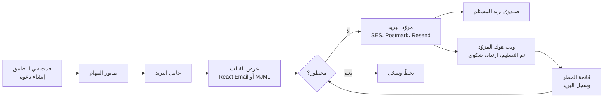
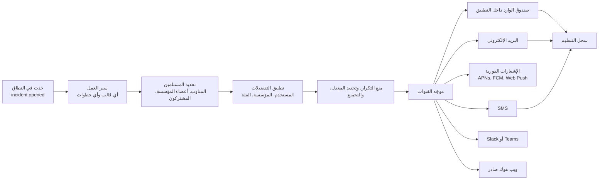
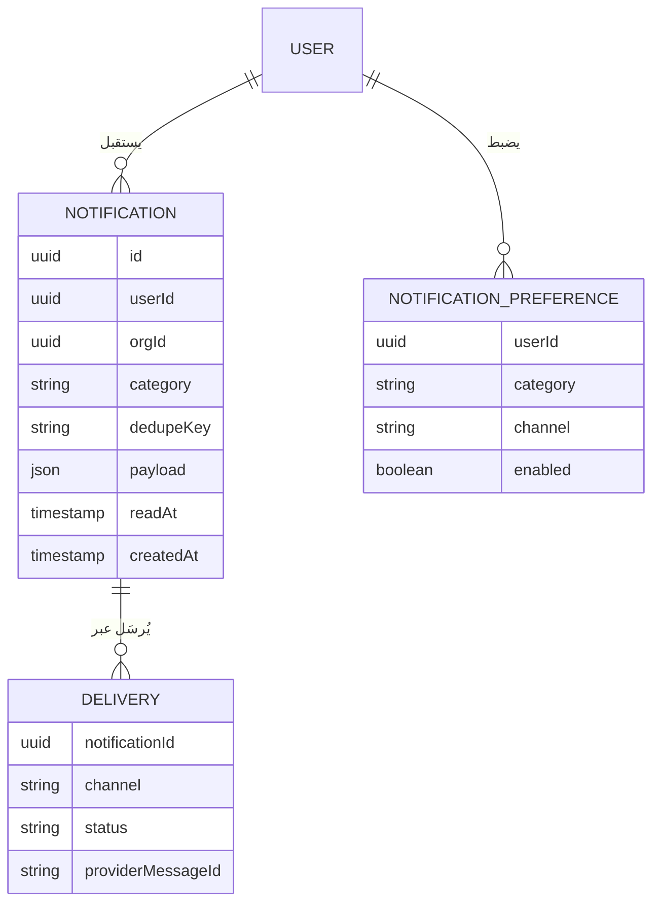
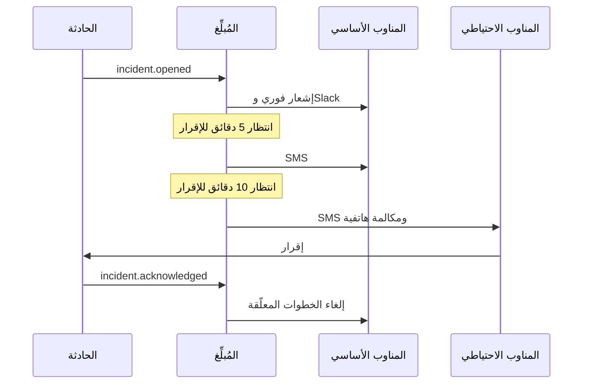
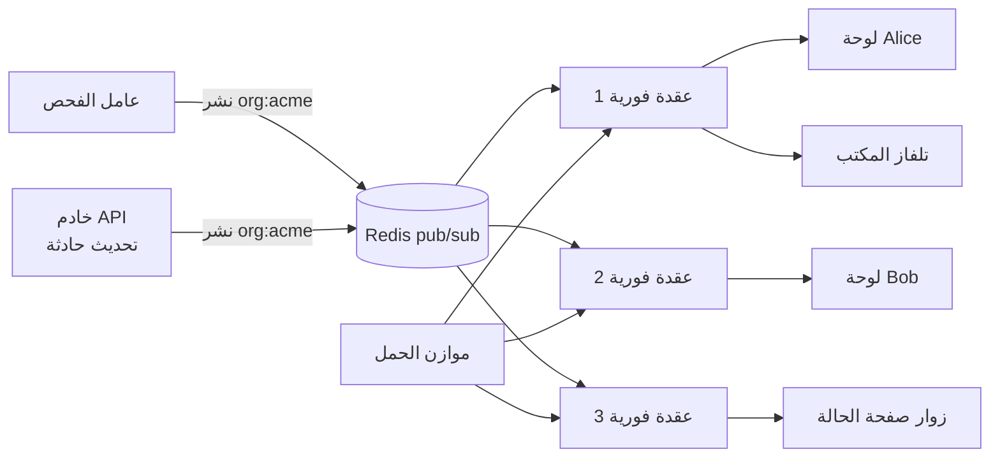
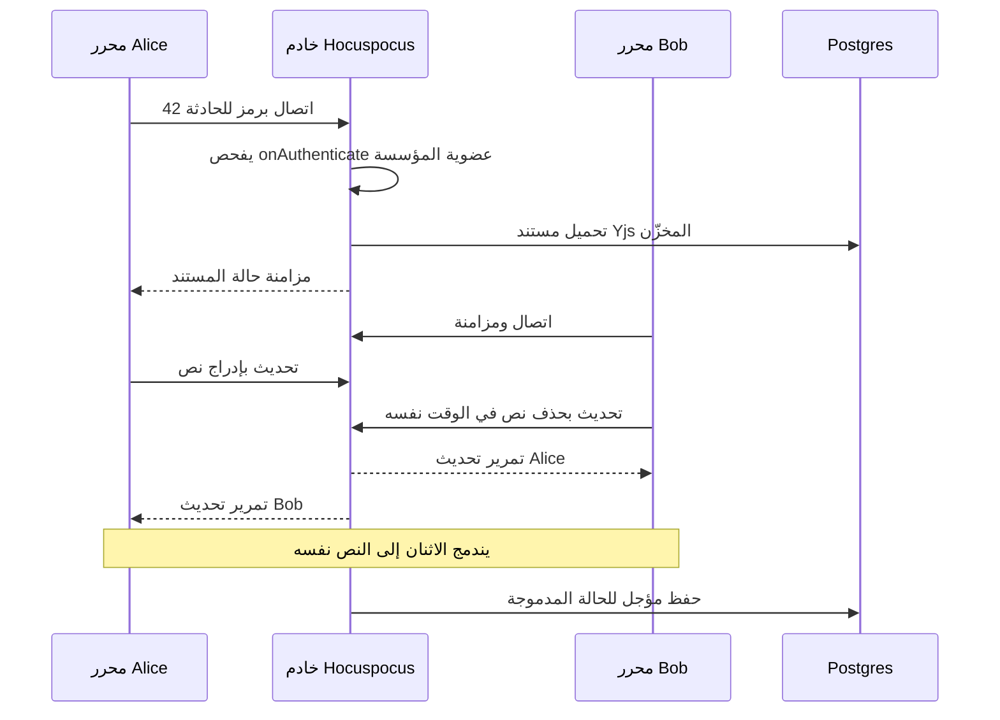

# الوحدة 4 — التواصل

*إذا لم يستطع تطبيق SaaS الوصول إلى مستخدميه فكأنه غير موجود. وفي Beacon يكون الوصول إلى الناس هو المنتج نفسه: تنبيه انقطاع يصل إلى مجلد الرسائل غير المرغوب فيها أسوأ من عدم وجود تنبيه أصلًا. تغطي هذه الوحدة الطرق الثلاث التي يتحدث بها تطبيقك إلى الناس. البريد الإلكتروني المعاملاتي يجب أن يصل. والإشعارات يجب أن تصل إلى الشخص المناسب على القناة المناسبة دون أن تغرقه. أما التحديثات الفورية والتعاون فتجعل لوحة التحكم حيّة، وتسمح لمهندسَين بتحرير تقرير ما بعد الحادثة نفسه دون أن يمحو أحدهما عمل الآخر.*

> **التطبيق العملي:** ابدأ من [نسخة البداية من Beacon](https://github.com/Tamoura/system-design-for-vibe-coders/tree/beacon/starter)، وحلّ التمارين قبل النظر إلى [الحل المرجعي لهذه الوحدة](https://github.com/Tamoura/system-design-for-vibe-coders/tree/beacon/module-4-solution) (الفرع `beacon/module-4-solution`).

---

# 4.1 — بريد معاملاتي يصل فعلًا
*المستوى: 🟢 مبتدئ* · *المتطلبات: 1.1، 1.2*

## ⚡ الدرس في دقيقة

- البريد المعاملاتي (Transactional Email) مثل إعادة تعيين كلمة المرور والدعوات وتنبيهات الحوادث يُرسَل بسبب إجراء قام به المستخدم. أما وصوله فيقرره مزوّد صندوق البريد المستقبِل، بناءً على مصادقة نطاقك وسمعته.
- القاعدة الأهم: انشر سجلات SPF وDKIM وDMARC مع نطاق `From:` متوافق. منذ 2024 ترفض Gmail وYahoo البريد غير المُصادَق.
- الخيار الافتراضي للنسخة الأولى: مزوّد إرسال (Resend أو Postmark أو SES)، وقوالب مكتوبة بـ React Email أو MJML، وإرسال من مهمة في طابور، وMailpit يلتقط كل الرسائل أثناء التطوير.
- افصل البريد التسويقي عن البريد المعاملاتي في تدفقات أو نطاقات فرعية مختلفة، حتى لا تُسقط حملةٌ سيئة رسائلَ إعادة تعيين كلمة المرور.
- الفخ الأكبر: تجاهل الارتدادات والشكاوى. عالج الويب هوك الذي يرسله المزوّد، وافحص قائمة الحظر قبل كل إرسال.

## 🧭 لماذا يحتاجه كل SaaS

أول كود للبريد في Beacon هو ستة أسطر من Nodemailer موجّهة إلى خادم SMTP الخاص بالاستضافة التي يعمل عليها التطبيق، وترسل من `alerts@beacon.app`. لم يُعِدّ أحد سجلات DNS لهذا النطاق. في بيئة التطوير "يعمل" كل شيء، لأن صندوق بريد المطوّر نفسه متساهل. أما في الإنتاج فتصل رسائل إعادة تعيين كلمة المرور متأخرة عشرين دقيقة أو لا تصل أبدًا، ويتوقف التسجيل عند خطوة "أكّد بريدك الإلكتروني". ثم يتعطل API أحد العملاء في الثالثة فجرًا، فيصل تنبيه Beacon إلى مجلد الرسائل غير المرغوب فيها في Gmail. ويعرف العميل بالمشكلة من عملائه هو.

لا يوجد خطأ في الكود. لأن قرار تسليم البريد يتخذه مزوّد صندوق البريد *المستقبِل* (Gmail وOutlook وYahoo ومرشّحات الشركات)، وهو يحكم عليك بناءً على أمرين: هل نطاقك **مُصادَق** (Authenticated)، وهل **سمعة** الإرسال (Reputation) لديك جيدة. منذ فبراير 2024 صارت Gmail وYahoo *تشترطان* المصادقة على الجميع، وتفرضان قواعد أشد على المرسلين بكميات كبيرة. لذلك فالبريد غير المُصادَق لا تقل فرص وصوله فقط، بل يُرفض.

كل SaaS يرسل المجموعة الأساسية نفسها: تأكيد البريد، ورابط الدخول السحري (Magic Link)، وإعادة تعيين كلمة المرور، والدعوة، والإيصال، ورسالة "تنتهي فترتك التجريبية بعد 3 أيام". ويضيف Beacon فوقها تنبيهات الحوادث وتحديثات مشتركي صفحة الحالة. ولا شيء من هذا اختياري.

**تسليم البريد نظام سمعة وليس استدعاء API: صادِق نطاقك، وافصل تدفقات بريدك، وأرسل من طابور، وتصرّف بناءً على ما تخبرك به الارتدادات والشكاوى.**

## 📐 كيف يعمل

### 🟢 الأساسيات

**المعاملاتي مقابل التسويقي.** الفرق بينهما قانوني وتقني، وليس فرقًا في الأسلوب.

| | معاملاتي | تسويقي (جماعي / ترويجي) |
|---|---|---|
| سبب الإرسال | إجراء من المستخدم أو حدث في الحساب | أنت، وترسله إلى قائمة |
| أمثلة | إعادة تعيين كلمة المرور، دعوة، تنبيه حادثة، إيصال | نشرة إخبارية، إطلاق منتج، "نفتقدك" |
| الموافقة | ضمنية باستخدام الخدمة | تحتاج موافقة مسبقة (GDPR) أو على الأقل خيار إلغاء (CAN-SPAM) |
| إلغاء الاشتراك | غير مطلوب للبريد المعاملاتي الحقيقي | مطلوب، وبنقرة واحدة للمرسلين بكميات كبيرة |
| من أين يُرسَل | `mail.beacon.app` أو تدفقك المعاملاتي | نطاق فرعي أو تدفق *منفصل*، مثل `news.beacon.app` |

أبقِهما منفصلين حتى لا تستطيع حملة تسويقية ذات معدل شكاوى سيئ أن تُسقط السمعة التي تعتمد عليها رسائل إعادة تعيين كلمة المرور.

**مصادقة النطاق.** هي ثلاثة سجلات DNS تثبت أنه مسموح لك بالإرسال باسم نطاقك:

| السجل | ما يثبته | شكله |
|---|---|---|
| **SPF** (RFC 7208) | أي الخوادم يحق لها إرسال البريد باسم النطاق الموجود في مرسل الغلاف (Envelope Sender) | `TXT "v=spf1 include:amazonses.com ~all"` |
| **DKIM** (RFC 6376) | أن الرسالة موقّعة من مالك النطاق ولم تُعدَّل. المفتاح العام موجود في DNS | `TXT` عند `selector._domainkey.mail.beacon.app` |
| **DMARC** (RFC 7489) | ما يجب أن يفعله المستقبِل عندما يفشل SPF أو DKIM أو لا *يتوافقان* مع نطاق `From:` الظاهر، وإلى أين تُرسَل التقارير | `TXT` عند `_dmarc.beacon.app`: `"v=DMARC1; p=none; rua=mailto:…"` |

*التوافق* (Alignment) يعني أن النطاق الذي نجح في فحص SPF أو DKIM يطابق النطاق الموجود في ترويسة `From:` التي يراها الإنسان. شاشة الإعداد عند مزوّدك تعطيك السجلات بالضبط. ومهمتك أن تضيفها وتنتظر حتى يتم التحقق منها.

**استخدم مزوّدًا، لا SMTP خامًا من خادمك.** كل من Amazon SES (رخيص وبسيط)، وPostmark (يركّز بقوة على قابلية التسليم، وفيه "تدفقات رسائل" منفصلة للبريد المعاملاتي والبث)، وResend (API موجّه للمطورين، من فريق React Email)، وSendGrid (كبير وقديم) يتولى سمعة عناوين IP وإعادة المحاولة وحلقات التغذية الراجعة (Feedback Loops) ومعالجة الارتدادات. وأي واحد منها مناسب لـ Beacon.

**أرسل من طابور.** الإرسال المباشر داخل معالج الطلب يعني أن المزوّد البطيء يجعل نقطة التسجيل بطيئة، وأن تعطّل المزوّد يُفشل عمليات التسجيل. ضع مهمة بريد في الطابور (Queue)، ودع عاملًا (Worker) يرسلها مع إعادة المحاولة (5.1).



```ts
// emails/invite.tsx: a React Email template
import { Html, Button, Text } from "@react-email/components";
export function InviteEmail({ orgName, url }: { orgName: string; url: string }) {
  return (
    <Html>
      <Text>You've been invited to join {orgName} on Beacon.</Text>
      <Button href={url}>Accept invitation</Button>
    </Html>
  );
}

// worker: send-email job
import { render } from "@react-email/render";
export async function sendInvite(job: { to: string; orgName: string; url: string; inviteId: string }) {
  if (await isSuppressed(job.to)) return;
  const html = await render(<InviteEmail orgName={job.orgName} url={job.url} />);
  await resend.emails.send(
    { from: "Beacon <team@mail.beacon.app>", to: job.to, subject: `Join ${job.orgName} on Beacon`, html },
    { idempotencyKey: `invite:${job.inviteId}` },
  );
}
```

في Django توجد `send_mail` مع واجهات خلفية مثل `django-anymail`، وفي Rails يوجد Action Mailer مع `deliver_later`، وفي Laravel توجد Mailables مع `->queue()`. والشكل واحد: قالب، ثم طابور، ثم مزوّد.

### 🟡 التعمق أكثر

**الارتدادات والشكاوى والحظر.** يبلغك المزوّد بالنتائج عبر الويب هوك (Webhook):

- **الارتداد الدائم (Hard Bounce):** العنوان غير موجود. لا ترسل إليه مرة أخرى أبدًا.
- **الارتداد المؤقت (Soft Bounce):** صندوق البريد ممتلئ أو هناك فشل مؤقت. يعيد المزوّد المحاولة. احظر العنوان بعد تكرار الفشل.
- **الشكوى (Complaint):** نقر المستلم على "الإبلاغ عن رسالة غير مرغوب فيها". أوقف فورًا كل البريد غير الضروري إليه.

احتفظ بـ **قائمة حظر** (Suppression List) خاصة بك (العنوان، والسبب، والتاريخ)، وافحصها قبل كل إرسال، مع أن المزوّدين يحتفظون بقائمة أيضًا (في SES قائمة على مستوى الحساب، وPostmark يحظر لكل تدفق). قائمتك الخاصة تسمح لك بعرض رسالة مثل "لا نستطيع مراسلة jane@acme.com، فقد ارتدّ بريدها" في الواجهة، وهذا يوفّر عليك تذكرة دعم. وتحقّق من تواقيع الويب هوك بالطريقة نفسها التي استخدمتها مع Stripe في 3.1.

**متطلبات Gmail وYahoo لعام 2024.** لكل المرسلين: SPF *أو* DKIM، وسجلات DNS صحيحة في الاتجاهين الأمامي والعكسي لعناوين IP المرسِلة، وTLS، ومعدل شكاوى أقل من 0.3% (كما يظهر في Google Postmaster Tools). وللمرسلين بكميات كبيرة (نحو 5,000 رسالة يوميًا أو أكثر إلى عناوين Gmail): SPF *و*DKIM معًا، وسجل DMARC (على الأقل `p=none`) مع نطاق `From:` متوافق، و**إلغاء اشتراك بنقرة واحدة** (RFC 8058: الترويستان `List-Unsubscribe` و`List-Unsubscribe-Post`) في البريد التسويقي والبريد الذي اشترك فيه المستخدم، على أن يُنفَّذ الإلغاء خلال يومين. وأعلنت Microsoft في 2025 متطلبات مشابهة للمرسلين بكميات كبيرة إلى عناوين Outlook.com الشخصية. تُعدّ رسائل مشتركي صفحة الحالة في Beacon بريدًا اشترك فيه المستخدم: فالناس سجّلوا لتلقيها، لذلك تحتاج ترويسات إلغاء الاشتراك.

**القوالب.** HTML البريد عالق في حدود عام 2005: جداول للتخطيط، وCSS مضمّن، ودعم متقطع لـ CSS الحديث، وOutlook يعرض الرسائل بمحرك Word، والوضع الداكن يقلب ألوانك. لا تكتبه يدويًا. اختر أداة واحدة:

| الأداة | تكتب بها | مناسبة لـ |
|---|---|---|
| React Email | مكوّنات React | فرق TypeScript وReact، مع خادم معاينة محلي |
| MJML | لغة ترميز تشبه XML وتُترجَم إلى جداول متجاوبة | أي تقنية. ويستطيع المصممون تعلّمها |
| Maizzle | HTML مع Tailwind CSS، ويُبنى إلى HTML بريد بأنماط مضمّنة | الفرق التي تعمل بـ Tailwind دائمًا |

أرسل دائمًا **جزءًا نصيًا عاديًا** (Plain-text Part) أيضًا، لأنه يساعد على التسليم وإمكانية الوصول.

**الاختبار محليًا.** لا ترسل بريدًا حقيقيًا من بيئة التطوير أبدًا. شغّل **Mailpit**، وهو خادم SMTP محلي (على المنفذ 1025 افتراضيًا) مع واجهة ويب (على 8025) يلتقط كل شيء. ويستطيع أيضًا فحص توافق HTML مع برامج البريد واختبار الروابط. الإعدادات القديمة تستخدم MailHog أو Inbucket، وستراهما في المشاريع أدناه. لكن Mailpit هو الخيار الذي تتم صيانته بنشاط. وللقوالب، يعرض خادم المعاينة في React Email كل قالب ببيانات تجريبية.

**التوطين (Localization).** خزّن `locale` لكل مستخدم واعرض الرسائل بها. هذا يشمل عناوين الرسائل والتواريخ والأوقات (بالمنطقة الزمنية *للمستلم*، وهذا مهم في عبارة مثل "بدأت الحادثة الساعة 03:12")، والتخطيط من اليمين إلى اليسار إذا كنت تدعم تلك اللغات. لا تترجم داخل القالب يدويًا. استخدم فهرس الترجمة (i18n) نفسه الذي يستخدمه التطبيق.

### 🔴 على نطاق واسع وللمؤسسات

**نطاقات إرسال مخصصة لكل مستأجر.** عملاء الخطة Business يريدون إرسال تحديثات صفحة الحالة *من نطاقهم الخاص* (`status@acme.com`) وليس من `beacon.app`. هذا يعني إضافة نطاق كل عميل لدى مزوّدك (هويات SES، وواجهات النطاقات في Resend وPostmark)، وعرض سجلات SPF وDKIM التي يجب أن يضيفها، ومتابعة التحقق بشكل دوري، وتوجيه كل إرسال عبر الهوية الصحيحة. واحتفظ بخيار احتياطي: إلى أن يتم التحقق من النطاق، أرسل من نطاقك مع وضع اسم العميل في اسم العرض. كل من Documenso وDub يقدّم هذه الميزة لعملائه.

**التوزيع الواسع (Fan-out).** حادثة واحدة على صفحة حالة مشهورة قد تعني 50,000 رسالة للمشتركين. استخدم واجهة الإرسال الجماعي (Batch API) لدى مزوّدك، واضبط السرعة بحسب حصة الإرسال، واجعل كل رسالة متساوية الأثر (Idempotent) بمفتاح مثل (`incident:{id}:update:{n}:subscriber:{id}`)، وضع هذه الرسائل في تدفق أو نطاق فرعي منفصل عن إعادة تعيين كلمة المرور، حتى لا تؤخر موجةُ إرسال أو موجةُ شكاوى رسائلَ تسجيل الدخول.

**إدارة السمعة.** راقب معدلات الارتداد والشكاوى لكل تدفق (فـ SES يراجع الحسابات التي تتجاوز حدوده أو يوقفها مؤقتًا)، وانقل DMARC من `p=none` إلى `quarantine` ثم `reject` بعد أن تُظهر التقارير أن كل مصدر شرعي متوافق، ولا تفكر في عناوين IP مخصصة إلا مع حجم إرسال كبير (فهي تحتاج إحماءً وحركة ثابتة)، وفكّر في مزوّد ثانٍ للتحويل عند الفشل (Failover) للبريد الحرج.

**الاستضافة الذاتية.** تشغيل وكيل نقل البريد (MTA) الخاص بك يعني أن تدير سمعة عناوين IP بنفسك، وهذه وظيفة بدوام كامل. الخيارات الواقعية للاستضافة الذاتية إما *تغلّف* مزوّدًا أو تناسب حالات محددة: useSend يعطيك API ولوحة تحكم بأسلوب Resend فوق Amazon SES، وPostal خادم بريد كامل للفرق التي لديها قدرة تشغيلية، وlistmonk (للنشرات الإخبارية) وMautic (لأتمتة التسويق) يغطيان الجانب التسويقي.

## 🏆 أفضل المستودعات

| المستودع | ما هو | التقنيات | الترخيص | اختره عندما |
|---|---|---|---|---|
| [resend/react-email](https://github.com/resend/react-email) | بناء رسائل البريد كمكوّنات React، مع خادم معاينة | TypeScript, React | MIT | تطبيقك مبني بـ React وTypeScript، وتريد القوالب بجانب الكود |
| [mjmlio/mjml](https://github.com/mjmlio/mjml) | لغة ترميز تُترجَم إلى HTML بريد متجاوب | JavaScript | MIT | لأي لغة خلفية، أو عندما يكتب المصممون القوالب |
| [maizzle/framework](https://github.com/maizzle/framework) | إطار Tailwind CSS لرسائل HTML | JavaScript | MIT | فريقك يفكر بأسلوب Tailwind |
| [nodemailer/nodemailer](https://github.com/nodemailer/nodemailer) | أداة الإرسال القياسية في Node.js (SMTP ووسائل نقل أخرى) | JavaScript | MIT-0 | تحتاج SMTP (عملاء يستضيفون بأنفسهم، أو Mailpit، أو مزوّد احتياطي) |
| [axllent/mailpit](https://github.com/axllent/mailpit) | ملتقط SMTP محلي مع واجهة ويب وفحص توافق HTML والروابط | Go | MIT | دائمًا، في التطوير وفي CI |
| [unsend-dev/unsend](https://github.com/unsend-dev/unsend) | useSend: منصة إرسال مفتوحة المصدر (API ونطاقات وويب هوك) فوق Amazon SES | TypeScript, Next.js | AGPL-3.0 | تريد تجربة تشبه Resend تستضيفها بنفسك وتدفع أسعار SES |
| [postalserver/postal](https://github.com/postalserver/postal) | منصة تسليم بريد كاملة الميزات | Ruby | MIT | تحتاج فعلًا إلى تشغيل خوادم البريد الخاصة بك |
| [knadh/listmonk](https://github.com/knadh/listmonk) | مدير نشرات إخبارية وقوائم بريدية تستضيفه بنفسك | Go, Postgres | AGPL-3.0 | نشرات المنتج، منفصلة عن البريد المعاملاتي |
| [mautic/mautic](https://github.com/mautic/mautic) | أتمتة تسويق مفتوحة المصدر | PHP | GPL-3.0 | حملات وتقسيم جمهور وتقييم عملاء محتملين، باستضافة ذاتية |

**إن درست مستودعًا واحدًا فقط:** انسخ `resend/react-email`، وشغّل خادم المعاينة، واقرأ كيف تتحول المكوّنات إلى HTML آمن للبريد. أغلب مشاريع SaaS الحديثة المكتوبة بـ TypeScript، ومنها المشاريع أدناه، تستخدمه، وسيغيّر طريقة تفكيرك في قوالب البريد بوصفها كودًا.

**اشترِ أم ابنِ أم استضف بنفسك؟**

- **اشترِ (الخيار الافتراضي):** مزوّد إرسال مثل Postmark أو Resend أو Amazon SES أو SendGrid. قابلية التسليم هي منتجهم، وتكلفتهم قليلة مقارنة بوقتك.
- **استضف بنفسك:** useSend فوق SES للتحكم في التكلفة مع API جيد. وlistmonk أو Mautic لقوائم التسويق. وPostal فقط إذا كانت لديك قدرة تشغيلية مخصصة.
- **ابنِ:** القوالب، ومهمة البريد، وفحص قائمة الحظر، ومعالجة ويب هوك الارتدادات والشكاوى، وإضافة نطاقات المستأجرين. ولا تبنِ أبدًا خادم بريد خاصًا بك للبريد الحرج في SaaS.

## 🔍 ادرسه في مشاريع حقيقية

**openstatus (`openstatusHQ/openstatus`).** هو Beacon الحقيقي، لذلك فرسائله هي رسائل Beacon. وقت كتابة هذا الدرس، يحتوي `packages/emails/emails/` على قوالب React Email مثل `monitor-alert.tsx` و`page-subscription.tsx` و`status-report.tsx` و`team-invitation.tsx` و`plan-downgraded.tsx`، مع مكوّنات مشتركة في `_components/`. قارن بين رسالة التنبيه ورسالة تحديث المشترك.

**Dub (`dubinc/dub`).** افتح `packages/email` واقرأ `src/index.ts`. الدالة `sendEmail` تستخدم Resend عندما يكون مُعدًّا، وتعود إلى Nodemailer عبر SMTP في غير ذلك، وهذه طريقة مشروع SaaS مفتوح المصدر في دعم من يستضيفونه بأنفسهم. ثم ابحث عن `VARIANT_TO_FROM_MAP`: بريد النظام وبريد الإشعارات والبريد التسويقي تُرسَل من *عناوين ونطاقات فرعية مختلفة*. هذا فصل التدفقات في ثلاثة أسطر. وابحث عن `email-domains` لترى نطاقات الإرسال المخصصة لكل مساحة عمل.

**Documenso (`documenso/documenso`).** افتح `packages/email`. الملف `mailer.ts` يختار وسيلة نقل Nodemailer (SMTP أو Resend أو MailChannels) من متغيرات البيئة، ومجلد `templates/` فيه ملف لكل رسالة، وهناك إعداد معاينة منفصل. ملف Docker Compose الخاص بالتطوير في Documenso يستخدم Inbucket لالتقاط البريد. وابحث عن `organisation-email-domain` لترى كيف تضيف المؤسسات نطاق الإرسال الخاص بها.

**Cal.com (`calcom/cal.com`).** يحتوي `packages/emails` على ملف README يشرح `renderEmail("TeamInviteEmail", props)` ونقطة معاينة، وعلى ملف `docker-compose.yml` يشغّل MailHog لالتقاط البريد محليًا. ابحث عن `billing-email-service` و`auth-email-service` لترى كيف تُجمَّع الرسائل بحسب مجال العمل.

**ما الذي تلاحظه**

- هل الإرسال مغلّف خلف دالة واحدة مع وسائل نقل قابلة للتبديل.
- كم عنوان `From:` ونطاقًا فرعيًا مختلفًا يُستخدم، ولماذا.
- أين تُطلَق الرسائل: مباشرة في الطلب، أم في مهام خلفية، أم من سير عمل.
- كيف تلتقط بيئة التطوير المحلية البريد (Mailpit أو MailHog أو Inbucket أو خوادم المعاينة).
- كيف يتم التحقق من نطاقات الإرسال التي يملكها العملاء وكيف تُستخدم.

## 🛠️ ابنِه في Beacon

### 🟢 تمرين المبتدئ

أعدّ Mailpit في ملف `docker-compose.yml` الخاص بـ Beacon، ومزوّدًا (Resend أو Postmark أو SES) للإنتاج. أنشئ قوالب React Email (أو MJML) لرسائل *تأكيد البريد* و*الدعوة* و*فتح حادثة*، وأرسلها عبر دالة واحدة `sendEmail()` تختار SMTP إلى Mailpit في التطوير والمزوّد في الإنتاج.

**يكتمل عندما:**
- يُظهر التسجيل المحلي رسالة التأكيد في واجهة Mailpit على `localhost:8025`.
- يكون لكل قالب جزء نصي عادي، ويُعرض في المعاينة.
- لا يستورد أي كود خارج `sendEmail()` حزمة SDK الخاصة بالمزوّد.

### 🟡 تمرين المستوى المتوسط

صادِق النطاق `mail.beacon.app` (SPF وDKIM وDMARC مع `p=none` وعنوان للتقارير)، وانقل كل الإرسال إلى مهمة في الطابور مع مفاتيح عدم التكرار (Idempotency Keys)، وعالج ويب هوك الارتدادات والشكاوى من المزوّد مع التحقق من التوقيع. احتفظ بجدول `email_suppressions` يُفحَص قبل كل إرسال، واعرض تحذيرًا في واجهة أعضاء الفريق للعناوين المحظورة.

**يكتمل عندما:**
- تُظهر أداة فحص خارجية (أو لوحة تحكم المزوّد) نجاح SPF وDKIM وDMARC وتوافقها.
- يضيف ارتداد دائم مُحاكى (يوفّر المزوّدون عناوين للاختبار) صفًا في جدول الحظر، ولا تتم أي محاولة إرسال أخرى إلى ذلك العنوان.
- يؤدي تعطل المزوّد (حاكِه بمفتاح API خاطئ) إلى تأخير الرسائل دون إفشال طلبات المستخدمين، ثم تُرسَل الرسائل بعد عودة الخدمة.

### 🔴 تمرين المستوى المتقدم

اسمح لمؤسسات الخطة Business بإرسال رسائل مشتركي صفحة الحالة من نطاقها الخاص. ابنِ عملية إضافة النطاق (إنشاء الهوية عبر API المزوّد، وعرض سجلات DNS، ومتابعة التحقق)، وأرسل تحديثات المشتركين من تدفق منفصل مع ترويسات إلغاء الاشتراك بنقرة واحدة وفق RFC 8058، ووزّع تحديثات الحوادث على دفعات مضبوطة السرعة.

**يكتمل عندما:**
- تستطيع المؤسسة إضافة `status.acme.com` ورؤية سجلات DNS الخاصة به، وتحصل على حالة "تم التحقق" بعد انتشار السجلات.
- قبل التحقق، تُرسَل الرسائل من نطاق Beacon مع اسم عرض المؤسسة.
- تحتوي رسائل المشتركين على `List-Unsubscribe` و`List-Unsubscribe-Post`، ويؤدي إلغاء الاشتراك بنقرة واحدة إلى إزالة المشترك دون تسجيل دخول.
- يكتمل توزيع على 10,000 مشترك ضمن حدود المعدل لدى مزوّدك، دون تأخير رسائل إعادة تعيين كلمة المرور.

## ⚠️ أخطاء يقع فيها المبتدئون

- **الإرسال من خادم SMTP الخاص بخادم التطبيق أو من نطاق غير مُصادَق.** تصل الرسائل إلى مجلد غير المرغوب فيه أو تُرفض وفق قواعد 2024. استخدم مزوّدًا، وانشر SPF وDKIM وDMARC قبل الإطلاق.
- **إرسال البريد مباشرة داخل الطلب.** يصبح بطء المزوّد بطئًا لديك، وتصبح أعطاله أخطاء 500. ضع المهمة في الطابور وأرسل من عامل مع إعادة المحاولة.
- **خلط البريد التسويقي والمعاملاتي في نطاق وتدفق واحد.** حملة واحدة مزعجة تضر بتسليم رسائل إعادة تعيين كلمة المرور. افصل بينهما بنطاق فرعي أو بتدفق لدى المزوّد.
- **تجاهل الارتدادات والشكاوى.** الإرسال المتكرر إلى عناوين ميتة وإلى من اشتكوا يضر بالسمعة حتى يذهب كل شيء إلى مجلد غير المرغوب فيه. عالج الويب هوك واحتفظ بقائمة حظر.
- **كتابة HTML البريد يدويًا.** ينكسر في Outlook وفي الوضع الداكن وبسبب اقتطاع Gmail للرسائل. استخدم React Email أو MJML أو Maizzle، وعاين الرسائل في برامج بريد حقيقية.
- **السماح لبيئة التطوير بإرسال بريد حقيقي.** البيانات التجريبية مع مزوّد حقيقي تعني أن عملاء حقيقيين يستلمون رسائل اختبار. وجّه بيئة التطوير إلى Mailpit دائمًا.

## 🧾 الخلاصة

- البريد المعاملاتي والتسويقي يختلفان في الموافقة والترويسات والسمعة، لذلك أبقِهما في تدفقات منفصلة.
- SPF وDKIM وDMARC مع التوافق أصبحت إلزامية الآن، وليست إضافة جيدة فقط.
- اكتب القوالب بـ React Email أو MJML أو Maizzle. وأرسل من طابور. والتقط كل شيء محليًا بـ Mailpit.
- الارتدادات والشكاوى تغذّي قائمة حظر تفحصها قبل كل إرسال.
- نطاقات الإرسال لكل مستأجر والتوزيع الواسع هي مشكلات خطة Business. خطّط للتدفقات الخاصة بها مبكرًا.

## ✍️ اختبر نفسك

**1. ماذا يثبت كل من SPF وDKIM وDMARC، وماذا يعني "التوافق"؟**

<details><summary>الإجابة</summary>

يحدد SPF الخوادم التي يحق لها الإرسال باسم النطاق، ويثبت DKIM أن الرسالة موقّعة من مالك النطاق ولم تُعدَّل، ويخبر DMARC المستقبِل بما يفعله عندما تفشل هذه الفحوص أو لا تتوافق، وإلى أين يرسل التقارير. التوافق يعني أن النطاق الذي نجح في SPF أو DKIM يطابق نطاق `From:` الذي يراه الإنسان. راجع جدول مصادقة النطاق في 🟢 الأساسيات.

</details>

**2. ما الأنواع الثلاثة من التغذية الراجعة التي يرسلها المزوّد، وكيف تتصرف مع كل منها؟**

<details><summary>الإجابة</summary>

الارتداد الدائم يعني أن العنوان غير موجود، فلا ترسل إليه مرة أخرى أبدًا. والارتداد المؤقت فشل عابر يعيد المزوّد المحاولة بعده، وتحظر العنوان بعد تكرار الفشل. والشكوى تعني أن المستلم نقر على "الإبلاغ عن رسالة غير مرغوب فيها"، فتوقف فورًا كل البريد غير الضروري إليه. راجع فقرة "الارتدادات والشكاوى والحظر" في 🟡 التعمق أكثر.

</details>

**3. تُرسَل رسائل مشتركي صفحة الحالة في Beacon من النطاق والتدفق نفسيهما لرسائل إعادة تعيين كلمة المرور. لماذا هذه مشكلة، وما الذي يجب تغييره؟**

<details><summary>الإجابة</summary>

تحديثات المشتركين بريد اشترك فيه الناس ويُرسَل بكميات كبيرة، لذلك قد يضر توزيعٌ واسع أثناء حادثة كبيرة أو موجةُ شكاوى بالسمعة التي تعتمد عليها رسائل إعادة تعيين كلمة المرور، وقد يؤخرها. ضع بريد المشتركين في تدفق أو نطاق فرعي منفصل، مع ترويسات إلغاء الاشتراك بنقرة واحدة وفق RFC 8058. راجع جدول المعاملاتي مقابل التسويقي وفقرة "التوزيع الواسع" في 🔴 على نطاق واسع وللمؤسسات.

</details>

**4. يريد عميل في خطة Business إرسال تحديثات الحالة من `status@acme.com`. ما الذي يحتاج Beacon إلى بنائه، وماذا يحدث قبل التحقق من نطاقه؟**

<details><summary>الإجابة</summary>

يضيف Beacon النطاق عبر API المزوّد، ويعرض للعميل سجلات SPF وDKIM التي يجب أن يضيفها، ويتابع التحقق، ويوجّه كل إرسال عبر الهوية الصحيحة. وإلى أن يتم التحقق من النطاق، يرسل من نطاق Beacon نفسه مع وضع اسم العميل في اسم العرض. راجع فقرة "نطاقات إرسال مخصصة لكل مستأجر" في 🔴 على نطاق واسع وللمؤسسات.

</details>

**5. معالج التسجيل يستدعي API المزوّد مباشرة قبل أن يعيد الاستجابة. ما الذي ينكسر أثناء تعطل المزوّد، وما الحل؟**

<details><summary>الإجابة</summary>

يصبح بطء المزوّد بطئًا في التسجيل، ويحوّل تعطل المزوّد عمليات التسجيل إلى أخطاء 500، فلا يستطيع المستخدمون إنشاء حسابات أصلًا. ضع مهمة بريد في الطابور، ودع عاملًا يرسلها مع إعادة المحاولة ومفتاح عدم تكرار. عندها ينجح التسجيل، وتُرسَل الرسالة بعد عودة الخدمة. راجع فقرة "أرسل من طابور" في 🟢 الأساسيات وقائمة الأخطاء.

</details>

## 📚 المراجع

- Google, Email sender guidelines — إرشادات مرسلي البريد من Google: https://support.google.com/mail/answer/81126
- RFC 7208 (SPF): https://www.rfc-editor.org/rfc/rfc7208
- RFC 6376 (DKIM): https://www.rfc-editor.org/rfc/rfc6376
- RFC 7489 (DMARC): https://www.rfc-editor.org/rfc/rfc7489
- RFC 8058 (one-click unsubscribe) — إلغاء الاشتراك بنقرة واحدة: https://www.rfc-editor.org/rfc/rfc8058
- React Email docs — توثيق React Email: https://react.email/docs
- Mailpit docs — توثيق Mailpit: https://mailpit.axllent.org
- Amazon SES Developer Guide — دليل المطور لـ Amazon SES: https://docs.aws.amazon.com/ses/

---

# 4.2 — الإشعارات: داخل التطبيق، والدفع، وSlack، وSMS — والتفضيلات
*المستوى: 🟡 متوسط* · *المتطلبات: 4.1، 1.2*

## ⚡ الدرس في دقيقة

- نظام الإشعارات (Notifications) يحوّل حدثًا واحدًا في النطاق إلى الرسالة المناسبة، للأشخاص المناسبين، على القنوات المناسبة (داخل التطبيق، والبريد، والإشعارات الفورية، وSMS، وSlack، والويب هوك).
- القاعدة الأهم: أرسل إشعارًا عند تغيّر الحالة، لا عند كل حدث. التخلّف (Hysteresis) ومفاتيح منع التكرار وحدود المعدل والملخّصات تمنع إرهاق التنبيهات.
- الخيار الافتراضي للنسخة الأولى: نقطة دخول واحدة `notify()`، وجدول إشعارات يعمل كصندوق وارد داخل التطبيق، ومصفوفة تفضيلات بحسب الفئة × القناة، ومهمة لكل قناة.
- بعض الفئات (الأمان والفوترة) إلزامية ولا يمكن إيقافها، ويجب أن يعمل إلغاء الاشتراك دون تسجيل دخول.
- الفخ الأكبر: استدعاء Twilio أو Slack مباشرة من كود الأعمال. استأجر القنوات، لكن احتفظ بالقرارات في مكان واحد.

## 🧭 لماذا يحتاجه كل SaaS

يبدأ API الدفع لدى أحد العملاء بالتذبذب في الثانية فجرًا: يتعطل 40 ثانية، ثم يعمل دقيقة، ثم يتعطل مرة أخرى. يفحص Beacon كل 30 ثانية، ويرسل إشعارًا بإخلاص عند كل تغيّر في الحالة. بحلول السادسة صباحًا يكون لدى المهندس المناوب 140 رسالة بريد، و140 رسالة SMS (تُحتسب كاستخدام زائد، راجع 3.3)، وقناة Slack لا يستطيع أحد التمرير فيها. وفي 6:05 يتعطل API *فعلًا*. لكن الفريق كان قد كتم Beacon حينها، ولم يرَ أحد التنبيه المهم.

هذا هو **إرهاق التنبيهات** (Alert Fatigue)، وهو في منتج مراقبة خطأ يهدد وجوده. والفشل المعاكس شائع بالقدر نفسه. المدير التقني يريد SMS لمراقبات الإنتاج فقط، والمتدرب لا يريد بريدًا أصلًا، والفريق يريد كل شيء في `#incidents`، ومشترك في صفحة الحالة يريد إلغاء اشتراكه في صفحة واحدة دون تسجيل دخول. قاعدة "أرسل بريدًا عندما يحدث X" لا تصمد أمام المستخدمين الحقيقيين.

كل SaaS ينتهي به الأمر إلى بناء نظام إشعارات: دعوات، وإشارات، وتعليقات، وموافقات، وحدود استخدام، وفشل في الدفع. وكلها تمر بالقرارات نفسها: من يجب أن يعلم، وعلى أي قناة، وبأي درجة استعجال، وكم مرة، وهل طلب ألا يُبلَّغ.

**نظام الإشعارات سلسلة من القرارات (من، وأين، وكم مرة، وهل يُرسَل أصلًا)، وهذه القرارات أهم من التسليم نفسه.**

## 📐 كيف يعمل

### 🟢 الأساسيات

افصل **ما حدث** (الحدث) عن **من يُبلَّغ وكيف** (الإشعارات):



للقنوات خصائص مختلفة جدًا:

| القناة | زمن الوصول | التكلفة | درجة الإزعاج | تحتاج إلى | يستخدمها Beacon لـ |
|---|---|---|---|---|---|
| صندوق الوارد داخل التطبيق | فوري إذا كان المستخدم متصلًا | شبه مجانية | منخفضة | جدول مع تحديث فوري (4.3) | كل شيء، بوصفه السجل |
| البريد الإلكتروني | من ثوانٍ إلى دقائق | منخفضة جدًا | من منخفضة إلى متوسطة | عنوان مؤكَّد (4.1) | الحوادث، والملخّصات، والفوترة |
| الإشعارات الفورية (APNs، FCM، Web Push) | ثوانٍ | شبه مجانية | عالية | رمز الجهاز وإذن نظام التشغيل | تنبيهات المناوبة على الجوال |
| SMS | ثوانٍ | لكل رسالة، وتُحتسب بالمقاطع | عالية جدًا | رقم هاتف، وموافقة، وقواعد شركات الاتصالات | الحوادث الحرجة فقط |
| Slack / Teams | ثوانٍ | مجانية | متوسطة | تثبيت عبر OAuth (5.3) | تنبيهات قنوات الفريق |
| ويب هوك صادر | ثوانٍ | مجانية | لا شيء، فهي للأنظمة | نقطة استقبال وتوقيع (5.3) | PagerDuty والأدوات المخصصة |

نموذج البيانات في النسخة الأولى: صف واحد لكل إشعار لكل مستلم (صندوق الوارد داخل التطبيق)، بالإضافة إلى التفضيلات.



نقطة دخول واحدة يستدعيها كود النطاق، وهذا الكود لا يتحدث مع Twilio مباشرة أبدًا:

```ts
export async function notify(evt: { category: "incident.opened"; orgId: string; incidentId: string }) {
  const recipients = await resolveRecipients(evt);             // on-call + watchers
  for (const user of recipients) {
    const dedupeKey = `${evt.category}:${evt.incidentId}:${user.id}`;
    const n = await db.notification.createIfAbsent({ dedupeKey, userId: user.id, orgId: evt.orgId,
      category: evt.category, payload: evt });                 // unique(dedupeKey)
    if (!n) continue;                                          // already notified
    const channels = await enabledChannels(user.id, evt.category); // preferences + defaults
    for (const channel of channels) {
      await queue.add("deliver", { notificationId: n.id, channel },
        { jobId: `${n.id}:${channel}` });                      // idempotent job
    }
  }
}
```

**التفضيلات** تبدأ بسيطة: مصفوفة من *الفئة* × *القناة* مع قيم افتراضية معقولة، مثل "فتح حادثة: بريد ✓، SMS ✓، إشعار فوري ✓" و"التقرير الأسبوعي: بريد ✓". بعض الفئات **إلزامية** (تنبيهات الأمان، وفشل الفوترة، و"أصبحت مالكًا")، ولا يستطيع المستخدمون إيقافها.

### 🟡 التعمق أكثر

**أرسل الإشعار عند تغيّر الحالة، لا عند كل حدث.** مشكلة التذبذب في Beacon تُحل في الغالب في *منطق النطاق*، لا في نظام الإشعارات:

- افتح حادثة فقط بعد **N حالات فشل متتالية** (مثلًا 3)، أو بعد فشل من **عدة مناطق**، ولا تغلقها إلا بعد M حالات نجاح متتالية. هذا هو التخلّف (Hysteresis).
- أرسل إشعارًا مرة واحدة عند كل **تغيّر في حالة** الحادثة (فُتحت، تم الإقرار بها، حُلّت)، ولا ترسل أبدًا عند كل فحص فاشل.
- إذا فتحت مراقبةٌ حوادث وأغلقتها أكثر من K مرة في ساعة، فعلّمها بأنها **متذبذبة**. أرسل إشعارًا واحدًا "المراقبة متذبذبة"، واكتم الباقي حتى تستقر.

يعرض Uptime Kuma هذه الخيارات كإعدادات لكل مراقبة (عدد المحاولات قبل اعتبارها متعطلة، وعدد مرات إعادة الإرسال ما دامت متعطلة). وتستحق أن تنسخها.

**منع التكرار، وتحديد المعدل، والتجميع.** هذه ثلاث أدوات مختلفة:

| الأداة | السؤال الذي تجيب عنه | مثال |
|---|---|---|
| منع التكرار (Dedupe) | "هل أرسلت *هذا الشيء نفسه* من قبل؟" | مفتاح `dedupeKey` فريد لكل حادثة + حالة + مستلم |
| تحديد المعدل (Throttle / Rate Limit) | "هل أرسلت *أكثر من اللازم* مؤخرًا؟" | 5 رسائل SMS كحد أقصى لكل مستخدم في الساعة. بعد ذلك انتقل إلى الإشعار الفوري أو البريد مع عبارة "و12 أخرى" |
| الملخّص / التجميع (Digest / Batch) | "هل أستطيع دمج هذه في رسالة واحدة؟" | اجمع الإشعارات غير العاجلة لمدة 30 دقيقة، ثم أرسل بريدًا واحدًا يلخّصها |

الملخّص آلة حالات صغيرة: أول حدث يفتح نافذة، والأحداث اللاحقة تنضم إليها، وعندما تُغلق النافذة تُرسَل رسالة واحدة. ويحتاج ذلك إلى مهمة مجدولة مفتاحها `(user, category, window)`. في Novu يوجد التجميع كخطوة جاهزة في سير العمل، ويستحق القراءة حتى لو بنيت نسختك الخاصة.

**طبقتان من التفضيلات.** في منتجات B2B تضع *المؤسسة* السياسة ("حوادث الإنتاج ترسل دائمًا SMS إلى المناوب")، ويضبط *المستخدم* تفضيلاته داخلها ("لا ترسل لي بريدًا عن بيئة الاختبار"). حُلّها بهذا الترتيب: `required categories` ← سياسة المؤسسة ← تفضيل المستخدم ← القيمة الافتراضية. وساعات الهدوء ("لا إشعارات فورية من 22:00 إلى 07:00 إلا إذا كانت الخطورة حرجة") مكانها في خطوة الحل نفسها، وتُحسب بالمنطقة الزمنية *للمستخدم*.

**إلغاء الاشتراك دون تسجيل دخول.** كل إشعار بالبريد يحمل رابط إلغاء اشتراك موقّعًا وخاصًا بالمستلم والفئة، بالإضافة إلى ترويسات النقرة الواحدة وفق RFC 8058 حيث تكون مطلوبة (4.1). مشتركو صفحة الحالة ليسوا مستخدمين أصلًا، لذلك يحصلون على صفحة إدارة تعتمد على رمز (Token). وتحتاج SMS أيضًا إلى معالجة الكلمات المفتاحية: كلمة STOP يجب أن توقف الإرسال. يعالج Twilio كلمات إلغاء الاشتراك القياسية نيابة عنك على الأرقام الطويلة، لكن احفظ هذه الحالة في قاعدة بياناتك أيضًا.

**التصعيد (Escalation).** في منتج للمناوبة، يجب أن يعلو صوت التنبيه الذي لم يُقرّ به أحد:



كل خطوة مهمة مؤجلة تبدأ بفحص: "هل تم الإقرار؟". ويجب أن *يلغي* الإقرار الخطوات المعلّقة، وهذا عمل مناسب لمحرك سير عمل متين (Durable Workflow Engine) (5.4)، أو على الأقل لمهام مؤجلة بمعرّفات ثابتة يمكنك حذفها.

**تفاصيل القنوات التي ستصطدم بها:**

- **الإشعارات الفورية (Push):** تحتاج APNs (من Apple) وFCM (من Google) إلى رموز أجهزة تنتهي صلاحيتها أو تتغير، لذلك احذف الرموز التي يبلغ المزوّد أنها غير صالحة. أوقفت Google واجهات HTTP القديمة في FCM عام 2024، والكود الجديد يستخدم FCM HTTP v1 API. أما **Web Push** (وفق RFC 8030، مع مفاتيح VAPID من RFC 8292) فيعمل في المتصفحات الحديثة، ومنها Safari على iOS 16.4 وما بعده لتطبيقات الويب المضافة إلى الشاشة الرئيسية.
- **SMS:** تُحتسب التكلفة لكل *مقطع* (160 حرفًا بترميز GSM-7، أو 70 إذا احتوت الرسالة على أي حرف خارج GSM-7، مثل كثير من الرموز التعبيرية). اجعل نصوص التنبيه قصيرة وبحروف ASCII. وفي الولايات المتحدة تتطلب حركة الرسائل من التطبيق إلى الأشخاص على أرقام من 10 خانات تسجيل العلامة التجارية والحملة في 10DLC، لذلك ابدأ به قبل الإطلاق لأنه يستغرق وقتًا.
- **Slack:** استخدم تطبيق Slack مع OAuth (5.3) و`chat.postMessage`، لا رابط Incoming Webhook ملصوقًا، إذا أردت التوجيه لكل قناة، والردود في سلسلة (انشر تحديثات الحادثة كردود في سلسلة واحدة)، وأزرارًا مثل "إقرار". يحدّ Slack النشر بنحو رسالة واحدة في الثانية لكل قناة، وهذا سبب آخر لاستخدام السلاسل والتجميع.

### 🔴 على نطاق واسع وللمؤسسات

**التوزيع الواسع والعدالة.** انقطاع كبير عند مزوّد سحابي يُفشل آلاف مراقبات Beacon في وقت واحد. هذا يعني عشرات الآلاف من الإشعارات في دقيقة، في اللحظة التي يحتاجها العملاء أكثر من أي وقت. استخدم طابورًا لكل قناة مع حدود تزامن تطابق حدود المعدل لدى المزوّدين، وقدّم حسب الخطورة (الحرج قبل الملخّص)، وحافظ على العدالة بين المؤسسات حتى لا يحرم عميل ضخم واحد الآخرين (2.4). واحسب قوائم مستلمي صفحات الحالة مسبقًا بدلًا من الاستعلام عن 50,000 مشترك في المسار الحرج.

**التحويل عند فشل المزوّد.** مزوّدو SMS والإشعارات الفورية يتعطلون أحيانًا. ضع واجهة محوّل (Adapter) أمام كل قناة (`SmsProvider.send()`)، وسجّل `providerMessageId` والحالة في `DELIVERY`، وحوّل إلى مزوّد آخر (من Twilio إلى مزوّد SMS ثانٍ) عند الأخطاء أو عند غياب إيصالات التسليم للتنبيهات الحرجة.

**تتبع التسليم والتدقيق.** سيسأل عملاء المؤسسات: "هل تم استدعاء مناوبنا الساعة 03:12، وهل وصله التنبيه؟". احتفظ بسجل التسليم مع استدعاءات الحالة من المزوّد (في الطابور، أُرسل، سُلّم، فشل، قُرئ داخل التطبيق)، واعرضه على الخط الزمني للحادثة. وهو أيضًا أداة التصحيح لديك، ويرتبط بسجلات التدقيق (7.3).

**ابنِ منصة إشعارات أو اعتمد واحدة.** سير العمل، والملخّصات، ومراكز التفضيلات، ومكوّن صندوق الوارد داخل التطبيق، وتكاملات المزوّدين، وسجل التسليم، كلها معًا منتج كبير. **Novu** هو الخيار مفتوح المصدر: سير عمل يُكتب بالكود، ومكوّن Inbox جاهز، وملخّصات وتأخيرات، وتفضيلات المشتركين، وتكاملات كثيرة مع المزوّدين. و**Knock** و**Courier** هما البديلان المُداران. وللاحتياجات الأضيق، هناك **Apprise** (واجهة Python واحدة لعشرات الخدمات)، و**ntfy** و**Gotify** (إشعارات فورية باستضافة ذاتية)، وهي لبنات بناء مفيدة.

## 🏆 أفضل المستودعات

| المستودع | ما هو | التقنيات | الترخيص | اختره عندما |
|---|---|---|---|---|
| [novuhq/novu](https://github.com/novuhq/novu) | بنية إشعارات مفتوحة المصدر: سير عمل، وملخّصات، وتفضيلات، وInbox داخل التطبيق، ومزوّدون كثيرون | TypeScript, Node, React | MIT (مجلدات المؤسسات بترخيص منفصل) | تريد منصة إشعارات كاملة تستضيفها بنفسك |
| [caronc/apprise](https://github.com/caronc/apprise) | واجهة واحدة ونظام روابط لإرسال الإشعارات إلى عشرات الخدمات (Slack، Telegram، البريد، SMS…) | Python | BSD-2-Clause | تحتاج قنوات كثيرة بسرعة من Python، أو تريد رؤية نمط المحوّل |
| [binwiederhier/ntfy](https://github.com/binwiederhier/ntfy) | إشعارات فورية بنمط النشر والاشتراك عبر HTTP إلى الهواتف وأجهزة الحاسوب | Go | Apache-2.0 / GPL-2.0 dual | إشعارات فورية بسيطة باستضافة ذاتية، أو تقديم قناة ntfy للمستخدمين |
| [gotify/server](https://github.com/gotify/server) | خادم تستضيفه بنفسك لإرسال الرسائل الفورية واستقبالها عبر WebSocket | Go | MIT | إشعارات فورية باستضافة ذاتية للفرق الداخلية |
| [web-push-libs/web-push](https://github.com/web-push-libs/web-push) | مكتبة Node لـ Web Push مع VAPID وتشفير المحتوى | JavaScript | MPL-2.0 | إشعارات المتصفح دون الاعتماد على مزوّد |
| [firebase/firebase-admin-node](https://github.com/firebase/firebase-admin-node) | حزمة Firebase Admin SDK الرسمية، ومنها إرسال FCM | TypeScript | Apache-2.0 | إشعارات فورية إلى Android (وإلى iOS عبر FCM) من Node |
| [slackapi/bolt-js](https://github.com/slackapi/bolt-js) | الإطار الرسمي لتطبيقات Slack: OAuth، والأحداث، والأزرار التفاعلية | TypeScript | MIT | يحتاج تكامل Slack لديك إلى أزرار مثل "إقرار" |
| [twilio/twilio-node](https://github.com/twilio/twilio-node) | حزمة Twilio SDK الرسمية لـ SMS والمكالمات واستدعاءات الحالة | TypeScript | MIT | التصعيد عبر SMS والمكالمات |
| [louislam/uptime-kuma](https://github.com/louislam/uptime-kuma) | أداة مراقبة توفر باستضافة ذاتية مع أكثر من 100 مزوّد إشعارات | Node, Vue | MIT | تريد أن ترى كيف تنظّم أداة مراقبة محوّلات الإشعارات |

**إن درست مستودعًا واحدًا فقط:** اقرأ `novuhq/novu`. حتى لو لم تعتمده أبدًا، فمفاهيمه (سير العمل، والخطوة، والملخّص، والمشترك، والتفضيل، وInbox) هي مفردات هذا الدرس كله. ابدأ في `packages/framework` لترى واجهة سير العمل المكتوب بالكود، ثم انظر كيف يتقاسم `apps/api` و`apps/worker` المسؤوليات.

**اشترِ أم ابنِ أم استضف بنفسك؟**

- **اشترِ:** Knock أو Courier عندما تحتاج قريبًا إلى سير عمل وتفضيلات وصندوق وارد داخل التطبيق عبر عدة منتجات، ولا تريد تشغيلها بنفسك. واستخدم مزوّدي القنوات في كل الأحوال: Twilio لـ SMS، وAPNs وFCM للإشعارات الفورية، ومزوّد بريد (4.1).
- **استضف بنفسك:** Novu عندما تريد المنصة كاملة داخل بنيتك التحتية. وApprise أو ntfy أو Gotify للاحتياجات الداخلية الأضيق.
- **ابنِ (خيار معقول للنسخة الأولى من Beacon):** نقطة الدخول `notify()`، وجدولي الإشعارات والتسليم، ومصفوفة التفضيلات، ومفاتيح منع التكرار، ومهمة لكل قناة. التنبيه *هو* منتج Beacon، لذلك فامتلاك منطق التذبذب والتصعيد وتحديد المعدل له ما يبرره. استأجر القنوات، وامتلك القرارات.

## 🔍 ادرسه في مشاريع حقيقية

**openstatus (`openstatusHQ/openstatus`).** وقت كتابة هذا الدرس، يحتوي `packages/notifications/` على **حزمة لكل قناة**: `discord` و`email` و`slack` و`google-chat` و`ms-teams` و`pagerduty` و`opsgenie` و`ntfy` و`telegram` و`webhook`، ونسخ لـ SMS وWhatsApp، بالإضافة إلى حزمة مشتركة `base` فيها أدوات مساعدة لتنسيق الرسائل. وفي لوحة التحكم نموذج مقابل لكل قناة (ابحث عن `form-slack` و`form-sms`). هذا نمط المحوّل مطبّقًا على مشكلة Beacon بالضبط.

**Uptime Kuma (`louislam/uptime-kuma`).** افتح `server/notification-providers/`. ستجد أكثر من مئة ملف صغير، واحدًا لكل خدمة، وكلها تطبّق الواجهة نفسها. ثم انظر كيف يقرر إعدادا "retries" و"resend interval" في المراقبة *ما إذا* كان سيُرسَل إشعار. هذا منطق مقاومة التذبذب وإعادة الإشعار في أداة مراقبة حقيقية.

**Dub (`dubinc/dub`).** ابحث عن `notificationPreference`. مهمة cron الخاصة بالاستخدام لا ترسل البريد إلا لأعضاء مساحة العمل الذين اختاروا ملخّص الاستخدام في تفضيلاتهم، وتضع حدًا لعدد المستلمين في كل مساحة عمل. وابحث عن `notification-preferences` لترى مسار API الذي يعدّلها. إنه نموذج تفضيلات صغير وسهل القراءة.

**Novu (`novuhq/novu`).** Novu نفسه منتج SaaS. ابحث في `apps/api` عن `digest` و`preferences` لترى كيف تُنفَّذ نوافذ التجميع وحل التفضيلات، وفي `apps/ws` لترى خدمة WebSocket التي تشغّل Inbox الفوري.

**ما الذي تلاحظه**

- هل يستدعي كود النطاق القنوات مباشرة، أم يمر عبر نقطة دخول واحدة `notify`.
- ما شكل محوّل كل قناة، وكيف تُعاد حالات الفشل.
- أين يعيش منطق مقاومة التذبذب ومنع التكرار وتحديد المعدل: في النطاق، أم في المُبلِّغ، أم في القناة.
- كيف تُخزَّن التفضيلات (لكل فئة، ولكل قناة، ولكل مؤسسة)، وما الفئات التي لا يمكن تعطيلها.
- هل يوجد سجل تسليم يمكنك عرضه على العميل.

## 🛠️ ابنِه في Beacon

### 🟢 تمرين المبتدئ

ابنِ صندوق الوارد داخل التطبيق: جدول `notifications`، ودالة `notify()` تُستدعى عند فتح حادثة أو حلّها، وأيقونة جرس مع عدد غير المقروء، وخيارَي "تعليم كمقروء" و"تعليم الكل كمقروء". كل عضو في المؤسسة لديه صلاحية الوصول إلى المراقبة يحصل على إشعار واحد لكل تغيّر في حالة الحادثة.

**يكتمل عندما:**
- يُنشئ فتح حادثة إشعارًا واحدًا بالضبط لكل عضو مؤهل، حتى لو استُدعيت `notify()` مرتين (مفتاح منع تكرار فريد).
- يتحدّث عدد غير المقروء بعد التعليم كمقروء.
- الأعضاء الذين ليست لديهم صلاحية الوصول إلى المراقبة (1.3) لا يستلمون شيئًا.

### 🟡 تمرين المستوى المتوسط

أضف قنوات البريد وSlack وSMS خلف موجّه قنوات مع مهمة لكل قناة، بالإضافة إلى صفحة تفضيلات (مصفوفة الفئة × القناة، مع قفل الفئات الإلزامية في وضع التشغيل). طبّق مقاومة التذبذب: تُفتح الحادثة بعد 3 حالات فشل متتالية، والمراقبة التي تغيّر حالتها أكثر من 4 مرات في ساعة ترسل إشعار "تذبذب" واحدًا وتكتم الباقي. وأضف حدًا لـ SMS لكل مستخدم مقداره 5 في الساعة، مع الانتقال إلى البريد بعده.

**يكتمل عندما:**
- تنتج مراقبة متذبذبة مُحاكاة (تتناوب بين العمل والتعطل كل 30 ثانية لمدة ساعة) عددًا قليلًا فقط من الإشعارات لكل قناة.
- المستخدم الذي عطّل البريد لفئة "حُلّت الحادثة" لا يستلم رسائل بريد عن الحل، لكنه يستلم الإشعارات داخل التطبيق.
- تُستبدل رسالة SMS السادسة خلال ساعة ببريد يذكر عدد التنبيهات التي تم تأجيلها.
- تُسجَّل كل محاولة تسليم مع القناة والحالة ومعرّف رسالة المزوّد.

### 🔴 تمرين المستوى المتقدم

طبّق سياسات التصعيد لكل مؤسسة: الخطوة 1 (إشعار فوري + Slack إلى المناوب الأساسي)، والخطوة 2 بعد 5 دقائق (SMS)، والخطوة 3 بعد 10 دقائق أخرى (المناوب الاحتياطي، SMS + مكالمة صوتية). الإقرار (من التطبيق، أو من زر في Slack، أو برد على SMS) يلغي الخطوات المعلّقة. وأضف ملخّصًا يوميًا للفئات غير الحرجة، وخطًا زمنيًا للحادثة يعرض كل عملية تسليم.

**يكتمل عندما:**
- تتصاعد الحادثة غير المُقرّ بها في موعدها. والإقرار في أي خطوة يلغي كل الخطوات اللاحقة، دون استدعاءات مكررة.
- يؤدي الإقرار من زر Slack إلى تحديث الحادثة خلال ثوانٍ.
- تصل الإشعارات غير الحرجة للمستخدم خلال نافذة الملخّص في رسالة بريد واحدة.
- يعرض الخط الزمني للحادثة من أُبلغ، وكيف، ومتى، وهل وصله الإشعار.

## ⚠️ أخطاء يقع فيها المبتدئون

- **إرسال إشعار عند كل حدث بدلًا من كل تغيّر في الحالة.** يتحول فحص متذبذب إلى 300 رسالة SMS وتكامل مكتوم. أضف التخلّف ومفاتيح منع التكرار واكتشاف التذبذب في منطق النطاق.
- **استدعاء Twilio أو Slack مباشرة من كود الأعمال.** لن تستطيع إضافة التفضيلات أو تحديد المعدل أو التحويل عند الفشل لاحقًا دون تعديل كل موضع استدعاء. وجّه كل شيء عبر `notify()` واحدة ومحوّلات القنوات.
- **جعل كل الإشعارات اختيارية.** يعطّل المستخدمون تنبيهات الأمان أو الفوترة، ثم يلومونك. علّم الفئات الإلزامية واقفلها في وضع التشغيل.
- **روابط إلغاء اشتراك تتطلب تسجيل دخول.** لا يستطيع الناس إلغاء الاشتراك من هواتفهم، فينقرون على "الإبلاغ عن رسالة غير مرغوب فيها" بدلًا من ذلك، فتتضرر سمعتك (4.1). استخدم رموزًا موقّعة ونقاط إلغاء بنقرة واحدة.
- **تجاهل التغذية الراجعة من المزوّد.** تستمر في الإرسال إلى رموز إشعارات قديمة، وبريد مرتد، ومن ردّوا بـ STOP. عالج استدعاءات التسليم ونظّف القوائم.
- **إرسال SMS طويلة ومليئة بالرموز التعبيرية.** كل حرف خارج GSM-7 يغيّر الترميز ويضاعف عدد المقاطع، ومعه الفاتورة. اجعل رسائل التنبيه قصيرة وبسيطة ومعها رابط.

## 🧾 الخلاصة

- افصل الأحداث عن الإشعارات: حدث ← سير عمل ← مستلمون ← تفضيلات ← تحديد معدل ← قناة ← سجل تسليم.
- إرهاق التنبيهات خطأ في المنتج. عالجه بالتخلّف، والإشعار عند تغيّر الحالة، واكتشاف التذبذب، ومنع التكرار، وتحديد المعدل.
- للتفضيلات طبقات (إلزامي، ومؤسسة، ومستخدم، وافتراضي)، ويجب أن يعمل إلغاء الاشتراك دون تسجيل دخول.
- التصعيد سلسلة من الخطوات المؤجلة القابلة للإلغاء، ولذلك فهو عمل مناسب لسير العمل المتين.
- استأجر القنوات (Twilio، وAPNs/FCM، وSlack، ومزوّدي البريد). وامتلك منطق القرار، أو اعتمد Novu أو Knock أو Courier.

## ✍️ اختبر نفسك

**1. ما الفرق بين منع التكرار وتحديد المعدل والملخّصات؟**

<details><summary>الإجابة</summary>

منع التكرار يسأل "هل أرسلت هذا الشيء نفسه من قبل؟" ويستخدم مفتاحًا فريدًا لكل حادثة وحالة ومستلم. وتحديد المعدل يسأل "هل أرسلت أكثر من اللازم مؤخرًا؟"، مثل 5 رسائل SMS كحد أقصى لكل مستخدم في الساعة. والملخّص يسأل "هل أستطيع دمج هذه في رسالة واحدة؟"، فيجمع الإشعارات غير العاجلة خلال نافذة زمنية ثم يرسل ملخّصًا واحدًا. راجع الجدول في 🟡 التعمق أكثر.

</details>

**2. بأي ترتيب تُحَل تفضيلات الإشعارات في منتج B2B؟**

<details><summary>الإجابة</summary>

تأتي الفئات الإلزامية أولًا، ثم سياسة المؤسسة، ثم تفضيل المستخدم نفسه، ثم القيمة الافتراضية. وتُحسب ساعات الهدوء في الخطوة نفسها، بالمنطقة الزمنية للمستخدم. راجع فقرة "طبقتان من التفضيلات" في 🟡 التعمق أكثر.

</details>

**3. يتذبذب API أحد العملاء بين العمل والتعطل كل دقيقة طوال الليل. ما الذي يجب أن يغيّره Beacon حتى يلاحظ المهندس المناوب الانقطاع الحقيقي في السادسة صباحًا؟**

<details><summary>الإجابة</summary>

افتح حادثة فقط بعد N حالات فشل متتالية وأغلقها بعد M حالات نجاح متتالية، وأرسل إشعارًا مرة واحدة عند كل تغيّر في حالة الحادثة، وعلّم المراقبة التي تفتح الحوادث وتغلقها كثيرًا بأنها متذبذبة، مع إشعار واحد وكتم الباقي. وأضف فوق ذلك حدًا لـ SMS مع الانتقال إلى البريد. راجع فقرة "أرسل الإشعار عند تغيّر الحالة، لا عند كل حدث" في 🟡 التعمق أكثر.

</details>

**4. كيف يجب أن يصعّد Beacon تنبيهًا لم يُقرّ به المناوب الأساسي، وماذا يجب أن يحدث عندما يُقرّ به أحد؟**

<details><summary>الإجابة</summary>

كل خطوة تصعيد مهمة مؤجلة تبدأ بفحص ما إذا كانت الحادثة قد أُقرّ بها: الإشعار الفوري وSlack أولًا، ثم SMS بعد 5 دقائق، ثم المناوب الاحتياطي عبر SMS ومكالمة هاتفية. ويجب أن يلغي الإقرار كل الخطوات المعلّقة، وهذا يتطلب محرك سير عمل متينًا أو مهام مؤجلة بمعرّفات ثابتة يمكنك حذفها. راجع مخطط التصعيد في 🟡 التعمق أكثر.

</details>

**5. في رسالة التقرير الأسبوعي من Beacon رابط إلغاء اشتراك يفتح صفحة تسجيل الدخول. ما الذي يسوء؟**

<details><summary>الإجابة</summary>

من يقرأ على هاتفه لا يستطيع إلغاء الاشتراك بسهولة، فينقر على "الإبلاغ عن رسالة غير مرغوب فيها" بدلًا من ذلك، والشكاوى تضر بسمعة الإرسال التي تعتمد عليها تنبيهات الحوادث (4.1). استخدم رابطًا برمز موقّع خاص بالمستلم والفئة، بالإضافة إلى ترويسات النقرة الواحدة وفق RFC 8058 حيث تكون مطلوبة. راجع فقرة "إلغاء الاشتراك دون تسجيل دخول" في 🟡 التعمق أكثر وقائمة الأخطاء.

</details>

## 📚 المراجع

- Novu documentation — توثيق Novu: https://docs.novu.co
- Firebase Cloud Messaging docs — توثيق FCM: https://firebase.google.com/docs/cloud-messaging
- Apple User Notifications (APNs) docs — توثيق إشعارات Apple: https://developer.apple.com/documentation/usernotifications
- RFC 8030 (Web Push) and RFC 8292 (VAPID): https://www.rfc-editor.org/rfc/rfc8030 and https://www.rfc-editor.org/rfc/rfc8292
- Slack API docs (chat.postMessage, rate limits, Bolt) — توثيق Slack API: https://api.slack.com
- Twilio docs (messaging, opt-out, status callbacks) — توثيق Twilio: https://www.twilio.com/docs
- RFC 8058 (one-click unsubscribe) — إلغاء الاشتراك بنقرة واحدة: https://www.rfc-editor.org/rfc/rfc8058

---

# 4.3 — التحديث الفوري والتعاون: من WebSockets إلى CRDTs
*المستوى: 🔴 متقدم* · *المتطلبات: 4.2، 2.4*

## ⚡ الدرس في دقيقة

- التحديث الفوري (Real-time) مشكلتان منفصلتان: التوزيع (Fan-out)، أي دفع تغييرات الخادم إلى عملاء كثيرين، والتعارضات، أي تحرير عملاء كثيرين للبيانات نفسها.
- القاعدة الأهم: افحص صلاحية كل اشتراك في قناة أو غرفة، لا الاتصال فقط، وأعد الفحص عند إعادة الاتصال.
- الخيار الافتراضي للنسخة الأولى: SSE مع Redis pub/sub للوحات التحكم والتدفقات. استخدم WebSockets فقط عندما يرسل العملاء كثيرًا، واستطلاعًا من ملف مخزّن في CDN للصفحات العامة الضخمة.
- للتحرير المتزامن، استخدم القفل المتفائل (Optimistic Locking) للنماذج، وCRDT (مثل Yjs مع Hocuspocus) للنص المشترك. ولا تكتب CRDT أو OT بنفسك أبدًا.
- الفخ الأكبر: افتراض أن pub/sub يسلّم كل شيء. العملاء يفوّتون رسائل أثناء إعادة الاتصال، لذلك أعد المزامنة عند إعادة الاتصال، وتراجع تدريجيًا مع عشوائية (Jitter).

## 🧭 لماذا يحتاجه كل SaaS

تعرض لوحة تحكم Beacon شبكة من المراقبات باللونين الأخضر والأحمر. النسخة الأولى تستطلع `/api/monitors/status` كل خمس ثوانٍ. ومع 2,000 لوحة مفتوحة (على شاشات التلفاز في المكاتب، فهذا مكان لوحات المراقبة عادة)، يصبح لديك 400 طلب في الثانية، وأغلبها يجيب "لم يتغير شيء". وعندما يتغير شيء *فعلًا*، يراه المستخدمون متأخرًا حتى خمس ثوانٍ، وفريق العمليات الذي يحدّق في شاشة الحائط يلاحظ ذلك.

ثم يصيب انقطاع كبير عميلًا مشهورًا. صفحة الحالة العامة الخاصة به، الهادئة عادة، يزورها 50,000 شخص يحدّثونها كل بضع ثوانٍ، في الوقت نفسه الذي ينشر فيه فريقك تحديثات الحادثة. وداخل Beacon، يكتب مهندسان تقرير ما بعد الحادثة (Postmortem) في حقل ملاحظات الحادثة نفسه. كل منهما يحفظ، والحفظ الثاني يمحو بصمت عشرين دقيقة من عمل الشخص الأول.

تبدو هذه ميزة واحدة اسمها "التحديث الفوري"، لكنها في الحقيقة مشكلتان لا علاقة بينهما، ولكل منهما أدوات مختلفة.

**التحديث الفوري مشكلتان منفصلتان: دفع تغييرات الخادم إلى عملاء كثيرين (مشكلة توزيع)، والسماح لعملاء كثيرين بتحرير الشيء نفسه (مشكلة تعارض). اختر أدوات كل منهما على حدة.**

## 📐 كيف يعمل

### 🟢 الأساسيات

**خيارات النقل، من الأبسط إلى الأقوى:**

| التقنية | كيف تعمل | الاتجاه | مناسبة لـ | انتبه إلى |
|---|---|---|---|---|
| الاستطلاع (Polling) | يسأل العميل كل N ثانية | عميل ← خادم | بيانات قليلة التغير، والنسخة الأولى | طلبات مهدرة، وتأخير يصل إلى N |
| الاستطلاع الطويل (Long Polling) | يُبقي الخادم الطلب مفتوحًا حتى يوجد جديد | خادم ← عميل، بالمحاكاة | بيئات تمنع البث المستمر | كثرة إعادة الاتصال |
| **SSE** (Server-Sent Events) | استجابة HTTP واحدة طويلة تبث `text/event-stream`، و`EventSource` في المتصفح يعيد الاتصال تلقائيًا | خادم ← عميل | لوحات التحكم، والتدفقات، والإشعارات، وبث رموز الذكاء الاصطناعي | نحو 6 اتصالات لكل أصل (Origin) في HTTP/1.1 (لا مشكلة في HTTP/2)، ونص فقط |
| **WebSocket** (RFC 6455) | ترقية HTTP إلى اتصال دائم في الاتجاهين | الاتجاهان | الدردشة، والحضور، والتعاون، والألعاب | خوادم ذات حالة، وإعداد موازن الحمل، وإعادة الاتصال تبنيها أنت |

**قاعدة عامة:** إذا كان العملاء *يستمعون* في الغالب (لوحة تحكم Beacon، وجرس الإشعارات من 4.2، وصفحة الحالة)، فاستخدم **SSE**. فهو HTTP عادي، ويعمل عبر أغلب الوسطاء (Proxies)، ويعيد الاتصال مع `Last-Event-ID` دون جهد منك. واستخدم WebSockets عندما يرسل العملاء رسائل متكررة أيضًا (المؤشرات، والكتابة، والتحرير المشترك).

**التوزيع عبر الخوادم.** يعمل تطبيقك على عدة نسخ. وعامل الفحص الذي يكتشف الانقطاع ليس هو العملية التي تمسك اتصال Alice. لذلك تحتاج إلى **النشر والاشتراك** (Pub/Sub): الناشرون يرسلون إلى قناة، وكل خادم مشترك في تلك القناة يمرّر الرسائل إلى اتصالاته المحلية. وRedis pub/sub هو الخيار الافتراضي.



نقطة SSE بسيطة للوحة تحكم Beacon:

```ts
// app/api/orgs/[orgId]/events/route.ts (Node runtime)
export async function GET(req: Request, { params }: { params: { orgId: string } }) {
  const user = await requireUser(req);
  await requireMembership(user.id, params.orgId);          // authorize the channel
  const sub = redis.duplicate();                          // dedicated subscriber connection
  await sub.connect();
  const stream = new ReadableStream({
    start(controller) {
      const send = (msg: string) => controller.enqueue(`data: ${msg}\n\n`);
      sub.subscribe(`org:${params.orgId}`, send);
      const ping = setInterval(() => controller.enqueue(`: ping\n\n`), 25_000); // keep proxies happy
      req.signal.addEventListener("abort", () => { clearInterval(ping); sub.quit(); });
    },
  });
  return new Response(stream, {
    headers: { "Content-Type": "text/event-stream", "Cache-Control": "no-cache", Connection: "keep-alive" },
  });
}
```

**التفويض على الاتصال.** صادِق المستخدم عند فتح الاتصال (بكوكي الجلسة، أو برمز قصير العمر في WebSockets، لأن المتصفحات لا تستطيع إضافة ترويسات مخصصة في مصافحة WebSocket)، و**افحص صلاحية كل اشتراك في قناة**. القناة `org:acme` يجب ألا ينضم إليها إلا أعضاء Acme. أعد الفحص عند إعادة الاتصال، واقطع اتصال المستخدمين عند إزالتهم من المؤسسة. فالاتصال الذي فُتح أمس يجب ألا يعيش بعد عضوية أُلغيت اليوم.

**أرسل إشارات لا أسرارًا.** نمط بسيط ومتين: ادفع حدثًا صغيرًا (`{type: "monitor.status", id, status}`) ودع العميل يعيد جلب التفاصيل عبر API العادي المحمي بالتفويض عند الحاجة. بهذا لا تتحول طبقة التحديث الفوري إلى API ثانٍ أقل خضوعًا للتدقيق.

### 🟡 التعمق أكثر

**توسيع خوادم الاتصالات.** الاتصالات حالة طويلة العمر، وهذا يغيّر طريقة التشغيل:

- **الجلسات الملتصقة (Sticky Sessions)** مطلوبة إذا كانت المكتبة تعود إلى الاستطلاع الطويل عبر عدة طلبات HTTP (وSocket.IO يفعل ذلك افتراضيًا)، حتى تصل طلبات كل عميل إلى العقدة نفسها. أما اتصالات WebSocket أو SSE الخالصة فلا تحتاجها.
- **المحوّلات (Adapters)** تربط النسخ ببعضها. في Socket.IO يوجد محوّل Redis، بينما يتوسع Centrifugo وSoketi عبر Redis (أو NATS في Centrifugo) بشكل مدمج.
- **الحدود:** كل اتصال يحجز واصف ملف (File Descriptor) وبعض الذاكرة. اضبط حدود نظام التشغيل، ومهلة الخمول في موازن الحمل (أرسل نبضات أكثر تكرارًا من المهلة)، والحد الأقصى للاتصالات لكل عقدة.
- **كل نشر يقطع كل الاتصالات.** يجب أن يعيد العملاء الاتصال مع **تراجع أُسّي وعشوائية** (Exponential Backoff and Jitter)، وإلا تحولت إعادة اتصال 20,000 عميل في الثانية نفسها إلى هجوم حجب خدمة (DDoS) صنعته بنفسك.

**الرسائل الفائتة.** pub/sub يرسل ولا يتابع. العميل الذي يعيد الاتصال بعد 30 ثانية يكون قد فوّت كل ما نُشر خلالها. الخيارات: أرسل تحديثًا كاملًا عند إعادة الاتصال (الأبسط، والصحيح للوحة تحكم Beacon)، أو ضع معرّفًا لكل حدث وأعد التشغيل من سجل قصير (`Last-Event-ID` في SSE، وميزة History and Recovery في Centrifugo، وRedis Streams)، أو اقرأ من سجل متين. حتى إن خادم Mattermost فيه تطبيق "reliable websocket" بأرقام تسلسلية لهذا الغرض.

**من أين تأتي الأحداث.** النشر المباشر بعد الكتابة في قاعدة البيانات ("اكتب ثم انشر") قد ينشر شيئًا يُتراجَع عنه لاحقًا، أو يتخطى النشر إذا تعطلت العملية بين الخطوتين. الأكثر أمانًا: النشر من **صندوق صادر** (Outbox) معاملاتي تعالجه مهمة (5.3)، أو بث التغييرات من قاعدة البيانات نفسها. `LISTEN/NOTIFY` في Postgres سهل لكنه غير متين (حجم المحتوى محدود بـ 8,000 بايت افتراضيًا، والرسائل تضيع عندما لا يستمع أحد). أما النسخ المنطقي (Logical Replication) فهو ما يستخدمه Supabase Realtime في ميزة "Postgres Changes".

**الحضور (Presence)** يعني "من المتصل الآن" أو "من يشاهد هذه الحادثة". يرسل كل عميل نبضة كل N ثانية، ويخزّن الخادم `presence:incident:42 → {userId: lastSeen}` في Redis مع مدة صلاحية (TTL)، ويبث الانضمام والمغادرة. الحضور تقريبي بطبيعته. صمّم الواجهة بحيث تتحمل تأخرًا لبضع ثوانٍ.

**صفحات الحالة العامة مع 50,000 زائر.** لا تُبقِ 50,000 اتصال مفتوح لصفحة تتغير بضع مرات في الساعة. قدّم الصفحة من CDN مع مدة تخزين قصيرة، وادفع التحديثات عبر SSE من نقطة صغيرة قابلة للتخزين فقط، أو ببساطة استطلع ملف JSON مخزّنًا في CDN كل 30–60 ثانية. للصفحات العامة التي تُقرأ في الغالب، الاستطلاع من CDN هو الخيار القابل للتوسع.

### 🔴 على نطاق واسع وللمؤسسات

الآن المشكلة الثانية: **التحرير المتزامن.** عندما يحرر شخصان البيانات نفسها، تحتاج إلى قاعدة تحدد النتيجة.

| الاستراتيجية | الطريقة | مناسبة لـ | ما تخسره |
|---|---|---|---|
| الكتابة الأخيرة تفوز (LWW) | الحفظ الأحدث يستبدل ما قبله | الإعدادات، والسجلات التي يملكها شخص واحد | العمل المتزامن، بصمت |
| القفل المتفائل (Optimistic Locking) | عمود `version`، ورفض الكتابات القديمة بالرمز 409 | النماذج وأغلب عمليات CRUD | لا شيء، لكن على المستخدم أن يعيد المحاولة أو يدمج |
| الدمج على مستوى الحقل / الخادم هو المرجع | يطبّق الخادم تغييرات صغيرة لكل خاصية بترتيب وصولها | اللوحات الرسومية والمستندات المهيكلة (Figma، tldraw) | حالات التسابق النادرة على الحقل نفسه تُحسم بالترتيب |
| **OT** (التحويل التشغيلي، Operational Transformation) | خادم مركزي يحوّل العمليات المتزامنة بعضها مقابل بعض | محررات النص ذات الخادم المركزي (Google Docs) | معقد في التنفيذ، ويحتاج إلى الخادم |
| **CRDT** (نوع بيانات مُكرَّر خالٍ من التعارض، Conflict-free Replicated Data Type) | هياكل بيانات تندمج تلقائيًا وبشكل حتمي بأي ترتيب | النصوص والقوائم والخرائط، دون اتصال ومن نظير إلى نظير | عبء بيانات وصفية، و"المدموج" ليس دائمًا "ما قصده المستخدم" |

في Beacon، تحصل إعدادات المراقبة على **القفل المتفائل**. أما محرر تقرير ما بعد الحادثة فهو نص تعاوني حقيقي ويحصل على **CRDT**، و**Yjs** هو التطبيق الأوسع استخدامًا. كل عميل يحمل مستند Yjs، والتعديلات تُنتج تحديثات ثنائية صغيرة، والتحديثات تندمج بأي ترتيب لتصل إلى النتيجة نفسها. و**المزوّد** (Provider) هو ما ينقل التحديثات: خادم WebSocket مثل **Hocuspocus** (الذي يضيف خطافات للمصادقة، والحفظ في قاعدة بياناتك، والتوسع عبر Redis)، أو WebRTC، أو IndexedDB للعمل دون اتصال. وبروتوكول **awareness** في Yjs ينقل الحالة المؤقتة مثل المؤشرات والتحديدات، وهو الحضور الخاص بالمحررات. و**Automerge** هو مكتبة CRDT الكبرى الأخرى، وتركّز بقوة على التطبيقات المحلية أولًا (Local-first).



ليس كل شيء تعاوني يحتاج إلى CRDT. وصفت Figma نظامها متعدد المستخدمين بأنه نظام يكون فيه الخادم هو المرجع، مع "الكاتب الأخير يفوز" لكل خاصية، وهو *مستوحى* من CRDTs لكنه أبسط لأن هناك خادمًا مركزيًا. وتعامل مزامنة tldraw (`packages/sync-core` في `tldraw/tldraw`) الغرفةَ على الخادم أيضًا بوصفها المصدر المرجعي. إذا كان لديك خادم دائمًا، فهذا التصميم أبسط في الغالب.

**المحلي أولًا ومحركات المزامنة** تأخذ الفكرة أبعد: يحتفظ العميل بنسخة محلية من *الجزء الخاص به* من قاعدة البيانات، فتكون القراءات فورية وتعمل دون اتصال، ويحافظ محرك مزامنة (Sync Engine) على اتساق النسخ. وهذه هي الخريطة:

| الأداة | النموذج |
|---|---|
| **ElectricSQL** | يزامن "أشكالًا" (Shapes)، أي أجزاء من جداول Postgres، إلى العملاء عبر HTTP، وهذا يجعلها قابلة للتخزين في CDN. والكتابات تمر عبر API الخاص بك |
| **Zero** (من Rocicorp، المستودع `rocicorp/mono`) | مزامنة تقودها الاستعلامات: استعلامات العميل تعمل محليًا على كاش يبقيه `zero-cache` متزامنًا مع Postgres، والتعديلات تُنفَّذ بتفاؤل على العميل وبشكل مرجعي على الخادم |
| **Liveblocks** | غرف مُدارة، وحضور، وتخزين، واستضافة لـ Yjs |
| **PartyKit** | "غرف" ذات حالة على Cloudflare Durable Objects (انضمت PartyKit إلى Cloudflare عام 2024) |
| **Supabase Realtime** | Broadcast وPresence وPostgres Changes عبر قنوات Phoenix |

تستطيع هذه الأدوات إزالة كثير من كود API وإدارة الحالة، لكنها تغيّر بنيتك: يجب التعبير عن التفويض بصيغة *أي البيانات تُزامَن إلى من*، ويجب أن تُبقي ترحيلات المخطط (Schema Migrations) العملاء القدامى يعملون، وتصبح حالة "دون اتصال لمدة أسبوع ثم إعادة الاتصال" حالة اختبار حقيقية. اعتمد واحدة منها لمنتج تجربته الأساسية تعاونية. وتجربة Beacon ليست كذلك، لذلك يستخدم SSE للوحة التحكم وYjs لتقارير ما بعد الحادثة فقط.

**مخاوف تشغيلية على نطاق واسع:** تاريخ مستند CRDT ينمو، لذلك خذ لقطات منه واضغطه. افرض حدودًا لحجم المستند، وحدّد معدل رسائل التحديث لكل اتصال، وسجّل في سجل التدقيق (Audit Log) *من غيّر ماذا* (7.3)، وهذا صعب عندما تكون التعديلات فروقات CRDT، لذلك سجّل المؤلف مع كل تحديث. وعزل المستأجرين (2.4) ينطبق على الغرف والقنوات كما ينطبق على الجداول.

## 🏆 أفضل المستودعات

| المستودع | ما هو | التقنيات | الترخيص | اختره عندما |
|---|---|---|---|---|
| [socketio/socket.io](https://github.com/socketio/socket.io) | مكتبة WebSocket مع بدائل احتياطية، وغرف، وإقرارات، ومحوّلات | TypeScript, Node | MIT | تعمل بـ Node وتريد غرفًا مع محوّل Redis بسرعة |
| [centrifugal/centrifugo](https://github.com/centrifugal/centrifugo) | خادم رسائل فورية مستقل: قنوات، ومصادقة JWT، وحضور، وسجل واسترجاع | Go | Apache-2.0 | لأي لغة خلفية. تريد طبقة تحديث فوري منفصلة وقابلة للتوسع |
| [soketi/soketi](https://github.com/soketi/soketi) | خادم WebSocket متوافق مع بروتوكول Pusher | TypeScript, Node | AGPL-3.0 | تريد منظومة عملاء Pusher (مثل Laravel Echo) باستضافة ذاتية |
| [supabase/realtime](https://github.com/supabase/realtime) | Broadcast وPresence وبث تغييرات Postgres | Elixir, Phoenix | Apache-2.0 | تعمل على Supabase، أو تريد دراسة التحديث الفوري المدفوع من قاعدة البيانات |
| [yjs/yjs](https://github.com/yjs/yjs) | مكتبة CRDT الأوسع استخدامًا للتحرير التعاوني | JavaScript | MIT | نص تعاوني أو مستندات مهيكلة |
| [ueberdosis/hocuspocus](https://github.com/ueberdosis/hocuspocus) | واجهة خلفية WebSocket لـ Yjs مع خطافات مصادقة وحفظ وإضافات للتوسع | TypeScript, Node | MIT | تستضيف مستندات Yjs بنفسك |
| [automerge/automerge](https://github.com/automerge/automerge) | مكتبة CRDT (نواة Rust وربط JS) للتطبيقات المحلية أولًا | Rust, JavaScript | MIT | تطبيقات محلية أولًا مع تاريخ غني |
| [electric-sql/electric](https://github.com/electric-sql/electric) | محرك مزامنة لـ Postgres يبث "أشكالًا" إلى العملاء عبر HTTP | Elixir, TypeScript | Apache-2.0 | مزامنة مسار القراءة من Postgres مع تسليم مناسب لـ CDN |
| [rocicorp/mono](https://github.com/rocicorp/mono) | Zero: محرك مزامنة تقوده الاستعلامات لـ Postgres | TypeScript | Apache-2.0 | تريد واجهات فورية تبدو محلية فوق Postgres الخاص بك |
| [partykit/partykit](https://github.com/partykit/partykit) | غرف فورية ذات حالة على حافة شبكة Cloudflare | TypeScript | MIT | تعمل على Cloudflare، أو تريد خوادم ذات حالة لكل غرفة |

**إن درست مستودعًا واحدًا فقط:** ادرس `yjs/yjs` مع `ueberdosis/hocuspocus`. التوزيع هندسة معروفة ومجرّبة، لكن حل التعارضات هو المكان الذي توجد فيه الأفكار الجديدة، وYjs مع Hocuspocus هما أقصر طريق من "شخصان يمحو أحدهما عمل الآخر" إلى "يندمج كل شيء تلقائيًا"، مع خطافات مصادقة وحفظ ستتعرف عليها من الدروس السابقة.

**اشترِ أم ابنِ أم استضف بنفسك؟**

- **اشترِ:** Pusher أو Ably أو Supabase Realtime للتوزيع المُدار، وLiveblocks للتعاون المُدار. وهي خيارات جيدة عندما يكون التحديث الفوري ميزة، لا جوهر المنتج.
- **استضف بنفسك:** Centrifugo أو Soketi لطبقة تحديث فوري مخصصة، وHocuspocus لمستندات Yjs، وElectric أو Zero عند اعتماد بنية قائمة على محرك مزامنة.
- **ابنِ:** الأجزاء الرقيقة، أي نقطة SSE مع Redis pub/sub للوحات التحكم، وتفويض القنوات، ومنطق إعادة الاتصال. ولا تبنِ أبدًا CRDT أو OT خاصًا بك لتحرير نص في الإنتاج.

## 🔍 ادرسه في مشاريع حقيقية

**Uptime Kuma (`louislam/uptime-kuma`).** هو لوحة مراقبة فورية بطبيعتها: الواجهة الأمامية تتحدث مع الخادم عبر Socket.IO. افتح `server/socket-handlers/` لترى معالجات الأحداث مجمّعة حسب الميزة. وتابع كيف تُدفع نبضات المراقبات إلى لوحات التحكم المتصلة. إنه تصميم بعقدة واحدة، وهذا يجعله مقارنة مفيدة مع التوزيع متعدد العقد في هذا الدرس.

**tldraw (`tldraw/tldraw`).** اقرأ `packages/sync-core` (ابحث عن `TLSyncRoom` و`TLSyncClient` ومحوّلات الاتصال) لترى بروتوكول مزامنة يكون فيه الخادم هو المرجع، مع ساعات منطقية وشواهد حذف (Tombstones). ثم يوضح `templates/sync-cloudflare` كيف تُربط الغرفة بـ Cloudflare Durable Object. انتبه إلى الترخيص: ترخيص tldraw SDK ليس مفتوح المصدر وفق OSI، لذلك ادرسه بحرية لكن اقرأ الشروط قبل استخدامه في منتجك.

**Mattermost (`mattermost/mattermost`).** خادم Go كبير يوزّع أحداث الدردشة على عملاء WebSocket كثيرين عبر عنقود من الخوادم. ابحث عن `web_hub` (مركز الاتصالات الذي يوجّه الأحداث إلى الاتصالات) و`websocket_reliable` (أرقام تسلسلية وإعادة تشغيل عند إعادة الاتصال).

**Supabase Realtime (`supabase/realtime`).** خدمة مكتوبة بـ Elixir وPhoenix. ابحث عن الميزات الثلاث، Broadcast وPresence وPostgres Changes، بوصفها وحدات منفصلة، وانظر كيف يُفرض تفويض القنوات بسياسات أمان الصفوف (Row Level Security) في Postgres.

**ما الذي تلاحظه**

- أين تتم مصادقة الاتصالات، وأين يتم *تفويض* كل انضمام إلى قناة أو غرفة.
- كيف يسترجع النظام الرسائل التي فاتت أثناء انقطاع الاتصال.
- كيف تُشارَك الحالة بين العقد (Redis، أو بروتوكول عنقود، أو Durable Objects).
- هل التعاون مبني على CRDT أم OT أم على أن الخادم هو المرجع، ولماذا.
- كيف يُؤجَّل الحفظ أو تُؤخذ لقطات للمستندات التعاونية.

## 🛠️ ابنِه في Beacon

### 🟢 تمرين المبتدئ

استبدل استطلاع لوحة التحكم بـ SSE. ينشر عامل الفحص `{type: "monitor.status", monitorId, status}` إلى قناة Redis باسم `org:{orgId}`، وتمرّرها نقطة SSE محمية بالتفويض، وتحدّث لوحة التحكم مربع المراقبة في مكانه وتعيد جلب القائمة كاملة عند إعادة الاتصال.

**يكتمل عندما:**
- تتحول المراقبة المتعطلة إلى اللون الأحمر في لوحة تحكم مفتوحة خلال ثانية تقريبًا، دون استطلاع.
- يحصل المستخدم الذي ليس عضوًا في المؤسسة على `403` من نقطة SSE.
- تؤدي إعادة تشغيل الخادم إلى إعادة اتصال لوحات التحكم تلقائيًا وإعادة مزامنتها.

### 🟡 تمرين المستوى المتوسط

شغّل نسختين من التطبيق خلف موازن حمل، وأثبت أن التوزيع يعمل بينهما. أضف الحضور إلى صفحة الحادثة ("Alice وBob يشاهدان الآن") بنبضات Redis مع مدة صلاحية، وأضف إعادة اتصال العميل مع تراجع أُسّي وعشوائية. واقطع بث المستخدم خلال دقيقة من إزالته من المؤسسة.

**يكتمل عندما:**
- يصل حدث نُشر على النسخة A إلى العملاء المتصلين بالنسخة B.
- يتحدّث الحضور خلال بضع ثوانٍ من فتح تبويب أو إغلاقه، وتنتهي صلاحية الإدخالات القديمة.
- يؤدي إيقاف نسخة إلى توزيع إعادة اتصال عملائها على عدة ثوانٍ بدلًا من ذروة واحدة.
- تتوقف لوحة التحكم المفتوحة لعضو أُزيل عن استقبال الأحداث.

### 🔴 تمرين المستوى المتقدم

اجعل محرر تقرير ما بعد الحادثة تعاونيًا باستخدام Yjs وHocuspocus: صادِق الاتصالات برمز قصير العمر، وافحص الصلاحية لكل حادثة في `onAuthenticate`، واحفظ المستندات المدموجة في Postgres (بحفظ مؤجل)، واعرض المؤشرات الحية عبر awareness. وبشكل منفصل، أضف القفل المتفائل (عمود `version`، و`409` عند التعارض) إلى إعدادات المراقبة.

**يكتمل عندما:**
- يصل متصفحان يحرران تقرير ما بعد الحادثة نفسه، حتى عندما ينقطع أحدهما لفترة قصيرة، إلى النص نفسه دون فقدان أي تعديل.
- لا يستطيع الاتصال بمستند الحادثة إلا أعضاء المؤسسة المالكة لها.
- لا تؤدي إعادة تشغيل خادم Hocuspocus إلى فقدان أي تعديلات أُجريت قبل أكثر من بضع ثوانٍ.
- يؤدي حفظ إعدادات المراقبة من تبويبين قديمين إلى رسالة تعارض واضحة في الثاني بدلًا من استبدال صامت.

## ⚠️ أخطاء يقع فيها المبتدئون

- **اللجوء إلى WebSockets عندما يكون العملاء مستمعين فقط.** تتحمل بنية ذات حالة لأجل تدفق في اتجاه واحد. استخدم SSE (أو الاستطلاع من CDN للصفحات العامة).
- **مصادقة الاتصال دون تفويض القناة.** يستطيع أي مستخدم مسجّل الاشتراك في `org:someone-else` وقراءة حوادثه. افحص صلاحية كل اشتراك، وأعد الفحص عند إعادة الاتصال.
- **افتراض أن pub/sub يسلّم كل شيء.** العملاء الذين يعيدون الاتصال يفوّتون أحداثًا بصمت ويعرضون حالة قديمة. أعد المزامنة عند إعادة الاتصال، أو استخدم السجل والاسترجاع.
- **إعادة الاتصال دون تراجع وعشوائية.** يتحول كل نشر إلى قطيع هائج (Thundering Herd) يضرب خوادمك. استخدم العشوائية والتراجع.
- **استخدام "الكتابة الأخيرة تفوز" لنص يحرره شخصان.** يختفي عمل أحدهم دون أي خطأ. استخدم القفل المتفائل للنماذج وCRDT (مثل Yjs) للنص المشترك.
- **كتابة CRDT أو OT بنفسك.** الحالات الحدية (التداخل، والتراجع، وشواهد الحذف، والضغط) تحتاج سنوات حتى تصبح صحيحة. استخدم Yjs أو Automerge.

## 🧾 الخلاصة

- التحديث الفوري مشكلتان: التوزيع (خادم ← عملاء كثيرون) والتعارضات (عملاء كثيرون ← البيانات نفسها).
- فضّل SSE لتدفقات الخادم إلى العميل، وWebSockets عندما يرد العملاء كثيرًا. واستخدم الاستطلاع من CDN للجماهير العامة الضخمة.
- وسّع التوزيع بـ pub/sub (Redis) بين العقد، وافحص صلاحية كل قناة، وخطط لإعادة الاتصال والرسائل الفائتة.
- للتحرير المتزامن، اختر عن قصد: القفل المتفائل، أو الدمج بمرجعية الخادم، أو OT، أو CRDTs (مثل Yjs).
- محركات المزامنة (Electric وZero وLiveblocks وPartyKit) تستطيع إزالة كثير من الكود لكنها تعيد تشكيل بنيتك. اعتمدها عندما يكون التعاون جوهر المنتج.

## ✍️ اختبر نفسك

**1. متى تختار SSE بدلًا من WebSockets؟**

<details><summary>الإجابة</summary>

اختر SSE عندما يكون العملاء مستمعين في الغالب، كما في لوحات التحكم والتدفقات والإشعارات وبث رموز الذكاء الاصطناعي. فهو HTTP عادي، ويعمل عبر أغلب الوسطاء، ويعيد الاتصال مع `Last-Event-ID` دون جهد منك. واختر WebSockets عندما يرسل العملاء أيضًا رسائل متكررة، مثل المؤشرات أو الكتابة أو التحرير المشترك. راجع جدول النقل والقاعدة العامة في 🟢 الأساسيات.

</details>

**2. ما هو CRDT، وكيف يختلف عن "الكتابة الأخيرة تفوز" والقفل المتفائل؟**

<details><summary>الإجابة</summary>

CRDT هيكل بيانات يدمج التغييرات المتزامنة تلقائيًا وبشكل حتمي، بأي ترتيب، فلا يضيع تعديل أحد. أما "الكتابة الأخيرة تفوز" فتستبدل العمل المتزامن بصمت، والقفل المتفائل يرفض الكتابات القديمة بالرمز 409، فيضطر المستخدم إلى إعادة المحاولة أو الدمج. راجع جدول الاستراتيجيات في 🔴 على نطاق واسع وللمؤسسات.

</details>

**3. يعمل Beacon على ثلاث نسخ من التطبيق. يكتشف عامل الفحص انقطاعًا، لكن لوحة Alice متصلة بنسخة أخرى. كيف يصل التحديث إليها؟**

<details><summary>الإجابة</summary>

ينشر العامل الحدث إلى قناة pub/sub مثل `org:acme` في Redis. وكل عقدة فورية مشتركة في تلك القناة تستقبله وتمرّره إلى اتصالاتها المحلية، ومنها اتصال Alice. راجع مخطط التوزيع في 🟢 الأساسيات.

</details>

**4. تستقبل صفحة الحالة العامة لعميل مشهور 50,000 زائر أثناء انقطاع. كيف يجب أن يوصل Beacon التحديثات إليهم؟**

<details><summary>الإجابة</summary>

لا تُبقِ 50,000 اتصال مفتوح لصفحة تتغير بضع مرات في الساعة. قدّم الصفحة من CDN مع مدة تخزين قصيرة، ثم إما أن تدفع التحديثات من نقطة SSE صغيرة قابلة للتخزين، أو أن تجعل الصفحة تستطلع ملف JSON مخزّنًا في CDN كل 30–60 ثانية. راجع فقرة "صفحات الحالة العامة مع 50,000 زائر" في 🟡 التعمق أكثر.

</details>

**5. تتحقق نقطة SSE من أن المستخدم مسجّل الدخول، ثم تشترك في أي `orgId` موجود في الرابط. ما الخطأ؟**

<details><summary>الإجابة</summary>

إنها تصادق الاتصال لكنها لا تفحص صلاحية القناة، لذلك يستطيع أي مستخدم مسجّل الاشتراك في `org:someone-else` وقراءة حوادث عميل آخر. افحص العضوية لكل اشتراك، وأعد الفحص عند إعادة الاتصال، واقطع اتصال المستخدمين الذين أُزيلوا من المؤسسة. راجع فقرة "التفويض على الاتصال" في 🟢 الأساسيات.

</details>

## 📚 المراجع

- RFC 6455 (The WebSocket Protocol) — بروتوكول WebSocket: https://www.rfc-editor.org/rfc/rfc6455
- HTML Standard, Server-sent events — معيار HTML، الأحداث المرسلة من الخادم: https://html.spec.whatwg.org/multipage/server-sent-events.html
- Socket.IO docs — توثيق Socket.IO: https://socket.io/docs/v4/
- Centrifugo docs — توثيق Centrifugo: https://centrifugal.dev
- Yjs docs — توثيق Yjs: https://docs.yjs.dev
- Figma engineering blog, "How Figma's multiplayer technology works" — مدونة Figma الهندسية: https://www.figma.com/blog/how-figmas-multiplayer-technology-works/
- Ink & Switch, "Local-first software" — البرمجيات المحلية أولًا: https://www.inkandswitch.com/local-first/
- CRDT resources collected by Martin Kleppmann and others — موارد CRDT: https://crdt.tech

التالي: **الوحدة 5 — العمل في الخلفية والتكاملات**، حيث تحصل الطوابير والمجدولات والويب هوك التي اعتمدت عليها هذه الوحدة على دروسها الخاصة.
