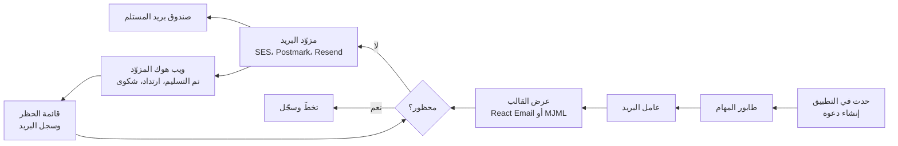
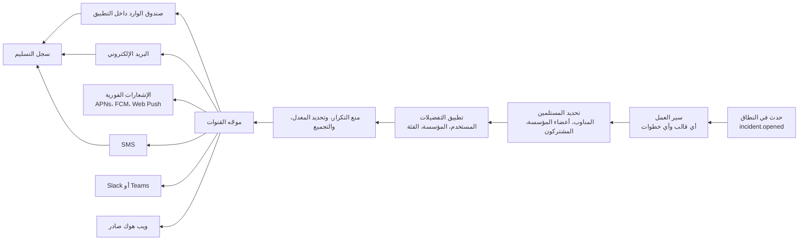
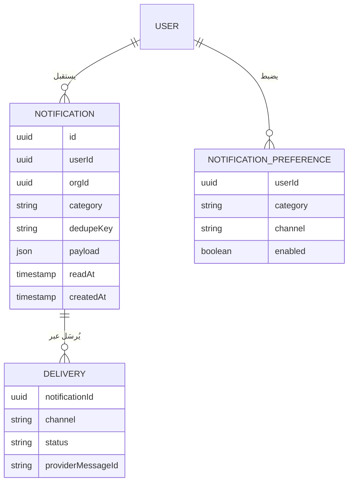
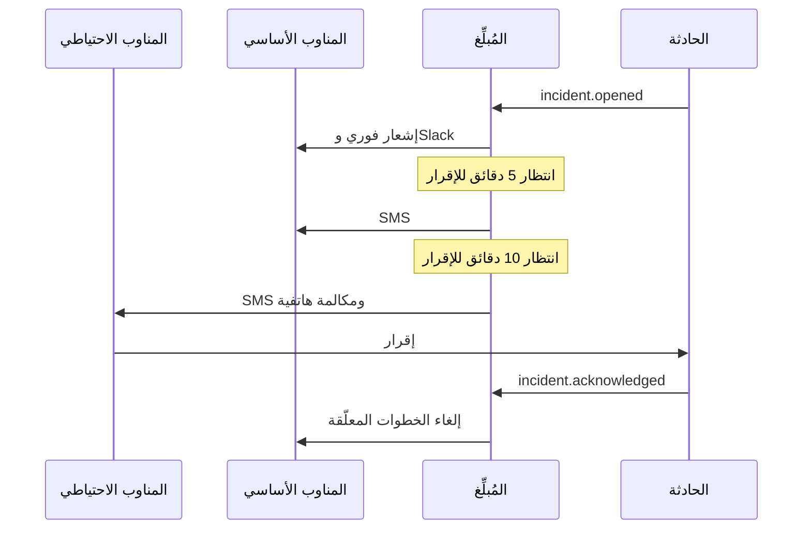
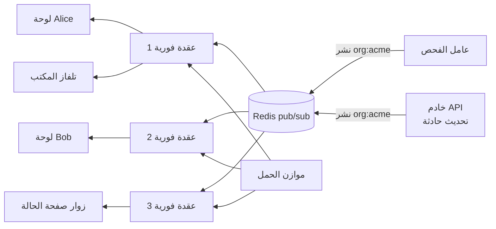
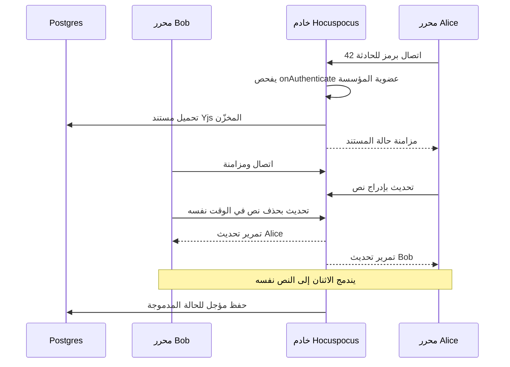

# الوحدة (Module) 4 — التواصل (Communication)

*إذا لم يستطع تطبيق SaaS الوصول إلى مستخدميه (its users) فكأنه غير موجود. وفي Beacon يكون الوصول إلى الناس هو المنتج (product) نفسه: تنبيه انقطاع (outage alert) يصل إلى مجلد الرسائل غير المرغوب فيها (spam) أسوأ من عدم وجود تنبيه (alert) أصلًا. تغطي هذه الوحدة (Module) الطرق الثلاث التي يتحدث بها تطبيقك (your app) إلى الناس. البريد الإلكتروني المعاملاتي (transactional email) يجب أن يصل. والإشعارات (notifications) يجب أن تصل إلى الشخص المناسب على القناة (channel) المناسبة دون أن تغرقه. أما التحديثات الفورية (real-time updates) والتعاون (collaboration) فتجعل لوحة التحكم (dashboard) حيّة، وتسمح لمهندسَين بتحرير تقرير ما بعد الحادثة (postmortem) نفسه دون أن يمحو أحدهما عمل الآخر.*

> **التطبيق العملي (Practice):** ابدأ من [نسخة البداية (starter) من Beacon](https://github.com/Tamoura/system-design-for-vibe-coders/tree/beacon/starter)، وحلّ التمارين قبل النظر إلى [الحل المرجعي (reference solution) لهذه الوحدة (Module)](https://github.com/Tamoura/system-design-for-vibe-coders/tree/beacon/module-4-solution) (الفرع (branch) `beacon/module-4-solution`).

---

# 4.1 — بريد معاملاتي (transactional email) يصل فعلًا
*المستوى (Level): 🟢 مبتدئ (Beginner)* · *المتطلبات (Prerequisites): 1.1، 1.2*

## ⚡ الدرس في دقيقة (In 60 seconds)

- البريد المعاملاتي (Transactional Email) مثل إعادة تعيين كلمة المرور (password reset) والدعوات (invites) وتنبيهات الحوادث (incident alerts) يُرسَل بسبب إجراء قام به المستخدم (user). أما وصوله فيقرره مزوّد صندوق البريد المستقبِل (receiving mailbox provider)، بناءً على مصادقة نطاقك (domain authentication) وسمعته (reputation).
- القاعدة الأهم (The rule that matters most): انشر سجلات (records) SPF وDKIM وDMARC مع نطاق (domain) `From:` متوافق (aligned). منذ 2024 ترفض Gmail وYahoo البريد غير المُصادَق (unauthenticated).
- الخيار الافتراضي للنسخة الأولى (The v1 default): مزوّد إرسال (Resend أو Postmark أو SES)، وقوالب (templates) مكتوبة بـ React Email أو MJML، وإرسال من مهمة في طابور (queued job)، وMailpit يلتقط كل الرسائل أثناء التطوير (development).
- افصل البريد التسويقي (marketing mail) عن البريد المعاملاتي (transactional email) في تدفقات (streams) أو نطاقات فرعية (subdomains) مختلفة، حتى لا تُسقط حملةٌ (campaign) سيئة رسائلَ إعادة تعيين كلمة المرور (password-reset emails).
- الفخ الأكبر (The biggest trap): تجاهل الارتدادات (bounces) والشكاوى (complaints). عالج الويب هوك (webhook) الذي يرسله المزوّد (provider)، وافحص قائمة الحظر (suppression list) قبل كل إرسال.

## 🧭 لماذا يحتاجه كل SaaS (Why every SaaS has this)

أول كود للبريد (email) في Beacon هو ستة أسطر من Nodemailer موجّهة إلى خادم SMTP (SMTP server) الخاص بالاستضافة (host) التي يعمل عليها التطبيق (app)، وترسل من `alerts@beacon.app`. لم يُعِدّ أحد سجلات DNS (DNS records) لهذا النطاق (domain). في بيئة التطوير (development) "يعمل" كل شيء، لأن صندوق بريد المطوّر (developer's own inbox) نفسه متساهل. أما في الإنتاج (production) فتصل رسائل إعادة تعيين كلمة المرور (password-reset emails) متأخرة عشرين دقيقة أو لا تصل أبدًا، ويتوقف التسجيل (signup) عند خطوة "أكّد بريدك الإلكتروني". ثم يتعطل API أحد العملاء في الثالثة فجرًا، فيصل تنبيه (alert) Beacon إلى مجلد الرسائل غير المرغوب فيها (spam folder) في Gmail. ويعرف العميل بالمشكلة من عملائه هو.

لا يوجد خطأ في الكود (code). لأن قرار تسليم البريد (email delivery) يتخذه مزوّد صندوق البريد (mailbox provider) *المستقبِل (receiver)* (Gmail وOutlook وYahoo ومرشّحات الشركات (corporate filters))، وهو يحكم عليك بناءً على أمرين: هل نطاقك (your domain) **مُصادَق (authenticate)** (Authenticated)، وهل **سمعة** الإرسال (Reputation) لديك جيدة. منذ فبراير 2024 صارت Gmail وYahoo *تشترطان* المصادقة (authentication) على الجميع، وتفرضان قواعد أشد على المرسلين بكميات كبيرة (bulk senders). لذلك فالبريد غير المُصادَق (unauthenticated mail) لا تقل فرص وصوله فقط، بل يُرفض.

كل SaaS يرسل المجموعة الأساسية نفسها: تأكيد البريد (verify email)، ورابط الدخول السحري (Magic Link)، وإعادة تعيين كلمة المرور (password reset)، والدعوة (invitation)، والإيصال (receipt)، ورسالة "تنتهي فترتك التجريبية (trial) بعد 3 أيام". ويضيف Beacon فوقها تنبيهات الحوادث (incident alerts) وتحديثات مشتركي صفحة الحالة (status page). ولا شيء من هذا اختياري.

**تسليم البريد (email delivery) نظام سمعة (reputation system) وليس استدعاء API: صادِق نطاقك (authenticate your domain)، وافصل تدفقات (streams) بريدك، وأرسل من طابور (queue)، وتصرّف بناءً على ما تخبرك به الارتدادات (bounces) والشكاوى (complaints).**

## 📐 كيف يعمل (How it works)

### 🟢 الأساسيات (The essentials)

**المعاملاتي مقابل التسويقي (Transactional vs marketing).** الفرق بينهما قانوني وتقني، وليس فرقًا في الأسلوب.

| | معاملاتي (transactional) | تسويقي (جماعي (bulk) / ترويجي (promotional)) |
|---|---|---|
| سبب الإرسال | إجراء من المستخدم (user) أو حدث في الحساب | أنت، وترسله إلى قائمة |
| أمثلة | إعادة تعيين كلمة المرور (password reset)، دعوة (invite)، تنبيه حادثة (incident alert)، إيصال (receipt) | نشرة إخبارية (newsletter)، إطلاق منتج (product launch)، "نفتقدك" |
| الموافقة (consent) | ضمنية باستخدام الخدمة | تحتاج موافقة مسبقة (GDPR) أو على الأقل خيار إلغاء (CAN-SPAM) |
| إلغاء الاشتراك (unsubscribe) | غير مطلوب للبريد المعاملاتي (transactional email) الحقيقي | مطلوب، وبنقرة واحدة (one-click) للمرسلين بكميات كبيرة (bulk senders) |
| من أين يُرسَل | `mail.beacon.app` أو تدفقك المعاملاتي (your transactional stream) | نطاق فرعي (subdomain) أو تدفق (stream) *منفصل*، مثل `news.beacon.app` |

أبقِهما منفصلين حتى لا تستطيع حملة (campaign) تسويقية (marketing) ذات معدل شكاوى (complaint rate) سيئ أن تُسقط السمعة (reputation) التي تعتمد عليها رسائل إعادة تعيين كلمة المرور (password-reset emails).

**مصادقة النطاق (domain authentication).** هي ثلاثة سجلات DNS (DNS records) تثبت أنه مسموح لك بالإرسال باسم نطاقك (your domain):

| السجل (record) | ما يثبته | شكله |
|---|---|---|
| **SPF** (RFC 7208) | أي الخوادم (servers) يحق لها إرسال البريد (email) باسم النطاق (domain) الموجود في مرسل الغلاف (Envelope Sender) | `TXT "v=spf1 include:amazonses.com ~all"` |
| **DKIM** (RFC 6376) | أن الرسالة موقّعة (signed) من مالك النطاق (domain) ولم تُعدَّل. المفتاح العام (public key) موجود في DNS | `TXT` عند `selector._domainkey.mail.beacon.app` |
| **DMARC** (RFC 7489) | ما يجب أن يفعله المستقبِل (receiver) عندما يفشل SPF أو DKIM أو لا *يتوافقان* مع نطاق (domain) `From:` الظاهر، وإلى أين تُرسَل التقارير | `TXT` عند `_dmarc.beacon.app`: `"v=DMARC1; p=none; rua=mailto:…"` |

*التوافق* (Alignment) يعني أن النطاق (domain) الذي نجح في فحص SPF أو DKIM يطابق النطاق الموجود في ترويسة (header) `From:` التي يراها الإنسان. شاشة الإعداد عند مزوّدك (your provider) تعطيك السجلات (records) بالضبط. ومهمتك أن تضيفها وتنتظر حتى يتم التحقق منها.

**استخدم مزوّدًا (provider)، لا SMTP خامًا (raw SMTP) من خادمك (server).** كل من Amazon SES (رخيص وبسيط)، وPostmark (يركّز بقوة على قابلية التسليم (deliverability)، وفيه "تدفقات رسائل (message streams)" منفصلة للبريد المعاملاتي (transactional email) والبث)، وResend (API موجّه للمطورين، من فريق React Email)، وSendGrid (كبير وقديم) يتولى سمعة عناوين IP (IP reputation) وإعادة المحاولة (retries) وحلقات التغذية الراجعة (Feedback Loops) ومعالجة الارتدادات (bounces). وأي واحد منها مناسب لـ Beacon.

**أرسل من طابور (Send from a queue).** الإرسال المباشر (sending inline) داخل معالج الطلب (request handler) يعني أن المزوّد (provider) البطيء يجعل نقطة التسجيل (signup endpoint) بطيئة، وأن تعطّل المزوّد (provider outage) يُفشل عمليات التسجيل (signup). ضع مهمة بريد (email job) في الطابور (Queue)، ودع عاملًا (Worker) يرسلها مع إعادة المحاولة (5.1).


```mermaid
flowchart RL
    A["حدث في التطبيق<br/>إنشاء دعوة"] --> Q["طابور المهام"]
    Q --> W["عامل البريد"]
    W --> T["عرض القالب<br/>React Email أو MJML"]
    T --> S{"محظور؟"}
    S -- "لا" --> P["مزوّد البريد<br/>SES، Postmark، Resend"]
    S -- "نعم" --> X["تخطَّ وسجّل"]
    P --> R["صندوق بريد المستلم"]
    P --> H["ويب هوك المزوّد<br/>تم التسليم، ارتداد، شكوى"]
    H --> L["قائمة الحظر<br/>وسجل البريد"]
    L --> S
```

```ts
// emails/invite.tsx: a React Email template
import { Html, Button, Text } from "@react-email/components";
export function InviteEmail({ orgName, url }: { orgName: string; url: string }) {
  return (
    <Html>
      <Text>You've been invited to join {orgName} on Beacon.</Text>
      <Button href={url}>Accept invitation</Button>
    </Html>
  );
}

// worker: send-email job
import { render } from "@react-email/render";
export async function sendInvite(job: { to: string; orgName: string; url: string; inviteId: string }) {
  if (await isSuppressed(job.to)) return;
  const html = await render(<InviteEmail orgName={job.orgName} url={job.url} />);
  await resend.emails.send(
    { from: "Beacon <team@mail.beacon.app>", to: job.to, subject: `Join ${job.orgName} on Beacon`, html },
    { idempotencyKey: `invite:${job.inviteId}` },
  );
}
```

في Django توجد `send_mail` مع واجهات خلفية (backends) مثل `django-anymail`، وفي Rails يوجد Action Mailer مع `deliver_later`، وفي Laravel توجد Mailables مع `->queue()`. والشكل واحد: قالب (template)، ثم طابور (queue)، ثم مزوّد (provider).

### 🟡 التعمق أكثر (Going deeper)

**الارتدادات والشكاوى والحظر (Bounces, complaints and suppression).** يبلغك المزوّد (provider) بالنتائج عبر الويب هوك (Webhook):

- **الارتداد الدائم (Hard Bounce):** العنوان غير موجود. لا ترسل إليه مرة أخرى أبدًا.
- **الارتداد المؤقت (Soft Bounce):** صندوق البريد (mailbox) ممتلئ أو هناك فشل مؤقت. يعيد المزوّد (provider) المحاولة. احظر العنوان بعد تكرار الفشل.
- **الشكوى (Complaint):** نقر المستلم (recipient) على "الإبلاغ عن رسالة غير مرغوب فيها (Report spam)". أوقف فورًا كل البريد (email) غير الضروري إليه.

احتفظ بـ **قائمة حظر** (Suppression List) خاصة بك (العنوان، والسبب، والتاريخ)، وافحصها قبل كل إرسال، مع أن المزوّدين (providers) يحتفظون بقائمة أيضًا (في SES قائمة على مستوى الحساب، وPostmark يحظر لكل تدفق (per stream)). قائمتك الخاصة تسمح لك بعرض رسالة مثل "لا نستطيع مراسلة jane@acme.com، فقد ارتدّ بريدها" في الواجهة (UI)، وهذا يوفّر عليك تذكرة دعم (support ticket). وتحقّق من تواقيع (signatures) الويب هوك (webhook) بالطريقة نفسها التي استخدمتها مع Stripe في 3.1.

**متطلبات Gmail وYahoo لعام 2024 (The 2024 Gmail and Yahoo requirements).** لكل المرسلين (all senders): SPF *أو* DKIM، وسجلات DNS (DNS records) صحيحة في الاتجاهين الأمامي والعكسي لعناوين IP المرسِلة، وTLS، ومعدل شكاوى (complaint rate) أقل من 0.3% (كما يظهر في Google Postmaster Tools). وللمرسلين بكميات كبيرة (نحو 5,000 رسالة يوميًا أو أكثر إلى عناوين Gmail): SPF *و*DKIM معًا، وسجل DMARC (على الأقل `p=none`) مع نطاق (domain) `From:` متوافق (aligned)، و**إلغاء اشتراك بنقرة واحدة (one-click unsubscribe)** (RFC 8058: الترويستان (headers) `List-Unsubscribe` و`List-Unsubscribe-Post`) في البريد التسويقي (marketing mail) والبريد الذي اشترك فيه المستخدم (subscribed mail)، على أن يُنفَّذ الإلغاء خلال يومين. وأعلنت Microsoft في 2025 متطلبات مشابهة للمرسلين بكميات كبيرة (bulk senders) إلى عناوين Outlook.com الشخصية. تُعدّ رسائل مشتركي صفحة الحالة (status-page subscribers) في Beacon بريدًا اشترك فيه المستخدم (opted-in mail): فالناس سجّلوا لتلقيها، لذلك تحتاج ترويسات إلغاء الاشتراك (unsubscribe headers).

**القوالب (templates).** HTML البريد (email) عالق في حدود عام 2005: جداول (tables) للتخطيط، وCSS مضمّن (inline CSS)، ودعم متقطع لـ CSS الحديث، وOutlook يعرض الرسائل بمحرك Word، والوضع الداكن (dark mode) يقلب ألوانك. لا تكتبه يدويًا. اختر أداة واحدة:

| الأداة | تكتب بها | مناسبة لـ |
|---|---|---|
| React Email | مكوّنات React (React components) | فرق TypeScript وReact، مع خادم معاينة (preview server) محلي |
| MJML | لغة ترميز (markup language) تشبه XML وتُترجَم إلى جداول متجاوبة (responsive) | أي تقنية. ويستطيع المصممون تعلّمها |
| Maizzle | HTML مع Tailwind CSS، ويُبنى إلى HTML بريد (email) بأنماط مضمّنة (inlined) | الفرق التي تعمل بـ Tailwind دائمًا |

أرسل دائمًا **جزءًا نصيًا عاديًا** (Plain-text Part) أيضًا، لأنه يساعد على التسليم (delivery) وإمكانية الوصول (accessibility).

**الاختبار محليًا (Testing locally).** لا ترسل بريدًا (email) حقيقيًا من بيئة التطوير (development) أبدًا. شغّل **Mailpit**، وهو خادم SMTP (SMTP server) محلي (على المنفذ (port) 1025 افتراضيًا) مع واجهة ويب (على 8025) يلتقط كل شيء. ويستطيع أيضًا فحص توافق HTML مع برامج البريد (email clients) واختبار الروابط. الإعدادات القديمة تستخدم MailHog أو Inbucket، وستراهما في المشاريع أدناه. لكن Mailpit هو الخيار الذي تتم صيانته بنشاط. وللقوالب (templates)، يعرض خادم المعاينة (preview server) في React Email كل قالب (template) ببيانات تجريبية (sample props).

**التوطين (Localization).** خزّن `locale` لكل مستخدم (user) واعرض الرسائل بها. هذا يشمل عناوين الرسائل والتواريخ والأوقات (بالمنطقة الزمنية (time zone) *للمستلم (recipient)*، وهذا مهم في عبارة مثل "بدأت الحادثة (incident) الساعة 03:12")، والتخطيط من اليمين إلى اليسار (right-to-left) إذا كنت تدعم تلك اللغات. لا تترجم داخل القالب (template) يدويًا. استخدم فهرس الترجمة (i18n) نفسه الذي يستخدمه التطبيق (app).

### 🔴 على نطاق واسع وللمؤسسات (At scale / enterprise)

**نطاقات إرسال مخصصة (custom sending domains) لكل مستأجر (per-tenant).** عملاء الخطة Business (Business plan) يريدون إرسال تحديثات صفحة الحالة (status page) *من نطاقهم الخاص (their own domain)* (`status@acme.com`) وليس من `beacon.app`. هذا يعني إضافة نطاق كل عميل لدى مزوّدك (هويات (identities) SES، وواجهات النطاقات (domains) في Resend وPostmark)، وعرض سجلات (records) SPF وDKIM التي يجب أن يضيفها، ومتابعة التحقق بشكل دوري، وتوجيه كل إرسال عبر الهوية الصحيحة (the right identity). واحتفظ بخيار احتياطي (fallback): إلى أن يتم التحقق من النطاق (domain)، أرسل من نطاقك (your domain) مع وضع اسم العميل في اسم العرض (display name). كل من Documenso وDub يقدّم هذه الميزة لعملائه.

**التوزيع الواسع (Fan-out).** حادثة (incident) واحدة على صفحة حالة (status page) مشهورة قد تعني 50,000 رسالة للمشتركين (subscribers). استخدم واجهة الإرسال الجماعي (Batch API) لدى مزوّدك (your provider)، واضبط السرعة بحسب حصة الإرسال (sending quota)، واجعل كل رسالة متساوية الأثر (Idempotent) بمفتاح مثل (`incident:{id}:update:{n}:subscriber:{id}`)، وضع هذه الرسائل في تدفق (stream) أو نطاق فرعي (subdomain) منفصل عن إعادة تعيين كلمة المرور (password reset)، حتى لا تؤخر موجةُ إرسال أو موجةُ شكاوى (complaint wave) رسائلَ تسجيل الدخول (login).

**إدارة السمعة (Reputation operations).** راقب معدلات الارتداد (bounce rates) والشكاوى (complaints) لكل تدفق (فـ SES يراجع الحسابات التي تتجاوز حدوده أو يوقفها مؤقتًا)، وانقل DMARC من `p=none` إلى `quarantine` ثم `reject` بعد أن تُظهر التقارير أن كل مصدر شرعي متوافق (aligned)، ولا تفكر في عناوين IP مخصصة (dedicated IPs) إلا مع حجم إرسال كبير (فهي تحتاج إحماءً (warm-up) وحركة ثابتة)، وفكّر في مزوّد ثانٍ (second provider) للتحويل عند الفشل (Failover) للبريد (email) الحرج (critical).

**الاستضافة الذاتية (self-hosting).** تشغيل وكيل نقل البريد (MTA) الخاص بك يعني أن تدير سمعة عناوين IP (IP reputation) بنفسك، وهذه وظيفة بدوام كامل. الخيارات الواقعية للاستضافة الذاتية إما *تغلّف* مزوّدًا (provider) أو تناسب حالات محددة: useSend يعطيك API ولوحة تحكم (dashboard) بأسلوب Resend فوق Amazon SES، وPostal خادم بريد (mail server) كامل للفرق التي لديها قدرة تشغيلية (ops capacity)، وlistmonk (للنشرات الإخبارية (newsletters)) وMautic (لأتمتة التسويق (marketing automation)) يغطيان الجانب التسويقي (marketing).

## 🏆 أفضل المستودعات (The best repos)

| المستودع (repo) | ما هو (What it is) | التقنيات (Stack) | الترخيص (license) | اختره عندما (Pick it when) |
|---|---|---|---|---|
| [resend/react-email](https://github.com/resend/react-email) | بناء رسائل البريد (emails) كمكوّنات React (React components)، مع خادم معاينة (preview server) | TypeScript, React | MIT | تطبيقك (your app) مبني بـ React وTypeScript، وتريد القوالب (templates) بجانب الكود (code) |
| [mjmlio/mjml](https://github.com/mjmlio/mjml) | لغة ترميز (markup language) تُترجَم إلى HTML بريد (email) متجاوب (responsive) | JavaScript | MIT | لأي لغة خلفية (backend language)، أو عندما يكتب المصممون القوالب (templates) |
| [maizzle/framework](https://github.com/maizzle/framework) | إطار (framework) Tailwind CSS لرسائل HTML | JavaScript | MIT | فريقك يفكر بأسلوب Tailwind |
| [nodemailer/nodemailer](https://github.com/nodemailer/nodemailer) | أداة الإرسال القياسية في Node.js (SMTP ووسائل نقل (transports) أخرى) | JavaScript | MIT-0 | تحتاج SMTP (عملاء يستضيفون بأنفسهم، أو Mailpit، أو مزوّد احتياطي (fallback provider)) |
| [axllent/mailpit](https://github.com/axllent/mailpit) | ملتقط SMTP (SMTP catcher) محلي مع واجهة ويب (web UI) وفحص توافق HTML والروابط | Go | MIT | دائمًا، في التطوير (development) وفي CI |
| [usesend/useSend](https://github.com/usesend/useSend) | useSend: منصة إرسال (sending platform) مفتوحة المصدر (API ونطاقات (domains) وويب هوك (webhook)) فوق Amazon SES | TypeScript, Next.js | AGPL-3.0 | تريد تجربة تشبه Resend تستضيفها بنفسك (you host yourself) وتدفع أسعار SES |
| [postalserver/postal](https://github.com/postalserver/postal) | منصة تسليم بريد (mail delivery platform) كاملة الميزات | Ruby | MIT | تحتاج فعلًا إلى تشغيل خوادم البريد (mail servers) الخاصة بك |
| [knadh/listmonk](https://github.com/knadh/listmonk) | مدير نشرات إخبارية (newsletters) وقوائم بريدية (mailing lists) تستضيفه بنفسك (self-hosted) | Go, Postgres | AGPL-3.0 | نشرات المنتج (product newsletters)، منفصلة عن البريد المعاملاتي (transactional email) |
| [mautic/mautic](https://github.com/mautic/mautic) | أتمتة تسويق (marketing automation) مفتوحة المصدر (open-source) | PHP | GPL-3.0 | حملات (campaigns) وتقسيم جمهور (segments) وتقييم عملاء محتملين (lead scoring)، باستضافة ذاتية (self-hosted) |

**إن درست مستودعًا واحدًا فقط (If you only study one):** انسخ `resend/react-email`، وشغّل خادم المعاينة (preview server)، واقرأ كيف تتحول المكوّنات (components) إلى HTML آمن للبريد (email). أغلب مشاريع SaaS الحديثة المكتوبة بـ TypeScript، ومنها المشاريع أدناه، تستخدمه، وسيغيّر طريقة تفكيرك في قوالب البريد (email templates) بوصفها كودًا.

**اشترِ أم ابنِ أم استضف بنفسك (Buy, build, or self-host)؟**

- **اشترِ (الخيار الافتراضي (the default)):** مزوّد إرسال (sending provider) مثل Postmark أو Resend أو Amazon SES أو SendGrid. قابلية التسليم (deliverability) هي منتجهم، وتكلفتهم قليلة مقارنة بوقتك.
- **استضف بنفسك (Self-host):** useSend فوق SES للتحكم في التكلفة (cost) مع API جيد. وlistmonk أو Mautic لقوائم التسويق (marketing lists). وPostal فقط إذا كانت لديك قدرة تشغيلية (ops capacity) مخصصة.
- **ابنِ (Build):** القوالب (templates)، ومهمة البريد (email job)، وفحص قائمة الحظر (suppression list)، ومعالجة ويب هوك الارتدادات والشكاوى (bounce and complaint webhooks)، وإضافة نطاقات المستأجرين (tenant domains). ولا تبنِ أبدًا خادم بريد (mail server) خاصًا بك للبريد (email) الحرج (critical) في SaaS.

## 🔍 ادرسه في مشاريع حقيقية (Study it in the wild)

**openstatus (`openstatusHQ/openstatus`).** هو Beacon الحقيقي، لذلك فرسائله هي رسائل Beacon. وقت كتابة هذا الدرس، يحتوي `packages/emails/emails/` على قوالب (templates) React Email مثل `monitor-alert.tsx` و`page-subscription.tsx` و`status-report.tsx` و`team-invitation.tsx` و`plan-downgraded.tsx`، مع مكوّنات مشتركة (shared components) في `_components/`. قارن بين رسالة التنبيه (alert) ورسالة تحديث المشترك (subscriber update).

**Dub (`dubinc/dub`).** افتح `packages/email` واقرأ `src/index.ts`. الدالة `sendEmail` تستخدم Resend عندما يكون مُعدًّا، وتعود إلى Nodemailer عبر SMTP في غير ذلك، وهذه طريقة مشروع SaaS مفتوح المصدر (open-source) في دعم من يستضيفونه بأنفسهم. ثم ابحث عن `VARIANT_TO_FROM_MAP`: بريد (email) النظام وبريد الإشعارات (notifications) والبريد التسويقي (marketing mail) تُرسَل من *عناوين ونطاقات فرعية (subdomains) مختلفة*. هذا فصل التدفقات (stream separation) في ثلاثة أسطر. وابحث عن `email-domains` لترى نطاقات الإرسال (sending domains) المخصصة لكل مساحة عمل (workspace).

**Documenso (`documenso/documenso`).** افتح `packages/email`. الملف `mailer.ts` يختار وسيلة نقل (transport) Nodemailer (SMTP أو Resend أو MailChannels) من متغيرات البيئة (environment variables)، ومجلد `templates/` فيه ملف لكل رسالة، وهناك إعداد معاينة (preview setup) منفصل. ملف Docker Compose الخاص بالتطوير (development) في Documenso يستخدم Inbucket لالتقاط البريد (email). وابحث عن `organisation-email-domain` لترى كيف تضيف المؤسسات (orgs) نطاق الإرسال (sending domain) الخاص بها.

**Cal.com (`calcom/cal.diy`).** يحتوي `packages/emails` على ملف README يشرح `renderEmail("TeamInviteEmail", props)` ونقطة معاينة (preview endpoint)، وعلى ملف `docker-compose.yml` يشغّل MailHog لالتقاط البريد (email) محليًا. ابحث عن `billing-email-service` و`auth-email-service` لترى كيف تُجمَّع الرسائل بحسب مجال العمل (domain).

**ما الذي تلاحظه (What to notice)**

- هل الإرسال مغلّف خلف دالة واحدة مع وسائل نقل قابلة للتبديل (swappable transports).
- كم عنوان `From:` ونطاقًا فرعيًا (subdomain) مختلفًا يُستخدم، ولماذا.
- أين تُطلَق الرسائل: مباشرة في الطلب (request)، أم في مهام خلفية (background jobs)، أم من سير عمل (workflow).
- كيف تلتقط بيئة التطوير (development) المحلية البريد (Mailpit أو MailHog أو Inbucket أو خوادم المعاينة (preview servers)).
- كيف يتم التحقق من نطاقات الإرسال (sending domains) التي يملكها العملاء وكيف تُستخدم.

## 🛠️ ابنِه في Beacon (Build it into Beacon)

### 🟢 تمرين المبتدئ (Beginner exercise)

أعدّ Mailpit في ملف `docker-compose.yml` الخاص بـ Beacon، ومزوّدًا (Resend أو Postmark أو SES) للإنتاج (production). أنشئ قوالب (templates) React Email (أو MJML) لرسائل *تأكيد البريد (verify email)* و*الدعوة (invitation)* و*فتح حادثة (incident opened)*، وأرسلها عبر دالة واحدة `sendEmail()` تختار SMTP إلى Mailpit في التطوير (development) والمزوّد (provider) في الإنتاج.

**يكتمل عندما (Done when):**
- يُظهر التسجيل (signup) المحلي رسالة التأكيد في واجهة Mailpit على `localhost:8025`.
- يكون لكل قالب (template) جزء نصي عادي (plain-text part)، ويُعرض في المعاينة (preview).
- لا يستورد أي كود خارج `sendEmail()` حزمة (package) SDK الخاصة بالمزوّد (provider).

### 🟡 تمرين المستوى المتوسط (Intermediate exercise)

صادِق (authenticate) النطاق (domain) `mail.beacon.app` (SPF وDKIM وDMARC مع `p=none` وعنوان للتقارير)، وانقل كل الإرسال إلى مهمة في الطابور (queued job) مع مفاتيح عدم التكرار (Idempotency Keys)، وعالج ويب هوك الارتدادات والشكاوى (bounce and complaint webhooks) من المزوّد (provider) مع التحقق من التوقيع (signature). احتفظ بجدول (table) `email_suppressions` يُفحَص قبل كل إرسال، واعرض تحذيرًا في واجهة أعضاء الفريق (team members) للعناوين المحظورة (suppressed).

**يكتمل عندما (Done when):**
- تُظهر أداة فحص خارجية (أو لوحة تحكم (dashboard) المزوّد (provider)) نجاح SPF وDKIM وDMARC وتوافقها.
- يضيف ارتداد دائم (hard bounce) مُحاكى (يوفّر المزوّدون (providers) عناوين للاختبار) صفًا (row) في جدول الحظر (suppression table)، ولا تتم أي محاولة إرسال أخرى إلى ذلك العنوان.
- يؤدي تعطل المزوّد (حاكِه بمفتاح API (API key) خاطئ) إلى تأخير الرسائل دون إفشال طلبات (requests) المستخدمين (users)، ثم تُرسَل الرسائل بعد عودة الخدمة.

### 🔴 تمرين المستوى المتقدم (Advanced exercise)

اسمح لمؤسسات (orgs) الخطة Business (Business plan) بإرسال رسائل مشتركي صفحة الحالة (status-page subscribers) من نطاقها الخاص (its own domain). ابنِ (Build) عملية إضافة النطاق (إنشاء الهوية (identity) عبر API المزوّد (provider's API)، وعرض سجلات DNS (DNS records)، ومتابعة التحقق)، وأرسل تحديثات المشتركين (subscriber updates) من تدفق (stream) منفصل مع ترويسات إلغاء الاشتراك بنقرة واحدة (one-click unsubscribe headers) وفق RFC 8058، ووزّع تحديثات الحوادث (incident updates) على دفعات مضبوطة السرعة (throttled batches).

**يكتمل عندما (Done when):**
- تستطيع المؤسسة (org) إضافة `status.acme.com` ورؤية سجلات DNS (DNS records) الخاصة به، وتحصل على حالة "تم التحقق" بعد انتشار السجلات (records).
- قبل التحقق، تُرسَل الرسائل من نطاق (domain) Beacon مع اسم عرض المؤسسة (org's display name).
- تحتوي رسائل المشتركين (subscriber emails) على `List-Unsubscribe` و`List-Unsubscribe-Post`، ويؤدي إلغاء الاشتراك بنقرة واحدة (one-click unsubscribe) إلى إزالة المشترك (remove the subscriber) دون تسجيل دخول (logging in).
- يكتمل توزيع على 10,000 مشترك ضمن حدود المعدل (rate limits) لدى مزوّدك (your provider)، دون تأخير رسائل إعادة تعيين كلمة المرور (password-reset emails).

## ⚠️ أخطاء يقع فيها المبتدئون (Mistakes juniors make)

- **الإرسال من خادم SMTP (SMTP server) الخاص بخادم (server) التطبيق (app) أو من نطاق (domain) غير مُصادَق (unauthenticated).** تصل الرسائل إلى مجلد غير المرغوب فيه (spam folder) أو تُرفض وفق قواعد 2024. استخدم مزوّدًا (provider)، وانشر SPF وDKIM وDMARC قبل الإطلاق.
- **إرسال البريد (email) مباشرة داخل الطلب (request).** يصبح بطء المزوّد (provider) بطئًا لديك، وتصبح أعطاله أخطاء 500 (500 errors). ضع المهمة (job) في الطابور (queue) وأرسل من عامل (worker) مع إعادة المحاولة (retries).
- **خلط البريد التسويقي (marketing mail) والمعاملاتي (transactional) في نطاق (domain) وتدفق (stream) واحد.** حملة (campaign) واحدة مزعجة تضر بتسليم (delivery) رسائل إعادة تعيين كلمة المرور (password-reset emails). افصل بينهما بنطاق فرعي (subdomain) أو بتدفق لدى المزوّد (provider).
- **تجاهل الارتدادات (bounces) والشكاوى (complaints).** الإرسال المتكرر إلى عناوين ميتة وإلى من اشتكوا يضر بالسمعة (reputation) حتى يذهب كل شيء إلى مجلد غير المرغوب فيه (spam folder). عالج الويب هوك (webhook) واحتفظ بقائمة حظر (suppression list).
- **كتابة HTML البريد (email) يدويًا.** ينكسر في Outlook وفي الوضع الداكن (dark mode) وبسبب اقتطاع (clipping) Gmail للرسائل. استخدم React Email أو MJML أو Maizzle، وعاين الرسائل في برامج بريد (email clients) حقيقية.
- **السماح لبيئة التطوير (development) بإرسال بريد (email) حقيقي.** البيانات التجريبية (test data) مع مزوّد (provider) حقيقي تعني أن عملاء حقيقيين يستلمون رسائل اختبار. وجّه بيئة التطوير إلى Mailpit دائمًا.

## 🧾 الخلاصة (Recap)

- البريد المعاملاتي (transactional email) والتسويقي (marketing) يختلفان في الموافقة (consent) والترويسات (headers) والسمعة (reputation)، لذلك أبقِهما في تدفقات (streams) منفصلة.
- SPF وDKIM وDMARC مع التوافق (alignment) أصبحت إلزامية (required) الآن، وليست إضافة جيدة فقط.
- اكتب القوالب (templates) بـ React Email أو MJML أو Maizzle. وأرسل من طابور (Send from a queue). والتقط كل شيء محليًا بـ Mailpit.
- الارتدادات (bounces) والشكاوى (complaints) تغذّي قائمة حظر (suppression list) تفحصها قبل كل إرسال.
- نطاقات الإرسال (sending domains) لكل مستأجر (per-tenant) والتوزيع الواسع (fan-out) هي مشكلات خطة Business (Business plan). خطّط للتدفقات (streams) الخاصة بها مبكرًا.

## ✍️ اختبر نفسك (Check yourself)

**1. ماذا يثبت كل من SPF وDKIM وDMARC، وماذا يعني "التوافق (alignment)"؟**

<details><summary>الإجابة (Answer)</summary>

يحدد SPF الخوادم (servers) التي يحق لها الإرسال باسم النطاق (domain)، ويثبت DKIM أن الرسالة موقّعة (signed) من مالك النطاق ولم تُعدَّل، ويخبر DMARC المستقبِل (receiver) بما يفعله عندما تفشل هذه الفحوص أو لا تتوافق، وإلى أين يرسل التقارير. التوافق (alignment) يعني أن النطاق الذي نجح في SPF أو DKIM يطابق نطاق `From:` الذي يراه الإنسان. راجع جدول (table) مصادقة النطاق (domain authentication) في 🟢 الأساسيات (The essentials).

</details>

**2. ما الأنواع الثلاثة من التغذية الراجعة (feedback) التي يرسلها المزوّد (provider)، وكيف تتصرف مع كل منها؟**

<details><summary>الإجابة (Answer)</summary>

الارتداد الدائم (hard bounce) يعني أن العنوان غير موجود، فلا ترسل إليه مرة أخرى أبدًا. والارتداد المؤقت (soft bounce) فشل عابر يعيد المزوّد (provider) المحاولة بعده، وتحظر العنوان بعد تكرار الفشل. والشكوى (complaint) تعني أن المستلم (recipient) نقر على "الإبلاغ عن رسالة غير مرغوب فيها (Report spam)"، فتوقف فورًا كل البريد (email) غير الضروري إليه. راجع فقرة "الارتدادات والشكاوى والحظر (Bounces, complaints and suppression)" في 🟡 التعمق أكثر (Going deeper).

</details>

**3. تُرسَل رسائل مشتركي صفحة الحالة (status-page subscribers) في Beacon من النطاق (domain) والتدفق نفسيهما لرسائل إعادة تعيين كلمة المرور (password-reset emails). لماذا هذه مشكلة، وما الذي يجب تغييره؟**

<details><summary>الإجابة (Answer)</summary>

تحديثات المشتركين (subscriber updates) بريد اشترك فيه الناس (subscribed mail) ويُرسَل بكميات كبيرة، لذلك قد يضر توزيعٌ واسع أثناء حادثة (incident) كبيرة أو موجةُ شكاوى (complaint wave) بالسمعة (reputation) التي تعتمد عليها رسائل إعادة تعيين كلمة المرور (password-reset emails)، وقد يؤخرها. ضع بريد المشتركين (subscriber mail) في تدفق (stream) أو نطاق فرعي (subdomain) منفصل، مع ترويسات إلغاء الاشتراك بنقرة واحدة (one-click unsubscribe headers) وفق RFC 8058. راجع جدول (table) المعاملاتي مقابل التسويقي (Transactional vs marketing) وفقرة "التوزيع الواسع (fan-out)" في 🔴 على نطاق واسع وللمؤسسات (At scale / enterprise).

</details>

**4. يريد عميل في خطة Business (Business plan) إرسال تحديثات الحالة (status updates) من `status@acme.com`. ما الذي يحتاج Beacon إلى بنائه، وماذا يحدث قبل التحقق من نطاقه (their domain)؟**

<details><summary>الإجابة (Answer)</summary>

يضيف Beacon النطاق (domain) عبر API المزوّد (provider's API)، ويعرض للعميل سجلات (records) SPF وDKIM التي يجب أن يضيفها، ويتابع التحقق، ويوجّه كل إرسال عبر الهوية الصحيحة (the right identity). وإلى أن يتم التحقق من النطاق، يرسل من نطاق Beacon نفسه مع وضع اسم العميل في اسم العرض (display name). راجع فقرة "نطاقات إرسال مخصصة (custom sending domains) لكل مستأجر (per-tenant)" في 🔴 على نطاق واسع وللمؤسسات (At scale / enterprise).

</details>

**5. معالج التسجيل (signup handler) يستدعي API المزوّد (provider's API) مباشرة قبل أن يعيد الاستجابة (response). ما الذي ينكسر أثناء تعطل المزوّد (provider outage)، وما الحل؟**

<details><summary>الإجابة (Answer)</summary>

يصبح بطء المزوّد (provider) بطئًا في التسجيل (signup)، ويحوّل تعطل المزوّد (provider outage) عمليات التسجيل إلى أخطاء 500 (500 errors)، فلا يستطيع المستخدمون (users) إنشاء حسابات أصلًا. ضع مهمة بريد (email job) في الطابور (queue)، ودع عاملًا (worker) يرسلها مع إعادة المحاولة (retries) ومفتاح عدم تكرار (idempotency key). عندها ينجح التسجيل، وتُرسَل الرسالة بعد عودة الخدمة. راجع فقرة "أرسل من طابور (Send from a queue)" في 🟢 الأساسيات (The essentials) وقائمة الأخطاء.

</details>

## 📚 المراجع (References)

- Google, Email sender guidelines — إرشادات مرسلي البريد (email) من Google: https://support.google.com/mail/answer/81126
- RFC 7208 (SPF): https://www.rfc-editor.org/rfc/rfc7208
- RFC 6376 (DKIM): https://www.rfc-editor.org/rfc/rfc6376
- RFC 7489 (DMARC): https://www.rfc-editor.org/rfc/rfc7489
- RFC 8058 (one-click unsubscribe) — إلغاء الاشتراك (unsubscribe) بنقرة واحدة (one-click): https://www.rfc-editor.org/rfc/rfc8058
- React Email docs — توثيق React Email: https://react.email/docs
- Mailpit docs — توثيق Mailpit: https://mailpit.axllent.org
- Amazon SES Developer Guide — دليل المطور لـ Amazon SES: https://docs.aws.amazon.com/ses/

---

# 4.2 — الإشعارات (notifications): داخل التطبيق (in-app)، والدفع، وSlack، وSMS — والتفضيلات (preferences)
*المستوى (Level): 🟡 متوسط (Intermediate)* · *المتطلبات (Prerequisites): 4.1، 1.2*

## ⚡ الدرس في دقيقة (In 60 seconds)

- نظام الإشعارات (Notifications) يحوّل حدثًا واحدًا في النطاق (domain event) إلى الرسالة المناسبة، للأشخاص المناسبين، على القنوات (channels) المناسبة (داخل التطبيق (in-app)، والبريد (email)، والإشعارات الفورية (push)، وSMS، وSlack، والويب هوك (webhooks)).
- القاعدة الأهم (The rule that matters most): أرسل إشعارًا (notification) عند تغيّر الحالة (state change)، لا عند كل حدث. التخلّف (Hysteresis) ومفاتيح منع التكرار (dedupe keys) وحدود المعدل (throttles) والملخّصات (digests) تمنع إرهاق التنبيهات (alert fatigue).
- الخيار الافتراضي للنسخة الأولى (The v1 default): نقطة دخول (entry point) واحدة `notify()`، وجدول إشعارات (notifications table) يعمل كصندوق وارد (inbox) داخل التطبيق (in-app)، ومصفوفة تفضيلات (preference matrix) بحسب الفئة (category) × القناة (channel)، ومهمة (job) لكل قناة.
- بعض الفئات (الأمان (security) والفوترة (billing)) إلزامية (required) ولا يمكن إيقافها، ويجب أن يعمل إلغاء الاشتراك (unsubscribing) دون تسجيل دخول (logging in).
- الفخ الأكبر (The biggest trap): استدعاء Twilio أو Slack مباشرة من كود الأعمال (business code). استأجر القنوات (channels)، لكن احتفظ بالقرارات في مكان واحد.

## 🧭 لماذا يحتاجه كل SaaS (Why every SaaS has this)

يبدأ API الدفع لدى أحد العملاء بالتذبذب (flapping) في الثانية فجرًا: يتعطل 40 ثانية، ثم يعمل دقيقة، ثم يتعطل مرة أخرى. يفحص Beacon كل 30 ثانية، ويرسل إشعارًا (notification) بإخلاص عند كل تغيّر في الحالة (state change). بحلول السادسة صباحًا يكون لدى المهندس المناوب (on-call engineer) 140 رسالة بريد (email)، و140 رسالة SMS (تُحتسب كاستخدام زائد (overage)، راجع 3.3)، وقناة (channel) Slack لا يستطيع أحد التمرير فيها. وفي 6:05 يتعطل API *فعلًا*. لكن الفريق كان قد كتم Beacon حينها، ولم يرَ أحد التنبيه (alert) المهم.

هذا هو **إرهاق التنبيهات** (Alert Fatigue)، وهو في منتج مراقبة (monitoring product) خطأ يهدد وجوده. والفشل المعاكس شائع بالقدر نفسه. المدير التقني (CTO) يريد SMS لمراقبات (monitors) الإنتاج (production) فقط، والمتدرب لا يريد بريدًا (email) أصلًا، والفريق يريد كل شيء في `#incidents`، ومشترك في صفحة الحالة (status-page subscriber) يريد إلغاء اشتراكه في صفحة واحدة دون تسجيل دخول (logging in). قاعدة "أرسل بريدًا عندما يحدث X" لا تصمد أمام المستخدمين (users) الحقيقيين.

كل SaaS ينتهي به الأمر إلى بناء نظام إشعارات (notification system): دعوات، وإشارات (mentions)، وتعليقات، وموافقات (approvals)، وحدود استخدام (usage limits)، وفشل في الدفع (billing failures). وكلها تمر بالقرارات نفسها: من يجب أن يعلم، وعلى أي قناة (channel)، وبأي درجة استعجال، وكم مرة، وهل طلب ألا يُبلَّغ.

**نظام الإشعارات (notification system) سلسلة من القرارات (pipeline of decisions) (من، وأين، وكم مرة، وهل يُرسَل أصلًا)، وهذه القرارات أهم من التسليم (delivery) نفسه.**

## 📐 كيف يعمل (How it works)

### 🟢 الأساسيات (The essentials)

افصل **ما حدث** (الحدث) عن **من يُبلَّغ وكيف** (الإشعارات (notifications)):


```mermaid
flowchart RL
    E["حدث في النطاق<br/>incident.opened"] --> WF["سير العمل<br/>أي قالب وأي خطوات"]
    WF --> RC["تحديد المستلمين<br/>المناوب، أعضاء المؤسسة، المشتركون"]
    RC --> PR["تطبيق التفضيلات<br/>المستخدم، المؤسسة، الفئة"]
    PR --> TH["منع التكرار، وتحديد المعدل، والتجميع"]
    TH --> RT["موجّه القنوات"]
    RT --> IN["صندوق الوارد داخل التطبيق"]
    RT --> EM["البريد الإلكتروني"]
    RT --> PU["الإشعارات الفورية<br/>APNs، FCM، Web Push"]
    RT --> SM["SMS"]
    RT --> SL["Slack أو Teams"]
    RT --> WH["ويب هوك صادر"]
    IN --> LOG["سجل التسليم"]
    EM --> LOG
    SM --> LOG
```

للقنوات (channels) خصائص مختلفة جدًا:

| القناة (channel) | زمن الوصول (latency) | التكلفة (cost) | درجة الإزعاج (intrusiveness) | تحتاج إلى | يستخدمها Beacon لـ |
|---|---|---|---|---|---|
| صندوق الوارد داخل التطبيق (in-app inbox) | فوري إذا كان المستخدم (user) متصلًا | شبه مجانية | منخفضة | جدول (table) مع تحديث فوري (4.3) | كل شيء، بوصفه السجل (record) |
| البريد الإلكتروني (email) | من ثوانٍ إلى دقائق | منخفضة جدًا | من منخفضة إلى متوسطة | عنوان مؤكَّد (verified address) (4.1) | الحوادث (incidents)، والملخّصات (digests)، والفوترة (billing) |
| الإشعارات الفورية (APNs، FCM، Web Push) | ثوانٍ | شبه مجانية | عالية | رمز الجهاز (device token) وإذن نظام التشغيل (OS permission) | تنبيهات المناوبة (on-call alerts) على الجوال |
| SMS | ثوانٍ | لكل رسالة، وتُحتسب بالمقاطع (segment-billed) | عالية جدًا | رقم هاتف، وموافقة، وقواعد شركات الاتصالات (carrier) | الحوادث (incidents) الحرجة (critical) فقط |
| Slack / Teams | ثوانٍ | مجانية | متوسطة | تثبيت عبر OAuth (5.3) | تنبيهات (alerts) قنوات الفريق (team channels) |
| ويب هوك صادر (outbound webhook) | ثوانٍ | مجانية | لا شيء، فهي للأنظمة | نقطة استقبال (endpoint) وتوقيع (5.3) | PagerDuty والأدوات المخصصة |

نموذج البيانات (data model) في النسخة الأولى (v1): صف (row) واحد لكل إشعار (notification) لكل مستلم (recipient) (صندوق الوارد داخل التطبيق (in-app inbox))، بالإضافة إلى التفضيلات (preferences).


```mermaid
erDiagram
    USER ||--o{ NOTIFICATION : "يستقبل"
    USER ||--o{ NOTIFICATION_PREFERENCE : "يضبط"
    NOTIFICATION ||--o{ DELIVERY : "يُرسَل عبر"
    NOTIFICATION {
        uuid id
        uuid userId
        uuid orgId
        string category
        string dedupeKey
        json payload
        timestamp readAt
        timestamp createdAt
    }
    NOTIFICATION_PREFERENCE {
        uuid userId
        string category
        string channel
        boolean enabled
    }
    DELIVERY {
        uuid notificationId
        string channel
        string status
        string providerMessageId
    }
```

نقطة دخول (entry point) واحدة يستدعيها كود النطاق (domain code)، وهذا الكود (code) لا يتحدث مع Twilio مباشرة أبدًا:

```ts
export async function notify(evt: { category: "incident.opened"; orgId: string; incidentId: string }) {
  const recipients = await resolveRecipients(evt);             // on-call + watchers
  for (const user of recipients) {
    const dedupeKey = `${evt.category}:${evt.incidentId}:${user.id}`;
    const n = await db.notification.createIfAbsent({ dedupeKey, userId: user.id, orgId: evt.orgId,
      category: evt.category, payload: evt });                 // unique(dedupeKey)
    if (!n) continue;                                          // already notified
    const channels = await enabledChannels(user.id, evt.category); // preferences + defaults
    for (const channel of channels) {
      await queue.add("deliver", { notificationId: n.id, channel },
        { jobId: `${n.id}:${channel}` });                      // idempotent job
    }
  }
}
```

**التفضيلات (preferences)** تبدأ بسيطة: مصفوفة من *الفئة (category)* × *القناة (channel)* مع قيم افتراضية معقولة (sensible defaults)، مثل "فتح حادثة (incident opened): بريد (email) ✓، SMS ✓، إشعار فوري (push) ✓" و"التقرير الأسبوعي: بريد ✓". بعض الفئات (categories) **إلزامية (required)** (تنبيهات الأمان (security alerts)، وفشل الفوترة (billing)، و"أصبحت مالكًا")، ولا يستطيع المستخدمون (users) إيقافها.

### 🟡 التعمق أكثر (Going deeper)

**أرسل الإشعار (notification) عند تغيّر الحالة (state change)، لا عند كل حدث.** مشكلة التذبذب (flapping) في Beacon تُحل في الغالب في *منطق النطاق (domain logic)*، لا في نظام الإشعارات (notification system):

- افتح حادثة (incident) فقط بعد **N حالات فشل متتالية (consecutive failures)** (مثلًا 3)، أو بعد فشل من **عدة مناطق (regions)**، ولا تغلقها إلا بعد M حالات نجاح متتالية (consecutive successes). هذا هو التخلّف (Hysteresis).
- أرسل إشعارًا (notification) مرة واحدة عند كل **تغيّر في حالة (state change)** الحادثة (فُتحت، تم الإقرار (acknowledged) بها، حُلّت (resolved))، ولا ترسل أبدًا عند كل فحص فاشل.
- إذا فتحت مراقبةٌ حوادث (incidents) وأغلقتها أكثر من K مرة في ساعة، فعلّمها بأنها **متذبذبة (flapping)**. أرسل إشعارًا (notification) واحدًا "المراقبة (monitor) متذبذبة"، واكتم الباقي حتى تستقر.

يعرض Uptime Kuma هذه الخيارات كإعدادات لكل مراقبة (عدد المحاولات (retries) قبل اعتبارها متعطلة، وعدد مرات إعادة الإرسال ما دامت متعطلة). وتستحق أن تنسخها.

**منع التكرار (dedupe)، وتحديد المعدل (throttling)، والتجميع (batching).** هذه ثلاث أدوات مختلفة:

| الأداة | السؤال الذي تجيب عنه | مثال |
|---|---|---|
| منع التكرار (Dedupe) | "هل أرسلت *هذا الشيء نفسه* من قبل؟" | مفتاح `dedupeKey` فريد لكل حادثة (incident) + حالة + مستلم (recipient) |
| تحديد المعدل (Throttle / Rate Limit) | "هل أرسلت *أكثر من اللازم* مؤخرًا؟" | 5 رسائل SMS كحد أقصى لكل مستخدم (user) في الساعة. بعد ذلك انتقل إلى الإشعار الفوري (push) أو البريد (email) مع عبارة "و12 أخرى" |
| الملخّص (digest) / التجميع (Digest / Batch) | "هل أستطيع دمج هذه في رسالة واحدة؟" | اجمع الإشعارات (notifications) غير العاجلة لمدة 30 دقيقة، ثم أرسل بريدًا (email) واحدًا يلخّصها |

الملخّص (digest) آلة حالات (state machine) صغيرة: أول حدث يفتح نافذة (window)، والأحداث اللاحقة تنضم إليها، وعندما تُغلق النافذة تُرسَل رسالة واحدة. ويحتاج ذلك إلى مهمة مجدولة (scheduled job) مفتاحها `(user, category, window)`. في Novu يوجد التجميع (batching) كخطوة جاهزة في سير العمل (workflow)، ويستحق القراءة حتى لو بنيت نسختك الخاصة.

**طبقتان من التفضيلات (Two layers of preferences).** في منتجات B2B تضع *المؤسسة (org)* السياسة (policy) ("حوادث الإنتاج (production incidents) ترسل دائمًا SMS إلى المناوب (on-call)")، ويضبط *المستخدم (user)* تفضيلاته (their preferences) داخلها ("لا ترسل لي بريدًا (email) عن بيئة الاختبار (staging)"). حُلّها بهذا الترتيب: `required categories` ← سياسة المؤسسة (org policy) ← تفضيل المستخدم (user preference) ← القيمة الافتراضية (default). وساعات الهدوء (quiet hours) ("لا إشعارات فورية (push notifications) من 22:00 إلى 07:00 إلا إذا كانت الخطورة (severity) حرجة (critical)") مكانها في خطوة الحل نفسها، وتُحسب بالمنطقة الزمنية (timezone) *للمستخدم*.

**إلغاء الاشتراك دون تسجيل دخول (Unsubscribe without login).** كل إشعار (notification) بالبريد (email) يحمل رابط إلغاء اشتراك (unsubscribe link) موقّعًا (signed) وخاصًا بالمستلم (recipient) والفئة (category)، بالإضافة إلى ترويسات (headers) النقرة الواحدة (one-click) وفق RFC 8058 حيث تكون مطلوبة (4.1). مشتركو صفحة الحالة (status-page subscribers) ليسوا مستخدمين (users) أصلًا، لذلك يحصلون على صفحة إدارة تعتمد على رمز (Token). وتحتاج SMS أيضًا إلى معالجة الكلمات المفتاحية (keyword handling): كلمة STOP يجب أن توقف الإرسال. يعالج Twilio كلمات إلغاء الاشتراك (opt-out keywords) القياسية نيابة عنك على الأرقام الطويلة (long codes)، لكن احفظ هذه الحالة في قاعدة بياناتك (database) أيضًا.

**التصعيد (Escalation).** في منتج (product) للمناوبة (on-call)، يجب أن يعلو صوت التنبيه (alert) الذي لم يُقرّ به أحد:


```mermaid
sequenceDiagram
    participant B as المناوب الاحتياطي
    participant A as المناوب الأساسي
    participant N as المُبلِّغ
    participant I as الحادثة
    I->>N: incident.opened
    N->>A: إشعار فوري وSlack
    Note over N: انتظار 5 دقائق للإقرار
    N->>A: SMS
    Note over N: انتظار 10 دقائق للإقرار
    N->>B: SMS ومكالمة هاتفية
    B->>I: إقرار
    I->>N: incident.acknowledged
    N->>A: إلغاء الخطوات المعلّقة
```

كل خطوة مهمة مؤجلة (delayed job) تبدأ بفحص: "هل تم الإقرار (acknowledgement)؟". ويجب أن *يلغي* الإقرار الخطوات المعلّقة (pending steps)، وهذا عمل مناسب لمحرك سير عمل متين (Durable Workflow Engine) (5.4)، أو على الأقل لمهام مؤجلة (delayed jobs) بمعرّفات ثابتة (stable IDs) يمكنك حذفها.

**تفاصيل القنوات (channels) التي ستصطدم بها:**

- **الإشعارات الفورية (Push):** تحتاج APNs (من Apple) وFCM (من Google) إلى رموز أجهزة (device tokens) تنتهي صلاحيتها أو تتغير، لذلك احذف الرموز التي يبلغ المزوّد (provider) أنها غير صالحة. أوقفت Google واجهات HTTP القديمة في FCM عام 2024، والكود (code) الجديد يستخدم FCM HTTP v1 API. أما **Web Push** (وفق RFC 8030، مع مفاتيح VAPID من RFC 8292) فيعمل في المتصفحات (browsers) الحديثة، ومنها Safari على iOS 16.4 وما بعده لتطبيقات الويب المضافة إلى الشاشة الرئيسية (Home Screen).
- **SMS:** تُحتسب التكلفة (cost) لكل *مقطع (segment)* (160 حرفًا بترميز GSM-7، أو 70 إذا احتوت الرسالة على أي حرف خارج GSM-7، مثل كثير من الرموز التعبيرية (emoji)). اجعل نصوص التنبيه (alert) قصيرة وبحروف ASCII. وفي الولايات المتحدة تتطلب حركة الرسائل من التطبيق (app) إلى الأشخاص على أرقام من 10 خانات تسجيل العلامة التجارية والحملة (brand and campaign registration) في 10DLC، لذلك ابدأ به قبل الإطلاق لأنه يستغرق وقتًا.
- **Slack:** استخدم تطبيق Slack مع OAuth (5.3) و`chat.postMessage`، لا رابط Incoming Webhook ملصوقًا، إذا أردت التوجيه لكل قناة (per-channel routing)، والردود في سلسلة (threading) (انشر تحديثات الحادثة (incident updates) كردود في سلسلة واحدة (one thread))، وأزرارًا مثل "إقرار (acknowledge)". يحدّ Slack النشر بنحو رسالة واحدة في الثانية لكل قناة، وهذا سبب آخر لاستخدام السلاسل (threads) والتجميع (batching).

### 🔴 على نطاق واسع وللمؤسسات (At scale / enterprise)

**التوزيع الواسع (fan-out) والعدالة (fairness).** انقطاع (outage) كبير عند مزوّد سحابي (cloud provider) يُفشل آلاف مراقبات (monitors) Beacon في وقت واحد. هذا يعني عشرات الآلاف من الإشعارات (notifications) في دقيقة، في اللحظة التي يحتاجها العملاء أكثر من أي وقت. استخدم طابورًا لكل قناة (per-channel queue) مع حدود تزامن (concurrency limits) تطابق حدود المعدل (rate limits) لدى المزوّدين (providers)، وقدّم حسب الخطورة (الحرج (critical) قبل الملخّص (digest))، وحافظ على العدالة بين المؤسسات (orgs) حتى لا يحرم عميل ضخم واحد الآخرين (2.4). واحسب قوائم مستلمي صفحات الحالة (status-page recipient lists) مسبقًا بدلًا من الاستعلام (querying) عن 50,000 مشترك في المسار الحرج (hot path).

**التحويل عند فشل المزوّد (provider failover).** مزوّدو SMS (SMS providers) والإشعارات الفورية (push notifications) يتعطلون أحيانًا. ضع واجهة محوّل (Adapter) أمام كل قناة (`SmsProvider.send()`)، وسجّل `providerMessageId` والحالة في `DELIVERY`، وحوّل إلى مزوّد (provider) آخر (من Twilio إلى مزوّد SMS ثانٍ) عند الأخطاء أو عند غياب إيصالات التسليم (delivery receipts) للتنبيهات (alerts) الحرجة (critical).

**تتبع التسليم (delivery tracking) والتدقيق (audit).** سيسأل عملاء المؤسسات (orgs): "هل تم استدعاء مناوبنا (our on-call) الساعة 03:12، وهل وصله التنبيه (alert)؟". احتفظ بسجل التسليم (delivery log) مع استدعاءات الحالة (status callbacks) من المزوّد (في الطابور (queue)، أُرسل، سُلّم، فشل، قُرئ داخل التطبيق (in-app))، واعرضه على الخط الزمني (timeline) للحادثة (incident). وهو أيضًا أداة التصحيح (debugging tool) لديك، ويرتبط بسجلات التدقيق (audit logs) (7.3).

**ابنِ (Build) منصة إشعارات (notification platform) أو اعتمد واحدة.** سير العمل (workflow)، والملخّصات (digests)، ومراكز التفضيلات (preference centers)، ومكوّن (component) صندوق الوارد داخل التطبيق (in-app inbox)، وتكاملات المزوّدين (provider integrations)، وسجل التسليم (delivery log)، كلها معًا منتج (product) كبير. **Novu** هو الخيار مفتوح المصدر (open-source): سير عمل يُكتب بالكود (code)، ومكوّن Inbox جاهز، وملخّصات وتأخيرات (delays)، وتفضيلات المشتركين (subscriber preferences)، وتكاملات (integrations) كثيرة مع المزوّدين (providers). و**Knock** و**Courier** هما البديلان المُداران (managed). وللاحتياجات الأضيق، هناك **Apprise** (واجهة Python واحدة لعشرات الخدمات)، و**ntfy** و**Gotify** (إشعارات فورية (push notifications) باستضافة ذاتية (self-hosted))، وهي لبنات بناء (building blocks) مفيدة.

## 🏆 أفضل المستودعات (The best repos)

| المستودع (repo) | ما هو (What it is) | التقنيات (Stack) | الترخيص (license) | اختره عندما (Pick it when) |
|---|---|---|---|---|
| [novuhq/novu](https://github.com/novuhq/novu) | بنية إشعارات (notification infrastructure) مفتوحة المصدر (open-source): سير عمل (workflow)، وملخّصات، وتفضيلات (preferences)، وInbox داخل التطبيق (in-app)، ومزوّدون (providers) كثيرون | TypeScript, Node, React | MIT (مجلدات المؤسسات (orgs) بترخيص منفصل) | تريد منصة إشعارات (notification platform) كاملة تستضيفها بنفسك (you host yourself) |
| [caronc/apprise](https://github.com/caronc/apprise) | واجهة واحدة ونظام روابط لإرسال الإشعارات (notifications) إلى عشرات الخدمات (Slack، Telegram، البريد (email)، SMS…) | Python | BSD-2-Clause | تحتاج قنوات (channels) كثيرة بسرعة من Python، أو تريد رؤية نمط المحوّل (adapter pattern) |
| [binwiederhier/ntfy](https://github.com/binwiederhier/ntfy) | إشعارات فورية (push notifications) بنمط النشر والاشتراك (pub/sub) عبر HTTP إلى الهواتف وأجهزة الحاسوب | Go | Apache-2.0 / GPL-2.0 dual | إشعارات فورية (push notifications) بسيطة باستضافة ذاتية (self-hosted)، أو تقديم قناة (channel) ntfy للمستخدمين (users) |
| [gotify/server](https://github.com/gotify/server) | خادم (server) تستضيفه بنفسك (self-hosted) لإرسال الرسائل الفورية واستقبالها عبر WebSocket | Go | MIT | إشعارات فورية (push notifications) باستضافة ذاتية (self-hosted) للفرق الداخلية |
| [web-push-libs/web-push](https://github.com/web-push-libs/web-push) | مكتبة (library) Node لـ Web Push مع VAPID وتشفير المحتوى (payload encryption) | JavaScript | MPL-2.0 | إشعارات المتصفح (browser notifications) دون الاعتماد على مزوّد (provider) |
| [firebase/firebase-admin-node](https://github.com/firebase/firebase-admin-node) | حزمة (package) Firebase Admin SDK الرسمية، ومنها إرسال FCM | TypeScript | Apache-2.0 | إشعارات فورية (push notifications) إلى Android (وإلى iOS عبر FCM) من Node |
| [slackapi/bolt-js](https://github.com/slackapi/bolt-js) | الإطار (framework) الرسمي لتطبيقات Slack: OAuth، والأحداث، والأزرار التفاعلية (interactive buttons) | TypeScript | MIT | يحتاج تكامل Slack (Slack integration) لديك إلى أزرار مثل "إقرار (acknowledge)" |
| [twilio/twilio-node](https://github.com/twilio/twilio-node) | حزمة (package) Twilio SDK الرسمية لـ SMS والمكالمات (calls) واستدعاءات الحالة (status callbacks) | TypeScript | MIT | التصعيد (escalation) عبر SMS والمكالمات (calls) |
| [louislam/uptime-kuma](https://github.com/louislam/uptime-kuma) | أداة مراقبة توفر (uptime monitor) باستضافة ذاتية (self-hosted) مع أكثر من 100 مزوّد إشعارات (notification providers) | Node, Vue | MIT | تريد أن ترى كيف تنظّم أداة مراقبة (monitoring tool) محوّلات الإشعارات (notification adapters) |

**إن درست مستودعًا واحدًا فقط (If you only study one):** اقرأ `novuhq/novu`. حتى لو لم تعتمده أبدًا، فمفاهيمه (سير العمل (workflow)، والخطوة، والملخّص (digest)، والمشترك (subscriber)، والتفضيل (preference)، وInbox) هي مفردات هذا الدرس كله. ابدأ في `packages/framework` لترى واجهة سير العمل المكتوب بالكود (code-first workflow)، ثم انظر كيف يتقاسم `apps/api` و`apps/worker` المسؤوليات.

**اشترِ أم ابنِ أم استضف بنفسك (Buy, build, or self-host)؟**

- **اشترِ (Buy):** Knock أو Courier عندما تحتاج قريبًا إلى سير عمل (workflow) وتفضيلات (preferences) وصندوق وارد داخل التطبيق (in-app inbox) عبر عدة منتجات، ولا تريد تشغيلها بنفسك. واستخدم مزوّدي القنوات (channel providers) في كل الأحوال: Twilio لـ SMS، وAPNs وFCM للإشعارات الفورية (push notifications)، ومزوّد بريد (4.1).
- **استضف بنفسك (Self-host):** Novu عندما تريد المنصة كاملة داخل بنيتك التحتية (infrastructure). وApprise أو ntfy أو Gotify للاحتياجات الداخلية الأضيق.
- **ابنِ (خيار معقول للنسخة الأولى (v1) من Beacon):** نقطة الدخول (entry point) `notify()`، وجدولي الإشعارات والتسليم (notifications and deliveries tables)، ومصفوفة التفضيلات (preference matrix)، ومفاتيح منع التكرار (dedupe keys)، ومهمة لكل قناة (a job per channel). التنبيه (alert) *هو* منتج (product) Beacon، لذلك فامتلاك منطق التذبذب (flapping) والتصعيد (escalation) وتحديد المعدل (throttling) له ما يبرره. استأجر القنوات (channels)، وامتلك القرارات.

## 🔍 ادرسه في مشاريع حقيقية (Study it in the wild)

**openstatus (`openstatusHQ/openstatus`).** وقت كتابة هذا الدرس، يحتوي `packages/notifications/` على **حزمة (package) لكل قناة (channel)**: `discord` و`email` و`slack` و`google-chat` و`ms-teams` و`pagerduty` و`opsgenie` و`ntfy` و`telegram` و`webhook`، ونسخ لـ SMS وWhatsApp، بالإضافة إلى حزمة مشتركة `base` فيها أدوات مساعدة لتنسيق الرسائل. وفي لوحة التحكم (dashboard) نموذج مقابل لكل قناة (ابحث عن `form-slack` و`form-sms`). هذا نمط المحوّل (adapter pattern) مطبّقًا على مشكلة Beacon بالضبط.

**Uptime Kuma (`louislam/uptime-kuma`).** افتح `server/notification-providers/`. ستجد أكثر من مئة ملف صغير، واحدًا لكل خدمة، وكلها تطبّق الواجهة نفسها (implement the same interface). ثم انظر كيف يقرر إعدادا "retries" و"resend interval" في المراقبة (monitor) *ما إذا* كان سيُرسَل إشعار. هذا منطق مقاومة التذبذب (anti-flapping) وإعادة الإشعار (notification) في أداة مراقبة (monitoring tool) حقيقية.

**Dub (`dubinc/dub`).** ابحث عن `notificationPreference`. مهمة cron الخاصة بالاستخدام (usage cron job) لا ترسل البريد (email) إلا لأعضاء مساحة العمل (workspace) الذين اختاروا ملخّص الاستخدام (usage summary) في تفضيلاتهم (their preferences)، وتضع حدًا لعدد المستلمين (recipients) في كل مساحة عمل. وابحث عن `notification-preferences` لترى مسار API (API route) الذي يعدّلها. إنه نموذج تفضيلات (preferences model) صغير وسهل القراءة.

**Novu (`novuhq/novu`).** Novu نفسه منتج (product) SaaS. ابحث في `apps/api` عن `digest` و`preferences` لترى كيف تُنفَّذ نوافذ التجميع (digest windows) وحل التفضيلات (preference resolution)، وفي `apps/ws` لترى خدمة WebSocket التي تشغّل Inbox الفوري.

**ما الذي تلاحظه (What to notice)**

- هل يستدعي كود النطاق (domain code) القنوات (channels) مباشرة، أم يمر عبر نقطة دخول (entry point) واحدة `notify`.
- ما شكل محوّل (adapter) كل قناة (channel)، وكيف تُعاد حالات الفشل.
- أين يعيش منطق مقاومة التذبذب (anti-flapping) ومنع التكرار (dedupe) وتحديد المعدل (throttling): في النطاق (domain)، أم في المُبلِّغ (notifier)، أم في القناة (channel).
- كيف تُخزَّن التفضيلات (لكل فئة (per category)، ولكل قناة (channel)، ولكل مؤسسة (per org))، وما الفئات (categories) التي لا يمكن تعطيلها.
- هل يوجد سجل تسليم (delivery) يمكنك عرضه على العميل.

## 🛠️ ابنِه في Beacon (Build it into Beacon)

### 🟢 تمرين المبتدئ (Beginner exercise)

ابنِ (Build) صندوق الوارد داخل التطبيق (in-app inbox): جدول (table) `notifications`، ودالة `notify()` تُستدعى عند فتح حادثة (incident opened) أو حلّها، وأيقونة جرس (bell icon) مع عدد غير المقروء (unread count)، وخيارَي "تعليم كمقروء (mark as read)" و"تعليم الكل كمقروء (mark all as read)". كل عضو في المؤسسة (org) لديه صلاحية الوصول (access) إلى المراقبة (monitor) يحصل على إشعار (notification) واحد لكل تغيّر في حالة (state change) الحادثة (incident).

**يكتمل عندما (Done when):**
- يُنشئ فتح حادثة (incident opened) إشعارًا (notification) واحدًا بالضبط لكل عضو مؤهل، حتى لو استُدعيت `notify()` مرتين (مفتاح منع تكرار (dedupe key) فريد).
- يتحدّث عدد غير المقروء (unread count) بعد التعليم كمقروء.
- الأعضاء الذين ليست لديهم صلاحية الوصول (access) إلى المراقبة (1.3) لا يستلمون شيئًا.

### 🟡 تمرين المستوى المتوسط (Intermediate exercise)

أضف قنوات (channels) البريد (email) وSlack وSMS خلف موجّه قنوات (channel-router) مع مهمة لكل قناة (a job per channel)، بالإضافة إلى صفحة تفضيلات (preferences page) (مصفوفة الفئة (category) × القناة (channel)، مع قفل الفئات الإلزامية (required categories) في وضع التشغيل). طبّق مقاومة التذبذب (anti-flapping): تُفتح الحادثة (incident) بعد 3 حالات فشل متتالية (consecutive failures)، والمراقبة (monitor) التي تغيّر حالتها أكثر من 4 مرات في ساعة ترسل إشعار (notification) "تذبذب (flapping)" واحدًا وتكتم الباقي. وأضف حدًا لـ SMS (SMS cap) لكل مستخدم (user) مقداره 5 في الساعة، مع الانتقال إلى البريد بعده.

**يكتمل عندما (Done when):**
- تنتج مراقبة (monitor) متذبذبة (flapping) مُحاكاة (تتناوب بين العمل والتعطل كل 30 ثانية لمدة ساعة) عددًا قليلًا فقط من الإشعارات (notifications) لكل قناة (channel).
- المستخدم (user) الذي عطّل البريد (email) لفئة (category) "حُلّت الحادثة (incident resolved)" لا يستلم رسائل بريد عن الحل، لكنه يستلم الإشعارات (notifications) داخل التطبيق (in-app).
- تُستبدل رسالة SMS السادسة خلال ساعة ببريد (email) يذكر عدد التنبيهات (alerts) التي تم تأجيلها.
- تُسجَّل كل محاولة تسليم (delivery attempt) مع القناة (channel) والحالة ومعرّف رسالة المزوّد (provider message ID).

### 🔴 تمرين المستوى المتقدم (Advanced exercise)

طبّق سياسات التصعيد (escalation policies) لكل مؤسسة (per org): الخطوة 1 (إشعار فوري (push) + Slack إلى المناوب الأساسي (primary on-call))، والخطوة 2 بعد 5 دقائق (SMS)، والخطوة 3 بعد 10 دقائق أخرى (المناوب الاحتياطي (secondary on-call)، SMS + مكالمة صوتية (voice call)). الإقرار (من التطبيق (app)، أو من زر في Slack (Slack button)، أو برد على SMS) يلغي الخطوات المعلّقة (pending steps). وأضف ملخّصًا يوميًا (daily digest) للفئات (categories) غير الحرجة (non-critical)، وخطًا زمنيًا (timeline) للحادثة (incident) يعرض كل عملية تسليم (delivery).

**يكتمل عندما (Done when):**
- تتصاعد الحادثة (incident) غير المُقرّ بها (unacknowledged) في موعدها. والإقرار (acknowledgement) في أي خطوة يلغي كل الخطوات اللاحقة، دون استدعاءات مكررة.
- يؤدي الإقرار (acknowledgement) من زر Slack (Slack button) إلى تحديث الحادثة (incident) خلال ثوانٍ.
- تصل الإشعارات (notifications) غير الحرجة (non-critical) للمستخدم (user) خلال نافذة الملخّص (digest window) في رسالة بريد (email) واحدة.
- يعرض الخط الزمني (timeline) للحادثة (incident) من أُبلغ، وكيف، ومتى، وهل وصله الإشعار (notification).

## ⚠️ أخطاء يقع فيها المبتدئون (Mistakes juniors make)

- **إرسال إشعار (notification) عند كل حدث بدلًا من كل تغيّر في الحالة (state change).** يتحول فحص متذبذب (flapping) إلى 300 رسالة SMS وتكامل (integration) مكتوم. أضف التخلّف (hysteresis) ومفاتيح منع التكرار (dedupe keys) واكتشاف التذبذب (flap detection) في منطق النطاق (domain logic).
- **استدعاء Twilio أو Slack مباشرة من كود الأعمال (business code).** لن تستطيع إضافة التفضيلات (preferences) أو تحديد المعدل (throttling) أو التحويل عند الفشل (failover) لاحقًا دون تعديل كل موضع استدعاء. وجّه كل شيء عبر `notify()` واحدة ومحوّلات القنوات (channel adapters).
- **جعل كل الإشعارات (notifications) اختيارية.** يعطّل المستخدمون (users) تنبيهات الأمان (security alerts) أو الفوترة (billing)، ثم يلومونك. علّم الفئات الإلزامية (required categories) واقفلها في وضع التشغيل.
- **روابط إلغاء اشتراك تتطلب تسجيل دخول (logging in).** لا يستطيع الناس إلغاء الاشتراك (unsubscribe) من هواتفهم، فينقرون على "الإبلاغ عن رسالة غير مرغوب فيها (Report spam)" بدلًا من ذلك، فتتضرر سمعتك (4.1). استخدم رموزًا موقّعة (signed tokens) ونقاط إلغاء (unsubscribe endpoints) بنقرة واحدة (one-click).
- **تجاهل التغذية الراجعة (feedback) من المزوّد (provider).** تستمر في الإرسال إلى رموز إشعارات (push tokens) قديمة، وبريد (email) مرتد، ومن ردّوا بـ STOP. عالج استدعاءات التسليم (delivery callbacks) ونظّف القوائم.
- **إرسال SMS طويلة ومليئة بالرموز التعبيرية (emoji).** كل حرف خارج GSM-7 يغيّر الترميز (encoding) ويضاعف عدد المقاطع (segments)، ومعه الفاتورة. اجعل رسائل التنبيه (alert) قصيرة وبسيطة ومعها رابط.

## 🧾 الخلاصة (Recap)

- افصل الأحداث عن الإشعارات (notifications): حدث ← سير عمل (workflow) ← مستلمون (recipients) ← تفضيلات (preferences) ← تحديد معدل ← قناة (channel) ← سجل تسليم (delivery).
- إرهاق التنبيهات (alert fatigue) خطأ في المنتج (product). عالجه بالتخلّف (hysteresis)، والإشعار (notification) عند تغيّر الحالة (state change)، واكتشاف التذبذب (flap detection)، ومنع التكرار (dedupe)، وتحديد المعدل (throttling).
- للتفضيلات (preferences) طبقات (إلزامي (required)، ومؤسسة (org)، ومستخدم (user)، وافتراضي)، ويجب أن يعمل إلغاء الاشتراك دون تسجيل دخول (Unsubscribe without login).
- التصعيد (escalation) سلسلة من الخطوات المؤجلة (delayed steps) القابلة للإلغاء، ولذلك فهو عمل مناسب لسير العمل المتين (durable workflow).
- استأجر القنوات (Twilio، وAPNs/FCM، وSlack، ومزوّدي البريد (email providers)). وامتلك منطق القرار (decision logic)، أو اعتمد Novu أو Knock أو Courier.

## ✍️ اختبر نفسك (Check yourself)

**1. ما الفرق بين منع التكرار (dedupe) وتحديد المعدل (throttling) والملخّصات (digests)؟**

<details><summary>الإجابة (Answer)</summary>

منع التكرار (dedupe) يسأل "هل أرسلت هذا الشيء نفسه من قبل؟" ويستخدم مفتاحًا فريدًا لكل حادثة (incident) وحالة ومستلم (recipient). وتحديد المعدل (throttling) يسأل "هل أرسلت أكثر من اللازم مؤخرًا؟"، مثل 5 رسائل SMS كحد أقصى لكل مستخدم (user) في الساعة. والملخّص (digest) يسأل "هل أستطيع دمج هذه في رسالة واحدة؟"، فيجمع الإشعارات (notifications) غير العاجلة خلال نافذة زمنية (time window) ثم يرسل ملخّصًا واحدًا. راجع الجدول (table) في 🟡 التعمق أكثر (Going deeper).

</details>

**2. بأي ترتيب تُحَل تفضيلات الإشعارات (notification preferences) في منتج (product) B2B؟**

<details><summary>الإجابة (Answer)</summary>

تأتي الفئات الإلزامية (required categories) أولًا، ثم سياسة المؤسسة (org policy)، ثم تفضيل المستخدم (user preference) نفسه، ثم القيمة الافتراضية (default). وتُحسب ساعات الهدوء (quiet hours) في الخطوة نفسها، بالمنطقة الزمنية (timezone) للمستخدم (user). راجع فقرة "طبقتان من التفضيلات (Two layers of preferences)" في 🟡 التعمق أكثر (Going deeper).

</details>

**3. يتذبذب API أحد العملاء بين العمل والتعطل كل دقيقة طوال الليل. ما الذي يجب أن يغيّره Beacon حتى يلاحظ المهندس المناوب (on-call engineer) الانقطاع (outage) الحقيقي في السادسة صباحًا؟**

<details><summary>الإجابة (Answer)</summary>

افتح حادثة فقط بعد N حالات فشل متتالية (consecutive failures) وأغلقها بعد M حالات نجاح متتالية (consecutive successes)، وأرسل إشعارًا مرة واحدة عند كل تغيّر في حالة (state change) الحادثة (incident)، وعلّم المراقبة (monitor) التي تفتح الحوادث (incidents) وتغلقها كثيرًا بأنها متذبذبة (flapping)، مع إشعار واحد وكتم الباقي. وأضف فوق ذلك حدًا لـ SMS (SMS cap) مع الانتقال إلى البريد (email). راجع فقرة "أرسل الإشعار (notification) عند تغيّر الحالة، لا عند كل حدث" في 🟡 التعمق أكثر (Going deeper).

</details>

**4. كيف يجب أن يصعّد Beacon تنبيهًا (alert) لم يُقرّ به المناوب الأساسي (primary on-call)، وماذا يجب أن يحدث عندما يُقرّ به أحد؟**

<details><summary>الإجابة (Answer)</summary>

كل خطوة تصعيد (escalation step) مهمة مؤجلة (delayed job) تبدأ بفحص ما إذا كانت الحادثة (incident) قد أُقرّ بها: الإشعار الفوري (push) وSlack أولًا، ثم SMS بعد 5 دقائق، ثم المناوب الاحتياطي (secondary on-call) عبر SMS ومكالمة هاتفية (phone call). ويجب أن يلغي الإقرار (acknowledgement) كل الخطوات المعلّقة (pending steps)، وهذا يتطلب محرك سير عمل متينًا (durable workflow engine) أو مهام مؤجلة (delayed jobs) بمعرّفات ثابتة (stable IDs) يمكنك حذفها. راجع مخطط التصعيد (escalation diagram) في 🟡 التعمق أكثر (Going deeper).

</details>

**5. في رسالة التقرير الأسبوعي من Beacon رابط إلغاء اشتراك (unsubscribe link) يفتح صفحة تسجيل الدخول (login). ما الذي يسوء؟**

<details><summary>الإجابة (Answer)</summary>

من يقرأ على هاتفه لا يستطيع إلغاء الاشتراك (unsubscribe) بسهولة، فينقر على "الإبلاغ عن رسالة غير مرغوب فيها (Report spam)" بدلًا من ذلك، والشكاوى (complaints) تضر بسمعة الإرسال (sending reputation) التي تعتمد عليها تنبيهات الحوادث (4.1). استخدم رابطًا برمز موقّع (signed token) خاص بالمستلم (recipient) والفئة (category)، بالإضافة إلى ترويسات النقرة الواحدة (one-click headers) وفق RFC 8058 حيث تكون مطلوبة. راجع فقرة "إلغاء الاشتراك دون تسجيل دخول (Unsubscribe without login)" في 🟡 التعمق أكثر (Going deeper) وقائمة الأخطاء.

</details>

## 📚 المراجع (References)

- Novu documentation — توثيق Novu: https://docs.novu.co
- Firebase Cloud Messaging docs — توثيق FCM: https://firebase.google.com/docs/cloud-messaging
- Apple User Notifications (APNs) docs — توثيق إشعارات (notifications) Apple: https://developer.apple.com/documentation/usernotifications
- RFC 8030 (Web Push) and RFC 8292 (VAPID): https://www.rfc-editor.org/rfc/rfc8030 and https://www.rfc-editor.org/rfc/rfc8292
- Slack API docs (chat.postMessage, rate limits, Bolt) — توثيق Slack API: https://api.slack.com
- Twilio docs (messaging, opt-out, status callbacks) — توثيق Twilio: https://www.twilio.com/docs
- RFC 8058 (one-click unsubscribe) — إلغاء الاشتراك (unsubscribe) بنقرة واحدة (one-click): https://www.rfc-editor.org/rfc/rfc8058

---

# 4.3 — التحديث الفوري (real-time) والتعاون (collaboration): من WebSockets إلى CRDTs
*المستوى (Level): 🔴 متقدم (Advanced)* · *المتطلبات (Prerequisites): 4.2، 2.4*

## ⚡ الدرس في دقيقة (In 60 seconds)

- التحديث الفوري (Real-time) مشكلتان منفصلتان: التوزيع (Fan-out)، أي دفع تغييرات الخادم (server) إلى عملاء (clients) كثيرين، والتعارضات (conflicts)، أي تحرير عملاء كثيرين للبيانات نفسها.
- القاعدة الأهم (The rule that matters most): افحص صلاحية كل اشتراك في قناة (channel subscription) أو غرفة (room)، لا الاتصال (connection) فقط، وأعد الفحص (recheck) عند إعادة الاتصال (reconnect).
- الخيار الافتراضي للنسخة الأولى (The v1 default): SSE مع Redis pub/sub للوحات التحكم (dashboards) والتدفقات (feeds). استخدم WebSockets فقط عندما يرسل العملاء كثيرًا، واستطلاعًا (polling) من ملف مخزّن في CDN للصفحات العامة الضخمة.
- للتحرير المتزامن (concurrent edits)، استخدم القفل المتفائل (Optimistic Locking) للنماذج (forms)، وCRDT (مثل Yjs مع Hocuspocus) للنص المشترك (shared text). ولا تكتب CRDT أو OT بنفسك أبدًا.
- الفخ الأكبر (The biggest trap): افتراض أن pub/sub يسلّم كل شيء. العملاء يفوّتون رسائل أثناء إعادة الاتصال (reconnect)، لذلك أعد المزامنة (resync) عند إعادة الاتصال (reconnection)، وتراجع تدريجيًا (back off) مع عشوائية (Jitter).

## 🧭 لماذا يحتاجه كل SaaS (Why every SaaS has this)

تعرض لوحة تحكم (dashboard) Beacon شبكة من المراقبات (grid of monitors) باللونين الأخضر والأحمر. النسخة الأولى (v1) تستطلع `/api/monitors/status` كل خمس ثوانٍ. ومع 2,000 لوحة مفتوحة (على شاشات التلفاز في المكاتب، فهذا مكان لوحات المراقبة (monitoring dashboards) عادة)، يصبح لديك 400 طلب في الثانية (requests per second)، وأغلبها يجيب "لم يتغير شيء". وعندما يتغير شيء *فعلًا*، يراه المستخدمون (users) متأخرًا حتى خمس ثوانٍ، وفريق العمليات (ops team) الذي يحدّق في شاشة الحائط (wall screen) يلاحظ ذلك.

ثم يصيب انقطاع (outage) كبير عميلًا مشهورًا. صفحة الحالة العامة (public status page) الخاصة به، الهادئة عادة، يزورها 50,000 شخص يحدّثونها كل بضع ثوانٍ، في الوقت نفسه الذي ينشر فيه فريقك تحديثات الحادثة (incident updates). وداخل Beacon، يكتب مهندسان تقرير ما بعد الحادثة (Postmortem) في حقل ملاحظات الحادثة نفسه. كل منهما يحفظ، والحفظ الثاني يمحو بصمت عشرين دقيقة من عمل الشخص الأول.

تبدو هذه ميزة واحدة اسمها "التحديث الفوري (real-time)"، لكنها في الحقيقة مشكلتان لا علاقة بينهما، ولكل منهما أدوات مختلفة.

**التحديث الفوري (real-time) مشكلتان منفصلتان: دفع تغييرات الخادم (server) إلى عملاء كثيرين (مشكلة توزيع (fan-out problem))، والسماح لعملاء كثيرين بتحرير الشيء نفسه (مشكلة تعارض (conflict problem)). اختر أدوات كل منهما على حدة.**

## 📐 كيف يعمل (How it works)

### 🟢 الأساسيات (The essentials)

**خيارات النقل (transport options)، من الأبسط إلى الأقوى:**

| التقنية | كيف تعمل | الاتجاه (direction) | مناسبة لـ | انتبه إلى |
|---|---|---|---|---|
| الاستطلاع (Polling) | يسأل العميل كل N ثانية | عميل ← خادم (server) | بيانات قليلة التغير، والنسخة الأولى (v1) | طلبات (requests) مهدرة، وتأخير يصل إلى N |
| الاستطلاع الطويل (Long Polling) | يُبقي الخادم (server) الطلب (request) مفتوحًا حتى يوجد جديد | خادم (server) ← عميل، بالمحاكاة | بيئات تمنع البث المستمر (streaming) | كثرة إعادة الاتصال (reconnect) |
| **SSE** (Server-Sent Events) | استجابة HTTP (HTTP response) واحدة طويلة تبث `text/event-stream`، و`EventSource` في المتصفح (browser) يعيد الاتصال (reconnects) تلقائيًا | خادم (server) ← عميل | لوحات التحكم (dashboards)، والتدفقات (feeds)، والإشعارات (notifications)، وبث رموز الذكاء الاصطناعي (AI token streaming) | نحو 6 اتصالات (connections) لكل أصل (Origin) في HTTP/1.1 (لا مشكلة في HTTP/2)، ونص فقط |
| **WebSocket** (RFC 6455) | ترقية HTTP (HTTP upgrade) إلى اتصال دائم (persistent connection) في الاتجاهين | الاتجاهان (both directions) | الدردشة (chat)، والحضور (presence)، والتعاون (collaboration)، والألعاب | خوادم ذات حالة (stateful servers)، وإعداد موازن الحمل (load balancer)، وإعادة الاتصال (reconnect) تبنيها أنت |

**قاعدة عامة (Rule of thumb):** إذا كان العملاء *يستمعون* في الغالب (لوحة تحكم (dashboard) Beacon، وجرس الإشعارات (notification bell) من 4.2، وصفحة الحالة (status page))، فاستخدم **SSE**. فهو HTTP عادي، ويعمل عبر أغلب الوسطاء (Proxies)، ويعيد الاتصال (reconnects) مع `Last-Event-ID` دون جهد منك. واستخدم WebSockets عندما يرسل العملاء رسائل متكررة أيضًا (المؤشرات (cursors)، والكتابة، والتحرير المشترك (co-editing)).

**التوزيع (fan-out) عبر الخوادم (servers).** يعمل تطبيقك (your app) على عدة نسخ (instances). وعامل الفحص (check worker) الذي يكتشف الانقطاع (outage) ليس هو العملية (process) التي تمسك اتصال (connection) Alice. لذلك تحتاج إلى **النشر والاشتراك** (Pub/Sub): الناشرون (publishers) يرسلون إلى قناة، وكل خادم (server) مشترك في تلك القناة (channel) يمرّر الرسائل إلى اتصالاته المحلية. وRedis pub/sub هو الخيار الافتراضي (the default).


```mermaid
flowchart RL
    CW["عامل الفحص"] -- "نشر org:acme" --> R[("Redis pub/sub")]
    API["خادم API<br/>تحديث حادثة"] -- "نشر org:acme" --> R
    R --> S1["عقدة فورية 1"]
    R --> S2["عقدة فورية 2"]
    R --> S3["عقدة فورية 3"]
    S1 --> C1["لوحة Alice"]
    S1 --> C2["تلفاز المكتب"]
    S2 --> C3["لوحة Bob"]
    S3 --> C4["زوار صفحة الحالة"]
    LB["موازن الحمل"] --> S1
    LB --> S2
    LB --> S3
```

نقطة SSE (SSE endpoint) بسيطة للوحة تحكم (dashboard) Beacon:

```ts
// app/api/orgs/[orgId]/events/route.ts (Node runtime)
export async function GET(req: Request, { params }: { params: { orgId: string } }) {
  const user = await requireUser(req);
  await requireMembership(user.id, params.orgId);          // authorize the channel
  const sub = redis.duplicate();                          // dedicated subscriber connection
  await sub.connect();
  const stream = new ReadableStream({
    start(controller) {
      const send = (msg: string) => controller.enqueue(`data: ${msg}\n\n`);
      sub.subscribe(`org:${params.orgId}`, send);
      const ping = setInterval(() => controller.enqueue(`: ping\n\n`), 25_000); // keep proxies happy
      req.signal.addEventListener("abort", () => { clearInterval(ping); sub.quit(); });
    },
  });
  return new Response(stream, {
    headers: { "Content-Type": "text/event-stream", "Cache-Control": "no-cache", Connection: "keep-alive" },
  });
}
```

**التفويض (authorization) على الاتصال (connection).** صادِق (authenticate) المستخدم (user) عند فتح الاتصال (بكوكي الجلسة (session cookie)، أو برمز قصير العمر (short-lived token) في WebSockets، لأن المتصفحات (browsers) لا تستطيع إضافة ترويسات مخصصة (custom headers) في مصافحة (handshake) WebSocket)، و**افحص صلاحية كل اشتراك في قناة (channel subscription)**. القناة (channel) `org:acme` يجب ألا ينضم إليها إلا أعضاء Acme. أعد الفحص (recheck) عند إعادة الاتصال (reconnect)، واقطع اتصال المستخدمين (users) عند إزالتهم من المؤسسة (org). فالاتصال الذي فُتح أمس يجب ألا يعيش بعد عضوية (membership) أُلغيت اليوم.

**أرسل إشارات لا أسرارًا (Send signals, not secrets).** نمط بسيط ومتين: ادفع حدثًا صغيرًا (`{type: "monitor.status", id, status}`) ودع العميل يعيد جلب التفاصيل عبر API العادي المحمي بالتفويض (authorization) عند الحاجة. بهذا لا تتحول طبقة التحديث الفوري (real-time layer) إلى API ثانٍ أقل خضوعًا للتدقيق (audit).

### 🟡 التعمق أكثر (Going deeper)

**توسيع خوادم الاتصالات (scaling socket servers).** الاتصالات (connections) حالة طويلة العمر (long-lived)، وهذا يغيّر طريقة التشغيل:

- **الجلسات الملتصقة (Sticky Sessions)** مطلوبة إذا كانت المكتبة (library) تعود إلى الاستطلاع الطويل (long polling) عبر عدة طلبات (requests) HTTP (وSocket.IO يفعل ذلك افتراضيًا)، حتى تصل طلبات كل عميل إلى العقدة (node) نفسها. أما اتصالات (connections) WebSocket أو SSE الخالصة فلا تحتاجها.
- **المحوّلات (Adapters)** تربط النسخ ببعضها. في Socket.IO يوجد محوّل Redis (Redis adapter)، بينما يتوسع Centrifugo وSoketi عبر Redis (أو NATS في Centrifugo) بشكل مدمج.
- **الحدود:** كل اتصال (connection) يحجز واصف ملف (File Descriptor) وبعض الذاكرة (memory). اضبط حدود نظام التشغيل (OS limits)، ومهلة الخمول (idle timeouts) في موازن الحمل (أرسل نبضات (heartbeats) أكثر تكرارًا من المهلة)، والحد الأقصى للاتصالات (connections) لكل عقدة (node).
- **كل نشر (deploy) يقطع كل الاتصالات (connections).** يجب أن يعيد العملاء الاتصال (connection) مع **تراجع أُسّي وعشوائية** (Exponential Backoff and Jitter)، وإلا تحولت إعادة اتصال (reconnect) 20,000 عميل في الثانية نفسها إلى هجوم حجب خدمة (DDoS) صنعته بنفسك.

**الرسائل الفائتة (missed messages).** pub/sub يرسل ولا يتابع (fire-and-forget). العميل الذي يعيد الاتصال (reconnects) بعد 30 ثانية يكون قد فوّت كل ما نُشر خلالها. الخيارات: أرسل تحديثًا كاملًا (full refresh) عند إعادة الاتصال (الأبسط، والصحيح للوحة تحكم (dashboard) Beacon)، أو ضع معرّفًا لكل حدث (event ID) وأعد التشغيل من سجل قصير (`Last-Event-ID` في SSE، وميزة History and Recovery في Centrifugo، وRedis Streams)، أو اقرأ من سجل متين (durable log). حتى إن خادم (server) Mattermost فيه تطبيق "reliable websocket" بأرقام تسلسلية (sequence numbers) لهذا الغرض.

**من أين تأتي الأحداث.** النشر المباشر بعد الكتابة في قاعدة البيانات (database) ("اكتب ثم انشر (write then publish)") قد ينشر شيئًا يُتراجَع عنه (rolls back) لاحقًا، أو يتخطى النشر إذا تعطلت العملية (process crashes) بين الخطوتين. الأكثر أمانًا: النشر من **صندوق صادر** (Outbox) معاملاتي (transactional) تعالجه مهمة (5.3)، أو بث التغييرات (stream changes) من قاعدة البيانات نفسها. `LISTEN/NOTIFY` في Postgres سهل لكنه غير متين (حجم المحتوى محدود بـ 8,000 بايت افتراضيًا، والرسائل تضيع عندما لا يستمع أحد). أما النسخ المنطقي (Logical Replication) فهو ما يستخدمه Supabase Realtime في ميزة "Postgres Changes".

**الحضور (Presence)** يعني "من المتصل الآن" أو "من يشاهد هذه الحادثة (incident)". يرسل كل عميل نبضة (heartbeat) كل N ثانية، ويخزّن الخادم (server) `presence:incident:42 → {userId: lastSeen}` في Redis مع مدة صلاحية (TTL)، ويبث الانضمام والمغادرة (broadcasting joins and leaves). الحضور تقريبي بطبيعته. صمّم الواجهة (UI) بحيث تتحمل تأخرًا لبضع ثوانٍ.

**صفحات الحالة العامة (public status pages) مع 50,000 زائر.** لا تُبقِ 50,000 اتصال (connection) مفتوح لصفحة تتغير بضع مرات في الساعة. قدّم الصفحة من CDN مع مدة تخزين (cache TTL) قصيرة، وادفع التحديثات عبر SSE من نقطة (endpoint) صغيرة قابلة للتخزين (cacheable) فقط، أو ببساطة استطلع ملف JSON مخزّنًا في CDN كل 30–60 ثانية. للصفحات العامة التي تُقرأ في الغالب، الاستطلاع (polling) من CDN هو الخيار القابل للتوسع.

### 🔴 على نطاق واسع وللمؤسسات (At scale / enterprise)

الآن المشكلة الثانية: **التحرير المتزامن (concurrent edits).** عندما يحرر شخصان البيانات نفسها، تحتاج إلى قاعدة تحدد النتيجة.

| الاستراتيجية (strategy) | الطريقة | مناسبة لـ | ما تخسره |
|---|---|---|---|
| الكتابة الأخيرة تفوز (LWW) | الحفظ الأحدث يستبدل ما قبله | الإعدادات، والسجلات (records) التي يملكها شخص واحد | العمل المتزامن، بصمت |
| القفل المتفائل (Optimistic Locking) | عمود (column) `version`، ورفض الكتابات القديمة (stale writes) بالرمز 409 | النماذج وأغلب عمليات CRUD | لا شيء، لكن على المستخدم (user) أن يعيد المحاولة أو يدمج |
| الدمج على مستوى الحقل (field-level merge) / الخادم هو المرجع (server-authoritative) | يطبّق الخادم (server) تغييرات صغيرة لكل خاصية بترتيب وصولها | اللوحات الرسومية (canvases) والمستندات المهيكلة (Figma، tldraw) | حالات التسابق (races) النادرة على الحقل نفسه تُحسم بالترتيب |
| **OT** (التحويل التشغيلي، Operational Transformation) | خادم مركزي (central server) يحوّل العمليات المتزامنة بعضها مقابل بعض | محررات النص ذات الخادم المركزي (Google Docs) | معقد في التنفيذ، ويحتاج إلى الخادم (server) |
| **CRDT** (نوع بيانات مُكرَّر خالٍ من التعارض (conflict)، Conflict-free Replicated Data Type) | هياكل بيانات (data structures) تندمج تلقائيًا وبشكل حتمي بأي ترتيب | النصوص والقوائم والخرائط، دون اتصال (offline) ومن نظير إلى نظير (peer-to-peer) | عبء بيانات وصفية (metadata overhead)، و"المدموج" ليس دائمًا "ما قصده المستخدم (user)" |

في Beacon، تحصل إعدادات المراقبة (monitor settings) على **القفل المتفائل (optimistic locking)**. أما محرر تقرير ما بعد الحادثة (postmortem) فهو نص تعاوني (collaborative text) حقيقي ويحصل على **CRDT**، و**Yjs** هو التطبيق الأوسع استخدامًا (most widely used implementation). كل عميل يحمل مستند Yjs (Yjs document)، والتعديلات تُنتج تحديثات ثنائية (binary updates) صغيرة، والتحديثات تندمج بأي ترتيب لتصل إلى النتيجة نفسها. و**المزوّد** (Provider) هو ما ينقل التحديثات: خادم (server) WebSocket مثل **Hocuspocus** (الذي يضيف خطافات للمصادقة (auth hooks)، والحفظ في قاعدة بياناتك (persistence)، والتوسع عبر Redis)، أو WebRTC، أو IndexedDB للعمل دون اتصال (offline). وبروتوكول **awareness** في Yjs ينقل الحالة المؤقتة (ephemeral state) مثل المؤشرات (cursors) والتحديدات (selections)، وهو الحضور (presence) الخاص بالمحررات. و**Automerge** هو مكتبة (library) CRDT الكبرى الأخرى، وتركّز بقوة على التطبيقات المحلية أولًا (Local-first).


```mermaid
sequenceDiagram
    participant DB as Postgres
    participant B as محرر Bob
    participant H as خادم Hocuspocus
    participant A as محرر Alice
    A->>H: اتصال برمز للحادثة 42
    H->>H: يفحص onAuthenticate عضوية المؤسسة
    H->>DB: تحميل مستند Yjs المخزّن
    H-->>A: مزامنة حالة المستند
    B->>H: اتصال ومزامنة
    A->>H: تحديث بإدراج نص
    B->>H: تحديث بحذف نص في الوقت نفسه
    H-->>B: تمرير تحديث Alice
    H-->>A: تمرير تحديث Bob
    Note over A,B: يندمج الاثنان إلى النص نفسه
    H->>DB: حفظ مؤجل للحالة المدموجة
```

ليس كل شيء تعاوني (collaborative) يحتاج إلى CRDT. وصفت Figma نظامها متعدد المستخدمين (multiplayer) بأنه نظام يكون فيه الخادم هو المرجع (server-authoritative)، مع "الكاتب الأخير يفوز (last-writer-wins)" لكل خاصية، وهو *مستوحى* من CRDTs لكنه أبسط لأن هناك خادمًا مركزيًا (central server). وتعامل مزامنة (sync) tldraw (`packages/sync-core` في `tldraw/tldraw`) الغرفةَ (room) على الخادم (server) أيضًا بوصفها المصدر المرجعي (source of truth). إذا كان لديك خادم دائمًا، فهذا التصميم أبسط في الغالب.

**المحلي أولًا (local-first) ومحركات المزامنة (sync engines)** تأخذ الفكرة أبعد: يحتفظ العميل بنسخة محلية (local replica) من *الجزء الخاص به* من قاعدة البيانات (database)، فتكون القراءات فورية وتعمل دون اتصال (offline)، ويحافظ محرك مزامنة (Sync Engine) على اتساق النسخ. وهذه هي الخريطة:

| الأداة | النموذج |
|---|---|
| **ElectricSQL** | يزامن "أشكالًا" (Shapes)، أي أجزاء من جداول (tables) Postgres، إلى العملاء عبر HTTP، وهذا يجعلها قابلة للتخزين (cacheable) في CDN. والكتابات تمر عبر API الخاص بك |
| **Zero** (من Rocicorp، المستودع (repo) `rocicorp/mono`) | مزامنة تقودها الاستعلامات (query-driven sync): استعلامات (queries) العميل تعمل محليًا على كاش (cache) يبقيه `zero-cache` متزامنًا مع Postgres، والتعديلات تُنفَّذ بتفاؤل (optimistically) على العميل وبشكل مرجعي (authoritatively) على الخادم (server) |
| **Liveblocks** | غرف مُدارة (managed rooms)، وحضور، وتخزين (storage)، واستضافة لـ Yjs |
| **PartyKit** | "غرف (rooms)" ذات حالة (stateful) على Cloudflare Durable Objects (انضمت PartyKit إلى Cloudflare عام 2024) |
| **Supabase Realtime** | Broadcast وPresence وPostgres Changes عبر قنوات (channels) Phoenix |

تستطيع هذه الأدوات إزالة كثير من كود API وإدارة الحالة، لكنها تغيّر بنيتك (your architecture): يجب التعبير عن التفويض (authorization) بصيغة *أي البيانات تُزامَن إلى من*، ويجب أن تُبقي ترحيلات المخطط (Schema Migrations) العملاء القدامى (old clients) يعملون، وتصبح حالة "دون اتصال (offline) لمدة أسبوع ثم إعادة الاتصال (reconnect)" حالة اختبار (test case) حقيقية. اعتمد واحدة منها لمنتج (product) تجربته الأساسية تعاونية (collaborative). وتجربة Beacon ليست كذلك، لذلك يستخدم SSE للوحة التحكم (dashboard) وYjs لتقارير ما بعد الحادثة (postmortems) فقط.

**مخاوف تشغيلية (operational concerns) على نطاق واسع (at scale):** تاريخ مستند CRDT ينمو، لذلك خذ لقطات (snapshot) منه واضغطه (compact). افرض حدودًا لحجم المستند (document)، وحدّد معدل رسائل التحديث لكل اتصال (connection)، وسجّل في سجل التدقيق (Audit Log) *من غيّر ماذا* (7.3)، وهذا صعب عندما تكون التعديلات فروقات (deltas) CRDT، لذلك سجّل المؤلف (author) مع كل تحديث. وعزل المستأجرين (tenant isolation) (2.4) ينطبق على الغرف (rooms) والقنوات (channels) كما ينطبق على الجداول (tables).

## 🏆 أفضل المستودعات (The best repos)

| المستودع (repo) | ما هو (What it is) | التقنيات (Stack) | الترخيص (license) | اختره عندما (Pick it when) |
|---|---|---|---|---|
| [socketio/socket.io](https://github.com/socketio/socket.io) | مكتبة (library) WebSocket مع بدائل احتياطية (fallbacks)، وغرف (rooms)، وإقرارات (acknowledgements)، ومحوّلات (adapters) | TypeScript, Node | MIT | تعمل بـ Node وتريد غرفًا (rooms) مع محوّل Redis (Redis adapter) بسرعة |
| [centrifugal/centrifugo](https://github.com/centrifugal/centrifugo) | خادم (server) رسائل فورية مستقل: قنوات (channels)، ومصادقة JWT (JWT auth)، وحضور، وسجل واسترجاع (history and recovery) | Go | Apache-2.0 | لأي لغة خلفية (backend language). تريد طبقة تحديث فوري (real-time layer) منفصلة وقابلة للتوسع |
| [soketi/soketi](https://github.com/soketi/soketi) | خادم (server) WebSocket متوافق (aligned) مع بروتوكول Pusher | TypeScript, Node | AGPL-3.0 | تريد منظومة عملاء Pusher (مثل Laravel Echo) باستضافة ذاتية (self-hosted) |
| [supabase/realtime](https://github.com/supabase/realtime) | Broadcast وPresence وبث تغييرات Postgres (Postgres change streaming) | Elixir, Phoenix | Apache-2.0 | تعمل على Supabase، أو تريد دراسة التحديث الفوري (real-time) المدفوع من قاعدة البيانات (database) |
| [yjs/yjs](https://github.com/yjs/yjs) | مكتبة (library) CRDT الأوسع استخدامًا للتحرير التعاوني (collaborative editing) | JavaScript | MIT | نص تعاوني (collaborative text) أو مستندات مهيكلة (structured documents) |
| [ueberdosis/hocuspocus](https://github.com/ueberdosis/hocuspocus) | واجهة خلفية (backend) WebSocket لـ Yjs مع خطافات مصادقة (auth hooks) وحفظ وإضافات (extensions) للتوسع | TypeScript, Node | MIT | تستضيف مستندات Yjs (Yjs documents) بنفسك |
| [automerge/automerge](https://github.com/automerge/automerge) | مكتبة (library) CRDT (نواة Rust وربط JS) للتطبيقات المحلية أولًا (local-first) | Rust, JavaScript | MIT | تطبيقات محلية أولًا (local-first) مع تاريخ غني |
| [electric-sql/electric](https://github.com/electric-sql/electric) | محرك مزامنة (sync engine) لـ Postgres يبث "أشكالًا" إلى العملاء عبر HTTP | Elixir, TypeScript | Apache-2.0 | مزامنة (sync) مسار القراءة (read path) من Postgres مع تسليم (delivery) مناسب لـ CDN |
| [rocicorp/mono](https://github.com/rocicorp/mono) | Zero: محرك مزامنة (sync engine) تقوده الاستعلامات (queries) لـ Postgres | TypeScript | Apache-2.0 | تريد واجهات فورية تبدو محلية فوق Postgres الخاص بك |
| [partykit/partykit](https://github.com/partykit/partykit) | غرف (rooms) فورية ذات حالة (stateful) على حافة شبكة (edge) Cloudflare | TypeScript | MIT | تعمل على Cloudflare، أو تريد خوادم ذات حالة (stateful servers) لكل غرفة (room) |

**إن درست مستودعًا واحدًا فقط (If you only study one):** ادرس `yjs/yjs` مع `ueberdosis/hocuspocus`. التوزيع (fan-out) هندسة معروفة ومجرّبة، لكن حل التعارضات (conflicts) هو المكان الذي توجد فيه الأفكار الجديدة، وYjs مع Hocuspocus هما أقصر طريق من "شخصان يمحو أحدهما عمل الآخر" إلى "يندمج كل شيء تلقائيًا"، مع خطافات مصادقة (auth hooks) وحفظ ستتعرف عليها من الدروس السابقة.

**اشترِ أم ابنِ أم استضف بنفسك (Buy, build, or self-host)؟**

- **اشترِ (Buy):** Pusher أو Ably أو Supabase Realtime للتوزيع المُدار (managed)، وLiveblocks للتعاون المُدار (managed collaboration). وهي خيارات جيدة عندما يكون التحديث الفوري (real-time) ميزة، لا جوهر المنتج (product).
- **استضف بنفسك (Self-host):** Centrifugo أو Soketi لطبقة تحديث فوري (real-time layer) مخصصة، وHocuspocus لمستندات Yjs (Yjs documents)، وElectric أو Zero عند اعتماد بنية (architecture) قائمة على محرك مزامنة (sync engine).
- **ابنِ (Build):** الأجزاء الرقيقة، أي نقطة SSE (SSE endpoint) مع Redis pub/sub للوحات التحكم (dashboards)، وتفويض القنوات (channel authorization)، ومنطق إعادة الاتصال (reconnect). ولا تبنِ أبدًا CRDT أو OT خاصًا بك لتحرير نص في الإنتاج (production).

## 🔍 ادرسه في مشاريع حقيقية (Study it in the wild)

**Uptime Kuma (`louislam/uptime-kuma`).** هو لوحة مراقبة (monitoring dashboard) فورية بطبيعتها: الواجهة الأمامية (frontend) تتحدث مع الخادم (server) عبر Socket.IO. افتح `server/socket-handlers/` لترى معالجات الأحداث (event handlers) مجمّعة حسب الميزة. وتابع كيف تُدفع نبضات (heartbeats) المراقبات (monitors) إلى لوحات التحكم (dashboards) المتصلة. إنه تصميم بعقدة واحدة (single-node)، وهذا يجعله مقارنة مفيدة مع التوزيع (fan-out) متعدد العقد (multi-node) في هذا الدرس.

**tldraw (`tldraw/tldraw`).** اقرأ `packages/sync-core` (ابحث عن `TLSyncRoom` و`TLSyncClient` ومحوّلات الاتصال (connection adapters)) لترى بروتوكول مزامنة (sync protocol) يكون فيه الخادم هو المرجع (server-authoritative)، مع ساعات منطقية (logical clocks) وشواهد حذف (Tombstones). ثم يوضح `templates/sync-cloudflare` كيف تُربط الغرفة (room) بـ Cloudflare Durable Object. انتبه إلى الترخيص (license): ترخيص tldraw SDK ليس مفتوح المصدر (open-source) وفق OSI، لذلك ادرسه بحرية لكن اقرأ الشروط قبل استخدامه في منتجك.

**Mattermost (`mattermost/mattermost`).** خادم (server) Go كبير يوزّع أحداث الدردشة (chat) على عملاء WebSocket كثيرين عبر عنقود (cluster) من الخوادم (servers). ابحث عن `web_hub` (مركز الاتصالات (connection hub) الذي يوجّه الأحداث إلى الاتصالات (connections)) و`websocket_reliable` (أرقام تسلسلية (sequence numbers) وإعادة تشغيل (replay) عند إعادة الاتصال (reconnect)).

**Supabase Realtime (`supabase/realtime`).** خدمة مكتوبة بـ Elixir وPhoenix. ابحث عن الميزات الثلاث، Broadcast وPresence وPostgres Changes، بوصفها وحدات منفصلة، وانظر كيف يُفرض تفويض القنوات (channel authorization) بسياسات أمان الصفوف (Row Level Security) في Postgres.

**ما الذي تلاحظه (What to notice)**

- أين تتم مصادقة (authentication) الاتصالات (connections)، وأين يتم *تفويض* كل انضمام إلى قناة (channel) أو غرفة (room).
- كيف يسترجع النظام الرسائل التي فاتت أثناء انقطاع الاتصال (disconnect).
- كيف تُشارَك الحالة بين العقد (Redis، أو بروتوكول عنقود (cluster protocol)، أو Durable Objects).
- هل التعاون (collaboration) مبني على CRDT أم OT أم على أن الخادم هو المرجع (server-authoritative)، ولماذا.
- كيف يُؤجَّل الحفظ أو تُؤخذ لقطات (snapshots) للمستندات التعاونية (collaborative documents).

## 🛠️ ابنِه في Beacon (Build it into Beacon)

### 🟢 تمرين المبتدئ (Beginner exercise)

استبدل استطلاع (polling) لوحة التحكم (dashboard) بـ SSE. ينشر عامل الفحص (check worker) `{type: "monitor.status", monitorId, status}` إلى قناة (channel) Redis باسم `org:{orgId}`، وتمرّرها نقطة SSE (SSE endpoint) محمية بالتفويض (authorization)، وتحدّث لوحة التحكم مربع المراقبة (monitor tile) في مكانه وتعيد جلب القائمة كاملة عند إعادة الاتصال (reconnect).

**يكتمل عندما (Done when):**
- تتحول المراقبة (monitor) المتعطلة إلى اللون الأحمر في لوحة تحكم (dashboard) مفتوحة خلال ثانية تقريبًا، دون استطلاع (polling).
- يحصل المستخدم (user) الذي ليس عضوًا في المؤسسة (org) على `403` من نقطة SSE (SSE endpoint).
- تؤدي إعادة تشغيل الخادم (server restart) إلى إعادة اتصال (reconnect) لوحات التحكم (dashboards) تلقائيًا وإعادة مزامنتها (resync).

### 🟡 تمرين المستوى المتوسط (Intermediate exercise)

شغّل نسختين (two instances) من التطبيق (app) خلف موازن حمل (load balancer)، وأثبت أن التوزيع (fan-out) يعمل بينهما. أضف الحضور (presence) إلى صفحة الحادثة ("Alice وBob يشاهدان الآن") بنبضات (heartbeats) Redis مع مدة صلاحية (TTL)، وأضف إعادة اتصال (reconnect) العميل مع تراجع أُسّي وعشوائية (exponential backoff and jitter). واقطع بث المستخدم (user) خلال دقيقة من إزالته من المؤسسة (org).

**يكتمل عندما (Done when):**
- يصل حدث نُشر على النسخة A إلى العملاء المتصلين بالنسخة B.
- يتحدّث الحضور (presence) خلال بضع ثوانٍ من فتح تبويب (tab) أو إغلاقه، وتنتهي صلاحية الإدخالات القديمة.
- يؤدي إيقاف نسخة (instance) إلى توزيع إعادة اتصال (reconnect) عملائها على عدة ثوانٍ بدلًا من ذروة واحدة.
- تتوقف لوحة التحكم (dashboard) المفتوحة لعضو أُزيل عن استقبال الأحداث.

### 🔴 تمرين المستوى المتقدم (Advanced exercise)

اجعل محرر تقرير ما بعد الحادثة (postmortem) تعاونيًا (collaborative) باستخدام Yjs وHocuspocus: صادِق (authenticate) الاتصالات (connections) برمز قصير العمر (short-lived token)، وافحص الصلاحية لكل حادثة (incident) في `onAuthenticate`، واحفظ المستندات (documents) المدموجة في Postgres (بحفظ مؤجل (debounced))، واعرض المؤشرات الحية (live cursors) عبر awareness. وبشكل منفصل، أضف القفل المتفائل (عمود (column) `version`، و`409` عند التعارض (conflict)) إلى إعدادات المراقبة (monitor settings).

**يكتمل عندما (Done when):**
- يصل متصفحان (two browsers) يحرران تقرير ما بعد الحادثة (postmortem) نفسه، حتى عندما ينقطع أحدهما لفترة قصيرة، إلى النص نفسه دون فقدان أي تعديل.
- لا يستطيع الاتصال (connection) بمستند (document) الحادثة (incident) إلا أعضاء المؤسسة (org members) المالكة لها.
- لا تؤدي إعادة تشغيل خادم Hocuspocus (restarting the Hocuspocus server) إلى فقدان أي تعديلات أُجريت قبل أكثر من بضع ثوانٍ.
- يؤدي حفظ إعدادات المراقبة (monitor settings) من تبويبين (two tabs) قديمين إلى رسالة تعارض (conflict) واضحة في الثاني بدلًا من استبدال صامت.

## ⚠️ أخطاء يقع فيها المبتدئون (Mistakes juniors make)

- **اللجوء إلى WebSockets عندما يكون العملاء مستمعين فقط.** تتحمل بنية ذات حالة (stateful infrastructure) لأجل تدفق (stream) في اتجاه واحد. استخدم SSE (أو الاستطلاع (polling) من CDN للصفحات العامة).
- **مصادقة (authentication) الاتصال (connection) دون تفويض القناة (channel authorization).** يستطيع أي مستخدم مسجّل (signed-in user) الاشتراك (subscription) في `org:someone-else` وقراءة حوادثه. افحص صلاحية كل اشتراك، وأعد الفحص (recheck) عند إعادة الاتصال (reconnect).
- **افتراض أن pub/sub يسلّم كل شيء.** العملاء الذين يعيدون الاتصال (reconnect) يفوّتون أحداثًا بصمت ويعرضون حالة قديمة (stale state). أعد المزامنة (resync) عند إعادة الاتصال (reconnection)، أو استخدم السجل والاسترجاع (history and recovery).
- **إعادة الاتصال (reconnect) دون تراجع وعشوائية (without backoff and jitter).** يتحول كل نشر (every deploy) إلى قطيع هائج (Thundering Herd) يضرب خوادمك (your servers). استخدم العشوائية والتراجع (jitter and backoff).
- **استخدام "الكتابة الأخيرة تفوز (last-write-wins)" لنص يحرره شخصان.** يختفي عمل أحدهم دون أي خطأ. استخدم القفل المتفائل (optimistic locking) للنماذج وCRDT (مثل Yjs) للنص المشترك (shared text).
- **كتابة CRDT أو OT بنفسك.** الحالات الحدية (edge cases) (التداخل، والتراجع، وشواهد الحذف (tombstones)، والضغط (compaction)) تحتاج سنوات حتى تصبح صحيحة. استخدم Yjs أو Automerge.

## 🧾 الخلاصة (Recap)

- التحديث الفوري (real-time) مشكلتان: التوزيع (خادم (server) ← عملاء كثيرون) والتعارضات (عملاء كثيرون ← البيانات نفسها).
- فضّل SSE لتدفقات (streams) الخادم (server) إلى العميل، وWebSockets عندما يرد العملاء كثيرًا. واستخدم الاستطلاع (polling) من CDN للجماهير العامة الضخمة (huge public audiences).
- وسّع التوزيع (fan-out) بـ pub/sub (Redis) بين العقد (nodes)، وافحص صلاحية كل قناة (channel)، وخطط لإعادة الاتصال (reconnect) والرسائل الفائتة (missed messages).
- للتحرير المتزامن (concurrent edits)، اختر عن قصد: القفل المتفائل (optimistic locking)، أو الدمج بمرجعية الخادم (server-authoritative merge)، أو OT، أو CRDTs (مثل Yjs).
- محركات المزامنة (Electric وZero وLiveblocks وPartyKit) تستطيع إزالة كثير من الكود (code) لكنها تعيد تشكيل بنيتك (your architecture). اعتمدها عندما يكون التعاون (collaboration) جوهر المنتج (product).

## ✍️ اختبر نفسك (Check yourself)

**1. متى تختار SSE بدلًا من WebSockets؟**

<details><summary>الإجابة (Answer)</summary>

اختر SSE عندما يكون العملاء مستمعين في الغالب، كما في لوحات التحكم (dashboards) والتدفقات (feeds) والإشعارات (notifications) وبث رموز الذكاء الاصطناعي (AI token streaming). فهو HTTP عادي، ويعمل عبر أغلب الوسطاء (proxies)، ويعيد الاتصال (reconnects) مع `Last-Event-ID` دون جهد منك. واختر WebSockets عندما يرسل العملاء أيضًا رسائل متكررة، مثل المؤشرات (cursors) أو الكتابة أو التحرير المشترك (co-editing). راجع جدول النقل (transport table) والقاعدة العامة في 🟢 الأساسيات (The essentials).

</details>

**2. ما هو (What it is) CRDT، وكيف يختلف عن "الكتابة الأخيرة تفوز (last-write-wins)" والقفل المتفائل (optimistic locking)؟**

<details><summary>الإجابة (Answer)</summary>

CRDT هيكل بيانات (data structure) يدمج التغييرات المتزامنة تلقائيًا وبشكل حتمي، بأي ترتيب، فلا يضيع تعديل أحد. أما "الكتابة الأخيرة تفوز (last-write-wins)" فتستبدل العمل المتزامن بصمت، والقفل المتفائل (optimistic locking) يرفض الكتابات القديمة (stale writes) بالرمز 409، فيضطر المستخدم (user) إلى إعادة المحاولة (retries) أو الدمج. راجع جدول (table) الاستراتيجيات (strategies) في 🔴 على نطاق واسع وللمؤسسات (At scale / enterprise).

</details>

**3. يعمل Beacon على ثلاث نسخ (three instances) من التطبيق (app). يكتشف عامل الفحص (check worker) انقطاعًا (outage)، لكن لوحة (dashboard) Alice متصلة بنسخة (instance) أخرى. كيف يصل التحديث إليها؟**

<details><summary>الإجابة (Answer)</summary>

ينشر العامل (worker) الحدث إلى قناة pub/sub مثل `org:acme` في Redis. وكل عقدة فورية (real-time node) مشتركة في تلك القناة (channel) تستقبله وتمرّره إلى اتصالاتها المحلية، ومنها اتصال (connection) Alice. راجع مخطط التوزيع (fan-out diagram) في 🟢 الأساسيات (The essentials).

</details>

**4. تستقبل صفحة الحالة العامة (public status page) لعميل مشهور 50,000 زائر أثناء انقطاع (outage). كيف يجب أن يوصل Beacon التحديثات إليهم؟**

<details><summary>الإجابة (Answer)</summary>

لا تُبقِ 50,000 اتصال (connection) مفتوح لصفحة تتغير بضع مرات في الساعة. قدّم الصفحة من CDN مع مدة تخزين (cache TTL) قصيرة، ثم إما أن تدفع التحديثات من نقطة SSE (SSE endpoint) صغيرة قابلة للتخزين (cacheable)، أو أن تجعل الصفحة تستطلع ملف JSON مخزّنًا في CDN كل 30–60 ثانية. راجع فقرة "صفحات الحالة العامة (public status pages) مع 50,000 زائر" في 🟡 التعمق أكثر (Going deeper).

</details>

**5. تتحقق نقطة SSE (SSE endpoint) من أن المستخدم (user) مسجّل الدخول (logged in)، ثم تشترك في أي `orgId` موجود في الرابط. ما الخطأ؟**

<details><summary>الإجابة (Answer)</summary>

إنها تصادق الاتصال (connection) لكنها لا تفحص صلاحية القناة (channel)، لذلك يستطيع أي مستخدم مسجّل (signed-in user) الاشتراك (subscription) في `org:someone-else` وقراءة حوادث (incidents) عميل آخر. افحص العضوية (membership) لكل اشتراك، وأعد الفحص (recheck) عند إعادة الاتصال (reconnect)، واقطع اتصال المستخدمين (users) الذين أُزيلوا من المؤسسة (org). راجع فقرة "التفويض (authorization) على الاتصال" في 🟢 الأساسيات (The essentials).

</details>

## 📚 المراجع (References)

- RFC 6455 (The WebSocket Protocol) — بروتوكول WebSocket: https://www.rfc-editor.org/rfc/rfc6455
- HTML Standard, Server-sent events — معيار HTML، الأحداث المرسلة من الخادم (server): https://html.spec.whatwg.org/multipage/server-sent-events.html
- Socket.IO docs — توثيق Socket.IO: https://socket.io/docs/v4/
- Centrifugo docs — توثيق Centrifugo: https://centrifugal.dev
- Yjs docs — توثيق Yjs: https://docs.yjs.dev
- Figma engineering blog, "How Figma's multiplayer technology works" — مدونة Figma الهندسية: https://www.figma.com/blog/how-figmas-multiplayer-technology-works/
- Ink & Switch, "Local-first software" — البرمجيات المحلية أولًا (local-first): https://www.inkandswitch.com/local-first/
- CRDT resources collected by Martin Kleppmann and others — موارد CRDT: https://crdt.tech

التالي: **الوحدة (Module) 5 — العمل في الخلفية والتكاملات**، حيث تحصل الطوابير والمجدولات والويب هوك (webhook) التي اعتمدت عليها هذه الوحدة على دروسها الخاصة.
