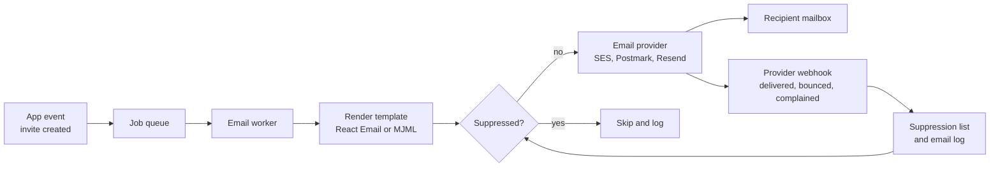
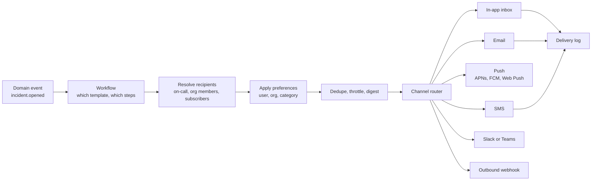
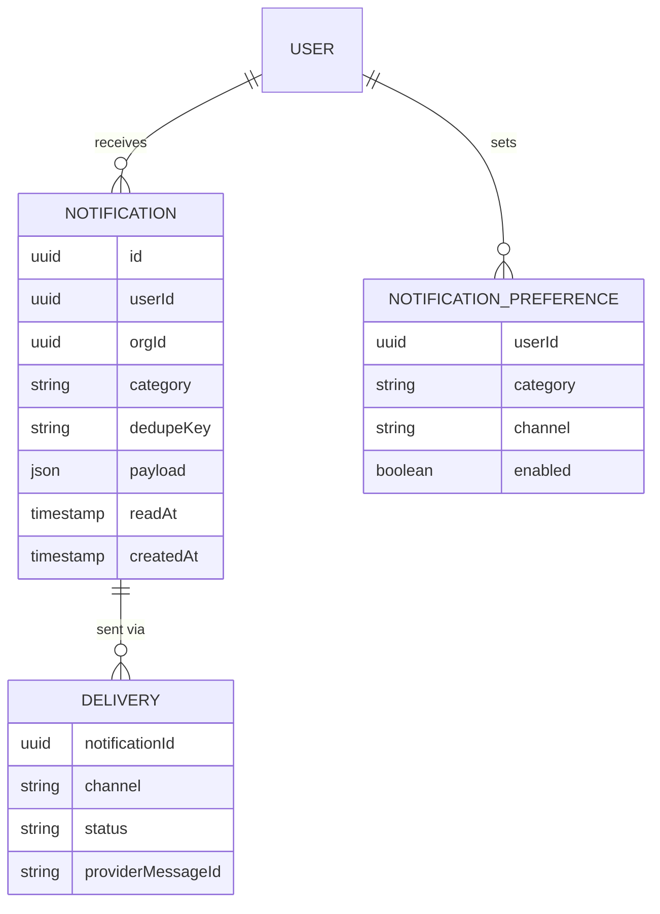
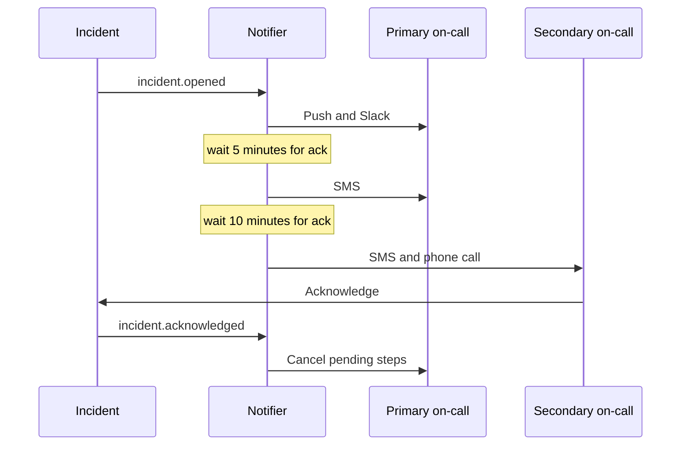
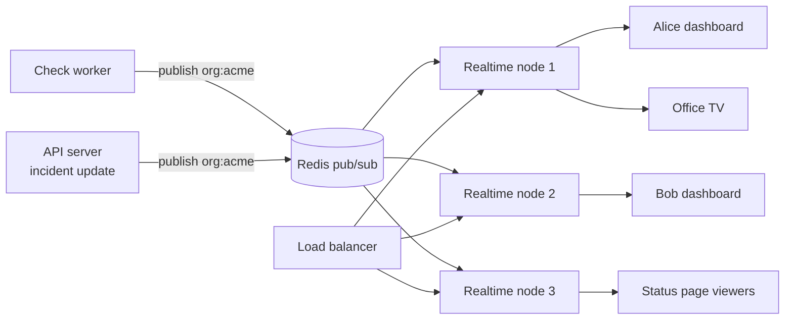
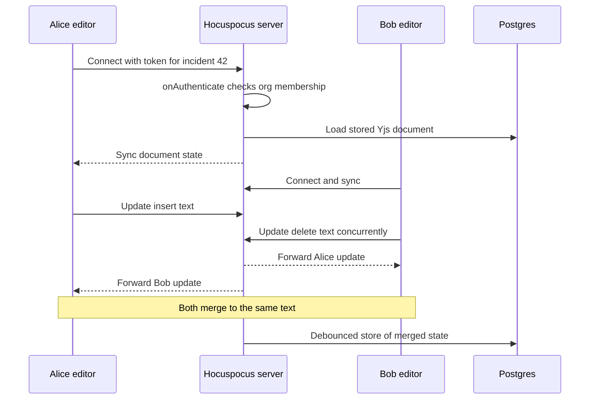

# Module 4 — Communication

*A SaaS that can't reach its users might as well not exist, and for Beacon, reaching people is the product: an outage alert that lands in spam is worse than no alert at all. This module covers the three ways your app talks to people. Transactional email has to arrive. Notifications have to reach the right person on the right channel without burying them. Real-time updates and collaboration make the dashboard feel alive and let two engineers edit the same postmortem without overwriting each other.*

---

# 4.1 — Transactional email that actually arrives
*Level: 🟢 Beginner* · *Prerequisites: 1.1, 1.2*

## 🧭 Why every SaaS has this

Beacon's first email code is six lines of Nodemailer pointed at the SMTP server of whatever host the app runs on, sending from `alerts@beacon.app`. Nobody set up DNS records for it. In development everything "works", because the developer's own inbox is forgiving. In production, password-reset emails show up twenty minutes late or not at all, and signups stall at "verify your email". Then a customer's API goes down at 3 a.m. and Beacon's incident alert lands in Gmail's spam folder. The customer finds out from their own customers.

Nothing in the code is wrong. Email delivery is decided by the *receiving* mailbox provider (Gmail, Outlook, Yahoo, corporate filters), and they judge you on whether your domain is **authenticated** and whether your sending **reputation** is good. Since February 2024, Gmail and Yahoo have *required* authentication for everyone and stricter rules for bulk senders, so unauthenticated mail isn't just less likely to arrive. It gets rejected.

Every SaaS sends the same core set: verify email, magic link, password reset, invitation, receipt, "your trial ends in 3 days". Beacon adds incident alerts and status-page subscriber updates on top. None of these are optional.

**Email delivery is a reputation system, not an API call: authenticate your domain, separate your mail streams, send from a queue, and act on what bounces and complaints tell you.**

## 📐 How it works

### 🟢 The essentials

**Transactional vs marketing.** The difference is legal and technical, not stylistic.

| | Transactional | Marketing (bulk / promotional) |
|---|---|---|
| Triggered by | A user action or account event | You, sent to a list |
| Examples | Password reset, invite, incident alert, receipt | Newsletter, product launch, "we miss you" |
| Consent | Implied by using the service | Needs opt-in (GDPR) or at least opt-out (CAN-SPAM) |
| Unsubscribe | Not required for truly transactional mail | Required, and one-click for bulk senders |
| Where to send from | `mail.beacon.app` or your transactional stream | A *separate* subdomain or stream, e.g. `news.beacon.app` |

Keep them apart so that a marketing campaign with a bad complaint rate can't sink the reputation your password resets depend on.

**Domain authentication.** These are three DNS records that prove you're allowed to send as your domain:

| Record | What it proves | Looks like |
|---|---|---|
| **SPF** (RFC 7208) | Which servers may send mail for the domain in the envelope sender | `TXT "v=spf1 include:amazonses.com ~all"` |
| **DKIM** (RFC 6376) | The message was signed by the domain owner and not altered. The public key lives in DNS | `TXT` at `selector._domainkey.mail.beacon.app` |
| **DMARC** (RFC 7489) | What receivers should do when SPF/DKIM fail or don't *align* with the visible `From:` domain, and where to send reports | `TXT` at `_dmarc.beacon.app`: `"v=DMARC1; p=none; rua=mailto:…"` |

*Alignment* means the domain that passed SPF or DKIM matches the domain in the `From:` header the human sees. Your provider's setup screen gives you the exact records. Your job is to add them and wait until they verify.

**Use a provider, not raw SMTP from your server.** Amazon SES (cheap, bare-bones), Postmark (strong deliverability focus, separate transactional and broadcast "message streams"), Resend (developer-first API, made by the React Email team) and SendGrid (large, long-established) all handle IP reputation, retries, feedback loops and bounce processing. Any of them is fine for Beacon.

**Send from a queue.** Sending inline in a request handler means a slow provider makes your signup endpoint slow, and a provider outage makes signups fail. Enqueue an email job and let a worker send it with retries (5.1).



```ts
// emails/invite.tsx: a React Email template
import { Html, Button, Text } from "@react-email/components";
export function InviteEmail({ orgName, url }: { orgName: string; url: string }) {
  return (
    <Html>
      <Text>You've been invited to join {orgName} on Beacon.</Text>
      <Button href={url}>Accept invitation</Button>
    </Html>
  );
}

// worker: send-email job
import { render } from "@react-email/render";
export async function sendInvite(job: { to: string; orgName: string; url: string; inviteId: string }) {
  if (await isSuppressed(job.to)) return;
  const html = await render(<InviteEmail orgName={job.orgName} url={job.url} />);
  await resend.emails.send(
    { from: "Beacon <team@mail.beacon.app>", to: job.to, subject: `Join ${job.orgName} on Beacon`, html },
    { idempotencyKey: `invite:${job.inviteId}` },
  );
}
```

Django has `send_mail` with backends like `django-anymail`, Rails has Action Mailer with `deliver_later`, and Laravel has Mailables with `->queue()`. The shape is the same: template, queue, provider.

### 🟡 Going deeper

**Bounces, complaints and suppression.** Providers report back via webhooks:

- **Hard bounce:** the address doesn't exist. Never send to it again.
- **Soft bounce:** mailbox full, temporary failure. The provider retries. Suppress after repeated failures.
- **Complaint:** the recipient clicked "Report spam". Stop all non-essential mail to them immediately.

Keep your own **suppression list** (address, reason, date) and check it before every send, even though providers keep one too (SES has an account-level list, Postmark suppresses per stream). Your own list lets you show "we can't email jane@acme.com, it bounced" in the UI, which saves a support ticket. Verify the webhook signatures the same way you did for Stripe in 3.1.

**The 2024 Gmail and Yahoo requirements.** For all senders: SPF *or* DKIM, valid forward and reverse DNS for sending IPs, TLS, and a spam-complaint rate kept below 0.3% (as reported in Google Postmaster Tools). For bulk senders (roughly 5,000+ messages a day to Gmail addresses): SPF *and* DKIM, a DMARC record (at least `p=none`) with an aligned `From:` domain, and **one-click unsubscribe** (RFC 8058: `List-Unsubscribe` plus `List-Unsubscribe-Post` headers) on marketing and subscribed mail, honored within two days. Microsoft announced similar requirements for high-volume senders to Outlook.com consumer addresses in 2025. Beacon's status-page subscriber emails count as subscribed mail: people signed up for them, so they need the unsubscribe headers.

**Templates.** Email HTML is stuck around 2005: tables for layout, inline CSS, patchy support for modern CSS, Outlook rendering with Word's engine, and dark mode inverting your colors. Don't hand-write it. Pick one tool:

| Tool | Author in | Good for |
|---|---|---|
| React Email | React components | TypeScript/React teams, with a local preview server |
| MJML | An XML-like markup that compiles to responsive tables | Any stack. Designers can learn it |
| Maizzle | HTML plus Tailwind CSS, built to inlined email HTML | Teams that live in Tailwind |

Always send a **plain-text part** too. It helps deliverability and accessibility.

**Testing locally.** Never send real email from development. Run **Mailpit**, a local SMTP server (port 1025 by default) with a web UI (8025) that catches everything. It can also check your HTML against email-client support and test links. Older setups use MailHog or Inbucket, and you'll see both in the codebases below. Mailpit is the actively maintained choice. For templates, React Email's preview server renders every template with sample props.

**Localization.** Store `locale` on the user and render with it. Subject lines, dates, times (in the *recipient's* timezone, which matters for "incident started at 03:12"), and right-to-left layout if you support those languages. Don't translate inside the template by hand. Use the same i18n catalog as the app.

### 🔴 At scale / enterprise

**Per-tenant custom sending domains.** Business customers want status-page updates sent *from their own domain* (`status@acme.com`), not `beacon.app`. That means onboarding each customer domain with your provider (SES identities, the Resend and Postmark domain APIs), showing them the SPF/DKIM records to add, polling verification, and routing each send through the right identity. Keep a fallback: until the domain verifies, send from your domain with their name in the display name. Documenso and Dub both ship this for their customers.

**Fan-out.** One incident on a popular status page can mean 50,000 subscriber emails. Use your provider's batch API, throttle to your sending quota, make each message idempotent (`incident:{id}:update:{n}:subscriber:{id}`), and put these on a separate stream or subdomain from password resets so a spike or complaint wave can't delay login emails.

**Reputation operations.** Watch bounce and complaint rates per stream (SES will review or pause accounts that exceed its thresholds), move DMARC from `p=none` to `quarantine` and then `reject` once reports show every legitimate source is aligned, consider dedicated IPs only at high volume (they need warm-up and steady traffic), and consider a second provider for failover on critical mail.

**Self-hosting.** Running your own mail transfer agent means managing IP reputation yourself, which is a full-time job. The realistic self-hosted options *wrap* a provider or suit specific cases: useSend gives you a Resend-style API and dashboard on top of Amazon SES, Postal is a full mail server for teams with the ops capacity, listmonk (newsletters) and Mautic (marketing automation) cover the marketing side.

## 🏆 The best repos

| Repo | What it is | Stack | License | Pick it when |
|---|---|---|---|---|
| [resend/react-email](https://github.com/resend/react-email) | Build emails as React components, with a preview server | TypeScript, React | MIT | Your app is React/TypeScript, and you want templates next to your code |
| [mjmlio/mjml](https://github.com/mjmlio/mjml) | Markup language that compiles to responsive email HTML | JavaScript | MIT | Any backend language, or designers author templates |
| [maizzle/framework](https://github.com/maizzle/framework) | Tailwind CSS framework for HTML emails | JavaScript | MIT | Your team thinks in Tailwind |
| [nodemailer/nodemailer](https://github.com/nodemailer/nodemailer) | The standard Node.js email sender (SMTP and transports) | JavaScript | MIT-0 | You need SMTP (self-hosted customers, Mailpit, fallback provider) |
| [axllent/mailpit](https://github.com/axllent/mailpit) | Local SMTP catcher with web UI, HTML compatibility and link checks | Go | MIT | Always, in development and CI |
| [unsend-dev/unsend](https://github.com/unsend-dev/unsend) | useSend: open-source sending platform (API, domains, webhooks) on Amazon SES | TypeScript, Next.js | AGPL-3.0 | You want a Resend-like experience you host yourself, paying SES prices |
| [postalserver/postal](https://github.com/postalserver/postal) | Full-featured mail delivery platform | Ruby | MIT | You really do need to run your own mail servers |
| [knadh/listmonk](https://github.com/knadh/listmonk) | Self-hosted newsletter and mailing-list manager | Go, Postgres | AGPL-3.0 | Product newsletters, kept apart from transactional mail |
| [mautic/mautic](https://github.com/mautic/mautic) | Open-source marketing automation | PHP | GPL-3.0 | Campaigns, segments and lead scoring, self-hosted |

**If you only study one:** clone `resend/react-email`, run its preview server, and read how components render to email-safe HTML. Most modern TypeScript SaaS codebases, including the ones below, use it, and it'll change how you think about email templates as code.

**Buy, build, or self-host?**

- **Buy (default):** a sending provider such as Postmark, Resend, Amazon SES or SendGrid. Deliverability is their product, and they're cheap next to your time.
- **Self-host:** useSend on SES for cost control with a nice API. listmonk or Mautic for marketing lists. Postal only with dedicated ops capacity.
- **Build:** templates, the email job, the suppression check, bounce and complaint webhook handling, and per-tenant domain onboarding. Never your own mail server for a SaaS's critical mail.

## 🔍 Study it in the wild

**openstatus (`openstatusHQ/openstatus`).** It's the real Beacon, so its emails are Beacon's emails. At the time of writing, `packages/emails/emails/` holds React Email templates such as `monitor-alert.tsx`, `page-subscription.tsx`, `status-report.tsx`, `team-invitation.tsx` and `plan-downgraded.tsx`, with shared components in `_components/`. Compare how an alert email differs from a subscriber update.

**Dub (`dubinc/dub`).** Open `packages/email` and read `src/index.ts`. `sendEmail` uses Resend when configured and falls back to Nodemailer SMTP otherwise, which is how an open-source SaaS supports self-hosters. Then search for `VARIANT_TO_FROM_MAP`: system, notification and marketing mail go out from *different addresses and subdomains*. That's stream separation in three lines. Search `email-domains` for per-workspace custom sending domains.

**Documenso (`documenso/documenso`).** Open `packages/email`. `mailer.ts` picks a Nodemailer transport (SMTP, Resend, MailChannels) from environment variables, `templates/` has one file per email, and there's a separate preview setup. Documenso's development Docker Compose uses Inbucket as the mail catcher. Search `organisation-email-domain` for how organizations bring their own sending domain.

**Cal.com (`calcom/cal.com`).** `packages/emails` has a README explaining `renderEmail("TeamInviteEmail", props)` and a preview endpoint, and a `docker-compose.yml` that starts MailHog for local catching. Search `billing-email-service` and `auth-email-service` to see how emails are grouped by domain area.

**What to notice**

- Whether sending is abstracted behind one function with swappable transports.
- How many distinct `From:` addresses and subdomains are used, and why.
- Where emails are triggered: inline, in background jobs, or from a workflow.
- How local development catches email (Mailpit, MailHog, Inbucket, preview servers).
- How customer-owned sending domains are verified and used.

## 🛠️ Build it into Beacon

### 🟢 Beginner exercise

Set up Mailpit in Beacon's `docker-compose.yml` and a provider (Resend, Postmark or SES) for production. Create React Email (or MJML) templates for *verify email*, *invitation* and *incident opened*, and send them through a single `sendEmail()` function that picks SMTP-to-Mailpit in development and the provider in production.

**Done when:**
- Signing up locally shows the verify email in Mailpit's UI at `localhost:8025`.
- Every template has a plain-text part and renders in a preview.
- No code outside `sendEmail()` imports the provider SDK.

### 🟡 Intermediate exercise

Authenticate `mail.beacon.app` (SPF, DKIM, DMARC with `p=none` and a report address), move all sending into a queued job with idempotency keys, and handle the provider's bounce and complaint webhooks with signature verification. Maintain a `email_suppressions` table checked before every send, and show a warning in the team-members UI for suppressed addresses.

**Done when:**
- An external checker (or the provider's dashboard) shows SPF, DKIM and DMARC passing and aligned.
- A simulated hard bounce (providers offer test addresses) adds a suppression row, and no further emails are attempted to that address.
- A provider outage (simulate with a bad API key) delays emails but doesn't fail user requests, and they send after recovery.

### 🔴 Advanced exercise

Let Business orgs send status-page subscriber emails from their own domain. Build domain onboarding (create the identity via the provider's API, display DNS records, poll verification), send subscriber updates from a separate stream with RFC 8058 one-click unsubscribe headers, and fan out incident updates in throttled batches.

**Done when:**
- An org can add `status.acme.com`, see its DNS records, and gets a "verified" state once they propagate.
- Until verification, emails go out from Beacon's domain with the org's display name.
- Subscriber emails include `List-Unsubscribe` and `List-Unsubscribe-Post`, and one-click unsubscribing removes the subscriber without a login.
- A 10,000-subscriber fan-out completes within your provider's rate limits without delaying password-reset emails.

## ⚠️ Mistakes juniors make

- **Sending from the app server's own SMTP or an unauthenticated domain.** It lands in spam or gets rejected under the 2024 rules. Use a provider and publish SPF, DKIM and DMARC before launch.
- **Sending email inline in the request.** Provider latency becomes your latency, and outages become 500s. Enqueue and send from a worker with retries.
- **Mixing marketing and transactional mail on one domain and stream.** One spammy campaign hurts password-reset delivery. Separate them by subdomain or provider stream.
- **Ignoring bounces and complaints.** Repeated sends to dead addresses and complainers damage reputation until everything goes to spam. Handle the webhooks and keep a suppression list.
- **Hand-writing email HTML.** It breaks in Outlook, dark mode and Gmail's clipping. Use React Email, MJML or Maizzle, and preview in real clients.
- **Letting development send real email.** Seeded data plus a real provider means actual customers get test mail. Route development to Mailpit, always.

## 🧾 Recap

- Transactional and marketing mail differ in consent, headers and reputation, so keep them on separate streams.
- SPF, DKIM and DMARC with alignment are mandatory now, not nice-to-have.
- Template in React Email, MJML or Maizzle. Send from a queue. Catch everything locally with Mailpit.
- Bounces and complaints feed a suppression list that you check before every send.
- Per-tenant sending domains and big fan-outs are the Business-tier problems. Plan streams for them early.

## 📚 References

- Google, Email sender guidelines: https://support.google.com/mail/answer/81126
- RFC 7208 (SPF): https://www.rfc-editor.org/rfc/rfc7208
- RFC 6376 (DKIM): https://www.rfc-editor.org/rfc/rfc6376
- RFC 7489 (DMARC): https://www.rfc-editor.org/rfc/rfc7489
- RFC 8058 (one-click unsubscribe): https://www.rfc-editor.org/rfc/rfc8058
- React Email docs: https://react.email/docs
- Mailpit docs: https://mailpit.axllent.org
- Amazon SES Developer Guide: https://docs.aws.amazon.com/ses/

---

# 4.2 — Notifications: in-app, push, Slack, SMS — and preferences
*Level: 🟡 Intermediate* · *Prerequisites: 4.1, 1.2*

## 🧭 Why every SaaS has this

A customer's payment API starts flapping at 2 a.m.: down for 40 seconds, up for a minute, down again. Beacon checks every 30 seconds and dutifully notifies on every state change. By 6 a.m. the on-call engineer has 140 emails, 140 SMS (billed as overage, see 3.3), and a Slack channel nobody can scroll. At 6:05 the API goes *really* down. The team has muted Beacon by then, and nobody sees the alert that mattered.

That's **alert fatigue**, and for a monitoring product it's an existential bug. The opposite failure is just as common. The CTO wants SMS only for production monitors, the intern doesn't want email at all, the team wants everything in `#incidents`, and a status-page subscriber wants to unsubscribe from one page without logging in. "Send an email when X happens" doesn't survive contact with real users.

Every SaaS grows a notification system: invites, mentions, comments, approvals, usage limits, billing failures. They all go through the same decisions: who should know, on which channel, how urgently, how often, and whether they asked not to be told.

**A notification system is a pipeline of decisions (who, where, how often, whether at all), and those decisions matter more than the delivery.**

## 📐 How it works

### 🟢 The essentials

Separate **what happened** (an event) from **who gets told how** (notifications):



The channels have very different properties:

| Channel | Latency | Cost | Intrusiveness | Needs | Beacon uses it for |
|---|---|---|---|---|---|
| In-app inbox | Instant if online | ~free | Low | A table plus realtime (4.3) | Everything, as the record |
| Email | Seconds to minutes | Very low | Low to medium | Verified address (4.1) | Incidents, digests, billing |
| Push (APNs, FCM, Web Push) | Seconds | Free-ish | High | Device token, OS permission | Mobile on-call alerts |
| SMS | Seconds | Per message, segment-billed | Very high | Phone number, opt-in, carrier rules | Critical incidents only |
| Slack / Teams | Seconds | Free | Medium | OAuth install (5.3) | Team channel alerts |
| Outbound webhook | Seconds | Free | None, it's for machines | Endpoint, signing (5.3) | PagerDuty, custom tooling |

v1 data model: one row per notification per recipient (the in-app inbox), plus preferences.



One entry point, called from domain code, which never talks to Twilio directly:

```ts
export async function notify(evt: { category: "incident.opened"; orgId: string; incidentId: string }) {
  const recipients = await resolveRecipients(evt);             // on-call + watchers
  for (const user of recipients) {
    const dedupeKey = `${evt.category}:${evt.incidentId}:${user.id}`;
    const n = await db.notification.createIfAbsent({ dedupeKey, userId: user.id, orgId: evt.orgId,
      category: evt.category, payload: evt });                 // unique(dedupeKey)
    if (!n) continue;                                          // already notified
    const channels = await enabledChannels(user.id, evt.category); // preferences + defaults
    for (const channel of channels) {
      await queue.add("deliver", { notificationId: n.id, channel },
        { jobId: `${n.id}:${channel}` });                      // idempotent job
    }
  }
}
```

**Preferences** start simple: a matrix of *category* × *channel* with sensible defaults, so "incident opened: email ✓, SMS ✓, push ✓" and "weekly report: email ✓". Some categories are **required** (security alerts, billing failures, "you were made owner"), and users can't turn them off.

### 🟡 Going deeper

**Notify on state changes, not on events.** Beacon's flapping problem is mostly a *domain* fix, not a notification fix:

- Open an incident only after **N consecutive failures** (for example 3), or failures from **several regions**, and close it only after M consecutive successes. That's hysteresis.
- Notify once per incident **state change** (opened, acknowledged, resolved), never per failed check.
- If a monitor opens and closes incidents more than K times in an hour, mark it **flapping**. Send one "Monitor is flapping" notification and suppress the rest until it settles.

Uptime Kuma exposes these as per-monitor settings (retries before marking down, and how often to re-send while still down). They're worth copying.

**Dedupe, throttle, digest.** These are three different tools:

| Tool | Question it answers | Example |
|---|---|---|
| Dedupe | "Have I already sent *this exact* thing?" | Unique `dedupeKey` per incident + state + recipient |
| Throttle / rate limit | "Have I sent *too much* recently?" | Max 5 SMS per user per hour. Beyond that, fall back to push/email with "and 12 more" |
| Digest / batch | "Can I combine these into one?" | Collect non-urgent notifications for 30 min, then send one summary email |

A digest is a small state machine: the first event opens a window, later events join it, and when the window closes one message goes out. It needs a scheduled job keyed by `(user, category, window)`. Novu has digest as a built-in workflow step, and it's worth reading even if you build your own.

**Two layers of preferences.** In B2B, the *organization* sets policy ("production incidents always SMS the on-call") and the *user* tunes within it ("don't email me about staging"). Resolve them as `required categories` → org policy → user preference → default. Quiet hours ("no push 22:00–07:00 unless severity is critical") belong in the same resolution step, evaluated in the *user's* timezone.

**Unsubscribe without logging in.** Every email notification carries a signed, per-recipient, per-category unsubscribe link, plus RFC 8058 one-click headers where required (4.1). Status-page subscribers aren't users at all. They get a token-based management page. SMS needs keyword handling too: STOP must stop. Twilio handles the standard opt-out keywords for you on long codes, but mirror that state in your own database.

**Escalation.** For an on-call product, an unacknowledged alert must get louder:



Each step is a delayed job that first checks "is it acknowledged yet?". The ack has to *cancel* pending steps, which is a job for a durable workflow engine (5.4), or at least delayed jobs with stable IDs you can remove.

**Channel specifics you'll hit:**

- **Push:** APNs (Apple) and FCM (Google) need device tokens that expire or change, so delete tokens the provider reports as invalid. Google shut down FCM's legacy HTTP APIs in 2024, and new code uses the FCM HTTP v1 API. **Web Push** (RFC 8030, with VAPID keys from RFC 8292) works in modern browsers, including iOS Safari 16.4+ for web apps added to the Home Screen.
- **SMS:** billed per *segment* (160 GSM-7 characters, or 70 if the message contains any character outside GSM-7, such as many emoji). Keep alert texts short and ASCII. US application-to-person traffic on 10-digit numbers requires 10DLC brand and campaign registration, so start it before launch because it takes time.
- **Slack:** use a Slack app with OAuth (5.3) and `chat.postMessage`, not a pasted incoming-webhook URL, if you want per-channel routing, threading (post incident updates as replies in one thread) and buttons such as "Acknowledge". Slack rate-limits posting to roughly one message per second per channel, which is another reason to thread and batch.

### 🔴 At scale / enterprise

**Fan-out and fairness.** A major cloud outage makes thousands of Beacon monitors fail at once. That's tens of thousands of notifications in a minute, just when customers need them most. Use per-channel queues with concurrency limits that match provider rate limits, prioritize by severity (critical before digest), and keep per-org fairness so one enormous customer can't starve everyone else (2.4). Precompute recipient lists for status pages rather than querying 50,000 subscribers inside the hot path.

**Provider failover.** SMS and push providers have outages. Put an adapter interface in front of each channel (`SmsProvider.send()`), record `providerMessageId` and status in `DELIVERY`, and fail over (Twilio → a second SMS provider) on errors or on missing delivery receipts for critical alerts.

**Delivery tracking and audit.** Enterprise customers will ask "was our on-call paged at 03:12, and did they get it?". Keep the delivery log with provider status callbacks (queued, sent, delivered, failed, read for in-app), and show it on the incident timeline. It doubles as your debugging tool and ties into audit logs (7.3).

**Build or adopt a notification platform.** Workflows, digests, preference centers, an in-app inbox component, provider integrations and a delivery log make up a large product. **Novu** is the open-source option: code-first workflows, a drop-in Inbox component, digests and delays, subscriber preferences, and many provider integrations. **Knock** and **Courier** are the managed equivalents. For narrower needs, **Apprise** (one Python API for dozens of services), **ntfy** and **Gotify** (self-hosted push) are useful building blocks.

## 🏆 The best repos

| Repo | What it is | Stack | License | Pick it when |
|---|---|---|---|---|
| [novuhq/novu](https://github.com/novuhq/novu) | Open-source notification infrastructure: workflows, digests, preferences, in-app Inbox, many providers | TypeScript, Node, React | MIT (enterprise folders separately licensed) | You want a complete notification platform you can self-host |
| [caronc/apprise](https://github.com/caronc/apprise) | One API and URL scheme to notify dozens of services (Slack, Telegram, email, SMS…) | Python | BSD-2-Clause | You need many channels fast from Python, or want to see the adapter pattern |
| [binwiederhier/ntfy](https://github.com/binwiederhier/ntfy) | HTTP-based pub/sub push notifications to phones and desktops | Go | Apache-2.0 / GPL-2.0 dual | Simple self-hosted push, or offering an ntfy channel to users |
| [gotify/server](https://github.com/gotify/server) | Self-hosted server for sending and receiving push messages over WebSocket | Go | MIT | Self-hosted push for internal teams |
| [web-push-libs/web-push](https://github.com/web-push-libs/web-push) | Node library for Web Push with VAPID and payload encryption | JavaScript | MPL-2.0 | Browser push notifications without a vendor |
| [firebase/firebase-admin-node](https://github.com/firebase/firebase-admin-node) | Official Firebase Admin SDK, including FCM sending | TypeScript | Apache-2.0 | Push to Android (and iOS via FCM) from Node |
| [slackapi/bolt-js](https://github.com/slackapi/bolt-js) | Official framework for Slack apps: OAuth, events, interactive buttons | TypeScript | MIT | Your Slack integration needs buttons such as "Acknowledge" |
| [twilio/twilio-node](https://github.com/twilio/twilio-node) | Official Twilio SDK for SMS, voice and status callbacks | TypeScript | MIT | SMS and voice escalation |
| [louislam/uptime-kuma](https://github.com/louislam/uptime-kuma) | Self-hosted uptime monitor with 100+ notification providers | Node, Vue | MIT | You want to see how a monitoring tool structures notification adapters |

**If you only study one:** read `novuhq/novu`. Even if you never adopt it, its concepts (workflow, step, digest, subscriber, preference, Inbox) are the vocabulary for this whole lesson. Start in `packages/framework` for the code-first workflow API, then look at how `apps/api` and `apps/worker` split responsibilities.

**Buy, build, or self-host?**

- **Buy:** Knock or Courier when you need workflows, preferences and an in-app feed across several products soon and don't want to run them. Use channel providers regardless: Twilio for SMS, APNs/FCM for push, a mail provider (4.1).
- **Self-host:** Novu when you want the full platform in your own infrastructure. Apprise, ntfy or Gotify for narrower internal needs.
- **Build (reasonable for Beacon v1):** a `notify()` entry point, the notification and delivery tables, a preference matrix, dedupe keys and per-channel jobs. Alerting *is* Beacon's product, so owning the flapping, escalation and throttling logic is justified. Rent the channels, own the decisions.

## 🔍 Study it in the wild

**openstatus (`openstatusHQ/openstatus`).** At the time of writing, `packages/notifications/` has **one package per channel**: `discord`, `email`, `slack`, `google-chat`, `ms-teams`, `pagerduty`, `opsgenie`, `ntfy`, `telegram`, `webhook`, SMS and WhatsApp variants, plus a shared `base` package with message formatting helpers. The dashboard has a matching form per channel (search `form-slack`, `form-sms`). It's the adapter pattern applied to exactly Beacon's problem.

**Uptime Kuma (`louislam/uptime-kuma`).** Open `server/notification-providers/`. There are over a hundred small files, one per service, all implementing the same interface. Then look at how a monitor's "retries" and "resend interval" settings decide *whether* to notify. That's anti-flapping and re-notification logic in a real monitoring tool.

**Dub (`dubinc/dub`).** Search for `notificationPreference`. The usage cron only emails workspace members whose preferences opt into the usage summary, and caps recipients per workspace. Search `notification-preferences` for the API route that edits them. It's a small, readable preference model.

**Novu (`novuhq/novu`).** Novu is a SaaS in its own right. Search `apps/api` for `digest` and `preferences` to see how digest windows and preference resolution are implemented, and `apps/ws` for the WebSocket service that powers the real-time Inbox.

**What to notice**

- Whether domain code calls channels directly or goes through one `notify` entry point.
- How each channel adapter is shaped, and how failures are reported back.
- Where anti-flapping, dedupe and throttling live: domain, notifier, or channel.
- How preferences are stored (per category, per channel, per org) and which categories can't be disabled.
- Whether there's a delivery log you could show to a customer.

## 🛠️ Build it into Beacon

### 🟢 Beginner exercise

Build the in-app inbox: a `notifications` table, a `notify()` function called when an incident opens or resolves, a bell icon with an unread count, and "mark as read" / "mark all as read". Every org member with access to the monitor gets one notification per incident state change.

**Done when:**
- Opening an incident creates exactly one notification per eligible member, even if `notify()` is called twice (unique dedupe key).
- The unread count updates after marking as read.
- Members without access to the monitor (1.3) receive nothing.

### 🟡 Intermediate exercise

Add email, Slack and SMS channels behind a channel-router with per-channel jobs, plus a preferences page (category × channel matrix, with required categories locked on). Implement anti-flapping: incidents open after 3 consecutive failures, and a monitor that changes state more than 4 times in an hour sends one "flapping" notification and suppresses the rest. Add a per-user SMS throttle of 5 per hour, with email fallback.

**Done when:**
- A simulated flapping monitor (alternating up/down every 30s for an hour) produces at most a handful of notifications per channel.
- A user who disabled email for "incident resolved" gets no resolved emails but still gets in-app ones.
- The sixth SMS within an hour is replaced by an email saying how many alerts were held back.
- Every delivery attempt is recorded with channel, status and provider message ID.

### 🔴 Advanced exercise

Implement escalation policies per org: step 1 (push + Slack to primary on-call), step 2 after 5 minutes (SMS), step 3 after 10 more minutes (secondary on-call, SMS + voice). Acknowledgement (from the app, a Slack button, or an SMS reply) cancels pending steps. Add a daily digest for non-critical categories and an incident timeline showing every delivery.

**Done when:**
- An unacknowledged incident escalates on schedule. Acknowledging at any step cancels all later steps, with no duplicate pages.
- Acknowledging from Slack's button updates the incident within seconds.
- Non-critical notifications for a user within the digest window arrive as a single email.
- The incident timeline shows who was notified, how, when, and whether it was delivered.

## ⚠️ Mistakes juniors make

- **Notifying on every event instead of every state change.** A flapping check becomes 300 SMS and a muted integration. Add hysteresis, dedupe keys and flapping detection in the domain logic.
- **Calling Twilio or Slack directly from business code.** You can't add preferences, throttling or failover later without touching every call site. Route everything through one `notify()` and channel adapters.
- **Making every notification optional.** Users disable security or billing alerts, then blame you. Mark required categories and lock them on.
- **Unsubscribe links that require login.** People can't unsubscribe from their phone, so they hit "Report spam" instead, and your reputation suffers (4.1). Use signed tokens and one-click endpoints.
- **Ignoring provider feedback.** Stale push tokens, bounced emails and STOP replies keep getting sent to. Process delivery callbacks and prune.
- **Sending long, emoji-heavy SMS.** Each non-GSM character switches encoding and multiplies segments, and so the bill. Keep alert SMS short, plain and linked.

## 🧾 Recap

- Separate events from notifications: event → workflow → recipients → preferences → throttle → channel → delivery log.
- Alert fatigue is a product bug. Fix it with hysteresis, state-change notifications, flapping detection, dedupe and throttling.
- Preferences have layers (required, org, user, default), and unsubscribing must work without login.
- Escalation is a sequence of cancellable delayed steps, which makes it a job for durable workflows.
- Rent the channels (Twilio, APNs/FCM, Slack, email providers). Own the decision logic, or adopt Novu, Knock or Courier.

## 📚 References

- Novu documentation: https://docs.novu.co
- Firebase Cloud Messaging docs: https://firebase.google.com/docs/cloud-messaging
- Apple User Notifications (APNs) docs: https://developer.apple.com/documentation/usernotifications
- RFC 8030 (Web Push) and RFC 8292 (VAPID): https://www.rfc-editor.org/rfc/rfc8030 and https://www.rfc-editor.org/rfc/rfc8292
- Slack API docs (chat.postMessage, rate limits, Bolt): https://api.slack.com
- Twilio docs (messaging, opt-out, status callbacks): https://www.twilio.com/docs
- RFC 8058 (one-click unsubscribe): https://www.rfc-editor.org/rfc/rfc8058

---

# 4.3 — Real-time and collaboration: WebSockets to CRDTs
*Level: 🔴 Advanced* · *Prerequisites: 4.2, 2.4*

## 🧭 Why every SaaS has this

Beacon's dashboard shows a grid of monitors, green and red. The first version polls `/api/monitors/status` every five seconds. With 2,000 dashboards open (on office TVs, that's how monitoring dashboards live), that's 400 requests per second, almost all answering "nothing changed". When something *does* change, users see it up to five seconds late, and an ops team staring at a wall screen notices.

Then a big outage hits a popular customer. Their public status page, normally quiet, gets 50,000 visitors refreshing every few seconds, just as your team posts incident updates. And inside Beacon, two engineers write the postmortem in the same incident notes field. Each saves, and the second save silently wipes out the first person's twenty minutes of work.

Those look like one feature, "real-time", but they're two unrelated problems with different tools.

**Real-time is two separate problems: pushing server changes to many clients (a fan-out problem) and letting many clients edit the same thing (a conflict problem). Choose tools for each separately.**

## 📐 How it works

### 🟢 The essentials

**Transport options, from simplest to most capable:**

| Technique | How it works | Direction | Good for | Watch out for |
|---|---|---|---|---|
| Polling | Client asks every N seconds | Client → server | Low-frequency data, v1 | Wasted requests, latency up to N |
| Long polling | Server holds the request until there's news | Server → client, emulated | Environments that block streaming | Reconnect churn |
| **SSE** (Server-Sent Events) | One long HTTP response streaming `text/event-stream`, and the browser's `EventSource` auto-reconnects | Server → client | Dashboards, feeds, notifications, AI token streaming | ~6 connections per origin over HTTP/1.1 (fine on HTTP/2), text only |
| **WebSocket** (RFC 6455) | HTTP upgrade into a persistent two-way connection | Both | Chat, presence, collaboration, games | Stateful servers, load-balancer config, you build reconnection |

**Rule of thumb:** if clients mostly *listen* (Beacon's dashboard, the notification bell from 4.2, the status page), use **SSE**. It's plain HTTP, works through most proxies, and reconnects with `Last-Event-ID` for free. Use WebSockets when clients send frequent messages too (cursors, typing, collaborative edits).

**Fan-out across servers.** Your app runs on several instances. The check worker that detects an outage isn't the process holding Alice's connection. So you need **pub/sub**: publishers send to a channel, and every server subscribed to that channel forwards messages to its local connections. Redis pub/sub is the default choice.



A minimal SSE endpoint for Beacon's dashboard:

```ts
// app/api/orgs/[orgId]/events/route.ts (Node runtime)
export async function GET(req: Request, { params }: { params: { orgId: string } }) {
  const user = await requireUser(req);
  await requireMembership(user.id, params.orgId);          // authorize the channel
  const sub = redis.duplicate();                          // dedicated subscriber connection
  await sub.connect();
  const stream = new ReadableStream({
    start(controller) {
      const send = (msg: string) => controller.enqueue(`data: ${msg}\n\n`);
      sub.subscribe(`org:${params.orgId}`, send);
      const ping = setInterval(() => controller.enqueue(`: ping\n\n`), 25_000); // keep proxies happy
      req.signal.addEventListener("abort", () => { clearInterval(ping); sub.quit(); });
    },
  });
  return new Response(stream, {
    headers: { "Content-Type": "text/event-stream", "Cache-Control": "no-cache", Connection: "keep-alive" },
  });
}
```

**Authorization on the connection.** Authenticate when the connection opens (session cookie, or a short-lived token for WebSockets, since browsers can't set custom headers on the WebSocket handshake), and **authorize every channel subscription**. `org:acme` must only be joinable by Acme's members. Re-check on reconnect, and disconnect users when they're removed from the org. A socket opened yesterday shouldn't outlive today's revoked membership.

**Send signals, not secrets.** A simple, robust pattern: push a small event (`{type: "monitor.status", id, status}`) and let the client refetch details through the normal authorized API when needed. Your real-time layer then never becomes a second, less-audited API.

### 🟡 Going deeper

**Scaling socket servers.** Connections are long-lived state, and that changes operations:

- **Sticky sessions** are needed if a library falls back to long-polling across multiple HTTP requests (Socket.IO does by default), so each client's requests land on the same node. Pure WebSocket or SSE connections don't need them.
- **Adapters** connect instances. Socket.IO has a Redis adapter, while Centrifugo and Soketi scale out through Redis (or NATS, for Centrifugo) built in.
- **Limits:** each connection holds a file descriptor and some memory. Tune OS limits, load-balancer idle timeouts (send heartbeats more often than the timeout) and max connections per node.
- **Deploys drop every connection.** Clients must reconnect with **exponential backoff and jitter**, or 20,000 clients reconnecting in the same second become a self-inflicted DDoS.

**Missed messages.** Pub/sub is fire-and-forget. A client that reconnects after 30 seconds missed whatever was published meanwhile. The options: send a full refresh on reconnect (simplest, and right for Beacon's dashboard), include an event ID and replay from a short history (SSE's `Last-Event-ID`, Centrifugo's history and recovery, Redis Streams), or read from a durable log. Mattermost's server even has a "reliable websocket" implementation with sequence numbers for this.

**Where events come from.** Publishing inline after a DB write ("write, then publish") can publish something that later rolls back, or skip publishing if the process crashes between the two. Safer: publish from a transactional **outbox** processed by a job (5.3), or stream changes from the database itself. Postgres `LISTEN/NOTIFY` is easy but not durable (payloads are capped at 8,000 bytes by default, and messages are dropped when nobody's listening). Logical replication is what Supabase Realtime uses for its "Postgres Changes" feature.

**Presence** means "who's online" or "who's viewing this incident". Each client heartbeats every N seconds, and the server stores `presence:incident:42 → {userId: lastSeen}` in Redis with TTLs, broadcasting joins and leaves. Presence is approximate by nature. Design the UI so it can be a few seconds stale.

**Public status pages at 50,000 viewers.** Don't hold 50,000 sockets for a page that changes a few times an hour. Serve the page from a CDN with a short cache TTL, and push updates via SSE only from a small, cacheable endpoint, or just poll a CDN-cached JSON file every 30–60 seconds. For read-mostly public pages, polling a CDN is the scalable choice.

### 🔴 At scale / enterprise

Now the second problem: **concurrent editing.** When two people edit the same data, you need a rule for what the result is.

| Strategy | How | Good for | Loses |
|---|---|---|---|
| Last write wins (LWW) | Latest save overwrites | Settings, single-owner records | Concurrent work, silently |
| Optimistic locking | `version` column, reject stale writes with 409 | Forms, most CRUD | Nothing, but the user must retry or merge |
| Field-level merge / server-authoritative | Server applies small changes per property in arrival order | Canvases, structured docs (Figma, tldraw) | Rare same-field races resolve by order |
| **OT** (Operational Transformation) | Central server transforms concurrent operations against each other | Text editors with a central server (Google Docs) | Complex to implement, needs the server |
| **CRDT** (Conflict-free Replicated Data Type) | Data structures that merge automatically and deterministically in any order | Text, lists and maps, offline and peer-to-peer | Metadata overhead, "merged" isn't always "what the user meant" |

For Beacon, monitor settings get **optimistic locking**. The postmortem editor is real collaborative text and gets a **CRDT**, and **Yjs** is the most widely used implementation. Each client holds a Yjs document, edits produce small binary updates, and updates merge in any order to the same result. A **provider** carries updates: a WebSocket server like **Hocuspocus** (which adds auth hooks, persistence to your database and Redis-based scaling), WebRTC, or IndexedDB for offline. Yjs's **awareness** protocol carries ephemeral state such as cursors and selections, which is presence for editors. **Automerge** is the other major CRDT library, and it has a strong focus on local-first applications.



Not everything collaborative needs a CRDT. Figma described its multiplayer system as server-authoritative with per-property last-writer-wins, *inspired* by CRDTs but simpler because a central server exists. tldraw's sync (`packages/sync-core` in `tldraw/tldraw`) also treats the room on the server as the authoritative source. If you always have a server, that's often the simpler design.

**Local-first and sync engines** take this further: the client keeps a local replica of *its slice* of the database, reads are instant and offline-capable, and a sync engine keeps replicas consistent. Here's the landscape:

| Tool | Model |
|---|---|
| **ElectricSQL** | Syncs "shapes" (subsets of Postgres tables) to clients over HTTP, which makes them cacheable on a CDN. Writes go through your own API |
| **Zero** (Rocicorp, repo `rocicorp/mono`) | Query-driven sync: client queries run locally against a cache kept in sync with Postgres by `zero-cache`, and mutations run optimistically on the client and authoritatively on the server |
| **Liveblocks** | Managed rooms, presence, storage and Yjs hosting |
| **PartyKit** | Stateful "rooms" on Cloudflare Durable Objects (PartyKit joined Cloudflare in 2024) |
| **Supabase Realtime** | Broadcast, Presence and Postgres Changes over Phoenix channels |

These tools can remove a lot of API and state-management code, but they change your architecture: authorization has to be expressed as *which data syncs to whom*, schema migrations must keep old clients working, and "offline for a week, then reconnect" becomes a real test case. Adopt one for a product whose core experience is collaborative. Beacon's is not, so it uses SSE for the dashboard and Yjs only for postmortems.

**Operational concerns at scale:** a CRDT document's history grows, so snapshot and compact it. Enforce document size limits, rate-limit update messages per connection, and audit-log *who changed what* (7.3), which is hard when edits are CRDT deltas, so record author attribution per update. Tenant isolation (2.4) applies to rooms and channels as much as to tables.

## 🏆 The best repos

| Repo | What it is | Stack | License | Pick it when |
|---|---|---|---|---|
| [socketio/socket.io](https://github.com/socketio/socket.io) | WebSocket library with fallbacks, rooms, acknowledgements and adapters | TypeScript, Node | MIT | You're in Node and want rooms plus a Redis adapter quickly |
| [centrifugal/centrifugo](https://github.com/centrifugal/centrifugo) | Standalone real-time messaging server: channels, JWT auth, presence, history and recovery | Go | Apache-2.0 | Any backend language. You want a separate, scalable real-time tier |
| [soketi/soketi](https://github.com/soketi/soketi) | Pusher-protocol-compatible WebSocket server | TypeScript, Node | AGPL-3.0 | You want Pusher's client ecosystem (e.g. Laravel Echo), self-hosted |
| [supabase/realtime](https://github.com/supabase/realtime) | Broadcast, Presence and Postgres change streaming | Elixir, Phoenix | Apache-2.0 | You're on Supabase, or want to study DB-driven real-time |
| [yjs/yjs](https://github.com/yjs/yjs) | The most widely used CRDT library for collaborative editing | JavaScript | MIT | Collaborative text or structured documents |
| [ueberdosis/hocuspocus](https://github.com/ueberdosis/hocuspocus) | Yjs WebSocket backend with auth hooks, persistence and scaling extensions | TypeScript, Node | MIT | You're hosting Yjs documents yourself |
| [automerge/automerge](https://github.com/automerge/automerge) | CRDT library (Rust core, JS bindings) for local-first apps | Rust, JavaScript | MIT | Local-first apps with rich history |
| [electric-sql/electric](https://github.com/electric-sql/electric) | Postgres sync engine that streams "shapes" to clients over HTTP | Elixir, TypeScript | Apache-2.0 | Read-path sync from Postgres with CDN-friendly delivery |
| [rocicorp/mono](https://github.com/rocicorp/mono) | Zero: query-driven sync engine for Postgres | TypeScript | Apache-2.0 | You want instant, local-feeling UIs over your Postgres |
| [partykit/partykit](https://github.com/partykit/partykit) | Stateful real-time rooms on Cloudflare's edge | TypeScript | MIT | You're on Cloudflare, or want per-room stateful servers |

**If you only study one:** study `yjs/yjs` together with `ueberdosis/hocuspocus`. Fan-out is well-trodden engineering, but conflict resolution is where the new ideas are, and Yjs plus Hocuspocus is the most direct path from "two people overwrite each other" to "it just merges", with auth and persistence hooks you'll recognize from earlier lessons.

**Buy, build, or self-host?**

- **Buy:** Pusher, Ably or Supabase Realtime for managed fan-out, Liveblocks for managed collaboration. They're good choices when real-time is a feature, not the core.
- **Self-host:** Centrifugo or Soketi for a dedicated real-time tier, Hocuspocus for Yjs documents, Electric or Zero when adopting a sync-engine architecture.
- **Build:** the thin parts, meaning an SSE endpoint plus Redis pub/sub for dashboards, channel authorization, and reconnect logic. Never your own CRDT or OT for production text editing.

## 🔍 Study it in the wild

**Uptime Kuma (`louislam/uptime-kuma`).** It's a monitoring dashboard that's real-time by design: the frontend talks to the server over Socket.IO. Open `server/socket-handlers/` to see event handlers grouped by feature. Watch how monitor heartbeats get pushed to connected dashboards. It's a single-node design, which makes a useful contrast with the multi-node fan-out in this lesson.

**tldraw (`tldraw/tldraw`).** Read `packages/sync-core` (look for `TLSyncRoom`, `TLSyncClient` and the socket adapters) to see a server-authoritative sync protocol with logical clocks and tombstones. Then `templates/sync-cloudflare` shows how a room maps onto a Cloudflare Durable Object. Note the license: the tldraw SDK license is not OSI open source, so study it freely but read the terms before shipping it.

**Mattermost (`mattermost/mattermost`).** A large Go server fanning out chat events to many WebSocket clients across a cluster. Search for `web_hub` (the connection hub that routes events to connections) and `websocket_reliable` (sequence numbers and replay for reconnects).

**Supabase Realtime (`supabase/realtime`).** An Elixir/Phoenix service. Look for the three features, Broadcast, Presence and Postgres Changes, as separate modules, and see how channel authorization is enforced with Postgres Row Level Security policies.

**What to notice**

- Where connections are authenticated, and where each channel or room join is *authorized*.
- How the system recovers messages missed during a disconnect.
- How state is shared across nodes (Redis, a cluster protocol, Durable Objects).
- Whether collaboration is CRDT-based, OT-based or server-authoritative, and why.
- How persistence is debounced or snapshotted for collaborative documents.

## 🛠️ Build it into Beacon

### 🟢 Beginner exercise

Replace dashboard polling with SSE. The check worker publishes `{type: "monitor.status", monitorId, status}` to Redis channel `org:{orgId}`, an authorized SSE endpoint forwards it, and the dashboard updates the monitor tile in place and refetches the full list on reconnect.

**Done when:**
- A monitor going down turns red on an open dashboard within about a second, without polling.
- A user who isn't a member of the org gets `403` from the SSE endpoint.
- Restarting the server makes dashboards reconnect automatically and resync.

### 🟡 Intermediate exercise

Run two app instances behind a load balancer and prove fan-out works across them. Add presence to the incident page ("Alice and Bob are viewing") with Redis TTL heartbeats, and client reconnection with exponential backoff and jitter. Disconnect a user's streams within a minute when they're removed from the org.

**Done when:**
- An event published on instance A reaches clients connected to instance B.
- Presence updates within a few seconds of a tab opening or closing, and stale entries expire.
- Killing an instance spreads its clients' reconnects over several seconds instead of one spike.
- A removed member's open dashboard stops receiving events.

### 🔴 Advanced exercise

Make the postmortem editor collaborative with Yjs and Hocuspocus: authenticate connections with a short-lived token, authorize per incident in `onAuthenticate`, persist merged documents to Postgres (debounced), and show live cursors via awareness. Separately, add optimistic locking (`version` column, `409` on conflict) to monitor settings.

**Done when:**
- Two browsers editing the same postmortem, including while one is briefly offline, converge to the same text with no lost edits.
- Only members of the incident's org can connect to its document.
- Restarting the Hocuspocus server loses no edits made more than a few seconds earlier.
- Saving monitor settings from two stale tabs gives the second a clear conflict message instead of silently overwriting.

## ⚠️ Mistakes juniors make

- **Reaching for WebSockets when clients only listen.** You take on stateful infrastructure for a one-way feed. Use SSE (or CDN-cached polling for public pages).
- **Authenticating the connection but not the channel.** Any logged-in user can subscribe to `org:someone-else` and read their incidents. Authorize every subscribe, and re-check on reconnect.
- **Assuming pub/sub delivers everything.** Reconnecting clients silently miss events and show stale state. Resync on reconnect, or use history and recovery.
- **Reconnecting without backoff and jitter.** Every deploy becomes a thundering herd against your own servers. Randomize and back off.
- **Using last-write-wins for text two people edit.** Someone's work disappears without an error. Use optimistic locking for forms and a CRDT (Yjs) for shared text.
- **Hand-rolling a CRDT or OT.** The edge cases (interleaving, undo, tombstones, compaction) take years to get right. Use Yjs or Automerge.

## 🧾 Recap

- Real-time is two problems: fan-out (server → many clients) and conflicts (many clients → the same data).
- Prefer SSE for server-to-client feeds, and WebSockets when clients talk back often. Use CDN polling for huge public audiences.
- Scale fan-out with pub/sub (Redis) between nodes, authorize every channel, and plan for reconnects and missed messages.
- For concurrent edits, pick deliberately: optimistic locking, server-authoritative merge, OT, or CRDTs (Yjs).
- Sync engines (Electric, Zero, Liveblocks, PartyKit) can remove a lot of code but reshape your architecture. Adopt them when collaboration is the core product.

## 📚 References

- RFC 6455 (The WebSocket Protocol): https://www.rfc-editor.org/rfc/rfc6455
- HTML Standard, Server-sent events: https://html.spec.whatwg.org/multipage/server-sent-events.html
- Socket.IO docs: https://socket.io/docs/v4/
- Centrifugo docs: https://centrifugal.dev
- Yjs docs: https://docs.yjs.dev
- Figma engineering blog, "How Figma's multiplayer technology works": https://www.figma.com/blog/how-figmas-multiplayer-technology-works/
- Ink & Switch, "Local-first software": https://www.inkandswitch.com/local-first/
- CRDT resources collected by Martin Kleppmann and others: https://crdt.tech

Next up: **Module 5 — Background Work & Integrations**, where the queues, schedulers and webhooks this module has leaned on get their own lessons.
