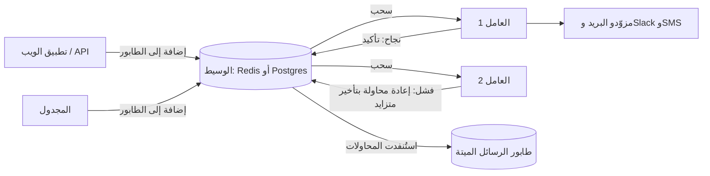
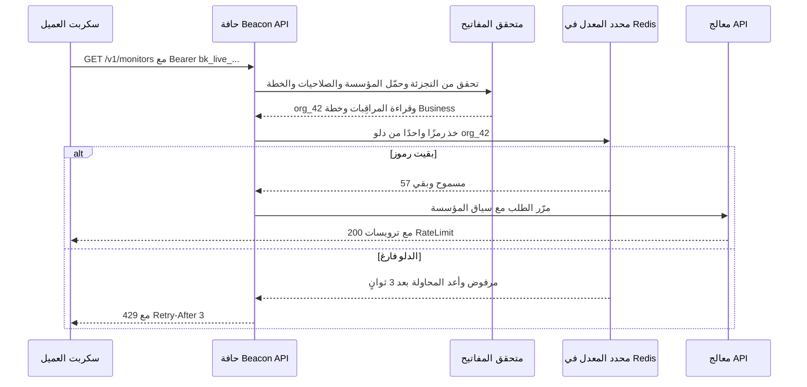
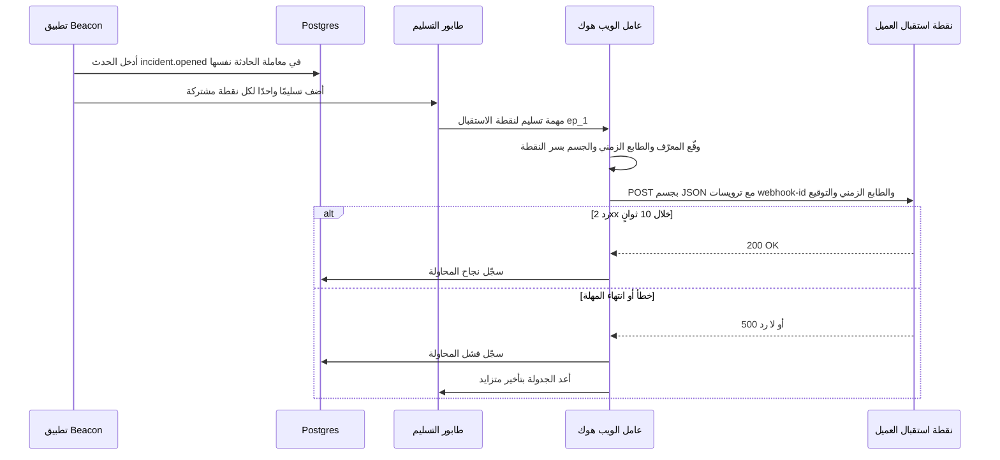
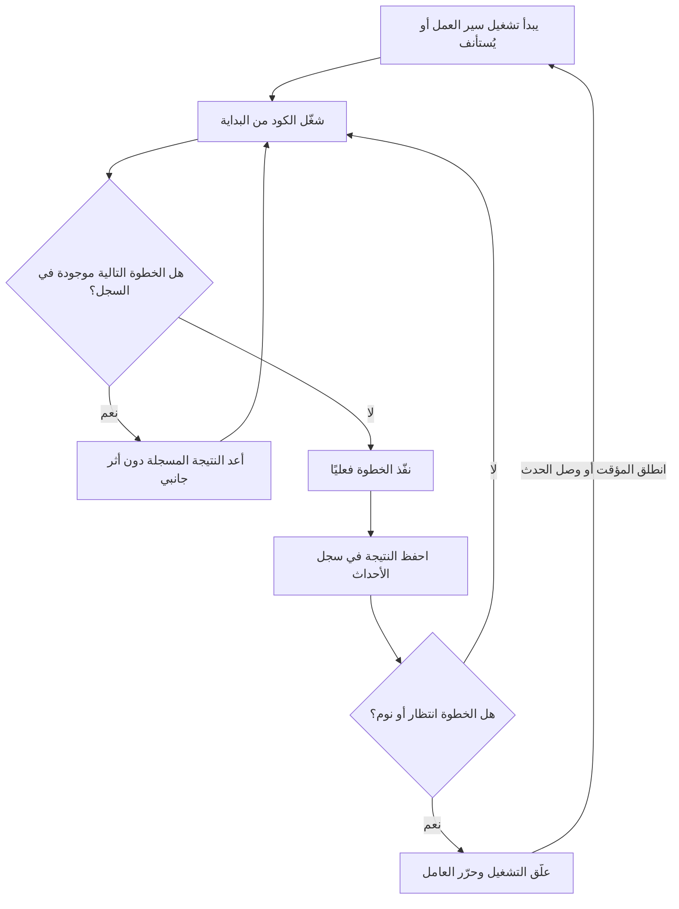

# الوحدة 5 — العمل في الخلفية والتكاملات

*معظم ما يفعله أي SaaS يحدث عندما لا ينظر أحد إلى تبويب المتصفح (browser tab). يشغّل Beacon ملايين الفحوصات (checks) يوميًا، ويتحدث إلى خوادم (servers) الآخرين، وتستدعيه أكواد الآخرين. تغطي هذه الوحدة الآليات التي تنفّذ العمل خارج الطلب (الطوابير (queues) والمجدولات (schedulers) ومحركات سير العمل (workflow engines))، والواجهات التي تستخدمها البرمجيات الأخرى للوصول إليك (واجهة برمجية عامة (public API)) أو لتسمع منك (الويب هوك (webhooks) والتكاملات (integrations)).*

> **التطبيق العملي:** ابدأ من [نسخة البداية من Beacon](https://github.com/Tamoura/system-design-for-vibe-coders/tree/beacon/starter)، وحلّ التمارين قبل النظر إلى [الحل المرجعي لهذه الوحدة](https://github.com/Tamoura/system-design-for-vibe-coders/tree/beacon/module-5-solution) (الفرع `beacon/module-5-solution`).

---

# 5.1 — المهام الخلفية والطوابير والمهام المجدولة

*المستوى: 🟡 متوسط* · *المتطلبات: 2.1، 4.1*

## ⚡ الدرس في دقيقة

- المهمة الخلفية (Background Job) سجل دائم (durable record) لعمل مطلوب، يُخزَّن في وسيط (broker) ثم ينفّذه لاحقًا عامل (worker) منفصل يستطيع إعادة المحاولة (retry).
- القاعدة الأهم: الطوابير (queues) تسلّم المهمة مرة واحدة على الأقل (at least once)، لذلك يجب أن تكون كل مهمة متساوية الأثر (Idempotent). مرّر المعرّفات (IDs) لا الكائنات (objects)، وسجّل ما أنجزته.
- الخيار الافتراضي للنسخة الأولى (v1): طابور مبني على Postgres (مثل pg-boss أو Solid Queue أو River)، حتى تتم إضافة المهمة (enqueuing) في المعاملة (transaction) نفسها التي تكتب بياناتك.
- كل عمل بطيء أو غير مستقر أو مجدول يخرج من الطلب: إعادة محاولة بتأخير متزايد (backoff) وعشوائية (jitter)، ثم طابور الرسائل الميتة (dead-letter queue).
- أكبر فخ: تنفيذ "استدعاء API سريع واحد فقط" داخل الطلب (inline)، أو تشغيل cron في كل نسخة من خادم الويب (web instance).

## 🧭 لماذا يحتاجه كل SaaS

إنه أسبوع الإطلاق (launch week). تتعطل الواجهة البرمجية (API) لأحد عملاء Beacon، والكود في مسار "فشل المراقِب (monitor)" ينفّذ كل شيء داخل الطلب: يفتح صفًا (row) للحادثة (incident)، ويرسل 40 بريدًا إلى مشتركي صفحة الحالة (status-page subscribers)، وينشر في Slack، ويرسل ثلاث رسائل SMS، ويستدعي الويب هوك الخاص بالعميل. كل واحدة من هذه العمليات استدعاء شبكي (network call) إلى خادم شخص آخر. كان Slack بطيئًا ذلك المساء واستغرق 9 ثوانٍ ليرد. ونقطة الويب هوك (webhook endpoint) لدى العميل هي نفسها الخادم المتعطل، فيبقى الاستدعاء معلقًا حتى تنتهي مهلة (timeout) الـ30 ثانية. وفي هذه الأثناء يبقى الفاحص (checker) الذي اكتشف العطل عالقًا في الانتظار، فيتأخر الفحص *التالي* لـ200 مراقِب آخر على تلك العملية (process). صارت أداة مراقبة التوفر (uptime monitor) عندك تعاني هي نفسها من مشكلة توفر (uptime problem).

الفشل الثاني أهدأ. يعيد مزوّد البريد (email provider) الخطأ 503 لمدة أربع ثوانٍ. فيرمي الطلب الذي كان يرسل رسائل المشتركين استثناءً (exception)، ويُسجَّل (logged) الخطأ، ولا يعلم أولئك الأشخاص الأربعون بالحادثة أبدًا. لم يُعِد أحد المحاولة، لأن أحدًا *لم يكن يستطيع*: العمل كان موجودًا فقط داخل طلب انتهى.

الفشل الثالث هو الجدولة (schedule) نفسها. منتج Beacon بأكمله هو "افعل شيئًا كل 30 ثانية إلى 5 دقائق، إلى الأبد، لكل مراقِب". واستدعاء `setInterval` داخل خادم الويب لا ينجو من النشر (deploy)، ولا يتوزع على عدة أجهزة (machines)، ويعمل مرتين عندما تتوسع (scale) إلى نسختين (instances).

**كل عمل بطيء أو غير مستقر أو مجدول مكانه مهمة خلفية: سجل دائم لعمل مطلوب، يلتقطه عامل منفصل يستطيع إعادة المحاولة.**

## 📐 كيف يعمل

### 🟢 الأساسيات

**المهمة الخلفية** رسالة صغيرة تقول "نفّذ X بهذه المعاملات (arguments)"، تُخزَّن في مكان دائم، وتنفذها لاحقًا عملية أخرى. المصطلحات:

- **المنتِج (Producer)** — الكود الذي ينشئ المهمة (طلب الويب، أو المجدول (scheduler)، أو مهمة أخرى).
- **الوسيط (Broker)** — المكان الذي تنتظر فيه المهام. عادةً Redis أو Postgres أو طابور مُدار (managed queue) مثل Amazon SQS.
- **الطابور (Queue)** — صف مسمّى من المهام داخل الوسيط (`checks`، `notifications`، `emails`).
- **العامل (Worker)** — عملية تعمل باستمرار، تسحب المهام من الطابور وتشغّل المعالج (handler) الذي كتبته.
- **إعادة المحاولة مع التأخير المتزايد (Retry with Backoff)** — عندما يرمي المعالج خطأً، تعود المهمة إلى الطابور بتأخير يزداد كل مرة (1 ثانية، 2، 4، 8…)، حتى لا تُغرق خدمة تعاني أصلًا بالطلبات.
- **طابور الرسائل الميتة (Dead-letter Queue أو DLQ)** — المكان الذي تذهب إليه المهمة بعد آخر محاولة فاشلة، حتى يفحصها إنسان ويعيد تشغيلها بدل أن تختفي.



تصبح مهمة طلب الويب الوحيدة: "اكتب صف الحادثة، أضف `notify-incident` إلى الطابور، أعد 200". والعامل ينفّذ الجزء البطيء، وإذا كان Slack متعطلًا تُعاد المحاولة بعد دقيقة دون أن يلاحظ أحد.

في TypeScript مع BullMQ (مكتبة طوابير (queue library) مبنية على Redis) يبدو الأمر هكذا:

```ts
import { Queue, Worker } from "bullmq";
const connection = { host: "localhost", port: 6379 };

export const notifications = new Queue("notifications", { connection });

// Producer: inside the "monitor failed" handler
await notifications.add(
  "incident.opened",
  { incidentId, orgId },
  { jobId: `incident-opened:${incidentId}`, attempts: 8,
    backoff: { type: "exponential", delay: 2_000 } },
);

// Worker: a separate process (node worker.js)
new Worker("notifications", async (job) => {
  const incident = await db.incident.findUnique({ where: { id: job.data.incidentId } });
  if (!incident) return;                 // deleted meanwhile: nothing to do
  await sendSubscriberEmails(incident);  // throws on failure -> retried
}, { connection, concurrency: 20 });
```

لاحظ عادتين من الآن. الحمولة (payload) تحمل **معرّفات لا كائنات** — فالعامل يعيد قراءة البيانات الحديثة (fresh data)، ولذلك لا تتصرف مهمة أُعيدت بعد ساعة بناءً على لقطة قديمة (stale snapshot). و`jobId` حتمي (deterministic)، لذلك لا تؤدي إضافة الحادثة نفسها مرتين إلى إنشاء مهمتين.

لكل بيئة تقنية (stack) الشكل نفسه: **Sidekiq** أو **Solid Queue** (الافتراضي في Rails 8) في Ruby، و**Celery** في Python/Django، و**asynq** أو **River** في Go، و**Laravel Queues** في PHP.

### 🟡 التعمق أكثر

**التسليم مرة واحدة على الأقل يعني أن مهامك يجب أن تكون متساوية الأثر.** تعِد كل الطوابير تقريبًا بالتسليم *مرة واحدة على الأقل* (At-least-once): ستُنفَّذ المهمة، لكنها قد تُنفَّذ مرتين. قد ينهي العامل إرسال البريد ثم ينهار (crash) قبل أن يؤكد (acknowledges) المهمة؛ فلا يرى الوسيط أي تأكيد، ويفترض أن العامل مات، ويسلّم المهمة لعامل آخر. التسليم "مرة واحدة بالضبط (exactly once)" ليس شيئًا يستطيع الطابور أن يمنحك إياه عبر شبكة. ما *تستطيع* فعله هو أن تجعل التنفيذ المزدوج غير ضار. المهمة **متساوية الأثر (Idempotent)** تنتج الحالة النهائية (end state) نفسها مهما تكرر تنفيذها:

- سجّل ما فعلته: صف في `notification_deliveries` مع قيد فريد (unique constraint) على `(incident_id, subscriber_id, channel)`. أدخل الصف أولًا؛ وإذا تعارض الإدخال (insert conflicts)، تخطَّ الإرسال.
- مرّر مفتاح عدم التكرار (Idempotency Key) إلى المزوّد عندما يدعمه (Stripe وكثير من واجهات البريد وSMS تدعمه).
- فضّل "اجعل الحالة X" على "زِد العداد (increment counter)".

**مشكلة الكتابة المزدوجة (dual-write problem) وصندوق الصادر المعاملاتي (transactional outbox).** انظر إلى المنتِج مرة أخرى. تكتب الحادثة في Postgres، ثم تضيف المهمة إلى Redis. إذا ماتت العملية بين هذين السطرين، تبقى لديك حادثة لا يُبلَّغ بها أحد. وإذا أضفت المهمة أولًا ثم تراجعت (rolls back) معاملة قاعدة البيانات، يبحث العامل عن حادثة غير موجودة. نظامان، ولا معاملة مشتركة بينهما.

**صندوق الصادر المعاملاتي (Transactional Outbox)** يحل هذه المشكلة: في *المعاملة نفسها* التي تكتب الحادثة، أدخل صفًا في جدول `outbox` يصف المهمة. ثم تقرأ عملية ترحيل (relay process) منفصلة صفوف الصادر غير المرسلة، وتضيفها إلى الوسيط، وتعلّمها كمرسلة. ولأن عملية الترحيل قد تضيف المهمة مرتين (إذا انهارت بعد الإضافة وقبل التعليم)، فهذا أيضًا تسليم مرة واحدة على الأقل — وأنت تتعامل معه أصلًا، لأن مهامك متساوية الأثر.

**الطوابير المبنية على Postgres تجعل صندوق الصادر غير ضروري.** إذا *كان* الطابور جدولًا في قاعدة بياناتك الرئيسية، فإضافة مهمة مجرد `INSERT` داخل معاملتك الحالية. ويحجز (claim) العمال المهام باستخدام `SELECT … FOR UPDATE SKIP LOCKED`، الذي يسمح لعمال كثيرين بأخذ صفوف مختلفة دون أن يحجب (blocking) بعضهم بعضًا. أصبحت هذه العائلة الخيار الافتراضي المعقول لمعظم فرق SaaS:

| | مبني على Redis | مبني على Postgres |
|---|---|---|
| أمثلة | BullMQ (Node)، Sidekiq (Ruby)، Celery مع Redis (Python)، asynq (Go) | pg-boss، Graphile Worker (Node)، Solid Queue (Ruby)، River (Go)، Oban (Elixir) |
| الإضافة ضمن معاملة | لا — يحتاج صندوق صادر | نعم — في المعاملة نفسها مع بياناتك |
| سقف الإنتاجية (throughput ceiling) | مرتفع جدًا؛ Redis مصمم لهذا | مرتفع بما يكفي لمعظم SaaS؛ تضخم الجداول (table bloat) وعملية vacuum يحتاجان عناية في الحالات القصوى |
| بنية تحتية إضافية (extra infrastructure) | Redis عليك تشغيله وضمان حفظ بياناته | لا شيء غير قاعدة البيانات التي لديك أصلًا |
| المتانة (durability) | تعتمد على إعدادات الحفظ (persistence settings) في Redis | متينة بقدر متانة قاعدة بياناتك |
| المنظومة (ecosystem) | لوحات تحكم (dashboards) ناضجة، ومحددات معدل (rate limiters)، وتدفقات (flows) | أحدث لكنها متينة؛ لوحات التحكم متفاوتة |

قاعدة معقولة: ابدأ بـ Postgres. انقل طابورًا ساخنًا (hot queue) محددًا إلى Redis (أو SQS) عندما تقيس أنه يحتاج ذلك.

**المهام المجدولة (scheduled tasks).** هناك نوعان. مهام *على نمط cron* تعمل وفق تقويم ثابت ("كل ليلة الساعة 02:00 UTC، احذف نتائج الفحوصات القديمة") — وتدعم هذا pg-boss وGraphile Worker وSolid Queue (`recurring.yml`) وCelery beat وإضافات (plugins) Sidekiq، وكلها تأخذ قفلًا (lock) حتى لا تطلقها إلا نسخة واحدة. ومهام *مؤجلة (delayed)* تعمل مرة واحدة في وقت لاحق ("أعد محاولة هذا الويب هوك بعد 5 دقائق"). وفحوصات المراقِبات في Beacon نوع ثالث أصعب — انظر أدناه.

**المراقبة (monitoring).** الطابور الذي لا تراه طابور يفشل بصمت. راقب أربعة أرقام لكل طابور: **العمق (depth)** (المهام المنتظرة)، و**عمر أقدم مهمة منتظرة** (وهو ما يشعر به المستخدمون)، و**معدل الفشل (failure rate)**، و**حجم طابور الرسائل الميتة**. نبّه (alert) على العمر لا على العمق: 10,000 مهمة منتظرة أمر طبيعي إذا كان عمرها كلها ثانيتين. معظم المكتبات تأتي مع لوحة تحكم — Web UI في Sidekiq، وBull Board لـ BullMQ، وRiver UI، وMission Control لـ Solid Queue — ويجب أن تكون كلها خلف مصادقة لوحة الإدارة (admin auth).

### 🔴 على نطاق واسع وللمؤسسات

**جدولة ملايين الفحوصات.** لنفترض أن لدى Beacon مليون مراقِب بفاصل (interval) دقيقة واحدة في المتوسط. هذا نحو 16,700 فحص في الثانية، إلى الأبد. وتسجيل مليون مدخل cron منفصل في مكتبة المهام (job library) سيؤلمك. النمط (pattern) الذي ينجح:

1. خزّن `interval_seconds` و`next_run_at` لكل مراقِب، مع فهرس (index).
2. **قسّم الجدول إلى أجزاء (Shards).** أسند كل مراقِب إلى جزء من N جزءًا (`hash(monitor_id) % N`). تملك كل عملية مجدول بعض الأجزاء، وكل ثانية تحجز المراقِبات المستحقة في أجزائها (`WHERE shard = ANY($1) AND next_run_at <= now() … FOR UPDATE SKIP LOCKED LIMIT 5000`)، وتضيف مهام الفحص على دفعات (batches)، وتقدّم `next_run_at`.
3. **أضف عشوائية (Jitter).** إذا انطلقت كل المراقِبات ذات الدقيقة الواحدة عند `:00`، ستحصل على اندفاع جماعي (thundering herd) كل دقيقة وعمال عاطلين (idle) بينها — وسيرى العملاء الذين يراقبون الاستضافة المشتركة (shared hosting) لبعضهم قممًا متزامنة (synchronized spikes). أعطِ كل مراقِب إزاحة طور (phase offset) ثابتة (`hash(id) % interval`) حتى يتوزع الحمل (load) بالتساوي على الدقيقة.
4. **افصل المنفّذ (executor) عن المجدول.** المجدول يقرر فقط *ما المستحق*. والفاحصون في عدة مناطق (regions) يسحبون من طوابير خاصة بكل منطقة ويكتبون النتائج. وهكذا تستطيع توسيع كل جزء بشكل مستقل.

**التزامن (concurrency) والعدالة (fairness) لكل مستأجر (tenant).** عميل مؤسسي (enterprise customer) واحد يضيف 20,000 مراقِب، أو خطأ يجعل الويب هوك لمؤسسة واحدة تفشل وتُعاد، يجب ألا يحرم (starve) كل المستأجرين الآخرين. طوابير FIFO العادية (الداخل أولًا يخرج أولًا) غير عادلة بطبيعتها: من يضيف أكثر يحصل على معظم العمال. الخيارات، مرتبة تقريبًا حسب الجهد:

- طوابير منفصلة لكل فئة خطة (plan tier) (إشعارات عملاء Business لا تنتظر أبدًا خلف إعادة محاولات عملاء Free).
- حدود تزامن (concurrency limits) لكل مستأجر: "10 مهام قيد التنفيذ (in-flight) على الأكثر للمؤسسة X". نسخة Pro التجارية من BullMQ فيها مجموعات (groups) لهذا؛ وHatchet وInngest وTrigger.dev توفر مفاتيح تزامن (concurrency keys)؛ وفي Postgres يمكنك فرض ذلك في استعلام الحجز (claim query).
- التناوب الدائري (round-robin) بين المستأجرين عند الحجز، حتى تحصل كل مؤسسة على دورها.

**إعادة المحاولة تحتاج عشوائية أيضًا.** إذا فشلت 5,000 مهمة في اللحظة نفسها بسبب تعثر قصير (blipped) لدى مزوّد، فالتأخير الأسي (exponential backoff) الخالص يعيد المحاولات الـ5,000 كلها في اللحظة نفسها لاحقًا. أضف عشوائية إلى كل تأخير ("full jitter")، كما يشرح المقال المعروف عن التأخير المتزايد في مدونة AWS Architecture.

**الرسائل السامة (poison messages) والمهل.** المهمة التي تُسقط العامل دائمًا (نفاد الذاكرة (out-of-memory) بسبب حمولة ضخمة) قد تُسقط العامل مرة بعد مرة. ضع حدًا للمحاولات، وحدد مهلة لكل مهمة، وتأكد من أن "انهيار العامل" يُحتسب محاولة.

**الخيارات المُدارة (managed options).** يمنحك Amazon SQS وسيطًا مع مهلة الإخفاء (Visibility Timeout)، وسياسة إعادة توجيه (redrive policy) إلى طابور الرسائل الميتة، وطوابير FIFO مع معرّفات مجموعات الرسائل (message group IDs) — لكنك ما زلت تشغّل عمالك بنفسك. ويذهب Trigger.dev Cloud وInngest أبعد من ذلك: تكتب دوالًا (functions) في مستودعك (codebase)، وهما يتوليان الطوابير وإعادة المحاولة والجدولة ومفاتيح التزامن والمراقبة، ويستدعيان كودك أو يشغلانه. وهما يقتربان من محركات سير العمل في الدرس 5.4.

## 🏆 أفضل المستودعات

| المستودع | ما هو | التقنيات (stack) | الترخيص (license) | اختره عندما |
|---|---|---|---|---|
| [taskforcesh/bullmq](https://github.com/taskforcesh/bullmq) | طابور مبني على Redis مع إعادة المحاولة والتأجيل (delays) والمهام المتكررة (repeatable jobs) والتدفقات | Node/TS, Redis | MIT | تعمل على Node ولديك Redis أصلًا، أو تحتاج إنتاجية عالية |
| [timgit/pg-boss](https://github.com/timgit/pg-boss) | طابور على Postgres مع cron وإعادة المحاولة والرسائل الميتة | Node/TS, Postgres | MIT | تريد الإضافة ضمن المعاملة دون أي بنية تحتية جديدة |
| [graphile/worker](https://github.com/graphile/worker) | طابور مهام سريع على Postgres يستخدم LISTEN/NOTIFY وSKIP LOCKED، مع crontab | Node/TS, Postgres | MIT | مهام Postgres منخفضة الكمون (low-latency)، خاصة مع بيئة تتمحور حول Postgres |
| [rails/solid_queue](https://github.com/rails/solid_queue) | واجهة Active Job خلفية مبنية على قاعدة البيانات (database-backed)، الافتراضية في Rails 8 | Ruby | MIT | تعمل على Rails ولا تريد Redis |
| [sidekiq/sidekiq](https://github.com/sidekiq/sidekiq) | نظام المهام الخلفية العريق في Ruby | Ruby, Redis | LGPL-3.0 (Pro/Enterprise commercial) | Rails بحجم كبير، ومنظومة ضخمة |
| [celery/celery](https://github.com/celery/celery) | طابور مهام موزع (distributed task queue) مع المجدول beat | Python, Redis/RabbitMQ | BSD-3-Clause | Django/Python، الخيار الافتراضي |
| [riverqueue/river](https://github.com/riverqueue/river) | طابور مهام على Postgres مع إدخالات ضمن المعاملة (transactional inserts) | Go, Postgres | MPL-2.0 | خدمات Go تريد المهام في المعاملة نفسها |
| [hibiken/asynq](https://github.com/hibiken/asynq) | طابور مهام بسيط على Redis مع واجهة ويب (web UI) | Go, Redis | MIT | Go مع Redis موجود أصلًا |
| [triggerdotdev/trigger.dev](https://github.com/triggerdotdev/trigger.dev) | منصة مهام خلفية مع طوابير وجداول ومفاتيح تزامن | TS | Apache-2.0 | تريد مهام مُدارة أو مستضافة ذاتيًا مع مراقبة ممتازة |
| [inngest/inngest](https://github.com/inngest/inngest) | دوال مدفوعة بالأحداث (event-driven) مع خطوات (steps) وتزامن وتقييد معدل (throttling) | Go server, TS/Python/Go SDKs | SSPL with delayed Apache-2.0 publication (SDKs Apache-2.0) | مهام مدفوعة بالأحداث دون تشغيل طابور |

**إن درست مستودعًا واحدًا فقط:** اقرأ **graphile/worker** أو **timgit/pg-boss**. كلاهما صغير بما يكفي لقراءته في فترة ما بعد الظهر، ورؤية `FOR UPDATE SKIP LOCKED` وجدولة إعادة المحاولة وأقفال cron مكتوبة بـ SQL عادي تزيل كل الغموض عن "الطابور". وكل ما عداهما الفكرة نفسها مع ميزات أكثر.

**اشترِ أم ابنِ أم استضف بنفسك؟**

- **الخدمة المُدارة (managed)** عندما لا تريد تشغيل العمال أو مراقبة عمق الطابور في الثالثة فجرًا: Trigger.dev Cloud، وInngest، وAmazon SQS (الوسيط فقط)، وGoogle Cloud Tasks، وUpstash QStash.
- **استضف مكتبة مفتوحة المصدر (OSS library) بنفسك** وهذا يناسب الجميع تقريبًا: تعمل داخل تطبيقك وقاعدة بياناتك الحالية. ابدأ بالمبنية على Postgres (pg-boss، Solid Queue، River)؛ ثم المبنية على Redis (BullMQ، Sidekiq) عندما تحتاج الإنتاجية.
- **ابنِه بنفسك** فقط للـ*مجدول* الخاص بمجالك (مجدول الفحوصات المقسّم (sharded check scheduler) في Beacon). لا تكتب منطق إعادة المحاولة والتأكيد (ack) ومهلة الإخفاء من الصفر أبدًا.

## 🔍 ادرسه في مشاريع حقيقية

**openstatusHQ/openstatus** — صفحة حالة (status page) ومراقب توفر مفتوح المصدر، أي أنه Beacon حرفيًا. الجزء المثير هو كيف تُفصل جدولة الفحوصات عن تنفيذها، مع فاحصين يعملون في عدة مناطق. استخدم البحث في الكود (code search) عن `checker` و`cron` و`region`، وانظر كيف يُطلق تشغيل الفحص، وأين تُكتب النتائج، وكيف يتحول الفشل إلى إشعار (notification) بحادثة.

**twentyhq/twenty** — نظام CRM فيه إعداد حقيقي لعدة طوابير BullMQ خلف طبقة تجريد (abstraction) صغيرة. ابحث عن `MessageQueue` و`@Processor` لتجد أسماء الطوابير وأصناف المهام (job classes) وطبقة المشغّل (driver layer). لاحظ كيف تُسجَّل المهام لكل طابور، وكيف تُعلن مهام cron إلى جانبها.

**chatwoot/chatwoot** — تطبيق Rails يشغّل Sidekiq في الإنتاج (production). افتح المجلد `app/jobs` (وقت كتابة هذا الدرس) وإعدادات Sidekiq لترى أولويات الطوابير (queue priorities)، وابحث عن `perform_later` لترى أين تسلّم طبقة الويب (web tier) العمل.

**discourse/discourse** — عقد من العناية بالمهام في Ruby. ابحث عن `Jobs::Scheduled` لتجد المهام المتكررة، وعن `Jobs.enqueue` للمهام العادية؛ وأصناف المهام المجدولة تُظهر كيف يعلن تطبيق كبير عن عمل "كل 5 دقائق".

**ما الذي تلاحظه**

- المهام تحمل معرّفات وتعيد جلب البيانات؛ والحمولات تبقى صغيرة.
- الطوابير مفصولة حسب الإلحاح (urgency) (إشعارات حرجة مقابل صيانة بطيئة)، لا حسب وحدات الكود (code module).
- العمل المتكرر مُعلن في مكان واحد، لا في استدعاءات `setInterval` متناثرة.
- المعالجات تتحسب لحالة "السجل لم يعد موجودًا" ولحالة التنفيذ المزدوج.
- أي التطبيقات تضيف المهام داخل معاملة قاعدة البيانات وأيها لا تفعل — وهل يبدو أنها تهتم بذلك.

## 🛠️ ابنِه في Beacon

### 🟢 تمرين المبتدئ

أخرج إشعارات الحوادث من الطلب. عندما يفشل مراقِب، يكتب الفاحص الحادثة ويضيف مهمة `notify-incident` إلى الطابور؛ وتُرسل عملية عامل منفصلة رسائل البريد. اضبط 8 محاولات مع تأخير أسي ووجهة للرسائل الميتة (dead-letter destination).

**يكتمل عندما:**
- يعود مسار الطلب أو الفاحص دون أي استدعاء للبريد أو Slack أو SMS.
- يؤدي تعطيل مزوّد البريد (وجّهه إلى مضيف خاطئ (bad host)) إلى إعادة محاولات تظهر في لوحة الطابور (queue dashboard)، وتنجح المهمة بعد أن تعيده.
- تنتهي المهمة التي تفشل في كل المحاولات في طابور الرسائل الميتة مع الخطأ، ولا تضيع.

### 🟡 تمرين المستوى المتوسط

اجعل الإشعارات تحدث مرة واحدة بالضبط *من حيث الأثر*. أضف جدول `notification_deliveries` بمفتاح فريد لكل `(incident, recipient, channel)`، وانقل الإضافة إلى الطابور إلى المعاملة نفسها التي تكتب الحادثة (طابور Postgres) أو عبر جدول صادر (outbox table) (طابور Redis).

**يكتمل عندما:**
- يؤدي تشغيل المهمة نفسها مرتين يدويًا إلى إرسال بريد واحد بالضبط لكل مشترك.
- يؤدي إسقاط العملية بين "تم حفظ الحادثة" و"تمت إضافة المهمة" إلى إرسال الإشعارات رغم ذلك (يلتقطها الترحيل أو الإضافة ضمن المعاملة).
- يثبت اختبار (test) أن المعالج لا يفعل شيئًا لحادثة لم تعد موجودة.

### 🔴 تمرين المستوى المتقدم

ابنِ مجدول الفحوصات المقسّم. خزّن `next_run_at` وإزاحة طور ثابتة لكل مراقِب، وشغّل عمليتي مجدول تملك كل منهما نصف الأجزاء، واحجز المراقِبات المستحقة باستخدام `SKIP LOCKED` على دفعات. أضف حدًا للتزامن لكل مؤسسة حتى لا تستخدم أي مؤسسة أكثر من 5% من عمال الفحص.

```sql
-- claim a batch of due monitors in my shards
UPDATE monitors m SET next_run_at = m.next_run_at + m.interval_seconds * interval '1 second'
WHERE m.id IN (
  SELECT id FROM monitors
  WHERE shard = ANY($1) AND next_run_at <= now() AND paused = false
  ORDER BY next_run_at
  FOR UPDATE SKIP LOCKED
  LIMIT 5000
)
RETURNING m.id, m.org_id, m.region;
```

**يكتمل عندما:**
- يكون معدل الفحوصات في الثانية ثابتًا مع 100,000 مراقِب تجريبي (seeded) (لا قمة عند `:00`).
- يؤدي إيقاف أحد المجدولين إلى أن يتولى الآخر أجزاءه خلال دقيقة، دون فحص أي مراقِب مرتين في الفاصل نفسه.
- لا تستطيع مؤسسة لديها 20,000 مراقِب أن تؤخر فحوصات مؤسسة أخرى بأكثر من فاصل واحد.

## ⚠️ أخطاء يقع فيها المبتدئون

- **تنفيذ "استدعاء API سريع واحد فقط" داخل الطلب.** كل استدعاء خارجي زمن انتظار (latency) واحتمال فشل استعرته من غيرك. إذا لم يكن المستخدم يحتاج النتيجة لعرض الصفحة التالية، فأضفه إلى الطابور.
- **وضع كائنات كاملة في الحمولة.** كائن `incident` مسلسل (serialized) منذ ساعة سيكون خاطئًا عندما تُعاد المهمة. مرّر المعرّفات وأعد القراءة.
- **افتراض أن المهمة تُنفَّذ مرة واحدة بالضبط.** ستُنفَّذ مرتين يومًا ما، وغالبًا أثناء حادثة. صمّم لذلك بقيود فريدة ومفاتيح عدم تكرار.
- **إعادة المحاولة إلى الأبد، أو عدم إعادتها أبدًا.** إعادة المحاولة بلا حد تحوّل حمولة سيئة إلى حمل دائم؛ وعدم إعادة المحاولة يحوّل تعثرًا لثانيتين إلى عمل ضائع. ضع حدًا للمحاولات، وأخّر مع عشوائية، وأرسل الباقي إلى الرسائل الميتة.
- **تشغيل cron في كل نسخة من خادم الويب.** نسختان تعنيان تشغيلين ليليين للفوترة (nightly billing runs). استخدم مجدول الطابور، فهو يأخذ قفلًا.
- **عدم التنبيه على أي شيء.** يجب أن تكون أول علامة على عامل معطل تنبيهًا (page) يقول "أقدم مهمة عمرها 10 دقائق"، لا عميلًا يسأل لماذا لم يصله أي إشعار.

## 🧾 الخلاصة

- المهمة ملاحظة دائمة لعمل مطلوب، ينفذها عامل منفصل يستطيع إعادة المحاولة.
- الطوابير تسلّم مرة واحدة على الأقل، لذلك يجب أن تكون كل مهمة آمنة إذا نُفذت مرتين.
- يجب أن تتفق الإضافة إلى الطابور مع كتابة البيانات: استخدم طابورًا مبنيًا على Postgres أو صندوق صادر معاملاتي.
- ابدأ بطوابير مبنية على Postgres؛ وأضف Redis أو SQS للنقاط الساخنة التي قستها.
- على نطاق Beacon، جدوِل بالأجزاء والعشوائية، وضع حدًا لحصة كل مستأجر من العمال.
- راقب عمر أقدم مهمة وحجم طابور الرسائل الميتة.

## ✍️ اختبر نفسك

**1. ما طابور الرسائل الميتة، ولماذا تحتاجه؟**

<details><summary>الإجابة</summary>

هو المكان الذي تذهب إليه المهمة بعد آخر محاولة فاشلة. من دونه، تختفي المهمة التي استنفدت محاولاتها ببساطة؛ ومعه، يستطيع إنسان فحص الخطأ وإعادة تشغيل المهمة. انظر قائمة المصطلحات في 🟢 الأساسيات.

</details>

**2. لماذا يجب أن تكون المهام متساوية الأثر، حتى مع طابور يعمل جيدًا؟**

<details><summary>الإجابة</summary>

تسلّم الطوابير كلها تقريبًا مرة واحدة على الأقل. قد ينهي العامل العمل ثم ينهار قبل التأكيد، فيسلّم الوسيط المهمة لعامل آخر وتُنفَّذ مرتين. والمهمة متساوية الأثر تصل إلى الحالة النهائية نفسها مهما تكرر تنفيذها. انظر "التسليم مرة واحدة على الأقل" في 🟡 التعمق أكثر.

</details>

**3. يكتب Beacon الحادثة في Postgres ثم يضيف `notify-incident` إلى Redis. ما الذي قد يفشل، وما الحلّان؟**

<details><summary>الإجابة</summary>

إذا ماتت العملية بين الكتابتين، توجد الحادثة ولا يُبلَّغ بها أحد؛ وإذا أضفت المهمة أولًا ثم تراجعت المعاملة، يبحث العامل عن حادثة غير موجودة. الحل إما صندوق صادر معاملاتي (صف في `outbox` داخل المعاملة نفسها، تنقله عملية ترحيل إلى الوسيط)، أو طابور مبني على Postgres بحيث تكون الإضافة `INSERT` في المعاملة نفسها. انظر "مشكلة الكتابة المزدوجة" في 🟡 التعمق أكثر.

</details>

**4. لدى Beacon مليون مراقِب بفاصل دقيقة واحدة. لماذا لا تسجل مدخل cron لكل مراقِب وتطلقها كلها مع بداية الدقيقة؟**

<details><summary>الإجابة</summary>

مليون مدخل cron سيُثقل مكتبة المهام، وإطلاق كل المراقِبات عند `:00` يصنع اندفاعًا جماعيًا كل دقيقة مع عمال عاطلين بينها. خزّن `next_run_at` لكل مراقِب، وقسّم الجدول على عمليات المجدول، واحجز المراقِبات المستحقة باستخدام `SKIP LOCKED`، وأعطِ كل مراقِب إزاحة طور ثابتة. انظر "جدولة ملايين الفحوصات" في 🔴 على نطاق واسع.

</details>

**5. أضاف زميل `setInterval(pruneOldResults, 24h)` إلى خادم الويب. والإنتاج يشغّل ثلاث نسخ من خادم الويب. ما الذي سيتعطل؟**

<details><summary>الإجابة</summary>

ستعمل المهمة ثلاث مرات كل ليلة، مرة لكل نسخة، وستتوقف أو يتغير توقيتها مع كل نشر لأن المؤقت يعيش في عملية يُعاد تشغيلها. العمل المتكرر مكانه مجدول الطابور، الذي يأخذ قفلًا حتى لا تطلقه إلا نسخة واحدة. انظر "المهام المجدولة" في 🟡 التعمق أكثر و"تشغيل cron في كل نسخة من خادم الويب" في ⚠️ الأخطاء.

</details>

## 📚 المراجع

- BullMQ documentation — https://docs.bullmq.io — توثيق BullMQ
- Transactional outbox pattern (microservices.io) — https://microservices.io/patterns/data/transactional-outbox.html — نمط صندوق الصادر المعاملاتي
- PostgreSQL `SELECT … FOR UPDATE SKIP LOCKED` — https://www.postgresql.org/docs/current/sql-select.html
- Marc Brooker, "Exponential Backoff And Jitter", AWS Architecture Blog — https://aws.amazon.com/blogs/architecture/exponential-backoff-and-jitter/ — التأخير الأسي والعشوائية
- Amazon SQS documentation (visibility timeout, dead-letter queues) — https://docs.aws.amazon.com/sqs/ — توثيق SQS (مهلة الإخفاء وطوابير الرسائل الميتة)
- River documentation — https://riverqueue.com/docs
- Sidekiq wiki — https://github.com/sidekiq/sidekiq/wiki
- Trigger.dev documentation — https://trigger.dev/docs

---

# 5.2 — الواجهة البرمجية العامة: مفاتيح API والإصدارات وتحديد المعدل

*المستوى: 🟡 متوسط* · *المتطلبات: 1.2، 1.3*

## ⚡ الدرس في دقيقة

- الواجهة البرمجية العامة (Public API) واجهة منتج (product surface) منفصلة لها عقدها (contract) الخاص، وعادةً تكون REST + JSON موصوفة بمستند OpenAPI.
- القاعدة الأهم: لا تغيّر العقد بصمت أبدًا. ضع `/v1` في الرابط (URL) من اليوم الأول، ولا تُجرِ داخله إلا تغييرات إضافية (additive changes).
- الخيار الافتراضي للنسخة الأولى (v1): مفاتيح API تملكها المؤسسة (org-owned)، ببادئة (prefixed)، عشوائية (random)، مخزنة كتجزئة (hashed at rest)، تُعرض مرة واحدة (shown once)، محددة الصلاحيات (scoped)، وقابلة للإلغاء (revocable).
- استخدم الترقيم بالمؤشر (cursor pagination)، وصيغة أخطاء (error format) واحدة (RFC 9457)، ومفاتيح عدم التكرار (idempotency keys) في عمليات الكتابة (writes)، وتحديد المعدل (rate limits) لكل مفتاح أو مؤسسة مع ترويسات الحصة (quota headers).
- أكبر فخ: كشف نقاط لوحة التحكم الداخلية (internal dashboard endpoints)، أو كعكة الجلسة (session cookie)، على أنها "الـ API".

## 🧭 لماذا يحتاجه كل SaaS

بعد ستة أشهر من الإطلاق (launch)، يرسل أول عميل Business لدى Beacon بريدًا: "لدينا 400 خدمة. لن نضغط 'Add monitor' أربعمئة مرة. أين الـ API؟" وبعد أسبوع يطلب عميل ثانٍ مزوّد Terraform، ويريد ثالث سحب أرقام التوفر (uptime numbers) إلى لوحة التحكم الخاصة به. في برمجيات B2B، الـ API ليس ميزة إضافية؛ إنه الطريقة التي تدخل بها إلى قائمة متطلبات فريق المنصة (platform team).

فيكشف مطوّر مبتدئ في الفريق مسارات (routes) Next.js الداخلية التي تستخدمها لوحة التحكم أصلًا، ويسمح للعملاء بالمصادقة (authenticate) بلصق كعكة الجلسة (Session Cookie). وخلال شهر: تعيد إعادة هيكلة (refactor) للوحة التحكم تسمية حقل (field) فتتعطل سكربتات (scripts) ثلاثة عملاء؛ ويرسل cron معطوب لدى أحد العملاء 50 طلبًا في الثانية فيبطئ لوحة التحكم على الجميع؛ ويرفع مطوّر كعكته إلى مستودع GitHub عام، فيحصل أي شخص على وصول كامل إلى حسابه في Beacon، بما فيه الفوترة، دون أي طريقة لإلغاء هذا الاعتماد (credential) وحده.

الـ API العام *منتج* له عقده الخاص. وStripe هو المثال المرجعي: كتبت الشركة علنًا عن كيف سمحت لها الإصدارات المبنية على التاريخ (date-based versions) بتغيير الـ API لسنوات دون كسر تكاملات (integrations) كُتبت منذ زمن طويل، وعن مفاتيح عدم التكرار التي تسمح للعميل بإعادة محاولة طلب الدفع بأمان.

**الـ API العام وعد: عقد ثابت وموثق (documented)، يُوصل إليه باعتمادات محددة الصلاحيات وقابلة للإلغاء، محمي بتحديد المعدل، ولا يتغير إلا عبر الإصدارات.**

## 📐 كيف يعمل

### 🟢 الأساسيات

**اختر الأسلوب (style).** للـ API *العام* الذي يستدعيه غرباء من أي لغة، الجواب في الغالب هو REST عبر HTTPS مع JSON.

| الأسلوب | ما هو | مناسب لـ | ملاءمته لـ API عام |
|---|---|---|---|
| REST + JSON | موارد (resources) على روابط، وأفعال (verbs) HTTP، ورموز حالة (status codes) | أي شيء، بأي لغة، ويمكن استدعاؤه بـ curl | أفضل خيار افتراضي |
| GraphQL | نقطة واحدة (one endpoint)، والعملاء يطلبون الحقول التي يريدونها بالضبط | بيانات غنية ومتداخلة (nested) مع أشكال عملاء كثيرة (توفره GitHub وShopify) | جيد، لكن تحديد معدله وتخزينه مؤقتًا أصعب؛ قدّمه *إضافة إلى* REST |
| tRPC | استدعاءات دوال آمنة الأنواع (type-safe) بين واجهة TS الأمامية (frontend) والخلفية (backend) الخاصة بك | الـ API الداخلي لتطبيقك | ضعيف: TypeScript فقط، ولا عقد ثابت على الشبكة (stable wire contract) |
| gRPC | RPC ثنائي (binary) بـ protobuf عبر HTTP/2 | الاتصال بين الخدمات (service-to-service) | نادر في الـ API العام لمنتجات SaaS |

استخدم tRPC (أو server actions) للوحة التحكم إن أردت. وابنِ الـ API العام كواجهة منفصلة مصممة عن قصد. فمثلًا، يقدّم Twenty للعملاء كلًا من REST وGraphQL.

**صمّم حول الموارد.** أسماء، بصيغة الجمع (plural)، ومتداخلة بمستوى واحد فقط: `GET /v1/monitors`، `POST /v1/monitors`، `GET /v1/monitors/{id}`، `PATCH /v1/monitors/{id}`، `GET /v1/incidents?status=open`. استخدم معرّفات مبهمة ببادئة (prefixed, opaque IDs) (`mon_2x8…`، `inc_9f…`) حتى يعرف الإنسان إلى ماذا يشير المعرّف، ولا تكشف أبدًا أعدادًا متسلسلة (sequential integers).

**مفاتيح API.** **مفتاح API** سر (secret) عشوائي طويل يعرّف المستدعي (caller) ويمنح صلاحيات (permissions). افعلها بالطريقة التي يتبعها Stripe وUnkey:

- **ببادئة**: `bk_live_…` / `bk_test_…`. يعرف الناس ما هو، وتستطيع أدوات فحص الأسرار (secret scanners) اكتشاف المفاتيح المسربة (leaked) من نمطها (برنامج شركاء فحص الأسرار في GitHub يعمل بهذه الطريقة).
- **مخزنة كتجزئة**: خزّن فقط تجزئة (hash) SHA-256، والبادئة، وآخر أربعة أحرف للعرض. التجزئة السريعة كافية هنا — فعلى عكس كلمات المرور (passwords)، لا يمكن تخمين مفتاح عشوائي من 32 بايت بالقوة (brute-forced) — وتسريب قاعدة البيانات (database leak) عندها لا يكشف شيئًا قابلًا للاستخدام.
- **تُعرض مرة واحدة**: اعرض المفتاح الكامل مرة واحدة فقط عند إنشائه. وإذا ضاع، أنشئ مفتاحًا جديدًا.
- **محددة الصلاحيات**: `monitors:read`، `monitors:write`، `incidents:write`. مفتاح القراءة فقط (read-only) لسكربت لوحة تحكم لا يستطيع حذف المراقِبات.
- **تملكها المؤسسة** لا المستخدم، مع تسجيل "أنشأه"، حتى تبقى المفاتيح بعد مغادرة الموظفين.
- **قابلة للتدوير (rotatable) والإلغاء**، مع عمود `last_used_at` حتى يرى العملاء أي المفاتيح لم تعد مستخدمة.

```ts
import { randomBytes, createHash } from "node:crypto";

export function createApiKey(env: "live" | "test") {
  const secret = randomBytes(32).toString("base64url");
  const key = `bk_${env}_${secret}`;
  return {
    key,                                   // show once, never store
    hash: createHash("sha256").update(key).digest("hex"),
    start: key.slice(0, 12),               // for display: bk_live_Ab3x…
    last4: key.slice(-4),
  };
}

export async function verifyApiKey(presented: string) {
  const hash = createHash("sha256").update(presented).digest("hex");
  const row = await db.apiKey.findUnique({ where: { hash } });
  if (!row || row.revokedAt || (row.expiresAt && row.expiresAt < new Date())) return null;
  return { orgId: row.orgId, scopes: row.scopes };  // update last_used_at async
}
```

**الأخطاء (errors).** اختر صيغة أخطاء واحدة واستخدمها في كل مكان. يوحّد RFC 9457، "Problem Details for HTTP APIs"، جسم JSON فيه `type` و`title` و`status` و`detail` و`instance`، يُرسل بنوع `application/problem+json`، ويمكنك إضافة حقول (مثل `errors` لأخطاء التحقق (validation errors)). واستخدم رموز الحالة بصدق: 400 مدخلات غير صالحة (invalid input)، 401 مفتاح غائب أو خاطئ، 403 المفتاح يفتقد الصلاحية، 404 غير موجود (وأيضًا لـ "موجود لكنه يتبع مؤسسة أخرى")، 409 تعارض (conflict)، 422 خطأ تحقق، 429 تجاوز المعدل (rate limited).

**الترقيم (Pagination).** لا تُعِد قائمة بلا حد أبدًا. **الترقيم بالمؤشر (Cursor Pagination)** يعيد صفحة مع مؤشر مبهم (opaque pointer) إلى الصفحة التالية (`?limit=50&starting_after=mon_123`، بأسلوب Stripe، مع `has_more` في الرد). وعلى عكس الإزاحات (offsets) مثل `?page=7`، يبقى صحيحًا أثناء إدخال صفوف جديدة، ويبقى سريعًا على الجداول الكبيرة لأنه `WHERE id > $cursor` مفهرس (indexed) وليس `OFFSET 350000`.

### 🟡 التعمق أكثر

**OpenAPI أولًا.** **مواصفة OpenAPI** وصف قياسي بصيغة YAML/JSON لكل نقطة ومعامل (parameter) ومخطط (schema) وخطأ. تعامل معها كمصدر الحقيقة (source of truth)، وولّد منها: التحقق من الطلبات (request validation)، والتوثيق المرجعي (reference docs)، ومكتبات العملاء (SDK)، والخوادم الوهمية (mock servers)، واختبارات العقد (contract tests). إما أن تكتب المواصفة يدويًا، أو تولّدها من كود مكتوب الأنواع (typed) *هو* المواصفة نفسها — في TypeScript، مخططات Zod عبر وسيط (middleware) OpenAPI في Hono أو ما يشبهه؛ وفي Python يصدرها FastAPI تلقائيًا، ولدى Django REST Framework مكتبة drf-spectacular؛ وفي Go مكتبات مثل Huma؛ وفي Rails مكتبة rswag. نمط الفشل (failure mode) الذي يجب تجنبه هو مواصفة كُتبت مرة ولم تُحدَّث أبدًا.

**التوثيق وSDK.** حوّل المواصفة إلى توثيق تفاعلي (interactive docs) باستخدام Scalar (أو Redoc أو Swagger UI). أعطِ الناس طريقة لتجربة الطلبات — فلدى Scalar عميل مدمج (built-in client)، وHoppscotch عميل API مفتوح المصدر على طراز Postman. ولّد SDK باستخدام openapi-generator، أو مولدات تجارية (commercial generators) مثل Stainless أو Speakeasy أو Fern، التي تنتج مكتبات مُصدَرة (versioned) ومناسبة لأسلوب كل لغة (idiomatic). الـ SDK الجيد يتولى عن عميلك المصادقة وإعادة المحاولة والترقيم ومفاتيح عدم التكرار.

**مفاتيح عدم التكرار.** يعيد العملاء المحاولة عند انتهاء المهلة (timeouts). فإذا انتهت مهلة `POST /v1/monitors` *بعد* أن أنشأت المراقِب، فإعادة المحاولة تنشئ نسخة مكررة (duplicate). الحل، من Stripe: يرسل العميل `Idempotency-Key: <uuid>`؛ وتخزن أنت المفتاح مع الرد لمدة 24 ساعة؛ والطلب المكرر بالمفتاح نفسه والجسم نفسه يعيد الرد المخزن بدل التنفيذ مرة أخرى (والطلب المكرر بجسم *مختلف* يحصل على 422). ولدى IETF مسودة (draft) لترويسة `Idempotency-Key` تصف الفكرة نفسها.

**الإصدارات (Versioning).** ستحتاج إلى تغييرات كاسرة (breaking changes). الخيارات:

| الأسلوب | مثال | المقايضة (trade-off) |
|---|---|---|
| إصدار رئيسي (major version) في الرابط | `/v1/…`، `/v2/…` | بسيط وظاهر؛ ترحيل دفعة واحدة (big-bang migrations)، وv1 يعيش إلى الأبد |
| ترويسة / مبني على التاريخ | `Beacon-Version: 2026-03-01` | تغييرات صغيرة ومتكررة؛ كل حساب مثبت (pinned) على إصداره؛ يحتاج طبقة تحويل (transformation layer) |
| بلا إصدارات، إضافات فقط | أضف حقولًا فقط | يصمد أطول مما تظن؛ لكنه ينكسر في النهاية |

أسلوب Stripe هو المعيار الذهبي: كل حساب مثبت على إصدار الـ API الحالي عند أول استدعاء له، ويمكن لترويسة في الطلب تجاوزه، والكود داخليًا لا يعرف إلا الشكل الأحدث. ثم تحوّل سلسلة من وحدات "تغيير الإصدار" الصغيرة كل رد إلى الخلف، خطوة بخطوة، حتى يصل إلى إصدار المستدعي. وفي السنوات الأخيرة أضافت Stripe أيضًا إصدارات رئيسية مسماة (named major releases) إلى نصوص الإصدار. بالنسبة لـ Beacon: ضع `/v1` في الرابط من اليوم الأول (تأمين رخيص (cheap insurance))، ولا تُجرِ داخله إلا تغييرات إضافية، وفكّر في الإصدارات المبنية على التاريخ عندما يصبح لديك عدد من المتكاملين (integrators) يجعل "v2" مؤلمًا.

**تطبيقات OAuth للأطراف الثالثة (third parties).** مفاتيح API مخصصة لسكربتات العميل *نفسه*. وعندما يريد طرف ثالث (لنقل أداة على طراز PagerDuty) أن يتصرف نيابة عن *كثير* من عملاء Beacon، يجب ألا يجمع مفاتيحهم. بدل ذلك، يصبح Beacon مزوّد OAuth 2.0: تحوّل (redirects) الأداة المستخدم إلى Beacon، ويوافق المستخدم على صلاحيات محددة، وتحصل الأداة على رمز وصول (Access Token) ورمز تحديث (Refresh Token) لتلك المؤسسة فقط، ويمكن إلغاؤه من إعدادات Beacon. استخدم تدفق رمز التفويض (authorization code flow) مع PKCE (RFC 6749 مع أفضل ممارسات أمان (security best practice) OAuth، RFC 9700). ولا تكتب المزوّد بنفسك؛ فـ Ory Hydra وKeycloak وZitadel وعدة مكتبات مصادقة يمكنها العمل كخادم تفويض (authorization server).

### 🔴 على نطاق واسع وللمؤسسات

**تحديد المعدل (Rate Limiting).** **محدد المعدل (rate limiter)** يضع سقفًا لعدد الطلبات التي يستطيع المستدعي إرسالها في فترة ما، فيحمي البنية التحتية المشتركة (shared infrastructure) ويجعل حدود الخطط (plan limits) حقيقية. الخوارزميات (algorithms) الشائعة:

- **النافذة الثابتة (Fixed Window)**: عدّ لكل دقيقة تقويمية. بسيطة، لكنها تسمح باندفاع (burst) مضاعف عند حدود النافذة (window boundary).
- **النافذة المنزلقة (Sliding Window)**: تمنح وزنًا لعدد النافذة السابقة لتنعيم الحد. خيار افتراضي جيد.
- **دلو الرموز (Token Bucket)**: دلو يتسع لـ N رمزًا، ويُعاد ملؤه بمعدل R في الثانية؛ وكل طلب يأخذ رمزًا. يسمح باندفاعات قصيرة حتى N مع فرض متوسط المعدل (average rate) R. ممتاز للـ API.
- **GCRA** (Generic Cell Rate Algorithm): مكافئ مضغوط لدلو الرموز يخزن طابعًا زمنيًا (timestamp) واحدًا لكل مفتاح.



أخبر العملاء بموقفهم. أرسل دائمًا `Retry-After` مع الرد 429 (رمز الحالة مصدره RFC 6585). وأرسل ترويسات الحصة المتبقية (remaining quota) مع كل رد: كثير من الواجهات تستخدم `X-RateLimit-Limit` و`X-RateLimit-Remaining` و`X-RateLimit-Reset`، ومسودة في IETF توحّد الحقلين `RateLimit` و`RateLimit-Policy`. وأيًا كان ما تختاره، وثّقه ودع الـ SDK يتراجع (back off) تلقائيًا.

حدّد المعدل على طبقات: لكل IP قبل المصادقة (يوقف حشو الاعتمادات (credential stuffing) والطلبات العشوائية)، ولكل مفتاح أو مؤسسة بعد المصادقة (حد الخطة)، ولكل نقطة مكلفة (expensive endpoint) (نقطة "شغّل الفحص الآن" تكلّف أكثر بكثير من `GET`). الحدود تعيش في Redis أو على الحافة (edge)؛ و`upstash/ratelimit-js` يمنحك النافذة المنزلقة والنافذة الثابتة ودلو الرموز فوق Redis في أسطر قليلة، وArcjet يجمع تحديد المعدل مع كشف البوتات (bot detection) في SDK واحد.

**البوابات (Gateways).** **بوابة API** تقف أمام خدماتك وتتولى المفاتيح وحدود المعدل والتسجيل (logging) والتوجيه (routing) مركزيًا. Kong وTyk وApache APISIX هي الكبيرة مفتوحة المصدر. نادرًا ما تحتاج واحدة في SaaS بتطبيق واحد؛ فهي تستحق مكانها عندما تتشارك خدمات كثيرة واجهة عامة واحدة، أو عندما يريد فريق منصة وضع السياسات (policy) في مكان واحد. وUnkey طريق وسط: خدمة (مفتوحة المصدر ومستضافة أيضًا) مخصصة لإنشاء مفاتيح API والتحقق منها، مع حدود معدل لكل مفتاح، وانتهاء صلاحية (expiry)، وعدادات استخدام (usage counts).

**التحليلات وإساءة الاستخدام (abuse).** سجّل كل طلب API مع المؤسسة ومعرّف المفتاح والنقطة والحالة وزمن الاستجابة (latency). هذا يغذي صفحة "استخدام الـ API" التي يراها العميل، وقرارات الإيقاف (deprecation) ("من ما زال يستخدم هذا الحقل؟")، وكشف إساءة الاستخدام. وأوقف الميزات القديمة بترويستي `Deprecation` و`Sunset`، ورسائل بريد إلى المؤسسات التي ما زالت تستخدم المسار القديم، وتاريخ محدد.

## 🏆 أفضل المستودعات

| المستودع | ما هو | التقنيات (stack) | الترخيص (license) | اختره عندما |
|---|---|---|---|---|
| [unkeyed/unkey](https://github.com/unkeyed/unkey) | إدارة مفاتيح API وتحديد المعدل كخدمة | TS, Go | AGPL-3.0 (parts differ; read LICENSE) | تريد إصدار المفاتيح والتحقق منها وحدود لكل مفتاح وتحليلات دون بنائها |
| [upstash/ratelimit-js](https://github.com/upstash/ratelimit-js) | مكتبة تحديد معدل فوق Redis (نافذة منزلقة وثابتة، ودلو رموز) | TS | MIT | تطبيق Serverless أو Node يحتاج حدود معدل على مستوى التطبيق بسرعة |
| [arcjet/arcjet-js](https://github.com/arcjet/arcjet-js) | SDK أمني: تحديد المعدل وكشف البوتات والحماية | TS | Apache-2.0 | تريد حدود المعدل مع الحماية من إساءة الاستخدام داخل التطبيق |
| [Kong/kong](https://github.com/Kong/kong) | بوابة API مع إضافات للمصادقة وحدود المعدل والتسجيل | Lua/Nginx | Apache-2.0 | خدمات كثيرة خلف واجهة API واحدة |
| [TykTechnologies/tyk](https://github.com/TykTechnologies/tyk) | بوابة API مع مفاتيح وحصص وتحليلات | Go | MPL-2.0 (`ee` folder commercial) | بوابة مكتوبة بـ Go مع إدارة مدمجة للمفاتيح والحصص |
| [apache/apisix](https://github.com/apache/apisix) | بوابة API سحابية الأصل (cloud-native) | Lua/Nginx | Apache-2.0 | توجيه ديناميكي (dynamic routing) وإضافات مع حركة مرور عالية (high traffic) |
| [OAI/OpenAPI-Specification](https://github.com/OAI/OpenAPI-Specification) | مواصفة OpenAPI نفسها | Spec | Apache-2.0 | لفهم ما تستطيع مواصفتك التعبير عنه |
| [scalar/scalar](https://github.com/scalar/scalar) | توثيق مرجعي للـ API وعميل من ملف OpenAPI | TS | MIT | توثيق API جميل وتفاعلي بجهد قليل |
| [hoppscotch/hoppscotch](https://github.com/hoppscotch/hoppscotch) | عميل مفتوح المصدر لتطوير الـ API | TS | MIT | اختبار طلبات API ومشاركتها دون Postman |
| [trpc/trpc](https://github.com/trpc/trpc) | واجهات آمنة الأنواع من الطرف إلى الطرف (end-to-end) لتطبيقات TS | TS | MIT | الـ API *الداخلي* للوحة التحكم، لا العام |

**إن درست مستودعًا واحدًا فقط:** **unkeyed/unkey**. إنه SaaS منتجه بالكامل هو هذا الدرس: إنشاء المفاتيح ببادئات، والتجزئة، والتحقق في المسار الساخن (hot path)، وحدود المعدل لكل مفتاح، وانتهاء الصلاحية، وتحليلات الاستخدام (usage analytics). وقراءة كيف يتحقق من المفتاح بسرعة (وما الذي يخزنه مؤقتًا) تعلمك أكثر من أي مقال.

**اشترِ أم ابنِ أم استضف بنفسك؟**

- **الخدمة المُدارة (managed)** للمفاتيح والحدود عندما لا يكون الـ API جوهر منتجك: Unkey Cloud، وUpstash للحدود المبنية على Redis، وArcjet؛ وللتوثيق والـ SDK: التوثيق المستضاف في Scalar، أو Stainless أو Speakeasy أو Fern.
- **استضف بنفسك** Unkey إذا أردت ميزاته على بنيتك التحتية، أو Kong/Tyk/APISIX عندما تصبح لديك خدمات متعددة وفريق منصة.
- **ابنِ** الـ API نفسه: تصميم الموارد والأخطاء والإصدارات — فهذا *هو* عقد منتجك. وتخزين المفاتيح والتحقق منها صغير بما يكفي لبنائه جيدًا في يوم واحد، إذا اتبعت القواعد أعلاه.

## 🔍 ادرسه في مشاريع حقيقية

**unkeyed/unkey** — إلى جانب كونه مكتبة، هو SaaS في الإنتاج له API عام خاص به. ابحث عن `hash` و`verify` لتجد مسار التحقق من المفاتيح، وعن `ratelimit` لترى كيف تُفرض الحدود لكل مفتاح ولكل معرّف. لاحظ كيف يُقسم المفتاح إلى بادئة ظاهرة وسر.

**dubinc/dub** — SaaS لإدارة الروابط مع API عام بأسلوب REST، ومفاتيح API محصورة في مساحات العمل (workspaces)، وحدود معدل، ومستند OpenAPI. ابحث عن `openapi` لترى كيف تُنتج المواصفة من مخططات Zod، وعن `ratelimit` و`apiKey`/`token` لترى كيف تُجزأ المفاتيح وتُفحص لكل مساحة عمل.

**calcom/cal.diy** — API عام كبير مع مفاتيح لكل مستخدم أو فريق. وقت كتابة هذا الدرس، تعيش تطبيقات الـ API تحت `apps/api`. ابحث عن `apiKey` ودوال مساعدة على غرار `hashAPIKey`، وانظر كيف تُدار إصدارات الـ API جنبًا إلى جنب مع تطور الـ API.

**openstatusHQ/openstatus** — منتج بشكل Beacon مع API عام للمراقِبات وصفحات الحالة. ابحث عن `openapi` و`apiKey` لترى كيف يكشف فريق صغير API مكتوب الأنواع وموثقًا للكائنات نفسها التي لدى Beacon.

**ما الذي تلاحظه**

- المفاتيح مخزنة كتجزئة مع بادئة مقروءة، ولا يمكن استرجاع المفتاح الكامل أبدًا.
- كل طلب يُحلّ إلى مساحة عمل أو مؤسسة قبل تشغيل أي شيء آخر.
- مخططات التحقق هي نفسها مصدر OpenAPI، لذلك لا يمكن أن ينحرف التوثيق عن الكود.
- للأخطاء شكل واحد متسق في كل النقاط.
- حدود المعدل مرتبطة بمساحة العمل أو المفتاح، لا بعنوان IP فقط.

## 🛠️ ابنِه في Beacon

### 🟢 تمرين المبتدئ

أطلق `GET /v1/monitors` و`POST /v1/monitors` بمصادقة عبر مفاتيح API تملكها المؤسسة. المفاتيح تبدأ بالبادئة `bk_live_`، وتُخزن كتجزئات SHA-256، وتُعرض مرة واحدة في صفحة الإعدادات، ويمكن إلغاؤها.

**يكتمل عندما:**
- لا يحتوي جدول `api_keys` على أي مفتاح بنص صريح (plaintext).
- يحصل المفتاح الملغى (revoked key) على 401 من أول طلب بعد إلغائه.
- لا تستطيع مفاتيح المؤسسة A قراءة مراقِبات المؤسسة B أبدًا (ولديك اختبار لذلك).
- نقطة القائمة مرقّمة بالمؤشر مع حد أقصى لـ `limit`.

### 🟡 تمرين المستوى المتوسط

اعمل بأسلوب OpenAPI أولًا. عرّف مخططات المراقِب مرة واحدة، وولّد مستند OpenAPI منها، وقدّم توثيق Scalar على `/docs/api`، وأعد تفاصيل المشكلة وفق RFC 9457 لكل خطأ، وادعم `Idempotency-Key` في `POST`.

**يكتمل عندما:**
- تفشل خطوة في CI إذا تغيرت المواصفة المولدة دون أن تُرفع إلى المستودع (committed).
- كل رد 4xx/5xx يحمل `application/problem+json` مع `type` و`title` و`status`.
- يؤدي إرسال `POST` نفسه مرتين بالمفتاح نفسه إلى إنشاء مراقِب واحد وإعادة الجسم نفسه مرتين.

### 🔴 تمرين المستوى المتقدم

أضف تحديد معدل يعرف الخطط وإصدارات مبنية على التاريخ. حدّد المعدل بدلو رموز لكل مؤسسة بحجم يناسب الخطة، مع حدود منفصلة لـ `POST /v1/monitors/{id}/check`. أضف ترويسة `Beacon-Version`؛ وثبّت كل مؤسسة على الإصدار الحالي عند أول استدعاء لها؛ واكتب محوّل تغيير إصدار (version-change transformer) واحدًا (مثل إعادة تسمية `url` إلى `target`) يعيد الردود إلى الشكل القديم للمؤسسات المثبتة على إصدارات أقدم.

**يكتمل عندما:**
- يعيد تجاوز الحد الرد 429 مع `Retry-After`، وتظهر ترويسات الحصة المتبقية في كل رد.
- تحصل مؤسسة Business على حد أعلى من مؤسسة Pro دون تغيير الكود، بل بإعدادات الخطة فقط.
- ترى المؤسسة المثبتة على الإصدار القديم الحقل `url`؛ وترى المؤسسة الجديدة `target`؛ والمعالج لا يعرف إلا `target`.

## ⚠️ أخطاء يقع فيها المبتدئون

- **كشف نقاط لوحة التحكم الداخلية على أنها "الـ API".** كل إعادة هيكلة للواجهة الأمامية تصبح تغييرًا كاسرًا للعملاء. أبقِ الواجهة العامة منفصلة ومقصودة.
- **تخزين مفاتيح API بنص صريح "حتى نعرضها مرة أخرى".** تتحول قراءة واحدة لقاعدة البيانات إلى استيلاء كامل على حساب (account takeover) كل عميل. جزّئ، واعرض مرة واحدة، ودوّر (rotate).
- **ربط المفاتيح بمستخدم بدل المؤسسة.** عندما يغادر ذلك الموظف ويُحذف حسابه، يموت تكامل العميل في الإنتاج. استخدم مفاتيح تملكها المؤسسة مع بيانات "أنشأه".
- **الترقيم بالإزاحة على الجداول الكبيرة.** `OFFSET 100000` يزداد بطئًا مع كل صفحة، ويتخطى صفوفًا أو يكررها عندما تتغير البيانات. استخدم المؤشرات.
- **تحديد المعدل حسب IP فقط.** العملاء خلف NAT واحد يتشاركون دلوًا واحدًا، والمهاجم الذي يملك عناوين IP كثيرة يتجاهله. حدّد حسب المفتاح أو المؤسسة بعد المصادقة، وحسب IP قبلها.
- **تغييرات كاسرة دون إصدار.** إعادة تسمية حقل "لأنه أنظف" تكسر سكربتات لن تراها أبدًا. أضف الحقول بحرية؛ ولا تُعِد التسمية أو تحذف إلا خلف إصدار.
- **إعادة 500 مع تتبع المكدس (stack trace) عند مدخلات سيئة.** هذا يكشف التفاصيل الداخلية (internals) ولا يخبر العميل بشيء. تحقق عند الحافة وأعد تفاصيل مشكلة برمز 4xx.

## 🧾 الخلاصة

- الـ API العام واجهة منتج منفصلة ذات إصدارات، وعادةً REST + JSON موصوفة بـ OpenAPI.
- مفاتيح API: ببادئة، عشوائية، مخزنة كتجزئة، تُعرض مرة واحدة، محددة الصلاحيات، تملكها المؤسسة، قابلة للإلغاء.
- الترقيم بالمؤشر، وصيغة أخطاء واحدة (RFC 9457)، ومفاتيح عدم التكرار لعمليات الكتابة.
- ضع الإصدارات من اليوم الأول؛ وإصدارات Stripe المثبتة والمبنية على التاريخ هي النموذج عندما يكثر المتكاملون.
- حدّد المعدل على طبقات بدلو الرموز أو النافذة المنزلقة، وأخبر العملاء بحصتهم في الترويسات.
- استخدم تطبيقات OAuth، لا مفاتيح API مجموعة، عندما تتصرف أطراف ثالثة نيابة عن عملائك.

## ✍️ اختبر نفسك

**1. لماذا تكفي تجزئة سريعة مثل SHA-256 لمفاتيح API بينما تحتاج كلمات المرور إلى تجزئة بطيئة (slow hash)؟**

<details><summary>الإجابة</summary>

كلمة المرور يختارها إنسان ويمكن تخمينها، لذلك تحتاج إلى تجزئة بطيئة. أما مفتاح API فهو 32 بايت عشوائية لا يمكن تخمينها بالقوة، لذلك تكفي التجزئة السريعة، وتسريب قاعدة البيانات لا يكشف شيئًا قابلًا للاستخدام. انظر "مفاتيح API" في 🟢 الأساسيات.

</details>

**2. لماذا الترقيم بالمؤشر أفضل من إزاحات مثل `?page=7` في API عام؟**

<details><summary>الإجابة</summary>

تبقى المؤشرات صحيحة أثناء إدخال صفوف جديدة، بينما تتخطى الإزاحات صفوفًا أو تكررها عندما تتغير البيانات. وتبقى أيضًا سريعة على الجداول الكبيرة، لأن الاستعلام `WHERE id > $cursor` مفهرس بدل `OFFSET 350000`. انظر "الترقيم" في 🟢 الأساسيات.

</details>

**3. سكربت لدى أحد العملاء يستدعي `POST /v1/monitors`، فتنتهي المهلة، فيعيد المحاولة. صار لديه الآن مراقِبان متطابقان. ما الذي يجب أن يدعمه Beacon لمنع ذلك؟**

<details><summary>الإجابة</summary>

مفاتيح عدم التكرار. يرسل العميل `Idempotency-Key: <uuid>`، ويخزن Beacon المفتاح مع الرد لمدة 24 ساعة، والطلب المكرر بالمفتاح نفسه والجسم نفسه يعيد الرد المخزن بدل إنشاء مراقِب ثانٍ. والطلب المكرر بجسم مختلف يحصل على 422. انظر "مفاتيح عدم التكرار" في 🟡 التعمق أكثر.

</details>

**4. تريد أداة على طراز PagerDuty التصرف نيابة عن مئات من عملاء Beacon. هل يجب أن تطلب من كل واحد منهم مفتاح API؟**

<details><summary>الإجابة</summary>

لا. مفاتيح API مخصصة لسكربتات العميل نفسه. يجب أن يعمل Beacon كمزوّد OAuth 2.0: تحوّل الأداة المستخدم إلى Beacon، ويوافق المستخدم على صلاحيات محددة، وتحصل الأداة على رمز لتلك المؤسسة فقط، يستطيع العميل إلغاءه من إعدادات Beacon. انظر "تطبيقات OAuth للأطراف الثالثة" في 🟡 التعمق أكثر.

</details>

**5. يحدد Beacon معدل الـ API حسب عنوان IP للعميل فقط. عميل كبير يشغّل كل سكربتاته من خلف NAT مؤسسي واحد. ما الذي يفشل؟**

<details><summary>الإجابة</summary>

تتشارك كل سكربتات ذلك العميل دلوًا واحدًا، فيخنق (throttle) بعضها بعضًا، والمهاجم الذي يملك عناوين IP كثيرة يتجاهل الحد على أي حال. حدّد حسب IP قبل المصادقة، ثم حسب المفتاح أو المؤسسة بعدها (حد الخطة)، مع حدود إضافية على النقاط المكلفة. انظر "تحديد المعدل" في 🔴 على نطاق واسع و"تحديد المعدل حسب IP فقط" في ⚠️ الأخطاء.

</details>

## 📚 المراجع

- RFC 9457, Problem Details for HTTP APIs — https://www.rfc-editor.org/rfc/rfc9457 — تفاصيل المشكلة في واجهات HTTP
- OpenAPI Specification — https://spec.openapis.org/oas/latest.html — مواصفة OpenAPI
- Stripe blog, "APIs as infrastructure: future-proofing Stripe with versioning" — https://stripe.com/blog/api-versioning — الإصدارات في Stripe
- Stripe blog, "Designing robust and predictable APIs with idempotency" — https://stripe.com/blog/idempotency — عدم التكرار في Stripe
- IETF draft, RateLimit header fields for HTTP — https://datatracker.ietf.org/doc/draft-ietf-httpapi-ratelimit-headers/ — ترويسات تحديد المعدل
- OWASP API Security Top 10 — https://owasp.org/API-Security/ — أهم 10 مخاطر لأمن الـ API
- RFC 6749, The OAuth 2.0 Authorization Framework — https://www.rfc-editor.org/rfc/rfc6749 — إطار تفويض OAuth 2.0
- Unkey documentation — https://www.unkey.com/docs — توثيق Unkey

---

# 5.3 — الويب هوك الصادر وتكاملات الأطراف الثالثة

*المستوى: 🟡 متوسط* · *المتطلبات: 5.1، 5.2*

## ⚡ الدرس في دقيقة

- الويب هوك الصادر طلب HTTP POST يرسله Beacon إلى رابط العميل عندما يقع حدث. إنه نظام تسليم، وليس مجرد استدعاء `fetch`.
- القاعدة الأهم: كل رابط يقدمه العميل خطر SSRF. حلّ الاسم، وافحص العنوان، وثبّته، ومرّره عبر وسيط قبل الاتصال، في الويب هوك والمراقِبات على حد سواء.
- الخيار الافتراضي للنسخة الأولى: جدول أحداث، وسر لكل نقطة استقبال، وتوقيعات Standard Webhooks، وتسليمات عبر الطابور بمهل قصيرة وإعادة محاولة.
- أعطِ العملاء سجل تسليم مع إعادة الإرسال وإعادة التشغيل؛ فهو يوفر من وقت الدعم أكثر من أي ميزة أخرى في هذا الدرس.
- أكبر فخ: إرسال الويب هوك داخل الطلب، أو إعادة المحاولة مع النقاط الميتة إلى الأبد بدل تعطيلها.

## 🧭 لماذا يحتاجه كل SaaS

يسمح الـ API في Beacon للعملاء بأن *يسألوا* "هل توجد حوادث مفتوحة؟". لكن العملاء لا يريدون السؤال كل عشر ثوانٍ؛ يريدون أن *يُخبَروا*. أحدهم يريد إرسال كل حدث `incident.opened` بطلب POST إلى أداة المناوبة الداخلية لديه. وآخر يريد ظهور حوادث Beacon في قناة `#ops` على Slack مع زر "Acknowledge". وثالث يريد "عندما يفتح Beacon حادثة، أنشئ تذكرة Jira"، ويفضّل تركيب ذلك بالنقرات في Zapier أو n8n على كتابة الكود.

النسخة الأولى سهلة: مرّ على روابط الويب هوك الخاصة بالمؤسسة، واستدعِ كلًا منها بـ `fetch`، وتابع. ثم يأتي الواقع. نقطة استقبال أحد العملاء تتعطل ست ساعات، فيضيع كل حدث وقع في تلك الساعات الست. ونقطة أخرى تستغرق 45 ثانية لترد، فيتوقف عامل الإشعارات. ويسجل شخص ما `http://169.254.169.254/latest/meta-data/` على أنه "رابط الويب هوك" الخاص به، ثم يقرأ جسم الرد في سجل التسليم لديك. وهذا الأخير ليس افتراضيًا كصنف من الهجمات: اختراق Capital One في 2019 تضمّن تزوير طلب من جهة الخادم (SSRF) وصل إلى خدمة بيانات التعريف في نسخة AWS وحصل على اعتمادات، وهذا جزء من سبب تقديم AWS للإصدار IMDSv2.

Stripe هو النموذج من جهة الاستقبال: يوقّع كل ويب هوك، ويعيد محاولة التسليمات الفاشلة بتأخير أسي لمدة تصل إلى ثلاثة أيام في الوضع الحي، ويعرض لك كل محاولة في لوحة التحكم. وسيتوقع عملاؤك منك الشيء نفسه.

**الويب هوك الصادر نظام تسليم، وليس استدعاء `fetch`: موقّع، ويمر عبر الطابور، ويُعاد، ويُسجَّل، ويمكن إعادة تشغيله، ومعزول عن شبكتك الداخلية.**

## 📐 كيف يعمل

### 🟢 الأساسيات

**الويب هوك (Webhook)** طلب HTTP POST يرسله نظامك إلى رابط سجله العميل، عندما يقع حدث. وخادم العميل هو المستقبِل. الأجزاء:

- **أنواع الأحداث** — فهرس عام: `incident.opened`، `incident.updated`، `incident.resolved`، `monitor.paused`. ويشترك العملاء فيها لكل نقطة استقبال.
- **نقاط الاستقبال (Endpoints)** — صفوف لكل مؤسسة: الرابط، وأنواع الأحداث المشترك فيها، وسر التوقيع، وعلامة التفعيل.
- **الأحداث** — سجل غير قابل للتغيير يقول "هذا ما حدث"، مع `id` ثابت وحمولة JSON.
- **الرسائل / المحاولات** — تسليم واحد لكل (حدث، نقطة استقبال)، ولكل محاولة رمز الحالة وزمن الاستجابة ومقتطف من الرد.



**وقّع كل حمولة.** يحتاج المستقبِل إلى معرفة أن طلب POST جاء فعلًا من Beacon ولم يُعَد إرساله. لا تخترع مخططًا — استخدم مواصفة **Standard Webhooks**، التي كتبتها Svix بمشاركة مساهمين من عدة شركات API. يحمل كل طلب ثلاث ترويسات: `webhook-id` (معرّف فريد للرسالة، لإزالة التكرار)، و`webhook-timestamp` (بثواني Unix، لرفض عمليات إعادة الإرسال القديمة)، و`webhook-signature`، وهي `v1,` متبوعة بقيمة HMAC-SHA256 بترميز base64 لـ `id.timestamp.body` باستخدام سر نقطة الاستقبال. وتبدو الأسرار هكذا: `whsec_` متبوعة بـ base64. ويأتي مستودع المواصفة بمكتبات تحقق بلغات كثيرة، فيحصل عملاؤك على متحقق في سطر واحد.

```ts
import { createHmac } from "node:crypto";

export function signStandardWebhook(secret: string, id: string, body: string) {
  const key = Buffer.from(secret.replace(/^whsec_/, ""), "base64");
  const timestamp = Math.floor(Date.now() / 1000).toString();
  const sig = createHmac("sha256", key)
    .update(`${id}.${timestamp}.${body}`)
    .digest("base64");
  return {
    "webhook-id": id,
    "webhook-timestamp": timestamp,
    "webhook-signature": `v1,${sig}`,
    "content-type": "application/json",
  };
}
```

**سلّم من الطابور، لا داخل الطلب أبدًا.** كل تسليم مهمة خلفية (الدرس 5.1) بمهلة قصيرة (5–15 ثانية)، حتى لا يستطيع عميل بطيء واحد حجب أي أحد آخر. وأي رد غير 2xx يُعد فشلًا.

**أخبر المستقبِلين بالقواعد.** وثّق ما يلي: ردّ بـ 2xx بسرعة وعالج لاحقًا بشكل غير متزامن؛ والتسليمات تحدث مرة واحدة على الأقل، لذلك أزل التكرار بناءً على `webhook-id`؛ والترتيب غير مضمون، لذلك استخدم الطابع الزمني أو اجلب أحدث حالة من الـ API.

### 🟡 التعمق أكثر

**إعادة المحاولة والتعطيل.** أعد المحاولة بتأخير أسي مع عشوائية على مدى طويل — فتعطل نقطة استقبال العميل أثناء نشره لا يجب أن يضيّع الأحداث. جدول مثل "فورًا، 5 ثوانٍ، دقيقة، 10 دقائق، ساعة، 3 ساعات، 6 ساعات، 12 ساعة، 24 ساعة" يمتد نحو يومين. وبعد سلسلة طويلة من الإخفاقات المتتالية (لنقل إن كل تسليم يفشل لعدة أيام)، **عطّل نقطة الاستقبال** وأرسل بريدًا إلى مديري المؤسسة؛ وإلا ستظل تعيد المحاولة في الفراغ إلى الأبد. ويجب أن تكون إعادة التفعيل بنقرة واحدة.

**إعادة التشغيل والسجل الذي يراه العميل.** سيسأل العملاء باستمرار "هل أرسلتموه؟". أعطهم صفحة ويب هوك لكل نقطة استقبال تعرض كل رسالة مع محاولاتها ورموز الحالة وأجسام الردود (مقتطعة) وزمن الاستجابة — مع زري **إعادة إرسال رسالة واحدة** و**إعادة تشغيل كل الرسائل الفاشلة منذ وقت معين**. هذه الصفحة تحوّل تذاكر الدعم إلى خدمة ذاتية. احتفظ بالسجل لفترة محدودة (مثلًا 30 يومًا)، واجعل مدة الاحتفاظ ميزة من ميزات الخطة.

**تدوير الأسرار.** اسمح للعملاء بتدوير سر التوقيع مع نافذة تداخل: أثناء التدوير، وقّع بالسرين القديم والجديد معًا (تسمح Standard Webhooks بعدة توقيعات مفصولة بمسافات في الترويسة)، حتى يتمكن المتحقق لديهم من التحول دون إسقاط أي حدث.

**الحماية من SSRF — الجزء الذي لا يجوز تخطيه.** **تزوير الطلب من جهة الخادم (Server-side Request Forgery أو SSRF)** يحدث عندما يجعل المهاجم *خادمك* يرسل طلبًا إلى مكان لا يصل إليه إلا خادمك: نقطة بيانات التعريف في السحابة، أو منافذ الإدارة على `localhost`، أو Redis الداخلي، أو الخدمات الخاصة في شبكتك الافتراضية (VPC). روابط الويب هوك مدخلات يتحكم بها المهاجم بطبيعتها. ولدى Beacon هذه المشكلة مرتين: **كل مراقِب HTTP هو أيضًا رابط يقدمه العميل** ويجلبه الفاحصون كل 30 ثانية.

| الهجوم | مثال | الدفاع |
|---|---|---|
| عنوان IP خاص مباشر | `http://10.0.0.5:6379/` | احظر النطاقات الخاصة وlocalhost والمحلية للرابط (Link-local) وCGNAT (في IPv4 وIPv6) |
| خدمة بيانات التعريف | `http://169.254.169.254/` | احظر العناوين المحلية للرابط؛ واشترط أيضًا IMDSv2 أو ما يعادله على خوادمك |
| DNS يشير إلى الداخل | `hooks.evil.example` يُحلّ إلى `127.0.0.1` | حلّ الاسم أولًا، وافحص كل عنوان ناتج، ثم اتصل بذلك العنوان |
| إعادة ربط DNS (DNS Rebinding) | يُحلّ إلى عنوان عام وقت الفحص، وإلى عنوان خاص وقت الاتصال | ثبّت العنوان الذي فحصته للاتصال؛ ولا تحلّ الاسم مرتين |
| إعادة التوجيه | رابط عام يعيد `302` إلى عنوان داخلي | لا تتبع إعادة التوجيه في الويب هوك؛ وفي المراقِبات أعد الفحص عند كل قفزة |
| ترميزات غريبة | `http://0x7f000001/`، `http://[::ffff:127.0.0.1]/` | حلّل الرابط بمحلل روابط حقيقي وافحص العنوان الناتج، لا النص |

التصميم المتين هو تمرير كل الحركة المتجهة إلى العملاء عبر **وسيط خروج (Egress Proxy)** يفرض هذه القواعد في مكان واحد، ويعمل في قطاع شبكي لا يستطيع الوصول إلى أنظمتك الداخلية أصلًا. وقد نشرت Stripe وسيطًا كهذا بالضبط كمصدر مفتوح، هو **Smokescreen** (`stripe/smokescreen`). وتشغّل Svix والخدمات المشابهة النوع نفسه من الحماية. وورقة OWASP المرجعية للوقاية من SSRF هي قائمة التحقق.

قاعدتان إضافيتان: لا تعرض أبدًا الجسم الكامل لرد تسليم فاشل إلا إذا كنت متأكدًا من أنه جاء من عنوان عام، وقيّد المنافذ في الويب هوك (80/443 فقط، أو قائمة مسموح بها).

### 🔴 على نطاق واسع وللمؤسسات

**النقاط المزعجة والعدالة.** نقطة استقبال عميل واحد تنتهي مهلتها مع 50,000 حدث يجب ألا تؤخر تسليمات الجميع. استخدم طابورًا لكل نقطة استقبال أو افرض تزامنًا لكل نقطة، وطبّق قاطع دائرة (Circuit Breaker): بعد N إخفاقات متتالية، توقف عن المحاولة لفترة واكتفِ بالجدولة، وأبقِ المهل قصيرة.

**الترتيب.** الويب هوك غير مرتب افتراضيًا. إذا احتاج العميل فعلًا إلى ترتيب لكل حادثة، فسلّم بالتسلسل لكل مفتاح `(endpoint, incident)` — مع كلفة الحجب في رأس الصف (Head-of-line Blocking). ومعظم الفرق بدل ذلك توثّق أن الترتيب "غير مضمون"، وتضمّن `occurred_at` والكائن الحالي الكامل.

**الحمولات الرفيعة مقابل الكاملة.** الحمولة *الكاملة* تحتوي الكائن كله؛ والحمولة *الرفيعة* تحتوي المعرّف والنوع فقط، ويستدعي المستقبِل الـ API للحصول على البيانات الحالية. الحمولات الرفيعة تتجنب البيانات القديمة وتسرّب أقل إذا أُسيء ضبط نقطة استقبال؛ والحمولات الكاملة توفر على المستقبِل طلبًا. ترسل Stripe كائنات كاملة؛ واتجهت بعض الواجهات نحو أحداث رفيعة لأنواع الأحداث الأحدث. اختر واحدًا والتزم به.

**التكاملات: OAuth إلى الأطراف الثالثة.** يسمح الويب هوك للعملاء ببناء تكاملاتهم الخاصة. أما **التكاملات (Integrations)** فهي التي تبنيها *أنت*: تطبيق Beacon على Slack، وتكامل PagerDuty، وتكامل Jira. وتطبيق Slack مثال نموذجي:

1. ينقر مدير المؤسسة "Add to Slack". فيحوّله Beacon إلى رابط التفويض في OAuth v2 لدى Slack مع صلاحيات مثل `chat:write` وقيمة `state` مرتبطة بالمؤسسة (للحماية من CSRF).
2. يعيده Slack مع رمز؛ ويستبدله Beacon عبر `oauth.v2.access` برمز بوت (`xoxb-…`) لمساحة العمل تلك.
3. يخزن Beacon الرمز **مشفرًا** في جدول `integrations` مفتاحه المؤسسة، مع معرّف فريق Slack والصلاحيات الممنوحة.
4. تُنشر الحوادث باستخدام `chat.postMessage`. ويرسل زر "Acknowledge" حمولة تفاعل إلى Beacon، الذي يتحقق من توقيع طلب Slack (`X-Slack-Signature`، وهو HMAC بسر التوقيع الخاص بالتطبيق) قبل أن يتصرف.

**تخزين الرموز وتحديثها.** كثير من المزوّدين يصدرون رموز وصول قصيرة العمر مع رمز تحديث (Google وMicrosoft وHubSpot؛ وSlack فقط إذا فعّلت تدوير الرموز). تحتاج إلى: تشفير مغلّف (Envelope Encryption) للرموز المخزنة؛ ومهمة تحديث تجدد الرموز قبل انتهائها وتتعامل مع التحديثات *المتزامنة* (عاملان يحدّثان في الوقت نفسه قد يبطل كل منهما رمز التحديث الخاص بالآخر لدى المزوّدين الذين يدوّرونه — لذلك خذ قفلًا لكل اتصال)؛ وحالة "إعادة الاتصال" واضحة عندما يلغي المستخدم الوصول، مع بريد يخبره بذلك. هذه تفاصيل كثيرة لكل مزوّد، ولهذا يوجد **Nango**: خدمة مفتوحة المصدر تتولى تدفقات OAuth وتخزين الرموز وتحديثها ومزامنة البيانات لمئات الواجهات.

**المتاجر والواجهات الموحدة ومنصات الأتمتة.** مع تكاثر التكاملات، تحوّلها المنتجات الناجحة إلى نظام إضافات. متجر تطبيقات Cal.com هو المثال مفتوح المصدر المرجعي: كل تكامل حزمة مستقلة لها بيانات وصفية وواجهة إعداد ومعالجات، وتُثبَّت لكل مستخدم أو فريق. و**الواجهات الموحدة (Unified APIs)** (Merge أو Apideck أو النماذج الموحدة في Nango) توحّد فئة واحدة — "كل أنظمة CRM"، "كل أدوات التذاكر" — خلف مخطط واحد. وللأدوات الكثيرة الأقل استخدامًا، لا تبنِ: انشر تطبيقًا على Zapier/Make، وعُقدًا لـ n8n وActivepieces، فوق الويب هوك والـ API العام.

## 🏆 أفضل المستودعات

| المستودع | ما هو | التقنيات | الترخيص | اختره عندما |
|---|---|---|---|---|
| [svix/svix-webhooks](https://github.com/svix/svix-webhooks) | خادم ويب هوك كخدمة: تسليم وإعادة محاولة وتوقيع وبوابة للعملاء | Rust, Postgres, Redis | MIT | تريد نظام إرسال كاملًا ومجربًا لتستضيفه بنفسك |
| [standard-webhooks/standard-webhooks](https://github.com/standard-webhooks/standard-webhooks) | مواصفة Standard Webhooks مع مكتبات التوقيع والتحقق | Spec, many languages | Apache-2.0 | دائمًا — استخدم صيغة التوقيع والمكتبات الخاصة بها |
| [frain-dev/convoy](https://github.com/frain-dev/convoy) | بوابة ويب هوك للإرسال والاستقبال، مع إعادة المحاولة وحدود المعدل | Go | Elastic License 2.0 (earlier versions MPL-2.0) | تريد بوابة مكتوبة بـ Go تتولى الاتجاهين |
| [hook0/hook0](https://github.com/hook0/hook0) | ويب هوك كخدمة مفتوح المصدر | Rust | SSPL | تريد بديلًا لخادم ويب هوك تستضيفه بنفسك |
| [NangoHQ/nango](https://github.com/NangoHQ/nango) | OAuth وتحديث الرموز ومزامنة البيانات لواجهات الأطراف الثالثة | TS | Elastic License 2.0 | تبني أكثر من تكاملين أو ثلاثة عبر OAuth |
| [n8n-io/n8n](https://github.com/n8n-io/n8n) | أتمتة سير العمل مع مئات عُقد التكامل | TS | Sustainable Use License | تقديم Beacon كعقدة في n8n؛ ودراسة تصميم عُقد التكامل |
| [activepieces/activepieces](https://github.com/activepieces/activepieces) | منصة أتمتة مفتوحة المصدر، على غرار Zapier | TS | MIT (community edition; `ee` folders commercial) | منصة أتمتة بترخيص MIT للتكامل معها أو تضمينها |
| [stripe/smokescreen](https://github.com/stripe/smokescreen) | وسيط خروج يحظر SSRF نحو العناوين الداخلية | Go | MIT | كل جلب لرابط يقدمه العميل: الويب هوك *و*فحوصات التوفر |

**إن درست مستودعًا واحدًا فقط:** **svix/svix-webhooks**. إنه التطبيق المرجعي لهذا الدرس، كتبه الأشخاص الذين كتبوا مواصفة Standard Webhooks: أنواع الأحداث، وأسرار لكل نقطة استقبال، وجداول إعادة المحاولة، وتعطيل النقاط، وسجلات محاولات الرسائل، وتسليم يراعي SSRF. اقرأ نموذج البيانات أولًا؛ فهو المخطط الذي كنت ستصممه بالتجربة والخطأ لولاه.

**اشترِ أم ابنِ أم استضف بنفسك؟**

- **الخدمة المُدارة** عندما يكون الويب هوك متطلبًا أساسيًا لكنه ليس ما يميزك: Svix، وHookdeck (جهة الاستقبال)، وللتكاملات Nango Cloud أو Merge أو Apideck. وتمنحك Svix أيضًا بوابة قابلة للتضمين يراها العملاء، وهذا أسابيع من عمل الواجهات.
- **استضف بنفسك** Svix أو Convoy أو Hook0 عندما يجب أن تبقى البيانات في بنيتك التحتية أو يجعل الحجم التسعير لكل رسالة مؤلمًا؛ وNango مستضافًا ذاتيًا لتكاملات OAuth.
- **ابنِ** نسخة صغيرة بنفسك إذا كان لديك عدد قليل من أنواع الأحداث وطابور موجود أصلًا: جدول `events`، وجدول `webhook_endpoints`، ومهمة تسليم، وتوقيع Standard Webhooks، ووسيط خروج. والسجل الذي يراه العميل هو الجزء الذي يستهين به الناس.

## 🔍 ادرسه في مشاريع حقيقية

**calcom/cal.diy** — ويب هوك ومتجر تطبيقات في مستودع واحد. ابحث في مخطط Prisma عن `Webhook` وعن تعداد أحداث التشغيل لترى الاشتراكات في أنواع الأحداث لكل مستخدم أو فريق، ثم ابحث عن `sendPayload` أو `webhook` في حزم الميزات لتجد المرسل. وللتكاملات، وقت كتابة هذا الدرس، يحتوي `packages/app-store` على مجلد لكل تطبيق؛ افتح اثنين (مثلًا تطبيق فيديو وتطبيق تقويم) وقارن بنيتيهما.

**chatwoot/chatwoot** — تطبيق Rails فيه ويب هوك صادر وتكاملات من الطرف الأول (منها Slack). ابحث عن `WebhookJob` أو `webhook` في `app/jobs`، وعن `slack` في كود التكاملات لترى تثبيت OAuth ونشر الرسائل.

**twentyhq/twenty** — CRM فيه ويب هوك لكل مساحة عمل واشتراك في أحداث الكائنات. ابحث عن `webhook` في حزمة الخادم لترى كيف تتوزع أحداث السجلات على نقاط الاستقبال عبر طابور المهام.

**openstatusHQ/openstatus** — قنوات إشعار لـ Beacon حقيقي: Slack وDiscord والبريد وغيرها. ابحث عن `notification` و`slack` لترى كيف تتحول الحادثة إلى رسائل خاصة بكل مزوّد، وكيف يتعامل الفاحص مع الروابط التي يقدمها العملاء.

**ما الذي تلاحظه**

- تُسجَّل الأحداث أولًا، ثم توزعها المهام الخلفية على نقاط الاستقبال.
- لكل نقطة استقبال سرها الخاص وأنواع الأحداث التي تشترك فيها.
- التكاملات وحدات معزولة بواجهة مشتركة، لا فروع `if (provider === "slack")`.
- رموز OAuth تعيش في جدول مخصص مع المزوّد والصلاحيات والمؤسسة أو الفريق المالك.
- كيف يحمي الكود الطلبات الصادرة إلى روابط يقدمها المستخدم (وهل يحميها أصلًا).

## 🛠️ ابنِه في Beacon

### 🟢 تمرين المبتدئ

أضف نقاط استقبال الويب هوك إلى إعدادات Beacon. تسجّل المؤسسات رابطًا، وتختار أنواع الأحداث، وتحصل على سر `whsec_` مرة واحدة. عند `incident.opened` و`incident.resolved`، أضف إلى الطابور مهمة تسليم واحدة لكل نقطة مطابقة، موقّعة وفق Standard Webhooks، بمهلة 10 ثوانٍ وإعادة محاولة.

**يكتمل عندما:**
- يتحقق مستقبِل يستخدم مكتبة Standard Webhooks الرسمية بلغته من توقيعاتك بنجاح.
- تُعاد المحاولة مع نقطة تعيد 500 بتأخيرات متزايدة، وتُخزَّن المحاولات.
- لا تؤخر نقطة بطيئة تسليمات أي نقطة أخرى.

### 🟡 تمرين المستوى المتوسط

ابنِ سجل الويب هوك الذي يراه العميل والحماية من SSRF. اعرض كل رسالة ومحاولة لكل نقطة استقبال، مع زري إعادة الإرسال و"إعادة تشغيل الفاشل منذ…". ومرّر كل حركة الويب هوك *و*المراقِبات عبر حارس يحلّ DNS، ويرفض العناوين الخاصة وlocalhost والمحلية للرابط وCGNAT (في v4 وv6)، ويثبّت العنوان الناتج، ويرفض إعادة التوجيه في الويب هوك.

**يكتمل عندما:**
- يفشل تسجيل `http://127.0.0.1` أو `http://169.254.169.254` أو `http://[::1]` أو اسم مضيف يُحلّ إلى `10.x`، في الويب هوك والمراقِبات معًا.
- يستطيع العميل إعادة تشغيل رسائل الأمس الفاشلة من الواجهة دون الدعم.
- تُعطَّل النقاط التي تفشل باستمرار لمدة 5 أيام، ويُرسل بريد إلى مديري المؤسسة.

### 🔴 تمرين المستوى المتقدم

أطلق تكامل Slack. يشغّل "Add to Slack" تدفق OAuth v2 مع `state` موقّع، ويخزن رمز البوت مشفرًا لكل مؤسسة، وينشر الحوادث في قناة مختارة، ويتعامل مع زر "Acknowledge" بالتحقق من توقيع طلب Slack وتحديث الحادثة. وتعامل بلطف مع إلغاء التثبيت والرموز الملغاة.

**يكتمل عندما:**
- تكون الرموز مشفرة عند التخزين ولا تظهر في السجلات أبدًا.
- يؤدي النقر على "Acknowledge" في Slack إلى تحديث الحادثة والرسالة خلال ثوانٍ؛ ويُرفض الطلب ذو التوقيع الخاطئ.
- يؤدي إلغاء التطبيق في Slack إلى تعليم التكامل بحالة "يحتاج إعادة اتصال" وإيقاف محاولات التسليم، مع بريد إلى المديرين.

## ⚠️ أخطاء يقع فيها المبتدئون

- **إرسال الويب هوك داخل الطلب أو داخل حلقة الفاحص.** تصبح نقطة بطيئة لعميل واحد عطلًا للجميع. اجعله دائمًا مهمة في الطابور بمهلة قصيرة.
- **جلب روابط العملاء من داخل شبكتك دون حارس.** هذه ثغرة SSRF إلى خدمة بيانات التعريف والخدمات الداخلية، ولدى Beacon هذه الثغرة مرتين (الويب هوك والمراقِبات). حلّ الاسم، وافحص، وثبّت، ومرّر عبر وسيط.
- **التوقيع بمخطط مصنوع منزليًا، أو عدم التوقيع أصلًا.** عندها إما أن يتخطى المستقبِلون التحقق أو يكتبوا كودًا هشًا. استخدم Standard Webhooks، وضمّن الطابع الزمني، وانشر أمثلة على التحقق.
- **إعادة المحاولة إلى الأبد دون تعطيل.** تتراكم لدى النقاط الميتة ملايين المحاولات المحكوم عليها بالفشل. أخّر، ثم عطّل وأبلغ.
- **عدم وجود سجل يراه العميل.** كل سؤال "هل أرسلتموه؟" يصبح تذكرة دعم واستعلامًا على قاعدة البيانات ينفذه مهندس. ابنِ السجل وزر إعادة التشغيل مبكرًا.
- **تخزين رموز OAuth للأطراف الثالثة بنص صريح وتحديثها دون قفل.** التسريب يكشف بيانات العملاء في Slack أو Google، والتحديثات المتزامنة تكسر التكاملات عشوائيًا. شفّر، وخذ قفلًا لكل اتصال، وتعامل مع الإلغاء.

## 🧾 الخلاصة

- الويب هوك نظام تسليم: جدول أحداث، وأسرار لكل نقطة استقبال، ومحاولات عبر الطابور، وإعادة محاولة بتأخير متزايد، وتعطيل، وإعادة تشغيل.
- وقّع بصيغة Standard Webhooks حتى يتحقق العملاء في سطر واحد.
- أي طلب إلى رابط يقدمه العميل خطر SSRF؛ احمه مركزيًا، ويفضَّل أن يكون ذلك بوسيط خروج.
- سجل الويب هوك الذي يراه العميل مع إعادة التشغيل يوفر من وقت الدعم أكثر من أي ميزة أخرى هنا.
- التكاملات اتصالات OAuth برموز مشفرة ومحدَّثة؛ وNango موجود لأن ذلك مرهق.
- وللأدوات الكثيرة الأقل استخدامًا، انشر على Zapier وn8n وActivepieces فوق الـ API والويب هوك.

## ✍️ اختبر نفسك

**1. ما الترويسات الثلاث التي يحملها طلب Standard Webhooks، وما وظيفة كل منها؟**

<details><summary>الإجابة</summary>

`webhook-id` معرّف فريد للرسالة يستخدمه المستقبِل لإزالة التكرار. و`webhook-timestamp` يسمح للمستقبِل برفض عمليات إعادة الإرسال القديمة. و`webhook-signature` هي `v1,` متبوعة بقيمة HMAC-SHA256 بترميز base64 لـ `id.timestamp.body` باستخدام سر نقطة الاستقبال. انظر "وقّع كل حمولة" في 🟢 الأساسيات.

</details>

**2. ما SSRF، ولماذا يواجه Beacon هذه المشكلة مرتين؟**

<details><summary>الإجابة</summary>

تزوير الطلب من جهة الخادم يحدث عندما يجعل المهاجم خادمك يطلب شيئًا لا يصل إليه إلا خادمك، مثل نقطة بيانات التعريف في السحابة أو Redis الداخلي. ويجلب Beacon روابط يقدمها العملاء في مكانين: نقاط استقبال الويب هوك، وكل مراقِب HTTP. انظر "الحماية من SSRF" في 🟡 التعمق أكثر.

</details>

**3. تعطلت نقطة استقبال الويب هوك لدى أحد العملاء طوال عملية نشر استمرت ست ساعات. ماذا يجب أن يفعل Beacon حتى لا يضيع أي حدث ولا تستمر إعادة المحاولة إلى الأبد؟**

<details><summary>الإجابة</summary>

أعد المحاولة بتأخير أسي مع عشوائية على مدى طويل (جدول المثال يمتد نحو يومين)، وسجّل كل محاولة. وبعد سلسلة طويلة من الإخفاقات المتتالية، عطّل نقطة الاستقبال وأرسل بريدًا إلى مديري المؤسسة، مع إعادة تفعيل بنقرة واحدة وزر "إعادة تشغيل الفاشل منذ…". انظر "إعادة المحاولة والتعطيل" و"إعادة التشغيل" في 🟡 التعمق أكثر.

</details>

**4. تطبيق Beacon على Slack مثبت في مساحة عمل أحد العملاء. ما الذي يجب أن يحدث قبل أن يتصرف Beacon عند النقر على زر "Acknowledge"؟**

<details><summary>الإجابة</summary>

يجب أن يتحقق Beacon من توقيع طلب Slack (`X-Slack-Signature`، وهو HMAC بسر التوقيع الخاص بالتطبيق)، ويرفض الطلب إذا لم يتطابق. وبعدها فقط يحدّث الحادثة. أما رمز البوت نفسه فيُخزن مشفرًا لكل مؤسسة. انظر "التكاملات: OAuth إلى الأطراف الثالثة" في 🔴 على نطاق واسع.

</details>

**5. يفحص حارس الويب هوك أن اسم المضيف في الرابط يُحلّ إلى عنوان IP عام، ثم يترك عميل HTTP يتصل باسم المضيف. أي هجوم ينجح في العبور؟**

<details><summary>الإجابة</summary>

إعادة ربط DNS. يُحلّ الاسم إلى عنوان عام وقت الفحص، وإلى عنوان خاص عندما يحلّه العميل مرة أخرى للاتصال. ثبّت العنوان الذي فحصته واتصل بذلك العنوان، ولا تتبع إعادة التوجيه في الويب هوك. انظر جدول SSRF في 🟡 التعمق أكثر.

</details>

## 📚 المراجع

- Standard Webhooks specification — https://www.standardwebhooks.com — مواصفة Standard Webhooks
- OWASP Server-Side Request Forgery Prevention Cheat Sheet — https://cheatsheetseries.owasp.org/cheatsheets/Server_Side_Request_Forgery_Prevention_Cheat_Sheet.html — ورقة OWASP المرجعية للوقاية من SSRF
- Stripe webhooks documentation — https://docs.stripe.com/webhooks — توثيق الويب هوك في Stripe
- Svix documentation — https://docs.svix.com — توثيق Svix
- Slack API documentation (OAuth installation, request signing) — https://api.slack.com — توثيق Slack API (التثبيت عبر OAuth وتوقيع الطلبات)
- RFC 9700, Best Current Practice for OAuth 2.0 Security — https://www.rfc-editor.org/rfc/rfc9700 — أفضل الممارسات الحالية لأمان OAuth 2.0
- Nango documentation — https://docs.nango.dev — توثيق Nango

---

# 5.4 — محركات سير العمل والتنفيذ المتين

*المستوى: 🔴 متقدم* · *المتطلبات: 5.1، 5.3*

## ⚡ الدرس في دقيقة

- سير العمل (Workflow) عملية متعددة الخطوات لها حالة. والتنفيذ المتين (Durable Execution) يسمح لك بكتابتها ككود عادي يُحفظ تقدمه خطوة بخطوة.
- القاعدة الأهم: يجب أن يكون كود سير العمل حتميًا. كل عمليات الإدخال والإخراج وقراءة الساعة والعشوائية تذهب داخل خطوات متساوية الأثر.
- الخيار الافتراضي للنسخة الأولى: محرك مُدار واحد (Inngest أو Trigger.dev أو Temporal Cloud)، مع تخزين سياسات العملاء كبيانات وسير عمل واحد مكتوب في الكود يفسّرها.
- الانتظار لا يشغل أي عامل، والانهيار يُستأنف من آخر خطوة مسجلة، والملحمة (Saga) تتراجع عن الخطوات السابقة عندما تفشل خطوة لاحقة.
- أكبر فخ: تزييف سير عمل بسلسلة مهام مؤجلة وعمود حالة، أو إعادة تسمية الخطوات بينما توجد تشغيلات قيد التنفيذ.

## 🧭 لماذا يحتاجه كل SaaS

يريد عملاء Business في Beacon **سياسات تصعيد (Escalation Policies)**: "عندما تُفتح حادثة، أبلغ المناوب الأساسي عبر Slack وSMS. وإذا لم يؤكد أحد خلال 5 دقائق، استدعِ المناوب الثانوي. وإذا لم يحدث شيء بعد 10 دقائق أخرى، اتصل بمدير الهندسة. وتوقف فورًا عندما يؤكد أي شخص أو تُحل الحادثة." يبدو هذا مهمة خلفية واحدة. جرّب أن تكتبه كمهمة واحدة.

ستنفذ المهمة `sleep(5 minutes)`، لكن عاملًا يحتجز مهمة لمدة 15 دقيقة يحجز مكانًا ويموت مع كل نشر، فيفقد موضعه. لذلك تقسمها إلى مهام متسلسلة: `notify-primary` تضيف `check-ack` بتأخير 5 دقائق، والتي تضيف `notify-secondary`، وهكذا. الآن صارت حالة التصعيد مبعثرة بين مهام مؤجلة وعمود `escalation_step`. ماذا يحدث عندما تُؤكَّد الحادثة بينما `notify-secondary` في منتصف إعادة المحاولة؟ وعندما يعدّل العميل السياسة في منتصف التصعيد؟ وعندما تُعاد مهمة بعد أن تكون رسالة SMS قد أُرسلت أصلًا؟ ينتهي بك الأمر إلى آلة حالات مكتوبة يدويًا ومنتشرة عبر ستة أنواع من المهام، ولا يستطيع أحد في الفريق أن يقول في أي حالة يوجد تصعيد معين.

هذا هو شكل كثير من ميزات SaaS التي تبدأ بسيطة: تسلسلات الترحيب بالمستخدمين الجدد، وتدفقات انتهاء الفترة التجريبية، والتجهيز متعدد الخطوات، وتصدير البيانات، وسلاسل الموافقات، وخطوط معالجة الذكاء الاصطناعي التي تستدعي عدة نماذج. كل واحدة منها *عملية تستمر من دقائق إلى أسابيع ويجب أن تنجو من الانهيارات.*

**عندما تحتاج المهمة إلى الانتظار أو التفرع أو البقاء لأطول من محاولة واحدة، توقف عن تسلسل المهام واكتبها كسير عمل متين: كود يبدو عاديًا يُحفظ تقدمه خطوة بخطوة، فيُستأنف من حيث توقف بالضبط.**

## 📐 كيف يعمل

### 🟢 الأساسيات

**سير العمل** عملية متعددة الخطوات لها حالة. و**محرك سير العمل (Workflow Engine)** يشغّل سير العمل ويتذكر أين وصل كل منها. و**التنفيذ المتين** هو الطريقة الحديثة لفعل ذلك: تكتب سير العمل ككود عادي — حلقات، و`if`، و`try/catch`، و`await sleep("5m")` — ويجعله المحرك ينجو من انهيار العمليات والنشر والانتظار لأيام.

متى تصبح المهام سير عمل؟ عندما ترى أيًا من هذه العلامات:

| العلامة | مهمة عادية | سير عمل |
|---|---|---|
| الخطوات | وحدة عمل واحدة | عدة خطوات تغذي مخرجاتُ كل منها الخطوةَ التالية |
| الانتظار | ثوانٍ | من دقائق إلى أشهر ("انتظر 3 أيام، ثم…") |
| مدخلات خارجية | لا شيء | ينتظر حدثًا أو إنسانًا ("حتى التأكيد") |
| التعامل مع الفشل | أعد المحاولة للعملية كلها | أعد محاولة خطوة واحدة؛ وتراجع عن الخطوات السابقة إذا فشلت خطوة لاحقة |
| الرؤية | "المهمة نجحت/فشلت" | "التصعيد 88 في الخطوة 2، ينتظر التأكيد، وبقيت 3 دقائق" |

الفكرة الأساسية: كل **خطوة** (استدعاء ينفذ إدخالًا أو إخراجًا — إرسال SMS، أو استدعاء API، أو الكتابة في قاعدة البيانات) تعمل كوحدة واحدة، و**تُسجَّل نتيجتها** في سجل أحداث. والكود بين الخطوات مجرد اتخاذ قرارات. هذا هو تصعيد Beacon بأسلوب Inngest، حيث يُحفظ كل استدعاء `step.*`:

```ts
export const escalate = inngest.createFunction(
  { id: "incident-escalation", concurrency: { key: "event.data.orgId", limit: 50 } },
  { event: "incident/opened" },
  async ({ event, step }) => {
    const policy = await step.run("load-policy", () =>
      getEscalationPolicy(event.data.orgId));

    for (const [i, tier] of policy.tiers.entries()) {
      await step.run(`notify-tier-${i}`, () =>
        notifyTier(tier, event.data.incidentId));

      const ack = await step.waitForEvent(`wait-ack-${i}`, {
        event: "incident/acknowledged",
        match: "data.incidentId",
        timeout: tier.waitFor,            // e.g. "5m"
      });
      if (ack) return { acknowledgedBy: ack.data.userId, tier: i };
    }
    await step.run("notify-owner-final", () => notifyOrgOwner(event.data.incidentId));
  },
);
```

اقرأه من الأعلى إلى الأسفل: هذا *هو* سياسة التصعيد نفسها. لا عمود `escalation_step`، ولا سلسلة من أنواع المهام. إذا انهار العامل بعد إرسال SMS للمستوى الأول، تُستأنف الدالة ولا تُرسل `notify-tier-0` مرة أخرى — لأن نتيجتها موجودة أصلًا في السجل. والانتظار لمدة 5 دقائق لا يشغل أي عامل؛ فالمحرك يوقظ الدالة عندما يصل الحدث أو تنتهي المهلة. (النسخة الحقيقية تتوقف أيضًا عند `incident/resolved`؛ وهذا هو تمرين المستوى المتوسط أدناه.)

### 🟡 التعمق أكثر

**كيف تعمل إعادة التشغيل (Replay).** يخزن المحرك **سجل أحداث** لكل تشغيل لسير العمل: "بدأ بالمدخل X؛ الخطوة `load-policy` أعادت Y؛ ضُبط مؤقت لـ 5 دقائق؛ انطلق المؤقت؛ الخطوة `notify-tier-1` أعادت Z…". وللاستئناف، لا يأخذ لقطة من الذاكرة. بل **يعيد تشغيل دالتك من البداية**، ولكل خطوة موجودة أصلًا في السجل يعيد النتيجة المسجلة بدل تنفيذها. فيصل الكود إلى النقطة نفسها التي كان عندها، ثم يتابع التنفيذ الفعلي. تعمل Temporal وInngest وRestate والمهام المتينة في Hatchet وDBOS كلها على صيغ من هذه الفكرة. ويسلك Trigger.dev طريقًا مختلفًا للانتظار: يحفظ نقطة تفتيش للعملية الجارية ثم يستعيدها (باستخدام CRIU على Linux)، مع أن نموذج البرمجة يبدو مشابهًا.



**الحتمية — القواعد.** إعادة التشغيل لا تنجح إلا إذا اتخذ كود سير العمل *القرارات نفسها* في كل مرة يعمل فيها على السجل نفسه. لذلك، في جسم سير العمل (خارج الخطوات/الأنشطة):

- لا إدخال أو إخراج مباشر: لا `fetch`، ولا استدعاءات لقاعدة البيانات، ولا قراءة ملفات. ضعها في خطوة.
- لا `Math.random()` ولا `Date.now()` ولا `new Date()` إلا إذا جعلها الـ SDK حتمية. يشغّل SDK الخاص بـ Temporal في TypeScript سير العمل في بيئة معزولة تستبدل هذه الدوال بنسخ آمنة لإعادة التشغيل؛ وتمنحك SDK أخرى دوال مساعدة أو تشترط وضعها في خطوة.
- لا قراءة لمتغيرات عامة قابلة للتغيير أو لبيئة قد تتغير بين التشغيلات.
- أسماء خطوات أو ترتيب ثابت. إعادة تسمية `notify-tier-0` أو إدراج خطوة في منتصف سير عمل حي يكسر إعادة التشغيل للتشغيلات الجارية. لدى Temporal واجهات صريحة **للإصدارات والترقيع (Versioning/Patching)** لهذا الغرض؛ وInngest وغيره يعتمدون على معرّفات الخطوات، لذلك تعامل مع معرّفات الخطوات كما تتعامل مع أسماء أعمدة قاعدة البيانات.

الخطوات نفسها تُنفَّذ مرة واحدة على الأقل (الانهيار بعد إرسال SMS وقبل حفظ النتيجة يعيد تشغيل الخطوة)، لذلك **يجب أن تكون الخطوات متساوية الأثر** — وهي القاعدة نفسها من الدرس 5.1، لكن الآن على مستوى الخطوة. مرّر إلى مزوّد SMS مفاتيح عدم تكرار مثل `${runId}-notify-tier-${i}`.

**الملاحم والتعويض.** **الملحمة (Saga)** معاملة طويلة مقسمة إلى خطوات، لكل منها إجراء **تعويضي (Compensating)** يتراجع عنها؛ فإذا فشلت الخطوة 4 نهائيًا، تشغّل تعويضات 3 ثم 2 ثم 1 بترتيب عكسي. المصطلح مأخوذ من ورقة نشرها Hector Garcia-Molina وKenneth Salem عام 1987. مثال من Beacon — ربط نطاق مخصص بصفحة حالة:

1. أنشئ سجل النطاق ← التعويض: احذفه.
2. اطلب من مزوّد الحافة إضافة اسم المضيف ← التعويض: أزل اسم المضيف.
3. انتظر (حتى 72 ساعة) التحقق من DNS.
4. أصدر شهادة TLS ← التعويض: ألغها أو احذفها.
5. حوّل صفحة الحالة إلى النطاق.

إذا لم يحدث التحقق أبدًا، يتراجع سير العمل عن 2 و1 ويرسل بريدًا إلى العميل. وفي كود التنفيذ المتين، هذا مجرد `try/catch` يستدعي التعويضات بترتيب عكسي — والمحرك يضمن أن يعمل `catch` حتى لو وقع الفشل بعد ثلاثة أيام من بدء `try`.

**الإنسان في الحلقة (Human-in-the-loop).** "انتظر الموافقة" هي الأداة الأساسية نفسها التي تعمل بها "انتظر التأكيد": يتعلق سير العمل على **إشارة (Signal)** أو حدث، وترسلها واجهتك أو الـ API. تسميها Temporal إشارات (مع الاستعلامات والتحديثات لقراءة سير عمل جارٍ وتعديله)؛ ويستخدم Inngest `waitForEvent`؛ ويستخدم Trigger.dev رموز نقاط الانتظار (Waitpoint Tokens)؛ ولدى Restate الـ awakeables والوعود المتينة (Durable Promises).

### 🔴 على نطاق واسع وللمؤسسات

**المحركات.** تتشارك المفهوم نفسه وتختلف في البنية والتشغيل:

| المحرك | النموذج | ما تشغّله بنفسك | ملاحظات |
|---|---|---|---|
| Temporal | سير عمل + أنشطة، وسجل مبني على الأحداث، وSDK كثيرة | خادم Temporal + قاعدة بيانات (أو Temporal Cloud) | الأكثر نضجًا؛ خرج من Cadence في Uber؛ والأثقل تشغيلًا |
| Inngest | دوال تُطلقها الأحداث مع خطوات؛ والمحرك يستدعي نقطة HTTP لديك | لا شيء (Inngest Cloud) أو الخادم المستضاف ذاتيًا | ممتاز لـ Serverless وTS؛ التزامن وتقييد المعدل وتأخير الارتداد (Debounce) مدمجة |
| Trigger.dev | مهام في مستودعك، تُنشر إلى بيئة تشغيله، مع انتظار وطوابير | Trigger.dev Cloud أو مستضاف ذاتيًا | مهام طويلة بلا مهل، ومراقبة قوية |
| Hatchet | مهام متينة ومخططات DAG على Postgres | خادم Hatchet + Postgres، أو Hatchet Cloud | مبني على Postgres؛ استراتيجيات عدالة وتزامن لكل مفتاح |
| Restate | معالجات متينة، وكائنات افتراضية بحالة مرتبطة بمفتاح، وخادم مبني على السجل | خادم Restate (ملف تنفيذي واحد) أو Restate Cloud | كمون منخفض؛ ويقدم أيضًا RPC متينًا بين الخدمات |
| Windmill | سكربتات وتدفقات مع واجهة، بلغات كثيرة | خادم Windmill + عمال | للأتمتة الداخلية والأدوات بقدر ما هو لسير عمل التطبيق |

ومن المفيد أيضًا معرفة: DBOS (التنفيذ المتين كمكتبة فوق Postgres)، وAWS Step Functions (آلات حالات بصيغة JSON، مُدارة)، وCloudflare Workflows.

**حقائق التشغيل.** سجلات الأحداث تنمو؛ وسير العمل الذي يدور إلى الأبد (حلقة "افحص كل دقيقة") يجب أن يعيد تشغيل نفسه من جديد دوريًا (continue-as-new في Temporal)، وإلا صار السجل ضخمًا. ونشر كود جديد لسير العمل بينما التشغيلات القديمة جارية هو أصعب مشكلة يومية — خطط للإصدارات من أول نشر. ومفاتيح التزامن لكل مستأجر مهمة مرة أخرى: عاصفة من 10,000 حادثة لدى مؤسسة واحدة يجب ألا تؤخر تصعيدات الجميع. والمحرك الآن بنية تحتية حرجة: إذا تعطل، لا يعمل أي تصعيد. يجب أن يراقبه Beacon كما يراقب قاعدة البيانات.

**سير العمل الذي يراه المستخدم مقابل التنسيق الداخلي.** شيئان مختلفان يتشاركان كلمة "سير العمل":

- **التنسيق الداخلي (Internal Orchestration)** — سير عمل تكتبه *أنت* في الكود: محرك التصعيد في Beacon، وملحمة النطاق المخصص، وتسلسلات انتهاء الفترة التجريبية. محركات التنفيذ المتين مصممة لهذا.
- **منشئات سير العمل التي يراها المستخدم** — سير عمل يعرّفه *عملاؤك* في واجهة: ميزة Workflows في Cal.com ("أرسل تذكير SMS قبل الاجتماع بـ 24 ساعة")، وسير العمل في Twenty ("عند إنشاء شركة، أرسل بريدًا وأنشئ مهمة")، ومنتجات كاملة مثل n8n وActivepieces وZapier. هنا يكون سير العمل **بيانات** — مخطط JSON من المشغّلات والشروط والإجراءات — وتكتب أنت *مفسّرًا* يمر عليه.

ويجتمع الاثنان جيدًا: خزّن سياسة التصعيد الخاصة بالعميل كبيانات (مستويات، وتأخيرات، وقنوات)، وتحقق منها بمخطط، واجعل سير عمل متينًا واحدًا في الكود يفسّرها — وهذا بالضبط ما تفعله دالة التصعيد أعلاه بالمرور على `policy.tiers`. خذ لقطة من السياسة في بداية كل تشغيل (خطوة `load-policy`) حتى لا يغيّر تعديلٌ في منتصف الحادثة تشغيلًا جاريًا؛ وهذا شرط للحتمية، وهو أيضًا السلوك الذي يتوقعه العملاء. وقاوم بناء منشئ مرئي عام حتى يطلبه العملاء؛ فنموذج مصمم جيدًا فوق شكل ثابت يغطي معظم الاحتياجات.

## 🏆 أفضل المستودعات

| المستودع | ما هو | التقنيات | الترخيص | اختره عندما |
|---|---|---|---|---|
| [temporalio/temporal](https://github.com/temporalio/temporal) | خادم تنفيذ متين؛ مع SDK لـ TS وGo وJava وPython و.NET وغيرها | Go | MIT | سير عمل حرج وطويل عبر خدمات ولغات كثيرة |
| [inngest/inngest](https://github.com/inngest/inngest) | دوال متينة مدفوعة بالأحداث مع خطوات وانتظار وتزامن وتقييد معدل | Go server, TS/Python/Go SDKs | SSPL with delayed Apache-2.0 publication (SDKs Apache-2.0) | فرق TS وServerless تريد خطوات متينة دون تشغيل عمال |
| [triggerdotdev/trigger.dev](https://github.com/triggerdotdev/trigger.dev) | مهام خلفية وسير عمل مع انتظار وطوابير ولوحة للتشغيلات | TS | Apache-2.0 | مهام TS طويلة (ذكاء اصطناعي، تصدير، وسائط) مع رؤية ممتازة |
| [hatchet-dev/hatchet](https://github.com/hatchet-dev/hatchet) | مهام متينة وسير عمل DAG وطوابير عادلة على Postgres | Go, Postgres | MIT | تريد تنفيذًا متينًا مبنيًا على Postgres مع عدالة لكل مستأجر |
| [restatedev/restate](https://github.com/restatedev/restate) | بيئة تنفيذ متين مع كائنات افتراضية وRPC متين | Rust | Business Source License 1.1 | معالجات متينة منخفضة الكمون وخدمات ذات حالة لكل مفتاح |
| [windmill-labs/windmill](https://github.com/windmill-labs/windmill) | منصة للسكربتات والتدفقات والتطبيقات الداخلية | Rust, many languages | Mixed: Apache-2.0 / AGPL-3.0 / proprietary parts | الأتمتة الداخلية وسير عمل العمليات مع واجهة |
| [n8n-io/n8n](https://github.com/n8n-io/n8n) | أتمتة سير عمل مرئية | TS | Sustainable Use License | دراسة كيف يُخزن مخطط سير عمل يعرّفه المستخدم وكيف يُنفَّذ |
| [activepieces/activepieces](https://github.com/activepieces/activepieces) | منصة أتمتة مرئية مع "قطع" (pieces) محددة الأنواع | TS | MIT (community edition; `ee` folders commercial) | تضمين منشئ أتمتة يراه العملاء أو دراسته |

**إن درست مستودعًا واحدًا فقط:** **temporalio/temporal** — لا كود الخادم، بل توثيقه وتطبيقًا نموذجيًا بـ TypeScript. Temporal عرّف المفردات (سير العمل، والأنشطة، والإشارات، وسجل الأحداث، والحتمية، والإصدارات) التي يشرح كل محرك آخر نفسه بالمقارنة معها. وبمجرد أن تفهم لماذا لا يستطيع سير عمل Temporal استدعاء `fetch`، تصبح قواعد كل محرك آخر واضحة.

**اشترِ أم ابنِ أم استضف بنفسك؟**

- **الخدمة المُدارة** عندما تكون التصعيدات والتدفقات متعددة الخطوات جوهرية لكن ليس لديك فريق منصة: Inngest، وTrigger.dev Cloud، وTemporal Cloud، وRestate Cloud، وHatchet Cloud؛ وAWS Step Functions إذا كنت تعيش في AWS.
- **استضف بنفسك** Hatchet أو Trigger.dev إذا أردت إبقاء كل شيء على Postgres وبنيتك التحتية الخاصة؛ وTemporal إذا كان لديك الأشخاص القادرون على تشغيله جيدًا.
- **ابنِ** الطبقة الرقيقة فقط: *تعريفات* سير العمل لديك (السياسات كبيانات) والمفسّر الذي يشغلها على محرك. لا تبنِ محرك تنفيذ متين خاصًا بك من مهام متسلسلة وأعمدة حالة — فمن هناك بدأ Beacon هذا الدرس.

## 🔍 ادرسه في مشاريع حقيقية

**calcom/cal.diy** — منشئ سير عمل لم يعد يُقرأ إلا في ترحيلاته. أُزيلت ميزة سير عمل التذكيرات في Cal.com من النسخة مفتوحة المصدر في 2026، لكن تاريخها ما زال في `packages/prisma/migrations`: يُظهر `20220711182928_add_workflows` كيف كانت تُخزَّن المشغّلات التي يعرّفها العميل ("قبل بدء الحدث") والإزاحات والإجراءات (بريد، SMS) كبيانات، ويُظهر `20260319000000_drop_workflow_tables` إزالتها. لاحظ ما كان على الجداول أن تسجّله حتى تستطيع إعادة جدولة حجز تحديث الخطوات المجدولة أصلًا.

**twentyhq/twenty** — CRM فيه ميزة سير عمل مرئية أحدث. ابحث عن `workflow` في حزمة الخادم لتجد تعريفات سير العمل وإصداراته وتشغيلاته، وكيف يُنفّذ نظام المهام كل نوع من الخطوات. لاحظ الفصل بين *إصدار* سير العمل (التعريف) و*التشغيل*.

**triggerdotdev/trigger.dev** — منتج تنفيذ متين مفتوح المصدر هو نفسه. استخدم البحث في الكود عن `wait` و`checkpoint` لترى كيف يُعلَّق التشغيل ويُستأنف، وانظر إلى `references` أو المشاريع النموذجية لترى كيف يبدو كود المستخدم.

**n8n-io/n8n** — محرك سير العمل المرجعي الذي يعرّفه المستخدم. ابحث عن `WorkflowExecute` لتجد الكود الذي يمر على مخطط سير العمل عقدة بعقدة؛ فهو يُظهر ماذا تعني عمليًا عبارة "سير العمل بيانات مع مفسّر".

**ما الذي تلاحظه**

- التعريفات (ما ضبطه العميل) لها إصدارات منفصلة عن التشغيلات (ما يُنفَّذ الآن).
- الإجراءات المستقبلية المجدولة سجلات صريحة قابلة للإلغاء، لا تأخيرات تُطلق وتُنسى.
- كل خطوة تسجل مدخلاتها ومخرجاتها وأخطاءها من أجل السجل الذي يراه العميل.
- تعديل التعريف لا يغيّر بصمت التشغيلات الجارية.
- كيف يعلّق كل محرك التشغيل دون احتجاز عامل.

## 🛠️ ابنِه في Beacon

### 🟢 تمرين المبتدئ

اختر محركًا واحدًا (Inngest أو Trigger.dev محليًا هما الأسرع) وانقل توزيع إشعارات "فُتحت حادثة" من الدرس 5.1 إلى سير عمل بثلاث خطوات مسماة: تحميل الحادثة، وإبلاغ القنوات، وتسجيل التسليمات. أوقف العامل بين الخطوات وراقبه وهو يستأنف.

**يكتمل عندما:**
- تعرض لوحة المحرك كل تشغيل مع مدخلات كل خطوة ومخرجاتها وتوقيتها.
- لا يؤدي إيقاف العامل بعد الخطوة 2 إلى إعادة إرسال الإشعارات عند إعادة تشغيله.
- تُعاد محاولة الخطوة الفاشلة تلقائيًا دون إعادة تشغيل الخطوات السابقة.

### 🟡 تمرين المستوى المتوسط

نفّذ سياسات التصعيد كبيانات مع سير عمل متين واحد. خزّن السياسات (مستويات مرتبة من المستلمين والقنوات ومدد الانتظار) لكل مؤسسة؛ ويأخذ سير العمل لقطة من السياسة، ويبلغ كل مستوى، وينتظر `incident/acknowledged` *أو* `incident/resolved`، أيهما يأتي أولًا.

**يكتمل عندما:**
- يؤدي التأكيد من لوحة التحكم أو Slack إلى إيقاف التصعيد خلال ثوانٍ.
- يؤدي حل الحادثة قبل أي تأكيد إلى إلغاء المستويات المتبقية.
- لا يؤثر تعديل السياسة في منتصف الحادثة على التصعيد الجاري، لكنه يُطبَّق على الحادثة التالية.
- تستخدم رسائل SMS مفتاح عدم تكرار مشتقًا من معرّف التشغيل والمستوى، حتى لا تؤدي إعادة محاولة خطوة إلى استدعاء مزدوج.

### 🔴 تمرين المستوى المتقدم

اكتب ربط النطاق المخصص كملحمة مع تعويضات، وتعامل مع إصدارات سير العمل. الخطوات: أنشئ سجل النطاق، وسجّل اسم المضيف لدى مزوّد الحافة، وانتظر حتى 72 ساعة للتحقق من DNS، وأصدر الشهادة، وفعّل. وعند الفشل النهائي أو انتهاء المهلة، عوّض بترتيب عكسي وأرسل بريدًا إلى العميل. ثم غيّر سير العمل (أضف خطوة "أبلغ Slack عند النجاح") بينما التشغيلات القديمة في حالة انتظار، مستخدمًا آلية الإصدارات في محركك.

**يكتمل عندما:**
- ينتهي النطاق الذي لا يُتحقق منه أبدًا دون أي اسم مضيف أو سجل متبقٍّ، مع بريد إلى العميل.
- يؤدي الفشل عند "إصدار الشهادة" إلى إزالة اسم المضيف وسجل النطاق.
- تكتمل التشغيلات التي بدأت قبل النشر على المسار القديم؛ وتتضمن التشغيلات التي بدأت بعده الخطوة الجديدة؛ ولا يفشل أي تشغيل بخطأ إعادة تشغيل أو حتمية.

## ⚠️ أخطاء يقع فيها المبتدئون

- **تسلسل مهام مؤجلة مع عمود حالة لتزييف سير عمل.** لا يستطيع أحد الإجابة عن "في أي حالة هذا؟"، وكل حالة طرفية (إلغاء، تعديل، إعادة محاولة) خطأ جديد. بمجرد وجود انتظار وتفرعات، استخدم محركًا متينًا.
- **تنفيذ إدخال أو إخراج أو قراءة الساعة في كود سير العمل.** يعمل حتى أول إعادة تشغيل، ثم يسلك سير العمل فرعًا مختلفًا أو يفشل بخطأ عدم حتمية. كل الآثار الجانبية والقيم غير الحتمية مكانها الخطوات.
- **خطوات غير متساوية الأثر.** الخطوات تُنفَّذ مرة واحدة على الأقل. وخطوة "أرسل SMS" تُعاد دون مفتاح عدم تكرار توقظ المهندس المناوب مرتين في الثالثة فجرًا.
- **إعادة تسمية الخطوات أو إعادة ترتيبها في سير عمل حي.** التشغيلات الجارية تُعاد على السجل القديم فتنكسر. ضع إصدارًا لسير العمل، أو أضف في النهاية فقط.
- **سير عمل يدور إلى الأبد بسجل غير محدود.** حلقة "افحص كل دقيقة" تراكم سجلًا ضخمًا. استخدم مشغّلات مجدولة، أو أعد تشغيل سير العمل دوريًا (continue-as-new).
- **بناء منشئ سير عمل بالسحب والإفلات للنسخة الأولى.** يحتاج العملاء عادةً نموذج سياسة بثلاثة حقول. ابدأ بالبيانات مع سير عمل واحد في الكود؛ وابنِ اللوحة المرئية عندما يثبت الطلب الحاجة إليها.

## 🧾 الخلاصة

- سير العمل عملية متعددة الخطوات ذات حالة؛ وعندما تحتاج المهام إلى الانتظار أو التفرع أو الإلغاء، فقد أصبحت سير عمل.
- التنفيذ المتين يحفظ نتيجة كل خطوة ويعيد تشغيل الكود من البداية للاستئناف، فلا يكلّف الانتظار شيئًا ولا يضيّع الانهيار شيئًا.
- يجب أن يكون كود سير العمل حتميًا؛ والآثار الجانبية تعيش في خطوات متساوية الأثر.
- الملاحم تقرن كل خطوة بتعويض، والمحركات المتينة تجعل `catch` موثوقًا حتى بعد أيام.
- عرّف Temporal المفردات؛ وInngest وTrigger.dev وHatchet وRestate تقايض ثقل التشغيل بنماذج مختلفة.
- خزّن سير العمل الذي يعرّفه العملاء كبيانات ذات إصدارات، وفسّره بسير عمل متين واحد مختبر جيدًا.

## ✍️ اختبر نفسك

**1. كيف يستأنف محرك التنفيذ المتين سير العمل بعد انهيار؟**

<details><summary>الإجابة</summary>

لا يأخذ لقطة من الذاكرة. بل يعيد تشغيل دالتك من البداية، ولكل خطوة موجودة أصلًا في سجل الأحداث يعيد النتيجة المسجلة بدل تنفيذها مرة أخرى. فيصل الكود إلى النقطة التي كان قد وصل إليها، ثم يتابع التنفيذ الفعلي. انظر "كيف تعمل إعادة التشغيل" في 🟡 التعمق أكثر.

</details>

**2. ما الملحمة، وما الإجراء التعويضي؟**

<details><summary>الإجابة</summary>

الملحمة معاملة طويلة مقسمة إلى خطوات. لكل خطوة إجراء تعويضي يتراجع عنها، وإذا فشلت خطوة لاحقة نهائيًا، تعمل التعويضات بترتيب عكسي. انظر "الملاحم والتعويض" في 🟡 التعمق أكثر.

</details>

**3. عدّل عميل سياسة التصعيد لديه بينما حادثة في منتصف التصعيد. ماذا يجب أن يحدث، وكيف يضمن سير العمل ذلك؟**

<details><summary>الإجابة</summary>

يحتفظ التصعيد الجاري بالسياسة التي بدأ بها، ويُطبَّق التعديل على الحادثة التالية. يأخذ سير العمل لقطة من السياسة في خطوته الأولى (`load-policy`)، لذلك ترى إعادة التشغيل دائمًا السياسة نفسها. وهذا شرط للحتمية، وهو أيضًا ما يتوقعه العملاء. انظر "سير العمل الذي يراه المستخدم مقابل التنسيق الداخلي" في 🔴 على نطاق واسع.

</details>

**4. انهار سير عمل التصعيد مباشرة بعد إرسال SMS للمستوى الأول وقبل تسجيل نتيجة الخطوة. ماذا يحدث عند الاستئناف، وكيف تمنع وصول استدعاءين إلى المهندس المناوب؟**

<details><summary>الإجابة</summary>

ليس للخطوة نتيجة مسجلة، لذلك تُنفَّذ مرة أخرى؛ فالخطوات تُنفَّذ مرة واحدة على الأقل. مرّر إلى مزوّد SMS مفتاح عدم تكرار مشتقًا من التشغيل والمستوى، مثل `${runId}-notify-tier-${i}`، حتى لا ترسل إعادة المحاولة رسالة ثانية. انظر "الحتمية — القواعد" في 🟡 التعمق أكثر.

</details>

**5. أضاف زميل `if (Date.now() > deadline)` مباشرة في جسم سير العمل، خارج أي خطوة. ونجح في كل الاختبارات. ما الذي سينكسر لاحقًا؟**

<details><summary>الإجابة</summary>

عند إعادة التشغيل تعيد الساعة قيمة مختلفة، فقد يسلك سير العمل فرعًا مختلفًا عن الفرع المسجل في سجله، أو يفشل بخطأ عدم حتمية. اقرأ الساعة داخل خطوة أو استخدم الدالة المساعدة الحتمية في الـ SDK. انظر "الحتمية — القواعد" في 🟡 التعمق أكثر و"تنفيذ إدخال أو إخراج أو قراءة الساعة" في ⚠️ الأخطاء.

</details>

## 📚 المراجع

- Temporal documentation — https://docs.temporal.io — توثيق Temporal
- Inngest documentation — https://www.inngest.com/docs — توثيق Inngest
- Trigger.dev documentation — https://trigger.dev/docs — توثيق Trigger.dev
- Hatchet documentation — https://docs.hatchet.run — توثيق Hatchet
- Restate documentation — https://docs.restate.dev — توثيق Restate
- Saga pattern (microservices.io) — https://microservices.io/patterns/data/saga.html — نمط الملحمة
- Hector Garcia-Molina and Kenneth Salem, "Sagas", ACM SIGMOD 1987 — https://dl.acm.org — الورقة الأصلية عن الملاحم
- Windmill documentation — https://www.windmill.dev/docs — توثيق Windmill

التالي: الوحدة 6 — المنتج والنمو، ونبدأ بهيكل التطبيق الذي تتصل به كل هذه المكونات.
