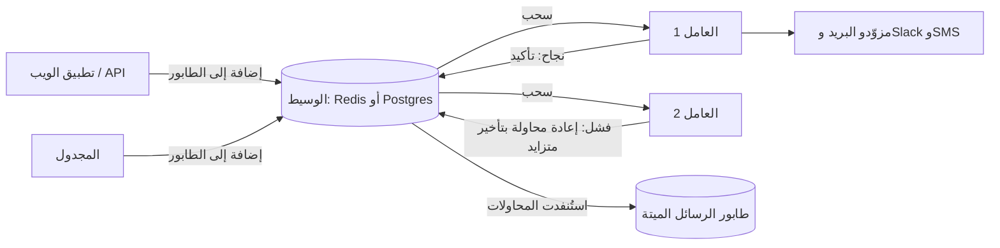

# الوحدة 5 — العمل في الخلفية والتكاملات

*معظم ما يفعله أي SaaS يحدث عندما لا ينظر أحد إلى تبويب المتصفح. يشغّل Beacon ملايين الفحوصات يوميًا، ويتحدث إلى خوادم الآخرين، وتستدعيه أكواد الآخرين. تغطي هذه الوحدة الآليات التي تنفّذ العمل خارج الطلب (الطوابير والمجدولات ومحركات سير العمل)، والواجهات التي تستخدمها البرمجيات الأخرى للوصول إليك (واجهة برمجية عامة) أو لتسمع منك (الويب هوك والتكاملات).*

---

# 5.1 — المهام الخلفية والطوابير والمهام المجدولة

*المستوى: 🟡 متوسط* · *المتطلبات: 2.1، 4.1*

## ⚡ الدرس في دقيقة

- المهمة الخلفية (Background Job) سجل دائم لعمل مطلوب، يُخزَّن في وسيط ثم ينفّذه لاحقًا عامل منفصل يستطيع إعادة المحاولة.
- القاعدة الأهم: الطوابير تسلّم المهمة مرة واحدة على الأقل، لذلك يجب أن تكون كل مهمة متساوية الأثر (Idempotent). مرّر المعرّفات لا الكائنات، وسجّل ما أنجزته.
- الخيار الافتراضي للنسخة الأولى: طابور مبني على Postgres (مثل pg-boss أو Solid Queue أو River)، حتى تتم إضافة المهمة في المعاملة نفسها التي تكتب بياناتك.
- كل عمل بطيء أو غير مستقر أو مجدول يخرج من الطلب: إعادة محاولة بتأخير متزايد وعشوائية، ثم طابور الرسائل الميتة.
- أكبر فخ: تنفيذ "استدعاء API سريع واحد فقط" داخل الطلب، أو تشغيل cron في كل نسخة من خادم الويب.

## 🧭 لماذا يحتاجه كل SaaS

إنه أسبوع الإطلاق. تتعطل الواجهة البرمجية لأحد عملاء Beacon، والكود في مسار "فشل المراقِب" ينفّذ كل شيء داخل الطلب: يفتح صفًا للحادثة، ويرسل 40 بريدًا إلى مشتركي صفحة الحالة، وينشر في Slack، ويرسل ثلاث رسائل SMS، ويستدعي الويب هوك الخاص بالعميل. كل واحدة من هذه العمليات استدعاء شبكي إلى خادم شخص آخر. كان Slack بطيئًا ذلك المساء واستغرق 9 ثوانٍ ليرد. ونقطة الويب هوك لدى العميل هي نفسها الخادم المتعطل، فيبقى الاستدعاء معلقًا حتى تنتهي مهلة الـ30 ثانية. وفي هذه الأثناء يبقى الفاحص الذي اكتشف العطل عالقًا في الانتظار، فيتأخر الفحص *التالي* لـ200 مراقِب آخر على تلك العملية. صارت أداة مراقبة التوفر عندك تعاني هي نفسها من مشكلة توفر.

الفشل الثاني أهدأ. يعيد مزوّد البريد الخطأ 503 لمدة أربع ثوانٍ. فيرمي الطلب الذي كان يرسل رسائل المشتركين استثناءً، ويُسجَّل الخطأ، ولا يعلم أولئك الأشخاص الأربعون بالحادثة أبدًا. لم يُعِد أحد المحاولة، لأن أحدًا *لم يكن يستطيع*: العمل كان موجودًا فقط داخل طلب انتهى.

الفشل الثالث هو الجدولة نفسها. منتج Beacon بأكمله هو "افعل شيئًا كل 30 ثانية إلى 5 دقائق، إلى الأبد، لكل مراقِب". واستدعاء `setInterval` داخل خادم الويب لا ينجو من النشر، ولا يتوزع على عدة أجهزة، ويعمل مرتين عندما تتوسع إلى نسختين.

**كل عمل بطيء أو غير مستقر أو مجدول مكانه مهمة خلفية: سجل دائم لعمل مطلوب، يلتقطه عامل منفصل يستطيع إعادة المحاولة.**

## 📐 كيف يعمل

### 🟢 الأساسيات

**المهمة الخلفية** رسالة صغيرة تقول "نفّذ X بهذه المعاملات"، تُخزَّن في مكان دائم، وتنفذها لاحقًا عملية أخرى. المصطلحات:

- **المنتِج (Producer)** — الكود الذي ينشئ المهمة (طلب الويب، أو المجدول، أو مهمة أخرى).
- **الوسيط (Broker)** — المكان الذي تنتظر فيه المهام. عادةً Redis أو Postgres أو طابور مُدار مثل Amazon SQS.
- **الطابور (Queue)** — صف مسمّى من المهام داخل الوسيط (`checks`، `notifications`، `emails`).
- **العامل (Worker)** — عملية تعمل باستمرار، تسحب المهام من الطابور وتشغّل المعالج الذي كتبته.
- **إعادة المحاولة مع التأخير المتزايد (Retry with Backoff)** — عندما يرمي المعالج خطأً، تعود المهمة إلى الطابور بتأخير يزداد كل مرة (1 ثانية، 2، 4، 8…)، حتى لا تُغرق خدمة تعاني أصلًا بالطلبات.
- **طابور الرسائل الميتة (Dead-letter Queue أو DLQ)** — المكان الذي تذهب إليه المهمة بعد آخر محاولة فاشلة، حتى يفحصها إنسان ويعيد تشغيلها بدل أن تختفي.



تصبح مهمة طلب الويب الوحيدة: "اكتب صف الحادثة، أضف `notify-incident` إلى الطابور، أعد 200". والعامل ينفّذ الجزء البطيء، وإذا كان Slack متعطلًا تُعاد المحاولة بعد دقيقة دون أن يلاحظ أحد.

في TypeScript مع BullMQ (مكتبة طوابير مبنية على Redis) يبدو الأمر هكذا:

```ts
import { Queue, Worker } from "bullmq";
const connection = { host: "localhost", port: 6379 };

export const notifications = new Queue("notifications", { connection });

// Producer: inside the "monitor failed" handler
await notifications.add(
  "incident.opened",
  { incidentId, orgId },
  { jobId: `incident-opened:${incidentId}`, attempts: 8,
    backoff: { type: "exponential", delay: 2_000 } },
);

// Worker: a separate process (node worker.js)
new Worker("notifications", async (job) => {
  const incident = await db.incident.findUnique({ where: { id: job.data.incidentId } });
  if (!incident) return;                 // deleted meanwhile: nothing to do
  await sendSubscriberEmails(incident);  // throws on failure -> retried
}, { connection, concurrency: 20 });
```

لاحظ عادتين من الآن. الحمولة تحمل **معرّفات لا كائنات** — فالعامل يعيد قراءة البيانات الحديثة، ولذلك لا تتصرف مهمة أُعيدت بعد ساعة بناءً على لقطة قديمة. و`jobId` حتمي، لذلك لا تؤدي إضافة الحادثة نفسها مرتين إلى إنشاء مهمتين.

لكل بيئة تقنية الشكل نفسه: **Sidekiq** أو **Solid Queue** (الافتراضي في Rails 8) في Ruby، و**Celery** في Python/Django، و**asynq** أو **River** في Go، و**Laravel Queues** في PHP.

### 🟡 التعمق أكثر

**التسليم مرة واحدة على الأقل يعني أن مهامك يجب أن تكون متساوية الأثر.** تعِد كل الطوابير تقريبًا بالتسليم *مرة واحدة على الأقل* (At-least-once): ستُنفَّذ المهمة، لكنها قد تُنفَّذ مرتين. قد ينهي العامل إرسال البريد ثم ينهار قبل أن يؤكد المهمة؛ فلا يرى الوسيط أي تأكيد، ويفترض أن العامل مات، ويسلّم المهمة لعامل آخر. التسليم "مرة واحدة بالضبط" ليس شيئًا يستطيع الطابور أن يمنحك إياه عبر شبكة. ما *تستطيع* فعله هو أن تجعل التنفيذ المزدوج غير ضار. المهمة **متساوية الأثر (Idempotent)** تنتج الحالة النهائية نفسها مهما تكرر تنفيذها:

- سجّل ما فعلته: صف في `notification_deliveries` مع قيد فريد على `(incident_id, subscriber_id, channel)`. أدخل الصف أولًا؛ وإذا تعارض الإدخال، تخطَّ الإرسال.
- مرّر مفتاح عدم التكرار (Idempotency Key) إلى المزوّد عندما يدعمه (Stripe وكثير من واجهات البريد وSMS تدعمه).
- فضّل "اجعل الحالة X" على "زِد العداد".

**مشكلة الكتابة المزدوجة وصندوق الصادر المعاملاتي.** انظر إلى المنتِج مرة أخرى. تكتب الحادثة في Postgres، ثم تضيف المهمة إلى Redis. إذا ماتت العملية بين هذين السطرين، تبقى لديك حادثة لا يُبلَّغ بها أحد. وإذا أضفت المهمة أولًا ثم تراجعت معاملة قاعدة البيانات، يبحث العامل عن حادثة غير موجودة. نظامان، ولا معاملة مشتركة بينهما.

**صندوق الصادر المعاملاتي (Transactional Outbox)** يحل هذه المشكلة: في *المعاملة نفسها* التي تكتب الحادثة، أدخل صفًا في جدول `outbox` يصف المهمة. ثم تقرأ عملية ترحيل منفصلة صفوف الصادر غير المرسلة، وتضيفها إلى الوسيط، وتعلّمها كمرسلة. ولأن عملية الترحيل قد تضيف المهمة مرتين (إذا انهارت بعد الإضافة وقبل التعليم)، فهذا أيضًا تسليم مرة واحدة على الأقل — وأنت تتعامل معه أصلًا، لأن مهامك متساوية الأثر.

**الطوابير المبنية على Postgres تجعل صندوق الصادر غير ضروري.** إذا *كان* الطابور جدولًا في قاعدة بياناتك الرئيسية، فإضافة مهمة مجرد `INSERT` داخل معاملتك الحالية. ويحجز العمال المهام باستخدام `SELECT … FOR UPDATE SKIP LOCKED`، الذي يسمح لعمال كثيرين بأخذ صفوف مختلفة دون أن يحجب بعضهم بعضًا. أصبحت هذه العائلة الخيار الافتراضي المعقول لمعظم فرق SaaS:

| | مبني على Redis | مبني على Postgres |
|---|---|---|
| أمثلة | BullMQ (Node)، Sidekiq (Ruby)، Celery مع Redis (Python)، asynq (Go) | pg-boss، Graphile Worker (Node)، Solid Queue (Ruby)، River (Go)، Oban (Elixir) |
| الإضافة ضمن معاملة | لا — يحتاج صندوق صادر | نعم — في المعاملة نفسها مع بياناتك |
| سقف الإنتاجية | مرتفع جدًا؛ Redis مصمم لهذا | مرتفع بما يكفي لمعظم SaaS؛ تضخم الجداول وعملية vacuum يحتاجان عناية في الحالات القصوى |
| بنية تحتية إضافية | Redis عليك تشغيله وضمان حفظ بياناته | لا شيء غير قاعدة البيانات التي لديك أصلًا |
| المتانة | تعتمد على إعدادات الحفظ في Redis | متينة بقدر متانة قاعدة بياناتك |
| المنظومة | لوحات تحكم ناضجة، ومحددات معدل، وتدفقات | أحدث لكنها متينة؛ لوحات التحكم متفاوتة |

قاعدة معقولة: ابدأ بـ Postgres. انقل طابورًا ساخنًا محددًا إلى Redis (أو SQS) عندما تقيس أنه يحتاج ذلك.

**المهام المجدولة.** هناك نوعان. مهام *على نمط cron* تعمل وفق تقويم ثابت ("كل ليلة الساعة 02:00 UTC، احذف نتائج الفحوصات القديمة") — وتدعم هذا pg-boss وGraphile Worker وSolid Queue (`recurring.yml`) وCelery beat وإضافات Sidekiq، وكلها تأخذ قفلًا حتى لا تطلقها إلا نسخة واحدة. ومهام *مؤجلة* تعمل مرة واحدة في وقت لاحق ("أعد محاولة هذا الويب هوك بعد 5 دقائق"). وفحوصات المراقِبات في Beacon نوع ثالث أصعب — انظر أدناه.

**المراقبة.** الطابور الذي لا تراه طابور يفشل بصمت. راقب أربعة أرقام لكل طابور: **العمق** (المهام المنتظرة)، و**عمر أقدم مهمة منتظرة** (وهو ما يشعر به المستخدمون)، و**معدل الفشل**، و**حجم طابور الرسائل الميتة**. نبّه على العمر لا على العمق: 10,000 مهمة منتظرة أمر طبيعي إذا كان عمرها كلها ثانيتين. معظم المكتبات تأتي مع لوحة تحكم — Web UI في Sidekiq، وBull Board لـ BullMQ، وRiver UI، وMission Control لـ Solid Queue — ويجب أن تكون كلها خلف مصادقة لوحة الإدارة.

### 🔴 على نطاق واسع وللمؤسسات

**جدولة ملايين الفحوصات.** لنفترض أن لدى Beacon مليون مراقِب بفاصل دقيقة واحدة في المتوسط. هذا نحو 16,700 فحص في الثانية، إلى الأبد. وتسجيل مليون مدخل cron منفصل في مكتبة المهام سيؤلمك. النمط الذي ينجح:

1. خزّن `interval_seconds` و`next_run_at` لكل مراقِب، مع فهرس.
2. **قسّم الجدول إلى أجزاء (Shards).** أسند كل مراقِب إلى جزء من N جزءًا (`hash(monitor_id) % N`). تملك كل عملية مجدول بعض الأجزاء، وكل ثانية تحجز المراقِبات المستحقة في أجزائها (`WHERE shard = ANY($1) AND next_run_at <= now() … FOR UPDATE SKIP LOCKED LIMIT 5000`)، وتضيف مهام الفحص على دفعات، وتقدّم `next_run_at`.
3. **أضف عشوائية (Jitter).** إذا انطلقت كل المراقِبات ذات الدقيقة الواحدة عند `:00`، ستحصل على اندفاع جماعي كل دقيقة وعمال عاطلين بينها — وسيرى العملاء الذين يراقبون الاستضافة المشتركة لبعضهم قممًا متزامنة. أعطِ كل مراقِب إزاحة طور ثابتة (`hash(id) % interval`) حتى يتوزع الحمل بالتساوي على الدقيقة.
4. **افصل المنفّذ عن المجدول.** المجدول يقرر فقط *ما المستحق*. والفاحصون في عدة مناطق يسحبون من طوابير خاصة بكل منطقة ويكتبون النتائج. وهكذا تستطيع توسيع كل جزء بشكل مستقل.

**التزامن والعدالة لكل مستأجر.** عميل مؤسسي واحد يضيف 20,000 مراقِب، أو خطأ يجعل الويب هوك لمؤسسة واحدة تفشل وتُعاد، يجب ألا يحرم كل المستأجرين الآخرين. طوابير FIFO العادية (الداخل أولًا يخرج أولًا) غير عادلة بطبيعتها: من يضيف أكثر يحصل على معظم العمال. الخيارات، مرتبة تقريبًا حسب الجهد:

- طوابير منفصلة لكل فئة خطة (إشعارات عملاء Business لا تنتظر أبدًا خلف إعادة محاولات عملاء Free).
- حدود تزامن لكل مستأجر: "10 مهام قيد التنفيذ على الأكثر للمؤسسة X". نسخة Pro التجارية من BullMQ فيها مجموعات لهذا؛ وHatchet وInngest وTrigger.dev توفر مفاتيح تزامن؛ وفي Postgres يمكنك فرض ذلك في استعلام الحجز.
- التناوب الدائري بين المستأجرين عند الحجز، حتى تحصل كل مؤسسة على دورها.

**إعادة المحاولة تحتاج عشوائية أيضًا.** إذا فشلت 5,000 مهمة في اللحظة نفسها بسبب تعثر قصير لدى مزوّد، فالتأخير الأسي الخالص يعيد المحاولات الـ5,000 كلها في اللحظة نفسها لاحقًا. أضف عشوائية إلى كل تأخير ("full jitter")، كما يشرح المقال المعروف عن التأخير المتزايد في مدونة AWS Architecture.

**الرسائل السامة والمهل.** المهمة التي تُسقط العامل دائمًا (نفاد الذاكرة بسبب حمولة ضخمة) قد تُسقط العامل مرة بعد مرة. ضع حدًا للمحاولات، وحدد مهلة لكل مهمة، وتأكد من أن "انهيار العامل" يُحتسب محاولة.

**الخيارات المُدارة.** يمنحك Amazon SQS وسيطًا مع مهلة الإخفاء (Visibility Timeout)، وسياسة إعادة توجيه إلى طابور الرسائل الميتة، وطوابير FIFO مع معرّفات مجموعات الرسائل — لكنك ما زلت تشغّل عمالك بنفسك. ويذهب Trigger.dev Cloud وInngest أبعد من ذلك: تكتب دوالًا في مستودعك، وهما يتوليان الطوابير وإعادة المحاولة والجدولة ومفاتيح التزامن والمراقبة، ويستدعيان كودك أو يشغلانه. وهما يقتربان من محركات سير العمل في الدرس 5.4.

## 🏆 أفضل المستودعات

| المستودع | ما هو | التقنيات | الترخيص | اختره عندما |
|---|---|---|---|---|
| [taskforcesh/bullmq](https://github.com/taskforcesh/bullmq) | طابور مبني على Redis مع إعادة المحاولة والتأجيل والمهام المتكررة والتدفقات | Node/TS, Redis | MIT | تعمل على Node ولديك Redis أصلًا، أو تحتاج إنتاجية عالية |
| [timgit/pg-boss](https://github.com/timgit/pg-boss) | طابور على Postgres مع cron وإعادة المحاولة والرسائل الميتة | Node/TS, Postgres | MIT | تريد الإضافة ضمن المعاملة دون أي بنية تحتية جديدة |
| [graphile/worker](https://github.com/graphile/worker) | طابور مهام سريع على Postgres يستخدم LISTEN/NOTIFY وSKIP LOCKED، مع crontab | Node/TS, Postgres | MIT | مهام Postgres منخفضة الكمون، خاصة مع بيئة تتمحور حول Postgres |
| [rails/solid_queue](https://github.com/rails/solid_queue) | واجهة Active Job خلفية مبنية على قاعدة البيانات، الافتراضية في Rails 8 | Ruby | MIT | تعمل على Rails ولا تريد Redis |
| [sidekiq/sidekiq](https://github.com/sidekiq/sidekiq) | نظام المهام الخلفية العريق في Ruby | Ruby, Redis | LGPL-3.0 (Pro/Enterprise commercial) | Rails بحجم كبير، ومنظومة ضخمة |
| [celery/celery](https://github.com/celery/celery) | طابور مهام موزع مع المجدول beat | Python, Redis/RabbitMQ | BSD-3-Clause | Django/Python، الخيار الافتراضي |
| [riverqueue/river](https://github.com/riverqueue/river) | طابور مهام على Postgres مع إدخالات ضمن المعاملة | Go, Postgres | MPL-2.0 | خدمات Go تريد المهام في المعاملة نفسها |
| [hibiken/asynq](https://github.com/hibiken/asynq) | طابور مهام بسيط على Redis مع واجهة ويب | Go, Redis | MIT | Go مع Redis موجود أصلًا |
| [triggerdotdev/trigger.dev](https://github.com/triggerdotdev/trigger.dev) | منصة مهام خلفية مع طوابير وجداول ومفاتيح تزامن | TS | Apache-2.0 | تريد مهام مُدارة أو مستضافة ذاتيًا مع مراقبة ممتازة |
| [inngest/inngest](https://github.com/inngest/inngest) | دوال مدفوعة بالأحداث مع خطوات وتزامن وتقييد معدل | Go server, TS/Python/Go SDKs | SSPL with delayed Apache-2.0 publication (SDKs Apache-2.0) | مهام مدفوعة بالأحداث دون تشغيل طابور |

**إن درست مستودعًا واحدًا فقط:** اقرأ **graphile/worker** أو **timgit/pg-boss**. كلاهما صغير بما يكفي لقراءته في فترة ما بعد الظهر، ورؤية `FOR UPDATE SKIP LOCKED` وجدولة إعادة المحاولة وأقفال cron مكتوبة بـ SQL عادي تزيل كل الغموض عن "الطابور". وكل ما عداهما الفكرة نفسها مع ميزات أكثر.

**اشترِ أم ابنِ أم استضف بنفسك؟**

- **الخدمة المُدارة** عندما لا تريد تشغيل العمال أو مراقبة عمق الطابور في الثالثة فجرًا: Trigger.dev Cloud، وInngest، وAmazon SQS (الوسيط فقط)، وGoogle Cloud Tasks، وUpstash QStash.
- **استضف مكتبة مفتوحة المصدر بنفسك** وهذا يناسب الجميع تقريبًا: تعمل داخل تطبيقك وقاعدة بياناتك الحالية. ابدأ بالمبنية على Postgres (pg-boss، Solid Queue، River)؛ ثم المبنية على Redis (BullMQ، Sidekiq) عندما تحتاج الإنتاجية.
- **ابنِه بنفسك** فقط للـ*مجدول* الخاص بمجالك (مجدول الفحوصات المقسّم في Beacon). لا تكتب منطق إعادة المحاولة والتأكيد ومهلة الإخفاء من الصفر أبدًا.

## 🔍 ادرسه في مشاريع حقيقية

**openstatusHQ/openstatus** — صفحة حالة ومراقب توفر مفتوح المصدر، أي أنه Beacon حرفيًا. الجزء المثير هو كيف تُفصل جدولة الفحوصات عن تنفيذها، مع فاحصين يعملون في عدة مناطق. استخدم البحث في الكود عن `checker` و`cron` و`region`، وانظر كيف يُطلق تشغيل الفحص، وأين تُكتب النتائج، وكيف يتحول الفشل إلى إشعار بحادثة.

**twentyhq/twenty** — نظام CRM فيه إعداد حقيقي لعدة طوابير BullMQ خلف طبقة تجريد صغيرة. ابحث عن `MessageQueue` و`@Processor` لتجد أسماء الطوابير وأصناف المهام وطبقة المشغّل. لاحظ كيف تُسجَّل المهام لكل طابور، وكيف تُعلن مهام cron إلى جانبها.

**chatwoot/chatwoot** — تطبيق Rails يشغّل Sidekiq في الإنتاج. افتح المجلد `app/jobs` (وقت كتابة هذا الدرس) وإعدادات Sidekiq لترى أولويات الطوابير، وابحث عن `perform_later` لترى أين تسلّم طبقة الويب العمل.

**discourse/discourse** — عقد من العناية بالمهام في Ruby. ابحث عن `Jobs::Scheduled` لتجد المهام المتكررة، وعن `Jobs.enqueue` للمهام العادية؛ وأصناف المهام المجدولة تُظهر كيف يعلن تطبيق كبير عن عمل "كل 5 دقائق".

**ما الذي تلاحظه**

- المهام تحمل معرّفات وتعيد جلب البيانات؛ والحمولات تبقى صغيرة.
- الطوابير مفصولة حسب الإلحاح (إشعارات حرجة مقابل صيانة بطيئة)، لا حسب وحدات الكود.
- العمل المتكرر مُعلن في مكان واحد، لا في استدعاءات `setInterval` متناثرة.
- المعالجات تتحسب لحالة "السجل لم يعد موجودًا" ولحالة التنفيذ المزدوج.
- أي التطبيقات تضيف المهام داخل معاملة قاعدة البيانات وأيها لا تفعل — وهل يبدو أنها تهتم بذلك.

## 🛠️ ابنِه في Beacon

### 🟢 تمرين المبتدئ

أخرج إشعارات الحوادث من الطلب. عندما يفشل مراقِب، يكتب الفاحص الحادثة ويضيف مهمة `notify-incident` إلى الطابور؛ وتُرسل عملية عامل منفصلة رسائل البريد. اضبط 8 محاولات مع تأخير أسي ووجهة للرسائل الميتة.

**يكتمل عندما:**
- يعود مسار الطلب أو الفاحص دون أي استدعاء للبريد أو Slack أو SMS.
- يؤدي تعطيل مزوّد البريد (وجّهه إلى مضيف خاطئ) إلى إعادة محاولات تظهر في لوحة الطابور، وتنجح المهمة بعد أن تعيده.
- تنتهي المهمة التي تفشل في كل المحاولات في طابور الرسائل الميتة مع الخطأ، ولا تضيع.

### 🟡 تمرين المستوى المتوسط

اجعل الإشعارات تحدث مرة واحدة بالضبط *من حيث الأثر*. أضف جدول `notification_deliveries` بمفتاح فريد لكل `(incident, recipient, channel)`، وانقل الإضافة إلى الطابور إلى المعاملة نفسها التي تكتب الحادثة (طابور Postgres) أو عبر جدول صادر (طابور Redis).

**يكتمل عندما:**
- يؤدي تشغيل المهمة نفسها مرتين يدويًا إلى إرسال بريد واحد بالضبط لكل مشترك.
- يؤدي إسقاط العملية بين "تم حفظ الحادثة" و"تمت إضافة المهمة" إلى إرسال الإشعارات رغم ذلك (يلتقطها الترحيل أو الإضافة ضمن المعاملة).
- يثبت اختبار أن المعالج لا يفعل شيئًا لحادثة لم تعد موجودة.

### 🔴 تمرين المستوى المتقدم

ابنِ مجدول الفحوصات المقسّم. خزّن `next_run_at` وإزاحة طور ثابتة لكل مراقِب، وشغّل عمليتي مجدول تملك كل منهما نصف الأجزاء، واحجز المراقِبات المستحقة باستخدام `SKIP LOCKED` على دفعات. أضف حدًا للتزامن لكل مؤسسة حتى لا تستخدم أي مؤسسة أكثر من 5% من عمال الفحص.

```sql
-- claim a batch of due monitors in my shards
UPDATE monitors m SET next_run_at = m.next_run_at + m.interval_seconds * interval '1 second'
WHERE m.id IN (
  SELECT id FROM monitors
  WHERE shard = ANY($1) AND next_run_at <= now() AND paused = false
  ORDER BY next_run_at
  FOR UPDATE SKIP LOCKED
  LIMIT 5000
)
RETURNING m.id, m.org_id, m.region;
```

**يكتمل عندما:**
- يكون معدل الفحوصات في الثانية ثابتًا مع 100,000 مراقِب تجريبي (لا قمة عند `:00`).
- يؤدي إيقاف أحد المجدولين إلى أن يتولى الآخر أجزاءه خلال دقيقة، دون فحص أي مراقِب مرتين في الفاصل نفسه.
- لا تستطيع مؤسسة لديها 20,000 مراقِب أن تؤخر فحوصات مؤسسة أخرى بأكثر من فاصل واحد.

## ⚠️ أخطاء يقع فيها المبتدئون

- **تنفيذ "استدعاء API سريع واحد فقط" داخل الطلب.** كل استدعاء خارجي زمن انتظار واحتمال فشل استعرته من غيرك. إذا لم يكن المستخدم يحتاج النتيجة لعرض الصفحة التالية، فأضفه إلى الطابور.
- **وضع كائنات كاملة في الحمولة.** كائن `incident` مسلسل منذ ساعة سيكون خاطئًا عندما تُعاد المهمة. مرّر المعرّفات وأعد القراءة.
- **افتراض أن المهمة تُنفَّذ مرة واحدة بالضبط.** ستُنفَّذ مرتين يومًا ما، وغالبًا أثناء حادثة. صمّم لذلك بقيود فريدة ومفاتيح عدم تكرار.
- **إعادة المحاولة إلى الأبد، أو عدم إعادتها أبدًا.** إعادة المحاولة بلا حد تحوّل حمولة سيئة إلى حمل دائم؛ وعدم إعادة المحاولة يحوّل تعثرًا لثانيتين إلى عمل ضائع. ضع حدًا للمحاولات، وأخّر مع عشوائية، وأرسل الباقي إلى الرسائل الميتة.
- **تشغيل cron في كل نسخة من خادم الويب.** نسختان تعنيان تشغيلين ليليين للفوترة. استخدم مجدول الطابور، فهو يأخذ قفلًا.
- **عدم التنبيه على أي شيء.** يجب أن تكون أول علامة على عامل معطل تنبيهًا يقول "أقدم مهمة عمرها 10 دقائق"، لا عميلًا يسأل لماذا لم يصله أي إشعار.

## 🧾 الخلاصة

- المهمة ملاحظة دائمة لعمل مطلوب، ينفذها عامل منفصل يستطيع إعادة المحاولة.
- الطوابير تسلّم مرة واحدة على الأقل، لذلك يجب أن تكون كل مهمة آمنة إذا نُفذت مرتين.
- يجب أن تتفق الإضافة إلى الطابور مع كتابة البيانات: استخدم طابورًا مبنيًا على Postgres أو صندوق صادر معاملاتي.
- ابدأ بطوابير مبنية على Postgres؛ وأضف Redis أو SQS للنقاط الساخنة التي قستها.
- على نطاق Beacon، جدوِل بالأجزاء والعشوائية، وضع حدًا لحصة كل مستأجر من العمال.
- راقب عمر أقدم مهمة وحجم طابور الرسائل الميتة.

## ✍️ اختبر نفسك

**1. ما طابور الرسائل الميتة، ولماذا تحتاجه؟**

<details><summary>الإجابة</summary>

هو المكان الذي تذهب إليه المهمة بعد آخر محاولة فاشلة. من دونه، تختفي المهمة التي استنفدت محاولاتها ببساطة؛ ومعه، يستطيع إنسان فحص الخطأ وإعادة تشغيل المهمة. انظر قائمة المصطلحات في 🟢 الأساسيات.

</details>

**2. لماذا يجب أن تكون المهام متساوية الأثر، حتى مع طابور يعمل جيدًا؟**

<details><summary>الإجابة</summary>

تسلّم الطوابير كلها تقريبًا مرة واحدة على الأقل. قد ينهي العامل العمل ثم ينهار قبل التأكيد، فيسلّم الوسيط المهمة لعامل آخر وتُنفَّذ مرتين. والمهمة متساوية الأثر تصل إلى الحالة النهائية نفسها مهما تكرر تنفيذها. انظر "التسليم مرة واحدة على الأقل" في 🟡 التعمق أكثر.

</details>

**3. يكتب Beacon الحادثة في Postgres ثم يضيف `notify-incident` إلى Redis. ما الذي قد يفشل، وما الحلّان؟**

<details><summary>الإجابة</summary>

إذا ماتت العملية بين الكتابتين، توجد الحادثة ولا يُبلَّغ بها أحد؛ وإذا أضفت المهمة أولًا ثم تراجعت المعاملة، يبحث العامل عن حادثة غير موجودة. الحل إما صندوق صادر معاملاتي (صف في `outbox` داخل المعاملة نفسها، تنقله عملية ترحيل إلى الوسيط)، أو طابور مبني على Postgres بحيث تكون الإضافة `INSERT` في المعاملة نفسها. انظر "مشكلة الكتابة المزدوجة" في 🟡 التعمق أكثر.

</details>

**4. لدى Beacon مليون مراقِب بفاصل دقيقة واحدة. لماذا لا تسجل مدخل cron لكل مراقِب وتطلقها كلها مع بداية الدقيقة؟**

<details><summary>الإجابة</summary>

مليون مدخل cron سيُثقل مكتبة المهام، وإطلاق كل المراقِبات عند `:00` يصنع اندفاعًا جماعيًا كل دقيقة مع عمال عاطلين بينها. خزّن `next_run_at` لكل مراقِب، وقسّم الجدول على عمليات المجدول، واحجز المراقِبات المستحقة باستخدام `SKIP LOCKED`، وأعطِ كل مراقِب إزاحة طور ثابتة. انظر "جدولة ملايين الفحوصات" في 🔴 على نطاق واسع.

</details>

**5. أضاف زميل `setInterval(pruneOldResults, 24h)` إلى خادم الويب. والإنتاج يشغّل ثلاث نسخ من خادم الويب. ما الذي سيتعطل؟**

<details><summary>الإجابة</summary>

ستعمل المهمة ثلاث مرات كل ليلة، مرة لكل نسخة، وستتوقف أو يتغير توقيتها مع كل نشر لأن المؤقت يعيش في عملية يُعاد تشغيلها. العمل المتكرر مكانه مجدول الطابور، الذي يأخذ قفلًا حتى لا تطلقه إلا نسخة واحدة. انظر "المهام المجدولة" في 🟡 التعمق أكثر و"تشغيل cron في كل نسخة من خادم الويب" في ⚠️ الأخطاء.

</details>

## 📚 المراجع

- BullMQ documentation — https://docs.bullmq.io — توثيق BullMQ
- Transactional outbox pattern (microservices.io) — https://microservices.io/patterns/data/transactional-outbox.html — نمط صندوق الصادر المعاملاتي
- PostgreSQL `SELECT … FOR UPDATE SKIP LOCKED` — https://www.postgresql.org/docs/current/sql-select.html
- Marc Brooker, "Exponential Backoff And Jitter", AWS Architecture Blog — https://aws.amazon.com/blogs/architecture/exponential-backoff-and-jitter/ — التأخير الأسي والعشوائية
- Amazon SQS documentation (visibility timeout, dead-letter queues) — https://docs.aws.amazon.com/sqs/ — توثيق SQS (مهلة الإخفاء وطوابير الرسائل الميتة)
- River documentation — https://riverqueue.com/docs
- Sidekiq wiki — https://github.com/sidekiq/sidekiq/wiki
- Trigger.dev documentation — https://trigger.dev/docs

---

