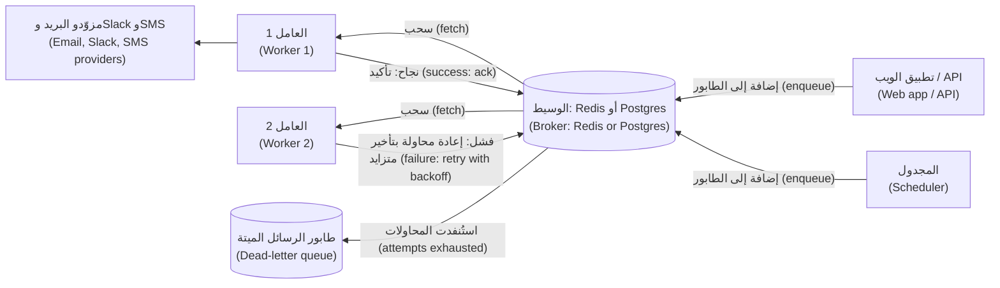
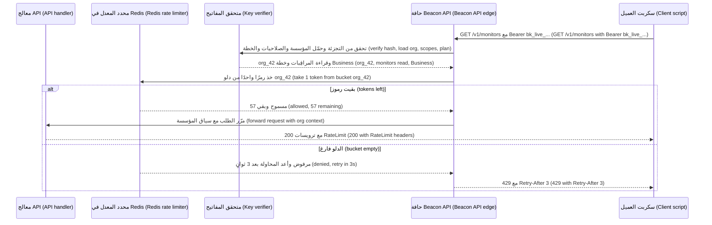
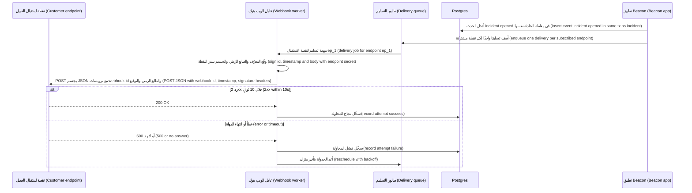
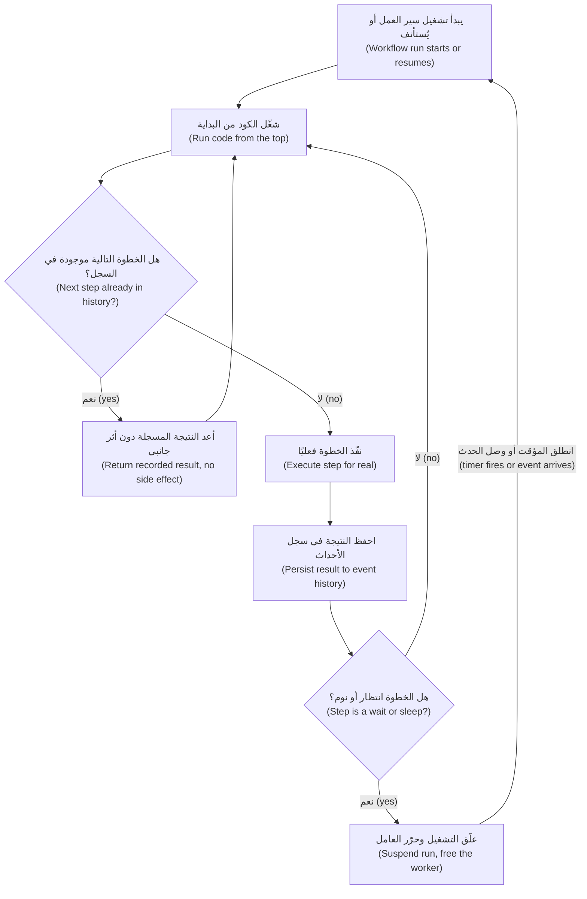

# الوحدة (Module) 5 — العمل في الخلفية والتكاملات (Background Work & Integrations)

*معظم ما يفعله أي SaaS يحدث عندما لا ينظر أحد إلى تبويب المتصفح (browser tab). يشغّل Beacon ملايين الفحوصات (checks) يوميًا، ويتحدث إلى خوادم (servers) الآخرين، وتستدعيه أكواد الآخرين. تغطي هذه الوحدة (Module) الآليات التي تنفّذ العمل خارج الطلب (الطوابير (queues) والمجدولات (schedulers) ومحركات سير العمل (workflow engines))، والواجهات التي تستخدمها البرمجيات الأخرى للوصول إليك (واجهة برمجية عامة (public API)) أو لتسمع منك (الويب هوك (webhooks) والتكاملات (integrations)).*

> **التطبيق العملي (Practice):** ابدأ من [نسخة البداية (starter) من Beacon](https://github.com/Tamoura/system-design-for-vibe-coders/tree/beacon/starter)، وحلّ التمارين قبل النظر إلى [الحل المرجعي (reference solution) لهذه الوحدة (Module)](https://github.com/Tamoura/system-design-for-vibe-coders/tree/beacon/module-5-solution) (الفرع `beacon/module-5-solution`).

---

# 5.1 — المهام الخلفية (background jobs) والطوابير (queues) والمهام المجدولة (scheduled tasks)

*المستوى (Level): 🟡 متوسط (Intermediate)* · *المتطلبات (Prerequisites): 2.1، 4.1*

## ⚡ الدرس في دقيقة (In 60 seconds)

- المهمة الخلفية (Background Job) سجل دائم (durable record) لعمل مطلوب، يُخزَّن في وسيط (broker) ثم ينفّذه لاحقًا عامل (worker) منفصل يستطيع إعادة المحاولة (retry).
- القاعدة الأهم (The rule that matters most): الطوابير (queues) تسلّم المهمة (job) مرة واحدة على الأقل (at least once)، لذلك يجب أن تكون كل مهمة متساوية الأثر (Idempotent). مرّر المعرّفات (IDs) لا الكائنات (objects)، وسجّل ما أنجزته.
- الخيار الافتراضي للنسخة الأولى (v1): طابور (queue) مبني على Postgres (مثل pg-boss أو Solid Queue أو River)، حتى تتم إضافة المهمة (enqueuing) في المعاملة (transaction) نفسها التي تكتب بياناتك.
- كل عمل بطيء أو غير مستقر أو مجدول يخرج من الطلب (request): إعادة محاولة (retry) بتأخير متزايد (backoff) وعشوائية (jitter)، ثم طابور الرسائل الميتة (dead-letter queue).
- أكبر فخ (The biggest trap): تنفيذ "استدعاء API (API call) سريع واحد فقط" داخل الطلب (inline)، أو تشغيل cron في كل نسخة من خادم الويب (web instance).

## 🧭 لماذا يحتاجه كل SaaS (Why every SaaS has this)

إنه أسبوع الإطلاق (launch week). تتعطل الواجهة البرمجية (API) لأحد عملاء Beacon، والكود (code) في مسار "فشل المراقِب (monitor)" ينفّذ كل شيء داخل الطلب (request): يفتح صفًا (row) للحادثة (incident)، ويرسل 40 بريدًا (email) إلى مشتركي صفحة الحالة (status-page subscribers)، وينشر في Slack، ويرسل ثلاث رسائل SMS، ويستدعي الويب هوك (webhooks) الخاص بالعميل. كل واحدة من هذه العمليات (processes) استدعاء شبكي (network call) إلى خادم (server) شخص آخر. كان Slack بطيئًا ذلك المساء واستغرق 9 ثوانٍ ليرد. ونقطة الويب هوك (webhook endpoint) لدى العميل هي نفسها الخادم المتعطل (failing server)، فيبقى الاستدعاء معلقًا حتى تنتهي مهلة (timeout) الـ30 ثانية. وفي هذه الأثناء يبقى الفاحص (checker) الذي اكتشف العطل عالقًا في الانتظار (waiting)، فيتأخر الفحص (check) *التالي* لـ200 مراقِب آخر على تلك العملية (process). صارت أداة مراقبة التوفر (uptime monitor) عندك تعاني هي نفسها من مشكلة توفر (uptime problem).

الفشل الثاني أهدأ. يعيد مزوّد البريد (email provider) الخطأ 503 لمدة أربع ثوانٍ. فيرمي الطلب (request) الذي كان يرسل رسائل المشتركين استثناءً (exception)، ويُسجَّل (logged) الخطأ، ولا يعلم أولئك الأشخاص الأربعون بالحادثة (incident) أبدًا. لم يُعِد أحد المحاولة، لأن أحدًا *لم يكن يستطيع*: العمل كان موجودًا فقط داخل طلب انتهى.

الفشل الثالث هو الجدولة (schedule) نفسها. منتج (product) Beacon بأكمله هو "افعل شيئًا كل 30 ثانية إلى 5 دقائق، إلى الأبد، لكل مراقِب (monitor)". واستدعاء `setInterval` داخل خادم الويب (web server) لا ينجو من النشر (deploy)، ولا يتوزع على عدة أجهزة (machines)، ويعمل مرتين عندما تتوسع (scale) إلى نسختين (instances).

**كل عمل بطيء أو غير مستقر أو مجدول مكانه مهمة خلفية (background job): سجل دائم لعمل مطلوب، يلتقطه عامل (worker) منفصل يستطيع إعادة المحاولة (retry).**

## 📐 كيف يعمل (How it works)

### 🟢 الأساسيات (The essentials)

**المهمة الخلفية (background job)** رسالة صغيرة تقول "نفّذ X بهذه المعاملات (arguments)"، تُخزَّن في مكان دائم، وتنفذها لاحقًا عملية (process) أخرى. المصطلحات:

- **المنتِج (Producer)** — الكود (code) الذي ينشئ المهمة (طلب الويب (web request)، أو المجدول (scheduler)، أو مهمة (job) أخرى).
- **الوسيط (Broker)** — المكان الذي تنتظر فيه المهام (jobs). عادةً Redis أو Postgres أو طابور مُدار (managed queue) مثل Amazon SQS.
- **الطابور (Queue)** — صف مسمّى (named line) من المهام (jobs) داخل الوسيط (`checks`، `notifications`، `emails`).
- **العامل (Worker)** — عملية (process) تعمل باستمرار، تسحب المهام (jobs) من الطابور (queue) وتشغّل المعالج (handler) الذي كتبته.
- **إعادة المحاولة مع التأخير المتزايد (Retry with Backoff)** — عندما يرمي المعالج (handler) خطأً، تعود المهمة (job) إلى الطابور (queue) بتأخير يزداد كل مرة (1 ثانية، 2، 4، 8…)، حتى لا تُغرق خدمة تعاني أصلًا بالطلبات (requests).
- **طابور الرسائل الميتة (Dead-letter Queue أو DLQ)** — المكان الذي تذهب إليه المهمة (job) بعد آخر محاولة فاشلة (final failed attempt)، حتى يفحصها إنسان ويعيد تشغيلها بدل أن تختفي.


```mermaid
flowchart RL
  API["تطبيق الويب / API<br/>(Web app / API)"] -->|"إضافة إلى الطابور (enqueue)"| B[("الوسيط: Redis أو Postgres<br/>(Broker: Redis or Postgres)")]
  SCH["المجدول<br/>(Scheduler)"] -->|"إضافة إلى الطابور (enqueue)"| B
  B -->|"سحب (fetch)"| W1["العامل 1<br/>(Worker 1)"]
  B -->|"سحب (fetch)"| W2["العامل 2<br/>(Worker 2)"]
  W1 -->|"نجاح: تأكيد (success: ack)"| B
  W2 -->|"فشل: إعادة محاولة بتأخير متزايد (failure: retry with backoff)"| B
  B -->|"استُنفدت المحاولات (attempts exhausted)"| DLQ[("طابور الرسائل الميتة<br/>(Dead-letter queue)")]
  W1 --> EXT["مزوّدو البريد وSlack وSMS<br/>(Email, Slack, SMS providers)"]
```

تصبح مهمة (job) طلب الويب (web request) الوحيدة: "اكتب صف الحادثة (incident row)، أضف `notify-incident` إلى الطابور (queue)، أعد 200". والعامل (worker) ينفّذ الجزء البطيء، وإذا كان Slack متعطلًا تُعاد المحاولة (retried) بعد دقيقة دون أن يلاحظ أحد.

في TypeScript مع BullMQ (مكتبة طوابير (queue library) مبنية على Redis (Redis-based)) يبدو الأمر هكذا:

```ts
import { Queue, Worker } from "bullmq";
const connection = { host: "localhost", port: 6379 };

export const notifications = new Queue("notifications", { connection });

// Producer: inside the "monitor failed" handler
await notifications.add(
  "incident.opened",
  { incidentId, orgId },
  { jobId: `incident-opened:${incidentId}`, attempts: 8,
    backoff: { type: "exponential", delay: 2_000 } },
);

// Worker: a separate process (node worker.js)
new Worker("notifications", async (job) => {
  const incident = await db.incident.findUnique({ where: { id: job.data.incidentId } });
  if (!incident) return;                 // deleted meanwhile: nothing to do
  await sendSubscriberEmails(incident);  // throws on failure -> retried
}, { connection, concurrency: 20 });
```

لاحظ عادتين من الآن. الحمولة (payload) تحمل **معرّفات (IDs) لا كائنات (objects)** — فالعامل (worker) يعيد قراءة البيانات الحديثة (fresh data)، ولذلك لا تتصرف مهمة (job) أُعيدت بعد ساعة بناءً على لقطة قديمة (stale snapshot). و`jobId` حتمي (deterministic)، لذلك لا تؤدي إضافة الحادثة (incident) نفسها مرتين إلى إنشاء مهمتين (two jobs).

لكل بيئة تقنية (stack) الشكل نفسه: **Sidekiq** أو **Solid Queue** (الافتراضي في Rails 8) في Ruby، و**Celery** في Python/Django، و**asynq** أو **River** في Go، و**Laravel Queues** في PHP.

### 🟡 التعمق أكثر (Going deeper)

**التسليم مرة واحدة على الأقل (at-least-once delivery) يعني أن مهامك يجب أن تكون متساوية الأثر.** تعِد كل الطوابير (queues) تقريبًا بالتسليم (delivery) *مرة واحدة على الأقل* (At-least-once): ستُنفَّذ المهمة (job)، لكنها قد تُنفَّذ مرتين. قد ينهي العامل (worker) إرسال البريد (email) ثم ينهار (crash) قبل أن يؤكد (acknowledges) المهمة؛ فلا يرى الوسيط (broker) أي تأكيد (ack)، ويفترض أن العامل مات، ويسلّم المهمة لعامل آخر. التسليم "مرة واحدة بالضبط (exactly once)" ليس شيئًا يستطيع الطابور (queue) أن يمنحك إياه عبر شبكة. ما *تستطيع* فعله هو أن تجعل التنفيذ المزدوج (double execution) غير ضار. المهمة **متساوية الأثر (Idempotent)** تنتج الحالة النهائية (end state) نفسها مهما تكرر تنفيذها:

- سجّل ما فعلته: صف في `notification_deliveries` مع قيد فريد (unique constraint) على `(incident_id, subscriber_id, channel)`. أدخل الصف (row) أولًا؛ وإذا تعارض الإدخال (insert conflicts)، تخطَّ الإرسال.
- مرّر مفتاح عدم التكرار (Idempotency Key) إلى المزوّد (provider) عندما يدعمه (Stripe وكثير من واجهات البريد (email) وSMS تدعمه).
- فضّل "اجعل الحالة X" على "زِد العداد (increment counter)".

**مشكلة الكتابة المزدوجة (dual-write problem) وصندوق الصادر المعاملاتي (transactional outbox).** انظر إلى المنتِج (producer) مرة أخرى. تكتب الحادثة (incident) في Postgres، ثم تضيف المهمة (job) إلى Redis. إذا ماتت العملية (process) بين هذين السطرين، تبقى لديك حادثة لا يُبلَّغ بها أحد. وإذا أضفت المهمة أولًا ثم تراجعت (rolls back) معاملة قاعدة البيانات (database transaction)، يبحث العامل (worker) عن حادثة غير موجودة. نظامان، ولا معاملة (transaction) مشتركة بينهما.

**صندوق الصادر المعاملاتي (Transactional Outbox)** يحل هذه المشكلة: في *المعاملة نفسها (the same transaction)* التي تكتب الحادثة (incident)، أدخل صفًا (row) في جدول (table) `outbox` يصف المهمة (job). ثم تقرأ عملية ترحيل (relay process) منفصلة صفوف الصادر (outbox rows) غير المرسلة، وتضيفها إلى الوسيط (broker)، وتعلّمها كمرسلة. ولأن عملية الترحيل قد تضيف المهمة مرتين (إذا انهارت بعد الإضافة وقبل التعليم)، فهذا أيضًا تسليم (delivery) مرة واحدة على الأقل (at least once) — وأنت تتعامل معه أصلًا، لأن مهامك متساوية الأثر (idempotent).

**الطوابير المبنية على Postgres (Postgres-backed queues) تجعل صندوق الصادر (outbox) غير ضروري.** إذا *كان* الطابور (queue) جدولًا (table) في قاعدة بياناتك الرئيسية (your main database)، فإضافة مهمة (job) مجرد `INSERT` داخل معاملتك (your transaction) الحالية. ويحجز (claim) العمال (workers) المهام (jobs) باستخدام `SELECT … FOR UPDATE SKIP LOCKED`، الذي يسمح لعمال كثيرين بأخذ صفوف (rows) مختلفة دون أن يحجب (blocking) بعضهم بعضًا. أصبحت هذه العائلة الخيار الافتراضي (the default) المعقول لمعظم فرق SaaS:

| | مبني على Redis (Redis-based) | مبني على Postgres (Postgres-based) |
|---|---|---|
| أمثلة | BullMQ (Node)، Sidekiq (Ruby)، Celery مع Redis (Python)، asynq (Go) | pg-boss، Graphile Worker (Node)، Solid Queue (Ruby)، River (Go)، Oban (Elixir) |
| الإضافة ضمن معاملة (transactional) | لا — يحتاج صندوق صادر (outbox) | نعم — في المعاملة نفسها (the same transaction) مع بياناتك |
| سقف الإنتاجية (throughput ceiling) | مرتفع جدًا؛ Redis مصمم لهذا | مرتفع بما يكفي لمعظم SaaS؛ تضخم الجداول (table bloat) وعملية (process) vacuum يحتاجان عناية في الحالات القصوى |
| بنية تحتية إضافية (extra infrastructure) | Redis عليك تشغيله وضمان حفظ بياناته | لا شيء غير قاعدة البيانات (database) التي لديك أصلًا |
| المتانة (durability) | تعتمد على إعدادات الحفظ (persistence settings) في Redis | متينة بقدر متانة قاعدة بياناتك (your database) |
| المنظومة (ecosystem) | لوحات تحكم (dashboards) ناضجة، ومحددات معدل (rate limiters)، وتدفقات (flows) | أحدث لكنها متينة؛ لوحات التحكم (dashboards) متفاوتة |

قاعدة معقولة: ابدأ بـ Postgres. انقل طابورًا ساخنًا (hot queue) محددًا إلى Redis (أو SQS) عندما تقيس أنه يحتاج ذلك.

**المهام المجدولة (scheduled tasks).** هناك نوعان. مهام (jobs) *على نمط cron (cron-style)* تعمل وفق تقويم ثابت ("كل ليلة الساعة 02:00 UTC، احذف نتائج الفحوصات (checks) القديمة") — وتدعم هذا pg-boss وGraphile Worker وSolid Queue (`recurring.yml`) وCelery beat وإضافات (plugins) Sidekiq، وكلها تأخذ قفلًا (lock) حتى لا تطلقها إلا نسخة واحدة (a single instance). ومهام *مؤجلة (delayed)* تعمل مرة واحدة في وقت لاحق ("أعد محاولة (retry) هذا الويب هوك (webhooks) بعد 5 دقائق"). وفحوصات المراقِبات (monitors) في Beacon نوع ثالث أصعب — انظر أدناه.

**المراقبة (monitoring).** الطابور (queue) الذي لا تراه طابور يفشل بصمت. راقب أربعة أرقام لكل طابور: **العمق (depth)** (المهام (jobs) المنتظرة)، و**عمر أقدم مهمة منتظرة (age of the oldest waiting job)** (وهو ما يشعر به المستخدمون (users))، و**معدل الفشل (failure rate)**، و**حجم طابور الرسائل الميتة (dead-letter queue size)**. نبّه (alert) على العمر لا على العمق: 10,000 مهمة (job) منتظرة أمر طبيعي إذا كان عمرها كلها ثانيتين. معظم المكتبات (libraries) تأتي مع لوحة تحكم (dashboard) — Web UI في Sidekiq، وBull Board لـ BullMQ، وRiver UI، وMission Control لـ Solid Queue — ويجب أن تكون كلها خلف مصادقة لوحة الإدارة (admin auth).

### 🔴 على نطاق واسع وللمؤسسات (At scale / enterprise)

**جدولة ملايين الفحوصات (Scheduling millions of checks).** لنفترض أن لدى Beacon مليون مراقِب (monitor) بفاصل (interval) دقيقة واحدة في المتوسط. هذا نحو 16,700 فحص (check) في الثانية، إلى الأبد. وتسجيل مليون مدخل cron (cron entry) منفصل في مكتبة المهام (job library) سيؤلمك. النمط (pattern) الذي ينجح:

1. خزّن `interval_seconds` و`next_run_at` لكل مراقِب (monitor)، مع فهرس (index).
2. **قسّم الجدول إلى أجزاء (Shards).** أسند كل مراقِب (monitor) إلى جزء من N جزءًا (`hash(monitor_id) % N`). تملك كل عملية مجدول (scheduler process) بعض الأجزاء (some of the shards)، وكل ثانية تحجز المراقِبات (monitors) المستحقة في أجزائها (`WHERE shard = ANY($1) AND next_run_at <= now() … FOR UPDATE SKIP LOCKED LIMIT 5000`)، وتضيف مهام الفحص (check jobs) على دفعات (batches)، وتقدّم `next_run_at`.
3. **أضف عشوائية (Jitter).** إذا انطلقت كل المراقِبات (monitors) ذات الدقيقة الواحدة عند `:00`، ستحصل على اندفاع جماعي (thundering herd) كل دقيقة وعمال (workers) عاطلين (idle) بينها — وسيرى العملاء الذين يراقبون الاستضافة المشتركة (shared hosting) لبعضهم قممًا متزامنة (synchronized spikes). أعطِ كل مراقِب (monitor) إزاحة طور (phase offset) ثابتة (`hash(id) % interval`) حتى يتوزع الحمل (load) بالتساوي على الدقيقة.
4. **افصل المنفّذ (executor) عن المجدول (scheduler).** المجدول يقرر فقط *ما المستحق*. والفاحصون (checkers) في عدة مناطق (regions) يسحبون من طوابير (queues) خاصة بكل منطقة (region) ويكتبون النتائج. وهكذا تستطيع توسيع كل جزء بشكل مستقل.

**التزامن (concurrency) والعدالة (fairness) لكل مستأجر (tenant).** عميل مؤسسي (enterprise customer) واحد يضيف 20,000 مراقِب (monitor)، أو خطأ يجعل الويب هوك (webhooks) لمؤسسة (org) واحدة تفشل وتُعاد، يجب ألا يحرم (starve) كل المستأجرين (tenants) الآخرين. طوابير (queues) FIFO العادية (الداخل أولًا يخرج أولًا) غير عادلة بطبيعتها: من يضيف أكثر يحصل على معظم العمال (workers). الخيارات، مرتبة تقريبًا حسب الجهد:

- طوابير (queues) منفصلة لكل فئة خطة (plan tier) (إشعارات (notifications) عملاء Business لا تنتظر أبدًا خلف إعادة محاولات (retries) عملاء Free).
- حدود تزامن (concurrency limits) لكل مستأجر (per tenant): "10 مهام (jobs) قيد التنفيذ (in-flight) على الأكثر للمؤسسة (org) X". نسخة Pro التجارية (commercial Pro edition) من BullMQ فيها مجموعات (groups) لهذا؛ وHatchet وInngest وTrigger.dev توفر مفاتيح تزامن (concurrency keys)؛ وفي Postgres يمكنك فرض ذلك في استعلام الحجز (claim query).
- التناوب الدائري (round-robin) بين المستأجرين (tenants) عند الحجز (claiming)، حتى تحصل كل مؤسسة (org) على دورها.

**إعادة المحاولة تحتاج عشوائية أيضًا (Retries need jitter too).** إذا فشلت 5,000 مهمة (job) في اللحظة نفسها بسبب تعثر قصير (blipped) لدى مزوّد (provider)، فالتأخير الأسي (exponential backoff) الخالص يعيد المحاولات (attempts) الـ5,000 كلها في اللحظة نفسها لاحقًا. أضف عشوائية (add jitter) إلى كل تأخير ("full jitter")، كما يشرح المقال المعروف عن التأخير المتزايد (backoff) في مدونة AWS Architecture.

**الرسائل السامة (poison messages) والمهل (timeouts).** المهمة (job) التي تُسقط العامل (worker) دائمًا (نفاد الذاكرة (out-of-memory) بسبب حمولة (payload) ضخمة) قد تُسقط العامل مرة بعد مرة. ضع حدًا للمحاولات (attempts)، وحدد مهلة (timeout) لكل مهمة، وتأكد من أن "انهيار العامل (worker crash)" يُحتسب محاولة (attempt).

**الخيارات المُدارة (managed options).** يمنحك Amazon SQS وسيطًا (broker) مع مهلة الإخفاء (Visibility Timeout)، وسياسة إعادة توجيه (redrive policy) إلى طابور الرسائل الميتة (dead-letter queue)، وطوابير FIFO مع معرّفات مجموعات الرسائل (message group IDs) — لكنك ما زلت تشغّل عمالك (your workers) بنفسك. ويذهب Trigger.dev Cloud وInngest أبعد من ذلك: تكتب دوالًا (functions) في مستودعك (codebase)، وهما يتوليان الطوابير (queues) وإعادة المحاولة (retry) والجدولة (scheduling) ومفاتيح التزامن (concurrency keys) والمراقبة (monitoring)، ويستدعيان كودك (your code) أو يشغلانه. وهما يقتربان من محركات سير العمل (workflow engines) في الدرس 5.4.

## 🏆 أفضل المستودعات (The best repos)

| المستودع (repo) | ما هو | التقنيات (stack) | الترخيص (license) | اختره عندما (Pick it when) |
|---|---|---|---|---|
| [taskforcesh/bullmq](https://github.com/taskforcesh/bullmq) | طابور (queue) مبني على Redis (Redis-based) مع إعادة المحاولة (retry) والتأجيل (delays) والمهام المتكررة (repeatable jobs) والتدفقات (flows) | Node/TS, Redis | MIT | تعمل على Node ولديك Redis أصلًا، أو تحتاج إنتاجية عالية (high throughput) |
| [timgit/pg-boss](https://github.com/timgit/pg-boss) | طابور (queue) على Postgres مع cron وإعادة المحاولة (retry) والرسائل الميتة (dead letters) | Node/TS, Postgres | MIT | تريد الإضافة ضمن المعاملة (in-transaction) دون أي بنية تحتية (infrastructure) جديدة |
| [graphile/worker](https://github.com/graphile/worker) | طابور مهام (task queue) سريع على Postgres يستخدم LISTEN/NOTIFY وSKIP LOCKED، مع crontab | Node/TS, Postgres | MIT | مهام (jobs) Postgres منخفضة الكمون (low-latency)، خاصة مع بيئة تتمحور حول Postgres |
| [rails/solid_queue](https://github.com/rails/solid_queue) | واجهة Active Job خلفية مبنية على قاعدة البيانات (database-backed)، الافتراضية في Rails 8 | Ruby | MIT | تعمل على Rails ولا تريد Redis |
| [sidekiq/sidekiq](https://github.com/sidekiq/sidekiq) | نظام المهام الخلفية (background job system) العريق في Ruby | Ruby, Redis | LGPL-3.0 (Pro/Enterprise commercial) | Rails بحجم كبير، ومنظومة (ecosystem) ضخمة |
| [celery/celery](https://github.com/celery/celery) | طابور مهام موزع (distributed task queue) مع المجدول (scheduler) beat | Python, Redis/RabbitMQ | BSD-3-Clause | Django/Python، الخيار الافتراضي (the default) |
| [riverqueue/river](https://github.com/riverqueue/river) | طابور مهام (task queue) على Postgres مع إدخالات ضمن المعاملة (transactional inserts) | Go, Postgres | MPL-2.0 | خدمات Go تريد المهام (jobs) في المعاملة نفسها (the same transaction) |
| [hibiken/asynq](https://github.com/hibiken/asynq) | طابور مهام (task queue) بسيط على Redis مع واجهة ويب (web UI) | Go, Redis | MIT | Go مع Redis موجود أصلًا |
| [triggerdotdev/trigger.dev](https://github.com/triggerdotdev/trigger.dev) | منصة مهام خلفية (background job platform) مع طوابير (queues) وجداول (tables) ومفاتيح تزامن (concurrency keys) | TS | Apache-2.0 | تريد مهام (jobs) مُدارة (managed) أو مستضافة ذاتيًا (self-hosted) مع مراقبة (monitoring) ممتازة |
| [inngest/inngest](https://github.com/inngest/inngest) | دوال (functions) مدفوعة بالأحداث (event-driven) مع خطوات (steps) وتزامن وتقييد معدل (throttling) | Go server, TS/Python/Go SDKs | SSPL with delayed Apache-2.0 publication (SDKs Apache-2.0) | مهام (jobs) مدفوعة بالأحداث (event-driven) دون تشغيل طابور (queue) |

**إن درست مستودعًا واحدًا فقط (If you only study one):** اقرأ **graphile/worker** أو **timgit/pg-boss**. كلاهما صغير بما يكفي لقراءته في فترة ما بعد الظهر، ورؤية `FOR UPDATE SKIP LOCKED` وجدولة إعادة المحاولة (retry scheduling) وأقفال cron (cron locks) مكتوبة بـ SQL عادي تزيل كل الغموض عن "الطابور (queue)". وكل ما عداهما الفكرة نفسها مع ميزات أكثر.

**اشترِ أم ابنِ أم استضف بنفسك (Buy, build, or self-host)؟**

- **الخدمة المُدارة (managed)** عندما لا تريد تشغيل العمال (workers) أو مراقبة (monitoring) عمق الطابور (queue depth) في الثالثة فجرًا: Trigger.dev Cloud، وInngest، وAmazon SQS (الوسيط (broker) فقط)، وGoogle Cloud Tasks، وUpstash QStash.
- **استضف مكتبة مفتوحة المصدر (OSS library) بنفسك** وهذا يناسب الجميع تقريبًا: تعمل داخل تطبيقك وقاعدة بياناتك (your database) الحالية. ابدأ بالمبنية على Postgres (pg-boss، Solid Queue، River)؛ ثم المبنية على Redis (BullMQ، Sidekiq) عندما تحتاج الإنتاجية (throughput).
- **ابنِه بنفسك (Build it yourself)** فقط للـ*مجدول* الخاص بمجالك (مجدول الفحوصات المقسّم (sharded check scheduler) في Beacon). لا تكتب منطق إعادة المحاولة (retry) والتأكيد (ack) ومهلة الإخفاء (visibility timeout) من الصفر أبدًا.

## 🔍 ادرسه في مشاريع حقيقية (Study it in the wild)

**openstatusHQ/openstatus** — صفحة حالة (status page) ومراقب توفر (uptime monitor) مفتوح المصدر (open-source)، أي أنه Beacon حرفيًا. الجزء المثير هو كيف تُفصل جدولة (scheduling) الفحوصات (checks) عن تنفيذها، مع فاحصين (checkers) يعملون في عدة مناطق (multiple regions). استخدم البحث في الكود (code search) عن `checker` و`cron` و`region`، وانظر كيف يُطلق تشغيل الفحص (check)، وأين تُكتب النتائج، وكيف يتحول الفشل إلى إشعار (notification) بحادثة (incident).

**twentyhq/twenty** — نظام CRM فيه إعداد حقيقي لعدة طوابير BullMQ خلف طبقة تجريد (abstraction) صغيرة. ابحث عن `MessageQueue` و`@Processor` لتجد أسماء الطوابير (queues) وأصناف المهام (job classes) وطبقة المشغّل (driver layer). لاحظ كيف تُسجَّل المهام (jobs) لكل طابور (queue)، وكيف تُعلن مهام cron (cron jobs) إلى جانبها.

**chatwoot/chatwoot** — تطبيق Rails يشغّل Sidekiq في الإنتاج (production). افتح المجلد `app/jobs` (وقت كتابة هذا الدرس) وإعدادات Sidekiq لترى أولويات الطوابير (queue priorities)، وابحث عن `perform_later` لترى أين تسلّم طبقة الويب (web tier) العمل.

**discourse/discourse** — عقد من العناية بالمهام (jobs) في Ruby. ابحث عن `Jobs::Scheduled` لتجد المهام المتكررة (repeatable jobs)، وعن `Jobs.enqueue` للمهام العادية؛ وأصناف المهام المجدولة (scheduled job classes) تُظهر كيف يعلن تطبيق كبير عن عمل "كل 5 دقائق".

**ما الذي تلاحظه (What to notice)**

- المهام (jobs) تحمل معرّفات (IDs) وتعيد جلب البيانات؛ والحمولات تبقى صغيرة.
- الطوابير (queues) مفصولة حسب الإلحاح (urgency) (إشعارات (notifications) حرجة مقابل صيانة بطيئة (slow maintenance))، لا حسب وحدات الكود (code module).
- العمل المتكرر مُعلن في مكان واحد، لا في استدعاءات `setInterval` متناثرة.
- المعالجات (handlers) تتحسب لحالة "السجل لم يعد موجودًا" ولحالة التنفيذ المزدوج (double execution).
- أي التطبيقات تضيف المهام (jobs) داخل معاملة قاعدة البيانات (database transaction) وأيها لا تفعل — وهل يبدو أنها تهتم بذلك.

## 🛠️ ابنِه في Beacon (Build it into Beacon)

### 🟢 تمرين المبتدئ (Beginner exercise)

أخرج إشعارات الحوادث (incident notifications) من الطلب (request). عندما يفشل مراقِب (monitor)، يكتب الفاحص (checker) الحادثة (incident) ويضيف مهمة (job) `notify-incident` إلى الطابور (queue)؛ وتُرسل عملية (process) عامل (worker) منفصلة رسائل البريد (emails). اضبط 8 محاولات (attempts) مع تأخير أسي (exponential backoff) ووجهة للرسائل الميتة (dead-letter destination).

**يكتمل عندما (Done when):**
- يعود مسار الطلب (request) أو الفاحص (checker) دون أي استدعاء للبريد (email) أو Slack أو SMS.
- يؤدي تعطيل مزوّد البريد (وجّهه إلى مضيف خاطئ (bad host)) إلى إعادة محاولات (retries) تظهر في لوحة الطابور (queue dashboard)، وتنجح المهمة (job) بعد أن تعيده.
- تنتهي المهمة (job) التي تفشل في كل المحاولات (attempts) في طابور الرسائل الميتة (dead-letter queue) مع الخطأ، ولا تضيع.

### 🟡 تمرين المستوى المتوسط (Intermediate exercise)

اجعل الإشعارات (notifications) تحدث مرة واحدة بالضبط (exactly once) *من حيث الأثر*. أضف جدول (table) `notification_deliveries` بمفتاح (key) فريد لكل `(incident, recipient, channel)`، وانقل الإضافة إلى الطابور (queue) إلى المعاملة نفسها (the same transaction) التي تكتب الحادثة (طابور Postgres) أو عبر جدول صادر (outbox table) (طابور Redis).

**يكتمل عندما (Done when):**
- يؤدي تشغيل المهمة (job) نفسها مرتين يدويًا إلى إرسال بريد (email) واحد بالضبط لكل مشترك (subscriber).
- يؤدي إسقاط العملية (process) بين "تم حفظ الحادثة (incident)" و"تمت إضافة المهمة (job)" إلى إرسال الإشعارات (notifications) رغم ذلك (يلتقطها الترحيل (relay) أو الإضافة ضمن المعاملة (in-transaction)).
- يثبت اختبار (test) أن المعالج (handler) لا يفعل شيئًا لحادثة (incident) لم تعد موجودة.

### 🔴 تمرين المستوى المتقدم (Advanced exercise)

ابنِ (Build) مجدول الفحوصات المقسّم (sharded check scheduler). خزّن `next_run_at` وإزاحة طور (phase offset) ثابتة لكل مراقِب (monitor)، وشغّل عمليتي مجدول (two scheduler processes) تملك كل منهما نصف الأجزاء (half the shards)، واحجز المراقِبات (monitors) المستحقة باستخدام `SKIP LOCKED` على دفعات (in batches). أضف حدًا للتزامن (concurrency cap) لكل مؤسسة (per org) حتى لا تستخدم أي مؤسسة (org) أكثر من 5% من عمال الفحص (check workers).

```sql
-- claim a batch of due monitors in my shards
UPDATE monitors m SET next_run_at = m.next_run_at + m.interval_seconds * interval '1 second'
WHERE m.id IN (
  SELECT id FROM monitors
  WHERE shard = ANY($1) AND next_run_at <= now() AND paused = false
  ORDER BY next_run_at
  FOR UPDATE SKIP LOCKED
  LIMIT 5000
)
RETURNING m.id, m.org_id, m.region;
```

**يكتمل عندما (Done when):**
- يكون معدل الفحوصات (checks) في الثانية ثابتًا مع 100,000 مراقِب (monitor) تجريبي (seeded) (لا قمة عند `:00`).
- يؤدي إيقاف أحد المجدولين (schedulers) إلى أن يتولى الآخر أجزاءه (its shards) خلال دقيقة، دون فحص (check) أي مراقِب (monitor) مرتين في الفاصل (interval) نفسه.
- لا تستطيع مؤسسة (org) لديها 20,000 مراقِب (monitor) أن تؤخر فحوصات (checks) مؤسسة أخرى بأكثر من فاصل (interval) واحد.

## ⚠️ أخطاء يقع فيها المبتدئون (Mistakes juniors make)

- **تنفيذ "استدعاء API (API call) سريع واحد فقط" داخل الطلب (request).** كل استدعاء خارجي زمن انتظار (latency) واحتمال فشل استعرته من غيرك. إذا لم يكن المستخدم (user) يحتاج النتيجة لعرض الصفحة التالية، فأضفه إلى الطابور (queue).
- **وضع كائنات (objects) كاملة في الحمولة (payload).** كائن (object) `incident` مسلسل (serialized) منذ ساعة سيكون خاطئًا عندما تُعاد المهمة (job). مرّر المعرّفات (IDs) وأعد القراءة.
- **افتراض أن المهمة (job) تُنفَّذ مرة واحدة بالضبط (exactly once).** ستُنفَّذ مرتين يومًا ما، وغالبًا أثناء حادثة (incident). صمّم لذلك بقيود فريدة (unique constraints) ومفاتيح عدم تكرار (idempotency keys).
- **إعادة المحاولة (retry) إلى الأبد، أو عدم إعادتها أبدًا.** إعادة المحاولة (retrying) بلا حد تحوّل حمولة (payload) سيئة إلى حمل دائم (permanent load)؛ وعدم إعادة المحاولة يحوّل تعثرًا لثانيتين إلى عمل ضائع. ضع حدًا للمحاولات (attempts)، وأخّر مع عشوائية (with jitter)، وأرسل الباقي إلى الرسائل الميتة (dead letters).
- **تشغيل cron في كل نسخة من خادم الويب (web instance).** نسختان (two instances) تعنيان تشغيلين ليليين للفوترة (nightly billing runs). استخدم مجدول الطابور (queue's scheduler)، فهو يأخذ قفلًا (lock).
- **عدم التنبيه (alerting) على أي شيء.** يجب أن تكون أول علامة على عامل معطل (stuck worker) تنبيهًا (page) يقول "أقدم مهمة (job) عمرها 10 دقائق"، لا عميلًا يسأل لماذا لم يصله أي إشعار (notification).

## 🧾 الخلاصة (Recap)

- المهمة (job) ملاحظة دائمة لعمل مطلوب، ينفذها عامل (worker) منفصل يستطيع إعادة المحاولة (retry).
- الطوابير (queues) تسلّم مرة واحدة على الأقل (at least once)، لذلك يجب أن تكون كل مهمة (job) آمنة إذا نُفذت مرتين.
- يجب أن تتفق الإضافة إلى الطابور (queue) مع كتابة البيانات: استخدم طابورًا مبنيًا على Postgres (Postgres-based) أو صندوق صادر معاملاتي (transactional outbox).
- ابدأ بطوابير مبنية على Postgres (Postgres-backed queues)؛ وأضف Redis أو SQS للنقاط الساخنة (hot spots) التي قستها.
- على نطاق Beacon، جدوِل بالأجزاء (schedule with shards) والعشوائية (jitter)، وضع حدًا لحصة كل مستأجر (tenant) من العمال (workers).
- راقب عمر أقدم مهمة (age of the oldest job) وحجم طابور الرسائل الميتة (dead-letter queue size).

## ✍️ اختبر نفسك (Check yourself)

**1. ما طابور الرسائل الميتة (dead-letter queue)، ولماذا تحتاجه؟**

<details><summary>الإجابة (Answer)</summary>

هو المكان الذي تذهب إليه المهمة (job) بعد آخر محاولة فاشلة (final failed attempt). من دونه، تختفي المهمة التي استنفدت محاولاتها ببساطة؛ ومعه، يستطيع إنسان فحص (check) الخطأ وإعادة تشغيل المهمة. انظر قائمة المصطلحات في 🟢 الأساسيات (The essentials).

</details>

**2. لماذا يجب أن تكون المهام (jobs) متساوية الأثر (idempotent)، حتى مع طابور (queue) يعمل جيدًا؟**

<details><summary>الإجابة (Answer)</summary>

تسلّم الطوابير (queues) كلها تقريبًا مرة واحدة على الأقل (at least once). قد ينهي العامل (worker) العمل ثم ينهار (crashes) قبل التأكيد (ack)، فيسلّم الوسيط (broker) المهمة (job) لعامل آخر وتُنفَّذ مرتين. والمهمة متساوية الأثر (idempotent) تصل إلى الحالة النهائية (end state) نفسها مهما تكرر تنفيذها. انظر "التسليم مرة واحدة على الأقل (at-least-once delivery)" في 🟡 التعمق أكثر (Going deeper).

</details>

**3. يكتب Beacon الحادثة (incident) في Postgres ثم يضيف `notify-incident` إلى Redis. ما الذي قد يفشل، وما الحلّان؟**

<details><summary>الإجابة (Answer)</summary>

إذا ماتت العملية (process) بين الكتابتين، توجد الحادثة (incident) ولا يُبلَّغ بها أحد؛ وإذا أضفت المهمة (job) أولًا ثم تراجعت المعاملة (transaction)، يبحث العامل (worker) عن حادثة غير موجودة. الحل إما صندوق صادر معاملاتي (صف في `outbox` داخل المعاملة نفسها (the same transaction)، تنقله عملية ترحيل (relay process) إلى الوسيط (broker))، أو طابور (queue) مبني على Postgres (Postgres-based) بحيث تكون الإضافة `INSERT` في المعاملة نفسها. انظر "مشكلة الكتابة المزدوجة (dual-write problem)" في 🟡 التعمق أكثر (Going deeper).

</details>

**4. لدى Beacon مليون مراقِب (monitor) بفاصل (interval) دقيقة واحدة. لماذا لا تسجل مدخل cron (cron entry) لكل مراقِب وتطلقها كلها مع بداية الدقيقة؟**

<details><summary>الإجابة (Answer)</summary>

مليون مدخل cron (cron entry) سيُثقل مكتبة المهام (job library)، وإطلاق كل المراقِبات (monitors) عند `:00` يصنع اندفاعًا جماعيًا (thundering herd) كل دقيقة مع عمال (workers) عاطلين (idle) بينها. خزّن `next_run_at` لكل مراقِب (monitor)، وقسّم الجدول (table) على عمليات المجدول (scheduler processes)، واحجز المراقِبات المستحقة باستخدام `SKIP LOCKED`، وأعطِ كل مراقِب إزاحة طور (phase offset) ثابتة. انظر "جدولة ملايين الفحوصات (Scheduling millions of checks)" في 🔴 على نطاق واسع (at scale).

</details>

**5. أضاف زميل `setInterval(pruneOldResults, 24h)` إلى خادم الويب (web server). والإنتاج (production) يشغّل ثلاث نسخ من خادم الويب (three web instances). ما الذي سيتعطل؟**

<details><summary>الإجابة (Answer)</summary>

ستعمل المهمة (job) ثلاث مرات كل ليلة، مرة لكل نسخة (per instance)، وستتوقف أو يتغير توقيتها مع كل نشر (every deploy) لأن المؤقت (timer) يعيش في عملية (process) يُعاد تشغيلها. العمل المتكرر مكانه مجدول الطابور (queue's scheduler)، الذي يأخذ قفلًا (lock) حتى لا تطلقه إلا نسخة واحدة (a single instance). انظر "المهام المجدولة (scheduled tasks)" في 🟡 التعمق أكثر (Going deeper) و"تشغيل cron في كل نسخة من خادم الويب (web instance)" في ⚠️ الأخطاء (errors).

</details>

## 📚 المراجع (References)

- BullMQ documentation — https://docs.bullmq.io — توثيق (documentation) BullMQ
- Transactional outbox pattern (microservices.io) — https://microservices.io/patterns/data/transactional-outbox.html — نمط صندوق الصادر المعاملاتي (transactional outbox)
- PostgreSQL `SELECT … FOR UPDATE SKIP LOCKED` — https://www.postgresql.org/docs/current/sql-select.html
- Marc Brooker, "Exponential Backoff And Jitter", AWS Architecture Blog — https://aws.amazon.com/blogs/architecture/exponential-backoff-and-jitter/ — التأخير الأسي (exponential backoff) والعشوائية (jitter)
- Amazon SQS documentation (visibility timeout, dead-letter queues) — https://docs.aws.amazon.com/sqs/ — توثيق (documentation) SQS (مهلة الإخفاء (visibility timeout) وطوابير الرسائل الميتة (dead-letter queues))
- River documentation — https://riverqueue.com/docs
- Sidekiq wiki — https://github.com/sidekiq/sidekiq/wiki
- Trigger.dev documentation — https://trigger.dev/docs

---

# 5.2 — الواجهة البرمجية العامة (public API): مفاتيح API (API keys) والإصدارات (versioning) وتحديد المعدل (rate limiting)

*المستوى (Level): 🟡 متوسط (Intermediate)* · *المتطلبات (Prerequisites): 1.2، 1.3*

## ⚡ الدرس في دقيقة (In 60 seconds)

- الواجهة البرمجية العامة (Public API) واجهة منتج (product surface) منفصلة لها عقدها (contract) الخاص، وعادةً تكون REST + JSON موصوفة بمستند OpenAPI.
- القاعدة الأهم (The rule that matters most): لا تغيّر العقد (contract) بصمت أبدًا. ضع `/v1` في الرابط (URL) من اليوم الأول، ولا تُجرِ داخله إلا تغييرات إضافية (additive changes).
- الخيار الافتراضي للنسخة الأولى (v1): مفاتيح API (API keys) تملكها المؤسسة (org-owned)، ببادئة (prefixed)، عشوائية (random)، مخزنة كتجزئة (hashed at rest)، تُعرض مرة واحدة (shown once)، محددة الصلاحيات (scoped)، وقابلة للإلغاء (revocable).
- استخدم الترقيم بالمؤشر (cursor pagination)، وصيغة أخطاء (error format) واحدة (RFC 9457)، ومفاتيح عدم التكرار (idempotency keys) في عمليات الكتابة (writes)، وتحديد المعدل (rate limits) لكل مفتاح (key) أو مؤسسة (org) مع ترويسات الحصة (quota headers).
- أكبر فخ (The biggest trap): كشف نقاط لوحة التحكم الداخلية (internal dashboard endpoints)، أو كعكة الجلسة (session cookie)، على أنها "الـ API".

## 🧭 لماذا يحتاجه كل SaaS (Why every SaaS has this)

بعد ستة أشهر من الإطلاق (launch)، يرسل أول عميل Business لدى Beacon بريدًا (email): "لدينا 400 خدمة. لن نضغط 'Add monitor' أربعمئة مرة. أين الـ API؟" وبعد أسبوع يطلب عميل ثانٍ مزوّد (provider) Terraform، ويريد ثالث سحب أرقام التوفر (uptime numbers) إلى لوحة التحكم (dashboard) الخاصة به. في برمجيات B2B، الـ API ليس ميزة إضافية؛ إنه الطريقة التي تدخل بها إلى قائمة متطلبات فريق المنصة (platform team).

فيكشف مطوّر مبتدئ (junior developer) في الفريق مسارات (routes) Next.js الداخلية التي تستخدمها لوحة التحكم (dashboard) أصلًا، ويسمح للعملاء بالمصادقة (authenticate) بلصق كعكة الجلسة (Session Cookie). وخلال شهر: تعيد إعادة هيكلة (refactor) للوحة التحكم تسمية حقل (field) فتتعطل سكربتات (scripts) ثلاثة عملاء؛ ويرسل cron معطوب لدى أحد العملاء 50 طلبًا (request) في الثانية فيبطئ لوحة التحكم على الجميع؛ ويرفع مطوّر كعكته (their cookie) إلى مستودع GitHub عام، فيحصل أي شخص على وصول كامل إلى حسابه في Beacon، بما فيه الفوترة (billing)، دون أي طريقة لإلغاء هذا الاعتماد (credential) وحده.

الـ API العام (public API) *منتج (product)* له عقده (its contract) الخاص. وStripe هو المثال المرجعي: كتبت الشركة علنًا عن كيف سمحت لها الإصدارات المبنية على التاريخ (date-based versions) بتغيير الـ API لسنوات دون كسر تكاملات (integrations) كُتبت منذ زمن طويل، وعن مفاتيح عدم التكرار (idempotency keys) التي تسمح للعميل بإعادة محاولة (retry) طلب (request) الدفع بأمان.

**الـ API العام (public API) وعد: عقد ثابت (stable contract) وموثق (documented)، يُوصل إليه باعتمادات (credentials) محددة الصلاحيات (scoped) وقابلة للإلغاء (revocable)، محمي بتحديد المعدل (rate limiting)، ولا يتغير إلا عبر الإصدارات (versioning).**

## 📐 كيف يعمل (How it works)

### 🟢 الأساسيات (The essentials)

**اختر الأسلوب (style).** للـ API *العام* الذي يستدعيه غرباء من أي لغة، الجواب في الغالب هو REST عبر HTTPS مع JSON.

| الأسلوب (style) | ما هو | مناسب لـ | ملاءمته لـ API عام (public API) |
|---|---|---|---|
| REST + JSON | موارد (resources) على روابط (URLs)، وأفعال (verbs) HTTP، ورموز حالة (status codes) | أي شيء، بأي لغة، ويمكن استدعاؤه بـ curl | أفضل خيار افتراضي |
| GraphQL | نقطة واحدة (one endpoint)، والعملاء يطلبون الحقول التي يريدونها بالضبط | بيانات غنية ومتداخلة (nested) مع أشكال عملاء كثيرة (توفره GitHub وShopify) | جيد، لكن تحديد معدله وتخزينه مؤقتًا أصعب؛ قدّمه *إضافة إلى* REST |
| tRPC | استدعاءات دوال (functions) آمنة الأنواع (type-safe) بين واجهة TS الأمامية (frontend) والخلفية (backend) الخاصة بك | الـ API الداخلي (internal API) لتطبيقك | ضعيف: TypeScript فقط، ولا عقد ثابت على الشبكة (stable wire contract) |
| gRPC | RPC ثنائي (binary) بـ protobuf عبر HTTP/2 | الاتصال بين الخدمات (service-to-service) | نادر في الـ API العام (public API) لمنتجات SaaS |

استخدم tRPC (أو server actions) للوحة التحكم (dashboard) إن أردت. وابنِ (Build) الـ API العام (public API) كواجهة منفصلة مصممة عن قصد. فمثلًا، يقدّم Twenty للعملاء كلًا من REST وGraphQL.

**صمّم حول الموارد (Design around resources).** أسماء، بصيغة الجمع (plural)، ومتداخلة (nested) بمستوى واحد فقط: `GET /v1/monitors`، `POST /v1/monitors`، `GET /v1/monitors/{id}`، `PATCH /v1/monitors/{id}`، `GET /v1/incidents?status=open`. استخدم معرّفات مبهمة ببادئة (prefixed, opaque IDs) (`mon_2x8…`، `inc_9f…`) حتى يعرف الإنسان إلى ماذا يشير المعرّف (ID)، ولا تكشف أبدًا أعدادًا متسلسلة (sequential integers).

**مفاتيح API (API keys).** **مفتاح API (API key)** سر (secret) عشوائي طويل يعرّف المستدعي (caller) ويمنح صلاحيات (permissions). افعلها بالطريقة التي يتبعها Stripe وUnkey:

- **ببادئة (prefixed)**: `bk_live_…` / `bk_test_…`. يعرف الناس ما هو، وتستطيع أدوات فحص الأسرار (secret scanners) اكتشاف المفاتيح المسربة (leaked) من نمطها (برنامج شركاء فحص الأسرار (secret scanning partner program) في GitHub يعمل بهذه الطريقة).
- **مخزنة كتجزئة (hashed at rest)**: خزّن فقط تجزئة (hash) SHA-256، والبادئة (prefix)، وآخر أربعة أحرف للعرض. التجزئة السريعة (fast hash) كافية هنا — فعلى عكس كلمات المرور (passwords)، لا يمكن تخمين مفتاح (key) عشوائي من 32 بايت بالقوة (brute-forced) — وتسريب قاعدة البيانات (database leak) عندها لا يكشف شيئًا قابلًا للاستخدام.
- **تُعرض مرة واحدة (shown once)**: اعرض المفتاح (key) الكامل مرة واحدة فقط عند إنشائه. وإذا ضاع، أنشئ مفتاحًا جديدًا.
- **محددة الصلاحيات (scoped)**: `monitors:read`، `monitors:write`، `incidents:write`. مفتاح (key) القراءة فقط (read-only) لسكربت (script) لوحة تحكم (dashboard) لا يستطيع حذف المراقِبات (monitors).
- **تملكها المؤسسة (org-owned)** لا المستخدم (user)، مع تسجيل "أنشأه"، حتى تبقى المفاتيح (keys) بعد مغادرة الموظفين.
- **قابلة للتدوير (rotatable) والإلغاء**، مع عمود (column) `last_used_at` حتى يرى العملاء أي المفاتيح (keys) لم تعد مستخدمة.

```ts
import { randomBytes, createHash } from "node:crypto";

export function createApiKey(env: "live" | "test") {
  const secret = randomBytes(32).toString("base64url");
  const key = `bk_${env}_${secret}`;
  return {
    key,                                   // show once, never store
    hash: createHash("sha256").update(key).digest("hex"),
    start: key.slice(0, 12),               // for display: bk_live_Ab3x…
    last4: key.slice(-4),
  };
}

export async function verifyApiKey(presented: string) {
  const hash = createHash("sha256").update(presented).digest("hex");
  const row = await db.apiKey.findUnique({ where: { hash } });
  if (!row || row.revokedAt || (row.expiresAt && row.expiresAt < new Date())) return null;
  return { orgId: row.orgId, scopes: row.scopes };  // update last_used_at async
}
```

**الأخطاء (errors).** اختر صيغة أخطاء (error format) واحدة واستخدمها في كل مكان. يوحّد RFC 9457، "Problem Details for HTTP APIs"، جسم (body) JSON فيه `type` و`title` و`status` و`detail` و`instance`، يُرسل بنوع `application/problem+json`، ويمكنك إضافة حقول (مثل `errors` لأخطاء التحقق (validation errors)). واستخدم رموز الحالة (status codes) بصدق: 400 مدخلات غير صالحة (invalid input)، 401 مفتاح غائب أو خاطئ، 403 المفتاح (key) يفتقد الصلاحية (permission)، 404 غير موجود (وأيضًا لـ "موجود لكنه يتبع مؤسسة (org) أخرى")، 409 تعارض (conflict)، 422 خطأ تحقق (validation error)، 429 تجاوز المعدل (rate limited).

**الترقيم (Pagination).** لا تُعِد قائمة بلا حد أبدًا. **الترقيم بالمؤشر (Cursor Pagination)** يعيد صفحة مع مؤشر مبهم (opaque pointer) إلى الصفحة التالية (`?limit=50&starting_after=mon_123`، بأسلوب Stripe، مع `has_more` في الرد (response)). وعلى عكس الإزاحات (offsets) مثل `?page=7`، يبقى صحيحًا أثناء إدخال صفوف (rows) جديدة، ويبقى سريعًا على الجداول (tables) الكبيرة لأنه `WHERE id > $cursor` مفهرس (indexed) وليس `OFFSET 350000`.

### 🟡 التعمق أكثر (Going deeper)

**OpenAPI أولًا (OpenAPI-first).** **مواصفة OpenAPI (OpenAPI spec)** وصف قياسي بصيغة YAML/JSON لكل نقطة (endpoint) ومعامل (parameter) ومخطط (schema) وخطأ. تعامل معها كمصدر الحقيقة (source of truth)، وولّد منها: التحقق من الطلبات (request validation)، والتوثيق المرجعي (reference docs)، ومكتبات العملاء (SDK)، والخوادم الوهمية (mock servers)، واختبارات العقد (contract tests). إما أن تكتب المواصفة (spec) يدويًا، أو تولّدها من كود مكتوب الأنواع (typed) *هو* المواصفة نفسها — في TypeScript، مخططات (schemas) Zod عبر وسيط (middleware) OpenAPI في Hono أو ما يشبهه؛ وفي Python يصدرها FastAPI تلقائيًا، ولدى Django REST Framework مكتبة (library) drf-spectacular؛ وفي Go مكتبات (libraries) مثل Huma؛ وفي Rails مكتبة rswag. نمط الفشل (failure mode) الذي يجب تجنبه هو مواصفة (specification) كُتبت مرة ولم تُحدَّث أبدًا.

**التوثيق (documentation) وSDK.** حوّل المواصفة (spec) إلى توثيق تفاعلي (interactive docs) باستخدام Scalar (أو Redoc أو Swagger UI). أعطِ الناس طريقة لتجربة الطلبات (requests) — فلدى Scalar عميل مدمج (built-in client)، وHoppscotch عميل API مفتوح المصدر (open-source) على طراز Postman. ولّد SDK باستخدام openapi-generator، أو مولدات تجارية (commercial generators) مثل Stainless أو Speakeasy أو Fern، التي تنتج مكتبات (libraries) مُصدَرة (versioned) ومناسبة لأسلوب كل لغة (idiomatic). الـ SDK الجيد يتولى عن عميلك المصادقة (authentication) وإعادة المحاولة (retry) والترقيم (pagination) ومفاتيح عدم التكرار (idempotency keys).

**مفاتيح عدم التكرار (idempotency keys).** يعيد العملاء المحاولة عند انتهاء المهلة (timeouts). فإذا انتهت مهلة (timeout) `POST /v1/monitors` *بعد* أن أنشأت المراقِب (monitor)، فإعادة المحاولة (retry) تنشئ نسخة مكررة (duplicate). الحل، من Stripe: يرسل العميل `Idempotency-Key: <uuid>`؛ وتخزن أنت المفتاح (key) مع الرد (response) لمدة 24 ساعة؛ والطلب (request) المكرر بالمفتاح نفسه والجسم (body) نفسه يعيد الرد المخزن بدل التنفيذ مرة أخرى (والطلب المكرر بجسم *مختلف* يحصل على 422). ولدى IETF مسودة (draft) لترويسة (header) `Idempotency-Key` تصف الفكرة نفسها.

**الإصدارات (Versioning).** ستحتاج إلى تغييرات كاسرة (breaking changes). الخيارات:

| الأسلوب (style) | مثال | المقايضة (trade-off) |
|---|---|---|
| إصدار رئيسي (major version) في الرابط (URL) | `/v1/…`، `/v2/…` | بسيط وظاهر؛ ترحيل دفعة واحدة (big-bang migrations)، وv1 يعيش إلى الأبد |
| ترويسة (header) / مبني على التاريخ (date-based) | `Beacon-Version: 2026-03-01` | تغييرات صغيرة ومتكررة؛ كل حساب مثبت (pinned) على إصداره (its version)؛ يحتاج طبقة تحويل (transformation layer) |
| بلا إصدارات (versions)، إضافات (plugins) فقط | أضف حقولًا فقط | يصمد أطول مما تظن؛ لكنه ينكسر في النهاية |

أسلوب Stripe هو المعيار الذهبي: كل حساب مثبت (pinned) على إصدار الـ API الحالي عند أول استدعاء له، ويمكن لترويسة (header) في الطلب (request) تجاوزه، والكود (code) داخليًا لا يعرف إلا الشكل الأحدث. ثم تحوّل سلسلة من وحدات "تغيير الإصدار (version)" الصغيرة كل رد (response) إلى الخلف، خطوة (step) بخطوة، حتى يصل إلى إصدار المستدعي (caller). وفي السنوات الأخيرة أضافت Stripe أيضًا إصدارات رئيسية مسماة (named major releases) إلى نصوص الإصدار. بالنسبة لـ Beacon: ضع `/v1` في الرابط (URL) من اليوم الأول (تأمين رخيص (cheap insurance))، ولا تُجرِ داخله إلا تغييرات إضافية (additive changes)، وفكّر في الإصدارات المبنية على التاريخ (date-based versions) عندما يصبح لديك عدد من المتكاملين (integrators) يجعل "v2" مؤلمًا.

**تطبيقات OAuth (OAuth apps) للأطراف الثالثة (third parties).** مفاتيح API (API keys) مخصصة لسكربتات (scripts) العميل *نفسه*. وعندما يريد طرف ثالث (لنقل أداة على طراز PagerDuty) أن يتصرف نيابة عن *كثير* من عملاء Beacon، يجب ألا يجمع مفاتيحهم. بدل ذلك، يصبح Beacon مزوّد OAuth (OAuth provider) 2.0: تحوّل (redirects) الأداة المستخدم (user) إلى Beacon، ويوافق المستخدم على صلاحيات (permissions) محددة، وتحصل الأداة على رمز وصول (Access Token) ورمز تحديث (Refresh Token) لتلك المؤسسة (org) فقط، ويمكن إلغاؤه من إعدادات Beacon. استخدم تدفق رمز التفويض (authorization code flow) مع PKCE (RFC 6749 مع أفضل ممارسات أمان (security best practice) OAuth، RFC 9700). ولا تكتب المزوّد (provider) بنفسك؛ فـ Ory Hydra وKeycloak وZitadel وعدة مكتبات (libraries) مصادقة (authentication) يمكنها العمل كخادم تفويض (authorization server).

### 🔴 على نطاق واسع وللمؤسسات (At scale / enterprise)

**تحديد المعدل (Rate Limiting).** **محدد المعدل (rate limiter)** يضع سقفًا لعدد الطلبات (requests) التي يستطيع المستدعي (caller) إرسالها في فترة ما، فيحمي البنية التحتية المشتركة (shared infrastructure) ويجعل حدود الخطط (plan limits) حقيقية. الخوارزميات (algorithms) الشائعة:

- **النافذة الثابتة (Fixed Window)**: عدّ لكل دقيقة تقويمية. بسيطة، لكنها تسمح باندفاع (burst) مضاعف عند حدود النافذة (window boundary).
- **النافذة المنزلقة (Sliding Window)**: تمنح وزنًا لعدد النافذة السابقة لتنعيم الحد. خيار افتراضي جيد.
- **دلو الرموز (Token Bucket)**: دلو يتسع لـ N رمزًا، ويُعاد ملؤه بمعدل R في الثانية؛ وكل طلب (request) يأخذ رمزًا. يسمح باندفاعات (bursts) قصيرة حتى N مع فرض متوسط المعدل (average rate) R. ممتاز للـ API.
- **GCRA** (Generic Cell Rate Algorithm): مكافئ مضغوط لدلو الرموز (token bucket) يخزن طابعًا زمنيًا (timestamp) واحدًا لكل مفتاح (key).


```mermaid
sequenceDiagram
    participant A as معالج API (API handler)
    participant R as محدد المعدل في Redis (Redis rate limiter)
    participant K as متحقق المفاتيح (Key verifier)
    participant G as حافة Beacon API (Beacon API edge)
    participant C as سكربت العميل (Client script)
  C->>G: GET /v1/monitors مع Bearer bk_live_... (GET /v1/monitors with Bearer bk_live_...)
  G->>K: تحقق من التجزئة وحمّل المؤسسة والصلاحيات والخطة (verify hash, load org, scopes, plan)
  K-->>G: org_42 وقراءة المراقِبات وخطة Business (org_42, monitors read, Business)
  G->>R: خذ رمزًا واحدًا من دلو org_42 (take 1 token from bucket org_42)
  alt بقيت رموز (tokens left)
    R-->>G: مسموح وبقي 57 (allowed, 57 remaining)
    G->>A: مرّر الطلب مع سياق المؤسسة (forward request with org context)
    A-->>C: 200 مع ترويسات RateLimit (200 with RateLimit headers)
  else الدلو فارغ (bucket empty)
    R-->>G: مرفوض وأعد المحاولة بعد 3 ثوانٍ (denied, retry in 3s)
    G-->>C: 429 مع Retry-After 3 (429 with Retry-After 3)
  end
```

أخبر العملاء بموقفهم. أرسل دائمًا `Retry-After` مع الرد (response) 429 (رمز الحالة (status code) مصدره RFC 6585). وأرسل ترويسات الحصة المتبقية (remaining quota) مع كل رد: كثير من الواجهات تستخدم `X-RateLimit-Limit` و`X-RateLimit-Remaining` و`X-RateLimit-Reset`، ومسودة (draft) في IETF توحّد الحقلين `RateLimit` و`RateLimit-Policy`. وأيًا كان ما تختاره، وثّقه ودع الـ SDK يتراجع (back off) تلقائيًا.

حدّد المعدل على طبقات: لكل IP قبل المصادقة (يوقف حشو الاعتمادات (credential stuffing) والطلبات (requests) العشوائية (jitter))، ولكل مفتاح (key) أو مؤسسة (org) بعد المصادقة (حد الخطة (plan limit))، ولكل نقطة مكلفة (expensive endpoint) (نقطة (endpoint) "شغّل الفحص (check) الآن" تكلّف أكثر بكثير من `GET`). الحدود تعيش في Redis أو على الحافة (edge)؛ و`upstash/ratelimit-js` يمنحك النافذة المنزلقة (sliding window) والنافذة الثابتة (fixed window) ودلو الرموز (token bucket) فوق Redis في أسطر قليلة، وArcjet يجمع تحديد المعدل (rate limiting) مع كشف البوتات (bot detection) في SDK واحد.

**البوابات (Gateways).** **بوابة API (API gateway)** تقف أمام خدماتك وتتولى المفاتيح (keys) وحدود المعدل (rate limits) والتسجيل (logging) والتوجيه (routing) مركزيًا. Kong وTyk وApache APISIX هي الكبيرة مفتوحة المصدر (open-source). نادرًا ما تحتاج واحدة في SaaS بتطبيق واحد؛ فهي تستحق مكانها عندما تتشارك خدمات كثيرة واجهة عامة واحدة (single public surface)، أو عندما يريد فريق منصة (platform team) وضع السياسات (policy) في مكان واحد. وUnkey طريق وسط: خدمة (مفتوحة المصدر ومستضافة أيضًا) مخصصة لإنشاء مفاتيح API (API keys) والتحقق (verification) منها، مع حدود معدل لكل مفتاح (key)، وانتهاء صلاحية (expiry)، وعدادات استخدام (usage counts).

**التحليلات (analytics) وإساءة الاستخدام (abuse).** سجّل كل طلب (request) API مع المؤسسة (org) ومعرّف (ID) المفتاح (key) والنقطة والحالة وزمن الاستجابة (latency). هذا يغذي صفحة "استخدام الـ API" التي يراها العميل، وقرارات الإيقاف (deprecation) ("من ما زال يستخدم هذا الحقل؟")، وكشف إساءة الاستخدام. وأوقف الميزات القديمة بترويستي (headers) `Deprecation` و`Sunset`، ورسائل بريد (email) إلى المؤسسات (orgs) التي ما زالت تستخدم المسار القديم، وتاريخ محدد.

## 🏆 أفضل المستودعات (The best repos)

| المستودع (repo) | ما هو | التقنيات (stack) | الترخيص (license) | اختره عندما (Pick it when) |
|---|---|---|---|---|
| [unkeyed/unkey](https://github.com/unkeyed/unkey) | إدارة مفاتيح API (API keys) وتحديد المعدل (rate limiting) كخدمة | TS, Go | AGPL-3.0 (parts differ; read LICENSE) | تريد إصدار المفاتيح (issuing keys) والتحقق (verification) منها وحدود لكل مفتاح (key) وتحليلات (analytics) دون بنائها |
| [upstash/ratelimit-js](https://github.com/upstash/ratelimit-js) | مكتبة (library) تحديد معدل فوق Redis (نافذة منزلقة (sliding window) وثابتة، ودلو رموز (token bucket)) | TS | MIT | تطبيق Serverless أو Node يحتاج حدود معدل (rate limits) على مستوى التطبيق بسرعة |
| [arcjet/arcjet-js](https://github.com/arcjet/arcjet-js) | SDK أمني (security): تحديد المعدل (rate limiting) وكشف البوتات (bot detection) والحماية | TS | Apache-2.0 | تريد حدود المعدل (rate limits) مع الحماية من إساءة الاستخدام (abuse) داخل التطبيق |
| [Kong/kong](https://github.com/Kong/kong) | بوابة API (API gateway) مع إضافات (plugins) للمصادقة (authentication) وحدود المعدل (rate limits) والتسجيل | Lua/Nginx | Apache-2.0 | خدمات كثيرة خلف واجهة API واحدة |
| [TykTechnologies/tyk](https://github.com/TykTechnologies/tyk) | بوابة API (API gateway) مع مفاتيح (keys) وحصص وتحليلات (analytics) | Go | MPL-2.0 (`ee` folder commercial) | بوابة (gateway) مكتوبة بـ Go مع إدارة مدمجة للمفاتيح (keys) والحصص |
| [apache/apisix](https://github.com/apache/apisix) | بوابة API (API gateway) سحابية الأصل (cloud-native) | Lua/Nginx | Apache-2.0 | توجيه ديناميكي (dynamic routing) وإضافات (plugins) مع حركة مرور عالية (high traffic) |
| [OAI/OpenAPI-Specification](https://github.com/OAI/OpenAPI-Specification) | مواصفة OpenAPI (OpenAPI spec) نفسها | Spec | Apache-2.0 | لفهم ما تستطيع مواصفتك (your spec) التعبير عنه |
| [scalar/scalar](https://github.com/scalar/scalar) | توثيق مرجعي (reference docs) للـ API وعميل من ملف OpenAPI | TS | MIT | توثيق (documentation) API جميل وتفاعلي بجهد قليل |
| [hoppscotch/hoppscotch](https://github.com/hoppscotch/hoppscotch) | عميل مفتوح المصدر (open-source) لتطوير الـ API | TS | MIT | اختبار (test) طلبات API ومشاركتها دون Postman |
| [trpc/trpc](https://github.com/trpc/trpc) | واجهات آمنة الأنواع (type-safe) من الطرف إلى الطرف (end-to-end) لتطبيقات TS | TS | MIT | الـ API *الداخلي* للوحة التحكم (dashboard)، لا العام |

**إن درست مستودعًا واحدًا فقط (If you only study one):** **unkeyed/unkey**. إنه SaaS منتجه بالكامل هو هذا الدرس: إنشاء المفاتيح (keys) ببادئات (prefixes)، والتجزئة (hashing)، والتحقق (verification) في المسار الساخن (hot path)، وحدود المعدل (rate limits) لكل مفتاح، وانتهاء الصلاحية (expiry)، وتحليلات الاستخدام (usage analytics). وقراءة كيف يتحقق من المفتاح (key) بسرعة (وما الذي يخزنه مؤقتًا) تعلمك أكثر من أي مقال.

**اشترِ أم ابنِ أم استضف بنفسك (Buy, build, or self-host)؟**

- **الخدمة المُدارة (managed)** للمفاتيح (keys) والحدود عندما لا يكون الـ API جوهر منتجك (your product): Unkey Cloud، وUpstash للحدود المبنية على Redis (Redis-based)، وArcjet؛ وللتوثيق (documentation) والـ SDK: التوثيق المستضاف في Scalar، أو Stainless أو Speakeasy أو Fern.
- **استضف بنفسك (Self-host)** Unkey إذا أردت ميزاته على بنيتك التحتية (your infrastructure)، أو Kong/Tyk/APISIX عندما تصبح لديك خدمات متعددة وفريق منصة (platform team).
- **ابنِ (Build)** الـ API نفسه: تصميم الموارد (resources) والأخطاء (errors) والإصدارات (versioning) — فهذا *هو* عقد منتجك (your product contract). وتخزين المفاتيح (keys) والتحقق (verification) منها صغير بما يكفي لبنائه جيدًا في يوم واحد، إذا اتبعت القواعد أعلاه.

## 🔍 ادرسه في مشاريع حقيقية (Study it in the wild)

**unkeyed/unkey** — إلى جانب كونه مكتبة (library)، هو SaaS في الإنتاج (production) له API عام (public API) خاص به. ابحث عن `hash` و`verify` لتجد مسار التحقق (verification) من المفاتيح (keys)، وعن `ratelimit` لترى كيف تُفرض الحدود لكل مفتاح ولكل معرّف (ID). لاحظ كيف يُقسم المفتاح (key) إلى بادئة (prefix) ظاهرة وسر (secret).

**dubinc/dub** — SaaS لإدارة الروابط (URLs) مع API عام (public API) بأسلوب REST، ومفاتيح API (API keys) محصورة في مساحات العمل (workspaces)، وحدود معدل (rate limits)، ومستند OpenAPI. ابحث عن `openapi` لترى كيف تُنتج المواصفة (spec) من مخططات (schemas) Zod، وعن `ratelimit` و`apiKey`/`token` لترى كيف تُجزأ المفاتيح (keys) وتُفحص لكل مساحة عمل (workspace).

**calcom/cal.diy** — API عام (public API) كبير مع مفاتيح (keys) لكل مستخدم (user) أو فريق. وقت كتابة هذا الدرس، تعيش تطبيقات الـ API تحت `apps/api`. ابحث عن `apiKey` ودوال مساعدة (helpers) على غرار `hashAPIKey`، وانظر كيف تُدار إصدارات (versions) الـ API جنبًا إلى جنب مع تطور الـ API.

**openstatusHQ/openstatus** — منتج (product) بشكل Beacon مع API عام (public API) للمراقِبات (monitors) وصفحات الحالة (status pages). ابحث عن `openapi` و`apiKey` لترى كيف يكشف فريق صغير API مكتوب الأنواع (typed) وموثقًا (documented) للكائنات (objects) نفسها التي لدى Beacon.

**ما الذي تلاحظه (What to notice)**

- المفاتيح (keys) مخزنة كتجزئة (hashed at rest) مع بادئة (prefix) مقروءة، ولا يمكن استرجاع المفتاح (key) الكامل أبدًا.
- كل طلب (request) يُحلّ إلى مساحة عمل (workspace) أو مؤسسة (org) قبل تشغيل أي شيء آخر.
- مخططات التحقق (validation schemas) هي نفسها مصدر OpenAPI، لذلك لا يمكن أن ينحرف التوثيق (documentation) عن الكود (code).
- للأخطاء (errors) شكل واحد متسق في كل النقاط (endpoints).
- حدود المعدل (rate limits) مرتبطة بمساحة العمل (workspace) أو المفتاح (key)، لا بعنوان IP فقط.

## 🛠️ ابنِه في Beacon (Build it into Beacon)

### 🟢 تمرين المبتدئ (Beginner exercise)

أطلق `GET /v1/monitors` و`POST /v1/monitors` بمصادقة (authentication) عبر مفاتيح API (API keys) تملكها المؤسسة (org-owned). المفاتيح (keys) تبدأ بالبادئة (prefix) `bk_live_`، وتُخزن كتجزئات (hashes) SHA-256، وتُعرض مرة واحدة (shown once) في صفحة الإعدادات، ويمكن إلغاؤها.

**يكتمل عندما (Done when):**
- لا يحتوي جدول (table) `api_keys` على أي مفتاح (key) بنص صريح (plaintext).
- يحصل المفتاح الملغى (revoked key) على 401 من أول طلب (request) بعد إلغائه.
- لا تستطيع مفاتيح (keys) المؤسسة (org) A قراءة مراقِبات (monitors) المؤسسة B أبدًا (ولديك اختبار (test) لذلك).
- نقطة (endpoint) القائمة مرقّمة بالمؤشر (cursor-paginated) مع حد أقصى لـ `limit`.

### 🟡 تمرين المستوى المتوسط (Intermediate exercise)

اعمل بأسلوب OpenAPI أولًا (OpenAPI-first). عرّف مخططات (schemas) المراقِب (monitor) مرة واحدة، وولّد مستند OpenAPI منها، وقدّم توثيق (documentation) Scalar على `/docs/api`، وأعد تفاصيل المشكلة (problem details) وفق RFC 9457 لكل خطأ، وادعم `Idempotency-Key` في `POST`.

**يكتمل عندما (Done when):**
- تفشل خطوة (step) في CI إذا تغيرت المواصفة المولدة (generated spec) دون أن تُرفع إلى المستودع (committed).
- كل رد (response) 4xx/5xx يحمل `application/problem+json` مع `type` و`title` و`status`.
- يؤدي إرسال `POST` نفسه مرتين بالمفتاح (key) نفسه إلى إنشاء مراقِب (monitor) واحد وإعادة الجسم (body) نفسه مرتين.

### 🔴 تمرين المستوى المتقدم (Advanced exercise)

أضف تحديد معدل يعرف الخطط وإصدارات مبنية على التاريخ (date-based versions). حدّد المعدل بدلو رموز (token bucket) لكل مؤسسة (per org) بحجم يناسب الخطة، مع حدود منفصلة لـ `POST /v1/monitors/{id}/check`. أضف ترويسة (header) `Beacon-Version`؛ وثبّت كل مؤسسة (org) على الإصدار الحالي (current version) عند أول استدعاء لها؛ واكتب محوّل تغيير إصدار (version-change transformer) واحدًا (مثل إعادة تسمية `url` إلى `target`) يعيد الردود (responses) إلى الشكل القديم للمؤسسات (orgs) المثبتة (pinned) على إصدارات (versions) أقدم.

**يكتمل عندما (Done when):**
- يعيد تجاوز الحد الرد (response) 429 مع `Retry-After`، وتظهر ترويسات الحصة المتبقية (remaining-quota headers) في كل رد.
- تحصل مؤسسة (org) Business على حد أعلى من مؤسسة Pro دون تغيير الكود (code)، بل بإعدادات الخطة (plan settings) فقط.
- ترى المؤسسة (org) المثبتة (pinned) على الإصدار (version) القديم الحقل `url`؛ وترى المؤسسة الجديدة `target`؛ والمعالج (handler) لا يعرف إلا `target`.

## ⚠️ أخطاء يقع فيها المبتدئون (Mistakes juniors make)

- **كشف نقاط لوحة التحكم الداخلية (internal dashboard endpoints) على أنها "الـ API".** كل إعادة هيكلة (refactor) للواجهة الأمامية (frontend) تصبح تغييرًا كاسرًا (breaking change) للعملاء. أبقِ الواجهة العامة (public surface) منفصلة ومقصودة.
- **تخزين مفاتيح API (API keys) بنص صريح (plaintext) "حتى نعرضها مرة أخرى".** تتحول قراءة واحدة لقاعدة البيانات (database) إلى استيلاء كامل على حساب (account takeover) كل عميل. جزّئ، واعرض مرة واحدة، ودوّر (rotate).
- **ربط المفاتيح (keys) بمستخدم (user) بدل المؤسسة (org).** عندما يغادر ذلك الموظف ويُحذف حسابه، يموت تكامل (integration) العميل في الإنتاج (production). استخدم مفاتيح تملكها المؤسسة (org-owned) مع بيانات "أنشأه".
- **الترقيم بالإزاحة (offset pagination) على الجداول (tables) الكبيرة.** `OFFSET 100000` يزداد بطئًا مع كل صفحة، ويتخطى صفوفًا (rows) أو يكررها عندما تتغير البيانات. استخدم المؤشرات (cursors).
- **تحديد المعدل (rate limiting) حسب IP فقط.** العملاء خلف NAT واحد يتشاركون دلوًا واحدًا (one bucket)، والمهاجم (attacker) الذي يملك عناوين IP كثيرة يتجاهله. حدّد حسب المفتاح (key) أو المؤسسة (org) بعد المصادقة (authentication)، وحسب IP قبلها.
- **تغييرات كاسرة (breaking changes) دون إصدار (version).** إعادة تسمية حقل "لأنه أنظف" تكسر سكربتات (scripts) لن تراها أبدًا. أضف الحقول بحرية؛ ولا تُعِد التسمية أو تحذف إلا خلف إصدار.
- **إعادة 500 مع تتبع المكدس (stack trace) عند مدخلات سيئة (bad input).** هذا يكشف التفاصيل الداخلية (internals) ولا يخبر العميل بشيء. تحقق عند الحافة (edge) وأعد تفاصيل مشكلة (problem details) برمز 4xx.

## 🧾 الخلاصة (Recap)

- الـ API العام (public API) واجهة منتج (product surface) منفصلة ذات إصدارات (versions)، وعادةً REST + JSON موصوفة بـ OpenAPI.
- مفاتيح API (API keys): ببادئة (prefixed)، عشوائية، مخزنة كتجزئة (hashed at rest)، تُعرض مرة واحدة (shown once)، محددة الصلاحيات (scoped)، تملكها المؤسسة (org-owned)، قابلة للإلغاء (revocable).
- الترقيم بالمؤشر (cursor pagination)، وصيغة أخطاء (error format) واحدة (RFC 9457)، ومفاتيح عدم التكرار (idempotency keys) لعمليات (processes) الكتابة.
- ضع الإصدارات (versioning) من اليوم الأول؛ وإصدارات (versions) Stripe المثبتة (pinned) والمبنية على التاريخ هي النموذج عندما يكثر المتكاملون (integrators).
- حدّد المعدل على طبقات بدلو الرموز (token bucket) أو النافذة المنزلقة (sliding window)، وأخبر العملاء بحصتهم (their quota) في الترويسات (headers).
- استخدم تطبيقات OAuth (OAuth apps)، لا مفاتيح API (API keys) مجموعة، عندما تتصرف أطراف ثالثة (third parties) نيابة عن عملائك.

## ✍️ اختبر نفسك (Check yourself)

**1. لماذا تكفي تجزئة سريعة (fast hash) مثل SHA-256 لمفاتيح API (API keys) بينما تحتاج كلمات المرور (passwords) إلى تجزئة بطيئة (slow hash)؟**

<details><summary>الإجابة (Answer)</summary>

كلمة المرور (password) يختارها إنسان ويمكن تخمينها، لذلك تحتاج إلى تجزئة بطيئة (slow hash). أما مفتاح API (API key) فهو 32 بايت عشوائية لا يمكن تخمينها بالقوة (brute-forced)، لذلك تكفي التجزئة السريعة (fast hash)، وتسريب قاعدة البيانات (database leak) لا يكشف شيئًا قابلًا للاستخدام. انظر "مفاتيح API (API keys)" في 🟢 الأساسيات (The essentials).

</details>

**2. لماذا الترقيم بالمؤشر (cursor pagination) أفضل من إزاحات (offsets) مثل `?page=7` في API عام (public API)؟**

<details><summary>الإجابة (Answer)</summary>

تبقى المؤشرات (cursors) صحيحة أثناء إدخال صفوف جديدة، بينما تتخطى الإزاحات (offsets) صفوفًا (rows) أو تكررها عندما تتغير البيانات. وتبقى أيضًا سريعة على الجداول (tables) الكبيرة، لأن الاستعلام (query) `WHERE id > $cursor` مفهرس (indexed) بدل `OFFSET 350000`. انظر "الترقيم (pagination)" في 🟢 الأساسيات (The essentials).

</details>

**3. سكربت (script) لدى أحد العملاء يستدعي `POST /v1/monitors`، فتنتهي المهلة (timeout)، فيعيد المحاولة. صار لديه الآن مراقِبان (two monitors) متطابقان. ما الذي يجب أن يدعمه Beacon لمنع ذلك؟**

<details><summary>الإجابة (Answer)</summary>

مفاتيح عدم التكرار (idempotency keys). يرسل العميل `Idempotency-Key: <uuid>`، ويخزن Beacon المفتاح (key) مع الرد (response) لمدة 24 ساعة، والطلب (request) المكرر بالمفتاح نفسه والجسم (body) نفسه يعيد الرد المخزن بدل إنشاء مراقِب (monitor) ثانٍ. والطلب المكرر بجسم مختلف يحصل على 422. انظر "مفاتيح عدم التكرار (idempotency-keys)" في 🟡 التعمق أكثر (Going deeper).

</details>

**4. تريد أداة على طراز PagerDuty التصرف نيابة عن مئات من عملاء Beacon. هل يجب أن تطلب من كل واحد منهم مفتاح API (API key)؟**

<details><summary>الإجابة (Answer)</summary>

لا. مفاتيح API (API keys) مخصصة لسكربتات (scripts) العميل نفسه. يجب أن يعمل Beacon كمزوّد OAuth (OAuth provider) 2.0: تحوّل الأداة المستخدم (user) إلى Beacon، ويوافق المستخدم على صلاحيات (permissions) محددة، وتحصل الأداة على رمز لتلك المؤسسة (org) فقط، يستطيع العميل إلغاءه من إعدادات Beacon. انظر "تطبيقات OAuth (OAuth apps) للأطراف الثالثة (third parties)" في 🟡 التعمق أكثر (Going deeper).

</details>

**5. يحدد Beacon معدل الـ API حسب عنوان IP للعميل فقط. عميل كبير يشغّل كل سكربتاته من خلف NAT مؤسسي واحد. ما الذي يفشل؟**

<details><summary>الإجابة (Answer)</summary>

تتشارك كل سكربتات (scripts) ذلك العميل دلوًا واحدًا (one bucket)، فيخنق (throttle) بعضها بعضًا، والمهاجم (attacker) الذي يملك عناوين IP كثيرة يتجاهل الحد على أي حال. حدّد حسب IP قبل المصادقة (authentication)، ثم حسب المفتاح (key) أو المؤسسة (org) بعدها (حد الخطة (plan limit))، مع حدود إضافية على النقاط المكلفة (expensive endpoints). انظر "تحديد المعدل (rate limiting)" في 🔴 على نطاق واسع (at scale) و"تحديد المعدل حسب IP فقط" في ⚠️ الأخطاء (errors).

</details>

## 📚 المراجع (References)

- RFC 9457, Problem Details for HTTP APIs — https://www.rfc-editor.org/rfc/rfc9457 — تفاصيل المشكلة (problem details) في واجهات HTTP
- OpenAPI Specification — https://spec.openapis.org/oas/latest.html — مواصفة OpenAPI (OpenAPI spec)
- Stripe blog, "APIs as infrastructure: future-proofing Stripe with versioning" — https://stripe.com/blog/api-versioning — الإصدارات (versioning) في Stripe
- Stripe blog, "Designing robust and predictable APIs with idempotency" — https://stripe.com/blog/idempotency — عدم التكرار (idempotency) في Stripe
- IETF draft, RateLimit header fields for HTTP — https://datatracker.ietf.org/doc/draft-ietf-httpapi-ratelimit-headers/ — ترويسات (headers) تحديد المعدل (rate limiting)
- OWASP API Security Top 10 — https://owasp.org/API-Security/ — أهم 10 مخاطر لأمن الـ API
- RFC 6749, The OAuth 2.0 Authorization Framework — https://www.rfc-editor.org/rfc/rfc6749 — إطار تفويض (authorization framework) OAuth 2.0
- Unkey documentation — https://www.unkey.com/docs — توثيق (documentation) Unkey

---

# 5.3 — الويب هوك الصادر (outbound webhooks) وتكاملات الأطراف الثالثة (third-party integrations)

*المستوى (Level): 🟡 متوسط (Intermediate)* · *المتطلبات (Prerequisites): 5.1، 5.2*

## ⚡ الدرس في دقيقة (In 60 seconds)

- الويب هوك الصادر (outbound webhook) طلب (request) HTTP POST يرسله Beacon إلى رابط (URL) العميل عندما يقع حدث (event). إنه نظام تسليم (delivery system)، وليس مجرد استدعاء `fetch`.
- القاعدة الأهم (The rule that matters most): كل رابط يقدمه العميل (customer-supplied URL) خطر SSRF. حلّ الاسم (resolve)، وافحص (check) العنوان، وثبّته (pin)، ومرّره عبر وسيط (proxy) قبل الاتصال (connect)، في الويب هوك (webhooks) والمراقِبات (monitors) على حد سواء.
- الخيار الافتراضي للنسخة الأولى (v1): جدول أحداث (events table)، وسر لكل نقطة استقبال (endpoint)، وتوقيعات (signatures) Standard Webhooks، وتسليمات عبر الطابور (queued deliveries) بمهل قصيرة (short timeouts) وإعادة محاولة (retries).
- أعطِ العملاء سجل تسليم (delivery log) مع إعادة الإرسال (resend) وإعادة التشغيل (replay)؛ فهو يوفر من وقت الدعم (support) أكثر من أي ميزة أخرى في هذا الدرس.
- أكبر فخ (The biggest trap): إرسال الويب هوك (webhooks) داخل الطلب (inline)، أو إعادة المحاولة (retry) مع النقاط الميتة (dead endpoints) إلى الأبد بدل تعطيلها (disabling).

## 🧭 لماذا يحتاجه كل SaaS (Why every SaaS has this)

يسمح الـ API في Beacon للعملاء بأن *يسألوا* "هل توجد حوادث (incidents) مفتوحة؟". لكن العملاء لا يريدون السؤال كل عشر ثوانٍ؛ يريدون أن *يُخبَروا*. أحدهم يريد إرسال كل حدث (every event) `incident.opened` بطلب (request) POST إلى أداة المناوبة (on-call tool) الداخلية لديه. وآخر يريد ظهور حوادث Beacon في قناة (channel) `#ops` على Slack مع زر "Acknowledge". وثالث يريد "عندما يفتح Beacon حادثة (incident)، أنشئ تذكرة (ticket) Jira"، ويفضّل تركيب ذلك بالنقرات في Zapier أو n8n على كتابة الكود (code).

النسخة الأولى (v1) سهلة: مرّ على روابط الويب هوك (webhook URLs) الخاصة بالمؤسسة (org)، واستدعِ كلًا منها بـ `fetch`، وتابع. ثم يأتي الواقع. نقطة استقبال (endpoint) أحد العملاء تتعطل ست ساعات، فيضيع كل حدث (every event) وقع في تلك الساعات الست. ونقطة أخرى تستغرق 45 ثانية لترد، فيتوقف عامل الإشعارات (notification worker). ويسجل شخص ما `http://169.254.169.254/latest/meta-data/` على أنه "رابط الويب هوك (webhook URL)" الخاص به، ثم يقرأ جسم الرد (response body) في سجل التسليم (delivery log) لديك. وهذا الأخير ليس افتراضيًا كصنف من الهجمات: اختراق (breach) Capital One في 2019 تضمّن تزوير طلب من جهة الخادم (SSRF) وصل إلى خدمة بيانات التعريف (metadata service) في نسخة AWS وحصل على اعتمادات (credentials)، وهذا جزء من سبب تقديم AWS للإصدار (version) IMDSv2.

Stripe هو النموذج من جهة الاستقبال (receiving side): يوقّع كل ويب هوك (webhook)، ويعيد محاولة التسليمات (deliveries) الفاشلة بتأخير أسي (exponential backoff) لمدة تصل إلى ثلاثة أيام في الوضع الحي (live mode)، ويعرض لك كل محاولة (attempt) في لوحة التحكم (dashboard). وسيتوقع عملاؤك منك الشيء نفسه.

**الويب هوك الصادر (outbound webhooks) نظام تسليم (delivery system)، وليس استدعاء `fetch`: موقّع، ويمر عبر الطابور (queue)، ويُعاد، ويُسجَّل، ويمكن إعادة تشغيله (replayable)، ومعزول عن شبكتك الداخلية (your internal network).**

## 📐 كيف يعمل (How it works)

### 🟢 الأساسيات (The essentials)

**الويب هوك (Webhook)** طلب (request) HTTP POST يرسله نظامك إلى رابط (URL) سجله العميل، عندما يقع حدث. وخادم (server) العميل هو المستقبِل (receiver). الأجزاء:

- **أنواع الأحداث (event types)** — فهرس عام (public catalogue): `incident.opened`، `incident.updated`، `incident.resolved`، `monitor.paused`. ويشترك (subscribe) العملاء فيها لكل نقطة استقبال (per endpoint).
- **نقاط الاستقبال (Endpoints)** — صفوف (rows) لكل مؤسسة (per org): الرابط (URL)، وأنواع الأحداث (event types) المشترك فيها، وسر التوقيع (signing secret)، وعلامة التفعيل (enabled flag).
- **الأحداث (events)** — سجل غير قابل للتغيير (immutable record) يقول "هذا ما حدث"، مع `id` ثابت وحمولة (payload) JSON.
- **الرسائل / المحاولات (attempts)** — تسليم (delivery) واحد لكل (حدث، نقطة استقبال (endpoint))، ولكل محاولة (attempt) رمز الحالة (status code) وزمن الاستجابة (latency) ومقتطف من الرد (response snippet).


```mermaid
sequenceDiagram
    participant C as نقطة استقبال العميل (Customer endpoint)
    participant W as عامل الويب هوك (Webhook worker)
    participant Q as طابور التسليم (Delivery queue)
    participant DB as Postgres
    participant App as تطبيق Beacon (Beacon app)
  App->>DB: أدخل الحدث incident.opened في معاملة الحادثة نفسها (insert event incident.opened in same tx as incident)
  App->>Q: أضف تسليمًا واحدًا لكل نقطة مشتركة (enqueue one delivery per subscribed endpoint)
  Q->>W: مهمة تسليم لنقطة الاستقبال ep_1 (delivery job for endpoint ep_1)
  W->>W: وقّع المعرّف والطابع الزمني والجسم بسر النقطة (sign id, timestamp and body with endpoint secret)
  W->>C: POST بجسم JSON مع ترويسات webhook-id والطابع الزمني والتوقيع (POST JSON with webhook-id, timestamp, signature headers)
  alt رد 2xx خلال 10 ثوانٍ (2xx within 10s)
    C-->>W: 200 OK
    W->>DB: سجّل نجاح المحاولة (record attempt success)
  else خطأ أو انتهاء المهلة (error or timeout)
    C-->>W: 500 أو لا رد (500 or no answer)
    W->>DB: سجّل فشل المحاولة (record attempt failure)
    W->>Q: أعد الجدولة بتأخير متزايد (reschedule with backoff)
  end
```

**وقّع كل حمولة (Sign every payload).** يحتاج المستقبِل (receiver) إلى معرفة أن طلب (request) POST جاء فعلًا من Beacon ولم يُعَد إرساله. لا تخترع مخططًا (scheme) — استخدم مواصفة (specification) **Standard Webhooks**، التي كتبتها Svix بمشاركة مساهمين من عدة شركات API. يحمل كل طلب ثلاث ترويسات (headers): `webhook-id` (معرّف فريد للرسالة (unique message ID)، لإزالة التكرار (deduplication))، و`webhook-timestamp` (بثواني Unix، لرفض عمليات إعادة الإرسال القديمة (old replays))، و`webhook-signature`، وهي `v1,` متبوعة بقيمة HMAC-SHA256 بترميز base64 (base64-encoded) لـ `id.timestamp.body` باستخدام سر نقطة الاستقبال (endpoint's secret). وتبدو الأسرار (secrets) هكذا: `whsec_` متبوعة بـ base64. ويأتي مستودع المواصفة (spec) بمكتبات تحقق (verification libraries) بلغات كثيرة، فيحصل عملاؤك على متحقق (verifier) في سطر واحد.

```ts
import { createHmac } from "node:crypto";

export function signStandardWebhook(secret: string, id: string, body: string) {
  const key = Buffer.from(secret.replace(/^whsec_/, ""), "base64");
  const timestamp = Math.floor(Date.now() / 1000).toString();
  const sig = createHmac("sha256", key)
    .update(`${id}.${timestamp}.${body}`)
    .digest("base64");
  return {
    "webhook-id": id,
    "webhook-timestamp": timestamp,
    "webhook-signature": `v1,${sig}`,
    "content-type": "application/json",
  };
}
```

**سلّم من الطابور (queue)، لا داخل الطلب (request) أبدًا.** كل تسليم (delivery) مهمة خلفية (background job) (الدرس 5.1) بمهلة قصيرة (5–15 ثانية)، حتى لا يستطيع عميل بطيء واحد حجب (block) أي أحد آخر. وأي رد (response) غير 2xx يُعد فشلًا.

**أخبر المستقبِلين (receivers) بالقواعد.** وثّق (document) ما يلي: ردّ بـ 2xx (respond with 2xx) بسرعة وعالج لاحقًا بشكل غير متزامن (asynchronously)؛ والتسليمات (deliveries) تحدث مرة واحدة على الأقل (at-least-once)، لذلك أزل التكرار (dedupe) بناءً على `webhook-id`؛ والترتيب (order) غير مضمون، لذلك استخدم الطابع الزمني (timestamp) أو اجلب أحدث حالة من الـ API.

### 🟡 التعمق أكثر (Going deeper)

**إعادة المحاولة والتعطيل (Retries and disabling).** أعد المحاولة بتأخير أسي (exponential backoff) مع عشوائية (jitter) على مدى طويل — فتعطل نقطة استقبال (endpoint) العميل أثناء نشره (during their deploy) لا يجب أن يضيّع الأحداث (events). جدول مثل (a schedule like) "فورًا، 5 ثوانٍ، دقيقة، 10 دقائق، ساعة، 3 ساعات، 6 ساعات، 12 ساعة، 24 ساعة" يمتد نحو يومين. وبعد سلسلة طويلة من الإخفاقات المتتالية (consecutive failures) (لنقل إن كل تسليم (delivery) يفشل لعدة أيام)، **عطّل نقطة الاستقبال (disable the endpoint)** وأرسل بريدًا (email) إلى مديري المؤسسة (org admins)؛ وإلا ستظل تعيد المحاولة في الفراغ إلى الأبد. ويجب أن تكون إعادة التفعيل (re-enabling) بنقرة واحدة.

**إعادة التشغيل (replay) والسجل الذي يراه العميل (customer-facing log).** سيسأل العملاء باستمرار "هل أرسلتموه؟". أعطهم صفحة ويب هوك (webhook page) لكل نقطة استقبال (per endpoint) تعرض كل رسالة مع محاولاتها ورموز الحالة (status codes) وأجسام الردود (مقتطعة) وزمن الاستجابة (latency) — مع زري **إعادة إرسال رسالة واحدة** و**إعادة تشغيل كل الرسائل الفاشلة منذ وقت معين**. هذه الصفحة تحوّل تذاكر الدعم (support tickets) إلى خدمة ذاتية (self-service). احتفظ بالسجل لفترة محدودة (مثلًا 30 يومًا)، واجعل مدة الاحتفاظ (retention) ميزة من ميزات الخطة (plan features).

**تدوير الأسرار (secret rotation).** اسمح للعملاء بتدوير سر التوقيع (signing secret) مع نافذة تداخل (overlap window): أثناء التدوير، وقّع بالسرين القديم والجديد (both old and new secrets) معًا (تسمح Standard Webhooks بعدة توقيعات (signatures) مفصولة بمسافات في الترويسة)، حتى يتمكن المتحقق (verifier) لديهم من التحول دون إسقاط أي حدث.

**الحماية من SSRF (SSRF protection) — الجزء الذي لا يجوز تخطيه.** **تزوير الطلب من جهة الخادم (Server-side Request Forgery أو SSRF)** يحدث عندما يجعل المهاجم (attacker) *خادمك (your server)* يرسل طلبًا (request) إلى مكان لا يصل إليه إلا خادمك: نقطة بيانات التعريف (metadata endpoint) في السحابة، أو منافذ الإدارة (admin ports) على `localhost`، أو Redis الداخلي، أو الخدمات الخاصة في شبكتك الافتراضية (VPC). روابط الويب هوك (webhook URLs) مدخلات يتحكم بها المهاجم (attacker-controlled input) بطبيعتها. ولدى Beacon هذه المشكلة مرتين: **كل مراقِب HTTP (HTTP monitor) هو أيضًا رابط يقدمه العميل (customer-supplied URL)** ويجلبه الفاحصون (checkers) كل 30 ثانية.

| الهجوم (attack) | مثال | الدفاع (defence) |
|---|---|---|
| عنوان IP خاص (private IP) مباشر | `http://10.0.0.5:6379/` | احظر النطاقات الخاصة (private ranges) وlocalhost والمحلية للرابط (Link-local) وCGNAT (في IPv4 وIPv6) |
| خدمة بيانات التعريف (metadata service) | `http://169.254.169.254/` | احظر العناوين المحلية للرابط (link-local addresses)؛ واشترط أيضًا IMDSv2 أو ما يعادله على خوادمك (your servers) |
| DNS يشير إلى الداخل | `hooks.evil.example` يُحلّ (resolves) إلى `127.0.0.1` | حلّ الاسم (resolve the name) أولًا، وافحص كل عنوان ناتج، ثم اتصل بذلك العنوان |
| إعادة ربط DNS (DNS Rebinding) | يُحلّ إلى عنوان عام (public address) وقت الفحص (check)، وإلى عنوان خاص (private address) وقت الاتصال | ثبّت العنوان الذي فحصته للاتصال؛ ولا تحلّ الاسم مرتين |
| إعادة التوجيه (redirect) | رابط (URL) عام يعيد `302` إلى عنوان داخلي (internal address) | لا تتبع إعادة التوجيه (redirect) في الويب هوك (webhooks)؛ وفي المراقِبات (monitors) أعد الفحص (check) عند كل قفزة (hop) |
| ترميزات (encodings) غريبة | `http://0x7f000001/`، `http://[::ffff:127.0.0.1]/` | حلّل الرابط (URL) بمحلل روابط (URL parser) حقيقي وافحص العنوان الناتج، لا النص |

التصميم المتين هو تمرير كل الحركة المتجهة إلى العملاء عبر **وسيط خروج (Egress Proxy)** يفرض هذه القواعد في مكان واحد، ويعمل في قطاع شبكي (network segment) لا يستطيع الوصول إلى أنظمتك الداخلية أصلًا. وقد نشرت Stripe وسيطًا كهذا (such a proxy) بالضبط كمصدر مفتوح (open-sourced)، هو **Smokescreen** (`stripe/smokescreen`). وتشغّل Svix والخدمات المشابهة النوع نفسه من الحماية. وورقة OWASP المرجعية (OWASP cheat sheet) للوقاية من SSRF هي قائمة التحقق (checklist).

قاعدتان إضافيتان: لا تعرض أبدًا الجسم (body) الكامل لرد (response) تسليم (delivery) فاشل إلا إذا كنت متأكدًا من أنه جاء من عنوان عام (public address)، وقيّد المنافذ (ports) في الويب هوك (80/443 فقط، أو قائمة مسموح بها (allow-list)).

### 🔴 على نطاق واسع وللمؤسسات (At scale / enterprise)

**النقاط المزعجة (noisy endpoints) والعدالة (fairness).** نقطة استقبال (endpoint) عميل واحد تنتهي مهلتها مع 50,000 حدث يجب ألا تؤخر تسليمات (deliveries) الجميع. استخدم طابورًا (queue) لكل نقطة استقبال (per endpoint) أو افرض تزامنًا (concurrency) لكل نقطة، وطبّق قاطع دائرة (Circuit Breaker): بعد N إخفاقات متتالية (consecutive failures)، توقف عن المحاولة لفترة واكتفِ بالجدولة (scheduling)، وأبقِ المهل (timeouts) قصيرة.

**الترتيب (order).** الويب هوك (webhooks) غير مرتب (unordered) افتراضيًا. إذا احتاج العميل فعلًا إلى ترتيب لكل حادثة (incident)، فسلّم بالتسلسل (serially) لكل مفتاح (key) `(endpoint, incident)` — مع كلفة الحجب في رأس الصف (Head-of-line Blocking). ومعظم الفرق بدل ذلك توثّق أن الترتيب "غير مضمون"، وتضمّن `occurred_at` والكائن (object) الحالي الكامل.

**الحمولات الرفيعة (thin payloads) مقابل الكاملة (fat).** الحمولة (payload) *الكاملة* تحتوي الكائن (object) كله؛ والحمولة *الرفيعة* تحتوي المعرّف (ID) والنوع فقط، ويستدعي المستقبِل (receiver) الـ API للحصول على البيانات الحالية. الحمولات الرفيعة تتجنب البيانات القديمة (stale data) وتسرّب أقل إذا أُسيء ضبط (misconfigured) نقطة استقبال (endpoint)؛ والحمولات الكاملة توفر على المستقبِل طلبًا (request). ترسل Stripe كائنات (objects) كاملة؛ واتجهت بعض الواجهات نحو أحداث (events) رفيعة لأنواع الأحداث (event types) الأحدث. اختر واحدًا والتزم به.

**التكاملات (integrations): OAuth إلى الأطراف الثالثة (third parties).** يسمح الويب هوك (webhooks) للعملاء ببناء تكاملاتهم (their integrations) الخاصة. أما **التكاملات (Integrations)** فهي التي تبنيها *أنت*: تطبيق Beacon على Slack (Beacon's Slack app)، وتكامل (integration) PagerDuty، وتكامل Jira. وتطبيق Slack (Slack app) مثال نموذجي:

1. ينقر مدير المؤسسة (org admin) "Add to Slack". فيحوّله Beacon إلى رابط التفويض (authorize URL) في OAuth v2 لدى Slack مع صلاحيات (scopes) مثل `chat:write` وقيمة `state` مرتبطة بالمؤسسة (للحماية من CSRF).
2. يعيده Slack مع رمز؛ ويستبدله Beacon عبر `oauth.v2.access` برمز بوت (bot token) (`xoxb-…`) لمساحة العمل (workspace) تلك.
3. يخزن Beacon الرمز **مشفرًا (encrypted)** في جدول (table) `integrations` مفتاحه المؤسسة (org)، مع معرّف (ID) فريق Slack والصلاحيات الممنوحة (granted scopes).
4. تُنشر الحوادث (incidents) باستخدام `chat.postMessage`. ويرسل زر "Acknowledge" حمولة تفاعل (interaction payload) إلى Beacon، الذي يتحقق من توقيع طلب Slack (`X-Slack-Signature`، وهو HMAC بسر التوقيع (signing secret) الخاص بالتطبيق) قبل أن يتصرف.

**تخزين الرموز (token storage) وتحديثها.** كثير من المزوّدين (providers) يصدرون رموز وصول قصيرة العمر (short-lived access tokens) مع رمز تحديث (refresh token) (Google وMicrosoft وHubSpot؛ وSlack فقط إذا فعّلت تدوير الرموز (token rotation)). تحتاج إلى: تشفير مغلّف (Envelope Encryption) للرموز (tokens) المخزنة؛ ومهمة تحديث (refresh job) تجدد الرموز قبل انتهائها (expiry) وتتعامل مع التحديثات *المتزامنة (concurrent)* (عاملان يحدّثان في الوقت نفسه قد يبطل كل منهما رمز التحديث الخاص بالآخر لدى المزوّدين الذين يدوّرونه — لذلك خذ قفلًا (lock) لكل اتصال (per connection))؛ وحالة "إعادة الاتصال (reconnect)" واضحة عندما يلغي المستخدم (user) الوصول، مع بريد (email) يخبره بذلك. هذه تفاصيل كثيرة لكل مزوّد (per provider)، ولهذا يوجد **Nango**: خدمة مفتوحة المصدر (open-source) تتولى تدفقات OAuth (OAuth flows) وتخزين الرموز وتحديثها ومزامنة البيانات (data syncs) لمئات الواجهات.

**المتاجر (marketplaces) والواجهات الموحدة ومنصات الأتمتة (automation platforms).** مع تكاثر التكاملات (integrations)، تحوّلها المنتجات الناجحة إلى نظام إضافات (plugin system). متجر تطبيقات (app store) Cal.com هو المثال مفتوح المصدر (open-source) المرجعي: كل تكامل (integration) حزمة مستقلة (self-contained package) لها بيانات وصفية (metadata) وواجهة إعداد (setup UI) ومعالجات (handlers)، وتُثبَّت لكل مستخدم (user) أو فريق. و**الواجهات الموحدة (Unified APIs)** (Merge أو Apideck أو النماذج الموحدة في Nango) توحّد فئة واحدة — "كل أنظمة CRM"، "كل أدوات التذاكر (ticketing tools)" — خلف مخطط واحد (one schema). وللأدوات الكثيرة الأقل استخدامًا (long tail)، لا تبنِ: انشر تطبيقًا على Zapier/Make، وعُقدًا (nodes) لـ n8n وActivepieces، فوق الويب هوك (webhooks) والـ API العام (public API).

## 🏆 أفضل المستودعات (The best repos)

| المستودع (repo) | ما هو | التقنيات (stack) | الترخيص (license) | اختره عندما (Pick it when) |
|---|---|---|---|---|
| [svix/svix-webhooks](https://github.com/svix/svix-webhooks) | خادم (server) ويب هوك كخدمة (webhooks-as-a-service server): تسليم (delivery) وإعادة محاولة (retry) وتوقيع (signature) وبوابة للعملاء (portal) | Rust, Postgres, Redis | MIT | تريد نظام إرسال (sending system) كاملًا ومجربًا (battle-tested) لتستضيفه بنفسك (self-hosted) |
| [standard-webhooks/standard-webhooks](https://github.com/standard-webhooks/standard-webhooks) | مواصفة (specification) Standard Webhooks مع مكتبات التوقيع والتحقق (signing and verification libraries) | Spec, many languages | Apache-2.0 | دائمًا — استخدم صيغة التوقيع (signature) والمكتبات (libraries) الخاصة بها |
| [frain-dev/convoy](https://github.com/frain-dev/convoy) | بوابة ويب هوك (webhooks gateway) للإرسال والاستقبال، مع إعادة المحاولة (retry) وحدود المعدل (rate limits) | Go | Elastic License 2.0 (earlier versions MPL-2.0) | تريد بوابة (gateway) مكتوبة بـ Go تتولى الاتجاهين |
| [hook0/hook0](https://github.com/hook0/hook0) | ويب هوك كخدمة (webhooks-as-a-service) مفتوح المصدر (open-source) | Rust | SSPL | تريد بديلًا لخادم (server) ويب هوك (webhook) تستضيفه بنفسك (self-hosted) |
| [NangoHQ/nango](https://github.com/NangoHQ/nango) | OAuth وتحديث الرموز (token refresh) ومزامنة البيانات (data syncs) لواجهات الأطراف الثالثة (third parties) | TS | Elastic License 2.0 | تبني أكثر من تكاملين أو ثلاثة عبر OAuth |
| [n8n-io/n8n](https://github.com/n8n-io/n8n) | أتمتة سير العمل (workflow automation) مع مئات عُقد التكامل (integration nodes) | TS | Sustainable Use License | تقديم Beacon كعقدة (node) في n8n؛ ودراسة تصميم عُقد التكامل (integration nodes) |
| [activepieces/activepieces](https://github.com/activepieces/activepieces) | منصة أتمتة (automation platform) مفتوحة المصدر (open-source)، على غرار Zapier | TS | MIT (community edition; `ee` folders commercial) | منصة أتمتة (automation platform) بترخيص MIT للتكامل (integration) معها أو تضمينها |
| [stripe/smokescreen](https://github.com/stripe/smokescreen) | وسيط خروج (egress proxy) يحظر SSRF نحو العناوين الداخلية (internal addresses) | Go | MIT | كل جلب لرابط يقدمه العميل (customer-supplied URL): الويب هوك (webhooks) *و*فحوصات التوفر (uptime checks) |

**إن درست مستودعًا واحدًا فقط (If you only study one):** **svix/svix-webhooks**. إنه التطبيق المرجعي (reference implementation) لهذا الدرس، كتبه الأشخاص الذين كتبوا مواصفة (specification) Standard Webhooks: أنواع الأحداث (event types)، وأسرار (secrets) لكل نقطة استقبال (per endpoint)، وجداول إعادة المحاولة (retry schedules)، وتعطيل النقاط (endpoints)، وسجلات محاولات (attempts) الرسائل، وتسليم (delivery) يراعي SSRF. اقرأ نموذج البيانات (data model) أولًا؛ فهو المخطط الذي كنت ستصممه بالتجربة والخطأ (trial and error) لولاه.

**اشترِ أم ابنِ أم استضف بنفسك (Buy, build, or self-host)؟**

- **الخدمة المُدارة (managed)** عندما يكون الويب هوك (webhooks) متطلبًا أساسيًا (table stakes) لكنه ليس ما يميزك (differentiator): Svix، وHookdeck (جهة الاستقبال (receiving side))، وللتكاملات (integrations) Nango Cloud أو Merge أو Apideck. وتمنحك Svix أيضًا بوابة قابلة للتضمين (embeddable portal) يراها العملاء، وهذا أسابيع من عمل الواجهات.
- **استضف بنفسك (Self-host)** Svix أو Convoy أو Hook0 عندما يجب أن تبقى البيانات في بنيتك التحتية (your infrastructure) أو يجعل الحجم التسعير لكل رسالة (per-message pricing) مؤلمًا؛ وNango مستضافًا ذاتيًا (self-hosted) لتكاملات (integrations) OAuth.
- **ابنِ (Build)** نسخة صغيرة بنفسك إذا كان لديك عدد قليل من أنواع الأحداث (event types) وطابور (queue) موجود أصلًا: جدول (table) `events`، وجدول `webhook_endpoints`، ومهمة تسليم (delivery job)، وتوقيع (signature) Standard Webhooks، ووسيط خروج (egress proxy). والسجل الذي يراه العميل (customer-facing log) هو الجزء الذي يستهين به الناس.

## 🔍 ادرسه في مشاريع حقيقية (Study it in the wild)

**calcom/cal.diy** — ويب هوك (webhook) ومتجر تطبيقات (app store) في مستودع واحد. ابحث في مخطط Prisma (Prisma schema) عن `Webhook` وعن تعداد أحداث التشغيل (trigger events enum) لترى الاشتراكات (subscriptions) في أنواع الأحداث (event types) لكل مستخدم (user) أو فريق، ثم ابحث عن `sendPayload` أو `webhook` في حزم الميزات (features packages) لتجد المرسل (sender). وللتكاملات (integrations)، وقت كتابة هذا الدرس، يحتوي `packages/app-store` على مجلد لكل تطبيق؛ افتح اثنين (مثلًا تطبيق فيديو وتطبيق تقويم) وقارن بنيتيهما.

**chatwoot/chatwoot** — تطبيق Rails فيه ويب هوك (webhook) صادر وتكاملات من الطرف الأول (first-party) (منها Slack). ابحث عن `WebhookJob` أو `webhook` في `app/jobs`، وعن `slack` في كود التكاملات (integrations) لترى تثبيت OAuth (OAuth installation) ونشر الرسائل.

**twentyhq/twenty** — CRM فيه ويب هوك (webhook) لكل مساحة عمل (workspace) واشتراك في أحداث (events) الكائنات (objects). ابحث عن `webhook` في حزمة الخادم (server package) لترى كيف تتوزع (fan out) أحداث السجلات على نقاط الاستقبال (endpoints) عبر طابور المهام (job queue).

**openstatusHQ/openstatus** — قنوات إشعار (notification channels) لـ Beacon حقيقي: Slack وDiscord والبريد (email) وغيرها. ابحث عن `notification` و`slack` لترى كيف تتحول الحادثة (incident) إلى رسائل خاصة بكل مزوّد (provider)، وكيف يتعامل الفاحص (checker) مع الروابط (URLs) التي يقدمها العملاء.

**ما الذي تلاحظه (What to notice)**

- تُسجَّل الأحداث (events) أولًا، ثم توزعها المهام الخلفية (background jobs) على نقاط الاستقبال (endpoints).
- لكل نقطة استقبال (per endpoint) سرها (its own secret) الخاص وأنواع الأحداث (event types) التي تشترك فيها.
- التكاملات (integrations) وحدات معزولة (isolated modules) بواجهة مشتركة (common interface)، لا فروع `if (provider === "slack")`.
- رموز OAuth (OAuth tokens) تعيش في جدول (table) مخصص مع المزوّد (provider) والصلاحيات (permissions) والمؤسسة (org) أو الفريق المالك.
- كيف يحمي الكود (code) الطلبات (requests) الصادرة إلى روابط يقدمها المستخدم (وهل يحميها أصلًا).

## 🛠️ ابنِه في Beacon (Build it into Beacon)

### 🟢 تمرين المبتدئ (Beginner exercise)

أضف نقاط استقبال الويب هوك (webhook endpoints) إلى إعدادات Beacon. تسجّل المؤسسات (orgs) رابطًا (URL)، وتختار أنواع الأحداث (event types)، وتحصل على سر `whsec_` مرة واحدة. عند `incident.opened` و`incident.resolved`، أضف إلى الطابور (queue) مهمة تسليم (delivery job) واحدة لكل نقطة مطابقة (matching endpoint)، موقّعة وفق Standard Webhooks، بمهلة (timeout) 10 ثوانٍ وإعادة محاولة (retry).

**يكتمل عندما (Done when):**
- يتحقق مستقبِل (receiver) يستخدم مكتبة (library) Standard Webhooks الرسمية بلغته من توقيعاتك بنجاح.
- تُعاد المحاولة (retried) مع نقطة (endpoint) تعيد 500 بتأخيرات متزايدة (increasing delays)، وتُخزَّن المحاولات (attempts).
- لا تؤخر نقطة بطيئة (slow endpoint) تسليمات (deliveries) أي نقطة (endpoint) أخرى.

### 🟡 تمرين المستوى المتوسط (Intermediate exercise)

ابنِ (Build) سجل الويب هوك (webhook log) الذي يراه العميل والحماية من SSRF (SSRF protection). اعرض كل رسالة ومحاولة (attempt) لكل نقطة استقبال (per endpoint)، مع زري إعادة الإرسال (resend) و"إعادة تشغيل الفاشل منذ…". ومرّر كل حركة الويب هوك (webhook traffic) *و*المراقِبات (monitors) عبر حارس (guard) يحلّ DNS، ويرفض العناوين الخاصة (private addresses) وlocalhost والمحلية للرابط (link-local) وCGNAT (في v4 وv6)، ويثبّت العنوان الناتج، ويرفض إعادة التوجيه (redirect) في الويب هوك (webhooks).

**يكتمل عندما (Done when):**
- يفشل تسجيل `http://127.0.0.1` أو `http://169.254.169.254` أو `http://[::1]` أو اسم مضيف يُحلّ إلى `10.x`، في الويب هوك (webhooks) والمراقِبات (monitors) معًا.
- يستطيع العميل إعادة تشغيل رسائل الأمس الفاشلة من الواجهة (UI) دون الدعم (support).
- تُعطَّل النقاط (endpoints) التي تفشل باستمرار لمدة 5 أيام، ويُرسل بريد (email) إلى مديري المؤسسة (org admins).

### 🔴 تمرين المستوى المتقدم (Advanced exercise)

أطلق تكامل Slack (Slack integration). يشغّل "Add to Slack" تدفق OAuth (OAuth flow) v2 مع `state` موقّع، ويخزن رمز البوت (bot token) مشفرًا (encrypted) لكل مؤسسة (per org)، وينشر الحوادث (incidents) في قناة (channel) مختارة، ويتعامل مع زر "Acknowledge" بالتحقق (verification) من توقيع طلب Slack (Slack request signature) وتحديث الحادثة (incident). وتعامل بلطف مع إلغاء التثبيت (uninstalls) والرموز الملغاة (revoked tokens).

**يكتمل عندما (Done when):**
- تكون الرموز (tokens) مشفرة (encrypted) عند التخزين ولا تظهر في السجلات أبدًا.
- يؤدي النقر على "Acknowledge" في Slack إلى تحديث الحادثة (incident) والرسالة خلال ثوانٍ؛ ويُرفض الطلب (request) ذو التوقيع (signature) الخاطئ.
- يؤدي إلغاء التطبيق في Slack إلى تعليم التكامل (integration) بحالة "يحتاج إعادة اتصال (reconnect)" وإيقاف محاولات التسليم (delivery attempts)، مع بريد (email) إلى المديرين (admins).

## ⚠️ أخطاء يقع فيها المبتدئون (Mistakes juniors make)

- **إرسال الويب هوك (webhooks) داخل الطلب (request) أو داخل حلقة الفاحص (checker loop).** تصبح نقطة بطيئة (slow endpoint) لعميل واحد عطلًا (outage) للجميع. اجعله دائمًا مهمة (job) في الطابور (queue) بمهلة قصيرة (short timeout).
- **جلب روابط العملاء (customer URLs) من داخل شبكتك (your network) دون حارس (guard).** هذه ثغرة (hole) SSRF إلى خدمة بيانات التعريف (metadata service) والخدمات الداخلية، ولدى Beacon هذه الثغرة مرتين (الويب هوك (webhooks) والمراقِبات (monitors)). حلّ الاسم (resolve the name)، وافحص، وثبّت، ومرّر عبر وسيط (through a proxy).
- **التوقيع (signature) بمخطط مصنوع منزليًا (home-grown)، أو عدم التوقيع أصلًا.** عندها إما أن يتخطى المستقبِلون (receivers) التحقق (verification) أو يكتبوا كودًا هشًا (fragile). استخدم Standard Webhooks، وضمّن الطابع الزمني (timestamp)، وانشر أمثلة على التحقق.
- **إعادة المحاولة (retry) إلى الأبد دون تعطيل.** تتراكم لدى النقاط الميتة (dead endpoints) ملايين المحاولات (attempts) المحكوم عليها بالفشل. أخّر، ثم عطّل وأبلغ.
- **عدم وجود سجل يراه العميل (customer-facing log).** كل سؤال "هل أرسلتموه؟" يصبح تذكرة دعم (support ticket) واستعلامًا (query) على قاعدة البيانات (database) ينفذه مهندس. ابنِ (Build) السجل وزر إعادة التشغيل (replay) مبكرًا.
- **تخزين رموز OAuth (OAuth tokens) للأطراف الثالثة (third parties) بنص صريح (plaintext) وتحديثها دون قفل.** التسريب (leak) يكشف بيانات العملاء في Slack أو Google، والتحديثات المتزامنة (concurrent refreshes) تكسر التكاملات (integrations) عشوائيًا. شفّر (encrypt)، وخذ قفلًا (lock) لكل اتصال (per connection)، وتعامل مع الإلغاء.

## 🧾 الخلاصة (Recap)

- الويب هوك (webhooks) نظام تسليم (delivery system): جدول أحداث (events table)، وأسرار (secrets) لكل نقطة استقبال (per endpoint)، ومحاولات (attempts) عبر الطابور (queue)، وإعادة محاولة (retry) بتأخير متزايد (with backoff)، وتعطيل، وإعادة تشغيل.
- وقّع بصيغة Standard Webhooks حتى يتحقق العملاء في سطر واحد.
- أي طلب (request) إلى رابط يقدمه العميل (customer-supplied URL) خطر SSRF؛ احمه مركزيًا، ويفضَّل أن يكون ذلك بوسيط خروج (egress proxy).
- سجل الويب هوك (webhook log) الذي يراه العميل مع إعادة التشغيل (replay) يوفر من وقت الدعم (support) أكثر من أي ميزة أخرى هنا.
- التكاملات (integrations) اتصالات OAuth (OAuth connections) برموز (tokens) مشفرة (encrypted) ومحدَّثة؛ وNango موجود لأن ذلك مرهق.
- وللأدوات الكثيرة الأقل استخدامًا (long tail)، انشر على Zapier وn8n وActivepieces فوق الـ API والويب هوك (webhooks).

## ✍️ اختبر نفسك (Check yourself)

**1. ما الترويسات (headers) الثلاث التي يحملها طلب (request) Standard Webhooks، وما وظيفة كل منها؟**

<details><summary>الإجابة (Answer)</summary>

`webhook-id` معرّف فريد للرسالة (unique message ID) يستخدمه المستقبِل (receiver) لإزالة التكرار (deduplication). و`webhook-timestamp` يسمح للمستقبِل برفض عمليات إعادة الإرسال القديمة (old replays). و`webhook-signature` هي `v1,` متبوعة بقيمة HMAC-SHA256 بترميز base64 (base64-encoded) لـ `id.timestamp.body` باستخدام سر نقطة الاستقبال (endpoint's secret). انظر "وقّع كل حمولة (Sign every payload)" في 🟢 الأساسيات (The essentials).

</details>

**2. ما SSRF، ولماذا يواجه Beacon هذه المشكلة مرتين؟**

<details><summary>الإجابة (Answer)</summary>

تزوير الطلب من جهة الخادم (server-side request forgery) يحدث عندما يجعل المهاجم (attacker) خادمك (your server) يطلب شيئًا لا يصل إليه إلا خادمك، مثل نقطة بيانات التعريف (metadata endpoint) في السحابة أو Redis الداخلي. ويجلب Beacon روابط يقدمها العملاء (customer-supplied URLs) في مكانين: نقاط استقبال الويب هوك (webhook endpoints)، وكل مراقِب HTTP (HTTP monitor). انظر "الحماية من SSRF (SSRF protection)" في 🟡 التعمق أكثر (Going deeper).

</details>

**3. تعطلت نقطة استقبال الويب هوك (webhook endpoint) لدى أحد العملاء طوال عملية نشر (deploy) استمرت ست ساعات. ماذا يجب أن يفعل Beacon حتى لا يضيع أي حدث ولا تستمر إعادة المحاولة (retry) إلى الأبد؟**

<details><summary>الإجابة (Answer)</summary>

أعد المحاولة بتأخير أسي (exponential backoff) مع عشوائية (with jitter) على مدى طويل (جدول المثال (the example schedule) يمتد نحو يومين)، وسجّل كل محاولة (attempt). وبعد سلسلة طويلة من الإخفاقات المتتالية (consecutive failures)، عطّل نقطة الاستقبال (disable the endpoint) وأرسل بريدًا (email) إلى مديري المؤسسة (org admins)، مع إعادة تفعيل بنقرة واحدة وزر "إعادة تشغيل الفاشل منذ…". انظر "إعادة المحاولة والتعطيل (Retries and disabling)" و"إعادة التشغيل (replay)" في 🟡 التعمق أكثر (Going deeper).

</details>

**4. تطبيق Beacon على Slack (Beacon's Slack app) مثبت (pinned) في مساحة عمل (workspace) أحد العملاء. ما الذي يجب أن يحدث قبل أن يتصرف Beacon عند النقر على زر "Acknowledge"؟**

<details><summary>الإجابة (Answer)</summary>

يجب أن يتحقق Beacon من توقيع طلب Slack (`X-Slack-Signature`، وهو HMAC بسر التوقيع (signing secret) الخاص بالتطبيق)، ويرفض الطلب (request) إذا لم يتطابق. وبعدها فقط يحدّث الحادثة (incident). أما رمز البوت (bot token) نفسه فيُخزن مشفرًا (encrypted) لكل مؤسسة (per org). انظر "التكاملات (integrations): OAuth إلى الأطراف الثالثة (third parties)" في 🔴 على نطاق واسع (at scale).

</details>

**5. يفحص حارس الويب هوك (webhook guard) أن اسم المضيف (hostname) في الرابط (URL) يُحلّ إلى عنوان IP عام، ثم يترك عميل HTTP يتصل باسم المضيف. أي هجوم (attack) ينجح في العبور؟**

<details><summary>الإجابة (Answer)</summary>

إعادة ربط DNS (DNS rebinding). يُحلّ الاسم إلى عنوان عام (public address) وقت الفحص (check)، وإلى عنوان خاص (private address) عندما يحلّه العميل مرة أخرى للاتصال. ثبّت العنوان الذي فحصته واتصل بذلك العنوان، ولا تتبع إعادة التوجيه (redirect) في الويب هوك (webhooks). انظر جدول (table) SSRF في 🟡 التعمق أكثر (Going deeper).

</details>

## 📚 المراجع (References)

- Standard Webhooks specification — https://www.standardwebhooks.com — مواصفة (specification) Standard Webhooks
- OWASP Server-Side Request Forgery Prevention Cheat Sheet — https://cheatsheetseries.owasp.org/cheatsheets/Server_Side_Request_Forgery_Prevention_Cheat_Sheet.html — ورقة OWASP المرجعية (OWASP cheat sheet) للوقاية من SSRF
- Stripe webhooks documentation — https://docs.stripe.com/webhooks — توثيق (documentation) الويب هوك (webhooks) في Stripe
- Svix documentation — https://docs.svix.com — توثيق (documentation) Svix
- Slack API documentation (OAuth installation, request signing) — https://api.slack.com — توثيق (documentation) Slack API (التثبيت عبر OAuth وتوقيع (signature) الطلبات (requests))
- RFC 9700, Best Current Practice for OAuth 2.0 Security — https://www.rfc-editor.org/rfc/rfc9700 — أفضل الممارسات الحالية لأمان OAuth (OAuth security) 2.0
- Nango documentation — https://docs.nango.dev — توثيق (documentation) Nango

---

# 5.4 — محركات سير العمل (workflow engines) والتنفيذ المتين (durable execution)

*المستوى (Level): 🔴 متقدم (Advanced)* · *المتطلبات (Prerequisites): 5.1، 5.3*

## ⚡ الدرس في دقيقة (In 60 seconds)

- سير العمل (Workflow) عملية متعددة الخطوات (multi-step process) لها حالة (state). والتنفيذ المتين (Durable Execution) يسمح لك بكتابتها ككود عادي يُحفظ تقدمه (progress is persisted) خطوة (step) بخطوة.
- القاعدة الأهم (The rule that matters most): يجب أن يكون كود سير العمل (workflow code) حتميًا (deterministic). كل عمليات الإدخال والإخراج (I/O) وقراءة الساعة (clocks) والعشوائية (randomness) تذهب داخل خطوات (steps) متساوية الأثر (idempotent).
- الخيار الافتراضي للنسخة الأولى (v1): محرك مُدار (managed engine) واحد (Inngest أو Trigger.dev أو Temporal Cloud)، مع تخزين سياسات العملاء (customer policies) كبيانات وسير عمل (workflow) واحد مكتوب في الكود (code) يفسّرها (interprets).
- الانتظار (waits) لا يشغل أي عامل (worker)، والانهيار (crashes) يُستأنف (resume) من آخر خطوة (step) مسجلة، والملحمة (Saga) تتراجع (undo) عن الخطوات (steps) السابقة عندما تفشل خطوة لاحقة.
- أكبر فخ (The biggest trap): تزييف (faking) سير عمل (workflow) بسلسلة مهام مؤجلة (delayed jobs) وعمود حالة (status column)، أو إعادة تسمية الخطوات (steps) بينما توجد تشغيلات (runs) قيد التنفيذ (in flight).

## 🧭 لماذا يحتاجه كل SaaS (Why every SaaS has this)

يريد عملاء Business في Beacon **سياسات تصعيد (Escalation Policies)**: "عندما تُفتح حادثة، أبلغ المناوب الأساسي (primary on-call) عبر Slack وSMS. وإذا لم يؤكد (acknowledges) أحد خلال 5 دقائق، استدعِ (page) المناوب الثانوي (secondary on-call). وإذا لم يحدث شيء بعد 10 دقائق أخرى، اتصل بمدير الهندسة (engineering manager). وتوقف فورًا عندما يؤكد أي شخص أو تُحل (resolves) الحادثة (incident)." يبدو هذا مهمة خلفية (background job) واحدة. جرّب أن تكتبه كمهمة (job) واحدة.

ستنفذ المهمة (job) `sleep(5 minutes)`، لكن عاملًا (worker) يحتجز مهمة لمدة 15 دقيقة يحجز مكانًا (blocks a slot) ويموت مع كل نشر (deploy)، فيفقد موضعه. لذلك تقسمها إلى مهام متسلسلة (chained jobs): `notify-primary` تضيف `check-ack` بتأخير 5 دقائق، والتي تضيف `notify-secondary`، وهكذا. الآن صارت حالة التصعيد (escalation) مبعثرة بين مهام مؤجلة (delayed jobs) وعمود (column) `escalation_step`. ماذا يحدث عندما تُؤكَّد الحادثة (incident) بينما `notify-secondary` في منتصف إعادة المحاولة (retry)؟ وعندما يعدّل العميل السياسة (policy) في منتصف التصعيد؟ وعندما تُعاد مهمة بعد أن تكون رسالة SMS قد أُرسلت أصلًا؟ ينتهي بك الأمر إلى آلة حالات (state machine) مكتوبة يدويًا ومنتشرة عبر ستة أنواع من المهام (jobs)، ولا يستطيع أحد في الفريق أن يقول في أي حالة يوجد تصعيد معين.

هذا هو شكل كثير من ميزات SaaS التي تبدأ بسيطة: تسلسلات الترحيب بالمستخدمين الجدد (onboarding sequences)، وتدفقات انتهاء الفترة التجريبية (trial-expiry flows)، والتجهيز متعدد الخطوات (multi-step provisioning)، وتصدير البيانات (data exports)، وسلاسل الموافقات (approval chains)، وخطوط معالجة الذكاء الاصطناعي (AI pipelines) التي تستدعي عدة نماذج. كل واحدة منها *عملية (process) تستمر من دقائق إلى أسابيع ويجب أن تنجو من الانهيارات (crashes).*

**عندما تحتاج المهمة (job) إلى الانتظار (waiting) أو التفرع (branch) أو البقاء لأطول من محاولة واحدة (single attempt)، توقف عن تسلسل المهام (chaining jobs) واكتبها كسير عمل متين (durable workflow): كود يبدو عاديًا يُحفظ تقدمه (progress is persisted) خطوة (step) بخطوة، فيُستأنف (resumes) من حيث توقف بالضبط.**

## 📐 كيف يعمل (How it works)

### 🟢 الأساسيات (The essentials)

**سير العمل (workflow)** عملية متعددة الخطوات (multi-step process) لها حالة (stateful). و**محرك سير العمل (Workflow Engine)** يشغّل سير العمل ويتذكر أين وصل كل منها. و**التنفيذ المتين (durable execution)** هو الطريقة الحديثة لفعل ذلك: تكتب سير العمل ككود عادي — حلقات (loops)، و`if`، و`try/catch`، و`await sleep("5m")` — ويجعله المحرك (engine) ينجو من انهيار العمليات (process crashes) والنشر والانتظار (waiting) لأيام.

متى تصبح المهام (jobs) سير عمل (workflow)؟ عندما ترى أيًا من هذه العلامات:

| العلامة (signal) | مهمة عادية (plain job) | سير عمل (workflow) |
|---|---|---|
| الخطوات (steps) | وحدة عمل (unit of work) واحدة | عدة خطوات (steps) تغذي مخرجاتُ (outputs) كل منها الخطوةَ (step) التالية |
| الانتظار (waiting) | ثوانٍ | من دقائق إلى أشهر ("انتظر 3 أيام، ثم…") |
| مدخلات خارجية (external input) | لا شيء | ينتظر حدثًا (event) أو إنسانًا ("حتى التأكيد (ack)") |
| التعامل مع الفشل (failure handling) | أعد المحاولة للعملية (process) كلها | أعد محاولة (retry) خطوة (step) واحدة؛ وتراجع عن الخطوات (steps) السابقة إذا فشلت خطوة لاحقة |
| الرؤية (visibility) | "المهمة (job) نجحت/فشلت" | "التصعيد (escalation) 88 في الخطوة (step) 2، ينتظر التأكيد (ack)، وبقيت 3 دقائق" |

الفكرة الأساسية: كل **خطوة (step)** (استدعاء ينفذ إدخالًا أو إخراجًا (I/O) — إرسال SMS، أو استدعاء API (API call)، أو الكتابة في قاعدة البيانات (database)) تعمل كوحدة واحدة، و**تُسجَّل نتيجتها** في سجل أحداث (event history). والكود (code) بين الخطوات (steps) مجرد اتخاذ قرارات (decision-making). هذا هو تصعيد (escalation) Beacon بأسلوب Inngest، حيث يُحفظ كل استدعاء `step.*`:

```ts
export const escalate = inngest.createFunction(
  { id: "incident-escalation", concurrency: { key: "event.data.orgId", limit: 50 } },
  { event: "incident/opened" },
  async ({ event, step }) => {
    const policy = await step.run("load-policy", () =>
      getEscalationPolicy(event.data.orgId));

    for (const [i, tier] of policy.tiers.entries()) {
      await step.run(`notify-tier-${i}`, () =>
        notifyTier(tier, event.data.incidentId));

      const ack = await step.waitForEvent(`wait-ack-${i}`, {
        event: "incident/acknowledged",
        match: "data.incidentId",
        timeout: tier.waitFor,            // e.g. "5m"
      });
      if (ack) return { acknowledgedBy: ack.data.userId, tier: i };
    }
    await step.run("notify-owner-final", () => notifyOrgOwner(event.data.incidentId));
  },
);
```

اقرأه من الأعلى إلى الأسفل: هذا *هو* سياسة التصعيد (escalation policy) نفسها. لا عمود (column) `escalation_step`، ولا سلسلة من أنواع المهام (jobs). إذا انهار (crashed) العامل (worker) بعد إرسال SMS للمستوى الأول (tier)، تُستأنف (resumes) الدالة (function) ولا تُرسل `notify-tier-0` مرة أخرى — لأن نتيجتها موجودة أصلًا في السجل. والانتظار (waiting) لمدة 5 دقائق لا يشغل أي عامل؛ فالمحرك (engine) يوقظ الدالة عندما يصل الحدث (event) أو تنتهي المهلة (timeout). (النسخة الحقيقية تتوقف أيضًا عند `incident/resolved`؛ وهذا هو تمرين المستوى المتوسط (Intermediate exercise) أدناه.)

### 🟡 التعمق أكثر (Going deeper)

**كيف تعمل إعادة التشغيل (Replay).** يخزن المحرك (engine) **سجل أحداث (event history)** لكل تشغيل لسير العمل (workflow run): "بدأ بالمدخل X؛ الخطوة (step) `load-policy` أعادت Y؛ ضُبط مؤقت (timer) لـ 5 دقائق؛ انطلق المؤقت؛ الخطوة `notify-tier-1` أعادت Z…". وللاستئناف (to resume)، لا يأخذ لقطة (snapshot) من الذاكرة. بل **يعيد تشغيل دالتك (your function) من البداية**، ولكل خطوة موجودة أصلًا في السجل يعيد النتيجة المسجلة بدل تنفيذها. فيصل الكود (code) إلى النقطة نفسها التي كان عندها، ثم يتابع التنفيذ الفعلي. تعمل Temporal وInngest وRestate والمهام (jobs) المتينة في Hatchet وDBOS كلها على صيغ من هذه الفكرة. ويسلك Trigger.dev طريقًا مختلفًا للانتظار (waiting): يحفظ نقطة تفتيش (checkpoint) للعملية (process) الجارية ثم يستعيدها (باستخدام CRIU على Linux)، مع أن نموذج البرمجة (programming model) يبدو مشابهًا.


```mermaid
flowchart TD
  S["يبدأ تشغيل سير العمل أو يُستأنف<br/>(Workflow run starts or resumes)"] --> R["شغّل الكود من البداية<br/>(Run code from the top)"]
  R --> Q{"هل الخطوة التالية موجودة في السجل؟<br/>(Next step already in history?)"}
  Q -->|"نعم (yes)"| H["أعد النتيجة المسجلة دون أثر جانبي<br/>(Return recorded result, no side effect)"]
  H --> R
  Q -->|"لا (no)"| X["نفّذ الخطوة فعليًا<br/>(Execute step for real)"]
  X --> P["احفظ النتيجة في سجل الأحداث<br/>(Persist result to event history)"]
  P --> W{"هل الخطوة انتظار أو نوم؟<br/>(Step is a wait or sleep?)"}
  W -->|"لا (no)"| R
  W -->|"نعم (yes)"| Z["علّق التشغيل وحرّر العامل<br/>(Suspend run, free the worker)"]
  Z -->|"انطلق المؤقت أو وصل الحدث (timer fires or event arrives)"| S
```

**الحتمية (determinism) — القواعد.** إعادة التشغيل (replay) لا تنجح إلا إذا اتخذ كود سير العمل (workflow code) *القرارات نفسها* في كل مرة يعمل فيها على السجل نفسه. لذلك، في جسم سير العمل (workflow body) (خارج الخطوات (steps)/الأنشطة (activities)):

- لا إدخال أو إخراج مباشر (direct I/O): لا `fetch`، ولا استدعاءات لقاعدة البيانات (database)، ولا قراءة ملفات. ضعها في خطوة (step).
- لا `Math.random()` ولا `Date.now()` ولا `new Date()` إلا إذا جعلها الـ SDK حتمية (deterministic). يشغّل SDK الخاص بـ Temporal في TypeScript سير العمل (workflow) في بيئة معزولة (sandbox) تستبدل هذه الدوال بنسخ آمنة لإعادة التشغيل (replay-safe)؛ وتمنحك SDK أخرى دوال مساعدة (helpers) أو تشترط وضعها في خطوة (step).
- لا قراءة لمتغيرات عامة قابلة للتغيير (mutable globals) أو لبيئة قد تتغير بين التشغيلات (runs).
- أسماء خطوات (step names) أو ترتيب ثابت. إعادة تسمية `notify-tier-0` أو إدراج خطوة (step) في منتصف سير عمل (workflow) حي يكسر إعادة التشغيل (replay) للتشغيلات الجارية (in-flight runs). لدى Temporal واجهات صريحة **للإصدارات والترقيع (Versioning/Patching)** لهذا الغرض؛ وInngest وغيره يعتمدون على معرّفات الخطوات (step IDs)، لذلك تعامل مع معرّفات الخطوات كما تتعامل مع أسماء أعمدة قاعدة البيانات (database column names).

الخطوات (steps) نفسها تُنفَّذ مرة واحدة على الأقل (الانهيار (crash) بعد إرسال SMS وقبل حفظ النتيجة يعيد تشغيل الخطوة (step))، لذلك **يجب أن تكون الخطوات متساوية الأثر (idempotent)** — وهي القاعدة نفسها من الدرس 5.1، لكن الآن على مستوى الخطوة (step granularity). مرّر إلى مزوّد SMS (SMS provider) مفاتيح عدم تكرار (idempotency keys) مثل `${runId}-notify-tier-${i}`.

**الملاحم والتعويض (compensation).** **الملحمة (Saga)** معاملة طويلة (long-running transaction) مقسمة إلى خطوات (steps)، لكل منها إجراء **تعويضي (Compensating)** يتراجع عنها؛ فإذا فشلت الخطوة (step) 4 نهائيًا، تشغّل تعويضات (compensations) 3 ثم 2 ثم 1 بترتيب عكسي (in reverse). المصطلح مأخوذ من ورقة نشرها Hector Garcia-Molina وKenneth Salem عام 1987. مثال من Beacon — ربط نطاق مخصص (custom domain) بصفحة حالة (status page):

1. أنشئ سجل النطاق (domain record) ← التعويض (compensation): احذفه.
2. اطلب من مزوّد الحافة (edge provider) إضافة اسم المضيف (hostname) ← التعويض (compensation): أزل اسم المضيف.
3. انتظر (حتى 72 ساعة) التحقق (verification) من DNS.
4. أصدر شهادة (certificate) TLS ← التعويض (compensation): ألغها أو احذفها.
5. حوّل صفحة الحالة (status page) إلى النطاق (domain).

إذا لم يحدث التحقق (verification) أبدًا، يتراجع سير العمل (workflow) عن 2 و1 ويرسل بريدًا (email) إلى العميل. وفي كود التنفيذ المتين (durable execution)، هذا مجرد `try/catch` يستدعي التعويضات (compensations) بترتيب عكسي (in reverse) — والمحرك (engine) يضمن أن يعمل `catch` حتى لو وقع الفشل بعد ثلاثة أيام من بدء `try`.

**الإنسان في الحلقة (Human-in-the-loop).** "انتظر الموافقة (approval)" هي الأداة الأساسية (primitive) نفسها التي تعمل بها "انتظر التأكيد (ack)": يتعلق (suspends) سير العمل (workflow) على **إشارة (Signal)** أو حدث، وترسلها واجهتك (your UI) أو الـ API. تسميها Temporal إشارات (مع الاستعلامات (queries) والتحديثات (updates) لقراءة سير عمل جارٍ وتعديله)؛ ويستخدم Inngest `waitForEvent`؛ ويستخدم Trigger.dev رموز نقاط الانتظار (Waitpoint Tokens)؛ ولدى Restate الـ awakeables والوعود المتينة (Durable Promises).

### 🔴 على نطاق واسع وللمؤسسات (At scale / enterprise)

**المحركات (engines).** تتشارك المفهوم نفسه وتختلف في البنية (architecture) والتشغيل (operations):

| المحرك (engine) | النموذج | ما تشغّله بنفسك | ملاحظات |
|---|---|---|---|
| Temporal | سير عمل (workflow) + أنشطة (activities)، وسجل مبني على الأحداث (event-sourced)، وSDK كثيرة | خادم (server) Temporal + قاعدة بيانات (أو Temporal Cloud) | الأكثر نضجًا؛ خرج من Cadence في Uber؛ والأثقل تشغيلًا |
| Inngest | دوال (functions) تُطلقها الأحداث (event-triggered) مع خطوات (steps)؛ والمحرك (engine) يستدعي نقطة (endpoint) HTTP لديك | لا شيء (Inngest Cloud) أو الخادم (server) المستضاف ذاتيًا (self-hosted) | ممتاز لـ Serverless وTS؛ التزامن (concurrency) وتقييد المعدل (throttling) وتأخير الارتداد (Debounce) مدمجة |
| Trigger.dev | مهام (jobs) في مستودعك (your codebase)، تُنشر إلى بيئة تشغيله (runtime)، مع انتظار وطوابير (queues) | Trigger.dev Cloud أو مستضاف ذاتيًا (self-hosted) | مهام (jobs) طويلة بلا مهل، ومراقبة (monitoring) قوية |
| Hatchet | مهام (jobs) متينة ومخططات DAG (DAGs) على Postgres | خادم (server) Hatchet + Postgres، أو Hatchet Cloud | مبني على Postgres (Postgres-based)؛ استراتيجيات عدالة وتزامن لكل مفتاح (key) |
| Restate | معالجات متينة (durable handlers)، وكائنات افتراضية (virtual objects) بحالة مرتبطة بمفتاح (key)، وخادم (server) مبني على السجل (log-based) | خادم (server) Restate (ملف تنفيذي (binary) واحد) أو Restate Cloud | كمون منخفض (low latency)؛ ويقدم أيضًا RPC متينًا بين الخدمات |
| Windmill | سكربتات (scripts) وتدفقات (flows) مع واجهة، بلغات كثيرة | خادم (server) Windmill + عمال (workers) | للأتمتة الداخلية (internal automation) والأدوات بقدر ما هو لسير عمل (workflow) التطبيق |

ومن المفيد أيضًا معرفة: DBOS (التنفيذ المتين (durable execution) كمكتبة (library) فوق Postgres)، وAWS Step Functions (آلات حالات (state machines) بصيغة JSON، مُدارة (managed))، وCloudflare Workflows.

**حقائق التشغيل (operational realities).** سجلات الأحداث (event histories) تنمو؛ وسير العمل (workflow) الذي يدور إلى الأبد (حلقة "افحص كل دقيقة") يجب أن يعيد تشغيل نفسه من جديد دوريًا (continue-as-new في Temporal)، وإلا صار السجل ضخمًا. ونشر كود جديد (deploying new code) لسير العمل بينما التشغيلات (runs) القديمة جارية هو أصعب مشكلة يومية — خطط للإصدارات (versioning) من أول نشر (first deploy). ومفاتيح التزامن لكل مستأجر مهمة (per-tenant concurrency keys matter) مرة أخرى: عاصفة من 10,000 حادثة (incident) لدى مؤسسة (org) واحدة يجب ألا تؤخر تصعيدات (escalations) الجميع. والمحرك (engine) الآن بنية تحتية حرجة (critical infrastructure): إذا تعطل، لا يعمل أي تصعيد (escalation). يجب أن يراقبه Beacon كما يراقب قاعدة البيانات (database).

**سير العمل الذي يراه المستخدم (user-facing workflows) مقابل التنسيق الداخلي (internal orchestration).** شيئان مختلفان يتشاركان كلمة "سير العمل (workflow)":

- **التنسيق الداخلي (Internal Orchestration)** — سير عمل (workflow) تكتبه *أنت* في الكود (code): محرك التصعيد (escalation engine) في Beacon، وملحمة النطاق المخصص (custom-domain saga)، وتسلسلات انتهاء الفترة التجريبية (trial-expiry sequences). محركات التنفيذ المتين (durable execution engines) مصممة لهذا.
- **منشئات سير العمل التي يراها المستخدم (user-facing workflow builders)** — سير عمل يعرّفه *عملاؤك* في واجهة: ميزة Workflows في Cal.com ("أرسل تذكير SMS قبل الاجتماع بـ 24 ساعة")، وسير العمل (workflow) في Twenty ("عند إنشاء شركة، أرسل بريدًا (email) وأنشئ مهمة (job)")، ومنتجات كاملة مثل n8n وActivepieces وZapier. هنا يكون سير العمل **بيانات** — مخطط (schema) JSON من المشغّلات (triggers) والشروط (conditions) والإجراءات (actions) — وتكتب أنت *مفسّرًا (interpreter)* يمر عليه.

ويجتمع الاثنان جيدًا: خزّن سياسة التصعيد (escalation policy) الخاصة بالعميل كبيانات (مستويات (tiers)، وتأخيرات، وقنوات)، وتحقق منها بمخطط (schema)، واجعل سير عمل متينًا (durable workflow) واحدًا في الكود (code) يفسّرها — وهذا بالضبط ما تفعله دالة التصعيد (escalation function) أعلاه بالمرور على `policy.tiers`. خذ لقطة (snapshot) من السياسة (policy) في بداية كل تشغيل (خطوة (step) `load-policy`) حتى لا يغيّر تعديلٌ في منتصف الحادثة (incident) تشغيلًا جاريًا (in-flight run)؛ وهذا شرط للحتمية (determinism)، وهو أيضًا السلوك الذي يتوقعه العملاء. وقاوم بناء منشئ مرئي (visual builder) عام حتى يطلبه العملاء؛ فنموذج (form) مصمم جيدًا فوق شكل ثابت يغطي معظم الاحتياجات.

## 🏆 أفضل المستودعات (The best repos)

| المستودع (repo) | ما هو | التقنيات (Stack) | الترخيص (license) | اختره عندما (Pick it when) |
|---|---|---|---|---|
| [temporalio/temporal](https://github.com/temporalio/temporal) | خادم تنفيذ متين (durable execution server)؛ مع SDK لـ TS وGo وJava وPython و.NET وغيرها | Go | MIT | سير عمل (workflow) حرج وطويل عبر خدمات ولغات كثيرة |
| [inngest/inngest](https://github.com/inngest/inngest) | دوال (functions) متينة مدفوعة بالأحداث (event-driven) مع خطوات (steps) وانتظار وتزامن وتقييد معدل (throttling) | Go server, TS/Python/Go SDKs | SSPL with delayed Apache-2.0 publication (SDKs Apache-2.0) | فرق TS وServerless تريد خطوات (steps) متينة دون تشغيل عمال (workers) |
| [triggerdotdev/trigger.dev](https://github.com/triggerdotdev/trigger.dev) | مهام (jobs) خلفية وسير عمل (workflow) مع انتظار وطوابير (queues) ولوحة للتشغيلات (runs dashboard) | TS | Apache-2.0 | مهام (jobs) TS طويلة (ذكاء اصطناعي (AI)، تصدير، وسائط) مع رؤية ممتازة |
| [hatchet-dev/hatchet](https://github.com/hatchet-dev/hatchet) | مهام (jobs) متينة وسير عمل (workflow) DAG وطوابير عادلة (fair queues) على Postgres | Go, Postgres | MIT | تريد تنفيذًا متينًا مبنيًا على Postgres (Postgres-based) مع عدالة لكل مستأجر (per tenant) |
| [restatedev/restate](https://github.com/restatedev/restate) | بيئة تنفيذ متين (durable execution runtime) مع كائنات افتراضية (virtual objects) وRPC متين | Rust | Business Source License 1.1 | معالجات متينة (durable handlers) منخفضة الكمون (low-latency) وخدمات ذات حالة (stateful services) لكل مفتاح (key) |
| [windmill-labs/windmill](https://github.com/windmill-labs/windmill) | منصة للسكربتات (scripts) والتدفقات (flows) والتطبيقات الداخلية | Rust, many languages | Mixed: Apache-2.0 / AGPL-3.0 / proprietary parts | الأتمتة الداخلية (internal automation) وسير عمل (workflow) العمليات (processes) مع واجهة |
| [n8n-io/n8n](https://github.com/n8n-io/n8n) | أتمتة سير عمل مرئية (visual workflow automation) | TS | Sustainable Use License | دراسة كيف يُخزن مخطط (schema) سير عمل (workflow) يعرّفه المستخدم (user) وكيف يُنفَّذ |
| [activepieces/activepieces](https://github.com/activepieces/activepieces) | منصة أتمتة (automation platform) مرئية مع "قطع" (pieces) محددة الأنواع | TS | MIT (community edition; `ee` folders commercial) | تضمين منشئ أتمتة (automation builder) يراه العملاء أو دراسته |

**إن درست مستودعًا واحدًا فقط (If you only study one):** **temporalio/temporal** — لا كود الخادم (server)، بل توثيقه (its docs) وتطبيقًا نموذجيًا (sample application) بـ TypeScript. Temporal عرّف المفردات (vocabulary) (سير العمل (workflow)، والأنشطة (activities)، والإشارات (signals)، وسجل الأحداث (event history)، والحتمية (determinism)، والإصدارات (versioning)) التي يشرح كل محرك (engine) آخر نفسه بالمقارنة معها. وبمجرد أن تفهم لماذا لا يستطيع سير عمل Temporal استدعاء `fetch`، تصبح قواعد كل محرك آخر واضحة.

**اشترِ أم ابنِ أم استضف بنفسك (Buy, build, or self-host)؟**

- **الخدمة المُدارة (managed)** عندما تكون التصعيدات (escalations) والتدفقات (flows) متعددة الخطوات (multi-step) جوهرية لكن ليس لديك فريق منصة (platform team): Inngest، وTrigger.dev Cloud، وTemporal Cloud، وRestate Cloud، وHatchet Cloud؛ وAWS Step Functions إذا كنت تعيش في AWS.
- **استضف بنفسك (Self-host)** Hatchet أو Trigger.dev إذا أردت إبقاء كل شيء على Postgres وبنيتك التحتية (your infrastructure) الخاصة؛ وTemporal إذا كان لديك الأشخاص القادرون على تشغيله جيدًا.
- **ابنِ (Build)** الطبقة الرقيقة (thin layer) فقط: *تعريفات (definitions)* سير العمل (workflow) لديك (السياسات (policies) كبيانات) والمفسّر (interpreter) الذي يشغلها على محرك (engine). لا تبنِ محرك تنفيذ متين (durable execution engine) خاصًا بك من مهام متسلسلة (chained jobs) وأعمدة حالة (status columns) — فمن هناك بدأ Beacon هذا الدرس.

## 🔍 ادرسه في مشاريع حقيقية (Study it in the wild)

**calcom/cal.diy** — منشئ سير عمل (workflow builder) لم يعد يُقرأ إلا في ترحيلاته (migrations). أُزيلت ميزة سير عمل (workflow) التذكيرات في Cal.com من النسخة مفتوحة المصدر (open-source edition) في 2026، لكن تاريخها ما زال في `packages/prisma/migrations`: يُظهر `20220711182928_add_workflows` كيف كانت تُخزَّن المشغّلات (triggers) التي يعرّفها العميل ("قبل بدء الحدث (event)") والإزاحات (offsets) والإجراءات (بريد (email)، SMS) كبيانات، ويُظهر `20260319000000_drop_workflow_tables` إزالتها. لاحظ ما كان على الجداول (tables) أن تسجّله حتى تستطيع إعادة جدولة حجز (rescheduling a booking) تحديث الخطوات (steps) المجدولة أصلًا.

**twentyhq/twenty** — CRM فيه ميزة سير عمل (workflow) مرئية أحدث. ابحث عن `workflow` في حزمة الخادم (server package) لتجد تعريفات سير العمل (workflow definitions) وإصداراته وتشغيلاته، وكيف يُنفّذ نظام المهام (job system) كل نوع من الخطوات (steps). لاحظ الفصل بين *إصدار (version)* سير العمل (التعريف (definition)) و*التشغيل (run)*.

**triggerdotdev/trigger.dev** — منتج تنفيذ متين (durable execution product) مفتوح المصدر (open-source) هو نفسه. استخدم البحث في الكود (code search) عن `wait` و`checkpoint` لترى كيف يُعلَّق التشغيل (run) ويُستأنف (resumes)، وانظر إلى `references` أو المشاريع النموذجية (sample projects) لترى كيف يبدو كود المستخدم (user).

**n8n-io/n8n** — محرك سير العمل المرجعي (reference workflow engine) الذي يعرّفه المستخدم (user). ابحث عن `WorkflowExecute` لتجد الكود (code) الذي يمر على مخطط سير العمل (workflow graph) عقدة بعقدة (node by node)؛ فهو يُظهر ماذا تعني عمليًا عبارة "سير العمل (workflow) بيانات مع مفسّر (interpreter)".

**ما الذي تلاحظه (What to notice)**

- التعريفات (ما ضبطه العميل) لها إصدارات (versions) منفصلة عن التشغيلات (ما يُنفَّذ الآن).
- الإجراءات المستقبلية المجدولة (scheduled future actions) سجلات صريحة قابلة للإلغاء (cancellable)، لا تأخيرات تُطلق وتُنسى (fire-and-forget).
- كل خطوة (step) تسجل مدخلاتها ومخرجاتها وأخطاءها من أجل السجل الذي يراه العميل (customer-facing log).
- تعديل التعريف (definition) لا يغيّر بصمت التشغيلات الجارية (in-flight runs).
- كيف يعلّق كل محرك (engine) التشغيل (run) دون احتجاز عامل (worker).

## 🛠️ ابنِه في Beacon (Build it into Beacon)

### 🟢 تمرين المبتدئ (Beginner exercise)

اختر محركًا (engine) واحدًا (Inngest أو Trigger.dev محليًا هما الأسرع) وانقل توزيع إشعارات (notification fan-out) "فُتحت حادثة" من الدرس 5.1 إلى سير عمل (workflow) بثلاث خطوات مسماة: تحميل الحادثة (incident)، وإبلاغ القنوات (channels)، وتسجيل التسليمات (deliveries). أوقف العامل (worker) بين الخطوات (steps) وراقبه وهو يستأنف (resumes).

**يكتمل عندما (Done when):**
- تعرض لوحة المحرك (engine dashboard) كل تشغيل (every run) مع مدخلات كل خطوة (step) ومخرجاتها وتوقيتها.
- لا يؤدي إيقاف العامل (worker) بعد الخطوة (step) 2 إلى إعادة إرسال الإشعارات (notifications) عند إعادة تشغيله.
- تُعاد محاولة (attempt) الخطوة (step) الفاشلة تلقائيًا دون إعادة تشغيل الخطوات (steps) السابقة.

### 🟡 تمرين المستوى المتوسط (Intermediate exercise)

نفّذ سياسات التصعيد (escalation policies) كبيانات مع سير عمل متين (durable workflow) واحد. خزّن السياسات (مستويات (tiers) مرتبة من المستلمين (recipients) والقنوات (channels) ومدد الانتظار (waiting)) لكل مؤسسة (per org)؛ ويأخذ سير العمل (workflow) لقطة (snapshot) من السياسة (policy)، ويبلغ كل مستوى (each tier)، وينتظر `incident/acknowledged` *أو* `incident/resolved`، أيهما يأتي أولًا.

**يكتمل عندما (Done when):**
- يؤدي التأكيد (ack) من لوحة التحكم (dashboard) أو Slack إلى إيقاف التصعيد (escalation) خلال ثوانٍ.
- يؤدي حل الحادثة (incident) قبل أي تأكيد (ack) إلى إلغاء المستويات (tiers) المتبقية.
- لا يؤثر تعديل السياسة (policy) في منتصف الحادثة (incident) على التصعيد (escalation) الجاري، لكنه يُطبَّق على الحادثة التالية.
- تستخدم رسائل SMS مفتاح عدم تكرار (idempotency key) مشتقًا من معرّف التشغيل والمستوى (run ID and tier)، حتى لا تؤدي إعادة محاولة (retry) خطوة (step) إلى استدعاء مزدوج.

### 🔴 تمرين المستوى المتقدم (Advanced exercise)

اكتب ربط النطاق المخصص (custom domain setup) كملحمة (saga) مع تعويضات (compensations)، وتعامل مع إصدارات سير العمل (workflow versioning). الخطوات (steps): أنشئ سجل النطاق (domain record)، وسجّل اسم المضيف (hostname) لدى مزوّد الحافة (edge provider)، وانتظر حتى 72 ساعة للتحقق (verification) من DNS، وأصدر الشهادة (certificate)، وفعّل. وعند الفشل النهائي أو انتهاء المهلة (timeouts)، عوّض بترتيب عكسي (in reverse) وأرسل بريدًا (email) إلى العميل. ثم غيّر سير العمل (أضف خطوة (step) "أبلغ Slack عند النجاح") بينما التشغيلات (runs) القديمة في حالة انتظار، مستخدمًا آلية الإصدارات (versioning) في محركك.

**يكتمل عندما (Done when):**
- ينتهي النطاق (domain) الذي لا يُتحقق منه أبدًا دون أي اسم مضيف أو سجل متبقٍّ، مع بريد (email) إلى العميل.
- يؤدي الفشل عند "إصدار الشهادة (issue certificate)" إلى إزالة اسم المضيف (hostname) وسجل النطاق (domain record).
- تكتمل التشغيلات (runs) التي بدأت قبل النشر (before the deploy) على المسار القديم؛ وتتضمن التشغيلات التي بدأت بعده الخطوة (step) الجديدة؛ ولا يفشل أي تشغيل بخطأ إعادة تشغيل أو حتمية (deterministic).

## ⚠️ أخطاء يقع فيها المبتدئون (Mistakes juniors make)

- **تسلسل مهام مؤجلة (chaining delayed jobs) مع عمود حالة (status column) لتزييف سير عمل (workflow).** لا يستطيع أحد الإجابة (Answer) عن "في أي حالة هذا؟"، وكل حالة طرفية (edge case) (إلغاء، تعديل، إعادة محاولة (retry)) خطأ جديد. بمجرد وجود انتظار وتفرعات (branches)، استخدم محركًا متينًا (durable engine).
- **تنفيذ إدخال أو إخراج (I/O) أو قراءة الساعة (clock reads) في كود سير العمل (workflow code).** يعمل حتى أول إعادة تشغيل، ثم يسلك سير العمل (workflow) فرعًا (branch) مختلفًا أو يفشل بخطأ عدم حتمية (non-determinism). كل الآثار الجانبية (side effects) والقيم غير الحتمية (non-deterministic) مكانها الخطوات (steps).
- **خطوات غير متساوية الأثر (idempotent).** الخطوات (steps) تُنفَّذ مرة واحدة على الأقل (at least once). وخطوة (step) "أرسل SMS" تُعاد دون مفتاح عدم تكرار (idempotency key) توقظ المهندس المناوب (on-call engineer) مرتين في الثالثة فجرًا.
- **إعادة تسمية الخطوات (steps) أو إعادة ترتيبها في سير عمل حي.** التشغيلات الجارية (in-flight runs) تُعاد على السجل القديم فتنكسر. ضع إصدارًا لسير العمل (workflow)، أو أضف في النهاية فقط.
- **سير عمل يدور إلى الأبد بسجل غير محدود.** حلقة "افحص كل دقيقة" تراكم سجلًا ضخمًا. استخدم مشغّلات مجدولة (scheduled triggers)، أو أعد تشغيل سير العمل (workflow) دوريًا (continue-as-new).
- **بناء منشئ سير عمل (workflow builder) بالسحب والإفلات (drag-and-drop) للنسخة الأولى (v1).** يحتاج العملاء عادةً نموذج سياسة (policy form) بثلاثة حقول. ابدأ بالبيانات مع سير عمل (workflow) واحد في الكود (code)؛ وابنِ (Build) اللوحة المرئية (visual canvas) عندما يثبت الطلب (request) الحاجة إليها.

## 🧾 الخلاصة (Recap)

- سير العمل (workflow) عملية متعددة الخطوات (multi-step process) ذات حالة (stateful)؛ وعندما تحتاج المهام (jobs) إلى الانتظار (waiting) أو التفرع (branch) أو الإلغاء، فقد أصبحت سير عمل.
- التنفيذ المتين (durable execution) يحفظ نتيجة كل خطوة (step) ويعيد تشغيل الكود (code) من البداية للاستئناف (to resume)، فلا يكلّف الانتظار (waiting) شيئًا ولا يضيّع الانهيار (crash) شيئًا.
- يجب أن يكون كود سير العمل (workflow code) حتميًا (deterministic)؛ والآثار الجانبية (side effects) تعيش في خطوات (steps) متساوية الأثر (idempotent).
- الملاحم (sagas) تقرن كل خطوة (step) بتعويض، والمحركات (engines) المتينة تجعل `catch` موثوقًا حتى بعد أيام.
- عرّف Temporal المفردات (vocabulary)؛ وInngest وTrigger.dev وHatchet وRestate تقايض ثقل التشغيل (operational weight) بنماذج مختلفة.
- خزّن سير العمل (workflow) الذي يعرّفه العملاء كبيانات ذات إصدارات (versions)، وفسّره بسير عمل متين (durable workflow) واحد مختبر جيدًا.

## ✍️ اختبر نفسك (Check yourself)

**1. كيف يستأنف (resumes) محرك التنفيذ المتين (durable execution engine) سير العمل (workflow) بعد انهيار (crash)؟**

<details><summary>الإجابة (Answer)</summary>

لا يأخذ لقطة (snapshot) من الذاكرة. بل يعيد تشغيل دالتك (your function) من البداية، ولكل خطوة (step) موجودة أصلًا في سجل الأحداث (event history) يعيد النتيجة المسجلة بدل تنفيذها مرة أخرى. فيصل الكود (code) إلى النقطة التي كان قد وصل إليها، ثم يتابع التنفيذ الفعلي. انظر "كيف تعمل إعادة التشغيل (How replay works)" في 🟡 التعمق أكثر (Going deeper).

</details>

**2. ما الملحمة (saga)، وما الإجراء التعويضي (compensating action)؟**

<details><summary>الإجابة (Answer)</summary>

الملحمة (saga) معاملة طويلة (long-running transaction) مقسمة إلى خطوات (steps). لكل خطوة (step) إجراء تعويضي (compensating action) يتراجع عنها، وإذا فشلت خطوة لاحقة نهائيًا، تعمل التعويضات (compensations) بترتيب عكسي (in reverse). انظر "الملاحم والتعويض (Sagas and compensation)" في 🟡 التعمق أكثر (Going deeper).

</details>

**3. عدّل عميل سياسة التصعيد (escalation policy) لديه بينما حادثة (incident) في منتصف التصعيد (escalation). ماذا يجب أن يحدث، وكيف يضمن سير العمل (workflow) ذلك؟**

<details><summary>الإجابة (Answer)</summary>

يحتفظ التصعيد (escalation) الجاري بالسياسة (policy) التي بدأ بها، ويُطبَّق التعديل على الحادثة (incident) التالية. يأخذ سير العمل (workflow) لقطة (snapshot) من السياسة في خطوته الأولى (`load-policy`)، لذلك ترى إعادة التشغيل (replay) دائمًا السياسة نفسها. وهذا شرط للحتمية (determinism)، وهو أيضًا ما يتوقعه العملاء. انظر "سير العمل الذي يراه المستخدم (user-facing workflows) مقابل التنسيق الداخلي (internal orchestration)" في 🔴 على نطاق واسع (at scale).

</details>

**4. انهار (crashed) سير عمل التصعيد (escalation workflow) مباشرة بعد إرسال SMS للمستوى الأول (first tier) وقبل تسجيل نتيجة الخطوة (step). ماذا يحدث عند الاستئناف (resume)، وكيف تمنع وصول استدعاءين إلى المهندس المناوب (on-call engineer)؟**

<details><summary>الإجابة (Answer)</summary>

ليس للخطوة (step) نتيجة مسجلة، لذلك تُنفَّذ مرة أخرى؛ فالخطوات (steps) تُنفَّذ مرة واحدة على الأقل (at least once). مرّر إلى مزوّد SMS (SMS provider) مفتاح عدم تكرار (idempotency key) مشتقًا من التشغيل والمستوى (run and tier)، مثل `${runId}-notify-tier-${i}`، حتى لا ترسل إعادة المحاولة (retry) رسالة ثانية. انظر "الحتمية (determinism) — القواعد" في 🟡 التعمق أكثر (Going deeper).

</details>

**5. أضاف زميل `if (Date.now() > deadline)` مباشرة في جسم سير العمل (workflow body)، خارج أي خطوة (step). ونجح في كل الاختبارات (tests). ما الذي سينكسر لاحقًا؟**

<details><summary>الإجابة (Answer)</summary>

عند إعادة التشغيل (replay) تعيد الساعة (the clock returns) قيمة مختلفة، فقد يسلك سير العمل (workflow) فرعًا (branch) مختلفًا عن الفرع المسجل في سجله، أو يفشل بخطأ عدم حتمية (non-determinism). اقرأ الساعة (read the clock) داخل خطوة (step) أو استخدم الدالة المساعدة (helper) الحتمية (determinism) في الـ SDK. انظر "الحتمية — القواعد" في 🟡 التعمق أكثر (Going deeper) و"تنفيذ إدخال أو إخراج (I/O) أو قراءة الساعة (clock reads)" في ⚠️ الأخطاء (errors).

</details>

## 📚 المراجع (References)

- Temporal documentation — https://docs.temporal.io — توثيق (documentation) Temporal
- Inngest documentation — https://www.inngest.com/docs — توثيق (documentation) Inngest
- Trigger.dev documentation — https://trigger.dev/docs — توثيق (documentation) Trigger.dev
- Hatchet documentation — https://docs.hatchet.run — توثيق (documentation) Hatchet
- Restate documentation — https://docs.restate.dev — توثيق (documentation) Restate
- Saga pattern (microservices.io) — https://microservices.io/patterns/data/saga.html — نمط الملحمة (saga)
- Hector Garcia-Molina and Kenneth Salem, "Sagas", ACM SIGMOD 1987 — https://dl.acm.org — الورقة الأصلية عن الملاحم (sagas)
- Windmill documentation — https://www.windmill.dev/docs — توثيق (documentation) Windmill

التالي: الوحدة (Module) 6 — المنتج (producer) والنمو، ونبدأ بهيكل التطبيق الذي تتصل به كل هذه المكونات.
