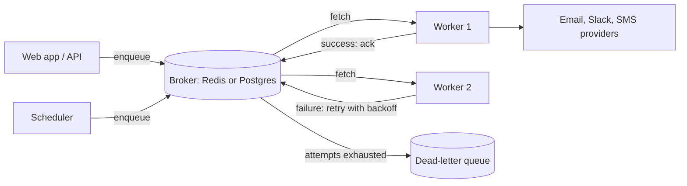
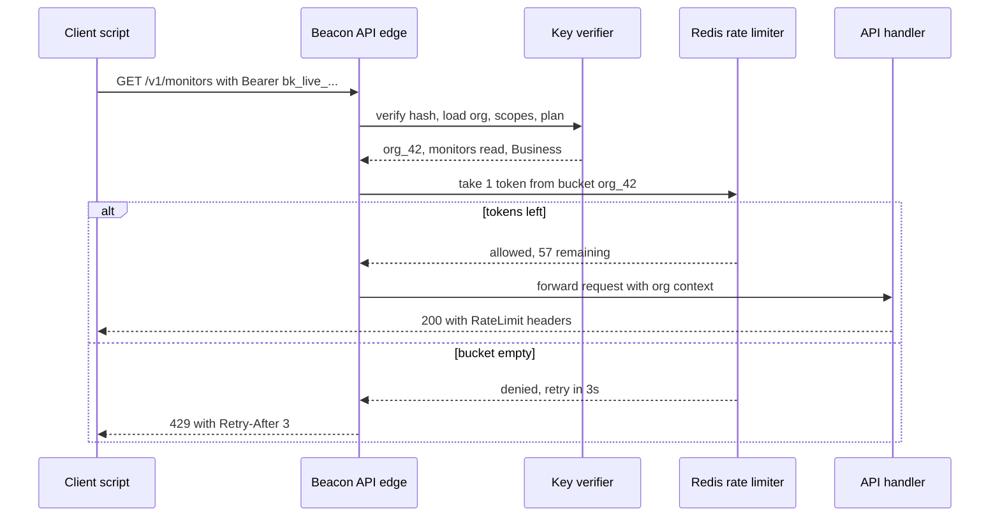
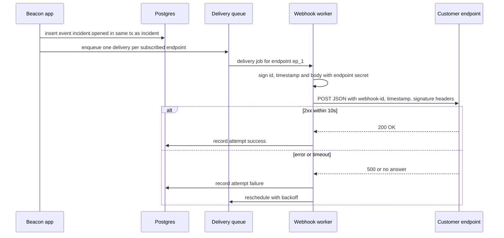
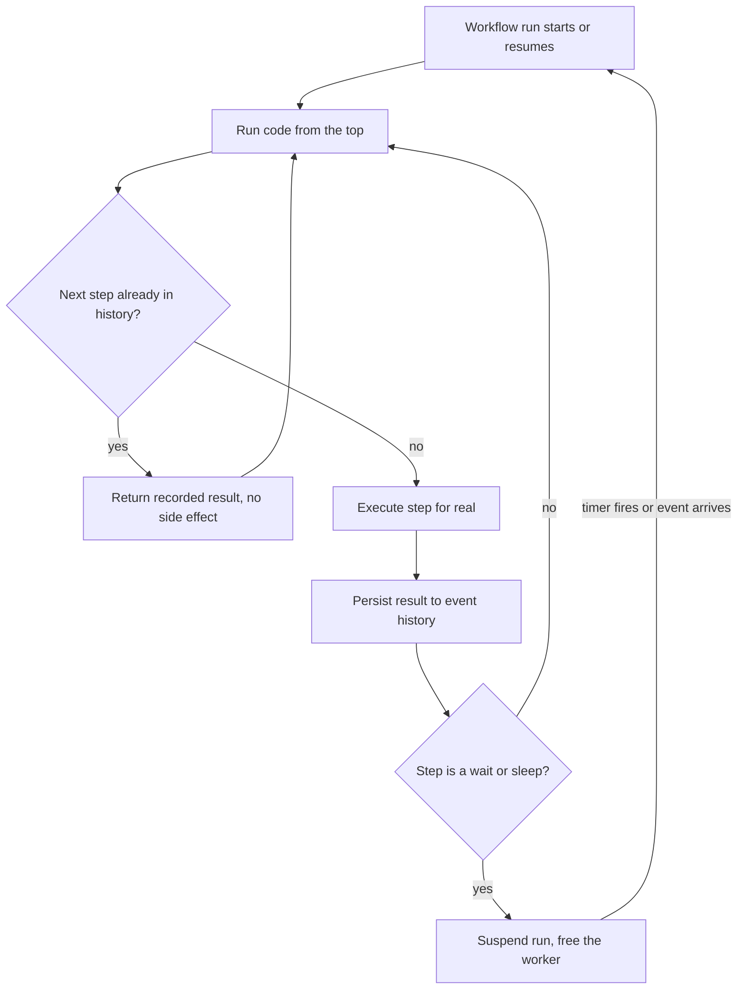

# Module 5 — Background Work & Integrations

*Most of what a SaaS does happens when nobody is looking at a browser tab. Beacon runs millions of checks a day, talks to other people's servers, and gets called by other people's code. This module covers the machinery for work that happens outside the request (queues, schedulers, workflow engines) and the surfaces other software uses to reach you (a public API) or hear from you (webhooks and integrations).*

---

# 5.1 — Background jobs, queues and scheduled tasks

*Level: 🟡 Intermediate* · *Prerequisites: 2.1, 4.1*

## 🧭 Why every SaaS has this

It is launch week. A Beacon customer's API goes down, and your code in the "monitor failed" path does everything inline: it opens an incident row, sends 40 emails to status-page subscribers, posts to Slack, sends three SMS messages, and calls the customer's webhook. Each of those is a network call to someone else's server. Slack is slow that afternoon and takes 9 seconds to answer. The customer's webhook endpoint is the very server that is down, so that call hangs until your 30-second timeout. Meanwhile the checker that detected the failure is stuck waiting, so the *next* check for 200 other monitors on that process is late. Your uptime monitor now has an uptime problem.

The second failure is quieter. Your email provider returns a 503 for four seconds. The request that was sending the subscriber emails throws, the error is logged, and those 40 people never hear about the incident. Nothing retried it, because nothing *could*: the work only existed inside a request that is now gone.

The third failure is the schedule itself. Beacon's whole product is "do something every 30 seconds to 5 minutes, forever, for every monitor". A `setInterval` in your web server does not survive a deploy, does not spread across machines, and runs twice when you scale to two instances.

**Anything slow, flaky, or scheduled belongs in a background job: a durable record of work to do, picked up by a separate worker that can retry it.**

## 📐 How it works

### 🟢 The essentials

A **background job** is a small message that says "do X with these arguments", stored somewhere durable, and executed later by a different process. The vocabulary:

- **Producer** — the code that creates the job (your web request, a scheduler, another job).
- **Broker** — where jobs wait. Usually Redis, Postgres, or a managed queue like Amazon SQS.
- **Queue** — a named line of jobs inside the broker (`checks`, `notifications`, `emails`).
- **Worker** — a long-running process that pulls jobs off a queue and runs your handler.
- **Retry with backoff** — when a handler throws, the job goes back in the queue with a delay that grows each time (1s, 2s, 4s, 8s…), so you do not hammer a service that is already struggling.
- **Dead-letter queue (DLQ)** — where a job goes after its final failed attempt, so a human can inspect and replay it instead of it vanishing.



The web request's only job becomes "write the incident row, enqueue `notify-incident`, return 200". The worker does the slow part, and if Slack is down, the job retries in a minute without anyone noticing.

In TypeScript with BullMQ (a Redis-backed queue library), that looks like this:

```ts
import { Queue, Worker } from "bullmq";
const connection = { host: "localhost", port: 6379 };

export const notifications = new Queue("notifications", { connection });

// Producer: inside the "monitor failed" handler
await notifications.add(
  "incident.opened",
  { incidentId, orgId },
  { jobId: `incident-opened:${incidentId}`, attempts: 8,
    backoff: { type: "exponential", delay: 2_000 } },
);

// Worker: a separate process (node worker.js)
new Worker("notifications", async (job) => {
  const incident = await db.incident.findUnique({ where: { id: job.data.incidentId } });
  if (!incident) return;                 // deleted meanwhile: nothing to do
  await sendSubscriberEmails(incident);  // throws on failure -> retried
}, { connection, concurrency: 20 });
```

Notice two habits already. The payload carries **IDs, not objects** — the worker re-reads fresh data, so a job that retries an hour later does not act on a stale snapshot. And the `jobId` is deterministic, so enqueuing the same incident twice does not create two jobs.

Every stack has the same shape: **Sidekiq** or **Solid Queue** (the Rails 8 default) in Ruby, **Celery** in Python/Django, **asynq** or **River** in Go, **Laravel Queues** in PHP.

### 🟡 Going deeper

**At-least-once delivery means your jobs must be idempotent.** Almost every queue promises *at-least-once* delivery: a job will run, but it might run twice. A worker can finish sending the email and then crash before it acknowledges the job; the broker sees no acknowledgement, assumes the worker died, and hands the job to someone else. "Exactly once" is not something a queue can give you across a network. What you *can* do is make running twice harmless. An **idempotent** job produces the same end state no matter how many times it runs:

- Record what you did: a `notification_deliveries` row with a unique constraint on `(incident_id, subscriber_id, channel)`. Insert first; if the insert conflicts, skip the send.
- Pass an idempotency key to the provider when it supports one (Stripe and many email/SMS APIs do).
- Prefer "set status to X" over "increment counter".

**The dual-write problem and the transactional outbox.** Look at the producer again. You write the incident to Postgres, then enqueue to Redis. If the process dies between those two lines, you have an incident nobody is notified about. If you enqueue first and the database transaction rolls back, the worker looks for an incident that does not exist. Two systems, no shared transaction.

The **transactional outbox** fixes this: in the *same* database transaction as the incident, insert a row into an `outbox` table describing the job. A separate relay process reads unsent outbox rows, enqueues them to the broker, and marks them sent. Because the relay may enqueue twice (crash after enqueue, before marking), this is also at-least-once — which you already handle, because your jobs are idempotent.

**Postgres-backed queues make the outbox unnecessary.** If the queue *is* a table in your main database, enqueuing is just an `INSERT` inside your existing transaction. Workers claim jobs with `SELECT … FOR UPDATE SKIP LOCKED`, which lets many workers grab different rows without blocking each other. This family has become the sensible default for most SaaS teams:

| | Redis-backed | Postgres-backed |
|---|---|---|
| Examples | BullMQ (Node), Sidekiq (Ruby), Celery with Redis (Python), asynq (Go) | pg-boss, Graphile Worker (Node), Solid Queue (Ruby), River (Go), Oban (Elixir) |
| Transactional enqueue | No — needs an outbox | Yes — same transaction as your data |
| Throughput ceiling | Very high; Redis is built for this | High enough for most SaaS; table bloat and vacuum need care at extremes |
| Extra infrastructure | Redis you must run and persist | None beyond the database you already have |
| Durability | Depends on Redis persistence settings | As durable as your database |
| Ecosystem | Mature dashboards, rate limiters, flows | Newer but solid; dashboards vary |

A reasonable rule: start on Postgres. Move a specific hot queue to Redis (or SQS) when you measure that it needs it.

**Scheduled tasks.** Two kinds exist. *Cron-style* tasks run on a fixed calendar ("every night at 02:00 UTC, prune old check results") — pg-boss, Graphile Worker, Solid Queue (`recurring.yml`), Celery beat, and Sidekiq plugins all do this, and they take a lock so only one instance fires. *Delayed* jobs run once at a future time ("retry this webhook in 5 minutes"). Beacon's monitor checks are a third, harder kind — see below.

**Monitoring.** A queue you cannot see is a queue that is silently failing. Watch four numbers per queue: **depth** (jobs waiting), **age of the oldest waiting job** (the one users feel), **failure rate**, and **DLQ size**. Alert on age, not depth: 10,000 waiting jobs is fine if they are all 2 seconds old. Most libraries ship a dashboard — Sidekiq's Web UI, Bull Board for BullMQ, River UI, Solid Queue's Mission Control — and all of them should sit behind your admin auth.

### 🔴 At scale / enterprise

**Scheduling millions of checks.** Suppose Beacon has 1 million monitors averaging a 1-minute interval. That is roughly 16,700 checks per second, forever. Registering a million individual cron entries in your job library will hurt. The pattern that works:

1. Store `interval_seconds` and `next_run_at` on each monitor, indexed.
2. **Shard the schedule.** Assign each monitor to one of N shards (`hash(monitor_id) % N`). Each scheduler process owns some shards and, every second, claims due monitors in its shards (`WHERE shard = ANY($1) AND next_run_at <= now() … FOR UPDATE SKIP LOCKED LIMIT 5000`), enqueues check jobs in batches, and advances `next_run_at`.
3. **Add jitter.** If every 1-minute monitor fires at `:00`, you get a thundering herd each minute and idle workers in between — and customers who monitor each other's shared hosting see synchronized spikes. Give each monitor a stable phase offset (`hash(id) % interval`) so load is flat across the minute.
4. **Separate the executor from the scheduler.** The scheduler only decides *what is due*. Checkers in several regions pull from region-specific queues and write results. You can scale the two independently.

**Per-tenant concurrency and fairness.** A single enterprise customer adding 20,000 monitors, or a bug that makes one org's webhooks fail and retry, should not starve every other tenant. Plain FIFO (first in, first out) queues are unfair by design: whoever enqueues most gets most of the workers. Options, roughly in order of effort:

- Separate queues per plan tier (Business customers' notifications never wait behind Free customers' retries).
- Per-tenant concurrency limits: "at most 10 in-flight jobs for org X". BullMQ's commercial Pro edition has groups for this; Hatchet, Inngest and Trigger.dev expose concurrency keys; in Postgres you can enforce it in the claim query.
- Round-robin across tenants when claiming, so each org gets a turn.

**Retries need jitter too.** If 5,000 jobs fail at the same moment because a provider blipped, pure exponential backoff retries all 5,000 at exactly the same moment later. Add randomness to each delay ("full jitter"), as described in the AWS Architecture Blog's well-known backoff article.

**Poison messages and timeouts.** A job that always crashes the worker (out-of-memory on a giant payload) can take a worker down repeatedly. Cap attempts, set a per-job timeout, and make sure "worker crashed" counts as an attempt.

**Managed options.** Amazon SQS gives you a broker with visibility timeouts, a redrive policy into a DLQ, and FIFO queues with message group IDs — you still run your own workers. Trigger.dev Cloud and Inngest go further: you write functions in your codebase and they handle queuing, retries, scheduling, concurrency keys and observability, calling or running your code. They blur into the workflow engines of lesson 5.4.

## 🏆 The best repos

| Repo | What it is | Stack | License | Pick it when |
|---|---|---|---|---|
| [taskforcesh/bullmq](https://github.com/taskforcesh/bullmq) | Redis-backed queue with retries, delays, repeatable jobs, flows | Node/TS, Redis | MIT | You are on Node and already run Redis, or need high throughput |
| [timgit/pg-boss](https://github.com/timgit/pg-boss) | Postgres queue with cron, retries, dead letters | Node/TS, Postgres | MIT | You want transactional enqueue with zero new infrastructure |
| [graphile/worker](https://github.com/graphile/worker) | Fast Postgres job queue using LISTEN/NOTIFY and SKIP LOCKED, with crontab | Node/TS, Postgres | MIT | Low-latency Postgres jobs, especially with a Postgres-centric stack |
| [rails/solid_queue](https://github.com/rails/solid_queue) | Database-backed Active Job backend, default in Rails 8 | Ruby | MIT | You are on Rails and want no Redis |
| [sidekiq/sidekiq](https://github.com/sidekiq/sidekiq) | The long-standing Ruby background job system | Ruby, Redis | LGPL-3.0 (Pro/Enterprise commercial) | Rails at high volume, huge ecosystem |
| [celery/celery](https://github.com/celery/celery) | Distributed task queue with beat scheduler | Python, Redis/RabbitMQ | BSD-3-Clause | Django/Python, the default choice |
| [riverqueue/river](https://github.com/riverqueue/river) | Postgres job queue with transactional inserts | Go, Postgres | MPL-2.0 | Go services that want jobs in the same transaction |
| [hibiken/asynq](https://github.com/hibiken/asynq) | Simple Redis-backed task queue with a web UI | Go, Redis | MIT | Go with Redis already in place |
| [triggerdotdev/trigger.dev](https://github.com/triggerdotdev/trigger.dev) | Background jobs platform with queues, schedules, concurrency keys | TS | Apache-2.0 | You want managed or self-hosted jobs with great observability |
| [inngest/inngest](https://github.com/inngest/inngest) | Event-driven functions with steps, concurrency, throttling | Go server, TS/Python/Go SDKs | SSPL with delayed Apache-2.0 publication (SDKs Apache-2.0) | Event-driven jobs without running a queue |

**If you only study one:** read **graphile/worker** or **timgit/pg-boss**. Both are small enough to read in an afternoon, and seeing `FOR UPDATE SKIP LOCKED`, retry scheduling and cron locking implemented in plain SQL removes all the magic from "a queue". Everything else is the same idea with more features.

**Buy, build, or self-host?**

- **Managed** when you do not want to run workers or watch queue depth at 3 a.m.: Trigger.dev Cloud, Inngest, Amazon SQS (broker only), Google Cloud Tasks, Upstash QStash.
- **Self-host an OSS library** for almost everyone else: it runs inside your existing app and database. Postgres-backed (pg-boss, Solid Queue, River) first; Redis-backed (BullMQ, Sidekiq) when you need the throughput.
- **Build it yourself** only for the domain-specific *scheduler* (Beacon's sharded check scheduler). Never write your own retry/ack/visibility-timeout logic from scratch.

## 🔍 Study it in the wild

**openstatusHQ/openstatus** — an open-source status page and uptime monitor, so literally a Beacon. The interesting part is how check scheduling is split from check execution, with checkers running in several regions. Use code search for `checker`, `cron` and `region`, and look at how a check run is triggered, where results are written, and how a failure becomes an incident notification.

**twentyhq/twenty** — a CRM with a real multi-queue BullMQ setup behind a small abstraction. Search for `MessageQueue` and `@Processor` to find the queue names, job classes and the driver layer. Notice how jobs are registered per queue and how cron jobs are declared alongside them.

**chatwoot/chatwoot** — a Rails app running Sidekiq in production. Open the `app/jobs` folder (at the time of writing) and the Sidekiq config to see queue priorities, and search for `perform_later` to see where the web tier hands work off.

**discourse/discourse** — a decade of Ruby job hygiene. Search for `Jobs::Scheduled` to find its recurring tasks and `Jobs.enqueue` for regular ones; the scheduled job classes show how a big app declares "every 5 minutes" work.

**What to notice**

- Jobs carry IDs and re-fetch data; payloads stay small.
- Queues are separated by urgency (critical notifications vs. slow maintenance), not by code module.
- Recurring work is declared in one place, not scattered `setInterval`s.
- Handlers guard against "the record is gone now" and against running twice.
- Which apps enqueue inside a database transaction and which do not — and whether they seem to care.

## 🛠️ Build it into Beacon

### 🟢 Beginner exercise

Move incident notifications out of the request. When a monitor fails, the checker writes the incident and enqueues a `notify-incident` job; a separate worker process sends the emails. Configure 8 attempts with exponential backoff and a dead-letter destination.

**Done when:**
- The request/checker path returns without making any email, Slack or SMS call.
- Killing the email provider (point it at a bad host) causes retries visible in the queue dashboard, and the job succeeds once you restore it.
- A job that fails every attempt ends up in the DLQ with its error, not lost.

### 🟡 Intermediate exercise

Make notifications exactly-once *in effect*. Add a `notification_deliveries` table with a unique key per `(incident, recipient, channel)`, and move enqueuing into the same transaction as the incident (Postgres queue) or through an outbox table (Redis queue).

**Done when:**
- Running the same job twice by hand sends each subscriber exactly one email.
- Crashing the process between "incident committed" and "job enqueued" still results in notifications (the relay or transactional enqueue catches it).
- A test proves the handler is a no-op for an incident that no longer exists.

### 🔴 Advanced exercise

Build the sharded check scheduler. Store `next_run_at` and a stable phase offset per monitor, run two scheduler processes that each own half the shards, and claim due monitors with `SKIP LOCKED` in batches. Add a per-org concurrency cap so one org cannot use more than 5% of check workers.

```sql
-- claim a batch of due monitors in my shards
UPDATE monitors m SET next_run_at = m.next_run_at + m.interval_seconds * interval '1 second'
WHERE m.id IN (
  SELECT id FROM monitors
  WHERE shard = ANY($1) AND next_run_at <= now() AND paused = false
  ORDER BY next_run_at
  FOR UPDATE SKIP LOCKED
  LIMIT 5000
)
RETURNING m.id, m.org_id, m.region;
```

**Done when:**
- With 100,000 seeded monitors, the per-second check rate is flat (no spike at `:00`).
- Killing one scheduler causes the other to take over its shards within a minute, with no monitor checked twice in the same interval.
- An org with 20,000 monitors cannot delay another org's checks by more than one interval.

## ⚠️ Mistakes juniors make

- **Doing "just one quick API call" inside the request.** Every external call is a latency and failure you have borrowed from someone else. If the user does not need the result to render the next page, enqueue it.
- **Putting whole objects in the payload.** A serialized `incident` from an hour ago will be wrong when the job retries. Pass IDs and re-read.
- **Assuming a job runs exactly once.** It will run twice one day, usually during an incident. Design for it with unique constraints and idempotency keys.
- **Retrying forever, or never.** Infinite retries turn a bad payload into permanent load; zero retries turn a 2-second blip into lost work. Cap attempts, back off with jitter, dead-letter the rest.
- **Running cron in every web instance.** Two instances means two nightly billing runs. Use your queue's scheduler, which takes a lock.
- **Alerting on nothing.** The first sign of a broken worker should be a page about "oldest job is 10 minutes old", not a customer asking why they were never notified.

## 🧾 Recap

- A job is a durable note of work, done by a separate worker that can retry.
- Queues deliver at least once, so every job must be safe to run twice.
- Enqueue and data writes must agree: use a Postgres-backed queue or a transactional outbox.
- Start with Postgres-backed queues; add Redis or SQS for measured hot spots.
- At Beacon scale, schedule with shards and jitter, and cap each tenant's share of workers.
- Monitor the age of the oldest job and the size of the dead-letter queue.

## 📚 References

- BullMQ documentation — https://docs.bullmq.io
- Transactional outbox pattern (microservices.io) — https://microservices.io/patterns/data/transactional-outbox.html
- PostgreSQL `SELECT … FOR UPDATE SKIP LOCKED` — https://www.postgresql.org/docs/current/sql-select.html
- Marc Brooker, "Exponential Backoff And Jitter", AWS Architecture Blog — https://aws.amazon.com/blogs/architecture/exponential-backoff-and-jitter/
- Amazon SQS documentation (visibility timeout, dead-letter queues) — https://docs.aws.amazon.com/sqs/
- River documentation — https://riverqueue.com/docs
- Sidekiq wiki — https://github.com/sidekiq/sidekiq/wiki
- Trigger.dev documentation — https://trigger.dev/docs

---

# 5.2 — The public API: API keys, versioning and rate limits

*Level: 🟡 Intermediate* · *Prerequisites: 1.2, 1.3*

## 🧭 Why every SaaS has this

Six months after launch, Beacon's first Business customer emails: "We have 400 services. We are not clicking 'Add monitor' 400 times. Where is the API?" A week later a second customer asks for a Terraform provider, and a third wants to pull uptime numbers into their own dashboard. For B2B software, an API is not a nice-to-have; it is how you get onto the platform team's checklist.

So a junior on the team exposes the internal Next.js routes the dashboard already uses, and lets customers authenticate by pasting their session cookie. Within a month: a dashboard refactor renames a field and breaks three customers' scripts; one customer's buggy cron job sends 50 requests per second and slows the dashboard for everyone; and a developer commits their cookie to a public GitHub repo, which gives anyone full access to their Beacon account, including billing, with no way to revoke just that credential.

A public API is a *product* with its own contract. Stripe is the reference example: the company has written publicly about how its date-based versions let it change the API for years without breaking integrations written long ago, and about idempotency keys that let a client safely retry a payment request.

**A public API is a promise: a stable, documented contract, reached with revocable scoped credentials, protected by rate limits, and changed only through versioning.**

## 📐 How it works

### 🟢 The essentials

**Pick the style.** For a *public* API that strangers call from any language, the answer is almost always REST over HTTPS with JSON.

| Style | What it is | Good for | Public API fit |
|---|---|---|---|
| REST + JSON | Resources at URLs, HTTP verbs, status codes | Anything, any language, curl-able | Best default |
| GraphQL | One endpoint, clients ask for exactly the fields they want | Rich, nested data with many client shapes (GitHub, Shopify offer it) | Good, but harder to rate limit and cache; offer it *in addition to* REST |
| tRPC | Type-safe function calls between your own TS frontend and backend | Your own app's internal API | Poor: TypeScript-only, no stable wire contract |
| gRPC | Binary protobuf RPC over HTTP/2 | Service-to-service | Rare for SaaS public APIs |

Use tRPC (or server actions) for your dashboard if you like. Build the public API as a separate, deliberately designed surface. Twenty, for example, exposes both REST and GraphQL to customers.

**Design around resources.** Nouns, plural, nested only one level: `GET /v1/monitors`, `POST /v1/monitors`, `GET /v1/monitors/{id}`, `PATCH /v1/monitors/{id}`, `GET /v1/incidents?status=open`. Use prefixed, opaque IDs (`mon_2x8…`, `inc_9f…`) so a human can tell what an ID refers to and you never leak sequential integers.

**API keys.** An **API key** is a long random secret that identifies a caller and grants permissions. Do it the way Stripe and Unkey do:

- **Prefixed**: `bk_live_…` / `bk_test_…`. People can tell what it is, and secret scanners (GitHub's secret scanning partner program works this way) can detect leaked keys by pattern.
- **Hashed at rest**: store only a SHA-256 hash, the prefix and the last four characters for display. A fast hash is fine here — unlike passwords, a 32-byte random key cannot be brute-forced — and a database leak then leaks nothing usable.
- **Shown once**: display the full key exactly once at creation. If lost, create a new one.
- **Scoped**: `monitors:read`, `monitors:write`, `incidents:write`. A read-only key for a dashboard script cannot delete monitors.
- **Owned by the organization**, not a user, with "created by" recorded, so keys survive employees leaving.
- **Rotatable and revocable**, with a `last_used_at` column so customers can see which keys are dead.

```ts
import { randomBytes, createHash } from "node:crypto";

export function createApiKey(env: "live" | "test") {
  const secret = randomBytes(32).toString("base64url");
  const key = `bk_${env}_${secret}`;
  return {
    key,                                   // show once, never store
    hash: createHash("sha256").update(key).digest("hex"),
    start: key.slice(0, 12),               // for display: bk_live_Ab3x…
    last4: key.slice(-4),
  };
}

export async function verifyApiKey(presented: string) {
  const hash = createHash("sha256").update(presented).digest("hex");
  const row = await db.apiKey.findUnique({ where: { hash } });
  if (!row || row.revokedAt || (row.expiresAt && row.expiresAt < new Date())) return null;
  return { orgId: row.orgId, scopes: row.scopes };  // update last_used_at async
}
```

**Errors.** Pick one error format and use it everywhere. RFC 9457, "Problem Details for HTTP APIs", standardizes a JSON body with `type`, `title`, `status`, `detail` and `instance`, served as `application/problem+json`, and you can add fields (like `errors` for validation). Use status codes honestly: 400 invalid input, 401 no/bad key, 403 key lacks scope, 404 not found (also for "exists but belongs to another org"), 409 conflict, 422 validation, 429 rate limited.

**Pagination.** Never return an unbounded list. **Cursor pagination** returns a page plus an opaque pointer to the next one (`?limit=50&starting_after=mon_123`, the Stripe style, responding with `has_more`). Unlike `?page=7` offsets it stays correct while rows are inserted, and it stays fast on large tables because it is an indexed `WHERE id > $cursor` rather than `OFFSET 350000`.

### 🟡 Going deeper

**OpenAPI first.** The **OpenAPI Specification** is a standard YAML/JSON description of every endpoint, parameter, schema and error. Treat it as the source of truth, and generate from it: request validation, reference docs, client SDKs, mock servers and contract tests. Either write the spec by hand, or generate it from typed code that *is* the spec — in TypeScript, Zod schemas via Hono's OpenAPI middleware or similar; in Python, FastAPI emits it automatically and Django REST Framework has drf-spectacular; in Go, libraries like Huma; in Rails, rswag. The failure mode to avoid is a spec written once and never updated.

**Docs and SDKs.** Render the spec into interactive docs with Scalar (or Redoc, Swagger UI). Give people a way to try requests — Scalar has a built-in client, and Hoppscotch is an open-source API client in the Postman mould. Generate SDKs with openapi-generator, or commercial generators such as Stainless, Speakeasy or Fern, which produce idiomatic, versioned libraries per language. A good SDK handles auth, retries, pagination and idempotency keys for your customer.

**Idempotency keys.** Clients retry on timeouts. If `POST /v1/monitors` timed out *after* you created the monitor, the retry creates a duplicate. The fix, from Stripe: the client sends `Idempotency-Key: <uuid>`; you store the key with the response for 24 hours; a repeat with the same key and same body returns the stored response instead of running again (and a repeat with a *different* body is a 422). The IETF has an `Idempotency-Key` header draft that describes the same idea.

**Versioning.** You will need to make breaking changes. Options:

| Approach | Example | Trade-off |
|---|---|---|
| URL major version | `/v1/…`, `/v2/…` | Simple, visible; big-bang migrations, v1 lives forever |
| Header / date-based | `Beacon-Version: 2026-03-01` | Small, frequent changes; each account pinned to its version; needs transformation layer |
| No versioning, additive only | Only ever add fields | Works longer than you'd think; eventually breaks |

Stripe's approach is the gold standard: each account is pinned to the API version current when it first called the API, a request header can override it, and internally the code only knows the latest shape. A chain of small "version change" modules transforms each response backwards, step by step, to the caller's version. In recent years Stripe has also added named major releases to its version strings. For Beacon: put `/v1` in the URL from day one (cheap insurance), make only additive changes within it, and consider date-based versions once you have enough integrators that "v2" would hurt.

**OAuth apps for third parties.** API keys are for a customer's *own* scripts. When a third party (say, a PagerDuty-style tool) wants to act on behalf of *many* Beacon customers, it should not collect their keys. Instead, Beacon becomes an OAuth 2.0 provider: the tool redirects the user to Beacon, the user approves specific scopes, and the tool receives an access token (and refresh token) for that org only, revocable from Beacon's settings. Use the authorization code flow with PKCE (RFC 6749 plus the OAuth security best practice, RFC 9700). Do not write the provider yourself; Ory Hydra, Keycloak, Zitadel and several auth libraries can act as the authorization server.

### 🔴 At scale / enterprise

**Rate limiting.** A **rate limiter** caps how many requests a caller may make in a period, protecting shared infrastructure and making plan limits real. The common algorithms:

- **Fixed window**: count per calendar minute. Simple, but allows a 2x burst across a window boundary.
- **Sliding window**: weights the previous window's count to smooth the boundary. A good default.
- **Token bucket**: a bucket holds up to N tokens, refilled at R per second; each request takes one. Allows short bursts up to N while enforcing an average rate R. Great for APIs.
- **GCRA** (generic cell rate algorithm): a compact token-bucket equivalent storing one timestamp per key.



Tell clients where they stand. Always send `Retry-After` on a 429 (the status comes from RFC 6585). Send remaining-quota headers on every response: many APIs use `X-RateLimit-Limit`, `X-RateLimit-Remaining` and `X-RateLimit-Reset`, and an IETF draft is standardizing `RateLimit` and `RateLimit-Policy` fields. Whatever you choose, document it and let SDKs back off automatically.

Rate limit in layers: per IP before auth (stops credential stuffing and junk), per key or org after auth (the plan limit), and per expensive endpoint (a "run check now" endpoint costs far more than a `GET`). Limits live in Redis or at the edge; `upstash/ratelimit-js` gives you sliding window, fixed window and token bucket over Redis in a few lines, and Arcjet bundles rate limiting with bot detection as an SDK.

**Gateways.** An **API gateway** sits in front of your services and handles keys, rate limits, logging and routing centrally. Kong, Tyk and Apache APISIX are the big open-source ones. You rarely need one for a single-app SaaS; they earn their keep when many services share one public surface, or when a platform team wants policy in one place. Unkey is a middle path: a service (open source, also hosted) specifically for creating and verifying API keys with per-key rate limits, expiry and usage counts.

**Analytics and abuse.** Log every API request with org, key ID, endpoint, status and latency. It powers the customer-facing "API usage" page, your deprecation decisions ("who still calls this field?"), and abuse detection. Deprecate with `Deprecation` and `Sunset` headers, emails to the orgs that still use the old path, and a date.

## 🏆 The best repos

| Repo | What it is | Stack | License | Pick it when |
|---|---|---|---|---|
| [unkeyed/unkey](https://github.com/unkeyed/unkey) | API key management and rate limiting as a service | TS, Go | AGPL-3.0 (parts differ; read LICENSE) | You want key issuance, verification, per-key limits and analytics without building them |
| [upstash/ratelimit-js](https://github.com/upstash/ratelimit-js) | Rate limiting library over Redis (sliding/fixed window, token bucket) | TS | MIT | Serverless or Node app needing app-level rate limits quickly |
| [arcjet/arcjet-js](https://github.com/arcjet/arcjet-js) | Security SDK: rate limiting, bot detection, shields | TS | Apache-2.0 | You want rate limits plus abuse protection in-app |
| [Kong/kong](https://github.com/Kong/kong) | API gateway with plugins for auth, rate limits, logging | Lua/Nginx | Apache-2.0 | Many services behind one API surface |
| [TykTechnologies/tyk](https://github.com/TykTechnologies/tyk) | API gateway with keys, quotas, analytics | Go | MPL-2.0 (`ee` folder commercial) | Go-based gateway with built-in key and quota management |
| [apache/apisix](https://github.com/apache/apisix) | Cloud-native API gateway | Lua/Nginx | Apache-2.0 | Dynamic routing and plugins at high traffic |
| [OAI/OpenAPI-Specification](https://github.com/OAI/OpenAPI-Specification) | The OpenAPI Specification itself | Spec | Apache-2.0 | Understanding what your spec can express |
| [scalar/scalar](https://github.com/scalar/scalar) | API reference docs and client from an OpenAPI file | TS | MIT | Beautiful, interactive API docs with little effort |
| [hoppscotch/hoppscotch](https://github.com/hoppscotch/hoppscotch) | Open-source API development client | TS | MIT | Testing and sharing API requests without Postman |
| [trpc/trpc](https://github.com/trpc/trpc) | End-to-end typesafe APIs for TS apps | TS | MIT | Your *internal* dashboard API, not the public one |

**If you only study one:** **unkeyed/unkey**. It is a SaaS whose entire product is this lesson: key creation with prefixes, hashing, verification on the hot path, per-key rate limits, expiry, and usage analytics. Reading how it verifies a key fast (and what it caches) teaches more than any blog post.

**Buy, build, or self-host?**

- **Managed** for keys and limits when the API is not your core: Unkey Cloud, Upstash for Redis-backed limits, Arcjet; for docs and SDKs, Scalar's hosted docs, Stainless, Speakeasy or Fern.
- **Self-host** Unkey if you want its features on your own infrastructure, or Kong/Tyk/APISIX once you have multiple services and a platform team.
- **Build** the API itself, the resource design, errors and versioning — that *is* your product's contract. Key storage and verification is also small enough to build well in a day, if you follow the rules above.

## 🔍 Study it in the wild

**unkeyed/unkey** — beyond being a library, it is a production SaaS with its own public API. Search for `hash` and `verify` to find the key verification path, and `ratelimit` to see how limits are enforced per key and per identifier. Notice how the key is split into a visible prefix and the secret.

**dubinc/dub** — a link-management SaaS with a public REST API, API keys scoped to workspaces, rate limits and an OpenAPI document. Search for `openapi` to see how the spec is produced from Zod schemas, and `ratelimit` and `apiKey`/`token` to see how keys are hashed and checked per workspace.

**calcom/cal.com** — a large public API with keys per user/team. At the time of writing the API apps live under `apps/api`. Search for `apiKey` and `hashAPIKey`-style helpers, and look at how API versions are handled side by side as the API evolved.

**openstatusHQ/openstatus** — a Beacon-shaped product with a public API for monitors and status pages. Search for `openapi` and `apiKey` to see how a small team exposes a typed, documented API for the same objects Beacon has.

**What to notice**

- Keys are stored hashed with a readable prefix, and the full key is never retrievable.
- Every request resolves to a workspace/org before anything else runs.
- Validation schemas double as the OpenAPI source, so docs cannot drift.
- Errors have one consistent shape across every endpoint.
- Rate limits are keyed by the workspace or key, not just by IP.

## 🛠️ Build it into Beacon

### 🟢 Beginner exercise

Ship `GET /v1/monitors` and `POST /v1/monitors` authenticated with org-owned API keys. Keys are prefixed `bk_live_`, stored as SHA-256 hashes, shown once in a settings page, and revocable.

**Done when:**
- The `api_keys` table contains no plaintext keys.
- A revoked key gets a 401 within one request.
- Keys from org A can never read org B's monitors (you have a test for it).
- The list endpoint is cursor-paginated with a maximum `limit`.

### 🟡 Intermediate exercise

Go OpenAPI-first. Define the monitor schemas once, generate the OpenAPI document from them, serve Scalar docs at `/docs/api`, return RFC 9457 problem details for every error, and support `Idempotency-Key` on `POST`.

**Done when:**
- A CI step fails if the generated spec changes without being committed.
- Every 4xx/5xx has `application/problem+json` with `type`, `title` and `status`.
- Sending the same `POST` twice with the same key creates one monitor and returns the same body twice.

### 🔴 Advanced exercise

Add plan-aware rate limiting and date-based versioning. Rate limit with a token bucket per org sized by plan, with separate limits for `POST /v1/monitors/{id}/check`. Add a `Beacon-Version` header; pin each org to the version current at its first call; write one version-change transformer (e.g. renaming `url` to `target`) that downgrades responses for older pins.

**Done when:**
- Exceeding the limit returns 429 with `Retry-After` and remaining-quota headers on every response.
- A Business org gets a higher limit than a Pro org without code changes, only plan config.
- An org pinned to the old version still sees `url`; a new org sees `target`; the handler only knows `target`.

## ⚠️ Mistakes juniors make

- **Exposing your internal dashboard endpoints as "the API".** Every frontend refactor becomes a breaking change for customers. Keep the public surface separate and deliberate.
- **Storing API keys in plaintext "so we can show them again".** A database read becomes full account takeover for every customer. Hash, show once, rotate.
- **Keys tied to a user instead of the org.** When that employee leaves and their account is removed, the customer's production integration dies. Org-owned keys with "created by" metadata.
- **Offset pagination on big tables.** `OFFSET 100000` gets slower every page and skips or duplicates rows while data changes. Use cursors.
- **Rate limiting only by IP.** Customers behind a single NAT share a bucket, and an attacker with many IPs ignores it. Limit by key/org after authentication, by IP before.
- **Breaking changes without a version.** Renaming a field "because it's cleaner" breaks scripts you will never see. Add fields freely; rename or remove only behind a version.
- **Returning 500 with a stack trace for bad input.** It leaks internals and tells the client nothing. Validate at the edge and return a 4xx problem detail.

## 🧾 Recap

- The public API is a separate, versioned product surface, usually REST + JSON described by OpenAPI.
- API keys: prefixed, random, hashed at rest, shown once, scoped, org-owned, revocable.
- Cursor pagination, one error format (RFC 9457), and idempotency keys for writes.
- Version from day one; Stripe's pinned date-based versions are the model once you have many integrators.
- Rate limit in layers with a token bucket or sliding window, and tell clients their quota in headers.
- Use OAuth apps, not collected API keys, when third parties act on behalf of your customers.

## 📚 References

- RFC 9457, Problem Details for HTTP APIs — https://www.rfc-editor.org/rfc/rfc9457
- OpenAPI Specification — https://spec.openapis.org/oas/latest.html
- Stripe blog, "APIs as infrastructure: future-proofing Stripe with versioning" — https://stripe.com/blog/api-versioning
- Stripe blog, "Designing robust and predictable APIs with idempotency" — https://stripe.com/blog/idempotency
- IETF draft, RateLimit header fields for HTTP — https://datatracker.ietf.org/doc/draft-ietf-httpapi-ratelimit-headers/
- OWASP API Security Top 10 — https://owasp.org/API-Security/
- RFC 6749, The OAuth 2.0 Authorization Framework — https://www.rfc-editor.org/rfc/rfc6749
- Unkey documentation — https://www.unkey.com/docs

---

# 5.3 — Outbound webhooks and third-party integrations

*Level: 🟡 Intermediate* · *Prerequisites: 5.1, 5.2*

## 🧭 Why every SaaS has this

Beacon's API lets customers *ask* "are there open incidents?". Customers do not want to ask every ten seconds; they want to be *told*. One wants every `incident.opened` event POSTed to their internal on-call tool. Another wants Beacon incidents to appear in their `#ops` Slack channel with an "Acknowledge" button. A third wants "when Beacon opens an incident, create a Jira ticket", and would rather click that together in Zapier or n8n than write code.

The first version is easy: loop over the org's webhook URLs, `fetch` each one, move on. Then reality. A customer's endpoint is down for six hours, and every event for those six hours is lost. Another endpoint takes 45 seconds to answer, and your notification worker stalls. Someone registers `http://169.254.169.254/latest/meta-data/` as their "webhook URL" and reads the response body in your delivery log. That last one is not hypothetical as a class: the 2019 Capital One breach involved a server-side request forgery (SSRF) that reached the AWS instance metadata service and obtained credentials, which is part of why AWS introduced IMDSv2.

Stripe is the model on the receiving side of this: it signs every webhook, retries failed deliveries with exponential backoff for up to three days in live mode, and shows you each attempt in the dashboard. Your customers will expect the same from you.

**Outbound webhooks are a delivery system, not a `fetch` call: signed, queued, retried, logged, replayable, and fenced off from your own network.**

## 📐 How it works

### 🟢 The essentials

A **webhook** is an HTTP POST your system sends to a URL the customer registered, when an event happens. The customer's server is the receiver. The pieces:

- **Event types** — a public catalogue: `incident.opened`, `incident.updated`, `incident.resolved`, `monitor.paused`. Customers subscribe per endpoint.
- **Endpoints** — per-org rows: URL, subscribed event types, a signing secret, enabled flag.
- **Events** — an immutable record of "this happened", with a stable `id` and a JSON payload.
- **Messages / attempts** — one delivery per (event, endpoint), and each attempt's status code, latency and response snippet.



**Sign every payload.** The receiver needs to know the POST really came from Beacon and was not replayed. Don't invent a scheme — use the **Standard Webhooks** specification, written by Svix with contributors from several API companies. Each request carries three headers: `webhook-id` (unique message ID, for deduplication), `webhook-timestamp` (Unix seconds, to reject old replays), and `webhook-signature`, which is `v1,` plus a base64 HMAC-SHA256 of `id.timestamp.body` using the endpoint's secret. Secrets look like `whsec_` followed by base64. The spec's repo ships verification libraries in many languages, so your customers get a one-line verifier.

```ts
import { createHmac } from "node:crypto";

export function signStandardWebhook(secret: string, id: string, body: string) {
  const key = Buffer.from(secret.replace(/^whsec_/, ""), "base64");
  const timestamp = Math.floor(Date.now() / 1000).toString();
  const sig = createHmac("sha256", key)
    .update(`${id}.${timestamp}.${body}`)
    .digest("base64");
  return {
    "webhook-id": id,
    "webhook-timestamp": timestamp,
    "webhook-signature": `v1,${sig}`,
    "content-type": "application/json",
  };
}
```

**Deliver from a queue, never inline.** Each delivery is a background job (lesson 5.1) with a short timeout (5–15 seconds), so one slow customer cannot block anyone else. Anything other than a 2xx is a failure.

**Tell receivers the rules.** Document: respond 2xx fast and process asynchronously; deliveries are at-least-once, so deduplicate on `webhook-id`; order is not guaranteed, so use the timestamp or fetch the latest state from the API.

### 🟡 Going deeper

**Retries and disabling.** Retry with exponential backoff and jitter over a long horizon — a customer's endpoint being down during their deploy should not lose events. A schedule like "immediately, 5s, 1m, 10m, 1h, 3h, 6h, 12h, 24h" spans about two days. After a long run of consecutive failures (say, every delivery failing for several days), **disable the endpoint** and email the org's admins; otherwise you retry into the void forever. Re-enabling should be one click.

**Replay and the customer-facing log.** Customers will ask "did you send it?" constantly. Give them a webhook page per endpoint that shows every message with its attempts, status codes, response bodies (truncated), and latency — plus buttons to **resend one message** and **replay all failed messages since a time**. This page turns support tickets into self-service. Retain it for a bounded time (e.g. 30 days) and make that retention a plan feature.

**Secret rotation.** Let customers rotate the signing secret with an overlap window: during rotation, sign with both old and new secrets (Standard Webhooks allows multiple space-separated signatures in the header), so their verifier can switch without dropping events.

**SSRF protection — the part you must not skip.** **Server-side request forgery (SSRF)** is when an attacker gets *your* server to make a request to somewhere only your server can reach: the cloud metadata endpoint, `localhost` admin ports, your internal Redis, your VPC's private services. Webhook URLs are attacker-controlled input by definition. And Beacon has this problem twice: **every HTTP monitor is also a customer-supplied URL** that your checkers fetch every 30 seconds.

| Attack | Example | Defence |
|---|---|---|
| Private IP literal | `http://10.0.0.5:6379/` | Block private, loopback, link-local and CGNAT ranges (IPv4 and IPv6) |
| Metadata service | `http://169.254.169.254/` | Block link-local; also require IMDSv2 or equivalent on your hosts |
| DNS pointing inward | `hooks.evil.example` resolves to `127.0.0.1` | Resolve first, check every resolved IP, then connect to that IP |
| DNS rebinding | Resolves public at check time, private at connect time | Pin the checked IP for the connection; don't resolve twice |
| Redirect | Public URL returns `302` to an internal address | Don't follow redirects for webhooks; for monitors, re-check each hop |
| Odd encodings | `http://0x7f000001/`, `http://[::ffff:127.0.0.1]/` | Parse with a real URL parser and check the resolved address, not the string |

The robust design is to send all customer-bound traffic through an **egress proxy** that enforces these rules in one place, running in a network segment that cannot reach your internals anyway. Stripe open-sourced exactly such a proxy, **Smokescreen** (`stripe/smokescreen`). Svix and similar services run the same kind of protection. The OWASP SSRF Prevention Cheat Sheet is the checklist.

Two more rules: never show the full response body of a failed delivery unless you are sure it came from a public address, and restrict ports (80/443 only, or an allow-list) for webhooks.

### 🔴 At scale / enterprise

**Noisy endpoints and fairness.** One customer's endpoint timing out on 50,000 events should not delay everyone else's deliveries. Queue per endpoint or enforce per-endpoint concurrency, apply a circuit breaker (after N consecutive failures, stop attempting for a while and just schedule), and keep timeouts short.

**Ordering.** Webhooks are unordered by default. If a customer truly needs order per incident, deliver serially per `(endpoint, incident)` key — at the cost of head-of-line blocking. Most teams instead document "unordered" and include `occurred_at` and the full current object.

**Thin vs fat payloads.** A *fat* payload contains the full object; a *thin* one contains only the ID and type, and the receiver calls your API for current data. Thin payloads avoid stale data and leak less if an endpoint is misconfigured; fat payloads save the receiver a request. Stripe sends full objects; some APIs moved toward thin events for newer event types. Pick one and be consistent.

**Integrations: OAuth into third parties.** Webhooks let customers build their own integrations. **Integrations** are the ones *you* build: Beacon's Slack app, a PagerDuty integration, a Jira integration. The Slack app is typical:

1. An org admin clicks "Add to Slack". Beacon redirects to Slack's OAuth v2 authorize URL with scopes like `chat:write` and a `state` value tied to the org (CSRF protection).
2. Slack redirects back with a code; Beacon exchanges it via `oauth.v2.access` for a bot token (`xoxb-…`) for that workspace.
3. Beacon stores the token **encrypted** in an `integrations` table keyed by org, with the Slack team ID and granted scopes.
4. Incidents are posted with `chat.postMessage`. The "Acknowledge" button sends an interaction payload to Beacon, which verifies Slack's request signature (`X-Slack-Signature`, HMAC with the app's signing secret) before acting.

**Token storage and refresh.** Many providers issue short-lived access tokens plus a refresh token (Google, Microsoft, HubSpot; Slack only if you opt in to token rotation). You need: envelope encryption for tokens at rest; a refresh job that renews tokens before expiry and handles *concurrent* refreshes (two workers refreshing at once can invalidate each other's refresh token with providers that rotate them — take a lock per connection); and a clear "reconnect" state when the user revokes access, with an email telling them. This is a lot of per-provider detail, which is why **Nango** exists: an open-source service that handles OAuth flows, token storage and refresh, and data syncs for hundreds of APIs.

**Marketplaces, unified APIs and automation platforms.** As integrations multiply, successful products turn them into a plugin system. Cal.com's app store is the canonical open-source example: each integration is a self-contained package with metadata, setup UI and handlers, installed per user or team. **Unified APIs** (Merge, Apideck, or Nango's unified models) normalize one category — "all CRMs", "all ticketing tools" — behind one schema. And for the long tail, don't build: publish a Zapier/Make app, and n8n and Activepieces nodes, on top of your webhooks and public API.

## 🏆 The best repos

| Repo | What it is | Stack | License | Pick it when |
|---|---|---|---|---|
| [svix/svix-webhooks](https://github.com/svix/svix-webhooks) | Webhooks-as-a-service server: delivery, retries, signing, portal | Rust, Postgres, Redis | MIT | You want a complete, battle-tested sending system to self-host |
| [standard-webhooks/standard-webhooks](https://github.com/standard-webhooks/standard-webhooks) | The Standard Webhooks spec plus signing/verification libraries | Spec, many languages | Apache-2.0 | Always — use its signature format and libraries |
| [frain-dev/convoy](https://github.com/frain-dev/convoy) | Webhooks gateway for sending and receiving, with retries and rate limits | Go | Elastic License 2.0 (earlier versions MPL-2.0) | You want a Go gateway handling both directions |
| [hook0/hook0](https://github.com/hook0/hook0) | Open-source webhooks-as-a-service | Rust | SSPL | You want an alternative self-hosted webhook server |
| [NangoHQ/nango](https://github.com/NangoHQ/nango) | OAuth, token refresh and data sync for third-party APIs | TS | Elastic License 2.0 | You are building more than two or three OAuth integrations |
| [n8n-io/n8n](https://github.com/n8n-io/n8n) | Workflow automation with hundreds of integration nodes | TS | Sustainable Use License | Offering Beacon as an n8n node; studying integration node design |
| [activepieces/activepieces](https://github.com/activepieces/activepieces) | Open-source automation platform, Zapier-like | TS | MIT (community edition; `ee` folders commercial) | An MIT-licensed automation platform to integrate with or embed |
| [stripe/smokescreen](https://github.com/stripe/smokescreen) | Egress proxy that blocks SSRF to internal addresses | Go | MIT | Every customer-URL fetch: webhooks *and* uptime checks |

**If you only study one:** **svix/svix-webhooks**. It is the reference implementation of this lesson by the people who wrote the Standard Webhooks spec: event types, per-endpoint secrets, retry schedules, endpoint disabling, message attempt logs, and SSRF-conscious delivery. Read the data model first; it is the schema you would otherwise design by trial and error.

**Buy, build, or self-host?**

- **Managed** when webhooks are table stakes but not your differentiator: Svix, Hookdeck (receiving side), and for integrations Nango Cloud, Merge or Apideck. Svix also gives you an embeddable customer-facing portal, which is weeks of UI.
- **Self-host** Svix, Convoy or Hook0 when data must stay in your infrastructure or volume makes per-message pricing painful; Nango self-hosted for OAuth integrations.
- **Build** a small version yourself if you have a handful of event types and one queue already: an `events` table, a `webhook_endpoints` table, a delivery job, Standard Webhooks signing, and an egress proxy. The customer-facing log is the part people underestimate.

## 🔍 Study it in the wild

**calcom/cal.com** — webhooks and an app store in one codebase. Search the Prisma schema for `Webhook` and the trigger events enum to see per-user/team subscriptions to event types, then search `sendPayload` or `webhook` in the features packages for the sender. For integrations, at the time of writing `packages/app-store` holds one folder per app; open two (for example a video app and a calendar app) and compare their structure.

**chatwoot/chatwoot** — Rails app with both outbound webhooks and first-party integrations (Slack among them). Search for `WebhookJob` or `webhook` in `app/jobs` and for `slack` in the integrations code to see the OAuth install and message posting.

**twentyhq/twenty** — CRM with webhooks per workspace and a subscription to object events. Search for `webhook` in the server package to see how record events fan out to endpoints through the job queue.

**openstatusHQ/openstatus** — notification channels for a real Beacon: Slack, Discord, email, and others. Search for `notification` and `slack` to see how an incident is turned into provider-specific messages, and how the checker handles customer-supplied URLs.

**What to notice**

- Events are recorded first, then fanned out to endpoints by background jobs.
- Each endpoint has its own secret and its own subscribed event types.
- Integrations are isolated modules with a common interface, not `if (provider === "slack")` branches.
- OAuth tokens live in a dedicated table with the provider, scopes and owning org/team.
- How (and whether) the code guards outbound requests to user-supplied URLs.

## 🛠️ Build it into Beacon

### 🟢 Beginner exercise

Add webhook endpoints to Beacon's settings. Orgs register a URL, choose event types, and receive a `whsec_` secret once. On `incident.opened` and `incident.resolved`, enqueue one delivery job per matching endpoint, signed per Standard Webhooks, with a 10-second timeout and retries.

**Done when:**
- A receiver using the official Standard Webhooks library for its language verifies your signatures.
- An endpoint returning 500 is retried with growing delays, and the attempts are stored.
- A slow endpoint does not delay any other endpoint's deliveries.

### 🟡 Intermediate exercise

Build the customer-facing webhook log and SSRF protection. Show every message and attempt per endpoint, with resend and "replay failed since…" buttons. Route all webhook *and* monitor traffic through a guard that resolves DNS, rejects private/loopback/link-local/CGNAT addresses (v4 and v6), pins the resolved IP, and refuses redirects for webhooks.

**Done when:**
- Registering `http://127.0.0.1`, `http://169.254.169.254`, `http://[::1]` or a hostname resolving to `10.x` fails, for both webhooks and monitors.
- A customer can replay yesterday's failed messages from the UI without support.
- Endpoints failing continuously for 5 days are disabled and the org's admins are emailed.

### 🔴 Advanced exercise

Ship the Slack integration. "Add to Slack" runs the OAuth v2 flow with a signed `state`, stores the bot token encrypted per org, posts incidents to a chosen channel, and handles the "Acknowledge" button by verifying Slack's request signature and updating the incident. Handle uninstall and revoked tokens gracefully.

**Done when:**
- Tokens are encrypted at rest and never logged.
- Clicking "Acknowledge" in Slack updates the incident and the message within seconds; a request with a bad signature is rejected.
- Revoking the app in Slack marks the integration "needs reconnect" and stops delivery attempts, with an email to admins.

## ⚠️ Mistakes juniors make

- **Sending webhooks inline in the request or checker loop.** One customer's slow endpoint becomes everyone's outage. Always a queued job with a short timeout.
- **Fetching customer URLs from inside your network with no guard.** That is an SSRF hole into your metadata service and internal services, and Beacon has it twice (webhooks and monitors). Resolve, check, pin, proxy.
- **Signing with a home-grown scheme, or not at all.** Receivers then either skip verification or write fragile code. Use Standard Webhooks, include the timestamp, and publish verification examples.
- **Retrying forever without disabling.** Dead endpoints accumulate millions of doomed attempts. Back off, then disable and notify.
- **No customer-visible log.** Every "did you send it?" becomes a support ticket and a database query by an engineer. Build the log and replay button early.
- **Storing third-party OAuth tokens in plaintext and refreshing them without a lock.** A leak exposes customers' Slack or Google data, and concurrent refreshes randomly break integrations. Encrypt, lock per connection, handle revocation.

## 🧾 Recap

- Webhooks are a delivery system: events table, per-endpoint secrets, queued attempts, retries with backoff, disabling, replay.
- Sign with the Standard Webhooks format so customers can verify in one line.
- Any request to a customer-supplied URL is an SSRF risk; guard it centrally, ideally with an egress proxy.
- A customer-facing webhook log with replay saves you more support time than any other feature here.
- Integrations are OAuth connections with encrypted, refreshed tokens; Nango exists because that is tedious.
- For the long tail of tools, publish to Zapier, n8n and Activepieces on top of your API and webhooks.

## 📚 References

- Standard Webhooks specification — https://www.standardwebhooks.com
- OWASP Server-Side Request Forgery Prevention Cheat Sheet — https://cheatsheetseries.owasp.org/cheatsheets/Server_Side_Request_Forgery_Prevention_Cheat_Sheet.html
- Stripe webhooks documentation — https://docs.stripe.com/webhooks
- Svix documentation — https://docs.svix.com
- Slack API documentation (OAuth installation, request signing) — https://api.slack.com
- RFC 9700, Best Current Practice for OAuth 2.0 Security — https://www.rfc-editor.org/rfc/rfc9700
- Nango documentation — https://docs.nango.dev

---

# 5.4 — Workflow engines and durable execution

*Level: 🔴 Advanced* · *Prerequisites: 5.1, 5.3*

## 🧭 Why every SaaS has this

Beacon's Business customers want **escalation policies**: "When an incident opens, notify the primary on-call by Slack and SMS. If nobody acknowledges within 5 minutes, page the secondary. If still nothing after 10 more minutes, call the engineering manager. Stop the moment anyone acknowledges or the incident resolves." It sounds like one background job. Try writing it as one.

The job would `sleep(5 minutes)`, but a worker holding a job for 15 minutes blocks a slot and dies on every deploy, losing its place. So you split it into chained jobs: `notify-primary` enqueues `check-ack` with a 5-minute delay, which enqueues `notify-secondary`, and so on. Now the escalation's state is scattered across delayed jobs and an `escalation_step` column. What happens when the incident is acknowledged while `notify-secondary` is mid-retry? When a customer edits the policy halfway through? When a job is retried after its SMS already went out? You end up with a hand-written state machine spread across six job types, and nobody on the team can say what state a given escalation is in.

This is the shape of many SaaS features that start simple: onboarding sequences, trial-expiry flows, multi-step provisioning, data exports, approval chains, AI pipelines with several model calls. Each one is a *process that lasts minutes to weeks and must survive crashes.*

**When a job needs to wait, branch, or survive for longer than a single attempt, stop chaining jobs and write it as a durable workflow: ordinary-looking code whose progress is persisted step by step, so it resumes exactly where it left off.**

## 📐 How it works

### 🟢 The essentials

A **workflow** is a multi-step process with state. A **workflow engine** runs workflows and remembers where each one is. **Durable execution** is the modern way to do this: you write the workflow as normal code — loops, `if`, `try/catch`, `await sleep("5m")` — and the engine makes it survive process crashes, deploys and waits of days.

When do jobs become workflows? When you see any of these:

| Signal | Plain job | Workflow |
|---|---|---|
| Steps | One unit of work | Several steps whose outputs feed the next |
| Waiting | Seconds | Minutes to months ("wait 3 days, then…") |
| External input | None | Waits for an event or a human ("until acknowledged") |
| Failure handling | Retry the whole thing | Retry one step; undo earlier steps if a later one fails |
| Visibility | "Job succeeded/failed" | "Escalation 88 is at step 2, waiting for ack, 3m left" |

The key idea: every **step** (a call that does I/O — sending an SMS, calling an API, writing the database) runs as a unit, and its **result is recorded** in an event history. The workflow code between steps is just decision-making. Here is Beacon's escalation in the style of Inngest, where each `step.*` call is persisted:

```ts
export const escalate = inngest.createFunction(
  { id: "incident-escalation", concurrency: { key: "event.data.orgId", limit: 50 } },
  { event: "incident/opened" },
  async ({ event, step }) => {
    const policy = await step.run("load-policy", () =>
      getEscalationPolicy(event.data.orgId));

    for (const [i, tier] of policy.tiers.entries()) {
      await step.run(`notify-tier-${i}`, () =>
        notifyTier(tier, event.data.incidentId));

      const ack = await step.waitForEvent(`wait-ack-${i}`, {
        event: "incident/acknowledged",
        match: "data.incidentId",
        timeout: tier.waitFor,            // e.g. "5m"
      });
      if (ack) return { acknowledgedBy: ack.data.userId, tier: i };
    }
    await step.run("notify-owner-final", () => notifyOrgOwner(event.data.incidentId));
  },
);
```

Read it top to bottom: that *is* the escalation policy. No `escalation_step` column, no chain of job types. If the worker crashes after tier 1's SMS is sent, the function resumes and `notify-tier-0` is **not** sent again — its result is already in the history. The 5-minute wait costs no worker at all; the engine wakes the function when the event arrives or the timeout fires. (A real version also stops on `incident/resolved`; that is the intermediate exercise below.)

### 🟡 Going deeper

**How replay works.** The engine stores an **event history** per workflow run: "started with input X; step `load-policy` returned Y; timer set for 5m; timer fired; step `notify-tier-1` returned Z…". To resume, it does not snapshot memory. It **re-runs your function from the top** and, for every step already in the history, returns the recorded result instead of executing it. The code reaches the same point it was at, then continues live. Temporal, Inngest, Restate, Hatchet's durable tasks and DBOS all work on variants of this idea. Trigger.dev takes a different route for waits: it checkpoints and restores the running process (using CRIU on Linux), though the programming model looks similar.



**Determinism — the rules.** Replay only works if your workflow code makes the *same decisions* each time it runs over the same history. So, in the workflow body (outside steps/activities):

- No direct I/O: no `fetch`, database calls or file reads. Put them in a step.
- No `Math.random()`, `Date.now()` or `new Date()` unless the SDK makes them deterministic. Temporal's TypeScript SDK runs workflows in a sandbox that replaces these with replay-safe versions; other SDKs give you helpers or require a step.
- No reading mutable globals or environment that could change between runs.
- Stable step names or order. Renaming `notify-tier-0` or inserting a step in the middle of a live workflow breaks replay for runs already in flight. Temporal has explicit **versioning/patching** APIs for this; Inngest and others key on step IDs, so treat step IDs like database column names.

Steps themselves run at-least-once (a crash after the SMS but before the result is persisted re-runs the step), so **steps must be idempotent** — exactly the rule from lesson 5.1, now at step granularity. Pass idempotency keys like `${runId}-notify-tier-${i}` to your SMS provider.

**Sagas and compensation.** A **saga** is a long-running transaction split into steps, each with a **compensating** action that undoes it; if step 4 fails permanently, you run compensations for 3, 2, 1 in reverse. The term comes from a 1987 paper by Hector Garcia-Molina and Kenneth Salem. Beacon example — connecting a custom domain to a status page:

1. Create the domain record → compensate: delete it.
2. Ask the edge provider to add the hostname → compensate: remove the hostname.
3. Wait (up to 72 hours) for DNS verification.
4. Issue the TLS certificate → compensate: revoke/delete it.
5. Switch the status page to the domain.

If verification never happens, the workflow undoes 2 and 1 and emails the customer. In durable-execution code, that is just a `try/catch` that calls the compensations in reverse — the engine guarantees the `catch` runs even if the failure happens three days after the `try` began.

**Human-in-the-loop.** "Wait for approval" is the same primitive as "wait for acknowledgement": the workflow suspends on a **signal** or event, and your UI or API sends it. Temporal calls these signals (with queries and updates to read and modify a running workflow); Inngest uses `waitForEvent`; Trigger.dev uses waitpoint tokens; Restate has awakeables and durable promises.

### 🔴 At scale / enterprise

**The engines.** They share the concept and differ in architecture and operations:

| Engine | Model | You run | Notes |
|---|---|---|---|
| Temporal | Workflows + activities, event-sourced history, many SDKs | Temporal server + a database (or Temporal Cloud) | The most mature; came out of Uber's Cadence; heaviest to operate |
| Inngest | Event-triggered functions with steps; engine calls your HTTP endpoint | Nothing (Inngest Cloud) or the self-hosted server | Great for serverless and TS; concurrency, throttling, debounce built in |
| Trigger.dev | Tasks in your repo, deployed to its runtime, with waits and queues | Trigger.dev Cloud or self-hosted | Long-running tasks with no timeouts, strong observability |
| Hatchet | Durable tasks and DAGs on Postgres | Hatchet server + Postgres, or Hatchet Cloud | Postgres-backed; fairness and concurrency strategies per key |
| Restate | Durable handlers, virtual objects with keyed state, a log-based server | Restate server (single binary) or Restate Cloud | Low latency; also does durable RPC between services |
| Windmill | Scripts and flows with a UI, many languages | Windmill server + workers | Internal automation and tools as much as app workflows |

Also worth knowing: DBOS (durable execution as a library on top of Postgres), AWS Step Functions (JSON state machines, managed), and Cloudflare Workflows.

**Operational realities.** Event histories grow; a workflow that loops forever (a "poll every minute" loop) must periodically restart itself fresh (Temporal's continue-as-new) or the history becomes huge. Deploying new workflow code while old runs are in flight is the hardest daily problem — plan for versioning from the first deploy. Per-tenant concurrency keys matter again: one org's 10,000-incident storm must not delay everyone else's escalations. And the engine is now critical infrastructure: if it is down, no escalations run. Beacon should monitor it like the database.

**User-facing workflows vs internal orchestration.** Two different things share the word "workflow":

- **Internal orchestration** — workflows *you* write in code: Beacon's escalation engine, the custom-domain saga, trial-expiry sequences. Durable execution engines are built for this.
- **User-facing workflow builders** — workflows your *customers* define in a UI: Cal.com's Workflows ("send an SMS reminder 24 hours before the meeting"), Twenty's workflows ("when a company is created, send an email and create a task"), and entire products like n8n, Activepieces and Zapier. Here the workflow is **data** — a JSON graph of triggers, conditions and actions — and you write an *interpreter* that walks it.

The two combine well: store the customer's escalation policy as data (tiers, delays, channels), validate it with a schema, and have one durable workflow in code interpret it — exactly what the escalation function above does by looping over `policy.tiers`. Snapshot the policy at the start of each run (the `load-policy` step) so that a mid-incident edit does not change a run already in progress; that is both a determinism requirement and the behaviour customers expect. Resist building a general visual builder until customers ask for one; a well-designed form over a fixed shape covers most needs.

## 🏆 The best repos

| Repo | What it is | Stack | License | Pick it when |
|---|---|---|---|---|
| [temporalio/temporal](https://github.com/temporalio/temporal) | Durable execution server; SDKs in TS, Go, Java, Python, .NET and more | Go | MIT | Mission-critical, long-running workflows across many services and languages |
| [inngest/inngest](https://github.com/inngest/inngest) | Event-driven durable functions with steps, waits, concurrency and throttling | Go server, TS/Python/Go SDKs | SSPL with delayed Apache-2.0 publication (SDKs Apache-2.0) | TS/serverless teams who want durable steps without running workers |
| [triggerdotdev/trigger.dev](https://github.com/triggerdotdev/trigger.dev) | Background tasks and workflows with waits, queues and a run dashboard | TS | Apache-2.0 | Long-running TS tasks (AI, exports, media) with great visibility |
| [hatchet-dev/hatchet](https://github.com/hatchet-dev/hatchet) | Durable tasks, DAG workflows and fair queueing on Postgres | Go, Postgres | MIT | You want durable execution backed by Postgres with per-tenant fairness |
| [restatedev/restate](https://github.com/restatedev/restate) | Durable execution runtime with virtual objects and durable RPC | Rust | Business Source License 1.1 | Low-latency durable handlers and stateful per-key services |
| [windmill-labs/windmill](https://github.com/windmill-labs/windmill) | Scripts, flows and internal apps platform | Rust, many languages | Mixed: Apache-2.0 / AGPL-3.0 / proprietary parts | Internal automation and ops workflows with a UI |
| [n8n-io/n8n](https://github.com/n8n-io/n8n) | Visual workflow automation | TS | Sustainable Use License | Studying how a user-defined workflow graph is stored and executed |
| [activepieces/activepieces](https://github.com/activepieces/activepieces) | Visual automation platform with typed "pieces" | TS | MIT (community edition; `ee` folders commercial) | Embedding or studying a customer-facing automation builder |

**If you only study one:** **temporalio/temporal** — not the server code, but its documentation and a TypeScript sample application. Temporal defined the vocabulary (workflows, activities, signals, event history, determinism, versioning) that every other engine explains itself against. Once you understand why a Temporal workflow cannot call `fetch`, every other engine's rules are obvious.

**Buy, build, or self-host?**

- **Managed** when escalations and multi-step flows are core but you have no platform team: Inngest, Trigger.dev Cloud, Temporal Cloud, Restate Cloud, Hatchet Cloud; AWS Step Functions if you live in AWS.
- **Self-host** Hatchet or Trigger.dev if you want to keep everything on your own Postgres/infrastructure; Temporal if you have the people to operate it well.
- **Build** only the thin layer: your workflow *definitions* (policies as data) and the interpreter that runs them on an engine. Do not build your own durable execution engine from chained jobs and status columns — that is where Beacon started this lesson.

## 🔍 Study it in the wild

**calcom/cal.com** — a user-facing workflow builder for reminders. Search for `workflow` and `WorkflowStep` in the Prisma schema to see how customer-defined triggers ("before event starts"), offsets and actions (email, SMS) are stored as data, then search for where reminders are scheduled and cancelled when bookings change. Notice how rescheduling a booking must update already-scheduled steps.

**twentyhq/twenty** — a CRM with a newer visual workflow feature. Search for `workflow` in the server package to find the workflow definitions, versions and runs, and how each step type is executed by the job system. Notice the separation between a workflow *version* (the definition) and a *run*.

**triggerdotdev/trigger.dev** — a durable-execution product that is itself open source. Use code search for `wait` and `checkpoint` to see how a run is suspended and resumed, and look at the `references` or example projects to see what user code looks like.

**n8n-io/n8n** — the canonical user-defined workflow engine. Search for `WorkflowExecute` to find the code that walks a workflow graph node by node; it shows what "a workflow is data plus an interpreter" means in practice.

**What to notice**

- Definitions (what the customer configured) are versioned separately from runs (what is executing now).
- Scheduled future actions are explicit, cancellable records, not fire-and-forget delays.
- Every step records its input, output and error for the customer-facing history.
- Edits to a definition do not silently change runs already in flight.
- How each engine suspends a run without holding a worker.

## 🛠️ Build it into Beacon

### 🟢 Beginner exercise

Pick one engine (Inngest or Trigger.dev locally is quickest) and move the "incident opened" notification fan-out from lesson 5.1 into a workflow with three named steps: load incident, notify channels, record deliveries. Kill the worker between steps and watch it resume.

**Done when:**
- The engine's dashboard shows each run with per-step inputs, outputs and timings.
- Killing the worker after step 2 does not re-send notifications when it restarts.
- A failing step retries on its own without re-running earlier steps.

### 🟡 Intermediate exercise

Implement escalation policies as data plus one durable workflow. Store policies (ordered tiers of recipients, channels and wait durations) per org; the workflow snapshots the policy, notifies each tier and waits for `incident/acknowledged` *or* `incident/resolved`, whichever comes first.

**Done when:**
- Acknowledging in the dashboard or Slack stops the escalation within seconds.
- Resolving the incident before any ack cancels the remaining tiers.
- Editing the policy mid-incident does not affect the escalation already running, but applies to the next incident.
- SMS sends use an idempotency key derived from run ID and tier, so a retried step never double-pages.

### 🔴 Advanced exercise

Write the custom-domain connection as a saga with compensations, and handle workflow versioning. Steps: create domain record, register hostname with the edge provider, wait up to 72 hours for DNS verification, issue the certificate, activate. On permanent failure or timeout, compensate in reverse and email the customer. Then change the workflow (add a "notify Slack on success" step) while old runs are waiting, using your engine's versioning mechanism.

**Done when:**
- A domain that never verifies ends with no leftover hostname or record, and an email to the customer.
- A failure at "issue certificate" removes the hostname and domain record.
- Runs started before the deploy complete on the old path; runs started after include the new step; no run fails with a replay/determinism error.

## ⚠️ Mistakes juniors make

- **Chaining delayed jobs and a status column to fake a workflow.** Nobody can answer "what state is this in?" and every edge case (cancel, edit, retry) is a new bug. Once there are waits and branches, use a durable engine.
- **Doing I/O or reading the clock in workflow code.** It works until the first replay, then the workflow takes a different branch or fails with a non-determinism error. All side effects and non-deterministic values go in steps.
- **Non-idempotent steps.** Steps run at-least-once. A retried "send SMS" step without an idempotency key pages the on-call engineer twice at 3 a.m.
- **Renaming or reordering steps in a live workflow.** In-flight runs replay against the old history and break. Version the workflow, or only append.
- **Workflows that loop forever with unbounded history.** A "check every minute" loop accumulates a huge history. Use scheduled triggers, or restart the workflow periodically (continue-as-new).
- **Building a drag-and-drop workflow builder for v1.** Customers usually need a policy form with three fields. Start with data plus one coded workflow; build the canvas when demand proves it.

## 🧾 Recap

- A workflow is a multi-step, stateful process; when jobs need to wait, branch or be cancelled, they have become one.
- Durable execution persists each step's result and replays code from the top to resume, so waits cost nothing and crashes lose nothing.
- Workflow code must be deterministic; side effects live in idempotent steps.
- Sagas pair each step with a compensation, and durable engines make the `catch` reliable days later.
- Temporal defined the vocabulary; Inngest, Trigger.dev, Hatchet and Restate trade operational weight for different models.
- Store customer-defined workflows as versioned data, and interpret them with one well-tested durable workflow.

## 📚 References

- Temporal documentation — https://docs.temporal.io
- Inngest documentation — https://www.inngest.com/docs
- Trigger.dev documentation — https://trigger.dev/docs
- Hatchet documentation — https://docs.hatchet.run
- Restate documentation — https://docs.restate.dev
- Saga pattern (microservices.io) — https://microservices.io/patterns/data/saga.html
- Hector Garcia-Molina and Kenneth Salem, "Sagas", ACM SIGMOD 1987 — https://dl.acm.org
- Windmill documentation — https://www.windmill.dev/docs

Next up: Module 6 — Product & Growth, starting with the app shell that every one of these components plugs into.
