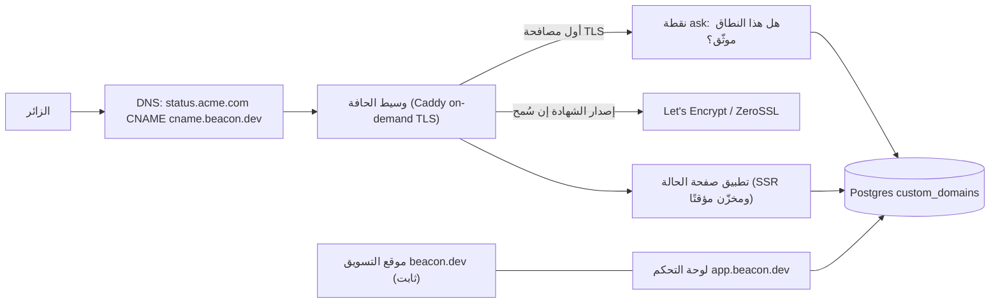
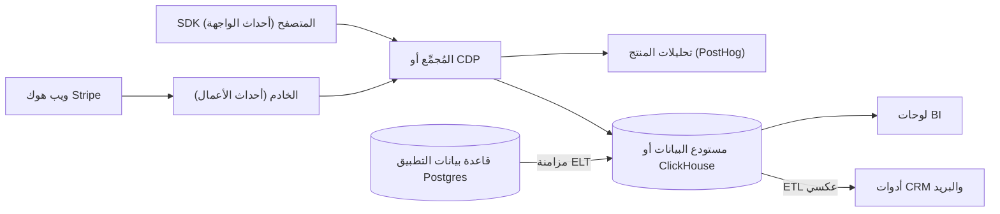
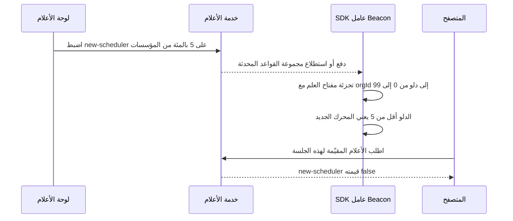

# الوحدة 6 — المنتج والنمو

*بنت الوحدات 1–5 الآلية التي لا يراها العملاء أبدًا. تغطي هذه الوحدة الأجزاء التي يرونها، والأجزاء التي تخبرك بما يفعلونه: هيكل التطبيق (app shell) الذي يدخلون إليه كل يوم، والتحليلات (analytics) التي تبيّن هل يحصلون على قيمة، وأعلام الميزات (feature flags) التي تسمح لك بتغيير المنتج من تحتهم دون أن تكسره. لا شيء من هذه صعب البداية، لكن الثلاثة تصبح فوضوية بسرعة إن لم تخطط لها.*

> **التطبيق العملي:** ابدأ من [نسخة البداية من Beacon](https://github.com/Tamoura/system-design-for-vibe-coders/tree/beacon/starter)، وحلّ التمارين قبل النظر إلى [الحل المرجعي (reference solution) لهذه الوحدة](https://github.com/Tamoura/system-design-for-vibe-coders/tree/beacon/module-6-solution) (الفرع (branch) `beacon/module-6-solution`).

---

# 6.1 — هيكل التطبيق: موقع التسويق والتهيئة ولوحة التحكم والإعدادات

*المستوى: 🟢 مبتدئ* · *المتطلبات: 1.1، 1.2*

## ⚡ الدرس في دقيقة

- هيكل التطبيق (app shell) هو الإطار المحيط بمنتجك: موقع التسويق (marketing site)، والتخطيط الخاص بالمستخدمين المسجلين (authenticated layout)، والتهيئة (onboarding)، والإعدادات (settings)، والنماذج (forms)، ونظام التصميم (design system)، والواجهات التي يراها المستأجرون (tenant-facing) مثل النطاقات المخصصة (custom domains).
- القاعدة الأهم: افصل موقع التسويق (ثابت أو مُصيَّر على الخادم (SSR)، مهيأ لمحركات البحث (SEO)، ويعدّله غير المهندسين) عن التطبيق (يتطلب تسجيل الدخول (authenticated)، ومعرّف المؤسسة (org slug) في الرابط (URL)).
- الخيار الافتراضي للنسخة الأولى: مستودع أحادي (Monorepo) فيه موقع التسويق والتطبيق منفصلان، وshadcn/ui مبنية على Radix وTailwind، ومخطط (schema) zod واحد يتشاركه النموذج والخادم (server).
- صمّم لوحة التحكم الفارغة (empty dashboard) والتهيئة حول حدث تفعيل (activation event) واحد، واحفظ تقدم التهيئة (onboarding progress) على المؤسسة لا في `localStorage`.
- الفخ الأكبر: أن تعدّ إخفاء زر (hidden button) أو التحقق في المتصفح (client-side validation) أمانًا (security). الخادم يتحقق من المخطط والصلاحية (permission) وحدّ الخطة (plan limit) في كل مرة.

## 🧭 لماذا يحتاجه كل SaaS

النسخة الأولى من Beacon تطبيق Next.js واحد. الصفحة الرئيسية (landing page) وصفحة الأسعار (pricing page) ونموذج الدخول (login form) ولوحة المراقبات (monitor dashboard) وشاشات الإعدادات كلها في مجلد `app/` نفسه، وتتشارك تخطيطًا واحدًا (layout)، وتُنشر (deploy) معًا. ويعمل هذا جيدًا إلى أن تحدث ثلاثة أشياء في الشهر نفسه.

يريد فريق التسويق (marketing) إعادة كتابة الصفحة الرئيسية ونشر مدونة (blog)، فيصبح كل تعديل على النص (copy change) يمر بخط CI (CI pipeline) نفسه وطابور المراجعة (review queue) نفسه الذي تمر به ترحيلات قاعدة البيانات (database migration). ويفهرس (indexes) Google مؤشر التحميل (loading spinner) في لوحة التحكم بدل صفحة الأسعار، لأن كل شيء يُصيَّر في المتصفح (renders client-side) خلف فحص المصادقة (auth check). ويسأل عميل على خطة Business لماذا تعيش صفحة حالته العامة (public status page) على `beacon.dev/s/acme` بينما يسمح له كل منافس باستخدام `status.acme.com`.

في الوقت نفسه، الأرقام سيئة بطريقة أهدأ. يسجل الناس (sign up)، فيصلون إلى لوحة فارغة مكتوب فيها "لا توجد مراقبات بعد"، ثم يغادرون. لم يخبرهم أحد بما يفعلونه أولًا. وصفحة الإعدادات نموذج طويل واحد يقع فيه زر "حذف المؤسسة" بجانب "تغيير صورتك".

لا شيء من هذا منطق منتج (product logic). إنه **هيكل التطبيق (App Shell)**: الإطار الذي يضعه كل SaaS حول منتجه الفعلي. ويشمل موقع التسويق العام، والتخطيط الخاص بالمستخدمين المسجلين، والتهيئة (Onboarding)، والإعدادات، والنماذج، ونظام التصميم، والواجهات التي يراها المستأجرون (Tenants) مثل النطاقات المخصصة. **هيكل التطبيق هو الجزء من SaaS الذي يلمسه كل عميل في كل زيارة، لذلك يجعل الهيكلُ المهمَل منتجًا جيدًا يبدو معطوبًا.**

## 📐 كيف يعمل

### 🟢 الأساسيات

**افصل موقع التسويق عن التطبيق.** احتياجاتهما متعاكسة:

| | موقع التسويق (`beacon.dev`) | التطبيق (`app.beacon.dev`) |
|---|---|---|
| الجمهور | زوار مجهولون (anonymous visitors) ومحركات البحث (search engines) | مستخدمون مسجلو الدخول (logged-in users) |
| التصيير (rendering) | ثابت أو على الخادم (SSG/SSR) من أجل محركات البحث والسرعة | الاعتماد على المتصفح مقبول ولا حاجة لمحركات البحث |
| التغييرات | نصوص ومقالات وأسعار، وغالبًا يعدّلها غير المهندسين | ميزات يبنيها المهندسون |
| المصادقة | لا شيء | كل شيء خلف فحص الجلسة (session check) |
| كلفة الخطأ (failure cost) | خطأ إملائي (typo) | بيانات شخص ما |

التوليد الثابت (SSG — Static Site Generation) يعني أن الصفحات تُبنى إلى HTML وقت النشر (deploy time). والتصيير على الخادم (SSR — Server-Side Rendering) يعني أن HTML يُبنى مع كل طلب (per request). في الحالتين يحصل محرك البحث (search engine) على نص حقيقي بدل `<div id="root">` فارغ. التنظيم المعتاد هو **المستودع الأحادي (Monorepo)**، أي مستودع Git واحد يحوي عدة تطبيقات وحزمًا مشتركة (shared packages): `apps/web` للتسويق، و`apps/app` للمنتج، و`packages/ui` للمكونات المشتركة (shared components). يُنشر كل منها منفصلًا، لكنها تتشارك نظام تصميم واحدًا. وnext-forge مثال جيد على هذا الشكل. ويمكن أن يعيش موقع التسويق على نظام إدارة محتوى (CMS) أو أداة بناء مواقع (site builder) أيضًا. المهم ألا يحتاج مقال في المدونة إلى مراجعة ترحيل قاعدة بيانات.

ملفات تعريف الارتباط (Cookies) تحدد كيف يتواصل الاثنان. إن أردت أن يعرض موقع التسويق "اذهب إلى لوحة التحكم" للزوار المسجلين، فيجب أن يكون ملف الجلسة (session cookie) مقروءًا على النطاق الأب (parent domain)، أو أن يستدعي موقع التسويق نقطة نهاية (endpoint) صغيرة في التطبيق. قرّر هذا مبكرًا، لأنه يؤثر في خاصية (attribute) `Domain` لملف الارتباط (1.1).

**التخطيط الخاص بالمستخدمين المسجلين** هو الإطار المحيط بكل صفحة بعد الدخول. وفي SaaS الموجّه للشركات (B2B) استقر على شكل مألوف:

- **شريط جانبي (sidebar)** فيه الأقسام الرئيسية (المراقبات، الحوادث، صفحات الحالة، الإعدادات).
- **مبدّل المؤسسات (org switcher)** في الأعلى، لأن المستخدمين ينتمون إلى عدة مؤسسات (1.2). المؤسسة الحالية جزء من الرابط (`/acme/monitors`) وليست مخفية في حالة المتصفح (client state)، حتى يمكن مشاركة الروابط ولا تنقل إعادةُ التحميل (reload) أحدًا إلى المستأجر الخطأ (wrong tenant).
- **قائمة المستخدم (user menu)** فيها الملف الشخصي (profile) والسمة (theme) وتسجيل الخروج (sign-out).
- **لوحة الأوامر (command palette)** (`⌘K`)، وهي مربع بحث (search box) ينقلك إلى أي صفحة أو إجراء (action). مكوّن Command في shadcn/ui مبني على مكتبة (library) `cmdk`، لذلك تحصل عليها تقريبًا بلا جهد.

**التهيئة والحالات الفارغة (empty states).** مستخدم Beacon الجديد ليس لديه مراقبات ولا حوادث ولا صفحة حالة. هذه اللوحة الفارغة أهم شاشة ستطلقها، لأن كل مستخدم يراها، ومعظمهم يقرر خلال دقائق هل سيبقى. الحالة الفارغة الجيدة (empty state) تشرح ما الذي يوضع هنا وتقدم إجراءً واحدًا واضحًا: "أضف أول مراقبة لك: الصق رابطًا وسنفحصه كل 5 دقائق." والأفضل أن يطلب مسار التسجيل (signup flow) هذا الرابط، فلا تكون اللوحة فارغة أبدًا.

لتلك اللحظة القيّمة الأولى اسم. **التفعيل (Activation)** هو الحدث الذي يعني أن المستخدم جرّب فعلًا قيمة المنتج. في Beacon قد يكون "أنشأ مراقبة وتلقى أول نتيجة فحص خلال 24 ساعة". اختر حدث تفعيل واحدًا، وتتبّعه (6.2)، وصمم التهيئة لإيصال الناس إليه. قوائم المهام (checklists) والتلميحات (tooltips) والجولات التعريفية (product tours) كلها أساليب لخدمة هذا الرقم الواحد.

**النماذج والتحقق (validation).** معظم أي SaaS نماذج. الفكرة الأساسية أن **تعرّف مخطط التحقق (validation schema) لكل نموذج مرة واحدة وتستخدمه في المتصفح والخادم معًا.** نسخة المتصفح تعطي ملاحظات فورية (instant feedback). ونسخة الخادم هي التي تثق بها فعلًا، لأن أي شخص يستطيع تجاوز واجهتك (frontend) باستخدام `curl`. تفعل Zod هذا في TypeScript:

```ts
// packages/validation/monitor.ts, imported by the form AND the server
import { z } from "zod";

export const createMonitorSchema = z.object({
  name: z.string().trim().min(1, "Give it a name").max(80),
  url: z.string().url("Use a full URL, e.g. https://api.acme.com/health"),
  intervalSeconds: z.coerce.number().int().min(30).max(300),
});
export type CreateMonitorInput = z.infer<typeof createMonitorSchema>;

// Server side (route handler or server action)
export async function createMonitor(orgId: string, raw: unknown) {
  const parsed = createMonitorSchema.safeParse(raw);
  if (!parsed.success) return { ok: false, issues: parsed.error.issues };
  await assertCan(orgId, "monitor:create");   // lesson 1.3
  await assertWithinLimit(orgId, "monitors"); // lesson 3.2
  return { ok: true, monitor: await db.monitor.create({ data: { orgId, ...parsed.data } }) };
}
```

في المتصفح، تربط React Hook Form مع `@hookform/resolvers` المخطط نفسه بالنموذج. وللتقنيات الأخرى النمط نفسه: نماذج Django أو مُسلسِلات (serializers) DRF، وتحققات نماذج (model validations) Rails مع المعاملات القوية (Strong Parameters)، وForm Requests في Laravel، ووسوم الهياكل (struct tags) في Go مع `go-playground/validator`.

**نظام التصميم.** لا تبنِ القوائم المنسدلة (dropdowns) بيدك. الخيار الافتراضي الحديث في React طبقات:

- **Tailwind CSS** يتولى التنسيق (styling) عبر أصناف مساعدة (Utility Classes).
- **Radix UI primitives** مكونات بلا تنسيق (unstyled) وسهلة الوصول (accessible) (نافذة حوار (dialog)، قائمة منسدلة، نافذة منبثقة (popover)) تتعامل عنك مع حصر التركيز (focus traps) والتنقل بلوحة المفاتيح (keyboard navigation) وخصائص ARIA.
- **shadcn/ui** مجموعة مكونات تُنسخ إلى مشروعك، مبنية على Radix وTailwind. تشغّل أداة سطر أوامر (CLI) فيصل الكود المصدري (source) *إلى مستودعك*، فتملكه وتعدّله. ليست تبعية (dependency) تحدّثها.
- **TanStack Table** محرك جداول بلا واجهة (headless table engine) للفرز (sorting) والتصفية (filtering) والترقيم (pagination). في كل SaaS جدول كبير في مكان ما.
- **Tremor** يقدم رسومًا بيانية (charts) للوحات التحكم وبطاقات المؤشرات الرئيسية (KPI).

### 🟡 التعمق أكثر

**بنية الإعدادات (settings architecture).** "الإعدادات" في الحقيقة أربعة أشياء مختلفة لها مالكون (owners) وصلاحيات (permissions) مختلفة. إن خلطتها حصلت على أخطاء أمنية (security bugs) (عضو يغيّر الفوترة (billing)) وأخطاء تجربة استخدام (UX bugs) (مستخدم لا يجد حقل كلمة مروره (password)).

| منطقة الإعدادات (settings area) | النطاق | من يستطيع تغييرها | أمثلة من Beacon |
|---|---|---|---|
| الحساب / الملف الشخصي | المستخدم في كل المؤسسات | المستخدم | الاسم، الصورة، كلمة المرور، التحقق بخطوتين (2FA)، تفضيلات الإشعارات (notification prefs) الشخصية، السمة |
| المؤسسة | مؤسسة واحدة | Admin/Owner | اسم المؤسسة، المعرّف المختصر (slug)، الأعضاء والأدوار (members and roles)، SSO، قنوات التنبيه (alert channels) الافتراضية |
| الفوترة | مؤسسة واحدة | Owner أو دور Billing | الخطة، وسيلة الدفع (payment method)، الفواتير (invoices)، استهلاك رصيد الرسائل القصيرة (3.1–3.3) |
| المطوّر (developer) | مؤسسة واحدة (أحيانًا لكل مستخدم) | Admin | مفاتيح API، الويب هوك (webhooks)، التكاملات (integrations) (5.2، 5.3) |
| منطقة الخطر (danger zone) | مؤسسة واحدة | Owner فقط | نقل الملكية (transfer ownership)، حذف المؤسسة، تصدير كل البيانات (export all data) |

ضع إعدادات المستخدم على `/settings/account` وإعدادات المؤسسة على `/[org]/settings/...`. كل مسار (route) لإعدادات المؤسسة يتحقق من الصلاحيات على الخادم (1.3). إخفاء عنصر في القائمة ليس تفويضًا (Authorization). والإجراءات المدمّرة (destructive actions) تحتاج تأكيدًا (confirmation) يجبر المستخدم على كتابة اسم المؤسسة.

**التهيئة بوصفها آلة حالات (state machine).** احفظ تقدم التهيئة على المؤسسة، مثل `onboarding_step` أو مجموعة من المراحل المكتملة (completed milestones)، لا في `localStorage`. لا ينبغي أن يُدفع المسؤول الثاني (second admin) في المؤسسة إلى "أنشئ أول مراقبة لك" مرة أخرى. سجّل المراحل عند حدوثها ("أُنشئت أول مراقبة"، "رُبطت أول قناة تنبيه"، "نُشرت صفحة الحالة")، واجعل واجهة قائمة المهام وتحليلات التفعيل (activation analytics) تعتمدان على المصدر نفسه (source).

**التدويل (i18n) والتنسيق.** حتى لو أطلقت بالإنجليزية فقط، توقف عن كتابة النصوص مباشرة (hardcoding strings) في المكونات (components) بمجرد أن يصبح لديك عملاء يدفعون (paying customers) في الخارج، و**دائمًا** نسّق التواريخ والأرقام والعملات (currencies) بواجهات `Intl` حسب لغة المستخدم (locale) ومنطقته الزمنية (time zone). حادثة "بدأت الساعة 03:14" لا فائدة منها ما لم تقل 03:14 بتوقيت من. المكتبات (libraries): `next-intl`، و`i18next`/`react-i18next`، وFormatJS. وفي Rails نظام I18n مدمج، وفي Django يوجد `gettext`.

**سهولة الوصول (a11y)** تعني أن من يستخدمون لوحة المفاتيح أو قارئات الشاشة (screen readers) أو التكبير (zoom) يستطيعون استخدام تطبيقك. وفي B2B أصبحت متطلبًا للمبيعات (sales requirement) بشكل متزايد. أقسام المشتريات (procurement) في المؤسسات تطلب VPAT (وثيقة تصف مدى توافقك (conformance) مع WCAG)، وقانون إتاحة الوصول الأوروبي (European Accessibility Act) يسري على كثير من الخدمات الرقمية (digital services) المبيعة في الاتحاد الأوروبي منذ يونيو 2025. استخدام مكونات مبنية على Radix يعطيك معظم الأجزاء الصعبة. والباقي عليك: تسميات للحقول (labels on inputs)، وحلقات تركيز ظاهرة (visible focus rings)، وتباين ألوان (colour contrast) كافٍ، وأخطاء تُعلَن لقارئات الشاشة، وعدم الاعتماد على اللون وحده لإظهار الحالة. نقاط "متوقف/يعمل" الحمراء والخضراء تحتاج أيقونة (icon) أو نصًا أيضًا. وهذه النقطة مهمة لمنتج مراقبة (monitoring product) بالذات.

### 🔴 على نطاق واسع وللمؤسسات

**النطاقات المخصصة للصفحات التي يراها المستأجرون.** صفحة الحالة العامة في Beacon هي الواجهة الوحيدة التي يراها *عملاء عملائك*، لذلك تريدها الشركات على نطاقها الخاص: `status.acme.com`. الآلية كالتالي:

1. يُدخل العميل `status.acme.com` في إعدادات Beacon.
2. يطلب منه Beacon إنشاء سجل (record) DNS من نوع **CNAME** يوجّه `status.acme.com` إلى شيء مثل `cname.beacon.dev`. وسجل CNAME اسم مستعار (alias) من اسم مضيف (hostname) إلى آخر.
3. يتحقق Beacon منه، إما بفحص DNS أو بطلب سجل TXT إضافي لإثبات الملكية (ownership).
4. تصل الطلبات إلى حافة (edge) Beacon مع `Host: status.acme.com`. يبحث Beacon عن المؤسسة التي تملك هذا المضيف ويعرض صفحة حالتها.
5. يحتاج Beacon إلى **شهادة (certificate) TLS** لـ `status.acme.com` تصدر تلقائيًا من Let's Encrypt أو ZeroSSL، لأنك لا تستطيع أن تطلب من كل عميل رفع شهادات.



ثلاث طرق لتحقيق الخطوة 5:

- **Caddy on-demand TLS.** يستطيع Caddy، وهو خادم ويب (web server) مكتوب بلغة Go يدعم HTTPS تلقائيًا، أن يحصل على شهادة أثناء *أول مصافحة (handshake) TLS* لاسم مضيف لم يره من قبل. **يجب** أن تضبط نقطة نهاية `ask` حتى يسأل Caddy تطبيقك أولًا. من دونها يستطيع أي شخص توجيه أي نطاق إلى خادمك ويجعلك تطلب شهادات حتى تصل إلى حدود المعدل (rate limits) لدى جهة إصدار الشهادات (CA).

  ```
  {
    on_demand_tls {
      ask http://localhost:3000/api/domains/allowed
    }
  }
  https:// {
    tls {
      on_demand
    }
    reverse_proxy localhost:3001
  }
  ```

- **واجهة النطاقات في منصتك.** تسمح Vercel بإضافة نطاقات إلى مشروع عبر واجهتها البرمجية. ويستخدم Dub هذا مثلًا لنطاقات الروابط المختصرة (short links) التي تحمل علامة العملاء (branded).
- **Cloudflare for SaaS** (Custom Hostnames) تدير الشهادات والحافة عنك على نطاق Cloudflare.

الأجزاء الصعبة على نطاق واسع هي التالية. يجب إعادة التحقق دوريًا (re-verify)، لأن العملاء يحذفون سجلات DNS، وعندها يجب أن تتوقف عن خدمة النطاق. والنطاقات الجذرية (apex domains) (`acme.com` بلا نطاق فرعي (subdomain)) لا تقبل CNAME، لذلك تحتاج سجلات A أو دعم ALIAS/ANAME. وكل طلب يحتاج بحثًا من اسم المضيف إلى المؤسسة، لذلك خزّنه مؤقتًا (cache). ويجب أن تبقى صفحات الحالة متاحة *بينما البنية التحتية (infrastructure) للعميل نفسه متوقفة*. استضفها بعيدًا عن لوحة التحكم، وخزّنها مؤقتًا بقوة على الحافة، ولا تسمح لنشر لوحة التحكم (dashboard deploy) أن يوقفها.

**العلامة البيضاء (White-labelling)** تذهب أبعد: شعار مخصص (custom logo)، وألوان، ونطاق مُرسِل للبريد (4.1)، وإزالة "Powered by Beacon" في الخطط الأعلى (higher tiers). عامل كل واحدة منها بوصفها استحقاقًا (entitlement) في الخطة (3.2)، لا شرطًا مكتوبًا في الكود (hardcoded) مثل `if (org.plan === "business")`.

## 🏆 أفضل المستودعات

| المستودع | ما هو | التقنيات | الترخيص | اختره عندما |
|---|---|---|---|---|
| [shadcn-ui/ui](https://github.com/shadcn-ui/ui) | مكونات تُنسخ إلى مستودعك مبنية على Radix وTailwind | React, TypeScript | MIT | تريد من اليوم الأول مجموعة مكونات جميلة تملكها |
| [radix-ui/primitives](https://github.com/radix-ui/primitives) | مكونات واجهة أساسية (UI primitives) بلا تنسيق وسهلة الوصول | React, TypeScript | MIT | تبني نظام تصميمك الخاص وتريد أن تُحَل سهولة الوصول |
| [tailwindlabs/tailwindcss](https://github.com/tailwindlabs/tailwindcss) | إطار CSS قائم على الأصناف المساعدة | CSS, JS tooling | MIT | التنسيق الافتراضي لمعظم واجهات SaaS الجديدة |
| [TanStack/table](https://github.com/TanStack/table) | منطق جداول وشبكات بيانات (data grids) بلا واجهة | TS (React, Vue, Solid, Svelte…) | MIT | أي قائمة فيها فرز أو تصفية أو ترقيم أو تحديد (selection) |
| [tremorlabs/tremor](https://github.com/tremorlabs/tremor) | رسوم بيانية ومكونات مؤشرات للوحات التحكم | React, Tailwind | Apache-2.0 | لوحات تحكم يراها العملاء (نسبة التوفر (uptime)، أزمنة الاستجابة (response times)) |
| [react-hook-form/react-hook-form](https://github.com/react-hook-form/react-hook-form) | إدارة حالة نماذج (form state management) عالية الأداء (performant) في React | React, TypeScript | MIT | أي نموذج غير بسيط، مع محلّل مخطط (schema resolver) |
| [colinhacks/zod](https://github.com/colinhacks/zod) | تحقق من المخططات مصمم أولًا لـ TypeScript | TypeScript | MIT | مخطط واحد يتشاركه المتصفح والخادم |
| [vercel/next-forge](https://github.com/vercel/next-forge) | قالب (starter) SaaS جاهز للإنتاج (production-ready) مبني على Turborepo | Next.js monorepo | MIT | تريد أن ترى التسويق والتطبيق والـ API مقسمة إلى تطبيقات منفصلة |
| [caddyserver/caddy](https://github.com/caddyserver/caddy) | خادم ويب مع HTTPS تلقائي وon-demand TLS | Go | Apache-2.0 | نطاقات مخصصة مستضافة ذاتيًا (self-hosted) لصفحات المستأجرين |

**إن درست مستودعًا واحدًا فقط:** ادرس **next-forge**. ليس مكتبة مكونات (component library)، لكنه يعرض الهيكل كاملًا في مستودع واحد: تطبيقات منفصلة للتسويق والمنتج والـ API، ومجلد `packages/` مشترك للواجهة والمصادقة (auth)، والربط بينها. اقرأ بنية مجلداته قبل أن تنشئ مستودعك الأحادي.

**اشترِ أم ابنِ أم استضف بنفسك؟**

- **اشترِ** شهادات TLS للنطاقات المخصصة عندما تكون أصلًا على منصة تبيعها: نطاقات Vercel، وCloudflare for SaaS. ولمواقع التسويق، يكفي نظام إدارة محتوى أو أداة بناء مواقع (Webflow أو Framer أو CMS بلا واجهة)، وهذا يُخرج المهندسين من تعديلات النصوص.
- **استضف بنفسك** Caddy مع on-demand TLS عندما تدير بنيتك التحتية الخاصة أو تتوقع آلاف نطاقات العملاء وتريد التحكم في الكلفة.
- **ابنِ** الهيكل نفسه (التخطيط، التهيئة، الإعدادات) فوق shadcn/ui وRadix وTailwind. هذا وجه منتجك، فامتلك الكود. لكن لا تبنِ مكتبة نماذج أو محرك جداول أو قائمة منسدلة سهلة الوصول من الصفر.

## 🔍 ادرسه في مشاريع حقيقية

**dubinc/dub.** هيكل جيد للتعلم منه: مبدّل مساحات العمل (workspace switcher)، ولوحة تحكم مصقولة (polished)، و**نطاقات مخصصة للعملاء** للروابط المختصرة. افتح المستودع واستخدم البحث في الكود (code search) عن `domains` مع `vercel` لتجد أين يضيف Dub النطاقات ويتحقق منها عبر واجهة Vercel. وقت كتابة هذا الدرس يعيش المنتج في `apps/web`. لاحظ كيف يقرر التطبيق بين سلوك التسويق ولوحة التحكم وإعادة توجيه الروابط (link redirects) حسب اسم المضيف الوارد.

**openstatusHQ/openstatus.** نسخة حقيقية من Beacon: مراقب توفر (uptime monitor) مفتوح المصدر مع صفحات حالة عامة. ابحث عن `custom domain` و`status page` لترى كيف تُحدَّد الصفحة من اسم المضيف أو المعرّف المختصر. وقارن طريقة تصيير صفحة الحالة بطريقة تصيير لوحة التحكم الخاصة بالمستخدمين المسجلين.

**calcom/cal.diy.** مسار التهيئة (onboarding flow) وتقسيم الإعدادات في Cal.com يستحقان القراءة. ابحث عن `getting-started` أو `onboarding` لتجد مسار الاستخدام الأول (first-run flow) خطوة بخطوة، وتصفح صفحات الإعدادات لترى كيف تبقى إعدادات الحساب منفصلة عن إعدادات الفريق والمؤسسة.

**vercel/next-forge.** هنا الهيكل *هو* المنتج. انظر إلى مجلد `apps/` في المستوى الأعلى: التسويق وتطبيق المنتج تطبيقا Next.js منفصلان يتشاركان `packages/`. لاحظ ما يُعدّ "مشتركًا" (نظام التصميم، المصادقة، التحليلات) وما لا يُعدّ كذلك.

**ما الذي تلاحظه:**

- معرّف المؤسسة أو مساحة العمل (workspace) موجود في الرابط، وكل صفحة وكل استدعاء API يستنتج المستأجر منه ومن الجلسة، لا من حالة المتصفح وحدها.
- صفحات التسويق مُصيَّرة ثابتًا أو مخزّنة مؤقتًا (cached). ولوحة التحكم لا تفهرسها (noindex) محركات البحث.
- طلبات النطاقات المخصصة تُوجَّه حسب ترويسة `Host` مبكرًا، غالبًا في البرمجية الوسيطة (Middleware)، قبل تشغيل أي منطق للصفحة.
- الحالات الفارغة شاشات مصممة فيها دعوة واحدة واضحة لاتخاذ إجراء (call to action)، لا جدول فارغ.
- مخططات التحقق يستوردها مكوّن النموذج ومعالج الخادم (server handler) معًا.

## 🛠️ ابنِه في Beacon

### 🟢 تمرين المبتدئ

ابنِ التخطيط الخاص بالمستخدمين المسجلين في Beacon باستخدام shadcn/ui: شريط جانبي (المراقبات، الحوادث، صفحات الحالة، الإعدادات)، ومبدّل مؤسسات يغيّر جزء `/[org]/...` في الرابط، وحالة فارغة في صفحة المراقبات فيها زر واحد "أضف أول مراقبة لك" يفتح نموذجًا يُتحقق منه بمخطط zod مشترك.

**يكتمل عندما:**
- يغيّر تبديل المؤسسة الرابط، وتبقيك إعادة تحميل الصفحة في المؤسسة نفسها.
- يعرض إرسال رابط غير صالح خطأً بجانب الحقل دون أي طلب شبكة (network request)، *و*يرفض الخادم الحمولة (payload) الخاطئة نفسها عند إرسالها بـ `curl` بالرسالة نفسها.
- يعمل المسار كله بلوحة المفاتيح فقط (Tab وEnter، وEscape يغلق نافذة الحوار).

### 🟡 تمرين المستوى المتوسط

قسّم الإعدادات إلى الحساب (`/settings/account`)، والمؤسسة (`/[org]/settings/general`، `/members`)، والفوترة، والمطوّر (مفاتيح API). أضف قائمة مهام للتهيئة تعتمد على مراحل محفوظة على المؤسسة: أول مراقبة، أول قناة تنبيه، نشر صفحة الحالة. تختفي القائمة تلقائيًا عندما تكتمل المراحل الثلاث.

**يكتمل عندما:**
- يحصل دور Member على 403 من الخادم عند استدعاء نقطة إعادة تسمية المؤسسة مباشرة، لا مجرد زر مخفي.
- لا يرى المسؤول الثاني الذي ينضم بعد اكتمال التهيئة قائمة المهام أبدًا.
- تُحفظ أوقات المراحل، حتى تحسب لاحقًا "الوقت حتى التفعيل (time-to-activation)" (6.2).

### 🔴 تمرين المستوى المتقدم

أطلق النطاقات المخصصة لصفحات الحالة. أضف جدول `custom_domains` (`org_id`، `hostname`، `verified_at`، `last_checked_at`)، وصفحة إعدادات تعرض سجل CNAME المطلوب إنشاؤه، ومهمة تحقق (5.1) تعيد فحص DNS يوميًا، وإعداد Caddy فيه `on_demand_tls` بحيث لا تعيد نقطة `ask` القيمة 200 إلا لأسماء المضيفين الموثقة (verified).

**يكتمل عندما:**
- يخدم `status.yourtestdomain.com` صفحة حالة المؤسسة الصحيحة عبر HTTPS صالح دون أي خطوة يدوية للشهادة.
- توجيه نطاق غير مسجل إلى الخادم **لا** يطلق طلب شهادة (certificate request) (راجع سجلات Caddy).
- حذف سجل DNS يجعل النطاق غير موثق خلال يوم، فيتوقف تقديمه.

## ⚠️ أخطاء يقع فيها المبتدئون

- **تقديم موقع التسويق من تطبيق الصفحة الواحدة (SPA) الخاص بالمستخدمين المسجلين.** ترى محركات البحث مؤشر تحميل، وكل تعديل على النص يمر بنشر التطبيق. افصلهما: تسويق ثابت أو مُصيَّر على الخادم، والتطبيق على نطاق فرعي خاص به.
- **حفظ المؤسسة الحالية في حالة React أو `localStorage` فقط.** إعادة التحميل والروابط المشتركة والتبويبات الجديدة (tabs) كلها تبدّل المستأجر بصمت، وهذا على بعد خطوة من خطأ تسرب بين المستأجرين (cross-tenant leak). ضع معرّف المؤسسة في الرابط وتحقق من العضوية (membership) على الخادم في كل طلب.
- **التحقق في المتصفح فقط.** المتصفح ليس حدًا أمنيًا (security boundary). شارك مخططًا واحدًا وشغّله دائمًا على الخادم، ثم تحقق من الصلاحيات (1.3) وحدود الخطة (3.2) بعد ذلك.
- **اعتبار "إخفاء الزر" صلاحيات.** زر الحذف المخفي ما زالت نقطة نهايته تعمل. فحوص الخادم تأتي أولًا، والواجهة تعكسها فقط.
- **تفعيل on-demand TLS دون فحص `ask`.** يستطيع أي شخص توجيه DNS إليك ويجعلك تطلب شهادات لأسماء عشوائية، فتستهلك حدود المعدل لدى جهة الإصدار. اربطه دائمًا ببحث عن نطاق موثّق.
- **تنسيق التواريخ بتوقيت الخادم (server time).** حادثة في "14:00" لا تعني شيئًا لعميل يبعد ثماني مناطق زمنية. احفظ بتوقيت UTC ونسّق بـ `Intl` حسب المنطقة الزمنية للمشاهد.
- **بناء القوائم المنسدلة والنوافذ المنبثقة بنفسك.** ستخطئ في إدارة التركيز (focus management) وسلوك قارئات الشاشة. استخدم Radix أو shadcn/ui واصرف الوقت على حالاتك الفارغة بدلًا من ذلك.

## 🧾 الخلاصة

- هيكل التطبيق (موقع التسويق، التخطيط، التهيئة، الإعدادات، نظام التصميم) هو نفسه في كل SaaS، والعملاء يحكمون عليك من خلاله.
- افصل التسويق (ثابت أو على الخادم، محركات البحث، غير المهندسين) عن التطبيق (يتطلب الدخول، والمستأجر في الرابط)، وعادة يكونان تطبيقين منفصلين في مستودع أحادي واحد.
- صمّم الحالة الفارغة والتهيئة حول حدث **تفعيل** واحد، واحفظ التقدم على المؤسسة.
- الإعدادات أربعة أنواع بصلاحيات مختلفة: الحساب، والمؤسسة، والفوترة، والمطوّر. إضافة إلى منطقة الخطر.
- مخطط تحقق واحد يتشاركه المتصفح والخادم. ونسخة الخادم هي التي تُحتسب.
- النطاقات المخصصة تعني: CNAME، وتحققًا، وTLS تلقائيًا (Caddy on-demand مع `ask`، أو Vercel، أو Cloudflare for SaaS)، وتوجيهًا حسب اسم المضيف.

## ✍️ اختبر نفسك

**1. لماذا يجب أن يكون موقع التسويق والتطبيق منفصلين، وما الذي يحتاجه كل منهما؟**

<details><summary>الإجابة</summary>

احتياجاتهما متعاكسة. موقع التسويق يخدم زوارًا مجهولين ومحركات البحث، لذلك يكون ثابتًا أو مُصيَّرًا على الخادم، وغالبًا يعدّله غير المهندسين. أما التطبيق فيخدم مستخدمين مسجلين، ويمكن أن يعتمد على المتصفح، ويضع كل شيء خلف فحص الجلسة. راجع جدول المقارنة في 🟢 الأساسيات.

</details>

**2. ما التفعيل، ولماذا يهم في التهيئة؟**

<details><summary>الإجابة</summary>

التفعيل هو الحدث الذي يعني أن المستخدم جرّب فعلًا قيمة المنتج، وفي Beacon هو شيء مثل "أنشأ مراقبة وتلقى أول نتيجة فحص خلال 24 ساعة". تختار حدثًا واحدًا، وتتتبعه، وتصمم التهيئة والحالات الفارغة لإيصال الناس إليه. راجع "التهيئة والحالات الفارغة" في 🟢 الأساسيات.

</details>

**3. عضو في Beacon يريد تغيير وسيلة الدفع للمؤسسة. في أي منطقة إعدادات يقع هذا، وكيف يفرض Beacon من يستطيع فعله؟**

<details><summary>الإجابة</summary>

إنها منطقة الفوترة، ونطاقها مؤسسة واحدة، ولا يغيّرها إلا Owner أو دور Billing. يجب أن يتحقق مسار إعدادات المؤسسة من الصلاحية على الخادم (1.3)، لأن إخفاء عنصر القائمة ليس تفويضًا. راجع جدول الإعدادات في 🟡 التعمق أكثر.

</details>

**4. تريد Acme أن تكون صفحة حالتها في Beacon على `status.acme.com`. ما الخطوات؟**

<details><summary>الإجابة</summary>

تنشئ Acme سجل CNAME من `status.acme.com` إلى شيء مثل `cname.beacon.dev`، ويتحقق Beacon منه عبر DNS أو سجل TXT. بعد ذلك يوجّه Beacon الطلبات حسب ترويسة `Host` إلى صفحة حالة Acme، ويصدر شهادة TLS تلقائيًا، مثلًا باستخدام Caddy on-demand TLS أو واجهة النطاقات في Vercel أو Cloudflare for SaaS. راجع 🔴 على نطاق واسع وللمؤسسات.

</details>

**5. يفعّل مطوّر خيار `on_demand` في Caddy لكنه يترك نقطة `ask` ليوفر الوقت. ما الذي ينكسر؟**

<details><summary>الإجابة</summary>

يستطيع أي شخص توجيه أي نطاق إلى خادم Beacon، فيطلب Caddy شهادة له أثناء أول مصافحة TLS. ويستطيع المهاجم أن يجعلك تطلب شهادات لأسماء عشوائية حتى تصل إلى حدود المعدل لدى جهة الإصدار، وهذا يمنع العملاء الحقيقيين أيضًا. يجب ألا تعيد نقطة `ask` القيمة 200 إلا لأسماء المضيفين الموثقة. راجع بند Caddy في 🔴 على نطاق واسع وللمؤسسات وقسم ⚠️ أخطاء يقع فيها المبتدئون.

</details>

## 📚 المراجع

- shadcn/ui documentation — توثيق shadcn/ui: https://ui.shadcn.com
- Radix Primitives documentation, including accessibility notes per component — توثيق Radix مع ملاحظات سهولة الوصول لكل مكوّن: https://www.radix-ui.com/primitives
- Zod documentation — توثيق Zod: https://zod.dev
- React Hook Form documentation — توثيق React Hook Form: https://react-hook-form.com
- Caddy documentation on automatic HTTPS and on-demand TLS — توثيق Caddy عن HTTPS التلقائي وon-demand TLS: https://caddyserver.com/docs/automatic-https
- Cloudflare for SaaS documentation — توثيق Cloudflare for SaaS: https://developers.cloudflare.com/cloudflare-for-platforms/cloudflare-for-saas/
- W3C Web Content Accessibility Guidelines (WCAG) overview — نظرة عامة على إرشادات WCAG: https://www.w3.org/WAI/standards-guidelines/wcag/
- next-forge documentation — توثيق next-forge: https://www.next-forge.com

---

# 6.2 — التحليلات: تحليلات المنتج والويب وخط الأحداث

*المستوى: 🟡 متوسط* · *المتطلبات: 1.2، 6.1*

## ⚡ الدرس في دقيقة

- التحليلات (analytics) ثلاث وظائف: تحليلات الويب (web analytics) (من يزور موقع التسويق (marketing site))، وتحليلات المنتج (product analytics) (ماذا يفعل المستخدمون داخل التطبيق)، وذكاء الأعمال (business intelligence) BI (كل أنظمتك مجموعة في مستودع بيانات (data warehouse)).
- القاعدة الأهم: اكتب خطة تتبع (tracking plan) بأسماء أحداث (event names) على شكل object_action قبل أن ترسل أي حدث، وأرسل استدعاءات (calls) `group` حتى تستطيع التحليل حسب المؤسسة.
- الخيار الافتراضي للنسخة الأولى: تحليلات ويب بلا ملفات ارتباط (cookieless) (Plausible أو Umami) على موقع التسويق، وPostHog (أو ما يشبهه) داخل التطبيق، مع إرسال أحداث الأعمال (business events) من الخادم (server).
- أبقِ البيانات الشخصية (PII) خارج خصائص الأحداث (event properties). أرسل المعرّفات (ids)، واحترم الموافقة (consent)، واعرف كيف تحذف أداتك أحداث مستخدم ما.
- الفخ الأكبر: تتبّع كل شيء بلا خطة، أو تشغيل استعلامات التحليلات على Postgres الإنتاجي (production). الأحداث كبيرة الحجم (high-volume events) مكانها مخزن (store) مثل ClickHouse، مع تقييد كل استعلام بالمستأجر (tenant).

## 🧭 لماذا يحتاجه كل SaaS

يبدأ مؤسسو Beacon اجتماعهم الأسبوعي (weekly meeting) بسؤال بسيط: "هل تعمل التهيئة الجديدة (onboarding)؟" لا أحد يستطيع الإجابة. لوحة (dashboard) Stripe تعرض الإيرادات (revenue). وجدول `monitors` في Postgres يعرض عدد المراقبات الموجودة. وGoogle Analytics يعرض أن 4,000 شخص زاروا صفحة الأسعار (pricing page). لكن لا أحد يستطيع أن يقول كم من المسجلين (signups) في الأسبوع الماضي أنشأ مراقبة، وكم استغرق ذلك، وهل تبقى الفرق التي تربط Slack مدة أطول من الفرق التي لا تربطه.

فيضيف مهندس `track("clicked button")` في أربعين مكانًا. وبعد شهر تحتوي قائمة الأحداث (event list) على `Monitor Created` و`monitor_created` و`createMonitor` و`new-monitor`، وكلها تعني الشيء نفسه تقريبًا، ولا يسجل أيٌّ منها المؤسسة التي ينتمي إليها المستخدم. وفي منتج B2B هذا هو الرقم الذي يهمك فعلًا، لأن *المؤسسة* هي التي تدفع لك، لا المستخدم.

**التحليلات (Analytics) هي المكوّن الذي يحوّل "نظن" إلى "قسنا"، ولا تعمل إلا إذا قررت ماذا تقيس وكيف تسميه قبل أن تبدأ بإرسال الأحداث.**

## 📐 كيف يعمل

### 🟢 الأساسيات

كلمة "التحليلات" تغطي ثلاث وظائف مختلفة يخلط الناس بينها:

| النوع | السؤال الذي يجيب عنه | الوحدة | مثال من Beacon | الأدوات |
|---|---|---|---|---|
| **تحليلات الويب** | من يزور موقع التسويق، ومن أين؟ | مشاهدات الصفحات (pageviews) والجلسات (sessions) | أي مقال في المدونة يجلب التسجيلات (signups)؟ | Plausible, Umami, Matomo |
| **تحليلات المنتج** | ماذا *يفعل* المستخدمون المسجلون (logged-in) داخل التطبيق؟ | أحداث حسب المستخدمين والمؤسسات | نسبة المؤسسات الجديدة التي تنشئ مراقبة خلال 24 ساعة | PostHog, OpenPanel, Amplitude, Mixpanel |
| **ذكاء الأعمال / مستودع البيانات** | كيف يبدو العمل عبر كل الأنظمة؟ | جداول مدموجة (joined tables) | الإيراد لكل مؤسسة مقابل المراقبات مقابل تذاكر الدعم (support tickets) | مستودع بيانات + dbt + أداة BI (Metabase, Superset) |

تحليلات الويب رخيصة وشبه تلقائية: ضع وسم سكربت (script tag) على موقع التسويق. أما تحليلات المنتج فتحتاج **أحداثًا** مقصودة. الحدث (Event) سجل بأن شيئًا ما حدث: من (معرّف المستخدم (user id))، وأي مؤسسة، وماذا (اسم الحدث)، ومتى (الطابع الزمني (timestamp))، إضافة إلى **خصائص** (Properties)، وهي تفاصيل على شكل مفتاح وقيمة (key-value) مثل `check_interval: 60`.

نموذج البيانات (data model) الذي تتشاركه معظم الأدوات مأخوذ من مواصفة (spec) Segment، وهي معيار فعلي (de facto standard):

- **`identify(userId, traits)`** تقول "هذا المتصفح أو الجهاز هو المستخدم `u_123`، وبريده ...". وهي تربط النشاط المجهول (anonymous activity) قبل التسجيل بالمستخدم الحقيقي.
- **`track(event, properties)`** تقول "فعل المستخدم كذا".
- **`page()` / `screen()`** تسجل مشاهدة صفحة (page view).
- **`group(groupId, traits)`** تقول "هذا المستخدم ينتمي إلى المؤسسة `org_42` على خطة Pro". **هذا هو الاستدعاء الذي ينساه SaaS الموجّه للشركات**، وهو ما يسمح لك بطرح الأسئلة لكل حساب بدل كل شخص. ويسميه PostHog تحليلات المجموعات (Group Analytics).

**خطة التتبع (Tracking Plan)** وثيقة قصيرة، غالبًا جدول بيانات، تسرد كل حدث وخصائصه وسبب وجوده. استخدم **تسمية object–action (object–action naming)**: الاسم ثم فعل بصيغة الماضي (past-tense)، بنمط كتابة (casing) واحد ثابت. `monitor_created`، `alert_channel_connected`، `status_page_published`، `subscription_upgraded`. عندها تستطيع قراءة القائمة أبجديًا حسب الكائن، ولا يخترع أحد `createMonitor`.

| الحدث | الخصائص الأساسية | لماذا نتتبعه |
|---|---|---|
| `org_created` | `signup_source` | رأس كل قُمع (funnel) |
| `monitor_created` | `check_interval`، `type`، `is_first` | خطوة التفعيل (activation step) 1 |
| `monitor_check_completed` | `status` (فقط *أول* فحص لكل مراقبة) | خطوة التفعيل 2: وصلت القيمة |
| `alert_channel_connected` | `channel` (email/slack/sms) | مؤشر قوي على الاحتفاظ (retention) يستحق الاختبار |
| `subscription_upgraded` | `from_plan`، `to_plan` | الإيراد |

بهذه الأحداث تستطيع بناء الرسوم الثلاثة التي يعيش عليها كل SaaS:

- **القُمع (Funnel)**: من المؤسسات التي أُنشئت هذا الأسبوع، ما النسبة التي أنشأت مراقبة، ثم حصلت على نتيجة فحص، ثم ربطت قناة تنبيه (alert channel)؟
- **معدل التفعيل (activation rate)**: نسبة المؤسسات الجديدة التي تصل إلى حدث التفعيل (activation event) (6.1) خلال N يومًا.
- **الاحتفاظ (Retention)**: من المؤسسات التي سجلت في الأسبوع W، ما النسبة التي بقيت نشطة (active) في الأسابيع W+1 وW+2...؟ يُرسم هذا عادة بوصفه جدول أفواج (Cohort Table). ويجب أن يكون "النشاط" حدث قيمة (value event) حقيقيًا، مثل "شاهد لوحة التحكم أو تلقى تنبيهًا (alert)"، لا "سجّل الدخول".

### 🟡 التعمق أكثر

**التتبع في المتصفح (client-side tracking) مقابل التتبع على الخادم (server-side tracking).** التتبع في المتصفح يعني أن حزمة SDK في المتصفح ترسل الأحداث. هي ترى النقرات (clicks) ومشاهدات الصفحات، لكن مانعات الإعلانات (ad blockers) وإضافات الخصوصية (privacy extensions) تحجب جزءًا حقيقيًا منها، ويستطيع المستخدمون تزويرها (forge). والتتبع على الخادم يعني أن الخادم يرسل الأحداث بعد أن يحدث الشيء فعلًا في قاعدة البيانات. هو موثوق وكامل، لكنه لا يرى تفاعلات الواجهة (UI interactions) البحتة. القاعدة: **أحداث الأعمال تُتتبع على الخادم** (`monitor_created` يُطلق بعد تثبيت الإدراج (insert commits)، و`subscription_upgraded` يُطلق من معالج ويب هوك (webhook handler) Stripe في 3.1)، و**سلوك الواجهة (UI behaviour) يُتتبع في المتصفح** (فتح لوحة الأوامر (command palette)، إغلاق قائمة المهام (checklist)). وكثير من الفرق تمرّر SDK المتصفح عبر نطاقها الخاص (own domain) حتى تكون المانعات أقل صرامة. كن صادقًا مع نفسك في سبب فعل ذلك، وراجع النقطة التالية.



**الخصوصية والموافقة (privacy and consent).** في الاتحاد الأوروبي والمملكة المتحدة، تشترط قواعد ePrivacy الحصول على موافقة قبل تخزين أو قراءة بيانات غير ضرورية على جهاز المستخدم (ملفات الارتباط، ومعرّفات `localStorage`)، ويحكم GDPR البيانات الشخصية نفسها (8.1). عمليًا:

- تحليلات الويب بلا ملفات ارتباط مثل Plausible، التي تستخدم تجزئة (Hash) لعنوان IP مع وكيل المستخدم (user agent) وملحًا (Salt) يتغير يوميًا ولا تخزن أي ملف ارتباط، مصممة عمومًا بحيث لا تحتاج شريط موافقة (consent banner). تحقق من ذلك مع مستشارك القانوني (lawyer).
- تحليلات المنتج التي تعرّف المستخدمين *داخل* تطبيقك معالجة لبيانات شخصية. غطّها في سياسة الخصوصية (privacy policy) واتفاقية معالجة البيانات (DPA)، وأدرج المزوّد بوصفه معالجًا فرعيًا (subprocessor) (8.1)، ولا ترسل بيانات لا تحتاجها. **لا تضع أبدًا البريد الإلكتروني أو الأسماء أو روابط المراقبات في خصائص الأحداث إلا إذا احتجتها فعلًا.** استخدم المعرّفات.
- أدوات إعادة تشغيل الجلسات (session replay) تسجّل الشاشات. أخفِ كل الحقول (mask) افتراضيًا.
- ادعم الحذف. عندما يمارس المستخدم حق المحو (right to erasure) في GDPR، يجب أن تكون أحداثه قابلة للحذف أيضًا. اعرف كيف تفعل أداة التحليلات هذا قبل أن تختارها.

**خط الأحداث (event pipeline) ومنصات CDP.** **منصة بيانات العملاء (CDP — Customer Data Platform)** مثل RudderStack أو Jitsu أو Segment تجمع الأحداث مرة واحدة وتوزعها على وجهات (destinations) كثيرة: تحليلات المنتج، ومستودع البيانات، وCRM، وأداة البريد (email tool). وهي تمنعك من تثبيت خمس حزم SDK. و**مستودع البيانات (Data Warehouse)** (BigQuery أو Snowflake أو Postgres أو ClickHouse) هو المكان الذي تلتقي فيه الأحداث ببيانات تطبيقك. تزامن جداول Postgres إليه بطريقة ELT (استخراج ثم تحميل ثم تحويل (extract, load, transform) بـ SQL، غالبًا باستخدام dbt)، فتستطيع دمج "الأحداث" مع "المؤسسات" و"فواتير Stripe". و**ETL العكسي (Reverse ETL)** يدفع الخصائص المحسوبة (computed traits) إلى الخارج، مثل "هذه المؤسسة وصلت إلى 90% من حد المراقبات" إلى CRM حتى يتصل بها فريق المبيعات (sales).

### 🔴 على نطاق واسع وللمؤسسات

**لماذا يظهر ClickHouse دائمًا.** استعلامات التحليلات تشبه "عدّ الأحداث مجمّعة حسب اليوم (grouped by day)، مصفّاة (filtered) حسب المؤسسة، خلال 90 يومًا، عبر مليارات الصفوف". مخزن صفوف (row store) مثل Postgres يقرأ الصفوف كاملة ويبطئ كثيرًا هنا. أما **ClickHouse** فقاعدة بيانات عمودية (Column-oriented): تخزن كل عمود على حدة ومضغوطًا (compressed)، فالاستعلام الذي يلمس ثلاثة أعمدة يقرأ تلك الثلاثة فقط، ويجمّع (aggregates) بسرعة كبيرة. وPostHog وPlausible وOpenPanel كلها تخزن أحداثها في ClickHouse. المقايضات (trade-offs): يفضّل ClickHouse عمليات الإدراج الكبيرة على دفعات (large batched inserts) بدل كتابة صف واحد، والتحديثات والحذف (updates and deletes) مكلفة وتتم عمليات في الخلفية (وهذا مهم لحذف GDPR)، وهو ليس قاعدة بيانات معاملات (transactional database) لتطبيقك. أبقِ Postgres للتطبيق وClickHouse للأحداث.

**التحليلات التي يراها العملاء (customer-facing analytics).** سيأتي يوم *يبيع* فيه Beacon التحليلات: نسبة التوفر (uptime)، ورسوم زمن الاستجابة (latency)، وعدد مشاهدات صفحة الحالة لكل عميل. عندها تصبح التحليلات ميزة في المنتج لها حد مستأجر (tenant boundary) ومتطلبات زمن استجابة وحدود خطط (plan limits) (Free تحتفظ بتاريخ 7 أيام، وBusiness بسنة). وDub مثال جيد، فهو يعرض تحليلات النقرات (click analytics) لعملائه ويستخدم **Tinybird**، وهي خدمة مُدارة (managed service) مبنية على ClickHouse تعرض استعلامات SQL بوصفها نقاط نهاية API (API endpoints). مهما اخترت، يجب أن يُصفّى كل استعلام بـ `org_id` على الخادم. عزل المستأجرين (tenant isolation) (2.4) ينطبق على مخزن التحليلات تمامًا كما ينطبق على Postgres. وصفوف `monitor_check_completed` في Beacon، صف لكل فحص كل 30 ثانية لكل مراقبة، مثال نموذجي على جدول ClickHouse: إضافة فقط (append-only)، سلسلة زمنية (time-series)، ومجمّعة حسب فترات زمنية.

**جودة البيانات (data quality) على نطاق واسع.** خطط التتبع تتقادم (rot). افرضها بدوال تتبع مُنمَّطة (typed tracking functions) تُولَّد من الخطة (`track.monitorCreated({ checkInterval })`)، أو بفحوص في CI (CI checks)، أو بتحقق من المخطط (schema validation) داخل خط الأحداث يرفض الأحداث المجهولة. أعطِ الأحداث إصدارات (versions) عندما يتغير معناها (`monitor_created` v2) بدل إعادة تعريفها بصمت. وراقب الكلفة (cost) أيضًا: تسعير (pricing) تحليلات المنتج عادة لكل حدث، وحزمة SDK ثرثارة (chatty) مع الالتقاط التلقائي (Autocapture) قد تضاعف فاتورتك (bill) دون أن يطرح أحد سؤالًا جديدًا.

**حل الهوية (identity resolution) في B2B.** ينتمي المستخدمون إلى عدة مؤسسات، ويغيّرون بريدهم، ويُجهَّزون (provisioned) عبر SCIM (1.4). أرسل المؤسسة دائمًا بوصفها مجموعة مع كل حدث، لا وقت `identify` فقط. واحتفظ بمعرّف مستخدم داخلي ثابت، لا البريد أبدًا، بوصفه المعرّف المميز (distinct id). وقرّر لأي مؤسسة ينتمي الحدث عندما يعمل مستخدم في مساحتي عمل (workspaces) في جلسة (session) واحدة.

## 🏆 أفضل المستودعات

| المستودع | ما هو | التقنيات | الترخيص | اختره عندما |
|---|---|---|---|---|
| [PostHog/posthog](https://github.com/PostHog/posthog) | تحليلات منتج شاملة (all-in-one product analytics) مع إعادة تشغيل الجلسات والأعلام (flags) والتجارب (experiments) | Python/Django, TypeScript, ClickHouse | MIT (core; `ee/` separately licensed) | تريد أداة واحدة لتحليلات المنتج والأعلام، سحابية أو مستضافة ذاتيًا (cloud or self-hosted) |
| [plausible/analytics](https://github.com/plausible/analytics) | تحليلات ويب خفيفة بلا ملفات ارتباط | Elixir, ClickHouse, Postgres | AGPL-3.0 | تحليلات تحترم الخصوصية (privacy-friendly) لموقع التسويق |
| [umami-software/umami](https://github.com/umami-software/umami) | تحليلات ويب بسيطة مستضافة ذاتيًا | Next.js, Postgres/MySQL | MIT | أسهل تحليلات ويب مستضافة ذاتيًا في التشغيل |
| [Openpanel-dev/openpanel](https://github.com/Openpanel-dev/openpanel) | تحليلات ويب ومنتج مفتوحة المصدر | TypeScript, ClickHouse | AGPL-3.0 | بديل أخف لـ PostHog على طريقة Mixpanel |
| [jitsucom/jitsu](https://github.com/jitsucom/jitsu) | جمع الأحداث (event collection) / CDP إلى مستودع بياناتك | TypeScript, Go | MIT | تريد جمعًا على طريقة Segment إلى مستودع بياناتك الخاص |
| [rudderlabs/rudder-server](https://github.com/rudderlabs/rudder-server) | موجّه أحداث (event router) CDP (بديل Segment) | Go | Elastic License 2.0 | وجهات كثيرة وخط أحداث يبدأ من مستودع البيانات |
| [matomo-org/matomo](https://github.com/matomo-org/matomo) | بديل قديم وراسخ لـ Google Analytics | PHP, MySQL | GPL-3.0 | بديل كامل الميزات ومستضاف ذاتيًا لـ GA، وقوي في الاتحاد الأوروبي |
| [ClickHouse/ClickHouse](https://github.com/ClickHouse/ClickHouse) | قاعدة بيانات تحليلية عمودية (columnar analytical database) | C++ | Apache-2.0 | تخزين مليارات الأحداث والاستعلام عنها، أو تحليلات يراها العملاء |

**إن درست مستودعًا واحدًا فقط:** ادرس **PostHog**. هو SaaS إنتاجي (production SaaS) *و*نظام تحليلات في الوقت نفسه، فتستطيع أن تقرأ كيف تُستقبل الأحداث (ingested)، وكيف تُنمذج `identify`/`group`، وكيف تُنظَّم جداول ClickHouse، وكيف يقيّد تسلسل المؤسسة/المشروع (org/project hierarchy) كل ذلك. وهو يغطي الدرس 6.3 أيضًا.

**اشترِ أم ابنِ أم استضف بنفسك؟**

- **اشترِ** تحليلات المنتج مبكرًا: PostHog Cloud أو Amplitude أو Mixpanel. وللتسويق، Plausible Cloud أو Fathom. الإعداد يستغرق يومًا، ووقتك يُصرف بشكل أفضل على خطة التتبع لا على تشغيل ClickHouse.
- **استضف بنفسك** عندما تتطلب ذلك إقامة البيانات (data residency) أو وعود الخصوصية (privacy promises)، أو عندما يجعل حجم الأحداث (event volume) التسعير لكل حدث مؤلمًا. Umami وPlausible سهلان في الاستضافة الذاتية. أما PostHog المستضاف ذاتيًا فالتزام تشغيلي (operational commitment) جاد.
- **ابنِ** فقط التحليلات *التي يراها العملاء* (رسوم التوفر في Beacon)، لأنها منتجك، فوق ClickHouse أو Tinybird أو TimescaleDB. لا تبنِ أبدًا أداة تحليلات منتج داخلية خاصة بك.

## 🔍 ادرسه في مشاريع حقيقية

**PostHog/posthog.** ابحث عن `group_type` و`groups` لترى كيف تُنمذج تحليلات المجموعات في B2B، وابحث عن تعريفات مخطط ClickHouse (ابحث عن `CREATE TABLE` مع `MergeTree`) لترى كيف تُرتب الأحداث على القرص (disk). وكود plugin-server والاستقبال (ingestion) يعرض ما يحدث بين SDK وقاعدة البيانات: التجميع على دفعات (batching)، ودمج الأشخاص (person merging)، ومعالجة الخصائص.

**dubinc/dub.** مثال نظيف على **التحليلات التي يراها العملاء**. استخدم البحث في الكود عن `tinybird` لتجد أين تُرسل أحداث النقر (click events) وأين تُستعلم التحليلات لكل مساحة عمل ورابط. لاحظ أن Postgres الخاص بـ Dub يخزن الروابط ومساحات العمل، بينما يذهب تيار النقرات (click stream) الكبير إلى مخزن تحليلات منفصل.

**plausible/analytics.** يستحق القراءة بوصفه حجة تصميمية (design argument). انظر كيف يُحسب الزائر (visitor) بلا ملفات ارتباط (ابحث عن `salt`)، وكيف يبقى جانب Postgres (المواقع، المستخدمون) منفصلًا عن جانب ClickHouse (الأحداث).

**umami-software/umami.** أصغر قاعدة كود (codebase) هنا. اقرأ كيف يبني سكربت التتبع (tracking script) الحمولة (payload) وكيف تتحقق نقطة الجمع (collection endpoint) منها وتخزنها. وهو نموذج جيد لعدّاد مشاهدات صفحة الحالة في Beacon.

**ما الذي تلاحظه:**

- بيانات التطبيق التعاملية (Postgres) والأحداث كبيرة الحجم (ClickHouse أو Tinybird) تعيش في مخازن منفصلة بأنماط وصول (access patterns) منفصلة.
- كل حدث يحمل معرّف مشروع أو موقع أو مساحة عمل، وكل استعلام مقيّد به.
- الاستقبال يتم على دفعات وبشكل غير متزامن (asynchronously). الطلب الذي يسجل نقرة لا ينتظر قاعدة بيانات التحليلات أبدًا.
- الخصوصية قرار تصميمي في الكود (الملح، والإخفاء (masking)، واقتطاع IP (IP truncation))، لا مجرد سطر في السياسة.

## 🛠️ ابنِه في Beacon

### 🟢 تمرين المبتدئ

اكتب خطة التتبع الخاصة بـ Beacon: من 8 إلى 12 حدثًا بصيغة object_action، لكل منها خصائصه وسطر واحد يشرح "لماذا". ثم أضف تحليلات ويب بلا ملفات ارتباط (Plausible أو Umami) إلى موقع التسويق فقط.

**يكتمل عندما:**
- يرتبط كل حدث في الخطة بسؤال ستطرحه فعلًا (التفعيل، الاحتفاظ، الترقية (upgrade)).
- لا تحتوي أي خاصية حدث على بريد أو اسم أو رابط مراقَب.
- تظهر زيارات موقع التسويق في اللوحة دون ضبط أي ملف ارتباط (تحقق من DevTools → Application).

### 🟡 تمرين المستوى المتوسط

ادمج PostHog (سحابيًا أو مستضافًا ذاتيًا). استدعِ `identify` عند الدخول (login) و`group("organization", orgId, { plan })` عند تحميل كل صفحة في التطبيق. أرسل `monitor_created` و`subscription_upgraded` **من الخادم** بعد نجاح الكتابة في قاعدة البيانات أو ويب هوك Stripe. ابنِ قُمع تفعيل (activation funnel): `org_created` ← `monitor_created` ← أول `monitor_check_completed` خلال 24 ساعة.

**يكتمل عندما:**
- يمكن تقسيم القُمع حسب خطة المؤسسة، لا حسب المستخدم فقط.
- حجب (blocking) نطاق PostHog في المتصفح لا يمنع تسجيل `monitor_created`.
- دالة `track` مُنمَّطة ترفض وقت الترجمة (compile time) أسماء الأحداث غير الموجودة في خطتك.

### 🔴 تمرين المستوى المتقدم

ابنِ تحليلات توفر يراها العملاء. اكتب كل نتيجة فحص إلى جدول ClickHouse (`org_id`، `monitor_id`، `ts`، `status`، `latency_ms`) بعمليات إدراج على دفعات من عامل الفحص (check worker) (5.1). اعرض نقطة نهاية على الخادم تعيد نسبة التوفر اليومية لـ 90 يومًا وزمن الاستجابة p95 لمراقبة واحدة، واعرضها بـ Tremor في صفحة الحالة.

**يكتمل عندما:**
- تأخذ نقطة النهاية `org_id` من الجلسة أو من البحث عن صفحة الحالة، لا من معامل الاستعلام (query parameter) أبدًا، ويثبت اختبار أن المؤسسة A لا تستطيع قراءة بيانات المؤسسة B.
- تتم عمليات الإدراج على دفعات (مثلًا كل ثانية أو كل 1,000 صف)، لا صفًا لكل فحص.
- تحذف سياسة احتفاظ (retention policy) (TTL في ClickHouse) البيانات التي تتجاوز حد التاريخ في الخطة.

## ⚠️ أخطاء يقع فيها المبتدئون

- **تتبّع كل شيء بلا خطة.** الالتقاط التلقائي واستدعاءات `track()` العشوائية تعطيك آلاف الأحداث وصفر إجابات. اكتب خطة التتبع أولًا، ثم أضف أحداثًا لأسئلة ستطرحها فعلًا.
- **نسيان المؤسسة.** في B2B يخفي القُمع على مستوى المستخدم الحقيقة: مستخدم متحمس واحد في حساب ميت (dead account) يبدو بصحة جيدة. أرسل استدعاءات `group` وحلّل حسب المؤسسة.
- **تتبّع أحداث الأعمال من المتصفح.** مانعات الإعلانات تسقطها والمستخدمون يستطيعون تزويرها. أرسل `monitor_created` والترقيات من الخادم بعد تثبيت الكتابة.
- **وضع بيانات شخصية في خصائص الأحداث.** البريد والروابط في التحليلات تجعل طلبات الحذف (deletion requests) في GDPR كابوسًا وتسرّب البيانات إلى مزوّد آخر. أرسل المعرّفات وادمج لاحقًا في مستودع البيانات إن احتجت.
- **تشغيل استعلامات التحليلات على Postgres الإنتاجي.** استعلام GROUP BY "سريع" لـ 90 يومًا على جدول الفحوص يبطئ التطبيق لكل العملاء. استخدم نسخة قراءة (read replica) أو مستودع بيانات أو ClickHouse.
- **قياس الاحتفاظ بـ "تسجيلات الدخول".** تسجيل الدخول ليس قيمة. عرّف الاستخدام النشط (active usage) بحدث القيمة (تلقى تنبيهًا، شاهد الحوادث، نشر صفحة حالة).

## 🧾 الخلاصة

- تحليلات الويب (موقع التسويق)، وتحليلات المنتج (السلوك داخل التطبيق)، وذكاء الأعمال (كل شيء مدموجًا) ثلاث وظائف مختلفة.
- خطة التتبع بأسماء object_action تأتي قبل أي كود، واستدعاءات `group` هي ما يجعل تحليلات B2B تعمل.
- تتبّع أحداث الأعمال على الخادم وأحداث الواجهة في المتصفح. أبقِ البيانات الشخصية خارج الخصائص واحترم الموافقة.
- منصة CDP تجمع الأحداث مرة واحدة وتوجّهها. ومستودع البيانات يدمجها مع بيانات التطبيق. وETL العكسي يرسل الاستنتاجات (insights) إلى الخارج.
- ClickHouse (العمودي) هو المخزن المعتاد للأحداث وللتحليلات التي يراها العملاء كما في Dub. قيّد كل استعلام بالمستأجر.

## ✍️ اختبر نفسك

**1. ما الأنواع الثلاثة للتحليلات، وأي سؤال يجيب عنه كل منها؟**

<details><summary>الإجابة</summary>

تحليلات الويب تجيب عن من يزور موقع التسويق ومن أين. وتحليلات المنتج تجيب عن ماذا يفعل المستخدمون المسجلون داخل التطبيق. وذكاء الأعمال ومستودع البيانات يجيبان عن كيف يبدو العمل عبر كل الأنظمة مدموجة معًا. راجع الجدول في بداية 🟢 الأساسيات.

</details>

**2. ماذا يفعل استدعاء `group`، ولماذا يحتاجه SaaS الموجّه للشركات؟**

<details><summary>الإجابة</summary>

`group(groupId, traits)` يحدد المؤسسة التي ينتمي إليها المستخدم، مثل `org_42` على خطة Pro. في B2B تدفع لك المؤسسة لا المستخدم، لذلك تحتاج إلى تحليل القُمع والاحتفاظ لكل حساب بدل كل شخص. راجع بنود مواصفة Segment في 🟢 الأساسيات.

</details>

**3. هل يجب أن يرسل Beacon الحدث `monitor_created` من المتصفح أم من الخادم؟ ولماذا؟**

<details><summary>الإجابة</summary>

من الخادم، بعد تثبيت الإدراج في قاعدة البيانات. إنه حدث أعمال، والتتبع في المتصفح تحجب مانعات الإعلانات جزءًا منه ويستطيع المستخدمون تزويره. التتبع في المتصفح مخصص لسلوك الواجهة البحت مثل فتح لوحة الأوامر. راجع "التتبع في المتصفح مقابل التتبع على الخادم" في 🟡 التعمق أكثر.

</details>

**4. يريد Beacon أن يعرض لكل عميل رسوم التوفر لـ 90 يومًا. أين يجب أن تعيش نتائج الفحوص، وما القاعدة التي يجب أن يتبعها كل استعلام؟**

<details><summary>الإجابة</summary>

في مخزن عمودي مثل ClickHouse (أو Tinybird)، تُكتب إليه بعمليات إدراج على دفعات، بينما يحتفظ Postgres ببيانات التطبيق. ويجب أن يُصفّى كل استعلام بـ `org_id` على الخادم، مأخوذًا من الجلسة أو من البحث عن صفحة الحالة، لا من معامل استعلام أبدًا. عزل المستأجرين ينطبق على مخزن التحليلات كما ينطبق على Postgres. راجع "التحليلات التي يراها العملاء" في 🔴 على نطاق واسع وللمؤسسات.

</details>

**5. لوحة تعرض الاحتفاظ بوصفه "المستخدمين الذين سجلوا الدخول كل أسبوع"، وكل حدث يحتوي على بريد المستخدم والرابط المراقَب. ما الخطأ؟**

<details><summary>الإجابة</summary>

تسجيل الدخول ليس قيمة، لذلك يجب قياس الاحتفاظ بحدث قيمة مثل تلقي تنبيه أو مشاهدة الحوادث. والبريد والروابط بيانات شخصية تُرسل إلى مزوّد آخر، وتجعل طلبات الحذف في GDPR أصعب بكثير. أرسل المعرّفات وادمج في مستودع البيانات إن احتجت. راجع ⚠️ أخطاء يقع فيها المبتدئون و"الخصوصية والموافقة" في 🟡 التعمق أكثر.

</details>

## 📚 المراجع

- PostHog documentation, including group analytics — توثيق PostHog بما فيه تحليلات المجموعات: https://posthog.com/docs
- Segment Spec (identify, track, page, group) — مواصفة Segment: https://segment.com/docs/connections/spec/
- Plausible data policy (how cookieless counting works) — سياسة البيانات في Plausible وكيف يعمل العد بلا ملفات ارتباط: https://plausible.io/data-policy
- ClickHouse documentation — توثيق ClickHouse: https://clickhouse.com/docs
- Tinybird documentation — توثيق Tinybird: https://www.tinybird.co/docs
- RudderStack documentation — توثيق RudderStack: https://www.rudderstack.com/docs/
- Umami documentation — توثيق Umami: https://umami.is/docs

---

# 6.3 — أعلام الميزات والتجارب

*المستوى: 🟡 متوسط* · *المتطلبات: 3.2، 6.2*

## ⚡ الدرس في دقيقة

- علم الميزة (Feature Flag) جملة `if` وقت التشغيل (runtime) تتحكم في شرطها من خارج الكود. وهو يفصل نشر الكود (deploy) عن إطلاقه (release).
- القاعدة الأهم: الأعلام مؤقتة. أعطِ كل علم مالكًا (owner) وتاريخ انتهاء (expiry date)، ولا تُعِد استخدام اسم أبدًا، واحذف العلم مع الكود الميت (dead code) المرتبط به.
- الخيار الافتراضي للنسخة الأولى: التقييم على الخادم (server-side evaluation) مع قواعد مخزّنة مؤقتًا (cached rules) وقيمة افتراضية آمنة (safe default)، والطرح حسب المؤسسة (per-org rollout) بتجزئة ثابتة (deterministic hash) لمفتاح العلم (flag key) مع معرّف المؤسسة، والاستدعاء عبر OpenFeature.
- الاستحقاقات (entitlements) ليست أعلامًا. الخطط والأسعار تعيش في نظام الاستحقاقات (3.2)، لا في أداة الأعلام.
- الفخ الأكبر: الطرح بـ `Math.random()`، والطرح حسب المستخدم في B2B، والنظر إلى نتائج التجارب حتى تصبح p < 0.05. معظم منتجات B2B لا تملك الحركة الكافية (traffic) لاختبارات A/B، ولا بأس بذلك.

## 🧭 لماذا يحتاجه كل SaaS

في 1 أغسطس 2012 نشرت Knight Capital كود تداول (trading code) جديدًا على خوادمها (servers). أعاد الكود الجديد استخدام علم إعدادات (configuration flag) قديم كان يشغّل يومًا ميزة ميتة (dead feature) منذ زمن اسمها "Power Peg". خادم واحد من ثمانية لم يحصل على الكود الجديد. وعندما شُغّل العلم، نفّذ ذلك الخادم منطق Power Peg القديم على السوق الحية (live market). في نحو 45 دقيقة خسرت Knight قرابة 440 مليون دولار، ولم تنجُ الشركة بوصفها شركة مستقلة. ويصف أمر هيئة الأوراق المالية الأمريكية (SEC) اللاحق ما حدث بالتفصيل. وما زالت هذه أغلى درس مسجَّل في نظافة الأعلام (flag hygiene): **لا تُعِد توظيف علم قديم أبدًا، واحذف الأعلام الميتة مع كودها.**

المخاطر في Beacon أصغر، لكن الشكل نفسه. يعيد الفريق كتابة مُجدوِل الفحوص (check scheduler). يستطيعون دمجه (merge) يوم جمعة ويأملون، أو يدمجونه *مطفأً (off)*، ثم يشغّلونه لمؤسستهم الخاصة، ثم لـ 5% من مؤسسات Free، ويراقبون معدل الأخطاء (error rate)، ويطفئونه بنقرة واحدة إن بدأت الفحوص تتأخر. وبشكل منفصل، يريد فريق المنتج (product team) أن يعرف هل ترفع قائمة مهام التهيئة (onboarding checklist) الجديدة معدل التفعيل (activation rate)، و"تبدو أفضل" ليست إجابة.

أعلام الميزات تفصل **نشر** الكود (وضعه على الخوادم) عن **إطلاقه** (السماح للمستخدمين بتشغيله). والتجارب (experiments) تعيد استخدام الآلية نفسها لقياس هل ساعد التغيير. **علم الميزة جملة `if` وقت التشغيل تتحكم في شرطها من خارج الكود. قوته تأتي بالضبط من كونه فرعًا مخفيًا (hidden branch) في الإنتاج (production)، وخطره للسبب نفسه.**

## 📐 كيف يعمل

### 🟢 الأساسيات

في أبسط صوره، العلم هو:

```ts
if (await flags.isEnabled("new-scheduler", { orgId: org.id, plan: org.plan })) {
  return scheduleWithNewEngine(monitor);
}
return scheduleWithOldEngine(monitor);
```

قواعد العلم ("مفعّل للمؤسسة `beacon-internal`، ولـ 5% من الباقين") تعيش في خدمة أعلام (flag service) أو ملف إعدادات (config file)، لا في الكود. غيّر القاعدة فيتغير السلوك دون نشر.

هناك عدة أنواع من الأعلام، وتختلف في مدة بقائها ومن يملكها. ومقال Pete Hodgson على martinfowler.com هو التصنيف (taxonomy) الكلاسيكي:

| النوع | الغرض | مدة البقاء (lifespan) | من يقلبه | مثال من Beacon |
|---|---|---|---|---|
| **علم الإطلاق (Release Flag)** | شحن كود (ship code) غير مكتمل أو خطر وهو مخفي، وطرحه تدريجيًا (roll out gradually) | من أيام إلى أسابيع، ثم **يُحذف** | المهندسون | `new-scheduler` |
| **علم التشغيل / مفتاح الإيقاف (Kill Switch)** | إيقاف نظام فرعي (subsystem) مكلف أو متعطل بسرعة | طويل البقاء بطبيعته | المناوب (on-call) | `disable-sms-sending` أثناء انقطاع المزوّد (provider outage) |
| **علم الإذن (Permission Flag)** | وصول مبكر (early access) أو برامج تجريبية (betas) لعملاء مختارين | من أسابيع إلى أشهر | المنتج/نجاح العملاء (customer success) | `ai-incident-summary-beta` لـ 10 مؤسسات |
| **التجربة (Experiment)** | تقسيم المستخدمين عشوائيًا لقياس الأثر على مقياس (metric) | حتى تصبح النتيجة ذات دلالة (significant)، ثم يُحذف | المنتج/النمو (growth) | `onboarding-checklist-v2` مقابل المجموعة الضابطة (control) |

**الاستحقاقات (Entitlements) ليست أعلام ميزات.** "خطة Business تحصل على SSO وفحوص كل 30 ثانية" قاعدة *تسعير (pricing)* تعيش في نظام الخطط (plans) والاستحقاقات (3.2) وتتغير عندما يدفع العميل. أما أعلام الميزات فأدوات تحكم هندسية (engineering controls) ومنتجية مؤقتة. إن نمذجت الخطط بوصفها أعلامًا في LaunchDarkly، تنجرف (drift) الفوترة والوصول (billing and access) بعيدًا عن بعضهما ولا يعرف أحد أيهما الحقيقة. علم تجريبي *يمكنه* أن يفحص استحقاقًا ("تجريبي، لكن لمؤسسات Business فقط")، لكنهما نظامان مختلفان.

لماذا لا تستخدم متغير بيئة (environment variable) فقط؟ متغيرات البيئة تحتاج إعادة نشر (redeploy) لتتغير، ولا تستطيع استهداف عميل واحد، ولا تدعم النسب (percentages). هذا مقبول لمفتاح إيقاف في تطبيق صغير جدًا، لكنه غير مقبول لأي شيء آخر.

### 🟡 التعمق أكثر

**أين يُقيَّم العلم.** هناك نموذجان:

- **التقييم البعيد (Remote Evaluation).** يسأل التطبيق خدمة الأعلام مع كل طلب: "هل `new-scheduler` مفعّل للمؤسسة 42؟". هذا بسيط، والقواعد لا تغادر الخادم أبدًا. الكلفة قفزة شبكة (network hop) مع كل فحص، ويجب أن تقرر ماذا يحدث عندما تتوقف الخدمة.
- **التقييم المحلي (Local Evaluation).** تنزّل حزمة SDK *مجموعة القواعد (ruleset) كاملة* عند بدء التشغيل (startup)، وتبقيها محدّثة بالاستطلاع أو البث (polling or streaming)، وتقيّم في الذاكرة خلال ميكروثوانٍ. هذا ما تريده في عمّال الفحص (check workers) في Beacon، الذين يتخذون ملايين القرارات يوميًا. حزم SDK للخادم في Unleash وFlagsmith وGrowthBook وPostHog كلها تدعمه. أما حزم SDK للمتصفح فتحصل عادة على نتائج مقيّمة مسبقًا (pre-evaluated) من الخادم، حتى لا تنكشف قواعد الاستهداف (targeting rules) (وقوائم العملاء) لكل من يفتح DevTools.



عرّف دائمًا **قيمة افتراضية** لحالة عدم الوصول إلى خدمة الأعلام، واجعلها القيمة الآمنة (عادة "مطفأ"، أي مسار الكود القديم).

**الطرح بالنسب (percentage rollout) يحتاج تجزئة ثابتة.** "5% من المؤسسات" لا يمكن أن تعني `Math.random() < 0.05`، لأن المؤسسة نفسها ستتنقل عندها بين الكود القديم والجديد مع كل طلب. بدلًا من ذلك، جزّئ مفتاحًا ثابتًا مثل `hash(flagKey + ":" + orgId)` إلى رقم من 0 إلى 99، وفعّل العلم إن كان أقل من 5. المؤسسة نفسها تقع دائمًا في الدلو (bucket) نفسه، والانتقال من 5% إلى 20% يبقي الـ 5% الأصلية داخل الطرح. وإدخال مفتاح العلم في التجزئة يعني أن الأعلام المختلفة تختار شرائح (slices) 5% مختلفة، فلا يحصل العملاء غير المحظوظين أنفسهم على كل نسخة تجريبية. وتستخدم الأدوات دوال تجزئة (hash functions) ثابتة مثل MurmurHash3 أو SHA-1 لهذا.

**استهدف حسب المؤسسة في B2B.** إن طرحت حسب *المستخدم*، يرى زميلان في Acme لوحتي تحكم مختلفتين ويفتحان تذاكر دعم (support tickets) محيّرة. استخدم معرّف المؤسسة بوصفه مفتاح الطرح (rollout key)، ومرّر خصائص المؤسسة (الخطة، المنطقة، تاريخ الإنشاء) بوصفها سياق استهداف (targeting context). في PostHog أعلام مبنية على المجموعات (group-based flags) لهذا الغرض، وUnleash وFlagsmith وGrowthBook كلها تسمح لك باختيار خاصية الالتصاق (Stickiness) أو التجزئة.

**OpenFeature** مشروع تابع لـ CNCF يعرّف واجهة أعلام محايدة تجاه المزوّدين (vendor-neutral). يستدعي كودك `client.getBooleanValue("new-scheduler", false, { targetingKey: orgId })`، و**مزوّد** (Provider) يربط Unleash أو Flagsmith أو LaunchDarkly أو flagd أو مزوّدك الخاص. تستطيع تغيير المزوّد دون لمس مواضع الاستدعاء (call sites)، و**الخطافات** (Hooks) تعطيك مكانًا واحدًا لتسجيل كل تقييم. وفي قاعدة كود (codebase) جديدة هي طريقة رخيصة لتجنب الارتهان لمزوّد واحد (vendor lock-in).

**دَين الأعلام (Flag Debt).** كل علم إطلاق يضاعف عدد المسارات (code paths) في ذلك الكود. عشرة أعلام قديمة تعني ما يصل إلى 1,024 تركيبة (combinations) لم يختبرها أحد. وقصة Knight Capital هي دين الأعلام في أسوأ صوره. والحل عملية منظمة (process):

- أعطِ كل علم مالكًا وتاريخ انتهاء عند إنشائه. يعلّم Unleash الأعلام بوصفها قديمة محتملة (potentially stale) حسب نوعها، وعدة أدوات تبلّغ عن الأعلام التي لم تُقيَّم مؤخرًا.
- حذف العلم جزء من "الاكتمال": تذكرة متابعة (follow-up ticket) تُنشأ مع العلم، وتُنجز عندما يصل الطرح إلى 100%.
- لا تُعِد استخدام اسم علم أبدًا. أنشئ علمًا جديدًا.
- ابحث في قاعدة الكود عن الأعلام المفعّلة 100% في كل مكان، واحذف العلم *و*الفرع الميت (dead branch).

### 🔴 على نطاق واسع وللمؤسسات

**أساسيات اختبار A/B (A/B testing).** التجربة تُسند الوحدات (units) (في Beacon: **المؤسسات**) عشوائيًا إلى المجموعة الضابطة أو إلى النسخة الجديدة (variant) بالتجزئة الثابتة نفسها، وتعرّضها للتغيير، وتقارن مقياسًا واحدًا مختارًا مسبقًا. الفخاخ:

- **اختر مقياسًا أساسيًا (primary metric) واحدًا قبل أن تبدأ**، مثل "نسبة المؤسسات المفعّلة خلال 24 ساعة". افحص عشرين مقياسًا وسيبدو أحدها ذا دلالة بالصدفة.
- **احسب حجم العينة (sample size) مسبقًا.** اكتشاف تحسن بنقطتين (two-point lift) على معدل تفعيل 30% يحتاج آلاف المؤسسات في كل ذراع (arm). وكثير من منتجات SaaS الموجّهة للشركات لا *تملك* هذه الحركة. إن كان لديك 200 تسجيل أسبوعيًا، فمعظم التجارب لن تصل إلى الدلالة أبدًا. اشحن التغيير خلف علم إطلاق وراقب الأرقام بدلًا من ذلك.
- **مشكلة التلصص (Peeking).** فحص اختبار كلاسيكي (classical test) (ذي أفق ثابت (fixed-horizon)) كل يوم والتوقف لحظة تصبح p < 0.05 يضخّم النتائج الإيجابية الكاذبة (false positives) كثيرًا. إما أن تنتظر حجم العينة المخطط، أو تستخدم طريقة مصممة للمراقبة المستمرة (continuous monitoring) (الاختبار التسلسلي (sequential testing)، أو المقاربات البايزية (Bayesian) التي تقدمها أدوات مثل GrowthBook).
- **سجّل التعرّض (exposure) لا الإسناد (assignment).** احسب المؤسسة ضمن التجربة فقط عندما تصل فعلًا إلى الشاشة المتغيرة. وإلا فستخفف الأثر بأشخاص لم يروه قط.
- **عدم تطابق نسبة العينة (Sample Ratio Mismatch).** إن خرج تقسيم 50/50 بنسبة 55/45، فشيء ما معطوب (روبوتات (bots)، أو إعادة توجيه (redirect) تُسقط مستخدمين، أو تخزين مؤقت (caching)). لا تثق بالنتيجة.

**الأعلام في المسار الحرج (critical path).** على نطاق واسع يصبح نظام الأعلام بنية تحتية (infrastructure). يجب أن تخزّن حزم SDK آخر قواعد معروفة وتستمر في العمل إن اختفت الخدمة. وتحتاج تغييرات الأعلام إلى **سجل تدقيق** (Audit Log) (7.3)، ويُفضَّل وجود موافقات (approvals) على مفاتيح الإيقاف في الإنتاج، لأن "من أوقف إرسال الرسائل القصيرة الساعة 02:00؟" سؤال حقيقي. ويجب أن تظهر التغييرات أيضًا في أدوات المراقبة (observability) (7.2) بوصفها تعليقات على اللوحات (annotations)، لأن أول سؤال أثناء أي حادثة (incident) هو "ما الذي تغيّر؟"، وقلب علم يُعدّ تغييرًا كما يُعدّ النشر تغييرًا.

**الاتساق بين الخدمات (consistency across services).** إن كانت الـ API وعامل الفحص يقيّمان `new-scheduler` كلاهما، فيجب أن يتفقا للمؤسسة نفسها. وهذا يعني المفتاح نفسه، والتجزئة نفسها، وإصدار مجموعة قواعد ينتشر (propagates) خلال ثوانٍ. ووسطاء الترحيل أو الحافة (relay or edge proxies) (Unleash Edge وflagd وFlagsmith Edge Proxy) يبقون التقييم قريبًا من خدماتك ويخففون الحمل عن خادم الأعلام المركزي (central flag server).

## 🏆 أفضل المستودعات

| المستودع | ما هو | التقنيات | الترخيص | اختره عندما |
|---|---|---|---|---|
| [Unleash/unleash](https://github.com/Unleash/unleash) | منصة أعلام ميزات مفتوحة المصدر وناضجة | Node.js/TypeScript, Postgres | AGPL-3.0 | أعلام مستضافة ذاتيًا مع استراتيجيات طرح (rollout strategies) قوية وحزم SDK كثيرة |
| [Flagsmith/flagsmith](https://github.com/Flagsmith/flagsmith) | أعلام وإعدادات عن بُعد (remote config)، سحابية أو مستضافة ذاتيًا | Python/Django, React | BSD-3-Clause | تريد أعلامًا مع قيم إعدادات عن بُعد لكل هوية (identity) |
| [growthbook/growthbook](https://github.com/growthbook/growthbook) | أعلام مع منصة تجارب تعمل مباشرة على مستودع البيانات | TypeScript, MongoDB | MIT (core) | تجارب بإحصاء حقيقي (real statistics) على بيانات في مستودعك الخاص |
| [flipt-io/flipt](https://github.com/flipt-io/flipt) | خادم أعلام خفيف يناسب GitOps | Go | Fair Core License (FCL-1.0-MIT) | ملف تنفيذي (binary) واحد، والأعلام مخزنة بجانب إعداداتك |
| [open-feature/spec](https://github.com/open-feature/spec) | مواصفة واجهة أعلام الميزات المحايدة تجاه المزوّدين | Spec (Markdown) | Apache-2.0 | فهم المعيار (standard) الذي يجب أن تتبعه استدعاءات SDK لديك |
| [open-feature/js-sdk](https://github.com/open-feature/js-sdk) | حزمة OpenFeature SDK لـ JavaScript/TypeScript | TypeScript | Apache-2.0 | كتابة استدعاءات أعلام محايدة تجاه المزوّدين في تطبيق Node أو ويب |
| [PostHog/posthog](https://github.com/PostHog/posthog) | أعلام وتجارب مدمجة مع تحليلات المنتج | Python/Django, ClickHouse | MIT (core; `ee/` separately licensed) | تستخدم PostHog أصلًا وتريد أعلامًا مرتبطة بالأحداث والمجموعات |

**إن درست مستودعًا واحدًا فقط:** ادرس **Unleash**. توثيقه وكوده يعرضان بوضوح أنواع الأعلام، واستراتيجيات التفعيل (activation strategies)، والالتصاق (مفتاح التجزئة الثابتة)، واكتشاف الأعلام القديمة. وهو أوضح نموذج لنظام أعلام مبني للمهندسين.

**اشترِ أم ابنِ أم استضف بنفسك؟**

- **اشترِ** عندما تكون الأعلام حرجة وتفضّل ألا تشغّل الخدمة بنفسك: LaunchDarkly هو المعيار في المؤسسات، وStatsig قوي في التجارب، وPostHog Cloud أو GrowthBook Cloud حلول شاملة (all-in-one) أرخص.
- **استضف بنفسك** Unleash أو Flagsmith أو GrowthBook أو Flipt عندما تحتاج الأعلام داخل شبكتك الخاصة (private network)، أو عندما يكون منتجك نفسه قابلًا للاستضافة الذاتية (7.4). كلها سهلة التشغيل مع Postgres.
- **ابنِ** نسخة صغيرة جدًا فقط: جدول `feature_flags` مع تجاوزات (overrides) لكل مؤسسة ونسبة مجزّأة، مخزّن مؤقتًا في الذاكرة. هذا يكفي لأعلامك القليلة الأولى. وعندما تريد سجلات تدقيق، أو تجارب، أو حزم SDK بعدة لغات، أو أن يقلب غير المهندسين الأعلام، فاعتمد أداة، ويُفضَّل أن تكون خلف OpenFeature حتى يكون التبديل رخيصًا.

## 🔍 ادرسه في مشاريع حقيقية

**PostHog/posthog.** يشغّل PostHog أعلامه على نفسه. استخدم البحث في الكود (code search) عن `feature_flag` و`hash` لتجد كيف تُحسب نسبة الطرح من مفتاح العلم والمعرّف المميز (distinct id) (أو مفتاح المجموعة (group key) في الأعلام المبنية على المجموعات). وابحث عن طريقة تقييم الأعلام لكل نوع مجموعة (group type) لترى الاستهداف على مستوى المؤسسة في B2B.

**Unleash/unleash.** اقرأ كود استراتيجيات التفعيل (ابحث عن `strategy` و`stickiness`)، وانظر كيف تُحدَّد الأعلام القديمة حسب نوع العلم وعمره. وحزم SDK، الموجودة في مستودعات منفصلة تحت منظمة Unleash، تعرض التقييم المحلي: تنزيل القواعد، وتحديثها في الخلفية، والتقييم في الذاكرة.

**growthbook/growthbook.** ابحث عن `hash` في كود SDK لترى كيف يُسند المستخدمون إلى نسخ التجربة بشكل حتمي (deterministically)، وتصفح محرك الإحصاء (Python) لترى الاختبار التسلسلي والتحليل البايزي (Bayesian analysis) منفذين فعلًا لا موصوفين فقط.

**calcom/cal.diy.** قاعدة كود منتج تستخدم الأعلام، لا مزوّد أعلام (flag vendor). استخدم البحث في الكود عن `feature flag` أو `features` لتجد كيف يقيّد (gates) Cal.com الميزات في قاعدة بياناته الخاصة ويفحصها لكل فريق. وهو مثال واقعي على "نظام أعلام داخلي صغير" تقارنه بالأدوات المخصصة.

**ما الذي تلاحظه:**

- مدخل التجزئة يجمع مفتاح العلم ومعرّفًا ثابتًا، فيبقى الطرح ملتصقًا (sticky) ولا يتداخل بين الأعلام.
- حزم SDK لها قيم افتراضية صريحة ومجموعات قواعد مخزّنة مؤقتًا لحالة عدم الوصول إلى الخادم.
- *أنواع* الأعلام مفهوم أساسي، وهي تغيّر المدة المتوقعة لبقاء العلم.
- سياق الاستهداف يشمل خصائص المجموعة أو المؤسسة، لا خصائص المستخدم فقط.

## 🛠️ ابنِه في Beacon

### 🟢 تمرين المبتدئ

نفّذ علمًا داخليًا بسيطًا: جدول `feature_flags` (`key`، `enabled`، `rollout_percent`) وجدول `feature_flag_overrides` (`key`، `org_id`، `enabled`). اكتب `isEnabled(key, orgId)` التي تفحص التجاوزات أولًا، ثم تجزّئ `key:orgId` إلى رقم من 0 إلى 99 وتقارنه بـ `rollout_percent`.

**يكتمل عندما:**
- تحصل المؤسسة نفسها دائمًا على الإجابة نفسها للعلم نفسه (اكتب اختبارًا على 1,000 استدعاء).
- رفع الطرح من 10% إلى 30% يبقي كل مؤسسة كانت مفعّلة أصلًا.
- تجاوز لمؤسستك الداخلية يفعّل العلم بغض النظر عن النسبة.

### 🟡 تمرين المستوى المتوسط

استبدل الدالة الداخلية بـ OpenFeature مع مزوّد Unleash (أو Flagsmith) مستضاف ذاتيًا. ضع المُجدوِل الجديد خلف `new-scheduler`، بمفتاح هو معرّف المؤسسة، مع تقييم محلي في العامل. أضف `disable-sms-sending` بوصفه مفتاح إيقاف تشغيلي يستطيع المناوب قلبه من اللوحة.

**يكتمل عندما:**
- إيقاف خدمة الأعلام لا يُسقط العمّال، بل يستمرون في استخدام آخر قواعد معروفة أو القيمة الافتراضية الآمنة.
- قلب مفتاح الإيقاف يوقف إرسال الرسائل القصيرة خلال فترة التحديث (refresh interval) لديك، دون نشر.
- لكل علم مالك وتاريخ انتهاء مسجّلان، وهناك تذكرة لحذف `new-scheduler`.

### 🔴 تمرين المستوى المتقدم

شغّل تجربة حقيقية على التهيئة باستخدام GrowthBook أو PostHog: `onboarding-checklist-v2`، مقسّمة عشوائيًا حسب المؤسسة، والمقياس الأساسي "مفعّلة خلال 24 ساعة" (من 6.2). سجّل حدث تعرّض (exposure event) فقط عندما ترى المؤسسة قائمة المهام. وقبل الإطلاق، اكتب أدنى أثر قابل للاكتشاف (minimum detectable effect) وحجم العينة المطلوب.

**يكتمل عندما:**
- تذكر وثيقة التجربة المقياس وحجم العينة وقاعدة التوقف (stopping rule) *قبل* الإطلاق.
- يعمل فحص لعدم تطابق نسبة العينة وينجح.
- تُسجَّل النتيجة (فوز أو خسارة أو غير حاسمة)، ويُحذف الفرع الخاسر والعلم، ويُظهر سجل التدقيق من غيّر التجربة ومتى.

## ⚠️ أخطاء يقع فيها المبتدئون

- **استخدام الأعلام للخطط والأسعار.** "Pro تحصل على فحوص كل دقيقة" مكانها الاستحقاقات (3.2) المرتبطة بالفوترة. الأعلام أدوات تحكم مؤقتة، وخلط الاثنين يعطيك عملاء يدفعون مقابل ميزات لا يستطيعون استخدامها.
- **التوزيع العشوائي (randomising) مع كل طلب.** الطرح بـ `Math.random()` ينقل المستخدمين بين النسخ مع كل تحميل صفحة (page load). جزّئ معرّفًا ثابتًا مع مفتاح العلم.
- **الطرح حسب المستخدم في منتج B2B.** يرى الزملاء منتجات مختلفة ويرتبك الدعم. استخدم المؤسسة بوصفها مفتاح الطرح.
- **عدم حذف الأعلام أبدًا.** كل علم قديم فرع مخفي وKnight Capital محتملة. أعطِ الأعلام مالكين وتواريخ انتهاء، واعتبر الحذف جزءًا من الميزة.
- **إرسال قواعد الاستهداف إلى المتصفح.** التقييم المحلي في المتصفح قد يكشف قوائم العملاء وأسماء الميزات غير المعلنة. قيّم على الخادم وأرسل إلى المتصفح النتائج فقط.
- **التلصص على التجارب والتوقف مبكرًا.** التوقف عند أول p < 0.05 يجد الضوضاء (noise) في الغالب. ثبّت حجم العينة والمقياس مسبقًا، أو استخدم طرقًا تسلسلية.
- **عدم وجود قيمة افتراضية عند توقف خدمة الأعلام.** البحث عن علم الذي يرمي استثناءً (throws) يُسقط الطلب كله معه. مرّر دائمًا قيمة افتراضية آمنة وخزّن القواعد مؤقتًا.

## 🧾 الخلاصة

- الأعلام تفصل النشر عن الإطلاق: أعلام الإطلاق، ومفاتيح الإيقاف التشغيلية، وأعلام الإذن، والتجارب، ولكل منها مدة بقاء ومالك مختلفان.
- الاستحقاقات ليست أعلامًا. التسعير يعيش في 3.2، والأعلام يمكنها الرجوع إليه لكن لا ينبغي أن تحل محله.
- قيّم محليًا على الخوادم مع قواعد مخزّنة مؤقتًا وقيم افتراضية آمنة. وأرسل إلى المتصفحات نتائج مقيّمة مسبقًا.
- الطرح بالنسب يستخدم تجزئة ثابتة لمفتاح العلم مع معرّف ثابت، وفي B2B هذا المعرّف هو المؤسسة.
- OpenFeature يبقي مواضع الاستدعاء محايدة تجاه المزوّدين. ودين الأعلام حقيقي، فاحذف الأعلام مع كودها الميت.
- التجارب تحتاج مقياسًا واحدًا، وحجم عينة محددًا مسبقًا، وعدم تلصص. كثير من منتجات B2B لا تملك الحركة الكافية، ولا بأس بذلك.

## ✍️ اختبر نفسك

**1. ما الفرق بين النشر والإطلاق، وكيف تربط أعلام الميزات بينهما؟**

<details><summary>الإجابة</summary>

النشر يضع الكود على الخوادم، والإطلاق يسمح للمستخدمين بتشغيله. يسمح لك العلم بنشر الكود وهو مطفأ، ثم إطلاقه تدريجيًا أو لمؤسسات مختارة دون نشر آخر. راجع 🧭 لماذا يحتاجه كل SaaS.

</details>

**2. اذكر أنواع الأعلام الأربعة ومدة بقاء كل منها.**

<details><summary>الإجابة</summary>

أعلام الإطلاق تبقى من أيام إلى أسابيع ثم تُحذف. وأعلام التشغيل أو مفاتيح الإيقاف طويلة البقاء بطبيعتها. وأعلام الإذن للبرامج التجريبية تبقى من أسابيع إلى أشهر. والتجارب تبقى حتى تصبح النتيجة ذات دلالة ثم تُحذف. راجع جدول أنواع الأعلام في 🟢 الأساسيات.

</details>

**3. تتضمن خطة Business في Beacon خدمة SSO وفحوصًا كل 30 ثانية. هل يجب أن تكون هذه أعلام ميزات؟**

<details><summary>الإجابة</summary>

لا. إنها قواعد تسعير، لذلك مكانها نظام الخطط والاستحقاقات (3.2)، الذي يتغير عندما يدفع العميل. إن نمذجت الخطط بوصفها أعلامًا، تنجرف الفوترة والوصول بعيدًا عن بعضهما. يمكن لعلم تجريبي أن يفحص استحقاقًا، لكنهما نظامان منفصلان. راجع "الاستحقاقات ليست أعلام ميزات" في 🟢 الأساسيات.

</details>

**4. يريد Beacon طرح `new-scheduler` لـ 5% من المؤسسات. كيف يجب أن تقرر عمّال الفحص أي المؤسسات تحصل عليه؟**

<details><summary>الإجابة</summary>

جزّئ مفتاحًا ثابتًا مثل `flagKey + ":" + orgId` إلى دلو من 0 إلى 99، وفعّل العلم إن كان الدلو أقل من 5. المؤسسة نفسها تحصل دائمًا على الإجابة نفسها، ورفع الطرح إلى 20% يبقي المؤسسات الأصلية داخله. ويجب أن يستخدم العمّال التقييم المحلي مع قواعد مخزّنة مؤقتًا وقيمة افتراضية آمنة. راجع "الطرح بالنسب يحتاج تجزئة ثابتة" في 🟡 التعمق أكثر.

</details>

**5. يطرح مطوّر لوحة تحكم جديدة بـ `if (Math.random() < 0.1)` لكل مستخدم. ما الذي ينكسر؟**

<details><summary>الإجابة</summary>

ينتقل المستخدم نفسه بين النسخة القديمة والجديدة مع كل طلب، لأنه لا شيء ملتصق. ولأن الطرح حسب المستخدم، يرى زميلان في المؤسسة نفسها منتجين مختلفين ويفتحان تذاكر دعم محيّرة. جزّئ معرّف المؤسسة مع مفتاح العلم بدلًا من ذلك. راجع ⚠️ أخطاء يقع فيها المبتدئون.

</details>

## 📚 المراجع

- Pete Hodgson, "Feature Toggles (aka Feature Flags)", martinfowler.com — المقال الكلاسيكي عن أنواع الأعلام: https://martinfowler.com/articles/feature-toggles.html
- OpenFeature documentation — توثيق OpenFeature: https://openfeature.dev
- Unleash documentation — توثيق Unleash: https://docs.getunleash.io
- GrowthBook documentation (experimentation and statistics) — توثيق GrowthBook عن التجارب والإحصاء: https://docs.growthbook.io
- Evan Miller, "How Not To Run an A/B Test" — كيف لا تُجري اختبار A/B: https://www.evanmiller.org/how-not-to-run-an-ab-test.html
- SEC order on Knight Capital Americas LLC (2013), available from https://www.sec.gov — أمر هيئة الأوراق المالية الأمريكية بشأن Knight Capital
- PostHog feature flags documentation — توثيق أعلام الميزات في PostHog: https://posthog.com/docs/feature-flags

التالي: **الوحدة 7 — تشغيل SaaS**، حيث تُبقي لوحة الإدارة والمراقبة وسجلات التدقيق والنشر كل هذا يعمل.
