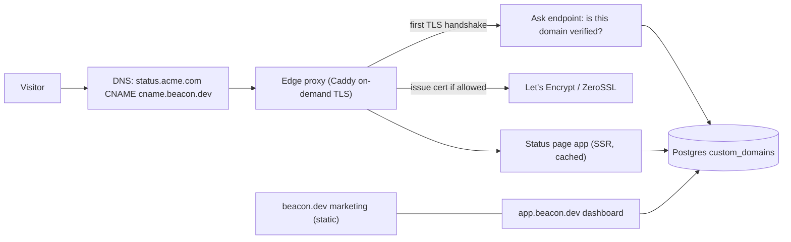
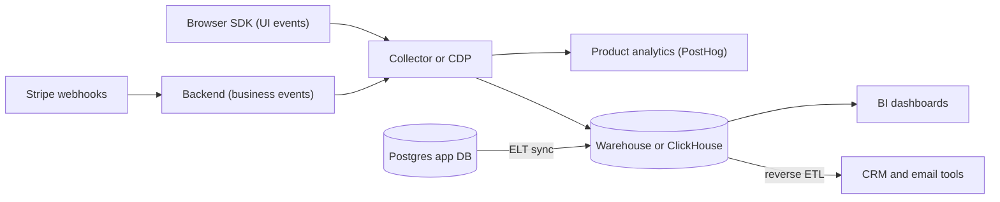
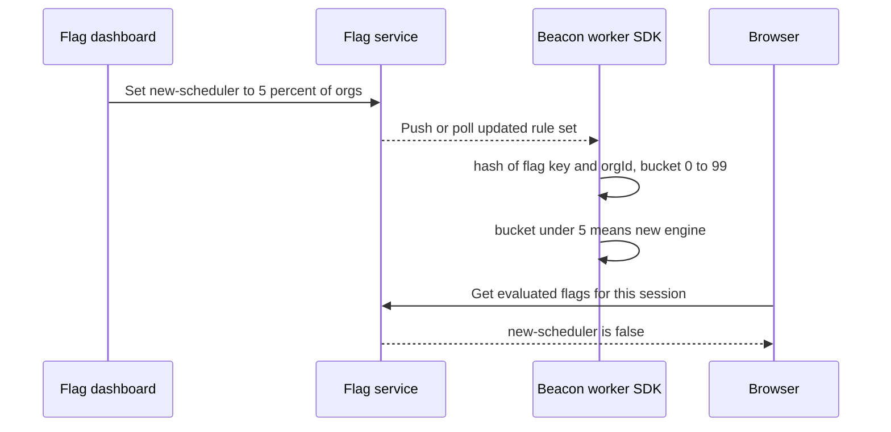

# Module 6 — Product & Growth

*Modules 1–5 built the machinery customers never see. This module covers the parts they do see, and the parts that tell you what they're doing: the app shell they log into every day, the analytics that show whether they're getting value, and the feature flags that let you change the product under them without breaking it. None of these is hard to start. All three get messy fast if you don't plan for them.*

---

# 6.1 — The app shell: marketing site, onboarding, dashboard and settings

*Level: 🟢 Beginner* · *Prerequisites: 1.1, 1.2*

## 🧭 Why every SaaS has this

Beacon's first version is one Next.js app. The landing page, the pricing page, the login form, the monitor dashboard and the settings screens all live in the same `app/` folder, share one layout, and deploy together. It works right up until three things happen in the same month.

Marketing wants to rewrite the landing page and publish a blog, and every copy change now goes through the same CI pipeline and review queue as a database migration. Google indexes the dashboard's loading spinner instead of the pricing page, because the whole thing renders client-side behind an auth check. And a Business customer asks why their public status page lives at `beacon.dev/s/acme` when every competitor lets them use `status.acme.com`.

Meanwhile, the numbers are bad in a quieter way. People sign up, land on an empty dashboard that says "No monitors yet", and leave. Nobody told them what to do first. The settings page is one long form where the "Delete organization" button sits next to "Change your avatar".

None of this is product logic. It's the **app shell**: the frame every SaaS puts around its actual product. It includes the public marketing site, the authenticated layout, onboarding, settings, forms, the design system, and tenant-facing surfaces such as custom domains. **The app shell is the part of your SaaS every customer touches on every visit, so a sloppy shell makes a good product feel broken.**

## 📐 How it works

### 🟢 The essentials

**Split the marketing site from the app.** They have opposite needs:

| | Marketing site (`beacon.dev`) | App (`app.beacon.dev`) |
|---|---|---|
| Audience | Anonymous visitors, search engines | Logged-in users |
| Rendering | Static or server-rendered (SSG/SSR) for SEO and speed | Client-heavy is fine; no SEO needed |
| Changes | Copy, blog posts, pricing, often by non-engineers | Features, by engineers |
| Auth | None | Everything behind a session check |
| Failure cost | A typo | Someone's data |

SSG (static site generation) means pages are built to HTML at deploy time. SSR (server-side rendering) means HTML is built per request. Either way the search engine gets real text instead of an empty `<div id="root">`. The usual layout is a **monorepo**, one Git repo holding several apps and shared packages, with `apps/web` for marketing, `apps/app` for the product, and `packages/ui` for shared components. They deploy separately and share a design system. next-forge is a good example of this shape. Marketing can live on a CMS or a site builder too. The point is that a blog post shouldn't need a database migration review.

Cookies decide how the two talk to each other. If the marketing site should show "Go to dashboard" to logged-in visitors, the session cookie has to be readable on the parent domain, or the marketing site has to call a small endpoint on the app. Decide this early, because it affects your cookie `Domain` attribute (1.1).

**The authenticated layout** is the frame around every logged-in page. In B2B SaaS it has settled into a familiar shape:

- A **sidebar** with the main sections (Monitors, Incidents, Status pages, Settings).
- An **org switcher** at the top, because users belong to several organizations (1.2). The current org is part of the URL (`/acme/monitors`), not hidden in client state, so links can be shared and a reload doesn't switch someone into the wrong tenant.
- A **user menu** with profile, theme and sign-out.
- A **command palette** (`⌘K`), a search box that jumps to any page or action. shadcn/ui's Command component is built on the `cmdk` library, so you get one almost for free.

**Onboarding and empty states.** A new Beacon user has no monitors, no incidents and no status page. That empty dashboard is the most important screen you'll ship, because every user sees it and most decide within minutes whether to stay. A good empty state explains what belongs there and offers one obvious action: "Add your first monitor: paste a URL, we'll check it every 5 minutes." Better still, the signup flow asks for that URL, so the dashboard is never empty.

That first valuable moment has a name. **Activation** is the event that means a user has actually experienced the product's value. For Beacon it might be "created a monitor and received its first check result within 24 hours." Pick one activation event, track it (6.2), and design onboarding to get people there. Checklists, tooltips and product tours are all tactics for this one number.

**Forms and validation.** Every SaaS is mostly forms. The key idea is to **define each form's validation schema once and use it on both client and server.** The client version gives instant feedback. The server version is the one you actually trust, because anyone can skip your frontend with `curl`. Zod does this in TypeScript:

```ts
// packages/validation/monitor.ts, imported by the form AND the server
import { z } from "zod";

export const createMonitorSchema = z.object({
  name: z.string().trim().min(1, "Give it a name").max(80),
  url: z.string().url("Use a full URL, e.g. https://api.acme.com/health"),
  intervalSeconds: z.coerce.number().int().min(30).max(300),
});
export type CreateMonitorInput = z.infer<typeof createMonitorSchema>;

// Server side (route handler or server action)
export async function createMonitor(orgId: string, raw: unknown) {
  const parsed = createMonitorSchema.safeParse(raw);
  if (!parsed.success) return { ok: false, issues: parsed.error.issues };
  await assertCan(orgId, "monitor:create");   // lesson 1.3
  await assertWithinLimit(orgId, "monitors"); // lesson 3.2
  return { ok: true, monitor: await db.monitor.create({ data: { orgId, ...parsed.data } }) };
}
```

On the client, React Hook Form plus `@hookform/resolvers` plugs that same schema into the form. Other stacks have the same pattern: Django forms or DRF serializers, Rails model validations with strong parameters, Laravel Form Requests, Go struct tags with `go-playground/validator`.

**The design system.** Don't hand-build dropdowns. The modern React default is layered:

- **Tailwind CSS** handles styling through utility classes.
- **Radix UI primitives** are unstyled, accessible components (dialog, dropdown, popover) that deal with focus traps, keyboard navigation and ARIA for you.
- **shadcn/ui** is a set of copy-paste components built on Radix and Tailwind. You run a CLI and the source lands *in your repo*, so you own and edit it. It isn't a dependency you upgrade.
- **TanStack Table** is a headless table engine for sorting, filtering and pagination. Every SaaS has a big table somewhere.
- **Tremor** provides dashboard charts and KPI cards.

### 🟡 Going deeper

**Settings architecture.** "Settings" is really four different things with different owners and permissions. Mix them up and you get security bugs (a Member changing billing) and UX bugs (a user who can't find their own password field).

| Settings area | Scope | Who can change it | Beacon examples |
|---|---|---|---|
| Account / profile | The user, across all orgs | The user | Name, avatar, password, 2FA, personal notification prefs, theme |
| Organization | One org | Admin/Owner | Org name, slug, members and roles, SSO, default alert channels |
| Billing | One org | Owner or Billing role | Plan, payment method, invoices, SMS credit usage (3.1–3.3) |
| Developer | One org (sometimes per user) | Admin | API keys, webhooks, integrations (5.2, 5.3) |
| Danger zone | One org | Owner only | Transfer ownership, delete org, export all data |

Put user settings at `/settings/account` and org settings at `/[org]/settings/...`. Every org settings route checks permissions on the server (1.3). Hiding a menu item isn't authorization. Destructive actions get a confirmation that makes the user type the org name.

**Onboarding as a state machine.** Store onboarding progress on the org, for example `onboarding_step` or a set of completed milestones, rather than in `localStorage`. The org's second admin shouldn't be pushed through "create your first monitor" again. Record milestones as they happen ("first monitor created", "first alert channel connected", "status page published") and drive both the checklist UI and your activation analytics from the same source.

**Internationalization (i18n) and formatting.** Even if you ship in English only, stop hardcoding strings into components once you have paying customers abroad, and **always** format dates, numbers and currencies with `Intl` APIs in the user's locale and time zone. An incident that "started at 03:14" is useless unless you say whose 03:14. Libraries: `next-intl`, `i18next`/`react-i18next`, FormatJS. Rails has I18n built in. Django has `gettext`.

**Accessibility (a11y)** means people using keyboards, screen readers or zoom can use your app. For B2B it's increasingly a sales requirement. Enterprise procurement asks for a VPAT (a document describing your WCAG conformance), and the European Accessibility Act has applied to many digital services sold in the EU since June 2025. Using Radix-based components gives you most of the hard parts. The rest is your job: labels on inputs, visible focus rings, colour contrast, errors announced to screen readers, and never using colour alone for status. Red and green "down/up" dots need an icon or text too. That one matters for a monitoring product in particular.

### 🔴 At scale / enterprise

**Custom domains for tenant-facing pages.** Beacon's public status page is the one surface *your customer's customers* see, so companies want it on their own domain: `status.acme.com`. The mechanics:

1. The customer enters `status.acme.com` in Beacon's settings.
2. Beacon tells them to create a DNS **CNAME** record pointing `status.acme.com` to something like `cname.beacon.dev`. A CNAME is an alias from one hostname to another.
3. Beacon verifies it, either by checking DNS or by asking for an extra TXT record to prove ownership.
4. Requests arrive at Beacon's edge with `Host: status.acme.com`. Beacon looks up which org owns that host and renders that status page.
5. Beacon needs a **TLS certificate** for `status.acme.com`, issued automatically from Let's Encrypt or ZeroSSL, because you can't ask every customer to upload certificates.



Three ways to get step 5:

- **Caddy on-demand TLS.** Caddy, a Go web server with automatic HTTPS, can get a certificate during the *first TLS handshake* for a hostname it has never seen. You **must** configure an `ask` endpoint so Caddy checks with your app first. Without it, anyone can point any domain at your server and make you request certificates until you hit CA rate limits.

  ```
  {
    on_demand_tls {
      ask http://localhost:3000/api/domains/allowed
    }
  }
  https:// {
    tls {
      on_demand
    }
    reverse_proxy localhost:3001
  }
  ```

- **Your platform's domains API.** Vercel lets you add domains to a project through its API. Dub, for example, uses this for customers' branded short-link domains.
- **Cloudflare for SaaS** (Custom Hostnames) runs certificates and the edge for you at Cloudflare's scale.

The hard parts at scale are these. Verification must be re-checked, because customers delete DNS records and you should stop serving the domain. Apex domains (`acme.com` with no subdomain) can't have a CNAME, so you need A records or ALIAS/ANAME support. And every request needs a hostname-to-org lookup, so cache it. Status pages also have to stay up *while the customer's own infrastructure is down*. Host them apart from the dashboard, cache aggressively at the edge, and never let a dashboard deploy take them out.

**White-labelling** goes further: custom logo, colours, email sender domain (4.1), removing "Powered by Beacon" on higher plans. Treat each of these as a plan entitlement (3.2), not a hardcoded `if (org.plan === "business")`.

## 🏆 The best repos

| Repo | What it is | Stack | License | Pick it when |
|---|---|---|---|---|
| [shadcn-ui/ui](https://github.com/shadcn-ui/ui) | Copy-into-your-repo components on Radix + Tailwind | React, TypeScript | MIT | You want a good-looking, owned component set on day one |
| [radix-ui/primitives](https://github.com/radix-ui/primitives) | Unstyled, accessible UI primitives | React, TypeScript | MIT | You're building your own design system and want a11y handled |
| [tailwindlabs/tailwindcss](https://github.com/tailwindlabs/tailwindcss) | Utility-first CSS framework | CSS, JS tooling | MIT | Default styling for most new SaaS frontends |
| [TanStack/table](https://github.com/TanStack/table) | Headless table and datagrid logic | TS (React, Vue, Solid, Svelte…) | MIT | Any list with sort, filter, paginate or select |
| [tremorlabs/tremor](https://github.com/tremorlabs/tremor) | Dashboard charts and KPI components | React, Tailwind | Apache-2.0 | Customer-facing dashboards (uptime %, response times) |
| [react-hook-form/react-hook-form](https://github.com/react-hook-form/react-hook-form) | Performant form state for React | React, TypeScript | MIT | Any non-trivial form, paired with a schema resolver |
| [colinhacks/zod](https://github.com/colinhacks/zod) | TypeScript-first schema validation | TypeScript | MIT | One schema shared by client and server |
| [vercel/next-forge](https://github.com/vercel/next-forge) | Production Turborepo SaaS template | Next.js monorepo | MIT | You want to see marketing/app/api split into separate apps |
| [caddyserver/caddy](https://github.com/caddyserver/caddy) | Web server with automatic HTTPS and on-demand TLS | Go | Apache-2.0 | Self-hosted custom domains for tenant pages |

**If you only study one:** study **next-forge**. It isn't a component library, but it shows the whole shell in one repo: separate apps for marketing, the product and the API, shared `packages/` for UI and auth, and the wiring between them. Read its folder structure before you create your own monorepo.

**Buy, build, or self-host?**

- **Buy** custom-domain TLS when you're already on a platform that sells it: Vercel domains, Cloudflare for SaaS. For marketing sites, a CMS or site builder (Webflow, Framer, or a headless CMS) is fine and gets engineers out of copy changes.
- **Self-host** Caddy with on-demand TLS when you run your own infrastructure or expect thousands of customer domains and want to control the cost.
- **Build** the shell itself (layout, onboarding, settings) on top of shadcn/ui, Radix and Tailwind. This is your product's face, so own the code. Don't build a form library, table engine or accessible dropdown from scratch.

## 🔍 Study it in the wild

**dubinc/dub.** A good shell to learn from: workspace switcher, a polished dashboard, and **customer custom domains** for short links. Open the repo and use code search for `domains` together with `vercel` to find where Dub adds and verifies domains through Vercel's API. At the time of writing the product lives in `apps/web`. Look at how the app decides between marketing, dashboard and link-redirect behaviour based on the incoming hostname.

**openstatusHQ/openstatus.** A real Beacon: an open-source uptime monitor with public status pages. Search for `custom domain` and `status page` to see how a page is resolved from a hostname or slug. Compare how the status page is rendered with how the authenticated dashboard is rendered.

**calcom/cal.com.** Cal.com's onboarding flow and settings split are worth reading. Search for `getting-started` or `onboarding` to find the step-by-step first-run flow, and browse the settings pages to see account-level and team/org-level settings kept apart.

**vercel/next-forge.** Here the shell *is* the product. Look at the top-level `apps/` folder: marketing and the product app are separate Next.js apps that share `packages/`. Notice what counts as "shared" (design system, auth, analytics) and what doesn't.

**What to notice:**

- The org or workspace slug lives in the URL, and every page and API call derives the tenant from it plus the session, never from client-side state alone.
- Marketing pages are statically rendered or cached. The dashboard is not indexed by search engines.
- Custom-domain requests are routed by `Host` header early, often in middleware, before any page logic runs.
- Empty states are designed screens with one clear call to action, not a blank table.
- Validation schemas are imported by both the form component and the server handler.

## 🛠️ Build it into Beacon

### 🟢 Beginner exercise

Build Beacon's authenticated layout with shadcn/ui: a sidebar (Monitors, Incidents, Status pages, Settings), an org switcher that changes the `/[org]/...` URL segment, and an empty state on the Monitors page with a single "Add your first monitor" button that opens a form validated with a shared zod schema.

**Done when:**
- Switching org changes the URL and reloading the page keeps you in the same org.
- Submitting an invalid URL shows an inline error without a network request, *and* posting the same bad payload with `curl` is rejected by the server with the same message.
- The whole flow works with keyboard only (Tab, Enter, Escape closes the dialog).

### 🟡 Intermediate exercise

Split settings into Account (`/settings/account`), Organization (`/[org]/settings/general`, `/members`), Billing and Developer (API keys). Add an onboarding checklist driven by milestones stored on the org: first monitor, first alert channel, status page published. The checklist hides itself once all three are done.

**Done when:**
- A Member role gets a 403 from the server when calling the org-rename endpoint directly, not just a hidden button.
- A second admin who joins after onboarding is done never sees the checklist.
- Milestone timestamps are stored, so you can later compute "time to activation" (6.2).

### 🔴 Advanced exercise

Ship custom domains for status pages. Add a `custom_domains` table (`org_id`, `hostname`, `verified_at`, `last_checked_at`), a settings page that shows the CNAME to create, a verification job (5.1) that re-checks DNS daily, and a Caddy config with `on_demand_tls` whose `ask` endpoint only returns 200 for verified hostnames.

**Done when:**
- `status.yourtestdomain.com` serves the right org's status page over valid HTTPS with no manual cert step.
- Pointing an unregistered domain at the server does **not** trigger a certificate request (check Caddy's logs).
- Deleting the DNS record makes the domain unverified within a day, and it stops being served.

## ⚠️ Mistakes juniors make

- **Serving the marketing site from the authenticated SPA.** Search engines see a spinner, and every copy tweak ships through the app's deploy. Split them: static or SSR marketing, and the app on its own subdomain.
- **Keeping the current org only in React state or `localStorage`.** Reloads, shared links and new tabs all switch tenants silently, and it's one step from a cross-tenant bug. Put the org slug in the URL and check membership on the server on every request.
- **Validating only on the client.** The browser is not a security boundary. Share one schema and always run it on the server, then check permissions (1.3) and plan limits (3.2) after that.
- **Treating "hide the button" as permissions.** A hidden Delete button still has a working endpoint. Server-side checks come first. The UI only reflects them.
- **Enabling on-demand TLS without an `ask` check.** Anyone can aim DNS at you and make you request certificates for arbitrary names, burning CA rate limits. Always gate it on a verified-domain lookup.
- **Formatting dates in server time.** An incident at "14:00" means nothing to a customer eight time zones away. Store UTC and format with `Intl` in the viewer's time zone.
- **Building your own dropdowns and modals.** You'll get focus handling and screen-reader behaviour wrong. Use Radix or shadcn/ui and spend the time on your empty states instead.

## 🧾 Recap

- The app shell (marketing site, layout, onboarding, settings, design system) is the same in every SaaS, and customers judge you by it.
- Split marketing (static/SSR, SEO, non-engineers) from the app (authenticated, tenant in the URL), usually as separate apps in one monorepo.
- Design the empty state and onboarding around one **activation** event, and store progress on the org.
- Settings come in four kinds with different permissions: account, organization, billing, developer. Plus a danger zone.
- One validation schema, shared by client and server. The server copy is the one that counts.
- Custom domains mean CNAME, verification, automatic TLS (Caddy on-demand with `ask`, Vercel, or Cloudflare for SaaS) and hostname-based routing.

## 📚 References

- shadcn/ui documentation: https://ui.shadcn.com
- Radix Primitives documentation, including accessibility notes per component: https://www.radix-ui.com/primitives
- Zod documentation: https://zod.dev
- React Hook Form documentation: https://react-hook-form.com
- Caddy documentation on automatic HTTPS and on-demand TLS: https://caddyserver.com/docs/automatic-https
- Cloudflare for SaaS documentation: https://developers.cloudflare.com/cloudflare-for-platforms/cloudflare-for-saas/
- W3C Web Content Accessibility Guidelines (WCAG) overview: https://www.w3.org/WAI/standards-guidelines/wcag/
- next-forge documentation: https://www.next-forge.com

---

# 6.2 — Analytics: product, web and the event pipeline

*Level: 🟡 Intermediate* · *Prerequisites: 1.2, 6.1*

## 🧭 Why every SaaS has this

Beacon's founders open their weekly meeting with a simple question: "Is the new onboarding working?" Nobody can answer it. The Stripe dashboard shows revenue. The Postgres `monitors` table shows how many monitors exist. Google Analytics shows that 4,000 people visited the pricing page. But nobody can say how many of last week's signups created a monitor, how long it took, or whether teams who connect Slack stay longer than teams who don't.

So an engineer adds `track("clicked button")` in forty places. A month later the event list contains `Monitor Created`, `monitor_created`, `createMonitor`, and `new-monitor`, all meaning roughly the same thing, and none of them records which organization the user belongs to. For a B2B product that's the number you actually care about, because an *organization* pays you, not a user.

**Analytics is the component that turns "we think" into "we measured", and it only works if you decide what to measure, and how to name it, before you start sending events.**

## 📐 How it works

### 🟢 The essentials

"Analytics" covers three different jobs that people blur together:

| Kind | Question it answers | Unit | Beacon example | Tools |
|---|---|---|---|---|
| **Web analytics** | Who visits the marketing site, from where? | Page views, sessions | Which blog post drives signups? | Plausible, Umami, Matomo |
| **Product analytics** | What do logged-in users *do* in the app? | Events by users and orgs | % of new orgs that create a monitor in 24h | PostHog, OpenPanel, Amplitude, Mixpanel |
| **BI / data warehouse** | What does the business look like across all systems? | Joined tables | Revenue per org vs. monitors vs. support tickets | Warehouse + dbt + a BI tool (Metabase, Superset) |

Web analytics is cheap and nearly automatic: drop a script tag on the marketing site. Product analytics needs deliberate **events**. An event is a record that something happened: who (user ID), which org, what (event name), when (timestamp), plus **properties** (key-value details such as `check_interval: 60`).

The data model most tools share comes from Segment's spec, a de facto standard:

- **`identify(userId, traits)`** says "this browser/device is user `u_123`, whose email is ..." It ties anonymous pre-signup activity to the real user.
- **`track(event, properties)`** says "user did X."
- **`page()` / `screen()`** records a page view.
- **`group(groupId, traits)`** says "this user belongs to organization `org_42` on the Pro plan." **This is the call B2B SaaS forgets**, and it's what lets you ask questions per account instead of per person. PostHog calls this group analytics.

**A tracking plan** is a short document, often a spreadsheet, listing every event, its properties, and why it exists. Use **object–action naming**: the noun, then a past-tense verb, in one consistent case. `monitor_created`, `alert_channel_connected`, `status_page_published`, `subscription_upgraded`. You can then read the list alphabetically by object, and nobody invents `createMonitor`.

| Event | Key properties | Why we track it |
|---|---|---|
| `org_created` | `signup_source` | Top of every funnel |
| `monitor_created` | `check_interval`, `type`, `is_first` | Activation step 1 |
| `monitor_check_completed` | `status` (only the *first* check per monitor) | Activation step 2: value delivered |
| `alert_channel_connected` | `channel` (email/slack/sms) | Strong retention predictor to test |
| `subscription_upgraded` | `from_plan`, `to_plan` | Revenue |

With those events you can build the three charts every SaaS lives on:

- **Funnel**: of orgs created this week, what % created a monitor, then got a check result, then connected an alert channel?
- **Activation rate**: % of new orgs reaching the activation event (6.1) within N days.
- **Retention**: of orgs that signed up in week W, what % were still active in weeks W+1, W+2...? This is usually drawn as a cohort table. "Active" must be a real value event, such as "viewed dashboard or received an alert", not "logged in".

### 🟡 Going deeper

**Client-side vs. server-side tracking.** Client-side means the browser SDK sends events. It sees clicks and page views, but ad blockers and privacy extensions block a real share of it, and users can forge it. Server-side means your backend sends events after the thing actually happened in the database. It's reliable and complete, but it can't see pure UI interactions. The rule: **business events are tracked server-side** (`monitor_created` fires after the insert commits, `subscription_upgraded` fires from the Stripe webhook handler in 3.1), and **UI behaviour is tracked client-side** (opened command palette, dismissed checklist). Many teams also proxy the client SDK through their own domain so blockers are less aggressive. Be honest with yourself about why you're doing that, and see the next point.



**Privacy and consent.** In the EU and UK, the ePrivacy rules require consent before storing or reading non-essential data on a user's device (cookies, `localStorage` IDs), and GDPR governs the personal data itself (8.1). In practice:

- Cookieless web analytics such as Plausible, which uses a hash of IP + user agent with a daily rotating salt and stores no cookie, is generally designed so it doesn't need a consent banner. Check with your own counsel.
- Product analytics that identifies users *inside* your app is personal data processing. Cover it in your privacy policy and DPA, list the vendor as a subprocessor (8.1), and don't send data you don't need. **Never put emails, names or monitor URLs in event properties unless you truly need them.** Use IDs.
- Session replay tools record screens. Mask all inputs by default.
- Support deletion. When a user exercises GDPR erasure, their events must be deletable too. Know how your analytics tool does this before you pick it.

**The event pipeline and CDPs.** A **CDP** (customer data platform) such as RudderStack, Jitsu or Segment collects events once and fans them out to many destinations: product analytics, the warehouse, the CRM, the email tool. It stops you from installing five SDKs. The **warehouse** (BigQuery, Snowflake, Postgres, or ClickHouse) is where events meet your application data. You sync your Postgres tables in with ELT (extract, load, then transform in SQL, often with dbt), and can join "events" with "orgs" and "Stripe invoices". **Reverse ETL** pushes computed traits back out, for example "this org is at 90% of its monitor limit" into the CRM so sales can call.

### 🔴 At scale / enterprise

**Why ClickHouse keeps showing up.** Analytics queries look like "count events grouped by day, filtered by org, over 90 days, across billions of rows." A row store like Postgres reads whole rows and slows down badly here. **ClickHouse** is a column-oriented database: it stores each column separately and compressed, so a query touching three columns reads only those three, and it aggregates very fast. PostHog, Plausible and OpenPanel all store their events in ClickHouse. The trade-offs: ClickHouse likes large batch inserts rather than single-row writes, updates and deletes are expensive, background operations (important for GDPR deletion), and it's not a transactional database for your app. Keep Postgres for the app and ClickHouse for events.

**Customer-facing analytics.** Beacon will eventually *sell* analytics: uptime percentage, response-time charts, and status-page view counts for every customer. Now analytics is a product feature with a tenant boundary, latency requirements and plan limits (Free keeps 7 days of history, Business keeps a year). Dub is a good example. It shows click analytics to its customers and uses **Tinybird**, a managed ClickHouse-based service that exposes SQL queries as API endpoints. Whatever you choose, every query must be filtered by `org_id` on the server. Tenant isolation (2.4) applies to your analytics store exactly as it does to Postgres. Beacon's `monitor_check_completed` rows, one per check every 30 seconds per monitor, are a textbook ClickHouse table: append-only, time-series, aggregated by time bucket.

**Data quality at scale.** Tracking plans rot. Enforce them with typed tracking functions generated from the plan (`track.monitorCreated({ checkInterval })`), CI checks, or schema validation in the pipeline that rejects unknown events. Version events when their meaning changes (`monitor_created` v2) instead of silently redefining them. Watch the costs too: product analytics pricing is usually per event, and a chatty client SDK with autocapture can multiply your bill without anyone asking a new question.

**Identity resolution in B2B.** Users belong to several orgs, change emails, and get SCIM-provisioned (1.4). Always send the org as a group on every event, not just at identify time. Keep a stable internal user ID, never the email, as the distinct ID. And decide which org an event belongs to when a user acts across two workspaces in one session.

## 🏆 The best repos

| Repo | What it is | Stack | License | Pick it when |
|---|---|---|---|---|
| [PostHog/posthog](https://github.com/PostHog/posthog) | All-in-one product analytics, session replay, flags, experiments | Python/Django, TypeScript, ClickHouse | MIT (core; `ee/` separately licensed) | You want one tool for product analytics + flags, cloud or self-hosted |
| [plausible/analytics](https://github.com/plausible/analytics) | Lightweight, cookieless web analytics | Elixir, ClickHouse, Postgres | AGPL-3.0 | Privacy-friendly analytics for the marketing site |
| [umami-software/umami](https://github.com/umami-software/umami) | Simple self-hosted web analytics | Next.js, Postgres/MySQL | MIT | Easiest self-hosted web analytics to run |
| [Openpanel-dev/openpanel](https://github.com/Openpanel-dev/openpanel) | Open-source web + product analytics | TypeScript, ClickHouse | AGPL-3.0 | A lighter Mixpanel-style alternative to PostHog |
| [jitsucom/jitsu](https://github.com/jitsucom/jitsu) | Event collection / CDP into your warehouse | TypeScript, Go | MIT | You want Segment-style collection into your own warehouse |
| [rudderlabs/rudder-server](https://github.com/rudderlabs/rudder-server) | CDP event router (Segment alternative) | Go | Elastic License 2.0 | Many destinations, warehouse-first pipeline |
| [matomo-org/matomo](https://github.com/matomo-org/matomo) | Veteran Google Analytics alternative | PHP, MySQL | GPL-3.0 | Full-featured, self-hosted GA replacement, strong in the EU |
| [ClickHouse/ClickHouse](https://github.com/ClickHouse/ClickHouse) | Column-oriented analytics database | C++ | Apache-2.0 | Storing and querying billions of events, or customer-facing analytics |

**If you only study one:** study **PostHog**. It's a production SaaS *and* an analytics system, so you can read how events are ingested, how `identify`/`group` are modelled, how ClickHouse tables are laid out, and how an org/project hierarchy scopes all of it. It also covers lesson 6.3.

**Buy, build, or self-host?**

- **Buy** product analytics early: PostHog Cloud, Amplitude, Mixpanel. For marketing, Plausible Cloud or Fathom. Setting it up takes a day, and your time is better spent on the tracking plan than on running ClickHouse.
- **Self-host** when data residency or privacy promises require it, or when event volume makes per-event pricing painful. Umami and Plausible are easy to self-host. PostHog self-hosted is a serious operational commitment.
- **Build** only the *customer-facing* analytics (Beacon's uptime charts), because that's your product, on ClickHouse, Tinybird or TimescaleDB. Never build your own internal product-analytics tool.

## 🔍 Study it in the wild

**PostHog/posthog.** Search for `group_type` and `groups` to see how B2B group analytics is modelled, and look for the ClickHouse schema definitions (search `CREATE TABLE` together with `MergeTree`) to see how events are laid out on disk. The plugin-server / ingestion code shows what happens between the SDK and the database: batching, person merging, property handling.

**dubinc/dub.** A clean example of **customer-facing analytics**. Use code search for `tinybird` to find where click events are sent and where analytics are queried per workspace and link. Notice that Dub's own Postgres stores links and workspaces, while the high-volume click stream goes to a separate analytics store.

**plausible/analytics.** Worth reading as a design argument. Look at how a visitor is counted without cookies (search for `salt`), and how the Postgres side (sites, users) is kept apart from the ClickHouse side (events).

**umami-software/umami.** The smallest codebase here. Read how the tracker script builds a payload and how the collect endpoint validates and stores it. It's a good model for Beacon's own status-page view counter.

**What to notice:**

- Transactional app data (Postgres) and high-volume events (ClickHouse or Tinybird) live in separate stores with separate access patterns.
- Every event carries a project/site/workspace identifier, and every query is scoped by it.
- Ingestion is batched and asynchronous. The request that records a click never waits on the analytics database.
- Privacy is a design decision in the code (salting, masking, IP truncation), not only a line in the policy.

## 🛠️ Build it into Beacon

### 🟢 Beginner exercise

Write Beacon's tracking plan: 8–12 events in object_action form, each with properties and a one-line "why". Then add cookieless web analytics (Plausible or Umami) to the marketing site only.

**Done when:**
- Every event in the plan maps to a question you'd actually ask (activation, retention, upgrade).
- No event property contains an email, name, or monitored URL.
- Visits to the marketing site appear in the dashboard with no cookie set (check DevTools → Application).

### 🟡 Intermediate exercise

Integrate PostHog (cloud or self-hosted). Call `identify` on login and `group("organization", orgId, { plan })` on every page load in the app. Send `monitor_created` and `subscription_upgraded` **server-side** after the database write or Stripe webhook succeeds. Build an activation funnel: `org_created` → `monitor_created` → first `monitor_check_completed` within 24h.

**Done when:**
- The funnel can be broken down by organization plan, not just by user.
- Blocking the PostHog domain in the browser doesn't stop `monitor_created` from being recorded.
- A typed `track` helper rejects event names not in your plan at compile time.

### 🔴 Advanced exercise

Build customer-facing uptime analytics. Write every check result to a ClickHouse table (`org_id`, `monitor_id`, `ts`, `status`, `latency_ms`) using batched inserts from the check worker (5.1). Expose a server endpoint returning 90-day daily uptime % and p95 latency for one monitor, and render it with Tremor on the status page.

**Done when:**
- The endpoint takes `org_id` from the session or status-page lookup, never from a query parameter, and a test proves org A can't read org B's data.
- Inserts are batched (e.g. every second or every 1,000 rows), not one row per check.
- A retention policy (ClickHouse TTL) drops data past the plan's history limit.

## ⚠️ Mistakes juniors make

- **Tracking everything with no plan.** Autocapture and ad-hoc `track()` calls give you thousands of events and zero answers. Write the tracking plan first, then add events for questions you'll actually ask.
- **Forgetting the org.** In B2B, a user-level funnel hides the truth: one enthusiastic user in a dead account looks healthy. Send `group` calls and analyse by organization.
- **Tracking business events from the browser.** Ad blockers drop them and users can fake them. Send `monitor_created` and upgrades from the server after the write commits.
- **Putting PII in event properties.** Emails and URLs in analytics make GDPR deletion requests a nightmare and leak data to another vendor. Send IDs and join later in the warehouse if needed.
- **Running analytics queries on the production Postgres.** A "quick" 90-day GROUP BY across the checks table slows down the app for every customer. Use a replica, a warehouse, or ClickHouse.
- **Measuring "logins" as retention.** Logging in isn't value. Define active use by the value event (received an alert, viewed incidents, published a status page).

## 🧾 Recap

- Web analytics (marketing site), product analytics (in-app behaviour) and BI (everything joined) are three different jobs.
- A tracking plan with object_action names comes before any code, and `group` calls make B2B analytics work.
- Track business events server-side and UI events client-side. Keep PII out of properties and respect consent.
- A CDP collects events once and routes them. The warehouse joins them with app data. Reverse ETL sends insights back out.
- ClickHouse (columnar) is the standard store for events and for customer-facing analytics like Dub's. Scope every query by tenant.

## 📚 References

- PostHog documentation, including group analytics: https://posthog.com/docs
- Segment Spec (identify, track, page, group): https://segment.com/docs/connections/spec/
- Plausible data policy (how cookieless counting works): https://plausible.io/data-policy
- ClickHouse documentation: https://clickhouse.com/docs
- Tinybird documentation: https://www.tinybird.co/docs
- RudderStack documentation: https://www.rudderstack.com/docs/
- Umami documentation: https://umami.is/docs

---

# 6.3 — Feature flags and experiments

*Level: 🟡 Intermediate* · *Prerequisites: 3.2, 6.2*

## 🧭 Why every SaaS has this

On 1 August 2012, Knight Capital deployed new trading code to its servers. The new code reused an old configuration flag that had once switched on a long-dead feature called "Power Peg". One of eight servers didn't get the new code. When the flag was turned on, that server ran the old Power Peg logic against the live market. In about 45 minutes Knight lost roughly $440 million, and the firm didn't survive as an independent company. The SEC's later order describes it in detail. It remains the most expensive lesson in flag hygiene ever recorded: **never repurpose an old flag, and delete dead flags along with their code.**

Beacon's stakes are smaller, but the shape is the same. The team rewrites the check scheduler. They can merge it on a Friday and hope, or they can merge it *switched off*, turn it on for their own org, then for 5% of Free orgs, watch the error rate, and turn it off in one click if checks start arriving late. Separately, product wants to know whether a new onboarding checklist raises activation, and "it feels better" isn't an answer.

Feature flags split **deploying** code (putting it on servers) from **releasing** it (letting users run it). Experiments reuse the same machinery to measure whether a change helped. **A feature flag is a runtime `if` statement whose condition you control from outside the code. It's powerful exactly because it's a hidden branch in production, and dangerous for the same reason.**

## 📐 How it works

### 🟢 The essentials

At its simplest, a flag is:

```ts
if (await flags.isEnabled("new-scheduler", { orgId: org.id, plan: org.plan })) {
  return scheduleWithNewEngine(monitor);
}
return scheduleWithOldEngine(monitor);
```

The flag's rules ("on for org `beacon-internal`, plus 5% of everyone else") live in a flag service or config, not in the code. Change the rule and behaviour changes without a deploy.

There are several kinds of flag, and they differ in how long they live and who owns them. Pete Hodgson's article on martinfowler.com is the classic taxonomy:

| Type | Purpose | Lifetime | Who flips it | Beacon example |
|---|---|---|---|---|
| **Release flag** | Ship unfinished or risky code dark, roll out gradually | Days to weeks, then **delete** | Engineers | `new-scheduler` |
| **Ops flag / kill switch** | Turn off an expensive or failing subsystem quickly | Long-lived, by design | On-call | `disable-sms-sending` during a provider outage |
| **Permission flag** | Early access or beta programmes for chosen customers | Weeks to months | Product/CS | `ai-incident-summary-beta` for 10 orgs |
| **Experiment** | Randomly split users to measure impact on a metric | Until the result is significant, then delete | Product/growth | `onboarding-checklist-v2` vs. control |

**Entitlements are not feature flags.** "Business plan gets SSO and 30-second checks" is a *pricing* rule that lives in your plans and entitlements system (3.2) and changes when the customer pays. Feature flags are temporary engineering and product controls. If you model plans as flags in LaunchDarkly, billing and access drift apart and nobody knows which one is the truth. A beta flag *can* check an entitlement ("beta, but only for Business orgs"), but they're different systems.

Why not just use an environment variable? Env vars need a redeploy to change, can't target one customer, and can't do percentages. That's fine for a kill switch in a tiny app. Not for anything else.

### 🟡 Going deeper

**Where the flag is evaluated.** There are two models:

- **Remote evaluation.** The app asks the flag service "is `new-scheduler` on for org 42?" on each request. It's simple, and the rules never leave the server. The cost is a network hop per check, and you have to decide what happens when the service is down.
- **Local evaluation.** The SDK downloads the *whole rule set* at startup, keeps it fresh by polling or streaming, and evaluates in memory in microseconds. This is what you want in Beacon's check workers, which make millions of decisions a day. Server-side SDKs for Unleash, Flagsmith, GrowthBook and PostHog all support it. Browser SDKs usually get pre-evaluated results from the server instead, so your targeting rules (and customer lists) aren't exposed to anyone who opens DevTools.



Always define a **default value** for when the flag service is unreachable, and make it the safe one (usually "off", the old code path).

**Percentage rollouts need consistent hashing.** "5% of orgs" can't mean `Math.random() < 0.05`. Then the same org would flip between old and new code on every request. Instead, hash a stable key such as `hash(flagKey + ":" + orgId)` to a number from 0 to 99, and turn the flag on if it's below 5. The same org always lands in the same bucket, and going from 5% to 20% keeps the original 5% in. Including the flag key in the hash means different flags pick different 5% slices, so the same unlucky customers don't get every beta. Tools use stable hashes such as MurmurHash3 or SHA-1 for this.

**Target by organization in B2B.** If you roll out per *user*, two teammates at Acme see different dashboards and file confused support tickets. Use the org ID as the rollout key and pass org attributes (plan, region, created date) as targeting context. PostHog has group-based flags for this, and Unleash, Flagsmith and GrowthBook all let you choose the stickiness or hashing attribute.

**OpenFeature** is a CNCF project that defines a vendor-neutral flag API. Your code calls `client.getBooleanValue("new-scheduler", false, { targetingKey: orgId })`, and a **provider** plugs in Unleash, Flagsmith, LaunchDarkly, flagd or your own. You can switch vendors without touching call sites, and **hooks** give you one place to log every evaluation. For a new codebase it's a cheap way to avoid lock-in.

**Flag debt.** Every release flag doubles the paths through that code. Ten stale flags means up to 1,024 combinations nobody has tested. The Knight Capital story is flag debt at its worst. The fix is process:

- Give each flag an owner and an expiry date when you create it. Unleash marks flags as potentially stale by type, and several tools report flags with no recent evaluations.
- Removing the flag is part of "done": a follow-up ticket created with the flag, finished once rollout reaches 100%.
- Never reuse a flag name. Create a new one.
- Search the codebase for flags that are 100% on everywhere, and delete the flag *and* the dead branch.

### 🔴 At scale / enterprise

**A/B testing basics.** An experiment randomly assigns units (for Beacon, **orgs**) to control or variant using the same consistent hashing, exposes them, and compares one pre-chosen metric. The traps:

- **Pick one primary metric before you start**, e.g. "% of orgs activated within 24h." Check twenty metrics and one will look significant by chance.
- **Compute the sample size up front.** Detecting a 2-point lift on a 30% activation rate needs thousands of orgs per arm. Many B2B SaaS don't *have* that traffic. If you get 200 signups a week, most experiments will never reach significance. Ship the change behind a release flag and watch the numbers instead.
- **The peeking problem.** Checking a classic (fixed-horizon) test every day and stopping the moment p < 0.05 inflates false positives a lot. Either wait for the planned sample size, or use a method designed for continuous monitoring (sequential testing, or the Bayesian approaches that tools like GrowthBook offer).
- **Log exposures, not assignments.** Count an org in the experiment only when it actually reaches the changed screen. Otherwise you dilute the effect with people who never saw it.
- **Sample ratio mismatch.** If a 50/50 split comes out 55/45, something is broken (bots, a redirect dropping users, caching). Don't trust the result.

**Flags in the critical path.** At scale the flag system becomes infrastructure. SDKs must cache the last known rules and keep working if the service disappears. Flag changes need an **audit log** (7.3) and ideally approvals for production kill switches, because "who turned off SMS sending at 02:00?" is a real question. Changes should also show up in your observability (7.2) as annotations on dashboards, since the first question during an incident is "what changed?", and a flag flip counts as a change the same way a deploy does.

**Consistency across services.** If the API and the check worker both evaluate `new-scheduler`, they must agree for the same org. That means the same key, the same hashing, and a rule-set version that propagates within seconds. Relay or edge proxies (Unleash Edge, flagd, the Flagsmith Edge Proxy) keep evaluation close to your services and cut the load on the central flag server.

## 🏆 The best repos

| Repo | What it is | Stack | License | Pick it when |
|---|---|---|---|---|
| [Unleash/unleash](https://github.com/Unleash/unleash) | Mature open-source feature flag platform | Node.js/TypeScript, Postgres | AGPL-3.0 | Self-hosted flags with strong rollout strategies and many SDKs |
| [Flagsmith/flagsmith](https://github.com/Flagsmith/flagsmith) | Flags and remote config, cloud or self-hosted | Python/Django, React | BSD-3-Clause | You want flags plus per-identity remote config values |
| [growthbook/growthbook](https://github.com/growthbook/growthbook) | Flags plus a warehouse-native experimentation platform | TypeScript, MongoDB | MIT (core) | Experiments with real statistics, on data in your own warehouse |
| [flipt-io/flipt](https://github.com/flipt-io/flipt) | Lightweight, GitOps-friendly flag server | Go | Fair Core License (FCL-1.0-MIT) | Single binary, flags stored alongside your config |
| [open-feature/spec](https://github.com/open-feature/spec) | The vendor-neutral feature flag API specification | Spec (Markdown) | Apache-2.0 | Understanding the standard your SDK calls should follow |
| [open-feature/js-sdk](https://github.com/open-feature/js-sdk) | OpenFeature SDK for JavaScript/TypeScript | TypeScript | Apache-2.0 | Writing vendor-neutral flag calls in a Node or web app |
| [PostHog/posthog](https://github.com/PostHog/posthog) | Flags and experiments integrated with product analytics | Python/Django, ClickHouse | MIT (core; `ee/` separately licensed) | You already use PostHog and want flags tied to events and groups |

**If you only study one:** study **Unleash**. Its documentation and code lay out flag types, activation strategies, stickiness (the consistent-hashing key), and stale-flag detection explicitly. It's the clearest model of a flag system built for engineers.

**Buy, build, or self-host?**

- **Buy** when flags are critical and you'd rather not run the service: LaunchDarkly is the enterprise standard, Statsig is strong on experimentation, and PostHog Cloud or GrowthBook Cloud are cheaper all-in-ones.
- **Self-host** Unleash, Flagsmith, GrowthBook or Flipt when you need flags inside your own network, or you're a self-hostable product yourself (7.4). All are straightforward to run with Postgres.
- **Build** only a tiny version: a `feature_flags` table with per-org overrides and a hashed percentage, cached in memory. That's fine for your first few flags. Once you want audit logs, experiments, SDKs in several languages, or non-engineers flipping flags, adopt a tool, ideally behind OpenFeature so the switch is cheap.

## 🔍 Study it in the wild

**PostHog/posthog.** PostHog runs its own flags on itself. Use code search for `feature_flag` and `hash` to find how the rollout percentage is computed from the flag key and the distinct ID (or group key, for group-based flags). Look for how flags are evaluated per group type to see B2B org-level targeting.

**Unleash/unleash.** Read the activation strategy code (search for `strategy` and `stickiness`) and look at how stale flags are identified by flag type and age. The SDKs, in separate repos under the Unleash organisation, show local evaluation: download rules, refresh them in the background, evaluate in memory.

**growthbook/growthbook.** Search for `hash` in the SDK code to see how users are assigned to experiment variations deterministically, and browse the stats engine (Python) to see sequential testing and Bayesian analysis implemented rather than just described.

**calcom/cal.com.** A product codebase that uses flags, not a flag vendor. Use code search for `feature flag` or `features` to find how Cal.com gates features in its own database and checks them per team. It's a realistic "small in-house flag system" to compare with the dedicated tools.

**What to notice:**

- The hash input combines the flag key and a stable ID, so rollouts stay sticky and don't overlap across flags.
- SDKs have explicit defaults and cached rule sets for when the server is unreachable.
- Flag *types* are first-class, and they change how long a flag is expected to live.
- Targeting context includes group/org attributes, not only user attributes.

## 🛠️ Build it into Beacon

### 🟢 Beginner exercise

Implement a minimal in-house flag: a `feature_flags` table (`key`, `enabled`, `rollout_percent`) and a `feature_flag_overrides` table (`key`, `org_id`, `enabled`). Write `isEnabled(key, orgId)` that checks overrides first, then hashes `key:orgId` into 0–99 against `rollout_percent`.

**Done when:**
- The same org always gets the same answer for the same flag (write a test over 1,000 calls).
- Raising the rollout from 10% to 30% keeps every org that was already on.
- An override for your internal org turns the flag on regardless of percentage.

### 🟡 Intermediate exercise

Replace the in-house function with OpenFeature and a self-hosted Unleash (or Flagsmith) provider. Put the new scheduler behind `new-scheduler`, keyed by org ID, with local evaluation in the worker. Add `disable-sms-sending` as an ops kill switch that on-call can flip from the dashboard.

**Done when:**
- Stopping the flag service doesn't crash workers; they keep using the last known rules or the safe default.
- Flipping the kill switch stops SMS sends within your refresh interval, with no deploy.
- Every flag has an owner and an expiry noted, and there's a ticket to remove `new-scheduler`.

### 🔴 Advanced exercise

Run a real experiment on onboarding with GrowthBook or PostHog: `onboarding-checklist-v2`, randomised by org, primary metric "activated within 24h" (from 6.2). Log an exposure event only when the org sees the checklist. Before launching, write down the minimum detectable effect and the required sample size.

**Done when:**
- The experiment doc states the metric, sample size and stopping rule *before* launch.
- A sample-ratio-mismatch check runs and passes.
- The result (win, loss or inconclusive) is recorded, the losing branch and the flag are deleted, and the audit log shows who changed the experiment and when.

## ⚠️ Mistakes juniors make

- **Using flags for plans and pricing.** "Pro gets 1-minute checks" belongs in entitlements (3.2), linked to billing. Flags are temporary controls, and mixing the two gives you customers who pay for features they can't use.
- **Randomising per request.** `Math.random()` rollouts flip users between versions on every page load. Hash a stable ID with the flag key.
- **Rolling out per user in a B2B product.** Teammates see different products and support gets confused. Use the org as the rollout key.
- **Never deleting flags.** Every stale flag is a hidden branch and a possible Knight Capital. Give flags owners and expiry dates, and count removal as part of the feature.
- **Shipping targeting rules to the browser.** Client-side local evaluation can expose customer lists and unreleased feature names. Evaluate on the server and send the browser only results.
- **Peeking at experiments and stopping early.** Stopping at the first p < 0.05 mostly finds noise. Fix the sample size and metric in advance, or use sequential methods.
- **No default when the flag service is down.** A flag lookup that throws takes the whole request down with it. Always pass a safe default and cache the rules.

## 🧾 Recap

- Flags separate deploy from release: release flags, ops kill switches, permission flags and experiments each have a different lifetime and owner.
- Entitlements are not flags. Pricing lives in 3.2, and flags can consult it but shouldn't replace it.
- Evaluate locally on servers with cached rules and safe defaults. Send browsers pre-evaluated results.
- Percentage rollouts use a consistent hash of flag key + stable ID, and in B2B that ID is the org.
- OpenFeature keeps your call sites vendor-neutral. Flag debt is real, so delete flags with their dead code.
- Experiments need one metric, a sample size fixed up front, and no peeking. Many B2B products don't have the traffic, and that's fine.

## 📚 References

- Pete Hodgson, "Feature Toggles (aka Feature Flags)", martinfowler.com: https://martinfowler.com/articles/feature-toggles.html
- OpenFeature documentation: https://openfeature.dev
- Unleash documentation: https://docs.getunleash.io
- GrowthBook documentation (experimentation and statistics): https://docs.growthbook.io
- Evan Miller, "How Not To Run an A/B Test": https://www.evanmiller.org/how-not-to-run-an-ab-test.html
- SEC order on Knight Capital Americas LLC (2013), available from https://www.sec.gov
- PostHog feature flags documentation: https://posthog.com/docs/feature-flags

Next up: **Module 7 — Operating the SaaS**, where the admin panel, observability, audit logs and deployment keep all of this running.
