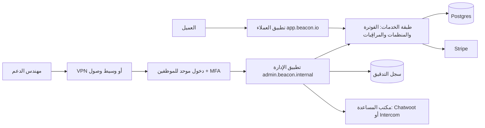
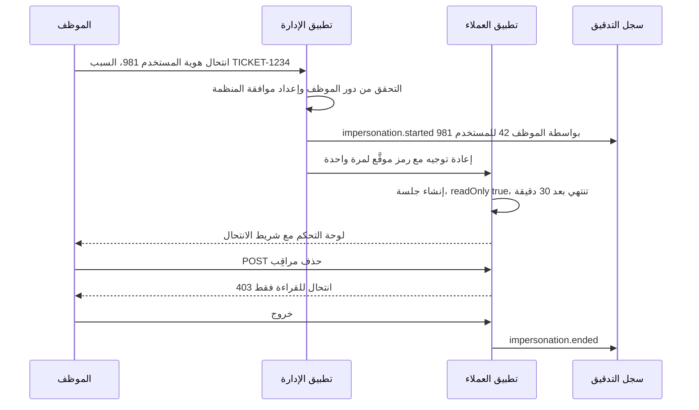
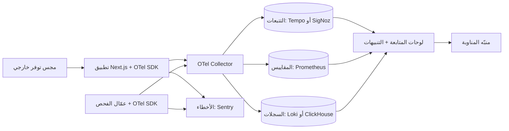
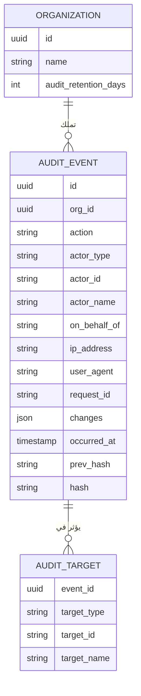
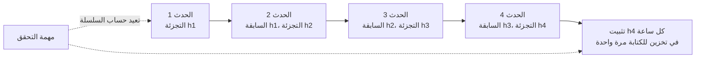
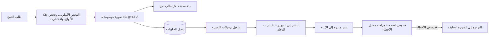
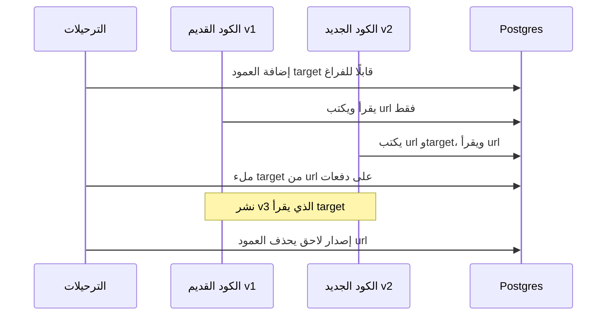

# الوحدة 7 — تشغيل الـ SaaS

*إطلاق المنتج نصف العمل فقط. النصف الآخر هو تشغيله: أن تساعد عملاء لا ترى مشكلاتهم من شاشتك، وأن تعرف أن شيئًا ما معطّل قبل أن يكتبوا عنه على وسائل التواصل، وأن تثبت من غيّر ماذا، وأن تنشر التحديثات (deploying) بعد ظهر يوم ثلاثاء دون أن تحبس أنفاسك. تغطي هذه الوحدة المكوّنات (components) الأربعة التي تسمح لفريق صغير بتشغيل SaaS دون بطولات: لوحة الإدارة (admin panel)، والمراقبة الشاملة (observability)، وسجلات التدقيق (audit logs)، ومسار النشر (deployment pipeline).*

> **التطبيق العملي:** ابدأ من [نسخة البداية من Beacon](https://github.com/Tamoura/system-design-for-vibe-coders/tree/beacon/starter)، وحلّ التمارين قبل النظر إلى [الحل المرجعي لهذه الوحدة](https://github.com/Tamoura/system-design-for-vibe-coders/tree/beacon/module-7-solution) (الفرع (branch) `beacon/module-7-solution`).

---

# 7.1 — لوحة الإدارة: أدوات الدعم وانتحال الهوية

*المستوى: 🟡 متوسط* · *المتطلبات: 1.2، 1.3، 3.2*

## ⚡ الدرس في دقيقة

- لوحة الإدارة (admin panel) هي التطبيق الداخلي (internal app) الذي يستخدمه موظفوك للعثور على العملاء، وفحص حالتهم، وتمديد الفترات التجريبية (trials)، ومنح الخطط مجانًا (comp plans)، وإصلاح البيانات (fix data)، وانتحال الهوية (impersonate).
- القاعدة الأهم: تطبيق الإدارة باب أمامي ثانٍ إلى طبقة الخدمات (service layer) نفسها، وليس طريقًا مختصرًا إلى قاعدة البيانات (database).
- الموظفون ليسوا عملاء لديهم علامة إضافية (flag): خصّص لهم جدول (table) `staff_users` منفصلًا أو مزوّد هوية (identity provider) منفصلًا، ودخولًا موحدًا (SSO) مع MFA، ونطاقًا فرعيًا (hostname) منفصلًا، وضابطًا على مستوى الشبكة (network control) أمامه.
- الخيار الافتراضي للنسخة الأولى: شاشات مولَّدة (generated screens) تلقائيًا للقراءة (Django admin أو react-admin أو Filament)، مع إجراءات كتابة (write actions) تبنيها يدويًا تستدعي خدماتك، وتطلب سببًا، وتكتب حدث تدقيق (audit event).
- أكبر فخ: انتحال هوية يبدو فيه أن العميل هو من نفّذ الإجراء. اجعله للقراءة فقط (read-only) افتراضيًا، ومحدودًا بوقت، ومعه شريط تنبيه (banner) ظاهر، ومسجَّلًا بالفاعلَين (actors) كليهما.

## 🧭 لماذا يحتاجه كل SaaS

الساعة 11 ليلًا، وأحد عملاء Beacon يراسل الدعم (support): انتهت فترته التجريبية في خطة Pro في منتصف عطل (outage) حقيقي، وتوقفت مراقِباته عند حد الخطة المجانية (Free plan) وهو خمسة، وصاحب الحساب (account owner) الذي يستطيع إدخال بطاقة الدفع على متن طائرة. يريد العميل يومين إضافيين من الفترة التجريبية، والآن. من دون لوحة إدارة، الطريقة الوحيدة للمساعدة أن يفتح مهندس جلسة `psql` على قاعدة بيانات الإنتاج (production database) ويكتب أمر `UPDATE` بيده، على أمل أن يتذكر أن تاريخ نهاية الفترة التجريبية موجود أيضًا في Stripe، وأن مجدول المراقِبات (monitor scheduler) يحفظ الاستحقاقات (entitlements) في كاش (cache) Redis، وأن لا شيء آخر يقرأ ذلك العمود (column).

هكذا يبدأ كل SaaS ناشئ، وهكذا يقع أول عطل يسببه لنفسه. المكتب الخلفي (Back Office)، أي التطبيق الداخلي المخصص لموظفيك، يحوّل تلك الاستعلامات (queries) الخطرة التي تُكتب مرة واحدة إلى أزرار تمر عبر مسارات الكود (code paths) نفسها التي يستخدمها المنتج، بالتحققات (checks) والآثار الجانبية (side effects) نفسها، وتترك خلفها سجلًا.

في المقابل، لوحة الإدارة أقوى واجهة (interface) ستبنيها على الإطلاق. في يوليو 2020 خدع مهاجمون (attackers) موظفين في Twitter بالهندسة الاجتماعية (social engineering)، ووصلوا إلى أدوات الإدارة الداخلية (internal admin tooling) في Twitter، واستخدموها للاستيلاء على حسابات شهيرة. لم يحتاجوا إلى أي ثغرة في المنتج نفسه؛ فالأداة الداخلية *كانت* هي سطح الهجوم (attack surface). **لوحة الإدارة منتج مستخدموه هم موظفوك، وتستحق حماية أكبر من التطبيق الذي يستخدمه العملاء، لا أقل.**

## 📐 كيف يعمل

### 🟢 الأساسيات

كل SaaS ناضج ينمو لديه المكتب الخلفي نفسه. ومهامه متوقعة إلى حد الملل:

| المهمة | مثال في Beacon | المخاطرة |
|---|---|---|
| العثور على عميل | البحث (search) بالبريد الإلكتروني، أو اسم المنظمة (org name)، أو النطاق (domain)، أو معرّف العميل (customer id) في Stripe، أو رابط المراقِب (monitor URL) | منخفضة (قراءة) |
| رؤية حالته | الخطة (plan)، والاستخدام (usage) مقابل الحدود (limits)، والفواتير (invoices)، والأعضاء (members)، والحوادث الأخيرة (recent incidents)، وآخر تسجيل دخول (login) | منخفضة (قراءة، لكنها بيانات شخصية (PII)) |
| منح خطة مجانًا | إعطاء منظمة غير ربحية خطة Pro مجانًا لمدة 12 شهرًا | متوسطة (مال) |
| تمديد فترة تجريبية | تأجيل `trial_ends_at` يومين ومزامنة (resync) Stripe | متوسطة (مال) |
| إعادة إرسال دعوة (invite) أو بريد تحقق (verification email) | الدعوة ذهبت إلى مجلد الرسائل المزعجة (spam) | منخفضة |
| فك قفل حساب (unlock an account) | إلغاء القفل (clear lockout) بعد محاولات دخول فاشلة كثيرة، وإعادة ضبط MFA بعد التحقق من الهوية (identity check) | عالية (طريق للاستيلاء على الحساب (account takeover)) |
| تشغيل إصلاح بيانات | إعادة ربط 40 مراقِبًا بالمنظمة الصحيحة بعد استيراد (import) خاطئ | عالية (بيانات) |
| انتحال الهوية | "رؤية ما يراه العميل" لإعادة إنتاج خطأ (bug) | عالية جدًا |

ثلاث قواعد تجعل النسخة الأولى آمنة:

1. **الموظفون ليسوا عملاء لديهم علامة إضافية.** لا تضف `role = 'superadmin'` إلى جدول `memberships` نفسه الذي تعيش فيه أدوار (roles) عملائك. يجب ألا يمنح أي خطأ في كود صلاحيات (permission) العملاء وصولًا إلى المكتب الخلفي. خصّص جدول `staff_users` منفصلًا (أو مزوّد هوية منفصلًا تمامًا) وملف تعريف ارتباط (Cookie) منفصلًا للجلسة (session).
2. **كل عملية كتابة (write) تمر عبر طبقة الخدمات.** زر "تمديد الفترة التجريبية" يستدعي الدالة (function) نفسها `extendTrial(orgId, days)` التي يستخدمها كود الفوترة (billing)، وهي تحدّث Postgres، وتحدّث الاشتراك (subscription) في Stripe، وتُبطل كاش الاستحقاقات (entitlement cache). أما SQL الخام فيتخطى كل ذلك.
3. **كل إجراء يُسجَّل.** من (معرّف الموظف (staff id))، وماذا (الإجراء)، وعلى من (معرّف المنظمة)، ولماذا (سبب نصي إلزامي أو رابط تذكرة (ticket))، ومتى. يبني الدرس 7.3 سجل التدقيق (audit log)، ولوحة الإدارة هي أول من يكتب فيه وأهمهم.



لاحظ الشكل: تطبيق الإدارة وتطبيق العملاء **بابان أماميان إلى طبقة خدمات واحدة**. لا يحصل تطبيق الإدارة على طريق مختصر خاص به إلى قاعدة البيانات.

### 🟡 التعمق أكثر

**مصادقة الموظفين (staff authentication).** يسجّل الموظفون الدخول عبر مزوّد الهوية الخاص بشركتك (Google Workspace أو Okta أو Microsoft Entra) باستخدام الدخول الموحد (SSO)، مع فرض المصادقة متعددة العوامل (MFA)، ويُفضَّل أن تكون مقاومة للتصيد (phishing-resistant) مثل مفاتيح المرور (Passkeys) أو المفاتيح المادية (hardware keys)، لأن الهندسة الاجتماعية هي الطريقة التي تُخترق بها أدوات الإدارة فعليًا. لا تُخزَّن كلمات مرور الموظفين في تطبيقك. ضع تطبيق الإدارة على اسم نطاق منفصل حتى لا تُرسل ملفات تعريف الارتباط الخاصة به إلى تطبيق العملاء أو العكس، وحتى تستطيع وضع ضابط شبكة أمامه: شبكة VPN، أو قائمة عناوين IP مسموح بها (IP allowlist)، أو وسيط يتحقق من الهوية (Cloudflare Access أو Tailscale أو Pomerium) قبل أن تصل حزمة (packet) واحدة إلى كودك.

**أدوار الموظفين (staff roles).** لا يحتاج كل موظف إلى كل زر. هذه مجموعة بداية معقولة:

| دور الموظف | يستطيع | لا يستطيع |
|---|---|---|
| الدعم | قراءة بيانات العملاء، وإعادة إرسال الرسائل، وتمديد الفترات التجريبية حتى 14 يومًا، وانتحال الهوية للقراءة فقط | تغيير الفوترة، وحذف البيانات، والتصدير (export) |
| الفوترة | منح الخطط مجانًا، وإصدار أرصدة (credits)، وتغيير الاشتراكات | انتحال الهوية، وتشغيل إصلاحات البيانات |
| المهندس (المناوب (on-call)) | قراءة كل شيء، وتشغيل سكربتات إصلاح البيانات المعتمدة | تغيير الفوترة |
| المدير الأعلى (superadmin) (شخصان) | كل شيء، بما في ذلك منح أدوار الموظفين | — |

هذا ببساطة هو التفويض (Authorization) من الدرس 1.3، مطبّقًا على فئة ثانية من المستخدمين. المكتبة (library) نفسها تعمل هنا (CASL أو Casbin أو دالة سياسة (policy function)).

**انتحال الهوية بأمان.** انتحال الهوية (Impersonation)، أي "الدخول بصفة" عميل، هو أكثر أدوات الدعم فائدة، وأكثرها قابلية لسوء الاستخدام أيضًا. التصميم الآمن:

- **للقراءة فقط افتراضيًا.** جلسة الانتحال تستطيع تحميل الصفحات، لكن الوسيط البرمجي (Middleware) يرفض كل طلب (request) يغيّر البيانات. يوجد "انتحال بصلاحية الكتابة (write impersonation)" منفصل وأعلى صلاحية، لأدوار محددة فقط، ويتطلب سببًا.
- **محدود بوقت.** 30 دقيقة ثم تنتهي الجلسة. لا يوجد خيار "تذكرني (remember me)".
- **شريط تنبيه لا يمكن تجاهله.** شريط لافت في كل صفحة: "أنت تتصفح بصفة ana@acme.com — للقراءة فقط — ينتهي بعد 27 دقيقة — خروج". هذا يحمي الموظف من التصرف بصفة العميل عن طريق الخطأ.
- **فاعلان في كل سطر سجل (log line).** كل حدث تدقيق يُكتب أثناء الانتحال يسجّل `actor = staff:42` و`on_behalf_of = user:981`. لا تسمح أبدًا بأن يبدو إجراء نُفّذ بالانتحال كأن العميل هو من نفّذه.
- **موافقة العميل (customer consent) للمنظمات الحساسة.** يستطيع عملاء خطة Business إيقاف الانتحال لمنظمتهم، أو اشتراط موافقة على كل جلسة. على سبيل المثال، يسمح Cal.com للمستخدمين بمنع انتحال هويتهم، ويسمح للفرق بتقييده.
- **مناطق محظورة (blocked zones).** حتى مع صلاحية الكتابة، لا يستطيع الانتحال تغيير كلمة المرور أو MFA أو البريد الإلكتروني أو مفاتيح API أو بيانات الفوترة، ولا يستطيع رؤية الأسرار (secrets) كنص صريح (plain text).



**التكامل مع أدوات الدعم (support tooling integration).** مكتب المساعدة (Helpdesk) لديك، سواء كان Chatwoot (مفتوح المصدر (open source)) أو Intercom (خدمة مُدارة (managed)) أو Zendesk أو Plain، هو المكان الذي تعيش فيه المحادثات (conversations)، ولوحة الإدارة هي المكان الذي تعيش فيه حالة الحساب (account state). اربطهما في الاتجاهين: الشريط الجانبي (sidebar) في مكتب المساعدة يعرض الخطة والإيراد الشهري المتكرر (MRR) ورابطًا مباشرًا (deep link) إلى صفحة الإدارة لتلك المنظمة، وصفحة الإدارة تعرض المحادثات الأخيرة. عندما تضمّن أداة دردشة (chat widget) داخل المنتج، استخدم ميزة التحقق من الهوية في مكتب المساعدة (HMAC لمعرّف المستخدم موقَّع بسر موجود على الخادم (server))، حتى لا يستطيع أحد فتح محادثة منتحلًا صفة مستخدم آخر ثم يطلب من الدعم "إعادة ضبط MFA فقط".

**إصلاحات البيانات ككود.** يجب ألا تكون مهمة "تشغيل إصلاح بيانات" مربع نص (textarea) ينفّذ SQL. اكتب كل إصلاح كسكربت (script) داخل المستودع (repo)، يُراجَع في طلب دمج (Pull Request)، مع وضع `--dry-run` يطبع ما سيغيّره، ويعمل كمهمة خلفية (background job)، ويُسجَّل مع مخرجاته. في Rails يوجد `rails runner`، وفي Django أوامر الإدارة (Management Commands)، وفي Laravel أوامر Artisan، وفي Node تكتب أداة سطر أوامر (CLI) صغيرة أو مهمة.

### 🔴 على نطاق واسع وللمؤسسات

**أقل صلاحية ممكنة (least privilege)، على مدى الزمن.** صلاحية المدير الأعلى الدائمة عبء. تنتقل الفرق الناضجة إلى الوصول في الوقت المطلوب (Just-in-Time Access): يطلب المهندس "صلاحية كتابة على المنظمة X لمدة ساعة، التذكرة Y"، ويوافق شخص ثانٍ، وتنتهي الصلاحية تلقائيًا. وللعمليات الهدّامة (destructive operations) (حذف منظمة، أو تصدير كل بيانات العميل) اشترط موافقة شخصين (Four-Eyes): موظف يقترح وآخر يؤكد.

**المصادقة المعزَّزة (Step-up Authentication).** نمط "Admin Mode" في GitLab نمط جيد يستحق النسخ: حتى المستخدم المدير يجب أن يعيد المصادقة (re-authenticate) قبل أن تُفتح وظائف الإدارة، لذلك لا تكون الجلسة اليومية المسروقة جلسة إدارة مسروقة.

**تقليل البيانات (data minimization).** نادرًا ما يحتاج الدعم إلى البيانات كاملة. أخفِ (mask) أجزاء من عناوين البريد وأرقام الهواتف في القوائم، واعرضها كاملة في صفحة التفاصيل (detail page) فقط، وسجّل كل عرض لصفحة تفاصيل عميل (نعم، حتى القراءة، للعملاء في القطاعات المنظَّمة (regulated))، وحدّد معدل التصدير الجماعي (bulk exports). ستسأل استبيانات الأمان (security questionnaires) لدى عملاء المؤسسات (enterprise customers): "أي من موظفيكم يستطيع الوصول إلى بياناتنا، وكيف يُسجَّل ذلك؟"، والإجابة تأتي من هذه اللوحة.

**مولّدات CRUD مقابل البناء المخصص.** في البداية ولِّد الشاشات تلقائيًا. لاحقًا خصّصها.

| الأسلوب | أمثلة | ممتاز لـ | يبدأ في الإزعاج عندما |
|---|---|---|---|
| لوحة إدارة إطار العمل (framework) | Django admin وActiveAdmin وFilament وAvo وAdministrate | جداول لكل نموذج (model) من اليوم الأول | تحتاج إلى مسارات عمل (workflows)، لا إلى جداول |
| أطر إدارة مبنية على React | react-admin وRefine وAdminJS | لوحة إدارة مخصصة ضمن حزمة TS (TS stack) لديك | نادرًا — تكبر معك |
| أدوات داخلية منخفضة الكود (low-code internal tools) | Appsmith وToolJet وRetool | فرق العمليات (ops teams) التي تبني شاشاتها بنفسها | ينجرف المنطق خارج مراجعة الكود (code review) |
| CMS بلا واجهة (headless CMS) ومنصات بيانات (data platforms) | Directus وPayload | تحرير المحتوى والبيانات | تحتاج إلى الآثار الجانبية لطبقة خدماتك |
| صفحات مخصصة في تطبيقك | مسارات `/admin` الخاصة بك | انتحال الهوية وإجراءات الفوترة | أبدًا — سيكون لديك بعضها دائمًا |

الفخ في كل مولّد: أنه يتحدث مع قاعدة البيانات مباشرة، فيتجاوز طبقة الخدمات. استخدم الشاشات المولَّدة للقراءة، ومرّر عمليات الكتابة عبر إجراءات مخصصة تستدعي خدماتك.

## 🏆 أفضل المستودعات

| المستودع | ما هو | التقنيات | الترخيص | اختره عندما |
|---|---|---|---|---|
| [marmelab/react-admin](https://github.com/marmelab/react-admin) | إطار React ناضج لواجهات الإدارة فوق أي API عبر مزوّدي البيانات (Data Providers) | React, TS | MIT | تريد لوحة إدارة مخصصة ضمن حزمة TS تستدعي الـ API الخاص بك |
| [refinedev/refine](https://github.com/refinedev/refine) | إطار React بلا واجهة جاهزة للأدوات الداخلية كثيرة عمليات CRUD | React, TS | MIT | تريد منطق الإدارة دون الارتباط بمكتبة واجهات واحدة |
| [SoftwareBrothers/adminjs](https://github.com/SoftwareBrothers/adminjs) | لوحة إدارة مولَّدة تلقائيًا لأدوات ORM في Node (Prisma وTypeORM وSequelize…) | Node, React | MIT | تريد شاشات على طريقة Django admin في تطبيق Node بسرعة |
| [django/django](https://github.com/django/django) | `django.contrib.admin`، لوحة الإدارة المولَّدة الأصلية | Python | BSD-3-Clause | تعمل على Django — فهي موجودة أصلًا |
| [activeadmin/activeadmin](https://github.com/activeadmin/activeadmin) | إطار إدارة لـ Rails مبني على لغة DSL | Ruby | MIT | تعمل على Rails وتريد لوحة إدارة مجرَّبة جيدًا |
| [filamentphp/filament](https://github.com/filamentphp/filament) | لوحات إدارة ونماذج لـ Laravel فوق Livewire | PHP | MIT | تعمل على Laravel |
| [appsmithorg/appsmith](https://github.com/appsmithorg/appsmith) | أداة منخفضة الكود لبناء أدوات داخلية فوق قواعد البيانات والـ APIs | Java, React | Apache-2.0 | يحتاج فريق العمليات إلى شاشات ولا تستطيع تخصيص مهندسين |
| [ToolJet/ToolJet](https://github.com/ToolJet/ToolJet) | أداة منخفضة الكود لبناء الأدوات الداخلية | TS, React | AGPL-3.0 | مثل Appsmith؛ قارن بين الأداتين عمليًا |
| [directus/directus](https://github.com/directus/directus) | API ولوحة إدارة فورية فوق أي قاعدة بيانات SQL | TS, Vue | Monospace Sustainable Core License (source-available) | يجب أن يحرّر غير المهندسين بيانات في قاعدة بيانات موجودة لديك |
| [payloadcms/payload](https://github.com/payloadcms/payload) | CMS بلا واجهة يبدأ من الكود، مع لوحة إدارة مولَّدة، ويُثبَّت داخل Next.js | TS, React | MIT | لوحة الإدارة لديك هي أيضًا المكتب الخلفي للمحتوى |

يستحق المعرفة أيضًا: [avo-hq/avo](https://github.com/avo-hq/avo) (لوحة إدارة لـ Rails، نواتها بترخيص LGPL-3.0 مع مستويات تجارية) و[thoughtbot/administrate](https://github.com/thoughtbot/administrate) (إطار الإدارة لـ Rails الذي يستخدمه Chatwoot).

**إن درست مستودعًا واحدًا فقط:** react-admin. تجريد (abstraction) "مزوّد البيانات" فيه يفرض المعمارية (architecture) الصحيحة: لوحة الإدارة تتحدث مع *API*، لا مع قاعدة البيانات، لذلك تمر عمليات الكتابة طبيعيًا عبر طبقة خدماتك. اقرأ توثيقه (docs) عن مزوّدي البيانات ومزوّدي المصادقة (auth providers) حتى لو استخدمت شيئًا آخر.

**اشترِ أم ابنِ أم استضف بنفسك؟**

- **اشترِ** أداة مُدارة لبناء الأدوات الداخلية (Retool أو Forest Admin) عندما يحتاج فريق العمليات إلى عشرات الشاشات وتفضّل الدفع على البناء، واشترِ مكتب مساعدة (Intercom أو Zendesk أو Plain) في كل الحالات تقريبًا، لأن مسارات عمل الدعم ليست منتجك.
- **استضف بنفسك** Appsmith أو ToolJet أو Chatwoot عندما يجب ألا تغادر بيانات العملاء بنيتك التحتية (infrastructure) (وهذا بند شائع في عقود المؤسسات (enterprise contract))، أو عندما يصبح التسعير لكل مقعد (per-seat pricing) مؤلمًا.
- **ابنِ** بنفسك انتحال الهوية وإجراءات الفوترة وكل ما يمس الاستحقاقات، فوق طبقة خدماتك. واستخدم إطار عمل (react-admin أو Refine أو لوحة الإدارة في إطار الويب (web framework) لديك) للجداول المحيطة بها.

## 🔍 ادرسه في مشاريع حقيقية

**GitLab** ([gitlabhq/gitlabhq](https://github.com/gitlabhq/gitlabhq)) يملك واحدة من أكمل مناطق الإدارة في المشاريع مفتوحة المصدر: إدارة المستخدمين (user management)، وانتحال الهوية، وإعدادات النسخة (instance settings)، وبلاغات الإساءة (abuse reports). ستجدها بتصفح `app/controllers/admin` (وقت كتابة هذا الدرس يحتوي على `impersonations_controller.rb` و`impersonation_tokens_controller.rb`)، وابحث في المستودع عن `admin_mode` لترى كيف تُفرض المصادقة المعزَّزة على المدراء، بما في ذلك في الوسيط البرمجي لمهام Sidekiq، بحيث ترث المهام الخلفية حالة وضع الإدارة من الطلب الذي وضعها في الطابور (queue).

**Chatwoot** ([chatwoot/chatwoot](https://github.com/chatwoot/chatwoot)) أداة دعم وSaaS في الوقت نفسه، وفيه لوحة تحكم للمدير الأعلى. متحكمات (controllers) `super_admin` فيه مبنية على مكتبة Administrate، مع صنف (class) "dashboard" لكل نموذج في `app/dashboards`. ابحث عن `Impersonation` لتجد مكوّن (component) الشريط المكتوب بـ Vue والـ composable الذي يشغّله، وهو مثال صغير ونظيف على قاعدة "شريط التنبيه الذي لا يمكن تجاهله".

**Cal.com** ([calcom/cal.diy](https://github.com/calcom/cal.diy)) يضع صفحات إدارة النسخة داخل تطبيق Next.js الرئيسي في منطقة الإعدادات (ابحث في شجرة `apps/web` عن `admin`). ابحث في ترحيلات (migrations) Prisma عن `impersonat` وستقرأ تاريخ الميزة على شكل تغييرات في المخطط (schema): خيار على مستوى المستخدم للسماح بالانتحال، ومفتاح على مستوى الفريق لتعطيله، ولاحقًا صلاحيات مرتبطة بأدوار الإدارة.

**ما الذي تلاحظه:**

- شاشات الإدارة تعيد استخدام خدمات المجال (domain services) بدل كتابة SQL — انظر إلى ما تستدعيه متحكمات الإدارة فعليًا.
- لانتحال الهوية مفتاح إيقاف (off switch) في جانب العميل، لا مجرد صلاحية في جانب الموظفين.
- إعادة المصادقة المعزَّزة تفصل بين "هو مدير" و"يتصرف كمدير الآن".
- عمليات CRUD المولَّدة (Administrate) تغطي 80% المملة، والإجراءات المخصصة تغطي 20% الخطرة.
- شريط التنبيه يعيش في تطبيق العملاء، لا في تطبيق الإدارة، لأن ذلك هو المكان الذي ينظر إليه الموظف.

## 🛠️ ابنِه في Beacon

### 🟢 تمرين المبتدئ

أنشئ جدول `staff_users` منفصلًا عن `users`، ومنطقة `/admin` (أو تطبيقًا منفصلًا) لا تفتحها إلا جلسات الموظفين. ابنِ بحثًا عن العملاء يجد المنظمة ببريد أحد أعضائها أو باسم المنظمة أو بمعرّف العميل في Stripe، وصفحة منظمة للقراءة فقط تعرض الخطة، ونهاية الفترة التجريبية، وعدد المراقِبات مقابل الحد، والأعضاء، وآخر 10 حوادث.

**يكتمل عندما:**
- يحصل حساب عميل بأي دور على 404 في كل مسار تحت `/admin`.
- يجد البحث منظمة من جزء من البريد الإلكتروني في أقل من ثانية على بيانات تجريبية (seeded data).
- تعرض صفحة المنظمة الاستخدام مقابل حد الخطة، مأخوذًا من كود الاستحقاقات نفسه الذي يستخدمه المنتج.

### 🟡 تمرين المستوى المتوسط

أضف إجراءي كتابة: "تمديد الفترة التجريبية N يومًا" (لدور الدعم، بحد أقصى 14) و"منح خطة مجانًا" (لدور الفوترة). يجب أن يستدعي كلاهما دوال خدمة الفوترة الموجودة لديك، وأن يطلب سببًا، وأن يكتب حدث تدقيق.

**يكتمل عندما:**
- يحدّث تمديد الفترة التجريبية Postgres *و*نهاية الفترة التجريبية في اشتراك Stripe، ويرى مجدول المراقِبات الحد الجديد دون إعادة تشغيل (restart).
- لا يرى موظف بدور الدعم زر "منح خطة مجانًا"، ويعيد طلب POST مباشر الرمز 403.
- ينتج كل إجراء حدث تدقيق يحتوي على معرّف الموظف ومعرّف المنظمة والسبب والقيم قبل التغيير وبعده.

### 🔴 تمرين المستوى المتقدم

نفّذ انتحال هوية للقراءة فقط: رمز موقَّع لمرة واحدة (one-time signed token) من تطبيق الإدارة، وجلسة مدتها 30 دقيقة معلَّمة بـ `impersonatorId` و`readOnly`، ووسيط برمجي يرفض الطلبات التي تغيّر البيانات، وشريط تنبيه، وإعداد على مستوى المنظمة "السماح لموظفي Beacon بعرض حسابنا" يكون مطفأً افتراضيًا لمنظمات خطة Business.

```ts
// middleware in the customer app
export function guardImpersonation(req: Req, session: Session) {
  if (!session.impersonatorId) return;
  if (Date.now() > session.impersonationExpiresAt) throw new Unauthorized();
  const mutating = !["GET", "HEAD", "OPTIONS"].includes(req.method);
  if (mutating && session.readOnly) {
    throw new Forbidden("Read-only impersonation");
  }
  req.auditContext = {
    actor: `staff:${session.impersonatorId}`,
    onBehalfOf: `user:${session.userId}`,
  };
}
```

**يكتمل عندما:**
- يعيد أي طلب POST/PUT/PATCH/DELETE أثناء الانتحال للقراءة فقط الرمز 403، بما في ذلك مسارات الـ API.
- تنتهي الجلسات بعد 30 دقيقة حتى لو كانت نشطة.
- يُرفض انتحال هوية منظمة Business أطفأت الموافقة، ويُسجَّل الرفض نفسه في سجل التدقيق.
- يعرض سجل التدقيق الخاص بالعميل إدخالات "اطّلع دعم Beacon على حسابك".

## ⚠️ أخطاء يقع فيها المبتدئون

- **استخدام دور عميل للموظفين.** `if (user.role === 'admin')` بينما "admin" هو أيضًا دور في المنظمة يمكن أن يحمله العملاء. خلط واحد ويصبح عميل داخل مكتبك الخلفي. جداول منفصلة، وجلسات منفصلة، واسم نطاق منفصل.
- **السماح للوحة الإدارة بالكتابة مباشرة في قاعدة البيانات.** نموذج CRUD مولَّد يعدّل `subscriptions.plan` يتخطى Stripe، ويتخطى إبطال الكاش (cache invalidation)، ويتخطى الرسائل. الشاشات المولَّدة للقراءة، وإجراءات طبقة الخدمات للكتابة.
- **انتحال هوية لا يمكن تمييزه عن العميل.** إذا قال سجل التدقيق "Ana حذفت المراقِب" بينما فعلها مهندس الدعم لديك، فقد أفسدت أدلة عميلك وأدلتك أنت. سجّل الفاعلَين دائمًا.
- **ترك لوحة الإدارة على الإنترنت العام (public internet) بكلمة مرور.** ضعها خلف دخول موحد مع MFA وضابط شبكة. الأدوات الداخلية هدف مفضل تحديدًا لأنها قوية وضعيفة الحماية.
- **مربع "تشغيل SQL".** سيُستخدم على عجل، في الليل، دون جملة `WHERE`. إصلاحات البيانات سكربتات مراجَعة مع تشغيل تجريبي (dry run).
- **لا يوجد حقل (field) للسبب.** بعد ستة أشهر لن يعرف أحد لماذا تملك المنظمة 4411 خطة Business مجانية. السبب الإلزامي (أو رابط التذكرة) يكلّف خمس ثوانٍ ويجيب عن كل "لماذا؟" في المستقبل.

## 🧾 الخلاصة

- ينمو لدى كل SaaS مكتب خلفي للمهام نفسها: البحث، والفحص، والمنح المجاني، والتمديد، وإعادة الإرسال، وفك القفل، والإصلاح، وانتحال الهوية.
- هوية الموظفين منفصلة عن هوية العملاء: جدول أو مزوّد هوية خاص، ودخول موحد + MFA، واسم نطاق منفصل، وضابط شبكة.
- تطبيق الإدارة باب أمامي ثانٍ إلى طبقة الخدمات نفسها، وليس طريقًا للالتفاف عليها أبدًا.
- انتحال الهوية للقراءة فقط افتراضيًا، ومحدود بوقت، ومعه شريط تنبيه، ويُسجَّل بفاعلَين، ويستطيع العملاء إيقافه.
- ولِّد الجداول، وابنِ الإجراءات الخطرة يدويًا.

## ✍️ اختبر نفسك

**1. لماذا يجب أن يكون الموظفون في جدول `staff_users` منفصل بدل منحهم دور `superadmin` في جدول `memberships` نفسه الذي يستخدمه العملاء؟**

<details><summary>الإجابة</summary>

لأن أي خطأ في كود صلاحيات العملاء يجب ألا يمنح وصولًا إلى المكتب الخلفي. إذا تشاركت أدوار الموظفين والعملاء جدولًا واحدًا، فإن خلطًا واحدًا بين دور "admin" في المنظمة ودور مدير الموظفين يُدخل عميلًا إلى مكتبك الخلفي. خصّص جدولًا منفصلًا (أو مزوّد هوية منفصلًا) وملف تعريف ارتباط منفصلًا للجلسة، كما يشرح قسما "🟢 الأساسيات" و"⚠️ أخطاء يقع فيها المبتدئون".

</details>

**2. عدّد ضمانات التصميم الآمن لانتحال الهوية.**

<details><summary>الإجابة</summary>

للقراءة فقط افتراضيًا، ومحدود بوقت (30 دقيقة)، وشريط تنبيه لا يمكن تجاهله، وفاعلان في كل حدث تدقيق، وموافقة العميل للمنظمات الحساسة، ومناطق محظورة مثل كلمة المرور وMFA والبريد الإلكتروني ومفاتيح API وبيانات الفوترة. راجع فقرة "انتحال الهوية بأمان" في "🟡 التعمق أكثر".

</details>

**3. يريد الدعم منح عميل في Beacon يومين إضافيين من الفترة التجريبية. لماذا يجب أن يستدعي الزر `extendTrial(orgId, days)` بدل تنفيذ `UPDATE` على `trial_ends_at`؟**

<details><summary>الإجابة</summary>

لأن نهاية الفترة التجريبية موجودة أيضًا في Stripe، ولأن مجدول المراقِبات يحفظ الاستحقاقات في كاش Redis. دالة الخدمة تحدّث Postgres، وتحدّث اشتراك Stripe، وتُبطل كاش الاستحقاقات، بينما يتخطى SQL الخام كل ذلك ولا يترك أي سجل. راجع القاعدة 2 في "🟢 الأساسيات".

</details>

**4. يسأل عميل محتمل على خطة Business: "أي من موظفيكم يستطيع الوصول إلى بياناتنا، وكيف يُسجَّل ذلك؟" ما أجزاء تصميم لوحة الإدارة في Beacon التي تسمح لك بالإجابة؟**

<details><summary>الإجابة</summary>

أدوار الموظفين بأقل صلاحية ممكنة (والوصول في الوقت المطلوب على نطاق واسع)، ودخول الموظفين الموحد مع MFA، وإعداد على مستوى المنظمة يسمح للعميل بإيقاف انتحال الهوية، وإخفاء البيانات الشخصية، وحدث تدقيق لكل إجراء يقوم به موظف، بما في ذلك عرض صفحات التفاصيل. راجع "🟡 التعمق أكثر" و"🔴 على نطاق واسع وللمؤسسات".

</details>

**5. ينفّذ مهندس ميزة "الدخول بصفة العميل" بإنشاء جلسة عادية لمعرّف مستخدم العميل. بعد أسبوع يقول سجل تدقيق أحد العملاء "Ana حذفت المراقِب"، وتقول Ana إنها لم تفعل. ما الخطأ، وكيف تصلحه؟**

<details><summary>الإجابة</summary>

لم يكن ممكنًا تمييز جلسة الانتحال عن جلسة Ana نفسها: لا يوجد `impersonatorId`، ولا علامة للقراءة فقط، وسُجّل فاعل واحد فقط. علّم الجلسة بـ `impersonatorId` و`readOnly`، وارفض الطلبات التي تغيّر البيانات في الوسيط البرمجي، وأنهِ الجلسة بعد 30 دقيقة، وسجّل `actor = staff:42` مع `on_behalf_of = user:981`. راجع "🟡 التعمق أكثر" وتمرين المستوى المتقدم.

</details>

## 📚 المراجع

- react-admin documentation — https://marmelab.com/react-admin/ — توثيق react-admin
- Django admin site documentation — https://docs.djangoproject.com/en/stable/ref/contrib/admin/ — توثيق لوحة إدارة Django
- OWASP Authentication Cheat Sheet — https://cheatsheetseries.owasp.org/cheatsheets/Authentication_Cheat_Sheet.html — دليل OWASP المختصر للمصادقة
- OWASP Authorization Cheat Sheet — https://cheatsheetseries.owasp.org/cheatsheets/Authorization_Cheat_Sheet.html — دليل OWASP المختصر للتفويض
- GitLab documentation (search "Admin Mode" and "impersonation") — https://docs.gitlab.com — توثيق GitLab (ابحث عن "Admin Mode" و"impersonation")
- Chatwoot documentation — https://www.chatwoot.com/docs — توثيق Chatwoot
- Filament documentation — https://filamentphp.com/docs — توثيق Filament

---

# 7.2 — المراقبة الشاملة: السجلات والأخطاء والمقاييس والتتبعات

*المستوى: 🟡 متوسط* · *المتطلبات: 5.1*

## ⚡ الدرس في دقيقة

- المراقبة الشاملة (Observability) تعني أنك تستطيع تفسير أي سلوك في بيئة الإنتاج (production) من البيانات التي يصدرها النظام أصلًا، دون أن تنشر كودًا (code) جديدًا لتكتشف ما يحدث.
- هناك خمس إشارات (signals): السجلات (logs) تقول ماذا حدث، والمقاييس (metrics) كم، والتتبعات (traces) أين، والأخطاء (errors) ما الذي تعطّل، وفحوص التوفر (uptime probes) من الخارج هل يستطيع أحد الوصول إليك.
- القاعدة الأهم: سجلات JSON منظَّمة (structured JSON logs)، مع معرّف الطلب (request id) ومعرّف المستأجر (tenant id) في كل سطر.
- الخيار الافتراضي للنسخة الأولى: pino (أو أداة السجلات المنظَّمة (structured logger) في حزمتك التقنية (stack))، وSentry أو GlitchTip مع رقم الإصدار (release) وخرائط المصدر (source maps)، وOpenTelemetry للتتبعات، وفاحص مستقل (independent probe) واحد خارج بنيتك التحتية (infrastructure).
- قِس إشارة الصحة (health signal) الخاصة بمنتجك (في Beacon: تأخر الفحوص (check lag))، وأرسل التنبيهات العاجلة (page) عند استنزاف ميزانية SLO (SLO burn)، لا عند ارتفاع استهلاك المعالج (CPU).
- أكبر فخ: وضع `orgId` في تسميات (labels) Prometheus، مما يفجّر عدد السلاسل الزمنية (cardinality) وقد يُسقط خادم المقاييس (metrics server).

## 🧭 لماذا يحتاجه كل SaaS

منتج Beacon كله قائم على إخبار الشركات الأخرى بأن موقعها معطّل. تخيّل الآن هذا: نشرٌ (deploy) يوم الخميس يُدخل خطأً (bug) يجعل مجدول الفحوص (check scheduler) يتخطى بصمت المراقِبات (monitors) التي أُنشئت منظماتها بعد تاريخ معين. لا يُطلَق أي خطأ؛ الفحوص ببساطة لا تعمل. لا يصدر أي تنبيه (alert). يوم السبت يتعطل الـ API لدى أحد العملاء ثلاث ساعات ولا يقول Beacon شيئًا، لأن Beacon لم يفحصه أصلًا. يكتشف العميل العطل من مستخدميه، ثم يخبر الجميع على وسائل التواصل أن أداة المراقبة (monitoring tool) لديه لم تراقب.

الجزء المؤلم ليس الخطأ نفسه؛ فالأخطاء تحدث. المؤلم هو أنه **لم تكن لديك أي وسيلة لتعرف**. لا يوجد مقياس لـ "الفحوص المنفَّذة مقابل الفحوص المجدولة"، ولا سجل تستطيع البحث فيه حسب المنظمة، ولا تتبع يُظهر أين ذهب طلب الفحص (check request). شركة المراقبة لم تكن تراقب نفسها.

هذا هو الفرق بين *المراقبة* (Monitoring)، أي "هل الشيء الذي توقعت أن يتعطل معطّل الآن؟"، و*المراقبة الشاملة* (Observability)، أي "هل أستطيع طرح سؤال جديد عن بيئة الإنتاج والحصول على إجابة؟". **المراقبة الشاملة هي القدرة على تفسير أي سلوك في نظام الإنتاج من البيانات التي يصدرها أصلًا، دون نشر كود جديد لتكتشف ما يحدث.**

## 📐 كيف يعمل

### 🟢 الأساسيات

تصدر أنظمة الإنتاج عددًا قليلًا من أنواع الإشارات. كل نوع يجيب عن سؤال مختلف:

| الإشارة | ما هي | تجيب عن | مثال في Beacon | الأدوات المعتادة |
|---|---|---|---|---|
| السجلات (Logs) | سجلات أحداث مؤرَّخة (timestamped records)، ويُفضَّل أن تكون JSON منظَّمًا | "ماذا حدث بالضبط في هذا الطلب (request)؟" | `check.failed monitor=m_91 status=503 region=eu` | pino, Loki, Better Stack |
| المقاييس (Metrics) | سلاسل زمنية (time series) رقمية مجمَّعة (aggregated) | "كم، وبأي سرعة، وكم مرة — وما الاتجاه؟" | الفحوص في الثانية، وزمن الفحص (check latency) عند p95، وطول الطابور (queue depth) | Prometheus, Grafana |
| التتبعات (Traces) | مسار الطلب عبر الخدمات (services)، على شكل مقاطع زمنية (Spans) | "أين ذهب الوقت، وأي خدمة فشلت؟" | من الـ API إلى الطابور (queue) ثم الفاحص (checker) ثم المُبلِّغ (notifier) | OpenTelemetry, Tempo, Honeycomb |
| الأخطاء (Errors) | استثناءات (exceptions) مجمَّعة حسب تتبع المكدس (Stack Trace)، مع سياقها | "ما الذي ينهار، ومنذ أي إصدار، ولمن؟" | `TypeError in notifySlack` في الإصدار 1.42 | Sentry, GlitchTip |
| التوفر والفحص الاصطناعي (Uptime / Synthetic) | مجسّات (probes) من الخارج تطلب نقاط النهاية (endpoints) لديك | "هل يستطيع العميل الوصول إلينا أصلًا؟" | هل يعيد `app.beacon.io/login` الرمز 200؟ | Uptime Kuma, openstatus, Beacon نفسه |

الثلاثة الأولى هي "الأعمدة الثلاثة (three pillars)" الكلاسيكية، وتتبع الأخطاء (error tracking) مفيد جدًا لفرق التطبيقات (application teams) لدرجة أنه أصبح عمليًا العمود الرابع. وفحوص التوفر هي الخامس، لأن كل الإشارات الأخرى تصدر *من داخل* نظامك، فإذا توقف النظام كله لن يصدر أي شيء.

**السجلات المنظَّمة (Structured Logging).** سطر السجل (log line) يجب أن يكون كائن JSON (JSON object)، لا جملة. `console.log("check failed for " + id)` لا يمكن إلا البحث فيه نصيًا، أما `{"level":"warn","msg":"check.failed","monitorId":"m_91","orgId":"org_7","requestId":"req_ab3","status":503}` فيمكن تصفيته وتجميعه وعدّه. في Node، الأداة المعيارية هي pino: سريعة، وتكتب JSON افتراضيًا، وتدعم سجلات فرعية (Child Loggers) تحمل السياق. (في Python: `structlog`؛ وفي Ruby: `lograge` أو السجلات الموسومة (tagged logging) في Rails؛ وفي Go: `log/slog` في المكتبة القياسية (standard library).)

الحقلان (fields) اللذان يجعلان السجلات مفيدة في SaaS هما **معرّف الطلب** (Request ID)، الذي يربط كل أسطر الطلب الواحد ببعضها، و**معرّف المستأجر** (Tenant ID)، الذي يجيب عن سؤال "ماذا حدث لـ*هذا العميل*؟". اضبطهما مرة واحدة لكل طلب، لا في كل استدعاء (call):

```ts
import pino from "pino";
import { AsyncLocalStorage } from "node:async_hooks";

export const baseLogger = pino({
  redact: ["req.headers.authorization", "*.password", "*.apiKey"],
});
const ctx = new AsyncLocalStorage<pino.Logger>();

export const log = () => ctx.getStore() ?? baseLogger;

export function withRequestContext(req: Req, next: () => Promise<void>) {
  const requestId = req.headers["x-request-id"] ?? crypto.randomUUID();
  const child = baseLogger.child({ requestId, orgId: req.session?.orgId });
  return ctx.run(child, next);
}

// anywhere deeper in the code:
log().warn({ monitorId, status }, "check.failed");
```

**تتبع الأخطاء.** ثبّت Sentry SDK (أو GlitchTip، الذي يستخدم البروتوكول (protocol) نفسه) على الخادم (server) *وفي* المتصفح (browser). هناك إعدادان يتخطاهما المبتدئون: **الإصدار** (Release)، أي وسم كل حدث بمعرّف git SHA حتى ترى "بدأ هذا الخطأ في الإصدار a1b2c3"، و**خرائط المصدر** (Source Maps)، أي رفعها وقت البناء (build time) حتى تتحول تتبعات المكدس المصغَّرة (minified) في المتصفح إلى أسماء ملفات وأرقام أسطر حقيقية. أرفق أيضًا معرّف المستخدم ومعرّف المنظمة بنطاق الخطأ (error scope) حتى تميّز بين عميل غاضب واحد وبين الجميع.

**التوفر من الخارج.** يجب أن يراقب Beacon نفسه باستخدام Beacon، لأن استخدام منتجك بنفسك (dogfooding) يكشف أخطاء المنتج. لكن إذا توقف Beacon بالكامل فلن يستطيع إخبارك بأنه متوقف. شغّل فحصًا ثانيًا مستقلًا من مزوّد مختلف (Uptime Kuma مستضافًا ذاتيًا (self-hosted) على سحابة (cloud) أخرى، أو خدمة مُدارة (managed service)) يرسل التنبيهات عبر قناة (channel) مختلفة.

### 🟡 التعمق أكثر

**OpenTelemetry (OTel)** هو المعيار المحايد تجاه المزوّدين (vendor-neutral standard) لإصدار التتبعات والمقاييس والسجلات. تضيف القياس (Instrumentation) مرة واحدة باستخدام OTel SDK، وترسل البيانات إلى **OTel Collector** (عملية صغيرة (small process) تستقبل بيانات القياس (telemetry) وتجمّعها وتصفّيها وتعيد توجيهها)، ثم توجّه المجمِّع (collector) إلى أي خلفية (backend) تختارها: SigNoz، أو حزمة Grafana، أو HyperDX، أو Honeycomb، أو Datadog. يصبح تغيير المزوّد تغييرًا في الإعدادات (config change) بدل إعادة كتابة (rewrite). وحزم القياس التلقائي (auto-instrumentation packages) تغطي HTTP وPostgres وRedis ومعظم أطر العمل (frameworks) دون تغيير في الكود.



**تمرير سياق التتبع (Trace Context Propagation).** التتبع لا يعمل إلا إذا مرّرت كل خطوة معرّف التتبع (trace id) إلى الخطوة التالية. عبر HTTP يستخدم OTel ترويسة (header) W3C `traceparent` تلقائيًا. لكن عبر الطابور لا يحدث ذلك من تلقاء نفسه: عندما يضع الـ API مهمة BullMQ (BullMQ job) في الطابور، ضع سياق التتبع داخل بيانات المهمة واستعده في العامل (worker)، وإلا سينتهي التتبع عند الطابور، وهو بالضبط المكان الذي يبدأ فيه العمل المهم في Beacon.

**ماذا تقيس: RED وUSE.** قائمتا تحقق (checklists) قصيرتان تحافظان على صدق لوحات المتابعة (dashboards):

- **RED** للخدمات التي تعمل بالطلبات: **R**ate أي المعدل (طلبات في الثانية)، و**E**rrors أي الأخطاء (فشل في الثانية)، و**D**uration أي المدة (توزيع زمن الاستجابة (latency distribution) — استخدم المئينات (percentiles) مثل p95/p99، ولا تستخدم المتوسطات (averages) أبدًا).
- **USE** للموارد (resources) مثل المعالج واتصالات قاعدة البيانات (DB connections) والطوابير: **U**tilization أي نسبة الاستخدام، و**S**aturation أي التشبع (كم من العمل ينتظر)، و**E**rrors أي الأخطاء.

ثم أضف مقياسًا أو اثنين يصفان صحة *منتجك أنت*. في Beacon هذا المقياس هو **تأخر الفحص** (Check Lag): الوقت بين موعد الفحص المجدول وموعد تنفيذه الفعلي. إذا زاد التأخر، تصل التنبيهات إلى العملاء متأخرة، حتى لو بدت كل نقاط نهاية HTTP سليمة تمامًا. ومقياس "الفحوص المنفَّذة في الدقيقة" مقارنةً بـ "الفحوص المتوقعة في الدقيقة" كان سيكشف خطأ يوم الخميس خلال دقائق.

**SLO وميزانية الأخطاء.** **SLI** (مؤشر مستوى الخدمة) هو قياس، مثل "نسبة الفحوص التي نُفّذت خلال 10 ثوانٍ من موعدها". و**SLO** (هدف مستوى الخدمة) هو الهدف المحدد لهذا القياس: "99.9% على مدى 30 يومًا". و**ميزانية الأخطاء** (Error Budget) هي ما يتبقى: 0.1% من 30 يومًا تساوي نحو 43 دقيقة من السوء في الشهر. عندما تكون الميزانية سليمة، أطلق الميزات (features)؛ وعندما تُستنزف، أبطئ وأصلح الموثوقية (reliability). هذا يحوّل سؤال "هل الموثوقية جيدة بما يكفي؟" من جدال إلى عملية حسابية.

**تنبيهات لا توقظك بلا سبب.** لا ترسل تنبيهًا عاجلًا لإنسان إلا عندما يتضرر عميل *الآن* ويستطيع الإنسان فعل شيء حيال ذلك. هذه قواعد تنجح:

- نبّه على **الأعراض (symptoms)** (معدل استنزاف SLO (SLO burn rate)، وتأخر الفحص، وأخطاء تسجيل الدخول)، لا على الأسباب (causes) (المعالج عند 80%). استهلاك مرتفع للمعالج مع عملاء راضين أمر مقبول.
- استخدم **تنبيهات معدل الاستنزاف** (Burn-rate Alerts): أرسل تنبيهًا عاجلًا إذا كنت تستنزف ميزانية شهر كامل خلال ساعات، وافتح تذكرة (ticket) إذا كنت تستنزفها على مدى أيام.
- كل تنبيه عاجل يرتبط بـ **دليل تشغيل** (Runbook): ماذا يعني هذا، وكيف تتحقق، وكيف تخفف الضرر.
- إذا صدر تنبيه ولم يحتج أحد إلى التصرف، احذفه أو خفّض مستواه في الأسبوع نفسه. إرهاق التنبيهات (alert fatigue) هو السبب الذي يجعل التنبيهات الحقيقية تُتجاهَل.

### 🔴 على نطاق واسع وللمؤسسات

**الرؤية لكل مستأجر (per-tenant visibility) وعدد القيم الفريدة (Cardinality).** سيسأل العملاء على خطة Business: "هل أثّر علينا البطء (slowdown) يوم الثلاثاء الماضي؟" تحتاج إلى التقسيم حسب `orgId`. في السجلات والتتبعات هذا سهل، لأنها مسجَّلة لكل حدث. أما في مقاييس على طريقة Prometheus فهو خطير: كل قيمة فريدة لتسمية (Label) تنشئ سلسلة زمنية جديدة، لذلك فإن تسمية `orgId` مع 50,000 منظمة تضاعف التخزين (storage) ويمكن أن تُسقط خادم المقاييس. هذه هي **مشكلة عدد القيم الفريدة**. أبقِ معرّفات المستأجرين خارج تسميات المقاييس (أو استخدمها لخططك العليا فقط)، وأجب عن الأسئلة الخاصة بكل مستأجر (tenant) من التتبعات والسجلات المخزنة في قاعدة بيانات عمودية (columnar database). لهذا السبب تخزّن الأدوات الأحدث، مثل SigNoz وHyperDX وOpenObserve، كل شيء في مخازن عمودية (column stores) مثل ClickHouse، حيث تكون الاستعلامات (queries) ذات القيم الفريدة الكثيرة رخيصة.

**تكلفة المراقبة الشاملة.** فواتير بيانات القياس تنمو أسرع من حركة المرور (traffic)، ومن الشائع أن تصبح فاتورة المراقبة الشاملة من أكبر البنود في ميزانية البنية التحتية. هذه أدوات التحكم (levers):

| أداة التحكم | الطريقة | المقايضة (trade-off) |
|---|---|---|
| أخذ العينات من البداية (Head Sampling) | الاحتفاظ بنسبة ثابتة من التتبعات، يُقرَّر ذلك عند بدايتها | رخيص، لكنك تفقد الطلب البطيء النادر |
| أخذ العينات من النهاية (Tail Sampling) | يحتفظ المجمِّع بكل الأخطاء والتتبعات البطيئة، ويأخذ عينة من الباقي | أذكى، لكنه يحتاج إلى تخزين مؤقت (buffering) في المجمِّع |
| مستويات السجل (log levels) | `info` في الإنتاج، و`debug` فقط لمستأجر محدد عند الطلب | بيانات التصحيح (debug data) غير موجودة عندما تحتاجها، إلا إذا كان تفعيلها ممكنًا |
| طبقات الاحتفاظ (retention tiers) | 7 أيام في التخزين السريع (hot)، و30–90 يومًا في تخزين كائنات (object storage) رخيص | استعلامات بطيئة على البيانات القديمة |
| مقاييس مشتقة من السجلات | العدّ في المجمِّع ثم حذف الأسطر الخام | تفقد الأحداث الفردية |

**صفحة الحالة (status page) وعملية إدارة الحوادث (incident process).** عندما يتعطل شيء، يحتاج العملاء إلى صفحة حالة لا تشارك بنيتك التحتية. هذا بالضبط ما يبيعه Beacon، ويجب أن يستضيف صفحته الخاصة لدى مزوّد منفصل. اجمع ذلك مع عملية خفيفة لإدارة الحوادث: قائد واحد للحادثة (incident lead)، وقناة، وتحديثات حالة (status updates) منتظمة، وتحليل ما بعد الحادثة دون لوم (Blameless Postmortem) ينتج بنود عمل (action items) تُتابَع.

## 🏆 أفضل المستودعات

| المستودع | ما هو | التقنيات | الترخيص | اختره عندما |
|---|---|---|---|---|
| [getsentry/sentry](https://github.com/getsentry/sentry) | تتبع الأخطاء والأداء وصحة الإصدارات؛ الاستضافة الذاتية عبر `getsentry/self-hosted` | Python, TS | FSL-1.1 | تريد أداة تتبع الأخطاء المرجعية، مُدارة أو مستضافة ذاتيًا |
| [getsentry/sentry-javascript](https://github.com/getsentry/sentry-javascript) | حزم Sentry SDK للمتصفح وNode وNext.js وغيرها | TS | MIT | تستخدم Sentry أو GlitchTip من JS |
| [open-telemetry/opentelemetry-js](https://github.com/open-telemetry/opentelemetry-js) | OTel SDK وواجهاته البرمجية لـ Node والمتصفحات | TS | Apache-2.0 | دائمًا — أضف القياس بالمعيار، واختر الخلفية لاحقًا |
| [pinojs/pino](https://github.com/pinojs/pino) | أداة سجلات JSON منظَّمة وسريعة لـ Node | JS | MIT | كل خدمة Node |
| [SigNoz/signoz](https://github.com/SigNoz/signoz) | سجلات ومقاييس وتتبعات في أداة واحدة مبنية على OTel فوق ClickHouse | Go, TS | MIT core, `ee/` under a separate license | تريد أداة واحدة مستضافة ذاتيًا بدل أربع |
| [hyperdxio/hyperdx](https://github.com/hyperdxio/hyperdx) | واجهة مراقبة شاملة فوق ClickHouse؛ جزء من ClickStack التابع لـ ClickHouse | TS | MIT | تشغّل ClickHouse أصلًا أو تريد إعادة تشغيل الجلسات + التتبعات |
| [openobserve/openobserve](https://github.com/openobserve/openobserve) | سجلات ومقاييس وتتبعات مع تخزين الكائنات كخلفية | Rust | AGPL-3.0 | حجم السجلات كبير وتكلفة التخزين هي الأهم |
| [prometheus/prometheus](https://github.com/prometheus/prometheus) | قاعدة بيانات مقاييس تعمل بالسحب (Pull)، مع تنبيهات | Go | Apache-2.0 | تحتاج إلى مقاييس وقواعد تنبيه — الخيار الافتراضي في الصناعة |
| [grafana/grafana](https://github.com/grafana/grafana) | لوحات متابعة وتنبيهات فوق مصادر بيانات كثيرة | Go, TS | AGPL-3.0 | تجمع حزمة "LGTM" |
| [grafana/loki](https://github.com/grafana/loki) | تجميع سجلات يفهرس التسميات، لا النص الكامل | Go | AGPL-3.0 | تخزين سجلات رخيص بجانب Grafana؛ اجمعه مع [grafana/tempo](https://github.com/grafana/tempo) للتتبعات |

لتتبع الأخطاء بميزانية محدودة، **GlitchTip** ([glitchtip.com](https://glitchtip.com)، ويُطوَّر على GitLab) أداة خفيفة مفتوحة المصدر متوافقة مع Sentry SDK. وللتوفر، [louislam/uptime-kuma](https://github.com/louislam/uptime-kuma) (MIT) و[openstatusHQ/openstatus](https://github.com/openstatusHQ/openstatus) (AGPL-3.0) أداتا مراقبة يمكن استضافتهما ذاتيًا، وكلتاهما نسخة حقيقية من Beacon.

**إن درست مستودعًا واحدًا فقط:** opentelemetry-js، وتحديدًا دليل البدء (getting-started guide) الخاص بـ Node وحزم القياس التلقائي. كل أداة أخرى في هذا الجدول إما تستهلك بيانات OTel أو تتجه نحوها، لذلك فإن تعلّم الـ SDK والمجمِّع وتمرير السياق (context propagation) يفيدك أيًّا كانت الخلفية التي ستنتهي إليها.

**اشترِ أم ابنِ أم استضف بنفسك؟**

- **اشترِ** (Sentry SaaS أو Datadog أو Honeycomb أو Better Stack أو Grafana Cloud) في البداية: لديك مهندس واحد، والمراقبة الشاملة ليست منتجك. راقب التسعير لكل غيغابايت (per-GB pricing) ولكل مضيف (host) مع نموك.
- **استضف بنفسك** SigNoz أو حزمة Grafana أو HyperDX عندما ترتفع الفواتير أو عندما تمنع متطلبات موقع البيانات (Data Residency) إرسال السجلات إلى الخارج، لكن خصّص وقتًا حقيقيًا لتشغيلها، لأن نظام المراقبة لديك يجب أن يكون أكثر موثوقية مما يراقبه.
- **ابنِ** الغراء (glue) فقط: إعداد أداة السجلات، وسياق الطلب والمستأجر، ومقاييس المنتج مثل تأخر الفحص، ولوحات المتابعة. لا تبنِ أبدًا خلفية للتتبعات.

## 🔍 ادرسه في مشاريع حقيقية

**openstatus** ([openstatusHQ/openstatus](https://github.com/openstatusHQ/openstatus)) أقرب شيء إلى Beacon في عالم المصادر المفتوحة. وقت كتابة هذا الدرس، يعيش الفاحص متعدد المناطق (multi-region) في `apps/checker` (مكتوب بلغة Go) وله حزمة `otel` خاصة به. ابحث في المستودع عن `otel` لترى كيف يصدر الفاحص بيانات قياس عن الفحوص التي ينفّذها. من المفيد أن ترى أين يرسم منتج مراقبة الحد بين *بيانات المنتج (product data)* (نتائج الفحوص التي يراها العملاء) و*بيانات القياس التشغيلية (operational telemetry)* (كيف يعمل الفاحص نفسه).

**Uptime Kuma** ([louislam/uptime-kuma](https://github.com/louislam/uptime-kuma)) أداة مراقبة تعمل في عملية واحدة وتُستضاف ذاتيًا. اقرأ كيف تجدول الفحوص وتخزّن نبضات القلب (Heartbeats)، وفكّر فيما ستحتاج إلى مراقبته لو كان لديها ألف مستأجر بدل مستأجر واحد. وهي أيضًا خيار جيد لـ "الفاحص الخارجي المستقل" في Beacon.

**Sentry** ([getsentry/sentry](https://github.com/getsentry/sentry)) SaaS كبير مبني على Django + React ويستخدم منتجه بنفسه. ابحث عن `sentry_sdk` لترى كيف تضيف الخلفية القياس لنفسها، وكيف تضبط الوسوم (tags) والسياق، وكيف تأخذ العينات. والمستودع المرافق [getsentry/self-hosted](https://github.com/getsentry/self-hosted) يُظهر كم عدد الأجزاء المتحركة (Kafka وClickHouse وSnuba وRelay…) التي تحتاجها خلفية مراقبة جادة، وهذه جرعة مفيدة من الاحترام قبل أن تقرر استضافة واحدة بنفسك.

**ما الذي تلاحظه:**

- بيانات المنتج وبيانات القياس التشغيلية منفصلتان، حتى في منتج مراقبة.
- السياق (الطلب، والمستأجر، والإصدار) يُرفق مرة واحدة عند الحافة (edge)، ولا يُمرَّر يدويًا عبر كل دالة.
- قرارات أخذ العينات صريحة في الإعدادات، لا عرضية.
- استضافة حزمة مراقبة بنفسك تعني تشغيل بنية تحتية من فئة Kafka وClickHouse.

## 🛠️ ابنِه في Beacon

### 🟢 تمرين المبتدئ

استبدل كل `console.log` في الـ API والعمّال (workers) في Beacon بـ pino. أضف وسيطًا برمجيًا (middleware) يعيّن معرّف طلب (ويعيد استخدام `x-request-id` الوارد إن وُجد)، ويعيده في ترويسات الاستجابة (response headers)، ويضع `requestId` و`orgId` في كل سطر سجل. ثبّت Sentry (أو GlitchTip) على الخادم والعميل مع ضبط الإصدار على git SHA.

**يكتمل عندما:**
- يكون كل سطر سجل بصيغة JSON ويتضمن `requestId`، وتتضمن الطلبات المصادَق عليها (authenticated) أيضًا `orgId`.
- لا تظهر ترويسة `authorization` ولا أي حقل `password` أو `apiKey` في السجلات أبدًا.
- يظهر خطأ أُطلق عمدًا في المتصفح بأسماء ملفات مصدر مقروءة في Sentry، موسومًا بالإصدار.

### 🟡 تمرين المستوى المتوسط

أضف OpenTelemetry إلى الـ API وعمّال الفحص، مع التصدير إلى مجمِّع محلي (local collector) وخلفية من اختيارك (SigNoz أو Grafana + Tempo في Docker Compose). مرّر سياق التتبع عبر حمولة (payload) مهمة BullMQ. أصدر مقياسين للمنتج: `checks_executed_total` و`check_lag_seconds` (مدرَّج تكراري Histogram).

**يكتمل عندما:**
- يُظهر تتبع واحد طلب الـ API الذي أنشأ مراقِبًا، ووضعه في الطابور، وأول تنفيذ للفحص في العامل.
- تعرض لوحة متابعة تأخر الفحص عند p50/p95/p99 لكل منطقة (region).
- يؤدي إيقاف عامل واحد إلى ارتفاع تأخر الفحص بشكل مرئي على اللوحة خلال دقيقة.

### 🔴 تمرين المستوى المتقدم

عرّف SLO: "99.9% من الفحوص المجدولة تُنفَّذ خلال 15 ثانية من موعدها، على مدى 30 يومًا." نفّذ تنبيهات معدل استنزاف متعددة النوافذ (multi-window) (تنبيه عاجل عند الاستنزاف السريع، وتذكرة عند الاستنزاف البطيء)، واكتب دليل تشغيل للتنبيه العاجل، وأضف مجسًّا خارجيًا (external probe) مستقلًا لدى مزوّد مختلف. أضف مفتاح "سجلات التصحيح لمنظمة واحدة لمدة ساعة واحدة" (علم ميزة Feature Flag مفتاحه `orgId`).

**يكتمل عندما:**
- يؤدي عطل اصطناعي (synthetic outage) (إيقاف المجدول مؤقتًا 10 دقائق) إلى تنبيه عاجل، بينما لا يؤدي انقطاع قصير (blip) مدته 30 ثانية إلى ذلك.
- يرتبط التنبيه العاجل بدليل تشغيل يستطيع زميل لم يرَ النظام من قبل أن يتبعه.
- يؤدي تفعيل سجلات التصحيح لمنظمة واحدة إلى زيادة حجم السجلات لتلك المنظمة فقط، ثم يطفئ نفسه.

## ⚠️ أخطاء يقع فيها المبتدئون

- **تسجيل نصوص بدل بنى منظَّمة.** `"User 42 failed to create monitor"` لا يمكن تصفيته حسب المستخدم ولا تجميعه. سجّل اسم حدث ثابتًا مع حقول.
- **تسجيل الأسرار والبيانات الشخصية (PII).** أجسام طلبات (request bodies) تحتوي كلمات مرور، وترويسات مصادقة (auth headers) كاملة، ومفاتيح API، وبريد العملاء في كل سطر. استخدم إعدادات الحجب (Redaction) في أداة السجلات، وسجّل المعرّفات لا البيانات الشخصية.
- **استخدام `orgId` كتسمية في Prometheus.** يعمل في بيئة التطوير (dev) مع 3 منظمات، ويذيب خادم المقاييس مع 30,000. معرّفات المستأجرين مكانها السجلات والتتبعات.
- **التنبيه على كل شيء.** منبّه (pager) يرن بسبب استهلاك مرتفع للمعالج في الثالثة فجرًا دون أثر على المستخدمين يعلّم الناس تجاهله. نبّه على أعراض مرتبطة بـ SLO، مع أدلة تشغيل.
- **لا خرائط مصدر ولا وسم إصدار.** تقارير الأخطاء التي تقول `a.b is not a function at main.8f3a.js:1:48213` عديمة الفائدة. ارفع خرائط المصدر في CI، واضبط الإصدار.
- **المراقبة من الداخل فقط.** إذا كان المراقِب يعمل على العنقود (cluster) نفسه الذي يعمل عليه تطبيقك، فإن عطل العنقود يُسكت الاثنين. أبقِ مجسًّا واحدًا خارج بنيتك التحتية.
- **المتوسطات.** متوسط زمن استجابة قدره 200 مللي ثانية قد يخفي 5% من الطلبات تستغرق 8 ثوانٍ. استخدم المئينات.

## 🧾 الخلاصة

- السجلات تقول ماذا حدث، والمقاييس تقول كم، والتتبعات تقول أين، والأخطاء تقول ما الذي تعطّل، ومجسّات التوفر تقول هل يستطيع أحد الوصول إليك.
- سجلات JSON المنظَّمة مع معرّف الطلب ومعرّف المستأجر هي الخطوة الأولى الأرخص والأعلى قيمة.
- أضف القياس باستخدام OpenTelemetry حتى تبقى الخلفية خيارًا تستطيع تغييره.
- قِس إشارة الصحة الخاصة بمنتجك (في Beacon: تأخر الفحص)، لا مقاييس HTTP فقط.
- SLO وتنبيهات معدل الاستنزاف تستبدل "نبّه على كل شيء" بـ "نبّه عندما يتضرر العملاء".
- راقب عدد القيم الفريدة وتكلفة بيانات القياس من اليوم الأول، وخذ العينات عن قصد.

## ✍️ اختبر نفسك

**1. ما الفرق بين المراقبة والمراقبة الشاملة؟**

<details><summary>الإجابة</summary>

المراقبة تسأل هل الأشياء التي توقعت أن تتعطل معطلة الآن. أما المراقبة الشاملة فهي القدرة على طرح سؤال جديد عن بيئة الإنتاج والإجابة عنه من البيانات التي يصدرها النظام أصلًا، دون نشر كود جديد. راجع "🧭 لماذا يحتاجه كل SaaS".

</details>

**2. ماذا تعني RED وUSE، ولماذا يجب قياس زمن الاستجابة بالمئينات؟**

<details><summary>الإجابة</summary>

RED تعني المعدل والأخطاء والمدة للخدمات التي تعمل بالطلبات، وUSE تعني نسبة الاستخدام والتشبع والأخطاء للموارد مثل المعالج واتصالات قاعدة البيانات والطوابير. المتوسطات تخفي الطرف البطيء: متوسط 200 مللي ثانية قد يخفي 5% من الطلبات تستغرق 8 ثوانٍ، لذلك استخدم p95/p99. راجع "🟡 التعمق أكثر" و"⚠️ أخطاء يقع فيها المبتدئون".

</details>

**3. بعد أحد عمليات النشر، صار مجدول Beacon يتخطى بعض المراقِبات بصمت، ولا يُطلَق أي خطأ. ما المقاييس التي كانت ستكشف ذلك، ولماذا لا تكشفه مقاييس HTTP؟**

<details><summary>الإجابة</summary>

تأخر الفحص، ومقياس "الفحوص المنفَّذة في الدقيقة" مقارنةً بـ "الفحوص المتوقعة في الدقيقة". تبقى كل نقاط نهاية HTTP سليمة ولا ينهار شيء، لذلك لا يُظهر أن الفحوص مفقودة إلا مقياس يقيس عمل المنتج نفسه. راجع فقرة "ماذا تقيس: RED وUSE" في "🟡 التعمق أكثر".

</details>

**4. يسأل عميل على خطة Business هل أثّر عليه البطء يوم الثلاثاء الماضي. أين تبحث، ولماذا لا تضيف تسمية `orgId` إلى مقاييس Prometheus لتجيب عن ذلك؟**

<details><summary>الإجابة</summary>

ابحث في السجلات والتتبعات، لأنها تحمل `orgId` في كل حدث، ويُفضَّل أن تكون في مخزن عمودي مثل ClickHouse. كل قيمة فريدة للتسمية تنشئ سلسلة زمنية جديدة، لذلك فإن تسمية `orgId` عبر عشرات آلاف المنظمات تضاعف التخزين ويمكن أن تُسقط خادم المقاييس. راجع فقرة "الرؤية لكل مستأجر وعدد القيم الفريدة" في "🔴 على نطاق واسع وللمؤسسات".

</details>

**5. في خلفية التتبعات لديك، ينتهي تتبع "إنشاء مراقِب" عند استدعاء الوضع في الطابور، ويظهر تنفيذ الفحص في العامل كتتبع منفصل لا علاقة له به. ما الذي تعطّل؟**

<details><summary>الإجابة</summary>

يُمرَّر سياق التتبع تلقائيًا عبر HTTP من خلال ترويسة `traceparent`، لكنه لا يُمرَّر عبر الطابور. ضع سياق التتبع داخل بيانات مهمة BullMQ عند وضعها في الطابور، واستعده في العامل. راجع فقرة "تمرير سياق التتبع" في "🟡 التعمق أكثر".

</details>

## 📚 المراجع

- OpenTelemetry documentation — https://opentelemetry.io/docs/ — توثيق OpenTelemetry
- W3C Trace Context specification — https://www.w3.org/TR/trace-context/ — مواصفة W3C لسياق التتبع
- Google SRE Book (chapters on monitoring and SLOs) — https://sre.google/sre-book/table-of-contents/ — كتاب Google SRE (فصول المراقبة وSLO)
- The Site Reliability Workbook (alerting on SLOs) — https://sre.google/workbook/table-of-contents/ — كتاب التمارين المرافق (التنبيه على SLO)
- Brendan Gregg, The USE Method — https://www.brendangregg.com/usemethod.html — طريقة USE
- Pino documentation — https://getpino.io — توثيق Pino
- Sentry documentation (releases, source maps) — https://docs.sentry.io — توثيق Sentry (الإصدارات وخرائط المصدر)
- Prometheus documentation — https://prometheus.io/docs/ — توثيق Prometheus

---

# 7.3 — سجلات التدقيق وموجز النشاط

*المستوى: 🟡 متوسط* · *المتطلبات: 1.2، 1.3*

## ⚡ الدرس في دقيقة

- سجل التدقيق (Audit Log) سجل يُضاف إليه فقط (append-only) ويراه العميل (customer-facing)، ويوضح من فعل ماذا، وبأي شيء، ومتى، ومن أين. إنه دليل (evidence)، وليس مخرجات للتصحيح (debugging output).
- وهو ليس سجل التطبيق (application log) ولا موجز النشاط (activity feed) ولا سجل التغييرات (change history): فهذه تخدم جماهير مختلفة، بمحتوى ومدة احتفاظ (retention) مختلفين.
- القاعدة الأهم: اكتب حدث التدقيق (audit event) داخل معاملة قاعدة البيانات (database transaction) نفسها التي تنفّذ التغيير الذي يصفه.
- الخيار الافتراضي للنسخة الأولى: جدول (table) واحد `audit_events` (الفاعل (actor)، والإجراء (action)، والهدف (target)، والمستأجر (tenant)، والسياق (context)، والتغييرات (changes)، والطابع الزمني (timestamp))، ودالة مساعدة (helper) `recordAudit()`، وصفحة مع مرشحات (filters) لمدراء المنظمة (org admins).
- أكبر فخ: وضع أسرار (secrets) أو صفوف (rows) كاملة في `changes`، أو دور تطبيق (app role) في قاعدة البيانات يستطيع تعديل صفوف التدقيق أو حذفها.

## 🧭 لماذا يحتاجه كل SaaS

صفحة الحالة (status page) لدى أحد عملاء Beacon على خطة Business تعرض فجأة "كل الأنظمة تعمل" أثناء عطل (outage) حقيقي. بعد بعض البحث، يكتشف فريقهم أن شخصًا ما أوقف مؤقتًا مراقِب (monitor) الـ API الخاص بالمدفوعات قبل أسبوعين. من؟ يفتح المدير التقني (CTO) لديهم Beacon ليعرف، فيكتشف أنه لا يوجد شيء يمكن النظر إليه. قد تحتوي سجلات تطبيقك على الطلب (request) — إذا كانت ما زالت محفوظة، وإذا استطعت العثور عليه، وإذا كان يتضمن معرّف المستخدم (user id) — لكن العميل لا يستطيع رؤية سجلاتك، وستقضي ساعة في البحث داخل JSON لتعيد بناء ما حدث.

بعد أسبوعين يرسل عميل محتمل (prospect) أكبر بكثير استبيانًا أمنيًا (security questionnaire). السؤال 47: "هل يوفر التطبيق سجل تدقيق لإجراءات المستخدمين والمدراء، يتضمن الفاعل والإجراء والطابع الزمني وعنوان IP المصدر (source IP)، ويُحتفظ به سنة على الأقل، ويمكن تصديره إلى SIEM لدينا؟" (نظام SIEM، أي نظام إدارة المعلومات والأحداث الأمنية (security information and event management system)، هو المكان الذي تجمع فيه فرق الأمن (security teams) في المؤسسات السجلات من كل أداة تستخدمها: Splunk وMicrosoft Sentinel وDatadog.) إذا كانت الإجابة لا، تتعثر الصفقة (deal). سجلات التدقيق من "ميزات المؤسسات (enterprise features)" الكلاسيكية التي تبرر أعلى مستوى تسعير (pricing tier)، ولهذا يضعها Beacon في خطة Business.

**سجل التدقيق سجل يُضاف إليه فقط ويراه العميل، يوضح من فعل ماذا، وبأي شيء، ومتى، ومن أين — إنه دليل، وليس مخرجات للتصحيح.**

## 📐 كيف يعمل

### 🟢 الأساسيات

أربعة أشياء تُسمى "سجلات"، ويخلط المبتدئون بينها. وهي تختلف في جمهورها ومحتواها ومدة بقائها:

| | سجل التدقيق | سجل التطبيق | موجز النشاط | سجل التغييرات (الإصدارات) |
|---|---|---|---|---|
| الجمهور (audience) | مدراء العميل، وفريق الأمن، والمدققون (auditors) | مهندسوك | المستخدمون النهائيون (end users) داخل المنتج | المستخدمون الذين يحررون سجلًا |
| السؤال الذي يجيب عنه | "من فعل هذا، وهل نستطيع إثباته؟" | "لماذا فشل هذا الطلب؟" | "ما الجديد في مساحة العمل (workspace) لدي؟" | "كيف كان هذا السجل من قبل؟" |
| المحتوى | إجراءات مهمة أمنيًا (security-relevant actions) مع الفاعل والهدف والسياق | كل شيء، مزعج وتقني | أحداث ودّية ومصفّاة | لقطات (snapshots) كاملة أو فروقات (diffs) لسجل واحد |
| قابلية التعديل (mutability) | غير قابل للتعديل (immutable)، يُضاف إليه فقط | يُدوَّر (rotated) وتؤخذ منه عينات | يمكن إخفاؤه أو طيّه | يمكن الاستعادة منه |
| مدة الاحتفاظ | من سنة إلى 7 سنوات، حسب العقد (contract) | من أيام إلى أسابيع | أسابيع | عمر السجل |
| مثال في Beacon | `monitor.paused by ana@acme from 203.0.113.9` | `check.timeout m_91 5000ms` | "أوقفت Ana مراقِب Payment API مؤقتًا" | فرق إعدادات المراقِب بين v3 وv4 |

يمكن أن تشترك في مصدر واحد — حدث واحد في المجال (Domain Event) يمكن أن ينتج إدخال تدقيق (audit entry) *و*عنصرًا في الموجز (feed item) — لكن يجب ألا تشترك في جدول واحد.

**مخطط حدث التدقيق (audit event schema).** كل حدث يجيب عن الأسئلة نفسها:

- **الفاعل** (Actor) — من فعلها: مستخدم، أو مفتاح API، أو موظف (ينتحل هوية شخص ما — راجع 7.1)، أو النظام نفسه (مهمة مجدولة (scheduled job)). خزّن النوع والمعرّف، ومعهما لقطة من الاسم المعروض (display name) والبريد الإلكتروني، لأن المستخدم قد يُحذف لاحقًا.
- **الإجراء** (Action) — ماذا حدث، كفعل ثابت مفصول بنقاط: `monitor.created` و`member.role_changed` و`sso.connection_updated` و`api_key.revoked`.
- **الهدف** (Target) — على أي شيء حدث: النوع والمعرّف (ولقطة من الاسم المعروض).
- **المستأجر** (Tenant) — المنظمة التي ينتمي إليها الحدث. سجلات التدقيق خاصة بكل مستأجر، مثل كل شيء آخر.
- **السياق** (Context) — عنوان IP، ووكيل المستخدم (User Agent)، ومعرّف الطلب، وهل جاء الإجراء من الواجهة (UI) أو الـ API أو SCIM.
- **التغييرات** (Changes) — القيم قبل التغيير وبعده للحقول (fields) التي تغيّرت (وليس الصف (row) كاملًا).
- **الطابع الزمني** (Timestamp) — متى، بتوقيت UTC، ويضبطه الخادم (server).



أبسط تنفيذ صحيح يكتب حدث التدقيق **داخل معاملة قاعدة البيانات نفسها** (Transaction) التي تنفّذ التغيير الذي يصفه. إذا اعتُمد (commits) التغيير، يوجد الحدث؛ وإذا تراجعت (rolls back) المعاملة، فكأن الحدث لم يقع. أما كتابته "بعد ذلك" في استدعاء لا تنتظر نتيجته (Fire-and-Forget) فيعني أن الانهيارات (crashes) ستترك تغييرات بلا أي سجل.

```ts
await db.transaction(async (tx) => {
  const before = await tx.monitors.get(id);
  const after = await tx.monitors.update(id, { paused: true });
  await recordAudit(tx, {
    orgId: after.orgId,
    action: "monitor.paused",
    actor: ctx.actor,              // { type: "user", id, name, email }
    onBehalfOf: ctx.onBehalfOf,    // set during impersonation
    targets: [{ type: "monitor", id, name: after.name }],
    changes: diff(before, after, ["paused"]),
    context: { ip: ctx.ip, userAgent: ctx.userAgent, requestId: ctx.requestId },
  });
});
```

### 🟡 التعمق أكثر

**ماذا تدقق.** ليس كل نقرة. دقّق الإجراءات التي يهتم بها فريق أمن: المصادقة (authentication) (تسجيل الدخول (login)، والدخول الفاشل، وتغييرات MFA، وإعدادات SSO)، والعضوية (membership) والأدوار (roles)، ومفاتيح API والويب هوك (Webhook)، وتغييرات الفوترة (billing) والخطة، وتصدير البيانات (data exports)، والحذف، والإعدادات التي تغيّر من يتلقى التنبيهات (alerts)، وكل إجراء يقوم به موظف بما في ذلك انتحال الهوية (impersonation). في Beacon، إيقاف مراقِب مؤقتًا أو كتم قناة إشعارات (notification channel) أمر مهم أمنيًا، لأنه يُسكت التنبيهات. احتفظ بقائمة الإجراءات كسجل مُنمَّط (Typed Registry) في الكود، مع وصف لكل إجراء — كما يفعل Sentry وGitLab — حتى تستطيع الواجهة عرضها ويستطيع التوثيق (docs) سردها.

**الواجهة التي يراها العميل.** جدول مع مرشحات: الفاعل، والإجراء (مجمَّعًا حسب الفئة)، والهدف، والنطاق الزمني (date range)، والبحث النصي الحر (free-text search). كل صف يتوسع ليعرض السياق والفرق بين القيم قبل التغيير وبعده. أضف تصديرًا بصيغة CSV/JSON للمرشح الحالي. طبّق الصلاحيات (permissions): عادةً لا يستطيع عرضه إلا مالكو المنظمة (org owners) ومدراؤها. اجعل مدة الاحتفاظ استحقاقًا (entitlement) مرتبطًا بالخطة (الدرس 3.2): خطة Business تحتفظ سنة، والخطط الأخرى 30 يومًا أو لا شيء.

**التقاط التغييرات: ثلاث استراتيجيات.**

| الاستراتيجية | الطريقة | المزايا | العيوب |
|---|---|---|---|
| أحداث على مستوى التطبيق (app-level events) | استدعاء `recordAudit()` في دوال الخدمات (service functions) | تعرف الفاعل والنية (intent) وعنوان IP؛ إجراءات ذات معنى للبشر | من السهل نسيان مسار في الكود (code path)؛ إصلاحات SQL الخام تتجاوزها |
| مشغّلات قاعدة البيانات (Triggers) | مشغّل في Postgres يكتب في جدول تدقيق عند INSERT/UPDATE/DELETE | تلتقط كل تغيير، بما في ذلك SQL اليدوي | لا تعرف المستخدم أو عنوان IP إلا إذا مرّرتهما عبر إعداد في الجلسة (session)؛ تعمل على مستوى الصف لا على مستوى النية |
| التقاط تغييرات البيانات (CDC) | قراءة سجل الكتابة المسبقة (Write-Ahead Log) في قاعدة البيانات (النسخ المنطقي (logical replication)) وإصدار التغييرات | كاملة، ودون أي عبء (overhead) على مسار الطلب (request path) | بنية تحتية (infrastructure) أكثر؛ وما زالت تحتاج إلى دمج سياق التطبيق |

Bemi حل هجين (hybrid) مثير للاهتمام: يلتقط تغييرات الصفوف عبر النسخ المنطقي في Postgres (CDC)، ويسمح لتطبيقك بإرفاق سياق (معرّف المستخدم، ونقطة النهاية (endpoint)، ومعرّف الطلب) يُدمج مع التغييرات الملتقطة. أما paper_trail في Rails وdjango-simple-history في Django فيأخذان زاوية إصدارات النماذج (model-versioning): يخزّنان نسخًا من كل سجل عند الحفظ، وهذا ممتاز لـ "سجل التغييرات"، وبداية مقبولة للتدقيق.

الإجابة العملية لمعظم الفرق: **أحداث على مستوى التطبيق لسجل التدقيق الذي يراه العميل** (لأن النية مهمة: "تغيّر الدور من member إلى admin" أفضل من "تحدّث العمود (column) 3 في الصف 881")، مع **شبكة أمان (safety net) من المشغّلات أو CDC** على الجداول الأكثر حساسية، حتى يترك مسار منسي في الكود أو إصلاح يدوي أثرًا.

**البيانات الشخصية (PII) في سجلات التدقيق.** سجلات التدقيق مليئة بالبيانات الشخصية (البريد الإلكتروني وعناوين IP)، وتعيش سنوات، ويُفترض أنها غير قابلة للتعديل. وحق المحو (right to erasure) في GDPR يشد في الاتجاه المعاكس. الحل الوسط المعتاد: احتفظ بالحدث، لكن خزّن التفاصيل الشخصية بطريقة تسمح بإخفاء هويتها (Pseudonymize). على سبيل المثال، أشر إلى الفاعل بمعرّفه، واحتفظ بلقطة الاسم والبريد في عمود منفصل تستطيع استبدال محتواه بـ "Deleted user" عند المحو، مع توثيق أنك تحتفظ بالمعرّف على أساس المصلحة المشروعة (legitimate interest) أو الالتزام القانوني (legal obligation). لا تضع الأسرار أبدًا في `changes`: لمفاتيح API، سجّل `api_key.created` مع بادئة المفتاح (prefix)، ولا تسجّل المفتاح نفسه أبدًا.

### 🔴 على نطاق واسع وللمؤسسات

**عدم القابلية للتعديل (immutability) وإثبات العبث (tamper evidence).** يجب أن تفرض قاعدة البيانات مبدأ "يُضاف إليه فقط"، لا النوايا الحسنة:

1. يحصل دور التطبيق في قاعدة البيانات على صلاحيتي `INSERT` و`SELECT` على جدول التدقيق، دون `UPDATE` أو `DELETE`. يعمل تنظيف (cleanup) مدة الاحتفاظ بدور منفصل، أو بحذف أقسام زمنية (time partitions) كاملة.
2. **سلسلة التجزئة** (Hash Chain) تجعل العبث قابلًا للكشف: كل حدث يخزّن `hash = sha256(prev_hash + canonical_json(event))`. تغيير أي صف سابق أو حذفه يكسر كل تجزئة بعده. وتمر مهمة تحقق (verifier job) على السلسلة وتطلق إنذارًا (alarms) عند عدم التطابق.
3. **ثبّت (anchor)** آخر تجزئة دوريًا في مكان لا يستطيع مدير قاعدة البيانات (database admin) إعادة كتابته، مثل كتابتها في تخزين الكائنات (object storage) مع قفل احتفاظ (retention lock) للكتابة مرة واحدة (مثل S3 Object Lock).



السلسلة الخاصة بكل منظمة تتجنب وجود نقطة تسلسل (serialization point) عامة واحدة؛ ومع حجم كتابة (write volume) مرتفع، اجعل السلسلة لكل منظمة ولكل فترة زمنية.

**التخزين عند الأحجام الكبيرة.** جداول التدقيق تنمو إلى الأبد، ومعظم العمل عليها كتابة ونادرًا ما تُقرأ. قسّمها (partition) حسب الزمن (الأقسام الشهرية في Postgres تجعل حذف البيانات القديمة أمر `DROP` رخيصًا)، وفكّر في قاعدة بيانات منفصلة حتى لا تنافس كتابات التدقيق استعلامات المنتج، ومع الأحجام الكبيرة انتقل إلى مخزن عمودي (columnar store) أو مخزن بحث (search store). على سبيل المثال، يحتفظ Infisical بسجلات التدقيق في إعداد قاعدة بيانات خاص بها ويقسّمها. وقد صُمّم Retraced كخدمة سجلات تدقيق مستقلة لها تخزينها الخاص لهذا السبب بالضبط.

**البث إلى SIEM والتصدير.** يريد عملاء المؤسسات أن تُدفع الأحداث إلى SIEM لديهم، لا أن تُنزَّل أسبوعيًا. قدّم تدفقات للسجلات (log streams): تسليمًا صادرًا على طريقة الويب هوك (البنية التحتية من الدرس 5.3، مع إعادة المحاولة (retries) والتوقيعات (signatures))، أو تكاملات (integrations) مباشرة مع Splunk أو Datadog أو حاوية (bucket) S3 يملكها العميل. تبيع WorkOS Audit Logs هذا كميزة مُدارة (managed feature)، ويقدّم Infisical تدفقات سجلات التدقيق ضمن منتجه.

**التدقيق على مستوى قاعدة البيانات.** بمعزل عن السجل الذي يراه العميل، قد تشترط أطر الامتثال (compliance frameworks) تدقيق الوصول المباشر إلى قاعدة البيانات، أي من شغّل أي SQL في الإنتاج (production). هذا هو دور pgaudit: يكتب سجلات تدقيق مفصلة للجلسات والكائنات في سجل خادم Postgres. وهو يكمّل سجل التدقيق في تطبيقك، ولا يحل محله.

## 🏆 أفضل المستودعات

| المستودع | ما هو | التقنيات | الترخيص | اختره عندما |
|---|---|---|---|---|
| [retracedhq/retraced](https://github.com/retracedhq/retraced) | خدمة سجلات تدقيق مستقلة مع عارض قابل للتضمين يراه العملاء (من BoxyHQ) | TS, Postgres, Elasticsearch/OpenSearch | Apache-2.0 | تريد خدمة تدقيق مستضافة ذاتيًا مع واجهة جاهزة |
| [pgstack-io/bemi-io](https://github.com/pgstack-io/bemi-io) | CDC لـ Postgres يلتقط كل تغيير ويدمج سياق التطبيق | Go/TS, Postgres | SSPL-1.0 | تريد التقاطًا تلقائيًا وكاملًا للتغييرات مع سياق المستخدم |
| [pgaudit/pgaudit](https://github.com/pgaudit/pgaudit) | إضافة لـ Postgres لتسجيل تدقيق الجلسات والكائنات | C | PostgreSQL License | يتطلب الامتثال سجلًا للوصول المباشر إلى قاعدة البيانات |
| [pgMemento/pgMemento](https://github.com/pgMemento/pgMemento) | سجل تدقيق قائم على المشغّلات مع تتبّع إصدارات المخطط، بلغة PL/pgSQL خالصة | SQL | LGPL-3.0 | تريد شبكة أمان من المشغّلات تُصان باستمرار داخل Postgres، لا خدمة منفصلة |
| [paper-trail-gem/paper_trail](https://github.com/paper-trail-gem/paper_trail) | تتبع التغييرات على نماذج Rails، مع سجل الإصدارات | Ruby | MIT | تعمل على Rails وتحتاج إلى سجل السجلات مع "من فعلها" |
| [collectiveidea/audited](https://github.com/collectiveidea/audited) | إضافة لـ ORM في Rails تسجّل تغييرات النماذج مع سياق المستخدم والطلب | Ruby | MIT | تعمل على Rails، والأولوية للتدقيق لا للإصدارات |
| [django-commons/django-simple-history](https://github.com/django-commons/django-simple-history) | يخزّن النسخ التاريخية لنماذج Django | Python | BSD-3-Clause | تعمل على Django (كان سابقًا تحت Jazzband) |
| [debezium/debezium](https://github.com/debezium/debezium) | منصة CDC عامة لقواعد بيانات كثيرة | Java, Kafka | Apache-2.0 | تشغّل Kafka أصلًا وتريد CDC لمستهلكين كثيرين، بما فيهم التدقيق |

**إن درست مستودعًا واحدًا فقط:** retracedhq/retraced. إنه المكوّن كاملًا على شكل منتج: مخطط حدث فيه الفاعل والهدف والمجموعة (المستأجر)، وواجهة API للاستقبال (ingestion API)، وبحث، ومدة احتفاظ، وعارض (viewer) تضمّنه للعملاء. قراءة الـ API الخاص به تُريك كيف يبدو حدث التدقيق الناضج قبل أن تصمم جدولك.

**اشترِ أم ابنِ أم استضف بنفسك؟**

- **اشترِ** WorkOS Audit Logs عندما تحتاج بسرعة إلى البث إلى SIEM، وعارض مصقول، وتلبية متطلبات المؤسسات، خصوصًا إذا كنت تستخدم WorkOS أصلًا للدخول الموحد.
- **استضف بنفسك** Retraced عندما تريد خدمة تدقيق منفصلة لها تخزينها وواجهتها، لكنك لا تستطيع إرسال بيانات العملاء إلى طرف ثالث (third party).
- **ابنِ** النسخة الأولى بنفسك في معظم منتجات SaaS: جدول واحد، ودالة مساعدة `recordAudit()` تُستدعى داخل المعاملة نفسها، وجدول مع مرشحات في الإعدادات. إنه عمل أيام قليلة، وتملك المخطط. أضف سلاسل التجزئة والأقسام والبث عندما تطلبها صفقات المؤسسات.

## 🔍 ادرسه في مشاريع حقيقية

**قالب (starter) Next.js SaaS من Vercel** ([nextjs/saas-starter](https://github.com/nextjs/saas-starter)) يحتوي أصغر نسخة ممكنة. افتح `lib/db/schema.ts` وابحث عن جدول `activity_logs` (معرّف الفريق، ومعرّف المستخدم، والإجراء، والطابع الزمني، وعنوان IP) والتعداد (enum) `ActivityType`؛ وصفحة `activity` في لوحة التحكم (dashboard) تعرضه. إنه موجز نشاط وسجل تدقيق في آن واحد، وهذا مقبول في قالب بداية، وهو خط أساس (baseline) جيد لتنتقده: لا يوجد هدف، ولا قيم قبل التغيير وبعده، ولا وكيل مستخدم.

**Documenso** ([documenso/documenso](https://github.com/documenso/documenso)) يحتاج إلى سجلات التدقيق لأسباب قانونية: التوقيع الإلكتروني (e-signature) جيد بقدر جودة سلسلة الأدلة (evidence trail) خلفه. في `packages/prisma/schema.prisma` ابحث عن `model DocumentAuditLog`، فهو يخزّن اسم الفاعل وبريده ومعرّف المستخدم وعنوان IP ووكيل المستخدم مع حدث مُنمَّط وبيانات JSON. ابحث عن `audit-log` لتجد أين يُحوَّل إلى شهادة PDF يستطيع العملاء تنزيلها. هذا تدقيق بوصفه ميزة في المنتج.

**Infisical** ([Infisical/infisical](https://github.com/Infisical/infisical)) مدير أسرار (secrets manager)، لذلك يخضع سجل التدقيق فيه لتدقيق شديد. ابحث في ترحيلات (migrations) الخلفية عن `audit-log`: تستطيع متابعة تطور الميزة عبر تغييرات المخطط — الفهارس (indexes)، وتدفقات السجلات، ومدة الاحتفاظ القابلة للضبط، ومخزن منفصل ومقسَّم لسجلات التدقيق.

**Sentry** ([getsentry/sentry](https://github.com/getsentry/sentry)) يحتفظ بسجل لأحداث التدقيق: تصفّح `src/sentry/audit_log` (الأحداث، والتسجيل، والمدير) ونقطة نهاية الـ API `organization_auditlogs`. لاحظ كيف يُسجَّل كل نوع حدث مرة واحدة مع طريقة عرضه، فلا تحتاج الواجهة أبدًا إلى التفرع حسب نصوص خام. ويتبع GitLab أسلوب السجل نفسه، مع نماذج أحداث تدقيق منفصلة لكل نطاق (per scope) (النسخة، والمجموعة، والمشروع، والمستخدم) — ابحث في `gitlabhq/gitlabhq` عن `audit_events`.

**ما الذي تلاحظه:**

- تفاصيل الفاعل تُحفظ كلقطة داخل الحدث، ولا يُشار إليها بمفتاح أجنبي (foreign key) فقط.
- أنواع الأحداث تعيش في سجل مركزي (تعداد أو أصناف (classes) مسجّلة)، ولا تكون نصوصًا عشوائية أبدًا.
- مدة الاحتفاظ والبث تصل على شكل ترحيلات للمخطط عندما يطلبها عملاء حقيقيون.
- منتجات الأدلة القانونية (Documenso) تعامل سلسلة التدقيق كمُخرَج يراه المستخدم.

## 🛠️ ابنِه في Beacon

### 🟢 تمرين المبتدئ

أنشئ جدول `audit_events` من المخطط (دون أعمدة التجزئة) ودالة مساعدة `recordAudit(tx, event)`. استدعها داخل المعاملة نفسها في هذه الحالات: دعوة عضو، وتغيير دور عضو، وإنشاء مراقِب، وإيقاف مراقِب مؤقتًا، وحذف مراقِب، وإنشاء مفتاح API، وإلغاء مفتاح API.

**يكتمل عندما:**
- ينشئ كل إجراء مذكور حدثًا واحدًا بالضبط يحتوي على الفاعل والإجراء والهدف والمنظمة وعنوان IP ووكيل المستخدم والطابع الزمني.
- لا يترك الفشل بعد التغيير وقبل الاعتماد لا التغيير ولا الحدث.
- لا يسجّل إنشاء مفتاح API إلا بادئة المفتاح، ولا يسجّل المفتاح كاملًا أبدًا.

### 🟡 تمرين المستوى المتوسط

ابنِ صفحة سجل التدقيق التي يراها العميل ضمن إعدادات المنظمة، ولا يراها إلا المالكون والمدراء، مع مرشحات للفاعل وفئة الإجراء والهدف والنطاق الزمني، وعرض تفصيلي للصف يُظهر الفرق قبل التغيير وبعده، وتصدير CSV. اجعل مدة الاحتفاظ استحقاقًا مرتبطًا بالخطة: Business ‏365 يومًا، وPro ‏30 يومًا، وFree لا شيء.

**يكتمل عندما:**
- يحصل العضو (غير المدير) على 403 في الصفحة وفي الـ API الذي خلفها.
- تعمل المرشحات معًا ويعمل التقسيم إلى صفحات (paginate) بشكل صحيح على 100,000 حدث تجريبي في أقل من 500 مللي ثانية (أضف الفهارس التي تحتاجها).
- تظهر إجراءات انتحال الهوية من الموظفين بصيغة "دعم Beacon (نيابة عن Ana)" بدل "Ana" فقط.

### 🔴 تمرين المستوى المتقدم

اجعل السجل قادرًا على إثبات العبث: اسحب صلاحيتي UPDATE وDELETE من دور التطبيق، وأضف سلسلة تجزئة لكل منظمة، ومهمة تحقق ليلية (nightly)، وتثبيتًا كل ساعة لآخر تجزئة لكل منظمة في تخزين الكائنات مع احتفاظ بقفل الكائن (Object Lock). أضف شبكة أمان مبنية على المشغّلات على `monitors` و`memberships` تسجّل التغييرات التي تحدث خارج التطبيق (مثلًا عبر `psql`).

```sql
REVOKE UPDATE, DELETE ON audit_events FROM beacon_app;

CREATE FUNCTION audit_fallback() RETURNS trigger AS $$
BEGIN
  IF current_setting('beacon.audited', true) IS DISTINCT FROM 'on' THEN
    INSERT INTO audit_fallback_events(table_name, op, row_id, old_row, new_row)
    VALUES (TG_TABLE_NAME, TG_OP, COALESCE(NEW.id, OLD.id), to_jsonb(OLD), to_jsonb(NEW));
  END IF;
  RETURN NULL;
END $$ LANGUAGE plpgsql;
-- the app runs SET LOCAL beacon.audited = 'on' inside audited transactions
```

**يكتمل عندما:**
- تكتشف مهمة التحقق في تشغيلها التالي أي تعديل يدوي لصف تدقيق أجراه مستخدم خارق (Superuser).
- ينتج تحديث لمراقِب عبر `psql` حدثًا احتياطيًا (fallback event)، بينما لا ينتج تحديث من التطبيق حدثًا مكررًا.
- تكون مهمتا التحقق والتثبيت قابلتين للمراقبة (7.2): أي تشغيل فاشل يطلق تنبيهًا.

## ⚠️ أخطاء يقع فيها المبتدئون

- **استخدام سجلات التطبيق كسجل تدقيق.** إنها تُؤخذ منها عينات، وتُدوَّر، ومزعجة، وغير مرئية للعملاء. أحداث التدقيق عملية كتابة منفصلة ومقصودة.
- **كتابة حدث التدقيق خارج المعاملة.** انهيار بين "اعتُمد التغيير" و"أُرسل التدقيق" يترك تغييرًا بلا تفسير، وهذه بالضبط الحالة التي يسأل عنها المدقق. استخدم المعاملة نفسها، أو صندوق صادر المعاملات (Transactional Outbox).
- **تخزين المفاتيح الأجنبية فقط.** عندما يُحذف المستخدم، لن يعني "actor_id 42" أي شيء. احفظ لقطة من الاسم والبريد وقت الحدث (وخطط لإخفاء هويتها لاحقًا).
- **تسجيل صفوف كاملة أو أسرار في `changes`.** الصفوف الكاملة تسرّب بيانات لم يتوقع العملاء وجودها في سجل، والرموز والمفاتيح كنص صريح تحوّل سجل التدقيق إلى اختراق (breach). سجّل الفرق لحقول محددة، واحجب الأسرار.
- **أسماء إجراءات بنص حر.** `"Updated monitor"` و`"monitor update"` و`"MONITOR_UPDATED"` من ثلاثة مطورين تجعل التصفية مستحيلة. استخدم سجلًا مُنمَّطًا واحدًا لأسماء إجراءات مفصولة بنقاط.
- **دور تطبيق يستطيع تنفيذ `DELETE FROM audit_events`.** عندها يصبح "غير قابل للتعديل" وعدًا، لا خاصية. افرض ذلك بالصلاحيات.

## 🧾 الخلاصة

- سجل التدقيق وسجل التطبيق وموجز النشاط وسجل التغييرات أربعة أشياء مختلفة لأربعة جماهير مختلفة.
- كل حدث تدقيق يحتوي على: الفاعل (ومن نُفّذ الإجراء نيابة عنه)، والإجراء، والهدف، والمستأجر، والسياق، والتغييرات، والطابع الزمني.
- اكتبه داخل المعاملة نفسها مع التغيير، وأضف شبكة من المشغّلات أو CDC للمسارات التي لا يراها التطبيق.
- افرض مبدأ "يُضاف إليه فقط" بصلاحيات قاعدة البيانات، وأضف سلاسل التجزئة والتثبيت لإثبات العبث.
- العرض للعملاء، والتصدير، ومدة الاحتفاظ حسب الخطة، والبث إلى SIEM هي ما يتحقق منه مشترو المؤسسات.

## ✍️ اختبر نفسك

**1. ما الحقول التي يجب أن يحملها كل حدث تدقيق؟**

<details><summary>الإجابة</summary>

الفاعل (ومن نُفّذ الإجراء نيابة عنه أثناء انتحال الهوية)، والإجراء كفعل ثابت مفصول بنقاط، والهدف، والمستأجر، والسياق (عنوان IP، ووكيل المستخدم، ومعرّف الطلب، ومصدر الإجراء من الواجهة أو الـ API أو SCIM)، والتغييرات كقيم قبل التغيير وبعده، وطابع زمني بتوقيت UTC يضبطه الخادم. احفظ لقطة من اسم الفاعل وبريده، لأن المستخدم قد يُحذف لاحقًا. راجع "🟢 الأساسيات".

</details>

**2. سمِّ الاستراتيجيات الثلاث لالتقاط التغييرات، ونقطة الضعف الرئيسية في كل منها.**

<details><summary>الإجابة</summary>

الأحداث على مستوى التطبيق تعرف الفاعل والنية، لكنها تفوّت مسارات الكود المنسية وإصلاحات SQL الخام. ومشغّلات قاعدة البيانات تلتقط كل تغيير، لكنها لا تعرف المستخدم أو عنوان IP إلا إذا مرّرتهما إليها، وتعمل على مستوى الصف. أما CDC فهو كامل، لكنه يضيف بنية تحتية وما زال يحتاج إلى دمج سياق التطبيق. راجع الجدول في "🟡 التعمق أكثر".

</details>

**3. لا يدقق Beacon كل نقرة، لكنه يدقق "إيقاف مراقِب مؤقتًا" و"كتم قناة إشعارات". لماذا؟**

<details><summary>الإجابة</summary>

لأن كلا الإجراءين يُسكت التنبيهات، لذلك فهما مهمان أمنيًا في منتج مراقبة. القصة الافتتاحية، حيث أوقف شخص ما مراقِب الـ API الخاص بالمدفوعات ولم يستطع أحد معرفة من هو، هي هذه الحالة بالضبط. راجع "🧭 لماذا يحتاجه كل SaaS" وفقرة "ماذا تدقق" في "🟡 التعمق أكثر".

</details>

**4. مستخدم في Beacon نفّذ إجراءات كثيرة خضعت للتدقيق يطلب محو بياناته بموجب GDPR. كيف تلبي طلبه دون حذف أحداث التدقيق؟**

<details><summary>الإجابة</summary>

احتفظ بالأحداث وبمعرّف الفاعل، لكن استبدل محتوى عمود لقطة الاسم والبريد بـ "Deleted user"، ووثّق أنك تحتفظ بالمعرّف على أساس المصلحة المشروعة أو الالتزام القانوني. راجع فقرة "البيانات الشخصية في سجلات التدقيق" في "🟡 التعمق أكثر".

</details>

**5. خدمة تعتمد تحديث المراقِب، ثم تستدعي `sendAudit()` دون انتظار نتيجته. تنهار العملية بين الخطوتين. ماذا يحدث، وكيف تصلحه؟**

<details><summary>الإجابة</summary>

يبقى التغيير موجودًا دون أي سجل تدقيق، وهذه بالضبط الحالة التي يسأل عنها المدقق. اكتب حدث التدقيق داخل معاملة قاعدة البيانات نفسها مع التغيير (أو استخدم صندوق صادر المعاملات) حتى يُعتمد الاثنان معًا أو لا يُعتمد أي منهما. راجع "🟢 الأساسيات" و"⚠️ أخطاء يقع فيها المبتدئون".

</details>

## 📚 المراجع

- OWASP Logging Cheat Sheet — https://cheatsheetseries.owasp.org/cheatsheets/Logging_Cheat_Sheet.html — دليل OWASP المختصر للتسجيل
- PostgreSQL documentation: trigger functions in PL/pgSQL — https://www.postgresql.org/docs/current/plpgsql-trigger.html — توثيق PostgreSQL: دوال المشغّلات
- PostgreSQL documentation: logical decoding — https://www.postgresql.org/docs/current/logicaldecoding.html — توثيق PostgreSQL: الفك المنطقي
- WorkOS documentation (Audit Logs) — https://workos.com/docs — توثيق WorkOS (سجلات التدقيق)
- pgaudit README — https://github.com/pgaudit/pgaudit — ملف README الخاص بـ pgaudit
- Debezium documentation — https://debezium.io/documentation/ — توثيق Debezium
- Retraced README and API docs — https://github.com/retracedhq/retraced — ملف README وتوثيق الـ API الخاص بـ Retraced

---

# 7.4 — النشر والبيئات وSaaS القابل للاستضافة الذاتية

*المستوى: 🔴 متقدم* · *المتطلبات: 2.1، 5.1، 7.2*

## ⚡ الدرس في دقيقة

- النشر (Deployment) مسار من خطوات صغيرة قابلة للتراجع (reversible)، من طلب الدمج (pull request) إلى بيئة الإنتاج (production).
- هناك أربع بيئات معزولة (isolated environments) (المحلية (local)، والمعاينة (preview)، والتجهيز (staging)، والإنتاج)، وتُضبط فقط عبر متغيرات البيئة (environment variables) التي يُتحقق منها عند بدء التشغيل (startup).
- القاعدة الأهم: ابنِ صورة (image) واحدة لكل Commit، ووسمها (tag) بمعرّف git SHA، ثم رقِّ (promote) تلك الصورة نفسها. لا تُعِد البناء (rebuild) للإنتاج أبدًا.
- أثناء النشر المتدرج (rolling deploy) يتشارك الكود (code) القديم والجديد قاعدة البيانات (database) نفسها، لذلك تمر تغييرات المخطط (schema changes) بمراحل التوسيع (expand) ثم الترحيل (migrate) ثم التقليص (contract) عبر عمليات نشر منفصلة.
- الخيار الافتراضي للنسخة الأولى: منصة PaaS مع Postgres مُدار (managed) يدعم الاستعادة إلى نقطة زمنية (point-in-time recovery). انتقل إلى Kamal أو Coolify أو Kubernetes فقط عندما تفرض عليك ذلك حاجة ملموسة.
- أكبر فخ: نسخة احتياطية (backup) لم تستعدها أبدًا. تدرّب على الاستعادة (drill restores) وقِس RPO وRTO.

## 🧭 لماذا يحتاجه كل SaaS

في 31 يناير 2017، وأثناء التعامل مع مشكلة في النسخ المتماثل (replication) تحت الضغط (under load)، نفّذ مهندس في GitLab أمر حذف مجلد (directory deletion) على ما تبيّن أنه خادم قاعدة بيانات الإنتاج الرئيسي (primary production database server) بدل الخادم الثانوي (secondary). عندما لجأ الفريق إلى النسخ الاحتياطية، اكتشفوا أن عدة آليات للنسخ الاحتياطي (backup mechanisms) لم تكن تعمل كما كانوا يعتقدون. استعادوا البيانات من نسخة في بيئة التجهيز صادف أن عمرها نحو ست ساعات، وفقدوا عدة ساعات من بيانات الإنتاج، وبثّوا عملية الاستعادة مباشرة، ونشروا تحليلًا علنيًا مفصلًا بعد الحادثة (postmortem). وما زال هذا أشهر درس في الصناعة حول نقطة واحدة: النسخة الاحتياطية لا تصبح حقيقية إلا بعد أن تستعيدها فعلًا.

ومثال أقرب إلينا: مهندس في Beacon يعيد تسمية العمود (column) `monitors.url` إلى `monitors.target` وينشر. يعمل الترحيل أولًا، ثم تبدأ الحاويات (containers) الجديدة بالانتشار (rollout). خلال الدقيقتين اللتين تظل فيهما الحاويات القديمة تخدم الطلبات، ينهار كل عامل فحص (check worker) يشغّل الكود القديم بسبب العمود المفقود. وفي منتج مراقبة، دقيقتان من الفحوص الفائتة تعنيان دقيقتين لا يتلقى فيهما العملاء أي تنبيه.

ولا واحدة من هاتين مشكلة برمجة. إنهما مشكلتان في *تصميم العمليات (operations design)*: كيف ينتقل الكود من الحاسوب المحمول إلى الإنتاج، وبأي ترتيب، ومع أي شبكات أمان (safety nets). **النشر مسار من خطوات صغيرة قابلة للتراجع، والنسخة الاحتياطية التي لم تستعدها أبدًا مجرد أمل، وليست نسخة احتياطية.**

## 📐 كيف يعمل

### 🟢 الأساسيات

**البيئات.** البيئة (Environment) نسخة كاملة ومعزولة من النظام العامل: لها قاعدة بياناتها وأسرارها ورابطها.

| البيئة | الغرض | البيانات | من يستخدمها |
|---|---|---|---|
| المحلية (Local) | التطوير والتصحيح (debug) | بيانات تجريبية (seed data) من سكربت (script) (الدرس 2.1) | مطور (developer) واحد |
| المعاينة (Preview)، لكل طلب دمج | مراجعة تغيير يعمل فعليًا | قاعدة بيانات جديدة ببيانات تجريبية أو فرع من قاعدة البيانات (DB branch) | المراجع (reviewer) والمصمم ومدير المنتج (PM) |
| التجهيز (Staging) | الفحص الأخير في إعداد يشبه الإنتاج | بيانات مجهولة الهوية (anonymized) أو اصطناعية (synthetic)، وليست بيانات عملاء خام أبدًا | الفريق وضمان الجودة (QA) واختبارات الدخان (smoke tests) |
| الإنتاج (Production) | العملاء | حقيقية | الجميع |

بيئات المعاينة هي الترقية التي يستهين بها المبتدئون: كل طلب دمج يحصل على رابط خاص به، فيضغط المراجعون على الميزة بدل تخيلها. تقدّم Vercel وNetlify وRender وRailway هذا جاهزًا، وتفريع قاعدة البيانات (database branching) في Neon أو قاعدة Postgres مؤقتة ببيانات تجريبية يمنح كل معاينة بياناتها الخاصة.

**إعدادات Twelve-Factor.** القاعدة الأساسية في منهجية (methodology) Twelve-Factor App للإعدادات: كل ما يتغير بين البيئات (رابط قاعدة البيانات، ومفاتيح API، ومفاتيح تشغيل الميزات (feature toggles)) يأتي من **متغيرات البيئة** (Environment Variables)، ولا يأتي من الكود أبدًا. بعدها يعمل مُخرَج البناء (build artifact) نفسه في كل مكان. تحقق من الإعدادات عند الإقلاع (boot) حتى يُفشل متغير مفقود عملية النشر بوضوح، لا الطلب الأول:

```ts
import { z } from "zod";

const Env = z.object({
  NODE_ENV: z.enum(["development", "test", "production"]),
  DATABASE_URL: z.string().url(),
  REDIS_URL: z.string().url(),
  STRIPE_SECRET_KEY: z.string().startsWith("sk_"),
  CHECK_REGION: z.enum(["us-east", "eu-west", "ap-south"]),
  SENTRY_RELEASE: z.string().min(7),
});

export const env = Env.parse(process.env); // throws at startup, not at 3 a.m.
```

**ابنِ مرة واحدة، ثم رقِّ المُخرَج.** غلّف (package) التطبيق كصورة Docker موسومة بمعرّف git SHA. يبنيها نظام CI مرة واحدة، وتشغّل بيئتا التجهيز والإنتاج *الصورة نفسها* بمتغيرات بيئة مختلفة. إعادة البناء للإنتاج تعني أن الإنتاج يشغّل شيئًا لم تختبره أبدًا.



### 🟡 التعمق أكثر

**النشر دون توقف (zero-downtime deploys).** النشر المتدرج (Rolling Deploy) يشغّل نسخًا جديدة، وينتظر حتى ينجح **فحص الجاهزية** (Readiness Check) لديها (أي أن التطبيق يصل إلى قاعدة البيانات وجاهز للخدمة)، ثم ينقل الحركة (traffic) إليها، ويُفرغ (drains) النسخ القديمة بهدوء: تتوقف عن قبول طلبات جديدة، وتُنهي الطلبات الجارية (in-flight)، وفي حالة العمّال (workers) تُنهي المهمة الحالية (current job) أو تُفلتها. العمّال في الخلفية يحتاجون إلى عناية إضافية: عامل فحص يُقتل في منتصف مهمة يجب أن يترك المهمة قابلة لإعادة المحاولة (retryable) (الدرس 5.1).

**ترحيلات قاعدة البيانات (database migrations): التوسيع، ثم الترحيل، ثم التقليص.** أثناء كل نشر متدرج يعمل الكود القديم والجديد في الوقت نفسه على قاعدة البيانات نفسها. لذلك يجب أن يكون كل تغيير في المخطط متوافقًا مع الاثنين. النمط (ويُسمى أيضًا "التغيير المتوازي" Parallel Change):

1. **التوسيع** (Expand) — أضف الشيء الجديد دون حذف القديم: أضف العمود `target` قابلًا لأن يكون فارغًا (nullable). انشر كودًا يكتب في `url` و`target` معًا ويقرأ من `url`.
2. **الترحيل** (Migrate) — املأ `target` من `url` على دفعات (in batches) (مهمة خلفية (background job)، لا أمر `UPDATE` ضخم واحد يقفل الجدول (locks the table)). انشر كودًا يقرأ من `target`.
3. **التقليص** (Contract) — عندما لا يعود أي كود عامل يستخدم `url`، احذفه في عملية نشر لاحقة.



قاعدة عامة: الترحيلات تعمل *قبل* نشر الكود الجديد، ويجب ألا تكسر أبدًا الكود العامل حاليًا. إعادة التسمية (renames) وتغيير الأنواع (type changes) تتطلب دائمًا عدة خطوات. تستطيع الأدوات المساعدة في فحص العمليات الخطرة (Atlas فيه فحص للترحيلات (migration linting)، و`strong_migrations` يفعل ذلك في Rails).

**PaaS مقابل الحاويات مقابل Kubernetes.**

| الخيار | أمثلة | ما تديره أنت | اختره عندما |
|---|---|---|---|
| Serverless / PaaS | Vercel وRender وRailway وFly.io وHeroku | لا شيء تقريبًا | مرحلة مبكرة؛ فريق صغير؛ شكل معياري من تطبيق ويب + عامل |
| PaaS مستضاف ذاتيًا على أجهزتك الافتراضية (VMs) | Coolify وDokploy وKamal وDokku وCapRover | الخوادم (servers)، وتحديثات نظام التشغيل (OS updates)، والنسخ الاحتياطية | التحكم في التكلفة (cost)، وموقع البيانات (data residency)، والحمل المتوقع (predictable load) |
| حاويات مُدارة | AWS ECS/Fargate وGoogle Cloud Run | الصور (images)، والشبكات (networking)، وIAM | أنت على مزوّد سحابي ضخم (hyperscaler) وتريد أقل من Kubernetes |
| Kubernetes | EKS وGKE وAKS، أو مُدار ذاتيًا | الكثير: العنقود (cluster)، والترقيات (upgrades)، وملفات التعريف (manifests) أو مخططات Helm | خدمات كثيرة، أو فريق منصة (platform team)، أو عملاء يطلبون مخططات Helm |

معظم شركات SaaS يجب أن تختار أبسط صف يلبي قيودها، وأن تبقى عليه مدة أطول مما يبدو عصريًا. تطبيق الويب والـ API في Beacon يناسبان PaaS تمامًا. أما الفاحصات (checkers) فمختلفة: يجب أن تعمل في عدة مناطق (regions) بحكم تعريف المنتج (فالفحص من أوروبا والفحص من آسيا ميزتان مختلفتان في المنتج)، وهذا يدفع نحو منصة تسهّل التوزيع على مناطق متعددة (multi-region placement) مثل Fly.io، أو أجهزة افتراضية صغيرة في كل منطقة تُدار بـ Kamal.

**البنية التحتية ككود (IaC).** قواعد البيانات، وحاويات التخزين (buckets)، وسجلات DNS (DNS records)، والطوابير (queues) يجب أن تُعرَّف في كود تحت إدارة الإصدارات (version control)، لا أن تُجمَّع بالنقر في لوحة تحكم (console). عندها لا تنحرف (drift) بيئتا التجهيز والإنتاج عن بعضهما بصمت، وتصبح إعادة البناء بعد كارثة أمر `apply`، لا عملية تنقيب أثري. الخيارات الشائعة: **OpenTofu** (الفرع مفتوح المصدر (open-source fork) من Terraform، ويستخدم ملفات HCL)، و**Pulumi** (البنية التحتية بلغات TypeScript وPython وGo)، و**SST** (يبدأ من TypeScript، ومضبوط لـ AWS والتطبيقات دون خوادم (serverless apps)).

### 🔴 على نطاق واسع وللمؤسسات

**جعل الـ SaaS قابلًا للاستضافة الذاتية (self-hostable).** بعض العملاء — البنوك، والحكومات، والشركات ذات متطلبات صارمة لموقع البيانات — لن يشتروا إلا إذا استطاعوا تشغيل منتجك داخل بنيتهم التحتية. وشركات أخرى تجعل الاستضافة الذاتية استراتيجية نمو: المصدر المفتوح (open source) يجذب المطورين، والسحابة المستضافة (hosted cloud) تجلب المال. في الحالتين، يحتاج الـ SaaS القابل للاستضافة الذاتية إلى:

- **ملف `docker-compose.yml` واحد** يشغّل كل شيء (التطبيق، والعمّال، وPostgres، وRedis، وتخزين الكائنات (object storage)) بأمر واحد، ومخطط Helm عندما يشغّل عملاء المؤسسات Kubernetes.
- **إعدادات موثَّقة (documented configuration)**: كل متغير بيئة، وقيمته الافتراضية (default)، وهل هو إلزامي، مولَّدة من مخطط الإعدادات (config schema) لديك، لا مكتوبة يدويًا.
- **ترحيلات تشغّل نفسها** عند الإقلاع أو عبر أمر موثَّق، وتكون آمنة عند تخطي إصدارات.
- **لا اعتماد إلزامي على خدماتك السحابية (cloud services).** يجب أن تكون Stripe، ومزوّد البريد (email provider) لديك، وأدوات التحليلات (analytics) اختيارية أو قابلة للاستبدال. كود أعلام الميزات (feature flags) والاستحقاقات (entitlements) (الدرسان 3.2 و6.3) يقرر ما هو مفعَّل.
- **مفاتيح ترخيص (license keys)** للميزات المدفوعة في النسخة المستضافة ذاتيًا: عادةً رمز موقَّع (signed token) (مثل JWT موقَّع بمفتاحك الخاص (private key)) يحتوي على العميل والخطة وحد المقاعد (seat limit) وتاريخ الانتهاء (expiry)، ويُتحقق منه دون اتصال بالإنترنت (offline) باستخدام مفتاحك العام (public key) المضمَّن في الصورة. التحقق دون اتصال مهم، لأن كثيرًا من التثبيتات (installs) المستضافة ذاتيًا لا تملك وصولًا إلى الإنترنت.

**نموذج النواة المفتوحة (Open-Core).** كثير من منتجات SaaS الناجحة مفتوحة المصدر تُبقي النواة تحت ترخيص متساهل (permissive license) أو ترخيص Copyleft، وتضع الميزات المدفوعة في مجلد (directory) تحت ترخيص تجاري (commercial license). PostHog وInfisical وSigNoz تنص كل منها على ذلك في ملف LICENSE: كل ما يقع تحت `ee/` ("enterprise edition") مرخَّص بشكل منفصل، وكل ما عداه MIT. ويصف ملف LICENSE في GitLab اصطلاح `ee/` نفسه، بينما تأتي مرآته (mirror) على GitHub `gitlabhq/gitlabhq` دون ذلك المجلد. ويستخدم Dokploy مجلد `/proprietary` للغرض نفسه. أما Sentry فسلك طريقًا مختلفًا: قاعدة الكود (codebase) كلها تحت Functional Source License، التي تسمح بالاستضافة الذاتية لكنها تمنع تقديم خدمة منافسة، وتتحول إلى Apache-2.0 بعد سنتين. التراخيص تتغير كثيرًا في هذا المجال، لذلك اقرأ ملف LICENSE الحالي قبل أن تبني على أي منها.

**تعدد المناطق (multi-region).** ميّز بين أمرين. **مستوى البيانات** (Data Plane)، أي الفاحصات في Beacon، يجب أن يكون متعدد المناطق لأسباب تتعلق بالمنتج، وهذا سهل لأن الفاحصات بلا حالة (Stateless): تسحب المهام وتدفع النتائج. أما **مستوى التحكم** (Control Plane)، أي تطبيق الويب وقاعدة البيانات الرئيسية، فجعله متعدد المناطق أصعب بكثير، لأن عمليات الكتابة تحتاج إلى مصدر حقيقة واحد (one source of truth). معظم منتجات SaaS تعمل في منطقة رئيسية (primary region) واحدة مع نسخ قراءة متماثلة (Read Replicas)، ولا تضيف عمليات نشر إقليمية (regional deployments) منفصلة (حزمة للاتحاد الأوروبي، وحزمة للولايات المتحدة) إلا عندما تشترط عقود موقع البيانات ذلك (الدرس 2.4).

**النسخ الاحتياطي والتعافي من الكوارث (disaster recovery).** رقمان يحددان خطتك. **RPO** (هدف نقطة الاستعادة) هو مقدار البيانات الذي تستطيع تحمّل فقدانه؛ مع الاستعادة إلى نقطة زمنية في Postgres (PITR، أي الأرشفة المستمرة (continuous archiving) لسجل الكتابة المسبقة (write-ahead log)) يصبح دقائق أو أقل. و**RTO** (هدف زمن الاستعادة) هو المدة التي تستطيع أن تبقى فيها متوقفًا أثناء الاستعادة. ثم:

- احتفظ بالنسخ الاحتياطية في **حساب ومنطقة مختلفين** عن الإنتاج، حتى لا تستطيع بيانات اعتماد مخترقة (compromised credential) أو عطل إقليمي (regional outage) أن يطال الاثنين.
- **تدرّب على الاستعادة** وفق جدول، مرة كل ثلاثة أشهر على الأقل: استعد نسخة الليلة الماضية في بيئة مؤقتة (scratch environment)، وشغّل التطبيق عليها، وقِس الوقت، ودوّن ما لم يسر كما يجب.
- راقب النسخ الاحتياطية نفسها (7.2): أطلق تنبيهًا إذا كانت آخر نسخة احتياطية ناجحة أقدم من المتوقع.
- انسخ احتياطيًا الأشياء الموجودة خارج قاعدة البيانات أيضًا: تخزين الكائنات، والأسرار، وحالة البنية التحتية ككود.

## 🏆 أفضل المستودعات

| المستودع | ما هو | التقنيات | الترخيص | اختره عندما |
|---|---|---|---|---|
| [coollabsio/coolify](https://github.com/coollabsio/coolify) | بديل مستضاف ذاتيًا لـ Heroku/Vercel مع واجهة ويب | PHP, Docker | Apache-2.0 | تريد واجهة شبيهة بـ PaaS على خوادمك |
| [Dokploy/dokploy](https://github.com/Dokploy/dokploy) | PaaS مستضاف ذاتيًا فوق Docker Swarm مع واجهة ويب | TS, Docker | Apache-2.0, `/proprietary` dir excepted | مثل Coolify؛ قارن بينهما عمليًا |
| [basecamp/kamal](https://github.com/basecamp/kamal) | أداة سطر أوامر تنشر حاويات Docker على أي خوادم عبر SSH دون توقف | Ruby | MIT | تريد النشر على أجهزة افتراضية عادية دون لوحة تحكم |
| [dokku/dokku](https://github.com/dokku/dokku) | PaaS صغير على طريقة Heroku على خادم واحد، والنشر بـ `git push` | Shell, Go | MIT | خادم واحد وتطبيقات صغيرة كثيرة |
| [caprover/caprover](https://github.com/caprover/caprover) | PaaS مستضاف ذاتيًا فوق Docker Swarm مع تطبيقات بنقرة واحدة | TS | Apache-2.0 | تريد خيارًا ناضجًا بواجهة رسومية مع كتالوج تطبيقات بنقرة واحدة |
| [opentofu/opentofu](https://github.com/opentofu/opentofu) | بنية تحتية ككود مفتوحة المصدر، متوافقة مع Terraform | Go | MPL-2.0 | تريد أوسع منظومة مزوّدين تحت ترخيص مفتوح |
| [pulumi/pulumi](https://github.com/pulumi/pulumi) | بنية تحتية ككود بلغات برمجة حقيقية | Go, multi-language | Apache-2.0 | يفضّل فريقك كتابة TypeScript على HCL |
| [anomalyco/sst](https://github.com/anomalyco/sst) | إطار لنشر التطبيقات المتكاملة وبنيتها التحتية، يبدأ من TS | TS, Go | MIT | أنت على AWS مع Next.js وتطبيقات دون خوادم |
| [docker/compose](https://github.com/docker/compose) | تعريف تطبيقات متعددة الحاويات وتشغيلها من ملف YAML واحد | Go | Apache-2.0 | التطوير المحلي والتوزيعة المستضافة ذاتيًا (self-hosted distribution) لديك |
| [helm/helm](https://github.com/helm/helm) | مدير حزم لـ Kubernetes | Go | Apache-2.0 | سيستضيف عملاء المؤسسات المنتج ذاتيًا على Kubernetes |

الوسطاء العكسيون (Reverse Proxies) مع TLS تلقائي — [caddyserver/caddy](https://github.com/caddyserver/caddy) و[traefik/traefik](https://github.com/traefik/traefik) — يعملون تحت معظم هذه الأدوات، ولهم أهمية مباشرة لصفحات الحالة ذات النطاقات المخصصة (custom-domain) في Beacon.

**إن درست مستودعًا واحدًا فقط:** basecamp/kamal. إنه صغير بما يكفي لتقرأه، ويجعل كل خطوة في النشر دون توقف صريحة: بناء الصورة ودفعها، وسحبها على كل خادم، وتشغيل الحاوية الجديدة، وانتظار فحص الصحة (health check)، وتحويل الوسيط (proxy)، وإيقاف الحاوية القديمة. بعد أن تقرأه، لن تبدو أي منصة PaaS سحرًا.

**اشترِ أم ابنِ أم استضف بنفسك؟**

- **اشترِ** منصة PaaS (Vercel أو Render أو Railway أو Fly.io) مع Postgres مُدار يدعم PITR (Neon أو Supabase أو RDS) في أول سنة أو سنتين. وقتك أثمن إذا صرفته على المنتج.
- **استضف بنفسك** باستخدام Coolify أو Dokploy أو Kamal على بضعة أجهزة افتراضية عندما تتجاوز فاتورة PaaS تكلفة أسبوع عمل مهندس في الصيانة كل ربع سنة، أو عندما تتطلب متطلبات موقع البيانات مزوّدين محددين.
- **ابنِ** غراء المسار فقط: سير عمل CI (CI workflow)، وترتيب الترحيلات، واختبارات الدخان، والتوزيعة المستضافة ذاتيًا (ملف compose، وتوثيق الإعدادات، والتحقق من الترخيص). لا تبنِ منسّق حاويات (orchestrator) خاصًا بك.

## 🔍 ادرسه في مشاريع حقيقية

**openstatus** ([openstatusHQ/openstatus](https://github.com/openstatusHQ/openstatus)) هو مرة أخرى الأقرب إلى Beacon. تصفّح `.github/workflows` كما هو وقت كتابة هذا الدرس: هناك سير عمل منفصلة تنشر الفاحص، ووكيل المواقع الخاصة (private-location agent)، والتطبيق الرئيسي، وتنشر صور Docker، وتشغّل ترحيلات قاعدة البيانات كخطوة مستقلة (ابحث عن `migrate.yml`). للفاحص في `apps/checker` ملف `Dockerfile` خاص به وملف `fly.toml`، أي مستوى بيانات متعدد المناطق يُنشر منفصلًا عن مستوى التحكم. ويحتوي جذر المستودع (repo root) أيضًا على `docker-compose.yaml` وأدلة للاستضافة الذاتية على Coolify.

**PostHog** ([PostHog/posthog](https://github.com/PostHog/posthog)) يُظهر النواة المفتوحة عمليًا: اقرأ ملف `LICENSE` في الجذر لتعرف قاعدة `ee/`، وتصفّح مجلد `ee`. في جذره عدة ملفات compose، و`docker-compose.hobby.yml` هو التثبيت المستضاف ذاتيًا على جهاز واحد، وهو مثال جيد على حجم البنية التحتية (ClickHouse وKafka وRedis وPostgres) التي يجب أن تسلّمها لمن يستضيف ذاتيًا، وعلى سبب توصية PostHog بسحابته لأي استخدام يتجاوز حجم الهواة.

**Sentry self-hosted** ([getsentry/self-hosted](https://github.com/getsentry/self-hosted)) هو المرجع في توزيع SaaS معقد على العملاء: سكربت `install.sh` يتحقق من المتطلبات المسبقة (prerequisites)، ويولّد الإعدادات، ويشغّل الترحيلات، ويُطلق حزمة Compose كبيرة. اقرأ سكربتات التثبيت لترى كيف تتعامل مع الترقيات عبر الإصدارات.

**Infisical** ([Infisical/infisical](https://github.com/Infisical/infisical)) منتج نواة مفتوحة، فيه مجلدات `ee` داخل الخلفيات (backends) (ابحث في الشجرة عن `/ee/`)، وله توزيعة مستضافة ذاتيًا. لاحظ كيف تُقيَّد ميزات المؤسسات وقت التشغيل (runtime) حسب الترخيص، حتى تخدم صورة واحدة عملاء الاستضافة الذاتية المجانيين والمدفوعين معًا.

**ما الذي تلاحظه:**

- مستوى البيانات (الفاحصات والعمّال) يُنشر بشكل مستقل عن مستوى التحكم (تطبيق الويب).
- الترحيلات خطوة منفصلة وصريحة في المسار، وليست أثرًا جانبيًا لإقلاع التطبيق في الإنتاج.
- التوزيعات المستضافة ذاتيًا تأتي مع أداة تثبيت ومسار ترقية، لا مع Dockerfile فقط.
- النواة المفتوحة حدود مجلد مع تحقق من الترخيص وقت التشغيل، وملف LICENSE يوضح ذلك صراحة.

## 🛠️ ابنِه في Beacon

### 🟢 تمرين المبتدئ

اكتب Dockerfile متعدد المراحل (multi-stage) لتطبيق الويب في Beacon، وملف `docker-compose.yml` للتطوير المحلي (local development) (التطبيق، والعامل، وPostgres، وRedis). انقل كل الإعدادات إلى متغيرات بيئة يُتحقق منها عند بدء التشغيل باستخدام مخطط، واكتب ملف `.env.example` يسرد كل المتغيرات.

**يكتمل عندما:**
- يعطيك `docker compose up` على نسخة جديدة من المستودع نسخة عاملة من Beacon مع بيانات تجريبية.
- تؤدي إزالة `DATABASE_URL` إلى خروج التطبيق عند بدء التشغيل برسالة واضحة تسمّي المتغير.
- لا تحتوي صورة الإنتاج على اعتماديات التطوير (dev dependencies) ولا على ملفات `.env`.

### 🟡 تمرين المستوى المتوسط

ابنِ مسار CI/CD (GitHub Actions أو ما يشبهها): فحص أسلوبي (lint)، وفحص أنواع (typecheck)، واختبار (test)، وبناء صورة واحدة موسومة بمعرّف git SHA، ونشر بيئة معاينة لكل طلب دمج، ثم عند الدمج تشغيل الترحيلات، والنشر إلى التجهيز، وتشغيل اختبارات الدخان، وترقية الصورة نفسها إلى الإنتاج. بعد ذلك نفّذ إعادة تسمية `url` إلى `target` باستخدام التوسيع/الترحيل/التقليص عبر ثلاث عمليات نشر.

**يكتمل عندما:**
- تكون بصمة الصورة (Digest) المنشورة في الإنتاج مطابقة للصورة التي اختُبرت في التجهيز.
- لا يرى اختبار حمل (load test) يطلب الـ API ويشغّل الفحوص خلال عمليات النشر الثلاث لإعادة التسمية أي خطأ 5xx ولا أي عامل منهار.
- يعرض كل طلب دمج رابط معاينة عاملًا في فحوصه.

### 🔴 تمرين المستوى المتقدم

اجعل Beacon قابلًا للاستضافة الذاتية والتعافي. قدّم ملف `docker-compose.yml` للإنتاج، وتوثيقًا مولَّدًا للإعدادات، ومفتاح ترخيص يُتحقق منه دون اتصال ويفتح ميزات خطة Business (الدخول الموحد، وسجل التدقيق). ثم نفّذ تدريبًا على التعافي من الكوارث: استعد آخر نسخة احتياطية من الإنتاج في بيئة مؤقتة باستخدام البنية التحتية ككود، ووجّه التطبيق إليها، وقِس RPO وRTO.

```ts
import { jwtVerify, importSPKI } from "jose";

const PUBLIC_KEY = await importSPKI(process.env.BEACON_LICENSE_PUBKEY!, "EdDSA");

export async function loadLicense(token?: string) {
  if (!token) return { plan: "free" as const };
  const { payload } = await jwtVerify(token, PUBLIC_KEY, { issuer: "beacon" });
  return {
    plan: payload.plan as "pro" | "business",
    customer: payload.sub!,
    maxMonitors: payload.maxMonitors as number,
    expiresAt: new Date(payload.exp! * 1000),
  };
}
```

**يكتمل عندما:**
- يستطيع من يستضيف ذاتيًا التثبيت من التوثيق وحده، دون أي بيانات اعتماد لـ Stripe أو البريد أو التحليلات، ويعمل التطبيق على الخطة المجانية.
- يعود الترخيص المعبوث به (tampered license) أو المنتهي إلى الخطة المجانية مع تحذير واضح للمدير، دون انهيار.
- يسجّل تدريب التعافي من الكوارث قيمتي RPO وRTO المقاستين، وشيئًا واحدًا على الأقل لم يسر كما يجب، مع إصلاحه.

## ⚠️ أخطاء يقع فيها المبتدئون

- **ترحيلات هدّامة (destructive migrations) في عملية النشر نفسها مع تغيير الكود.** إعادة تسمية عمود أو حذفه بينما الكود القديم ما زال يعمل تسبب أخطاء في منتصف الانتشار. التوسيع ثم الترحيل ثم التقليص، عبر عمليات نشر منفصلة.
- **إعادة بناء الصورة لكل بيئة.** عبارة "نجح في التجهيز" لا تعني شيئًا إذا كان الإنتاج يشغّل بناءً مختلفًا. ابنِ مرة واحدة، ووسمها بـ SHA، ثم رقِّها.
- **أسرار داخل الصورة أو المستودع.** ملف `.env` مدمج في طبقة Docker (Docker layer) يستطيع قراءته كل من يسحب الصورة. احقن الأسرار وقت التشغيل من مخزن الأسرار (secret store) في المنصة (الدرس 8.1).
- **بيئة تجهيز فيها نسخة من بيانات الإنتاج.** بيانات عملاء حقيقية في بيئة أقل حماية اختراق (breach) ينتظر أن يحدث، وغالبًا ما تكون مخالفة للعقد (contract violation). استخدم بيانات تجريبية أو مجهولة الهوية.
- **اختيار Kubernetes لفريق من شخصين.** ستنفق مدة بقاء شركتك (runway) في تشغيل عنقود. اختر PaaS أو Kamal، وانتقل عندما تفرض عليك ذلك حاجة ملموسة.
- **عدم استعادة نسخة احتياطية أبدًا.** النسخ الاحتياطية تفشل بصمت: قاعدة بيانات خاطئة، أو بيانات اعتماد منتهية، أو مقاطع WAL مفقودة. وحده تدريب استعادة مُقاس بالوقت يثبت أنك تستطيع التعافي.
- **النسخة المستضافة ذاتيًا كفكرة لاحقة (afterthought).** إذا كان التطبيق يتطلب حساب Stripe الخاص بك أو يتصل بخوادمك في كل طلب، فلن يستطيع العملاء تشغيله. صمّم الاعتماديات الخارجية (external dependencies) لتكون اختيارية مبكرًا.

## 🧾 الخلاصة

- أربع بيئات — المحلية، والمعاينة، والتجهيز، والإنتاج — كل منها معزولة تمامًا، وتُضبط فقط عبر متغيرات بيئة يُتحقق منها.
- ابنِ صورة واحدة لكل Commit ورقِّها؛ لا تُعِد البناء للإنتاج أبدًا.
- أثناء النشر المتدرج يتشارك الكود القديم والجديد قاعدة البيانات: التوسيع، ثم الترحيل، ثم التقليص.
- اختر أبسط استضافة تلبي قيودك، وعرّف البنية التحتية ككود.
- القابلية للاستضافة الذاتية تعني تثبيتًا بأمر واحد، وإعدادات موثَّقة، واعتماديات اختيارية، ومفاتيح ترخيص تعمل دون اتصال؛ والنواة المفتوحة مجلد مع ترخيص.
- حدّد RPO وRTO، واحتفظ بالنسخ الاحتياطية في مكان آخر، وأثبت صلاحيتها بتدريبات استعادة منتظمة.

## ✍️ اختبر نفسك

**1. ما الخطوات الثلاث في نمط التوسيع ثم الترحيل ثم التقليص؟**

<details><summary>الإجابة</summary>

التوسيع يضيف العمود أو الجدول الجديد دون حذف القديم، ويكتب الكود في الاثنين. والترحيل يملأ البيانات على دفعات وينقل القراءة إلى الشيء الجديد. والتقليص يحذف الشيء القديم في عملية نشر لاحقة، عندما لا يعود أي كود عامل يستخدمه. راجع "🟡 التعمق أكثر".

</details>

**2. ما الفرق بين RPO وRTO؟**

<details><summary>الإجابة</summary>

RPO (هدف نقطة الاستعادة) هو مقدار البيانات الذي تستطيع تحمّل فقدانه، ومع الاستعادة إلى نقطة زمنية في Postgres يمكن أن يكون دقائق أو أقل. وRTO (هدف زمن الاستعادة) هو المدة التي تستطيع أن تبقى فيها متوقفًا أثناء الاستعادة. راجع فقرة "النسخ الاحتياطي والتعافي من الكوارث" في "🔴 على نطاق واسع وللمؤسسات".

</details>

**3. لماذا تُنشر الفاحصات في Beacon بطريقة مختلفة عن تطبيق الويب؟**

<details><summary>الإجابة</summary>

يجب أن تعمل الفاحصات في عدة مناطق بحكم تعريف المنتج، وهي مستوى بيانات بلا حالة يسحب المهام ويدفع النتائج، لذلك تناسبها Fly.io أو أجهزة افتراضية صغيرة في كل منطقة تُدار بـ Kamal. أما تطبيق الويب وقاعدة البيانات الرئيسية فهما مستوى التحكم، ويبقيان في منطقة رئيسية واحدة. راجع "🟡 التعمق أكثر" وفقرة "تعدد المناطق" في "🔴 على نطاق واسع وللمؤسسات".

</details>

**4. يريد بنك تشغيل Beacon داخل شبكته دون أي وصول إلى الإنترنت. ما الذي يجب أن يتحقق في النسخة المستضافة ذاتيًا من Beacon؟**

<details><summary>الإجابة</summary>

ملف `docker-compose.yml` يعمل بأمر واحد (ومخطط Helm لـ Kubernetes)، وإعدادات موثَّقة، وترحيلات تشغّل نفسها وتتحمل تخطي الإصدارات، وعدم الاعتماد الإلزامي على Stripe أو البريد أو التحليلات، ومفتاح ترخيص يُتحقق منه دون اتصال باستخدام مفتاح عام مضمَّن في الصورة. راجع فقرة "جعل الـ SaaS قابلًا للاستضافة الذاتية" في "🔴 على نطاق واسع وللمؤسسات".

</details>

**5. يعيد مهندس تسمية `monitors.url` إلى `monitors.target` في ترحيل واحد ثم ينشر. يعمل الترحيل، ثم تنتشر الحاويات الجديدة. ما الذي ينكسر؟**

<details><summary>الإجابة</summary>

تظل الحاويات القديمة تخدم الطلبات أثناء الانتشار، وينهار كل عامل فحص يشغّل الكود القديم بسبب العمود المفقود، فتفوت الفحوص. نفّذ إعادة التسمية بالتوسيع ثم الترحيل ثم التقليص عبر عمليات نشر منفصلة. راجع "🧭 لماذا يحتاجه كل SaaS" و"🟡 التعمق أكثر".

</details>

## 📚 المراجع

- The Twelve-Factor App — https://12factor.net — منهجية التطبيق ذي العوامل الاثني عشر
- Martin Fowler, Parallel Change (expand and contract) — https://martinfowler.com/bliki/ParallelChange.html — التغيير المتوازي (التوسيع والتقليص)
- PostgreSQL documentation: continuous archiving and point-in-time recovery — https://www.postgresql.org/docs/current/continuous-archiving.html — توثيق PostgreSQL: الأرشفة المستمرة والاستعادة إلى نقطة زمنية
- Kamal documentation — https://kamal-deploy.org — توثيق Kamal
- OpenTofu documentation — https://opentofu.org/docs/ — توثيق OpenTofu
- Pulumi documentation — https://www.pulumi.com/docs/ — توثيق Pulumi
- Docker Compose documentation — https://docs.docker.com/compose/ — توثيق Docker Compose
- GitLab blog: postmortem of the January 31, 2017 database outage — https://about.gitlab.com/blog/ — مدونة GitLab: تحليل عطل قاعدة البيانات في 31 يناير 2017

التالي: **الوحدة 8 — الثقة والآفاق الجديدة**، بدءًا من الدرس 8.1 عن الأمان والامتثال: الأسرار، والتشفير، وSOC 2، وGDPR.
