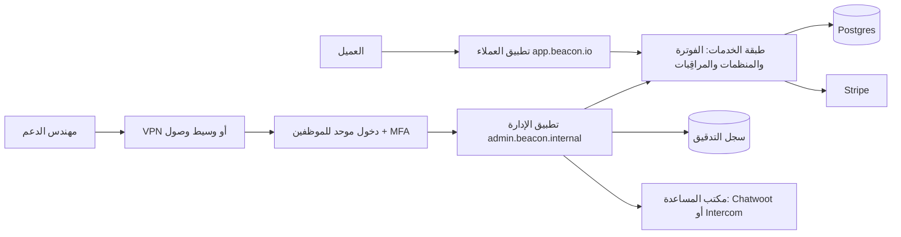
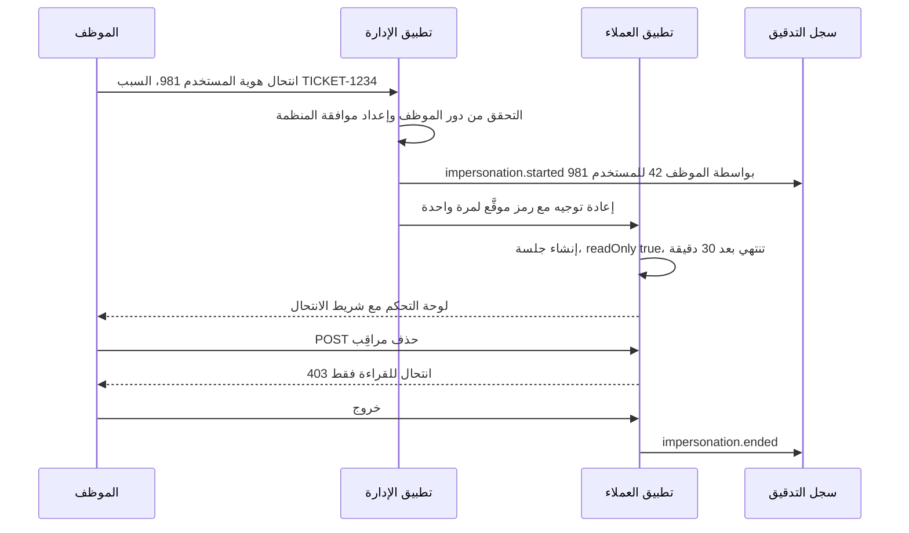

# الوحدة 7 — تشغيل الـ SaaS

*إطلاق المنتج نصف العمل فقط. النصف الآخر هو تشغيله: أن تساعد عملاء لا ترى مشكلاتهم من شاشتك، وأن تعرف أن شيئًا ما معطّل قبل أن يكتبوا عنه على وسائل التواصل، وأن تثبت من غيّر ماذا، وأن تنشر التحديثات بعد ظهر يوم ثلاثاء دون أن تحبس أنفاسك. تغطي هذه الوحدة المكوّنات الأربعة التي تسمح لفريق صغير بتشغيل SaaS دون بطولات: لوحة الإدارة، والمراقبة الشاملة، وسجلات التدقيق، ومسار النشر.*

---

# 7.1 — لوحة الإدارة: أدوات الدعم وانتحال الهوية

*المستوى: 🟡 متوسط* · *المتطلبات: 1.2، 1.3، 3.2*

## ⚡ الدرس في دقيقة

- لوحة الإدارة هي التطبيق الداخلي الذي يستخدمه موظفوك للعثور على العملاء، وفحص حالتهم، وتمديد الفترات التجريبية، ومنح الخطط مجانًا، وإصلاح البيانات، وانتحال الهوية.
- القاعدة الأهم: تطبيق الإدارة باب أمامي ثانٍ إلى طبقة الخدمات نفسها، وليس طريقًا مختصرًا إلى قاعدة البيانات.
- الموظفون ليسوا عملاء لديهم علامة إضافية: خصّص لهم جدول `staff_users` منفصلًا أو مزوّد هوية منفصلًا، ودخولًا موحدًا مع MFA، ونطاقًا فرعيًا منفصلًا، وضابطًا على مستوى الشبكة أمامه.
- الخيار الافتراضي للنسخة الأولى: شاشات مولَّدة تلقائيًا للقراءة (Django admin أو react-admin أو Filament)، مع إجراءات كتابة تبنيها يدويًا تستدعي خدماتك، وتطلب سببًا، وتكتب حدث تدقيق.
- أكبر فخ: انتحال هوية يبدو فيه أن العميل هو من نفّذ الإجراء. اجعله للقراءة فقط افتراضيًا، ومحدودًا بوقت، ومعه شريط تنبيه ظاهر، ومسجَّلًا بالفاعلَين كليهما.

## 🧭 لماذا يحتاجه كل SaaS

الساعة 11 ليلًا، وأحد عملاء Beacon يراسل الدعم: انتهت فترته التجريبية في خطة Pro في منتصف عطل حقيقي، وتوقفت مراقِباته عند حد الخطة المجانية وهو خمسة، وصاحب الحساب الذي يستطيع إدخال بطاقة الدفع على متن طائرة. يريد العميل يومين إضافيين من الفترة التجريبية، والآن. من دون لوحة إدارة، الطريقة الوحيدة للمساعدة أن يفتح مهندس جلسة `psql` على قاعدة بيانات الإنتاج ويكتب أمر `UPDATE` بيده، على أمل أن يتذكر أن تاريخ نهاية الفترة التجريبية موجود أيضًا في Stripe، وأن مجدول المراقِبات يحفظ الاستحقاقات في كاش Redis، وأن لا شيء آخر يقرأ ذلك العمود.

هكذا يبدأ كل SaaS ناشئ، وهكذا يقع أول عطل يسببه لنفسه. المكتب الخلفي (Back Office)، أي التطبيق الداخلي المخصص لموظفيك، يحوّل تلك الاستعلامات الخطرة التي تُكتب مرة واحدة إلى أزرار تمر عبر مسارات الكود نفسها التي يستخدمها المنتج، بالتحققات والآثار الجانبية نفسها، وتترك خلفها سجلًا.

في المقابل، لوحة الإدارة أقوى واجهة ستبنيها على الإطلاق. في يوليو 2020 خدع مهاجمون موظفين في Twitter بالهندسة الاجتماعية، ووصلوا إلى أدوات الإدارة الداخلية في Twitter، واستخدموها للاستيلاء على حسابات شهيرة. لم يحتاجوا إلى أي ثغرة في المنتج نفسه؛ فالأداة الداخلية *كانت* هي سطح الهجوم. **لوحة الإدارة منتج مستخدموه هم موظفوك، وتستحق حماية أكبر من التطبيق الذي يستخدمه العملاء، لا أقل.**

## 📐 كيف يعمل

### 🟢 الأساسيات

كل SaaS ناضج ينمو لديه المكتب الخلفي نفسه. ومهامه متوقعة إلى حد الملل:

| المهمة | مثال في Beacon | المخاطرة |
|---|---|---|
| العثور على عميل | البحث بالبريد الإلكتروني، أو اسم المنظمة، أو النطاق، أو معرّف العميل في Stripe، أو رابط المراقِب | منخفضة (قراءة) |
| رؤية حالته | الخطة، والاستخدام مقابل الحدود، والفواتير، والأعضاء، والحوادث الأخيرة، وآخر تسجيل دخول | منخفضة (قراءة، لكنها بيانات شخصية) |
| منح خطة مجانًا | إعطاء منظمة غير ربحية خطة Pro مجانًا لمدة 12 شهرًا | متوسطة (مال) |
| تمديد فترة تجريبية | تأجيل `trial_ends_at` يومين ومزامنة Stripe | متوسطة (مال) |
| إعادة إرسال دعوة أو بريد تحقق | الدعوة ذهبت إلى مجلد الرسائل المزعجة | منخفضة |
| فك قفل حساب | إلغاء القفل بعد محاولات دخول فاشلة كثيرة، وإعادة ضبط MFA بعد التحقق من الهوية | عالية (طريق للاستيلاء على الحساب) |
| تشغيل إصلاح بيانات | إعادة ربط 40 مراقِبًا بالمنظمة الصحيحة بعد استيراد خاطئ | عالية (بيانات) |
| انتحال الهوية | "رؤية ما يراه العميل" لإعادة إنتاج خطأ | عالية جدًا |

ثلاث قواعد تجعل النسخة الأولى آمنة:

1. **الموظفون ليسوا عملاء لديهم علامة إضافية.** لا تضف `role = 'superadmin'` إلى جدول `memberships` نفسه الذي تعيش فيه أدوار عملائك. يجب ألا يمنح أي خطأ في كود صلاحيات العملاء وصولًا إلى المكتب الخلفي. خصّص جدول `staff_users` منفصلًا (أو مزوّد هوية منفصلًا تمامًا) وملف تعريف ارتباط (Cookie) منفصلًا للجلسة.
2. **كل عملية كتابة تمر عبر طبقة الخدمات.** زر "تمديد الفترة التجريبية" يستدعي الدالة نفسها `extendTrial(orgId, days)` التي يستخدمها كود الفوترة، وهي تحدّث Postgres، وتحدّث الاشتراك في Stripe، وتُبطل كاش الاستحقاقات. أما SQL الخام فيتخطى كل ذلك.
3. **كل إجراء يُسجَّل.** من (معرّف الموظف)، وماذا (الإجراء)، وعلى من (معرّف المنظمة)، ولماذا (سبب نصي إلزامي أو رابط تذكرة)، ومتى. يبني الدرس 7.3 سجل التدقيق، ولوحة الإدارة هي أول من يكتب فيه وأهمهم.



لاحظ الشكل: تطبيق الإدارة وتطبيق العملاء **بابان أماميان إلى طبقة خدمات واحدة**. لا يحصل تطبيق الإدارة على طريق مختصر خاص به إلى قاعدة البيانات.

### 🟡 التعمق أكثر

**مصادقة الموظفين.** يسجّل الموظفون الدخول عبر مزوّد الهوية الخاص بشركتك (Google Workspace أو Okta أو Microsoft Entra) باستخدام الدخول الموحد (SSO)، مع فرض المصادقة متعددة العوامل (MFA)، ويُفضَّل أن تكون مقاومة للتصيد مثل مفاتيح المرور (Passkeys) أو المفاتيح المادية، لأن الهندسة الاجتماعية هي الطريقة التي تُخترق بها أدوات الإدارة فعليًا. لا تُخزَّن كلمات مرور الموظفين في تطبيقك. ضع تطبيق الإدارة على اسم نطاق منفصل حتى لا تُرسل ملفات تعريف الارتباط الخاصة به إلى تطبيق العملاء أو العكس، وحتى تستطيع وضع ضابط شبكة أمامه: شبكة VPN، أو قائمة عناوين IP مسموح بها، أو وسيط يتحقق من الهوية (Cloudflare Access أو Tailscale أو Pomerium) قبل أن تصل حزمة واحدة إلى كودك.

**أدوار الموظفين.** لا يحتاج كل موظف إلى كل زر. هذه مجموعة بداية معقولة:

| دور الموظف | يستطيع | لا يستطيع |
|---|---|---|
| الدعم | قراءة بيانات العملاء، وإعادة إرسال الرسائل، وتمديد الفترات التجريبية حتى 14 يومًا، وانتحال الهوية للقراءة فقط | تغيير الفوترة، وحذف البيانات، والتصدير |
| الفوترة | منح الخطط مجانًا، وإصدار أرصدة، وتغيير الاشتراكات | انتحال الهوية، وتشغيل إصلاحات البيانات |
| المهندس (المناوب) | قراءة كل شيء، وتشغيل سكربتات إصلاح البيانات المعتمدة | تغيير الفوترة |
| المدير الأعلى (شخصان) | كل شيء، بما في ذلك منح أدوار الموظفين | — |

هذا ببساطة هو التفويض (Authorization) من الدرس 1.3، مطبّقًا على فئة ثانية من المستخدمين. المكتبة نفسها تعمل هنا (CASL أو Casbin أو دالة سياسة).

**انتحال الهوية بأمان.** انتحال الهوية (Impersonation)، أي "الدخول بصفة" عميل، هو أكثر أدوات الدعم فائدة، وأكثرها قابلية لسوء الاستخدام أيضًا. التصميم الآمن:

- **للقراءة فقط افتراضيًا.** جلسة الانتحال تستطيع تحميل الصفحات، لكن الوسيط البرمجي (Middleware) يرفض كل طلب يغيّر البيانات. يوجد "انتحال بصلاحية الكتابة" منفصل وأعلى صلاحية، لأدوار محددة فقط، ويتطلب سببًا.
- **محدود بوقت.** 30 دقيقة ثم تنتهي الجلسة. لا يوجد خيار "تذكرني".
- **شريط تنبيه لا يمكن تجاهله.** شريط لافت في كل صفحة: "أنت تتصفح بصفة ana@acme.com — للقراءة فقط — ينتهي بعد 27 دقيقة — خروج". هذا يحمي الموظف من التصرف بصفة العميل عن طريق الخطأ.
- **فاعلان في كل سطر سجل.** كل حدث تدقيق يُكتب أثناء الانتحال يسجّل `actor = staff:42` و`on_behalf_of = user:981`. لا تسمح أبدًا بأن يبدو إجراء نُفّذ بالانتحال كأن العميل هو من نفّذه.
- **موافقة العميل للمنظمات الحساسة.** يستطيع عملاء خطة Business إيقاف الانتحال لمنظمتهم، أو اشتراط موافقة على كل جلسة. على سبيل المثال، يسمح Cal.com للمستخدمين بمنع انتحال هويتهم، ويسمح للفرق بتقييده.
- **مناطق محظورة.** حتى مع صلاحية الكتابة، لا يستطيع الانتحال تغيير كلمة المرور أو MFA أو البريد الإلكتروني أو مفاتيح API أو بيانات الفوترة، ولا يستطيع رؤية الأسرار كنص صريح.



**التكامل مع أدوات الدعم.** مكتب المساعدة (Helpdesk) لديك، سواء كان Chatwoot (مفتوح المصدر) أو Intercom (خدمة مُدارة) أو Zendesk أو Plain، هو المكان الذي تعيش فيه المحادثات، ولوحة الإدارة هي المكان الذي تعيش فيه حالة الحساب. اربطهما في الاتجاهين: الشريط الجانبي في مكتب المساعدة يعرض الخطة والإيراد الشهري المتكرر (MRR) ورابطًا مباشرًا إلى صفحة الإدارة لتلك المنظمة، وصفحة الإدارة تعرض المحادثات الأخيرة. عندما تضمّن أداة دردشة داخل المنتج، استخدم ميزة التحقق من الهوية في مكتب المساعدة (HMAC لمعرّف المستخدم موقَّع بسر موجود على الخادم)، حتى لا يستطيع أحد فتح محادثة منتحلًا صفة مستخدم آخر ثم يطلب من الدعم "إعادة ضبط MFA فقط".

**إصلاحات البيانات ككود.** يجب ألا تكون مهمة "تشغيل إصلاح بيانات" مربع نص ينفّذ SQL. اكتب كل إصلاح كسكربت داخل المستودع، يُراجَع في طلب دمج (Pull Request)، مع وضع `--dry-run` يطبع ما سيغيّره، ويعمل كمهمة خلفية، ويُسجَّل مع مخرجاته. في Rails يوجد `rails runner`، وفي Django أوامر الإدارة (Management Commands)، وفي Laravel أوامر Artisan، وفي Node تكتب أداة سطر أوامر صغيرة أو مهمة.

### 🔴 على نطاق واسع وللمؤسسات

**أقل صلاحية ممكنة، على مدى الزمن.** صلاحية المدير الأعلى الدائمة عبء. تنتقل الفرق الناضجة إلى الوصول في الوقت المطلوب (Just-in-Time Access): يطلب المهندس "صلاحية كتابة على المنظمة X لمدة ساعة، التذكرة Y"، ويوافق شخص ثانٍ، وتنتهي الصلاحية تلقائيًا. وللعمليات الهدّامة (حذف منظمة، أو تصدير كل بيانات العميل) اشترط موافقة شخصين (Four-Eyes): موظف يقترح وآخر يؤكد.

**المصادقة المعزَّزة (Step-up Authentication).** نمط "Admin Mode" في GitLab نمط جيد يستحق النسخ: حتى المستخدم المدير يجب أن يعيد المصادقة قبل أن تُفتح وظائف الإدارة، لذلك لا تكون الجلسة اليومية المسروقة جلسة إدارة مسروقة.

**تقليل البيانات.** نادرًا ما يحتاج الدعم إلى البيانات كاملة. أخفِ أجزاء من عناوين البريد وأرقام الهواتف في القوائم، واعرضها كاملة في صفحة التفاصيل فقط، وسجّل كل عرض لصفحة تفاصيل عميل (نعم، حتى القراءة، للعملاء في القطاعات المنظَّمة)، وحدّد معدل التصدير الجماعي. ستسأل استبيانات الأمان لدى عملاء المؤسسات: "أي من موظفيكم يستطيع الوصول إلى بياناتنا، وكيف يُسجَّل ذلك؟"، والإجابة تأتي من هذه اللوحة.

**مولّدات CRUD مقابل البناء المخصص.** في البداية ولِّد الشاشات تلقائيًا. لاحقًا خصّصها.

| الأسلوب | أمثلة | ممتاز لـ | يبدأ في الإزعاج عندما |
|---|---|---|---|
| لوحة إدارة إطار العمل | Django admin وActiveAdmin وFilament وAvo وAdministrate | جداول لكل نموذج من اليوم الأول | تحتاج إلى مسارات عمل، لا إلى جداول |
| أطر إدارة مبنية على React | react-admin وRefine وAdminJS | لوحة إدارة مخصصة ضمن حزمة TS لديك | نادرًا — تكبر معك |
| أدوات داخلية منخفضة الكود | Appsmith وToolJet وRetool | فرق العمليات التي تبني شاشاتها بنفسها | ينجرف المنطق خارج مراجعة الكود |
| CMS بلا واجهة ومنصات بيانات | Directus وPayload | تحرير المحتوى والبيانات | تحتاج إلى الآثار الجانبية لطبقة خدماتك |
| صفحات مخصصة في تطبيقك | مسارات `/admin` الخاصة بك | انتحال الهوية وإجراءات الفوترة | أبدًا — سيكون لديك بعضها دائمًا |

الفخ في كل مولّد: أنه يتحدث مع قاعدة البيانات مباشرة، فيتجاوز طبقة الخدمات. استخدم الشاشات المولَّدة للقراءة، ومرّر عمليات الكتابة عبر إجراءات مخصصة تستدعي خدماتك.

## 🏆 أفضل المستودعات

| المستودع | ما هو | التقنيات | الترخيص | اختره عندما |
|---|---|---|---|---|
| [marmelab/react-admin](https://github.com/marmelab/react-admin) | إطار React ناضج لواجهات الإدارة فوق أي API عبر مزوّدي البيانات (Data Providers) | React, TS | MIT | تريد لوحة إدارة مخصصة ضمن حزمة TS تستدعي الـ API الخاص بك |
| [refinedev/refine](https://github.com/refinedev/refine) | إطار React بلا واجهة جاهزة للأدوات الداخلية كثيرة عمليات CRUD | React, TS | MIT | تريد منطق الإدارة دون الارتباط بمكتبة واجهات واحدة |
| [SoftwareBrothers/adminjs](https://github.com/SoftwareBrothers/adminjs) | لوحة إدارة مولَّدة تلقائيًا لأدوات ORM في Node (Prisma وTypeORM وSequelize…) | Node, React | MIT | تريد شاشات على طريقة Django admin في تطبيق Node بسرعة |
| [django/django](https://github.com/django/django) | `django.contrib.admin`، لوحة الإدارة المولَّدة الأصلية | Python | BSD-3-Clause | تعمل على Django — فهي موجودة أصلًا |
| [activeadmin/activeadmin](https://github.com/activeadmin/activeadmin) | إطار إدارة لـ Rails مبني على لغة DSL | Ruby | MIT | تعمل على Rails وتريد لوحة إدارة مجرَّبة جيدًا |
| [filamentphp/filament](https://github.com/filamentphp/filament) | لوحات إدارة ونماذج لـ Laravel فوق Livewire | PHP | MIT | تعمل على Laravel |
| [appsmithorg/appsmith](https://github.com/appsmithorg/appsmith) | أداة منخفضة الكود لبناء أدوات داخلية فوق قواعد البيانات والـ APIs | Java, React | Apache-2.0 | يحتاج فريق العمليات إلى شاشات ولا تستطيع تخصيص مهندسين |
| [ToolJet/ToolJet](https://github.com/ToolJet/ToolJet) | أداة منخفضة الكود لبناء الأدوات الداخلية | TS, React | AGPL-3.0 | مثل Appsmith؛ قارن بين الأداتين عمليًا |
| [directus/directus](https://github.com/directus/directus) | API ولوحة إدارة فورية فوق أي قاعدة بيانات SQL | TS, Vue | Monospace Sustainable Core License (source-available) | يجب أن يحرّر غير المهندسين بيانات في قاعدة بيانات موجودة لديك |
| [payloadcms/payload](https://github.com/payloadcms/payload) | CMS بلا واجهة يبدأ من الكود، مع لوحة إدارة مولَّدة، ويُثبَّت داخل Next.js | TS, React | MIT | لوحة الإدارة لديك هي أيضًا المكتب الخلفي للمحتوى |

يستحق المعرفة أيضًا: [avo-hq/avo](https://github.com/avo-hq/avo) (لوحة إدارة لـ Rails، نواتها بترخيص LGPL-3.0 مع مستويات تجارية) و[thoughtbot/administrate](https://github.com/thoughtbot/administrate) (إطار الإدارة لـ Rails الذي يستخدمه Chatwoot).

**إن درست مستودعًا واحدًا فقط:** react-admin. تجريد "مزوّد البيانات" فيه يفرض المعمارية الصحيحة: لوحة الإدارة تتحدث مع *API*، لا مع قاعدة البيانات، لذلك تمر عمليات الكتابة طبيعيًا عبر طبقة خدماتك. اقرأ توثيقه عن مزوّدي البيانات ومزوّدي المصادقة حتى لو استخدمت شيئًا آخر.

**اشترِ أم ابنِ أم استضف بنفسك؟**

- **اشترِ** أداة مُدارة لبناء الأدوات الداخلية (Retool أو Forest Admin) عندما يحتاج فريق العمليات إلى عشرات الشاشات وتفضّل الدفع على البناء، واشترِ مكتب مساعدة (Intercom أو Zendesk أو Plain) في كل الحالات تقريبًا، لأن مسارات عمل الدعم ليست منتجك.
- **استضف بنفسك** Appsmith أو ToolJet أو Chatwoot عندما يجب ألا تغادر بيانات العملاء بنيتك التحتية (وهذا بند شائع في عقود المؤسسات)، أو عندما يصبح التسعير لكل مقعد مؤلمًا.
- **ابنِ** بنفسك انتحال الهوية وإجراءات الفوترة وكل ما يمس الاستحقاقات، فوق طبقة خدماتك. واستخدم إطار عمل (react-admin أو Refine أو لوحة الإدارة في إطار الويب لديك) للجداول المحيطة بها.

## 🔍 ادرسه في مشاريع حقيقية

**GitLab** ([gitlabhq/gitlabhq](https://github.com/gitlabhq/gitlabhq)) يملك واحدة من أكمل مناطق الإدارة في المشاريع مفتوحة المصدر: إدارة المستخدمين، وانتحال الهوية، وإعدادات النسخة، وبلاغات الإساءة. ستجدها بتصفح `app/controllers/admin` (وقت كتابة هذا الدرس يحتوي على `impersonations_controller.rb` و`impersonation_tokens_controller.rb`)، وابحث في المستودع عن `admin_mode` لترى كيف تُفرض المصادقة المعزَّزة على المدراء، بما في ذلك في الوسيط البرمجي لمهام Sidekiq، بحيث ترث المهام الخلفية حالة وضع الإدارة من الطلب الذي وضعها في الطابور.

**Chatwoot** ([chatwoot/chatwoot](https://github.com/chatwoot/chatwoot)) أداة دعم وSaaS في الوقت نفسه، وفيه لوحة تحكم للمدير الأعلى. متحكمات `super_admin` فيه مبنية على مكتبة Administrate، مع صنف "dashboard" لكل نموذج في `app/dashboards`. ابحث عن `Impersonation` لتجد مكوّن الشريط المكتوب بـ Vue والـ composable الذي يشغّله، وهو مثال صغير ونظيف على قاعدة "شريط التنبيه الذي لا يمكن تجاهله".

**Cal.com** ([calcom/cal.com](https://github.com/calcom/cal.com)) يضع صفحات إدارة النسخة داخل تطبيق Next.js الرئيسي في منطقة الإعدادات (ابحث في شجرة `apps/web` عن `admin`). ابحث في ترحيلات Prisma عن `impersonat` وستقرأ تاريخ الميزة على شكل تغييرات في المخطط: خيار على مستوى المستخدم للسماح بالانتحال، ومفتاح على مستوى الفريق لتعطيله، ولاحقًا صلاحيات مرتبطة بأدوار الإدارة.

**ما الذي تلاحظه:**

- شاشات الإدارة تعيد استخدام خدمات المجال بدل كتابة SQL — انظر إلى ما تستدعيه متحكمات الإدارة فعليًا.
- لانتحال الهوية مفتاح إيقاف في جانب العميل، لا مجرد صلاحية في جانب الموظفين.
- إعادة المصادقة المعزَّزة تفصل بين "هو مدير" و"يتصرف كمدير الآن".
- عمليات CRUD المولَّدة (Administrate) تغطي 80% المملة، والإجراءات المخصصة تغطي 20% الخطرة.
- شريط التنبيه يعيش في تطبيق العملاء، لا في تطبيق الإدارة، لأن ذلك هو المكان الذي ينظر إليه الموظف.

## 🛠️ ابنِه في Beacon

### 🟢 تمرين المبتدئ

أنشئ جدول `staff_users` منفصلًا عن `users`، ومنطقة `/admin` (أو تطبيقًا منفصلًا) لا تفتحها إلا جلسات الموظفين. ابنِ بحثًا عن العملاء يجد المنظمة ببريد أحد أعضائها أو باسم المنظمة أو بمعرّف العميل في Stripe، وصفحة منظمة للقراءة فقط تعرض الخطة، ونهاية الفترة التجريبية، وعدد المراقِبات مقابل الحد، والأعضاء، وآخر 10 حوادث.

**يكتمل عندما:**
- يحصل حساب عميل بأي دور على 404 في كل مسار تحت `/admin`.
- يجد البحث منظمة من جزء من البريد الإلكتروني في أقل من ثانية على بيانات تجريبية.
- تعرض صفحة المنظمة الاستخدام مقابل حد الخطة، مأخوذًا من كود الاستحقاقات نفسه الذي يستخدمه المنتج.

### 🟡 تمرين المستوى المتوسط

أضف إجراءي كتابة: "تمديد الفترة التجريبية N يومًا" (لدور الدعم، بحد أقصى 14) و"منح خطة مجانًا" (لدور الفوترة). يجب أن يستدعي كلاهما دوال خدمة الفوترة الموجودة لديك، وأن يطلب سببًا، وأن يكتب حدث تدقيق.

**يكتمل عندما:**
- يحدّث تمديد الفترة التجريبية Postgres *و*نهاية الفترة التجريبية في اشتراك Stripe، ويرى مجدول المراقِبات الحد الجديد دون إعادة تشغيل.
- لا يرى موظف بدور الدعم زر "منح خطة مجانًا"، ويعيد طلب POST مباشر الرمز 403.
- ينتج كل إجراء حدث تدقيق يحتوي على معرّف الموظف ومعرّف المنظمة والسبب والقيم قبل التغيير وبعده.

### 🔴 تمرين المستوى المتقدم

نفّذ انتحال هوية للقراءة فقط: رمز موقَّع لمرة واحدة من تطبيق الإدارة، وجلسة مدتها 30 دقيقة معلَّمة بـ `impersonatorId` و`readOnly`، ووسيط برمجي يرفض الطلبات التي تغيّر البيانات، وشريط تنبيه، وإعداد على مستوى المنظمة "السماح لموظفي Beacon بعرض حسابنا" يكون مطفأً افتراضيًا لمنظمات خطة Business.

```ts
// middleware in the customer app
export function guardImpersonation(req: Req, session: Session) {
  if (!session.impersonatorId) return;
  if (Date.now() > session.impersonationExpiresAt) throw new Unauthorized();
  const mutating = !["GET", "HEAD", "OPTIONS"].includes(req.method);
  if (mutating && session.readOnly) {
    throw new Forbidden("Read-only impersonation");
  }
  req.auditContext = {
    actor: `staff:${session.impersonatorId}`,
    onBehalfOf: `user:${session.userId}`,
  };
}
```

**يكتمل عندما:**
- يعيد أي طلب POST/PUT/PATCH/DELETE أثناء الانتحال للقراءة فقط الرمز 403، بما في ذلك مسارات الـ API.
- تنتهي الجلسات بعد 30 دقيقة حتى لو كانت نشطة.
- يُرفض انتحال هوية منظمة Business أطفأت الموافقة، ويُسجَّل الرفض نفسه في سجل التدقيق.
- يعرض سجل التدقيق الخاص بالعميل إدخالات "اطّلع دعم Beacon على حسابك".

## ⚠️ أخطاء يقع فيها المبتدئون

- **استخدام دور عميل للموظفين.** `if (user.role === 'admin')` بينما "admin" هو أيضًا دور في المنظمة يمكن أن يحمله العملاء. خلط واحد ويصبح عميل داخل مكتبك الخلفي. جداول منفصلة، وجلسات منفصلة، واسم نطاق منفصل.
- **السماح للوحة الإدارة بالكتابة مباشرة في قاعدة البيانات.** نموذج CRUD مولَّد يعدّل `subscriptions.plan` يتخطى Stripe، ويتخطى إبطال الكاش، ويتخطى الرسائل. الشاشات المولَّدة للقراءة، وإجراءات طبقة الخدمات للكتابة.
- **انتحال هوية لا يمكن تمييزه عن العميل.** إذا قال سجل التدقيق "Ana حذفت المراقِب" بينما فعلها مهندس الدعم لديك، فقد أفسدت أدلة عميلك وأدلتك أنت. سجّل الفاعلَين دائمًا.
- **ترك لوحة الإدارة على الإنترنت العام بكلمة مرور.** ضعها خلف دخول موحد مع MFA وضابط شبكة. الأدوات الداخلية هدف مفضل تحديدًا لأنها قوية وضعيفة الحماية.
- **مربع "تشغيل SQL".** سيُستخدم على عجل، في الليل، دون جملة `WHERE`. إصلاحات البيانات سكربتات مراجَعة مع تشغيل تجريبي.
- **لا يوجد حقل للسبب.** بعد ستة أشهر لن يعرف أحد لماذا تملك المنظمة 4411 خطة Business مجانية. السبب الإلزامي (أو رابط التذكرة) يكلّف خمس ثوانٍ ويجيب عن كل "لماذا؟" في المستقبل.

## 🧾 الخلاصة

- ينمو لدى كل SaaS مكتب خلفي للمهام نفسها: البحث، والفحص، والمنح المجاني، والتمديد، وإعادة الإرسال، وفك القفل، والإصلاح، وانتحال الهوية.
- هوية الموظفين منفصلة عن هوية العملاء: جدول أو مزوّد هوية خاص، ودخول موحد + MFA، واسم نطاق منفصل، وضابط شبكة.
- تطبيق الإدارة باب أمامي ثانٍ إلى طبقة الخدمات نفسها، وليس طريقًا للالتفاف عليها أبدًا.
- انتحال الهوية للقراءة فقط افتراضيًا، ومحدود بوقت، ومعه شريط تنبيه، ويُسجَّل بفاعلَين، ويستطيع العملاء إيقافه.
- ولِّد الجداول، وابنِ الإجراءات الخطرة يدويًا.

## ✍️ اختبر نفسك

**1. لماذا يجب أن يكون الموظفون في جدول `staff_users` منفصل بدل منحهم دور `superadmin` في جدول `memberships` نفسه الذي يستخدمه العملاء؟**

<details><summary>الإجابة</summary>

لأن أي خطأ في كود صلاحيات العملاء يجب ألا يمنح وصولًا إلى المكتب الخلفي. إذا تشاركت أدوار الموظفين والعملاء جدولًا واحدًا، فإن خلطًا واحدًا بين دور "admin" في المنظمة ودور مدير الموظفين يُدخل عميلًا إلى مكتبك الخلفي. خصّص جدولًا منفصلًا (أو مزوّد هوية منفصلًا) وملف تعريف ارتباط منفصلًا للجلسة، كما يشرح قسما "🟢 الأساسيات" و"⚠️ أخطاء يقع فيها المبتدئون".

</details>

**2. عدّد ضمانات التصميم الآمن لانتحال الهوية.**

<details><summary>الإجابة</summary>

للقراءة فقط افتراضيًا، ومحدود بوقت (30 دقيقة)، وشريط تنبيه لا يمكن تجاهله، وفاعلان في كل حدث تدقيق، وموافقة العميل للمنظمات الحساسة، ومناطق محظورة مثل كلمة المرور وMFA والبريد الإلكتروني ومفاتيح API وبيانات الفوترة. راجع فقرة "انتحال الهوية بأمان" في "🟡 التعمق أكثر".

</details>

**3. يريد الدعم منح عميل في Beacon يومين إضافيين من الفترة التجريبية. لماذا يجب أن يستدعي الزر `extendTrial(orgId, days)` بدل تنفيذ `UPDATE` على `trial_ends_at`؟**

<details><summary>الإجابة</summary>

لأن نهاية الفترة التجريبية موجودة أيضًا في Stripe، ولأن مجدول المراقِبات يحفظ الاستحقاقات في كاش Redis. دالة الخدمة تحدّث Postgres، وتحدّث اشتراك Stripe، وتُبطل كاش الاستحقاقات، بينما يتخطى SQL الخام كل ذلك ولا يترك أي سجل. راجع القاعدة 2 في "🟢 الأساسيات".

</details>

**4. يسأل عميل محتمل على خطة Business: "أي من موظفيكم يستطيع الوصول إلى بياناتنا، وكيف يُسجَّل ذلك؟" ما أجزاء تصميم لوحة الإدارة في Beacon التي تسمح لك بالإجابة؟**

<details><summary>الإجابة</summary>

أدوار الموظفين بأقل صلاحية ممكنة (والوصول في الوقت المطلوب على نطاق واسع)، ودخول الموظفين الموحد مع MFA، وإعداد على مستوى المنظمة يسمح للعميل بإيقاف انتحال الهوية، وإخفاء البيانات الشخصية، وحدث تدقيق لكل إجراء يقوم به موظف، بما في ذلك عرض صفحات التفاصيل. راجع "🟡 التعمق أكثر" و"🔴 على نطاق واسع وللمؤسسات".

</details>

**5. ينفّذ مهندس ميزة "الدخول بصفة العميل" بإنشاء جلسة عادية لمعرّف مستخدم العميل. بعد أسبوع يقول سجل تدقيق أحد العملاء "Ana حذفت المراقِب"، وتقول Ana إنها لم تفعل. ما الخطأ، وكيف تصلحه؟**

<details><summary>الإجابة</summary>

لم يكن ممكنًا تمييز جلسة الانتحال عن جلسة Ana نفسها: لا يوجد `impersonatorId`، ولا علامة للقراءة فقط، وسُجّل فاعل واحد فقط. علّم الجلسة بـ `impersonatorId` و`readOnly`، وارفض الطلبات التي تغيّر البيانات في الوسيط البرمجي، وأنهِ الجلسة بعد 30 دقيقة، وسجّل `actor = staff:42` مع `on_behalf_of = user:981`. راجع "🟡 التعمق أكثر" وتمرين المستوى المتقدم.

</details>

## 📚 المراجع

- react-admin documentation — https://marmelab.com/react-admin/ — توثيق react-admin
- Django admin site documentation — https://docs.djangoproject.com/en/stable/ref/contrib/admin/ — توثيق لوحة إدارة Django
- OWASP Authentication Cheat Sheet — https://cheatsheetseries.owasp.org/cheatsheets/Authentication_Cheat_Sheet.html — دليل OWASP المختصر للمصادقة
- OWASP Authorization Cheat Sheet — https://cheatsheetseries.owasp.org/cheatsheets/Authorization_Cheat_Sheet.html — دليل OWASP المختصر للتفويض
- GitLab documentation (search "Admin Mode" and "impersonation") — https://docs.gitlab.com — توثيق GitLab (ابحث عن "Admin Mode" و"impersonation")
- Chatwoot documentation — https://www.chatwoot.com/docs — توثيق Chatwoot
- Filament documentation — https://filamentphp.com/docs — توثيق Filament

---

