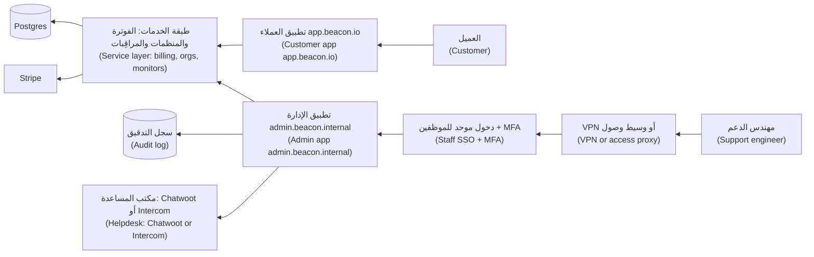
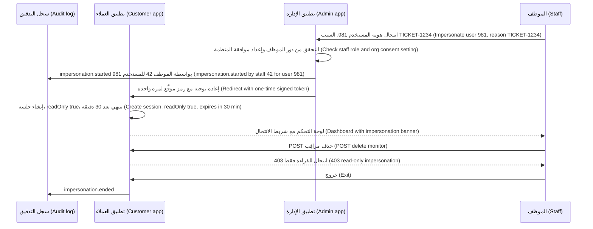
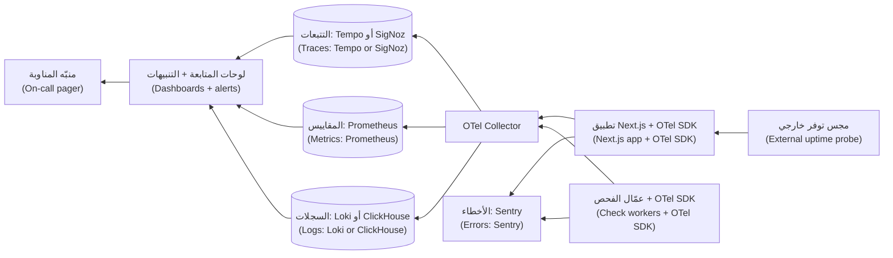
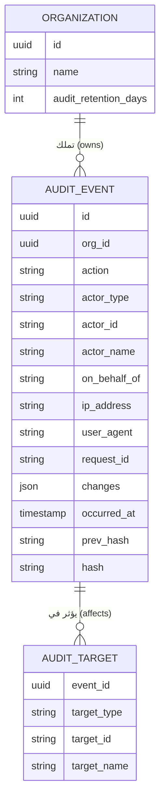
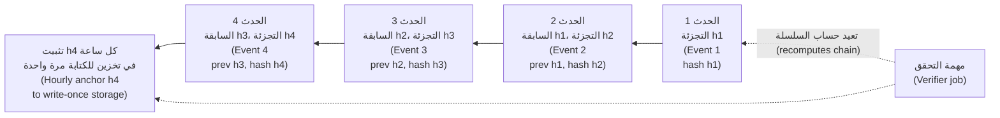
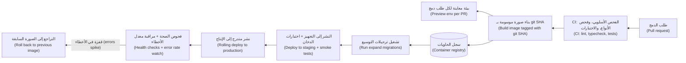
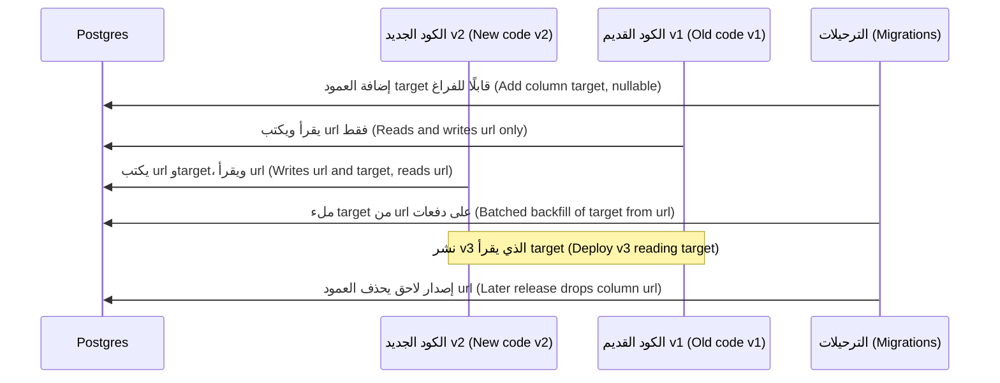

# الوحدة 7 (Module 7) — تشغيل الـ SaaS (Operating the SaaS)

*إطلاق المنتج (product) نصف العمل فقط. النصف الآخر هو تشغيله: أن تساعد عملاء (customers) لا ترى مشكلاتهم من شاشتك، وأن تعرف أن شيئًا ما معطّل قبل أن يكتبوا عنه على وسائل التواصل (social media)، وأن تثبت من غيّر ماذا، وأن تنشر التحديثات (deploying) بعد ظهر يوم ثلاثاء دون أن تحبس أنفاسك. تغطي هذه الوحدة المكوّنات (components) الأربعة التي تسمح لفريق (team) صغير بتشغيل SaaS دون بطولات: لوحة الإدارة (admin panel)، والمراقبة الشاملة (observability)، وسجلات التدقيق (audit logs)، ومسار النشر (deployment pipeline).*

> **التطبيق العملي (Practice):** ابدأ من [نسخة البداية (starter) من Beacon](https://github.com/Tamoura/system-design-for-vibe-coders/tree/beacon/starter)، وحلّ التمارين قبل النظر إلى [الحل المرجعي (reference solution) لهذه الوحدة](https://github.com/Tamoura/system-design-for-vibe-coders/tree/beacon/module-7-solution) (الفرع (branch) `beacon/module-7-solution`).

---

# 7.1 — لوحة الإدارة (admin panel): أدوات الدعم (support tools) وانتحال الهوية (impersonation)

*المستوى (Level): 🟡 متوسط (Intermediate)* · *المتطلبات (Prerequisites): 1.2، 1.3، 3.2*

## ⚡ الدرس في دقيقة (In 60 seconds)

- لوحة الإدارة (admin panel) هي التطبيق الداخلي (internal app) الذي يستخدمه موظفوك (your staff) للعثور على العملاء (customers)، وفحص (check) حالتهم، وتمديد الفترات التجريبية (trials)، ومنح الخطط مجانًا (comp plans)، وإصلاح البيانات (fix data)، وانتحال الهوية (impersonate).
- القاعدة الأهم (The one rule): تطبيق الإدارة (admin app) باب أمامي (front door) ثانٍ إلى طبقة الخدمات (service layer) نفسها، وليس طريقًا مختصرًا (shortcut) إلى قاعدة البيانات (database).
- الموظفون (staff) ليسوا عملاء (customers) لديهم علامة إضافية (flag): خصّص لهم جدول (table) `staff_users` منفصلًا أو مزوّد هوية (identity provider) منفصلًا، ودخولًا موحدًا (SSO) مع MFA، ونطاقًا فرعيًا (hostname) منفصلًا، وضابطًا على مستوى الشبكة (network control) أمامه.
- الخيار الافتراضي للنسخة الأولى (Default for a v1): شاشات مولَّدة (generated screens) تلقائيًا للقراءة (Django admin أو react-admin أو Filament)، مع إجراءات كتابة (write actions) تبنيها يدويًا تستدعي خدماتك (your services)، وتطلب سببًا (reason)، وتكتب حدث تدقيق (audit event).
- أكبر فخ (Biggest trap): انتحال هوية (impersonation) يبدو فيه أن العميل (customer) هو من نفّذ الإجراء (action). اجعله للقراءة فقط (read-only) افتراضيًا، ومحدودًا بوقت، ومعه شريط تنبيه (banner) ظاهر، ومسجَّلًا بالفاعلَين (actors) كليهما.

## 🧭 لماذا يحتاجه كل SaaS (Why every SaaS has this)

الساعة 11 ليلًا، وأحد عملاء (customers) Beacon يراسل الدعم (support): انتهت فترته التجريبية (their trial) في خطة (plan) Pro في منتصف عطل (outage) حقيقي، وتوقفت مراقِباته (their monitors) عند حد الخطة المجانية (Free plan) وهو خمسة، وصاحب الحساب (account owner) الذي يستطيع إدخال بطاقة الدفع على متن طائرة. يريد العميل (customer) يومين إضافيين من الفترة التجريبية (trial)، والآن. من دون لوحة إدارة (admin panel)، الطريقة الوحيدة للمساعدة أن يفتح مهندس (engineer) جلسة (session) `psql` على قاعدة بيانات الإنتاج (production database) ويكتب أمر `UPDATE` بيده، على أمل أن يتذكر أن تاريخ نهاية الفترة التجريبية (trial end) موجود أيضًا في Stripe، وأن مجدول المراقِبات (monitor scheduler) يحفظ الاستحقاقات (entitlements) في كاش (cache) Redis، وأن لا شيء آخر يقرأ ذلك العمود (column).

هكذا يبدأ كل SaaS ناشئ، وهكذا يقع أول عطل (outage) يسببه لنفسه. المكتب الخلفي (Back Office)، أي التطبيق الداخلي (internal app) المخصص لموظفيك (your staff)، يحوّل تلك الاستعلامات (queries) الخطرة التي تُكتب مرة واحدة إلى أزرار تمر عبر مسارات الكود (code paths) نفسها التي يستخدمها المنتج (product)، بالتحققات (checks) والآثار الجانبية (side effects) نفسها، وتترك خلفها سجلًا.

في المقابل، لوحة الإدارة (admin panel) أقوى واجهة (interface) ستبنيها على الإطلاق. في يوليو 2020 خدع مهاجمون (attackers) موظفين (employees) في Twitter بالهندسة الاجتماعية (social engineering)، ووصلوا إلى أدوات الإدارة الداخلية (internal admin tooling) في Twitter، واستخدموها للاستيلاء على حسابات (take over accounts) شهيرة. لم يحتاجوا إلى أي ثغرة في المنتج (product) نفسه؛ فالأداة الداخلية (internal tool) *كانت* هي سطح الهجوم (attack surface). **لوحة الإدارة منتج مستخدموه هم موظفوك (your staff)، وتستحق حماية (security) أكبر من التطبيق (app) الذي يستخدمه العملاء (customers)، لا أقل.**

## 📐 كيف يعمل (How it works)

### 🟢 الأساسيات (The essentials)

كل SaaS ناضج ينمو لديه المكتب الخلفي (back office) نفسه. ومهامه متوقعة إلى حد الملل:

| المهمة (Job) | مثال في Beacon (Beacon example) | المخاطرة (Risk) |
|---|---|---|
| العثور على عميل (customer) | البحث (search) بالبريد الإلكتروني (email)، أو اسم المنظمة (org name)، أو النطاق (domain)، أو معرّف العميل (customer id) في Stripe، أو رابط المراقِب (monitor URL) | منخفضة (قراءة) |
| رؤية حالته | الخطة (plan)، والاستخدام (usage) مقابل الحدود (limits)، والفواتير (invoices)، والأعضاء (members)، والحوادث الأخيرة (recent incidents)، وآخر تسجيل دخول (login) | منخفضة (قراءة، لكنها بيانات شخصية (PII)) |
| منح خطة مجانًا (comp a plan) | إعطاء منظمة غير ربحية (nonprofit) خطة (plan) Pro مجانًا لمدة 12 شهرًا | متوسطة (مال) |
| تمديد فترة تجريبية (trial) | تأجيل `trial_ends_at` يومين ومزامنة (resync) Stripe | متوسطة (مال) |
| إعادة إرسال دعوة (invite) أو بريد تحقق (verification email) | الدعوة (invite) ذهبت إلى مجلد الرسائل المزعجة (spam) | منخفضة |
| فك قفل حساب (unlock an account) | إلغاء القفل (clear lockout) بعد محاولات دخول فاشلة (failed logins) كثيرة، وإعادة ضبط MFA بعد التحقق من الهوية (identity check) | عالية (طريق للاستيلاء على الحساب (account takeover)) |
| تشغيل إصلاح بيانات (data fix) | إعادة ربط 40 مراقِبًا (monitor) بالمنظمة (org) الصحيحة بعد استيراد (import) خاطئ | عالية (بيانات (data)) |
| انتحال الهوية (impersonation) | "رؤية ما يراه العميل (customer)" لإعادة إنتاج خطأ (bug) | عالية جدًا |

ثلاث قواعد تجعل النسخة الأولى آمنة:

1. **الموظفون (staff) ليسوا عملاء لديهم علامة إضافية (flag).** لا تضف `role = 'superadmin'` إلى جدول `memberships` نفسه الذي تعيش فيه أدوار (roles) عملائك (your customers). يجب ألا يمنح أي خطأ في كود صلاحيات (permission) العملاء (customers) وصولًا إلى المكتب الخلفي (back office). خصّص جدول `staff_users` منفصلًا (أو مزوّد هوية (identity provider) منفصلًا تمامًا) وملف تعريف ارتباط (Cookie) منفصلًا للجلسة (session).
2. **كل عملية كتابة (write) تمر عبر طبقة الخدمات (service layer).** زر "تمديد الفترة التجريبية (extend trial)" يستدعي الدالة (function) نفسها `extendTrial(orgId, days)` التي يستخدمها كود الفوترة (billing)، وهي تحدّث Postgres، وتحدّث الاشتراك (subscription) في Stripe، وتُبطل كاش الاستحقاقات (entitlement cache). أما SQL الخام (raw SQL) فيتخطى كل ذلك.
3. **كل إجراء يُسجَّل.** من (معرّف الموظف (staff id))، وماذا (الإجراء (action))، وعلى من (معرّف المنظمة (org id))، ولماذا (سبب نصي إلزامي (required free-text reason) أو رابط تذكرة (ticket))، ومتى. يبني الدرس 7.3 سجل التدقيق (audit log)، ولوحة الإدارة (admin panel) هي أول من يكتب فيه وأهمهم.


```mermaid
flowchart RL
  Staff["مهندس الدعم<br/>(Support engineer)"] --> Proxy["VPN أو وسيط وصول<br/>(VPN or access proxy)"]
  Proxy --> IdP["دخول موحد للموظفين + MFA<br/>(Staff SSO + MFA)"]
  IdP --> Admin["تطبيق الإدارة admin.beacon.internal<br/>(Admin app admin.beacon.internal)"]
  Admin --> Svc["طبقة الخدمات: الفوترة والمنظمات والمراقِبات<br/>(Service layer: billing, orgs, monitors)"]
  Customer["العميل<br/>(Customer)"] --> App["تطبيق العملاء app.beacon.io<br/>(Customer app app.beacon.io)"]
  App --> Svc
  Svc --> DB[("Postgres")]
  Svc --> Stripe["Stripe"]
  Admin --> Audit[("سجل التدقيق<br/>(Audit log)")]
  Admin --> Helpdesk["مكتب المساعدة: Chatwoot أو Intercom<br/>(Helpdesk: Chatwoot or Intercom)"]
```

لاحظ الشكل: تطبيق الإدارة (admin app) وتطبيق العملاء (customer app) **بابان أماميان (two front doors) إلى طبقة خدمات (service layer) واحدة**. لا يحصل تطبيق الإدارة (the admin app) على طريق مختصر (shortcut) خاص به إلى قاعدة البيانات (database).

### 🟡 التعمق أكثر (Going deeper)

**مصادقة الموظفين (staff authentication).** يسجّل الموظفون (staff) الدخول عبر مزوّد الهوية (identity provider) الخاص بشركتك (Google Workspace أو Okta أو Microsoft Entra) باستخدام الدخول الموحد (SSO)، مع فرض المصادقة متعددة العوامل (MFA)، ويُفضَّل أن تكون مقاومة للتصيد (phishing-resistant) مثل مفاتيح المرور (Passkeys) أو المفاتيح المادية (hardware keys)، لأن الهندسة الاجتماعية (social engineering) هي الطريقة التي تُخترق بها أدوات الإدارة (admin tools) فعليًا. لا تُخزَّن كلمات مرور الموظفين (staff passwords) في تطبيقك (your app). ضع تطبيق الإدارة (admin app) على اسم نطاق منفصل (separate hostname) حتى لا تُرسل ملفات تعريف الارتباط (cookies) الخاصة به إلى تطبيق العملاء (customer app) أو العكس، وحتى تستطيع وضع ضابط شبكة (network control) أمامه: شبكة (network) VPN، أو قائمة عناوين IP مسموح بها (IP allowlist)، أو وسيط يتحقق من الهوية (Cloudflare Access أو Tailscale أو Pomerium) قبل أن تصل حزمة (packet) واحدة إلى كودك (your code).

**أدوار الموظفين (staff roles).** لا يحتاج كل موظف (staff member) إلى كل زر. هذه مجموعة بداية معقولة:

| دور الموظف (Staff role) | يستطيع (Can) | لا يستطيع (Cannot) |
|---|---|---|
| الدعم (support) | قراءة بيانات (data) العملاء (customers)، وإعادة إرسال الرسائل، وتمديد الفترات التجريبية (trials) حتى 14 يومًا، وانتحال الهوية (impersonation) للقراءة فقط (read-only) | تغيير الفوترة (billing)، وحذف البيانات (data)، والتصدير (export) |
| الفوترة (billing) | منح الخطط مجانًا (comp plans)، وإصدار أرصدة (credits)، وتغيير الاشتراكات (subscriptions) | انتحال الهوية (impersonation)، وتشغيل إصلاحات البيانات (data fixes) |
| المهندس (المناوب (on-call)) | قراءة كل شيء، وتشغيل سكربتات إصلاح البيانات (data-fix scripts) المعتمدة | تغيير الفوترة (billing) |
| المدير الأعلى (superadmin) (شخصان) | كل شيء، بما في ذلك منح أدوار الموظفين (staff roles) | — |

هذا ببساطة هو التفويض (Authorization) من الدرس 1.3، مطبّقًا على فئة ثانية من المستخدمين (second population of users). المكتبة (library) نفسها تعمل هنا (CASL أو Casbin أو دالة سياسة (policy function)).

**انتحال الهوية بأمان.** انتحال الهوية (Impersonation)، أي "الدخول بصفة" عميل (customer)، هو أكثر أدوات الدعم (support tools) فائدة، وأكثرها قابلية لسوء الاستخدام (abuse) أيضًا. التصميم الآمن:

- **للقراءة فقط (read-only) افتراضيًا.** جلسة الانتحال (impersonation session) تستطيع تحميل الصفحات، لكن الوسيط البرمجي (Middleware) يرفض كل طلب (request) يغيّر البيانات (data). يوجد "انتحال بصلاحية الكتابة (write impersonation)" منفصل وأعلى صلاحية (permission)، لأدوار (roles) محددة فقط، ويتطلب سببًا (reason).
- **محدود بوقت (time-limited).** 30 دقيقة ثم تنتهي الجلسة (session). لا يوجد خيار "تذكرني (remember me)".
- **شريط تنبيه (banner) لا يمكن تجاهله.** شريط لافت في كل صفحة: "أنت تتصفح بصفة ana@acme.com — للقراءة فقط (read-only) — ينتهي بعد 27 دقيقة — خروج". هذا يحمي الموظف من التصرف بصفة العميل (customer) عن طريق الخطأ.
- **فاعلان (two actors) في كل سطر سجل (log line).** كل حدث تدقيق (audit event) يُكتب أثناء الانتحال (impersonation) يسجّل `actor = staff:42` و`on_behalf_of = user:981`. لا تسمح أبدًا بأن يبدو إجراء (action) نُفّذ بالانتحال كأن العميل (customer) هو من نفّذه.
- **موافقة العميل (customer consent) للمنظمات الحساسة (sensitive orgs).** يستطيع عملاء (customers) خطة (plan) Business إيقاف الانتحال (impersonation) لمنظمتهم (their org)، أو اشتراط موافقة (approval) على كل جلسة (session). على سبيل المثال، يسمح Cal.com للمستخدمين (users) بمنع انتحال هويتهم، ويسمح للفرق بتقييده.
- **مناطق محظورة (blocked zones).** حتى مع صلاحية الكتابة (write access)، لا يستطيع الانتحال (impersonation) تغيير كلمة المرور (password) أو MFA أو البريد الإلكتروني (email) أو مفاتيح API (API keys) أو بيانات الفوترة (billing details)، ولا يستطيع رؤية الأسرار (secrets) كنص صريح (plain text).


```mermaid
sequenceDiagram
    participant L as سجل التدقيق (Audit log)
    participant C as تطبيق العملاء (Customer app)
    participant A as تطبيق الإدارة (Admin app)
    participant S as الموظف (Staff)
  S->>A: انتحال هوية المستخدم 981، السبب TICKET-1234 (Impersonate user 981, reason TICKET-1234)
  A->>A: التحقق من دور الموظف وإعداد موافقة المنظمة (Check staff role and org consent setting)
  A->>L: impersonation.started بواسطة الموظف 42 للمستخدم 981 (impersonation.started by staff 42 for user 981)
  A->>C: إعادة توجيه مع رمز موقَّع لمرة واحدة (Redirect with one-time signed token)
  C->>C: إنشاء جلسة، readOnly true، تنتهي بعد 30 دقيقة (Create session, readOnly true, expires in 30 min)
  C-->>S: لوحة التحكم مع شريط الانتحال (Dashboard with impersonation banner)
  S->>C: POST حذف مراقِب (POST delete monitor)
  C-->>S: 403 انتحال للقراءة فقط (403 read-only impersonation)
  S->>C: خروج (Exit)
  C->>L: impersonation.ended
```

**التكامل مع أدوات الدعم (support tooling integration).** مكتب المساعدة (Helpdesk) لديك، سواء كان Chatwoot (مفتوح المصدر (open source)) أو Intercom (خدمة مُدارة (managed)) أو Zendesk أو Plain، هو المكان الذي تعيش فيه المحادثات (conversations)، ولوحة الإدارة (admin panel) هي المكان الذي تعيش فيه حالة الحساب (account state). اربطهما في الاتجاهين: الشريط الجانبي (sidebar) في مكتب المساعدة يعرض الخطة (plan) والإيراد الشهري المتكرر (MRR) ورابطًا مباشرًا (deep link) إلى صفحة الإدارة (admin page) لتلك المنظمة (org)، وصفحة الإدارة تعرض المحادثات الأخيرة. عندما تضمّن أداة دردشة (chat widget) داخل المنتج (product)، استخدم ميزة التحقق من الهوية (identity verification) في مكتب المساعدة (HMAC لمعرّف المستخدم (user id) موقَّع بسر موجود على الخادم (server))، حتى لا يستطيع أحد فتح محادثة (chat) منتحلًا صفة مستخدم (user) آخر ثم يطلب من الدعم (support) "إعادة ضبط MFA فقط".

**إصلاحات البيانات ككود (Data fixes as code).** يجب ألا تكون مهمة (job) "تشغيل إصلاح بيانات (data fix)" مربع نص (textarea) ينفّذ SQL. اكتب كل إصلاح كسكربت (script) داخل المستودع (repo)، يُراجَع في طلب دمج (Pull Request)، مع وضع `--dry-run` يطبع ما سيغيّره، ويعمل كمهمة خلفية (background job)، ويُسجَّل مع مخرجاته (its output). في Rails يوجد `rails runner`، وفي Django أوامر الإدارة (Management Commands)، وفي Laravel أوامر Artisan، وفي Node تكتب أداة سطر أوامر (CLI) صغيرة أو مهمة.

### 🔴 على نطاق واسع وللمؤسسات (At scale / enterprise)

**أقل صلاحية ممكنة (least privilege)، على مدى الزمن.** صلاحية المدير الأعلى الدائمة (standing superadmin access) عبء. تنتقل الفرق الناضجة إلى الوصول في الوقت المطلوب (Just-in-Time Access): يطلب المهندس (engineer) "صلاحية كتابة (write access) على المنظمة (org) X لمدة ساعة، التذكرة (ticket) Y"، ويوافق شخص ثانٍ، وتنتهي الصلاحية تلقائيًا. وللعمليات الهدّامة (destructive operations) (حذف منظمة، أو تصدير كل بيانات (data) العميل (customer)) اشترط موافقة شخصين (Four-Eyes): موظف (staff member) يقترح وآخر يؤكد.

**المصادقة المعزَّزة (Step-up Authentication).** نمط "Admin Mode" في GitLab نمط جيد يستحق النسخ: حتى المستخدم (user) المدير (admin) يجب أن يعيد المصادقة (re-authenticate) قبل أن تُفتح وظائف الإدارة (admin functions)، لذلك لا تكون الجلسة اليومية المسروقة (stolen everyday session) جلسة إدارة مسروقة (stolen admin session).

**تقليل البيانات (data minimization).** نادرًا ما يحتاج الدعم (support) إلى البيانات (data) كاملة. أخفِ (mask) أجزاء من عناوين البريد وأرقام الهواتف في القوائم، واعرضها كاملة في صفحة التفاصيل (detail page) فقط، وسجّل كل عرض لصفحة تفاصيل عميل (نعم، حتى القراءة، للعملاء (customers) في القطاعات المنظَّمة (regulated))، وحدّد معدل التصدير الجماعي (bulk exports). ستسأل استبيانات الأمان (security questionnaires) لدى عملاء المؤسسات (enterprise customers): "أي من موظفيكم (your employees) يستطيع الوصول إلى بياناتنا، وكيف يُسجَّل ذلك؟"، والإجابة (Answer) تأتي من هذه اللوحة (this panel).

**مولّدات CRUD (CRUD generators) مقابل البناء المخصص (custom).** في البداية ولِّد الشاشات تلقائيًا. لاحقًا خصّصها.

| الأسلوب (Approach) | أمثلة (Examples) | ممتاز لـ (Great for) | يبدأ في الإزعاج عندما (Starts hurting when) |
|---|---|---|---|
| لوحة إدارة إطار العمل (framework) | Django admin وActiveAdmin وFilament وAvo وAdministrate | جداول لكل نموذج (model) من اليوم الأول | تحتاج إلى مسارات عمل (workflows)، لا إلى جداول |
| أطر إدارة (admin frameworks) مبنية على React | react-admin وRefine وAdminJS | لوحة إدارة (admin panel) مخصصة ضمن حزمة TS (TS stack) لديك | نادرًا — تكبر معك |
| أدوات داخلية (internal tools) منخفضة الكود (low-code internal tools) | Appsmith وToolJet وRetool | فرق العمليات (ops teams) التي تبني شاشاتها بنفسها | ينجرف المنطق خارج مراجعة الكود (code review) |
| CMS بلا واجهة (headless CMS) ومنصات بيانات (data platforms) | Directus وPayload | تحرير المحتوى (content editing) والبيانات (data) | تحتاج إلى الآثار الجانبية (side effects) لطبقة خدماتك (your service layer) |
| صفحات مخصصة (custom pages) في تطبيقك (your app) | مسارات `/admin` الخاصة بك | انتحال الهوية (impersonation) وإجراءات الفوترة (billing actions) | أبدًا — سيكون لديك بعضها دائمًا |

الفخ في كل مولّد (generator): أنه يتحدث مع قاعدة البيانات (database) مباشرة، فيتجاوز طبقة الخدمات (service layer). استخدم الشاشات المولَّدة (generated screens) للقراءة، ومرّر عمليات الكتابة (writes) عبر إجراءات مخصصة (custom actions) تستدعي خدماتك (your services).

## 🏆 أفضل المستودعات (The best repos)

| المستودع (Repo) | ما هو (What it is) | التقنيات (Stack) | الترخيص (License) | اختره عندما (Pick it when) |
|---|---|---|---|---|
| [marmelab/react-admin](https://github.com/marmelab/react-admin) | إطار (framework) React ناضج لواجهات الإدارة فوق أي API عبر مزوّدي البيانات (Data Providers) | React, TS | MIT | تريد لوحة إدارة (admin panel) مخصصة ضمن حزمة TS تستدعي الـ API الخاص بك |
| [refinedev/refine](https://github.com/refinedev/refine) | إطار (framework) React بلا واجهة جاهزة للأدوات الداخلية (internal tools) كثيرة عمليات CRUD | React, TS | MIT | تريد منطق الإدارة دون الارتباط بمكتبة واجهات (UI kit) واحدة |
| [SoftwareBrothers/adminjs](https://github.com/SoftwareBrothers/adminjs) | لوحة إدارة (admin panel) مولَّدة تلقائيًا (auto-generated) لأدوات (tools) ORM في Node (Prisma وTypeORM وSequelize…) | Node, React | MIT | تريد شاشات على طريقة Django admin في تطبيق (app) Node بسرعة |
| [django/django](https://github.com/django/django) | `django.contrib.admin`، لوحة الإدارة (admin panel) المولَّدة الأصلية | Python | BSD-3-Clause | تعمل على Django — فهي موجودة أصلًا |
| [activeadmin/activeadmin](https://github.com/activeadmin/activeadmin) | إطار إدارة (admin framework) لـ Rails مبني على لغة DSL | Ruby | MIT | تعمل على Rails وتريد لوحة إدارة (admin panel) مجرَّبة جيدًا (battle-tested) |
| [filamentphp/filament](https://github.com/filamentphp/filament) | لوحات إدارة ونماذج (admin panels and forms) لـ Laravel فوق Livewire | PHP | MIT | تعمل على Laravel |
| [appsmithorg/appsmith](https://github.com/appsmithorg/appsmith) | أداة منخفضة الكود (low-code builder) لبناء أدوات داخلية (internal tools) فوق قواعد البيانات (databases) والـ APIs | Java, React | Apache-2.0 | يحتاج فريق العمليات (ops) إلى شاشات ولا تستطيع تخصيص مهندسين (engineers) |
| [ToolJet/ToolJet](https://github.com/ToolJet/ToolJet) | أداة منخفضة الكود (low-code builder) لبناء الأدوات الداخلية (internal tools) | TS, React | AGPL-3.0 | مثل Appsmith؛ قارن بين الأداتين عمليًا |
| [directus/directus](https://github.com/directus/directus) | API ولوحة إدارة (admin panel) فورية فوق أي قاعدة بيانات (database) SQL | TS, Vue | Monospace Sustainable Core License (source-available) | يجب أن يحرّر غير المهندسين (engineers) بيانات (data) في قاعدة بيانات (database) موجودة لديك |
| [payloadcms/payload](https://github.com/payloadcms/payload) | CMS بلا واجهة يبدأ من الكود (code)، مع لوحة إدارة (admin panel) مولَّدة، ويُثبَّت داخل Next.js | TS, React | MIT | لوحة الإدارة (admin panel) لديك هي أيضًا المكتب الخلفي (back office) للمحتوى |

يستحق المعرفة أيضًا: [avo-hq/avo](https://github.com/avo-hq/avo) (لوحة إدارة (admin panel) لـ Rails، نواتها بترخيص (license) LGPL-3.0 مع مستويات تجارية) و[thoughtbot/administrate](https://github.com/thoughtbot/administrate) (إطار الإدارة (admin framework) لـ Rails الذي يستخدمه Chatwoot).

**إن درست مستودعًا واحدًا فقط (If you only study one):** react-admin. تجريد (abstraction) "مزوّد البيانات (data provider)" فيه يفرض المعمارية (architecture) الصحيحة: لوحة الإدارة (admin panel) تتحدث مع *API*، لا مع قاعدة البيانات (database)، لذلك تمر عمليات الكتابة (writes) طبيعيًا عبر طبقة خدماتك (your service layer). اقرأ توثيقه (docs) عن مزوّدي البيانات (data providers) ومزوّدي المصادقة (auth providers) حتى لو استخدمت شيئًا آخر.

**اشترِ أم ابنِ أم استضف بنفسك (Buy, build, or self-host)؟**

- **اشترِ (Buy)** أداة مُدارة (managed tool) لبناء الأدوات الداخلية (Retool أو Forest Admin) عندما يحتاج فريق العمليات (ops) إلى عشرات الشاشات وتفضّل الدفع على البناء، واشترِ مكتب مساعدة (Intercom أو Zendesk أو Plain) في كل الحالات تقريبًا، لأن مسارات عمل الدعم (support workflows) ليست منتجك (your product).
- **استضف بنفسك (Self-host)** Appsmith أو ToolJet أو Chatwoot عندما يجب ألا تغادر بيانات (data) العملاء (customers) بنيتك التحتية (infrastructure) (وهذا بند شائع في عقود المؤسسات (enterprise contract))، أو عندما يصبح التسعير لكل مقعد (per-seat pricing) مؤلمًا.
- **ابنِ (Build)** بنفسك انتحال الهوية (impersonation) وإجراءات الفوترة (billing actions) وكل ما يمس الاستحقاقات (entitlements)، فوق طبقة خدماتك (your service layer). واستخدم إطار عمل (react-admin أو Refine أو لوحة الإدارة (admin panel) في إطار الويب (web framework) لديك) للجداول المحيطة بها.

## 🔍 ادرسه في مشاريع حقيقية (Study it in the wild)

**GitLab** ([gitlabhq/gitlabhq](https://github.com/gitlabhq/gitlabhq)) يملك واحدة من أكمل مناطق الإدارة (admin areas) في المشاريع مفتوحة المصدر (open source): إدارة المستخدمين (user management)، وانتحال الهوية (impersonation)، وإعدادات النسخة (instance settings)، وبلاغات الإساءة (abuse reports). ستجدها بتصفح `app/controllers/admin` (وقت كتابة هذا الدرس يحتوي على `impersonations_controller.rb` و`impersonation_tokens_controller.rb`)، وابحث في المستودع (repo) عن `admin_mode` لترى كيف تُفرض المصادقة المعزَّزة (step-up authentication) على المدراء (admins)، بما في ذلك في الوسيط البرمجي (middleware) لمهام (jobs) Sidekiq، بحيث ترث المهام الخلفية (background jobs) حالة وضع الإدارة (admin mode) من الطلب (request) الذي وضعها في الطابور (queue).

**Chatwoot** ([chatwoot/chatwoot](https://github.com/chatwoot/chatwoot)) أداة دعم (support tool) وSaaS في الوقت نفسه، وفيه لوحة تحكم للمدير الأعلى (super admin console). متحكمات (controllers) `super_admin` فيه مبنية على مكتبة (library) Administrate، مع صنف (class) "dashboard" لكل نموذج (model) في `app/dashboards`. ابحث عن `Impersonation` لتجد مكوّن (component) الشريط المكتوب بـ Vue والـ composable الذي يشغّله، وهو مثال صغير ونظيف على قاعدة "شريط التنبيه (banner) الذي لا يمكن تجاهله".

**Cal.com** ([calcom/cal.diy](https://github.com/calcom/cal.diy)) يضع صفحات إدارة النسخة (instance admin pages) داخل تطبيق (app) Next.js الرئيسي في منطقة الإعدادات (ابحث في شجرة `apps/web` عن `admin`). ابحث في ترحيلات (migrations) Prisma عن `impersonat` وستقرأ تاريخ الميزة على شكل تغييرات في المخطط (schema): خيار على مستوى المستخدم (user-level toggle) للسماح بالانتحال (impersonation)، ومفتاح على مستوى الفريق (team-level switch) لتعطيله، ولاحقًا صلاحيات (permissions) مرتبطة بأدوار (roles) الإدارة.

**ما الذي تلاحظه (What to notice):**

- شاشات الإدارة (admin screens) تعيد استخدام خدمات المجال (domain services) بدل كتابة SQL — انظر إلى ما تستدعيه متحكمات الإدارة (admin controllers) فعليًا.
- لانتحال الهوية (impersonation) مفتاح إيقاف (off switch) في جانب العميل (customer)، لا مجرد صلاحية (permission) في جانب الموظفين (staff).
- إعادة المصادقة المعزَّزة (step-up re-authentication) تفصل بين "هو مدير (admin)" و"يتصرف كمدير الآن".
- عمليات CRUD المولَّدة (Administrate) تغطي 80% المملة، والإجراءات المخصصة (custom actions) تغطي 20% الخطرة.
- شريط التنبيه (banner) يعيش في تطبيق العملاء (customer app)، لا في تطبيق الإدارة (admin app)، لأن ذلك هو المكان الذي ينظر إليه الموظف.

## 🛠️ ابنِه في Beacon (Build it into Beacon)

### 🟢 تمرين المبتدئ (Beginner exercise)

أنشئ جدول `staff_users` منفصلًا عن `users`، ومنطقة `/admin` (أو تطبيقًا (app) منفصلًا) لا تفتحها إلا جلسات الموظفين (staff sessions). ابنِ (Build) بحثًا (search) عن العملاء (customers) يجد المنظمة (org) ببريد أحد أعضائها (its members) أو باسم المنظمة (org name) أو بمعرّف العميل (customer id) في Stripe، وصفحة منظمة (org page) للقراءة فقط (read-only) تعرض الخطة (plan)، ونهاية الفترة التجريبية (trial end)، وعدد المراقِبات (monitor count) مقابل الحد (limit)، والأعضاء (members)، وآخر 10 حوادث (incidents).

**يكتمل عندما (Done when):**
- يحصل حساب عميل (customer) بأي دور (role) على 404 في كل مسار تحت `/admin`.
- يجد البحث (search) منظمة (org) من جزء من البريد الإلكتروني (email) في أقل من ثانية على بيانات تجريبية (seeded data).
- تعرض صفحة المنظمة (org page) الاستخدام (usage) مقابل حد الخطة (plan limit)، مأخوذًا من كود الاستحقاقات (entitlements code) نفسه الذي يستخدمه المنتج (product).

### 🟡 تمرين المستوى المتوسط (Intermediate exercise)

أضف إجراءي كتابة (two write actions): "تمديد الفترة التجريبية (extend trial) N يومًا" (لدور (role) الدعم (support)، بحد أقصى 14) و"منح خطة مجانًا (comp a plan)" (لدور الفوترة (billing)). يجب أن يستدعي كلاهما دوال خدمة الفوترة (billing service functions) الموجودة لديك، وأن يطلب سببًا (reason)، وأن يكتب حدث تدقيق (audit event).

**يكتمل عندما (Done when):**
- يحدّث تمديد الفترة التجريبية (extend trial) Postgres *و*نهاية الفترة التجريبية (trial end) في اشتراك Stripe (Stripe subscription)، ويرى مجدول المراقِبات (monitor scheduler) الحد (limit) الجديد دون إعادة تشغيل (restart).
- لا يرى موظف (staff member) بدور (role) الدعم (support) زر "منح خطة مجانًا (comp a plan)"، ويعيد طلب (request) POST مباشر الرمز 403.
- ينتج كل إجراء (action) حدث تدقيق (audit event) يحتوي على معرّف الموظف (staff id) ومعرّف المنظمة (org id) والسبب (reason) والقيم قبل التغيير (change) وبعده.

### 🔴 تمرين المستوى المتقدم (Advanced exercise)

نفّذ انتحال هوية (impersonation) للقراءة فقط (read-only): رمز موقَّع لمرة واحدة (one-time signed token) من تطبيق الإدارة (admin app)، وجلسة (session) مدتها 30 دقيقة معلَّمة بـ `impersonatorId` و`readOnly`، ووسيط برمجي (middleware) يرفض الطلبات (requests) التي تغيّر البيانات (data)، وشريط تنبيه (banner)، وإعداد على مستوى المنظمة (org) "السماح لموظفي Beacon بعرض حسابنا" يكون مطفأً افتراضيًا لمنظمات (orgs) خطة (plan) Business.

```ts
// middleware in the customer app
export function guardImpersonation(req: Req, session: Session) {
  if (!session.impersonatorId) return;
  if (Date.now() > session.impersonationExpiresAt) throw new Unauthorized();
  const mutating = !["GET", "HEAD", "OPTIONS"].includes(req.method);
  if (mutating && session.readOnly) {
    throw new Forbidden("Read-only impersonation");
  }
  req.auditContext = {
    actor: `staff:${session.impersonatorId}`,
    onBehalfOf: `user:${session.userId}`,
  };
}
```

**يكتمل عندما (Done when):**
- يعيد أي طلب (request) POST/PUT/PATCH/DELETE أثناء الانتحال (impersonation) للقراءة فقط (read-only) الرمز 403، بما في ذلك مسارات الـ API (API routes).
- تنتهي الجلسات (sessions) بعد 30 دقيقة حتى لو كانت نشطة.
- يُرفض انتحال هوية (impersonation) منظمة (org) Business أطفأت الموافقة (consent)، ويُسجَّل الرفض نفسه في سجل التدقيق (audit log).
- يعرض سجل التدقيق (audit log) الخاص بالعميل (customer) إدخالات "اطّلع دعم Beacon (Beacon support) على حسابك".

## ⚠️ أخطاء يقع فيها المبتدئون (Mistakes juniors make)

- **استخدام دور (role) عميل (customer) للموظفين (staff).** `if (user.role === 'admin')` بينما "admin" هو أيضًا دور في المنظمة (org) يمكن أن يحمله العملاء (customers). خلط واحد ويصبح عميل داخل مكتبك الخلفي (your back office). جداول منفصلة، وجلسات (sessions) منفصلة، واسم نطاق منفصل (separate hostname).
- **السماح للوحة الإدارة (admin panel) بالكتابة مباشرة في قاعدة البيانات (database).** نموذج CRUD مولَّد (generated CRUD form) يعدّل `subscriptions.plan` يتخطى Stripe، ويتخطى إبطال الكاش (cache invalidation)، ويتخطى الرسائل. الشاشات المولَّدة (generated screens) للقراءة، وإجراءات طبقة الخدمات (service-layer actions) للكتابة.
- **انتحال هوية (impersonation) لا يمكن تمييزه عن العميل (customer).** إذا قال سجل التدقيق (audit log) "Ana حذفت المراقِب (monitor)" بينما فعلها مهندس الدعم (support engineer) لديك، فقد أفسدت أدلة عميلك (your customer's evidence) وأدلتك (your evidence) أنت. سجّل الفاعلَين (both actors) دائمًا.
- **ترك لوحة الإدارة (admin panel) على الإنترنت العام (public internet) بكلمة مرور.** ضعها خلف دخول موحد (SSO) مع MFA وضابط شبكة (network control). الأدوات الداخلية (internal tools) هدف مفضل (favorite target) تحديدًا لأنها قوية وضعيفة الحماية.
- **مربع "تشغيل SQL".** سيُستخدم على عجل، في الليل، دون جملة `WHERE`. إصلاحات البيانات (data fixes) سكربتات (scripts) مراجَعة مع تشغيل تجريبي (dry run).
- **لا يوجد حقل (field) للسبب (reason).** بعد ستة أشهر لن يعرف أحد لماذا تملك المنظمة (org) 4411 خطة (plan) Business مجانية. السبب الإلزامي (أو رابط التذكرة (ticket link)) يكلّف خمس ثوانٍ ويجيب عن كل "لماذا؟" في المستقبل.

## 🧾 الخلاصة (Recap)

- ينمو لدى كل SaaS مكتب خلفي (back office) للمهام (jobs) نفسها: البحث (search)، والفحص (check)، والمنح المجاني (comp)، والتمديد، وإعادة الإرسال، وفك القفل (unlock)، والإصلاح، وانتحال الهوية (impersonation).
- هوية الموظفين (staff identity) منفصلة عن هوية العملاء (customer identity): جدول أو مزوّد هوية (identity provider) خاص، ودخول موحد (SSO) + MFA، واسم نطاق منفصل (separate hostname)، وضابط شبكة (network control).
- تطبيق الإدارة (admin app) باب أمامي (front door) ثانٍ إلى طبقة الخدمات (service layer) نفسها، وليس طريقًا للالتفاف عليها أبدًا.
- انتحال الهوية (impersonation) للقراءة فقط (read-only) افتراضيًا، ومحدود بوقت (time-limited)، ومعه شريط تنبيه (banner)، ويُسجَّل بفاعلَين (dual-actor)، ويستطيع العملاء (customers) إيقافه.
- ولِّد الجداول، وابنِ (Build) الإجراءات الخطرة (dangerous actions) يدويًا.

## ✍️ اختبر نفسك (Check yourself)

**1. لماذا يجب أن يكون الموظفون (staff) في جدول `staff_users` منفصل بدل منحهم دور (role) `superadmin` في جدول `memberships` نفسه الذي يستخدمه العملاء (customers)؟**

<details><summary>الإجابة (Answer)</summary>

لأن أي خطأ في كود صلاحيات (permission code) العملاء (customers) يجب ألا يمنح وصولًا إلى المكتب الخلفي (back office). إذا تشاركت أدوار الموظفين (staff roles) والعملاء جدولًا واحدًا، فإن خلطًا واحدًا بين دور (role) "admin" في المنظمة (org) ودور مدير الموظفين (staff admin) يُدخل عميلًا (customer) إلى مكتبك الخلفي (your back office). خصّص جدولًا منفصلًا (أو مزوّد هوية (identity provider) منفصلًا) وملف تعريف ارتباط (cookie) منفصلًا للجلسة (session)، كما يشرح قسما "🟢 الأساسيات (The essentials)" و"⚠️ أخطاء يقع فيها المبتدئون (Mistakes juniors make)".

</details>

**2. عدّد ضمانات التصميم الآمن لانتحال الهوية (impersonation).**

<details><summary>الإجابة (Answer)</summary>

للقراءة فقط (read-only) افتراضيًا، ومحدود بوقت (30 دقيقة)، وشريط تنبيه (banner) لا يمكن تجاهله، وفاعلان (two actors) في كل حدث تدقيق (audit event)، وموافقة العميل (customer consent) للمنظمات الحساسة (sensitive orgs)، ومناطق محظورة (blocked zones) مثل كلمة المرور (password) وMFA والبريد الإلكتروني (email) ومفاتيح API (API keys) وبيانات الفوترة (billing details). راجع فقرة "انتحال الهوية (impersonation) بأمان" في "🟡 التعمق أكثر (Going deeper)".

</details>

**3. يريد الدعم (support) منح عميل (customer) في Beacon يومين إضافيين من الفترة التجريبية (trial). لماذا يجب أن يستدعي الزر `extendTrial(orgId, days)` بدل تنفيذ `UPDATE` على `trial_ends_at`؟**

<details><summary>الإجابة (Answer)</summary>

لأن نهاية الفترة التجريبية (trial end) موجودة أيضًا في Stripe، ولأن مجدول المراقِبات (monitor scheduler) يحفظ الاستحقاقات (entitlements) في كاش (cache) Redis. دالة الخدمة (service function) تحدّث Postgres، وتحدّث اشتراك Stripe (Stripe subscription)، وتُبطل كاش الاستحقاقات (entitlement cache)، بينما يتخطى SQL الخام (raw SQL) كل ذلك ولا يترك أي سجل. راجع القاعدة 2 في "🟢 الأساسيات (The essentials)".

</details>

**4. يسأل عميل محتمل (prospect) على خطة (plan) Business: "أي من موظفيكم (your employees) يستطيع الوصول إلى بياناتنا، وكيف يُسجَّل ذلك؟" ما أجزاء تصميم لوحة الإدارة (admin panel) في Beacon التي تسمح لك بالإجابة (Answer)؟**

<details><summary>الإجابة (Answer)</summary>

أدوار الموظفين (staff roles) بأقل صلاحية ممكنة (والوصول في الوقت المطلوب (just-in-time access) على نطاق واسع (at scale))، ودخول الموظفين الموحد (staff SSO) مع MFA، وإعداد على مستوى المنظمة (org) يسمح للعميل (customer) بإيقاف انتحال الهوية (impersonation)، وإخفاء البيانات الشخصية (PII)، وحدث تدقيق (audit event) لكل إجراء (action) يقوم به موظف (staff member)، بما في ذلك عرض صفحات التفاصيل (detail pages). راجع "🟡 التعمق أكثر (Going deeper)" و"🔴 على نطاق واسع وللمؤسسات (At scale / enterprise)".

</details>

**5. ينفّذ مهندس (engineer) ميزة (feature) "الدخول بصفة العميل (customer)" بإنشاء جلسة (session) عادية لمعرّف مستخدم العميل (customer's user id). بعد أسبوع يقول سجل تدقيق (audit log) أحد العملاء (customers) "Ana حذفت المراقِب (monitor)"، وتقول Ana إنها لم تفعل. ما الخطأ، وكيف تصلحه؟**

<details><summary>الإجابة (Answer)</summary>

لم يكن ممكنًا تمييز جلسة الانتحال (impersonation session) عن جلسة Ana نفسها: لا يوجد `impersonatorId`، ولا علامة للقراءة فقط (read-only)، وسُجّل فاعل (actor) واحد فقط. علّم الجلسة (session) بـ `impersonatorId` و`readOnly`، وارفض الطلبات (requests) التي تغيّر البيانات (data) في الوسيط البرمجي (middleware)، وأنهِ الجلسة بعد 30 دقيقة، وسجّل `actor = staff:42` مع `on_behalf_of = user:981`. راجع "🟡 التعمق أكثر (Going deeper)" وتمرين المستوى المتقدم (Advanced exercise).

</details>

## 📚 المراجع (References)

- react-admin documentation — https://marmelab.com/react-admin/ — توثيق react-admin
- Django admin site documentation — https://docs.djangoproject.com/en/stable/ref/contrib/admin/ — توثيق لوحة إدارة (admin panel) Django
- OWASP Authentication Cheat Sheet — https://cheatsheetseries.owasp.org/cheatsheets/Authentication_Cheat_Sheet.html — دليل OWASP المختصر (OWASP cheat sheet) للمصادقة (authentication)
- OWASP Authorization Cheat Sheet — https://cheatsheetseries.owasp.org/cheatsheets/Authorization_Cheat_Sheet.html — دليل OWASP المختصر (OWASP cheat sheet) للتفويض (authorization)
- GitLab documentation (search "Admin Mode" and "impersonation") — https://docs.gitlab.com — توثيق GitLab (ابحث عن "Admin Mode" و"impersonation")
- Chatwoot documentation — https://www.chatwoot.com/docs — توثيق Chatwoot
- Filament documentation — https://filamentphp.com/docs — توثيق Filament

---

# 7.2 — المراقبة الشاملة (observability): السجلات (logs) والأخطاء (errors) والمقاييس (metrics) والتتبعات (traces)

*المستوى (Level): 🟡 متوسط (Intermediate)* · *المتطلبات (Prerequisites): 5.1*

## ⚡ الدرس في دقيقة (In 60 seconds)

- المراقبة الشاملة (Observability) تعني أنك تستطيع تفسير أي سلوك في بيئة الإنتاج (production) من البيانات (data) التي يصدرها النظام أصلًا، دون أن تنشر كودًا (code) جديدًا لتكتشف ما يحدث.
- هناك خمس إشارات (signals): السجلات (logs) تقول ماذا حدث، والمقاييس (metrics) كم، والتتبعات (traces) أين، والأخطاء (errors) ما الذي تعطّل، وفحوص التوفر (uptime probes) من الخارج هل يستطيع أحد الوصول إليك.
- القاعدة الأهم (The one rule): سجلات JSON منظَّمة (structured JSON logs)، مع معرّف الطلب (request id) ومعرّف المستأجر (tenant id) في كل سطر.
- الخيار الافتراضي للنسخة الأولى (Default for a v1): pino (أو أداة السجلات المنظَّمة (structured logger) في حزمتك التقنية (stack))، وSentry أو GlitchTip مع رقم الإصدار (release) وخرائط المصدر (source maps)، وOpenTelemetry للتتبعات (traces)، وفاحص مستقل (independent probe) واحد خارج بنيتك التحتية (infrastructure).
- قِس إشارة الصحة (health signal) الخاصة بمنتجك (في Beacon: تأخر الفحوص (check lag))، وأرسل التنبيهات العاجلة (page) عند استنزاف ميزانية SLO (SLO burn)، لا عند ارتفاع استهلاك المعالج (CPU).
- أكبر فخ (Biggest trap): وضع `orgId` في تسميات (labels) Prometheus، مما يفجّر عدد السلاسل الزمنية (cardinality) وقد يُسقط خادم المقاييس (metrics server).

## 🧭 لماذا يحتاجه كل SaaS (Why every SaaS has this)

منتج (product) Beacon كله قائم على إخبار الشركات الأخرى بأن موقعها معطّل. تخيّل الآن هذا: نشرٌ (deploy) يوم الخميس يُدخل خطأً (bug) يجعل مجدول الفحوص (check scheduler) يتخطى بصمت المراقِبات (monitors) التي أُنشئت منظماتها بعد تاريخ معين. لا يُطلَق أي خطأ؛ الفحوص (checks) ببساطة لا تعمل. لا يصدر أي تنبيه (alert). يوم السبت يتعطل الـ API لدى أحد العملاء (customers) ثلاث ساعات ولا يقول Beacon شيئًا، لأن Beacon لم يفحصه أصلًا. يكتشف العميل (customer) العطل (outage) من مستخدميه (its users)، ثم يخبر الجميع على وسائل التواصل (social media) أن أداة المراقبة (monitoring tool) لديه لم تراقب.

الجزء المؤلم ليس الخطأ نفسه؛ فالأخطاء (errors) تحدث. المؤلم هو أنه **لم تكن لديك أي وسيلة لتعرف**. لا يوجد مقياس (metric) لـ "الفحوص المنفَّذة (checks executed) مقابل الفحوص المجدولة (scheduled checks)"، ولا سجل تستطيع البحث (search) فيه حسب المنظمة (org)، ولا تتبع (trace) يُظهر أين ذهب طلب الفحص (check request). شركة المراقبة (monitoring company) لم تكن تراقب نفسها.

هذا هو الفرق بين *المراقبة* (Monitoring)، أي "هل الشيء الذي توقعت أن يتعطل معطّل الآن؟"، و*المراقبة الشاملة* (Observability)، أي "هل أستطيع طرح سؤال جديد عن بيئة الإنتاج (production) والحصول على إجابة؟". **المراقبة الشاملة هي القدرة على تفسير أي سلوك في نظام الإنتاج (production system) من البيانات (data) التي يصدرها أصلًا، دون نشر (deploy) كود (code) جديد لتكتشف ما يحدث.**

## 📐 كيف يعمل (How it works)

### 🟢 الأساسيات (The essentials)

تصدر أنظمة الإنتاج (production systems) عددًا قليلًا من أنواع الإشارات (signals). كل نوع يجيب عن سؤال مختلف:

| الإشارة (Signal) | ما هي (What it is) | تجيب عن (Answers) | مثال في Beacon (Beacon example) | الأدوات المعتادة (Typical tools) |
|---|---|---|---|---|
| السجلات (Logs) | سجلات أحداث مؤرَّخة (timestamped records)، ويُفضَّل أن تكون JSON منظَّمًا | "ماذا حدث بالضبط في هذا الطلب (request)؟" | `check.failed monitor=m_91 status=503 region=eu` | pino, Loki, Better Stack |
| المقاييس (Metrics) | سلاسل زمنية (time series) رقمية مجمَّعة (aggregated) | "كم، وبأي سرعة، وكم مرة — وما الاتجاه؟" | الفحوص (checks) في الثانية، وزمن الفحص (check latency) عند p95، وطول الطابور (queue depth) | Prometheus, Grafana |
| التتبعات (Traces) | مسار الطلب (request path) عبر الخدمات (services)، على شكل مقاطع زمنية (Spans) | "أين ذهب الوقت، وأي خدمة (service) فشلت؟" | من الـ API إلى الطابور (queue) ثم الفاحص (checker) ثم المُبلِّغ (notifier) | OpenTelemetry, Tempo, Honeycomb |
| الأخطاء (Errors) | استثناءات (exceptions) مجمَّعة حسب تتبع المكدس (Stack Trace)، مع سياقها (context) | "ما الذي ينهار، ومنذ أي إصدار (release)، ولمن؟" | `TypeError in notifySlack` في الإصدار (release) 1.42 | Sentry, GlitchTip |
| التوفر والفحص الاصطناعي (Uptime / Synthetic) | مجسّات (probes) من الخارج تطلب نقاط النهاية (endpoints) لديك | "هل يستطيع العميل (customer) الوصول إلينا أصلًا؟" | هل يعيد `app.beacon.io/login` الرمز 200؟ | Uptime Kuma, openstatus, Beacon نفسه |

الثلاثة الأولى هي "الأعمدة الثلاثة (three pillars)" الكلاسيكية، وتتبع الأخطاء (error tracking) مفيد جدًا لفرق التطبيقات (application teams) لدرجة أنه أصبح عمليًا العمود الرابع (the fourth). وفحوص التوفر (uptime checks) هي الخامس، لأن كل الإشارات (signals) الأخرى تصدر *من داخل* نظامك، فإذا توقف النظام كله لن يصدر أي شيء.

**السجلات المنظَّمة (Structured Logging).** سطر السجل (log line) يجب أن يكون كائن JSON (JSON object)، لا جملة. `console.log("check failed for " + id)` لا يمكن إلا البحث (search) فيه نصيًا، أما `{"level":"warn","msg":"check.failed","monitorId":"m_91","orgId":"org_7","requestId":"req_ab3","status":503}` فيمكن تصفيته وتجميعه وعدّه. في Node، الأداة (tool) المعيارية هي pino: سريعة، وتكتب JSON افتراضيًا، وتدعم سجلات فرعية (Child Loggers) تحمل السياق (context). (في Python: `structlog`؛ وفي Ruby: `lograge` أو السجلات الموسومة (tagged logging) في Rails؛ وفي Go: `log/slog` في المكتبة القياسية (standard library).)

الحقلان (fields) اللذان يجعلان السجلات (logs) مفيدة في SaaS هما **معرّف الطلب** (Request ID)، الذي يربط كل أسطر الطلب (request) الواحد ببعضها، و**معرّف المستأجر** (Tenant ID)، الذي يجيب عن سؤال "ماذا حدث لـ*هذا العميل (customer)*؟". اضبطهما مرة واحدة لكل طلب، لا في كل استدعاء (call):

```ts
import pino from "pino";
import { AsyncLocalStorage } from "node:async_hooks";

export const baseLogger = pino({
  redact: ["req.headers.authorization", "*.password", "*.apiKey"],
});
const ctx = new AsyncLocalStorage<pino.Logger>();

export const log = () => ctx.getStore() ?? baseLogger;

export function withRequestContext(req: Req, next: () => Promise<void>) {
  const requestId = req.headers["x-request-id"] ?? crypto.randomUUID();
  const child = baseLogger.child({ requestId, orgId: req.session?.orgId });
  return ctx.run(child, next);
}

// anywhere deeper in the code:
log().warn({ monitorId, status }, "check.failed");
```

**تتبع الأخطاء (error tracking).** ثبّت Sentry SDK (أو GlitchTip، الذي يستخدم البروتوكول (protocol) نفسه) على الخادم (server) *وفي* المتصفح (browser). هناك إعدادان يتخطاهما المبتدئون: **الإصدار** (Release)، أي وسم كل حدث (every event) بمعرّف (id) git SHA حتى ترى "بدأ هذا الخطأ (this error) في الإصدار a1b2c3"، و**خرائط المصدر** (Source Maps)، أي رفعها وقت البناء (build time) حتى تتحول تتبعات المكدس المصغَّرة (minified) في المتصفح إلى أسماء ملفات وأرقام أسطر حقيقية. أرفق أيضًا معرّف المستخدم (user id) ومعرّف المنظمة (org id) بنطاق الخطأ (error scope) حتى تميّز بين عميل (customer) غاضب واحد وبين الجميع.

**التوفر من الخارج (Uptime from outside).** يجب أن يراقب Beacon نفسه باستخدام Beacon، لأن استخدام منتجك بنفسك (dogfooding) يكشف أخطاء المنتج (product bugs). لكن إذا توقف Beacon بالكامل فلن يستطيع إخبارك بأنه متوقف. شغّل فحصًا (check) ثانيًا مستقلًا من مزوّد مختلف (Uptime Kuma مستضافًا ذاتيًا (self-hosted) على سحابة (cloud) أخرى، أو خدمة مُدارة (managed service)) يرسل التنبيهات (alerts) عبر قناة (channel) مختلفة.

### 🟡 التعمق أكثر (Going deeper)

**OpenTelemetry (OTel)** هو المعيار المحايد تجاه المزوّدين (vendor-neutral standard) لإصدار التتبعات (for emitting traces) والمقاييس (metrics) والسجلات (logs). تضيف القياس (Instrumentation) مرة واحدة باستخدام OTel SDK، وترسل البيانات (data) إلى **OTel Collector** (عملية صغيرة (small process) تستقبل بيانات القياس (telemetry) وتجمّعها وتصفّيها وتعيد توجيهها)، ثم توجّه المجمِّع (collector) إلى أي خلفية (backend) تختارها: SigNoz، أو حزمة Grafana، أو HyperDX، أو Honeycomb، أو Datadog. يصبح تغيير المزوّد (switching vendors) تغييرًا في الإعدادات (config change) بدل إعادة كتابة (rewrite). وحزم القياس التلقائي (auto-instrumentation packages) تغطي HTTP وPostgres وRedis ومعظم أطر العمل (frameworks) دون تغيير في الكود (code).


```mermaid
flowchart RL
  Web["تطبيق Next.js + OTel SDK<br/>(Next.js app + OTel SDK)"] --> Col["OTel Collector"]
  Worker["عمّال الفحص + OTel SDK<br/>(Check workers + OTel SDK)"] --> Col
  Col --> Traces[("التتبعات: Tempo أو SigNoz<br/>(Traces: Tempo or SigNoz)")]
  Col --> Metrics[("المقاييس: Prometheus<br/>(Metrics: Prometheus)")]
  Col --> Logs[("السجلات: Loki أو ClickHouse<br/>(Logs: Loki or ClickHouse)")]
  Web --> Sentry["الأخطاء: Sentry<br/>(Errors: Sentry)"]
  Worker --> Sentry
  Traces --> Grafana["لوحات المتابعة + التنبيهات<br/>(Dashboards + alerts)"]
  Metrics --> Grafana
  Logs --> Grafana
  Probe["مجس توفر خارجي<br/>(External uptime probe)"] --> Web
  Grafana --> Pager["منبّه المناوبة<br/>(On-call pager)"]
```

**تمرير سياق التتبع (Trace Context Propagation).** التتبع (trace) لا يعمل إلا إذا مرّرت كل خطوة معرّف التتبع (trace id) إلى الخطوة التالية. عبر HTTP يستخدم OTel ترويسة (header) W3C `traceparent` تلقائيًا. لكن عبر الطابور (queue) لا يحدث ذلك من تلقاء نفسه: عندما يضع الـ API مهمة BullMQ (BullMQ job) في الطابور، ضع سياق التتبع (trace context) داخل بيانات المهمة (job data) واستعده في العامل (worker)، وإلا سينتهي التتبع عند الطابور، وهو بالضبط المكان الذي يبدأ فيه العمل المهم في Beacon.

**ماذا تقيس: RED وUSE.** قائمتا تحقق (checklists) قصيرتان تحافظان على صدق لوحات المتابعة (dashboards):

- **RED** للخدمات التي تعمل بالطلبات (request-driven services): **R**ate أي المعدل (طلبات (requests) في الثانية)، و**E**rrors أي الأخطاء (فشل في الثانية)، و**D**uration أي المدة (توزيع زمن الاستجابة (latency distribution) — استخدم المئينات (percentiles) مثل p95/p99، ولا تستخدم المتوسطات (averages) أبدًا).
- **USE** للموارد (resources) مثل المعالج (CPU) واتصالات قاعدة البيانات (DB connections) والطوابير (queues): **U**tilization أي نسبة الاستخدام (utilization)، و**S**aturation أي التشبع (كم من العمل ينتظر)، و**E**rrors أي الأخطاء (errors).

ثم أضف مقياسًا (metric) أو اثنين يصفان صحة *منتجك (your product) أنت*. في Beacon هذا المقياس هو **تأخر الفحص** (Check Lag): الوقت بين موعد الفحص المجدول (scheduled check) وموعد تنفيذه الفعلي. إذا زاد التأخر (lag)، تصل التنبيهات (alerts) إلى العملاء (customers) متأخرة، حتى لو بدت كل نقاط نهاية HTTP (HTTP endpoints) سليمة تمامًا. ومقياس "الفحوص المنفَّذة (checks executed) في الدقيقة" مقارنةً بـ "الفحوص المتوقعة (checks expected) في الدقيقة" كان سيكشف خطأ يوم الخميس خلال دقائق.

**SLO وميزانية الأخطاء.** **SLI** (مؤشر مستوى الخدمة (service level indicator)) هو قياس (a measurement)، مثل "نسبة الفحوص (checks) التي نُفّذت خلال 10 ثوانٍ من موعدها". و**SLO** (هدف مستوى الخدمة (service level objective)) هو الهدف (target) المحدد لهذا القياس (measurement): "99.9% على مدى 30 يومًا". و**ميزانية الأخطاء** (Error Budget) هي ما يتبقى: 0.1% من 30 يومًا تساوي نحو 43 دقيقة من السوء في الشهر. عندما تكون الميزانية (budget) سليمة، أطلق الميزات (features)؛ وعندما تُستنزف، أبطئ وأصلح الموثوقية (reliability). هذا يحوّل سؤال "هل الموثوقية جيدة بما يكفي؟" من جدال إلى عملية حسابية.

**تنبيهات (alerts) لا توقظك بلا سبب.** لا ترسل تنبيهًا عاجلًا (page) لإنسان إلا عندما يتضرر عميل (customer) *الآن* ويستطيع الإنسان فعل شيء حيال ذلك. هذه قواعد تنجح:

- نبّه على **الأعراض (symptoms)** (معدل استنزاف SLO (SLO burn rate)، وتأخر الفحص (check lag)، وأخطاء (errors) تسجيل الدخول (login))، لا على الأسباب (causes) (المعالج (CPU) عند 80%). استهلاك مرتفع للمعالج (high CPU) مع عملاء (customers) راضين أمر مقبول.
- استخدم **تنبيهات معدل الاستنزاف** (Burn-rate Alerts): أرسل تنبيهًا عاجلًا (page) إذا كنت تستنزف ميزانية شهر كامل (a month's error budget) خلال ساعات، وافتح تذكرة (ticket) إذا كنت تستنزفها على مدى أيام.
- كل تنبيه عاجل (page) يرتبط بـ **دليل تشغيل** (Runbook): ماذا يعني هذا، وكيف تتحقق، وكيف تخفف الضرر (mitigate).
- إذا صدر تنبيه (alert) ولم يحتج أحد إلى التصرف، احذفه أو خفّض مستواه في الأسبوع نفسه. إرهاق التنبيهات (alert fatigue) هو السبب الذي يجعل التنبيهات الحقيقية تُتجاهَل.

### 🔴 على نطاق واسع وللمؤسسات (At scale / enterprise)

**الرؤية لكل مستأجر (per-tenant visibility) وعدد القيم الفريدة (Cardinality).** سيسأل العملاء (customers) على خطة (plan) Business: "هل أثّر علينا البطء (slowdown) يوم الثلاثاء الماضي؟" تحتاج إلى التقسيم حسب `orgId`. في السجلات (logs) والتتبعات (traces) هذا سهل، لأنها مسجَّلة لكل حدث (every event). أما في مقاييس (metrics) على طريقة Prometheus فهو خطير: كل قيمة فريدة لتسمية (Label) تنشئ سلسلة زمنية (time series) جديدة، لذلك فإن تسمية `orgId` مع 50,000 منظمة (org) تضاعف التخزين (storage) ويمكن أن تُسقط خادم المقاييس (metrics server). هذه هي **مشكلة عدد القيم الفريدة (cardinality problem)**. أبقِ معرّفات المستأجرين (tenant ids) خارج تسميات المقاييس (أو استخدمها لخططك العليا فقط)، وأجب عن الأسئلة الخاصة بكل مستأجر (tenant) من التتبعات والسجلات المخزنة في قاعدة بيانات عمودية (columnar database). لهذا السبب تخزّن الأدوات (tools) الأحدث، مثل SigNoz وHyperDX وOpenObserve، كل شيء في مخازن عمودية (column stores) مثل ClickHouse، حيث تكون الاستعلامات (queries) ذات القيم الفريدة الكثيرة (high-cardinality) رخيصة.

**تكلفة المراقبة الشاملة (The cost of observability).** فواتير بيانات القياس (telemetry bills) تنمو أسرع من حركة المرور (traffic)، ومن الشائع أن تصبح فاتورة المراقبة الشاملة (observability bill) من أكبر البنود في ميزانية البنية التحتية (infrastructure budget). هذه أدوات التحكم (levers):

| أداة التحكم (Lever) | الطريقة (How) | المقايضة (trade-off) |
|---|---|---|
| أخذ العينات من البداية (Head Sampling) | الاحتفاظ بنسبة ثابتة (keep a fixed fraction) من التتبعات (traces)، يُقرَّر ذلك عند بدايتها | رخيص، لكنك تفقد الطلب (request) البطيء النادر |
| أخذ العينات من النهاية (Tail Sampling) | يحتفظ المجمِّع (collector) بكل الأخطاء (errors) والتتبعات (traces) البطيئة، ويأخذ عينة من الباقي | أذكى، لكنه يحتاج إلى تخزين مؤقت (buffering) في المجمِّع (collector) |
| مستويات السجل (log levels) | `info` في الإنتاج (production)، و`debug` فقط لمستأجر (tenant) محدد عند الطلب (on demand) | بيانات التصحيح (debug data) غير موجودة عندما تحتاجها، إلا إذا كان تفعيلها ممكنًا |
| طبقات الاحتفاظ (retention tiers) | 7 أيام في التخزين السريع (hot)، و30–90 يومًا في تخزين كائنات (object storage) رخيص | استعلامات (queries) بطيئة على البيانات (data) القديمة |
| مقاييس مشتقة من السجلات (metrics from logs) | العدّ في المجمِّع (collector) ثم حذف الأسطر الخام | تفقد الأحداث الفردية (individual events) |

**صفحة الحالة (status page) وعملية إدارة الحوادث (incident process).** عندما يتعطل شيء، يحتاج العملاء (customers) إلى صفحة حالة لا تشارك بنيتك التحتية (your infrastructure). هذا بالضبط ما يبيعه Beacon، ويجب أن يستضيف صفحته الخاصة لدى مزوّد (provider) منفصل. اجمع ذلك مع عملية خفيفة لإدارة الحوادث (lightweight incident process): قائد واحد للحادثة (incident lead)، وقناة (channel)، وتحديثات حالة (status updates) منتظمة، وتحليل ما بعد الحادثة دون لوم (Blameless Postmortem) ينتج بنود عمل (action items) تُتابَع.

## 🏆 أفضل المستودعات (The best repos)

| المستودع (Repo) | ما هو (What it is) | التقنيات (Stack) | الترخيص (License) | اختره عندما (Pick it when) |
|---|---|---|---|---|
| [getsentry/sentry](https://github.com/getsentry/sentry) | تتبع الأخطاء (error tracking) والأداء وصحة الإصدارات (release health)؛ الاستضافة الذاتية (self-hosting) عبر `getsentry/self-hosted` | Python, TS | FSL-1.1 | تريد أداة تتبع الأخطاء (error tracker) المرجعية، مُدارة أو مستضافة ذاتيًا (self-hosted) |
| [getsentry/sentry-javascript](https://github.com/getsentry/sentry-javascript) | حزم Sentry SDK للمتصفح (browser) وNode وNext.js وغيرها | TS | MIT | تستخدم Sentry أو GlitchTip من JS |
| [open-telemetry/opentelemetry-js](https://github.com/open-telemetry/opentelemetry-js) | OTel SDK وواجهاته البرمجية لـ Node والمتصفحات | TS | Apache-2.0 | دائمًا — أضف القياس (instrumentation) بالمعيار (standard)، واختر الخلفية (backend) لاحقًا |
| [pinojs/pino](https://github.com/pinojs/pino) | أداة (tool) سجلات JSON منظَّمة (structured JSON logs) وسريعة لـ Node | JS | MIT | كل خدمة (service) Node |
| [SigNoz/signoz](https://github.com/SigNoz/signoz) | سجلات (logs) ومقاييس (metrics) وتتبعات (traces) في أداة (tool) واحدة مبنية على OTel فوق ClickHouse | Go, TS | MIT core, `ee/` under a separate license | تريد أداة (tool) واحدة مستضافة ذاتيًا (self-hosted) بدل أربع |
| [hyperdxio/hyperdx](https://github.com/hyperdxio/hyperdx) | واجهة مراقبة شاملة (observability UI) فوق ClickHouse؛ جزء من ClickStack التابع لـ ClickHouse | TS | MIT | تشغّل ClickHouse أصلًا أو تريد إعادة تشغيل الجلسات (session replay) + التتبعات (traces) |
| [openobserve/openobserve](https://github.com/openobserve/openobserve) | سجلات (logs) ومقاييس (metrics) وتتبعات (traces) مع تخزين الكائنات (object storage) كخلفية (backend) | Rust | AGPL-3.0 | حجم السجلات (log volume) كبير وتكلفة التخزين (storage cost) هي الأهم |
| [prometheus/prometheus](https://github.com/prometheus/prometheus) | قاعدة بيانات مقاييس (metrics database) تعمل بالسحب (Pull)، مع تنبيهات (alerts) | Go | Apache-2.0 | تحتاج إلى مقاييس (metrics) وقواعد تنبيه (alerting rules) — الخيار الافتراضي في الصناعة |
| [grafana/grafana](https://github.com/grafana/grafana) | لوحات متابعة (dashboards) وتنبيهات (alerts) فوق مصادر بيانات (data sources) كثيرة | Go, TS | AGPL-3.0 | تجمع حزمة "LGTM" |
| [grafana/loki](https://github.com/grafana/loki) | تجميع سجلات (log aggregation) يفهرس التسميات، لا النص الكامل (full text) | Go | AGPL-3.0 | تخزين سجلات (log storage) رخيص بجانب Grafana؛ اجمعه مع [grafana/tempo](https://github.com/grafana/tempo) للتتبعات (traces) |

لتتبع الأخطاء (error tracking) بميزانية محدودة، **GlitchTip** ([glitchtip.com](https://glitchtip.com)، ويُطوَّر على GitLab) أداة (tool) خفيفة مفتوحة المصدر (open-source) متوافقة مع Sentry SDK. وللتوفر (uptime)، [louislam/uptime-kuma](https://github.com/louislam/uptime-kuma) (MIT) و[openstatusHQ/openstatus](https://github.com/openstatusHQ/openstatus) (AGPL-3.0) أداتا مراقبة (monitoring tools) يمكن استضافتهما ذاتيًا، وكلتاهما نسخة حقيقية من Beacon.

**إن درست مستودعًا واحدًا فقط (If you only study one):** opentelemetry-js، وتحديدًا دليل البدء (getting-started guide) الخاص بـ Node وحزم القياس التلقائي (auto-instrumentation packages). كل أداة (tool) أخرى في هذا الجدول إما تستهلك بيانات (data) OTel أو تتجه نحوها، لذلك فإن تعلّم الـ SDK والمجمِّع (collector) وتمرير السياق (context propagation) يفيدك أيًّا كانت الخلفية (backend) التي ستنتهي إليها.

**اشترِ أم ابنِ أم استضف بنفسك (Buy, build, or self-host)؟**

- **اشترِ (Buy)** (Sentry SaaS أو Datadog أو Honeycomb أو Better Stack أو Grafana Cloud) في البداية: لديك مهندس (engineer) واحد، والمراقبة الشاملة (observability) ليست منتجك (your product). راقب التسعير (pricing) لكل غيغابايت (per-GB pricing) ولكل مضيف (host) مع نموك.
- **استضف بنفسك (Self-host)** SigNoz أو حزمة Grafana أو HyperDX عندما ترتفع الفواتير (bills rise) أو عندما تمنع متطلبات موقع البيانات (Data Residency) إرسال السجلات (logs) إلى الخارج، لكن خصّص وقتًا حقيقيًا لتشغيلها، لأن نظام المراقبة (monitoring system) لديك يجب أن يكون أكثر موثوقية مما يراقبه.
- **ابنِ (Build)** الغراء (glue) فقط: إعداد أداة السجلات (logger setup)، وسياق الطلب والمستأجر (request and tenant context)، ومقاييس المنتج (product metrics) مثل تأخر الفحص (check lag)، ولوحات المتابعة (dashboards). لا تبنِ أبدًا خلفية للتتبعات (tracing backend).

## 🔍 ادرسه في مشاريع حقيقية (Study it in the wild)

**openstatus** ([openstatusHQ/openstatus](https://github.com/openstatusHQ/openstatus)) أقرب شيء إلى Beacon في عالم المصادر المفتوحة. وقت كتابة هذا الدرس، يعيش الفاحص (checker) متعدد المناطق (multi-region) في `apps/checker` (مكتوب بلغة Go) وله حزمة `otel` خاصة به. ابحث في المستودع (repo) عن `otel` لترى كيف يصدر الفاحص بيانات قياس (telemetry) عن الفحوص (checks) التي ينفّذها. من المفيد أن ترى أين يرسم منتج مراقبة (monitoring product) الحد بين (the line between) *بيانات المنتج (product data)* (نتائج الفحوص (check results) التي يراها العملاء (customers)) و*بيانات القياس التشغيلية (operational telemetry)* (كيف يعمل الفاحص نفسه).

**Uptime Kuma** ([louislam/uptime-kuma](https://github.com/louislam/uptime-kuma)) أداة مراقبة (monitoring tool) تعمل في عملية واحدة وتُستضاف ذاتيًا (self-hosted). اقرأ كيف تجدول الفحوص (checks) وتخزّن نبضات القلب (Heartbeats)، وفكّر فيما ستحتاج إلى مراقبته لو كان لديها ألف مستأجر (tenant) بدل مستأجر واحد. وهي أيضًا خيار جيد لـ "الفاحص الخارجي المستقل (independent external checker)" في Beacon.

**Sentry** ([getsentry/sentry](https://github.com/getsentry/sentry)) SaaS كبير مبني على Django + React ويستخدم منتجه (its product) بنفسه. ابحث عن `sentry_sdk` لترى كيف تضيف الخلفية (backend) القياس (instrumentation) لنفسها، وكيف تضبط الوسوم (tags) والسياق (context)، وكيف تأخذ العينات. والمستودع (repo) المرافق [getsentry/self-hosted](https://github.com/getsentry/self-hosted) يُظهر كم عدد الأجزاء المتحركة (Kafka وClickHouse وSnuba وRelay…) التي تحتاجها خلفية مراقبة (monitoring backend) جادة، وهذه جرعة مفيدة من الاحترام قبل أن تقرر استضافة واحدة بنفسك.

**ما الذي تلاحظه (What to notice):**

- بيانات المنتج (product data) وبيانات القياس التشغيلية (operational telemetry) منفصلتان، حتى في منتج مراقبة (monitoring product).
- السياق (الطلب (request)، والمستأجر (tenant)، والإصدار (release)) يُرفق مرة واحدة عند الحافة (edge)، ولا يُمرَّر يدويًا عبر كل دالة (function).
- قرارات أخذ العينات (sampling decisions) صريحة في الإعدادات (settings)، لا عرضية.
- استضافة حزمة مراقبة (monitoring stack) بنفسك تعني تشغيل بنية تحتية (infrastructure) من فئة Kafka وClickHouse.

## 🛠️ ابنِه في Beacon (Build it into Beacon)

### 🟢 تمرين المبتدئ (Beginner exercise)

استبدل كل `console.log` في الـ API والعمّال (workers) في Beacon بـ pino. أضف وسيطًا برمجيًا (middleware) يعيّن معرّف طلب (ويعيد استخدام `x-request-id` الوارد إن وُجد)، ويعيده في ترويسات الاستجابة (response headers)، ويضع `requestId` و`orgId` في كل سطر سجل (log line). ثبّت Sentry (أو GlitchTip) على الخادم والعميل (server and client) مع ضبط الإصدار (release) على git SHA.

**يكتمل عندما (Done when):**
- يكون كل سطر سجل (log line) بصيغة JSON ويتضمن `requestId`، وتتضمن الطلبات (requests) المصادَق عليها (authenticated) أيضًا `orgId`.
- لا تظهر ترويسة `authorization` ولا أي حقل (field) `password` أو `apiKey` في السجلات (logs) أبدًا.
- يظهر خطأ أُطلق عمدًا في المتصفح (browser) بأسماء ملفات مصدر مقروءة في Sentry، موسومًا بالإصدار (release).

### 🟡 تمرين المستوى المتوسط (Intermediate exercise)

أضف OpenTelemetry إلى الـ API وعمّال الفحص (check workers)، مع التصدير (export) إلى مجمِّع محلي (local collector) وخلفية (backend) من اختيارك (SigNoz أو Grafana + Tempo في Docker Compose). مرّر سياق التتبع (trace context) عبر حمولة (payload) مهمة BullMQ (BullMQ job). أصدر مقياسين للمنتج (two product metrics): `checks_executed_total` و`check_lag_seconds` (مدرَّج تكراري Histogram).

**يكتمل عندما (Done when):**
- يُظهر تتبع (trace) واحد طلب (request) الـ API الذي أنشأ مراقِبًا (monitor)، ووضعه في الطابور (queue)، وأول تنفيذ للفحص (check) في العامل (worker).
- تعرض لوحة متابعة (dashboard) تأخر الفحص (check lag) عند p50/p95/p99 لكل منطقة (region).
- يؤدي إيقاف عامل (worker) واحد إلى ارتفاع تأخر الفحص (check lag) بشكل مرئي على اللوحة (dashboard) خلال دقيقة.

### 🔴 تمرين المستوى المتقدم (Advanced exercise)

عرّف SLO: "99.9% من الفحوص المجدولة (scheduled checks) تُنفَّذ خلال 15 ثانية من موعدها، على مدى 30 يومًا." نفّذ تنبيهات معدل استنزاف (burn-rate alerts) متعددة النوافذ (multi-window) (تنبيه عاجل عند الاستنزاف السريع (fast burn)، وتذكرة (ticket) عند الاستنزاف البطيء (slow burn))، واكتب دليل تشغيل (runbook) للتنبيه العاجل (page)، وأضف مجسًّا خارجيًا (external probe) مستقلًا لدى مزوّد مختلف (different provider). أضف مفتاح "سجلات التصحيح (debug logs) لمنظمة (org) واحدة لمدة ساعة واحدة" (علم ميزة (feature flag) Feature Flag مفتاحه `orgId`).

**يكتمل عندما (Done when):**
- يؤدي عطل اصطناعي (synthetic outage) (إيقاف المجدول (scheduler) مؤقتًا 10 دقائق) إلى تنبيه عاجل (page)، بينما لا يؤدي انقطاع قصير (blip) مدته 30 ثانية إلى ذلك.
- يرتبط التنبيه العاجل (page) بدليل تشغيل (runbook) يستطيع زميل لم يرَ النظام من قبل أن يتبعه.
- يؤدي تفعيل سجلات التصحيح (debug logs) لمنظمة (org) واحدة إلى زيادة حجم السجلات (log volume) لتلك المنظمة فقط، ثم يطفئ نفسه.

## ⚠️ أخطاء يقع فيها المبتدئون (Mistakes juniors make)

- **تسجيل نصوص بدل بنى منظَّمة (Logging strings instead of structures).** `"User 42 failed to create monitor"` لا يمكن تصفيته حسب المستخدم (user) ولا تجميعه. سجّل اسم حدث ثابتًا (stable event name) مع حقول (fields).
- **تسجيل الأسرار (secrets) والبيانات الشخصية (PII).** أجسام طلبات (request bodies) تحتوي كلمات مرور (passwords)، وترويسات مصادقة (auth headers) كاملة، ومفاتيح API (API keys)، وبريد العملاء (customers) في كل سطر. استخدم إعدادات (settings) الحجب (Redaction) في أداة السجلات (logger)، وسجّل المعرّفات (ids) لا البيانات الشخصية.
- **استخدام `orgId` كتسمية (label) في Prometheus.** يعمل في بيئة التطوير (dev) مع 3 منظمات (orgs)، ويذيب خادم المقاييس (metrics server) مع 30,000. معرّفات المستأجرين (tenant ids) مكانها السجلات (logs) والتتبعات (traces).
- **التنبيه (alert) على كل شيء.** منبّه (pager) يرن بسبب استهلاك مرتفع للمعالج (high CPU) في الثالثة فجرًا دون أثر على المستخدمين (users) يعلّم الناس تجاهله. نبّه على أعراض (symptoms) مرتبطة بـ SLO، مع أدلة تشغيل (runbooks).
- **لا خرائط مصدر ولا وسم إصدار (release tag).** تقارير الأخطاء (errors) التي تقول `a.b is not a function at main.8f3a.js:1:48213` عديمة الفائدة. ارفع خرائط المصدر (source maps) في CI، واضبط الإصدار (release).
- **المراقبة من الداخل فقط (Monitoring only from inside).** إذا كان المراقِب (monitor) يعمل على العنقود (cluster) نفسه الذي يعمل عليه تطبيقك (your app)، فإن عطل (outage) العنقود يُسكت الاثنين. أبقِ مجسًّا واحدًا (one probe) خارج بنيتك التحتية (your infrastructure).
- **المتوسطات (averages).** متوسط زمن استجابة قدره 200 مللي ثانية قد يخفي 5% من الطلبات (requests) تستغرق 8 ثوانٍ. استخدم المئينات (percentiles).

## 🧾 الخلاصة (Recap)

- السجلات (logs) تقول ماذا حدث، والمقاييس (metrics) تقول كم، والتتبعات (traces) تقول أين، والأخطاء (errors) تقول ما الذي تعطّل، ومجسّات التوفر (uptime probes) تقول هل يستطيع أحد الوصول إليك.
- سجلات JSON المنظَّمة (structured JSON logs) مع معرّف الطلب (request id) ومعرّف المستأجر (tenant id) هي الخطوة الأولى الأرخص والأعلى قيمة.
- أضف القياس (instrumentation) باستخدام OpenTelemetry حتى تبقى الخلفية (backend) خيارًا تستطيع تغييره.
- قِس إشارة الصحة (health signal) الخاصة بمنتجك (في Beacon: تأخر الفحص (check lag))، لا مقاييس (metrics) HTTP فقط.
- SLO وتنبيهات معدل الاستنزاف (burn-rate alerts) تستبدل "نبّه على كل شيء" بـ "نبّه عندما يتضرر العملاء (customers)".
- راقب عدد القيم الفريدة (cardinality) وتكلفة بيانات القياس (telemetry cost) من اليوم الأول، وخذ العينات عن قصد.

## ✍️ اختبر نفسك (Check yourself)

**1. ما الفرق بين المراقبة (monitoring) والمراقبة الشاملة (observability)؟**

<details><summary>الإجابة (Answer)</summary>

المراقبة (monitoring) تسأل هل الأشياء التي توقعت أن تتعطل معطلة الآن. أما المراقبة الشاملة (observability) فهي القدرة على طرح سؤال جديد عن بيئة الإنتاج (production) والإجابة (Answer) عنه من البيانات (data) التي يصدرها النظام أصلًا، دون نشر (deploy) كود (code) جديد. راجع "🧭 لماذا يحتاجه كل SaaS (Why every SaaS has this)".

</details>

**2. ماذا تعني RED وUSE، ولماذا يجب قياس زمن الاستجابة (latency) بالمئينات (percentiles)؟**

<details><summary>الإجابة (Answer)</summary>

RED تعني المعدل والأخطاء والمدة (rate, errors, duration) للخدمات التي تعمل بالطلبات (request-driven services)، وUSE تعني نسبة الاستخدام (utilization) والتشبع (saturation) والأخطاء (errors) للموارد (resources) مثل المعالج (CPU) واتصالات قاعدة البيانات (DB connections) والطوابير (queues). المتوسطات (averages) تخفي الطرف البطيء: متوسط 200 مللي ثانية قد يخفي 5% من الطلبات (requests) تستغرق 8 ثوانٍ، لذلك استخدم p95/p99. راجع "🟡 التعمق أكثر (Going deeper)" و"⚠️ أخطاء يقع فيها المبتدئون (Mistakes juniors make)".

</details>

**3. بعد أحد عمليات النشر (deploys)، صار مجدول (scheduler) Beacon يتخطى بعض المراقِبات (monitors) بصمت، ولا يُطلَق أي خطأ. ما المقاييس (metrics) التي كانت ستكشف ذلك، ولماذا لا تكشفه مقاييس HTTP؟**

<details><summary>الإجابة (Answer)</summary>

تأخر الفحص (check lag)، ومقياس (metric) "الفحوص المنفَّذة (checks executed) في الدقيقة" مقارنةً بـ "الفحوص المتوقعة (checks expected) في الدقيقة". تبقى كل نقاط نهاية HTTP (HTTP endpoints) سليمة ولا ينهار شيء، لذلك لا يُظهر أن الفحوص (checks) مفقودة إلا مقياس يقيس عمل المنتج (product) نفسه. راجع فقرة "ماذا تقيس: RED وUSE" في "🟡 التعمق أكثر (Going deeper)".

</details>

**4. يسأل عميل (customer) على خطة (plan) Business هل أثّر عليه البطء (slowdown) يوم الثلاثاء الماضي. أين تبحث، ولماذا لا تضيف تسمية (label) `orgId` إلى مقاييس (metrics) Prometheus لتجيب عن ذلك؟**

<details><summary>الإجابة (Answer)</summary>

ابحث في السجلات (logs) والتتبعات (traces)، لأنها تحمل `orgId` في كل حدث (every event)، ويُفضَّل أن تكون في مخزن عمودي (columnar store) مثل ClickHouse. كل قيمة فريدة للتسمية (label) تنشئ سلسلة زمنية (time series) جديدة، لذلك فإن تسمية `orgId` عبر عشرات آلاف المنظمات (orgs) تضاعف التخزين (storage) ويمكن أن تُسقط خادم المقاييس (metrics server). راجع فقرة "الرؤية لكل مستأجر (per-tenant visibility) وعدد القيم الفريدة (cardinality)" في "🔴 على نطاق واسع وللمؤسسات (At scale / enterprise)".

</details>

**5. في خلفية التتبعات (tracing backend) لديك، ينتهي تتبع (trace) "إنشاء مراقِب (monitor)" عند استدعاء الوضع في الطابور (queue)، ويظهر تنفيذ الفحص (check run) في العامل (worker) كتتبع منفصل لا علاقة له به. ما الذي تعطّل؟**

<details><summary>الإجابة (Answer)</summary>

يُمرَّر سياق التتبع (trace context) تلقائيًا عبر HTTP من خلال ترويسة `traceparent`، لكنه لا يُمرَّر عبر الطابور (queue). ضع سياق التتبع داخل بيانات مهمة BullMQ (BullMQ job data) عند وضعها في الطابور، واستعده في العامل (worker). راجع فقرة "تمرير سياق التتبع (trace context propagation)" في "🟡 التعمق أكثر (Going deeper)".

</details>

## 📚 المراجع (References)

- OpenTelemetry documentation — https://opentelemetry.io/docs/ — توثيق OpenTelemetry
- W3C Trace Context specification — https://www.w3.org/TR/trace-context/ — مواصفة W3C لسياق التتبع (trace context)
- Google SRE Book (chapters on monitoring and SLOs) — https://sre.google/sre-book/table-of-contents/ — كتاب Google SRE (فصول المراقبة (monitoring) وSLO)
- The Site Reliability Workbook (alerting on SLOs) — https://sre.google/workbook/table-of-contents/ — كتاب التمارين المرافق (التنبيه (alert) على SLO)
- Brendan Gregg, The USE Method — https://www.brendangregg.com/usemethod.html — طريقة USE
- Pino documentation — https://getpino.io — توثيق Pino
- Sentry documentation (releases, source maps) — https://docs.sentry.io — توثيق Sentry (الإصدارات (releases) وخرائط المصدر (source maps))
- Prometheus documentation — https://prometheus.io/docs/ — توثيق Prometheus

---

# 7.3 — سجلات التدقيق (audit logs) وموجز النشاط (activity feed)

*المستوى (Level): 🟡 متوسط (Intermediate)* · *المتطلبات (Prerequisites): 1.2، 1.3*

## ⚡ الدرس في دقيقة (In 60 seconds)

- سجل التدقيق (Audit Log) سجل يُضاف إليه فقط (append-only) ويراه العميل (customer-facing)، ويوضح من فعل ماذا، وبأي شيء، ومتى، ومن أين. إنه دليل (evidence)، وليس مخرجات للتصحيح (debugging output).
- وهو ليس سجل التطبيق (application log) ولا موجز النشاط (activity feed) ولا سجل التغييرات (change history): فهذه تخدم جماهير مختلفة، بمحتوى ومدة احتفاظ (retention) مختلفين.
- القاعدة الأهم (The one rule): اكتب حدث التدقيق (audit event) داخل معاملة قاعدة البيانات (database transaction) نفسها التي تنفّذ التغيير (change) الذي يصفه.
- الخيار الافتراضي للنسخة الأولى (Default for a v1): جدول (table) واحد `audit_events` (الفاعل (actor)، والإجراء (action)، والهدف (target)، والمستأجر (tenant)، والسياق (context)، والتغييرات (changes)، والطابع الزمني (timestamp))، ودالة مساعدة (helper) `recordAudit()`، وصفحة مع مرشحات (filters) لمدراء المنظمة (org admins).
- أكبر فخ (Biggest trap): وضع أسرار (secrets) أو صفوف (rows) كاملة في `changes`، أو دور تطبيق (app role) في قاعدة البيانات (database) يستطيع تعديل صفوف التدقيق (audit rows) أو حذفها.

## 🧭 لماذا يحتاجه كل SaaS (Why every SaaS has this)

صفحة الحالة (status page) لدى أحد عملاء (customers) Beacon على خطة (plan) Business تعرض فجأة "كل الأنظمة تعمل" أثناء عطل (outage) حقيقي. بعد بعض البحث (search)، يكتشف فريقهم أن شخصًا ما أوقف مؤقتًا مراقِب (monitor) الـ API الخاص بالمدفوعات (payments) قبل أسبوعين. من؟ يفتح المدير التقني (CTO) لديهم Beacon ليعرف، فيكتشف أنه لا يوجد شيء يمكن النظر إليه. قد تحتوي سجلات تطبيقك (your application logs) على الطلب (request) — إذا كانت ما زالت محفوظة، وإذا استطعت العثور عليه، وإذا كان يتضمن معرّف المستخدم (user id) — لكن العميل (customer) لا يستطيع رؤية سجلاتك، وستقضي ساعة في البحث داخل JSON لتعيد بناء ما حدث.

بعد أسبوعين يرسل عميل محتمل (prospect) أكبر بكثير استبيانًا أمنيًا (security questionnaire). السؤال 47: "هل يوفر التطبيق (app) سجل تدقيق (audit log) لإجراءات (actions) المستخدمين (users) والمدراء (admins)، يتضمن الفاعل (actor) والإجراء (action) والطابع الزمني (timestamp) وعنوان IP المصدر (source IP)، ويُحتفظ به سنة على الأقل، ويمكن تصديره إلى SIEM لدينا؟" (نظام SIEM، أي نظام إدارة المعلومات والأحداث الأمنية (security information and event management system)، هو المكان الذي تجمع فيه فرق الأمن (security teams) في المؤسسات السجلات (logs) من كل أداة (tool) تستخدمها: Splunk وMicrosoft Sentinel وDatadog.) إذا كانت الإجابة (the answer) لا، تتعثر الصفقة (deal). سجلات التدقيق (audit logs) من "ميزات المؤسسات (enterprise features)" الكلاسيكية التي تبرر أعلى مستوى تسعير (pricing tier)، ولهذا يضعها Beacon في خطة (plan) Business.

**سجل التدقيق (audit log) سجل يُضاف إليه فقط ويراه العميل (append-only, customer-facing)، يوضح من فعل ماذا، وبأي شيء، ومتى، ومن أين — إنه دليل (it is evidence)، وليس مخرجات للتصحيح (debugging output).**

## 📐 كيف يعمل (How it works)

### 🟢 الأساسيات (The essentials)

أربعة أشياء تُسمى "سجلات (logs)"، ويخلط المبتدئون بينها. وهي تختلف في جمهورها ومحتواها ومدة بقائها:

| | سجل التدقيق (audit log) | سجل التطبيق (application log) | موجز النشاط (activity feed) | سجل التغييرات (الإصدارات) (versioning) |
|---|---|---|---|---|
| الجمهور (audience) | مدراء العميل (customer admins)، وفريق الأمن (security team)، والمدققون (auditors) | مهندسوك (your engineers) | المستخدمون النهائيون (end users) داخل المنتج (product) | المستخدمون (users) الذين يحررون سجلًا |
| السؤال الذي يجيب عنه (Question answered) | "من فعل هذا، وهل نستطيع إثباته؟" | "لماذا فشل هذا الطلب (request)؟" | "ما الجديد في مساحة العمل (workspace) لدي؟" | "كيف كان هذا السجل من قبل؟" |
| المحتوى (Content) | إجراءات مهمة أمنيًا (security-relevant actions) مع الفاعل (actor) والهدف (target) والسياق (context) | كل شيء، مزعج وتقني | أحداث (events) ودّية ومصفّاة | لقطات (snapshots) كاملة أو فروقات (diffs) لسجل واحد |
| قابلية التعديل (mutability) | غير قابل للتعديل (immutable)، يُضاف إليه فقط (append-only) | يُدوَّر (rotated) وتؤخذ منه عينات | يمكن إخفاؤه أو طيّه | يمكن الاستعادة (restore) منه |
| مدة الاحتفاظ (Retention) | من سنة إلى 7 سنوات، حسب العقد (contract) | من أيام إلى أسابيع | أسابيع | عمر السجل (life of the record) |
| مثال في Beacon (Beacon example) | `monitor.paused by ana@acme from 203.0.113.9` | `check.timeout m_91 5000ms` | "أوقفت Ana مراقِب (monitor) Payment API مؤقتًا" | فرق إعدادات المراقِب (monitor settings diff) بين v3 وv4 |

يمكن أن تشترك في مصدر واحد — حدث واحد (one event) في المجال (Domain Event) يمكن أن ينتج إدخال تدقيق (audit entry) *و*عنصرًا في الموجز (feed item) — لكن يجب ألا تشترك في جدول واحد.

**مخطط حدث التدقيق (audit event schema).** كل حدث (every event) يجيب عن الأسئلة نفسها:

- **الفاعل** (Actor) — من فعلها: مستخدم، أو مفتاح API (API key)، أو موظف (ينتحل هوية شخص ما — راجع 7.1)، أو النظام نفسه (مهمة مجدولة (scheduled job)). خزّن النوع والمعرّف (id)، ومعهما لقطة (snapshot) من الاسم المعروض (display name) والبريد الإلكتروني (email)، لأن المستخدم (user) قد يُحذف لاحقًا.
- **الإجراء** (Action) — ماذا حدث، كفعل ثابت مفصول بنقاط (as a stable dotted verb): `monitor.created` و`member.role_changed` و`sso.connection_updated` و`api_key.revoked`.
- **الهدف** (Target) — على أي شيء حدث: النوع والمعرّف (ولقطة (snapshot) من الاسم المعروض (display name)).
- **المستأجر** (Tenant) — المنظمة (org) التي ينتمي إليها الحدث (event). سجلات التدقيق (audit logs) خاصة بكل مستأجر، مثل كل شيء آخر.
- **السياق** (Context) — عنوان IP، ووكيل المستخدم (User Agent)، ومعرّف الطلب (request id)، وهل جاء الإجراء (action) من الواجهة (UI) أو الـ API أو SCIM.
- **التغييرات** (Changes) — القيم قبل التغيير (change) وبعده للحقول (fields) التي تغيّرت (وليس الصف (row) كاملًا).
- **الطابع الزمني** (Timestamp) — متى، بتوقيت UTC، ويضبطه الخادم (server).


```mermaid
erDiagram
  ORGANIZATION ||--o{ AUDIT_EVENT : "تملك (owns)"
  AUDIT_EVENT ||--o{ AUDIT_TARGET : "يؤثر في (affects)"
  AUDIT_EVENT {
    uuid id
    uuid org_id
    string action
    string actor_type
    string actor_id
    string actor_name
    string on_behalf_of
    string ip_address
    string user_agent
    string request_id
    json changes
    timestamp occurred_at
    string prev_hash
    string hash
  }
  AUDIT_TARGET {
    uuid event_id
    string target_type
    string target_id
    string target_name
  }
  ORGANIZATION {
    uuid id
    string name
    int audit_retention_days
  }
```

أبسط تنفيذ صحيح (simplest correct implementation) يكتب حدث التدقيق (audit event) **داخل معاملة قاعدة البيانات (database transaction) نفسها** (Transaction) التي تنفّذ التغيير (change) الذي يصفه. إذا اعتُمد (commits) التغيير، يوجد الحدث (event)؛ وإذا تراجعت (rolls back) المعاملة، فكأن الحدث لم يقع. أما كتابته "بعد ذلك" في استدعاء لا تنتظر نتيجته (Fire-and-Forget) فيعني أن الانهيارات (crashes) ستترك تغييرات بلا أي سجل.

```ts
await db.transaction(async (tx) => {
  const before = await tx.monitors.get(id);
  const after = await tx.monitors.update(id, { paused: true });
  await recordAudit(tx, {
    orgId: after.orgId,
    action: "monitor.paused",
    actor: ctx.actor,              // { type: "user", id, name, email }
    onBehalfOf: ctx.onBehalfOf,    // set during impersonation
    targets: [{ type: "monitor", id, name: after.name }],
    changes: diff(before, after, ["paused"]),
    context: { ip: ctx.ip, userAgent: ctx.userAgent, requestId: ctx.requestId },
  });
});
```

### 🟡 التعمق أكثر (Going deeper)

**ماذا تدقق (What to audit).** ليس كل نقرة. دقّق الإجراءات (actions) التي يهتم بها فريق أمن (security team): المصادقة (authentication) (تسجيل الدخول (login)، والدخول الفاشل (failed login)، وتغييرات MFA، وإعدادات SSO)، والعضوية (membership) والأدوار (roles)، ومفاتيح API (API keys) والويب هوك (Webhook)، وتغييرات الفوترة (billing) والخطة (plan)، وتصدير البيانات (data exports)، والحذف، والإعدادات (settings) التي تغيّر من يتلقى التنبيهات (alerts)، وكل إجراء (action) يقوم به موظف (staff member) بما في ذلك انتحال الهوية (impersonation). في Beacon، إيقاف مراقِب مؤقتًا (pausing a monitor) أو كتم قناة إشعارات (notification channel) أمر مهم أمنيًا (security-relevant)، لأنه يُسكت التنبيهات. احتفظ بقائمة الإجراءات كسجل مُنمَّط (Typed Registry) في الكود (code)، مع وصف لكل إجراء — كما يفعل Sentry وGitLab — حتى تستطيع الواجهة (UI) عرضها ويستطيع التوثيق (docs) سردها.

**الواجهة التي يراها العميل (customer-facing UI).** جدول مع مرشحات (filters): الفاعل (actor)، والإجراء (مجمَّعًا حسب الفئة)، والهدف (target)، والنطاق الزمني (date range)، والبحث النصي الحر (free-text search). كل صف يتوسع ليعرض السياق (context) والفرق بين القيم (diff) قبل التغيير (change) وبعده. أضف تصديرًا (export) بصيغة CSV/JSON للمرشح الحالي (current filter). طبّق الصلاحيات (permissions): عادةً لا يستطيع عرضه إلا مالكو المنظمة (org owners) ومدراؤها. اجعل مدة الاحتفاظ (retention) استحقاقًا (entitlement) مرتبطًا بالخطة (الدرس 3.2): خطة (plan) Business تحتفظ سنة، والخطط (plans) الأخرى 30 يومًا أو لا شيء.

**التقاط التغييرات (capturing changes): ثلاث استراتيجيات (strategies).**

| الاستراتيجية (Strategy) | الطريقة (How) | المزايا (Pros) | العيوب (Cons) |
|---|---|---|---|
| أحداث على مستوى التطبيق (app-level events) | استدعاء `recordAudit()` في دوال الخدمات (service functions) | تعرف الفاعل (actor) والنية (intent) وعنوان IP؛ إجراءات (actions) ذات معنى للبشر | من السهل نسيان مسار في الكود (code path)؛ إصلاحات SQL الخام (raw SQL) تتجاوزها |
| مشغّلات قاعدة البيانات (Triggers) | مشغّل (trigger) في Postgres يكتب في جدول تدقيق عند INSERT/UPDATE/DELETE | تلتقط كل تغيير، بما في ذلك SQL اليدوي (manual SQL) | لا تعرف المستخدم (user) أو عنوان IP إلا إذا مرّرتهما عبر إعداد في الجلسة (session)؛ تعمل على مستوى الصف (row) لا على مستوى النية (intent) |
| التقاط تغييرات البيانات (CDC) | قراءة سجل الكتابة المسبقة (Write-Ahead Log) في قاعدة البيانات (النسخ المنطقي (logical replication)) وإصدار التغييرات (emit changes) | كاملة، ودون أي عبء (overhead) على مسار الطلب (request path) | بنية تحتية (infrastructure) أكثر؛ وما زالت تحتاج إلى دمج سياق التطبيق (app context) |

Bemi حل هجين (hybrid) مثير للاهتمام: يلتقط تغييرات الصفوف (row changes) عبر النسخ المنطقي (logical replication) في Postgres (CDC)، ويسمح لتطبيقك (your app) بإرفاق سياق (معرّف المستخدم (user id)، ونقطة النهاية (endpoint)، ومعرّف الطلب (request id)) يُدمج مع التغييرات (changes) الملتقطة. أما paper_trail في Rails وdjango-simple-history في Django فيأخذان زاوية إصدارات النماذج (model-versioning): يخزّنان نسخًا من كل سجل عند الحفظ، وهذا ممتاز لـ "سجل التغييرات (change history)"، وبداية مقبولة للتدقيق.

الإجابة العملية (practical answer) لمعظم الفرق: **أحداث على مستوى التطبيق (app-level events) لسجل التدقيق (audit log) الذي يراه العميل (customer-facing)** (لأن النية مهمة (intent matters): "تغيّر الدور (role) من member إلى admin" أفضل من "تحدّث العمود (column) 3 في الصف (row) 881")، مع **شبكة أمان (safety net) من المشغّلات (triggers) أو CDC** على الجداول الأكثر حساسية، حتى يترك مسار منسي في الكود (forgotten code path) أو إصلاح يدوي (manual fix) أثرًا.

**البيانات الشخصية (PII) في سجلات التدقيق (audit logs).** سجلات التدقيق مليئة بالبيانات الشخصية (البريد الإلكتروني (email) وعناوين IP)، وتعيش سنوات، ويُفترض أنها غير قابلة للتعديل. وحق المحو (right to erasure) في GDPR يشد في الاتجاه المعاكس. الحل الوسط المعتاد: احتفظ بالحدث (event)، لكن خزّن التفاصيل الشخصية (personal details) بطريقة تسمح بإخفاء هويتها (Pseudonymize). على سبيل المثال، أشر إلى الفاعل (actor) بمعرّفه (its id)، واحتفظ بلقطة (snapshot) الاسم والبريد في عمود (column) منفصل تستطيع استبدال محتواه بـ "Deleted user" عند المحو (erasure)، مع توثيق أنك تحتفظ بالمعرّف (id) على أساس المصلحة المشروعة (legitimate interest) أو الالتزام القانوني (legal obligation). لا تضع الأسرار (secrets) أبدًا في `changes`: لمفاتيح API (API keys)، سجّل `api_key.created` مع بادئة المفتاح (prefix)، ولا تسجّل المفتاح (key) نفسه أبدًا.

### 🔴 على نطاق واسع وللمؤسسات (At scale / enterprise)

**عدم القابلية للتعديل (immutability) وإثبات العبث (tamper evidence).** يجب أن تفرض قاعدة البيانات (database) مبدأ "يُضاف إليه فقط (append-only)"، لا النوايا الحسنة:

1. يحصل دور التطبيق (app role) في قاعدة البيانات (database) على صلاحيتي (grants) `INSERT` و`SELECT` على جدول التدقيق، دون `UPDATE` أو `DELETE`. يعمل تنظيف (cleanup) مدة الاحتفاظ (retention) بدور (role) منفصل، أو بحذف أقسام زمنية (time partitions) كاملة.
2. **سلسلة التجزئة** (Hash Chain) تجعل العبث (tampering) قابلًا للكشف: كل حدث (every event) يخزّن `hash = sha256(prev_hash + canonical_json(event))`. تغيير أي صف سابق أو حذفه يكسر كل تجزئة (hash) بعده. وتمر مهمة تحقق (verifier job) على السلسلة (chain) وتطلق إنذارًا (alarms) عند عدم التطابق (mismatch).
3. **ثبّت (anchor)** آخر تجزئة (hash) دوريًا في مكان لا يستطيع مدير قاعدة البيانات (database admin) إعادة كتابته، مثل كتابتها في تخزين الكائنات (object storage) مع قفل احتفاظ (retention lock) للكتابة مرة واحدة (مثل S3 Object Lock).


```mermaid
flowchart RL
  E1["الحدث 1<br/>التجزئة h1<br/>(Event 1<br/>hash h1)"] --> E2["الحدث 2<br/>السابقة h1، التجزئة h2<br/>(Event 2<br/>prev h1, hash h2)"]
  E2 --> E3["الحدث 3<br/>السابقة h2، التجزئة h3<br/>(Event 3<br/>prev h2, hash h3)"]
  E3 --> E4["الحدث 4<br/>السابقة h3، التجزئة h4<br/>(Event 4<br/>prev h3, hash h4)"]
  E4 --> Anchor["تثبيت h4 كل ساعة<br/>في تخزين للكتابة مرة واحدة<br/>(Hourly anchor h4<br/>to write-once storage)"]
  Verifier["مهمة التحقق<br/>(Verifier job)"] -.->|"تعيد حساب السلسلة (recomputes chain)"| E1
  Verifier -.-> Anchor
```

السلسلة (chain) الخاصة بكل منظمة (org) تتجنب وجود نقطة تسلسل (serialization point) عامة واحدة؛ ومع حجم كتابة (write volume) مرتفع، اجعل السلسلة لكل منظمة ولكل فترة زمنية.

**التخزين عند الأحجام الكبيرة (Storage at volume).** جداول التدقيق تنمو إلى الأبد، ومعظم العمل عليها كتابة ونادرًا ما تُقرأ. قسّمها (partition) حسب الزمن (الأقسام الشهرية (monthly partitions) في Postgres تجعل حذف البيانات (data) القديمة أمر `DROP` رخيصًا)، وفكّر في قاعدة بيانات (database) منفصلة حتى لا تنافس كتابات التدقيق (audit writes) استعلامات (queries) المنتج (product)، ومع الأحجام الكبيرة انتقل إلى مخزن عمودي (columnar store) أو مخزن بحث (search store). على سبيل المثال، يحتفظ Infisical بسجلات التدقيق (audit logs) في إعداد قاعدة بيانات (database configuration) خاص بها ويقسّمها. وقد صُمّم Retraced كخدمة سجلات تدقيق مستقلة (standalone audit-log service) لها تخزينها الخاص لهذا السبب بالضبط.

**البث (streaming) إلى SIEM والتصدير (export).** يريد عملاء المؤسسات (enterprise customers) أن تُدفع الأحداث (events) إلى SIEM لديهم، لا أن تُنزَّل أسبوعيًا. قدّم تدفقات للسجلات (log streams): تسليمًا صادرًا (outbound delivery) على طريقة الويب هوك (البنية التحتية (infrastructure) من الدرس 5.3، مع إعادة المحاولة (retries) والتوقيعات (signatures))، أو تكاملات (integrations) مباشرة مع Splunk أو Datadog أو حاوية (bucket) S3 يملكها العميل (customer). تبيع WorkOS Audit Logs هذا كميزة مُدارة (managed feature)، ويقدّم Infisical تدفقات سجلات التدقيق (audit-log streams) ضمن منتجه (its product).

**التدقيق على مستوى قاعدة البيانات (Database-level auditing).** بمعزل عن السجل الذي يراه العميل (customer-facing)، قد تشترط أطر الامتثال (compliance frameworks) تدقيق الوصول المباشر إلى قاعدة البيانات (direct database access)، أي من شغّل أي SQL في الإنتاج (production). هذا هو دور (role) pgaudit: يكتب سجلات تدقيق (audit logs) مفصلة للجلسات (sessions) والكائنات في سجل خادم Postgres (Postgres server log). وهو يكمّل سجل التدقيق (audit log) في تطبيقك (your app)، ولا يحل محله.

## 🏆 أفضل المستودعات (The best repos)

| المستودع (Repo) | ما هو (What it is) | التقنيات (Stack) | الترخيص (License) | اختره عندما (Pick it when) |
|---|---|---|---|---|
| [retracedhq/retraced](https://github.com/retracedhq/retraced) | خدمة سجلات تدقيق مستقلة (standalone audit-log service) مع عارض (viewer) قابل للتضمين يراه العملاء (من BoxyHQ) | TS, Postgres, Elasticsearch/OpenSearch | Apache-2.0 | تريد خدمة تدقيق (audit service) مستضافة ذاتيًا (self-hosted) مع واجهة جاهزة |
| [pgstack-io/bemi-io](https://github.com/pgstack-io/bemi-io) | CDC لـ Postgres يلتقط كل تغيير ويدمج سياق التطبيق (app context) | Go/TS, Postgres | SSPL-1.0 | تريد التقاطًا تلقائيًا وكاملًا للتغييرات (changes) مع سياق المستخدم (user) |
| [pgaudit/pgaudit](https://github.com/pgaudit/pgaudit) | إضافة لـ Postgres لتسجيل تدقيق الجلسات (sessions) والكائنات | C | PostgreSQL License | يتطلب الامتثال (compliance) سجلًا للوصول المباشر إلى قاعدة البيانات (direct database access) |
| [pgMemento/pgMemento](https://github.com/pgMemento/pgMemento) | سجل تدقيق (audit log) قائم على المشغّلات (triggers) مع تتبّع إصدارات المخطط (schema versioning)، بلغة PL/pgSQL خالصة | SQL | LGPL-3.0 | تريد شبكة أمان من المشغّلات (trigger safety net) تُصان باستمرار داخل Postgres، لا خدمة (service) منفصلة |
| [paper-trail-gem/paper_trail](https://github.com/paper-trail-gem/paper_trail) | تتبع التغييرات (change tracking) على نماذج (models) Rails، مع سجل الإصدارات (version history) | Ruby | MIT | تعمل على Rails وتحتاج إلى سجل السجلات (record history) مع "من فعلها" |
| [collectiveidea/audited](https://github.com/collectiveidea/audited) | إضافة لـ ORM في Rails تسجّل تغييرات النماذج (models) مع سياق المستخدم (user) والطلب (request) | Ruby | MIT | تعمل على Rails، والأولوية للتدقيق لا للإصدارات (audit first, not versioning) |
| [django-commons/django-simple-history](https://github.com/django-commons/django-simple-history) | يخزّن النسخ التاريخية (historical versions) لنماذج (models) Django | Python | BSD-3-Clause | تعمل على Django (كان سابقًا تحت Jazzband) |
| [debezium/debezium](https://github.com/debezium/debezium) | منصة CDC عامة لقواعد بيانات (databases) كثيرة | Java, Kafka | Apache-2.0 | تشغّل Kafka أصلًا وتريد CDC لمستهلكين (consumers) كثيرين، بما فيهم التدقيق |

**إن درست مستودعًا واحدًا فقط (If you only study one):** retracedhq/retraced. إنه المكوّن كاملًا على شكل منتج (product): مخطط حدث (event schema) فيه الفاعل (actor) والهدف (target) والمجموعة (المستأجر (tenant))، وواجهة API للاستقبال (ingestion API)، وبحث، ومدة احتفاظ، وعارض (viewer) تضمّنه للعملاء (customers). قراءة الـ API الخاص به تُريك كيف يبدو حدث التدقيق (audit event) الناضج قبل أن تصمم جدولك.

**اشترِ أم ابنِ أم استضف بنفسك (Buy, build, or self-host)؟**

- **اشترِ (Buy)** WorkOS Audit Logs عندما تحتاج بسرعة إلى البث (streaming) إلى SIEM، وعارض (viewer) مصقول، وتلبية متطلبات المؤسسات، خصوصًا إذا كنت تستخدم WorkOS أصلًا للدخول الموحد (SSO).
- **استضف بنفسك (Self-host)** Retraced عندما تريد خدمة تدقيق (audit service) منفصلة لها تخزينها وواجهتها، لكنك لا تستطيع إرسال بيانات (data) العملاء (customers) إلى طرف ثالث (third party).
- **ابنِ (Build)** النسخة الأولى بنفسك في معظم منتجات (products) SaaS: جدول واحد، ودالة مساعدة (helper) `recordAudit()` تُستدعى داخل المعاملة نفسها (same transaction)، وجدول مع مرشحات (filters) في الإعدادات (settings). إنه عمل أيام قليلة، وتملك المخطط (schema). أضف سلاسل التجزئة (hash chains) والأقسام (partitions) والبث (streaming) عندما تطلبها صفقات المؤسسات (enterprise deals).

## 🔍 ادرسه في مشاريع حقيقية (Study it in the wild)

**قالب (starter) Next.js SaaS من Vercel** ([nextjs/saas-starter](https://github.com/nextjs/saas-starter)) يحتوي أصغر نسخة ممكنة. افتح `lib/db/schema.ts` وابحث عن جدول `activity_logs` (معرّف الفريق (team id)، ومعرّف المستخدم (user id)، والإجراء (action)، والطابع الزمني (timestamp)، وعنوان IP) والتعداد (enum) `ActivityType`؛ وصفحة `activity` في لوحة التحكم (dashboard) تعرضه. إنه موجز نشاط وسجل تدقيق (audit log) في آن واحد، وهذا مقبول في قالب بداية، وهو خط أساس (baseline) جيد لتنتقده: لا يوجد هدف، ولا قيم قبل التغيير (change) وبعده، ولا وكيل مستخدم (user).

**Documenso** ([documenso/documenso](https://github.com/documenso/documenso)) يحتاج إلى سجلات التدقيق (audit logs) لأسباب قانونية (legal reasons): التوقيع الإلكتروني (e-signature) جيد بقدر جودة سلسلة الأدلة (evidence trail) خلفه. في `packages/prisma/schema.prisma` ابحث عن `model DocumentAuditLog`، فهو يخزّن اسم الفاعل (actor) وبريده ومعرّف المستخدم (user id) وعنوان IP ووكيل المستخدم (user agent) مع حدث مُنمَّط وبيانات (data) JSON. ابحث عن `audit-log` لتجد أين يُحوَّل إلى شهادة PDF يستطيع العملاء (customers) تنزيلها. هذا تدقيق بوصفه ميزة (feature) في المنتج (product).

**Infisical** ([Infisical/infisical](https://github.com/Infisical/infisical)) مدير أسرار (secrets manager)، لذلك يخضع سجل التدقيق (audit log) فيه لتدقيق شديد. ابحث في ترحيلات (migrations) الخلفية (backend) عن `audit-log`: تستطيع متابعة تطور الميزة عبر تغييرات المخطط (schema changes) — الفهارس (indexes)، وتدفقات السجلات (log streams)، ومدة الاحتفاظ القابلة للضبط (configurable retention)، ومخزن منفصل ومقسَّم لسجلات التدقيق (audit logs).

**Sentry** ([getsentry/sentry](https://github.com/getsentry/sentry)) يحتفظ بسجل لأحداث التدقيق (audit events): تصفّح `src/sentry/audit_log` (الأحداث (events)، والتسجيل، والمدير (admin)) ونقطة نهاية الـ API `organization_auditlogs`. لاحظ كيف يُسجَّل كل نوع حدث مرة واحدة مع طريقة عرضه، فلا تحتاج الواجهة (UI) أبدًا إلى التفرع حسب نصوص خام. ويتبع GitLab أسلوب السجل نفسه، مع نماذج (models) أحداث تدقيق منفصلة لكل نطاق (per scope) (النسخة، والمجموعة، والمشروع، والمستخدم (user)) — ابحث في `gitlabhq/gitlabhq` عن `audit_events`.

**ما الذي تلاحظه (What to notice):**

- تفاصيل الفاعل (actor) تُحفظ كلقطة (snapshot) داخل الحدث (event)، ولا يُشار إليها بمفتاح أجنبي (foreign key) فقط.
- أنواع الأحداث (events) تعيش في سجل مركزي (تعداد أو أصناف (classes) مسجّلة)، ولا تكون نصوصًا عشوائية أبدًا.
- مدة الاحتفاظ (retention) والبث (streaming) تصل على شكل ترحيلات للمخطط (schema migrations) عندما يطلبها عملاء (customers) حقيقيون.
- منتجات (products) الأدلة القانونية (Documenso) تعامل سلسلة التدقيق كمُخرَج يراه المستخدم (user).

## 🛠️ ابنِه في Beacon (Build it into Beacon)

### 🟢 تمرين المبتدئ (Beginner exercise)

أنشئ جدول `audit_events` من المخطط (دون أعمدة التجزئة (hash)) ودالة مساعدة (helper) `recordAudit(tx, event)`. استدعها داخل المعاملة نفسها (same transaction) في هذه الحالات: دعوة عضو (inviting a member)، وتغيير دور عضو (changing a member's role)، وإنشاء مراقِب (monitor)، وإيقاف مراقِب مؤقتًا (pausing a monitor)، وحذف مراقِب، وإنشاء مفتاح API (API key)، وإلغاء مفتاح API.

**يكتمل عندما (Done when):**
- ينشئ كل إجراء مذكور حدثًا (event) واحدًا بالضبط يحتوي على الفاعل (actor) والإجراء (action) والهدف (target) والمنظمة (org) وعنوان IP ووكيل المستخدم (user agent) والطابع الزمني (timestamp).
- لا يترك الفشل بعد التغيير (change) وقبل الاعتماد (commit) لا التغيير ولا الحدث (event).
- لا يسجّل إنشاء مفتاح API (API key) إلا بادئة المفتاح (key's prefix)، ولا يسجّل المفتاح (key) كاملًا أبدًا.

### 🟡 تمرين المستوى المتوسط (Intermediate exercise)

ابنِ (Build) صفحة سجل التدقيق (audit log) التي يراها العميل (customer-facing) ضمن إعدادات (settings) المنظمة (org)، ولا يراها إلا المالكون (owners) والمدراء (admins)، مع مرشحات (filters) للفاعل (actor) وفئة الإجراء (action) والهدف (target) والنطاق الزمني (date range)، وعرض تفصيلي للصف (row detail view) يُظهر الفرق قبل التغيير وبعده (before/after diff)، وتصدير CSV (CSV export). اجعل مدة الاحتفاظ (retention) استحقاقًا (entitlement) مرتبطًا بالخطة (plan): Business ‏365 يومًا، وPro ‏30 يومًا، وFree لا شيء.

**يكتمل عندما (Done when):**
- يحصل العضو (غير المدير (admin)) على 403 في الصفحة وفي الـ API الذي خلفها.
- تعمل المرشحات (filters) معًا ويعمل التقسيم إلى صفحات (paginate) بشكل صحيح على 100,000 حدث تجريبي في أقل من 500 مللي ثانية (أضف الفهارس التي تحتاجها).
- تظهر إجراءات (actions) انتحال الهوية (impersonation) من الموظفين (staff) بصيغة "دعم Beacon (نيابة عن Ana)" بدل "Ana" فقط.

### 🔴 تمرين المستوى المتقدم (Advanced exercise)

اجعل السجل قادرًا على إثبات العبث (tamper evidence): اسحب صلاحيتي (grants) UPDATE وDELETE من دور التطبيق (app role)، وأضف سلسلة تجزئة (hash chain) لكل منظمة (org)، ومهمة تحقق (verifier job) ليلية (nightly)، وتثبيتًا كل ساعة (hourly anchor) لآخر تجزئة (hash) لكل منظمة في تخزين الكائنات (object storage) مع احتفاظ بقفل الكائن (Object Lock). أضف شبكة أمان مبنية على المشغّلات (trigger-based safety net) على `monitors` و`memberships` تسجّل التغييرات (changes) التي تحدث خارج التطبيق (مثلًا عبر `psql`).

```sql
REVOKE UPDATE, DELETE ON audit_events FROM beacon_app;

CREATE FUNCTION audit_fallback() RETURNS trigger AS $$
BEGIN
  IF current_setting('beacon.audited', true) IS DISTINCT FROM 'on' THEN
    INSERT INTO audit_fallback_events(table_name, op, row_id, old_row, new_row)
    VALUES (TG_TABLE_NAME, TG_OP, COALESCE(NEW.id, OLD.id), to_jsonb(OLD), to_jsonb(NEW));
  END IF;
  RETURN NULL;
END $$ LANGUAGE plpgsql;
-- the app runs SET LOCAL beacon.audited = 'on' inside audited transactions
```

**يكتمل عندما (Done when):**
- تكتشف مهمة التحقق (verifier job) في تشغيلها التالي أي تعديل يدوي لصف تدقيق (audit row) أجراه مستخدم خارق (Superuser).
- ينتج تحديث لمراقِب (monitor) عبر `psql` حدثًا احتياطيًا (fallback event)، بينما لا ينتج تحديث من التطبيق (app) حدثًا مكررًا (duplicate event).
- تكون مهمتا التحقق والتثبيت (verifier and anchor jobs) قابلتين للمراقبة (7.2): أي تشغيل فاشل يطلق تنبيهًا (alert).

## ⚠️ أخطاء يقع فيها المبتدئون (Mistakes juniors make)

- **استخدام سجلات التطبيق (application logs) كسجل تدقيق (audit log).** إنها تُؤخذ منها عينات، وتُدوَّر، ومزعجة، وغير مرئية للعملاء (customers). أحداث التدقيق (audit events) عملية كتابة (write) منفصلة ومقصودة.
- **كتابة حدث التدقيق (audit event) خارج المعاملة (transaction).** انهيار (crash) بين "اعتُمد التغيير (change)" و"أُرسل التدقيق" يترك تغييرًا بلا تفسير، وهذه بالضبط الحالة التي يسأل عنها المدقق (auditor). استخدم المعاملة نفسها (same transaction)، أو صندوق صادر المعاملات (Transactional Outbox).
- **تخزين المفاتيح الأجنبية (storing foreign keys) فقط.** عندما يُحذف المستخدم (user)، لن يعني "actor_id 42" أي شيء. احفظ لقطة (snapshot) من الاسم والبريد وقت الحدث (وخطط لإخفاء هويتها (plan for pseudonymizing) لاحقًا).
- **تسجيل صفوف كاملة (whole rows) أو أسرار في `changes`.** الصفوف الكاملة (full rows) تسرّب بيانات (data) لم يتوقع العملاء (customers) وجودها في سجل، والرموز (tokens) والمفاتيح كنص صريح (in plain text) تحوّل سجل التدقيق (audit log) إلى اختراق (breach). سجّل الفرق لحقول (fields) محددة، واحجب الأسرار (secrets).
- **أسماء إجراءات بنص حر (Free-text action names).** `"Updated monitor"` و`"monitor update"` و`"MONITOR_UPDATED"` من ثلاثة مطورين (developers) تجعل التصفية مستحيلة. استخدم سجلًا مُنمَّطًا (typed registry) واحدًا لأسماء إجراءات مفصولة بنقاط (dotted action names).
- **دور تطبيق (app role) يستطيع تنفيذ `DELETE FROM audit_events`.** عندها يصبح "غير قابل للتعديل (immutable)" وعدًا، لا خاصية. افرض ذلك بالصلاحيات (permissions).

## 🧾 الخلاصة (Recap)

- سجل التدقيق (audit log) وسجل التطبيق (application log) وموجز النشاط (activity feed) وسجل التغييرات (change history) أربعة أشياء مختلفة لأربعة جماهير مختلفة.
- كل حدث تدقيق (audit event) يحتوي على: الفاعل (ومن نُفّذ الإجراء (action) نيابة عنه)، والإجراء، والهدف (target)، والمستأجر (tenant)، والسياق (context)، والتغييرات (changes)، والطابع الزمني (timestamp).
- اكتبه داخل المعاملة نفسها (same transaction) مع التغيير (change)، وأضف شبكة من المشغّلات (trigger net) أو CDC للمسارات التي لا يراها التطبيق (app).
- افرض مبدأ "يُضاف إليه فقط (append-only)" بصلاحيات قاعدة البيانات (database grants)، وأضف سلاسل التجزئة والتثبيت (hash chains and anchoring) لإثبات العبث (tamper evidence).
- العرض للعملاء (customers)، والتصدير (export)، ومدة الاحتفاظ (retention) حسب الخطة (plan)، والبث (streaming) إلى SIEM هي ما يتحقق منه مشترو المؤسسات (enterprise buyers).

## ✍️ اختبر نفسك (Check yourself)

**1. ما الحقول (fields) التي يجب أن يحملها كل حدث تدقيق (audit event)؟**

<details><summary>الإجابة (Answer)</summary>

الفاعل (ومن نُفّذ الإجراء (action) نيابة عنه أثناء انتحال الهوية (impersonation))، والإجراء كفعل ثابت مفصول بنقاط (as a stable dotted verb)، والهدف (target)، والمستأجر (tenant)، والسياق (عنوان IP، ووكيل المستخدم (user agent)، ومعرّف الطلب (request id)، ومصدر الإجراء من الواجهة (UI) أو الـ API أو SCIM)، والتغييرات (changes) كقيم قبل التغيير (change) وبعده، وطابع زمني (timestamp) بتوقيت UTC يضبطه الخادم (server). احفظ لقطة (snapshot) من اسم الفاعل وبريده، لأن المستخدم (user) قد يُحذف لاحقًا. راجع "🟢 الأساسيات (The essentials)".

</details>

**2. سمِّ الاستراتيجيات الثلاث لالتقاط التغييرات (capturing changes)، ونقطة الضعف الرئيسية في كل منها.**

<details><summary>الإجابة (Answer)</summary>

الأحداث على مستوى التطبيق (app-level events) تعرف الفاعل (actor) والنية (intent)، لكنها تفوّت مسارات الكود المنسية (forgotten code paths) وإصلاحات SQL الخام (raw SQL). ومشغّلات قاعدة البيانات (database triggers) تلتقط كل تغيير، لكنها لا تعرف المستخدم (user) أو عنوان IP إلا إذا مرّرتهما إليها، وتعمل على مستوى الصف (row). أما CDC فهو كامل، لكنه يضيف بنية تحتية (infrastructure) وما زال يحتاج إلى دمج سياق التطبيق (app context). راجع الجدول في "🟡 التعمق أكثر (Going deeper)".

</details>

**3. لا يدقق Beacon كل نقرة، لكنه يدقق "إيقاف مراقِب مؤقتًا (pausing a monitor)" و"كتم قناة إشعارات (muting a notification channel)". لماذا؟**

<details><summary>الإجابة (Answer)</summary>

لأن كلا الإجراءين يُسكت التنبيهات (alerts)، لذلك فهما مهمان أمنيًا (security-relevant) في منتج مراقبة (monitoring product). القصة الافتتاحية، حيث أوقف شخص ما مراقِب (monitor) الـ API الخاص بالمدفوعات (payments) ولم يستطع أحد معرفة من هو، هي هذه الحالة بالضبط. راجع "🧭 لماذا يحتاجه كل SaaS (Why every SaaS has this)" وفقرة "ماذا تدقق (What to audit)" في "🟡 التعمق أكثر (Going deeper)".

</details>

**4. مستخدم (user) في Beacon نفّذ إجراءات (actions) كثيرة خضعت للتدقيق يطلب محو بياناته (erasure) بموجب GDPR. كيف تلبي طلبه دون حذف أحداث التدقيق (audit events)؟**

<details><summary>الإجابة (Answer)</summary>

احتفظ بالأحداث (events) وبمعرّف الفاعل (actor)، لكن استبدل محتوى عمود (column) لقطة (snapshot) الاسم والبريد بـ "Deleted user"، ووثّق أنك تحتفظ بالمعرّف (id) على أساس المصلحة المشروعة (legitimate interest) أو الالتزام القانوني (legal obligation). راجع فقرة "البيانات الشخصية (PII) في سجلات التدقيق (audit logs)" في "🟡 التعمق أكثر (Going deeper)".

</details>

**5. خدمة (service) تعتمد تحديث المراقِب (monitor)، ثم تستدعي `sendAudit()` دون انتظار نتيجته. تنهار العملية بين الخطوتين. ماذا يحدث، وكيف تصلحه؟**

<details><summary>الإجابة (Answer)</summary>

يبقى التغيير (change) موجودًا دون أي سجل تدقيق (audit log)، وهذه بالضبط الحالة التي يسأل عنها المدقق (auditor). اكتب حدث التدقيق (audit event) داخل معاملة قاعدة البيانات (database transaction) نفسها مع التغيير (أو استخدم صندوق صادر المعاملات (transactional outbox)) حتى يُعتمد الاثنان معًا أو لا يُعتمد أي منهما. راجع "🟢 الأساسيات (The essentials)" و"⚠️ أخطاء يقع فيها المبتدئون (Mistakes juniors make)".

</details>

## 📚 المراجع (References)

- OWASP Logging Cheat Sheet — https://cheatsheetseries.owasp.org/cheatsheets/Logging_Cheat_Sheet.html — دليل OWASP المختصر (OWASP cheat sheet) للتسجيل
- PostgreSQL documentation: trigger functions in PL/pgSQL — https://www.postgresql.org/docs/current/plpgsql-trigger.html — توثيق PostgreSQL: دوال (functions) المشغّلات (triggers)
- PostgreSQL documentation: logical decoding — https://www.postgresql.org/docs/current/logicaldecoding.html — توثيق PostgreSQL: الفك المنطقي
- WorkOS documentation (Audit Logs) — https://workos.com/docs — توثيق WorkOS (سجلات التدقيق)
- pgaudit README — https://github.com/pgaudit/pgaudit — ملف README الخاص بـ pgaudit
- Debezium documentation — https://debezium.io/documentation/ — توثيق Debezium
- Retraced README and API docs — https://github.com/retracedhq/retraced — ملف README وتوثيق الـ API الخاص بـ Retraced

---

# 7.4 — النشر (deployment) والبيئات (environments) وSaaS القابل للاستضافة الذاتية (self-hostable)

*المستوى (Level): 🔴 متقدم (Advanced)* · *المتطلبات (Prerequisites): 2.1، 5.1، 7.2*

## ⚡ الدرس في دقيقة (In 60 seconds)

- النشر (Deployment) مسار من خطوات صغيرة قابلة للتراجع (reversible)، من طلب الدمج (pull request) إلى بيئة الإنتاج (production).
- هناك أربع بيئات معزولة (isolated environments) (المحلية (local)، والمعاينة (preview)، والتجهيز (staging)، والإنتاج (production))، وتُضبط فقط عبر متغيرات البيئة (environment variables) التي يُتحقق منها عند بدء التشغيل (startup).
- القاعدة الأهم (The one rule): ابنِ (Build) صورة (image) واحدة لكل Commit، ووسمها (tag) بمعرّف (id) git SHA، ثم رقِّ (promote) تلك الصورة نفسها. لا تُعِد البناء (rebuild) للإنتاج (production) أبدًا.
- أثناء النشر المتدرج (rolling deploy) يتشارك الكود (code) القديم والجديد قاعدة البيانات (database) نفسها، لذلك تمر تغييرات المخطط (schema changes) بمراحل التوسيع (expand) ثم الترحيل (migrate) ثم التقليص (contract) عبر عمليات نشر (deploys) منفصلة.
- الخيار الافتراضي للنسخة الأولى (Default for a v1): منصة PaaS مع Postgres مُدار (managed) يدعم الاستعادة إلى نقطة زمنية (point-in-time recovery). انتقل إلى Kamal أو Coolify أو Kubernetes فقط عندما تفرض عليك ذلك حاجة ملموسة.
- أكبر فخ (Biggest trap): نسخة احتياطية (backup) لم تستعدها أبدًا. تدرّب على الاستعادة (drill restores) وقِس RPO وRTO.

## 🧭 لماذا يحتاجه كل SaaS (Why every SaaS has this)

في 31 يناير 2017، وأثناء التعامل مع مشكلة في النسخ المتماثل (replication) تحت الضغط (under load)، نفّذ مهندس (engineer) في GitLab أمر حذف مجلد (directory deletion) على ما تبيّن أنه خادم قاعدة بيانات الإنتاج الرئيسي (primary production database server) بدل الخادم الثانوي (secondary). عندما لجأ الفريق (team) إلى النسخ الاحتياطية (backups)، اكتشفوا أن عدة آليات للنسخ الاحتياطي (backup mechanisms) لم تكن تعمل كما كانوا يعتقدون. استعادوا البيانات (data) من نسخة في بيئة التجهيز (staging copy) صادف أن عمرها نحو ست ساعات، وفقدوا عدة ساعات من بيانات الإنتاج (production data)، وبثّوا عملية الاستعادة (recovery) مباشرة، ونشروا تحليلًا علنيًا مفصلًا بعد الحادثة (postmortem). وما زال هذا أشهر درس في الصناعة حول نقطة واحدة: النسخة الاحتياطية (backup) لا تصبح حقيقية إلا بعد أن تستعيدها فعلًا.

ومثال أقرب إلينا: مهندس (engineer) في Beacon يعيد تسمية (renames) العمود (column) `monitors.url` إلى `monitors.target` وينشر. يعمل الترحيل (the migration runs) أولًا، ثم تبدأ الحاويات (containers) الجديدة بالانتشار (rollout). خلال الدقيقتين اللتين تظل فيهما الحاويات القديمة (old containers) تخدم الطلبات (requests)، ينهار كل عامل فحص (check worker) يشغّل الكود القديم (old code) بسبب العمود المفقود. وفي منتج مراقبة (monitoring product)، دقيقتان من الفحوص الفائتة (missed checks) تعنيان دقيقتين لا يتلقى فيهما العملاء (customers) أي تنبيه (alert).

ولا واحدة من هاتين مشكلة برمجة (coding problem). إنهما مشكلتان في *تصميم العمليات (operations design)*: كيف ينتقل الكود (code) من الحاسوب المحمول (laptop) إلى الإنتاج (production)، وبأي ترتيب، ومع أي شبكات أمان (safety nets). **النشر (deployment) مسار من خطوات صغيرة قابلة للتراجع، والنسخة الاحتياطية التي لم تستعدها أبدًا مجرد أمل، وليست نسخة احتياطية (backup).**

## 📐 كيف يعمل (How it works)

### 🟢 الأساسيات (The essentials)

**البيئات (environments).** البيئة (Environment) نسخة كاملة ومعزولة (complete, isolated copy) من النظام العامل (running system): لها قاعدة بياناتها وأسرارها ورابطها.

| البيئة (Environment) | الغرض (Purpose) | البيانات (Data) | من يستخدمها (Who uses it) |
|---|---|---|---|
| المحلية (Local) | التطوير والتصحيح (debug) | بيانات تجريبية (seed data) من سكربت (script) (الدرس 2.1) | مطور (developer) واحد |
| المعاينة (Preview)، لكل طلب دمج (pull request) | مراجعة تغيير يعمل فعليًا | قاعدة بيانات (database) جديدة ببيانات تجريبية (seed data) أو فرع من قاعدة البيانات (DB branch) | المراجع (reviewer) والمصمم (designer) ومدير المنتج (PM) |
| التجهيز (Staging) | الفحص الأخير (final check) في إعداد يشبه الإنتاج (production) | بيانات (data) مجهولة الهوية (anonymized) أو اصطناعية (synthetic)، وليست بيانات عملاء (customers) خام أبدًا | الفريق (team) وضمان الجودة (QA) واختبارات الدخان (smoke tests) |
| الإنتاج (Production) | العملاء (customers) | حقيقية | الجميع |

بيئات المعاينة (preview environments) هي الترقية (upgrade) التي يستهين بها المبتدئون: كل طلب دمج (pull request) يحصل على رابط خاص به، فيضغط المراجعون (reviewers) على الميزة بدل تخيلها. تقدّم Vercel وNetlify وRender وRailway هذا جاهزًا، وتفريع قاعدة البيانات (database branching) في Neon أو قاعدة Postgres مؤقتة ببيانات تجريبية (seed data) يمنح كل معاينة بياناتها الخاصة.

**إعدادات Twelve-Factor.** القاعدة الأساسية في منهجية (methodology) Twelve-Factor App للإعدادات (settings): كل ما يتغير بين البيئات (رابط قاعدة البيانات (database)، ومفاتيح API (API keys)، ومفاتيح تشغيل الميزات (feature toggles)) يأتي من **متغيرات البيئة** (Environment Variables)، ولا يأتي من الكود (code) أبدًا. بعدها يعمل مُخرَج البناء (build artifact) نفسه في كل مكان. تحقق من الإعدادات عند الإقلاع (boot) حتى يُفشل متغير مفقود (missing variable) عملية النشر (deploy) بوضوح، لا الطلب (request) الأول:

```ts
import { z } from "zod";

const Env = z.object({
  NODE_ENV: z.enum(["development", "test", "production"]),
  DATABASE_URL: z.string().url(),
  REDIS_URL: z.string().url(),
  STRIPE_SECRET_KEY: z.string().startsWith("sk_"),
  CHECK_REGION: z.enum(["us-east", "eu-west", "ap-south"]),
  SENTRY_RELEASE: z.string().min(7),
});

export const env = Env.parse(process.env); // throws at startup, not at 3 a.m.
```

**ابنِ مرة واحدة، ثم رقِّ المُخرَج (Build once, promote the artifact).** غلّف (package) التطبيق (app) كصورة Docker موسومة بمعرّف (id) git SHA. يبنيها نظام CI مرة واحدة، وتشغّل بيئتا التجهيز والإنتاج (staging and production) *الصورة (image) نفسها* بمتغيرات بيئة (environment variables) مختلفة. إعادة البناء للإنتاج (rebuild for production) تعني أن الإنتاج (production) يشغّل شيئًا لم تختبره أبدًا.


```mermaid
flowchart RL
  PR["طلب الدمج<br/>(Pull request)"] --> CI["CI: الفحص الأسلوبي، وفحص الأنواع، والاختبارات<br/>(CI: lint, typecheck, tests)"]
  CI --> Build["بناء صورة موسومة بـ git SHA<br/>(Build image tagged with git SHA)"]
  Build --> Preview["بيئة معاينة لكل طلب دمج<br/>(Preview env per PR)"]
  Build --> Registry[("سجل الحاويات<br/>(Container registry)")]
  Registry --> Migrate["تشغيل ترحيلات التوسيع<br/>(Run expand migrations)"]
  Migrate --> Staging["النشر إلى التجهيز + اختبارات الدخان<br/>(Deploy to staging + smoke tests)"]
  Staging --> Prod["نشر متدرج إلى الإنتاج<br/>(Rolling deploy to production)"]
  Prod --> Health["فحوص الصحة + مراقبة معدل الأخطاء<br/>(Health checks + error rate watch)"]
  Health -->|"قفزة في الأخطاء (errors spike)"| Rollback["التراجع إلى الصورة السابقة<br/>(Roll back to previous image)"]
```

### 🟡 التعمق أكثر (Going deeper)

**النشر دون توقف (zero-downtime deploys).** النشر المتدرج (Rolling Deploy) يشغّل نسخًا جديدة، وينتظر حتى ينجح **فحص الجاهزية** (Readiness Check) لديها (أي أن التطبيق (app) يصل إلى قاعدة البيانات (database) وجاهز للخدمة (service))، ثم ينقل الحركة (traffic) إليها، ويُفرغ (drains) النسخ القديمة بهدوء: تتوقف عن قبول طلبات جديدة (new requests)، وتُنهي الطلبات (requests) الجارية (in-flight)، وفي حالة العمّال (workers) تُنهي المهمة (job) الحالية (current job) أو تُفلتها. العمّال في الخلفية (in the background) يحتاجون إلى عناية إضافية: عامل فحص (check worker) يُقتل في منتصف مهمة يجب أن يترك المهمة قابلة لإعادة المحاولة (retryable) (الدرس 5.1).

**ترحيلات قاعدة البيانات (database migrations): التوسيع (expand)، ثم الترحيل (migrate)، ثم التقليص (contract).** أثناء كل نشر متدرج (rolling deploy) يعمل الكود القديم (old code) والجديد في الوقت نفسه على قاعدة البيانات (database) نفسها. لذلك يجب أن يكون كل تغيير في المخطط (schema) متوافقًا مع الاثنين. النمط (ويُسمى أيضًا "التغيير المتوازي (parallel change)" Parallel Change):

1. **التوسيع** (Expand) — أضف الشيء الجديد دون حذف القديم: أضف العمود (column) `target` قابلًا لأن يكون فارغًا (nullable). انشر كودًا (code) يكتب في `url` و`target` معًا ويقرأ من `url`.
2. **الترحيل** (Migrate) — املأ `target` من `url` على دفعات (in batches) (مهمة خلفية (background job)، لا أمر `UPDATE` ضخم واحد يقفل الجدول (locks the table)). انشر كودًا (code) يقرأ من `target`.
3. **التقليص** (Contract) — عندما لا يعود أي كود عامل (running code) يستخدم `url`، احذفه في عملية نشر (deploy) لاحقة.


```mermaid
sequenceDiagram
    participant DB as Postgres
    participant New as الكود الجديد v2 (New code v2)
    participant Old as الكود القديم v1 (Old code v1)
    participant M as الترحيلات (Migrations)
  M->>DB: إضافة العمود target قابلًا للفراغ (Add column target, nullable)
  Old->>DB: يقرأ ويكتب url فقط (Reads and writes url only)
  New->>DB: يكتب url وtarget، ويقرأ url (Writes url and target, reads url)
  M->>DB: ملء target من url على دفعات (Batched backfill of target from url)
  Note over Old,New: نشر v3 الذي يقرأ target (Deploy v3 reading target)
  M->>DB: إصدار لاحق يحذف العمود url (Later release drops column url)
```

قاعدة عامة: الترحيلات (migrations) تعمل *قبل* نشر (deploy) الكود الجديد (new code)، ويجب ألا تكسر أبدًا الكود العامل حاليًا (currently running code). إعادة التسمية (renames) وتغيير الأنواع (type changes) تتطلب دائمًا عدة خطوات. تستطيع الأدوات (tools) المساعدة في فحص العمليات الخطرة (Atlas فيه فحص (check) للترحيلات (migration linting)، و`strong_migrations` يفعل ذلك في Rails).

**PaaS مقابل الحاويات (containers) مقابل Kubernetes.**

| الخيار (Option) | أمثلة (Examples) | ما تديره أنت (What you manage) | اختره عندما (Pick it when) |
|---|---|---|---|
| Serverless / PaaS | Vercel وRender وRailway وFly.io وHeroku | لا شيء تقريبًا | مرحلة مبكرة؛ فريق (team) صغير؛ شكل معياري من تطبيق (app) ويب + عامل (worker) |
| PaaS مستضاف ذاتيًا (self-hosted) على أجهزتك الافتراضية (VMs) | Coolify وDokploy وKamal وDokku وCapRover | الخوادم (servers)، وتحديثات نظام التشغيل (OS updates)، والنسخ الاحتياطية (backups) | التحكم في التكلفة (cost)، وموقع البيانات (data residency)، والحمل المتوقع (predictable load) |
| حاويات مُدارة (managed containers) | AWS ECS/Fargate وGoogle Cloud Run | الصور (images)، والشبكات (networking)، وIAM | أنت على مزوّد (provider) سحابي ضخم (hyperscaler) وتريد أقل من Kubernetes |
| Kubernetes | EKS وGKE وAKS، أو مُدار ذاتيًا | الكثير: العنقود (cluster)، والترقيات (upgrades)، وملفات التعريف (manifests) أو مخططات Helm (Helm charts) | خدمات كثيرة، أو فريق منصة (platform team)، أو عملاء (customers) يطلبون مخططات Helm (Helm charts) |

معظم شركات SaaS يجب أن تختار أبسط صف يلبي قيودها، وأن تبقى عليه مدة أطول مما يبدو عصريًا. تطبيق الويب (web app) والـ API في Beacon يناسبان PaaS تمامًا. أما الفاحصات (checkers) فمختلفة: يجب أن تعمل في عدة مناطق (regions) بحكم تعريف المنتج (فالفحص (check) من أوروبا والفحص من آسيا ميزتان مختلفتان في المنتج)، وهذا يدفع نحو منصة تسهّل التوزيع على مناطق متعددة (multi-region placement) مثل Fly.io، أو أجهزة افتراضية (VMs) صغيرة في كل منطقة (each region) تُدار بـ Kamal.

**البنية التحتية ككود (IaC).** قواعد البيانات (databases)، وحاويات التخزين (buckets)، وسجلات DNS (DNS records)، والطوابير (queues) يجب أن تُعرَّف في كود (code) تحت إدارة الإصدارات (version control)، لا أن تُجمَّع بالنقر في لوحة تحكم (console). عندها لا تنحرف (drift) بيئتا التجهيز والإنتاج (staging and production) عن بعضهما بصمت، وتصبح إعادة البناء (rebuild) بعد كارثة (disaster) أمر `apply`، لا عملية تنقيب أثري. الخيارات الشائعة: **OpenTofu** (الفرع مفتوح المصدر (open-source fork) من Terraform، ويستخدم ملفات HCL)، و**Pulumi** (البنية التحتية (infrastructure) بلغات TypeScript وPython وGo)، و**SST** (يبدأ من TypeScript، ومضبوط لـ AWS والتطبيقات دون خوادم (serverless apps)).

### 🔴 على نطاق واسع وللمؤسسات (At scale / enterprise)

**جعل الـ SaaS قابلًا للاستضافة الذاتية (self-hostable).** بعض العملاء (customers) — البنوك، والحكومات، والشركات ذات متطلبات صارمة لموقع البيانات (data residency) — لن يشتروا إلا إذا استطاعوا تشغيل منتجك (your product) داخل بنيتهم التحتية (their infrastructure). وشركات أخرى تجعل الاستضافة الذاتية (self-hosting) استراتيجية نمو (growth strategy): المصدر المفتوح (open source) يجذب المطورين، والسحابة المستضافة (hosted cloud) تجلب المال. في الحالتين، يحتاج الـ SaaS القابل للاستضافة الذاتية إلى:

- **ملف `docker-compose.yml` واحد** يشغّل كل شيء (التطبيق (app)، والعمّال (workers)، وPostgres، وRedis، وتخزين الكائنات (object storage)) بأمر واحد، ومخطط Helm (Helm chart) عندما يشغّل عملاء المؤسسات (enterprise customers) Kubernetes.
- **إعدادات موثَّقة (documented configuration)**: كل متغير بيئة (environment variable)، وقيمته الافتراضية (default)، وهل هو إلزامي، مولَّدة من مخطط الإعدادات (config schema) لديك، لا مكتوبة يدويًا.
- **ترحيلات تشغّل نفسها (self-running migrations)** عند الإقلاع (boot) أو عبر أمر موثَّق، وتكون آمنة عند تخطي إصدارات (skipping versions).
- **لا اعتماد إلزامي على خدماتك السحابية (cloud services).** يجب أن تكون Stripe، ومزوّد البريد (email provider) لديك، وأدوات التحليلات (analytics) اختيارية أو قابلة للاستبدال. كود (code) أعلام الميزات (feature flags) والاستحقاقات (entitlements) (الدرسان 3.2 و6.3) يقرر ما هو مفعَّل.
- **مفاتيح ترخيص (license keys)** للميزات (features) المدفوعة في النسخة المستضافة ذاتيًا (self-hosted version): عادةً رمز موقَّع (signed token) (مثل JWT موقَّع بمفتاحك الخاص (private key)) يحتوي على العميل (customer) والخطة (plan) وحد المقاعد (seat limit) وتاريخ الانتهاء (expiry)، ويُتحقق منه دون اتصال بالإنترنت (offline) باستخدام مفتاحك العام (public key) المضمَّن في الصورة (image). التحقق دون اتصال (offline verification) مهم، لأن كثيرًا من التثبيتات (installs) المستضافة ذاتيًا (self-hosted) لا تملك وصولًا إلى الإنترنت.

**نموذج النواة المفتوحة (Open-Core).** كثير من منتجات (products) SaaS الناجحة مفتوحة المصدر (open-source) تُبقي النواة (core) تحت ترخيص متساهل (permissive license) أو ترخيص (license) Copyleft، وتضع الميزات (features) المدفوعة في مجلد (directory) تحت ترخيص تجاري (commercial license). PostHog وInfisical وSigNoz تنص كل منها على ذلك في ملف LICENSE: كل ما يقع تحت `ee/` ("enterprise edition") مرخَّص بشكل منفصل، وكل ما عداه MIT. ويصف ملف LICENSE في GitLab اصطلاح `ee/` نفسه، بينما تأتي مرآته (mirror) على GitHub `gitlabhq/gitlabhq` دون ذلك المجلد. ويستخدم Dokploy مجلد `/proprietary` للغرض نفسه. أما Sentry فسلك طريقًا مختلفًا: قاعدة الكود (codebase) كلها تحت Functional Source License، التي تسمح بالاستضافة الذاتية (self-hosting) لكنها تمنع تقديم خدمة (service) منافسة، وتتحول إلى Apache-2.0 بعد سنتين. التراخيص تتغير كثيرًا في هذا المجال، لذلك اقرأ ملف LICENSE الحالي قبل أن تبني على أي منها.

**تعدد المناطق (multi-region).** ميّز بين أمرين. **مستوى البيانات** (Data Plane)، أي الفاحصات (checkers) في Beacon، يجب أن يكون متعدد المناطق لأسباب تتعلق بالمنتج (product reasons)، وهذا سهل لأن الفاحصات بلا حالة (Stateless): تسحب المهام (jobs) وتدفع النتائج. أما **مستوى التحكم** (Control Plane)، أي تطبيق الويب (web app) وقاعدة البيانات (database) الرئيسية، فجعله متعدد المناطق أصعب بكثير، لأن عمليات الكتابة (writes) تحتاج إلى مصدر حقيقة واحد (one source of truth). معظم منتجات (products) SaaS تعمل في منطقة رئيسية (primary region) واحدة مع نسخ قراءة متماثلة (Read Replicas)، ولا تضيف عمليات نشر إقليمية (regional deployments) منفصلة (حزمة للاتحاد الأوروبي، وحزمة للولايات المتحدة) إلا عندما تشترط عقود موقع البيانات (data residency) ذلك (الدرس 2.4).

**النسخ الاحتياطي والتعافي من الكوارث (disaster recovery).** رقمان يحددان خطتك. **RPO** (هدف نقطة الاستعادة (recovery point objective)) هو مقدار البيانات (data) الذي تستطيع تحمّل فقدانه؛ مع الاستعادة إلى نقطة زمنية (point-in-time recovery) في Postgres (PITR، أي الأرشفة المستمرة (continuous archiving) لسجل الكتابة المسبقة (write-ahead log)) يصبح دقائق أو أقل. و**RTO** (هدف زمن الاستعادة (recovery time objective)) هو المدة التي تستطيع أن تبقى فيها متوقفًا أثناء الاستعادة (restore). ثم:

- احتفظ بالنسخ الاحتياطية (backups) في **حساب ومنطقة مختلفين (different account and region)** عن الإنتاج (production)، حتى لا تستطيع بيانات اعتماد مخترقة (compromised credential) أو عطل إقليمي (regional outage) أن يطال الاثنين.
- **تدرّب على الاستعادة (drill restores)** وفق جدول، مرة كل ثلاثة أشهر على الأقل: استعد نسخة الليلة الماضية في بيئة مؤقتة (scratch environment)، وشغّل التطبيق (app) عليها، وقِس الوقت، ودوّن ما لم يسر كما يجب.
- راقب النسخ الاحتياطية (backups) نفسها (7.2): أطلق تنبيهًا (alert) إذا كانت آخر نسخة احتياطية (backup) ناجحة أقدم من المتوقع.
- انسخ احتياطيًا الأشياء الموجودة خارج قاعدة البيانات (database) أيضًا: تخزين الكائنات (object storage)، والأسرار (secrets)، وحالة البنية التحتية ككود (infrastructure-as-code state).

## 🏆 أفضل المستودعات (The best repos)

| المستودع (Repo) | ما هو (What it is) | التقنيات (Stack) | الترخيص (License) | اختره عندما (Pick it when) |
|---|---|---|---|---|
| [coollabsio/coolify](https://github.com/coollabsio/coolify) | بديل مستضاف ذاتيًا (self-hosted alternative) لـ Heroku/Vercel مع واجهة ويب (web UI) | PHP, Docker | Apache-2.0 | تريد واجهة شبيهة بـ PaaS على خوادمك (your servers) |
| [Dokploy/dokploy](https://github.com/Dokploy/dokploy) | PaaS مستضاف ذاتيًا (self-hosted) فوق Docker Swarm مع واجهة ويب (web UI) | TS, Docker | Apache-2.0, `/proprietary` dir excepted | مثل Coolify؛ قارن بينهما عمليًا |
| [basecamp/kamal](https://github.com/basecamp/kamal) | أداة سطر أوامر (CLI) تنشر حاويات (containers) Docker على أي خوادم عبر SSH دون توقف | Ruby | MIT | تريد النشر (deployment) على أجهزة افتراضية (VMs) عادية دون لوحة تحكم (dashboard) |
| [dokku/dokku](https://github.com/dokku/dokku) | PaaS صغير على طريقة Heroku على خادم (server) واحد، والنشر (deployment) بـ `git push` | Shell, Go | MIT | خادم (server) واحد وتطبيقات صغيرة كثيرة |
| [caprover/caprover](https://github.com/caprover/caprover) | PaaS مستضاف ذاتيًا (self-hosted) فوق Docker Swarm مع تطبيقات بنقرة واحدة (one-click apps) | TS | Apache-2.0 | تريد خيارًا ناضجًا بواجهة رسومية مع كتالوج تطبيقات بنقرة واحدة (one-click apps) |
| [opentofu/opentofu](https://github.com/opentofu/opentofu) | بنية تحتية ككود (infrastructure as code) مفتوحة المصدر (open-source)، متوافقة مع Terraform | Go | MPL-2.0 | تريد أوسع منظومة مزوّدين (provider ecosystem) تحت ترخيص (license) مفتوح |
| [pulumi/pulumi](https://github.com/pulumi/pulumi) | بنية تحتية ككود (infrastructure as code) بلغات برمجة حقيقية | Go, multi-language | Apache-2.0 | يفضّل فريقك كتابة TypeScript على HCL |
| [anomalyco/sst](https://github.com/anomalyco/sst) | إطار (framework) لنشر (deployment) التطبيقات المتكاملة (full-stack apps) وبنيتها التحتية، يبدأ من TS | TS, Go | MIT | أنت على AWS مع Next.js وتطبيقات دون خوادم (serverless) |
| [docker/compose](https://github.com/docker/compose) | تعريف تطبيقات متعددة الحاويات (containers) وتشغيلها من ملف YAML واحد | Go | Apache-2.0 | التطوير المحلي والتوزيعة المستضافة ذاتيًا (self-hosted distribution) لديك |
| [helm/helm](https://github.com/helm/helm) | مدير حزم (package manager) لـ Kubernetes | Go | Apache-2.0 | سيستضيف عملاء المؤسسات (enterprise customers) المنتج (product) ذاتيًا على Kubernetes |

الوسطاء العكسيون (Reverse Proxies) مع TLS تلقائي — [caddyserver/caddy](https://github.com/caddyserver/caddy) و[traefik/traefik](https://github.com/traefik/traefik) — يعملون تحت معظم هذه الأدوات (tools)، ولهم أهمية مباشرة لصفحات الحالة (status pages) ذات النطاقات المخصصة (custom-domain) في Beacon.

**إن درست مستودعًا واحدًا فقط (If you only study one):** basecamp/kamal. إنه صغير بما يكفي لتقرأه، ويجعل كل خطوة في النشر دون توقف (zero-downtime deploys) صريحة: بناء الصورة (image) ودفعها، وسحبها على كل خادم (server)، وتشغيل الحاوية (container) الجديدة، وانتظار فحص الصحة (health check)، وتحويل الوسيط (proxy)، وإيقاف الحاوية القديمة. بعد أن تقرأه، لن تبدو أي منصة PaaS سحرًا.

**اشترِ أم ابنِ أم استضف بنفسك (Buy, build, or self-host)؟**

- **اشترِ (Buy)** منصة PaaS (Vercel أو Render أو Railway أو Fly.io) مع Postgres مُدار يدعم PITR (Neon أو Supabase أو RDS) في أول سنة أو سنتين. وقتك أثمن إذا صرفته على المنتج (product).
- **استضف بنفسك (Self-host)** باستخدام Coolify أو Dokploy أو Kamal على بضعة أجهزة افتراضية (VMs) عندما تتجاوز فاتورة PaaS تكلفة (cost) أسبوع عمل مهندس (engineer) في الصيانة كل ربع سنة، أو عندما تتطلب متطلبات موقع البيانات (data residency) مزوّدين (providers) محددين.
- **ابنِ (Build)** غراء المسار (pipeline glue) فقط: سير عمل CI (CI workflow)، وترتيب الترحيلات (migrations)، واختبارات الدخان (smoke tests)، والتوزيعة المستضافة ذاتيًا (ملف compose، وتوثيق الإعدادات (config docs)، والتحقق من الترخيص (license checks)). لا تبنِ منسّق حاويات (orchestrator) خاصًا بك.

## 🔍 ادرسه في مشاريع حقيقية (Study it in the wild)

**openstatus** ([openstatusHQ/openstatus](https://github.com/openstatusHQ/openstatus)) هو مرة أخرى الأقرب إلى Beacon. تصفّح `.github/workflows` كما هو وقت كتابة هذا الدرس: هناك سير عمل (workflows) منفصلة تنشر الفاحص (checker)، ووكيل المواقع الخاصة (private-location agent)، والتطبيق الرئيسي (main app)، وتنشر صور Docker، وتشغّل ترحيلات قاعدة البيانات (database migrations) كخطوة مستقلة (ابحث عن `migrate.yml`). للفاحص في `apps/checker` ملف `Dockerfile` خاص به وملف `fly.toml`، أي مستوى بيانات (data plane) متعدد المناطق (multi-region) يُنشر منفصلًا عن مستوى التحكم (control plane). ويحتوي جذر المستودع (repo root) أيضًا على `docker-compose.yaml` وأدلة للاستضافة الذاتية (self-hosting guides) على Coolify.

**PostHog** ([PostHog/posthog](https://github.com/PostHog/posthog)) يُظهر النواة المفتوحة (open core) عمليًا: اقرأ ملف `LICENSE` في الجذر لتعرف قاعدة `ee/`، وتصفّح مجلد (directory) `ee`. في جذره عدة ملفات compose، و`docker-compose.hobby.yml` هو التثبيت المستضاف ذاتيًا (self-hosted install) على جهاز واحد، وهو مثال جيد على حجم البنية التحتية (ClickHouse وKafka وRedis وPostgres) التي يجب أن تسلّمها لمن يستضيف ذاتيًا (self-hosters)، وعلى سبب توصية PostHog بسحابته لأي استخدام يتجاوز حجم الهواة.

**Sentry self-hosted** ([getsentry/self-hosted](https://github.com/getsentry/self-hosted)) هو المرجع في توزيع SaaS معقد على العملاء (customers): سكربت (script) `install.sh` يتحقق من المتطلبات المسبقة (prerequisites)، ويولّد الإعدادات (settings)، ويشغّل الترحيلات (migrations)، ويُطلق حزمة Compose كبيرة. اقرأ سكربتات التثبيت (install scripts) لترى كيف تتعامل مع الترقيات (upgrades) عبر الإصدارات (across versions).

**Infisical** ([Infisical/infisical](https://github.com/Infisical/infisical)) منتج (product) نواة مفتوحة، فيه مجلدات `ee` داخل الخلفيات (backends) (ابحث في الشجرة عن `/ee/`)، وله توزيعة مستضافة ذاتيًا (self-hosted). لاحظ كيف تُقيَّد ميزات المؤسسات (enterprise features) وقت التشغيل (runtime) حسب الترخيص (license)، حتى تخدم صورة واحدة (one image) عملاء الاستضافة الذاتية (self-hosted customers) المجانيين والمدفوعين معًا.

**ما الذي تلاحظه (What to notice):**

- مستوى البيانات (الفاحصات (checkers) والعمّال (workers)) يُنشر بشكل مستقل عن مستوى التحكم (تطبيق الويب (web app)).
- الترحيلات (migrations) خطوة منفصلة وصريحة في المسار، وليست أثرًا جانبيًا (side effect) لإقلاع (boot) التطبيق (app) في الإنتاج (production).
- التوزيعات المستضافة ذاتيًا (self-hosted distributions) تأتي مع أداة تثبيت (installer) ومسار ترقية (upgrade path)، لا مع Dockerfile فقط.
- النواة المفتوحة (open core) حدود مجلد (directory) مع تحقق من الترخيص (license) وقت التشغيل (runtime)، وملف LICENSE يوضح ذلك صراحة.

## 🛠️ ابنِه في Beacon (Build it into Beacon)

### 🟢 تمرين المبتدئ (Beginner exercise)

اكتب Dockerfile متعدد المراحل (multi-stage) لتطبيق الويب (web app) في Beacon، وملف `docker-compose.yml` للتطوير المحلي (local development) (التطبيق (app)، والعامل (worker)، وPostgres، وRedis). انقل كل الإعدادات (settings) إلى متغيرات بيئة (environment variables) يُتحقق منها عند بدء التشغيل (startup) باستخدام مخطط (schema)، واكتب ملف `.env.example` يسرد كل المتغيرات.

**يكتمل عندما (Done when):**
- يعطيك `docker compose up` على نسخة جديدة من المستودع (repo) نسخة عاملة من Beacon مع بيانات تجريبية (seed data).
- تؤدي إزالة `DATABASE_URL` إلى خروج التطبيق (app) عند بدء التشغيل (startup) برسالة واضحة تسمّي المتغير.
- لا تحتوي صورة الإنتاج (production image) على اعتماديات التطوير (dev dependencies) ولا على ملفات `.env`.

### 🟡 تمرين المستوى المتوسط (Intermediate exercise)

ابنِ (Build) مسار CI/CD (GitHub Actions أو ما يشبهها): فحص أسلوبي (lint)، وفحص (check) أنواع (typecheck)، واختبار (test)، وبناء صورة واحدة (one image) موسومة بمعرّف (id) git SHA، ونشر (deploy) بيئة معاينة (preview environment) لكل طلب دمج (pull request)، ثم عند الدمج تشغيل الترحيلات (migrations)، والنشر (deployment) إلى التجهيز (staging)، وتشغيل اختبارات الدخان (smoke tests)، وترقية الصورة (promote the image) نفسها إلى الإنتاج (production). بعد ذلك نفّذ إعادة تسمية (rename) `url` إلى `target` باستخدام التوسيع/الترحيل/التقليص (expand/migrate/contract) عبر ثلاث عمليات نشر (deploys).

**يكتمل عندما (Done when):**
- تكون بصمة الصورة (Digest) المنشورة في الإنتاج (production) مطابقة للصورة (image) التي اختُبرت في التجهيز (staging).
- لا يرى اختبار حمل (load test) يطلب الـ API ويشغّل الفحوص (checks) خلال عمليات النشر (deploys) الثلاث لإعادة التسمية (renames) أي خطأ 5xx ولا أي عامل منهار (crashed worker).
- يعرض كل طلب دمج (pull request) رابط معاينة عاملًا في فحوصه.

### 🔴 تمرين المستوى المتقدم (Advanced exercise)

اجعل Beacon قابلًا للاستضافة الذاتية (self-hostable) والتعافي. قدّم ملف `docker-compose.yml` للإنتاج (production)، وتوثيقًا مولَّدًا للإعدادات (generated config docs)، ومفتاح ترخيص (license key) يُتحقق منه دون اتصال (offline) ويفتح ميزات خطة (plan) Business (الدخول الموحد (SSO)، وسجل التدقيق (audit log)). ثم نفّذ تدريبًا على التعافي من الكوارث (disaster recovery drill): استعد آخر نسخة احتياطية (backup) من الإنتاج في بيئة مؤقتة (scratch environment) باستخدام البنية التحتية ككود (infrastructure as code)، ووجّه التطبيق (app) إليها، وقِس RPO وRTO.

```ts
import { jwtVerify, importSPKI } from "jose";

const PUBLIC_KEY = await importSPKI(process.env.BEACON_LICENSE_PUBKEY!, "EdDSA");

export async function loadLicense(token?: string) {
  if (!token) return { plan: "free" as const };
  const { payload } = await jwtVerify(token, PUBLIC_KEY, { issuer: "beacon" });
  return {
    plan: payload.plan as "pro" | "business",
    customer: payload.sub!,
    maxMonitors: payload.maxMonitors as number,
    expiresAt: new Date(payload.exp! * 1000),
  };
}
```

**يكتمل عندما (Done when):**
- يستطيع من يستضيف ذاتيًا (self-hosters) التثبيت (install) من التوثيق (docs) وحده، دون أي بيانات اعتماد (credentials) لـ Stripe أو البريد أو التحليلات، ويعمل التطبيق (app) على الخطة المجانية (Free plan).
- يعود الترخيص (license) المعبوث به (tampered license) أو المنتهي إلى الخطة المجانية (Free plan) مع تحذير واضح للمدير (admin)، دون انهيار (crash).
- يسجّل تدريب التعافي من الكوارث (DR drill) قيمتي RPO وRTO المقاستين، وشيئًا واحدًا على الأقل لم يسر كما يجب، مع إصلاحه.

## ⚠️ أخطاء يقع فيها المبتدئون (Mistakes juniors make)

- **ترحيلات هدّامة (destructive migrations) في عملية النشر (deploy) نفسها مع تغيير الكود (code).** إعادة تسمية (rename) عمود (column) أو حذفه بينما الكود القديم (old code) ما زال يعمل تسبب أخطاء (errors) في منتصف الانتشار (rollout). التوسيع ثم الترحيل ثم التقليص (expand, migrate, contract)، عبر عمليات نشر (deploys) منفصلة.
- **إعادة بناء الصورة (Rebuilding the image) لكل بيئة (environment).** عبارة "نجح في التجهيز (staging)" لا تعني شيئًا إذا كان الإنتاج (production) يشغّل بناءً مختلفًا. ابنِ مرة واحدة (build once)، ووسمها بـ SHA، ثم رقِّها (promote it).
- **أسرار داخل الصورة (image) أو المستودع (repo).** ملف `.env` مدمج في طبقة Docker (Docker layer) يستطيع قراءته كل من يسحب الصورة. احقن الأسرار (secrets) وقت التشغيل (runtime) من مخزن الأسرار (secret store) في المنصة (الدرس 8.1).
- **بيئة تجهيز (staging) فيها نسخة من بيانات الإنتاج (production data).** بيانات (data) عملاء (customers) حقيقية في بيئة (environment) أقل حماية (security) اختراق (breach) ينتظر أن يحدث، وغالبًا ما تكون مخالفة للعقد (contract violation). استخدم بيانات تجريبية (seed data) أو مجهولة الهوية.
- **اختيار Kubernetes لفريق (team) من شخصين.** ستنفق مدة بقاء شركتك (runway) في تشغيل عنقود (cluster). اختر PaaS أو Kamal، وانتقل عندما تفرض عليك ذلك حاجة ملموسة.
- **عدم استعادة نسخة احتياطية (backup) أبدًا.** النسخ الاحتياطية (backups) تفشل بصمت: قاعدة بيانات (database) خاطئة، أو بيانات اعتماد (credentials) منتهية، أو مقاطع WAL مفقودة. وحده تدريب استعادة (restore drill) مُقاس بالوقت يثبت أنك تستطيع التعافي.
- **النسخة المستضافة ذاتيًا (self-hosted version) كفكرة لاحقة (afterthought).** إذا كان التطبيق (app) يتطلب حساب Stripe الخاص بك أو يتصل بخوادمك (your servers) في كل طلب (request)، فلن يستطيع العملاء (customers) تشغيله. صمّم الاعتماديات الخارجية (external dependencies) لتكون اختيارية مبكرًا.

## 🧾 الخلاصة (Recap)

- أربع بيئات (environments) — المحلية (local)، والمعاينة (preview)، والتجهيز (staging)، والإنتاج (production) — كل منها معزولة تمامًا، وتُضبط فقط عبر متغيرات بيئة (environment variables) يُتحقق منها.
- ابنِ (Build) صورة واحدة (one image) لكل Commit ورقِّها (promote it)؛ لا تُعِد البناء للإنتاج (production) أبدًا.
- أثناء النشر المتدرج (rolling deploy) يتشارك الكود القديم (old code) والجديد قاعدة البيانات (database): التوسيع (expand)، ثم الترحيل (migrate)، ثم التقليص (contract).
- اختر أبسط استضافة تلبي قيودك، وعرّف البنية التحتية ككود (infrastructure as code).
- القابلية للاستضافة الذاتية (self-hostability) تعني تثبيتًا (install) بأمر واحد، وإعدادات موثَّقة (documented configuration)، واعتماديات اختيارية، ومفاتيح ترخيص (license keys) تعمل دون اتصال (offline)؛ والنواة المفتوحة (open core) مجلد (directory) مع ترخيص (license).
- حدّد RPO وRTO، واحتفظ بالنسخ الاحتياطية (backups) في مكان آخر، وأثبت صلاحيتها بتدريبات استعادة (restore drills) منتظمة.

## ✍️ اختبر نفسك (Check yourself)

**1. ما الخطوات الثلاث في نمط التوسيع ثم الترحيل ثم التقليص (expand, migrate, contract)؟**

<details><summary>الإجابة (Answer)</summary>

التوسيع (expand) يضيف العمود (column) أو الجدول الجديد دون حذف القديم، ويكتب الكود (code) في الاثنين. والترحيل (migrate) يملأ البيانات (data) على دفعات (in batches) وينقل القراءة إلى الشيء الجديد. والتقليص (contract) يحذف الشيء القديم في عملية نشر (deploy) لاحقة، عندما لا يعود أي كود عامل (running code) يستخدمه. راجع "🟡 التعمق أكثر (Going deeper)".

</details>

**2. ما الفرق بين RPO وRTO؟**

<details><summary>الإجابة (Answer)</summary>

RPO (هدف نقطة الاستعادة (recovery point objective)) هو مقدار البيانات (data) الذي تستطيع تحمّل فقدانه، ومع الاستعادة إلى نقطة زمنية (point-in-time recovery) في Postgres يمكن أن يكون دقائق أو أقل. وRTO (هدف زمن الاستعادة (recovery time objective)) هو المدة التي تستطيع أن تبقى فيها متوقفًا أثناء الاستعادة (restore). راجع فقرة "النسخ الاحتياطي والتعافي من الكوارث (Backups and disaster recovery)" في "🔴 على نطاق واسع وللمؤسسات (At scale / enterprise)".

</details>

**3. لماذا تُنشر الفاحصات (checkers) في Beacon بطريقة مختلفة عن تطبيق الويب (web app)؟**

<details><summary>الإجابة (Answer)</summary>

يجب أن تعمل الفاحصات (checkers) في عدة مناطق (several regions) بحكم تعريف المنتج (product)، وهي مستوى بيانات (data plane) بلا حالة (stateless) يسحب المهام (jobs) ويدفع النتائج، لذلك تناسبها Fly.io أو أجهزة افتراضية (VMs) صغيرة في كل منطقة (each region) تُدار بـ Kamal. أما تطبيق الويب (web app) وقاعدة البيانات (database) الرئيسية فهما مستوى التحكم (control plane)، ويبقيان في منطقة رئيسية واحدة (one primary region). راجع "🟡 التعمق أكثر (Going deeper)" وفقرة "تعدد المناطق (Multi-region)" في "🔴 على نطاق واسع وللمؤسسات (At scale / enterprise)".

</details>

**4. يريد بنك تشغيل Beacon داخل شبكته دون أي وصول إلى الإنترنت. ما الذي يجب أن يتحقق في النسخة المستضافة ذاتيًا (self-hosted version) من Beacon؟**

<details><summary>الإجابة (Answer)</summary>

ملف `docker-compose.yml` يعمل بأمر واحد (ومخطط Helm (Helm chart) لـ Kubernetes)، وإعدادات موثَّقة (documented configuration)، وترحيلات تشغّل نفسها (self-running migrations) وتتحمل تخطي الإصدارات (skipping versions)، وعدم الاعتماد الإلزامي (hard dependency) على Stripe أو البريد أو التحليلات، ومفتاح ترخيص (license key) يُتحقق منه دون اتصال (offline) باستخدام مفتاح عام (public key) مضمَّن في الصورة (image). راجع فقرة "جعل الـ SaaS قابلًا للاستضافة الذاتية (self-hostable)" في "🔴 على نطاق واسع وللمؤسسات (At scale / enterprise)".

</details>

**5. يعيد مهندس تسمية (renames) `monitors.url` إلى `monitors.target` في ترحيل (migration) واحد ثم ينشر. يعمل الترحيل (the migration runs)، ثم تنتشر الحاويات الجديدة (new containers). ما الذي ينكسر؟**

<details><summary>الإجابة (Answer)</summary>

تظل الحاويات القديمة (old containers) تخدم الطلبات (requests) أثناء الانتشار (rollout)، وينهار كل عامل فحص (check worker) يشغّل الكود القديم (old code) بسبب العمود (column) المفقود، فتفوت الفحوص (checks). نفّذ إعادة التسمية (renames) بالتوسيع ثم الترحيل ثم التقليص (expand, migrate, contract) عبر عمليات نشر (deploys) منفصلة. راجع "🧭 لماذا يحتاجه كل SaaS (Why every SaaS has this)" و"🟡 التعمق أكثر (Going deeper)".

</details>

## 📚 المراجع (References)

- The Twelve-Factor App — https://12factor.net — منهجية التطبيق (app) ذي العوامل الاثني عشر
- Martin Fowler, Parallel Change (expand and contract) — https://martinfowler.com/bliki/ParallelChange.html — التغيير المتوازي (التوسيع (expand) والتقليص (contract))
- PostgreSQL documentation: continuous archiving and point-in-time recovery — https://www.postgresql.org/docs/current/continuous-archiving.html — توثيق PostgreSQL: الأرشفة المستمرة (continuous archiving) والاستعادة إلى نقطة زمنية (point-in-time recovery)
- Kamal documentation — https://kamal-deploy.org — توثيق Kamal
- OpenTofu documentation — https://opentofu.org/docs/ — توثيق OpenTofu
- Pulumi documentation — https://www.pulumi.com/docs/ — توثيق Pulumi
- Docker Compose documentation — https://docs.docker.com/compose/ — توثيق Docker Compose
- GitLab blog: postmortem of the January 31, 2017 database outage — https://about.gitlab.com/blog/ — مدونة GitLab: تحليل عطل (outage) قاعدة البيانات (database) في 31 يناير 2017

التالي: **الوحدة 8 (Module 8) — الثقة والآفاق الجديدة (Trust & the Frontier)**، بدءًا من الدرس 8.1 عن الأمان (security) والامتثال (compliance): الأسرار (secrets)، والتشفير (encryption)، وSOC 2، وGDPR.
