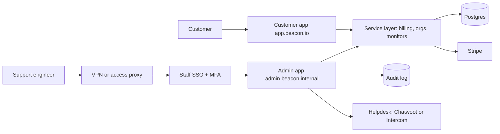
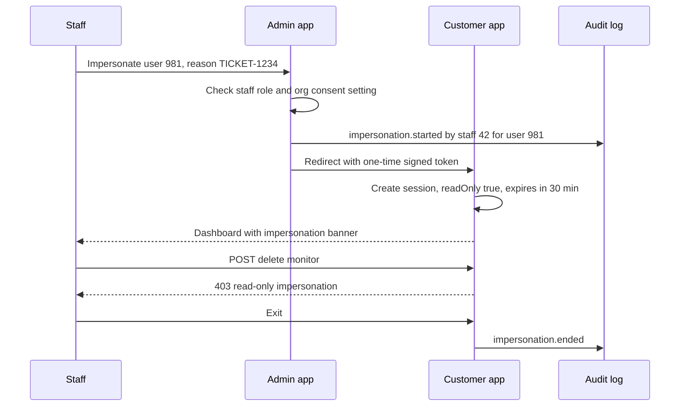
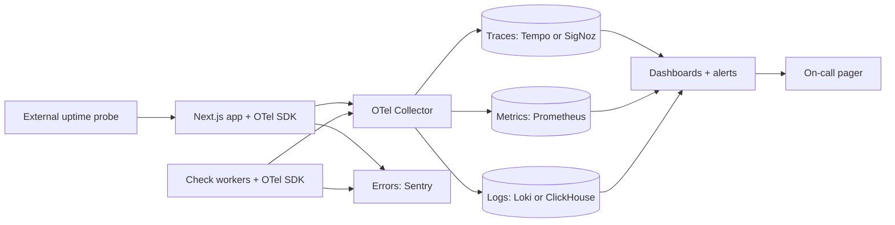
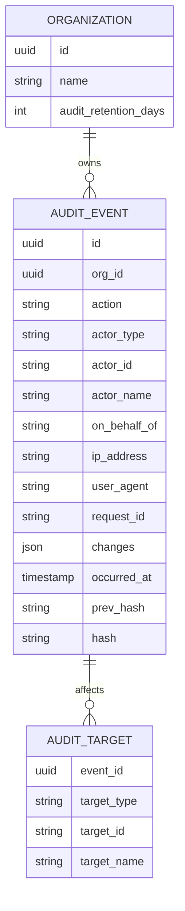
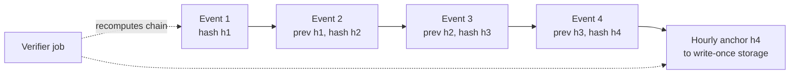
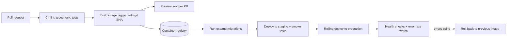
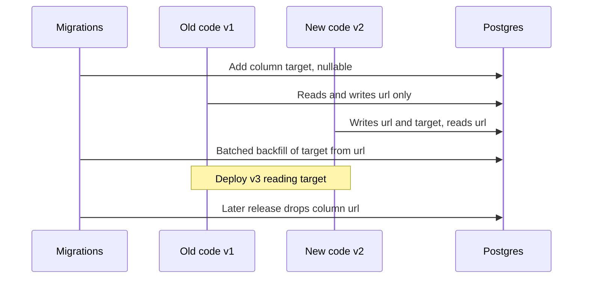

# Module 7 — Operating the SaaS

*Shipping the product is half the job. The other half is running it: helping customers whose problems you can't see from their screen, knowing something is broken before they tweet about it, proving who changed what, and deploying on a Tuesday afternoon without holding your breath. This module covers the four components that let a small team run a SaaS without heroics: the admin panel, observability, audit logs, and the deployment pipeline.*

> **Practice:** build the exercises in the [Beacon starter](https://github.com/Tamoura/system-design-for-vibe-coders/tree/beacon/starter); when you have tried them, compare with [this module's reference solution](https://github.com/Tamoura/system-design-for-vibe-coders/tree/beacon/module-7-solution) (branch `beacon/module-7-solution`).

---

# 7.1 — The admin panel: support tools and impersonation

*Level: 🟡 Intermediate* · *Prerequisites: 1.2, 1.3, 3.2*

## ⚡ In 60 seconds

- An admin panel is the internal app your staff use to find customers, inspect their state, extend trials, comp plans, fix data and impersonate.
- The one rule: the admin app is a second front door into the same service layer, never a shortcut to the database.
- Staff are not customers with a flag: a separate `staff_users` table or identity provider, SSO with MFA, a separate hostname and a network control in front.
- Default for a v1: generated screens for reading (Django admin, react-admin, Filament) plus hand-built write actions that call your services, require a reason and write an audit event.
- Biggest trap: impersonation that looks like the customer acted. Make it read-only by default, time-limited, bannered, and logged with both actors.

## 🧭 Why every SaaS has this

It is 11 p.m. and a Beacon customer emails support: their Pro trial expired in the middle of a real outage, their monitors stopped at the Free plan's limit of five, and the account owner who could enter a card is on a plane. They want two more days of trial. Right now. Without an admin panel, the only way to help is for an engineer to open a production `psql` shell and type an `UPDATE` by hand, hoping to remember that the trial end date also lives in Stripe, that the monitor scheduler caches entitlements in Redis, and that nothing else reads that column.

That is how every young SaaS starts, and it is how every young SaaS has its first self-inflicted outage. A back office — an internal app for your own staff — turns those dangerous one-off queries into buttons that go through the same code paths as the product, with the same checks and side effects, and leave a record behind.

The flip side is that the admin panel is the most powerful interface you will ever build. In July 2020, attackers social-engineered Twitter employees, got into Twitter's internal admin tooling, and used it to take over high-profile accounts. No bug in the product was needed; the internal tool *was* the attack surface. **An admin panel is a product whose users are your staff, and it deserves more security than the customer-facing app, not less.**

## 📐 How it works

### 🟢 The essentials

Every mature SaaS grows the same back office. Its jobs are boringly predictable:

| Job | Example at Beacon | Risk |
|---|---|---|
| Find a customer | Search by email, org name, domain, Stripe customer id, monitor URL | Low (read) |
| See their state | Plan, usage vs. limits, invoices, members, recent incidents, last login | Low (read, but PII) |
| Comp a plan | Give a nonprofit Pro for free for 12 months | Medium (money) |
| Extend a trial | Push `trial_ends_at` out 2 days and resync Stripe | Medium (money) |
| Resend an invite / verification email | The invite went to spam | Low |
| Unlock an account | Clear lockout after too many failed logins, reset MFA after identity check | High (account takeover vector) |
| Run a data fix | Re-attach 40 monitors to the right org after a bad import | High (data) |
| Impersonate | "See what the customer sees" to reproduce a bug | Very high |

Three rules make v1 safe:

1. **Staff are not customers with a flag.** Do not add `role = 'superadmin'` to the same `memberships` table your customers' roles live in. A bug in the customer permission code must never grant back-office access. Keep a separate `staff_users` table (or a separate identity provider entirely) and a separate session cookie.
2. **Every write goes through your service layer.** The "extend trial" button calls the same `extendTrial(orgId, days)` function the billing code uses, which updates Postgres, updates the Stripe subscription, and invalidates the entitlement cache. Raw SQL skips all of that.
3. **Every action is recorded.** Who (staff id), what (action), to whom (org id), why (a required free-text reason or ticket link), when. Lesson 7.3 builds the audit log; the admin panel is its first and most important writer.



Note the shape: the admin app and the customer app are **two front doors into one service layer**. The admin app does not get its own shortcut to the database.

### 🟡 Going deeper

**Staff authentication.** Staff log in with your company's identity provider (Google Workspace, Okta, Microsoft Entra) over SSO, with MFA enforced — ideally phishing-resistant MFA like passkeys or hardware keys, since social engineering is how admin tools actually get breached. No passwords stored in your app for staff. Put the admin app on a separate hostname so its cookies are never sent to the customer app and vice versa, and so you can put a network control in front of it: a VPN, an IP allowlist, or an identity-aware proxy (Cloudflare Access, Tailscale, Pomerium) that checks identity before a single packet reaches your code.

**Staff roles.** Not every employee needs every button. A reasonable starting set:

| Staff role | Can | Cannot |
|---|---|---|
| Support | Read customers, resend emails, extend trials up to 14 days, read-only impersonate | Change billing, delete data, export |
| Billing | Comp plans, issue credits, change subscriptions | Impersonate, run data fixes |
| Engineer (on-call) | Read everything, run approved data-fix scripts | Change billing |
| Superadmin (2 people) | Everything, including granting staff roles | — |

This is just lesson 1.3's authorization applied to a second population of users. The same library (CASL, Casbin, a policy function) works.

**Impersonation done safely.** Impersonation — "log in as" a customer — is the single most useful support tool and the single most abusable one. The safe design:

- **Read-only by default.** An impersonation session can load pages but every mutating request is rejected by middleware. A separate, higher-privileged "write impersonation" exists only for specific roles and requires a reason.
- **Time-limited.** 30 minutes, then the session dies. No "remember me".
- **Unmissable banner.** A bright bar on every page: "You are viewing as ana@acme.com — read-only — ends in 27 min — Exit". This protects the staff member from accidentally acting as the customer.
- **Two actors in every log line.** Every audit event written during impersonation records `actor = staff:42` and `on_behalf_of = user:981`. Never let an impersonated action look like the customer did it.
- **Customer consent for sensitive orgs.** Business customers can switch off impersonation for their org, or require per-session approval. Cal.com, for example, lets users disable being impersonated and lets teams restrict it.
- **Blocked zones.** Even with write access, impersonation cannot change the password, MFA, email, API keys or billing details, and cannot see secrets in plain text.



**Support tooling integration.** Your helpdesk — Chatwoot (open source) or Intercom (managed), Zendesk, Plain — is where conversations live; the admin panel is where account state lives. Connect them both ways: the helpdesk sidebar shows plan, MRR, and a deep link to the admin page for that org; the admin page shows recent conversations. When you embed a chat widget in the product, use the helpdesk's identity verification (an HMAC of the user id signed with a server-side secret) so nobody can open a chat pretending to be someone else's user and then ask support to "just reset my MFA".

**Data fixes as code.** The "run a data fix" job should not be a textarea that executes SQL. Write each fix as a script in the repo, reviewed in a pull request, with a `--dry-run` mode that prints what it would change, run as a background job, logged with its output. Rails has `rails runner`, Django has management commands, Laravel has Artisan commands; in Node you write a small CLI or a job.

### 🔴 At scale / enterprise

**Least privilege, over time.** Standing superadmin access is a liability. Mature teams move to just-in-time access: an engineer requests "write access to org X for 1 hour, ticket Y", a second person approves, access expires automatically. For destructive operations (deleting an org, exporting all customer data), require four-eyes approval: one staff member proposes, another confirms.

**Step-up authentication.** GitLab's "Admin Mode" is a good pattern to copy: even an admin user must re-authenticate before admin functions unlock, so a stolen everyday session is not a stolen admin session.

**Data minimization.** Support rarely needs full data. Mask emails and phone numbers in lists, show them in full only on the detail page, log every detail-page view of a customer (yes, reads too, for regulated customers), and rate-limit bulk exports. Enterprise customers' security questionnaires will ask "which of your employees can access our data and how is that logged?" — the answer comes from this panel.

**CRUD generators vs. custom.** Early on, generate. Later, specialize.

| Approach | Examples | Great for | Starts hurting when |
|---|---|---|---|
| Framework admin | Django admin, ActiveAdmin, Filament, Avo, Administrate | Day-one tables for every model | You need workflows, not tables |
| React admin frameworks | react-admin, Refine, AdminJS | A custom admin in your TS stack | Rarely — they scale with you |
| Low-code internal tools | Appsmith, ToolJet, Retool | Ops teams building their own screens | Logic drifts outside code review |
| Headless CMS / data platforms | Directus, Payload | Content and data editing | You need your service layer's side effects |
| Custom pages in your app | Your own `/admin` routes | Impersonation, billing actions | Never — you'll always have some |

The trap with every generator: it talks to the database directly, so it bypasses your service layer. Use generated screens for reading, and route writes through custom actions that call your services.

## 🏆 The best repos

| Repo | What it is | Stack | License | Pick it when |
|---|---|---|---|---|
| [marmelab/react-admin](https://github.com/marmelab/react-admin) | Mature React framework for admin UIs over any API via data providers | React, TS | MIT | You want a custom admin in your TS stack that calls your own API |
| [refinedev/refine](https://github.com/refinedev/refine) | Headless React framework for CRUD-heavy internal tools | React, TS | MIT | You want admin logic without being locked into one UI kit |
| [SoftwareBrothers/adminjs](https://github.com/SoftwareBrothers/adminjs) | Auto-generated admin for Node ORMs (Prisma, TypeORM, Sequelize…) | Node, React | MIT | You want Django-admin-style screens in a Node app fast |
| [django/django](https://github.com/django/django) | `django.contrib.admin`, the original generated admin | Python | BSD-3-Clause | You are on Django — it is already there |
| [activeadmin/activeadmin](https://github.com/activeadmin/activeadmin) | DSL-driven admin framework for Rails | Ruby | MIT | You are on Rails and want a battle-tested admin |
| [filamentphp/filament](https://github.com/filamentphp/filament) | Admin panels and forms for Laravel on Livewire | PHP | MIT | You are on Laravel |
| [appsmithorg/appsmith](https://github.com/appsmithorg/appsmith) | Low-code builder for internal tools over DBs and APIs | Java, React | Apache-2.0 | Ops staff need screens and you can't spare engineers |
| [ToolJet/ToolJet](https://github.com/ToolJet/ToolJet) | Low-code internal tool builder | TS, React | AGPL-3.0 | Same as Appsmith; compare the builders hands-on |
| [directus/directus](https://github.com/directus/directus) | Instant API and admin app over any SQL database | TS, Vue | Monospace Sustainable Core License (source-available) | Non-engineers must edit data in a DB you already have |
| [payloadcms/payload](https://github.com/payloadcms/payload) | Code-first headless CMS with a generated admin, installs into Next.js | TS, React | MIT | Your admin is also your content back office |

Also worth knowing: [avo-hq/avo](https://github.com/avo-hq/avo) (Rails admin, LGPL-3.0 core with commercial tiers) and [thoughtbot/administrate](https://github.com/thoughtbot/administrate) (the Rails admin framework Chatwoot uses).

**If you only study one:** react-admin. Its "data provider" abstraction forces the right architecture — the admin talks to *an API*, not to the database — so writes naturally go through your service layer. Read its docs on data providers and auth providers even if you use something else.

**Buy, build, or self-host?**

- **Buy** a managed internal-tool builder (Retool, Forest Admin) when ops needs dozens of screens and you'd rather pay than build; buy a helpdesk (Intercom, Zendesk, Plain) almost always — support workflows are not your product.
- **Self-host** Appsmith, ToolJet or Chatwoot when customer data must not leave your infrastructure (a common enterprise contract term) or per-seat pricing gets painful.
- **Build** impersonation, billing actions, and anything that touches entitlements yourself, on top of your service layer. Use a framework (react-admin, Refine, your web framework's admin) for the tables around them.

## 🔍 Study it in the wild

**GitLab** ([gitlabhq/gitlabhq](https://github.com/gitlabhq/gitlabhq)) has one of the most complete admin areas in open source: user management, impersonation, instance settings, abuse reports. Find it by browsing `app/controllers/admin` (at the time of writing it contains `impersonations_controller.rb` and `impersonation_tokens_controller.rb`) and search the repo for `admin_mode` to see how step-up authentication for admins is enforced — including in Sidekiq job middleware, so background jobs inherit the admin-mode state of the request that queued them.

**Chatwoot** ([chatwoot/chatwoot](https://github.com/chatwoot/chatwoot)) is both a support tool and a SaaS with a super admin console. Its `super_admin` controllers are built on the Administrate gem, with one "dashboard" class per model in `app/dashboards`. Search for `Impersonation` to find the Vue banner component and the composable that drives it — a clean, small example of the "unmissable banner" rule.

**Cal.com** ([calcom/cal.diy](https://github.com/calcom/cal.diy)) puts its instance admin pages inside the main Next.js app under the settings area (search the `apps/web` tree for `admin`). Search the Prisma migrations for `impersonat` and you can read the history of the feature as schema changes: a user-level toggle to allow impersonation, a team-level switch to disable it, and later, permissions tied to admin roles.

**What to notice:**

- Admin screens reuse domain services instead of writing SQL — look at what the admin controllers actually call.
- Impersonation has a customer-side off switch, not just a staff-side permission.
- Step-up re-authentication separates "is an admin" from "is acting as an admin right now".
- Generated CRUD (Administrate) covers the boring 80%; custom actions cover the dangerous 20%.
- The banner lives in the customer app, not the admin app — because that's where the staff member is looking.

## 🛠️ Build it into Beacon

### 🟢 Beginner exercise

Create a `staff_users` table separate from `users`, and an `/admin` area (or separate app) that only staff sessions can open. Build a customer search that finds an org by member email, org name, or Stripe customer id, and a read-only org page showing plan, trial end, monitor count vs. limit, members, and the last 10 incidents.

**Done when:**
- A customer account with any role gets 404 on every `/admin` route.
- Search finds an org from a partial email in under a second on seeded data.
- The org page shows usage vs. plan limit pulled from the same entitlements code the product uses.

### 🟡 Intermediate exercise

Add two write actions: "Extend trial by N days" (support role, max 14) and "Comp plan" (billing role). Both must call your existing billing service functions, require a reason, and write an audit event.

**Done when:**
- Extending a trial updates Postgres *and* the Stripe subscription's trial end, and the monitor scheduler sees the new limit without a restart.
- A support-role staff member cannot see the "Comp plan" button, and a direct POST returns 403.
- Every action produces an audit event with staff id, org id, reason, before and after values.

### 🔴 Advanced exercise

Implement read-only impersonation: a one-time signed token from the admin app, a 30-minute session flagged `impersonatorId` and `readOnly`, middleware that rejects mutating requests, a banner, and an org-level "Allow Beacon staff to view our account" setting that defaults to off for Business orgs.

```ts
// middleware in the customer app
export function guardImpersonation(req: Req, session: Session) {
  if (!session.impersonatorId) return;
  if (Date.now() > session.impersonationExpiresAt) throw new Unauthorized();
  const mutating = !["GET", "HEAD", "OPTIONS"].includes(req.method);
  if (mutating && session.readOnly) {
    throw new Forbidden("Read-only impersonation");
  }
  req.auditContext = {
    actor: `staff:${session.impersonatorId}`,
    onBehalfOf: `user:${session.userId}`,
  };
}
```

**Done when:**
- Any POST/PUT/PATCH/DELETE during read-only impersonation returns 403, including API routes.
- Sessions expire at 30 minutes even if active.
- Impersonating a Business org with consent off is refused and the refusal itself is audited.
- The customer's own audit log shows "Beacon support viewed your account" entries.

## ⚠️ Mistakes juniors make

- **Using a customer role for staff.** `if (user.role === 'admin')` where "admin" is also an org role customers can hold. One confusion and a customer is in your back office. Separate tables, separate sessions, separate hostname.
- **Letting the admin write straight to the database.** A generated CRUD form that edits `subscriptions.plan` skips Stripe, skips cache invalidation, skips emails. Generated screens for reads; service-layer actions for writes.
- **Impersonation that is indistinguishable from the customer.** If the audit log says "Ana deleted the monitor" when your support engineer did it, you've corrupted your customer's evidence and your own. Always record both actors.
- **Leaving the admin on the public internet with a password.** Put it behind SSO with MFA and a network control. Internal tools are a favorite target precisely because they are powerful and under-protected.
- **A "run SQL" box.** It will be used in a hurry, at night, without a `WHERE` clause. Data fixes are reviewed scripts with a dry run.
- **No reason field.** Six months later nobody knows why org 4411 has free Business. A required reason (or ticket link) costs five seconds and answers every future "why?".

## 🧾 Recap

- Every SaaS grows a back office for the same jobs: find, inspect, comp, extend, resend, unlock, fix, impersonate.
- Staff identity is separate from customer identity: own table or IdP, SSO + MFA, separate hostname, network control.
- The admin app is a second front door into the same service layer — never a shortcut around it.
- Impersonation is read-only by default, time-boxed, bannered, dual-actor audited, and customers can opt out.
- Generate the tables, hand-build the dangerous actions.

## ✍️ Check yourself

**1. Why should staff live in a separate `staff_users` table instead of getting a `superadmin` role in the same `memberships` table customers use?**

<details><summary>Answer</summary>

Because a bug in the customer permission code must never grant back-office access. If staff and customer roles share a table, one confusion between an org "admin" and a staff admin puts a customer in your back office. Keep a separate table (or identity provider) and a separate session cookie, as "🟢 The essentials" and "⚠️ Mistakes juniors make" explain.

</details>

**2. List the safeguards of a safe impersonation design.**

<details><summary>Answer</summary>

Read-only by default, time-limited (30 minutes), an unmissable banner, two actors in every audit event, customer consent for sensitive orgs, and blocked zones such as password, MFA, email, API keys and billing details. See "Impersonation done safely" in "🟡 Going deeper".

</details>

**3. Support wants to give a Beacon customer two more days of trial. Why must the button call `extendTrial(orgId, days)` instead of running an `UPDATE` on `trial_ends_at`?**

<details><summary>Answer</summary>

The trial end also lives in Stripe, and the monitor scheduler caches entitlements in Redis. The service function updates Postgres, updates the Stripe subscription and invalidates the entitlement cache, while raw SQL skips all of that and leaves no record. See rule 2 in "🟢 The essentials".

</details>

**4. A Business prospect asks: "Which of your employees can access our data, and how is that logged?" Which parts of Beacon's admin design let you answer?**

<details><summary>Answer</summary>

Staff roles with least privilege (and just-in-time access at scale), staff SSO with MFA, an org-level setting that lets the customer switch impersonation off, masked PII, and an audit event for every staff action, including detail-page views. See "🟡 Going deeper" and "🔴 At scale / enterprise".

</details>

**5. An engineer implements "log in as customer" by creating a normal session for the customer's user id. A week later a customer's audit log says "Ana deleted the monitor", and Ana says she didn't. What went wrong, and how do you fix it?**

<details><summary>Answer</summary>

The impersonation session was indistinguishable from Ana's own session: no `impersonatorId`, no read-only flag, and only one actor recorded. Flag the session with `impersonatorId` and `readOnly`, reject mutating requests in middleware, expire it after 30 minutes, and record `actor = staff:42` with `on_behalf_of = user:981`. See "🟡 Going deeper" and the advanced exercise.

</details>

## 📚 References

- react-admin documentation — https://marmelab.com/react-admin/
- Django admin site documentation — https://docs.djangoproject.com/en/stable/ref/contrib/admin/
- OWASP Authentication Cheat Sheet — https://cheatsheetseries.owasp.org/cheatsheets/Authentication_Cheat_Sheet.html
- OWASP Authorization Cheat Sheet — https://cheatsheetseries.owasp.org/cheatsheets/Authorization_Cheat_Sheet.html
- GitLab documentation (search "Admin Mode" and "impersonation") — https://docs.gitlab.com
- Chatwoot documentation — https://www.chatwoot.com/docs
- Filament documentation — https://filamentphp.com/docs

---

# 7.2 — Observability: logs, errors, metrics and traces

*Level: 🟡 Intermediate* · *Prerequisites: 5.1*

## ⚡ In 60 seconds

- Observability means you can explain any behavior of production from the data it already emits, without shipping new code to find out.
- Five signals: logs say what happened, metrics how much, traces where, errors what broke, and outside uptime probes whether anyone can reach you.
- The one rule: structured JSON logs with a request id and a tenant id on every line.
- Default for a v1: pino (or your stack's structured logger), Sentry or GlitchTip with release and source maps, OpenTelemetry for traces, and one independent probe outside your infrastructure.
- Measure your product's own health signal (for Beacon: check lag) and page on SLO burn, not on CPU.
- Biggest trap: putting `orgId` in Prometheus labels, which explodes cardinality and can take the metrics server down.

## 🧭 Why every SaaS has this

Beacon's whole product is telling other companies their site is down. Now imagine this: a deploy on Thursday introduces a bug where the check scheduler silently skips monitors whose org was created after a certain date. No errors are thrown — the checks just don't run. Nothing alerts. On Saturday a customer's API goes down for three hours and Beacon says nothing, because Beacon never checked. The customer finds out from their own users, then tells everyone on social media that their monitoring tool didn't monitor.

The painful part is not the bug; bugs happen. It's that **you had no way to know**. No metric for "checks executed vs. checks scheduled", no log you could search by org, no trace showing where the check request went. The monitoring company was not monitoring itself.

That's the difference between *monitoring* ("is the thing I predicted might break broken?") and *observability* ("can I ask a new question about production and get an answer?"). **Observability is the ability to explain any behavior of your production system from the data it already emits, without shipping new code to find out.**

## 📐 How it works

### 🟢 The essentials

Production systems emit a handful of signal types. Each answers a different question:

| Signal | What it is | Answers | Beacon example | Typical tools |
|---|---|---|---|---|
| Logs | Timestamped records of events, ideally structured JSON | "What happened, exactly, in this request?" | `check.failed monitor=m_91 status=503 region=eu` | pino, Loki, Better Stack |
| Metrics | Numeric time series, aggregated | "How much, how fast, how often — trending?" | checks/sec, p95 check latency, queue depth | Prometheus, Grafana |
| Traces | A request's path across services, as timed spans | "Where did the time go, which service failed?" | API → queue → checker → notifier | OpenTelemetry, Tempo, Honeycomb |
| Errors | Exceptions grouped by stack trace, with context | "What's crashing, since which release, for whom?" | `TypeError in notifySlack` in release 1.42 | Sentry, GlitchTip |
| Uptime / synthetic | Probes from outside hitting your endpoints | "Can a customer reach us at all?" | Is `app.beacon.io/login` returning 200? | Uptime Kuma, openstatus, Beacon itself |

The first three are the classic "three pillars"; error tracking is so useful for application teams that it's effectively the fourth. Uptime checks are the fifth because every other signal is emitted *from inside* your system — if the whole system is down, it emits nothing.

**Structured logging.** A log line should be a JSON object, not a sentence. `console.log("check failed for " + id)` can only be grepped; `{"level":"warn","msg":"check.failed","monitorId":"m_91","orgId":"org_7","requestId":"req_ab3","status":503}` can be filtered, grouped, and counted. In Node, pino is the standard: fast, JSON by default, with child loggers that carry context. (Python: `structlog`; Ruby: `lograge` or Rails' tagged logging; Go: the standard library's `log/slog`.)

The two fields that make logs useful in a SaaS are **request id** (tie every line in one request together) and **tenant id** (answer "what happened to *this customer*?"). Set them once per request, not in every call:

```ts
import pino from "pino";
import { AsyncLocalStorage } from "node:async_hooks";

export const baseLogger = pino({
  redact: ["req.headers.authorization", "*.password", "*.apiKey"],
});
const ctx = new AsyncLocalStorage<pino.Logger>();

export const log = () => ctx.getStore() ?? baseLogger;

export function withRequestContext(req: Req, next: () => Promise<void>) {
  const requestId = req.headers["x-request-id"] ?? crypto.randomUUID();
  const child = baseLogger.child({ requestId, orgId: req.session?.orgId });
  return ctx.run(child, next);
}

// anywhere deeper in the code:
log().warn({ monitorId, status }, "check.failed");
```

**Error tracking.** Install the Sentry SDK (or GlitchTip, which speaks the same protocol) on the server *and* in the browser. Two settings juniors skip: the **release** (tag every event with the git SHA so you see "this error started in release a1b2c3") and **source maps** (upload them at build time so minified browser stack traces become real file names and line numbers). Also attach user id and org id to the error scope so you can tell one angry customer from everyone.

**Uptime from outside.** Beacon should monitor itself with Beacon — dogfooding catches product bugs. But if Beacon is fully down, it cannot tell you it's down. Run a second, independent check from a different provider (a self-hosted Uptime Kuma on another cloud, or a managed service) that alerts through a different channel.

### 🟡 Going deeper

**OpenTelemetry (OTel)** is the vendor-neutral standard for emitting traces, metrics, and logs. You instrument once with the OTel SDK, send data to an **OTel Collector** (a small process that receives, batches, filters, and forwards telemetry), and point the collector at whatever backend you choose — SigNoz, Grafana's stack, HyperDX, Honeycomb, Datadog. Switching vendors becomes a config change instead of a rewrite. Auto-instrumentation packages cover HTTP, Postgres, Redis, and most frameworks without code changes.



**Trace context propagation.** A trace only works if every hop passes along the trace id. Over HTTP, OTel uses the W3C `traceparent` header automatically. Across a queue it does not happen by itself: when the API enqueues a BullMQ job, put the trace context into the job data and restore it in the worker, or your trace ends at the queue — exactly where Beacon's interesting work begins.

**What to measure: RED and USE.** Two short checklists keep dashboards honest:

- **RED** for request-driven services: **R**ate (requests/sec), **E**rrors (failed/sec), **D**uration (latency distribution — use percentiles like p95/p99, never averages).
- **USE** for resources like CPU, DB connections, queues: **U**tilization, **S**aturation (how much work is waiting), **E**rrors.

Then add the one or two metrics that describe *your product's* health. For Beacon that's **check lag**: the time between when a check was scheduled and when it actually ran. If lag grows, customers get late alerts, even while every HTTP endpoint looks perfectly healthy. A metric of "checks executed per minute" compared with "checks expected per minute" would have caught the Thursday bug within minutes.

**SLOs and error budgets.** An **SLI** (service level indicator) is a measurement, like "fraction of checks that ran within 10 seconds of schedule". An **SLO** (objective) is a target for it: "99.9% over 30 days". The **error budget** is what's left: 0.1% of 30 days is about 43 minutes of badness per month. When the budget is healthy, ship features; when it's burning, slow down and fix reliability. It turns "is reliability good enough?" from an argument into arithmetic.

**Alerting that doesn't page for nothing.** Page a human only when a customer is being hurt *now* and a human can do something about it. Rules that work:

- Alert on **symptoms** (SLO burn rate, check lag, login errors), not causes (CPU at 80%). High CPU with happy customers is fine.
- Use **burn-rate alerts**: page if you're burning a month's error budget in hours; open a ticket if you're burning it over days.
- Every page links to a **runbook**: what this means, how to check, how to mitigate.
- If an alert fires and nobody needs to act, delete or downgrade it that week. Alert fatigue is how real pages get ignored.

### 🔴 At scale / enterprise

**Per-tenant visibility and cardinality.** Customers on the Business plan will ask "was the slowdown last Tuesday affecting us?" You need to slice by `orgId`. In logs and traces, that's easy — they're per-event. In Prometheus-style metrics it's dangerous: every distinct label value creates a new time series, so an `orgId` label with 50,000 orgs multiplies storage and can take the metrics server down. This is the **cardinality** problem. Keep tenant ids out of metric labels (or only for your top plans), and answer per-tenant questions from traces and logs stored in a columnar database. That's why newer tools — SigNoz, HyperDX, OpenObserve — store everything in column stores like ClickHouse, where high-cardinality queries are cheap.

**The cost of observability.** Telemetry bills grow faster than traffic, and it is common for the observability bill to become one of the largest lines in the infrastructure budget. Levers:

| Lever | How | Trade-off |
|---|---|---|
| Head sampling | Keep a fixed fraction of traces, decided at the start | Cheap, but you drop the rare slow request |
| Tail sampling | Collector keeps all errors and slow traces, samples the rest | Smarter, needs buffering in the collector |
| Log levels | `info` in prod, `debug` only per-tenant on demand | Debug data missing when you need it, unless switchable |
| Retention tiers | 7 days hot, 30–90 days cheap object storage | Slow queries on old data |
| Metrics from logs | Count at the collector, drop the raw lines | Lose the individual events |

**Status page and incident process.** When something breaks, customers need a status page that doesn't share your infrastructure — Beacon sells exactly this, and should host its own on a separate provider. Pair it with a lightweight incident process: one incident lead, a channel, regular status updates, and a blameless postmortem that produces tracked action items.

## 🏆 The best repos

| Repo | What it is | Stack | License | Pick it when |
|---|---|---|---|---|
| [getsentry/sentry](https://github.com/getsentry/sentry) | Error tracking, performance, release health; self-host via `getsentry/self-hosted` | Python, TS | FSL-1.1 | You want the reference error tracker, managed or self-hosted |
| [getsentry/sentry-javascript](https://github.com/getsentry/sentry-javascript) | Sentry SDKs for browser, Node, Next.js and more | TS | MIT | You use Sentry or GlitchTip from JS |
| [open-telemetry/opentelemetry-js](https://github.com/open-telemetry/opentelemetry-js) | The OTel SDK and APIs for Node and browsers | TS | Apache-2.0 | Always — instrument with the standard, choose a backend later |
| [pinojs/pino](https://github.com/pinojs/pino) | Fast structured JSON logger for Node | JS | MIT | Every Node service |
| [SigNoz/signoz](https://github.com/SigNoz/signoz) | All-in-one OTel-native logs, metrics, traces on ClickHouse | Go, TS | MIT core, `ee/` under a separate license | You want one self-hosted tool instead of four |
| [hyperdxio/hyperdx](https://github.com/hyperdxio/hyperdx) | Observability UI over ClickHouse; part of ClickHouse's ClickStack | TS | MIT | You already run ClickHouse or want session replay + traces |
| [openobserve/openobserve](https://github.com/openobserve/openobserve) | Logs, metrics, traces with object storage as the backend | Rust | AGPL-3.0 | Log volume is large and storage cost matters most |
| [prometheus/prometheus](https://github.com/prometheus/prometheus) | Pull-based metrics database and alerting | Go | Apache-2.0 | You need metrics and alert rules — the industry default |
| [grafana/grafana](https://github.com/grafana/grafana) | Dashboards and alerting over many data sources | Go, TS | AGPL-3.0 | You're assembling the "LGTM" stack |
| [grafana/loki](https://github.com/grafana/loki) | Log aggregation that indexes labels, not full text | Go | AGPL-3.0 | Cheap log storage alongside Grafana; pair with [grafana/tempo](https://github.com/grafana/tempo) for traces |

For errors on a budget, **GlitchTip** (https://glitchtip.com, developed on GitLab) is a lightweight open-source tracker compatible with Sentry SDKs. For uptime, [louislam/uptime-kuma](https://github.com/louislam/uptime-kuma) (MIT) and [openstatusHQ/openstatus](https://github.com/openstatusHQ/openstatus) (AGPL-3.0) are both self-hostable monitors — and both are real-world Beacons.

**If you only study one:** opentelemetry-js — specifically its getting-started guide for Node and the auto-instrumentation packages. Every other tool in this table either consumes OTel data or is converging on it, so learning the SDK, the collector, and context propagation pays off whichever backend you end up with.

**Buy, build, or self-host?**

- **Buy** (Sentry SaaS, Datadog, Honeycomb, Better Stack, Grafana Cloud) at the start: you have one engineer and observability is not your product. Watch per-GB and per-host pricing as you grow.
- **Self-host** SigNoz, the Grafana stack, or HyperDX when bills climb or data residency forbids shipping logs abroad — but budget real time to operate it; your monitoring must be more reliable than what it monitors.
- **Build** only the glue: logger setup, request/tenant context, product metrics like check lag, and dashboards. Never build a tracing backend.

## 🔍 Study it in the wild

**openstatus** ([openstatusHQ/openstatus](https://github.com/openstatusHQ/openstatus)) is the closest thing to Beacon in open source. At the time of writing its multi-region checker lives in `apps/checker` (written in Go) and has its own `otel` package — search the repo for `otel` to see how a checker emits telemetry about the checks it runs. It's instructive to see where a monitoring product draws the line between *product data* (check results customers see) and *operational telemetry* (how the checker itself is doing).

**Uptime Kuma** ([louislam/uptime-kuma](https://github.com/louislam/uptime-kuma)) is a single-process self-hosted monitor. Read how it schedules checks and stores heartbeats, and think about what you'd need to observe if it had a thousand tenants instead of one. It's also a solid choice for Beacon's "independent outside probe".

**Sentry** ([getsentry/sentry](https://github.com/getsentry/sentry)) is a large Django + React SaaS that uses its own product. Search for `sentry_sdk` to see how the backend instruments itself, how it sets tags and context, and how it samples. Its companion [getsentry/self-hosted](https://github.com/getsentry/self-hosted) shows how many moving parts (Kafka, ClickHouse, Snuba, Relay…) a serious observability backend needs — a useful dose of respect before you decide to self-host one.

**What to notice:**

- Product data and operational telemetry are separated, even in a monitoring product.
- Context (request, tenant, release) is attached once at the edge, not threaded by hand through every function.
- Sampling decisions are explicit in configuration, not accidental.
- Self-hosting an observability stack means running Kafka- and ClickHouse-class infrastructure.

## 🛠️ Build it into Beacon

### 🟢 Beginner exercise

Replace every `console.log` in Beacon's API and workers with pino. Add middleware that assigns a request id (reusing an incoming `x-request-id` if present), returns it in the response headers, and puts `requestId` and `orgId` on every log line. Install Sentry (or GlitchTip) on server and client with the release set to the git SHA.

**Done when:**
- Every log line is JSON and includes `requestId`; authenticated requests also include `orgId`.
- The `authorization` header and any `password` or `apiKey` field never appear in logs.
- A deliberately thrown error in the browser shows readable source file names in Sentry, tagged with the release.

### 🟡 Intermediate exercise

Add OpenTelemetry to the API and the check workers, exporting to a local collector and a backend of your choice (SigNoz or Grafana + Tempo in Docker Compose). Propagate trace context through the BullMQ job payload. Emit two product metrics: `checks_executed_total` and `check_lag_seconds` (a histogram).

**Done when:**
- A single trace shows the API request that created a monitor, the enqueue, and the first check execution in the worker.
- A dashboard shows check lag p50/p95/p99 per region.
- Stopping one worker makes check lag visibly climb on the dashboard within a minute.

### 🔴 Advanced exercise

Define an SLO: "99.9% of scheduled checks run within 15 seconds of schedule, over 30 days." Implement multi-window burn-rate alerting (page on fast burn, ticket on slow burn), write a runbook for the page, and add an independent external probe on a different provider. Add a "debug logging for one org for one hour" switch (a feature flag keyed by `orgId`).

**Done when:**
- A synthetic outage (pausing the scheduler for 10 minutes) pages; a 30-second blip doesn't.
- The page links to a runbook that a teammate who has never seen the system can follow.
- Enabling debug logging for one org increases log volume only for that org and turns itself off.

## ⚠️ Mistakes juniors make

- **Logging strings instead of structures.** `"User 42 failed to create monitor"` can't be filtered by user or aggregated. Log a stable event name plus fields.
- **Logging secrets and PII.** Request bodies with passwords, full auth headers, API keys, customer emails in every line. Use the logger's redaction config and log ids, not personal data.
- **Using `orgId` as a Prometheus label.** Works in dev with 3 orgs, melts the metrics server with 30,000. Tenant ids belong in logs and traces.
- **Alerting on everything.** A pager that fires for high CPU at 3 a.m. with no user impact trains people to ignore it. Alert on symptoms tied to SLOs, with runbooks.
- **No source maps, no release tag.** Error reports saying `a.b is not a function at main.8f3a.js:1:48213` are useless. Upload source maps in CI; set the release.
- **Only monitoring from inside.** If your monitor runs on the same cluster as your app, a cluster outage silences both. Keep one probe outside your infrastructure.
- **Averages.** An average latency of 200 ms can hide 5% of requests taking 8 seconds. Use percentiles.

## 🧾 Recap

- Logs say what happened, metrics say how much, traces say where, errors say what broke, uptime probes say whether anyone can reach you.
- Structured JSON logs with request id and tenant id are the cheapest, highest-value first step.
- Instrument with OpenTelemetry so the backend is a choice you can change.
- Measure your product's own health signal (for Beacon: check lag), not just HTTP metrics.
- SLOs and burn-rate alerts replace "page on everything" with "page when customers are hurt".
- Watch cardinality and telemetry cost from day one; sample deliberately.

## ✍️ Check yourself

**1. What is the difference between monitoring and observability?**

<details><summary>Answer</summary>

Monitoring asks whether the things you predicted might break are broken. Observability is the ability to ask a new question about production and answer it from the data the system already emits, without shipping new code. See "🧭 Why every SaaS has this".

</details>

**2. What do RED and USE stand for, and why should latency be measured in percentiles?**

<details><summary>Answer</summary>

RED is Rate, Errors, Duration for request-driven services; USE is Utilization, Saturation, Errors for resources such as CPU, DB connections and queues. Averages hide the slow tail: a 200 ms average can hide 5% of requests taking 8 seconds, so use p95/p99. See "🟡 Going deeper" and "⚠️ Mistakes juniors make".

</details>

**3. Beacon's scheduler silently skips some monitors after a deploy. No errors are thrown. Which metrics would have caught it, and why would HTTP metrics not?**

<details><summary>Answer</summary>

Check lag and "checks executed per minute" compared with "checks expected per minute". Every HTTP endpoint stays healthy and nothing crashes, so only a metric of the product's own work shows that checks are missing. See "What to measure: RED and USE" in "🟡 Going deeper".

</details>

**4. A Business customer asks whether last Tuesday's slowdown affected them. Where do you look, and why not add an `orgId` label to your Prometheus metrics to answer it?**

<details><summary>Answer</summary>

Look in logs and traces, which carry `orgId` per event, ideally in a columnar store like ClickHouse. Every distinct label value creates a new time series, so an `orgId` label across tens of thousands of orgs multiplies storage and can take the metrics server down. See "Per-tenant visibility and cardinality" in "🔴 At scale / enterprise".

</details>

**5. In your tracing backend, the trace for "create monitor" ends at the enqueue call, and the worker's check execution shows up as a separate, unrelated trace. What broke?**

<details><summary>Answer</summary>

Trace context is propagated automatically over HTTP through the `traceparent` header, but not across a queue. Put the trace context into the BullMQ job data when enqueuing and restore it in the worker. See "Trace context propagation" in "🟡 Going deeper".

</details>

## 📚 References

- OpenTelemetry documentation — https://opentelemetry.io/docs/
- W3C Trace Context specification — https://www.w3.org/TR/trace-context/
- Google SRE Book (chapters on monitoring and SLOs) — https://sre.google/sre-book/table-of-contents/
- The Site Reliability Workbook (alerting on SLOs) — https://sre.google/workbook/table-of-contents/
- Brendan Gregg, The USE Method — https://www.brendangregg.com/usemethod.html
- Pino documentation — https://getpino.io
- Sentry documentation (releases, source maps) — https://docs.sentry.io
- Prometheus documentation — https://prometheus.io/docs/

---

# 7.3 — Audit logs and activity feeds

*Level: 🟡 Intermediate* · *Prerequisites: 1.2, 1.3*

## ⚡ In 60 seconds

- An audit log is an append-only, customer-facing record of who did what to which thing, when and from where. It is evidence, not debugging output.
- It is not the application log, the activity feed or change history: those serve different audiences, with different content and retention.
- The one rule: write the audit event in the same database transaction as the change it describes.
- Default for a v1: one `audit_events` table (actor, action, target, tenant, context, changes, timestamp), a `recordAudit()` helper, and a filtered page for org admins.
- Biggest trap: secrets or whole rows in `changes`, or an app database role that can update or delete audit rows.

## 🧭 Why every SaaS has this

A Beacon Business customer's status page suddenly shows "All systems operational" during a real outage. After some digging, their team finds that someone paused the monitor for their payment API two weeks ago. Who? Their CTO opens Beacon to find out and discovers there's nothing to look at. Your application logs might have the request — if they are still retained, if you can find it, if it included the user id — but the customer can't see your logs, and you'd be grepping JSON for an hour to reconstruct it.

Two weeks later a much larger prospect sends a security questionnaire. Question 47: "Does the application provide an audit log of user and administrator actions, including actor, action, timestamp and source IP, retained for at least one year and exportable to our SIEM?" (A SIEM — security information and event management system — is where enterprise security teams centralize logs from every tool they use: Splunk, Microsoft Sentinel, Datadog.) If the answer is no, that deal stalls. Audit logs are one of the classic "enterprise features" that justify the top pricing tier, which is why Beacon puts it on the Business plan.

**An audit log is an append-only, customer-facing record of who did what to which thing, when and from where — evidence, not debugging output.**

## 📐 How it works

### 🟢 The essentials

Four things get called "logs" and juniors blur them together. They differ in audience, content, and lifetime:

| | Audit log | Application log | Activity feed | Change history (versioning) |
|---|---|---|---|---|
| Audience | Customer admins, security, auditors | Your engineers | End users in the product | Users editing a record |
| Question answered | "Who did this, and can we prove it?" | "Why did this request fail?" | "What's new in my workspace?" | "What did this record look like before?" |
| Content | Security-relevant actions with actor, target, context | Everything, noisy, technical | Friendly, filtered events | Full snapshots or diffs of one record |
| Mutability | Immutable, append-only | Rotated, sampled | Can be hidden or collapsed | Can be restored from |
| Retention | 1–7 years, by contract | Days to weeks | Weeks | Life of the record |
| Beacon example | `monitor.paused by ana@acme from 203.0.113.9` | `check.timeout m_91 5000ms` | "Ana paused Payment API" | Monitor settings v3 → v4 diff |

They can share a source — one domain event can produce an audit entry *and* a feed item — but they should not share a table.

**The audit event schema.** Every event answers the same questions:

- **Actor** — who did it: a user, an API key, a staff member (impersonating someone — see 7.1), or the system itself (a scheduled job). Store type and id, plus a snapshot of a display name and email, because the user may be deleted later.
- **Action** — what happened, as a stable, dotted verb: `monitor.created`, `member.role_changed`, `sso.connection_updated`, `api_key.revoked`.
- **Target** — what it happened to: type and id (and a display name snapshot).
- **Tenant** — the organization this belongs to. Audit logs are per-tenant, like everything else.
- **Context** — IP address, user agent, request id, and whether the action came from the UI, API, or SCIM.
- **Changes** — before and after values for the changed fields (not the whole row).
- **Timestamp** — when, in UTC, set by the server.



The simplest correct implementation writes the audit event **in the same database transaction** as the change it describes. If the change commits, the event exists; if it rolls back, the event never happened. Writing it "after" in a fire-and-forget call means crashes will leave changes with no record.

```ts
await db.transaction(async (tx) => {
  const before = await tx.monitors.get(id);
  const after = await tx.monitors.update(id, { paused: true });
  await recordAudit(tx, {
    orgId: after.orgId,
    action: "monitor.paused",
    actor: ctx.actor,              // { type: "user", id, name, email }
    onBehalfOf: ctx.onBehalfOf,    // set during impersonation
    targets: [{ type: "monitor", id, name: after.name }],
    changes: diff(before, after, ["paused"]),
    context: { ip: ctx.ip, userAgent: ctx.userAgent, requestId: ctx.requestId },
  });
});
```

### 🟡 Going deeper

**What to audit.** Not every click. Audit actions a security team would care about: authentication (login, failed login, MFA changes, SSO config), membership and roles, API keys and webhooks, billing and plan changes, data exports, deletions, settings that change who gets alerted, and every staff action including impersonation. For Beacon, pausing a monitor or muting a notification channel is security-relevant, because it silences alerts. Maintain the list of actions as a typed registry in code, with a description of each — Sentry and GitLab both do this — so the UI can render them and docs can list them.

**The customer-facing UI.** A table with filters: actor, action (grouped by category), target, date range, and free-text search. Each row expands to show context and the before/after diff. Add CSV/JSON export for the current filter. Enforce permissions: typically only org owners and admins can view it. Make retention a plan entitlement (lesson 3.2): Business keeps a year, others 30 days or none.

**Capturing changes: three strategies.**

| Strategy | How | Pros | Cons |
|---|---|---|---|
| App-level events | Call `recordAudit()` in your service functions | Knows the actor, intent, IP; human-meaningful actions | Easy to forget a code path; raw SQL fixes bypass it |
| Database triggers | Postgres trigger writes to an audit table on INSERT/UPDATE/DELETE | Catches every change, including manual SQL | Doesn't know the user or IP unless you pass it in via a session setting; row-level, not intent-level |
| Change data capture (CDC) | Read the database's write-ahead log (logical replication) and emit changes | Complete, zero overhead in the request path | More infrastructure; still needs app context stitched in |

Bemi is an interesting hybrid: it captures row changes via Postgres logical replication (CDC) and lets your app attach context (user id, endpoint, request id) that gets stitched onto the captured changes. Rails' paper_trail and Django's django-simple-history take the model-versioning angle — they store versions of each record on save, which is excellent for "change history" and a decent start on audit.

A practical answer for most teams: **app-level events for the customer-facing audit log** (because intent matters: "role changed from member to admin" beats "row 881 column 3 updated"), plus **a trigger or CDC safety net** on the most sensitive tables so a forgotten code path or a manual fix still leaves a trace.

**PII in audit logs.** Audit logs are full of personal data (emails, IPs), live for years, and are supposed to be immutable. GDPR's right to erasure pulls the other way. The usual compromise: keep the event, but store personal details in a way you can pseudonymize — for example, reference the actor by id and keep the name and email snapshot in a separate column you can overwrite with "Deleted user" on erasure, documenting that you retain the id under a legitimate-interest/legal-obligation basis. Never put secrets in `changes`: for API keys, log `api_key.created` with the key's prefix, never the key.

### 🔴 At scale / enterprise

**Immutability and tamper evidence.** "Append-only" should be enforced by the database, not by good intentions:

1. The application's database role gets `INSERT` and `SELECT` on the audit table, but no `UPDATE` or `DELETE`. Retention cleanup runs as a separate role or by dropping whole time partitions.
2. A **hash chain** makes tampering detectable: each event stores `hash = sha256(prev_hash + canonical_json(event))`. Changing or deleting any past row breaks every hash after it. A verifier job walks the chain and alarms on a mismatch.
3. Periodically **anchor** the latest hash somewhere the database admin can't rewrite — write it to object storage with a write-once retention lock (S3 Object Lock, for example).



A per-org chain avoids one global serialization point; with high write volume, chain per org per time bucket.

**Storage at volume.** Audit tables grow forever and are mostly written, rarely read. Partition by time (monthly Postgres partitions make retention a cheap `DROP`), consider a separate database so audit writes don't compete with product queries, and at large volume move to a columnar or search store. Infisical, for example, keeps audit logs in their own database configuration and partitions them. Retraced was designed as a standalone audit-log service with its own storage for exactly this reason.

**SIEM streaming and export.** Enterprise customers want events pushed to their SIEM, not downloaded weekly. Offer log streams: an outbound webhook-style delivery (lesson 5.3's infrastructure, with retries and signatures) or direct integrations to Splunk, Datadog, or an S3 bucket they own. WorkOS Audit Logs sells this as a managed feature; Infisical ships audit-log streams in its product.

**Database-level auditing.** Separate from the customer-facing log, compliance frameworks may require auditing of direct database access — who ran what SQL in production. That is what pgaudit is for: it writes detailed session and object audit records into the Postgres server log. It complements, not replaces, your application audit log.

## 🏆 The best repos

| Repo | What it is | Stack | License | Pick it when |
|---|---|---|---|---|
| [retracedhq/retraced](https://github.com/retracedhq/retraced) | Standalone audit-log service with an embeddable customer-facing viewer (from BoxyHQ) | TS, Postgres, Elasticsearch/OpenSearch | Apache-2.0 | You want a self-hosted audit service with a ready-made UI |
| [pgstack-io/bemi-io](https://github.com/pgstack-io/bemi-io) | Postgres CDC that captures every change and stitches in app context | Go/TS, Postgres | SSPL-1.0 | You want automatic, complete change capture with user context |
| [pgaudit/pgaudit](https://github.com/pgaudit/pgaudit) | Postgres extension for session and object audit logging | C | PostgreSQL License | Compliance needs a record of direct DB access |
| [pgMemento/pgMemento](https://github.com/pgMemento/pgMemento) | Trigger-based audit trail with schema versioning, in plain PL/pgSQL | SQL | LGPL-3.0 | You want a maintained trigger safety net inside Postgres, not a separate service |
| [paper-trail-gem/paper_trail](https://github.com/paper-trail-gem/paper_trail) | Track changes to Rails models, with version history | Ruby | MIT | Rails, and you need record history plus "whodunnit" |
| [collectiveidea/audited](https://github.com/collectiveidea/audited) | Rails ORM extension logging model changes with user and request context | Ruby | MIT | Rails, audit-first rather than versioning-first |
| [django-commons/django-simple-history](https://github.com/django-commons/django-simple-history) | Stores historical versions of Django models | Python | BSD-3-Clause | You're on Django (formerly under Jazzband) |
| [debezium/debezium](https://github.com/debezium/debezium) | General-purpose CDC platform for many databases | Java, Kafka | Apache-2.0 | You already run Kafka and want CDC for many consumers, audit included |

**If you only study one:** retracedhq/retraced. It is the whole component as a product: an event schema with actor, target, and group (tenant), an ingestion API, search, retention, and a viewer you embed for customers. Reading its API shows you what a mature audit event looks like before you design your own table.

**Buy, build, or self-host?**

- **Buy** WorkOS Audit Logs when you need SIEM streaming, a polished viewer and enterprise checkboxes quickly — especially if you already use WorkOS for SSO.
- **Self-host** Retraced when you want a separate audit service with its own storage and UI but can't send customer data to a third party.
- **Build** the v1 yourself for most SaaS: one table, a `recordAudit()` helper called in the same transaction, a filtered table in settings. It's a few days of work and you own the schema. Add hash chains, partitions and streaming when enterprise deals ask.

## 🔍 Study it in the wild

**Vercel's Next.js SaaS starter** ([nextjs/saas-starter](https://github.com/nextjs/saas-starter)) has the smallest possible version. Open `lib/db/schema.ts` and find the `activity_logs` table (team id, user id, action, timestamp, IP) and the `ActivityType` enum; the dashboard's `activity` page renders it. It's an activity feed and an audit log in one — fine for a starter, and a good baseline to critique: no target, no before/after, no user agent.

**Documenso** ([documenso/documenso](https://github.com/documenso/documenso)) needs audit logs for legal reasons: an e-signature is only as good as the evidence trail behind it. In `packages/prisma/schema.prisma`, find `model DocumentAuditLog` — it stores the actor's name, email, user id, IP and user agent alongside a typed event and JSON data. Search for `audit-log` to find where it's rendered into a PDF certificate customers can download. This is audit-as-product-feature.

**Infisical** ([Infisical/infisical](https://github.com/Infisical/infisical)) is a secrets manager, so its audit log is under heavy scrutiny. Search the backend migrations for `audit-log`: you can follow the feature's evolution through schema changes — indexes, log streams, configurable retention, and a separate partitioned audit-log store.

**Sentry** ([getsentry/sentry](https://github.com/getsentry/sentry)) keeps a registry of audit events: browse `src/sentry/audit_log` (events, registration, a manager) and the `organization_auditlogs` API endpoint. Notice how each event type is registered once with its rendering, so the UI never has to switch on raw strings. GitLab takes a similar registry approach, with separate audit event models per scope (instance, group, project, user) — search `gitlabhq/gitlabhq` for `audit_events`.

**What to notice:**

- Actor details are snapshotted onto the event, not only referenced by foreign key.
- Event types live in a central registry (enum or registered classes), never ad-hoc strings.
- Retention and streaming arrive as schema migrations once real customers ask.
- Legal-evidence products (Documenso) treat the audit trail as a user-facing deliverable.

## 🛠️ Build it into Beacon

### 🟢 Beginner exercise

Create the `audit_events` table from the diagram (skip the hash columns) and a `recordAudit(tx, event)` helper. Call it inside the same transaction for: member invited, member role changed, monitor created, monitor paused, monitor deleted, API key created, API key revoked.

**Done when:**
- Each listed action creates exactly one event with actor, action, target, org, IP, user agent, and timestamp.
- A failure after the change but before commit leaves neither the change nor the event.
- Creating an API key logs only the key's prefix, never the full key.

### 🟡 Intermediate exercise

Build the customer-facing audit log page under org settings, visible only to owners and admins, with filters for actor, action category, target and date range, a row detail view showing the before/after diff, and CSV export. Make retention a plan entitlement: Business 365 days, Pro 30 days, Free none.

**Done when:**
- A member (non-admin) gets 403 on the page and the API behind it.
- Filters combine and paginate correctly over 100,000 seeded events in under 500 ms (add the indexes you need).
- Staff impersonation actions show "Beacon support (on behalf of Ana)" rather than just "Ana".

### 🔴 Advanced exercise

Make the log tamper-evident: revoke UPDATE and DELETE from the app role, add a per-org hash chain, a nightly verifier job, and an hourly anchor of the latest hash per org to object storage with an object-lock retention. Add a trigger-based safety net on `monitors` and `memberships` that records changes made outside the app (for example via `psql`).

```sql
REVOKE UPDATE, DELETE ON audit_events FROM beacon_app;

CREATE FUNCTION audit_fallback() RETURNS trigger AS $$
BEGIN
  IF current_setting('beacon.audited', true) IS DISTINCT FROM 'on' THEN
    INSERT INTO audit_fallback_events(table_name, op, row_id, old_row, new_row)
    VALUES (TG_TABLE_NAME, TG_OP, COALESCE(NEW.id, OLD.id), to_jsonb(OLD), to_jsonb(NEW));
  END IF;
  RETURN NULL;
END $$ LANGUAGE plpgsql;
-- the app runs SET LOCAL beacon.audited = 'on' inside audited transactions
```

**Done when:**
- Manually editing an audit row as a superuser is detected by the verifier on its next run.
- A `psql` update to a monitor produces a fallback event; an app update does not produce a duplicate.
- The verifier and anchor jobs are observable (7.2): a failed run alerts.

## ⚠️ Mistakes juniors make

- **Using application logs as the audit log.** They're sampled, rotated, noisy, and invisible to customers. Audit events are a separate, deliberate write.
- **Writing the audit event outside the transaction.** A crash between "change committed" and "audit sent" leaves an unexplained change — precisely the case an auditor asks about. Same transaction, or a transactional outbox.
- **Only storing foreign keys.** When the user is deleted, "actor_id 42" means nothing. Snapshot the name and email at event time (and plan for pseudonymizing it later).
- **Logging whole rows or secrets in `changes`.** Full rows leak data customers didn't expect in a log; tokens and keys in plaintext turn your audit log into a breach. Diff specific fields; redact secrets.
- **Free-text action names.** `"Updated monitor"`, `"monitor update"`, `"MONITOR_UPDATED"` from three developers make filtering impossible. One typed registry of dotted action names.
- **An app role that can `DELETE FROM audit_events`.** Then "immutable" is a promise, not a property. Enforce with grants.

## 🧾 Recap

- Audit log, application log, activity feed and change history are four different things for four different audiences.
- Every audit event: actor (plus on-behalf-of), action, target, tenant, context, changes, timestamp.
- Write it in the same transaction as the change; add a trigger or CDC net for paths the app doesn't see.
- Enforce append-only with database grants; add hash chains and anchoring for tamper evidence.
- Customer-facing viewing, export, retention by plan, and SIEM streaming are what enterprise buyers check.

## ✍️ Check yourself

**1. What fields should every audit event carry?**

<details><summary>Answer</summary>

Actor (plus on-behalf-of during impersonation), action as a stable dotted verb, target, tenant, context (IP, user agent, request id, UI/API/SCIM source), changes as before and after values, and a server-set UTC timestamp. Snapshot the actor's name and email, because the user may be deleted later. See "🟢 The essentials".

</details>

**2. Name the three strategies for capturing changes and the main weakness of each.**

<details><summary>Answer</summary>

App-level events know the actor and intent but miss forgotten code paths and raw SQL fixes. Database triggers catch every change but don't know the user or IP unless you pass them in, and they are row-level. CDC is complete but adds infrastructure and still needs app context stitched in. See the table in "🟡 Going deeper".

</details>

**3. Beacon doesn't audit every click, but it does audit "monitor paused" and "notification channel muted". Why?**

<details><summary>Answer</summary>

Both actions silence alerts, so they are security-relevant for a monitoring product. The opening story, where someone paused the payment API monitor and nobody could tell who, is exactly this case. See "🧭 Why every SaaS has this" and "What to audit" in "🟡 Going deeper".

</details>

**4. A Beacon user who performed many audited actions asks to be erased under GDPR. How do you honor it without deleting audit events?**

<details><summary>Answer</summary>

Keep the events and the actor id, but overwrite the name and email snapshot column with "Deleted user", and document that you keep the id under a legitimate-interest or legal-obligation basis. See "PII in audit logs" in "🟡 Going deeper".

</details>

**5. A service commits the monitor update, then calls `sendAudit()` fire-and-forget. The process crashes between the two. What happens, and how do you fix it?**

<details><summary>Answer</summary>

The change exists with no audit record, which is precisely the case an auditor asks about. Write the audit event in the same database transaction as the change (or use a transactional outbox) so both commit or neither does. See "🟢 The essentials" and "⚠️ Mistakes juniors make".

</details>

## 📚 References

- OWASP Logging Cheat Sheet — https://cheatsheetseries.owasp.org/cheatsheets/Logging_Cheat_Sheet.html
- PostgreSQL documentation: trigger functions in PL/pgSQL — https://www.postgresql.org/docs/current/plpgsql-trigger.html
- PostgreSQL documentation: logical decoding — https://www.postgresql.org/docs/current/logicaldecoding.html
- WorkOS documentation (Audit Logs) — https://workos.com/docs
- pgaudit README — https://github.com/pgaudit/pgaudit
- Debezium documentation — https://debezium.io/documentation/
- Retraced README and API docs — https://github.com/retracedhq/retraced

---

# 7.4 — Deployment, environments and self-hostable SaaS

*Level: 🔴 Advanced* · *Prerequisites: 2.1, 5.1, 7.2*

## ⚡ In 60 seconds

- Deployment is a pipeline of small, reversible steps from pull request to production.
- Four isolated environments (local, preview, staging, production), configured only through environment variables validated at startup.
- The one rule: build one image per commit, tag it with the git SHA, and promote that same image. Never rebuild for production.
- Old and new code share the database during a rolling deploy, so schema changes go expand, migrate, contract across separate deploys.
- Default for a v1: a PaaS plus a managed Postgres with point-in-time recovery. Move to Kamal, Coolify or Kubernetes only when a concrete need forces you.
- Biggest trap: a backup you have never restored. Drill restores and measure RPO and RTO.

## 🧭 Why every SaaS has this

On January 31, 2017, while fighting a replication problem under load, a GitLab engineer ran a directory deletion on what turned out to be the primary production database server instead of the secondary. When the team reached for backups, they found that several of their backup mechanisms had not been working as they believed. They recovered from a staging copy that happened to be about six hours old, lost several hours of production data, live-streamed the recovery, and published a detailed public postmortem. It is still the best-known lesson in the industry on one point: a backup is only real once you have restored it.

Closer to home: a Beacon engineer renames the `monitors.url` column to `monitors.target` and deploys. The migration runs first, then new containers start rolling out. For the two minutes the old containers are still serving traffic, every check worker running old code crashes on the missing column — and for a monitoring product, two minutes of missed checks is two minutes of customers not being alerted.

Neither of these is a coding problem. They are *operations design* problems: how code gets from a laptop to production, in what order, with what safety nets. **Deployment is a pipeline of small, reversible steps — and a backup you have never restored is a hope, not a backup.**

## 📐 How it works

### 🟢 The essentials

**Environments.** An environment is a complete, isolated copy of the running system: its own database, secrets, and URL.

| Environment | Purpose | Data | Who uses it |
|---|---|---|---|
| Local | Develop and debug | Seed data from a script (lesson 2.1) | One developer |
| Preview (per PR) | Review a change running for real | Fresh seeded DB or a DB branch | Reviewer, designer, PM |
| Staging | Final check in a production-like setup | Anonymized or synthetic, never raw customer data | Team, QA, smoke tests |
| Production | Customers | Real | Everyone |

Preview environments are the upgrade juniors underrate: every pull request gets its own URL, so reviewers click the feature instead of imagining it. Vercel, Netlify, Render and Railway do this out of the box; Neon's database branching or a seeded throwaway Postgres gives each preview its own data.

**Twelve-factor config.** The Twelve-Factor App methodology's core rule for config: anything that changes between environments (database URL, API keys, feature toggles) comes from **environment variables**, never from code. The same build artifact then runs everywhere. Validate config at boot so a missing variable fails the deploy loudly, not the first request:

```ts
import { z } from "zod";

const Env = z.object({
  NODE_ENV: z.enum(["development", "test", "production"]),
  DATABASE_URL: z.string().url(),
  REDIS_URL: z.string().url(),
  STRIPE_SECRET_KEY: z.string().startsWith("sk_"),
  CHECK_REGION: z.enum(["us-east", "eu-west", "ap-south"]),
  SENTRY_RELEASE: z.string().min(7),
});

export const env = Env.parse(process.env); // throws at startup, not at 3 a.m.
```

**Build once, promote the artifact.** Package the app as a Docker image, tagged with the git SHA. CI builds it once; staging and production run *the same image* with different environment variables. Rebuilding for production means production runs something you never tested.



### 🟡 Going deeper

**Zero-downtime deploys.** A rolling deploy starts new instances, waits until their **readiness check** passes (the app can reach the DB and is ready to serve), shifts traffic to them, and drains old instances gracefully: stop accepting new requests, finish in-flight ones, and for workers, finish or release the current job. Background workers need extra care — a check worker killed mid-job must leave the job retryable (lesson 5.1).

**Database migrations: expand, migrate, contract.** During every rolling deploy, old and new code run at the same time against the same database. So every schema change must be compatible with both. The pattern (also called "parallel change"):

1. **Expand** — add the new thing without removing the old: add column `target`, nullable. Deploy code that writes both `url` and `target` and reads `url`.
2. **Migrate** — backfill `target` from `url` in batches (a background job, not one giant `UPDATE` that locks the table). Deploy code that reads `target`.
3. **Contract** — once no running code uses `url`, drop it in a later deploy.



Rule of thumb: migrations run *before* the new code deploys, and must never break the code currently running. Renames and type changes are always multi-step. Tools can help lint for dangerous operations (Atlas has migration linting; `strong_migrations` does it for Rails).

**PaaS vs. containers vs. Kubernetes.**

| Option | Examples | You manage | Choose when |
|---|---|---|---|
| Serverless / PaaS | Vercel, Render, Railway, Fly.io, Heroku | Almost nothing | Early stage; small team; standard web + worker shape |
| Self-hosted PaaS on your VMs | Coolify, Dokploy, Kamal, Dokku, CapRover | Servers, OS updates, backups | Cost control, data residency, predictable load |
| Managed containers | AWS ECS/Fargate, Google Cloud Run | Images, networking, IAM | You're on a hyperscaler and want less than Kubernetes |
| Kubernetes | EKS, GKE, AKS, self-managed | A lot: cluster, upgrades, manifests or Helm charts | Many services, a platform team, or customers who demand Helm charts |

Most SaaS companies should pick the simplest row that meets their constraints and stay there longer than feels fashionable. Beacon's web app and API fit a PaaS perfectly. Its checkers are different: they must run in several regions by product definition (a check from Europe and one from Asia are different product features), which pushes toward a platform with easy multi-region placement like Fly.io, or small VMs per region managed with Kamal.

**Infrastructure as code (IaC).** Your databases, buckets, DNS records, and queues should be declared in version-controlled code, not clicked together in a console. Then staging and production can't silently drift, and rebuilding after a disaster is `apply`, not archaeology. **OpenTofu** (the open-source fork of Terraform, using HCL files), **Pulumi** (infrastructure in TypeScript, Python, Go), and **SST** (TypeScript-first, tuned for AWS and serverless apps) are the common choices.

### 🔴 At scale / enterprise

**Making your SaaS self-hostable.** Some customers — banks, governments, companies with strict data residency — will only buy if they can run your product in their own infrastructure. Other companies make self-hosting a growth strategy: open source attracts developers, the hosted cloud makes the money. Either way, a self-hostable SaaS needs:

- **A single `docker-compose.yml`** that brings up everything (app, workers, Postgres, Redis, object storage) with one command, plus a Helm chart once enterprise customers run Kubernetes.
- **Documented configuration**: every environment variable, its default, and whether it's required — generated from your config schema, not maintained by hand.
- **Migrations that run themselves** on startup or via a documented command, and that are safe across skipped versions.
- **No hard dependency on your cloud services.** Stripe, your email provider, your analytics must be optional or swappable. Feature-flag and entitlement code (lessons 3.2, 6.3) decides what's enabled.
- **License keys** for paid self-hosted features: typically a signed token (for example a JWT signed with your private key) containing the customer, plan, seat limit and expiry, verified offline with your public key baked into the image. Offline verification matters: many self-hosted installs have no internet access.

**The open-core model.** Many successful OSS SaaS keep the core under a permissive or copyleft license and put paid features in a directory under a commercial license. PostHog, Infisical and SigNoz each state this in their LICENSE file: everything under `ee/` ("enterprise edition") is licensed separately; everything else is MIT. GitLab's LICENSE describes the same `ee/` convention, while its GitHub mirror `gitlabhq/gitlabhq` ships without that directory. Dokploy uses a `/proprietary` directory for the same purpose. Sentry took a different route — the whole codebase under the Functional Source License, which permits self-hosting but forbids offering a competing service, converting to Apache-2.0 after two years. Licenses change often in this space; read the current LICENSE before you build on any of them.

**Multi-region.** Distinguish two things. The **data plane** — Beacon's checkers — must be multi-region for product reasons and is easy because checkers are stateless: they pull jobs and push results. The **control plane** — the web app and primary database — is much harder to make multi-region, because writes need one source of truth. Most SaaS run one primary region with read replicas, and add separate regional deployments (an EU stack, a US stack) only when data residency contracts require it (lesson 2.4).

**Backups and disaster recovery.** Two numbers define your plan. **RPO** (recovery point objective) is how much data you can afford to lose — with Postgres point-in-time recovery (PITR, continuous archiving of the write-ahead log), minutes or less. **RTO** (recovery time objective) is how long you can be down while restoring. Then:

- Keep backups in a **different account and region** from production, so a compromised credential or regional outage can't take both.
- **Drill restores** on a schedule — quarterly at minimum: restore last night's backup into a scratch environment, run the app against it, time it, write down what went wrong.
- Monitor the backups themselves (7.2): alert if the latest successful backup is older than expected.
- Back up the things outside the database too: object storage, secrets, and your IaC state.

## 🏆 The best repos

| Repo | What it is | Stack | License | Pick it when |
|---|---|---|---|---|
| [coollabsio/coolify](https://github.com/coollabsio/coolify) | Self-hosted Heroku/Vercel alternative with a web UI | PHP, Docker | Apache-2.0 | You want a PaaS-like UI on your own servers |
| [Dokploy/dokploy](https://github.com/Dokploy/dokploy) | Self-hosted PaaS on Docker Swarm with a web UI | TS, Docker | Apache-2.0, `/proprietary` dir excepted | Same as Coolify; compare both hands-on |
| [basecamp/kamal](https://github.com/basecamp/kamal) | CLI that deploys Docker containers to any servers over SSH with zero downtime | Ruby | MIT | You want deploys to plain VMs without a control panel |
| [dokku/dokku](https://github.com/dokku/dokku) | Small Heroku-style PaaS on one server, `git push` to deploy | Shell, Go | MIT | One server, many small apps |
| [caprover/caprover](https://github.com/caprover/caprover) | Self-hosted PaaS on Docker Swarm with one-click apps | TS | Apache-2.0 | You want a mature UI-based option with a one-click app catalog |
| [opentofu/opentofu](https://github.com/opentofu/opentofu) | Open-source infrastructure as code, Terraform-compatible | Go | MPL-2.0 | You want the widest provider ecosystem under an open license |
| [pulumi/pulumi](https://github.com/pulumi/pulumi) | Infrastructure as code in real programming languages | Go, multi-language | Apache-2.0 | Your team would rather write TypeScript than HCL |
| [anomalyco/sst](https://github.com/anomalyco/sst) | Framework for deploying full-stack apps and their infra, TS-first | TS, Go | MIT | You're on AWS with Next.js and serverless |
| [docker/compose](https://github.com/docker/compose) | Define and run multi-container apps from one YAML file | Go | Apache-2.0 | Local dev and your self-hosted distribution |
| [helm/helm](https://github.com/helm/helm) | Package manager for Kubernetes | Go | Apache-2.0 | Enterprise customers will self-host on Kubernetes |

Reverse proxies with automatic TLS — [caddyserver/caddy](https://github.com/caddyserver/caddy) and [traefik/traefik](https://github.com/traefik/traefik) — sit underneath most of these, and matter directly for Beacon's custom-domain status pages.

**If you only study one:** basecamp/kamal. It's small enough to read, and it makes every step of a zero-downtime deploy explicit: build and push the image, pull it on each server, start the new container, wait for the health check, switch the proxy, stop the old one. Once you've read it, every PaaS stops being magic.

**Buy, build, or self-host?**

- **Buy** a PaaS (Vercel, Render, Railway, Fly.io) plus a managed Postgres with PITR (Neon, Supabase, RDS) for the first year or two. Your time is better spent on the product.
- **Self-host** with Coolify, Dokploy or Kamal on a few VMs when the PaaS bill outgrows an engineer's week of maintenance per quarter, or when residency requires specific providers.
- **Build** only your pipeline glue: CI workflow, migration ordering, smoke tests, and the self-hosted distribution (compose file, config docs, license check). Don't build your own orchestrator.

## 🔍 Study it in the wild

**openstatus** ([openstatusHQ/openstatus](https://github.com/openstatusHQ/openstatus)) is again the closest to Beacon. Browse `.github/workflows` at the time of writing: separate workflows deploy the checker, the private-location agent and the main app, publish Docker images, and run database migrations as their own step (look for `migrate.yml`). The checker in `apps/checker` has its own `Dockerfile` and a `fly.toml` — a multi-region data plane deployed separately from the control plane. The repo root also carries `docker-compose.yaml` and self-hosting guides for Coolify.

**PostHog** ([PostHog/posthog](https://github.com/PostHog/posthog)) shows open-core in practice: read the root `LICENSE` for the `ee/` rule and browse the `ee` directory. Its root has several compose files; `docker-compose.hobby.yml` is the single-machine self-hosted install, a good example of how much infrastructure (ClickHouse, Kafka, Redis, Postgres) you have to hand a self-hoster — and why PostHog recommends its cloud for anything beyond hobby scale.

**Sentry self-hosted** ([getsentry/self-hosted](https://github.com/getsentry/self-hosted)) is the reference for distributing a complex SaaS to customers: an `install.sh` that checks prerequisites, generates config, runs migrations, and brings up a large Compose stack. Read the install scripts for how they handle upgrades across versions.

**Infisical** ([Infisical/infisical](https://github.com/Infisical/infisical)) is open-core with `ee` directories inside its backends (search the tree for `/ee/`) and a self-hosted distribution. Notice how enterprise features are gated at runtime by license, so one image serves both free and paid self-hosted customers.

**What to notice:**

- The data plane (checkers, workers) deploys independently from the control plane (web app).
- Migrations are a separate, explicit pipeline step — not a side effect of app boot in production.
- Self-hosted distributions come with an installer and an upgrade path, not just a Dockerfile.
- Open-core is a directory boundary plus a runtime license check, and the LICENSE file spells it out.

## 🛠️ Build it into Beacon

### 🟢 Beginner exercise

Write a multi-stage Dockerfile for Beacon's web app and a `docker-compose.yml` for local development (app, worker, Postgres, Redis). Move all configuration into environment variables validated at startup with a schema, and write a `.env.example` listing every variable.

**Done when:**
- `docker compose up` on a fresh clone gives a working Beacon with seed data.
- Removing `DATABASE_URL` makes the app exit at startup with a clear message naming the variable.
- The production image contains no dev dependencies and no `.env` files.

### 🟡 Intermediate exercise

Build a CI/CD pipeline (GitHub Actions or similar): lint, typecheck, test, build one image tagged with the git SHA, deploy a preview environment per PR, then on merge run migrations, deploy to staging, run smoke tests, and promote the same image to production. Then perform the `url` → `target` rename using expand/migrate/contract across three deploys.

**Done when:**
- The image digest deployed to production is identical to the one tested in staging.
- A load test hitting the API and running checks during all three rename deploys sees zero 5xx errors and zero crashed workers.
- Every PR shows a working preview URL in its checks.

### 🔴 Advanced exercise

Make Beacon self-hostable and recoverable. Ship a production `docker-compose.yml`, generated config docs, and an offline-verified license key that unlocks Business features (SSO, audit log). Then run a disaster-recovery drill: restore production's latest backup into a scratch environment with IaC, point the app at it, and measure RPO and RTO.

```ts
import { jwtVerify, importSPKI } from "jose";

const PUBLIC_KEY = await importSPKI(process.env.BEACON_LICENSE_PUBKEY!, "EdDSA");

export async function loadLicense(token?: string) {
  if (!token) return { plan: "free" as const };
  const { payload } = await jwtVerify(token, PUBLIC_KEY, { issuer: "beacon" });
  return {
    plan: payload.plan as "pro" | "business",
    customer: payload.sub!,
    maxMonitors: payload.maxMonitors as number,
    expiresAt: new Date(payload.exp! * 1000),
  };
}
```

**Done when:**
- A self-hoster can install from the docs alone, with no Stripe, email or analytics credentials, and the app works on the Free plan.
- A tampered or expired license falls back to Free with a clear admin warning, without crashing.
- The DR drill writes down measured RPO and RTO and at least one thing that went wrong, with a fix.

## ⚠️ Mistakes juniors make

- **Destructive migrations in the same deploy as the code change.** Renaming or dropping a column while old code is still running causes errors mid-rollout. Expand, migrate, contract — across separate deploys.
- **Rebuilding the image per environment.** "It worked in staging" means nothing if production runs a different build. Build once, tag with the SHA, promote.
- **Secrets in the image or the repo.** A `.env` baked into a Docker layer is readable by anyone who pulls the image. Inject at runtime from the platform's secret store (lesson 8.1).
- **Staging with a copy of production data.** Real customer data in a less-protected environment is a breach waiting to happen and often a contract violation. Seed or anonymize.
- **Choosing Kubernetes for a two-person team.** You'll spend your runway operating a cluster. Pick a PaaS or Kamal; move when a concrete need forces you.
- **Never restoring a backup.** Backups fail silently: wrong database, expired credentials, missing WAL segments. Only a timed restore drill proves you can recover.
- **Self-hosted edition as an afterthought.** If the app requires your Stripe account or phones home on every request, customers can't run it. Design for optional external dependencies early.

## 🧾 Recap

- Four environments — local, preview, staging, production — each fully isolated, configured only through validated environment variables.
- Build one image per commit and promote it; never rebuild for production.
- During a rolling deploy, old and new code share the database: expand, migrate, contract.
- Pick the simplest hosting that meets your constraints; declare infrastructure as code.
- Self-hostable means one-command install, documented config, optional dependencies, and offline license keys; open-core is a directory plus a license.
- Define RPO and RTO, keep backups elsewhere, and prove them with regular restore drills.

## ✍️ Check yourself

**1. What are the three steps of expand, migrate, contract?**

<details><summary>Answer</summary>

Expand adds the new column or table without removing the old one, and code writes both. Migrate backfills in batches and switches reads to the new thing. Contract drops the old thing in a later deploy, once no running code uses it. See "🟡 Going deeper".

</details>

**2. What is the difference between RPO and RTO?**

<details><summary>Answer</summary>

RPO (recovery point objective) is how much data you can afford to lose; with Postgres point-in-time recovery it can be minutes or less. RTO (recovery time objective) is how long you can be down while restoring. See "Backups and disaster recovery" in "🔴 At scale / enterprise".

</details>

**3. Why do Beacon's checkers deploy differently from its web app?**

<details><summary>Answer</summary>

The checkers must run in several regions by product definition, and they are a stateless data plane that pulls jobs and pushes results, so they suit Fly.io or small per-region VMs managed with Kamal. The web app and primary database are the control plane, which stays in one primary region. See "🟡 Going deeper" and "Multi-region" in "🔴 At scale / enterprise".

</details>

**4. A bank wants to run Beacon inside its own network with no internet access. What must be true of Beacon's self-hosted edition?**

<details><summary>Answer</summary>

A one-command `docker-compose.yml` (and a Helm chart for Kubernetes), documented configuration, migrations that run themselves and survive skipped versions, no hard dependency on Stripe, email or analytics, and a license key verified offline with a public key baked into the image. See "Making your SaaS self-hostable" in "🔴 At scale / enterprise".

</details>

**5. An engineer renames `monitors.url` to `monitors.target` in one migration, then deploys. The migration runs, then new containers roll out. What breaks?**

<details><summary>Answer</summary>

Old containers keep serving during the rollout, and every check worker running old code crashes on the missing column, so checks are missed. Do the rename as expand, migrate, contract across separate deploys. See "🧭 Why every SaaS has this" and "🟡 Going deeper".

</details>

## 📚 References

- The Twelve-Factor App — https://12factor.net
- Martin Fowler, Parallel Change (expand and contract) — https://martinfowler.com/bliki/ParallelChange.html
- PostgreSQL documentation: continuous archiving and point-in-time recovery — https://www.postgresql.org/docs/current/continuous-archiving.html
- Kamal documentation — https://kamal-deploy.org
- OpenTofu documentation — https://opentofu.org/docs/
- Pulumi documentation — https://www.pulumi.com/docs/
- Docker Compose documentation — https://docs.docker.com/compose/
- GitLab blog: postmortem of the January 31, 2017 database outage — https://about.gitlab.com/blog/

Next: **Module 8 — Trust & the Frontier**, starting with 8.1, security and compliance: secrets, encryption, SOC 2 and GDPR.
