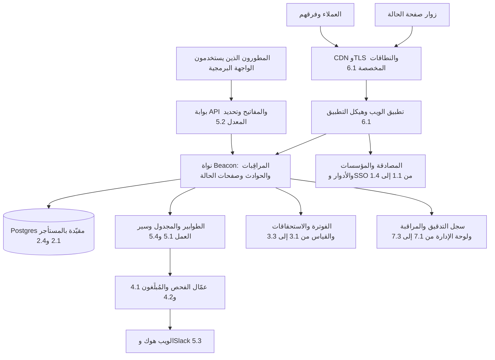
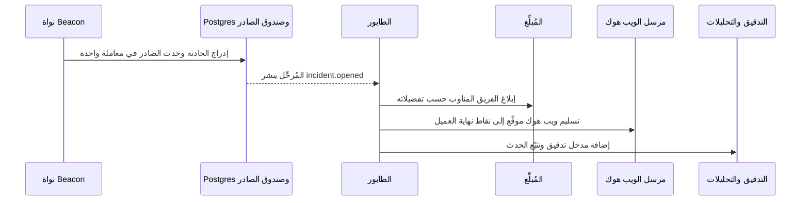

# الوحدة 9 — المشروع الختامي

*درس واحد يجمع الدورة كلها من جديد. تعرّفت على كل مكوّن (component) منفردًا، والآن ستجمعها في
معمارية (architecture) واحدة لـ Beacon، وتقرر أيّها تشتريه (buy) أو تستضيفه بنفسك (self-host) أو تبنيه (build) في كل مرحلة من
مراحل الشركة، ثم تدافع عن هذه القرارات كما يفعل المهندس الخبير (senior engineer) في مراجعة التصميم (design review).*

> **التطبيق العملي:** ابدأ من [نسخة البداية من Beacon](https://github.com/Tamoura/system-design-for-vibe-coders/tree/beacon/starter)، وحلّ التمارين قبل النظر إلى [الحل المرجعي لهذه الوحدة](https://github.com/Tamoura/system-design-for-vibe-coders/tree/beacon/module-9-solution) (الفرع (branch) `beacon/module-9-solution`).

---

# 9.1 — اجمع Beacon: المعمارية المرجعية، وقرار البناء أو الشراء، وخطة 90 يومًا

*المستوى: 🔴 متقدم* · *المتطلبات: 0.1، 1.2، 3.1، 5.1*

## ⚡ الدرس في دقيقة

- معمارية (architecture) SaaS ليست قائمة مكوّنات (components)، بل هي الروابط (connections) بينها والقرارات حول ما تملكه منها.
- اقرأ أي SaaS على أنه ثلاث حلقات (rings): الباب الأمامي (front door) (من هذا؟)، والنواة المقيّدة بالمستأجر (tenant-scoped core)
  (ماذا يملك؟)، والآليات (machinery) المحيطة (ماذا يحدث بعد ذلك؟).
- تربط الحلقات ثلاث قواعد: معرّف المستأجر (tenant id) يذهب إلى كل مكان، وكل تغيير في الحالة (state change) يطلق
  حدثًا (event)، والأنظمة الخارجية هي مصدر الحقيقة (source of truth) لما تملكه.
- الخيار الافتراضي (default) للنسخة الأولى (v1): اشترِ كل مكوّن لا يميّز منتجك (differentiator)، وابنِ نطاقك الأساسي (core domain)
  والربط بين المكوّنات (glue)، ودوّن كل قرار في سجل قرار معماري (ADR) مع شرط واضح لإعادة النظر فيه (revisit trigger).
- أكبر فخ هو تصميم المكوّنات بمعزل (in isolation) عن بعضها: كل جزء يعمل، لكن نقاط الالتقاء بينها (seams)
  تتسرّب (leak). الجاهزية للمؤسسات (enterprise readiness) هي في معظمها عمل على نقاط الالتقاء.

## 🧭 لماذا يحتاجه كل SaaS

يصل كل SaaS في النهاية إلى ذلك الاجتماع. يرسم أحدهم النظام كاملًا على السبورة لموظف
جديد (new hire)، أو لمستشار تقني (technical advisor) لدى مستثمر، أو لفريق الأمن (security team) لدى عميل مؤسسي (enterprise customer)، أو لمشترٍ يُجري
الفحص النافي للجهالة (Due Diligence). والرسم له دائمًا الشكل نفسه: الهوية (identity) عند الباب
الأمامي، وحدود المستأجر (Tenant) حول البيانات، والمال يدخل عبر مزوّد الدفع (payment provider)، والعمل
يخرج عبر الطوابير (queues) والويب هوك (Webhook)، وطبقة تشغيل (operations layer) تراقب كل ذلك.

الفرق التي لم ترسم هذه الصورة أبدًا تدفع ثمنها بطرق هادئة. يبني مهندسان نظامَي مهام (job systems)
مختلفين. تعيش حالة الفوترة (billing state) في ثلاثة أماكن ولا تتفق. يفوّت سجل التدقيق (Audit Log) كل
إجراء يتم عبر الواجهة البرمجية (API) لأنه رُبط بمتحكمات الواجهة (UI controllers) فقط. تتعطل صفقة مؤسسية (enterprise deal) ربع
سنة كاملًا لأن الدخول الموحد (SSO) وSCIM وإقامة البيانات (data residency) لم تكن على خريطة أحد. لا شيء
من هذه مشكلة صعبة بحد ذاته. إنها ما يحدث عندما تُضاف المكوّنات واحدًا تلو الآخر دون
صورة توضح كيف تتصل.

المبتدئون (juniors) الذين ينمون أسرع هم من يستطيعون حمل تلك الصورة في أذهانهم، ووضع أي ميزة (feature)
جديدة عليها في ثوانٍ، وطرح السؤال الصحيح: *أيّ مكوّن تمسّه هذه الميزة، وهل يوجد
واحد بالفعل؟* **معمارية SaaS ليست قائمة مكوّنات، بل هي الروابط بينها والقرارات حول
ما تملكه منها.**

## 📐 كيف يعمل

### 🟢 الأساسيات

هذا هو Beacon مجمّعًا بالكامل. كل صندوق (box) درس في هذه الدورة، والرقم يخبرك أيّ درس.

اقرأه على أنه ثلاث حلقات متحدة المركز (concentric):

| الحلقة | المكوّنات | السؤال الذي تجيب عنه |
|---|---|---|
| **الباب الأمامي** | CDN والنطاقات (domains)، وهيكل التطبيق (app shell)، وبوابة API (API gateway)، والمصادقة (authentication)، وSSO | من هذا، وهل يُسمح له بالدخول؟ |
| **النواة** | نطاقك (المراقِبات (monitors) والحوادث (incidents) وصفحات الحالة (status pages))، وقاعدة البيانات المقيّدة بالمستأجر (tenant-scoped database)، والتفويض (authorization)، والاستحقاقات (entitlements) | ماذا يملك هذا العميل، وماذا يُسمح له أن يفعل به؟ |
| **الآليات** | المهام (jobs) وسير العمل (workflows)، والإشعارات (notifications)، والويب هوك، والفوترة، والبحث (search)، والتحليلات (analytics)، والتدقيق، والمراقبة (observability)، ولوحة الإدارة (admin) | ماذا يحدث بعد ذلك، ومن يعلم به، وكيف نعرف أنه نجح؟ |

ثلاث قواعد تربط الحلقات معًا، وكل درس في الدورة كان يعلّمها بهدوء:

1. **حدود المستأجر موجودة في كل مكان.** كل صف (row)، وكل حمولة مهمة (job payload)، وكل مستند بحث (search document)، وكل
   سطر سجل (log line)، وكل مفتاح كاش (cache key)، وكل تضمين متجهي (Vector Embedding) يحمل معرّف المؤسسة (organization id)
   (1.2، 2.4). المكوّن الذي ينساه هو التسريب التالي بين المستأجرين (cross-tenant leak).
2. **كل تغيير في الحالة يطلق حدثًا.** "تعطّل المراقِب" حقيقة واحدة تغذّي سير عمل
   الحادثة، والإشعارات، والويب هوك الصادرة (outbound)، وسجل التدقيق، والتحليلات، وقياس الاستخدام (usage metering).
   أطلقه (emit) مرة واحدة واستهلكه (consume) مرات كثيرة (5.1، 5.3، 7.3).
3. **الأنظمة الخارجية مصدر الحقيقة لما تملكه.** يملك Stripe حالة الدفع (payment state)، ويملك مزوّد
   الهوية (identity provider) معرفة من يعمل لدى العميل، وتملك قاعدة بياناتك كل ما عدا ذلك. زامن (sync) البيانات من
   الويب هوك الخاصة بها ولا تخمّن أبدًا (3.1، 1.4).

### 🟡 التعمق أكثر

**العمود الفقري للأحداث (event backbone).** القاعدة الثانية هي ما يجعل SaaS قابلًا للتوسعة (extensible) دون أن يصبح
متشابكًا (tangle). عندما تحفظ نواة Beacon حادثة في Postgres، تكتب حدث `incident.opened` في جدول
صندوق الصادر (Outbox) *ضمن المعاملة (transaction) نفسها* (5.1). ينشره مُرحِّل (Relay) إلى الطابور
(Queue)، ويؤدي كل مستهلك (consumer) عمله باستقلالية:

إضافة ردّ فعل (reaction) جديد، مثل تكامل (integration) مع PagerDuty أو ملخص بالذكاء الاصطناعي (AI summary) أو عدّاد (usage meter)
استخدام، تعني إضافة مستهلك، لا تعديل النواة. هذا هو المعنى العملي لعبارة "ضعيف
الاقتران" (Loosely Coupled).

**البناء (build) أو الشراء (buy) أو الاستضافة الذاتية (self-host) قرار لكل مرحلة، لا لكل شركة.** الإجابة
الصحيحة لفريق من شخصين كثيرًا ما تكون خاطئة لفريق من خمسين. استخدم هذا الجدول نقطة
بداية لـ Beacon، لا قانونًا:

| المكوّن | التأسيس (seed) (مهندسان) | النمو (growth) (15 مهندسًا) | المؤسسات (enterprise) (50+) |
|---|---|---|---|
| المصادقة | مكتبة (library) (Better Auth) أو خدمة مُدارة (managed) (Clerk) | أبقِ المكتبة، وأضف MFA ومفاتيح المرور (Passkeys) | مكتبة + خدمة SAML/SCIM (Ory Polis، WorkOS) |
| التفويض | أدوار (roles) في الكود | خريطة صلاحيات (permission map) في الكود، مع اختبارات (tested) | محرك سياسات (policy engine) أو ReBAC (OpenFGA، SpiceDB) إذا تعقّدت المشاركة (sharing) |
| الفوترة | Stripe Checkout + Portal | طبقة استحقاقات في قاعدة بياناتك | خدمة قياس (metering service) (OpenMeter، Lago) + عقود فوترة (invoicing contracts) |
| البريد | مزوّد مُدار + React Email | الشيء نفسه، مع معالجة الارتدادات (bounce handling) | عناوين IP مخصصة (dedicated IPs)، ونطاقات إرسال (sending domains) لكل مستأجر |
| المهام | طابور على Postgres (pg-boss، Graphile Worker) | طابور على Redis (BullMQ) أو خدمة مُدارة (Trigger.dev) | سير عمل متين (durable workflows) (Temporal) للتدفقات الطويلة (long flows) |
| الويب هوك | مكتوبة يدويًا (hand-rolled) مع إعادة المحاولة (retries) | مستضافة ذاتيًا أو مُدارة (Svix) | مُدارة مع بوابة للعملاء (customer portal) وإعادة تشغيل (replay) |
| المراقبة | Sentry + سجلات منظّمة (structured logs) | OpenTelemetry + واجهة خلفية مستضافة (hosted backend) | استضافة ذاتية أو عقد تفاوضي (negotiated contract)، وأهداف SLO لكل فئة (per tier) |
| لوحة الإدارة | Django admin / Refine / react-admin | مكتب خلفي مخصص (custom back office) مع انتحال الهوية (Impersonation) | SSO للموظفين (staff)، وموافقات (approvals)، وتدقيق لكل شيء |

**سجلات القرارات المعمارية (architecture decision records).** المهندس الخبير لا يكتفي باتخاذ هذه القرارات، بل
يدوّنها. سجل القرار المعماري (ADR — Architecture Decision Record) ملف من صفحة واحدة في
المستودع يحوي *السياق (context)، والقرار (decision)، والبدائل (alternatives)، والعواقب (consequences)*، حتى يعرف المهندس التالي لماذا
يستخدم Beacon مكتبة pg-boss ومتى يجب أن يتوقف عن استخدامها. كثير من المستودعات المرجعية
تحتفظ بمستندات تصميم (design documents)، ودليل GitLab العام (public handbook) ومخططاته المعمارية (architecture blueprints) هي أوسع مثال على ذلك.

### 🔴 على نطاق واسع وللمؤسسات

في مرحلة المؤسسات يتغيّر جمهور مراجعة المعمارية (architecture review). تتوقف الأسئلة عن أن تكون "هل يعمل؟"
وتصبح "هل تستطيع إثبات ذلك؟":

- **العزل (isolation):** هل يمكن لحركة مستأجر (traffic) أو بياناته أو عطله (failure) أن تؤثر في مستأجر آخر؟ اعرض
  نموذج تعدد المستأجرين (tenancy model)، وسياسات RLS، وتحديد المعدل (rate limits) لكل مستأجر، وعدالة الطوابير (queue fairness) (2.4، 5.1).
- **دورة حياة الهوية (identity lifecycle):** عندما يغادر موظف شركة العميل، كم دقيقة تمرّ حتى تُسحب
  صلاحياته في كل مكان، بما في ذلك مفاتيح API (API keys) التي أنشأها؟ (1.4، 5.2)
- **الأدلة (evidence):** تصدير سجل التدقيق (audit log export)، وإدارة التغييرات (change management)، ومراجعات الصلاحيات (access reviews)، ونسخ احتياطية (backups)
  مُختبرة بالاستعادة (restore)، وسجل الحوادث (incident history) (7.3، 7.4، 8.1).
- **الإقامة والخروج (residency and exit):** أين تعيش البيانات، وكيف يسترجع العميل كل بياناته، أو يطلب
  حذفها، عند الطلب؟ (2.4، 8.1)
- **نطاق الضرر (blast radius):** ما أسوأ ما يمكن أن يفعله حساب موظف مخترق (compromised staff account)، أو مفتاح API، أو نقطة
  نهاية ويب هوك (webhook endpoint)، أو مُوجّه (Prompt) ذكاء اصطناعي؟ (7.1، 5.3، 8.2)

الفشل الشائع في هذه المرحلة نظام مكوّناته جيدة كلٌّ على حدة، لكن نقاط الالتقاء بينها
لم تُصمَّم أبدًا: إلغاء التزويد (Deprovisioning) عبر SCIM الذي يحذف المستخدم لكن ليس
مفاتيح API الخاصة به، وسجل التدقيق الذي يغطي الواجهة لكن ليس لوحة الإدارة، وتصدير
البيانات (data export) الذي ينسى الملفات المرفوعة (uploaded files). **الجاهزية للمؤسسات هي في معظمها عمل على نقاط
الالتقاء.** من التمارين المفيدة أن تتبّع إجراءً واحدًا للعميل، مثل "مسؤول يحذف
موظفًا"، عبر كل مكوّن يجب أن يمسّه، وتفحص كل نقطة التقاء.

## 🏆 أفضل المستودعات

هذه هي قواعد الكود التي تقارن بها تصميمك لـ Beacon، وهي أنظمة كاملة لا مكوّنات منفردة.

| المستودع | ما هو | التقنيات | الترخيص | اختره عندما |
|---|---|---|---|---|
| [openstatusHQ/openstatus](https://github.com/openstatusHQ/openstatus) | مراقبة جاهزية (uptime monitoring) وصفحات حالة مفتوحة المصدر (open-source) | TypeScript, Next.js, Turso, Go checkers | AGPL-3.0 | تريد مقارنة Beacon الخاص بك بنسخة حقيقية، مكوّنًا مكوّنًا |
| [louislam/uptime-kuma](https://github.com/louislam/uptime-kuma) | مراقب جاهزية تستضيفه بنفسك | Node.js, Vue, SQLite | MIT | تريد نسخة المستأجر الواحد (single-tenant) من نواة Beacon، وترى ما يضيفه تعدد المستأجرين (multi-tenancy) |
| [boxyhq/saas-starter-kit](https://github.com/boxyhq/saas-starter-kit) | قالب بداية (starter) SaaS للمؤسسات: فرق (teams)، وSSO، وSCIM، وسجلات تدقيق، وويب هوك | Next.js, Prisma | Apache-2.0 | تريد أن ترى حلقة المؤسسات مربوطة معًا في قاعدة كود صغيرة (codebase) |
| [calcom/cal.diy](https://github.com/calcom/cal.diy) | الجدولة (scheduling) (النسخة مفتوحة المصدر من Cal.com) | Next.js, tRPC, Prisma, Turborepo | MIT | تريد مكوّنات كثيرة في مستودع أحادي (Monorepo) ناضج واحد (أُزيلت ميزات المؤسسات في 2026) |
| [makeplane/plane](https://github.com/makeplane/plane) | إدارة المشاريع (project management) | Django, Next.js, Celery | AGPL-3.0 | تريد المعمارية كاملة بواجهة خلفية بلغة Python |
| [chatwoot/chatwoot](https://github.com/chatwoot/chatwoot) | منصة دعم العملاء (customer support platform) | Rails, Vue, Sidekiq | MIT (with `enterprise` folder) | تريد المعمارية كاملة بـ Rails |
| [vercel/next-forge](https://github.com/vercel/next-forge) | قالب Turborepo جاهز للإنتاج (production-grade) | Next.js, many integrations | MIT | تريد خريطة توضح أيّ خدمة مُدارة تملأ كل صندوق |
| [wasp-lang/open-saas](https://github.com/wasp-lang/open-saas) | قالب SaaS مجاني متكامل (full-stack) | Wasp, React, Node, Prisma | MIT | تريد نسخة أولى صغيرة وسهلة القراءة فيها مصادقة ومدفوعات (payments) ولوحة إدارة ومهام |

**إن درست مستودعًا واحدًا فقط:** ادرس **openstatus**. إنه Beacon حقيقي مفتوح المصدر:
مراقِبات، وعمّال فحص (checkers)، وحوادث، وصفحات حالة، وإشعارات، ومساحات عمل (workspaces)، وخطط (plans). ضع تصميمك
الختامي بجانبه واشرح كل فرق: أين اخترت شيئًا مختلفًا ولماذا، وأين كان اختياره أفضل.

**اشترِ أم ابنِ أم استضف بنفسك؟**

- **اشترِ** كل مكوّن لا يميّز منتجك ما دمت صغيرًا، لأن أندر مواردك هو انتباه
  المهندسين (engineering attention)، والخدمات المُدارة (managed services) تعيده إليك مقابل المال.
- **استضف بنفسك** عندما تجعل التكلفة عند حجمك، أو إقامة البيانات، أو عقد مع عميل (customer contract)،
  الخيار المُدار مستحيلًا، وخصّص ميزانية لتشغيله.
- **ابنِ** نطاقك الأساسي، والربط بين المكوّنات، وأي شيء قد يجعل الخيار المُدار يملك
  علاقتك بعملائك (customer relationship) أو نموذج بياناتك (data model).

## 🔍 ادرسه في مشاريع حقيقية

**openstatus**: انسخه وطبّق طريقة الدرس 0.2. ملفات البنية التحتية (infrastructure files) ومجلدات مساحة العمل
والتطبيقات تخبرك كيف فُصل عمّال الفحص عن تطبيق الويب (web app)، وهذا بالضبط تقسيم Beacon بين
المجدول (scheduler) والعمّال (workers) (5.1). ابحث عن `workspace` لتجد تعدد المستأجرين، وعن `plan` أو
`limits` لتجد الاستحقاقات، وعن `notification` لتجد قنوات الإشعار (channels).

**Uptime Kuma**: المنتج نفسه لفريق واحد. لاحظ كل ما *لا* يحتاجه: لا مؤسسات، ولا
فوترة، ولا SSO، ولا سجل تدقيق، ولا تحديد معدل لكل مستأجر. الفرق بين Uptime Kuma
وopenstatus هو تقريبًا بالضبط "الـ 80% التي لا يبيعها أحد" من الدرس 0.1.

**BoxyHQ SaaS Starter Kit**: صغير بما يكفي لقراءته في فترة ما بعد الظهر. تتبّع تسجيل
دخول (login) عبر SSO، وحدث إلغاء تزويد عبر SCIM، ومدخلًا (entry) في سجل التدقيق، وتسليم ويب هوك (webhook delivery). كل
واحد منها يعبر مكوّنين على الأقل، لذلك هذا أفضل مكان لرؤية نقاط الالتقاء.

**Cal.com**: المرجع في الحجم الكبير. مجلدا `apps/` و`packages/` فيه (وقت كتابة هذا
الدرس) يفصلان تطبيق الويب، والواجهة البرمجية العامة (public API)، والميزات، ومتجر التطبيقات (app store)
للتكاملات. وتاريخ ترخيصه يستحق المعرفة: انتقل من AGPL مع مجلد `ee` تجاري إلى Cal.diy، نسخة مجتمعية
بترخيص MIT خالص أُزيلت منها ميزات المؤسسات، لذلك انظر إلى PostHog أو Infisical بدلًا منه لدراسة نمط النواة المفتوحة
(Open-Core) نفسه (7.4).

**ما الذي تلاحظه**

- أين ترسم كل قاعدة كود الحد بين النطاق الأساسي والمكوّنات العامة (generic components)، فأسماء المجلدات تكشف ذلك.
- كيف ينتقل معرّف المستأجر من الطلب إلى المهام والسجلات والويب هوك.
- هل تُطلق الأحداث مرة واحدة وتُستهلك مرات كثيرة، أم أن كل ميزة تستدعي كل ميزة أخرى مباشرة.
- أيّ المكوّنات اشتراها كل فريق (انظر إلى متغيرات البيئة (environment variables) في `.env.example`) وأيّها بناه.
- كيف تفصل مشاريع النواة المفتوحة ميزات المؤسسات المدفوعة (paid enterprise features) عن الكود المفتوح.

## 🛠️ ابنِه في Beacon

### 🟢 تمرين المبتدئ

ارسم المعمارية الكاملة لـ Beacon في مخطط (diagram) داخل مستودعك، ويكفي مخطط Mermaid في ملف
Markdown. يجب أن يذكر كل صندوق الدرس الذي جاء منه والخيار الملموس الذي اتخذته (مكتبة
أو خدمة أو "بُني داخليًا"). ثم تتبّع طلبًا واحدًا، "عميل Pro يضيف مراقِبًا"، عبر المخطط،
مع تسمية كل مكوّن يمسّه.

**يكتمل عندما:**

- يُظهر المخطط الحلقات الثلاث وحدود المستأجر.
- يذكر كل مكوّن خيارًا تقنيًا ملموسًا.
- يذكر الطلب المتتبَّع المصادقة، والتفويض، والتحقق من الاستحقاق (entitlement check)، والكتابة في قاعدة
  البيانات، وسجل التدقيق، وجدولة المهمة (job scheduling)، بالترتيب الصحيح.

### 🟡 تمرين المستوى المتوسط

اكتب خمسة سجلات قرارات معمارية لأهم قرارات Beacon: المصادقة، وطابور المهام (job queue)، والفوترة،
والويب هوك، والمراقبة. يذكر كل سجل السياق، والقرار، وبديلين رفضتهما، والعواقب،
والإشارة (signal) التي تجعلك تعيد النظر فيه ("أعد النظر عندما نتجاوز 10,000 مراقِب لكل عامل"
إشارة، أما "أعد النظر عند الحاجة" فليست إشارة).

**يكتمل عندما:**

- توجد خمسة سجلات في `docs/adr/`، كل منها صفحة واحدة أو أقل.
- يذكر كل سجل شرطًا ملموسًا لإعادة النظر.
- يستطيع زميل (teammate) قراءتها وتوقّع ما ستختاره لمكوّن سادس.

### 🔴 تمرين المستوى المتقدم

أجرِ مراجعة جاهزية للمؤسسات على Beacon الخاص بك. اختر الإجراء "مسؤول لدى العميل يحذف
موظفًا عبر مزوّد الهوية" وتتبّعه عبر SCIM، والجلسات (sessions)، ومفاتيح API، وسجل التدقيق،
والإشعارات، وجداول المناوبة (on-call schedules)، ومقاعد الفوترة (billing seats). ثم افعل الشيء نفسه مع "عميل يطلب تصديرًا
كاملًا لبياناته ثم حذف حسابه (account deletion)". أصلح نقطة التقاء واحدة على الأقل مما وجدت، واعرض
المراجعة في 15 دقيقة على زميل يؤدي دور فريق الأمن لدى العميل.

**يكتمل عندما:**

- يُكتب التتبّعان مع كل مكوّن يمسّانه وكل ثغرة وُجدت (gap).
- تُصلح ثغرة واحدة على الأقل مع اختبار يثبت الإصلاح.
- يجيب العرض عن أسئلة 🔴 الخمسة أعلاه: العزل، ودورة حياة الهوية، والأدلة، والإقامة
  والخروج، ونطاق الضرر.

## ⚠️ أخطاء يقع فيها المبتدئون

- **تصميم المكوّنات بمعزل عن بعضها.** كل جزء يعمل، لكن نقاط الالتقاء تتسرّب. تتبّع
  دائمًا إجراءً حقيقيًا واحدًا للعميل من البداية إلى النهاية قبل أن تعدّ المكوّن منتهيًا.
- **بناء ما يميّز المنتج في النهاية.** تقضي الفرق أشهرًا على منظومة مصادقة وفوترة
  جميلة، ثم تطلق عامل فحص المراقِبات (monitor checker) في الأسبوع الثاني عشر. اشترِ المكوّنات العامة
  مبكرًا حتى تحصل النواة على الانتباه.
- **التعامل مع قرار البناء أو الشراء على أنه دائم.** خيار مرحلة التأسيس سيكون خاطئًا
  في مرحلة النمو. دوّن الإشارة التي يجب أن تستدعي إعادة النظر، وضع المزوّدين (vendors) خلف
  واجهة صغيرة (interface) حتى يكلّف التبديل أسبوعًا لا ربع سنة.
- **استدعاء كل مكوّن مباشرة من النواة.** عندها تعرف النواة عن Slack وStripe
  والتحليلات وسجل التدقيق. أطلق الأحداث ودع المستهلكين يتفاعلون معها.
- **ترك معرّف المستأجر خارج المكوّنات "الداخلية".** المهام والسجلات والكاش وفهارس
  البحث (search indexes) هي حيث تختبئ التسريبات بين المستأجرين، لأن أحدًا لا يراجعها بعناية مراجعة
  الواجهة البرمجية نفسها.
- **نسخ معمارية مستودع مرجعي بالكامل.** بنية (structure) Cal.com تناسب فريقًا كبيرًا لديه متجر
  تطبيقات. استعِر الأفكار التي تناسب مرحلتك.

## 🧾 الخلاصة

- كل معمارية SaaS ثلاث حلقات: الباب الأمامي، والنواة المقيّدة بالمستأجر، والآليات
  المحيطة بها.
- تربطها ثلاث قواعد: معرّف المستأجر يذهب إلى كل مكان، وكل تغيير في الحالة يطلق حدثًا،
  والأنظمة الخارجية هي الحقيقة لما تملكه.
- يُتخذ قرار البناء أو الشراء أو الاستضافة الذاتية لكل مكوّن *ولكل* مرحلة، ويُدوَّن
  مع شرط لإعادة النظر فيه.
- الجاهزية للمؤسسات هي في معظمها عمل على نقاط الالتقاء: تتبّع إجراءات العملاء
  الحقيقية عبر المكوّنات وسُدّ الثغرات.
- أفضل طريقة لاختبار تصميمك أن تضعه بجانب تصميم حقيقي مفتوح المصدر وتشرح كل فرق.

## ✍️ اختبر نفسك

**1. ما الحلقات الثلاث في معمارية SaaS، وما السؤال الذي تجيب عنه كل واحدة منها؟**

الإجابة

الباب الأمامي (CDN، وهيكل التطبيق، وبوابة API، والمصادقة، وSSO) يجيب عن "من هذا،
وهل يُسمح له بالدخول؟". والنواة (النطاق، وقاعدة البيانات المقيّدة بالمستأجر، والتفويض،
والاستحقاقات) تجيب عن "ماذا يملك هذا العميل، وماذا يُسمح له أن يفعل به؟". والآليات
(المهام، والإشعارات، والويب هوك، والفوترة، والتدقيق، والمراقبة، ولوحة الإدارة) تجيب عن
"ماذا يحدث بعد ذلك، ومن يعلم به، وكيف نعرف أنه نجح؟". راجع قسم 🟢 الأساسيات.

**2. ما سجل القرار المعماري، وما الذي يجعل شرط إعادة النظر فيه مفيدًا؟**

الإجابة

سجل القرار المعماري (ADR) ملف من صفحة واحدة في المستودع يدوّن السياق، والقرار،
والبدائل، والعواقب، حتى يعرف المهندس التالي لماذا اتُّخذ القرار ومتى يجب التوقف عنه.
الشرط المفيد إشارة ملموسة، مثل "أعد النظر عندما نتجاوز 10,000 مراقِب لكل عامل"، أما
"أعد النظر عند الحاجة" فليس شرطًا. راجع قسم 🟡 التعمق أكثر وتمرين المستوى المتوسط.

**3. يريد فريق المنتج في Beacon تكاملًا مع PagerDuty يعمل كلما فُتحت حادثة. وفق العمود الفقري للأحداث، ما الذي يجب أن يتغيّر في النواة؟**

الإجابة

لا شيء في النواة يجب أن يتغيّر. النواة تكتب بالفعل حدث `incident.opened` في صندوق
الصادر ضمن معاملة الحادثة نفسها، ثم ينشره المُرحِّل إلى الطابور. التكامل مستهلك جديد
لهذا الحدث، تمامًا مثل المُبلِّغ (notifier) ومرسل الويب هوك (webhook sender) ومستهلك التدقيق (audit consumer). راجع قسم 🟡 التعمق أكثر.

**4. لدى Beacon مهندسان. هل عليهما استضافة Temporal بنفسيهما لمهام فحص المراقِبات، وبناء خدمة قياس خاصة بهما؟**

الإجابة

على الأرجح لا. في مرحلة التأسيس تكون نقطة البداية طابورًا على Postgres (pg-boss،
Graphile Worker) وStripe Checkout مع Portal، لأن انتباه المهندسين هو أندر الموارد
ويجب أن يذهب إلى النطاق الأساسي. سير العمل المتين وخدمة القياس ينتميان إلى مراحل
لاحقة، ويجب أن يذكر سجل القرار الإشارة التي تستدعي الانتقال. راجع جدول البناء أو
الشراء في قسم 🟡 التعمق أكثر وفقرة "اشترِ أم ابنِ أم استضف بنفسك؟".

**5. يلغي مزوّد الهوية لدى أحد العملاء تزويد موظف عبر SCIM. يحذف Beacon المستخدم وجلساته، لكن في اليوم التالي ما زال مفتاح API الخاص بذلك الشخص يعيد مراقِبات العميل. ما الخطأ الذي حدث؟**

الإجابة

هذا فشل في نقطة التقاء: SCIM والجلسات ومفاتيح API يعمل كل منها وحده، لكن تدفق إلغاء
التزويد (deprovisioning flow) لم يُتتبَّع عبرها جميعًا. الإصلاح أن تُلغى (revoke) المفاتيح التي أنشأها المستخدم (أو
يُعاد إسنادها) ضمن التدفق نفسه، وأن يثبت اختبارٌ ذلك. راجع قسم 🔴 على نطاق واسع
وللمؤسسات وتمرين المستوى المتقدم.

## 📚 المراجع

- [openstatus documentation](https://docs.openstatus.dev) — توثيق Beacon الحقيقي.
- [AWS Well-Architected SaaS Lens](https://docs.aws.amazon.com/wellarchitected/latest/saas-lens/saas-lens.html) — تعدد المستأجرين والعزل والتشغيل في SaaS.
- [The Twelve-Factor App](https://12factor.net) — نموذج الإعدادات والعمليات (configuration and process model) الذي ما زال يتبعه معظم SaaS.
- [Architecture decision records, by Michael Nygard](https://cognitect.com/blog/2011/11/15/documenting-architecture-decisions) — الصيغة الأصلية لسجل القرار المعماري.
- [adr.github.io](https://adr.github.io) — قوالب وأدوات (templates and tooling) لسجلات القرارات المعمارية.
- [GitLab handbook](https://handbook.gitlab.com) — أكمل سجل عام لطريقة اتخاذ شركة SaaS كبيرة لقراراتها الهندسية وتوثيقها.
- [The repo catalog](../REPOS.md) — كل مستودع في هذه الدورة، مرتّبًا حسب المكوّن.

لقد أنهيت الدورة. عد إلى الدرس 0.1 وأعد قراءة خريطة المكوّنات، فيجب أن تبدو لك الآن
أقل شبهًا بقائمة وأكثر شبهًا بنظام تستطيع بناءه.
