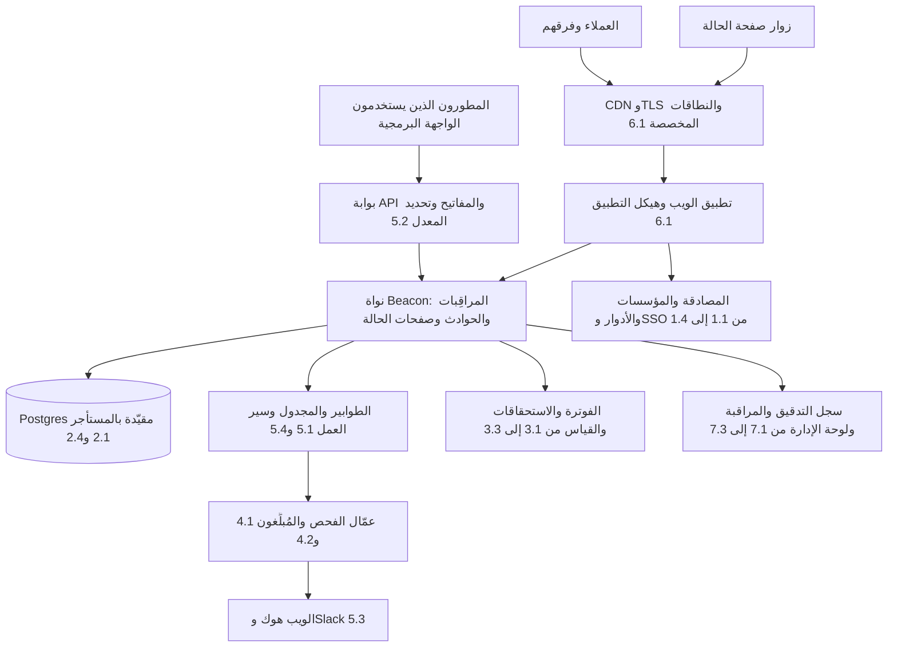
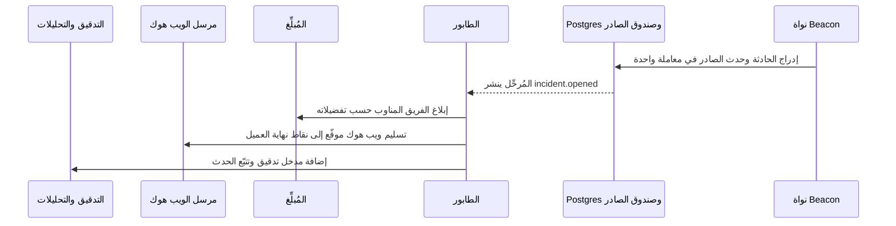

# الوحدة 9 (Module 9) — المشروع الختامي (Capstone)

*درس واحد يجمع الدورة (course) كلها من جديد. تعرّفت على كل مكوّن (component) منفردًا، والآن ستجمعها في
معمارية (architecture) واحدة لـ Beacon، وتقرر أيّها تشتريه (buy) أو تستضيفه بنفسك (self-host) أو تبنيه (build) في كل مرحلة (stage) من
مراحل الشركة، ثم تدافع عن هذه القرارات كما يفعل المهندس الخبير (senior engineer) في مراجعة التصميم (design review).*

> **التطبيق العملي (Practice):** ابدأ من [نسخة البداية من Beacon (Beacon starter)](https://github.com/Tamoura/system-design-for-vibe-coders/tree/beacon/starter)، وحلّ التمارين قبل النظر إلى [الحل المرجعي لهذه الوحدة (this module's reference solution)](https://github.com/Tamoura/system-design-for-vibe-coders/tree/beacon/module-9-solution) (الفرع (branch) `beacon/module-9-solution`).

---

# 9.1 — اجمع Beacon (Assemble Beacon): المعمارية المرجعية (reference architecture)، وقرار البناء أو الشراء (build-vs-buy)، وخطة 90 يومًا (a 90-day plan)

*المستوى (Level): 🔴 متقدم (Advanced)* · *المتطلبات (Prerequisites): 0.1، 1.2، 3.1، 5.1*

## ⚡ الدرس في دقيقة (In 60 seconds)

- معمارية (architecture) SaaS ليست قائمة مكوّنات (components)، بل هي الروابط (connections) بينها والقرارات حول ما تملكه منها.
- اقرأ أي SaaS على أنه ثلاث حلقات (rings): الباب الأمامي (front door) (من هذا؟)، والنواة المقيّدة بالمستأجر (tenant-scoped core)
  (ماذا يملك؟)، والآليات (machinery) المحيطة (ماذا يحدث بعد ذلك؟).
- تربط الحلقات (rings) ثلاث قواعد: معرّف المستأجر (tenant id) يذهب إلى كل مكان، وكل تغيير في الحالة (state change) يطلق
  حدثًا (event)، والأنظمة الخارجية (external systems) هي مصدر الحقيقة (source of truth) لما تملكه.
- الخيار الافتراضي (default) للنسخة الأولى (v1): اشترِ (Buy) كل مكوّن (component) لا يميّز منتجك (differentiator)، وابنِ (Build) نطاقك الأساسي (core domain)
  والربط بين المكوّنات (glue)، ودوّن كل قرار في سجل قرار معماري (ADR) مع شرط واضح لإعادة النظر فيه (revisit trigger).
- أكبر فخ (biggest trap) هو تصميم المكوّنات (components) بمعزل (in isolation) عن بعضها: كل جزء يعمل، لكن نقاط الالتقاء بينها (seams)
  تتسرّب (leak). الجاهزية للمؤسسات (enterprise readiness) هي في معظمها عمل على نقاط الالتقاء (seam work).

## 🧭 لماذا يحتاجه كل SaaS (Why every SaaS has this)

يصل كل SaaS في النهاية إلى ذلك الاجتماع. يرسم أحدهم النظام كاملًا على السبورة (whiteboard) لموظف (employee)
جديد (new hire)، أو لمستشار تقني (technical advisor) لدى مستثمر (investor)، أو لفريق الأمن (security team) لدى عميل مؤسسي (enterprise customer)، أو لمشترٍ يُجري
الفحص النافي للجهالة (Due Diligence). والرسم له دائمًا الشكل نفسه: الهوية (identity) عند الباب
الأمامي، وحدود المستأجر (Tenant) حول البيانات، والمال يدخل عبر مزوّد الدفع (payment provider)، والعمل
يخرج عبر الطوابير (queues) والويب هوك (Webhook)، وطبقة تشغيل (operations layer) تراقب كل ذلك.

الفرق التي لم ترسم هذه الصورة أبدًا تدفع ثمنها بطرق هادئة. يبني مهندسان (2 engineers) نظامَي مهام (job systems)
مختلفين. تعيش حالة الفوترة (billing state) في ثلاثة أماكن ولا تتفق. يفوّت سجل التدقيق (Audit Log) كل
إجراء يتم عبر الواجهة البرمجية (API) لأنه رُبط بمتحكمات الواجهة (UI controllers) فقط. تتعطل صفقة مؤسسية (enterprise deal) ربع
سنة كاملًا لأن الدخول الموحد (SSO) وSCIM وإقامة البيانات (data residency) لم تكن على خريطة أحد. لا شيء
من هذه مشكلة صعبة بحد ذاته. إنها ما يحدث عندما تُضاف المكوّنات (components) واحدًا تلو الآخر دون
صورة توضح كيف تتصل.

المبتدئون (juniors) الذين ينمون أسرع هم من يستطيعون حمل تلك الصورة في أذهانهم، ووضع أي ميزة (feature)
جديدة عليها في ثوانٍ، وطرح السؤال الصحيح: *أيّ مكوّن (component) تمسّه هذه الميزة (feature)، وهل يوجد
واحد بالفعل؟* **معمارية SaaS (SaaS architecture) ليست قائمة مكوّنات (components)، بل هي الروابط (connections) بينها والقرارات حول
ما تملكه منها.**

## 📐 كيف يعمل (How it works)

### 🟢 الأساسيات (The essentials)

هذا هو Beacon مجمّعًا بالكامل. كل صندوق (box) درس في هذه الدورة (course)، والرقم يخبرك أيّ درس.

```mermaid
flowchart TD
    U["العملاء وفرقهم"] --> EDGE["CDN وTLS والنطاقات المخصصة 6.1"]
    SUB["زوار صفحة الحالة"] --> EDGE
    DEV["المطورون الذين يستخدمون الواجهة البرمجية"] --> GW["بوابة API والمفاتيح وتحديد المعدل 5.2"]
    EDGE --> APP["تطبيق الويب وهيكل التطبيق 6.1"]
    GW --> CORE["نواة Beacon: المراقِبات والحوادث وصفحات الحالة"]
    APP --> AUTH["المصادقة والمؤسسات والأدوار وSSO من 1.1 إلى 1.4"]
    APP --> CORE
    CORE --> DB[("Postgres مقيّدة بالمستأجر 2.1 و2.4")]
    CORE --> Q["الطوابير والمجدول وسير العمل 5.1 و5.4"]
    Q --> W["عمّال الفحص والمُبلِّغون 4.1 و4.2"]
    W --> OUT["الويب هوك وSlack 5.3"]
    CORE --> BILL["الفوترة والاستحقاقات والقياس من 3.1 إلى 3.3"]
    CORE --> OPS["سجل التدقيق والمراقبة ولوحة الإدارة من 7.1 إلى 7.3"]
```

اقرأه على أنه ثلاث حلقات متحدة المركز (concentric):

| الحلقة (Ring) | المكوّنات (components) | السؤال الذي تجيب عنه (The question it answers) |
|---|---|---|
| **الباب الأمامي (front door)** | CDN والنطاقات (domains)، وهيكل التطبيق (app shell)، وبوابة API (API gateway)، والمصادقة (authentication)، وSSO | من هذا، وهل يُسمح له بالدخول؟ |
| **النواة (core)** | نطاقك (المراقِبات (monitors) والحوادث (incidents) وصفحات الحالة (status pages))، وقاعدة البيانات المقيّدة بالمستأجر (tenant-scoped database)، والتفويض (authorization)، والاستحقاقات (entitlements) | ماذا يملك هذا العميل (customer)، وماذا يُسمح له أن يفعل به؟ |
| **الآليات (machinery)** | المهام (jobs) وسير العمل (workflows)، والإشعارات (notifications)، والويب هوك (webhooks)، والفوترة (billing)، والبحث (search)، والتحليلات (analytics)، والتدقيق (audit)، والمراقبة (observability)، ولوحة الإدارة (admin) | ماذا يحدث بعد ذلك، ومن يعلم به، وكيف نعرف أنه نجح؟ |

ثلاث قواعد تربط الحلقات (rings) معًا، وكل درس في الدورة (course) كان يعلّمها بهدوء:

1. **حدود المستأجر (tenant boundary) موجودة في كل مكان.** كل صف (row)، وكل حمولة مهمة (job payload)، وكل مستند بحث (search document)، وكل
   سطر سجل (log line)، وكل مفتاح كاش (cache key)، وكل تضمين متجهي (Vector Embedding) يحمل معرّف المؤسسة (organization id)
   (1.2، 2.4). المكوّن (component) الذي ينساه هو التسريب التالي بين المستأجرين (cross-tenant leak).
2. **كل تغيير في الحالة (state change) يطلق حدثًا (an event).** "تعطّل المراقِب (Monitor went down)" حقيقة واحدة تغذّي سير عمل (workflow)
   الحادثة (incident)، والإشعارات (notifications)، والويب هوك الصادرة (outbound)، وسجل التدقيق (audit log)، والتحليلات (analytics)، وقياس الاستخدام (usage metering).
   أطلقه (emit) مرة واحدة واستهلكه (consume) مرات كثيرة (5.1، 5.3، 7.3).
3. **الأنظمة الخارجية (external systems) مصدر الحقيقة (source of truth) لما تملكه.** يملك Stripe حالة الدفع (payment state)، ويملك مزوّد
   الهوية (identity provider) معرفة من يعمل لدى العميل (customer)، وتملك قاعدة بياناتك (your database) كل ما عدا ذلك. زامن (sync) البيانات من
   الويب هوك (webhooks) الخاصة بها ولا تخمّن أبدًا (3.1، 1.4).

### 🟡 التعمق أكثر (Going deeper)

**العمود الفقري للأحداث (event backbone).** القاعدة الثانية هي ما يجعل SaaS قابلًا للتوسعة (extensible) دون أن يصبح
متشابكًا (tangle). عندما تحفظ نواة Beacon (Beacon's core) حادثة (incident) في Postgres، تكتب حدث `incident.opened` في جدول
صندوق الصادر (Outbox) *ضمن المعاملة (transaction) نفسها* (5.1). ينشره مُرحِّل (Relay) إلى الطابور
(Queue)، ويؤدي كل مستهلك (consumer) عمله باستقلالية:

```mermaid
sequenceDiagram
    participant A as التدقيق والتحليلات
    participant H as مرسل الويب هوك
    participant N as المُبلِّغ
    participant Q as الطابور
    participant DB as Postgres وصندوق الصادر
    participant Core as نواة Beacon
    Core->>DB: إدراج الحادثة وحدث الصادر في معاملة واحدة
    DB-->>Q: المُرحِّل ينشر incident.opened
    Q->>N: إبلاغ الفريق المناوب حسب تفضيلاته
    Q->>H: تسليم ويب هوك موقّع إلى نقاط نهاية العميل
    Q->>A: إضافة مدخل تدقيق وتتبّع الحدث
```

إضافة ردّ فعل (reaction) جديد، مثل تكامل (integration) مع PagerDuty أو ملخص بالذكاء الاصطناعي (AI summary) أو عدّاد (usage meter)
استخدام، تعني إضافة مستهلك (consumer)، لا تعديل النواة (core). هذا هو المعنى العملي لعبارة "ضعيف
الاقتران" (Loosely Coupled).

**البناء (build) أو الشراء (buy) أو الاستضافة الذاتية (self-host) قرار لكل مرحلة (per-stage decision)، لا لكل شركة.** الإجابة (Answer)
الصحيحة لفريق من شخصين كثيرًا ما تكون خاطئة لفريق من خمسين. استخدم هذا الجدول نقطة
بداية لـ Beacon، لا قانونًا:

| المكوّن (component) | التأسيس (seed) (مهندسان (2 engineers)) | النمو (growth) (15 مهندسًا (engineers)) | المؤسسات (enterprise) (50+) |
|---|---|---|---|
| المصادقة (authentication) | مكتبة (library) (Better Auth) أو خدمة مُدارة (managed) (Clerk) | أبقِ المكتبة (library)، وأضف MFA ومفاتيح المرور (Passkeys) | مكتبة (library) + خدمة SAML/SCIM (Ory Polis، WorkOS) |
| التفويض (authorization) | أدوار (roles) في الكود (code) | خريطة صلاحيات (permission map) في الكود (code)، مع اختبارات (tested) | محرك سياسات (policy engine) أو ReBAC (OpenFGA، SpiceDB) إذا تعقّدت المشاركة (sharing) |
| الفوترة (billing) | Stripe Checkout + Portal | طبقة استحقاقات (entitlements layer) في قاعدة بياناتك (your database) | خدمة قياس (metering service) (OpenMeter، Lago) + عقود فوترة (invoicing contracts) |
| البريد (Email) | مزوّد مُدار (managed provider) + React Email | الشيء نفسه، مع معالجة الارتدادات (bounce handling) | عناوين IP مخصصة (dedicated IPs)، ونطاقات إرسال (sending domains) لكل مستأجر (per-tenant) |
| المهام (jobs) | طابور على Postgres (pg-boss، Graphile Worker) | طابور على Redis (BullMQ) أو خدمة مُدارة (Trigger.dev) | سير عمل متين (durable workflows) (Temporal) للتدفقات الطويلة (long flows) |
| الويب هوك (webhooks) | مكتوبة يدويًا (hand-rolled) مع إعادة المحاولة (retries) | مستضافة ذاتيًا (self-hosted) أو مُدارة (Svix) | مُدارة (managed) مع بوابة للعملاء (customer portal) وإعادة تشغيل (replay) |
| المراقبة (observability) | Sentry + سجلات منظّمة (structured logs) | OpenTelemetry + واجهة خلفية مستضافة (hosted backend) | استضافة ذاتية (self-hosted) أو عقد تفاوضي (negotiated contract)، وأهداف SLO (SLOs) لكل فئة (per tier) |
| لوحة الإدارة (admin panel) | Django admin / Refine / react-admin | مكتب خلفي مخصص (custom back office) مع انتحال الهوية (Impersonation) | SSO للموظفين (staff)، وموافقات (approvals)، وتدقيق لكل شيء (audited everything) |

**سجلات القرارات المعمارية (architecture decision records).** المهندس الخبير (senior engineer) لا يكتفي باتخاذ هذه القرارات، بل
يدوّنها. سجل القرار المعماري (ADR — Architecture Decision Record) ملف من صفحة واحدة في
المستودع (repo) يحوي *السياق (context)، والقرار (decision)، والبدائل (alternatives)، والعواقب (consequences)*، حتى يعرف المهندس التالي لماذا
يستخدم Beacon مكتبة (library) pg-boss ومتى يجب أن يتوقف عن استخدامها. كثير من المستودعات المرجعية (reference repos)
تحتفظ بمستندات تصميم (design documents)، ودليل GitLab العام (public handbook) ومخططاته المعمارية (architecture blueprints) هي أوسع مثال على ذلك.

### 🔴 على نطاق واسع وللمؤسسات (At scale / enterprise)

في مرحلة المؤسسات (enterprise stage) يتغيّر جمهور مراجعة المعمارية (architecture review). تتوقف الأسئلة عن أن تكون "هل يعمل؟"
وتصبح "هل تستطيع إثبات ذلك؟":

- **العزل (isolation):** هل يمكن لحركة مستأجر (traffic) أو بياناته أو عطله (failure) أن تؤثر في مستأجر (tenant) آخر؟ اعرض
  نموذج تعدد المستأجرين (tenancy model)، وسياسات RLS (RLS policies)، وتحديد المعدل (rate limits) لكل مستأجر (per-tenant)، وعدالة الطوابير (queue fairness) (2.4، 5.1).
- **دورة حياة الهوية (identity lifecycle):** عندما يغادر موظف (employee) شركة العميل (customer)، كم دقيقة تمرّ حتى تُسحب
  صلاحياته في كل مكان، بما في ذلك مفاتيح API (API keys) التي أنشأها؟ (1.4، 5.2)
- **الأدلة (evidence):** تصدير سجل التدقيق (audit log export)، وإدارة التغييرات (change management)، ومراجعات الصلاحيات (access reviews)، ونسخ احتياطية (backups)
  مُختبرة بالاستعادة (restore)، وسجل الحوادث (incident history) (7.3، 7.4، 8.1).
- **الإقامة والخروج (residency and exit):** أين تعيش البيانات، وكيف يسترجع العميل (customer) كل بياناته، أو يطلب
  حذفها، عند الطلب (request)؟ (2.4، 8.1)
- **نطاق الضرر (blast radius):** ما أسوأ ما يمكن أن يفعله حساب موظف مخترق (compromised staff account)، أو مفتاح API (API key)، أو نقطة
  نهاية ويب هوك (webhook endpoint)، أو مُوجّه (Prompt) ذكاء اصطناعي؟ (7.1، 5.3، 8.2)

الفشل الشائع في هذه المرحلة نظام مكوّناته جيدة كلٌّ على حدة، لكن نقاط الالتقاء (seams) بينها
لم تُصمَّم أبدًا: إلغاء التزويد (Deprovisioning) عبر SCIM الذي يحذف المستخدم (user) لكن ليس
مفاتيح API (API keys) الخاصة به، وسجل التدقيق (audit log) الذي يغطي الواجهة (UI) لكن ليس لوحة الإدارة (admin panel)، وتصدير
البيانات (data export) الذي ينسى الملفات المرفوعة (uploaded files). **الجاهزية للمؤسسات (enterprise readiness) هي في معظمها عمل على نقاط
الالتقاء.** من التمارين المفيدة أن تتبّع إجراءً واحدًا للعميل (customer)، مثل "مسؤول (admin) يحذف
موظفًا (employee)"، عبر كل مكوّن (component) يجب أن يمسّه، وتفحص كل نقطة التقاء (each seam).

## 🏆 أفضل المستودعات (The best repos)

هذه هي قواعد الكود (codebases) التي تقارن بها تصميمك لـ Beacon، وهي أنظمة كاملة لا مكوّنات (components) منفردة.

| المستودع (repo) | ما هو | التقنيات (Stack) | الترخيص (License) | اختره عندما (Pick it when) |
|---|---|---|---|---|
| [openstatusHQ/openstatus](https://github.com/openstatusHQ/openstatus) | مراقبة جاهزية (uptime monitoring) وصفحات حالة (status pages) مفتوحة المصدر (open-source) | TypeScript, Next.js, Turso, Go checkers | AGPL-3.0 | تريد مقارنة Beacon الخاص بك بنسخة حقيقية، مكوّنًا (component) مكوّنًا |
| [louislam/uptime-kuma](https://github.com/louislam/uptime-kuma) | مراقب جاهزية (uptime monitor) تستضيفه بنفسك (self-host) | Node.js, Vue, SQLite | MIT | تريد نسخة المستأجر الواحد (single-tenant) من نواة Beacon (Beacon's core)، وترى ما يضيفه تعدد المستأجرين (multi-tenancy) |
| [boxyhq/saas-starter-kit](https://github.com/boxyhq/saas-starter-kit) | قالب بداية (starter) SaaS للمؤسسات (Enterprise): فرق (teams)، وSSO، وSCIM، وسجلات تدقيق (audit logs)، وويب هوك (webhook) | Next.js, Prisma | Apache-2.0 | تريد أن ترى حلقة المؤسسات (enterprise ring) مربوطة معًا في قاعدة كود صغيرة (codebase) |
| [calcom/cal.diy](https://github.com/calcom/cal.diy) | الجدولة (scheduling) (النسخة مفتوحة المصدر (open-source) من Cal.com) | Next.js, tRPC, Prisma, Turborepo | MIT | تريد مكوّنات (components) كثيرة في مستودع أحادي (Monorepo) ناضج واحد (أُزيلت ميزات المؤسسات (enterprise features) في 2026) |
| [makeplane/plane](https://github.com/makeplane/plane) | إدارة المشاريع (project management) | Django, Next.js, Celery | AGPL-3.0 | تريد المعمارية (architecture) كاملة بواجهة خلفية (backend) بلغة Python |
| [chatwoot/chatwoot](https://github.com/chatwoot/chatwoot) | منصة دعم العملاء (customer support platform) | Rails, Vue, Sidekiq | MIT (with `enterprise` folder) | تريد المعمارية (architecture) كاملة بـ Rails |
| [vercel/next-forge](https://github.com/vercel/next-forge) | قالب Turborepo جاهز للإنتاج (production-grade) | Next.js, many integrations | MIT | تريد خريطة توضح أيّ خدمة مُدارة (managed service) تملأ كل صندوق (every box) |
| [wasp-lang/open-saas](https://github.com/wasp-lang/open-saas) | قالب SaaS (SaaS template) مجاني متكامل (full-stack) | Wasp, React, Node, Prisma | MIT | تريد نسخة أولى (v1) صغيرة وسهلة القراءة فيها مصادقة ومدفوعات (payments) ولوحة إدارة ومهام |

**إن درست مستودعًا واحدًا فقط (If you only study one):** ادرس **openstatus**. إنه Beacon حقيقي مفتوح المصدر (open-source):
مراقِبات (monitors)، وعمّال فحص (checkers)، وحوادث (incidents)، وصفحات حالة (status pages)، وإشعارات (notifications)، ومساحات عمل (workspaces)، وخطط (plans). ضع تصميمك
الختامي بجانبه واشرح كل فرق: أين اخترت شيئًا مختلفًا ولماذا، وأين كان اختياره أفضل.

**اشترِ أم ابنِ أم استضف بنفسك (Buy, build, or self-host?)؟**

- **اشترِ (Buy)** كل مكوّن (component) لا يميّز منتجك (your differentiator) ما دمت صغيرًا، لأن أندر مواردك هو انتباه
  المهندسين (engineering attention)، والخدمات المُدارة (managed services) تعيده إليك مقابل المال.
- **استضف بنفسك (Self-host)** عندما تجعل التكلفة عند حجمك، أو إقامة البيانات (data residency)، أو عقد مع عميل (customer contract)،
  الخيار المُدار (managed option) مستحيلًا، وخصّص ميزانية لتشغيله.
- **ابنِ (Build)** نطاقك الأساسي (your core domain)، والربط بين المكوّنات (glue)، وأي شيء قد يجعل الخيار المُدار (managed option) يملك
  علاقتك بعملائك (customer relationship) أو نموذج بياناتك (data model).

## 🔍 ادرسه في مشاريع حقيقية (Study it in the wild)

**openstatus**: انسخه وطبّق طريقة الدرس 0.2. ملفات البنية التحتية (infrastructure files) ومجلدات مساحة العمل (workspace)
والتطبيقات تخبرك كيف فُصل عمّال الفحص عن تطبيق الويب (web app)، وهذا بالضبط تقسيم Beacon بين
المجدول (scheduler) والعمّال (workers) (5.1). ابحث عن `workspace` لتجد تعدد المستأجرين (multi-tenancy)، وعن `plan` أو
`limits` لتجد الاستحقاقات (entitlements)، وعن `notification` لتجد قنوات الإشعار (channels).

**Uptime Kuma**: المنتج نفسه لفريق واحد. لاحظ كل ما *لا* يحتاجه: لا مؤسسات (organizations)، ولا
فوترة (billing)، ولا SSO، ولا سجل تدقيق (audit log)، ولا تحديد معدل (rate limits) لكل مستأجر (per-tenant). الفرق بين Uptime Kuma
وopenstatus هو تقريبًا بالضبط "الـ 80% التي لا يبيعها أحد" من الدرس 0.1.

**BoxyHQ SaaS Starter Kit**: صغير بما يكفي لقراءته في فترة ما بعد الظهر. تتبّع تسجيل
دخول (login) عبر SSO، وحدث إلغاء تزويد (deprovisioning event) عبر SCIM، ومدخلًا (entry) في سجل التدقيق (audit log)، وتسليم ويب هوك (webhook delivery). كل
واحد منها يعبر مكوّنين (two components) على الأقل، لذلك هذا أفضل مكان لرؤية نقاط الالتقاء (seams).

**Cal.com**: المرجع في الحجم الكبير. مجلدا `apps/` و`packages/` فيه (وقت كتابة هذا
الدرس) يفصلان تطبيق الويب (web app)، والواجهة البرمجية العامة (public API)، والميزات (features)، ومتجر التطبيقات (app store)
للتكاملات (integrations). وتاريخ ترخيصه (its licence) يستحق المعرفة: انتقل من AGPL مع مجلد `ee` تجاري إلى Cal.diy، نسخة مجتمعية (community edition)
بترخيص MIT خالص أُزيلت منها ميزات المؤسسات (enterprise features)، لذلك انظر إلى PostHog أو Infisical بدلًا منه لدراسة نمط النواة المفتوحة (open-core pattern)
(Open-Core) نفسه (7.4).

**ما الذي تلاحظه (What to notice)**

- أين ترسم كل قاعدة كود (codebase) الحد بين النطاق الأساسي (core domain) والمكوّنات العامة (generic components)، فأسماء المجلدات تكشف ذلك.
- كيف ينتقل معرّف المستأجر (tenant id) من الطلب (request) إلى المهام (jobs) والسجلات (logs) والويب هوك (webhooks).
- هل تُطلق الأحداث (events) مرة واحدة وتُستهلك مرات كثيرة، أم أن كل ميزة (each feature) تستدعي كل ميزة (feature) أخرى مباشرة.
- أيّ المكوّنات (components) اشتراها كل فريق (انظر إلى متغيرات البيئة (environment variables) في `.env.example`) وأيّها بناه.
- كيف تفصل مشاريع النواة المفتوحة (open-core) ميزات المؤسسات المدفوعة (paid enterprise features) عن الكود المفتوح (open code).

## 🛠️ ابنِه في Beacon (Build it into Beacon)

### 🟢 تمرين المبتدئ (Beginner exercise)

ارسم المعمارية الكاملة (full architecture) لـ Beacon في مخطط (diagram) داخل مستودعك (your repo)، ويكفي مخطط Mermaid (Mermaid) في ملف
Markdown. يجب أن يذكر كل صندوق (every box) الدرس الذي جاء منه والخيار الملموس (concrete choice) الذي اتخذته (مكتبة (library)
أو خدمة أو "بُني داخليًا"). ثم تتبّع طلبًا (request) واحدًا، "عميل (customer) Pro يضيف مراقِبًا (a monitor)"، عبر المخطط (diagram)،
مع تسمية كل مكوّن (component) يمسّه.

**يكتمل عندما (Done when):**

- يُظهر المخطط (diagram) الحلقات الثلاث (three rings) وحدود المستأجر (tenant boundary).
- يذكر كل مكوّن (component) خيارًا تقنيًا ملموسًا (concrete technology choice).
- يذكر الطلب (request) المتتبَّع المصادقة (authentication)، والتفويض (authorization)، والتحقق من الاستحقاق (entitlement check)، والكتابة في قاعدة
  البيانات، وسجل التدقيق (audit log)، وجدولة المهمة (job scheduling)، بالترتيب الصحيح.

### 🟡 تمرين المستوى المتوسط (Intermediate exercise)

اكتب خمسة سجلات قرارات معمارية (architecture decision records) لأهم قرارات Beacon: المصادقة (authentication)، وطابور المهام (job queue)، والفوترة (billing)،
والويب هوك (webhooks)، والمراقبة (observability). يذكر كل سجل السياق (context)، والقرار (decision)، وبديلين (two alternatives) رفضتهما، والعواقب (consequences)،
والإشارة (signal) التي تجعلك تعيد النظر فيه ("أعد النظر عندما نتجاوز 10,000 مراقِب (monitor) لكل عامل (per worker)"
إشارة (signal)، أما "أعد النظر عند الحاجة" فليست إشارة).

**يكتمل عندما (Done when):**

- توجد خمسة سجلات (ADRs) في `docs/adr/`، كل منها صفحة واحدة أو أقل.
- يذكر كل سجل شرطًا ملموسًا لإعادة النظر (concrete revisit trigger).
- يستطيع زميل (teammate) قراءتها وتوقّع ما ستختاره لمكوّن (component) سادس.

### 🔴 تمرين المستوى المتقدم (Advanced exercise)

أجرِ مراجعة جاهزية للمؤسسات (enterprise readiness review) على Beacon الخاص بك. اختر الإجراء "مسؤول لدى العميل (customer's admin) يحذف
موظفًا (employee) عبر مزوّد الهوية (identity provider)" وتتبّعه عبر SCIM، والجلسات (sessions)، ومفاتيح API (API keys)، وسجل التدقيق (audit log)،
والإشعارات (notifications)، وجداول المناوبة (on-call schedules)، ومقاعد الفوترة (billing seats). ثم افعل الشيء نفسه مع "عميل (customer) يطلب تصديرًا
كاملًا لبياناته ثم حذف حسابه (account deletion)". أصلح نقطة التقاء واحدة (one seam) على الأقل مما وجدت، واعرض
المراجعة (review) في 15 دقيقة على زميل (teammate) يؤدي دور فريق الأمن (security team) لدى العميل (customer).

**يكتمل عندما (Done when):**

- يُكتب التتبّعان مع كل مكوّن (component) يمسّانه وكل ثغرة وُجدت (gap).
- تُصلح ثغرة واحدة (one gap) على الأقل مع اختبار (test) يثبت الإصلاح.
- يجيب العرض (presentation) عن أسئلة 🔴 الخمسة أعلاه: العزل (isolation)، ودورة حياة الهوية (identity lifecycle)، والأدلة (evidence)، والإقامة
  والخروج، ونطاق الضرر (blast radius).

## ⚠️ أخطاء يقع فيها المبتدئون (Mistakes juniors make)

- **تصميم المكوّنات (components) بمعزل عن بعضها (in isolation).** كل جزء يعمل، لكن نقاط الالتقاء (seams) تتسرّب. تتبّع
  دائمًا إجراءً حقيقيًا واحدًا للعميل (customer) من البداية إلى النهاية قبل أن تعدّ المكوّن (component) منتهيًا.
- **بناء ما يميّز المنتج (the differentiator) في النهاية.** تقضي الفرق أشهرًا على منظومة مصادقة وفوترة (auth and billing stack)
  جميلة، ثم تطلق عامل فحص المراقِبات (monitor checker) في الأسبوع الثاني عشر. اشترِ (Buy) المكوّنات العامة (generic components)
  مبكرًا حتى تحصل النواة (core) على الانتباه.
- **التعامل مع قرار البناء أو الشراء (build-vs-buy) على أنه دائم.** خيار مرحلة التأسيس (seed stage) سيكون خاطئًا
  في مرحلة النمو (growth stage). دوّن الإشارة (signal) التي يجب أن تستدعي إعادة النظر (revisit)، وضع المزوّدين (vendors) خلف
  واجهة صغيرة (interface) حتى يكلّف التبديل أسبوعًا لا ربع سنة (quarter).
- **استدعاء كل مكوّن (component) مباشرة من النواة (core).** عندها تعرف النواة عن Slack وStripe
  والتحليلات (analytics) وسجل التدقيق (audit log). أطلق الأحداث (events) ودع المستهلكين يتفاعلون (consumers react) معها.
- **ترك معرّف المستأجر (tenant id) خارج المكوّنات (components) "الداخلية".** المهام (jobs) والسجلات (logs) والكاش (caches) وفهارس
  البحث (search indexes) هي حيث تختبئ التسريبات بين المستأجرين (cross-tenant leaks)، لأن أحدًا لا يراجعها بعناية مراجعة
  الواجهة البرمجية (API) نفسها.
- **نسخ معمارية (architecture) مستودع مرجعي (reference repo) بالكامل.** بنية (structure) Cal.com تناسب فريقًا كبيرًا لديه متجر
  تطبيقات. استعِر الأفكار التي تناسب مرحلتك.

## 🧾 الخلاصة (Recap)

- كل معمارية SaaS (SaaS architecture) ثلاث حلقات (three rings): الباب الأمامي (front door)، والنواة المقيّدة بالمستأجر (tenant-scoped core)، والآليات (machinery)
  المحيطة بها.
- تربطها ثلاث قواعد: معرّف المستأجر (tenant id) يذهب إلى كل مكان، وكل تغيير في الحالة (state change) يطلق حدثًا (an event)،
  والأنظمة الخارجية (external systems) هي الحقيقة لما تملكه.
- يُتخذ قرار البناء أو الشراء (build-vs-buy) أو الاستضافة الذاتية (self-host) لكل مكوّن (component) *ولكل* مرحلة (stage)، ويُدوَّن
  مع شرط لإعادة النظر فيه (trigger for revisiting it).
- الجاهزية للمؤسسات (enterprise readiness) هي في معظمها عمل على نقاط الالتقاء (seam work): تتبّع إجراءات العملاء (customers)
  الحقيقية عبر المكوّنات (components) وسُدّ الثغرات (gaps).
- أفضل طريقة لاختبار (test) تصميمك أن تضعه بجانب تصميم حقيقي مفتوح المصدر (open-source) وتشرح كل فرق.

## ✍️ اختبر نفسك (Check yourself)

**1. ما الحلقات الثلاث (three rings) في معمارية SaaS (SaaS architecture)، وما السؤال الذي تجيب عنه (The question it answers) كل واحدة منها؟**

الإجابة (Answer)

الباب الأمامي (CDN، وهيكل التطبيق (app shell)، وبوابة API (API gateway)، والمصادقة (authentication)، وSSO) يجيب عن "من هذا،
وهل يُسمح له بالدخول؟". والنواة (النطاق (domain)، وقاعدة البيانات المقيّدة بالمستأجر (tenant-scoped database)، والتفويض (authorization)،
والاستحقاقات (entitlements)) تجيب عن "ماذا يملك هذا العميل (customer)، وماذا يُسمح له أن يفعل به؟". والآليات (machinery)
(المهام (jobs)، والإشعارات (notifications)، والويب هوك (webhooks)، والفوترة (billing)، والتدقيق (audit)، والمراقبة (observability)، ولوحة الإدارة (admin panel)) تجيب عن
"ماذا يحدث بعد ذلك، ومن يعلم به، وكيف نعرف أنه نجح؟". راجع قسم 🟢 الأساسيات (The essentials).

**2. ما سجل القرار المعماري (ADR)، وما الذي يجعل شرط إعادة النظر (revisit trigger) فيه مفيدًا؟**

الإجابة (Answer)

سجل القرار المعماري (ADR) ملف من صفحة واحدة في المستودع (repo) يدوّن السياق (context)، والقرار (decision)،
والبدائل (alternatives)، والعواقب (consequences)، حتى يعرف المهندس التالي لماذا اتُّخذ القرار ومتى يجب التوقف عنه.
الشرط المفيد إشارة (signal) ملموسة، مثل "أعد النظر عندما نتجاوز 10,000 مراقِب (monitor) لكل عامل (per worker)"، أما
"أعد النظر عند الحاجة" فليس شرطًا. راجع قسم 🟡 التعمق أكثر (Going deeper) وتمرين المستوى المتوسط (Intermediate exercise).

**3. يريد فريق المنتج في Beacon تكاملًا (an integration) مع PagerDuty يعمل كلما فُتحت حادثة (incident). وفق العمود الفقري للأحداث (event backbone)، ما الذي يجب أن يتغيّر في النواة (core)؟**

الإجابة (Answer)

لا شيء في النواة (core) يجب أن يتغيّر. النواة تكتب بالفعل حدث `incident.opened` في صندوق
الصادر ضمن معاملة (transaction) الحادثة (incident) نفسها، ثم ينشره المُرحِّل (relay) إلى الطابور. التكامل (integration) مستهلك جديد (new consumer)
لهذا الحدث (event)، تمامًا مثل المُبلِّغ (notifier) ومرسل الويب هوك (webhook sender) ومستهلك التدقيق (audit consumer). راجع قسم 🟡 التعمق أكثر (Going deeper).

**4. لدى Beacon مهندسان (2 engineers). هل عليهما استضافة Temporal بنفسيهما لمهام (jobs) فحص المراقِبات (monitors)، وبناء خدمة قياس (metering service) خاصة بهما؟**

الإجابة (Answer)

على الأرجح لا. في مرحلة التأسيس (seed stage) تكون نقطة البداية طابورًا (queue) على Postgres (pg-boss،
Graphile Worker) وStripe Checkout مع Portal، لأن انتباه المهندسين (engineering attention) هو أندر الموارد
ويجب أن يذهب إلى النطاق الأساسي (core domain). سير العمل المتين (durable workflows) وخدمة القياس (metering service) ينتميان إلى مراحل
لاحقة، ويجب أن يذكر سجل القرار (ADR) الإشارة (signal) التي تستدعي الانتقال. راجع جدول البناء (build) أو
الشراء (buy) في قسم 🟡 التعمق أكثر (Going deeper) وفقرة "اشترِ أم ابنِ أم استضف بنفسك (Buy, build, or self-host?)؟".

**5. يلغي مزوّد الهوية (identity provider) لدى أحد العملاء (customers) تزويد موظف (employee) عبر SCIM. يحذف Beacon المستخدم (user) وجلساته (their sessions)، لكن في اليوم التالي ما زال مفتاح API (API key) الخاص بذلك الشخص يعيد مراقِبات (monitors) العميل (customer). ما الخطأ الذي حدث؟**

الإجابة (Answer)

هذا فشل في نقطة التقاء (seam failure): SCIM والجلسات (sessions) ومفاتيح API (API keys) يعمل كل منها وحده، لكن تدفق إلغاء
التزويد (deprovisioning flow) لم يُتتبَّع عبرها جميعًا. الإصلاح أن تُلغى (revoke) المفاتيح التي أنشأها المستخدم (أو
يُعاد إسنادها) ضمن التدفق (flow) نفسه، وأن يثبت اختبارٌ (test) ذلك. راجع قسم 🔴 على نطاق واسع
وللمؤسسات (Enterprise) وتمرين المستوى المتقدم (Advanced exercise).

## 📚 المراجع (References)

- [openstatus documentation](https://docs.openstatus.dev) — توثيق Beacon الحقيقي.
- [AWS Well-Architected SaaS Lens](https://docs.aws.amazon.com/wellarchitected/latest/saas-lens/saas-lens.html) — تعدد المستأجرين (multi-tenancy) والعزل (isolation) والتشغيل في SaaS.
- [The Twelve-Factor App](https://12factor.net) — نموذج الإعدادات والعمليات (configuration and process model) الذي ما زال يتبعه معظم SaaS.
- [Architecture decision records, by Michael Nygard](https://cognitect.com/blog/2011/11/15/documenting-architecture-decisions) — الصيغة الأصلية (original format) لسجل القرار المعماري (ADR).
- [adr.github.io](https://adr.github.io) — قوالب وأدوات (templates and tooling) لسجلات القرارات المعمارية (architecture decision records).
- [GitLab handbook](https://handbook.gitlab.com) — أكمل سجل عام لطريقة اتخاذ شركة SaaS كبيرة لقراراتها الهندسية وتوثيقها.
- [The repo catalog](../REPOS.md) — كل مستودع في هذه الدورة (course)، مرتّبًا حسب المكوّن (component).

لقد أنهيت الدورة (course). عد إلى الدرس 0.1 وأعد قراءة خريطة المكوّنات (component map)، فيجب أن تبدو لك الآن
أقل شبهًا بقائمة وأكثر شبهًا بنظام تستطيع بناءه.
