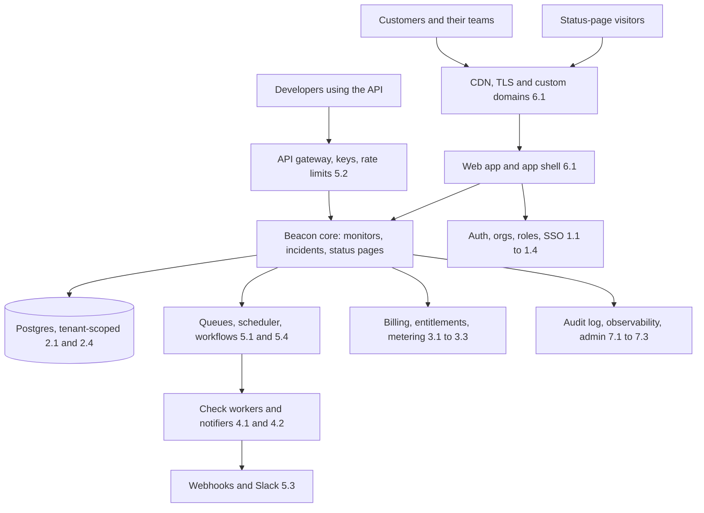
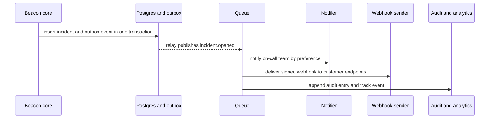

# Module 9 — Capstone

*One lesson that puts the whole course back together. You have met every component
on its own; now you will assemble them into one architecture for Beacon, decide
which to buy, self-host or build at each stage of the company, and defend those
decisions the way a senior engineer would in a design review.*

---

# 9.1 — Assemble Beacon: reference architecture, build-vs-buy and a 90-day plan

*Level: 🔴 Advanced* · *Prerequisites: 0.1, 1.2, 3.1, 5.1*

## 🧭 Why every SaaS has this

Every SaaS eventually has the meeting. Someone draws the whole system on a
whiteboard for a new hire, an investor's technical advisor, an enterprise
customer's security team, or an acquirer doing due diligence. The drawing is
always the same shape: identity at the front door, a tenant boundary around the
data, money flowing in through a payment provider, work flowing out through queues
and webhooks, and an operations layer watching all of it.

Teams that never drew the picture pay for it in quiet ways. Two engineers build two
different job systems. Billing state lives in three places and disagrees. The audit
log misses every action taken through the API because it was wired into the UI
controllers. The enterprise deal stalls for a quarter because SSO, SCIM and data
residency were never on anyone's map. None of these are hard problems on their own.
They are what happens when components are added one at a time without a picture of
how they connect.

The juniors who grow fastest are the ones who can hold that picture in their head,
place any new feature on it in seconds, and ask the right question: *which
component does this touch, and does one already exist?* **A SaaS architecture is
not a list of components — it is the connections between them, and the decisions
about which ones you own.**

## 📐 How it works

### 🟢 The essentials

Here is Beacon, fully assembled. Every box is a lesson in this course; the number
tells you which.

Read it as three concentric rings:

| Ring | Components | The question it answers |
|---|---|---|
| **The front door** | CDN and domains, app shell, API gateway, authentication, SSO | Who is this, and are they allowed in? |
| **The core** | Your domain (monitors, incidents, status pages), the tenant-scoped database, authorization, entitlements | What does this customer own, and what may they do with it? |
| **The machinery** | Jobs and workflows, notifications, webhooks, billing, search, analytics, audit, observability, admin | What happens next, who hears about it, and how do we know it worked? |

Three rules hold the rings together, and every lesson in the course has been
quietly teaching them:

1. **The tenant boundary is everywhere.** Every row, every job payload, every
   search document, every log line, every cache key and every vector embedding
   carries the organization id (1.2, 2.4). A component that forgets it is the next
   cross-tenant leak.
2. **Every state change emits an event.** "Monitor went down" is one fact that
   feeds the incident workflow, notifications, outbound webhooks, the audit log,
   analytics and usage metering. Emit it once, consume it many times (5.1, 5.3, 7.3).
3. **External systems are sources of truth for what they own.** Stripe owns
   payment state; the identity provider owns who works at the customer; your
   database owns everything else. Sync from their webhooks and never guess (3.1, 1.4).

### 🟡 Going deeper

**The event backbone.** Rule 2 is what makes a SaaS extensible without becoming a
tangle. When Beacon's core commits an incident to Postgres, it writes an
`incident.opened` event to an outbox table *in the same transaction* (5.1). A relay
publishes it to the queue, and each consumer does its own job independently:

Adding a new reaction — a PagerDuty integration, an AI summary, a usage meter —
means adding a consumer, not editing the core. That is the practical meaning of
"loosely coupled".

**Build, buy or self-host is a per-stage decision, not a per-company one.** The
right answer for a two-person team is often wrong for a fifty-person one. Use this
as a starting point for Beacon, not a law:

| Component | Seed (2 engineers) | Growth (15 engineers) | Enterprise (50+) |
|---|---|---|---|
| Authentication | Library (Better Auth) or managed (Clerk) | Keep library; add MFA and passkeys | Library + SAML/SCIM service (Ory Polis, WorkOS) |
| Authorization | Roles in code | Permission map in code, tested | Policy engine or ReBAC (OpenFGA, SpiceDB) if sharing gets complex |
| Billing | Stripe Checkout + Portal | Entitlements layer in your DB | Metering service (OpenMeter, Lago) + invoicing contracts |
| Email | Managed provider + React Email | Same, plus bounce handling | Dedicated IPs, per-tenant sending domains |
| Jobs | Postgres queue (pg-boss, Graphile Worker) | Redis queue (BullMQ) or managed (Trigger.dev) | Durable workflows (Temporal) for long flows |
| Webhooks | Hand-rolled with retries | Self-hosted or managed (Svix) | Managed with customer portal and replay |
| Observability | Sentry + structured logs | OpenTelemetry + a hosted backend | Self-hosted or negotiated contract, SLOs per tier |
| Admin | Django admin / Refine / react-admin | Custom back office with impersonation | Staff SSO, approvals, audited everything |

**Architecture decision records.** A senior engineer does not just make these
choices; they write them down. An ADR is a one-page file in the repo — *context,
decision, alternatives, consequences* — so that the next engineer knows why Beacon
uses pg-boss and when it should stop. Many of the reference repos keep design
documents; GitLab's public handbook and architecture blueprints are the most
extensive example.

### 🔴 At scale / enterprise

At the enterprise stage the architecture review changes audience. The questions
stop being "does it work?" and become "can you prove it?":

- **Isolation:** can one tenant's traffic, data or failure affect another? Show the
  tenancy model, RLS policies, per-tenant rate limits and queue fairness (2.4, 5.1).
- **Identity lifecycle:** when an employee leaves the customer, how many minutes
  until their access is gone everywhere, including API keys they created? (1.4, 5.2)
- **Evidence:** audit log export, change management, access reviews, backups tested
  by restore, incident history (7.3, 7.4, 8.1).
- **Residency and exit:** where does the data live, and how does a customer get all
  of it back — or have it deleted — on request? (2.4, 8.1)
- **Blast radius:** what is the worst thing a compromised staff account, API key,
  webhook endpoint or AI prompt can do? (7.1, 5.3, 8.2)

The common failure at this stage is a system whose components are individually good
but whose seams were never designed: the SCIM deprovisioning that removes the user
but not their API keys, the audit log that covers the UI but not the admin panel,
the data export that forgets uploaded files. **Enterprise readiness is mostly seam
work.** A useful exercise is to trace one customer action — "an admin removes an
employee" — through every component it should touch, and check each seam.

## 🏆 The best repos

These are the codebases to hold your Beacon design up against — complete systems,
not single components.

| Repo | What it is | Stack | License | Pick it when |
|---|---|---|---|---|
| [openstatusHQ/openstatus](https://github.com/openstatusHQ/openstatus) | Open-source uptime monitoring and status pages | TypeScript, Next.js, Turso, Go checkers | AGPL-3.0 | You want to compare your Beacon with a real one, component by component |
| [louislam/uptime-kuma](https://github.com/louislam/uptime-kuma) | Self-hosted uptime monitor | Node.js, Vue, SQLite | MIT | You want the single-tenant version of Beacon's core, and to see what multi-tenancy adds |
| [boxyhq/saas-starter-kit](https://github.com/boxyhq/saas-starter-kit) | Enterprise SaaS starter: teams, SSO, SCIM, audit logs, webhooks | Next.js, Prisma | Apache-2.0 | You want to see the enterprise ring wired together in a small codebase |
| [calcom/cal.com](https://github.com/calcom/cal.com) | Scheduling infrastructure | Next.js, tRPC, Prisma, Turborepo | AGPL-3.0 (with commercial `ee`) | You want nearly every component in one mature monorepo |
| [makeplane/plane](https://github.com/makeplane/plane) | Project management | Django, Next.js, Celery | AGPL-3.0 | You want the whole architecture in a Python backend |
| [chatwoot/chatwoot](https://github.com/chatwoot/chatwoot) | Customer support platform | Rails, Vue, Sidekiq | MIT (with `enterprise` folder) | You want the whole architecture in Rails |
| [haydenbleasel/next-forge](https://github.com/haydenbleasel/next-forge) | Production-grade Turborepo template | Next.js, many integrations | MIT | You want a map of which managed service fills each box |
| [wasp-lang/open-saas](https://github.com/wasp-lang/open-saas) | Free full-stack SaaS template | Wasp, React, Node, Prisma | MIT | You want a small, readable v1 with auth, payments, admin and jobs |

**If you only study one:** study **openstatus**. It is a real, open-source Beacon:
monitors, checkers, incidents, status pages, notifications, workspaces and plans.
Put your capstone design next to it and explain every difference — where you
chose differently and why, and where it chose better.

**Buy, build, or self-host?**

- **Buy** every component that is not your differentiator while you are small; your
  scarcest resource is engineering attention, and managed services sell it back.
- **Self-host** when cost at your volume, data residency, or a customer contract
  makes the managed option impossible — and budget for operating it.
- **Build** your core domain, the glue between components, and anything where the
  managed option would own your customer relationship or your data model.

## 🔍 Study it in the wild

**openstatus** — clone it and apply lesson 0.2's method. The infrastructure files
and the workspace/app folders tell you how its checkers are separated from the web
app, which is exactly Beacon's scheduler-and-workers split (5.1). Search for
`workspace` to find its tenancy, `plan` or `limits` to find its entitlements, and
`notification` to find its channels.

**Uptime Kuma** — the same product for one team. Notice everything it does *not*
need: no organizations, no billing, no SSO, no audit log, no per-tenant rate
limits. The difference between Uptime Kuma and openstatus is, almost exactly, the
"80% nobody sells" from lesson 0.1.

**BoxyHQ SaaS Starter Kit** — small enough to read in an afternoon. Trace an SSO
login, a SCIM deprovisioning event, an audit log entry and a webhook delivery; each
one crosses at least two components, so this is the best place to see seams.

**Cal.com** — the reference for scale. Its `apps/` and `packages/` folders (at the
time of writing) separate the web app, the public API, features and the app store
of integrations; its `ee` code marks the open-core line (7.4).

**What to notice**

- Where each codebase draws the line between the core domain and the generic
  components — folder names reveal it.
- How the tenant id travels from the request into jobs, logs and webhooks.
- Whether events are emitted once and consumed many times, or each feature calls
  every other feature directly.
- Which components each team bought (look at the environment variables in
  `.env.example`) versus built.
- How open-core projects separate paid enterprise features from the open code.

## 🛠️ Build it into Beacon

### 🟢 Beginner exercise

Draw Beacon's full architecture as a diagram in your repo — Mermaid in a Markdown
file is fine. Every box must name the lesson it came from and the concrete choice
you made (library, service or "built"). Then trace one request, "a Pro customer
adds a monitor", through the diagram, naming every component it touches.

**Done when:**

- The diagram shows all three rings and the tenant boundary.
- Every component names a concrete technology choice.
- The traced request mentions authentication, authorization, entitlement check,
  database write, audit log and job scheduling, in the right order.

### 🟡 Intermediate exercise

Write five architecture decision records for Beacon's most consequential choices:
authentication, job queue, billing, webhooks and observability. Each ADR states
the context, the decision, two alternatives you rejected, the consequences, and
the signal that would make you revisit it ("revisit when we exceed 10,000
monitors per worker" is a signal; "revisit if needed" is not).

**Done when:**

- Five ADRs exist in `docs/adr/`, each one page or less.
- Each names a concrete revisit trigger.
- A teammate can read them and predict what you would choose for a sixth component.

### 🔴 Advanced exercise

Run an enterprise readiness review of your Beacon. Pick the action "a customer's
admin removes an employee through their identity provider" and trace it across
SCIM, sessions, API keys, audit log, notifications, on-call schedules and billing
seats. Then do the same for "a customer requests a full data export and then
account deletion". Fix at least one seam you find, and present the review in 15
minutes to a peer acting as the customer's security team.

**Done when:**

- Both traces are written down with every component they touch and every gap found.
- At least one gap is fixed with a test that proves it.
- The presentation answers the five 🔴 questions above: isolation, identity
  lifecycle, evidence, residency and exit, and blast radius.

## ⚠️ Mistakes juniors make

- **Designing components in isolation.** Each part works and the seams leak. Always
  trace one real customer action end to end before calling a component done.
- **Building the differentiator last.** Teams spend months on a beautiful auth and
  billing stack and ship the monitor checker in week twelve. Buy the generic
  components early so the core gets the attention.
- **Treating build-vs-buy as permanent.** The seed-stage choice will be wrong at
  growth stage. Write down the signal that should trigger a revisit, and wrap
  vendors behind a small interface so switching costs a week, not a quarter.
- **Calling every component directly from the core.** The core then knows about
  Slack, Stripe, analytics and the audit log. Emit events and let consumers react.
- **Leaving the tenant id out of "internal" components.** Jobs, logs, caches and
  search indexes are where cross-tenant leaks hide, because nobody reviews them as
  carefully as the API.
- **Copying a reference repo's architecture wholesale.** Cal.com's structure fits a
  large team with an app store. Borrow the ideas that fit your stage.

## 🧾 Recap

- Every SaaS architecture is three rings: the front door, the tenant-scoped core,
  and the machinery around it.
- Three rules hold it together: the tenant id goes everywhere, every state change
  emits an event, and external systems are the truth for what they own.
- Build, buy or self-host is decided per component *and* per stage — and written
  down with a trigger for revisiting it.
- Enterprise readiness is mostly seam work: trace real customer actions across
  components and close the gaps.
- The best way to test your design is to put it next to a real open-source one and
  explain every difference.

## 📚 References

- [openstatus documentation](https://docs.openstatus.dev) — the real-world Beacon.
- [AWS Well-Architected SaaS Lens](https://docs.aws.amazon.com/wellarchitected/latest/saas-lens/saas-lens.html) — tenancy, isolation and operations for SaaS.
- [The Twelve-Factor App](https://12factor.net) — the configuration and process model most SaaS still follow.
- [Architecture decision records, by Michael Nygard](https://cognitect.com/blog/2011/11/15/documenting-architecture-decisions) — the original ADR format.
- [adr.github.io](https://adr.github.io) — templates and tooling for ADRs.
- [GitLab handbook](https://handbook.gitlab.com) — the most complete public record of how a large SaaS company makes and documents engineering decisions.
- [The repo catalog](../REPOS.md) — every repository in this course, by component.

You have finished the course. Go back to lesson 0.1 and reread the component map —
it should now look less like a list and more like a system you could build.
