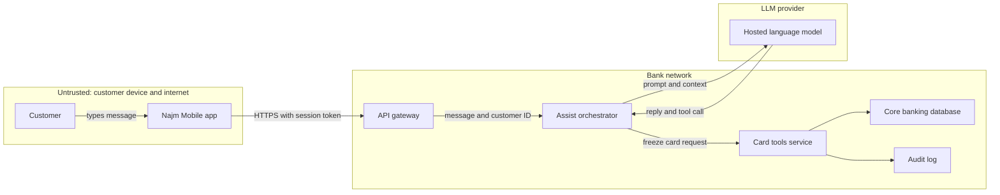
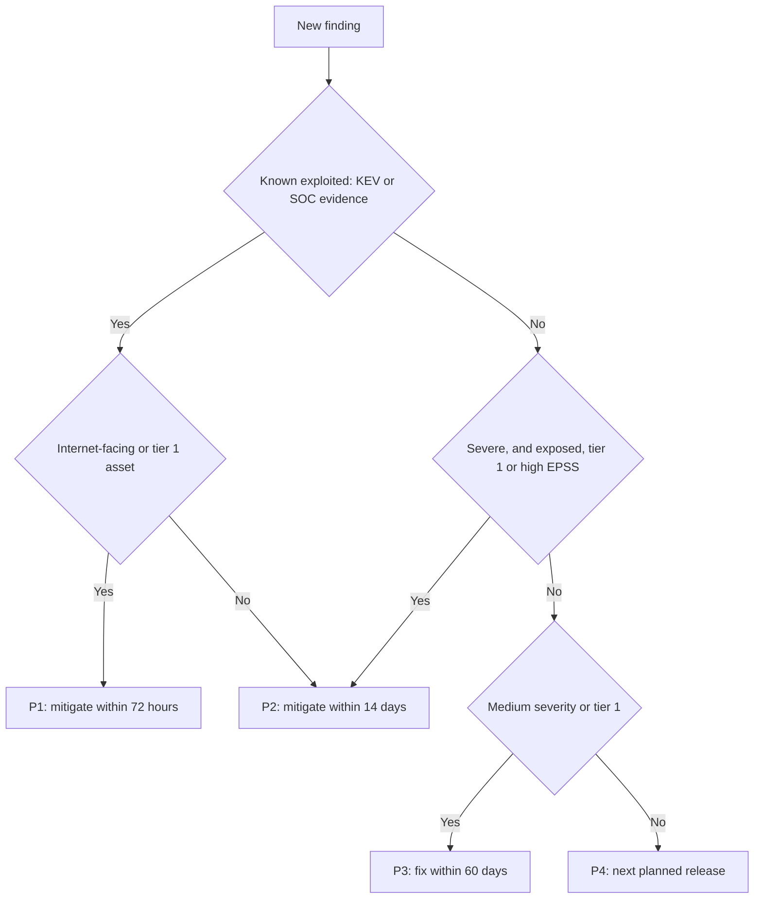

# Module 1 — Thinking like a defender

*Attackers do not read your design documents. They look for the place where you trusted something you should not have. This module gives you the three habits every later module relies on. Threat modelling turns a system into a diagram of data flows and trust boundaries, then asks, systematically, what can go wrong at each crossing. Security principles (least privilege, defence in depth, secure defaults and zero trust) make sure that when something does go wrong, one bug does not become a breach. Risk rating decides what to fix first when the list is longer than the time. You will follow Ali through his first month in Najm Bank's Application & AI Security team: threat-modelling the first tool Najm Assist can call, pushing back on how much access the assistant should get, and turning a 4,100-finding scanner backlog into a short list Noura can defend to Hamad.*

> **Phases:** Plan, Design, Build, Operate — seeing the system as an attacker would before it is built, designing it so failures stay small, and ranking risk so effort goes where harm is likeliest.

---

# 1.1 — Threat modelling: data flows, trust boundaries and STRIDE
*Level: 🟢 Beginner* · *Prerequisites: 0.1, 0.2* · *Phase: Plan, Design*

## ⚡ In 60 seconds
- **Threat modelling** is structured thinking about what can go wrong with a system *before* it is built or changed, so fixes go into the design, not into an incident report.
- It answers four questions: *What are we working on? What can go wrong? What are we going to do about it? Did we do a good job?* (Adam Shostack's framework).
- Start with a **data flow diagram (DFD)**: who talks to whom, where data rests, and where **trust boundaries** sit. Most serious threats live where data crosses a boundary.
- Use **STRIDE** (Spoofing, Tampering, Repudiation, Information disclosure, Denial of service, Elevation of privilege) as a checklist at each element and each crossing.
- Decision cue: threat-model any change that adds a boundary crossing, a data store, a third party, a new kind of user, or a model or agent tool.
- Biggest trap: generic threats ("hackers", "DDoS") with no diagram, owner or test. Each important threat needs a mitigation, an owner and a check.

## 🧭 Why it matters
Tariq's team is about to give Najm Assist its first real tool: **freeze a card**. Until now the assistant only answered questions from the fee schedule. From next sprint, a customer can type "I lost my card, freeze it" and the assistant will call the card service. Noura asks Ali, three weeks into the job, to threat-model it before Thursday's design review.

Ali's first draft is a list: "Hackers could attack the API. DDoS. The AI might hallucinate. Data leak." Every item is true of every system, and none tells Tariq what to build differently. Noura hands it back: "Draw how a message travels from the customer's thumb to core banking and back. Mark every point where we stop being able to trust what arrives. Then go through STRIDE at each one."

The second draft finds real problems. The customer's identity reaches the card service only as a field the language model writes into its tool call. Nothing records that the assistant, rather than the customer's own tap, froze the card. A message saying "also freeze my brother's card, the one ending 4411" is just text, and the model may act on it. All of this is cheaper to fix on a whiteboard than after launch, which is why the OWASP Top 10 has listed *Insecure Design* as a category of its own since its 2021 edition, and why NIST's Secure Software Development Framework (SP 800-218) asks teams to use risk modelling, such as threat modelling, during design.

## 📐 How it works

### 🟢 The essentials

**The four questions.** Adam Shostack framed the work as four questions, first set out in slightly different words in *Threat Modeling: Designing for Security* (2014); the Threat Modeling Manifesto (2020) builds on them. In their current form:

1. **What are we working on?** A model of the system, usually a diagram.
2. **What can go wrong?** Threats, found systematically, for example with STRIDE.
3. **What are we going to do about it?** For each threat: mitigate, eliminate, transfer or accept.
4. **Did we do a good job?** Check the model, and check that the mitigations were built and work.

A whiteboard, the people who know the system and an hour are enough for a first pass.

**Data flow diagrams.** A **data flow diagram (DFD)** shows how data moves through a system, using five kinds of element:

| Element | What it represents | Najm Assist example |
|---|---|---|
| **External entity** | A person or system outside your control | The customer; the hosted LLM provider |
| **Process** | Code that transforms or acts on data | The Assist orchestrator; the card tools service |
| **Data store** | Where data rests | Core banking database; audit log |
| **Data flow** | Data moving between elements | "Chat message"; "tool call: freeze card" |
| **Trust boundary** | A line where the level of trust changes | Internet to bank network; bank to LLM vendor |

A **trust boundary** is any place where data passes between parts that run with different privileges, belong to different parties or rest on different assumptions. The customer's phone is not the bank's, and neither are the LLM vendor's servers. Crucially for AI features, **the model's output is not trustworthy** even though the model works for you, because text you do not control shapes it (lesson 8.2).

The rule that follows: **every flow that crosses a trust boundary is checked on the receiving side.** Who sent it (authentication)? May they do this (authorisation)? Is it well formed and within limits (validation)? Is what we send back safe (output handling)?

**STRIDE.** Loren Kohnfelder and Praerit Garg created STRIDE at Microsoft in 1999. Each letter is a type of threat that breaks one security property:

| Threat | Property broken | Najm Assist example | Typical mitigation |
|---|---|---|---|
| **S**poofing | Authentication | The tool call carries a customer ID the model wrote | Identity from the verified session, never from the model |
| **T**ampering | Integrity | The card ID is altered between app and gateway | TLS; server-side validation |
| **R**epudiation | Non-repudiation | "I never froze that card", and logs cannot show it came through Assist | Tamper-evident audit log: who, what, when, which channel |
| **I**nformation disclosure | Confidentiality | Another customer's cards land in the model's context and are repeated | Fetch only the signed-in customer's data; send the model the minimum |
| **D**enial of service | Availability | Very long messages run up model costs and slow the service | Size limits; rate limits; per-customer token budgets |
| **E**levation of privilege | Authorisation | Assist is talked into *unfreezing* a card, which it was never meant to do | Tool allow-list: freeze only; unfreeze needs re-authentication in the app |

STRIDE is a prompt, not a complete theory of attacks. Its value is that it stops you forgetting whole categories: newcomers think of leaks and outages and often forget repudiation.

**The output** is a short document: the diagram; a threat list (ID, element or flow, STRIDE category, mitigation, owner, status); your assumptions; and your decisions. The 🏛️ section shows Najm's template.

### 🟡 Going deeper

**STRIDE per element.** Not every threat applies to every element. Microsoft's Security Development Lifecycle guidance, popularised in Shostack's book, maps them:
- **External entities:** spoofing and repudiation.
- **Processes:** all six.
- **Data flows:** tampering, information disclosure and denial of service.
- **Data stores:** tampering, information disclosure and denial of service, plus repudiation if the store holds logs.

Walk the diagram element by element and ask only the relevant questions. Every skipped question is then either a recorded decision ("not applicable, because…") or a visible gap.

**The diagram for the freeze-card tool.** Each box is a trust zone. Every arrow that crosses a zone's edge gets a STRIDE pass.



Three crossings stand out. **App to gateway** is a classic web and API boundary (Modules 2 to 4). **Bank to vendor** raises data-protection questions that Sara, the DPO, owns: which customer data leaves the bank, and what may the vendor keep? **Model to orchestrator** is the new one: "reply and tool call" carries instructions from a model that has read untrusted text.

**Trust boundaries in code.** The most common design bug in agent tools is trusting values that crossed the model boundary:

```python
# VULNERABLE: identity and authority both come from the model's tool call
def freeze_card_tool(args: dict, session) -> str:
    card = cards.get(args["card_id"])
    if card.customer_id == args["customer_id"]:   # the model chose both the card and the customer
        cards.freeze(card.id)
        return "Card frozen"
    return "Not allowed"
```

```python
# FIXED: identity comes from the verified session; the model only names a card
def freeze_card_tool(args: dict, session) -> str:
    customer_id = session.customer_id                  # from the login token, not the model
    card = cards.get_for_customer(customer_id, args["card_id"])
    if card is None:
        return "I can't find that card on your account."
    if not session.has_confirmed("freeze", card.id):   # customer taps Confirm in the app
        return "Please confirm the freeze in the app."
    cards.freeze(card.id)
    audit.log(event="card.freeze", customer=customer_id, card=card.id, channel="assist")
    return "Card frozen."
```

The fix answers three STRIDE rows at once: spoofing (identity from the session), elevation of privilege (own cards only, after confirmation) and repudiation (an audit record that names the channel).

**Other ways to find threats.**
- **Attack trees** (Bruce Schneier, 1999) put an attacker's goal at the root, such as "freeze another customer's card", and branch into the ways to reach it.
- **Abuse cases** are user stories from the attacker's side ("As a fraudster, I want Assist to read me someone else's balance"). They fit straight into a backlog.
- **LINDDUN** (KU Leuven) does for privacy what STRIDE does for security, with threats such as *linking* records and *identifying* people. Sara will ask for it on personal-data features.
- **Threat libraries** such as MITRE ATT&CK and, for AI systems, MITRE ATLAS let you check your answers against what attackers have actually done (Module 8).

### 🔴 Expert view

**Threat-model the change, not the universe.** A model of "the whole bank" is never finished and never read. Model each feature or change in a short design-time session, and keep one system diagram that each feature model updates. Noura's triggers: a new trust boundary, store of personal or financial data, third party, privilege or kind of user, or a new model, tool or retrieval source.

**Keep the model with the code.** Store the diagram and threat table in the repository, review changes in the same pull request as the code, and link each mitigation to its ticket and test. Threat-modelling-as-code tools (OWASP pytm, Threagile) suit teams that review everything as code.

**Question four is the one teams skip.** Was the model right: did the people who build and run the system review it? Were the mitigations built? Do they work? Each high-risk threat becomes a **security test case**: "a tool call naming another customer's card is refused" runs on every build.

**AI changes the diagram.** Draw the **model as its own trust zone**. Draw **every source of text** it reads, not only the user: for Credit Memo Copilot, each retrieved document could carry hidden instructions (indirect prompt injection; lessons 8.2 and 9.3). For each tool, ask: *what is the worst this tool can do if an attacker fully controls the model?* If the answer is unacceptable, fix the tool's permissions and add human approval; do not rely on the prompt (lesson 9.2).

**People over method.** Bring the engineer who wrote the code, someone who runs it, a product person and security. Card games such as Elevation of Privilege (Adam Shostack, released by Microsoft) and OWASP Cornucopia ease first sessions.

## 🧰 The toolkit
| Control, standard or tool | What it is and does | When to reach for it |
|---|---|---|
| **Four-question framework** (Shostack) | What are we working on, what can go wrong, what will we do about it, did we do a good job | Structuring any threat-modelling session, from 30 minutes to a full review |
| **Data flow diagram** | Entities, processes, stores, flows and trust boundaries on one page | The first step of every threat model; updated when the system changes |
| **STRIDE** (Kohnfelder and Garg, Microsoft) | Six threat types, each tied to the security property it breaks | Asking "what can go wrong?" systematically at each element and crossing |
| **Attack trees** (Schneier) | An attacker's goal broken down into the ways to reach it | Deep analysis of one high-value goal, such as moving money |
| **LINDDUN** (KU Leuven) | Privacy threat categories applied to data flows | Features built around personal data, with the DPO |
| **OWASP Threat Dragon** | Free, open-source tool for drawing DFDs and recording threats | A shared, versioned diagram without a commercial tool |

## 🏛️ In practice at Najm Bank
Ali's second draft becomes **TM-ASSIST-004: Najm Assist "freeze card" tool**, and Noura makes its format the team standard.

**Header.** *Scope:* a customer asks Assist to freeze a card; Assist calls the card tools service. *Out of scope:* unfreeze, which stays in the app behind strong re-authentication. *Assumptions:* the gateway validates session tokens; the LLM vendor keeps prompts no longer than the contract allows (Sara to confirm). *Participants:* Tariq, Ali, Noura, Rania's product owner, Jassim. *Diagram:* DFD v3 in the repository.

| ID | Element or flow | STRIDE | Threat | Mitigation | Owner | Verified by |
|---|---|---|---|---|---|---|
| T1 | Model → orchestrator | S, E | Tool call names a card or customer other than the signed-in customer | Customer ID from the session; card must belong to that customer | Tariq | Test: another customer's card is refused |
| T2 | Orchestrator → card tools | E | Model is talked into calling a tool it should not have | Allow-list holds `freeze_card` and read-only tools only | Tariq | Test: `unfreeze` is unreachable |
| T3 | Card tools → core banking | R | Customer disputes the freeze; no proof of channel | Audit event: customer, card, channel, confirmation ID, time | Tariq | Log sample reviewed by Jassim |
| T4 | Orchestrator → LLM provider | I | Full card numbers or other customers' data reach the vendor | Send last four digits and the signed-in customer's data only | Sara, Tariq | Prompt log sample |
| T5 | App → gateway | D | Floods of long messages exhaust the model budget | 2,000-character limit; per-customer rate and token limits | Tariq | Load test in staging |
| T6 | Model → orchestrator | T, E | Extra instructions in a message ("also freeze card 4411") | Confirmation screen built from server data shows the exact card | Product owner | Red-team case by Mariam's team |

**Decisions recorded.** Unfreeze stays out of Assist: that risk is avoided, not mitigated. Rania accepts the residual risk on T6 until Mariam's red-team round, with an expiry date. The model is reopened whenever a tool is added.

## 🛠️ Exercises
- 🟢 Draw a DFD for an application you built yourself, or for a deliberately vulnerable training app running on your own machine, such as OWASP Juice Shop. Include all five element types and mark every trust boundary. *Done when:* every arrow that crosses a boundary is listed with what the receiving side checks, or "nothing yet".
- 🟡 Najm's SME Portal lets a company user upload an invoice PDF. It is stored in an object store, scanned for viruses, then read by a parser that fills in the amounts. Draw the DFD and apply STRIDE per element. *Done when:* you have at least 12 threats, at least one per STRIDE category, each with a mitigation and the element it affects.
- 🔴 In your own code or a local lab, build or reuse a small LLM feature with one tool, such as a to-do assistant that can delete items. Threat-model the model-to-tool boundary, then write and run automated tests for the three most serious threats. *Done when:* each test sends a malicious tool call (for example, deleting another user's item) and passes because your code refuses it, not because the model chose not to make the call.

## ⚠️ Mistakes and traps
- **A list without a diagram.** Generic threats change nothing. Draw flows and boundaries first, then look for threats at each crossing.
- **Trusting the inside of the network.** "It's internal" is an assumption, not a control. Mark internal boundaries too.
- **Treating the model as part of your code.** Model output crosses a trust boundary. Validate and authorise it like a request from the internet.
- **Boiling the ocean.** A model of the whole estate never finishes. Model each change; keep one system diagram current.
- **No owner, no test, no revisit.** A mitigation without an owner and a test is a wish. Close the loop with question four, and reopen the model when a trigger fires.

## 🧾 Recap
- Threat modelling answers four questions: what are we working on, what can go wrong, what will we do about it, did we do a good job.
- A data flow diagram with trust boundaries is the foundation. Every flow that crosses a boundary is checked by the receiver.
- STRIDE ties six threat types to six security properties. Apply it per element.
- For AI features, the model is its own trust zone: its outputs are untrusted input to tools and downstream systems.
- A threat model is done when important threats have a mitigation, an owner and a test, and it lives with the code.

## ✍️ Check yourself

**1. Ali's first threat model for the freeze-card tool lists "hackers", "DDoS", "AI hallucination" and "data leak". What is the MOST useful next step?**

- A. Add threats from a public list until there are at least 50
- B. Draw the data flow diagram with trust boundaries, then apply STRIDE to each element and crossing
- C. Ask the LLM vendor for its security certificate
- D. Score each listed threat with CVSS

<details><summary>Answer</summary>

**B.** Without a diagram, threats stay generic. The DFD shows where trust changes, and STRIDE finds specific threats there. A adds volume, not insight; D rates threats too vague to rate. (🟢 The essentials; 🧭 Why it matters.)

</details>

**2. A customer says she never froze her card. The team cannot tell whether it was frozen through Najm Assist, the app's button or a call-centre agent. Which STRIDE category is this gap?**

- A. Spoofing
- B. Tampering
- C. Repudiation
- D. Denial of service

<details><summary>Answer</summary>

**C.** Repudiation means someone can deny an action and you cannot prove otherwise. The mitigation is an audit record of who did what, when and through which channel. Spoofing (A) would mean someone pretending to be her. (🟢 The essentials.)

</details>

**3. The model's tool call includes both `card_id` and `customer_id`, and the tool checks that the card belongs to that `customer_id`. Why is this still a problem?**

- A. The check should use the card's expiry date instead
- B. It is fine, because the model was given the correct customer ID in its prompt
- C. The tool should skip the ownership check to stay fast
- D. Both values crossed the model's trust boundary, so the check only proves that two model-chosen values agree; the customer ID must come from the verified session

<details><summary>Answer</summary>

**D.** Untrusted text shapes model output, so a steered model can name another customer's card together with that customer's ID, and the check passes. Identity must come from the session; the model only names a card. B assumes the model always repeats what it was told. (🟡 Going deeper.)

</details>

**4. Using STRIDE per element, which threat types are normally considered for a data flow, such as the arrow from the Assist orchestrator to the LLM provider?**

- A. Spoofing and repudiation
- B. Tampering, information disclosure and denial of service
- C. All six
- D. Elevation of privilege only

<details><summary>Answer</summary>

**B.** A data flow can be altered, read or blocked. Spoofing and repudiation apply to external entities and processes; all six (C) apply to processes. (🟡 Going deeper.)

</details>

**5. Three months after launch, Noura asks of the freeze-card threat model: "Did we do a good job?" What does a strong answer include?**

- A. Evidence that each high-risk mitigation was built and is checked by a test or red-team case, and that the model reflects changes since launch
- B. A statement from the vendor that its model is safe
- C. The number of threats found in the original session
- D. Confirmation that the document was approved

<details><summary>Answer</summary>

**A.** Question four asks whether the model was right and whether the mitigations exist and work. Counting threats (C) or approvals (D) measures activity, not protection. (🔴 Expert view.)

</details>

## 📚 References
- Shostack, A. (2014), *Threat Modeling: Designing for Security*, Wiley
- Threat Modeling Manifesto (2020) — https://www.threatmodelingmanifesto.org
- OWASP Threat Modeling Cheat Sheet — https://cheatsheetseries.owasp.org/cheatsheets/Threat_Modeling_Cheat_Sheet.html
- OWASP Threat Dragon — https://owasp.org/www-project-threat-dragon/
- OWASP Top 10 (Insecure Design) — https://owasp.org/Top10/
- NIST SP 800-218, Secure Software Development Framework (SSDF) Version 1.1 (a v1.2 revision was in draft at the time of writing, 2026; check the current version) — https://csrc.nist.gov/pubs/sp/800/218/final
- Schneier, B. (1999), "Attack Trees", *Dr. Dobb's Journal*, December 1999
- LINDDUN privacy threat modelling — https://linddun.org
- MITRE ATLAS — https://atlas.mitre.org

---

# 1.2 — Security principles: least privilege, defence in depth, secure defaults, zero trust
*Level: 🟢 Beginner* · *Prerequisites: 1.1* · *Phase: Design, Build*

## ⚡ In 60 seconds
- Security principles are design rules that keep working when you cannot predict the specific attack. Most go back to a 1975 paper by Saltzer and Schroeder, and they still decide whether one bug becomes a breach.
- **Least privilege:** every person, service, token and AI agent gets only the access it needs, for only as long as it needs it.
- **Defence in depth:** several independent layers, so one failure is not enough. **Secure defaults:** deny unless explicitly allowed, and fail closed when a check breaks.
- **Zero trust:** no request is trusted because of where it comes from on the network; every request is authenticated and authorised (NIST SP 800-207).
- Decision cue: ask "if this component is compromised or this check fails, how far can the damage spread, and what stops it?"
- Biggest trap: giving a new service or AI agent broad access "for now". Convenience access is rarely taken back, and an agent with broad access can be steered by text into misusing it.

## 🧭 Why it matters
In July 2019, Capital One announced that an outsider had obtained data relating to roughly 100 million people in the United States and about 6 million in Canada. Public accounts, including the bank's statements and the later criminal case, describe a chain. A misconfigured web application firewall could be made to send requests on the attacker's behalf (server-side request forgery; see 2.3). One request reached the cloud provider's **instance metadata service**, which handed out temporary credentials for the firewall's role. That role could list and read many storage buckets a firewall had no need to read. The bank learned of the breach from an outside tip.

No single exotic flaw caused this. The role was broader than its job (**least privilege**). The metadata service of the time answered simple requests without extra proof (**secure defaults**; AWS introduced a session-token version, IMDSv2, later in 2019). One compromised component led straight to bulk data (**defence in depth**). Change any one and the outcome is smaller.

Now Najm. Tariq proposes that Najm Assist's service account reuse the mobile backend's API scope "so we don't have to re-plumb it for every new tool". It is quicker, and it would hand a model that customers can steer with text the power to read any customer's accounts and start transfers. Noura's reply: "Tell me what Assist must be able to do. It gets exactly that, and nothing else."

## 📐 How it works

### 🟢 The essentials

In 1975, Jerome Saltzer and Michael Schroeder published "The Protection of Information in Computer Systems". Its eight design principles (economy of mechanism, fail-safe defaults, complete mediation, open design, separation of privilege, least privilege, least common mechanism and psychological acceptability) are still the backbone of secure design. Here are the ones builders use most, plus three later additions:

| Principle | Plain meaning | Typical violation |
|---|---|---|
| **Least privilege** | Only the access needed, only as long as needed | One admin account shared by every app |
| **Defence in depth** | Independent layers, so no single failure is fatal | "The firewall protects it", and nothing behind it checks |
| **Fail-safe defaults** | Deny unless explicitly allowed; safe out of the box | Debug mode or default passwords shipped "for now" |
| **Fail securely** | When a check errors, the answer is "no" | `except: allow` |
| **Complete mediation** | Check authority on every access | A cached "is admin" flag trusted for hours |
| **Separation of privilege** | High-risk actions need two conditions or two people | One engineer changes and deploys payment code alone |
| **Minimise attack surface** | Fewer entry points to defend | Forgotten test endpoints live in production |
| **Economy of mechanism** | Keep security code small enough to review | Five hand-written checks that disagree |
| **Open design** | No reliance on attackers not knowing the design | "Nobody knows this admin URL" |
| **Psychological acceptability** | Security that is too hard gets bypassed | Rules so painful that staff share passwords |

The 🏛️ section applies most of them to Najm Assist. Four do most of the daily work.

**Least privilege** limits what an attacker gains from any one compromise. Apply it to people, services, tokens, cloud roles, database users, pipelines and AI agents, and in time as well as scope: access needed for an hour should expire after an hour (**just-in-time access**).

```sql
-- VULNERABLE: Assist's database user can read and change everything
GRANT ALL PRIVILEGES ON ALL TABLES IN SCHEMA core TO assist_svc;

-- FIXED: no table access; two functions that check card ownership inside
-- (SECURITY DEFINER functions owned by a separate role, each with a fixed search_path)
REVOKE ALL ON ALL TABLES IN SCHEMA core FROM assist_svc;
REVOKE EXECUTE ON ALL FUNCTIONS IN SCHEMA core FROM PUBLIC;  -- PostgreSQL lets everyone run functions by default
ALTER DEFAULT PRIVILEGES IN SCHEMA core REVOKE EXECUTE ON FUNCTIONS FROM PUBLIC;  -- and future ones
GRANT EXECUTE ON FUNCTION core.list_my_cards(uuid) TO assist_svc;
GRANT EXECUTE ON FUNCTION core.freeze_card(uuid, uuid) TO assist_svc;
```

The two `FROM PUBLIC` lines are themselves a secure-defaults lesson: check what your platform allows out of the box, for existing objects and for new ones.

**Defence in depth** assumes every layer will sometimes fail. The layers must be **independent**: two checks that both trust the same customer ID from the model are one layer, not two.

**Secure defaults and failing closed.** Most systems run with their defaults, so the safe state must be the one you get by doing nothing, and errors must land on "deny".

```python
# VULNERABLE: fails open; any error in the policy service grants access
def can_view_invoice(user, invoice) -> bool:
    try:
        return policy.check(user, "invoice:read", invoice)
    except Exception:
        return True   # "don't block customers if the policy service is slow"
```

```python
# FIXED: fails closed, and the failure is visible
def can_view_invoice(user, invoice) -> bool:
    try:
        return policy.check(user, "invoice:read", invoice) is True
    except Exception:
        log.warning("policy check failed; denying", extra={"user": user.id, "invoice": invoice.id})
        metrics.increment("authz.fail_closed")
        return False
```

`is True` guards against a check that returns something "truthy" that is not a decision, such as an error object. Failing closed has a cost (no invoices while the policy service is down); solve that with redundancy, not by switching security off.

**Zero trust.** Traditional networks trusted anything inside the perimeter: the "castle and moat". **Zero trust**, defined in NIST SP 800-207 (2020), drops that assumption. No user, device or service gets implicit trust from its network location; every request to a resource is authenticated and authorised, using policy that can weigh identity, device health and context. For an application team, services authenticate to each other (for example with mutual TLS) even inside the cluster, every call is authorised for the specific resource, and you **assume breach**: design as if an attacker is already inside, and limit what they can reach.

### 🟡 Going deeper

**Defence in depth for one action.** These layers protect "freeze my card" in Najm Assist. Each is a separate control that can stop a wrong freeze on its own:

```mermaid
flowchart LR
    A["Customer message"] --> B["Edge: TLS, WAF, rate limits"]
    B --> C["Authentication: valid session and device"]
    C --> D["Tool policy: freeze only, never unfreeze or pay"]
    D --> E["Authorisation: card belongs to this customer"]
    E --> F["Confirmation shown in the app"]
    F --> G["Card service with least-privilege database rights"]
    G --> H["Audit log and SOC alert on unusual volume"]
```



James Reason's "Swiss cheese" model of accidents is the standard picture: every layer has holes, and harm gets through only when the holes line up. Independence keeps them from lining up. If the authorisation check, the confirmation screen and the audit log all take the card ID from the model's output without comparing it to the session, one manipulated tool call passes all three.

**Zero trust in architecture.** SP 800-207 describes a **policy decision point** (PDP), which decides whether a request is allowed, and a **policy enforcement point** (PEP), which sits in the request path and applies that decision. At Najm, the API gateway and a proxy in front of each service enforce; the central authorisation service decides. CISA's Zero Trust Maturity Model (version 2.0, 2023) organises the journey into five pillars (identity, devices, networks, applications and workloads, and data) and stages from "traditional" to "optimal". Zero trust is a direction of travel, not a product. Be wary of anyone selling it in a box.

**Least privilege in practice.** Permissions pile up over time (**privilege creep**). The working tools:
- **Start from zero** and add permissions as tests fail, rather than starting broad and trimming.
- **Scope by resource and action**: "freeze cards of the signed-in customer", not "card API: full access".
- **Short-lived credentials** per workload instead of long-lived keys (lesson 5.2).
- **Just-in-time elevation** for people: two hours of production access, approved and logged, then it expires. Keep a tested, closely watched **break-glass** account for emergencies.
- **Access reviews** and **unused-permission reports** from your cloud provider's tooling.

**Secure by design.** Since 2023, CISA and partner agencies in several countries have published "Secure by Design" guidance urging software makers to ship products secure out of the box: no default passwords, multi-factor authentication by default, security logs at no extra cost. A useful test for any platform team: would we ship this to customers with today's defaults?

**AI coding agents need the same rules.** Najm developers use AI coding agents that can run shell commands. Run them in a sandbox with no production credentials in reach, a short allow-list of commands that run without approval, and human review before merging (lesson 6.3). An agent with your full permissions can be steered by an instruction hidden in a file it reads.

### 🔴 Expert view

**The confused deputy.** Norm Hardy's 1988 paper described a program that held authority for one purpose and was tricked into using it for someone else. AI agents are confused deputies by construction: they act with credentials, on behalf of a user, guided by text that may come from a third party. The fix is to make the agent carry the **user's** authority, not its own. Each tool call is authorised as "this customer, through Assist", with delegated, narrowly scoped, short-lived tokens; OAuth 2.0 Token Exchange (RFC 8693) is one pattern (lesson 3.2). The agent can then never do more than the user could. Lesson 9.2 applies this to tool design and MCP.

**Principles conflict; judgement settles it.** More layers add complexity, and complexity breeds bugs. Strict least privilege slows teams and invites workarounds. Failing closed can hurt availability. Name the trade-off in the design review and decide by blast radius: the more an action can harm customers or move money, the more friction it earns.

**The model is not a security boundary.** A system prompt saying "never reveal other customers' data" is a request, not a control. Prompt injection can override it, and it can leak (OWASP LLM07, System Prompt Leakage). Every rule that matters is enforced in code outside the model: in the tool, the data layer or the gateway.

**Make principles measurable.** Count service accounts with wildcard permissions, permissions unused for 90 days, unauthenticated internal calls and the median lifetime of credentials. Hamad, the CISO, asks for three of these every quarter.

## 🧰 The toolkit
| Control, standard or tool | What it is and does | When to reach for it |
|---|---|---|
| **Saltzer and Schroeder design principles** | The 1975 secure-design principles, including least privilege, fail-safe defaults and complete mediation | Design reviews; settling what "good enough" design means |
| **Least privilege** | Minimum access for the minimum time, per identity and resource | Every new service account, role, token, pipeline or AI agent |
| **Defence in depth** | Independent layers, so one failure is not a breach | Any high-value action or data store |
| **Fail-safe defaults** | Deny unless explicitly allowed; fail closed on errors | Authorisation code, configuration, new routes and storage |
| **Zero trust architecture** (NIST SP 800-207) | No implicit trust from network location; every request authenticated and authorised | Service-to-service design; remote access; flat internal networks |
| **CISA Zero Trust Maturity Model** | Five pillars and maturity stages for a zero-trust programme | Roadmaps and measuring progress |
| **Just-in-time access** | Time-limited, approved, logged elevation of privilege | People's access to production and sensitive data |
| **Secure by Design** (CISA and partners) | Guidance for products that are secure out of the box | Setting defaults for platforms, templates and products |

## 🏛️ In practice at Najm Bank
Noura turns the principles into the **Najm Secure Design Review: ten questions**, attached to every design document. Tariq's team answers them for Najm Assist's tool layer.

| # | Principle | Question | Najm Assist tool layer: answer and evidence |
|---|---|---|---|
| 1 | Least privilege | What exactly can each identity do, and why? | List own cards, freeze own card, read fee schedule. Permission file in the repository |
| 2 | Least privilege in time | Which credentials are long-lived? | None. Workload tokens expire in 15 minutes |
| 3 | Defence in depth | Name two independent controls that each stop the worst outcome | Ownership check in the card service; confirmation screen built from server data |
| 4 | Fail-safe defaults | What is the default for a new route, tool or bucket? | Deny. Tools must be on the allow-list; CI blocks public buckets |
| 5 | Fail securely | What happens when a check fails? | Freeze refused; customer sent to the in-app button |
| 6 | Complete mediation | Where is authority checked on every call? | In the card service; no cached approvals |
| 7 | Separation of privilege | Which actions need two people or factors? | Unfreeze needs in-app re-authentication; prompt changes need two approvers |
| 8 | Attack surface | What can be removed? | Old v1 chat endpoint retired |
| 9 | Zero trust | Is any call trusted because it is "internal"? | No. Mutual TLS plus a per-request token |
| 10 | Usability | Will people bypass this? | One-tap confirmation; abandonment tracked |

**Rule added to Najm's engineering standard:** "AI agents and their tools are designed so that, if an attacker fully controls the model, the worst outcome is limited to what the signed-in customer could already do, and every consequential action needs the customer's explicit confirmation." Hamad signs it as CISO.

## 🛠️ Exercises
- 🟢 Pick a project you own. List every credential it uses (database users, cloud roles, API keys, CI tokens), what each can do and what it actually needs. *Done when:* you have a granted-versus-needed table for each credential, with at least one permission marked for removal.
- 🟡 In your own codebase, find error handling around an authentication or authorisation check, such as a bare `except` or an empty `catch`. Rewrite one to fail closed and write a test that simulates the check failing. *Done when:* the test proves access is denied and a log line or metric records the failure.
- 🔴 In a local lab, design access for an agent with three tools (read, change, delete) acting for logged-in users. Specify the decision and enforcement points, how the user's identity reaches each tool, and two independent layers that stop "delete another user's data". *Done when:* the agent's own credentials cannot do more than the user could, and your tests show each layer blocking the delete when the other is switched off.

## ⚠️ Mistakes and traps
- **"Broad for now, tighten later."** Later rarely comes. Start from zero and add only what tests show is needed.
- **Layers that share an assumption.** Three checks that trust the same unverified value are one check. Make layers independent.
- **Failing open for availability.** A policy-service outage must not become a security outage. Fail closed, and fix availability with redundancy.
- **Trusting "internal".** Being inside the network is not an identity. Authenticate and authorise service-to-service calls.
- **Security rules only in the prompt.** The model can be talked out of them. Enforce them in code outside the model.

## 🧾 Recap
- Saltzer and Schroeder's principles (1975) still decide whether a bug becomes a breach.
- Least privilege limits the blast radius. Apply it to people, services, tokens, pipelines and AI agents, in scope and in time.
- Defence in depth works only when layers are independent. Secure defaults and failing closed make the safe outcome the effortless one.
- Zero trust (NIST SP 800-207) removes trust based on network location: every request is authenticated and authorised.
- AI agents are confused deputies by design. Give them the user's scoped authority, and enforce rules in code, not prompts.

## ✍️ Check yourself

**1. Tariq wants Najm Assist's service account to reuse the mobile backend's full API scope "so new tools are quicker to add". Which principle does this break, and what is the better design?**

- A. Open design; publish the scope so it can be reviewed
- B. Least privilege; grant only the actions Assist needs now, scoped to the signed-in customer, and add more through review
- C. Economy of mechanism; use fewer tokens
- D. Psychological acceptability; it would annoy developers

<details><summary>Answer</summary>

**B.** A model that customers can steer with text should hold the minimum authority. Broad scope "for later" turns one manipulated tool call into a transfer or a data leak. (🟢 The essentials; 🧭 Why it matters.)

</details>

**2. The SME Portal's invoice check calls a policy service. When the service times out, the code returns `True` so customers are not blocked. What is the correct change?**

- A. Increase the timeout so it fails less often, and keep returning `True`
- B. Cache the last answer forever
- C. Return `False` on any error, log and count the failure, and fix availability with redundancy
- D. Remove the policy check to make pages faster

<details><summary>Answer</summary>

**C.** Errors must land on "deny" (fail securely). The availability problem is real, but redundancy solves it, not switching security off. A still fails open, just less often. (🟢 The essentials.)

</details>

**3. Which statement best describes zero trust as defined in NIST SP 800-207?**

- A. No user is ever allowed access to anything
- B. A firewall product that blocks all internet traffic
- C. Trust internal traffic and inspect external traffic
- D. No implicit trust based on network location; each request to a resource is authenticated and authorised using policy

<details><summary>Answer</summary>

**D.** Zero trust removes the idea that being "inside" earns trust. It does not mean denying everything (A), and it is an architecture, not a product (B). C is the old perimeter model it replaces. (🟢 The essentials; 🟡 Going deeper.)

</details>

**4. Najm Assist has three controls against freezing the wrong card: an ownership check, a confirmation screen and an audit alert. All three take the card ID from the model's tool call without comparing it to the session. What is the weakness?**

- A. The layers are not independent, so one manipulated value passes all three
- B. There are too few layers; add a fourth
- C. The audit alert should be removed to simplify the design
- D. None; three layers are enough

<details><summary>Answer</summary>

**A.** Defence in depth needs layers that fail for different reasons. These three share one unverified input, so a fourth layer with the same input (B) changes nothing. (🟡 Going deeper.)

</details>

**5. Why is an AI agent acting with its own broad service credentials called a "confused deputy"?**

- A. Because models sometimes give wrong answers
- B. Because it holds authority for one purpose and can be steered by someone else's text into using it for another; the fix is to act with the user's scoped authority
- C. Because it has two system prompts
- D. Because it cannot read access-control lists

<details><summary>Answer</summary>

**B.** Hardy's confused deputy uses its own privilege on behalf of the wrong party. With the user's delegated, scoped, short-lived authority, the agent can never do more than the user could. A is about reliability, not authority. (🔴 Expert view.)

</details>

## 📚 References
- Saltzer, J. H. and Schroeder, M. D. (1975), "The Protection of Information in Computer Systems", *Proceedings of the IEEE* 63(9)
- NIST SP 800-207, Zero Trust Architecture (2020) — https://csrc.nist.gov/pubs/sp/800/207/final
- CISA, Zero Trust Maturity Model, Version 2.0 (2023) — https://www.cisa.gov/zero-trust-maturity-model
- CISA, Secure by Design — https://www.cisa.gov/securebydesign
- Hardy, N. (1988), "The Confused Deputy", *ACM SIGOPS Operating Systems Review* 22(4)
- RFC 8693, OAuth 2.0 Token Exchange — https://www.rfc-editor.org/rfc/rfc8693
- OWASP Top 10 for LLM Applications 2025 — https://genai.owasp.org

---

# 1.3 — Rating and prioritising risk: likelihood, impact and CVSS
*Level: 🟢 Beginner* · *Prerequisites: 1.1, 1.2* · *Phase: Plan, Operate*

## ⚡ In 60 seconds
- **Risk** combines how likely something bad is (**likelihood**) with how much harm it does (**impact**). You can never fix everything at once, so the job is to fix the right things first.
- **CVSS** (Common Vulnerability Scoring System, from FIRST) rates a vulnerability's technical **severity** from 0 to 10. FIRST stresses that it measures severity, not risk to your organisation. Version 4.0 was published in November 2023; v3.1 is still widely used.
- Add **exploitation evidence**: CISA's **Known Exploited Vulnerabilities (KEV)** catalogue lists flaws attacked in the wild, and **EPSS** estimates the probability of exploitation activity in the next 30 days.
- Add **context**: is the asset reachable from the internet, does it hold customer data or move money, and what controls already stand in the way?
- Decision cue: "known exploited, exposed and valuable" goes to the top, whatever the CVSS score says.
- Biggest trap: sorting by CVSS alone, so teams spend months on "critical" findings nobody can reach while an exploited "high" on the internet edge waits.

## 🧭 Why it matters
Ali's scanners have finished their first full run across Najm's cloud platform: 4,100 open findings, 620 rated Critical. His plan is to fix them in CVSS order. Tariq points out that, at his team's pace, the Criticals alone would take most of a year.

Noura asks three questions. Which of these is anyone actually exploiting? Which systems can be reached from the internet? Which hold customer data or can move money? The answers reorder everything. Most of the 10.0s sit in a library used by an internal batch job with no network listener. Meanwhile a 7.5 in the remote-access VPN appliance is on CISA's exploited list. And Mariam's team has an SME Portal finding that never reached the dashboard because it has no CVE: a company user can download another company's invoices by changing a number in the URL.

Public history shows the stakes. In 2017, Equifax was breached through a known vulnerability in Apache Struts (CVE-2017-5638). According to public reports and later US government reviews, a fix had been published about two months before the attackers first got in. The US Federal Trade Commission later described the breach as affecting approximately 147 million people. The failure was not knowing; it was getting the right fix done in time.

## 📐 How it works

### 🟢 The essentials

**Risk = likelihood × impact.** It is rarely literal multiplication, but the idea holds: a severe flaw nobody can reach is lower risk than a moderate flaw on the front door. Most teams start with a **risk matrix**: rate likelihood and impact as Low, Medium or High, and read the overall risk from the grid.

| | Impact: Low | Impact: Medium | Impact: High |
|---|---|---|---|
| **Likelihood: High** | Medium | High | Critical |
| **Likelihood: Medium** | Low | Medium | High |
| **Likelihood: Low** | Note | Low | Medium |

This grid comes from the **OWASP Risk Rating Methodology**, a common way to rate application-specific findings, such as design flaws and access-control bugs, that have no CVE. It scores factors from 0 to 9: eight **likelihood** factors about the attacker and the flaw (such as skill level, motive and ease of discovery), and **impact** factors that are technical (loss of confidentiality, integrity, availability, accountability) or business (financial, reputation, non-compliance, privacy). Average each set: 0 to under 3 is Low, 3 to under 6 is Medium, 6 to 9 is High. Where you know the business impact, the methodology says to use it rather than the technical impact.

**CVE and CWE.** A **CVE** (Common Vulnerabilities and Exposures) identifier names one publicly known vulnerability in a specific product, such as CVE-2021-44228 (Log4Shell). A **CWE** (Common Weakness Enumeration) entry names a *type* of flaw. The SME Portal bug has no CVE, because it is Najm's own code, but it has a CWE: CWE-639, "Authorization Bypass Through User-Controlled Key".

**CVSS.** The **Common Vulnerability Scoring System** gives a standard, vendor-neutral severity score, usually for a published CVE. It is maintained by FIRST, the Forum of Incident Response and Security Teams. The base score answers: setting aside any one organisation's deployment and assuming a reasonable worst case, how bad is this vulnerability technically? Both v3.1 and v4.0 use the same bands: **Low** 0.1–3.9, **Medium** 4.0–6.9, **High** 7.0–8.9 and **Critical** 9.0–10.0 (0.0 is None).

A score comes with a **vector string** listing the metric values, and the vector tells you more than the number. The classic worst-case network bug in CVSS v3.1:

```text
CVSS:3.1/AV:N/AC:L/PR:N/UI:N/S:U/C:H/I:H/A:H      base score 9.8 (Critical)
AV:N  attack vector: network          AC:L  attack complexity: low
PR:N  privileges required: none       UI:N  user interaction: none
S:U   scope: unchanged                C, I, A:H  high impact on confidentiality, integrity, availability
```

Read it as a sentence: "reachable over the network, easy, needs no account and no action by a victim, and lets the attacker read, change or disrupt everything the component handles." Log4Shell scored 10.0 because its vector also marked the scope as changed: the damage reaches beyond the vulnerable component.

The SME Portal invoice bug, scored the same way:

```text
CVSS:3.1/AV:N/AC:L/PR:L/UI:N/S:U/C:H/I:N/A:N      base score 6.5 (Medium)
```

Only "Medium", because it needs a login (PR:L) and only reads data. For a bank whose business customers trust it with their invoices, it is one of the most serious findings on the list. That gap is the lesson: **CVSS rates the bug; you must rate the risk.**

**Exploitation evidence.**
- The **CISA KEV catalogue** (started in 2021) lists vulnerabilities with reliable evidence of exploitation in the wild. US federal civilian agencies must fix listed items within deadlines set by CISA directives (in June 2026, BOD 26-04 replaced the original BOD 22-01 with deadlines that also weigh exposure, automation and technical impact; check the current text); everyone else can use it as a free "fix this first" list.
- **EPSS** (Exploit Prediction Scoring System, also from FIRST) gives each CVE a daily-updated probability, from 0 to 1, that exploitation activity will be observed in the next 30 days. Most CVEs score very low.

CVSS asks "how bad if exploited?". EPSS asks "how likely to be exploited soon?". KEV says "already exploited".

**What you do with a risk.** **Mitigate** it (fix it or add a control), **avoid** it (remove the feature), **transfer** it (contract or insurance), or **accept** it, consciously, with a named business owner, a reason and an expiry date. "We didn't get to it" is not acceptance.

### 🟡 Going deeper

**Rating a finding with no CVE.** Ali rates the SME Portal invoice bug with the OWASP method:
- **Likelihood:** skill level 3 ("some technical skills": enough to edit a number in a URL), motive 4, opportunity 7 (any SME Portal account), size 6 (all authenticated users), ease of discovery 7, ease of exploit 5, awareness 4 (not yet public), intrusion detection 8 (logged, not reviewed). Average 5.5: **Medium**.
- **Business impact:** financial damage 3, reputation damage 5, non-compliance 5 (a data-protection breach), privacy violation 7 (thousands of people named on invoices). Average 5.0: **Medium**.

Medium likelihood and Medium impact give **Medium**. Noura objects: averaging has buried the privacy factor. The methodology invites organisations to tailor it, for example by adding factors or weighting the ones that matter most to the business, so Najm adds a floor rule of its own: *if privacy violation or non-compliance scores 7 or more for customer data, impact is High.* Medium likelihood with High impact gives **High**, and the fix goes into the current sprint.

**CVSS v4.0.** FIRST published v4.0 in November 2023. The main changes:
- Four metric groups: **Base**, **Threat** (exploit maturity), **Environmental** (your requirements and deployment) and **Supplemental** (extra information, such as Safety, that does not change the score).
- Labels that say what went into a score: **CVSS-B** (base only), **CVSS-BT**, **CVSS-BE** and **CVSS-BTE**. Published scores are usually CVSS-B.
- A new base metric, **Attack Requirements** (AT); and **Scope** is replaced by separate impacts on the **vulnerable system** (VC, VI, VA) and **subsequent systems** (SC, SI, SA).

```text
CVSS:4.0/AV:N/AC:L/AT:N/PR:N/UI:N/VC:H/VI:H/VA:H/SC:N/SI:N/SA:N      CVSS-B 9.3 (Critical)
```

Use FIRST's official calculator, and always record the version: a v3.1 score of 9.8 and a v4.0 score of 9.3 can describe the same flaw. **Environmental** metrics are where CVSS meets your risk ("only reachable internally"); most teams apply that idea through asset tiers instead.

**A prioritisation rule.** Compare a CVSS-only sort with one that uses exploitation evidence and context:

```python
# NAIVE: severity only
backlog.sort(key=lambda f: f.cvss_base, reverse=True)
```

```python
# BETTER: exploitation evidence, exposure and asset value, then severity (thresholds illustrative)
def priority(f) -> str:
    exploited = f.cve in kev_catalogue or f.seen_by_soc
    important = f.asset.internet_facing or f.asset.tier == 1   # tier 1: customer data or money movement
    severe = f.cvss_base >= 7.0 or f.owasp_risk in ("High", "Critical")
    if exploited:
        return "P1" if important else "P2"
    if severe and (important or f.epss >= 0.1):                 # epss is 0.0 for findings with no CVE
        return "P2"
    if f.cvss_base >= 4.0 or f.owasp_risk == "Medium" or f.asset.tier == 1:
        return "P3"
    return "P4"
```

The same logic as a decision flow:



This mirrors **SSVC** (Stakeholder-Specific Vulnerability Categorization), from Carnegie Mellon's CERT Coordination Center and adapted by CISA: instead of a number, a decision tree over exploitation status, technical impact, automatability, and mission and well-being impact, ending in Track, Track*, Attend or Act.

### 🔴 Expert view

**Risk matrices have known flaws.** Tony Cox's 2008 paper "What's Wrong with Risk Matrices?" showed that matrices can rank risks inconsistently, because they squeeze continuous values into a few bins. Use them to start conversations and sort long lists, not as precise measurement.

**Quantitative risk.** For expensive decisions, estimate ranges. **FAIR** (Factor Analysis of Information Risk), published as Open Group standards, models risk as how often loss events happen times how large they are, combined by simulation. Its output ("a 1-in-10 chance per year of losses above a stated amount") speaks the language of Hamad's board and of rules and supervisors that expect documented ICT risk management, such as the EU's DORA for Najm's European business and the QCB at home (lesson 11.2). The danger is false precision: guesses in, confident-looking guesses out.

**CVSS was not designed for AI findings.** A prompt-injection path in Najm Assist or a poisoning risk in Smart Alerts rarely has a CVE, and its severity depends on what the system may do. Rate it by consequence: *what can an attacker who controls the model's output make our tools do?* The same injection is a nuisance in a fee-questions chatbot and a P1 in an agent that can move money. So the design rule from lesson 1.2 also caps the risk rating.

**Feeds are inputs, not oracles.** CVE records can be late or incomplete; in 2024, NIST's National Vulnerability Database publicly reported a growing backlog in enriching new CVEs. Use several sources and record which one each decision relied on.

**Measure the programme, not the pile.** Backlog size grows with every new scanner. Track time to remediate by priority against the deadline, and expired risk acceptances. Lesson 10.3 builds the full vulnerability-management process.

## 🧰 The toolkit
| Control, standard or tool | What it is and does | When to reach for it |
|---|---|---|
| **CVSS** (FIRST; v4.0 and v3.1) | Standard 0–10 technical severity score with a vector string | Communicating and comparing the severity of known vulnerabilities |
| **EPSS** (FIRST) | Daily probability that a CVE will see exploitation activity in the next 30 days | Ordering large CVE backlogs by likelihood |
| **CISA KEV catalogue** | List of vulnerabilities with evidence of exploitation in the wild | The first "fix now" filter, especially on exposed assets |
| **SSVC** (CERT/CC and CISA) | Decision tree from exploitation, impact and mission to Track, Attend or Act | Turning many signals into a consistent action |
| **OWASP Risk Rating Methodology** | Likelihood and impact factors scored 0–9 and combined in a matrix | Findings with no CVE: design flaws, access control, logic bugs |
| **Risk register** | Each risk with its rating, treatment, owner and review date | Tracking open and accepted risks for leaders and auditors |
| **FAIR** (Open Group) | Quantitative model of loss frequency and size, as ranges | Expensive decisions; board reporting in money |

## 🏛️ In practice at Najm Bank
Noura and Jassim publish the **Najm Vulnerability Prioritisation Standard v1**. Hamad approves it; Layla's governance team maps it to regulatory obligations. It is a first cut: lesson 10.3 folds it into the bank's full Vulnerability Management Standard, which adds a P0 tier, revises the deadlines and adds disclosure rules.

**Part A: priorities and deadlines** (illustrative: set yours from your risk appetite and your regulators' expectations)

| Priority | Criteria (any one) | Mitigate within | Fixed within | Who may accept the risk |
|---|---|---|---|---|
| **P1** | Known exploited on an internet-facing or tier 1 asset; or evidence that customer data has already reached another customer | 72 hours | 14 days | CISO only, with written compensating controls |
| **P2** | Known exploited elsewhere; or severe (CVSS 7.0+, OWASP High or Critical) and exposed, tier 1 or EPSS 0.1+ | 14 days | 30 days | Business system owner and Noura |
| **P3** | Not P1 or P2, and CVSS 4.0+ or OWASP Medium or above; or any other finding on a tier 1 asset | — | 60 days | Business system owner |
| **P4** | Everything else | — | Next release; 180 days at most | Engineering lead |

**Tiers.** Tier 1 holds customer data or can move money (Najm Mobile and its API, SME Portal, core banking, Najm Assist's tools). Tier 2 holds sensitive bank data (Credit Memo Copilot, Smart Alerts). Tier 3 is the rest.

**Part B: rules.** Findings with no CVE are rated with the OWASP method plus Najm's privacy floor. AI findings are rated by the worst tool outcome if an attacker controls the model. Every acceptance goes in the risk register with an owner, reason, compensating controls and an expiry (at most 90 days for P1 and P2, 12 months for P3 and P4); expired acceptances reopen automatically. Hamad sees deadline performance monthly.

**Part C: risk acceptance record (example)**

| Field | Example |
|---|---|
| Finding | VULN-2026-0412: CVE in a PDF library used by the internal fee-schedule publishing job; CVSS-B 9.3; not in KEV; low EPSS |
| Why not fixed in time | The fixed version breaks Arabic text layout; a tested release is due in 12 weeks, past the 60-day deadline |
| Exposure and controls | No network listener; tier 3; isolated container with no outbound internet; accepts only signed files from the product team |
| Priority, owner, approver, expiry | P3; Tariq; Retail Products business owner; 2027-01-15 |

## 🛠️ Exercises
- 🟢 Write each vector as one plain sentence with its severity band: `CVSS:3.1/AV:N/AC:L/PR:N/UI:N/S:U/C:H/I:H/A:H` (9.8) and `CVSS:3.1/AV:L/AC:L/PR:L/UI:N/S:U/C:H/I:H/A:H` (7.8). Say which is more urgent on a public web server, and which on a shared CI runner where many developers' pipelines run code. *Done when:* each sentence says where the attacker works from, what access they need and what they get, and you can explain why "local" is not "safe" on a shared machine.
- 🟡 Run a dependency audit on a project you own (for example `npm audit`, `pip-audit` or OWASP Dependency-Check). For the top 15 findings by CVSS, check KEV and EPSS, decide whether the vulnerable code is reachable, and re-rank with this lesson's rule. *Done when:* you have a table of old rank, new rank and a one-line reason, and either one finding moved five or more places or you have noted why none did.
- 🔴 Take a finding with no CVE from your own application, or from OWASP Juice Shop running locally. Rate it with the OWASP method, score it with CVSS v4.0 in FIRST's calculator, and write a one-page note on why the two differ and which should drive priority. *Done when:* the note names the factor behind the difference and ends with a risk-register entry: owner, treatment and review date.

## ⚠️ Mistakes and traps
- **Treating CVSS as risk.** A CVSS base score rates severity independent of your deployment. Add exploitation evidence and context before setting priority.
- **Ignoring findings without a CVE.** Your own access-control and logic bugs never appear in feeds. Rate them with the OWASP method, in the same queue.
- **Averages that hide the worst factor.** A data-protection breach can average out to "Medium". Let critical factors set a floor.
- **Risk acceptance by silence.** An overdue finding is not accepted. Acceptance needs an owner, a reason, compensating controls and an expiry.
- **Mixing CVSS versions.** Record the version and use the official calculator.

## 🧾 Recap
- Risk combines likelihood and impact; prioritising means choosing what to fix first.
- CVSS (v4.0 since November 2023; v3.1 still common) measures technical severity, not your risk. Read the vector, not just the number.
- KEV (already exploited) and EPSS (likely to be exploited soon) add likelihood; asset exposure and value add context.
- Rate findings without a CVE, including AI findings, with the OWASP method or by worst-case consequence in your architecture.
- Treat every risk deliberately: mitigate, avoid, transfer or accept, and give every acceptance an owner and an expiry.

## ✍️ Check yourself

**1. Ali's backlog has a CVSS 9.8 in a library used only by an internal batch job with no network listener, and a CVSS 7.5 in the internet-facing VPN appliance that is in CISA's KEV catalogue. Which comes first, and why?**

- A. The 9.8, because it has the higher score
- B. Both at once, because both are above 7.0
- C. The 7.5, because it is known to be exploited and sits on an exposed asset
- D. Neither, until EPSS scores are available

<details><summary>Answer</summary>

**C.** Known exploitation on an internet-facing asset outranks a higher score on a component nobody can reach. A treats severity as risk; D waits for a prediction when KEV already shows exploitation. (🟢 The essentials; 🟡 Going deeper.)

</details>

**2. Hamad asks why the SME Portal bug that lets one company read another company's invoices is only "Medium" (CVSS 6.5). What is the best explanation?**

- A. The score is wrong and should be changed to 9.0 by hand
- B. CVSS rates technical severity independent of any one deployment, not risk to Najm; with business impact and exposure taken into account, it is a high-priority risk
- C. Medium findings do not need fixing
- D. Bugs without a CVE cannot be rated

<details><summary>Answer</summary>

**B.** The vector is right, but CVSS measures severity, not risk, and Najm's privacy floor makes this High. Editing the base score (A) hides the reasoning; D is wrong, because the OWASP method exists for exactly these findings. (🟢 The essentials; 🟡 Going deeper.)

</details>

**3. Using the OWASP Risk Rating Methodology, a finding's likelihood factors average 6.25 and its business impact factors average 4.5. What is the overall severity?**

- A. Low
- B. Medium
- C. High
- D. Critical

<details><summary>Answer</summary>

**C.** 6.25 is High likelihood (6 to 9); 4.5 is Medium impact (3 to under 6). High likelihood with Medium impact gives High. Critical (D) needs both to be High. (🟢 The essentials.)

</details>

**4. Which source is designed to answer "how likely is it that this CVE will see exploitation activity in the next 30 days?"**

- A. EPSS
- B. CVSS base score
- C. CWE
- D. CISA KEV catalogue

<details><summary>Answer</summary>

**A.** EPSS gives a daily-updated probability of exploitation activity within 30 days. CVSS (B) measures severity, CWE (C) names a weakness type, and KEV (D) records exploitation already seen rather than predicting it. (🟢 The essentials.)

</details>

**5. Tariq's team cannot fix a P2 finding within its 30-day deadline because the vendor's patch breaks a critical integration. What makes a valid risk acceptance at Najm?**

- A. Leaving the finding open until the patch works
- B. A comment in the ticket saying "accepted"
- C. A risk-register entry approved by the right owners, with the reason, compensating controls and an expiry of no more than 90 days
- D. Lowering the finding's CVSS score so it becomes a P3

<details><summary>Answer</summary>

**C.** Acceptance is a conscious, recorded decision by the right owner, with controls and an end date. A is acceptance by silence; D falsifies the rating instead of treating the risk. (🟢 The essentials; 🏛️ In practice.)

</details>

## 📚 References
- FIRST, Common Vulnerability Scoring System v4.0 (specification, user guide and calculator) — https://www.first.org/cvss/
- FIRST, CVSS v3.1 Specification Document — https://www.first.org/cvss/v3.1/specification-document
- FIRST, Exploit Prediction Scoring System (EPSS) — https://www.first.org/epss/
- CISA, Known Exploited Vulnerabilities Catalog — https://www.cisa.gov/known-exploited-vulnerabilities-catalog
- CERT/CC, Stakeholder-Specific Vulnerability Categorization (SSVC) — https://certcc.github.io/SSVC/
- OWASP Risk Rating Methodology — https://owasp.org/www-community/OWASP_Risk_Rating_Methodology
- MITRE CWE — https://cwe.mitre.org
- Cox, L. A. (2008), "What's Wrong with Risk Matrices?", *Risk Analysis* 28(2)
- The Open Group, Open FAIR standards — https://www.opengroup.org
