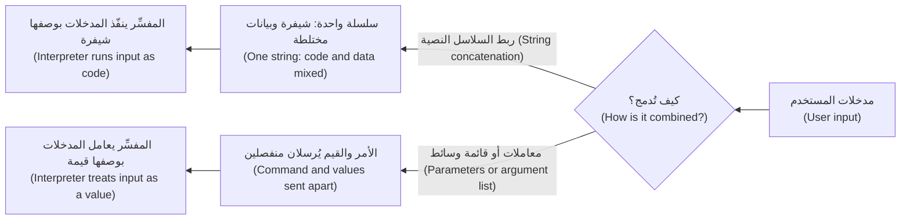
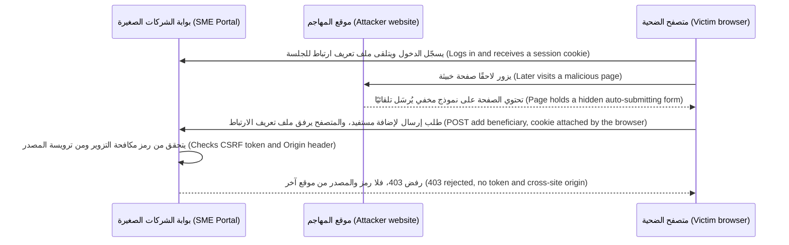
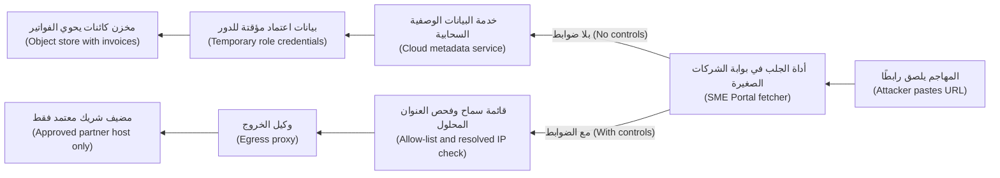

# الوحدة 2 — أمن تطبيقات الويب (Web application security)

*يلتقي معظم عملاء بنك نجم (Najm Bank)، ومعظم المهاجمين (attackers) أيضًا، بالبنك عبر صفحة ويب (web page) أو واجهة برمجة تطبيقات (API). تتناول هذه الوحدة نقاط الضعف الكلاسيكية (classic weaknesses) التي لا تزال تسبب اختراقاتٍ حقيقية (real breaches). فالحقن (Injection) بياناتٌ يُظنّ خطأً أنها شيفرة (data mistaken for code). وهجمات المتصفح (Browser attacks) تقلب الصفحة ضد مستخدميها أنفسهم (turn a page against its own users). وفخاخ جهة الخادم (Server-side traps) تخدع الخادم فيجلب شيئًا أو يخزّنه أو يفتحه أو يعيد بناءه (fetching, storing, opening or rebuilding) وما كان ينبغي له ذلك (something it should not). يشرح كل درسٍ الهجومَ بالمستوى الذي يحتاجه المدافع (at the level a defender needs)، ثم يقدّم الإصلاح نمطًا (the fix as a pattern) يمكنك فرضه في مراجعة الشيفرة (code review)، وفي الفحوص الآلية (automated checks)، وفي معيار البرمجة الآمنة (secure-coding standard). ستتابع عليًّا في أولى مراجعاته (first reviews) لبوابة الشركات الصغيرة (SME Portal)، وتقرأ نتائج الاختبار المصرَّح به (authorised test findings) التي أعدّتها مريم، وترى كيف تحوّل نورة كل ملاحظة (finding) إلى ضابطٍ يبقى ثابتًا (a control that stays fixed). وتعود الأسباب الجذرية نفسها (same root causes) في الوحدتين 8 و9: فالنموذج اللغوي الكبير (LLM) الذي يقرأ نصًّا غير موثوق (untrusted text)، أو تتدفق مخرجاته إلى متصفح أو قاعدة بيانات (flows into a browser or a database)، يرث كل درسٍ هنا (inherits every lesson here).*

> **المراحل (Phases):** Build, Test — كتابة شيفرةٍ تُبقي البيانات والتعليمات منفصلة (keeps data and instructions apart)، وإثبات ذلك بالمراجعة والاختبارات والفحص (review, tests and scanning) قبل أن يصل أي شيء إلى بيئة الإنتاج (production).

---

# 2.1 — الحقن: حقن SQL وحقن الأوامر وحقن القوالب (Injection: SQL, command and template injection)
*المستوى (Level): 🟡 متوسط (Intermediate)* · *المتطلبات (Prerequisites): 1.1، 1.2* · *المرحلة (Phase): Build, Test*

## ⚡ الدرس في دقيقة (In 60 seconds)
- يحدث **الحقن (Injection)** حين تصل مدخلاتٌ غير موثوقة (untrusted input) إلى **مفسِّر (interpreter)**، كمحرّك قاعدة بيانات (database engine) أو صدفة أوامر (shell) أو محرّك قوالب (template engine)، بوصفها جزءًا من أمر (part of a command)، فتستطيع المدخلات تغيير ما يفعله الأمر (change what the command does).
- القاعدة (The rule): **افصل الشيفرة عن البيانات (keep code and data apart)**. استخدم الاستعلامات ذات المعاملات (parameterised queries)، وشغّل البرامج بقائمة وسائط (argument list) ومن دون صدفة (no shell)، ومرّر البيانات إلى القوالب بوصفها متغيرات (as variables). ولا تبنِ الأوامر أبدًا بلصق السلاسل النصية معًا (gluing strings together).
- التهريب اليدوي (Escaping by hand)، وحظر الأحرف «السيئة» ("bad" characters)، وإخفاء الأخطاء (hiding errors) ليست إصلاحات (not fixes). والتحقق (Validation) طبقةٌ ثانية مفيدة (useful second layer)، لا الطبقة الأولى أبدًا.
- مؤشر القرار (Decision cue): نصٌّ يتحكم فيه المستخدم (user-controlled text) داخل f-string أو `+` أو قالبٍ حرفي (template literal) أو `format()`، ينتهي في `execute()` أو `system()` أو `exec()` أو `render_template_string()`.
- يحدّ مبدأ أقل الصلاحيات (Least privilege) من الضرر (limits the damage) حين يفلت خطأٌ برمجي (a bug slips through).
- أكبر فخ (Biggest trap): «نستخدم أداة ORM، إذن نحن في أمان» ("we use an ORM, so we are safe"). فمنافذ الاستعلامات الخام (raw-query escape hatches)، وأسماء الأعمدة الديناميكية (dynamic column names)، والشيفرة المولَّدة بالذكاء الاصطناعي (AI-generated code) تعيد الحقن (bring injection back).

## 🧭 لماذا يهم (Why it matters)
أول مراجعةٍ للشيفرة (code review) يجريها علي في بنك نجم هي طلب سحب (pull request) لميزة البحث في الفواتير (invoice search) الجديدة في بوابة الشركات الصغيرة (SME Portal)، بُنيت في عصر يومٍ واحد باستخدام وكيل برمجة بالذكاء الاصطناعي (AI coding agent). ويقرأ سطر الاستعلام (query line): `f"SELECT * FROM invoices WHERE company_id = {cid} AND reference = '{q}'"`. يوافق عليه علي لأن الاختبارات تنجح (the tests pass). وترفضه نورة بتعليقٍ واحد (one comment): «شغّله على حاسوبك المحمول (laptop)، واكتب `' OR '1'='1` في مربع البحث (search box)، وأخبرني فواتيرَ مَن ترى (whose invoices you see).» والجواب: فواتير كل الشركات (every company's). وفي بوابةٍ متعددة المستأجرين (multi-tenant portal) يكون هذا اختراقًا للبيانات (data breach) ينتظر أول عميلٍ فضولي (first curious customer)، وستضطر سارة، مسؤولة حماية البيانات (DPO)، إلى التعامل معه على هذا الأساس (handle it as one).

الحقن أقدم فئات الأخطاء (oldest bug class) في أمن الويب (web security)، ولم يغادر القوائم قط (never left the lists). فهو فئةٌ (category) في قائمة OWASP Top 10، إذ حمل الرمز A03 في إصدار 2021 (2021 edition)؛ وتحقّق من الإصدار الحالي (check the current edition) الذي حُدِّث عام 2025. ويتكرر حقن SQL ‏(SQL injection, CWE-89) وحقن أوامر نظام التشغيل (OS command injection, CWE-78) في قائمة CWE Top 25 الصادرة عن MITRE. وفي عام 2023 استغلّت مجموعة ابتزاز (extortion group) على نطاقٍ واسع (at scale) ثغرةَ حقن SQL ‏(SQL injection flaw) في منتج MOVEit Transfer، وهي CVE-2023-34362، وفقدت مؤسساتٌ كثيرة، بحسب ما أُعلن (as publicly reported)، ملفاتٍ من منتجٍ اشترته لا منتجٍ بنته (bought rather than built). وفي عام 2017 اختُرقت شركة Equifax عبر ثغرةٍ غير مرقَّعة (unpatched flaw) في Apache Struts، هي CVE-2017-5638، قُيِّمت فيها ترويسة HTTP مُصمَّمة خصيصًا (crafted HTTP header) بوصفها تعبيرًا (evaluated as an expression): حقنٌ مرةً أخرى (injection again)، في شيفرةٍ لم تكتبها الضحية (code the victim did not write).

## 📐 كيف يعمل (How it works)

### 🟢 الأساسيات (The essentials)

**الشيفرة والبيانات في قناةٍ واحدة (Code and data in one channel).** **المفسِّر (interpreter)** هو أي مكوّن (component) يقرأ سلسلةً نصية (string) ثم *يفعل* بها شيئًا (*does* something): فمحرّك SQL ‏(SQL engine) ينفّذ الاستعلامات (runs queries)، والصدفة (shell) تنفّذ الأوامر (runs commands)، ومحرّك القوالب (template engine) يقيّم التعبيرات (evaluates expressions). ويحدث الحقن حين يبني برنامجك تلك السلسلة بخلط تعليماته الخاصة بمدخلات شخصٍ آخر (mixing its own instructions with someone else's input). لا يستطيع المفسِّر أن يميّز الجزء الذي كتبتَه (tell which part you wrote)، فيتمكن المستخدم الذي يكتب صياغة المفسِّر (interpreter syntax) من كتابة التعليمات (gets to write instructions).



**حقن SQL ‏(SQL injection).** إليك ميزة البحث التي كتبها علي (Ali's search):

```python
# Vulnerable: input is pasted into the SQL text
q = request.args["q"]
sql = f"SELECT * FROM invoices WHERE company_id = {cid} AND reference = '{q}'"
cursor.execute(sql)
# q = "' OR '1'='1"  produces:
# ... WHERE company_id = 42 AND reference = '' OR '1'='1'   -> every row
```

```python
# Fixed: the SQL text never changes; values travel separately
sql = "SELECT * FROM invoices WHERE company_id = %s AND reference = %s"
cursor.execute(sql, (cid, q))
# The quote is now just part of a reference that matches nothing
```

يرسل **الاستعلام ذو المعاملات (parameterised query)**، أو العبارة المُعدّة مسبقًا (prepared statement)، بنيةَ الاستعلام (query structure) والقيمَ (values) منفصلتين، فلا تحلّل قاعدة البيانات القيمَ أبدًا بوصفها SQL ‏(never parses the values as SQL). وتختلف صياغة العناصر النائبة (placeholder syntax) باختلاف برنامج التشغيل (driver)، مثل `%s` و`?` و`:name`؛ أما المبدأ فلا يختلف (the principle does not).

بحسب الاستعلام والحساب (Depending on the query and the account)، يتيح حقن SQL للمهاجم قراءة بيانات المستأجرين الآخرين (other tenants' data)، أو تغيير السجلات (change records)، أو تجاوز تسجيل الدخول (bypass a login). وفي **الحقن الأعمى (blind injection)** لا يعرض التطبيق نتائج ولا أخطاء (no results or errors)، فيستنتج المهاجم الإجابات (infers answers) من فروق نعم/لا (yes/no differences) أو من التأخيرات (delays). ولهذا فإن إخفاء رسائل الخطأ (hiding error messages) ممارسةٌ صحية (hygiene)، لا إصلاح (not a fix).

**حقن أوامر نظام التشغيل (OS command injection).** تُنشئ بوابة الشركات الصغيرة صورًا مصغّرة (thumbnails) للصور المرفوعة (uploaded images) باستخدام أداة سطر أوامر (command-line tool).

```python
# Vulnerable: the user's filename goes through a shell
os.system(f"convert uploads/{filename} -resize 200x200 thumbs/{filename}.png")
# A filename such as  x.png; whoami  runs a second command
```

```python
# Safer: server-generated names, an argument list, no shell
file_id = uuid.uuid4().hex            # the user's filename never reaches the command
src, dst = UPLOADS / f"{file_id}.png", THUMBS / f"{file_id}.png"
subprocess.run(["convert", str(src), "-resize", "200x200", str(dst)],
               shell=False, check=True, timeout=30)
```

مع `shell=False` وقائمة (a list)، يصل كل عنصرٍ إلى البرنامج وسيطًا واحدًا (one argument)؛ ولا تعني `;` و`|` و`$(...)` شيئًا لأنه لا صدفة تفسّرها (no shell interprets them). والأفضل من ذلك (Better still) أن تستخدم مكتبةً (library) فلا يُبنى أي أمرٍ على الإطلاق (no command is built at all). وفي Node.js، فضّل `execFile` أو `spawn` مع مصفوفة وسائط (argument array) على `exec`، الذي يشغّل صدفة (runs a shell).

**حقن القوالب من جهة الخادم (Server-side template injection, SSTI).** لمحركات القوالب (Template engines)، مثل Jinja2 وTwig وFreemarker وغيرها، لغاتُ تعبير (expression languages) تستطيع، في كثيرٍ من المحركات، الوصول إلى كائناتٍ قوية على الخادم (powerful objects on the server). ويحدث SSTI حين تصبح مدخلات المستخدم جزءًا من *القالب* (*template*) بدلًا من أن تكون *قيمةً تُمرَّر إليه* (*value passed into it*).

```python
# Vulnerable: user input is concatenated into the template source
return render_template_string("<p>Welcome, " + display_name + "</p>")
# display_name = "{{7*7}}" renders "Welcome, 49": the engine evaluated it

# Fixed: the template is constant; the name is data
return render_template_string("<p>Welcome, {{ name }}</p>", name=display_name)
# Renders "Welcome, {{7*7}}" as text, auto-escaped
```

مجسّ الاختبار (probe) `{{7*7}}` هو الاختبار الكلاسيكي غير المؤذي (classic harmless test): إذا عرضت الصفحة `49`، فإن المدخلات تُقيَّم (input is being evaluated). وفي محركاتٍ مثل Jinja2 قد يؤدي ذلك إلى تنفيذ شيفرةٍ على الخادم (code execution on the server)، فتعامل مع SSTI بالجدية نفسها التي تتعامل بها مع حقن الأوامر (as seriously as command injection).

| المفسِّر (Interpreter) | النمط الضعيف (Vulnerable pattern) | النمط الآمن (Safe pattern) |
|---|---|---|
| قاعدة بيانات SQL ‏(SQL database) | استعلامٌ مبنيٌّ بالسلاسل النصية (String-built query) | استعلامٌ ذو معاملات (Parameterised query)؛ وقائمة سماح (allow-list) للمعرّفات (identifiers) |
| قاعدة بيانات المستندات (Document database)، مثل MongoDB | JSON الطلب يُمرَّر مباشرةً إلى استعلام (Request JSON passed straight into a query) | أنواعٌ يُتحقَّق منها بمخطط (Schema-validated types)؛ ورفض المفاتيح (reject keys) التي تبدأ بـ `$` |
| صدفة نظام التشغيل (OS shell) | `os.system`، و`shell=True`، و`exec` في Node | استدعاء مكتبة (Library call)، أو قائمة وسائط بلا صدفة (argument list without a shell) |
| محرّك القوالب (Template engine) | مدخلاتٌ مربوطةٌ بمصدر القالب (Input concatenated into template source) | قوالب ثابتة (Constant templates)؛ والمدخلات تُمرَّر بوصفها متغيرات (passed as variables) |

### 🟡 التعمق أكثر (Going deeper)

**ما لا يمكنك تمريره معاملًا (What you cannot parameterise).** تعمل العناصر النائبة (Placeholders) مع القيم (values)، لا مع **المعرّفات (identifiers)**، أي أسماء الجداول والأعمدة (table and column names)، ولا مع الكلمات المفتاحية (keywords) مثل `DESC`. اربط اختيار المستخدم بقيمةٍ من قائمة سماح (Map the user's choice through an allow-list):

```python
SORTS = {"date": "issued_at", "amount": "amount_qar", "status": "status"}
column = SORTS.get(request.args.get("sort"), "issued_at")    # unknown -> default
direction = "DESC" if request.args.get("dir") == "desc" else "ASC"
sql = f"SELECT * FROM invoices WHERE company_id = %s ORDER BY {column} {direction}"
cursor.execute(sql, (cid,))
```

لا تكون f-string هنا آمنةً إلا لأن كل قيمةٍ ممكنة تأتي من الشيفرة (every possible value comes from the code)؛ ومع ذلك ينبغي للمراجعين (reviewers) التحقق من هذا الادعاء (check that claim).

**أدوات ORM آمنة إلى أن تغادرها (ORMs are safe until you leave them).** تبني **أداة الربط الكائني العلائقي (object-relational mapper, ORM)**، مثل SQLAlchemy أو Django ORM أو Prisma، استعلاماتِ SQL ذات معاملات (parameterised SQL) نيابةً عنك. ويعود الحقن عبر ميزات SQL الخام (raw-SQL features)، مثل `raw()` و`text()` و`$queryRawUnsafe`، حين تُنسَّق المدخلات داخل السلسلة النصية (input is formatted into the string)؛ فاستخدم بدلًا من ذلك ربط المعاملات الخاص بها (their own parameter binding). والإجراءات المخزَّنة (Stored procedures) آمنةٌ فقط إذا لم تربط SQL ديناميكيًا في داخلها (do not concatenate dynamic SQL inside).

**الحقن من الدرجة الثانية (Second-order injection).** يُدرَج اسم شركةٍ يحتوي على علامة اقتباس (a quote) بأمانٍ باستخدام المعاملات (inserted safely with parameters). وبعد أشهر، يربط تقريرٌ ليلي (nightly report) أسماء الشركات داخل استعلامٍ فينكسر (breaks)، أو يُخترَق (is subverted). استخدم المعاملات في كل استعلام (Parameterise every query)، بما في ذلك الاستعلامات التي تُغذّى من «قاعدة بياناتنا نحن» ("our own database").

**حقن عوامل NoSQL ‏(NoSQL operator injection).** تسجيل الدخول (login) الذي يمرّر جسم الطلب (request body) مباشرةً إلى `users.find({"email": body.email, "password": body.password})` يُخفق أمنيًا (fails) إذا وصل `password` بوصفه كائن JSON ‏(JSON object) هو `{"$ne": null}`، أي «لا يساوي null» ("not equal to null")، وهو ما يطابق أي كلمة مرور (matches any password). تحقّق من أن كل حقلٍ سلسلةٌ نصية بالشكل المتوقع (a string of the expected shape)، وارفض المفاتيح التي تبدأ بـ `$`، وهذا هو CWE-943. والأفضل من ذلك أن تبحث عن المستخدم (look the user up) وتتحقق من تجزئة كلمة المرور (verify the password hash) في الشيفرة، كما في الدرس 3.1.

**التحقق هو الطبقة الثانية (Validation is the second layer).** التحقق بقائمة السماح (Allow-list validation)، كأن يتكون مرجع الفاتورة (invoice reference) من 6 إلى 20 حرفًا ورقمًا وشَرطة (letters, digits and dashes)، و**جدار حماية تطبيقات الويب (web application firewall, WAF)**، وهو مرشِّحٌ أمام التطبيق يحظر أنماط الهجوم المعروفة (a filter in front of the app that blocks known attack patterns)، كلاهما من الدفاع المتعدد الطبقات (defence in depth)، كما في الدرس 1.2، وليسا بديلًا عن المعاملات (not substitutes for parameters). فالقيم المشروعة (Legitimate values) تحتوي على أحرفٍ «خطِرة» ("dangerous" characters)، مثل O'Brien و"Al-Noor & Sons"، ويمكن تجاوز المرشِّحات بالترميزات (filters can be bypassed with encodings).

**كيف تجده (How you find it)**، دائمًا على شيفرةٍ وأنظمةٍ تملكها (code and systems you own): تُبرز أدوات **التحليل الثابت (static analysis, SAST)**، مثل Semgrep أو CodeQL، الاستعلاماتِ المبنية بالسلاسل النصية (string-built queries) والصدفات (shells) والقوالب الديناميكية (dynamic templates) في كل طلب سحب (pull request) ضمن خط التكامل المستمر (continuous-integration pipeline, CI)، كما في الدرس 6.1؛ ويستخدم المراجعون قائمة تحقق (checklist)، انظر 🏛️؛ ويرسل **الاختبار الديناميكي (dynamic testing, DAST)** مدخلاتٍ عدائية (hostile inputs) إلى بيئة اختبارٍ قيد التشغيل (running test environment)؛ وتمنع اختبارات الوحدات (unit tests) ذات المدخلات العدائية الإصلاحاتِ من التراجع (stop fixes regressing).

### 🔴 نظرة الخبير (Expert view)

**المفسِّرات تختبئ حيث لا تتوقعها (Interpreters hide where you do not expect them).** كانت Log4Shell، أي CVE-2021-44228 في ديسمبر 2021، مكتبةَ تسجيل (logging library) تقيّم تعابير البحث (lookup expressions) داخل النص المسجَّل (logged text)، فكان أي ترويسةٍ أو اسم مستخدمٍ يُسجَّل (logged header or username) قادرًا على جعل الخادم يجلب شيفرةً بعيدة وينفّذها (fetch and run remote code). وثغرة Struts التي كانت وراء اختراق Equifax ‏(Equifax breach) قيّمت لغة تعبير (expression language)، هي OGNL، من ترويسة طلب (request header). أنت ترث هذه الأخطاء (You inherit these bugs)، ولذلك فإن جرد الاعتماديات (dependency inventory) وسرعة الترقيع (patching speed) من ضوابط الحقن أيضًا (injection controls too)، كما في الدرسين 6.2 و10.3. وأقرب إلينا (Closer to home)، قد تُنفَّذ خليةٌ في ملف تصدير CSV ‏(CSV export cell) تبدأ بـ `=` أو `+` أو `-` أو `@` أو بحرف جدولة (tab) أو بإرجاع عربة (carriage return) بوصفها صيغة (run as a formula) حين يفتح مديرٌ مالي (finance manager) الملف، وهذا هو **حقن CSV أو الصيغ (CSV or formula injection)**؛ فحيِّد هذه الخلايا (neutralise such cells) باتباع إرشادات OWASP الحالية (OWASP's current guidance).

**لحقن الموجّهات السبب الجذري نفسه ولا إصلاح مكافئًا له (Prompt injection has the same root cause and no equivalent fix).** يتلقى النموذج اللغوي الكبير (LLM) التعليمات والنص غير الموثوق (instructions and untrusted text) في تيارٍ واحد من الرموز (one stream of tokens)، وهو بالضبط الخلط الذي يحذّر منه هذا الدرس (exactly the mixing this lesson warns against)، ولا يوجد استعلامٌ ذو معاملات للموجّهات (no parameterised query for prompts). لهذا تدافع الوحدتان 8 و9 بالمعمارية لا بالمرشِّحات (with architecture rather than filters). أما الاتجاه المعاكس (The reverse direction) فهو حقنٌ صريح (plain injection): فاستعلامات SQL أو الأوامر أو القوالب التي يكتبها النموذج (model-written SQL, commands or templates) مدخلاتٌ غير موثوقة (untrusted input)، وهي الفئة LLM05 المعالجة غير السليمة للمخرجات (LLM05 Improper Output Handling) في قائمة OWASP Top 10 for LLM Applications، إصدار 2025. تشغّل أداة «البحث عن الرسوم» ("look up fees") في نجم أسيست (Najm Assist) استعلامًا ثابتًا ذا معاملات (fixed, parameterised query) برمز رسوم (fee code)؛ ولا تنفّذ أبدًا SQL كتبه النموذج (never executes model-written SQL). وأي ميزةٍ مستقبلية لتحويل النص إلى SQL ‏(text-to-SQL feature) ستعمل على نسخةٍ متماثلة للقراءة فقط (read-only replica)، وعلى عروضٍ مقيَّدة (restricted views)، وبحدودٍ لعدد الصفوف (row limits).

**وكلاء البرمجة بالذكاء الاصطناعي يكرّرون ما رأوه (AI coding agents repeat what they have seen).** حين يُطلب منها ذلك عَرَضًا (Asked casually)، كثيرًا ما تنتج مساعدات البرمجة (coding assistants) استعلاماتٍ مبنية بالسلاسل النصية (string-built queries) و`shell=True`، لأن كليهما شائعٌ في الشيفرة العامة (common in public code). يكتب بنك نجم قواعد الحقن الخاصة به (injection rules) في ملفات تعليمات الوكلاء (agents' instruction files) *ويفرضها أيضًا* (*and* enforces them) بالتحليل الثابت (SAST) في خط التكامل المستمر (CI)، فتُلتقط القاعدة التي يتجاهلها الوكيل رغم ذلك (a rule the agent ignores is still caught)، كما في الدرس 6.3.

**صمِّم للخطأ الذي فاتك (Design for the bug you missed).** امنح كل خدمةٍ حساب قاعدة بيانات خاصًّا بها (its own database account) بالصلاحيات التي تحتاجها فقط (only the grants it needs)، ولا تمنحها أبدًا صلاحيات المالك (owner rights)، وعطّل ميزات قاعدة البيانات الخطِرة (dangerous database features): أوامر نظام التشغيل (OS commands)، وقراءة الملفات (file reads)، والاتصالات الشبكية (network calls). وافرض عزل المستأجرين (tenant isolation) مرةً ثانية داخل قاعدة البيانات (inside the database)، مثلًا باستخدام **أمان مستوى الصف (row-level security, RLS)** في PostgreSQL، كما في الدرس 3.3. واحظر حركة المرور الصادرة (outbound traffic) من مضيفات قواعد البيانات (database hosts)، وأطلق التنبيهات (alert) عند أخطاء الاستعلامات (query errors) ومجموعات النتائج الكبيرة على نحوٍ غير معتاد (unusually large result sets)، كما في الدرس 10.1.

## 🧰 الأدوات (The toolkit)
| الضابط أو المعيار أو الأداة (Control, standard or tool) | ما هو وماذا يفعل (What it is and does) | متى تلجأ إليه (When to reach for it) |
|---|---|---|
| **Parameterised queries** — الاستعلامات ذات المعاملات | ترسل بنية SQL والقيم منفصلةً (SQL structure and values separately)، فلا تُحلَّل المدخلات أبدًا بوصفها SQL ‏(never parsed as SQL) | كل استعلام، بما في ذلك المهام الداخلية والدفعية (internal and batch jobs) |
| **Allow-list validation** — التحقق بقائمة السماح | لا يقبل إلا القيم المعروفة السليمة (known-good values)؛ ويربط اختيارات المستخدم بقيمٍ تملكها الشيفرة (code-owned values) | المعرّفات (Identifiers)، وترتيبات الفرز (sort orders)، وأنواع الملفات (file types)، وأي مدخلات ذات شكلٍ معروف (known shape) |
| **Shell-free command execution** — تنفيذ الأوامر بلا صدفة | استدعاء مكتبة (Call a library)، أو تشغيل برنامجٍ بقائمة وسائط ومن دون صدفة (argument list and no shell) | كلما لجأت الشيفرة إلى `system()` أو `exec()` أو `shell=True` |
| **Logic-less templates** — القوالب الخالية من المنطق | قوالب لا تفعل سوى استبدال عناصر نائبة مدرجة في قائمة السماح (allow-listed placeholders) | كل ما يستطيع المستخدمون تحريره (Anything users can edit): رسائل البريد الإلكتروني (emails) والإشعارات (notifications) |
| **Least-privilege database accounts** — حسابات قواعد البيانات بأقل الصلاحيات | حسابٌ واحد لكل خدمة (One account per service) بالصلاحيات التي تحتاجها فقط (only the grants it needs) | كل خدمة؛ ويحدّ من ضرر الخطأ الذي فات (limits the damage of a missed bug) |
| **Semgrep** — أداة تحليلٍ ثابت مفتوحة المصدر (open-source static analysis) | قواعد أنماط (Pattern rules) تُبرز الاستعلامات المبنية بالسلاسل النصية والصدفات والقوالب الديناميكية (string-built queries, shells and dynamic templates) | في خط التكامل المستمر (CI) على كل طلب سحب (pull request)؛ وتدقيق الشيفرة الموجودة (auditing existing code) |
| **OWASP Cheat Sheet Series** — سلسلة أوراق OWASP المختصرة | أدلةٌ وقائية موجزة ومجانية (Concise, free prevention guides) لكل نقطة ضعف (per weakness) | كتابة إصلاحٍ أو مراجعته (Writing or reviewing a fix)؛ وتدريب المطورين (training developers) |
| **OWASP ASVS** — معيار التحقق من أمان التطبيقات (Application Security Verification Standard)، الإصدار v5.0 | متطلباتٌ أمنية قابلة للاختبار (Testable security requirements)، ومنها الترميز والتعقيم (encoding and sanitisation) | تحديد المتطلبات الأمنية لتطبيقٍ ما (Setting an application's security requirements) |

## 🏛️ عمليًا في بنك نجم (In practice at Najm Bank)
تحوّل نورة الحادثة الوشيكة (near-miss) التي وقع فيها علي إلى **معيار البرمجة الآمنة SC-02: الحقن (Secure Coding Standard SC-02: Injection)**، الإصدار 1. وهو ينطبق على كل شيفرة بنك نجم (all Najm Bank code)، سواءٌ كتبها شخص (a person) أو وكيل برمجة بالذكاء الاصطناعي (AI coding agent).

| المعرّف (ID) | القاعدة (Rule) | النمط المطلوب (Required pattern) | ممنوع أبدًا (Never) | يُتحقَّق منه عبر (Checked by) |
|---|---|---|---|---|
| INJ-1 | يستخدم SQL معاملات الربط (bind parameters)؛ وتأتي المعرّفات (identifiers) من خريطةٍ تملكها الشيفرة (code-owned map) | العناصر النائبة (Placeholders)؛ و`SORTS.get(choice, default)` | أي SQL مبنيٍّ بالسلاسل النصية (string-built SQL)، حتى مع قيمٍ «داخلية» ("internal" values) | Semgrep في خط التكامل المستمر (CI)، بصورةٍ مانعة (blocking)؛ والمراجعة (review) |
| INJ-2 | لا صدفات (No shells) | استدعاء مكتبة (Library call)، أو قائمة وسائط (argument list) مع `shell=False` / `execFile` | `os.system`، و`shell=True`، و`exec` في Node | Semgrep، بصورةٍ مانعة (blocking) |
| INJ-3 | القوالب ثابتة (Templates are constant)؛ والبيانات تُمرَّر بوصفها متغيرات (passed as variables) | ملفات قوالب مع متغيرات سياق (Template files plus context variables) | عرض سلسلة قالبٍ مبنية من المدخلات (Rendering a template string built from input) | Semgrep؛ والمراجعة (review) |
| INJ-4 | القوالب التي يحررها المستخدم خاليةٌ من المنطق (User-editable templates are logic-less) | عناصر نائبة مدرجة في قائمة السماح (Allow-listed placeholders) مثل `{company_name}` | محرّك قوالب كامل (full template engine) مكشوفٌ للعملاء (exposed to customers) | مراجعة تصميم أمن التطبيقات (AppSec design review) |
| INJ-5 | يُتحقَّق من مدخلات قاعدة بيانات المستندات بمخطط (Document-database input is schema-validated)؛ والتصديرات تحيّد الصيغ (exports neutralise formulas) | فحوص الأنواع (Type checks)، ولا مفاتيح `$`؛ وخلايا الصيغ مسبوقةٌ ببادئة (prefixed formula cells) | كائنات الطلب الخام في الاستعلامات (Raw request objects in queries) | اختبارات الوحدات (Unit tests) |
| INJ-6 | مخرجات النموذج والأدوات مدخلاتٌ غير موثوقة (Model and tool output is untrusted input) | استعلاماتٌ ثابتة ذات معاملات (Fixed, parameterised queries) خلف أدواتٍ ضيقة (narrow tools) | تنفيذ SQL أو أوامر صدفة أو قوالب كتبها النموذج (Executing model-written SQL, shell or templates) | مراجعة تصميم الذكاء الاصطناعي (AI design review)، الدرس 9.1 |
| INJ-7 | لكل خدمةٍ حساب قاعدة بيانات خاصٌّ بها بأقل الصلاحيات (its own least-privilege database account) | للقراءة فقط حيثما أمكن (Read-only where possible)؛ وأمان مستوى الصف (RLS) لبيانات المستأجرين (tenant data) | الحسابات الإدارية المشتركة (Shared admin accounts) | مراجعة الوصول الفصلية (Quarterly access review) |

**قائمة تحقق المراجعة (Review checklist)، وهي موجودة في كل قالب طلب سحب (in every pull-request template):**
1. هل تصل أي مدخلاتٍ من مستخدم أو ملف أو واجهة برمجة أو نموذج (user, file, API or model input) إلى استعلام أو أمر أو قالب (query, command or template)؟
2. هل تُمرَّر بوصفها معاملًا أو وسيطًا (parameter or argument)، مع معرّفاتٍ من قائمة سماح (identifiers from an allow-list)؟
3. هل يثبت اختبارٌ بمدخلاتٍ عدائية (test with a hostile input)، مثل `' OR '1'='1` و`; whoami` و`{{7*7}}`، أنها تُعامَل بوصفها بيانات (treated as data)؟
4. هل يملك حساب قاعدة البيانات الخاص بالخدمة (service's database account) صلاحياتٍ أكثر مما تحتاجه هذه الميزة (more rights than this feature needs)؟

تحتاج الاستثناءات (Exceptions) إلى موافقةٍ مكتوبة من نورة (Noura's written approval)، وضابطٍ تعويضي (compensating control)، وتاريخ انتهاء (expiry) لا يتجاوز 90 يومًا.

## 🛠️ التمارين (Exercises)
لا يُجرى العمل التطبيقي (Hands-on work) إلا على جهازك الخاص (your own machine)، على شيفرتك أو على تطبيقات تدريبٍ ضعيفة عمدًا (deliberately vulnerable training apps) مثل OWASP Juice Shop أو OWASP WebGoat.

- 🟢 ابنِ تطبيقًا محليًا صغيرًا (tiny local app)، مثلًا بلغة Python وقاعدة SQLite، يضم فواتير لشركتين (invoices for two companies) وميزة بحثٍ مكتوبة بالطريقة الضعيفة (written the vulnerable way). أثبت أن `' OR '1'='1` يعيد صفوف الشركتين كلتيهما (both companies' rows)، ثم أصلحه باستعلامٍ ذي معاملات (parameterised query) وأضف اختبار وحدة (unit test). *يكتمل عندما (Done when):* تعيد المدخلات كل الصفوف قبل الإصلاح ولا شيء بعده (every row before the fix and none after)، ويفشل الاختبار على الشيفرة القديمة وينجح على الجديدة (fails on the old code and passes on the new).
- 🟡 شغّل Semgrep، أو أداة SAST التي يستخدمها فريقك (your team's SAST tool)، بقواعد الحقن (injection rules) على مستودعٍ تملكه (repository you own)، وصنّف كل نتيجة (triage each finding) إيجابيةً صحيحة أو إيجابيةً كاذبة (true or false positive) مع سببٍ في سطرٍ واحد (one-line reason). *يكتمل عندما (Done when):* تُصلَح كل إيجابيةٍ صحيحة أو تُفتح لها تذكرة (fixed or ticketed)، وتعمل القاعدة في خط التكامل المستمر (CI) وتُفشل البناء (fails the build) عند ظهور نتائج جديدة (new findings).
- 🔴 ابنِ محليًا (locally) ميزة «إشعار البريد الإلكتروني المخصّص» ("custom email notification") في بوابة الشركات الصغيرة، بعناصر نائبة خالية من المنطق ومدرجة في قائمة السماح (logic-less, allow-listed placeholders) وقيمٍ مهرَّبة بترميز HTML ‏(HTML-escaped values). ثم أكمل تحدّي حقنٍ واحدًا (one injection challenge) في نسخةٍ محلية من Juice Shop أو WebGoat، واكتب مذكرة المدافع (defender's note): السبب الجذري (root cause)، والإصلاح (fix)، والاختبار الذي كان سيلتقطه (the test that would have caught it)، وإشارة السجل (log signal) التي تتركها المحاولة. *يكتمل عندما (Done when):* يُعرض `{{7*7}}` و`<b>` المكتوبان في قالبٍ نصًّا حرفيًا (literal text)، ويظهر اسم شركةٍ يحتوي على `<script>` مهرَّبًا (appears escaped)، ويُرفض عنصرٌ نائب غير معروف (unknown placeholder) مثل `{password_hash}`، وتتسع المذكرة في صفحةٍ واحدة (fits on one page).

## ⚠️ أخطاء وفخاخ (Mistakes and traps)
- **التهريب أو الحظر اليدوي (Escaping or blocklisting by hand).** يفشل أمام الترميزات (fails against encodings) ويكسر أسماءً مثل O'Brien. استخدم المعاملات وقوائم الوسائط (parameters and argument lists).
- **«إنها تأتي من قاعدة بياناتنا نحن» ("It comes from our own database").** تحمل البيانات المخزّنة (Stored data) هجوم الأمس إلى استعلام اليوم (yesterday's attack into today's query). استخدم المعاملات في كل استعلام (Parameterise every query).
- **الثقة العمياء بأداة ORM ‏(Trusting the ORM blindly).** اعثر على كل استدعاء استعلامٍ خام (raw-query call) وراجعه.
- **إخفاء الأخطاء واعتبار المشكلة محلولة (Hiding errors and calling it fixed).** لا يحتاج الحقن الأعمى (Blind injection) إلى رسائل خطأ. أصلح الاستعلام (Fix the query).
- **تنفيذ الاستعلامات أو الأوامر التي يكتبها النموذج (Running model-written queries or commands).** امنح النموذج أدواتٍ ضيقة (narrow tools) تنفّذ عملياتٍ ثابتة (fixed operations)، كما في الدرس 9.2.

## 🧾 الخلاصة (Recap)
- الحقن هو وصول مدخلاتٍ غير موثوقة إلى مفسِّرٍ بوصفها جزءًا من أمر (untrusted input reaching an interpreter as part of a command)؛ فأبقِ الشيفرة والبيانات في قناتين منفصلتين (separate channels).
- SQL: المعاملات (parameters)، مع قوائم السماح للمعرّفات (allow-lists for identifiers). الصدفات (Shells): المكتبات أو قوائم الوسائط (libraries or argument lists). القوالب (Templates): ثابتة، والبيانات متغيرات (constant, with data as variables)؛ وخالية من المنطق (logic-less) لكل ما يحرره المستخدمون.
- التحقق (Validation)، وإخفاء الأخطاء (error hiding)، وجدران حماية تطبيقات الويب (WAFs) طبقاتٌ مفيدة (useful layers)، لكنها ليست الإصلاح أبدًا (never the fix).
- تختبئ المفسِّرات أيضًا في أدوات التسجيل (loggers)، ولغات التعبير في أطر العمل (framework expression languages)، وجداول البيانات (spreadsheets)، ولذلك فإن الترقيع (patching) ضابطٌ للحقن أيضًا (injection control too).
- يشترك حقن الموجّهات (Prompt injection) في السبب الجذري (root cause) لكن لا إصلاح له بالمعاملات (no parameterised fix)؛ فتعامل مع مخرجات النموذج بوصفها مدخلاتٍ غير موثوقة (treat model output as untrusted input).
- تحدّ الحسابات ذات أقل الصلاحيات (Least-privilege accounts) وعزل المستأجرين داخل قاعدة البيانات (in-database tenant isolation) من أثر الحقن الذي فاتك (the injection you missed).

## ✍️ اختبر نفسك (Check yourself)

**1. يجد علي `cursor.execute(f"SELECT * FROM invoices WHERE reference = '{ref}'")` في بوابة الشركات الصغيرة (SME Portal). ويقترح زميلٌ في الفريق (teammate) استبدال كل `'` في `ref` بـ `''` قبل تنفيذ الاستعلام. بماذا ينبغي أن يوصي علي (What should Ali recommend)؟**

- A. قبول التغيير، لأن مضاعفة علامات الاقتباس (doubling quotes) هي طريقة SQL في تهريبها (how SQL escapes them)
- B. استخدام استعلامٍ ذي معاملات (parameterised query)، مع تمرير `ref` معاملًا (as a parameter)
- C. إضافة قاعدة WAF ‏(WAF rule) تحظر الطلبات التي تحتوي على `OR`
- D. إخفاء رسائل خطأ قاعدة البيانات (database error messages) عن المستخدمين

<details><summary>الإجابة</summary>

**B.** تُبقي المعاملات البنيةَ والقيمةَ منفصلتين (keep structure and value apart)، فلا تستطيع أي مدخلاتٍ تغيير الاستعلام (no input can change the query). الخيار A تهريبٌ يدوي هشّ (fragile hand-escaping)؛ وC وD طبقاتٌ جزئية (partial layers) تلتفّ عليها الهجمات المرمَّزة أو العمياء (encoded or blind attacks). انظر: 🟢 الأساسيات (The essentials).

</details>

**2. تتيح قائمة الفواتير (invoice list) للمستخدمين الفرز (sort) حسب التاريخ أو المبلغ أو الحالة (date, amount or status)، ويصل اسم العمود (column name) في الطلب. والعناصر النائبة (Placeholders) لا تعمل مع أسماء الأعمدة. ما النهج الآمن (safe approach)؟**

- A. إحاطة اسم العمود بعلامات اقتباس (Wrap the column name in quotes) قبل إضافته إلى الاستعلام
- B. ربط اختيار المستخدم عبر قائمة سماحٍ تملكها الشيفرة (code-owned allow-list)، والرجوع إلى قيمةٍ افتراضية (fall back to a default) لأي شيءٍ آخر
- C. حذف المسافات والفواصل المنقوطة (Strip spaces and semicolons) من المدخلات
- D. ترك القرار لأداة ORM ‏(Let the ORM decide)

<details><summary>الإجابة</summary>

**B.** حين لا يمكن تمرير قيمةٍ معاملًا (cannot be parameterised)، يجب أن تأتي كل قيمةٍ ممكنة من الشيفرة (from the code)، لا من المستخدم أبدًا. الخيار C قائمة حظر (blocklist)، وA لا يزال يتيح للمستخدم توجيه الاستعلام (steer the query). انظر: 🟡 التعمق أكثر (Going deeper).

</details>

**3. يكتب مسؤولٌ في إحدى الشركات (company admin) `{{7*7}}` في حقل «رسالة الترحيب» ("welcome message") في بوابة الشركات الصغيرة، فتعرض المعاينة (preview) «49». ماذا يُظهر هذا، وما الإصلاح الصحيح (right fix)؟**

- A. ميزة آلةٍ حاسبة غير مؤذية (harmless calculator feature)؛ ولا حاجة إلى أي إجراء (no action needed)
- B. البرمجة النصية عبر المواقع (Cross-site scripting)؛ أضف سياسة أمان المحتوى (Content Security Policy)
- C. حقن القوالب من جهة الخادم (Server-side template injection)؛ اعرض قالبًا ثابتًا يتلقى الرسالة متغيرًا (constant template that receives the message as a variable)، أو استخدم عناصر نائبة خالية من المنطق (logic-less placeholders)
- D. حقن SQL ‏(SQL injection)؛ استخدم المعاملات في الاستعلام (parameterise the query)

<details><summary>الإجابة</summary>

**C.** قيّم المحرّك المدخلات بوصفها شيفرة قالب (evaluated input as template code)، وهو ما قد يؤدي إلى تنفيذ شيفرةٍ على الخادم (code execution on the server). يعامل الخيار B المسألة بوصفها مشكلة متصفح (browser problem)، لكن التقييم يحدث على الخادم (happens on the server). انظر: 🟢 الأساسيات (The essentials).

</details>

**4. تبني مهمةٌ ليلية (nightly job) لدى شركة تجزئة (retailer) استعلامَ تقرير (report query) بربط أسماء العملاء (concatenating customer names) المقروءة من قاعدة بياناتها نفسها. وقد أُدرجت الأسماء كلها باستعلاماتٍ ذات معاملات (parameterised queries). هل هناك خطر حقن (injection risk)؟**

- A. لا، لأن البيانات جاءت من قاعدة بيانات الشركة نفسها (company's own database)
- B. لا، لأن عمليات الإدراج (inserts) استخدمت المعاملات (were parameterised)
- C. نعم: قد تحتوي البيانات المخزّنة على صياغة مفسِّر (interpreter syntax)، فيجب أن يستخدم استعلام التقرير المعاملات أيضًا، وهذا هو الحقن من الدرجة الثانية (second-order injection)
- D. فقط إذا كانت المهمة تعمل بصلاحيات مسؤول (runs as an administrator)

<details><summary>الإجابة</summary>

**C.** خزّن الإدراج ذو المعاملات (parameterised insert) النصَّ العدائي بأمان (stored the hostile text safely)؛ لكنه لم يجعله آمنًا لكل استخدامٍ لاحق (every later use). الخيار A هو الافتراض الخاطئ الكلاسيكي (classic false assumption)؛ وD يخلط بين مدى سوء الخطأ (how bad the bug is) ووجوده من عدمه (whether it exists). انظر: 🟡 التعمق أكثر (Going deeper).

</details>

**5. تقترح رانيا أن يجيب نجم أسيست (Najm Assist) عن سؤال «كم أنفقتُ على الوقود الشهر الماضي؟» ⁦("how much did I spend on fuel last month?")⁩ بأن يكتب النموذج SQL تنفّذه الواجهة الخلفية (backend). ما التصميم الأكثر قابليةً للدفاع عنه (most defensible design)؟**

- A. تنفيذ SQL الذي يكتبه النموذج على قاعدة بيانات الإنتاج (production database)، لأن موجّه النظام (system prompt) يطلب من النموذج ألّا يكتب إلا عبارات SELECT ‏(SELECT statements)
- B. منح المساعد أداةً ضيقة (narrow tool) تنفّذ استعلام إنفاقٍ ثابتًا ذا معاملات (fixed, parameterised spending query) للعميل المسجِّل دخوله (logged-in customer)، على ألّا يقدّم النموذج سوى معاملاتٍ متحقَّقٍ منها (validated parameters) مثل الفئة والشهر (category and month)
- C. تصفية SQL الذي يكتبه النموذج (Filter the model's SQL) بحثًا عن الكلمتين DROP وDELETE (for the words DROP and DELETE)
- D. مطالبة النموذج بمراجعة SQL الخاص به مرةً أخرى (double-check its SQL) قبل تنفيذه

<details><summary>الإجابة</summary>

**B.** مخرجات النموذج مدخلاتٌ غير موثوقة (Model output is untrusted input)؛ والاستعلام الثابت ذو المعاملات المتحقَّق منها (fixed query with validated parameters) يُبقي الشيفرة والبيانات منفصلتين ويحصر الوصول في العميل (scopes access to the customer). يعتمد الخيار A على تعليماتٍ يستطيع حقن الموجّهات تجاوزها (instructions prompt injection can override)؛ وC قائمة حظر (blocklist)؛ وD يطلب من المكوّن غير الموثوق أن يراقب نفسه (asks the untrusted component to police itself). انظر: 🔴 نظرة الخبير (Expert view).

</details>

## 📚 المراجع (References)
- قائمة OWASP Top 10، إصدار 2021، فئة الحقن (Injection)؛ وتحقّق من الإصدار الحالي (check the current edition) — https://owasp.org/Top10/
- سلسلة OWASP Cheat Sheet Series، ورقة الوقاية من حقن SQL ‏(SQL Injection Prevention) — https://cheatsheetseries.owasp.org/cheatsheets/SQL_Injection_Prevention_Cheat_Sheet.html
- سلسلة OWASP Cheat Sheet Series، ورقة الدفاع ضد حقن أوامر نظام التشغيل (OS Command Injection Defense) — https://cheatsheetseries.owasp.org/cheatsheets/OS_Command_Injection_Defense_Cheat_Sheet.html
- OWASP، صفحة حقن CSV ‏(CSV Injection) — https://owasp.org/www-community/attacks/CSV_Injection
- معيار OWASP للتحقق من أمان التطبيقات (OWASP Application Security Verification Standard, ASVS) — https://owasp.org/www-project-application-security-verification-standard/
- MITRE CWE-89، حقن SQL ‏(SQL injection) — https://cwe.mitre.org/data/definitions/89.html
- MITRE CWE-78، حقن أوامر نظام التشغيل (OS command injection) — https://cwe.mitre.org/data/definitions/78.html
- MITRE CWE-1336، الحقن في محركات القوالب (injection into template engines) — https://cwe.mitre.org/data/definitions/1336.html
- قاعدة البيانات الوطنية للثغرات (National Vulnerability Database) لدى NIST، الثغرة CVE-2023-34362 في MOVEit Transfer — https://nvd.nist.gov/vuln/detail/CVE-2023-34362
- قائمة OWASP Top 10 for LLM Applications، إصدار 2025 (2025 version) — https://genai.owasp.org/
- OWASP Juice Shop — https://owasp.org/www-project-juice-shop/
- OWASP WebGoat — https://owasp.org/www-project-webgoat/

---

# 2.2 — هجمات المتصفح: XSS وCSRF والترويسات التي توقفها (Browser attacks: XSS, CSRF, and the headers that stop them)
*المستوى (Level): 🟡 متوسط (Intermediate)* · *المتطلبات (Prerequisites): 2.1* · *المرحلة (Phase): Build, Test*

## ⚡ الدرس في دقيقة (In 60 seconds)
- تشغّل **البرمجة النصية عبر المواقع (Cross-site scripting, XSS)** نصًّا برمجيًا للمهاجم (attacker's script) داخل صفحتك، في متصفح مستخدمك (your user's browser)، وبجلسة مستخدمك (your user's session). ويستطيع هذا النص أن يفعل أي شيءٍ يستطيعه المستخدم (anything the user can)، بما في ذلك الموافقة على دفعة (approving a payment).
- أصلح XSS باستخدام **ترميز المخرجات المراعي للسياق (context-aware output encoding)**: دع إطار العمل (framework) يهرّب المخرجات (escape output)، وتجنّب مواضع إدراج HTML الخام (raw-HTML sinks) مثل `innerHTML` و`dangerouslySetInnerHTML` و`v-html`، ولا تعقّم (sanitise) بمكتبةٍ مُدقَّقة (vetted library) إلا حين تكون الحاجة إلى HTML غني (rich HTML) حقيقية (truly needed).
- يجعل **تزوير الطلبات عبر المواقع (Cross-site request forgery, CSRF)** متصفحَ مستخدمٍ مسجِّل دخوله (logged-in user's browser) يرسل طلبًا يغيّر الحالة (state-changing request) إلى موقعك، مع إرفاق ملفات تعريف الارتباط (cookies attached). أصلحه بالرموز المضادة لتزوير الطلبات (anti-CSRF tokens)، وملفات تعريف الارتباط (cookies) ذات السمة `SameSite`، وفحوص المصدر (origin checks)، والمصادقة المعزَّزة (step-up authentication) للإجراءات عالية الخطورة (high-risk actions).
- **ترويسات الأمان (Security headers)**، وهي سياسة أمان المحتوى (Content Security Policy) وHSTS و`frame-ancestors` و`nosniff`، وسماتُ ملفات تعريف الارتباط (cookie attributes) هي شبكة الأمان (safety net). إنها تحدّ من الضرر (limit damage)؛ ولا تحلّ محل الترميز (do not replace encoding).
- مؤشر القرار (Decision cue): أي موضعٍ يصبح فيه محتوى يتحكم فيه المستخدم (user-controlled content) شيفرةَ HTML أو JavaScript أو عنوان URL، وأي نقطة نهايةٍ تغيّر الحالة (state-changing endpoint) وتقبل ملفات تعريف الارتباط (accepts cookies).
- أكبر الفخاخ (Biggest traps): الاعتقاد بأن CORS يوقف CSRF، أو بأن `HttpOnly` يوقف XSS. ولا هذا صحيح ولا ذاك (Neither is true).

## 🧭 لماذا يهم (Why it matters)
يُجري الفريق الأحمر (red team) بقيادة مريم اختبارًا مصرّحًا به ومحدد النطاق (authorised, scoped test) لبوابة الشركات الصغيرة (SME Portal) قبل إصدارٍ رئيسي (major release). وتتصدر ملاحظتان (Two findings) تقريرها. الأولى: تدعم **ملاحظات** الفواتير (invoice notes) الخط العريض والروابط (bold text and links)، فتعرضها الواجهة الأمامية (frontend) بوصفها HTML خامًا (raw HTML). وملاحظةٌ تحتوي على ``، وهو دليلٌ كلاسيكي غير مؤذٍ (classic harmless proof)، تُظهر نافذة تنبيه (pops an alert) حين يفتح مُعتمِد الشؤون المالية في الشركة (company's finance approver) الفاتورة. أما النص البرمجي لمهاجمٍ حقيقي (real attacker's script) فسيستدعي بدلًا من ذلك، بهدوء (quietly)، واجهة برمجة «اعتماد الدفعة» ("approve payment" API) في البوابة بصفته المعتمِد (as the approver). والثانية: يعتمد نموذج «إضافة مستفيد» ("add beneficiary" form) القديم (legacy) على ملف تعريف ارتباط الجلسة (session cookie) وحده، فيستطيع أي موقعٍ آخر أن يجعل متصفح مستخدمٍ مسجِّل دخوله يرسله (submit it).

يسأل حمد، رئيس أمن المعلومات (CISO)، لماذا لم يوقف جدار حماية تطبيقات الويب (web application firewall) الملاحظة الأولى. وجواب نورة: «جدار الحماية ينظر إلى الطلبات (The WAF looks at requests). والخطأ في طريقة كتابتنا للاستجابة (how we write the response). المرشِّح يجعل الاستغلال أصعب (makes exploitation harder)؛ والشيفرة وحدها تجعله مستحيلًا (only the code makes it impossible).»

ليس أيٌّ من الهجومين جديدًا (Neither attack is new). ففي عام 2005 انتشرت دودة «Samy» ‏("Samy" worm) عبر MySpace باستخدام XSS المخزَّنة (stored XSS)، وبلغت، بحسب التقارير (reportedly)، أكثر من مليون ملفٍ شخصي (profiles) في نحو يومٍ واحد. ولا تزال البرمجة النصية عبر المواقع (Cross-site scripting, CWE-79) وتزوير الطلبات عبر المواقع (CSRF, CWE-352) في الإصدارات الحديثة (recent editions) من قائمة CWE Top 25 الصادرة عن MITRE. تقدّم المتصفحات اليوم دفاعاتٍ قوية (strong defences)، لكنها لا تحمي إلا التطبيقات التي تستخدمها (only protect applications that use them).

## 📐 كيف يعمل (How it works)

### 🟢 الأساسيات (The essentials)

**سياسة المصدر نفسه (The same-origin policy).** تعزل المتصفحات المواقع (isolate websites) حسب **المصدر (origin)**: المخطط والمضيف والمنفذ معًا (the scheme, host and port together)، مثل `https://portal.najm.example:443`. ولا يستطيع نصٌّ برمجي من مصدرٍ ما قراءة استجابات مصدرٍ آخر (read another origin's responses). تهزم XSS هذه السياسة بالعمل داخل مصدرك (running inside your origin)؛ أما CSRF فتلتفّ حولها (works around it)، لأن المتصفحات لا تزال *ترسل* الطلبات عبر المواقع مع ملفات تعريف الارتباط (still *send* cross-site requests with cookies) رغم أن المُرسِل لا يستطيع *قراءة* الاستجابة (cannot *read* the response).

**ثلاثة أنواعٍ من XSS ‏(Three kinds of XSS).**

| النوع (Type) | من أين يأتي النص البرمجي (Where the script comes from) | مثال من بوابة الشركات الصغيرة (SME Portal example) |
|---|---|---|
| **المخزَّنة (Stored)** | محفوظٌ على الخادم ويُقدَّم لمستخدمين آخرين (Saved on the server and served to other users) | ملاحظة فاتورة خبيثة (malicious invoice note) تُعرض على المعتمِد (approver) |
| **المنعكسة (Reflected)** | يُرسل في الطلب ويُعاد مباشرةً (Sent in the request and echoed straight back) | صفحة بحث تطبع «لا نتائج لـ …» ("No results for …") مع الاستعلام الخام (raw query) |
| **المعتمدة على DOM ‏(DOM-based)** | تكتبه في الصفحة (Written into the page) شيفرة JavaScript الخاصة بك (your own JavaScript) | شيفرةٌ تقرأ (Code that reads) `location.hash` وتُسنده (assigns it) إلى `innerHTML` |

**إصلاح XSS: رمِّز حسب السياق (Fixing XSS: encode for the context).** تحلّل المتصفحات (Browsers parse) شيفرة HTML والسمات (attributes) وعناوين URL وJavaScript وCSS بطرقٍ مختلفة، ولذلك تعتمد المعالجة الآمنة (safe treatment) على الموضع الذي تستقر فيه البيانات (where data lands). تُرمّز أطر العمل الحديثة (Modern frameworks) ومحركات القوالب ذات التهريب التلقائي (auto-escaping template engines) النصَّ نيابةً عنك؛ وتعيش الأخطاء في منافذ الهروب (the bugs live in the escape hatches).

```jsx
// Vulnerable: raw HTML from the database
<div dangerouslySetInnerHTML={{ __html: invoice.notes }} />

// Safe: React escapes text by default
<div>{invoice.notes}</div>

// Rich text genuinely needed: sanitise with a strict allow-list
import DOMPurify from "dompurify";
const clean = DOMPurify.sanitize(invoice.notes, {
  ALLOWED_TAGS: ["b", "i", "p", "ul", "li", "a"], ALLOWED_ATTR: ["href"] });
<div dangerouslySetInnerHTML={{ __html: clean }} />
```

في JavaScript العادية (plain JavaScript)، استخدم `element.textContent = notes`، الذي يُعرض نصًّا (shown as text)، لا `element.innerHTML = notes`، الذي يُحلَّل بوصفه HTML ‏(parsed as HTML). وقد استخدمت مريم وسم صورة (image tag) في دليلها لسببٍ وجيه (for a reason): فالمتصفحات لا تشغّل عناصر `<script>` المُدرجة عبر `innerHTML`، لكنها تشغّل معالجات الأحداث (event handlers) مثل `onerror`. وحظر السلسلة `<script>` لا يُصلح شيئًا (fixes nothing).

| السياق (Context) | مثال (Example) | المعالجة الآمنة (Safe treatment) |
|---|---|---|
| جسم HTML ‏(HTML body) | `<p>{notes}</p>` | التهريب التلقائي لإطار العمل (Framework auto-escaping)، أو `textContent` |
| سمة HTML ‏(HTML attribute) | `<input value="{name}">` | التهريب التلقائي (Auto-escaping)، مع وضع السمات دائمًا بين علامات اقتباس (attributes always quoted) |
| عنوان URL ‏(URL) | `<a href="{website}">` | اسمح فقط (Allow only) بـ `https:`، ومعه `mailto:` عند الحاجة (if needed)؛ وارفض (reject) `javascript:` |
| شيفرة JavaScript | بياناتٌ داخل وسم `<script>` مضمَّن (Data inside an inline script) | أبقِ البيانات خارج النصوص البرمجية (Keep data out of scripts)؛ ومرّرها بصيغة JSON في سمة بيانات (data attribute) أو عبر واجهة برمجة (API) |
| أنماط CSS | `style="{colour}"` | تجنّبه (Avoid)؛ واستخدم قائمة سماح للقيم (allow-list values) مثل لوحة ألوانٍ ثابتة (fixed palette) |

**CSRF في صورةٍ واحدة (CSRF in one picture).**



**إصلاح CSRF ‏(Fixing CSRF).** ضع هذه الضوابط في طبقات (Layer these controls):
1. **الرموز المضادة لتزوير الطلبات (Anti-CSRF tokens)**، أي نمط الرمز المتزامن (the synchronizer token pattern): رمزٌ عشوائي لكل جلسة (random per-session token) مطلوبٌ في كل نموذج أو ترويسة طلب (each form or request header). ولا تستطيع المواقع الأخرى قراءة صفحاتك (cannot read your pages)، فلا تستطيع معرفته (cannot learn it).
2. **ملفات تعريف الارتباط ذات السمة `SameSite` ‏(SameSite cookies)**: يحجب المتصفح ملف تعريف ارتباط الجلسة (withholds the session cookie) عن الطلبات التي تبدأها مواقع أخرى (requests started by other sites).
3. **فحوص المصدر (Origin checks)**: ارفض الطلبات التي تغيّر الحالة (state-changing requests) إذا أظهرت ترويسة `Origin` أو `Sec-Fetch-Site` فيها موقعًا آخر (another site).
4. **لا تغييرات في الحالة عبر GET ‏(No state changes on GET)**، و**المصادقة المعزَّزة (step-up authentication)**، أي رمزٌ لمرةٍ واحدة أو قياسٌ حيوي (a one-time code or biometric)، لإجراءاتٍ مثل إضافة مستفيد (adding a beneficiary).

لا تتعرض واجهات البرمجة (APIs) التي تصادق بترويسة `Authorization: Bearer` لهجمات CSRF الكلاسيكية (classic CSRF)، لأن المتصفحات لا ترفق تلك الترويسة تلقائيًا أبدًا (never attach that header automatically). لكن الخطر ينتقل ولا يختفي (The risk moves rather than disappears): فالرمز المميز (token) المخزَّن حيث تستطيع JavaScript قراءته يمكن سرقته عبر XSS ‏(stolen through XSS).

### 🟡 التعمق أكثر (Going deeper)

**سياسة أمان المحتوى (Content Security Policy, CSP)** ترويسة استجابة (response header) تخبر المتصفح بالنصوص البرمجية والإطارات والاتصالات (scripts, frames and connections) التي يجوز للصفحة استخدامها، فيفشل النص البرمجي المحقون (injected script fails) حتى حين يفلت خطأ ترميز (encoding bug slips through). وقد أظهر بحثٌ أجراه مهندسون في Google ‏(Research by Google engineers)، هو «CSP Is Dead, Long Live CSP!» لفايشلباوم وزملائه ⁦(Weichselbaum et al.)⁩ في مؤتمر ACM CCS 2016، أن معظم السياسات المبنية على **قوائم سماحٍ للنطاقات (allow-lists of domains)** يمكن تجاوزها (could be bypassed)، مثلًا عبر نصوصٍ برمجية مستضافة أصلًا على نطاقٍ مسموح (scripts already hosted on an allowed domain). استخدم بدلًا من ذلك **سياسة CSP صارمة (strict CSP)** مبنية على القيم العشوائية الوحيدة الاستخدام (nonces) أو التجزئات (hashes):

```
Content-Security-Policy: script-src 'nonce-R4nd0mPerResponse' 'strict-dynamic';
  object-src 'none'; base-uri 'none'; frame-ancestors 'none'; form-action 'self'
```

- **القيمة العشوائية الوحيدة الاستخدام (nonce)** قيمةٌ عشوائية (random value)، جديدةٌ لكل استجابة (fresh for every response)، توضع على كل وسم `<script nonce="…">` مشروع (legitimate). ويفتقر النص البرمجي المحقون إليها فلا يعمل (lacks it and does not run)؛ وتُحظر أيضًا المعالجات المضمَّنة (inline handlers) مثل `onerror`.
- تتيح `'strict-dynamic'` للنصوص البرمجية الموثوقة (trusted scripts) تحميل نصوصٍ برمجية أخرى (load further scripts) من دون قائمة نطاقات (domain list).
- تُغلق `object-src 'none'` و`base-uri 'none'` طرق تجاوزٍ شائعة (common bypasses). وتمنع `frame-ancestors 'none'` **اختطاف النقرات (clickjacking)**، أي خداع المستخدمين للنقر على أزرارك المخفية تحت محتوى موقعٍ آخر (tricking users into clicking your buttons hidden under another site's content).

ابدأ النشر (Roll out) بـ `Content-Security-Policy-Report-Only` أولًا، وأصلح النصوص البرمجية المضمَّنة المشروعة (legitimate inline scripts)، ثم افرض السياسة (then enforce). فالقيمة العشوائية المُعاد استخدامها (A reused nonce)، أو `'unsafe-inline'` من دون قيمةٍ عشوائية (without a nonce)، تعطّل الحماية بصمت (quietly switches the protection off).

**ملفات تعريف الارتباط كما ينبغي (Cookies done right).**

```
Set-Cookie: __Host-session=…; Secure; HttpOnly; SameSite=Lax; Path=/
```

- `Secure`: عبر HTTPS فقط (HTTPS only). `HttpOnly`: مخفيٌّ عن JavaScript ‏(hidden from JavaScript)، فلا تستطيع XSS نسخ ملف تعريف الارتباط (copy the cookie)، وإن كان النص البرمجي المحقون لا يزال قادرًا على التصرف بصفة المستخدم داخل الصفحة (act as the user inside the page).
- تحجب `SameSite=Lax` ملف تعريف الارتباط عن طلبات POST عبر المواقع (cross-site POSTs) والطلبات المضمَّنة (embedded requests)، لكنها ترسله حين يتبع المستخدم رابطًا إلى موقعك (follows a link to your site). وتحجبه `Strict` عن كل الطلبات عبر المواقع (all cross-site requests)، وهي مناسبة لوحدات تحكم المسؤولين (good for admin consoles). وتسمح `None` بالإرسال عبر المواقع (cross-site sending)، حيث تسمح بذلك قواعد المتصفح لملفات تعريف ارتباط الطرف الثالث (browser's third-party cookie rules)، وتتطلب `Secure`.
- تفرض البادئة (prefix) `__Host-` السمة `Secure` و`Path=/` وغياب `Domain`، فلا تستطيع النطاقات الفرعية الشقيقة (sibling subdomains) الكتابة فوق ملف تعريف الارتباط (overwrite the cookie).

اضبط `SameSite` صراحةً (Set explicitly): يعامل Chrome القيمة المفقودة (missing value) على أنها `Lax`، لكن المتصفحات تختلف (browsers differ). ثم إن `SameSite` تتعلق **بالمواقع (sites)**، أي المخطط مع النطاق القابل للتسجيل (scheme plus registrable domain)، لا بالمصادر (not origins): فالنطاق `marketing.najm.example` إذا اختُرق (compromised) هو الموقع نفسه (same site) الذي ينتمي إليه `portal.najm.example`، وهذا أحد أسباب بقاء أهمية الرموز وفحوص المصدر (tokens and origin checks still matter).

**بيانات الجلب الوصفية (Fetch Metadata).** ترسل المتصفحات الحديثة (Modern browsers) ترويسة `Sec-Fetch-Site`، بقيمة `same-origin` أو `same-site` أو `cross-site` أو `none`. والبرمجيات الوسيطة (Middleware) التي ترفض الطلبات المغيِّرة للحالة الموسومة بـ `cross-site`، باستثناء نقاط النهاية العامة المسمّاة (named public endpoints)، طبقةٌ إضافية قوية لمكافحة CSRF ‏(strong extra CSRF layer)؛ وارجع إلى `Origin` حيث تغيب هذه الترويسة (fall back where it is missing).

**CORS ليس دفاعًا ضد CSRF ‏(CORS is not a CSRF defence).** تتيح مشاركة الموارد عبر المصادر (Cross-Origin Resource Sharing, CORS) لمصادر مسمّاة (named origins) *قراءة* استجاباتك (*read* your responses)؛ لكنها لا تمنع *إرسال* الطلبات (does not stop requests being *sent*). وسوء الإعداد (misconfiguration) الخطير يعكس ترويسة `Origin` لأي طلبٍ في `Access-Control-Allow-Origin` مع `Access-Control-Allow-Credentials: true`، فيتيح لأي موقع ويب قراءة بيانات المستخدمين المسجِّلين دخولهم (logged-in users' data). أدرج المصادر الدقيقة في قائمة السماح (Allow-list exact origins).

**بقية خط الأساس (The rest of the baseline).** تجعل `Strict-Transport-Security` ‏(HSTS) المتصفحات لا تستخدم إلا HTTPS لنطاقك (only HTTPS for your domain)؛ وتوقف `X-Content-Type-Options: nosniff` تخمين نوع المحتوى (content-type guessing)؛ وتحدّ `Referrer-Policy` من تسرّب عناوين URL ‏(URL leakage). أما الترويسة القديمة `X-XSS-Protection` فقد أُهملت (deprecated): وتنصح OWASP بضبطها على `0` أو بحذفها (leaving it out).

### 🔴 نظرة الخبير (Expert view)

**الأنواع الموثوقة تغلق XSS المعتمدة على DOM من مصدرها (Trusted Types close DOM XSS at the source).** مع توجيه CSP ‏(CSP directive) `require-trusted-types-for 'script'`، يرفض المتصفح السلاسل النصية العادية (plain strings) عند مواضع الإدراج (sinks) مثل `innerHTML`؛ ولا يمر إلا ما يأتي من سياساتٍ مسمّاة ومراجَعة (named, reviewed policies)، كسياسةٍ تغلّف DOMPurify مثلًا (one wrapping DOMPurify). بدأ الدعم (Support began) في المتصفحات المبنية على Chromium ‏(Chromium-based browsers) وأخذ ينتشر (has been spreading)؛ وفي وقت الكتابة (at the time of writing)، أي عام 2026، تحقّق من التوافق الحالي (check current compatibility).

**النص البرمجي من طرفٍ ثالث شيفرةٌ لم تراجعها (Third-party script is code you did not review).** في عام 2018، بحسب ما أُعلن (as publicly reported)، عدّل مهاجمون نصًّا برمجيًا في صفحات الدفع (payment pages) لدى British Airways بحيث تذهب بيانات البطاقات (card details) إلى نطاقٍ يتحكم فيه المهاجم (attacker-controlled domain)، وهو كشط بيانات الويب (web skimming) الذي يُسمّى غالبًا **Magecart**. أبقِ صفحات تسجيل الدخول والدفع (login and payment pages) خاليةً من النصوص البرمجية للأطراف الثالثة (third-party script)، واستخدم **سلامة الموارد الفرعية (Subresource Integrity)**، أي تجزئة `integrity` على وسوم `<script>` الخارجية بحيث يُرفض الملف المعدَّل (a modified file is refused)، وقيّد `connect-src` في CSP، وراقب الصفحات بحثًا عن التغييرات (monitor pages for changes). ويتطلب معيار PCI DSS v4.0 جرد النصوص البرمجية لصفحات الدفع وتفويضها والتحقق من سلامتها (inventory, authorisation and integrity checks for payment-page scripts) في المتطلب 6.4.3، ورصد التغييرات غير المصرّح بها في صفحات الدفع (detection of unauthorised payment-page changes) في المتطلب 11.6.1، وهما إلزاميان منذ 31 مارس 2025 (mandatory since 31 March 2025). تحقّق من الإصدار الحالي (Check the current version)، وهو v4.0.1 وقت الكتابة.

**مخرجات النماذج اللغوية الكبيرة مصدرٌ جديد لـ XSS ‏(LLM output is a new XSS source).** يعرض نجم أسيست (Najm Assist) إجاباته نصًّا منسَّقًا (formatted text) في عرض الويب (web view) داخل التطبيق. والنموذج الذي يوجّهه حقن الموجّهات (steered by prompt injection)، كما في الدرس 8.2، يستطيع أن يُخرج HTML، أو صورة Markdown ‏(Markdown image) يحمل عنوانها URL بيانات العميل (carries customer data) إلى خادم المهاجم حين تُحمَّل (when it loads). تعامل مع مخرجات النموذج بوصفها غير موثوقة (Treat model output as untrusted)، وهي الفئة LLM05 المعالجة غير السليمة للمخرجات (LLM05 Improper Output Handling): اعرض مجموعةً فرعية معقَّمة من Markdown ‏(sanitised Markdown subset) بلا HTML خام (no raw HTML)، واحظر الصور البعيدة أو مرّرها عبر وكيل (block or proxy remote images)، وافرض `img-src` و`connect-src` في CSP، كما في الدرس 9.1. وعروض الويب التي تملك جسورًا من JavaScript إلى الشيفرة الأصلية (JavaScript bridges to native code) ترفع المخاطر (raise the stakes)، كما في الدرس 4.3.

**جدران حماية تطبيقات الويب تشتري الوقت لا الإصلاحات (WAFs buy time, not fixes).** جدار الحماية مفيدٌ في **الترقيع الافتراضي (virtual patching)**، أي حظر استغلال خطأٍ معروف (blocking exploitation of a known bug) ريثما يُطلق الإصلاح (while the fix ships)، لكن الترميزات تتجاوز التواقيع (encodings get past signatures)، ولذلك تحتاج كل قاعدة WAF مهمة إلى تذكرة إصلاحٍ في الشيفرة (code-fix ticket) خلفها. وتجد ماسحات DAST ‏(DAST scanners) مثل ZAP كثيرًا من أخطاء XSS المنعكسة (reflected XSS) والترويسات المفقودة (missing headers)؛ أما XSS المخزَّنة والمعتمدة على DOM ‏(stored and DOM-based XSS) فكثيرًا ما تحتاج إلى مختبِرٍ يتتبّع البيانات (a tester who follows the data)، كما فعلت مريم.

## 🧰 الأدوات (The toolkit)
| الضابط أو المعيار أو الأداة (Control, standard or tool) | ما هو وماذا يفعل (What it is and does) | متى تلجأ إليه (When to reach for it) |
|---|---|---|
| **Context-aware output encoding** — ترميز المخرجات المراعي للسياق | ترميز البيانات للموضع الدقيق الذي تستقر فيه (for the exact place it lands)، عادةً عبر التهريب التلقائي لإطار العمل (framework auto-escaping) | كل صفحةٍ تعرض بيانات؛ وهو الدفاع الأساسي ضد XSS ‏(primary XSS defence) |
| **DOMPurify** — من Cure53 | معقِّم HTML مفتوح المصدر يعمل بقائمة سماح (Open-source allow-list HTML sanitiser) | حين يجب أن يقدّم المستخدمون أو النماذج HTML غنيًا أو Markdown ‏(rich HTML or Markdown) |
| **Content Security Policy** — سياسة أمان المحتوى | ترويسة تحدّ من النصوص البرمجية التي تعمل (which scripts run) ومن الوجهات التي تتصل بها الصفحات (where pages connect) | كل تطبيق ويب، بوصفها خط الدفاع الاحتياطي (backstop) لأخطاء الترميز (encoding bugs) وضد الكشط (against skimming) |
| **Trusted Types** — الأنواع الموثوقة | ميزة متصفح (Browser feature) ترفض السلاسل النصية عند مواضع إدراج DOM ‏(DOM sinks) ما لم تُنشئها سياسةٌ مراجَعة (reviewed policy) | الواجهات الأمامية الكبيرة (Large frontends) المعرّضة لخطر XSS المعتمدة على DOM ‏(DOM XSS risk)، بعد تطبيق CSP ‏(once CSP is in place) |
| **Anti-CSRF tokens** — الرموز المضادة لتزوير الطلبات | رمزٌ عشوائي لكل جلسة (Random per-session token) مطلوبٌ في كل طلبٍ يغيّر الحالة (state-changing request) | أي تطبيقٍ يصادق بملفات تعريف الارتباط (cookie-authenticated app) وفيه نماذج أو واجهات برمجة تغيّر الحالة (forms or state-changing APIs) |
| **SameSite cookies** — ملفات تعريف الارتباط بالسمة SameSite | سمة ملف تعريف ارتباط (Cookie attribute) تحجب ملفات تعريف الارتباط عن الطلبات عبر المواقع (cross-site requests) | كل ملف تعريف ارتباطٍ للجلسة (session cookie)، مضبوطًا صراحةً (set explicitly) على `Lax` أو `Strict` |
| **HSTS** — أمان النقل الصارم عبر HTTP ‏(HTTP Strict Transport Security) | ترويسة تجعل المتصفحات لا تستخدم إلا HTTPS لنطاقك (only HTTPS for your domain) | كل نطاق إنتاج (Every production domain) |
| **ZAP** — وكيل الهجوم Zed ‏(Zed Attack Proxy) | ماسح DAST مفتوح المصدر ووكيل اعتراض (Open-source DAST scanner and intercepting proxy) | فحص تطبيقاتك في بيئة التجهيز (your own staging apps) بحثًا عن XSS المنعكسة والترويسات المفقودة (reflected XSS and missing headers) |

## 🏛️ عمليًا في بنك نجم (In practice at Najm Bank)
تنشر نورة **خط الأساس لأمن المتصفح في بنك نجم، الإصدار 1 (Najm Bank Browser Security Baseline v1)** لبوابة الشركات الصغيرة، والموقع الإلكتروني العام (public website)، ووحدات تحكم المسؤولين الداخلية (internal admin consoles)، وكل عرض ويب (web view) في تطبيق نجم للهاتف (Najm Mobile). ويضبط فريق المنصة (platform team) بقيادة طارق الترويسات المشتركة (shared headers) عند بوابة الحافة (edge gateway)؛ ويضبط كل تطبيقٍ القيمة العشوائية الخاصة به لسياسة CSP ‏(its own CSP nonce).

| البند (Item) | القيمة المطلوبة (Required value) | السبب (Why) | موضع الضبط (Set where) |
|---|---|---|---|
| `Content-Security-Policy` | `script-src 'nonce-…' 'strict-dynamic'; object-src 'none'; base-uri 'none'; frame-ancestors 'none'; form-action 'self'`، مع نقطة نهاية للإبلاغ (reporting endpoint) | يحظر النصوص البرمجية المحقونة والتأطير (Blocks injected script and framing) | التطبيق (Application)، بقيمةٍ عشوائية جديدة لكل استجابة (fresh nonce per response) |
| `Strict-Transport-Security` | `max-age=31536000; includeSubDomains` | HTTPS فقط، ويُتذكَّر لمدة عام (remembered for a year) | الحافة (Edge) |
| `X-Content-Type-Options` | `nosniff` | لا تخمين لنوع المحتوى (No content-type guessing) | الحافة (Edge) |
| `Referrer-Policy` | `strict-origin-when-cross-origin`؛ و`no-referrer` حيث تحمل عناوين URL معرّفات (where URLs hold identifiers) | يحدّ من تسرّب عناوين URL ‏(Limits URL leakage) | الحافة، مع إمكانية التجاوز (Edge, overridable) |
| `X-Frame-Options` | `DENY` | حمايةٌ من اختطاف النقرات للمتصفحات الأقدم (Clickjacking cover for older browsers) | الحافة (Edge) |
| `Cache-Control` | `no-store` على الصفحات الموثَّقة (authenticated pages) | لا بيانات عملاء في ذاكرات التخزين المؤقت المشتركة (No customer data in shared caches) | التطبيق (Application) |
| ملف تعريف ارتباط الجلسة (Session cookie) | البادئة (prefix) `__Host-`؛ و`Secure; HttpOnly; SameSite=Lax`، مع `Strict` لوحدات تحكم المسؤولين (admin consoles) | يقاوم السرقة وCSRF ‏(Resists theft and CSRF) | التطبيق (Application) |
| CORS | مصادر دقيقة مدرجة في قائمة السماح (Exact allow-listed origins)؛ ولا `*` أبدًا ولا مصدرًا معكوسًا مع بيانات اعتماد (echoed origin with credentials) | يوقف قراءة البيانات عبر المواقع (Stops cross-site data reads) | بوابة واجهات البرمجة (API gateway) |
| غير مسموح (Not allowed) | `X-XSS-Protection: 1`؛ و`'unsafe-inline'` أو `'unsafe-eval'` في `script-src` من دون استثناءٍ معتمد (approved exception) | مُهمَلة، أو تُبطل CSP ‏(Deprecated, or defeats CSP) | يُتحقَّق منه في خط التكامل المستمر (Checked in CI) |

**قواعد البرمجة المرفقة بخط الأساس (Coding rules attached to the baseline):**
- XSS-1: لا `innerHTML` ولا `dangerouslySetInnerHTML` ولا `v-html` ولا `document.write` مع بيانات (with data) ما لم تمر عبر إعداد DOMPurify المعتمد (approved DOMPurify configuration)، وتفرض ذلك قاعدة Semgrep في خط التكامل المستمر (Semgrep rule in CI).
- XSS-2: تُقيَّد عناوين URL التي يقدّمها المستخدم (user-supplied URLs) بقائمة سماحٍ تقتصر على `https:` قبل عرضها (before rendering).
- CSRF-1: كل نقطة نهايةٍ تغيّر الحالة وتصادق بملفات تعريف الارتباط (cookie-authenticated, state-changing endpoint) تتحقق من رمز CSRF ‏(CSRF token) وترفض `Sec-Fetch-Site: cross-site` أو ترويسة `Origin` أجنبية (foreign).
- CSRF-2: تتطلب إضافة مستفيد (adding a beneficiary)، وتغيير بيانات الاتصال (changing contact details)، ورفع حدود الدفع (raising payment limits) مصادقةً معزَّزة (step-up authentication).
- MDL-1: تمر مخرجات النماذج (model output)، في نجم أسيست (Najm Assist) ومساعد مذكرات الائتمان (Credit Memo Copilot)، عبر مكوّن Markdown المعقَّم المشترك (shared sanitised-Markdown component)، مع إيقاف الصور البعيدة (remote images off).

**التحقق (Verification):** فحوص ZAP أساسية أسبوعية (weekly ZAP baseline scans) لبيئة التجهيز (staging)، وتقارير مخالفات CSP ‏(CSP violation reports) يراقبها مركز العمليات الأمنية (SOC) بقيادة جاسم، وإعادة فريق مريم اختبار كل إصلاح (retesting every fix) قبل إغلاقه (before closure).

## 🛠️ التمارين (Exercises)
شغّل كل شيء على جهازك الخاص (your own machine) أو على تطبيقات تدريبٍ ضعيفة عمدًا (deliberately vulnerable training apps) مثل OWASP Juice Shop. ولا تفحص مواقع لا تملكها (Do not probe sites you do not own).

- 🟢 افحص ترويسات الاستجابة (response headers) لتطبيق ويب تملكه، أو لنسخةٍ محلية من Juice Shop، باستخدام أدوات المطوّر في متصفحك (browser's developer tools) أو `curl -I`، وقارنها بخط الأساس لبنك نجم (Najm Bank baseline). *يكتمل عندما (Done when):* يصبح لديك جدولٌ يصنّف كل بندٍ من بنود خط الأساس موجودًا أو مفقودًا أو أضعف (present, missing or weaker)، مع القيمة التي ستضبطها (the value you would set) وموضع ضبطها، أي الحافة أو التطبيق (edge or application).
- 🟡 ابنِ صفحةً محلية صغيرة (small local page) تعرض «ملاحظة» ("note") من معامل استعلام (query parameter) باستخدام `innerHTML`، وأثبت أن `` يعمل. أصلحها باستخدام `textContent`؛ ثم أعِد الخطأ (put the bug back) وأضف بدلًا من ذلك سياسة CSP صارمة بقيمةٍ عشوائية جديدة لكل استجابة (strict, per-response-nonce CSP). *يكتمل عندما (Done when):* يظهر التنبيه (the alert fires) في النسخة الضعيفة (vulnerable version)، لا بعد إصلاح الشيفرة (code fix) ولا مع وجود الخطأ وسياسة CSP معًا (bug plus CSP)، وتظهر مخالفة CSP ‏(CSP violation) في وحدة تحكم المتصفح (browser console).
- 🔴 في تطبيقٍ تملكه يصادق بملفات تعريف الارتباط (cookie-authenticated app)، أضف ثلاث طبقاتٍ لمكافحة CSRF ‏(three CSRF layers) إلى نقطة نهايةٍ واحدة تغيّر الحالة (state-changing endpoint): `SameSite=Lax`، ورمزًا متزامنًا (synchronizer token)، وبرمجيات وسيطة (middleware) ترفض `Sec-Fetch-Site: cross-site`. وقدّم صفحة «مهاجم» ("attacker" page) ترسل إليها نموذجًا تلقائيًا (auto-submits a form) من مضيفٍ محلي مختلف (different local host): التطبيق على `localhost`، وصفحة المهاجم على `127.0.0.1`، الذي تعامله المتصفحات موقعًا مختلفًا (a different site). *يكتمل عندما (Done when):* تُظهر الاختبارات رفض الإرسال عبر المواقع (cross-site submission rejected)، وقبول طلبٍ من المصدر نفسه يحمل الرمز (same-origin request with the token accepted) ورفض طلبٍ آخر لا يحمله، وتشرح مذكرةٌ قصيرة (short note) ما توقفه كل طبقةٍ وحدها (what each layer stops alone)، ولماذا لا يجعل تغيير المنفذ وحده (changing only the port) الطلبَ عابرًا للمواقع (cross-site).

## ⚠️ أخطاء وفخاخ (Mistakes and traps)
- **حظر `<script>` والقول إن XSS أُصلحت (Blocking the script tag and calling XSS fixed).** فمعالجات الأحداث (Event handlers)، وعناوين `javascript:`، وملفات SVG كلها تشغّل نصوصًا برمجية (all run script). رمِّز حسب السياق (Encode for the context).
- **الظن بأن `HttpOnly` يوقف XSS ‏(Thinking HttpOnly stops XSS).** إنه يوقف سرقة ملف تعريف الارتباط (cookie theft)، لا مهاجمًا يتصرف بصفة المستخدم (an attacker acting as the user). أصلح XSS ‏(Fix the XSS).
- **استخدام CORS حمايةً من CSRF ‏(Using CORS as CSRF protection).** يتحكم CORS فيمن يجوز له قراءة الاستجابات (who may read responses)، لا فيمن يجوز له إرسال الطلبات (who may send requests). استخدم الرموز (tokens) و`SameSite` وفحوص المصدر (origin checks).
- **سياسة CSP تتضمن `'unsafe-inline'` أو قائمة نطاقاتٍ طويلة (long domain allow-list).** تبدو مطمئنة (looks reassuring) ولا توقف إلا القليل (stops little). استخدم القيم العشوائية أو التجزئات (nonces or hashes) مع `'strict-dynamic'`.
- **إعادة استخدام القيمة العشوائية لسياسة CSP، أو تخزين الصفحات التي تحتويها مؤقتًا (Reusing a CSP nonce, or caching pages that contain one).** أنشئ قيمةً عشوائية جديدة لكل استجابة (fresh nonce for every response).
- **عرض مخرجات النموذج بوصفها HTML خامًا (Rendering model output as raw HTML).** تعامل معها بوصفها محتوى مستخدمٍ غير موثوق (untrusted user content).

## 🧾 الخلاصة (Recap)
- تشغّل XSS نصًّا برمجيًا للمهاجم داخل مصدرك (attacker script inside your origin)؛ وتجعل CSRF متصفحَ الضحية يرسل طلباتٍ يثق بها خادمك (requests your server trusts) لأن ملفات تعريف الارتباط ترافقها (because cookies come with them).
- الدفاع ضد XSS ‏(XSS defence): الترميز المراعي للسياق افتراضيًا (context-aware encoding by default)، والتعقيم بقائمة سماح (allow-list sanitising) فقط حيث يلزم HTML غني (rich HTML is required)، وحظر مواضع إدراج HTML الخام (banned raw-HTML sinks).
- الدفاع ضد CSRF ‏(CSRF defence): الرموز (tokens)، وملفات تعريف الارتباط ذات السمة `SameSite` ‏(SameSite cookies)، وفحوص `Origin` وبيانات الجلب الوصفية (Fetch Metadata checks)، ولا تغييرات في الحالة عبر GET ‏(no state changes on GET)، والمصادقة المعزَّزة (step-up) للإجراءات عالية الخطورة (high-risk actions).
- تشكّل سياسة CSP صارمة مبنية على القيم العشوائية (strict nonce-based CSP)، وHSTS، و`nosniff`، و`frame-ancestors`، وملفات تعريف الارتباط المحصَّنة (hardened cookies) شبكةَ الأمان الأساسية (baseline safety net).
- النصوص البرمجية للأطراف الثالثة (Third-party scripts) ومخرجات النماذج اللغوية الكبيرة (LLM output) مصادر لـ XSS أيضًا؛ فقيّدها وعقّمها وراقبها (limit, sanitise and monitor them).

## ✍️ اختبر نفسك (Check yourself)

**1. بعد ملاحظة مريم (Mariam's finding)، يقترح مطوّرٌ رفض أي ملاحظة فاتورة (invoice note) تحتوي على النص `<script>`. لماذا لا يكفي هذا (Why is this not enough)، وما الإصلاح الصحيح (right fix)؟**

- A. إنه كافٍ، لأن وسوم script وحدها تشغّل JavaScript ‏(only script tags run JavaScript)
- B. معالجات الأحداث (Event handlers) مثل `onerror` وعناوين `javascript:` تشغّل نصوصًا برمجية أيضًا؛ اعرض الملاحظات نصًّا (render notes as text)، أو عقّمها بقائمة سماح (sanitise them with an allow-list) مثل DOMPurify
- C. أضف `HttpOnly` إلى ملف تعريف ارتباط الجلسة (session cookie) بدلًا من ذلك
- D. انقل الملاحظات إلى جدولٍ منفصل في قاعدة البيانات (separate database table)

<details><summary>الإجابة</summary>

**B.** تفوّت قوائم الحظر (Blocklists) الطرق الأخرى لتشغيل النصوص البرمجية (other ways to run script)؛ أما الترميز، أو التعقيم بقائمة سماح للنص الغني (allow-list sanitising for rich text)، فيزيل السبب (removes the cause). والخيار C يحدّ من سرقة ملف تعريف الارتباط (cookie theft)، لا مما يفعله النص البرمجي (not what the script does). انظر: 🟢 الأساسيات (The essentials).

</details>

**2. يقول طارق: «ملف تعريف ارتباط الجلسة لدينا `HttpOnly`، لذا لا يستطيع خطأ XSS أن يؤذينا (an XSS bug cannot hurt us).» ما أفضل رد (best reply)؟**

- A. صحيح (Correct): من دون ملف تعريف الارتباط، لا يستطيع المهاجم فعل أي شيء
- B. صحيحٌ جزئيًا فقط (Only partly right): يمنع `HttpOnly` النص البرمجي من قراءة ملف تعريف الارتباط، لكن النص البرمجي المحقون (injected script) لا يزال قادرًا على استدعاء واجهات برمجة البوابة بصفة المستخدم (call the portal's APIs as the user)، وعلى قراءة الصفحة وتغييرها (read the page and change it)
- C. خطأ (Wrong)، لأن ملفات تعريف الارتباط `HttpOnly` تُرسل عبر HTTP غير المشفّر (unencrypted HTTP)
- D. صحيح (Correct)، ما دامت `SameSite=Strict` مضبوطةً أيضًا (is also set)

<details><summary>الإجابة</summary>

**B.** تعمل XSS داخل مصدرك (inside your origin)، حيث يرفق المتصفح ملفات تعريف الارتباط تلقائيًا (attaches cookies automatically)؛ و`HttpOnly` لا يزيل إلا سرقة ملف تعريف الارتباط (cookie theft). والخيار C يخلط بين `HttpOnly` و`Secure`؛ وD يخلط بين ضابطٍ لـ CSRF وضابطٍ لـ XSS ‏(a CSRF control with an XSS one). انظر: 🟡 التعمق أكثر (Going deeper).

</details>

**3. يقول فريق واجهات البرمجة (API team) لدى شركة تأمين (insurer) إن CSRF مُعالَج لأن «CORS لا يسمح إلا بمصدر واجهتنا الأمامية» ("CORS only allows our own frontend origin"). وتستخدم الواجهة جلساتٍ قائمة على ملفات تعريف الارتباط (cookie sessions). ما المشكلة (What is the problem)؟**

- A. لا مشكلة؛ فـ CORS يحظر الطلبات من المصادر الأخرى (blocks requests from other origins)
- B. يتحكم CORS فيمن يجوز له قراءة الاستجابات (who may read responses)؛ ولا يزال طلب POST من نموذجٍ عبر المواقع (cross-site form POST) يُرسل، مع ملفات تعريف الارتباط ما لم تحجبها `SameSite`، ولذلك لا تزال الواجهة تحتاج إلى الرموز (tokens) وملفات تعريف الارتباط ذات السمة `SameSite` وفحوص المصدر (origin checks)
- C. ينبغي ضبط CORS على `*` من أجل الأمان (to be safe)
- D. ينبغي أن تتحول الواجهة إلى طلبات GET ‏(switch to GET requests)

<details><summary>الإجابة</summary>

**B.** ترسل المتصفحات الطلبات البسيطة عبر المواقع (simple cross-site requests)، مثل طلبات POST من النماذج (form POSTs)، أيًّا كان ما تقوله سياسة CORS ‏(whatever the CORS policy says)، مع إرفاق ملفات تعريف الارتباط ما لم تحجبها `SameSite`؛ ولا يقرر CORS إلا ما إذا كان يجوز للصفحة المستدعية قراءة الاستجابة (whether the calling page may read the response). والخيار C يزيد الأمور سوءًا (makes things worse)؛ وD يكسر القاعدة القائلة إن تغييرات الحالة لا تستخدم GET أبدًا (state changes never use GET). انظر: 🟡 التعمق أكثر (Going deeper).

</details>

**4. أي سياسة أمان محتوى (Content Security Policy) تمنح أقوى حمايةٍ (strongest protection) ضد النصوص البرمجية المحقونة (injected script)؟**

- A. `script-src 'self' 'unsafe-inline' https://cdn.example.com`
- B. `default-src *`
- C. `script-src 'nonce-<fresh per response>' 'strict-dynamic'; object-src 'none'; base-uri 'none'`
- D. مثل C ‏(The same as C)، لكنها تُرسل (sent as) بوصفها `Content-Security-Policy-Report-Only`

<details><summary>الإجابة</summary>

**C.** تعني القيمة العشوائية الجديدة (fresh nonce) أن النص البرمجي المحقون لا يستطيع العمل، وتُغلق `object-src` و`base-uri` طرق تجاوزٍ شائعة (common bypasses). يسمح الخيار A بالنصوص البرمجية المضمَّنة (inline script) ويثق بشبكة توصيل محتوى كاملة (trusts a whole CDN)؛ وB يسمح بكل شيء (allows everything)؛ وD يُبلغ فقط (only reports)، وهو صحيح في أثناء النشر التدريجي (during rollout) لكنه لا يحظر شيئًا (blocks nothing). انظر: 🟡 التعمق أكثر (Going deeper).

</details>

**5. تُعرض إجابات نجم أسيست (Najm Assist) بصيغة Markdown في عرض الويب (web view) داخل التطبيق. وتُظهر مريم أن مستندًا محقونًا بموجّهات (prompt-injected document) يستطيع جعل النموذج يُخرج رابط صورة (image link) يحتوي عنوانه URL على بيانات العميل (customer's data). ما الضابط الأكثر فاعلية (most effective control)؟**

- A. أن يُطلب من النموذج في موجّه النظام (system prompt) ألّا يُخرج صورًا أبدًا
- B. التعامل مع مخرجات النموذج بوصفها غير موثوقة (Treat model output as untrusted): عرض مجموعةٍ فرعية معقَّمة من Markdown بلا HTML خام (sanitised Markdown subset with no raw HTML)، وحظر الصور البعيدة أو تمريرها عبر وكيل (block or proxy remote images)، وفرض حدود `img-src` و`connect-src` في CSP
- C. إضافة `HttpOnly` إلى كل ملفات تعريف الارتباط (all cookies)
- D. الاعتماد على جدار حماية تطبيقات الويب (WAF) لحظر الاستجابة (block the response)

<details><summary>الإجابة</summary>

**B.** يقع الإصلاح حيث تُعرض المخرجات (where output is rendered) وحيث يجوز للمتصفح الاتصال (where the browser may connect)، فيصمد حتى حين يُتلاعب بالنموذج (even when the model is manipulated). يعتمد الخيار A على مقاومة النموذج للحقن (the model resisting injection)، وهو ما لا يضمنه شيءٌ اليوم (nothing guarantees today)؛ ولا يمسّ C وD العرض (do not touch rendering). انظر: 🔴 نظرة الخبير (Expert view).

</details>

## 📚 المراجع (References)
- سلسلة OWASP Cheat Sheet Series، ورقة الوقاية من البرمجة النصية عبر المواقع (Cross Site Scripting Prevention) — https://cheatsheetseries.owasp.org/cheatsheets/Cross_Site_Scripting_Prevention_Cheat_Sheet.html
- سلسلة OWASP Cheat Sheet Series، ورقة الوقاية من XSS المعتمدة على DOM ‏(DOM based XSS Prevention) — https://cheatsheetseries.owasp.org/cheatsheets/DOM_based_XSS_Prevention_Cheat_Sheet.html
- سلسلة OWASP Cheat Sheet Series، ورقة الوقاية من تزوير الطلبات عبر المواقع (Cross-Site Request Forgery Prevention) — https://cheatsheetseries.owasp.org/cheatsheets/Cross-Site_Request_Forgery_Prevention_Cheat_Sheet.html
- سلسلة OWASP Cheat Sheet Series، ورقة سياسة أمان المحتوى (Content Security Policy) — https://cheatsheetseries.owasp.org/cheatsheets/Content_Security_Policy_Cheat_Sheet.html
- سلسلة OWASP Cheat Sheet Series، ورقة ترويسات HTTP ‏(HTTP Headers) — https://cheatsheetseries.owasp.org/cheatsheets/HTTP_Headers_Cheat_Sheet.html
- MITRE CWE-79، البرمجة النصية عبر المواقع (cross-site scripting) — https://cwe.mitre.org/data/definitions/79.html
- MITRE CWE-352، تزوير الطلبات عبر المواقع (cross-site request forgery) — https://cwe.mitre.org/data/definitions/352.html
- W3C، سياسة أمان المحتوى، المستوى 3 (Content Security Policy Level 3) — https://www.w3.org/TR/CSP3/
- RFC 6797، أمان النقل الصارم عبر HTTP ‏(HTTP Strict Transport Security, HSTS) — https://www.rfc-editor.org/rfc/rfc6797
- فايشلباوم وسبانيولو وليكيس وجانتس ⁦(Weichselbaum, L., Spagnuolo, M., Lekies, S. and Janc, A.)⁩ عام 2016، ورقة "CSP Is Dead, Long Live CSP! On the Insecurity of Whitelists and the Future of Content Security Policy"، مؤتمر ACM CCS 2016
- مكتبة DOMPurify من Cure53 — https://github.com/cure53/DOMPurify
- مجلس معايير أمان صناعة بطاقات الدفع (PCI Security Standards Council)، معيار PCI DSS — https://www.pcisecuritystandards.org/
- قائمة OWASP Top 10 for LLM Applications، إصدار 2025 (2025 version) — https://genai.owasp.org/

---

# 2.3 — فخاخ جهة الخادم: SSRF ورفع الملفات واجتياز المسار وإلغاء التسلسل (Server-side traps: SSRF, file uploads, path traversal and deserialisation)
*المستوى (Level): 🟡 متوسط (Intermediate)* · *المتطلبات (Prerequisites): 1.1، 2.1* · *المرحلة (Phase): Design, Build*

## ⚡ الدرس في دقيقة (In 60 seconds)
- أربعة أخطاء بشكلٍ واحد (Four bugs, one shape): يفعل الخادم شيئًا قويًا (something powerful)، كأن يجلب عنوان URL أو يخزّن ملفًا أو يفتح مسارًا أو يعيد بناء كائن (fetches a URL, stores a file, opens a path, rebuilds an object)، بمدخلاتٍ يتحكم فيها المهاجم (input the attacker controls).
- يجعل **تزوير الطلبات من جهة الخادم (Server-side request forgery, SSRF)** خادمك يجلب للمهاجم من داخل شبكتك (fetch for the attacker from inside your network). أدرج الوجهات في قائمة سماح (Allow-list destinations)، وتحقّق من العنوان *المحلول* (check the *resolved* address)، واستخدم وكيل خروج (egress proxy)، وحصّن الوصول إلى البيانات الوصفية السحابية (harden cloud metadata access).
- **رفع الملفات (File uploads)**: تحقّق من النوع انطلاقًا من المحتوى (verify type from content)، وأعِد التسمية (rename)، وخزّن الملفات تخزينًا خاصًا (store privately)، وقدّمها من نطاقٍ منفصل (separate domain) بوصفها تنزيلًا (as a download)، وضع حدًّا أقصى للحجم (cap size)، وافحصها (scan).
- **اجتياز المسار (Path traversal)**: اربط المعرّفات بالملفات (map IDs to files)؛ وإن اضطررت إلى استخدام اسم، فحوّله إلى صيغته القانونية (canonicalise it) وتحقّق من بقائه داخل المجلد الأساسي (stays inside the base folder).
- **إلغاء التسلسل (Deserialisation)**: لا تغذِّ أبدًا مُحمِّلات الكائنات الأصلية (native object loaders) ببايتاتٍ غير موثوقة (untrusted bytes)، مثل `pickle` وتسلسل Java ‏(Java serialisation) وYAML غير الآمن (unsafe YAML)، ويشمل ذلك ملفات نماذج التعلم الآلي (ML model files). استخدم JSON مع مخطط (with a schema).
- أكبر فخ (Biggest trap): التحقق من *السلسلة النصية* لا من *الشيء نفسه* (validating the *string*, not the *thing*): نص عنوان URL بدلًا من العنوان المحلول (URL text instead of resolved address)، والامتداد بدلًا من المحتوى (extension instead of content)، ونص المسار بدلًا من المسار القانوني (path text instead of canonical path).

## 🧭 لماذا يهم (Why it matters)
يريد فريق بوابة الشركات الصغيرة (SME Portal team) ميزتين في السباق التالي (next sprint). فميزة **استيراد فاتورة من رابط (Import invoice from link)** تجلب ملفًا من عنوان URL يلصقه العميل (the customer pastes)؛ و**خطافات الويب (webhooks)** تُشعر عنوان URL يختاره العميل (customer-chosen URL) حين تُعتمد فاتورة. بنى مطوّرو طارق الميزتين بوكيل برمجة بالذكاء الاصطناعي (AI coding agent)، وتنحصر كلٌّ منهما في سطرٍ واحد (comes down to one line): `requests.get(url)`. وتطلب نورة من علي أن ينمذج تهديدات ميزة الاستيراد (threat-model the import feature) باستخدام STRIDE قبل الإطلاق (before launch)، كما في الدرس 1.1. ويتبيّن أن سؤاله الأول، «أين يستطيع هذا الخادم الوصول حيث لا يستطيع العميل؟» ⁦("Where can this server reach that the customer cannot?")⁩، هو الدرس كله (the whole lesson).

أشهر مثالٍ علني (best-known public example) هو اختراق Capital One عام 2019. فبحسب ما أُعلن (As publicly reported)، جعل مهاجمٌ جدار حماية تطبيقات ويب سيئ الإعداد (misconfigured web application firewall) يرسل طلباتٍ إلى خدمة البيانات الوصفية للمثيل السحابي (cloud instance metadata service)، فأعادت بيانات اعتماد مؤقتة (temporary credentials) لدورٍ ذي صلاحياتٍ مفرطة (over-privileged role)؛ واستُخدمت هذه لنسخ البيانات من حاويات التخزين (storage buckets). وأصبح SSRF، أي CWE-918، فئةً مستقلة (its own category) في قائمة OWASP Top 10 عام 2021، بالرمز A10 في ذلك الإصدار، أما إصدار 2025 فيدمجه في فئة التحكم في الوصول المعطَّل (Broken Access Control)، فتحقّق من القائمة الحالية (check the current list)؛ وهو API7 في قائمة OWASP API Security Top 10 لعام 2023.

وتقع الرفوعات والمسارات وإلغاء التسلسل (Uploads, paths and deserialisation) بجواره مباشرةً (right beside it): فالعملاء يرفعون الفواتير (customers upload invoices)، والموظفون ينزّلونها (staff download them)، وقد بدأ فريق دانة تحميل نماذج مدرَّبة مسبقًا (pre-trained models) من منصاتٍ عامة (public hubs).

## 📐 كيف يعمل (How it works)

### 🟢 الأساسيات (The essentials)

**SSRF: خادمك وكيلًا للمهاجم (your server as the attacker's proxy).** يقع خادمك داخل حدود ثقة (trust boundaries) لا يستطيع الإنترنت عبورها. فهو يستطيع الوصول إلى لوحات الإدارة الداخلية (internal admin panels)، وواجهة برمجة Kubernetes ‏(Kubernetes API)، وعلى السحابات الكبرى (major clouds)، إلى **خدمة البيانات الوصفية (metadata service)** على العنوان الخاص (special address) `169.254.169.254`، التي تمنح بيانات اعتماد مؤقتة لدور الجهاز (temporary credentials for the machine's role). والميزة التي تجلب عناوين URL يقدّمها المستخدم (user-supplied URLs) تتيح له توجيه خادمك نحو أيٍّ منها (aim your server at any of these).



```python
# Vulnerable: fetch whatever the customer typed
resp = requests.get(request.form["url"])
```

```python
# Safer sketch: allow-list, resolve, check every address, no redirects
ALLOWED = {"api.partner-accounting.example", "files.partner-drive.example"}

def fetch_invoice(url: str) -> bytes:
    u = urlparse(url)
    if u.scheme != "https" or u.hostname not in ALLOWED or u.port not in (None, 443):
        raise Rejected("destination not allowed")
    addrs = {ai[4][0] for ai in socket.getaddrinfo(u.hostname, 443)}
    if not all(ipaddress.ip_address(a).is_global for a in addrs):
        raise Rejected("internal address")
    # egress_get: client routed through the egress proxy, which re-resolves and
    # re-checks at connect time, so a DNS answer that changes later is still caught
    return egress_get(url, allow_redirects=False, timeout=5, max_bytes=10_000_000)
```

**وكيل الخروج (egress proxy)** وكيلٌ صادر (outbound proxy) يجب أن يمر عبره كل طلبٍ من جهة الخادم (every server-side request)، ويفرض الوجهات الممكن الوصول إليها (reachable destinations) بصورةٍ مستقلة عن الشيفرة (independently of the code). ومع ذلك تبقى قائمة السماح أقوى ضابط (the strongest control is still the allow-list): إذ تقرر نورة أن تُطلق ميزة الاستيراد بمضيفي الشركاء المعتمدين فقط (approved partner hosts only).

**رفع الملفات: كل ملفٍ عدائي (File uploads: every file is hostile).**

| الخطر (Risk) | مثال (Example) |
|---|---|
| ينفّذه الخادم (The server executes it) | نصٌّ برمجي مرفوع إلى مجلدٍ يشغّل منه خادم الويب الشيفرة (a folder the web server runs code from) |
| ينفّذه المتصفح (The browser executes it) | ملف HTML أو SVG، وقد يحتوي SVG على نصٍّ برمجي (which can hold script)، يُقدَّم من نطاق البوابة (served from the portal's domain): أي XSS مخزَّنة (stored XSS)، كما في الدرس 2.2 |
| النوع كذبة (The type is a lie) | يختار من يرفع الملف (The uploader) الامتداد (extension) و`Content-Type` |
| نفاد الموارد (Resources run out) | ملفاتٌ ضخمة (Huge files)، أو **قنبلة ضغط (zip bomb)** تتمدد إلى غيغابايتات (expands to gigabytes) |
| مهاجمة المحلِّلات (Parsers are attacked) | XML داخل ملفات DOCX أو XLSX أو SVG يُحلَّل مع تفعيل الكيانات الخارجية (parsed with external entities on)، وهو **XXE**، أي CWE-611؛ وأخطاء مكتبات الصور أو PDF ‏(image or PDF library bugs) |
| وصول البرمجيات الخبيثة إلى الموظفين (Malware reaches staff) | «فاتورة» مصابة (infected "invoice") يفتحها موظفٌ مالي (finance officer) |

الدفاع الأساسي (The baseline defence): أدرج الأنواع في قائمة سماح (allow-list types)، مع التحقق من النوع الحقيقي (real type) انطلاقًا من البايتات الأولى للمحتوى (content's first bytes)، أي «رقمه السحري» ("magic number")؛ واستخدم اسمًا عشوائيًا من جهة الخادم (random server-side name)؛ وخزّن الملفات في **مخزن كائنات خاص (private object store)**، لا في جذر الويب أبدًا (never the web root)؛ وضع حدًّا أقصى للحجم (cap the size)؛ وافحصها (scan)؛ وقدّم التنزيلات من **نطاقٍ منفصل (separate domain)** مع `Content-Disposition: attachment` و`nosniff`.

**اجتياز المسار (Path traversal).** إذا بنى معالج التنزيل (download handler) مسارًا من معامل (from a parameter)، فإن تسلسلات `../` تصعد في شجرة المجلدات (walk up the directory tree)؛ و`?file=../../etc/passwd` هو المثال الكلاسيكي (classic illustration)، وهذا هو CWE-22.

```python
# Vulnerable
path = os.path.join("/srv/invoices", request.args["file"])
return send_file(path)
# Note: os.path.join("/srv/invoices", "/etc/passwd") gives "/etc/passwd"

# Fixed (best): look up an ID the user may access
inv = invoices.get_for_company(invoice_id, current_company)   # 404 if not theirs
return storage.download(inv.storage_key)

# Fixed (fallback): canonicalise, then check containment
base = Path("/srv/invoices").resolve()
target = (base / request.args["file"]).resolve()
if not target.is_relative_to(base):            # Python 3.9+
    abort(404)
```

يفرض الإصلاح القائم على المعرّفات (ID-based fix) التحكم في الوصول (access control) أيضًا، كما في الدرس 3.3: فلا يصل المستخدمون إلا إلى فواتير شركتهم (their own company's invoices)، أيًّا كان ما يكتبونه (whatever they type).

**إلغاء التسلسل: حين يشغّل تحميل البيانات شيفرة (Deserialisation: when loading data runs code).** **التسلسل (Serialisation)** يحوّل كائنًا إلى بايتات (turns an object into bytes)؛ و**إلغاء التسلسل (deserialisation)** يعيد بناءه (rebuilds it). ولا ينتج JSON إلا بياناتٍ بسيطة (plain data): أرقامًا وسلاسل نصية وقيمًا منطقية وnull وقوائم وخرائط (numbers, strings, booleans, null, lists and maps). أما الصيغ الأصلية (Native formats)، مثل `pickle` في Python وتسلسل Java ‏(Java serialisation) و`unserialize` في PHP و`BinaryFormatter` في .NET ومحمِّلات YAML التي تبني الكائنات (object-building YAML loaders)، فتستطيع أن تحدد *أي الأصناف تُبنى* (*which classes to build*)، وقد يؤدي بناؤها إلى تشغيل شيفرة (trigger code). ويربط المهاجمون أصنافًا موجودة (chain existing classes) ذات سلوك تحميلٍ خطِر (dangerous loading behaviour) في **سلاسل الأدوات (gadget chains)**، فيصبح تحميل بايتات المهاجم تشغيلًا لشيفرته (loading attacker bytes can mean running attacker code)، وهذا هو CWE-502. وتحذّر وثائق Python نفسها (Python's own documentation): لا تُلغِ تسلسل pickle إلا لبياناتٍ تثق بها (only unpickle data you trust).

```python
# Vulnerable: user preferences kept in a cookie as a pickle
prefs = pickle.loads(base64.b64decode(request.cookies["prefs"]))

# Fixed: a data-only format, validated against a schema (e.g. Pydantic)
prefs = PrefsSchema.model_validate_json(request.cookies["prefs"])

# YAML: use yaml.safe_load(data), never yaml.load with an object-building Loader
```

### 🟡 التعمق أكثر (Going deeper)

**لماذا تفشل فحوص السلاسل النصية مع SSRF ‏(Why string checks fail for SSRF).** اعرف *فئات* التجاوز (Know the bypass *classes*): صيغ IP البديلة (alternative IP notations)، أي العشرية والثمانية والست عشرية وIPv6 وعناوين IPv6 المتضمِّنة لعناوين IPv4 ‏(decimal, octal, hexadecimal, IPv6, IPv4-mapped IPv6)؛ وأسماء النطاقات التي تُحَلّ إلى عناوين داخلية (domain names that resolve to internal addresses)؛ و**إعادة ربط DNS ‏(DNS rebinding)**، أي عنوانٌ عام حين تتحقق وعنوانٌ داخلي حين تتصل (a public address when you check, an internal one when you connect)؛ وإعادات التوجيه المفتوحة (open redirects) على المضيفين المسموحين (allowed hosts)؛ واختلافات محلِّلات URL ‏(URL parser disagreements) بين أداة التحقق والعميل (between validator and client)؛ ومخططاتٍ مثل `file://`. لذلك حلّل عنوان URL صياغيًا بالمكتبة نفسها التي تجلبه (parse with the same library that fetches)؛ وحُلَّ اسم المضيف إلى عناوينه (resolve)، وتحقّق من *كل* عنوان (check *every* address)، واتصل بالعنوان الذي تحققت منه (connect to the one you checked)، أو دع الوكيل يفرض ذلك (let the proxy enforce it)؛ وعطّل إعادات التوجيه أو أعِد التحقق عند كل قفزة (disable redirects or re-validate each hop)؛ واسمح بـ `https` فقط؛ وافرض كل ذلك مرةً أخرى في طبقة الشبكة (at the network layer). وخطّط أيضًا لـ **SSRF الأعمى (blind SSRF)**: فقد يطلق الطلب إجراءاتٍ داخلية (trigger internal actions) حتى لو لم تُعرض الاستجابة أبدًا (the response is never shown).

**حصّن خدمة البيانات الوصفية والدور (Harden the metadata service and the role).** على AWS، تتطلب **IMDSv2** رمز جلسة (session token) يُحصل عليه بطلب `PUT` ويُرسل في ترويسة (sent in a header)، وحدُّ قفزات الاستجابة (response hop limit) البالغ 1 يمنع الحاويات (containers) التي تقع على بُعد قفزةٍ شبكية إضافية (an extra network hop away) من الحصول على رمز. ولا يستطيع SSRF البسيط (simple SSRF) الذي لا يرسل إلا طلبات `GET` عادية (plain) الحصولَ على بيانات الاعتماد، فاشترطها في كل مكان (require it everywhere). كما تتطلب نقاط نهاية البيانات الوصفية (metadata endpoints) في Google Cloud وAzure ترويساتٍ (headers): `Metadata-Flavor: Google` و`Metadata: true`. وعلى Kubernetes، امنع وحدات التشغيل (pods) من الوصول إلى عنوان البيانات الوصفية للعقدة (node metadata address) باستخدام سياسات الشبكة (network policies)، كما في الدرس 7.2. وأبقِ كل دورٍ صغيرًا (Keep every role small)، فتكون بيانات الاعتماد المسروقة قليلة القيمة (worth little).

**خطافات الويب SSRF بطبيعة تصميمها (Webhooks are SSRF by design).** العميل يختار عنوان URL، فلا يمكن إعداد قائمة سماح (no allow-list is possible). أرسِل من عاملٍ معزول (isolated worker) عبر وكيل خروج (egress proxy) يحظر العناوين الخاصة وعناوين الاسترجاع والعناوين المحلية للرابط (private, loopback and link-local addresses)، مع HTTPS فقط، وحمولاتٍ موقَّعة (signed payloads)، ومهلاتٍ قصيرة (short timeouts)، وعدم عرض الاستجابة على العميل أبدًا (the response never shown to the customer).

**مسار رفعٍ أكثر أمانًا (A safer upload pipeline).**

| المرحلة (Stage) | الضابط (Control) |
|---|---|
| الرفع (Upload) | عنوان URL موقَّع مسبقًا (Pre-signed URL) إلى حاوية تخزين **حجر (quarantine)** خاصة، مع حدودٍ للحجم (size limits) وانتهاء صلاحيةٍ قصير (short expiry) |
| التحقق (Validate) | مطابقة البايتات السحرية (Magic bytes) مع قائمة السماح (allow-list): PDF وPNG وJPEG وXLSX؛ وحدودٌ قصوى للصفحات والبكسلات (page and pixel caps) |
| التحييد (Neutralise) | إعادة ترميز الصور (Re-encode images)، مع إزالة بيانات الموقع الوصفية أيضًا (also stripping location metadata)؛ وإعادة بناء المستندات (rebuild documents) باستخدام **نزع المحتوى النشط وإعادة البناء (content disarm and reconstruction, CDR)**؛ وإيقاف الكيانات الخارجية في XML ‏(XML external entities off) |
| الفحص (Scan) | مكافحة الفيروسات أو التحليل في بيئةٍ معزولة (Antivirus or sandbox analysis): يلتقط البرمجيات الخبيثة المعروفة (catches known malware)، لا كل شيء (not everything) |
| الترقية (Promote) | النقل إلى حاوية التخزين النظيفة (clean bucket) تحت مفتاحٍ عشوائي (random key)؛ وتسجيل التجزئة والرافع والشركة (record hash, uploader and company) |
| التقديم (Serve) | نطاقٌ منفصل (Separate domain)، مثل `files.najm-usercontent.example`، مع `attachment` و`nosniff` |

شغّل هذه المراحل في عمّالٍ قصيري العمر ومعزولين (short-lived, sandboxed workers) بلا وصولٍ إلى الشبكة (no network access) وبلا صلاحياتٍ تتجاوز حاويتي التخزين الاثنتين (no permissions beyond the two buckets).

**الأرشيفات وتنويعات المسارات (Archives and path variants).** عند استخراج ملفات ZIP أو TAR، تحقّق من اسم كل مُدخَل (every entry name) كما تتحقق من مسار التنزيل (like a download path)، وتُعرف هذه الثغرة باسم **zip slip**، وضع حدًّا أقصى للحجم الكلي بعد فك الضغط (total uncompressed size) ولعدد المُدخلات (entry count) لمواجهة قنابل الضغط (against zip bombs). أما `..%2f` المرمَّزة (Encoded)، وفك الترميز المزدوج (double decoding)، والشرطات المائلة العكسية في Windows ‏(Windows backslashes)، والوكلاء التي تطبّع المسارات بطرقٍ مختلفة (proxies that normalise paths differently)، فتسقط كلها أمام قاعدةٍ واحدة (all fall to one rule): حوِّل المسار إلى صيغته القانونية عند نقطة الاستخدام (canonicalise at the point of use)، ثم تحقّق من الاحتواء (check containment).

**إلغاء التسلسل عبر اللغات (Deserialisation across languages).** في Java، تجنّب `ObjectInputStream` على البيانات غير الموثوقة (untrusted data)، أو طبّق قائمة سماحٍ صارمة (strict allow-list) باستخدام `ObjectInputFilter`، وفق JEP 290. ولا تدع مكتبات JSON ‏(JSON libraries) تختار الأصناف من أسماء الأنواع في المدخلات (pick classes from type names in the input). وقد جعلت Microsoft الصنف `BinaryFormatter` متقادمًا (obsolete) وأزالته من إصدارات .NET الحديثة (recent .NET versions)؛ وفي PHP، استخدم `json_decode` لا `unserialize`. ويساعد توقيع البيانات المسلسَلة (Signing serialised data) باستخدام HMAC إلى أن يتسرب المفتاح (until the key leaks)؛ أما الصيغ التي تقتصر على البيانات (data-only formats) فهي الإصلاح الحقيقي (the real fix).

### 🔴 نظرة الخبير (Expert view)

**ملفات النماذج إلغاءُ تسلسل (Model files are deserialisation).** كثيرٌ من صيغ التعلم الآلي (ML formats) مبنيٌّ على `pickle`، ومنها نقاط الحفظ القياسية في PyTorch المنشأة بـ `torch.save` ‏(PyTorch's standard checkpoints)، وهي أرشيف zip يحوي pickle ‏(a zip archive holding a pickle)، وملفات `joblib`، ولذلك قد يؤدي تحميل نموذجٍ من منصةٍ عامة (public hub) إلى تشغيل شيفرةٍ على محطة عمل دانة (Dana's workstation) أو على عنقود التدريب (training cluster). وتجعل إصدارات PyTorch الحديثة (Recent PyTorch releases) الدالة `torch.load` تعمل افتراضيًا في وضعٍ مقيَّد يقتصر على الأوزان (restricted weights-only mode)، فتحقّق من إصدارك (check your version)؛ ويخزّن **safetensors** الموتّرات فقط (stores tensors only)، بلا شيفرة (with no code). وقاعدة بنك نجم (Najm Bank's rule): تأتي النماذج من سجلٍّ داخلي مُدقَّق (internal, vetted registry)، وsafetensors هي الصيغة الافتراضية (the default)، ولا تُحمَّل الملفات المبنية على pickle ‏(pickle-based files) إلا في بيئةٍ معزولة (isolated sandbox) بعد الفحص والمراجعة (after scanning and review). وتغطي قائمة OWASP Top 10 for LLM Applications، إصدار 2025، النماذجَ الخطِرة من أطرافٍ ثالثة (risky third-party models) تحت LLM03 سلسلة التوريد (LLM03 Supply Chain)، وتذكر LLM04 تسميم البيانات والنماذج (LLM04 Data and Model Poisoning) التخليلَ الخبيث (malicious pickling) صراحةً؛ وانظر أيضًا الدرسين 6.2 و8.3.

**وكلاء الذكاء الاصطناعي ذوو أدوات الجلب محركاتُ SSRF ‏(AI agents with fetch tools are SSRF engines).** إذا حصل نجم أسيست (Najm Assist) على أداة «اجلب هذه الصفحة» ("fetch this page")، أو استخدم وكيل برمجة (coding agent) خادم MCP ‏(MCP server) يجلب عناوين URL، فإن حقن الموجّهات (prompt injection)، كما في الدرس 8.2، يستطيع توجيهه إلى عناوين داخلية (steer it to internal addresses). وتقع أداة الجلب الخاصة بالأداة (The tool's fetcher) خلف وكيل الخروج وقائمة السماح نفسيهما (same egress proxy and allow-list) اللذين يحكمان أي جلبٍ من جهة الخادم (any server-side fetch)، ولا تحصل بيئة تشغيل الوكيل (agent runtime) على وصولٍ إلى البيانات الوصفية (no metadata access) ولا على بيانات اعتمادٍ زائدة (spare credentials)، كما في الدرس 9.2. كما أن أداة الجلب غير المقيَّدة (unrestricted fetch tool) توفّر ساقين معًا (two legs at once) مما يسميه سايمون ويليسون (Simon Willison) عام 2025 «الثالوث القاتل» ("lethal trifecta")، أي البيانات الخاصة والمحتوى غير الموثوق ووسيلة لإخراج البيانات (private data, untrusted content and a way to send data out): فكل صفحةٍ تجلبها محتوى غير موثوق (untrusted content)، وكل عنوان URL تطلبه يستطيع حمل البيانات إلى الخارج (carry data out).

**المعمارية تتفوق على التحقق (Architecture beats validation).** ستحتوي شيفرة التحقق يومًا ما على خطأ (will one day have a bug)، فاعزل القدرات الخطِرة (isolate dangerous capabilities): **خدمة جلب (fetcher service)** هي المكوّن الوحيد الذي يُجري طلباتٍ صادرة نيابةً عن العملاء (outbound requests for customers)، في قطاعها الخاص (its own segment) خلف وكيل الخروج؛ و**خدمة معالجة الملفات (file-processing service)** بلا وصولٍ إلى الشبكة (no network access)، تعمل بغير صلاحيات الجذر (non-root) في حاويةٍ معزولة (sandboxed container) لا تصل إلا إلى حاويتي تخزين اثنتين (two buckets only)؛ و**نطاق ملفات (file domain)** منفصل عن نطاق البوابة. وحتى لو تُجووِز فحص عناوين IP الذي كتبه علي (Ali's IP check is bypassed)، فلا طريق لأداة الجلب إلى خدمة البيانات الوصفية (no route to the metadata service) ولا شيء لتسرقه (nothing to steal): إنه الدفاع المتعدد الطبقات (defence in depth) مجسَّدًا (made concrete)، كما في الدرس 1.2.

**ارصد ما تمنعه (Detect what you prevent).** سجّل الطلبات الصادرة (Log outbound requests) من عمّال الجلب وخطافات الويب (fetcher and webhook workers) مع الوجهات المحلولة (resolved destinations)، وأطلق التنبيهات عند محاولات الوصول إلى النطاقات الداخلية أو البيانات الوصفية (attempts to reach internal ranges or metadata)، وراقب موجات رفض الرفوعات (bursts of rejected uploads)، وهي علامةٌ شائعة على الاستطلاع (a common sign of probing)، كما في الدرس 10.1.

## 🧰 الأدوات (The toolkit)
| الضابط أو المعيار أو الأداة (Control, standard or tool) | ما هو وماذا يفعل (What it is and does) | متى تلجأ إليه (When to reach for it) |
|---|---|---|
| **Egress allow-list proxy** — وكيل خروجٍ بقائمة سماح | مسارٌ صادر وحيد (single outbound path) يسمح بالوجهات المعتمدة (approved destinations) ويحظر النطاقات الداخلية (internal ranges) | أي جلبٍ من جهة الخادم (Any server-side fetch): الاستيراد (imports)، وخطافات الويب (webhooks)، ومعاينات الروابط (link previews)، وأدوات الوكلاء (agent tools) |
| **IMDSv2** — الإصدار 2 من خدمة البيانات الوصفية لمثيلات AWS ‏(AWS Instance Metadata Service version 2) | وصولٌ إلى البيانات الوصفية برمز جلسة (Session-token metadata access) مع حدٍّ للقفزات (hop limit)، ما يقاوم SSRF البسيط (resists simple SSRF) | كل مثيل حوسبة على AWS ‏(AWS compute instance)؛ مع تحصينٍ مكافئ على السحابات الأخرى (equivalent hardening on other clouds) |
| **Quarantine-and-promote uploads** — الرفوعات بالحجر ثم الترقية | لا تصل الملفات إلى المخزن النظيف (clean store) إلا بعد التحقق والفحص في الحجر (after validation and scanning in quarantine) | كل ميزة رفع (Every upload feature) |
| **Content disarm and reconstruction** — نزع المحتوى النشط وإعادة البناء (CDR) | يعيد بناء المستندات والصور من أجزائها الآمنة (from their safe parts)، مُسقطًا المحتوى النشط (dropping active content) | الملفات عالية الخطورة التي يفتحها الموظفون (High-risk files opened by staff): الفواتير (invoices)، وكشوف الحسابات (statements)، والسير الذاتية (CVs) |
| **Canonical path checks** — فحوص المسار القانوني | حُلَّ المسار الحقيقي (Resolve the real path)، ثم تأكد من بقائه داخل المجلد الأساسي (stays inside the base folder) | الوصول إلى الملفات باسمٍ يتأثر بالمستخدم (user-influenced name)؛ واستخراج الأرشيفات (archive extraction) |
| **JSON Schema validation** — التحقق باستخدام JSON Schema | صيغة مدخلاتٍ تقتصر على البيانات (data-only input format) مع فحوصٍ صارمة للنوع والشكل (strict type and shape checks) | استبدال إلغاء التسلسل الأصلي (Replacing native deserialisation)؛ وأي مدخلاتٍ منظَّمة (any structured input) |
| **Safetensors** — من Hugging Face | صيغةٌ لأوزان النماذج (Model weight format) تخزّن الموتّرات فقط (stores tensors only)، بلا شيفرةٍ قابلة للتنفيذ (no executable code) | تخزين نماذج التعلم الآلي ومشاركتها وتحميلها (Storing, sharing and loading ML models) |

## 🏛️ عمليًا في بنك نجم (In practice at Najm Bank)
يُنتج نموذج التهديدات (threat model) الذي أعدّه علي **مراجعة ميزات جهة الخادم: الاستيراد من رابط وخطافات الويب والرفوعات في بوابة الشركات الصغيرة (Server-Side Feature Review: SME Portal import from link, webhooks and uploads)**. وتجعلها نورة البوابة المعيارية (standard gate) لكل ميزةٍ من هذا النوع.

| المجال (Area) | الضابط (Control) | الدليل قبل الإطلاق (Evidence before launch) | المالك (Owner) |
|---|---|---|---|
| الاستيراد من رابط (Import from link) | قائمة سماحٍ لمضيفي الشركاء (Partner host allow-list)، ولا عناوين URL عشوائية في الإصدار الأول (no arbitrary URLs in v1)؛ و`https` فقط؛ وإعادات التوجيه معطَّلة (redirects off) | اختبارات (Tests): مضيفٌ غير مسموح (disallowed host)، و`http://`، وإعادة توجيهٍ إلى عنوانٍ داخلي (redirect to an internal address) | طارق |
| الشبكة والسحابة (Network and cloud) | فحص العنوان المحلول (Resolved-address check)؛ ووكيل خروجٍ يحظر النطاقات الداخلية ونطاقات البيانات الوصفية (internal and metadata ranges)؛ واشتراط IMDSv2 ‏(IMDSv2 required)؛ وأدوارٌ مقصورة على حاويات تخزينٍ مسمّاة (roles limited to named buckets) | شيفرة البنية التحتية (Infrastructure code)؛ واختبارٌ في بيئة التجهيز (staging test) يُظهر أن عنوان البيانات الوصفية غير قابلٍ للوصول (metadata address unreachable) | فريق المنصة (Platform team) |
| خطافات الويب (Webhooks) | عاملٌ معزول (Isolated worker)، وحمولاتٌ موقَّعة (signed payloads)، ومهلة 5 ثوانٍ (5-second timeout)، وعدم عرض الاستجابة أبدًا (response never shown) | مخطط المعمارية (Architecture diagram)؛ ودليل التحقق للعملاء (customer verification guide) | طارق |
| الرفوعات (Uploads) | حاوية حجر (Quarantine bucket)، وقائمة سماحٍ بالبايتات السحرية (magic-byte allow-list)، وحدٌّ أقصى 20 ميغابايت (20 MB cap)، وCDR، والفحص (scanning)، ومفاتيح عشوائية (random keys)، وتعطيل XXE ‏(XXE off)، والتحقق من مُدخلات الأرشيف (archive entries checked) | اختبارات (Tests): ملف HTML معاد تسميته (renamed HTML file)، وملف SVG، وملفٌ بحجمٍ زائد (oversized file)، وأرشيفٌ يتمدد أكثر من اللازم (over-expanding archive)، ومُدخلٌ باسم `../` | طارق، علي |
| التنزيلات (Downloads) | نطاق ملفاتٍ منفصل (Separate file domain)، و`attachment`، و`nosniff`؛ والبحث بالمعرّف محصورٌ في الشركة (ID lookup scoped to the company) | اختبارات (Tests): معرّف فاتورةٍ لشركةٍ أخرى يعيد 404 (another company's invoice ID returns 404)؛ ورفض `../` والأسماء المطلقة (absolute names rejected) | طارق |
| إلغاء التسلسل (Deserialisation) | لا `pickle` ولا `yaml.load` ولا `ObjectInputStream` ولا `unserialize` على البيانات الخارجية (external data)؛ والنماذج بصيغة safetensors من السجل الداخلي (internal registry) | قواعد Semgrep في خط التكامل المستمر (Semgrep rules in CI)؛ وسياسة السجل (registry policy) موقَّعة من دانة | دانة، علي |
| الرصد (Detection) | تنبيهاتٌ على عمليات الجلب نحو النطاقات الداخلية (internal-range fetches)، واستدعاءات البيانات الوصفية من أحمال العمل (workload metadata calls)، وموجات رفض الرفوعات (upload-reject bursts) | قواعد اختبرها مركز العمليات الأمنية (SOC) بقيادة جاسم | جاسم |

**القرار المسجَّل (Decision recorded):** يقبل حمد توصية نورة (Noura's recommendation) بإطلاق الاستيراد بقائمة سماح الشركاء فقط (partner allow-list only)؛ وتنتظر ميزة «أي عنوان URL» ("any URL") خدمةَ الجلب المعزولة (isolated fetcher service). المخاطر المتبقية (Residual risk): شريكٌ مدرج في قائمة السماح لديه إعادة توجيهٍ مفتوحة (open redirect)، ويُخفَّف ذلك بتعطيل إعادات التوجيه (mitigated by redirects being off).

## 🛠️ التمارين (Exercises)
شغّل هذه التمارين على جهازك الخاص فقط (only on your own machine)، على شيفرتك أو على مختبرٍ محلي (local lab).

- 🟢 ابحث في قاعدة شيفرةٍ تملكها (codebase you own) عن الأنماط الخطِرة في هذا الدرس (this lesson's risky patterns): مدخلات المستخدم التي تصل إلى `requests.get` أو `fetch`؛ و`os.path.join` أو `open` مع بيانات الطلب (request data)؛ و`pickle.loads` أو `yaml.load` أو `torch.load`؛ ومعالِجات الرفع التي تحتفظ باسم ملف المستخدم (upload handlers that keep the user's file name). *يكتمل عندما (Done when):* يصبح لديك جدولٌ بالنتائج (table of hits) يتضمن الملف والسطر (file, line)، وما إذا كان المهاجم يستطيع التحكم في المدخلات (attacker-controllable)، ونمط الإصلاح (fix pattern).
- 🟡 ابنِ أداة الجلب الآمنة محليًا (safe fetcher locally)، مع خدمةٍ «داخلية» بديلة (stand-in "internal" service) على `127.0.0.1` وخدمة HTTPS «مسموحة» ("allowed" HTTPS service)، وتكفي فيها شهادة اختبارٍ محلية (local test certificate)، على اسم مضيفٍ تدرجه في قائمة السماح وتربطه في ملف hosts ‏(hosts file) بعنوان استرجاعٍ ثانٍ (second loopback address) مثل `127.0.0.2`؛ وفي المختبر فقط، استثنِ ذلك العنوان الواحد من فحص العناوين الداخلية (internal-address check) عبر إعدادات الاختبار (test configuration). اكتب اختباراتٍ تُظهر أنها ترفض مضيفًا غير مدرجٍ في قائمة السماح (non-allow-listed host)، و`http://`، و`127.0.0.1` وصيغته العشرية (decimal form) `2130706433`، واسمًا ثانيًا مدرجًا في قائمة السماح مربوطًا بـ `127.0.0.1`، وإعادة توجيهٍ إلى الخدمة الداخلية (redirect to the internal service). *يكتمل عندما (Done when):* تُرفض كل حالةٍ عدائية مع سببٍ مسجَّل (logged reason)، ويعمل الجلب المسموح (the allowed fetch works)، وتستطيع أن تحدد أي فحصٍ أوقف كل حالة (which check stopped each case).
- 🔴 صمّم مسار الرفع (upload pipeline) لبوابة الشركات الصغيرة: المخطط (diagram)، وضوابط المراحل (stage controls)، وصلاحيات المكوّنات (component permissions)، وقواعد الرصد (detection rules)؛ وأجرِ عليه مراجعة STRIDE ‏(STRIDE pass)، كما في الدرس 1.1، ونفّذ مرحلة التحقق محليًا (implement the validation stage locally). *يكتمل عندما (Done when):* يرتبط كل خطرٍ في جدول الرفع 🟢 بضابطٍ له مالك (maps to a control with an owner)، ويحتوي جدول STRIDE الخاص بك على تهديدٍ لكل فئة (a threat per category)، وترفض الاختبارات المحلية ملف HTML معاد تسميته (renamed HTML file)، وملف SVG، ومُدخل أرشيفٍ باسم `../evil.txt`.

## ⚠️ أخطاء وفخاخ (Mistakes and traps)
- **فحص سلسلة عنوان URL بحثًا عن "localhost" أو "169.254" ‏(Checking the URL string for "localhost" or "169.254").** تهزمه الصيغ البديلة (Alternate notations) وDNS وإعادات التوجيه (redirects). تحقّق من العناوين المحلولة (resolved addresses) وافرض ذلك في طبقة الشبكة (at the network layer).
- **الثقة بالامتداد أو بترويسة `Content-Type` ‏(Trusting the extension or the Content-Type header).** يختار من يرفع الملف كليهما (The uploader chooses both). تحقّق من المحتوى (Check the content).
- **تقديم الرفوعات مضمَّنةً من النطاق الرئيسي (Serving uploads inline from the main domain).** يصبح ملف HTML أو SVG واحد XSS مخزَّنة (stored XSS). استخدم نطاقًا منفصلًا (separate domain) و`attachment`.
- **حذف `../` من المسارات (Stripping ../ from paths).** تصبح `....//` بعد تمريرةٍ واحدة (after one pass) `../`. استخدم المعرّفات (IDs)، أو حوّل إلى الصيغة القانونية وتحقّق من الاحتواء (canonicalise and check containment).
- **«إنه موقَّع، إذن pickle لا بأس به» ("It's signed, so pickle is fine").** يساعد التوقيع (Signing helps) إلى أن يتسرب مفتاح (until a key leaks). استخدم الصيغ التي تقتصر على البيانات (data-only formats).
- **تنزيل نموذجٍ واستدعاء `load()` ‏(Downloading a model and calling load()).** قد تحمل ملفات النماذج شيفرة (Model files can carry code). استخدم safetensors وسجلًّا مُدقَّقًا (vetted registry).

## 🧾 الخلاصة (Recap)
- يتيح SSRF والرفوعات واجتياز المسار وإلغاء التسلسل (SSRF, uploads, path traversal and deserialisation) جميعها للمدخلات توجيه إجراءٍ قوي من جهة الخادم (steer a powerful server-side action)؛ فتحقّق من الشيء لا من السلسلة النصية (validate the thing, not the string).
- SSRF: أدرج الوجهات في قائمة سماح (allow-list destinations)، وتحقّق من العناوين المحلولة (check resolved addresses)، وعطّل إعادات التوجيه (disable redirects)، واستخدم وكيل خروج (egress proxy)، واشترط IMDSv2 ‏(require IMDSv2)، وأبقِ الأدوار صغيرة (keep roles small).
- الرفوعات (Uploads): الحجر (quarantine)، والتحقق من المحتوى (verify content)، والتحييد (neutralise)، والفحص (scan)، والتخزين الخاص (store privately)، والتقديم من نطاقٍ منفصل بوصفها مرفقات (serve from a separate domain as attachments).
- المسارات (Paths): معرّفاتٌ محصورة في المستخدم (IDs scoped to the user)، أو التحويل إلى الصيغة القانونية والتحقق من الاحتواء (canonicalise and check containment)، بما في ذلك داخل الأرشيفات (inside archives).
- إلغاء التسلسل (Deserialisation): صيغٌ تقتصر على البيانات مع مخططات (data-only formats with schemas)؛ ولا مُحمِّلات أصلية على البيانات غير الموثوقة (no native loaders on untrusted data)، بما في ذلك ملفات النماذج (model files).
- اعزل أدوات الجلب ومعالجات الملفات (Isolate fetchers and file processors) بحيث لا يجد خطأ التحقق شيئًا يصل إليه (a validation bug has nothing to reach).

## ✍️ اختبر نفسك (Check yourself)

**1. يحظر الإصدار الأول (first version) من ميزة «استيراد فاتورة من رابط» ("Import invoice from link") عناوين URL التي تحتوي على `localhost` أو `127.0.0.1` أو `169.254`. لماذا هذا ضعيف (Why is this weak)، وما الذي ينبغي أن يحل محله (what should replace it)؟**

- A. إنه كافٍ إذا كان الفحص غير حساسٍ لحالة الأحرف (case-insensitive)
- B. الصيغ البديلة (Alternate notations) وحيل DNS ‏(DNS tricks) وإعادات التوجيه (redirects) تتجاوز فحوص السلاسل النصية (bypass string checks)؛ استخدم قائمة سماحٍ للمضيفين (host allow-list)، وتحقّق من كل عنوانٍ محلول (every resolved address)، وعطّل إعادات التوجيه، وافرض ذلك عبر وكيل خروج (egress proxy)
- C. استبدله بتعبيرٍ نمطي (regular expression) يحظر أيضًا `10.` و`192.168.`
- D. اعرض على العملاء صفحة خطأ (error page) حين يفشل الجلب

<details><summary>الإجابة</summary>

**B.** يجب أن تعمل دفاعات SSRF ‏(SSRF defences) على الوجهة المحلولة (resolved destination) وفي طبقة الشبكة (network layer)؛ أما C فلا يزال قائمة حظرٍ نصية (string blocklist). انظر: 🟡 التعمق أكثر (Going deeper).

</details>

**2. تسأل شركة لوجستيات (logistics company) تعمل على AWS عن المزيج (combination) الذي يقلل أكثر من غيره ضرر خطأ SSRF لم تكتشفه بعد (an SSRF bug it has not found yet). أيّها الأفضل (Which is best)؟**

- A. سياسة كلمات مرور أطول (longer password policy) والمصادقة متعددة العوامل (MFA) للموظفين
- B. اشتراط IMDSv2 ‏(Requiring IMDSv2)، ومنح كل حمل عمل (workload) دورًا بأقل الصلاحيات (least-privilege role)، وحظر حركة المرور الصادرة إلى النطاقات الداخلية (outbound traffic to internal ranges) عبر وكيل خروج (egress proxy)
- C. تفعيل رسائل الخطأ المفصّلة (verbose error messages) لأغراض التصحيح (debugging)
- D. تشفير حاويات التخزين (storage buckets) بمفتاحٍ يديره العميل (customer-managed key)

<details><summary>الإجابة</summary>

**B.** يقاوم IMDSv2 طلبات SSRF البسيطة للحصول على بيانات الاعتماد (simple SSRF requests for credentials)، والأدوار الصغيرة (small roles) تجعل بيانات الاعتماد المسروقة قليلة القيمة (worth little)، والتحكم في الخروج (egress control) يحدّ مما يستطيع الخادم الوصول إليه (what the server can reach). الخيار D ممارسةٌ جيدة (good practice)، لكن الدور المسموح له بفك التشفير (a role allowed to decrypt) لا يزال يقرأ البيانات. انظر: 🟡 التعمق أكثر (Going deeper).

</details>

**3. تتحقق بوابة الشركات الصغيرة من أن الرفوعات تنتهي بـ `.pdf` وتصل مع `Content-Type: application/pdf`، وتخزّنها في `/static/uploads/` تحت الاسم الأصلي (original name)، وتعرضها مضمَّنةً (inline) على نطاق البوابة (portal domain). أي مجموعة تغييرات (change set) تزيل أكبر قدرٍ من المخاطر (removes the most risk)؟**

- A. التحقق أيضًا من أن اسم الملف (file name) لا يحتوي على `<script>`
- B. التحقق من النوع الحقيقي للمحتوى (content's real type)، وإعادة التسمية بمفتاحٍ عشوائي (random key)، والتخزين في حاوية تخزينٍ خاصة خارج جذر الويب (private bucket outside the web root)، والتقديم من نطاقٍ منفصل (separate domain) مع `Content-Disposition: attachment` و`nosniff`
- C. إضافة الفحص بمكافحة الفيروسات (antivirus scanning) وإبقاء كل شيءٍ آخر كما هو
- D. حصر الرفوعات في 5 ميغابايت (Limit uploads to 5 MB)

<details><summary>الإجابة</summary>

**B.** إنه يعالج معًا أكاذيب النوع (type lies)، وحيل الأسماء (name tricks)، والتنفيذ من جذر الويب (execution from the web root)، وXSS من المصدر نفسه (same-origin XSS)؛ أما C وD فطبقاتٌ مفيدة (useful layers) تترك العيوب الرئيسية قائمة (leave the main flaws in place). انظر: 🟢 الأساسيات (The essentials).

</details>

**4. يستدعي معالج تنزيل (download handler) الدالة `os.path.join("/srv/invoices", name)` بعد رفض أي `name` يحتوي على `../`. ويقدّم مختبِرٌ (tester) القيمة `/etc/passwd` فيتلقى الملف. ماذا حدث، وما أفضل إصلاح (best fix)؟**

- A. تجاوز المختبِر المرشِّح بالترميز (bypassed the filter with encoding)؛ أضف فك ترميز URL ‏(URL decoding)
- B. تتجاهل `os.path.join` المسار الأساسي (discards the base) حين يكون الجزء الثاني مطلقًا (absolute)؛ ابحث عن الفواتير بمعرّفٍ محصور في الشركة (ID scoped to the company)، أو حوّل إلى الصيغة القانونية وتحقّق من الاحتواء (canonicalise and check containment)
- C. صلاحيات الملفات على الخادم (server's file permissions) خاطئة؛ وهذه ليست مشكلةً في الشيفرة (not a code issue)
- D. أضف `/etc/` إلى قائمة الحظر (blocklist)

<details><summary>الإجابة</summary>

**B.** يعيد المسار المطلق (An absolute path) ضبط عملية الدمج (resets the join)، فلم يرَ مرشِّح السلاسل النصية (string filter) أي مشكلة. والبحث بالمعرّف (ID lookup) يفرض التحكم في الوصول (access control) أيضًا؛ أما D فيوسّع قائمة الحظر فحسب (just extends a blocklist). انظر: 🟢 الأساسيات (The essentials).

</details>

**5. يريد فريق دانة تجربة نموذجٍ واعد لكشف الاحتيال (promising fraud model) منشورٍ على منصة نماذج عامة (public model hub) بوصفه نقطة حفظٍ مبنية على pickle ‏(pickle-based checkpoint). ما الذي ينبغي أن تشترطه قاعدة بنك نجم (Najm Bank's rule)؟**

- A. تحميله أولًا على الحاسوب المحمول لعالِم بيانات (data scientist's laptop) لمعرفة ما إذا كان يعمل
- B. تفضيل نسخة safetensors ‏(safetensors version)؛ وإلا فلا يُحمَّل إلا في بيئةٍ معزولة (isolated sandbox) بعد الفحص والمراجعة (after scanning and review)، ثم يُضاف إلى السجل الداخلي (internal registry)
- C. الوثوق به إذا كان عدد مرات تنزيله كبيرًا (many downloads)
- D. تغيير امتداد الملف (Rename the file extension) إلى `.safetensors`

<details><summary>الإجابة</summary>

**B.** قد تشغّل ملفات النماذج المبنية على pickle شيفرةً عند تحميلها (can run code when loaded). يعرّض الخيار A لهذا الخطر جهازًا له وصولٌ داخلي (a machine with internal access)؛ ويقيس C الشعبية لا الأمان (popularity, not safety)؛ ويغيّر D التسمية لا الصيغة (the label, not the format). انظر: 🔴 نظرة الخبير (Expert view).

</details>

## 📚 المراجع (References)
- سلسلة OWASP Cheat Sheet Series، ورقة الوقاية من تزوير الطلبات من جهة الخادم (Server Side Request Forgery Prevention) — https://cheatsheetseries.owasp.org/cheatsheets/Server_Side_Request_Forgery_Prevention_Cheat_Sheet.html
- سلسلة OWASP Cheat Sheet Series، ورقة رفع الملفات (File Upload) — https://cheatsheetseries.owasp.org/cheatsheets/File_Upload_Cheat_Sheet.html
- سلسلة OWASP Cheat Sheet Series، ورقة إلغاء التسلسل (Deserialization) — https://cheatsheetseries.owasp.org/cheatsheets/Deserialization_Cheat_Sheet.html
- سلسلة OWASP Cheat Sheet Series، ورقة الوقاية من الكيانات الخارجية في XML ‏(XML External Entity Prevention) — https://cheatsheetseries.owasp.org/cheatsheets/XML_External_Entity_Prevention_Cheat_Sheet.html
- OWASP، صفحة اجتياز المسار (Path Traversal) — https://owasp.org/www-community/attacks/Path_Traversal
- قائمة OWASP API Security Top 10 لعام 2023 — https://owasp.org/www-project-api-security/
- MITRE CWE-918، تزوير الطلبات من جهة الخادم (server-side request forgery) — https://cwe.mitre.org/data/definitions/918.html
- MITRE CWE-434، الرفع غير المقيَّد لملفٍ من نوعٍ خطِر (unrestricted upload of file with dangerous type) — https://cwe.mitre.org/data/definitions/434.html
- MITRE CWE-22، اجتياز المسار (path traversal) — https://cwe.mitre.org/data/definitions/22.html
- MITRE CWE-502، إلغاء تسلسل البيانات غير الموثوقة (deserialisation of untrusted data) — https://cwe.mitre.org/data/definitions/502.html
- وثائق AWS ‏(AWS documentation)، دليل مستخدم Amazon EC2 ‏(Amazon EC2 User Guide): خدمة البيانات الوصفية للمثيل وIMDSv2 ‏(instance metadata service and IMDSv2) — https://docs.aws.amazon.com/
- وثائق Python ‏(Python documentation)، الوحدة pickle ‏(the pickle module)، وانظر تحذيرها الأمني (see its security warning) — https://docs.python.org/3/library/pickle.html
- مكتبة safetensors من Hugging Face — https://github.com/huggingface/safetensors
- قائمة OWASP Top 10 for LLM Applications، إصدار 2025 (2025 version) — https://genai.owasp.org/
