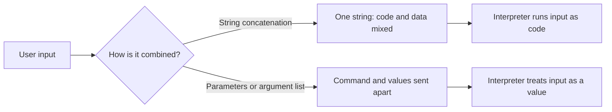
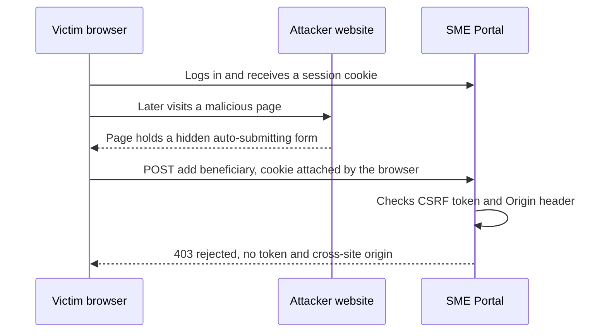
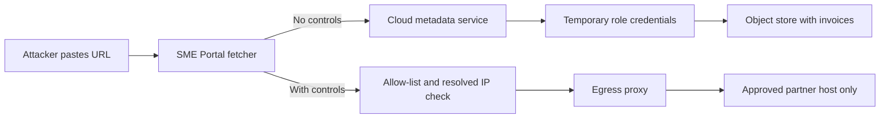

# Module 2 — Web application security

*Most of Najm Bank's customers, and most of its attackers, meet the bank through a web page or an API. This module covers the classic weaknesses that still cause real breaches. Injection is data mistaken for code. Browser attacks turn a page against its own users. Server-side traps trick the server into fetching, storing, opening or rebuilding something it should not. Each lesson explains the attack at the level a defender needs, then gives the fix as a pattern you can enforce in code review, in automated checks and in a secure-coding standard. You will follow Ali through his first reviews of the SME Portal, read Mariam's authorised test findings, and see how Noura turns each finding into a control that stays fixed. The same root causes return in Modules 8 and 9: an LLM that reads untrusted text, or whose output flows into a browser or a database, inherits every lesson here.*

> **Phases:** Build, Test — writing code that keeps data and instructions apart, and proving it with review, tests and scanning before anything reaches production.

---

# 2.1 — Injection: SQL, command and template injection
*Level: 🟡 Intermediate* · *Prerequisites: 1.1, 1.2* · *Phase: Build, Test*

## ⚡ In 60 seconds
- **Injection** happens when untrusted input reaches an **interpreter** (a database engine, a shell, a template engine) as part of a command, so the input can change what the command does.
- The rule: **keep code and data apart**. Use parameterised queries, run programs with an argument list and no shell, and pass data into templates as variables. Never build commands by gluing strings together.
- Escaping by hand, blocking "bad" characters and hiding errors are not fixes. Validation is a useful second layer, never the first.
- Decision cue: user-controlled text in an f-string, `+`, template literal or `format()` that ends in `execute()`, `system()`, `exec()` or `render_template_string()`.
- Least privilege limits the damage when a bug slips through.
- Biggest trap: "we use an ORM, so we are safe". Raw-query escape hatches, dynamic column names and AI-generated code bring injection back.

## 🧭 Why it matters
Ali's first code review at Najm Bank is a pull request for the SME Portal's new invoice search, built in an afternoon with an AI coding agent. The query line reads `f"SELECT * FROM invoices WHERE company_id = {cid} AND reference = '{q}'"`. Ali approves it because the tests pass. Noura rejects it with one comment: "Run it on your laptop, type `' OR '1'='1` into the search box, and tell me whose invoices you see." The answer is every company's. On a multi-tenant portal that is a data breach waiting for its first curious customer, and Sara, the DPO, would have to handle it as one.

Injection is the oldest bug class in web security and has never left the lists. It is a category in the OWASP Top 10 (A03 in the 2021 edition; check the current edition, updated in 2025), and SQL injection (CWE-89) and OS command injection (CWE-78) recur in MITRE's CWE Top 25. In 2023 a SQL injection flaw in the MOVEit Transfer product (CVE-2023-34362) was exploited at scale by an extortion group, and many organisations, as publicly reported, lost files from a product they had bought rather than built. In 2017 Equifax was breached through an unpatched Apache Struts flaw (CVE-2017-5638) in which a crafted HTTP header was evaluated as an expression: injection again, in code the victim did not write.

## 📐 How it works

### 🟢 The essentials

**Code and data in one channel.** An **interpreter** is any component that reads a string and *does* something with it: a SQL engine runs queries, a shell runs commands, a template engine evaluates expressions. Injection happens when your program builds that string by mixing its own instructions with someone else's input. The interpreter cannot tell which part you wrote, so a user who types interpreter syntax gets to write instructions.



**SQL injection.** Here is Ali's search:

```python
# Vulnerable: input is pasted into the SQL text
q = request.args["q"]
sql = f"SELECT * FROM invoices WHERE company_id = {cid} AND reference = '{q}'"
cursor.execute(sql)
# q = "' OR '1'='1"  produces:
# ... WHERE company_id = 42 AND reference = '' OR '1'='1'   -> every row
```

```python
# Fixed: the SQL text never changes; values travel separately
sql = "SELECT * FROM invoices WHERE company_id = %s AND reference = %s"
cursor.execute(sql, (cid, q))
# The quote is now just part of a reference that matches nothing
```

A **parameterised query** (or prepared statement) sends the query structure and the values separately, so the database never parses the values as SQL. Placeholder syntax varies by driver (`%s`, `?`, `:name`); the principle does not.

Depending on the query and the account, SQL injection lets an attacker read other tenants' data, change records or bypass a login. In **blind injection** the application shows no results or errors, and the attacker infers answers from yes/no differences or delays. That is why hiding error messages is hygiene, not a fix.

**OS command injection.** The SME Portal makes thumbnails of uploaded images with a command-line tool.

```python
# Vulnerable: the user's filename goes through a shell
os.system(f"convert uploads/{filename} -resize 200x200 thumbs/{filename}.png")
# A filename such as  x.png; whoami  runs a second command
```

```python
# Safer: server-generated names, an argument list, no shell
file_id = uuid.uuid4().hex            # the user's filename never reaches the command
src, dst = UPLOADS / f"{file_id}.png", THUMBS / f"{file_id}.png"
subprocess.run(["convert", str(src), "-resize", "200x200", str(dst)],
               shell=False, check=True, timeout=30)
```

With `shell=False` and a list, each item reaches the program as one argument; `;`, `|` and `$(...)` mean nothing because no shell interprets them. Better still, use a library so no command is built at all. In Node.js, prefer `execFile` or `spawn` with an argument array over `exec`, which runs a shell.

**Server-side template injection (SSTI).** Template engines (Jinja2, Twig, Freemarker and others) have expression languages that, in many engines, can reach powerful objects on the server. SSTI happens when user input becomes part of the *template* instead of a *value passed into it*.

```python
# Vulnerable: user input is concatenated into the template source
return render_template_string("<p>Welcome, " + display_name + "</p>")
# display_name = "{{7*7}}" renders "Welcome, 49": the engine evaluated it

# Fixed: the template is constant; the name is data
return render_template_string("<p>Welcome, {{ name }}</p>", name=display_name)
# Renders "Welcome, {{7*7}}" as text, auto-escaped
```

The `{{7*7}}` probe is the classic harmless test: if the page shows `49`, input is being evaluated. In engines like Jinja2 that can lead to code execution on the server, so SSTI is rated as severe as command injection.

| Interpreter | Vulnerable pattern | Safe pattern |
|---|---|---|
| SQL database | String-built query | Parameterised query; allow-list for identifiers |
| Document database (e.g. MongoDB) | Request JSON passed straight into a query | Schema-validated types; reject keys starting with `$` |
| OS shell | `os.system`, `shell=True`, Node `exec` | Library call, or argument list without a shell |
| Template engine | Input concatenated into template source | Constant templates; input passed as variables |

### 🟡 Going deeper

**What you cannot parameterise.** Placeholders work for values, not for **identifiers** (table and column names) or keywords such as `DESC`. Map the user's choice through an allow-list:

```python
SORTS = {"date": "issued_at", "amount": "amount_qar", "status": "status"}
column = SORTS.get(request.args.get("sort"), "issued_at")    # unknown -> default
direction = "DESC" if request.args.get("dir") == "desc" else "ASC"
sql = f"SELECT * FROM invoices WHERE company_id = %s ORDER BY {column} {direction}"
cursor.execute(sql, (cid,))
```

The f-string is safe only because every possible value comes from the code; reviewers should still check that claim.

**ORMs are safe until you leave them.** An **object-relational mapper** (ORM, such as SQLAlchemy, Django ORM or Prisma) builds parameterised SQL for you. Injection returns through raw-SQL features (`raw()`, `text()`, `$queryRawUnsafe`) when input is formatted into the string; use their own parameter binding instead. Stored procedures are safe only if they do not concatenate dynamic SQL inside.

**Second-order injection.** A company name containing a quote is inserted safely with parameters. Months later a nightly report concatenates company names into a query and breaks, or is subverted. Parameterise every query, including those fed from "our own database".

**NoSQL operator injection.** A login that passes the request body straight into `users.find({"email": body.email, "password": body.password})` fails if `password` arrives as the JSON object `{"$ne": null}` ("not equal to null"), which matches any password. Validate that each field is a string of the expected shape and reject keys starting with `$` (CWE-943). Better still, look the user up and verify the password hash in code (3.1).

**Validation is the second layer.** Allow-list validation (an invoice reference is 6 to 20 letters, digits and dashes) and a **web application firewall** (WAF: a filter in front of the app that blocks known attack patterns) are defence in depth (1.2), not substitutes for parameters. Legitimate values contain "dangerous" characters (O'Brien, "Al-Noor & Sons"), and filters can be bypassed with encodings.

**How you find it**, always on code and systems you own: **static analysis** (SAST) tools such as Semgrep or CodeQL flag string-built queries, shells and dynamic templates on every pull request in the continuous-integration (CI) pipeline (6.1); reviewers use a checklist (see 🏛️); **dynamic testing** (DAST) sends hostile inputs to a running test environment; and unit tests with hostile inputs stop fixes regressing.

### 🔴 Expert view

**Interpreters hide where you do not expect them.** Log4Shell (CVE-2021-44228, December 2021) was a logging library that evaluated lookup expressions inside logged text, so any logged header or username could make the server fetch and run remote code. The Struts flaw behind the Equifax breach evaluated an expression language (OGNL) from a request header. You inherit these bugs, so dependency inventory and patching speed are injection controls too (6.2, 10.3). Closer to home, a CSV export cell beginning with `=`, `+`, `-` or `@` may run as a formula when a finance manager opens the file (**CSV or formula injection**); neutralise such cells following OWASP's current guidance.

**Prompt injection has the same root cause and no equivalent fix.** An LLM receives instructions and untrusted text in one stream of tokens, exactly the mixing this lesson warns against, and there is no parameterised query for prompts. That is why Modules 8 and 9 defend with architecture rather than filters. The reverse direction is plain injection: model-written SQL, commands or templates are untrusted input (LLM05 Improper Output Handling, OWASP Top 10 for LLM Applications, 2025 version). Najm Assist's "look up fees" tool runs a fixed, parameterised query with a fee code; it never executes model-written SQL. Any future text-to-SQL feature would run on a read-only replica, against restricted views, with row limits.

**AI coding agents repeat what they have seen.** Asked casually, coding assistants often produce string-built queries and `shell=True`, because both are common in public code. Najm Bank writes its injection rules into the agents' instruction files *and* enforces them with SAST in CI, so a rule the agent ignores is still caught (6.3).

**Design for the bug you missed.** Give each service its own database account with only the grants it needs, never owner rights, and disable dangerous database features (OS commands, file reads, network calls). Enforce tenant isolation a second time inside the database, for example with PostgreSQL **row-level security** (RLS) (3.3). Block outbound traffic from database hosts, and alert on query errors and unusually large result sets (10.1).

## 🧰 The toolkit
| Control, standard or tool | What it is and does | When to reach for it |
|---|---|---|
| **Parameterised queries** | Send SQL structure and values separately so input is never parsed as SQL | Every query, including internal and batch jobs |
| **Allow-list validation** | Accept only known-good values; map user choices to code-owned values | Identifiers, sort orders, file types, any input with a known shape |
| **Shell-free command execution** | Call a library, or run a program with an argument list and no shell | Whenever code reaches for `system()`, `exec()` or `shell=True` |
| **Logic-less templates** | Templates that only substitute allow-listed placeholders | Anything users can edit: emails, notifications |
| **Least-privilege database accounts** | One account per service with only the grants it needs | Every service; limits the damage of a missed bug |
| **Semgrep** (open-source static analysis) | Pattern rules that flag string-built queries, shells and dynamic templates | In CI on every pull request; auditing existing code |
| **OWASP Cheat Sheet Series** | Concise, free prevention guides per weakness | Writing or reviewing a fix; training developers |
| **OWASP ASVS** (Application Security Verification Standard, v5.0) | Testable security requirements, including encoding and sanitisation | Setting an application's security requirements |

## 🏛️ In practice at Najm Bank
Noura turns Ali's near-miss into **Secure Coding Standard SC-02: Injection**, version 1. It applies to all Najm Bank code, whether a person or an AI coding agent wrote it.

| ID | Rule | Required pattern | Never | Checked by |
|---|---|---|---|---|
| INJ-1 | SQL uses bind parameters; identifiers come from a code-owned map | Placeholders; `SORTS.get(choice, default)` | Any string-built SQL, even with "internal" values | Semgrep in CI (blocking); review |
| INJ-2 | No shells | Library call, or argument list with `shell=False` / `execFile` | `os.system`, `shell=True`, Node `exec` | Semgrep (blocking) |
| INJ-3 | Templates are constant; data is passed as variables | Template files plus context variables | Rendering a template string built from input | Semgrep; review |
| INJ-4 | User-editable templates are logic-less | Allow-listed placeholders such as `{company_name}` | A full template engine exposed to customers | AppSec design review |
| INJ-5 | Document-database input is schema-validated; exports neutralise formulas | Type checks, no `$` keys; prefixed formula cells | Raw request objects in queries | Unit tests |
| INJ-6 | Model and tool output is untrusted input | Fixed, parameterised queries behind narrow tools | Executing model-written SQL, shell or templates | AI design review (9.1) |
| INJ-7 | Each service has its own least-privilege database account | Read-only where possible; RLS for tenant data | Shared admin accounts | Quarterly access review |

**Review checklist (in every pull-request template):**
1. Does any user, file, API or model input reach a query, command or template?
2. Is it passed as a parameter or argument, with identifiers from an allow-list?
3. Does a test with a hostile input (`' OR '1'='1`, `; whoami`, `{{7*7}}`) prove it is treated as data?
4. Does the service's database account have more rights than this feature needs?

Exceptions need Noura's written approval, a compensating control and an expiry of at most 90 days.

## 🛠️ Exercises
Hands-on work runs only on your own machine, against your own code or deliberately vulnerable training apps such as OWASP Juice Shop or OWASP WebGoat.

- 🟢 Build a tiny local app (for example Python and SQLite) with invoices for two companies and a search written the vulnerable way. Show that `' OR '1'='1` returns both companies' rows, then fix it with a parameterised query and add a unit test. *Done when:* the input returns every row before the fix and none after, and the test fails on the old code and passes on the new.
- 🟡 Run Semgrep (or your team's SAST tool) with injection rules on a repository you own, and triage each finding as a true or false positive with a one-line reason. *Done when:* every true positive is fixed or ticketed, and the rule runs in CI and fails the build on new findings.
- 🔴 Build, locally, the SME Portal's "custom email notification" feature with logic-less, allow-listed placeholders and HTML-escaped values. Then complete one injection challenge in a local Juice Shop or WebGoat and write a defender's note: root cause, fix, the test that would have caught it, and the log signal the attempt leaves. *Done when:* `{{7*7}}` and `<b>{company_name}</b>` in a template render as plain text, unknown placeholders are rejected, and the note fits on one page.

## ⚠️ Mistakes and traps
- **Escaping or blocklisting by hand.** It fails against encodings and breaks names like O'Brien. Use parameters and argument lists.
- **"It comes from our own database."** Stored data carries yesterday's attack into today's query. Parameterise every query.
- **Trusting the ORM blindly.** Find every raw-query call and review it.
- **Hiding errors and calling it fixed.** Blind injection needs no error messages. Fix the query.
- **Running model-written queries or commands.** Give the model narrow tools that run fixed operations (9.2).

## 🧾 Recap
- Injection is untrusted input reaching an interpreter as part of a command; keep code and data in separate channels.
- SQL: parameters, plus allow-lists for identifiers. Shells: libraries or argument lists. Templates: constant, with data as variables; logic-less for anything users edit.
- Validation, error hiding and WAFs are useful layers, never the fix.
- Interpreters also hide in loggers, framework expression languages and spreadsheets, so patching is an injection control too.
- Prompt injection shares the root cause but has no parameterised fix; treat model output as untrusted input.
- Least-privilege accounts and in-database tenant isolation limit the injection you missed.

## ✍️ Check yourself

**1. Ali finds `cursor.execute(f"SELECT * FROM invoices WHERE reference = '{ref}'")` in the SME Portal. A teammate suggests replacing every `'` in `ref` with `''` before the query runs. What should Ali recommend?**

- A. Accept the change, because doubling quotes is how SQL escapes them
- B. Use a parameterised query, passing `ref` as a parameter
- C. Add a WAF rule that blocks requests containing `OR`
- D. Hide database error messages from users

<details><summary>Answer</summary>

**B.** Parameters keep structure and value apart, so no input can change the query. A is fragile hand-escaping; C and D are partial layers that encoded or blind attacks get around. (🟢 The essentials.)

</details>

**2. The invoice list lets users sort by date, amount or status, and the column name arrives in the request. Placeholders do not work for column names. What is the safe approach?**

- A. Wrap the column name in quotes before adding it to the query
- B. Map the user's choice through a code-owned allow-list and fall back to a default for anything else
- C. Strip spaces and semicolons from the input
- D. Let the ORM decide

<details><summary>Answer</summary>

**B.** When a value cannot be parameterised, every possible value must come from the code, never from the user. C is a blocklist, and A still lets the user steer the query. (🟡 Going deeper.)

</details>

**3. A company admin types `{{7*7}}` into the "welcome message" field of the SME Portal, and the preview shows "49". What does this show, and what is the right fix?**

- A. A harmless calculator feature; no action needed
- B. Cross-site scripting; add a Content Security Policy
- C. Server-side template injection; render a constant template that receives the message as a variable, or use logic-less placeholders
- D. SQL injection; parameterise the query

<details><summary>Answer</summary>

**C.** The engine evaluated input as template code, which can lead to code execution on the server. B treats it as a browser problem, but the evaluation happens on the server. (🟢 The essentials.)

</details>

**4. A nightly job at a retailer builds a report query by concatenating customer names read from its own database. The names were all inserted with parameterised queries. Is there an injection risk?**

- A. No, because the data came from the company's own database
- B. No, because the inserts were parameterised
- C. Yes: stored data can contain interpreter syntax, so the report query must be parameterised too (second-order injection)
- D. Only if the job runs as an administrator

<details><summary>Answer</summary>

**C.** The parameterised insert stored the hostile text safely; it did not make it safe for every later use. A is the classic false assumption; D confuses how bad the bug is with whether it exists. (🟡 Going deeper.)

</details>

**5. Rania proposes that Najm Assist answer "how much did I spend on fuel last month?" by having the model write SQL that the backend runs. What is the most defensible design?**

- A. Run the model's SQL on the production database, because the system prompt tells the model to write only SELECT statements
- B. Give the assistant a narrow tool that runs a fixed, parameterised spending query for the logged-in customer, with the model supplying only validated parameters such as category and month
- C. Filter the model's SQL for the words DROP and DELETE
- D. Ask the model to double-check its SQL before it runs

<details><summary>Answer</summary>

**B.** Model output is untrusted input; a fixed query with validated parameters keeps code and data apart and scopes access to the customer. A relies on instructions prompt injection can override; C is a blocklist; D asks the untrusted component to police itself. (🔴 Expert view.)

</details>

## 📚 References
- OWASP Top 10 (2021 edition, Injection; check the current edition) — https://owasp.org/Top10/
- OWASP Cheat Sheet Series, SQL Injection Prevention — https://cheatsheetseries.owasp.org/cheatsheets/SQL_Injection_Prevention_Cheat_Sheet.html
- OWASP Cheat Sheet Series, OS Command Injection Defense — https://cheatsheetseries.owasp.org/cheatsheets/OS_Command_Injection_Defense_Cheat_Sheet.html
- OWASP, CSV Injection — https://owasp.org/www-community/attacks/CSV_Injection
- OWASP Application Security Verification Standard (ASVS) — https://owasp.org/www-project-application-security-verification-standard/
- MITRE CWE-89, SQL injection — https://cwe.mitre.org/data/definitions/89.html
- MITRE CWE-78, OS command injection — https://cwe.mitre.org/data/definitions/78.html
- MITRE CWE-1336, injection into template engines — https://cwe.mitre.org/data/definitions/1336.html
- NIST National Vulnerability Database, CVE-2023-34362 (MOVEit Transfer) — https://nvd.nist.gov/vuln/detail/CVE-2023-34362
- OWASP Top 10 for LLM Applications (2025 version) — https://genai.owasp.org/
- OWASP Juice Shop — https://owasp.org/www-project-juice-shop/
- OWASP WebGoat — https://owasp.org/www-project-webgoat/

---

# 2.2 — Browser attacks: XSS, CSRF, and the headers that stop them
*Level: 🟡 Intermediate* · *Prerequisites: 2.1* · *Phase: Build, Test*

## ⚡ In 60 seconds
- **Cross-site scripting (XSS)** runs an attacker's script inside your page, in your user's browser, with your user's session. It can do anything the user can, including approving a payment.
- Fix XSS with **context-aware output encoding**: let the framework escape output, avoid raw-HTML sinks (`innerHTML`, `dangerouslySetInnerHTML`, `v-html`), and sanitise with a vetted library only when rich HTML is truly needed.
- **Cross-site request forgery (CSRF)** makes a logged-in user's browser send a state-changing request to your site, cookies attached. Fix it with anti-CSRF tokens, `SameSite` cookies, origin checks and step-up authentication for high-risk actions.
- **Security headers** (Content Security Policy, HSTS, `frame-ancestors`, `nosniff`) and cookie attributes are the safety net. They limit damage; they do not replace encoding.
- Decision cue: anywhere user-controlled content becomes HTML, JavaScript or a URL, and any state-changing endpoint that accepts cookies.
- Biggest traps: believing CORS stops CSRF, or that `HttpOnly` stops XSS. Neither is true.

## 🧭 Why it matters
Mariam's red team runs an authorised, scoped test of the SME Portal before a major release. Two findings top her report. First, invoice **notes** support bold text and links, so the frontend renders them as raw HTML. A note containing ``, a classic harmless proof, pops an alert when the company's finance approver opens the invoice. A real attacker's script would instead quietly call the portal's "approve payment" API as the approver. Second, the legacy "add beneficiary" form relies only on the session cookie, so any other website could make a logged-in user's browser submit it.

Hamad, the CISO, asks why the web application firewall did not stop the first one. Noura's answer: "The WAF looks at requests. The bug is in how we write the response. A filter makes exploitation harder; only the code makes it impossible."

Neither attack is new. In 2005 the "Samy" worm spread through MySpace using stored XSS, reportedly reaching more than a million profiles in about a day. Cross-site scripting (CWE-79) and CSRF (CWE-352) remain on recent editions of MITRE's CWE Top 25. Browsers now offer strong defences, but they only protect applications that use them.

## 📐 How it works

### 🟢 The essentials

**The same-origin policy.** Browsers isolate websites by **origin**: the scheme, host and port together (`https://portal.najm.example:443`). Script from one origin cannot read another origin's responses. XSS defeats this by running inside your origin; CSRF works around it, because browsers still *send* cross-site requests with cookies even though the sender cannot *read* the response.

**Three kinds of XSS.**

| Type | Where the script comes from | SME Portal example |
|---|---|---|
| **Stored** | Saved on the server and served to other users | A malicious invoice note shown to the approver |
| **Reflected** | Sent in the request and echoed straight back | A search page that prints "No results for …" with the raw query |
| **DOM-based** | Written into the page by your own JavaScript | Code that reads `location.hash` and assigns it to `innerHTML` |

**Fixing XSS: encode for the context.** Browsers parse HTML, attributes, URLs, JavaScript and CSS differently, so safe treatment depends on where data lands. Modern frameworks and auto-escaping template engines encode text for you; the bugs live in the escape hatches.

```jsx
// Vulnerable: raw HTML from the database
<div dangerouslySetInnerHTML={{ __html: invoice.notes }} />

// Safe: React escapes text by default
<div>{invoice.notes}</div>

// Rich text genuinely needed: sanitise with a strict allow-list
import DOMPurify from "dompurify";
const clean = DOMPurify.sanitize(invoice.notes, {
  ALLOWED_TAGS: ["b", "i", "p", "ul", "li", "a"], ALLOWED_ATTR: ["href"] });
<div dangerouslySetInnerHTML={{ __html: clean }} />
```

In plain JavaScript, use `element.textContent = notes` (shown as text), not `element.innerHTML = notes` (parsed as HTML). Mariam's proof used an image tag for a reason: browsers do not run `<script>` elements inserted through `innerHTML`, but they do run event handlers such as `onerror`. Blocking the string `<script>` fixes nothing.

| Context | Example | Safe treatment |
|---|---|---|
| HTML body | `<p>{notes}</p>` | Framework auto-escaping, or `textContent` |
| HTML attribute | `<input value="{name}">` | Auto-escaping, with attributes always quoted |
| URL | `<a href="{website}">` | Allow only `https:` (and `mailto:` if needed); reject `javascript:` |
| JavaScript | Data inside an inline `<script>` | Keep data out of scripts; pass it as JSON in a data attribute or through an API |
| CSS | `style="{colour}"` | Avoid; allow-list values such as a fixed palette |

**CSRF in one picture.**



**Fixing CSRF.** Layer these controls:
1. **Anti-CSRF tokens** (the synchronizer token pattern): a random per-session token required in each form or request header. Other sites cannot read your pages, so they cannot learn it.
2. **`SameSite` cookies**: the browser withholds the session cookie from requests started by other sites.
3. **Origin checks**: reject state-changing requests whose `Origin` or `Sec-Fetch-Site` header shows another site.
4. **No state changes on GET**, and **step-up authentication** (a one-time code or biometric) for actions such as adding a beneficiary.

APIs that authenticate with an `Authorization: Bearer` header are not exposed to classic CSRF, because browsers never attach that header automatically. The risk moves rather than disappears: a token stored where JavaScript can read it can be stolen through XSS.

### 🟡 Going deeper

**Content Security Policy (CSP)** is a response header telling the browser which scripts, frames and connections a page may use, so injected script fails even when an encoding bug slips through. Research by Google engineers ("CSP Is Dead, Long Live CSP!", Weichselbaum et al., ACM CCS 2016) showed that most policies built on **allow-lists of domains** could be bypassed, for instance through scripts already hosted on an allowed domain. Use a **strict CSP** based on nonces or hashes instead:

```
Content-Security-Policy: script-src 'nonce-R4nd0mPerResponse' 'strict-dynamic';
  object-src 'none'; base-uri 'none'; frame-ancestors 'none'; form-action 'self'
```

- A **nonce** is a random value, fresh for every response, placed on each legitimate `<script nonce="…">` tag. Injected script lacks it and does not run; inline handlers like `onerror` are blocked too.
- `'strict-dynamic'` lets trusted scripts load further scripts without a domain list.
- `object-src 'none'` and `base-uri 'none'` close common bypasses. `frame-ancestors 'none'` prevents **clickjacking** (tricking users into clicking your buttons hidden under another site's content).

Roll out with `Content-Security-Policy-Report-Only` first, fix legitimate inline scripts, then enforce. A reused nonce, or `'unsafe-inline'` without a nonce, quietly switches the protection off.

**Cookies done right.**

```
Set-Cookie: __Host-session=…; Secure; HttpOnly; SameSite=Lax; Path=/
```

- `Secure`: HTTPS only. `HttpOnly`: hidden from JavaScript, so XSS cannot copy the cookie, though injected script can still act as the user inside the page.
- `SameSite=Lax` withholds the cookie from cross-site POSTs and embedded requests but sends it when a user follows a link to your site. `Strict` withholds it from all cross-site requests (good for admin consoles). `None` sends it everywhere and requires `Secure`.
- The `__Host-` prefix forces `Secure`, `Path=/` and no `Domain`, so sibling subdomains cannot overwrite the cookie.

Set `SameSite` explicitly: Chrome treats a missing value as `Lax`, but browsers differ. And `SameSite` is about **sites** (scheme plus registrable domain), not origins: a compromised `marketing.najm.example` is the same site as `portal.najm.example`, one reason tokens and origin checks still matter.

**Fetch Metadata.** Modern browsers send a `Sec-Fetch-Site` header (`same-origin`, `same-site`, `cross-site` or `none`). Middleware that rejects state-changing requests marked `cross-site`, except on named public endpoints, is a strong extra CSRF layer; fall back to `Origin` where it is missing.

**CORS is not a CSRF defence.** Cross-Origin Resource Sharing (CORS) lets named origins *read* your responses; it does not stop requests being *sent*. The dangerous misconfiguration echoes any request's `Origin` into `Access-Control-Allow-Origin` with `Access-Control-Allow-Credentials: true`, letting any website read logged-in users' data. Allow-list exact origins.

**The rest of the baseline.** `Strict-Transport-Security` (HSTS) makes browsers use only HTTPS for your domain; `X-Content-Type-Options: nosniff` stops content-type guessing; `Referrer-Policy` limits URL leakage. The old `X-XSS-Protection` header is deprecated: OWASP advises setting it to `0` or leaving it out.

### 🔴 Expert view

**Trusted Types close DOM XSS at the source.** With the CSP directive `require-trusted-types-for 'script'`, the browser refuses plain strings at sinks such as `innerHTML`; only values from named, reviewed policies (say, one wrapping DOMPurify) get through. Support began in Chromium-based browsers and has been spreading; at the time of writing (2026), check current compatibility.

**Third-party script is code you did not review.** In 2018, as publicly reported, attackers modified a script on British Airways' payment pages so that card details went to an attacker-controlled domain (web skimming, often called **Magecart**). Keep login and payment pages free of third-party script, use **Subresource Integrity** (an `integrity` hash on external `<script>` tags, so a modified file is refused), restrict CSP `connect-src`, and monitor pages for changes. PCI DSS v4.0 requires inventory, authorisation and integrity checks for payment-page scripts (6.4.3) and detection of unauthorised payment-page changes (11.6.1), mandatory since 31 March 2025. Check the current version (v4.0.1 at the time of writing).

**LLM output is a new XSS source.** Najm Assist renders answers as formatted text in the app's web view. A model steered by prompt injection (8.2) can emit HTML, or a Markdown image whose URL carries customer data to an attacker's server when it loads. Treat model output as untrusted (LLM05 Improper Output Handling): render a sanitised Markdown subset with no raw HTML, block or proxy remote images, and enforce CSP `img-src` and `connect-src` (9.1). Web views with JavaScript bridges to native code raise the stakes (4.3).

**WAFs buy time, not fixes.** A WAF is useful for **virtual patching** (blocking exploitation of a known bug while the fix ships), but encodings get past signatures, so every WAF rule that matters needs a code-fix ticket behind it. DAST scanners such as ZAP find many reflected XSS bugs and missing headers; stored and DOM-based XSS often need a tester who follows the data, as Mariam did.

## 🧰 The toolkit
| Control, standard or tool | What it is and does | When to reach for it |
|---|---|---|
| **Context-aware output encoding** | Encode data for the exact place it lands, usually through framework auto-escaping | Every page that shows data; the primary XSS defence |
| **DOMPurify** (Cure53) | Open-source allow-list HTML sanitiser | When users or models must supply rich HTML or Markdown |
| **Content Security Policy** | Header limiting which scripts run and where pages connect | Every web app, as the backstop for encoding bugs and against skimming |
| **Trusted Types** | Browser feature that refuses strings at DOM sinks unless a reviewed policy created them | Large frontends with DOM XSS risk, once CSP is in place |
| **Anti-CSRF tokens** | Random per-session token required on every state-changing request | Any cookie-authenticated app with forms or state-changing APIs |
| **SameSite cookies** | Cookie attribute that withholds cookies from cross-site requests | Every session cookie, set explicitly to `Lax` or `Strict` |
| **HSTS** (HTTP Strict Transport Security) | Header that makes browsers use only HTTPS for your domain | Every production domain |
| **ZAP** (Zed Attack Proxy) | Open-source DAST scanner and intercepting proxy | Scanning your own staging apps for reflected XSS and missing headers |

## 🏛️ In practice at Najm Bank
Noura publishes the **Najm Bank Browser Security Baseline v1** for the SME Portal, the public website, internal admin consoles and every web view in Najm Mobile. Tariq's platform team sets shared headers at the edge gateway; each application sets its own CSP nonce.

| Item | Required value | Why | Set where |
|---|---|---|---|
| `Content-Security-Policy` | `script-src 'nonce-…' 'strict-dynamic'; object-src 'none'; base-uri 'none'; frame-ancestors 'none'; form-action 'self'`, plus a reporting endpoint | Blocks injected script and framing | Application (fresh nonce per response) |
| `Strict-Transport-Security` | `max-age=31536000; includeSubDomains` | HTTPS only, remembered for a year | Edge |
| `X-Content-Type-Options` | `nosniff` | No content-type guessing | Edge |
| `Referrer-Policy` | `strict-origin-when-cross-origin`; `no-referrer` where URLs hold identifiers | Limits URL leakage | Edge, overridable |
| `X-Frame-Options` | `DENY` | Clickjacking cover for older browsers | Edge |
| `Cache-Control` | `no-store` on authenticated pages | No customer data in shared caches | Application |
| Session cookie | `__Host-` prefix; `Secure; HttpOnly; SameSite=Lax` (`Strict` for admin consoles) | Resists theft and CSRF | Application |
| CORS | Exact allow-listed origins; never `*` or an echoed origin with credentials | Stops cross-site data reads | API gateway |
| Not allowed | `X-XSS-Protection: 1`; `'unsafe-inline'` or `'unsafe-eval'` in `script-src` without an approved exception | Deprecated, or defeats CSP | Checked in CI |

**Coding rules attached to the baseline:**
- XSS-1: no `innerHTML`, `dangerouslySetInnerHTML`, `v-html` or `document.write` with data unless it passes the approved DOMPurify configuration (Semgrep rule in CI).
- XSS-2: user-supplied URLs are allow-listed to `https:` before rendering.
- CSRF-1: every cookie-authenticated, state-changing endpoint checks a CSRF token and rejects `Sec-Fetch-Site: cross-site` or a foreign `Origin`.
- CSRF-2: adding a beneficiary, changing contact details and raising payment limits require step-up authentication.
- MDL-1: model output (Najm Assist, Credit Memo Copilot) goes through the shared sanitised-Markdown component, with remote images off.

**Verification:** weekly ZAP baseline scans of staging, CSP violation reports watched by Jassim's SOC, and Mariam's team retesting every fix before closure.

## 🛠️ Exercises
Run everything on your own machine or on deliberately vulnerable training apps such as OWASP Juice Shop. Do not probe sites you do not own.

- 🟢 Check the response headers of a web app you own (or a local Juice Shop) with your browser's developer tools or `curl -I`, and compare them with the Najm Bank baseline. *Done when:* you have a table marking each baseline item present, missing or weaker, with the value you would set and where (edge or application).
- 🟡 Build a small local page that shows a "note" from a query parameter using `innerHTML`, and show that `` runs. Fix it with `textContent`; then put the bug back and add a strict, per-response-nonce CSP instead. *Done when:* the alert fires in the vulnerable version but not after the code fix or with the bug plus CSP, and the CSP violation appears in the browser console.
- 🔴 In a cookie-authenticated app you own, add three CSRF layers to one state-changing endpoint: `SameSite=Lax`, a synchronizer token, and middleware that rejects `Sec-Fetch-Site: cross-site`. Serve an "attacker" page that auto-submits a form to it from a different local host name (the app on `localhost`, the attacker page on `127.0.0.1`). *Done when:* tests show the cross-site submission rejected, a same-origin request with the token accepted and one without it rejected, and a short note explains what each layer stops alone and why changing only the port would not make a request cross-site.

## ⚠️ Mistakes and traps
- **Blocking `<script>` and calling XSS fixed.** Event handlers, `javascript:` URLs and SVG files all run script. Encode for the context.
- **Thinking `HttpOnly` stops XSS.** It stops cookie theft, not an attacker acting as the user. Fix the XSS.
- **Using CORS as CSRF protection.** CORS controls who may read responses, not who may send requests. Use tokens, `SameSite` and origin checks.
- **A CSP with `'unsafe-inline'` or a long domain allow-list.** It looks reassuring and stops little. Use nonces or hashes with `'strict-dynamic'`.
- **Reusing a CSP nonce, or caching pages that contain one.** Generate a fresh nonce for every response.
- **Rendering model output as raw HTML.** Treat it as untrusted user content.

## 🧾 Recap
- XSS runs attacker script inside your origin; CSRF makes the victim's browser send requests your server trusts because cookies come with them.
- XSS defence: context-aware encoding by default, allow-list sanitising only where rich HTML is required, and banned raw-HTML sinks.
- CSRF defence: tokens, `SameSite` cookies, `Origin` and Fetch Metadata checks, no state changes on GET, and step-up for high-risk actions.
- A strict nonce-based CSP, HSTS, `nosniff`, `frame-ancestors` and hardened cookies form the baseline safety net.
- Third-party scripts and LLM output are XSS sources too; limit, sanitise and monitor them.

## ✍️ Check yourself

**1. After Mariam's finding, a developer proposes rejecting any invoice note that contains the text `<script>`. Why is this not enough, and what is the right fix?**

- A. It is enough, because only script tags run JavaScript
- B. Event handlers such as `onerror` and `javascript:` URLs also run script; render notes as text, or sanitise them with an allow-list such as DOMPurify
- C. Add `HttpOnly` to the session cookie instead
- D. Move the notes to a separate database table

<details><summary>Answer</summary>

**B.** Blocklists miss the other ways to run script; encoding, or allow-list sanitising for rich text, removes the cause. C limits cookie theft, not what the script does. (🟢 The essentials.)

</details>

**2. Tariq says: "Our session cookie is `HttpOnly`, so an XSS bug cannot hurt us." What is the best reply?**

- A. Correct: without the cookie, the attacker can do nothing
- B. Only partly right: `HttpOnly` stops script reading the cookie, but injected script can still call the portal's APIs as the user, read the page and change it
- C. Wrong, because `HttpOnly` cookies are sent over unencrypted HTTP
- D. Correct, as long as `SameSite=Strict` is also set

<details><summary>Answer</summary>

**B.** XSS runs inside your origin, where the browser attaches cookies automatically; `HttpOnly` removes only cookie theft. C confuses `HttpOnly` with `Secure`; D mixes up a CSRF control with an XSS one. (🟡 Going deeper.)

</details>

**3. An insurer's API team says CSRF is handled because "CORS only allows our own frontend origin". The API uses cookie sessions. What is the problem?**

- A. There is none; CORS blocks requests from other origins
- B. CORS controls who may read responses; a cross-site form POST is still sent with cookies, so the API still needs tokens, `SameSite` cookies and origin checks
- C. CORS should be set to `*` to be safe
- D. The API should switch to GET requests

<details><summary>Answer</summary>

**B.** Browsers send simple cross-site requests, with cookies, whatever the CORS policy says; CORS only decides whether the calling page may read the response. C makes things worse; D breaks the rule that state changes never use GET. (🟡 Going deeper.)

</details>

**4. Which Content Security Policy gives the strongest protection against injected script?**

- A. `script-src 'self' 'unsafe-inline' https://cdn.example.com`
- B. `default-src *`
- C. `script-src 'nonce-<fresh per response>' 'strict-dynamic'; object-src 'none'; base-uri 'none'`
- D. The same as C, but sent as `Content-Security-Policy-Report-Only`

<details><summary>Answer</summary>

**C.** A fresh nonce means injected script cannot run, and `object-src` and `base-uri` close common bypasses. A allows inline script and trusts a whole CDN; B allows everything; D only reports, which is right during rollout but blocks nothing. (🟡 Going deeper.)

</details>

**5. Najm Assist's answers are rendered as Markdown in the app's web view. Mariam shows that a prompt-injected document can make the model output an image link whose URL contains the customer's data. What is the most effective control?**

- A. Tell the model in its system prompt never to output images
- B. Treat model output as untrusted: render a sanitised Markdown subset with no raw HTML, block or proxy remote images, and enforce CSP `img-src` and `connect-src` limits
- C. Add `HttpOnly` to all cookies
- D. Rely on the WAF to block the response

<details><summary>Answer</summary>

**B.** The fix sits where output is rendered and where the browser may connect, so it holds even when the model is manipulated. A depends on the model resisting injection, which nothing guarantees today; C and D do not touch rendering. (🔴 Expert view.)

</details>

## 📚 References
- OWASP Cheat Sheet Series, Cross Site Scripting Prevention — https://cheatsheetseries.owasp.org/cheatsheets/Cross_Site_Scripting_Prevention_Cheat_Sheet.html
- OWASP Cheat Sheet Series, DOM based XSS Prevention — https://cheatsheetseries.owasp.org/cheatsheets/DOM_based_XSS_Prevention_Cheat_Sheet.html
- OWASP Cheat Sheet Series, Cross-Site Request Forgery Prevention — https://cheatsheetseries.owasp.org/cheatsheets/Cross-Site_Request_Forgery_Prevention_Cheat_Sheet.html
- OWASP Cheat Sheet Series, Content Security Policy — https://cheatsheetseries.owasp.org/cheatsheets/Content_Security_Policy_Cheat_Sheet.html
- OWASP Cheat Sheet Series, HTTP Headers — https://cheatsheetseries.owasp.org/cheatsheets/HTTP_Headers_Cheat_Sheet.html
- MITRE CWE-79, cross-site scripting — https://cwe.mitre.org/data/definitions/79.html
- MITRE CWE-352, cross-site request forgery — https://cwe.mitre.org/data/definitions/352.html
- W3C, Content Security Policy Level 3 — https://www.w3.org/TR/CSP3/
- RFC 6797, HTTP Strict Transport Security (HSTS) — https://www.rfc-editor.org/rfc/rfc6797
- Weichselbaum, L., Spagnuolo, M., Lekies, S. and Janc, A. (2016), "CSP Is Dead, Long Live CSP! On the Insecurity of Whitelists and the Future of Content Security Policy", ACM CCS 2016
- DOMPurify (Cure53) — https://github.com/cure53/DOMPurify
- PCI Security Standards Council, PCI DSS — https://www.pcisecuritystandards.org/
- OWASP Top 10 for LLM Applications (2025 version) — https://genai.owasp.org/

---

# 2.3 — Server-side traps: SSRF, file uploads, path traversal and deserialisation
*Level: 🟡 Intermediate* · *Prerequisites: 1.1, 2.1* · *Phase: Design, Build*

## ⚡ In 60 seconds
- Four bugs, one shape: the server does something powerful (fetches a URL, stores a file, opens a path, rebuilds an object) with input the attacker controls.
- **Server-side request forgery (SSRF)** makes your server fetch for the attacker from inside your network. Allow-list destinations, check the *resolved* address, use an egress proxy and harden cloud metadata access.
- **File uploads**: verify type from content, rename, store privately, serve from a separate domain as a download, cap size and scan.
- **Path traversal**: map IDs to files; if you must use a name, canonicalise it and check it stays inside the base folder.
- **Deserialisation**: never feed untrusted bytes to native object loaders (`pickle`, Java serialisation, unsafe YAML), and that includes ML model files. Use JSON with a schema.
- Biggest trap: validating the *string*, not the *thing*: URL text instead of resolved address, extension instead of content, path text instead of canonical path.

## 🧭 Why it matters
The SME Portal team wants two features next sprint. **Import invoice from link** fetches a file from a URL the customer pastes; **webhooks** notify a customer-chosen URL when an invoice is approved. Tariq's developers built both with an AI coding agent, and each comes down to one line: `requests.get(url)`. Noura asks Ali to threat-model the import feature with STRIDE before launch (1.1). His first question, "Where can this server reach that the customer cannot?", turns out to be the whole lesson.

The best-known public example is the 2019 Capital One breach. As publicly reported, an attacker made a misconfigured web application firewall send requests to the cloud instance metadata service, which returned temporary credentials for an over-privileged role; those were used to copy data from storage buckets. SSRF (CWE-918) became its own OWASP Top 10 category in 2021 (A10 in that edition) and is API7 in the OWASP API Security Top 10 (2023).

Uploads, paths and deserialisation sit right beside it: customers upload invoices, staff download them, and Dana's team has started loading pre-trained models from public hubs.

## 📐 How it works

### 🟢 The essentials

**SSRF: your server as the attacker's proxy.** Your server sits inside trust boundaries the internet cannot cross. It can reach internal admin panels, the Kubernetes API and, on the major clouds, a **metadata service** at the special address `169.254.169.254` that hands out temporary credentials for the machine's role. A feature that fetches user-supplied URLs lets the user aim your server at any of these.



```python
# Vulnerable: fetch whatever the customer typed
resp = requests.get(request.form["url"])
```

```python
# Safer sketch: allow-list, resolve, check every address, no redirects
ALLOWED = {"api.partner-accounting.example", "files.partner-drive.example"}

def fetch_invoice(url: str) -> bytes:
    u = urlparse(url)
    if u.scheme != "https" or u.hostname not in ALLOWED:
        raise Rejected("destination not allowed")
    addrs = {ai[4][0] for ai in socket.getaddrinfo(u.hostname, 443)}
    if not all(ipaddress.ip_address(a).is_global for a in addrs):
        raise Rejected("internal address")
    # egress_get: HTTP client routed through the egress proxy, which re-checks
    return egress_get(url, allow_redirects=False, timeout=5, max_bytes=10_000_000)
```

An **egress proxy** is an outbound proxy every server-side request must pass through, enforcing reachable destinations independently of the code. The strongest control is still the allow-list: Noura decides the import feature launches with approved partner hosts only.

**File uploads: every file is hostile.**

| Risk | Example |
|---|---|
| The server executes it | A script uploaded into a folder the web server runs code from |
| The browser executes it | HTML or SVG (which can hold script) served from the portal's domain: stored XSS (2.2) |
| The type is a lie | The uploader chooses the extension and `Content-Type` |
| Resources run out | Huge files, or a **zip bomb** that expands to gigabytes |
| Parsers are attacked | XML inside DOCX, XLSX or SVG parsed with external entities on (**XXE**, CWE-611); image or PDF library bugs |
| Malware reaches staff | An infected "invoice" opened by a finance officer |

The baseline defence: allow-list types, verifying the real type from the content's first bytes (its "magic number"); use a random server-side name; store files in a **private object store**, never the web root; cap the size; scan; and serve downloads from a **separate domain** with `Content-Disposition: attachment` and `nosniff`.

**Path traversal.** If a download handler builds a path from a parameter, `../` sequences walk up the directory tree; `?file=../../etc/passwd` is the classic illustration (CWE-22).

```python
# Vulnerable
path = os.path.join("/srv/invoices", request.args["file"])
return send_file(path)
# Note: os.path.join("/srv/invoices", "/etc/passwd") gives "/etc/passwd"

# Fixed (best): look up an ID the user may access
inv = invoices.get_for_company(invoice_id, current_company)   # 404 if not theirs
return storage.download(inv.storage_key)

# Fixed (fallback): canonicalise, then check containment
base = Path("/srv/invoices").resolve()
target = (base / request.args["file"]).resolve()
if not target.is_relative_to(base):            # Python 3.9+
    abort(404)
```

The ID-based fix also enforces access control (3.3): users reach only their own company's invoices, whatever they type.

**Deserialisation: when loading data runs code.** **Serialisation** turns an object into bytes; **deserialisation** rebuilds it. JSON can only produce numbers, strings, lists and maps. Native formats (Python `pickle`, Java serialisation, PHP `unserialize`, .NET `BinaryFormatter`, object-building YAML loaders) can say *which classes to build*, and building them can trigger code. Attackers chain existing classes with dangerous loading behaviour (**gadget chains**), so loading attacker bytes can mean running attacker code (CWE-502). Python's own documentation warns: only unpickle data you trust.

```python
# Vulnerable: user preferences kept in a cookie as a pickle
prefs = pickle.loads(base64.b64decode(request.cookies["prefs"]))

# Fixed: a data-only format, validated against a schema (e.g. Pydantic)
prefs = PrefsSchema.model_validate_json(request.cookies["prefs"])

# YAML: replace yaml.load(...) with an unsafe loader by yaml.safe_load(data)
```

### 🟡 Going deeper

**Why string checks fail for SSRF.** Know the bypass *classes*: alternative IP notations (decimal, octal, hexadecimal, IPv6, IPv4-mapped IPv6); domain names that resolve to internal addresses; **DNS rebinding** (a public address when you check, an internal one when you connect); open redirects on allowed hosts; URL parser disagreements between validator and client; and schemes such as `file://`. So parse with the same library that fetches; resolve, check *every* address and connect to the one you checked (or let the proxy enforce it); disable redirects or re-validate each hop; allow only `https`; and enforce it all again at the network layer. Plan for **blind SSRF** too: a request can trigger internal actions even if the response is never shown.

**Harden the metadata service and the role.** On AWS, **IMDSv2** requires a session token obtained with a `PUT` request and sent in a header, and a hop limit keeps containers from reaching it through the host. A simple SSRF that can only send plain `GET` requests cannot get credentials, so require it everywhere. Google Cloud and Azure metadata endpoints also require headers (`Metadata-Flavor: Google`, `Metadata: true`). On Kubernetes, block pods from the node metadata address with network policies (7.2). Keep every role small, so stolen credentials are worth little.

**Webhooks are SSRF by design.** The customer picks the URL, so no allow-list is possible. Send from an isolated worker through an egress proxy that blocks private, loopback and link-local addresses, with HTTPS only, signed payloads, short timeouts, and the response never shown to the customer.

**A safer upload pipeline.**

| Stage | Control |
|---|---|
| Upload | Pre-signed URL to a private **quarantine** bucket, with size limits and short expiry |
| Validate | Magic bytes against the allow-list (PDF, PNG, JPEG, XLSX); page and pixel caps |
| Neutralise | Re-encode images (also stripping location metadata); rebuild documents with **content disarm and reconstruction** (CDR); XML external entities off |
| Scan | Antivirus or sandbox analysis: catches known malware, not everything |
| Promote | Move to the clean bucket under a random key; record hash, uploader and company |
| Serve | Separate domain (e.g. `files.najm-usercontent.example`), `attachment`, `nosniff` |

Run these stages in short-lived, sandboxed workers with no network access and no permissions beyond the two buckets.

**Archives and path variants.** When extracting ZIP or TAR files, check every entry name like a download path (the flaw is known as **zip slip**), and cap total uncompressed size and entry count against zip bombs. Encoded `..%2f`, double decoding, Windows backslashes and proxies that normalise paths differently all fall to one rule: canonicalise at the point of use, then check containment.

**Deserialisation across languages.** In Java, avoid `ObjectInputStream` on untrusted data, or apply a strict allow-list with `ObjectInputFilter` (JEP 290). Never let JSON libraries pick classes from type names in the input. Microsoft has made `BinaryFormatter` obsolete and removed it from recent .NET versions; in PHP, use `json_decode`, not `unserialize`. Signing serialised data with an HMAC helps until the key leaks; data-only formats are the real fix.

### 🔴 Expert view

**Model files are deserialisation.** Many ML formats are built on `pickle`, including older PyTorch checkpoints and `joblib` files, so loading a model from a public hub can run code on Dana's workstation or the training cluster. Recent PyTorch releases default `torch.load` to a restricted weights-only mode (check your version), and **safetensors** stores tensors only, with no code. Najm Bank's rule: models come from an internal, vetted registry, safetensors is the default, and pickle-based files load only in an isolated sandbox after scanning and review. OWASP covers this under LLM03 Supply Chain (Top 10 for LLM Applications, 2025 version); see also 6.2 and 8.3.

**AI agents with fetch tools are SSRF engines.** If Najm Assist gains a "fetch this page" tool, or a coding agent uses an MCP server that fetches URLs, prompt injection (8.2) can steer it to internal addresses. The tool's fetcher sits behind the same egress proxy and allow-list as any server-side fetch, and the agent runtime gets no metadata access or spare credentials (9.2). An unrestricted fetch tool also supplies one leg of what Simon Willison (2025) calls the "lethal trifecta": private data, untrusted content and a way to send data out.

**Architecture beats validation.** Validation code will one day have a bug, so isolate dangerous capabilities: a **fetcher service**, the only component making outbound requests for customers, in its own segment behind the egress proxy; a **file-processing service** with no network access, running non-root in a sandboxed container with access to two buckets only; and a **file domain** separate from the portal's. Even if Ali's IP check is bypassed, the fetcher has no route to the metadata service and nothing to steal: defence in depth (1.2) made concrete.

**Detect what you prevent.** Log outbound requests from fetcher and webhook workers with resolved destinations, alert on attempts to reach internal ranges or metadata, and watch for bursts of rejected uploads, a common sign of probing (10.1).

## 🧰 The toolkit
| Control, standard or tool | What it is and does | When to reach for it |
|---|---|---|
| **Egress allow-list proxy** | A single outbound path that permits approved destinations and blocks internal ranges | Any server-side fetch: imports, webhooks, link previews, agent tools |
| **IMDSv2** (AWS Instance Metadata Service version 2) | Session-token metadata access with a hop limit, which resists simple SSRF | Every AWS compute instance; equivalent hardening on other clouds |
| **Quarantine-and-promote uploads** | Files reach the clean store only after validation and scanning in quarantine | Every upload feature |
| **Content disarm and reconstruction** (CDR) | Rebuilds documents and images from their safe parts, dropping active content | High-risk files opened by staff: invoices, statements, CVs |
| **Canonical path checks** | Resolve the real path, then confirm it stays inside the base folder | File access with a user-influenced name; archive extraction |
| **JSON Schema validation** | A data-only input format with strict type and shape checks | Replacing native deserialisation; any structured input |
| **Safetensors** (Hugging Face) | Model weight format that stores tensors only, with no executable code | Storing, sharing and loading ML models |

## 🏛️ In practice at Najm Bank
Ali's threat model produces the **Server-Side Feature Review: SME Portal import from link, webhooks and uploads**. Noura makes it the standard gate for every such feature.

| Area | Control | Evidence before launch | Owner |
|---|---|---|---|
| Import from link | Partner host allow-list (no arbitrary URLs in v1); `https` only; redirects off | Tests: disallowed host, `http://`, redirect to an internal address | Tariq |
| Network and cloud | Resolved-address check; egress proxy blocking internal and metadata ranges; IMDSv2 required; roles limited to named buckets | Infrastructure code; staging test showing the metadata address unreachable | Platform team |
| Webhooks | Isolated worker, signed payloads, 5-second timeout, response never shown | Architecture diagram; customer verification guide | Tariq |
| Uploads | Quarantine bucket, magic-byte allow-list, 20 MB cap, CDR, scanning, random keys, XXE off, archive entries checked | Tests: renamed HTML file, SVG, oversized file, over-expanding archive, `../` entry | Tariq, Ali |
| Downloads | Separate file domain, `attachment`, `nosniff`; ID lookup scoped to the company | Tests: another company's invoice ID returns 404; `../` and absolute names rejected | Tariq |
| Deserialisation | No `pickle`, `yaml.load`, `ObjectInputStream` or `unserialize` on external data; models in safetensors from the internal registry | Semgrep rules in CI; registry policy signed by Dana | Dana, Ali |
| Detection | Alerts on internal-range fetches, workload metadata calls and upload-reject bursts | Rules tested by Jassim's SOC | Jassim |

**Decision recorded:** Hamad accepts Noura's recommendation to launch import with the partner allow-list only; "any URL" waits for the isolated fetcher service. Residual risk: an allow-listed partner with an open redirect, mitigated by redirects being off.

## 🛠️ Exercises
Run these only on your own machine, against your own code or a local lab.

- 🟢 Search a codebase you own for this lesson's risky patterns: user input reaching `requests.get` or `fetch`; `os.path.join` or `open` with request data; `pickle.loads`, `yaml.load` or `torch.load`; upload handlers that keep the user's file name. *Done when:* you have a table of hits with file, line, whether the input is attacker-controllable, and the fix pattern.
- 🟡 Build the safe fetcher locally, with a stand-in "internal" service on `127.0.0.1` and an "allowed" service on a host name you allow-list (via your hosts file). Write tests showing it refuses a non-allow-listed host, `http://`, `127.0.0.1` and its decimal form `2130706433`, an allow-listed name that resolves to `127.0.0.1`, and a redirect to the internal service. *Done when:* every hostile case is refused with a logged reason, the allowed fetch works, and you can say which check stopped each case.
- 🔴 Design the SME Portal upload pipeline (diagram, stage controls, component permissions, detection rules), do a STRIDE pass on it (1.1), and implement the validation stage locally. *Done when:* every risk in the 🟢 upload table maps to a control with an owner, your STRIDE table has a threat per category, and local tests reject a renamed HTML file, an SVG and an archive entry named `../evil.txt`.

## ⚠️ Mistakes and traps
- **Checking the URL string for "localhost" or "169.254".** Alternate notations, DNS and redirects defeat it. Check resolved addresses and enforce at the network layer.
- **Trusting the extension or the `Content-Type` header.** The uploader chooses both. Check the content.
- **Serving uploads inline from the main domain.** One HTML or SVG file becomes stored XSS. Use a separate domain and `attachment`.
- **Stripping `../` from paths.** `....//` becomes `../` after one pass. Use IDs, or canonicalise and check containment.
- **"It's signed, so pickle is fine."** Signing helps until a key leaks. Use data-only formats.
- **Downloading a model and calling `load()`.** Model files can carry code. Use safetensors and a vetted registry.

## 🧾 Recap
- SSRF, uploads, path traversal and deserialisation all let input steer a powerful server-side action; validate the thing, not the string.
- SSRF: allow-list destinations, check resolved addresses, disable redirects, use an egress proxy, require IMDSv2, keep roles small.
- Uploads: quarantine, verify content, neutralise, scan, store privately, serve from a separate domain as attachments.
- Paths: IDs scoped to the user, or canonicalise and check containment, including inside archives.
- Deserialisation: data-only formats with schemas; no native loaders on untrusted data, including model files.
- Isolate fetchers and file processors so that a validation bug has nothing to reach.

## ✍️ Check yourself

**1. The first version of "Import invoice from link" blocks URLs containing `localhost`, `127.0.0.1` or `169.254`. Why is this weak, and what should replace it?**

- A. It is sufficient if the check is case-insensitive
- B. Alternate notations, DNS tricks and redirects bypass string checks; use a host allow-list, check every resolved address, disable redirects and enforce through an egress proxy
- C. Replace it with a regular expression that also blocks `10.` and `192.168.`
- D. Show customers an error page when the fetch fails

<details><summary>Answer</summary>

**B.** SSRF defences must act on the resolved destination and at the network layer; C is still a string blocklist. (🟡 Going deeper.)

</details>

**2. A logistics company running on AWS asks which combination most reduces the damage of an SSRF bug it has not found yet. Which is best?**

- A. A longer password policy and MFA for staff
- B. Requiring IMDSv2, giving each workload a least-privilege role, and blocking outbound traffic to internal ranges through an egress proxy
- C. Turning on verbose error messages for debugging
- D. Encrypting the storage buckets with a customer-managed key

<details><summary>Answer</summary>

**B.** IMDSv2 resists simple SSRF requests for credentials, small roles make stolen credentials worth little, and egress control limits what the server can reach. D is good practice, but a role allowed to decrypt still reads the data. (🟡 Going deeper.)

</details>

**3. The SME Portal checks that uploads end in `.pdf` and arrive with `Content-Type: application/pdf`, stores them in `/static/uploads/` under the original name, and shows them inline on the portal domain. Which change set removes the most risk?**

- A. Also check that the file name does not contain `<script>`
- B. Verify the content's real type, rename to a random key, store in a private bucket outside the web root, and serve from a separate domain with `Content-Disposition: attachment` and `nosniff`
- C. Add antivirus scanning and keep everything else the same
- D. Limit uploads to 5 MB

<details><summary>Answer</summary>

**B.** It deals with type lies, name tricks, execution from the web root and same-origin XSS together; C and D are useful layers that leave the main flaws in place. (🟢 The essentials.)

</details>

**4. A download handler calls `os.path.join("/srv/invoices", name)` after rejecting any `name` containing `../`. A tester supplies `/etc/passwd` and receives the file. What happened, and what is the best fix?**

- A. The tester bypassed the filter with encoding; add URL decoding
- B. `os.path.join` discards the base when the second part is absolute; look invoices up by an ID scoped to the company, or canonicalise and check containment
- C. The server's file permissions are wrong; this is not a code issue
- D. Add `/etc/` to the blocklist

<details><summary>Answer</summary>

**B.** An absolute path resets the join, so the string filter never saw a problem. ID lookup also enforces access control; D just extends a blocklist. (🟢 The essentials.)

</details>

**5. Dana's team wants to try a promising fraud model published on a public model hub as a pickle-based checkpoint. What should Najm Bank's rule require?**

- A. Load it on a data scientist's laptop first to see whether it works
- B. Prefer a safetensors version; otherwise load it only in an isolated sandbox after scanning and review, then add it to the internal registry
- C. Trust it if it has many downloads
- D. Rename the file extension to `.safetensors`

<details><summary>Answer</summary>

**B.** Pickle-based model files can run code when loaded. A runs that risk on a machine with internal access; C measures popularity, not safety; D changes the label, not the format. (🔴 Expert view.)

</details>

## 📚 References
- OWASP Cheat Sheet Series, Server Side Request Forgery Prevention — https://cheatsheetseries.owasp.org/cheatsheets/Server_Side_Request_Forgery_Prevention_Cheat_Sheet.html
- OWASP Cheat Sheet Series, File Upload — https://cheatsheetseries.owasp.org/cheatsheets/File_Upload_Cheat_Sheet.html
- OWASP Cheat Sheet Series, Deserialization — https://cheatsheetseries.owasp.org/cheatsheets/Deserialization_Cheat_Sheet.html
- OWASP Cheat Sheet Series, XML External Entity Prevention — https://cheatsheetseries.owasp.org/cheatsheets/XML_External_Entity_Prevention_Cheat_Sheet.html
- OWASP, Path Traversal — https://owasp.org/www-community/attacks/Path_Traversal
- OWASP API Security Top 10 (2023) — https://owasp.org/www-project-api-security/
- MITRE CWE-918, server-side request forgery — https://cwe.mitre.org/data/definitions/918.html
- MITRE CWE-434, unrestricted upload of file with dangerous type — https://cwe.mitre.org/data/definitions/434.html
- MITRE CWE-22, path traversal — https://cwe.mitre.org/data/definitions/22.html
- MITRE CWE-502, deserialisation of untrusted data — https://cwe.mitre.org/data/definitions/502.html
- AWS documentation, Amazon EC2 User Guide: instance metadata service and IMDSv2 — https://docs.aws.amazon.com/
- Python documentation, the pickle module (see its security warning) — https://docs.python.org/3/library/pickle.html
- safetensors (Hugging Face) — https://github.com/huggingface/safetensors
- OWASP Top 10 for LLM Applications (2025 version) — https://genai.owasp.org/
