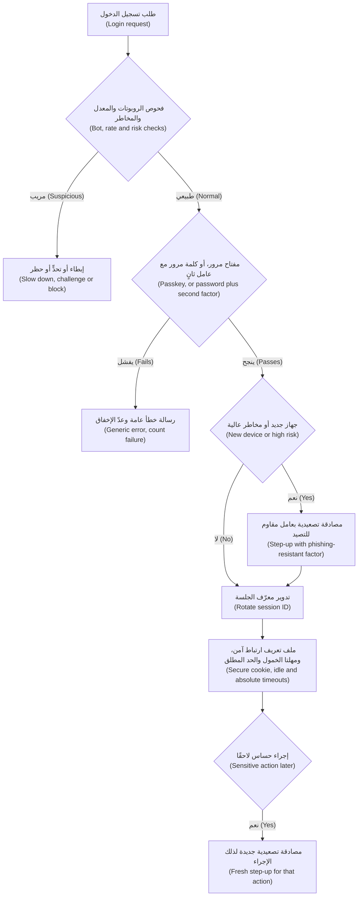
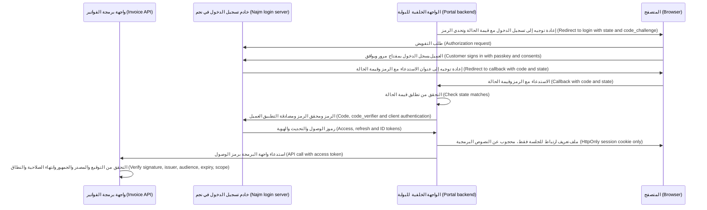
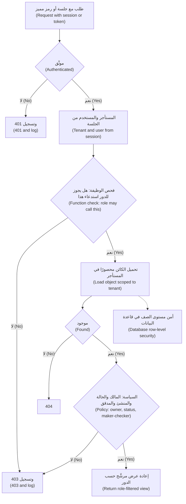

# الوحدة 3 — الهوية والوصول (Identity and access)

*معظم الاختراقات (breaches) لا تحتاج إلى استغلالٍ بارع (clever exploit). إنها تحتاج إلى كلمة مرورٍ مُعاد استخدامها (reused password)، أو رمزٍ مميز (token) تقبله واجهة البرمجة الخطأ (wrong API)، أو نقطة نهاية (endpoint) لا تسأل أبدًا «هل هذا لك؟» ⁦("is this yours?")⁩. تغطي هذه الوحدة الأسئلة الثلاثة (three questions) التي يجب أن يجيب عنها كل طلبٍ (every request) إلى أي نظامٍ في بنك نجم (Najm Bank) إجابةً صحيحة. من هذا؟ ⁦(Who is this?)⁩ تلك هي المصادقة (authentication): كلمات المرور (passwords) والمصادقة متعددة العوامل (MFA) ومفاتيح المرور (passkeys) والجلسات (sessions). ماذا يُثبت هذا الرمز المميز؟ ⁦(What does this token prove?)⁩ ذلك هو OAuth 2.0 وOpenID Connect ورموز JWT (JWTs). وهل يجوز لهم لمس هذا الكائن؟ ⁦(may they touch this object?)⁩ ذلك هو التفويض (authorisation) ومرجع الكائن المباشر غير الآمن (IDOR) وتعدد المستأجرين (multi-tenancy). ستتابع فريق أمن التطبيقات والذكاء الاصطناعي (Application & AI Security team) بينما يراقب مركز العمليات الأمنية (SOC) التابع لجاسم موجةً من حشو بيانات الاعتماد (credential-stuffing wave) تضرب تطبيق نجم للهاتف (Najm Mobile)، ويتعلّم علي لماذا تُعدّ مطابقة المستخدمين الاتحاديين بالبريد الإلكتروني (matching federated users by email) وفكّ ترميز الرموز المميزة دون التحقق منها (decoding tokens without verifying them) خطأين كليهما، ويحوّل اختبار مريم المصرَّح به (authorised test) لبوابة الشركات الصغيرة (SME Portal) رقمَ فاتورةٍ واحدًا مُغيَّرًا (one changed invoice number) إلى مصفوفة التحكم في الوصول (access-control matrix) الخاصة بالفريق. وتنتقل الأفكار نفسها مباشرةً إلى أمن الذكاء الاصطناعي (AI security): يجب أن تعمل أدوات (tools) نجم أسيست (Najm Assist) بهوية العميل وحقوقه (the customer's identity and rights)، لا بهويتها وحقوقها هي أبدًا (never their own).*

> **المراحل (Phases):** Design, Build, Test — تصميم تسجيل الدخول (sign-in) والرموز المميزة (tokens) والصلاحيات (permissions) بحيث يكون حتى أضعف مسارٍ إلى الحساب (weakest path into an account) قويًّا، وبناؤها بمكتباتٍ مُدقَّقة (vetted libraries)، والإثبات بالاختبارات (proving with tests) أن مستخدمًا آخر (another user) ومستأجرًا آخر (another tenant) يُرفَضان.

---

# 3.1 — المصادقة: كلمات المرور والمصادقة متعددة العوامل ومفاتيح المرور والجلسات (Authentication: passwords, MFA, passkeys and sessions)
*المستوى (Level): 🟡 متوسط (Intermediate)* · *المتطلبات (Prerequisites): 1.1، 1.2* · *المرحلة (Phase): Design, Build*

## ⚡ الدرس في دقيقة (In 60 seconds)
- **المصادقة (Authentication)** تجيب عن سؤال «من هذا؟» ⁦("who is this?")⁩؛ و**التفويض (authorisation)** (3.3) يجيب عن سؤال «ماذا يجوز لهم أن يفعلوا؟» ⁦("what may they do?")⁩. أبقِهما منفصلين (keep them apart) في التصميم (design) وفي الشيفرة (code).
- تفشل كلمات المرور (passwords fail) عبر إعادة الاستخدام (reuse) والتخمين (guessing) والتصيّد الاحتيالي (phishing) وسرقة قاعدة البيانات (database theft). لا تخزّنها إلا باستخدام **تجزئة كلمة مرور (password hash)** بطيئةٍ ومملّحة (slow, salted) مثل Argon2id، واحظر كلمات المرور المسرّبة (block breached passwords)، وتخلَّ عن قواعد التركيب (composition rules) والانتهاء القسري للصلاحية (forced expiry).
- تتفاوت **المصادقة متعددة العوامل (MFA, multi-factor authentication)** في قوتها (varies). فرموز الرسائل النصية (SMS codes) ورموز التطبيقات (app codes) يمكن اصطيادها بالتصيّد الاحتيالي (can be phished)؛ أمّا **مفاتيح المرور (passkeys)** (WebAuthn/FIDO2) فمرتبطةٌ بنطاق الموقع الحقيقي (bound to the real site's domain)، فلا يحصل الموقع المقلِّد (lookalike site) على شيءٍ يمكنه استخدامه.
- إعادة تعيين كلمة المرور (password reset) واستعادة الحساب (account recovery) و«غيّروا رقم هاتفي» ("change my phone number") هي أيضًا عمليات تسجيل دخول (logins too). يختار المهاجمون أضعف باب (weakest door).
- بعد تسجيل الدخول، يكون **رمز الجلسة (session token)** *هو* المستخدم (*is* the user): عشوائيًّا (random)، يُدوَّر عند تسجيل الدخول (rotated at login)، محفوظًا في ملف تعريف ارتباط (cookie) بخصائص `Secure` و`HttpOnly` و`SameSite`، تنتهي مهلته (timed out)، ويمكن إبطاله على الخادم (revocable on the server).
- مؤشر القرار (Decision cue): لكل إجراء (for each action)، اسأل «ما مدى اليقين الذي نحتاجه، ومنذ متى؟» ⁦("how sure must we be, and how recently?")⁩، واطلب **المصادقة التصعيدية (step-up authentication)** للإجراءات الخطرة (risky ones).

## 🧭 لماذا يهم (Why it matters)
في الساعة 02:10 من يوم ثلاثاء، يرى مركز العمليات الأمنية (SOC) التابع لجاسم إخفاقات تسجيل الدخول (login failures) على تطبيق نجم للهاتف (Najm Mobile) ترتفع ارتفاعًا حادًّا (climb steeply): آلافٌ من عناوين البريد الإلكتروني الحقيقية للعملاء (real customer email addresses)، جُرِّب كلٌّ منها مرةً أو مرتين (each tried once or twice)، من آلاف عناوين IP (IP addresses). وقبل ذلك بأسبوع، كان تاجر تجزئةٍ في الخارج لا صلة له بالبنك (unrelated retailer abroad) قد أفصح عن اختراق (disclosed a breach). هذا هو **حشو بيانات الاعتماد (credential stuffing)**: إعادة تشغيل أزواج البريد الإلكتروني وكلمة المرور (replaying email and password pairs) المسرّبة من موقعٍ ضد موقعٍ آخر (leaked from one site against another)، رهانًا على أن الناس يعيدون استخدام كلمات المرور (people reuse passwords). وتنجح بضع مئاتٍ من عمليات تسجيل الدخول (a few hundred logins succeed).

في تلك الحسابات، يوقف رمز SMS المطلوب على الأجهزة الجديدة (SMS code required on new devices) معظم المهاجمين. لكن بحلول منتصف الصباح (by mid-morning)، يُبلغ فريق مكافحة الاحتيال (fraud team) عن مكالماتٍ إلى مركز الاتصال (contact centre) تطلب نقل أرقام العملاء إلى بطاقات SIM جديدة (new SIM cards)، وعن صفحة تصيّدٍ احتيالي (phishing page) تطلب «الرمز الذي أرسلناه إليك للتو» ("the code we just sent you").

يسأل حمد، كبير مسؤولي أمن المعلومات (CISO)، أيّ الضوابط (controls) أوقفت ماذا. فحص كلمة المرور (password check) لم يوقف شيئًا: كانت كلمات المرور صحيحة. وقفل الحساب بعد خمسة إخفاقات (five-failure lockout) لم يُفعَّل قط: لم يشهد كل حسابٍ سوى محاولةٍ أو اثنتين. رمز SMS هو الذي أدّى العمل (did the work)، وهو بالضبط ما ستستهدفه الموجة التالية (next wave). قاعدة نورة: **يجب أن يسمّي كل ضابط مصادقة (every authentication control) الهجومَ الذي يوقفه (the attack it stops)، ونحن نقوّي أضعف مسارٍ إلى الحساب أولًا (harden the weakest path into an account first)، سواءٌ أكان تسجيل الدخول (login) أم إعادة التعيين (reset) أم الاستعادة (recovery) أم مركز الاتصال (contact centre).**

## 📐 كيف يعمل (How it works)

### 🟢 الأساسيات (The essentials)

**العوامل (Factors).** أدلة المصادقة (authentication evidence) إمّا شيءٌ **تعرفه (know)**، ككلمة مرور (password) أو رمز PIN، أو شيءٌ **تملكه (have)**، كهاتف (phone) أو مفتاح أمان (security key) أو مفتاحٍ في العتاد الآمن للجهاز (a key in a device's secure hardware)، أو شيءٌ **هو أنت (are)**، كبصمة الإصبع (fingerprint) أو الوجه (face). تحتاج **المصادقة متعددة العوامل (MFA)** إلى نوعين *مختلفين (different)* على الأقل؛ فكلمتا مرور ليستا مصادقةً متعددة العوامل (two passwords are not MFA). وعلى الهواتف، لا تفعل بصمة الإصبع عادةً أكثر من فتح مفتاحٍ على الجهاز (unlocks a key on the device)، فيرى البنك توقيعًا (signature) ولا يرى البيانات الحيوية (biometric) أبدًا.

**قواعد كلمات المرور الحديثة (Modern password rules).** وثيقة NIST SP 800-63B، وهي جزءٌ من إرشادات الهوية الرقمية الأمريكية (US Digital Identity Guidelines) في مراجعتها الرابعة (Revision 4) التي اكتملت عام 2025، هي المرجع الأكثر استشهادًا (most cited reference). وتطلب، وقت الكتابة (at the time of writing) عام 2026: الطول لا التعقيد (length over complexity)، أي 15 حرفًا على الأقل حين تكون كلمة المرور العامل الوحيد (only factor)، و8 حين تكون جزءًا من المصادقة متعددة العوامل (part of MFA)، مع السماح بطولٍ أقصى لا يقل عن 64 حرفًا (at least 64 allowed)؛ ولا قواعد تركيب (no composition rules)، فهي تنتج كلماتٍ مثل `Password1!`؛ ولا تغييرات دورية قسرية (forced periodic changes) دون دليلٍ على الاختراق (evidence of compromise)؛ وقائمة حظر (blocklist) لكلمات المرور الشائعة والمسرّبة (common and breached passwords)؛ ولا تلميحات (hints) ولا أسئلة أمان (security questions)؛ والسماح باللصق (paste allowed) كي تعمل برامج إدارة كلمات المرور (password managers). تحقّق من النص الحالي (check the current text) قبل كتابة السياسة (writing policy).

**تخزين كلمات المرور (Storing passwords).** لا تستخدم أبدًا النص الصريح (plain text) أو التشفير القابل للعكس (reversible encryption) أو دالة تجزئةٍ سريعة (fast hash) مثل MD5 أو SHA-1 أو SHA-256، إذ تسمح لجدولٍ مسروق (stolen table) بأن يواجه عددًا هائلًا من التخمينات في الثانية (enormous number of guesses per second) على بطاقات رسومياتٍ عادية (ordinary graphics cards). استخدم **Argon2id** (RFC 9106) أو **scrypt** أو **bcrypt** (أو PBKDF2 حيث تكون الخوارزميات المعتمدة وفق FIPS (FIPS-validated algorithms) إلزامية). فهي تضيف **ملحًا (salt)** فريدًا (unique) إلى كل كلمة مرور، وهي بطيئةٌ عمدًا (deliberately slow)؛ كما أن Argon2id وscrypt **مُكلفتان للذاكرة (memory-hard)** (5.1).

```python
# Vulnerable: fast, unsalted hash
user.password_hash = hashlib.sha256(password.encode()).hexdigest()

# Fixed: Argon2id via argon2-cffi. Salt and parameters live inside the hash string.
from argon2 import PasswordHasher
from argon2.exceptions import VerifyMismatchError
ph = PasswordHasher()

def check_password(user, password):
    try:
        ph.verify(user.password_hash, password)
    except VerifyMismatchError:
        return False
    if ph.check_needs_rehash(user.password_hash):   # parameters raised since this hash was made
        user.password_hash = ph.hash(password)
    return True
```

**مقارنة خيارات المصادقة متعددة العوامل (MFA options compared).**

| الطريقة (Method) | مقاومةٌ للتصيّد الاحتيالي؟ ⁦(Phishing-resistant?)⁩ | نقطة الضعف الرئيسية (Main weakness) | الملاءمة في بنك (Fit at a bank) |
|---|---|---|---|
| **رمزٌ عبر SMS أو مكالمة صوتية (SMS or voice code)** | لا (No) | تبديل شريحة SIM (SIM swap)، والاعتراض (interception)، والترحيل (relay)؛ وتصنّفها NIST «مقيَّدة» ("restricted") | احتياطيًّا فقط (Fallback only) |
| **رمز تطبيق المصادقة (Authenticator app code)** (TOTP) | لا (No) | يُكتب في موقعٍ مزيّف ويُرحَّل (typed into a fake site and relayed) | الوصول الأقل خطورة (Lower-risk access) |
| **الموافقة عبر الإشعار الفوري (Push approval)** | لا (No) | «إرهاق المصادقة متعددة العوامل» ("MFA fatigue"): إشعاراتٌ متتالية حتى ينقر أحدهم «موافقة» (until someone taps Approve) | فقط مع مطابقة الأرقام (Only with number matching) |
| **مفتاح المرور أو مفتاح الأمان (Passkey or security key)** | نعم (Yes) | تصبح الاستعادة نقطة الضعف (recovery becomes the weak point) | الخيار الافتراضي للعملاء (default for customers)؛ وإلزاميٌّ للموظفين ذوي الصلاحيات (required for privileged staff) |

**مفاتيح المرور (Passkeys).** **مفتاح المرور (passkey)** زوج مفاتيح (key pair) ينشئه جهاز المستخدم أو مدير كلمات المرور (password manager) لموقعٍ واحد (one website)، باستخدام **WebAuthn**، وهي واجهة برمجة المتصفح من W3C (the W3C browser API)، و**FIDO2**، أي WebAuthn مضافًا إليها البروتوكول الخاص بالمصادِقات الخارجية (protocol for external authenticators). لا يخزّن الخادم سوى المفتاح العام (public key)، ويرسل **تحدّيًا (challenge)** عشوائيًّا، ويتحقق من التوقيع (signature) الذي يُنشئه الجهاز بعد أن يفتحه المستخدم ببصمة الإصبع (fingerprint) أو الوجه (face) أو رمز PIN. لا يوجد على الخادم سرٌّ مشترك (shared secret) يمكن سرقته، ويربط المتصفح كل بيانات اعتماد (credential) بنطاق الموقع (site's domain)، فلا تستطيع صفحةٌ مقلِّدة (lookalike page) الحصول على توقيعٍ صالح لـ `najm.example`.

**الجلسات (Sessions).** بعد تسجيل الدخول، يُصدر الخادم **رمز جلسة (session token)**، عادةً في ملف تعريف ارتباط (cookie)؛ ومن يحمله *هو* المستخدم (*is* the user). اجعله **عشوائيًّا (random)**، أي 128 بتًا على الأقل من مولّدٍ آمن (secure generator). **دوِّره (Rotate it)** عند تسجيل الدخول وعند تغيّر الصلاحيات (privilege changes)، وإلّا فإن مهاجمًا زرع معرّفًا معروفًا (planted a known ID) قبل تسجيل الدخول يشارك الجلسة بعده، وهذا هو **تثبيت الجلسة (session fixation)**. احمِ ملف تعريف الارتباط بـ `Secure`، و`HttpOnly` (لا وصول للنصوص البرمجية (no script access))، و`SameSite=Lax` أو `Strict` (يساعد ضد تزوير الطلبات عبر المواقع (CSRF)، 2.2)، والبادئة (prefix) `__Host-`. اضبط **مهلتي الخمول والحدّ المطلق (idle and absolute timeouts)**، و**سجِّل الخروج على الخادم (log out on the server)**، مُبطِلًا جميع الجلسات (revoking all sessions) عند إعادة التعيين (reset) أو تغيير الهاتف (phone change) أو ظهور علامة احتيال (fraud flag). وفي الخدمات المصرفية (banking)، فضِّل الجلسات القابلة للإبطال على الخادم (revocable server-side sessions)؛ فالرمز المميز المكتفي بذاته (self-contained token) (3.2) يبقى صالحًا حتى تنتهي صلاحيته (lives until it expires).

```js
// Cookie: Set-Cookie: __Host-najm_sid=<random>; Path=/; Secure; HttpOnly; SameSite=Lax
app.post("/login", async (req, res, next) => {
  const user = await verifyCredentials(req.body);
  if (!user) return res.status(401).json({ error: "Invalid email or password" }); // never "no such account"
  // Vulnerable: setting req.session.userId here would keep the pre-login ID (session fixation)
  req.session.regenerate((err) => {        // Fixed: a brand-new session ID at authentication
    if (err) return next(err);
    req.session.userId = user.id;
    req.session.authTime = Date.now();     // used later to decide when step-up is needed
    res.json({ ok: true });
  });
});
```

### 🟡 التعمق أكثر (Going deeper)

**الدفاع ضد حشو بيانات الاعتماد (Defending against credential stuffing).** يتغلّب الحشو (stuffing) على القفل لكل حساب (per-account lockout)، إذ لا تتجاوز المحاولات اثنتين لكل حساب، وعلى قواعد القوة (strength rules)، إذ إن كلمات المرور صحيحة. رتّب الدفاعات في طبقات (layer the defences): **المصادقة متعددة العوامل (MFA)**، ويُفضَّل أن تكون مقاومةً للتصيّد الاحتيالي (phishing-resistant)؛ و**فحص كلمات المرور المسرّبة (breached-password checks)** عند التسجيل (sign-up) والتغيير (change) وتسجيل الدخول (login)، وتستخدم خدمة Pwned Passwords **إخفاء الهوية من النوع k (k-anonymity)**: لا ترسل سوى الأحرف الخمسة الأولى من تجزئة SHA-1 لكلمة المرور (first five characters of the password's SHA-1 hash) وتطابق القائمة المُعادة محليًّا (match the returned list locally)؛ و**المراقبة على مستوى الموقع كله (site-wide monitoring)** لنِسَب الإخفاق (failure ratios) وعمليات تسجيل الدخول من أجهزةٍ جديدة (new-device sign-ins) (10.1)؛ و**حدود المعدّل (rate limits)** المرتبطة بعنوان IP والجهاز والحساب (keyed on IP, device and account)، مع **تأخيراتٍ متصاعدة (progressive delays)** بدلًا من القفل الصارم (hard lockout)، الذي يتيح للمهاجمين إقفال حسابات العملاء في وجوههم (lets attackers lock customers out) (4.2).

**تعداد الحسابات (Account enumeration).** يجب ألّا يكشف تسجيل الدخول (login) والتسجيل (sign-up) وإعادة التعيين (reset) ما إذا كان الحساب موجودًا (whether an account exists). أعِد الرسالة نفسها (same message) ورمز الحالة نفسه (same status code) وتوقيتًا متقاربًا (roughly the same timing)؛ ومن الأساليب (one technique) تجزئة قيمةٍ وهمية (hash a dummy value) حين يكون الحساب غير موجود. وفي إعادة التعيين، قل دائمًا «إذا كان الحساب موجودًا، فقد أرسلنا رابطًا» ("If an account exists, we have sent a link").

**إعادة تعيين كلمة المرور (Password reset).** إعادة التعيين تسجيلُ دخولٍ يتخطى كلمة المرور (a login that skips the password). استخدم رمزًا عشوائيًّا (random token) لا يقل عن 128 بتًا، يُستخدم مرةً واحدة (single-use)، وقصير العمر (short-lived)، ولا يُخزَّن إلا تجزئةً (stored only as a hash). ابنِ الرابط من عنوان URL أساسي مُعَدّ مسبقًا (configured base URL)، لا من ترويسة `Host` في الطلب (request's Host header) أبدًا. واصِل اشتراط المصادقة متعددة العوامل (still require MFA)، ولا تُدخِل المستخدم تلقائيًّا (do not log the user in automatically)، وأبطِل الجلسات القائمة (revoke existing sessions)، وأشعِر العميل (notify the customer).

**بيانات الاتصال والأجهزة هي المفاتيح الحقيقية (Contact details and devices are the real keys).** تغيير رقم الهاتف (changing the phone number) أو تسجيل جهازٍ جديد (registering a new device) يتحكم في كل رمزٍ وتنبيهٍ لاحق (every later code and alert). و**تبديل شريحة SIM (SIM swap)**، أي إقناع مشغّل الهاتف المحمول (mobile operator) بنقل رقمٍ إلى شريحة المهاجم (attacker's SIM)، يقلب رموز SMS ضد العميل (turns SMS codes against the customer). عامِل هذه التغييرات على أنها عالية الخطورة (high-risk): مصادقةٌ تصعيدية (step-up) بعاملٍ قويٍّ قائم (existing strong factor)، وإشعار القناة *القديمة* (notify the *old* channel)، وتعليق تغييرات المستفيدين والحدود (hold payee and limit changes) لفترة تهدئة (cooling-off period).

**المصادقة التصعيدية ومستويات الضمان (Step-up and assurance levels).** **مستويات ضمان المصادِق (authenticator assurance levels)** لدى NIST هي **AAL1**، أي عاملٌ واحد على الأقل (at least one factor)، و**AAL2**، أي عاملان مختلفان (two different factors)، و**AAL3**، أي، وقت الكتابة (at the time of writing)، مصادِقٌ مدعومٌ بالعتاد ومقاومٌ للتصيّد الاحتيالي لا يمكن تصدير مفتاحه (hardware-backed, phishing-resistant authenticator whose key cannot be exported). و**المصادقة التصعيدية (Step-up)** تطلب مصادقةً جديدةً وأقوى (fresh, stronger authentication) مباشرةً قبل إجراءٍ حساس (sensitive action). وفي مدفوعات الاتحاد الأوروبي (EU payments)، تشترط المصادقة القوية للعميل (strong customer authentication) وفق PSD2 أيضًا **الربط الديناميكي (dynamic linking)** بالمبلغ والمستفيد (amount and payee)؛ تحقّق من القواعد الحالية مع فريق الامتثال (compliance).

**تصيّدٌ احتيالي يهزم الرموز (Phishing that defeats codes).** حِزَم تصيّد **الخصم في المنتصف (Adversary-in-the-middle, AitM)** تُرحِّل كل ما تكتبه الضحية (relay everything the victim types)، بما في ذلك الرمز لمرةٍ واحدة (one-time code)، إلى الموقع الحقيقي في الوقت الفعلي (in real time)، وتحتفظ بملف تعريف ارتباط الجلسة (session cookie) العائد. ورموز SMS ورموز التطبيقات (app codes) والموافقات البسيطة عبر الإشعار الفوري (simple push approvals) تسقط كلها أمام ذلك. أمّا مفاتيح المرور (passkeys) فلا، لأن المتصفح لا يوقّع إلا للنطاق الحقيقي (signs only for the real domain). و**إرهاق المصادقة متعددة العوامل (MFA fatigue)**، أي إشعارٌ تلو إشعار حتى ينقر مستخدمٌ مُتعَب «موافقة» (until a tired user taps Approve)، ظهر في عدة اختراقاتٍ مُعلَن عنها (publicly reported intrusions) عام 2022. خفِّف منه (mitigate it) عبر **مطابقة الأرقام (number matching)**، إذ يكتب المستخدم في التطبيق رقمًا معروضًا على شاشة تسجيل الدخول (a number shown on the login screen)، ووضع حدودٍ للإشعارات (limits on prompts)، وتضمين تفاصيل الموقع والتطبيق في الإشعار (location and app details in the prompt).



### 🔴 نظرة الخبير (Expert view)

**الاستعادة هي المحيط الحقيقي (Recovery is the real perimeter).** ما إن يعتمد تسجيل الدخول على مفاتيح المرور (once login uses passkeys)، حتى ينتقل المهاجمون إلى إعادة التعيين عبر SMS (SMS reset)، ومكتب المساعدة (help desk)، و«فقدتُ هاتفي» ("I lost my phone")؛ وقد ظهرت الهندسة الاجتماعية لمكتب المساعدة (help-desk social engineering) في اختراقاتٍ مُعلَن عنها (publicly reported intrusions). امنح الاستعادة ضمانًا بمستوى تسجيل الدخول (login-level assurance): أكثر من مفتاح مرورٍ أو جهازٍ مسجَّل (more than one registered passkey or device)، وإعادة التحقق من الهوية (identity re-verification) داخل التطبيق أو في فرع (in-app or in a branch) بدلًا من «تاريخ الميلاد» ("date of birth")، وتأخيراتٍ وإشعارات (delays and notifications)، ونصًّا لمركز الاتصال (contact-centre script) لا يعيد تعيين أي عامل (never resets a factor) بناءً على مكالمةٍ هاتفية وحدها (on a phone call alone).

**مفاتيح مرورٍ متزامنة أم مرتبطة بالجهاز (Synced or device-bound passkeys).** **مفاتيح المرور المتزامنة (Synced passkeys)** تتبع المستخدم إلى هاتفٍ جديد عبر حساب منصته (platform account) أو مدير كلمات المرور (password manager): مريحة (convenient)، لكنها آمنةٌ فقط بقدر أمان ذلك الحساب واستعادته (only as secure as that account and its recovery). أمّا المفاتيح **المرتبطة بالجهاز (Device-bound)**، مثل مفاتيح الأمان العتادية (hardware security keys)، فلا يمكن نسخها (cannot be copied) وتناسب AAL3. نشرت NIST عام 2024 إرشاداتٍ تقبل المصادِقات القابلة للمزامنة (syncable authenticators) عند AAL2، ثم أُدمجت لاحقًا في المراجعة 4 (Revision 4). والتقسيم المعقول (a sensible split): مفاتيح مرورٍ متزامنة للعملاء، ومفاتيح مرتبطة بالجهاز للموظفين ذوي الصلاحيات (privileged staff).

**استخدم مكتبة WebAuthn مُصانة (Use a maintained WebAuthn library).** يفحص التحقق (verification) تحدّيًا يُستخدم مرةً واحدة (single-use challenge)، والأصل (origin)، و**معرّف الطرف المعتمِد (RP ID, relying party identifier)** الذي يكون عادةً نطاقك (usually your domain)، وعلامتي حضور المستخدم والتحقق منه (user-presence and user-verification flags)، والتوقيع (signature)، وعدّاد التوقيع (signature counter)، وكثيرًا ما تُبلغ مفاتيح المرور المتزامنة عن صفر، فعامِله إشارةً لا أكثر (treat it as a signal). ومن السهل أن تخطئ في كل خطوةٍ خطأً دقيقًا (subtly wrong) إذا كتبتها يدويًّا (by hand). والمكافئ الأصلي (native equivalent) في تطبيق نجم للهاتف (Najm Mobile)، أي مفتاحٌ في العتاد الآمن للهاتف (phone's secure hardware) يُفتح بالبيانات الحيوية (biometrics)، هو **ربط الجهاز (device binding)** (4.3).

**طابِق التجزئة مع الإنتروبيا (Match the hashing to the entropy).** وُجدت التجزئة البطيئة (slow hashing) لأن كلمات المرور البشرية (human passwords) قليلة العشوائية (little randomness). أمّا رمز إعادة التعيين (reset token) أو مفتاح واجهة البرمجة (API key) ذو 128 بتًا عشوائيًّا (128 random bits) فيمكن تخزينه بأمان تجزئةَ SHA-256 عادية (plain SHA-256 hash). و**الفلفل (pepper)**، وهو مفتاحٌ سري (secret key) محفوظ في نظام إدارة المفاتيح (KMS) أو وحدة أمن العتاد (HSM) (5.2) ويُمزج في تجزئة كلمات المرور (mixed into password hashing)، يعني أن قاعدة بياناتٍ مسروقة وحدها لا تكفي لبدء التخمين (a stolen database alone is not enough to start guessing)، على حساب إدارة المفاتيح (at the cost of key management). ومعظم تطبيقات bcrypt (bcrypt implementations) لا تستخدم إلا أول 72 بايتًا من المدخلات (first 72 bytes of input)، وهذا سببٌ آخر لتفضيل Argon2id في الأنظمة الجديدة (new systems).

## 🧰 الأدوات (The toolkit)
| الضابط أو المعيار أو الأداة (Control, standard or tool) | ما هو وماذا يفعل (What it is and does) | متى تلجأ إليه (When to reach for it) |
|---|---|---|
| **NIST SP 800-63B** — إرشادات الهوية الرقمية (Digital Identity Guidelines) | قواعد للمصادِقات (authenticators) وكلمات المرور (passwords) ومستويات الضمان (assurance levels) من AAL1 إلى AAL3 وإعادة المصادقة (reauthentication)؛ وتُستخدم على نطاقٍ واسع خارج الحكومة الأمريكية (widely used beyond US government) | وضع سياسة كلمات المرور والمصادقة متعددة العوامل والجلسات (password, MFA and session policy)؛ وإلغاء القواعد المتقادمة (retiring outdated rules) |
| **Argon2id** — وفق RFC 9106 | تجزئة كلمات مرورٍ بطيئة ومملّحة ومُكلفة للذاكرة (slow, salted, memory-hard password hashing)؛ وscrypt وbcrypt بديلان مقبولان (acceptable alternatives) | كل نظامٍ يخزّن كلمات المرور (every system that stores passwords) |
| **Breached-password check** — فحص كلمات المرور المسرّبة، مثل Pwned Passwords | يقارن كلمات المرور بقوائم الكلمات المعروف تسريبها (known-breached lists)، بخصوصيةٍ عبر k-anonymity أو قائمةٍ محلية (privately via k-anonymity or a local list) | التسجيل (sign-up)، وتغيير كلمة المرور (password change)، وتسجيل الدخول حيثما أمكن (where possible, login) |
| **Passkeys** — مفاتيح المرور (WebAuthn/FIDO2) | بيانات اعتمادٍ بمفتاحٍ عام مرتبطةٌ بالنطاق (domain-bound public-key credentials)؛ مقاومةٌ للتصيّد الاحتيالي (phishing-resistant)، ولا سرّ مشتركًا على الخادم (no shared secret on the server) | تسجيل الدخول الافتراضي للعملاء (default sign-in for customers)؛ ومفاتيح مرتبطة بالجهاز للموظفين ذوي الصلاحيات (device-bound keys for privileged staff) |
| **Step-up authentication** — المصادقة التصعيدية | مصادقةٌ جديدة وأقوى (fresh, stronger authentication) مباشرةً قبل إجراءٍ حساس (sensitive action) | المستفيدون الجدد (new payees)، وزيادة الحدود (limit increases)، وتغيير بيانات الاتصال (contact-detail changes)، والإجراءات الإدارية (admin actions) |
| **Secure session cookies** — ملفات تعريف ارتباط الجلسة الآمنة (`Secure`، `HttpOnly`، `SameSite`، `__Host-`) | خصائص ملفات تعريف الارتباط (cookie attributes) التي تُبقي رمز الجلسة (session token) على HTTPS، وبعيدًا عن النصوص البرمجية (away from scripts)، وخارج معظم الطلبات عبر المواقع (out of most cross-site requests) | كل جلسة متصفح (every browser session) |
| **OWASP ASVS** — من OWASP | متطلباتٌ قابلة للاختبار (testable requirements)، بما فيها المصادقة وإدارة الجلسات (authentication and session management)؛ وصدر الإصدار 5.0 (version 5.0) عام 2025 | كتابة المتطلبات وقوائم التحقق للمراجعة (writing requirements and review checklists) |

## 🏛️ عمليًا في بنك نجم (In practice at Najm Bank)
بعد موجة الحشو (stuffing wave)، تكتب نورة وعلي **معيار نجم للمصادقة، الإصدار 1، لقنوات العملاء (Najm Authentication Standard v1 — customer channels)**. يعتمده حمد، ويتولى مركز العمليات الأمنية (SOC) التابع لجاسم قواعد الرصد (detection rules) الخاصة به.

**الجزء أ: القواعد (Part A: rules)**

| المجال (Area) | القاعدة (Rule) | ما توقفه (Stops) |
|---|---|---|
| تسجيل الدخول (Sign-in) | تطبيق نجم للهاتف (Najm Mobile): مفتاح الجهاز (device key) يُفتح بالبيانات الحيوية أو برمز PIN للتطبيق (biometric or app PIN). الويب (Web): مفاتيح المرور افتراضيًّا (passkeys by default) | التصيّد الاحتيالي (phishing)، وإعادة الاستخدام (reuse) |
| كلمات المرور، حيثما لا تزال مستخدمة (Passwords, where still used) | 12 حرفًا فأكثر (12+ characters)، وهي قاعدةٌ داخلية (house rule) مع عاملٍ ثانٍ دائمًا (always with a second factor)؛ لا قواعد تركيب ولا انتهاء صلاحية (no composition rules or expiry)؛ فحص كلمات المرور المسرّبة (breached-password check) | الحشو (stuffing)، والتخمين (guessing) |
| التخزين (Storage) | Argon2id عبر المكتبة المعتمدة (approved library)؛ وإعادة التجزئة عند تسجيل الدخول (rehash on login) | الكسر دون اتصال (offline cracking) |
| رموز SMS (SMS codes) | احتياطٌ للحالات منخفضة الخطورة فقط (low-risk fallback only)؛ ولا تُستخدم أبدًا للمصادقة التصعيدية في الجزء ب (never for Part B step-ups) | تبديل شريحة SIM (SIM swap)، والترحيل (relay) |
| الردود والحدود (Responses and limits) | رسالةٌ عامة واحدة بالعربية والإنجليزية (one generic message in Arabic and English)؛ تأخيراتٌ متصاعدة (progressive delays)؛ تنبيهٌ لمركز العمليات الأمنية (SOC alert) عند نسبة الإخفاق على مستوى الموقع (site-wide failure ratio) | التعداد (enumeration)، والحشو (stuffing) |
| الجلسات (Sessions) | معرّفاتٌ بطول 128 بتًا (128-bit IDs) تُدوَّر عند تسجيل الدخول والمصادقة التصعيدية (rotated at login and step-up)؛ `__Host-`، `Secure`، `HttpOnly`، `SameSite=Lax`؛ مهلة الخمول على الويب 10 دقائق (web idle 10 minutes)، والحد المطلق 12 ساعة (absolute 12 hours)، وهي قيمٌ توضيحية (illustrative) | التثبيت (fixation)، والسرقة (theft) |
| الاستعادة (Recovery) | لا استعادة عبر SMS وحدها (no SMS-only recovery)؛ إعادة التحقق من الهوية في التطبيق أو الفرع (identity re-verification in app or branch)؛ لا إعادة تعيين للعوامل عبر الهاتف (no factor resets by phone) | إساءة استخدام الاستعادة (recovery abuse) |
| الموظفون والمسؤولون (Staff and administrators) | مفاتيح أمانٍ مرتبطة بالجهاز فقط (device-bound security keys only) | الاستيلاء على الحسابات ذات الصلاحيات (privileged takeover) |

**الجزء ب: مصفوفة المصادقة التصعيدية لإجراءات العملاء (Part B: step-up matrix for customer actions)**

| الإجراء (Action) | المصادقة (Authentication) | الحداثة (Freshness) | ضوابط إضافية (Extra controls) |
|---|---|---|---|
| تجميد بطاقة (Freeze a card) | الجلسة مع تأكيدٍ داخل التطبيق (session plus in-app confirmation) | الجلسة (Session) | احتكاكٌ منخفض عن قصد (low friction on purpose): التجميد يقلّل المخاطر (freezing reduces risk) |
| إلغاء تجميد بطاقة أو كشف رقمها (Unfreeze a card or reveal its number) | مصادقة تصعيدية (step-up): مفتاح الجهاز أو مفتاح المرور (device key or passkey) | 5 دقائق (5 minutes) | غير متاحٍ أبدًا لنجم أسيست (never available to Najm Assist) |
| إضافة مستفيد (Add a payee) | مصادقة تصعيدية (Step-up) | لكل إجراء (per action) | تعليقٌ لمدة 24 ساعة (24-hour hold) على جهازٍ عمره أقل من 72 ساعة (device under 72 hours old) |
| تحويلٌ يتجاوز الحد اليومي (Transfer above the daily limit) | مصادقة تصعيدية تعرض المبلغ والمستفيد (step-up showing amount and payee) | لكل معاملة (per transaction) | درجة الاحتيال (fraud score) من التنبيهات الذكية (Smart Alerts) |
| تغيير رقم الهاتف أو البريد الإلكتروني (Change phone number or email) | مصادقة تصعيدية بعاملٍ قويٍّ قائم (step-up with an existing strong factor) | لكل إجراء (per action) | إشعار القناتين القديمة والجديدة (notify old and new channels)؛ وتعليقٌ لمدة 72 ساعة على تغييرات المستفيدين (72-hour hold on payee changes) |
| تسجيل جهاز جديد (Register a new device) | موافقةٌ من جهازٍ قائم (approval from an existing device)، أو إعادة التحقق (re-verification) | لكل إجراء (per action) | إشعار جميع الأجهزة (notify all devices)؛ ويمكن لأيٍّ منها الإلغاء (any can cancel) |

## 🛠️ التمارين (Exercises)
- 🟢 على تطبيقٍ تملكه (app you own)، أو على نسخةٍ محلية من OWASP Juice Shop، جرّب تسجيل الدخول (login) والتسجيل (sign-up) وإعادة تعيين كلمة المرور (password reset) ببريدٍ إلكتروني موجود وآخر غير موجود، مسجِّلًا الرسالة (message) ورمز الحالة (status code) وزمن الاستجابة التقريبي (rough response time). *يكتمل عندما (Done when):* يُظهر جدولك ذو الحالات الست (six-case table) أن الشخص من الخارج (outsider) لا يستطيع معرفة الحسابات الموجودة، أو تكون قد كتبت إصلاحًا (fix) لكل تسريب (each leak).
- 🟡 في تطبيقٍ محليٍّ صغير من صنعك (small local app of your own)، خزّن كلمات المرور باستخدام Argon2id (أو bcrypt)، وأعِد التجزئة عند تسجيل الدخول حين تتغير المعاملات (rehash on login when parameters change)، وافحص كلمات المرور الجديدة مقابل قائمةٍ مسرّبة (breached list)، عبر واجهة برمجة النطاقات القائمة على k-anonymity (k-anonymity range API) أو ملفٍّ منزَّل (downloaded file). *يكتمل عندما (Done when):* تبدأ القيم المخزّنة بـ `$argon2id$` (أو `$2b$`)، ويُثبت اختبارٌ (test) أن رفع المعاملات (raised parameters) يؤدي إلى إعادة التجزئة عند تسجيل الدخول التالي (rehash at next login)، وتُرفَض كلمة مرورٍ مسرّبة علنًا (publicly breached password).
- 🔴 أضِف تسجيل الدخول بمفاتيح المرور (passkey sign-in) إلى تطبيقٍ تجريبي محلي (local demo app) على `localhost` باستخدام مكتبة WebAuthn مُصانة (maintained WebAuthn library)، ثم اكتب تصميمًا للاستعادة في صفحةٍ واحدة (one-page recovery design). *يكتمل عندما (Done when):* تُثبت الاختبارات أن الخادم يرفض تحدّيًا مُعادًا استخدامه (reused challenge) وأصلًا خاطئًا (wrong origin)، ويوضّح التصميم كيف يعود مستخدمٌ فقد كل أجهزته (lost every device)، وبأي مستوى ضمان (at what assurance) وبأي تأخير (with what delay).

## ⚠️ أخطاء وفخاخ (Mistakes and traps)
- **اعتبار رموز SMS «مصادقةً متعددة العوامل منجزة» (Calling SMS codes "MFA done").** يهزمها تبديل شريحة SIM (SIM swaps) والتصيّد بالترحيل (relay phishing). أبقِها احتياطًا (fallback)، وانقل الإجراءات الخطرة (risky actions) إلى مفاتيح المرور أو مفاتيح الجهاز (passkeys or device keys).
- **القفل الصارم دفاعًا ضد الحشو (Hard lockout as the stuffing defence).** يجرّب الحشو كل حسابٍ مرةً أو مرتين، والقفل يتيح للمهاجمين إقفال حسابات العملاء (lock customers out). استخدم المصادقة متعددة العوامل (MFA)، وفحص كلمات المرور المسرّبة (breached-password checks)، والرصد على مستوى الموقع (site-wide detection)، والتأخيرات المتصاعدة (progressive delays).
- **تجزئة كلمات المرور السريعة أو محلية الصنع (Fast or home-made password hashing).** SHA-256 مع ملحٍ مشترك (shared salt) ليس تخزينًا لكلمات المرور (not password storage). استخدم Argon2id أو scrypt أو bcrypt عبر مكتبةٍ مُصانة (maintained library).
- **نسيان الأبواب الجانبية (Forgetting the side doors).** إعادة التعيين (reset) والاستعادة (recovery) وتغيير الهاتف (phone changes) ومركز الاتصال (contact centre) كلها مسارات مصادقة (authentication paths). امنحها ضمانًا بمستوى تسجيل الدخول (login-level assurance).
- **تسجيل خروجٍ لا يمسح إلا المتصفح (Logout that only clears the browser).** إذا ظل الخادم يقبل الجلسة، فإن النسخة المسروقة (stolen copy) تظل تعمل. أتلِف الجلسات على الخادم (destroy sessions on the server).

## 🧾 الخلاصة (Recap)
- المصادقة (authentication) تُثبت هوية الشخص (proves who someone is)؛ فأبقِها منفصلةً عن التفويض (authorisation).
- اتبع إرشادات NIST الحالية (current NIST guidance): الطول وقوائم الحظر (length and blocklists)، ولا قواعد تركيب ولا انتهاء قسري للصلاحية (no composition rules or forced expiry)؛ وجزِّئ باستخدام Argon2id أو scrypt أو bcrypt.
- يمكن اصطياد الرموز وإشعارات الموافقة (codes and push prompts) بالتصيّد أو إنهاك المستخدم بها حتى يوافق (phished or worn down)؛ أمّا مفاتيح المرور (passkeys) فمرتبطةٌ بالنطاق الحقيقي (bound to the real domain).
- إعادة التعيين والاستعادة وتغيير بيانات الاتصال (reset, recovery and contact-detail changes) عمليات تسجيل دخولٍ متنكّرة (logins in disguise). قوِّها أولًا (harden them first).
- تحتاج الجلسات (sessions) إلى معرّفاتٍ عشوائية تُدوَّر عند تسجيل الدخول (random IDs rotated at login)، وملفات تعريف ارتباط محمية (protected cookies)، ومهلٍ زمنية (timeouts)، وإبطالٍ على الخادم (server-side revocation)، ومصادقةٍ تصعيدية (step-up).

## ✍️ اختبر نفسك (Check yourself)

**1. يرى جاسم آلاف محاولات تسجيل الدخول (login attempts) على تطبيق نجم للهاتف (Najm Mobile)، كلٌّ منها من عنوان IP مختلف (different IP address)، بمحاولةٍ واحدة لكل حساب (one attempt per account) وبعناوين بريدٍ إلكتروني حقيقية للعملاء (real customer email addresses). أيّ الضوابط القائمة (existing control) سيكون الأقل أثرًا (do LEAST) في إيقاف ذلك؟**

- A. عاملٌ ثانٍ مطلوب على الأجهزة الجديدة (second factor required on new devices)
- B. قفل الحساب بعد خمس محاولاتٍ فاشلة (locking an account after five failed attempts)
- C. تنبيهٌ (alert) على نسبة تسجيلات الدخول الفاشلة إلى الناجحة على مستوى الموقع (site-wide ratio of failed to successful logins)
- D. فحص كلمات المرور (checking passwords) مقابل قوائم كلمات المرور المسرّبة (breached-password lists)

<details><summary>الإجابة</summary>

**B.** يجرّب الحشو (stuffing) كل حسابٍ مرةً أو مرتين، فنادرًا ما يُفعَّل القفل بعد خمسة إخفاقات (five-failure lockout)، كما يمكن إساءة استخدام القفل الصارم (hard lockout) ضد العملاء (abused against customers). أمّا A وC وD فتعالج جميعها إعادة الاستخدام على نطاقٍ واسع (reuse at scale). انظر: 🟡 التعمق أكثر (Going deeper).

</details>

**2. يكتشف علي أن بوابة الشركات الصغيرة (SME Portal) تخزّن كلمات المرور بتجزئة SHA-256 مع ملحٍ واحد مشترك بين جميع المستخدمين (one salt shared by every user). ما الإصلاح الأفضل (BEST fix)؟**

- A. التحول إلى SHA-512 مع الإبقاء على الملح المشترك (shared salt)
- B. تشفير عمود كلمات المرور (password column) باستخدام AES كي يمكن فكّ تشفيره عند الحاجة (decrypted if needed)
- C. الانتقال إلى Argon2id (أو bcrypt أو scrypt) بملحٍ فريد لكل كلمة مرور (unique salt per password)، مع إعادة تجزئة كلمة مرور كل مستخدم عند تسجيل دخوله الناجح التالي (at their next successful login)
- D. إجبار كل مستخدم على تغيير كلمة مروره (force every user to change their password) كل 90 يومًا (every 90 days)

<details><summary>الإجابة</summary>

**C.** دوال تجزئة كلمات المرور (password hashing functions) بطيئةٌ ومملّحةٌ لكل كلمة مرور (salted per password)، وإعادة التجزئة عند تسجيل الدخول (rehash-on-login) تُرحِّل المستخدمين (migrates users) دون إعادة تعيينٍ جماعية (mass reset)، ولحماية الحسابات الخاملة (dormant accounts) أيضًا، كثيرًا ما تغلّف الفرق كل تجزئةٍ قديمة بـ Argon2id فورًا (wrap each old hash in Argon2id at once). أمّا A فلا تزال تجزئةً سريعة (fast hash)؛ وB قابلٌ للعكس (reversible) على يد أي شخصٍ يملك المفتاح (anyone with the key)؛ وD لم تعد NIST توصي به (no longer recommended by NIST). انظر: 🟢 الأساسيات (The essentials).

</details>

**3. حزمة تصيّد احتيالي (phishing kit) تُرحِّل كل ما يكتبه العميل إلى موقع نجم الحقيقي (real Najm website) في الوقت الفعلي (in real time)، بما في ذلك الرموز لمرةٍ واحدة (one-time codes)، وتحتفظ بملف تعريف ارتباط الجلسة (session cookie). أيّ المصادِقات (authenticator) يقاوم ذلك؟**

- A. رمزٌ لمرةٍ واحدة عبر SMS (SMS one-time code)
- B. رمزٌ من ستة أرقام من تطبيق المصادقة (six-digit authenticator-app code)
- C. موافقةٌ عبر الإشعار الفوري دون مطابقة الأرقام (push approval without number matching)
- D. مفتاح مرور (passkey)

<details><summary>الإجابة</summary>

**D.** يربط المتصفح مفتاح المرور بالنطاق الحقيقي (binds a passkey to the real domain)، فلا تستطيع الصفحة المقلِّدة (lookalike page) الحصول على توقيعٍ صالح لنجم (signature valid for Najm). أمّا الرموز فيمكن ترحيلها (can be relayed)، ويمكن أن تُعتمَد إشعارات الموافقة لصالح جلسة المهاجم (approved for the attacker's session). انظر: 🟢 الأساسيات (The essentials)؛ 🟡 التعمق أكثر (Going deeper).

</details>

**4. في أثناء اختبارٍ مصرَّحٍ به (authorised test)، تلاحظ مريم أن قيمة ملف تعريف ارتباط الجلسة (session cookie value) هي نفسها قبل تسجيل الدخول وبعده (same before and after login). ما الخطر (risk)، وما الإصلاح (fix)؟**

- A. تثبيت الجلسة (session fixation)؛ أصدِر معرّف جلسةٍ جديدًا (new session ID) عند تسجيل الدخول وعند كل تغييرٍ في الصلاحيات (every privilege change)
- B. البرمجة النصية عبر المواقع (cross-site scripting, XSS)؛ أضِف سياسة أمان المحتوى (Content Security Policy)
- C. حشو بيانات الاعتماد (credential stuffing)؛ أضِف اختبار CAPTCHA
- D. لا خطر (no risk)، ما دام ملف تعريف الارتباط (cookie) `HttpOnly`

<details><summary>الإجابة</summary>

**A.** إذا بقي المعرّف السابق لتسجيل الدخول (pre-login ID)، فإن أي شخصٍ زرعه قبل تسجيل الدخول يشارك الجلسة الموثَّقة (authenticated session)؛ وإعادة توليد المعرّف (regenerating the ID) تسدّ الثغرة. أمّا `HttpOnly` (D) فيمنع النصوص البرمجية من قراءة ملف تعريف الارتباط (stops scripts reading the cookie)، ولا يمنع المعرّف المزروع (planted ID). انظر: 🟢 الأساسيات (The essentials).

</details>

**5. يريد فريق طارق أن يغيّر العملاء رقم هاتفهم المسجَّل (registered phone number) في تطبيق نجم للهاتف (Najm Mobile) بنقرةٍ واحدة (one tap)، لتقليل مكالمات مركز الاتصال (contact-centre calls). بماذا ينبغي أن يوصي فريق نورة؟ ⁦(What should Noura's team recommend?)⁩**

- A. السماح بذلك (allow it)، لأن العميل مسجِّلٌ دخوله أصلًا (already signed in)
- B. السماح بذلك مع مصادقةٍ تصعيدية بعاملٍ قويٍّ قائم (step-up using an existing strong factor)، وإشعارٍ إلى الرقم القديم (notification to the old number)، وتعليقٍ (hold) قبل أن يتمكن الرقم الجديد من تفويض المستفيدين أو تغييرات الحدود (authorise payees or limit changes)
- C. إزالة تغيير الهاتف من التطبيق (remove phone changes from the app) واشتراط زيارة الفرع على الجميع (require a branch visit for everyone)
- D. السماح بذلك (allow it)، مع رمز SMS يُرسَل إلى الرقم الجديد (SMS code sent to the new number)

<details><summary>الإجابة</summary>

**B.** يتحكم رقم الهاتف في كل رمزٍ وتنبيهٍ لاحق (every later code and alert)، لذا فإن تغييره خطوةٌ كلاسيكية في الاستيلاء على الحساب (classic takeover step). والمصادقة التصعيدية (step-up) وإشعار القناة القديمة (old-channel notification) وفترة التهدئة (cooling-off period) تُبقي التغيير مريحًا لكن صعب الاستغلال (convenient but hard to abuse). أمّا D فلا يُثبت إلا التحكم في الرقم الجديد (control of the new number)، وهو ما يملكه المهاجم؛ وC تصحيحٌ مفرط (over-corrects). انظر: 🟡 التعمق أكثر (Going deeper)؛ 🏛️ عمليًا (In practice).

</details>

## 📚 المراجع (References)
- وثيقة NIST SP 800-63B-4، *Digital Identity Guidelines: Authentication and Authenticator Management* (2025) — https://doi.org/10.6028/NIST.SP.800-63B-4
- ورقة OWASP المختصرة للمصادقة (OWASP Authentication Cheat Sheet) — https://cheatsheetseries.owasp.org/cheatsheets/Authentication_Cheat_Sheet.html
- ورقة OWASP المختصرة لتخزين كلمات المرور (OWASP Password Storage Cheat Sheet) — https://cheatsheetseries.owasp.org/cheatsheets/Password_Storage_Cheat_Sheet.html
- ورقة OWASP المختصرة لإدارة الجلسات (OWASP Session Management Cheat Sheet) — https://cheatsheetseries.owasp.org/cheatsheets/Session_Management_Cheat_Sheet.html
- ورقة OWASP المختصرة لمنع حشو بيانات الاعتماد (OWASP Credential Stuffing Prevention Cheat Sheet) — https://cheatsheetseries.owasp.org/cheatsheets/Credential_Stuffing_Prevention_Cheat_Sheet.html
- معيار OWASP للتحقق من أمن التطبيقات (OWASP Application Security Verification Standard, ASVS) — https://owasp.org/www-project-application-security-verification-standard/
- اتحاد W3C، مواصفة مصادقة الويب (Web Authentication, WebAuthn) — https://www.w3.org/TR/webauthn/
- RFC 9106، دالة Argon2 المُكلفة للذاكرة لتجزئة كلمات المرور (Argon2 Memory-Hard Function for Password Hashing) — https://www.rfc-editor.org/rfc/rfc9106
- موقع Have I Been Pwned، خدمة Pwned Passwords — https://haveibeenpwned.com/Passwords

---

# 3.2 — OAuth 2.0 وOpenID Connect ومزالق الرموز المميزة (OAuth 2.0, OpenID Connect and token pitfalls)
*المستوى (Level): 🟡 متوسط (Intermediate)* · *المتطلبات (Prerequisites): 3.1* · *المرحلة (Phase): Design, Build*

## ⚡ الدرس في دقيقة (In 60 seconds)
- وُضع **OAuth 2.0** من أجل **التفويض بالإنابة (delegated authorisation)**: يستدعي تطبيقٌ واجهة برمجة (API) نيابةً عن المستخدم (on a user's behalf)، بحقوقٍ محدودة (limited rights)، دون أن يرى كلمة مروره (without seeing their password). وهو لا يحدد هوية المستخدم (does not say who the user is).
- يضيف **OpenID Connect (OIDC)** الهوية (identity) عبر **رمز الهوية (ID token)**. رموز الهوية للتطبيق (for the app)؛ و**رموز الوصول (access tokens)** لواجهة البرمجة (for the API). لا تقبل أحدهما بدلًا من الآخر أبدًا (never accept one in place of the other).
- الخيار الافتراضي لكل تطبيقٍ عميل تقريبًا (default for almost every client): **تدفق رمز التفويض مع PKCE (authorization code flow with PKCE)**، ومطابقةٌ تامة لعنوان URI لإعادة التوجيه (exact redirect-URI matching)، ولا منح ضمنية ولا منح بكلمة المرور (no implicit or password grants) (RFC 9700، 2025).
- رمز **JWT** يكون عادةً موقَّعًا لا مشفَّرًا (signed, not encrypted): يستطيع أي شخصٍ يحمله أن يقرأه (anyone holding it can read it). تحقّق منه بخوارزميةٍ تختارها *أنت* (algorithm *you* choose)، وافحص المُصدِر والجمهور وانتهاء الصلاحية (issuer, audience and expiry)، وأبقِ أعمار الرموز قصيرة (keep lifetimes short).
- مؤشر القرار (Decision cue): لكل رمزٍ مميز، اسأل «من أصدره، ولأي جمهور، وبأي نطاق، ولأي مدة، وماذا لو سُرق؟» ⁦("who issued it, for which audience, with what scope, for how long, and what if it is stolen?")⁩
- أكبر فخ (Biggest trap): فكّ ترميز الرمز المميز بدلًا من التحقق منه (decoding a token instead of verifying it)، أو قبول رمزٍ صالح صادرٍ لواجهة برمجةٍ أخرى (valid token issued for a different API).

## 🧭 لماذا يهم (Why it matters)
تصل إلى نورة ثلاثة طلباتٍ (three requests) في أسبوعٍ واحد.

يريد عملاء الشركات (corporate customers) تسجيل الدخول إلى بوابة الشركات الصغيرة (SME Portal) بحسابات شركاتهم (company accounts)، لذا يجب أن **تتّحد (federate)** البوابة مع مزوّدي الهوية لديهم (identity providers). ويطابق النموذج الأولي (prototype) الذي أعدّه علي المستخدمين بحسابات البوابة (portal accounts) عبر مطالبة `email` في الرمز المميز (token's email claim). فتوقفه نورة: عناوين البريد الإلكتروني تتغير (emails change)، وبعض المزوّدين لا يتحققون منها (do not verify them)، ومن يتحكم في مستأجرٍ (tenant) لدى مزوّدٍ متعدد المستأجرين (multi-tenant provider) قد يستطيع تعيين أحدها (may be able to set one). وقد أبلغ باحثون علنًا (researchers publicly reported) عن هذه الفئة من الثغرات (class of flaw) عام 2023.

ويريد فريق نجم أسيست (Najm Assist) أن يجمّد المساعد البطاقات (freeze cards) برمز خدمةٍ واحد (one service token) يحمل صلاحيات بطاقاتٍ كاملة (full card permissions) لكل عميل، على أن يختار النموذج أيّ بطاقة (the model choosing which card). هذه مشكلة **نائبٍ مرتبك (confused deputy)** تنتظر الوقوع (in waiting): مكوّنٌ ذو صلاحيات (privileged component) يُخدَع فيستخدم سلطته (using its authority) لصالح شخصٍ آخر.

ويقترح مطوّرٌ لتطبيقات الهاتف المحمول (mobile developer) رموز وصولٍ صالحةً 30 يومًا (30-day access tokens) «لتجنّب تعقيد التحديث» ("to avoid refresh complexity").

الرموز المميزة **بيانات اعتمادٍ لحاملها (bearer credentials)**: فهي كالنقد (like cash)، من يحمل أحدها يستطيع إنفاقه (whoever holds one can spend it). قاعدة نورة: **لكل رمزٍ مميز في نجم مُصدِرٌ مُسمّى (named issuer)، وجمهورٌ واحد (one audience)، وأضيق نطاق (narrowest scope)، وعمرٌ قصير (short life)، وخطةٌ للتعامل مع السرقة (plan for theft).**

## 📐 كيف يعمل (How it works)

### 🟢 الأساسيات (The essentials)

*تستخدم مواصفات OAuth (OAuth's specifications) التهجئة الأمريكية (American spelling)، لذا يحتفظ هذا الدرس بها في المصطلحات الإنجليزية للبروتوكول (protocol terms)، مثل «خادم التفويض» ("authorization server").*

**الأدوار والرموز المميزة (Roles and tokens).** **مالك المورد (resource owner)** هو العميل المصرفي (customer)؛ و**التطبيق العميل (client)** هو التطبيق (app)؛ و**خادم التفويض (authorization server, AS)** يصادق المستخدم (authenticates the user)، ويسجّل الموافقة (records consent)، ويُصدر الرموز المميزة (issues tokens)؛ و**خادم الموارد (resource server)** هو واجهة البرمجة (API). و**رمز التفويض (authorization code)** قسيمةٌ لمرةٍ واحدة (one-time voucher) تُستبدل بالرموز المميزة (swapped for tokens). و**رمز الوصول (access token)** يذهب إلى واجهة برمجة: قصير العمر (short-lived)، ومحدود النطاق (scoped)، ولجمهورٍ واحد (for one audience). و**رمز التحديث (refresh token)** يحصل على رموز وصولٍ جديدة دون المستخدم (without the user)، لذا فهو طويل العمر (long-lived) وعالي القيمة (high-value). و**رمز الهوية (ID token)** في OIDC يخبر *التطبيق العميل (client)* بمن سجّل الدخول (who signed in)، ومتى، وكيف.

**أيّ منحٍ تستخدم (Which grant to use).**

| المنح (Grant) | يستخدمه (Used by) | الحكم (Verdict) |
|---|---|---|
| رمز التفويض مع PKCE (Authorization code with PKCE) | تطبيقات الويب والهاتف المحمول والصفحة الواحدة (web, mobile and single-page apps) | **استخدمه (Use)**: الخيار الافتراضي كلما وُجد مستخدم (the default whenever there is a user) |
| بيانات اعتماد العميل (Client credentials) | الاستدعاءات من خدمةٍ إلى خدمة (service-to-service calls) | **استخدمه (Use)**، بنطاقٍ ضيق وجمهورٍ واحد (with narrow scope and one audience) |
| تفويض الجهاز (Device authorization) وفق RFC 8628 | أجهزة التلفاز وأدوات سطر الأوامر (TVs and command-line tools) | **استخدمه (Use)** فقط حيث لا يوجد متصفح (only where there is no browser)؛ إذ يمكن خداع المستخدمين للموافقة على رمز شخصٍ آخر (tricked into approving someone else's code) |
| رمز التحديث (Refresh token) | إبقاء المستخدم مسجِّلًا دخوله (keeping a user signed in) | **استخدمه (Use)**، مع التدوير (rotation) أو تقييد المُرسِل (sender-constraint) |
| الضمني (Implicit) | تطبيقات الصفحة الواحدة القديمة (old single-page apps) | **لا تستخدمه (Do not use)**: تنتقل الرموز المميزة في عنوان URL (tokens travel in the URL) (RFC 9700) |
| كلمة مرور مالك المورد (Resource owner password) | تطبيقات الطرف الأول القديمة (old first-party apps) | **لا تستخدمه (Do not use)**: يتعامل التطبيق مع كلمة المرور (the app handles the password) (RFC 9700) |

**PKCE.** يحمي **PKCE**، أي مفتاح الإثبات لتبادل الرمز (Proof Key for Code Exchange) وفق RFC 7636، ويُنطق "pixie"، رمزَ التفويض (protects the code). يبتكر التطبيق العميل (client) **مُحقِّق رمزٍ (code verifier)** عشوائيًّا، ولا يرسل إلا تجزئته بخوارزمية SHA-256 (its SHA-256 hash)، أي **تحدّي الرمز (code challenge)**، مع إعادة التوجيه لتسجيل الدخول (login redirect)، ويجب أن يقدّم المُحقِّق (present the verifier) لاسترداد الرمز (redeem the code). والرمز المعترَض أو المسرّب (intercepted or leaked code) عديم الفائدة من دونه (useless without it).

```python
code_verifier = secrets.token_urlsafe(64)            # stays with the client
code_challenge = base64.urlsafe_b64encode(
    hashlib.sha256(code_verifier.encode()).digest()
).rstrip(b"=").decode()                              # sent with code_challenge_method=S256
```

التدفق (flow) في بوابة الشركات الصغيرة (SME Portal)، التي تحتفظ واجهتها الخلفية من جهة الخادم (server-side backend) بالرموز المميزة (holds the tokens)، وهو نمط المتصفح الأكثر أمانًا (safer browser pattern) المشروح أدناه (explained below):



**OpenID Connect.** يقول OAuth «يجوز لهذا التطبيق استدعاء تلك الواجهة» ("this app may call that API")، لا من هو المستخدم (not who the user is)؛ ومعاملة رمز الوصول (access token) على أنه دليلٌ على تسجيل الدخول (proof of login) خطأٌ كلاسيكي (classic mistake). ويضيف **OIDC** (OpenID Connect Core 1.0) **رمز الهوية (ID token)**، وهو رمز JWT يحمل `iss` (المُصدِر (issuer))، و`sub` (معرّفٌ ثابت للمستخدم (stable user identifier) *لدى ذلك المُصدِر (at that issuer)*)، و`aud` (التطبيق العميل (the client))، و`exp` و`iat` (وقت انتهاء الصلاحية ووقت الإصدار (expiry and issue time))، و`nonce` (يُعاد كما هو (echoed back) لمنع إعادة التشغيل (block replay))، و`auth_time` و`acr` و`amr` (متى وكيف صادق المستخدم (when and how the user authenticated)، لأغراض المصادقة التصعيدية (for step-up)). يتحقق التطبيق العميل من التوقيع (signature) و`iss` و`aud` وانتهاء الصلاحية (expiry) و`nonce`، ثم يحدد المستخدم عبر **`iss` + `sub`**، لا عبر البريد الإلكتروني أبدًا (never by email).

**رموز JWT باختصار (JWT in brief).** **رمز ويب JSON (JSON Web Token)** الموقَّع، وفق RFC 7519 (وتوجد أيضًا رموز JWT مشفّرة (encrypted JWTs) لكنها أقل شيوعًا)، ثلاثة أجزاءٍ مرمّزة بـ base64url (base64url-encoded parts) تفصل بينها نقاط (joined by dots): `header.payload.signature`. تُسمّي الترويسة (header) الخوارزمية (algorithm)، وكثيرًا ما تحمل معرّف مفتاح (key ID) هو `kid`؛ وتحمل الحمولة (payload) **المطالبات (claims)**:

```json
{
  "iss": "https://login.najm.example",
  "sub": "c-81f3a2",
  "aud": "https://api.najm.example/cards",
  "scope": "cards:read cards:freeze",
  "iat": 1789999700,
  "exp": 1790000000
}
```

base64url ترميزٌ (encoding) لا تشفير (not encryption). رمز JWT الموقَّع يُثبت *من أصدره وأن أحدًا لم يغيّره (who issued it and that nobody changed it)*، لكن أي شخصٍ يحمله يستطيع قراءته (anyone holding it can read it)، لذا أبقِ الأسرار (secrets) والبيانات الشخصية غير الضرورية (unnecessary personal data) خارجه.

### 🟡 التعمق أكثر (Going deeper)

**مزالق OAuth (OAuth pitfalls).**

| المزلق (Pitfall) | ما الذي يسوء (What goes wrong) | الدفاع (Defence) |
|---|---|---|
| المطابقة المتساهلة لإعادة التوجيه، وإعادات التوجيه المفتوحة (Loose redirect matching, open redirects) | تصل رموز التفويض أو الرموز المميزة (codes or tokens) إلى عنوانٍ يملكه المهاجم (attacker's address) | عناوين URI مسجّلة مسبقًا (pre-registered URIs)، ومطابقة نصية تامة (exact string match) (RFC 9700)؛ ولا إعادات توجيهٍ مفتوحة (no open redirects) |
| غياب `state` وغياب PKCE (No state and no PKCE) | تزوير طلب تسجيل الدخول (Login CSRF): يصل رمز المهاجم (attacker's code) إلى جلسة الضحية (victim's session) | PKCE دائمًا (PKCE always)، إضافةً إلى `state` أو `nonce` |
| المنح الضمني أو منح كلمة المرور (Implicit or password grant) | رموزٌ مميزة في عناوين URL (tokens in URLs)؛ وتطبيقاتٌ تتعامل مع كلمات المرور (apps handling passwords) | تدفق الرمز مع PKCE (code flow with PKCE) |
| نطاقٌ واسع بلا جمهور (Broad scope, no audience) | يُعاد تشغيل رمزٍ مخصص لواجهة برمجةٍ ما ضد واجهةٍ أخرى (a token for one API is replayed against another) | جمهورٌ واحد لكل رمز (one audience per token)؛ وتفحص واجهات البرمجة `aud` والنطاق (scope) |
| رموز تحديثٍ لحاملها طويلة العمر (Long-lived bearer refresh tokens) | سرقةٌ واحدة تمنح شهورًا من الوصول (one theft gives months of access) | التدوير مع رصد إعادة الاستخدام (rotation with reuse detection)؛ وتقييد المُرسِل (sender-constraint)؛ والإبطال عند تسجيل الخروج وإعادة التعيين (revoke on logout and reset) |

**مزالق JWT (JWT pitfalls).**

| المزلق (Pitfall) | ما الذي يسوء (What goes wrong) | الدفاع (Defence) |
|---|---|---|
| قبول `alg: none` (alg: none accepted) | تمرّ الرموز غير الموقَّعة (unsigned tokens pass) | قائمة سماحٍ للخوارزميات (allowlist algorithms) في استدعاء التحقق (verify call) |
| الخلط بين الخوارزميات (Algorithm confusion) | رمزٌ يدّعي "HS256" يُفحَص باستخدام المفتاح *العام* لـ RSA (RSA *public* key) بوصفه سرًّا لـ HMAC (as an HMAC secret)، فيستطيع أي شخصٍ سكّ الرموز (anyone can mint tokens) | ثبّت الخوارزمية لكل مفتاح في الإعدادات (pin the algorithm per key in configuration) |
| فكّ الترميز بدلًا من التحقق (Decode instead of verify) | تُقرأ المطالبات دون فحص التوقيع (claims read with no signature check)، والدالة `jwt.decode` في مكتبة jsonwebtoken لـ Node تفعل هذا بالضبط (does exactly this) | استخدم دائمًا مسار التحقق (always use the verify path) |
| غياب فحص `aud` أو `iss` (No aud or iss check) | يُقبَل رمزٌ يخص واجهةً أخرى أو مستأجرًا آخر (another API's or tenant's token is accepted) | اشترط كليهما وافحصهما (require and check both) |
| غياب انتهاء الصلاحية أو طوله (No or long expiry) | يعمل الرمز المسروق أيامًا (a stolen token works for days) | اشترط `exp`؛ دقائق لا أيام (minutes, not days) |
| سرّ HMAC ضعيف (Weak HMAC secret) | يُخمَّن دون اتصال من رمزٍ واحد (guessed offline from one token) | سرٌّ عشوائي بطول 256 بتًا (256-bit random secret)، أو مفاتيح غير متماثلة (asymmetric keys) |
| مفاتيح يحددها الرمز نفسه (Keys named by the token) | قيم `jku` أو `x5u` أو `kid` المصطنعة (crafted) تشير إلى مفتاح المهاجم (attacker's key) | المفاتيح من المجموعة المنشورة لمُصدِرك فقط (only keys from your issuer's published set) |

**التحقق السليم (Verifying properly)** بلغة Python باستخدام PyJWT:

```python
# Vulnerable: the token picks its own algorithm, or is not verified at all
claims = jwt.decode(token, key, algorithms=[jwt.get_unverified_header(token)["alg"]])
claims = jwt.decode(token, options={"verify_signature": False})

# Fixed: keys from the issuer's JWKS, algorithm pinned, important claims required
jwks = jwt.PyJWKClient("https://login.najm.example/.well-known/jwks.json")

def verify_access_token(token: str) -> dict:
    key = jwks.get_signing_key_from_jwt(token).key
    return jwt.decode(
        token, key,
        algorithms=["RS256"],                       # ours, never the token's
        audience="https://api.najm.example/cards",  # this API and only this API
        issuer="https://login.najm.example",
        options={"require": ["exp", "iat", "iss", "aud", "sub"]},
        leeway=30,                                  # seconds of clock skew
    )
```

**JWKS**، أي مجموعة مفاتيح ويب JSON (JSON Web Key Set)، هي القائمة المنشورة للمفاتيح العامة لدى المُصدِر (issuer's published list of public keys). بعض المكتبات، ومنها PyJWT، باتت ترفض أسوأ التركيبات (refuse the worst combinations)، مثل `none` مع مفتاحٍ حقيقي (with a real key) أو مفتاح RSA عام يُستخدم سرًّا لـ HMAC (RSA public key used as an HMAC secret)؛ لا تعتمد على ذلك (do not rely on that). الرمز الصالح يُثبت من المتصل (who is calling)؛ ولا تزال واجهة البرمجة تفحص النطاق (scope) والتفويض على مستوى الكائن (object-level authorisation) (3.3).

**أين تعيش الرموز المميزة (Where tokens live).** في المتصفحات، يستطيع أي نصٍّ برمجي في الصفحة (any script on the page) قراءة الرموز المخزّنة في `localStorage`، بما في ذلك حمولة البرمجة النصية عبر المواقع (XSS payload) (2.2). وفي التطبيقات عالية القيمة (high-value apps)، استخدم **الواجهة الخلفية للواجهة الأمامية (backend for frontend, BFF)**: مكوّنٌ من جهة الخادم (server-side component) يكون هو التطبيق العميل في OAuth (OAuth client)، ويحتفظ بالرموز المميزة، ولا يعطي المتصفح سوى ملف تعريف ارتباط `HttpOnly`. وتتبع تطبيقات الهاتف المحمول (mobile apps) معيار RFC 8252، أي متصفح النظام (system browser) لأن عرض الويب المضمَّن (embedded web view) يتيح للتطبيق رؤية كلمة المرور، وPKCE، وإعادات توجيه HTTPS المُطالَب بها (claimed HTTPS redirects)، وتحتفظ برموز التحديث (refresh tokens) في Keychain أو Keystore (4.3). وتحتفظ الخوادم ببيانات اعتماد العميل (client credentials) في مدير أسرار (secrets manager) (5.2).

**الأعمار والإبطال (Lifetimes and revocation).** يعيش رمز وصول JWT (JWT access token) حتى `exp`، لذا اجعل عمره دقائق (keep it to minutes). استخدم **تدوير رموز التحديث (refresh token rotation)**: كل استخدامٍ يعيد رمز تحديثٍ جديدًا، وإذا ظهر رمزٌ قديم مجددًا (if an old one reappears)، فأبطِل العائلة كلها (revoke the whole family)، لأن نسخةً منه قد سُرقت (a copy was stolen). ويمكن لواجهات البرمجة التي تحتاج إلى إبطالٍ فوري (instant revocation) أن تسأل خادم التفويض (AS) عمّا إذا كان الرمز لا يزال نشطًا (still active)، وهذا هو **استبطان الرمز المميز (token introspection)** وفق RFC 7662.

### 🔴 نظرة الخبير (Expert view)

**الرموز المقيَّدة بالمُرسِل (Sender-constrained tokens).** الرمز **المقيَّد بالمُرسِل (sender-constrained)** مربوطٌ بمفتاحٍ يحتفظ به التطبيق العميل (bound to a key the client holds)، فتكون النسخة المسروقة عديمة الفائدة وحدها (useless alone). **الرموز المربوطة بـ mTLS (mTLS-bound tokens)** وفق RFC 8705 تربطه بشهادة TLS للتطبيق العميل (client's TLS certificate)؛ و**DPoP** وفق RFC 9449 يجعل التطبيق العميل يوقّع إثباتًا في كل طلب (sign a proof on every request)، وهو ملائمٌ بطبيعته لمفتاح الجهاز في تطبيق نجم للهاتف (natural fit for Najm Mobile's device key).

**FAPI 2.0 للخدمات المصرفية المفتوحة (FAPI 2.0 for open banking).** للوصول من أطرافٍ ثالثة إلى حسابات العملاء (third-party access to customer accounts)، حيث تشترطه اللوائح أو تسمح به (where regulation requires or allows it)، تستخدم البنوك عادةً ملفات FAPI الأمنية (FAPI security profiles) الصادرة عن مؤسسة OpenID (OpenID Foundation)، و**FAPI 2.0** هو الإصدار الحالي للنشرات الجديدة (current version for new deployments)، بينما لا تزال بعض المنظومات (some ecosystems) تعمل بـ FAPI 1.0. ووقت الكتابة (at the time of writing)، يشترط FAPI 2.0، من بين أمورٍ أخرى، PKCE و**طلبات التفويض المدفوعة (pushed authorization requests)** (PAR، RFC 9126: تنتقل المعاملات من خادمٍ إلى خادم (parameters travel server to server)) والرموز المقيَّدة بالمُرسِل (sender-constrained tokens). تحقّق من الملف الحالي (current profile) ومن قواعد الجهة التنظيمية لديك (your regulator's rules).

**التفويض بالإنابة للوكلاء: تبادل الرموز المميزة (Delegation for agents: token exchange).** التصميم الآمن لنجم أسيست (Najm Assist) هو **تبادل الرموز المميزة (token exchange)** وفق RFC 8693. حين يطلب العميل تجميد بطاقة، تقدّم الواجهة الخلفية لأسيست (Assist's backend) رمز العميل (customer's token) إلى خادم التفويض (AS) وتتلقى رمزًا جديدًا له **جمهورٌ واحد (one audience)** هو واجهة برمجة البطاقات (the cards API)، و**نطاقٌ واحد (one scope)** هو `cards:freeze`، و**عمرٌ من بضع دقائق (a few minutes' life)**. ويبقى موضوعه هو **العميل (customer)** (`sub`)، مع مطالبة `act` (الفاعل (actor)) التي تسمّي أسيست، ولا يُصدَر إلا إذا كان تسجيل دخول العميل حديثًا بما يكفي (fresh enough). وتُجري واجهة برمجة البطاقات التفويض على أساس العميل (authorises against the customer)، فلا يستطيع أي موجِّه (no prompt) أن يجعلها تجمّد بطاقة عميلٍ آخر. وإلغاء التجميد (unfreezing) ليس أداةً من أدوات أسيست (not an Assist tool)؛ إذ يبقى في التطبيق خلف المصادقة التصعيدية (behind step-up) (3.1). ووقت الكتابة، يبني قسم التفويض (authorization section) في مواصفة بروتوكول سياق النموذج (Model Context Protocol, MCP) على OAuth، ويوجّه الخوادم إلى ألّا تقبل إلا الرموز الصادرة لها (accept only tokens issued for them)، وألّا تمرّر رمز التطبيق العميل أبدًا (never passing a client's token through): إنها قاعدة الجمهور مجددًا (the audience rule again) (9.2).

**المصادقة التصعيدية والاتحاد والمفاتيح (Step-up, federation and keys).** يستطيع التطبيق العميل أن يطلب تسجيل دخولٍ أحدث (fresher sign-in) عبر `max_age` أو قيمة `acr`، وأن يفحص `auth_time` و`acr` في رمز الهوية الجديد (new ID token)؛ ويتيح RFC 9470 لواجهة البرمجة أن تشير إلى أن «هذا الاستدعاء يحتاج إلى مصادقةٍ تصعيدية» ("this call needs step-up"). اربط الهوية الاتحادية (federated identity) بحسابٍ قائم (existing account) فقط بعد أن يسجّل المستخدم الدخول إلى كليهما (signs in to both)، ولا تفعل ذلك أبدًا بناءً على مطابقة البريد الإلكتروني (never on matching email)، واعتمد قائمة سماحٍ للمُصدِرين لكل شركة (allowlist issuers per company). تعيش مفاتيح التوقيع (signing keys) في وحدة أمن العتاد (HSM) أو نظام إدارة المفاتيح (KMS) (5.1)، وتُدوَّر وفق جدولٍ زمني (rotate on a schedule)، وتُنشر مُعرَّفةً بـ `kid`؛ وتخزّن واجهات البرمجة مجموعة JWKS مؤقتًا (cache the JWKS) وتحدّ من معدّل تحديثها (rate-limit refreshes) عند ظهور قيم `kid` غير معروفة (for unknown kid values). **OAuth 2.1** يوحّد هذه القواعد (consolidates these rules)، لكنه كان لا يزال مسودةً لدى IETF (IETF draft) وقت الكتابة (2026)؛ ويمنحك RFC 9700 إياها اليوم (gives you them today).

## 🧰 الأدوات (The toolkit)
| الضابط أو المعيار أو الأداة (Control, standard or tool) | ما هو وماذا يفعل (What it is and does) | متى تلجأ إليه (When to reach for it) |
|---|---|---|
| **OAuth 2.0 Security BCP** — أفضل الممارسات الحالية لأمن OAuth 2.0، وفق RFC 9700 | قواعد IETF الحالية لأمن OAuth (current IETF OAuth security rules): PKCE، وإعادات توجيهٍ تامة المطابقة (exact redirects)، ولا منح ضمنية ولا منح بكلمة المرور (no implicit or password grants) | تصميم أو مراجعة أي تطبيقٍ عميل أو خادم OAuth (any OAuth client or server) |
| **PKCE** — وفق RFC 7636 | يربط رمز التفويض (authorization code) بسرٍّ لا يعرفه إلا التطبيق العميل الطالب (requesting client) | كل تدفقٍ لرمز التفويض (every authorization code flow) |
| **OpenID Connect** — من مؤسسة OpenID (OpenID Foundation) | طبقة هويةٍ فوق OAuth (identity layer on OAuth): رموز الهوية (ID tokens)، والاكتشاف (discovery)، ونقطة UserInfo | تسجيل الدخول والدخول الموحّد (sign-in and single sign-on)، بما في ذلك اتحاد هويات العملاء (customer federation) |
| **JWT Best Current Practices** — أفضل الممارسات الحالية لرموز JWT، وفق RFC 8725 | الاستخدام الآمن لرموز JWT (safe JWT use): قوائم سماحٍ للخوارزميات (algorithm allowlists)، وفحوص الجمهور والمُصدِر (audience and issuer checks) | أي شيفرةٍ تُصدر رموز JWT أو تتحقق منها (any code that issues or verifies JWTs) |
| **Backend for frontend** — الواجهة الخلفية للواجهة الأمامية (BFF) | مكوّنٌ من جهة الخادم يحتفظ بالرموز المميزة (server-side component holds tokens)؛ ويحصل المتصفح على ملف تعريف ارتباط `HttpOnly` (the browser gets an HttpOnly cookie) | تطبيقات المتصفح عالية القيمة (high-value browser apps) مثل بوابة الشركات الصغيرة (SME Portal) |
| **Sender-constrained tokens** — الرموز المقيَّدة بالمُرسِل (DPoP، mTLS) | رموزٌ مربوطةٌ بمفتاح التطبيق العميل (bound to a client key)، فلا يمكن إعادة تشغيل نسخةٍ مسروقة (a stolen copy cannot be replayed) | الخدمات المصرفية عبر الهاتف المحمول (mobile banking)، والخدمات المصرفية المفتوحة (open banking)، وواجهات البرمجة الأخرى عالية الخطورة (other high-risk APIs) |
| **Token exchange** — تبادل الرموز المميزة، وفق RFC 8693 | يستبدل رمزًا برمزٍ أضيق لجمهورٍ واحد (narrower one for one audience)، مع تسجيل الفاعل (recording the actor) | الوكلاء (agents) والخدمات التي تعمل نيابةً عن مستخدم (services acting for a user) |
| **FAPI 2.0** — من مؤسسة OpenID (OpenID Foundation) | ملفٌ عالي الأمان لـ OAuth وOIDC (high-security OAuth and OIDC profile) للخدمات المصرفية المفتوحة (open banking) | وصول الأطراف الثالثة إلى حسابات العملاء (third-party access to customer accounts) |

## 🏛️ عمليًا في بنك نجم (In practice at Najm Bank)
تنشر نورة وطارق **معيار نجم للهوية والرموز المميزة، الإصدار 1 (Najm Identity and Token Standard v1)**. ويُراجَع كل تطبيقٍ عميل وكل واجهة برمجةٍ جديدين (every new client and API) وفقًا له (reviewed against it).

**الجزء أ: التدفقات المعتمدة حسب نوع التطبيق العميل (Part A: approved flows by client type)**

| التطبيق العميل (Client) | التدفق (Flow) | التعامل مع الرموز المميزة (Token handling) |
|---|---|---|
| تطبيق نجم للهاتف (Najm Mobile)، وهو تطبيقٌ أصلي (native app) | تدفق الرمز مع PKCE عبر متصفح النظام (code flow with PKCE via the system browser) | رمز التحديث في Keychain أو Keystore، يُدوَّر (rotated)، ومربوطٌ عبر DPoP بمفتاح الجهاز (DPoP-bound to the device key) |
| بوابة الشركات الصغيرة (SME Portal)، ويب مع BFF (web, BFF) | تدفق الرمز مع PKCE (code flow with PKCE) إضافةً إلى `private_key_jwt` | تبقى الرموز المميزة على الخادم (tokens stay on the server)؛ ويحمل المتصفح ملف تعريف ارتباط `__Host-` (browser holds a __Host- cookie) |
| اتحاد هويات بوابة الشركات الصغيرة (SME Portal federation) | OIDC؛ قائمة سماحٍ للمُصدِرين لكل شركة (issuer allowlist per company) | المستخدمون مفهرَسون (users keyed by) بـ `iss` + `sub` |
| الخدمات الداخلية (Internal services) | بيانات اعتماد العميل مع هوية عبء العمل (client credentials with workload identity) (7.1) | جمهورٌ واحد لكل رمز (one audience per token) |
| أدوات نجم أسيست (Najm Assist tools) | تبادل الرموز المميزة انطلاقًا من رمز العميل (token exchange from the customer's token) | جمهورٌ واحد، ونطاقٌ واحد، و5 دقائق (one audience, one scope, 5 minutes)، ومطالبة `act` |
| مزوّدو الأطراف الثالثة (Third-party providers) | ملف FAPI 2.0 (FAPI 2.0 profile) | مقيَّدةٌ بالمُرسِل (sender-constrained)؛ والموافقة قابلة للإلغاء (consent revocable) |
| محظور (Forbidden) | المنح الضمنية ومنح كلمة المرور (implicit and password grants)، وإعادات التوجيه بأحرف البدل (wildcard redirects)، والرموز في عناوين URL (tokens in URLs) | تُرفَض في مراجعة التصميم (rejected at design review) |

**الجزء ب: قواعد الرموز المميزة، بقيمٍ توضيحية (Part B: token rules, illustrative values)**

| الرمز المميز (Token) | العمر (Lifetime) | القواعد (Rules) |
|---|---|---|
| رمز الوصول (Access token) | من 5 إلى 10 دقائق (5–10 minutes) | `aud` واحد (one aud)؛ و`scope` ضيق (narrow scope)؛ ومعرّفاتٌ فقط (identifiers only)، لا أسماء ولا أرصدة ولا أرقام بطاقات أبدًا (never names, balances or card numbers) |
| رمز التحديث (Refresh token) | الهاتف المحمول: 30 يومًا كحدٍّ مطلق (Mobile: 30 days absolute). الويب مع BFF: 12 ساعة (Web BFF: 12 hours) | يُدوَّر (rotated)؛ وإعادة استخدامه تُبطل العائلة (reuse revokes the family)؛ ويُبطَل عند تسجيل الخروج وإعادة التعيين وتغيير بيانات الاتصال (revoked on logout, reset and contact changes) |
| رمز الهوية (ID token) | مرةً واحدة، عند تسجيل الدخول (once, at sign-in) | لا تقبله أي واجهة برمجة أبدًا (never accepted by any API) |

**الجزء ج: قائمة تحقق خادم الموارد، لكل واجهة برمجة وكل طلب (Part C: resource-server checklist — every API, every request)**
- يُتحقَّق من التوقيع (signature verified) بالمكتبة المعتمدة (approved library) باستخدام مفتاحٍ من مجموعة JWKS لنجم (Najm's JWKS)؛ والخوارزمية من الإعدادات (algorithm from configuration)، لا من الرمز أبدًا (never from the token).
- `iss` هو مُصدِر نجم (Najm's issuer)؛ و`aud` هو واجهة البرمجة هذه (this API)؛ و`exp` و`iat` و`sub` موجودةٌ وصالحة (present and valid).
- النطاق يغطي العملية (scope covers the operation)؛ ثم يأتي التفويض على مستوى الكائن (object-level authorisation) (3.3).
- تُسجَّل حالات الرفض مع سببها (rejections logged with a reason) وتُرسَل إلى مركز العمليات الأمنية (SOC) (10.1).

## 🛠️ التمارين (Exercises)
- 🟢 خذ رمزًا مميزًا من تطبيقٍ محلي أو مختبرٍ تشغّله (local app or lab you run)، لا رمزًا من بيئة الإنتاج أبدًا (never a production token)، ولا تلصقه أبدًا في أداة فك ترميزٍ عبر الإنترنت (never pasted into an online decoder)، وفكّ ترميزه محليًّا (decode it locally)، وأدرج كل مطالبة (list every claim). *يكتمل عندما (Done when):* تُوسَم كل مطالبةٍ بـ «مطلوبة» ("needed") أو «تُزال» ("remove")، ويُتأكَّد من وجود `exp` و`aud` و`iss`، ويُشار إلى أي شيءٍ مقروء لا ينبغي أن يكون موجودًا (anything readable that should not be there).
- 🟡 اكتب دالةً للتحقق من الرموز المميزة (token-verification function) لواجهة برمجةٍ اختبارية محلية (local test API) بمفاتيح تولّدها بنفسك (keys you generate)، إضافةً إلى اختباراتٍ (tests) ترسل رموزًا تحمل `alg: none`، أو الخوارزمية أو الجمهور أو المُصدِر الخطأ (wrong algorithm, audience or issuer)، أو `exp` منتهيًا (expired exp)، أو لا تحمل `exp` (no exp)، أو تحمل `kid` غير معروف (unknown kid). *يكتمل عندما (Done when):* تُرفض الرموز السيئة السبعة كلها (all seven bad tokens) للسبب الصحيح (for the right reason)، ويُقبَل رمزٌ صالح واحد.
- 🔴 اكتب تصميمًا في صفحةٍ واحدة (one-page design) يبيّن كيف يحصل نجم أسيست (Najm Assist) على الإذن بتجميد بطاقة العميل: تبادل الرموز المميزة (token exchange)، والجمهور (audience)، والنطاق (scope)، والعمر (lifetime)، وفحوص واجهة برمجة البطاقات (cards API's checks)، والتسجيل (logging)، ولماذا ليس إلغاء التجميد أداةً من أدوات أسيست (why unfreezing is not an Assist tool). *يكتمل عندما (Done when):* يُظهر التصميم أن واجهة برمجة البطاقات ترفض بطاقةً لا تخص `sub` الرمز (does not belong to the token's sub)، حتى حين يطلبها النموذج (even when the model asks)، ويسمّي من يستطيع إبطال وصول الوكيل (who can revoke the agent's access).

## ⚠️ أخطاء وفخاخ (Mistakes and traps)
- **استخدام OAuth لتسجيل الدخول (Using OAuth as login).** يقول رمز الوصول (access token) إن تطبيقًا يجوز له استدعاء واجهة برمجة، لا من يجلس أمام لوحة المفاتيح (who is at the keyboard). استخدم OIDC وتحقّق من صحة رمز الهوية (validate the ID token).
- **إرسال رموز الهوية إلى واجهات البرمجة (Sending ID tokens to APIs).** لا تقبل واجهات البرمجة (APIs accept only) إلا رموز الوصول الصادرة لجمهورها الخاص (access tokens issued for their own audience).
- **فكّ الترميز بدلًا من التحقق، أو ترك الرمز يختار خوارزميته (Decoding instead of verifying, or letting the token choose its algorithm).** تحقّق بقائمةٍ ثابتة من الخوارزميات (fixed algorithm list) وبالمُصدِر والجمهور (issuer and audience).
- **مطابقة المستخدمين الاتحاديين بالبريد الإلكتروني (Matching federated users by email).** استخدم `iss` + `sub`، ولا تربط الحسابات إلا بإثباتٍ من الطرفين (proof from both sides).
- **رموزٌ طويلة العمر في تخزين المتصفح (Long-lived tokens in browser storage).** أبقِ رموز الوصول قصيرة العمر (keep access tokens short)، ودوِّر رموز التحديث (rotate refresh tokens)، وضع تطبيقات المتصفح عالية القيمة (high-value browser apps) خلف واجهةٍ خلفية للواجهة الأمامية (behind a BFF).
- **لصق رموزٍ حقيقية في أدوات تصحيح JWT عبر الإنترنت (Pasting real tokens into online JWT debuggers).** الرمز المميز بيانات اعتمادٍ حيّة (live credential). فكّ ترميز رموز الاختبار محليًّا (decode test tokens locally).

## 🧾 الخلاصة (Recap)
- يفوّض OAuth 2.0 الوصول (delegates access)؛ ويضيف OIDC الهوية (adds identity). رموز الوصول لواجهات البرمجة (access tokens are for APIs)؛ ورموز الهوية للتطبيق العميل (ID tokens are for the client).
- استخدم تدفق الرمز مع PKCE (code flow with PKCE) وعناوين URI تامة المطابقة لإعادة التوجيه (exact redirect URIs)؛ وتخلَّ عن المنح الضمنية ومنح كلمة المرور (retire implicit and password grants) (RFC 9700).
- يستطيع أي شخصٍ يحمل رمز JWT موقَّعًا أن يقرأه (anyone holding a signed JWT can read it). تحقّق منه بخوارزميةٍ مثبَّتة (pinned algorithm) وبمفاتيح مُصدِرك (your issuer's keys)، ثم افحص `iss` و`aud` و`exp`.
- يحتاج كل رمزٍ مميز إلى جمهورٍ واحد (one audience)، ونطاقٍ ضيق (narrow scope)، وعمرٍ قصير (short life)، وخطةٍ للسرقة (theft plan).
- حين يعمل وكيلٌ (agent) نيابةً عن عميل (acts for a customer)، استبدل رمز العميل (exchange the customer's token) برمزٍ ضيق وقصير العمر (narrow, short-lived one)، كي تُجري واجهة البرمجة التفويض على أساس العميل (the API authorises the customer).

## ✍️ اختبر نفسك (Check yourself)

**1. تقبل واجهة برمجة البطاقات (cards API) رمزًا بتوقيع نجم صالح (valid Najm signature) ومُصدِرٍ صحيح (correct issuer)، لكن الرمز صدر لواجهة برمجة نقاط الولاء (loyalty-points API) في نجم. ما الذي ينقص؟ ⁦(What is missing?)⁩**

- A. فحص مطالبة الجمهور `aud` (audience claim)
- B. خوارزمية توقيعٍ أقوى (stronger signing algorithm)
- C. تشفير حمولة الرمز (encryption of the token payload)
- D. عمرٌ أطول للرمز (longer token lifetime)

<details><summary>الإجابة</summary>

**A.** من دون فحص الجمهور (audience check)، فإن رمزًا مسرّبًا من خدمةٍ منخفضة القيمة (low-value service) يفتح خدمةً عالية القيمة (high-value one). أمّا B وC فلا يفعلان شيئًا بشأن واجهة البرمجة التي قُصد بها الرمز (which API the token was meant for). انظر: 🟡 التعمق أكثر (Going deeper).

</details>

**2. أيّ تدفقٍ (flow) ينبغي أن يستخدمه تطبيق نجم للهاتف (Najm Mobile) لتسجيل دخول العملاء والحصول على الرموز المميزة (obtain tokens)؟**

- A. المنح الضمني (implicit grant)، لأن تطبيقات الهاتف المحمول لا تستطيع حفظ الأسرار (cannot keep secrets)
- B. منح كلمة مرور مالك المورد (resource owner password grant)، كي تبقى شاشة تسجيل الدخول داخل التطبيق (login screen stays inside the app)
- C. تدفق رمز التفويض مع PKCE (authorization code flow with PKCE) عبر متصفح النظام (system browser)، مع إعادة توجيه HTTPS مُطالَب بها (claimed HTTPS redirect)
- D. بيانات اعتماد العميل (client credentials)، مع سرٍّ مضمَّن في التطبيق (secret embedded in the app)

<details><summary>الإجابة</summary>

**C.** يوجّه RFC 8252 وRFC 9700 التطبيقات الأصلية (native apps) إلى تدفق الرمز مع PKCE في متصفح النظام. أمّا A فيسرّب الرموز في عناوين URL (leaks tokens in URLs)، وB يجب ألّا يُستخدم (must not be used)، والسرّ المضمَّن في تطبيقٍ (D) يمكن استخراجه (can be extracted). انظر: 🟢 الأساسيات (The essentials)؛ 🟡 التعمق أكثر (Going deeper).

</details>

**3. في مراجعة شيفرة (code review)، يجد علي `jwt.decode(token, key, algorithms=[jwt.get_unverified_header(token)["alg"]])`. لماذا هو خطير؟ ⁦(Why is it dangerous?)⁩**

- A. إنه بطيء (slow)، لأنه يحلّل الترويسة مرتين (parses the header twice)
- B. يختار الرمز خوارزمية التحقق الخاصة به (the token chooses its own verification algorithm)، مما يفتح الباب أمام هجمات `alg: none` والخلط بين الخوارزميات (algorithm-confusion attacks)
- C. لا يفحص عمر الرمز (token's lifetime)
- D. الترويسات مشفّرة (headers are encrypted) ولا يمكن قراءتها قبل التحقق (before verification)

<details><summary>الإجابة</summary>

**B.** يجب أن تأتي الخوارزمية من إعداداتك (from your configuration)، لا من مُدخلٍ يتحكم فيه المهاجم أبدًا (never from input the attacker controls). أمّا C فليس العيب الجوهري (not the core flaw)، إذ يفحص PyJWT قيمة `exp` حين تكون موجودة، وإن كان ينبغي لك أيضًا أن تشترطها (you should also require it)، وD خاطئ: الترويسات مرمّزةٌ فقط (only encoded). انظر: 🟡 التعمق أكثر (Going deeper).

</details>

**4. باتت بوابة الشركات الصغيرة (SME Portal) تقبل تسجيلات الدخول من مزوّدي الهوية الخاصين بالعملاء (customers' own identity providers). كيف ينبغي أن تقرر إلى أي حسابٍ في البوابة (which portal account) ينتمي المستخدم الاتحادي (federated user)؟**

- A. عبر مطالبة `email`، لأنها مقروءةٌ للبشر (human-readable)
- B. عبر الاسم المعروض للمستخدم (user's display name)
- C. عبر الزوج (pair) `iss` + `sub`، مع الربط بحسابٍ قائم فقط بعد أن يسجّل المستخدم الدخول إلى كليهما (signs in to both)
- D. عبر الحساب الذي كان نشطًا في الآونة الأخيرة (most recently active)

<details><summary>الإجابة</summary>

**C.** `sub` ثابتٌ وفريد لكل مُصدِر (stable and unique per issuer). أمّا البريد الإلكتروني فقد يتغير، وقد يكون غير متحقَّقٍ منه (unverified)، وقد يستطيع تعيينه من يتحكم في مستأجرٍ لدى المزوّد (whoever controls a tenant at the provider)، لذا فإن الربط بالبريد الإلكتروني (A) أدى إلى ثغرات استيلاءٍ على الحسابات مُعلَن عنها (publicly reported account-takeover flaws). انظر: 🟢 الأساسيات (The essentials)؛ 🔴 نظرة الخبير (Expert view).

</details>

**5. يجب أن يجمّد نجم أسيست (Najm Assist) البطاقات نيابةً عن العملاء. أيّ تصميمٍ يحدّ من الضرر على أفضل وجه (best limits the damage) إذا جرى التلاعب بالنموذج (model is manipulated)؟**

- A. رمز حساب خدمة (service account token) بصلاحيات بطاقاتٍ كاملة (full card permissions)، مع ترك اختيار البطاقة للنموذج (model choosing the card)
- B. رمز التحديث طويل العمر الخاص بالعميل نفسه (customer's own long-lived refresh token)، يخزّنه أسيست (stored by Assist)
- C. مفتاح واجهة برمجةٍ مشترك (shared API key) لجميع إجراءات أسيست، يُدوَّر شهريًّا (rotated monthly)
- D. تبادل الرموز المميزة (token exchange) للحصول على رمزٍ مدته خمس دقائق لواجهة برمجة البطاقات (five-minute token for the cards API)، نطاقه التجميد (scoped to freezing)، ويخص العميل ويسمّي أسيست فاعلًا (naming Assist as actor)، مع فحص واجهة برمجة البطاقات أن البطاقة تخص ذلك العميل (card belongs to that customer)

<details><summary>الإجابة</summary>

**D.** يحمل الرمز المُستبدَل (exchanged token) هوية العميل (customer's identity)، وجمهورًا واحدًا، ونطاقًا واحدًا، وعمرًا قصيرًا (one audience, one scope and a short life)، فتستطيع واجهة البرمجة رفض أي بطاقةٍ لا تخص العميل (refuse any card that is not the customer's). أمّا A فهو النائب المرتبك (confused deputy)؛ وB وC يمنحان أسيست قوةً وعمرًا (power and lifetime) يتجاوزان الحاجة بكثير. انظر: 🔴 نظرة الخبير (Expert view).

</details>

## 📚 المراجع (References)
- RFC 6749، إطار التفويض OAuth 2.0 (The OAuth 2.0 Authorization Framework) — https://www.rfc-editor.org/rfc/rfc6749
- RFC 7636، مفتاح الإثبات لتبادل الرمز (Proof Key for Code Exchange, PKCE) — https://www.rfc-editor.org/rfc/rfc7636
- RFC 9700، أفضل الممارسات الحالية لأمن OAuth 2.0 (Best Current Practice for OAuth 2.0 Security)، 2025 — https://www.rfc-editor.org/rfc/rfc9700
- RFC 7519، رمز ويب JSON (JSON Web Token, JWT) — https://www.rfc-editor.org/rfc/rfc7519
- RFC 8725، أفضل الممارسات الحالية لرمز ويب JSON (JSON Web Token Best Current Practices) — https://www.rfc-editor.org/rfc/rfc8725
- RFC 8252، OAuth 2.0 للتطبيقات الأصلية (OAuth 2.0 for Native Apps) — https://www.rfc-editor.org/rfc/rfc8252
- RFC 8693، تبادل الرموز المميزة في OAuth 2.0 (OAuth 2.0 Token Exchange) — https://www.rfc-editor.org/rfc/rfc8693
- مواصفة OpenID Connect Core 1.0 — https://openid.net/specs/openid-connect-core-1_0.html
- مؤسسة OpenID (OpenID Foundation)، مواصفات FAPI 2.0 ومواصفاتٌ أخرى (FAPI 2.0 and other specifications) — https://openid.net
- مواصفة بروتوكول سياق النموذج (Model Context Protocol specification) — https://modelcontextprotocol.io

---

# 3.3 — التفويض: كسر التحكم في الوصول ومرجع الكائن المباشر غير الآمن وتعدد المستأجرين (Authorisation: broken access control, IDOR and multi-tenancy)
*المستوى (Level): 🟡 متوسط (Intermediate)* · *المتطلبات (Prerequisites): 1.2، 3.1* · *المرحلة (Phase): Build, Test*

## ⚡ الدرس في دقيقة (In 60 seconds)
- **التفويض (Authorisation)** يقرر ما يجوز للمستخدم الموثَّق (authenticated user) أن يفعله، وعلى أي كائن (to which object). تصدّر كسر التحكم في الوصول (broken access control) قائمة OWASP Top 10 في إصدار 2021 (2021 edition)، ويتصدّر **كسر التفويض على مستوى الكائن (Broken Object Level Authorization, BOLA)** قائمة OWASP API Security Top 10 لعام 2023.
- افحص ثلاثة مستويات (three levels) على الخادم، في كل طلب: **الوظيفة (function)**: هل يجوز لهذا الدور استدعاء هذا؟ ⁦(may this role call this?)⁩؛ و**الكائن (object)**: هذه الفاتورة بعينها؟ ⁦(this particular invoice?)⁩؛ و**الخاصية (property)**: أيّ الحقول يجوز لهم رؤيتها أو تغييرها؟ ⁦(which fields may they see or change?)⁩
- **IDOR**، أي مرجع الكائن المباشر غير الآمن (insecure direct object reference): يجلب الخادم أي معرّفٍ يسمّيه الطلب (whatever ID the request names) دون أن يسأل «هل هذا لك؟» ⁦("is this yours?")⁩. المعرّفات العشوائية (random IDs) تُبطئ المهاجمين؛ لكنها لا تُصلح المشكلة (they do not fix it).
- **ارفض افتراضيًّا (Deny by default)**، واتخذ القرار في سياسةٍ مركزية واحدة (one central policy)، وخذ المستخدم والمستأجر (user and tenant) من الجلسة (from the session)، لا من الطلب أبدًا (never the request).
- في الأنظمة **متعددة المستأجرين (multi-tenant)**، احصر في المستأجر (scope to the tenant) كل استعلام (query) وذاكرة تخزين مؤقت (cache) ومسار ملف (file path) وتصدير (export) واسترجاعٍ للذكاء الاصطناعي (AI retrieval)؛ و**أمن مستوى الصف (row-level security)** جدارٌ ثانٍ قوي (strong second wall).
- أكبر فخ (Biggest trap): التفويض في واجهة المستخدم (authorisation in the user interface). إخفاء زرٍّ ليس تحكمًا في الوصول (hiding a button is not access control).

## 🧭 لماذا يهم (Why it matters)
قبل إصدارٍ جديد لبوابة الشركات الصغيرة (new SME Portal release)، يُجري الفريق الأحمر (red team) التابع لمريم اختبارًا مصرَّحًا به (authorised test) على بيئة ما قبل الإنتاج (staging) بشركتين اختباريتين (two test companies). بعد أن تسجّل الدخول بصفة رافع ملفات (Uploader) في الشركة A (Company A)، تفتح `/api/invoices/10233/pdf`، وتغيّر الرقم إلى `10234`، فتنزّل فاتورة الشركة B (Company B's invoice)، بما فيها أسماء الموردين (supplier names) والمبالغ (amounts) والتفاصيل المصرفية (bank details). وفي عصر اليوم نفسه (the same afternoon)، تكتشف مشكلتين أخريين (two more problems): زر «اعتماد الدفعة» ("Approve payment") مخفيٌّ عن رافعي الملفات (hidden for Uploaders)، لكن `POST /api/payments/approve` يقبل طلباتهم (accepts their requests)؛ و`PATCH /api/users/me` يقبل `"role": "owner"` ويحفظه (saves it).

«لكن كان عليهم جميعًا تسجيل الدخول» ("But they all had to be logged in")، يقول علي، الذي راجع الشيفرة. وهذا بيت القصيد (that is the point): نجحت المصادقة (authentication worked) في كل مرة. والمشكلات الثلاث كلها إخفاقاتٌ في التفويض (authorisation failures)، لا تراها الاختبارات الوظيفية (invisible to functional tests) التي لا ينقر فيها المستخدمون إلا على ما تعرضه الواجهة (only click what the interface shows).

وصفت التقارير العامة (public reporting) عن اختراق Optus عام 2022 في أستراليا (2022 Optus breach in Australia) سجلاتٍ للعملاء (customer records) كُشفت عبر واجهة برمجةٍ مكشوفة على الإنترنت (internet-facing API) لم تكن، بحسب التقارير (reportedly)، تشترط المصادقة (did not require authentication). تتفاوت التفاصيل بين التقارير (details vary between reports)، فتعامل معها على أنها مثالٌ توضيحي (illustration): كل نقطة نهاية تُعيد بيانات (every endpoint that returns data) يجب أن تفحص من يسأل (who is asking) وهل يجوز له رؤية ذلك السجل (may see that record) (4.1). قاعدة نورة: **لا تُطلَق أي نقطة نهاية (no endpoint ships) دون صفٍّ في مصفوفة التحكم في الوصول (row in the access-control matrix) واختبارٍ يُثبت أن مستخدمًا آخر، ومستأجرًا آخر، يُرفَض (another user, and another tenant, is refused).**

## 📐 كيف يعمل (How it works)

### 🟢 الأساسيات (The essentials)

**السؤال الذي يجب أن يجيب عنه كل طلب (The question every request must answer).** *هل يجوز لهذا **الفاعل (subject)**، سواءٌ أكان مستخدمًا أم خدمةً أم وكيلًا (a user, a service or an agent)، أن يؤدي هذا **الإجراء (action)** على هذا **المورد (resource)**، في هذا **السياق (context)**؟* تُثبت المصادقة (authentication) (3.1) والرموز المميزة (tokens) (3.2) هوية الفاعل؛ ويجيب التفويض (authorisation) عن الباقي، على الخادم (on the server)، في كل مرة، لأن التطبيق العميل (client) تحت سيطرة المهاجم (under the attacker's control). (نشرت OWASP تحديثًا لقائمة Top 10 عام 2025 (2025 Top 10 update)؛ فتحقّق من القائمة الحالية (check the current list) بدلًا من الاعتماد على الترقيم (rather than numbering).)

**ثلاثة مستويات من الفحص (Three levels of check).**

| المستوى (Level) | السؤال (Question) | قائمة OWASP API Security Top 10 لعام 2023 | مثال من بوابة الشركات الصغيرة (SME Portal example) |
|---|---|---|---|
| **الوظيفة (Function)** | هل يجوز لهذا الدور استدعاء هذه العملية أصلًا؟ ⁦(May this role call this operation at all?)⁩ | API5 كسر التفويض على مستوى الوظيفة (Broken Function Level Authorization, BFLA) | رافع ملفات (Uploader) يستدعي نقطة نهاية اعتماد الدفعة (approve-payment endpoint) |
| **الكائن (Object)** | هل يجوز لهذا المستخدم التصرف في *هذا* السجل؟ ⁦(May this user act on this record?)⁩ | API1 كسر التفويض على مستوى الكائن (Broken Object Level Authorization, BOLA) | الفاتورة 10234 تخص شركةً أخرى (belongs to another company) |
| **الخاصية (Property)** | أيّ الحقول يجوز لهم قراءتها أو كتابتها؟ ⁦(Which fields may they read or write?)⁩ | API3 كسر التفويض على مستوى خاصية الكائن (Broken Object Property Level Authorization, BOPLA) | مستخدمٌ يعيّن `role` الخاص به (a user sets their own role)؛ واستجابةٌ تعرض حسابًا مصرفيًّا لا ينبغي للدور رؤيته (a bank account the role should not see) |

وفوق ذلك تأتي **قواعد العمل (business rules)**: لا يمكن اعتماد الفاتورة إلا وهي معلّقة (only while pending)؛ ولا يمكن لمن رفعها أن يعتمدها (the person who uploaded it cannot approve it)، وهذا مبدأ **المُنشئ والمُدقِّق (maker-checker)**، أو الفصل بين المهام (segregation of duties)؛ وتحتاج المدفوعات الكبيرة إلى معتمِدَين اثنين (two approvers).

**IDOR.** **مرجع الكائن المباشر غير الآمن (insecure direct object reference)** هو الخلل الكلاسيكي على مستوى الكائن (classic object-level bug)، ويصنّفه CWE-639 بوصفه «تجاوز التفويض عبر مفتاحٍ يتحكم فيه المستخدم» ("Authorization Bypass Through User-Controlled Key"): يسمّي الطلب كائنًا بمعرّفه (names an object by ID)، ويجلبه الخادم دون التحقق من الملكية (without checking ownership).

```ts
// Vulnerable: any logged-in user can read any company's invoice
app.get("/api/invoices/:id", requireLogin, async (req, res) => {
  const invoice = await db.invoice.findUnique({ where: { id: req.params.id } });
  res.json(invoice);
});
```

```ts
// Fixed: scope to the tenant from the session, then ask the central policy
app.get("/api/invoices/:id", requireLogin, async (req, res) => {
  const invoice = await db.invoice.findFirst({
    where: { id: req.params.id, companyId: req.user.companyId }, // never from the request
  });
  if (!invoice) return res.status(404).end();        // "missing" and "not yours" look the same
  if (!can(req.user, "invoice:read", invoice)) return res.status(403).end();
  res.json(toInvoiceView(invoice, req.user));        // only the fields this role may see
});
```

تجعل معرّفات UUID العشوائية (random UUIDs) التخمين أصعب (guessing harder)، لكن المعرّفات تتسرّب (IDs leak) عبر عناوين URL والرسائل الإلكترونية والسجلات والروابط المشتركة (URLs, emails, logs and shared links)، لذا فهي دفاعٌ متعدد الطبقات (defence in depth)، لا تفويض (not authorisation).

**الإسناد الجماعي (Mass assignment)** هو التوأم على مستوى الخاصية (property-level twin): ينسخ الخادم جسم الطلب كاملًا (whole request body) إلى السجل، فيستطيع المستخدمون تعيين حقولٍ لا ينبغي أن يتحكموا فيها أبدًا (fields they should never control)، مثل `role` و`companyId` و`status`.

```ts
// Vulnerable: every field in the body is written, including "role"
await db.user.update({ where: { id: req.user.id }, data: req.body });

// Fixed: an explicit allowlist of editable fields (zod schema; unknown keys rejected)
const UpdateProfile = z.object({ displayName: z.string().max(80), language: z.enum(["ar", "en"]) }).strict();
const data = UpdateProfile.parse(req.body);
await db.user.update({ where: { id: req.user.id }, data });
```

وتحتاج الاستجابات (responses) إلى الانضباط نفسه (same discipline): أعِد عرضًا مبنيًّا للدور (view built for the role)، مثل `toInvoiceView` أعلاه، لا الصف الخام (not the raw row).

**المبادئ (Principles)**، مأخوذةً مباشرةً من 1.2 (straight from 1.2): **الرفض افتراضيًّا (deny by default)**؛ و**الإنفاذ على الخادم (enforce on the server)**، بما في ذلك على واجهات البرمجة التي «لا تستدعيها الواجهة أبدًا» ("never calls")؛ و**مركزة القرار (centralise the decision)**، بحيث تسأل كل نقطة نهاية السياسةَ نفسها (same policy)؛ و**أقل الصلاحيات (least privilege)** لكل دور؛ و**تسجيل حالات الرفض (log denials)** مع المستخدم والإجراء والمورد (user, action and resource)، لأن أنماط الرفض (patterns of denials) إشارةُ هجوم (attack signal) (10.1).

**نماذج التحكم في الوصول (Access-control models).**

| النموذج (Model) | يُبنى القرار على (Decision based on) | يناسب (Fits) |
|---|---|---|
| **ACL**، أي قائمة التحكم في الوصول (access-control list) | من يجوز له الوصول إلى كل كائن (who may access each object) | الملفات والمشاركة البسيطة (files and simple sharing) |
| **RBAC**، أي القائم على الأدوار (role-based) | دور المستخدم (the user's role) | معظم تطبيقات الأعمال (most business apps) |
| **ABAC**، أي القائم على السمات (attribute-based)، وفق NIST SP 800-162 | سمات المستخدم والمورد والسياق (attributes of user, resource and context) | «معتمِد، الشركة نفسها، دون الحد» ("Approver, same company, under the limit") |
| **ReBAC**، أي القائم على العلاقات (relationship-based)، اقتداءً بورقة Zanzibar من Google عام 2019 (after Google's Zanzibar paper, 2019) | العلاقات في رسمٍ بياني (relationships in a graph) | المشاركة (sharing)، والتسلسلات الهرمية (hierarchies)، وتعدد المستأجرين على نطاقٍ واسع (multi-tenancy at scale) |

تجمع معظم الأنظمة الحقيقية (most real systems) بين RBAC للصلاحيات العامة (coarse permissions) وفحوصٍ للسمات أو العلاقات على الكائنات (attribute or relationship checks on objects).

### 🟡 التعمق أكثر (Going deeper)

**سياسةٌ مركزية واحدة (One central policy).** وحدة سياسةٍ صغيرة مقروءة (small, readable policy module) أفضل من قواعد مبعثرة في وحدات التحكم (rules scattered across controllers):

```ts
type Rule = (user: User, resource: any) => boolean;

const POLICY: Record<string, Rule> = {
  "invoice:read": (u, inv) => u.companyId === inv.companyId,
  "invoice:approve": (u, inv) =>
    u.companyId === inv.companyId &&
    ["owner", "approver"].includes(u.role) &&
    inv.status === "pending" &&
    inv.uploadedBy !== u.id,                  // maker-checker
};

export function can(user: User, action: string, resource: unknown): boolean {
  const rule = POLICY[action];
  return rule ? rule(user, resource) : false; // unknown action: deny
}
```

**أين يكون الإنفاذ (Where to enforce).** تستطيع بوابة واجهات البرمجة (API gateway) أن تفحص وجود رمزٍ صالح والنطاق الصحيح للمسار (a valid token and the right scope for the route)، لكنها لا تستطيع معرفة ما إذا كانت الفاتورة 10234 تخص شركة المتصل (caller's company)، لذا تعيش فحوص الكائنات (object checks) في الخدمة التي تملك البيانات (service that owns the data). وبالمصطلحات المعيارية (in standard terms)، تسأل **نقطة إنفاذ السياسة (policy enforcement point, PEP)** **نقطةَ قرار السياسة (policy decision point, PDP)**. وحين تتشارك خدماتٌ كثيرة سياسةً معقدة (complex policy)، تعتمد الفرق **محرّك سياسات (policy engine)**: Open Policy Agent (OPA) بلغته Rego (Rego language)، أو Cedar، وهي لغة سياساتٍ مفتوحة المصدر من AWS (open-source policy language from AWS)، أو خدمة علاقاتٍ على طراز Zanzibar (Zanzibar-style relationship service) مثل OpenFGA. ابدأ بوحدةٍ مركزية في الشيفرة (central module in code)؛ وانتقل إلى محرّكٍ حين يصبح التكرار عبر الخدمات (duplication across services) هو الخطر الأكبر (the bigger risk).

**تعدد المستأجرين (Multi-tenancy).** بوابة الشركات الصغيرة **متعددة المستأجرين (multi-tenant)**: شركاتٌ عميلة كثيرة (many customer companies)، أي المستأجرون (tenants)، تتشارك تطبيقًا واحدًا. وهذه ثلاثة أنماط عزلٍ شائعة (three common isolation patterns):

| النمط (Pattern) | الكيفية (How) | العزل (Isolation) | التكلفة والجهد (Cost and effort) |
|---|---|---|---|
| **الصومعة (Silo)** | قاعدة بياناتٍ أو نشرٌ لكل مستأجر (a database or deployment per tenant) | الأقوى (Strongest) | الأعلى (Highest) |
| **الجسر (Bridge)** | قاعدة بياناتٍ مشتركة، بمخططٍ لكل مستأجر (a shared database, one schema per tenant) | متوسط (Medium) | متوسط (Medium)؛ وتتضاعف عمليات الترحيل (migrations multiply) |
| **التجمّع (Pool)** | جداول مشتركة بعمود مستأجر (shared tables with a tenant column)، هو `company_id` | يعتمد على كل استعلام (depends on every query) | الأدنى؛ والأكثر شيوعًا (lowest; the most common) |

في التصميم المجمَّع (pooled design)، يكفي `WHERE company_id = …` واحدٌ منسيّ (one forgotten) لتسريب البيانات بين الشركات (leaks data across companies). لذا خذ **المستأجر من الجلسة (tenant from the session)**، لا من ترويسةٍ أو عنوان URL أو جسم طلبٍ أبدًا (never from a header, URL or body). و**احصر كل شيءٍ في المستأجر (scope everything)**: مفاتيح ذاكرة التخزين المؤقت (cache keys)، وفهارس البحث (search indexes)، ومسارات الملفات وروابط التنزيل (file paths and download links)، والمهام الخلفية (background jobs)، والتصديرات (exports)، والسجلات (logs)، وفهارس الاسترجاع للذكاء الاصطناعي (AI retrieval indexes) (9.3). و**أضِف جدارًا ثانيًا (add a second wall)**: يُرشِّح **أمن مستوى الصف (row-level security, RLS)** في PostgreSQL كل استعلامٍ على الجدول (filters every query on a table)، حتى الاستعلام الذي نسي المطوّر ترشيحه (even one the developer forgot to filter).

```sql
ALTER TABLE invoices ENABLE ROW LEVEL SECURITY;
ALTER TABLE invoices FORCE ROW LEVEL SECURITY;   -- applies to the table owner too

CREATE POLICY company_isolation ON invoices
  USING      (company_id = current_setting('app.company_id', true)::uuid)
  WITH CHECK (company_id = current_setting('app.company_id', true)::uuid);

-- In the application, inside each request's transaction:
-- SELECT set_config('app.company_id', $1, true);   -- true = this transaction only
```

ثلاثة تحفّظات (three caveats). المستخدمون الفائقون (superusers) والأدوار ذات `BYPASSRLS` تتجاوز RLS دائمًا (always bypass RLS)، لذا يجب أن يتصل التطبيق بدورٍ عادي (ordinary role). ومالكو الجداول (table owners) يتجاوزونه ما لم تُضِف `FORCE ROW LEVEL SECURITY`. ومع تجميع الاتصالات (connection pooling)، عيّن المستأجر لكل معاملة (set the tenant per transaction)، وإلّا فقد يتسرّب مستأجر طلبٍ ما إلى الطلب التالي (one request's tenant can leak into the next). وإذا كان الإعداد مفقودًا (if the setting is missing)، يُعيد الاستعلام صفر صفوف أو خطأً (no rows or an error)، لا بيانات الجميع أبدًا (never everyone's data): فهو يُخفق مُغلَقًا (fails closed).



**اختبار التفويض (Testing authorisation).** الماسحات (scanners) ضعيفةٌ في اكتشاف ثغرات التفويض (authorisation flaws)، لأنها لا تعرف أن الفاتورة 10234 تخص شخصًا آخر. ابنِ الاختبارات من مصفوفة التحكم في الوصول (access-control matrix): لكل نقطة نهايةٍ ودور (for every endpoint and role)، اختبر **كائنك أنت (your own object)**، و**كائن مستخدمٍ آخر في الشركة نفسها (another user's object in the same company)**، و**كائنًا في شركةٍ أخرى (an object in another company)**. واحتفظ في كل بيئة اختبار (every test environment) **بحسابين لكل دور في مستأجرَين اثنين (two accounts per role in two tenants)**، وشغّل مجموعة الاختبارات في التكامل المستمر (run the suite in CI) بحيث تُفشل نقطةُ نهايةٍ جديدة بلا صفٍّ في المصفوفة (a new endpoint without a matrix row) عمليةَ البناء (fails the build). وفي الاختبار اليدوي (manual testing)، أعِد تشغيل كل طلبٍ بجلسة مستخدمٍ آخر (replay each request with another user's session).

### 🔴 نظرة الخبير (Expert view)

**أدوات الذكاء الاصطناعي عملاء أيضًا (AI tools are clients too).** حين يستدعي نجم أسيست (Najm Assist) `get_transactions(account_id)`، يأتي `account_id` من نموذجٍ لغوي (language model) ربما وجّهه حقن الموجّهات (prompt injection may have steered) (8.2): إنه BOLA مع نوعٍ جديد من المتصلين (new kind of caller). يجب أن تفحص الأداة (tool) أن الحساب يخص العميل الموجود في الجلسة أو الرمز المميز (customer in the session or token) (3.2)، تمامًا كما تفحص واجهة البرمجة إنسانًا (exactly as an API checks a human). وبالمثل، يجب أن يرشّح مساعد مذكرات الائتمان (Credit Memo Copilot) المستندات المسترجَعة (retrieved documents) حسب استحقاقات المستخدم (user's entitlements)، لا أن يثق بأن النموذج سيحجبها (not trust the model to withhold them) (9.3).

**وصول الموظفين تحكمٌ في الوصول أيضًا (Staff access is access control too).** احصر مديري العلاقات (relationship managers) ووكلاء الدعم (support agents) والمهندسين (engineers) في العملاء المُسنَدين إليهم (assigned customers)، للقراءة فقط افتراضيًّا (read-only by default)، مع سببٍ مسجَّل (recorded reason) لأي شيءٍ أكثر، واجعل وصول **كسر الزجاج (break-glass)** الطارئ (emergency) محدودًا زمنيًّا (time-limited)، ومُنبَّهًا عليه (alerted)، ومُراجَعًا (reviewed).

**الحداثة والاستجابات (Freshness and responses).** إذا كانت الأدوار تنتقل داخل رموزٍ مميزة طويلة العمر (long-lived tokens)، فإن إزالة مستخدمٍ من شركةٍ لا تسري إلا حين ينتهي الرمز (takes effect only when the token expires)؛ أبقِ الرموز قصيرة العمر (keep tokens short) (3.2) وافحص العضوية الحالية (current membership) للإجراءات الحساسة (sensitive actions). أعِد 404 للكائنات في مستأجرٍ آخر (objects in another tenant)، كي لا تؤكد وجودها (not to confirm they exist)، و403 لصلاحيةٍ مفقودة داخل المستأجر نفسه (missing permission inside one)، باتساقٍ (consistently).

**مساراتٌ أقل وضوحًا (Less obvious paths).** محلِّلات GraphQL (GraphQL resolvers) التي تجلب كائناتٍ متداخلة دون إعادة الفحص (fetch nested objects without re-checking)؛ ونقاط النهاية الدُّفعية (batch endpoints) التي لا تفحص إلا المعرّف الأول (check only the first ID)؛ والتصديرات الخلفية (background exports) بلا سياق مستخدم (no user context)؛ واشتراكات WebSocket (WebSocket subscriptions) التي لا تُفحص إلا عند الاتصال (checked only at connection)؛ وعناوين URL للتخزين الموقَّعة مسبقًا (pre-signed storage URLs) الصالحة لأيام (valid for days) (7.1). الخلل نفسه في مكانٍ مختلف (same bug, different place): كل مسارٍ يُعيد بياناتٍ أو يغيّرها يجب أن يسأل السياسة (must ask the policy).

## 🧰 الأدوات (The toolkit)
| الضابط أو المعيار أو الأداة (Control, standard or tool) | ما هو وماذا يفعل (What it is and does) | متى تلجأ إليه (When to reach for it) |
|---|---|---|
| **Access-control matrix** — مصفوفة التحكم في الوصول | الأدوار مقابل الإجراءات مع شروطٍ مسمّاة (roles × actions with named conditions)؛ وهي المصدر الوحيد للسياسة والاختبارات (single source for policy and tests) | قبل بناء أي نقطة نهاية (before building any endpoint)؛ وفي كل مراجعة (at every review) |
| **OWASP API Security Top 10** — من OWASP، إصدار 2023 (2023 edition) | أكثر عشر مخاطر شيوعًا في واجهات البرمجة (ten most common API risks)، يتصدّرها BOLA، ويضم أيضًا التفويض على مستوى الخاصية والوظيفة (property- and function-level authorisation) في API3 وAPI5 | نمذجة التهديدات (threat modelling) ومراجعة واجهات البرمجة (reviewing APIs) |
| **OWASP ASVS** — من OWASP | متطلباتٌ قابلة للاختبار (testable requirements)، بما فيها أقسام التحكم في الوصول وواجهات البرمجة (access control and API sections) | كتابة المتطلبات وخطط الاختبار (writing requirements and test plans) |
| **Policy engine** — محرّك السياسات (OPA، Cedar، OpenFGA) | قرارات التفويض منقولةٌ من شيفرة التطبيق إلى لغة سياساتٍ أو رسمٍ بياني للعلاقات (moved out of application code into a policy language or relationship graph) | حين تتشارك خدماتٌ كثيرة قواعد معقدة (when many services share complex rules) |
| **Row-level security** — أمن مستوى الصف في PostgreSQL | مرشّحات صفوفٍ تفرضها قاعدة البيانات لكل مستأجر أو مستخدم (database-enforced row filters per tenant or user) | الجداول المجمَّعة متعددة المستأجرين (pooled multi-tenant tables)، جدارًا ثانيًا (as a second wall) |
| **Authorisation tests in CI** — اختبارات التفويض في التكامل المستمر | اختباراتٌ مستمدة من المصفوفة (matrix-driven tests) بمستخدمَين ومستأجرَين لكل دور (two users and two tenants per role) | كل عملية بناء (every build)؛ وأفشِلها لنقاط النهاية التي بلا صفٍّ في المصفوفة (fail it for endpoints without a matrix row) |
| **OWASP Juice Shop** — تطبيقٌ تدريبي | تطبيقٌ تدريبي معرَّض للثغرات عمدًا (deliberately vulnerable training app) بتحدياتٍ في التحكم في الوصول (access-control challenges) | التدرّب بأمان (practising safely) على اكتشاف ثغرات IDOR وثغرات مستوى الوظيفة وإصلاحها (finding and fixing IDOR and function-level flaws) |

## 🏛️ عمليًا في بنك نجم (In practice at Najm Bank)
بعد اختبار مريم، يكتب علي وطارق **مصفوفة التحكم في الوصول لبوابة الشركات الصغيرة، الإصدار 1 (SME Portal Access-Control Matrix v1)**. تعتمدها نورة، وتُولَّد منها (generated from it) مجموعة اختبارات التكامل المستمر (CI test suite).

**الجزء أ: المصفوفة (Part A: the matrix)**، حيث Y تعني مسموحًا وفق الشروط المدرجة (allowed under the listed conditions)، وN تعني مرفوضًا (denied)، وكل ما لم يُدرَج مرفوض (anything not listed is denied)

| الإجراء (Action) | المالك (Owner) | المسؤول (Admin) | المعتمِد (Approver) | رافع الملفات (Uploader) | المُطّلِع (Viewer) | مدير العلاقة من موظفي نجم (Najm RM, staff) |
|---|---|---|---|---|---|---|
| عرض فواتير الشركة (View company invoices) | Y: R1 | Y: R1 | Y: R1 | Y: R1 | Y: R1 | Y: R5 |
| رفع فاتورةٍ مسودة أو تعديلها (Upload or edit a draft invoice) | Y: R1 | Y: R1 | N | Y: R1 | N | N |
| اعتماد دفعةٍ حتى 100,000 ريال قطري (Approve a payment up to QAR 100,000) | Y: R1, R2 | N | Y: R1, R2 | N | N | N |
| اعتماد دفعةٍ تتجاوز 100,000 ريال قطري (Approve a payment above QAR 100,000) | Y: R1, R2, R3 | N | Y: R1, R2, R3 | N | N | N |
| إدارة المستخدمين والأدوار (Manage users and roles) | Y: R1 | Y: R1، ولا يستطيع منح دور المالك (cannot grant Owner) | N | N | N | N |
| تغيير حساب الصرف للشركة (Change the company payout account) | Y: R1, R4 | N | N | N | N | N |
| تصدير جميع بيانات الشركة (Export all company data) | Y: R1 | Y: R1 | N | N | N | N |

**الشروط (Conditions)**
- **R1** الشركة نفسها (same company): تؤخذ من الجلسة (taken from the session)؛ ويُحمَّل الكائن بمرشّح الشركة (object loaded with a company filter)؛ ومن خلفه أمن مستوى الصف (RLS behind it).
- **R2** المُنشئ والمُدقِّق (maker-checker): المعتمِد لم يرفع الفاتورة ولم يعدّلها (did not upload or edit the invoice)، وهي «معلّقة» ("pending").
- **R3** معتمِدان مختلفان (two different approvers) فوق الحد (above the threshold)، وهي قيمةٌ توضيحية (illustrative).
- **R4** مصادقةٌ تصعيدية (step-up authentication) (3.1)، وإشعار جميع المالكين (all Owners notified)، وتعليقٌ لمدة 24 ساعة (24-hour hold) قبل أن يتلقى الحساب الجديد المدفوعات (before the new account receives payments).
- **R5** الشركات المُسنَدة فقط (assigned companies only)، للقراءة فقط (read-only)، مع تسجيل كل وصولٍ مع سببه (every access logged with a reason) ومراجعته شهريًّا (reviewed monthly).

**الجزء ب: اختباراتٌ مولَّدة من المصفوفة، مقتطف (Part B: tests generated from the matrix — excerpt)**

| الاختبار (Test) | النتيجة المتوقعة (Expected result) |
|---|---|
| رافع ملفات في A يقرأ فاتورةً في B (Uploader at A reads an invoice at B) | 404، وتسجيل الرفض (denial logged) |
| رافع ملفات يستدعي اعتماد الدفعة (Uploader calls approve-payment) | 403، وتسجيل الرفض (denial logged) |
| معتمِد يعتمد فاتورةً رفعها بنفسه (Approver approves an invoice they uploaded) | 403 (R2) |
| أي مستخدمٍ يرسل `role` أو `companyId` أو `status` في طلب تحديث (in an update) | 400، ورفض الحقول (fields rejected) |
| مدير علاقة يقرأ شركةً غير مُسنَدة إليه (RM reads an unassigned company) | 404، وتنبيهٌ لمركز العمليات الأمنية (SOC alert) |
| استعلامٌ غير مرشَّح بدور التطبيق (Unfiltered query as the application role) | صفوف الشركة الحالية فقط (current company's rows only) بفضل RLS |
| نقطة نهاية بلا صفٍّ في المصفوفة (Endpoint with no matrix row) | يفشل البناء (build fails) |

## 🛠️ التمارين (Exercises)
- 🟢 اكتب مصفوفة تحكمٍ في الوصول (access-control matrix) لتطبيقٍ تملكه، أو أضِف دور «مورّد» ("Supplier") إلى مصفوفة بوابة الشركات الصغيرة يستطيع عرض فواتيره والتعليق عليها فقط (view and comment on its own invoices only). *يكتمل عندما (Done when):* تكون كل خليةٍ سماحًا أو رفضًا أو شرطًا مسمّى (allow, deny or a named condition)، ويكون شرطٌ واحد على الأقل قاعدةَ عمل (business rule) مثل المُنشئ والمُدقِّق (maker-checker).
- 🟡 شغّل OWASP Juice Shop محليًّا (run locally)، وأنشئ حسابين (create two accounts)، واعثر على موضعٍ يستطيع فيه مستخدمٌ رؤية بيانات مستخدمٍ آخر أو تغييرها (see or change another's data)، وتحدّيات سلة التسوق (shopping-basket challenges) بدايةٌ جيدة. ثم اكتب الفحص من جهة الخادم (server-side check) الذي كان سيمنع ذلك (would have prevented it). *يكتمل عندما (Done when):* تستطيع تصنيف الثغرة على أنها على مستوى الوظيفة أو الكائن أو الخاصية (function, object or property level)، ويحصر إصلاحك عملية البحث في مستخدم الجلسة (scopes the lookup to the session user) ويرفض افتراضيًّا (denies by default).
- 🔴 في قاعدة بيانات PostgreSQL محلية، أنشئ جدول `invoices` يحوي `company_id`، وفعّل أمن مستوى الصف وافرضه (enable and force row-level security) بسياسةٍ قائمة على إعدادٍ لكل معاملة (policy on a per-transaction setting)، واتصل بدورٍ غير مالك (non-owner role). *يكتمل عندما (Done when):* يُعيد استعلامٌ بلا عبارة `WHERE` صفوفَ الشركة الحالية فقط (only the current company's rows)، ولا يُعيد استعلامٌ بلا إعداد مستأجر (no tenant setting) أي صفوفٍ لشركةٍ أخرى (no other company's rows)، ويُرفض إدراجٌ لشركةٍ أخرى (an insert for another company is rejected).

## ⚠️ أخطاء وفخاخ (Mistakes and traps)
- **التفويض في الواجهة (Authorisation in the interface).** الأزرار المخفية ليست ضوابط (hidden buttons are not controls). طبّق كل قاعدةٍ على الخادم (enforce every rule on the server).
- **الثقة بالمعرّفات القادمة من الطلب (Trusting IDs from the request).** الشركة والمستخدم يأتيان من الجلسة (company and user come from the session)؛ ومعرّفات الكائنات (object IDs) ليست إلا مفاتيح بحثٍ يجب فحصها (only lookups to be checked).
- **الاعتماد على معرّفاتٍ يتعذّر تخمينها (Relying on unguessable IDs).** تساعد معرّفات UUID (UUIDs help)، لكنها تتسرّب (they leak). افحص الملكية على أي حال (check ownership anyway).
- **نسخ أجسام الطلبات إلى السجلات (Copying request bodies into records).** اعتمد قائمة سماحٍ للحقول القابلة للتعديل لكل دور (allowlist editable fields per role)، وأعِد عروضًا خاصة بكل دور (role-specific views).
- **قواعد مبعثرة في وحدات التحكم (Rules scattered across controllers).** استخدم سياسةً مركزية واحدة ترفض افتراضيًّا (one central, deny-by-default policy) واختباراتٍ مولَّدة من المصفوفة (tests generated from the matrix).
- **نسيان المسارات الجانبية (Forgetting the side paths).** التصديرات وذاكرات التخزين المؤقت والبحث والمهام وروابط الملفات وأدوات الذكاء الاصطناعي (exports, caches, search, jobs, file links and AI tools) تحتاج إلى فحوص المستأجر والكائن نفسها (the same tenant and object checks).

## 🧾 الخلاصة (Recap)
- يجيب التفويض (authorisation) عن سؤال «هل يجوز لهذا الفاعل أداء هذا الإجراء على هذا المورد؟» ⁦("may this subject perform this action on this resource?")⁩، على الخادم، في كل مرة.
- افحص مستويات الوظيفة والكائن والخاصية (function, object and property levels)، إضافةً إلى قواعد العمل (business rules) مثل المُنشئ والمُدقِّق (maker-checker).
- ينشأ IDOR وBOLA من الجلب بمعرّف الطلب دون فحص الملكية (fetching by request ID without an ownership check). احصر عمليات البحث في مستأجر الجلسة ومستخدمها (scope lookups to the session's tenant and user).
- في الأنظمة متعددة المستأجرين (multi-tenant systems)، احصر كل مسار بياناتٍ في المستأجر (scope every data path to the tenant)، وأضِف أمن مستوى الصف (row-level security) جدارًا ثانيًا (as a second wall).
- اجعل السياسة والاختبارات تنبثق من مصفوفة تحكمٍ في الوصول واحدة (drive policy and tests from one access-control matrix)؛ وعامِل أدوات الذكاء الاصطناعي عملاءَ غير موثوقين (treat AI tools as untrusted clients).

## ✍️ اختبر نفسك (Check yourself)

**1. في أثناء اختبارٍ مصرَّحٍ به (authorised test)، تغيّر مريم `/api/invoices/10233/pdf` إلى `/api/invoices/10234/pdf` وتنزّل فاتورة شركةٍ أخرى (downloads another company's invoice). أيّ إصلاحٍ يعالج السبب الجذري (root cause)؟**

- A. استبدال أرقام الفواتير المتسلسلة (sequential invoice numbers) بمعرّفات UUID عشوائية (random UUIDs)
- B. تحميل الفاتورة مرشَّحةً حسب الشركة المأخوذة من جلسة المستخدم (filtered by the company from the user's session)، والرفض افتراضيًّا (deny by default)، وفحص السياسة المركزية (central policy) قبل إعادتها
- C. إخفاء أرقام الفواتير في واجهة المستخدم (user interface)
- D. إضافة تحديد المعدّل (rate limiting) إلى نقطة نهاية الفواتير (invoice endpoint)

<details><summary>الإجابة</summary>

**B.** هذا هو BOLA، ويُسمّى أيضًا IDOR: لم يسأل الخادم قط ما إذا كان الكائن يخص المتصل (belonged to the caller). أمّا A فيجعل التخمين أصعب (makes guessing harder)، لكن المعرّفات تظل تتسرّب (IDs still leak)؛ وC وD لا يغيّران ما يسمح به الخادم (what the server allows). انظر: 🟢 الأساسيات (The essentials).

</details>

**2. زر اعتماد الدفعة (approve-payment button) مخفيٌّ عن المُطّلِعين (Viewers)، لكن المُطّلِع الذي يرسل الطلب مباشرةً (sends the request directly) يتلقى استجابة 200. ما نوع هذه الثغرة؟ ⁦(What kind of flaw is this?)⁩**

- A. كسر التفويض على مستوى الوظيفة (broken function level authorization): لا يفحص الخادم ما إذا كان يجوز للدور استدعاء العملية (whether the role may call the operation)
- B. تزوير الطلبات عبر المواقع (cross-site request forgery)
- C. تثبيت الجلسة (session fixation)
- D. كسر التفويض على مستوى خاصية الكائن (broken object property level authorization)

<details><summary>الإجابة</summary>

**A.** العملية متاحةٌ لدورٍ لا ينبغي أن يملكها (reachable by a role that should not have it)؛ وإخفاء الزر ليس ضابطًا (hiding the button is not a control). أمّا D فيتعلق بأيّ حقول الكائن يمكن قراءتها أو كتابتها (which fields of an object can be read or written). انظر: 🟢 الأساسيات (The essentials).

</details>

**3. يحفظ `PATCH /api/users/me` القيمة `{"displayName": "Ali", "role": "owner"}`، فيصبح علي مالكًا (Owner). ما الإصلاح الأفضل (BEST fix)؟**

- A. جعل حقل الدور للقراءة فقط في واجهة المستخدم (read-only in the user interface)
- B. إزالة عمود `role` من قاعدة البيانات (remove the role column from the database)
- C. التحقق من الطلبات مقابل قائمة سماحٍ صريحة بالحقول التي يجوز لكل دور تعديلها (explicit allowlist of fields each role may edit)، ورفض أي شيءٍ آخر (reject anything else)
- D. تسجيل التغيير ومراجعته شهريًّا (log the change and review it monthly)

<details><summary>الإجابة</summary>

**C.** هذا هو الإسناد الجماعي (mass assignment)، وهو ثغرةٌ على مستوى الخاصية (property-level flaw)، ويجب أن يقرر الخادم أيّ الحقول قابلةٌ للكتابة (which fields are writable). أمّا A فهو من جهة العميل (client-side) ويُتجاوَز بأي أداة HTTP (bypassed with any HTTP tool)؛ وB يُعطّل الإدارة المشروعة للأدوار (breaks legitimate role management) بدلًا من التحكم فيمن يجوز له كتابة الحقل؛ وD يكتشف المشكلة متأخرًا بأسابيع (weeks too late). انظر: 🟢 الأساسيات (The essentials).

</details>

**4. يفعّل فريق طارق أمن مستوى الصف (row-level security) في PostgreSQL على `invoices`، لكن استعلامًا بلا مرشّحٍ للشركة (without a company filter) لا يزال يُعيد صفوف جميع الشركات (still returns every company's rows). ويتصل التطبيق بالدور الذي يملك الجدول (the role that owns the table). ما السبب الأرجح (most likely cause)؟**

- A. أمن مستوى الصف لا يعمل إلا على العروض (only works on views)
- B. مالكو الجداول يتجاوزون أمن مستوى الصف (table owners bypass row-level security) ما لم يُعيَّن `FORCE ROW LEVEL SECURITY`، لذا ينبغي أيضًا أن يتصل التطبيق بدورٍ منفصل غير مالك (separate non-owner role)
- C. يجب أن تُكتب السياسة (policy has to be written) في شيفرة التطبيق بدلًا من ذلك (in application code instead)
- D. أمن مستوى الصف لا يدعم أعمدة UUID (UUID columns)

<details><summary>الإجابة</summary>

**B.** المستخدمون الفائقون (superusers) والأدوار ذات `BYPASSRLS` تتخطى السياسات دائمًا، ومالكو الجداول يتخطونها ما لم يُفرَض RLS (unless RLS is forced). وفرض RLS والاتصال بدورٍ عادي (ordinary role) يجعلان الجدار حقيقيًّا (makes the wall real). أمّا A وC وD فخاطئة. انظر: 🟡 التعمق أكثر (Going deeper).

</details>

**5. لدى نجم أسيست (Najm Assist) أداة `get_transactions(account_id)`، ويوفّر النموذج `account_id` من المحادثة (from the conversation). ما الذي يجب أن تفعله الأداة؟ ⁦(What must the tool do?)⁩**

- A. الوثوق بالنموذج (trust the model)، لأن موجّه النظام (system prompt) يطلب منه ألّا يستخدم إلا حسابات العميل (use only the customer's accounts)
- B. التحقق من أن الحساب يخص العميل المحدَّد بالجلسة أو الرمز المميز (customer identified by the session or token) قبل إعادة أي شيء (before returning anything)
- C. إعادة البيانات مع إخفاء رقم الحساب (mask the account number)
- D. مطالبة النموذج بتأكيد معرّف الحساب مرتين (confirm the account ID twice)

<details><summary>الإجابة</summary>

**B.** يمكن التلاعب بمخرجات النموذج (model output can be manipulated) عبر حقن الموجّهات (prompt injection)، لذا فالأداة واجهة برمجةٍ ذات متصلٍ غير موثوق (an API with an untrusted caller) وتحتاج إلى فحص مستوى الكائن نفسه (the same object-level check). أمّا A فيعتمد على تعليماتٍ يستطيع المهاجم تجاوزها (instructions an attacker can override)؛ وC وD لا يزالان يسرّبان بيانات عميلٍ إلى آخر. انظر: 🔴 نظرة الخبير (Expert view).

</details>

## 📚 المراجع (References)
- قائمة OWASP Top 10، إصدار 2021 والتحديثات اللاحقة (2021 edition and later updates) — https://owasp.org/Top10/
- قائمة OWASP API Security Top 10 لعام 2023 — https://owasp.org/API-Security/
- ورقة OWASP المختصرة للتفويض (OWASP Authorization Cheat Sheet) — https://cheatsheetseries.owasp.org/cheatsheets/Authorization_Cheat_Sheet.html
- معيار OWASP للتحقق من أمن التطبيقات (OWASP Application Security Verification Standard, ASVS) — https://owasp.org/www-project-application-security-verification-standard/
- CWE-639، تجاوز التفويض عبر مفتاحٍ يتحكم فيه المستخدم (Authorization Bypass Through User-Controlled Key) — https://cwe.mitre.org/data/definitions/639.html
- وثيقة NIST SP 800-162، *Guide to Attribute Based Access Control (ABAC) Definition and Considerations* — https://doi.org/10.6028/NIST.SP.800-162
- بانغ وآخرون ⁦(Pang, R. et al.)⁩ عام 2019، ورقة "Zanzibar: Google's Consistent, Global Authorization System"، مؤتمر USENIX Annual Technical Conference
- توثيق PostgreSQL، سياسات أمن الصفوف (Row Security Policies) — https://www.postgresql.org/docs/current/ddl-rowsecurity.html
- Open Policy Agent — https://www.openpolicyagent.org
- لغة السياسات Cedar (Cedar policy language) — https://www.cedarpolicy.com
- OWASP Juice Shop — https://owasp.org/www-project-juice-shop/
