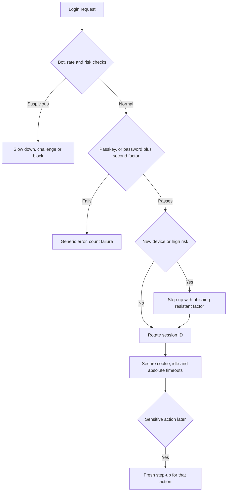
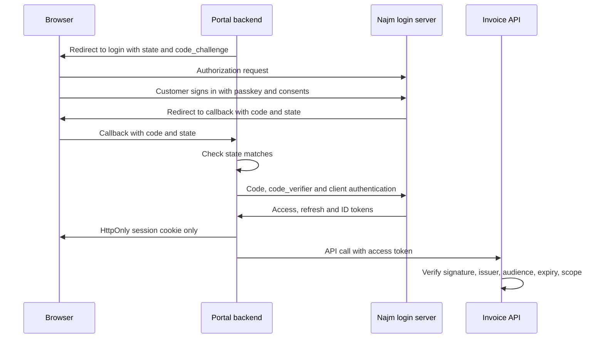
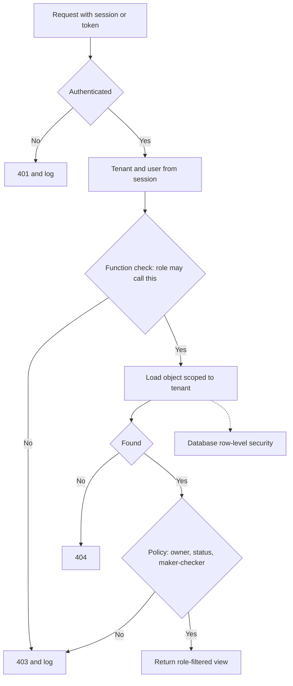

# Module 3 — Identity and access

*Most breaches do not need a clever exploit. They need a reused password, a token accepted by the wrong API, or an endpoint that never asks "is this yours?". This module covers the three questions every request to a Najm Bank system must answer correctly. Who is this? That is authentication: passwords, MFA, passkeys and sessions. What does this token prove? That is OAuth 2.0, OpenID Connect and JWTs. And may they touch this object? That is authorisation, IDOR and multi-tenancy. You will follow the Application & AI Security team as Jassim's SOC watches a credential-stuffing wave hit Najm Mobile, Ali learns why matching federated users by email and decoding tokens without verifying them are both mistakes, and Mariam's authorised test of the SME Portal turns one changed invoice number into the team's access-control matrix. The same ideas carry straight into AI security: Najm Assist's tools must act with the customer's identity and rights, never their own.*

> **Phases:** Design, Build, Test — designing sign-in, tokens and permissions so that even the weakest path into an account is strong, building them with vetted libraries, and proving with tests that another user and another tenant are refused.

---

# 3.1 — Authentication: passwords, MFA, passkeys and sessions
*Level: 🟡 Intermediate* · *Prerequisites: 1.1, 1.2* · *Phase: Design, Build*

## ⚡ In 60 seconds
- **Authentication** answers "who is this?"; **authorisation** (3.3) answers "what may they do?". Keep them apart in design and in code.
- Passwords fail through reuse, guessing, phishing and database theft. Store them only with a slow, salted **password hash** such as Argon2id, block breached passwords, and drop composition rules and forced expiry.
- **MFA** (multi-factor authentication) varies. SMS and app codes can be phished; **passkeys** (WebAuthn/FIDO2) are bound to the real site's domain, so a lookalike site gets nothing it can use.
- Password reset, account recovery and "change my phone number" are logins too. Attackers pick the weakest door.
- After login, the **session** token *is* the user: random, rotated at login, kept in a `Secure`, `HttpOnly`, `SameSite` cookie, timed out and revocable on the server.
- Decision cue: for each action, ask "how sure must we be, and how recently?", and require **step-up authentication** for the risky ones.

## 🧭 Why it matters
At 02:10 on a Tuesday, Jassim's SOC sees login failures on Najm Mobile climb steeply: thousands of real customer email addresses, each tried once or twice, from thousands of IP addresses. A week earlier, an unrelated retailer abroad had disclosed a breach. This is **credential stuffing**: replaying email and password pairs leaked from one site against another, betting that people reuse passwords. A few hundred logins succeed.

For those accounts, an SMS code required on new devices stops most of the attackers. By mid-morning, though, the fraud team reports calls to the contact centre asking to move customers' numbers to new SIM cards, and a phishing page asking for "the code we just sent you".

Hamad (CISO) asks which controls stopped what. The password check stopped nothing: the passwords were correct. The five-failure lockout never fired: each account saw one or two tries. The SMS code did the work, and it is exactly what the next wave targets. Noura's rule: **every authentication control must name the attack it stops, and we harden the weakest path into an account first, whether that is login, reset, recovery or the contact centre.**

## 📐 How it works

### 🟢 The essentials

**Factors.** Authentication evidence is something you **know** (a password or PIN), **have** (a phone, a security key, a key in a device's secure hardware) or **are** (a fingerprint or face). **MFA** needs at least two *different* kinds; two passwords are not MFA. On phones, a fingerprint usually just unlocks a key on the device, so the bank sees a signature, never the biometric.

**Modern password rules.** NIST SP 800-63B, part of the US Digital Identity Guidelines (Revision 4, finalised in 2025), is the most cited reference. At the time of writing (2026) it asks for length over complexity (at least 15 characters when the password is the only factor, 8 when it is part of MFA, at least 64 allowed); no composition rules, which produce `Password1!`; no forced periodic changes without evidence of compromise; a blocklist of common and breached passwords; no hints or security questions; and paste allowed, so password managers work. Check the current text before writing policy.

**Storing passwords.** Never use plain text, reversible encryption or a fast hash such as MD5, SHA-1 or SHA-256, which lets a stolen table face an enormous number of guesses per second on ordinary graphics cards. Use **Argon2id** (RFC 9106), **scrypt** or **bcrypt** (PBKDF2 where FIPS-validated algorithms are mandatory). They add a unique **salt** to each password and are deliberately slow; Argon2id and scrypt are also **memory-hard** (5.1).

```python
# Vulnerable: fast, unsalted hash
user.password_hash = hashlib.sha256(password.encode()).hexdigest()

# Fixed: Argon2id via argon2-cffi. Salt and parameters live inside the hash string.
from argon2 import PasswordHasher
from argon2.exceptions import VerifyMismatchError
ph = PasswordHasher()

def check_password(user, password):
    try:
        ph.verify(user.password_hash, password)
    except VerifyMismatchError:
        return False
    if ph.check_needs_rehash(user.password_hash):   # parameters raised since this hash was made
        user.password_hash = ph.hash(password)
    return True
```

**MFA options compared.**

| Method | Phishing-resistant? | Main weakness | Fit at a bank |
|---|---|---|---|
| **SMS or voice code** | No | SIM swap, interception, relay; NIST classes it as "restricted" | Fallback only |
| **Authenticator app code** (TOTP) | No | Typed into a fake site and relayed | Lower-risk access |
| **Push approval** | No | "MFA fatigue": prompts until someone taps Approve | Only with number matching |
| **Passkey or security key** | Yes | Recovery becomes the weak point | Default for customers; required for privileged staff |

**Passkeys.** A **passkey** is a key pair that the user's device or password manager creates for one website, using **WebAuthn** (the W3C browser API) and **FIDO2** (WebAuthn plus the protocol for external authenticators). The server stores only the public key, sends a random **challenge**, and checks the signature the device makes after the user unlocks it with a fingerprint, face or PIN. No shared secret sits on the server to steal, and the browser binds each credential to the site's domain, so a lookalike page cannot obtain a signature valid for `najm.example`.

**Sessions.** After login, the server issues a **session token**, usually in a cookie; whoever holds it *is* the user. Make it **random** (at least 128 bits from a secure generator). **Rotate it** at login and privilege changes, or an attacker who planted a known ID before login shares the session afterwards (**session fixation**). Protect the cookie with `Secure`, `HttpOnly` (no script access), `SameSite=Lax` or `Strict` (helps against CSRF, 2.2) and the `__Host-` prefix. Set **idle and absolute timeouts**, and **log out on the server**, revoking all sessions on reset, phone change or a fraud flag. For banking, prefer revocable server-side sessions; a self-contained token (3.2) lives until it expires.

```js
// Cookie: Set-Cookie: __Host-najm_sid=<random>; Path=/; Secure; HttpOnly; SameSite=Lax
app.post("/login", async (req, res, next) => {
  const user = await verifyCredentials(req.body);
  if (!user) return res.status(401).json({ error: "Invalid email or password" }); // never "no such account"
  // Vulnerable: setting req.session.userId here would keep the pre-login ID (session fixation)
  req.session.regenerate((err) => {        // Fixed: a brand-new session ID at authentication
    if (err) return next(err);
    req.session.userId = user.id;
    req.session.authTime = Date.now();     // used later to decide when step-up is needed
    res.json({ ok: true });
  });
});
```

### 🟡 Going deeper

**Defending against credential stuffing.** Stuffing defeats per-account lockout (one or two tries per account) and strength rules (the passwords are correct). Layer the defences: **MFA**, ideally phishing-resistant; **breached-password checks** at sign-up, change and login (Pwned Passwords uses **k-anonymity**: you send only the first five characters of the password's SHA-1 hash and match the returned list locally); **site-wide monitoring** of failure ratios and new-device sign-ins (10.1); and **rate limits** keyed on IP, device and account, with **progressive delays** rather than hard lockout, which lets attackers lock customers out (4.2).

**Account enumeration.** Login, sign-up and reset must not reveal whether an account exists. Return the same message, status code and roughly the same timing; one technique is to hash a dummy value when the account is missing. For reset, always say "If an account exists, we have sent a link".

**Password reset.** Reset is a login that skips the password. Use a random token of at least 128 bits, single-use, short-lived and stored only as a hash. Build the link from a configured base URL, never from the request's `Host` header. Still require MFA, do not log the user in automatically, revoke existing sessions, and notify the customer.

**Contact details and devices are the real keys.** Changing the phone number or registering a new device controls every later code and alert. A **SIM swap** (persuading a mobile operator to move a number to the attacker's SIM) turns SMS codes against the customer. Treat these changes as high-risk: step-up with an existing strong factor, notify the *old* channel, and hold payee and limit changes for a cooling-off period.

**Step-up and assurance levels.** NIST's **authenticator assurance levels** are **AAL1** (one factor), **AAL2** (two different factors) and **AAL3** (at the time of writing, a hardware-backed, phishing-resistant authenticator whose key cannot be exported). **Step-up** asks for a fresh, stronger authentication right before a sensitive action. For EU payments, PSD2's strong customer authentication also requires **dynamic linking** to the amount and payee; check current rules with compliance.

**Phishing that defeats codes.** **Adversary-in-the-middle (AitM)** phishing kits relay everything the victim types, including the one-time code, to the real site in real time, and keep the session cookie that comes back. SMS codes, app codes and simple push approvals all fall to this. Passkeys do not, because the browser signs only for the real domain. **MFA fatigue**, prompt after prompt until a tired user taps Approve, featured in several publicly reported intrusions in 2022. Mitigate it with **number matching** (the user types a number shown on the login screen), limits on prompts, and location and app details in the prompt.



### 🔴 Expert view

**Recovery is the real perimeter.** Once login uses passkeys, attackers move to the SMS reset, the help desk and "I lost my phone"; help-desk social engineering has featured in publicly reported intrusions. Give recovery login-level assurance: more than one registered passkey or device, identity re-verification (in-app or in a branch) instead of "date of birth", delays and notifications, and a contact-centre script that never resets a factor on a phone call alone.

**Synced or device-bound passkeys.** **Synced passkeys** follow the user to a new phone through their platform account or password manager: convenient, but partly as secure as that account. **Device-bound** keys, such as hardware security keys, cannot be copied and fit AAL3. NIST published guidance in 2024 accepting syncable authenticators at AAL2, since folded into Revision 4. A sensible split: synced passkeys for customers, device-bound keys for privileged staff.

**Use a maintained WebAuthn library.** Verification checks a single-use challenge, the origin and **RP ID** (relying party identifier, usually your domain), the user-presence and user-verification flags, the signature, and the signature counter (synced passkeys often report zero, so treat it as a signal). Each step is easy to get subtly wrong by hand. Najm Mobile's native equivalent, a key in the phone's secure hardware unlocked by biometrics, is **device binding** (4.3).

**Match the hashing to the entropy.** Slow hashing exists because human passwords have little randomness. A reset token or API key with 128 random bits can safely be stored as a plain SHA-256 hash. A **pepper**, a secret key held in a KMS or HSM (5.2) and mixed into password hashing, means a stolen database alone is not enough to start guessing, at the cost of key management. Most bcrypt implementations use only the first 72 bytes of input, one more reason to prefer Argon2id for new systems.

## 🧰 The toolkit
| Control, standard or tool | What it is and does | When to reach for it |
|---|---|---|
| **NIST SP 800-63B** (Digital Identity Guidelines) | Rules for authenticators, passwords, assurance levels (AAL1–3) and reauthentication; widely used beyond US government | Setting password, MFA and session policy; retiring outdated rules |
| **Argon2id** (RFC 9106) | Slow, salted, memory-hard password hashing; scrypt and bcrypt are acceptable alternatives | Every system that stores passwords |
| **Breached-password check** (e.g. Pwned Passwords) | Compares passwords with known-breached lists, privately via k-anonymity or a local list | Sign-up, password change and, where possible, login |
| **Passkeys** (WebAuthn/FIDO2) | Domain-bound public-key credentials; phishing-resistant, no shared secret on the server | Default sign-in for customers; device-bound keys for privileged staff |
| **Step-up authentication** | A fresh, stronger authentication right before a sensitive action | New payees, limit increases, contact-detail changes, admin actions |
| **Secure session cookies** (`Secure`, `HttpOnly`, `SameSite`, `__Host-`) | Cookie attributes that keep the session token on HTTPS, away from scripts and out of most cross-site requests | Every browser session |
| **OWASP ASVS** (OWASP) | Testable requirements, including authentication and session management; version 5.0 released 2025 | Writing requirements and review checklists |

## 🏛️ In practice at Najm Bank
After the stuffing wave, Noura and Ali write the **Najm Authentication Standard v1 (customer channels)**. Hamad approves it; Jassim's SOC owns its detection rules.

**Part A: rules**

| Area | Rule | Stops |
|---|---|---|
| Sign-in | Najm Mobile: device key unlocked by biometric or app PIN. Web: passkeys by default | Phishing, reuse |
| Passwords (where still used) | 12+ characters (house rule, always with a second factor); no composition rules or expiry; breached-password check | Stuffing, guessing |
| Storage | Argon2id via the approved library; rehash on login | Offline cracking |
| SMS codes | Low-risk fallback only; never for Part B step-ups | SIM swap, relay |
| Responses and limits | One generic message in Arabic and English; progressive delays; SOC alert on site-wide failure ratio | Enumeration, stuffing |
| Sessions | 128-bit IDs rotated at login and step-up; `__Host-`, `Secure`, `HttpOnly`, `SameSite=Lax`; web idle 10 minutes, absolute 12 hours (illustrative) | Fixation, theft |
| Recovery | No SMS-only recovery; identity re-verification in app or branch; no factor resets by phone | Recovery abuse |
| Staff and administrators | Device-bound security keys only | Privileged takeover |

**Part B: step-up matrix for customer actions**

| Action | Authentication | Freshness | Extra controls |
|---|---|---|---|
| Freeze a card | Session plus in-app confirmation | Session | Low friction on purpose: freezing reduces risk |
| Unfreeze a card or reveal its number | Step-up: device key or passkey | 5 minutes | Never available to Najm Assist |
| Add a payee | Step-up | Per action | 24-hour hold on a device under 72 hours old |
| Transfer above the daily limit | Step-up showing amount and payee | Per transaction | Smart Alerts fraud score |
| Change phone number or email | Step-up with an existing strong factor | Per action | Notify old and new channels; 72-hour hold on payee changes |
| Register a new device | Approval from an existing device, or re-verification | Per action | Notify all devices; any can cancel |

## 🛠️ Exercises
- 🟢 On an app you own, or a local OWASP Juice Shop, try login, sign-up and password reset with one email that exists and one that does not, recording message, status code and rough response time. *Done when:* your six-case table shows an outsider cannot tell which accounts exist, or you have written a fix for each leak.
- 🟡 In a small local app of your own, store passwords with Argon2id (or bcrypt), rehash on login when parameters change, and check new passwords against a breached list (k-anonymity range API or a downloaded file). *Done when:* stored values start with `$argon2id$` (or `$2b$`), a test proves raised parameters trigger a rehash at next login, and a publicly breached password is refused.
- 🔴 Add passkey sign-in to a local demo app on `localhost` with a maintained WebAuthn library, then write a one-page recovery design. *Done when:* tests prove the server rejects a reused challenge and a wrong origin, and the design says how a user who lost every device gets back in, at what assurance and with what delay.

## ⚠️ Mistakes and traps
- **Calling SMS codes "MFA done".** SIM swaps and relay phishing defeat them. Keep them as a fallback; move risky actions to passkeys or device keys.
- **Hard lockout as the stuffing defence.** Stuffing tries each account once or twice, and lockout lets attackers lock customers out. Use MFA, breached-password checks, site-wide detection and progressive delays.
- **Fast or home-made password hashing.** SHA-256 with a shared salt is not password storage. Use Argon2id, scrypt or bcrypt through a maintained library.
- **Forgetting the side doors.** Reset, recovery, phone changes and the contact centre are authentication paths. Give them login-level assurance.
- **Logout that only clears the browser.** If the server still accepts the session, a stolen copy still works. Destroy sessions on the server.

## 🧾 Recap
- Authentication proves who someone is; keep it separate from authorisation.
- Follow current NIST guidance: length and blocklists, no composition rules or forced expiry; hash with Argon2id, scrypt or bcrypt.
- Codes and push prompts can be phished or worn down; passkeys are bound to the real domain.
- Reset, recovery and contact-detail changes are logins in disguise. Harden them first.
- Sessions need random IDs rotated at login, protected cookies, timeouts, server-side revocation and step-up.

## ✍️ Check yourself

**1. Jassim sees thousands of login attempts against Najm Mobile, each from a different IP address, with one attempt per account and real customer email addresses. Which existing control will do LEAST to stop this?**

- A. A second factor required on new devices
- B. Locking an account after five failed attempts
- C. An alert on the site-wide ratio of failed to successful logins
- D. Checking passwords against breached-password lists

<details><summary>Answer</summary>

**B.** Stuffing tries each account once or twice, so a five-failure lockout rarely fires, and hard lockout can be abused against customers. A, C and D all address reuse at scale. (🟡 Going deeper.)

</details>

**2. Ali finds that the SME Portal stores passwords as SHA-256 with one salt shared by every user. What is the BEST fix?**

- A. Switch to SHA-512 and keep the shared salt
- B. Encrypt the password column with AES so it can be decrypted if needed
- C. Move to Argon2id (or bcrypt or scrypt) with a unique salt per password, rehashing each user's password at their next successful login
- D. Force every user to change their password every 90 days

<details><summary>Answer</summary>

**C.** Password hashing functions are slow and salted per password, and rehash-on-login migrates users without a mass reset. A is still a fast hash; B is reversible by anyone with the key; D is no longer recommended by NIST. (🟢 The essentials.)

</details>

**3. A phishing kit relays everything a customer types to the real Najm website in real time, including one-time codes, and keeps the session cookie. Which authenticator resists this?**

- A. An SMS one-time code
- B. A six-digit authenticator-app code
- C. A push approval without number matching
- D. A passkey

<details><summary>Answer</summary>

**D.** The browser binds a passkey to the real domain, so the lookalike page cannot get a signature valid for Najm. Codes can be relayed, and push prompts approved for the attacker's session. (🟢 The essentials; 🟡 Going deeper.)

</details>

**4. During an authorised test, Mariam notices that the session cookie value is the same before and after login. What is the risk, and what is the fix?**

- A. Session fixation; issue a new session ID at login and at every privilege change
- B. Cross-site scripting; add a Content Security Policy
- C. Credential stuffing; add a CAPTCHA
- D. No risk, as long as the cookie is `HttpOnly`

<details><summary>Answer</summary>

**A.** If the pre-login ID survives, anyone who planted it before login shares the authenticated session; regenerating the ID closes the hole. `HttpOnly` (D) stops scripts reading the cookie, not a planted ID. (🟢 The essentials.)

</details>

**5. Tariq's team wants customers to change their registered phone number in Najm Mobile with one tap, to cut contact-centre calls. What should Noura's team recommend?**

- A. Allow it, because the customer is already signed in
- B. Allow it with step-up using an existing strong factor, a notification to the old number, and a hold before the new number can authorise payees or limit changes
- C. Remove phone changes from the app and require a branch visit for everyone
- D. Allow it, with an SMS code sent to the new number

<details><summary>Answer</summary>

**B.** The phone number controls every later code and alert, so changing it is a classic takeover step. Step-up, old-channel notification and a cooling-off period keep it convenient but hard to abuse. D only proves control of the new number, which an attacker has; C over-corrects. (🟡 Going deeper; 🏛️ In practice.)

</details>

## 📚 References
- NIST SP 800-63B-4, *Digital Identity Guidelines: Authentication and Authenticator Management* (2025) — https://doi.org/10.6028/NIST.SP.800-63B-4
- OWASP Authentication Cheat Sheet — https://cheatsheetseries.owasp.org/cheatsheets/Authentication_Cheat_Sheet.html
- OWASP Password Storage Cheat Sheet — https://cheatsheetseries.owasp.org/cheatsheets/Password_Storage_Cheat_Sheet.html
- OWASP Session Management Cheat Sheet — https://cheatsheetseries.owasp.org/cheatsheets/Session_Management_Cheat_Sheet.html
- OWASP Credential Stuffing Prevention Cheat Sheet — https://cheatsheetseries.owasp.org/cheatsheets/Credential_Stuffing_Prevention_Cheat_Sheet.html
- OWASP Application Security Verification Standard (ASVS) — https://owasp.org/www-project-application-security-verification-standard/
- W3C, Web Authentication (WebAuthn) — https://www.w3.org/TR/webauthn/
- RFC 9106, Argon2 Memory-Hard Function for Password Hashing — https://www.rfc-editor.org/rfc/rfc9106
- Have I Been Pwned, Pwned Passwords — https://haveibeenpwned.com/Passwords

---

# 3.2 — OAuth 2.0, OpenID Connect and token pitfalls
*Level: 🟡 Intermediate* · *Prerequisites: 3.1* · *Phase: Design, Build*

## ⚡ In 60 seconds
- **OAuth 2.0** is for **delegated authorisation**: an app calls an API on a user's behalf, with limited rights, without seeing their password. It does not say who the user is.
- **OpenID Connect (OIDC)** adds identity with an **ID token**. ID tokens are for the app; **access tokens** are for the API. Never accept one in place of the other.
- Default for almost every client: the **authorization code flow with PKCE**, exact redirect-URI matching, no implicit or password grants (RFC 9700, 2025).
- A **JWT** is signed, not secret: anyone can read it. Verify it with an algorithm *you* choose, check issuer, audience and expiry, and keep lifetimes short.
- Decision cue: for every token, ask "who issued it, for which audience, with what scope, for how long, and what if it is stolen?"
- Biggest trap: decoding a token instead of verifying it, or accepting a valid token issued for a different API.

## 🧭 Why it matters
Three requests reach Noura in one week.

Corporate customers want to sign in to the SME Portal with their company accounts, so the portal must **federate** with their identity providers. Ali's prototype matches users to portal accounts by the token's `email` claim. Noura stops it: emails change, some providers do not verify them, and whoever controls a tenant at a multi-tenant provider may be able to set one. Researchers publicly reported this class of flaw in 2023.

The Najm Assist team wants the assistant to freeze cards with one service token holding full card permissions for every customer, the model choosing which card. That is a **confused deputy** in waiting: a privileged component tricked into using its authority for someone else.

And a mobile developer proposes 30-day access tokens "to avoid refresh complexity".

Tokens are **bearer credentials**: like cash, whoever holds one can spend it. Noura's rule: **every token at Najm has a named issuer, one audience, the narrowest scope, a short life and a plan for theft.**

## 📐 How it works

### 🟢 The essentials

*OAuth's specifications use American spelling, so this lesson keeps it for protocol terms such as "authorization server".*

**Roles and tokens.** The **resource owner** is the customer; the **client** is the app; the **authorization server (AS)** authenticates the user, records consent and issues tokens; the **resource server** is the API. An **authorization code** is a one-time voucher swapped for tokens. An **access token** goes to an API: short-lived, scoped, for one audience. A **refresh token** gets new access tokens without the user, so it is long-lived and high-value. An **ID token** (OIDC) tells the *client* who signed in, when and how.

**Which grant to use.**

| Grant | Used by | Verdict |
|---|---|---|
| Authorization code with PKCE | Web, mobile and single-page apps | **Use**: the default whenever there is a user |
| Client credentials | Service-to-service calls | **Use**, with narrow scope and one audience |
| Device authorization (RFC 8628) | TVs and command-line tools | **Use** where there is no browser |
| Refresh token | Keeping a user signed in | **Use**, with rotation or sender-constraint |
| Implicit | Old single-page apps | **Do not use**: tokens travel in the URL (RFC 9700) |
| Resource owner password | Old first-party apps | **Do not use**: the app handles the password (RFC 9700) |

**PKCE.** **PKCE** (Proof Key for Code Exchange, RFC 7636, "pixie") protects the code. The client invents a random **code verifier**, sends only its SHA-256 hash (the **code challenge**) with the login redirect, and must present the verifier to redeem the code. An intercepted or leaked code is useless without it.

```python
code_verifier = secrets.token_urlsafe(64)            # stays with the client
code_challenge = base64.urlsafe_b64encode(
    hashlib.sha256(code_verifier.encode()).digest()
).rstrip(b"=").decode()                              # sent with code_challenge_method=S256
```

The flow for the SME Portal, whose server-side backend holds the tokens (the safer browser pattern, explained below):



**OpenID Connect.** OAuth says "this app may call that API", not who the user is; treating an access token as proof of login is a classic mistake. **OIDC** (OpenID Connect Core 1.0) adds the **ID token**, a JWT carrying `iss` (issuer), `sub` (a stable user identifier *at that issuer*), `aud` (the client), `exp` and `iat` (expiry and issue time), `nonce` (echoed back to block replay), and `auth_time`, `acr` and `amr` (when and how the user authenticated, for step-up). The client verifies the signature, `iss`, `aud`, expiry and `nonce`, then identifies the user by **`iss` + `sub`**, never by email.

**JWT in brief.** A **JSON Web Token** (RFC 7519) is three base64url-encoded parts joined by dots: `header.payload.signature`. The header names the algorithm and often a key ID (`kid`); the payload holds **claims**:

```json
{
  "iss": "https://login.najm.example",
  "sub": "c-81f3a2",
  "aud": "https://api.najm.example/cards",
  "scope": "cards:read cards:freeze",
  "iat": 1789999700,
  "exp": 1790000000
}
```

Base64url is an encoding, not encryption. A signed JWT proves *who issued it and that nobody changed it*, but anyone holding it can read it, so keep secrets and unnecessary personal data out.

### 🟡 Going deeper

**OAuth pitfalls.**

| Pitfall | What goes wrong | Defence |
|---|---|---|
| Loose redirect matching, open redirects | Codes or tokens reach an attacker's address | Pre-registered URIs, exact string match (RFC 9700); no open redirects |
| No `state` and no PKCE | Login CSRF: the attacker's code lands in the victim's session | PKCE always, plus `state` or `nonce` |
| Implicit or password grant | Tokens in URLs; apps handling passwords | Code flow with PKCE |
| Broad scope, no audience | A token for one API is replayed against another | One audience per token; APIs check `aud` and scope |
| Long-lived bearer refresh tokens | One theft gives months of access | Rotation with reuse detection; sender-constraint; revoke on logout and reset |

**JWT pitfalls.**

| Pitfall | What goes wrong | Defence |
|---|---|---|
| `alg: none` accepted | Unsigned tokens pass | Allowlist algorithms in the verify call |
| Algorithm confusion | A token claiming "HS256" is checked with the RSA *public* key as an HMAC secret, so anyone can mint tokens | Pin the algorithm per key in configuration |
| Decode instead of verify | Claims read with no signature check (Node's jsonwebtoken `jwt.decode` does exactly this) | Always use the verify path |
| No `aud` or `iss` check | Another API's or tenant's token is accepted | Require and check both |
| No or long expiry | A stolen token works for days | Require `exp`; minutes, not days |
| Weak HMAC secret | Guessed offline from one token | 256-bit random secret, or asymmetric keys |
| Keys named by the token | `jku`, `x5u` or crafted `kid` values point at the attacker's key | Only keys from your issuer's published set |

**Verifying properly** (Python, PyJWT):

```python
# Vulnerable: the token picks its own algorithm, or is not verified at all
claims = jwt.decode(token, key, algorithms=[jwt.get_unverified_header(token)["alg"]])
claims = jwt.decode(token, options={"verify_signature": False})

# Fixed: keys from the issuer's JWKS, algorithm pinned, important claims required
jwks = jwt.PyJWKClient("https://login.najm.example/.well-known/jwks.json")

def verify_access_token(token: str) -> dict:
    key = jwks.get_signing_key_from_jwt(token).key
    return jwt.decode(
        token, key,
        algorithms=["RS256"],                       # ours, never the token's
        audience="https://api.najm.example/cards",  # this API and only this API
        issuer="https://login.najm.example",
        options={"require": ["exp", "iat", "iss", "aud", "sub"]},
        leeway=30,                                  # seconds of clock skew
    )
```

A **JWKS** (JSON Web Key Set) is the issuer's published list of public keys. A valid token proves who is calling; the API still checks scope and object-level authorisation (3.3).

**Where tokens live.** In browsers, tokens in `localStorage` can be read by any script on the page, including an XSS payload (2.2). For high-value apps, use a **backend for frontend (BFF)**: a server-side component is the OAuth client, keeps the tokens and gives the browser only an `HttpOnly` cookie. Mobile apps follow RFC 8252: the system browser (an embedded web view lets the app see the password), PKCE, claimed HTTPS redirects, and refresh tokens in the Keychain or Keystore (4.3). Servers keep client credentials in a secrets manager (5.2).

**Lifetimes and revocation.** A JWT access token lives until `exp`, so keep it to minutes. Use **refresh token rotation**: each use returns a new refresh token, and if an old one reappears, revoke the whole family, because a copy was stolen. APIs needing instant revocation can ask the AS whether a token is still active (**token introspection**, RFC 7662).

### 🔴 Expert view

**Sender-constrained tokens.** A **sender-constrained** token is bound to a key the client holds, so a stolen copy is useless alone. **mTLS-bound tokens** (RFC 8705) tie it to the client's TLS certificate; **DPoP** (RFC 9449) has the client sign a proof on every request, a natural fit for Najm Mobile's device key.

**FAPI 2.0 for open banking.** For third-party access to customer accounts, where regulation requires or allows it, banks commonly use the OpenID Foundation's **FAPI 2.0** security profile. At the time of writing it requires, among other things, PKCE, **pushed authorization requests** (PAR, RFC 9126: parameters travel server to server) and sender-constrained tokens. Check the current profile and your regulator's rules.

**Delegation for agents: token exchange.** The safe design for Najm Assist is **token exchange** (RFC 8693). When the customer asks to freeze a card, Assist's backend presents the customer's token to the AS and receives a new one with **one audience** (the cards API), **one scope** (`cards:freeze`) and **a few minutes'** life. It is still about the **customer** (`sub`), with an `act` (actor) claim naming Assist, and is issued only if the customer's sign-in is fresh enough. The cards API authorises against the customer, so no prompt can make it freeze another customer's card. Unfreezing is not an Assist tool; it stays in the app behind step-up (3.1). At the time of writing, the Model Context Protocol (MCP) specification's authorization section builds on OAuth and tells servers to accept only tokens issued for them, never passing a client's token through: the audience rule again (9.2).

**Step-up, federation and keys.** A client can request a fresher sign-in with `max_age` or an `acr` value and check `auth_time` and `acr` in the new ID token; RFC 9470 lets an API signal "this call needs step-up". Link a federated identity to an existing account only after the user signs in to both, never on matching email, and allowlist issuers per company. Signing keys live in an HSM or KMS (5.1), rotate on a schedule and are published by `kid`; APIs cache the JWKS and rate-limit refreshes for unknown `kid` values. **OAuth 2.1** consolidates these rules but was still an IETF draft at the time of writing (2026); RFC 9700 gives you them today.

## 🧰 The toolkit
| Control, standard or tool | What it is and does | When to reach for it |
|---|---|---|
| **OAuth 2.0 Security BCP** (RFC 9700) | Current IETF OAuth security rules: PKCE, exact redirects, no implicit or password grants | Designing or reviewing any OAuth client or server |
| **PKCE** (RFC 7636) | Binds an authorization code to a secret only the requesting client knows | Every authorization code flow |
| **OpenID Connect** (OpenID Foundation) | Identity layer on OAuth: ID tokens, discovery, UserInfo | Sign-in and single sign-on, including customer federation |
| **JWT Best Current Practices** (RFC 8725) | Safe JWT use: algorithm allowlists, audience and issuer checks | Any code that issues or verifies JWTs |
| **Backend for frontend** (BFF) | Server-side component holds tokens; the browser gets an `HttpOnly` cookie | High-value browser apps such as the SME Portal |
| **Sender-constrained tokens** (DPoP, mTLS) | Tokens bound to a client key, so a stolen copy cannot be replayed | Mobile banking, open banking, other high-risk APIs |
| **Token exchange** (RFC 8693) | Swaps a token for a narrower one for one audience, recording the actor | Agents and services acting for a user |
| **FAPI 2.0** (OpenID Foundation) | High-security OAuth and OIDC profile for open banking | Third-party access to customer accounts |

## 🏛️ In practice at Najm Bank
Noura and Tariq publish the **Najm Identity and Token Standard v1**. Every new client and API is reviewed against it.

**Part A: approved flows by client type**

| Client | Flow | Token handling |
|---|---|---|
| Najm Mobile (native app) | Code flow with PKCE via the system browser | Refresh token in Keychain or Keystore, rotated, DPoP-bound to the device key |
| SME Portal (web, BFF) | Code flow with PKCE plus `private_key_jwt` | Tokens stay on the server; browser holds a `__Host-` cookie |
| SME Portal federation | OIDC; issuer allowlist per company | Users keyed by `iss` + `sub` |
| Internal services | Client credentials with workload identity (7.1) | One audience per token |
| Najm Assist tools | Token exchange from the customer's token | One audience, one scope, 5 minutes, `act` claim |
| Third-party providers | FAPI 2.0 profile | Sender-constrained; consent revocable |
| Forbidden | Implicit and password grants, wildcard redirects, tokens in URLs | Rejected at design review |

**Part B: token rules (illustrative values)**

| Token | Lifetime | Rules |
|---|---|---|
| Access token | 5–10 minutes | One `aud`; narrow `scope`; identifiers only, never names, balances or card numbers |
| Refresh token | Mobile: 30 days absolute. Web BFF: 12 hours | Rotated; reuse revokes the family; revoked on logout, reset and contact changes |
| ID token | Once, at sign-in | Never accepted by any API |

**Part C: resource-server checklist (every API, every request)**
- Signature verified by the approved library with a key from Najm's JWKS; algorithm from configuration, never from the token.
- `iss` is Najm's issuer; `aud` is this API; `exp`, `iat` and `sub` present and valid.
- Scope covers the operation; then object-level authorisation (3.3).
- Rejections logged with a reason and sent to the SOC (10.1).

## 🛠️ Exercises
- 🟢 Take a token from a local app or lab you run (never a production token, never pasted into an online decoder), decode it locally, and list every claim. *Done when:* each claim is marked "needed" or "remove", `exp`, `aud` and `iss` are confirmed present, and anything readable that should not be there is flagged.
- 🟡 Write a token-verification function for a local test API with keys you generate, plus tests sending tokens with `alg: none`, the wrong algorithm, audience or issuer, an expired `exp`, no `exp` and an unknown `kid`. *Done when:* all seven bad tokens are rejected for the right reason and one valid token is accepted.
- 🔴 Write a one-page design for how Najm Assist gets permission to freeze a customer's card: token exchange, audience, scope, lifetime, the cards API's checks, logging, and why unfreezing is not an Assist tool. *Done when:* the design shows the cards API refusing a card that does not belong to the token's `sub`, even when the model asks, and names who can revoke the agent's access.

## ⚠️ Mistakes and traps
- **Using OAuth as login.** An access token says an app may call an API, not who is at the keyboard. Use OIDC and validate the ID token.
- **Sending ID tokens to APIs.** APIs accept only access tokens issued for their own audience.
- **Decoding instead of verifying, or letting the token choose its algorithm.** Verify with a fixed algorithm list, issuer and audience.
- **Matching federated users by email.** Use `iss` + `sub`, and link accounts only with proof from both sides.
- **Long-lived tokens in browser storage.** Keep access tokens short, rotate refresh tokens, and put high-value browser apps behind a BFF.
- **Pasting real tokens into online JWT debuggers.** A token is a live credential. Decode test tokens locally.

## 🧾 Recap
- OAuth 2.0 delegates access; OIDC adds identity. Access tokens are for APIs; ID tokens are for the client.
- Use the code flow with PKCE and exact redirect URIs; retire implicit and password grants (RFC 9700).
- Anyone can read a JWT. Verify it with a pinned algorithm and your issuer's keys, then check `iss`, `aud` and `exp`.
- Every token needs one audience, a narrow scope, a short life and a theft plan.
- When an agent acts for a customer, exchange the customer's token for a narrow, short-lived one, so the API authorises the customer.

## ✍️ Check yourself

**1. The cards API accepts a token with a valid Najm signature and the correct issuer, but the token was issued for Najm's loyalty-points API. What is missing?**

- A. A check of the `aud` (audience) claim
- B. A stronger signing algorithm
- C. Encryption of the token payload
- D. A longer token lifetime

<details><summary>Answer</summary>

**A.** Without an audience check, a token leaked from a low-value service unlocks a high-value one. B and C do nothing about which API the token was meant for. (🟡 Going deeper.)

</details>

**2. Which flow should Najm Mobile use to sign customers in and obtain tokens?**

- A. The implicit grant, because mobile apps cannot keep secrets
- B. The resource owner password grant, so the login screen stays inside the app
- C. The authorization code flow with PKCE through the system browser, with a claimed HTTPS redirect
- D. Client credentials, with a secret embedded in the app

<details><summary>Answer</summary>

**C.** RFC 8252 and RFC 9700 point native apps to the code flow with PKCE in the system browser. A leaks tokens in URLs, B must not be used, and a secret embedded in an app (D) can be extracted. (🟢 The essentials; 🟡 Going deeper.)

</details>

**3. In a code review, Ali finds `jwt.decode(token, key, algorithms=[jwt.get_unverified_header(token)["alg"]])`. Why is it dangerous?**

- A. It is slow, because it parses the header twice
- B. The token chooses its own verification algorithm, which opens the door to `alg: none` and algorithm-confusion attacks
- C. It does not check the token's lifetime
- D. Headers are encrypted and cannot be read before verification

<details><summary>Answer</summary>

**B.** The algorithm must come from your configuration, never from input the attacker controls. C is not the core flaw (PyJWT checks `exp` when present, though you should also require it), and D is false: headers are only encoded. (🟡 Going deeper.)

</details>

**4. The SME Portal now accepts sign-ins from customers' own identity providers. How should it decide which portal account a federated user belongs to?**

- A. By the `email` claim, because it is human-readable
- B. By the user's display name
- C. By the `iss` + `sub` pair, linking to an existing account only after the user signs in to both
- D. By whichever account was most recently active

<details><summary>Answer</summary>

**C.** `sub` is stable and unique per issuer. Email can change, may be unverified, and may be settable by whoever controls a tenant at the provider, so linking by email (A) has led to publicly reported account-takeover flaws. (🟢 The essentials; 🔴 Expert view.)

</details>

**5. Najm Assist must freeze cards on customers' behalf. Which design best limits the damage if the model is manipulated?**

- A. A service account token with full card permissions, with the model choosing the card
- B. The customer's own long-lived refresh token, stored by Assist
- C. A shared API key for all Assist actions, rotated monthly
- D. Token exchange for a five-minute token for the cards API, scoped to freezing, about the customer and naming Assist as actor, with the cards API checking the card belongs to that customer

<details><summary>Answer</summary>

**D.** The exchanged token carries the customer's identity, one audience, one scope and a short life, so the API can refuse any card that is not the customer's. A is the confused deputy; B and C give Assist far more power and lifetime than needed. (🔴 Expert view.)

</details>

## 📚 References
- RFC 6749, The OAuth 2.0 Authorization Framework — https://www.rfc-editor.org/rfc/rfc6749
- RFC 7636, Proof Key for Code Exchange (PKCE) — https://www.rfc-editor.org/rfc/rfc7636
- RFC 9700, Best Current Practice for OAuth 2.0 Security (2025) — https://www.rfc-editor.org/rfc/rfc9700
- RFC 7519, JSON Web Token (JWT) — https://www.rfc-editor.org/rfc/rfc7519
- RFC 8725, JSON Web Token Best Current Practices — https://www.rfc-editor.org/rfc/rfc8725
- RFC 8252, OAuth 2.0 for Native Apps — https://www.rfc-editor.org/rfc/rfc8252
- RFC 8693, OAuth 2.0 Token Exchange — https://www.rfc-editor.org/rfc/rfc8693
- OpenID Connect Core 1.0 — https://openid.net/specs/openid-connect-core-1_0.html
- OpenID Foundation (FAPI 2.0 and other specifications) — https://openid.net
- Model Context Protocol specification — https://modelcontextprotocol.io

---

# 3.3 — Authorisation: broken access control, IDOR and multi-tenancy
*Level: 🟡 Intermediate* · *Prerequisites: 1.2, 3.1* · *Phase: Build, Test*

## ⚡ In 60 seconds
- **Authorisation** decides what an authenticated user may do, and to which object. Broken access control topped the OWASP Top 10 (2021 edition), and **Broken Object Level Authorization (BOLA)** leads the OWASP API Security Top 10 (2023).
- Check three levels on the server, every request: **function** (may this role call this?), **object** (this particular invoice?) and **property** (which fields may they see or change?).
- **IDOR** (insecure direct object reference): the server fetches whatever ID the request names without asking "is this yours?". Random IDs slow attackers; they do not fix it.
- **Deny by default**, decide in one central policy, and take user and tenant from the session, never the request.
- In **multi-tenant** systems, scope every query, cache, file path, export and AI retrieval to the tenant; **row-level security** is a strong second wall.
- Biggest trap: authorisation in the user interface. Hiding a button is not access control.

## 🧭 Why it matters
Before a new SME Portal release, Mariam's red team runs an authorised test against staging with two test companies. Signed in as an Uploader at Company A, she opens `/api/invoices/10233/pdf`, changes the number to `10234`, and downloads Company B's invoice, with supplier names, amounts and bank details. The same afternoon she finds two more problems: the "Approve payment" button is hidden for Uploaders, but `POST /api/payments/approve` accepts their requests; and `PATCH /api/users/me` accepts `"role": "owner"` and saves it.

"But they all had to be logged in," says Ali, who reviewed the code. That is the point: authentication worked every time. All three are authorisation failures, invisible to functional tests in which users only click what the interface shows.

Public reporting on the 2022 Optus breach in Australia described customer records exposed through an internet-facing API that reportedly did not require authentication. Details vary between reports, so treat it as an illustration: every endpoint that returns data must check who is asking and whether they may see that record (4.1). Noura's rule: **no endpoint ships without a row in the access-control matrix and a test proving that another user, and another tenant, is refused.**

## 📐 How it works

### 🟢 The essentials

**The question every request must answer.** *May this **subject** (a user, a service or an agent) perform this **action** on this **resource**, in this **context**?* Authentication (3.1) and tokens (3.2) establish the subject; authorisation answers the rest, on the server, every time, because the client is under the attacker's control. (OWASP published a 2025 Top 10 update; check the current list rather than numbering.)

**Three levels of check.**

| Level | Question | OWASP API Security Top 10 (2023) | SME Portal example |
|---|---|---|---|
| **Function** | May this role call this operation at all? | API5 Broken Function Level Authorization (BFLA) | An Uploader calls the approve-payment endpoint |
| **Object** | May this user act on *this* record? | API1 Broken Object Level Authorization (BOLA) | Invoice 10234 belongs to another company |
| **Property** | Which fields may they read or write? | API3 Broken Object Property Level Authorization (BOPLA) | A user sets their own `role`; a response shows a bank account the role should not see |

On top sit **business rules**: an invoice can be approved only while pending; the person who uploaded it cannot approve it (**maker-checker**, or segregation of duties); large payments need two approvers.

**IDOR.** An **insecure direct object reference** is the classic object-level bug (CWE-639, "Authorization Bypass Through User-Controlled Key"): the request names an object by ID, and the server fetches it without checking ownership.

```ts
// Vulnerable: any logged-in user can read any company's invoice
app.get("/api/invoices/:id", requireLogin, async (req, res) => {
  const invoice = await db.invoice.findUnique({ where: { id: req.params.id } });
  res.json(invoice);
});
```

```ts
// Fixed: scope to the tenant from the session, then ask the central policy
app.get("/api/invoices/:id", requireLogin, async (req, res) => {
  const invoice = await db.invoice.findFirst({
    where: { id: req.params.id, companyId: req.user.companyId }, // never from the request
  });
  if (!invoice) return res.status(404).end();        // "missing" and "not yours" look the same
  if (!can(req.user, "invoice:read", invoice)) return res.status(403).end();
  res.json(toInvoiceView(invoice, req.user));        // only the fields this role may see
});
```

Random UUIDs make guessing harder, but IDs leak through URLs, emails, logs and shared links, so they are defence in depth, not authorisation.

**Mass assignment** is the property-level twin: the server copies the whole request body into the record, so users can set fields they should never control (`role`, `companyId`, `status`).

```ts
// Vulnerable: every field in the body is written, including "role"
await db.user.update({ where: { id: req.user.id }, data: req.body });

// Fixed: an explicit allowlist of editable fields (zod schema; unknown keys rejected)
const UpdateProfile = z.object({ displayName: z.string().max(80), phone: z.string() }).strict();
const data = UpdateProfile.parse(req.body);
await db.user.update({ where: { id: req.user.id }, data });
```

Responses need the same discipline: return a view built for the role (`toInvoiceView` above), not the raw row.

**Principles,** straight from 1.2: **deny by default**; **enforce on the server**, including on APIs the interface "never calls"; **centralise the decision**, so every endpoint asks the same policy; **least privilege** for every role; and **log denials** with user, action and resource, because patterns of denials are an attack signal (10.1).

**Access-control models.**

| Model | Decision based on | Fits |
|---|---|---|
| **ACL** (access-control list) | Who may access each object | Files and simple sharing |
| **RBAC** (role-based) | The user's role | Most business apps |
| **ABAC** (attribute-based, NIST SP 800-162) | Attributes of user, resource and context | "Approver, same company, under the limit" |
| **ReBAC** (relationship-based, after Google's Zanzibar paper, 2019) | Relationships in a graph | Sharing, hierarchies, multi-tenancy at scale |

Most real systems combine RBAC for coarse permissions with attribute or relationship checks on objects.

### 🟡 Going deeper

**One central policy.** A small, readable policy module beats rules scattered across controllers:

```ts
type Rule = (user: User, resource: any) => boolean;

const POLICY: Record<string, Rule> = {
  "invoice:read": (u, inv) => u.companyId === inv.companyId,
  "invoice:approve": (u, inv) =>
    u.companyId === inv.companyId &&
    ["owner", "approver"].includes(u.role) &&
    inv.status === "pending" &&
    inv.uploadedBy !== u.id,                  // maker-checker
};

export function can(user: User, action: string, resource: unknown): boolean {
  const rule = POLICY[action];
  return rule ? rule(user, resource) : false; // unknown action: deny
}
```

**Where to enforce.** An API gateway can check a valid token and the right scope for the route, but it cannot know whether invoice 10234 belongs to the caller's company, so object checks live in the service that owns the data. In standard terms, a **policy enforcement point (PEP)** asks a **policy decision point (PDP)**. When many services share complex policy, teams adopt a **policy engine**: Open Policy Agent (OPA, with its Rego language), Cedar (an open-source policy language from AWS), or a Zanzibar-style relationship service such as OpenFGA. Start with a central module in code; move to an engine when duplication across services becomes the bigger risk.

**Multi-tenancy.** The SME Portal is **multi-tenant**: many customer companies (tenants) share one application. Three common isolation patterns:

| Pattern | How | Isolation | Cost and effort |
|---|---|---|---|
| **Silo** | A database or deployment per tenant | Strongest | Highest |
| **Bridge** | A shared database, one schema per tenant | Medium | Medium; migrations multiply |
| **Pool** | Shared tables with a tenant column (`company_id`) | Depends on every query | Lowest; the most common |

In a pooled design, one forgotten `WHERE company_id = …` leaks data across companies. So take the **tenant from the session**, never from a header, URL or body. **Scope everything**: cache keys, search indexes, file paths and download links, background jobs, exports, logs and AI retrieval indexes (9.3). And **add a second wall**: PostgreSQL **row-level security (RLS)** filters every query on a table, even one the developer forgot to filter.

```sql
ALTER TABLE invoices ENABLE ROW LEVEL SECURITY;
ALTER TABLE invoices FORCE ROW LEVEL SECURITY;   -- applies to the table owner too

CREATE POLICY company_isolation ON invoices
  USING      (company_id = current_setting('app.company_id', true)::uuid)
  WITH CHECK (company_id = current_setting('app.company_id', true)::uuid);

-- In the application, inside each request's transaction:
-- SELECT set_config('app.company_id', $1, true);   -- true = this transaction only
```

Three caveats. Superusers and `BYPASSRLS` roles always bypass RLS, so the application must connect as an ordinary role. Table owners bypass it unless you add `FORCE ROW LEVEL SECURITY`. And with connection pooling, set the tenant per transaction, or one request's tenant can leak into the next. If the setting is missing, the query returns no rows or an error, never everyone's data: it fails closed.



**Testing authorisation.** Scanners are poor at finding authorisation flaws, because they do not know that invoice 10234 belongs to someone else. Build tests from the access-control matrix: for every endpoint and role, test **your own object**, **another user's object in the same company** and **an object in another company**. Keep **two accounts per role in two tenants** in every test environment, and run the suite in CI so a new endpoint without a matrix row fails the build. In manual testing, replay each request with another user's session.

### 🔴 Expert view

**AI tools are clients too.** When Najm Assist calls `get_transactions(account_id)`, the `account_id` comes from a language model that prompt injection may have steered (8.2): BOLA with a new kind of caller. The tool must check that the account belongs to the customer in the session or token (3.2), exactly as an API checks a human. Likewise, the Credit Memo Copilot must filter retrieved documents by the user's entitlements, not trust the model to withhold them (9.3).

**Staff access is access control too.** Scope relationship managers, support agents and engineers to assigned customers, read-only by default, with a recorded reason for anything more, and make emergency **break-glass** access time-limited, alerted and reviewed.

**Freshness and responses.** If roles travel inside long-lived tokens, removing a user from a company takes effect only when the token expires; keep tokens short (3.2) and check current membership for sensitive actions. Return 404 for objects in another tenant, so as not to confirm they exist, and 403 for a missing permission inside one, consistently.

**Less obvious paths.** GraphQL resolvers that fetch nested objects without re-checking; batch endpoints that check only the first ID; background exports with no user context; WebSocket subscriptions checked only at connection; pre-signed storage URLs valid for days (7.1). Same bug, different place: every path that returns or changes data must ask the policy.

## 🧰 The toolkit
| Control, standard or tool | What it is and does | When to reach for it |
|---|---|---|
| **Access-control matrix** | Roles × actions with named conditions; the single source for policy and tests | Before building any endpoint; at every review |
| **OWASP API Security Top 10** (OWASP, 2023 edition) | The ten most common API risks, led by BOLA, with function- and property-level authorisation close behind | Threat modelling and reviewing APIs |
| **OWASP ASVS** (OWASP) | Testable requirements, including access control and API sections | Writing requirements and test plans |
| **Policy engine** (OPA, Cedar, OpenFGA) | Authorisation decisions moved out of application code into a policy language or relationship graph | When many services share complex rules |
| **Row-level security** (PostgreSQL) | Database-enforced row filters per tenant or user | Pooled multi-tenant tables, as a second wall |
| **Authorisation tests in CI** | Matrix-driven tests with two users and two tenants per role | Every build; fail it for endpoints without a matrix row |
| **OWASP Juice Shop** | Deliberately vulnerable training app with access-control challenges | Practising finding and fixing IDOR and function-level flaws safely |

## 🏛️ In practice at Najm Bank
After Mariam's test, Ali and Tariq write the **SME Portal Access-Control Matrix v1**. Noura approves it, and the CI test suite is generated from it.

**Part A: the matrix** (Y = allowed under the listed conditions; N = denied; anything not listed is denied)

| Action | Owner | Admin | Approver | Uploader | Viewer | Najm RM (staff) |
|---|---|---|---|---|---|---|
| View company invoices | Y: R1 | Y: R1 | Y: R1 | Y: R1 | Y: R1 | Y: R5 |
| Upload or edit a draft invoice | Y: R1 | Y: R1 | N | Y: R1 | N | N |
| Approve a payment up to QAR 100,000 | Y: R1, R2 | N | Y: R1, R2 | N | N | N |
| Approve a payment above QAR 100,000 | Y: R1, R2, R3 | N | Y: R1, R2, R3 | N | N | N |
| Manage users and roles | Y: R1 | Y: R1, cannot grant Owner | N | N | N | N |
| Change the company payout account | Y: R1, R4 | N | N | N | N | N |
| Export all company data | Y: R1 | Y: R1 | N | N | N | N |

**Conditions**
- **R1** Same company: taken from the session; object loaded with a company filter; RLS behind it.
- **R2** Maker-checker: the approver did not upload or edit the invoice, and it is "pending".
- **R3** Two different approvers above the threshold (illustrative).
- **R4** Step-up authentication (3.1), all Owners notified, and a 24-hour hold before the new account receives payments.
- **R5** Assigned companies only, read-only, every access logged with a reason and reviewed monthly.

**Part B: tests generated from the matrix (excerpt)**

| Test | Expected result |
|---|---|
| Uploader at A reads an invoice at B | 404, denial logged |
| Uploader calls approve-payment | 403, denial logged |
| Approver approves an invoice they uploaded | 403 (R2) |
| Any user sends `role`, `companyId` or `status` in an update | 400, fields rejected |
| RM reads an unassigned company | 404, SOC alert |
| Unfiltered query as the application role | Current company's rows only (RLS) |
| Endpoint with no matrix row | Build fails |

## 🛠️ Exercises
- 🟢 Write an access-control matrix for an app you own, or add a "Supplier" role to the SME Portal matrix that may view and comment on its own invoices only. *Done when:* every cell is allow, deny or a named condition, and at least one condition is a business rule such as maker-checker.
- 🟡 Run OWASP Juice Shop locally, create two accounts, and find where one user can see or change another's data (the shopping-basket challenges are a good start). Then write the server-side check that would have prevented it. *Done when:* you can classify the flaw as function, object or property level, and your fix scopes the lookup to the session user and denies by default.
- 🔴 In a local PostgreSQL database, create an `invoices` table with `company_id`, enable and force row-level security with a policy on a per-transaction setting, and connect as a non-owner role. *Done when:* a query with no `WHERE` clause returns only the current company's rows, a query with no tenant setting returns no other company's rows, and an insert for another company is rejected.

## ⚠️ Mistakes and traps
- **Authorisation in the interface.** Hidden buttons are not controls. Enforce every rule on the server.
- **Trusting IDs from the request.** Company and user come from the session; object IDs are only lookups to be checked.
- **Relying on unguessable IDs.** UUIDs help, but they leak. Check ownership anyway.
- **Copying request bodies into records.** Allowlist editable fields per role, and return role-specific views.
- **Rules scattered across controllers.** Use one central, deny-by-default policy and tests generated from the matrix.
- **Forgetting the side paths.** Exports, caches, search, jobs, file links and AI tools need the same tenant and object checks.

## 🧾 Recap
- Authorisation answers "may this subject perform this action on this resource?", on the server, every time.
- Check function, object and property levels, plus business rules such as maker-checker.
- IDOR and BOLA come from fetching by request ID without an ownership check. Scope lookups to the session's tenant and user.
- In multi-tenant systems, scope every data path to the tenant and add row-level security as a second wall.
- Drive policy and tests from one access-control matrix; treat AI tools as untrusted clients.

## ✍️ Check yourself

**1. During an authorised test, Mariam changes `/api/invoices/10233/pdf` to `/api/invoices/10234/pdf` and downloads another company's invoice. Which fix addresses the root cause?**

- A. Replace sequential invoice numbers with random UUIDs
- B. Load the invoice filtered by the company from the user's session, deny by default, and check the central policy before returning it
- C. Hide invoice numbers in the user interface
- D. Add rate limiting to the invoice endpoint

<details><summary>Answer</summary>

**B.** This is BOLA, also called IDOR: the server never asked whether the object belonged to the caller. A makes guessing harder, but IDs still leak; C and D do not change what the server allows. (🟢 The essentials.)

</details>

**2. The approve-payment button is hidden for Viewers, but a Viewer who sends the request directly gets a 200 response. What kind of flaw is this?**

- A. Broken function level authorization: the server does not check whether the role may call the operation
- B. Cross-site request forgery
- C. Session fixation
- D. Broken object property level authorization

<details><summary>Answer</summary>

**A.** The operation is reachable by a role that should not have it; hiding the button is not a control. D concerns which fields of an object can be read or written. (🟢 The essentials.)

</details>

**3. `PATCH /api/users/me` saves `{"displayName": "Ali", "role": "owner"}`, and Ali becomes an Owner. What is the BEST fix?**

- A. Make the role field read-only in the user interface
- B. Remove the `role` column from the database
- C. Validate requests against an explicit allowlist of fields each role may edit, and reject anything else
- D. Log the change and review it monthly

<details><summary>Answer</summary>

**C.** This is mass assignment, a property-level flaw, and the server must decide which fields are writable. A is client-side and bypassed with any HTTP tool; D detects the problem weeks too late. (🟢 The essentials.)

</details>

**4. Tariq's team enables PostgreSQL row-level security on `invoices`, but a query without a company filter still returns every company's rows. The application connects as the role that owns the table. What is the most likely cause?**

- A. Row-level security only works on views
- B. Table owners bypass row-level security unless `FORCE ROW LEVEL SECURITY` is set, so the app should also connect as a separate non-owner role
- C. The policy has to be written in application code instead
- D. Row-level security does not support UUID columns

<details><summary>Answer</summary>

**B.** Owners, superusers and `BYPASSRLS` roles skip the policies by default. Forcing RLS and connecting as an ordinary role makes the wall real. A, C and D are false. (🟡 Going deeper.)

</details>

**5. Najm Assist has a tool `get_transactions(account_id)`, and the model supplies `account_id` from the conversation. What must the tool do?**

- A. Trust the model, because the system prompt tells it to use only the customer's accounts
- B. Check that the account belongs to the customer identified by the session or token before returning anything
- C. Return the data but mask the account number
- D. Ask the model to confirm the account ID twice

<details><summary>Answer</summary>

**B.** Model output can be manipulated by prompt injection, so the tool is an API with an untrusted caller and needs the same object-level check. A relies on instructions an attacker can override; C and D still leak one customer's data to another. (🔴 Expert view.)

</details>

## 📚 References
- OWASP Top 10 (2021 edition and later updates) — https://owasp.org/Top10/
- OWASP API Security Top 10 (2023) — https://owasp.org/API-Security/
- OWASP Authorization Cheat Sheet — https://cheatsheetseries.owasp.org/cheatsheets/Authorization_Cheat_Sheet.html
- OWASP Application Security Verification Standard (ASVS) — https://owasp.org/www-project-application-security-verification-standard/
- CWE-639, Authorization Bypass Through User-Controlled Key — https://cwe.mitre.org/data/definitions/639.html
- NIST SP 800-162, *Guide to Attribute Based Access Control (ABAC) Definition and Considerations* — https://doi.org/10.6028/NIST.SP.800-162
- Pang, R. et al. (2019), "Zanzibar: Google's Consistent, Global Authorization System", USENIX Annual Technical Conference
- PostgreSQL documentation, Row Security Policies — https://www.postgresql.org/docs/current/ddl-rowsecurity.html
- Open Policy Agent — https://www.openpolicyagent.org
- Cedar policy language — https://www.cedarpolicy.com
- OWASP Juice Shop — https://owasp.org/www-project-juice-shop/
