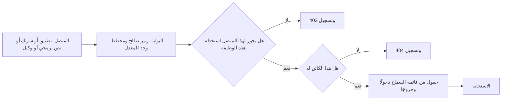
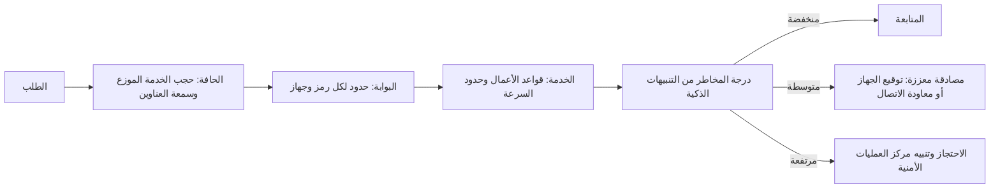
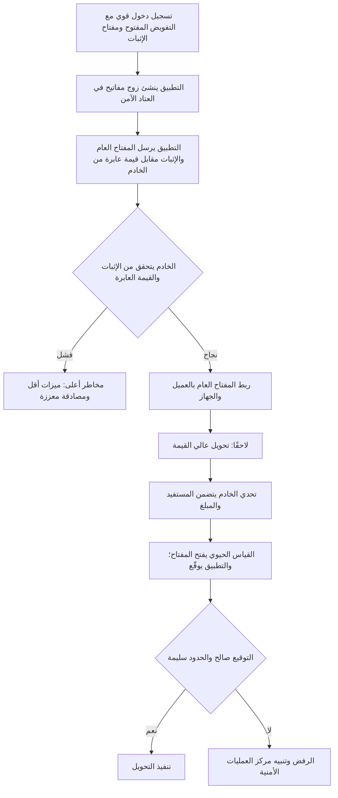

# الوحدة 4 — واجهات برمجة التطبيقات والهاتف المحمول وإساءة الاستخدام (APIs, mobile and abuse)

*من منظورٍ أمني (From a security point of view)، فإن تطبيق نجم للهاتف (Najm Mobile) في معظمه واجهةُ برمجة تطبيقات أُلحق بها هاتف (an API with a phone attached). فكل رصيدٍ وكل ضابطٍ للبطاقة وكل تحويل (Every balance, card control and transfer) يعرضه التطبيق هو استدعاءٌ لواجهة البرمجة العامة للبنك (a call to the bank's public API)، ويستطيع أي شخصٍ يملك حاسوبًا محمولًا (anyone with a laptop) إجراء هذه الاستدعاءات من دون التطبيق (without the app). تنتقل هذه الوحدة من المتصفح (browser) إلى عالم الاستدعاءات بين الآلات (machine-to-machine calls). يستعرض الدرس 4.1 قائمة OWASP API Security Top 10 من خلال نقاط النهاية الخاصة ببنك نجم (Najm's own endpoints)، ويبيّن لماذا تهيمن إخفاقات التفويض (authorisation failures) على القائمة. ويتناول الدرس 4.2 هجماتٍ لا تحتاج إلى أي خطأٍ برمجي على الإطلاق (need no bug at all): الروبوتات (bots)، والكشط (scraping)، والتعداد (enumeration)، وحالات التسابق (races)، وثغرات منطق الأعمال (business-logic flaws) التي تحوّل ميزةً إلى سلاحٍ على نطاقٍ واسع (turn a feature into a weapon at scale). ويعبر الدرس 4.3 إلى الجهاز (crosses to the device) ويرسم الحدّ الذي يجب أن يعرفه كل فريق تطبيقات هاتف (the line every mobile team must know): ما الذي يمكنك الوثوق به على هاتفٍ لا تتحكم فيه (a phone you do not control)، وما الذي يجب أن يُقرَّر دائمًا على الخادم (must always be decided on the server). ستتابع اختبار مريم المصرَّح به (Mariam's authorised test) لواجهة ضوابط البطاقات (card-controls API)، وأولى مراجعات علي لإساءة الاستخدام ولتطبيق الهاتف (Ali's first abuse and mobile reviews)، وقاعدة نورة لفريق تطبيقات الهاتف (Noura's rule for the mobile team): «افترض أن لدى المهاجم التطبيقَ وأداةَ فكّ ترجمة ووسيطًا. ثم صمّم.» ⁦("Assume the attacker has the app, a decompiler and a proxy. Then design.")⁩*

> **المراحل (Phases):** Design, Build, Test, Operate — واجهاتُ برمجةٍ تفحص كل طلب (APIs that check every request)، وتدفقاتُ أعمالٍ تصمد أمام الأتمتة (business flows that survive automation)، وتطبيقُ هاتفٍ مبنيٌّ على افتراض أن الجهاز قد يكون معاديًا (built on the assumption that the device may be hostile).

---

# 4.1 — قائمة OWASP API Security Top 10 عمليًا (The OWASP API Security Top 10 in practice)
*المستوى (Level): 🟡 متوسط (Intermediate)* · *المتطلبات (Prerequisites): 1.1، 3.3* · *المرحلة (Phase): Design, Test*

## ⚡ الدرس في دقيقة (In 60 seconds)
- تعرض **واجهة برمجة التطبيقات (API, application programming interface)** البياناتِ والوظائفَ مباشرةً للبرامج (exposes data and functions directly to programs). ويتخطى المهاجمون تطبيقك (Attackers skip your app): فهم يستدعون الواجهة بأدواتهم الخاصة (with their own tools) ويغيّرون أي قيمة (change any value).
- قائمة **OWASP API Security Top 10 ‏(2023)** هي القائمة المعيارية لما يسوء (the standard list of what goes wrong). وثلاثةٌ من أول خمسة بنودٍ فيها (Three of its top five entries) إخفاقاتُ تفويض (authorisation failures): **BOLA** على مستوى الكائنات (objects)، و**BOPLA** على مستوى الحقول (fields)، و**BFLA** على مستوى الوظائف (functions).
- القاعدة الجوهرية (The core rule): في كل طلب (on every request)، يقرّر الخادم **مَن المتصل (who is calling)**، و**هل يجوز له استخدام هذه الوظيفة (whether they may use this function)**، و**هل هذا الكائن له (whether this object is theirs)**، و**أيّ الحقول يجوز له قراءتها أو تغييرها (which fields they may read or change)**.
- مؤشر القرار لكل نقطة نهاية (Decision cue for every endpoint): «إذا غيّرتُ المعرّف، أو أضفتُ حقلًا، أو بدّلتُ طريقة HTTP، أو استدعيتُ إصدارًا أقدم، فما الذي يمنعني؟» ⁦("If I change the ID, add a field, switch the HTTP method or call an older version, what stops me?")⁩
- الجرد (The inventory) مهمٌّ بقدر أهمية الشيفرة (matters as much as the code): فالإصدارات القديمة (old versions)، وبيئات الاختبار (test environments)، ونقاط النهاية غير الموثّقة (undocumented endpoints) هي المواضع التي تغيب فيها الفحوص (where checks go missing).
- أكبر فخ (Biggest trap): «التطبيق لا يعرض ذلك الزر أبدًا» ("the app never shows that button")، أو «المعرّفات عشوائية، فلا أحد يستطيع تخمينها» ("the IDs are random, so nobody can guess them"). ولا أيٌّ منهما تحكّمٌ في الوصول (Neither is access control).

## 🧭 لماذا يهم (Why it matters)
يضيف بنك نجم (Najm Bank) ضوابطَ البطاقات (card controls) إلى تطبيق نجم للهاتف (Najm Mobile): حدود الإنفاق (spending limits)، وحظر المدفوعات عبر الإنترنت (blocking online payments)، وتجميد البطاقة (freezing a card). وقبل الإطلاق (Before launch)، تُجري مريم، قائدة الفريق الأحمر (red-team lead)، اختبارًا مصرَّحًا به (authorised test) لواجهة البرمجة في بيئة ما قبل الإنتاج (staging API) باستخدام عميلَي اختبار (two test customers)، هما A وB. وبعد أن تسجّل دخولها بوصفها A ‏(Logged in as A)، ترسل `PATCH /v2/cards/{cardId}/limits` مع معرّف بطاقة B ‏(B's card ID). فتعيد الواجهة `200 OK` ويتغيّر حدّ B ‏(B's limit changes). لا يعرض التطبيق هذا الإجراء أبدًا (The app never offers that action)؛ أما الواجهة فلم تسأل قطّ ببساطة هل البطاقة لـ A ‏(simply never asked whether the card was A's).

ويتضمن تقريرها ملاحظتين أخريين (two more findings). إذ تعيد `GET /v2/customers/me` حقولًا لا يعرضها التطبيق أبدًا (fields the app never displays)، منها الحقلان الداخليان (internal) `riskScore` و`kycStatus`. أما واجهة `/v1/` الصادرة عام 2019 ‏(the 2019 API)، التي لا يستخدمها التطبيق الحالي (unused by the current app)، فلا تزال تجيب على البوابة العامة (still answers on the public gateway) من دون الفحوص الأحدث (without the newer checks). ويسأل علي، مهندس الأمن الجديد (new security engineer)، هل هذه ملاحظاتٌ «حقيقية» ("real")، ما دام لا يستطيع أي عميلٍ الوصول إليها عبر التطبيق (no customer could reach them through the app). فتجيب نورة، رئيسة أمن التطبيقات والذكاء الاصطناعي (Head of Application & AI Security): «التطبيق عميلٌ واحد. والمهاجمون يكتبون عملاءهم الخاصة.» ⁦("The app is one client. Attackers write their own.")⁩

وتُظهر الحالات العلنية (Public cases) حجم الكلفة (the cost). ففي عام 2022 تعرّضت شركة الاتصالات الأسترالية (Australian telecoms company) Optus لكشفٍ واسعٍ لسجلات العملاء (large exposure of customer records). ووصفت التقارير العلنية آنذاك (Public reporting at the time) واجهةَ برمجةٍ مكشوفةً على الإنترنت (internet-facing API) تعيد بيانات العملاء من دون اشتراط المصادقة (without requiring authentication)؛ وقد كانت التفاصيل موضع خلاف (the details were contested)، ثم فحصتها الجهات التنظيمية لاحقًا (later examined by regulators). وأيًّا كانت الوقائع الدقيقة (Whatever the exact facts)، فإن النمط يجمع ثلاثة محاور من هذا الدرس (three themes of this lesson): نقطة نهاية غير مراقَبة (an unwatched endpoint)، وفحص وصولٍ مفقود (a missing access check)، ومعرّفات يمكن المرور عليها بالتتابع (iterable identifiers).

## 📐 كيف يعمل (How it works)

### 🟢 الأساسيات (The essentials)

**لماذا تختلف واجهات البرمجة (Why APIs are different).** تمزج صفحة الويب (A web page) البياناتِ بالعرض (data and presentation)، ويضغط الشخص على ما تعرضه (a person clicks what it shows). أما واجهة البرمجة فتعيد بياناتٍ خامًا (raw data)، عادةً بصيغة JSON، من **نقاط نهاية (endpoints)** مثل `/v2/accounts/{accountId}` إلى أي برنامجٍ يستدعيها (any program that calls it): تطبيق نجم للهاتف، والواجهة الأمامية لبوابة الشركات الصغيرة (SME Portal's front end)، والشركاء (partners)، والنصوص البرمجية (scripts)، والآن وكلاء الذكاء الاصطناعي (AI agents) مثل نجم أسيست (Najm Assist). لا توجد واجهة مستخدم تختبئ خلفها (no interface to hide behind)؛ والبنية قابلة للتنبؤ (the structure is predictable)، فإذا كانت `/v2/accounts/1001` موجودة، فسيجرّب المهاجم (an attacker will try) `1002`؛ وتجيب الواجهة النصَّ البرمجي بالرحابة نفسها التي تجيب بها الإنسان (answers a script as happily as a person)، آلاف المرات في الدقيقة (thousands of times a minute).

**القائمة (The list).** كانت آخر مراجعةٍ لقائمة OWASP API Security Top 10 عام 2023 ‏(last revised in 2023) وقت كتابة هذا النص (at the time of writing)، أي عام 2026؛ فتحقّق من موقع OWASP بحثًا عن أي إصدارٍ لاحق (any later edition).

| المعرّف (ID) | الخطر (Risk) | بعبارةٍ بسيطة (In plain words) | مثال من بنك نجم (Najm example) |
|---|---|---|---|
| API1 | خلل التفويض على مستوى الكائن (Broken Object Level Authorization, BOLA) | لا فحص لكون المتصل مخوّلًا بالوصول إلى *هذا* الكائن (No check that the caller may access *this* object) | الرمز المميز للعميل A ‏(A's token) يغيّر حدّ بطاقة B ‏(B's card limit) |
| API2 | خلل المصادقة (Broken Authentication) | ضعفٌ في معالجة تسجيل الدخول أو الرموز المميزة أو المفاتيح (Weak login, token or key handling) | لا حدّ للمحاولات (No attempt limit) على نقطة نهاية كلمة المرور لمرةٍ واحدة (OTP endpoint) |
| API3 | خلل التفويض على مستوى خصائص الكائن (Broken Object Property Level Authorization, BOPLA) | يستطيع المتصل قراءة *حقولٍ* أو كتابتها لا ينبغي له الوصول إليها (Caller can read or write *fields* they should not) | إعادة `riskScore` ‏(returned)؛ وإمكان الكتابة في `kycStatus` ‏(writable) |
| API4 | الاستهلاك غير المقيَّد للموارد (Unrestricted Resource Consumption) | لا حدود لحجم الطلبات أو عددها أو كلفتها (No limits on size, number or cost of requests) | كشوف حساب عشر سنوات (Ten years of statements) في استدعاءٍ واحد (in one call) |
| API5 | خلل التفويض على مستوى الوظيفة (Broken Function Level Authorization, BFLA) | يستطيع المتصل استخدام *وظيفةٍ* مخصّصة لدورٍ آخر (Caller can use a *function* meant for another role) | رمزٌ مميز لعميل (Customer token) يستدعي نقطة نهاية `/admin/` |
| API6 | الوصول غير المقيَّد إلى تدفقات الأعمال الحساسة (Unrestricted Access to Sensitive Business Flows) | تدفقٌ مشروع تسيء الأتمتة استخدامه (A legitimate flow abused by automation) | تسجيلاتٌ آلية بنصوص برمجية (Scripted sign-ups) لحصد مكافآت الإحالة (farming referral bonuses) |
| API7 | تزوير الطلبات من جهة الخادم (Server-Side Request Forgery, SSRF) | تجلب الواجهة عنوان URL قدّمه المتصل (API fetches a URL the caller supplied) | ميزة «استيراد فاتورة من رابط» ("import invoice from link") في بوابة الشركات الصغيرة (SME Portal) |
| API8 | سوء الإعداد الأمني (Security Misconfiguration) | إعداداتٌ افتراضية وضبطٌ غير آمن (Unsafe defaults and settings) | تتبّعات المكدّس (Stack traces) في استجابات الأخطاء (error responses) |
| API9 | سوء إدارة الجرد (Improper Inventory Management) | عدم معرفة واجهات البرمجة والإصدارات والبيئات الموجودة (Not knowing which APIs, versions and environments exist) | واجهة `/v1/` المنسية (The forgotten) |
| API10 | الاستهلاك غير الآمن لواجهات البرمجة (Unsafe Consumption of APIs) | الثقة المفرطة ببيانات واجهات الطرف الثالث (Trusting third-party API data too much) | استخدام استجابة الشريك من دون تحقق (Partner response used unvalidated) |

قدّم الدرس 3.3 مفهوم **المرجع المباشر غير الآمن إلى الكائن (IDOR, insecure direct object reference)**. وBOLA هو الاسم الذي يُطلق على الإخفاق نفسه في عالم واجهات البرمجة (the API name for the same failure). ويتصدّر القائمة (sits at the top) لأنه شائع (common)، وسهل الاستغلال (easy to exploit)، وسهلٌ أن يفوت في المراجعة (easy to miss in review): فالشيفرة تعمل على أكمل وجه للمستخدمين النزيهين (works perfectly for honest users).

**BOLA: النسخة الضعيفة والنسخة المُصلَحة (vulnerable and fixed).** يصادق المعالج الضعيف (The vulnerable handler) على المتصل (authenticates the caller) ثم يثق بالمعرّف الوارد في عنوان URL ‏(trusts the ID in the URL):

```ts
// VULNERABLE: any logged-in customer can read any account's statements
app.get("/v2/accounts/:accountId/statements", requireAuth, async (req, res) => {
  const rows = await db.statements.findMany({
    where: { accountId: req.params.accountId },
  });
  res.json(rows);
});
```

ويربط الإصلاحُ الكائنَ بالمتصل (The fix ties the object to the caller) داخل الاستعلام نفسه (inside the query itself):

```ts
// FIXED: the account must belong to the authenticated customer
app.get("/v2/accounts/:accountId/statements", requireAuth, async (req, res) => {
  const account = await db.accounts.findFirst({
    where: { id: req.params.accountId, ownerId: req.user.customerId },
  });
  if (!account) return res.status(404).json({ error: "not_found" });
  const rows = await db.statements.findMany({ where: { accountId: account.id } });
  res.json(rows);
});
```

تعيش قاعدة الملكية (The ownership rule) على **الخادم (server)**، داخل طبقة الوصول إلى البيانات (inside data access)، حيث لا يستطيع عميلٌ معدَّل تخطّيها (a modified client cannot skip it). والرد بـ **404 Not Found** بدلًا من **403 Forbidden** يتجنب تأكيد وجود المعرّف (avoids confirming that the ID exists)؛ وأيٌّ منهما مقبول ما دام رفض الوصول متّسقًا (if access is denied consistently).

**المصادقة ليست تفويضًا (Authentication is not authorisation).** تثبت `requireAuth` *مَن* المتصل (*who* is calling). لكنها لا تقول شيئًا عمّا يجوز له أن *يلمسه* (*what* they may touch). وتكاد كل ثغرات BOLA ‏(Almost every BOLA bug) تقبع خلف تسجيل دخولٍ سليمٍ تمامًا (behind a perfectly good login).

### 🟡 التعمق أكثر (Going deeper)

**API3 BOPLA: الحقول، دخولًا وخروجًا (fields, in and out).** دمج إصدار 2023 ‏(The 2023 edition) بندين أقدم (two older items). فـ **الكشف المفرط عن البيانات (Excessive data exposure)** هو إعادة كائنات قاعدة البيانات كاملةً (returning whole database objects) والثقة بأن العميل لن يعرض إلا بعض الحقول (trusting the client to show only some fields). و**الإسناد الجماعي (Mass assignment)** هو نسخ أي حقولٍ يرسلها العميل إلى الكائن المخزَّن (copying whatever fields the client sends into the stored object). وكلاهما ينشأ من عدم تدوين الحقول المسموح بها قطّ (never writing down which fields are allowed).

```ts
// VULNERABLE (PATCH /v2/customers/me; me = caller's ID): every field in, every field out
const c = await db.customers.update({ where: { id: me }, data: req.body }); // kycStatus too
res.json(c);                                      // riskScore and internal notes too

// FIXED: allowlist in, allowlist out
const UpdateProfile = z.object({
  preferredName: z.string().max(60).optional(),
  language: z.enum(["ar", "en"]).optional(),
}).strict();                                      // unknown fields are rejected
const input = UpdateProfile.safeParse(req.body);
if (!input.success) return res.status(400).json({ error: "invalid_body" });
const c2 = await db.customers.update({ where: { id: me }, data: input.data });
res.json(toPublicProfile(c2));                    // explicit response shape
```

وعلى مستوى العقد (At contract level)، يؤدي مستند **OpenAPI** (OpenAPI document)، وهو وصفٌ مقروءٌ آليًا لكل نقطة نهاية ومعاملٍ واستجابة (a machine-readable description of every endpoint, parameter and response)، المهمةَ نفسها (does the same job): اضبط `additionalProperties: false` على أجسام الطلبات (request bodies)، وافرضه في البوابة أو في الشيفرة (enforce it at the gateway or in code)، ولا تُدرج إلا الحقول العامة في مخططات الاستجابة (list only public fields in response schemas).

**API5 BFLA: الوظائف (functions).** BOLA هو «بطاقة العميل الخطأ» ("the wrong customer's card")؛ أما BFLA فهو «وظيفةٌ ما كان ينبغي أن يملكها هذا النوع من المستخدمين أبدًا» ("a function this kind of user should never have"). ومن العلامات النموذجية (Typical signs): مسارات إدارية على مضيف العملاء (admin routes on the customer host)، أو فحوص أدوارٍ في الواجهة الأمامية وحدها (role checks only in the front end)، أو فحصٌ على `GET` لا على `DELETE` للمسار نفسه (for the same path). ودافع بمبدأ **الرفض افتراضيًا (deny by default)**: يعلن كل مسارٍ الأدوارَ المسموح لها (every route declares its allowed roles)، وتُرفض المسارات غير المعلنة (undeclared routes are refused)؛ وأبقِ واجهات الموظفين (staff APIs) بعيدةً عن البوابة العامة (off the public gateway)، خلف هوية الموظفين (behind staff identity).

**API2 خلل المصادقة (Broken Authentication).** نقاط نهاية تسجيل الدخول (Login) وكلمة المرور لمرةٍ واحدة (one-time-password, OTP) بلا حدودٍ للمحاولات (without attempt limits)؛ ورموزٌ مميزة تُقبل من دون التحقق من التوقيع والمُصدِر والجمهور وتاريخ الانتهاء (without checking signature, issuer, audience and expiry) (3.2)؛ ورموزٌ في عناوين URL ‏(tokens in URLs)، فتنتهي في السجلات (end up in logs)؛ و**مفاتيح API ‏(API keys)** تُستخدم لتعريف المستخدمين (used to identify users)، مع أن المفتاح يعرّف تطبيقًا لا شخصًا (a key identifies an application, not a person)، وأي مفتاحٍ في تطبيق هاتفٍ علنيّ (any key in a mobile app is public) (4.3).

**API8 سوء الإعداد الأمني (Security Misconfiguration).** أخطاءٌ مُسهَبة تتضمن تتبّعات المكدّس (Verbose errors with stack traces)، و**CORS** متساهل (permissive CORS)، أي مشاركة الموارد عبر المصادر (cross-origin resource sharing)، وهي قاعدة المتصفح التي تحدد المواقع المسموح لها باستدعاء واجهتك (the browser rule for which websites may call your API)، والخطأ الكلاسيكي (the classic mistake) فيها هو عكس أي مصدرٍ يُطلب (reflecting any origin) مع السماح ببيانات الاعتماد (while allowing credentials)؛ إضافةً إلى طرق HTTP غير اللازمة (unneeded HTTP methods) والإعدادات الافتراضية لأطر العمل (framework defaults). ويغطي الدرس 2.2 جهة المتصفح (the browser side).

**API9 سوء إدارة الجرد (Improper Inventory Management).** لا يمكنك حماية ما لا تعرف بوجوده (You cannot protect what you do not know about). فـ **واجهات الظل (Shadow APIs)** لم تُوثَّق قطّ (were never documented)؛ و**واجهات الزومبي (zombie APIs)** إصداراتٌ قديمة لم يوقفها أحد (old versions nobody switched off)؛ وبيئات ما قبل الإنتاج التي تحتفظ ببيانات الإنتاج (staging environments holding production data) تُحسب أيضًا (count too). وكل فرقٍ بين ما تخدمه البوابة (what the gateway serves)، كما تُظهره سجلاتها (from its logs)، ومستندات OpenAPI ‏(OpenAPI documents) هو ملاحظةٌ أمنية (a finding).

**API7 وAPI10: الثقة في الاتجاهين (trust in both directions).** يظهر SSRF ‏(API7) كلما جلبت واجهةٌ عنوان URL قدّمه المتصل (fetches a caller-supplied URL): خطافات الويب (webhooks)، و«الاستيراد من رابط» ("import from link")، وصور الملفات الشخصية (profile pictures)؛ وترد الدفاعات في الدرس 2.3 ‏(defences in 2.3). أما الاستهلاك غير الآمن (Unsafe consumption)، أي API10، فهو الصورة المعكوسة (the mirror image): الثقة بإجابة طرفٍ ثالث (trusting a third party's answer)، مثل تغذية أسعار الصرف (an exchange-rate feed)، أكثر مما تثق بمدخلات المستخدم (more than you would trust user input). تحقّق من تلك الاستجابات وفق مخطط (Validate those responses against a schema)، واضبط مهلاتٍ زمنية (set timeouts)، ولا تتبع عمليات إعادة التوجيه بلا تمحيص (do not follow redirects blindly).

أما **API4 وAPI6** فلهما درسٌ خاص بهما (get their own lesson) (4.2). وكان لـ **الحقن (Injection)** و**التسجيل (logging)** بندان في إصدار 2019 ‏(entries in the 2019 edition) لا في إصدار 2023؛ لكنهما لا يزالان مهمّين (they still matter)، وتغطيهما الوحدتان 2 و10 ‏(Modules 2 and 10).

الفحوص التي ينبغي أن يجتازها الطلب، بالترتيب (The checks a request should pass, in order):



### 🔴 نظرة الخبير (Expert view)

**ما تستطيعه البوابة وما لا تستطيعه (What the gateway can and cannot do).** إن **بوابة API ‏(API gateway)**، أي الباب الأمامي الذي يوجّه الطلبات إلى الخدمات (the front door that routes requests to services)، هي المكان الصحيح للمصادقة (authentication)، والتحقق من المخطط (schema validation)، وحدود المعدّل (rate limits)، وTLS، والجرد (inventory). لكنها لا تستطيع فحص ملكية الكائن (cannot check object ownership)، لأن الخدمة وحدها تعرف أن الحساب 1002 يعود إلى العميل B ‏(only the service knows that account 1002 belongs to customer B). فقسّم المهمة (Split the job): تتولى البوابة *مَن وكم* (*who and how much*)؛ وتقرر الخدمة *أيّ كائنٍ وأيّ حقول* (*which object and which fields*).

**مركزة القرار (Centralise the decision).** حين يكتب مئات المعالجات (hundreds of handlers) كلٌّ منها استعلام الملكية الخاص به (its own ownership query)، فسينسى أحدها (one will forget). عبّر عن التفويض مرةً واحدة (Express authorisation once): طبقة وصولٍ إلى البيانات تحصر الاستعلامات دائمًا في المتصل (a data-access layer that always scopes queries to the caller)، أو **محرّك سياسات (policy engine)** مثل Open Policy Agent ‏(OPA) أو Cedar يقيّم القواعد خارج شيفرة المعالجات (evaluates rules outside handler code). وعندئذٍ ترث نقاط النهاية الجديدة القاعدةَ افتراضيًا (New endpoints then inherit the rule by default).

**المعرّفات العشوائية حزام أمان لا مكابح (Random IDs are a seatbelt, not a brake).** تجعل معرّفات UUID العشوائية (Random UUIDs) التخمينَ أصعب (make guessing harder)، وهي جديرةٌ بالاستخدام (worth using). والمقصود الإصدار 4 ‏(version 4)، أي معرّفاتٌ عشوائية طويلة (long random identifiers)؛ أما الإصدارات القائمة على الوقت فقابلةٌ للتنبؤ جزئيًا (time-based versions are partly predictable). لكن المعرّفات تتسرّب عبر عناوين URL والسجلات ولقطات الشاشة واستجابات الواجهات الأخرى (leak through URLs, logs, screenshots and other API responses). ولا يُصلح BOLA إلا فحصُ الخادم (Only the server check fixes BOLA).

**اختبر التفويض كما تختبر الميزات (Test authorisation like a feature).** نادرًا ما تعرف الماسحات (Scanners) أيّ الكائنات يعود إلى مَن (which objects belong to whom). فاستخدم **اختبار المستخدمَين (two-user test)**: أنشئ العميلين A وB ومستخدمًا من الموظفين (a staff user)، وأعِد إرسال كل طلبٍ برمز مستخدمٍ آخر (replay every request with another user's token)، وتوقّع الرفض (expect a denial)، ضمن التكامل المستمر (in CI) في كل بناء (on every build). وفي الإنتاج (In production)، تُعدّ موجةٌ من حالات الرفض على معرّفاتٍ مختلفة من رمزٍ واحد (a burst of denials on distinct IDs from one token) إشارةً قوية (a strong signal) لمركز العمليات الأمنية (SOC) (10.1).

**GraphQL.** تقدّم **GraphQL** حقولًا يختارها العميل (client-chosen fields) عبر نقطة نهاية واحدة (one endpoint). ويجب أن يعمل التفويض في كل **محلِّل (resolver)**، وهو الدالة التي تجلب كل حقل (the function that fetches each field)، وتحتاج الاستعلامات العميقة إلى حدودٍ للكلفة (deep queries need cost limits)، ويجب أن تَعُدّ حدودُ المعدّل العملياتِ (rate limits must count operations)، لأن طلبًا واحدًا قد يحمل كثيرًا منها (one request can carry many). وتعطيل **الاستبطان (introspection)**، أي الوصف الذاتي للمخطط (the schema's self-description)، يقلّل الاستطلاع (reduces reconnaissance) لكنه ليس بديلًا عن التفويض (no substitute for authorisation).

**الوكلاء عملاءُ API أيضًا (Agents are API clients too).** سيستدعي نجم أسيست (Najm Assist) الواجهةَ نفسها (the same API). فإذا استخدم حساب خدمةٍ يستطيع قراءة كل حساب (a service account that can read every account)، فإن أي حقن موجّهات (prompt injection) يوجّهه يصبح BOLA بالوكالة (BOLA by proxy). وهذه حالة **النائب المرتبك (confused deputy)**: مكوّنٌ موثوق يُخدع فيستخدم صلاحياته لصالح شخصٍ آخر (a trusted component tricked into using its authority for someone else). وينبغي أن يعمل الوكيل (agent) برمز *العميل* المفوَّض ضيّق النطاق (the *customer's* delegated, narrowly scoped token)، مثلًا عبر OAuth 2.0 Token Exchange ‏(RFC 8693)، حتى تظل فحوص الكائنات المعتادة سارية (so the normal object checks still apply). وتبني الوحدة 9 على ذلك (Module 9 builds on this).

## 🧰 الأدوات (The toolkit)
| الضابط أو المعيار أو الأداة (Control, standard or tool) | ما هو وماذا يفعل (What it is and does) | متى تلجأ إليه (When to reach for it) |
|---|---|---|
| **OWASP API Security Top 10** — من OWASP، إصدار 2023 ‏(2023 edition) | القائمة المعيارية لأكثر عشرة مخاطر شيوعًا في واجهات البرمجة (The standard list of the ten most common API risks) | تحديد نطاق مراجعات واجهات البرمجة واختباراتها (Scoping API reviews and tests)؛ وتدريب المطورين (training developers) |
| **OWASP ASVS** — من OWASP | متطلباتٌ أمنية قابلة للاختبار للتطبيقات (Testable security requirements for applications)، بما فيها خدمات الويب وواجهات البرمجة (including web services and APIs)؛ وقد صدر الإصدار 5.0 عام 2025 ‏(version 5.0 released 2025) | تحويل عبارة «واجهة برمجة آمنة» ("secure API") إلى متطلباتٍ وحالات اختبار (requirements and test cases) |
| **OpenAPI schema validation** — التحقق بمخطط OpenAPI | عقدٌ مقروءٌ آليًا لكل نقطة نهاية (A machine-readable contract per endpoint)؛ وترفض أدوات التحقق الحقولَ غير المعروفة والأنواعَ الخاطئة (validators reject unknown fields and wrong types) | كل واجهة برمجة بدءًا من التصميم (Every API from design onward)؛ وهو مصدر الحقيقة للجرد (the inventory's source of truth) |
| **API gateway** — بوابة API | بابٌ أمامي يصادق على الطلبات ويتحقق منها ويحدّ معدّلها ويسجّلها (Front door that authenticates, validates, rate-limits and logs requests) | المصادقة والحصص وTLS والجرد (Authentication, quotas, TLS and inventory)، لا الفحوص على مستوى الكائن أبدًا (never object-level checks) |
| **Policy engine** — محرّك السياسات، مثل OPA وCedar | يقيّم قواعد التفويض خارج شيفرة المعالجات (Evaluates authorisation rules outside handler code) | خدماتٌ كثيرة تتشارك قواعد معقدة (Many services sharing complex rules)؛ وتدقيق مَن يستطيع فعل ماذا (auditing who can do what) |
| **Authorisation tests in CI** — اختبارات التفويض في التكامل المستمر | اختبارات المستخدمَين (Two-user tests) التي تعيد إرسال كل طلبٍ برمز مستخدمٍ آخر (replay each request with another user's token)، متوقعةً الرفض (expecting denial) | كل بناء (Every build)، لكل نقطة نهاية تأخذ معرّف كائن (every endpoint that takes an object ID) |
| **OWASP crAPI** — من OWASP | واجهة برمجة ضعيفة عمدًا (A deliberately vulnerable API) للتدرّب الآمن محليًا (for safe, local practice) | التدريب والتمارين (Training and exercises)، لا ضد أنظمةٍ حقيقية أبدًا (never against real systems) |

## 🏛️ عمليًا في بنك نجم (In practice at Najm Bank)
يعتمد فريق نورة **بطاقة مراجعة نقاط نهاية API في بنك نجم (Najm API endpoint review card)**: تحتاج كل نقطة نهاية عامة جديدة أو معدَّلة (every new or changed public endpoint) إلى بطاقة، يراجعها فريق أمن التطبيقات والذكاء الاصطناعي (Application & AI Security) قبل إطلاقها (before it goes live). وملاحظة مريم هي أول مثالٍ تطبيقي (the first worked example):

```
Endpoint:        PATCH /v2/cards/{cardId}/limits
Owner:           Cards squad (engineering lead: Tariq)
Callers:         Najm Mobile; Najm Assist (customer's delegated token only)
Roles allowed:   customer (own cards only); no staff access on this route
Object rule:     card.ownerId == token.customerId, in CardRepository.forCustomer()
Writable fields: dailyLimit (0 to 50,000 QAR), onlinePaymentsEnabled
Returned fields: cardId, maskedPan, dailyLimit, onlinePaymentsEnabled
Limits:          10 changes per card per day; body under 2 KB
Two-user test:   tests/authz/cards_limits.spec.ts (passing)
```

ثم يطرح المراجع سؤالًا واحدًا لكل خطر (The reviewer then asks one question per risk):

| الخطر (Risk) | سؤال المراجعة (Review question) | الدليل المطلوب للاعتماد (Evidence for sign-off) |
|---|---|---|
| API1 BOLA | هل يُفحص كل معرّف كائن (every object ID) للتحقق من الملكية أو الانتماء إلى المستأجر (ownership or tenancy) على الخادم؟ | دالة الإنفاذ (Enforcing function)؛ واختبار المستخدمَين (two-user test) |
| API2 المصادقة (Authentication) | هل يُتحقَّق من الرموز المميزة تحققًا كاملًا (tokens fully validated)، وهل محاولات تسجيل الدخول وOTP محدودة (login and OTP attempts limited)؟ | إعدادات البوابة (Gateway configuration) |
| API3 BOPLA | هل حقول الطلب والاستجابة مدرجة في قائمة سماح (request and response fields allowlisted)؟ | مخططٌ صارم (Strict schema)؛ وشكل الاستجابة (response shape) |
| API4 الموارد (Resources) | هل ضُبطت حدود الحجم والصفحات والوقت والكلفة (size, page, time and cost limits)؟ | الحدود المدوّنة في البطاقة (Limits on the card) |
| API5 BFLA | هل يعلن المسار الأدوارَ المسموح لها، مع الرفض افتراضيًا (declare allowed roles, denying by default)؟ | سياسة المسار (Route policy)؛ واختبارٌ سلبي (negative test) |
| API6 تدفقات الأعمال (Business flows) | هل هذا تدفق أعمالٍ حساس (sensitive business flow)؟ | قيدٌ في سجل التدفقات (Flow register entry) (4.2) |
| API7 SSRF | هل تجلب عنوان URL قدّمه المتصل (caller-supplied URL)؟ | قائمة السماح وضوابط الخروج (Allowlist and egress controls) (2.3) |
| API8 سوء الإعداد (Misconfiguration) | هل رسائل الأخطاء عامةٌ غير مفصَّلة (errors generic)، وCORS مقيَّد (restricted)، والطرق غير المستخدمة معطّلة (unused methods off)؟ | فحص الإعدادات (Configuration scan) |
| API9 الجرد (Inventory) | هل هي موثّقة ولها مالكٌ وإصدار (documented, owned and versioned)، وهل أُوقفت الإصدارات القديمة (old versions retired)؟ | قيدٌ في الجرد (Inventory entry) |
| API10 الأطراف الثالثة (Third parties) | هل يُتحقَّق من استجابات الأطراف الثالثة، مع مهلاتٍ زمنية (validated, with timeouts)؟ | المخطط والمهلات (Schema and timeouts) |

تعود البطاقة التي تقول «قاعدة الكائن: لا شيء» ("Object rule: none") إلى الفريق (goes back to the team)، أيًّا كان الموعد النهائي (whatever the deadline). ويضيف مركز العمليات الأمنية بقيادة جاسم (Jassim's SOC) قاعدة رصد (detection rule): إطلاق تنبيهٍ حين يُرفض رمزٌ واحد على أكثر من 20 معرّف كائنٍ مختلفًا خلال خمس دقائق (when one token is denied on more than 20 distinct object IDs within five minutes)، وهي قيمة توضيحية تُضبط على حركة المرور الحقيقية (illustrative; tuned on real traffic).

## 🛠️ التمارين (Exercises)
لا يُجرى العمل التطبيقي (Hands-on work) إلا على شيفرتك الخاصة (your own code) أو على مختبرٍ محلي (a local lab) مثل OWASP crAPI أو OWASP Juice Shop على جهازك الخاص (on your own machine).

- 🟢 اختر خمس نقاط نهاية (five endpoints) من واجهة برمجةٍ تملكها (an API you own)، أو من نسختك المحلية من crAPI أو Juice Shop، ودوّن أيّ المخاطر العشرة (which of the ten risks) قد ينطبق على كلٍّ منها. *يكتمل عندما (Done when):* يكون لكل نقطة نهاية خطران مربوطان بها على الأقل (at least two mapped risks) وسؤال مراجعةٍ ملموس واحد (one concrete review question)، وتُعلَّم كل نقطة نهاية تأخذ معرّف كائن (every endpoint taking an object ID is marked).
- 🟡 في نسختك المحلية من crAPI أو Juice Shop، أنشئ حسابين (two accounts) واعثر على ثغرة تفويضٍ واحدة على مستوى الكائن (one object-level authorisation flaw) بإعادة إرسال طلبٍ برمز الحساب الآخر (replaying a request with the other account's token). ثم أعِد إنتاج الثغرة في واجهة برمجةٍ صغيرة خاصة بك (a small API of your own)، وأصلحها على الخادم (fix it on the server)، وأضف اختبار مستخدمَين آليًا (an automated two-user test). *يكتمل عندما (Done when):* يفشل الاختبار على نسختك الضعيفة (fails on your vulnerable version) وينجح على النسخة المُصلَحة (passes on the fixed one).
- 🔴 ابنِ جردًا (Build an inventory) لخدمةٍ تملكها: قارن المسارات المخدومة في آخر 30 يومًا (routes served in the last 30 days)، كما تُظهرها السجلات (from logs)، بمستند OpenAPI ‏(OpenAPI document)، وصنّف كل فرق (classify each difference) إلى ظلّ (shadow) أو زومبي (zombie) أو موثَّقٍ لكنه غير مستخدم (documented-but-unused). *يكتمل عندما (Done when):* يكون لكل نقطة نهاية مخدومة مالكٌ وإصدارٌ وقرار (an owner, a version and a decision)، أي التوثيق أو الإيقاف أو الحظر (document, retire or block)، ويفشل التكامل المستمر (CI fails) إذا ظهر مسارٌ جديد من دون قيدٍ في المخطط (without a schema entry).

## ⚠️ أخطاء وفخاخ (Mistakes and traps)
- **الإخفاء بدل الفحص (Hiding instead of checking).** عبارة «التطبيق لا يعرضه» ("The app doesn't show it") ليست ضابطًا (not a control). افرض القاعدة على الخادم، في كل طلب (Enforce on the server, on every request).
- **الثقة بالمعرّفات العشوائية (Trusting random IDs).** تقلّل معرّفات UUID التخمين (UUIDs reduce guessing)؛ لكنها لا تحلّ محلّ فحوص الملكية (they do not replace ownership checks).
- **وضع الأمن كله في البوابة (Putting all security in the gateway).** البوابة تصادق وتحدّ (The gateway authenticates and limits)؛ والخدمات تفوّض الوصول إلى الكائنات والحقول (services authorise objects and fields).
- **ترك الإصدارات القديمة تعمل (Leaving old versions running).** أوقفها في موعدٍ محدد (Retire on a date)، واحظرها في البوابة (block at the gateway)، وأبقِ الجرد صادقًا (keep the inventory honest).
- **منح الوكلاء والتكاملات حسابات خدمةٍ مطلقة الصلاحيات (Giving agents and integrations all-powerful service accounts).** استخدم رموزًا مفوَّضة محددة النطاق (scoped, delegated tokens) لكي تنطبق الفحوص نفسها (so the same checks apply).

## 🧾 الخلاصة (Recap)
- تعرض واجهات البرمجة الكائناتِ والوظائفَ مباشرةً (APIs expose objects and functions directly)؛ ويستطيع أي عميل، بما في ذلك النصوص البرمجية والوكلاء (including scripts and agents)، استدعاءها بأي قيم (with any values).
- تتصدّر قائمةَ OWASP API Security Top 10 ‏(2023) إخفاقاتُ التفويض (authorisation failures): BOLA وBOPLA وBFLA.
- في كل طلب، يصادق الخادم على المتصل (authenticates)، ويفحص الوظيفة (checks the function)، ويفحص ملكية الكائن (checks object ownership)، ويطبّق قائمة سماحٍ على الحقول دخولًا وخروجًا (allowlists fields in and out).
- تتولى البوابات مسألة مَن وكم (who and how much)؛ وتقرر الخدمات أيّ كائنٍ وأيّ حقول (which object and which fields).
- حافظ على جردٍ صادق (an honest inventory)؛ واختبر التفويض بمستخدمَين في التكامل المستمر (test authorisation with two users in CI)، وراقب حالات الرفض في الإنتاج (watch denials in production).

## ✍️ اختبر نفسك (Check yourself)

**1. خلال اختبارٍ مصرَّح به (During an authorised test)، تسجّل مريم الدخول بوصفها عميلة الاختبار A ‏(test customer A) وترسل `PATCH /v2/cards/{cardId}/limits` مع معرّف بطاقة عميل الاختبار B ‏(test customer B's card ID). فتغيّر الواجهة حدّ B. أيّ خطرٍ هذا، وما الإصلاح (Which risk is this, and what is the fix)؟**

- A. API2 خلل المصادقة (Broken Authentication)؛ أجبِر A على تسجيل الدخول مجددًا (make A log in again) قبل أي تغيير
- B. API1 BOLA؛ افحص على الخادم (on the server)، في كل طلب (on every request)، أن البطاقة تعود إلى العميل المصادَق عليه (the card belongs to the authenticated customer)
- C. API8 سوء الإعداد الأمني (Security Misconfiguration)؛ أخفِ معرّفات البطاقات عن شاشات التطبيق (hide card IDs from the app's screens)
- D. API4 الاستهلاك غير المقيَّد للموارد (Unrestricted Resource Consumption)؛ طبّق حدًّا للمعدّل على نقطة النهاية (rate-limit the endpoint)

<details><summary>الإجابة</summary>

**B.** نجحت المصادقة (Authentication worked)؛ أما الفحص على مستوى الكائن (object-level check) للتأكد من أن البطاقة لـ A فكان مفقودًا (was missing). الخيار A يعيد مصادقة الشخص نفسه (re-authenticates the same person)؛ وC يخفي المعرّف بدل فحصه (hides the ID instead of checking it). انظر: 🟢 الأساسيات (The essentials).

</details>

**2. تعيد `GET /v2/customers/me` الحقل الداخلي (internal) `riskScore`، وتقبل `PATCH /v2/customers/me` حقل `kycStatus`. ما أفضل إصلاح (What is the best fix)؟**

- A. الطلب من فريق تطبيقات الهاتف (Ask the mobile team) ألّا يعرض (not to display) `riskScore`
- B. تشفير جسم الاستجابة (Encrypt the response body)
- C. تعريف مخططات طلبٍ واستجابةٍ مدرجة في قائمة سماح (allowlisted request and response schemas): رفض الحقول غير المعروفة في المدخلات (reject unknown fields on input) وعدم إعادة سوى الحقول العامة (return only public fields)
- D. نقل نقطة النهاية (Move the endpoint) إلى `/v3/`

<details><summary>الإجابة</summary>

**C.** هذا هو API3 BOPLA: كشفٌ مفرط للبيانات خروجًا (excessive data exposure out)، وإسنادٌ جماعي دخولًا (mass assignment in). الخيار A يترك البيانات في الاستجابة لأي عميلٍ آخر (for any other client)؛ وB لا يفيد (does not help)، لأن العميل يفكّ تشفيرها على أي حال (the client decrypts it anyway). انظر: 🟡 التعمق أكثر (Going deeper).

</details>

**3. لإغلاق ملاحظات BOLA ‏(To close BOLA findings)، يقترح مطوّرٌ استبدال أرقام الحسابات المتسلسلة في عناوين URL ‏(sequential account numbers in URLs) بمعرّفات UUID. ماذا ينبغي أن تقول نورة (What should Noura say)؟**

- A. جيد: المعرّفات العشوائية تجعل BOLA مستحيلًا (random IDs make BOLA impossible)
- B. يستحق التنفيذ (Worth doing) بوصفه دفاعًا متعدد الطبقات (defence in depth)، لكن المعرّفات تتسرّب عبر السجلات والروابط والاستجابات الأخرى (leak through logs, links and other responses)، لذا يظل فحص الملكية من جهة الخادم مطلوبًا (the server-side ownership check is still required)
- C. لا جدوى منه (Pointless): معرّفات UUID لا تضيف أي أمانٍ على الإطلاق (add no security at all)
- D. استخدام UUID والتخلي عن فحص الملكية (drop the ownership check) لتحسين الأداء (to improve performance)

<details><summary>الإجابة</summary>

**B.** المعرّفات غير القابلة للتخمين (Unguessable IDs) تُبطئ المهاجمين (slow attackers down) لكنها ليست تحكّمًا في الوصول (not access control). الخيار A هو الفخ المغري (the tempting trap)؛ وC يبالغ (goes too far)، لأن صعوبة التخمين لها بعض القيمة (harder guessing has some value). انظر: 🔴 نظرة الخبير (Expert view).

</details>

**4. لم يعد التطبيق الحالي (the current app) يستخدم واجهة `/v1/` التي أصدرها بنك نجم عام 2019 ‏(Najm's 2019 API)، لكنها لا تزال تجيب على البوابة العامة (still answers on the public gateway)، من دون فحوص الوصول الأحدث (without the newer access checks). أيّ خطرٍ هذا، وما الاستجابة الصحيحة (what is the right response)؟**

- A. API9 سوء إدارة الجرد (Improper Inventory Management): سجّلها بمالكٍ وتاريخ إيقاف (record it with an owner and a retirement date)، واحظرها في البوابة (block it at the gateway)، وقارن بانتظام المسارات المخدومة بالموثّقة (regularly compare served routes with documented ones)
- B. API10 الاستهلاك غير الآمن لواجهات البرمجة (Unsafe Consumption of APIs): تحقّق من استجاباتها (validate its responses)
- C. ليست خطرًا (Not a risk)، لأنه لا يوجد عميلٌ حالي يستدعيها (no current client calls it)
- D. API7 SSRF: أضف قائمة سماحٍ لعناوين URL ‏(URL allowlist)

<details><summary>الإجابة</summary>

**A.** الإصدارات الزومبي (Zombie versions) إخفاقٌ كلاسيكي في الجرد (a classic inventory failure). الخيار C هو الفخ (the trap): فالمهاجمون لا يحتاجون إلى التطبيق الحالي لاستدعاء نقطة نهاية قديمة (to call an old endpoint). انظر: 🟡 التعمق أكثر (Going deeper).

</details>

**5. سيستدعي نجم أسيست (Najm Assist) واجهة الحسابات (accounts API) للبحث عن معاملات عميل (to look up a customer's transactions). ويقترح طارق منحه حساب خدمةٍ يستطيع قراءة كل الحسابات (a service account that can read all accounts) «للتبسيط» ("to keep it simple"). ما الخطر الرئيسي، وما التصميم الأفضل (What is the main risk, and the better design)؟**

- A. الكلفة (Cost)؛ خزّن الاستجابات مؤقتًا بدلًا من ذلك (cache responses instead)
- B. زمن الاستجابة (Latency)؛ دع الوكيل يستعلم قاعدة البيانات مباشرةً (let the agent query the database directly)
- C. نائبٌ مرتبك (A confused deputy): قد يقرأ وكيلٌ متلاعَبٌ به (a manipulated agent) بياناتِ عملاء آخرين (other customers' data)؛ وينبغي أن يستخدم الوكيل رمز العميل المفوَّض ضيّق النطاق (the customer's delegated, narrowly scoped token) لكي تنطبق فحوص الكائنات في الواجهة (the API's object checks apply)
- D. لا خطر (None)، لأن الوكيل داخلي ومن ثمّ موثوق (internal and therefore trusted)

<details><summary>الإجابة</summary>

**C.** الوكيل ذو الصلاحيات الواسعة (An agent with broad authority) يحوّل حقن الموجّهات (prompt injection) إلى BOLA بالوكالة (BOLA by proxy). أما الخيار D فيفترض أن مدخلات الوكيل جديرة بالثقة (the agent's inputs are trustworthy)، وهو ما تبيّن الوحدة 8 أنه غير صحيح (which Module 8 shows they are not). انظر: 🔴 نظرة الخبير (Expert view).

</details>

## 📚 المراجع (References)
- مشروع OWASP API Security وقائمة API Security Top 10 ‏(2023) — https://owasp.org/API-Security/
- معيار OWASP للتحقق من أمان التطبيقات (OWASP Application Security Verification Standard, ASVS) — https://owasp.org/www-project-application-security-verification-standard/
- سلسلة OWASP Cheat Sheet Series، أوراق التفويض (Authorization)، والإسناد الجماعي (Mass Assignment)، وأمن REST ‏(REST Security)، وGraphQL — https://cheatsheetseries.owasp.org/
- OWASP crAPI، أي «واجهة برمجة سخيفة تمامًا» (completely ridiculous API) — https://owasp.org/www-project-crapi/
- MITRE CWE-639، تجاوز التفويض عبر مفتاحٍ يتحكم فيه المستخدم (Authorization Bypass Through User-Controlled Key) — https://cwe.mitre.org/data/definitions/639.html
- MITRE CWE-915، التعديل غير المضبوط لسمات الكائنات المحدَّدة ديناميكيًا (Improperly Controlled Modification of Dynamically-Determined Object Attributes) — https://cwe.mitre.org/data/definitions/915.html
- RFC 8693، تبادل الرموز المميزة في OAuth 2.0 ‏(OAuth 2.0 Token Exchange) — https://www.rfc-editor.org/rfc/rfc8693
- مبادرة OpenAPI ‏(OpenAPI Initiative) — https://www.openapis.org/

---

# 4.2 — إساءة الاستخدام والروبوتات وحدود المعدّل وثغرات منطق الأعمال (Abuse, bots, rate limits and business-logic flaws)
*المستوى (Level): 🟡 متوسط (Intermediate)* · *المتطلبات (Prerequisites): 3.1، 4.1* · *المرحلة (Phase): Design, Operate*

## ⚡ الدرس في دقيقة (In 60 seconds)
- **إساءة الاستخدام (Abuse)** هي استخدام ميزاتٍ مشروعة (legitimate features) بحجمٍ أو سرعةٍ أو ترتيبٍ لم يتوقعه المصممون (at a scale, speed or order the designers did not expect). وكثيرًا ما يكون كل طلبٍ بمفرده صالحًا (every single request is valid).
- يسمّيها خطران من مخاطر OWASP لواجهات البرمجة (Two OWASP API risks name it): **API4 الاستهلاك غير المقيَّد للموارد (API4 Unrestricted Resource Consumption)**، أي لا حدود للحجم أو الكلفة (no limits on volume or cost)، و**API6 الوصول غير المقيَّد إلى تدفقات الأعمال الحساسة (API6 Unrestricted Access to Sensitive Business Flows)**، أي تدفقٌ قيّم يؤتمته المهاجمون (a valuable flow automated by attackers). ونظيرهما في ميزات النماذج اللغوية الكبيرة (For LLM features the equivalent) هو **LLM10 الاستهلاك غير المحدود (LLM10 Unbounded Consumption)**.
- **ثغرات منطق الأعمال (Business-logic flaws)** قواعدُ نسيتها الشيفرة (rules the code forgot): مبالغ سالبة (negative amounts)، وخطواتٌ متخطّاة (skipped steps)، وحدودٌ تُفحص لكل طلبٍ بدل كل يوم (limits checked per request instead of per day)، و**حالات التسابق (race conditions)** التي يجتاز فيها طلبان متوازيان الفحصَ كلاهما (two parallel requests both pass a check).
- اربط حدود المعدّل (Key rate limits) بما يجده المهاجم نادرًا (on what the attacker finds scarce): الحسابات الموثّقة (verified accounts)، والأجهزة (devices)، وأرقام الهواتف (phone numbers)، والحساب المستهدَف (the targeted account)، لا بعناوين IP وحدها (not only on IP addresses)، فهي رخيصة (which are cheap).
- مؤشر القرار لكل تدفقٍ حساس (Decision cue for every sensitive flow): «ماذا لو فعل نصٌّ برمجي هذا 10,000 مرة، بالتوازي، وبترتيبٍ مختلف، ومن 10,000 عنوان؟» ⁦("What if a script did this 10,000 times, in parallel, in a different order, from 10,000 addresses?")⁩
- أكبر فخ (Biggest trap): اختبار CAPTCHA أو قائمة حظرٍ لعناوين IP ‏(IP block list) بوصفهما الإجابة كلها (as the whole answer).

## 🧭 لماذا يهم (Why it matters)
يُطلق تطبيق نجم للهاتف (Najm Mobile) ميزة «الدفع برقم الهاتف» ("Pay by mobile number"): اكتب رقم هاتف، فإن كان يعود إلى عميلٍ لدى بنك نجم (belongs to a Najm customer)، يعرض التطبيق الاسم الكامل للمستلم (the recipient's full name) قبل إرسال المال (before sending money). يراجع علي نقطة النهاية (reviews the endpoint) وفق قائمة API Top 10 من الدرس 4.1: تسجيل الدخول مطلوب (login required)، وفحوص الملكية سليمة (ownership checks fine)، والحقول مدرجة في قائمة سماح (fields allowlisted). فيعتمدها (He signs it off).

أما مريم فلا تعتمدها (Mariam does not). «نقطة النهاية لديك تجيب عن سؤالٍ واحد (Your endpoint answers one question): هل هذا الرقم لعميلٍ في بنك نجم، وما اسمه (is this number a Najm customer, and what is their name)؟ ويستطيع نصٌّ برمجي ببضعة حسابات اختبار (A script with a few test accounts) أن يطرح هذا السؤال عن كل رقم هاتفٍ محمول في البلاد (for every mobile number in the country). هذه قائمة عملاءٍ جاهزة لحملة تصيّد (a customer list for a phishing campaign)، وتسريبٌ لبياناتٍ شخصية (a leak of personal data) (5.3).» لا يوجد سطرٌ خاطئ في الشيفرة (No line of code is wrong). فالميزة، حين تُستخدم على نطاقٍ واسع (used at scale)، هي الثغرة (is the vulnerability).

وفي الأسبوع نفسه (The same week)، يتضاعف الإنفاق على رسائل كلمات المرور لمرةٍ واحدة (spending on one-time-password texts) ثلاث مراتٍ بين ليلةٍ وضحاها (triples overnight)، بينما تنخفض نسبة الرموز المُدخَلة انخفاضًا حادًا (the share of codes entered falls sharply)، وتسأل رانيا، رئيسة منتجات الذكاء الاصطناعي (Head of AI Products)، عن سبب قفزة فاتورة النموذج لنجم أسيست (why Najm Assist's model bill jumped): بضعة حساباتٍ تلصق مستنداتٍ ضخمة في المحادثة طوال اليوم (paste enormous documents into the chat all day). ثلاث ميزات، ودرسٌ واحد (Three features, one lesson): إذا كان تدفقٌ ما يكلّف مالًا أو يمنح شيئًا ذا قيمة (costs money or hands out something valuable)، فسيؤتمته أحدهم (someone will automate it).

## 📐 كيف يعمل (How it works)

### 🟢 الأساسيات (The essentials)

**المصطلحات (The vocabulary).**
- **الروبوت (bot)** هو أي عميلٍ مؤتمت (any automated client). وكثيرٌ منها مرحَّبٌ به (Many are welcome)، كالمراقبة والشركاء ومحركات البحث (monitoring, partners, search engines)؛ والسؤال ليس «روبوتٌ أم إنسان؟» ⁦("bot or human?")⁩ بل «هل هذا الاستخدام مقبول؟» ⁦("is this use acceptable?")⁩
- **حشو بيانات الاعتماد (Credential stuffing)**: تجربة أزواج أسماء المستخدمين وكلمات المرور المسرّبة من مواقع أخرى (username and password pairs leaked from other sites) (3.1).
- **الكشط (Scraping)**: جمع البيانات على نطاقٍ واسع (collecting data at scale)، من الرسوم والأسعار (fees and rates) إلى تفاصيل العملاء (customer details)، وهو الأسوأ بكثير (far worse).
- **التعداد (Enumeration)**: استخدام الإجابات المختلفة لنقطة نهاية (an endpoint's different answers) لمعرفة أيّ الحسابات أو الأرقام أو عناوين البريد موجودة (which accounts, numbers or emails exist)، كما حين تقول صفحة تسجيل دخول «مستخدم غير معروف» ("unknown user") لأحدها و«كلمة مرور خاطئة» ("wrong password") لآخر.
- **ضخّ الرسائل النصية (SMS pumping)**، ويُسمّى أيضًا الحركة المضخَّمة اصطناعيًا (artificially inflated traffic): إطلاق كمياتٍ هائلة من رسائل التحقق (triggering masses of verification texts) إلى نطاقات أرقام (number ranges) يتقاسم فيها المهاجم الإيرادات (the attacker shares the revenue). وأنت تدفع ثمن كل رسالة (You pay for every message).
- **استنزاف المحفظة (Denial of wallet)**: رفع فاتورةٍ قائمة على الاستخدام (driving up a usage-based bill)، كفاتورة السحابة أو الرسائل النصية أو رموز النماذج اللغوية الكبيرة (cloud, SMS, LLM tokens)، بدلًا من إسقاط الخدمة (rather than taking the service down).
- **ثغرة منطق الأعمال (Business-logic flaw)**: تفعل الشيفرة ما كُتبت لتفعله (the code does what it was written to do)، لكن القواعد ناقصة (the rules are incomplete). ونادرًا ما تعثر الماسحات على هذه الثغرات (Scanners rarely find these)، لأنه لا شيء يبدو مشوَّه الصيغة (nothing looks malformed).

**ثغرات منطق الأعمال الشائعة في البنوك (Common business-logic flaws in a bank).**

| الثغرة (Flaw) | ما الذي يسوء (What goes wrong) | مثال من بنك نجم (Najm example) | الدفاع (Defence) |
|---|---|---|---|
| إشارةٌ أو نطاقٌ غير مفحوص (Unchecked sign or range) | قبول قيمٍ سالبة أو صفرية (Negative or zero values accepted) | تحويلٌ بقيمة −500 يُضاف إلى رصيد المُرسِل (credits the sender) | التحقق من النطاقات على الخادم لكل مبلغ (Validate ranges on the server for every amount) |
| الثقة بقيم العميل (Trusting client values) | السعر أو الرسم أو سعر الصرف يرسله العميل (Price, fee or rate sent by the client) | سعر الصرف في جسم الطلب (Exchange rate in the request body) | الخادم يبحث عن السعر بنفسه (Server looks up the rate)؛ وتُتجاهَل قيمة العميل (client value ignored) |
| تخطّي الخطوات (Step skipping) | استدعاء الخطوة 3 من دون الخطوة 2 ‏(Calling step 3 without step 2) | `/transfers/confirm` من دون التحقق من OTP ‏(without OTP verification) | آلة حالاتٍ من جهة الخادم لكل معاملة (Server-side state machine per transaction) |
| الحدود لكل طلب (Per-request limits) | يُفحص الحدّ لكل استدعاءٍ لا للمجموع (Limit checked per call, not in total) | عشرة تحويلات بقيمة 49,000 ريال قطري (QAR 49,000) تحت حدٍّ يومي قدره 50,000 ريال قطري (QAR 50,000 daily limit) | حدودٌ تراكمية عبر القنوات والزمن (Cumulative limits across channels and time) |
| حالة التسابق (Race condition) | يجتاز طلبان متوازيان الفحصَ كلاهما (Two parallel requests both pass a check) | إنفاق الرصيد أو القسيمة مرتين (Double-spending a balance or a voucher) | تحديثٌ ذرّي أو قفل (Atomic update or lock)؛ ومفاتيح منع التكرار (idempotency keys) |
| إعادة الإرسال (Replay) | إرسال طلبٍ صالح مرةً أخرى (A valid request sent again) | إعادة إرسال تحويلٍ معتمَد (Re-sending an approved transfer) | مفاتيح منع التكرار (Idempotency keys)، والقيم العابرة (nonces)، والصلاحية القصيرة (short expiry) |
| التقريب (Rounding) | تقريبٌ يميل دائمًا لصالح طرفٍ واحد (Rounding that always favours one side) | تحويلات عملاتٍ صغيرة جدًا وكثيرة (Many tiny currency conversions) | قواعد تقريبٍ محددة (Defined rounding rules)؛ وحدودٌ دنيا للمبالغ (minimum amounts)؛ ومراقبة (monitoring) |

**تحديد المعدّل (Rate limiting).** يضع **حدّ المعدّل (rate limit)** سقفًا لعدد الإجراءات التي يجوز لمفتاحٍ ما تنفيذها في نافذةٍ زمنية (caps how many actions a key may perform in a time window). ويحتاج كل حدّ معدّلٍ إلى ثلاثة قرارات (three decisions):
1. **ماذا تَعُدّ (What to count)**: طلبات HTTP ‏(HTTP requests)، أو أحداث الأعمال (business events) مثل التحويلات وعمليات البحث والرسائل المرسلة ورموز النماذج اللغوية (transfers, lookups, texts sent and LLM tokens). وأحداث الأعمال أفضل عادةً (Business events are usually better).
2. **بماذا تربط المفتاح (What to key on)**: عنوان IP، أو العميل (customer)، أو الجهاز (device)، أو الجلسة (session)، أو الحساب المستهدَف (target account)، أو بادئة رقم الهاتف (phone-number prefix)، أو مزيجٌ منها (a combination).
3. **ماذا تفعل عند بلوغ الحدّ (What to do at the limit)**: الرفض بالرمز **HTTP 429 Too Many Requests**، المعرَّف في RFC 6585 ‏(defined in RFC 6585)، مع ترويسة (header) `Retry-After`؛ أو الإبطاء (slow down)؛ أو طلب **المصادقة المعزَّزة (step-up authentication)**، أي إثباتٍ أقوى (a stronger proof) مثل توقيعٍ مرتبطٍ بالجهاز (a device-bound signature)؛ أو الاحتجاز للمراجعة (hold for review).

ومن الخوارزميات الشائعة (Common algorithms): **النافذة الثابتة (fixed window)**، مثل 100 في الدقيقة تُصفَّر كل دقيقة (100 per minute, reset each minute)، وهي بسيطة لكنها تسمح بدفعاتٍ مفاجئة عند الحواف (simple but bursty at the edges)؛ و**النافذة المنزلقة (sliding window)**، وهي أكثر سلاسة (smoother)؛ و**دلو الرموز (token bucket)**، الذي يُعاد ملؤه بمعدّلٍ ثابت (refills at a steady rate)، ويستهلك كل إجراءٍ رمزًا (each action takes a token)، وتُسمح الدفعات المفاجئة حتى سعة الدلو (bursts allowed up to the bucket size). وتناسب دلاءُ الرموز معظمَ واجهات البرمجة (Token buckets suit most APIs): فالدفعات السريعة تمرّ (quick bursts pass)، والاستخدام الآلي المستمر ينفد رصيده (sustained scripted use runs dry).

### 🟡 التعمق أكثر (Going deeper)

**حالات التسابق: افحص ثم نفّذ (Races: check-then-act).** أخطر ثغرات المنطق في القطاع المالي (The most dangerous logic flaws in finance) هي حالات التسابق. فالنمط الضعيف يقرأ قيمةً (The vulnerable pattern reads a value)، ويقرّر في شيفرة التطبيق (decides in application code)، ثم يكتب (then writes):

```sql
-- VULNERABLE: two parallel requests can both read 500 and both pass the check
SELECT balance FROM accounts WHERE id = :id;   -- app sees 500, wants to send 400
UPDATE accounts SET balance = balance - 400 WHERE id = :id;

-- FIXED: the check and the change are one atomic statement
UPDATE accounts
   SET balance = balance - :amount
 WHERE id = :id AND :amount > 0 AND balance >= :amount;
-- 0 rows updated means an invalid amount or insufficient funds: reject the transfer
```

وتنجح أيضًا أقفال الصفوف (Row locks)، أي `SELECT ... FOR UPDATE` داخل معاملة (inside a transaction)، وقيود قاعدة البيانات (database constraints)، كرصيدٍ لا يمكن أن يهبط تحت الصفر (a balance that cannot go below zero) أو قسيمةٍ لا تُستردّ إلا مرةً واحدة (a voucher redeemable once). والقاعدة (The rule): دع قاعدة البيانات تفرض الثابت (let the database enforce the invariant)، لأنها ترى كل طلب (it sees every request)؛ أما كل نسخةٍ من التطبيق فلا ترى إلا طلباتها (each application instance sees only its own).

**مفاتيح منع التكرار (Idempotency keys).** تُسقط شبكات الهاتف المحمول الاستجابات (Mobile networks drop responses)، ويضغط العملاء مرتين (customers double-tap). و**مفتاح منع التكرار (idempotency key)** قيمةٌ فريدة يولّدها العميل لكل إجراءٍ مقصود (a unique value the client generates per intended action). يخزّنها الخادم مع النتيجة (The server stores it with the result)، ويجيب عن التكرار بالنتيجة الأصلية (answers a repeat with the original result) بدل التنفيذ مرتين (instead of acting twice):

```sql
-- One transfer per (customer, key): a retry or a double-tap cannot create a second one
CREATE UNIQUE INDEX transfers_idem ON transfers (customer_id, idempotency_key);
```

وينبغي رفض التكرار الذي يعيد استخدام مفتاحٍ مع جسم طلبٍ مختلف (A repeat that reuses a key with a different request body)، لا تنفيذه (not executed). وهذا يُضعف أيضًا هجمات إعادة الإرسال (This also blunts replays). وتستخدم كثيرٌ من واجهات الدفع (Many payment APIs) ترويسة `Idempotency-Key` بالفعل؛ وتجري منذ عدة سنوات مسوّدةٌ لدى IETF لتوحيدها قياسيًا (an IETF draft to standardise it has been in progress for several years)، فتحقّق من حالتها الحالية (check its current status).

**آلات الحالات من جهة الخادم (Server-side state machines).** في التدفقات متعددة الخطوات (multi-step flows)، كالبدء ثم التحقق من OTP ثم التأكيد (initiate, verify OTP, confirm)، احتفظ بحالة كل معاملةٍ على الخادم (keep each transaction's state on the server) ولا تسمح إلا بالانتقالات المشروعة (allow only legal transitions): فخطوة التأكيد تفحص (confirm checks) «تمّ التحقق، ولم تنتهِ الصلاحية، والعميل نفسه، والجهاز نفسه» ("verified, not expired, same customer, same device") بدل الثقة بترتيب الاستدعاءات لدى العميل (instead of trusting the client's order of calls).

**التعداد وأوراكل البحث (Enumeration and lookup oracles).** لميزة «الدفع برقم الهاتف» ("Pay by mobile number")، يكدّس فريق نورة الضوابط (Noura's team stacks controls):
- لا يُسمح بالبحث إلا للعملاء المسجّلين دخولهم على جهازٍ مربوط (Lookups only by logged-in customers on a bound device) (4.3).
- اسمٌ **مُقنَّع (masked)** مثل «أحمد ك.» ⁦("Ahmed K.")⁩ للتأكيد (for confirmation)، لا الاسم الكامل (not the full name).
- حدودٌ يومية لكل عميل (Daily limits per customer) على عمليات البحث (lookups) *وعلى* **الأرقام المختلفة (distinct numbers)**: فالعملاء الحقيقيون يدفعون لبضعة أشخاص (real customers pay a few people)؛ والكاشطون يفحصون الآلاف (scrapers check thousands).
- تنبيهات مركز العمليات الأمنية (SOC alerts) على الحسابات التي تُكثر البحث وتُقلّ الدفع (accounts with many lookups and few payments).
- سؤالٌ يخص المنتج (A product question): هل يجب أن تكشف الميزة العضوية (must the feature reveal membership) قبل أن يلتزم العميل بالدفع (before the customer commits to paying)؟ فكل حقيقةٍ تُكشف يمكن حصادها (Every fact revealed can be harvested).

**الضوابط المتعددة الطبقات (Layered controls).** لا توجد طبقةٌ واحدة توقف إساءة الاستخدام (No single layer stops abuse). فالطلب الموجّه إلى تدفقٍ حساس في بنك نجم (A request to a sensitive Najm flow) يمرّ بعدة طبقات (passes several):



**الروبوتات واختبارات CAPTCHA ‏(Bots and CAPTCHAs).** تقيّم خدمات إدارة الروبوتات (Bot-management services) الطلباتِ بناءً على سمعة عنوان IP ‏(IP reputation)، وخصائص الجهاز (device characteristics)، والسلوك (behaviour)؛ وفي تطبيقات الهاتف يكون **إثبات المنصة (platform attestation)** (4.3) إشارةً أقوى (a stronger signal). أما اختبارات **CAPTCHA** فتضيف احتكاكًا للجميع (add friction for everyone)، وتستبعد بعض المستخدمين ذوي الإعاقة (exclude some disabled users)، وتحلّها مزارعُ بشرية مدفوعة الأجر (paid human farms) أو برمجيات (software): فهي مطبّ سرعةٍ واحد قابل للضبط (one adjustable speed bump)، وليست الضابط أبدًا (never the control).

**دفاعات ضخّ الرسائل النصية (SMS pumping defences).** لا ترسل الرسائل إلا إلى البلدان التي تخدمها (Send texts only to countries you serve)؛ وحدّد عدد الإرسالات لكل رقمٍ وبادئةٍ وحساب (limit sends per number, prefix and account)؛ وأطلق تنبيهاتٍ على الإنفاق (alert on spend) وعلى **معدّل التحويل (conversion rate)**، أي الرموز المُدخَلة مقسومةً على الرموز المرسلة (codes entered divided by codes sent)، الذي ينهار أثناء الضخّ (collapses during pumping)؛ وفضّل الموافقة داخل التطبيق على جهازٍ مربوط (prefer in-app approval on a bound device).

**ميزات النماذج اللغوية واستنزاف المحفظة (LLM features and denial of wallet).** تُدرج قائمة OWASP Top 10 for LLM Applications ‏(2025) البند **LLM10 الاستهلاك غير المحدود (LLM10 Unbounded Consumption)**: استخدامٌ غير مضبوط (uncontrolled use) يرفع الكلفة (runs up cost)، أو يستنفد السعة (exhausts capacity)، أو يدعم محاولات استخراج النموذج (supports model-extraction attempts) عبر أحجام استعلاماتٍ مرتفعة جدًا (very high query volumes). وبالنسبة إلى نجم أسيست (For Najm Assist): ضع سقفًا لحجم المدخلات، ورموز المخرجات، واستدعاءات الأدوات، وخطوات الوكيل في كل دور (cap input size, output tokens, tool calls and agent steps per turn)؛ واضبط ميزانياتٍ يومية للرموز لكل عميل (set per-customer daily token budgets)؛ وأنهِ التشغيلات الطويلة بمهلةٍ زمنية (time out long runs)؛ وأطلق تنبيهاتٍ على الإنفاق لكل حساب (alert on spend per account). وتعود الوحدة 9 إلى هذا الموضوع (Module 9 returns to this).

### 🔴 نظرة الخبير (Expert view)

**إساءة الاستخدام مسألةٌ اقتصادية (Abuse is economics).** لا يمكنك جعل إساءة الاستخدام مستحيلة (You cannot make abuse impossible)؛ لكن يمكنك جعل كل نجاحٍ يكلّف المهاجمَ أكثر مما يساوي (make each success cost more than it is worth to the attacker). فعناوين IP رخيصة (IP addresses are cheap): إذ تؤجّر شبكات الوسطاء السكنية (residential proxy networks) أعدادًا كبيرة جدًا منها (rent out very large numbers of them)، ولذلك لا توقف الحدودُ لكل عنوان IP ‏(per-IP limits) سوى النصوص البرمجية الخرقاء (clumsy scripts). أما الحسابات الموثّقة والأجهزة المُثبَتة سلامتها (Verified accounts and attested devices) فباهظة الكلفة (expensive). فاربط الحدود المهمة بها (Key important limits on those) وبـ **الهدف (target)**، كمحاولات كل اسم مستخدم (attempts per username) وعمليات البحث لكل رقم هاتف (lookups per phone number)، حتى لا يفيد توزيع الهجوم على مصادر كثيرة (spreading an attack across many sources does not help).

**عُدّ أحداث الأعمال لا طلبات HTTP ‏(Count business events, not HTTP requests).** «خمسة مستفيدين جدد يوميًا» ("Five new payees per day") و«50,000 ريال قطري يوميًا عبر التطبيق والويب والفرع» ("QAR 50,000 per day across app, web and branch") قواعدُ لا يستطيع المهاجمون الالتفاف عليها (rules attackers cannot sidestep) بتجميع الطلبات (by batching requests) أو تبديل القنوات (switching channels). ومكانها الخدمة، قرب البيانات (in the service, near the data)، وفي متطلباتٍ مكتوبة بوصفها **حالات إساءة استخدام (abuse cases)**، وتُسمّى أيضًا حالات سوء الاستخدام (misuse cases): قصص مستخدمين من جهة المهاجم (user stories from the attacker's side)، مثل «بصفتي محتالًا، أريد فتح 500 حساب لجمع مكافآت الإحالة.» ⁦("As a fraudster, I want to open 500 accounts to collect referral bonuses.")⁩ ويجعلها الدرس 6.1 جزءًا من كل مجموعة متطلبات (part of every requirement set).

**اختر الاستجابات لا الحظر فقط (Choose responses, not just blocks).** فالحظر الصارم يعلّم المهاجمين عتبتك (A hard block teaches attackers your threshold). ومن البدائل (Alternatives): الإبطاء (slow down)، أو اشتراط المصادقة المعزَّزة (require step-up)، أو وضع سقفٍ للقيمة (cap the value)، أو الإحالة إلى طابور المراجعة (queue for review)، أو تشغيل قاعدةٍ جديدة في **وضع الظل (shadow mode)**، أي التسجيل فقط (log only)، لقياس الإيجابيات الكاذبة (to measure false positives) قبل إنفاذها (before enforcing it). وقرّر لكل تدفق (Decide per flow) هل **يفشل** المحدِّد **مفتوحًا (fails open)**، أي يسمح بالطلبات إذا تعطّل مخزن بياناته (allows requests if its datastore is down)، أم **يفشل مغلقًا (fails closed)**. ولا ينبغي أن يفشل تسجيل الدخول والتحويلات مفتوحَين بالكامل (Logins and transfers should not fail fully open)؛ أما صفحة الرسوم فيمكنها ذلك (a fees page can).

**الثوابت والتسوية ومفاتيح الإيقاف (Invariants, reconciliation and kill switches).** ستصل بعض ثغرات المنطق إلى الإنتاج (Some logic flaws will reach production). فالتقطها بثوابت تُفحص باستمرار (continuously checked invariants): **دفتر أستاذٍ بالقيد المزدوج (double-entry ledger)** يقابل فيه كلَّ خصمٍ قيدٌ دائن مطابق (every debit has a matching credit)، وتسويةٌ يومية للأرصدة مقابل المعاملات (daily reconciliation of balances against transactions)، وتنبيهاتٌ حين يدفع عرضٌ ترويجي أكثر من ميزانيته (when a promotion pays out more than its budget). واحتفظ بعلامة ميزة (feature flag) لكل تدفقٍ حساس يمكنها إيقافه مؤقتًا أو تقييده من دون إصدارٍ جديد (pause or cap it without a release)، حتى يتمكن مهندس المناوبة (the on-call engineer) من إيقاف استنزافٍ للمكافآت في الثانية فجرًا (a 2 a.m. bonus drain) خلال دقيقة (in a minute).

**قِس الاحتكاك (Measure friction).** لكل ضابطٍ كلفةٌ على العملاء الحقيقيين (Every control costs genuine customers something): فتتبّع الإيجابيات الكاذبة (false positives)، والتدفقات المتروكة (abandoned flows)، واتصالات الدعم (support calls) إلى جانب إساءة الاستخدام المحظورة (alongside blocked abuse). وينبغي أن تتشارك قواعد إساءة الاستخدام (Abuse rules) خطَّ إشارات التنبيهات الذكية (the Smart Alerts signal pipeline)، حتى يرى مركز العمليات الأمنية بقيادة جاسم صورةً واحدة (so Jassim's SOC sees one picture).

## 🧰 الأدوات (The toolkit)
| الضابط أو المعيار أو الأداة (Control, standard or tool) | ما هو وماذا يفعل (What it is and does) | متى تلجأ إليه (When to reach for it) |
|---|---|---|
| **Rate limiting** — تحديد المعدّل، بدلو الرموز (token bucket) أو النافذة المنزلقة (sliding window) | يضع سقفًا للإجراءات لكل مفتاحٍ في كل نافذةٍ زمنية (Caps actions per key per time window)، ويجيب بالرمز 429 ‏(answers 429) مع `Retry-After` | كل نقطة نهاية عامة (Every public endpoint)؛ مربوطًا بالعميل والجهاز والهدف (keyed on customer, device and target)، لا بعنوان IP وحده (not only IP) |
| **Idempotency keys** — مفاتيح منع التكرار | مفتاحٌ يولّده العميل لكل إجراء (A client-generated key per action)؛ ويعيد الخادم النتيجة المخزّنة عند التكرار (the server returns the stored result on repeats) | المدفوعات والتحويلات (Payments, transfers) وأي إجراء إنشاءٍ قد تكرّره إعادة المحاولة (any create action a retry could duplicate) |
| **Atomic conditional updates** — التحديثات الشرطية الذرّية | الفحص والتغيير في عبارةٍ واحدة أو معاملةٍ مقفلة (Check and change in one statement or locked transaction)؛ وتفرض القيودُ الثوابتَ (constraints enforce invariants) | الأرصدة والقسائم والحدود (Balances, vouchers, limits): أي شيءٍ قد يُنفَق مرتين بسبب حالة تسابق (anything a race could double-spend) |
| **Step-up authentication** — المصادقة المعزَّزة | طلب إثباتٍ أقوى (Asking for a stronger proof)، مثل توقيعٍ مرتبطٍ بالجهاز أو مفتاح مرور (a device-bound signature or passkey)، حين ترتفع المخاطر (when risk rises) | المستفيدون الجدد (New payees)، وزيادات الحدود (limit increases)، والمبالغ أو الأجهزة غير المعتادة (unusual amounts or devices) |
| **OWASP Automated Threats to Web Applications** — من OWASP | تصنيفٌ لإساءة الاستخدام المؤتمتة (A taxonomy of automated abuse) مثل حشو بيانات الاعتماد والكشط والاحتيال بالبطاقات (credential stuffing, scraping and carding) | تسمية إساءة الاستخدام في نماذج التهديدات (Naming abuse in threat models) وفي متطلبات إدارة الروبوتات (bot-management requirements) |
| **Bot management** — إدارة الروبوتات | خدماتٌ تقيّم الطلبات بناءً على إشارات سمعة عنوان IP والجهاز والسلوك (IP reputation, device and behaviour signals) | التدفقات العامة عالية الحركة (High-traffic public flows): تسجيل الدخول والاشتراك وعمليات البحث (login, sign-up, lookups) |
| **Abuse cases** — حالات إساءة الاستخدام | متطلباتٌ مكتوبة من جهة المهاجم (Requirements written from the attacker's side)، لكلٍّ منها ضابطٌ واختبار (each with a control and a test) | تصميم كل تدفق أعمالٍ حساس (Designing every sensitive business flow) |

## 🏛️ عمليًا في بنك نجم (In practice at Najm Bank)
ينشئ فريق نورة **سجلّ تدفقات الأعمال الحساسة (sensitive business flow register)**. فأي نقطة نهاية تجيب بطاقةُ مراجعتها (review card) (4.1) بـ «نعم» ("yes") عن API6 تحتاج إلى قيدٍ فيه (needs an entry)، يُتّفق عليه مع مالك المنتج (agreed with the product owner) قبل الإطلاق (before launch). والعتبات توضيحية (Thresholds are illustrative) وتُضبط في وضع الظل (tuned in shadow mode).

| التدفق (Flow) | سيناريو إساءة الاستخدام (Abuse scenario) | الحدود والضوابط (Limits and controls) | الإشارة إلى مركز العمليات الأمنية (Signal to the SOC) | المالك ومفتاح الإيقاف (Owner and kill switch) |
|---|---|---|---|---|
| تسجيل الدخول (Login) | حشو بيانات الاعتماد من عناوين كثيرة (Credential stuffing from many addresses) | 5 إخفاقات لكل اسم مستخدم كل 15 دقيقة (5 failures per username per 15 minutes)، ثم مصادقة معزَّزة (then step-up)؛ وفحص كلمات المرور المخترقة (breached-password check) | معدّل الإخفاق لكل اسم مستخدم وإجمالًا (Failure rate per username and overall) | فريق الهوية (Identity squad)؛ مصادقة معزَّزة للجميع (step-up for all) |
| رسالة OTP النصية (OTP text message) | ضخّ الرسائل النصية (SMS pumping)؛ وإغراق الضحية بالرموز (flooding a victim with codes) | البلدان المخدومة فقط (Served countries only)؛ و3 لكل رقمٍ كل 10 دقائق (3 per number per 10 minutes)؛ و10 لكل حسابٍ يوميًا (10 per account per day) | الإنفاق على الرسائل النصية في الساعة (SMS spend per hour)؛ ومعدّل تحويلٍ دون 50% ‏(conversion below 50%) | فريق الهوية (Identity squad)؛ إيقاف الرسائل النصية مؤقتًا حسب البلد (pause SMS by country) |
| الدفع برقم الهاتف (Pay by mobile number) | تعداد العملاء (Customer enumeration) | جهازٌ مربوط فقط (Bound device only)؛ و20 عملية بحث و10 أرقام مختلفة يوميًا (20 lookups and 10 distinct numbers per day)؛ واسمٌ مُقنَّع (masked name) | عمليات البحث مقابل المدفوعات المكتملة (Lookups against completed payments) | فريق المدفوعات (Payments squad)؛ تعطيل البحث (disable lookup) |
| التحويل إلى مستفيدٍ جديد (Transfer to new payee) | سحب الأموال بعد الاستيلاء على الحساب (Account-takeover cash-out)؛ وشبكات البغال المالية (mule networks) | 5 مستفيدين جدد يوميًا (5 new payees per day)؛ وسقفٌ للتحويل الأول (first transfer capped)؛ ودرجة التنبيهات الذكية (Smart Alerts score) | مستفيدٌ جديد على جهازٍ جديد (New payee on new device) | فريق المدفوعات (Payments squad)؛ ودانة مسؤولةٌ عن النموذج (Dana for the model) |
| مكافأة الإحالة (Referral bonus) | مزارع الحسابات المزيّفة (Fake-account farms) | تُدفع بعد 30 يومًا من النشاط الحقيقي (Paid after 30 days of genuine activity)؛ وواحدة لكل جهازٍ ورقم هويةٍ وطنية (one per device and national ID)؛ وميزانيةٌ شهرية (monthly budget) | تجمّعاتٌ تتشارك الأجهزة أو العناوين (Clusters sharing devices or addresses) | التسويق مع فريق الاحتيال (Marketing with fraud team)؛ وضع سقفٍ للمكافآت (cap bonuses) |
| تصدير كشف الحساب (Statement export) | الاستخراج الجماعي (Bulk extraction)؛ واستنفاد الموارد (resource exhaustion) | حتى 12 شهرًا لكل تصدير (Up to 12 months per export)؛ و5 يوميًا (5 per day)؛ ومهمةٌ غير متزامنة (asynchronous job) | عمليات التصدير لكل حسابٍ يوميًا (Exports per account per day) | فريق الحسابات (Accounts squad)؛ تعطيل التصدير (disable export) |
| محادثة نجم أسيست (Najm Assist chat) | استنزاف المحفظة (Denial of wallet)؛ ومحاولات استخراج النموذج (model-extraction attempts) | 8,000 رمز مدخلاتٍ لكل رسالة (8,000 input tokens per message)؛ وميزانية رموزٍ يومية (daily token budget)؛ و5 استدعاءات أدواتٍ لكل دور (5 tool calls per turn) | الإنفاق لكل عميل (Spend per customer)؛ وبلوغ الميزانية (budget hits) | فريق رانيا (Rania's team)؛ الرجوع إلى وضع الأسئلة الشائعة (fall back to FAQ mode) |

تُراجَع الصفوف كل ربع سنة (Rows are reviewed quarterly) مقابل إساءات الاستخدام التي يرصدها مركز العمليات الأمنية بقيادة جاسم (abuse seen by Jassim's SOC) وتحليلات الاحتيال لدى دانة (Dana's fraud analytics)؛ وتُسجَّل تغييرات الحدود مع أسبابها (limit changes are logged with reasons).

## 🛠️ التمارين (Exercises)
لا يُجرى العمل التطبيقي (Hands-on work) إلا على شيفرةٍ كتبتها بنفسك (code you wrote)، أو مختبرٍ محلي (a local lab)، أو تطبيقات تدريبٍ ضعيفة عمدًا (deliberately vulnerable training apps) مثل OWASP Juice Shop على جهازك الخاص (on your own machine). ولا تُخضع أبدًا نظامًا لا تملكه لاختبار حِملٍ أو سبر (Never load-test or probe a system you do not own).

- 🟢 في تطبيقٍ تملكه، أو في Juice Shop، اذكر ثلاثة تدفقات أعمالٍ حساسة (three sensitive business flows)، لكلٍّ منها حالة إساءة استخدامٍ واحدة (one abuse case) مثل «بصفتي مهاجمًا، أريد…» ⁦("As an attacker, I want…")⁩، وحدّ حدث الأعمال (the business-event limit) الذي يمنعها من التوسّع (would stop it scaling). *يكتمل عندما (Done when):* يكون لكل تدفقٍ حالة إساءة استخدام (an abuse case)، وحدٌّ مربوط بشيءٍ غير عنوان IP ‏(a limit keyed on something other than IP address)، واستجابةٌ مسمّاة عند بلوغ الحدّ (a named response at the limit).
- 🟡 اكتب واجهة برمجةٍ محلية صغيرة (a small local API) فيها نقطة نهاية للتحويل (a transfer endpoint) تستخدم نمط «افحص ثم نفّذ» الضعيف (the vulnerable check-then-act pattern). ومن نصٍّ برمجي محلي (From a local script)، أرسل 20 تحويلًا متزامنًا (20 concurrent transfers) ولاحظ السحب على المكشوف (observe the overdraft). ثم طبّق تحديثًا شرطيًا ذريًا (an atomic conditional update) ومفتاح منع تكرار (an idempotency key). *يكتمل عندما (Done when):* يُحدث الاختبار المتزامن سحبًا على المكشوف في النسخة الضعيفة (the concurrent test overdraws the vulnerable version) ولا يُحدثه أبدًا في النسخة المُصلَحة عبر عشرة تشغيلات (never overdraws the fixed version across ten runs).
- 🔴 اكتب نموذج تهديدات إساءة الاستخدام (the abuse threat model) لبرنامج إحالة (a referral programme)، في بنك نجم أو في منتجك الخاص: أهداف المهاجم وتكاليفه (attacker goals and costs)، وأرخص مسار هجوم (the cheapest attack path)، والضوابط المتعددة الطبقات (layered controls)، ومقاييس النجاح (success metrics)، ومفتاح الإيقاف (the kill switch). *يكتمل عندما (Done when):* تستطيع تحديد الكلفة التقديرية للمهاجم لكل مكافأةٍ ناجحة (the attacker's estimated cost per successful bonus) قبل ضوابطك وبعدها، ويقبل مالكُ منتجٍ أو مالكُ ملف الاحتيال (a product or fraud owner) الاحتكاكَ الإضافي (accepts the added friction).

## ⚠️ أخطاء وفخاخ (Mistakes and traps)
- **التحديد بعنوان IP فقط (Limiting by IP address only).** تبديل العناوين رخيص (Addresses are cheap to rotate). فاربط الحدود بالعميل والجهاز والهدف أيضًا (Key limits on customer, device and target as well).
- **عدّ الطلبات لا أحداث الأعمال (Counting requests, not business events).** يُفشل التجميعُ وGraphQL وتبديلُ القنوات عدَّ الطلبات (Batching, GraphQL and channel-switching defeat request counts). فحدّد التحويلات والمستفيدين وعمليات البحث والرموز (Limit transfers, payees, lookups and tokens).
- **«افحص ثم نفّذ» في شيفرة التطبيق (Check-then-act in application code).** دع قاعدة البيانات تفرض الثوابت ذريًا (Let the database enforce invariants atomically).
- **CAPTCHA بوصفه الضابط (CAPTCHA as the control).** إنه احتكاك (It is friction)، ويؤذي المستخدمين الحقيقيين (it hurts real users). اجعله طبقةً بين طبقات (Layer it)؛ ولا تعتمد عليه (do not rely on it).
- **الحظر من دون قياس (Blocking without measuring).** شغّل القواعد الجديدة في وضع الظل أولًا (Run new rules in shadow mode first)، وتتبّع الإيجابيات الكاذبة والتدفقات المتروكة (track false positives and abandoned flows).

## 🧾 الخلاصة (Recap)
- تستخدم إساءةُ الاستخدام ميزاتٍ صالحة (valid features) بحجمٍ أو سرعةٍ أو ترتيبٍ غير متوقع (at an unexpected scale, speed or order)؛ وكثيرًا ما لا يكون هناك خطأٌ برمجي لترقيعه (no bug to patch).
- تسمّي البنود API4 وAPI6 وLLM10 هذه المخاطر (name the risks): الحجم والكلفة غير المحدودين (unlimited volume and cost)، والوصول المؤتمت إلى التدفقات القيّمة (automated access to valuable flows).
- ثغرات منطق الأعمال قواعدُ مفقودة (Business-logic flaws are missing rules). وحالات التسابق أخطرها في القطاع المالي (Races are the most dangerous in finance): فافرض الثوابت ذريًا في قاعدة البيانات (enforce invariants atomically in the database) واستخدم مفاتيح منع التكرار (use idempotency keys).
- طبّق حدود المعدّل على أحداث الأعمال (Rate-limit business events)، مربوطةً بموارد المهاجم النادرة وبالأهداف (keyed on scarce attacker resources and on targets)، مع استجابةٍ مقصودة عند بلوغ الحدّ (a deliberate response at the limit).
- رتّب الضوابط في طبقاتٍ من الحافة إلى محرّك الاحتيال (Layer controls from the edge to the fraud engine)، وقِس الاحتكاك (measure friction)، واحتفظ بعمليات التسوية ومفاتيح الإيقاف (reconciliations and kill switches) لما يفلت منها (for what gets through).

## ✍️ اختبر نفسك (Check yourself)

**1. تعرض ميزة «الدفع برقم الهاتف» ("Pay by mobile number") الاسمَ الكامل للمستلم (the recipient's full name) إذا كان الرقم يعود إلى عميلٍ في بنك نجم. أيّ مزيجٍ يقلّل على أفضل وجه (Which combination best reduces) خطرَ تعداد العملاء (the risk of customer enumeration)؟**

- A. اختبار CAPTCHA على شاشة البحث (on the lookup screen)
- B. حظر عناوين IP التي تُجري أكثر من 100 عملية بحثٍ في الساعة (more than 100 lookups per hour)
- C. حصر البحث في العملاء المسجّلين دخولهم على أجهزةٍ مربوطة (logged-in customers on bound devices)، واسمٌ مُقنَّع (a masked name)، وحدودٌ لكل عميلٍ على مجموع الأرقام والأرقام المختلفة (per-customer limits on total and distinct numbers)، وتنبيهاتٌ لمركز العمليات الأمنية على الحسابات التي تُكثر البحث وتُقلّ الدفع (SOC alerts on accounts with many lookups and few payments)
- D. نقل البحث (Moving the lookup) إلى نقطة نهاية جديدة غير موثّقة (a new, undocumented endpoint)

<details><summary>الإجابة</summary>

**C.** يرفع هذا كلفة المهاجم على الموارد النادرة (raises the attacker's cost on scarce resources) ويقلّل ما تكشفه كل إجابة (reduces what each answer reveals). أما A وB فطبقتان منفردتان (single layers) تهزمهما المزارع البشرية والعناوين المتناوبة (human farms and rotating addresses)؛ وD تعتيمٌ (obscurity). انظر: 🟡 التعمق أكثر (Going deeper)؛ و🔴 نظرة الخبير (Expert view).

</details>

**2. في مختبرٍ محلي (In a local lab)، ينجح طلبا تحويلٍ أُرسلا في اللحظة نفسها (sent at the same moment) ويتركان الحساب مكشوفًا (leave the account overdrawn)، مع أن كل طلبٍ قد فُحص (each request was checked). ما السبب، وما أفضل إصلاح (What is the cause, and the best fix)؟**

- A. حشو بيانات الاعتماد (Credential stuffing)؛ أضف المصادقة متعددة العوامل (multi-factor authentication)
- B. حالة تسابقٍ ناتجة عن «افحص ثم نفّذ» (A race condition from check-then-act)؛ اجعل الفحص والخصم تحديثًا شرطيًا ذريًا واحدًا أو معاملةً مقفلة (one atomic conditional update or locked transaction)، واستخدم مفاتيح منع التكرار (idempotency keys)
- C. غياب TLS ‏(Missing TLS)؛ افرض HTTPS ‏(enforce HTTPS)
- D. قاعدة بياناتٍ بطيئة (A slow database)؛ أضف المزيد من الخوادم (add more servers)

<details><summary>الإجابة</summary>

**B.** قرأ الطلبان الرصيدَ نفسه قبل أن يكتب أيٌّ منهما (Both requests read the same balance before either wrote). وتتيح التحديثات الذرّية لقاعدة البيانات فرضَ الثابت (Atomic updates let the database enforce the invariant). بل قد يوسّع الخيار D نافذة التسابق (may even widen the race window). انظر: 🟡 التعمق أكثر (Going deeper).

</details>

**3. تسمح نقطة نهاية تسجيل الدخول في بنك نجم (Najm's login endpoint) بـ 10 إخفاقاتٍ في الدقيقة لكل عنوان IP ‏(10 failures per minute per IP address). ويوزّع المهاجمون عملية حشو بيانات اعتماد (a credential-stuffing run) على عشرات الآلاف من العناوين السكنية (tens of thousands of residential addresses). أيّ تغييرٍ يساعد أكثر من غيره (What change helps most)؟**

- A. خفض الحدّ إلى 5 إخفاقاتٍ في الدقيقة لكل عنوان IP ‏(Lower the limit)
- B. إعادة أخطاءٍ مختلفة لحالتي «مستخدم غير معروف» و«كلمة مرور خاطئة» ("unknown user" and "wrong password") كي يفهم العملاء (so customers understand)
- C. حظر كل عناوين IP الأجنبية (Block all foreign IP addresses)
- D. إضافة حدودٍ مربوطة باسم المستخدم المستهدَف وبمعدّلات الإخفاق الإجمالية (keyed on the targeted username and on overall failure rates)، مع المصادقة المعزَّزة وفحوص كلمات المرور المخترقة (step-up and breached-password checks)

<details><summary>الإجابة</summary>

**D.** حين يكون الحدّ مربوطًا بالهدف (Keyed on the target)، لا يفيد توزيع الهجوم على العناوين (spreading the attack across addresses does not help). الخيار A لا يزال مربوطًا بموردٍ رخيص (still keys on a cheap resource)؛ وB يخلق أوراكل تعداد (creates an enumeration oracle)؛ وC يحظر عملاء بنك نجم في الإمارات والاتحاد الأوروبي (Najm's customers in the UAE and the EU)، والعملاء المسافرين إلى الخارج (customers travelling abroad). انظر: 🔴 نظرة الخبير (Expert view).

</details>

**4. بين ليلةٍ وضحاها (Overnight)، يتضاعف إنفاق بنك نجم على رسائل التحقق ثلاث مرات (spending on verification texts triples)، وتنهار نسبة الرموز المُدخَلة (the share of codes entered collapses)، وتذهب معظم الرسائل إلى بلدانٍ ليس لبنك نجم عملاء فيها (countries where Najm has no customers). ما الذي يحدث على الأرجح، وماذا ينبغي أن يفعل الفريق (What is most likely happening, and what should the team do)؟**

- A. نجحت حملةٌ تسويقية (A marketing campaign succeeded)؛ اشترِ رصيدًا إضافيًا للرسائل النصية (buy more SMS credit)
- B. ضخّ الرسائل النصية (SMS pumping)؛ احصر الإرسال في البلدان المخدومة (restrict sending to served countries)، وحدّد الإرسال لكل رقمٍ وبادئةٍ وحساب (limit per number, prefix and account)، وأطلق تنبيهاتٍ على الإنفاق ومعدّل التحويل (alert on spend and conversion)، وانقل العملاء إلى الموافقة داخل التطبيق (move customers to in-app approval)
- C. هجوم حجب خدمة (A denial-of-service attack)؛ ضع الموقع خلف شبكة توصيل محتوى (put the site behind a CDN)
- D. عطلٌ لدى مزوّد الرسائل النصية (A fault at the SMS provider)؛ افتح تذكرةً وانتظر (open a ticket and wait)

<details><summary>الإجابة</summary>

**B.** ارتفاع الإنفاق، وانهيار معدّل التحويل، والوجهات غير المخدومة (Rising spend, collapsing conversion and unserved destinations) هي البصمة المميزة لضخّ الرسائل النصية (the signature of SMS pumping). أما C فيسيء قراءة الوضع (misreads it): فالفاتورة هي الهدف، لا التوافر (the bill, not availability, is the target). انظر: 🟢 الأساسيات (The essentials)؛ و🟡 التعمق أكثر (Going deeper).

</details>

**5. تلصق بضعة حساباتٍ في نجم أسيست (A few Najm Assist accounts) مستنداتٍ ضخمة في المحادثة طوال اليوم، فتقفز فاتورة النموذج (the model bill jumps). أيّ بندٍ من OWASP ينطبق، وأيّ الضوابط تناسب (Which OWASP item applies, and which controls fit)؟**

- A. LLM10 الاستهلاك غير المحدود (Unbounded Consumption)؛ ضع سقفًا لحجم المدخلات ورموز المخرجات واستدعاءات الأدوات لكل دور (cap input size, output tokens and tool calls per turn)، واضبط ميزانيات رموزٍ يومية لكل عميل (per-customer daily token budgets)، وأطلق تنبيهاتٍ على الإنفاق (alert on spend)
- B. LLM01 حقن الموجّهات (Prompt Injection)؛ اكتب موجّه نظامٍ أقوى (write a stronger system prompt)
- C. API9 سوء إدارة الجرد (Improper Inventory Management)؛ وثّق نقطة النهاية (document the endpoint)
- D. LLM09 المعلومات المضلِّلة (Misinformation)؛ أضف إخلاء مسؤولية (add a disclaimer)

<details><summary>الإجابة</summary>

**A.** الاستهلاك غير المضبوط لموردٍ مدفوع (Uncontrolled consumption of a paid resource) هو LLM10. أما B فيعالج خطرًا مختلفًا (addresses a different risk)، والموجّه لا يستطيع فرض ميزانية (a prompt cannot enforce a budget). انظر: 🟡 التعمق أكثر (Going deeper).

</details>

## 📚 المراجع (References)
- قائمة OWASP API Security Top 10 ‏(2023)، البندان API4 وAPI6 — https://owasp.org/API-Security/
- OWASP، التهديدات المؤتمتة لتطبيقات الويب (Automated Threats to Web Applications) — https://owasp.org/www-project-automated-threats-to-web-applications/
- مشروع OWASP GenAI Security Project، قائمة Top 10 for LLM Applications ‏(2025)، البند LLM10 الاستهلاك غير المحدود (Unbounded Consumption) — https://genai.owasp.org/
- OWASP، ورقة الوقاية من حشو بيانات الاعتماد (Credential Stuffing Prevention Cheat Sheet) — https://cheatsheetseries.owasp.org/cheatsheets/Credential_Stuffing_Prevention_Cheat_Sheet.html
- RFC 6585، رموز حالة HTTP إضافية (Additional HTTP Status Codes)، ومنها 429 Too Many Requests — https://www.rfc-editor.org/rfc/rfc6585
- RFC 9110، دلالات HTTP ‏(HTTP Semantics)، والترويسة Retry-After — https://www.rfc-editor.org/rfc/rfc9110
- MITRE CWE-362، التنفيذ المتزامن باستخدام موردٍ مشترك مع تزامنٍ غير سليم (Concurrent Execution using Shared Resource with Improper Synchronization)، أي حالة التسابق (race condition) — https://cwe.mitre.org/data/definitions/362.html
- MITRE CWE-770، تخصيص الموارد من دون حدودٍ أو تقنين (Allocation of Resources Without Limits or Throttling) — https://cwe.mitre.org/data/definitions/770.html
- MITRE CWE-840، أخطاء منطق الأعمال (Business Logic Errors) — https://cwe.mitre.org/data/definitions/840.html

---

# 4.3 — أمن تطبيقات الهاتف المحمول: ما يمكنك الوثوق به على الجهاز وما لا يمكنك (Mobile app security: what you can and cannot trust on the device)
*المستوى (Level): 🟡 متوسط (Intermediate)* · *المتطلبات (Prerequisites): 3.2، 4.1* · *المرحلة (Phase): Build, Test*

## ⚡ الدرس في دقيقة (In 60 seconds)
- يعمل تطبيق الهاتف (A mobile app) على جهازٍ لا تتحكم فيه (a device you do not control). ويستطيع أي شخصٍ فكّ ترجمته (decompile it)، وقراءة سلاسله النصية (read its strings)، وتغيير سلوكه (change its behaviour). **كل ما في التطبيق علني، وكل فحصٍ في التطبيق يمكن تخطّيه (Everything in the app is public, and every check in the app can be skipped).**
- لا يستطيع فرض الحدود والتفويض وقواعد الأعمال (enforce limits, authorisation and business rules) إلا الخادم (Only the server). أما الفحوص من جهة العميل (Client-side checks) فهي لتجربة المستخدم (for user experience).
- لا تشحن الأسرار في التطبيق أبدًا (Never ship secrets in the app). احفظ الرموز المميزة الخاصة بـ *المستخدم* (the *user's* tokens) في التخزين الآمن للمنصة (the platform's secure storage)، أي iOS Keychain وAndroid Keystore، وسجّل الدخول باستخدام OAuth مع PKCE ‏(OAuth plus PKCE) عبر متصفح النظام (through the system browser) (3.2).
- تمنح المفاتيحُ المدعومة بالعتاد (Hardware-backed keys)، و**ربطُ الجهاز (device binding)**، و**إثباتُ المنصة (platform attestation)**، مثل Apple App Attest وGoogle Play Integrity، الخادمَ إشاراتٍ قوية (give the server strong signals). وهي ترفع كلفة المهاجم (raise attacker cost)؛ لكنها ليست ضمانات (they are not guarantees).
- يحدد **OWASP MASVS** ما يجب أن يحققه تطبيق الهاتف الآمن (what a secure mobile app must achieve)؛ ويحدد **OWASP MASTG** كيف تختبره (how to test it).
- أكبر فخ (Biggest trap): معاملة تثبيت الشهادات (certificate pinning)، أو التعمية (obfuscation)، أو كشف صلاحيات الجذر (root detection) بديلًا عن الضوابط من جهة الخادم (a substitute for server-side controls).

## 🧭 لماذا يهم (Why it matters)
أول مراجعةٍ يجريها علي لتطبيق هاتف (Ali's first mobile review) هي النسخة المرشّحة للإصدار (release candidate) من تطبيق نجم للهاتف (Najm Mobile). يفكّ حزمة Android ‏(the Android package) المأخوذة من متجر البناء الداخلي (internal build store) ويبحث في سلاسلها النصية (searches its strings): فيجد مفتاح خرائط (a maps key) قيّده المزوّد على تطبيق بنك نجم (restricted by the provider to Najm's app)، وكل مسارات الواجهة (every API path) بما فيها مسارات `/v2/internal/`، وعلامة (flag) `debugMenuEnabled`. ثم يلاحظ أن حدّ التحويل اليومي (the daily transfer limit) يُفحص في التطبيق (checked in the app): فالمبلغ المرتفع جدًا يُظهر رسالة خطأ (shows an error) ولا يصل أبدًا إلى الواجهة (never reaches the API). فيرسل التحويل نفسه من نصٍّ برمجي اختباري (a test script) إلى بيئة ما قبل الإنتاج (against staging). فتقبله الواجهة (The API accepts it).

ويجد أيضًا طلب سحب (pull request) لنموذجٍ أولي صوتي لنجم أسيست (Najm Assist voice prototype) يضع مفتاح مزوّد النموذج اللغوي الكبير (LLM provider key) في متغير بيئة (environment variable) تُدرجه أداة البناء مباشرةً في التطبيق (the build tool inlines into the app). ويقول التعليق: «لا بأس، إنه في ملف env.» ⁦("It's fine, it's in an env file.")⁩ وليس الأمر كذلك (It is not): فكل ما يستطيع التطبيق قراءته، يستطيع أي حاملٍ للتطبيق قراءته (anything the app can read, anyone holding the app can read).

قاعدة نورة لفريق تطبيقات الهاتف (Noura's rule for the mobile team): «افترض أن لدى المهاجم التطبيقَ وأداةَ فكّ ترجمة ووسيطًا. ثم صمّم.» ⁦("Assume the attacker has the app, a decompiler and a proxy. Then design.")⁩ ويفصل هذا الدرس بين ما يمكن ائتمان الجهاز عليه (what the device can be trusted with) وما لا يستطيع أن يقرره إلا الخادم (what only the server can decide).

## 📐 كيف يعمل (How it works)

### 🟢 الأساسيات (The essentials)

**مَن يهدد تطبيق الهاتف (Who threatens a mobile app).** لصٌّ يحمل هاتفًا مفقودًا أو مسروقًا (A thief with a lost or stolen phone)؛ وتطبيقٌ خبيث على الهاتف نفسه (a malicious app on the same phone)؛ ومهاجم شبكةٍ على شبكة Wi-Fi معادية (a network attacker on hostile Wi-Fi)؛ و**مهندسٌ عكسي (reverse engineer)** يفكّ ترجمة تطبيقك أو يعدّله أو يعيد تحزيمه على جهازه الخاص (decompiles, modifies or repackages your app on their own device)؛ وشخصٌ يتخطى التطبيق كليًا (someone who skips the app entirely) ويستدعي واجهتك بنصٍّ برمجي (calls your API with a script) (4.1). والأخيران هما السبب في أنه لا يمكن لأي سرٍّ أو قاعدةٍ أن تعيش في التطبيق وحده (why no secret and no rule can live only in the app).

**ما يمكنك الوثوق به وما لا يمكنك (What you can and cannot trust).**

| على الجهاز (On the device) | هل تثق به؟ ⁦(Trust it?)⁩ | لماذا (Why) |
|---|---|---|
| شيفرة التطبيق وسلاسله النصية والمفاتيح والعناوين المضمّنة فيه (App code, strings, embedded keys and URLs) | لا سرّية (No secrecy) | يستطيع أي شخصٍ تنزيل الحزمة وفكّ ترجمتها (Anyone can download and decompile the package) |
| الفحوص من جهة العميل: الحدود والتحقق والعلامات (Client-side checks: limits, validation, flags) | لتجربة المستخدم فقط (User experience only) | يمكن ترقيعها أو اعتراضها أو تجاوزها عبر الواجهة (Can be patched, hooked or bypassed via the API) |
| القيم التي يرسلها التطبيق (Values the app sends)، مثل "rooted: false" | ادعاءاتٌ لا حقائق (Claims, not facts) | يستطيع تطبيقٌ معدَّل أو نصٌّ برمجي تزويرها (A modified app or a script can forge them) |
| بيئة العزل في نظام التشغيل على هاتفٍ محدَّث وغير معدَّل (OS sandbox on an updated, unmodified phone) | في الغالب (Mostly) | تنكسر على الأجهزة ذات صلاحيات الجذر أو المكسورة الحماية (Breaks on rooted or jailbroken devices) |
| المفاتيح في العتاد الآمن (Keys in secure hardware) | مصمَّمةٌ بحيث لا يمكن استخراجها (Designed not to be extractable) | قد تجعل البرمجياتُ الخبيثة التطبيقَ *يستخدمها* مع ذلك (Malware may still make the app *use* them) |
| حكم الإثبات الذي يتحقق منه خادمك (Attestation verdict verified by your server) | إشارةٌ قوية (Strong signal) | ليس شاملًا (Not universal)، وقد يخطئ (can be wrong)، ويجب أن يكون حديثًا (must be fresh) |
| بروتوكول TLS إلى واجهتك (TLS to your API) | ضد مهاجمي الشبكة (Against network attackers) | لا ضد مالك الجهاز (Not against the device's owner) |

الأجهزة **ذات صلاحيات الجذر (Rooted)** في Android و**المكسورة الحماية (jailbroken)** في iOS أُزيلت منها قيود نظام التشغيل (have had the operating system's restrictions removed). أما **Secure Enclave** لدى Apple، و**StrongBox** لدى Android، و**بيئة التنفيذ الموثوقة (TEE, trusted execution environment)** فهي مناطق عتادٍ معزولة تحفظ المفاتيح (isolated hardware areas that hold keys).

**لا تشحن الأسرار أبدًا (Never ship secrets).** كثيرًا ما تضع مساعدات البرمجة بالذكاء الاصطناعي (AI coding assistants) مفاتيحَ المزوّدين مباشرةً في شيفرة العميل (provider keys straight into client code). والمتغيرات المعلَّمة للعميل (Client-marked variables)، مثل متغيرات `EXPO_PUBLIC_` في Expo، **تُدرج في الحزمة (inlined into the bundle)** وقت البناء (at build time).

```ts
// VULNERABLE: the key is compiled into the app; anyone with the app has it
await fetch("https://llm-provider.example/v1/chat", {
  method: "POST",
  headers: { Authorization: `Bearer ${process.env.EXPO_PUBLIC_LLM_KEY}` },
});

// FIXED: the app sends the customer's token to Najm's API;
// the server holds the provider key, applies limits (4.2) and logs usage
await fetch("https://api.najm.example/v2/assist/messages", {
  method: "POST",
  headers: { Authorization: `Bearer ${accessToken}` },
});
```

المفتاح الذي شُحن مكشوفٌ (A key that has shipped is compromised): فدوّره (rotate it) (5.2). أما المفاتيح التي يجب أن تعيش في التطبيق (Keys that must live in the app)، مثل بعض مفاتيح الخرائط (some maps keys)، فينبغي أن يقيّدها المزوّد على تطبيقك (restricted by the provider to your app) وأن تُعامل بوصفها علنية (treated as public).

**خزّن رموز المستخدم في التخزين الآمن (Store user tokens in secure storage).** التخزين العادي للمفاتيح والقيم (Plain key-value storage)، مثل Android SharedPreferences وiOS UserDefaults وAsyncStorage في React Native، لا يشفّره التطبيق (is not encrypted by the app)، ويمكن قراءته على جهازٍ ذي صلاحيات جذر أو مكسور الحماية (readable on a rooted or jailbroken device)، وقد ينتهي في النسخ الاحتياطية (may end up in backups). فاستخدم المخزن الآمن للمنصة (the platform's secure store)، وهو هنا SecureStore في Expo ‏(Expo's SecureStore):

```ts
// VULNERABLE: plain, unencrypted storage
await AsyncStorage.setItem("refresh_token", refreshToken);

// FIXED: Keychain on iOS, Keystore-backed encryption on Android;
// THIS_DEVICE_ONLY stops the iOS item moving to another device via backup
await SecureStore.setItemAsync("refresh_token", refreshToken, {
  keychainAccessible: SecureStore.WHEN_UNLOCKED_THIS_DEVICE_ONLY,
});
```

وأبقِ البيانات الحساسة خارج السجلات وتقارير الأعطال والتحليلات (out of logs, crash reports and analytics)، واجعل الرموز المميزة قصيرة العمر (short-lived) مع تدوير رموز التحديث (refresh-token rotation) (3.2).

**تسجيل الدخول (Sign-in).** ينبغي أن تستخدم التطبيقات الأصلية (Native apps) بروتوكول OAuth 2.0 مع **PKCE**، أي مفتاح الإثبات لتبادل الرمز (Proof Key for Code Exchange)، عبر متصفح النظام (through the system browser)، لا عبر عرض ويب مضمَّن (never an embedded web view) قد يقرأ كلمة المرور (that could read the password)، وفق RFC 8252 بعنوان «OAuth 2.0 for Native Apps». وتطبيق الهاتف **عميلٌ عام (public client)** لا يستطيع الاحتفاظ بسرّ العميل (cannot keep a client secret)، ولهذا وُجد PKCE ‏(which is why PKCE exists).

**الخادم هو من يقرر (The server decides).** لملاحظة علي بشأن حدّ التحويل (Ali's transfer-limit finding) إصلاحٌ واحد (one fix): تفرض واجهة المدفوعات الحدّ (the payments API enforces the limit)، تراكميًا كما في الدرس 4.2 ‏(cumulatively as in 4.2)، ويبقى فحص التطبيق فقط لعرض رسالةٍ ودّية مبكرًا (only to show a friendly message early).

### 🟡 التعمق أكثر (Going deeper)

**الشبكة (Network).** على iOS، تحظر **App Transport Security** بروتوكول HTTP العادي (plain HTTP) ما لم يعلن التطبيق استثناءً (unless the app declares an exception). وعلى Android، تحظر التطبيقات التي تستهدف Android 9 أو أحدث حركةَ المرور غير المشفّرة افتراضيًا (block cleartext traffic by default)، وتتجاهل التطبيقات التي تستهدف Android 7 أو أحدث جهاتِ إصدار الشهادات التي يثبّتها المستخدم (ignore user-installed certificate authorities) ما لم تُضبط على خلاف ذلك (unless configured otherwise). ويحتاج كل استثناءٍ إلى سببٍ مكتوب (Every exception needs a written reason).

**تثبيت الشهادات (Certificate pinning)** يعني أن التطبيق لا يقبل إلا شهاداتٍ أو مفاتيح عامة محددة لواجهتك (accepts only specific certificates or public keys for your API)، لا أي شهادةٍ يثق بها الجهاز (not any certificate the device trusts). وهو يحمي من جهات إصدار الشهادات التي تُصدر شهاداتٍ خاطئة أو تعترض الاتصال (mis-issued or intercepting certificate authorities). لكنه لا يوقف المهندس العكسي (It does not stop a reverse engineer)، الذي يستطيع نزع التثبيت من نسخته الخاصة (strip the pin from their own copy)، وقد يُغلق الباب أمام كل العملاء (lock every customer out) إذا دُوِّرت الشهادات من دون خطة (if certificates rotate without a plan). ثبّت المفاتيح العامة (Pin public keys)، واشحن تثبيتاتٍ احتياطية (ship backup pins)، وتدرّب على التدوير (rehearse rotation). إنه دفاعٌ متعدد الطبقات (defence in depth)، وليس أبدًا سبب أمان الواجهة (never the reason the API is safe).

**الروابط العميقة (Deep links).** يفتح **الرابط العميق (deep link)** شاشةً محددة من عنوان URL ‏(opens a specific screen from a URL). ويستطيع أي تطبيقٍ ادّعاء مخططٍ مخصّص (Any app can claim a custom scheme) مثل `najm://`، لذا استخدم لكل ما هو حساس، بما في ذلك عمليات إعادة التوجيه في OAuth ‏(OAuth redirects)، **الروابط الموثّقة (verified links)**، أي iOS Universal Links وAndroid App Links، التي يربطها نظام التشغيل بنطاق موقعك على الويب (the OS ties to your web domain). وعامل المعاملات بوصفها غير موثوقة (Treat parameters as untrusted): فقد يملأ `najm://transfer?to=...&amount=...` نموذجًا مسبقًا (may pre-fill a form)، لكن يجب ألّا ينفّذ تحويلًا أبدًا (must never execute a transfer) من دون تأكيدٍ صريح (explicit confirmation) وفحوص الخادم المعتادة (the server's normal checks).

**عروض الويب (WebViews).** عرض الويب الذي يحمّل محتوى بعيدًا (A web view that loads remote content) مع جسر JavaScript إلى الشيفرة الأصلية (a JavaScript bridge into native code) يتيح لأي نصٍّ برمجي في تلك الصفحة استدعاء وظائفك الأصلية (lets any script on that page call your native functions). فلا تحمّل إلا مصادرك الخاصة (Load only your own origins)، وعطّل الوصول إلى الملفات والجسور غير اللازمة (disable file access and unneeded bridges).

**تسرّب البيانات على الجهاز (Data leaks on the device).** من الملاحظات الشائعة (Common findings): رموزٌ مميزة أو أرقام حساباتٍ في السجلات (tokens or account numbers in logs)؛ وشاشاتٌ حساسة في لقطات الشاشة أو معاينات مبدّل التطبيقات (sensitive screens in screenshots or app-switcher previews)، إذ تستطيع تطبيقات Android حظر الاثنين (Android apps can block both)، وتستطيع تطبيقات iOS إخفاء المعاينة واكتشاف لقطات الشاشة والتسجيل (iOS apps can hide the preview and detect screenshots and recording)؛ والحافظة (the clipboard)؛ والنسخ الاحتياطية (backups)؛ والأرصدة في إشعارات شاشة القفل (balances in lock-screen notifications)؛ وحِزم SDK من أطرافٍ ثالثة تجمع أكثر مما تدرك (third-party SDKs collecting more than you realise) (5.3).

**القياسات الحيوية بالطريقة الصحيحة (Biometrics, done properly).** يعرض النمط الضعيف (A weak pattern) طلبَ بصمة إصبعٍ أو وجه (a fingerprint or face prompt)، فإذا قال نظام التشغيل «نجاح» ("success")، فتح الحسابات (opens the accounts). وعلى جهازٍ مخترق (On a compromised device) يمكن اعتراض هذا الجواب بنعم أو لا (that yes/no can be hooked)، ولا يعرف الخادم شيئًا (the server learns nothing). أما النمط القوي (The strong pattern) فيربط القياسات الحيوية بالتشفير (binds biometrics to cryptography):

```ts
// WEAK: a local yes/no that the server never sees
if (await biometricPrompt()) showAccounts();

// STRONG: biometrics unlock a hardware key; the server verifies a signature over its own challenge
const { challenge } = await api.get("/v2/device/challenge");
const signature = await deviceKey.sign(challenge);   // key usable only after a biometric check
await api.post("/v2/device/verify", { challenge, signature });
```

**ربط الجهاز وتوقيع المعاملات (Device binding and transaction signing).** عند التسجيل (At enrolment)، وبعد تسجيل دخولٍ قوي (after a strong login)، يولّد التطبيق زوج مفاتيح في العتاد الآمن (generates a key pair in secure hardware)، ويسجّل الخادم المفتاح العام مقابل العميل والجهاز (records the public key against the customer and device). ولتحويلٍ عالي القيمة (For a high-value transfer)، يرسل الخادم تحدّيًا يتضمن تفاصيل التحويل (a challenge containing the transfer details)؛ فيوافق العميل بالقياسات الحيوية (approves with biometrics)؛ ويوقّع التطبيق (the app signs)؛ ويتحقق الخادم (the server verifies). وبهذا يحلّ محلَّ رموز الرسائل النصية (This replaces SMS codes)، المعرّضة لتبديل شريحة SIM والاعتراض (exposed to SIM swap and interception) (3.1)، إثباتٌ لا يستطيع إنتاجه إلا الجهاز المسجَّل (proof only the enrolled device could produce).



### 🔴 نظرة الخبير (Expert view)

**الإثبات: ماذا يثبت (Attestation: what it proves).** تتيح **App Attest** من Apple، وهي جزءٌ من إطار DeviceCheck ‏(part of the DeviceCheck framework)، و**Play Integrity API** من Google، التي حلّت محلّ واجهة SafetyNet Attestation API الأقدم (which replaced the older SafetyNet Attestation API)، لمورّد المنصة أن يشهد (let the platform vendor vouch)، في بيانٍ موقَّع يستطيع خادمك التحقق منه (in a signed statement your server can verify)، بأن الطلب يأتي من تطبيقك الأصلي (your genuine app) على جهازٍ يجتاز فحوص السلامة لدى المورّد (a device that passes the vendor's integrity checks). يُصدر الخادم **قيمةً عابرة (nonce)** جديدة، أي قيمةً عشوائية لمرةٍ واحدة (a one-time random value)، ويحصل التطبيق على حكمٍ موقَّع مرتبطٍ بها (a signed verdict bound to it)، ثم يتحقق **الخادم (server)** منه ويقرر (verifies it and decides). أما الحدود (Limits): فقد لا تتوفر الأحكام (verdicts can be unavailable)، كما في الأجهزة الأقدم أو هواتف Android التي لا تحتوي على خدمات Google Play ‏(without Google Play services)، ويسعى المهاجمون العازمون إلى هزيمتها (determined attackers work to defeat them)، وهناك حصصٌ ومسائل خصوصية (quotas and privacy questions). فعامل النتيجة إشارةَ مخاطر (a risk signal) إلى جانب درجة التنبيهات الذكية (next to the Smart Alerts score): ميزاتٌ أقل أو مصادقةٌ معزَّزة للأجهزة التي تفشل (fewer features or step-up for failing devices)، لا ثقةٌ صامتة ولا حظرٌ فظّ (not silent trust or a blunt block).

**ضوابط الصمود ترفع الكلفة، لا أكثر (Resilience controls raise cost, nothing more).** التعمية (Obfuscation)، وكشف صلاحيات الجذر وكسر الحماية (root and jailbreak detection)، ومكافحة التصحيح (anti-debugging)، وفحوص العبث (tamper checks)، ومنتجات **RASP** التجارية، أي الحماية الذاتية للتطبيق أثناء التشغيل (runtime application self-protection)، كلها تُبطئ المهندس العكسي (slow a reverse engineer down). ويُبقيها MASVS في فئة صمودٍ منفصلة (a separate resilience category) فوق الضوابط الأساسية (on top of the core controls). وإذا كانت إزالتها ستكشف ثغرة (If removing them would expose a vulnerability)، فالثغرة هي المشكلة (the vulnerability is the problem).

**البرمجيات الخبيثة المصرفية والاحتيال (Banking malware and scams).** على Android خصوصًا، أُفيد على نطاقٍ واسع (widely reported) بأن أحصنة طروادة المصرفية (banking trojans) تسيء استخدام خدمات إمكانية الوصول (accessibility services) وطبقات تراكب الشاشة (screen overlays) لقراءة الشاشة أو التصرف نيابةً عن المستخدم (to read the screen or act for the user). ومن الدفاعات على مستوى البنك (Bank-level defences): توقيع المعاملات الذي يعرض المستفيد والمبلغ قيد الموافقة (transaction signing that shows the payee and amount being approved)؛ وإشاراتٌ من جهة الخادم (server-side signals) مثل جهازٍ جديد أو مستفيدٍ غير معتاد أو أدوات وصولٍ عن بُعد (a new device, an unusual payee or remote-access tools)؛ وواجهات المنصة التي تحمي الشاشات الحساسة من الالتقاط والتراكب (platform APIs that protect sensitive screens from capture and overlays)؛ وفترات تهدئة (cooling-off periods) للمستفيدين الجدد ذوي القيمة العالية (for new high-value payees). ولا يستخدم كثيرٌ من عمليات الاحتيال أي برمجياتٍ خبيثة على الإطلاق (Many scams use no malware at all): إذ يُقنَع العميل بالدفع (the customer is talked into paying)، ولا ينفع حينها إلا ضوابط التدفق (only flow controls) (4.2) والتحذيرات الواضحة (clear warnings).

**خريطة MASVS ‏(The MASVS map).** وقت كتابة هذا النص (At the time of writing)، أي عام 2026، يجمع OWASP MASVS ضوابطه في الفئات (groups its controls into) **STORAGE** و**CRYPTO** و**AUTH** و**NETWORK** و**PLATFORM** و**CODE** و**RESILIENCE** و**PRIVACY**، مع تقنيات اختبار MASTG لكلٍّ منها (MASTG test techniques for each)؛ وتحتفظ OWASP أيضًا بقائمة **Mobile Top 10** للتوعية (for awareness). وقد أُعيدت هيكلة MASVS في الإصدار 2 ‏(MASVS was restructured in version 2)، فتحقّق من الإصدارات الحالية قبل الاستشهاد بمعرّفات الضوابط (check current versions before quoting control IDs).

**الذكاء الاصطناعي في التطبيق (AI in the app).** يظهر نجم أسيست (Najm Assist) في التطبيق، لكن ذكاءه يجب ألّا يعيش فيه (its intelligence must not live there). فموجّه النظام (The system prompt)، وتعريفات الأدوات (tool definitions)، وصلاحيات الأدوات (tool permissions) تبقى على الخادم؛ ويرسل التطبيق النصَّ ورمزًا مميزًا (text and a token) ويعرض الإجابة (displays the answer). وأي موجّهٍ أو قائمة إجراءاتٍ أو علامة «وضع آمن» ("safe mode" flag) توضع في التطبيق يمكن للمهندس العكسي رؤيتها وتعديلها (visible and editable by a reverse engineer). واعرض مخرجات النموذج نصًّا (Render model output as text)، لا HTML أو روابط تُطلق إجراءات (not as HTML or links that trigger actions) (الوحدة 9).

## 🧰 الأدوات (The toolkit)
| الضابط أو المعيار أو الأداة (Control, standard or tool) | ما هو وماذا يفعل (What it is and does) | متى تلجأ إليه (When to reach for it) |
|---|---|---|
| **OWASP MASVS** — من مشروع OWASP MAS ‏(OWASP MAS project) | معيار أمن تطبيقات الهاتف (The mobile security standard): ما يجب أن يحققه التطبيق الآمن، حسب الفئة (what a secure app must achieve, by category) | متطلبات تطبيقات الهاتف وبوابات الإصدار (Mobile requirements and release gates) |
| **OWASP MASTG** — من مشروع OWASP MAS | دليل الاختبار لضوابط MASVS ‏(The testing guide for MASVS controls) | تخطيط اختبارات تطبيقات الهاتف وتنفيذها (Planning and running mobile tests) |
| **Platform secure storage** — التخزين الآمن للمنصة، أي iOS Keychain وAndroid Keystore | تخزينٌ يديره نظام التشغيل ومفاتيح مدعومة بالعتاد (OS-managed storage and hardware-backed keys) | الرموز المميزة ومفاتيح الأجهزة والقيم الحساسة الأخرى (Tokens, device keys and other sensitive values) |
| **PKCE** — مفتاح الإثبات لتبادل الرمز، وفق RFC 7636 | إثباتٌ لمرةٍ واحدة يربط رمز تفويض OAuth بالتطبيق الذي طلبه (A one-time proof binding an OAuth authorisation code to the app that requested it) | كل تسجيل دخولٍ في تطبيقٍ أصلي (Every native-app sign-in)، عبر متصفح النظام وفق RFC 8252 ‏(through the system browser per RFC 8252) |
| **App attestation** — إثبات التطبيق، مثل App Attest وPlay Integrity | أحكامٌ موقَّعة من المنصة على أصالة التطبيق والجهاز (Platform-signed verdicts on app and device genuineness) | التسجيل والإجراءات عالية المخاطر (Enrolment and high-risk actions)، مع التحقق على الخادم (verified on the server) |
| **Device binding** — ربط الجهاز | مفتاح عتادٍ لكل جهاز عميل (A hardware key per customer device)، مسجَّلٌ على الخادم (registered on the server)، يوقّع التحديات والمعاملات (signing challenges and transactions) | استبدال رموز الرسائل النصية (Replacing SMS codes)؛ والموافقة على التحويلات وتغييرات المستفيدين (approving transfers and payee changes) |
| **Certificate pinning** — تثبيت الشهادات | قبول المفاتيح المعروفة فقط لشهادات TLS الخاصة بواجهتك (Accepting only known keys for your API's TLS certificates) | دفاعٌ متعدد الطبقات للتطبيقات عالية القيمة (Defence in depth for high-value apps)، مع تثبيتاتٍ احتياطية وخطة تدوير (with backup pins and a rotation plan) |
| **MobSF** — إطار أمن تطبيقات الهاتف (Mobile Security Framework) | تحليلٌ آلي مفتوح المصدر لتطبيقات Android وiOS ‏(Open-source automated analysis of Android and iOS apps) | فحوصٌ أولية لنسخ البناء الخاصة بك في التكامل المستمر (First-pass scans of your own builds in CI) |

## 🏛️ عمليًا في بنك نجم (In practice at Najm Bank)
تنشر نورة وطارق **قواعد الثقة بالعميل في تطبيق نجم للهاتف (Najm Mobile client-trust rules)**:

| العنصر (Item) | أين يعيش (Where it lives) | القاعدة (Rule) | النظير من جهة الخادم (Server-side counterpart) |
|---|---|---|---|
| حدود التحويل وقواعد المستفيدين (Transfer limits and payee rules) | الخادم (Server) | فحص التطبيق لتجربة المستخدم فقط (The app's check is user experience only) | حدودٌ تراكمية في خدمة المدفوعات (Cumulative limits in the payments service) (4.2) |
| رموز العملاء المميزة (Customer tokens) | Keychain أو Keystore | لا تُوضع أبدًا في تخزينٍ عادي أو سجلاتٍ أو عناوين URL ‏(Never in plain storage, logs or URLs) | صلاحيةٌ قصيرة (Short expiry)، وتدوير (rotation)، وإبطالٌ عند فكّ الربط (revocation on unbinding) |
| مفتاح الجهاز (Device key) | العتاد الآمن (Secure hardware) | لا يُصدَّر أبدًا (Never exported)؛ ويحتاج استخدامه إلى قياسٍ حيوي (biometric to use) | المفتاح العام مربوطٌ بالعميل (Public key bound to customer)؛ والتوقيع يُفحص لكل تحويل (signature checked per transfer) |
| مفاتيح المزوّدين (Provider keys)، للنموذج اللغوي والرسائل النصية والمدفوعات (LLM, SMS, payments) | الخادم فقط (Server only) | يفشل البناء إذا عثر فحص الأسرار على مفتاحٍ في الحزمة (Build fails if a secret scan finds one in the bundle) | وسيطٌ بحصصٍ لكل عميل (Proxy with per-customer quotas) |
| موجّهات نجم أسيست وصلاحيات أدواته (Najm Assist prompts and tool permissions) | الخادم (Server) | لا شيء منها في التطبيق (None in the app) | تستخدم الأدوات رمز العميل المفوَّض (Tools use the customer's delegated token) (4.1) |

وتربط **بوابة إصدار تطبيق الهاتف (mobile release gate)** فحوصها بفئات MASVS ‏(maps checks to MASVS categories):

| فئة MASVS ‏(MASVS category) | فحص الإصدار (Release check) | الدليل (Evidence) |
|---|---|---|
| STORAGE | لا بيانات حساسة في السجلات أو النسخ الاحتياطية أو لقطات الشاشة (No sensitive data in logs, backups or screenshots)؛ والرموز في التخزين الآمن (tokens in secure storage) | MobSF؛ واختبارات MASTG ‏(MASTG tests) |
| CRYPTO | تشفير المنصة فقط (Platform cryptography only)؛ ولا مفاتيح مضمّنة في الشيفرة (no hard-coded keys) | فحص الأسرار في الحزمة المبنية (Secret scan of the built bundle) |
| AUTH | OAuth مع PKCE عبر متصفح النظام (via the system browser)؛ والقياسات الحيوية مربوطةٌ بالمفاتيح (biometrics bound to keys) | نتائج الاختبار (Test results) |
| NETWORK | TLS فقط (TLS only)؛ والاستثناءات معتمدة (exceptions approved)؛ والتثبيتات مع نسخٍ احتياطية (pins with backups) | مراجعة الإعدادات (Configuration review) |
| PLATFORM | روابط عميقة موثّقة (Verified deep links)؛ وعروض ويب مُحكمة الإغلاق (WebViews locked down) | ملاحظات الاختبار اليدوي (Manual test notes) |
| CODE | فحص الاعتماديات (Dependencies scanned) (6.2)؛ والتحقق من مدخلات الروابط ورموز QR ‏(link and QR inputs validated) | تقرير الاعتماديات (Dependency report) |
| RESILIENCE | التعمية وفحوص العبث مفعّلة (Obfuscation and tamper checks on) | اختبارٌ على جهاز مختبرٍ ذي صلاحيات جذر (Test on a rooted lab device) |
| PRIVACY | جرد حِزم SDK ومراجعة تدفق البيانات (SDK inventory and data-flow review) بتوقيع سارة، مسؤولة حماية البيانات (signed by Sara, DPO) | سجلّ حِزم SDK ‏(SDK register) |

يعمل MobSF في كل بناء (MobSF runs on every build)؛ ويُجري فريق مريم اختبارًا كاملًا مصرَّحًا به قائمًا على MASTG ‏(a full authorised MASTG-based test) قبل كل إصدارٍ رئيسي (before each major release). وأي ملاحظةٍ يكون فيها «الخادم يثق بالعميل» ("the server trusts the client") تُصنَّف مرتفعةً افتراضيًا (rated high by default).

## 🛠️ التمارين (Exercises)
لا يُجرى العمل التطبيقي (Hands-on work) إلا على تطبيقاتٍ تملكها (apps you own) أو تطبيقات تدريبٍ ضعيفة عمدًا (deliberately vulnerable training apps)، مثل OWASP MAS crackmes، على أجهزتك أو محاكياتك الخاصة (on your own devices or emulators).

- 🟢 فُكّ حزمة نسخة إصدارٍ (Unpack a release build) من تطبيقٍ تملكه، أو أحد تطبيقات OWASP MAS crackmes، وابحث في سلاسله النصية (search its strings) عن المفاتيح والرموز المميزة والعناوين الداخلية والعلامات (keys, tokens, internal URLs and flags). *يكتمل عندما (Done when):* يكون لكل سلسلةٍ تشبه السرّ قرار (every secret-looking string has a decision): التدوير والنقل إلى الخادم (rotate and move to the server)، أو الإبقاء عليها بوصفها علنيةً بالتصميم ومقيَّدة (keep as public-by-design and restricted)، أو الإزالة (remove).
- 🟡 شغّل MobSF على نسخة بناءٍ من تطبيقك (against a build of your own app) وصنّف كل ملاحظة (triage every finding) بوصفها مشكلةً حقيقية أو خطرًا مقبولًا أو إيجابيةً كاذبة (a true issue, an accepted risk or a false positive). *يكتمل عندما (Done when):* يكون لكل ملاحظةٍ مرتفعة ومتوسطة (every high and medium finding) فئةٌ من MASVS وقرارٌ ومالك (a MASVS category, a decision and an owner)، وتكون قد تحققت من واحدةٍ منها على الأقل يدويًا باختبار MASTG ‏(verified at least one by hand with a MASTG test).
- 🔴 صمّم ربط الجهاز وتوقيع المعاملات (Design device binding and transaction signing) للتحويلات التي تتجاوز عتبةً ما (for transfers above a threshold)، في تطبيقٍ تملكه أو على الورق لتطبيق نجم للهاتف: التسجيل (enrolment)، والإثبات (attestation)، وفحوص الخادم (server checks)، وما يراه العميل عند التوقيع (what the customer sees when signing)، والهواتف المفقودة والجديدة (lost and new phones)، وما يحدث حين لا يتوفر الإثبات (what happens when attestation is unavailable). *يكتمل عندما (Done when):* يكون لديك مخطط تدفق (a flow diagram)، وجدول أنماط إخفاقٍ من ستة صفوفٍ على الأقل (a failure-mode table of at least six rows)، وعملية إعادة ربط (a re-binding process) لا يستطيع مهندسٌ اجتماعي يعمل عبر الهاتف إكمالها (a phone social engineer could not complete) بالاعتماد على البيانات الشخصية للعميل وحدها (with only the customer's personal details).

## ⚠️ أخطاء وفخاخ (Mistakes and traps)
- **أسرارٌ في الحزمة (Secrets in the bundle).** ملفات البيئة والسلاسل «المعمّاة» (Environment files and "obfuscated" strings) تُشحن إلى المهاجمين (ship to attackers). انقل المفاتيح إلى الخادم (Move keys to the server)؛ ودوّر كل ما شُحن (rotate anything that shipped).
- **الإنفاذ من جهة العميل (Client-side enforcement).** الحدود والصلاحيات في التطبيق (Limits and permissions in the app) مجرد تجربة مستخدم (are user experience). ويجب أن تفرضها الواجهة (The API must enforce them).
- **القياسات الحيوية بنعم أو لا (Yes/no biometrics).** يمكن اعتراض نتيجة الطلب (A prompt's result can be hooked). فاربط القياسات الحيوية بمفتاح عتادٍ يتحقق الخادم من توقيعه (Bind biometrics to a hardware key whose signature the server verifies).
- **الثقة بأحكام التطبيق نفسه (Trusting the app's own verdicts).** يمكن ترقيع الفحوص التي يُحكم فيها على الجهاز لإزالتها (Checks judged on the device can be patched out). فتحقّق على الخادم بقيمةٍ عابرة (Verify on the server with a nonce).
- **التثبيت بلا خطة (Pinning without a plan).** قد يُغلق تغيير الشهادة الباب أمام كل العملاء (A certificate change can lock out every customer). ثبّت المفاتيح، واشحن نسخًا احتياطية، وتدرّب على التدوير (Pin keys, ship backups, rehearse rotation).
- **روابط عميقة بمخططاتٍ مخصّصة للإجراءات الحساسة (Custom-scheme deep links for sensitive actions).** استخدم الروابط الموثّقة واشترط التأكيد الصريح (Use verified links and require explicit confirmation).

## 🧾 الخلاصة (Recap)
- افترض أن لدى المهاجم تطبيقك وأداة فكّ ترجمة ووسيطًا (Assume the attacker has your app, a decompiler and a proxy): لا شيء فيه سرّي (nothing in it is secret)، ويجب أن يفرض الخادم كل قاعدة (the server must enforce every rule).
- لا أسرار للمزوّدين في التطبيق (No provider secrets in the app)؛ ورموز المستخدم في Keychain أو Keystore ‏(user tokens in Keychain or Keystore)؛ وOAuth مع PKCE عبر متصفح النظام (through the system browser).
- يمنح ربطُ الجهاز (Device binding)، وتوقيعُ المعاملات (transaction signing)، والإثباتُ الذي يتحقق منه الخادم (server-verified attestation) ضمانًا قويًا لكنه ليس مطلقًا (strong but not absolute assurance).
- التثبيت والتعمية وكشف صلاحيات الجذر (Pinning, obfuscation and root detection) ترفع الكلفة (raise cost)؛ لكنها لا تحلّ أبدًا محلّ ضوابط الخادم (they never replace server controls).
- استخدم MASVS للمتطلبات (for requirements) وMASTG للاختبارات (for tests)، وأبقِ موجّهات الذكاء الاصطناعي وصلاحيات الأدوات على الخادم (keep AI prompts and tool permissions on the server).

## ✍️ اختبر نفسك (Check yourself)

**1. يجد علي أن تطبيق نجم للهاتف يفحص حدّ التحويل اليومي في التطبيق (checks the daily transfer limit in the app) ولا يستدعي الواجهة أبدًا حين يكون المبلغ مرتفعًا جدًا (never calls the API when the amount is too high). ويرسل نصٌّ برمجي إلى بيئة ما قبل الإنتاج (A script against staging) تحويلًا أكبر (a larger transfer)، فينجح (it succeeds). ما الإصلاح الصحيح (What is the right fix)؟**

- A. تعمية التطبيق (Obfuscate the app) ليصعب العثور على الفحص (so the check is harder to find)
- B. إضافة كشف صلاحيات الجذر (Add root detection) حتى لا تعمل التطبيقات المعدَّلة (so modified apps cannot run)
- C. فرض الحدّ في واجهة المدفوعات (Enforce the limit in the payments API)، تراكميًا عبر القنوات (cumulatively across channels)، والإبقاء على فحص التطبيق فقط رسالةً ودّية مبكرة (only as an early, friendly message)
- D. تثبيت الشهادة (Pin the certificate) حتى لا تصل النصوص البرمجية إلى الواجهة (so scripts cannot reach the API)

<details><summary>الإجابة</summary>

**C.** لم يستخدم النص البرمجي التطبيقَ قطّ (The script never used the app)، فلا شيء على الجهاز يستطيع إيقافه (nothing on the device can stop it). أما A وB وD فتجعل العبث أصعب (make tampering harder) لكنها تترك الواجهة تقبل أي مبلغ (leave the API accepting any amount). انظر: 🟢 الأساسيات (The essentials).

</details>

**2. يضع مطوّرٌ مفتاح مزوّد النموذج اللغوي الكبير (the LLM provider key) في متغير بيئة (environment variable) من نوع `EXPO_PUBLIC_` «حتى لا يكون في الشيفرة» ("so it isn't in the code"). ماذا ينبغي أن يحدث (What should happen)؟**

- A. لا شيء (Nothing)؛ فمتغيرات البيئة سرّية (environment variables are secret)
- B. تشفير المفتاح داخل التطبيق (Encrypt the key inside the app)، مع تخزين مفتاح فكّ التشفير في التطبيق أيضًا (with the decryption key also stored in the app)
- C. معاملة المفتاح بوصفه مكشوفًا إن كان قد شُحن (Treat the key as exposed if it shipped): دوّره (rotate it)، ومرّر الاستدعاءات عبر واجهة بنك نجم (route calls through Najm's API)، التي تحتفظ بالمفتاح وتطبّق حدودًا لكل عميل (holds the key and applies per-customer limits)
- D. تقسيم المفتاح إلى عدة سلاسل نصية في الشيفرة (Split the key into several strings in the code)

<details><summary>الإجابة</summary>

**C.** المتغيرات المعلَّمة للعميل (Client-marked variables) تُدرج في الحزمة (are inlined into the bundle). أما B وD فتعمية (obfuscation): فكل ما يستطيع التطبيق إعادة تجميعه، يستطيع المهاجم إعادة تجميعه أيضًا (anything the app can reassemble, an attacker can too). انظر: 🟢 الأساسيات (The essentials).

</details>

**3. أيّ عبارةٍ عن تثبيت الشهادات في تطبيق نجم للهاتف هي الأدق (Which statement about certificate pinning in Najm Mobile is most accurate)؟**

- A. يجعل الواجهة آمنةً من النصوص البرمجية (It makes the API safe from scripts)
- B. يحمي من الشهادات الصادرة خطأً أو المعترِضة (mis-issued or intercepting certificates)، لكن المهندس العكسي يستطيع إزالته من نسخته الخاصة (a reverse engineer can remove it from their own copy)، ويحتاج إلى تثبيتاتٍ احتياطية وخطة تدوير (backup pins and a rotation plan)
- C. يُغني عن الحاجة إلى TLS ‏(It replaces the need for TLS)
- D. ينبغي أن يثبّت شهادةً طرفية واحدة من دون نسخةٍ احتياطية (pin a single leaf certificate with no backup)، لتحقيق أقصى قوة (for maximum strength)

<details><summary>الإجابة</summary>

**B.** التثبيت دفاعٌ متعدد الطبقات (defence in depth) ضد مهاجمي الشبكة (against network attackers). الخيار A خاطئ لأن النصوص البرمجية لا تستخدم التطبيق (scripts do not use the app)؛ وD يخاطر بإغلاق الباب أمام كل العملاء (risks locking every customer out) عند تغيير الشهادة التالي (at the next certificate change). انظر: 🟡 التعمق أكثر (Going deeper).

</details>

**4. يعرض تسجيل الدخول الحالي بالقياسات الحيوية في بنك نجم (Najm's current biometric login) طلبَ نظام التشغيل (the OS prompt)، وعند النجاح يفتح شاشة الحسابات (opens the accounts screen). ما نقطة الضعف، وما التصميم الأقوى (What is the weakness, and the stronger design)؟**

- A. لا توجد نقطة ضعف (There is no weakness)؛ فطلب نظام التشغيل آمن (the OS prompt is secure)
- B. لا يعرف الخادم شيئًا (The server learns nothing) ويمكن اعتراض النتيجة (the result can be hooked)؛ وينبغي بدلًا من ذلك أن تفتح القياسات الحيوية مفتاحًا مربوطًا بالعتاد (unlock a hardware-bound key) يوقّع تحدّيًا من الخادم يتحقق منه الخادم (signs a server challenge the server verifies)
- C. استبدال القياسات الحيوية برموز الرسائل النصية (Replace biometrics with SMS codes)
- D. عرض الطلب مرتين (Show the prompt twice)

<details><summary>الإجابة</summary>

**B.** ربط القياسات الحيوية بمفتاح (Binding biometrics to a key) يحوّل جواب نعم أو لا المحلي (a local yes/no) إلى إثباتٍ يستطيع الخادم فحصه (proof the server can check). أما C فأضعف (weaker)، لأن رموز الرسائل النصية معرّضة لتبديل شريحة SIM والاعتراض (SMS codes are exposed to SIM swap and interception). انظر: 🟡 التعمق أكثر (Going deeper).

</details>

**5. حين يسجّل عميلٌ هاتفًا جديدًا (When a customer enrols a new phone)، يقول حكم Play Integrity الذي تحقق منه الخادم (the server-verified Play Integrity verdict) إن الجهاز يفشل في فحوص السلامة (fails integrity checks). ماذا ينبغي أن يفعل خادم بنك نجم (What should Najm's server do)؟**

- A. تجاهله (Ignore it)، لأن الإثبات غير موثوق (attestation is unreliable)
- B. ترك التطبيق يقرر بنفسه (Let the app decide for itself)
- C. معاملته إشارةَ مخاطر (Treat it as a risk signal): السماح بالميزات منخفضة المخاطر (allow low-risk features)، واشتراط المصادقة المعزَّزة أو فحوصٍ إضافية للإجراءات عالية المخاطر (require step-up or extra checks for high-risk actions)، وتسجيله مع إشارات الاحتيال الأخرى (log it with the other fraud signals)
- D. حظر العميل نهائيًا (Block the customer permanently)

<details><summary>الإجابة</summary>

**C.** الإثبات إشارةٌ قوية (a strong signal)، لا حكمٌ على العميل (not a verdict on the customer). يترك الخيار B تطبيقًا مرقَّعًا يقرر بنفسه (lets a patched app decide for itself)؛ ويعاقب D العملاءَ الذين لا تستطيع أجهزتهم الاجتياز ببساطة (punishes customers whose devices simply cannot pass). انظر: 🔴 نظرة الخبير (Expert view).

</details>

## 📚 المراجع (References)
- مشروع OWASP لأمن تطبيقات الهاتف (OWASP Mobile Application Security project)، ويضم MASVS وMASTG وMAS crackmes — https://mas.owasp.org/
- قائمة OWASP Mobile Top 10 — https://owasp.org/www-project-mobile-top-10/
- RFC 8252، بروتوكول OAuth 2.0 للتطبيقات الأصلية (OAuth 2.0 for Native Apps) — https://www.rfc-editor.org/rfc/rfc8252
- RFC 7636، مفتاح الإثبات لتبادل الرمز لدى عملاء OAuth العامّين (Proof Key for Code Exchange by OAuth Public Clients) — https://www.rfc-editor.org/rfc/rfc7636
- توثيق Apple للمطورين (Apple Developer Documentation)، إطار DeviceCheck بما فيه App Attest ‏(including App Attest) — https://developer.apple.com/documentation/devicecheck
- موقع Android Developers، واجهة Play Integrity API — https://developer.android.com/google/play/integrity
- إطار أمن تطبيقات الهاتف (Mobile Security Framework, MobSF) — https://github.com/MobSF/Mobile-Security-Framework-MobSF
- توثيق Expo، متغيرات البيئة (environment variables) — https://docs.expo.dev/guides/environment-variables/
