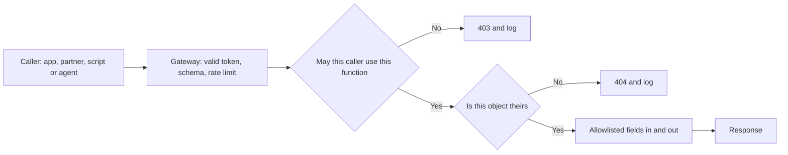
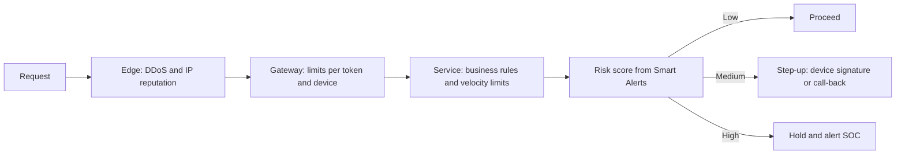
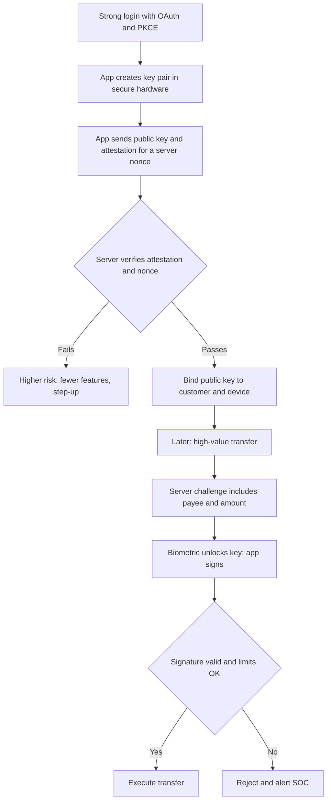

# Module 4 — APIs, mobile and abuse

*From a security point of view, Najm Mobile is mostly an API with a phone attached. Every balance, card control and transfer the app shows is a call to the bank's public API, and anyone with a laptop can make those calls without the app. This module moves from the browser to the world of machine-to-machine calls. Lesson 4.1 works through the OWASP API Security Top 10 using Najm's own endpoints, and shows why authorisation failures dominate the list. Lesson 4.2 covers attacks that need no bug at all: bots, scraping, enumeration, races and business-logic flaws that turn a feature into a weapon at scale. Lesson 4.3 crosses to the device and draws the line every mobile team must know: what you can trust on a phone you do not control, and what must always be decided on the server. You will follow Mariam's authorised test of the card-controls API, Ali's first abuse and mobile reviews, and Noura's rule for the mobile team: "Assume the attacker has the app, a decompiler and a proxy. Then design."*

> **Phases:** Design, Build, Test, Operate — APIs that check every request, business flows that survive automation, and a mobile app built on the assumption that the device may be hostile.

---

# 4.1 — The OWASP API Security Top 10 in practice
*Level: 🟡 Intermediate* · *Prerequisites: 1.1, 3.3* · *Phase: Design, Test*

## ⚡ In 60 seconds
- An **API** (application programming interface) exposes data and functions directly to programs. Attackers skip your app: they call the API with their own tools and change any value.
- The **OWASP API Security Top 10 (2023)** is the standard list of what goes wrong. Three of its top five entries are authorisation failures: **BOLA** (objects), **BOPLA** (fields) and **BFLA** (functions).
- The core rule: on every request, the server decides **who is calling**, **whether they may use this function**, **whether this object is theirs** and **which fields they may read or change**.
- Decision cue for every endpoint: "If I change the ID, add a field, switch the HTTP method or call an older version, what stops me?"
- The inventory matters as much as the code: old versions, test environments and undocumented endpoints are where checks go missing.
- Biggest trap: "the app never shows that button" or "the IDs are random, so nobody can guess them". Neither is access control.

## 🧭 Why it matters
Najm is adding card controls to Najm Mobile: spending limits, blocking online payments, freezing a card. Before launch, Mariam (red-team lead) runs an authorised test of the staging API with two test customers, A and B. Logged in as A, she sends `PATCH /v2/cards/{cardId}/limits` with B's card ID. The API returns `200 OK` and B's limit changes. The app never offers that action; the API simply never asked whether the card was A's.

Her report has two more findings. `GET /v2/customers/me` returns fields the app never displays, including an internal `riskScore` and `kycStatus`. And the 2019 `/v1/` API, unused by the current app, still answers on the public gateway without the newer checks. Ali (new security engineer) asks whether these are "real", since no customer could reach them through the app. Noura (Head of Application & AI Security) answers: "The app is one client. Attackers write their own."

Public cases show the cost. In 2022 the Australian telecoms company Optus suffered a large exposure of customer records. Public reporting at the time described an internet-facing API that returned customer data without requiring authentication; the details were contested and later examined by regulators. Whatever the exact facts, the pattern combines three themes of this lesson: an unwatched endpoint, a missing access check and iterable identifiers.

## 📐 How it works

### 🟢 The essentials

**Why APIs are different.** A web page mixes data and presentation, and a person clicks what it shows. An API returns raw data, usually JSON, from **endpoints** such as `/v2/accounts/{accountId}` to any program that calls it: Najm Mobile, the SME Portal's front end, partners, scripts and now AI agents such as Najm Assist. There is no interface to hide behind; the structure is predictable (if `/v2/accounts/1001` exists, an attacker will try `1002`); and an API answers a script as happily as a person, thousands of times a minute.

**The list.** The OWASP API Security Top 10 was last revised in 2023 at the time of writing (2026); check the OWASP site for any later edition.

| ID | Risk | In plain words | Najm example |
|---|---|---|---|
| API1 | Broken Object Level Authorization (BOLA) | No check that the caller may access *this* object | A's token changes B's card limit |
| API2 | Broken Authentication | Weak login, token or key handling | No attempt limit on the OTP endpoint |
| API3 | Broken Object Property Level Authorization (BOPLA) | Caller can read or write *fields* they should not | `riskScore` returned; `kycStatus` writable |
| API4 | Unrestricted Resource Consumption | No limits on size, number or cost of requests | Ten years of statements in one call |
| API5 | Broken Function Level Authorization (BFLA) | Caller can use a *function* meant for another role | Customer token calls an `/admin/` endpoint |
| API6 | Unrestricted Access to Sensitive Business Flows | A legitimate flow abused by automation | Scripted sign-ups farming referral bonuses |
| API7 | Server-Side Request Forgery (SSRF) | API fetches a URL the caller supplied | SME Portal "import invoice from link" |
| API8 | Security Misconfiguration | Unsafe defaults and settings | Stack traces in error responses |
| API9 | Improper Inventory Management | Not knowing which APIs, versions and environments exist | The forgotten `/v1/` |
| API10 | Unsafe Consumption of APIs | Trusting third-party API data too much | Partner response used unvalidated |

Lesson 3.3 introduced **IDOR** (insecure direct object reference). BOLA is the API name for the same failure. It sits at the top because it is common, easy to exploit and easy to miss in review: the code works perfectly for honest users.

**BOLA, vulnerable and fixed.** The vulnerable handler authenticates the caller and then trusts the ID in the URL:

```ts
// VULNERABLE: any logged-in customer can read any account's statements
app.get("/v2/accounts/:accountId/statements", requireAuth, async (req, res) => {
  const rows = await db.statements.findMany({
    where: { accountId: req.params.accountId },
  });
  res.json(rows);
});
```

The fix ties the object to the caller inside the query itself:

```ts
// FIXED: the account must belong to the authenticated customer
app.get("/v2/accounts/:accountId/statements", requireAuth, async (req, res) => {
  const account = await db.accounts.findFirst({
    where: { id: req.params.accountId, ownerId: req.user.customerId },
  });
  if (!account) return res.status(404).json({ error: "not_found" });
  const rows = await db.statements.findMany({ where: { accountId: account.id } });
  res.json(rows);
});
```

The ownership rule lives on the **server**, inside data access, where a modified client cannot skip it. Answering **404 Not Found** rather than **403 Forbidden** avoids confirming that the ID exists; either is fine if access is denied consistently.

**Authentication is not authorisation.** `requireAuth` proves *who* is calling. It says nothing about *what* they may touch. Almost every BOLA bug sits behind a perfectly good login.

### 🟡 Going deeper

**API3 BOPLA: fields, in and out.** The 2023 edition merged two older items. **Excessive data exposure** is returning whole database objects and trusting the client to show only some fields. **Mass assignment** is copying whatever fields the client sends into the stored object. Both come from never writing down which fields are allowed.

```ts
// VULNERABLE (PATCH /v2/customers/me; me = caller's ID): every field in, every field out
const c = await db.customers.update({ where: { id: me }, data: req.body }); // kycStatus too
res.json(c);                                      // riskScore and internal notes too

// FIXED: allowlist in, allowlist out
const UpdateProfile = z.object({
  preferredName: z.string().max(60).optional(),
  language: z.enum(["ar", "en"]).optional(),
}).strict();                                      // unknown fields are rejected
const input = UpdateProfile.safeParse(req.body);
if (!input.success) return res.status(400).json({ error: "invalid_body" });
const c2 = await db.customers.update({ where: { id: me }, data: input.data });
res.json(toPublicProfile(c2));                    // explicit response shape
```

At contract level, an **OpenAPI** document (a machine-readable description of every endpoint, parameter and response) does the same job: set `additionalProperties: false` on request bodies, enforce it at the gateway or in code, and list only public fields in response schemas.

**API5 BFLA: functions.** BOLA is "the wrong customer's card"; BFLA is "a function this kind of user should never have". Typical signs: admin routes on the customer host, role checks only in the front end, or a check on `GET` but not on `DELETE` for the same path. Defend with **deny by default** (every route declares its allowed roles; undeclared routes are refused), and keep staff APIs off the public gateway, behind staff identity.

**API2 Broken Authentication.** Login and one-time-password (OTP) endpoints without attempt limits; tokens accepted without checking signature, issuer, audience and expiry (3.2); tokens in URLs, which end up in logs; and **API keys** used to identify users, although a key identifies an application, not a person, and any key in a mobile app is public (4.3).

**API8 Security Misconfiguration.** Verbose errors with stack traces, permissive **CORS** (cross-origin resource sharing: the browser rule for which websites may call your API; reflecting any origin while allowing credentials is the classic mistake), unneeded HTTP methods and framework defaults. Lesson 2.2 covers the browser side.

**API9 Improper Inventory Management.** You cannot protect what you do not know about. **Shadow APIs** were never documented; **zombie APIs** are old versions nobody switched off; staging environments holding production data count too. Every difference between what the gateway serves (from its logs) and the OpenAPI documents is a finding.

**API7 and API10: trust in both directions.** SSRF (API7) appears whenever an API fetches a caller-supplied URL: webhooks, "import from link", profile pictures (defences in 2.3). Unsafe consumption (API10) is the mirror image: trusting a third party's answer, such as an exchange-rate feed, more than you would trust user input. Validate those responses against a schema, set timeouts and do not follow redirects blindly.

**API4 and API6** get their own lesson (4.2). **Injection** and **logging** had entries in the 2019 edition but not in 2023; they still matter, and Modules 2 and 10 cover them.

The checks a request should pass, in order:



### 🔴 Expert view

**What the gateway can and cannot do.** An **API gateway** (the front door that routes requests to services) is the right place for authentication, schema validation, rate limits, TLS and inventory. It cannot check object ownership, because only the service knows that account 1002 belongs to customer B. Split the job: the gateway handles *who and how much*; the service decides *which object and which fields*.

**Centralise the decision.** When hundreds of handlers each write their own ownership query, one will forget. Express authorisation once: a data-access layer that always scopes queries to the caller, or a **policy engine** such as Open Policy Agent (OPA) or Cedar that evaluates rules outside handler code. New endpoints then inherit the rule by default.

**Random IDs are a seatbelt, not a brake.** Random UUIDs (version 4: long random identifiers; time-based versions are partly predictable) make guessing harder and are worth using. But IDs leak through URLs, logs, screenshots and other API responses. Only the server check fixes BOLA.

**Test authorisation like a feature.** Scanners rarely know which objects belong to whom. Use the **two-user test**: create customers A and B and a staff user, replay every request with another user's token, and expect a denial, in CI on every build. In production, a burst of denials on distinct IDs from one token is a strong signal for the SOC (10.1).

**GraphQL.** **GraphQL** serves client-chosen fields through one endpoint. Authorisation must run in every **resolver** (the function that fetches each field), deep queries need cost limits, and rate limits must count operations, since one request can carry many. Disabling **introspection** (the schema's self-description) reduces reconnaissance but is no substitute for authorisation.

**Agents are API clients too.** Najm Assist will call the same API. If it uses a service account that can read every account, any prompt injection that steers it becomes BOLA by proxy. This is a **confused deputy**: a trusted component tricked into using its authority for someone else. The agent should act with the *customer's* delegated, narrowly scoped token, for example via OAuth 2.0 Token Exchange (RFC 8693), so the normal object checks still apply. Module 9 builds on this.

## 🧰 The toolkit
| Control, standard or tool | What it is and does | When to reach for it |
|---|---|---|
| **OWASP API Security Top 10** (OWASP, 2023 edition) | The standard list of the ten most common API risks | Scoping API reviews and tests; training developers |
| **OWASP ASVS** (OWASP) | Testable security requirements for applications, including web services and APIs; version 5.0 released 2025 | Turning "secure API" into requirements and test cases |
| **OpenAPI schema validation** | A machine-readable contract per endpoint; validators reject unknown fields and wrong types | Every API from design onward; the inventory's source of truth |
| **API gateway** | Front door that authenticates, validates, rate-limits and logs requests | Authentication, quotas, TLS and inventory, never object-level checks |
| **Policy engine** (OPA, Cedar) | Evaluates authorisation rules outside handler code | Many services sharing complex rules; auditing who can do what |
| **Authorisation tests in CI** | Two-user tests that replay each request with another user's token, expecting denial | Every build, for every endpoint that takes an object ID |
| **OWASP crAPI** (OWASP) | A deliberately vulnerable API for safe, local practice | Training and exercises, never against real systems |

## 🏛️ In practice at Najm Bank
Noura's team introduces the **Najm API endpoint review card**: every new or changed public endpoint needs one, reviewed by Application & AI Security before it goes live. Mariam's finding is the first worked example:

```
Endpoint:        PATCH /v2/cards/{cardId}/limits
Owner:           Cards squad (engineering lead: Tariq)
Callers:         Najm Mobile; Najm Assist (customer's delegated token only)
Roles allowed:   customer (own cards only); no staff access on this route
Object rule:     card.ownerId == token.customerId, in CardRepository.forCustomer()
Writable fields: dailyLimit (0 to 50,000 QAR), onlinePaymentsEnabled
Returned fields: cardId, maskedPan, dailyLimit, onlinePaymentsEnabled
Limits:          10 changes per card per day; body under 2 KB
Two-user test:   tests/authz/cards_limits.spec.ts (passing)
```

The reviewer then asks one question per risk:

| Risk | Review question | Evidence for sign-off |
|---|---|---|
| API1 BOLA | Is every object ID checked for ownership or tenancy on the server? | Enforcing function; two-user test |
| API2 Authentication | Are tokens fully validated and login and OTP attempts limited? | Gateway configuration |
| API3 BOPLA | Are request and response fields allowlisted? | Strict schema; response shape |
| API4 Resources | Are size, page, time and cost limits set? | Limits on the card |
| API5 BFLA | Does the route declare allowed roles, denying by default? | Route policy; negative test |
| API6 Business flows | Is this a sensitive business flow? | Flow register entry (4.2) |
| API7 SSRF | Does it fetch a caller-supplied URL? | Allowlist and egress controls (2.3) |
| API8 Misconfiguration | Are errors generic, CORS restricted, unused methods off? | Configuration scan |
| API9 Inventory | Is it documented, owned and versioned, old versions retired? | Inventory entry |
| API10 Third parties | Are third-party responses validated, with timeouts? | Schema and timeouts |

A card saying "Object rule: none" goes back to the team, whatever the deadline. Jassim's SOC adds a detection rule: alert when one token is denied on more than 20 distinct object IDs within five minutes (illustrative; tuned on real traffic).

## 🛠️ Exercises
Hands-on work runs only against your own code or a local lab such as OWASP crAPI or OWASP Juice Shop on your own machine.

- 🟢 Pick five endpoints from an API you own, or from local crAPI or Juice Shop, and note which of the ten risks could apply to each. *Done when:* each endpoint has at least two mapped risks and one concrete review question, and every endpoint taking an object ID is marked.
- 🟡 In your local crAPI or Juice Shop, create two accounts and find one object-level authorisation flaw by replaying a request with the other account's token. Then reproduce the flaw in a small API of your own, fix it on the server and add an automated two-user test. *Done when:* the test fails on your vulnerable version and passes on the fixed one.
- 🔴 Build an inventory for a service you own: compare the routes served in the last 30 days, from logs, with the OpenAPI document, and classify each difference as shadow, zombie or documented-but-unused. *Done when:* every served endpoint has an owner, a version and a decision (document, retire or block), and CI fails if a new route appears without a schema entry.

## ⚠️ Mistakes and traps
- **Hiding instead of checking.** "The app doesn't show it" is not a control. Enforce on the server, on every request.
- **Trusting random IDs.** UUIDs reduce guessing; they do not replace ownership checks.
- **Putting all security in the gateway.** The gateway authenticates and limits; services authorise objects and fields.
- **Leaving old versions running.** Retire on a date, block at the gateway and keep the inventory honest.
- **Giving agents and integrations all-powerful service accounts.** Use scoped, delegated tokens so the same checks apply.

## 🧾 Recap
- APIs expose objects and functions directly; any client, including scripts and agents, can call them with any values.
- The OWASP API Security Top 10 (2023) is led by authorisation failures: BOLA, BOPLA and BFLA.
- On every request, the server authenticates, checks the function, checks object ownership and allowlists fields in and out.
- Gateways handle who and how much; services decide which object and which fields.
- Keep an honest inventory; test authorisation with two users in CI and watch denials in production.

## ✍️ Check yourself

**1. During an authorised test, Mariam logs in as test customer A and sends `PATCH /v2/cards/{cardId}/limits` with test customer B's card ID. The API changes B's limit. Which risk is this, and what is the fix?**

- A. API2 Broken Authentication; make A log in again before any change
- B. API1 BOLA; on the server, check on every request that the card belongs to the authenticated customer
- C. API8 Security Misconfiguration; hide card IDs from the app's screens
- D. API4 Unrestricted Resource Consumption; rate-limit the endpoint

<details><summary>Answer</summary>

**B.** Authentication worked; the object-level check that the card is A's was missing. A re-authenticates the same person; C hides the ID instead of checking it. (🟢 The essentials.)

</details>

**2. `GET /v2/customers/me` returns an internal `riskScore`, and `PATCH /v2/customers/me` accepts a `kycStatus` field. What is the best fix?**

- A. Ask the mobile team not to display `riskScore`
- B. Encrypt the response body
- C. Define allowlisted request and response schemas: reject unknown fields on input and return only public fields
- D. Move the endpoint to `/v3/`

<details><summary>Answer</summary>

**C.** This is API3 BOPLA: excessive data exposure out, mass assignment in. A leaves the data in the response for any other client; B does not help, because the client decrypts it anyway. (🟡 Going deeper.)

</details>

**3. To close BOLA findings, a developer proposes replacing sequential account numbers in URLs with UUIDs. What should Noura say?**

- A. Good: random IDs make BOLA impossible
- B. Worth doing as defence in depth, but IDs leak through logs, links and other responses, so the server-side ownership check is still required
- C. Pointless: UUIDs add no security at all
- D. Use UUIDs and drop the ownership check to improve performance

<details><summary>Answer</summary>

**B.** Unguessable IDs slow attackers down but are not access control. A is the tempting trap; C goes too far, since harder guessing has some value. (🔴 Expert view.)

</details>

**4. Najm's 2019 `/v1/` API is no longer used by the current app but still answers on the public gateway, without the newer access checks. Which risk is this, and what is the right response?**

- A. API9 Improper Inventory Management: record it with an owner and a retirement date, block it at the gateway, and regularly compare served routes with documented ones
- B. API10 Unsafe Consumption of APIs: validate its responses
- C. Not a risk, because no current client calls it
- D. API7 SSRF: add a URL allowlist

<details><summary>Answer</summary>

**A.** Zombie versions are a classic inventory failure. C is the trap: attackers do not need the current app to call an old endpoint. (🟡 Going deeper.)

</details>

**5. Najm Assist will call the accounts API to look up a customer's transactions. Tariq proposes giving it a service account that can read all accounts "to keep it simple". What is the main risk, and the better design?**

- A. Cost; cache responses instead
- B. Latency; let the agent query the database directly
- C. A confused deputy: a manipulated agent could read other customers' data; the agent should use the customer's delegated, narrowly scoped token so the API's object checks apply
- D. None, because the agent is internal and therefore trusted

<details><summary>Answer</summary>

**C.** An agent with broad authority turns prompt injection into BOLA by proxy. D assumes the agent's inputs are trustworthy, which Module 8 shows they are not. (🔴 Expert view.)

</details>

## 📚 References
- OWASP API Security Project and the API Security Top 10 (2023) — https://owasp.org/API-Security/
- OWASP Application Security Verification Standard (ASVS) — https://owasp.org/www-project-application-security-verification-standard/
- OWASP Cheat Sheet Series (Authorization, Mass Assignment, REST Security and GraphQL cheat sheets) — https://cheatsheetseries.owasp.org/
- OWASP crAPI (completely ridiculous API) — https://owasp.org/www-project-crapi/
- MITRE CWE-639, Authorization Bypass Through User-Controlled Key — https://cwe.mitre.org/data/definitions/639.html
- MITRE CWE-915, Improperly Controlled Modification of Dynamically-Determined Object Attributes — https://cwe.mitre.org/data/definitions/915.html
- RFC 8693, OAuth 2.0 Token Exchange — https://www.rfc-editor.org/rfc/rfc8693
- OpenAPI Initiative — https://www.openapis.org/

---

# 4.2 — Abuse, bots, rate limits and business-logic flaws
*Level: 🟡 Intermediate* · *Prerequisites: 3.1, 4.1* · *Phase: Design, Operate*

## ⚡ In 60 seconds
- **Abuse** is using legitimate features at a scale, speed or order the designers did not expect. Often every single request is valid.
- Two OWASP API risks name it: **API4 Unrestricted Resource Consumption** (no limits on volume or cost) and **API6 Unrestricted Access to Sensitive Business Flows** (a valuable flow automated by attackers). For LLM features the equivalent is **LLM10 Unbounded Consumption**.
- **Business-logic flaws** are rules the code forgot: negative amounts, skipped steps, limits checked per request instead of per day, and **race conditions** where two parallel requests both pass a check.
- Key rate limits on what the attacker finds scarce (verified accounts, devices, phone numbers, the targeted account), not only on IP addresses, which are cheap.
- Decision cue for every sensitive flow: "What if a script did this 10,000 times, in parallel, in a different order, from 10,000 addresses?"
- Biggest trap: a CAPTCHA or an IP block list as the whole answer.

## 🧭 Why it matters
Najm Mobile is launching "Pay by mobile number": type a phone number and, if it belongs to a Najm customer, the app shows the recipient's full name before sending money. Ali reviews the endpoint against the API Top 10 from 4.1: login required, ownership checks fine, fields allowlisted. He signs it off.

Mariam does not. "Your endpoint answers one question: is this number a Najm customer, and what is their name? A script with a few test accounts can ask that for every mobile number in the country. That is a customer list for a phishing campaign, and a leak of personal data (5.3)." No line of code is wrong. The feature, used at scale, is the vulnerability.

The same week, spending on one-time-password texts triples overnight while the share of codes entered falls sharply, and Rania (Head of AI Products) asks why Najm Assist's model bill jumped: a few accounts paste enormous documents into the chat all day. Three features, one lesson: if a flow costs money or hands out something valuable, someone will automate it.

## 📐 How it works

### 🟢 The essentials

**The vocabulary.**
- A **bot** is any automated client. Many are welcome (monitoring, partners, search engines); the question is not "bot or human?" but "is this use acceptable?"
- **Credential stuffing**: trying username and password pairs leaked from other sites (3.1).
- **Scraping**: collecting data at scale, from fees and rates to, far worse, customer details.
- **Enumeration**: using an endpoint's different answers to learn which accounts, numbers or emails exist, as when a login page says "unknown user" for one and "wrong password" for another.
- **SMS pumping** (also called artificially inflated traffic): triggering masses of verification texts to number ranges where the attacker shares the revenue. You pay for every message.
- **Denial of wallet**: driving up a usage-based bill (cloud, SMS, LLM tokens) rather than taking the service down.
- **Business-logic flaw**: the code does what it was written to do, but the rules are incomplete. Scanners rarely find these, because nothing looks malformed.

**Common business-logic flaws in a bank.**

| Flaw | What goes wrong | Najm example | Defence |
|---|---|---|---|
| Unchecked sign or range | Negative or zero values accepted | A transfer of −500 credits the sender | Validate ranges on the server for every amount |
| Trusting client values | Price, fee or rate sent by the client | Exchange rate in the request body | Server looks up the rate; client value ignored |
| Step skipping | Calling step 3 without step 2 | `/transfers/confirm` without OTP verification | Server-side state machine per transaction |
| Per-request limits | Limit checked per call, not in total | Ten transfers of QAR 49,000 under a QAR 50,000 daily limit | Cumulative limits across channels and time |
| Race condition | Two parallel requests both pass a check | Double-spending a balance or a voucher | Atomic update or lock; idempotency keys |
| Replay | A valid request sent again | Re-sending an approved transfer | Idempotency keys, nonces, short expiry |
| Rounding | Rounding that always favours one side | Many tiny currency conversions | Defined rounding rules; minimum amounts; monitoring |

**Rate limiting.** A **rate limit** caps how many actions a key may perform in a time window. Every rate limit needs three decisions:
1. **What to count**: HTTP requests, or business events such as transfers, lookups, texts sent and LLM tokens. Business events are usually better.
2. **What to key on**: IP address, customer, device, session, target account, phone-number prefix, or a combination.
3. **What to do at the limit**: reject with **HTTP 429 Too Many Requests** (defined in RFC 6585) and a `Retry-After` header; slow down; ask for **step-up authentication** (a stronger proof, such as a device-bound signature); or hold for review.

Common algorithms: **fixed window** (100 per minute, reset each minute; simple but bursty at the edges), **sliding window** (smoother) and **token bucket** (refills at a steady rate; each action takes a token; bursts allowed up to the bucket size). Token buckets suit most APIs: quick bursts pass, sustained scripted use runs dry.

### 🟡 Going deeper

**Races: check-then-act.** The most dangerous logic flaws in finance are races. The vulnerable pattern reads a value, decides in application code, then writes:

```sql
-- VULNERABLE: two parallel requests can both read 500 and both pass the check
SELECT balance FROM accounts WHERE id = :id;   -- app sees 500, wants to send 400
UPDATE accounts SET balance = balance - 400 WHERE id = :id;

-- FIXED: the check and the change are one atomic statement
UPDATE accounts
   SET balance = balance - :amount
 WHERE id = :id AND :amount > 0 AND balance >= :amount;
-- 0 rows updated means an invalid amount or insufficient funds: reject the transfer
```

Row locks (`SELECT ... FOR UPDATE` inside a transaction) and database constraints (a balance that cannot go below zero, a voucher redeemable once) also work. The rule: let the database enforce the invariant, because it sees every request; each application instance sees only its own.

**Idempotency keys.** Mobile networks drop responses, and customers double-tap. An **idempotency key** is a unique value the client generates per intended action. The server stores it with the result and answers a repeat with the original result instead of acting twice:

```sql
-- One transfer per (customer, key): a retry or a double-tap cannot create a second one
CREATE UNIQUE INDEX transfers_idem ON transfers (customer_id, idempotency_key);
```

A repeat that reuses a key with a different request body should be rejected, not executed. This also blunts replays. Many payment APIs already use an `Idempotency-Key` header; an IETF draft to standardise it has been in progress for several years, so check its current status.

**Server-side state machines.** For multi-step flows (initiate, verify OTP, confirm), keep each transaction's state on the server and allow only legal transitions: confirm checks "verified, not expired, same customer, same device" instead of trusting the client's order of calls.

**Enumeration and lookup oracles.** For "Pay by mobile number", Noura's team stacks controls:
- Lookups only by logged-in customers on a bound device (4.3).
- A **masked** name ("Ahmed K.") for confirmation, not the full name.
- Daily limits per customer on lookups *and* on **distinct numbers**: real customers pay a few people; scrapers check thousands.
- SOC alerts on accounts with many lookups and few payments.
- A product question: must the feature reveal membership before the customer commits to paying? Every fact revealed can be harvested.

**Layered controls.** No single layer stops abuse. A request to a sensitive Najm flow passes several:



**Bots and CAPTCHAs.** Bot-management services score requests on IP reputation, device characteristics and behaviour; for a mobile app, **platform attestation** (4.3) is a stronger signal. **CAPTCHAs** add friction for everyone, exclude some disabled users, and are solved by paid human farms or software: one adjustable speed bump, never the control.

**SMS pumping defences.** Send texts only to countries you serve; limit sends per number, prefix and account; alert on spend and on the **conversion rate** (codes entered divided by codes sent), which collapses during pumping; and prefer in-app approval on a bound device.

**LLM features and denial of wallet.** The OWASP Top 10 for LLM Applications (2025) lists **LLM10 Unbounded Consumption**: uncontrolled use that runs up cost, exhausts capacity or supports model-extraction attempts through very high query volumes. For Najm Assist: cap input size, output tokens, tool calls and agent steps per turn; set per-customer daily token budgets; time out long runs; and alert on spend per account. Module 9 returns to this.

### 🔴 Expert view

**Abuse is economics.** You cannot make abuse impossible; you can make each success cost more than it is worth to the attacker. IP addresses are cheap: residential proxy networks rent out very large numbers of them, so per-IP limits stop only clumsy scripts. Verified accounts and attested devices are expensive. Key important limits on those and on the **target** (attempts per username, lookups per phone number), so spreading an attack across many sources does not help.

**Count business events, not HTTP requests.** "Five new payees per day" and "QAR 50,000 per day across app, web and branch" are rules attackers cannot sidestep by batching requests or switching channels. They belong in the service, near the data, and in requirements written as **abuse cases** (also called misuse cases): user stories from the attacker's side, such as "As a fraudster, I want to open 500 accounts to collect referral bonuses." Lesson 6.1 makes them part of every requirement set.

**Choose responses, not just blocks.** A hard block teaches attackers your threshold. Alternatives: slow down, require step-up, cap the value, queue for review, or run a new rule in **shadow mode** (log only) to measure false positives before enforcing it. Decide per flow whether the limiter **fails open** (allows requests if its datastore is down) or **fails closed**. Logins and transfers should not fail fully open; a fees page can.

**Invariants, reconciliation and kill switches.** Some logic flaws will reach production. Catch them with continuously checked invariants: a **double-entry ledger** where every debit has a matching credit, daily reconciliation of balances against transactions, and alerts when a promotion pays out more than its budget. Keep a feature flag per sensitive flow that can pause or cap it without a release, so the on-call engineer can stop a 2 a.m. bonus drain in a minute.

**Measure friction.** Every control costs genuine customers something: track false positives, abandoned flows and support calls alongside blocked abuse. Abuse rules should share the Smart Alerts signal pipeline, so Jassim's SOC sees one picture.

## 🧰 The toolkit
| Control, standard or tool | What it is and does | When to reach for it |
|---|---|---|
| **Rate limiting** (token bucket, sliding window) | Caps actions per key per time window and answers 429 with `Retry-After` | Every public endpoint; keyed on customer, device and target, not only IP |
| **Idempotency keys** | A client-generated key per action; the server returns the stored result on repeats | Payments, transfers and any create action a retry could duplicate |
| **Atomic conditional updates** | Check and change in one statement or locked transaction; constraints enforce invariants | Balances, vouchers, limits: anything a race could double-spend |
| **Step-up authentication** | Asking for a stronger proof, such as a device-bound signature or passkey, when risk rises | New payees, limit increases, unusual amounts or devices |
| **OWASP Automated Threats to Web Applications** (OWASP) | A taxonomy of automated abuse such as credential stuffing, scraping and carding | Naming abuse in threat models and bot-management requirements |
| **Bot management** | Services that score requests on IP reputation, device and behaviour signals | High-traffic public flows: login, sign-up, lookups |
| **Abuse cases** | Requirements written from the attacker's side, each with a control and a test | Designing every sensitive business flow |

## 🏛️ In practice at Najm Bank
Noura's team creates the **sensitive business flow register**. Any endpoint whose review card (4.1) answers "yes" to API6 needs an entry, agreed with the product owner, before launch. Thresholds are illustrative and tuned in shadow mode.

| Flow | Abuse scenario | Limits and controls | Signal to the SOC | Owner and kill switch |
|---|---|---|---|---|
| Login | Credential stuffing from many addresses | 5 failures per username per 15 minutes, then step-up; breached-password check | Failure rate per username and overall | Identity squad; step-up for all |
| OTP text message | SMS pumping; flooding a victim with codes | Served countries only; 3 per number per 10 minutes; 10 per account per day | SMS spend per hour; conversion below 50% | Identity squad; pause SMS by country |
| Pay by mobile number | Customer enumeration | Bound device only; 20 lookups and 10 distinct numbers per day; masked name | Lookups against completed payments | Payments squad; disable lookup |
| Transfer to new payee | Account-takeover cash-out; mule networks | 5 new payees per day; first transfer capped; Smart Alerts score | New payee on new device | Payments squad; Dana for the model |
| Referral bonus | Fake-account farms | Paid after 30 days of genuine activity; one per device and national ID; monthly budget | Clusters sharing devices or addresses | Marketing with fraud team; cap bonuses |
| Statement export | Bulk extraction; resource exhaustion | Up to 12 months per export; 5 per day; asynchronous job | Exports per account per day | Accounts squad; disable export |
| Najm Assist chat | Denial of wallet; model-extraction attempts | 8,000 input tokens per message; daily token budget; 5 tool calls per turn | Spend per customer; budget hits | Rania's team; fall back to FAQ mode |

Rows are reviewed quarterly against abuse seen by Jassim's SOC and Dana's fraud analytics; limit changes are logged with reasons.

## 🛠️ Exercises
Hands-on work runs only against code you wrote, a local lab, or deliberately vulnerable training apps such as OWASP Juice Shop on your own machine. Never load-test or probe a system you do not own.

- 🟢 For an app you own, or Juice Shop, list three sensitive business flows, each with one abuse case ("As an attacker, I want…") and the business-event limit that would stop it scaling. *Done when:* each flow has an abuse case, a limit keyed on something other than IP address, and a named response at the limit.
- 🟡 Write a small local API with a transfer endpoint using the vulnerable check-then-act pattern. From a local script, send 20 concurrent transfers and observe the overdraft. Then apply an atomic conditional update and an idempotency key. *Done when:* the concurrent test overdraws the vulnerable version and never overdraws the fixed version across ten runs.
- 🔴 Write the abuse threat model for a referral programme, at Najm or in your own product: attacker goals and costs, the cheapest attack path, layered controls, success metrics and the kill switch. *Done when:* you can state the attacker's estimated cost per successful bonus before and after your controls, and a product or fraud owner accepts the added friction.

## ⚠️ Mistakes and traps
- **Limiting by IP address only.** Addresses are cheap to rotate. Key limits on customer, device and target as well.
- **Counting requests, not business events.** Batching, GraphQL and channel-switching defeat request counts. Limit transfers, payees, lookups and tokens.
- **Check-then-act in application code.** Let the database enforce invariants atomically.
- **CAPTCHA as the control.** It is friction, and it hurts real users. Layer it; do not rely on it.
- **Blocking without measuring.** Run new rules in shadow mode first, and track false positives and abandoned flows.

## 🧾 Recap
- Abuse uses valid features at an unexpected scale, speed or order; often there is no bug to patch.
- API4, API6 and LLM10 name the risks: unlimited volume and cost, and automated access to valuable flows.
- Business-logic flaws are missing rules. Races are the most dangerous in finance: enforce invariants atomically in the database and use idempotency keys.
- Rate-limit business events, keyed on scarce attacker resources and on targets, with a deliberate response at the limit.
- Layer controls from the edge to the fraud engine, measure friction, and keep reconciliations and kill switches for what gets through.

## ✍️ Check yourself

**1. "Pay by mobile number" shows the recipient's full name if the number belongs to a Najm customer. Which combination best reduces the risk of customer enumeration?**

- A. A CAPTCHA on the lookup screen
- B. Blocking IP addresses that make more than 100 lookups per hour
- C. Lookups only by logged-in customers on bound devices, a masked name, per-customer limits on total and distinct numbers, and SOC alerts on accounts with many lookups and few payments
- D. Moving the lookup to a new, undocumented endpoint

<details><summary>Answer</summary>

**C.** It raises the attacker's cost on scarce resources and reduces what each answer reveals. A and B are single layers that human farms and rotating addresses defeat; D is obscurity. (🟡 Going deeper; 🔴 Expert view.)

</details>

**2. In a local lab, two transfer requests sent at the same moment both succeed and leave the account overdrawn, although each request was checked. What is the cause, and the best fix?**

- A. Credential stuffing; add multi-factor authentication
- B. A race condition from check-then-act; make the check and the debit one atomic conditional update or locked transaction, and use idempotency keys
- C. Missing TLS; enforce HTTPS
- D. A slow database; add more servers

<details><summary>Answer</summary>

**B.** Both requests read the same balance before either wrote. Atomic updates let the database enforce the invariant. D may even widen the race window. (🟡 Going deeper.)

</details>

**3. Najm's login endpoint allows 10 failures per minute per IP address. Attackers spread a credential-stuffing run across tens of thousands of residential addresses. What change helps most?**

- A. Lower the limit to 5 failures per minute per IP address
- B. Return different errors for "unknown user" and "wrong password" so customers understand
- C. Block all foreign IP addresses
- D. Add limits keyed on the targeted username and on overall failure rates, with step-up and breached-password checks

<details><summary>Answer</summary>

**D.** Keyed on the target, spreading the attack across addresses does not help. A still keys on a cheap resource; B creates an enumeration oracle; C blocks Najm's customers in the UAE and the EU, and customers travelling abroad. (🔴 Expert view.)

</details>

**4. Overnight, Najm's spending on verification texts triples, the share of codes entered collapses, and most messages go to countries where Najm has no customers. What is most likely happening, and what should the team do?**

- A. A marketing campaign succeeded; buy more SMS credit
- B. SMS pumping; restrict sending to served countries, limit per number, prefix and account, alert on spend and conversion, and move customers to in-app approval
- C. A denial-of-service attack; put the site behind a CDN
- D. A fault at the SMS provider; open a ticket and wait

<details><summary>Answer</summary>

**B.** Rising spend, collapsing conversion and unserved destinations are the signature of SMS pumping. C misreads it: the bill, not availability, is the target. (🟢 The essentials; 🟡 Going deeper.)

</details>

**5. A few Najm Assist accounts paste huge documents into the chat all day, and the model bill jumps. Which OWASP item applies, and which controls fit?**

- A. LLM10 Unbounded Consumption; cap input size, output tokens and tool calls per turn, set per-customer daily token budgets, and alert on spend
- B. LLM01 Prompt Injection; write a stronger system prompt
- C. API9 Improper Inventory Management; document the endpoint
- D. LLM09 Misinformation; add a disclaimer

<details><summary>Answer</summary>

**A.** Uncontrolled consumption of a paid resource is LLM10. B addresses a different risk, and a prompt cannot enforce a budget. (🟡 Going deeper.)

</details>

## 📚 References
- OWASP API Security Top 10 (2023), API4 and API6 — https://owasp.org/API-Security/
- OWASP Automated Threats to Web Applications — https://owasp.org/www-project-automated-threats-to-web-applications/
- OWASP GenAI Security Project, Top 10 for LLM Applications (2025), LLM10 Unbounded Consumption — https://genai.owasp.org/
- OWASP Credential Stuffing Prevention Cheat Sheet — https://cheatsheetseries.owasp.org/cheatsheets/Credential_Stuffing_Prevention_Cheat_Sheet.html
- RFC 6585, Additional HTTP Status Codes (429 Too Many Requests) — https://www.rfc-editor.org/rfc/rfc6585
- RFC 9110, HTTP Semantics (Retry-After) — https://www.rfc-editor.org/rfc/rfc9110
- MITRE CWE-362, Concurrent Execution using Shared Resource with Improper Synchronization (race condition) — https://cwe.mitre.org/data/definitions/362.html
- MITRE CWE-770, Allocation of Resources Without Limits or Throttling — https://cwe.mitre.org/data/definitions/770.html
- MITRE CWE-840, Business Logic Errors — https://cwe.mitre.org/data/definitions/840.html

---

# 4.3 — Mobile app security: what you can and cannot trust on the device
*Level: 🟡 Intermediate* · *Prerequisites: 3.2, 4.1* · *Phase: Build, Test*

## ⚡ In 60 seconds
- A mobile app runs on a device you do not control. Anyone can decompile it, read its strings and change its behaviour. **Everything in the app is public, and every check in the app can be skipped.**
- Only the server can enforce limits, authorisation and business rules. Client-side checks are for user experience.
- Never ship secrets in the app. Keep the *user's* tokens in the platform's secure storage (iOS Keychain, Android Keystore), and sign in with OAuth plus PKCE through the system browser (3.2).
- Hardware-backed keys, **device binding** and **platform attestation** (Apple App Attest, Google Play Integrity) give the server strong signals. They raise attacker cost; they are not guarantees.
- **OWASP MASVS** says what a secure mobile app must achieve; **OWASP MASTG** says how to test it.
- Biggest trap: treating certificate pinning, obfuscation or root detection as a substitute for server-side controls.

## 🧭 Why it matters
Ali's first mobile review is the Najm Mobile release candidate. He unpacks the Android package from the internal build store and searches its strings: a maps key (restricted by the provider to Najm's app), every API path including `/v2/internal/` routes, and a `debugMenuEnabled` flag. Then he spots that the daily transfer limit is checked in the app: too high an amount shows an error and never reaches the API. He sends the same transfer from a test script against staging. The API accepts it.

He also finds a pull request for a Najm Assist voice prototype that puts an LLM provider key in an environment variable the build tool inlines into the app. "It's fine, it's in an env file," says the comment. It is not: anything the app can read, anyone holding the app can read.

Noura's rule for the mobile team: "Assume the attacker has the app, a decompiler and a proxy. Then design." This lesson separates what the device can be trusted with from what only the server can decide.

## 📐 How it works

### 🟢 The essentials

**Who threatens a mobile app.** A thief with a lost or stolen phone; a malicious app on the same phone; a network attacker on hostile Wi-Fi; a **reverse engineer** who decompiles, modifies or repackages your app on their own device; and someone who skips the app entirely and calls your API with a script (4.1). The last two are why no secret and no rule can live only in the app.

**What you can and cannot trust.**

| On the device | Trust it? | Why |
|---|---|---|
| App code, strings, embedded keys and URLs | No secrecy | Anyone can download and decompile the package |
| Client-side checks: limits, validation, flags | User experience only | Can be patched, hooked or bypassed via the API |
| Values the app sends, such as "rooted: false" | Claims, not facts | A modified app or a script can forge them |
| OS sandbox on an updated, unmodified phone | Mostly | Breaks on rooted or jailbroken devices |
| Keys in secure hardware | Designed not to be extractable | Malware may still make the app *use* them |
| Attestation verdict verified by your server | Strong signal | Not universal, can be wrong, must be fresh |
| TLS to your API | Against network attackers | Not against the device's owner |

**Rooted** (Android) and **jailbroken** (iOS) devices have had the operating system's restrictions removed. Apple's **Secure Enclave**, Android's **StrongBox** and a **TEE** (trusted execution environment) are isolated hardware areas that hold keys.

**Never ship secrets.** AI coding assistants often put provider keys straight into client code. Client-marked variables, such as Expo's `EXPO_PUBLIC_` ones, are **inlined into the bundle** at build time.

```ts
// VULNERABLE: the key is compiled into the app; anyone with the app has it
await fetch("https://llm-provider.example/v1/chat", {
  method: "POST",
  headers: { Authorization: `Bearer ${process.env.EXPO_PUBLIC_LLM_KEY}` },
});

// FIXED: the app sends the customer's token to Najm's API;
// the server holds the provider key, applies limits (4.2) and logs usage
await fetch("https://api.najm.example/v2/assist/messages", {
  method: "POST",
  headers: { Authorization: `Bearer ${accessToken}` },
});
```

A key that has shipped is compromised: rotate it (5.2). Keys that must live in the app, such as some maps keys, should be restricted by the provider to your app and treated as public.

**Store user tokens in secure storage.** Plain key-value storage (Android SharedPreferences, iOS UserDefaults, React Native's AsyncStorage) is not encrypted by the app, is readable on a rooted or jailbroken device and may end up in backups. Use the platform's secure store, here through Expo's SecureStore:

```ts
// VULNERABLE: plain, unencrypted storage
await AsyncStorage.setItem("refresh_token", refreshToken);

// FIXED: Keychain on iOS, Keystore-backed encryption on Android;
// THIS_DEVICE_ONLY stops the iOS item moving to another device via backup
await SecureStore.setItemAsync("refresh_token", refreshToken, {
  keychainAccessible: SecureStore.WHEN_UNLOCKED_THIS_DEVICE_ONLY,
});
```

Keep sensitive data out of logs, crash reports and analytics, and keep tokens short-lived with refresh-token rotation (3.2).

**Sign-in.** Native apps should use OAuth 2.0 with **PKCE** (Proof Key for Code Exchange) through the system browser, never an embedded web view that could read the password (RFC 8252, "OAuth 2.0 for Native Apps"). A mobile app is a **public client** that cannot keep a client secret, which is why PKCE exists.

**The server decides.** Ali's transfer-limit finding has one fix: the payments API enforces the limit, cumulatively as in 4.2, and the app's check stays only to show a friendly message early.

### 🟡 Going deeper

**Network.** On iOS, **App Transport Security** blocks plain HTTP unless the app declares an exception. On Android, apps targeting Android 9 or later block cleartext traffic by default, and apps targeting Android 7 or later ignore user-installed certificate authorities unless configured otherwise. Every exception needs a written reason.

**Certificate pinning** means the app accepts only specific certificates or public keys for your API, not any certificate the device trusts. It protects against mis-issued or intercepting certificate authorities. It does not stop a reverse engineer, who can strip the pin from their own copy, and it can lock every customer out if certificates rotate without a plan. Pin public keys, ship backup pins and rehearse rotation. It is defence in depth, never the reason the API is safe.

**Deep links.** A **deep link** opens a specific screen from a URL. Any app can claim a custom scheme such as `najm://`, so for anything sensitive, including OAuth redirects, use **verified links** (iOS Universal Links, Android App Links), which the OS ties to your web domain. Treat parameters as untrusted: `najm://transfer?to=...&amount=...` may pre-fill a form but must never execute a transfer without explicit confirmation and the server's normal checks.

**WebViews.** A web view that loads remote content with a JavaScript bridge into native code lets any script on that page call your native functions. Load only your own origins and disable file access and unneeded bridges.

**Data leaks on the device.** Common findings: tokens or account numbers in logs; sensitive screens in screenshots or app-switcher previews (Android apps can block both; iOS apps can hide the preview and detect screenshots and recording); the clipboard; backups; balances in lock-screen notifications; and third-party SDKs collecting more than you realise (5.3).

**Biometrics, done properly.** A weak pattern shows a fingerprint or face prompt and, if the OS says "success", opens the accounts. On a compromised device that yes/no can be hooked, and the server learns nothing. The strong pattern binds biometrics to cryptography:

```ts
// WEAK: a local yes/no that the server never sees
if (await biometricPrompt()) showAccounts();

// STRONG: biometrics unlock a hardware key; the server verifies a signature over its own challenge
const { challenge } = await api.get("/v2/device/challenge");
const signature = await deviceKey.sign(challenge);   // key usable only after a biometric check
await api.post("/v2/device/verify", { challenge, signature });
```

**Device binding and transaction signing.** At enrolment, after a strong login, the app generates a key pair in secure hardware and the server records the public key against the customer and device. For a high-value transfer, the server sends a challenge containing the transfer details; the customer approves with biometrics; the app signs; the server verifies. This replaces SMS codes, exposed to SIM swap and interception (3.1), with proof only the enrolled device could produce.



### 🔴 Expert view

**Attestation: what it proves.** Apple's **App Attest** (part of the DeviceCheck framework) and Google's **Play Integrity API** (which replaced the older SafetyNet Attestation API) let the platform vendor vouch, in a signed statement your server can verify, that a request comes from your genuine app on a device that passes the vendor's integrity checks. The server issues a fresh **nonce** (a one-time random value), the app obtains a signed verdict bound to it, and the **server** verifies it and decides. Limits: verdicts can be unavailable (older devices, or Android phones without Google Play services), determined attackers work to defeat them, and there are quotas and privacy questions. Treat the result as a risk signal next to the Smart Alerts score: fewer features or step-up for failing devices, not silent trust or a blunt block.

**Resilience controls raise cost, nothing more.** Obfuscation, root and jailbreak detection, anti-debugging, tamper checks and commercial **RASP** (runtime application self-protection) products slow a reverse engineer down. MASVS keeps them in a separate resilience category on top of the core controls. If removing them would expose a vulnerability, the vulnerability is the problem.

**Banking malware and scams.** On Android in particular, banking trojans have been widely reported to abuse accessibility services and screen overlays to read the screen or act for the user. Bank-level defences: transaction signing that shows the payee and amount being approved; server-side signals such as a new device, an unusual payee or remote-access tools; platform APIs that protect sensitive screens from capture and overlays; and cooling-off periods for new high-value payees. Many scams use no malware at all: the customer is talked into paying, and only flow controls (4.2) and clear warnings help.

**The MASVS map.** At the time of writing (2026), OWASP MASVS groups its controls into **STORAGE**, **CRYPTO**, **AUTH**, **NETWORK**, **PLATFORM**, **CODE**, **RESILIENCE** and **PRIVACY**, with MASTG test techniques for each; OWASP also keeps a **Mobile Top 10** for awareness. MASVS was restructured in version 2, so check current versions before quoting control IDs.

**AI in the app.** Najm Assist appears in the app, but its intelligence must not live there. The system prompt, tool definitions and tool permissions stay on the server; the app sends text and a token and displays the answer. A prompt, an action list or a "safe mode" flag placed in the app is visible and editable by a reverse engineer. Render model output as text, not as HTML or links that trigger actions (Module 9).

## 🧰 The toolkit
| Control, standard or tool | What it is and does | When to reach for it |
|---|---|---|
| **OWASP MASVS** (OWASP MAS project) | The mobile security standard: what a secure app must achieve, by category | Mobile requirements and release gates |
| **OWASP MASTG** (OWASP MAS project) | The testing guide for MASVS controls | Planning and running mobile tests |
| **Platform secure storage** (iOS Keychain, Android Keystore) | OS-managed storage and hardware-backed keys | Tokens, device keys and other sensitive values |
| **PKCE** (RFC 7636) | A one-time proof binding an OAuth authorisation code to the app that requested it | Every native-app sign-in, through the system browser per RFC 8252 |
| **App attestation** (App Attest, Play Integrity) | Platform-signed verdicts on app and device genuineness | Enrolment and high-risk actions, verified on the server |
| **Device binding** | A hardware key per customer device, registered on the server, signing challenges and transactions | Replacing SMS codes; approving transfers and payee changes |
| **Certificate pinning** | Accepting only known keys for your API's TLS certificates | Defence in depth for high-value apps, with backup pins and a rotation plan |
| **MobSF** (Mobile Security Framework) | Open-source automated analysis of Android and iOS apps | First-pass scans of your own builds in CI |

## 🏛️ In practice at Najm Bank
Noura and Tariq publish the **Najm Mobile client-trust rules**:

| Item | Where it lives | Rule | Server-side counterpart |
|---|---|---|---|
| Transfer limits and payee rules | Server | The app's check is user experience only | Cumulative limits in the payments service (4.2) |
| Customer tokens | Keychain or Keystore | Never in plain storage, logs or URLs | Short expiry, rotation, revocation on unbinding |
| Device key | Secure hardware | Never exported; biometric to use | Public key bound to customer; signature checked per transfer |
| Provider keys (LLM, SMS, payments) | Server only | Build fails if a secret scan finds one in the bundle | Proxy with per-customer quotas |
| Najm Assist prompts and tool permissions | Server | None in the app | Tools use the customer's delegated token (4.1) |

The **mobile release gate** maps checks to MASVS categories:

| MASVS category | Release check | Evidence |
|---|---|---|
| STORAGE | No sensitive data in logs, backups or screenshots; tokens in secure storage | MobSF; MASTG tests |
| CRYPTO | Platform cryptography only; no hard-coded keys | Secret scan of the built bundle |
| AUTH | OAuth with PKCE via the system browser; biometrics bound to keys | Test results |
| NETWORK | TLS only; exceptions approved; pins with backups | Configuration review |
| PLATFORM | Verified deep links; WebViews locked down | Manual test notes |
| CODE | Dependencies scanned (6.2); link and QR inputs validated | Dependency report |
| RESILIENCE | Obfuscation and tamper checks on | Test on a rooted lab device |
| PRIVACY | SDK inventory and data-flow review signed by Sara (DPO) | SDK register |

MobSF runs on every build; Mariam's team runs a full authorised MASTG-based test before each major release. Any finding where "the server trusts the client" is rated high by default.

## 🛠️ Exercises
Hands-on work runs only against apps you own or deliberately vulnerable training apps, such as the OWASP MAS crackmes, on your own devices or emulators.

- 🟢 Unpack a release build of an app you own, or an OWASP MAS crackme, and search its strings for keys, tokens, internal URLs and flags. *Done when:* every secret-looking string has a decision: rotate and move to the server, keep as public-by-design and restricted, or remove.
- 🟡 Run MobSF against a build of your own app and triage every finding as a true issue, an accepted risk or a false positive. *Done when:* every high and medium finding has a MASVS category, a decision and an owner, and you have verified at least one by hand with a MASTG test.
- 🔴 Design device binding and transaction signing for transfers above a threshold, in an app you own or on paper for Najm Mobile: enrolment, attestation, server checks, what the customer sees when signing, lost and new phones, and what happens when attestation is unavailable. *Done when:* you have a flow diagram, a failure-mode table of at least six rows, and a re-binding process a phone social engineer could not complete with only the customer's personal details.

## ⚠️ Mistakes and traps
- **Secrets in the bundle.** Environment files and "obfuscated" strings ship to attackers. Move keys to the server; rotate anything that shipped.
- **Client-side enforcement.** Limits and permissions in the app are user experience. The API must enforce them.
- **Yes/no biometrics.** A prompt's result can be hooked. Bind biometrics to a hardware key whose signature the server verifies.
- **Trusting the app's own verdicts.** Checks judged on the device can be patched out. Verify on the server with a nonce.
- **Pinning without a plan.** A certificate change can lock out every customer. Pin keys, ship backups, rehearse rotation.
- **Custom-scheme deep links for sensitive actions.** Use verified links and require explicit confirmation.

## 🧾 Recap
- Assume the attacker has your app, a decompiler and a proxy: nothing in it is secret, and the server must enforce every rule.
- No provider secrets in the app; user tokens in Keychain or Keystore; OAuth with PKCE through the system browser.
- Device binding, transaction signing and server-verified attestation give strong but not absolute assurance.
- Pinning, obfuscation and root detection raise cost; they never replace server controls.
- Use MASVS for requirements and MASTG for tests, and keep AI prompts and tool permissions on the server.

## ✍️ Check yourself

**1. Ali finds that Najm Mobile checks the daily transfer limit in the app and never calls the API when the amount is too high. A script against staging sends a larger transfer, and it succeeds. What is the right fix?**

- A. Obfuscate the app so the check is harder to find
- B. Add root detection so modified apps cannot run
- C. Enforce the limit in the payments API, cumulatively across channels, and keep the app check only as an early, friendly message
- D. Pin the certificate so scripts cannot reach the API

<details><summary>Answer</summary>

**C.** The script never used the app, so nothing on the device can stop it. A, B and D make tampering harder but leave the API accepting any amount. (🟢 The essentials.)

</details>

**2. A developer puts the LLM provider key in an `EXPO_PUBLIC_` environment variable "so it isn't in the code". What should happen?**

- A. Nothing; environment variables are secret
- B. Encrypt the key inside the app, with the decryption key also stored in the app
- C. Treat the key as exposed if it shipped: rotate it, and route calls through Najm's API, which holds the key and applies per-customer limits
- D. Split the key into several strings in the code

<details><summary>Answer</summary>

**C.** Client-marked variables are inlined into the bundle. B and D are obfuscation: anything the app can reassemble, an attacker can too. (🟢 The essentials.)

</details>

**3. Which statement about certificate pinning in Najm Mobile is most accurate?**

- A. It makes the API safe from scripts
- B. It protects against mis-issued or intercepting certificates, but a reverse engineer can remove it from their own copy, and it needs backup pins and a rotation plan
- C. It replaces the need for TLS
- D. It should pin a single leaf certificate with no backup, for maximum strength

<details><summary>Answer</summary>

**B.** Pinning is defence in depth against network attackers. A is wrong because scripts do not use the app; D risks locking every customer out at the next certificate change. (🟡 Going deeper.)

</details>

**4. Najm's current biometric login shows the OS prompt and, on success, opens the accounts screen. What is the weakness, and the stronger design?**

- A. There is no weakness; the OS prompt is secure
- B. The server learns nothing and the result can be hooked; biometrics should instead unlock a hardware-bound key that signs a server challenge the server verifies
- C. Replace biometrics with SMS codes
- D. Show the prompt twice

<details><summary>Answer</summary>

**B.** Binding biometrics to a key turns a local yes/no into proof the server can check. C is weaker, because SMS codes are exposed to SIM swap and interception. (🟡 Going deeper.)

</details>

**5. When a customer enrols a new phone, the server-verified Play Integrity verdict says the device fails integrity checks. What should Najm's server do?**

- A. Ignore it, because attestation is unreliable
- B. Let the app decide for itself
- C. Treat it as a risk signal: allow low-risk features, require step-up or extra checks for high-risk actions, and log it with the other fraud signals
- D. Block the customer permanently

<details><summary>Answer</summary>

**C.** Attestation is a strong signal, not a verdict on the customer. B lets a patched app decide for itself; D punishes customers whose devices simply cannot pass. (🔴 Expert view.)

</details>

## 📚 References
- OWASP Mobile Application Security project (MASVS, MASTG and the MAS crackmes) — https://mas.owasp.org/
- OWASP Mobile Top 10 — https://owasp.org/www-project-mobile-top-10/
- RFC 8252, OAuth 2.0 for Native Apps — https://www.rfc-editor.org/rfc/rfc8252
- RFC 7636, Proof Key for Code Exchange by OAuth Public Clients — https://www.rfc-editor.org/rfc/rfc7636
- Apple Developer Documentation, DeviceCheck (including App Attest) — https://developer.apple.com/documentation/devicecheck
- Android Developers, Play Integrity API — https://developer.android.com/google/play/integrity
- Mobile Security Framework (MobSF) — https://github.com/MobSF/Mobile-Security-Framework-MobSF
- Expo documentation, environment variables — https://docs.expo.dev/guides/environment-variables/
