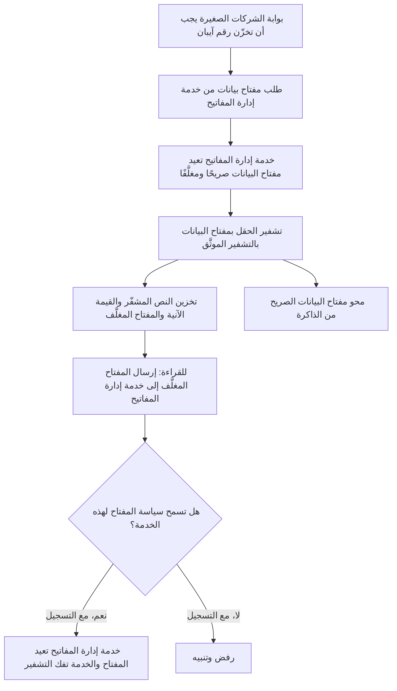
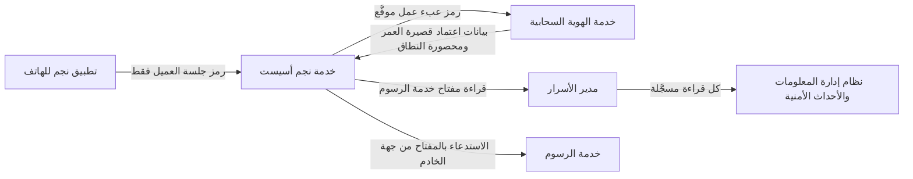
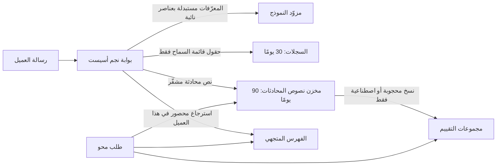

# الوحدة 5 — البيانات والتشفير والأسرار (Data, cryptography and secrets)

*التشفير (Cryptography) والأسرار (secrets) والبيانات الشخصية (personal data) هي المواضع التي تتحول فيها النوايا الحسنة (good intentions) في أغلب الأحيان إلى طمأنينةٍ زائفة (false comfort). فكلمة مرورٍ «تُجزَّأ» ("hashed") بالدالة الخطأ (wrong function). ومفتاحٌ «يُخفى» ("hidden") داخل تطبيقٍ للهاتف (mobile app). وسطرٌ في السجل (log line) ينسخ بهدوء رقم حساب كل عميل (every customer's account number) إلى أداةٍ يستطيع نصف الشركة البحث فيها (a tool that half the company can search). تمنح هذه الوحدة البنّائين (builders) القرارات لا الرياضيات (the decisions, not the maths). فهي تغطي أيّ أداةٍ تشفيرية (cryptographic tool) تناسب أيّ مهمة (which job) وأين يجب أن تعيش مفاتيحها (where its keys must live)؛ وكيف تُبقي مفاتيح واجهات البرمجة (API keys) والرموز المميزة (tokens) وكلمات المرور (passwords) بعيدةً عن الأماكن التي تتسرّب منها (the places they leak)، وما الذي تفعله في الساعة الأولى بعد أن يتسرّب أحدها (the first hour after one does)؛ وكيف تجمع وتسجّل وتحتفظ وتحذف (collect, log, keep and delete) البيانات الشخصية التي يحتاجها البنك فعلًا فحسب (only the personal data the bank actually needs)، بما في ذلك النسخ الجديدة (new copies) التي تُنشئها ميزات النماذج اللغوية الكبيرة (LLM features). ستتابع فريق أمن التطبيقات والذكاء الاصطناعي (Application & AI Security team) في بنك نجم (Najm Bank) بينما تفكّك نورة أول مراجعةٍ تشفيرية (first crypto review) يُجريها علي على بوابة الشركات الصغيرة (SME Portal)، ويطارد جاسم مفتاحًا مسرّبًا (leaked key) عبر خط إنتاج (pipeline) نجم أسيست (Najm Assist)، وتطرح سارة، مسؤولة حماية البيانات (DPO)، سؤالًا لا يستطيع أحدٌ الإجابة عنه: «أين بيانات هذا العميل؟» ⁦("Where is this customer's data?")⁩*

> **المراحل (Phases):** Design, Build, Operate — اختيار تشفيرٍ سليم (sound cryptography) وإدارة مفاتيح سليمة (key management)، وإبقاء الأسرار خارج الشيفرة والتطبيقات العميلة والموجّهات (out of code, clients and prompts)، وهندسة التعامل مع البيانات الشخصية (engineering personal-data handling) بحيث يعمل تقليل البيانات (minimisation) والتسجيل (logging) والحذف (deletion) عمليًّا (in practice).

---

# 5.1 — التشفير للبنّائين: TLS والتجزئة والتشفير والمفاتيح (Cryptography for builders: TLS, hashing, encryption and keys)
*المستوى (Level): 🟡 متوسط (Intermediate)* · *المتطلبات (Prerequisites): 1.2، 3.1* · *المرحلة (Phase): Design, Build*

## ⚡ الدرس في دقيقة (In 60 seconds)
- يمنح التشفير (Cryptography) البنّائين (builders) **السرية (confidentiality)**، أي لا يستطيع القراءة إلا الطرف الصحيح (only the right party can read)، و**السلامة (integrity)**، أي يُكتشف العبث (tampering is detected)، و**الأصالة (authenticity)**، أي تعرف من أنتج البيانات (you know who produced it). اختر الأداة حسب الخاصية التي تحتاجها (choose the tool by the property you need).
- القاعدة الأولى (Rule one): **لا تبتكر تشفيرك بنفسك أبدًا (never roll your own crypto)**. استخدم TLS 1.3 أثناء النقل (in transit)؛ وArgon2id أو scrypt أو bcrypt لكلمات المرور (for passwords)؛ وAES-GCM أو ChaCha20-Poly1305 عبر مكتبةٍ عالية المستوى (high-level library) للبيانات المخزّنة (at rest)؛ وخدمةً لإدارة المفاتيح (key management service) للمفاتيح (for keys).
- التجزئة (Hashing) ليست تشفيرًا (is not encryption). كلمات المرور تُجزَّأ (passwords are hashed) باتجاهٍ واحد (one-way)؛ أمّا البيانات المصرفية التي يجب أن تقرأها لاحقًا (bank details you must read back) فتُشفَّر أو تُرمَّز (encrypted or tokenised).
- لا يكون التشفير (Encryption) أقوى من إدارة مفاتيحه (only as strong as its key management): أين يعيش المفتاح (where the key lives)، ومن يستطيع استخدامه (who can use it)، وكيف يُسجَّل الاستخدام (how use is logged)، وكيف يُدوَّر (how it rotates).
- مؤشر القرار (Decision cue): لكل حقلٍ حساس (sensitive field)، اسأل «من يجب أن يقرأ هذا بنصٍّ صريح، وما الذي يوقفه التشفير في *هذه* الطبقة؟» ⁦("who must read this in clear, and what does encryption at this layer stop?")⁩
- أكبر فخ (Biggest trap): «مُشفَّر أثناء التخزين» ("encrypted at rest") بوصفه الجواب عن كل شيء (the answer to everything). فتشفير القرص (Disk encryption) يوقف قرصًا مسروقًا (a stolen disk)، لا حقن SQL (SQL injection) عبر تطبيقك نفسه (through your own app).

## 🧭 لماذا يهم (Why it matters)
أول مراجعةٍ للشيفرة (first code review) يُجريها علي في بنك نجم (Najm Bank) هي طلب سحب (pull request) لميزة «دعوة زميل» ("invite a colleague") في بوابة الشركات الصغيرة (SME Portal). فيوافق عليه (He approves it): «كل ما هو حساس مُجزَّأ أو مُشفَّر» ⁦("Everything sensitive is hashed or encrypted.")⁩. تعيد نورة فتحه (reopens it) وتُبرز ثلاثة أسطر (highlights three lines). كلمات مرور المستخدمين الجدد (new users' passwords) مخزّنةٌ بصيغة `sha256(password)`. واستدعاءٌ إلى شريك الفوترة الإلكترونية (e-invoicing partner) يضبط `verify=False` «لأن شهادة الاختبار ظلّت تفشل» ("because the test certificate kept failing"). والبيانات المصرفية للفواتير (invoice bank details) مُشفَّرةٌ بمفتاح AES مكتوبٍ داخل ملف الشيفرة المصدرية (an AES key written into the source file)، بنمطٍ يُسمّى ECB (a mode called ECB). وكان تعليقها (Her comment): «الثلاثة كلها تشفير. ولا واحد منها يحمي شيئًا» ⁦("All three are cryptography. None of the three protects anything.")⁩.

تُفرد قائمة OWASP Top 10، في إصدار 2021 (2021 edition)، لهذا النمط فئةً خاصة به (its own category)، هي *الإخفاقات التشفيرية (Cryptographic Failures)*، وقد نشرت OWASP منذ ذلك الحين تحديثًا لعام 2025 (a 2025 update)، فتحقّق من القائمة الحالية (check the current list) بدل الاعتماد على الترقيم (rather than relying on numbering). ونادرًا ما تنطوي هذه الإخفاقات على رياضياتٍ مكسورة (broken mathematics). إنها تنطوي على الأداة الخطأ (the wrong tool)، أو فحصٍ مُعطَّل (a disabled check)، أو مفتاحٍ في المكان الخطأ (a key in the wrong place). والعمليات (Operations) مهمةٌ أيضًا: فقد وصفت مراجعةٌ أجراها مكتب المساءلة الحكومية الأمريكي (US Government Accountability Office) لاختراق Equifax عام 2017 (the 2017 Equifax breach) كيف أن شهادةً منتهية الصلاحية (expired certificate) على جهاز فحص حركة المرور (traffic-inspection device) تركت حركة المرور المشفّرة دون فحص (left encrypted traffic uninspected)؛ ولوحظت حركة المرور المريبة (suspicious traffic was noticed) بعد تجديدها (after it was renewed).

## 📐 كيف يعمل (How it works)

### 🟢 الأساسيات (The essentials)

**المفردات (Vocabulary).** **النص الصريح (Plaintext)** بياناتٌ مقروءة (readable data)؛ و**النص المشفّر (ciphertext)** صيغتها المشفّرة (its encrypted form)؛ و**المفتاح (key)** هو السرّ (the secret) الذي يتحكم في التشفير أو التوقيع (controls encryption or signing). و**الملح (salt)** قيمةٌ عشوائية غير سرية (a random, non-secret value) تُمزج في التجزئة (mixed into a hash)؛ و**القيمة الآنية (nonce)**، أي «رقمٌ يُستخدم مرةً واحدة» ("number used once")، يجب ألّا تتكرر أبدًا تحت المفتاح نفسه (must never repeat under the same key).

**خمس أدوات، خمس مهام (Five tools, five jobs).**

| الأداة (Tool) | ماذا تفعل (What it does) | قابلة للعكس؟ ⁦(Reversible?)⁩ | الاستخدام النموذجي في بنك نجم (Typical use at Najm Bank) |
|---|---|---|---|
| **التجزئة (Hash)** (SHA-256 وSHA-3) | بصمةٌ ثابتة الطول (fixed-length fingerprint)؛ وأي تغييرٍ يبدّلها (any change alters it) | لا (No) | سلامة الملفات (File integrity) |
| **تجزئة كلمات المرور (Password hash)** (Argon2id وscrypt وbcrypt) | تجزئةٌ بطيئةٌ عمدًا ومملّحة (deliberately slow, salted hash) | لا (No) | تخزين كلمات المرور (Storing passwords) |
| **رمز مصادقة الرسائل (MAC, message authentication code)**، مثل HMAC-SHA256 | تجزئةٌ بمفتاحٍ سري (hash with a secret key): تُثبت أن حامل المفتاح (a key holder) أنتج البيانات دون تغيير (produced the data unchanged) | لا (No) | خطافات الويب للشركاء (Partner webhooks)، وملفات تعريف الارتباط الموقّعة (signed cookies) |
| **التشفير المتماثل (Symmetric encryption)** (AES-GCM وChaCha20-Poly1305) | مفتاحٌ واحد يشفّر ويفكّ التشفير (one key encrypts and decrypts)؛ وهذه الأنماط تكتشف العبث أيضًا (these modes also detect tampering) | نعم، بالمفتاح (Yes, with the key) | الحقول والملفات الحساسة المخزّنة (Sensitive fields and files at rest) |
| **التشفير بالمفتاح العام (Public-key cryptography)** (RSA وECDSA وEd25519) | زوج مفاتيح (key pair): المفتاح العام يُشارَك (public key shared)، والمفتاح الخاص لا يغادر مالكه أبدًا (private key never leaves its owner) | التوقيعات يُتحقَّق منها، ولا تُعكَس (Signatures are verified, not reversed) | شهادات TLS (TLS certificates)، وتوقيع الرموز المميزة والشيفرة (token and code signing) |

**لا تبتكر تشفيرك بنفسك أبدًا (Never roll your own crypto)** يعني (means): لا خوارزمياتٍ مخترعة (no invented algorithms)، ولا مخططاتٍ مُجمَّعة يدويًّا (no home-assembled schemes)، ولا معايير مُنفَّذة باليد (no hand-implemented standards). استخدم الواجهة عالية المستوى (high-level interface) لمكتبةٍ مُراجَعة جيدًا (well-reviewed library) وإعداداتها الافتراضية (defaults). فكل إخفاقٍ في طلب السحب الخاص بعلي (Ali's pull request) استخدم خوارزميةً حقيقية بالطريقة الخطأ (a real algorithm the wrong way).

**البيانات أثناء النقل: TLS (Data in transit: TLS).** يمنح TLS، أي أمن طبقة النقل (Transport Layer Security)، وهو حرف «S» في HTTPS (the "S" in HTTPS)، الاتصالَ السريةَ والسلامةَ ومصادقةَ الخادم (confidentiality, integrity and server authentication). ويُثبت الخادم هويته (proves who it is) بـ **شهادة (certificate)** موقّعةٍ من **سلطة شهادات (certificate authority)** (CA) يثق بها العميل (the client trusts)، تربط اسم نطاق (domain name) بمفتاحٍ عام (public key). استخدم **TLS 1.3** (RFC 8446)؛ واسمح بـ TLS 1.2 مع مجموعات تشفيرٍ حديثة (modern cipher suites) فقط حيث يحتاجه عميل (where a client needs it)؛ أمّا TLS 1.0 و1.1 فقد أُوقِف اعتمادهما رسميًّا (formally deprecated) (RFC 8996). ثلاث قواعد (Three rules):

1. لا تعطّل التحقق من الشهادات أبدًا (Never disable certificate verification). فمن دونه، يشفّر TLS حركة مرورك إلى أيٍّ كان من يجيب (to whoever answers)، بما في ذلك مهاجمٌ في المنتصف (an attacker in the middle).
2. HTTPS في كل مكان (HTTPS everywhere)، مع HSTS، أي أمن النقل الصارم لـ HTTP (HTTP Strict Transport Security) وفق RFC 6797، كي ترفض المتصفحات HTTP الصريح (browsers refuse plain HTTP) (انظر 2.2).
3. حركة المرور الداخلية أيضًا (Internal traffic too): انعدام الثقة (zero trust) (1.2) يعني أن الاستدعاءات بين الخدمات (service-to-service calls) تستخدم TLS، ويُفضَّل **TLS المتبادل (mutual TLS)** (mTLS)، حيث يقدّم الطرفان كلاهما شهاداتٍ (both sides present certificates).

```python
# Vulnerable: any certificate accepted; a machine in the middle can read and alter invoices
requests.post(PARTNER_URL, json=invoice, verify=False)

# Fixed: verification stays on; in the partner's test environment, trust its test CA explicitly
requests.post(PARTNER_TEST_URL, json=invoice, timeout=10, verify="certs/partner-test-ca.pem")
```

**كلمات المرور: تجزئاتٌ بطيئة ومملّحة (Passwords: slow, salted hashes).** صُمِّمت SHA-256 لتكون سريعة (built to be fast)، فبعد التسرّب (after a leak) يستطيع المهاجم اختبار قوائم هائلة من كلمات المرور المرجّحة (huge lists of likely passwords) على كل صف (against every row)؛ ومن دون أملاح (without salts)، تتشارك كلمات المرور المتطابقة التجزئةَ نفسها (identical passwords share a hash) وتنجح الجداول المحسوبة مسبقًا (precomputed tables work). تضيف **دوال تجزئة كلمات المرور (Password hashing functions)** ملحًا فريدًا لكل مستخدم (a unique salt per user) وهي بطيئةٌ عمدًا (deliberately slow). كما أن **Argon2id** (RFC 9106) وscrypt *مُكلفتان للذاكرة (memory-hard)*، ما يُضعف عتاد الكسر المتخصص (blunts specialised cracking hardware). ويبقى bcrypt مقبولًا (remains acceptable)، فهو لا يستخدم إلا أول 72 بايتًا من المدخلات (only the first 72 bytes of input)؛ أمّا PBKDF2 فهو الخيار حيث لا يُسمح إلا بالخوارزميات المعتمدة وفق FIPS (only FIPS-approved algorithms are allowed). وتخزّن المكتبات الجيدة الخوارزميةَ والمعاملاتِ والملحَ (algorithm, parameters and salt) داخل سلسلة التجزئة (in the hash string)، فتستطيع رفع التكلفة لاحقًا (raise the cost later) وترقية التجزئات عند تسجيل الدخول (upgrade hashes at login).

```python
# Vulnerable: fast and unsalted
stored = hashlib.sha256(password.encode()).hexdigest()

# Fixed: Argon2id via argon2-cffi; salt and parameters live inside the stored string
from argon2 import PasswordHasher
ph = PasswordHasher()
stored = ph.hash(password)
ph.verify(stored, attempt)              # raises an exception on mismatch
if ph.check_needs_rehash(stored):       # cost settings were raised since this hash was made
    save_hash(user_id, ph.hash(attempt))
```

وقت الكتابة (At the time of writing) عام 2026، تقترح ورقة OWASP المختصرة لتخزين كلمات المرور (OWASP Password Storage Cheat Sheet) حدودًا دنيا (minimums) مثل Argon2id بذاكرة 19 MiB وتكرارين (two iterations) ودرجة توازٍ واحدة (parallelism of one)، أو عامل عمل (work factor) لـ bcrypt قدره 10. تحقّق من الورقة الحالية (check the current sheet)، ثم اضبط المعاملات (tune) بحيث تستغرق التجزئة الواحدة جزءًا من الثانية على خوادمك (a fraction of a second on your servers).

**البيانات المخزّنة: التشفير الموثَّق (Data at rest: authenticated encryption).** استخدم نمط **AEAD**، أي التشفير الموثَّق مع البيانات المرتبطة (authenticated encryption with associated data)، مثل AES-GCM أو ChaCha20-Poly1305، الذي يشفّر ويكتشف أيضًا أي تغييرٍ في النص المشفّر (detects any change to the ciphertext). وتجنّب نمط **ECB** (Avoid ECB mode): فالكتل المتطابقة تُشفَّر إلى نصٍّ مشفّر متطابق (identical blocks encrypt to identical ciphertext)، فتتسرّب الأنماط (leaking patterns). وفي GCM، تؤدي إعادة استخدام القيمة الآنية تحت المفتاح نفسه (reusing a nonce under the same key) إلى كسر السرية والسلامة كلتيهما (breaks both confidentiality and integrity).

```python
# Vulnerable: key in source code, ECB mode, no tamper detection
cipher = Cipher(algorithms.AES(b"NajmSecretKey123"), modes.ECB())

# Fixed: AEAD, fresh nonce, key supplied by the KMS (see envelope encryption below)
from cryptography.hazmat.primitives.ciphers.aead import AESGCM
nonce = os.urandom(12)                                # 96 bits, never reused with this key
aad = f"sme-invoice:{invoice_id}".encode()            # binds ciphertext to this record
save(invoice_id, nonce + AESGCM(data_key).encrypt(nonce, iban.encode(), aad))
```

**البيانات المرتبطة (associated data)** موثَّقةٌ لا مشفّرة (authenticated, not encrypted): فهي تربط النص المشفّر بفاتورةٍ واحدة (ties the ciphertext to one invoice)، فيؤدي لصق البيانات المصرفية المشفّرة لشركةٍ ما على فاتورة شركةٍ أخرى (pasting one company's encrypted bank details onto another's invoice) إلى فشل فك التشفير (makes decryption fail).

**العشوائية (Randomness).** تحتاج معرّفات الجلسات (session IDs) ورموز إعادة التعيين (reset tokens) والقيم الآنية (nonces) إلى **مولّد أرقامٍ عشوائية آمنٍ تشفيريًّا (cryptographically secure random number generator)** (CSPRNG): مثل `secrets` في Python، و`crypto.randomBytes()` في Node. ولا تستخدم أبدًا `random` أو `Math.random()` أو الطوابع الزمنية (timestamps).

### 🟡 التعمق أكثر (Going deeper)

**المفاتيح هي الأصل الحقيقي: التشفير المغلَّف (Keys are the real asset: envelope encryption).** كان مفتاح علي المكتوب في الشيفرة (hard-coded key) يعني أن أي شخصٍ يستطيع قراءة المستودع (read the repository) يستطيع فك تشفير كل فاتورة (decrypt every invoice). والتصميم المعياري (standard design) هو **التشفير المغلَّف (envelope encryption)**. يُشفَّر كل سجلٍّ أو ملف (each record or file) بـ **مفتاح تشفير البيانات (data encryption key)** (DEK) الخاص به. ويُشفَّر مفتاح DEK، أي «يُغلَّف» ("wrapped")، بـ **مفتاح تشفير المفاتيح (key encryption key)** (KEK) الذي لا يغادر أبدًا **خدمة إدارة المفاتيح (key management service)** (KMS): وهي خدمةٌ مُدارة (managed service) تحفظ المفاتيح الرئيسية (master keys) داخل **وحدات أمن العتاد (hardware security modules)** (HSMs)، وهي أجهزةٌ مقاومة للعبث (tamper-resistant devices) تستخدم المفاتيح دون أن تُفرج عنها (use keys without releasing them).



ما الذي يشتريه هذا التصميم (What this buys): التفريغ المسروق (a stolen dump) عديم الفائدة دون الوصول إلى خدمة إدارة المفاتيح (without KMS access)؛ وكل عملية فك تشفير (every decryption) تخضع لفحص السياسة وتُسجَّل (policy-checked and logged)؛ وتدوير مفتاح KEK (rotating the KEK) يعيد تغليف مفاتيح صغيرة (re-wraps small keys) بدل إعادة تشفير البيانات (instead of re-encrypting data)؛ وإتلاف مفتاحٍ (destroying a key) يجعل بياناته غير قابلةٍ للقراءة (makes its data unreadable)، وهو ما يُسمّى **الإتلاف التشفيري (crypto-shredding)** (انظر 5.3).

**ما الذي توقفه كل طبقة؟ ⁦(What does each layer stop?)⁩** هذا هو السؤال الذي تخطّاه علي (the question Ali skipped).

| الطبقة (Layer) | توقف (Stops) | لا توقف (Does not stop) |
|---|---|---|
| تشفير التخزين أو القرص (Storage or disk encryption)، وهو افتراضيٌّ في معظم السحب (default in most clouds) | الأقراص المسروقة (Stolen disks)، والعتاد المُخرَج من الخدمة (decommissioned hardware) | أي شخصٍ يقرأ عبر قاعدة البيانات أو التطبيق (Anyone reading through the database or app) |
| التشفير على مستوى الحقل بمفاتيح خدمة إدارة المفاتيح (Field-level encryption with KMS keys) | مسؤولو قواعد البيانات (Database administrators)، والتفريغات (dumps)، ومعظم عمليات القراءة عبر الحقن لذلك الحقل (most injection reads of that field) | خدمةٌ مخترقة مسموحٌ لها بفك التشفير (A compromised service allowed to decrypt) |
| **الترميز (Tokenisation)**: رمزٌ عشوائي يحلّ محلّ القيمة (a random token replaces the value)، وخزنةٌ تحتفظ بالربط (a vault keeps the mapping) | كل نظامٍ لا يرى إلا الرموز (Every system that only sees tokens)؛ ويقلّص نطاق بيانات البطاقات (shrinks card-data scope) | اختراق الخزنة (Compromise of the vault) |

**السلامة بين الأنظمة (Integrity between systems).** حين يستدعي شريك الفوترة الإلكترونية (e-invoicing partner) خطاف الويب (webhook) الخاص بنجم، تُثبت قيمة **HMAC** محسوبةٌ على جسم الطلب (over the body) أنه أصلي (genuine). احسبها على البايتات المستلمة بالضبط (the exact bytes received)، لا على نسخةٍ أُعيد تسلسلها (a re-serialised copy)؛ وقارن في زمنٍ ثابت (compare in constant time)، فالمقارنة `==` قد تُسرّب عبر التوقيت (leak through timing) مقدار ما تطابق (how much matched)؛ ووقّع طابعًا زمنيًّا (sign a timestamp) وارفض الطوابع القديمة (reject stale ones) للحدّ من إعادة التشغيل (to limit replays).

```python
msg = ts.encode() + b"." + raw_body                    # raw_body: the exact bytes received
expected = hmac.new(webhook_secret, msg, hashlib.sha256).hexdigest()
if abs(time.time() - int(ts)) > 300 or not hmac.compare_digest(expected, received_sig):
    raise Unauthorized()
```

استخدم **التوقيعات (signatures)** (Ed25519 وECDSA وRSA-PSS) حين يجب ألّا يستطيع المتحقّقون إنشاء الرسائل (verifiers must not be able to create messages): فخدمة الهوية في نجم (Najm's identity service) توقّع رموز الوصول (access tokens) بمفتاحٍ خاص (private key)، وتتحقق واجهات البرمجة (APIs verify) بالمفتاح العام (public key) (انظر 3.2).

**الشهادات عملياتٌ تشغيلية (Certificates are operations).** الشهادة المنتهية الصلاحية (An expired certificate) تعطّل خدمةً (breaks a service) أو، كما في Equifax، تُعمي ضابطًا بصمت (silently blinds a control). أتمِت التجديد (automate renewal) باستخدام ACME (RFC 8555)، واجرد الشهادات مع مالكيها (inventory certificates with owners)، ونبِّه قبل انتهاء الصلاحية (alert before expiry). ووقت الكتابة (at the time of writing) عام 2026، وافق منتدى CA/Browser Forum على تقصير الحدّ الأقصى لأعمار الشهادات العامة (shorten maximum public certificate lifetimes) على مراحل (in phases)، فلن يعود التجديد اليدوي (manual renewal) مجديًا (viable)؛ تحقّق من الجدول الزمني الحالي (check the current schedule).

**البحث في الحقول المشفّرة (Searching encrypted fields).** للعثور على شركةٍ برقم تسجيلٍ مشفّر (encrypted registration number)، خزّن **فهرسًا أعمى (blind index)**: قيمة HMAC للقيمة تحت مفتاحٍ منفصل (an HMAC of the value under a separate key). ولا تكفي SHA-256 صريحة (A plain SHA-256 will not do): فأرقام الهوية الوطنية (national IDs) وأرقام الهواتف (phone numbers) لها فضاءات مدخلاتٍ صغيرة (small input spaces)، فيستطيع أي شخصٍ يملك الجدول (anyone with the table) تجزئة كل قيمةٍ ممكنة (hash every possible value).

### 🔴 نظرة الخبير (Expert view)

**المرونة التشفيرية (Crypto-agility).** تتقادم الخوارزميات (Algorithms age)، فاجعل تغيير إحداها تغييرًا في الإعدادات (a configuration change): مكتبة تشفيرٍ داخلية واحدة (one internal crypto library)، والخوارزمية وإصدار المفتاح (the algorithm and key version) مخزّنان مع كل نصٍّ مشفّر (stored with every ciphertext)، ببادئةٍ (prefix) مثل `v2:key-id:`، و**جرد تشفيري (cryptographic inventory)** لكل نظام (per system). ويتضمن CycloneDX، وهو صيغةٌ لقوائم مكوّنات البرمجيات (an SBOM format)، قائمةَ مكوّناتٍ تشفيرية (cryptography bill of materials) (CBOM) لهذا الغرض.

**فصل المفاتيح (Key separation).** مفتاحٌ واحد لكل غرض (one key per purpose)، أي التشفير (encryption) وMAC والفهرس الأعمى (blind index)، ولكل بيئة (per environment)؛ والمفاتيح الخاصة بكل عميل (per-customer keys) تضيّق نطاق الضرر (narrow the blast radius) وتجعل الإتلاف التشفيري دقيقًا (make crypto-shredding precise). وينبغي ألّا يستطيع مسؤولو سياسات المفاتيح (key-policy administrators) قراءة البيانات (read the data).

**الحدود ومقاومة سوء الاستخدام (Limits and misuse resistance).** تحدّد وثيقة NIST SP 800-38D عدد الرسائل التي يجوز لمفتاح GCM واحد (one GCM key) تشفيرها بقيمٍ آنية عشوائية (with random nonces) بـ 2³²؛ والمفاتيح الخاصة بكل سجل (per-record data keys) تتجاوز هذا القيد (sidestep this). ويتحمّل AES-GCM-SIV (RFC 8452) أخطاء القيم الآنية بصورةٍ أفضل (tolerates nonce mistakes better). أمّا **الفلفل (pepper)**، وهو سرٌّ يُمزج في تجزئة كلمات المرور (a secret mixed into password hashing) ويُحفظ في خدمة إدارة المفاتيح (kept in the KMS)، فيمنع كسر تسرّبٍ يقتصر على قاعدة البيانات (a database-only leak) دون اتصال (offline): إنه طبقةٌ إضافية، لا بديل (an extra layer, not a substitute).

**تفاصيل TLS 1.3 لبنك (TLS 1.3 details for a bank).** كل مصافحةٍ كاملة (every full handshake) تمنح **السرية الأمامية (forward secrecy)**: فالمفتاح الخاص المسروق لاحقًا (a private key stolen later) لا يستطيع فك تشفير الجلسات المسجّلة (recorded sessions). ويمكن إعادة تشغيل (can be replayed) البيانات المبكرة الاختيارية «0-RTT» (optional "0-RTT" early data)، وتحذّر RFC 8446 من ذلك (RFC 8446 warns of this)، فلا تقبلها أبدًا (never accept it) للطلبات التي تغيّر الحالة (state-changing requests) مثل التحويلات (transfers).

**التخطيط لما بعد الكمّ (Post-quantum planning).** سيكسر حاسوبٌ كمّي كبير (A large quantum computer) خوارزميات المفتاح العام الحالية (today's public-key algorithms)، أي RSA والمنحنيات الإهليلجية (elliptic curves)، لكنه لن يكسر، عمليًّا (in practice)، AES-256 أو SHA-256. ونشرت NIST في أغسطس 2024 المعيار FIPS 203 (ML-KEM) لإنشاء المفاتيح (key establishment)، والمعيارين FIPS 204 (ML-DSA) وFIPS 205 (SLH-DSA)، وكلاهما للتوقيعات (both for signatures). والخطر القريب (near-term risk) هو «احصد الآن، وفُكّ التشفير لاحقًا» ("harvest now, decrypt later"): حركة مرورٍ تُسجَّل اليوم (traffic recorded today) ويُفك تشفيرها في المستقبل (decrypted in future). لذا فهي مهمة تخطيط (a planning task): الجرد (inventory)، وإعطاء الأولوية للبيانات السرية طويلة العمر (prioritise long-lived confidential data)، واعتماد تبادل المفاتيح الهجين لما بعد الكمّ (hybrid post-quantum key exchange) حين تدعمه المنصات (as platforms support it)، وهو ما بدأت المتصفحات الرئيسية ومكتبات TLS (major browsers and TLS libraries) بفعله وقت الكتابة (at the time of writing) عام 2026.

**وكلاء البرمجة بالذكاء الاصطناعي (AI coding agents)** يعيدون إنتاج عادات الشيفرة العامة القديمة (old public-code habits): MD5 لكلمات المرور (for passwords)، وECB، و`verify=False` لإسكات خطأ SSL (to silence an SSL error). تعامل مع التشفير الذي يكتبه الوكيل (agent-written crypto) على أنه غير مُراجَع (unreviewed)، وأضِف قواعد تحليلٍ ساكن (static-analysis rules) (6.1، 6.3).

## 🧰 الأدوات (The toolkit)
| الضابط أو المعيار أو الأداة (Control, standard or tool) | ما هو وماذا يفعل (What it is and does) | متى تلجأ إليه (When to reach for it) |
|---|---|---|
| **TLS 1.3** — وفق RFC 8446 | يشفّر الاتصالات ويوثّقها (encrypts and authenticates connections) مع السرية الأمامية (with forward secrecy) | كل اتصال (Every connection)؛ وTLS المتبادل (mTLS) بين الخدمات (between services) |
| **Argon2id** — وفق RFC 9106 | تجزئة كلمات مرورٍ بطيئة ومملّحة ومُكلفة للذاكرة (slow, salted, memory-hard password hashing)؛ وscrypt وbcrypt بديلان مقبولان (acceptable alternatives) | أي كلمة مرورٍ أو سرٍّ لا تحتاج إلا إلى التحقق منه (any password or secret you only need to verify) |
| **AES-GCM** — معيار التشفير المتقدم بنمط GCM | تشفيرٌ موثَّق (authenticated encryption): سريةٌ مع اكتشاف العبث (confidentiality plus tamper detection) | تشفير الحقول والملفات (Field and file encryption)، عبر مكتبةٍ عالية المستوى (through a high-level library) |
| **Envelope encryption** — التشفير المغلَّف | مفاتيح بياناتٍ لكل سجل (per-record data keys) مغلّفةٌ بمفتاحٍ رئيسي يبقى في خدمة إدارة المفاتيح (wrapped by a master key that stays in the KMS) | أي بياناتٍ حساسة يجب أن تخزّنها وتقرأها لاحقًا (any sensitive data you must store and read back) |
| **Key management service** — خدمة إدارة المفاتيح (KMS)، المدعومة بوحدات أمن العتاد (HSM-backed) | تحفظ المفاتيح الرئيسية في العتاد (holds master keys in hardware)، وتفرض السياسة (enforces policy)، وتسجّل الاستخدام (logs use)، وتدوّر المفاتيح (rotates) | جميع مفاتيح بيئة الإنتاج (All production keys) |
| **HMAC** — وفق RFC 2104 | تجزئةٌ بمفتاح (keyed hash) تُثبت السلامة والمصدر (integrity and origin) بين أطرافٍ تتشارك سرًّا (between parties sharing a secret) | خطافات الويب (Webhooks)، والاستدعاءات الراجعة (callbacks)، والفهارس العمياء (blind indexes) |
| **Google Tink and libsodium** — مكتبتا Google Tink وlibsodium | مكتبات تشفيرٍ عالية المستوى مقاومةٌ لسوء الاستخدام (high-level, misuse-resistant crypto libraries) | كلما أغراك اختيار الأنماط أو القيم الآنية بنفسك (whenever you are tempted to choose modes or nonces yourself) |
| **OWASP Cryptographic Storage Cheat Sheet** — ورقة OWASP المختصرة للتخزين التشفيري | إرشاداتٌ للبنّائين حول الخوارزميات والأنماط والمفاتيح (builder guidance on algorithms, modes and keys) | كتابة معيارٍ للتشفير (Writing a crypto standard)؛ ومراجعة شيفرة التشفير (reviewing crypto code) |

## 🏛️ عمليًا في بنك نجم (In practice at Najm Bank)
يحوّل علي مراجعته (Ali turns his review) إلى **معيار التشفير للبنّائين في البنك، الإصدار 1، مقتطف (Cryptography Standard for Builders, v1, excerpt)**.

| المهمة (Job) | المعتمَد (Approved) | المحظور (Forbidden) | ملاحظات (Notes) |
|---|---|---|---|
| النقل (Transport) | TLS 1.3؛ وTLS 1.2 مع مجموعات AEAD للشركاء المدرجين فقط (with AEAD suites for listed partners only)؛ وTLS المتبادل (mTLS) داخل الشبكة الخدمية (inside the mesh) | TLS 1.0 و1.1، والتحقق المعطَّل (disabled verification)، وHTTP الصريح بين الخدمات (plain HTTP between services) | HSTS على نطاقات الويب (on web domains)؛ وجرد الشهادات مع مالكيها (certificate inventory with owners) |
| كلمات المرور (Passwords) | Argon2id عند الحدود الدنيا لـ OWASP أو فوقها (at or above OWASP minimums)؛ وbcrypt للأنظمة القديمة (for legacy)، مع الترقية عند تسجيل الدخول (upgraded at login) | MD5 وSHA-1 وSHA-256 الصريحة (plain SHA-256) والتشفير القابل للعكس (reversible encryption) | فحص إعادة التجزئة عند كل تسجيل دخول (Rehash check on each login) |
| الحقول الحساسة (Sensitive fields): IBAN ورقم الهوية الوطنية (national ID) والراتب (salary) | AES-256-GCM عبر مكتبة التشفير في نجم (via the Najm crypto library)، والتشفير المغلَّف (envelope encryption) | ECB، والمفاتيح في الشيفرة أو الإعدادات (keys in code or config)، والمخططات محلية الصنع (home-made schemes) | معرّف السجل بوصفه بياناتٍ مرتبطة (Record ID as associated data)؛ وتخزين إصدار المفتاح (key version stored) |
| البحث عن المعرّفات المشفّرة (Lookup of encrypted identifiers) | فهرسٌ أعمى بـ HMAC-SHA256 (HMAC-SHA256 blind index) بمفتاحٍ خاص به (own key) | تجزئةٌ صريحة لرقم هويةٍ وطنية أو رقم هاتف (Plain hash of a national ID or phone number) | |
| أرقام البطاقات (Card numbers) | الترميز عبر خزنة البطاقات (Tokenisation through the card vault) | أرقام البطاقات خارج الخزنة (Card numbers outside the vault) | بوابة الشركات الصغيرة (SME Portal) ونجم أسيست (Najm Assist) لا تحتفظان إلا بالرموز (hold tokens only) |
| المفاتيح (Keys) | خدمة إدارة المفاتيح (KMS)، بمفتاحٍ واحد لكل غرضٍ وبيئة (one key per purpose and environment) | المفاتيح الرئيسية القابلة للتصدير (Exportable master keys)، والمفاتيح المشتركة بين بيئتي التطوير والإنتاج (shared dev and prod keys) | مالكٌ مسمّى (Named owner)؛ وتدويرٌ تلقائي (automatic rotation)؛ وتسجيل عمليات فك التشفير (decrypts logged) |

**أسئلةٌ لأي طلب سحبٍ يمسّ التشفير (Questions for any pull request that touches cryptography)**

1. ما الخاصية المطلوبة (Which property is needed)، وهل توفّرها هذه الأداة (does this tool provide it)؟
2. هل هي بنيةٌ معيارية (a standard construction) من المكتبة المعتمدة (the approved library)، بإعداداتها الافتراضية (with defaults)؟
3. من أين يأتي المفتاح (Where does the key come from)، ومن غيرك يستطيع استخدامه (who else can use it)، وهل يُسجَّل الاستخدام (is use logged)؟
4. هل عُطِّل أي فحص (any check disabled)، أو ثُبِّتت أي قيمةٍ آنية (any nonce fixed)، أو قورن أي سرٍّ (any secret compared) باستخدام `==`؟
5. لو اضطررنا إلى تغيير هذه الخوارزمية (If this algorithm had to change)، فكم ملفًا سيتغيّر (how many files would change)؟

## 🛠️ التمارين (Exercises)
- 🟢 اربط كل عنصرٍ بأداةٍ من هذا الدرس (Map each item to a tool from this lesson)، أي إحدى الأدوات الخمس (one of the five tools) أو الترميز (tokenisation) أو مولّد CSPRNG، مع سببٍ في سطرٍ واحد (a one-line reason): كلمة مرور مستخدمٍ في الشركات الصغيرة (an SME user's password)، ورقم IBAN لصرف المدفوعات (the payout IBAN)، والمجموع الاختباري لكشف حساب (a statement's checksum)، وخطاف ويب لشريك (a partner webhook)، ورمز إعادة تعيين كلمة المرور (a password-reset token)، ورقم بطاقة (a card number)، ومعرّف جلسة (a session ID)، والبحث برقم الهوية الوطنية (a lookup by national ID)، وأرشيف نسخةٍ احتياطية (a backup archive)، ورمز وصولٍ لواجهة برمجة (an API access token). *يكتمل عندما (Done when):* تُربط العناصر العشرة كلها (all ten are mapped) ويذكر كل عنصرٍ يحتاج إلى مفتاح أين يعيش ذلك المفتاح (says where that key lives).
- 🟡 في مشروعك الخاص (your own project) أو في تطبيق مختبرٍ محلي (a local lab app)، استبدل تجزئة كلمات مرورٍ سريعة أو غير مملّحة (a fast or unsalted password hash) بـ Argon2id، مع ترقية التجزئات القديمة عند تسجيل الدخول (upgrading old hashes at login). *يكتمل عندما (Done when):* يُظهر اختبارٌ (a test shows) أن تجزئةً قديمة يُتحقَّق منها مرةً واحدة (an old hash verifies once) ثم تُستبدل بتجزئة Argon2id (is replaced by an Argon2id hash)، وأن كلمة المرور الخاطئة تفشل قبل ذلك وبعده (a wrong password fails before and after).
- 🔴 أنشئ نموذجًا أوليًّا (Prototype) للتشفير المغلَّف (envelope encryption) لحقلٍ واحد في شيفرتك الخاصة (one field in your own code)، باستخدام خدمة إدارة المفاتيح السحابية (your cloud KMS) في حسابٍ تجريبي شخصي (personal sandbox account) أو بديلٍ محلي (a local stand-in): مفاتيح لكل سجل (per-record keys)، ومعرّف السجل بوصفه بياناتٍ مرتبطة (record ID as associated data)، وبادئةٌ لإصدار المفتاح (a key-version prefix). *يكتمل عندما (Done when):* يفشل فك تشفير نصٍّ مشفّر منسوخٍ من السجل A إلى السجل B (a ciphertext copied from record A to record B fails to decrypt)، ولا يحتاج تدوير المفتاح الرئيسي إلى إعادة تشفير البيانات (master-key rotation needs no data re-encryption)، وتوضّح ملاحظةٌ قصيرة (a short note) من يستطيع فك التشفير وأين يُسجَّل ذلك (who can decrypt and where that is logged).

## ⚠️ أخطاء وفخاخ (Mistakes and traps)
- **تعطيل التحقق لإصلاح خطأ TLS (Turning off verification to fix a TLS error).** فهو ينتشر إلى بيئة الإنتاج (It spreads to production). ثِق بسلطة شهادات الاختبار المحددة (Trust the specific test CA) وأبقِ التحقق مفعّلًا (keep verification on).
- **التجزئات السريعة لكلمات المرور (Fast hashes for passwords).** الملح لا يعالج السرعة (A salt does not fix speed). استخدم Argon2id أو scrypt أو bcrypt.
- **«إنها مشفّرة أثناء التخزين» بوصفها جوابًا شاملًا ("It's encrypted at rest" as a universal answer).** سمِّ التهديد (Name the threat)، ثم اختر الطبقة (then pick the layer).
- **المفاتيح بجوار البيانات (Keys next to the data).** المفتاح في الشيفرة أو الإعدادات أو في قاعدة البيانات نفسها (in code, config or the same database) هو كلمة مرورٍ ملصقةٌ على الخزنة (a password taped to the safe). استخدم خدمة إدارة المفاتيح (Use a KMS).
- **تجميع مخططك الخاص (Assembling your own scheme).** الأنماط والقيم الآنية المختارة يدويًّا (Hand-picked modes and nonces) تؤدي إلى ECB وإعادة استخدام القيم الآنية (nonce reuse). استخدم AEAD عبر مكتبةٍ عالية المستوى (through a high-level library).
- **نسيان الشهادات حتى تنتهي صلاحيتها (Forgetting certificates until they expire).** أتمِت التجديد (Automate renewal) ونبِّه قبل انتهاء الصلاحية (alert before expiry).

## 🧾 الخلاصة (Recap)
- اختر الأداة حسب الخاصية (Pick the tool by property): تجزئات كلمات المرور لكلمات المرور (password hashes for passwords)، ورموز MAC والتوقيعات للسلامة والمصدر (MACs and signatures for integrity and origin)، وAEAD للسرية مع اكتشاف العبث (for confidentiality with tamper detection).
- TLS 1.3 في كل مكان (everywhere)، والتحقق مفعّلٌ دائمًا (verification always on)، وHSTS على الويب (on the web)، وTLS المتبادل (mTLS) في الداخل (inside).
- كلمات المرور (Passwords): Argon2id (أو scrypt أو bcrypt) مع إعادة التجزئة عند تسجيل الدخول (rehash-on-login)؛ ولا تجزئات سريعة ولا تشفير قابلًا للعكس أبدًا (never fast hashes or reversible encryption).
- تعيش المفاتيح في خدمة إدارة المفاتيح (Keys live in a KMS)؛ ويمنح التشفير المغلَّف (envelope encryption) التحكم في الوصول (access control) والتدقيق (audit) والتدوير الرخيص (cheap rotation) والإتلاف التشفيري (crypto-shredding).
- اسأل ما الذي توقفه كل طبقة (Ask what each layer stops)؛ وخطِّط للمرونة التشفيرية (plan for crypto-agility) والشهادات الأقصر عمرًا (shorter certificates) والانتقال إلى ما بعد الكمّ (post-quantum migration).

## ✍️ اختبر نفسك (Check yourself)

**1. يقترح علي تخزين كلمات مرور بوابة الشركات الصغيرة (SME Portal) بتجزئة SHA-256 مع ملحٍ عشوائي لكل مستخدم (random per-user salt): «مملّحة، إذن لا بأس» ⁦("Salted, so it's fine.")⁩. ما الرد الأفضل (best response)؟**

- A. اقبله، لأن التمليح يحلّ المشكلة (salting solves the problem)
- B. شفّر كلمات المرور بـ AES-GCM (Encrypt passwords with AES-GCM) كي يستطيع الدعم الفني استعادة المنسيّ منها (so support can recover forgotten ones)
- C. استخدم Argon2id (أو scrypt أو bcrypt): فالملح يهزم الجداول المحسوبة مسبقًا (defeats precomputed tables)، لكن SHA-256 تبقى سريعةً بما يكفي للتخمين واسع النطاق بعد التسرّب (fast enough for large-scale guessing after a leak)
- D. جزّئ كلمة المرور مرتين بـ SHA-256 (hash the password twice)

<details><summary>الإجابة</summary>

**C.** يجب أن تكون تجزئات كلمات المرور (Password hashes) بطيئةً إضافةً إلى كونها مملّحة (must be slow as well as salted). وB أسوأ (is worse): فمن يحصل على المفتاح يعكسها (whoever gets the key reverses it). وD تبقى سريعة (is still fast). انظر: 🟢 الأساسيات (The essentials).

</details>

**2. في قاعدة البيانات المُدارة (managed database) لدى بنك نجم (Najm Bank) يكون تشفير التخزين (storage encryption) مفعّلًا افتراضيًّا. يقول طارق إن التشفير على مستوى الحقل (field-level encryption) لأرقام الهوية الوطنية (national IDs)، بمفاتيح خدمة إدارة المفاتيح (KMS keys) ومع قصر فك التشفير على خدمةٍ واحدة (decryption limited to one service)، لا يضيف شيئًا. ما التهديد الذي يعالجه ولا يعالجه تشفير التخزين (Which threat does it address that storage encryption does not)؟**

- A. قرصٌ مسروق من مركز بيانات المزوّد (disk stolen from the provider's data centre)
- B. حقن SQL (SQL injection) في نقطة نهايةٍ للتقارير (reporting endpoint)، أو مسؤولٌ يستعلم عن الجدول (administrator querying the table)، فتُعاد أرقام هويةٍ وطنية مقروءة (returning readable national IDs)
- C. مهاجمٌ استولى على الخدمة الوحيدة المسموح لها بفك تشفير أرقام الهوية الوطنية (taken over the one service that is allowed to decrypt)
- D. محرّك أقراصٍ مُخرَج من الخدمة يُعاد بيعه (decommissioned drive being resold)

<details><summary>الإجابة</summary>

**B.** تشفير التخزين شفافٌ (transparent) لأي شخصٍ يقرأ عبر قاعدة البيانات (reading through the database)؛ أمّا التشفير على مستوى الحقل فلا يترك له إلا نصًّا مشفّرًا (only ciphertext). وA وD هما ما يغطيه تشفير التخزين أصلًا (already covers)؛ وC تهزم الطبقتين كلتيهما (defeats both layers)، لأن الخدمة المسموح لها بفك التشفير تستطيع قراءة البيانات (because a service allowed to decrypt can read the data). انظر: 🟡 التعمق أكثر (Going deeper).

</details>

**3. يفشل استدعاءٌ إلى بيئة الاختبار (test environment) لدى شريك الفوترة الإلكترونية (e-invoicing partner) في التحقق من صحة الشهادة (certificate validation). أيّ إصلاحٍ هو الصحيح؟**

- A. اضبط `verify=False` في بيئة الاختبار فقط (in test only)، خلف متغير بيئة (behind an environment variable)
- B. استخدم HTTP الصريح (plain HTTP) لتكامل الاختبار (test integration)
- C. ثِق بشهادة سلطة الشهادات الاختبارية للشريك (partner's test CA certificate) في بيئة الاختبار، وأبقِ التحقق مفعّلًا (keep verification on)، واترك بيئة الإنتاج دون تغيير (leave production unchanged)
- D. عطّل التحقق من اسم المضيف (disable hostname checking) لكن أبقِ التحقق من السلسلة (keep chain validation)

<details><summary>الإجابة</summary>

**C.** إنه يعالج السبب الحقيقي (fixes the real cause) دون إضعاف TLS (without weakening TLS). وA هو الفخ الكلاسيكي (classic trap): فمثل هذه المبدِّلات (such switches) تتسرّب إلى بيئة الإنتاج (leak into production). انظر: 🟢 الأساسيات (The essentials).

</details>

**4. أيّ عبارةٍ عن التشفير المغلَّف (envelope encryption) صحيحة (TRUE)؟**

- A. يحتفظ التطبيق بالمفتاح الرئيسي في إعداداته (keeps the master key in its configuration) لفك التشفير بسرعة
- B. إنه ميزةٌ في TLS لتأمين الاتصالات (TLS feature for securing connections)
- C. إنه يلغي الحاجة إلى التحكم في الوصول إلى قاعدة البيانات (removes the need for database access control)
- D. مفاتيح البيانات (data keys) مغلّفةٌ بمفتاحٍ رئيسي يبقى في خدمة إدارة المفاتيح (wrapped by a master key that stays in the KMS)، فتكون كل عملية فك تشفير استدعاءً مفحوص الوصول ومسجَّلًا (access-checked, logged call)، ولا يحتاج تدوير المفتاح الرئيسي إلى إعادة تشفيرٍ جماعية (no bulk re-encryption)

<details><summary>الإجابة</summary>

**D.** A يُفسد الغرض (defeats the purpose)؛ وC يخلط بين الطبقات (confuses layers)؛ وB لا علاقة له بالموضوع (is unrelated). انظر: 🟡 التعمق أكثر (Going deeper).

</details>

**5. يسأل حمد، كبير مسؤولي أمن المعلومات (CISO)، عمّا يجب أن يفعله بنك نجم (Najm Bank) بشأن التشفير لما بعد الكمّ (post-quantum cryptography) هذا العام. ما الإجابة الأفضل؟**

- A. لا شيء حتى توجد حواسيب كمّية كبيرة (until large quantum computers exist)
- B. استبدل AES-256 في كل مكان بخوارزميةٍ لما بعد الكمّ (post-quantum algorithm) الآن
- C. أنشئ جردًا تشفيريًّا (cryptographic inventory)، وصمّم للمرونة التشفيرية (design for crypto-agility)، وأعطِ الأولوية للبيانات السرية طويلة العمر (long-lived confidential data)، واعتمد FIPS 203 و204 و205 عبر المنصات والمكتبات (through platforms and libraries) حين تدعمها
- D. صمّم خوارزميةً لما بعد الكمّ خاصةً بنجم (Najm-specific post-quantum algorithm)

<details><summary>الإجابة</summary>

**C.** إنها مهمة تخطيطٍ الآن (a planning task now). وA يتجاهل «احصد الآن، وفُكّ التشفير لاحقًا» ("harvest now, decrypt later")؛ وB يستهدف الشيء الخطأ (targets the wrong thing)، لأن خوارزميات المفتاح العام (public-key algorithms) هي موضع التعرّض (the exposure)؛ وD يخرق القاعدة الأولى (breaks rule one). انظر: 🔴 نظرة الخبير (Expert view).

</details>

## 📚 المراجع (References)
- IETF، وثيقة RFC 8446: بروتوكول TLS 1.3 — https://www.rfc-editor.org/rfc/rfc8446
- IETF، وثيقة RFC 8996: إيقاف اعتماد TLS 1.0 وTLS 1.1 (Deprecating TLS 1.0 and TLS 1.1) — https://www.rfc-editor.org/rfc/rfc8996
- IETF، وثيقة RFC 9106: خوارزمية Argon2 — https://www.rfc-editor.org/rfc/rfc9106
- سلسلة أوراق OWASP المختصرة (OWASP Cheat Sheet Series): تخزين كلمات المرور (Password Storage)، والتخزين التشفيري (Cryptographic Storage)، وإدارة المفاتيح (Key Management)، وأمن طبقة النقل (Transport Layer Security) — https://cheatsheetseries.owasp.org/
- قائمة OWASP Top 10، فئة الإخفاقات التشفيرية (Cryptographic Failures) — https://owasp.org/Top10/
- وثيقة NIST SP 800-38D، نمط غالوا/العدّاد (Galois/Counter Mode) — https://csrc.nist.gov/pubs/sp/800/38/d/final
- وثيقة NIST SP 800-57 الجزء 1، المراجعة 5 (Part 1 Rev. 5)، توصيةٌ لإدارة المفاتيح (Recommendation for Key Management) — https://csrc.nist.gov/pubs/sp/800/57/pt1/r5/final
- مشروع NIST للتشفير لما بعد الكمّ (Post-Quantum Cryptography project): FIPS 203 و204 و205 — https://csrc.nist.gov/projects/post-quantum-cryptography
- مكتب المساءلة الحكومية الأمريكي (US GAO)، التقرير GAO-18-559، حول اختراق Equifax عام 2017 (on the 2017 Equifax breach) — https://www.gao.gov/products/gao-18-559

---

# 5.2 — إدارة الأسرار: المفاتيح والرموز المميزة وأين تتسرّب (Secrets management: keys, tokens and where they leak)
*المستوى (Level): 🟡 متوسط (Intermediate)* · *المتطلبات (Prerequisites): 3.2، 5.1* · *المرحلة (Phase): Build, Operate*

## ⚡ الدرس في دقيقة (In 60 seconds)
- **السرّ (secret)** هو أي قيمةٍ تمنح الوصول بمفردها (grants access on its own): كلمات المرور (passwords)، ومفاتيح واجهات البرمجة (API keys)، والرموز المميزة (tokens)، والمفاتيح الخاصة (private keys)، وسلاسل الاتصال (connection strings). ومن يحمله *هو* أنت (*is* you)، بقدر ما يستطيع النظام أن يعرف (as far as the system can tell).
- تتسرّب الأسرار عبر قنواتٍ عادية (ordinary channels): سجلّ git (git history)، وملفات `.env`، وصور الحاويات (container images)، وسجلات CI (CI logs)، وحزم تطبيقات الهاتف والمتصفح (mobile and browser bundles)، وصفحات الأخطاء (error pages)، والتذاكر (tickets) والمحادثات (chat)، والآن موجّهات أدوات الذكاء الاصطناعي وسياقها (the prompts and context of AI tools).
- النمط (The pattern): تعيش الأسرار في **مدير أسرار (secrets manager)**، وتُجلب وقت التشغيل (fetched at runtime) بهوية عبء العمل (by a workload identity)، وتُحصر في أقل الصلاحيات (scoped to least privilege)، وتكون قصيرة العمر (short-lived). وأفضل سرٍّ هو الذي لا تخزّنه أبدًا (The best secret is one you never store).
- افحص في ثلاث نقاط (Scan at three points): قبل الإيداع (before commit)، وعند الدفع (at push)، وعبر كل ما نُشر بالفعل (across everything already published)، أي السجل التاريخي (history) والصور (images) والسجلات (logs).
- مؤشر القرار (Decision cue): حين يتسرّب سرّ، **أبطِله ودوِّره أولًا (revoke and rotate first)**، ثم حقّق (then investigate). فحذف الإيداع (Deleting the commit) لا يُلغي التسرّب (does not un-leak it).
- أكبر فخ (Biggest trap): وضع سرٍّ حيث يستطيع طرفٌ غير موثوق قراءته (where an untrusted party can read it)، كتطبيق هاتف (a mobile app) أو حزمة متصفح (a browser bundle) أو موجّه النظام لنموذجٍ لغوي كبير (an LLM system prompt)، ثم وصفه بأنه مخفيّ (calling it hidden).

## 🧭 لماذا يهم (Why it matters)
الأربعاء، الساعة 16:40. يُفشل ماسح الأسرار في CI (CI secret scanner) عملية بناءٍ (build) لنجم أسيست (Najm Assist): مفتاحٌ حيّ (live key) لخدمة الرسوم الداخلية (internal fee service) موجودٌ في ملف بيانات اختبار (test fixture). كان المطوّر قد طلب من وكيل برمجةٍ بالذكاء الاصطناعي (AI coding agent) أن «يجعل اختبار البحث عن الرسوم ينجح» ("get the fee-lookup test passing")؛ فقرأ الوكيل ملف `.env` المحلي (local file) ونسخ المفتاح إلى ملف بيانات الاختبار (into the fixture). يحذف المطوّر السطر ويدفع مجددًا (pushes again). لكن جاسم، قائد مركز العمليات الأمنية (SOC lead)، لا يطمئن (is not reassured). فالإيداع لا يزال في السجل التاريخي (still in history)، ومهمة CI الفاشلة (failed CI job) طبعت ملف بيانات الاختبار في سجلها (printed the fixture in its log)، وكان المطوّر قد لصق الخطأ، بما فيه المفتاح (key included)، في محادثة الفريق (team chat) طالبًا المساعدة. قاعدة نورة (Noura's rule): «السرّ الذي وُجد في أي مكانٍ لا تتحكم فيه هو سرٌّ لم تعد تملكه. دوِّره، ثم ابدأ البحث» ⁦("A secret that has been anywhere you don't control is a secret you no longer own. Rotate it, then go looking.")⁩.

قبل ذلك بشهر، وفي اختبارٍ مُصرَّح به (authorised test) لنسخةٍ أولية من نجم أسيست (Najm Assist prototype build)، كان الفريق الأحمر (red team) التابع لمريم قد وجد مفتاح واجهة البرمجة الخاص بمزوّد النموذج اللغوي الكبير (LLM provider's API key) داخل إعدادات تطبيق الهاتف (mobile app's configuration)، «مُموَّهًا» ("obfuscated"). وكان بإمكان أي شخصٍ لديه التطبيق استخراجه (extracted it) وتكبيد التكاليف باسم نجم (run up costs in Najm's name). وتُظهر الحالات الحقيقية حجم الرهان (Real cases show the stakes). فالتقارير العامة (Public reports) عن اختراق Capital One عام 2019 تصف مهاجمًا استخدم تزوير الطلبات من جهة الخادم (SSRF) للحصول على بيانات اعتمادٍ سحابية مؤقتة (temporary cloud credentials) من خدمة البيانات الوصفية للمثيل (instance metadata service)، لدورٍ يستطيع قراءة العديد من حاويات التخزين (a role that could read many storage buckets). كانت بيانات الاعتماد قصيرة العمر (short-lived)، كما ينبغي، لكنها مفرطة الصلاحيات (over-privileged). بعض التسرّبات حتميّ (Some leaks are inevitable)؛ والضرر يتوقف على النطاق (scope) وعلى سرعة الإبطال (how fast you revoke).

## 📐 كيف يعمل (How it works)

### 🟢 الأساسيات (The essentials)

**ما الذي يُعدّ سرًّا (What counts as a secret).** *المعرِّف (identifier)* يقول من تدّعي أنك هو (who you claim to be)، مثل اسم المستخدم (a username) أو معرّف عميل OAuth (an OAuth client ID) أو المفتاح العام (a public key)، ويجوز أن يكون علنيًّا (may be public). أمّا *أداة المصادقة (authenticator)* فتُثبت ذلك (proves it) ويجب أن تبقى سرية (must stay secret).

| نوع السرّ (Secret type) | أمثلةٌ في بنك نجم (Examples at Najm Bank) | ما الذي يمنحه (What it grants) |
|---|---|---|
| بيانات اعتماد الآلات (Machine credentials) | كلمات مرور قواعد البيانات (Database passwords)، ومفاتيح واجهات برمجة الخدمات (service API keys)، ومفاتيح الوصول السحابية (cloud access keys) | وصولٌ مباشر إلى البيانات أو البنية التحتية (Direct access to data or infrastructure) |
| الرموز المميزة (Tokens) | رموز التحديث في OAuth (OAuth refresh tokens)، ورموز الوصول الشخصية (personal access tokens)، ورموز CI (CI tokens) | التصرف بصفة مستخدمٍ أو مطوّرٍ أو خط إنتاج (Acting as a user, developer or pipeline) |
| المفاتيح التشفيرية (Cryptographic keys) | مفاتيح TLS الخاصة (TLS private keys)، ومفاتيح توقيع الرموز المميزة (token-signing keys)، ومفاتيح التشفير (encryption keys) | انتحال صفة الخدمات (Impersonating services)، وتزوير الرموز المميزة (forging tokens)، وقراءة البيانات (reading data) |
| أسرار التكامل (Integration secrets) | أسرار خطافات الويب (Webhook secrets)، وبيانات اعتماد الشركاء (partner credentials)، ومفاتيح مزوّدي النماذج اللغوية الكبيرة (LLM provider keys) | انتحال صفة الشركاء (Impersonating partners)؛ وإنفاق المال (spending money) |

**أين تتسرّب الأسرار، والدفاع لكلٍّ منها (Where secrets leak, and the defence for each).**

| المكان (Place) | كيف يحدث (How it happens) | الدفاع (Defence) |
|---|---|---|
| الشيفرة المصدرية وسجلّ git (Source code and git history) | مفتاحٌ «مؤقت» مكتوبٌ في الشيفرة (A "temporary" hard-coded key)؛ وملف `.env` مُودَع (committed)؛ وإيداعٌ لاحق يزيله (a later commit removes it) لكن السجل التاريخي يحتفظ به (history keeps it) | لا تكتب الأسرار في الشيفرة أبدًا (Never hard-code)؛ وتجاهل `.env` في git (ignore)؛ وافحص قبل الإيداع وعند الدفع (scan before commit and at push) |
| تطبيقات الهاتف وحزم المتصفح (Mobile apps and browser bundles) | مفاتيح مُدمجة في التطبيق أو في بناء الواجهة الأمامية (Keys compiled into the app or front-end build) | لا تشحن الأسرار إلى التطبيقات العميلة أبدًا (Never ship secrets to clients) (انظر 4.3) |
| صور الحاويات (Container images) | `ENV API_KEY=…`، وملفات `.env` منسوخة (copied files)، ووسائط البناء المحفوظة في سجل الصورة (build arguments kept in image history) | تركيب الأسرار وقت البناء (Build-time secret mounts)؛ والحقن وقت التشغيل (inject at runtime)؛ وفحص الصور (scan images) |
| خطوط CI/CD (CI/CD) | `echo $TOKEN`، ووضع التصحيح (debug mode)، ومفاتيح سحابية طويلة العمر في متغيرات خط الإنتاج (long-lived cloud keys in pipeline variables) | إخفاء القيم في السجلات (Log masking)، والاتحاد عبر OIDC (OIDC federation) |
| السجلات وصفحات الأخطاء (Logs and error pages) | ترويسات `Authorization` مسجَّلة (Logged headers)؛ وتتبّعات المكدّس التي تُفرغ متغيرات البيئة (stack traces that dump environment variables) | تنقيح السجلات (Log redaction) (5.3)، وصفحات أخطاءٍ عامة (generic error pages) |
| أدوات التعاون (Collaboration tools) | مفاتيح ملصوقة في التذاكر والمحادثات وصفحات الويكي والبريد الإلكتروني (Keys pasted into tickets, chat, wikis, email) | شارِك الوصول عبر الخزنة، لا القيمة أبدًا (Share access through the vault, never the value) |
| ملفات البنية التحتية (Infrastructure files) | حالة Terraform (Terraform state)، وبيانات Kubernetes التعريفية (Kubernetes manifests)، وقيم Helm (Helm values) | حالةٌ بعيدة مشفّرة (Encrypted remote state)؛ وأشِر إلى الأسرار ولا تُضمّنها أبدًا (reference secrets, never embed them) |
| أدوات الذكاء الاصطناعي والوكلاء (AI tools and agents) | وكيلٌ ينسخ قيم `.env` إلى الشيفرة أو السجلات أو الموجّهات (An agent copies values into code, logs or prompts)؛ وأسرارٌ في موجّهات النظام (secrets in system prompts)؛ ورموزٌ بنصٍّ صريح في إعدادات الأدوات المحلية (plaintext tokens in local tool configs) | امنع الوكلاء من ملفات الأسرار (Deny agents secret files)؛ ولا أسرار في الموجّهات (no secrets in prompts)؛ والأدوات تحتفظ ببيانات الاعتماد على الخادم (tools hold credentials server-side) |

يصنّف إطار MITRE ATT&CK سلوك المهاجم (catalogues the attacker behaviour) تحت اسم *بيانات الاعتماد غير المؤمَّنة (Unsecured Credentials)* (T1552): فالمهاجمون يبحثون في هذه الأماكن بالضبط (look in exactly these places)، ولذلك ينبغي أن يبحث المدافعون فيها أولًا (defenders should look first).

**النمط الأساسي (The basic pattern).** تحمل الشيفرة *مرجعًا (reference)* إلى السرّ، لا قيمته أبدًا (never its value). ووقت التشغيل (At runtime) يُثبت عبء العمل هويته (the workload proves its identity) لـ **مدير أسرار (secrets manager)**، أي خدمةٍ تخزّن الأسرار مشفّرة (stores secrets encrypted)، وتتحكم في كل قراءةٍ وتسجّلها (controls and logs every read)، وتدعم التدوير (supports rotation)، ثم يجلب ما يحتاجه (fetches what it needs).

```python
# Vulnerable: in source, shared by every environment, never rotated, readable by anyone with repo access
FEES_API_KEY = "fee_live_9f2c4e..."

# Fixed: a reference, resolved at runtime by the workload's own identity; the read is logged
FEES_API_KEY = secret_manager.get(f"najm-assist/{ENV}/fees-api-key")
```

**لا تشحن سرًّا إلى تطبيقٍ عميل أبدًا (Never ship a secret to a client).** يعمل تطبيق الهاتف أو صفحة الويب (A mobile app or web page) على جهازٍ لا تتحكم فيه (a device you do not control)؛ والتمويه (obfuscation) يُبطئ الاستخراج (slows extraction) لكنه لا يمنعه (does not prevent it). في نجم أسيست (Najm Assist)، يُصادق التطبيق *العميلَ (customer)* لدى واجهة برمجة نجم (Najm's API)، والواجهة الخلفية (the backend) تحتفظ بمفتاح مزوّد النموذج اللغوي الكبير (LLM provider key)، وتطبّق حدود المعدّل لكل عميل (per-customer rate limits) وسقوف الإنفاق (spending caps) (انظر 4.2)، وتستدعي المزوّد (calls the provider). والمفتاح المستخرَج (The extracted key) يُدوَّر، لا «يُعاد إخفاؤه» ("re-hidden").

**افحص مبكرًا وكثيرًا (Scan early and often).** شغّل ماسح أسرار (secret scanner) بوصفه خطافًا قبل الإيداع (as a pre-commit hook)، واحظر عمليات الدفع التي تحتوي على أسرار (block pushes that contain secrets)، وهو ما يُسمّى **حماية الدفع (push protection)**، وافحص السجل التاريخي الكامل (full history) والصور (images) والسجلات (logs) وفق جدولٍ زمني (on a schedule).

```yaml
# .pre-commit-config.yaml: stop secrets before they reach a commit
repos:
  - repo: https://github.com/gitleaks/gitleaks
    rev: <pinned release tag>
    hooks:
      - id: gitleaks
```

### 🟡 التعمق أكثر (Going deeper)

**دورة حياة السرّ (The secret life cycle).** أنشئه بمولّد CSPRNG (Create with a CSPRNG) (5.1)؛ وخزّنه في مدير الأسرار فقط (store only in the secrets manager)؛ ووزّعه بالهوية، لا بالنسخ واللصق أبدًا (distribute by identity, never by copy-paste)؛ واحصره في خدمةٍ واحدة وبيئةٍ واحدة (scope to one service and one environment)؛ ودوِّره تلقائيًّا (rotate automatically)؛ وأبطِله فورًا عند الاشتباه (revoke immediately on suspicion)؛ ودقّق عمليات القراءة ونبِّه على الحالات الشاذة (audit reads and alert on anomalies). وامنح كل سرٍّ مالكًا مسمّى (a named owner)، وإلّا فلن يدوّره أحد (nobody will rotate it).

**قصير العمر يتفوّق على طويل العمر: هوية عبء العمل (Short-lived beats long-lived: workload identity).** مع **اتحاد هوية عبء العمل (workload identity federation)**، يُثبت عبء العمل من هو (proves who it is) برمزٍ قصير العمر توقّعه منصته (a short-lived token signed by its platform)، وتستبدله السحابة ببيانات اعتمادٍ مؤقتة ومحصورة النطاق (temporary, scoped credentials). ويمكن ربط حسابات خدمة Kubernetes (Kubernetes service accounts) اتحاديًّا بأدوار IAM السحابية (federated to cloud IAM roles). وتستطيع أنظمة CI مثل GitHub Actions وGitLab CI إصدار رمز OIDC (an OIDC token)، أي OpenID Connect (انظر 3.2)، لكل مهمة (per job)، فلا يبقى أي مفتاحٍ سحابي في إعدادات خط الإنتاج (no cloud key sits in pipeline settings). ولا يثق الدور السحابي (The cloud role) إلا بالرموز ذات موضوعٍ محدد (a specific subject)، مثل موضوع GitHub بالصيغة `repo:najm-bank/sme-portal:ref:refs/heads/main`، فلا يستطيع خط إنتاجٍ على فرعٍ آخر (a pipeline on another branch) تولّي هذا الدور (assume it).



**الأسرار الديناميكية (Dynamic secrets).** بعض مديري الأسرار (secrets managers)، مثل HashiCorp Vault وفرعه المفتوح المصدر (open-source fork) OpenBao، يُنشئون مستخدم قاعدة بياناتٍ لكل عبء عمل (a database user per workload) عند الطلب (on request)، بعقد إيجار (lease) مدته دقائق أو ساعات، ويحذفونه عند انتهاء العقد (when the lease ends). فتنتهي صلاحية بيانات الاعتماد المسرّبة من تلقاء نفسها (A leaked credential expires by itself)، ويُطابَق كل بيانات اعتمادٍ مع عبء عملٍ واحد في سجل التدقيق (each credential maps to one workload in the audit log).

**أسرار Kubernetes ليست خزنة (Kubernetes Secrets are not a vault).** في Kubernetes الأصلي (upstream Kubernetes)، وافتراضيًّا (by default)، تُرمَّز القيم بصيغة base64 (base64-encoded)، وهذا ترميزٌ لا تشفير (an encoding, not encryption)، وتُخزَّن دون تشفير في مخزن بيانات العنقود (stored unencrypted in the cluster datastore)، أي etcd، ما لم يُضبط التشفير أثناء التخزين (unless encryption at rest is configured)، ويستطيع أي شخصٍ مسموحٍ له بإنشاء حاويات pod في نطاق أسماء (allowed to create pods in a namespace) قراءة أسراره (read its secrets). وتضيف بعض الخدمات المُدارة (managed services) الآن تشفيرًا على مستوى المزوّد (provider-level encryption)؛ فتحقّق مما تفعله خدمتك (check what yours does)، لأن ذلك لا يغيّر من يستطيع قراءتها (it does not change who can read them). فعّل التشفير أثناء التخزين بمزوّد KMS (Enable encryption at rest with a KMS provider)، وشدّد RBAC (tighten RBAC)، وفضّل المزامنة من مدير أسرارٍ خارجي (prefer syncing from an external secrets manager) (انظر 7.2).

**متغيرات البيئة مقايضة (Environment variables are a trade-off).** إنها أفضل من الشيفرة المصدرية (They beat source code)، لكن العمليات الفرعية ترثها (child processes inherit them)، وأدوات الإبلاغ عن الأعطال وصفحات التصحيح (crash reporters and debug pages) تُفرغها (dump them). فضّل الملفات المركّبة من مدير الأسرار (files mounted from the secrets manager)، أو الجلب وقت التشغيل (fetching at runtime)، ولا تسجّل البيئة أبدًا (never log the environment).

**الحاويات (Containers).** تُسجَّل وسائط البناء (Build arguments) وأسطر `ENV` في سجل الصورة (image history). استخدم تركيب الأسرار وقت البناء (build-time secret mounts):

```dockerfile
# Vulnerable: the token ends up in image history and in a layer
ARG NPM_TOKEN
RUN echo "//registry.npmjs.org/:_authToken=${NPM_TOKEN}" > .npmrc && npm ci

# Fixed: BuildKit secret mount, present only during this step, never stored in the image
RUN --mount=type=secret,id=npmrc,target=/root/.npmrc npm ci
```

**حين يتسرّب سرّ: أبطِله أولًا (When a secret leaks: revoke first).**

1. **أبطِله أو دوِّره (Revoke or rotate)** الآن. افترض الاختراق (Assume compromise) منذ اللحظة التي وصل فيها إلى أي مكانٍ لا تتحكم فيه (anywhere you do not control)؛ فالماسحات الآلية (automated scanners) تراقب المستودعات العامة باستمرار (watch public repositories continuously).
2. **حدّد نطاق الضرر (Scope the blast radius):** ماذا كان يستطيع أن يفعل، وأين، ومنذ متى؟ ⁦(what could it do, where, and since when?)⁩
3. **افحص سجلات الاستخدام (Check usage logs)**، لدى المزوّد (provider) ومدير الأسرار (secrets manager) وبوابة واجهات البرمجة (API gateway)، خلال نافذة التعرّض (for the exposure window).
4. **نظّف (Clean up)** الشيفرة، والسجل التاريخي (history)، مثلًا باستخدام `git filter-repo`، والسجلات (logs)، والتذاكر (tickets)، والمحادثات (chat). فهذه نظافةٌ لا معالجة (hygiene, not remediation)، ولذلك تأتي بعد التدوير (after rotation).
5. **أصلِح السبب (Fix the cause)** و**سجّله (record it)** عبر عملية إدارة الحوادث (incident process) (10.2).

### 🔴 نظرة الخبير (Expert view)

**مشكلة «السرّ الصفري» (The "secret zero" problem).** لجلب الأسرار، يجب أن يُصادق عبء العمل (a workload must authenticate)؛ فإن فعل ذلك بسرٍّ مخزَّن (a stored secret)، فأنت لم تفعل سوى نقل المشكلة (only moved the problem). والحل هو الهوية التي تشهد بها المنصة (platform-attested identity): هوية مثيل السحابة (cloud instance identity)، أو رموز حسابات خدمة Kubernetes (Kubernetes service-account tokens)، أو SPIFFE، وهو معيارٌ مفتوح لهوية عبء العمل (an open standard for workload identity)، مع تطبيقه SPIRE (its SPIRE implementation) الذي يُصدر شهاداتٍ قصيرة العمر (short-lived certificates). فالهوية تأتي من مكان عبء العمل وماهيته (where and what the workload is)، لا من قيمةٍ يحملها (not from a value it carries).

**صمّم لنطاق الضرر (Design for blast radius).** سرٌّ واحد لكل خدمةٍ لكل بيئة (One secret per service per environment)؛ ولا مفتاح «تكاملٍ» مشتركًا (no shared "integration" key)؛ وأضيق النطاقات التي يدعمها المزوّد (the narrowest scopes the provider supports)؛ وحدود إنفاقٍ على مفاتيح مزوّدي النماذج اللغوية الكبيرة (spending limits on LLM provider keys). ودرس Capital One ينطبق هنا (The Capital One lesson applies): قِصَر العمر لا يكفي إذا كان الدور الذي خلفه مفرط الصلاحيات (short-lived is not enough if the role behind it is over-privileged) (انظر 7.1).

**تدويرٌ يمكنك الوثوق به (Rotation you can trust).** اقبل سرّين صالحين في آنٍ واحد (Accept two valid secrets at once)، القديم والجديد (old and new)، كي لا يحتاج التدوير إلى توقّف الخدمة (no downtime)؛ وأتمِته (automate it)؛ وتدرّب عليه (rehearse it). فالسرّ الذي لم يُدوَّر قط (never been rotated) لا يمكن تدويره بأمانٍ في حالة طوارئ (cannot be rotated safely in an emergency). وتُدوَّر مفاتيح التوقيع (Signing keys) عبر معرّفات المفاتيح (key IDs): انشر المفتاح العام الجديد (publish the new public key)، ووقّع به (sign with it)، وأوقِف القديم (retire the old one) حين تنتهي صلاحية رموزه (once its tokens expire).

**اجعل أسرارك قابلةً للرصد (Make your own secrets detectable).** امنح الرموز الداخلية بادئةً مميزة (a recognisable prefix)، مثل `najm_pat_`، ومجموعًا اختباريًّا (a checksum)، كي تعثر عليها الماسحات بقليلٍ من الإيجابيات الكاذبة (with few false positives)؛ وقد نقلت GitHub رموزها إلى صيغٍ ذات بادئات (prefixed formats) مثل `ghp_` لهذا السبب جزئيًّا (partly for this reason). وتستطيع بعض الماسحات، مثل TruffleHog، اختبار ما إذا كانت بيانات الاعتماد المكتشفة حيّة (whether a found credential is live) باستدعاء المزوّد (by calling the provider)؛ فلا تفعل ذلك إلا لمستودعاتك وبيانات اعتمادك أنت (only for your own repositories and credentials).

**وكلاء الذكاء الاصطناعي يغيّرون نموذج التهديدات (AI agents change the threat model).** يستطيع وكيل البرمجة بالذكاء الاصطناعي (An AI coding agent) الذي يملك وصولًا إلى الصدفة (shell access) قراءة أي ملفٍ يستطيع مطوّره قراءته (any file its developer can)، بما في ذلك ملفات `.env` وأدلة بيانات الاعتماد السحابية (cloud credential directories)، ويمكن توجيه وكيلٍ تعرّض لحقن الموجّهات (a prompt-injected agent) (8.2) لإرسالها إلى الخارج (to send them out). وتُسمّي «الثلاثية القاتلة» ("lethal trifecta") التي صاغها سايمون ويليسون (Simon Willison) عام 2025 التركيبةَ الخطرة (the dangerous combination): البيانات الخاصة (private data)، والمحتوى غير الموثوق (untrusted content)، ووسيلةٌ للتواصل الخارجي (a way to communicate externally) (انظر 9.2). امنع الوكلاء من الوصول إلى ملفات الأسرار (Deny agents access to secret files)، وامنحهم رموزًا محصورة وقصيرة العمر (scoped short-lived tokens)، وأبقِ بيانات اعتماد الإنتاج بعيدًا عن أجهزة المطوّرين (keep production credentials off developer machines). وبالنسبة لتطبيقات النماذج اللغوية الكبيرة (For LLM applications)، يحذّر بند *تسرّب موجّه النظام (System Prompt Leakage)* (LLM07) في قائمة OWASP Top 10 for LLM Applications (2025) من وضع بيانات الاعتماد في موجّهات النظام (putting credentials in system prompts): افترض أن الموجّه سيُستخرَج (assume the prompt will be extracted). تعمل أدوات نجم أسيست (Najm Assist's tools) على الخادم (server-side) ببيانات اعتمادٍ مربوطةٍ بجلسة العميل (bound to the customer's session)؛ ولا يرى النموذج أي مفتاحٍ أبدًا (the model never sees a key).

## 🧰 الأدوات (The toolkit)
| الضابط أو المعيار أو الأداة (Control, standard or tool) | ما هو وماذا يفعل (What it is and does) | متى تلجأ إليه (When to reach for it) |
|---|---|---|
| **Secrets manager** — مدير الأسرار: HashiCorp Vault وOpenBao ومديرو الأسرار السحابيون (cloud secrets managers) | يخزّن الأسرار مشفّرة (Stores secrets encrypted)، ويتحكم في عمليات القراءة ويسجّلها (controls and logs reads)، ويدعم التدوير (supports rotation) | كل سرٍّ يحتاجه عبء عملٍ وقت التشغيل (Every secret a workload needs at runtime) |
| **Workload identity federation** — اتحاد هوية عبء العمل | يستبدل رمز عبء عملٍ أو رمز CI موقَّعًا من المنصة (a platform-signed workload or CI token) ببيانات اعتمادٍ سحابية قصيرة العمر ومحصورة (short-lived, scoped cloud credentials) | استبدال المفاتيح السحابية طويلة العمر (Replacing long-lived cloud keys) في حاويات pod وخطوط الإنتاج (in pods and pipelines) |
| **Dynamic secrets** — الأسرار الديناميكية | بيانات اعتمادٍ تُنشأ عند الطلب بعقد إيجار (Credentials created on demand with a lease)، وتُبطَل تلقائيًّا (revoked automatically) | الوصول إلى قواعد البيانات والسحابة للخدمات (Database and cloud access for services) |
| **Secret scanning** — فحص الأسرار: gitleaks وTruffleHog وdetect-secrets | يعثر على الأسرار في الإيداعات والسجل التاريخي والصور والسجلات (Finds secrets in commits, history, images and logs) | قبل الإيداع (Pre-commit)، وفي CI، والفحوص المجدولة (scheduled scans) |
| **Push protection** — حماية الدفع | تحظر منصة استضافة الشيفرة (The code host) عمليات الدفع التي تحتوي على أسرارٍ معروفة (blocks pushes containing recognised secrets) | كل مستودع (Every repository)، ولا سيما المستودعات العامة (especially public ones) |
| **External Secrets Operator** — مشغّل الأسرار الخارجية | يزامن الأسرار من مديرٍ خارجي إلى Kubernetes (Syncs secrets from an external manager into Kubernetes) | العناقيد التي تحتاج إلى أسرار دون تخزينها في البيانات التعريفية (Clusters that need secrets without storing them in manifests) |
| **SPIFFE/SPIRE** — معيارٌ وتطبيقه لهوية عبء العمل | معيارٌ وتطبيقٌ لهويات عبء عملٍ مُثبَتة بالشهادة وقصيرة العمر (Standard and implementation for attested, short-lived workload identities) | حلّ مشكلة «السرّ الصفري» عبر الخدمات (Solving "secret zero" across services) |
| **OWASP Secrets Management Cheat Sheet** — ورقة OWASP المختصرة لإدارة الأسرار | إرشاداتٌ حول دورة حياة السرّ والأدوات والرصد (Guidance on the secret life cycle, tooling and detection) | كتابة معيارٍ للأسرار (Writing a secrets standard) أو مراجعة تصميم (reviewing a design) |

## 🏛️ عمليًا في بنك نجم (In practice at Najm Bank)
تنشر نورة وجاسم **معيار إدارة الأسرار، الإصدار 1، مقتطف (Secrets Management Standard, v1, excerpt)** مع **دليل التشغيل الخاص بالأسرار المسرّبة (leaked-secret runbook)**. والأعمار والأهداف الواردة توضيحية (Lifetimes and targets are illustrative).

| فئة السرّ (Secret class) | أين يعيش (Where it lives) | كيف تحصل عليه أعباء العمل (How workloads get it) | العمر والتدوير (Lifetime and rotation) | المالك (Owner) |
|---|---|---|---|---|
| الوصول السحابي للخدمات وCI (Cloud access for services and CI) | لا مكان (Nowhere): هوية عبء العمل والاتحاد عبر OIDC (workload identity and OIDC federation) | بيانات اعتمادٍ قصيرة العمر (Short-lived credentials)؛ وأدوار CI مربوطة بالمستودع والفرع (CI roles bound to repository and branch) | من دقائق إلى ساعة (Minutes to an hour)؛ ولا مفاتيح طويلة العمر (no long-lived keys) | فريق المنصة (Platform team) |
| بيانات اعتماد قواعد البيانات (Database credentials) | مدير الأسرار، بمحرّكٍ ديناميكي (Secrets manager, dynamic engine) | مؤجَّرةٌ لكل عبء عمل (Leased per workload) | ساعات (Hours)؛ وتُبطَل تلقائيًّا (auto-revoked) | مالك الخدمة (Service owner) |
| مفاتيح الأطراف الثالثة ومزوّدي النماذج اللغوية الكبيرة (Third-party and LLM provider keys) | مدير الأسرار (Secrets manager) | تجلبها الواجهة الخلفية وحدها وقت التشغيل (Fetched at runtime by the backend only) | 90 يومًا وعند أي اشتباه (90 days and on any suspicion)؛ وسقوف إنفاق (spending caps) | مالك الخدمة (Service owner) |
| مفاتيح التوقيع والتشفير (Signing and encryption keys) | خدمة إدارة المفاتيح (KMS) أو وحدة أمن العتاد (HSM)، غير قابلة للتصدير (non-exportable) | تُستخدم عبر واجهة خدمة إدارة المفاتيح (Used through the KMS interface) | وفق سياسة المفتاح (Per key policy) (5.1) | هندسة الأمن (Security engineering) |
| بيانات اعتماد كسر الزجاج (Break-glass credentials) | مدير الأسرار، مختومة (Secrets manager, sealed) | موافقة شخصين (Two-person approval)؛ وتنبيهٌ عند الاستخدام (alert on use) | تُدوَّر بعد كل استخدام (Rotated after every use) | مكتب كبير مسؤولي أمن المعلومات (CISO office) |

محظورٌ في كل مكان (Forbidden everywhere): الأسرار في الشيفرة المصدرية (source code)، والصور (images)، وحزم الهاتف أو الويب (mobile or web bundles)، والتذاكر (tickets)، والمحادثات (chat)، وموجّهات النماذج اللغوية الكبيرة (LLM prompts)، أو في أي ملفٍ يستطيع الوكيل قراءته على جهاز مطوّر (any agent-readable file on a developer machine).

| خطوة دليل التشغيل (Runbook step) | المسؤول (Who) | الهدف (Target) |
|---|---|---|
| الإبطال أو التدوير (Revoke or rotate) | مالك الخدمة (Service owner)، ومناوب مركز العمليات الأمنية (SOC on call) | خلال ساعةٍ واحدة من الرصد (Within 1 hour of detection) |
| تحديد ما يمنحه السرّ ومنذ متى (Scope what it grants and since when) | مالك الخدمة (Service owner)، وفريق جاسم (Jassim's team) | خلال 4 ساعات (Within 4 hours) |
| البحث في سجلات الاستخدام خلال نافذة التعرّض (Search usage logs for the exposure window) | مركز العمليات الأمنية (SOC) | خلال 24 ساعة (Within 24 hours) |
| تنظيف الشيفرة والسجل التاريخي والسجلات والتذاكر والمحادثات (Clean code, history, logs, tickets, chat) | مالك الخدمة (Service owner) | خلال 3 أيام (Within 3 days) |
| السبب الجذري وإصلاح الضابط، مسجَّلًا بوصفه حادثة (Root cause and control fix, recorded as an incident) | مالك الخدمة (Service owner)، وفريق أمن التطبيقات (AppSec) | خلال أسبوعين (Within 2 weeks) |

## 🛠️ التمارين (Exercises)
- 🟢 اجرد الأسرار في أحد مشاريعك الخاصة (Inventory the secrets in one of your own projects): ما الذي يمنحه كلٌّ منها (what each grants)، وأين يعيش (where it lives)، ومن يملكه (who owns it)، ومتى دُوِّر آخر مرة (when it was last rotated). *يكتمل عندما (Done when):* يكون لكل سرٍّ مالك (an owner) وسطرٌ يوضح «ما الذي يستطيع فعله» ("what it can do")، وتكون قد علّمت سرًّا واحدًا على الأقل يمكن لهوية عبء العمل أن تُلغيه (that workload identity could eliminate).
- 🟡 في مستودعك الخاص (your own repository)، أضِف gitleaks (أو ماسحًا آخر (another scanner)) خطافًا قبل الإيداع (pre-commit hook) وخطوةً في CI (CI step). أودِع مفتاحًا مزيّفًا بوضوح وغير صالحٍ للعمل (a clearly fake, non-working key) على فرع اختبار (test branch) وتأكّد من حظره (confirm it is blocked)؛ ثم افحص السجل التاريخي الكامل (scan the full history). *يكتمل عندما (Done when):* يفشل CI على المفتاح المزيّف المزروع (fails on the planted fake)، ويُفرز كل اكتشافٍ في السجل التاريخي (every history finding is triaged) على أنه إمّا حقيقي (real) فيُدوَّر (and rotated)، وإمّا إيجابيٌّ كاذب (a false positive).
- 🔴 في حسابٍ سحابي تجريبي شخصي (personal sandbox cloud account)، استبدل مفتاحًا سحابيًّا طويل العمر (a long-lived cloud key) في خط إنتاج CI الخاص بك (your own CI pipeline) بالاتحاد عبر OIDC (OIDC federation) المحصور في مستودعٍ واحد وفرعٍ واحد (scoped to one repository and branch)، ثم نفّذ تمرينًا نظريًّا (tabletop) مدته 30 دقيقة على دليل تشغيل الأسرار المسرّبة (leaked-secret runbook). *يكتمل عندما (Done when):* ينشر خط الإنتاج دون أي مفاتيح سحابية مخزّنة (deploys with no stored cloud keys)، ويُرفض تشغيلٌ من فرعٍ آخر (a run from another branch is refused)، ويُنتج التمرين النظري إصلاحًا واحدًا على الأقل (at least one fix).

## ⚠️ أخطاء وفخاخ (Mistakes and traps)
- **حذف الإيداع واعتبار المشكلة محلولة (Deleting the commit and calling it fixed).** فالسجل التاريخي (History) والنسخ المتفرعة (forks) وذاكرات التخزين المؤقت (caches) والسجلات (logs) تحتفظ به. أبطِله ودوِّره أولًا (Revoke and rotate first).
- **المفاتيح «المخفية» في التطبيقات والواجهات الأمامية ("Hidden" keys in apps and front ends).** كل ما يُشحن إلى تطبيقٍ عميل علنيّ (Anything shipped to a client is public). أبقِ المفاتيح على الخادم (Keep keys server-side).
- **مفتاحٌ واحد مشترك بين الخدمات والبيئات (One key shared across services and environments).** فيصير تسرّبٌ واحد تسرّبًا في كل نظام (One leak becomes every system). احصر النطاق لكل خدمةٍ وبيئة (Scope per service and environment).
- **الأسرار في موجّهات النظام (Secrets in system prompts).** افترض أن الموجّهات تتسرّب (Assume prompts leak). أبقِ بيانات الاعتماد في طبقة الأدوات (Keep credentials in the tool layer).
- **أسرارٌ لم تُدوَّر قط (Never-rotated secrets).** التدوير غير المختبَر يفشل في حالات الطوارئ (Untested rotation fails in an emergency). أتمِته وتدرّب عليه (Automate and rehearse it).
- **وكلاءٌ يملكون مفاتيح كل شيء (Agents with the keys to everything).** امنع وكلاء البرمجة بالذكاء الاصطناعي من ملفات الأسرار (Deny AI coding agents secret files)؛ وامنحهم رموزًا محصورة وقصيرة العمر (scoped, short-lived tokens).

## 🧾 الخلاصة (Recap)
- يمنح السرّ الوصول بمفرده (A secret grants access by itself)؛ ويتسرّب عبر الشيفرة والسجل التاريخي والصور وCI والسجلات والتطبيقات العميلة والمحادثات وأدوات الذكاء الاصطناعي (through code, history, images, CI, logs, clients, chat and AI tools).
- تحمل الشيفرة المراجع (Code holds references)؛ ويحمل مدير الأسرار القيم (a secrets manager holds values)؛ وتجلبها أعباء العمل بالهوية وقت التشغيل (workloads fetch them by identity at runtime).
- فضّل بيانات الاعتماد قصيرة العمر والمحصورة (Prefer short-lived, scoped credentials): هوية عبء العمل (workload identity)، والاتحاد عبر OIDC (OIDC federation)، والأسرار الديناميكية (dynamic secrets).
- افحص قبل الإيداع (Scan before commit)، وعند الدفع (at push)، وعبر السجل التاريخي والصور والسجلات (across history, images and logs).
- عند التسرّب (On a leak): أبطِل أولًا (revoke first)، وحدّد النطاق (scope)، وافحص الاستخدام (check usage)، ونظّف (clean up)، وأصلِح السبب (fix the cause).

## ✍️ اختبر نفسك (Check yourself)

**1. يدرك مطوّرٌ أنه دفع (pushed) مفتاح واجهة برمجةٍ حيًّا لشريك مدفوعات (live payment-partner API key) إلى مستودعٍ داخلي (internal repository) قبل ثلاثة أيام، وقد نفّذ بالفعل دفعًا قسريًّا (force-pushed) لإزالة الإيداع. ما الذي يجب أن يحدث أولًا؟**

- A. لا شيء أكثر: فالإيداع قد زال (the commit is gone)
- B. أبطِل المفتاح أو دوِّره الآن (revoke or rotate the key now)، ثم افحص سجلات استخدام الشريك (the partner's usage logs) خلال نافذة التعرّض (for the exposure window)
- C. أعِد كتابة السجل التاريخي لكل فرع (rewrite the history of every branch)، ثم قرّر
- D. افتح تذكرةً للدورة التالية (open a ticket for the next sprint)

<details><summary>الإجابة</summary>

**B.** افترض الاختراق ودوِّر أولًا (Assume compromise and rotate first)؛ فالنسخ المستنسخة (clones) وذاكرات التخزين المؤقت (caches) وسجلات CI (CI logs) قد تظل تحتفظ بالمفتاح (may still hold the key). وC تنظيفٌ يأتي بعد التدوير (clean-up that comes after rotation)؛ وA وD يتركان مفتاحًا حيًّا مكشوفًا (leave a live key exposed). انظر: 🟡 التعمق أكثر (Going deeper).

</details>

**2. في اختبارٍ مُصرَّح به (authorised test)، تستخرج مريم مفتاح مزوّد النموذج اللغوي الكبير (LLM provider key) من نسخةٍ أولية لتطبيق نجم أسيست (Najm Assist prototype app)، حيث كان «مُموَّهًا» ("obfuscated"). ما الإصلاح الصحيح (right fix)؟**

- A. تمويهٌ أقوى (Stronger obfuscation)
- B. اطلب من العملاء ألّا يفحصوا التطبيق (ask customers not to inspect the app)
- C. خزّن المفتاح في التخزين الآمن للجهاز (the device's secure storage) بعد التشغيل الأول (after first launch)
- D. انقل استدعاء المزوّد إلى الواجهة الخلفية لنجم (move the provider call to Najm's backend)، التي تحتفظ بالمفتاح، وتُصادق العميل (authenticates the customer)، وتطبّق حدود المعدّل وسقوف الإنفاق (rate limits and spending caps)؛ ودوِّر المفتاح المستخرَج (rotate the extracted key)

<details><summary>الإجابة</summary>

**D.** الأسرار المشحونة إلى تطبيقٍ عميل علنيّة (Secrets shipped to a client are public). وA وC لا يفعلان سوى إبطاء الاستخراج (only slow extraction)، لأن التطبيق يجب أن يظل قادرًا على قراءة المفتاح (must still be able to read the key)؛ وB ليس ضابطًا (is not a control). انظر: 🟢 الأساسيات (The essentials).

</details>

**3. ينشر خط إنتاج بوابة الشركات الصغيرة (SME Portal pipeline) باستخدام مفتاح وصولٍ سحابي طويل العمر (long-lived cloud access key) مخزّنٍ بوصفه متغيرًا في CI (CI variable). ما التحسين الأقوى (strongest improvement)؟**

- A. دوِّر المفتاح مرةً في السنة (rotate the key once a year)
- B. رمّز المفتاح بصيغة base64 في المتغير (Base64-encode the key in the variable)
- C. الاتحاد عبر OIDC (OIDC federation): تحصل كل مهمة (each job) على رمزٍ قصير العمر تستبدله السحابة ببيانات اعتماد (exchanges for credentials)، لدورٍ لا يثق إلا بهذا المستودع وهذا الفرع (trusts only this repository and branch)
- D. أودِع المفتاح في المستودع كي يخضع لإدارة الإصدارات (so it is versioned)

<details><summary>الإجابة</summary>

**C.** إنه يزيل السرّ المخزَّن (removes the stored secret) ويربط الوصول بخط إنتاجٍ واحد (binds access to one pipeline). وA يساعد قليلًا (helps a little)؛ وB ترميزٌ لا حماية (encoding, not protection)؛ وD تسرّب (is a leak). انظر: 🟡 التعمق أكثر (Going deeper).

</details>

**4. أيّ عبارةٍ عن أسرار Kubernetes (Kubernetes Secrets) صحيحة (TRUE) افتراضيًّا في Kubernetes الأصلي (upstream Kubernetes)؟**

- A. تُرمَّز القيم بصيغة base64 (base64-encoded)، وتُخزَّن دون تشفير في etcd (stored unencrypted in etcd) ما لم يُضبط التشفير أثناء التخزين (unless encryption at rest is configured)، ويستطيع قراءتها أي شخصٍ يستطيع إنشاء حاويات pod في نطاق الأسماء (anyone who can create pods in the namespace)
- B. تُشفَّر القيم تشفيرًا قويًّا بمفتاحٍ لكل عنقود (strongly encrypted with a per-cluster key)
- C. لا يستطيع قراءتها إلا مسؤولو العنقود (only cluster administrators) على الإطلاق
- D. تُدوَّر تلقائيًّا كل 24 ساعة (rotate automatically every 24 hours)

<details><summary>الإجابة</summary>

**A.** ومن هنا الحاجة إلى التشفير أثناء التخزين (encryption at rest)، وRBAC محكم (tight RBAC)، ومديرٍ خارجي (an external manager). وB يخلط بين الترميز والتشفير (confuses encoding with encryption)؛ وC وD خاطئان (are false). انظر: 🟡 التعمق أكثر (Going deeper).

</details>

**5. يقترح مطوّرٌ وضع مفتاح واجهة برمجة خدمة الرسوم (fee-service API key) في موجّه النظام لنجم أسيست (Najm Assist's system prompt) «كي يتمكن النموذج من استدعاء الأداة» ("so the model can call the tool"). لماذا هذا خطأ؟**

- A. لموجّهات النظام حدٌّ للطول (System prompts have a length limit)
- B. افترض أن موجّه النظام يمكن استخراجه (the system prompt can be extracted) (OWASP LLM07) أو أن النموذج يمكن توجيهه بحقن الموجّهات (steered by prompt injection)؛ فمكان بيانات الاعتماد هو طبقة الأدوات على الخادم (the server-side tool layer)، مربوطةً بجلسة العميل (bound to the customer's session)
- C. لا بأس (It is fine) إذا قال الموجّه (if the prompt says) «لا تكشف هذا المفتاح أبدًا» ("never reveal this key")
- D. النماذج ترفض استخدام المفاتيح (Models refuse to use keys)

<details><summary>الإجابة</summary>

**B.** الموجّه ليس مخزنًا آمنًا (A prompt is not a secure store). وC يعتمد على امتثال النموذج (relies on the model obeying)، وهو ما يهزمه حقن الموجّهات (which prompt injection defeats). انظر: 🔴 نظرة الخبير (Expert view).

</details>

## 📚 المراجع (References)
- ورقة OWASP المختصرة لإدارة الأسرار (OWASP Secrets Management Cheat Sheet) — https://cheatsheetseries.owasp.org/cheatsheets/Secrets_Management_Cheat_Sheet.html
- قائمة OWASP لأهم عشرة مخاطر في تطبيقات النماذج اللغوية الكبيرة لعام 2025 (OWASP Top 10 for LLM Applications 2025)، البند LLM07، تسرّب موجّه النظام (System Prompt Leakage) — https://genai.owasp.org/llm-top-10/
- MITRE ATT&CK T1552، بيانات الاعتماد غير المؤمَّنة (Unsecured Credentials) — https://attack.mitre.org/techniques/T1552/
- MITRE CWE-798، استخدام بيانات اعتمادٍ مكتوبة في الشيفرة (Use of Hard-coded Credentials) — https://cwe.mitre.org/data/definitions/798.html
- توثيق Kubernetes (Kubernetes documentation)، الأسرار (Secrets) — https://kubernetes.io/docs/concepts/configuration/secret/
- توثيق Kubernetes (Kubernetes documentation)، تشفير البيانات السرية أثناء التخزين (Encrypting Confidential Data at Rest) — https://kubernetes.io/docs/tasks/administer-cluster/encrypt-data/
- توثيق GitHub (GitHub Docs)، فحص الأسرار وحماية الدفع (secret scanning and push protection) — https://docs.github.com/en/code-security/secret-scanning
- SPIFFE — https://spiffe.io/
- سايمون ويليسون (Simon Willison) (2025)، «الثلاثية القاتلة لوكلاء الذكاء الاصطناعي» ("The lethal trifecta for AI agents") — https://simonwillison.net/

---

# 5.3 — حماية البيانات الشخصية: تقليل البيانات والتسجيل وهندسة الخصوصية (Protecting personal data: minimisation, logging and privacy engineering)
*المستوى (Level): 🟡 متوسط (Intermediate)* · *المتطلبات (Prerequisites): 1.1، 5.1* · *المرحلة (Phase): Design, Build*

## ⚡ الدرس في دقيقة (In 60 seconds)
- **البيانات الشخصية (Personal data)** هي أي معلوماتٍ عن شخصٍ يمكن تحديد هويته (any information about an identifiable person). وأكثر البيانات الشخصية أمانًا هي التي لم تجمعها قط (data you never collected)؛ وتليها في الأمان البيانات التي حذفتها بالفعل (data you have already deleted).
- **هندسة الخصوصية (Privacy engineering)** تحوّل المبادئ إلى تصميم (turns principles into design): جرد البيانات (a data inventory)، وتصنيف الحقول (field classification)، وتقليل البيانات (minimisation)، والحجب (masking)، والترميز (tokenisation)، والتسمية المستعارة (pseudonymisation)، ومهام الاحتفاظ (retention jobs)، وتسجيل الوصول (access logging).
- تنتشر البيانات الشخصية دون أن يلاحظها أحد (spreads unnoticed) عبر السجلات (logs) والتحليلات (analytics) والنسخ الاحتياطية (backups) ونسخ الاختبار (test copies) وموجّهات الذكاء الاصطناعي (AI prompts). سجّل وفق **قائمة سماح (allowlist)**، ولا تسجّل بتفريغ الطلب أبدًا (never by dumping the request).
- ميزات النماذج اللغوية الكبيرة (LLM features) تضاعف النسخ (multiply copies): الموجّهات (prompts)، ونصوص المحادثات (transcripts)، والتتبّعات (traces)، وفهارس الاسترجاع (retrieval indexes)، ومجموعات التقييم (evaluation sets)، والسجلات لدى المزوّد (provider-side logs). وكلٌّ منها يحتاج إلى غرض (a purpose) وفترة احتفاظ (a retention period) ومسار حذف (a deletion path).
- مؤشر القرار (Decision cue): لكل حقل، اسأل «ما الغرض منه، ومن يحتاجه بنصٍّ صريح، ومتى يموت؟» ⁦("what is it for, who needs it in clear, and when does it die?")⁩
- أكبر فخ (Biggest trap): وصف البيانات المجزّأة أو ذات الأسماء المستعارة (hashed or pseudonymised data) بأنها «مجهولة الهوية» ("anonymous"). فإن أمكن ربطها بشخصٍ (linked back to a person)، فهي لا تزال بياناتٍ شخصية (still personal data).

## 🧭 لماذا يهم (Why it matters)
تتلقى سارة، مسؤولة حماية البيانات (Data Protection Officer, DPO) في بنك نجم (Najm Bank)، طلبًا من عميلةٍ مقيمة في الاتحاد الأوروبي (EU-resident customer): نسخةً من كل ما يحتفظ به البنك (a copy of everything the bank holds) من محادثاتها مع نجم أسيست (Najm Assist)، ثم حذفه (its deletion). تطرح سارة على الفريق سؤالًا واحدًا: «أين بياناتها؟» ⁦("Where is her data?")⁩ واستغرقت الإجابة أسبوعين (two weeks). فنصوص المحادثات (transcripts) موجودةٌ في قاعدة بيانات التطبيق (app database)، كما هو متوقع. لكن الموجّهات الكاملة (full prompts)، بما فيها أرقام الحسابات (account numbers included)، موجودةٌ أيضًا في منصة المراقبة الشاملة (observability platform)، لأن إعدادًا للتصحيح (debug setting) لم يُطفأ قط. وبنى فريق دانة مجموعة تقييم (evaluation set) من محادثاتٍ حقيقية (real conversations). ويحتوي فهرس الاسترجاع (retrieval index) على أجزاءٍ من مستنداتٍ رفعتها (chunks of documents she uploaded). ويحتفظ مزوّد النموذج اللغوي الكبير (LLM provider) بسجلات الطلبات (request logs) لفترةٍ يحدّدها عقدٌ لم يقرأه أحدٌ في الفريق (a contract nobody on the team had read).

لم يكن أيٌّ من ذلك اختراقًا (None of this was a hack). بل كان هندسةً عادية دون خريطة بيانات (ordinary engineering without a data map). وتتسرّب البيانات أيضًا عبر أدوات الذكاء الاصطناعي (through AI tools): ففي عام 2023 أُفيد على نطاقٍ واسع (widely reported) بأن موظفين في Samsung لصقوا شيفرةً مصدرية سرية وملاحظاتٍ داخلية (confidential source code and internal notes) في روبوت محادثةٍ عام (a public chatbot)، فقيّدت الشركة بعدها مثل هذه الأدوات (restricted such tools). وحين تعبر البيانات ذلك الحدّ (crosses that boundary)، لا تعود ضوابط الاحتفاظ والحذف لديك (your retention and deletion controls) تصل إليها. ويلتقي الأمن والخصوصية هنا (Security and privacy meet here): فالضوابط التي تحدّ من الاختراق (the controls that limit a breach)، أي التقليل والتشفير والتقييد وتسجيل الوصول (minimise, encrypt, restrict, log access)، هي نفسها التي تتيح لك الإجابة عن سؤال سارة (answer Sara's question).

## 📐 كيف يعمل (How it works)

### 🟢 الأساسيات (The essentials)

**ما البيانات الشخصية؟ ⁦(What is personal data?)⁩** وفق اللائحة العامة لحماية البيانات في الاتحاد الأوروبي (EU GDPR)، المادة 4(1) (Art. 4(1))، هي أي معلوماتٍ تتعلق بشخصٍ طبيعي محدَّد الهوية أو قابلٍ لتحديد هويته (any information relating to an identified or identifiable natural person): الأسماء وأرقام الهوية الوطنية (names and national IDs)، وكذلك أرقام الحسابات (account numbers)، ومعرّفات الأجهزة (device IDs)، وعناوين IP (IP addresses)، والتسجيلات الصوتية (voice recordings)، ورسائل المحادثة (chat messages). وتحظى بعض الفئات بحمايةٍ إضافية (extra protection)، وهي «الفئات الخاصة» في المادة 9 (Art. 9 "special categories")، مثل البيانات الصحية (health data). ولبيانات البطاقات (Card data) دليل قواعدها الخاص (its own rulebook)، وهو PCI DSS، في الإصدار 4.0.1 وقت الكتابة (at the time of writing) عام 2026. وفي قطر، لقانون حماية خصوصية البيانات الشخصية (Qatar's Personal Data Privacy Protection Law)، أي القانون رقم 13 لسنة 2016 (Law No. 13 of 2016, PDPPL)، قواعده الخاصة، بما في ذلك ما يتعلق بالبيانات الحساسة (sensitive data) والاختراقات (breaches). تتولى سارة القراءة القانونية (owns the legal reading)؛ ويغطي هذا الدرس الجانب الهندسي (the engineering)، أمّا القانون بالتفصيل (law in depth) ففي 11.2 وفي دورة *AI Governance: Zero to Hero*.

**المبادئ تصبح ضوابط (Principles become controls).**

| المبدأ، وفق المادتين 5 و25 من GDPR (Principle, GDPR Arts. 5 and 25) | الضابط الهندسي (Engineering control) |
|---|---|
| **تقليل البيانات (Data minimisation)**: مقصورةٌ على ما هو ضروري (limited to what is necessary) | لا تجمعها (Don't collect it)؛ أو اجمع صيغةً أقل دقة (collect a coarser form)، كالفئة العمرية لا تاريخ الميلاد (age band, not birth date)؛ وأسقِط الحقول عند الحافة (drop fields at the edge) |
| **تحديد الغرض (Purpose limitation)** | وسِم كل حقلٍ بغرضه (Tag each field with its purpose)؛ ومخازن منفصلة (separate stores)؛ ووصولٌ يُمنح لكل غرض (access granted per purpose) |
| **تحديد مدة التخزين (Storage limitation)** | فترة احتفاظٍ لكل نوعٍ من البيانات (A retention period per data type)، تُفرض بمهام الحذف لا بالوثائق (enforced by deletion jobs, not documents) |
| **السلامة والسرية (Integrity and confidentiality)**، والمادة 32 أيضًا (also Art. 32) | التشفير (Encryption) (5.1)، والتحكم في الوصول (access control) (3.3)، وتسجيل الوصول (access logging) |
| **حماية البيانات بالتصميم وبالإعداد الافتراضي (Data protection by design and by default)** | إعداداتٌ افتراضية خاصة (Private defaults)؛ وأقل قدرٍ من الظهور (least visibility)؛ ومراجعة الخصوصية في التصميم (privacy review in design) (1.1) |

**ابدأ بجرد البيانات (Start with a data inventory).** لا يمكنك حماية ما لا تستطيع العثور عليه أو تصديره أو حذفه (You cannot protect, export or delete what you cannot find). يسرد **جرد البيانات (data inventory)**، أو خريطة البيانات (data map)، لكل نظام (per system)، كل حقلٍ من حقول البيانات الشخصية (each personal data field) مع تصنيفه (classification)، وغرضه (purpose)، ومصدره (source)، وكل مكانٍ تستقر فيه نسخةٌ منه (every place a copy lands)، كالسجلات (logs) وذاكرات التخزين المؤقت (caches) والتحليلات (analytics) والنسخ الاحتياطية (backups) وأدوات الذكاء الاصطناعي (AI tools)، ومن يستطيع الوصول إليه (who can access it)، وفترة الاحتفاظ به (its retention period)، وكيف يُحذف (how it is deleted). وتتطلب المادة 30 من GDPR (GDPR Art. 30) أصلًا سجلاتٍ لأنشطة المعالجة (records of processing)؛ أمّا النسخة الهندسية (the engineering version) فتنزل إلى مستوى الحقول والنسخ (down to fields and copies).

**صنّف، ثم دع الفئة تقود الضوابط (Classify, then let the class drive controls).** يستخدم بنك نجم (Najm Bank) الفئات: عام (Public)، وداخلي (Internal)، وسرّي (Confidential)، وتشمل معظم بيانات العملاء (most customer data)، ومقيَّد (Restricted)، ويشمل بيانات الاعتماد (credentials) وبيانات البطاقات (card data) وأرقام الهوية الوطنية (national IDs) والبيانات الحيوية (biometrics) والفئات الخاصة (special categories). وتُشفَّر البيانات المقيَّدة على مستوى الحقل أو تُرمَّز (encrypted at field level or tokenised)، ولا تُسجَّل أبدًا (never logged)، ولا تظهر بنصٍّ صريح إلا لأدوارٍ مسمّاة (visible in clear only to named roles).

**أربع طرقٍ لتقليل التعرّض، وهي ليست الشيء نفسه (Four ways to reduce exposure, which are not the same thing).**

| التقنية (Technique) | ماذا تفعل (What it does) | هل تبقى بياناتٍ شخصية؟ ⁦(Still personal data?)⁩ |
|---|---|---|
| **الحجب (Masking)** | يُخفي جزءًا من القيمة عند العرض (Hides part of a value on display) (`•••• 4821`)؛ والقيمة الكاملة لا تزال موجودة (the full value still exists) | نعم (Yes) |
| **الترميز (Tokenisation)** | يستبدل القيمة برمزٍ عشوائي (Replaces the value with a random token)؛ وخزنةٌ تحتفظ بالربط (a vault holds the mapping) | نعم لمن يصل إلى الخزنة (Yes for whoever reaches the vault)؛ والأنظمة التي لا ترى إلا الرموز ترى أقل بكثير (token-only systems see far less) |
| **التسمية المستعارة (Pseudonymisation)**، وفق المادة 4(5) (Art. 4(5)) | تستبدل المعرّفات (Replaces identifiers) بحيث لا يمكن نسبة البيانات إلى شخصٍ دون معلوماتٍ إضافية تُحفظ منفصلة (data cannot be attributed without extra information kept separately) | **نعم (Yes)**، وفق GDPR (under GDPR) |
| **إخفاء الهوية (Anonymisation)** | يمنع تحديد الهوية على نحوٍ لا رجعة فيه (Irreversibly prevents identification) بأي وسيلةٍ يُرجَّح استخدامها على نحوٍ معقول (by any means reasonably likely to be used) | لا (No)، وفق الحيثية 26 (Recital 26)، لكن تحقيقه صعبٌ فعلًا (genuinely hard to achieve) |

التجزئة الصريحة (A plain hash) لرقم هاتفٍ أو رقم هويةٍ وطنية *ليست* إخفاءً للهوية (is *not* anonymisation): ففضاء المدخلات صغير (the input space is small)، فيستطيع أي شخصٍ تجزئة كل قيمةٍ ممكنة (hash every possible value) وعكسها (reverse it). وللأسماء المستعارة (For pseudonyms)، استخدم HMAC بمفتاح (a keyed HMAC) مع حفظ المفتاح في خدمة إدارة المفاتيح (the key in the KMS) (5.1)، أو رمزًا عشوائيًّا (a random token).

**التسجيل دون تسريب (Logging without leaking).** السجلات قاعدة بياناتٍ لم يصمّمها أحد (Logs are a database nobody designed)، تُنسخ إلى أدواتٍ كثيرة (copied to many tools) ويقرؤها أناسٌ كثيرون (read by many people). القواعد (The rules):

- لا تسجّل أبدًا (Never log) كلمات المرور (passwords)، ورموز المرور لمرةٍ واحدة (OTPs)، ورموز الجلسات (session tokens)، ومفاتيح واجهات البرمجة (API keys)، وأرقام البطاقات الكاملة (full card numbers)، ورموز أمان البطاقات (card security codes).
- سجّل المعرّفات لا المحتوى (Log identifiers, not content): مرجعًا داخليًّا للعميل (an internal customer reference)، لا الاسم (the name) أو رقم الهوية الوطنية (national ID) أو نص المحادثة (chat text).
- سجّل وفق **قائمة سماح (allowlist)**: تسجيلٌ مُهيكل (structured logging) بحقولٍ مختارةٍ صراحةً (explicitly chosen fields)، لا طلباتٍ أو كائناتٍ كاملة أبدًا (never whole requests or objects).
- أضِف مرشّح تنقيح (a redaction filter) بوصفه شبكة أمان (as a safety net)، لا الضابط الرئيسي (not the main control): فالأنماط تفوّت (patterns miss) الأسماء (names) والعناوين (addresses) والنص الحر (free text) والأرقام المكتوبة بالأرقام العربية المشرقية (numbers written in Arabic-Indic digits).
- افصل سجلات التدقيق الأمني (security audit logs)، أي من وصل إلى أي عميل (who accessed which customer)، وهي لازمةٌ للرصد (needed for detection) (انظر 10.1)، عن سجلات التصحيح (debug logs)، مع وصولٍ واحتفاظٍ مختلفين (different access and retention).

```python
# Vulnerable: dumps headers (Authorization), body (IBAN, national ID) and the customer's message
log.info(f"assist request {request.headers} {request.json()}")

# Fixed: allowlisted, structured fields; identifiers and sizes, not content
log.info("assist_request", extra={
    "customer_ref": req.customer_ref,    # internal pseudonymous ID
    "intent": req.intent,                # e.g. "card_freeze"
    "tool": req.tool_name,
    "msg_chars": len(req.message),       # size, not content
    "trace_id": req.trace_id,
})
```

### 🟡 التعمق أكثر (Going deeper)

**أين تذهب البيانات الشخصية في ميزةٍ تعتمد على نموذجٍ لغوي كبير (Where personal data goes in an LLM feature).** يمكن لجولةٍ حوارية واحدة (One turn) من نجم أسيست (Najm Assist) أن تُنشئ نسخًا في الموجّه (the prompt)، أي الرسالة إضافةً إلى بيانات الحساب التي يضيفها التطبيق (the message plus account data the app adds)، وفي السياق المسترجَع (retrieved context) (انظر 9.3)، ولدى مزوّد النموذج (the model provider)، من حيث المعالجة (processing)، وربما الاحتفاظ لمراقبة إساءة الاستخدام (possibly retention for abuse monitoring)، وربما التدريب (possibly training)، بحسب العقد والإعدادات (depending on contract and settings)، وفي مخزن نصوص المحادثات (the transcript store)، وأدوات التتبّع التي تلتقط الموجّهات الكاملة (tracing tools that capture full prompts)، ومجموعات التقييم والضبط الدقيق (evaluation and fine-tuning sets)، والفهارس المتجهية (vector indexes). ولهذه الأسباب تُدرج قائمة OWASP Top 10 for LLM Applications (2025) بندَي *الإفصاح عن المعلومات الحساسة (Sensitive Information Disclosure)* (LLM02) و*نقاط ضعف المتجهات والتضمينات (Vector and Embedding Weaknesses)* (LLM08). وقد أظهرت الأبحاث (Research)، مثل عمل Morris وزملائه (Morris and colleagues) عام 2023، أن النص يمكن إعادة بنائه إلى حدٍّ كبير من تضميناته (largely reconstructed from its embeddings) في ظل بعض الظروف (under some conditions)، فتعامل مع تضمينات البيانات الشخصية على أنها بياناتٌ شخصية (treat embeddings of personal data as personal data).



الضوابط، مرتّبةً حسب قيمتها (The controls, in order of value):

1. **قلّل الموجّه (Minimise the prompt).** لمعاملةٍ متنازعٍ عليها (For a disputed transaction)، أرسل حقول تلك المعاملة (send that transaction's fields)، لا اثني عشر شهرًا من السجل وملف العميل (not twelve months of history and the customer profile).
2. **نقِّح أو استخدم الأسماء المستعارة قبل المزوّد (Redact or pseudonymise before the provider).** استبدل أرقام IBAN وأرقام البطاقات وأرقام الهوية الوطنية (IBANs, card numbers and national IDs) بعناصر نائبة (placeholders) مثل `[IBAN_1]`؛ ولا تحلّ طبقة الأدوات على الخادم (the server-side tool layer) القيم الحقيقية إلا حيث يحتاج إليها إجراءٌ ما (only where an action needs them).
3. **أحكِم شروط المزوّد (Fix provider terms).** اتفاقية معالجة البيانات (Data processing agreement)، وموقع البيانات (data location)، والاحتفاظ (retention)، وإعداد عدم التدريب (a no-training setting)، تتحقق منها سارة وفريق المشتريات (Sara and procurement) قبل الإطلاق (before launch).
4. **الاحتفاظ لكل نسخة (Retention per copy)**، مفروضًا بالمهام (enforced by jobs)، مع مسار حذفٍ يصل إلى (a deletion path that reaches) نصوص المحادثات (transcripts) والتتبّعات (traces) والفهارس المتجهية (vector indexes) ومجموعات التقييم (evaluation sets).
5. **لا بيانات عملاء حقيقية في مجموعات التقييم أو التدريب (No real customer data in evaluation or training sets)** دون أساسٍ قانوني (a legal basis) وموافقة مسؤولة حماية البيانات (DPO approval) والحجب (masking)؛ وفضّل البيانات الاصطناعية (prefer synthetic data).

**بيانات الاختبار (Test data).** بيانات الإنتاج المنسوخة إلى بيئات الاختبار (Production data copied into test environments) تسرّبٌ كلاسيكي (a classic leak). استخدم بياناتٍ اصطناعية (synthetic data) أو مجموعاتٍ فرعية محجوبةً على نحوٍ لا رجعة فيه (irreversibly masked subsets)، مع موافقة مسؤولة حماية البيانات على الاستثناءات (DPO approval for exceptions).

**هندسة الاحتفاظ والحذف (Retention and deletion engineering).** اكتب جدول احتفاظٍ لكل نوعٍ من البيانات (a retention schedule per data type) مع سارة والإدارة القانونية (Sara and Legal). فالبنوك ملزمةٌ بالاحتفاظ ببعض السجلات لسنوات (must keep some records for years) بموجب القواعد المالية وقواعد مكافحة غسل الأموال (financial and anti-money-laundering rules)، ولحق المحو (right to erasure) في GDPR، المادة 17 (Art. 17)، استثناءاتٌ للالتزامات القانونية (exceptions for legal obligations)، فعبارة «احذف كل شيء» ("delete everything") ليست صحيحةً دائمًا (not always right). ثم افرضه (Then enforce it): إعدادات مدة البقاء (time-to-live settings)، ومهام الحذف المجدولة (scheduled deletion jobs)، والانتشار إلى (propagation to) فهارس البحث (search indexes) وذاكرات التخزين المؤقت (caches) ومستودع البيانات (the data warehouse) والتحليلات (analytics) والمخازن المتجهية (vector stores). وبالنسبة للنسخ الاحتياطية التي لا يمكنك تعديلها (For backups you cannot edit)، يجعل **الإتلاف التشفيري (crypto-shredding)** بمفاتيح لكل عميل (with per-customer keys) (5.1) الحذفَ حقيقيًّا (makes deletion real).

**الوصول إلى البيانات الشخصية (Access to personal data).** أقل الصلاحيات حسب الغرض (Least privilege by purpose)، والوصول عند الحاجة فقط للمهندسين (just-in-time access for engineers)، وكسر الزجاج مع التنبيهات (break-glass with alerts)، وسجل تدقيقٍ لمن اطّلع على أي عميل (an audit trail of who viewed which customer): فالمطّلعون من الداخل (insiders) وحسابات الموظفين المخترقة (compromised staff accounts) تهديداتٌ حقيقية (real threats).

### 🔴 نظرة الخبير (Expert view)

**نمذجة تهديدات الخصوصية باستخدام LINDDUN (Privacy threat modelling with LINDDUN).** يعثر STRIDE (1.1) على التهديدات الأمنية (security threats)؛ أمّا **LINDDUN**، الذي طُوِّر في جامعة KU Leuven، فيعثر على تهديدات الخصوصية (privacy threats): الربط (Linking)، وتحديد الهوية (Identifying)، وعدم الإنكار (Non-repudiation)، والكشف (Detecting)، والإفصاح عن البيانات (Data disclosure)، وعدم الدراية (Unawareness)، ومعه انعدام القدرة على التدخل (and unintervenability)، وعدم الامتثال (Non-compliance). شغّله على مخطط تدفق البيانات نفسه (Run it on the same data-flow diagram). وفي نجم أسيست (For Najm Assist)، يكشف تهديداتٍ يفوّتها STRIDE (threats STRIDE misses)، مثل ربط موضوعات المحادثة (linking chat topics) لاستنتاج المشكلات الصحية أو المالية للعميل (to infer a customer's health or money troubles)، أو عدم دراية العملاء بأن نصوص المحادثات تغذّي التقييم (customers being unaware that transcripts feed evaluation).

**إعادة تحديد الهوية (Re-identification).** كثيرًا ما يمكن إعادة تحديد الهوية في مجموعات البيانات «المجهولة الهوية» ("Anonymised" datasets) بالجمع بين أشباه المعرّفات (by combining quasi-identifiers) مثل تاريخ الميلاد (birth date) والرمز البريدي (postcode) والجنسية (nationality) وجهة العمل (employer). وقد أظهرت أبحاث لاتانيا سويني (Latanya Sweeney's research) كم هي قليلةٌ السماتُ التي تكفي لتمييز الأشخاص (how few attributes can single people out)، وفي المجتمعات الصغيرة (in small populations)، كجنسيةٍ واحدة وجهة عملٍ واحدة ومدينةٍ واحدة (one nationality, one employer, one city)، يكون الخطر أعلى (the risk is higher). ويساعد **إخفاء الهوية من الرتبة k (k-anonymity)**، أي ألّا يمكن تمييز كل سجلٍّ عن k−1 سجلًا آخر على الأقل (each record indistinguishable from at least k−1 others)، لكن له نقاط ضعفٍ معروفة (known weaknesses). أمّا **الخصوصية التفاضلية (Differential privacy)** فتضيف ضجيجًا معايَرًا إلى الإحصاءات (adds calibrated noise to statistics) بحيث لا يمكن استنتاج وجود أي شخصٍ بعينه (no single person's presence can be inferred)؛ وهي تناسب المجاميع المنشورة (published aggregates). ولمعظم الفرق، الخطوة العملية (the practical step) هي التقارير المجمَّعة بحدٍّ أدنى لحجم المجموعات (aggregate reporting with minimum group sizes).

**تقنيات تعزيز الخصوصية (Privacy-enhancing technologies)** مثل الحوسبة السرية (confidential computing) والتعلّم الاتحادي (federated learning) والتشفير المتماثل الشكل (homomorphic encryption) تخدم حالاتٍ متخصصة (specialised cases)؛ فأشرِك المتخصصين قبل الاعتماد عليها (involve specialists before relying on them).

**تقييمات أثر حماية البيانات والاختراقات (DPIAs and breaches).** المعالجة المرجَّح أن تكون عالية المخاطر (Processing likely to be high-risk)، وهو ما تكون عليه غالبًا ميزات الذكاء الاصطناعي التي تتعامل مع بيانات العملاء على نطاقٍ واسع (AI features handling customer data at scale)، تحتاج إلى **تقييم أثر حماية البيانات (data protection impact assessment)** (DPIA)، وفق المادة 35 من GDPR (GDPR Art. 35). يُسهم الأمن (Security contributes) بنموذج التهديدات والضوابط (the threat model and controls)؛ وتتولى سارة التقييم (Sara owns the assessment). وبعد اختراقٍ للبيانات الشخصية (After a personal data breach)، تشترط المادة 33 من GDPR (GDPR Art. 33) إخطار السلطة الإشرافية (notifying the supervisory authority) خلال 72 ساعة حيثما أمكن (within 72 hours where feasible)، ما لم يكن من غير المرجّح أن يعرّض الاختراقُ الأشخاصَ للخطر (unless the breach is unlikely to put people at risk)، وتوثيق كل اختراق (documenting every breach). وتشترط المادة 34 (Art. 34) إبلاغ الأشخاص المتأثرين (telling affected people) حين يكون الخطر عليهم مرتفعًا (when the risk to them is high)، ولكن ليس إذا كانت البيانات غير مفهومةٍ للمهاجم (unintelligible to the attacker)، مثلًا في ظل تشفيرٍ قوي لم يُخترق مفتاحه (strong encryption whose key was not compromised)، وفق المادة 34(3)(أ) (Art. 34(3)(a)). وللقانون PDPPL واجباته الخاصة بشأن الاختراقات (its own breach duties)؛ وتقرّر مسؤولة حماية البيانات (the DPO decides) (انظر 10.2 و11.2).

## 🧰 الأدوات (The toolkit)
| الضابط أو المعيار أو الأداة (Control, standard or tool) | ما هو وماذا يفعل (What it is and does) | متى تلجأ إليه (When to reach for it) |
|---|---|---|
| **Data inventory** — جرد البيانات | خريطةٌ على مستوى الحقول (Field-level map) للبيانات الشخصية وأغراضها ونسخها والوصول إليها والاحتفاظ بها وحذفها (of personal data, purposes, copies, access, retention and deletion) | قبل اعتماد التصميم (Before design sign-off)؛ وتُحدَّث مع كل إصدار (updated with each release) |
| **Data classification** — تصنيف البيانات | مستوياتٌ مثل عام وداخلي وسرّي ومقيَّد (Levels such as Public, Internal, Confidential, Restricted) تقود الضوابط (that drive controls) | كل حقلٍ وسجلٍّ ومجموعة بياناتٍ وميزة ذكاءٍ اصطناعي جديدة (Every new field, log, dataset and AI feature) |
| **Tokenisation** — الترميز | رموزٌ عشوائية تحلّ محلّ القيم الحساسة (Random tokens replace sensitive values)؛ وخزنةٌ تحتفظ بالربط (a vault holds the mapping) | أرقام البطاقات والمعرّفات التي لا تحتاجها معظم الأنظمة بنصٍّ صريح أبدًا (Card numbers and identifiers most systems never need in clear) |
| **Pseudonymisation** — التسمية المستعارة | استبدال المعرّفات بمفتاح (Keyed replacement of identifiers)، ولا يمكن عكسه إلا بمعلوماتٍ محفوظةٍ منفصلة (reversible only with separately held information) | التحليلات (Analytics)، ومجموعات التقييم (evaluation sets)، والسجلات (logs) التي يجب أن تربط بين القيود (that must join records) |
| **Log redaction** — تنقيح السجلات | تسجيلٌ مُهيكل وفق قائمة سماح (Allowlisted structured logging) مع مرشّح تنقيح بوصفه شبكة أمان (plus a redaction filter as a safety net) | كل خدمة (Every service)، ولا سيما بوابات النماذج اللغوية الكبيرة وواجهات البرمجة (especially LLM gateways and APIs) |
| **Crypto-shredding** — الإتلاف التشفيري | مفاتيح لكل عميل (Per-customer keys) يجعل إتلافها البيانات، بما فيها النسخ الاحتياطية، غير قابلةٍ للقراءة (whose destruction makes data, backups included, unreadable) | الحذف حيث لا يمكن تعديل النسخ الاحتياطية أو الأرشيفات (Deletion where backups or archives cannot be edited) |
| **LINDDUN** — من جامعة KU Leuven | إطارٌ لنمذجة تهديدات الخصوصية (Privacy threat-modelling framework) يكمّل STRIDE (that complements STRIDE) | تصميم الميزات التي تعالج البيانات الشخصية (Designing features that process personal data) |
| **DPIA** — تقييم أثر حماية البيانات، وفق المادة 35 من GDPR (GDPR Art. 35) | تقييمٌ مُهيكل للمعالجة عالية المخاطر وضماناتها (Structured assessment of high-risk processing and its safeguards) | ميزات الذكاء الاصطناعي الجديدة أو معالجة بيانات العملاء على نطاقٍ واسع (New AI features or large-scale customer-data processing) |

## 🏛️ عمليًا في بنك نجم (In practice at Najm Bank)
بعد طلب المحو (After the erasure request)، تنشر سارة ونورة **خريطة البيانات الشخصية لنجم أسيست، الإصدار 1، مقتطف (Najm Assist personal-data map, v1, excerpt)** وقاعدةً للتسجيل (a logging rule). وفترات الاحتفاظ توضيحية وتُحدَّد مع الإدارة القانونية (Retention periods are illustrative and set with Legal).

| عنصر البيانات (Data item) | الفئة (Class) | المواقع المسموح بها (Allowed locations) | في السجلات؟ ⁦(In logs?)⁩ | الاحتفاظ (Retention) | مسار الحذف (Deletion path) |
|---|---|---|---|---|---|
| نص رسالة العميل (Customer message text) | سرّي (Confidential) | البوابة (Gateway)؛ والمزوّد بعد التنقيح (provider after redaction)؛ ومخزن نصوص المحادثات (transcript store) | الطول فقط (Length only) | نصوص المحادثات 90 يومًا (Transcripts 90 days) | مهمة حذف (Deletion job)؛ وسير عمل المحو (erasure workflow) |
| معرّفات الحسابات والبطاقات (Account and card identifiers) | مقيَّد (Restricted) | طبقة الأدوات فقط، بوصفها رموزًا (Tool layer only, as tokens) | مرجع الرمز فقط (Token reference only) | مع سجل الحساب (With the account record) | خزنة البطاقات وقواعد الأنظمة المصرفية الأساسية (Card vault and core banking rules) |
| رقم الهوية الوطنية (National ID) | مقيَّد (Restricted) | خدمة الهوية فقط (Identity service only) | أبدًا (Never) | الاحتفاظ القانوني (Legal retention) | مالك خدمة الهوية (Identity service owner) |
| الموجّهات والمخرجات (Prompts and outputs) | سرّي (Confidential) | أداة التتبّع، بعد التنقيح (Tracing tool, redacted) | المنقَّحة فقط (Redacted only) | 14 يومًا (14 days) | مدة البقاء في أداة التتبّع (Time-to-live in tracing tool) |
| أجزاء المستندات المسترجَعة (Retrieved document chunks) | سرّي (Confidential) | الفهرس المتجهي، محصورًا لكل عميل (Vector index, scoped per customer) | لا (No) | كالمستند المصدر (As source document) | إعادة الفهرسة عند حذف المصدر (Re-index on source deletion) |
| حالات التقييم (Evaluation cases) | داخلي بعد الحجب (Internal once masked) | مخزن التقييم (Evaluation store) | لا (No) | تُراجَع ربع سنويًّا (Reviewed quarterly) | اصطناعية أو محجوبة فقط (Synthetic or masked only)؛ وموافقة مسؤولة حماية البيانات (DPO approval) |
| سجلات طلبات المزوّد (Provider request logs) | سرّي (Confidential) | لدى المزوّد، بموجب العقد (Provider, under contract) | لا ينطبق (n/a) | أقصر مدةٍ يسمح بها العقد (Shortest the contract allows) | بندٌ في العقد (Contract clause)؛ ويُتحقَّق منه سنويًّا (checked yearly) |

**قاعدة التسجيل LOG-01، لجميع الخدمات (Logging rule LOG-01, all services).** تستخدم السجلات حقولًا مُهيكلة وفق قائمة سماح (Logs use structured, allowlisted fields). ولا تُسجَّل أبدًا (are never logged) بيانات الاعتماد (Credentials)، ورموز المرور لمرةٍ واحدة (OTPs)، ورموز الجلسات (session tokens)، وأرقام البطاقات الكاملة (full card numbers)، ورموز أمان البطاقات (card security codes)، وأرقام الهوية الوطنية (national IDs)؛ ولا يُسجَّل محتوى العميل إلا بوصفه حجمًا أو فئة (customer content is logged only as size or category). ولكل خدمةٍ اختبار وحدة (a unit test) يفشل إذا ظهر رقم بطاقةٍ اختباري (a test card number) أو ترويسة `Authorization` في مخرجات السجل (log output). ويحتاج التقاط المحتوى على مستوى التصحيح (Debug-level content capture) إلى موافقة فريق أمن التطبيقات ومسؤولة حماية البيانات (AppSec and DPO approval)، ويكون منقَّحًا ومقيَّد الوصول (redacted and access-restricted)، ويُطفئ نفسه بعد سبعة أيام (switches itself off after seven days).

## 🛠️ التمارين (Exercises)
- 🟢 ارسم خريطة البيانات الشخصية (Map the personal data) في ميزةٍ واحدة تبنيها أو تستخدمها في العمل (one feature you build or use at work): كل حقلٍ وكل مكانٍ تستقر فيه نسخة (every field and every place a copy lands)، بما في ذلك السجلات والتحليلات والنسخ الاحتياطية وأدوات الذكاء الاصطناعي (logs, analytics, backups and AI tools). *يكتمل عندما (Done when):* يكون لكل نسخةٍ غرض (a purpose) وفترة احتفاظ (a retention period) وطريقة حذف (a deletion method)، وتكون قد وجدت نسخةً واحدة على الأقل لم يُدرجها أحد (at least one copy nobody had listed).
- 🟡 في تطبيقك الخاص (your own application)، حوّل نقطة نهايةٍ واحدة (one endpoint) إلى التسجيل المُهيكل وفق قائمة سماح (allowlisted structured logging) مع مرشّح تنقيح (a redaction filter)، وأضِف اختبار وحدة (a unit test) يفشل إذا وصل رقم بطاقةٍ اختباري معياري (a standard test card number) مثل `4111 1111 1111 1111` أو ترويسة `Authorization` إلى مخرجات السجل (log output). *يكتمل عندما (Done when):* ينجح الاختبار (the test passes)، ولا يعثر البحث في سجلات يومٍ محلية (a search of a day's local logs) على أي أسرارٍ أو معرّفاتٍ كاملة (no secrets or full identifiers).
- 🔴 نفّذ نمذجة تهديداتٍ للخصوصية على طريقة LINDDUN (a LINDDUN-style privacy threat model) على نجم أسيست (Najm Assist)، أو على ميزة ذكاءٍ اصطناعي خاصة بك (an AI feature of your own)، وقدّمها مُدخلًا لتقييم أثر حماية البيانات (package it as input to a DPIA). *يكتمل عندما (Done when):* يكون لكل تهديدٍ ضابطٌ ومالك (a control and an owner)، ويغطي مسار الحذف (the deletion path covers) نصوص المحادثات والتتبّعات والفهرس المتجهي ومجموعات التقييم (transcripts, traces, the vector index and evaluation sets)، وتُكتب المخاطر المتبقية (residual risks are written) كي تقبلها مسؤولة حماية البيانات أو ترفضها (for the DPO to accept or reject).

## ⚠️ أخطاء وفخاخ (Mistakes and traps)
- **«إنها مجزّأة، إذن فهي مجهولة الهوية» ("It's hashed, so it's anonymous").** يمكن عكس المعرّفات المجزّأة بتجربة كل قيمة (Hashed identifiers can be reversed by trying every value). استخدم أسماءً مستعارة بمفتاح (Use keyed pseudonyms) وتعامل مع الناتج على أنه بياناتٌ شخصية (treat the result as personal data).
- **تسجيل الطلب كاملًا «مؤقتًا فقط» (Logging the whole request "just for now").** تسجيل التصحيح يعيش أطول من الخلل (Debug logging outlives the bug). اعتمد قائمة سماحٍ للحقول (Allowlist fields)؛ وحدّد مدةً زمنية لأي التقاطٍ للمحتوى (time-box any content capture).
- **بيانات الإنتاج في الاختبار (Production data in test).** ضوابط أضعف وقرّاء أكثر (Weaker controls, more readers). استخدم بياناتٍ اصطناعية أو محجوبة (Use synthetic or masked data).
- **حذفٌ يتوقف عند قاعدة البيانات الرئيسية (Deletion that stops at the main database).** التتبّعات والفهارس وذاكرات التخزين المؤقت والتحليلات ومجموعات التقييم والنسخ الاحتياطية (Traces, indexes, caches, analytics, evaluation sets and backups) تحتفظ بنسخ (hold copies). انشر الحذف إليها (Propagate deletion).
- **إرسال كل شيءٍ إلى النموذج (Sending everything to the model).** قلّل الموجّه (Minimise the prompt) ونقِّح المعرّفات قبل المزوّد (redact identifiers before the provider).
- **عقد مزوّد ذكاءٍ اصطناعي لم يقرأه أحد (An AI provider contract nobody read).** إعدادات الاحتفاظ والموقع والتدريب ضوابط خصوصية (Retention, location and training settings are privacy controls). تحقّق منها قبل الإطلاق (Check them before launch).

## 🧾 الخلاصة (Recap)
- قلّل أولًا (Minimise first): فالبيانات التي لم تُجمع قط لا يمكن أن تتسرّب (data never collected cannot leak)، والبيانات المحذوفة لا يمكن اختراقها (deleted data cannot be breached).
- اجرد وصنّف كل حقلٍ وكل نسخة (Inventory and classify every field and every copy)؛ ودع الفئة تقود التشفير والتسجيل والوصول (let the class drive encryption, logging and access).
- الحجب والترميز والتسمية المستعارة وإخفاء الهوية أمورٌ مختلفة (Masking, tokenisation, pseudonymisation and anonymisation differ)؛ والبيانات ذات الأسماء المستعارة لا تزال بياناتٍ شخصية (pseudonymised data is still personal data).
- سجّل وفق قائمة سماح (Log by allowlist)، واستخدم التنقيح شبكة أمان (redact as a safety net)، وافصل سجلات التدقيق عن سجلات التصحيح (keep audit logs separate from debug logs).
- تُنشئ ميزات النماذج اللغوية الكبيرة نسخًا جديدة (LLM features create new copies)؛ وكلٌّ منها يحتاج إلى غرضٍ وفترة احتفاظٍ ومسار حذف (a purpose, a retention period and a deletion path).

## ✍️ اختبر نفسك (Check yourself)

**1. يبني فريق دانة مجموعة تقييم (evaluation set) من نصوص محادثات نجم أسيست الحقيقية (real Najm Assist transcripts)، ويستبدل أرقام هواتف العملاء بتجزئاتها بـ SHA-256 (SHA-256 hashes)، ويصفها بأنها «مجهولة الهوية» ("anonymous"). ما الرد الأفضل (best response)؟**

- A. وافق عليها: فالتجزئة لا يمكن عكسها (hashing is irreversible)، إذن البيانات مجهولة الهوية (the data is anonymous)
- B. إنها ليست مجهولة الهوية (It is not anonymous): يمكن استعادة أرقام الهواتف بتجزئة كل رقمٍ ممكن (by hashing every possible number)، ونصوص المحادثات تحتوي على معرّفاتٍ أخرى (transcripts hold other identifiers). فضّل البيانات الاصطناعية أو المحجوبة على نحوٍ سليم (synthetic or properly masked data)، واستخدم أسماءً مستعارة بمفتاح (keyed pseudonyms) حيث يلزم الربط (where linking is needed)، واحصل على موافقة مسؤولة حماية البيانات (DPO approval)
- C. شفّر مجموعة البيانات وصِفها بأنها مجهولة الهوية (Encrypt the dataset and call it anonymous)
- D. أزِل أرقام الهواتف واحتفظ بكل ما عداها (Remove the phone numbers and keep everything else)

<details><summary>الإجابة</summary>

**B.** تجزئة فضاءات المدخلات الصغيرة قابلةٌ للعكس (Hashing small input spaces is reversible)، والبيانات ذات الأسماء المستعارة تبقى بياناتٍ شخصية (pseudonymised data remains personal data). وC يحمي لكنه لا يُخفي الهوية (protects but does not anonymise)؛ وD يترك الأسماء وتفاصيل الحسابات والنص الحر (leaves names, account details and free text). انظر: 🟢 الأساسيات (The essentials).

</details>

**2. يطارد فريق بوابة الشركات الصغيرة (SME Portal team) إخفاقًا متقطعًا في رفع الملفات (intermittent upload failure). ويقترح مطوّرٌ تسجيل ترويسات الطلبات وأجسامها كاملةً (logging full request headers and bodies) «لأسبوعٍ واحد فقط» ("for one week only"). ما النهج الأفضل (best approach)؟**

- A. وافق، فهو أسبوعٌ واحد فقط (since it is only one week)
- B. أطفئ التسجيل لنقطة النهاية لحماية الخصوصية (Turn off logging for the endpoint to protect privacy)
- C. سجّل كل شيء (Log everything)، لكن اقصر أداة السجلات على فريق بوابة الشركات الصغيرة (limit the log tool to the SME Portal team)
- D. سجّل حقولًا وفق قائمة سماح (Log allowlisted fields)، مثل مرجع الشركة (company reference) وحجم الملف ونوعه (file size and type) ورمز الخطأ (error code) ومعرّف التتبّع (trace ID)، وأعِد إنتاج المشكلة ببيانات اختبار (reproduce with test data)؛ وإن كان التقاط المحتوى لازمًا حقًّا (if content capture is truly needed)، فاجعله منقَّحًا ومقيَّد الوصول ومعتمَدًا وذاتيّ الانتهاء (redacted, access-restricted, approved and self-expiring)

<details><summary>الإجابة</summary>

**D.** إنه يحصل على إشارة التصحيح (the debugging signal) دون نسخ بيانات الاعتماد والبيانات الشخصية إلى السجلات (without copying credentials and personal data into logs). وA وC هما الطريقة التي يعيش بها تسجيل التصحيح أطول من الخلل (how debug logging outlives the bug)؛ وB يزيل بياناتٍ لازمةً للرصد (removes data needed for detection). انظر: 🟢 الأساسيات (The essentials).

</details>

**3. تطلب عميلةٌ مقيمة في الاتحاد الأوروبي (EU-resident customer) من بنك نجم (Najm Bank) محو بياناتها في نجم أسيست (erase her Najm Assist data). أيّ خطةٍ تُظهر أن الفريق يعرف أين تعيش البيانات (knows where the data lives)؟**

- A. احذف صفوفها في جدول نصوص المحادثات (Delete her rows in the transcript table)
- B. احذف كل ما يتعلق بها (Delete everything about her) في كل مكان، فورًا (everywhere, immediately)، بما في ذلك سجلات الأنظمة المصرفية الأساسية (including core banking records)
- C. اتبع خريطة البيانات (Follow the data map) إلى نصوص المحادثات والتتبّعات والفهرس المتجهي ومجموعات التقييم وذاكرات التخزين المؤقت والتحليلات (transcripts, traces, the vector index, evaluation sets, caches and analytics)؛ وطبّق استثناءات الاحتفاظ المطلوبة قانونًا (legally required retention exceptions) وفق ما تقرّره مسؤولة حماية البيانات (as the DPO decides)؛ وأتلِف النسخ الاحتياطية تشفيريًّا (crypto-shred backups)؛ وتعامل مع سجلات المزوّد بموجب العقد (handle provider logs under the contract)
- D. ارفض، لأن نموذج ذكاءٍ اصطناعي كان مشاركًا (because an AI model was involved)

<details><summary>الإجابة</summary>

**C.** يجب أن يصل الحذف إلى كل نسخة (Deletion must reach every copy) مع احترام واجبات الاحتفاظ القانونية (while respecting legal retention duties). وA يفوّت معظم النسخ (misses most copies)؛ وB يتجاهل الالتزامات بالاحتفاظ بسجلاتٍ مصرفية معينة (ignores obligations to keep certain banking records)؛ وD لا أساس له (has no basis). انظر: 🟡 التعمق أكثر (Going deeper).

</details>

**4. سُرق حاسوبٌ محمول لنجم (A Najm laptop) يحتوي على تصديرٍ لبيانات العملاء (customer-data export). كان مزوّدًا بتشفيرٍ قوي للقرص الكامل (strong full-disk encryption) ولا توجد أي علامةٍ على اختراق المفتاح (no sign the key was compromised). أيّ عبارةٍ هي الأقرب إلى الصحة وفق GDPR (closest to correct under GDPR)؟**

- A. تقيّم مسؤولة حماية البيانات الاختراق وتوثّقه (The DPO assesses and documents the breach)؛ ولأن البيانات غير مفهومةٍ للسارق (unintelligible to the thief)، فمن المرجّح ألّا يكون إبلاغ العملاء المتأثرين مطلوبًا (telling affected customers is likely not required)، وفق المادة 34(3)(أ) (Art. 34(3)(a))، ويُقيَّم أيضًا ما إذا كان يجب إخطار السلطة (whether to notify the authority)
- B. التشفير يعني أنها ليست حادثة (it is not an incident)، فلا يُسجَّل شيء (nothing is recorded)
- C. يجب إخطار كل عميلٍ (Every customer must be notified) خلال 72 ساعة مهما كان الأمر (within 72 hours regardless)
- D. لا يحتاج إلى التحديث إلا سجل أصول تقنية المعلومات (Only the IT asset register needs updating)

<details><summary>الإجابة</summary>

**A.** كل اختراقٍ يُوثَّق ويُقيَّم (Every breach is documented and assessed)؛ والتشفير القوي بمفتاحٍ غير مخترق (strong encryption with an uncompromised key) يمكن أن يُلغي الحاجة إلى إبلاغ الأفراد (remove the need to tell individuals). وB وD يتخطّيان التقييم (skip the assessment)؛ وC يخلط بين مهلة الـ 72 ساعة لإخطار السلطة (the 72-hour authority deadline) وإبلاغ الأفراد (notifying individuals). انظر: 🔴 نظرة الخبير (Expert view).

</details>

**5. تريد رانيا أن يساعد نجم أسيست (Najm Assist) العملاء على الاعتراض على معاملات البطاقات (dispute card transactions). أيّ تصميمٍ يطبّق تقليل البيانات (data minimisation) على أفضل وجه؟**

- A. أرسل حقول المعاملة المتنازع عليها فقط (only the disputed transaction's fields)، مع استبدال أرقام البطاقات وأرقام IBAN بعناصر نائبة (card numbers and IBANs replaced by placeholders)، ودع طبقة الأدوات على الخادم (the server-side tool layer) تستخدم القيم الحقيقية حين تقدّم الاعتراض (when it files the dispute)
- B. أرسل إلى النموذج ملف العميل الكامل واثني عشر شهرًا من المعاملات (the customer's full profile and twelve months of transactions) لإعطائه السياق (for context)
- C. أرسل كل شيء (Send everything)، لكن اطلب من النموذج في موجّه النظام ألّا يكشفه (tell the model in the system prompt not to reveal it)
- D. اطلب من العميل لصق رقم بطاقته في المحادثة (paste their card number into the chat) من أجل الدقة (for accuracy)

<details><summary>الإجابة</summary>

**A.** إنه يحدّ مما يصل إلى المزوّد والسجلات ونصوص المحادثات (limits what reaches the provider, logs and transcripts). وB يُفرط في الجمع (over-collects)؛ وC يعتمد على امتثال النموذج (relies on the model obeying)، وهو ما يهزمه حقن الموجّهات (which prompt injection defeats)؛ وD يجرّ البيانات المقيَّدة إلى كل نسخة (pulls Restricted data into every copy). انظر: 🟡 التعمق أكثر (Going deeper).

</details>

## 📚 المراجع (References)
- اللائحة (EU) 2016/679، اللائحة العامة لحماية البيانات (General Data Protection Regulation) — https://eur-lex.europa.eu/eli/reg/2016/679/oj
- ورقة OWASP المختصرة للتسجيل (OWASP Logging Cheat Sheet) — https://cheatsheetseries.owasp.org/cheatsheets/Logging_Cheat_Sheet.html
- قائمة OWASP لأهم عشرة مخاطر في تطبيقات النماذج اللغوية الكبيرة لعام 2025 (OWASP Top 10 for LLM Applications 2025)، البندان LLM02 وLLM08 — https://genai.owasp.org/llm-top-10/
- إطار الخصوصية من NIST (NIST Privacy Framework) — https://www.nist.gov/privacy-framework
- وثيقة NIST SP 800-122، دليل حماية سرية معلومات التعريف الشخصية (Guide to Protecting the Confidentiality of Personally Identifiable Information) — https://csrc.nist.gov/pubs/sp/800/122/final
- نمذجة تهديدات الخصوصية LINDDUN (LINDDUN privacy threat modelling) — https://linddun.org/
- مجلس معايير أمن صناعة بطاقات الدفع (PCI Security Standards Council) — https://www.pcisecuritystandards.org/
- MITRE CWE-532، إدراج معلوماتٍ حساسة في ملف السجل (Insertion of Sensitive Information into Log File) — https://cwe.mitre.org/data/definitions/532.html
- Sweeney, L. (2002)، "k-Anonymity: A Model for Protecting Privacy"، *International Journal of Uncertainty, Fuzziness and Knowledge-Based Systems* 10(5)
- Dwork, C., McSherry, F., Nissim, K. and Smith, A. (2006)، "Calibrating Noise to Sensitivity in Private Data Analysis"، مؤتمر نظرية التشفير (Theory of Cryptography Conference)
- Morris, J. X., Kuleshov, V., Shmatikov, V. and Rush, A. M. (2023)، "Text Embeddings Reveal (Almost) As Much As Text"، مؤتمر EMNLP 2023 — https://arxiv.org/abs/2310.06816
- قانون قطر رقم 13 لسنة 2016 بشأن حماية خصوصية البيانات الشخصية (Qatar Law No. 13 of 2016 on Personal Data Privacy Protection, PDPPL) — راجع النص الرسمي وإرشادات الجهة التنظيمية الحالية (consult the official text and current regulator guidance)
