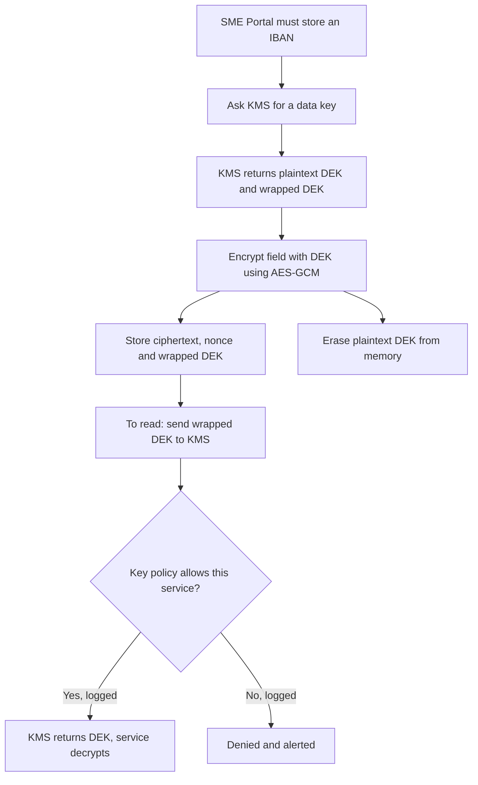
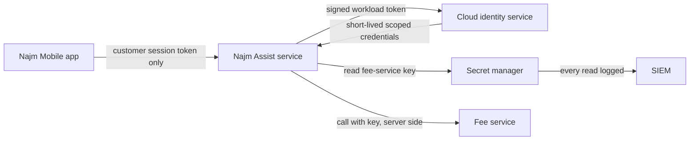
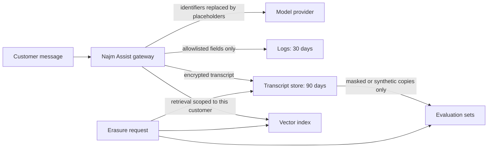

# Module 5 — Data, cryptography and secrets

*Cryptography, secrets and personal data are where good intentions most often turn into false comfort. A password is "hashed" with the wrong function. A key is "hidden" inside a mobile app. A log line quietly copies every customer's account number into a tool that half the company can search. This module gives builders the decisions, not the maths. It covers which cryptographic tool fits which job and where its keys must live; how to keep API keys, tokens and passwords out of the places they leak, and what to do in the first hour after one does; and how to collect, log, keep and delete only the personal data the bank actually needs, including the new copies that LLM features create. You will follow Najm Bank's Application & AI Security team as Noura takes apart Ali's first crypto review on the SME Portal, Jassim chases a leaked key through Najm Assist's pipeline, and Sara (the DPO) asks a question nobody can answer: "Where is this customer's data?"*

> **Phases:** Design, Build, Operate — choosing sound cryptography and key management, keeping secrets out of code, clients and prompts, and engineering personal-data handling so that minimisation, logging and deletion work in practice.

---

# 5.1 — Cryptography for builders: TLS, hashing, encryption and keys
*Level: 🟡 Intermediate* · *Prerequisites: 1.2, 3.1* · *Phase: Design, Build*

## ⚡ In 60 seconds
- Cryptography gives builders **confidentiality** (only the right party can read), **integrity** (tampering is detected) and **authenticity** (you know who produced it). Choose the tool by the property you need.
- Rule one: **never roll your own crypto**. TLS 1.3 in transit; Argon2id, scrypt or bcrypt for passwords; AES-GCM or ChaCha20-Poly1305 through a high-level library at rest; a key management service for keys.
- Hashing is not encryption. Passwords are hashed (one-way); bank details you must read back are encrypted or tokenised.
- Encryption is only as strong as its key management: where the key lives, who can use it, how use is logged, how it rotates.
- Decision cue: for each sensitive field, ask "who must read this in clear, and what does encryption at *this* layer stop?"
- Biggest trap: "encrypted at rest" as the answer to everything. Disk encryption stops a stolen disk, not SQL injection through your own app.

## 🧭 Why it matters
Ali's first code review at Najm Bank is a pull request for the SME Portal's "invite a colleague" feature. He approves it: "Everything sensitive is hashed or encrypted." Noura reopens it and highlights three lines. New users' passwords are stored as `sha256(password)`. A call to the e-invoicing partner sets `verify=False` "because the test certificate kept failing". Invoice bank details are encrypted with an AES key written into the source file, in a mode called ECB. Her comment: "All three are cryptography. None of the three protects anything."

The OWASP Top 10 (2021 edition) gives this pattern its own category, *Cryptographic Failures* (OWASP has since published a 2025 update; check the current list rather than relying on numbering). Such failures rarely involve broken mathematics. They involve the wrong tool, a disabled check or a key in the wrong place. Operations matter too: a US Government Accountability Office review of the 2017 Equifax breach described how an expired certificate on a traffic-inspection device left encrypted traffic uninspected; suspicious traffic was noticed after it was renewed.

## 📐 How it works

### 🟢 The essentials

**Vocabulary.** **Plaintext** is readable data; **ciphertext** is its encrypted form; a **key** is the secret that controls encryption or signing. A **salt** is a random, non-secret value mixed into a hash; a **nonce** ("number used once") must never repeat under the same key.

**Five tools, five jobs.**

| Tool | What it does | Reversible? | Typical use at Najm Bank |
|---|---|---|---|
| **Hash** (SHA-256, SHA-3) | Fixed-length fingerprint; any change alters it | No | File integrity |
| **Password hash** (Argon2id, scrypt, bcrypt) | Deliberately slow, salted hash | No | Storing passwords |
| **MAC** (message authentication code, e.g. HMAC-SHA256) | Hash with a secret key: proves a key holder produced the data unchanged | No | Partner webhooks, signed cookies |
| **Symmetric encryption** (AES-GCM, ChaCha20-Poly1305) | One key encrypts and decrypts; these modes also detect tampering | Yes, with the key | Sensitive fields and files at rest |
| **Public-key cryptography** (RSA, ECDSA, Ed25519) | Key pair: public key shared, private key never leaves its owner | Signatures are verified, not reversed | TLS certificates, token and code signing |

**Never roll your own crypto** means: no invented algorithms, no home-assembled schemes, no hand-implemented standards. Use a well-reviewed library's high-level interface and defaults. Every failure in Ali's pull request used a real algorithm the wrong way.

**Data in transit: TLS.** TLS (Transport Layer Security, the "S" in HTTPS) gives a connection confidentiality, integrity and server authentication. The server proves who it is with a **certificate**, signed by a **certificate authority** (CA) the client trusts, binding a domain name to a public key. Use **TLS 1.3** (RFC 8446); allow TLS 1.2 with modern cipher suites only where a client needs it; TLS 1.0 and 1.1 are formally deprecated (RFC 8996). Three rules:

1. Never disable certificate verification. Without it, TLS encrypts your traffic to whoever answers, including an attacker in the middle.
2. HTTPS everywhere, with HSTS (HTTP Strict Transport Security, RFC 6797) so browsers refuse plain HTTP (see 2.2).
3. Internal traffic too: zero trust (1.2) means service-to-service calls use TLS, ideally **mutual TLS** (mTLS), where both sides present certificates.

```python
# Vulnerable: any certificate accepted; a machine in the middle can read and alter invoices
requests.post(PARTNER_URL, json=invoice, verify=False)

# Fixed: verification stays on; in the partner's test environment, trust its test CA explicitly
requests.post(PARTNER_TEST_URL, json=invoice, timeout=10, verify="certs/partner-test-ca.pem")
```

**Passwords: slow, salted hashes.** SHA-256 is built to be fast, so after a leak an attacker can test huge lists of likely passwords against every row; without salts, identical passwords share a hash and precomputed tables work. **Password hashing functions** add a unique salt per user and are deliberately slow. **Argon2id** (RFC 9106) and scrypt are also *memory-hard*, which blunts specialised cracking hardware. bcrypt remains acceptable (it uses only the first 72 bytes of input); PBKDF2 is the choice where only FIPS-approved algorithms are allowed. Good libraries store algorithm, parameters and salt in the hash string, so you can raise the cost later and upgrade hashes at login.

```python
# Vulnerable: fast and unsalted
stored = hashlib.sha256(password.encode()).hexdigest()

# Fixed: Argon2id via argon2-cffi; salt and parameters live inside the stored string
from argon2 import PasswordHasher
ph = PasswordHasher()
stored = ph.hash(password)
ph.verify(stored, attempt)              # raises an exception on mismatch
if ph.check_needs_rehash(stored):       # cost settings were raised since this hash was made
    stored = ph.hash(attempt)
```

At the time of writing (2026), the OWASP Password Storage Cheat Sheet suggests minimums such as Argon2id with 19 MiB of memory, two iterations and parallelism of one, or a bcrypt work factor of 10. Check the current sheet, then tune so one hash takes a fraction of a second on your servers.

**Data at rest: authenticated encryption.** Use an **AEAD** mode (authenticated encryption with associated data), AES-GCM or ChaCha20-Poly1305, which encrypts and also detects any change to the ciphertext. Avoid **ECB** mode: identical blocks encrypt to identical ciphertext, leaking patterns. In GCM, reusing a nonce under the same key breaks both confidentiality and integrity.

```python
# Vulnerable: key in source code, ECB mode, no tamper detection
cipher = Cipher(algorithms.AES(b"NajmSecretKey123"), modes.ECB())

# Fixed: AEAD, fresh nonce, key supplied by the KMS (see envelope encryption below)
from cryptography.hazmat.primitives.ciphers.aead import AESGCM
nonce = os.urandom(12)                                # 96 bits, never reused with this key
aad = f"sme-invoice:{invoice_id}".encode()            # binds ciphertext to this record
save(invoice_id, nonce + AESGCM(data_key).encrypt(nonce, iban.encode(), aad))
```

The **associated data** is authenticated, not encrypted: it ties the ciphertext to one invoice, so pasting one company's encrypted bank details onto another's invoice makes decryption fail.

**Randomness.** Session IDs, reset tokens and nonces need a **cryptographically secure random number generator** (CSPRNG): Python's `secrets`, Node's `crypto.randomBytes()`. Never `random`, `Math.random()` or timestamps.

### 🟡 Going deeper

**Keys are the real asset: envelope encryption.** Ali's hard-coded key meant anyone who could read the repository could decrypt every invoice. The standard design is **envelope encryption**. Each record or file is encrypted with its own **data encryption key** (DEK). The DEK is encrypted ("wrapped") by a **key encryption key** (KEK) that never leaves a **key management service** (KMS): a managed service that keeps master keys inside **hardware security modules** (HSMs), tamper-resistant devices that use keys without releasing them.



What this buys: a stolen dump is useless without KMS access; every decryption is policy-checked and logged; rotating the KEK re-wraps small keys instead of re-encrypting data; and destroying a key makes its data unreadable, called **crypto-shredding** (see 5.3).

**What does each layer stop?** This is the question Ali skipped.

| Layer | Stops | Does not stop |
|---|---|---|
| Storage or disk encryption (default in most clouds) | Stolen disks, decommissioned hardware | Anyone reading through the database or app |
| Field-level encryption with KMS keys | Database administrators, dumps, most injection reads of that field | A compromised service allowed to decrypt |
| **Tokenisation** (a random token replaces the value; a vault keeps the mapping) | Every system that only sees tokens; shrinks card-data scope | Compromise of the vault |

**Integrity between systems.** When the e-invoicing partner calls Najm's webhook, an **HMAC** over the body proves it is genuine. Compare in constant time (`==` can leak through timing how much matched) and sign a timestamp to stop replays.

```python
expected = hmac.new(webhook_secret, f"{ts}.{raw_body}".encode(), hashlib.sha256).hexdigest()
if abs(time.time() - int(ts)) > 300 or not hmac.compare_digest(expected, received_sig):
    raise Unauthorized()
```

Use **signatures** (Ed25519, ECDSA, RSA-PSS) when verifiers must not be able to create messages: Najm's identity service signs access tokens with a private key, and APIs verify with the public key (see 3.2).

**Certificates are operations.** An expired certificate breaks a service or, as at Equifax, silently blinds a control. Automate renewal with ACME (RFC 8555), inventory certificates with owners, and alert before expiry. At the time of writing (2026), the CA/Browser Forum has agreed to shorten maximum public certificate lifetimes in phases, so manual renewal will stop being viable; check the current schedule.

**Searching encrypted fields.** To find a company by an encrypted registration number, store a **blind index**: an HMAC of the value under a separate key. A plain SHA-256 will not do: national IDs and phone numbers have small input spaces, so anyone with the table can hash every possible value.

### 🔴 Expert view

**Crypto-agility.** Algorithms age, so make changing one a configuration change: one internal crypto library, the algorithm and key version stored with every ciphertext (a prefix such as `v2:key-id:`), and a **cryptographic inventory** per system. CycloneDX, an SBOM format, includes a cryptography bill of materials (CBOM) for this.

**Key separation.** One key per purpose (encryption, MAC, blind index) and per environment; per-customer keys narrow the blast radius and make crypto-shredding precise. Key-policy administrators should not be able to read the data.

**Limits and misuse resistance.** NIST SP 800-38D caps how many messages one GCM key may encrypt with random nonces (2³²); per-record data keys sidestep this. AES-GCM-SIV (RFC 8452) tolerates nonce mistakes better. A **pepper** (a secret mixed into password hashing and kept in the KMS) stops a database-only leak being cracked offline: an extra layer, not a substitute.

**TLS 1.3 details for a bank.** Every full handshake gives **forward secrecy**: a private key stolen later cannot decrypt recorded sessions. Optional "0-RTT" early data can be replayed (RFC 8446 warns of this), so never accept it for state-changing requests such as transfers.

**Post-quantum planning.** A large quantum computer would break today's public-key algorithms (RSA, elliptic curves) but not, in practice, AES-256 or SHA-256. NIST published FIPS 203 (ML-KEM, key establishment), FIPS 204 (ML-DSA) and FIPS 205 (SLH-DSA), both for signatures, in August 2024. The near-term risk is "harvest now, decrypt later": traffic recorded today, decrypted in future. So it is a planning task: inventory, prioritise long-lived confidential data, and adopt hybrid post-quantum key exchange as platforms support it, which at the time of writing (2026) major browsers and TLS libraries have begun to do.

**AI coding agents** reproduce old public-code habits: MD5 for passwords, ECB, `verify=False` to silence an SSL error. Treat agent-written crypto as unreviewed and add static-analysis rules (6.1, 6.3).

## 🧰 The toolkit
| Control, standard or tool | What it is and does | When to reach for it |
|---|---|---|
| **TLS 1.3** (RFC 8446) | Encrypts and authenticates connections with forward secrecy | Every connection; mTLS between services |
| **Argon2id** (RFC 9106) | Slow, salted, memory-hard password hashing; scrypt and bcrypt are acceptable alternatives | Any password or secret you only need to verify |
| **AES-GCM** | Authenticated encryption: confidentiality plus tamper detection | Field and file encryption, through a high-level library |
| **Envelope encryption** | Per-record data keys wrapped by a master key that stays in the KMS | Any sensitive data you must store and read back |
| **Key management service** (KMS, HSM-backed) | Holds master keys in hardware, enforces policy, logs use, rotates | All production keys |
| **HMAC** (RFC 2104) | Keyed hash proving integrity and origin between parties sharing a secret | Webhooks, callbacks, blind indexes |
| **Google Tink and libsodium** | High-level, misuse-resistant crypto libraries | Whenever you are tempted to choose modes or nonces yourself |
| **OWASP Cryptographic Storage Cheat Sheet** | Builder guidance on algorithms, modes and keys | Writing a crypto standard; reviewing crypto code |

## 🏛️ In practice at Najm Bank
Ali turns his review into the bank's **Cryptography Standard for Builders (v1, excerpt)**.

| Job | Approved | Forbidden | Notes |
|---|---|---|---|
| Transport | TLS 1.3; TLS 1.2 with AEAD suites for listed partners only; mTLS inside the mesh | TLS 1.0 and 1.1, disabled verification, plain HTTP between services | HSTS on web domains; certificate inventory with owners |
| Passwords | Argon2id at or above OWASP minimums; bcrypt for legacy, upgraded at login | MD5, SHA-1, plain SHA-256, reversible encryption | Rehash check on each login |
| Sensitive fields (IBAN, national ID, salary) | AES-256-GCM via the Najm crypto library, envelope encryption | ECB, keys in code or config, home-made schemes | Record ID as associated data; key version stored |
| Lookup of encrypted identifiers | HMAC-SHA256 blind index, own key | Plain hash of a national ID or phone number | |
| Card numbers | Tokenisation through the card vault | Card numbers outside the vault | SME Portal and Najm Assist hold tokens only |
| Keys | KMS, one key per purpose and environment | Exportable master keys, shared dev and prod keys | Named owner; automatic rotation; decrypts logged |

**Questions for any pull request that touches cryptography**

1. Which property is needed, and does this tool provide it?
2. Is it a standard construction from the approved library, with defaults?
3. Where does the key come from, who else can use it, and is use logged?
4. Is any check disabled, any nonce fixed, any secret compared with `==`?
5. If this algorithm had to change, how many files would change?

## 🛠️ Exercises
- 🟢 Map each item to a tool from the "five tools" table, with a one-line reason: an SME user's password, the payout IBAN, a statement's checksum, a partner webhook, a password-reset token, a card number, a session ID, a lookup by national ID, a backup archive, an API access token. *Done when:* all ten are mapped and every item needing a key says where that key lives.
- 🟡 In your own project or a local lab app, replace a fast or unsalted password hash with Argon2id, upgrading old hashes at login. *Done when:* a test shows an old hash verifies once and is replaced by an Argon2id hash, and a wrong password fails before and after.
- 🔴 Prototype envelope encryption for one field in your own code, with your cloud KMS in a personal sandbox account or a local stand-in: per-record keys, record ID as associated data, a key-version prefix. *Done when:* a ciphertext copied from record A to record B fails to decrypt, master-key rotation needs no data re-encryption, and a short note says who can decrypt and where that is logged.

## ⚠️ Mistakes and traps
- **Turning off verification to fix a TLS error.** It spreads to production. Trust the specific test CA and keep verification on.
- **Fast hashes for passwords.** A salt does not fix speed. Use Argon2id, scrypt or bcrypt.
- **"It's encrypted at rest" as a universal answer.** Name the threat, then pick the layer.
- **Keys next to the data.** A key in code, config or the same database is a password taped to the safe. Use a KMS.
- **Assembling your own scheme.** Hand-picked modes and nonces cause ECB and nonce reuse. Use AEAD through a high-level library.
- **Forgetting certificates until they expire.** Automate renewal and alert before expiry.

## 🧾 Recap
- Pick the tool by property: password hashes for passwords, MACs and signatures for integrity and origin, AEAD for confidentiality with tamper detection.
- TLS 1.3 everywhere, verification always on, HSTS on the web, mTLS inside.
- Passwords: Argon2id (or scrypt, bcrypt) with rehash-on-login; never fast hashes or reversible encryption.
- Keys live in a KMS; envelope encryption gives access control, audit, cheap rotation and crypto-shredding.
- Ask what each layer stops; plan for crypto-agility, shorter certificates and post-quantum migration.

## ✍️ Check yourself

**1. Ali proposes storing SME Portal passwords as SHA-256 with a random per-user salt: "Salted, so it's fine." What is the best response?**

- A. Accept it, because salting solves the problem
- B. Encrypt passwords with AES-GCM so support can recover forgotten ones
- C. Use Argon2id (or scrypt or bcrypt): the salt defeats precomputed tables, but SHA-256 is still fast enough for large-scale guessing after a leak
- D. Hash the password twice with SHA-256

<details><summary>Answer</summary>

**C.** Password hashes must be slow as well as salted. B is worse: whoever gets the key reverses it. D is still fast. (🟢 The essentials.)

</details>

**2. Najm Bank's managed database has storage encryption on by default. Tariq says field-level encryption of national IDs, with KMS keys and decryption limited to one service, adds nothing. Which threat does it address that storage encryption does not?**

- A. A disk stolen from the provider's data centre
- B. A SQL injection in a reporting endpoint, or an administrator querying the table, returning readable national IDs
- C. Someone sniffing traffic between app and database
- D. A decommissioned drive being resold

<details><summary>Answer</summary>

**B.** Storage encryption is transparent to anyone reading through the database. A and D are what storage encryption already covers; C is TLS's job. (🟡 Going deeper.)

</details>

**3. A call to the e-invoicing partner's test environment fails certificate validation. Which fix is right?**

- A. Set `verify=False` in test only, behind an environment variable
- B. Use plain HTTP for the test integration
- C. Trust the partner's test CA certificate in the test environment, keep verification on, and leave production unchanged
- D. Disable hostname checking but keep chain validation

<details><summary>Answer</summary>

**C.** It fixes the real cause without weakening TLS. A is the classic trap: such switches leak into production. (🟢 The essentials.)

</details>

**4. Which statement about envelope encryption is TRUE?**

- A. The app keeps the master key in its configuration to decrypt quickly
- B. Data keys are wrapped by a master key that stays in the KMS, so each decryption is an access-checked, logged call, and rotating the master key needs no bulk re-encryption
- C. It removes the need for database access control
- D. It is a TLS feature for securing connections

<details><summary>Answer</summary>

**B.** A defeats the purpose; C confuses layers; D is unrelated. (🟡 Going deeper.)

</details>

**5. Hamad, the CISO, asks what Najm Bank should do about post-quantum cryptography this year. What is the best answer?**

- A. Nothing until large quantum computers exist
- B. Replace AES-256 everywhere with a post-quantum algorithm now
- C. Build a cryptographic inventory, design for crypto-agility, prioritise long-lived confidential data, and adopt FIPS 203, 204 and 205 through platforms and libraries as they support them
- D. Design a Najm-specific post-quantum algorithm

<details><summary>Answer</summary>

**C.** It is a planning task now. A ignores "harvest now, decrypt later"; B targets the wrong thing, since public-key algorithms are the exposure; D breaks rule one. (🔴 Expert view.)

</details>

## 📚 References
- IETF, RFC 8446: TLS 1.3 — https://www.rfc-editor.org/rfc/rfc8446
- IETF, RFC 8996: Deprecating TLS 1.0 and TLS 1.1 — https://www.rfc-editor.org/rfc/rfc8996
- IETF, RFC 9106: Argon2 — https://www.rfc-editor.org/rfc/rfc9106
- OWASP Cheat Sheet Series (Password Storage, Cryptographic Storage, Key Management, Transport Layer Security) — https://cheatsheetseries.owasp.org/
- OWASP Top 10 (Cryptographic Failures) — https://owasp.org/Top10/
- NIST SP 800-38D (Galois/Counter Mode) — https://csrc.nist.gov/pubs/sp/800/38/d/final
- NIST SP 800-57 Part 1 Rev. 5, Recommendation for Key Management — https://csrc.nist.gov/pubs/sp/800/57/pt1/r5/final
- NIST Post-Quantum Cryptography project (FIPS 203, 204, 205) — https://csrc.nist.gov/projects/post-quantum-cryptography
- US GAO, GAO-18-559, on the 2017 Equifax breach — https://www.gao.gov/products/gao-18-559

---

# 5.2 — Secrets management: keys, tokens and where they leak
*Level: 🟡 Intermediate* · *Prerequisites: 3.2, 5.1* · *Phase: Build, Operate*

## ⚡ In 60 seconds
- A **secret** is any value that grants access on its own: passwords, API keys, tokens, private keys, connection strings. Whoever holds it *is* you, as far as the system can tell.
- Secrets leak through ordinary channels: git history, `.env` files, container images, CI logs, mobile and browser bundles, error pages, tickets and chat, and now the prompts and context of AI tools.
- The pattern: secrets live in a **secret manager**, are fetched at runtime by a workload identity, are scoped to least privilege and are short-lived. The best secret is one you never store.
- Scan at three points: before commit, at push, and across everything already published (history, images, logs).
- Decision cue: when a secret leaks, **revoke and rotate first**, then investigate. Deleting the commit does not un-leak it.
- Biggest trap: putting a secret where an untrusted party can read it (a mobile app, a browser bundle, an LLM system prompt) and calling it hidden.

## 🧭 Why it matters
Wednesday, 16:40. The CI secret scanner fails a Najm Assist build: a live key for the internal fee service sits in a test fixture. The developer had asked an AI coding agent to "get the fee-lookup test passing"; the agent read the local `.env` file and copied the key into the fixture. The developer deletes the line and pushes again. Jassim (SOC lead) is not reassured. The commit is still in history, the failed CI job printed the fixture in its log, and the developer had pasted the error, key included, into a team chat asking for help. Noura's rule: "A secret that has been anywhere you don't control is a secret you no longer own. Rotate it, then go looking."

A month earlier, in an authorised test of a Najm Assist prototype build, Mariam's red team had found the LLM provider's API key inside the mobile app's configuration, "obfuscated". Anyone with the app could have extracted it and run up costs in Najm's name. Real cases show the stakes. Public reports of the 2019 Capital One breach describe an attacker using SSRF to obtain temporary cloud credentials from an instance metadata service, for a role that could read many storage buckets. The credentials were short-lived, as they should be, but over-privileged. Some leaks are inevitable; the damage depends on scope and on how fast you revoke.

## 📐 How it works

### 🟢 The essentials

**What counts as a secret.** An *identifier* says who you claim to be (a username, an OAuth client ID, a public key) and may be public. An *authenticator* proves it and must stay secret.

| Secret type | Examples at Najm Bank | What it grants |
|---|---|---|
| Machine credentials | Database passwords, service API keys, cloud access keys | Direct access to data or infrastructure |
| Tokens | OAuth refresh tokens, personal access tokens, CI tokens | Acting as a user, developer or pipeline |
| Cryptographic keys | TLS private keys, token-signing keys, encryption keys | Impersonating services, forging tokens, reading data |
| Integration secrets | Webhook secrets, partner credentials, LLM provider keys | Impersonating partners; spending money |

**Where secrets leak, and the defence for each.**

| Place | How it happens | Defence |
|---|---|---|
| Source code and git history | A "temporary" hard-coded key; a committed `.env`; a later commit removes it but history keeps it | Never hard-code; ignore `.env`; scan before commit and at push |
| Mobile apps and browser bundles | Keys compiled into the app or front-end build | Never ship secrets to clients (see 4.3) |
| Container images | `ENV API_KEY=…`, copied `.env` files, build arguments kept in image history | Build-time secret mounts; inject at runtime; scan images |
| CI/CD | `echo $TOKEN`, debug mode, long-lived cloud keys in pipeline variables | Log masking, OIDC federation |
| Logs and error pages | Logged `Authorization` headers; stack traces that dump environment variables | Log redaction (5.3), generic error pages |
| Collaboration tools | Keys pasted into tickets, chat, wikis, email | Share access through the vault, never the value |
| Infrastructure files | Terraform state, Kubernetes manifests, Helm values | Encrypted remote state; reference secrets, never embed them |
| AI tools and agents | An agent copies `.env` values into code, logs or prompts; secrets in system prompts; plaintext tokens in local tool configs | Deny agents secret files; no secrets in prompts; tools hold credentials server-side |

MITRE ATT&CK catalogues the attacker behaviour as *Unsecured Credentials* (T1552): attackers look in exactly these places, so defenders should look first.

**The basic pattern.** Code holds a *reference* to a secret, never its value. At runtime the workload proves its identity to a **secret manager** (a service that stores secrets encrypted, controls and logs every read, and supports rotation) and fetches what it needs.

```python
# Vulnerable: in source, shared by every environment, never rotated, readable by anyone with repo access
FEES_API_KEY = "fee_live_9f2c4e..."

# Fixed: a reference, resolved at runtime by the workload's own identity; the read is logged
FEES_API_KEY = secret_manager.get(f"najm-assist/{ENV}/fees-api-key")
```

**Never ship a secret to a client.** A mobile app or web page runs on a device you do not control; obfuscation slows extraction but does not prevent it. For Najm Assist, the app authenticates the *customer* to Najm's API, and the backend holds the LLM provider key, applies per-customer rate limits and spending caps (see 4.2), and calls the provider. The extracted key is rotated, not "re-hidden".

**Scan early and often.** Run a secret scanner as a pre-commit hook, block pushes that contain secrets (**push protection**), and scan full history, images and logs on a schedule.

```yaml
# .pre-commit-config.yaml: stop secrets before they reach a commit
repos:
  - repo: https://github.com/gitleaks/gitleaks
    rev: <pinned release tag>
    hooks:
      - id: gitleaks
```

### 🟡 Going deeper

**The secret life cycle.** Create with a CSPRNG (5.1); store only in the secret manager; distribute by identity, never by copy-paste; scope to one service and one environment; rotate automatically; revoke immediately on suspicion; audit reads and alert on anomalies. Give every secret a named owner, or nobody will rotate it.

**Short-lived beats long-lived: workload identity.** With **workload identity federation**, a workload proves who it is with a short-lived token signed by its platform, and the cloud exchanges it for temporary, scoped credentials. Kubernetes service accounts can be federated to cloud IAM roles. CI systems such as GitHub Actions and GitLab CI can issue an OIDC token (OpenID Connect, see 3.2) per job, so no cloud key sits in pipeline settings. The cloud role trusts only tokens with a specific subject, for example a GitHub subject of the form `repo:najm-bank/sme-portal:ref:refs/heads/main`, so a pipeline on another branch cannot assume it.



**Dynamic secrets.** Some secret managers (HashiCorp Vault and its open-source fork OpenBao, for example) create a database user per workload on request, with a lease of minutes or hours, and delete it when the lease ends. A leaked credential expires by itself, and each credential maps to one workload in the audit log.

**Kubernetes Secrets are not a vault.** By default, values are base64-encoded (an encoding, not encryption) and stored unencrypted in the cluster datastore (etcd) unless encryption at rest is configured, and anyone allowed to create pods in a namespace can read its secrets. Enable encryption at rest with a KMS provider, tighten RBAC, and prefer syncing from an external secret manager (see 7.2).

**Environment variables are a trade-off.** They beat source code, but child processes inherit them, and crash reporters and debug pages dump them. Prefer files mounted from the secret manager, or fetching at runtime, and never log the environment.

**Containers.** Build arguments and `ENV` lines are recorded in image history. Use build-time secret mounts:

```dockerfile
# Vulnerable: the token ends up in image history and in a layer
ARG NPM_TOKEN
RUN echo "//registry.npmjs.org/:_authToken=${NPM_TOKEN}" > .npmrc && npm ci

# Fixed: BuildKit secret mount, present only during this step, never stored in the image
RUN --mount=type=secret,id=npmrc,target=/root/.npmrc npm ci
```

**When a secret leaks: revoke first.**

1. **Revoke or rotate** now. Assume compromise the moment it reached anywhere you do not control; automated scanners watch public repositories continuously.
2. **Scope the blast radius:** what could it do, where, and since when?
3. **Check usage logs** (provider, secret manager, API gateway) for the exposure window.
4. **Clean up** code, history (for example with `git filter-repo`), logs, tickets and chat. This is hygiene, not remediation, so it comes after rotation.
5. **Fix the cause** and **record** it through the incident process (10.2).

### 🔴 Expert view

**The "secret zero" problem.** To fetch secrets, a workload must authenticate; if it does so with a stored secret, you have only moved the problem. The answer is platform-attested identity: cloud instance identity, Kubernetes service-account tokens, or SPIFFE (an open standard for workload identity) with its SPIRE implementation issuing short-lived certificates. Identity comes from where and what the workload is, not from a value it carries.

**Design for blast radius.** One secret per service per environment; no shared "integration" key; the narrowest scopes the provider supports; spending limits on LLM provider keys. The Capital One lesson applies: short-lived is not enough if the role behind it is over-privileged (see 7.1).

**Rotation you can trust.** Accept two valid secrets at once (old and new) so rotation needs no downtime; automate it; rehearse it. A secret that has never been rotated cannot be rotated safely in an emergency. Signing keys rotate through key IDs: publish the new public key, sign with it, retire the old one once its tokens expire.

**Make your own secrets detectable.** Give internal tokens a recognisable prefix (for example `najm_pat_`) and a checksum, so scanners find them with few false positives; GitHub moved its tokens to prefixed formats such as `ghp_` partly for this reason. Some scanners, such as TruffleHog, can test whether a found credential is live by calling the provider; do that only for your own repositories and credentials.

**AI agents change the threat model.** An AI coding agent with shell access can read any file its developer can, including `.env` files and cloud credential directories, and a prompt-injected agent (8.2) can be steered to send them out. Simon Willison's "lethal trifecta" (2025) names the dangerous combination: private data, untrusted content and a way to communicate externally (see 9.2). Deny agents access to secret files, give them scoped short-lived tokens, and keep production credentials off developer machines. For LLM applications, the OWASP Top 10 for LLM Applications (2025) entry *System Prompt Leakage* (LLM07) warns against putting credentials in system prompts: assume the prompt will be extracted. Najm Assist's tools run server-side with credentials bound to the customer's session; the model never sees a key.

## 🧰 The toolkit
| Control, standard or tool | What it is and does | When to reach for it |
|---|---|---|
| **Secret manager** (HashiCorp Vault, OpenBao, cloud secret managers) | Stores secrets encrypted, controls and logs reads, supports rotation | Every secret a workload needs at runtime |
| **Workload identity federation** | Exchanges a platform-signed workload or CI token for short-lived, scoped cloud credentials | Replacing long-lived cloud keys in pods and pipelines |
| **Dynamic secrets** | Credentials created on demand with a lease, revoked automatically | Database and cloud access for services |
| **Secret scanning** (gitleaks, TruffleHog, detect-secrets) | Finds secrets in commits, history, images and logs | Pre-commit, CI, scheduled scans |
| **Push protection** | The code host blocks pushes containing recognised secrets | Every repository, especially public ones |
| **External Secrets Operator** | Syncs secrets from an external manager into Kubernetes | Clusters that need secrets without storing them in manifests |
| **SPIFFE/SPIRE** | Standard and implementation for attested, short-lived workload identities | Solving "secret zero" across services |
| **OWASP Secrets Management Cheat Sheet** | Guidance on the secret life cycle, tooling and detection | Writing a secrets standard or reviewing a design |

## 🏛️ In practice at Najm Bank
Noura and Jassim publish the **Secrets Management Standard (v1, excerpt)** with its **leaked-secret runbook**. Lifetimes and targets are illustrative.

| Secret class | Where it lives | How workloads get it | Lifetime and rotation | Owner |
|---|---|---|---|---|
| Cloud access for services and CI | Nowhere: workload identity and OIDC federation | Short-lived credentials; CI roles bound to repository and branch | Minutes to an hour; no long-lived keys | Platform team |
| Database credentials | Secret manager, dynamic engine | Leased per workload | Hours; auto-revoked | Service owner |
| Third-party and LLM provider keys | Secret manager | Fetched at runtime by the backend only | 90 days and on any suspicion; spending caps | Service owner |
| Signing and encryption keys | KMS or HSM, non-exportable | Used through the KMS interface | Per key policy (5.1) | Security engineering |
| Break-glass credentials | Secret manager, sealed | Two-person approval; alert on use | Rotated after every use | CISO office |

Forbidden everywhere: secrets in source code, images, mobile or web bundles, tickets, chat, LLM prompts, or any agent-readable file on a developer machine.

| Runbook step | Who | Target |
|---|---|---|
| Revoke or rotate | Service owner, SOC on call | Within 1 hour of detection |
| Scope what it grants and since when | Service owner, Jassim's team | Within 4 hours |
| Search usage logs for the exposure window | SOC | Within 24 hours |
| Clean code, history, logs, tickets, chat | Service owner | Within 3 days |
| Root cause and control fix, recorded as an incident | Service owner, AppSec | Within 2 weeks |

## 🛠️ Exercises
- 🟢 Inventory the secrets in one of your own projects: what each grants, where it lives, who owns it, when it was last rotated. *Done when:* every secret has an owner and a "what it can do" line, and you have marked at least one that workload identity could eliminate.
- 🟡 In your own repository, add gitleaks (or another scanner) as a pre-commit hook and a CI step. Commit a clearly fake, non-working key on a test branch and confirm it is blocked; then scan the full history. *Done when:* CI fails on the planted fake, and every history finding is triaged as real (and rotated) or a false positive.
- 🔴 In a personal sandbox cloud account, replace a long-lived cloud key in your own CI pipeline with OIDC federation scoped to one repository and branch, then run a 30-minute tabletop of the leaked-secret runbook. *Done when:* the pipeline deploys with no stored cloud keys, a run from another branch is refused, and the tabletop produced at least one fix.

## ⚠️ Mistakes and traps
- **Deleting the commit and calling it fixed.** History, forks, caches and logs keep it. Revoke and rotate first.
- **"Hidden" keys in apps and front ends.** Anything shipped to a client is public. Keep keys server-side.
- **One key shared across services and environments.** One leak becomes every system. Scope per service and environment.
- **Secrets in system prompts.** Assume prompts leak. Keep credentials in the tool layer.
- **Never-rotated secrets.** Untested rotation fails in an emergency. Automate and rehearse it.
- **Agents with the keys to everything.** Deny AI coding agents secret files; give them scoped, short-lived tokens.

## 🧾 Recap
- A secret grants access by itself; it leaks through code, history, images, CI, logs, clients, chat and AI tools.
- Code holds references; a secret manager holds values; workloads fetch them by identity at runtime.
- Prefer short-lived, scoped credentials: workload identity, OIDC federation, dynamic secrets.
- Scan before commit, at push, and across history, images and logs.
- On a leak: revoke first, scope, check usage, clean up, fix the cause.

## ✍️ Check yourself

**1. A developer realises they pushed a live payment-partner API key to an internal repository three days ago, and has already force-pushed to remove the commit. What should happen first?**

- A. Nothing more: the commit is gone
- B. Revoke or rotate the key now, then check the partner's usage logs for the exposure window
- C. Rewrite the history of every branch, then decide
- D. Open a ticket for the next sprint

<details><summary>Answer</summary>

**B.** Assume compromise and rotate first; clones, caches and CI logs may still hold the key. C is clean-up that comes after rotation; A and D leave a live key exposed. (🟡 Going deeper.)

</details>

**2. In an authorised test, Mariam extracts the LLM provider key from a Najm Assist prototype app, where it was "obfuscated". What is the right fix?**

- A. Stronger obfuscation
- B. Move the provider call to Najm's backend, which holds the key, authenticates the customer and applies rate limits and spending caps; rotate the extracted key
- C. Store the key in the device's secure storage after first launch
- D. Ask customers not to inspect the app

<details><summary>Answer</summary>

**B.** Secrets shipped to a client are public. A and C only slow extraction, because the app must still be able to read the key. (🟢 The essentials.)

</details>

**3. The SME Portal pipeline deploys with a long-lived cloud access key stored as a CI variable. What is the strongest improvement?**

- A. Rotate the key once a year
- B. Base64-encode the key in the variable
- C. OIDC federation: each job gets a short-lived token that the cloud exchanges for credentials, for a role that trusts only this repository and branch
- D. Commit the key to the repository so it is versioned

<details><summary>Answer</summary>

**C.** It removes the stored secret and binds access to one pipeline. A helps a little; B is encoding, not protection; D is a leak. (🟡 Going deeper.)

</details>

**4. Which statement about Kubernetes Secrets is TRUE by default?**

- A. Values are strongly encrypted with a per-cluster key
- B. Values are base64-encoded, stored unencrypted in etcd unless encryption at rest is configured, and readable by anyone who can create pods in the namespace
- C. Only cluster administrators can ever read them
- D. They rotate automatically every 24 hours

<details><summary>Answer</summary>

**B.** Hence encryption at rest, tight RBAC and an external manager. A confuses encoding with encryption; C and D are false. (🟡 Going deeper.)

</details>

**5. A developer proposes putting the fee-service API key into Najm Assist's system prompt "so the model can call the tool". Why is this wrong?**

- A. System prompts have a length limit
- B. Assume the system prompt can be extracted (OWASP LLM07) or the model steered by prompt injection; credentials belong in the server-side tool layer, bound to the customer's session
- C. It is fine if the prompt says "never reveal this key"
- D. Models refuse to use keys

<details><summary>Answer</summary>

**B.** A prompt is not a secure store. C relies on the model obeying, which prompt injection defeats. (🔴 Expert view.)

</details>

## 📚 References
- OWASP Secrets Management Cheat Sheet — https://cheatsheetseries.owasp.org/cheatsheets/Secrets_Management_Cheat_Sheet.html
- OWASP Top 10 for LLM Applications 2025 (LLM07 System Prompt Leakage) — https://genai.owasp.org/llm-top-10/
- MITRE ATT&CK T1552, Unsecured Credentials — https://attack.mitre.org/techniques/T1552/
- MITRE CWE-798, Use of Hard-coded Credentials — https://cwe.mitre.org/data/definitions/798.html
- Kubernetes documentation, Secrets — https://kubernetes.io/docs/concepts/configuration/secret/
- Kubernetes documentation, Encrypting Confidential Data at Rest — https://kubernetes.io/docs/tasks/administer-cluster/encrypt-data/
- GitHub Docs, secret scanning and push protection — https://docs.github.com/en/code-security/secret-scanning
- SPIFFE — https://spiffe.io/
- Simon Willison (2025), "The lethal trifecta for AI agents" — https://simonwillison.net/

---

# 5.3 — Protecting personal data: minimisation, logging and privacy engineering
*Level: 🟡 Intermediate* · *Prerequisites: 1.1, 5.1* · *Phase: Design, Build*

## ⚡ In 60 seconds
- **Personal data** is any information about an identifiable person. The safest personal data is data you never collected; the next safest is data you have already deleted.
- **Privacy engineering** turns principles into design: a data inventory, field classification, minimisation, masking, tokenisation, pseudonymisation, retention jobs and access logging.
- Personal data spreads unnoticed through logs, analytics, backups, test copies and AI prompts. Log by **allowlist**, never by dumping the request.
- LLM features multiply copies: prompts, transcripts, traces, retrieval indexes, evaluation sets, provider-side logs. Each needs a purpose, a retention period and a deletion path.
- Decision cue: for every field, ask "what is it for, who needs it in clear, and when does it die?"
- Biggest trap: calling hashed or pseudonymised data "anonymous". If it can be linked back to a person, it is still personal data.

## 🧭 Why it matters
Sara, Najm Bank's Data Protection Officer (DPO), receives a request from an EU-resident customer: a copy of everything the bank holds from her conversations with Najm Assist, then its deletion. Sara asks the team one question: "Where is her data?" The answer takes two weeks. The transcripts are in the app database, as expected. But full prompts, account numbers included, are also in the observability platform, because a debug setting was never switched off. Dana's team built an evaluation set from real conversations. The retrieval index holds chunks of documents she uploaded. And the LLM provider keeps request logs for a period set in a contract nobody on the team had read.

None of this was a hack. It was ordinary engineering without a data map. Data also escapes through AI tools: in 2023 it was widely reported that Samsung staff had pasted confidential source code and internal notes into a public chatbot, after which the company restricted such tools. Once data crosses that boundary, your retention and deletion controls no longer reach it. Security and privacy meet here: the controls that limit a breach (minimise, encrypt, restrict, log access) are the same ones that let you answer Sara's question.

## 📐 How it works

### 🟢 The essentials

**What is personal data?** Under the EU GDPR (Art. 4(1)), it is any information relating to an identified or identifiable natural person: names and national IDs, but also account numbers, device IDs, IP addresses, voice recordings and chat messages. Some categories get extra protection (Art. 9 "special categories", such as health data). Card data has its own rulebook, PCI DSS (version 4.0.1 at the time of writing, 2026). Qatar's Personal Data Privacy Protection Law (Law No. 13 of 2016, PDPPL) has its own rules, including for sensitive data and breaches. Sara owns the legal reading; this lesson covers the engineering (law in depth: 11.2 and *AI Governance: Zero to Hero*).

**Principles become controls.**

| Principle (GDPR Arts. 5 and 25) | Engineering control |
|---|---|
| **Data minimisation**: limited to what is necessary | Don't collect it; collect a coarser form (age band, not birth date); drop fields at the edge |
| **Purpose limitation** | Tag each field with its purpose; separate stores; access granted per purpose |
| **Storage limitation** | A retention period per data type, enforced by deletion jobs, not documents |
| **Integrity and confidentiality** (also Art. 32) | Encryption (5.1), access control (3.3), access logging |
| **Data protection by design and by default** | Private defaults; least visibility; privacy review in design (1.1) |

**Start with a data inventory.** You cannot protect, export or delete what you cannot find. A **data inventory** (data map) lists, per system, each personal data field with its classification, purpose, source, every place a copy lands (logs, caches, analytics, backups, AI tools), who can access it, its retention period and how it is deleted. GDPR Art. 30 already requires records of processing; the engineering version goes down to fields and copies.

**Classify, then let the class drive controls.** Najm Bank uses Public, Internal, Confidential (most customer data) and Restricted (credentials, card data, national IDs, biometrics, special categories). Restricted data is encrypted at field level or tokenised, never logged, and visible in clear only to named roles.

**Four ways to reduce exposure, which are not the same thing.**

| Technique | What it does | Still personal data? |
|---|---|---|
| **Masking** | Hides part of a value on display (`•••• 4821`); the full value still exists | Yes |
| **Tokenisation** | Replaces the value with a random token; a vault holds the mapping | Yes for whoever reaches the vault; token-only systems see far less |
| **Pseudonymisation** (Art. 4(5)) | Replaces identifiers so data cannot be attributed without extra information kept separately | **Yes**, under GDPR |
| **Anonymisation** | Irreversibly prevents identification by any means reasonably likely to be used | No (Recital 26), but genuinely hard to achieve |

A plain hash of a phone number or national ID is *not* anonymisation: the input space is small, so anyone can hash every possible value and reverse it. For pseudonyms, use a keyed HMAC with the key in the KMS (5.1), or a random token.

**Logging without leaking.** Logs are a database nobody designed, copied to many tools and read by many people. The rules:

- Never log passwords, OTPs, session tokens, API keys, full card numbers or card security codes.
- Log identifiers, not content: an internal customer reference, not the name, national ID or chat text.
- Log by **allowlist**: structured logging with explicitly chosen fields, never whole requests or objects.
- Add a redaction filter as a safety net, not the main control: patterns miss names, addresses, free text and numbers written in Arabic-Indic digits.
- Keep security audit logs (who accessed which customer, needed for detection, see 10.1) separate from debug logs, with different access and retention.

```python
# Vulnerable: dumps headers (Authorization), body (IBAN, national ID) and the customer's message
log.info(f"assist request {request.headers} {request.json()}")

# Fixed: allowlisted, structured fields; identifiers and sizes, not content
log.info("assist_request", extra={
    "customer_ref": req.customer_ref,    # internal pseudonymous ID
    "intent": req.intent,                # e.g. "card_freeze"
    "tool": req.tool_name,
    "msg_chars": len(req.message),       # size, not content
    "trace_id": req.trace_id,
})
```

### 🟡 Going deeper

**Where personal data goes in an LLM feature.** One Najm Assist turn can create copies in the prompt (the message plus account data the app adds), retrieved context (see 9.3), the model provider (processing, possibly retention for abuse monitoring, possibly training, depending on contract and settings), the transcript store, tracing tools that capture full prompts, evaluation and fine-tuning sets, and vector indexes. The OWASP Top 10 for LLM Applications (2025) lists *Sensitive Information Disclosure* (LLM02) and *Vector and Embedding Weaknesses* (LLM08) for these reasons. Research has shown that text can be partly reconstructed from its embeddings, so treat embeddings of personal data as personal data.



The controls, in order of value:

1. **Minimise the prompt.** For a disputed transaction, send that transaction's fields, not twelve months of history and the customer profile.
2. **Redact or pseudonymise before the provider.** Replace IBANs, card numbers and national IDs with placeholders (`[IBAN_1]`); the server-side tool layer resolves real values only where an action needs them.
3. **Fix provider terms.** Data processing agreement, data location, retention and a no-training setting, checked by Sara and procurement before launch.
4. **Retention per copy**, enforced by jobs, with a deletion path that reaches transcripts, traces, vector indexes and evaluation sets.
5. **No real customer data in evaluation or training sets** without a legal basis, DPO approval and masking; prefer synthetic data.

**Test data.** Production data copied into test environments is a classic leak. Use synthetic data or irreversibly masked subsets, with DPO approval for exceptions.

**Retention and deletion engineering.** Write a retention schedule per data type with Sara and Legal. Banks must keep some records for years under financial and anti-money-laundering rules, and the GDPR right to erasure (Art. 17) has exceptions for legal obligations, so "delete everything" is not always right. Then enforce it: time-to-live settings, scheduled deletion jobs, and propagation to search indexes, caches, the data warehouse, analytics and vector stores. For backups you cannot edit, **crypto-shredding** with per-customer keys (5.1) makes deletion real.

**Access to personal data.** Least privilege by purpose, just-in-time access for engineers, break-glass with alerts, and an audit trail of who viewed which customer: insiders and compromised staff accounts are real threats.

### 🔴 Expert view

**Privacy threat modelling with LINDDUN.** STRIDE (1.1) finds security threats; **LINDDUN**, developed at KU Leuven, finds privacy threats: Linking, Identifying, Non-repudiation, Detecting, Data disclosure, Unawareness (and unintervenability) and Non-compliance. Run it on the same data-flow diagram. For Najm Assist it surfaces threats STRIDE misses, such as linking chat topics to infer a customer's health or money troubles, or customers being unaware that transcripts feed evaluation.

**Re-identification.** "Anonymised" datasets are often re-identifiable by combining quasi-identifiers such as birth date, postcode, nationality and employer. Latanya Sweeney's research showed how few attributes can single people out, and in small populations (one nationality, one employer, one city) the risk is higher. **k-anonymity** (each record indistinguishable from at least k−1 others) helps but has known weaknesses. **Differential privacy** adds calibrated noise to statistics so no single person's presence can be inferred; it suits published aggregates. For most teams, the practical step is aggregate reporting with minimum group sizes.

**Privacy-enhancing technologies** such as confidential computing, federated learning and homomorphic encryption serve specialised cases; involve specialists before relying on them.

**DPIAs and breaches.** Processing likely to be high-risk, which AI features handling customer data at scale often are, needs a **data protection impact assessment** (DPIA, GDPR Art. 35). Security contributes the threat model and controls; Sara owns the assessment. After a personal data breach, GDPR Art. 33 requires notifying the supervisory authority within 72 hours where feasible, unless the breach is unlikely to put people at risk, and documenting every breach. Art. 34 requires telling affected people when the risk to them is high, but not if the data was unintelligible to the attacker, for example under strong encryption whose key was not compromised (Art. 34(3)(a)). PDPPL has its own breach duties; the DPO decides (see 10.2 and 11.2).

## 🧰 The toolkit
| Control, standard or tool | What it is and does | When to reach for it |
|---|---|---|
| **Data inventory** | Field-level map of personal data, purposes, copies, access, retention and deletion | Before design sign-off; updated with each release |
| **Data classification** | Levels such as Public, Internal, Confidential, Restricted that drive controls | Every new field, log, dataset and AI feature |
| **Tokenisation** | Random tokens replace sensitive values; a vault holds the mapping | Card numbers and identifiers most systems never need in clear |
| **Pseudonymisation** | Keyed replacement of identifiers, reversible only with separately held information | Analytics, evaluation sets, logs that must join records |
| **Log redaction** | Allowlisted structured logging plus a redaction filter as a safety net | Every service, especially LLM gateways and APIs |
| **Crypto-shredding** | Per-customer keys whose destruction makes data, backups included, unreadable | Deletion where backups or archives cannot be edited |
| **LINDDUN** (KU Leuven) | Privacy threat-modelling framework that complements STRIDE | Designing features that process personal data |
| **DPIA** (GDPR Art. 35) | Structured assessment of high-risk processing and its safeguards | New AI features or large-scale customer-data processing |

## 🏛️ In practice at Najm Bank
After the erasure request, Sara and Noura publish the **Najm Assist personal-data map (v1, excerpt)** and a logging rule. Retention periods are illustrative and set with Legal.

| Data item | Class | Allowed locations | In logs? | Retention | Deletion path |
|---|---|---|---|---|---|
| Customer message text | Confidential | Gateway; provider after redaction; transcript store | Length only | Transcripts 90 days | Deletion job; erasure workflow |
| Account and card identifiers | Restricted | Tool layer only, as tokens | Token reference only | With the account record | Card vault and core banking rules |
| National ID | Restricted | Identity service only | Never | Legal retention | Identity service owner |
| Prompts and outputs | Confidential | Tracing tool, redacted | Redacted only | 14 days | Time-to-live in tracing tool |
| Retrieved document chunks | Confidential | Vector index, scoped per customer | No | As source document | Re-index on source deletion |
| Evaluation cases | Internal once masked | Evaluation store | No | Reviewed quarterly | Synthetic or masked only; DPO approval |
| Provider request logs | Confidential | Provider, under contract | n/a | Shortest the contract allows | Contract clause; checked yearly |

**Logging rule LOG-01 (all services).** Logs use structured, allowlisted fields. Credentials, OTPs, session tokens, full card numbers, card security codes and national IDs are never logged; customer content is logged only as size or category. Every service has a unit test that fails if a test card number or an `Authorization` header appears in log output. Debug-level content capture needs AppSec and DPO approval, is redacted and access-restricted, and switches itself off after seven days.

## 🛠️ Exercises
- 🟢 Map the personal data in one feature you build or use at work: every field and every place a copy lands, including logs, analytics, backups and AI tools. *Done when:* each copy has a purpose, a retention period and a deletion method, and you have found at least one copy nobody had listed.
- 🟡 In your own application, switch one endpoint to allowlisted structured logging with a redaction filter, and add a unit test that fails if a standard test card number such as `4111 1111 1111 1111` or an `Authorization` header reaches the log output. *Done when:* the test passes, and a search of a day's local logs finds no secrets or full identifiers.
- 🔴 Run a LINDDUN-style privacy threat model on Najm Assist, or on an AI feature of your own, and package it as input to a DPIA. *Done when:* each threat has a control and an owner, the deletion path covers transcripts, traces, the vector index and evaluation sets, and residual risks are written for the DPO to accept or reject.

## ⚠️ Mistakes and traps
- **"It's hashed, so it's anonymous."** Hashed identifiers can be reversed by trying every value. Use keyed pseudonyms and treat the result as personal data.
- **Logging the whole request "just for now".** Debug logging outlives the bug. Allowlist fields; time-box any content capture.
- **Production data in test.** Weaker controls, more readers. Use synthetic or masked data.
- **Deletion that stops at the main database.** Traces, indexes, caches, analytics, evaluation sets and backups hold copies. Propagate deletion.
- **Sending everything to the model.** Minimise the prompt and redact identifiers before the provider.
- **An AI provider contract nobody read.** Retention, location and training settings are privacy controls. Check them before launch.

## 🧾 Recap
- Minimise first: data never collected cannot leak, and deleted data cannot be breached.
- Inventory and classify every field and every copy; let the class drive encryption, logging and access.
- Masking, tokenisation, pseudonymisation and anonymisation differ; pseudonymised data is still personal data.
- Log by allowlist, redact as a safety net, and keep audit logs separate from debug logs.
- LLM features create new copies; each needs a purpose, a retention period and a deletion path.

## ✍️ Check yourself

**1. Dana's team builds an evaluation set from real Najm Assist transcripts, replaces customers' phone numbers with their SHA-256 hashes, and labels it "anonymous". What is the best response?**

- A. Approve it: hashing is irreversible, so the data is anonymous
- B. It is not anonymous: phone numbers can be recovered by hashing every possible number, and transcripts hold other identifiers. Prefer synthetic or properly masked data, use keyed pseudonyms where linking is needed, and get DPO approval
- C. Encrypt the dataset and call it anonymous
- D. Remove the phone numbers and keep everything else

<details><summary>Answer</summary>

**B.** Hashing small input spaces is reversible, and pseudonymised data remains personal data. C protects but does not anonymise; D leaves names, account details and free text. (🟢 The essentials.)

</details>

**2. The SME Portal team is chasing an intermittent upload failure. A developer proposes logging full request headers and bodies "for one week only". What is the best approach?**

- A. Agree, since it is only one week
- B. Log allowlisted fields (company reference, file size and type, error code, trace ID) and reproduce with test data; if content capture is truly needed, make it redacted, access-restricted, approved and self-expiring
- C. Log everything, but limit the log tool to the SME Portal team
- D. Turn off logging for the endpoint to protect privacy

<details><summary>Answer</summary>

**B.** It gets the debugging signal without copying credentials and personal data into logs. A and C are how debug logging outlives the bug; D removes data needed for detection. (🟢 The essentials.)

</details>

**3. An EU-resident customer asks Najm Bank to erase her Najm Assist data. Which plan shows the team knows where the data lives?**

- A. Delete her rows in the transcript table
- B. Delete everything about her everywhere, immediately, including core banking records
- C. Follow the data map to transcripts, traces, the vector index, evaluation sets, caches and analytics; apply legally required retention exceptions as the DPO decides; crypto-shred backups; handle provider logs under the contract
- D. Refuse, because an AI model was involved

<details><summary>Answer</summary>

**C.** Deletion must reach every copy while respecting legal retention duties. A misses most copies; B ignores obligations to keep certain banking records; D has no basis. (🟡 Going deeper.)

</details>

**4. A Najm laptop holding a customer-data export is stolen. It had strong full-disk encryption and there is no sign the key was compromised. Which statement is closest to correct under GDPR?**

- A. The DPO assesses and documents the breach; because the data is unintelligible to the thief, telling affected customers is likely not required (Art. 34(3)(a)), and whether to notify the authority is also assessed
- B. Encryption means it is not an incident, so nothing is recorded
- C. Every customer must be notified within 72 hours regardless
- D. Only the IT asset register needs updating

<details><summary>Answer</summary>

**A.** Every breach is documented and assessed; strong encryption with an uncompromised key can remove the need to tell individuals. B and D skip the assessment; C confuses the 72-hour authority deadline with notifying individuals. (🔴 Expert view.)

</details>

**5. Rania wants Najm Assist to help customers dispute card transactions. Which design best applies data minimisation?**

- A. Send the model the customer's full profile and twelve months of transactions for context
- B. Send only the disputed transaction's fields, with card numbers and IBANs replaced by placeholders, and let the server-side tool layer use real values when it files the dispute
- C. Send everything, but tell the model in the system prompt not to reveal it
- D. Ask the customer to paste their card number into the chat for accuracy

<details><summary>Answer</summary>

**B.** It limits what reaches the provider, logs and transcripts. A over-collects; C relies on the model obeying, which prompt injection defeats; D pulls Restricted data into every copy. (🟡 Going deeper.)

</details>

## 📚 References
- Regulation (EU) 2016/679, General Data Protection Regulation — https://eur-lex.europa.eu/eli/reg/2016/679/oj
- OWASP Logging Cheat Sheet — https://cheatsheetseries.owasp.org/cheatsheets/Logging_Cheat_Sheet.html
- OWASP Top 10 for LLM Applications 2025 (LLM02, LLM08) — https://genai.owasp.org/llm-top-10/
- NIST Privacy Framework — https://www.nist.gov/privacy-framework
- NIST SP 800-122, Guide to Protecting the Confidentiality of Personally Identifiable Information — https://csrc.nist.gov/pubs/sp/800/122/final
- LINDDUN privacy threat modelling — https://linddun.org/
- PCI Security Standards Council — https://www.pcisecuritystandards.org/
- MITRE CWE-532, Insertion of Sensitive Information into Log File — https://cwe.mitre.org/data/definitions/532.html
- Sweeney, L. (2002), "k-Anonymity: A Model for Protecting Privacy", *International Journal of Uncertainty, Fuzziness and Knowledge-Based Systems* 10(5)
- Dwork, C., McSherry, F., Nissim, K. and Smith, A. (2006), "Calibrating Noise to Sensitivity in Private Data Analysis", Theory of Cryptography Conference
- Qatar Law No. 13 of 2016 on Personal Data Privacy Protection (PDPPL) — consult the official text and current regulator guidance
