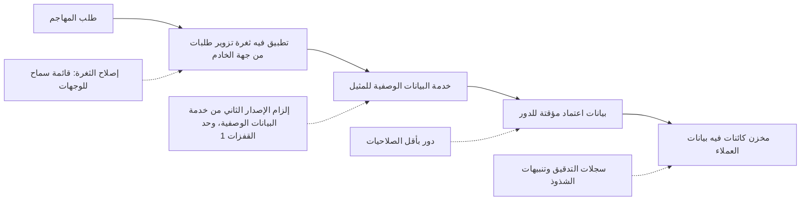
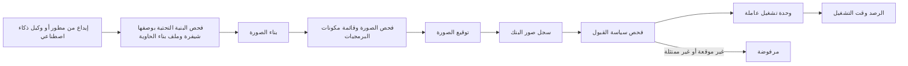
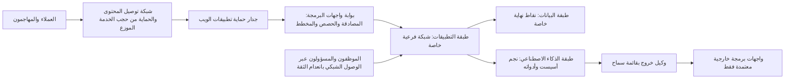

# الوحدة 7 — السحابة والبنية التحتية (Cloud and infrastructure)

*لم تعد تطبيقات بنك نجم (Najm Bank's applications) تعمل على خوادم في مركز بياناته الخاص (servers in its own data centre). بل تعمل على منصةٍ سحابية (cloud platform): حاوياتٌ (containers) على خدمة Kubernetes مُدارة (managed Kubernetes service)، ومخزن كائنات (object store)، وقاعدة بيانات مُدارة (managed database)، وخطوط تكاملٍ ونشرٍ مستمرين (CI/CD pipelines). وقد تكون الشيفرة نظيفة (The code can be clean) ومع ذلك يُخترق البنك (the bank can still be breached) عبر حاوية تخزينٍ عامة واحدة (one public bucket)، أو دورٍ واحد مفرط الصلاحيات (one over-privileged role)، أو شبكةٍ مسطّحة واحدة (one flat network). تغطي هذه الوحدة الطبقة الكامنة تحت التطبيق (the layer underneath the application). فهي تبدأ بمن المسؤول عن ماذا في السحابة (who is responsible for what in the cloud)، ولماذا تكون إدارة الهوية والوصول (identity and access management, IAM) هي المحيط الحقيقي (the real perimeter)، ولماذا يتسبّب سوء الإعداد من جهة العميل (customer-side misconfiguration) وبيانات الاعتماد المسرّبة (leaked credentials)، لا الهجمات على المزوّد (not attacks on the provider)، في معظم الحوادث السحابية (most cloud incidents). ثم تبيّن كيف تبني الحاويات وKubernetes وتشغّلها بأمان (build and run containers and Kubernetes safely)، وكيف تلتقط الأخطاء في البنية التحتية بوصفها شيفرة (infrastructure as code) قبل نشرها (before they are deployed). وتنتهي بتقسيم الشبكة (network segmentation)، والحافة (the edge)، أي شبكة توصيل المحتوى (CDN) وجدار حماية تطبيقات الويب (WAF) وبوابة واجهات البرمجة (API gateway)، والحماية من هجمات حجب الخدمة الموزّع (DDoS protection)، وهي ضوابط تحدّ مما يستطيع المهاجم بلوغه (limit what an attacker can reach) وتُبقي الخدمة قائمةً تحت الإغراق (keep the service up under a flood). ستتابع علي وهو يكتشف حاوية تخزينٍ عامة للفواتير (finds a public invoice bucket)، وفريق طارق وهو يقوّي العنقود (hardens the cluster) الذي يشغّل أدوات نجم أسيست (Najm Assist's tools)، ومريم بينما يتنقّل فريقها الأحمر (her red team) عبر شبكةٍ داخلية مسطّحة (walks across a flat internal network)، وجاسم وهو يخطط لإغراقٍ في يوم صرف الرواتب (plans for a salary-day flood).*

> **المراحل (Phases):** Design, Build, Deploy, Operate — جعل المنصة الكامنة تحت كل تطبيقٍ في بنك نجم (the platform under every Najm Bank application) آمنةً افتراضيًا (secure by default)، ومفروضةً بالشيفرة (enforced in code)، وقابلةً للمراقبة (observable) حين يحاول أحدٌ تجاوزها (when someone tries to get past it).

---

# 7.1 — أمن السحابة: المسؤولية المشتركة وإدارة الهوية والوصول وسوء الإعداد (Cloud security: shared responsibility, IAM and misconfiguration)
*المستوى (Level): 🟡 متوسط (Intermediate)* · *المتطلبات (Prerequisites): 1.2، 2.3، 5.2* · *المرحلة (Phase): Design, Deploy*

## ⚡ الدرس في دقيقة (In 60 seconds)
- **نموذج المسؤولية المشتركة (shared responsibility model)**: يؤمّن المزوّد السحابةَ نفسها (the provider secures the cloud itself)، أي المباني والعتاد والمحاكاة الافتراضية (buildings, hardware, virtualisation) والمكوّنات الداخلية للخدمات المُدارة (managed-service internals). وتؤمّن أنت ما تضعه فيها وكيف تضبطه (what you put in it and how you configure it). ويتحرّك هذا التقسيم (The split moves) بحسب نوع الخدمة (with the type of service).
- في السحابة، **الهوية هي المحيط (identity is the perimeter)**. فكل استدعاءٍ لواجهة برمجة (Every API call) يُفحص مقابل سياسة إدارة الهوية والوصول (checked against IAM policy)، ولذا فإن دورًا مفرط الصلاحيات (an over-privileged role) أو مفتاحًا مسرّبًا (a leaked key) أثمن لدى المهاجم (worth more to an attacker) من منفذٍ مفتوح (an open port).
- تبدأ معظم الاختراقات السحابية (Most cloud breaches) بأخطاءٍ من جهة العميل (customer-side mistakes)، وفي مقدّمتها **سوء الإعداد (misconfiguration)** وبيانات الاعتماد الضعيفة أو المسرّبة (weak or leaked credentials)، كالتخزين العام (public storage)، والصلاحيات الشاملة (wildcard permissions)، والمفاتيح طويلة العمر (long-lived keys)، والتسجيل المعطَّل (logging off)، لا بهجومٍ بارع على المزوّد (not a clever attack on the provider).
- القاعدة الأهم (The rule that matters most): تحصل أعباء العمل وخطوط التسليم (workloads and pipelines) على **بيانات اعتمادٍ قصيرة العمر عبر الاتحاد (short-lived credentials through federation)**، محصورةٍ في ما تحتاجه بالضبط (scoped to exactly what they need). أما البشر فلا يحصلون على صلاحيات إدارةٍ دائمة (Humans get no standing admin rights).
- مؤشر القرار (Decision cue): «بأيّ هويةٍ يعمل هذا، وماذا يستطيع أن يفعل، وما الذي يمنع جعله عامًّا؟» ⁦("which identity does this run as, what can it do, and what stops it being made public?")⁩
- أكبر فخ (Biggest trap): إصلاح الأمور يدويًا في وحدة التحكم (fixing things by hand in the console). فالضوابط الوقائية (Guardrails) مكانها الشيفرة والسياسات على مستوى المؤسسة (in code and organisation-wide policies)، وإلا فإنها تنحرف عائدةً إلى ما كانت عليه (or they drift back).

## 🧭 لماذا يهم (Why it matters)
في أسبوع علي الأول (In Ali's first week)، يُدرج ماسح الوضع الأمني السحابي (cloud posture scanner) نتيجة «حاوية تخزين عامة، خطورة عالية» ("public bucket, high") في حساب اختبار (test account). فقبل ثلاثة أسابيع (Three weeks earlier)، كان مطوّرٌ قد عطّل حجب الوصول العام (turned off public-access blocking) «لمدة ساعة» ("for an hour") كي يتمكّن مدير منتجٍ (product manager) من أن يُري شريكًا (show a partner) شكل فواتير بوابة الشركات الصغيرة (what SME Portal invoices look like). وكانت حاوية التخزين (The bucket) نسخةً من بيئة الإنتاج (a copy of production) أُعدّت لاختبار ترحيل (made for a migration test)، فكانت تحوي فواتير حقيقية (real invoices): أسماء الشركات وأرقام الحسابات والمبالغ (company names, account numbers, amounts). وذهب التنبيه (The alert went) إلى صندوق بريدٍ لا يقرؤه أحد (a mailbox no one reads).

لا تسأل نورة «من فعل هذا؟» ⁦("who did this?")⁩. بل تسأل: «لماذا استطاع شخصٌ واحد فعل هذا بنقرةٍ واحدة، وببيانات عملاء حقيقية، ولماذا استغرقنا ثلاثة أسابيع لنلاحظ ذلك؟» ⁦("Why could one person do this in one click, with real customer data, and why did it take three weeks to notice?")⁩ وكل جوابٍ ضابطٌ أمني (Each answer is a control). فلا تُنسخ بيانات الإنتاج إلى حسابات الاختبار (Production data is not copied to test accounts) ما لم تكن محجوبة (unless masked) (5.3). ويُحجب الوصول العام على مستوى المؤسسة (Public access is blocked at the organisation level)، فلا يستطيع أي حسابٍ منفرد تعطيله (no single account can switch it off). وتذهب تنبيهات الوضع الأمني (Posture alerts) إلى طابورٍ له مالكٌ وموعدٌ نهائي (a queue with an owner and a deadline).

يُظهر السجل العام حجم الرهان (The public record shows the stakes). ففي اختراق Capital One عام 2019 (the 2019 Capital One breach)، وكما أُفيد علنًا (as publicly reported)، استخدم مهاجمٌ ثغرةً من نوع تزوير الطلبات من جهة الخادم (server-side request forgery, SSRF)، أُفيد بأنها كانت في جدار حماية تطبيقات ويب سيئ الإعداد (a misconfigured web application firewall)، ليجعل خادمًا يستعلم من خدمة البيانات الوصفية للمثيل (instance metadata service) في السحابة. فأعادت الخدمة بيانات اعتمادٍ مؤقتة (temporary credentials) لدور الخادم (the server's role)، وكانت صلاحيات التخزين الواسعة لهذا الدور (broad storage permissions) هي ما مكّن المهاجم من نسخ بياناتٍ (copy data) عن عددٍ كبير جدًا من المتقدّمين لبطاقات الائتمان (a very large number of credit-card applicants). لقد فعلت البنية التحتية للمزوّد (The provider's infrastructure) بالضبط ما طُلب منها (exactly what it was told). فقد اصطفّت ثلاثة شروط (Three conditions lined up): مكوّنٌ عرضةٌ لتزوير الطلبات من جهة الخادم (an SSRF-prone component)، وخدمة بياناتٍ وصفية تجيب عن طلبات GET بسيطة (a metadata service that answered simple GET requests)، إذ لم تقدّم AWS الإصدار IMDSv2 القائم على الرموز المميزة (token-based IMDSv2) إلا لاحقًا في 2019 (later in 2019)، ودورٌ مفرط الاتساع (an over-broad role). ويدور هذا الدرس حول ضمان (This lesson is about making sure) ألّا تصطفّ هذه الشروط أبدًا في بنك نجم (they never line up at Najm Bank).

## 📐 كيف يعمل (How it works)

### 🟢 الأساسيات (The essentials)

**المسؤولية المشتركة (Shared responsibility).** المزوّد مسؤولٌ عن **أمن السحابة (security of the cloud)**؛ والعميل مسؤولٌ عن **الأمن داخل السحابة (security in the cloud)**. ويتوقف موضع الخط الفاصل (Where the line falls) على الخدمة (depends on the service):

| تستخدم… (You use…) | يؤمّن المزوّد (The provider secures) | يبقى على بنك نجم أن يؤمّن (Najm Bank still secures) |
|---|---|---|
| **IaaS**، أي البنية التحتية كخدمة: الآلات الافتراضية (virtual machines) والشبكات (networks) | المرافق والعتاد وطبقة المحاكاة الافتراضية (Facilities, hardware, virtualisation layer) | تحديثات نظام التشغيل (Operating-system patches)، والتطبيق (application)، وقواعد الشبكة (network rules)، والهويات (identities)، والبيانات (data) |
| **خدمة Kubernetes المُدارة (Managed Kubernetes)** | ما سبق، إضافةً إلى مستوى التحكم (The above, plus the control plane) | أعباء العمل (Workloads)، والصور (images)، وترقيات العقد العاملة (worker-node upgrades)، وهي مشتركة غالبًا (often shared)، وصلاحيات العنقود (cluster permissions)، وسياسات الشبكة (network policies)، والهويات (identities)، والبيانات (data) |
| **PaaS**، أي المنصة كخدمة: قاعدة البيانات المُدارة (managed database) ومخزن الكائنات (object store) والحوسبة بلا خوادم (serverless) | ما سبق، إضافةً إلى برمجيات الخدمة وتحديثها (The above, plus the service software and its patching) | الإعدادات (Configuration): عامة أم خاصة (public or private)، والتشفير (encryption)، والنسخ الاحتياطية (backups)؛ وسياسات الوصول (access policies)، والبيانات (data) |
| **SaaS**، أي البرمجيات كخدمة: البريد الإلكتروني (email) وإدارة علاقات العملاء (CRM) وواجهة برمجة لنموذجٍ لغوي كبير مستضاف (a hosted LLM API) | كل شيءٍ تقني تقريبًا (Almost everything technical) | الحسابات (Accounts)، والمصادقة متعددة العوامل (MFA)، وإعدادات المشاركة (sharing settings)، والبيانات التي ترسلها إليها (what data you send to it) |

شيئان لا ينتقلان أبدًا إلى المزوّد (Two things never move to the provider): **هوياتك وقرارات الوصول لديك (your identities and access decisions)**، و**بياناتك (your data)**.

**إدارة الهوية والوصول في صفحةٍ واحدة (IAM on one page).** تقرّر إدارة الهوية والوصول (Identity and access management, IAM) من يستطيع فعل ماذا بأيّ مورد (who can do what to which resource). وتختلف المصطلحات قليلًا (The words differ slightly) بين AWS وMicrosoft Azure وGoogle Cloud، لكن الأفكار واحدة (the ideas are the same):
- **الجهة الفاعلة (Principal)**: من يتصرّف (who is acting). مستخدمٌ بشري (A human user)، أو مجموعة (a group)، أو **دور (role)**، وهو هويةٌ *تُتقمَّص* لوقتٍ قصير (an identity *assumed* for a short time) بدل تسجيل الدخول إليها (rather than logged into)، أو **هوية عبء عمل (workload identity)**، وهي حساب خدمة (a service account) لتطبيقٍ أو خط تسليم (for an application or pipeline).
- **الإجراء (Action)**: عملية واجهة البرمجة (the API operation)، مثل «قراءة كائن» ("read object") أو «حذف قاعدة بيانات» ("delete database").
- **المورد (Resource)**: ما ينطبق عليه الإجراء (what the action applies to)، مثل حاوية تخزينٍ واحدة (one bucket).
- **الشرط (Condition)**: متى يُسمح به (when it is allowed)، مثلًا مع المصادقة متعددة العوامل فقط (only with MFA) أو عبر TLS فقط (only over TLS).
- **السياسة (Policy)**: وثيقةٌ تجمع هذه العناصر (a document combining these)، تُرفق بجهةٍ فاعلة أو بمورد (attached to a principal or to a resource).

يُفحص كل طلبٍ لواجهة البرمجة (Every API request) مقابل هذه السياسات (is checked against these policies)، سواء جاء من وحدة التحكم (the console) أو أداة سطر أوامر (a command-line tool) أو خط تسليم (a pipeline) أو شيفرة (code). ولهذا **الهوية هي المحيط (identity is the perimeter)**: فالمهاجم الذي يملك بيانات اعتمادٍ صالحة لدورٍ قوي (valid credentials for a powerful role) لا يحتاج إلى كسر أي شيء (does not need to break anything).

**أقل الصلاحيات، بصورةٍ ملموسة (Least privilege, concretely).** كثيرًا ما تبدو السياسة المكتوبة على عجل (A policy written in a hurry)، أو التي كتبها وكيل برمجةٍ بالذكاء الاصطناعي (an AI coding agent) طُلب منه «اجعلها تعمل» ("make it work") (6.3)، مثل المثال الأول أدناه (the first example below). أما النسخة المُصلَحة (The fixed version) فلا تمنح إلا ما تفعله خدمة الرفع (upload service) في بوابة الشركات الصغيرة (SME Portal): كتابة الكائنات في مجلدٍ واحد من حاوية تخزينٍ واحدة (write objects into one folder of one bucket). والصياغة هنا صياغة AWS (The syntax is AWS's)؛ وتعبّر Azure وGoogle Cloud عن الفكرة نفسها (express the same idea).

الثغرة (Vulnerable): أي إجراءٍ تخزيني على كل حاويات التخزين في الحساب (any storage action on every bucket in the account).

```json
{ "Version": "2012-10-17",
  "Statement": [{ "Effect": "Allow", "Action": "s3:*", "Resource": "*" }] }
```

المُصلَح (Fixed): كتابةٌ فقط، وحاوية تخزينٍ واحدة، وبادئةٌ واحدة، وTLS فقط (write-only, one bucket, one prefix, TLS only).

```json
{ "Version": "2012-10-17",
  "Statement": [{
    "Effect": "Allow",
    "Action": ["s3:PutObject"],
    "Resource": "arn:aws:s3:::najm-sme-invoices-prod/uploads/*",
    "Condition": { "Bool": { "aws:SecureTransport": "true" } } }] }
```

**حالات سوء الإعداد المعتادة (The usual misconfigurations).** تُفرد قائمة OWASP Top 10 فئةً مستقلة (its own category) لـ *سوء الإعداد الأمني (Security Misconfiguration)*، وهو في السحابة أحد أكثر طرق الدخول شيوعًا (one of the commonest ways in):
- **التخزين العام (Public storage)**: حاويات تخزينٍ يقرؤها أي أحد (buckets readable by anyone)، وكثيرًا ما يكون ذلك «مؤقتًا» ("temporarily").
- **الهويات مفرطة الاتساع (Over-broad identities)**: إجراءاتٌ أو مواردُ شاملة (wildcard actions or resources)؛ وأدوارٌ إدارية للتطبيقات (admin roles on applications).
- **مفاتيح الوصول طويلة العمر (Long-lived access keys)** في الشيفرة ومتغيرات التكامل المستمر والحواسيب المحمولة (in code, CI variables and laptops) (5.2).
- **قواعد الشبكة المفتوحة (Open network rules)**: قواعد بياناتٍ أو منافذ إدارية (databases or admin ports) يمكن بلوغها من الإنترنت (reachable from the internet) (7.3).
- **التسجيل المعطَّل (Logging off)**: لا أحد يستطيع الإجابة عن سؤال «ماذا لمسوا؟» ⁦("what did they touch?")⁩.
- **الإعدادات الافتراضية غير الآمنة (Unsafe defaults)**: لقطاتٌ عامة (public snapshots)، ونسخٌ احتياطية غير مشفّرة (unencrypted backups)، ونقاط نهايةٍ عامة تُركت مفعّلة (public endpoints left on).

### 🟡 التعمق أكثر (Going deeper)

**بيانات اعتمادٍ قصيرة العمر عبر الاتحاد (Short-lived credentials through federation).** مفتاح الوصول طويل العمر (A long-lived access key) كلمةُ مرورٍ لا تنتهي صلاحيتها أبدًا (a password that never expires) وتُنسخ هنا وهناك (gets copied around). والنمط الحديث (The modern pattern) هو **اتحاد هوية عبء العمل (workload identity federation)**: يُثبت عبء العمل هويته (the workload proves who it is) برمزٍ مميز (token) من نظامٍ تثق به السحابة (a system the cloud trusts)، ويتلقّى بيانات اعتمادٍ تنتهي صلاحيتها خلال دقائق أو ساعات (credentials that expire in minutes or hours). ومن الأمثلة (Examples): حساب خدمة في Kubernetes (a Kubernetes service account) مربوطٌ بدورٍ سحابي (mapped to a cloud role)، أو نظام تكاملٍ مستمر (a CI system) مثل GitHub Actions يقدّم رمزًا مميزًا من نوع OpenID Connect (OIDC token) (3.2) إلى خدمة الرموز في السحابة (the cloud's token service).

يكمن الفخ (The trap) في **سياسة الثقة (trust policy)**، التي تحدّد *أيّ* الرموز المميزة يجوز لها تقمّص الدور (*which* tokens may assume the role). فإذا كانت لا تتحقق إلا (If it only checks) من أن الرمز جاء من مزوّد التكامل المستمر (that the token came from the CI provider)، فقد يتمكّن سير عملٍ في مستودع شخصٍ آخر (a workflow in someone else's repository) من تقمّص دورك (assume your role). اربطها بمستودعك وبيئتك (Pin it to your repository and environment):

```json
"Condition": {
  "StringEquals": {
    "token.actions.githubusercontent.com:aud": "sts.amazonaws.com",
    "token.actions.githubusercontent.com:sub": "repo:najm-bank/sme-portal:environment:production"
  }
}
```

**خدمة البيانات الوصفية وتزوير الطلبات من جهة الخادم (The metadata service and SSRF).** تستطيع الآلات الافتراضية السحابية (Cloud virtual machines) أن تسأل **خدمة البيانات الوصفية للمثيل (instance metadata service)** المحلية عن نفسها (about themselves). وهي تقع لدى المزوّدين الرئيسيين (On the major providers) على العنوان المحلي للرابط (link-local address) 169.254.169.254، ويمكنها أن تعيد بيانات اعتمادٍ مؤقتة (temporary credentials) لدور الآلة (the machine's role) أو لهوية الخدمة المرفقة بها (attached service identity). ويكون ذلك خطيرًا (That is dangerous) إذا كان في التطبيق (if the application has) خللٌ من نوع تزوير الطلبات من جهة الخادم (SSRF flaw) (2.3)، لأن المهاجم يستطيع جعل الخادم يسأل نيابةً عنه (make the server ask on their behalf). دافِع على طبقات (Defend in layers):
- يتطلّب **IMDSv2** في AWS رمز جلسة (session token)، يُحصل عليه بطلب PUT منفصل (a separate PUT request) ويُعاد إرساله في ترويسة (sent back in a header)، ما يحجب معظم (which blocks most) هجمات تزوير الطلبات البسيطة التي لا تستطيع إلا إطلاق طلبات GET (simple SSRF that can only trigger GET requests). اضبطه على *إلزامي (required)* واضبط حدّ القفزات للاستجابة (response hop limit) كي لا تستطيع الحاويات بلوغه (containers cannot reach it) إلا إذا احتاجت إليه (unless they need to). وقد كانت AWS تنقل عمليات الإطلاق الجديدة (new launches) نحو إعداداتٍ افتراضية تقتصر على IMDSv2 (IMDSv2-only defaults)؛ فتحقّق من الإعدادات الافتراضية الحالية (check the current defaults). وتتطلّب Azure وGoogle Cloud ترويسة طلبٍ خاصة (a special request header)، هي `Metadata: true` و`Metadata-Flavor: Google`، لتحقيق أثرٍ مشابه (for a similar effect).
- **أصلِح ثغرة تزوير الطلبات (Fix the SSRF)** بقائمة سماحٍ للوجهات (with a destination allowlist) (2.3).
- **احجب الخروج (Block egress)** إلى عنوان البيانات الوصفية (to the metadata address) من أعباء العمل التي لا تحتاج إليه (from workloads that do not need it) (7.2، 7.3).
- **أبقِ الدور ضيقًا (Keep the role narrow)**، كي لا تفتح بيانات الاعتماد المسروقة إلا القليل جدًا (so stolen credentials open very little).
- **ارصد (Detect)** استخدام بيانات اعتماد الدور من خارج شبكتك (role credentials used from outside your network)؛ إذ تستطيع خدمات رصد التهديدات لدى المزوّدين (providers' threat-detection services) الإبلاغ عن ذلك (flag this).



كل خطٍّ منقّط (Each dotted line) ضابطٌ مستقل (an independent control) يكسر السلسلة (breaks the chain): إنه الدفاع المتعدد الطبقات (defence in depth) (1.2) مطبَّقًا على مسار هجومٍ حقيقي (on a real attack path).

**الضوابط الوقائية فوق مستوى الحساب (Guardrails above the account).** الفرق ترتكب أخطاء (Teams make mistakes)؛ والسياسات على مستوى المؤسسة (organisation-level policies) تمنع تلك الأخطاء من أن تُحدث أثرًا (stop those mistakes taking effect). ويقدّم كل مزوّد **سياسات ضوابط وقائية للمؤسسة (organisation guardrail policies)** تنطبق على كل حسابٍ أو مشروعٍ تحتها (apply to every account or project underneath): سياسات التحكم في الخدمات (service control policies, SCPs) في AWS Organizations، وAzure Policy، وخدمة سياسات المؤسسة في Google Cloud (Google Cloud Organization Policy Service). وقواعد بنك نجم (The Najm Bank rules) موجودةٌ في خط الأساس أدناه (in the baseline below). والضوابط الوقائية المانعة (Preventive guardrails)، أي «لا يمكنك» ("you cannot")، تتفوّق على الكاشفة (beat detective ones)، أي «سنخبرك لاحقًا» ("we will tell you later")، لكنك تحتاج إلى كلتيهما (but you need both).

**إدارة الوضع الأمني (Posture management).** تقارن أداة **إدارة الوضع الأمني للسحابة (cloud security posture management, CSPM)** إعداداتك السحابية باستمرار (continuously compares your cloud configuration) بخط أساس (with a baseline)، وهو عادةً **معايير CIS (CIS Benchmarks)**، أي أدلة التقوية التوافقية (consensus hardening guides) الصادرة عن مركز أمن الإنترنت (Center for Internet Security)، إضافةً إلى قواعدك الخاصة (plus your own rules). وتفعل ذلك ماسحاتٌ مفتوحة المصدر (Open-source scanners) مثل Prowler وScoutSuite، وكذلك الأدوات المدمجة لدى المزوّدين (providers' built-in tools). تكتشف أداة CSPM الانحراف (finds drift) لكنها لا تُصلحه (does not fix it)، ونتائجها الكثيرة (its many findings) تحتاج إلى ترتيب الأولويات (need prioritising)، كما في قسم 🔴 أدناه (below).

**سجلات التدقيق دليل (Audit logs are evidence).** فعّل سجل تدقيق واجهات البرمجة لدى المزوّد (the provider's API audit log)، أي AWS CloudTrail وAzure Activity Log وGoogle Cloud Audit Logs، في كل حساب (in every account)، وأضف تسجيل الوصول إلى البيانات (data-access logging) للمخازن الحساسة (for sensitive stores)، ويكون ذلك في Azure عبر سجلات التشخيص لكل مورد (through each resource's diagnostic logs). وأرسله إلى حساب سجلاتٍ منفصل ومُحكم الإغلاق (a separate, locked-down log account) حيث لا يستطيع الأشخاص الذين يسجّل أفعالهم حذفه (where the people it records cannot delete it). ويبني فريق جاسم عمليات الرصد عليه (Jassim's team builds detections on it) في 10.1.

### 🔴 نظرة الخبير (Expert view)

**حُدَّ من نطاق الضرر بالتصميم (Limit the blast radius by design).** تفصل **منطقة الهبوط (landing zone)**، وهي بنيةٌ متعددة الحسابات مبنيةٌ مسبقًا (a pre-built multi-account structure) ينشر معظم المزوّدين تصميمًا مرجعيًا لها (most providers publish a reference design)، بين بيئة الإنتاج (production) وغير الإنتاج (non-production) وأدوات الأمن (security tooling) والتسجيل (logging) والشبكات المشتركة (shared networking) في حساباتٍ أو مشاريع مختلفة (into different accounts or projects). فالبيئة التجريبية المخترقة لمطوّر (A compromised developer sandbox) لا تستطيع بلوغ بيانات الإنتاج (cannot reach production data)، لأنه لا يوجد مسار ثقة (because no trust path exists). ولا تصل بيانات الإنتاج غير المحجوبة (Unmasked production data) أبدًا إلى حسابات غير الإنتاج (non-production accounts)، وهي بالضبط القاعدة التي خرقتها حادثة حاوية الفواتير (exactly the rule the invoice-bucket incident broke).

**ابحث عن التركيبات السامّة (Look for toxic combinations).** قد تُبلغ أداة CSPM عن آلاف النتائج المتوسطة (thousands of medium findings)؛ أما المهاجم فيحتاج إلى مسارٍ واحد (an attacker needs one path). أعطِ الأولوية حيث **تتركّب (combine)** النتائج: التعرّض للإنترنت (internet exposure)، إضافةً إلى ضعفٍ قابل للاستغلال (an exploitable weakness)، إضافةً إلى هويةٍ تستطيع بلوغ بياناتٍ حساسة (an identity that can reach sensitive data). هذا هو شكل سلسلة Capital One (the shape of the Capital One chain). وتبني المنصات التجارية (Commercial platforms) هذا المخطط البياني (build this graph)، وهي تُباع غالبًا تحت اسم CNAPP (often sold as CNAPP)، أي منصات حماية التطبيقات السحابية الأصلية (cloud-native application protection platforms)؛ ويمكنك مقاربته (you can approximate it) بوسم الموارد بحساسية البيانات ودرجة التعرّض (tagging resources with data sensitivity and exposure). قيِّم المسارات (Score paths) بأساليب 1.3 (with the methods of 1.3)، لا بالخطورة الافتراضية للماسح (not the scanner's default severity). وتساعد مصفوفة السحابة في MITRE ATT&CK (MITRE ATT&CK's cloud matrix)، بتقنياتٍ مثل *Unsecured Credentials: Cloud Instance Metadata API*، على التحقق من أن لكل تقنيةٍ ذات صلة (each relevant technique) ضابطًا أو آليةَ رصد (a control or a detection).

**اضبط حجم الصلاحيات بالأدلة (Right-size permissions with evidence).** لا أحد يكتب سياسةً مثالية في اليوم الأول (Nobody writes a perfect policy on day one). وحيث لا تستطيع البدء ضيقًا (Where you cannot start narrow)، امنح سياسةً أوسع في غير الإنتاج (grant a broader policy in non-production)، وسجّل الإجراءات المستخدمة فعلًا (record which actions are actually used) من سجلات التدقيق (from the audit logs)، وولّد سياسة الإنتاج من ذلك (generate the production policy from that). ويقدّم المزوّدون أدواتٍ تُبلغ عن الصلاحيات غير المستخدمة (tools that report unused permissions)، مثل AWS IAM Access Analyzer وأداة توصيات IAM في Google Cloud (Google Cloud's IAM recommender).

**لا صلاحيات إدارةٍ دائمة للبشر (No standing admin for humans).** يكون المهندسون للقراءة فقط افتراضيًا (Engineers are read-only by default)، ويطلبون الوصول المرتفع (request elevated access) **في الوقت المناسب (just in time)**، مع سبب (with a reason) وحدٍّ زمني (a time limit) وموافقة (approval) وتسجيل (logging). أما حسابات الجذر (Root accounts) فهي لحالات **كسر الزجاج (break-glass)** فقط: مصادقة متعددة العوامل بمفتاحٍ عتادي (hardware-key MFA) وتنبيهٌ عند كل استخدام (an alert on every use).

**المفاتيح وموقع البيانات (Keys and data location).** استخدم **المفاتيح التي يديرها العميل (customer-managed keys)** (5.1) للبيانات السرية (for confidential data)، مع فصل مديري المفاتيح عن مستخدمي البيانات (key administrators separate from data users). وحيث يقيّد القانون مكان تخزين البيانات (Where law limits where data may be stored)، تصبح قيود المناطق (region restrictions) ضابطًا وقائيًا أيضًا (a guardrail too) (11.2).

**خدمات الذكاء الاصطناعي موارد سحابية (AI services are cloud resources).** للنموذج المستضاف لنجم أسيست (Najm Assist's hosted model) ولمخزن المتجهات المُدار لمساعد مذكرات الائتمان (Credit Memo Copilot's managed vector store) إدارةُ هويةٍ ووصول (IAM)، وتعرّضٌ شبكي (network exposure)، وسجلات (logs)، شأنهما شأن أي موردٍ آخر (like any other resource). استخدم الشبكات الخاصة (private networking) لنقاط نهاية النماذج (for model endpoints) حيث تكون مدعومة (where supported)، واحفظ مفاتيح واجهات برمجة النماذج اللغوية الكبيرة (LLM API keys) في مدير الأسرار (in the secrets manager) بمفتاحٍ واحد لكل خدمة (one key per service) وبحدود إنفاق (spending limits)، وسجّل من استدعى أيّ نموذج (log who called which model). فمفتاح نموذجٍ لغوي كبير مسرّب (A leaked LLM key) خطرٌ على البيانات وفاتورةٌ في آنٍ معًا (both a data risk and a bill)، وهذا هو البند OWASP LLM10، الاستهلاك غير المحدود (Unbounded Consumption).

## 🧰 الأدوات (The toolkit)
| الضابط أو المعيار أو الأداة (Control, standard or tool) | ما هو وماذا يفعل (What it is and does) | متى تلجأ إليه (When to reach for it) |
|---|---|---|
| **Shared responsibility model** — نموذج المسؤولية المشتركة | بيان المزوّد لما يؤمّنه هو وما تؤمّنه أنت (The provider's statement of what it secures and what you secure) | اختيار خدمة (Choosing a service)؛ ونمذجة التهديدات (threat modelling)؛ وسؤال «أليس هذا من عمل المزوّد؟» ⁦("isn't that the provider's job?")⁩ |
| **Least-privilege IAM** — إدارة الهوية والوصول بأقل الصلاحيات | سياساتٌ محصورةٌ في إجراءاتٍ وموارد وشروطٍ محددة (Policies scoped to specific actions, resources and conditions) | كل دورٍ وحساب خدمةٍ وخط تسليم (Every role, service account and pipeline) |
| **Workload identity federation** — اتحاد هوية عبء العمل | بيانات اعتمادٍ قصيرة العمر تُصدر مقابل رمزٍ مميز موثوق (Short-lived credentials issued against a trusted token)، بدلًا من المفاتيح الثابتة (replacing static keys) | من التكامل والنشر المستمرين إلى السحابة (CI/CD to cloud)؛ ومن وحدات التشغيل إلى واجهات البرمجة السحابية (pods to cloud APIs) |
| **IMDSv2** — في AWS، الإصدار الثاني من خدمة البيانات الوصفية للمثيل | خدمة بياناتٍ وصفية برمز جلسة (Session-token metadata service) تقاوم هجمات تزوير الطلبات البسيطة (that resists simple SSRF) | كل آلةٍ افتراضية وعقدة في AWS (Every AWS virtual machine and node)؛ مضبوطةً على إلزامي (set to required) |
| **Organisation guardrail policies** — سياسات الضوابط الوقائية للمؤسسة: AWS SCPs وAzure Policy وGoogle Cloud Organization Policy | قواعد فوق كل حساب لا تستطيع الفرق تجاوزها (Rules above every account that teams cannot override) | حجب التخزين العام (Blocking public storage)، وحماية سجلات التدقيق (protecting audit logs)، وتقييد المناطق (restricting regions) |
| **CSPM** — إدارة الوضع الأمني للسحابة (cloud security posture management)، مثل Prowler وScoutSuite | فحصٌ مستمر لإعدادات السحابة مقابل خط أساس (Continuous scan of cloud configuration against a baseline) | منذ الحساب الأول (From the first account)؛ مع ترتيب الأولويات حسب التركيبات السامّة (prioritised by toxic combinations) |
| **CIS Benchmarks** — معايير مركز أمن الإنترنت (Center for Internet Security) | خطوط أساسٍ توافقية للتقوية (Consensus hardening baselines) لكل مزوّدٍ سحابي ومنصة (per cloud provider and platform) | تعريف «الإعداد الآمن» ("secure configuration")؛ وأدلة التدقيق (audit evidence) |
| **Cloud audit logs** — سجلات التدقيق السحابية: AWS CloudTrail وAzure Activity Log وGoogle Cloud Audit Logs | سجلاتٌ لاستدعاءات واجهات البرمجة الإدارية (Records of management API calls) ولاستدعاءات الوصول إلى البيانات المختارة (and chosen data-access API calls) | مفعّلةٌ دائمًا (Always on)، في حساب سجلاتٍ منفصل ومقفل (in a separate locked log account) (10.1) |

## 🏛️ عمليًا في بنك نجم (In practice at Najm Bank)
يصوغ علي **خط الأساس للضوابط الوقائية السحابية في نجم، الإصدار 1 (Najm Cloud Guardrail Baseline v1)**؛ ويراجعه طارق (Tariq reviews it)، ويعتمده حمد (Hamad approves it)، كبير مسؤولي أمن المعلومات (CISO).

| المعرّف (ID) | القاعدة (Rule) | كيف تُفرض (How it is enforced) | المالك والاستثناءات (Owner and exceptions) |
|---|---|---|---|
| CG-01 | لا يجوز أن يكون أي تخزين كائناتٍ عامًّا (No object storage may be public) | ضابطٌ وقائي للمؤسسة يرفض السياسات العامة (Organisation guardrail denies public policies)؛ وحجب الوصول العام على مستوى الحساب (account-level public-access block)؛ وتنبيهٌ من أداة إدارة الوضع الأمني (CSPM alert) | فريق المنصة (Platform team)؛ أصول الموقع الإلكتروني العام فقط (public website assets only)، في حسابٍ مخصّص (in a dedicated account) |
| CG-02 | لا مفاتيح سحابية طويلة العمر لأعباء العمل أو التكامل المستمر (No long-lived cloud keys for workloads or CI) | اتحاد OIDC لكل خطوط التسليم (OIDC federation for all pipelines)؛ وتنبيهٌ عند ظهور أي مفتاح وصولٍ جديد (alert on any new access key) | فريق المنصة (Platform team)؛ لا استثناءات في الإنتاج (none in production) |
| CG-03 | IMDSv2 إلزاميٌّ على كل آلةٍ افتراضية وعقدة (IMDSv2 required on every virtual machine and node) | ضابطٌ وقائي عند الإطلاق (Guardrail at launch)؛ وحدّ القفزات 1 على عقد Kubernetes (hop limit 1 on Kubernetes nodes) | فريق المنصة (Platform team)؛ لا استثناءات (none) |
| CG-04 | سجلات التدقيق مفعّلةٌ في كل مكان (Audit logs on everywhere)، ومخزّنةٌ بنمط الكتابة مرةً واحدة (stored write-once) في حساب أرشيف السجلات (in the log-archive account) | ضابطٌ وقائي يرفض إيقاف مسارات التدقيق أو حذفها (Guardrail denies stopping or deleting trails) | مركز العمليات الأمنية (SOC)، أي جاسم؛ لا استثناءات (none) |
| CG-05 | لا إجراءات شاملة على موارد الإنتاج (No wildcard actions on production resources) | فحص سياسات البنية التحتية بوصفها شيفرة في التكامل المستمر (IaC policy check in CI) (7.2)؛ ومراجعةٌ فصلية للصلاحيات غير المستخدمة (quarterly unused-permission review) | مالكو الخدمات (Service owners)؛ استثناءاتٌ محددة المدة (time-boxed) تعتمدها نورة (approved by Noura) |
| CG-06 | لا بيانات إنتاجٍ غير محجوبة في حسابات غير الإنتاج (No unmasked production data in non-production accounts) | ضابطٌ وقائي على النسخ بين الحسابات (Guardrail on cross-account copies)؛ وفحصٌ بحثًا عن البيانات الشخصية (scan for personal data) | مالكو البيانات (Data owners) مع سارة، مسؤولة حماية البيانات (DPO) |
| CG-07 | بيانات العملاء في المناطق المعتمدة فقط (Customer data only in approved regions) | ضابطٌ وقائي يرفض المناطق الأخرى (Guardrail denying other regions) | فريق المنصة مع ليلى (Platform team with Layla) |
| CG-08 | لا صلاحيات إدارةٍ بشرية دائمة (No standing human admin)؛ وكسر الزجاج بمصادقةٍ متعددة العوامل عتادية (break-glass with hardware MFA) | الوصول في الوقت المناسب (Just-in-time access)؛ وتنبيهٌ عند تسجيل الدخول بكسر الزجاج (alert on break-glass login) | فريق إدارة الهوية والوصول (IAM team)؛ لا استثناءات (none) |
| CG-09 | نقاط نهاية النماذج ومفاتيح النماذج اللغوية الكبيرة تتبع القواعد من CG-01 إلى CG-08 (Model endpoints and LLM keys follow CG-01 to CG-08) | نقاط نهاية خاصة (Private endpoints)؛ والمفاتيح في مدير الأسرار بحدود إنفاق (keys in secrets manager with spending limits) | منصة الذكاء الاصطناعي (AI platform): دانة وطارق |

ويحصل كل دورٍ في الإنتاج (Each production role) أيضًا على **بطاقة مراجعة الدور (role review card)**: عبء العمل الذي يتقمّصه (the workload that assumes it)، وما رُبطت به سياسة الثقة الخاصة به (what its trust policy is pinned to)، والإجراءات الممنوحة (actions granted)، والإجراءات المستخدمة فعلًا في آخر 90 يومًا (actions actually used in the last 90 days)، مأخوذةً من سجلات التدقيق (from audit logs)، وأكثر البيانات حساسيةً التي يستطيع بلوغها (the most sensitive data it can reach)، ومن راجعه آخر مرة (who last reviewed it).

## 🛠️ التمارين (Exercises)
- 🟢 لثلاثة أنظمةٍ تعمل عليها (For three systems you work with)، أو لواجهة برمجة تطبيق نجم للهاتف (Najm Mobile's API) وحاوية فواتير بوابة الشركات الصغيرة (SME Portal's invoice bucket) والنموذج المستضاف لنجم أسيست (Najm Assist's hosted model)، اكتب جدول مسؤوليةٍ مشتركة (write a shared responsibility table): ما يؤمّنه المزوّد (what the provider secures)، وما تؤمّنه أنت (what you secure)، وحالة سوء إعدادٍ واحدة يكون الخطأ فيها خطأك بالكامل (one misconfiguration that would be entirely your fault). *يكتمل عندما (Done when):* يذكر كل صفٍّ (every row names) إعدادًا واحدًا على الأقل للهوية (at least one identity setting) وإعدادًا واحدًا للبيانات (one data setting) من جهتك (on your side).
- 🟡 في حسابٍ سحابي تجريبي شخصي تملكه (In a personal sandbox cloud account that you own)، أنشئ دورًا بسياسة تخزينٍ شاملة (create a role with a wildcard storage policy). ثم أعد كتابتها إلى أقل الصلاحيات (Rewrite it to the least privilege) التي تحتاجها خدمة رفعٍ واحدة (a single upload service needs)، وتأكّد بمحاكي السياسات لدى المزوّد (the provider's policy simulator) أو باستدعاءٍ تجريبي (a test call) أن القراءة والحذف مرفوضان (read and delete are denied). احذف الموارد بعد ذلك (Delete the resources afterwards). *يكتمل عندما (Done when):* تنجح الكتابة (the write succeeds)، وتفشل القراءة والحذف (read and delete fail)، وتسمّي سياسة الثقة جهةً فاعلةً واحدة محددة (the trust policy names one specific principal).
- 🔴 شغّل ماسحًا مفتوح المصدر لإدارة الوضع الأمني (an open-source CSPM scanner) مثل Prowler على حسابك التجريبي فقط (against your own sandbox account only). جمّع النتائج في تركيباتٍ سامّة (Group the findings into toxic combinations) واكتب قائمة إصلاحاتٍ مرتبةً حسب الأولوية في صفحةٍ واحدة (a one-page prioritised fix list). *يكتمل عندما (Done when):* يسمّي كل بندٍ من بنودك الثلاثة الأولى (each of your top three items) مسار الهجوم الذي يكسره (the attack path it breaks)، وتُخفَّض أولوية نتيجةٍ واحدة على الأقل عمدًا (at least one finding is deliberately deprioritised) مع سببٍ مكتوب (with a written reason).

## ⚠️ أخطاء وفخاخ (Mistakes and traps)
- **«المزوّد يتولّى الأمن» ⁦("The provider handles security.")⁩** يؤمّن المزوّد المنصة (The provider secures the platform)؛ أما إدارة الهوية والوصول والبيانات والإعدادات فهي لك (your IAM, data and settings are yours). دوِّن التقسيم لكل خدمة (Write the split down per service).
- **الوصول العام أو الصلاحيات الشاملة «المؤقتة» ("Temporary" public access or wildcards).** الإعدادات المؤقتة تبقى (Temporary settings stay). احجب التخزين العام على مستوى المؤسسة (Block public storage at the organisation level) ومرّر الاستثناءات عبر الموافقة (route exceptions through approval).
- **المفاتيح الثابتة في خطوط التسليم (Static keys in pipelines).** تتسرّب متغيرات التكامل المستمر (CI variables leak) عبر السجلات والتفرّعات (through logs and forks). استخدم اتحاد OIDC (OIDC federation) المربوط بالمستودع والبيئة (pinned to repository and environment).
- **الإصلاح في وحدة التحكم (Fixing in the console).** تنحرف الإصلاحات اليدوية عائدةً (Manual fixes drift back). أصلِحه في البنية التحتية بوصفها شيفرة (Fix it in infrastructure as code) (7.2) وأضف فحصًا (add a check).
- **تجاهل خدمة البيانات الوصفية (Ignoring the metadata service).** فهي تحوّل أي ثغرة تزوير طلباتٍ من جهة الخادم (It turns any SSRF) إلى سرقة بيانات اعتماد (into credential theft). ألزِم IMDSv2 أو ما يعادله من حماية الترويسة (Require IMDSv2 or the equivalent header protection)، واحجب الخروج إليها (block egress to it)، وأبقِ الدور ضيقًا (keep the role narrow).

## 🧾 الخلاصة (Recap)
- يؤمّن المزوّد السحابة (The provider secures the cloud)؛ وتؤمّن أنت هوياتك وبياناتك وإعداداتك فيها (you secure your identities, data and configuration in it).
- إدارة الهوية والوصول هي المحيط (IAM is the perimeter): احصر كل سياسة في إجراءاتٍ وموارد وشروط (scope every policy to actions, resources and conditions)، وفضّل بيانات الاعتماد الاتحادية قصيرة العمر (prefer short-lived federated credentials) على المفاتيح الثابتة (to static keys).
- معظم الحوادث السحابية (Most cloud incidents) هي حالات سوء إعدادٍ من جهة العميل (customer-side misconfigurations) أو أخطاءٌ في بيانات الاعتماد (credential mistakes). وتمنع الضوابط الوقائية على مستوى المؤسسة (Organisation-level guardrails) كثيرًا منها (prevent many of them)، وتكتشف أداة CSPM ما يفلت منها (finds what slips through).
- تزوير الطلبات من جهة الخادم (SSRF) وخدمة البيانات الوصفية (the metadata service) والدور مفرط الصلاحيات (an over-privileged role) تشكّل سلسلةً معروفة (form a known chain)؛ وكل ضابطٍ من الضوابط المتعددة الطبقات يكسرها (each layered control breaks it).
- الحسابات المنفصلة تحدّ من نطاق الضرر (Separate accounts limit blast radius)؛ وسجلات التدقيق المقفلة هي دليلك (locked audit logs are your evidence).

## ✍️ اختبر نفسك (Check yourself)

**1. ينقل بنك نجم (Najm Bank) قاعدة بيانات بوابة الشركات الصغيرة (SME Portal's database) من آلةٍ افتراضية يديرها بنفسه (a self-managed virtual machine) إلى خدمة قاعدة البيانات المُدارة لدى المزوّد (the provider's managed database service). أيّ مسؤوليةٍ تنتقل إلى المزوّد (Which responsibility moves to the provider)؟**

- A. تحديد من يجوز له الاتصال بقاعدة البيانات (Deciding who may connect to the database)
- B. تحديث محرّك قاعدة البيانات ونظام التشغيل الذي تحته (Patching the database engine and the operating system beneath it)
- C. تحديد ما إذا كانت لها نقطة نهايةٍ عامة (Deciding whether it has a public endpoint)
- D. تصنيف بيانات العملاء فيها (Classifying the customer data in it)

<details><summary>الإجابة</summary>

**B.** في الخدمة المُدارة (On a managed service)، أي المنصة كخدمة (PaaS)، يحدّث المزوّد المحرّك ونظام التشغيل (the provider patches the engine and operating system). أما الوصول (Access) في A، والتعرّض (exposure) في C، والبيانات (data) في D، فتبقى على العميل (stay with the customer). انظر: 🟢 الأساسيات (The essentials).

</details>

**2. يكتشف علي أن خط التكامل المستمر (CI pipeline) ينشر إلى بيئة الإنتاج (is deploying to production) بمفتاح وصول (with an access key) مخزّنٍ بوصفه متغيرًا في التكامل المستمر (stored as a CI variable) منذ عامين (two years ago). ما أفضل بديل (What is the best replacement)؟**

- A. دوّر المفتاح كل 90 يومًا (Rotate the key every 90 days)
- B. انقل المفتاح إلى ملفٍ مشفّر في مستودع الشيفرة المصدرية (Move the key into an encrypted file in the source repository)
- C. استخدم اتحاد هوية عبء العمل عبر OIDC (OIDC workload identity federation)، مع ربط سياسة الثقة للدور (with the role's trust policy pinned) بمستودع البنك وبيئة الإنتاج (to the bank's repository and production environment)
- D. امنح خط التسليم مستخدمًا إداريًا منفصلًا مع مصادقةٍ متعددة العوامل (Give the pipeline a separate admin user with MFA)

<details><summary>الإجابة</summary>

**C.** يُصدر الاتحاد بيانات اعتمادٍ قصيرة العمر (Federation issues short-lived credentials) ويزيل المفتاح الثابت (removes the static key)؛ ويمنع ربط سياسة الثقة (pinning the trust policy) المستودعاتِ الأخرى من تقمّص الدور (stops other repositories assuming the role). أما A فيُبقي سرًّا طويل العمر (keeps a long-lived secret)؛ وD يضيف صلاحياتٍ إدارية (adds admin rights) ولا يمكنه العمل دون تدخّلٍ بشري (cannot work unattended). انظر: 🟡 التعمق أكثر (Going deeper).

</details>

**3. يُبلغ مختبِر اختراقٍ مفوَّض (An authorised penetration tester) عن ثغرة تزوير طلباتٍ من جهة الخادم (SSRF flaw) في خدمة تقارير (a reporting service) على آلةٍ افتراضية سحابية (a cloud virtual machine). أيّ مجموعةٍ من الإجراءات تقلّل احتمال اختراق البيانات أكثر من غيرها (Which combination MOST reduces the chance of a data breach)؟**

- A. أصلِح ثغرة تزوير الطلبات بقائمة سماحٍ للوجهات (Fix the SSRF with a destination allowlist)، وألزِم استخدام IMDSv2 (require IMDSv2)، واحصر دور الآلة في الحدّ الأدنى (scope the machine's role to the minimum)
- B. أضف اختبار CAPTCHA إلى صفحة التقارير (Add a CAPTCHA to the reporting page)
- C. انقل الخدمة إلى نوع مثيلٍ أكبر (Move the service to a larger instance type)
- D. اعتمد على المزوّد (Rely on the provider)، لأن خدمة البيانات الوصفية من مسؤولية المزوّد (because the metadata service is the provider's responsibility)

<details><summary>الإجابة</summary>

**A.** تكسر هذه الإجراءات (These break) السلسلة الممتدة من تزوير الطلبات إلى البيانات الوصفية إلى بيانات الاعتماد إلى البيانات (the SSRF-to-metadata-to-credentials-to-data chain) عند ثلاث نقاطٍ مستقلة (at three independent points). أما D فيُسيء فهم المسؤولية المشتركة (misreads shared responsibility): فإعدادات البيانات الوصفية وصلاحيات الدور (metadata settings and role permissions) من مسؤولية العميل (are the customer's). انظر: 🟡 التعمق أكثر (Going deeper).

</details>

**4. تُبلغ أداة إدارة الوضع الأمني (The CSPM tool) عن 2,400 نتيجة (2,400 findings) عبر حسابات بنك نجم (across Najm Bank's accounts). من أين ينبغي أن يبدأ علي (Where should Ali start)؟**

- A. بأقدم النتائج (With the oldest findings)
- B. بالنتائج التي يجتمع فيها معًا التعرّض للإنترنت (internet exposure) وضعفٌ قابل للاستغلال (an exploitable weakness) وهويةٌ تستطيع بلوغ بياناتٍ حساسة (an identity that can reach sensitive data)
- C. بكل نتيجةٍ تصنّفها الأداة «حرجة» ("critical")، بالترتيب الأبجدي (in alphabetical order)
- D. بتعطيل أكثر القواعد ضجيجًا (By turning off the noisiest rules)

<details><summary>الإجابة</summary>

**B.** التركيبات السامّة (Toxic combinations) مسارات هجومٍ حقيقية (are real attack paths)، ولذا فإن إصلاحها يقلّل المخاطر بأسرع ما يمكن (so fixing them reduces risk fastest). أما C فيثق بالخطورة الافتراضية دون سياق (trusts default severity without context)؛ وD يُخفي المشكلات (hides problems). انظر: 🔴 نظرة الخبير (Expert view).

</details>

**5. لماذا يحجب بنك نجم التخزين العام (Why does Najm Bank block public storage) بضابطٍ وقائي على مستوى المؤسسة (with an organisation-level guardrail) بدل الثقة بأن كل فريقٍ سيضبط حاويات التخزين بشكلٍ صحيح (instead of trusting each team to configure buckets correctly)؟**

- A. الضوابط الوقائية للمؤسسة أرخص من حاويات التخزين (Organisation guardrails are cheaper than buckets)
- B. لأن أدوات إدارة الوضع الأمني لا تستطيع اكتشاف حاويات التخزين العامة (Because CSPM tools cannot detect public buckets)
- C. لأن نموذج المسؤولية المشتركة (Because the shared responsibility model) يجعل المزوّد مسؤولًا عن إعدادات حاويات التخزين (makes the provider responsible for bucket settings)
- D. لأن أحدًا ممن يعملون في حسابٍ واحد (Because nobody working in one account) لا يستطيع تجاوز ضابطٍ وقائي مانع مضبوطٍ فوقه (can override a preventive control set above it)، فلا يستطيع خطأٌ واحد كشف البيانات (so one mistake cannot expose data)

<details><summary>الإجابة</summary>

**D.** يحوّل الضابط المانع (A preventive control) عبارة «يُرجى ضبطه بشكلٍ صحيح» ("please configure it correctly") إلى «لا يمكن فعله» ("it cannot be done"). وB خاطئ (is false): فأداة إدارة الوضع الأمني تكتشف حاويات التخزين العامة (CSPM detects public buckets)، لكن بعد وقوع الأمر فقط (but only afterwards). وC يُسيء فهم المسؤولية المشتركة (misreads shared responsibility): فإعدادات حاويات التخزين من مسؤولية العميل (bucket settings are the customer's). انظر: 🟡 التعمق أكثر (Going deeper).

</details>

## 📚 المراجع (References)
- AWS، نموذج المسؤولية المشتركة (Shared Responsibility Model) — https://aws.amazon.com/compliance/shared-responsibility-model/
- Microsoft، المسؤولية المشتركة في السحابة (Shared responsibility in the cloud) — https://learn.microsoft.com/en-us/azure/security/fundamentals/shared-responsibility
- قائمة OWASP Top 10، إصدار 2021 (2021 edition)، وتحقّق من القائمة الحالية (check the current list): سوء الإعداد الأمني (Security Misconfiguration) وتزوير الطلبات من جهة الخادم (Server-Side Request Forgery) — https://owasp.org/Top10/
- ورقة OWASP المختصرة للوقاية من تزوير الطلبات من جهة الخادم (OWASP Server-Side Request Forgery Prevention Cheat Sheet) — https://cheatsheetseries.owasp.org/cheatsheets/Server_Side_Request_Forgery_Prevention_Cheat_Sheet.html
- MITRE ATT&CK، مصفوفة السحابة (Cloud matrix) — https://attack.mitre.org/matrices/enterprise/cloud/
- مركز أمن الإنترنت (Center for Internet Security)، معايير CIS (CIS Benchmarks) — https://www.cisecurity.org/cis-benchmarks
- وثائق AWS (AWS documentation)، خدمة البيانات الوصفية لمثيلات Amazon EC2 وIMDSv2 (Amazon EC2 instance metadata and IMDSv2) — https://docs.aws.amazon.com/ec2/
- قائمة OWASP Top 10 لتطبيقات النماذج اللغوية الكبيرة (OWASP Top 10 for LLM Applications)، إصدار 2025، والبند LLM10، الاستهلاك غير المحدود (Unbounded Consumption) — https://genai.owasp.org/

---

# 7.2 — الحاويات وKubernetes والبنية التحتية بوصفها شيفرة (Containers, Kubernetes and infrastructure as code)
*المستوى (Level): 🟡 متوسط (Intermediate)* · *المتطلبات (Prerequisites): 6.2، 7.1* · *المرحلة (Phase): Build, Deploy*

## ⚡ الدرس في دقيقة (In 60 seconds)
- **الحاوية (container)** عمليةٌ عادية (an ordinary process) تعزلها نواة المضيف (isolated by the host's kernel)، وهي نواةٌ تتشاركها مع كل حاويةٍ أخرى على الجهاز (which it shares with every other container on the machine). وهي ليست حدًّا أمنيًا قويًا (not a strong security boundary) كالآلة الافتراضية (like a virtual machine).
- ابنِ **صورًا صغيرةً مثبّتة الإصدار (small, pinned images)** لا أسرار بداخلها (with no secrets inside)، وشغّلها **بمستخدمٍ غير جذري (as non-root)** دون صلاحياتٍ إضافية (with no extra privileges)، وافحصها ووقّعها (scan and sign them) (6.2).
- إعدادات **Kubernetes** الافتراضية متساهلة (defaults are permissive): تستطيع وحدات التشغيل (pods) التواصل فيما بينها (talk to each other)، والعمل بصلاحيات الجذر (run as root)، وتلقّي رمزٍ مميز لواجهة البرمجة (receive an API token). فعّل **معيار أمن وحدات التشغيل المقيَّد (Restricted Pod Security Standard)**، و**التحكم في الوصول القائم على الأدوار بأقل الصلاحيات (least-privilege RBAC)**، و**سياسات الشبكة الرافضة افتراضيًا (default-deny network policies)**، و**الأسرار (Secrets)** المُدارة إدارةً سليمة (properly managed).
- **البنية التحتية بوصفها شيفرة (Infrastructure as code, IaC)** تحوّل حالات سوء الإعداد إلى شيفرة (turns misconfigurations into code). افحصها في طلب السحب (Scan it in the pull request)، قبل أن يصل أي شيءٍ إلى السحابة (before anything reaches the cloud).
- مؤشر القرار (Decision cue): «إذا اختُرقت هذه الحاوية، فماذا تستطيع أن تبلغ، وماذا تستطيع أن تغيّر، وهل كنا سنلاحظ؟» ⁦("if this container is compromised, what can it reach, what can it change, and would we notice?")⁩
- أكبر فخ (Biggest trap): معاملة نطاقات الأسماء (namespaces) كجدرانٍ صلبة (as hard walls) بين المستأجرين (between tenants)، أو بين أعباء العمل الحساسة وغير الموثوقة (between sensitive and untrusted workloads).

## 🧭 لماذا يهم (Why it matters)
ينقل فريق طارق **خدمة الأدوات (tool service)** في نجم أسيست (Najm Assist)، وهي الشيفرة التي تجمّد البطاقات وتفتح النزاعات فعلًا (actually freezes cards and opens disputes) حين يطلب المساعد ذلك (when the assistant asks)، إلى عنقود Kubernetes المُدار لدى البنك (the bank's managed Kubernetes cluster). ويراجع علي مخطط Helm (Helm chart)، الذي ولّد وكيلُ برمجةٍ بالذكاء الاصطناعي جزءًا كبيرًا منه (much of it generated by an AI coding agent). تعمل الحاوية بصلاحيات الجذر (The container runs as root). والإعداد `privileged: true` مضبوط (is set) «لأن فحص السلامة كان يفشل من دونه» ("because the health check failed without it"). وتركّب وحدة التشغيل رمز حساب الخدمة الافتراضي (The pod mounts the default service-account token)، وهذا الحساب يستطيع قراءة كل سرٍّ في نطاق الأسماء (can read every Secret in the namespace). ومفتاح واجهة برمجة النظام المصرفي الأساسي (The core-banking API key) موجودٌ نصًّا صريحًا (sits in plain text) في كائن ConfigMap. ولا توجد سياسات شبكة (There are no network policies)، فتستطيع وحدة التشغيل بلوغ مخزن المتجهات لمساعد مذكرات الائتمان (the Credit Memo Copilot's vector store) وخدمة البيانات الوصفية للعقدة (the node's metadata service). كان كل سطرٍ تسهيلًا صغيرًا (Each line was a small convenience). أما مجتمعةً (Together)، فإن خطأً واحدًا لتنفيذ الشيفرة (one code-execution bug) في خدمة الأدوات، أو وكيلًا تعرّض لحقن الموجّهات (a prompt-injected agent) فعثر على خطأٍ كهذا (that finds one)، كان سيمنح المهاجم عمليات البطاقات (card operations) ومسارًا إلى بقية العنقود (a route to the rest of the cluster).

منصات الحاويات المكشوفة وضعيفة الإعداد (Exposed and weakly configured container platforms) هدفٌ موثّقٌ جيدًا (a well-documented target). فقد أفاد باحثون ووكالاتٌ حكومية مرارًا (Researchers and government agencies have repeatedly reported) بوجود لوحات تحكم Kubernetes (Kubernetes dashboards) وخوادم واجهات برمجتها (API servers) وخدمات الحاويات الخلفية (container daemons) مكشوفةً للإنترنت (left open to the internet) ويُساء استخدامها (and abused)، وعادةً لتعدين العملات المشفّرة (usually for cryptocurrency mining)، وأحيانًا موطئَ قدمٍ (sometimes as a foothold) إلى حساب السحابة الأوسع (into the wider cloud account). ونشرت NSA وCISA إرشاداتٍ مشتركة لتقوية Kubernetes (joint Kubernetes hardening guidance) في 2021، وقد حُدّثت منذ ذلك الحين (since updated)، وفي ذلك إشارةٌ (a sign) إلى أن الإعدادات الافتراضية وحدها لا تكفي لبيئة الإنتاج (that defaults alone are not enough for production). ويحوّل هذا الدرس هذا النوع من الإرشادات (that kind of guidance) إلى خط أساسٍ تفرضه المنصة تلقائيًا (a baseline the platform enforces automatically).

## 📐 كيف يعمل (How it works)

### 🟢 الأساسيات (The essentials)

**ما الحاوية حقًّا (What a container really is).** في Linux، الحاوية عمليةٌ (a process) تعزلها النواة (that the kernel isolates) بـ **نطاقات الأسماء (namespaces)**، أي ما تستطيع رؤيته (what it can see): عملياتها وشبكتها ومنظورها لنظام الملفات (its own processes, network and filesystem view)، وبـ **مجموعات التحكم (cgroups)**، أي مقدار المعالج والذاكرة الذي يجوز لها استخدامه (how much CPU and memory it may use). ويمكن إضافة قيودٍ أخرى (Further limits can be added): **قدرات Linux (Linux capabilities)**، وهي شرائح دقيقة من سلطة الجذر (fine-grained slices of root's power)؛ و**seccomp**، الذي يحدّد استدعاءات النظام التي يجوز لها إجراؤها (which system calls it may make)؛ و**AppArmor أو SELinux**، للتحكم الإلزامي في الوصول (mandatory access control). وتتشارك كل الحاويات على العقدة نواةً واحدة (Every container on a node shares one kernel). وقد يتيح خطأٌ في النواة (A kernel bug)، أو حاويةٌ سيئة الإعداد (a badly configured container)، كالوضع المميّز (privileged mode) أو تركيب مجلدات المضيف داخلها (host directories mounted inside)، لعمليةٍ أن **تفلت (escape)** إلى العقدة (to the node) وتبلغ كل وحدة تشغيلٍ أخرى عليها (reach every other pod there).

**الصور (Images).** **الصورة (image)** مكدّسٌ من طبقات نظام الملفات (a stack of filesystem layers) يُبنى من ملف Dockerfile أو ما يعادله (built from a Dockerfile or equivalent). وهي ترث كل حزمةٍ في صورتها الأساسية (It inherits every package in its base image)، وكل حزمةٍ ثغرةٌ محتملة (each package is a potential vulnerability). والطبقات دائمة (Layers are permanent): فالسرّ المنسوخ في طبقة (a secret copied in one layer) والمحذوف في الطبقة التالية (and deleted in the next) يبقى في الصورة (is still in the image).

الثغرة (Vulnerable):

```dockerfile
# Moving tag, large base image
FROM python:latest
# Copies .env, .git and test data too
COPY . /app
# Secret baked into a layer
ENV CORE_BANKING_API_KEY=live_xxx
RUN pip install -r /app/requirements.txt
# No USER line, so it runs as root
CMD ["python", "/app/main.py"]
```

المُصلَح (Fixed)؛ ويجب أن تكون تعليقات Dockerfile في أسطرٍ مستقلة (Dockerfile comments must sit on their own lines)، لأن علامة `#` بعد تعليمةٍ ما (after an instruction) تُقرأ بوصفها وسيطًا (is read as an argument):

```dockerfile
# Small base image, pinned by digest
FROM python:3.12-slim@sha256:<pinned-digest>
WORKDIR /app
COPY requirements.txt .
RUN pip install --no-cache-dir --require-hashes -r requirements.txt
# Only the code that runs; a .dockerignore keeps .env and .git out
COPY src/ ./src/
RUN useradd --uid 10001 --no-create-home app
# Non-root user
USER 10001
CMD ["python", "-m", "src.main"]
# Secrets arrive at runtime from the secrets manager, never in the image (5.2)
```

اذهب أبعد (Go further) بـ **عمليات البناء متعددة المراحل (multi-stage builds)**، أي الترجمة في مرحلة (compile in one stage) ونسخ النتيجة فقط إلى صورة تشغيلٍ دنيا (copy only the result into a minimal runtime image)، و**الصور الأساسية الدنيا أو «الخالية من التوزيعة» (minimal or "distroless" base images)** التي لا صدفة فيها ولا مدير حزم (with no shell or package manager)، و**فحص الصور (image scanning)** في التكامل المستمر وفي السجل (in CI and in the registry)، علمًا بأن Trivy وGrype ماسحان شائعان مفتوحا المصدر (common open-source scanners)، و**قائمة مكوّنات البرمجيات (SBOM)** لكل صورة (per image)، و**التوقيع (signing)** (6.2).

**Kubernetes في خمسة كائنات (Kubernetes in five objects).** يشغّل Kubernetes الحاويات عبر أجهزةٍ تُسمّى **العقد (nodes)**. ويحتفظ **مستوى التحكم (control plane)**، ومحوره **خادم واجهة البرمجة (API server)**، بالحالة المرغوبة للعنقود (the cluster's desired state)؛ وفي الخدمة المُدارة (on a managed service) يشغّله المزوّد ويحدّثه (the provider runs and patches it).
- **وحدة التشغيل (Pod)**: حاويةٌ أو أكثر تُجدوَل معًا (one or more containers scheduled together)؛ وهي الوحدة التي تعمل (the unit that runs).
- **نطاق الأسماء (Namespace)**: تجميعٌ منطقي (a logical grouping) للأسماء والسياسات والحصص (for names, policies and quotas).
- **حساب الخدمة (Service account)**: الهوية التي تستخدمها وحدة التشغيل (the identity a pod uses) لاستدعاء واجهة برمجة Kubernetes (to call the Kubernetes API)، ولاستدعاء واجهات البرمجة السحابية عبر الاتحاد (and, through federation, cloud APIs) (7.1).
- **RBAC**، أي التحكم في الوصول القائم على الأدوار (role-based access control): يمنح **الدور (Role)** أفعالًا (verbs)، مثل get وlist وcreate وdelete…، على الموارد (on resources)؛ ويمنحه **ربط الدور (RoleBinding)** لمستخدمٍ أو مجموعةٍ أو حساب خدمة (to a user, group or service account). وتعمل ClusterRoles وClusterRoleBindings على مستوى العنقود كله (work cluster-wide).
- **السرّ (Secret)**: كائنٌ للقيم الحساسة (an object for sensitive values). في Kubernetes الأصلي (In upstream Kubernetes)، تكون بياناته افتراضيًا (by default) **مرمّزةً بصيغة base64 فقط (only base64-encoded)**، لا مشفّرةً في مخزن بيانات العنقود (not encrypted in the cluster's datastore). وتضيف بعض الخدمات المُدارة الآن التشفير أثناء التخزين (Some managed services now add encryption at rest)، لكن أي شخصٍ يستطيع قراءة الكائن عبر واجهة البرمجة (anyone who can read the object through the API) يرى القيمة رغم ذلك (still sees the value).

**الرباعية الآمنة افتراضيًا (The secure-by-default four).** يُشحن Kubernetes متساهلًا (Kubernetes ships permissive). وتحتاج بيئة الإنتاج إلى (Production needs):
- **معايير أمن وحدات التشغيل (Pod Security Standards)**: ثلاثة ملفات تعريفٍ مدمجة (three built-in profiles). فملف **Privileged**، أي المميّز، بلا قيود (has no restrictions)؛ وملف **Baseline**، أي الأساسي، يحجب تصعيدات الصلاحيات المعروفة (blocks known privilege escalations) كالحاويات المميّزة (such as privileged containers)؛ وملف **Restricted**، أي المقيَّد، يتطلّب أيضًا (also requires) مستخدمًا غير جذري (non-root)، وعدم تصعيد الصلاحيات (no privilege escalation)، وإسقاط كل قدرات Linux (all Linux capabilities dropped)، وملفَّ تعريفٍ لـ seccomp (a seccomp profile). ويفرضها متحكّم القبول المدمج **Pod Security Admission** (the built-in Pod Security Admission controller) لكل نطاق أسماء (per namespace) عبر وسم (through a label).
- **التحكم في الوصول القائم على الأدوار بأقل الصلاحيات (Least-privilege RBAC)**: لا صلاحية `cluster-admin` لأعباء العمل (for workloads)، ولا صلاحيات شاملة (no wildcards)، ولا رمز واجهة برمجة (no API token) في وحدات التشغيل التي لا تستدعي واجهة البرمجة أبدًا (in pods that never call the API).
- **سياسات الشبكة (Network policies)**: افتراضيًا، تستطيع كل وحدة تشغيلٍ بلوغ كل وحدة تشغيلٍ أخرى (by default every pod can reach every other pod). أضف سياسة رفضٍ افتراضي (Add a default-deny policy) لكل نطاق أسماء (per namespace)، ثم سماحاتٍ صريحة (then explicit allows) (7.3). ولا تعمل السياسات إلا إذا فرضها ملحق الشبكة في العنقود (Policies only work if the cluster's network plugin enforces them).
- **الأسرار بالطريقة الصحيحة (Secrets done properly)**: التشفير أثناء التخزين (encryption at rest) بمفتاحٍ من خدمة إدارة المفاتيح في السحابة (with a key from the cloud's key management service)، وتحكّمٌ مشدّد في الوصول القائم على الأدوار لقراءتها (tight RBAC on reading them)، ويُفضَّل مدير أسرارٍ خارجي (preferably an external secrets manager) تُزامَن منه الأسرار وقت التشغيل (synced in at runtime).

### 🟡 التعمق أكثر (Going deeper)

**تقوية بيان عبء العمل (Hardening a workload manifest).** توجد الإعدادات المهمة (The settings that matter) في الحقل `securityContext` لوحدة التشغيل (in the pod's security context). وكان في مخطط علي ما يلي (Ali's chart had this):

```yaml
# Vulnerable: container securityContext
securityContext:
  privileged: true
  runAsUser: 0
```

مواصفة وحدة التشغيل المُصلَحة (The fixed pod specification):

```yaml
spec:
  automountServiceAccountToken: false      # this pod never calls the API
  containers:
  - name: card-tools
    image: registry.najm.example/assist/card-tools@sha256:<digest>
    securityContext:
      runAsNonRoot: true
      runAsUser: 10001
      allowPrivilegeEscalation: false
      readOnlyRootFilesystem: true
      capabilities:
        drop: ["ALL"]
      seccompProfile:
        type: RuntimeDefault
```

ووسوم نطاق الأسماء (And the namespace labels) التي تجعل خادم واجهة البرمجة يرفض وحدات التشغيل غير الممتثلة (that make the API server reject non-compliant pods):

```yaml
apiVersion: v1
kind: Namespace
metadata:
  name: assist-tools
  labels:
    pod-security.kubernetes.io/enforce: restricted
    pod-security.kubernetes.io/warn: restricted
    pod-security.kubernetes.io/audit: restricted
```

لا يتطلّب ملف التعريف المقيَّد (The Restricted profile does not require) الإعداد `readOnlyRootFilesystem`، لكنه إضافةٌ رخيصة (but it is a cheap extra): فالمهاجم الذي يملك تنفيذ الشيفرة (an attacker with code execution) لا يستطيع كتابة أدواتٍ في نظام الملفات (cannot write tools into the filesystem). وعبارة «كان فحص السلامة يفشل من دون الوضع المميّز» ("The health check failed without privileged mode") تكاد تُخفي دائمًا مشكلةً أضيق (almost always hides a narrower problem)، كالربط بمنفذٍ أقل من 1024 (binding to a port below 1024) أو الكتابة في مسارٍ للقراءة فقط (writing to a read-only path).

**فخاخ التحكم في الوصول القائم على الأدوار (RBAC traps).** بعض الصلاحيات أقوى مما تبدو (Some permissions are more powerful than they look):
- الفعل `get` أو `list` على **الأسرار (secrets)** يكشف كل بيانات اعتمادٍ ضمن النطاق (reveals every credential in scope).
- الفعل `create` على **وحدات التشغيل (pods)**، أو على Deployments وJobs وغيرها من الكائنات التي تُنشئ وحدات تشغيل (other objects that create pods)، في نطاق أسماء (in a namespace) يتيح لشخصٍ ما تشغيل وحدة تشغيلٍ بأي حساب خدمةٍ في ذلك النطاق (lets someone run a pod as any service account in that namespace) والتصرّف بصلاحياته (and act with its permissions)، وتركيب أي سرٍّ أو ConfigMap في ذلك النطاق (and mount any Secret or ConfigMap in that namespace).
- الأفعال `escalate` و`bind` و`impersonate` تتيح للجهة (let a subject) أن تمنح نفسها وصولًا أكبر (grant itself more access).
- الرمز `*` على أي شيء (on anything).

راجع الروابط أيضًا (Review bindings too): فالربط بالمجموعة `system:authenticated` يمنح الدور لكل هويةٍ يستطيع العنقود مصادقتها (grants the role to every identity the cluster can authenticate). وفي بعض الخدمات المُدارة (On some managed services) كانت هذه المجموعة تشمل أي حسابٍ لدى مزوّد السحابة (that group has included any account with the cloud provider)، لا موظفيك فقط (not just your staff)، فتحقّق مما تعنيه في خدمتك (so check what it means on yours).

**السياسة بوصفها شيفرة عند القبول (Policy as code at admission).** لقواعد بنك نجم الخاصة (For Najm Bank's own rules)، أي الصور الموقّعة من سجل البنك فقط (signed images from the bank's registry only)، ومنع وسوم `latest` (no latest tags)، وإلزامية حدود الموارد (resource limits required)، استخدم **محرّك سياساتٍ للتحكم في القبول (admission control policy engine)** مثل Kyverno أو OPA Gatekeeper. إذ يستشيره خادم واجهة البرمجة (The API server consults it) قبل قبول أي كائن (before admitting any object)، فيُرفض البيان غير الممتثل (so a non-compliant manifest is rejected) أيًّا كان من كتبه أو ما كتبه (whoever, or whatever, wrote it).

**البنية التحتية بوصفها شيفرة (Infrastructure as code).** تصف البنية التحتية بوصفها شيفرة (IaC) موارد السحابة والعنقود (cloud and cluster resources) في ملفاتٍ تطبّقها أداة (in files that a tool applies): Terraform أو OpenTofu، وCloudFormation، وBicep، وبيانات Kubernetes (Kubernetes manifests)، ومخططات Helm (Helm charts). وكل تغييرٍ قابلٌ للمراجعة (reviewable)، ومُدار الإصدارات (versioned)، وقابلٌ للفحص (scannable) *قبل* وجود المورد (*before* the resource exists).

الثغرة (Vulnerable): حاوية تخزين الفواتير (the invoice bucket) مع تعطيل حجب الوصول العام (with public-access blocking switched off).

```hcl
resource "aws_s3_bucket_public_access_block" "invoices" {
  bucket                  = aws_s3_bucket.invoices.id
  block_public_acls       = false
  block_public_policy     = false
  ignore_public_acls      = false
  restrict_public_buckets = false
}
```

المُصلَح (Fixed): المفاتيح الأربعة كلها مفعّلة (all four switches on)، إضافةً إلى التشفير بمفتاحٍ يديره العميل (plus encryption with a customer-managed key).

```hcl
resource "aws_s3_bucket_public_access_block" "invoices" {
  bucket                  = aws_s3_bucket.invoices.id
  block_public_acls       = true
  block_public_policy     = true
  ignore_public_acls      = true
  restrict_public_buckets = true
}

resource "aws_s3_bucket_server_side_encryption_configuration" "invoices" {
  bucket = aws_s3_bucket.invoices.id
  rule {
    apply_server_side_encryption_by_default {
      sse_algorithm     = "aws:kms"
      kms_master_key_id = aws_kms_key.invoices.arn
    }
  }
}
```

تقرأ **ماسحات البنية التحتية بوصفها شيفرة (IaC scanners)**، مثل Checkov وKICS وTrivy، هذه الملفاتِ (read these files)، وتُبلغ عن (flag) التخزين العام (public storage)، وقواعد الشبكة المفتوحة (open network rules)، والتشفير المفقود (missing encryption)، ووحدات التشغيل المميّزة (privileged pods)، وصلاحيات إدارة الهوية والوصول الشاملة (wildcard IAM). شغّلها في طلب السحب (Run them in the pull request) وبوصفها بوابةً في خط التسليم (and as a pipeline gate). وثمة خطران خاصّان بالبنية التحتية بوصفها شيفرة (Two risks are specific to IaC):
- **ملفات الحالة (State files).** قد تحمل حالة Terraform (Terraform state) قيمًا سرية بنصٍّ صريح (secret values in plain text). احفظها في واجهةٍ خلفية بعيدة مشفّرة ومضبوطة الوصول (in an encrypted, access-controlled remote backend)، لا في المستودع أبدًا (never in the repository).
- **الانحراف (Drift).** يغيّر أحدهم موردًا يدويًا (Someone changes a resource by hand). اكتشف الانحراف بشكلٍ مجدول (Detect drift on a schedule)، أي بخطةٍ ينبغي ألّا تُظهر أي تغييرات (a plan that should show no changes)، وأصلِحه في الشيفرة (and fix it in code).



### 🔴 نظرة الخبير (Expert view)

**نطاقات الأسماء جدرانٌ ليّنة (Namespaces are soft walls).** تتشارك وحدات التشغيل في نطاقات أسماءٍ مختلفة (Pods in different namespaces) العقدَ والنواةَ رغم ذلك (still share nodes and the kernel)، وأخطاء التحكم في الوصول القائم على الأدوار أو سياسات الشبكة (RBAC or network-policy mistakes) تعبر نطاقات الأسماء بسهولة (cross namespaces easily). ولا ينبغي أن تتشارك أدوات إجراءات البطاقات في نجم أسيست (Najm Assist's card-action tools) ومهمةٌ تشغّل شيفرة تحليلٍ مولَّدة بالذكاء الاصطناعي (a job that runs AI-generated analysis code) عقدةً واحدة (should not share a node). استخدم **مجموعات عقدٍ منفصلة (separate node pools)** مع العلامات المانعة والتسامحات (with taints and tolerations)، وهي قواعد جدولةٍ تُبقي وحدات التشغيل متباعدة (scheduling rules that keep pods apart)، أو **عناقيد منفصلة (separate clusters)**. وللشيفرة غير الموثوقة بطبيعة تصميمها (For code that is untrusted by design)، كبيئة تنفيذ الشيفرة المعزولة لدى وكيل (an agent's code-execution sandbox)، أضف **بيئة تشغيلٍ معزولة (sandboxed runtime)** مثل gVisor أو Kata Containers، تضع نواةً إضافية أو آلةً افتراضية خفيفة (an extra kernel or a lightweight virtual machine) بين الحاوية والمضيف (between the container and the host).

**هوية عبء العمل إلى السحابة (Workload identity to the cloud).** وحدة التشغيل التي تحتاج إلى واجهات البرمجة السحابية (A pod that needs cloud APIs) ينبغي أن تستخدم حساب خدمتها الخاص (should use its own service account) المربوط بدورٍ سحابي محصور النطاق بدقة (mapped to a narrowly scoped cloud role) (7.1)، لا دور العقدة (not the node's role). وإلا فإن كل وحدة تشغيلٍ على العقدة ترث صلاحيات العقدة (Otherwise every pod on the node inherits the node's permissions)، وتستطيع جلبها (and can fetch them) إذا كانت خدمة البيانات الوصفية قابلةً للبلوغ (if the metadata service is reachable). احجب عنوان البيانات الوصفية (Block the metadata address) عن وحدات التشغيل التي لا تحتاج إليه (for pods that do not need it).

**الرصد وقت التشغيل (Runtime detection).** الوقاية تفوّت أشياء (Prevention misses things). فأدوات وقت التشغيل (Runtime tools) مثل Falco تراقب استدعاءات النظام (watch system calls) وأحداث تدقيق Kubernetes (Kubernetes audit events) بحثًا عن سلوكٍ لا يُظهره أي عبء عملٍ مشروع (for behaviour no legitimate workload shows): صدفةٌ تُفتح داخل حاوية إنتاج (a shell started inside a production container)، أو كتابةٌ في مجلد ملفاتٍ تنفيذية (a write to a binary directory)، أو عمليةٌ غير متوقعة تقرأ رمز حساب الخدمة (an unexpected process reading the service-account token)، أو اتصالٌ بمجمّع تعدين (a connection to a mining pool). أرسل هذه الإشارات إلى مركز العمليات الأمنية لدى جاسم (Jassim's SOC) (10.1) مع دليل تشغيل (with a runbook)، لا إلى لوحة معلوماتٍ لا يراقبها أحد (not to a dashboard nobody watches).

**خطوط الأساس والتدقيقات (Baselines and audits).** تتضمّن **معايير CIS (CIS Benchmarks)** معايير لـ Kubernetes وللخدمات المُدارة (Kubernetes and managed-service benchmarks)، وتفحص الأداة مفتوحة المصدر kube-bench عنقودًا مقابلها (checks a cluster against them). وتُعدّ إرشادات NSA/CISA (The NSA/CISA guidance)، وOWASP Kubernetes Top Ten، ومصفوفة الحاويات في MITRE ATT&CK (MITRE ATT&CK's containers matrix)، قوائم تحقّقٍ مفيدة للمراجعة (useful review checklists). وفي الخدمة المُدارة (On a managed service)، يكون جزء مستوى التحكم من كل معيار (the control-plane part of each benchmark) من عمل المزوّد (the provider's job).

**وكلاء الذكاء الاصطناعي يكتبون البنية التحتية أيضًا (AI agents write infrastructure too).** يُنتج وكلاء البرمجة (Coding agents) ملفات Dockerfile ومخططات Helm وملفات Terraform بسرعة (quickly)، ويلجؤون إلى كل ما يُخفي رسالة الخطأ (reach for whatever makes the error disappear): `privileged: true`، و`0.0.0.0/0`، و`"Action": "*"`. لا تحظرهم (Do not ban them)؛ بل اجعل خط التسليم هو المراجِع (make the pipeline the reviewer). ففحص البنية التحتية بوصفها شيفرة (IaC scanning) وسياسات القبول (admission policies) والصور الموقّعة (signed images) تنطبق على كل تغيير (apply to every change)، أيًّا كان كاتبه (whoever wrote it) (6.3).

## 🧰 الأدوات (The toolkit)
| الضابط أو المعيار أو الأداة (Control, standard or tool) | ما هو وماذا يفعل (What it is and does) | متى تلجأ إليه (When to reach for it) |
|---|---|---|
| **Pod Security Standards** — معايير أمن وحدات التشغيل في Kubernetes | ملفات التعريف Privileged وBaseline وRestricted (Privileged, Baseline and Restricted profiles)، تفرضها Pod Security Admission لكل نطاق أسماء (enforced per namespace by Pod Security Admission) | كل نطاق أسماء (Every namespace)؛ وملف Restricted لكل أعباء عمل التطبيقات (for all application workloads) |
| **Kubernetes RBAC** — التحكم في الوصول القائم على الأدوار في Kubernetes | أدوارٌ وروابط (Roles and bindings) تمنح أفعالًا على الموارد (granting verbs on resources) | كل عبء عملٍ وكل شخص (Every workload and person)؛ وراقب الأسرار وإنشاء وحدات التشغيل وأفعال التصعيد (watch secrets, pod creation and escalation verbs) |
| **Network policies** — سياسات الشبكة في Kubernetes | قواعد سماحٍ على مستوى وحدة التشغيل (Pod-level allow rules) للدخول والخروج (for ingress and egress) | رفضٌ افتراضي لكل نطاق أسماء (Default-deny per namespace)، ثم تدفقاتٌ صريحة (then explicit flows) |
| **Container image scanning** — فحص صور الحاويات، مثل Trivy وGrype | يكتشف الحزم المعروفة الثغرات (Finds known-vulnerable packages) والأسرار في طبقات الصورة (and secrets in image layers) | في التكامل المستمر (In CI)، وباستمرار في السجل (and continuously in the registry) |
| **IaC scanning** — فحص البنية التحتية بوصفها شيفرة، مثل Checkov وKICS وTrivy | فحوصٌ ساكنة (Static checks) على Terraform والبيانات والمخططات (on Terraform, manifests and charts) بحثًا عن سوء الإعداد (for misconfiguration) | كل طلب سحبٍ يمسّ البنية التحتية (Every pull request that touches infrastructure) |
| **Admission control** — التحكم في القبول، مثل Kyverno وOPA Gatekeeper | يرفض الكائنات غير الممتثلة عند خادم واجهة البرمجة (Rejects non-compliant objects at the API server) | فرض قواعد السجل والتوقيع والوسوم والموارد على مستوى العنقود (Enforcing registry, signature, tag and resource rules cluster-wide) |
| **CIS Benchmarks** — معايير مركز أمن الإنترنت (Center for Internet Security) | خطوط أساسٍ توافقية للتقوية لكل مزوّدٍ سحابي ومنصة (Consensus hardening baselines per cloud provider and platform) | تدقيقات العنقود بأداة kube-bench (Cluster audits with kube-bench)؛ وأدلة الضمان (assurance evidence) |
| **Runtime detection** — الرصد وقت التشغيل، مثل Falco | ينبّه إلى السلوك المريب داخل الحاويات العاملة (Alerts on suspicious behaviour inside running containers) | عناقيد الإنتاج (Production clusters)، موصولةً بأدلة تشغيل مركز العمليات الأمنية (wired into SOC runbooks) |

## 🏛️ عمليًا في بنك نجم (In practice at Najm Bank)
يتفق طارق وعلي على **خط الأساس لأعباء عمل Kubernetes في نجم، الإصدار 1 (Najm Kubernetes Workload Baseline v1)**، الذي يُفرض تلقائيًا (enforced automatically) بدءًا من دورة العمل التالية (from the next sprint).

| القاعدة (Rule) | الإعداد (Setting) | تُفرض بواسطة (Enforced by) | الاستثناءات (Exceptions) |
|---|---|---|---|
| K-01 ملف التعريف المقيَّد (Restricted profile) | `pod-security.kubernetes.io/enforce: restricted` على كل نطاق أسماءٍ للتطبيقات (on every application namespace) | Pod Security Admission | نطاقات أسماء المنصة المدرجة (Listed platform namespaces)، تُراجع فصليًا (reviewed quarterly) |
| K-02 نظام ملفاتٍ جذري للقراءة فقط، وحدودٌ للموارد (Read-only root filesystem, resource limits) | `readOnlyRootFilesystem: true`؛ وحدود المعالج والذاكرة (CPU and memory limits) | سياسة Kyverno (Kyverno policy) | وحدة تخزينٍ مؤقتة للملفات المؤقتة (Scratch volume for temporary files) |
| K-03 صورٌ موقّعة من سجل البنك (Signed images from the bank registry)، ومنع `latest` (no latest) | بادئة السجل وفحص التوقيع (Registry prefix and signature check) | التحقق من الصور في Kyverno (Kyverno image verification) | لا استثناءات في الإنتاج (None in production) |
| K-04 لا رمز لواجهة البرمجة ما لم يكن ضروريًا (No API token unless needed) | `automountServiceAccountToken: false` | سياسة Kyverno (Kyverno policy) | حساباتٌ مسمّاة يعتمدها فريق أمن التطبيقات (Named accounts approved by AppSec) |
| K-05 لا أسرار في الصور أو القيم الحرفية لمتغيرات البيئة أو كائنات ConfigMap (No secrets in images, environment literals or ConfigMaps) | مدير أسرارٍ خارجي (External secrets manager)؛ وتشفيرٌ أثناء التخزين بخدمة إدارة المفاتيح (KMS encryption at rest) | فحوص الصور والبنية التحتية بوصفها شيفرة (Image and IaC scans) | لا استثناءات (None) |
| K-06 سياسة شبكةٍ رافضةٌ افتراضيًا (Default-deny network policy) | سماحاتٌ صريحة فقط (Explicit allows only)؛ وعنوان البيانات الوصفية محجوب (metadata address blocked) | نص الإعداد الأولي للفرق (Onboarding script)؛ وفحص العنقود (cluster scan) | التدفقات الموثّقة فقط (Documented flows only) (7.3) |
| K-07 اعزل الشيفرة الحساسة وغير الموثوقة (Isolate sensitive and untrusted code) | خدمة الأدوات على مجموعة عقدٍ خاصة بها (Tool service on its own node pool)؛ وبيئات العزل على عقد gVisor (sandboxes on gVisor nodes) | العلامات المانعة والتسامحات وسياسة القبول (Taints, tolerations, admission policy) | لا استثناءات (None) |
| K-08 بوابة البنية التحتية بوصفها شيفرة (IaC gate) | فحوص Checkov وTrivy على كل طلب سحب (Checkov and Trivy scans on every pull request)؛ والنتائج العالية تحجب الدمج (high findings block the merge) | خط التكامل المستمر (CI pipeline) | إعفاءٌ محدد المدة تعتمده نورة (Time-boxed waiver approved by Noura) |

**سؤال المراجعة لكل مخطط (The review question for every chart):** «إذا شغّلت وحدة التشغيل هذه شيفرة مهاجمٍ غدًا، فماذا تستطيع أن تقرأ، وماذا تستطيع أن تستدعي، وماذا تستطيع أن تغيّر؟» ⁦("If this pod runs attacker code tomorrow, what can it read, what can it call and what can it change?")⁩ فإذا استغرق الجواب أكثر من ثلاثة أسطر (If the answer takes more than three lines)، فالمخطط لم يكتمل بعد (the chart is not finished).

## 🛠️ التمارين (Exercises)
- 🟢 خذ ملف Dockerfile من مشروعك الخاص (Take a Dockerfile from your own project). أعد كتابته (Rewrite it) بصورةٍ أساسية دنيا مثبّتة (with a pinned minimal base image)، ومستخدمٍ غير جذري (a non-root user)، وملف `.dockerignore`، ودون أسرار (and no secrets)، ثم افحص الصورتين القديمة والجديدة (then scan the old and new images) بماسحٍ مفتوح المصدر مثل Trivy (with an open-source scanner such as Trivy). *يكتمل عندما (Done when):* تعمل الصورة الجديدة (the new image works)، وتعمل بمستخدمٍ غير جذري (runs as non-root)، ولها نتائج أقل (and has fewer findings)، وتستطيع أن تشرح من أين جاء أكبر انخفاض (where the biggest drop came from).
- 🟡 على عنقودٍ محلي (On a local cluster)، باستخدام kind أو minikube، ضع وسمًا على نطاق أسماء (label a namespace) لفرض ملف التعريف المقيَّد (to enforce the Restricted profile). حاول نشر وحدة تشغيلٍ (Try to deploy a pod) بالإعداد `privileged: true`، ثم وحدةً ممتثلة (then a compliant one). أضف سياسة شبكةٍ رافضةً افتراضيًا (Add a default-deny network policy) واختبر أن حركة المرور محجوبة (and test that traffic is blocked)؛ فإن لم تكن كذلك (if it is not)، فتحقّق مما إذا كان ملحق الشبكة لديك يفرض السياسات (check whether your network plugin enforces policies) وثبّت ملحقًا يفرضها (and install one that does)، مثل Calico أو Cilium. *يكتمل عندما (Done when):* تُرفض وحدة التشغيل المميّزة (the privileged pod is rejected)، وتعمل الوحدة الممتثلة (the compliant pod runs)، وتكون حركة المرور المحجوبة محجوبةً بشكلٍ مُثبَت (blocked traffic is demonstrably blocked).
- 🔴 شغّل ماسحًا للبنية التحتية بوصفها شيفرة (Run an IaC scanner)، مثل Checkov أو KICS أو Trivy، على ملفات Terraform أو بياناتٍ تملكها (on Terraform or manifests you own)، أو على مشروعٍ تدريبي غير آمنٍ عمدًا (on a deliberately insecure training project) مثل TerraGoat أو Kubernetes Goat في مختبرٍ محلي (in a local lab). أصلِح أخطر ثلاث نتائج (Fix the three most serious findings)، واكتب سياسةً مخصّصة واحدة (write one custom policy) لقاعدةٍ على طريقة نجم (for a Najm-style rule)، مثل «لا قاعدة شبكةٍ مفتوحة لـ 0.0.0.0/0 على منافذ قواعد البيانات» ("no network rule open to 0.0.0.0/0 on database ports")، وشغّل الفحص في مهمة تكاملٍ مستمر (and run the scan in a CI job). *يكتمل عندما (Done when):* يفشل خط التسليم على الشيفرة الأصلية (the pipeline fails on the original code)، وينجح على الشيفرة المُصلَحة (passes on the fixed code)، وتلتقط قاعدتك المخصّصة حالة اختبارٍ كتبتها (and your custom rule catches a test case you wrote).

## ⚠️ أخطاء وفخاخ (Mistakes and traps)
- **«إنها في حاوية، إذن هي معزولة» ⁦("It's in a container, so it's isolated.")⁩** تتشارك الحاويات نواة المضيف (Containers share the host kernel). شغّلها بمستخدمٍ غير جذري ودون وضعٍ مميّز (Run them non-root and unprivileged)، واعزل أعباء العمل عالية المخاطر (and isolate high-risk workloads).
- **الإعداد `privileged: true` لإصلاح خطأٍ عند بدء التشغيل (to fix a start-up error).** ابحث عن السبب الحقيقي (Find the real cause)، كمنفذٍ أو مسار ملفٍ أو قدرةٍ واحدة (a port, a file path, one capability)، وامنح ذلك فقط (and grant only that).
- **معاملة أسرار Kubernetes على أنها مشفّرة (Treating Kubernetes Secrets as encrypted).** إنها مرمّزةٌ بصيغة base64 افتراضيًا (They are base64-encoded by default). أضف التشفير أثناء التخزين بخدمة إدارة المفاتيح (Add KMS encryption at rest) ووصول قراءةٍ مشدّدًا (and tight read access).
- **سياسات شبكةٍ لا تفعل شيئًا (Network policies that do nothing).** إذا لم يفرضها ملحق الشبكة (If the network plugin does not enforce them)، فهي مجرد زينة (they are decoration). اختبر أن حركة المرور المحجوبة محجوبةٌ حقًّا (Test that blocked traffic really is blocked).
- **فحص الصورة مرةً واحدة (Scanning an image once).** تكتسب الصور القديمة ثغراتٍ جديدة يوميًا (Old images gain new vulnerabilities daily). أعد الفحص في السجل (Rescan in the registry) وأعد البناء بشكلٍ مجدول (and rebuild on a schedule).
- **حالة Terraform في المستودع (Terraform state in the repository).** قد تحمل الحالة أسرارًا (State can hold secrets). استخدم واجهةً خلفية بعيدة مشفّرة ومقفلة (Use an encrypted, locked remote backend) بوصولٍ مشدّد (with tight access).

## 🧾 الخلاصة (Recap)
- تتشارك الحاويات نواةً واحدة (Containers share a kernel). ابنِ صورًا صغيرةً مثبّتةً موقّعة بلا أسرار (Build small, pinned, signed images without secrets) وشغّلها بمستخدمٍ غير جذري (and run them as non-root).
- إعدادات Kubernetes الافتراضية متساهلة (Kubernetes defaults are permissive): افرض ملف التعريف المقيَّد (enforce the Restricted profile)، والتحكم في الوصول القائم على الأدوار بأقل الصلاحيات (least-privilege RBAC)، وسياسات الشبكة الرافضة افتراضيًا (default-deny network policies)، والأسرار المُدارة (managed Secrets).
- تحوّل البنية التحتية بوصفها شيفرة (IaC) حالات سوء الإعداد (misconfigurations) إلى شيفرةٍ قابلة للمراجعة (into reviewable code): افحص كل طلب سحب (scan every pull request)، واحمِ الحالة (protect the state)، واكتشف الانحراف (and detect drift).
- يجعل التحكم في القبول (Admission control) خط الأساس غير قابلٍ للتفاوض (makes the baseline non-negotiable) لكل كاتب، بشريًا كان أو ذكاءً اصطناعيًا (for every author, human or AI)، ويلتقط الرصد وقت التشغيل (and runtime detection) ما يفلت (catches what gets through).
- نطاقات الأسماء جدرانٌ ليّنة (Namespaces are soft walls). استخدم مجموعات عقدٍ منفصلة (Use separate node pools) أو عناقيد (clusters) أو بيئات تشغيلٍ معزولة (or sandboxed runtimes) لأعباء العمل ذات المخاطر المختلفة جدًا (for workloads with very different risk).

## ✍️ اختبر نفسك (Check yourself)

**1. يضبط مخطط Helm لخدمة الأدوات في نجم أسيست (The Helm chart for Najm Assist's tool service) الإعداد `privileged: true` «لأن فحص السلامة كان يفشل من دونه» ("because the health check failed without it"). ماذا ينبغي أن يطلب علي (What should Ali ask for)؟**

- A. أبقِ الوضع المميّز (Keep privileged mode)، مع تعليقٍ يشرح السبب (with a comment explaining why)
- B. انقل وحدة التشغيل إلى نطاق أسماءٍ يُسمح فيه بالوضع المميّز (Move the pod to a namespace where privileged mode is allowed)
- C. اقبله، لأن المزوّد يدير العنقود (Accept it, because the provider manages the cluster)
- D. ابحث عن السبب الحقيقي (Find the real cause)، وامنح الإصلاح الضيق الذي يحتاجه فقط (grant only the narrow fix it needs)، وافرض ملف التعريف المقيَّد على نطاق الأسماء (and enforce the Restricted profile on the namespace)

<details><summary>الإجابة</summary>

**D.** يزيل الوضع المميّز معظم العزل بين الحاوية والعقدة (Privileged mode removes most isolation between container and node)، وللسبب الحقيقي عادةً إصلاحٌ أضيق بكثير (and the real cause usually has a much narrower fix). أما B فينقل المشكلة (moves the problem)؛ وC يُسيء فهم المسؤولية المشتركة (misreads shared responsibility)، إذ إن إعدادات أعباء العمل من مسؤولية العميل (since workload settings are the customer's). انظر: 🟡 التعمق أكثر (Going deeper).

</details>

**2. يقول مطوّر (A developer says): «مفتاح واجهة برمجة النظام المصرفي الأساسي آمن لأنه مخزّنٌ بوصفه سرًّا في Kubernetes» ⁦("The core-banking API key is safe because it is stored as a Kubernetes Secret.")⁩. أيّ ردٍّ هو الصحيح (Which response is correct)؟**

- A. صحيح (Correct): الأسرار مشفّرةٌ تشفيرًا قويًا دائمًا (Secrets are always strongly encrypted)
- B. صحيح، ما دام لنطاق الأسماء سياسة شبكة (Correct, as long as the namespace has a network policy)
- C. ليس وحده (Not by itself): بيانات السرّ مرمّزةٌ بصيغة base64 فقط افتراضيًا (Secret data is only base64-encoded by default)، فأضف التشفير أثناء التخزين بخدمة إدارة المفاتيح (so add KMS encryption at rest)، وتحكّمًا مشدّدًا في الوصول القائم على الأدوار لقراءة الأسرار (tight RBAC on reading Secrets)، ويُفضَّل مدير أسرارٍ خارجي (and preferably an external secrets manager)
- D. غير صحيح (Not correct): مكان المفتاح هو كائن ConfigMap (the key belongs in a ConfigMap)

<details><summary>الإجابة</summary>

**C.** صيغة Base64 ترميزٌ لا تشفير (Base64 is an encoding, not encryption)؛ فأي شخصٍ مسموحٍ له بقراءة السرّ (anyone allowed to read the Secret) يستطيع قراءة القيمة (can read the value). وD أسوأ (is worse): فكائنات ConfigMap مخصّصةٌ للبيانات غير الحساسة (ConfigMaps are for non-sensitive data). انظر: 🟢 الأساسيات (The essentials).

</details>

**3. في مراجعةٍ للتحكم في الوصول القائم على الأدوار (In an RBAC review)، يرى علي أن حساب الخدمة لخط النشر (the deployment pipeline's service account) لا يستطيع إلا تنفيذ `create` على وحدات التشغيل في نطاق أسماء الإنتاج (on pods in the production namespace)، دون أي صلاحيةٍ على الأسرار (with no permission on Secrets). لماذا يبقى هذا حساسًا (Why is this still sensitive)؟**

- A. ليس حساسًا، لأنه لا يستطيع قراءة الأسرار (It is not sensitive, because it cannot read Secrets)
- B. إنشاء وحدات التشغيل لا يمكن أن يسبّب إلا مشكلات أداء (Creating pods can only cause performance problems)
- C. من يتحكّم في خط التسليم (Whoever controls the pipeline) يستطيع إنشاء وحدة تشغيلٍ تعمل بأي حساب خدمةٍ في ذلك النطاق (can create a pod that runs as any service account in that namespace) وتركّب أي سرٍّ فيه (and mounts any Secret there)، فيكتسب تلك الصلاحيات والقيم (gaining those permissions and values)
- D. إنشاء وحدات التشغيل لا يهمّ إلا في `kube-system` (Pod creation matters only in kube-system)

<details><summary>الإجابة</summary>

**C.** إنشاء وحدات التشغيل يمنح فعليًا (Creating pods effectively grants) صلاحيات كل حساب خدمةٍ في نطاق الأسماء (the permissions of every service account in the namespace) ومحتويات كل سرٍّ يمكن تركيبه هناك (and the contents of every Secret that can be mounted there)، حتى دون أي صلاحيةٍ مباشرة على الأسرار (even without any direct permission on Secrets). أما A فلا ينظر إلا إلى المنح المباشر (looks only at the direct grant). انظر: 🟡 التعمق أكثر (Going deeper).

</details>

**4. يكتب وكيل برمجةٍ بالذكاء الاصطناعي (An AI coding agent) تغييرًا في Terraform (a Terraform change) يفتح قاعدة البيانات المُدارة (that opens the managed database) أمام 0.0.0.0/0. أين أكثر مكانٍ موثوقٍ لإيقافه (Where is the most reliable place to stop it)؟**

- A. في طلب السحب وخط التسليم (In the pull request and pipeline): فحصٌ للبنية التحتية بوصفها شيفرة وبوابة سياسات (an IaC scan and policy gate) تُفشلان البناء قبل تطبيق التغيير (that fail the build before the change is applied)
- B. في أداة إدارة الوضع الأمني (In the CSPM tool)، بعد يومٍ من النشر (a day after deployment)
- C. بحظر وكلاء الذكاء الاصطناعي من أعمال البنية التحتية (By banning AI agents from infrastructure work)
- D. في مراجعة الوصول الفصلية (In the quarterly access review)

<details><summary>الإجابة</summary>

**A.** فحص البنية التحتية بوصفها شيفرة قبل تطبيقها (Scanning IaC before it is applied) يمنع سوء الإعداد من الوجود أصلًا (stops the misconfiguration from ever existing)، أيًّا كان كاتبها (whoever wrote it). أما B فخط دفاعٍ احتياطي مفيد (is a useful backstop)، لكن بعد التعرّض فقط (but only after exposure)؛ وC لا يتوسّع (does not scale)، والبشر يرتكبون الخطأ نفسه (and humans make the same mistake). انظر: 🟡 التعمق أكثر (Going deeper)؛ و🔴 نظرة الخبير (Expert view).

</details>

**5. يريد بنك نجم تشغيل شيفرة تحليلٍ مولَّدة بالذكاء الاصطناعي (AI-generated analysis code) لمساعد مذكرات الائتمان (for Credit Memo Copilot) في العنقود نفسه الذي تعمل فيه أدوات إجراءات البطاقات لنجم أسيست (in the same cluster as Najm Assist's card-action tools). أيّ تصميمٍ هو الأفضل (Which design is BEST)؟**

- A. نطاقات أسماءٍ منفصلة، والاعتماد على ذلك (Separate namespaces, and rely on that)
- B. مجموعة عقدٍ منفصلة (A separate node pool) مع بيئة تشغيلٍ معزولة مثل gVisor (with a sandboxed runtime such as gVisor) ودون مسار شبكةٍ إلى أدوات إجراءات البطاقات (and no network path to the card-action tools)، أو عنقودٌ منفصل (or a separate cluster)
- C. العقد نفسها، مع مزيدٍ من قدرة المعالجة لشيفرة التحليل (The same nodes, with more CPU for the analysis code)
- D. شغّل شيفرة التحليل بصلاحيات الجذر كي تثبّت مكتباتها بنفسها (Run the analysis code as root so it can install its own libraries)

<details><summary>الإجابة</summary>

**B.** الشيفرة غير الموثوقة تحتاج إلى حدٍّ أقوى من نطاق الأسماء (Untrusted code needs a stronger boundary than a namespace): عقدٌ أو عناقيد منفصلة (separate nodes or clusters)، وبيئة تشغيلٍ معزولة (a sandboxed runtime)، ولا مسار شبكة (and no network path). أما A فيعامل نطاقات الأسماء كجدرانٍ صلبة (treats namespaces as hard walls). انظر: 🔴 نظرة الخبير (Expert view).

</details>

## 📚 المراجع (References)
- وثائق Kubernetes (Kubernetes documentation)، معايير أمن وحدات التشغيل (Pod Security Standards) — https://kubernetes.io/docs/concepts/security/pod-security-standards/
- وثائق Kubernetes، استخدام التفويض بـ RBAC (Using RBAC Authorization) — https://kubernetes.io/docs/reference/access-authn-authz/rbac/
- وثائق Kubernetes، سياسات الشبكة (Network Policies) — https://kubernetes.io/docs/concepts/services-networking/network-policies/
- وثيقة NIST SP 800-190، دليل أمن الحاويات للتطبيقات (Application Container Security Guide) — https://csrc.nist.gov/pubs/sp/800/190/final
- NSA وCISA، إرشادات تقوية Kubernetes (Kubernetes Hardening Guidance)، نُشرت أول مرة في 2021 (first published 2021)، وتحقّق من الإصدار الحالي (check for the current version) — https://www.cisa.gov/
- OWASP Kubernetes Top Ten — https://owasp.org/www-project-kubernetes-top-ten/
- ورقة OWASP المختصرة لأمن Docker (OWASP Docker Security Cheat Sheet) — https://cheatsheetseries.owasp.org/cheatsheets/Docker_Security_Cheat_Sheet.html
- ورقة OWASP المختصرة لأمن Kubernetes (OWASP Kubernetes Security Cheat Sheet) — https://cheatsheetseries.owasp.org/cheatsheets/Kubernetes_Security_Cheat_Sheet.html
- مركز أمن الإنترنت (Center for Internet Security)، معايير CIS (CIS Benchmarks) — https://www.cisecurity.org/cis-benchmarks
- MITRE ATT&CK، مصفوفة الحاويات (Containers matrix) — https://attack.mitre.org/matrices/enterprise/containers/

---

# 7.3 — الشبكات والحافة: التقسيم وجدران حماية تطبيقات الويب وهجمات حجب الخدمة الموزّع (Networks and the edge: segmentation, WAFs and DDoS)
*المستوى (Level): 🟡 متوسط (Intermediate)* · *المتطلبات (Prerequisites): 1.2، 4.2، 7.1* · *المرحلة (Phase): Design, Operate*

## ⚡ الدرس في دقيقة (In 60 seconds)
- يُجزّئ **التقسيم (Segmentation)** الشبكةَ إلى مناطق (divides the network into zones) بتدفقاتٍ مسموحةٍ صراحةً (with explicitly allowed flows)، كي لا يستطيع اختراقٌ واحد بلوغ كل شيء (so one compromise cannot reach everything). ارفض افتراضيًا (Deny by default)، في الاتجاه الداخل *والخارج* معًا (inbound *and* outbound).
- **التحكم في الخروج (Egress control)**، أي تقييد الوجهات التي تتصل بها أعباء العمل *نحو الخارج* (limiting where workloads connect *out* to)، من أكثر الضوابط إهمالًا (is one of the most neglected controls). فهو يحجب تزوير الطلبات من جهة الخادم نحو خدمات البيانات الوصفية (SSRF to metadata services)، وسرقة البيانات (data theft)، والوكلاء الذين يرسلون البيانات إلى حيث لا ينبغي (agents sending data where they should not).
- **الحافة (edge)**، أي شبكة توصيل المحتوى (CDN) والحماية من حجب الخدمة الموزّع (DDoS protection) وجدار حماية تطبيقات الويب (WAF) وبوابة واجهات البرمجة (API gateway)، تمتصّ الإغراق (absorbs floods)، وتصفّي الهجمات الواضحة (filters obvious attacks)، وتفرض حدود المعدّل (enforces rate limits) قبل أن تصل حركة المرور إلى شيفرتك (before traffic reaches your code).
- **جدار حماية تطبيقات الويب (web application firewall, WAF)** يشتري الوقت ويصفّي الضجيج (buys time and filters noise)؛ لكنه ليس إصلاحًا (it is not a fix).
- هجمات **حجب الخدمة الموزّع (DDoS)** إما حجمية (volumetric)، أو على مستوى البروتوكول (protocol)، أو على طبقة التطبيقات (application-layer). دافِع عنها بسعةٍ في المنبع (Defend with upstream capacity)، والتخزين المؤقت (caching)، وحدود المعدّل لكل عميل (per-client rate limits)، وعملياتٍ رخيصة أو عملياتٍ مكلفة محمية (cheap or protected expensive operations)، ودليل تشغيلٍ مُتمرَّنٍ عليه (and a rehearsed runbook).
- أكبر فخ (Biggest trap): شبكةٌ داخلية مسطّحة خلف حافةٍ قوية (a flat internal network behind a strong edge). فانعدام الثقة (Zero trust) (1.2) يعني أن كل استدعاءٍ داخلي يُصادَق عليه ويُفوَّض أيضًا (every internal call is authenticated and authorised too).

## 🧭 لماذا يهم (Why it matters)
في اختبارٍ داخلي مفوَّض (In an authorised internal test)، يبدأ الفريق الأحمر لمريم (Mariam's red team)، كما اتُّفق عليه في النطاق (as agreed in the scope)، من حاسوبٍ محمول واحد مخترق لمطوّر (from one compromised developer laptop) على شبكة الشركة (on the corporate network). وخلال يوم (Within a day) يبلغون قاعدة بيانات المتجهات لمساعد مذكرات الائتمان (the Credit Memo Copilot's vector database)، التي لا مصادقة عليها (which has no authentication) «لأنها داخلية فقط» ("it is only internal")، وصفحة الإدارة الداخلية لبوابة الشركات الصغيرة (SME Portal's internal admin page). لم يُستغلّ شيءٌ ببراعة (Nothing was exploited cleverly)؛ فالشبكة ببساطة سمحت بذلك (the network simply allowed it). وفي تقريرها جملةٌ واحدة بخطٍّ عريض (Her report has one sentence in bold): *«داخلي» ليس ضابطًا أمنيًا ⁦("Internal" is not a security control.)⁩*

وفي الأثناء (Meanwhile)، يستعدّ جاسم ليوم صرف الرواتب (Jassim is preparing for salary day)، أكثر ساعات تطبيق نجم للهاتف ازدحامًا (Najm Mobile's busiest hour) وأسوأ وقتٍ لهجوم حجب خدمة (the worst time for a denial-of-service attack). فهجمات الإغراق على طبقة التطبيقات (Application-layer floods) رخيصة الإطلاق (are cheap to launch) ويصعب تمييزها عن العملاء الحقيقيين (and hard to tell apart from real customers). وفي أكتوبر 2023 (In October 2023)، كشف عدة مزوّدين كبار (several large providers disclosed) عن تقنية «HTTP/2 Rapid Reset»، أي CVE-2023-44487، التي استُخدمت لإرسال (which had been used to send) موجات إغراقٍ بالطلبات حطّمت الأرقام القياسية (record-breaking request floods) إلى خوادم HTTP/2 (to HTTP/2 servers). والحافة نفسها قد تكون نقطة الضعف (And the edge itself can be the weak point): ففي قضية Capital One (in the Capital One case) (7.1)، وصفت التقارير العامة (public reporting described) نقطة الدخول (the entry point) بأنها جدار حماية تطبيقات ويب سيئ الإعداد (a misconfigured web application firewall). ويصمّم هذا الدرس مناطق بنك نجم وحافته (This lesson designs Najm Bank's zones and edge) بحيث يبقى الخطأ الواحد محصورًا (so that one mistake stays contained) ويُمتصّ الإغراق (and a flood is absorbed).

## 📐 كيف يعمل (How it works)

### 🟢 الأساسيات (The essentials)

**المناطق والتدفقات (Zones and flows).** تجمع **منطقة الشبكة (network zone)** أنظمةً متقاربة في الثقة والتعرّض (systems with similar trust and exposure). ويضع **التقسيم (Segmentation)** ضوابط بين المناطق (puts controls between zones) ولا يسمح إلا بالتدفقات التي يحتاجها العمل (allows only the flows the business needs). ولبنات البناء السحابية هي (The cloud building blocks are):
- **الشبكة الافتراضية (Virtual network)**، أي VPC في AWS وGoogle Cloud، وVNet في Azure: مساحة عناوينك الخاصة (your private address space)، مقسّمةً إلى **شبكاتٍ فرعية عامة (public subnets)**، يمكن بلوغها من الإنترنت (reachable from the internet) ولا تنتمي إليها إلا الحافة (only the edge belongs here)، و**شبكاتٍ فرعية خاصة (private subnets)** لا مسار مباشر لها إلى الإنترنت (no direct internet route).
- **مجموعات الأمان (Security groups)**، وتُسمّى مجموعات أمان الشبكة (network security groups) في Azure، وقواعد جدار حماية VPC (VPC firewall rules) في Google Cloud: قواعد ذات حالة (stateful rules) تُرفق بالموارد أو الشبكات الفرعية (attached to resources or subnets). وحيث تستطيع (Where you can)، أشِر إلى مجموعاتٍ أو وسومٍ أو هويات خدمةٍ أخرى (refer to other groups, tags or service identities) بدلًا من نطاقات العناوين (rather than IP ranges).
- **نقاط النهاية الخاصة (Private endpoints)**: بلوغ الخدمات المُدارة (reach managed services)، كمخزن الكائنات وقاعدة البيانات ونقاط نهاية النماذج (object store, database, model endpoints)، عبر الشبكة الخاصة (over the private network)، ثم تعطيل نقطة نهايتها العامة (then switch their public endpoint off).
- **سياسات شبكة Kubernetes (Kubernetes network policies)** للتدفقات بين وحدات التشغيل (for pod-to-pod flows) داخل العنقود (inside a cluster) (7.2).

الثغرة (Vulnerable): قاعدة البيانات قابلةٌ للبلوغ من الإنترنت كله (the database is reachable from the whole internet).

```hcl
resource "aws_security_group_rule" "db_in" {
  type              = "ingress"
  from_port         = 5432
  to_port           = 5432
  protocol          = "tcp"
  cidr_blocks       = ["0.0.0.0/0"]
  security_group_id = aws_security_group.db.id
}
```

المُصلَح (Fixed): لا يجوز الاتصال إلا لمجموعة أمان طبقة التطبيق (only the application tier's security group may connect).

```hcl
resource "aws_security_group_rule" "db_in" {
  type                     = "ingress"
  from_port                = 5432
  to_port                  = 5432
  protocol                 = "tcp"
  source_security_group_id = aws_security_group.app.id
  security_group_id        = aws_security_group.db.id
}
```

**الخروج: الاتجاه المنسي (Egress: the forgotten direction).** تُقفل الفرق الباب الأمامي وتترك النوافذ مفتوحة (Teams lock the front door and leave the windows open): فافتراضيًا (by default)، تستطيع أعباء العمل السحابية عادةً الاتصال بأي مكانٍ على الإنترنت (cloud workloads can usually connect anywhere on the internet). وهذا يجعل ثلاث هجماتٍ سهلة (That makes three attacks easy). فتزوير الطلبات من جهة الخادم (SSRF) يستطيع بلوغ خدمة البيانات الوصفية أو واجهات برمجة الإدارة الداخلية (can reach the metadata service or internal admin APIs) (2.3، 7.1). ويستطيع المهاجم **تسريب (exfiltrate)** البيانات، أي إرسالها إلى الخارج (send out)، إلى خادمه الخاص (to their own server). ويستطيع وكيل ذكاءٍ اصطناعي يملك أداة جلبٍ من الويب أو أداة بريدٍ إلكتروني (an AI agent with a web-fetch or email tool) أن يرسل بياناتٍ خاصة إلى مهاجم (send private data to an attacker) بعد قراءة تعليماتٍ محقونة (after reading injected instructions). وتلك الحالة الأخيرة هي «الثالوث القاتل» ("lethal trifecta") المكوّن من البيانات الخاصة والمحتوى غير الموثوق والتواصل الخارجي (private data, untrusted content and external communication)، وهو تأطيرٌ وضعه سايمون ويليسون (a framing by Simon Willison) عام 2025، ويتناوله الدرس 9.2 (covered in 9.2). وسياسة الخروج الرافضة افتراضيًا (Default-deny egress)، مع قائمة سماحٍ بالوجهات التي تحتاجها كل خدمةٍ فعلًا (with an allowlist of the destinations each service genuinely needs)، تكسر الهجمات الثلاث كلها (breaks all three).

**الحافة، طبقةً طبقة (The edge, layer by layer).** يمرّ طلبٌ من الإنترنت إلى واجهة برمجة تطبيق نجم للهاتف (A request from the internet to Najm Mobile's API) عبر (passes through):
- **شبكة توصيل المحتوى (CDN, content delivery network)**، التي تخزّن المحتوى مؤقتًا قرب المستخدمين (caches content close to users) ويمكنها امتصاص أحجامٍ هائلة من حركة المرور (can absorb very large volumes of traffic)؛
- **الحماية من حجب الخدمة الموزّع (DDoS protection)** من مزوّد السحابة أو شبكة توصيل المحتوى (from the cloud provider or CDN)، التي تصفّي الإغراق قبل أن يصل إليك (filters floods before they reach you)؛
- **جدار حماية تطبيقات الويب (WAF, web application firewall)**، الذي يحجب طلبات HTTP المطابقة لأنماط الهجوم (blocks HTTP requests that match attack patterns)؛
- **بوابة واجهات البرمجة (API gateway)**، التي تصادق على المتصلين (authenticates callers)، وتفرض الحصص (enforces quotas) وحدود المعدّل لكل عميل (per-client rate limits) (4.2)، وتتحقق من الطلبات مقابل مخطط واجهة البرمجة (validates requests against the API schema).

يُنهى اتصال TLS عند الحافة (TLS is terminated at the edge)، ثم يُعاد تشفيره، في حالة البنك (for a bank)، نحو الخدمات التي خلفها (re-encrypted to the services behind it) (5.1).

**جدران حماية تطبيقات الويب: مفيدةٌ لكنها محدودة (WAFs: useful but limited).** أكثر مجموعات القواعد المفتوحة استخدامًا (The most widely used open rule set) هي **OWASP CRS**، أي مجموعة القواعد الأساسية (Core Rule Set). وهي تعمل على محرّكاتٍ مثل ModSecurity وCoraza (runs on engines such as ModSecurity and Coraza)، وتدعمها كثيرٌ من جدران الحماية التجارية (is supported by many commercial WAFs)، وتلتقط أنماط الحقن والبرمجة النصية عبر المواقع الشائعة (catches common injection and XSS patterns) وحركة مرور الماسحات (and scanner traffic). اعرف حدودها (Know its limits). فهي ترى الطلبات لا منطق الأعمال (It sees requests, not business logic)، ولذا لا تستطيع اكتشاف كسر التفويض على مستوى الكائن (so it cannot spot broken object-level authorisation) (4.1). وهي تُنتج **إيجابياتٍ كاذبة (false positives)**، فتحجب عملاء حقيقيين تبدو مدخلاتهم كهجوم (blocking real customers whose input looks like an attack)، كالأسماء التي فيها فواصل علوية (names with apostrophes) والنص المنسَّق (rich text)؛ لذا ابدأ في **وضع الرصد (detection mode)**، أي التسجيل فقط (log only)، واضبطها قبل الحجب (tune before blocking)؛ و«مستويات الارتياب» ("paranoia levels") في CRS تقايض مزيدًا من الرصد بمزيدٍ من الإيجابيات الكاذبة (trade more detection for more false positives). ثم إن المهاجمين **يتجاوزون (bypass)** قواعد الأنماط (pattern rules) بالترميز والتعمية (with encoding and obfuscation).

لذا فإن جدار حماية تطبيقات الويب طبقةٌ لا إصلاح (So a WAF is a layer, not a fix). وأفضل استخدامٍ له هو **الترقيع الافتراضي (virtual patching)**: قاعدةٌ مؤقتة (a temporary rule) تحجب نمط استغلالٍ معروفًا (that blocks a known exploit pattern) ريثما يُبنى الإصلاح الحقيقي (while the real fix is built). ففي أثناء أزمة Log4Shell (6.2)، شحن مورّدو جدران الحماية قواعد خلال أيام (WAF vendors shipped rules within days)، وأُفيد على نطاقٍ واسع (and it was widely reported) عن متغيراتٍ معمّاة أفلتت من القواعد البسيطة (obfuscated variants that slipped past simple rules). لقد اشترى الترقيع الافتراضي الوقت (The virtual patch bought time)؛ أما ترقية المكتبة فهي التي أغلقت الثغرة (upgrading the library closed the hole).

**هجمات حجب الخدمة الموزّع في ثلاثة أشكال (DDoS in three shapes).** يستخدم هجوم حجب الخدمة الموزّع (distributed denial-of-service, DDoS) أجهزةً كثيرة (many machines) لاستنزاف مورد (to exhaust a resource) بحيث لا يمكن خدمة المستخدمين الحقيقيين (so that real users cannot be served).

| النوع (Type) | ماذا يفعل (What it does) | الدفاع الرئيسي (Main defence) |
|---|---|---|
| **حجمي (Volumetric)** | يُغرق عرض النطاق الشبكي (Floods network bandwidth) | السعة في المنبع (Upstream capacity): خدمة الحماية من حجب الخدمة الموزّع لدى المزوّد أو شبكة توصيل المحتوى (the provider's or CDN's DDoS service)، وشبكات البثّ إلى الأقرب (anycast networks) |
| **على مستوى البروتوكول (Protocol)** | يستنزف جداول الاتصالات (Exhausts connection tables)، مثل إغراق SYN (for example SYN floods) | خدمات الحافة وموازنات الأحمال المبنية لامتصاصها (Edge services and load balancers built to absorb them) |
| **على طبقة التطبيقات (Application-layer)**، أي الطبقة 7 (layer 7) | يرسل طلبات HTTP تبدو حقيقية (Sends real-looking HTTP requests)، غالبًا إلى نقاط نهايةٍ مكلفة (often to expensive endpoints) | التخزين المؤقت (Caching)، وحدود المعدّل لكل عميل (per-client rate limits)، وإدارة الروبوتات (bot management)، والمصادقة على العمليات المكلفة (authentication on expensive operations) |

وفي هجمات الإغراق على طبقة التطبيقات (For application-layer floods)، يهمّ التصميم أكثر من الأجهزة (design matters more than appliances). فنقطة نهايةٍ لتصدير كشوف الحساب (A statement-export endpoint) تشغّل استعلامًا ثقيلًا للمستخدمين المجهولين (that runs a heavy query for anonymous users) هديةٌ للمهاجم (is a gift to an attacker). وتسمّي قائمة OWASP API Security Top 10 ذلك **الاستهلاك غير المقيّد للموارد (Unrestricted Resource Consumption)** (API4). أما في ميزات النماذج اللغوية الكبيرة (For LLM features) فهو **الاستهلاك غير المحدود (Unbounded Consumption)** (LLM10)، حيث يكلّف كل طلبٍ مالًا حقيقيًا (where every request costs real money)، ويُسمّى أحيانًا «حجب المحفظة» ("denial of wallet").

### 🟡 التعمق أكثر (Going deeper)

**تحديد المعدّل (Rate limiting).** تفرض البوابة حدودًا عامة (The gateway enforces broad limits)؛ وتفرض الخدمة حدود الأعمال (the service enforces business limits). وإليك مثالًا مبسّطًا بصياغة NGINX (A minimal example in NGINX syntax):

```nginx
# Per-client limit for the public API: 10 requests a second, short bursts allowed
limit_req_zone $binary_remote_addr zone=api:10m rate=10r/s;

server {
  location /v1/ {
    limit_req zone=api burst=20 nodelay;
    limit_req_status 429;
    proxy_pass http://najm_api;
  }
}
```

خلف شبكة توصيل محتوى (Behind a CDN)، يكون `$binary_remote_addr` هو عنوان شبكة توصيل المحتوى (is the CDN's address)، فيخنق هذا الإعداد شبكة توصيل المحتوى نفسها (so this would throttle the CDN itself): استعِد عنوان العميل من ترويسة شبكة توصيل المحتوى (restore the client address from the CDN's header)، مع الثقة بتلك الترويسة (trusting that header) فقط حين تأتي من النطاقات المنشورة لشبكة توصيل المحتوى (only from the CDN's published ranges). وحيث تستطيع (Where you can)، ضع الحدود لكل عميلٍ أو جهازٍ أو مفتاح واجهة برمجة (limit per customer, device or API key)، لا لكل عنوان IP فقط (not only per IP address): فكثيرٌ من العملاء يتشاركون عناوين مشغّلي الاتصالات المتنقلة (many customers share mobile-carrier addresses)، والمهاجمون يبدّلون عناوينهم (and attackers rotate theirs). ولنجم أسيست (For Najm Assist)، أضف **ميزانيات رموز (token budgets)** لكل مستخدمٍ وجلسة (per user and session)، وحدًّا أقصى لحجم المدخلات (a maximum input size)، وسقفًا لاستدعاءات الأدوات في كل محادثة (and a cap on tool calls per conversation).

**الخروج للوكلاء عمليًا (Egress for agents, in practice).** تطابق سياسات شبكة Kubernetes (Kubernetes network policies) عناوين IP ونطاقات الأسماء والوسوم (match IP addresses, namespaces and labels)، لا أسماء النطاقات (not domain names). وللسماح بنطاقاتٍ خارجية محددة (To allow specific external domains)، كمزوّد النموذج اللغوي الكبير (the LLM provider) أو واجهة برمجة شبكة البطاقات (a card-network API)، وجّه حركة المرور الصادرة (route outbound traffic) عبر **وكيل خروج (egress proxy)** يتحقق من اسم الوجهة (that checks the destination name)، ويسجّل كل اتصال (logs every connection)، ويرفض الباقي (and refuses the rest)؛ كما تدعم بعض ملحقات الشبكة سياساتٍ قائمة على النطاقات (some network plugins also support domain-based policies). وتسمح هذه السياسة لوحدة تشغيل أدوات البطاقات في نجم أسيست (This policy lets Najm Assist's card-tools pod) ببلوغ بوابة النظام المصرفي الأساسي ونظام أسماء النطاقات فقط (reach only the core-banking gateway and DNS):

```yaml
apiVersion: networking.k8s.io/v1
kind: NetworkPolicy
metadata:
  name: card-tools-egress
  namespace: assist-tools
spec:
  podSelector:
    matchLabels: { app: card-tools }
  policyTypes: ["Egress"]
  egress:
  - to:
    - namespaceSelector:
        matchLabels: { kubernetes.io/metadata.name: core-banking-gw }
    ports: [{ protocol: TCP, port: 8443 }]
  - to:
    - namespaceSelector:
        matchLabels: { kubernetes.io/metadata.name: kube-system }
    ports: [{ protocol: UDP, port: 53 }, { protocol: TCP, port: 53 }]
```

وكل ما عدا ذلك مرفوض (Everything else is denied): الإنترنت (the internet)، وعنوان البيانات الوصفية (the metadata address)، ومخزن المتجهات لمساعد مذكرات الائتمان (and the Credit Memo Copilot's vector store).



**احمِ الخادم الأصلي (Protect the origin).** لا تساعد شبكة توصيل المحتوى وجدار حماية تطبيقات الويب (A CDN and WAF only help) إلا إذا لم يستطع المهاجمون الالتفاف حولهما (if attackers cannot go around them). اجعل **الخادم الأصلي (origin)**، أي موازن الأحمال أو البوابة خلف الحافة (the load balancer or gateway behind the edge)، يقبل حركة المرور من الحافة فقط (accept traffic only from the edge): قيّده بنطاقات العناوين المنشورة لشبكة توصيل المحتوى (restrict it to the CDN's published address ranges)، أو، وهو الأفضل، اشترط اتصالًا مصادَقًا عليه (or, better, require an authenticated connection) مثل TLS المتبادل (such as mutual TLS). ولا تسرّب عناوين الخادم الأصلي (Do not leak origin addresses) عبر سجلات DNS قديمة أو صفحات الأخطاء (through old DNS records or error pages).

**نظافة نظام أسماء النطاقات (DNS hygiene).** **سجل DNS المعلّق (dangling DNS record)** لا يزال يشير إلى موردٍ سحابي حذفته (still points at a cloud resource you have deleted)؛ وقد يستحوذ شخصٌ آخر على ذلك المورد (someone else may claim that resource) ويقدّم محتوى على نطاقك (and serve content on your domain)، وهذا هو **الاستيلاء على النطاق الفرعي (subdomain takeover)**. احذف السجلات مع مواردها (Remove records with resources)، وافحص المناطق بحثًا عن السجلات اليتيمة (scan zones for orphans)، وأدِر نظام أسماء النطاقات بوصفه شيفرة (and manage DNS as code) (7.2).

### 🔴 نظرة الخبير (Expert view)

**من المحيط إلى انعدام الثقة (From perimeter to zero trust).** تؤطّر وثيقة NIST SP 800-207، *معمارية انعدام الثقة (Zero Trust Architecture)* (2020)، هذا التحوّل (frames the shift): لا ثقة ضمنية بناءً على موقع الشبكة (no implicit trust based on network location)، وكل طلبٍ يُصادَق عليه ويُفوَّض (every request authenticated and authorised) باستخدام الهوية وسلامة الجهاز والسياق (using identity, device health and context). وفي بنك نجم يعني ذلك (At Najm Bank this means):
- **المصادقة بين الخدمات (Service-to-service authentication)** بـ TLS المتبادل (with mutual TLS)، وغالبًا عبر شبكة خدمات (often through a service mesh)، وبهويات أعباء العمل (and workload identities)، كي ترفض قاعدة بيانات المتجهات (so the vector database refuses) المتصلين الذين ليسوا مساعد مذكرات الائتمان (callers that are not Credit Memo Copilot)، حتى من داخل الشبكة (even from inside the network).
- **الوصول الشبكي بانعدام الثقة (Zero trust network access, ZTNA)** للموظفين (for staff)، بدل شبكةٍ افتراضية خاصة (instead of a VPN) تُسقط الحاسوب المحمول على شبكةٍ مسطّحة (that drops a laptop onto a flat network).
- **مسارات إدارةٍ منفصلة (Separate admin paths)**: واجهات الإدارة (management interfaces)، كواجهة برمجة Kubernetes وقواعد البيانات ووحدات تحكم السحابة (the Kubernetes API, databases, cloud consoles)، لا يمكن بلوغها إلا من منطقة إدارة (reachable only from a management zone)، عبر الوصول الشبكي بانعدام الثقة (through ZTNA) أو خدمات المضيف الحصين (or bastion services) مع تسجيل الجلسات (with session recording).

ويُعدّ نموذج نضج انعدام الثقة لدى CISA (CISA's Zero Trust Maturity Model)، الإصدار 2.0 لعام 2023 (version 2.0, 2023)، مقياسًا مفيدًا (a useful yardstick). ولا يختفي التقسيم في ظل انعدام الثقة (Segmentation does not go away under zero trust)؛ بل يصبح أدقّ (it becomes finer-grained)، أي **التقسيم الدقيق (microsegmentation)**، وواعيًا بالهوية (and identity-aware).

**صمّم لهجمات حجب الخدمة الموزّع قبل الهجوم (Design for DDoS before the attack).** قائمة تحقّق جاسم (Jassim's checklist): ما نقاط النهاية المكلفة (which endpoints are expensive)، وهل هي مخزّنة مؤقتًا أو مصادَقٌ عليها أو محدودة المعدّل (and are they cached, authenticated or rate-limited)؟ ماذا يفعل التوسّع التلقائي تحت الإغراق (What does autoscaling do under a flood)، وهل هناك سقفٌ للتكلفة (and is there a cost ceiling)؟ هل جهة الاتصال للاستجابة لدى مزوّد الحماية من حجب الخدمة الموزّع محدّثة (Is the DDoS provider's response contact current)؟ ما الذي يمكن تعطيله (What can be switched off) كي يبقى تسجيل الدخول والأرصدة والتحويلات قائمة (so that login, balances and transfers stay up)؟ تمرّن عليه في تمرين طاولة (Rehearse it in a tabletop exercise) (10.2). ويتوقع قانون DORA الأوروبي (EU DORA)، الساري منذ يناير 2025 (which applies from January 2025)، من الكيانات المالية أن تُثبت مرونتها التشغيلية الرقمية (expects financial entities to demonstrate digital operational resilience)، بما في ذلك الاختبار (including testing)، ويضع مصرف قطر المركزي (QCB) توقعاتٍ للأمن السيبراني والمرونة (sets cybersecurity and resilience expectations) للبنوك في قطر (for banks in Qatar). انظر 11.2، وتحقّق من النصوص الحالية (check the current texts) بدل افتراض متطلباتٍ محددة (rather than assuming specific requirements).

**راقب الحافة (Watch the edge).** إن حالات الحجب في جدار الحماية حسب القاعدة (WAF blocks by rule)، وتجاوزات حدود المعدّل حسب العميل (rate-limit hits by client)، وارتفاعات الأخطاء (error spikes)، ووكلاء المستخدم غير المعتادين (unusual user agents)، إشاراتٌ غنية لمركز العمليات الأمنية (are rich signals for the SOC) (10.1). والارتفاع المفاجئ في حالات الحجب على نقطة نهايةٍ واحدة (A sudden rise in WAF blocks on one endpoint) يعني غالبًا أن أحدًا وجد شيئًا يستحق السبر (often means someone has found something worth probing).

**الحافة برمجياتٌ أيضًا (The edge is software too).** لجدران حماية تطبيقات الويب وموازنات الأحمال وأجهزة الشبكات الافتراضية الخاصة والبوابات (WAFs, load balancers, VPN appliances and gateways) ثغراتها الخاصة (have their own vulnerabilities)، وكانت أجهزة الحافة المواجهة للإنترنت (internet-facing edge devices) طريق دخولٍ مفضّلًا للمهاجمين (a favoured way in for attackers) في كثيرٍ من الحملات المُبلَّغ عنها علنًا (in many publicly reported campaigns). حدّثها بسرعة (Patch them quickly)، علمًا بأن فهرس CISA للثغرات المستغلّة المعروفة (CISA's Known Exploited Vulnerabilities catalogue) مؤشرٌ جيد للأولوية (is a good priority signal)، وانظر 10.3؛ وأبقِ واجهات إدارتها بعيدةً عن الإنترنت (keep their management interfaces off the internet)، وأدرجها في الاختبارات المفوَّضة (and include them in authorised testing).

## 🧰 الأدوات (The toolkit)
| الضابط أو المعيار أو الأداة (Control, standard or tool) | ما هو وماذا يفعل (What it is and does) | متى تلجأ إليه (When to reach for it) |
|---|---|---|
| **Network segmentation** — تقسيم الشبكة | مناطق بقواعد رفضٍ افتراضي وتدفقاتٍ مسموحةٍ صراحةً (Zones with default-deny rules and explicitly allowed flows) | كل بيئة (Every environment)؛ وتُراجع عند كل تدفق بياناتٍ جديد (reviewed for each new data flow) |
| **Egress filtering** — تصفية الخروج | رفض حركة المرور الصادرة افتراضيًا (Default-deny outbound traffic) مع قائمة سماحٍ للوجهات ووكيل خروج (with a destination allowlist and an egress proxy) | أعباء العمل الحساسة (Sensitive workloads)؛ وكل وكيل ذكاءٍ اصطناعي له أدواتٌ خارجية (every AI agent with external tools) |
| **Private endpoints** — نقاط النهاية الخاصة | وصولٌ عبر الشبكة الخاصة إلى الخدمات المُدارة (Private-network access to managed services)، مع تعطيل نقاط النهاية العامة (with public endpoints switched off) | قواعد البيانات ومخازن الكائنات ومخازن المتجهات ونقاط نهاية النماذج (Databases, object stores, vector stores, model endpoints) |
| **Web application firewall** — جدار حماية تطبيقات الويب، مثل OWASP CRS | تصفية HTTP قائمةٌ على القواعد (Rule-based HTTP filtering) والترقيع الافتراضي (and virtual patching) | التطبيقات وواجهات البرمجة المواجهة للإنترنت (Internet-facing apps and APIs)؛ مع الضبط في وضع الرصد أولًا (tuned in detection mode first) |
| **DDoS protection service** — خدمة الحماية من حجب الخدمة الموزّع | رصد الإغراق وامتصاصه في المنبع (Upstream detection and absorption of floods) من مزوّد السحابة أو شبكة توصيل المحتوى (by the cloud provider or CDN) | كل خدمةٍ مواجهة للإنترنت يعتمد عليها العملاء (Every internet-facing service customers depend on) |
| **API gateway** — بوابة واجهات البرمجة | مصادقةٌ مركزية وحصصٌ وحدود معدّل وتحقّقٌ من المخطط (Central authentication, quotas, rate limits and schema validation) | واجهة البرمجة العامة لتطبيق نجم للهاتف (Najm Mobile's public API) وواجهات برمجة الشركاء (and partner APIs) |
| **Rate limiting** — تحديد المعدّل | سقوفٌ للطلبات أو الرموز أو الإجراءات لكل عميلٍ عبر الزمن (Caps on requests, tokens or actions per client over time) | نقاط نهاية تسجيل الدخول والبحث والتصدير والنماذج اللغوية الكبيرة (Login, search, export and LLM endpoints)؛ لكل عميل، لا لكل عنوان IP فقط (per customer, not only per IP address) |
| **Zero trust network access** — الوصول الشبكي بانعدام الثقة (ZTNA) | وصولٌ إلى تطبيقاتٍ محددة مع فحص الهوية والجهاز (Identity- and device-checked access to specific applications) بدل الشبكة الافتراضية الخاصة (instead of a VPN) | وصول الموظفين إلى التطبيقات الداخلية (Staff access to internal applications)؛ ووصول المسؤولين إلى واجهات الإدارة (admin access to management interfaces) |

## 🏛️ عمليًا في بنك نجم (In practice at Najm Bank)
بعد تقرير مريم (After Mariam's report)، تنشر نورة وطارق **مصفوفة المناطق والتدفقات الشبكية في نجم، الإصدار 1 (Najm Network Zone and Flow Matrix v1)**. وأي تدفقٍ ليس في المصفوفة مرفوض (Any flow not in the matrix is denied) (✗). وتتطلّب إضافة تدفق (Adding a flow needs) تذكرةً تذكر تصنيف البيانات (a ticket stating the data classification)، ومراجعةً من فريق أمن التطبيقات (and an AppSec review).

| من ↓ / إلى → (From ↓ / To →) | الحافة (Edge) | طبقة التطبيقات (App tier) | طبقة البيانات (Data tier) | طبقة الذكاء الاصطناعي (AI tier) | الإنترنت (Internet) |
|---|---|---|---|---|---|
| **الإنترنت (Internet)** | HTTPS عبر شبكة توصيل المحتوى فقط (through CDN only) | ✗ | ✗ | ✗ | — |
| **الحافة (Edge)**: شبكة توصيل المحتوى وجدار الحماية والبوابة (CDN, WAF, gateway) | — | البوابة فقط، بـ TLS المتبادل (Gateway only, mutual TLS) | ✗ | ✗ | ✗ |
| **طبقة التطبيقات (App tier)**: واجهة برمجة تطبيق نجم للهاتف وبوابة الشركات الصغيرة (Najm Mobile API, SME Portal) | ✗ | أزواجٌ مسمّاة، بـ TLS المتبادل (Named pairs, mutual TLS) | نقاط نهاية خاصة، بهويةٍ واحدة لكل خدمة (Private endpoints, one identity per service) | واجهة برمجة نجم أسيست فقط (Najm Assist API only) | وكيل الخروج، بقائمة سماح (Egress proxy, allowlist) |
| **طبقة الذكاء الاصطناعي (AI tier)**: نجم أسيست ومساعد مذكرات الائتمان والأدوات (Najm Assist, Copilot, tools) | ✗ | بوابة النظام المصرفي الأساسي، لأدوات البطاقات فقط (Core-banking gateway, card tools only) | مخزن المتجهات، لمساعد مذكرات الائتمان فقط (Vector store, Copilot only) | أزواجٌ مسمّاة (Named pairs) | مزوّد النموذج اللغوي الكبير فقط، عبر وكيل الخروج (LLM provider only, through egress proxy) |
| **الإدارة (Management)**: الوصول الشبكي بانعدام الثقة والمضيف الحصين (ZTNA, bastion) | واجهات برمجة الإدارة (Admin APIs) | واجهات برمجة الإدارة (Admin APIs) | وصولٌ إداري، مع تسجيل الجلسة (Admin, session recorded) | واجهات برمجة الإدارة (Admin APIs) | مرايا التحديثات فقط (Patch mirrors only) |

القواعد الدائمة (Standing rules): عنوان البيانات الوصفية مرفوضٌ من كل وحدات التشغيل (the metadata address is denied from all pods) باستثناء وكلاء العقد المسمّين (except named node agents)؛ ولا نقطة نهايةٍ عامة لأي قاعدة بيانات أو مخزن متجهات (no database or vector store has a public endpoint)؛ ولكل وجهةٍ على الإنترنت في قائمة السماح مالكٌ وتاريخ مراجعة (every allowlisted internet destination has an owner and a review date).

**دليل تشغيل هجمات حجب الخدمة الموزّع في يوم صرف الرواتب، مقتطف (Salary-day DDoS runbook, excerpt).** المالك (Owner): جاسم.

| الخطوة (Step) | الإجراء (Action) | المسؤول (Who) |
|---|---|---|
| الرصد (Detect) | معدّل الطلبات أو الأخطاء عند الحافة فوق العتبات المتفق عليها لمدة 5 دقائق (Edge request or error rate above the agreed thresholds for 5 minutes): استدعِ مركز العمليات الأمنية ومناوب المنصة (page SOC and platform on-call) | مركز العمليات الأمنية (SOC) |
| التصنيف (Classify) | خلال 15 دقيقة (Within 15 minutes): حجمي أم على مستوى البروتوكول أم على طبقة التطبيقات (volumetric, protocol or application-layer)؟ وأيّ نقاط النهاية (Which endpoints)؟ | مركز العمليات الأمنية وفريق المنصة (SOC, platform team) |
| الاحتواء (Contain) | شدّد حدود المعدّل لحركة المرور غير المصادَق عليها (Tighten rate limits for unauthenticated traffic)، وأخضِع العملاء المريبين للتحدّي (challenge suspicious clients)، وقدّم الأرصدة من الذاكرة المؤقتة (serve cached balances) | فريق المنصة (Platform team) |
| التصعيد (Escalate) | إذا كانت سعة الحافة معرّضةً للخطر (If edge capacity is at risk)، فاستعِن بفريق الاستجابة لدى مزوّد الحماية من حجب الخدمة الموزّع (engage the DDoS provider's response team) | جاسم |
| التخفيض (Degrade) | عطّل الميزات غير الأساسية (Switch off non-essential features)، كتصدير كشوف الحساب والنص الحرّ في نجم أسيست (statement export, Najm Assist free text)؛ وأبقِ تسجيل الدخول والأرصدة والتحويلات (keep login, balances and transfers) | طارق مع رانيا (Tariq with Rania) |
| التواصل (Communicate) | رسالة حالةٍ داخل التطبيق (In-app status message)؛ وإخطار الجهة الرقابية حيث يُشترط ذلك (regulator notification where required) (11.2) | فريق الاتصالات (Communications)، وحمد |
| التعلّم (Learn) | مراجعةٌ لاحقة للحادثة خلال 5 أيام عمل (Post-incident review within 5 working days)؛ وتحديث العتبات وهذا الدليل (update thresholds and this runbook) (10.2) | جاسم |

## 🛠️ التمارين (Exercises)
- 🟢 ارسم المناطق والتدفقات (Draw the zones and flows) لتطبيقٍ تعمل عليه (for an application you work on)، أو لبوابة الشركات الصغيرة (or for SME Portal): كل اتصالٍ داخلٍ وخارج (every inbound and outbound connection)، مع المنفذ والغرض (with port and purpose). علّم أي تدفقٍ موجودٍ «لأنه كان أسهل» ("because it was easier"). *يكتمل عندما (Done when):* تُدرج مصفوفة التدفقات لديك كل وجهةٍ صادرة على الإنترنت (your flow matrix lists every outbound internet destination) وتدفقًا واحدًا على الأقل كنت ستزيله (and at least one flow you would remove).
- 🟡 في مختبرٍ محلي (In a local lab)، شغّل OWASP Juice Shop خلف جدار حماية تطبيقات ويب (behind a WAF) باستخدام صورة الحاوية لمشروع OWASP CRS (using the OWASP CRS project's container image). تصفّح بشكلٍ عادي في وضع الرصد (Browse normally in detection mode) وعُدّ الإيجابيات الكاذبة (and count false positives)، ثم جرّب بعض سلاسل الاختبار الكلاسيكية المنشورة على نطاقٍ واسع (then try a few classic, widely published test strings)، مثل `' OR '1'='1` في مربع البحث (in the search box)، وانظر أيّها يُسجَّل (and see which are logged). ثم انتقل إلى الحجب عند مستوى ارتيابٍ منخفض (Switch to blocking at a low paranoia level). *يكتمل عندما (Done when):* تستطيع أن تُظهر إيجابيةً حقيقية واحدة محجوبة (one true positive blocked)، وإيجابيةً كاذبة واحدة أُزيلت باستثناءٍ ضيق (one false positive removed with a narrow exclusion)، وملاحظةً عن شيءٍ لم يستطع جدار الحماية إيقافه (and a note on something the WAF could not stop)، مثل خللٍ في منطق الأعمال (such as a business-logic flaw).
- 🔴 على عنقود kind أو minikube محلي (On a local kind or minikube cluster) يفرض ملحق الشبكة فيه السياسات (whose network plugin enforces policies)، انشر خدمتي اختبار (deploy two test services) ووحدة تشغيل «أداة» (and a "tool" pod). طبّق رفضًا افتراضيًا للدخول والخروج (Apply default-deny ingress and egress)، ثم اسمح فقط بالتدفقات التي تحتاجها (then allow only the flows you need)، بما فيها نظام أسماء النطاقات (including DNS). أضف وكيل خروجٍ بقائمة سماحٍ للنطاقات (Add an egress proxy with a domain allowlist) لوجهةٍ خارجية واحدة (for one external destination). ثم اكتب دليل تشغيلٍ في صفحةٍ واحدة لهجمات حجب الخدمة الموزّع (Then write a one-page DDoS runbook) لأكثر نقاط نهاية التطبيق تكلفةً (for the app's most expensive endpoint). *يكتمل عندما (Done when):* تكون التدفقات المحجوبة محجوبةً بشكلٍ مُثبَت (blocked flows are demonstrably blocked)، ويعمل النطاق المسموح (the allowed domain works) بينما تُرفض النطاقات الأخرى وتُسجَّل (while others are refused and logged)، ويسمّي دليل التشغيل المحفّزات والإجراءات والمالكين (and the runbook names triggers, actions and owners).

## ⚠️ أخطاء وفخاخ (Mistakes and traps)
- **«إنه داخلي، إذن لا يحتاج إلى مصادقة» ⁦("It's internal, so it doesn't need authentication.")⁩** الشبكات الداخلية تُخترق (Internal networks get breached). صادِق على كل استدعاءٍ بين الخدمات وفوّضه (Authenticate and authorise every service call)، وقسّم الشبكة على أي حال (and segment anyway).
- **قواعد الدخول فقط (Ingress rules only).** الخروج المفتوح (Open egress) يحوّل تزوير الطلبات من جهة الخادم والبرمجيات الخبيثة والوكلاء المحقونين بالموجّهات (turns SSRF, malware and prompt-injected agents) إلى سرقة بيانات (into data theft). ارفض الصادر افتراضيًا (Deny outbound by default) واحتفظ بقائمة سماح (and keep an allowlist).
- **جدار حماية تطبيقات الويب بوصفه الإصلاح (The WAF as the fix).** الترقيع الافتراضي يشتري أيامًا لا سنوات (A virtual patch buys days, not years). تابع إصلاح الشيفرة حتى موعدٍ نهائي (Track the code fix to a deadline).
- **وضع الحجب منذ اليوم الأول (Blocking mode on day one).** جدار الحماية غير المضبوط يحجب العملاء الحقيقيين (An untuned WAF blocks real customers). اضبطه في وضع الرصد أولًا (Tune in detection mode first)، بحركة مرورٍ حقيقية (with real traffic)، بما فيها المدخلات العربية والأسماء التي فيها فواصل علوية (including Arabic input and names with apostrophes).
- **تحديد المعدّل بعنوان IP وحده (Rate limiting by IP address alone).** يتشارك العملاء عناوين مشغّلي الاتصالات (Customers share carrier addresses)؛ والمهاجمون يبدّلون عناوينهم (attackers rotate theirs). ضع الحدود لكل عميلٍ ولكل مفتاح واجهة برمجة أيضًا (Limit per customer and API key too).
- **خادمٌ أصلي يمكن بلوغه (A reachable origin).** إذا قبل الخادم الأصلي حركة المرور من أي مكان (If the origin accepts traffic from anywhere)، التفّ المهاجمون حول شبكة توصيل المحتوى وجدار الحماية (attackers go around the CDN and WAF). اقصره على الحافة (Lock it to the edge).

## 🧾 الخلاصة (Recap)
- قسّم الشبكة إلى مناطق (Segment into zones) برفضٍ افتراضي في الاتجاهين (with default-deny in both directions). ويحجب التحكم في الخروج (Egress control blocks) تزوير الطلبات من جهة الخادم (SSRF) وسرقة البيانات (data theft) وتسرّب البيانات عبر الوكلاء (and agent data leaks).
- تمتصّ الحافة (The edge)، أي شبكة توصيل المحتوى (CDN) والحماية من حجب الخدمة الموزّع (DDoS protection) وجدار الحماية (WAF) وبوابة واجهات البرمجة (API gateway)، الإغراقَ والضجيج (absorbs floods and noise) وتفرض الحصص (and enforces quotas)، لكن فقط إذا تعذّر الالتفاف على الخادم الأصلي (but only if the origin cannot be bypassed).
- جدار حماية تطبيقات الويب طبقةٌ مضبوطة وترقيعٌ افتراضي (A WAF is a tuned layer and a virtual patch)، وليس الإصلاح أبدًا (never the fix).
- الدفاع ضد حجب الخدمة الموزّع (DDoS defence): سعةٌ في المنبع (upstream capacity)، ونقاط نهايةٍ مكلفة محمية (protected expensive endpoints)، وحدودٌ لكل عميل (per-client limits)، وميزانيات رموزٍ للنماذج اللغوية الكبيرة (token budgets for LLMs)، ودليل تشغيلٍ مُتمرَّنٌ عليه (and a rehearsed runbook).
- يعني انعدام الثقة (Zero trust means) فحوصًا قائمةً على الهوية لكل طلب (identity-based checks on every request)، بما في ذلك داخل الشبكة (including inside the network).

## ✍️ اختبر نفسك (Check yourself)

**1. يبلغ الفريق الأحمر لمريم (Mariam's red team) قاعدة بيانات المتجهات غير المصادَق عليها لمساعد مذكرات الائتمان (the Credit Memo Copilot's unauthenticated vector database) من حاسوبٍ محمول لمطوّر على شبكة الشركة (from a developer laptop on the corporate network). أيّ إصلاحٍ هو الأفضل (Which fix is BEST)؟**

- A. أضف جدار حماية تطبيقات ويب أمام التطبيقات المواجهة للإنترنت (Add a WAF in front of the internet-facing apps)
- B. اشترط مصادقة الخدمة على قاعدة بيانات المتجهات (Require service authentication on the vector database) وقيّد تدفقات الشبكة (and restrict network flows) بحيث لا يبلغها إلا مساعد مذكرات الائتمان (so only Credit Memo Copilot can reach it)
- C. اطلب من المطوّرين إبقاء حواسيبهم المحمولة محدّثة (Ask developers to keep their laptops patched)
- D. انقل قاعدة البيانات إلى شبكةٍ فرعية داخلية أخرى بالقواعد نفسها (Move the database to another internal subnet with the same rules)

<details><summary>الإجابة</summary>

**B.** إنه يجمع انعدام الثقة (It combines zero trust)، أي المصادقة على كل متصل (authenticate every caller)، مع التقسيم (with segmentation)، أي السماح بالتدفق المقصود فقط (allow only the intended flow). أما A فيحمي حافة الإنترنت (protects the internet edge)، لا المسارات الداخلية (not internal paths)؛ وD يغيّر العنوان لا الوصول (changes the address, not the access). انظر: 🟢 الأساسيات (The essentials)؛ و🔴 نظرة الخبير (Expert view).

</details>

**2. سيحصل نجم أسيست على أداة جلبٍ من الويب (Najm Assist is getting a web-fetch tool). أيّ ضابطٍ شبكي يمنع بشكلٍ أكثر مباشرة (Which network control most directly stops) التعليماتِ المحقونة من جعله يرسل بيانات العملاء إلى خادم مهاجم (injected instructions from making it send customer data to an attacker's server)؟**

- A. خطةٌ أكبر للحماية من حجب الخدمة الموزّع (A larger DDoS protection plan)
- B. قاعدة جدار حمايةٍ لتطبيقات الويب على طلبات واجهة البرمجة الواردة (A WAF rule on inbound API requests)
- C. رفضٌ افتراضي للخروج من طبقة الذكاء الاصطناعي (Default-deny egress for the AI tier)، مع مرور حركة المرور الصادرة عبر وكيل خروجٍ بقائمة سماح فقط (with outbound traffic only through an egress proxy with an allowlist)
- D. شبكة توصيل محتوى أمام المساعد (A CDN in front of the assistant)

<details><summary>الإجابة</summary>

**C.** التسريب (Exfiltration) حركةٌ صادرة (is outbound)، ولذا يكسر التحكم في الخروج (so egress control breaks) ضلع «التواصل الخارجي» (the "external communication" leg) في الثالوث القاتل (of the lethal trifecta)؛ ويضيف الدرس 9.2 ضوابط على مستوى الوكيل (9.2 adds agent-level controls). أما A وB وD فتعمل على حركة المرور الواردة (act on inbound traffic). انظر: 🟢 الأساسيات (The essentials)؛ و🟡 التعمق أكثر (Going deeper).

</details>

**3. يُكتشف خلل حقنٍ (An injection flaw) في البحث في بوابة الشركات الصغيرة (in SME Portal's search). وسيستغرق إصلاح الشيفرة أسبوعين (The code fix will take two weeks). ما أفضل استخدامٍ لجدار حماية تطبيقات الويب (What is the best use of the WAF)؟**

- A. ترقيعٌ افتراضي لنمط الاستغلال (A virtual patch for the exploit pattern)، مع المراقبة (monitored)، ومتابعة إصلاح الشيفرة حتى موعدٍ نهائي (with the code fix tracked to a deadline)، وإزالة القاعدة بعد ذلك (and the rule removed afterwards)
- B. الاعتماد على جدار الحماية بشكلٍ دائم وإغلاق التذكرة (Rely on the WAF permanently and close the ticket)
- C. لا شيء، لأن جدران الحماية يمكن تجاوزها (Nothing, because WAFs can be bypassed)
- D. تحويل جدار الحماية بالكامل إلى أعلى مستوى ارتياب في وضع الحجب (Switch the whole WAF to its highest paranoia level in blocking mode)

<details><summary>الإجابة</summary>

**A.** يشتري الترقيع الافتراضي الوقت (Virtual patching buys time) ريثما يُنجز الإصلاح الحقيقي (while the real fix is made). أما B فيعامل طبقةً قابلةً للتجاوز على أنها الإصلاح (treats a bypassable layer as the fix)؛ وD سيحجب كثيرًا من العملاء الحقيقيين (would block many real customers). انظر: 🟢 الأساسيات (The essentials).

</details>

**4. في يوم صرف الرواتب (On salary day)، تُغرَق نقطة نهاية تصدير كشوف الحساب (the statement-export endpoint is flooded) بطلبات HTTP تبدو حقيقية (by real-looking HTTP requests) من آلاف عناوين IP (from thousands of IP addresses). ما هذا، وما الذي يساعد أكثر (What is this, and what helps most)؟**

- A. حجمي؛ اشترِ مزيدًا من عرض النطاق (Volumetric; buy more bandwidth)
- B. على طبقة التطبيقات (Application-layer)؛ حدود المعدّل لكل عميل (per-client rate limits)، والتخزين المؤقت (caching)، والمصادقة على نقطة النهاية المكلفة (authentication on the expensive endpoint)، وتعطيل الميزات غير الأساسية (and switching off non-essential features)
- C. على مستوى البروتوكول؛ أعد تشغيل موازنات الأحمال (Protocol; restart the load balancers)
- D. على طبقة التطبيقات؛ احجب كل حركة مرور مشغّلي الاتصالات المتنقلة (Application-layer; block all mobile-carrier traffic)

<details><summary>الإجابة</summary>

**B.** الطلبات التي تبدو مشروعة (Legitimate-looking requests) والموجّهة إلى عمليةٍ مكلفة (aimed at an expensive operation) علامةٌ على إغراقٍ على طبقة التطبيقات (mark an application-layer flood)؛ فاجعل تلك العملية صعبة الإساءة (make that operation hard to abuse) وخفّض الخدمة بسلاسة (and degrade gracefully). أما D فيحجب العملاء الحقيقيين (blocks real customers). انظر: 🟢 الأساسيات (The essentials)؛ و🔴 نظرة الخبير (Expert view).

</details>

**5. تقع واجهة برمجة تطبيق نجم للهاتف (Najm Mobile's API) خلف شبكة توصيل محتوى (behind a CDN) وحمايةٍ من حجب الخدمة الموزّع (DDoS protection) وجدار حماية تطبيقات ويب (and a WAF). لماذا يجب أن يقبل الخادم الأصلي حركة المرور من الحافة فقط (Why must the origin accept traffic only from the edge)؟**

- A. لأن شبكة توصيل المحتوى أرخص من الخادم الأصلي (Because the CDN is cheaper than the origin)
- B. لأن TLS لا يعمل دون شبكة توصيل محتوى (Because TLS cannot work without a CDN)
- C. لأن حدود المعدّل لا تعمل إلا على الخادم الأصلي (Because rate limits only work on the origin)
- D. وإلا فإن المهاجمين الذين يعثرون على عنوان الخادم الأصلي (Otherwise attackers who find the origin's address) يستطيعون تجاوز الحماية من حجب الخدمة الموزّع وجدار الحماية (can bypass the DDoS protection and the WAF)

<details><summary>الإجابة</summary>

**D.** لا تساعد ضوابط الحافة (Edge controls only help) إلا إذا كان على حركة المرور أن تمرّ عبرها (if traffic must pass through them). أما B وC فخاطئتان (are false). انظر: 🟡 التعمق أكثر (Going deeper).

</details>

## 📚 المراجع (References)
- وثيقة NIST SP 800-207، معمارية انعدام الثقة (Zero Trust Architecture) — https://csrc.nist.gov/pubs/sp/800/207/final
- CISA، نموذج نضج انعدام الثقة (Zero Trust Maturity Model) — https://www.cisa.gov/zero-trust-maturity-model
- OWASP CRS، مجموعة القواعد الأساسية (Core Rule Set) — https://coreruleset.org/
- قائمة OWASP API Security Top 10، إصدار 2023، والبند API4، الاستهلاك غير المقيّد للموارد (Unrestricted Resource Consumption) — https://owasp.org/API-Security/
- قائمة OWASP Top 10 لتطبيقات النماذج اللغوية الكبيرة (OWASP Top 10 for LLM Applications)، إصدار 2025، والبند LLM10، الاستهلاك غير المحدود (Unbounded Consumption) — https://genai.owasp.org/
- OWASP Juice Shop — https://owasp.org/www-project-juice-shop/
- NVD، الثغرة CVE-2023-44487، المعروفة بـ HTTP/2 Rapid Reset — https://nvd.nist.gov/vuln/detail/CVE-2023-44487
- CISA، فهرس الثغرات المستغلّة المعروفة (Known Exploited Vulnerabilities Catalog) — https://www.cisa.gov/known-exploited-vulnerabilities-catalog
- MITRE ATT&CK، حجب خدمة الشبكة (Network Denial of Service)، التقنية T1498 — https://attack.mitre.org/techniques/T1498/
- MITRE ATT&CK، حجب خدمة نقطة الطرف (Endpoint Denial of Service)، التقنية T1499، بما فيها الإغراق على طبقة التطبيقات (including application-layer floods) — https://attack.mitre.org/techniques/T1499/
- سايمون ويليسون (Simon Willison)، «الثالوث القاتل لوكلاء الذكاء الاصطناعي» ("The lethal trifecta for AI agents")، 2025 — https://simonwillison.net/
