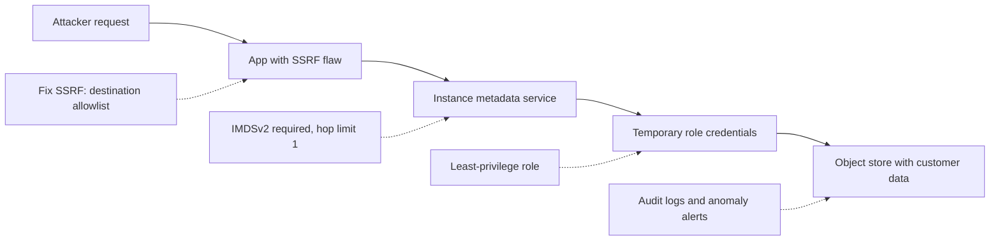
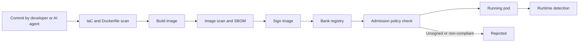
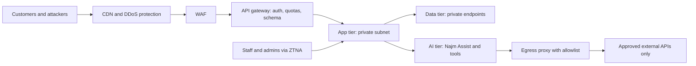

# Module 7 — Cloud and infrastructure

*Najm Bank's applications no longer run on servers in its own data centre. They run on a cloud platform: containers on a managed Kubernetes service, an object store, a managed database and CI/CD pipelines. The code can be clean and the bank can still be breached through one public bucket, one over-privileged role or one flat network. This module covers the layer underneath the application. It starts with who is responsible for what in the cloud, why identity and access management (IAM) is the real perimeter, and why customer-side misconfiguration and leaked credentials, not attacks on the provider, cause most cloud incidents. It then shows how to build and run containers and Kubernetes safely, and how to catch mistakes in infrastructure as code before they are deployed. It ends with network segmentation, the edge (CDN, WAF and API gateway) and DDoS protection, which limit what an attacker can reach and keep the service up under a flood. You will follow Ali as he finds a public invoice bucket, Tariq's team as it hardens the cluster that runs Najm Assist's tools, Mariam as her red team walks across a flat internal network, and Jassim as he plans for a salary-day flood.*

> **Phases:** Design, Build, Deploy, Operate — making the platform under every Najm Bank application secure by default, enforced in code, and observable when someone tries to get past it.

---

# 7.1 — Cloud security: shared responsibility, IAM and misconfiguration
*Level: 🟡 Intermediate* · *Prerequisites: 1.2, 2.3, 5.2* · *Phase: Design, Deploy*

## ⚡ In 60 seconds
- The **shared responsibility model**: the provider secures the cloud itself (buildings, hardware, virtualisation, managed-service internals). You secure what you put in it and how you configure it. The split moves with the type of service.
- In the cloud, **identity is the perimeter**. Every API call is checked against IAM policy, so an over-privileged role or a leaked key is worth more to an attacker than an open port.
- Most cloud breaches start with customer-side mistakes, above all **misconfiguration** and weak or leaked credentials (public storage, wildcard permissions, long-lived keys, logging off), not a clever attack on the provider.
- The rule that matters most: workloads and pipelines get **short-lived credentials through federation**, scoped to exactly what they need. Humans get no standing admin rights.
- Decision cue: "which identity does this run as, what can it do, and what stops it being made public?"
- Biggest trap: fixing things by hand in the console. Guardrails belong in code and organisation-wide policies, or they drift back.

## 🧭 Why it matters
In Ali's first week, the cloud posture scanner lists a "public bucket, high" in a test account. Three weeks earlier, a developer had turned off public-access blocking "for an hour" so a product manager could show a partner what SME Portal invoices look like. The bucket was a copy of production made for a migration test, so it held real invoices: company names, account numbers, amounts. The alert went to a mailbox no one reads.

Noura does not ask "who did this?". She asks: "Why could one person do this in one click, with real customer data, and why did it take three weeks to notice?" Each answer is a control. Production data is not copied to test accounts unless masked (5.3). Public access is blocked at the organisation level, so no single account can switch it off. Posture alerts go to a queue with an owner and a deadline.

The public record shows the stakes. In the 2019 Capital One breach, as publicly reported, an attacker used a server-side request forgery (SSRF) weakness, reported to be in a misconfigured web application firewall, to make a server query the cloud's instance metadata service. It returned temporary credentials for the server's role, whose broad storage permissions let the attacker copy data about a very large number of credit-card applicants. The provider's infrastructure did exactly what it was told. Three conditions lined up: an SSRF-prone component, a metadata service that answered simple GET requests (AWS introduced the token-based IMDSv2 later in 2019), and an over-broad role. This lesson is about making sure they never line up at Najm Bank.

## 📐 How it works

### 🟢 The essentials

**Shared responsibility.** The provider is responsible for the **security of the cloud**; the customer is responsible for **security in the cloud**. Where the line falls depends on the service:

| You use… | The provider secures | Najm Bank still secures |
|---|---|---|
| **IaaS** (virtual machines, networks) | Facilities, hardware, virtualisation layer | Operating-system patches, application, network rules, identities, data |
| **Managed Kubernetes** | The above, plus the control plane | Workloads, images, worker-node upgrades (often shared), cluster permissions, network policies, identities, data |
| **PaaS** (managed database, object store, serverless) | The above, plus the service software and its patching | Configuration (public or private, encryption, backups), access policies, data |
| **SaaS** (email, CRM, a hosted LLM API) | Almost everything technical | Accounts, MFA, sharing settings, what data you send to it |

Two things never move to the provider: **your identities and access decisions**, and **your data**.

**IAM on one page.** Identity and access management (IAM) decides who can do what to which resource. The words differ slightly between AWS, Microsoft Azure and Google Cloud, but the ideas are the same:
- **Principal**: who is acting. A human user, a group, a **role** (an identity *assumed* for a short time rather than logged into) or a **workload identity** (a service account for an application or pipeline).
- **Action**: the API operation, such as "read object" or "delete database".
- **Resource**: what the action applies to, such as one bucket.
- **Condition**: when it is allowed, for example only with MFA or only over TLS.
- **Policy**: a document combining these, attached to a principal or to a resource.

Every API request, from the console, a command-line tool, a pipeline or code, is checked against these policies. That is why **identity is the perimeter**: an attacker with valid credentials for a powerful role does not need to break anything.

**Least privilege, concretely.** A policy written in a hurry, or by an AI coding agent asked to "make it work" (6.3), often looks like the first example below. The fixed version grants only what SME Portal's upload service does: write objects into one folder of one bucket. The syntax is AWS's; Azure and Google Cloud express the same idea.

Vulnerable: any storage action on every bucket in the account.

```json
{ "Version": "2012-10-17",
  "Statement": [{ "Effect": "Allow", "Action": "s3:*", "Resource": "*" }] }
```

Fixed: write-only, one bucket, one prefix, TLS only.

```json
{ "Version": "2012-10-17",
  "Statement": [{
    "Effect": "Allow",
    "Action": ["s3:PutObject"],
    "Resource": "arn:aws:s3:::najm-sme-invoices-prod/uploads/*",
    "Condition": { "Bool": { "aws:SecureTransport": "true" } } }] }
```

**The usual misconfigurations.** The OWASP Top 10 has *Security Misconfiguration* as its own category, and in the cloud it is one of the commonest ways in:
- **Public storage**: buckets readable by anyone, often "temporarily".
- **Over-broad identities**: wildcard actions or resources; admin roles on applications.
- **Long-lived access keys** in code, CI variables and laptops (5.2).
- **Open network rules**: databases or admin ports reachable from the internet (7.3).
- **Logging off**: nobody can answer "what did they touch?".
- **Unsafe defaults**: public snapshots, unencrypted backups, public endpoints left on.

### 🟡 Going deeper

**Short-lived credentials through federation.** A long-lived access key is a password that never expires and gets copied around. The modern pattern is **workload identity federation**: the workload proves who it is with a token from a system the cloud trusts, and receives credentials that expire in minutes or hours. Examples: a Kubernetes service account mapped to a cloud role, or a CI system such as GitHub Actions presenting an OpenID Connect (OIDC) token (3.2) to the cloud's token service.

The trap is the **trust policy**, which says *which* tokens may assume the role. If it only checks that the token came from the CI provider, a workflow in someone else's repository may be able to assume your role. Pin it to your repository and environment:

```json
"Condition": {
  "StringEquals": {
    "token.actions.githubusercontent.com:aud": "sts.amazonaws.com",
    "token.actions.githubusercontent.com:sub": "repo:najm-bank/sme-portal:environment:production"
  }
}
```

**The metadata service and SSRF.** Cloud virtual machines can ask a local **instance metadata service** about themselves. On the major providers it sits on the link-local address 169.254.169.254, and it can return temporary credentials for the machine's role or attached service identity. That is dangerous if the application has an SSRF flaw (2.3), because the attacker can make the server ask on their behalf. Defend in layers:
- **IMDSv2** on AWS requires a session token, obtained with a separate PUT request and sent back in a header, which blocks most simple SSRF that can only trigger GET requests. Set it to *required* and set the response hop limit so containers cannot reach it unless they need to. AWS has been moving new launches towards IMDSv2-only defaults; check the current defaults. Azure and Google Cloud require a special request header (`Metadata: true`, `Metadata-Flavor: Google`) for a similar effect.
- **Fix the SSRF** with a destination allowlist (2.3).
- **Block egress** to the metadata address from workloads that do not need it (7.2, 7.3).
- **Keep the role narrow**, so stolen credentials open very little.
- **Detect** role credentials used from outside your network; providers' threat-detection services can flag this.



Each dotted line is an independent control that breaks the chain: defence in depth (1.2) on a real attack path.

**Guardrails above the account.** Teams make mistakes; organisation-level policies stop those mistakes taking effect. Each provider offers **organisation guardrail policies** that apply to every account or project underneath: AWS Organizations service control policies (SCPs), Azure Policy and the Google Cloud Organization Policy Service. The Najm Bank rules are in the baseline below. Preventive guardrails ("you cannot") beat detective ones ("we will tell you later"), but you need both.

**Posture management.** A **cloud security posture management (CSPM)** tool continuously compares your cloud configuration with a baseline, usually the **CIS Benchmarks** (consensus hardening guides from the Center for Internet Security) plus your own rules. Open-source scanners such as Prowler and ScoutSuite do this, as do providers' built-in tools. CSPM finds drift but does not fix it, and its many findings need prioritising (🔴 below).

**Audit logs are evidence.** Turn on the provider's API audit log (AWS CloudTrail, Azure Activity Log, Google Cloud Audit Logs) in every account, and add data-access logging for sensitive stores (on Azure, through each resource's diagnostic logs). Send it to a separate, locked-down log account where the people it records cannot delete it. Jassim's team builds detections on it in 10.1.

### 🔴 Expert view

**Limit the blast radius by design.** A **landing zone** (a pre-built multi-account structure; most providers publish a reference design) separates production, non-production, security tooling, logging and shared networking into different accounts or projects. A compromised developer sandbox cannot reach production data, because no trust path exists. Unmasked production data never lands in non-production accounts, which is exactly the rule the invoice-bucket incident broke.

**Look for toxic combinations.** A CSPM tool can report thousands of medium findings; an attacker needs one path. Prioritise where findings **combine**: internet exposure, plus an exploitable weakness, plus an identity that can reach sensitive data. That is the shape of the Capital One chain. Commercial platforms (often sold as CNAPP, cloud-native application protection platforms) build this graph; you can approximate it by tagging resources with data sensitivity and exposure. Score paths with the methods of 1.3, not the scanner's default severity. MITRE ATT&CK's cloud matrix (with techniques such as *Unsecured Credentials: Cloud Instance Metadata API*) helps check that each relevant technique has a control or a detection.

**Right-size permissions with evidence.** Nobody writes a perfect policy on day one. Where you cannot start narrow, grant a broader policy in non-production, record which actions are actually used from the audit logs, and generate the production policy from that. Providers offer tools that report unused permissions (for example AWS IAM Access Analyzer and Google Cloud's IAM recommender).

**No standing admin for humans.** Engineers are read-only by default and request elevated access **just in time**, with a reason, a time limit, approval and logging. Root accounts are **break-glass** only: hardware-key MFA and an alert on every use.

**Keys and data location.** Use **customer-managed keys** (5.1) for confidential data, with key administrators separate from data users. Where law limits where data may be stored, region restrictions become a guardrail too (11.2).

**AI services are cloud resources.** Najm Assist's hosted model and Credit Memo Copilot's managed vector store have IAM, network exposure and logs like any other resource. Use private networking for model endpoints where supported, keep LLM API keys in the secrets manager with one key per service and spending limits, and log who called which model. A leaked LLM key is both a data risk and a bill (OWASP LLM10, Unbounded Consumption).

## 🧰 The toolkit
| Control, standard or tool | What it is and does | When to reach for it |
|---|---|---|
| **Shared responsibility model** | The provider's statement of what it secures and what you secure | Choosing a service; threat modelling; "isn't that the provider's job?" |
| **Least-privilege IAM** | Policies scoped to specific actions, resources and conditions | Every role, service account and pipeline |
| **Workload identity federation** | Short-lived credentials issued against a trusted token, replacing static keys | CI/CD to cloud; pods to cloud APIs |
| **IMDSv2** (AWS) | Session-token metadata service that resists simple SSRF | Every AWS virtual machine and node; set to required |
| **Organisation guardrail policies** (AWS SCPs, Azure Policy, Google Cloud Organization Policy) | Rules above every account that teams cannot override | Blocking public storage, protecting audit logs, restricting regions |
| **CSPM** (e.g. Prowler, ScoutSuite) | Continuous scan of cloud configuration against a baseline | From the first account; prioritised by toxic combinations |
| **CIS Benchmarks** (Center for Internet Security) | Consensus hardening baselines per cloud provider and platform | Defining "secure configuration"; audit evidence |
| **Cloud audit logs** (AWS CloudTrail, Azure Activity Log, Google Cloud Audit Logs) | Records of management and chosen data-access API calls | Always on, in a separate locked log account (10.1) |

## 🏛️ In practice at Najm Bank
Ali drafts the **Najm Cloud Guardrail Baseline v1**; Tariq reviews it and Hamad (CISO) approves it.

| ID | Rule | How it is enforced | Owner and exceptions |
|---|---|---|---|
| CG-01 | No object storage may be public | Organisation guardrail denies public policies; account-level public-access block; CSPM alert | Platform team; public website assets only, in a dedicated account |
| CG-02 | No long-lived cloud keys for workloads or CI | OIDC federation for all pipelines; alert on any new access key | Platform team; none in production |
| CG-03 | IMDSv2 required on every virtual machine and node | Guardrail at launch; hop limit 1 on Kubernetes nodes | Platform team; none |
| CG-04 | Audit logs on everywhere, stored write-once in the log-archive account | Guardrail denies stopping or deleting trails | SOC (Jassim); none |
| CG-05 | No wildcard actions on production resources | IaC policy check in CI (7.2); quarterly unused-permission review | Service owners; time-boxed, approved by Noura |
| CG-06 | No unmasked production data in non-production accounts | Guardrail on cross-account copies; scan for personal data | Data owners with Sara (DPO) |
| CG-07 | Customer data only in approved regions | Guardrail denying other regions | Platform team with Layla |
| CG-08 | No standing human admin; break-glass with hardware MFA | Just-in-time access; alert on break-glass login | IAM team; none |
| CG-09 | Model endpoints and LLM keys follow CG-01 to CG-08 | Private endpoints; keys in secrets manager with spending limits | AI platform (Dana, Tariq) |

Each production role also gets a **role review card**: the workload that assumes it, what its trust policy is pinned to, actions granted, actions actually used in the last 90 days (from audit logs), the most sensitive data it can reach, and who last reviewed it.

## 🛠️ Exercises
- 🟢 For three systems you work with (or Najm Mobile's API, SME Portal's invoice bucket and Najm Assist's hosted model), write a shared responsibility table: what the provider secures, what you secure, and one misconfiguration that would be entirely your fault. *Done when:* every row names at least one identity setting and one data setting on your side.
- 🟡 In a personal sandbox cloud account that you own, create a role with a wildcard storage policy. Rewrite it to the least privilege a single upload service needs, and confirm with the provider's policy simulator or a test call that read and delete are denied. Delete the resources afterwards. *Done when:* the write succeeds, read and delete fail, and the trust policy names one specific principal.
- 🔴 Run an open-source CSPM scanner such as Prowler against your own sandbox account only. Group the findings into toxic combinations and write a one-page prioritised fix list. *Done when:* each of your top three items names the attack path it breaks, and at least one finding is deliberately deprioritised with a written reason.

## ⚠️ Mistakes and traps
- **"The provider handles security."** The provider secures the platform; your IAM, data and settings are yours. Write the split down per service.
- **"Temporary" public access or wildcards.** Temporary settings stay. Block public storage at the organisation level and route exceptions through approval.
- **Static keys in pipelines.** CI variables leak through logs and forks. Use OIDC federation pinned to repository and environment.
- **Fixing in the console.** Manual fixes drift back. Fix it in infrastructure as code (7.2) and add a check.
- **Ignoring the metadata service.** It turns any SSRF into credential theft. Require IMDSv2 or the equivalent header protection, block egress to it, and keep the role narrow.

## 🧾 Recap
- The provider secures the cloud; you secure your identities, data and configuration in it.
- IAM is the perimeter: scope every policy to actions, resources and conditions, and prefer short-lived federated credentials to static keys.
- Most cloud incidents are customer-side misconfigurations or credential mistakes. Organisation-level guardrails prevent many of them, and CSPM finds what slips through.
- SSRF, the metadata service and an over-privileged role form a known chain; each layered control breaks it.
- Separate accounts limit blast radius; locked audit logs are your evidence.

## ✍️ Check yourself

**1. Najm Bank moves SME Portal's database from a self-managed virtual machine to the provider's managed database service. Which responsibility moves to the provider?**

- A. Deciding who may connect to the database
- B. Patching the database engine and the operating system beneath it
- C. Deciding whether it has a public endpoint
- D. Classifying the customer data in it

<details><summary>Answer</summary>

**B.** On a managed (PaaS) service, the provider patches the engine and operating system. Access (A), exposure (C) and data (D) stay with the customer. (🟢 The essentials.)

</details>

**2. Ali finds the CI pipeline deploying to production with an access key stored as a CI variable two years ago. What is the best replacement?**

- A. Rotate the key every 90 days
- B. Move the key into an encrypted file in the source repository
- C. Use OIDC workload identity federation, with the role's trust policy pinned to the bank's repository and production environment
- D. Give the pipeline a separate admin user with MFA

<details><summary>Answer</summary>

**C.** Federation issues short-lived credentials and removes the static key; pinning the trust policy stops other repositories assuming the role. A keeps a long-lived secret; D adds admin rights and cannot work unattended. (🟡 Going deeper.)

</details>

**3. An authorised penetration tester reports an SSRF flaw in a reporting service on a cloud virtual machine. Which combination MOST reduces the chance of a data breach?**

- A. Fix the SSRF with a destination allowlist, require IMDSv2, and scope the machine's role to the minimum
- B. Add a CAPTCHA to the reporting page
- C. Move the service to a larger instance type
- D. Rely on the provider, because the metadata service is the provider's responsibility

<details><summary>Answer</summary>

**A.** These break the SSRF-to-metadata-to-credentials-to-data chain at three independent points. D misreads shared responsibility: metadata settings and role permissions are the customer's. (🟡 Going deeper.)

</details>

**4. The CSPM tool reports 2,400 findings across Najm Bank's accounts. Where should Ali start?**

- A. With the oldest findings
- B. With findings where internet exposure, an exploitable weakness and an identity that can reach sensitive data occur together
- C. With every finding the tool rates "critical", in alphabetical order
- D. By turning off the noisiest rules

<details><summary>Answer</summary>

**B.** Toxic combinations are real attack paths, so fixing them reduces risk fastest. C trusts default severity without context; D hides problems. (🔴 Expert view.)

</details>

**5. Why does Najm Bank block public storage with an organisation-level guardrail instead of trusting each team to configure buckets correctly?**

- A. Organisation guardrails are cheaper than buckets
- B. Because CSPM tools cannot detect public buckets
- C. Because the shared responsibility model makes the provider responsible for bucket settings
- D. Because nobody working in one account can override a preventive control set above it, so one mistake cannot expose data

<details><summary>Answer</summary>

**D.** A preventive control turns "please configure it correctly" into "it cannot be done". B is false: CSPM detects public buckets, but only afterwards. C misreads shared responsibility: bucket settings are the customer's. (🟡 Going deeper.)

</details>

## 📚 References
- AWS, Shared Responsibility Model — https://aws.amazon.com/compliance/shared-responsibility-model/
- Microsoft, Shared responsibility in the cloud — https://learn.microsoft.com/en-us/azure/security/fundamentals/shared-responsibility
- OWASP Top 10 (2021 edition; check the current list): Security Misconfiguration and Server-Side Request Forgery — https://owasp.org/Top10/
- OWASP Server-Side Request Forgery Prevention Cheat Sheet — https://cheatsheetseries.owasp.org/cheatsheets/Server_Side_Request_Forgery_Prevention_Cheat_Sheet.html
- MITRE ATT&CK, Cloud matrix — https://attack.mitre.org/matrices/enterprise/cloud/
- Center for Internet Security, CIS Benchmarks — https://www.cisecurity.org/cis-benchmarks
- AWS documentation, Amazon EC2 instance metadata and IMDSv2 — https://docs.aws.amazon.com/ec2/
- OWASP Top 10 for LLM Applications (2025), LLM10 Unbounded Consumption — https://genai.owasp.org/

---

# 7.2 — Containers, Kubernetes and infrastructure as code
*Level: 🟡 Intermediate* · *Prerequisites: 6.2, 7.1* · *Phase: Build, Deploy*

## ⚡ In 60 seconds
- A **container** is an ordinary process isolated by the host's kernel, which it shares with every other container on the machine. It is not a strong security boundary like a virtual machine.
- Build **small, pinned images** with no secrets inside, run them **as non-root** with no extra privileges, and scan and sign them (6.2).
- **Kubernetes** defaults are permissive: pods can talk to each other, run as root and receive an API token. Turn on the **Restricted Pod Security Standard**, **least-privilege RBAC**, **default-deny network policies** and properly managed **Secrets**.
- **Infrastructure as code (IaC)** turns misconfigurations into code. Scan it in the pull request, before anything reaches the cloud.
- Decision cue: "if this container is compromised, what can it reach, what can it change, and would we notice?"
- Biggest trap: treating namespaces as hard walls between tenants, or between sensitive and untrusted workloads.

## 🧭 Why it matters
Tariq's team is moving Najm Assist's **tool service**, the code that actually freezes cards and opens disputes when the assistant asks, onto the bank's managed Kubernetes cluster. Ali reviews the Helm chart, much of it generated by an AI coding agent. The container runs as root. `privileged: true` is set "because the health check failed without it". The pod mounts the default service-account token, and that account can read every Secret in the namespace. The core-banking API key sits in plain text in a ConfigMap. There are no network policies, so the pod can reach the Credit Memo Copilot's vector store and the node's metadata service. Each line was a small convenience. Together, one code-execution bug in the tool service, or a prompt-injected agent that finds one, would give an attacker card operations and a route to the rest of the cluster.

Exposed and weakly configured container platforms are a well-documented target. Researchers and government agencies have repeatedly reported Kubernetes dashboards, API servers and container daemons left open to the internet and abused, usually for cryptocurrency mining and sometimes as a foothold into the wider cloud account. The NSA and CISA published joint Kubernetes hardening guidance in 2021 (since updated), a sign that defaults alone are not enough for production. This lesson turns that kind of guidance into a baseline the platform enforces automatically.

## 📐 How it works

### 🟢 The essentials

**What a container really is.** On Linux, a container is a process that the kernel isolates with **namespaces** (what it can see: its own processes, network and filesystem view) and **cgroups** (how much CPU and memory it may use). Further limits can be added: Linux **capabilities** (fine-grained slices of root's power), **seccomp** (which system calls it may make) and **AppArmor or SELinux** (mandatory access control). Every container on a node shares one kernel. A kernel bug, or a badly configured container (privileged mode, host directories mounted inside), can let a process **escape** to the node and reach every other pod there.

**Images.** An **image** is a stack of filesystem layers built from a Dockerfile or equivalent. It inherits every package in its base image, and each package is a potential vulnerability. Layers are permanent: a secret copied in one layer and deleted in the next is still in the image.

Vulnerable:

```dockerfile
# Moving tag, large base image
FROM python:latest
# Copies .env, .git and test data too
COPY . /app
# Secret baked into a layer
ENV CORE_BANKING_API_KEY=live_xxx
RUN pip install -r /app/requirements.txt
# No USER line, so it runs as root
CMD ["python", "/app/main.py"]
```

Fixed (Dockerfile comments must sit on their own lines; a `#` after an instruction is read as an argument):

```dockerfile
# Small base image, pinned by digest
FROM python:3.12-slim@sha256:<pinned-digest>
WORKDIR /app
COPY requirements.txt .
RUN pip install --no-cache-dir --require-hashes -r requirements.txt
# Only the code that runs; a .dockerignore keeps .env and .git out
COPY src/ ./src/
RUN useradd --uid 10001 --no-create-home app
# Non-root user
USER 10001
CMD ["python", "-m", "src.main"]
# Secrets arrive at runtime from the secrets manager, never in the image (5.2)
```

Go further with **multi-stage builds** (compile in one stage, copy only the result into a minimal runtime image), **minimal or "distroless" base images** with no shell or package manager, **image scanning** in CI and in the registry (Trivy and Grype are common open-source scanners), an **SBOM** per image, and **signing** (6.2).

**Kubernetes in five objects.** Kubernetes runs containers across machines called **nodes**. The **control plane**, centred on the **API server**, holds the cluster's desired state; on a managed service, the provider runs and patches it.
- **Pod**: one or more containers scheduled together; the unit that runs.
- **Namespace**: a logical grouping for names, policies and quotas.
- **Service account**: the identity a pod uses to call the Kubernetes API and, through federation, cloud APIs (7.1).
- **RBAC** (role-based access control): a **Role** grants verbs (get, list, create, delete…) on resources; a **RoleBinding** gives it to a user, group or service account. ClusterRoles and ClusterRoleBindings work cluster-wide.
- **Secret**: an object for sensitive values. In upstream Kubernetes its data is only **base64-encoded** by default, not encrypted in the cluster's datastore. Some managed services now add encryption at rest, but anyone who can read the object through the API still sees the value.

**The secure-by-default four.** Kubernetes ships permissive. Production needs:
- **Pod Security Standards**: three built-in profiles. **Privileged** has no restrictions; **Baseline** blocks known privilege escalations such as privileged containers; **Restricted** also requires non-root, no privilege escalation, all Linux capabilities dropped and a seccomp profile. The built-in **Pod Security Admission** controller enforces them per namespace through a label.
- **Least-privilege RBAC**: no `cluster-admin` for workloads, no wildcards, and no API token in pods that never call the API.
- **Network policies**: by default every pod can reach every other pod. Add a default-deny policy per namespace, then explicit allows (7.3). Policies only work if the cluster's network plugin enforces them.
- **Secrets done properly**: encryption at rest with a key from the cloud's key management service, tight RBAC on reading them, and preferably an external secrets manager synced in at runtime.

### 🟡 Going deeper

**Hardening a workload manifest.** The settings that matter live in the pod's `securityContext`. Ali's chart had this:

```yaml
# Vulnerable: container securityContext
securityContext:
  privileged: true
  runAsUser: 0
```

The fixed pod specification:

```yaml
spec:
  automountServiceAccountToken: false      # this pod never calls the API
  containers:
  - name: card-tools
    image: registry.najm.example/assist/card-tools@sha256:<digest>
    securityContext:
      runAsNonRoot: true
      runAsUser: 10001
      allowPrivilegeEscalation: false
      readOnlyRootFilesystem: true
      capabilities:
        drop: ["ALL"]
      seccompProfile:
        type: RuntimeDefault
```

And the namespace labels that make the API server reject non-compliant pods:

```yaml
apiVersion: v1
kind: Namespace
metadata:
  name: assist-tools
  labels:
    pod-security.kubernetes.io/enforce: restricted
    pod-security.kubernetes.io/warn: restricted
    pod-security.kubernetes.io/audit: restricted
```

The Restricted profile does not require `readOnlyRootFilesystem`, but it is a cheap extra: an attacker with code execution cannot write tools into the filesystem. "The health check failed without privileged mode" almost always hides a narrower problem, such as binding to a port below 1024 or writing to a read-only path.

**RBAC traps.** Some permissions are more powerful than they look:
- `get` or `list` on **secrets** reveals every credential in scope.
- `create` on **pods** (or on Deployments, Jobs and other objects that create pods) in a namespace lets someone run a pod as any service account in that namespace and act with its permissions, and mount any Secret or ConfigMap in that namespace.
- `escalate`, `bind` and `impersonate` let a subject grant itself more access.
- `*` on anything.

Review bindings too: a binding to `system:authenticated` grants the role to every identity the cluster can authenticate. On some managed services that group has included any account with the cloud provider, not just your staff, so check what it means on yours.

**Policy as code at admission.** For Najm Bank's own rules (signed images from the bank's registry only, no `latest` tags, resource limits required), use an **admission control policy engine** such as Kyverno or OPA Gatekeeper. The API server consults it before admitting any object, so a non-compliant manifest is rejected whoever, or whatever, wrote it.

**Infrastructure as code.** IaC describes cloud and cluster resources in files that a tool applies: Terraform or OpenTofu, CloudFormation, Bicep, Kubernetes manifests, Helm charts. Every change is reviewable, versioned and scannable *before* the resource exists.

Vulnerable: the invoice bucket with public-access blocking switched off.

```hcl
resource "aws_s3_bucket_public_access_block" "invoices" {
  bucket                  = aws_s3_bucket.invoices.id
  block_public_acls       = false
  block_public_policy     = false
  ignore_public_acls      = false
  restrict_public_buckets = false
}
```

Fixed: all four switches on, plus encryption with a customer-managed key.

```hcl
resource "aws_s3_bucket_public_access_block" "invoices" {
  bucket                  = aws_s3_bucket.invoices.id
  block_public_acls       = true
  block_public_policy     = true
  ignore_public_acls      = true
  restrict_public_buckets = true
}

resource "aws_s3_bucket_server_side_encryption_configuration" "invoices" {
  bucket = aws_s3_bucket.invoices.id
  rule {
    apply_server_side_encryption_by_default {
      sse_algorithm     = "aws:kms"
      kms_master_key_id = aws_kms_key.invoices.arn
    }
  }
}
```

**IaC scanners** such as Checkov, KICS and Trivy read these files and flag public storage, open network rules, missing encryption, privileged pods and wildcard IAM. Run them in the pull request and as a pipeline gate. Two risks are specific to IaC:
- **State files.** Terraform state can hold secret values in plain text. Keep it in an encrypted, access-controlled remote backend, never in the repository.
- **Drift.** Someone changes a resource by hand. Detect drift on a schedule (a plan that should show no changes) and fix it in code.



### 🔴 Expert view

**Namespaces are soft walls.** Pods in different namespaces still share nodes and the kernel, and RBAC or network-policy mistakes cross namespaces easily. Najm Assist's card-action tools and a job that runs AI-generated analysis code should not share a node. Use **separate node pools** with taints and tolerations (scheduling rules that keep pods apart), or **separate clusters**. For code that is untrusted by design, such as an agent's code-execution sandbox, add a **sandboxed runtime** such as gVisor or Kata Containers, which puts an extra kernel or a lightweight virtual machine between the container and the host.

**Workload identity to the cloud.** A pod that needs cloud APIs should use its own service account mapped to a narrowly scoped cloud role (7.1), not the node's role. Otherwise every pod on the node inherits the node's permissions and, if the metadata service is reachable, can fetch them. Block the metadata address for pods that do not need it.

**Runtime detection.** Prevention misses things. Runtime tools such as Falco watch system calls and Kubernetes audit events for behaviour no legitimate workload shows: a shell started inside a production container, a write to a binary directory, an unexpected process reading the service-account token, a connection to a mining pool. Send those signals to Jassim's SOC (10.1) with a runbook, not to a dashboard nobody watches.

**Baselines and audits.** The **CIS Benchmarks** include Kubernetes and managed-service benchmarks, and the open-source tool kube-bench checks a cluster against them. The NSA/CISA guidance, the OWASP Kubernetes Top Ten and MITRE ATT&CK's containers matrix are useful review checklists. On a managed service, the control-plane part of each benchmark is the provider's job.

**AI agents write infrastructure too.** Coding agents produce Dockerfiles, Helm charts and Terraform quickly, and reach for whatever makes the error disappear: `privileged: true`, `0.0.0.0/0`, `"Action": "*"`. Do not ban them; make the pipeline the reviewer. IaC scanning, admission policies and signed images apply to every change, whoever wrote it (6.3).

## 🧰 The toolkit
| Control, standard or tool | What it is and does | When to reach for it |
|---|---|---|
| **Pod Security Standards** (Kubernetes) | Privileged, Baseline and Restricted profiles, enforced per namespace by Pod Security Admission | Every namespace; Restricted for all application workloads |
| **Kubernetes RBAC** | Roles and bindings granting verbs on resources | Every workload and person; watch secrets, pod creation and escalation verbs |
| **Network policies** (Kubernetes) | Pod-level allow rules for ingress and egress | Default-deny per namespace, then explicit flows |
| **Container image scanning** (e.g. Trivy, Grype) | Finds known-vulnerable packages and secrets in image layers | In CI, and continuously in the registry |
| **IaC scanning** (e.g. Checkov, KICS, Trivy) | Static checks on Terraform, manifests and charts for misconfiguration | Every pull request that touches infrastructure |
| **Admission control** (e.g. Kyverno, OPA Gatekeeper) | Rejects non-compliant objects at the API server | Enforcing registry, signature, tag and resource rules cluster-wide |
| **CIS Benchmarks** (Center for Internet Security) | Consensus hardening baselines per cloud provider and platform | Cluster audits with kube-bench; assurance evidence |
| **Runtime detection** (e.g. Falco) | Alerts on suspicious behaviour inside running containers | Production clusters, wired into SOC runbooks |

## 🏛️ In practice at Najm Bank
Tariq and Ali agree the **Najm Kubernetes Workload Baseline v1**, enforced automatically from the next sprint.

| Rule | Setting | Enforced by | Exceptions |
|---|---|---|---|
| K-01 Restricted profile | `pod-security.kubernetes.io/enforce: restricted` on every application namespace | Pod Security Admission | Listed platform namespaces, reviewed quarterly |
| K-02 Read-only root filesystem, resource limits | `readOnlyRootFilesystem: true`; CPU and memory limits | Kyverno policy | Scratch volume for temporary files |
| K-03 Signed images from the bank registry, no `latest` | Registry prefix and signature check | Kyverno image verification | None in production |
| K-04 No API token unless needed | `automountServiceAccountToken: false` | Kyverno policy | Named accounts approved by AppSec |
| K-05 No secrets in images, environment literals or ConfigMaps | External secrets manager; KMS encryption at rest | Image and IaC scans | None |
| K-06 Default-deny network policy | Explicit allows only; metadata address blocked | Onboarding script; cluster scan | Documented flows only (7.3) |
| K-07 Isolate sensitive and untrusted code | Tool service on its own node pool; sandboxes on gVisor nodes | Taints, tolerations, admission policy | None |
| K-08 IaC gate | Checkov and Trivy scans on every pull request; high findings block the merge | CI pipeline | Time-boxed waiver approved by Noura |

**The review question for every chart:** "If this pod runs attacker code tomorrow, what can it read, what can it call and what can it change?" If the answer takes more than three lines, the chart is not finished.

## 🛠️ Exercises
- 🟢 Take a Dockerfile from your own project. Rewrite it with a pinned minimal base image, a non-root user, a `.dockerignore` file and no secrets, then scan the old and new images with an open-source scanner such as Trivy. *Done when:* the new image works, runs as non-root and has fewer findings, and you can explain where the biggest drop came from.
- 🟡 On a local cluster (kind or minikube), label a namespace to enforce the Restricted profile. Try to deploy a pod with `privileged: true`, then a compliant one. Add a default-deny network policy and test that traffic is blocked; if it is not, check whether your network plugin enforces policies and install one that does (for example Calico or Cilium). *Done when:* the privileged pod is rejected, the compliant pod runs, and blocked traffic is demonstrably blocked.
- 🔴 Run an IaC scanner (Checkov, KICS or Trivy) on Terraform or manifests you own, or on a deliberately insecure training project such as TerraGoat or Kubernetes Goat in a local lab. Fix the three most serious findings, write one custom policy for a Najm-style rule (for example "no network rule open to 0.0.0.0/0 on database ports") and run the scan in a CI job. *Done when:* the pipeline fails on the original code, passes on the fixed code, and your custom rule catches a test case you wrote.

## ⚠️ Mistakes and traps
- **"It's in a container, so it's isolated."** Containers share the host kernel. Run them non-root and unprivileged, and isolate high-risk workloads.
- **`privileged: true` to fix a start-up error.** Find the real cause (a port, a file path, one capability) and grant only that.
- **Treating Kubernetes Secrets as encrypted.** They are base64-encoded by default. Add KMS encryption at rest and tight read access.
- **Network policies that do nothing.** If the network plugin does not enforce them, they are decoration. Test that blocked traffic really is blocked.
- **Scanning an image once.** Old images gain new vulnerabilities daily. Rescan in the registry and rebuild on a schedule.
- **Terraform state in the repository.** State can hold secrets. Use an encrypted, locked remote backend with tight access.

## 🧾 Recap
- Containers share a kernel. Build small, pinned, signed images without secrets and run them as non-root.
- Kubernetes defaults are permissive: enforce the Restricted profile, least-privilege RBAC, default-deny network policies and managed Secrets.
- IaC turns misconfigurations into reviewable code: scan every pull request, protect the state, and detect drift.
- Admission control makes the baseline non-negotiable for every author, human or AI, and runtime detection catches what gets through.
- Namespaces are soft walls. Use separate node pools, clusters or sandboxed runtimes for workloads with very different risk.

## ✍️ Check yourself

**1. The Helm chart for Najm Assist's tool service sets `privileged: true` because "the health check failed without it". What should Ali ask for?**

- A. Keep privileged mode, with a comment explaining why
- B. Move the pod to a namespace where privileged mode is allowed
- C. Accept it, because the provider manages the cluster
- D. Find the real cause, grant only the narrow fix it needs, and enforce the Restricted profile on the namespace

<details><summary>Answer</summary>

**D.** Privileged mode removes most isolation between container and node, and the real cause usually has a much narrower fix. B moves the problem; C misreads shared responsibility, since workload settings are the customer's. (🟡 Going deeper.)

</details>

**2. A developer says: "The core-banking API key is safe because it is stored as a Kubernetes Secret." Which response is correct?**

- A. Correct: Secrets are always strongly encrypted
- B. Correct, as long as the namespace has a network policy
- C. Not by itself: Secret data is only base64-encoded by default, so add KMS encryption at rest, tight RBAC on reading Secrets, and preferably an external secrets manager
- D. Not correct: the key belongs in a ConfigMap

<details><summary>Answer</summary>

**C.** Base64 is an encoding, not encryption; anyone allowed to read the Secret can read the value. D is worse: ConfigMaps are for non-sensitive data. (🟢 The essentials.)

</details>

**3. In an RBAC review, Ali sees that the deployment pipeline's service account can only `create` pods in the production namespace, with no permission on Secrets. Why is this still sensitive?**

- A. It is not sensitive, because it cannot read Secrets
- B. Creating pods can only cause performance problems
- C. Whoever controls the pipeline can create a pod that runs as any service account in that namespace and mounts any Secret there, gaining those permissions and values
- D. Pod creation matters only in `kube-system`

<details><summary>Answer</summary>

**C.** Creating pods effectively grants the permissions of every service account in the namespace and the contents of every Secret that can be mounted there, even without any direct permission on Secrets. A looks only at the direct grant. (🟡 Going deeper.)

</details>

**4. An AI coding agent writes a Terraform change that opens the managed database to 0.0.0.0/0. Where is the most reliable place to stop it?**

- A. In the pull request and pipeline: an IaC scan and policy gate that fail the build before the change is applied
- B. In the CSPM tool, a day after deployment
- C. By banning AI agents from infrastructure work
- D. In the quarterly access review

<details><summary>Answer</summary>

**A.** Scanning IaC before it is applied stops the misconfiguration from ever existing, whoever wrote it. B is a useful backstop, but only after exposure; C does not scale, and humans make the same mistake. (🟡 Going deeper; 🔴 Expert view.)

</details>

**5. Najm Bank wants to run AI-generated analysis code for Credit Memo Copilot in the same cluster as Najm Assist's card-action tools. Which design is BEST?**

- A. Separate namespaces, and rely on that
- B. A separate node pool with a sandboxed runtime such as gVisor and no network path to the card-action tools, or a separate cluster
- C. The same nodes, with more CPU for the analysis code
- D. Run the analysis code as root so it can install its own libraries

<details><summary>Answer</summary>

**B.** Untrusted code needs a stronger boundary than a namespace: separate nodes or clusters, a sandboxed runtime and no network path. A treats namespaces as hard walls. (🔴 Expert view.)

</details>

## 📚 References
- Kubernetes documentation, Pod Security Standards — https://kubernetes.io/docs/concepts/security/pod-security-standards/
- Kubernetes documentation, Using RBAC Authorization — https://kubernetes.io/docs/reference/access-authn-authz/rbac/
- Kubernetes documentation, Network Policies — https://kubernetes.io/docs/concepts/services-networking/network-policies/
- NIST SP 800-190, Application Container Security Guide — https://csrc.nist.gov/pubs/sp/800/190/final
- NSA and CISA, Kubernetes Hardening Guidance (first published 2021; check for the current version) — https://www.cisa.gov/
- OWASP Kubernetes Top Ten — https://owasp.org/www-project-kubernetes-top-ten/
- OWASP Docker Security Cheat Sheet — https://cheatsheetseries.owasp.org/cheatsheets/Docker_Security_Cheat_Sheet.html
- OWASP Kubernetes Security Cheat Sheet — https://cheatsheetseries.owasp.org/cheatsheets/Kubernetes_Security_Cheat_Sheet.html
- Center for Internet Security, CIS Benchmarks — https://www.cisecurity.org/cis-benchmarks
- MITRE ATT&CK, Containers matrix — https://attack.mitre.org/matrices/enterprise/containers/

---

# 7.3 — Networks and the edge: segmentation, WAFs and DDoS
*Level: 🟡 Intermediate* · *Prerequisites: 1.2, 4.2, 7.1* · *Phase: Design, Operate*

## ⚡ In 60 seconds
- **Segmentation** divides the network into zones with explicitly allowed flows, so one compromise cannot reach everything. Deny by default, inbound *and* outbound.
- **Egress control** (limiting where workloads connect *out* to) is one of the most neglected controls. It blocks SSRF to metadata services, data theft, and agents sending data where they should not.
- The **edge** (CDN, DDoS protection, WAF and API gateway) absorbs floods, filters obvious attacks and enforces rate limits before traffic reaches your code.
- A **web application firewall (WAF)** buys time and filters noise; it is not a fix.
- **DDoS** attacks are volumetric, protocol or application-layer. Defend with upstream capacity, caching, per-client rate limits, cheap or protected expensive operations, and a rehearsed runbook.
- Biggest trap: a flat internal network behind a strong edge. Zero trust (1.2) means every internal call is authenticated and authorised too.

## 🧭 Why it matters
In an authorised internal test, Mariam's red team starts, as agreed in the scope, from one compromised developer laptop on the corporate network. Within a day they reach the Credit Memo Copilot's vector database, which has no authentication because "it is only internal", and SME Portal's internal admin page. Nothing was exploited cleverly; the network simply allowed it. Her report has one sentence in bold: *"Internal" is not a security control.*

Meanwhile, Jassim is preparing for salary day, Najm Mobile's busiest hour and the worst time for a denial-of-service attack. Application-layer floods are cheap to launch and hard to tell apart from real customers. In October 2023, several large providers disclosed the "HTTP/2 Rapid Reset" technique (CVE-2023-44487), which had been used to send record-breaking request floods to HTTP/2 servers. And the edge itself can be the weak point: in the Capital One case (7.1), public reporting described the entry point as a misconfigured web application firewall. This lesson designs Najm Bank's zones and edge so that one mistake stays contained and a flood is absorbed.

## 📐 How it works

### 🟢 The essentials

**Zones and flows.** A **network zone** groups systems with similar trust and exposure. **Segmentation** puts controls between zones and allows only the flows the business needs. The cloud building blocks are:
- **Virtual network** (VPC on AWS and Google Cloud, VNet on Azure): your private address space, split into **public subnets** (reachable from the internet; only the edge belongs here) and **private subnets** (no direct internet route).
- **Security groups** (network security groups on Azure, VPC firewall rules on Google Cloud): stateful rules attached to resources or subnets. Where you can, refer to other groups, tags or service identities rather than IP ranges.
- **Private endpoints**: reach managed services (object store, database, model endpoints) over the private network, then switch their public endpoint off.
- **Kubernetes network policies** for pod-to-pod flows inside a cluster (7.2).

Vulnerable: the database is reachable from the whole internet.

```hcl
resource "aws_security_group_rule" "db_in" {
  type              = "ingress"
  from_port         = 5432
  to_port           = 5432
  protocol          = "tcp"
  cidr_blocks       = ["0.0.0.0/0"]
  security_group_id = aws_security_group.db.id
}
```

Fixed: only the application tier's security group may connect.

```hcl
resource "aws_security_group_rule" "db_in" {
  type                     = "ingress"
  from_port                = 5432
  to_port                  = 5432
  protocol                 = "tcp"
  source_security_group_id = aws_security_group.app.id
  security_group_id        = aws_security_group.db.id
}
```

**Egress: the forgotten direction.** Teams lock the front door and leave the windows open: by default, cloud workloads can usually connect anywhere on the internet. That makes three attacks easy. SSRF can reach the metadata service or internal admin APIs (2.3, 7.1). An attacker can **exfiltrate** (send out) data to their own server. And an AI agent with a web-fetch or email tool can send private data to an attacker after reading injected instructions. That last case is the "lethal trifecta" of private data, untrusted content and external communication, a framing by Simon Willison (2025) covered in 9.2. Default-deny egress, with an allowlist of the destinations each service genuinely needs, breaks all three.

**The edge, layer by layer.** A request from the internet to Najm Mobile's API passes through:
- a **CDN** (content delivery network), which caches content close to users and can absorb very large volumes of traffic;
- **DDoS protection** from the cloud provider or CDN, which filters floods before they reach you;
- a **WAF** (web application firewall), which blocks HTTP requests that match attack patterns;
- an **API gateway**, which authenticates callers, enforces quotas and per-client rate limits (4.2), and validates requests against the API schema.

TLS is terminated at the edge and, for a bank, re-encrypted to the services behind it (5.1).

**WAFs: useful but limited.** The most widely used open rule set is the **OWASP CRS** (Core Rule Set). It runs on engines such as ModSecurity and Coraza, is supported by many commercial WAFs, and catches common injection and XSS patterns and scanner traffic. Know its limits. It sees requests, not business logic, so it cannot spot broken object-level authorisation (4.1). It produces **false positives**, blocking real customers whose input looks like an attack (names with apostrophes, rich text), so start in **detection mode** (log only) and tune before blocking; CRS "paranoia levels" trade more detection for more false positives. And attackers **bypass** pattern rules with encoding and obfuscation.

So a WAF is a layer, not a fix. Its best use is **virtual patching**: a temporary rule that blocks a known exploit pattern while the real fix is built. During Log4Shell (6.2), WAF vendors shipped rules within days, and obfuscated variants that slipped past simple rules were widely reported. The virtual patch bought time; upgrading the library closed the hole.

**DDoS in three shapes.** A distributed denial-of-service (DDoS) attack uses many machines to exhaust a resource so that real users cannot be served.

| Type | What it does | Main defence |
|---|---|---|
| **Volumetric** | Floods network bandwidth | Upstream capacity: the provider's or CDN's DDoS service, anycast networks |
| **Protocol** | Exhausts connection tables, for example SYN floods | Edge services and load balancers built to absorb them |
| **Application-layer** (layer 7) | Sends real-looking HTTP requests, often to expensive endpoints | Caching, per-client rate limits, bot management, authentication on expensive operations |

For application-layer floods, design matters more than appliances. A statement-export endpoint that runs a heavy query for anonymous users is a gift to an attacker. The OWASP API Security Top 10 calls this **Unrestricted Resource Consumption** (API4). For LLM features it is **Unbounded Consumption** (LLM10), where every request costs real money, sometimes called "denial of wallet".

### 🟡 Going deeper

**Rate limiting.** The gateway enforces broad limits; the service enforces business limits. A minimal example in NGINX syntax:

```nginx
# Per-client limit for the public API: 10 requests a second, short bursts allowed
limit_req_zone $binary_remote_addr zone=api:10m rate=10r/s;

server {
  location /v1/ {
    limit_req zone=api burst=20 nodelay;
    limit_req_status 429;
    proxy_pass http://najm_api;
  }
}
```

Behind a CDN, `$binary_remote_addr` is the CDN's address, so this would throttle the CDN itself: restore the client address from the CDN's header, trusting that header only from the CDN's published ranges. Where you can, limit per customer, device or API key, not only per IP address: many customers share mobile-carrier addresses, and attackers rotate theirs. For Najm Assist, add **token budgets** per user and session, a maximum input size, and a cap on tool calls per conversation.

**Egress for agents, in practice.** Kubernetes network policies match IP addresses, namespaces and labels, not domain names. To allow specific external domains (the LLM provider, a card-network API), route outbound traffic through an **egress proxy** that checks the destination name, logs every connection and refuses the rest; some network plugins also support domain-based policies. This policy lets Najm Assist's card-tools pod reach only the core-banking gateway and DNS:

```yaml
apiVersion: networking.k8s.io/v1
kind: NetworkPolicy
metadata:
  name: card-tools-egress
  namespace: assist-tools
spec:
  podSelector:
    matchLabels: { app: card-tools }
  policyTypes: ["Egress"]
  egress:
  - to:
    - namespaceSelector:
        matchLabels: { kubernetes.io/metadata.name: core-banking-gw }
    ports: [{ protocol: TCP, port: 8443 }]
  - to:
    - namespaceSelector:
        matchLabels: { kubernetes.io/metadata.name: kube-system }
    ports: [{ protocol: UDP, port: 53 }, { protocol: TCP, port: 53 }]
```

Everything else is denied: the internet, the metadata address and the Credit Memo Copilot's vector store.



**Protect the origin.** A CDN and WAF only help if attackers cannot go around them. Make the **origin** (the load balancer or gateway behind the edge) accept traffic only from the edge: restrict it to the CDN's published address ranges or, better, require an authenticated connection such as mutual TLS. Do not leak origin addresses through old DNS records or error pages.

**DNS hygiene.** A **dangling DNS record** still points at a cloud resource you have deleted; someone else may claim that resource and serve content on your domain (**subdomain takeover**). Remove records with resources, scan zones for orphans, and manage DNS as code (7.2).

### 🔴 Expert view

**From perimeter to zero trust.** NIST SP 800-207, *Zero Trust Architecture* (2020), frames the shift: no implicit trust based on network location, and every request authenticated and authorised using identity, device health and context. At Najm Bank this means:
- **Service-to-service authentication** with mutual TLS (often through a service mesh) and workload identities, so the vector database refuses callers that are not Credit Memo Copilot, even from inside the network.
- **Zero trust network access (ZTNA)** for staff, instead of a VPN that drops a laptop onto a flat network.
- **Separate admin paths**: management interfaces (the Kubernetes API, databases, cloud consoles) reachable only from a management zone, through ZTNA or bastion services with session recording.

CISA's Zero Trust Maturity Model (version 2.0, 2023) is a useful yardstick. Segmentation does not go away under zero trust; it becomes finer-grained (**microsegmentation**) and identity-aware.

**Design for DDoS before the attack.** Jassim's checklist: which endpoints are expensive, and are they cached, authenticated or rate-limited? What does autoscaling do under a flood, and is there a cost ceiling? Is the DDoS provider's response contact current? What can be switched off so that login, balances and transfers stay up? Rehearse it in a tabletop exercise (10.2). EU DORA, which applies from January 2025, expects financial entities to demonstrate digital operational resilience, including testing, and QCB sets cybersecurity and resilience expectations for banks in Qatar. See 11.2, and check the current texts rather than assuming specific requirements.

**Watch the edge.** WAF blocks by rule, rate-limit hits by client, error spikes and unusual user agents are rich signals for the SOC (10.1). A sudden rise in WAF blocks on one endpoint often means someone has found something worth probing.

**The edge is software too.** WAFs, load balancers, VPN appliances and gateways have their own vulnerabilities, and internet-facing edge devices have been a favoured way in for attackers in many publicly reported campaigns. Patch them quickly (CISA's Known Exploited Vulnerabilities catalogue is a good priority signal; see 10.3), keep their management interfaces off the internet, and include them in authorised testing.

## 🧰 The toolkit
| Control, standard or tool | What it is and does | When to reach for it |
|---|---|---|
| **Network segmentation** | Zones with default-deny rules and explicitly allowed flows | Every environment; reviewed for each new data flow |
| **Egress filtering** | Default-deny outbound traffic with a destination allowlist and an egress proxy | Sensitive workloads; every AI agent with external tools |
| **Private endpoints** | Private-network access to managed services, with public endpoints switched off | Databases, object stores, vector stores, model endpoints |
| **Web application firewall** (e.g. OWASP CRS) | Rule-based HTTP filtering and virtual patching | Internet-facing apps and APIs; tuned in detection mode first |
| **DDoS protection service** | Upstream detection and absorption of floods by the cloud provider or CDN | Every internet-facing service customers depend on |
| **API gateway** | Central authentication, quotas, rate limits and schema validation | Najm Mobile's public API and partner APIs |
| **Rate limiting** | Caps on requests, tokens or actions per client over time | Login, search, export and LLM endpoints; per customer, not only per IP address |
| **Zero trust network access** (ZTNA) | Identity- and device-checked access to specific applications instead of a VPN | Staff access to internal applications; admin access to management interfaces |

## 🏛️ In practice at Najm Bank
After Mariam's report, Noura and Tariq publish the **Najm Network Zone and Flow Matrix v1**. Any flow not in the matrix is denied (✗). Adding a flow needs a ticket stating the data classification, and an AppSec review.

| From ↓ / To → | Edge | App tier | Data tier | AI tier | Internet |
|---|---|---|---|---|---|
| **Internet** | HTTPS through CDN only | ✗ | ✗ | ✗ | — |
| **Edge** (CDN, WAF, gateway) | — | Gateway only, mutual TLS | ✗ | ✗ | ✗ |
| **App tier** (Najm Mobile API, SME Portal) | ✗ | Named pairs, mutual TLS | Private endpoints, one identity per service | Najm Assist API only | Egress proxy, allowlist |
| **AI tier** (Najm Assist, Copilot, tools) | ✗ | Core-banking gateway, card tools only | Vector store, Copilot only | Named pairs | LLM provider only, through egress proxy |
| **Management** (ZTNA, bastion) | Admin APIs | Admin APIs | Admin, session recorded | Admin APIs | Patch mirrors only |

Standing rules: the metadata address is denied from all pods except named node agents; no database or vector store has a public endpoint; every allowlisted internet destination has an owner and a review date.

**Salary-day DDoS runbook (excerpt).** Owner: Jassim.

| Step | Action | Who |
|---|---|---|
| Detect | Edge request or error rate above the agreed thresholds for 5 minutes: page SOC and platform on-call | SOC |
| Classify | Within 15 minutes: volumetric, protocol or application-layer? Which endpoints? | SOC, platform team |
| Contain | Tighten rate limits for unauthenticated traffic, challenge suspicious clients, serve cached balances | Platform team |
| Escalate | If edge capacity is at risk, engage the DDoS provider's response team | Jassim |
| Degrade | Switch off non-essential features (statement export, Najm Assist free text); keep login, balances and transfers | Tariq with Rania |
| Communicate | In-app status message; regulator notification where required (11.2) | Communications, Hamad |
| Learn | Post-incident review within 5 working days; update thresholds and this runbook (10.2) | Jassim |

## 🛠️ Exercises
- 🟢 Draw the zones and flows for an application you work on, or for SME Portal: every inbound and outbound connection, with port and purpose. Mark any flow that exists "because it was easier". *Done when:* your flow matrix lists every outbound internet destination and at least one flow you would remove.
- 🟡 In a local lab, run OWASP Juice Shop behind a WAF using the OWASP CRS project's container image. Browse normally in detection mode and count false positives, then try a few classic, widely published test strings (such as `' OR '1'='1` in the search box) and see which are logged. Switch to blocking at a low paranoia level. *Done when:* you can show one true positive blocked, one false positive removed with a narrow exclusion, and a note on something the WAF could not stop, such as a business-logic flaw.
- 🔴 On a local kind or minikube cluster whose network plugin enforces policies, deploy two test services and a "tool" pod. Apply default-deny ingress and egress, then allow only the flows you need, including DNS. Add an egress proxy with a domain allowlist for one external destination. Then write a one-page DDoS runbook for the app's most expensive endpoint. *Done when:* blocked flows are demonstrably blocked, the allowed domain works while others are refused and logged, and the runbook names triggers, actions and owners.

## ⚠️ Mistakes and traps
- **"It's internal, so it doesn't need authentication."** Internal networks get breached. Authenticate and authorise every service call, and segment anyway.
- **Ingress rules only.** Open egress turns SSRF, malware and prompt-injected agents into data theft. Deny outbound by default and keep an allowlist.
- **The WAF as the fix.** A virtual patch buys days, not years. Track the code fix to a deadline.
- **Blocking mode on day one.** An untuned WAF blocks real customers. Tune in detection mode first, with real traffic, including Arabic input and names with apostrophes.
- **Rate limiting by IP address alone.** Customers share carrier addresses; attackers rotate theirs. Limit per customer and API key too.
- **A reachable origin.** If the origin accepts traffic from anywhere, attackers go around the CDN and WAF. Lock it to the edge.

## 🧾 Recap
- Segment into zones with default-deny in both directions. Egress control blocks SSRF, data theft and agent data leaks.
- The edge (CDN, DDoS protection, WAF, API gateway) absorbs floods and noise and enforces quotas, but only if the origin cannot be bypassed.
- A WAF is a tuned layer and a virtual patch, never the fix.
- DDoS defence: upstream capacity, protected expensive endpoints, per-client limits, token budgets for LLMs, and a rehearsed runbook.
- Zero trust means identity-based checks on every request, including inside the network.

## ✍️ Check yourself

**1. Mariam's red team reaches the Credit Memo Copilot's unauthenticated vector database from a developer laptop on the corporate network. Which fix is BEST?**

- A. Add a WAF in front of the internet-facing apps
- B. Require service authentication on the vector database and restrict network flows so only Credit Memo Copilot can reach it
- C. Ask developers to keep their laptops patched
- D. Move the database to another internal subnet with the same rules

<details><summary>Answer</summary>

**B.** It combines zero trust (authenticate every caller) with segmentation (allow only the intended flow). A protects the internet edge, not internal paths; D changes the address, not the access. (🟢 The essentials; 🔴 Expert view.)

</details>

**2. Najm Assist is getting a web-fetch tool. Which network control most directly stops injected instructions from making it send customer data to an attacker's server?**

- A. A larger DDoS protection plan
- B. A WAF rule on inbound API requests
- C. Default-deny egress for the AI tier, with outbound traffic only through an egress proxy with an allowlist
- D. A CDN in front of the assistant

<details><summary>Answer</summary>

**C.** Exfiltration is outbound, so egress control breaks the "external communication" leg of the lethal trifecta; 9.2 adds agent-level controls. A, B and D act on inbound traffic. (🟢 The essentials; 🟡 Going deeper.)

</details>

**3. An injection flaw is found in SME Portal's search. The code fix will take two weeks. What is the best use of the WAF?**

- A. A virtual patch for the exploit pattern, monitored, with the code fix tracked to a deadline and the rule removed afterwards
- B. Rely on the WAF permanently and close the ticket
- C. Nothing, because WAFs can be bypassed
- D. Switch the whole WAF to its highest paranoia level in blocking mode

<details><summary>Answer</summary>

**A.** Virtual patching buys time while the real fix is made. B treats a bypassable layer as the fix; D would block many real customers. (🟢 The essentials.)

</details>

**4. On salary day, the statement-export endpoint is flooded by real-looking HTTP requests from thousands of IP addresses. What is this, and what helps most?**

- A. Volumetric; buy more bandwidth
- B. Application-layer; per-client rate limits, caching, authentication on the expensive endpoint, and switching off non-essential features
- C. Protocol; restart the load balancers
- D. Application-layer; block all mobile-carrier traffic

<details><summary>Answer</summary>

**B.** Legitimate-looking requests aimed at an expensive operation mark an application-layer flood; make that operation hard to abuse and degrade gracefully. D blocks real customers. (🟢 The essentials; 🔴 Expert view.)

</details>

**5. Najm Mobile's API sits behind a CDN, DDoS protection and a WAF. Why must the origin accept traffic only from the edge?**

- A. Because the CDN is cheaper than the origin
- B. Because TLS cannot work without a CDN
- C. Because rate limits only work on the origin
- D. Otherwise attackers who find the origin's address can bypass the DDoS protection and the WAF

<details><summary>Answer</summary>

**D.** Edge controls only help if traffic must pass through them. B and C are false. (🟡 Going deeper.)

</details>

## 📚 References
- NIST SP 800-207, Zero Trust Architecture — https://csrc.nist.gov/pubs/sp/800/207/final
- CISA, Zero Trust Maturity Model — https://www.cisa.gov/zero-trust-maturity-model
- OWASP CRS (Core Rule Set) — https://coreruleset.org/
- OWASP API Security Top 10 (2023), API4 Unrestricted Resource Consumption — https://owasp.org/API-Security/
- OWASP Top 10 for LLM Applications (2025), LLM10 Unbounded Consumption — https://genai.owasp.org/
- OWASP Juice Shop — https://owasp.org/www-project-juice-shop/
- NVD, CVE-2023-44487 (HTTP/2 Rapid Reset) — https://nvd.nist.gov/vuln/detail/CVE-2023-44487
- CISA, Known Exploited Vulnerabilities Catalog — https://www.cisa.gov/known-exploited-vulnerabilities-catalog
- MITRE ATT&CK, Network Denial of Service (T1498) — https://attack.mitre.org/techniques/T1498/
- MITRE ATT&CK, Endpoint Denial of Service (T1499), including application-layer floods — https://attack.mitre.org/techniques/T1499/
- Simon Willison, "The lethal trifecta for AI agents" (2025) — https://simonwillison.net/
