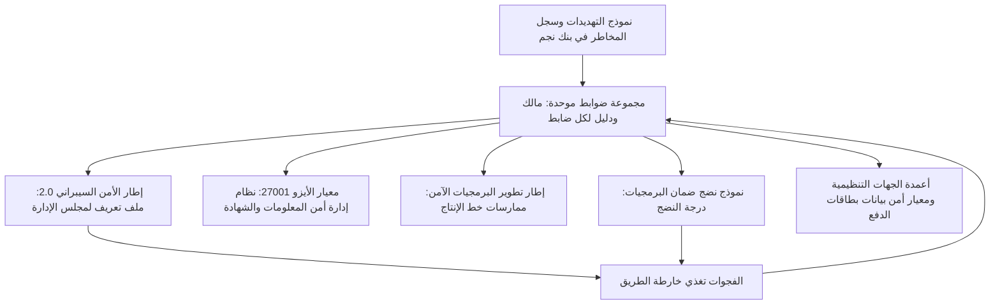
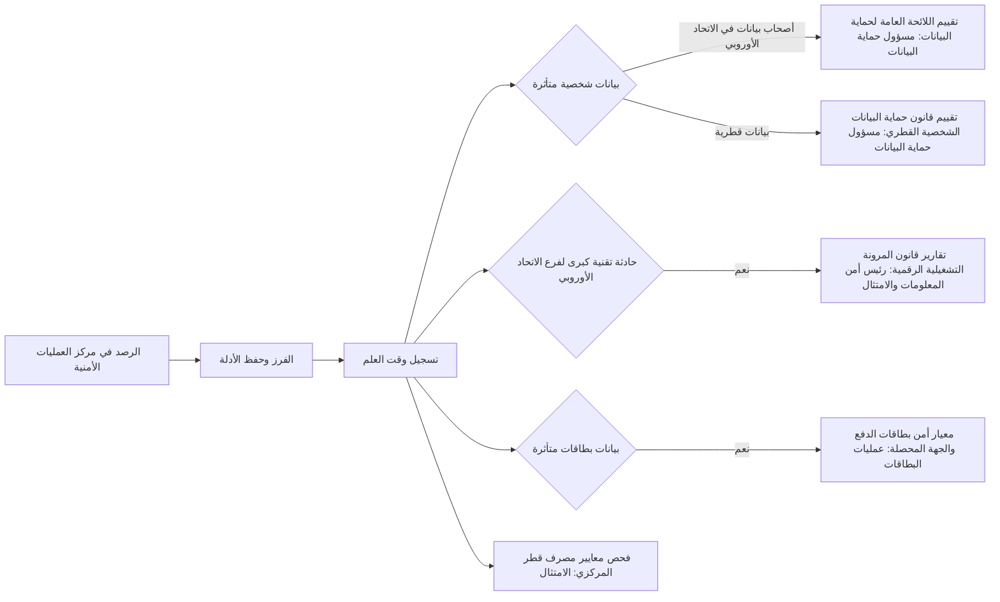
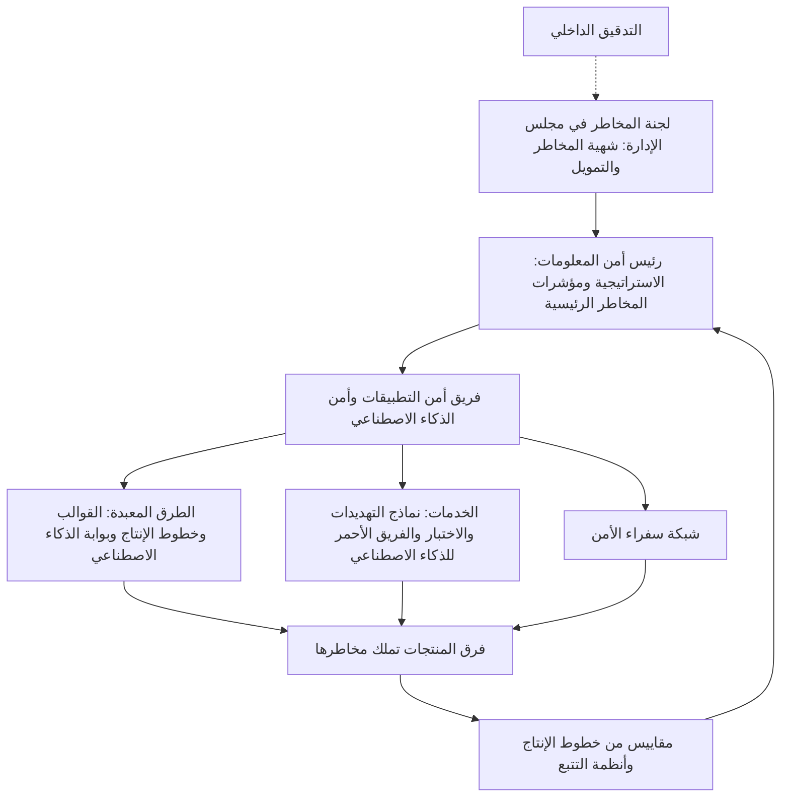

# الوحدة 11 — الحوكمة والقيادة (Governance and leadership)

*كل ضابطٍ في الوحدات 1–10 (Every control in Modules 1–10) يحتاج إلى من يملكه (someone to own it)، ويموّله (fund it)، ويثبت أنه يعمل (prove that it works)، ويُبقيه عاملًا (keep it working) كلما تغيّر البنك (as the bank changes). تلك هي الحوكمة (That is governance)، وعندها تتعثّر كثيرٌ من فرق الأمن القديرة (where many capable security teams stall). فهي تدير أربعة أطر (They run four frameworks) بوصفها أربعة مشاريع جداول بيانات (as four spreadsheet projects). ويقرأ المحامون اللوائح التنظيمية (Lawyers read the regulations)، لكن لا أحد يحوّلها إلى متطلباتٍ هندسية (nobody turns them into engineering requirements). ويُدافَع عن الميزانية (the budget is defended) بعددٍ من الثغرات لا يستطيع أحدٌ تفسيره (with a count of vulnerabilities that nobody can interpret). تغطي هذه الوحدة الجانب القيادي (the leadership side) لأمن التطبيقات وأمن الذكاء الاصطناعي (of application and AI security). يشرح الدرس 11.1 الأطر الرئيسية (Lesson 11.1 explains the main frameworks)، وهي NIST CSF 2.0 وISO/IEC 27001 وNIST SSDF وOWASP SAMM، وكيف تُدار بوصفها مجموعة ضوابط واحدة (how to run them as one control set). ويحوّل الدرس 11.2 القوانين التي تطال بنك نجم (Lesson 11.2 turns the laws that reach Najm Bank)، أي اللائحة العامة لحماية البيانات (the GDPR)، وقانون حماية خصوصية البيانات الشخصية في قطر (Qatar's PDPPL)، وقانون الذكاء الاصطناعي الأوروبي (the EU AI Act)، وDORA، وغيرها من قواعد القطاع المالي (other financial-sector rules)، إلى ضوابط وأدلةٍ ومهلٍ للإخطار عن الحوادث (into controls, evidence and incident clocks). ويبني الدرس 11.3 برنامجًا يدوم (Lesson 11.3 builds a programme that lasts): سفراء الأمن (security champions)، والطرق المعبّدة (paved roads)، ومقاييس تقود القرارات (metrics that drive decisions)، وميزانية سيموّلها مجلس الإدارة (a budget the board will fund). ستعمل مع نورة وحمد (You will work with Noura and Hamad) وهما يستعدّان للجنة التدقيق (as they prepare for the audit committee)، ومع سارة وجاسم (with Sara and Jassim) حين تُطلق حادثةٌ في بوابة الشركات الصغيرة (as an SME Portal incident starts) عدة مهلٍ قانونية في آنٍ واحد (several legal clocks at once)، ومع حمد وعلي (with Hamad and Ali) وهما يتعلّمان لماذا لا تُعدّ عبارة «تم رصد 12,481 ثغرة» ("12,481 vulnerabilities detected") مقياسًا (is not a metric)، ولماذا لا يستطيع بنكٌ أن يبلغ التغطية بالتوظيف وحده (why a bank cannot hire its way to coverage).*

> **المراحل (Phases):** Govern, Plan — تحويل الضوابط إلى برنامجٍ له مالكون ومقيسٍ وممول (turning controls into an owned, measured and funded programme) يُرضي المدققين والجهات التنظيمية (that satisfies auditors and regulators) لأنه يقلّل المخاطر فعلًا (because it actually reduces risk).

---

# 11.1 — الأطر (Frameworks): NIST CSF 2.0 وISO/IEC 27001 وNIST SSDF وOWASP SAMM
*المستوى (Level): 🔴 متقدم (Advanced)* · *المتطلبات (Prerequisites): 1.3، 6.1* · *المرحلة (Phase): Govern*

## ⚡ الدرس في دقيقة (In 60 seconds)
- **الإطار الأمني (security framework)** مجموعةٌ منشورةٌ ومنظَّمة (a published, structured set) من النتائج أو المتطلبات أو الممارسات (of outcomes, requirements or practices). يساعدك على اكتشاف الفجوات (It helps you find gaps)، ويمنحك لغةً مشتركة (gives you a shared language) مع المدققين والجهات التنظيمية والعملاء (with auditors, regulators and customers). إنه خريطةٌ للأمن (It is a map of security)، لا الأمن نفسه (not security itself).
- تجيب الأطر الأربعة هنا عن أسئلةٍ مختلفة (The four here answer different questions). **NIST CSF 2.0**: ما النتائج التي ينبغي أن تحققها المؤسسة بأكملها (what outcomes should the whole organisation achieve)؟ **ISO/IEC 27001**: هل يوجد نظامٌ إداري يدير الأمن (is there a management system running security) يستطيع مدققٌ أن يمنحه شهادة (that an auditor can certify)؟ **NIST SSDF**: ما الممارسات التي تجعل البرمجيات آمنة (which practices make software secure)؟ **OWASP SAMM**: ما مدى نضج ممارستنا لأمن البرمجيات (how mature is our software security practice)، وما الخطوة التالية (and what comes next)؟
- القاعدة الأهم (The rule that matters most): احتفظ **بمجموعة ضوابط واحدة (one control set)** لها مالكون مسمَّون وأدلة (with named owners and evidence)، ثم **اربطها (map)** بكل إطارٍ تحتاج إليه (to every framework you need). ويُسمّى هذا الربط **جدول المطابقة (crosswalk)**.
- مؤشر القرار (Decision cue): عميلٌ يريد شهادة (a customer wants a certificate) ← ISO/IEC 27001. ومجلس الإدارة يسأل (The board asks) «أين نحن، وأين ينبغي أن نكون؟» ⁦("where are we and where should we be?")⁩ ← ملفات تعريف CSF (CSF profiles). والمهندسون يسألون عمّا يجب أن يفعله خط الإنتاج (Engineers ask what the pipeline must do) ← SSDF. وفريق أمن التطبيقات (AppSec) يسأل عمّا ينبغي تحسينه تاليًا (asks what to improve next) ← SAMM.
- أكبر فخ (Biggest trap): معاملة الشهادة أو درجة النضج (treating a certificate or a maturity score) دليلًا على الأمن (as proof of security). فالأطر تتحقق من أن الضوابط موجودة وتعمل (Frameworks check that controls exist and run)؛ والاختبار وحده يُظهر أنها توقف الهجمات (only testing shows they stop attacks).

## 🧭 لماذا يهم (Why it matters)
يتلقّى حمد، رئيس أمن المعلومات (CISO)، ثلاثة طلباتٍ في أسبوعٍ واحد (receives three requests in one week). فلجنة التدقيق في مجلس الإدارة (The board audit committee) تريد أن تعرف «أي إطارٍ نتّبع وأين نقف» ("which framework we follow and where we stand") قبل المراجعة الإشرافية القادمة (before the next supervisory review). وعميلٌ مؤسسي كبير (A large corporate client) يريد الاتصال بواجهة برمجة بوابة الشركات الصغيرة (that wants to connect to the SME Portal's API) يرسل استبيانًا أمنيًا من 300 سؤال (sends a 300-question security questionnaire)، ويسأل هل المنصة حاصلةٌ على شهادة ISO/IEC 27001 (asks whether the platform is ISO/IEC 27001 certified). أما طارق، قائد الهندسة (engineering lead)، الذي باتت فرقه تكتب كثيرًا من شيفرتها بوكلاء البرمجة بالذكاء الاصطناعي (whose teams now write much of their code with AI coding agents)، فيسأل عمّا يتطلّبه «التطوير الآمن» ("secure development") فعلًا من خطوط الإنتاج لديه (actually requires of his pipelines).

تتضمن خطة علي الأولى (Ali's first plan) أربعة مسارات عمل (four workstreams)، واحدًا لكل إطار (one per framework)، ولكلٍّ منها جدول بياناته الخاص (each with its own spreadsheet). وتختار نورة، رئيسة أمن التطبيقات والذكاء الاصطناعي (Head of Application & AI Security)، صفًّا واحدًا من كل مسودة (picks one row from each draft). فإذا بالأربعة تصف الضابط نفسه (All four describe the same control): كل تغييرٍ على واجهة برمجة المدفوعات (every change to the payments API) يُراجَع ويُفحص قبل الدمج (is reviewed and scanned before merge). «إذا حافظنا على ذلك الضابط أربع مرات (If we maintain that control four times)، فسنثبته أربع مرات ولن نحسّنه مرةً واحدة (we will prove it four times and improve it zero times). اكتبه مرةً واحدة (Write it once)، وامنحه مالكًا وأدلة (give it an owner and evidence)، ثم اربطه بالأطر (then map it).»

يُظهر السجل العام (The public record shows) لماذا يهمّ تشغيل الضابط أكثر من صياغته (why running a control matters more than wording it). ففي عام 2017، اختُرقت شركة Equifax (Equifax was breached) عبر ثغرةٍ معروفة في Apache Struts (through a known Apache Struts vulnerability)، هي CVE-2017-5638، كان إصلاحها قد نُشر بالفعل (for which a fix had already been published). وكان كل إطارٍ رئيسي (Every mainstream framework) يشترط أصلًا إدارةً للثغرات في الوقت المناسب (already required timely vulnerability management). ووصفت التحقيقات العلنية (Public investigations) عمليةَ ترقيعٍ (a patching process) أخفقت في العثور على النظام المعرَّض وإصلاحه (that failed to find and fix the vulnerable system). كان الضابط موجودًا على الورق (The control existed on paper)، لا في الممارسة (not in practice).

## 📐 كيف يعمل (How it works)

### 🟢 الأساسيات (The essentials)

**المصطلحات (Vocabulary).** **الضابط (control)** إجراءٌ وقائي يقلّل المخاطر (a safeguard that reduces risk)، مثل «المصادقة متعددة العوامل على جميع وحدات تحكّم المشرفين» ("MFA on all admin consoles"). و**الإطار (framework)** ينظّم الضوابط أو النتائج (organises controls or outcomes). و**المعيار (standard)** يصدر عن هيئة معايير (comes from a standards body)؛ و**المعيار القابل للاعتماد (certifiable)** يتيح لمدققٍ معتمد (lets an accredited auditor) أن يفحصك ويصدر لك شهادة (check you and issue a certificate). أما **نموذج النضج (maturity model)** فيقيّم بالدرجات مدى جودة أدائك لممارسةٍ ما ومدى اتساقه (scores how well and how consistently you perform a practice).

| | NIST CSF 2.0 | ISO/IEC 27001:2022 | NIST SSDF | OWASP SAMM |
|---|---|---|---|---|
| الجهة الناشرة والإصدار (Publisher and edition) | المعهد الوطني الأمريكي للمعايير والتقنية (US NIST)، فبراير 2024 (February 2024) | منظمتا ISO وIEC، عام 2022، مع تعديلٍ في 2024 (amended 2024) | وثيقة NIST SP 800-218، الإصدار 1.1 (version 1.1)، فبراير 2022 (February 2022) | مجتمع OWASP (OWASP community)، الإصدار 2 (version 2) |
| ما هو (What it is) | نتائج لإدارة المخاطر السيبرانية (Outcomes for managing cyber risk) | متطلباتٌ لنظام إدارة أمن المعلومات (Requirements for an information security management system) | ممارسات تطوير البرمجيات الآمن (Secure software development practices) | نموذج نضجٍ لأمن البرمجيات (Maturity model for software security) |
| هل هو قابل للاعتماد؟ ⁦(Certifiable?)⁩ | لا (No): تقيّم نفسك بنفسك (you assess yourself) | نعم (Yes)، من جهات منح الشهادات المعتمدة (by accredited certification bodies) | لا (No)، وإن كان يُستخدم في إقرارات الموردين (though used in supplier attestations) | لا (No): تقييمٌ ذاتي أو بمساعدة (self- or assisted assessment) |
| يستخدمه بنك نجم من أجل (Najm uses it for) | رؤية مجلس الإدارة (Board view): ملف التعريف الحالي والمستهدف (current and target profile) | شهادةٌ لبوابة الشركات الصغيرة ومنصة واجهات البرمجة (Certificate for the SME Portal and API platform) | متطلبات خط الإنتاج لكل فريق (Pipeline requirements for every team) | خط أساسٍ سنوي لأمن التطبيقات وخارطة طريق (Yearly AppSec baseline and roadmap) |

**NIST CSF 2.0.** إطار الأمن السيبراني (The Cybersecurity Framework) بنيةٌ هرمية (is a hierarchy). في قمّتها ست **وظائف (Functions)**: **الحوكمة (Govern, GV)**، الجديدة في الإصدار 2.0 (new in 2.0)، وتغطي الاستراتيجية والأدوار والسياسة والإشراف ومخاطر سلسلة التوريد (strategy, roles, policy, oversight and supply-chain risk)؛ و**التحديد (Identify, ID)**، وتغطي الأصول وتقييم المخاطر (assets and risk assessment)؛ و**الحماية (Protect, PR)**، وتغطي الإجراءات الوقائية (safeguards) مثل التحكم في الوصول والتدريب وأمن المنصات (such as access control, training and platform security)؛ و**الرصد (Detect, DE)**، وتغطي المراقبة والتحليل (monitoring and analysis)؛ و**الاستجابة (Respond, RS)**، وتغطي إدارة الحوادث والإبلاغ عنها (managing and reporting incidents)؛ و**التعافي (Recover, RC)**، وتغطي استعادة العمليات (restoring operations).

وتنقسم كل وظيفة إلى **فئات (Categories)**، عددها 22 فئة إجمالًا (22 in total)، مثل PR.AA، أي «إدارة الهوية والمصادقة والتحكم في الوصول» ("Identity Management, Authentication and Access Control")؛ وتنقسم كل فئة إلى **فئات فرعية (Subcategories)**، وهي عبارات نتائج (outcome statements). فمثلًا، تنص PR.PS-06 على أن ممارسات تطوير البرمجيات الآمن مدمجة (secure software development practices are integrated) وأن أداءها مراقَب (and their performance is monitored) طوال دورة الحياة (throughout the life cycle). ويحدد الإطار *ما* ينبغي تحقيقه (*what* to achieve)، لا *كيف* (not *how*). كما وسّع الإصدار 2.0 جمهوره (Version 2.0 also widened its audience) من البنية التحتية الحيوية (from critical infrastructure) إلى جميع المؤسسات (to all organisations).

تجعل أداتان الإطارَ مفيدًا (Two tools make the CSF useful). **ملف التعريف (Profile)** يصف وضعك (describes your posture) بمصطلحات الإطار (in CSF terms): **ملف التعريف الحالي (Current Profile)**، أي أين أنت (where you are)، و**ملف التعريف المستهدف (Target Profile)**، أي أين ينبغي أن تكون (where you need to be). والفجوة بينهما هي خارطة طريقك (The gap between them is your roadmap). أما **المستويات (Tiers)**، وهي 1 جزئي (Partial)، و2 مستنير بالمخاطر (Risk Informed)، و3 قابل للتكرار (Repeatable)، و4 متكيّف (Adaptive)، فتصف مدى صرامة حوكمتك وإدارتك للمخاطر السيبرانية (how rigorous your cyber risk governance and management are).

**ISO/IEC 27001:2022.** يحدد هذا المعيار (This standard specifies) **نظام إدارة أمن المعلومات (information security management system, ISMS)**: السياسات والعمليات والأدوار والسجلات (the policies, processes, roles and records) التي تستخدمها المؤسسة لإدارة مخاطر الأمن والتحسّن (an organisation uses to manage security risk and improve). والبنود من 4 إلى 10 إلزامية (Clauses 4 to 10 are mandatory): السياق والنطاق (context and scope)، والقيادة (leadership)، والتخطيط (planning)، أي تقييم المخاطر ومعالجتها (risk assessment and treatment)، والدعم (support)، والتشغيل (operation)، وتقييم الأداء (performance evaluation)، أي المراقبة والتدقيق الداخلي ومراجعة الإدارة (monitoring, internal audit, management review)، والتحسين (improvement). ويسرد **الملحق A (Annex A)** عدد 93 ضابطًا مرجعيًا (93 reference controls) في أربعة محاور (in four themes): تنظيمية (organisational) بعدد 37، وبشرية (people) بعدد 8، ومادية (physical) بعدد 14، وتقنية (technological) بعدد 34. وعدّة منها تهمّ أمن التطبيقات مباشرة (Several matter directly to AppSec): الضابط 8.25 دورة حياة التطوير الآمن (Secure development life cycle)، و8.26 متطلبات أمن التطبيقات (Application security requirements)، و8.28 البرمجة الآمنة (Secure coding)، و8.29 الاختبار الأمني في التطوير والقبول (Security testing in development and acceptance)، و8.8 إدارة الثغرات التقنية (Management of technical vulnerabilities). وتختار الضوابط عبر معالجة المخاطر (You select controls through risk treatment)، وتبرّر إدراج كلٍّ منها أو استبعاده (and justify each inclusion or exclusion) في **بيان قابلية التطبيق (Statement of Applicability, SoA)**. والاعتماد تدقيقٌ على مرحلتين (Certification is a two-stage audit)، تليه تدقيقات مراقبةٍ سنوية (then yearly surveillance audits) وإعادة اعتمادٍ كل ثلاث سنوات (and recertification every three years). ويقدّم معيار ISO/IEC 27002 إرشاداتٍ حول تطبيق كل ضابط (gives guidance on implementing each control).

**NIST SSDF (SP 800-218).** يجمع إطار تطوير البرمجيات الآمن (The Secure Software Development Framework) الممارساتِ في أربع عائلات (groups practices into four families):
- **إعداد المؤسسة (Prepare the Organization, PO)**: المتطلبات (requirements)، والأدوار (roles)، وسلاسل الأدوات (toolchains)، ومعايير الفحوص الأمنية (criteria for security checks) (PO.4).
- **حماية البرمجيات (Protect the Software, PS)**: حماية الشيفرة من العبث (protect code from tampering)، وتمكين المستخدمين من التحقق من الإصدارات (let users verify releases)، وأرشفة كل إصدار (archive each release).
- **إنتاج برمجياتٍ محكمة الأمان (Produce Well-Secured Software, PW)**: التصميم الآمن (secure design)، وإعادة استخدام مكوّناتٍ محكمة الأمان (reuse of well-secured components)، ومراجعة الشيفرة وتحليلها (code review and analysis) (PW.7)، واختبار الشيفرة القابلة للتنفيذ (testing executable code) (PW.8)، والإعدادات الافتراضية الآمنة (secure defaults).
- **الاستجابة للثغرات (Respond to Vulnerabilities, RV)**: تحديد الثغرات وتأكيدها (identify and confirm vulnerabilities) (RV.1)، وإصلاحها (fix them) (RV.2)، وتحليل أسبابها الجذرية (analyse root causes) (RV.3).

وكما هو حال CSF (Like the CSF)، يصف SSDF النتائجَ لا الأدوات (the SSDF describes outcomes rather than tools). وتضيف الوثيقة NIST SP 800-218A الصادرة في 2024 ممارساتٍ لتطوير الذكاء الاصطناعي التوليدي (adds practices for developing generative AI) والنماذج التأسيسية مزدوجة الاستخدام (and dual-use foundation models)، مثل حماية بيانات التدريب وأوزان النموذج (such as protecting training data and model weights).

**OWASP SAMM.** لنموذج نضج ضمان البرمجيات (The Software Assurance Maturity Model) خمس **وظائف أعمال (business functions)**، لكلٍّ منها ثلاث **ممارسات أمنية (security practices)**:

| وظيفة الأعمال (Business function) | الممارسات الأمنية (Security practices) |
|---|---|
| الحوكمة (Governance) | الاستراتيجية والمقاييس (Strategy and Metrics) · السياسة والامتثال (Policy and Compliance) · التعليم والإرشاد (Education and Guidance) |
| التصميم (Design) | تقييم التهديدات (Threat Assessment) · المتطلبات الأمنية (Security Requirements) · المعمارية الآمنة (Secure Architecture) |
| التنفيذ (Implementation) | البناء الآمن (Secure Build) · النشر الآمن (Secure Deployment) · إدارة العيوب (Defect Management) |
| التحقق (Verification) | تقييم المعمارية (Architecture Assessment) · الاختبار القائم على المتطلبات (Requirements-driven Testing) · الاختبار الأمني (Security Testing) |
| العمليات (Operations) | إدارة الحوادث (Incident Management) · إدارة البيئة (Environment Management) · الإدارة التشغيلية (Operational Management) |

لكل ممارسةٍ **مساران (streams)** وثلاثة مستويات نضج (three maturity levels). ويمنح التقييمُ (An assessment)، المبني على المقابلات والأدلة (based on interviews and evidence)، كلَّ ممارسةٍ درجةً من 0 إلى 3 (scores each practice from 0 to 3). ونموذج SAMM مجانيٌّ ومفتوح (free and open)، وله استبيانٌ منشور وصندوق أدوات (with a published questionnaire and toolbox).

### 🟡 التعمق أكثر (Going deeper)

**كيف تتكامل الأطر الأربعة (How the four fit together).** إنها طبقاتٌ لا متنافسات (They are layers, not rivals). فإطار CSF يؤطّر المخاطر السيبرانية للبنك بأكمله (frames the bank's whole cyber risk) لمجلس الإدارة (for the board). ومعيار ISO/IEC 27001 هو المحرّك (is the engine) الذي يشغّل الضوابط ويدقّقها ويحسّنها (that runs, audits and improves controls)، ويمنح الأطراف الخارجية شهادة (and gives outsiders a certificate). ويفصّل SSDF ما يعنيه «التطوير الآمن» ("secure development") داخل وظيفة الحماية في CSF (inside the CSF's Protect function) والضابط 8.25 في ISO (and ISO's control 8.25). ويقيس SAMM مدى نضج تلك الممارسة (measures how mature that practice is). ويقع نموذج التهديدات لدى بنك نجم (Najm's threat model) تحتها جميعًا (sits underneath them all).



**جدول المطابقة (The crosswalk).** يربط جدول المطابقة كل ضابطٍ داخلي (A crosswalk maps each internal control) بالمراجع المقابلة في كل إطار (to the matching references in each framework). فالضابط الداخلي هو وحدة العمل (The internal control is the unit of work)؛ ومعرّفات الأطر (the framework identifiers) وسومٌ عليه (are labels on it). وحين يتغيّر إصدار إطارٍ ما (When a framework changes edition)، تحدّث الوسوم لا الضابط (you update the labels, not the control). وحيث توجد مطابقاتٌ رسمية (Where official mappings exist)، ابدأ منها (start from them): إذ ينشر NIST مراجعَ إعلامية (NIST publishes informative references) تربط CSF بالمعايير الأخرى (that map the CSF to other standards).

**اكتب ضوابط قابلة للاختبار (Write controls that can be tested).** الضابط الذي لا يستطيع أحدٌ اختباره (A control nobody can test) لا يمكن إثباته بالأدلة (cannot be evidenced). فهو يرسب في تدقيقه (It fails its audit)، أو، وهذا أسوأ (or, worse)، ينجح بناءً على الثقة (passes on trust). قارن (Compare):

```yaml
# Weak: an aspiration, not a control
- id: SDLC-1
  text: "Developers should write secure code."
```

```yaml
# Strong: scoped, owned, mapped and evidenced
- id: NAJM-AS-02
  text: >
    Every change merged to the main branch of a Tier 1 application
    is peer-reviewed and passes SAST, SCA and secret scanning.
  applies_to: [najm-mobile-api, sme-portal, najm-assist]
  owner: Engineering lead (Tariq)
  maps_to:
    nist_csf_2: [PR.PS-06]
    iso_27001_2022: ["8.25", "8.28", "8.29", "8.32"]
    nist_ssdf_1_1: [PO.4, PW.7, PW.8]
    owasp_samm_2: ["Secure Build", "Security Testing"]
  evidence:
    check: "merges to main without required checks, last 90 days"
    pass_if: 0
```

**فعالية التصميم مقابل فعالية التشغيل (Design versus operating effectiveness).** يسأل المدققون (Auditors ask) هل الضابط **مصمَّم (designed)** لمعالجة المخاطر (to address the risk)، وهل **عمل (operated)** طوال الفترة (all period)، كأن يأخذوا عيّنةً من عمليات الدمج في الربع الماضي (for example by sampling last quarter's merges). اجمع الأدلة آليًا (Collect evidence automatically) من الأنظمة التي تشغّل الضابط (from the systems that run the control)؛ أما لقطات الشاشة المأخوذة في الأسبوع السابق للتدقيق (screenshots taken the week before an audit) فلا تثبت إلا القليل (prove little).

**اقرأ النطاق (Read the scope).** لا تغطي شهادة ISO/IEC 27001 (An ISO/IEC 27001 certificate) إلا النطاق المكتوب عليها (covers only the scope written on it). فقد تغطي شهادة مزوّدٍ سحابي (A cloud supplier's certificate) مراكز بياناته (its data centres) دون الخدمة المُدارة التي يشتريها بنك نجم (but not the managed service Najm buys). وقبل الاعتماد على شهادة مورّد (Before relying on a supplier's certificate)، اقرأ بيان النطاق (read the scope statement)، واطلب بيان قابلية التطبيق أو ملخّصًا له (ask for the SoA or a summary)، وتأكّد من أن جهة منح الشهادة معتمدة (confirm the certification body is accredited)، وتحقّق من أن الشهادة سارية (and check the certificate is current).

**أهداف SAMM خياراتٌ قائمة على المخاطر (SAMM targets are risk choices).** ليست كل ممارسةٍ بحاجةٍ إلى المستوى 3 (Not every practice needs level 3). فتقييم التهديدات (Threat Assessment) بالغ الأهمية الآن (matters a great deal now) بعد أن بدأ نجم أسيست (Najm Assist) يكتسب أدواتٍ تتصرّف في الحسابات (is gaining tools that act on accounts)؛ أما رفع درجة إدارة البيئة (a higher Environment Management score) فلن يضيف إلا القليل هذا العام (would add little this year).

### 🔴 نظرة الخبير (Expert view)

**الامتثال هو الحد الأدنى (Compliance is the floor).** تختزل الأطر خبرةَ مؤسساتٍ كثيرة (Frameworks distil many organisations' experience)؛ أما نموذج التهديدات لديك (your threat model) (1.1) فيصف أنظمتك أنت (describes your own systems). ابدأ من تهديداتك (Start from your threats)، واستخدم الأطر لاكتشاف النقاط العمياء (and use frameworks to find blind spots)، لا العكس (not the other way round). فملف التعريف المستهدف المنسوخ من قالب (A Target Profile copied from a template) يتجاهل ما يميّز بنك نجم (ignores what makes Najm different)، مثل وكيلٍ قائمٍ على نموذج لغوي كبير يستطيع تجميد البطاقات (such as an LLM agent that can freeze cards).

**النماذج التوجيهية والنماذج الوصفية (Prescriptive and descriptive models).** نموذج SAMM **توجيهي (prescriptive)**: يخبرك كيف يبدو المستوى التالي (it tells you what the next level looks like). أما **BSIMM**، أي نموذج نضج بناء الأمن من الداخل (Building Security In Maturity Model)، فهو **وصفي (descriptive)**: يسجّل الأنشطة المرصودة (it records activities observed) في كثيرٍ من برامج أمن البرمجيات الحقيقية (in many real software security programmes). استخدمه لمقارنة نفسك بنظرائك (Use it to compare yourself with peers)، لا بوصفه قائمة مهام (not as a to-do list).

**إدخال الذكاء الاصطناعي في النطاق (Bringing AI into scope).** لا يحتاج أيٌّ من هذه الأطر إلى استبدالٍ من أجل الذكاء الاصطناعي (None of these frameworks needs replacing for AI)، لكن نطاقها يجب أن يتّسع (but their scope must widen). فالنماذج والموجّهات ومجموعات البيانات (Models, prompts and datasets) مكانها في جرد الأصول (belong in the asset inventory) (ID.AM)؛ ومزوّدو النماذج ومستودعات النماذج (model providers and model hubs) مكانهم في مخاطر سلسلة التوريد (in supply-chain risk)، أي GV.SC وضوابط الموردين في ISO (and ISO's supplier controls)؛ وحقن الموجّهات (prompt injection) وتسميم البيانات (data poisoning) مكانهما في تقييم المخاطر (in the risk assessment) (ID.RA). ويحدد معيار **ISO/IEC 42001:2023** نظامًا لإدارة الذكاء الاصطناعي (specifies an AI management system) بالبنية نفسها التي لمعيار ISO/IEC 27001 (with the same structure as ISO/IEC 27001)، ولذا يمكن للاثنين أن يتشاركا التدقيق الداخلي ومراجعة الإدارة (so the two can share internal audit and management review). كما نشر NIST مسودةً أولية (NIST has also published a preliminary draft) لملف تعريفٍ سيبراني للذكاء الاصطناعي ضمن CSF (Cyber AI Profile of the CSF)، هي NIST IR 8596، في ديسمبر 2025 (December 2025)؛ تحقّق من وضعها (check its status). وتغطي دورة *AI Governance: Zero to Hero* حوكمةَ الذكاء الاصطناعي بأكملها (covers AI governance as a whole).

**قانون غودهارت ينطبق على الدرجات (Goodhart's law applies to scores).** حين تصبح درجة SAMM (When a SAMM score) أو «نسبة الضوابط الممتثلة» ("percentage of controls compliant") هدفًا بحد ذاتها (becomes a target)، تتعلّم الفرق إرضاء المقيِّم (teams learn to satisfy the assessor) بدلًا من تقليل المخاطر (rather than reduce risk). اقرن كل درجةٍ بنتيجة اختبار (Pair every score with a test outcome): نتائج الفريق الأحمر (red-team findings)، أو معدل الإفلات (the escape rate) (11.3)، أو الأسباب الجذرية للحوادث (or incident root causes).

**أبقِ جدول المطابقة حيًّا (Keep the crosswalk alive).** في وقت كتابة هذا الدرس (At the time of writing)، أي عام 2026، الإصداراتُ المذكورة هنا هي السارية (the editions named here are current)، لكن NIST نشر مسودة الإصدار 1.2 من SSDF (published a draft SSDF version 1.2)، أي SP 800-218 Rev. 1، للتعليق في ديسمبر 2025 (for comment in December 2025)، وكان على الشهادات الصادرة وفق إصدار 2013 من ISO/IEC 27001 (certificates to the 2013 edition of ISO/IEC 27001) أن تنتقل إلى إصدار 2022 (had to move to the 2022 edition) بحلول أكتوبر 2025 (by October 2025). كلّف شخصًا واحدًا بمهمة التحقق من الإصدارات كل عام (Give one person the job of checking editions every year).

## 🧰 الأدوات (The toolkit)
| الضابط أو المعيار أو الأداة (Control, standard or tool) | ما هو وماذا يفعل (What it is and does) | متى تلجأ إليه (When to reach for it) |
|---|---|---|
| **NIST CSF 2.0** — إطار NIST للأمن السيبراني | ست وظائف لنتائج المخاطر السيبرانية (Six Functions of cyber risk outcomes)، مع ملفات تعريف ومستويات (with profiles and tiers) | تقارير مجلس الإدارة (Board reporting)؛ وتحليل الفجوات على مستوى المؤسسة (organisation-wide gap analysis) |
| **ISO/IEC 27001** — مع ISO/IEC 27002 (with ISO/IEC 27002) | متطلبات نظام إدارة أمن المعلومات القابلة للاعتماد (Certifiable ISMS requirements)، إضافةً إلى 93 ضابطًا مرجعيًا في الملحق A (plus 93 Annex A reference controls) | حين يحتاج أحدٌ إلى اعتمادٍ مستقل (Someone needs independent certification)؛ وإدارة الأمن بوصفه دورةً مُدارة (running security as a managed cycle) |
| **NIST SSDF** — وثيقة SP 800-218، ووثيقة SP 800-218A لنماذج الذكاء الاصطناعي (for AI models) | ممارسات تطويرٍ آمن قائمة على النتائج (Outcome-based secure development practices) في أربع مجموعات (in four groups) | تحديد ما يجب أن يفعله كل خط إنتاجٍ وفريقٍ ومورّد برمجيات (Defining what every pipeline, team and software supplier must do) |
| **OWASP SAMM** — نموذج نضج ضمان البرمجيات | نموذج نضجٍ مفتوح (Open maturity model): 15 ممارسة، تُمنح كلٌّ منها درجةً من 0 إلى 3 (15 practices, each scored 0 to 3) | خط أساس أمن التطبيقات (AppSec baseline)، وخارطة الطريق (roadmap)، والتحقق السنوي من التقدم (and yearly progress check) |
| **BSIMM** — نموذج نضج بناء الأمن من الداخل | دراسةٌ وصفية للأنشطة (Descriptive study of activities) في برامج أمن البرمجيات الحقيقية (in real software security programmes) | المقارنة المعيارية بالنظراء (Benchmarking against peers) |
| **Control crosswalk** — جدول مطابقة الضوابط | مجموعة ضوابط داخلية واحدة (One internal control set) مربوطة بأطرٍ كثيرة (mapped to many frameworks) | بمجرد أن تخضع لأكثر من إطار (As soon as you answer to more than one framework) |
| **ISO/IEC 42001** — معيار نظام إدارة الذكاء الاصطناعي | معيارٌ لنظام إدارة الذكاء الاصطناعي (AI management system standard) بالبنية نفسها التي لمعيار ISO/IEC 27001 (with the same structure as ISO/IEC 27001) | توسيع نظام إدارة أمن المعلومات ليشمل الذكاء الاصطناعي (Extending the ISMS to AI)؛ انظر دورة الحوكمة (see the governance course) |

## 🏛️ عمليًا في بنك نجم (In practice at Najm Bank)
ينشر فريق نورة (Noura's team publishes) **مجموعة الضوابط الموحّدة لبنك نجم، الإصدار 1: مستخلص أمن التطبيقات والذكاء الاصطناعي (Najm Unified Control Set v1: AppSec and AI extract)**. لكل ضابطٍ مالكٌ واحد (Each control has one owner) ومصدر أدلةٍ واحد (and one evidence source)؛ وأعمدة الأطر وسوم (the framework columns are labels)، تُطابَق مع النصوص الرسمية كل عام (checked against the official texts every year).

| المعرّف (ID) | الضابط (Control) | المالك (Owner) | CSF 2.0 | الملحق A في ISO 27001 (ISO 27001 Annex A) | SSDF 1.1 | SAMM v2 | الأدلة (Evidence) |
|---|---|---|---|---|---|---|---|
| NAJM-AS-01 | لكل تطبيقٍ من الفئة 1 ولكل ميزة ذكاءٍ اصطناعي (Every Tier 1 application and AI feature) نموذجُ تهديدات (has a threat model)، يُراجَع عند التصميم وعند أي تغييرٍ كبير (reviewed at design and on major change) | نورة | ID.RA | 5.8، 8.27 | PW.1، PW.2 | تقييم التهديدات (Threat Assessment) | سجل نماذج التهديدات (Threat-model register) مربوطًا بسجلات التصميم (linked to design records) |
| NAJM-AS-02 | كل دمجٍ في الفرع الرئيسي لتطبيقٍ من الفئة 1 (Every merge to main on a Tier 1 app) يخضع لمراجعة الأقران (is peer-reviewed) وينجح في SAST وSCA وفحص الأسرار (and passes SAST, SCA and secret scanning) | طارق | PR.PS-06 | 8.25، 8.28، 8.29، 8.32 | PO.4، PW.7، PW.8 | البناء الآمن (Secure Build)؛ الاختبار الأمني (Security Testing) | آلي (Automated): عمليات الدمج دون فحوص خلال 90 يومًا = 0 (merges without checks in 90 days = 0) |
| NAJM-AS-03 | لكل إصدارٍ بناءٌ موقَّع وقائمة مكوّنات برمجيات (Every release has a signed build and an SBOM)؛ ولا تأتي الاعتماديات إلا من سجلاتٍ معتمدة (dependencies come only from approved registries) | طارق | GV.SC، ID.AM | 5.21، 8.25 | PS.2، PS.3، PW.4 | البناء الآمن (Secure Build) | سجل المخرجات (Artefact registry)؛ وسجل التحقق من التواقيع (signature verification log) |
| NAJM-AS-04 | الثغرات المعروفة المستغَلة (Known exploited vulnerabilities)، أي المدرجة في CISA KEV أو التي رُصد استغلالها (CISA KEV or seen exploited)، في الأنظمة المكشوفة على الإنترنت أو التي تحوي بيانات العملاء (on internet-facing or customer-data systems) تُصلَح خلال 7 أيام (are fixed within 7 days)، كما يحدد معيار إدارة الثغرات (as the Vulnerability Management Standard sets) (10.3) | جاسم | ID.RA | 8.8 | RV.1، RV.2 | إدارة العيوب (Defect Management) | تقرير المواعيد النهائية في منصة الثغرات (Vulnerability platform deadline report) |
| NAJM-AS-05 | تجتاز ميزات الذكاء الاصطناعي (AI features pass) بوابةَ الفريق الأحمر للذكاء الاصطناعي (an AI red-team gate) ومراجعةً لصلاحيات الأدوات (and a tool-permission review) قبل الإصدار (before release) | مريم | ID.RA، PR.AA | 8.29، 5.15 | PW.8؛ 800-218A | الاختبار الأمني (Security Testing) | تقرير الفريق الأحمر الموقَّع في سجل الإصدار (Signed red-team report in the release record) |
| NAJM-AS-06 | يُكمل المطوّرون كل عامٍ تدريبًا على البرمجة الآمنة حسب الدور (Developers complete role-based secure coding training each year)، يشمل قواعد وكلاء البرمجة بالذكاء الاصطناعي (including the rules for AI coding agents) | نورة | PR.AT | 6.3 | PO.2 | التعليم والإرشاد (Education and Guidance) | نسبة الإكمال حسب الفريق (Completion by team) |

**أهداف SAMM للأشهر الاثني عشر القادمة (SAMM targets for the next 12 months)، وهي توضيحية (illustrative):** تقييم التهديدات (Threat Assessment) من 1.0 إلى 2.0، لأن نجم أسيست (Najm Assist) يكتسب أدواتٍ تتصرّف في الحسابات (is gaining tools that act on accounts). والبناء الآمن (Secure Build) من 1.5 إلى 2.5، لأن وكلاء البرمجة بالذكاء الاصطناعي (AI coding agents) يضيفون اعتمادياتٍ بسرعة (add dependencies quickly). وإدارة العيوب (Defect Management) من 1.0 إلى 2.0، لأن اتفاقيات مستوى الخدمة (SLAs) موجودةٌ لكنها لا تُقاس (exist but are not measured). وتبقى إدارة البيئة (Environment Management) عند 2.0 (stays at 2.0): وهو مستوى كافٍ للمخاطر الحالية (adequate for current risk).

## 🛠️ التمارين (Exercises)
- 🟢 خذ تطبيقًا واحدًا تملكه أو تعمل عليه (Take one application you own or work on)، أو مختبرًا معرَّضًا للثغرات عمدًا (or a deliberately vulnerable lab) مثل OWASP Juice Shop تشغّله بنفسك (that you run yourself). اسرد ثمانية ضوابط يملكها اليوم (List eight controls it has today)، ووسم كلًّا منها بوظيفته في CSF 2.0 (and tag each with its CSF 2.0 Function). *يكتمل عندما (Done when):* يكون لكل وظيفةٍ ضابطٌ واحد على الأقل (every Function has at least one control) أو «فجوة» مكتوبة (or a written "gap")، وتسمّي مدخلةٌ واحدة على الأقل في وظيفة الحوكمة مالكًا (and at least one Govern entry names an owner).
- 🟡 أجرِ تقييمًا ذاتيًا خفيفًا وفق SAMM (Run a light SAMM self-assessment) لفريقك (for your own team) في تقييم التهديدات والبناء الآمن والاختبار الأمني وإدارة العيوب (on Threat Assessment, Secure Build, Security Testing and Defect Management)، مستخدمًا أسئلة SAMM المنشورة (using the published SAMM questions). *يكتمل عندما (Done when):* يكون لكل ممارسةٍ درجةٌ من 0 إلى 3 مدعومةٌ بالأدلة (each practice has a score from 0 to 3 backed by evidence)، وهدفٌ مرتبط بمخاطر حقيقية (and a target tied to a real risk).
- 🔴 أعد كتابة ثلاثةٍ من ضوابط فريقك (Rewrite three of your team's controls) بصيغة YAML القابلة للاختبار أعلاه (in the testable YAML shape above)، واربطها بـ CSF 2.0 والملحق A في ISO/IEC 27001 وSSDF وSAMM (map them to CSF 2.0, ISO/IEC 27001 Annex A, SSDF and SAMM)، وأتمت الأدلة لواحدٍ منها (and automate the evidence for one of them) في خط التكامل المستمر لمستودعك الخاص (in your own repository's CI). *يكتمل عندما (Done when):* يُنتج ضابطٌ واحد أدلةً مقروءةً آليًا (one control produces machine-readable evidence) من مستودعك الخاص (from your own repository)، ويستشهد كل ربطٍ بمعرّفٍ تحققت منه في النص الرسمي (and every mapping cites an identifier you checked in the official text).

## ⚠️ أخطاء وفخاخ (Mistakes and traps)
- **أربعة أطر، أربعة مشاريع (Four frameworks, four projects).** احتفظ بمجموعة ضوابط واحدة لها مالكون وأدلة (Keep one control set with owners and evidence)، واربطها بالأطر (and map it).
- **معاملة الشهادة دليلًا على الأمن (Treating a certificate as proof of security).** اقرأ النطاق وبيان قابلية التطبيق (Read the scope and the SoA)، واختبر ما يهمّك (and test what matters to you).
- **ضوابط غير قابلة للاختبار (Untestable controls)** مثل «على المطوّرين أن يبرمجوا بأمان» ("developers should code securely"). اكتب عباراتٍ محدّدة النطاق ولها مالك (Write scoped, owned statements) ومصدرُ أدلة (with an evidence source).
- **مطاردة أعلى مستوى نضجٍ في كل مكان (Chasing the top maturity level everywhere).** حدّد أهداف SAMM لكل ممارسةٍ انطلاقًا من مخاطرك (Set SAMM targets per practice from your risks).
- **نسخ المطابقات من المورّدين أو المدوّنات (Copying mappings from vendors or blogs).** طابقها مع النصوص الرسمية (Check them against the official texts).
- **إبقاء الذكاء الاصطناعي خارج النطاق (Leaving AI out of scope).** أضف النماذج والموجّهات ومجموعات البيانات ومزوّدي النماذج (Add models, prompts, datasets and model providers) إلى الجرد وتقييم المخاطر (to the inventory and risk assessment).

## 🧾 الخلاصة (Recap)
- يحدد NIST CSF 2.0 نتائج على مستوى المؤسسة (sets organisation-wide outcomes) في ست وظائف (in six Functions)، ووظيفة الحوكمة (Govern) جديدةٌ في الإصدار 2.0 (new in 2.0)؛ وتُظهر ملفات التعريف الوضعَ الحالي مقابل المستهدف (profiles show current versus target).
- يحدد ISO/IEC 27001:2022 نظامًا لإدارة أمن المعلومات قابلًا للاعتماد (specifies a certifiable ISMS)، مع 93 ضابطًا في الملحق A (with 93 Annex A controls) تُختار عبر معالجة المخاطر (selected through risk treatment) وتُبرَّر في بيان قابلية التطبيق (and justified in the SoA).
- يسرد NIST SSDF ممارسات التطوير الآمن (lists secure development practices) في أربع مجموعات (in four groups)، هي PO وPS وPW وRV؛ وتوسّعه وثيقة SP 800-218A لتشمل تطوير نماذج الذكاء الاصطناعي (extends it to AI model development).
- يمنح OWASP SAMM درجاتٍ لـ 15 ممارسةً في أمن البرمجيات (scores 15 software security practices) من 0 إلى 3 (from 0 to 3)، ويُظهر الخطوة التالية (and shows the next step).
- أدِر مجموعة ضوابط واحدة لها مالكون وأدلةٌ آلية (Run one control set with owners and automated evidence)، مربوطةً بكل إطار (mapped to every framework)، واحكم عليها بالاختبارات لا بالدرجات (and judge it by tests, not scores).

## ✍️ اختبر نفسك (Check yourself)

**1. يطلب عميلٌ مؤسسي (A corporate client asks for) دليلًا مستقلًا (independent evidence) على أن منصة واجهات البرمجة في بوابة الشركات الصغيرة (the SME Portal's API platform) تعمل في ظل نظام إدارة أمن معلوماتٍ مدقَّقٍ ومعترفٍ به دوليًا (runs under an audited, internationally recognised information security management system). ماذا ينبغي أن يقدّم بنك نجم (What should Najm provide)؟**

- A. ملف تعريفٍ مستهدف وفق NIST CSF 2.0 (A NIST CSF 2.0 Target Profile)
- B. شهادة ISO/IEC 27001 من جهةٍ معتمدة (An ISO/IEC 27001 certificate from an accredited body)، يغطي نطاقها بوابة الشركات الصغيرة ومنصة واجهات البرمجة (whose scope covers the SME Portal and API platform)
- C. أحدث درجات OWASP SAMM (The latest OWASP SAMM scores)
- D. خطابٌ من رئيس أمن المعلومات (A letter from the CISO) يؤكّد اتّباع SSDF (confirming the SSDF is followed)

<details><summary>الإجابة</summary>

**B.** معيار ISO/IEC 27001 هو المعيار القابل للاعتماد (is the certifiable standard)، ويجب أن يغطي نطاقُ الشهادة النظامَ (and the certificate's scope must cover the system). أما CSF وSAMM فيُقيَّمان ذاتيًا (are self-assessed)، وهما A وC؛ وD إقرارٌ ذاتي (is a self-declaration). انظر: 🟢 الأساسيات (The essentials)؛ 🟡 اقرأ النطاق (Read the scope).

</details>

**2. يصوغ علي ضابطًا (Ali drafts a control): «على المطوّرين أن يكتبوا شيفرةً آمنة» ⁦("Developers should write secure code.")⁩. ما أفضل تحسين (What is the best improvement)؟**

- A. أضف «ويجب أن يتّبعوا إرشادات OWASP» ("and must follow OWASP guidance")
- B. اربطه بمزيدٍ من الأطر (Map it to more frameworks) كي يجيب عن مزيدٍ من أسئلة التدقيق (so it answers more audit questions)
- C. أعد كتابته عبارةً محدّدة النطاق ولها مالكٌ وقابلةً للاختبار (Rewrite it as a scoped, owned, testable statement) مع مصدر أدلةٍ آلي (with an automated evidence source)
- D. احذفه، لأن البرمجة الآمنة لا يمكن حوكمتها (Delete it, because secure coding cannot be governed)

<details><summary>الإجابة</summary>

**C.** يحتاج الضابط إلى نطاقٍ ومالكٍ وأدلةٍ على أنه عمل (A control needs scope, an owner and evidence that it operated). أما A فيبقى غير قابلٍ للاختبار (is still untestable)؛ وB يضع وسومًا على شيءٍ لا يستطيع أحدٌ اختباره (labels something nobody can test)؛ وD يتخلّى عن ضابطٍ يشترطه كل إطار (abandons a control every framework requires). انظر: 🟡 اكتب ضوابط قابلة للاختبار (Write controls that can be tested).

</details>

**3. ما الذي أضافه الإصدار 2.0 من إطار NIST للأمن السيبراني (What did version 2.0 of the NIST Cybersecurity Framework add) ويهمّ قادة الأمن أكثر من غيره (that matters most to security leaders)؟**

- A. مخططٌ للاعتماد يديره NIST (A certification scheme run by NIST)
- B. وظيفة الحوكمة (A Govern function) التي تغطي الاستراتيجية والأدوار والسياسة والإشراف ومخاطر سلسلة التوريد (covering strategy, roles, policy, oversight and supply-chain risk)، وجمهورًا اتّسع ليشمل جميع المؤسسات (and an audience widened to all organisations)
- C. أدواتٌ إلزامية لكل فئة فرعية (Mandatory tools for each subcategory)
- D. درجات نضجٍ بدلًا من ملفات التعريف (Maturity scores in place of profiles)

<details><summary>الإجابة</summary>

**B.** أضاف CSF 2.0، الصادر في فبراير 2024 (February 2024)، وظيفةَ الحوكمة (added Govern) ووسّع نطاقه (and widened its scope). وهو غير قابلٍ للاعتماد (It is not certifiable)، خلافًا لـ A، ولا يفرض أدوات (does not prescribe tools)، خلافًا لـ C، وما زال يستخدم ملفات التعريف والمستويات (and still uses profiles and tiers)، خلافًا لـ D. انظر: 🟢 الأساسيات (The essentials).

</details>

**4. يُظهر خط الأساس لدى بنك نجم وفق SAMM (Najm's SAMM baseline shows) أن تقييم التهديدات (Threat Assessment) عند 1.0. ويطلب حمد (Hamad asks) أن تبلغ كل ممارسةٍ المستوى 3 (for every practice to reach level 3) بنهاية العام (by year end). ما أفضل ردّ (What is the best response)؟**

- A. وافق، لأن المستوى 3 في كل مكان هو ما يتوقعه المدققون (Agree, because level 3 everywhere is what auditors expect)
- B. اطلب من الفرق أن تعيد تقييم نفسها عند 3 (Ask teams to re-rate themselves at 3)
- C. تخلَّ عن SAMM، لأن نماذج النضج غير مفيدة (Drop SAMM, because maturity models are not useful)
- D. اقترح أهدافًا قائمةً على المخاطر لكل ممارسة (Propose risk-based targets per practice)، مع رفع تقييم التهديدات أولًا (raising Threat Assessment first)، واقرن الدرجات بنتائج الاختبارات (and pair scores with test outcomes)

<details><summary>الإجابة</summary>

**D.** أهداف SAMM خياراتٌ قائمة على المخاطر (SAMM targets are risk choices)، ويجب التحقق من الدرجات مقابل النتائج الحقيقية (and scores must be checked against real results). أما A فيُسيء فهم SAMM (misreads SAMM)؛ وB يتلاعب بالدرجة (games the score)؛ وC يتخلّى عن خارطة طريقٍ مفيدة (discards a useful roadmap). انظر: 🟡 أهداف SAMM (SAMM targets)؛ 🔴 قانون غودهارت (Goodhart's law).

</details>

**5. يريد بنك نجم ممارساتٍ (Najm wants practices) تستطيع فرقه الهندسية (its engineering teams)، ومنها الفرق التي تُجري الضبط الدقيق للنماذج (including those fine-tuning models)، أن تبنيها في خطوط الإنتاج لديها (can build into their pipelines). أي مصدرٍ هو الأنسب (Which source fits best)؟**

- A. NIST SSDF، أي SP 800-218، مع SP 800-218A لتطوير نماذج الذكاء الاصطناعي التوليدي (with SP 800-218A for generative AI model development)
- B. البند 9 من ISO/IEC 27001 بشأن تقييم الأداء (ISO/IEC 27001 Clause 9 on performance evaluation)
- C. مستويات CSF (The CSF Tiers)
- D. BSIMM، مستخدمًا قائمةَ تحققٍ إلزامية (used as a mandatory checklist)

<details><summary>الإجابة</summary>

**A.** يحدد SSDF ممارسات التطوير الآمن (The SSDF defines secure development practices)، وتوسّعها وثيقة 800-218A لتشمل نماذج الذكاء الاصطناعي (and 800-218A extends them to AI models). أما B فيقيس نظام إدارة أمن المعلومات (measures the ISMS)؛ وC يصف صرامة إدارة المخاطر (describes rigour of risk management)؛ وD وصفيّ، للمقارنة المعيارية (is descriptive, for benchmarking). انظر: 🟢 الأساسيات (The essentials)؛ 🔴 نظرة الخبير (Expert view).

</details>

## 📚 المراجع (References)
- NIST، إطار NIST للأمن السيبراني (The NIST Cybersecurity Framework, CSF) 2.0، فبراير 2024 (February 2024) — https://www.nist.gov/cyberframework
- NIST SP 800-218، إطار تطوير البرمجيات الآمن (Secure Software Development Framework)، أي SSDF، الإصدار 1.1 (Version 1.1) — https://csrc.nist.gov/pubs/sp/800/218/final
- NIST SP 800-218A، ممارسات تطوير البرمجيات الآمن للذكاء الاصطناعي التوليدي والنماذج التأسيسية مزدوجة الاستخدام (Secure Software Development Practices for Generative AI and Dual-Use Foundation Models) — https://csrc.nist.gov/pubs/sp/800/218/a/final
- أداة NIST المرجعية للأمن السيبراني والخصوصية (NIST Cybersecurity and Privacy Reference Tool)، أي المراجع الإعلامية (informative references) — https://csrc.nist.gov/projects/cprt
- ISO/IEC 27001:2022، أنظمة إدارة أمن المعلومات — المتطلبات (Information security management systems — Requirements) — https://www.iso.org/standard/27001
- ISO/IEC 42001:2023، الذكاء الاصطناعي — نظام الإدارة (Artificial intelligence — Management system) — https://www.iso.org/
- OWASP SAMM، نموذج نضج ضمان البرمجيات (Software Assurance Maturity Model) — https://owaspsamm.org/
- BSIMM — https://www.bsimm.com/
- الثغرة CVE-2017-5638 في Apache Struts — https://www.cve.org/CVERecord?id=CVE-2017-5638

---

# 11.2 — التشريعات التي تمسّ الأمن (Regulation that touches security): GDPR وPDPPL وقانون الذكاء الاصطناعي الأوروبي (the EU AI Act) وقواعد القطاع المالي (financial-sector rules)
*المستوى (Level): 🔴 متقدم (Advanced)* · *المتطلبات (Prerequisites): 5.3، 10.2، 11.1* · *المرحلة (Phase): Govern, Respond*

## ⚡ الدرس في دقيقة (In 60 seconds)
- تنصّ معظم قوانين الأمن (Most security law) على **نتيجة (outcome)**، كالأمن المناسب والمرونة والإخطار في الوقت المناسب (appropriate security, resilience, timely notification)، وتجعلك **مُساءَلًا (accountable)**: يجب أن تُظهر ما فعلته ولماذا (you must show what you did and why). ونادرًا ما تسمّي أداةً بعينها (It rarely names a tool).
- بالنسبة إلى بنك نجم (For Najm): **اللائحة العامة لحماية البيانات (GDPR)** للعملاء في الاتحاد الأوروبي (for EU customers)، أي المادة 32 للأمن (Art. 32 security)، والمادتان 33–34 للإخطار بالخرق (Arts. 33–34 breach notification)، مع مهلة 72 ساعة لإخطار السلطة حيثما أمكن (72 hours to the authority where feasible)؛ و**قانون حماية خصوصية البيانات الشخصية (PDPPL)** في قطر، وهو القانون رقم 13 لسنة 2016 (Law No. 13 of 2016)؛ والمادة 15 من **قانون الذكاء الاصطناعي الأوروبي (EU AI Act)** للذكاء الاصطناعي عالي المخاطر (Art. 15 for high-risk AI)؛ و**قانون المرونة التشغيلية الرقمية (DORA)** للكيانات المالية في الاتحاد الأوروبي (for EU financial entities)؛ ومتطلبات **مصرف قطر المركزي (QCB)** و**الوكالة الوطنية للأمن السيبراني (NCSA)**؛ و**معيار أمن بيانات صناعة بطاقات الدفع (PCI DSS)** لبيانات البطاقات (for card data).
- الخطوة الهندسية (The engineering move): حوّل كل التزامٍ إلى ضابطٍ ومالكٍ وأدلة (turn each obligation into a control, an owner and evidence) في جدول المطابقة من الدرس 11.1 (in the 11.1 crosswalk). فتصبح كل لائحةٍ عمودًا إضافيًا (Each regulation becomes another column).
- مؤشر القرار (Decision cue): في الحادثة، يكون السؤال القانوني الأول (in an incident, the first legal question is) «متى علمنا؟» ⁦("when did we become aware?")⁩. فقد تبدأ عندها عدة مهل (Several clocks may start then)، لكلٍّ منها عتبتها ومتلقّيها (each with its own threshold and recipient).
- أكبر فخ (Biggest trap): أن يقرر المهندسون وحدهم وجوب الإخطار (engineers deciding notifiability alone)، أو أن يقرر المحامون دون وقائع (or lawyers deciding without facts). يأتي فريق الأمن بالأدلة (Security brings evidence)؛ ويقرر مسؤول حماية البيانات والامتثال والشؤون القانونية (the DPO, compliance and legal decide). وهذا الدرس ليس استشارةً قانونية (This lesson is not legal advice).

## 🧭 لماذا يهم (Why it matters)
الخميس، الساعة 16:40 (Thursday, 16:40). يرصد مركز العمليات الأمنية (SOC) التابع لجاسم (Jassim's SOC) أحجام تنزيلٍ غير معتادة (unusual download volumes) من ميزة تصدير التقارير في بوابة الشركات الصغيرة (from the SME Portal's report export). وفي غضون ساعة (Within an hour)، يتأكّد الفريق (the team confirms) أن مستخدمًا في إحدى الشركات (that a user at one company) كان يستطيع تنزيل دفعات فواتير شركاتٍ أخرى (could download other companies' invoice batches): خللٌ في التحكم في الوصول (broken access control) في نقطة نهاية التصدير (on the export endpoint) (3.3). وتتضمن بعض الفواتير (Some invoices include) أسماء التجّار الأفراد وعناوينهم وأرقام هواتفهم (names, addresses and phone numbers of sole traders) في قطر وفي ألمانيا (in Qatar and in Germany)، حيث يخدم فرع بنك نجم في فرانكفورت عملاءه (where Najm's Frankfurt branch serves customers).

يبدأ علي كتابة إصلاح (Ali starts writing a fix). وتطرح سارة، مسؤولة حماية البيانات (DPO)، أربعة أسئلة (asks four questions). متى علمنا؟ ⁦(When did we become aware?)⁩ بيانات مَن، وفي أي دول؟ ⁦(Whose data, in which countries?)⁩ هل كان أيٌّ منها مشفّرًا؟ ⁦(Was any of it encrypted?)⁩ هل نستطيع أن نُظهر أي سجلات البيانات نُزّلت فعلًا؟ ⁦(Can we show which records were actually downloaded?)⁩ ويسأل حمد (Hamad asks) هل هذه حادثةٌ كبرى متعلقة بتقنية المعلومات والاتصالات (whether this is a major ICT-related incident) بالنسبة إلى فرع فرانكفورت (for the Frankfurt branch). ولا أحد يستطيع الإجابة عن سؤال سارة الأخير (Nobody can answer Sara's last question)، لأن نقطة النهاية لا تسجّل إلا «تم إنشاء التقرير» (because the endpoint logs only "report generated")، لا سجلات البيانات التي احتواها كل تقرير (not which records each report contained).

تحكم الجهات التنظيمية على إخفاقات الأمن (Regulators judge security failures) مقابل ما كان بوسع المؤسسة أن تمتلكه وما كان ينبغي أن تمتلكه (against what an organisation could and should have had in place). ففي عام 2020، فرض مكتب مفوّض المعلومات في المملكة المتحدة (the UK Information Commissioner's Office) غرامةً على الخطوط الجوية البريطانية (fined British Airways) بسبب هجومٍ وقع في 2018 (over a 2018 attack) سُرقت فيه تفاصيل بطاقات الدفع الخاصة بالعملاء من موقعها الإلكتروني (in which customers' payment card details were skimmed from its website)؛ ووجد إشعار العقوبة (the penalty notice found) أن تدابير الأمن المناسبة لم تكن قائمة (that appropriate security measures had not been in place). و«المناسبة» ("Appropriate") كلمةٌ قانونية ذات مضمونٍ هندسي (is a legal word with engineering content). ويُبيّن هذا الدرس كيف تملأ ذلك المضمون (This lesson shows how to fill it in).

## 📐 كيف يعمل (How it works)

### 🟢 الأساسيات (The essentials)

**كيف تُكتب قوانين الأمن (How security law is written).** تشترك قوانين حماية البيانات والمرونة (Laws on data protection and resilience) في نمطٍ واحد (share a pattern):
1. **واجبٌ قائمٌ على المخاطر (A risk-based duty)**: «تدابير تقنية وتنظيمية مناسبة» ("appropriate technical and organisational measures")، يُحكم عليها مقابل المخاطر وأحدث ما بلغته التقنية والتكلفة (judged against the risk, the state of the art and the cost)، وفق المادة 32 من GDPR (GDPR Art. 32).
2. **المساءلة (Accountability)**: يجب أن تُظهر تقييمات المخاطر والاختبارات والقرارات (you must show your risk assessments, tests and decisions)، مع أسبابها (with reasons).
3. **الإخطار (Notification)**: تُبلغ الجهة التنظيمية (you tell the regulator)، وأحيانًا الأشخاص المتأثرين (and sometimes the people affected)، ضمن مهلةٍ محددة (within a deadline).
4. **مسؤولية القيادة (Leadership responsibility)**: بموجب المادة 5 من DORA (under DORA, Art. 5)، تتحمّل الهيئة الإدارية (the management body) المسؤولية النهائية عن مخاطر تقنية المعلومات والاتصالات (is ultimately responsible for ICT risk)؛ وتفرض المادة 20 من NIS2 (NIS2, Art. 20) واجباتٍ مماثلة (sets similar duties).

**الأنظمة التي تطال بنك نجم (The regimes that reach Najm).** باختصار (In short)؛ وتتعمّق دورة *AI Governance: Zero to Hero* في القانون نفسه (covers the law itself in depth).

| النظام (Regime) | يطال بنك نجم حين (Reaches Najm when) | واجبات الأمن (Security duties) | الإخطار (Notification) |
|---|---|---|---|
| **GDPR**، أي Regulation (EU) 2016/679 | المعالجة في سياق فرع فرانكفورت (Processing in the context of the Frankfurt branch)، وبعض المعالجة المتعلقة بأشخاصٍ في الاتحاد الأوروبي (and some processing about people in the EU) | المادة 25 الحماية بالتصميم وافتراضيًا (Art. 25 by design and by default)؛ والمادة 32 الأمن (Art. 32 security)؛ والمادة 35 تقييم أثر حماية البيانات (Art. 35 DPIA) | المادة 33 (Art. 33): إخطار السلطة (authority) خلال 72 ساعة من العلم حيثما أمكن (where feasible within 72 hours of awareness)، ما لم يكن مستبعدًا أن ينتج عنه خطر (unless unlikely to result in risk). المادة 34 (Art. 34): إبلاغ الأفراد إذا كان الخطر عاليًا (individuals, if high risk) |
| **قانون حماية خصوصية البيانات الشخصية في قطر (Qatar PDPPL)**، القانون رقم 13 لسنة 2016 (Law No. 13 of 2016) | بيانات شخصية تُعالَج في قطر (Personal data processed in Qatar) | احتياطاتٌ ضد الفقدان والتلف والتعديل والإفصاح والوصول غير المشروع (Precautions against loss, damage, alteration, disclosure and unlawful access) | الخروقات التي قد تسبب ضررًا جسيمًا (Breaches that may cause serious damage): الجهة المختصة والأشخاص المتأثرون (competent authority and people affected)؛ والتوقيتات وفق الإرشادات السارية (timings per current guidance) |
| **متطلبات مصرف قطر المركزي والوكالة الوطنية للأمن السيبراني (QCB and NCSA requirements)** | الترخيص من مصرف قطر المركزي (Licensed by the Qatar Central Bank)؛ والمعايير الوطنية الصادرة عن الوكالة الوطنية للأمن السيبراني (national standards from the National Cyber Security Agency) | تعاميم مصرف قطر المركزي بشأن مخاطر التقنية والمخاطر السيبرانية (QCB circulars on technology and cyber risk)، وإرشاده للذكاء الاصطناعي لعام 2024 (and its 2024 AI guideline)؛ ومعايير ضمان المعلومات الوطنية (national information assurance standards) | وفق ما تقتضيه النصوص السارية (As the current texts require) |
| **قانون الذكاء الاصطناعي الأوروبي (EU AI Act)**، أي Regulation (EU) 2024/1689 | ذكاءٌ اصطناعي مستخدم في الاتحاد الأوروبي (AI used in the EU)؛ وتشمل الاستخدامات عالية المخاطر (high-risk uses include) الجدارةَ الائتمانية للأشخاص الطبيعيين (creditworthiness of natural persons)، بحسب الملحق III (Annex III) | المادة 15 الدقة والمتانة والأمن السيبراني (Art. 15 accuracy, robustness, cybersecurity)؛ والمادة 12 التسجيل (Art. 12 logging)؛ والمادة 50 شفافية روبوتات المحادثة (Art. 50 chatbot transparency) | يُبلغ المزوّدون عن الحوادث الخطيرة (Providers report serious incidents)، وفق المادة 73 (Art. 73) |
| **DORA**، أي Regulation (EU) 2022/2554 | الكيانات المالية في الاتحاد الأوروبي (EU financial entities)، ومنها مؤسسات الائتمان (including credit institutions)، منذ 17 يناير 2025 (since 17 January 2025) | إدارة مخاطر تقنية المعلومات والاتصالات (ICT risk management)، واختبار المرونة (resilience testing)، ومخاطر الأطراف الثالثة (third-party risk) | الحوادث الكبرى المتعلقة بتقنية المعلومات والاتصالات (Major ICT incidents): تقارير أولية ومرحلية ونهائية (initial, intermediate and final reports) |
| **PCI DSS**، الإصدار v4.0.1 | حين تُخزَّن بيانات البطاقات أو تُعالَج أو تُنقل (Card data is stored, processed or transmitted) | اثنا عشر متطلبًا (Twelve requirements)؛ ويغطي المتطلب 6 البرمجيات الآمنة (Requirement 6 covers secure software) | وفق اتفاقيات العلامات التجارية للبطاقات والجهات المحصِّلة (Per card-brand and acquirer agreements) |

تحديد ما إذا كان نظامٌ ما ينطبق (Whether a regime applies) مسألةٌ قانونية (is a legal question). ويقرر فريق الامتثال في بنك نجم النطاق (Najm's compliance team decides scope)، بما في ذلك كيف يطال DORA فرع فرانكفورت (including how DORA reaches the Frankfurt branch)؛ وتُربط قواعد حماية البيانات والبنك المركزي الخاصة بالشركة التابعة في الإمارات (the UAE subsidiary's own data protection and central bank rules) بالطريقة نفسها (are mapped the same way). ويقع قانونان أوروبيان آخران على مقربة (Two more EU laws sit nearby). فتوجيه **NIS2**، أي Directive (EU) 2022/2555، يغطي القطاع المصرفي (covers banking)، لكن DORA ينطبق على الكيانات المالية (but DORA applies to financial entities) بوصفه القانون القطاعي الخاص (as the sector-specific law) حيث يتداخلان (where they overlap)، ولذا لا يطال NIS2 بنك نجم إلا عبر الموردين في الغالب (so NIS2 reaches Najm mostly through suppliers). أما **قانون المرونة السيبرانية (Cyber Resilience Act)**، أي Regulation (EU) 2024/2847، فيُلزم مصنّعي المنتجات ذات العناصر الرقمية (binds manufacturers of products with digital elements)، مع الإبلاغ عن الثغرات بدءًا من سبتمبر 2026 (with vulnerability reporting from September 2026) ومعظم الواجبات الأخرى بدءًا من ديسمبر 2027 (and most other duties from December 2027)؛ ويتعامل معه بنك نجم بصفته مشتريًا في الأساس (Najm meets it mainly as a buyer).

**من الالتزام إلى الضابط (From obligation to control).** اقرأ البند الأمني (Read a security clause) بوصفه قائمةً من المتطلبات (as a list of requirements)، ثم جِد الضوابط أو ابنِها (then find or build the controls). فالمادة 32(1) من GDPR تسرد (GDPR Art. 32(1) lists)، «حسب الاقتضاء» ("as appropriate"): التسمية المستعارة والتشفير (pseudonymisation and encryption) (5.1، 5.3)؛ والسرية والسلامة والتوافر والمرونة على نحوٍ مستمر (ongoing confidentiality, integrity, availability and resilience)، مثل عزل المستأجرين (such as tenant isolation) (3.3) والتقسيم (and segmentation) (7.3)؛ والاستعادة في الوقت المناسب بعد الحادثة (timely restoration after an incident)، عبر عمليات استعادةٍ مختبَرة (through tested restores) (10.2)؛ والاختبار المنتظم للفعالية (and regular testing of effectiveness)، عبر SAST وDAST واختبارات الاختراق والفريق الأحمر للذكاء الاصطناعي (through SAST, DAST, penetration tests and AI red-teaming) (6.1، 9.4). ويصبح كل التزامٍ صفًّا (Each obligation becomes a row) في **سجل الالتزامات التنظيمية (regulatory obligations register)**، مربوطًا بمعرّفات الضوابط الموحّدة من الدرس 11.1 (linked to the unified control IDs from 11.1).

### 🟡 التعمق أكثر (Going deeper)

**مهل الإخطار بالخرق (Breach clocks).** تبدأ ساعات GDPR الاثنتان والسبعون (The GDPR's 72 hours run) من اللحظة التي يصبح فيها المتحكّم في البيانات **على علم (aware)** بخرقٍ للبيانات الشخصية (from when the controller becomes aware of a personal data breach)؛ وتصف إرشادات المجلس الأوروبي لحماية البيانات (EDPB guidance) ذلك بأنه درجةٌ معقولة من اليقين (describes this as a reasonable degree of certainty) بأن حادثةً أمنية قد أضرّت بالبيانات الشخصية (that a security incident has compromised personal data). ويُسمح بتحقيقٍ قصير (A short investigation is allowed)؛ أما اختيار عدم البحث فغير مسموح (choosing not to look is not). وتسمح المادة 33(4) بتقديم المعلومات على مراحل (Art. 33(4) allows information in phases)، وتشترط المادة 33(5) توثيق كل خرق (and Art. 33(5) requires every breach to be documented)، سواءٌ أُخطر به أم لا (notified or not).

بموجب DORA (Under DORA)، تصنّف الكيانات الحوادث المتعلقة بتقنية المعلومات والاتصالات (entities classify ICT-related incidents) وفق معايير (by criteria) مثل العملاء المتأثرين والمدة وفقدان البيانات والخدمات الحيوية (such as clients affected, duration, data losses and critical services). وبالنسبة إلى الحادثة **الكبرى (major)**، تشترط المعايير التقنية السارية وقت الكتابة (the technical standards at the time of writing)، أي عام 2026، إخطارًا أوليًا خلال 4 ساعات من التصنيف (an initial notification within 4 hours of classification) وفي موعدٍ أقصاه 24 ساعة بعد العلم (and no later than 24 hours after awareness)، وتقريرًا مرحليًا خلال 72 ساعة من الإخطار الأولي (an intermediate report within 72 hours of the initial one)، وتقريرًا نهائيًا خلال شهر (and a final report within a month). تحقّق من ذلك مقابل المعايير السارية (Verify against the current standards).

قد تُطلق حادثةٌ واحدة عدة مهل (One incident can start several clocks). ويصنّف دليل التشغيل في بنك نجم الحادثةَ مرةً واحدة (Najm's runbook classifies once)، مقابل معايير كل نظام (against every regime's criteria)، ويشغّل المهل بالتوازي (and runs them in parallel):



لكل مهلةٍ حدثُ بدايةٍ خاص بها (Each clock has its own start event)، ويُسجَّل وقت العلم لحظة حدوثه (and the awareness time is recorded when it happens)، لا يُعاد بناؤه لاحقًا (not reconstructed later):

```python
from datetime import datetime, timedelta

# Illustrative: Compliance confirms every deadline against current texts.
# Times are timezone-aware (UTC) and recorded when they happen.
def due_times(incident_aware_at: datetime,
              breach_aware_at: datetime | None = None,
              major_at: datetime | None = None) -> dict:
    due = {}
    if breach_aware_at:  # aware that EU personal data was compromised
        due["GDPR Art. 33"] = breach_aware_at + timedelta(hours=72)
    if major_at:  # incident classified as major under DORA
        due["DORA initial"] = min(major_at + timedelta(hours=4),
                                  incident_aware_at + timedelta(hours=24))
    return due
```

**السجلات تحدد حجم الخرق (Logs decide the size of a breach).** لأن نقطة نهاية التصدير لم تسجّل إلا «تم إنشاء التقرير» (Because the export endpoint logged only "report generated")، لا يستطيع بنك نجم استبعاد أي سجلّ بياناتٍ كان بوسعها الوصول إليه (Najm cannot rule out any record it could reach)، ويجب عليه أن يعامل تلك المجموعة الأوسع على أنها مكشوفة (and must treat that wider set as exposed). فالتسجيل الأمني على مستوى سجلّ البيانات (Record-level security logging) (10.1)، مع تقليل البيانات الشخصية في السجلات إلى الحد الأدنى (with personal data minimised in the logs) (5.3)، يحوّل عبارة «لا نستطيع استبعاد ذلك» ("we cannot rule it out") إلى «هذا ما حدث» ("here is what happened"). والتشفير يؤتي ثماره قانونيًا أيضًا (Encryption pays off legally too): إذ تنص المادة 34(3) (Art. 34(3) says) على أن الأفراد لا يلزم إبلاغهم (individuals need not be told) حين تكون البيانات غير مفهومة لأي شخصٍ غير مخوّل (when the data was unintelligible to anyone unauthorised)، كأن تكون مشفّرة ولم تتعرّض المفاتيح للاختراق (for example because it was encrypted and the keys were not compromised).

**قانون الذكاء الاصطناعي الأوروبي يجعل أمن الذكاء الاصطناعي واجبًا صريحًا (The EU AI Act makes AI security an explicit duty).** تشترط المادة 15 (Art. 15 requires) أن تحقق أنظمة الذكاء الاصطناعي عالية المخاطر (high-risk AI systems) مستوىً مناسبًا من الدقة والمتانة والأمن السيبراني (to achieve appropriate accuracy, robustness and cybersecurity)، باتّساقٍ طوال دورة حياتها (consistently throughout their life cycle). وتشترط المادة 15(5) (Art. 15(5) requires) المرونةَ في مواجهة المحاولات غير المصرّح بها (resilience against unauthorised attempts) لتغيير استخدام النظام أو مخرجاته أو أدائه (to alter a system's use, outputs or performance)، وتسمّي هجماتٍ خاصة بالذكاء الاصطناعي (and names AI-specific attacks) يجب منعها ورصدها والاستجابة لها وحلّها والتحكم فيها (to prevent, detect, respond to, resolve and control for)، حيثما كان ذلك مناسبًا (where appropriate):

| ما تسمّيه المادة 15(5) (Art. 15(5) names) | الضابط في بنك نجم (Najm control) |
|---|---|
| تسميم البيانات (Data poisoning) | تتبّع مصدر البيانات (Data provenance)؛ والتحكم في الوصول إلى مخازن التدريب (access control on training stores) (8.3) |
| تسميم النموذج، أي تسميم المكوّنات المدرّبة مسبقًا (Model poisoning, of pre-trained components) | مصادر نماذج معتمدة (Approved model sources)؛ ومخرجات موقّعة (signed artefacts) (6.2، 8.3) |
| الأمثلة العدائية أو التهرّب من النموذج (Adversarial examples or model evasion) | اختبار المتانة (Robustness testing)؛ ومراقبة محاولات السبر (monitoring for probing) (8.3، 9.4) |
| هجمات السرية (Confidentiality attacks) | حدود المعدل (Rate limits)؛ واختبارات الاستخراج واستنتاج العضوية (extraction and membership-inference tests) (8.3) |
| عيوب النموذج (Model flaws) | التقييم والفريق الأحمر للذكاء الاصطناعي قبل الإصدار (Evaluation and AI red-teaming before release) (9.4) |

تقع هذه الواجبات أساسًا (These duties fall mainly) على **المزوّد (provider)**، وهو من يطوّر نظامًا عالي المخاطر (who develops a high-risk system) ويطرحه في السوق أو يضعه في الخدمة باسمه الخاص (and places it on the market or puts it into service under its own name)، كما سيفعل بنك نجم لو بنى نموذجه الخاص لتقييم الجدارة الائتمانية (as Najm would if it built its own credit-scoring model) للمتقدّمين من الاتحاد الأوروبي (for EU applicants). ويُستثنى كشف الاحتيال (Fraud detection is excluded) من فئة الجدارة الائتمانية في الملحق III (from the Annex III creditworthiness category)، ولذا فإن التنبيهات الذكية (Smart Alerts) ليست عالية المخاطر على هذا الأساس (is not high-risk on that ground)؛ أما نجم أسيست (Najm Assist) فيحمل أساسًا واجب المادة 50 (mainly carries the Art. 50 duty) بإبلاغ الناس بأنهم يتحدثون إلى ذكاءٍ اصطناعي (to tell people they are talking to an AI)، وهو واجبٌ ينطبق اعتبارًا من 2 أغسطس 2026 (which applies from 2 August 2026). وكان من المقرر أصلًا (were originally due) أن تنطبق قواعد الأنظمة عالية المخاطر (The high-risk rules) على أنظمة الملحق III في ذلك التاريخ أيضًا (to apply to Annex III systems on that date too)؛ لكن الحزمة الرقمية الشاملة بشأن الذكاء الاصطناعي (the Digital Omnibus on AI)، السارية منذ يوليو 2026 (in force since July 2026)، أرجأتها إلى 2 ديسمبر 2027 (moved them to 2 December 2027)، وإلى أغسطس 2028 للذكاء الاصطناعي في المنتجات المشمولة بالملحق I (August 2028 for AI in products covered by Annex I). تحقّق من النص الساري على EUR-Lex (Check the current text on EUR-Lex).

**DORA يطال مورّدي الذكاء الاصطناعي أيضًا (DORA reaches AI vendors too).** واجهة برمجة النموذج اللغوي الكبير التي يعتمد عليها نجم أسيست (The LLM API behind Najm Assist) هي **مزوّد خدماتٍ من طرفٍ ثالث في مجال تقنية المعلومات والاتصالات (ICT third-party service provider)** بمصطلحات DORA (in DORA's terms): فهي تحتاج إلى قيدٍ في السجل (it needs a register entry) وإلى شروطٍ تعاقدية وفق المادة 30 (and Art. 30 contract terms)، وهي وصف الخدمة، ومواقع البيانات، والأمن، والمساعدة في الحوادث، والإنهاء (service description, data locations, security, incident help, termination). وإذا كانت تدعم وظيفةً حرجة أو مهمة (If it supports a critical or important function)، كما قد يفعل وكيلٌ يتصرّف في الحسابات (as an agent that acts on accounts may)، فأضف حقوق التدقيق (add audit rights)، وخطط الخروج (exit plans)، واستراتيجية خروجٍ مختبَرة (and a tested exit strategy). وأدِر المراجعة الأمنية للمورّد وملفه وفق DORA (Run the vendor's security review and its DORA file) بوصفهما عمليةً واحدة (as one process).

### 🔴 نظرة الخبير (Expert view)

**حادثةٌ واحدة، وتعريفاتٌ متعددة (One incident, several definitions).** لكلٍّ من خرق البيانات الشخصية (A personal data breach) وفق GDPR، والحادثة الكبرى المتعلقة بتقنية المعلومات والاتصالات (a major ICT-related incident) وفق DORA، والحادثة الخطيرة (a serious incident) وفق قانون الذكاء الاصطناعي (AI Act)، واختراق بيانات البطاقات (and a card-data compromise) وفق PCI DSS، تعريفاتٌ وعتباتٌ مختلفة (have different definitions and thresholds). والتقييمات المنفصلة لكل نظام (Separate assessments per regime) تفوّت المواعيد النهائية (miss deadlines). اجمع كل معيارٍ في خطوة تصنيفٍ واحدة (Put every criterion into one classification step) في دليل التشغيل (in the runbook) (10.2)، مع مالكي قرارٍ مسمَّين (with named decision owners) وسجلّ قراراتٍ (and a decision log) يوثّق ما كان معروفًا، ومتى، ولماذا (of what was known, when, and why).

**أنظمة الاختبار (Testing regimes).** يشترط DORA برنامجًا لاختبار المرونة (DORA requires a resilience testing programme)، و**اختبار اختراقٍ موجَّهًا بالتهديدات (threat-led penetration testing, TLPT)** مرةً كل ثلاث سنوات على الأقل (at least every three years) للكيانات التي تحددها سلطاتها (for entities their authorities identify)، استنادًا إلى إطار TIBER-EU (building on the TIBER-EU framework). اكتب نطاق الفريق الأحمر للذكاء الاصطناعي لدى مريم (Write Mariam's AI red-team scope) (9.4) بحيث يمكن إدراجه ضمن أحدها (so it can slot into one).

**توطين البيانات يشكّل المعمارية (Data residency shapes architecture).** إرسال موجّهاتٍ تحوي بيانات العملاء (Sending prompts containing customer data) إلى نموذجٍ مستضافٍ في الخارج (to a model hosted abroad) يُرجَّح أن يكون نقلًا للبيانات الشخصية عبر الحدود (is likely a cross-border transfer of personal data)، وهو ما يعالجه كلٌّ من GDPR وPDPPL (which both the GDPR and the PDPPL address). فتثبيت المنطقة (Region pinning)، والتنقيح قبل الموجّه (redaction before the prompt)، وموقع السجلات (and log location) قراراتٌ قانونية تُتّخذ في الشيفرة (are legal decisions made in code). أشرك سارة منذ مرحلة نمذجة التهديدات (Bring Sara in at threat-modelling time) (1.1).

**«المناسب» يتغيّر مع أحدث ما بلغته التقنية ("Appropriate" moves with the state of the art).** باتت المصادقة متعددة العوامل للمشرفين (MFA for administrators)، والترقيع السريع للثغرات المعروفة المستغَلة (prompt patching of known exploited vulnerabilities)، والسجلات الكافية لتحديد نطاق الخرق (and logs good enough to scope a breach) أمورًا متوقعةً على نطاقٍ واسع (are now widely expected). وتوقّع الانجراف نفسه في الذكاء الاصطناعي (Expect the same drift for AI): فما إن تصبح شائعةً الدفاعاتُ ضد حقن الموجّهات والصلاحيات المفرطة (once defences against prompt injection and excessive agency are common)، حتى قد تسألك جهةٌ تنظيمية لماذا افتقرت إليها (a regulator may ask why you lacked them).

## 🧰 الأدوات (The toolkit)
| الضابط أو المعيار أو الأداة (Control, standard or tool) | ما هو وماذا يفعل (What it is and does) | متى تلجأ إليه (When to reach for it) |
|---|---|---|
| **GDPR** — اللائحة العامة لحماية البيانات، المواد 25 و32–35 (Arts. 25, 32–35) | قانون الاتحاد الأوروبي لحماية البيانات (EU data protection law): أمن المعالجة (security of processing)، والإخطار بالخرق (breach notification)، وتقييمات أثر حماية البيانات (DPIAs) | أي نظامٍ يحتفظ بالبيانات الشخصية لعملاء الاتحاد الأوروبي (Any system holding EU customers' personal data) |
| **Qatar PDPPL** — قانون حماية خصوصية البيانات الشخصية في قطر | القانون القطري رقم 13 لسنة 2016 بشأن حماية البيانات الشخصية (Qatar's Law No. 13 of 2016 on personal data protection) | أي نظامٍ يحتفظ ببيانات شخصية تُعالَج في قطر (Any system holding personal data processed in Qatar) |
| **EU AI Act** — قانون الذكاء الاصطناعي الأوروبي، المادة 15 (Art. 15) | واجبات الدقة والمتانة والأمن السيبراني (Accuracy, robustness and cybersecurity duties) للذكاء الاصطناعي عالي المخاطر (for high-risk AI) | بناء ذكاءٍ اصطناعي عالي المخاطر أو شراؤه (Building or buying high-risk AI)، مثل تقييم الجدارة الائتمانية للمتقدمين من الاتحاد الأوروبي (such as credit scoring for EU applicants) |
| **DORA** — قانون المرونة التشغيلية الرقمية | قواعد الاتحاد الأوروبي بشأن مخاطر تقنية المعلومات والاتصالات (EU rules on ICT risk)، والإبلاغ عن الحوادث (incident reporting)، واختبار المرونة (resilience testing)، والأطراف الثالثة في تقنية المعلومات والاتصالات (and ICT third parties) | العمليات المالية في الاتحاد الأوروبي (EU financial operations)؛ وعقود مورّدي تقنية المعلومات والاتصالات والذكاء الاصطناعي (ICT and AI vendor contracts) |
| **NIS2** — توجيه الاتحاد الأوروبي بشأن أمن الشبكات والمعلومات | توجيه الاتحاد الأوروبي للأمن السيبراني (EU cybersecurity directive) للكيانات الأساسية والمهمة (for essential and important entities) | تقييم المورّدين خارج نطاق DORA (Assessing suppliers outside DORA's scope) |
| **PCI DSS** — معيار أمن بيانات صناعة بطاقات الدفع | معيارٌ أمني لصناعة البطاقات (Card industry security standard)، إصداره الحالي v4.0.1 (currently v4.0.1) | الأنظمة التي تخزّن بيانات البطاقات أو تعالجها أو تنقلها (Systems that store, process or transmit card data) |
| **Regulatory obligations register** — سجل الالتزامات التنظيمية | كل التزامٍ قانوني مربوطٌ بالأنظمة والضوابط والأدلة ومالك (Each legal obligation mapped to systems, controls, evidence and an owner) | دائمًا (Always)؛ فهو أعمدة التنظيم في جدول المطابقة (it is the regulation columns of the crosswalk) |
| **Incident clock matrix** — مصفوفة مهل الحوادث | محفّزات الإخطار ومتلقّوه ومواعيده النهائية ومالكو القرار في جدولٍ واحد (Notification triggers, recipients, deadlines and decision owners in one table) | أدلة تشغيل الحوادث (Incident runbooks) وتمارين المحاكاة المكتبية (and tabletop exercises) |

## 🏛️ عمليًا في بنك نجم (In practice at Najm Bank)
تنشر سارة وحمد ونورة وثيقتين (Sara, Hamad and Noura publish two artefacts)، تُراجَعان كل ستة أشهر مع فريق الامتثال (reviewed every six months with compliance).

**A. سجل الالتزامات التنظيمية (Regulatory obligations register)، مستخلص (extract)**

| الالتزام (Obligation) | المصدر (Source) | الأنظمة (Systems) | الضوابط الموحّدة (Unified controls) | الأدلة (Evidence) | المالك (Owner) |
|---|---|---|---|---|---|
| أمن معالجةٍ مناسب ومختبَر بانتظام (Appropriate, regularly tested security of processing) | المادة 32 من GDPR (GDPR Art. 32)؛ وPDPPL القطري (Qatar PDPPL) | جميع الأنظمة التي تحوي بيانات شخصية (All systems with personal data) | NAJM-AS-02، 04، 05 | تقرير الضوابط (Control report)؛ ونتائج اختبارات الاختراق والفريق الأحمر (penetration-test and red-team results) | سارة، مع نورة |
| دقة الذكاء الاصطناعي عالي المخاطر ومتانته وأمنه السيبراني (Accuracy, robustness and cybersecurity of high-risk AI) | المادة 15 من قانون الذكاء الاصطناعي (AI Act Art. 15) | نموذج تقييم الجدارة الائتمانية المخطط له في الاتحاد الأوروبي (Planned EU credit-scoring model) | NAJM-AS-01، 05، إضافةً إلى تتبّع مصدر البيانات (plus data provenance) | اختبارات المتانة (Robustness tests)؛ وتقرير الفريق الأحمر (red-team report) | دانة، مع ليلى |
| سجل الأطراف الثالثة في تقنية المعلومات والاتصالات وشروط العقود (ICT third-party register and contract terms) | المواد 28–30 من DORA (DORA Arts. 28–30) | واجهة برمجة النموذج اللغوي الكبير (LLM API)، والمنصة السحابية (cloud platform) | المراجعة الأمنية للمورّد (Vendor security review) | قيد السجل (Register entry)؛ والبنود الموقّعة (signed clauses)؛ وخطة الخروج (exit plan) | حمد |
| برمجياتٌ آمنة لبيانات البطاقات (Secure software for card data) | المتطلب 6 من PCI DSS (PCI DSS Req. 6) | ميزات البطاقات في تطبيق نجم للهاتف (Najm Mobile card features) | NAJM-AS-02، 03، 04 | حزمة أدلة التقييم (Assessment evidence pack) | طارق |

**B. مصفوفة مهل الحوادث (Incident clock matrix)، ملحقٌ بأدلة إدارة الحوادث من الدرس 10.2 (annex to the incident playbooks from 10.2)**

| المحفّز (Trigger) | النظام (Regime) | المتلقّي (Recipient) | المهلة: تحقّق من النص الساري (Deadline: verify current text) | يقرر (Decides) | تقدّمه الهندسة (Engineering supplies) |
|---|---|---|---|---|---|
| خرق بيانات شخصية لأصحاب بيانات في الاتحاد الأوروبي (Personal data breach, EU data subjects) | المادة 33 من GDPR (GDPR Art. 33) | السلطة الرقابية المختصة، كما تحددها سارة (Competent supervisory authority, as Sara determines) | خلال 72 ساعة من العلم حيثما أمكن (Where feasible 72 hours from awareness) | سارة | سجلات البيانات وأنواعها (Records and data types)، وحالة التشفير (encryption status)، والتسلسل الزمني (timeline) |
| خطرٌ عالٍ محتمل على الأفراد (Likely high risk to individuals) | المادة 34 من GDPR (GDPR Art. 34) | الأشخاص المتأثرون (People affected) | دون تأخيرٍ غير مبرر (Without undue delay) | سارة | بيانات الاتصال لسجلات البيانات المتأثرة فقط (Contacts for affected records only) |
| خرقٌ قد يسبب ضررًا جسيمًا لبياناتٍ قطرية (Breach that may cause serious damage, Qatar data) | PDPPL القطري (Qatar PDPPL) | الجهة المختصة (Competent authority)؛ والأشخاص المتأثرون (people affected) | وفق القانون والإرشادات السارية (Per current law and guidance) | سارة | كما أعلاه (As above) |
| حادثة كبرى متعلقة بتقنية المعلومات والاتصالات في فرع فرانكفورت (Major ICT-related incident, Frankfurt branch) | DORA | السلطة المختصة في الاتحاد الأوروبي (EU competent authority) | 4 ساعات من التصنيف، وبحدٍّ أقصى 24 ساعة من العلم (4 hours from classification, at most 24 from awareness)؛ ثم 72 ساعة (then 72 hours)؛ ثم شهر (then a month) | حمد | الخدمات والعملاء والمدة والسبب الجذري (Services, clients, duration, root cause) |
| حادثة تستوفي معايير مصرف قطر المركزي (Incident meeting QCB criteria) | تعاميم مصرف قطر المركزي (QCB circulars) | مصرف قطر المركزي (Qatar Central Bank) | وفق التعاميم السارية (Per current circulars) | حمد | كما أعلاه (As above) |
| اختراق بيانات البطاقات (Card data compromise) | PCI DSS، والعقود (contracts) | الجهة المحصِّلة والعلامات التجارية للبطاقات (Acquirer, card brands) | وفق الاتفاقيات (Per agreements) | رئيس عمليات البطاقات (Head of card operations) | النطاق الجنائي الرقمي (Forensic scope) |

القاعدة (Rule): يسجّل جاسم، بصفته قائد الحادثة (as incident commander)، وقتَ العلم في التذكرة (records the awareness time in the ticket)، وتراجعه سارة خلال ساعة (and Sara reviews it within an hour). ولا يحذف أحدٌ السجلات أو يكتب فوقها أثناء الحادثة (Nobody deletes or overwrites logs during an incident) دون موافقة جاسم (without Jassim's approval).

## 🛠️ التمارين (Exercises)
- 🟢 لتطبيقٍ تملكه أو تعمل عليه (For an application you own or work on)، اسرد البيانات الشخصية التي يعالجها (list the personal data it processes) والدول التي يوجد فيها مستخدموه (and the countries its users are in). حدّد أيّ الأنظمة في هذا الدرس يُحتمل أن تنطبق (Mark which regimes in this lesson plausibly apply) ومن يقرر ذلك (and who decides). *يكتمل عندما (Done when):* يكون لكل نظامٍ مالك قرارٍ مسمّى (each regime has a named decision owner) وعلامة «للتأكيد مع الشؤون القانونية» (and a "confirm with legal" flag)، ولا يُوسم أي شيءٍ بأنه «لا ينطبق» ("does not apply") دون سبب (without a reason).
- 🟡 نفّذ تمرين محاكاةٍ مكتبيًا على الورق (Run a paper tabletop) لحادثة بوابة الشركات الصغيرة في هذا الدرس (of this lesson's SME Portal incident)، من الرصد حتى آخر قرار إخطار (from detection to the last notification decision). *يكتمل عندما (Done when):* يُعرَّف وقت العلم مع أدلته (the awareness time is defined with its evidence)، ويكون لكل مهلةٍ في المصفوفة موعدٌ مستحق (every clock in the matrix has a due time)، وتكون قد كتبت استعلامات السجلات (and you have written the log queries) التي تجيب عن سؤال «أي سجلات البيانات نُزّلت؟» ⁦("which records were downloaded?")⁩ لتطبيقٍ تملكه (for an application you own).
- 🔴 لنموذج تعلّمٍ آلي أو ميزةٍ قائمة على نموذج لغوي كبير تملكها (For an ML model or LLM feature you own)، أو لنموذجٍ في مختبرٍ محلي (or one in a local lab)، اربط كل فئة هجومٍ في المادة 15(5) من قانون الذكاء الاصطناعي (map each attack class in AI Act Art. 15(5)) بضابطٍ واختبار (to a control and a test). *يكتمل عندما (Done when):* يكون لكلٍّ من تسميم البيانات وتسميم النموذج والأمثلة العدائية وهجمات السرية وعيوب النموذج (data poisoning, model poisoning, adversarial examples, confidentiality attacks and model flaws) ضابطٌ (a control)، واختبارٌ شغّلته على نظامك (a test you have run on your own system)، ونتيجةٌ محفوظة (and a stored result).

## ⚠️ أخطاء وفخاخ (Mistakes and traps)
- **انتظار اليقين الكامل قبل بدء المهلة (Waiting for full certainty before starting the clock).** عرّف معايير العلم (Define awareness criteria)، وسجّل الوقت (record the time)، وأخطر على مراحل إن لزم (and notify in phases if needed).
- **أن يقرر المهندسون وحدهم وجوب الإخطار، أو المحامون دون وقائع (Engineers deciding notifiability alone, or lawyers without facts).** يقدّم المهندسون الأدلة (Engineers supply evidence)؛ ويقرر مسؤول حماية البيانات والامتثال (the DPO and compliance decide).
- **سجلاتٌ أضعف من أن تحدد نطاق الخرق (Logs too thin to scope a breach).** سجّل أيّ سجلات البيانات تُرجعها نقاط النهاية الحساسة (Log which records sensitive endpoints return)، مع تقليل البيانات الشخصية إلى الحد الأدنى (with personal data minimised).
- **معاملة قانون الذكاء الاصطناعي على أنه مشكلة فريق الحوكمة (Treating the AI Act as governance's problem).** فالمادة 15 تضع متطلباتٍ هندسية (Art. 15 sets engineering requirements).
- **نسيان الأطراف الثالثة (Forgetting third parties).** مزوّدو نماذج الذكاء الاصطناعي أطرافٌ ثالثة في تقنية المعلومات والاتصالات بموجب DORA (AI model providers are ICT third parties under DORA).
- **نسخ المواعيد النهائية من مصادر ثانوية (Copying deadlines from secondary sources)**، بما فيها هذه الدورة (including this course). اقرأ النص الساري (Read the current text).

## 🧾 الخلاصة (Recap)
- تضع قوانين الأمن واجباتٍ قائمة على المخاطر (Security law sets risk-based duties)، وتطلب الأدلة (demands evidence)، وتفرض مهلًا للإخطار (imposes notification clocks)، وتُلقي الواجب على مجلس الإدارة بصورةٍ متزايدة (and increasingly puts the duty on the board).
- بالنسبة إلى بنك نجم (For Najm): المواد 32–34 من GDPR (GDPR Arts. 32–34)، وPDPPL القطري (the Qatar PDPPL)، ومتطلبات مصرف قطر المركزي والوكالة الوطنية للأمن السيبراني (QCB and NCSA requirements)، والمادة 15 من قانون الذكاء الاصطناعي الأوروبي (the EU AI Act Art. 15)، وDORA، وPCI DSS؛ أما NIS2 وقانون المرونة السيبرانية (and the Cyber Resilience Act) فيطالانه غالبًا عبر الموردين (mostly via suppliers).
- حوّل الالتزامات إلى ضوابط (Turn obligations into controls): سجل التزاماتٍ تنظيمية (a regulatory obligations register) بمالكين وأدلة (with owners and evidence).
- قد تُطلق حادثةٌ واحدة عدة مهل (One incident can start several clocks)؛ فصنّف مرةً واحدة (classify once)، وسجّل وقت العلم (record the awareness time)، ودع السجلات تحدد حجم الخرق (and let logs decide the size of the breach).
- تسمّي المادة 15(5) من قانون الذكاء الاصطناعي (AI Act Art. 15(5) names) تسميمَ البيانات، وتسميم النموذج، والأمثلة العدائية، وهجمات السرية، وعيوب النموذج (data poisoning, model poisoning, adversarial examples, confidentiality attacks and model flaws).

## ✍️ اختبر نفسك (Check yourself)

**1. سُرق حاسوبٌ محمول لبنك نجم (A stolen Najm laptop) كان يحوي جدول بياناتٍ فيه بياناتٌ شخصية لعملاء من الاتحاد الأوروبي (held a spreadsheet of EU customers' personal data). وكان القرص مشفّرًا بالكامل (The disk was fully encrypted)، ولم يكن المفتاح مع الجهاز (and the key was not with the device). أي عبارةٍ هي الأفضل (Which statement is BEST)؟**

- A. يجب إبلاغ كل عميلٍ في الملف خلال 72 ساعة (Every customer in the file must be told within 72 hours)
- B. لا يلزم فعل شيء، لأن البيانات كانت مشفّرة (Nothing needs to be done, because the data was encrypted)
- C. يجب توثيق الخرق وتقييمه بموجب المادة 33 (The breach must be documented and assessed under Art. 33)، لكن بموجب المادة 34(3) يُرجَّح ألّا يلزم إبلاغ الأفراد (but under Art. 34(3) individuals likely need not be told)
- D. أخطِر فقط إذا أصبحت السرقة علنية (Notify only if the theft becomes public)

<details><summary>الإجابة</summary>

**C.** التشفير بمفاتيح لم تُخترق (Encryption with uncompromised keys) هو المثال الوارد في المادة 34(3) (is the Art. 34(3) example)، لكن المادة 33(5) تظل تشترط توثيق الخرق (but Art. 33(5) still requires documenting the breach). أما B فيتجاوز ذلك الواجب (skips that duty)؛ وA يُسيء فهم المهل (misreads the clocks)؛ وD لا أساس له (has no basis). انظر: 🟡 مهل الإخطار بالخرق (Breach clocks)؛ السجلات تحدد حجم الخرق (Logs decide the size of a breach).

</details>

**2. تسأل دانة (Dana asks) عمّا يشترطه قانون الذكاء الاصطناعي الأوروبي بشأن الأمن (what the EU AI Act requires on security) لنموذج تقييم جدارةٍ ائتمانية (for a credit-scoring model) سيبنيه بنك نجم للمتقدمين من الاتحاد الأوروبي (Najm would build for EU applicants). أي إجابةٍ هي الأدق (Which answer is MOST accurate)؟**

- A. مجرد إشعارٍ يبلغ المتقدمين بأن الذكاء الاصطناعي مستخدَم (Only a notice telling applicants that AI is used)
- B. المادة 15 (Art. 15): دقةٌ ومتانةٌ وأمنٌ سيبراني بمستوى مناسب (appropriate accuracy, robustness and cybersecurity)، بما في ذلك المرونة في مواجهة التسميم والأمثلة العدائية وهجمات السرية وعيوب النموذج (including resilience against poisoning, adversarial examples, confidentiality attacks and model flaws)
- C. شهادة ISO/IEC 27001 لمنصة علم البيانات (An ISO/IEC 27001 certificate for the data science platform)
- D. لا شيء، لأن القانون لا ينظّم إلا النماذج ذات الأغراض العامة (Nothing, because the Act regulates only general-purpose models)

<details><summary>الإجابة</summary>

**B.** تقييم الجدارة الائتمانية للأشخاص الطبيعيين (Creditworthiness assessment of natural persons) استخدامٌ عالي المخاطر وفق الملحق III (is an Annex III high-risk use)، والمادة 15(5) تسمّي تلك الهجمات (and Art. 15(5) names those attacks). أما A فيصف واجبات روبوتات المحادثة في المادة 50 (describes Art. 50 chatbot duties)؛ وC وD خاطئتان (are wrong). انظر: 🟡 قانون الذكاء الاصطناعي الأوروبي (The EU AI Act).

</details>

**3. بعد أربعين دقيقةً من بدء حادثة بوابة الشركات الصغيرة (Forty minutes into the SME Portal incident)، ما أثمن إسهامٍ يقدّمه علي (what is Ali's most valuable contribution)؟**

- A. احتوِ التعرّض (Contain the exposure)، واحفظ السجلات (preserve the logs)، وزوّد جاسم وسارة بالوقائع (and give Jassim and Sara the facts): متى اكتُشف (when it was found)، وأي بياناتٍ ودول (which data and countries)، وحالة التشفير (encryption status)، وما تُظهره السجلات (what the logs show)
- B. قرّر أنه لا حاجة إلى إخطار لأن المستخدمين عملاء من الشركات (Decide no notification is needed because the users are business customers)
- C. لا تُبلغ أحدًا حتى يُعرف السبب الجذري كاملًا (Tell nobody until the full root cause is known)
- D. امسح سجلات التصدير المزدحمة (Clear the noisy export logs) كي يُنشر الإصلاح بسلاسة (so the fix deploys cleanly)

<details><summary>الإجابة</summary>

**A.** يحتوي المهندسون الحادثة ويقدّمون الأدلة (Engineers contain and supply evidence)؛ ويقرر مسؤول حماية البيانات والامتثال (the DPO and compliance decide). أما B فقرارٌ قانوني يُتّخذ دون وقائع (is a legal call made without facts)، إذ إن التجّار الأفراد أفرادٌ طبيعيون (sole traders are individuals)؛ وC يترك المهل تمضي دون أن يراها أحد (lets clocks run unseen)؛ وD يُتلف الأدلة (destroys evidence). انظر: 🔴 نظرة الخبير (Expert view)؛ 🏛️ عمليًا (In practice).

</details>

**4. يستدعي نجم أسيست (Najm Assist calls) واجهة برمجة نموذجٍ لغوي كبير خارجية (an external LLM API). بالنسبة إلى عمليات بنك نجم في الاتحاد الأوروبي (For Najm's EU operations)، كيف يعامل DORA مزوّد هذه الواجهة (how does DORA treat the API provider)؟**

- A. خارج النطاق، لأن قانون الذكاء الاصطناعي وحده ينظّم الذكاء الاصطناعي (Out of scope, because only the AI Act regulates AI)
- B. المزوّد وحده عليه واجبات (Only the provider has duties)، بموجب قواعد قانون الذكاء الاصطناعي الخاصة بالذكاء الاصطناعي ذي الأغراض العامة (under the AI Act's general-purpose AI rules)
- C. لا يحتاج بنك نجم إلا إلى شهادة ISO/IEC 27001 الخاصة بالمزوّد (Najm only needs the provider's ISO/IEC 27001 certificate)
- D. بوصفه مزوّد خدماتٍ من طرفٍ ثالث في تقنية المعلومات والاتصالات (As an ICT third-party service provider)، يحتاج إلى قيدٍ في السجل (needing a register entry) وشروطٍ تعاقدية (contract terms)، وإلى استراتيجية خروجٍ مختبَرة (a tested exit strategy) إذا كان يدعم وظيفةً حرجة أو مهمة (if it supports a critical or important function)

<details><summary>الإجابة</summary>

**D.** تغطي قواعد الأطراف الثالثة في DORA (DORA's third-party rules) خدماتِ تقنية المعلومات والاتصالات (cover ICT services)، بما فيها واجهات برمجة نماذج الذكاء الاصطناعي (including AI model APIs). أما A وB فيتجاهلان DORA (ignore DORA)؛ وC دليلٌ مفيد لكنه ليس بديلًا (is useful evidence but no substitute). انظر: 🟡 DORA يطال مورّدي الذكاء الاصطناعي أيضًا (DORA reaches AI vendors too).

</details>

**5. لماذا يهمّ، قانونيًا وتقنيًا معًا (Why does it matter, legally as well as technically)، أن نقطة نهاية التصدير لم تسجّل إلا «تم إنشاء التقرير» (that the export endpoint logged only "report generated")؟**

- A. لا يهمّ؛ فالسجلات اختيارية بموجب GDPR (It does not; logs are optional under the GDPR)
- B. لا يستطيع بنك نجم أن يُظهر أي سجلات البيانات أُخذت (Najm cannot show which records were taken)، ولذا يجب عليه أن يعامل كل سجلّ بياناتٍ أمكن الوصول إليه على أنه ربما كُشف (so it must treat every reachable record as possibly exposed)
- C. تقليل التسجيل يقلّل دائمًا التزامات الخرق (Logging less always reduces breach obligations)
- D. لا تنظر الجهات التنظيمية إلا في سجلات آخر 24 ساعة (Regulators only look at the last 24 hours of logs)

<details><summary>الإجابة</summary>

**B.** الأدلة تحدد نطاق الخرق (Evidence decides a breach's scope). أما A فيتجاهل المساءلة (ignores accountability)؛ وC يخلط بين تقليل البيانات الشخصية في السجلات (confuses minimising personal data in logs) وعدم تسجيل الوصول (with not logging access)؛ وD مختلَق (is invented). انظر: 🟡 السجلات تحدد حجم الخرق (Logs decide the size of a breach).

</details>

## 📚 المراجع (References)
- GDPR، أي Regulation (EU) 2016/679 — https://eur-lex.europa.eu/eli/reg/2016/679/oj
- المجلس الأوروبي لحماية البيانات (European Data Protection Board)، الإرشادات 9/2022 بشأن الإخطار بخرق البيانات الشخصية بموجب GDPR (Guidelines 9/2022 on personal data breach notification under the GDPR) — https://www.edpb.europa.eu/
- قانون الذكاء الاصطناعي الأوروبي (EU AI Act)، أي Regulation (EU) 2024/1689 — https://eur-lex.europa.eu/eli/reg/2024/1689/oj
- DORA، أي Regulation (EU) 2022/2554 — https://eur-lex.europa.eu/eli/reg/2022/2554/oj
- NIS2، أي Directive (EU) 2022/2555 — https://eur-lex.europa.eu/eli/dir/2022/2555/oj
- قانون المرونة السيبرانية (Cyber Resilience Act)، أي Regulation (EU) 2024/2847 — https://eur-lex.europa.eu/eli/reg/2024/2847/oj
- بوابة الميزان القانونية القطرية (Qatar legal portal Al Meezan)، القانون رقم 13 لسنة 2016 (Law No. 13 of 2016)، أي PDPPL — https://www.almeezan.qa/
- الوكالة الوطنية للأمن السيبراني في قطر (Qatar National Cyber Security Agency) — https://www.ncsa.gov.qa/
- مصرف قطر المركزي (Qatar Central Bank) — https://www.qcb.gov.qa/
- مجلس معايير أمن صناعة بطاقات الدفع (PCI Security Standards Council)، أي PCI DSS — https://www.pcisecuritystandards.org/
- مكتب مفوّض المعلومات في المملكة المتحدة (UK Information Commissioner's Office)، إشعارات الإنفاذ (enforcement notices) — https://ico.org.uk/

---

# 11.3 — بناء برنامجٍ وثقافةٍ للأمن: السفراء والمقاييس والميزانيات (Building a security programme and culture: champions, metrics and budgets)
*المستوى (Level): 🔴 متقدم (Advanced)* · *المتطلبات (Prerequisites): 10.3، 11.1، 11.2* · *المرحلة (Phase): Plan, Govern*

## ⚡ الدرس في دقيقة (In 60 seconds)
- **برنامج الأمن (security programme)** هو المنظومة الدائمة (the standing system) من الأشخاص والأدوار والخدمات والمنصات والمقاييس والميزانية (of people, roles, services, platforms, metrics and budget) التي تُبقي الضوابط عاملةً (that keeps controls working) بينما تتغيّر المؤسسة (while the organisation changes). المشاريع تنتهي (Projects end)؛ أما البرنامج فلا (a programme does not).
- يتوسّع الفريق المركزي الصغير عبر الآخرين (A small central team scales through others): **الطرق المعبّدة (paved roads)**، أي إعداداتٌ افتراضية آمنة مدمجة في القوالب وخطوط الإنتاج والمنصات (secure defaults built into templates, pipelines and platforms)، و**سفراء الأمن (security champions)**، أي مهندسون مدرَّبون داخل كل فريق منتج (trained engineers inside each product team).
- قِس ما يقود القرارات (Measure what drives decisions): التغطية (coverage)، وسرعة الإصلاح (speed of fixing)، وعدد العيوب التي تفلت إلى بيئة الإنتاج (how many flaws escape to production)، والمخاطر مقابل شهية المخاطر (and risk against appetite). وتخلَّ عن أعداد التباهي (Drop vanity counts) مثل «الثغرات المرصودة» ("vulnerabilities detected").
- ابنِ الميزانية على المخاطر (Budget from risk): اربط كل بندٍ بمخاطرةٍ مسمّاة (link each line to a named risk)، وبالتخفيض الذي يشتريه (the reduction it buys)، وبالمقياس الذي سيُظهر أنه نجح (and the metric that will show it worked). قدّم خيارات، لا رقمًا واحدًا (Offer options, not one number).
- الثقافة هي ما يفعله الناس حين لا يكون الأمن حاضرًا في الغرفة (Culture is what people do when security is not in the room). اجعل المسار الآمن هو الأسهل (Make the secure path the easy one)، وكافئ الإبلاغ المبكر (reward early reporting)، وأجرِ مراجعاتٍ دون لوم (and run blameless reviews).
- أكبر فخ (Biggest trap): شراء الأدوات بدلًا من بناء المالكين (buying tools instead of building owners). فالماسح الذي لا يفرز أحدٌ نتائجه (A scanner whose findings nobody triages) تكلفةٌ لا ضابط (is a cost, not a control).

## 🧭 لماذا يهم (Why it matters)
في نوفمبر (In November)، يحظى حمد بعشرين دقيقة (Hamad has twenty minutes) أمام لجنة المخاطر في مجلس الإدارة (with the board risk committee) للدفاع عن ميزانية الأمن للعام المقبل (to defend next year's security budget). وكان عرض العام الماضي المؤلف من أربعين شريحة (Last year's forty-slide deck) يتصدّره رقم «تم رصد 12,481 ثغرة» (led with "12,481 vulnerabilities detected"). فسأل أحد أعضاء المجلس (A board member asked) هل هذا جيدٌ أم سيئ (whether that was good or bad)، ولم يستطع أحدٌ الإجابة (and nobody could answer). وباتت قواعد مثل DORA (Rules such as DORA) تضع مخاطر تقنية المعلومات والاتصالات على عاتق مجلس الإدارة نفسه (now put ICT risk on the board itself) (11.2)، ولذا ستكون أسئلة هذا العام أحدّ (so this year's questions will be sharper).

يضم فريق نورة ستة أشخاص (Noura's team has six people) ويدعم نحو أربعين فريق منتج (and supports about forty product teams). ومنذ أن تبنّت معظم تلك الفرق وكلاء البرمجة بالذكاء الاصطناعي (Since most of those teams adopted AI coding agents)، نما حجم الشيفرة (the volume of code has grown) بأسرع بكثيرٍ مما يستطيع فريقها مراجعته (much faster than her team can review). ويقترح علي توظيف عشرة مهندسين إضافيين لأمن التطبيقات (Ali proposes hiring ten more AppSec engineers). فتجيب نورة (Noura answers): «لا نستطيع بلوغ التغطية بالتوظيف وحده (We cannot hire our way to coverage). على كل فريقٍ أن يملك أمنه (Every team has to own its security)، وعلى المنصة أن تجعل الطريقة الآمنة هي الافتراضية (and the platform has to make the secure way the default). مهمتنا أن نبني ذلك (Our job is to build that)، ثم نثبت أنه يعمل (and then prove it is working).»

والإرشادات العامة تتفق مع ذلك (Public guidance agrees). فمبادئ «الأمن بالتصميم» الصادرة عن CISA (CISA's Secure by Design principles)، المنشورة مع وكالاتٍ شريكة دولية في 2023 (published with international partner agencies in 2023)، تطلب من صانعي البرمجيات (ask software makers) أن يتحمّلوا مسؤولية النتائج الأمنية لعملائهم (to take ownership of customer security outcomes)، وأن يتبنّوا الشفافية الجذرية والمساءلة (embrace radical transparency and accountability)، وأن يقودوا من القمة (and lead from the top): وهذه خياراتٌ تتعلق بالبرنامج والثقافة (programme and culture choices)، لا بشراء الأدوات (not tool purchases).

## 📐 كيف يعمل (How it works)

### 🟢 الأساسيات (The essentials)

**ما يتضمنه البرنامج (What a programme contains).** دوّن كل عنصر (Write each element down)؛ فالفجوات تُريك من أين تبدأ (the gaps show you where to start).

| العنصر (Element) | السؤال الذي يجيب عنه (Question it answers) | مثالٌ من بنك نجم (Najm example) |
|---|---|---|
| الميثاق والتفويض (Charter and mandate) | ما الغرض من الفريق، وبأي صلاحية؟ ⁦(What is the team for, with what authority?)⁩ | معتمدٌ من لجنة المخاطر في مجلس الإدارة (Approved by the board risk committee)؛ ويجوز له إيقاف إصدارٍ من الفئة 1 (may block a Tier 1 release) فيه نتيجةٌ حرجة مفتوحة (with an open critical finding) |
| النطاق والجرد (Scope and inventory) | ماذا نحمي؟ ⁦(What do we protect?)⁩ | كل تطبيقٍ وواجهة برمجةٍ ونظام ذكاءٍ اصطناعي وخط إنتاج (Every application, API, AI system and pipeline)، مصنّفةً في فئاتٍ حسب المخاطر (tiered by risk) |
| السياسات والأدوار (Policies and roles) | ما القواعد، ومن يفعل ماذا؟ ⁦(What are the rules, and who does what?)⁩ | معايير التطوير الآمن ووكلاء البرمجة بالذكاء الاصطناعي (Secure development and AI coding-agent standards)؛ ومصفوفة RACI (a RACI) عبر الفرق والسفراء وأمن التطبيقات ومركز العمليات الأمنية ومسؤول حماية البيانات وحوكمة الذكاء الاصطناعي (across teams, champions, AppSec, SOC, DPO and AI governance) |
| الخدمات (Services) | ماذا يقدّم الفريق المركزي؟ ⁦(What does the central team provide?)⁩ | نمذجة التهديدات (Threat modelling)، ومراجعة التصميم (design review)، والاختبار (testing)، والفريق الأحمر للذكاء الاصطناعي (AI red-teaming)، والتدريب (training)، ودعم الحوادث (incident support) |
| المنصات (Platforms) | ما الآمن افتراضيًا؟ ⁦(What is secure by default?)⁩ | الطرق المعبّدة (Paved roads)، انظر أدناه (below) |
| المقاييس والميزانية وخارطة الطريق (Metrics, budget and roadmap) | هل يعمل، وما التالي؟ ⁦(Is it working, and what next?)⁩ | لوحات المعلومات (Dashboards)، ومؤشرات المخاطر الرئيسية لمجلس الإدارة (board KRIs)، وأهداف SAMM المقدّرة التكلفة من الدرس 11.1 (and costed SAMM targets from 11.1) |

**الخطوط الثلاثة (Three lines).** تنظّم بنوكٌ كثيرة المخاطر (Many banks organise risk) وفق **نموذج الخطوط الثلاثة (Three Lines Model)** الصادر عن معهد المدققين الداخليين (the Institute of Internal Auditors). فـ**الخط الأول (first line)**، أي فرق المنتجات والهندسة (product and engineering teams)، يملك المخاطر ويديرها (owns and manages risk). و**الخط الثاني (second line)**، أي إدارة المخاطر والامتثال (risk management, compliance)، ومكتب رئيس أمن المعلومات في كثيرٍ من البنوك (and, in many banks, the CISO's office)، يضع السياسات ويقدّم المشورة ويطرح التحدّي (sets policy, advises and challenges). و**الخط الثالث (third line)**، أي التدقيق الداخلي (internal audit)، يقدّم لمجلس الإدارة ضمانًا مستقلًا (gives the board independent assurance). ويختلف موقع رئيس أمن المعلومات (Where the CISO sits varies)؛ والمهم (what matters) أن يملك أصحاب الأنظمة مخاطرهم (is that system owners own their risks) وأن يتحقق طرفٌ مستقل (and someone independent checks).

**سفراء الأمن (Security champions).** السفير مهندسٌ أو مختبِرٌ في فريق منتج (A champion is an engineer or tester in a product team) يخصّص جزءًا من وقته للأمن (who spends part of their time on security): يجيب عن الأسئلة (answering questions)، وينمذج التهديدات مع فريق أمن التطبيقات (threat modelling with AppSec)، ويفرز النتائج (triaging findings)، ويثير المشكلات مبكرًا (and raising problems early). والبرنامج الناجح (A programme that works) يتضمن (has):
- **متطوّعين بدعمٍ من مديريهم (Volunteers with manager support)** ووقتًا محميًا متفقًا عليه مسبقًا (and protected time agreed in advance). فالوقت غير الممول يختفي عند أول موعدٍ نهائي (Unfunded time disappears at the first deadline).
- **التدريب والمجتمع (Training and a community)**: مسارٌ تعليمي (a learning path)، ومنتدى منتظم (a regular forum)، ووصولٌ سريع إلى خبراء أمن التطبيقات (and quick access to AppSec experts).
- **حدودٌ واضحة (Clear limits).** السفير يضاعف مهارة الفريق (The champion multiplies the team's skill)؛ ويبقى قائد الفريق مسؤولًا عن مخاطر الفريق (the team lead stays accountable for the team's risk).
- **التقدير (Recognition)**: فضلٌ ظاهر يُنسب إليه (visible credit)، وقيمةٌ مهنية (career value)، وصوتٌ في معايير الأمن (and a voice in security standards).

وتتضمن ممارسة التعليم والإرشاد في OWASP SAMM (OWASP SAMM's Education and Guidance practice) بناءَ هذا المجتمع (includes building this community)، كما تدير OWASP مشروع دليل سفراء الأمن (and OWASP also runs a Security Champions Guide project).

**الطرق المعبّدة (Paved roads).** الطريق المعبّد (A paved road)، وهو مصطلحٌ روّجت له الفرق الهندسية في Netflix (a term popularised by Netflix's engineering teams)، هو الطريقة المدعومة لبناء شيءٍ ما (is the supported way to build something)، مع أمنٍ مدمجٍ فيه (with security built in). ويجوز للفرق مغادرته (Teams may leave it)، لكنها تحتاج حينئذٍ إلى استثناءٍ معتمد (but then need an approved exception). ويتضمن الطريق المعبّد في بنك نجم (Najm's paved road includes) قالب خدمةٍ (a service template) فيه برمجياتٌ وسيطة للمصادقة (with authentication middleware) وتسجيلٌ ينقّح البيانات الشخصية (and logging that redacts personal data)؛ وخط تكاملٍ مستمر (a CI pipeline) فيه SAST وSCA وفحص الأسرار وقوائم مكوّنات البرمجيات وعمليات بناءٍ موقّعة (with SAST, SCA, secret scanning, SBOMs and signed builds)؛ وأسرارًا لا تأتي إلا من مدير الأسرار (secrets only from the secret manager)؛ وبوابة نماذج (a model gateway) فيها تسجيلٌ وضوابط وقائية (with logging and guardrails)، إضافةً إلى إطارٍ لصلاحيات الأدوات في نجم أسيست (plus a tool-permission framework for Najm Assist) (9.2)؛ ووكلاء برمجةٍ بالذكاء الاصطناعي معتمدين (and approved AI coding agents) يعملون في بيئةٍ معزولة (that run sandboxed) دون بيانات اعتماد الإنتاج (without production credentials)، وتمرّ مخرجاتهم عبر خط الإنتاج نفسه الذي تمرّ به شيفرة البشر (whose output passes the same pipeline as human code) (6.3). وحين يكتب الوكلاء كثيرًا من الشيفرة (When much of the code is written by agents)، يكون الطريق المعبّد هو سبيل الأمن إلى مواكبة الوتيرة (a paved road is how security keeps up).

**استثناءاتٌ لها تاريخ انتهاء (Exceptions with expiry).** تحدد **عملية قبول المخاطر (risk acceptance process)** من يجوز له قبول أي مستوى من المخاطر المتبقية (who may accept which level of residual risk)، كأن يقبلها صاحب النظام للمستوى المنخفض (for example the system owner for low)، ورئيس أمن المعلومات للمستوى العالي (the CISO for high)، ولجنة المخاطر للمستوى الحرج (the risk committee for critical)، مع سببٍ مكتوب (with a written reason) وضوابط تعويضية (compensating controls) وتاريخ انتهاء (and an expiry date). ومن دونها (Without it)، تصبح الاستثناءات دائمةً وغير مرئية (exceptions become permanent and invisible).

وعند جمع ذلك كله (Put together)، يبدو نموذج التشغيل هكذا (the operating model looks like this):



### 🟡 التعمق أكثر (Going deeper)

**مقاييس تقود القرارات (Metrics that drive decisions).** للمقياس الأمني الجيد (A good security metric) مالكٌ (has an owner)، وصيغة (a formula)، ومصدر بياناتٍ آلي (an automatic data source)، وهدف (a target)، وقرارٌ يسترشد به (and a decision it informs). ويصعب التلاعب به (It is hard to game)، أو يُقرن بمقياسٍ يكشف التلاعب (or is paired with a metric that exposes gaming).

| المقياس (Metric) | التعريف (Definition) | ما يخبرك به (Tells you) | كيف يُتلاعب به، وطريقة الفحص (Gamed by, and the check) |
|---|---|---|---|
| تغطية نمذجة التهديدات (Threat-model coverage) | تطبيقات الفئة 1 وميزات الذكاء الاصطناعي التي لها نموذج تهديداتٍ حديث (Tier 1 apps and AI features with a current threat model) ÷ جميع تطبيقات الفئة 1 (all Tier 1) | هل الأمن مصمَّمٌ من البداية؟ ⁦(Is security designed in?)⁩ | ملء الخانات شكليًا (Box-ticking)؛ راجع عيّنة (review a sample) |
| تغطية خطوط الإنتاج (Pipeline coverage) | مستودعات الفئة 1 التي تُفرض فيها الفحوص المطلوبة (Tier 1 repos with required checks enforced) ÷ جميع مستودعات الفئة 1 (all Tier 1 repos) | هل يُستخدم الطريق المعبّد؟ ⁦(Is the paved road used?)⁩ | فحوصٌ «للتحذير فقط» ("Warn only" checks)؛ قِس الفرض (measure enforcement) |
| المُصلَح ضمن اتفاقية مستوى الخدمة (Fixed within SLA) | النتائج الحرجة والعالية المغلقة ضمن اتفاقية مستوى الخدمة (Critical and high findings closed within SLA) ÷ جميع المغلقة (all closed) | هل نحن سريعون بما يكفي؟ ⁦(Are we fast enough?)⁩ | الإصلاحات السهلة أولًا (Easy fixes first)؛ اقرنه بالمفتوحة المتأخرة (pair with open-overdue) |
| المفتوحة المتأخرة (Open overdue) | عدد النتائج المفتوحة التي تجاوزت اتفاقية مستوى الخدمة وأعمارها (Count and age of open findings past SLA)، مع تقديم المدرجة في CISA KEV (CISA KEV entries first) | أين تتراكم المخاطر؟ ⁦(Where is risk piling up?)⁩ | خفض الخطورة بصمت (Quiet severity downgrades)؛ دقّق فيه (audit them) |
| معدل الإفلات (Escape rate) | النتائج المكتشفة أول مرة في بيئة الإنتاج (Findings first found in production)، عبر اختبار اختراقٍ أو مكافآت الثغرات أو حادثة (pen test, bug bounty, incident)، ÷ جميع النتائج (all findings) | هل يعمل الاختبار المبكر؟ ⁦(Is earlier testing working?)⁩ | الإبلاغ الناقص (Under-reporting)؛ راقب حجم بلاغات المكافآت (watch bounty volume) |
| معدل الإبلاغ عن التصيّد (Phishing report rate) | الموظفون الذين يبلغون عن رسالة تصيّدٍ محاكاة (Staff who report a simulated phish) ÷ الموظفون المستهدفون (staff targeted) | هل يبلغ الناس مبكرًا؟ ⁦(Do people report early?)⁩ | مراقبة النقرات وحدها (Watching clicks alone)؛ تتبّع الوقت حتى أول بلاغ (track time to first report) |

**المؤشرات الاستباقية واللاحقة (Leading and lagging).** التغطية واعتماد الطرق المعبّدة (Coverage and paved-road adoption) **مؤشراتٌ استباقية (leading indicators)**، تتحرك قبل أن تتحرك المخاطر (moving before risk does)؛ أما الحوادث ومعدل الإفلات (incidents and the escape rate) فهي **لاحقة (lagging)**. أبلغ عن كليهما (Report both). و**مؤشرات المخاطر الرئيسية (Key risk indicators, KRIs)** هي المقاييس القليلة (are the few metrics) التي لها عتباتٌ مرتبطة بـ**شهية المخاطر (risk appetite)** لدى البنك (with thresholds tied to the bank's risk appetite)، أي مقدار المخاطر الذي يقبله مجلس الإدارة (the amount of risk the board will accept). وحين يتجاوز مؤشرٌ منها عتبته (When a KRI crosses its threshold)، يتصرّف شخصٌ مسمّى (a named person acts).

**تحيّز البقاء في مقاييس المعالجة (Survivorship in remediation metrics).** يتحسّن متوسط زمن المعالجة (Mean time to remediate) المحسوب على النتائج *المغلقة* (over *closed* findings) حين تغلق الفرق الإصلاحات السريعة (when teams close quick fixes) وتترك الصعبة مفتوحة (and leave hard ones open). فأبلغ دائمًا، بجانبه، عمّا لا يزال مفتوحًا ومتأخرًا (Always report what is still open and overdue next to it):

```sql
-- Closed last quarter: share fixed within SLA, by team and severity
SELECT team, severity,
       COUNT(*) AS closed,
       AVG(CASE WHEN closed_at - opened_at <= sla THEN 1.0 ELSE 0 END) AS within_sla
FROM findings
WHERE closed_at >= DATE '2026-07-01' AND closed_at < DATE '2026-10-01'
  AND severity IN ('critical', 'high')
GROUP BY team, severity;

-- Still open and past SLA today: the number that time-to-fix hides
SELECT team, severity,
       COUNT(*) AS open_overdue,
       MAX(CURRENT_DATE - opened_at::date) AS oldest_days
FROM findings
WHERE closed_at IS NULL AND opened_at + sla < NOW()
GROUP BY team, severity;
```

**الإبلاغ إلى مجلس الإدارة (Reporting to the board).** لوحات المعلومات للفرق (Dashboards are for teams). أما مجلس الإدارة فيحتاج إلى صفحةٍ واحدة (The board needs one page): أبرز المخاطر مقابل شهية المخاطر مع اتجاهها (top risks against appetite with their trend)، ومن ثلاثة إلى خمسة مؤشرات مخاطر رئيسية (three to five KRIs)، وما الذي تغيّر (what changed)، والقرارات أو التمويل المطلوب (and the decisions or funding needed). وترجم النتائج إلى عواقب (Translate findings into consequences): لا تقل «312 نتيجة عالية الخطورة» (not "312 high findings")، بل قل «يحمل نظامان مكشوفان على الإنترنت ثغراتٍ معروفة مستغَلة تجاوزت حدّنا البالغ 7 أيام؛ وأسماء المالكين والتواريخ أدناه» ("two internet-facing systems carry known exploited vulnerabilities past our 7-day limit; owners and dates below").

**بناء الحجة للميزانية (Building a budget case).** ابدأ من سجل المخاطر (Start from the risk register) (1.3)، لا من كتالوجات المورّدين (not vendor catalogues). ولكل مقترح (For each proposal)، اذكر (state):
1. المخاطرة، بلغة الأعمال (The risk, in business terms)، مثل «إساءة استخدام أداةٍ لدى وكيلٍ لتحريك أموال العملاء» ("an agent tool is misused to move customer money").
2. الانخفاض المتوقع في الاحتمالية أو الأثر (The expected reduction in likelihood or impact)، في صورة نطاقٍ مع التعليل (as a range with reasoning). ويقدّر **FAIR**، أي تحليل عوامل مخاطر المعلومات (Factor Analysis of Information Risk)، المنشور بوصفه معايير من The Open Group (published as Open Group standards)، الخسارةَ في صورة نطاقاتٍ من التكرار والحجم (estimates loss as ranges of frequency and magnitude)؛ كما يصلح تقديرٌ نوعيٌّ صادقٌ ومنظَّم (an honest, structured qualitative estimate also works).
3. التكلفة الكاملة (The full cost)، بما فيها الوقت المأخوذ من فرق المنتجات (including time taken from product teams).
4. المقياس الذي سيُظهر أنه نجح (The metric that will show it worked)، وما ستتوقف عن فعله (and what you will stop doing).

قدّم خيارات (Present options)، أي حدًّا أدنى تنظيميًا (a regulatory minimum)، ومستوىً موصى به (a recommended level)، ومستوىً متسارعًا (an accelerated level)، لكلٍّ منها المخاطر المتبقية التي يقبلها مجلس الإدارة باختياره (each with the residual risk the board accepts by choosing it). وتجنّب الإحصاءات المستعارة (Avoid borrowed statistics): فالادعاءات المكررة على نطاقٍ واسع (widely repeated claims) بأن إصلاح العيب في الإنتاج يكلّف «مئة ضعف» ("100 times more") ما يكلّفه في التصميم (to fix in production than in design) مصادرها الأصلية ضعيفة (have weak original sources). استخدم بياناتك الخاصة عن الحوادث والترقيع والتدقيق (Use your own incident, patching and audit data).

### 🔴 نظرة الخبير (Expert view)

**الثقافة تظهر في السلوك (Culture shows in behaviour).** في الثقافة السليمة (In a healthy culture)، يطلب المطوّرون نمذجة التهديدات مبكرًا (developers ask for threat modelling early)، ويُبلَّغ عن الحوادث بسرعة (incidents are reported quickly)، بما فيها تلك التي يتسبب فيها المرء لنفسه (including self-inflicted ones)، وتكون مراجعات ما بعد الحادثة دون لوم (and postmortems are blameless) (10.2) فتُصلح النظام بدل معاقبة الأشخاص (and fix the system rather than punish people). ومحاكاة التصيّد للتعلّم (Phishing simulations are for learning)، لا للتشهير العلني أبدًا (never public shaming). عاقِب الإبلاغ (Punish reporting) فيتوقف الناس عن الإبلاغ (and people stop reporting)، ويزداد رصدك سوءًا (and your detection gets worse). والقادة يضبطون النبرة (Leaders set the tone): فـ«إدارة الرفض» ("Department of No") تصبح «نعم، وهذه هي الطريقة الآمنة لفعل ذلك» ("yes, and here is the safe way to do it").

**الملكية عبر الأهداف (Ownership through objectives).** ضع النتائج الأمنية في أهداف فرق المنتجات نفسها (Put security outcomes into product teams' own objectives)، مثل «لا إصدار من الفئة 1 فيه نتيجةٌ حرجة مفتوحة» ("no Tier 1 release with an open critical finding"). وعندئذٍ ينافس الأمنُ الميزاتِ بإنصاف (Security then competes fairly with features) داخل خطة الفريق (inside the team's plan).

**الذكاء الاصطناعي يغيّر البرنامج، لا قائمة التهديدات فحسب (AI changes the programme, not just the threat list).** مع وكلاء البرمجة بالذكاء الاصطناعي (With AI coding agents)، يوافق الناس على مزيدٍ من الشيفرة التي لم يكتبوها (people approve more code they did not write)، ولذا تزداد أهمية الفحوص الآلية على الطريق المعبّد (so automated checks on the paved road matter more) (6.3). وتضيف منتجات الذكاء الاصطناعي خدماتٍ (AI products add services): الفريق الأحمر للذكاء الاصطناعي بقيادة مريم (AI red-teaming under Mariam)، وجردًا لأنظمة الذكاء الاصطناعي مشتركًا مع وظيفة حوكمة الذكاء الاصطناعي لدى ليلى (an AI system inventory shared with Layla's AI governance function)، ومراجعاتٍ لصلاحيات الأدوات (tool-permission reviews)، ومراجعاتٍ لمورّدي النماذج (and model-vendor reviews) تفي أيضًا بمتطلبات DORA (that also satisfy DORA) (11.2). واتّفقوا على مدخلٍ واحد (Agree one intake): تحصل ميزة الذكاء الاصطناعي الجديدة (a new AI feature gets) على مراجعةٍ واحدة مجمّعة للأمن والخصوصية ومخاطر الذكاء الاصطناعي (one combined security, privacy and AI-risk review) مع سارة وليلى (with Sara and Layla)، لا على ثلاث مراجعات (not three).

**غودهارت مجددًا (Goodhart again).** أي مقياسٍ يُربط بالمكافآت سيُحسَّن لذاته (Any metric tied to bonuses will be optimised). استخدم أزواج المقاييس (Use metric pairs)، وأضف فحوصًا عشوائية (add spot checks)، واجعل القادة يقرؤون عيّنةً من النتائج الخام كل شهر (and have leaders read a sample of raw findings every month).

**نمِّ الأشخاص، لا عدد الموظفين فقط (Grow people, not only headcount).** السفراء الذين يريدون التعمق أكثر (Champions who want to go further) هم موظفو أمن التطبيقات في المستقبل (are your future AppSec hires)، والتناوب بين مركز العمليات الأمنية والفريق الأحمر وأمن التطبيقات (and rotations between the SOC, red team and AppSec) يبني مدافعين متكاملي المهارات (build well-rounded defenders). والتدريب القائم على الدور (Role-based training) يتفوّق على مقطع فيديو سنوي واحد (beats one annual video)؛ وتصف وثيقة NIST SP 800-50 Rev. 1 كيفية بناء برنامجٍ تعليمي (describes how to build a learning programme).

**النضج يستغرق سنوات (Maturity takes years).** استخدم خط أساس SAMM (Use the SAMM baseline) (11.1) لوضع خارطة طريقٍ مدتها من 12 إلى 18 شهرًا (for a 12- to 18-month roadmap)، وأعد التقييم سنويًا (and re-assess yearly). فالبرامج التي تحاول تحسين كل ممارسةٍ دفعةً واحدة (Programmes that try to improve every practice at once) لا تحسّن أيًّا منها في الغالب (usually improve none).

## 🧰 الأدوات (The toolkit)
| الضابط أو المعيار أو الأداة (Control, standard or tool) | ما هو وماذا يفعل (What it is and does) | متى تلجأ إليه (When to reach for it) |
|---|---|---|
| **Security champions** — سفراء الأمن | مهندسون مدرَّبون في كل فريق منتج (Trained engineers in each product team) يخصّصون وقتًا محميًا للأمن (who spend protected time on security) | حين لا يستطيع الفريق المركزي تغطية كل فريق (When the central team cannot cover every team)؛ ولنشر الطريق المعبّد (to spread the paved road) |
| **Paved roads** — الطرق المعبّدة | قوالب وخطوط إنتاجٍ ومنصاتٌ مدعومة (Supported templates, pipelines and platforms) مع أمنٍ مدمج (with security built in) | توسيع الأمن بما يواكب حجم الشيفرة (Scaling security with code volume)، بما فيها الشيفرة المولَّدة بالذكاء الاصطناعي (including AI-generated code) |
| **Risk acceptance process** — عملية قبول المخاطر | من يجوز له قبول أي مخاطر متبقية (Who may accept which residual risk)، مع السبب والضوابط التعويضية وتاريخ الانتهاء (with reason, compensating controls and expiry) | أي استثناءٍ من سياسةٍ أو من اتفاقية مستوى خدمة (Any exception to a policy or an SLA) |
| **Three Lines Model** — نموذج الخطوط الثلاثة، الصادر عن IIA | الخط الأول يملك المخاطر (First line owns risk)، والخط الثاني يضع السياسات ويطرح التحدّي (second line sets policy and challenges)، والخط الثالث يقدّم ضمانًا مستقلًا (third line assures independently) | تصميم الأدوار ومصفوفات RACI وتقارير مجلس الإدارة (Designing roles, RACIs and board reporting) |
| **FAIR** — الصادر عن The Open Group | منهجٌ لتقدير المخاطر السيبرانية (Method for estimating cyber risk) في صورة نطاقاتٍ من تكرار الخسارة وحجمها (as ranges of loss frequency and magnitude) | حجج الميزانية (Budget cases) وترتيب أولويات الاستثمارات الكبيرة (and prioritising large investments) |
| **OWASP SAMM** — نموذج نضج ضمان البرمجيات | نموذج نضجٍ مفتوح (Open maturity model): 15 ممارسة، تُمنح كلٌّ منها درجةً من 0 إلى 3 (15 practices, each scored 0 to 3) | خارطة طريق البرنامج (Programme roadmap) والتحقق السنوي من التقدم (and yearly progress check) |
| **Secure by Design** — الأمن بالتصميم، من CISA وشركائها (CISA and partners) | مبادئ (Principles): تحمّل مسؤولية النتائج الأمنية للعملاء (own customer security outcomes)، والشفافية الجذرية (radical transparency)، والقيادة من القمة (lead from the top) | تأطير مهمة البرنامج مع القيادة (Framing the programme's mission with leadership) |

## 🏛️ عمليًا في بنك نجم (In practice at Najm Bank)
تصوغ نورة (Noura drafts) **برنامج بنك نجم لأمن التطبيقات والذكاء الاصطناعي: خطة 2027 في صفحة واحدة (Najm AppSec and AI Security Programme: 2027 plan on a page)**، ويعرضها حمد على لجنة المخاطر في مجلس الإدارة (and Hamad presents it to the board risk committee) مع ثلاثة خيارات (with three options).

**المهمة (Mission):** أن يستطيع كل فريقٍ في بنك نجم الشحن بأمانٍ افتراضيًا (every team at Najm can ship securely by default)، وأن يرى مجلس الإدارة في خمسة أرقام (and the board can see in five numbers) هل مخاطر التطبيقات والذكاء الاصطناعي ضمن شهية المخاطر (whether application and AI risk is within appetite).

**المقاييس والأهداف (Metrics and targets)، بأرقامٍ توضيحية (illustrative figures)**

| المقياس (Metric) | اليوم (Today) | هدف نهاية 2027 (End-2027 target) | المالك (Owner) | الجمهور (Audience) |
|---|---|---|---|---|
| تطبيقات الفئة 1 وميزات الذكاء الاصطناعي التي لها نموذج تهديداتٍ حديث (Tier 1 apps and AI features with a current threat model) | 45% | 90% | نورة | مؤشر مخاطر رئيسي لمجلس الإدارة (Board KRI) |
| مستودعات الفئة 1 ذات فحوص خط الإنتاج المفروضة (Tier 1 repos with enforced pipeline checks) | 60% | 100% | طارق | الفرق (Teams) |
| نتائج P0 وP1 المُصلحة بحلول موعدها النهائي (P0 and P1 findings fixed by their deadline) (10.3) | 70% | 95% | قادة فرق المنتجات (Product team leads) | مؤشر مخاطر رئيسي لمجلس الإدارة (Board KRI) |
| ثغرات CISA KEV المتجاوزة لاتفاقية مستوى الخدمة في الأنظمة المكشوفة على الإنترنت (CISA KEV vulnerabilities past SLA on internet-facing systems) | 4 | 0 | جاسم | مؤشر مخاطر رئيسي لمجلس الإدارة (Board KRI) |
| ميزات الذكاء الاصطناعي المُصدَرة عبر بوابة الفريق الأحمر للذكاء الاصطناعي (AI features released through the AI red-team gate) | 50% | 100% | مريم | مؤشر مخاطر رئيسي لمجلس الإدارة (Board KRI) |
| فرق المنتجات التي لديها سفيرٌ نشط (Product teams with an active champion) | 15 من 40 (15 of 40) | 36 من 40 (36 of 40) | نورة | مؤشر مخاطر رئيسي لمجلس الإدارة (Board KRI) |
| معدل الإفلات (Escape rate) | 30% | 15% | نورة | الفرق (Teams) |

**خيارات الميزانية (Budget options)**

| الخيار (Option) | ما يشتريه (What it buys) | المخاطر المتبقية التي يقبلها مجلس الإدارة (Residual risk the board accepts) |
|---|---|---|
| A. الحد الأدنى التنظيمي (Regulatory minimum) | الفريق الحالي (Current team)؛ وبرنامج اختبار DORA (DORA testing programme)؛ وتقييم PCI DSS (PCI DSS assessment) | مخاطر إساءة استخدام أدوات الوكلاء والشيفرة المولَّدة بالذكاء الاصطناعي (Agent tool misuse and AI-generated code risks) تبقى في معظمها دون معالجة (largely unaddressed)؛ وتبقى مؤشرات المخاطر الرئيسية عند اللون الكهرماني (KRIs stay amber) |
| B. الموصى به (Recommended) | الخيار A، إضافةً إلى برنامج سفراء بوقتٍ محمي نسبته 10% (plus a champions programme with 10% protected time)، وطريقٍ معبّد للذكاء الاصطناعي (an AI paved road)، أي بوابة النماذج وإطار صلاحيات الأدوات (model gateway and tool-permission framework)، ومهندسَين اثنين للفريق الأحمر للذكاء الاصطناعي (two AI red-team engineers)، والاستغناء عن ماسحَين متداخلَين (and two overlapping scanners retired) | مؤشرات المخاطر الرئيسية لمجلس الإدارة خضراء بنهاية 2027 (Board KRIs green by end-2027)؛ ومعدل الإفلات لا يزال فوق هدفه (the escape rate still above its target) |
| C. المتسارع (Accelerated) | الخيار B، إضافةً إلى برنامج مكافآت الثغرات (plus a bug bounty) لتطبيق نجم للهاتف ونجم أسيست (for Najm Mobile and Najm Assist)، وفريقٍ أحمر خارجي سنوي للذكاء الاصطناعي (and a yearly external AI red-team) | تقدّمٌ أسرع (Faster progress)؛ وتكلفة تشغيلٍ أعلى (higher running cost)؛ ويعتمد على التوظيف (depends on hiring) |

يستشهد كل بندٍ في الخيار B بقيده في سجل المخاطر (Each line of option B cites its risk-register entry): إساءة استخدام أدوات الوكلاء (agent tool misuse)، أو الاعتماديات المعرّضة للثغرات في الشيفرة المولَّدة بالذكاء الاصطناعي (vulnerable dependencies in AI-generated code)، أو بطء المعالجة (or slow remediation).

**بطاقة دور السفير (Champion role card):** نحو 10% من وقت العمل (about 10% of working time)، متّفقٌ عليه مع قائد الفريق (agreed with the team lead)؛ يفرز نتائج الماسحات الخاصة بالفريق أسبوعيًا (triages the team's scanner findings weekly)؛ ويشارك في نمذجة التهديدات لكل تغييرٍ في الفئة 1 (joins threat modelling for every Tier 1 change)؛ ويحضر منتدى السفراء الشهري (attends the monthly champions forum)؛ وهو جهة الاتصال الأولى لمركز العمليات الأمنية (is the SOC's first contact) في الحوادث التي تمسّ الفريق (in incidents affecting the team). وهو غير مسؤولٍ عن مخاطر الفريق (Not accountable for the team's risk): فتلك تبقى على عاتق قائد الفريق (that stays with the team lead).

## 🛠️ التمارين (Exercises)
- 🟢 عرّف ثلاثة مقاييس أمنية لفريقك أو مشروعك (Define three security metrics for your own team or project). ولكلٍّ منها، اكتب الصيغة (For each, write the formula)، ومصدر البيانات (the data source)، والمالك (the owner)، والقرار الذي يسترشد به (the decision it informs)، ومقياسًا مقرونًا يكشف التلاعب (and a paired metric that exposes gaming). *يكتمل عندما (Done when):* يمكن حساب كل مقياسٍ آليًا (each metric could be computed automatically)، ويكون واحدٌ منها على الأقل مؤشرًا استباقيًا (and at least one is a leading indicator).
- 🟡 باستخدام نتائج من مستودعاتك الخاصة (Using findings from your own repositories)، مثل تنبيهات الاعتماديات أو فحص الشيفرة في منصة استضافة الشيفرة لديك (for example, your code host's dependency or code-scanning alerts)، أو من فحص نسخةٍ محلية من OWASP Juice Shop تشغّلها بنفسك (or from scanning a local OWASP Juice Shop instance you run)، احسب نسبة المُصلَح ضمن اتفاقية مستوى الخدمة (compute the share fixed within SLA) وقائمة المفتوحة المتأخرة (and the open-overdue list)، مستخدمًا الاستعلامات أعلاه أو جدول بيانات (using the queries above or a spreadsheet). *يكتمل عندما (Done when):* يكون لديك الرقمان كلاهما (you have both numbers)، وعمر أقدم نتيجةٍ مفتوحة (the age of the oldest open finding)، وشرحٌ من جملتين لقارئٍ غير تقني (and a two-sentence explanation for a non-technical reader).
- 🔴 اكتب حجةً للميزانية في صفحةٍ واحدة (Write a one-page budget case) لتحسينٍ واحد في البرنامج (for one programme improvement)، مثل برنامج سفراء أو طريقٍ معبّد للذكاء الاصطناعي أو برنامج مكافآت ثغرات (such as a champions programme, an AI paved road or a bug bounty)، مع ثلاثة خيارات (with three options). *يكتمل عندما (Done when):* يسمّي كل خيارٍ المخاطرة التي يعالجها (each option names the risk addressed)، وتكلفته في نطاقاتٍ من الأشخاص والمال (its cost in people and money bands)، والمقياس الذي ينبغي أن يتحرك وبمقدارٍ تقريبي (the metric that should move and by roughly how much)، وما ستتوقف عن فعله (what you would stop doing)، والمخاطر المتبقية التي يقبلها صاحب القرار (and the residual risk the decision-maker accepts).

## ⚠️ أخطاء وفخاخ (Mistakes and traps)
- **مقاييس التباهي (Vanity metrics)** مثل «الثغرات المرصودة» ("vulnerabilities detected"). أبلغ عن التغطية والسرعة ومعدل الإفلات ومؤشرات المخاطر الرئيسية مقابل شهية المخاطر (Report coverage, speed, escape rate and KRIs against appetite).
- **سفراء بلا وقت (Champions without time).** اتّفق على وقتٍ محمي مع المديرين (Agree protected time with managers)، وأبقِ المسؤولية على قائد الفريق (and keep accountability with the team lead).
- **أدوات بلا مالكين (Tools without owners).** قبل الشراء (Before buying)، سمِّ من يفرز المخرجات (name who triages the output) واتفاقية مستوى الخدمة (and the SLA)؛ واستغنِ عن الأدوات التي لا يستخدمها أحد (retire tools nobody uses).
- **الأمن بوصفه «إدارة الرفض» (Security as the "Department of No").** ابنِ طرقًا معبّدة (Build paved roads)، وقدّم الطريقة الآمنة لفعل ما تحتاجه الفرق (and offer the safe way to do what teams need).
- **استثناءاتٌ دائمة (Permanent exceptions).** لكل قبولٍ للمخاطر مالكٌ وضوابط تعويضية وتاريخ انتهاء (Every risk acceptance has an owner, compensating controls and an expiry date).
- **طلبات ميزانيةٍ مبنية على إحصاءاتٍ مستعارة (Budget requests built on borrowed statistics).** استخدم بياناتك الخاصة عن الحوادث والمعالجة (Use your own incident and remediation data)، والنطاقات (ranges)، والخيارات (and options).

## 🧾 الخلاصة (Recap)
- البرنامج منظومةٌ دائمة (A programme is a standing system): الميثاق، والنطاق، والسياسات، والأدوار، والخدمات، والمنصات، والمقاييس، والميزانية، وخارطة الطريق (charter, scope, policies, roles, services, platforms, metrics, budget and roadmap).
- توسّع عبر الطرق المعبّدة وسفراء الأمن (Scale through paved roads and security champions)؛ وأبقِ ملكية المخاطر لدى الخط الأول (keep risk ownership with the first line) والفحوص المستقلة لدى التدقيق (and independent checks from audit).
- للمقاييس الجيدة مالكٌ وصيغةٌ ومصدر بياناتٍ وهدفٌ وقرار (Good metrics have an owner, a formula, a data source, a target and a decision)؛ اقرنها لمقاومة التلاعب (pair them to resist gaming)، وراقب المفتوحة المتأخرة إلى جانب زمن الإصلاح (and watch open-overdue alongside time-to-fix).
- تحتاج مجالس الإدارة إلى صفحةٍ واحدة (Boards need one page): أبرز المخاطر مقابل شهية المخاطر (top risks against appetite)، وبضعة مؤشرات مخاطر رئيسية (a few KRIs)، والتغييرات والقرارات (changes and decisions). وتربط حجج الميزانية كل خيارٍ بالمخاطر والمقاييس والمخاطر المتبقية (Budget cases link each option to risks, metrics and residual risk).
- الثقافة تظهر في السلوك (Culture shows in behaviour): الإبلاغ المبكر (early reporting)، والمراجعات دون لوم (blameless reviews)، والإعدادات الافتراضية الآمنة التي تجعل الطريقة الآمنة هي الأسهل (and secure defaults that make the safe way the easy way).

## ✍️ اختبر نفسك (Check yourself)

**1. كُتب على شريحة مجلس الإدارة في العام الماضي (Last year's board slide said) «تم رصد 12,481 ثغرة» ("12,481 vulnerabilities detected"). ما الذي ينبغي أن يحلّ محلّها (What should replace it)؟**

- A. الرقم نفسه، مع هدفٍ لمضاعفة الرصد (The same number, with a target to double detection)
- B. كل نتيجةٍ حرجة مع درجتها في CVSS (Every critical finding with its CVSS score)
- C. أبرز المخاطر مقابل شهية المخاطر مع اتجاهها (Top risks against appetite with their trend)، ومن ثلاثة إلى خمسة مؤشرات مخاطر رئيسية (three to five KRIs) مثل الثغرات المعروفة المستغَلة المتجاوزة لاتفاقية مستوى الخدمة (such as known exploited vulnerabilities past SLA)، والقرارات المطلوبة (and the decisions needed)
- D. لقطة شاشةٍ للوحة معلومات الماسح (A screenshot of the scanner dashboard)

<details><summary>الإجابة</summary>

**C.** تحتاج مجالس الإدارة إلى المخاطر مقابل شهية المخاطر وإلى القرارات (Boards need risk against appetite and decisions)، لا إلى الأعداد الخام (not raw counts). أما A فيكافئ الاكتشاف على حساب الإصلاح (rewards finding over fixing)؛ وB وD تفاصيل تشغيلية لا يستطيع مجلس الإدارة التصرّف بناءً عليها (are operational detail the board cannot act on). انظر: 🟡 الإبلاغ إلى مجلس الإدارة (Reporting to the board).

</details>

**2. يقترح علي (Ali proposes) أن يُحاسَب سفير الأمن في كل فريق (that each team's security champion be held accountable) عن كل عيبٍ أمني يشحنه الفريق (for every security defect the team ships). ما أفضل ردّ (What is the best response)؟**

- A. وافق، لأن المساءلة تحفّز السفراء (Agree, because accountability motivates champions)
- B. أبقِ المسؤولية على قائد الفريق (Keep accountability with the team lead)؛ فالسفير مضاعِفٌ للقدرات (the champion is a multiplier) له وقتٌ محمي وتدريبٌ وتقدير (with protected time, training and recognition)
- C. اجعل فريق أمن التطبيقات المركزي مسؤولًا بدلًا من ذلك (Make the central AppSec team accountable instead)
- D. استبدل السفراء بماسحٍ آخر (Replace champions with another scanner)

<details><summary>الإجابة</summary>

**B.** تبقى ملكية المخاطر لدى الخط الأول (Risk ownership stays with the first line). أما A فيُنفّر المتطوعين (drives volunteers away)؛ وC يضع المسؤولية على الخط الخطأ (puts accountability on the wrong line)؛ وD يستبدل الأدواتِ بالمالكين (swaps owners for tools). انظر: 🟢 سفراء الأمن (Security champions).

</details>

**3. على مدار عام (Over a year)، ينخفض متوسط زمن معالجة النتائج عالية الخطورة (mean time to remediate high findings falls) من 40 إلى 15 يومًا (from 40 to 15 days)، لكن النتائج عالية الخطورة المفتوحة المتجاوزة لاتفاقية مستوى الخدمة تتضاعف (but open high findings past SLA double). ما التفسير الأرجح (What is the most likely explanation)؟**

- A. تحيّز البقاء (Survivorship): فالمقياس لا يحسب إلا النتائج المغلقة (the metric counts only closed findings)، ولذا حسّنته الإصلاحات السريعة (so quick fixes improved it) بينما تقادمت البنود الصعبة (while hard items aged)
- B. الماسح معطّل (The scanner is broken)
- C. أصبح المهاجمون أكثر نشاطًا (Attackers have become more active)
- D. اتفاقية مستوى الخدمة طويلة جدًا (The SLA is too long)

<details><summary>الإجابة</summary>

**A.** زمن الإصلاح المحسوب على النتائج المغلقة (Time-to-fix over closed findings) يُخفي ما يبقى مفتوحًا (hides what stays open)؛ فاقرنه بعدد المفتوحة المتأخرة وعمرها (pair it with open-overdue count and age). أما B وC وD فلا تفسّر النمط (do not explain the pattern). انظر: 🟡 تحيّز البقاء في مقاييس المعالجة (Survivorship in remediation metrics).

</details>

**4. باتت معظم فرق المنتجات الأربعين في بنك نجم (Most of Najm's forty product teams) تكتب الشيفرة بوكلاء البرمجة بالذكاء الاصطناعي (now write code with AI coding agents)، وتجاوز الحجم قدرة فريق أمن التطبيقات على المراجعة (and volume has outgrown AppSec's review capacity). أي استجابةٍ تتوسّع على أفضل وجه (Which response scales best)؟**

- A. يراجع فريق أمن التطبيقات كل طلب سحبٍ يدويًا (AppSec reviews every pull request by hand)
- B. احظر وكلاء البرمجة بالذكاء الاصطناعي (Ban AI coding agents)
- C. وظّف ما يكفي من مهندسي أمن التطبيقات لمراجعة كل الشيفرة الجديدة (Hire enough AppSec engineers to review all new code)
- D. طريقٌ معبّد (A paved road): وكلاء معتمدون يعملون في بيئةٍ معزولة (approved sandboxed agents)، وقوالب خدماتٍ آمنة (secure service templates)، وخط إنتاجٍ إلزامي (and a required pipeline) فيه SAST وSCA وفحص الأسرار وعمليات بناءٍ موقّعة (with SAST, SCA, secret scanning and signed builds)، يدعمه السفراء (supported by champions)

<details><summary>الإجابة</summary>

**D.** الإعدادات الافتراضية الآمنة والفحوص الآلية (Secure defaults and automated checks) تتوسّع مع الحجم (scale with volume). أما A وC فلا يستطيعان مواكبة الوتيرة (cannot keep pace)؛ وB يدفع الاستخدام بعيدًا عن الأنظار (pushes usage out of sight). انظر: 🟢 الطرق المعبّدة (Paved roads)؛ 🔴 نظرة الخبير (Expert view).

</details>

**5. أي طلب ميزانيةٍ يمنح مجلس الإدارة أفضل أساسٍ لاتخاذ القرار (Which budget request gives the board the best basis for a decision)؟**

- A. «تُظهر دراسات القطاع أن الإصلاحات تكلّف مئة ضعفٍ في الإنتاج، ولذا نحتاج إلى المزيد» ("Industry studies show fixes cost 100 times more in production, so we need more")
- B. «نظراؤنا ينفقون أكثر مما ننفق» ("Our peers spend more than we do")
- C. ثلاثة خيارات (Three options)، كلٌّ منها مرتبطٌ بمخاطر مسمّاة (each tied to named risks)، مع التكلفة الكاملة (with full cost)، والمقياس الذي سيتحرك (the metric that will move)، وما سيُستغنى عنه (what is retired)، والمخاطر المتبقية المقبولة (and the residual risk accepted)
- D. قائمةٌ بالأدوات التي يرغب فيها الفريق (A list of tools the team would like)

<details><summary>الإجابة</summary>

**C.** الخيارات المرتبطة بالمخاطر والمقاييس والمخاطر المتبقية (Options tied to risks, metrics and residual risk) تدعم قرارًا حقيقيًا (support a real decision). أما A فيعتمد على إحصاءٍ ضعيف المصدر (relies on a weakly sourced statistic)؛ وB يقارن الإنفاق لا المخاطر (compares spend, not risk)؛ وD يبدأ من الأدوات (starts from tools). انظر: 🟡 بناء الحجة للميزانية (Building a budget case).

</details>

## 📚 المراجع (References)
- CISA، الأمن بالتصميم (Secure by Design) — https://www.cisa.gov/securebydesign
- CISA، كتالوج الثغرات المعروفة المستغَلة (Known Exploited Vulnerabilities Catalog) — https://www.cisa.gov/known-exploited-vulnerabilities-catalog
- OWASP SAMM، ممارستا التعليم والإرشاد والاستراتيجية والمقاييس (Education and Guidance; Strategy and Metrics) — https://owaspsamm.org/
- OWASP، مشروع دليل سفراء الأمن (Security Champions Guide project) — https://owasp.org/
- NIST، إطار NIST للأمن السيبراني (The NIST Cybersecurity Framework, CSF) 2.0، وظيفة الحوكمة (Govern function) — https://www.nist.gov/cyberframework
- NIST SP 800-50 Rev. 1، بناء برنامجٍ تعليمي للأمن السيبراني والخصوصية (Building a Cybersecurity and Privacy Learning Program)؛ وNIST SP 800-55، دليل القياس لأمن المعلومات (Measurement Guide for Information Security) — https://csrc.nist.gov/
- معهد المدققين الداخليين (The Institute of Internal Auditors)، نموذج الخطوط الثلاثة (the Three Lines Model) — https://www.theiia.org/
- The Open Group، معايير تصنيف مخاطر FAIR وتحليلها (FAIR risk taxonomy and analysis standards) — https://www.opengroup.org/
